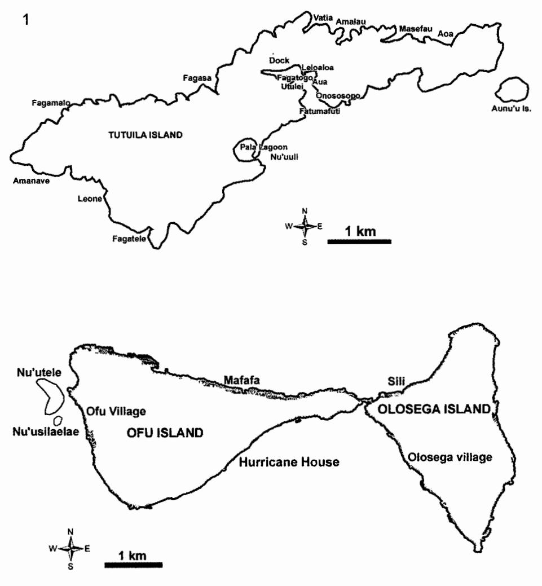
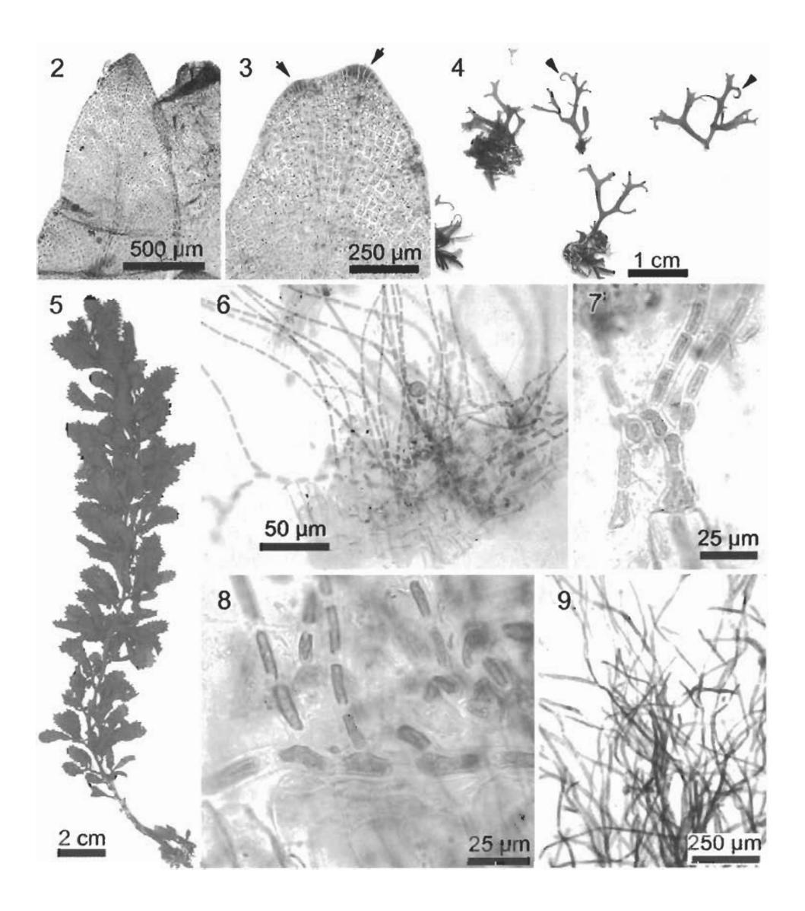
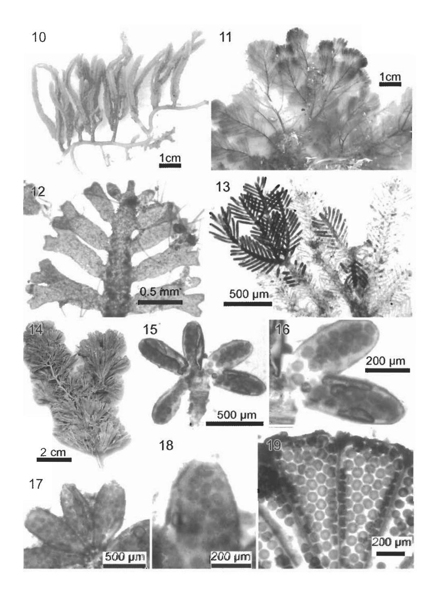

Cryptogamie, Algol., 2004, 25 (3): 291-312 © 2004 Adac. Tous droits réservés

# New records and notes on marine benthic algae of American Samoa-Chlorophyta & Phaeophyta1

Posa A. SKELTON\* & G. Robin SOUTH

International Ocean Institute (Australia) PO Box 1539 Townsville, Qld 4810, Australia

(Received 30 April 2004, accepted 27 May 2004)

**Abstract** — A total of 43 species are added to the previously known flora of the benthic marine algae of American Samoa (8 Phaeophyta, 35 Chlorophyta), raising the known flora to 230 species. More new additions to the flora can be anticipated when Rhodophyta and Cyanophyta collected during recent surveys, and older unworked collections, are examined. Most of the additions reported here have a widespread Indo-Pacific distribution. *Sporocladopsis erythraea* Nasr (Chlorophyceae, Chaetophorales) was found epiphytic on the base of *Sargassum anapense* Setchell *et* Gardner, the first record outside its type locality (Red Sea).

American Samoa / benthic marine algae / Chlorophyta / new records / Phaeophyta / Sporocladopsis erythraea

Résumé — Nouvelles signalisations et notes sur des algues marines benthiques des îles Samoa américaines — Chlorophyta & Phaeophyta. 43 espèces au total sont ajoutées à la flore précédemment connue des algues marines des îles Samoa américaines (8 Phaeophyta, 35 Chlorophyta), augmentant le nombre d'espèces connues jusqu'à 230. Beaucoup de ces nouvelles additions à la flore pouvaient être prévisibles à l'examen des Rhodophyta et Cyanophyta récoltées récemment et des anciennes collections non exploitées. La plupart de ces nouvelles espèces signalées ici ont une large répartition indo-pacifique. Sporocladopsis erythraea Nasr (Chlorophyceae, Chaetophorales) a été trouvée en épiphyte sur la base de Sargassum anapense Setchell et Gardner, et pour la première fois en dehors de sa localité type (Mer Rouge). (Traduit par la Rédaction).

Algues marines benthiques / Samoa américaines / Chlorophyta / nouvelles signalisations / Phaeophyta / Sporocladopsis erythraea

1. We are pleased to dedicate this paper in honour of Izzie Abbott's 85th birthday. For both of us Izzie has been a great friend, mentor and role model in our studies of tropical Pacific benthic marine algae. We know of nobody else who has the enthusiasm and such an in-depth knowledge of these challenging algae, and we look forward to working with her over the coming years as we continue to learn about these fascinating algae.

\* Correspondence and reprints: posa.skelton@impac.org.au Communicating editor: John Huisman

### INTRODUCTION

Much of our knowledge on the marine algal flora of American Samoa (14°S, 168-171°W) is credited to William Albert Setchell, who published a fairly comprehensive flora of the islands in 1924. Setchell employed the assistance of many able collectors from abroad and locally, and the collections were mostly from the intertidal to the shallow subtidal zone, with deeper collections possible through dredging. Setchell compiled 100 species, including 13 Cyanophyta, 47 Rhodophyta, 11 Phaeophyta and 29 Chlorophyta, from about 15 sites, primarily on Tutuila and Aunu'u islands. The inner Pago Pago Harbour received much of Setchell's attention and over 60 species were found, with four new to science (Setchell, 1924; summarised in Skelton, 2003a).

Known collectors since Setchell are listed in Table 1. Specimens collected by them are scattered in many herbaria but the majority are housed at BISH and UC. A compilation of all known algae from the Samoa Archipelago (including American Samoa) was made by the authors (Skelton & South, 1999), and remains a foundation for modern treatment of algae from Samoa. Littler & Littler (2003) published an illustrated guide to common seaweeds of the South Pacific in which 33 species were attributed to American Samoa, the majority of which are new records, including 3 Phaeophyta and 6 Chlorophyta.

In 2002, the authors participated in invasive species surveys carried out by the Pacific Biological Survey of the Bishop Museum (Coles *et al.*, 2003). This was followed by an invitation by the Department of Marine & Wildlife Resources (DMWR), Government of American Samoa to do further algal surveys of the Manu'a Group and other sites that were not surveyed during the invasive species initiative (Coles *et al.*, 2003 and Skelton, 2003b). Some of the findings include new additions to Setchell's list, of which the Chlorophyta and Phaeophyta are reported herein.

Table 1. Chronology of known algal collectors of American Samoa.

| Collector               | Date       | Herbarium   |
|-------------------------|------------|-------------|
| W.A. Setchell           | 1920       | UC; BISH    |
| A.L. Treadwell          | 1920       | UC; BISH    |
| F.A. Potts              | 1920       | UC; BISH    |
| TASCA Expedition        | 1935       | UC          |
| H. Wray                 | 1938       | BISH        |
| L.B. Loring             | 1958       | BISH        |
| R. Tsuda                | 1963       | BISH        |
| R. Buggeln              | 1964       | BISH        |
| Ah Sue                  | 1964       | BISH        |
| C.H. Lamoureux          | 1965       | BISH        |
| . Randall               | 1971; 1974 | BISH        |
| M.S. Doty               | 1975       | BISH        |
| M.D. Hoyle              | 1975       | BISH        |
| D. Littler & M. Littler | 1990       | US          |
| P. Gabrielson           | 1998       | Personal    |
| P. Vroom                | 2000       | BISH        |
| P.A. Skelton            | 2002; 2003 | SUVA; BISH* |

\* Specimens to be deposited pending completion of analysis.

Fig. 1. Map of Tutuila Island (above); Ofu and Olosega (below) showing the collecting sites. (Maps courtesy of the Department of Marine and Wildlife Resources, Government of American Samoa).

# MATERIALS AND METHODS

26 sites were surveyed (see Fig. 1, Table 2). Collections were made by snorkelling, wading, intertidal sampling, and scuba-diving. All specimens were preserved in 4% formalin/seawater solution for 2 days, and were shipped to Australia for further analysis. The collecting sites and details are given in Table 2.

Specimens were pressed on herbarium sheets or mounted on slides. Slide specimens were stained with aniline blue and mounted in a 30% karo solution.

| Table 2. Collecting sites (see Fig. 1). TI – Tutuila Island; OF – Ofu Island; OL – Olosega Island; | nd: |
|----------------------------------------------------------------------------------------------------|-----|
| AU – Aunu'u Island.                                                                                |     |

| Station No. | Date Collected | Locality              | GPS          |              |
|-------------|----------------|-----------------------|--------------|--------------|
|             |                |                       | Lat.         | Long.        |
| 1           | 16-Oct-02      | Amalau (TI)           | 14°15.160'   | 170°39.527'  |
| 2           | 16-Oct-02      | Vatia (TI)            | 14°14.79'    | 170°40.10'   |
| 3           | 13-Oct-02      | Utulei (TI)           | 14°17.02'    | 170°40.67°   |
| 4           | 15-Oct-02      | Dock 1 (TI)           | 14°16.59'    | 170°41.26'   |
| 5           | 17-Oct-02      | Onososopo (TI)        | 14°17.18'    | 170°39.89'   |
| 6           | 14-Oct-02      | Fagatele Bay (TI)     | 14°21.96'    | 170°45.85°   |
| 7           | 16-Oct-02      | Fagasa (TI)           | 14°17.01'    | 170°43.36'   |
| 8           | 16-Oct-02      | Leone (TI)            |              |              |
| 9           | 17-Oct-02      | Leloaloa (TI)         | 14°16.22'    | 170°40.61'   |
| 10          | 17-Oct-02      | Aua (TI)              | 14°16.70'    | 170°40.16'   |
| 11          | 24-Sep-03      | Mafafa (OF)           | S14°10.045'  | W169°38.502' |
| 12          | 22-Sep-03      | Sili (OL)             | S14º10.032'  | W169°37.553' |
| 13          | 16-Sep-03      | Fagatogo (TI)         | S14°16.618'  | W170°40.827' |
| 14          | 10-Sep-03      | Fatumafuti (TI)       | S14°17.645'  | W170°40.496' |
| 15          | 12-Sep-03      | Aoa Bay (TI)          |              |              |
| 16          | 11-Sep-03      | Nu'u'uli (TI)         | S14º19.215'  | W170°41.812' |
| 17          | 17-Sep-03      | Aunu'u Is. (AU)       | S14º16.994'  | W170°33.665' |
| 18          | 10-Sep-03      | Fagaalu (TI)          | \$14°17.389' | W170°40.549' |
| 19          | 12-Sep-03      | Masefau (TI)          |              |              |
| 20          | 13-Sep-03      | Amanave (TI)          | S14°19.544'  | W170°49.849' |
| 21          | 16-Sep-03      | Nu'usilaelae Is. (OF) | S14º10.281'  | W169°41.057' |
| 22          | 13-Sep-03      | Fagamalo (TI)         | S14°17.903'  | W170°48.612' |
| 23          | 20-Sep-03      | Olosega (OL)          | S14º11.023'  | W169°37.162' |
| 24          | 20-Sep-03      | Hurricane House (OF)  | S14º10.665'  | W169°39.255' |
| 25          | 18-Sep-03      | Nu'utele Is. (OF)     | S14º10.167'  | W169°41.015' |
| 26          | 23-Sep-03      | Ofu (OF)              | S14°09.819'  | W169°40.860' |

Slide preparations were examined using a Nikon© SMZ645 dissecting microscope and an Olympus© CX31 compound microscope. Images were taken using a Nikon Coolpix© 990 digital camera and arranged in plates using Adobe Photoshop© 6.0 software.

The specimens are assigned the author's field numbers (AS), pending their deposit in the Phycological Herbarium of the South Pacific Regional Herbarium (SUVA-A). Duplicates will be deposited at BISH and at the Department of Marine and Wildlife Resources, Government of American Samoa.

## **RESULTS**

The classification follows Silva *et al.* (1996). Our surveys yielded 35 Chlorophyta and 8 Phaeophyta species as new additions to Setchell's list and are reported below (see Table 3).

# Phaeophyta

# Phaeophyceae

Dictyotales: Dictyotaceae

**Dictyopteris repens** (Okamura) Børgesen 1924: 265, fig. 13. Basionym: *Haliseris repens* Okamura 1916: 8, fig. 3, pl. I: figs 7-18 (type locality: Chuuk Islands, Caroline Islands). (Figs 2-3).

This common alga is often found epiphytic on larger algae. *Dictyopteris delicatula* Lamouroux, another common epiphytic alga, is morphologically similar to *D. repens*. The two can be differentiated by a submarginal rib in *D. delicatula* whereas the margins of *D. repens* remain distromatic. Furthermore, the distribution of *D. delicatula* appears to halt in Fiji with no reports of its presence in Samoa.

Voucher specimens: Tutuila Island: Vatia Bay, S. Coles, P. Reath, V. Bonito, P. Skelton & L. Basch 16.x.2002 (AS 28); Utulei, S. Coles, P. Reath, V. Bonito, P. Skelton & L. Basch 13.x.2002 (AS 55); Fagatele Bay, S. Coles, P. Reath, V. Bonito, P. Skelton & L. Basch 14.x 2002 (AS 129, AS 139); Fagasa, P.A. Skelton 16.x.2002 (AS 207); Fagaalu, P.A. Skelton 10.ix. 2003 (AS 458). Olosega Island: Sili Village, P.A. Skelton & E. Henry 22.ix.2003 (AS 386). Ofu Island: Nu'usilaelae Islet, P.A. Skelton 24.ix.2003 (AS 494); Aoa Bay, P.A. Skelton 12.ix.2003 (AS 510).

Other record: Fagatele Bay, Birkeland et al. 1987 (BISH).

**Dictyota bartayresiana** Lamouroux 1809a: 43 (type locality: probably Haiti *fide* De Clerck, 1999).

This conspicuous brown alga is frequently seen in the intertidal or shallow subtidal zones. Due to the exposed nature of the fringing reefs of American Samoa *D. bartayresiana* does not reach the great sizes (i.e. 10-20 cm wide) as seen in neighbouring Samoa (Skelton pers. obs.). The majority of specimens collected are of small stature (ca thallus 2 mm wide, 2 cm tall).

Voucher specimens: Tutuila Island: Fagasa Bay, P.A. Skelton 16.x.2002 (AS 208); Utulei, S. Coles, P. Reath, V. Bonito & P. Skelton 13.x.2002 (AS 246).

*Dictyota friabilis* Setchell 1926: 91-92, pl. 13: figs 4-7; pl. 20: fig. 1 (type locality: Tafaa Point, Tahiti).

This appears to be the only truly epiphytic *Dictyota* species in American Samoa. It tends to grow in the same plane as the host, but occasional erect unattached fronds have also been collected. The specimens at hand agree with the concept of this species as prescribed by Setchell (1926) for French Polynesian plants.

Voucher specimens: Tutuila Island: Utulei, S. Cole, P. Reath, V. Bonito, P. Skelton & L. Basch 13.x.2002 (AS 33, AS 118); Fagatele Bay S. Cole, P. Reath, V. Bonito, P. Skelton & L. Basch 14.x.2002 (AS 126); Fagasa, P.A. Skelton 16.x.2002 (AS 189).

Other records: Tutuila Island: Fagasa Bay, Birkeland et al. 1985 (BISH); Fagatele Bay, Birkeland et al. 1987 (BISH). Pala Lagoon, M.S. Doty 4.v.1975 (BISH 556690).

**Dictyota hamifera** Setchell 1926: 92 (type locality: French Polynesia). (Fig. 4) This very distinctive *Dictyota* species has tendrils that function as hooking devices for attachment purposes. A single collection was made from Nu'utele Islet near the exposed channel.

**Voucher specimens:** Of u Island: Nu'utele Islet, *P.A. Skelton* 19.ix.2003 (AS 607).

Figs 2-9. Figs 2-3. *Dictyopteris repens* (fig. 2) thallus showing the faint mid-rib; (fig. 3) the growing cells (arrows) and the beginning of the sub-opposite branching. Fig. 4. *Dictyota hamifera* pressed specimens showing the tendrils (arrows). Fig. 5. *Sargassum* sp. pressed specimen. Figs 6-8. *Sporocladopsis erythraea* (fig. 6) habit; (figs 7 & 8) showing the prostrate system and the basal part of erect thalli. Fig. 9. *Derbesia marina* habit of the sporophyte stage.

# Dictyota sp.

This epilithic *Dictyota* is characterised by its iridescent greenish-blue colour, growing subtidally in fairly strong current. It forms a turf community with other algae, but stands out by the iridescent blades. Only infertile material was collected and appears to be quite distinct from the other epiphytic *Dictyota* species (*D. friabilis*). Determination would be possible following the collection of reproductive specimens.

**Voucher specimens:** Of u Island: Hurricane House, *P.A. Skelton* 20.ix.2003 (AS 590).

Lobophora variegata (Lamouroux) Womersley ex Oliveira 1977: 217. Basionym: Dictyota variegata Lamouroux 1809a: 40 (type locality: Antilles, West Indies). Nomenclatural synonyms: Zonaria variegata (Lamouroux) C. Agardh 1817: XX. Pocockiella variegata (Lamouroux) Papenfuss 1943: 463-468, figs 1-15.

This very common and widespread alga grows close to the substratum often forming fan-shaped blades that may overlap. There does not seem to be a preferred substratum for this alga, as specimens have been collected from base of *Sargassum*, rock, rubble, bases of living corals, concrete blocks, buoys and other discarded objects.

Voucher specimens: Tutuila Island: Amalau, P.A. Skelton 16.x.2002 (AS 13); Utulei, S. Cole, P. Reath, V. Bonito, P. Skelton & L. Basch 13.x.2002 (AS 117); Fagatele Bay, S. Cole, P. Reath, V. Bonito, P. Skelton & L. Basch 14.x.2002 (AS 127); Aua, P.A. Skelton 12.x.2002 (AS 310); Nu'uuli, P.A. Skelton 11.ix.2003 (AS 424); Fagaalu, P.A. Skelton 10.ix.2003 (AS 450). Ofu Island: Nu'utele Islet, P.A. Skelton 19.ix.2003 (AS 581).

**Padina boryana** Thivy in W.R. Taylor 1966: 355-356, fig. 2 (type locality: Tonga).

This alga is closely related to *P. australis* Hauck, both having mostly distromatic blades. The arrangement of the sporangia and hair bands is currently perceived as an important distinguishing feature. Furthermore, the *Vaughaniella* (mat-like filamentous phase) is known in *P. boryana* but not yet recorded for *P. australis*. American Samoan specimens were mostly depauperate and growing in tide-pools in the intertidal zone.

**Voucher specimens:** Tutuila Island: Fagatogo, *P.A. Skelton* 16.ix.2003 (AS 392).

### Fucales: Sargassaceae

Sargassum cf. cristaefolium C. Agardh 1820: 13 (type locality: unknown). (Fig. 5)

This entity should probably be attributed to the widely distributed Sargassum cristaefolium C. Agardh. Littler & Littler (2003) illustrated Sargassum tenerrimum J. Agardh from American Samoa (Table 3), which appears to be different from our plants by their straight, lance-shaped blades, compared to slightly curled blades.

**Voucher specimens:** Of u Island: Nu'utele Islet, *P.A. Skelton* 19.ix.2003 (AS 596).

# Chlorophyta

Chlorophyceae

Chaetophorales: Chroolepidaceae

Sporocladopsis erythraea Nasr 1944: 33 (type locality: Red Sea). (Figs 6-8) This rarity was collected only from Amalau, epiphytic on the base of Sargassum anapense Setchell. Currently only two species are known for the genus, with the second species – Sporocladopsis novae-zelandiae Chapman recorded from New Zealand and New South Wales, Australia (Millar & Kraft, 1994).

**Voucher specimens:** Tutuila Island: Amalau, P.A. Skelton 16.x.2002 (AS 5).

Cladophorales: Cladophoraceae

**Rhizoclonium africanum** Kützing 1853: 21, pl. 67 (2) (type locality: Senegambia [Senegal or Gambia], Africa). Taxonomic synonym: *Rhizoclonium samoense* Setchell 1924: 177, fig. 42.

This common alga was found mainly in the high intertidal zone. We examined Setchell's material (*R. samoense* UC 233513!) and agree with Womersley & Bailey (1970) who merged *R. samoense* with *R. africanum*.

Voucher specimens: Tutuila Island: Main Dock, Pago Pago Harbour, P.A. Skelton 15.x.2002 (AS 59); Fagatele Bay, S. Cole, P. Reath, V. Bonito, P. Skelton & L. Basch 14.x.2002 (AS 151); Aua, P.A. Skelton 12.x.2002 (AS 287, AS 313).

Siphonocladaceae

**Boergesenia forbesii** (Harvey) J. Feldmann 1938: 1503-1504. Basionym: Valonia forbesii Harvey 1860: 333 (syntype localities: Ryukyu-retto, Japan; Sri Lanka). Nomenclatural Synonym: Pseudovalonia forbesii (Harvey) Iyengar 1938: 191-194, figs 1-4.

This clavate shaped green alga is found in the shallow intertidal, usually in coarse sand. In exposed sites, the plants are usually depauperate and barely visible. Some of the materials collected were fertile.

**Voucher specimens:** Ofu Island: Mafafa, *P.A. Skelton* 24.ix.2003 (AS 316); Ofu Village, *P.A. Skelton* 19.ix.2003 (AS 612). Tutuila Island: Amanave, *P.A. Skelton* 13.ix.2003 (AS 483).

Other records: Tutuila Island: Amanaue (Amanave) Village, R.T. Tsuda 4.ix.1963 (BISH 508914); Tula, R. T. Tsuda 26.viii.1963 (BISH 508913); Avasi Bay, Anon. ND. (BISH 511839).

**Boodlea montagnei** (Harvey ex J. Gray) Egerod 1952: 332, footnote. Basionym: *Microdictyon montagnei* Harvey ex J. Gray 1866: 69 (type locality: Tonga). Taxonomic synonym: *Boodlea paradoxa* Reinbold 1905: 148-149.

A common component of the intertidal flora, forming delicate spongy cushions, often of a light green colour when exposed. Filaments anastomosing frequently resulting in a three-dimensional network; anastomosing by small septate cells issued from the apex of primary branch with crenulated ends on contact with secondary branch. The placement of this entity under *Boodlea* rather than *Microdictyon* follows the treatment of Egerod in Papenfuss & Egerod (1957) and Abbott & Huisman (2004).

**Voucher specimens:** Tutuila Island: Utulei Point, *P.A. Skelton* 13.x.2002 (AS 42; AS 102); Fagatele Bay, *P.A. Skelton* 14.x.2002 (AS 148); Fagaalu, *P.A. Skelton* 10.ix.2003 (AS 460).

*Cladophoropsis carolinensis* Trono 1971: 48, pl. 3, figs 1-5 (type locality: Utwa Village, Kosrae Is. Caroline Islands).

This alga represented by a few specimens is found mainly in the high

intertidal. It forms dark fleecy mats on rocks or other substrata.

Voucher specimens: Tutuila Island: Fagatele Bay, S. Cole, P. Reath, V. Bonito, P. Skelton & L. Basch 14.x.2002 (AS 155); Leone, P.A. Skelton 19.x.2002 (AS 230); Aua, P.A. Skelton 12.x.2002 (AS 286). Ofu Island: Nu'utele Islet, P.A. Skelton 19.x.2003 (AS 602).

Cladophoropsis herpestica (Montagne) Howe 1914: 31. Basionym: Conferva herpestica Montagne 1842: 15 (type locality: Bay of Islands, New Zealand).

Specimens were collected from the intertidal and is tentatively placed in this species because of its larger filament diameter (> 200  $\mu$ m) compared to *C. carolinensis* (< 200  $\mu$ m diam.).

Voucher specimens: Tutuila Island: Leloaloa, P.A. Skelton 17.x.2002 (AS 81).

*Dictyosphaeria cavernosa* (Forsskål) Børgesen 1932: 2. Basionym: *Ulva cavernosa* Forsskål 1775: 187 (syntype localities: Gomfodae [Al-Qunfudhah], Saudi Arabia; Mokha, Yemen).

This rarely collected intertidal alga is less abundant than *Dictyosphaeria* versluysii Weber-van Bosse, and is distinguished by its hollow thallus.

**Voucher specimens:** Tutuila Island: Onososopo, *P.A. Skelton* 12.x.2002 (AS 67). Ofu Island: Nu'utele Islet, *P.A. Skelton* 19.ix.2003 (AS 571).

*Phyllodictyon anastomosans* (Harvey) Kraft *et* Wynne 1996: 131, figs 16-25. Basionym: *Cladophora anastomosans* Harvey 1859: pl. Cl (type locality: Fremantle, Western Australia).

This fairly common but delicate alga is found in most habitats except exposed places. It has a cylindrical siphonous stalk bearing a leaf-shaped meshwork in the upper fronds with plants reaching a few centimetres in height. The placement of *Phyllodictyon* under the family Siphonocladaceae follows the results of Leliaert *et al.* (2003).

Voucher specimens: Ofu Island: Hurricane House, P.A. Skelton & E. Henry 20.ix.2003 (AS 593); Ofu Village, P.A. Skelton 19.ix.2003 (AS 616).

#### Valoniaceae

Valonia aegagropila C. Agardh 1823 [1822-1823]: 429-430 (type locality: Nenezia, Italy).

The recognition of this Mediterranean species from the tropics needs further study. The material recognised here as belonging to this species is clumpy in appearance with cells or vesicles arising in a disorderly direction, compared to arising sub-terminally as in *V. fastigiata*. This disorderly and depauperate presentation may be attributed to the habitat, being exposed and with a strong current flow.

**Voucher specimens:** Tutuila Island: Vatia Bay, *P.A. Škelton* 16.x.2002 (AS 26); Leone, *P.A. Skelton* 19.x.2002 (AS 233).

Valonia macrophysa Kützing 1843: 307 (type locality: Lessina, Croatia). Only a few delicate specimens were collected from the subtidal. The cells are slightly bigger than V. aegagropila (5-7 mm compared to 2-5 mm).

Voucher specimens: Ofu Island: Mafafa, P.A. Skelton 24.ix.2003 (AS 326).

**Bryopsidales: Caulerpaceae** 

Caulerpa cupressoides (Vahl) C. Agardh 1817: XXIII. Basionym: Fucus cupressoides Vahl 1802: 38 (type locality: St Croix, Virgin Islands). (Fig. 10)

This species was common on Ofu and Islands, but absent from Tutuila and Aunu'u Islands. Populations occur on coarse sand, rock and rubble substrata in the high intertidal zone and tide pools, with moderate to fast water flow. The plants have a spreading stolon and erect thalli to 5 cm tall, attached by fine root-like rhizoids. The erect thallus forms small bushy and sometimes twisted branches bearing dentate ramuli. The ramuli are arranged either distichously or trigonously. Three growth forms (f. *disticha* Weber-van Bosse; f. *plumarioides* Børgesen; f. *lycopodium* Weber-van Bosse) were observed from the American Samoa populations, appearing to be environmentally induced.

Voucher specimens: Ofu Island: Mafafa, P.A. Skelton 24.ix.2003 (AS 318; AS 321; AS 322; AS 338). Olosega Island: Olosega Village, P.A. Skelton & E. Henry 20 ix. 2003 (AS 546). Tutuila Island: Amanave, P.A. Skelton 13.ix.2003 (AS 481; AS 529):

Caulerpa racemosa var. peltata (Lamouroux) Eubank in Stephenson 1944: 349.

This variety is recognised as having both compressed and sub-globose racemes on an individual plant.

**Voucher specimens:** Tutuila Island: Utulei, *P.A. Skelton* 13.x.2002 (AS 39). Ofu Island: Mafafa, *P.A. Skelton* 24.ix.2003 (AS 317). Olosega Island: Olosega Village, *P.A. Skelton* & *E. Henry* 20.ix.2003 (AS 551).

Caulerpa racemosa var. turbinata (J. Agardh) Eubank 1946: 420-421, figs 20-q. Basionym: Caulerpa clavifera var. turbinata J. Agardh 1837: 173 (type locality: near Tor, Sinai Peninsula, Egypt). Nomenclatural synonym: Caulerpa racemosa f. turbinata (J. Agardh) Weber-van Bosse 1898: 370-371, pl. XXXI: fig. 8). Taxonomic synonyms: Fucus chemnitzia Esper 1800 [1797-1800]: 167-168, pl. LXXXVIII: figs 1, 4-6. Caulerpa chemnitzia (Esper) Lamouroux 1809b: 332. Ahnfeldtia chemnitzia (Esper) Trevisan 1849: 141. Chauvinia chemnitzia (Esper) Kützing 1849: 499. Caulerpa racemosa var. chemnitzia (Esper) Weber-van Bosse 1898: 370-373.

This variety of *C. racemosa* is distinguished by the turban-shaped racemes. Found growing on a rock in the shallow intertidal.

**Voucher specimen:** Of u Island: Mafafa, *P.A. Skelton* 24.ix.2003 (AS 325).

Caulerpa serrulata (Forsskål) J. Agardh 1837: 174. Basionym: Fucus serrulatus Forsskål 1775: 189 (type locality: Mokha, Yemen). Taxonomic synonym: Caulerpa freycinetii C. Agardh 1823 [1822-1823]: 446.

Common in the intertidal or in tide pools, less common subtidally. Occurs on most substrata (sand, rubble, rock, and discarded materials) in moderate to fast current flow. The abundance of this alga, especially near the harbour where plant sizes are relatively tall (5 cm), may indicate that it has recently been introduced, as suggested by Skelton (2003a). However, a sizeable population of diminutive plants (2 mm) was found on Ofu-Olosega islands, suggesting that it is native but has been overlooked.

Voucher specimens: Tutuila Island: Utulei, P.A. Skelton 13.x.2002 (AS 31; AS 101; 107); Fagatele Bay, S. Coles, P. Reath, V. Bonito & P.A. Skelton 14.x.2002 (AS 168); Fagasa, P.A. Skelton, S. Coles, P. Reath, V. Bonito & L. Basch 16.x.2002

(AS 196); Onososopo, P.A. Skelton, S. Coles, P. Reath, V. Bonito & L. Basch 17.x.2002 (AS 260). Fagatogo, P.A. Skelton 16.ix.2003 (AS 501). Olosega Island: Olosega Village, P.A. Skelton & E. Henry 20.ix.2003 (AS 552); Ofu Island: Mafafa, P.A. Skelton 24.ix.2003 (AS 323); Ofu Village, P.A. Skelton 19.ix.2003 (AS 611).

Other record: Swains Atoll, Anon. ND (BISH 542705).

Caulerpa taxifolia (Vahl) C. Agardh 1817: XXII. Basionym: Fucus taxifolius Vahl 1802: 36 (type locality: St Croix, Virgin Islands).

This rarely encountered alga in Samoa is represented by a few specimens, quite a contrast to a genetically varied but morphologically alike form that has an invasive status in the Mediterranean and parts of Australia. It grows in close association with other *Caulerpa* species in shallow intertidal places, usually on coarse sandy substratum.

**Voucher specimens:** Ofu Island: Mafafa, *P.A. Skelton* 24.ix.2003 (AS 336). Olosega Island: Olosega Village, *P.A. Skelton & E. Henry* 20.ix.2003 (AS 547).

Caulerpa verticillata J. Agardh 1847: 6 (type locality: probably West Indies). (Fig. 11)

The species has only been found from one site (Pala Lagoon) near the largest remaining mangroves. It was found epiphytic on *Halimeda opuntia* (Linnaeus) Lamouroux, as well as growing on rock and decaying logs in the shallow intertidal.

**Voucher specimens:** Tutuila Island: Pala Lagoon, Nu'uuli, *P.A. Skelton* 11.ix.2003 (AS 425).

Caulerpa webbiana Montagne 1837: 354 (type locality: Arrecife, Isla Lanzarote, Islas Canarias). (Fig. 12)

The specimens are all small (to 1 cm tall), and heavily epiphytised by foraminifera. Found in the shallow intertidal, in tide pools and on large carbonate structures. Plants form a green fuzz in the coarse sand, barely visible during collection. The ramuli are arranged either distichously (f. *distichous* Weber-van Bosse – fig. 12) or whorled (f. *pickeringii* (Harvey *et* Bailey) Eubank). The ramuli are forked with two distinctive mucronate tips at the apex. The form *pickeringii* is still recognized as a distinct species by some (Littler & Littler, 2003), whereas we follow Kraft (2000) and South & Skelton (2003a; 2003b) in treating it as a form of *C. webbiana*.

**Voucher specimens:** Of u Island: Amanave, *P.A. Skelton* 13.ix.2003 (AS 525).

Caulerpella ambigua (Okamura) Prud'homme et Lokhorst 1992: 114. Basionym: Caulerpa ambigua Okamura 1897: 4, pl. I: figs 3-12 (type locality: Ogasawara-gunto [Bonin Islands] Japan). Taxonomic synonyms: Caulerpa vickersiae Børgesen 1911: 129-132, fig. 2. Caulerpa biloba Kemperman et Stegenga 1983: 271, figs 1-7. (Fig. 13)

A common component of turf algal communities in the shallow subtidal reefs, growing on rocks and large carbonate structures. Plants are small, to 5 mm tall, and have a weakly defined stolon. Attachment is by short branched rhizoids with the erect fronds branching dichotomously to trichotomously. The ramuli are distichous, occasionally whorled, and lacking constrictions at the base, with rounded apices. The ramuli pattern is variable, commonly in a series of longest pairs at the bottom giving rise to a few short pairs, then reverting back to long pairs and so forth, and frequently some sections are devoid of ramuli.

Voucher specimens: Tutuila Island: Fagatele Bay, S. Coles, P. Reath, V. Bonito & P.A. Skelton 14.x.2002 (AS 157).

### Codiaceae

Codium cf. mamillosum Harvey 1855: 565 (type locality: Swan River, Western Australia). Nomenclatural synonym: Lamarckia mamillosa (Harvey) Kuntze 1891: 900.

A single specimen was collected from Utulei Point, near the mouth of Pago Pago Harbour. The spherical shape is reminiscent of *C. mamillosum*, which has been recorded from Fiji (South & Skelton 2003a) and other nearby Pacific Island countries. The specimen is small (1 cm diam.), and is tentatively placed under this species.

Voucher specimens: Tutuila Island: Utulei, S. Cole, P. Reath, V. Bonito, P. Skelton & L. Basch 13.x.2002 (AS 178)

### Derbesiaceae

Derbesia marina (Lyngbye) Solier 1846: 453. Basionym: Vaucheria marina Lyngbye 1819: 79, pl. 22A (sporophyte) (type locality: Kvivig, Strφmφ, Faeroes). Taxonomic synonyms: Gastridium ovale Lyngbye 1819: 72, pl. 18B (gametophyte). Halicystis ovalis (Lyngbye) Areschoug 1850: 447. (fig. 9)

This fairly common alga is found from intertidal to subtidal sites. Two very contrasting morphological stages are reported, the spherical *Halicystis* or the gametophytic stage and the filamentous *Derbesia* sporophytic stage. The latter stage was the only stage found at American Samoa. The cylindrical filaments (40-62.5 µm diam.) are irregularly and sparsely branched, with a double septum at the base of some branches, and are found entangled with other algae.

**Voucher specimens:** Tutuila Island: Fagatele Bay, S. Cole, P. Reath, V. Bonito, P. Skelton & L. Basch 13.x.2002 (AS 131).

### Halimedaceae

Halimeda gracilis Harvey ex J. Agardh 1887: 82 (type locality: Sri Lanka). Common in the upper subtidal (ca 5 m depth) in moderate water flow. The segments are reminiscent of Halimeda opuntia (Linnaeus) Lamouroux but are larger and less profusely branching in more than one plane.

Voucher specimens: Tutuila Island: Vatia Bay, S. Cole, P. Reath, V. Bonito, P. Skelton & L. Basch 16.x.2002 (AS 20); Leloaloa, S. Cole, P. Reath, V. Bonito, P. Skelton & L. Basch 17.x.2002 (AS 85); Aoa Bay, P.A. Skelton 12.ix.2003 (AS 354);

Figs 10-19. Fig. 10. Caulerpa cupressoides habit of a pressed specimen. Fig. 11. Caulerpa verticillata habit of a wet specimen. Fig. 12. Caulerpa webbiana f. disticha habit of a slide-preserved specimen. Fig. 13. Caulerpella ambigua habit. Fig. 14. Tydemania expeditionis habit of pressed specimen. Figs 15 & 16. Parvocaulis clavata (fig. 15) habit showing 5 rays; (fig. 16) close up of two rays showing the spherical to sub-spherical gametangia. Figs 17 & 18. Parvocaulis exigua (fig. 17) part of the habit showing fused rays confining to the base; (fig. 18) close up of a ray with young gametangia and a slightly protruding apex. Fig. 19. Parvocaulis parvula part of the habit showing fused rays bearing spherical gametangia.

Fatumafuti, P.A. Skelton 10.ix.2003 (AS 398); Fagaalu, P.A. Skelton 10.ix.2003 (AS 468). Ofu Island: Hurricane House, P.A. Skelton & E. Henry 20.ix.2003 (AS 563). Other records: Vatia Bay, Randall & Devaney 1974 (BISH).

Halimeda macroloba Decaisne 1841: 118 (type locality: Red Sea).

Another common mid-to-high intertidal alga, characterised by its large, round to reniform segments.

**Voucher specimens:** Tutuila Island: Masefau Bay, *P.A. Skelton* 12.ix.2003 (AS 633).

*Halimeda* cf. *macrophysa* Askenasy 1888: 14, pl. IV: figs 1-4 (type locality: Matuku Island, Fiji).

**Voucher specimens:** Tutuila Island: Fagaalu, *P.A. Skelton* 10.ix.2003 (AS 472).

*Halimeda minima* (Taylor) Colinvaux 1968: 32, figs 5, 6. Basionym: *Halimeda opuntia* f. *minima* Taylor 1950: 82, pl. 39, fig. 2. (type locality: Bikini Lagoon, Bikini Atoll, Marshall Islands).

Voucher specimens: Tutuila Island: Fagasa, P.A. Skelton, S. Coles, P. Reath, V. Bonito & L. Basch 16.x.2002 (AS 187).

### Udoteaceae

Rhipidosiphon javensis Montagne 1842: 14-15 (type locality: Leiden Island [Nyamuk-besar], near Jakarta, Java, Indonesia). Nomenclatural synonym: *Udotea javensis* (Montagne) A. Gepp *et* E. Gepp 1904: 363-364, pl. 467: figs 1-4. Common alga in tide-pools, intertidal and shallow subtidal.

Voucher specimens: Ofu Island: Mafafa, P.A. Skelton 24.ix.2003 (AS 331); Hurricane House, P.A. Skelton & E. Henry 20.ix.2003 (AS 592); Nu'utele Islet, P.A. Skelton 19.ix.2003 (AS 615).

*Tydemania expeditionis* Weber-van Bosse 1901: 139-140 (syntype localities: various in Indonesia). Taxonomic synonyms: *Tydemania gardineri* A. Gepp *et* E. Gepp 1911: 67-68, 141, pl. XVIII: fig. 155. *Tydemania mabahithae* Nasr 1944: 40-41. (Fig. 14)

One of the few algae that is common in some sites, especially on Ofu and Olosega islands but rare in others (e.g. Tutuila and Aunu'u islands). It is found from the subtidal to the lower intertidal, usually on the side of large bommies. Of the two forms known – flabellate versus verticillate, only the flabellate form has been collected.

**Voucher specimens:** Olosega Island: Sili Village, *P.A. Skelton & E. Henry* 22.ix.2003 (AS 376). Ofu Island: Hurricane House, *P.A. Skelton & E. Henry* 20.ix.2003 (AS 560).

# Dasycladales: Dasycladaceae

**Neomeris van-bosseae** Howe 1909: 80-82, pl. 1: figs 4, 6; pl. 5: figs 17-19 (van bosseae).

This common intertidal and tide-pool alga is distinguished from *N. annulata* by the lack of annular rings around the lower thallus.

**Voucher specimens:** Ofu Island: Mafafa, *P.A. Skelton* 24.ix.2003 (AS 324). Tutuila Island: Amanave, *P.A. Skelton* 13.ix.2003 (AS 480).

# Polyphysaceae

**Parvocaulis clavata** (Yamada) Berger *et al.* 2003: 559. figs 13, 27. Basionym: *Acetabularia clavata* Yamada 1934: 57, figs 24-25. Nomenclatural synonym: *Polyphysa clavata* (Yamada) Schnetter *et* Bula-Meyer 1982: 41, pl. 7, figs 1, b. (Figs 15-16)

Parvocaulis clavata is similar to P. exigua (Solms-Laubach) Berger et al. (2003) but can be separated by the rounded ray tips (versus mamillate tips in P. exigua). Moreover, the rays are arranged in a single plane (Abbott & Huisman 2004).

Voucher specimen: Of u Island: Mafafa, P.A. Skelton 24.ix.2003 (AS 320b).

*Parvocaulis exigua* (Solms-Laubach) Berger *et al.* 2003: 559, figs 14, 28. Basionym: *Acetabularia exigua* Solms-Laubach 1895: 28-29, pl. 2: figs 1, 4 (syntype localities: Indonesia: Macassar, Celebes and Sikka, Flores). Nomenclatural synonym: *Polyphysa exigua* (Solms-Laubach) Wynne 1995: 333, fig. 88. Taxonomic synonym: *Acetabularia tsengiana* Egerod 1952: 414, fig. 231. (Figs 17-18)

Parvocaulis exigua is common in the shallow intertidal and in tide-pools, but is rarely collected due to its small size. It grows on rubble and other carbonate structures usually in fairly calm to moderate water flow. It is often found growing with Parvocaulis parvula and P. clavata – two similar looking species. It can be separated from the other two species by the unattached oblong rays with mamillate tips. Abbott & Huisman (2004) observed the rays to be arranged in more than one plane, as opposed to the single plane in P. clavata.

**Voucher specimens:** Tutuila Island: Utulei, *S. Cole, P. Reath, V. Bonito, P. Skelton & L. Basch* 13.x.2002 (AS 38); Amanave, *P.A. Skelton* 13.ix.2003 (AS 484).

Parvocaulis parvula (Solms-Laubach) Berger et al. 2003: 559, figs 11, 25. Basionym: Acetabularia parvula Solms-Laubach 1895: 29, pl. 2: figs 3, 5 (syntype localities: 'Tropical India'; Celebes, Indonesia). Nomenclatural synonym: Polyphysa parvula (Solms-Laubach) Schnetter et Bula Meyer 1982: 42. (Fig. 19)

Closely associated with *P. exigua* and *P. clavata*, this alga can be separated by its fused obovoid rays and the non-mamillate tips.

**Voucher specimens:** Tutuila Island: Utulei, *S. Cole, P. Reath, V. Bonito, P. Skelton & L. Basch* 13.x.2002 (AS 115); Amanave, *P.A. Skelton* 13.ix.2003 (AS 482). Ofu Island: Mafafa, *P.A. Skelton* 24.ix.2003 (AS 320a).

### **DISCUSSION**

With the additions reported here, the latest compilation of marine benthic algal species reported from American Samoa is 230, comprising 133 Rhodophyta, 23 Phaeophyta and 74 Chlorophyta. The examination of Rhodophyta and Cyanophyta collections made during our surveys, as well as those made by previous collectors (scattered in various herbaria), will result in a further increase in algal diversity for the American Samoa flora.

Table 3. Chlorophyta and Phaeophyta so far known from American Samoa. Bold records are new additions to the flora; \* represents unconfirmed records.

| PHAEOPHYTA                                                                                                                                                                                                                                                                                                                                                                                                                                                                                                                                                                                                                                                                                                                                  | Reference                                                                                                                                                                                                                                                                                                                                                                                                                                                                                                             |  |
|---------------------------------------------------------------------------------------------------------------------------------------------------------------------------------------------------------------------------------------------------------------------------------------------------------------------------------------------------------------------------------------------------------------------------------------------------------------------------------------------------------------------------------------------------------------------------------------------------------------------------------------------------------------------------------------------------------------------------------------------|-----------------------------------------------------------------------------------------------------------------------------------------------------------------------------------------------------------------------------------------------------------------------------------------------------------------------------------------------------------------------------------------------------------------------------------------------------------------------------------------------------------------------|--|
| Asteronema breviarticulatum (J. Agardh) Ouriques et Bouzon                                                                                                                                                                                                                                                                                                                                                                                                                                                                                                                                                                                                                                                                                  | Setchell 1924; Skelton 2003a                                                                                                                                                                                                                                                                                                                                                                                                                                                                                          |  |
| Chnoospora minima (K. Hering) Papenfuss                                                                                                                                                                                                                                                                                                                                                                                                                                                                                                                                                                                                                                                                                                     | Setchell 1924; Littler & Littler 2003;                                                                                                                                                                                                                                                                                                                                                                                                                                                                                |  |
|                                                                                                                                                                                                                                                                                                                                                                                                                                                                                                                                                                                                                                                                                                                                             | Skelton 2003a (as C. implexa)                                                                                                                                                                                                                                                                                                                                                                                                                                                                                         |  |
| Dictyopteris repens (Okamura) Børgesen                                                                                                                                                                                                                                                                                                                                                                                                                                                                                                                                                                                                                                                                                                      | Birkeland et al. 1987; Skelton 2003a.                                                                                                                                                                                                                                                                                                                                                                                                                                                                                 |  |
| *Dictyota adnata Zanardini                                                                                                                                                                                                                                                                                                                                                                                                                                                                                                                                                                                                                                                                                                                  | Littler & Littler 2003                                                                                                                                                                                                                                                                                                                                                                                                                                                                                                |  |
| Dictyota bartayresiana Lamouroux                                                                                                                                                                                                                                                                                                                                                                                                                                                                                                                                                                                                                                                                                                            | Skelton 2003a                                                                                                                                                                                                                                                                                                                                                                                                                                                                                                         |  |
| Dictyota friabilis Setchell                                                                                                                                                                                                                                                                                                                                                                                                                                                                                                                                                                                                                                                                                                                 | Birkeland et al. 1987; Skelton 2003a                                                                                                                                                                                                                                                                                                                                                                                                                                                                                  |  |
| Dictyota hamifera Setchell                                                                                                                                                                                                                                                                                                                                                                                                                                                                                                                                                                                                                                                                                                                  | Skelton 2003a                                                                                                                                                                                                                                                                                                                                                                                                                                                                                                         |  |
| Dictyota lata Lamouroux                                                                                                                                                                                                                                                                                                                                                                                                                                                                                                                                                                                                                                                                                                                     | Setchell 1924                                                                                                                                                                                                                                                                                                                                                                                                                                                                                                         |  |
| Dictyota sp.                                                                                                                                                                                                                                                                                                                                                                                                                                                                                                                                                                                                                                                                                                                                | Skelton 2003a                                                                                                                                                                                                                                                                                                                                                                                                                                                                                                         |  |
| Ectocarpus van-bosseae Setchell et Gardner                                                                                                                                                                                                                                                                                                                                                                                                                                                                                                                                                                                                                                                                                                  | Setchell 1924                                                                                                                                                                                                                                                                                                                                                                                                                                                                                                         |  |
| Feldmannia indica (Sonder) Womersley et Bailey                                                                                                                                                                                                                                                                                                                                                                                                                                                                                                                                                                                                                                                                                              | Setchell 1924; Skelton 2003a                                                                                                                                                                                                                                                                                                                                                                                                                                                                                          |  |
| Hapalospongidion pangoense (Setchell) P.C. Silva                                                                                                                                                                                                                                                                                                                                                                                                                                                                                                                                                                                                                                                                                            | Setchell 1924                                                                                                                                                                                                                                                                                                                                                                                                                                                                                                         |  |
| Lobophora variegata (Lamouroux) Womersley ex Oliveira                                                                                                                                                                                                                                                                                                                                                                                                                                                                                                                                                                                                                                                                                       | Skelton 2003a                                                                                                                                                                                                                                                                                                                                                                                                                                                                                                         |  |
| Padina boryana Thivy                                                                                                                                                                                                                                                                                                                                                                                                                                                                                                                                                                                                                                                                                                                        | Skelton 2003a                                                                                                                                                                                                                                                                                                                                                                                                                                                                                                         |  |
| Ralfsia expansa (J. Agardh) J. Agardh                                                                                                                                                                                                                                                                                                                                                                                                                                                                                                                                                                                                                                                                                                       | Littler & Littler 2003                                                                                                                                                                                                                                                                                                                                                                                                                                                                                                |  |
| Sargassum anapense Setchell et Gardner                                                                                                                                                                                                                                                                                                                                                                                                                                                                                                                                                                                                                                                                                                      | Setchell 1924; Skelton 2003a                                                                                                                                                                                                                                                                                                                                                                                                                                                                                          |  |
| Sargassum fonanonense Setchell et Gardner                                                                                                                                                                                                                                                                                                                                                                                                                                                                                                                                                                                                                                                                                                   | Setchell 1924                                                                                                                                                                                                                                                                                                                                                                                                                                                                                                         |  |
| Sargassum sp.                                                                                                                                                                                                                                                                                                                                                                                                                                                                                                                                                                                                                                                                                                                               | Skelton 2003a                                                                                                                                                                                                                                                                                                                                                                                                                                                                                                         |  |
| *Sargassum tenerrimum J. Agardh                                                                                                                                                                                                                                                                                                                                                                                                                                                                                                                                                                                                                                                                                                             | Littler & Littler 2003                                                                                                                                                                                                                                                                                                                                                                                                                                                                                                |  |
| Sphacelaria ceylanica Sauvageau                                                                                                                                                                                                                                                                                                                                                                                                                                                                                                                                                                                                                                                                                                             | Setchell 1924                                                                                                                                                                                                                                                                                                                                                                                                                                                                                                         |  |
| Sphacelaria cornuta Sauvageau                                                                                                                                                                                                                                                                                                                                                                                                                                                                                                                                                                                                                                                                                                               | Setchell 1924 Birkeland et al. 1987                                                                                                                                                                                                                                                                                                                                                                                                                                                                                   |  |
| Sphacelaria tribuloides Meneghini                                                                                                                                                                                                                                                                                                                                                                                                                                                                                                                                                                                                                                                                                                           |                                                                                                                                                                                                                                                                                                                                                                                                                                                                                                                       |  |
|                                                                                                                                                                                                                                                                                                                                                                                                                                                                                                                                                                                                                                                                                                                                             |                                                                                                                                                                                                                                                                                                                                                                                                                                                                                                                       |  |
| Turbinaria ornata (Turner) J. Agardh                                                                                                                                                                                                                                                                                                                                                                                                                                                                                                                                                                                                                                                                                                        | Setchell 1924; Skelton 2003a                                                                                                                                                                                                                                                                                                                                                                                                                                                                                          |  |
| CHLOROPHYTA                                                                                                                                                                                                                                                                                                                                                                                                                                                                                                                                                                                                                                                                                                                                 |                                                                                                                                                                                                                                                                                                                                                                                                                                                                                                                       |  |
| Anadyomene sp.                                                                                                                                                                                                                                                                                                                                                                                                                                                                                                                                                                                                                                                                                                                              | Littler & Littler 2003                                                                                                                                                                                                                                                                                                                                                                                                                                                                                                |  |
| Boergesenia forbesii (Harvey) J. Feldmann                                                                                                                                                                                                                                                                                                                                                                                                                                                                                                                                                                                                                                                                                                   | Skelton 2003a                                                                                                                                                                                                                                                                                                                                                                                                                                                                                                         |  |
|                                                                                                                                                                                                                                                                                                                                                                                                                                                                                                                                                                                                                                                                                                                                             |                                                                                                                                                                                                                                                                                                                                                                                                                                                                                                                       |  |
| Boodlea montagnei (Harvey ex J. Gray) Egerod                                                                                                                                                                                                                                                                                                                                                                                                                                                                                                                                                                                                                                                                                                | Skelton 2003a                                                                                                                                                                                                                                                                                                                                                                                                                                                                                                         |  |
| Boodlea montagnei (Harvey ex J. Gray) Egerod                                                                                                                                                                                                                                                                                                                                                                                                                                                                                                                                                                                                                                                                                                |                                                                                                                                                                                                                                                                                                                                                                                                                                                                                                                       |  |
| Boodlea montagnei (Harvey ex J. Gray) Egerod Boodlea vanbosseae Reinbold Bryopsis pennata J.V. Lamouroux                                                                                                                                                                                                                                                                                                                                                                                                                                                                                                                                                                                                                                    | Skelton 2003a Setchell 1924; Littler & Littler 2003; Skelton 2003a                                                                                                                                                                                                                                                                                                                                                                                                                                              |  |
| Boodlea montagnei (Harvey ex J. Gray) Egerod Boodlea vanbosseae Reinbold Bryopsis pennata J.V. Lamouroux                                                                                                                                                                                                                                                                                                                                                                                                                                                                                                                                                                                                                                    | Skelton 2003a Setchell 1924; Littler & Littler 2003; Skelton 2003a                                                                                                                                                                                                                                                                                                                                                                                                                                              |  |
| Boodlea montagnei (Harvey ex J. Gray) Egerod Boodlea vanbosseae Reinbold Bryopsis pennata J.V. Lamouroux Bryopsis pennata var. secunda (Harvey) Collins et Hervey                                                                                                                                                                                                                                                                                                                                                                                                                                                                                                                                                                           | Skelton 2003a Setchell 1924; Littler & Littler 2003; Skelton 2003a Littler & Littler 2003; Skelton 2003a                                                                                                                                                                                                                                                                                                                                                                                                     |  |
| Boodlea montagnei (Harvey ex J. Gray) Egerod Boodlea vanbosseae Reinbold Bryopsis pennata J.V. Lamouroux Bryopsis pennata var. secunda (Harvey) Collins et Hervey *Bryopsis plumosa (Hudson) C. Agardh                                                                                                                                                                                                                                                                                                                                                                                                                                                                                                                                      | Skelton 2003a Setchell 1924; Littler & Littler 2003; Skelton 2003a Littler & Littler 2003; Skelton 2003a Setchell 1924                                                                                                                                                                                                                                                                                                                                                                                    |  |
| Boodlea montagnei (Harvey ex J. Gray) Egerod Boodlea vanbosseae Reinbold Bryopsis pennata J.V. Lamouroux Bryopsis pennata var. secunda (Harvey) Collins et Hervey *Bryopsis plumosa (Hudson) C. Agardh Bryopsis pottsii Setchell                                                                                                                                                                                                                                                                                                                                                                                                                                                                                                            | Skelton 2003a Setchell 1924; Littler & Littler 2003; Skelton 2003a Littler & Littler 2003; Skelton 2003a Setchell 1924 Sea Engineering & AECOS 1991                                                                                                                                                                                                                                                                                                                                                    |  |
| Boodlea montagnei (Harvey ex J. Gray) Egerod Boodlea vanbosseae Reinbold Bryopsis pennata J.V. Lamouroux Bryopsis pennata var. secunda (Harvey) Collins et Hervey *Bryopsis plumosa (Hudson) C. Agardh Bryopsis pottsii Setchell Caulerpa cupressoides (Vahl) C. Agardh                                                                                                                                                                                                                                                                                                                                                                                                                                                                     | Skelton 2003a Setchell 1924; Littler & Littler 2003; Skelton 2003a Littler & Littler 2003; Skelton 2003a Setchell 1924 Sea Engineering & AECOS 1991 Setchell 1924                                                                                                                                                                                                                                                                                                                                   |  |
| Boodlea montagnei (Harvey ex J. Gray) Egerod Boodlea vanbosseae Reinbold Bryopsis pennata J.V. Lamouroux Bryopsis pennata var. secunda (Harvey) Collins et Hervey *Bryopsis plumosa (Hudson) C. Agardh Bryopsis pottsii Setchell Caulerpa cupressoides (Vahl) C. Agardh Caulerpa cupressoides f. disticha Weber-van Bosse                                                                                                                                                                                                                                                                                                                                                                                                                   | Skelton 2003a Setchell 1924; Littler & Littler 2003; Skelton 2003a Littler & Littler 2003; Skelton 2003a Setchell 1924 Sea Engineering & AECOS 1991 Setchell 1924 Skelton 2003a                                                                                                                                                                                                                                                                                                                  |  |
| Boodlea montagnei (Harvey ex J. Gray) Egerod Boodlea vanbosseae Reinbold Bryopsis pennata J.V. Lamouroux Bryopsis pennata var. secunda (Harvey) Collins et Hervey *Bryopsis plumosa (Hudson) C. Agardh Bryopsis pottsii Setchell Caulerpa cupressoides (Vahl) C. Agardh Caulerpa cupressoides f. disticha Weber-van Bosse Caulerpa cupressoides f. plumarioides Børgesen                                                                                                                                                                                                                                                                                                                                                                    | Skelton 2003a Setchell 1924; Littler & Littler 2003; Skelton 2003a Littler & Littler 2003; Skelton 2003a Setchell 1924 Sea Engineering & AECOS 1991 Setchell 1924 Skelton 2003a Skelton 2003a                                                                                                                                                                                                                                                                                                 |  |
| Boodlea montagnei (Harvey ex J. Gray) Egerod Boodlea vanbosseae Reinbold Bryopsis pennata J.V. Lamouroux Bryopsis pennata var. secunda (Harvey) Collins et Hervey *Bryopsis plumosa (Hudson) C. Agardh Bryopsis pottsii Setchell Caulerpa cupressoides (Vahl) C. Agardh Caulerpa cupressoides f. disticha Weber-van Bosse Caulerpa cupressoides f. plumarioides Børgesen Caulerpa cupressoides v. lycopodium Weber-van Bosse                                                                                                                                                                                                                                                                                                                | Skelton 2003a Setchell 1924; Littler & Littler 2003; Skelton 2003a Littler & Littler 2003; Skelton 2003a Setchell 1924 Sea Engineering & AECOS 1991 Setchell 1924 Skelton 2003a Skelton 2003a Skelton 2003a                                                                                                                                                                                                                                                                                |  |
| Boodlea montagnei (Harvey ex J. Gray) Egerod Boodlea vanbosseae Reinbold  Bryopsis pennata J.V. Lamouroux Bryopsis pennata var. secunda (Harvey) Collins et Hervey *Bryopsis plumosa (Hudson) C. Agardh Bryopsis pottsii Setchell Caulerpa cupressoides (Vahl) C. Agardh Caulerpa cupressoides f. disticha Weber-van Bosse Caulerpa cupressoides f. plumarioides Børgesen Caulerpa cupressoides v. lycopodium Weber-van Bosse Caulerpa peltata Lamouroux                                                                                                                                                                                                                                                                                    | Skelton 2003a Setchell 1924; Littler & Littler 2003; Skelton 2003a Littler & Littler 2003; Skelton 2003a Setchell 1924 Sea Engineering & AECOS 1991 Setchell 1924 Skelton 2003a Skelton 2003a Skelton 2003a Skelton 2003a                                                                                                                                                                                                                                                               |  |
| Boodlea montagnei (Harvey ex J. Gray) Egerod Boodlea vanbosseae Reinbold  Bryopsis pennata J.V. Lamouroux Bryopsis pennata var. secunda (Harvey) Collins et Hervey *Bryopsis plumosa (Hudson) C. Agardh Bryopsis pottsii Setchell Caulerpa cupressoides (Vahl) C. Agardh Caulerpa cupressoides f. disticha Weber-van Bosse Caulerpa cupressoides f. plumarioides Børgesen Caulerpa cupressoides v. lycopodium Weber-van Bosse Caulerpa peltata Lamouroux Caulerpa racemosa (Forsskal) J. Agardh                                                                                                                                                                                                                                             | Skelton 2003a Setchell 1924; Littler & Littler 2003; Skelton 2003a Littler & Littler 2003; Skelton 2003a Setchell 1924 Sea Engineering & AECOS 1991 Setchell 1924 Skelton 2003a Skelton 2003a Skelton 2003a Skelton 2003a Skelton 2003a Skelton 2003a Setchell 1924; Skelton 2003a                                                                                                                                                                                             |  |
| Boodlea montagnei (Harvey ex J. Gray) Egerod Boodlea vanbosseae Reinbold  Bryopsis pennata J.V. Lamouroux Bryopsis pennata var. secunda (Harvey) Collins et Hervey *Bryopsis plumosa (Hudson) C. Agardh Bryopsis pottsii Setchell Caulerpa cupressoides (Vahl) C. Agardh Caulerpa cupressoides f. disticha Weber-van Bosse Caulerpa cupressoides v. lycopodium Weber-van Bosse Caulerpa peltata Lamouroux Caulerpa racemosa (Forsskal) J. Agardh Caulerpa racemosa v. peltata (Lamouroux) Eubank                                                                                                                                                                                                                                            | Skelton 2003a Setchell 1924; Littler & Littler 2003; Skelton 2003a Littler & Littler 2003; Skelton 2003a Setchell 1924 Sea Engineering & AECOS 1991 Setchell 1924 Skelton 2003a Skelton 2003a Skelton 2003a Skelton 2003a Skelton 2003a Skelton 2003a Skelton 2003a Setchell 1924; Skelton 2003a Setchell 1924; Skelton 2003a                                                                                                                                                                                         |  |
| Boodlea montagnei (Harvey ex J. Gray) Egerod Boodlea vanbosseae Reinbold  Bryopsis pennata J.V. Lamouroux Bryopsis pennata var. secunda (Harvey) Collins et Hervey *Bryopsis plumosa (Hudson) C. Agardh Bryopsis pottsii Setchell Caulerpa cupressoides (Vahl) C. Agardh Caulerpa cupressoides f. disticha Weber-van Bosse Caulerpa cupressoides f. plumarioides Børgesen Caulerpa cupressoides v. lycopodium Weber-van Bosse Caulerpa peltata Lamouroux Caulerpa racemosa (Forsskal) J. Agardh Caulerpa racemosa v. peltata (Lamouroux) Eubank Caulerpa racemosa v. turbinata (J. Agardh) Eubank                                                                                                                                           | Skelton 2003a Setchell 1924; Littler & Littler 2003; Skelton 2003a Littler & Littler 2003; Skelton 2003a Setchell 1924 Sea Engineering & AECOS 1991 Setchell 1924 Skelton 2003a Skelton 2003a Skelton 2003a Skelton 2003a Skelton 2003a Setchell 1924; Skelton 2003a Setchell 1924; Skelton 2003a Setchell 1924; Skelton 2003a Setchell 1924; Skelton 2003a Skelton 2003a Skelton 2003a Skelton 2003a                                                                                                                 |  |
| Boodlea montagnei (Harvey ex J. Gray) Egerod Boodlea vanbosseae Reinbold  Bryopsis pennata J.V. Lamouroux Bryopsis pennata var. secunda (Harvey) Collins et Hervey *Bryopsis plumosa (Hudson) C. Agardh Bryopsis pottsii Setchell Caulerpa cupressoides (Vahl) C. Agardh Caulerpa cupressoides f. disticha Weber-van Bosse Caulerpa cupressoides f. plumarioides Børgesen Caulerpa cupressoides v. lycopodium Weber-van Bosse Caulerpa peltata Lamouroux Caulerpa racemosa (Forsskal) J. Agardh Caulerpa racemosa v. peltata (Lamouroux) Eubank Caulerpa racemosa v. turbinata (J. Agardh) Eubank Caulerpa serrulata (Forsskål) J. Agardh                                                                                                   | Skelton 2003a Setchell 1924; Littler & Littler 2003; Skelton 2003a Littler & Littler 2003; Skelton 2003a Setchell 1924 Sea Engineering & AECOS 1991 Setchell 1924 Skelton 2003a Skelton 2003a Skelton 2003a Skelton 2003a Setchell 1924; Skelton 2003a Setchell 1924; Skelton 2003a Setchell 1924; Skelton 2003a Setchell 1924; Skelton 2003a Setchell 1924; Skelton 2003a Skelton 2003a Skelton 2003a Skelton 2003a Skelton 2003a                                                                                    |  |
| Boodlea montagnei (Harvey ex J. Gray) Egerod Boodlea vanbosseae Reinbold  Bryopsis pennata J.V. Lamouroux Bryopsis pennata var. secunda (Harvey) Collins et Hervey *Bryopsis plumosa (Hudson) C. Agardh Bryopsis pottsii Setchell Caulerpa cupressoides (Vahl) C. Agardh Caulerpa cupressoides f. disticha Weber-van Bosse Caulerpa cupressoides f. plumarioides Børgesen Caulerpa cupressoides v. lycopodium Weber-van Bosse Caulerpa peltata Lamouroux Caulerpa racemosa (Forsskal) J. Agardh Caulerpa racemosa v. peltata (Lamouroux) Eubank Caulerpa serrulata (Forsskål) J. Agardh *Caulerpa serrulata (Forsskål) J. Agardh *Caulerpa sertularioides (Gmelin) Howe                                                                     | Skelton 2003a Setchell 1924; Littler & Littler 2003; Skelton 2003a Littler & Littler 2003; Skelton 2003a Setchell 1924 Sea Engineering & AECOS 1991 Setchell 1924 Skelton 2003a Skelton 2003a Skelton 2003a Skelton 2003a Skelton 2003a Setchell 1924; Skelton 2003a Setchell 1924; Skelton 2003a Setchell 1924; Skelton 2003a Setchell 1924; Skelton 2003a Skelton 2003a Skelton 2003a Skelton 2003a Skelton 2003a Skelton 2003a Skelton 2003a                                                                       |  |
| Boodlea montagnei (Harvey ex J. Gray) Egerod Boodlea vanbosseae Reinbold  Bryopsis pennata J.V. Lamouroux Bryopsis pennata var. secunda (Harvey) Collins et Hervey *Bryopsis plumosa (Hudson) C. Agardh Bryopsis pottsii Setchell Caulerpa cupressoides (Vahl) C. Agardh Caulerpa cupressoides f. disticha Weber-van Bosse Caulerpa cupressoides f. plumarioides Børgesen Caulerpa cupressoides v. lycopodium Weber-van Bosse Caulerpa peltata Lamouroux Caulerpa racemosa (Forsskal) J. Agardh Caulerpa racemosa v. peltata (Lamouroux) Eubank Caulerpa racemosa v. turbinata (J. Agardh) Eubank Caulerpa serrulata (Forsskål) J. Agardh *Caulerpa sertularioides (Gmelin) Howe Caulerpa taxifolia (Vahl) C. Agardh                        | Skelton 2003a Setchell 1924; Littler & Littler 2003; Skelton 2003a Littler & Littler 2003; Skelton 2003a Setchell 1924 Sea Engineering & AECOS 1991 Setchell 1924 Skelton 2003a Skelton 2003a Skelton 2003a Skelton 2003a Skelton 2003a Setchell 1924; Skelton 2003a Setchell 1924; Skelton 2003a Setchell 1924; Skelton 2003a Setchell 1924; Skelton 2003a Skelton 2003a Skelton 2003a Skelton 2003a Skelton 2003a Skelton 2003a Skelton 2003a Skelton 2003a Skelton 2003a                                           |  |
| Boodlea montagnei (Harvey ex J. Gray) Egerod Boodlea vanbosseae Reinbold  Bryopsis pennata J.V. Lamouroux Bryopsis pennata var. secunda (Harvey) Collins et Hervey *Bryopsis plumosa (Hudson) C. Agardh Bryopsis pottsii Setchell Caulerpa cupressoides (Vahl) C. Agardh Caulerpa cupressoides f. disticha Weber-van Bosse Caulerpa cupressoides f. plumarioides Børgesen Caulerpa cupressoides v. lycopodium Weber-van Bosse Caulerpa peltata Lamouroux Caulerpa racemosa (Forsskal) J. Agardh Caulerpa racemosa v. turbinata (J. Agardh) Eubank Caulerpa serrulata (Forsskål) J. Agardh *Caulerpa sertularioides (Gmelin) Howe Caulerpa taxifolia (Vahl) C. Agardh Caulerpa verticillata J. Agardh                                        | Skelton 2003a Setchell 1924; Littler & Littler 2003; Skelton 2003a Littler & Littler 2003; Skelton 2003a Setchell 1924 Sea Engineering & AECOS 1991 Setchell 1924 Skelton 2003a Skelton 2003a Skelton 2003a Skelton 2003a Skelton 2003a Setchell 1924; Skelton 2003a Setchell 1924; Skelton 2003a Setchell 1924; Skelton 2003a Setchell 1924; Skelton 2003a Skelton 2003a Skelton 2003a Skelton 2003a Skelton 2003a Skelton 2003a Skelton 2003a                                                                       |  |
| Boodlea montagnei (Harvey ex J. Gray) Egerod Boodlea vanbosseae Reinbold  Bryopsis pennata J.V. Lamouroux Bryopsis pennata var. secunda (Harvey) Collins et Hervey *Bryopsis plumosa (Hudson) C. Agardh Bryopsis pottsii Setchell Caulerpa cupressoides (Vahl) C. Agardh Caulerpa cupressoides f. disticha Weber-van Bosse Caulerpa cupressoides f. plumarioides Børgesen Caulerpa cupressoides v. lycopodium Weber-van Bosse Caulerpa peltata Lamouroux Caulerpa racemosa (Forsskal) J. Agardh Caulerpa racemosa v. peltata (Lamouroux) Eubank Caulerpa racemosa v. turbinata (J. Agardh) Eubank Caulerpa serrulata (Forsskål) J. Agardh *Caulerpa sertularioides (Gmelin) Howe Caulerpa verticillata J. Agardh Caulerpa webbiana Montagne | Skelton 2003a Setchell 1924; Littler & Littler 2003; Skelton 2003a Littler & Littler 2003; Skelton 2003a Setchell 1924 Sea Engineering & AECOS 1991 Setchell 1924 Skelton 2003a Skelton 2003a Skelton 2003a Skelton 2003a Skelton 2003a Setchell 1924; Skelton 2003a Setchell 1924; Skelton 2003a Setchell 1924; Skelton 2003a Setchell 1924; Skelton 2003a Skelton 2003a Skelton 2003a Skelton 2003a Skelton 2003a Skelton 2003a Skelton 2003a Skelton 2003a Skelton 2003a Skelton 2003a Skelton 2003a Skelton 2003a |  |
| Boodlea montagnei (Harvey ex J. Gray) Egerod Boodlea vanbosseae Reinbold  Bryopsis pennata J.V. Lamouroux Bryopsis pennata var. secunda (Harvey) Collins et Hervey *Bryopsis plumosa (Hudson) C. Agardh Bryopsis pottsii Setchell Caulerpa cupressoides (Vahl) C. Agardh Caulerpa cupressoides f. disticha Weber-van Bosse Caulerpa cupressoides f. plumarioides Børgesen Caulerpa cupressoides v. lycopodium Weber-van Bosse Caulerpa peltata Lamouroux Caulerpa racemosa (Forsskal) J. Agardh Caulerpa racemosa v. turbinata (J. Agardh) Eubank Caulerpa serrulata (Forsskål) J. Agardh *Caulerpa sertularioides (Gmelin) Howe Caulerpa taxifolia (Vahl) C. Agardh Caulerpa verticillata J. Agardh                                        | Skelton 2003a Setchell 1924; Littler & Littler 2003; Skelton 2003a Littler & Littler 2003; Skelton 2003a Setchell 1924 Sea Engineering & AECOS 1991 Setchell 1924 Skelton 2003a Skelton 2003a Skelton 2003a Skelton 2003a Skelton 2003a Setchell 1924; Skelton 2003a Setchell 1924; Skelton 2003a Setchell 1924; Skelton 2003a Setchell 1924; Skelton 2003a Skelton 2003a Skelton 2003a Skelton 2003a Skelton 2003a Skelton 2003a Skelton 2003a Skelton 2003a Skelton 2003a Skelton 2003a Skelton 2003a Skelton 2003a |  |

| CHLOROPHYTA                                                                                           | Reference                                                                      |  |
|-------------------------------------------------------------------------------------------------------|--------------------------------------------------------------------------------|--|
| Chaetomorpha antennina (Bory de Saint Vincent) Kützing                                                | Setchell 1924; Skelton 2003a                                                   |  |
| Chaetomorpha restricta (Suhr) Kützing                                                                 | Setchell 1924                                                                  |  |
| Chlorodesmis fastigiata (C. Agardh) Ducker                                                            | Setchell 1924; Birkeland et al. 1987;                                          |  |
|                                                                                                       | Skelton 2003a                                                                  |  |
| Cladophora glomerata (Linnaeus) Kützing                                                               | Setchell 1924                                                                  |  |
| Cladophora pinniger Setchell                                                                          | Setchell 1924                                                                  |  |
| Cladophora sp.                                                                                        | Skelton 2003a                                                                  |  |
| Cladophoropsis carolinensis Trono                                                                     | Skelton 2003a                                                                  |  |
| Cladophoropsis herpestica (Montagne) Howe                                                             | Skelton 2003a                                                                  |  |
| Cladophoropsis infestans Setchell                                                                     | Setchell 1924                                                                  |  |
| Cladophoropsis limicola Setchell                                                                      | Setchell 1924; Skelton 2003a                                                   |  |
| Codium bulbopilum Setchell                                                                            | Setchell 1924; Skelton 2003a                                                   |  |
| Codium cf. mamillosum Harvey                                                                          | Skelton 2003a                                                                  |  |
| Derbesia marina (Lyngbye) Solier                                                                      | Skelton 2003a                                                                  |  |
| Dictyosphaeria cavernosa (Forsskål) Børgesen                                                          | Skelton 2003a                                                                  |  |
| Dictyosphaeria versluysii Weber-van Bosse                                                             | Setchell 1924; Skelton 2003a                                                   |  |
| Halimeda bikinensis W.R. Taylor                                                                       | Littler & Littler 2003                                                         |  |
| Halimeda cf. discoidea Decaisne                                                                       | Birkeland et al. 1987; Littler & Littler 2003                                  |  |
| Halimeda gigas W.R. Taylor                                                                            | Littler & Littler 2003                                                         |  |
| Halimeda gracilis Harvey ex J. Agardh                                                                 | Randall & Devaney 1974; Skelton 2003a                                          |  |
| Halimeda incrassata (Ellis) Lamouroux                                                                 | Setchell 1924; Skelton 2003                                                    |  |
| Halimeda macroloba Decaisne                                                                           | Setchell 1924; Littler & Littler 2003;                                         |  |
|                                                                                                       | Skelton 2003a                                                                  |  |
| *Halimeda cf. macrophysa Askenasy                                                                     | Skelton 2003a                                                                  |  |
| Halimeda minima (Taylor) Colinvaux                                                                    | Skelton 2003a                                                                  |  |
| Halimeda opuntia (Linnaeus) Lamouroux                                                                 | Setchell 1924; Birkeland et al. 1987;                                          |  |
| ()                                                                                                    | Skelton 2003a                                                                  |  |
| Microdictyon sp.                                                                                      | Skelton 2003a                                                                  |  |
| Microdictyon umbilicatum (Velley) Zanardini                                                           | Setchell 1924                                                                  |  |
| Neomeris annulata Dickie                                                                              | Setchell 1924; Birkeland et al. 1987;                                          |  |
|                                                                                                       | Skelton 2003a                                                                  |  |
| Neomeris dumetosa J.V. Lamouroux                                                                      | Littler & Littler 2003                                                         |  |
| Neomeris van-bosseae Howe                                                                             | Skelton 2003a                                                                  |  |
| Ostreobium quekettii Bornet et Flahault                                                               | Setchell 1924                                                                  |  |
| Parvocaulis clavata (Yamada) Berger et al.                                                            | Skelton 2003a                                                                  |  |
| Parvocaulis exigua Berger et. al.                                                                     | Skelton 2003a                                                                  |  |
| Parvocaulis parvula (Solms-Laubach) Berger et al.                                                     | Skelton 2003a                                                                  |  |
| Phyllodictyon anastomosans (Harvey) Kraft et Wynne                                                    | Skelton 2003a                                                                  |  |
| Rhipidosiphon javensis Montagne                                                                       | Skelton 2003a                                                                  |  |
| Rhizoclonium africanum Kützing                                                                        | Skelton 2003a; (incl. R. samoense                                              |  |
|                                                                                                       | Setchell 1924).                                                                |  |
| Rhizoclonium hieroglyphicum (C. Agardh) Kützing                                                       | Setchell 1924                                                                  |  |
| Rhizoclonium riparium var. implexum (Dillwyn) Rosenvinge                                              | Setchell 1924                                                                  |  |
| Sporocladopsis erythraea Nasr                                                                         | Skelton 2003a                                                                  |  |
| Tydemania expeditionis Weber-van Bosse                                                                | Skelton 2003a                                                                  |  |
| Ulva clathrata (Roth) C. Agardh                                                                       | Setchell 1924; Skelton 2003a                                                   |  |
| *Ulva compressa Linnaeus                                                                              | Skelton 2003a                                                                  |  |
| Ulva flexuosa Wulfen                                                                                  | Setchell 1924                                                                  |  |
| Ulva intestinalis Linnaeus                                                                            | Setchell 1924; Skelton 2003a                                                   |  |
| Ulva prolifera O.F. Müller                                                                            | Setchell 1924                                                                  |  |
| . ***                                                                                                 | Skelton 2003a                                                                  |  |
| *Ulva sp                                                                                              |                                                                                |  |
| Valonia aegagropila C. Agardh                                                                         | Skelton 2003a                                                                  |  |
|                                                                                                       | Skelton 2003a Setchell 1924; Birkeland <i>et al.</i> 1987;                  |  |
| Valonia aegagropila C. Agardh                                                                         | Setchell 1924; Birkeland <i>et al.</i> 1987; Skelton 2003a                  |  |
| Valonia aegagropila C. Agardh Valonia fastigiata Harvey ex J. Agardh Valonia macrophysa Kützing | Setchell 1924; Birkeland <i>et al.</i> 1987; Skelton 2003a Skelton 2003a |  |
| Valonia aegagropila C. Agardh Valonia fastigiata Harvey ex J. Agardh                               | Setchell 1924; Birkeland <i>et al.</i> 1987; Skelton 2003a                  |  |

Table 4. Comparison of Chlorophyta and Phaeophyta flora of American Samoa and selected Pacific Islands.

|             | Fiji | French Polynesia | Hawaii | American Samoa |
|-------------|------|------------------|--------|----------------|
| Chlorophyta | 136  | 96               | 107    | 74             |
| Phaeophyta  | 46   | 42               | 62     | 23             |

References: Fiji - South & Skelton 2003a; French Polynesia - Payri & N'Yeurt 1997; Hawaii - Abbott & Huisman 2004; American Samoa - this study.

Eight Phaeophyta are reported here as new records from our surveys, with an additional three species - *Dictyota adnata* Zanardini, *Sargassum tenerrimum* J. Agardh and *Ralfsia expansa* (J. Agardh) J. Agardh, illustrated by Littler & Littler (2003). Setchell (1924) listed 11 Phaeophyta with four new species. One of Setchell's new species, *Ectocarpus van-bosseae* Setchell *et* Gardner, appears to conform to the generic description of *Hincksia*.

35 new records of Chlorophyta were found from our surveys, complemented with four illustrated by Littler & Littler (2003).

The majority of the new records of Chlorophyta and Phaeophyta have an Indo-Pacific distribution, with the exception of *Sporocladopsis erythraea* previously only recorded from its type locality, the Red Sea (Nasr, 1944). Its presence as an epiphyte on the endemic *Sargassum anapense* suggests that it is part of the native flora and not introduced. This list also includes about seven species that need to be examined to confirm their presence (see Table 3).

In comparison to other Pacific Island floras – especially French Polynesia (Payri & N'Yeurt, 1997), Fiji (South & Skelton, 2003a) and Hawaii (Abbott & Huisman, 2004), the flora is comparable relative to the small landmass of the islands and limited habitats (Table 4). Increasing intensity in collecting efforts in American Samoa will yield more species, although the total diversity will not be as high as that seen in the Hawaiian flora. The Fijian flora also has a high diversity of Chlorophyta and Phaeophyta but much of its marine environment remains unexplored and thus the total algal diversity will be much higher. The French Polynesian flora has a very high diversity and this may be attributed to the high collecting intensity in some localities, and the varied habitats of the islands.

Acknowledgements. We thank Steve Coles, the Bishop Museum, for the invitation to participate in the invasive species surveys. Field support was provided by Steve Coles, Pakki Reath, Victor Bonito, Larry Basch, the late Lee Yandall, Elia Henry and Sa'olotoga Poasa Tafaeono, for which we are most grateful. The DMWR Director, Ufagafa Ray Tulafono and his staff are sincerely thanked for their support of these marine surveys. Peter Craig is acknowledged for providing references, background material and sharing his knowledge of the sites. Tony Beeching, Will White and Emanuel Coutures are acknowledged for their assistance. Pita Ili and family kindly hosted our stay on Ofu Island. We are most grateful to Professor Roy Tsuda and Dr John Huisman for their valuable comments, which greatly improved the paper. Dr Paul Silva (UC – Berkley) and Mr Jack Fisher and Dr Chris Puttock (BISH) are thanked for their assistance during our visits. Lastly we wish to thank IOI (Australia) and Oceania Research & Development Associates Inc., for financial assistance.

### REFERENCES

- ABBOTT I.A. & HUISMAN J.M., 2004 Marine Green and Brown Algae of the Hawaiian Islands. Bishop Museum Bulletin in Botany 4. Honolulu, Hawai'i, Bishop Museum Press, xi + 259 pp.
- AGARDH C.A., 1817 Synopsis algarum Scandinaviae... Lundae [Lund]. XL + 135 pp. AGARDH C.A., 1820 Species algarum... Vol. 1, part 1. Lundae [Lund]. 168 pp. AGARDH C.A., 1822-1823 Species algarum... Vol. 1, part 2. Lundae [Lund]. pp. [I-VIII
- +] 169-398 (1822), 399-531 (1823).
- AGARDH J.G., 1837 Novae species algarum, quas in itinere ad oras maris rubri collegit Eduardus Rüppell; cum observationibus nonnullis in species rariores antea cognitas. Museum Senckenbergianum 2: 169-174.
- AGARDH J.G. 1847 Nya alger från Mexico. Öfversigt af Kongl. [Svenska] Vetenskaps-Akademiens Förhandlingar 4: 5-17.
- AGARDH J.G., 1887 Till algernes systematik. Nya bidrag. (Femte afdelningen.) Lunds Universitets Årsskrift, Afdelningen för Mathematik och Naturvetenskap 23: 174 pp.,
- ARESCHOUG J.E., 1850 Phycearum, quae in maribus Scandinaviae crescunt, enumeratio. Sectio posterior Ulvaceas continens. Nova Acta Regiae Societatis Scientiarum *Upsaliensis* 14: 385-454.
- ASKENASY, E., 1888 Algen. In: Forschungsreise S.M.S. "Gazelle". IV. Theil: Botanik.
  [Fasc. 2.] Berlin. 58 pp. XII pls.
  BERGER S., FETTWEISS U., GLEISSBERG S., LIDDLE L.B., RICHTER U., SAW-
- ITZKY H. & ZUCCARELLO G.C., 2003 18S rDNA phylogeny and evolution of cap development in Polyphysaceae (formerly Acetabulariaceae; Dasycladales,
- Chlorophyta). *Phycologia* 42: 506-561.

  BIRKELAND C., RANDALL R., WASS R., SMITH B. & WILKENS S., 1987 —
  Biological resource assessment of the Fagatele Bay Marine Sanctuary. *NOAA* Technical Memorandum NOS MEMD 3, National Oceanic and Atmospheric Administration, Washing, DC.
- BØRGESEN F., 1911 Some Chlorophyceae from the Danish West Indies. Botanisk Tidsskrift 31: 127-152.
- BØRGESEN F., 1924 Marine algae from Easter Island. In: C. Skottsberg. The Natural History of Juan Fernandez and Easter Island. (Ed), Vol. 2. Uppsala. pp. 247-309,
- BØRGESEN, F., 1932 A revision of Forsskål's algae mentioned in Flora Aegyptiaco-Arabica and found in his herbarium in the Botanical Museum of the University of Copenhagen. Dansk Botanisk Arkiv 8(2). 14 pp.
- COLES, S.L., REATH, P.R., SKELTON, P.A., BONITO, V., DEFELICE, R.C. & BASCH, L., 2003 — Introduced marine species in Pago Pago Harbor, Fagatele Bay and the National Park Coast, American Samoa. Bernice P. Bishop Museum, Honolulu, Hawaii. 1-182 pp.
- COLINVAUX L.H., 1968 New species of *Halimeda*: a taxonomic reappraisal. *Journal of* Phycology 4: 30-35.
- DECAISNE J., 1841 Plantes de l'Arabie Heureuse, recueillies par M.P.-E. Botta et décrites par M.J. Decaisne. Archives du Muséum d'Histoire Naturelle [Paris] 2: 89-199.
- DE CLERCK O., 1999 A revision of the genus Dictyota Lamouroux (Phaeophyta) in the Indian Ocean. Ph. D. Dissertation, Universiteit Gent. 351 p.
- EGEROD L.E., 1952 An analysis of the siphonous Chlorophycophyta with special reference to the Siphonocladales, Siphonales, and Dasycladales of Hawaii. University of California Publications in Botany 25: iv + 325-453.
- ESPER E.J.C., 1797-1800 Icones fucorum... Erster Theil. Nürnberg. 218 pp., pls I-CXI. EUBANK L.L., 1946 - Hawaiian representatives of the genus Caulerpa. University of
- California Publications in Botany 18: 409-431.
- FELDMANN J., 1938 Sur un nouveau genre de Siphonocladacées. Comptes Rendus Hebdomadaires des Séances de l'Académie des Sciences 206: 1503-1504.

à

FORSSKAL P., 1775 — Flora aegyptiaco-arabica ... Post mortem auctoris edidit Carsten Niebuhr. Havniae [Copenhagen]. 32 + CXXVI + 219 [-200] pp., Frontispiece [map].

GEPP A.S. & GEPP E.S., 1904 — Rhipidosiphon and Callipsygma. Journal of Botany 42:

GEPP A.S. & GEPP E.S., 1911 — The Codiaceae of the Siboga Expedition including a monograph of Flabellarieae and Udoteae. Siboga-Expeditie Monographie 62. Leiden. 150 pp.

GRAY J.E., 1866 — On Anadyomene and Microdictyon, with the description of three new allied genera, discovered by Menzies in the Gulf of Mexico. Journal of Botany 4: 41-51, 65-72.

HARVEY W.H., 1855 — Some account of the marine botany of the colony of Western Australia. Transactions of the Royal Irish Academy of Science 22: 525-566.

HARVEY W.H., 1859 - Phycologia australica ... Vol. 2. Reeve, London, vii pp., pls LXI-CXX (with text).

HARVEY W.H., 1860 — Characters of new algae, chiefly from Japan and adjacent regions, collected by Charles Wright in the North Pacific Exploring Expedition under Captain John Rodgers, Proceedings of the American Academy of Arts and Sciences 4: 327-335.

HOWE M.A., 1909 — Phycological studies— IV. The genus *Neomeris* and notes on other Siphonales. Bulletin of the Torrey Botanical Člub 36: 75-104.

HOWE M.A., 1914 — The marine algae of Peru. Memoirs of the Torrey Botanical Club 15: 1-185.

IYENGAR M.O.P., 1938 — On the structure and life-history of Pseudovalonia forbesii (Harvey) Iyengar (Valonia forbesii Harv.). Journal of the Indian Botanical Society 17: 191-194, 4 figs.

KEMPERMAN Th.C.M. & STEGENGA H., 1983 — A new Caulerpa species (Caulerpaceae, Chlorophyta) from the Caribbean side of Costa Rica. CA. Acta Botanica Neerlandica 32: 271-275.

KRAFT G.T., 2000 - Marine and estuarine benthic green algae (Chlorophyta) of Lord Howe Island, South-western Pacific. Australian Systematic Botany 13: 509-648.

KRAFT G.T. & WYNNE M.J., 1996 - Delineation of the genera Struvea Sonder and Phyllodictyon J.E. Gray (Cladophorales, Chlorophyta). Phycological Research 44: 129-142.

KUNTZE O., 1891 — Revisio generum plantarum ... Part 2. Leipzig. pp. 375-1011.

KÜTZING F.T., 1843 — *Phycologia generalis* ... Leipzig. XXXII + 458 [459 = Verbesserungen] pp., 80 pls.

KÜTZING F.T., 1849 — *Species algarum*. Lipsiae [Leipzig]. vi + 922 pp. KÜTZING F.T., 1853 — *Tabulae phycologicae*...Vol. 3. Nordhausen. 28 pp., 100 pls.

LAMOUROUX J.V.F., 1809a - Exposition des caractères du genre Dictyota, et tableau des espèces qu'il renferme. Journal de Botanique [Desvaux] 2: 38-44.

LAMOUROUX J.V.F., 1809b - Observations sur la physiologie des algues marines, et description de cinq nouveaux genres de cette famille. Nouveau Bulletin des Sciences, par la Société Philomathique de Paris 1: 330-333.

LELIAERT F., ROUSSEAU F., DE REVIERS B. & COPPEJANS E., 2003 — Phylogeny of the Cladophorophyceae (Chlorophyta) inferred from partial LSU and rRNA gene sequences: is the recognition of a separate order Siphonocladales justified? European Journal of Phycology 38: 233-246.

LITTLER D.S. & LITTLER M.M., 2003 - South Pacific Reef Plants. A Divers Guide to the Plant Life of South Pacific Coral Reefs. Offshore Graphics Inc. Washington D.C., USA. 331 pp.

LYNGBYE H.C., 1819 - Tentamen hydrophytologiae danicae... Hafniae [Copenhagen]. xxxii + 248 pp., 70 pls.

MILLAR A.J.K. & KRAFT G.T., 1994 - Catalogue of marine benthic green algae (Chlorophyta) of New South Wales, including Lord Howe Island, south-western Pacific. Australian Systematic Botany 7: 419-453.

- MONTAGNE C., 1837 Centurie de plantes cellulaires exotiques nouvelles. *Annales des Sciences Naturelles, Botanique*, sér. 8: 345-370.
- MONTAGNE C., 1842 Prodromus generum specierumque phycearum novarum, in itinere ad polum antarcticum...collectarum...Parisiis [Paris]. 16 pp.
- NASR A.H., 1944 Some new algae from the Red Sea. Bulletin de l'Institut d'Égypte 26: 31-42.
- OKAMURA K., 1897 On the algae from Ogasawara-jima (Bonin Islands). *Botanical Magazine* [Tokyo] 11: 1-16.
- OKAMURA K., 1916 List of marine algae collected in Caroline and Mariana Islands, 1915. *Botanical Magazine* [Tokyo] 30: 1-14.
- OLIVEIRA E.C. De., 1977 Algas marinhas bentônicas do Brasil. São Paulo, Brazil: Universidade de São Paulo, Instituto de Biociências. iv + 407 pp. [Thesis]
- PAPENFUSS G.F. & EGEROD L.E., 1957 Notes on South African marine Chlorophyceae. *Phytomorphology* 7: 82-93.
- PAPENFUSS G.F., 1943 Notes on algal nomenclature. II. Gymnosorus J. Agardh. American Journal of Botany 30: 463-468.
- PAYRI C.E. & N'YEURT A.D.R., 1997 A revised checklist of Polynesian benthic marine algae. *Australian Systematic Botany* 10: 867-910.
- PRUD'HOMME VAN REINE W.F. & LOKHORST G.M., 1992 Caulerpella gen. nov., a non-holocarpic member of the Caulerpales (Chlorophyta). Nova Hedwigia 54: 113-126.
- RANDALL J.E. & DEVANEY D.M., 1974 Final report. Marine biological surveys and resource inventory of selected coastal sites at American Samoa. B.P. Bishop Museum, Department of Zoology. Prepared for Corps of Engineers, Pacific Branch, Honolulu.
- REINBOLD T., 1905 Einige neue Chlorophyceen aus dem Ind. Ocean (Niederl. Indien), gesammelt von A. Weber-van Bosse. *Nuova Notarisia* 16: 145-149.
- SCHNETTER R., & BULA MEYER G., 1982 Marine Algen der Pazifikküste von Kolumbien. Chlorophyceae, Phaeophyceae, Rhodophyceae. *Bibliotheca Phycologica* 60: xvii + 287 pp.
- SEA ENGINEERING SERVICES INC. & AECOS INC., 1991 Samoa Packing Company wastewater outfall improvement design and assessment, Pago Pago Harbor, American Samoa. Unpub. Report prepared for Van Camp Seafood Inc., Honolulu.
- SETCHELL W.A., 1924 American Samoa: Part I. Vegetation of Tutuila Island. Part II. Ethnobotany of the Samoans. Part III. Vegetation of Rose Atoll. Publications of the Carnegie Institution of Washington 341: vi + 275 pp.
- SETCHELL W.A., 1926 Tahitian algae collected by W.A. Setchell, C.B. Setchell, and H.E. Parks. *University of California Publications in Botany* 12: 61-142.
- SILVA P.C., BASSON P.W. & MOE R.L., 1996 Catalogue of the Benthic Marine Algae of the Indian Ocean. *University of California Publications in Botany* 79: xiv+1259. University of California Press, Berkeley, California.
- SKELTON P.A. & SOUTH G.R., 1999 A preliminary checklist of the benthic marine algae of the Samoan Archipelago. The University of the South Pacific. *Marine Studies Programme Technical Report* 99/1. 1-30 pp.
- SKELTON P.A., 2003a Algae Survey Report. pp. 29-40. In. Coles, S., et al. 2003. Introduced marine species in Pago Pago Harbor, Fagatele Bay and the National Park Coast, American Samoa. Bernice P. Bishop Museum, Honolulu, Hawaii.
- SKELTON P.A., 2003b Seaweeds of American Samoa. Department of Marine and Wildlife Resources, Government of American Samoa. (Unpub. report). 103 pp.
- SOLIER A.J.J., 1846 Sur deux Algues zoosporées formant le nouveau genre Derbesia. Revue Botanique [Duchartre] 1: 452-454.
- SOLMS-LAUBACH H., 1895 Monograph of the Acetabularieae. Transactions of the Linnean Society of London, Second Series, Botany 5: 1-39.
- SOUTH G.R. & SKELTON P.A., 2003a Catalogue of the marine benthic macroalgae of the Fiji Islands, South Pacific. *Australian Systematic Botany* 16: 699-758.

SOUTH G.R. & SKELTON P.A., 2003b — Revisions and additions to *Caulerpa* (Chlorophyta, Caulerpaceae) from the Fiji Islands, South Pacific, including *Caulerpa reniformis* sp. nov. *Australian Systematic Botany* 16: 539-548.

STEPHENSON T.A., 1944 — The constitution of the intertidal fauna and flora of South Africa. Part II. Annals of the Natal Museum 10: 261-358.

TAYLOR W.R., 1950 — Plants of Bikini and other Northern Marshall Islands. University of Michigan Studies, Ann Arbor: vol. xviii: 218 pp. + 79 pls.

TAYLOR W.R., 1966 — Records from Asian and Western Pacific marine algae, particularly algae from Indonesia and the Philippines. *Pacific Science* 20: 342-359.

TREVISAN V.B.A., 1849 — Caulerpearum sciagraphia. Linnaea 22: 129-144.

TRONO G.C. Jr., 1971 — Some new species of marine benthic algae from the Caroline Islands, Western-Central Pacific. *Micronesica* 7: 45-77.

VAHL M., 1802 — Endeel kryptogamiske Planter fra St.-Croix. Skrifter af Naturhistorie-Selsakabet [Kiøbenhavn] 5(2): 29-47.

WEBER-VAN BOSSE A., 1898 — Monographie des Caulerpes. Annales du Jardin Botanique de Buitenzorg 15: 243-401.

WEBER-VAN BOSSE A., 1901 — Études sur les algues de l'Archipel Malaisien. [III.] Annales du Jardin Botanique de Buitenzorg 17: 126-141.

WOMERSLEY H.B.S. & BAILEY A., 1970 — Marine algae of the Solomon Islands. Philosophical Transactions of the Royal Society of London, Series B, Biological Sciences 259: 257-352.

WYNNE M.J., 1995 — Benthic marine algae from the Seychelles collected during the R/V Te Vega Indian Ocean Expedition. Contributions from the University of Michigan Herbarium 20: 261-346.

YAMADA Y., 1934 — The marine Chlorophyceae from Ryukyu, especially from the vicinity of Nawa. *Journal of the Faculty of Science, Hokkaido Imperial University, Series V, Botany* 3: 33-88, 55 figs.