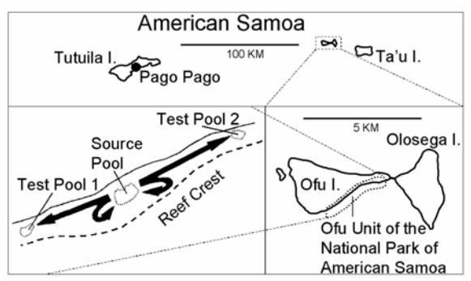
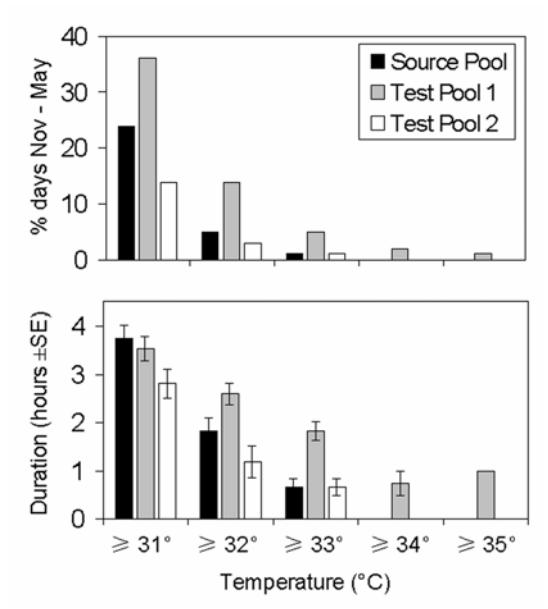
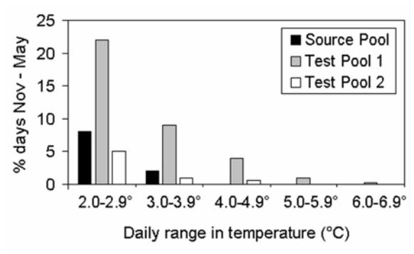
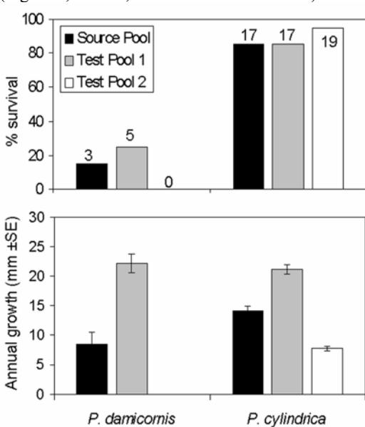
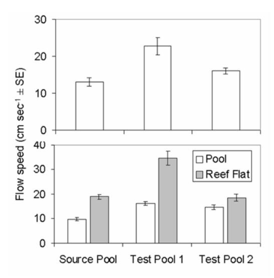

# **Influence of water motion on resistance of corals to high temperatures: Evidence from a field transplant experiment**

#### **Lance W. SMITH**

Hawai'i Cooperative Fishery Research Unit, Zoology Department, 2538 The Mall, Edmondson 165, University of Hawai'i at Manoa, Honolulu, HI 96822 e-mail: lancesmi@hawaii.edu

**Abstract** *Pocillopora damicornis* and *Porites cylindrica* fragments were transplanted between sites within a backreef moat on Ofu Island, American Samoa, to investigate the effects of water motion on resistance of corals to high seawater temperatures. Coral transplants were obtained from a Source Pool and transplanted into two test pools, Test Pool 1 and Test Pool 2, as well as back into the Source Pool. All transplants were placed at depths of 1.3 – 1.9 m, then removed after 1 year and measured to determine skeletal growth. Test Pool 1 had the highest daily maximum seawater temperatures, the greatest duration of high temperatures, and the greatest daily fluctuations of temperatures of the three pools. However, survival and growth of the transplants were greater in Test Pool 1 than in the other two pools. Mean flow speeds were highest in Test Pool 1, especially on adjacent reef flats. Test Pool 1 is closer to the reef crest, has greater wave heights, and is structurally more complex than the other two pools. Recognizing physical features that produce strong water motion may be important in identifying reef areas and coral populations that are resistant to bleaching.

**Keywords** coral, growth, temperature, flow speed, water motion, American Samoa

#### **Introduction**

 Projected increases in ocean temperatures in the 21st century are expected to exacerbate the stressors already affecting many coral reefs, resulting in additional coral bleaching and mortality (Pockley 2000, Pandolfi et al. 2003). However, when mass coral bleaching and severe mortality occur because of warming events, there is some survival of scattered colonies, localized communities, and whole reef sections (Loya et al. 2001). Factors influencing resistance of corals to high temperatures include extrinsic (environmental) factors such as strong water currents that reduce the severity of thermal stress (Nakamura & van Woesik 2001), and intrinsic (physiological) factors such as incorporation of heat-resistant zooxanthellae clades (Baker 2004) and the production of heat shock proteins (Brown et al. 2002). Identifying and protecting habitats and colonies that are relatively resistant to high temperatures is critical for conserving coral reefs in the face of global warming (Coles & Brown 2003, West & Salm 2003).

 "Resistance" refers to the ability of individual corals to resist bleaching or to survive after they have been bleached. Extrinsic factors that reduce temperature (e.g., upwelling), reduce irradiance (e.g., turbidity), or increase water motion (e.g., tidal currents) correlate with bleaching resistance (West & Salm 2003). Because several such extrinsic factors often co-occur on reefs, it is difficult to design field studies that investigate the role of individual factors on coral resistance to high temperatures. A backreef moat on Ofu Island in American Samoa supports a diverse community of reefbuilding corals, is separated from oceanic water by a continuous reef crest, and has low terrigenous influence (i.e., no streams enter the moat). In addition, the area is protected within the National Park of American Samoa (NPSA), and has low human impacts. Summer water temperatures at 1.5 m of depth in the moat are regularly 32 – 34 °C, with daily fluctuations of up to 6 °C (Craig et al. 2001, Smith & Birkeland 2003). The relative isolation of the moat from oceanic, terrigenous, and human influences compared to most coral communities reduces confounding factors, and the frequent occurrence of high seawater temperatures provides a field site for investigating factors affecting the resistance of corals to high temperatures. This experiment was designed to field-test the hypothesis that water motion reduces the detrimental effects of high seawater temperatures on corals.

## **Methods**

 Ofu Island, located in American Samoa (14°S, 170°W), is a small volcanic island with a well-developed fringing reef. The study area, Ofu Lagoon, is a backreef moat extending along most of the island's 3 km southeastern shoreline, and consisting of several interconnected pools 1-2 m in depth. Most of Ofu Lagoon lies within NPSA's Ofu Unit (Figure 1). A relatively large, deep pool was selected as the Source Pool for coral transplants into smaller, slightly shallower pools (Test Pools 1 & 2; Figure 1). Previous work established that the mean summer maximum temperature (MSM, defined as the mean sea-surface temperature for the warmest month of the year; Podesta & Glynn 2001, Aronson et al. 2002) in Test Pool 1 was 29.5 °C, and that the frequency and duration of temperatures >3 °C above MSM was greater in Test Pool 1 than in the Source Pool (P. Craig, pers. comm., Craig et al. 2001). Seawater temperatures were monitored to corroborate previous data, and Test Pool 2 was used to provide an additional comparison site.

Figure 1. American Samoa and Ofu Island, showing the three study sites in the backreef moat on Ofu, and coral transplant study design (indicated by black arrows).

 Water temperatures at the three sites were measured with data loggers (Onset Computer Corp.) with an accuracy of 0.25 °C at 30 °C. Loggers were tested before and after deployment against a calibrated thermometer to ensure accuracy. Temperatures were logged every 30 minutes in shaded areas beneath coral heads at 1.5 m of depth for a one year period beginning in early July 2002.

 Nubbins of *Porites cylindrica* and *Pocillopora damicornis* were transplanted from the Source Pool into the two Test Pools (experimental transplants) or back into the Source Pool (control transplants; Figure 1) for a duration of one year starting in early July 2002. Low tide mean depth of the source colonies and controls in the Source Pool was 1.85 m, and the low tide mean depths of the transplanted colonies were 1.40 and 1.45 m in Test Pools 1 and 2, respectively. All transplants were placed at depths of 1.3 – 1.9 m within 5 m of the temperature loggers (Smith & Birkeland 2003). For each species, 40 experimental (20 in each test pool) and 20 control transplants were used, for a total of 60 transplants per species and 120 transplants overall. Nubbins measuring ≈10 cm in length (*P. cylindrica*) or diameter (*P. damicornis*) were removed with a hammer and chisel in the Source Pool, stained with alizarin dye, then affixed to the substrate in the pools with marine epoxy (Barnes 1970, Birkeland 1976). After one year, the surviving transplants were removed, and linear extension of coral skeleton was measured from the alizarin mark to the nearest 0.1 mm (Kinzie & Sarmiento 1986, Le Tissier 1988, Harriott 1999).

 Water motion was evaluated in July 2003 by measuring flow speed with surface drogues (Hughes 2002) through a 50 m x 100 m grid placed in the three pools (1-2 m depth) and over adjacent reef flats (<0.5 m depth). The grids were centered on the coral transplants and temperature loggers in each pool. Coconuts of approximately the same size and buoyancy were used as drogues, and the same four were used for all measurements. Waterlogged coconuts were selected so that they would float mostly below the surface and thus be less affected by wind. Measurements were taken midway between high and low tides when the wind speed was less than 10 miles per hour. Mean flow speed (cm sec-1) of four simultaneously released drogues was measured over 25 m across the grid. Twenty-two measurements were taken at each site; 14 in the pools (1- 2 m depth) and 8 on adjacent reef flats (<0.5 m depth; Smith & Birkeland 2003).

 Statistical analyses were performed with Minitab, release 13.1. General linear model (GLM) analysis of variance was used to test for an effect of transplant site on coral growth. Two-way Analysis of Variance (ANOVA) was used to test for effects of site and depth (and their interaction) on flow speed.

#### **Results**

 Mean daily seawater temperatures during the one-year period were similar across sites; 29.1 °C in both Test Pools and 29.2 °C in the Source Pool, but Test Pool 1 recorded both the maximum (35.5 °C) and minimum (25.8 °C) temperatures. Maximum daily temperatures occurred from January through March, with several temperatures of >34 °C recorded in Test Pool 1. Maximum daily temperatures in the other two pools reached their highest in March (33.5 °C in the Source Pool and 33.6 °C in Test Pool 2), which coincided with calm, clear weather and a midday low tide. At this time, Test Pool 1 reached 34.2 °C. Mean daily seawater temperatures during the summer (Nov-May) ranged from 29.8 °C in Test Pool 1 to 30.0 °C in the Source Pool. During this period, temperatures ≥31 °C occurred more frequently in Test Pool 1 than in the Source Pool or Test Pool 2 (Figure 2, top). The duration of temperatures ≥32 °C was greater in Test Pool 1 than in the other two pools (Figure 2, bottom). In Test Pool 1 from November 2002 through May 2003, temperatures >1, 2, 3, 4, and 5 °C above the 1999-2001 mean summer maximum temperature of 29.5 °C were recorded on 88, 35, 12, 4, and 1 occasion(s), respectively. The maximum duration of these high temperature events was 5.5 hours, and the mean duration was approximately 3 hours (Smith & Birkeland 2003).

Figure 2. Frequency (top) and duration (bottom) of high daily temperatures in the three pools from November 2002 to May 2003.

Temperature fluctuations were greater in Test Pool 1 than in the other two pools during the summer (Nov-May). Test Pool 1 had a maximum daily range of 6.3 °C, compared to maximum daily ranges in the Source Pool and Test Pool 2 of 3.8 °C and 4.4 °C, respectively. During this period, daily temperature fluctuations of >2 °C occurred more frequently in Test Pool 1 than in the other two pools (Figure 3; Smith & Birkeland 2003).

Figure 3. Daily range of temperatures in the three pools (°C) from November 2002 to May 2003.

Survival of the coral transplants contrasted sharply between the two species. *Porites cylindrica* survival was 85 % in the Source Pool (controls), 85 % in Test Pool 1, and 95 % in Test Pool 2 (Figure 4, top). In contrast, *Pocillopora damicornis* survival was 15 percent in the Source Pool, 25 percent in Test Pool 1, and zero in Test Pool 2 (Figure 4, top).

*P. cylindrica* transplant growth was greater in Test Pool 1 than in the other two pools, and also greater in the Source Pool than in Test Pool 2 (GLM: Site  $F_{2,47}$  =

116.40, p < 0.001; Tukey post-hoc comparisons, all p<0.001). Mean linear extension of the *P. cylindrica* transplants was 14.1 mm yr-1  $\pm$  0.8 (SE) in the Source Pool, 21.1 mm yr-1  $\pm$  0.8 in Test Pool 1, and 7.7 mm yr-1  $\pm$  0.4 in Test Pool 2 (Figure 4, bottom). Due to small sample sizes, *P. damicornis* growth data were not statistically analyzed. However, Figure 4 shows a clear pattern of higher growth rates for this species in Test Pool 1. Mean linear extension of the few surviving *P. damicornis* transplants was 8.5 mm yr-1  $\pm$  2.0 in the Source Pool, and 22.2 mm yr-1  $\pm$  1.5 in Test Pool 1. (Figure 4, bottom; Smith & Birkeland 2003).

Figure 4. Survival and growth (linear extension) of *P. damicornis* and *P. cylindrica* transplants in the three pools (number of surviving transplants out of each group of 20 shown on upper graph, which provided the growth samples; no *P. damicornis* survived in Test Pool 2).

Flow speed results (Table 1) indicate water motion is stronger in Test Pool 1 than in the other two pools. Flow speed showed significant effects of both site and depth (ANOVA: Site  $F_{2,60} = 40.92$ , p < 0.001; Depth  $F_{1,60} = 103.54$ , p < 0.001; Table 2). An interaction between site and depth (ANOVA:  $F_{2,60} = 16.57$ , p < 0.001) reflects greater variation in reef flat flow speeds between sites than in pool flow speeds between sites (Figure 5).

Within the pools (i.e., depth of 1-2 m), flow speed was higher in Test Pool 1 than in the Source Pool (p = 0.02), but similar between the two Test Pools (p = 0.94). Flow speed over reef flats adjacent to Test Pool 1 was greater than at the other two sites (p <0.001; Figure 5, Table 2). The maximum flow speed recorded in the pools was 19.4 cm s-1 in Test Pool 1, slightly higher than the typical non-storm maximal value of 16 cm s-1 reported for coral reef lagoons (Sebens & Done 1992, Sebens et al. 1998). The maximum flow speed recorded on the reef flats was 45 cm s-1 on the Test Pool 1 reef flat (Smith & Birkeland 2003).

Table 1. Mean flow speed results in cm sec-1.

| Site & | N  | Flow | SE  | Site & |
|--------|----|------|-----|--------|
| Depth  |    |      |     | Depth  |
| SP     | 14 | 9.8  | 0.7 | TP2    |
| 1-2 m  |    |      |     | <0.5 m |
| SP     | 8  | 18.9 | 0.9 | TP1    |
| <0.5 m |    |      |     | <0.5 m |
| TP1    | 14 | 16.0 | 0.8 | SP     |
| 1-2 m  |    |      |     | <0.5 m |
| TP1    | 8  | 34.3 | 2.9 | TP2    |
| <0.5 m |    |      |     | 1-2 m  |
| TP2    | 14 | 14.6 | 0.8 | TP1    |
| 1-2 m  |    |      |     | 1-2 m  |
| TP2    | 8  | 18.6 | 1.6 |        |
| <0.5 m |    |      |     |        |

Table 2. Post-hoc comparisons p-values, Tukey corrected, for the

| 2-way ANOVA of flow speed by site and depth. |        |        |        |        |        |  |  |  |
|----------------------------------------------|--------|--------|--------|--------|--------|--|--|--|
|                                              | SP     | TP1    | TP2    | SP     | TP1    |  |  |  |
| Depth                                        | 1-2 m  | 1-2 m  | 1-2 m  | <0.5 m | <0.5 m |  |  |  |
|                                              | <0.001 | 0.68   | 0.23   | 1.00   | <0.001 |  |  |  |
| <0.5 m                                       |        |        |        |        |        |  |  |  |
|                                              | <0.001 | <0.001 | <0.001 | <0.001 | *      |  |  |  |
| <0.5 m                                       |        |        |        |        |        |  |  |  |
|                                              | <0.001 | 0.59   | 0.18   | *      | *      |  |  |  |
| <0.5 m                                       |        |        |        |        |        |  |  |  |
|                                              | 0.03   | 0.94   | *      | *      | *      |  |  |  |
| 1-2 m                                        |        |        |        |        |        |  |  |  |
|                                              | 0.02   | *      | *      | *      | *      |  |  |  |
| 1-2 m                                        |        |        |        |        |        |  |  |  |
|                                              |        |        |        |        |        |  |  |  |

Site and Depth key: "SP" = Source Pool, "TP1" = Test Pool 1, "TP2" = Test Pool 2, "1-2 m" = depth of pools, "<0.5 m" = depth of reef flats adjacent to pools

Figure 5. Flow speed by site (both depths combined; top) and depth (pool = 1-2 m, reef flat = <0.5 m; bottom).

# **Discussion**

The results of this study indicate that strong water motion can increase coral survival and growth despite high and potentially harmful seawater temperatures. Coral bleaching thresholds are generally defined as temperatures 1-2 °C above MSM continuously for 2-4 weeks (Aronson et al. 2002, Jokiel 2004). Summer temperatures in Test Pool 1 were often >3 °C above MSM, but never for longer than 5.5 hours (Figure 2), falling far short of bleaching thresholds. However, shortterm temperature elevations can cause sublethal stress, affecting photosynthesis (Warner et al. 1996) and growth (Howe & Marshall 2002), and can induce production of heat shock proteins (Fang et al. 1997). For example, temperatures >2 °C above MSM lasting for only 20 minutes decreased photosynthesis in *Acropora grandis* (Carrington et al. 2004).

 Flow speed and growth rate are positively correlated for *P. damicornis* (Jokiel 1978) and *Porites compressa* (Kuffner 2002), a branching *Porites* species morphologically similar to *P. cylindrica*. High flow speeds have been shown to reduce the detrimental effects of high seawater temperatures and high irradiance on corals in laboratory experiments (Nakamura & van Woesik 2001). Despite higher seawater temperatures in Test Pool 1, stronger water motion apparently provided better growth conditions for both coral species than in the other two pools.

 Water motion in the pools is influenced by their contrasting physical characteristics: Test Pool 1 is about half the distance to the reef crest as the other two pools, thus breaking waves have less distance to dissipate before reaching the pool. Wave height is about twice as high in Test Pool 1 as in the other two pools during similar wind, swell, and tidal conditions. In addition, Test Pool 1 is composed of a series of interconnected channels and small depressions, and is interspersed with sections of shallow reef flat. The transplants in Test Pool 1 were only 1-5 m from such reef flat areas, thus high flow speeds from these areas likely affected the transplants. The Source Pool and Test Pool 2 are less complex, each consisting mostly of a single large, continuous expanse of water >1 meter in depth, and transplants there were 35-80 m from reef flats.

 The results of this field study support the hypothesis that water motion reduces the detrimental effects of high seawater temperatures on corals. Recognizing physical features that produce strong water motion may be important in identifying reef areas and coral populations that are resistant to bleaching. Such areas and populations could contribute to a conservation strategy to counter the effects of global warming (West & Salm 2003).

#### **Acknowledgements**

 I thank my advisor Chuck Birkeland for initiating and facilitating this project, Peter Craig of the National Park of American Samoa for logistical and technical support, Larry Basch of the National Park Service for arranging funding, Eva DiDonato, Fale Tuilagi, Guy DiDonato, Marge Malae, and Dan Barshis for field assistance, and Jill Zamzow for assistance throughout the project.

## **References**

- Aronson, R.B., W.F. Precht, M.A. Toscano & K.H. Koltes. 2002. The 1998 bleaching event and its aftermath on a coral reef in Belize. Marine Biology 141: 435-447.
- Barnes, D.J. 1970. Coral skeletons: An explanation of their growth and structure. Science 170: 1305- 1308.
- Birkeland, C. 1976. An experimental method of studying corals during early stages of growth. Micronesica 12: 319-322.
- Brown, B.E., C.A. Downs, R.P. Dunne & S.W. Gibb. 2002. Exploring the basis of thermotolerance in the reef coral *Goniastrea aspera*. Marine Ecology Progress Series 242: 119-129.
- Carrington, E., B. Helmuth & K. Sebens. 2004. Physiological response of shallow water corals to short-term temperature fluctuations. 10th International Coral Reef Symposium, Okinawa, Japan.
- Coles, S.L. & B.E. Brown. 2003. Coral bleaching Capacity for acclimatization and adaptive selection. Advances in Marine Biology 46: 183- 224.
- Craig, P., C. Birkeland & S. Belliveau. 2001. High temperatures tolerated by a diverse assemblage of shallow-water corals in American Samoa. Coral Reefs 20: 185-189.
- Fang, L.S., S.P. Huang & K.L. Lin. 1997. High temperature induces the synthesis of heat shock proteins and the elevation of intracellular calcium in the coral Acropora grandis. Coral Reefs 16: 127-131.
- Harriott, V.J. 1999. Coral growth in subtropical eastern Australia. Coral Reefs 18: 281-291.
- Howe, S.A. & A.T. Marshall. 2002. Temperature effects on calcification rate and skeletal deposition in the temperate coral *Plesiastreaversipora* (Lamarck). Journal of Experimental Biology and Ecology 275: 63-81.
- Jokiel, P.L. 1978. Effects of water motion on reef corals. Journal of Experimental Marine Biology and Ecology 35: 87-97.
- Jokiel, P.L. 2004. Temperature stress and coral bleaching. pp. 401-425. *In:* E. Rosenberg & Y. Loya (ed.) Coral Health and Disease., Springer-Verlag, Heidelberg.
- Kinzie, R.A., III & T. Sarmiento. 1986. Linear extension rate is independent of colony size in the coral *Pocillopora damicornis*. Coral Reefs 4: 177- 181.

- Kuffner, I.B. 2002. Effects of ultraviolet radiation and water motion on the reef coral *Porites compressa* Dana: a transplantation experiment. Journal of Experimental Marine Biology and Ecology 270: 147-169.
- Le Tissier, M.D.A. 1988. The growth and formation of branch tips of *Pocillopora damicornis* (Linnaeus). Journal of Experimental Biology and Ecology 124: 115-131.
- Loya, Y., K. Sakai, K. Yamazato, Y. Nakano, H. Sambali & R. van Woesik. 2001. Coral bleaching: the winners and the losers. Ecology Letters 4: 122-131.
- Nakamura, T. & R. van Woesik. 2001. Water-flow rates and passive diffusion partially explain differential survival of corals during the 1998 bleaching event. Marine Ecology Progress Series 212: 301-304.
- Pandolfi, J.M., R.H. Bradbury, E. Sala, T.P. Hughes, K.A. Bjorndal, R.G. Cooke, D. McArdle, L. McClenachan, M.J.H. Newman, G. Paredes, R.R. Warner & J.B.C. Jackson. 2003. Global Trajectories of the Long-Term Decline of Coral Reef Ecosystems. Science 301: 955-958.
- Pockley, P. 2000. Global warming identified as main threat to coral reefs. Nature 407: 932.
- Podesta, G.P. & P.W. Glynn. 2001. The 1997-98 El Nino event in Panama and Galapagos: An update of thermal stress indices relative to coral bleaching. Bulletin of Marine Science 69: 43-59.
- Sebens, K.P. & T.J. Done. 1992. Water flow, growth form and distribution of Scleractinian corals: Davies Reef (GBR), Australia. Proceedings of the Seventh International Coral Reef Symposium 1: 557-568.
- Sebens, K.P., S.P. Grace, B. Helmuth, E.J. Maney & J.S. Miles. 1998. Water flow and prey capture by three scleractinian corals, *Madracis mirabilis*, *Montastrea cavernosa* and *Porites porites*, in a field enclosure. Marine Biology 131: 347-360.
- Smith, L.W. & C. Birkeland. 2003. Managing NPSA's Coral Reefs in the Face of Global Warming: Research Project Report for Year 1. pp. 52, Hawai'i Cooperative Fishery Research Unit, Zoology Department, University of Hawai'i at Manoa, Honolulu.
- Warner, M.E., W.K. Fitt & G.W. Schmidt. 1996. The effects of elevated temperature on the photosynthetic efficiency of zooxanthellae in hospite from four different species of reef coral: A novel approach. Plant, Cell & Environment 19: 291-299.
- West, J.M. & R.V. Salm. 2003. Resistance and resilience to coral bleaching: Implications for coral reef conservation and management. Conservation Biology 17: 956-967.