# The Geology of the Manu'a Islands, Samoa1

GARY D. STICE2 and FLOYD W. McCoy, JR.3

ABSTRACT: The Manu'a Islands are a group of three islands-Ta'u, Ofu, and Olosega—that were built by volcanic activity along the crest of the easternmost portion of the Samoan Ridge. Ta'u Island represents the largest volcanic center, where as and pahoehoe flows of non-porphyritic basalt, olivine basalt, picrite basalt, and feldspar phyric basalts constructed a volcanic shield more than 3,000 feet above sea level. The present-day total thickness of this volcanic material is over 12,000 feet, as measured from the ocean floor to the summit of Ta'u, Lata Mountain (3,056 feet). Dips of the lava flows frequently exceed 30°, but average 20-25°. Summit collapse formed a caldera that became partially filled with ponded lavas and pyroclastic deposits which accumulated to a thickness of over 1,000 feet. From the summit area, two rift zones radiate to the northeast and northwest, the latter coinciding with the trend of the Samoan Ridge. Two smaller shields are located along these rift zones. Following a period of extensive erosion, the northeast corner of the island was built out by dunite-bearing lava flows, upon which the village of Fitiiuta now stands. A tuff complex containing large dunite xenoliths and coral blocks extended the northwest corner of the island near the village of Faleasao, burying a former sea cliff.

Ofu and Olosega islands represent a complex of at least six volcanic cones aligned along the regional rift of the Samoan Ridge. Two of these cones developed as shields that later coalesced and buried the older cones of largely pyroclastic material. The shields are composed mainly of an and pahoehoe flows of non-porphyritic basalt, olivine basalt, and picrite-basalt, with hawaiites occurring in the uppermost portion of the shield on Ofu. More than 11,000 feet of volcanic material are represented by these shields, as measured from the ocean floor to the present-day summits of Ofu at Tumu (1,621 feet), and of Olosega at Piumafua (2,095 feet). These summits represent the approximate former summits of both shields. Average dips of the lava flows are 10-20°, locally becoming considerably steeper. Summit collapse of both shields produced calderas, one on northern Ofu and another off northwestern Olosega near Sili Village. The caldera on northern Ofu was partly filled by the ponding of olivine basalt, hawaiite, and ankaramite lava flows. The floor of the other depression, Sili caldera, lies offshore and may never have been exposed above sea level. Following a period of quiescence and erosion probably contemporaneous with that on Ta'u Island, recent volcanism built a lapilli tuff cone, the remnants of which form Nu'utele and Nu'usilaelae islets. Volcanism has continued to the present day with a submarine eruption reported between Olosega and Ta'u islands in 1868.

Narrow fringes of calcareous beach deposits and fringing coral reefs nearly surround each of the three islands. High cliffs around the islands are the result of marine erosion. Benches at +15 and +5 feet above present sea level may indicate former higher stands of sea level.

THE SAMOAN ARCHIPELAGO lies about 2,200 miles southwest of Honolulu and about 500

miles northeast of Fiji. Politically, Samoa is divided into Western Samoa, which includes the two largest islands of Savai'i and Upolu, and American or Eastern Samoa (Fig. 1). Tutuila,

&lt;sup>1 Hawaii Institute of Geophysics Contribution No. 233. Manuscript received October 26, 1967.

&lt;sup>2 Hawaii Institute of Geophysics, University of Hawaii, Honolulu, Hawaii 96822.

3 Woods Hole Oceanographic Institution, Woods Hole, Massachusetts 025-13.

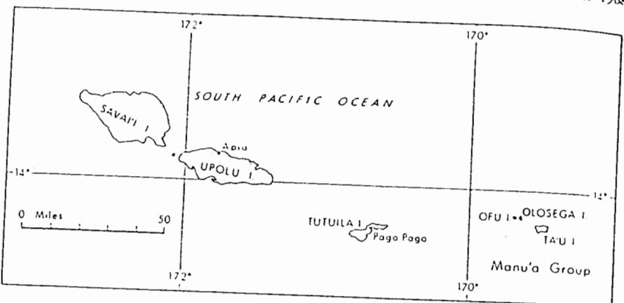

Fig. 1. Location map of the Manu'a Islands, Samoa,

the largest island in Eastern Samoa, lies about 60 miles west of the three small Manu'a Islands (14-15°S, 169°W), and Rose Atoll, the easternmost island of Samoa, which is approximately 100 miles east of the Manu'a Islands.

The islands of Samoa are located along the crest of a submarine ridge which extends over 300 miles from Savai'i to Rose Atoll and trends approximately S 75° E. Apparently this ridge, hereafter called the Samoan Ridge, is the topographic expression of a regional rift along which the various volcanoes in the archipelago have erupted. That portion of the ridge between Tutuila and the Manu'a Islands is offset to the north but has nearly the same trend, S 70° E. as the western portion. It seems most likely that the ridge at one time was continuous, but it has been offset by later left lateral displacements. If the Tonga Trench were extended only 100 miles north, it would intersect the Samoan Ridge near the oifset.

Tutuila is separated by normal oceanic depths of greater than 10,000 feet from Upolu to the west and the Manu'a Islands to the east. Thus, three major volcanic piles are aligned along the Samoan Ridge: (1) Savai'i (700 mi² above sea level) and Upola (430 mi2 above sea level). which may have been two piles that gradually merged: (2) Tutuila (53 mi² above sea level); and (3) Manu'a Islands (19 mi2 above sea level).

above sea level) is the only remaining surface expression of a fourth volcanic pile atop the Samoan Ridge. In a very general way then, volcanic activity moved from east to west, whereas in the Hawaiian Islands and the Society Islands (Williams, 1933) the volcanic activity was from west to east. There have been historic eruptions on Savai'i and Upolu (Kear and Wood, 1959), as well as an historic eruption in the Manu'a Islands (Friedlander, 1910).

Friedlander (1910), the first geologist to visit the Manu'a Islands, thought that Ofu and Olosega were remnants of a single volcano and that the embayments to the north and south represented two central craters of collapse that nearly coalesced. He pointed out that the lavas of Ta'u were relatively recent in age and that the scarp on the south side of the island was formed by a caldera collapse. He also thought that the present sea cliff on the southern shoreline of the island was the vestige of further collapse. Friedlander was given an eye-witness account of a submarine eruption that occurred around 1866 between Olosega and Ta'u.

Daly (1924) spent a few days on a reconnaissance of the Manu'a Islands, during the course of his more complete study of Tutuila, and made the following observations:

(1) The western slope of Ofu and the eastern slope of Olosega largely preserve the constructional profiles of a volcanic cone.

(2) Cliffs of approximately 300 feet have In addition, Rose Atoll (less than 1 mi2 been cut into the islands by the sea, whereas

the much higher (1,500-2,000 feet) curvilinear precipices on the north and south central shores suggest an origin in a double evisceration through (a) volcanic explosion, (b) faulting into a sink analogous to Kilauea or Mokuaweoweo in Hawaii, or (c) large-scale landsliding due to foundering of large parts of the volcano. The first hypothesis he considered improbable, but he could not decide whether the foundering was due to collapse both to the north and to the south, or to landsliding.

(3) The lavas of Ta'u are relatively fresh, whereas deep weathering has laterized the flows on Ofu and Olosega.

From only one or two days' observations, Stearns (1944) produced a remarkably accurate geologic sketch map of the Manu'a Islands. He divided the rock units into pre-caldera volcanic deposits, a dike complex and post-caldera volcanic deposits. In disagreeing with Daly's statement that the Ofu-Olosega volcano was a cone of the explosive type, Stearns stated that pyroclastic beds are no thicker or more numerous than around the main vents of many basaltic volcanoes. According to Stearns, the steeply dipping pre-caldera lavas of the Ofu-Olosega cone indicate that they plunged into deep water and mantled a steep-sided submarine cone, probably largely of pyroclastic material, the calderas being formed in part by collapse over a magma reservoir and in part by landslides of the steep underlying ash beds. He also suggested the possibility that the 2,000-foot cliff on the north side of Ta'u may be due to faulting related to another caldera offshore.

Machesky (1965) conducted a gravity survey of the Manu'a Islands. The results of this work showed a Bouguer anomaly of up to +290 milligals over the center of the main caldera on Ta'u Island. The highest Bouguer anomaly on Ofu and Olosega islands (+310 milligals) was recorded over an intrusive gabbro plug at Fatuaga Point on eastern Ofu. Contouring of the corrected gravity anomalies shows a general concentric decrease away from these two centers.

#### GEOLOGY OF TA'U ISLAND

### Nature and Distribution of Rock Types

GENERAL STATEMENT: Lavas issuing from vents on the crest of the Manu'a Ridge gradually built above sea level to form Ta'u Island. The history of the early shield-building stage is not revealed in the present exposures, but there was probably a long period of relatively quiet, frequent thin lava flows emanating from rift zones which steadily built up a basal shield volcano, as in the Hawaiian Islands. The lavas which built the main shield of Ta'u Island above sea level are exposed in the 1,400-foot escarpment that extends to the summit of the island, Lata Mountain (3,056 feet). The rocks comprising this shield, hereafter called the Lata shield, belong to the Lata formation.

The summit of the shield collapsed to form a caldera, and somewhat more explosive eruptions from cinder cones within the caldera and on the flanks of the volcano continued to build up the island. However, the eruptions were not as frequent during this stage, and erosion became more effective. There are local erosional unconformities in the lower sections exposed on Ta'u Island, indicating a long history of intermittent lava flows even before the formation of the caldera.

Two smaller shields built out the northeastern and northwestern portions of the island. The Tunoa shield, on the northwest, is located along the regional rift zone. Luatele shield is part of a minor rift zone extending down the northeastern slope of the main Lata shield. These smaller shields are composed mainly of thinbedded olivine basalt pahoehoe flows with average dips of 5-10°. The summits of both shields collapsed to form depressions which were partly filled by deposits of subsequent volcanism. Small pit craters are associated with both the Tunoa and the Luatele shields. The Tunoa and Luatele formations are composed of the rocks of their respective shields, including the deposits within the collapsed areas.

After the formation of these shields volcanism probably subsided considerably and erosion became more pronounced. The lava flows were so infrequent that a sea cliff about 200 feet high developed around Ta'u Island. Post-erosional lava flows occasionally spilled over this cliff from cones on the flanks above it; in two places, extensive post-erosional volcanism built large areas of land in front of the sea cliff.

On the northwest corner of the island the Faleasao Formation consists of a tuff complex, approximately 1 mi2 in area, which buried the

sea cliff. On northeastern Ta'u the historic village of Fitiiuta is located on post-erosional lava flows comprising the Fitiiuta Formation, which have built out a platform of nearly 1 mi2 seaward of the old sea cliff. Even though the lavas in this area appear to be quite young, they probably were erupted at least 1,500-2,000 years ago, prior to settlement by the Polynesians, because, according to Samoan legends, Fitifuta was the first village to be settled in these islands and possibly in all of Samoa. There are no Samoan legends that mention volcanic eruptions on Ta'u Island.

placed in the following units, in approximate order of decreasing age (see legend for Ta'u Island, page 434):

- (1) Lata Formation
- (a) extra-caldera member, consisting of pre-caldera and post-caldera deposits of the Lata shield, the latter including both pre-erosional and post-erosional volcanism
  - (b) intra-caldera member
  - (2) Tunoa Formation
  - (3) Luatele Formation
  - (4) Faleasao Formation
  - (5) Fitiiuta Formation
- (6) Intrusive rocks, mainly basaltic dikes associated with Lata caldera
- (7) Sedimentary deposits, including alluvium, landslide debris, beaches, marshes, and so forth

EXTRA-CALDERA MEMBER OF LATA FORMA-TION: The lava flows and pyroclastic deposits associated with the building of the Lata shield were erupted prior to, during, and after collapse of its caldera. Those rocks not deposited within the caldera itself belong to the extra-caldera member of Lata Formation. Pre-caldera rocks are exposed in the high fault scarp on the southern part of the island. The base of the volcano is about 9,000 feet below sea level, giving a total vertical thickness of about 12,000 feet. Because of the dense vegetation on the flanks of the shield, it is impossible to distinguish precaldera lavas from the post-caldera lavas which form most of the surface of the Lata shield. However, the rocks cut by deep valleys on the north shore are certainly pre-caldera lavas, although late flows may have filled the floors in

fore pre-caldera lavas, since they cannot be distinguished from post-caldera lavas, are not mapped separately except in a few areas where exposures are adequate.

Some of the post-caldera vents are shown on the geologic map (Fig. 2); undoubtedly there are many others that were not discovered in the dense jungle. Lava flows associated with these vents are extremely difficult to delineate. The youthful appearance of numerous post-caldera cinder cones and the fact that many flows are found spilling over the sea cliffs indicates that Thus, the rocks exposed on Ta'u Island can be the post-caldera volcanism was in part contemporaneous with the post-erosional volcanism at Pitiiuta and at Faleasao. Judging from the consistent height of the sea cliff surrounding the entire island, there must have been an extensive period of volcanic quiescence after the formation of the Tunoa and the Luatele shields. Therefore, post-caldera volcanism was more active prior to the formation of the sea cliff and again after its development. Lavas from the post-caldera cones on the Lata shield flowed over the sea cliff. Few can be traced to their source, and no major erosional unconformity like that represented by the lava-mantled sea cliff can be found to separate pre-erosional lavas from post-erosional deposits on the upper flanks of the Lata shield. Wherever possible, postcaldera cones and lava flows, whether pre-erosional or post-erosional, are mapped separately from the rest of the post-caldera rocks. Lavas that have flowed over the sea cliff, as well as the vents from which they were erupted, are obviously post-erosional.

The contact between the extra-caldera rocks of the Lata shield and those of the Tunoa shield (shown on Fig. 3) is based on the topographic expression of the two shields, because there is no petrographic distinction between rock types. The contact between post-caldera rocks of the Lata shield and lavas of the Luatele shield is also based on topography. Even though the Luatele lavas are quite characteristic, soil cover and dense jungle obscure outcrops along most of the contact.

The extra-caldera lavas are dominantly olivine basalt with lesser amounts of picrite-basalt and feldspar-phyric basalt at low elevations. As and pahochoe flows are interbedded, with an flows

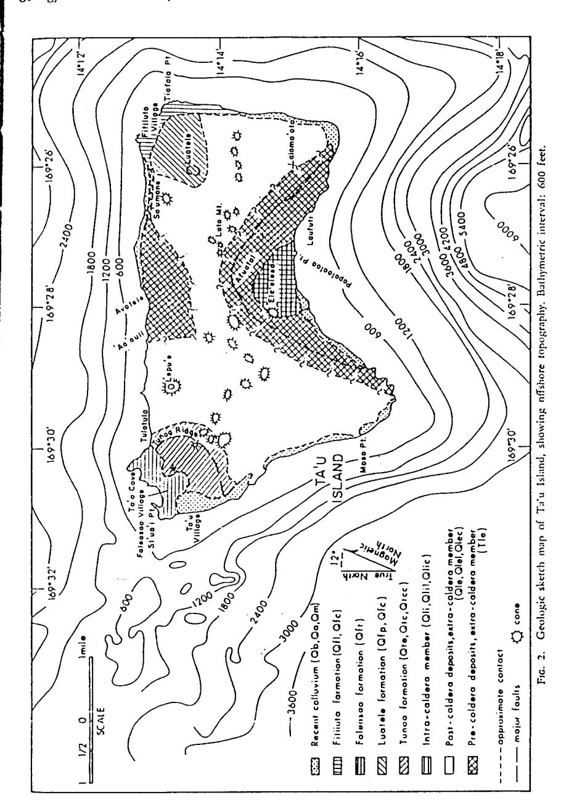

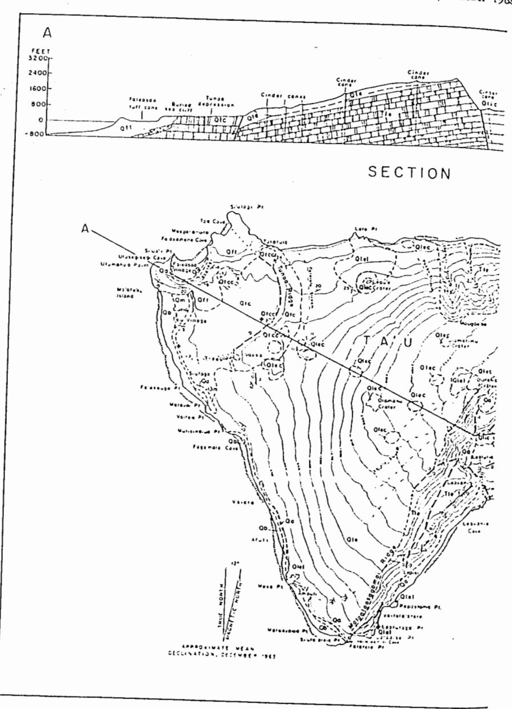

Fig. 3. Detailed geologic map and cross section of Ta'u Island.

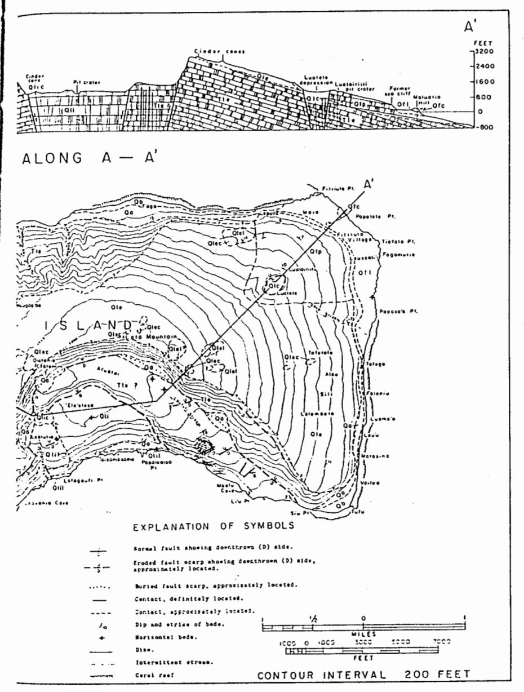

(For explanation of symbols, see Legend on following page.)

z

ш

U w

z

ш

U

0

S

#### LEGEND FOR TA'U ISLAND

QЬ

# CALCAREOUS SEDIMENTS

Modern beaches (4b) composed of unconsolidated fragments of marine organisms, Beachrock is frequently present.

Qm

#### NONCALCAREOUS SEDIMENTS

Allurium (2s), including talus, landslide debric at the base of cliffs, and aiream deposits. In areas behind constructional bunches marshes (2s)

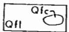

#### FITILUTA FORMATION

late flows (aff) of break and mirries beset forming the brach at fittiute, An associated cinder cone (Afc) is mapped experately.

#### FALEASAO FORMATION

Undifferentiated tuff complex (Qft) of pelagonitized vitric-crystal laptili tuff, breccis, and occasional horizontal laws flows from at least three male comme centered at February, To's, and Fe'szessan Cores.

MAJOR EROSIONAL UNCONFORMITY

bia panorboe flows (41p) of olivies kaselt cod this panorice flows (vip; of olivies baselt cod picrita-baselt have built Lustels saleld on the cortheastern portion of the island. The depres-sion was partly filled with ponded lavas (vic).

> وادد کی وادر واد Qie

TUNOA FORMATION

I ON OA FURMATION
Late flows (the) of heastl and elither heattless built bease hull force asked on elitherstraphorties of the inlead. The depression force by colleges of this shield was pertly filled with related deposits (etc.) of red vittee crystal ask, leptill toff, and elities healt close of or of white contain dealt sensitive colleges of white contain dealt sensitive flader case (etc.) are supped expending the colleges of the contain dealth as colling.

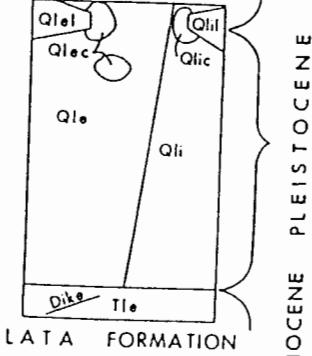

Late shield consists of pre-calders, post-calders, and intra-callers deposits. The pre-calders member [Tip] consists of laws [Los of olisine headth, printin-basell, consists of laws [Los of olisine headth, printin-basell, beacht, foldspar-phyric headth, and headlise ofth account of the consists of the consists of the consists of the consists of the consists of the consists of the consists of the consists of the consists of the consists of the consists of the consists of the consists of the consists of the consists of the consists of the consists of the consists of the consists of the consists of the consists of the consists of the consists of the consists of the consists of the consists of the consists of the consists of the consists of the consists of the consists of the consists of the consists of the consists of the consists of the consists of the consists of the consists of the consists of the consists of the consists of the consists of the consists of the consists of the consists of the consists of the consists of the consists of the consists of the consists of the consists of the consists of the consists of the consists of the consists of the consists of the consists of the consists of the consists of the consists of the consists of the consists of the consists of the consists of the consists of the consists of the consists of the consists of the consists of the consists of the consists of the consists of the consists of the consists of the consists of the consists of the consists of the consists of the consists of the consists of the consists of the consists of the consists of the consists of the consists of the consists of the consists of the consists of the consists of the consists of the consists of the consists of the consists of the consists of the consists of the consists of the consists of the consists of the consists of the consists of the consists of the consists of the consists of the consists of the consists of the consists of the consists of the consists of the consists of the consists of the Late shield consists of pre-calders, post-calders, and

predominating in the upper part of the section. The flows at low elevations on the north slope dip 15-20°, but the uppermost layers have steeper dips of 25-35°. Near the summit the dips of these upper flows decrease to less than 15° in the high fault scarp on the southern part of the island. On the eastern and western slopes of the Lata shield and the north side of its caldera, the present ground surface also conforms to the lava flows, dipping about 15° away from the summit.

The extra-caldera member contains numerous erosional unconformities, which seem to increase in number up-section, but no profound unconformity was noted. The change to steeper dips up-section apparently was a gradual one, accompanying a decrease in volcanism and a corresponding increase in the rate of erosion of the former slope.

The olivine basalt lavas generally contain phenocrysts of olivine approximately 2-4 mm in diameter. Most of the basalt lavas contain phenocrysts or microphenocrysts 1 mm or less in diameter. Approximately one-third of the olivine basalt lavas contain plagioclase microphenocrysts 1 mm or less in diameter. A few flows exposed in the sea cliff on the northern shore between 'Ao'auli Stream and Lepula contain plagioclase crystals up to 5 cm long. The massive portions of these flows are only 0.5-2 feet thick, but are separated by layers of clinker up to 7 feet thick. The flows are composed almost entirely of plagioclase phenocrysts with little groundmass to bind them together and therefore are very friable. One 30-foot section of these flows is exposed at the base of 'Ao'auli stream valley and another 60-foot section only about 200 feet upstream. In several places higher in the section, thin massive central portions of aa flows only 1-2 feet thick are associated with clinker beds up to 8 feet thick; these flows generally have steep dips (30-35°), which may account for the large accumulation of clinker. One tuff bed and a soil horizon were found at about 1,200 feet elevation in Ao'auli stream valley. The section up Avatele Stream, given in Table I, is characteristic of the extra-caldera member.

Some of the larger Recent post-caldera cones of the Lata shield are Lepu'e, Olomatimu (Fig. 4, middle photo), Olomanu, and Olotania on

TABLE 1 STRATIGRAPHIC SECTION OF EXTRA-CALDERA MEMBER. LATA FORMATION, UP AVATELE STREAM

| ТОР                                                                                                                            | THICKNESS (feet) |
|--------------------------------------------------------------------------------------------------------------------------------|---------------------|
| Nonporphyritic, dense gray hawaiite dip-                                                                                       |                     |
| ping 28°N                                                                                                                      | 25                  |
| Red vitric ash lying unconformably on an older erosional surface and dipping                                                |                     |
| 31 °N                                                                                                                          | 1                   |
| A series of an flows of olivine basalt and oceanite 1-3 feet thick separated by clinker beds 2-6 feet thick, dipping           |                     |
| approximately 15°N                                                                                                             | 25                  |
| No exposures                                                                                                                   | 100                 |
| As flow of basalt dipping S5°W, ap- parently poured over fault scarp to form an angular unconformity with                |                     |
| underlying aa flows                                                                                                            | 5                   |
| A series of thin (0.5-1.5 feet) az flows containing abundant plagioclase laths up to 5 cm long separated by clinker      | ·                   |
| beds up to 7 feet thick (dip = 28°N)                                                                                           | 50                  |
| A series of thin (0.5-1.5 feet) as flows of basalt with occasional olivine pheno- crysts separated by clinker beds 0.5-4 |                     |
| feet thick (dip = 26°N)                                                                                                        | 20                  |
| Total thickness of section                                                                                                     | 226                 |

the northwest flank, and Sa'umane and a line of four or five cones near Tafetafe on the northeast flank. Most of the lavas issuing from the post-caldera cones are olivine basalt or picritebasalt. Vesicular basalt and hawaiite are less common. Dunite inclusions approaching 2 inches across are found in some lavas. Rarely, some augite occurs along with the olivine in these inclusions. Near the vents cinder and often welded spatter occur. The olivine basalts typically have phenocrysts of olivine approximately 2-4 mm in diameter. Plagioclase microphenocrysts approximately 1 mm in diameter are usually found in the basalts, olivine basalts, and havaiites. The flows range from 2-3 feet up to 15 feet in thickness. Aa flows are predominant, although pahoehoe flows are occasionally found.

INTRA-CALDERA MEMBER OF LATA FORMA-TION: After formation of the caldera on the Lata shield, lava flows and pyroclastic deposits of the Lata intra-caldera member accumulated within the depression. They are separated from the volcanic rocks of the Lata extra-caldera

437

member by normal faults bounding the caldera. Intra-caldera lavas include picrite-basalts (both ankaramites and oceanites), olivine basalts, hawaiites, and possibly one or two flows of mugearite. In addition, there are extensive de-

posits of ash and lapilli tuff. The flows vary from 5 feet to more than 30 feet in thickness. Nearly horizontal ash beds cover much of the remaining caldera floor.

The caldera was only partly filled. At least

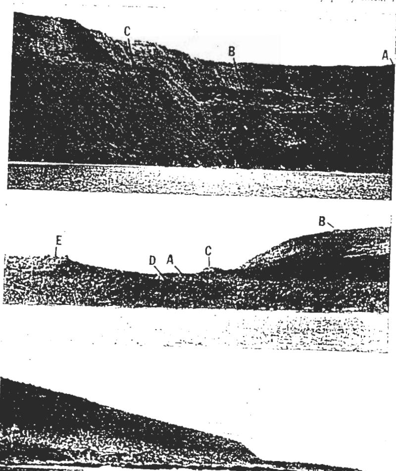

Fig. f. Ta'u Island, Top: Looking north into the Lata caldera toward Lata Mountain (A), the cur ed cliff (B) between the benches at Eleelesa and Afaatai, the bench at Tali'i (C). Middle: Looking east toward the cliff bounding the Tunox depression (A), Olomatimu (B), and Lequ'e

(C) craters in background, the old sea cliff behind Ta'u Village (D), which has been buried by the Faleasao

Bottom: Looking northwest toward the nearly horizontal lava flows of the Fittiuta formation, which have been built out in front of the old sea cliff cut into the Luatele shield.

two and possibly three normal faults formed major benches on the caldera floor. The highest bench, at the base of the fault scarp that rises vertically 1,370 feet to Lata Mountain, is composed of a sequence of approximately horizontal pahochoe flows. Intercalated with them is a bed of ash 3-4 feet thick which is composed of individual laminae less than 0.5 inch thick. The ash is basaltic glass. The flows both overlying and underlying the ash are 1-4 feet thick and are mostly vesicular olivine basalts with some oceanites. The vesicles in several surface flows of the caldera floor are filled with limonitestained clay. These vesicle fillings may be the result of alteration and deposition by rising gases and hot solutions in the vent area of the volcano, or simply the result of ordinary weathering and poor drainage of nearly horizontal flows, although in other volcanic rocks in the Manu'a Islands, the vesicles are not filled.

TUNOA FORMATION: The small shield on northwestern Ta'u was built predominantly by thin-bedded pahoehoe flows and less abundant interbedded as flows with average dips of less than 10°. The summit of this shield collapsed, and the central depression was partly filled by ponded lava flows and pyroclastic deposits. Subsequently, the western portion of the shield has been eroded away so that it is nearly bisected by a sea cliff. The formation is named after Tunoa Ridge, a curvilinear escarpment approximately 200 feet high which forms the eastern rim of the collapsed area.

The shield-building lava flows are mainly aphanitic basalt with some flows of olivine basalt and at least one 10-foot-thick flow of occanite, but they are too deeply weathered to reveal much detail in composition and structure. The floor of the depression, on the other hand, is covered by pahochoe flows with well-preserved ropy surfaces and tumuli, and by some 22 flows still fresh in appearance. Most of these lavas are vesicular olivine basalt with feldspar microphenocrysts less than 1 mm long. At least five vents were located on the floor of the depression; undoubtedly there are others, but the dense vegetation makes their discovery more or less accidental. The vents are low cinder cones less than 30 feet high and about 200 feet in diameter. Some of the flows from these

cinder cones contain small dunite xenoliths, which are usually less than 1 cm across. Two 10foot-thick pahoehoe flows containing dunite xenoliths are exposed in the sea cliff behind Ta'u Village. Underlying those lavas is a palagonitized tuff bed of unknown thickness.

The southern half of the cinder cone that stands on the northern edge of the escarpment near Tulatula is missing. Either half of the cone has slumped down the cliff during or after its formation, or it has been eroded back at about the same rate as the fault scarp. The former explanation seems more likely, because the cinder cone should erode much more rapidly than the lava flows exposed beneath it. The western wall of the pit crater at Fogapo'a has either been eroded away or been cut off by faulting during the collapse of the shield. Because the floor of the pit crater is at the same elevation as that of the Tunoa depression, it was probably filled in by later lavas ponding within this larger collapsed area.

LUATELE FORMATION: As at Tunoa, a secondary shield on the northeast side of the island has collapsed to form a depression known to the Samoans as Luatele. On the topographic map of the Manu'a Islands, published in 1963 by the U. S. Geological Survey, this place is erroneously called "Judd's Crater," but no one on the island knows it by that name. Therefore, this depression will be referred to as Luatele. The lava flows and pyroclastic deposits that form this shield comprise the Luatele

The Luatele shield is made up almost entirely of thin-bedded pahoehoe flows of vesicular olivine basalt containing olivine phenocrysts up to 4 mm in diameter. Only one dunite xenolith about 0.5 inch across was found in the lavas. The flows of this shield vary in thickness from less than a foot to 3 or 4 feet. The dip ranges from 3-4° near the summit to 6-8° farther down the flanks.

The collapsed area is only about 0.3 mile in diameter, and at its deepest point is 400 feet deep. The depression has been partly filled with ponded lavas, but the nature and thickness of these deposits were difficult to determine due to poor exposures. Less than 500 feet northeast of Luatele is a small pit crater, Lualaitiiti,

which is approximately 200 feet in diameter and about 200 feet deep. Exposed in the walls of this pit crater are thin-bedded shield-buliding pahoehoe flows.

Luatele flows are also exposed in the old sea cliff behind Fitiiuta Village. In the cliff along the north coast of the island the contact between the Luatele lavas and those from the Lata shield was not found because of poor exposures. However, the topography and outcrops of the characteristic lavas inland from the cliff indicate the approximate location of the contact, as does the composition of talus boulders at the base of the cliff.

The western boundary of the Luatele lavas has been masked by the eruption of a postcaldera cone, Sa'umane Crater, located near the edge of the sea cliff. Oceanite occurs at the vent, and the flow itself is an olivine-rich, vesicular basalt. Flows from this cone, as well as from the Luatele shield, all seem to predate the sea cliff. Nearby, however, a few of the youngest Lata lavas have flowed over the sea cliff near Saua Stream.

FALEASAO FORMATION: The area on the northwest corner of the island, including Faleasao Village and extending east beyond Si'ulagi Point to Tulatula, is a complex of two or three tuff cones. One of these cones is centered at Faleasao, another at To'a Cove, and probably a third, smaller one at Fa'asemene Cove. Coral fragments included in the tuff indicate that the eruptions came from vents cutting through a contemporary or relict fringing coral reef; they were therefore probably formed near sea level. The cones grew above sea level and covered the old sea cliff. Pisolites on the surface of the beds on the south flank of the Faleasao cone, at the northern end of Ta'u Village, indicate that rain accompanied the eruption and are evidence for are found in the lava blocks included in the subserial deposition.

At Tulatula, the Faleasao tuff appears to have buried a sea stack of thin bedded pahoehoe basalt flows that are unconformably overlain by a thicker flow of oceanite. These lavas most likely are part of the Tunoa shield. Offshore bathymetry suggests that the base of the tuff complex is about 600 feet below sea level, indicating that the Faleasao Formation is at least 1,100 feet thick.

The rock making up most of the formation is a vitric-crystal lapilli tuff of basaltic composition. Most of the lapilli are accidental, but some are accessory. Blocks and bombs also occur in the tuff, particularly in the area around Fa'a. samene Cove, where the blocks increase both in number and size, sometimes measuring over 2 feet in diameter. Along the northeast part of that cove, oceanite boulders more than 15 feet in diameter are found, but they are probable remnants of a small flow ponded within the Faleasao tuff cone.

Although magmatic bombs occur in many different areas, they are particularly abundant in the cliff behind Faleasao Village. Bombs up to 4 inches in diameter and associated bomb sags are exposed in thin beds, 0.5 inch to 1 foot thick, in the southeast portion of the inner crater wall. In this same area, the pulsating activity which built the cone is recorded in rhythmically graded beds, which are approximately 2 feet thick. At least four or five of these beds are exposed; each unit grades from lapilli tuff into fine-grained tuff. Overlying this series is a bed of volcanic breccia approximately 3 feet thick.

Breccia occurs elsewhere in the formation and is especially abundant around Fa'asamene Cove. The point between Fa'asamene and To'a coves contains an exposure of the crest of a palagonitized tuff cone overlain by breccia with an unpalagonitized, black ash matrix. The breccia is mostly accidental basalt and some picritic basalt. The blocks usually range in size from about 1 to 4 inches, although some are as large as 6 feet in diameter. Lapilli of dunite, coral, and palagonitized tuff are included within the black ash matrix, and some of the blocks of basalt contain dunite xenoliths.

Dunite xenoliths up to 2 inches in diameter breccia near Fa'asemene Cove. Dunite is also found as separate inclusions ranging from 0.1 inch to more than 6 inches in diameter. These nodules of dunite are extremely abundant on the westernmost part of the cone at Si'ua'i Point. The dunite is essentially 100 per cent olivine, though a few augite crystals were found. Coral blocks up to 4 inches in diameter were also found at Si'ua'i Point. Smaller fragments less than I inch across were found in the cliff

behind Faleasao Village and on the east side of Si'ulagi Point.

FITHUTA FORMATION: Post-erosional lavas which erupted from at least two vents and extended the northeast corner of Ta'u Island berond the old sea cliff comprise the Fitiiuta formation (Fig. 4C). Fitiiuta Village is situated on these flows. The fresh appearance of numcrous tumuli on the lava surfaces indicates a Recent age. The sea is eroding a 150-foot-high cone. Maluatia Hill, revealing its internal structure. The cone is composed of cinder, beneath which a sequence of thin-bedded pahoehoe flows and thick lenses of red cinder extends from about 90 feet down to 30 feet above sea level. This sequence is in turn underlain by a polygonally jointed flow 30-40 feet thick. The pahoehoe flows conform somewhat to the topography of the hill, but with a gentler dip. Therefore, they probably came from the same vent, and may have been an earlier part of the eruption that ejected the overlying cinder.

Cinder and scoria indicate the proximity of another vent inland to the southwest, near the base of the old sea cliff behind the village. This vent, along with Maluatia Hill, the Lualaitiiti pit crater, and the central depression of the Luatele shield, lie along a line trending N 41° E from the caldera of the Lata shield.

The Fitijuta lavas are almost entirely pahoehoe flows of olivine basalt. These lavas are aphanitic to finely porphyritic with phenocrysts of olivine 1-4 mm in diameter and plagioclase of less than 1 mm. The lavas contain abundant dunite xenoliths ranging from less than 0.1 inch to 0.3 inch across. Nearly all of the inclusions are entirely olivine; augite is rare.

INTRUSIVE ROCKS: The only exposure of 1 major intrusive complex on Ta'u Island is a swarm of dikes and sills near the mouth of Laufuti Stream on the southern side of the island. Several dikes also crop out parallel to the cliff at Vailolo'atele near the southwestern tip of the island. Only a few widely scattered radial dikes were found in the high escarpment on southern Ta'u. Most of the dikes are less than 2 feet thick; none were found to exceed 4 feet. Many of them were magnetic enough to deflect a compass needle.

Virtually all of the hundreds of dikes exposed along Laufuti Stream strike N 70°-90° W and dip 80°-90° S. Most are only 2 or 3 feet thick. They are composed of dense basalt and olivine basalt, and a few are oceanite. Some of the dikes are vesicular, indicating that they were intruded near the surface. The selvage is usually less than 1 inch thick. Sometimes vesicles are concentrated near this chilled contact zone. A few multiple dikes are exposed in the steep sides of Laufuti stream valley, about 100 yards from its mouth. Olivine basalt sills were found associated with the dike complex. The sills are usually about 2 feet thick and have a maximum lateral extent of less than 30 feet. Only two or three small radial dikes were seen exposed in the northern wall of the 1,300-foot fault scarp.

A dozen or so thin (1.5-2 feet) dikes are exposed in the cliff between Papaotoma and Si'ufa'alele points, at the southwest corner of the island. These dikes parallel the cliff which merges with the sea cliff at Tali'i, 0.6 mile to the northeast. In the same area at the base of the cliff, a Recent vent has extruded pahoehoe basalt flows which form Lotoaise Point. The horizontal flows of olivine-rich basalt on Leatutoga Point only 0.1 mile north are probably from the same source. Apparently the lava has flowed out over the reef.

NONCALCAREOUS SEDIMENTARY DEPOSITS: Rock waste forming the talus at the base of the old sea cliff is the most prominent noncalcareous sediment. Much of the talus has been deposited by landslides, but many boulders have become dislodged one at a time, rolling down to the base of the sea cliff. Generally the talus is heavily covered with vegetation. The alluvium deposited by the streams is a similar type of rock waste, except for the absence of soil and vegetative cover. Boulders up to 10 feet in diameter comprise the bulk of the alluvial deposits. These boulders, especially the larger ones, usually are from the dense portions of an flows; most of them are picrite-basalt.

The cobbles and pebbles in the stream beds have usually been formed by chipping and breaking of the boulders. Most of the granules in the stream bed occur as angular chips of non-vesicular or poorly vesicular flow rock. Less frequently the granules are large phenocrysts of olivine, augite, or plagioclase. Some of the finest gravels are made up almost entirely of plagioclase phenocrysts as, for example, in 'Ao'auli stream bed downstream from exposed flows containing plagioclase phenocrysts up to 2 inches long.

CALCAREOUS SEDIMENTARY DEPOSITS: Most of the coastline of Ta'u Island is fringed by long, narrow beaches that are usually 40–100 feet wide at mean sea level. Beachrock composed of cemented calcareous sand is common on these beaches near sea level and offshore. A fringing coral reef nearly surrounds the island.

Sand samples collected at sea level from most of the beaches around the island and offshore at Ta'u and Faleasao villages vary in median grain size from 0.29 mm to 3.50 mm. Nearly all of the samples are well sorted (only 4 of 43 analyzed samples had  $\sigma_{\phi} > 1.3$ ). Samples from the beach and the reef flat at Ta'u Village are very well sorted, possibly due to the strong currents of up to 3.8 feet/second that flow periodically across this reef.

The noncalcareous material in these samples is mostly lithic fragments of lava rock with occasional mineral grains of olivine, augite, and magnetite. The calcareous material is mainly fragments of calcareous algae, foraminifera, coral, mollusk shells, and crustacean skeletons in approximate order of abundance. Samples from Faga on northern Ta'u have the highest percentage of noncalcareous grains, up to 32 per cent. Several streams along this coast provide abundant volcanic detritus. Most other beaches on Ta'u contain more than 95 per cent calcareous material. The highest calcareous content (over 99 per cent CaCO3) was found in sand collected from Tufu on the southeastern tip of the island.

## Major Structures

Ta'u Island represents the remnant of a constructional dome with two lesser shields located along northwest- and northeast-trending rift zones. The northwest rift zone, along which lie the Tunoa shield and the Faleasao tuff complex, extends seaward to Oru and Olosega islands as the regional Samoan Ridge. Bathymetric data (Fig. 2) indicate a dozen or more volcanic cones located along the crest of this ridge; one cone erupted about 1866 (Friedlander, 1910).

Water depth over the ridge crest nowhere exceeds 750 feet, and in places the water is only 125 feet deep. Midway between Ta'u and Olosega islands, there may be a rift zone that trends approximately north-south, cutting across the Sannoan Ridge. The northeast rift zone, along which lie the Luatele shield, the Fitiiuta lavas, and a line of cones on the flank of the Lata shield, continues at least 3.6 miles offshore, beyond which soundings are sparse.

The caldera apparently was not formed at the exact summit of Lata shield but was located slightly to the south. The beds on the southeast and west sides of the shield have an average dip of about 15°, conforming to the ground slope in that area. Within the collapsed summit area, two major benches are present—a higher one at Afuatai, and a lower one at 'Ele'elesa (Fig. 4. top photo). The lower bench contains three large pit craters and at least one cinder cone (see Fig. 3). The upper bench is covered with thin-bedded, horizontal flows of oceanite and olivine basalt with a few small areas that are mantled by a 3-foot bed of fine-grained tuff with laminae less than 0.5 inch thick. No vents or pit craters were seen on this bench.

Because of the relatively steep (10-17°) seaward dips of the beds at Li'u and Tali'i and the series of faults paralleling the sea cliff, the bench at Afuatai and the narrower benches to the southwest at Leavania and Tali'i, and to the southeast at Li'u, probably represent the former summit of the volcano which has dropped vertically as much as 1,300 feet. The lower bench at 'Ele'elesa and Leatutia, the pit craters and the cinder cone, probably represents the original caldera of the volcano. If so, the caldera was a little more than a mile in diameter and was partly filled with volcanic material to its present depth of 300 feet. Later collapse has dropped the adjacent summit area to form the present bench at Afautai, as well as the Leavania-Tali'i and the Li'u slopes. These areas have therefore been shown on the geologic map as extracaldera deposits (Fig. 3).

The offshore soundings (Fig. 2), though very sparse, also suggest the possibility of large-scale foundering on the southern slopes of Ta'u Island. The ridges on the east and west sides of the depression slope downward about 15° from their summit to the ocean floor, for a

total relief of about 12,000 feet. The caldera apparently has no southern rim, but seaward from it is a huge depression or "valley" that extends to more than 8,000 feet below sea level. The numerous small faults in the two large, seaward-sloping, downfaulted blocks at each side of the caldera could have resulted from tension produced by gravity collapse on the southern slope of the volcano (Figs. 3 and 5). On the north coast, however, the dips of the subaerial lavas are about the same as the bathymetric slope, and so there is no need to postulate extensive slope failure there.

The sea cliff along the south coast may be a fault line scarp. The dikes, described above, and the numerous faults parallel to the coast-line, support this conclusion. Perhaps the area of gravity collapse (Fig. 5) contains a series of steep faults below sea level. Near the mouth of Laufuti Stream there are two small normal faults which offset some of the dikes in the dike complex; these dikes strike N 60° E and dip 39° S with a 5-foot vertical displacement.

It is possible that the Laufuti dike complex, the dikes exposed in the cliff between Papaotoma and Si ufa'alele points, and the vent at Lotoaise Point are related to normal faulting due to gravity collapse, rather than being associated with rift zones or the caldera of the Lata shield. A gravity collapse of such magnitude could force magma from its chamber to the surface via avenues formed by tensional faulting and fracturing of the collapsed area. If this gravity collapse did occur, it probably

was not a single short event, but took place slowly over a long period of time, perhaps even continuing at the present time. Some residents of Ta'u state that they feel earthquakes every few years.

The crescent-shaped cliff bounding the Tunoa depression (Fig. 4, middle) suggests an original circular depression typical of calderas. If the escarpment is projected seaward the diameter of the depression is approximately 1.5 miles. The escarpment varies from 200 to 300 feet in height and has an average slope of about 34°. The southern end of the scarp merges with the slope of the Lata shield, late flows of which apparently have buried the southern slope of the Tunoa shield. No indication of the seaward prolongation of the escarpment was found in the sea cliff south of Ta'u Village, where it might be expected to occur, nor is the northern seaward extension of the escarpment exposed. because the sea cliff there has subsequently been buried by eruptions of the To'a tuff cone. Gravity measurements (Machesky, 1965) show no anomalous high such as is commonly associated with Hawaiian calderas (Strange, Woollard, and Rose, 1965). Nevertheless, the attitudes of the beds both within and outside the depression are evidence for partial filling of the depression formed by shield collapse. Cinder cones at the top and base of the escarpment, as well as the pit crater at Fogapo'a, indicate that faulting associated with the collapse of the Tunoa shield provided avenues along which magma was forced to the surface.

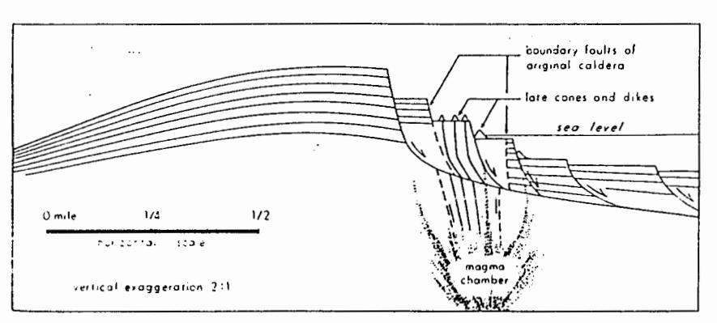

Fig. 5. Schematic diagram illustrating "gravity collapse" and possible associated volcanic activity.

The northeast rift zone of Ta'u, along which the Luatele shield, Lualaititi pit crater, and at least two vents at Fitiiuta are perfectly aligned (Fig. 2), extends to more than 5,000 feet below sea level. Four or five extra-caldera cones are also aligned along a radial rift just to the south, but there is no indication of a submarine ridge continuing offshore.

## Geomorphology

STREAMS AND VALLEYS: The radial drainage pattern of the original Lata shield is still present today, although somewhat modified by faulting and later volcanism. Faleiulu Stream, for example, is a radial stream on the Lata shield, but where it encounters Tunoa shield, it is deflected to the north. Daly's statement (1924:132), "The deepest gorge observed is about 5 meters in depth," is correct for most of the island. However, along the northern coast, Avatele, Matautu'ao, and 'Ao'auli streams have cut deep valleys into pre-caldera flows where apparently no later post-caldera volcanism occurred. 'Ao auli and Matautu'ao streams have cut canyons more than 300 feet deep, and Avatele Stream locally is more than 600 feet lower than the adjacent ridges. The entire island would probably have been similarly dissected had there been no postcaldera volcanism.

The lowermost 1,000 feet of Laufuti Stream on the southern coast is the only perennial drainage on Ta'u Island. Laufuti stream valley has been cut into the dike complex, tapping springs that are fed by ground water trapped there by the relatively impermeable dikes. The rate of discharge for this stream is on the order of thousands of gallons per minute, even during periods of minimum rainfall. The upper portion of the stream flows only after heavy rains, but because of the high rainfall (probably well over 200 inches per year in this area), water remains in small ponds and pools which contain large freshwater eels.

None of the streams on the island is sufficiently mature to have a floodplain. Alluvium is present only in the narrow stream beds and is not extensive enough to be mapped separately. Many of the stream beds contain boulders up to 12 feet in diameter.

BEACHES AND COASTS: Marine erosion during a long period of volcanic quiescence cut a sea cliff approximately 200 feet high around Ta'u Island. On the north central coast where precaldera lavas are exposed the sea cliff cannot be distinguished because marine erosion was subordinate to stream erosion. On the south central coast the cliff is locally as high as 1,200 feet and appears to be partly a fault-line scarp. The sea cliff is buried under the Faleasao tuff on northwestern Ta'u, and the Fitiiuta lavas have built out in front of the sea cliff on northeastern Ta'u. Some of the post-erosional lavas of the Lata shield have spilled over this sea cliff.

Most of the coastline on Ta'u Island consists of beaches less than 100 feet wide. Foreshores slope 10-13°. Vegetation usually extends to within a few feet of the water, because the tidal range is low and reefs protect the shore from most storm waves. Beachrock is extensively exposed both above and below present sea level along many of the beaches and is being eroded at present. The dip of the beachrock is usually somewhat less than the foreslope of the present beaches, possibly indicating that it was formed during a slightly higher stand of the sea, Beach material varies in grain size from medium sand (Wentworth scale) to gravel, but the beachrock is usually fine- to medium-sand size. At Faga, Ma'efu, and a few other areas, cobbles and boulders are cemented in a matrix of medium to coarse sand

A bench cut into the Faleasao tuff about 5 feet above high tide was not observed elsewhere on Ta'u. If this bench was formed at a higher sea level, the stand was of relatively short duration, because only the easily eroded tuff was affected. Present-day waves are destroying this bench.

Ta'u Village is built on a terrace 10 or 12 feet above sea level. A terrace at this altitude also exists at Faleasao, Faga, Saua, Tufu, Amouli, and Si'ufa'alele. These terraces on the southern part of the island are composed of sand and coral shingle, whereas the others are entirely sand. During hurricanes, waves top the terraces—as in the hurricane of 1959 when waves destroyed a trail on the terrace more than 200 feet inland at the base of the old sea cliff near Saua. Faleasao, the village best protected from waves.

has not been demolished by storm waves during historic time, but archaeological excavations have exposed older habitations covered by sand and gravel (W. Kikuchi, personal communication, 1966).

Around the island of Ta'u there is a nearly continuous fringing coral reef. Nowhere is the reef front more than 800 feet from shore. The island of Tutuila also has a narrow fringing reef, but soundings clearly indicate that a drowned barrier reef extends more than a mile offshore (U.S. Coast and Geodetic Survey, Chart 4190, 1962). The only offshore soundings for the Manu'a Islands were completed in 1939, and are sparse except between Ta'u and Olosega islands. Moreover, their accuracy is questionable; the islands themselves are positioned 1.7 miles farther west than is shown on more recent charts. The absence of any indication of a submerged reef around Ta'u may be merely the result of sketchy data.

The reef flat contains calcareous sand, coral, and coralline algae in patches, whereas the forereef is composed of prolific colonies of corals and algae. At various places along the reef front there are surge channels about 15-25 feet wide and 9-15 feet deep. Corals found on Ta'u include Acropora, Pocillopora, Millepora, Maendra, Favia, Psammocora, Goniopora, Pavona, Farites, and Goniastrea. Halimeda, Porolithon, Goniolithon, and other calcareous algae are more abundant on the reef flat than on the forereef.

## Geologic History

There is little evidence to indicate the age of the volcanic formations. Judging from the present stage of erosion of the island, the rapid extrusion of shield-building basalts along the crest of the Samoan Ridge began during Pliocene time. Perhaps by early Pleistocene time the Lata shield had built considerably above sea level, and volcanism subsided, allowing time for erosion between some succeeding flows. The summit of the shield collapsed, and the caldera was partly filled with lavas and pyroclastic material. This collapse may have been accompanied or followed by gravity collapse of the southern portion of the shield, involving vertical dis-

placement of up to 1,400 feet. Lavas from postcaldera cones mantled the shield.

After collapse of the Lata shield, possibly in middle Pleistocene time, the Tunoa shield was formed by rapid extrusion of lavas, until its summit collapsed and the resulting caldera was partly filled with lava and pyroclastic material. At about the same time, but perhaps a little later, the Luatele shield was also built up until its summit collapsed and the crater was partly filled. Volcanism then became so infrequent during late Pleistocene time that a sea cliff approximately 200 feet high was cut around the island.

Continued volcanism from post-caldera cones such as Lepu'e, Olomatimu, and Olomanu during Recent time mantled most of the Lata shield, several of the flows spilling over the cliff into the sea. The Faleasao and To'a tuff cones and the lava flows at Fitiiuta built out in front of the former sea cliff. The most recent volcanism in Manu'a was a submarine eruption about 1866 between Ta'u and Olosega islands (Friedlander, 1910).

No definite evidence was found to indicate relative changes in sea level. The 5-foot bench in the tuff complex could be explained as due to lithification resulting from proximity to sea level, and the 15-foot constructional bench could have been formed by storm waves, but the eroded beachrock, as well as the 5- and 15-foot benches, may be indications of a more recent higher stand of the sea. The narrow fringing reef may indicate submergence rapid enough to drown any former barrier reefs.

#### GEOLOGY OF OFU AND OLOSEGA ISLANDS

## Nature and Distribution of Rock Types

GENERAL STATEMENT: Of u and Olosega islands are a complex of volcanic cones that have been buried by lava flows from two coalescing shields. One shield is centered off the northwest coast of Olosega near Sili Village, and the other is centered at A'ofa on the northern coast of Ofu. Older cones, approximately aligned along the crest of the Samoan Ridge, include a small cinder cone at Tauga Point on northwestern Ofu, a nearby tuff cone at the western end of Samo'i beach, a composite cone exposed

in the cliff behind To aga on southeastern Ofu, an explosion breccia cone with an associated intrusive plug at Fatuaga Point on eastern Ofu, and another tuff cone at Maga Point on the southern tip of Olosega. Rocks of the older cones comprise the Asaga Formation, and those forming the two coalescing shields belong to the Tuafanua Formation.

The subaerial part of the islands consists predominantly of lava flows of the two shields. Deeply lateritized flows on southwestern Ofu dip southwestward away from a volcanic center that lay just north of the present northern shoreline. The summit of the shield collapsed to form a caldera, the fault boundaries of which are exposed on the north coast, and the boundaries extend inland as a steep crescentic escarpment within which nearly horizontal lava flows form a gently sloping platform known as A'ofa. Extended seaward, the caldera boundaries form a crude circle with a diameter of about I mile. The caldera is hereinafter referred to as the A'ofa caldera, and the surrounding shield as the A'ofa shield. Vertical dikes in the sea cliff behind Samo'i parallel the boundary of the calders and are probably related structurally to the caldera collapse.

The presence of a second shield is suggested by the dips of lava flows on Olosega, and by numerous dikes striking northeast and dipping northwestward in the high cliff behind Sili Village (Fig. 6, top and middle). The strike of the dikes gradually changes from east-northeast near the western tip of Olosega to nearly north at the northern tip. The center seems to have been beneath the ocean northwest of Sili, and the shield will be referred to as the Sili shield. Whether or not a caldera existed in this shield is uncertain, but a suggestion of one is seen in the submarine topography (Fig. 7). However, no definite evidence was found to establish the presence of two shields, either from geologic field mapping or from gravity measurements (Machesky, 1965). Because the presence of two smaller eruptive centers seems more likely, the shield-building lavas on Ofu are tentatively mapped separately from those on Olosega,

The A'ofa caldera was partly filled with thick olivine basalt, hawaiite, and ankaramite flows. Ponded lavas buried a small intra-caldera cinder cone at the mouth of Sinapoto Stream. Some of

the parasitic cones on the flanks of the volcano, as well as some of the uppermost thick ankaramite flows, may be post-caldera deposits.

Local erosional unconformities stratigraphically low in the pre-caldera section at Tatalan on eastern Olosega indicate a period of decline of volcanic activity. Some of the lavas in this area lie unconformably over weathered lava flows and ash beds, dipping as steeply as 24°. A later, more extensive period of quiescence permitted the carving of deep valleys and the formation around the islands of a sea cliff about 300 feet high. Following the formation of the sea cliff, two or three thick hawaiite lavas flowed down old valleys on the southwest side of Ofu and formed Nu'upule Rock and the ridges behind Ofu Village. Nu'utele and Nu'usilaelae islets, off the west end of Ofu, are remnants of a Recent tuff cone. The Nu'u Formation consists of these post-erosional rocks, which were deposited after the formation of the sea cliff. High cliffs truncate the lava flows on southeastern Ofu and southwestern Olosega, and there may have been foundering along these coasts similar to that suggested for Ta'u Island.

Thus, the rocks exposed on Ofu and Olosega islands can be placed in the following units, in approximate order of decreasing age (see legend for Ofu and Olosega islands, page 454).

- (1) Asaga Formation
- (2) Tuafanua Formation
- (a) A'ofa extra-caldera member
- (b) A'ofa intra-caldera member
- (c) Sili Member
- (3) Intrusive rocks, mainly dikes associated with the Tuafanua Formation and the plug associated with the Fatuaga breccia cone
  - (4) Nu'u Formation
- (5) Sedimentary deposits, including alluvium, landslide debris, beaches, marshes, etc.

ASAGA FORMATION: Nearly all of the cones included in this formation can be seen from Asaga Strait, which separates Ofu and Olosega islands. The To'aga composite cone and the Fattaga breccia cone, probably the oldest features exposed on Ofu and Olosega, can be seen only in the high, nearly vertical cliffs on eastern Ofu. No outcrop could be examined closely, but numerous talus blocks scattered along the shore give some indication of the rock types present

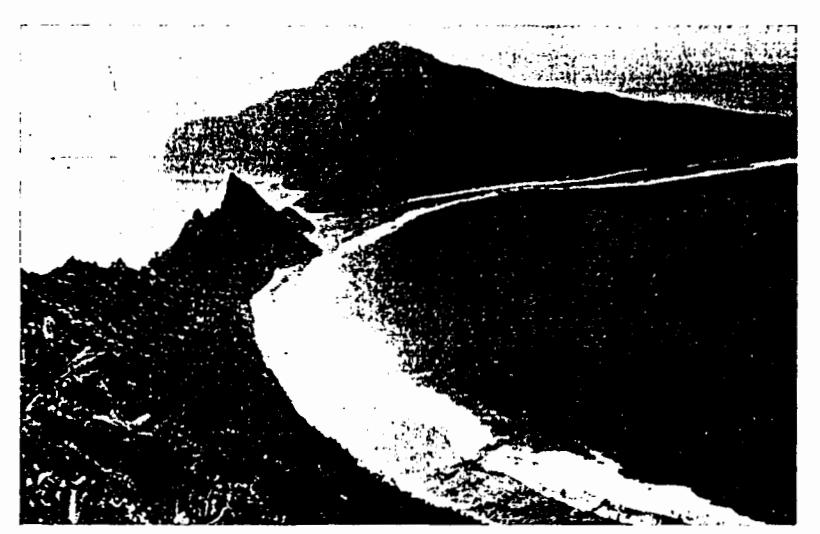

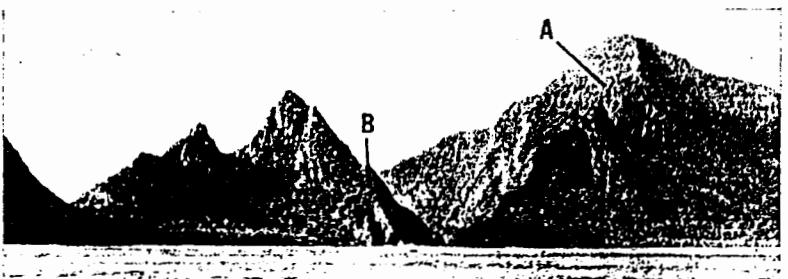

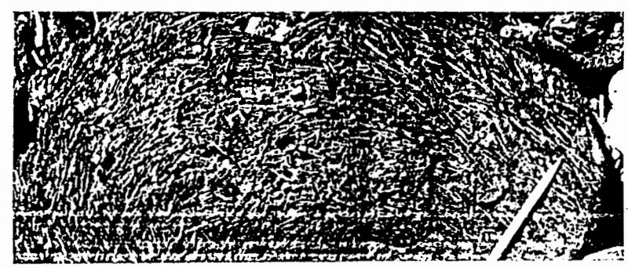

Fig. 6. Of and Olosega islands. Top: Looking east toward Asaga Strait between Of and Olosega. Note fringing reef around the islands with numerous channels across the reef front. Ta'u Island is faintly shown in the background.

Middle: Looking northeast toward Asaga Strait. Note the curvature in the cliff (A) bounding the Sili caldera, and the intrusive plug (B) underlying the Faruaga breccia cone.

Bottom: Boulder of feldspar-phyric basalt on the beach at Samo'i.

in the cliff above. The To'aga composite cone is formed of interbedded aa flows, pahoehoe flows, cinder, and tuff. In the cliff, the exposures are disappointingly few due to the dense vegetation, of the To'aga cone is seen to be overlain by on-Japping Javas from A'ofa shield,

Exposed in the cliff behind Va'oto on Ofu is a bed of red ash up to 20 feet thick. It extends up the slope of the ridge to Lepu'a. A lower impermeable tuff bed provides a spring in the cliff behind Va'oto that is utilized for drinking water in Ofu Village. If the thick red ash bed in this area is the same as the uppermost bed of the composite cone exposed in the cliff behind To aga, then this cone must have extended at least to Va'oto, where west-dipping beds still occur, giving a minimum diameter at sea level of 1.5 miles. The summit of the cone was probably located about 0.4 mile due east of Tumu Mountain at approximately 700 feet above sea level.

Another larger cone of at least the same height was centered offshore between Ofu and Olosega, about 1,500 feet due east of Fatuaga Point, where a related gabbroic intrusive plug is exposed. A tuff bed in the cliff on the north side of Olosega Village apparently marks the eastern surface slope of this cone, giving it a minimum diameter at sea level of 1.8 miles. The eastern portion of the cone was buried by aa flows of the Sili shield. A large percentage of the total volume of the cone is explosion breccia consisting almost entirely of fist-sized blocks of at least six distinct lithologies-vesicular pahoehoe basalt, ankaramite, dense dike rock, olivine basalt, and two types of aphanitic basalt. The matrix, comprising less than 5 per cent of the total rock, is composed of very well indurated vitric ash that contains a few fragments of olivine crystals 1-2 mm in diameter. The cone is probably the oldest feature now exposed in the Manu'a Islands.

Near Tauga Point, at the western end of Samo'i beach on Ofu, an old tuff cone has been covered by a series of about six as flows of the A'ofa shield. The northern half of the tuff cone has been eroded away by wave action, and a horizontal flow of basalt that was ponded within its crater now forms a bench about 15 feet above sea level. A 10-foot-thick yellow lapilli tuff bed, dipping 20° away from the center of the cone. pinches out 500 feet to the east and overlies 1 +50-foot-thick unstratified, palagonitized tuff

An adjacent but slightly later small cinder but an ash bed representing the former surface cone at Tauga Point has also been buried by later aa flows from the A'ofa shield. Numerous ribbon and spindle bombs occur in this cone.

At Maga Point, on the southern tip of Olosega, another old tuff cone has been buried by later flows of the Sili shield. The northern slope of this cone is 34°; its summit rose at least 250 feet above the present sea level. The lower beds of this cone are lapilli tuff with horizons locally rich in basalt blocks up to 6 inches across, and the upper 50 feet is composed of cinder and red ash. A dense flow of hawaiite, 35 feet thick, was ponded within the crater of the cone. A series of thin pahochoe flows of the Sili shield has overridden the cone and now forms Maga Point. This sequence is overlain by interbedded as and pahochoe flows from the Sili shield, with an flows becoming increasingly dominant up-section.

The cones at To'aga and Fatuaga definitely pre-date the two shields. The cones at Tauga, Samo'i, and Maga are all overlain by lava flows from the shields-but they could be parasitic cones on the flanks of the shields. However, since no evidence was found to suggest that the cones were underlain by lava flows from either of the shields, they are considered to pre-date the shields and are included as part of the Asaga Formation.

TUAFANUA FORMATION: The Tuafanua Formation comprises the two shields centered at Sili and A'ofa, which buried the older cones of the Asaga Formation. Tuafanua is the area on the north shore of Ofu near the intersection of the coalescing shields. The pre-caldera lavas of the A'ofa shield are predominantly thin-bedded pahochoe flows with many interbedded aa flows and occasional thin beds of ash and tuff.

The Sili extra-caldera member on Olosega also consists mainly or olivine basalt. The lowermost exposure of the pre-caldera lavas from the Sili shield is found near Leaumasili Point, on the northern tip of the island. A sequence of pahochoe flows (1-2 feet thick), with a few interbedded as flows up to 10 feet thick, are cut by several dikes 1-4 feet thick

that are parallel to, or dip steeply toward, the caldera boundary to the west. In other places the pre-caldera pahoehoe flows vary from 1 to 6 feet thick but are generally less than 3 feet. The flows usually dip less than 10° away from the former summit northwest of Sili Village.

Interbedded as flows exposed in the steep cliffs behind Sili and Olosega villages generally increase up-section in number and thickness from 2 or 3 feet to more than 20 feet. As on Ta'u, some of the steeply dipping as flows (locally up to 30°) have as much as 10 feet of clinker associated with only 1 foot of the massive central portion of the flow.

Thick as flows comprise most of the upper 800 feet of a 2,100-foot section which extends to the summit at Piumafua Mountain. The dips of these later flows are relatively steep, ranging between 15° and 20°. A series of 3 or 4 flows of hawaiite with a total thickness of over 75 feet are the highest flows in the section that could be closely examined. The rock is quite fresh except along some joints that are partly coated with purplish-black manganese oxide. A few exposures near the summit are probably the same thick as flows exposed in the cliff behind Sili Village, but they are too deeply weathered to be identified.

Thus, all of the upper 600 feet of the shield may be capped with flows of hawaiite. Picritebasalts do not seem to be as abundant on Olosega as on Ofu, but a few oceanites and ankaramites are exposed along the eastern coast of Olosega. One of these ankaramite flows contains a concentration of 90 per cent augite phenocrysts up to 0.5 inch long in the frothy 1 inch thick surface crust of the flow. Table 2 is a stratigraphic section of the Sili extra-caldera member at Tafalau on eastern Olosega.

The extra-caldera lava flows of the A'ofa shield are very similar to those of the Sili Member, consisting mainly of basalt or olivine basalt except for a few flows of feldspar-phyric basalt (Fig. 6, bottom), picrite-basalt, and hawaiite. Macdonald (1944) described a hawaiite collected by Stearns from a talus block at the base of the sea cliff near Tauga Point on Ofu. This talus block must have come from the dense, thick as flow near the top of the sea cliff, which represents the upper portion of the shield. The thick ankaramite and olivine basalt flows at

TABLE 2 STRATIGRAPHIC SECTION OF THE SILI EXTRA-CALDERA MEMBER IN THE CLIFF BEHIND TAFALAU, OLOSEGA

| TOP                                                                                                                                                                                                                                     | THICKNESS (feet) |
|-----------------------------------------------------------------------------------------------------------------------------------------------------------------------------------------------------------------------------------------|---------------------|
| Nonporphyritic, weathered vesicular pa- hoehoe flows 1-7 feet thick, dipping                                                                                                                                                         |                     |
| 12*SE Olivine basalt, moderately vesicular aa                                                                                                                                                                                        | 90                  |
| flows 5-7 feet thick with clinker beds 3-5 feet thick, dipping 24°E                                                                                                                                                                  | 30                  |
| Olivine basalt with feldspar microlites forming a dense, massive flow                                                                                                                                                                   | 15                  |
| Nonporphyritic, vesicular aa flows 0.5- 3 feet thick with clinker beds 0.5-7                                                                                                                                                         | .,                  |
| feet thick, dipping 24°E Moderately vesicular as flows of olivine                                                                                                                                                                    | 20                  |
| basalt 4-7 feet thick, clinker beds 3-4 feet thick, with much red cinder and ash, dipping 24°E                                                                                                                                    | 35                  |
| Brown palagonitized vitric crystal tuff with olivine and augite crystals, lying unconformably on lower flows, tuff dipping 24*E                                                                                                |                     |
| Minor angular unconformity due to ero- sion                                                                                                                                                                                          | 5                   |
| Nonporphyritic basalt with feldspar mi- crolites forming dense as flows 3-5 feet thick, clinker beds 1 foot thick, dipping 30*E Nonporphyritic, vesicular pahoehoe flows, 0.5-4 feet thick, dipping 30*E includ- ing: | 30                  |
| ankaramite gradational to olivine- augite basalt olivine basalt with rare augite                                                                                                                                                  | -10                 |
| phenocrysts basalt containing small laths of feldspar phenocrysts randomly                                                                                                                                                              | 10                  |
| oriented and rare olivine pheno- crysts                                                                                                                                                                                              | 10                  |
| Talus of blocks at base of cliff                                                                                                                                                                                                        | 65                  |
| Total thickness of section                                                                                                                                                                                                              | 350                 |

Tumu Mountain, the summit of Ofu, are essentially horizontal and probably represent nearly the original summit of the A'ofa shield.

Pyroclastic deposits are interbedded in the A'ofa extra-caldera member. On northwestern Ofu a palagonitized vellow lapilli tuff more than 4 feet thick, an unstratified tuff more than 50 feet thick, a few thin red ash beds, and cinder in talus are present. Red cinder found in the soil 700 feet due north of Tumu Mountain is probably from an old post-caldera vent in that area, and may have been a source for the thick flows of the Nu'u Formation. A few intercalated beds of red ash and cinder up to 10 feet thick are present in the Sili Member on southeastern Olosega.

The A'ofa caldera has been partly filled with lava flows and pyroclastic material. At the base of the exposed section are four dense, nearly horizontal lava flows of olivine basalt, three of which are 20-25 feet thick due to ponding within the caldera. These are overlain by thinner (1-7 fect) interbedded as and pshoehoe flows of basalt and olivine basalt. An ankaramite boulder on the beach southeast of Tafe Stream probably came from one of the thick horizontal flows exposed near the top of the 400-foot sea cliff, indicating that some of the later intracaldera flows were picrite. Table 3 is a stratigraphic section of the A'ofa intra-caldera member at the mouth of Sinapoto Stream.

Just west of the mouth of Sinapoto Stream the lowermost thick flows have ponded against a cinder cone, the highest point of which is now about 60 feet above sea level. More than half of the cinder cone has been eroded away by the sea, however, and its summit probably was originally about 150 feet above the present sea level. This cone must have been the source of thin (4-8 feet) as layer of olivine basalt that flowed down its northwestern flank to form Lelua Point.

NU'U FORMATION: Nu'utele and Nu'usilaelae islets, off the western coast of Ofu, are the erosional remnants of a tuff cone, which was originally about 4,000 feet in diameter at present sea level and approximately 300 feet high, and was centered off the southwestern shore of Nu'utele. The cruption occurred near sea level after an extensive period of erosion during which a sea cliff was cut around Ofu and Olosega. The cone is composed entirely of reddish-yellow palagonitized lapilli tuff with accidental blocks and lapilli of basalt, plus a few magnatic basalt lapilli. Individual beds vary from less than 1 inch to more than 5 feet in thickness. The slopes of the original cone were about 30°. No coral fragments nor any evidences of a submarine vent were found, but the eruption may have been submarine in part.

Along the western coast of Ofu at least two flows of aphanitic basalt, in places over 35 feet thick, have flowed down the slopes of the A of a

TABLE 3 STRATIGRAPHIC SECTION OF THE A'OFA INTRA-CALDERA MEMBER AT SINAPOTO, OFU

| (approximately 220-foot elevation)                                                | THICKNESS (feet) |
|-----------------------------------------------------------------------------------|---------------------|
| Dense gray as flow of hawaiite contain-                                           |                     |
| ing abundant microlites of feldspar and                                           |                     |
| scattered microlites of olivine probably flowed over a fault scarp (dip = 25°     |                     |
| NW)                                                                               |                     |
| Clinker                                                                           | 8                   |
| Dense medium-gray as flow identical                                               | 2                   |
| with that above, but dipping only 6°N                                             | 8                   |
| Clinker                                                                           | 2                   |
| No outcrops; thick soil and talus cover                                           | 154-                |
| Nonporphyritic pahoehoe flows, 1-7 feet                                           | 174                 |
| thick                                                                             | 30                  |
| Olivine basalt with olivine phenocrysts                                           | 50                  |
| 2-3 mm in diameter occurring as an-                                               |                     |
| proximately horizontal vesicular pa-                                              |                     |
| hochoe flows 1-15 feet thick: a series                                            |                     |
| of thin-bedded pahoehoe flows cut by                                              |                     |
| a 15-foot-thick flow that apparently                                              |                     |
| plunged down a small fault scarp                                                  |                     |
| which had truncated the thinner pa-                                               |                     |
| hochoe flows                                                                      | 25                  |
| Nonporphyritic 11 flow                                                            | -1                  |
| Clinker                                                                           | -1                  |
| Olivine basalt occurring as vesicular pa-                                         |                     |
|                                                                                   | 3                   |
| Clinker                                                                           | 4                   |
| Olivine basalt occurring as a dense hori-                                         |                     |
| zontal flow                                                                       | 15                  |
| Olivine basalt occurring as a dense hori-                                         |                     |
| Clinker                                                                           | 25                  |
|                                                                                   | i                   |
| Olivine basalt forming a dense horizontal flow, a small spring issues from its |                     |
| lower contact                                                                     |                     |
| Olivine basalt with abundant olivine                                              | 25                  |
| phenocrysts forming a dense horizontal                                            |                     |
| flow (exposed 0.3 mile east of section)                                           | 20                  |
| Talus                                                                             | 30                  |
| Total thickness of section                                                        |                     |
| The time and the section                                                          | 221+                |

shield. Nu'upule Rock, just offshore from Ofu Village, is an erosional remnant of one of them. Just south of Tufu Stream, at sea level, a hawaiite flow at least 25 feet thick is overlain by a flow of olivine basalt 20 feet thick which contains a few small dunite xenoliths. It appears that these flows poured down old, deeply eroded valleys and possibly out over a reef. The source was probably a vent near the summit at Tumu. Because it appears likely that these flows occurred after the formation of deep valleys and a

tentatively included among the Nu'u Formation.

INTRUSIVE ROCKS: The intrusive rocks include numerous dikes exposed in the cliffs of Ofu and Olosega, and one or possibly two plugs on eastern Ofu at Fatuaga Point. Only one dike was found intruding the A'ofa intra-caldera member, and nearly all of the intrusive rocks are probably older than the A'ofa intra-caldera deposits. The plug at Fatuaga Point appears to be the intruded core of the Fatuaga explosion breccia cone. There may also be a smaller, related plug about 1,500 feet to the east, where a hill has an ovoid shape suggestive of an intrusive plug. The outcrop on this small hill which form the razorback ridge on eastern Ofu. Perhaps the fine-grained borders of a coarser grained center.

The coarser grained plug (Fig. 6, middle) at Fatuaga Point is a hypabyssal intrusion of ankaramite. It was recognized and described by Daly (1924:134) as an elliptically shaped plug with a maximum diameter of 120 feet and a minimum diameter of 80 feet. Actually it is considerably larger than this, probably at least 500 by 300 feet. The highest Bouguer gravity anomaly in the Manu'a Islands (more than +310 milligals) was recorded near this plug (Machesky, 1965). There is a gradation in grain size from olivine-titanaugite gabbro in the central portion of the plug to ankaramite near the peripheries. There is also a gradation in shape from a roughly ovoid plug near sea level to a much more elongate ankaramite dike at higher elevations. The general trend of the plug's longest diameter is approximately N 15° W and vertical.

Near sea level at Sunu'itao, the western edge of the plug cuts beds of explosion breccia that trend approximately N 85° W and dip 13° N. Near the top of the shark's-tooth peak at Vainu'ulua, this breccia appears to be trending N 30° E and dipping much more steeply. about 30° W. Some of the blocks included in the explosion breccia are identical with the intrusive olivine gabbro, except that they are slightly finer grained. Thus, the intrusion probably occurred nearly contemporaneously with

sea cliff around Ofu and Olosega, they are the deposition of the breccia, Included within the plug is a pod of brecciated pahoehoe flows of vesicular basalt, which apparently was broken off from the chamber wall and carried up with the magma during the intrusion.

Near sea level the plug is cut by numerous thin dikes that strike approximately E-W and dip 55-85° N. Most of these dikes are dense and aphanitic, but some of the thicker ones are vesicular. This vesicularity, along with the open miarolitic texture of the olivine gabbro, suggests proximity to the surface at the time of intrusion. These dikes parallel those of the dike complex extending from Le'olo Ridge eastward to Olosega, as described below.

The razorback ridge of eastern Ofu is the is appliantic basalt and is similar to the dikes topographic expression of a dike complex about 400 feet wide. The dikes are nearly vertical, but some may dip steeply northward. Most are plug have not yet been eroded to reveal its dense basalt, although olivine basalt, ankaramite, and feldspar-phyric basalt also are present. Large talus blocks of diabase, which came from thick dikes at the top of the ridge, lie along the shoreline north of Vainu'ulua.

The dike complex continues across Asaga Strait to the 2,000-foot cliff behind Sili Village (Fig. 6, middle). Near Tamatupu Point, the westernmost tip of Olosega, thick dikes with dips as low as 50° N may be slightly curved concentric to the Sili caldera, but the individual dikes could not be traced far enough to confirm this. Northeast of Piumafua the number of dikes paralleling the face of the cliff behind Sili Village decreases sharply. In the cliff behind Olosega Village north-dipping and vertical dikes related to this complex decrease markedly in number both up-section and away from the caldera. A few apparently related dikes trending about E-W cut steeply across flows dipping 10-20° away from the caldera as far as 3,000 feet south of the cliff behind Sili.

A sill about 400 feet long and 30 feet thick can be seen in the cliff at Faiava near Sili Village. A low-angle dike near the extreme eastern side of the sill discordantly intrudes a series of pahoehoe flows, striking about N 5° E and dipping 15° E, and may be the feeder dike for the sill, but this relationship cannot be seen clearly because of the vegetative cover. In this portion of the cliff most of the other dikes strike about N 30° E and are vertical, whereas

the lava flows strike about N 5° E and dip eastward, indicating that the caldera boundary swings from east-west toward north in that area. A few of the thinner vertical dikes exposed in the cliffs behind Sili and Olosega villages are radial dikes which are sometimes cut by later thick dikes concentric to the caldera.

About six vertical dikes, varying from 0.5 to 6 feet in thickness are exposed in the cliff behind Samo'i beach on Ofu, and are nearly parallel to the western boundary of A'ofa caldera. One of these is a multiple dike approximately 1 foot thick which is intruded concordantly by several small dikes 3-6 inches thick. A piece of dike rock containing dunite xenoliths was also found on the beach there. Several other dikes occur in widely scattered places along the cliffs of northern and southeastern Ofu. Usually they are less than 4 feet thick, vertical, and approximately parallel to the cliff face. An ankaramite dike more than 40 feet thick crops out at the top of the cliff at Muli'olo and Tumu, and is probably the source of nearly horizontal ankaramite flows on Tumu. It may be related to the collapse of the A'ofa caldera,

NONCALCAREOUS SEDIMENTARY DEPOSITS: The talus and alluvial deposits are very similar to those described on Ta'u. Rock waste is always present at the base of the cliff encircling the islands. Several fan-shaped landslide deposits can be seen at the base of the cliff along the coast of southern Ofu, between Va'oto and To'aga.

Many of the streams on southwestern Ofu and southeastern Olosega cut through deeply lateritized thin-bedded pahoehoe(?) flows and have beds of reddish-brown, sticky silt. Therefore, the stream beds are of a somewhat different character than deposits along other streams in that few large boulders are found. Parts of Tala'isina, Tope'a, Etemuli, and Si'umalae streams on southeastern Olosega and the upper portions of Alei, Saumolia, Tufu, Matasina, and other small streams on southwestern Ofu also have silty stream beds. Large basalt boulders are much less common in the upper portions of Tafe and Sinapoto streams on northern Ofu, where they traverse the relatively level door of the A'ofa caldera, than in the typical boulder beds downstream.

CALCAREOUS SEDIMENTARY DEPOSITS: Most of the beaches are about 50 feet wide and rarely exceed 100 feet. They have a constant foreslope of about 10° from sea level up to the vegetation along the backshore. The beaches are composed of sand, pebbles, and cobbles of coralline algae and coral. On a few beaches some volcanic fragments of basalt, ankaramite, tuff, olivine, and augite occur, but only as minor components in the predominantly calcareous sands. The median grain size, as on Ta'u, is usually coarse sand to gravel. Samples collected at sea level from most of the beaches around the islands and offshore at Ofu and Olosega villages are well sorted (only 1 of 35 analyzed samples had  $\sigma_{d} > 1.3$ ). Beachrock is exposed in the intertidal zone of most beaches on Ofu and Olosega, and is more than 6 feet thick at Olosega Village. Usually the beachrock has approximately the same foreslope as the present beaches.

## Major Structures

The cones of the Asaga Formation generally have slopes of 20-35° because they are composed mostly of pyroclastic material. These cones were all subsequently buried by aa and pahoehoe flows dipping 10-20° away from the two shields which were centered at A'ofa and to the northwest of Sili Village. The nearly horizontal flows forming the highlands of Ofu must have been near the original summit of the A'ofa shield.

A slight break in slope forms a benchlike feature at Papausi on southeastern Olosega. Lateritized thin flows exposed on the surface in this area dip 5-9° NE, somewhat less than the present ground surface. Their approximate strike (N 30-40° W) can be seen in the formation of "steps" 1-2 feet high that presumably represent different lateritized thin flows. A cross section drawn from the high cliff at Sili through Le'ala Point (Fig. 8) shows that these beds most likely do not represent the normal slope of the Sili shield. There are no indications of any vents in this area. These lavas appear to have come from near the summit of the shield, but apparently their dips have been flattened by some kind of an obstruction. The thick as flow of picrite-basalt that forms Le'ala Point dips about 14° SE and probably also came from the Sili shield. It suddenly increases in thickness

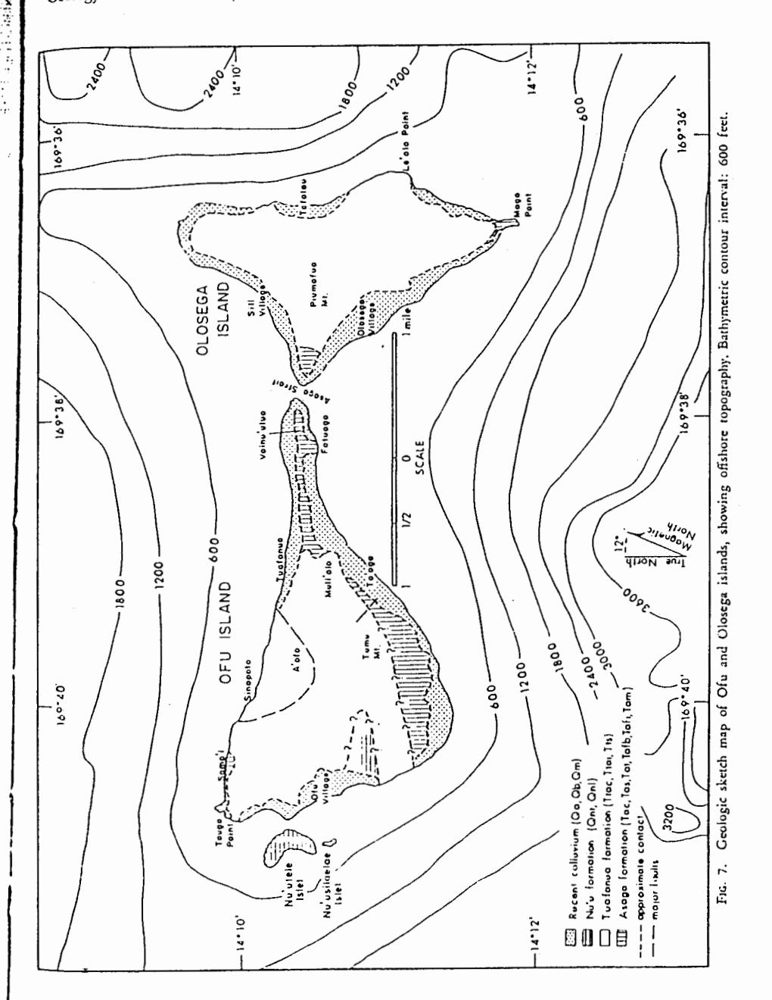

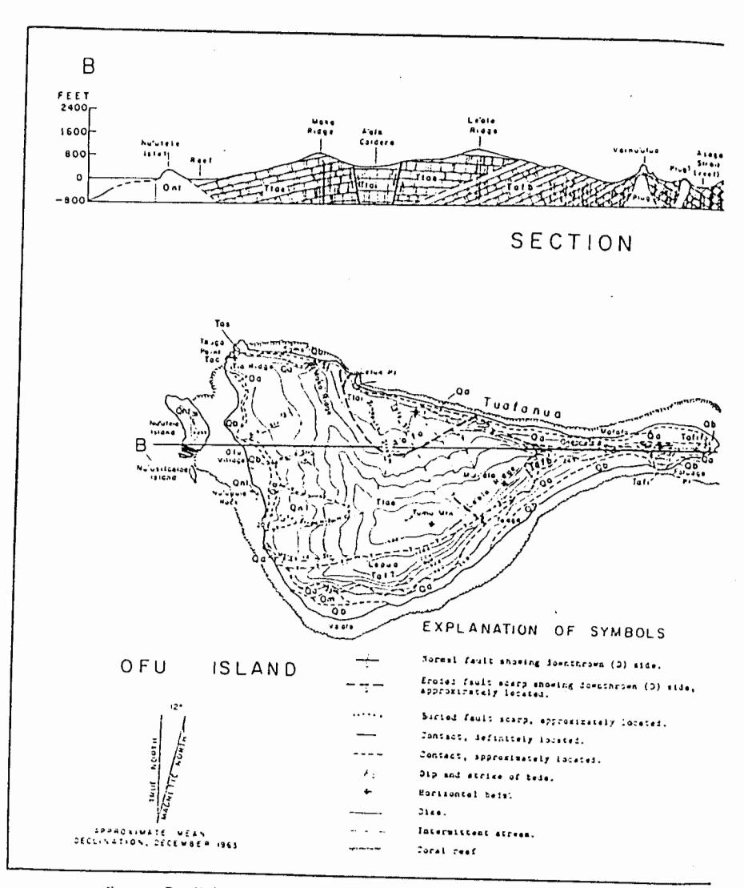

Fig. 8. Detailed geologic map and cross section of Ofu and Olosega islands.

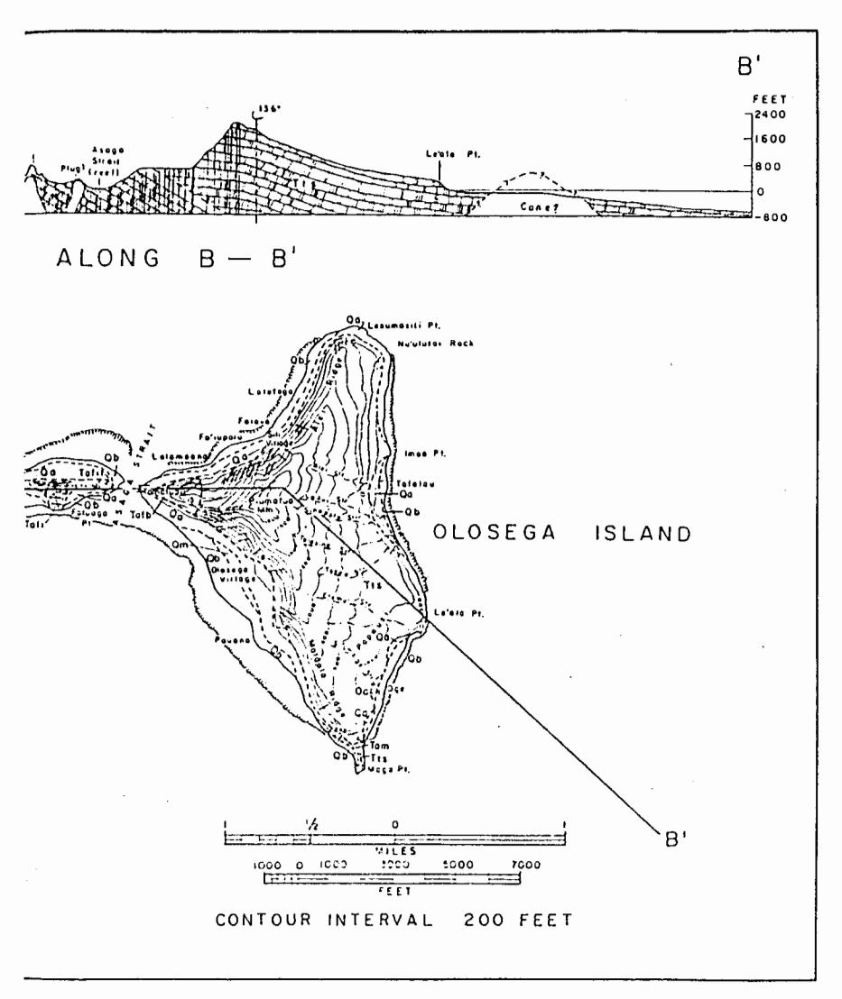

(For explanation of symbols see Legend on following page.)

m

S

To

O

m

Z

ZZ EM

C

Ľη

z

П

 $\overline{\phantom{a}}$ 

0

 $\circ$ 

ш

Z

# LEGEND FOR OFU AND OLOSEGA ISLANDS

CALCAREOUS SEDIMENTS

Modern beaches (Qb) composed of unconsolidated fragments of marine organisms. Beachrock is frequently present.

NONCALCAREOUS SEDIMENTS

iliuvium (Qa), including talus, landslide debris at the base of cliffs, and stream deposits. In sreas behind constructional benches marshes (Qa) sometimes occur.

Qni Qni NU'U FORMATION

Palaconitized lapilli tuff (Qnt) forrs Nu'utele and Nu'usilaelac tulets. A few Recent(?) flows (qnl) of hawaitt sul oll-vine basalt ray fill former deeply eroded attress valleys on sestern Ofu.

MAJOR EROSIONAL UNCONFORMITY

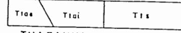

# TUAFANUA FORMATION

A'ofa (Frae) and Sili (Frs) coalescing shields comprised of plivine basalt, basalt, plorite-hasalt, and hasaltee flows with a few intercalated beds of ash, tuff, and breccia. These shields and the Fatuaga breccia come are introded by numerous dikes. Attnin A'ofa calders volcanic deposits (Frai consist of thick ponied flows of plivine hasalt, hawaite, and ankaranite and a buried chief come.

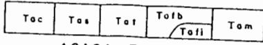

## ASAGA FORMATION

Older comes approximately slighed along the residual rift zone, including a frecois come that; with an associated plug (Taff) at Fatuaga Point; a composite come (Fat) at Forest, a tuff come (Fat) at Maya Point, a tuff come (Tas) at the west end of Samo's, and a cinder come (Tac) at Tauga Point.

downslope and seems to have ponded against an obstruction, perhaps a buried cone beneath Le'ala Point or another cone offshore from there along the crest of the Samoan Ridge. Offshore soundings in that area are sparse but do suggest the presence of a cone as shown in cross section B-B' on Figure 8.

Pyroclastic deposits are concentrated on Ofu and Olosega within a zone between sea level and an altitude of about 500 feet. Phreatomagmatic explosions commonly produce pyroclastic cones near sea level; these pyroclastic deposits represent some of the oldest rocks exposed on Orn and Olosega, suggesting little if any subsidence of these islands since their formation. If a caldera existed in the Sili shield, its floor may never have extended above sea level. The northem boundary may always have been much lower than the southern rim, leaving the southern wall exposed to wave attack. The dike complex of eastern Ofu may have been related to the collapse of the Sili shield, or it may be an expression of volcanism along the regional rift zone of the Samoan Ridge.

In the high cliff behind To'aga, occasional dikes can be seen trending approximately parallel to the cliff face. Several large normal(?) faults can be seen in this cliff, and also in the cliff along the northern coast of Ofu near Oneonetele. The bedding in the cones has suffered large displacements, but there is no surface expression of the faults, nor could the direction or amount of their displacement be measured. These faults may have been related to the collapse that formed the A'ofa caldera.

Less than one-half of the A'ofa caldera is now present above sea level. Offshore soundings (Fig. 7) have not been made in sufficient detail to determine whether the northern half has simply been eroded away or whether foundering occurred. Small faults downthrown to the north within the A'ofa caldera indicate that at least minor faulting has been involved.

Soundings are not complete enough to indicate the nature of the ocean bottom in the huge embayment between southeast Ofu and southwest Olosega (Fig. 6, top). As Daly (1924) suggested, some type of foundering probably occurred in this area, but there is no evidence for another caldera. Perhaps gravity collapse similar to that suggested for Ta'u is responsible for the formation of the high cliffs.

## Geomorphology

STREAMS AND VALLEYS: The stream valleys on southwestern Ofu and southeastern Olosega extend away from the former summits of the shields in a radial drainage pattern. Streams within the A'ofa caldera drain the intra-caldera area and empty into the sea along the cliffed north coast. Because these islands are both lower in elevation and smaller in area than Ta'u, there is considerably less rainfall and resultant runoff. Therefore, the streams are neither as large nor as numerous as those on Ta'u. All streams on Ofu and Olosega are intermittent, flowing only after a downpour. The stream valleys are all youthful and nowhere exceed 50 feet in depth.

BEACHES AND COASTS: After cessation of volcanic activity on Ofu and Olosega an extensive cliff 200-400 feet high was carved into the island by the sea. Behind Ofu Village the cliff is only about 80 feet high due to protection from wave attack afforded by the tuff cone offshore. The much higher cliffs along the northern and southern coastlines originated by faulting and/or foundering but have certainly been modified by marine erosion. The sea cliffs are usually slightly higher than those on Ta'u, perhaps because a longer period of time has elapsed since there was frequent volcanic activity, or because a larger amount of more easily eroded pyroclastic material was deposited near sea level on Ofu and Olosega.

Landsliding and subsequent removal of the talus by wave action are also important erosional processes, especially along the high cliffs of the northern and southern coasts. The numerous fan-shaped landslides and fresh scars in the cliffs above indicate that this process is operative at the present time. A landslide at Pouono, the southern part of Olosega Village, is so fresh in appearance that it probably occurred since the area was inhabited by the Samoans.

Individual blocks also work loose from the cliff face and fall, forming talus slopes that extend almost continuously around the islands at the base of these cliffs. The reef flats are littered with large talus blocks in front of areas where cliffs are high enough for falling rocks to build up sufficient momentum to roll across the reef. A Samoan legend relates how a young girl was killed by a large block that rolled across the reef at Sili, where she was fishing.

The constructional bench 12-15 feet above sea level that was found on Ta'u is also well developed on Ofu and Olosega, although here it is nearly 20 feet above sea level in some places. Sili, Olosega, and Ofu villages are all built on these sandy areas. Other examples of this constructional bench are found at Va'oto, To'aga, and Mafafa on Ofu and at Oge on Olosega. The bench is about 900 feet wide at Va'oto and over 1,000 feet wide at Olosega Village, but the average is about 300 feet. Usually a 9-10° foreslope rises steadily to the crest of the berm 15-20 feet above sea level; sometimes there is an intermediate berm. At Va'oto and Olosega Village, swamps have formed between the berm crest and the talus slope at the base of the cliff.

On the seaward side of Nu'utele Islet a bench is present at the same level as that in the tuff complex at Faleasao on Ta'u. The bench is 5 feet high, has a maximum width of 30 feet, and, as on Ta'u, was developed only in tuff. No evidence was found to indicate how the bench was formed, whether by a Recent higher stand of the sea—of such short duration that only the easily eroded tuff was affected—or by lithification of the tuff at sea level due to contact with sea water.

Beachrock is commonly exposed above the high tide line along beaches, indicating that it is out of equilibrium with present sea level. If beachrock forms at a shallow depth beneath the beach surface, then its exposure in Manu'a may indicate formation during a slightly higher stand of sea level.

Like Ta'u, Ofu and Olosega are completely encircled by a narrow fringing reef (Fig. 6, top). The reef front is only 0.3 mile offshore at its widest point, Ofu Village. The reef there has a more prolific coral growth than in any other area in Manu'a. Most of the coral genera recognized on Ta'u were also found on Ofu and Olosega. In addition, Orbicella and Zoanthus were found only on Ofu. The latter is a soft Alconarian coral that is particularly

abundant in the area between Ofu Village and Nu'utele Islet. A "lithothamnium ridge" occurs along the reef front near Nu'usilaelae Islet on the south and Tauga Point on the north. Millepora tenera Baschma, a stinging coral, was found only on Ofu but, according to the natives, it is present on Ta'u also.

Both large, deep channels and shallower. narrow channels or surge channels are cut into the reef front. The large channels have sand floors, extend out to depths of about 60 feet, and are often as wide as 25 feet. Strong currents flow out through the larger channels such as those off Ofu Village between Nu'utele Islet and Tauga Point and between Nu'usilaelae Islet and Nu'upule Rock, as well as off Olosega Village. The surge channels extend out to about 30-foot depths, have overhanging sides, and usually do not have sediment covering their floors, although a boulder-sized coral shingle sometimes occurs. Generally they do not cut completely through the reef into the reef-flat. as do the larger channels. Surge channel widths vary from 3 to 10 feet.

## Geologic History

Estimating the probable lengths of time required for the various events in the formation of Ofu and Olosega islands, it seems most likely that at least five cones built during Pliocene time were buried by lavas from the A'ofa and Sili shields during Pleistocene time. After summit collapse of the shields, volcanism decreased so that a sea cliff about 300 feet high was cut around the islands. At approximately the same time, gravity collapse similar to that suggested for Ta'u may have caused the embayment of southeastern Ofu and southwestern Olosega. Faulting and further collapse also may have occurred north of the islands in the area of Sili caldera.

Recent volcanism on southwestern Ofu built the tuff cone on Nu'utele Islet. A few thick as flows in this area may have poured down old valleys from post-caldera cinder cones. As on Ta'u, the 5-foot bench in the tuff could be explained by a consolidation due to contact with sea water, but a Recent shift in sea level is indicated by the beachrock now being eroded in many places around the islands. Hurricanes and storm waves may be responsible for the 15- to

20-foot constructional bench. All sediments except the beachrock are unconsolidated and appear to be of Recent age.

#### ACKNOWLEDGMENTS

All of the costs for field work, thin sections, air photos, maps, and so forth, were defrayed by funds from National Science Foundation Grant No. GP-2196. Air photos and maps were obtained from the Topographic Division of the U.S. Geological Survey. G. A. Macdonald aided with many helpful comments both in the field and in the laboratory. Both Macdonald and R. Moberly, Jr., of the Hawaii Institute of Geophysics critically reviewed the manuscript.

The field work in Samoa was undertaken with the permission of High Chief Lefiti, District Governor of Manu'a. The Samoan people were extremely cooperative and their hospitality was overwhelming. Especially appreciated was the assistance of High Chief To'atolu Nua of Ta'u Village; Reverend Soloi of Fitiiuta Village; Chief Milo and Ai Fa'i of Olosega Village; and Sione Malauulu, High Talking Chief Velega, and High Chief Misa of Ofu Village. Without the help of the Samoan people the field work would have been much more difficult, if not impossible.

#### REFERENCES

Daly, R. A. 1924. The geology of American Samoa. Publ. Carnegie Inst. 340:93-152.

FRIEDLANDER, I. 1910. Beitrage zur der Samoa Inseln. K. Bayer. Akad. Wiss., Math-phys. El., Munich Bd. 27, pp. 358-69.

KEAR, D., and B. L. Wood. 1959. The Geology and Hydrology of Western Samoa. Bull. Geol. Survey, N.Z. 63, 92 pp.

MACDONALD, G. A. 1944. Petrography of the Samoan Islands. Bull. Geol. Soc. Am. 55: 1333-62.

MACHESKY, L. F. 1965. Gravity relations in American Samoa and the Society Islands. Pacific Sci. 19:367-73.

STEARNS, H. T. 1944. Geology of the Samoan Islands. Bull. Geol. Soc. Am. 55:1279-1332.

STRANGE, W. E., G. P. WOOLLARD, and J. C. ROSE. 1965. An analysis of the gravity field over the Hawaiian Islands in terms of crustal structure. Pacific Sci. 19:381-89.

U.S. GEOLOGICAL SURVEY. 1963. Topographic Map of the Manu'a Islands, American Samoa. U.S. Government Printing Office, Washington, D.C.

WILLIAMS, H. 1933. Geology of Tahiti, Moorea, and Maiao. Bishop Mus. Bull. 105, 89 pp.