# [Unlocking the Secrets of Swains Island: a Maritime Heritage Resources Survey](https://www.researchgate.net/publication/280311217_Unlocking_the_Secrets_of_Swains_Island_a_Maritime_Heritage_Resources_Survey?enrichId=rgreq-0ec148f512cc607e99ec1e0acbc9e60d-XXX&enrichSource=Y292ZXJQYWdlOzI4MDMxMTIxNztBUzoyNTQ1MDU4OTE2NTk3NzZAMTQzNzY5MDM0MTU3OA%3D%3D&el=1_x_3&_esc=publicationCoverPdf)

|           | Technical Report · September 2013               |       |  |
|-----------|-------------------------------------------------|-------|--|
|           |                                                 |       |  |
| CITATIONS |                                                 | READS |  |
| 0         |                                                 | 3,992 |  |
|           |                                                 |       |  |
| 1 author: |                                                 |       |  |
|           | Hans Van Tilburg                                |       |  |
|           | National Oceanic and Atmospheric Administration |       |  |
|           | 48 PUBLICATIONS   154 CITATIONS                 |       |  |
|           | SEE PROFILE                                     |       |  |

# **"Unlocking the Secrets of Swains Island:"**

*a Maritime Heritage Resources Survey*

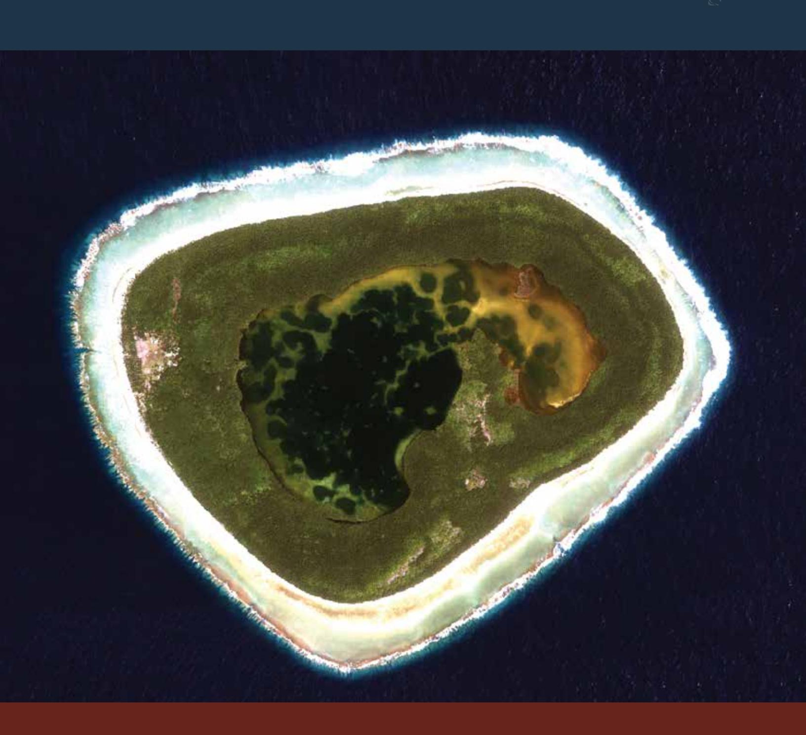

# **September 2013**

Hans K. Van Tilburg, David J. Herdrich, Rhonda Suka, Matthew Lawrence, Christopher Filimoehala, Stephanie Gandulla

National Marine Sanctuaries National Oceanic and Atmospheric Administration

#### **Maritime Heritage Program Series: Number 6**

The Maritime Heritage Program works cooperatively and in collaboration within the Sanctuary System and with partners outside of NOAA. We work to better understand, assess and protect America's maritime heritage and to share what we learn with the public as well as other scholars and resource managers.

This is the first volume in a series of technical reports that document the work of the Maritime Heritage Program within and outside of the National Marine Sanctuaries. These reports will examine the maritime cultural landscape of America in all of its aspects, from overviews, historical studies, excavation and survey reports to genealogical studies.

- **No. 1:** The Search for Planter: The Ship That Escaped Charleston and Carried Robert Smalls to Destiny.
- **No. 2:** Archaeological Excavation of the Forepeak of the Civil War Blockade Runner Mary Celestia, Southampton, Bermuda
- **No. 3:** Maritime Cultural Landscape Overview: The Redwood Coast
- **No. 4:** Maritime Cultural Landscape Overview: The Outer Banks
- **No. 5:** Survey and Assessment of the U.S. Coast Survey Steamship Robert J. Walker, Atlantic City, New Jersey.

These reports will be available online as downloadable PDFs and in some cases will also be printed and bound.

Additional titles will become available as work on the series progresses.

Cover Image - Figure 1: Swains Island satellite image: Image Science & Analysis Laboratory, NASA Johnson Space Center.

Publication Design & Layout: Crimson Pavlekovsky, ONMS

# **Unlocking the Secrets of Swains Island:**

*a Maritime Heritage Resources Survey*

### **September 2013**

Hans K. Van Tilburg, David J. Herdrich, Rhonda Suka, Matthew Lawrence, Christopher Filimoehala, Stephanie Gandulla

### **Executive Summary**

In the fall of 2013, NOAA's Office of National Marine Sanctuaries, along with partner agencies and institutions, conducted an eight-day on-island multidisciplinary survey of Swains Island, American Samoa. The project received critical funding, in part, from the Waitt Grant Program of the National Geographic Society (grant #2881-3), as well as the National Park Service (via the American Samoa Historic Preservation Office). The fieldwork focused on the unique environmental setting and past cultural heritage resources of the island, seeking to illuminate the physical setting and past human experiences on the tiny and remote atoll. Specifically, this involved three areas of separate but inter-related research: 1) survey of the geomorphology of the atoll to identify and date the significant transition from marine lagoon to fresh-water lagoon; 2) the maritime archaeology survey of the interior fresh-water lagoon and other locations to identify historic and prehistoric maritime heritage resources; and 3) terrestrial archaeology on land to identify historic and prehistoric cultural artifacts from the island's previous habitation phases. This is the first time any of these types of investigations have been systematically carried out at Swains Island. This work was conducted to discover, assess, preserve and promote the significant cultural resources associated with the national sanctuary system. The marine areas adjacent to Swains Island have been incorporated into the National Marine Sanctuary of American Samoa (NMSAS) as a sanctuary unit.

The geomorphology survey identified the swale area of the previous channel which once linked the marine lagoon to ocean, and follow-up lab analysis established a preliminary estimate for the initial transition from marine to fresh water regimes. The maritime archaeology survey identified historic objects associated with the 19th-century copra plantation and whaling period, and documented other maritime features surrounding the lagoon and island perimeter. The terrestrial archaeology survey located previously unknown historic locations and documented multiple prehistoric features, including the enigmatic tupua site. Observations during the survey make it clear that, despite its small size, Swains Island is a microcosm of cultural influences in the Pacific.

The 2013 research mission to Swains Island was one part of several other concurrent projects in the field. The Lieutenant Governor of America Samoa and his entourage, the Marine Patrol from Tutuila Island, NOAA's Weather Service personnel, and Jean-Michel Cousteau and the Ocean Futures Society (among others) all had specific separate objectives during the trip. Logistical support was coordinated between the variety of projects on the island, and the camaraderie made for a more enriching experience for all. This report, however, focuses solely on the independent stand-alone heritage resources survey on Swains Island.

The 2013 on-island heritage survey represents the second phase in understanding the special role of Swains Island within the larger maritime landscape of voyaging and migration, Samoan history, Western discoveries and contacts, and the modernization of the Pacific. The 2009 Swains Island archival inventory was the initial step, establishing the archival research foundation for the 2013 field work. The 2013 survey, focused as it was on the remaining material artifacts, can only reveal Swains Island's cultural history from this one perspective and is therefore incomplete, compared to the comprehensive cultural legacy of the island. The voices of the former inhabitants and residents are missing. The research team strongly recommends that the study of this special place continue with a part three, oral interviews of former Swains Island inhabitants. We still have much to learn from this tiny atoll. Isolated Swains Island is a unique location with great potential for revealing its Pacific past. It is the freshwater "jewel" of the South Pacific. All eight heritage survey researchers who spent the week on the island were impressed with the unique nature of the place and material evidence of the past, and are indebted to the sanctuary office and the partner institutions that collaborated in support of this opportunity, opening the door on the environmental and cultural landscapes of Swains Island.

# TABLE OF CONTENTS

| Executive Summary                                       | i  |
|---------------------------------------------------------|----|
| Figures                                                 |    |
| Tables                                                  | ix |
| Forward                                                 |    |
| Formatting Note                                         |    |
| Project Introduction/Background                         |    |
| 1.1 Project Historical Context                          |    |
| 1.2 2013 Project Objectives                             |    |
| 1.3 Expedition Safety                                   |    |
| 1.4 Logistical Support                                  |    |
| 1.5 Maritime Cultural Landscape Approach                |    |
| 1.6 Pacific Whaling Heritage and Eli Jennings           |    |
| Atoll Processes: The Dynamic Physical Setting           | 7  |
| 2.1 General Description                                 |    |
| 2.2 Project Objectives                                  | 7  |
| Bathymetry                                              | 7  |
| Sediment cores                                          | 7  |
| Surface grab samples                                    | 8  |
| Water samples                                           | 8  |
| Topography                                              | 8  |
| 2.3 Geomorphology Results                               | 9  |
| Lagoon                                                  |    |
| Water quality                                           |    |
| Paleo-patch                                             |    |
| Siphon holes                                            |    |
| Island                                                  |    |
| Sediment                                                |    |
| Coral fragment deposit                                  |    |
| Fresh water lens                                        |    |
| Shoreline                                               |    |
| Beach rock formations                                   |    |
| Reef flat                                               |    |
| Reef slope2.4 Discussion: Channel and Lagoon Transition |    |
| Did the channel exist?                                  |    |
| Atoll morphology                                        |    |
| Swale surface deposits                                  |    |
| Lagoon bathymetry and substrate                         |    |
| Lagoon biota and habitat                                |    |
| •                                                       |    |
| Traces of Cultural Landscapes: Early Context            |    |
| 3.1 Survey Methods                                      | 2b |

| Terrestrial archaeology                                             | 28 |
|---------------------------------------------------------------------|----|
| 3.2 Results and Discussion                                          | 28 |
| Side scan sonar analysis                                            | 28 |
| Terrestrial archaeology survey                                      | 32 |
| Beach rock quarry area 1                                            |    |
| Beach rock quarry area 2                                            |    |
| Staked cut beach rock                                               | 32 |
| Upright cut beach rock                                              | 32 |
| Mounds                                                              | 34 |
| Fale foundation 1                                                   | 34 |
| Fale foundation 2                                                   | 35 |
| Cut beach rock islet                                                | 35 |
| Cut beach rock path                                                 | 35 |
| Traditional tupua and platform                                      | 36 |
| Tupua analysis                                                      | 38 |
| General excavation results                                          | 43 |
| Shovel test pit excavations                                         | 43 |
| STPs in Taulaga village                                             | 43 |
| Unit excavation                                                     | 44 |
| Traces of Cultural Landscapes: Historic Context                     | 52 |
| 4.1 Survey Methods                                                  |    |
| Maritime archaeology                                                |    |
| Terrestrial archaeology                                             |    |
| 4.2 Results and Discussion                                          |    |
| Pilings area 1                                                      |    |
| Pilings area 2                                                      |    |
| Drying platform                                                     |    |
| Stone pier                                                          |    |
| Glass bottles                                                       |    |
| Barrels and barrel hoops                                            |    |
| Basalt fragment                                                     | 57 |
| 4.3 Results and Discussion: Shoreline, Back Reef, and Diving Survey | 59 |
| Iron anchors                                                        | 59 |
| Beach shipwreck area 1                                              | 61 |
| Beach shipwreck area 2 and back reef components                     | 61 |
| Beach shipwreck area 3                                              | 61 |
| 4.4 Results and Discussion: Historic Period Resources Ashore        | 64 |
| Chimney site                                                        | 64 |
| Well site near belt road                                            | 65 |
| Solomon islander cemetery                                           | 65 |
| Tokelau cemetery                                                    | 67 |
| Main cemetery                                                       | 68 |
| Etena (Jennings house)                                              | 68 |
| Wooden skiff                                                        | 70 |
| Life buoy                                                           | 72 |
| Jennings family cemetery                                            |    |
| Church at Taulaga Village                                           |    |
| Water tank                                                          |    |
| Grindstone                                                          |    |
| Try pot                                                             |    |
| Ship tanks                                                          | 81 |

| Oven/stove at Etena                                  | 82 |
|------------------------------------------------------|----|
| Wooden food bowls                                    | 82 |
| Tools: anvil                                         | 82 |
| Tools: table saw                                     | 84 |
| Firebricks                                           | 85 |
| Conclusions                                          | 86 |
| 5.1 Proof of Concept                                 | 86 |
| 5.2 Cultural Landscape Approach                      |    |
| 5.3 Nomination of Properties to National Register    | 88 |
| 5.4 Climate Change and Heritage Resources            | 89 |
| 5.5 Recommendations                                  | 89 |
| Maritime heritage resources                          | 89 |
| Geomorphology                                        | 89 |
| Terrestrial archaeology                              | 89 |
| Cultural Landscape Study Part Three: Oral Interviews | 90 |
| Directions in ecosystem protection                   | 90 |
| References                                           | 92 |
| Appendices                                           | 96 |
| A. Project Research Team                             |    |
| B. Emergency Plan and Diving Procedures              |    |
| C. Project Instrument Specifications                 |    |
| D. 2009 Swains Historical Chronology                 |    |
| E. Side Scan Target Imagery                          |    |

# **List of Figures**

Figure 1: Swains Island satellite image

Figure 2: Field project early evening briefing on the beach at Swains Island.

Figure 3: M/V Sili, transit vessel for the 2013 Swains Island project.

Figure 4: Location of the three designated study areas (Lagoon, Island and Shoreline). (R. Suka)

Figure 5: Close-up of swale formation southern quarter of the island with locations of core samples. (R. Suka) Figure 6: Location of surface grab samples from the lagoon floor. (R. Suka)

Figure 7: Close-up of the swale formation with location of surface grab samples. (R. Suka)

Figure 8: Location of water samples from lagoon and one sample from a land core. (R. Suka)

Figure 9: Particulate algae settled on solid carbonate lagoon platform. (R. Suka)

Figure 10: Coral fragments and shells make up a portion of the shallow platform substrate. (R. Suka)

Figure 11: Pond near the eastern edge of the lagoon. (R. Suka)

Figure 12: Cross section of four core samples from the swale area. General topography of the island. (R. Suka) Figure 13: Close-up of the swale formation and extent of coral fragment surface deposits indicated. (R. Suka) Figure 14: Aerial image of Swains Island taken in 1961 showing open areas associated with the swale formation (HC&GS 1961)

Figure 15: Satellite image of Swains Island taken in 2004 with areas that remain open and sparsely vegetated (GoogleEarth 2004).

Figure 16: At high tide, waves erode a storm berm at the vegetation line along the southern shoreline. (R. Suka) Figure 17: Pattern of sand and beachrock substrate on the shoreline of Swains Island. (R. Suka)

Figure 18: Sequence of three beachrock layers within high tide zone of the western shore. (R. Suka)

Figure 19: Wave erosion notch 1.2 m above modern sea level on the eastern shore. (R. Suka)

Figure 20: Chaotic deposit of large coral fragments in beachrock unit. A wave-cut notch is engraved on sea-ward side at the base of the unit. (R. Suka)

Figure 21: Three low-lying atoll landforms with active channel swale formations, compared to Swains Island swale morphology (GoogleEarth 2004). White arrows indicate the location of each channel swale formation. (R. Suka)

Figure 22: Portion of area where coral fragments deposited on the surface of the swale formation. (R. Suka) Figure 23: The bathymetry of Swains Island lagoon showing shallow perimeter carbonate platform and patch reef morphology. Depths at the eastern end of the lagoon should not be considered accurate as thick algae inhibit accurate depth measurements. (R. Suka)

Figure 24: Goby image.

Figure 25: Mollies at Swains Lagoon.

Figure 26: Brown mat algae covering the hard reef structure.

Figure 27: Pink algae conglomeration floating above the green layer.

Figure 28: Green algae "balls" and diver's hand, flowing into and filling all the low areas of the lagoon.

Figure 29: Building the tow pulley on the bow of the skiff.

Figure 30: Tow fish ready for deployment and monitors on the skiff.

Figure 31: Planned survey lanes in the lagoon of Swains Island.

Figure 32: Conducting side scan target dives.

Figure 33: Iron tray located during the side scan survey.

Figure 34: Side scan mosaic of lagoon bottom showing positions of targets, compiled by M. Lawrence.

Figure 35: Showing the locations of potentially significant properties on Swains Island (both early and historic contexts).

Figure 36: Possible beach rock quarry area at southeastern corner of Swains Island. (ASHPO)

Figure 37: Possible beach rock quarry area on Swains Island. (ASHPO)

Figure 38: Stacked cut beach rock slabs along western shore of the lagoon. (ASHPO)

Figure 39: Showing two upright cut rock beach rocks on the southern shore of the lagoon. (ASHPO)

Figure 40: North side of feature 2 fale foundation. Note post with metal band center left. (ASHPO)

Figure 41: Feature 2 fale foundation arch of curbing stones in foreground. Feature 1 fale foundation background. (ASHPO)

Figure 42: Artificial Islet in Swains Island Lagoon Figure 43: Cut beach rock path, note tree roots pushing up beach rock. (ASHPO)

Figure 44: Red arrows point to cut beach rock on path, note tree root of Feta'u tree pushing up and going over cut beach rock that are part of the path. (ASHPO)

Figure 45: Cut beach rock path interrupted by tree. (ASHPO)

Figure 46: Stacked cut beach rock photographed by maritime archaeologists near the main piling area (historic context).

Figure 47: Stacked cut beach rock photographed during the land archaeology reconnaissance survey. (ASHPO) Figure 48: Plan View of Tupua and Platform with "arms" or low walls. (ASHPO)

Figure 49: North side view of Tupua and Platform with projecting "arms." (ASHPO)

Figure 50: Oblique angle of north side of Tupua and Platform with projecting "arms." (ASHPO)

Figure 51: North side view of Tupua and Platform with projecting "arms." (ASHPO)

Figure 52: Oblique angle of east side of Tupua and Platform with projecting "arms." (ASHPO)

Figure 53: Oblique angle of west side Tupua and Platform with projecting arms. (ASHPO)

Figure 54: Oblique angle of south side of Tupua and Platform with projecting "arms." (ASHPO)

Figure 55: Close up of south (back) side of Tupua with arrows indicating cracks and possible cement that may indicate that the Tupua was broken in three piece and repaired. (ASHPO)

Figure 56: East (front) side of Tupua arrows indicating cracks where repairs may have occurred. (ASHPO) Figure 57: North side of Tupua arrows indicating cracks where repairs may have occurred. (ASHPO)

Figure 58: South side of Tupua arrows indicating cracks where repairs may have occurred. (ASHPO)

Figure 59: Location shovel test pit excavations in relation to the Tupua site. (ASHPO)

Analysis of Tupua and platform.

Figure 60: Illustration of two tupua covered in mats in front of god house on Fakaofu, Tokelau Islands (Wilkes 1945: opp. p. 14)

Figure 61: An example of an Eastern Polynesian marae at the island of Reao in the Tuamotus (after Emory 1937:5) Figure 62: Another example of an Eastern Polynesian marae this one at Takaroa in the Tuamotus (after Emory 1937:7)

Figure 63: Showing the relationship between three "sight ing stones" at Arorae Island indicating a bearing to an off-shore island (after Lewis:1972:364 detail of Figure 67). Figure 64: Recording and screening activities during excavation of the test unit Taulaga Village. (ASHPO) Figure 65. Areas on Swains Island where excavation oc curred. (ASHPO)

Figure 66. Location of excavations at Taulaga Village. (ASHPO)

Figure 67: STP 1; view to the east. (ASHPO)

Figure 68: STP 2; view to the east. (ASHPO)

Figure 69: STP 3; view to the east. (ASHPO)

Figure 70: STP 4; Tridacna sp. shell in east wall; view to the east. (ASHPO)

Figure 71: STP 5; view to the north. (ASHPO)

Figure 72: STP 6; view to the east. (ASHPO)

Figure 73: STP 7; view to the east. (ASHPO)

Figure 74: STP 8; view to the east. (ASHPO)

Figure 75: STP 9; view to the east. (ASHPO)

Figure 76: STP 10; view to the east. (ASHPO)

Figure 77: North wall of test unit. (ASHPO)

Figure 78: North wall of Test Unit 1, beach rock slab vis ible at 25 cm bs. (ASHPO)

Figure 79: East wall of Test Unit 1. (ASHPO)

Figure 80: East wall of Test Unit 1. (ASHPO)

Figure 81: South wall of Test Unit 1. (ASHPO)

Figure 82: South wall of Test Unit 1, with STP completed in the southwest corner. (ASHPO)

Figure 83: West wall of test unit. (ASHPO)

Figure 84: West wall of test unit, with STP completed in southwest corner. (ASHPO)

Figure 85: Position of lagoon perimeter features.

Figure 86: Group of 14 pilings at west side of lagoon, near a rock slab path.

Figure 87: Distribution of (western group) pilings recorded by baseline trilateration,

showing relationship to a possible rock path om shore. Figure 88: Slabs of cut beach rock emerge from beneath the perimeter tree growth, near the former pier (location different from cut rock slabs on the lagoon noted by the terrestrial team).

Figure 89: Iron spike in piling. (scale 2cm)

Figure 90: One of a series of Kanava posts.

Figure 91: Three wooden pilings extending out from the southern shore of the lagoon, one submerged.

Figure 92: Kanava (?) fence posts at Taulaga Village.

Figure 93: Wharf at lagoon on Swain's Island, circa 1937. (Feleti Barstow Public Library, Polynesian Photo Archives

American Samoa, Julius E. Cerruti Collection).

Figure 94: The wooden "namu" platform, for drying

clothes, shells and other lagoon resources.

Figure 95: Stone pier on southern shore of the lagoon near Etena as seen from kayak. (ASHPO)

Figure 96: Christopher Filimoehala measures stone pier with metric tape measure. (ASHPO)

Figure 97: Stone pier on southern shore, west side of pier. (ASHPO)

Figure 98: End of rock pier below water.

Figure 99: Representative green bottle sample.

Figure 100: Representative green bottle sample (reverse side)

Figure 101: Representative clear bottle sample.

Figure 102: Representative clear bottle pontil.

Figure 103: Example of a 19th- century handmade blownin-mold utility bottle. (B. Lindsey bill@historicbottles.com) Figure 104: Graveyard at Swains Island circa 1937.

(Feleti Barstow Public Library, Polynesian Photo Archives

American Samoa, Julius E. Cerruti Collection)

Figure 105: Two nested iron hoops.

Figure 106: Concrete barrel "forms" near house location (scales 20cm).

Figure 107: Multiple barrel forms.

Figure 108: Barrels and kegs on board the whaler Charles Morgan, Mystic Seaport.

Figure 109: Broken basaltic stone immediately north of the artificial island.

Figure 110: Position of iron anchors and beach/back reef shipwreck scatter.

Figure 111: Position of two iron anchors highlighted.

Figure 112: Anchor #1 single-palm bent-arm no-stock iron

anchor. Note the small crack at the base of arm.

Figure 113: Diver's drawing of anchor #1. (shank length 2.2m )

Figure 114: Anchor #1 crown detail.

Figure 115: Anchor #1 spade-shaped palm detail (width 0.37m).

Figure 116: Anchor #2 light "fisherman" style anchor.

Figure 117: Diver's drawing (shank length 1.28m).

Figure 118: Anchor #1…unclear how the anchor could have been set in this position.

Figure 119: Shipwreck flotsam (multicomponent) ashore (scale 20/2cm).

Figure 120: Spikes and bolt of multicomponent piece.

Figure 121: Ends of the threaded through-bolt fasteners.

Figure 122: Back reef articulated wood debris with similar threaded fasteners.

Figure 123: Isolated back reef broken fastener (scale 1in).

Figure 124: Selected small through bolt fasteners from

isolated beach locations (scale 1cm).

Figure 125: Flotsam site 3, Wooden timber, southeast

shore of Swains Island. (ASHPO)

Figure 126: Stern of wreck from Apia on Swains Island. (Courtesy Alexander Eli Jennings)

Figure 127: "Aolele" written on the port quarter. (Courtesy Alexander Eli Jennings)

Figure 128: Opportunistic dive conducted along reef crest for offshore shipwreck components…none detected.

Figure 129: View of the top of the reef crest and backside of breaking wave (looking inshore) during the opportunistic dive survey.

Figure 130: Chimney site near cut beach rock path. Chim ney faces east. (ASHPO)

Figure 131: North side. (ASHPO)

Figure 132: Water well just off the Belt Road between

Taulaga and Etena. (ASHPO)

- Figure 133: Interior of water well next to the Belt Road between Taulaga and Etena. (ASHPO)
- Figure 134: Solomon Island Cemetery, photograph taken facing south. (ASHPO)
- Figure 135: Map of Solomon Island Graves at Swains Island.
- Figure 136: Feature 1 at Solomon Islanders Cemetery. (ASHPO)
- Figure 137: Feature 2 at Solomon Islander Cemetery. (ASHPO)
- Figure 138: Feature 3 at Solomon Islander Cemetery. (ASHPO)
- Figure 139: Feature 4 at Solomon Islander Cemetery. (ASHPO)
- Figure 140: Feature 5 at Solomon Islander Cemetery. (ASHPO)
- Figure 141: Feature 6 at Solomon Islander Cemetery. (ASHPO)
- Figure 142: Feature 6 at Solomon Islander Cemetery. (ASHPO)
- Figure 143: Tokelau Cemetery photo taken facing north (partial view 1). (ASHPO)
- Figure 144: Tokelau Cemetery photo taken facing north east (partial view 2). (ASHPO)
- Figure 145: Main Cemetery Swains Island 2013. (ASHPO) Figure 146: Front of the Jennings Family residence at
- Etena. (ASHPO) Figure 147: Back of Jennings residence and steps. (ASHPO)
- Figure 148: Showing southeast side of Jennings residence in Etena. (ASHPO)
- Figure 149: Interior of Jennings house showing wooden pier coming through the floor. (ASHPO)
- Figure 150: Kitchen area showing chimney, stairs, and concrete blocks behind house. (ASHPO)
- Figure 151: Front of kitchen chimney Jennings' resi dence.
- Figure 152: Side view of kitchen chimney behind Jen nings residence. (ASHPO)
- Figure 153: Back of kitchen chimney at the Jennings' residence. (ASHPO)
- Figure 154: Transom-end view of the inverted small boat.
- Figure 155: Bow-end view and broken stem post.
- Figure 156: Interior view of the broken boat, cracked frames and floors.
- Figure 157: Ship's patented Life Saving Buoy (scale 20cm).
- Figure 158: Stanchion rings of life buoy.
- Figure 159: The inscribed maker's mark on the life buoy: "Franklin Life Buoy Pat'd Sept. 4, '88 Bath Iron Works makers Bath, ME., USA."
- Figure 160: Graphic from the *Scientific American* 1899 ar ticle on the Franklin Life Buoy, showing the buoy stowed. (*Scientific American* July 1899.)
- Figure 161: Life buoy deployed, with calcium phosphide flares automatically ignited. (*Scientific American* July 1899.)
- Figure 162: Jennings family cemetery at Etena. (ASHPO) Figure 163: Feature 2 Concrete slab grave monument.
- (ASHPO) Figure 164: Feature 3 Concrete and coral rubble fill grave monument. (ASHPO)
- Figure 165: Feature 4 Concrete and coral filled grave monument. (ASHPO)
- Figure 166: Feature 6 Front of two tiered concrete with coral fill and pedestal grave. (ASHPO)

- Figure 167: Feature 6 Back of two tiered grave monument with pedestal. (ASHPO)
- Figure 168: Close up of Feature 6 Inscription. (ASHPO)
- Figure 169: Feature 7 Two tablet style headstones in front of a single concrete delineated and coral fill grave
- monument containing two burials. (ASHPO) Figure 170: Feature 7 headstone tablet 1. (ASHPO) Figure 171: Feature 7 headstone tablet 2 at Etena.
- (ASHPO) Figure 172: Feature 8 Box style grave monument at Etena. (ASHPO)
- Figure 173: Feature 9 Cut beach rock and coral rubble filled grave monument at Etena. (ASHPO)
- Figure 174: North side of church at Taulaga 2013. (ASHPO)
- Figure 175: West side of church at Taulaga. (ASHPO)
- Figure 176: South side of church at Taulaga. (ASHPO)
- Figure 177: East side of church at Taulaga. (ASHPO)
- Figure 178: Interior of Taulaga church facing east show -
- ing altar and elements of the building. (ASHPO)
- Figure 179: Altar in Taulaga church with cloth set aside to show altar design elements. (ASHPO)
- Figure 180: Interior of Taulaga church showing the appearance of the altar area in 1889. (Museum of New
- Zealand http://collections.tepapa.govt.nz/object/1238485) Figure 181: Chris Filimoehala stands on the east side of
- the Taulaga village water tank. Chris is 6' 2'' tall. (ASHPO) Figure 182: Position of ship tanks and other heritage properties on-island.
- Figure 183: Round grinding wheel (scale 20/2 cm).
- Figure 184: Worn grinding surface.
- Figure 185: Similar size grinding wheel in wreck context.
- Site of the British whaler *Pearl*, lost 1822 (scale 10cm).
- Figure 186: Wheel box with cover on board the whaler Charles Morgan, Mystic Seaport.
- Figure 187: Cast iron whaling try pot at Taulaga Village.
- Figure 188: One of two flat pot sides.
- Figure 189: The Swains Island try pot at the Jean P.
- Haydon Museum , Pago Pago.
- Figure 190: Try pot side view, Jean P. Haydon Museum, Pago Pago.
- Figure 191: View of the copra drying sheds at Tualaga Vil lage, Swains Island, 1886. Photographer Thomas Andrew. (Museum of New Zealand Te Papa Tongarewa C.037822)

-

- Figure 192: Try pot at Goolwa Museum, Australia.
- Figure 193: Try pots with spillway attached, Australia
- National Maritime Museum, Sydney.
- Figure 194: Ship tanks #1 (Taulaga Village) in-use.
- Figure 195: Tank #2 (peninsula road).
- Figure 196: Ship tank #3 (near the Residency).
- Figure 197: ship tank advertisement from Hudson's Store catalogue, 1929. (http://www.ozwrenches.com/tank-lidslondon.htm)
- Figure 198: Tank #1.
- Figure 199: Ship tank lid marked "W.B. Bawn & Co. Byron Tank Works Poplar London E."
- Figure 200: iron oven door.
- Figure 201: Oven within cookhouse stone chimney.
- Figure 202: Carron Company insignia, by Stephen C.
- Dickson (http://en.wikipedia.org/wiki/Carron\_Company).
- Figure 203: Embossed plate on the iron oven door.
- Figure 204: David Jennings and the wooden bowls discov -
- ered somewhere near Taulaga Village. Figure 205: Top view of smaller wooden bowl.
- Figure 206: Top view of larger wooden bowl.
- Figure 207: `Umete bowls at the Samoa National Mu -

seum, Apia.

Figure 208: Front of anvil, showing handling hole beneath the horn.

Figure 209: Anvil showing pritchel and hardie holes.

Figure 210: Top view of used London or English style

anvil, by Fciron (http://en.wikipedia.org/wiki/Anvil#Types)

Figure 211: Swains Island anvil.

Figure 212: The parts of the #4 W.F. & J. Barnes Co. footpowered table saw.

Figure 213: Inscribed table saw stand.

Figure 214: Catalog drawing of the Barnes Company

table saw. http://www.tooltimer.com/barnestable.html

Figure 215: Several fire bricks located in the vicinity of the Jennings Residency.

Figure 216: Sample of the Pacific Sewer Pipe Company firebrick, circa 1910-1921. (image Dan Mosier, calbricks. netfirms.com)

Figure 217: The initial heritage resources survey is begin ning to open our understanding of Swains Island's cultural past.

Figure 218: 1953 map produced from memory by former residents of Swains Island, for comparison to historic resource results. (Ickes 2009: 176)

Figure 219: Group portrait from Swains Island, 1886.

Photographer Thomas Andrew.

(Reproduced courtesy of Museum of New Zealand Te Papa Tongarewa C.037941)

Figure 220: Numbered SSS target positions in the lagoon.

# **Tables**

- Table 1: Documented references to early whaling contacts at Swains Island.
- Table 2: Water quality measurements from the lagoon and one land core.
- Table 3: Coral and Mollusk species identified from lagoon sediment samples.
- Table 4: Sediment sorting (Folk and Ward 1957) and grain size (Wentworth 1922) for each segment of core sample.
- Table 5: Identification of coral fragments from deposit on the swale formation.
- Table 6: Lagoon side scan target identification.
- Table 7: Early context properties and UTM coordinates
- Table 8: Shovel test pit transect soil descriptions.
- Table 9. Test Unit 1 soil descriptions.
- Table 10: Lagoon perimeter historic context property locations
- Table 11: Shoreline/Reef Artifact Locations
- Table 12: Heritage Properties On-Island Locations
- Table 13: Swains project emergency medical contact information.
- Table 14: Air evacuation emergency contacts.
- Table 15: SSS individual target images and data.

### **Forward**

The 2013 Swains Island Heritage Survey would not have been possible without the collaboration and generous support of the following institutions. Fa`afetai to:

**The National Marine Sanctuary Foundation**

http://www.nmsfocean.org/

**National Geographic Society/Waitt Institute** 

http://wid.waittinstitute.org/about-ngswaitt-grants

**NOAA's Office of National Marine Sanctuaries**

**National Marine Sanctuary of American Samoa**

**Stellwagen Bank National Marine Sanctuary**

**Thunder Bay National Marine Sanctuary**

http://sanctuaries.noaa.gov/

**NOAA's Maritime Heritage Program**

http://sanctuaries.noaa.gov/maritime/

**NOAA's Office of Coast Survey**

http://www.nauticalcharts.noaa.gov/

**Swains Island Eco-Cultural Community Association**

PO Box 5787, Pago Pago AS 96799

**U.S. National Park Service**

http://www.nps.gov/hps/

**The American Samoa Historic Preservation Office**

http://www.ashpo.org/

**University of Hawai`i at Manoa**

http://manoa.hawaii.edu/

**NOAA Diving Center**

http://www.ndc.noaa.gov/gi\_center.html

# **Formatting Note**

The Swains Island Heritage Resources Survey final report is the result of three areas of separate but inter-related research: geomorphology, maritime archaeology, and land archaeology. The results of each of those three study areas, which exist as separate documents, have been reformatted and combined in this final comprehensive report, reducing redundancy and providing greater accessibility for the general reader.

The following applies to all results of the terrestrial archaeology component conducted by the American Samoa Historic Preservation Office:

 Acknowledgement of support: This project has been financed in part with Historic Preservation Funds from the National Park Service, Department of the Interior.

Disclaimer: The contents and opinions do not necessarily reflect the views or policies of the U.S. Department of the Interior, nor does the mention of trade names or commercial products constitute endorsement or recommendation by the U.S. Department of the Interior.

Nondiscrimination and Equal Opportunity: This program received Federal funds from the U.S. National Park Service. Regulations of the U.S. Department of Interior strictly prohibit unlawful discrimination in departmental Federally Assisted Programs on the basis of race, color, national origin, age, sex, or handicap. Any person who believes he or she has been discriminated against in any program, activity, or facility operated by a recipient of Federal assistance should write to:

Director, Equal Opportunity Program, U.S. Department of the Interior, National Park Service, P.O. Box 37127, Washington, D.C. 20013-7127.

# **PROJECT INTRODUCTION/BACKGROUND**

#### **1.1 PROJECT HISTORICAL CONTEXT**

Swains Island is a low-lying coral atoll located 360km (220mi) north of American Samoa. It is a coral atoll with a fringing reef and interior landlocked freshwater lagoon. Atolls generally are comprised of islets typically forming a ring that develop atop carbonate platforms grown on sinking volcanic foundations (Dickinson 2009). The fluctuations of sea level during the Mid to Late Holocene played a major role in their formation. A tiny and remote location, Swains Island nonetheless possesses a unique history and potential to reveal information of our oceanic past in the Pacific. Currently only an outline of the island's long story is known:

- 20th-century anthropologists indicate that Swains Island (Olosega) was initially settled by Polynesian voyagers, and later conquered by Tokelau inhabitants from the atoll of Fakaofo, a distance of 185km or 115mi (Hooper 1975: 89). Oral histories establish a period of domination on the atoll by Fakaofo, as well as a distinct Tokelau lineage on Swains Island, naming Tui Olosega as the historic Aliki or chief. One anthropologist also suggests Samoa (distant 570 km or 355mi) as a possible homeland for "at least part of the people" (Macgregor 1937: 19). Others identify Swains Island or Olosega as a Polynesian voyaging waypoint from Samoa to Tokelau and to Pukapuka (570km or 355mi), as part of the trade in basalt stone adzes (Lewis 1972: 270).
- Early sources suggest that the Portuguese explorer Pedro Fernandes de Quiros, sailing for Spain, landed at what is now called Swains Island

- in 1606 AD and described a lightskinned race of peacefu l people. Initially Swains Island was referenced as Quiros Island. However, later scholars have re-examination this claim and concluded that Quiros' discovery was actually Rakahanga Atoll (or even Manihiki Atoll) in the Kiribati Islands, 1,097km (682 miles) to the east of Swains Island (Maude 1959: 90; Huntsman and Hooper 1996: 333n; Becke 1897: 107; Whistler 1980: 2). This would suggest that first western contact for Swains Island occurred much later during the historic 19thcentury whaling period in the Pacific.
- Western whalers from New England called at Swains Island beginning in the 1830's, if not earlier. Reportedly, New Bedford whaling Captain W.C. Swain passed the island's location to Captain William Hudson of the USS Peacock in 1841. The Peacock, part of the U.S. Exploring Expedition in the Pacific, subsequently confirmed the island's location (Wilkes 1845: vol5, 18). Whaling ships continued to make contact at Swains Island, but few details are known. It is interesting to note that Wilkes' 1845 description of the island is erroneous at best: "…it is of coral formation but has no lagoon..," a consequence of observers passing by but being unable to go ashore due to the high surf.
- Several Frenchmen, and possibly an American, reportedly established copra production on the island as early as the 1840's (Huntsman 1996: 186; Hooper 1975: 92). Many of the Tokelau people on the island at the time fled, apparently due to violence propagated by the foreigners (Ickes 2009: 166).

- Eli Hutchinson Jennings Sr., a whaler and shipwright from New York, arrived at Swains Island in 1856, with his Samoan wife Malia from Lefaga Village on Upolu Island. Several Tokelau natives were on the island at that time (Jennings 1856). Allegedly, Jennings purchased the "title" to the island from an Englishman Captain Alexander Turnbull, who also claimed to have discovered the island (Gray 1980: 212). Turnbull's claim is unclear. Jennings and Malia established their own copra plantation, the island being registered with the American Consulate in Apia as private property sometime in the 1880s (Ickes 2009: 184). The copra plantation continued operations managed by the descendants of Jennings through the 1960s.
- In 1860 a territorial claim for Swains Island was filed by the US Guano Company under the Guano Act of 1856, despite the island being occupied. There is no evidence that guano was ever procured from the island (Skaggs 1994: 77).
- The U.S. Navy first visited the island in 1917, responding to complaints about labor conditions raised in the British local court system (Gray 1980: 217). This was a period when both Britain and the United States were still unclear about the nationality of Swains Island. The labor complaint was reported at that time to be without substance (Gray 1980: 218).
- Swains was later annexed by the United States in 1925, under the jurisdiction of the naval administration in American Samoa, initiating more

than two decades of infrequent naval inspections at the island. A work stoppage and subsequent mass eviction led in 1953 to the establishment of enhanced local governance. Swains Island's circuitous transition to the modern period and its multicultural plantation labor setting has led to contention regarding its cultural legacy.

• In 1981 New Zealand, of which Tokelau is a dependency, confirmed by the Treaty of Tokehega US sovereignty over Swains Island.

The last shipment of copra from Swains Island occurred in 1967. Today the island has been uninhabited since 2008. Including the lagoon, the island covers an area of only 3.5 sq km (1.35 sq mi). Our partial understanding of Swains' past give rise to a number of intriguing questions. Who were the seafarers making contact with Swains along the ancient voyaging routes? What remains from those prewestern contact times that could describe the early settlement? What was the role of the location in terms of ancient navigation? Was the interior lagoon ever open to the sea, accessible to voyaging canoes? What artifacts remain from the island's later historical periods of occupation? Only the general outlines of Polynesian settlement of Far Oceania and Lapita theory are currently understood; there are many areas where discoveries can reveal new perspectives on what is now recognized as the boldest marine migration in human history, the settlement of the Pacific.

Swains Island stands apart from other areas in terms of this potential, though; there has been virtually no archaeological field survey of Swains Island, no archaeological investigation of Swains' past. Research up to this point has focused on only a handful of anthropological surveys (Macgregor 1937, Beaglehole and Beaglehole 1938, Hooper 1975) and documentation of the flora and fauna of the island and surrounding reef (Schultz 1943, Krauss 1974, Whistler 1983, Page and Green 1998, Brainard et al. 2008). Due to the singular control exercised by the Jennings' family and the "private" nature of the island, in terms of actual field research the island is an uninvestigated time capsule of Pacific history.

The work of Janet Davidson and others has demonstrated that surface and especially subsurface archaeological remains are present on atolls, and many cultural deposits have shown to be several meters deep (Craib 1980, 1984; Davidson 1967, 1968, 1971; Davidson and Leach 1996; Leach and Ward 1980; Sinoto and Mc-Coy 1974). While islands with small land areas that are geographically isolated tend to maintain limited populations, archaeological remains have been recorded for most habitable atolls.

In recognition of Swains Island's unique potential, NOAA's Office of National Marine Sanctuaries (ONMS) supported a document-based cultural heritage inventory. The study, completed in 2009, provides historic maps, all available primary and secondary reference documents, and a comprehensive timeline of events and contacts for Swains Island. In 2011 ONMS and the Jennings family supported a visit to Swains Island by the Governor of American Samoa, the Honorable T.A. Tulafono, highlighting the significant natural and cultural resources of the location.

In the broad perspective, the 2009 documentary inventory was the first step in a comprehensive Swains Island Maritime Cultural Landscape Study. This 2013 field project is the second part of that comprehensive study, the survey of physical heritage resources or "Unlocking the Secrets of Swains Island." This report's recommendations (below) suggest that the Landscape Study conclude with a third part, the compilation of oral traditions and human stories (interviews) from all former Swains Island residents, at some near point in the future. Only then will the tangible and intangible cultural heritage of the island truly be appreciated and communicated to future generations.

NOAA's Maritime Heritage Program, created in 2002, is an initiative of the Office of National Marine Sanctuaries. The program's mission is to discover, assess, preserve and promote significant heritage and cultural resources associated with our ocean areas and lagoons. The marine areas adjacent to Swains have been incorporated into the National Marine Sanctuary of American Samoa (NMSAS) as a sanctuary unit. The story of Swains Island is only now beginning to be pieced together. This project represents that beginning. At its core, the Swains Island Heritage Survey Project demonstrates the inseparable connection between human history and special marine locations.

#### **1.2 2013 PROJECT OBJECTIVES**

NOAA's Maritime Heritage Program and partners supported a six-day heritage and archaeology expedition on remote Swains Island. With travel, equipment preparation, vessel transit etc. the whole project was 17 days long. The primary objective was the search for physical evidence of the early Polynesian period, Swains' role as voyaging waypoint in the Pacific. The main task addressing this objective was the lagoon side scan sonar and diving survey, searching for cultural artifacts within the freshwater lagoon. Other parts of this primary objective were also addressed by investigating the geomorphology of the lagoon and island, and conducting on-island terrestrial archaeological survey. The secondary objective for the project was the search for 19thcentury features and artifacts revealing the island's historic period past, in particular the whaling contacts and copra activities associated with Swains Island. The overall heritage survey project combined the efforts of three related teams: a maritime archaeology team, a geomorphology team, and a terrestrial archaeology team. Specific survey objectives:

- Assessment of the lagoon, island, and shoreline geology and geomorphology for evidence of prior marine channel lagoon/ocean connection (primary);
- Side scan sonar survey and target diving assessments (non-invasive measured sketches and photo documentation) of the interior lagoon for features related to past contacts and habitation of Swains Island (primary);
- Location and assessment of other (non-lagoon) historic period maritime heritage artifacts and features which may be on the island itself (secondary);
- Terrestrial surface (pedestrian) reconnaissance and intensive archaeologi-

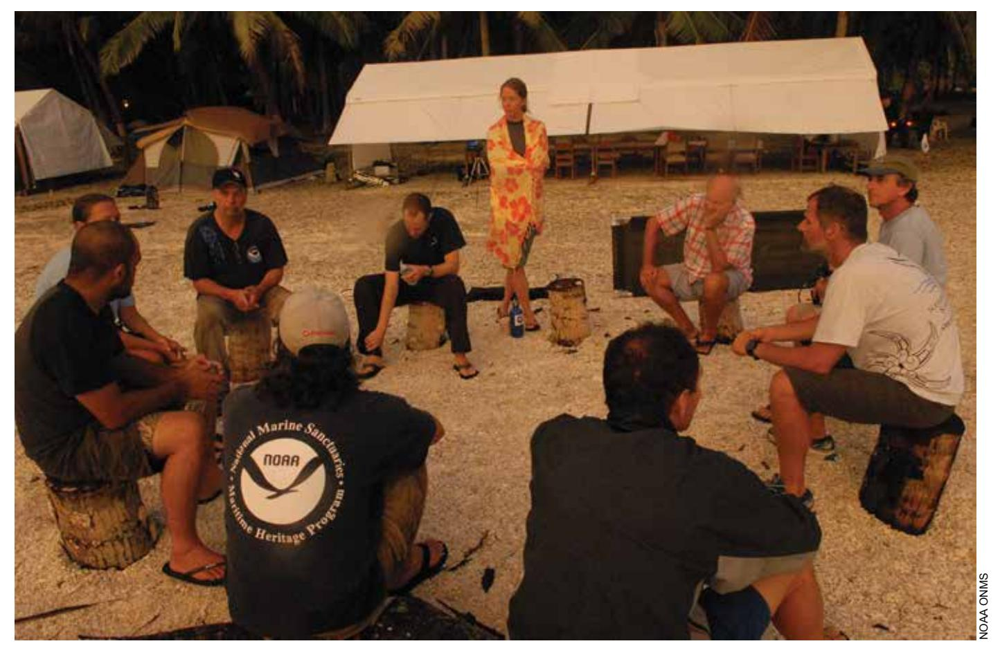

Figure 2: Field project early evening briefing on the beach at Swains Island.

cal survey with limited archaeological test excavations on Swains Island (primary) in order to: 1) identify historic properties (prehistoric and historic) on the island that may be considered eligible for the National Register of Historic Places; 2) obtain data to help to establish a more complete chronology of the history of the island, in particular, to obtain radiocarbon dates for potential prehistoric sites; and 3) determine if there are historic properties Swains island that can be placed in the context of Polynesian culture and its development through time.

Each research team (geomorphology, maritime archaeology, terrestrial archaeology) focused on a distinct set of objectives, though individual members were occasionally free to assist in outside tasks with other teams as needed. The general plan for the day, once the individual research teams had established their work and lodging areas at Taulaga Village and prepared their field survey equipment, was to rise, eat breakfast (provided by the Swains Island support team), and begin survey as early as possible, between 0730-0800.

Transiting to the working area on the small island was a considerable challenge. Few roads or even cleared walking paths exist, and each team had a significant amount of equipment to transport daily. The Swains Island Eco-Cultural Community Association, in its supporting role, provided a four-wheel All-Terrain Vehicle and a small tractor for assisting the research, as well as for a number of other tasks on the island. Otherwise, survey teams walked and carried the equipment they needed. Lunches consisted of snacks carried into the field.

Teams returned from their work areas to Taulaga Village between 1600-1700 to clean and recharge survey equipment and wash up prior to the dinner bell. Communal dinners were prepared by the Swains Island support team. Following dinner, the research teams met for an evening briefing session, analyzing the day's work load and planning the next day's tasks. This was followed by nighttime working periods devoted to downloading and categorizing data, and recharging and repairing equipment.

#### **1.3 EXPEDITION SAFETY**

The 2013 Swains Island project involved a technically challenging land and marine survey in a remote and almost inaccessible location. Plans called for the research team be dropped off on Swains, and then picked up 8 days later at the conclusion of the project. Once on the island, there would no immediate access to evacuation or next-level medical care.

All land activities were reviewed and discussed by the teams prior to departure. All lagoon and near shore diving activities were similarly discussed, and also reviewed by the National Ocean Service (NOS) Unit Diving Supervisor (UDS) and the NOS Line Office Diving Officer (LODO). A complete diving medical and evacuation plan was developed.

The 2013 project team included a trained and fully-supplied NOAA Dive Center DMT (Diving Medical Technician). Support equipment on-island included DMT supplies, a DAN oxygen kit, sufficient oxygen for 12 hours (single oxygen K-cylinder), and an AED unit. Additionally, the project was supported by a HyperLite mobile recompression stretcher, providing on-island capability for running a recompression treatment table 6 with single extension (the NOAA DMT was the HyperLite operator). On-island project staff had contact with American Samoa via the portable satellite phone provided by the support team.

In addition to the NOAA DMT, a doctor from the staff of the LBJ Tropical Medical Center in Pago Pago accompanied the mission, caring for the research team and the extended support group on the island.

#### **1.4 LOGISTICAL SUPPORT**

This survey project was only possible due to the coordinated work of the Office of National Marine Sanctuaries and partners. The island is currently uninhabited and all supplies and equipment had to be transported to and then from the island. Most of the scientific equipment was flown to American Samoa from Honolulu immediately prior to departure to Swains Island on board the M/V Sili, the Samoa Shipping Corporation commercial supply vessel. Each partner in the project brought specific capabilities to bear:

#### **National Marine Sanctuary of American Samoa**

- local transportation and accommodations on Tutuila
- equipment prep and planning space on Tutuila
- coordination of the non-research mission to Swains Island
- project outreach and media tasks

#### **Stellwagen Bank National Marine Sanctuary**

• testing and transportation of the NOAA side scan system

#### **Thunder Bay National Marine Sanctuary**

- procurement of u/w cameras and diving equipment
- testing of algal/fish samples

#### **NOAA's Office of Coast Survey**

• procurement of the NOAA MIST side scan sonar system

#### **The American Samoa Historic Preservation Office**

• procurement of all terrestrial archaeology equipment

#### **National Park Service**

• support for ASHPO terrestrial archaeology on island

#### **University of Hawai`i at Mānoa**

• procurement and transportation of all geomorphology field gear

#### **NOAA Diving Center**

- procurement and transportation of the Hyperlite chamber
- transportation of all spare gear, repair tools

Foremost in the effort of logistical support for the Swains Island 2013 project, the **Swains Island Eco-Cultural Com-** **munity Association (SECCA)** was responsible for:

- Charter vessel to deliver/pick up research team to/from Swains
- Emergency evacuation vessel plan Swains to Pago Pago or Apia
- Boat and coxswain for ship-to-shore transport
- Small boat for supporting lagoon side scan and dive ops
- Small boat for supporting reef dives
- Fuel for boats, maintenance for engines
- Generator (and back-ups) for electricity
- Back-up 12V battery charger w/ power strips
- Tent/cot accommodations for team
- Equipment/work tent for survey electronics
- Shower/toilet facilities
- Food, water, dinnerware and food preparation
- Reliable communications (Sat phone and SSB) with Tutuila

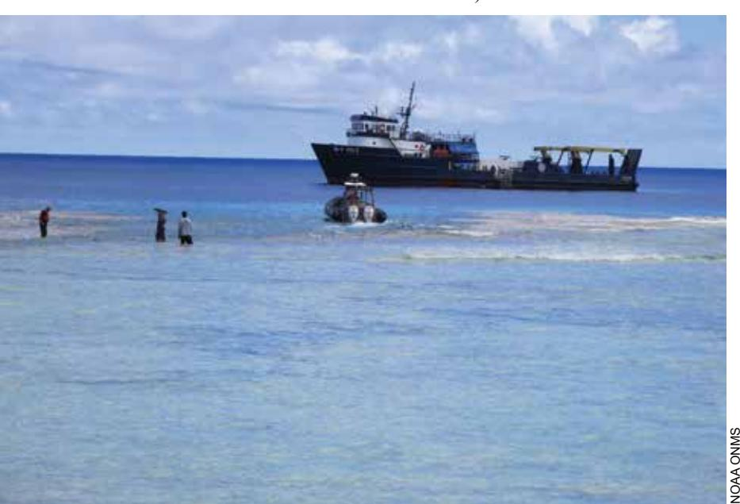

Figure 3: M/V *Sili*, transit vessel for the 2013 Swains Island project.

All other research survey needs were met by the research team members themselves. The research team met in Pago Pago and conducted all final diving and equipment checks prior to the final assembly of all survey gear and supplies and boarding the charter vessel MV *Sili* on Aug. 24. Once at Swains, all supplies and equipment were offloaded by hand and transported across the reef and beach to Taulaga Village.

### **1.5 SWAINS ISLAND: THE MARI-TIME CULTURAL LANDSCAPE APPROACH**

The 2013 heritage survey represents an important step in understanding Swains Island within the larger maritime cultural landscape of human existence in the Pacific. In adopting this broader landscape approach, the survey project follows the lead of NOAA's Maritime Heritage Program. At their most basic level, cultural landscapes are specific places where combinations of human activity and natural forces have left a discernable mark or footprint on the environment (Jensen et al., 2011: 2). Elements of the cultural landscape may be tangible resources like historic properties (shipwrecks, artifacts), or physical alterations of the environment (mounds, pits). These are the subject of the 2013 survey. Cultural landscape elements may also be intangible "resources," such as culturally significant locations, or Traditional Ecological Knowledge of specific places. These would be the subject of future research efforts (Part Three). The cultural landscape approach emphasizes the cultural aspects of human connection to specific places, and therefore better integrates historical, archaeological and traditional knowledge (MPA Recommendations 2011: 4). The maritime cultural landscape is appropriate in locations dominated by reliance on marine resources and oceanic connections. This approach allows us to better consider the long-term changes to the marine environment associated with past (and present) human actions.

For Swains Island, understanding this larger landscape context began in 2010 with the completion of the documentbased historical chronology (Appendix D). This provided the background necessary to plan the 2013 field survey, and highlighted the different phases of the island's past contacts and habitation. Swains Island has been shaped in many ways by natural forces and human activities over hundreds of years. Understanding these changes by discovering the cultural remnants of those periods is an indispensable part of becoming better stewards of our ocean resources. These periods may be summarized as:

- Initial habitation—what if anything remains of this cultural landscape? What major changes (shift from marine lagoon to lake) shaped life on the atoll?
- Historic whaling era—whaling vessels operated throughout the South Pacific beginning in the early 19th century. What resources remain that describe these activities at Swains?
- Copra plantation period—how did Swains' "industrial" period shape the island? What has been left behind from that activity?
- Navy contacts—following the island's annexation in 1925, what physical traces of the Navy's engagement with Swains Island remain?

The 2013 maritime heritage survey teams seeks to understand these periods of Swains Island's past by investigating the physical landscapes and resources that may be associated with each. Ultimately, the team seeks to better understand how humans changed, and were changed by, the island itself.

For Swains Island, a comprehensive understanding of the relationship of humans to the environment, and hence the focus on maritime cultural landscapes, is critical. The small island of Swains with its impressive fresh water source, and rich with marine and atoll resources and human history, is vulnerable to changes and impacts on a scale much more drastic and immediate than larger locations. Swains possesses an environmental and cultural resource legacy, both of which should be preserved for future generations.

#### **1.6 PACIFIC WHALING HERITAGE AND ELI JENNINGS**

Swains Island has a special connection to the heritage of Pacific whaling. The first confirmed western maritime contacts in the 19th-century were whalers and whaling vessels, as is the case in many Pacific locations. This is a measure of the early far-flung American whaling industrial initiative in the Pacific, as well as a measure of Swains' important and scarce commodity in the vast salt ocean: fresh water. Whalers called at Swains for this important resource, filling barrels onshore and transporting them through the surf to the ships on whaleboats.

Reliable secondary sources place Nantucket Captain Jonathan Swain, whaler *Independence*, at Swains Island in 1820 (Stackpole 1953: 281). He found there "a high coral island, well wooded with coconut and pandanus trees." This was a time when New England whalers were only first beginning to venture into the distant Pacific Ocean coming around Cape Horn. William Clarence Swain on board the George Chamblan claimed discovery of Swains Island in the 1830s (Gray 1980: 212). Next, according to ship logs, the whaler Benjamin Rush touched at Swains Island in 1840 (Langdon 1984: 211). Later, when Captain William Hudson on the USS *Peacock* passed Swains Island in 1841 (part of Lt. Wilkes' USS Exploring Expedition), he reported finding the island's position "after the master of a whaler [Captain Swains] who had informed him of its existence." (Stackpole 1953: 281) During the sailing era, many remote islands were "discovered" by westerners multiple times. In any event, Swains Island was clearly a well-known point of contact by the time the whaler and shipwright Eli Hutchinson Jennings Sr. sailed for the Pacific.

Following the establishment of the copra plantation on Swains, other vessels such as merchant schooners and missionary ships, in addition to later whalers, began to call at the island. The first naval vessel touched at Swains (Captain Hudson on the USS *Peacock* did not go ashore in 1841) at least as early as 1917, when USN Lieutenant Commander L.W. Sturm was ordered to investigate reports of harsh working conditions. The charges had been filed in the native court of Samoa, but the British had passed the case to the US State Department, possibly feeling that Swains Island was American in nature (Gray 1980: 217).

Whalers, beachcombers and castaways were, for better or worse, powerful agents of change in the Pacific during the 19th century. The Jennings narrative provides an example of the long-lasting legacy of American whaling heritage. Eli Hutchinson Jennings Sr. himself was an experienced whaler, but relatively few other facts are confirmed about his personal narrative. Some secondary sources indicate that he may have been the son of James Jennings of Shelter Island, New York, and brother of James Jennings Jr., later a noted clergyman in Virginia (Sleight 1931: 141; Horton 1948: 204). Other sources state that Jennings was from South Hampton, New York (Stephenson 1937: 363; Bryan 1974: 138). Both locations are in close vicinity to each other on Long Island, so these may not be contradictory. Little else is known

of his early experience as a sailor. At present two possible narratives exist regarding his transit to the Pacific: 1) Jennings, sailing as first-mate on board the whaler Gem (Captain James M. Worth out of Sag Harbor on 9 October 1847), saves his crew by open-boat voyage to Samoa following the Gem's shipwreck on Suwarrow Island (Richards 1992); alternatively 2) Jennings, sailing on an unnamed whaler, deserts his vessel at Samoa, much to the consternation of his shipmates (Horton 1948: 204; Krauss 1967: 2). Subsequently, Eli Jennings played an important role as shipwright during the lineage wars in Samoa, prior to departing for Swains Island. Discovering more about the story of this early whaler in the Pacific remains a priority, for

the Jennings family is still closely engaged in the management of Swains Island today.

All of the material possessions on Swains Island at this time, necessary for the construction and operation of the plantation and maintaining some level of human comfort, would have to arrive by these various merchant and whaling and finally naval contacts and be brought across the beach. These many items most likely came ashore on the leeward (Western) protected side of the small island, at Taulaga Village where the landing site is currently located. Global maritime transportation and the whaling captains of New England and other distant locations provided the oceanic pathway of material goods that helped transform life on remote Swains Island.

| Date               | Whaler          | Source                         | Notes                                                                                         |
|--------------------|-----------------|--------------------------------|-----------------------------------------------------------------------------------------------|
| 1820               | Independence    | Stackpole 1953                 | Captain Jonathon Swain "discovers" Swains                                                     |
| 1830s              | George Chamblan | Lowe 1967                      | Captain William C. Swain "discovers" Swains                                                   |
| Sept. 13, 1840     | Benjamin Rush   | Langdon 1984                   | Captain Coffin touches at the island                                                          |
| October 16, 1845   | Charleston      | Langdon 1984                   | Seeking fresh water from lagoon                                                               |
| September 28, 1846 | Martha          | Langdon 1984                   | Captain Drake (sailed from Sag Harbor)                                                        |
| June 12, 1850      | Ganges          | Langdon 1984                   |                                                                                               |
| October 19, 1851   | Oliver Crocker  | Richards 1992; Langdon 1984 | New Bedford Captain William Cashencounters boatload of castaways, takes them to Swains Island |
| April 18, 1852     | Canton          | Langdon 1984                   | Captain Folger, New Bedford                                                                   |
| July 22, 1855      | Ocean           | Langdon 1984                   | Captain David C. Osborn (sailed from Sag Harbor)                                              |
| June 12, 1856      | Lion            | Langdon 1984                   |                                                                                               |
| June 21, 1856      | Isaac Howland   | Langdon 1984                   |                                                                                               |
| October 13, 1856   |                 | Gray 1980                      | Eli Hutchinson Jennings Sr. arrives Swains Island                                             |

Table 1: Documented references to early whaling contacts at Swains Island.

# **ATOLL PROCESSES: THE DYNAMIC PHYSICAL SETTING**

### **2.1 GENERAL DESCRIPTION**

Geologically, Swains Island is part of the Tokelau volcanic chain (Birkeland et al. 2007) that extends northward on the Pacific Plate. Swains Island formed over a secondary hotspot (Koppers et al. 2003, Courtillot et al. 2003 ) around 57 Ma (Cande et al. 1995). The volcanic edifice that forms the basement of Swains Island slowly cooled and subsided, allowing coral reefs to establish. Coral growth kept pace with this prolonged subsidence by growing vertically, depositing a thick, steep-sided carbonate cap. During the Pleistocene glaciations, similar carbonate platforms in the central Pacific emerged as subaerial plateaus (Dickinson 2004). Differential karstic erosion of exposed plateaus produced concave centers and solution resistant rims (Flint et al. 1953).

When rising postglacial sea levels submerged these platforms during the Holocene, coral growth resumed on top of the degraded surface, forming the modern atoll reef. These reefs were largely awash until the late Holocene when equatorial ocean siphoning (Mitrovica and Peltier 1991) exposed the mid-Holocene-developed reef flats and presented a foundation for islands to form (Dickinson 2004). The mid-Holocene highstand persisted until ~ 2 Ka (Grossman et al. 1998), with island formation late in the Holocene allowing human migration to take place (Dickinson 2001).

Today's subaerial surface of Swains Island is formed by the deposition of sands and bioclastic material contributed by the reef system that flanks the island slope (Kench et al. 2005). These deposits are not static but are part of a morphodynamic system with periods of erosion and accretion occurring over short time periods (Ford 2013).

The main forcing agents that affect the geomorphology of Swains Island are trade wind waves, ocean swell and storm or cyclone events. Trade winds are predominantly from the southeast during the winter averaging 7- 8 m s-1 generating localized surface waves. This wave energy is dependent upon the strength and duration of the wind. During the summer, winds are northerly with calm periods.

Ocean swells, caused by distant meteoric disturbances that track south and east of the island, generate well-developed wave systems that wrap around the island with wave heights up to 3.7 m. Waves approach the eastern shore and converge on the western shore. Currents are from the east and northeast.

Localized storm events and cyclones track within the 7°- 25° southern latitude range between December and March, generating winds up to 145 km/hr and waves up to 13 m high, large enough to wash over the island and deposit berms of coral fragments and sand up to 2 m in height. Swains Island is also vulnerable to tsunami waves. During 2010 and 2011 tsunami waves reached the island but no injuries or damage were recorded (NOAA 2013b).

Temperatures on Swains Island are tropical year round with little variation, averaging 28° C. Rainfall ranges from 250-500 cm per year with the heaviest precipitation from November to April. Droughts are also on record, for example a marked decrease in rainfall caused an extended period of drought in 1998 (NOAA 2013b).

#### **2.2 ATOLL GEOMORPHOLOGY METHODS**

### **Bathymetry**

An instrument platform designed for shallow water bathymetric survey was used to collect data for the lagoon study area. The survey platform, known as SIGMA, integrates a Garmin GPSMAP 76Cx unit with a Garmin Intelliducer single beam sonar, battery pack and GoPro Hero+3 digital camera with an underwater housing to collect detailed georeferenced bathymetry and imagery of the lagoon floor.

 The instruments, secured to a small floating platform, were towed behind a skiff at a speed of < 2 knots. Each instrument was synchronized to collect a data point every five seconds. Parallel transects were surveyed in an east-west direction across the lagoon from shore to shore with 20 m spacing between lines. Soundings were plotted in Surfer to produce a three dimensional map of the lagoon floor (Figure 23). At the eastern end of the lagoon, thick floating masses of particulate algae more than 2 m thick inhibited accurate depth measurements.

#### **Sediment cores**

A 10 cm diameter AMS Hand Auger was used to collect a series of 4 sediment cores across the swale area between the beach and lagoon (Figure 5). Core 7 was taken from a small depression where 0.5 m of surface material was previously removed. This allowed deeper penetration of the substrate at this site and access to the freshwater lens. The remaining cores were limited to a depth of 60 cm due to the course composition of the substrate.

Each core consisted of a series of 5-10 cm segments. Each segment was sealed in a closed container for transport to the University of Hawai'i Geology laboratory for analysis. Each core segment was sieved to determine sediment size percentage. This data was applied to a cumulative arithmetic curve to analyze the degree of sorting. Results are plotted in profile Figure 12 and Table 4.

#### **Surface grab samples**

Four surface grab samples were collected from the shallow lagoon floor (Figure 6). Two of which are composed of a loose conglomerate of sand, coral fragments and mollusc shells. Each coral and shell within these samples was identified to the lowest taxonomic level possible. Within the sediment, two corals were positioned in situ and selected for U/TH isotopic dating analysis. A third sample was chipped from the shallow, solid carbonate substrate. This sample was selected for thin section analysis. The fourth sample consisted of coral fragments on the surface of the lagoon floor.

30 coral fragment samples were collected from 8 locations in an open area on the swale formation (Figure 7). Each fragment was identified to the lowest taxonomic level possible (Table 5). Two coral fragments were selected within the two largest open areas for radiocarbon dating, one near the beach (sample 13) and another near the lagoon (sample 15).

#### **Water samples**

Eight water samples were collected from the lagoon (Figure 8), one of which was taken from a depth of 6.1 m (sample w8); the remainder were taken from the lagoon surface. In addition, one water sample was taken from the bottom of a coring hole on the island (sample w3). Salinity was determined using a Vital Sine SR-6 salinity refractometer. PH was measured using and Oakton waterproof pH probe. All measurements were made at an ambient temperature of 24.5°C.

#### **Topography**

The extent and location of broadscale topographic features were collected with a GPSMAP 76Cx GPS. Beach edge, vegetation edge, lagoon perimeter and significant topographic features

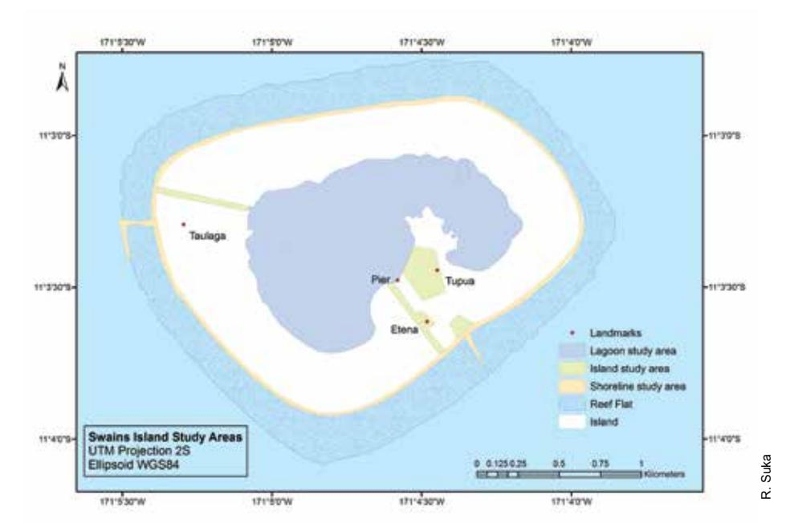

Figure 4: Location of the three designated study areas (Lagoon, Island and Shoreline).

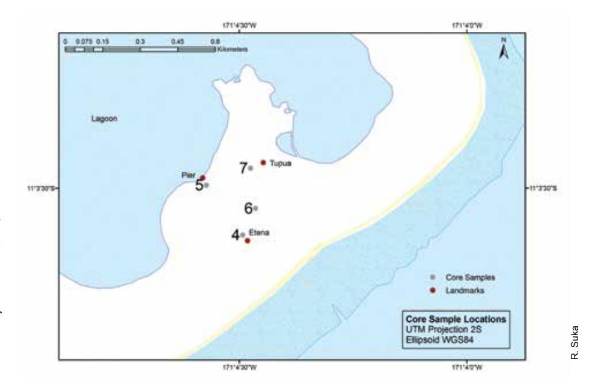

Figure 5: Close-up of swale formation on the southern quarter of the island with locations of core samples.

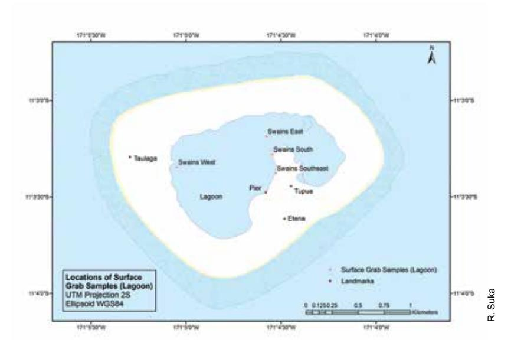

Figure 6: Location of surface grab samples from the lagoon floor.

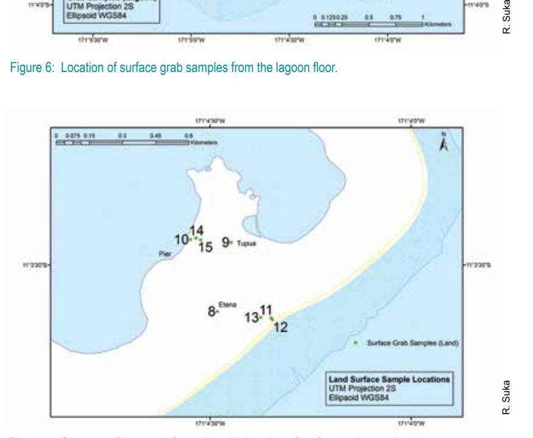

Figure 7: Close-up of the swale formation with location of surface grab samples.

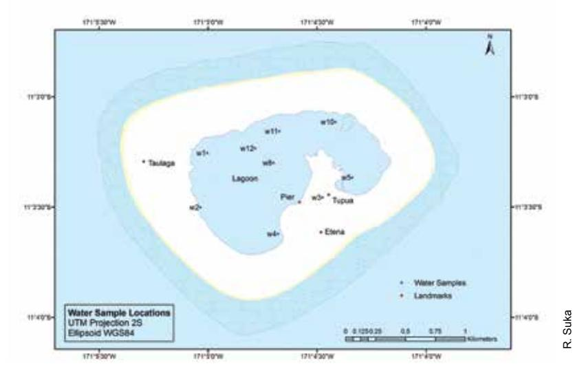

Figure 8: Location of water samples from lagoon and one sample from a land core.

such as the location of beachrock and historic markers were plotted in Arc-GIS (Figure 17). Topographic anomalies such as areas within the interior of the island that were clear of vegetation were also plotted (Figure 13).

#### **2.3 ATOLL GEOMORPOHOLOGY RESULTS**

#### **Lagoon**

Swains Island lagoon is completely enclosed, covering an area of 1.16 sq km. The deepest area of the lagoon is located in the center of the western quarter with a maximum depth of 12 m.

### **Water quality**

All water samples from the lagoon, including a sample taken from 6 m depth, have a salinity value of 4 ppt, apart from one sample taken at the surface along the eastern edge of the swale that was 5 ppt. PH levels for the same samples are slightly alkaline ranging from 7.5 to 8 (Table 2). Water level in the lagoon did not fluctuate with ocean tidal cycles.

Suspended particulate algae are plentiful in the water column and thick algal mats cover most of the lagoon floor. Water quality is sufficient to support these algae as well as two species of fish, both of which are small fresh-water species. (Figure 9)

#### **Paleo-patch reef formations**

The bathymetry of Swains Island lagoon is highly variable with a maximum depth of 12m. Shallow carbonate platforms are nearly continuous around the perimeter of the lagoon. These platforms are morphologically similar to tropical patch reefs found in shallow bays and lagoons that are interspersed with deep holes. An analysis of a thin section of the hard substrate confirmed that the platform is the carbonate skeleton of a massive coral. The depth of the platform surface averages 0.6 m and slopes slightly toward the center of the lagoon. The edges of the platform slope steeply to the lagoon floor with intact Tridacna shells embedded within the slope. Fallen tree trunks, coconuts and palm fronds are scattered across the lagoon floor amongst layers of algae.

| Sample# | Location | Depth (m) | Salinity (ppt) | pH  |
|---------|----------|-----------|----------------|-----|
| W1      | Lagoon   | 0         | 4              | 8   |
| W2      | Lagoon   | 0         | 4              | 7.7 |
| W3      | Land     | 1         | 2              | 7.2 |
| W4      | Lagoon   | 0         | 5              | 7.6 |
| W5      | Lagoon   | 0         | 4              | 7.8 |
| W8      | Lagoon   | 6.1       | 4              | 7.7 |
| W10     | Lagoon   | 0         | 4              | 7.6 |
| W11     | Lagoon   | 0         | 4              | 7.5 |
| W12     | Lagoon   | 0         | 4              | 7.9 |

Table 2: Water quality measurements from the lagoon and one land core.

Sediment samples from the west and east platform surface are composed of a compact layer of mixed sand, shell and coral fragments to a depth of 30 cm or more (Figure 10). Six species of mollusc and two species of coral were identified within the sediment samples (Table 3). Fragile branching Acropora coral fragments from these samples submitted for U/TH isotopic analysis returned a date of Cal BP 2619 +- 16 years for the eastern lagoon sample and Cal BP 1376 +- 9 years for the western lagoon sample.

#### **Siphon holes**

The lagoon carbonate platforms are punctuated with holes 4.6 to 12 m deep and 50 to 180 m in diameter. One hole, on the northern edge of the lagoon, was free of floating algae providing unobstructed access to the lagoon floor. At the bottom of this hole, at 6 m depth, suspended particulates siphon into a crevasse at the edge of the substrate platform indicating that small quantities of water are draining slowly from the lagoon.

#### **Island**

The island landmass begins at the lagoon edge where vegetation grows up to the water's edge. No beaches or sandy cays exist along the edges of the lagoon and no volcanic outcrops are exposed on the island. The dense root-base of coconut trees growing from deposits of sand and rubble form the lagoon shoreline. Winds blowing across the lagoon surface drive waves into the shoreline, eroding

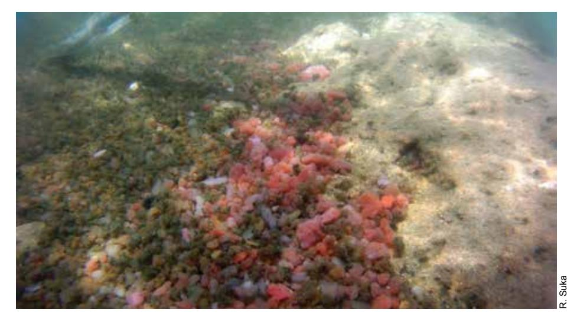

Figure 9: Particulate algae settled on solid carbonate lagoon platform.

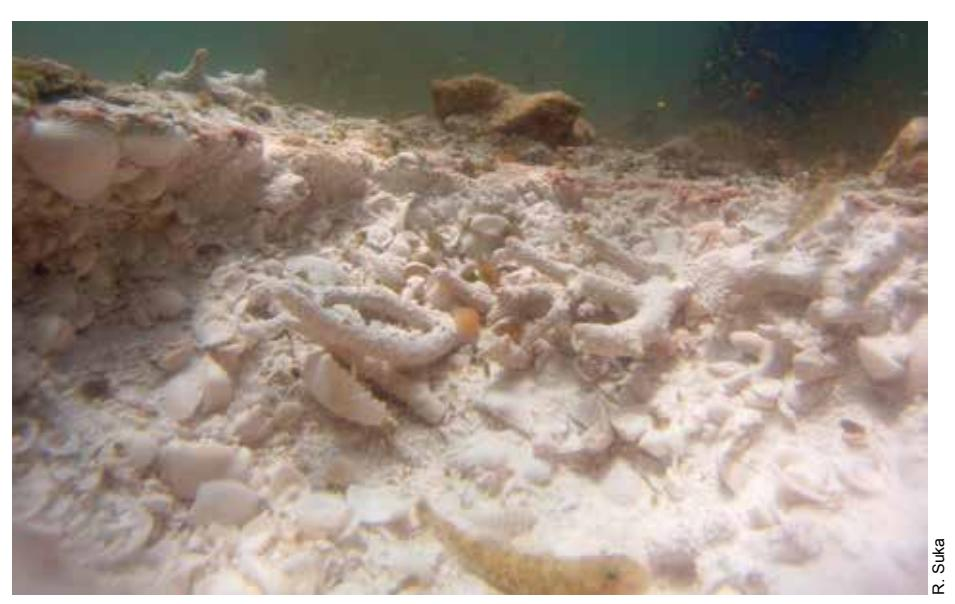

Figure 10: Coral fragments and shells make up a portion of the shallow platform substrate.

| Sample #    | Genus                   | Species            |  |  |  |  |  |
|-------------|-------------------------|--------------------|--|--|--|--|--|
|             | MOLLUSC                 |                    |  |  |  |  |  |
| west 1      | Rhinoclavis             | aspera             |  |  |  |  |  |
| west 2      | Rhinoclavis Clypeomorus | aspera spp. spp.   |  |  |  |  |  |
| west 3      | Clypeomorus Clypeomorus | spp.               |  |  |  |  |  |
| west 4      |                         |                    |  |  |  |  |  |
| west 5      |                         |                    |  |  |  |  |  |
| west 6      | Clypeomorus Cymatium    | spp. muricinum     |  |  |  |  |  |
| west 7      |                         |                    |  |  |  |  |  |
| west 8      | Cymatium Fragum         | muricinum fragum   |  |  |  |  |  |
| west 9      |                         |                    |  |  |  |  |  |
| west 10     | Fragum                  | fragum palatam     |  |  |  |  |  |
| west 11     | Quidnipagus             |                    |  |  |  |  |  |
| east 1      | unidentified Ctena      | bella              |  |  |  |  |  |
| east 2      |                         |                    |  |  |  |  |  |
| east 3      | Fragum Fragum           | fragum fragum spp. |  |  |  |  |  |
| east 4      | Clypeomorus             | spp.               |  |  |  |  |  |
| east 5      | Clypeomorus             |                    |  |  |  |  |  |
| east 6      |                         |                    |  |  |  |  |  |
| east 7      | Clypeomorus             | spp.               |  |  |  |  |  |
|             | CORAL                   |                    |  |  |  |  |  |
| west 12     | Acropora Acropora       | spp. spp.          |  |  |  |  |  |
| west 13     | unidentified            |                    |  |  |  |  |  |
| east 8      | Pocillipora             | verrucosa          |  |  |  |  |  |
| southeast 1 |                         |                    |  |  |  |  |  |
| southeast 2 | Pocillipora             | verrucosa          |  |  |  |  |  |
| southeast 3 | Pocillipora             | verrucosa          |  |  |  |  |  |
| south 1     | unidentified            |                    |  |  |  |  |  |

Table 3: Coral and Mollusc species identified from lagoon sediment samples.

and undercutting the vegetation base. Many coconut trees are undermined in this manner and collapse into the lagoon. The southeastern quarter of the island has several shallow ponds that appear to dry up intermittently (Figure 11).

#### **Sediment**

Swains Island is composed entirely of loose calcareous sediment generated from the skeletal remains of reef organisms.

This is pinned to the early Holocene reef platform. Storm berms within the vegetation line along the beach reach an elevation of 2 m above high tide level. Beyond the storm berms, the elevation peaks at ~3-4 m roughly 150 m inland. Beyond this, the island slopes gently down toward the lagoon.

The sediment stratigraphy is difficult to assess due to the disturbed condition of deposits. Bioturbation is widespread as several species of crab burrow into the sand and rubble, casting piles of excavated material onto the surface. As well, the extensive planting of coconut trees over the entire island during the 18th century highly disturbed the surface sediment.

Table 4 lists the sediment sorting and size for the 4 core samples collected. Core 4, collected in the open swale area, is poorly sorted with coarse to gravel grain size. A moderate upward fining is observed with a distinct surface deposit of coral fragments 2-8 cm deep, ranging in size from 2 to 8.6 cm. Core 7, also collected in the open swale area, was dug in a depression 0.5 m deep which allowed access to the water lens 1 m below the regular surface. This core is composed of gravel and very course material that is moderately sorted.

Two cores collected under the vegetation canopy (sample 5 and 6) have a thin surface soil mixed with sand and small coral fragments to a depth of 14 cm. These two cores are moderately sorted with grain sizes ranging from very coarse to gravel. Figure 12 illustrates a cross section of all 4 cores on the swale formation.

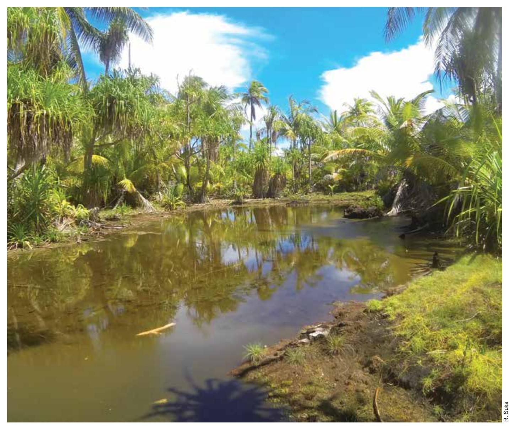

Figure 11: Pond near the eastern edge of the lagoon.

#### **Coral fragment deposit**

Exceptional areas of sparse vegetation are associated with the swale formation. Three areas, (identified as Main, Beach and Swath), are separated by thick vegetation and are covered by a layer of blackened, sharp coral fragments (Figure 13). These areas are visible in an aerial photograph from 1961 by the Historic Coast and Geodetic Survey (Figure 14) and in a satellite image from Google Earth (Figure 15). The extent of the Main and Beach deposit areas are plotted with GPS points and measure 13,506 and 2,197 sq m respectively. The Swath deposit area, with a position closest to the beach, appears to be recovering quicker and covers over 2,292 sq m. *Scaevola* bushes completely dominate this area, with entangled low-lying branches that prohibit a traverse of the whole deposit. The area of all three deposits together covers over 17,995 sq m.

Coral fragments from eight locations within these deposits were identified to the lowest taxonomic level possible (Table ). Tw5o samples were submitted for Radiocarbon dating. Sample 13.1 from the deposit near Etena returned a date of Cal BP 430 to 290 years. Sample 15.1 from the deposit near the lagoon returned a date of Cal BP 40 to 20 years.

#### **Fresh water lens**

Unconsolidated sediment on the island allows meteoric water to penetrate quickly forming a freshwater lens below the ground surface. This lens was accessible through one of the cores within the swale (core 7), and in a well next to the island pathway. In the core, water was 1 m below ground surface with a salinity level of 2 ppt and a pH level of 7.2. Water in the well was 1.45 m below the ground surface but water was not collected at this location for testing.

#### **Shoreline**

At the upper reaches of the shoreline, vegetation growth stops abruptly where the highest high tide reaches. High tide deposits are composed of eroded bioclastic rubble. Below high tide level, Swains Island beaches are sand or beachrock with a gentle slope.

| Sample# | Sorting  | Grain size  |
|---------|----------|-------------|
| 4a      | poor     | gravel      |
| 4b      | moderate | coarse      |
| 4c      | moderate | coarse      |
| 4d      | poor     | very coarse |
| 4e      | poor     | very coarse |
| 4f      | moderate | gravel      |
| 4g      | poor     | gravel      |
| 5a      | moderate | gravel      |
| 5b      | moderate | gravel      |
| 5c      | moderate | very coarse |
| 5d      | moderate | gravel      |
| 5e      | moderate | gravel      |
| 5f      | moderate | very coarse |
| 5g      | moderate | gravel      |
| 5h      | moderate | very coarse |
| 5i      | moderate | very coarse |
| 6a      | moderate | gravel      |
| 6b      | moderate | gravel      |
| 6c      | moderate | gravel      |
| 6d      | moderate | very coarse |
| 6e      | moderate | gravel      |
| 6f      | moderate | gravel      |
| 6g      | moderate | gravel      |
| 7a      | moderate | very coarse |
| 7b      | moderate | gravel      |
| 7c      | moderate | gravel      |
| 7d      | moderate | gravel      |
| 7e      | moderate | gravel      |
| 7f      | moderate | gravel      |
| 7g      | moderate | very coarse |
| 7h      | moderate | very coarse |
| 7i      | moderate | gravel      |

Table 4: Sediment sorting (Folk and Ward 1957) and grain size (Wentworth 1922) for each segment of core sample.

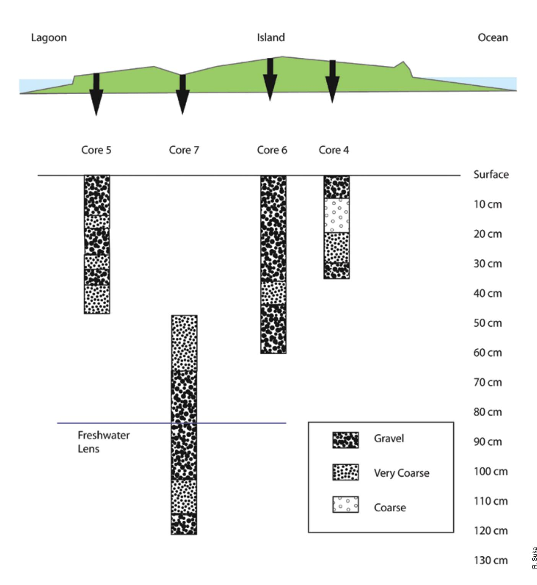

Figure 12: Cross section of four core samples from the swale area. General topography of the island shown above.

Beaches on the west (leeward) and east (windward) shores are 14-23 m wide. In contrast, the widest beaches, 37-54 m wide, occur along the north and south shorelines. Beaches parallel the reef crest around the island, except on the southern shore where the beach curves inward, adjacent to the swale formation. This inward curve is common on atolls with active channel connections between lagoon and ocean.

On the northwest and southeast beaches, storm or cyclone- generated waves have deposited a sequence of berms parallel to the shoreline above the highest high tide level. The coral fragments within these deposits are highly eroded with smooth edges and white in color. On the southwestern shore, the highest berm is ~ 2 m above mean sea level (Figure 16). Two smaller berm formations with darker fragments are deposited further inland and are presumably older. Isotopic dating of these deposits may reveal the frequency of large storm events for this area.

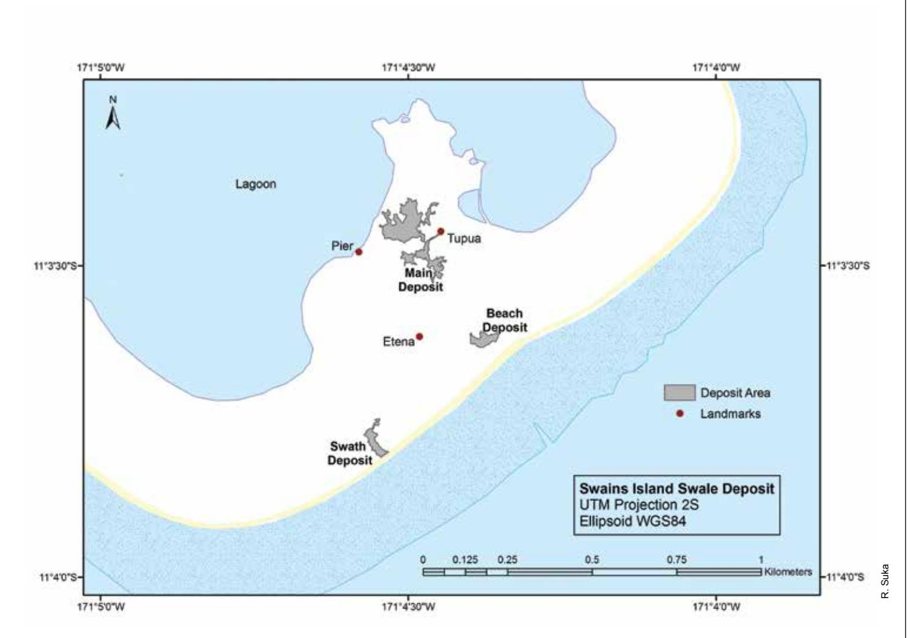

Figure 13: Close-up of the swale formation with location and extent of coral fragment surface deposits indicated.

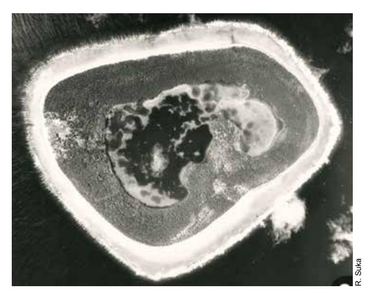

Figure 14: Aerial image of Swains Island taken in 1961 showing open areas associated with the swale formation (HC&GS 1961).

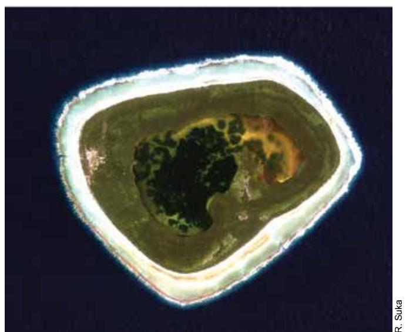

Figure 15: Satellite image of Swains Island taken in 2004 with areas that remain open and sparsely vegetated (GoogleEarth 2004).

| Sample # | Genus       | Species                |
|----------|-------------|------------------------|
| 8.1      | Pocillopora | meandrina or verrucosa |
| 8.2      | Pocillopora | meandrina or verrucosa |
| 8.3      | Pocillopora | meandrina or verrucosa |
| 8.4      | Pocillopora | meandrina or verrucosa |
| 8.5      | Pocillopora | meandrina or verrucosa |
| 9.1      | Leptastrea? | spp.                   |
| 9.2      | Pocillipora | damicornis             |
| 9.3      | Pocillipora | damicornis             |
| 10.1     | Pocillipora | meandrina or verrucosa |
| 10.2     | Pocillipora | spp.                   |
| 10.3     | Pocillipora | spp.                   |
| 10.4     | Pocillipora | damicornis             |
| 12.2     | Pocillipora | meandrina or verrucosa |
| 12.3     | Pocillipora | meandrina              |
| 12.4     | Pocillipora | Spp.                   |
| 13.1     | Pocillopora | verrucosa              |
| 13.2     | Pocillopora | spp.                   |
| 13.3     | Pocillopora | meandrina or verrucosa |
| 13.4     | Pocillopora | spp.                   |
| 13.5     | Pocillopora | spp.                   |
| 14.1     | Pocillipora | meandrina              |
| 14.2     | Pocillipora | meandrina or verrucosa |
| 14.5     | Pocillipora | spp.                   |
| 15.1     | Pocillopora | verrucosa              |
| 15.2     | Pocillopora | meandrina or verrucosa |
| 15.3     | Pocillopora | verrucosa              |
| 15.4     | Pocillopora | meandrina or verrucosa |
| 15.5     | Pocillopora | damicornis             |
| 15.6     | Pocillopora | verrucosa              |
| 15.7     | Pocillopora | damicornis             |

Table 5: Identification of coral fragments from deposit on the swale formation.

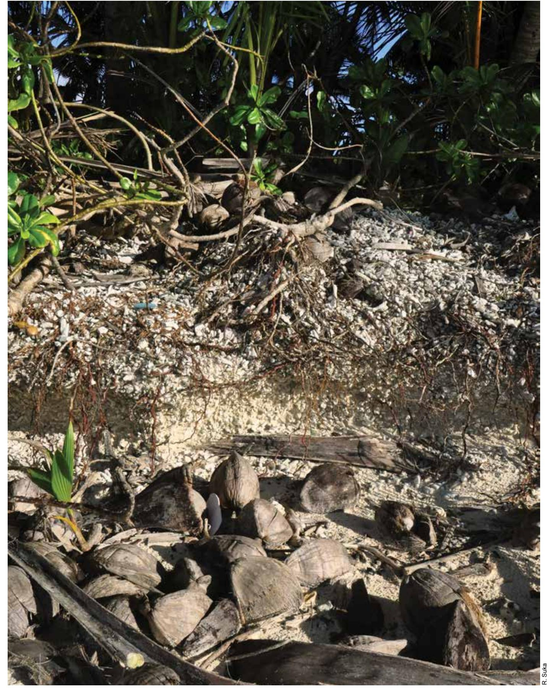

Figure 16: At high tide, waves erode a storm berm at the vegetation line along the southern shoreline.

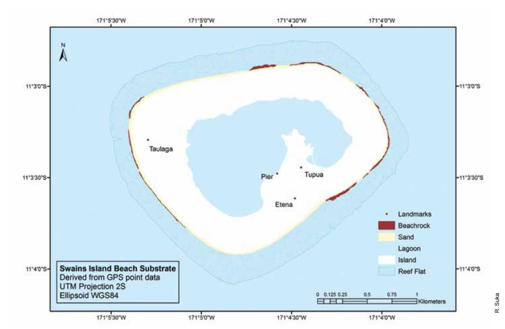

Figure 17: Pattern of sand and beachrock substrate on the shoreline of Swains Island. (R. Suka)

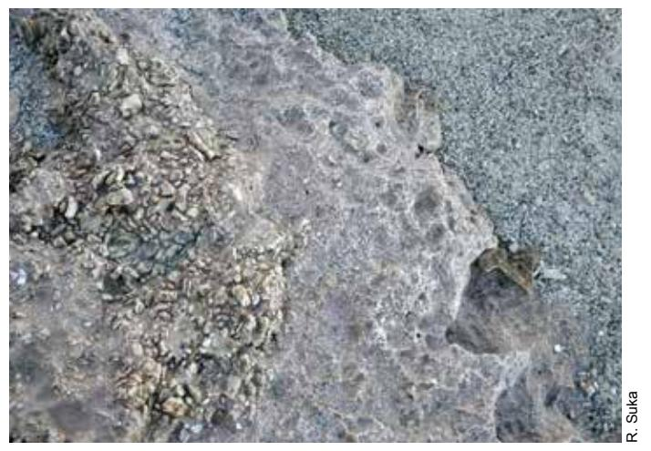

Figure 18: Sequence of three beachrock layers within high tide zone of the western shore.

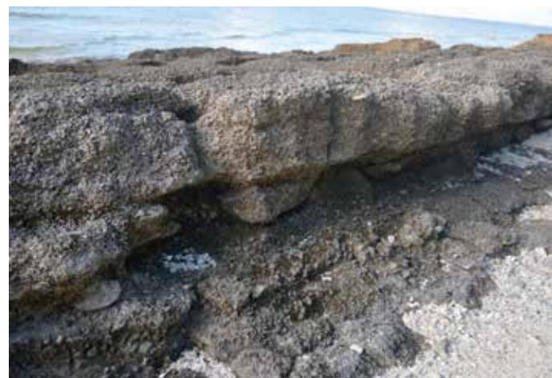

Figure 19: Wave erosion notch 1.2 m above modern sea level on the eastern shore.

R. Suka

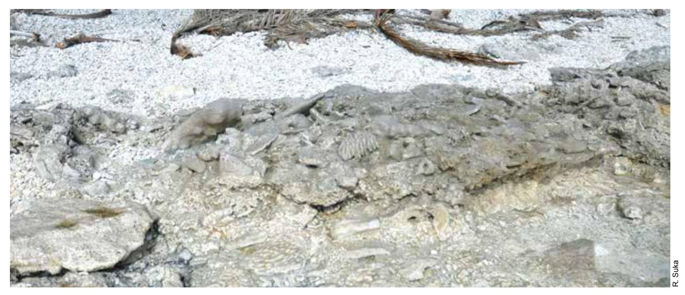

Figure 20: Chaotic deposit of large coral fragments in beachrock unit. A wave-cut notch is engraved on sea-ward side at the base of the unit.

#### **Beach rock formations**

Outcrops of beachrock barricade beaches on the northwest and eastern shorelines (Figure 17). Beachrock units are stratified in slabs of varying composition with a seaward dip that follows the slope of the beach. Beachrock forms in the intertidal zone beneath the sand of tropical beaches. Exposure to air and freshwater between tides facilitates precipitation of calcium carbonate, which crystallize over the course of just a few years, cementing beach material into a hard limestone (Shinn 2009). When sea level rose during the early Holocene, beachrock formed and then submerged. The upper reaches of beachrock on Swains Island are buried beneath beach sediments today however; the presence of beachrock above the high tide level indicates formation during a higher stand of the sea.

Along the western shoreline, beachrock is composed of a series of layers, each with a different composition that formed under varying sediment and wave energy regimes. The lowest slabs are composed of course bioclastic material; a layer composed of well sorted, fine-grain sand and shells overlies this. Above this layer, is a very course heterogeneous composite with gravel-size eroded coral fragments (Figure 18).

On the southeast shore where the beach is narrow, beachrock is exposed up to the vegetation line. One unit, 1.5 m above mean sea level, contains an eroded notch around the unit, created by the effects of wave energy. These wave cut notches were engraved into the beachrock during a higher stand of the sea, which occurred after lithification of the deposit, at 1.2 m above modern sea level (Figure 19).

Along the central portion of the north shore one beachrock outcrop that is particularly striking is a composite of large coral fragments in a chaotic arrangement. An extremely high-energy event must have occurred to produce coral fragments of this size during a higher stand of the sea, as evidenced by wave cut erosion in the face of the unit that occurred after lithification. This is the only exposure of this unit (Figure 20).

#### **Reef flat**

Beyond the beach, the reef flat extends 95-268 m to the reef crest, and surrounds the island completely. This carbonate shelf is the geological foundation for the Holocene deposits that make up Swains Island. The reef flat platform is narrowest on the eastern shore where prevailing winds drive waves against the reef. The widest reef flat is on the southern shore where the beach curves inward towards the swale.

The tidal range on Swains Island is 1.25 m, with an average tide of 40 cm. The most extreme tides of -18 cm and 1.07 m occur during winter and summer months (NOAA 2013a). The reef flat platform surrounding the island is exposed at low tide. This prohibits coral growth over the whole of the platform. During tidal transitions, the reef flat is eroded by wave energy that scours the surface. A number of shallow pits are scattered over the reef flat that collect sand and fine sediment.

### **Reef slope**

An algal rim forms the outer edge of the reef flat. This rim is elevated slightly above the reef flat and is encrusted with coralline algae that overlies the carbonate pavement. Two deep gaps in the algal rim allow water to funnel on and off the reef flat at high velocities during tidal transitions. One gap, located in front of the main village of Taulaga is used today to bring skiffs ashore. However, the gap terminates roughly 12 m from shore and the reef flat is too shallow to allow unimpeded access to the beach. Another gap is located on the southern rim adjacent to the swale formation. This gap is deep, but shorter, narrower and terminates further from the beach than the gap at Taulaga.

At both gaps, the reef front on each side is deeply incised with spur and groove formations. Large deposits of coral fragments form an apron spreading ocean ward at the base of each groove at a depth of 4-5 m. This material is a sediment source for the island as it is deposited onshore during storm events. The beach rock barricades along the shoreline may serve as traps for this sediment encouraging island building.

Beyond the algal rim, the living coral reef is well developed and drops steeply away to a depth of 4800 m. The upper 10 m of reef slope is more gradual than the deeper slope and crenulated, an expression of the underlying morphology. The steep cone-like formation of the deeper reef is a result of the island's volcanic genesis over a mid-plate hot spot in the oceanic lithosphere.

### **2.4 ATOLL GEOMORPHOLOGY DISCUSSION: CHANNEL AND LAGOON TRANSITION**

Results of the geomorphic survey provide the background necessary to address the main objective of the survey:

### **Did a channel connection between the lagoon and ocean exist in the recent past at Swains Island?**

This question is examined through the geomorphological and sedimentary evidence from the lagoon and island. The geomorphology discussion considers beachrock formations and their relationship to sea level and compares similar channelized atoll landforms with the morphology of Swains Island. Lagoon bathymetry is illustrated and the habitat conditions required for species identified in sediment samples are examined to determine past environmental conditions. The isotopic dates of four coral samples provide a time frame for environmental and geomorphic change.

### **Atoll morphology**

External forces such as tectonics and climate that influence erosion and weathering processes drive landscape morphology. Low-lying atoll islands are built from the deposition of calcareous material from the surrounding reef. These dynamic landscape morphologies are driven by wind and wave energy and flux with changes in sea level and storm frequency.

Swains Island has evolved over several millennia, documented by topographic and geologic structures on land and historic variations in sea level. The mid-Holocene highstand terminated here at 100 BCE after reaching a peak of 1.8 m above modern sea level (Dickinson 2009). Approaching this highstand, the balance between sea level and sediment supply changed significantly for Pacific atolls. As sea level rose, sediment accumulation was overwhelmed and reef growth accelerated (Woodroffe et al. 2000).

Evidence of the high stand at Swains Island is supported by the presence of beachrock formations 1.5 m above current sea level. The formation of this beachrock is dictated by environmental conditions at the shoreline and are negatively correlated to increases in wave energy and beach erosion (Turner 2005). A distinct break in the beachrock unit that occurs in the middle of the southern shore on Swains Island indicates conditions on the beach adjacent to the swale were not conducive to beachrock formation. The abrupt discontinuity of beachrock here provides evidence of an active channel location, where water movement and sediment transport prevented beachrock from forming.

As sea levels fell, storms deposited material onto the exposed reef flats forming the first pinned islets. The formation of islets occurred once high tides fell below the paleo-reef flat surface. The timing of this transition to pinned islets is determined by the crossover date. Crossover dates vary between tropical Pacific atolls, but at Swains Island the transition from an awash reef flat to pinned islets is thought to have occurred at 1000 CE (Dickinson 2009). Evidence of a stable islet formation on Swains Island is confirmed by notches eroded into beachrock units on the shoreline, marking a stable period of sea level 1.2 m above present level. This marks a period when subaerial foundations for island formation emerged.

Falling sea level enhanced sediment accumulation on atolls as lagoon environments experienced very rapid sedimentation (Long 2001), with the highest areas of accumulation occurring along the windward shores of atolls where wave energy is highest (Kench et al. 2008). These deposits are reworked in alongshore currents, distributing sediment along the atoll's beaches. In this manner, atolls experience a gradual ocean-ward accretion as sediment accumulates on shorelines (Woodroffe et al. 1999, Woodroffe and Morrison 2001). Over time, as beaches prograde, deposits of sediment further from the oceanfront become isolated from transport processes. The sequence of storm berm deposits on Swains Island reflects this ocean-ward accumulation. Further evidence is found in the preservation of the swale formation that extends into the lagoon from the southern shore. The formation is a remnant of channel sedimentary deposits that became stranded and preserved by ocean-ward accretion and falling sea level.

Changes in sedimentation patterns influence the morphology of an atoll. Areas that develop the highest elevation encourage vegetation growth that stabilizes the land mass. Low-lying areas that remain connected to the ocean facilitate continued sediment transport into the lagoon. Erosion of the ocean-side channel mouth creates an inward curvature of the shoreline and sediment carried through the channel creates a fan deposit at the lagoon ward mouth encouraging formation of a swale. Over time, sea level change and storms cause changes in sediment transport and deposition that can effectively fill in the channel and close the lagoon off from the ocean (Woodroffe et al. 1999). The swale formation on Swains Island, with the associated inward curve of the shoreline and fans of depositional material extending into the lagoon, reflect the geomorphic patterns of a filled channel. This area also mimics geomorphic patterns associated with active channels on similar atolls, further indicating that this is the location of a former channel (Figure 21).

#### **Swale surface deposits**

The stark contrast between open areas on the swale formation and the surrounding heavily forested landscape speak of a severe disturbance (Figure 22). So severe that vegetation has yet to overtake this area. The sparse vegetation, composed of a few salt-tolerant *Scaevola* and *Pandanus*, indicate that conditions here remain unfavorable to less-tolerant plant species.

Charles Hedley of the Australian Museum described a similar landscape anomaly in 1896 on Funafuti atoll, 1100 km northwest of Swains Island, "A vast field of ruins. Angular masses of coral rock, varying in dimensions from one to a hundred cubic feet, lie piled together in the utmost confusion; and they are so blackened by exposure, or from incrusting lichens, as to resemble the clinkers of Mauna Loa; moreover, they ring like metal under the

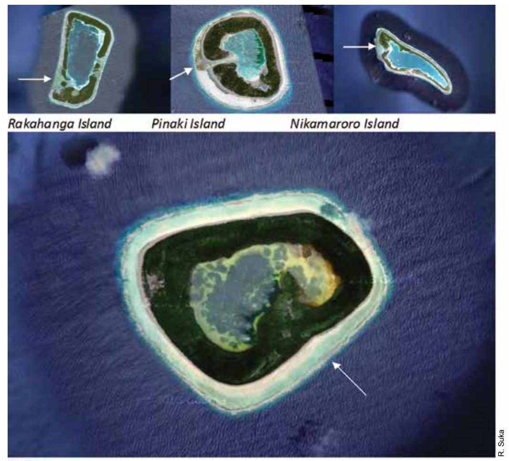

Figure 21: Three low-lying atoll landforms with active channel swale formations, compared to Swains Island swale morphology (GoogleEarth 2004). White arrows indicate the location of each channel swale formation.

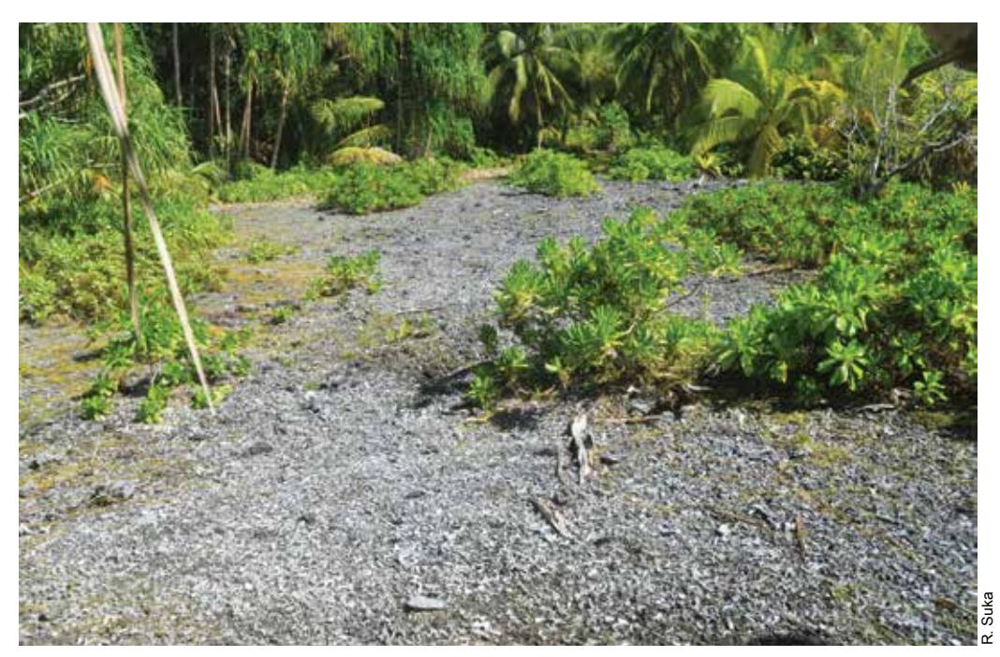

Figure 22: A portion of the area where coral fragments are deposited on the surface of the swale formation.

hammer... On breaking an edge from the black masses, the usual white color of coral is at once apparent" (Hedley 1896). This is a close description of the open area deposits on Swains Island. Although coral fragments of the Swains Island deposit are much smaller (2 - 8.6 cm) than the ones Hedley describes, a few larger coral blocks of 0.28 m3 (10 ft3) are scattered along the edges of the deposit. A deposit this large and localized can be attributed to high intensity cyclone energy that converged on a low-lying area.

Swains Island lies within the cyclone pathway between the latitudes of 7°- 25° south of the equator. Records of storm events for the island are sparse with only four cyclones recorded during the past 15 years. However, the sequence of storm berms beyond the highest reaches of the tide indicates that intense storms in the past have deposited a significant amount of debris on the island.

Cyclones can generate wave heights up to 15 m and deposit storm ridges beyond the high tide level, leave lobes of course debris in back-reef lagoons and deposit layers of sand within lagoons. The deposit debris is produced from the reef front where branching coral such as *Acropora* are highly susceptible to breakage down to 20 m depth (Scoffin 1993), as such, the species composition and the condition of deposits can give some indication of the intensity of a cyclone event.

Coral fragments collected from the surface of the swale deposit on Swains Island were all *Pocillopora* species with stout branching morphologies, except one fragment of *Leptastrea* species. Pocillopora commonly inhabits exposed reef fronts where currents are strong.

Exceptional wave energy would be required to generate the volume of fragments deposited on the swale at Swains Island. The condition of fragments weathered and sharply textured, indicate limited exposure to sand abrasion and wave erosion after breaking from the colony. This indicates a short transport time from reef front to island.

Cyclone intensity is defined by the Saffir-Simpson Scale where the strongest cyclones are designated as category 5 with winds in excess of 250 km/hr. The strongest cyclones are category 5 with winds in excess of 250 km/hr. However, intense damage from cyclones does not require the eye to pass over a location; destruction is severe from the eye passing within 30 - 65 km. Severe wind disturbances can cause hectares of forest to suffer up to 87% tree mortality that results in forest gaps (Everham and Brokaw 1996). Revegetation after these events occurs in a sequence, where salt-tolerant species establish first, followed by a succession of less tolerant species until a mature forest is achieved (Stoddart 1971).

Areas of sparse vegetation where a combination of sea water inundation and wind devastated the landscape are present on the swale formation of Swains Island in the Historic Coast and Geodetic Survey image taken in 1961. Satellite images today show little change in this area aside from a few salt tolerant species that have established, indicating that this area is just beginning to recover from a significant disruption that occurred over 52 years ago.

Storm ridges and dense vegetation can deter transport of material by cyclone energy. The beachrock ramparts and sequence of berms established along the southeastern shores may serve as a barrier in this area, directing wave energy toward lower areas. In addition, unusual currents generated by storm surge are enhanced at channel locations creating strong currents. High-energy waves likely focus in the swale area where the beach curves inward, allowing deposition of an abundance of coral fragments over the swale. After storms, deposits are reworked by waves, at times forming a sheet of rubble lagoon wards with most of the movement occurring within the first year following the storm (Scoffin 1993). The broad range in radiocarbon dates from the swale deposit indicates reworking of sediments deposited by earlier storms or is simply a product of human intervention.

The composition of sediment below the poorly sorted, gravel surface deposit indicates that this area is periodically subjected to storm deposits. The development of surface soil and thick vegetation elsewhere on the island indicates isolation from active storm deposition. The perseverance of open areas on the swale indicates that this is where the most recent connection between the lagoon and ocean occurred. Storm deposits eventually filled in the channel here and have periodically deposited new material under extreme conditions.

Radiocarbon dates of surface samples from the swale area limit the possible age of the deposit. Fragments may have resided in the sediment of the reef front or broken from the reef directly and then deposited on the island. Regardless, today's surface swale deposit could not have occurred before 430 to 290 years BP when the coral was living.

The history of heavy modification of land cover and land use from the copra industry on Swains Island and the potential impacts of past military activity in the Pacific remind us that it cannot be discounted that these surface deposits were a product of human activity.

However, the age and composition of the deposits suggest deposition through high-energy storm events.

The evidence on Swains Island implies that a combination of high winds and focused wave energy associated with an unusually strong cyclone that created forest gaps and deposited coral fragments across the swale area at Swains Island caused changes in morphology that have persisted for a minimum of 52 years.

#### **Lagoon bathymetry and substrate**

Atoll lagoons are sheltered environments. Reef structures are common, ranging from a few scattered patch reefs to shallow reticulated coral reef networks. Sand and fine sediment from the reef surrounding the island are deposited in the lagoon by wave energy and tidal fluxes through channels. Over time, channels between the ocean and lagoon fill with sediment and the lagoon is cut-off from the ocean. Deposition of sediment to the lagoon becomes sporadic, occurring only during storms when waves wash over low areas. Without proper circulation and nutrient input from the ocean, lagoon conditions become intolerable to marine species and the coral reef system collapses.

The bathymetry of Swains Island lagoon reveals a pattern of reticulated reef platforms around the perimeter of the lagoon with scattered coral patch reefs rising from the lagoon floor (Figure 23). Reports indicate that the lagoon was once connected to the ocean (Whistler 1983, DMWR 1996). For example, in 1871 the lagoon was reported to rise and fall with the ocean tide and supported marine fish species (Vivian 1872). The conditions observed during this study show no connection to the ocean, with brackish water, no marine species and no tidal variations in lagoon water level.

In situ coral samples from the lagoon at Swains Island indicate that the most recent living coral existed 1376 ± 9 years BP. This date marks a drastic change in the lagoon environment, a time in which coral survival was no longer supported, indicating a disconnect from the ocean. Substantial island formation must have taken place earlier than the crossover date of 1000 CE proposed by Dickinson at Swains Island (Dickinson 2003). As the fall in sea level during the late Holocene, combined with continued deposition of sediment from storm deposits effectively limited the connection between lagoon and ocean enough to collapse the coral ecosystem by 1376 ± 9 years BP.

### **Lagoon biota and habitat**

Swains Island is unique in that only 12 atolls in the Pacific have completely enclosed lagoons. Half of these are hyper-saline. Hyper-saline lagoons are connected to the ocean through wash over events that allow a periodic exchange of sea water. Evaporation outpaces oceanic and meteoric input, creating elevated salinity levels. At Swains Island, low salinity values within the lagoon indicate that no connection to the ocean exists today, apart from occasional large wave events that spill across low areas, suggesting that meteoric input is outpacing evaporation. This is significant when considering the intense solar radiation experienced near the equator and the lack of orographic precipitation. Brackish conditions appear to be a relatively recent development based on evidence collected from the surface sediments of the lagoon.

The biota that inhabit atoll lagoons vary considerably depending on a number of factors including geographic location, climatic conditions, circulation patterns and substrate composition. Mangroves are common in many Pacific atoll lagoons but have not established at Swains. In fact, the lagoon has very low biodiversity hosting just a few species. The sediments however, reveal a more diverse biota in the past.

Although no living invertebrates were observed in the lagoon, marine mollusc shells make up the bulk of lagoon surface sediments. All of the identified mollusc species inhabit sandy calm environments similar to lagoon settings. The combination of epifaunal grazers, filter feeders and a predatory snail indicate a diverse benthic marine ecosystem. Outside of the lagoon, sandy calm habitats are non-existent, discounting the possibility of shells deposited from the outside reef system or collected elsewhere and deposited by humans. Delicate branching Acropora coral skeletons were buried in the sediments in situ. Conditions vary widely for this species but indicate a connection with the

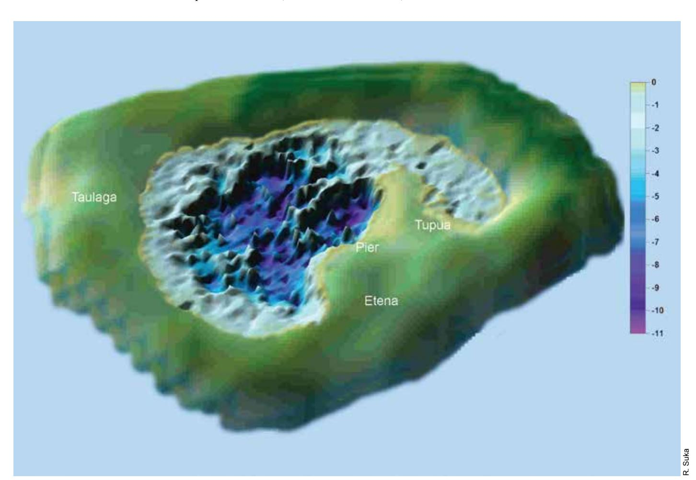

Figure 23: The bathymetry of Swains Island lagoon showing shallow perimeter carbonate platform and patch reef morphology. Depths at the eastern end of the lagoon should not be considered accurate as thick algae inhibit accurate depth measurements.

ocean that allowed continuous circulation of water and nutrients to support coral growth with a low energy wave regime.

The past biota of the lagoon at Swains Island indicate clearly that this was once a marine environment with calm sandy conditions and water quality sufficient to support coral growth and several species of invertebrates.

Historically, few studies have been conducted on Swains Island and none have investigated the geomorphology. This paper reflects the first efforts to bridge this gap. Studies on atolls throughout the Pacific show variation between atoll morphology and sedimentary character. Swains Island developed from storm deposits of coral fragments and biogenic sand that built upon the reef flat during the late Holocene. As sea level fell following the mid-Holocene high stand, the reef flat emerged allowing the earliest islands with vegetation to form. A channel separated the southern shores of the island until 1376 years BP when storm deposits impeded water flow through the channel causing collapse of the coral reef system, and enclosed the lagoon. Early maritime activities, if the island was inhabited/contacted at that time, would have benefitted from the relative protection of the nearly enclosed lagoon in such an isolated area of the Pacific. After closure of the channel, the capacity for capture and retention of freshwater increased on the island, providing a valued resource later for mariners who could safely reach Swain's Island shores.

Maritime survey divers during the project became intimately familiar with the type and consistency of the algae species in the interior lagoon, as well as several species of the freshwater fish, and samples were taken for analysis in the laboratory. The team took advantage of the rare opportunity to contribute supplemental biological data to the overall project.

Two main fish species were observed during dives in the lagoon, a goby and a molly species. Follow-up contact with Catherine Thacker (ichthyologist from the Los Angeles County Museum of Natural History) led to the preliminary identification of the goby as Glossogobius, the flathead goby. The exact species of Glossogobius, of which there are many, is unclear. The gobies were active in the crevices and folds of the bottom algal layer of the lagoon.

Likewise, the exact species of the molly remains undetermined, though it is reported as having been introduced to Samoa (Samoan name Fo-vai). The mollies inhabited the water column above the algal layer. http://fish.mongabay.com/ data/Samoa.htm According to Mr. Kieth Robinson, owner of the Robinson Ranch on the Hawaiian Island of Ni`ihau, the Swains Island molly most closely resembles the common-name Liberty molly,

*The presence of the goby Glossogobius in a habitat like that is normal and probably not due to human activity, they are widespread and the larvae can probably traverse salt water when they disperse. I don't think it would matter much exactly what Glossogobius it was, there are many species and many undescribed species, so it might be difficult to tell even with the specimen. (Thacker written communication 10/23/13)*

 During the lagoon investigations the chief obstacle, and at the same time most impressive lagoon phenomenon, was and fresh water algae accumulation. All subsurface low depressions in the lagoon were filled with a thick layer of small green "balls," sometimes to depths of 5-6m or more. The harder remnant coral substrate along the perimeter and ridges in the lagoon, above the low depressions, was often covered with a firm brown "mat." Above both of these types of algae floated delicate reddish conglomerations.

Previous studies only make brief mention of the algae of the lagoon: "Although the lagoon is nearly devoid of fish life, it is rich in algae; one particular blue-green alga species (or mixture of species) forms conspicuous, irregular chunks which make the shallow lagoon water appear like a thick vegetable soup." (Whistler 1980: 1)

Samples were obtained of these three types and submitted to the University of Hawai`i Department of Botany (Dr. Alison Sherwood, Professor and Graduate Chair), with the following results:

- Green "balls"— mostly made up of the Gloeocapsa cyanobacteria, which forms micro or macroscopic colonies that can develop into an amorphous macroscopic structure
- Brown mat— likely a filamentous bacterium (not algae)
- Red conglomeration-- may be another filamentous bacterium, although it does have some embedded cyanobacterial colonies

Additionally, samples were sent to Dr. Bopaiah Biddanda at Grand Valley State University Michigan:

The samples are amazingly interesting. But try as much as we could, we were unable to clearly identify the main actors in the system. It appears there is a consortia of organisms including heterotrophic bacteria, fungi and a couple of types of cyanobacteria (clusters and filaments) - looks like the ecosystem is complete with just microbes composed of producers and consumers - we did not encounter any metazoans like Nematodes and Tardigrades. (Biddanda written communication to Gandulla, 11/22/13)

Freshwater algae inhabiting what was once a salt water lagoon is not necessarily a sign of any intentional introduction by humans. According to Dr. Sherwood, freshwater algae could reach the lagoon on their own - either wind-blown, or brought in on an animal such as a bird.

Any future surveys within the lagoon must take into account the extraordinary prevalence of these species.

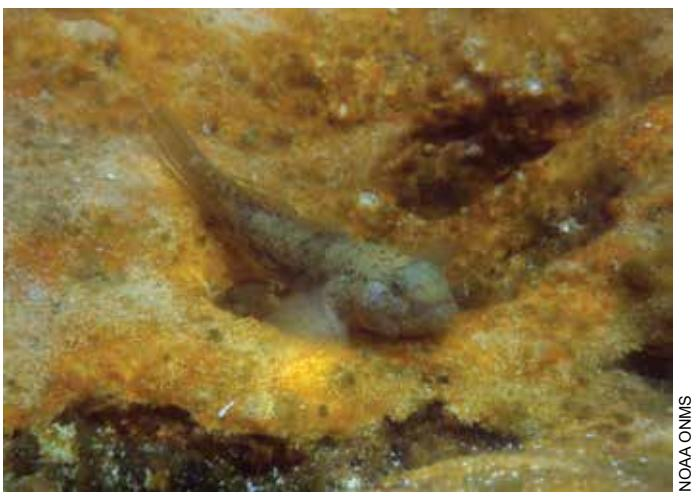

Figure 24: Goby image.

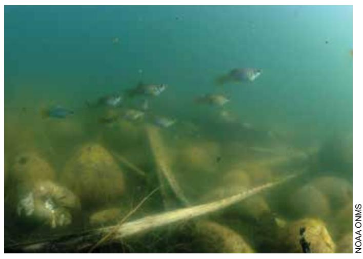

Figure 25: Mollies at Swains Lagoon.

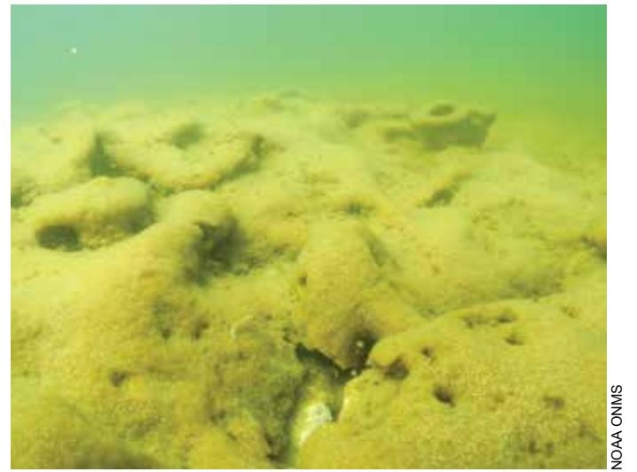

Figure 26: Brown mat algae covering the hard reef structure.

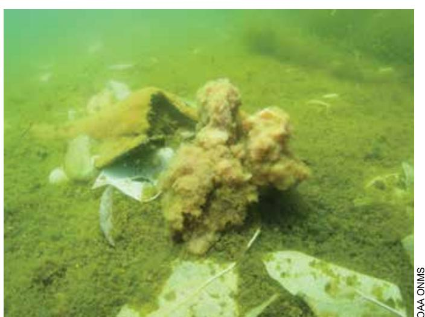

Figure 27: Pink algae conglomeration floating above the green layer.

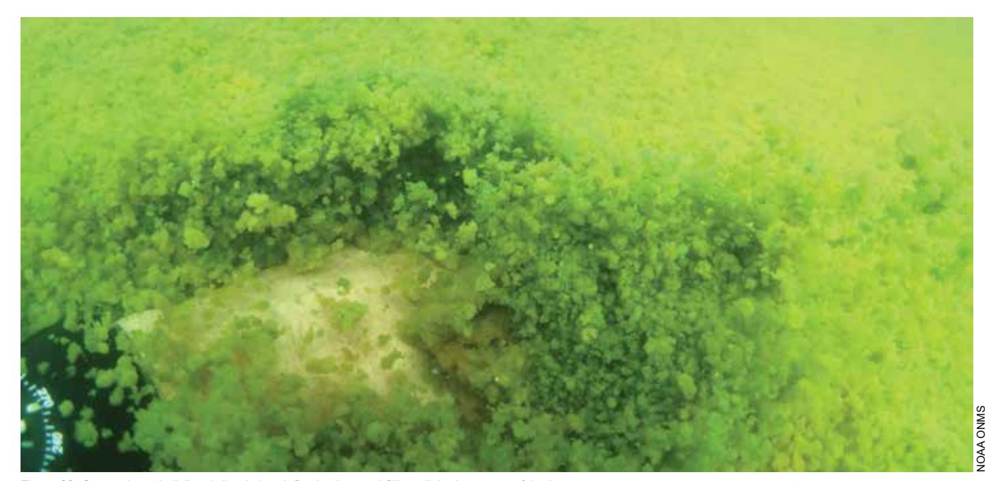

Figure 28: Green algae "balls" and diver's hand, flowing into and filling all the low areas of the lagoon.

# **TRACES OF CULTURAL LANDSCAPES: EARLY CONTEXT**

#### **3.1 SURVEY METHODS**

#### **Maritime Archaeology**

The maritime archaeology effort was designed to test the hypothesis that past phases of occupation at Swains, including pre-historic voyaging contacts (period when the interior water body was a marine lagoon and open to the sea) and historic-period copra plantation activities, have left a detectable cultural footprint, cultural artifacts and features, within the waters and sediments of the interior lagoon and along its perimeter, as well as other areas of Swains Island including land sites and the marine environment. The majority of the project was non-invasive (non-excavation). Selected small surface artifacts were collected for analysis with the approval of the land owners.

The side scan sonar survey of the interior lagoon bottom itself was the priority task for the maritime archaeology survey (primary objective). The lagoon represented a wholly untouched area for investigation. A small boat and outboard engine were procured, and the side scan equipment (towfish, cable, laptop and monitor, GPS system) was installed and the complete setup tested. The remote sensing team deployed a NOAA MIST (Mobile Integrated Survey Team) system provided by the NOAA Office of Coast Survey. The NOAA MIST mapping platform consisted of: Trimble DSM 232 GPS antenna with magnetic mount, Edgetech 4125 400/900 kHz SSS towfish; SSS Topside Processing Unit;; 50m cable; and Dell Latitude XFR rugged laptop.

The team made efforts to obtain a subbottom profiler "CHIRP sub-bottom profiler" unit for the project, considering the expected loose sediments at the lagoon

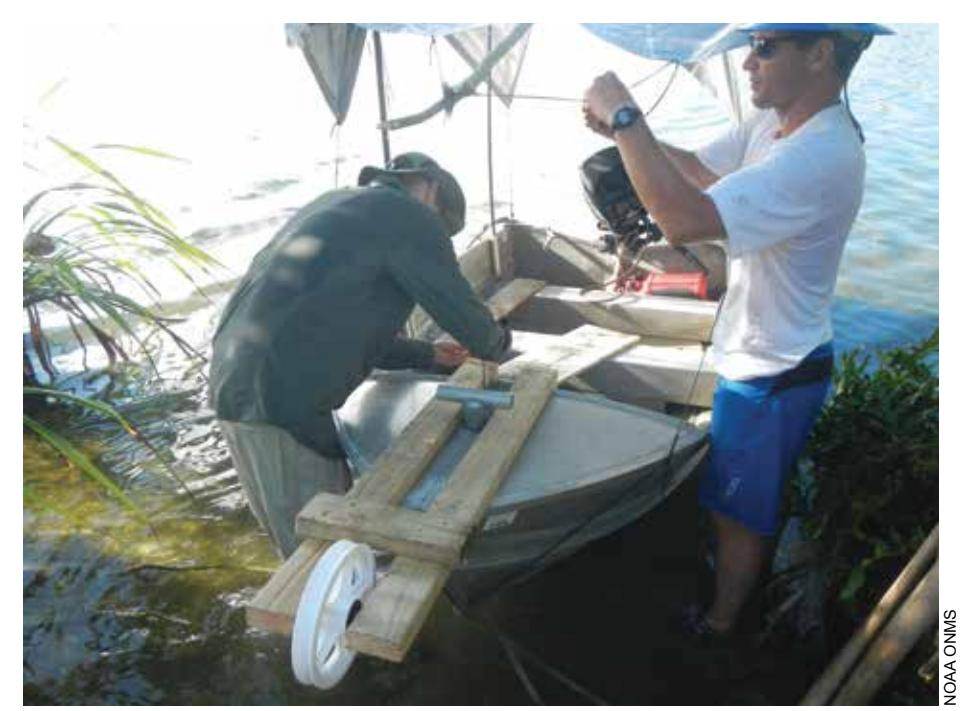

Figure 29: Building the tow pulley on the bow of the skiff.

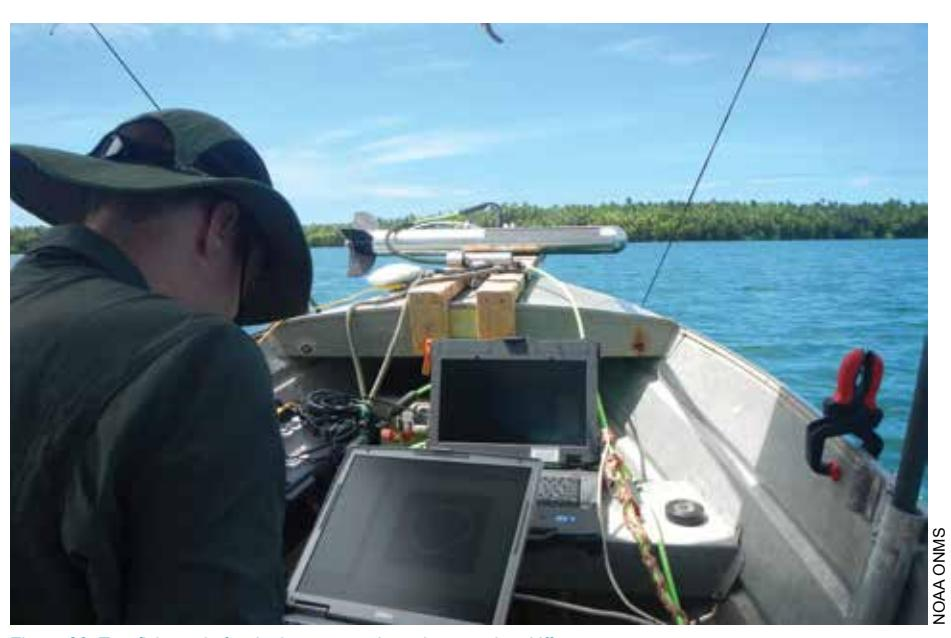

Figure 30: Tow fish ready for deployment and monitors on the skiff.

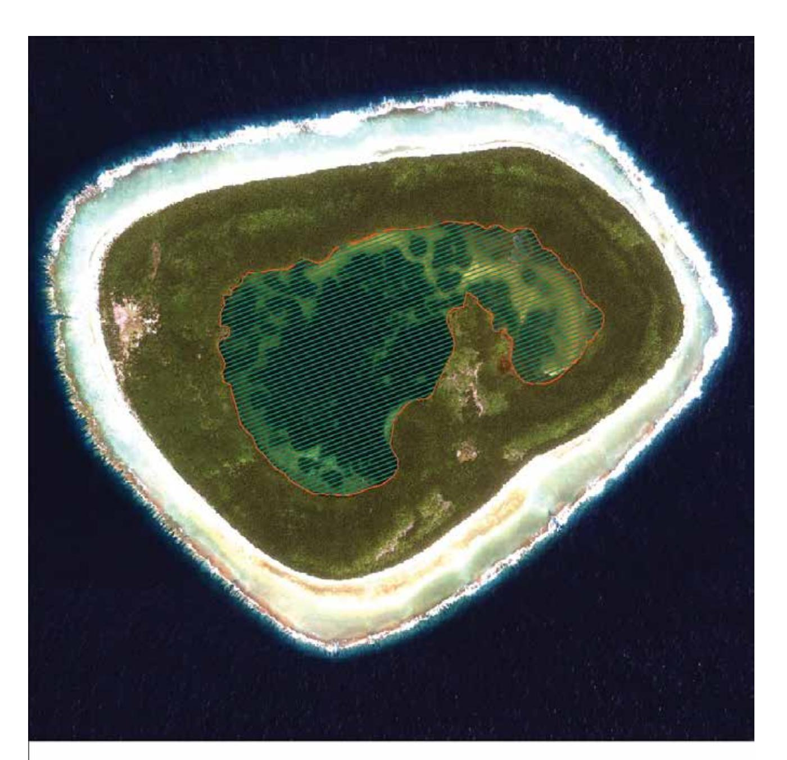

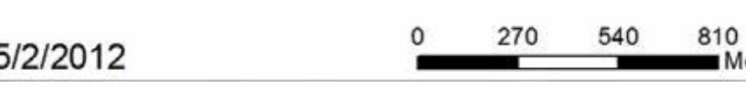

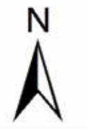

NOAA ONMS

Figure 31: Planned survey lanes in the lagoon of Swains Island.

bottom, but unfortunately the cost for the use of the unit was prohibitive.

Prior to arriving on Swains, project archaeologists tested the remote sensing equipment and developed a lagoon survey plan with ArcGIS software. Lane spacing was set at 20 m, allowing for 100% overlap (full coverage) between tow lanes. Tow speed was between 2-3 knots. Due to the extreme variation in the topography of the lagoon bottom (abrupt changes from 15 m to 0.5 m in depth) the side scan tow fish was maintained at a constant depth of .2 m below the water's surface. Bottom topography was so variable that it was far more efficient to maintain a constant depth and use range settings and lane spacing to ensure that we had 100% coverage of the lagoon bottom. Due to the very shallow depths found at the eastern end of the lagoon, survey operations were unable to completely cover the entire inundated portion of the lagoon. However, these shallow areas were visually searched for cultural material by project participants on stand-up paddle boards.

The side scan survey was completed (all possible lanes covered) prior to reviewing the remote sensing data, compiling a prioritized target list, and assessing or "ground truthing" the identified targets. Scuba diving or breath-hold diving supported the investigation of identified targets within the lagoon. Divers returned to the identified locations using hand-held Garmin GPSmap 62 and hand-held Garmin GPS 72H units.

The lagoon at Swains Island is a calm, fresh water pool with very low visibility due to silty conditions and organic matter covering nearly the entire bottom. Divers used standard open-circuit scuba configuration. Divers were deployed on the specific latitude/longitude coordinates recorded during the remote sensing survey. A drop weight and buoy, along with the absence of current and waves, assured that the locations examined coincided with the side scan targets. A circle-search on the bottom would then usually locate a feature corresponding to the side scan target within 2-3 meters.

Diving was conducted both from the shore of the lagoon and from the small boat. The investigation of side scan targets also required hand tools such as slates and transect tapes and folding rulers, photo scales, and u/w cameras. All diving operations were conducted as per NOAA Diving Program regulations (NAO 209-123) and policies.

#### **Terrestrial Archaeology**

In order to identify as many potential historic properties as possible, collect enough information and documentation for nominating sites to the National Register of Historic, and potentially obtain data relevant for contributing to the establishment of chronology for the island a combination of reconnaissance an intensive archaeological survey with limited subsurface testing was carried out.

The reconnaissance aspect of the survey was to survey the entire circumference of the island by walking two transects approximate 10 meters apart along the beach / shoreline of the island. The goal of this survey method was to evidence of historic or prehistoric sites that may have been eroding from historic or prehistoric sites along the coast. If such evidence was present it could direct the survey to interior locations for additional investigation and survey. The beach shoreline survey also complimented the maritime archaeological in that if evidence of submerged cultural resources had washed ashore it would give an approximate location for underwater surveys to take place.

A second reconnaissance survey was also conducted along the coastline of the lagoon. The survey was conducted by paddling a kayak along the shoreline approximately five meters from shore. Any evidence of historic properties along the shoreline could indicate potential historic properties inland from the shore or evidence relevant to the maritime archaeologists searching for submerged cultural resources in the lagoon. A reconnaissance survey was also conducted along a portion of the "Belt Road" that led from the village of Taulaga to Etena.

Each team member carried a Garmin Rino 655t GPS unit to track the survey route. If a potential site was found photographs and UTM coordinates of the site were taken. Sites with high potential of being considered eligible for the National Register of Historic Places were returned to for more intensive documentation including scaled digital color photographs and scaled maps of the site.

An intensive pedestrian survey was conducted in the village and surrounding area which was complemented by subsurface testing. Subsurface testing included a transect of shovel test pit and the excavation of a 1 x 1 meter test unit next to a potential historic property. The purpose of the subsurface testing was to identify potential buried historic or prehistoric deposit and charcoal for dating purposes.

#### **3.2 EARLY CONTEXTS: RESULTS AND DISCUSSION**

#### **Side Scan Target Analysis**

Review of the side scan data led to the identification of 32 targets for further investigation. None could be positively identified in the side scan record as cultural artifacts; all were only recognizable as anomalies, "possible cultural material." Of these 32 targets, 17 were shallow enough for free diving (snorkel) investigation, and 15 required scuba. Ground-truthing these targets occupied two full days.

Of the 32 side scan targets, 21 (66%) were located and confirmed as corresponding features on the bottom. Eight were identified as tree logs; 12 were identified as rocky geologic natural features (emergent reef structure above the sediment/algae level); and 11 positions were flat areas of algae and organic "muck," with no discernable target or feature in evidence. This was puzzling and may be due to the fact that the high-frequency acoustic sonar signal may have penetrated the very loosely consolidated algae layer to a certain extent (akin to a sub-bottom profiler), indicating side scan sonar targets which the divers could neither see nor feel. Attempts made by the divers to penetrate slowly into the algae layer and locate targets by touch, or to use metal probes and make solid contact with the objects, were unsuccessful. The organic layer proved to sometimes be more than 4-5 meters deep in places, becoming more dense with depth, prohibiting safe access. Only one of the 32 potential targets identified yielded a corresponding cultural artifact, though it does not reflect the pre-western contact period. A 100cm X 50cm heavy iron tray was located, likely once associated with storage or transportation activities on the island, possibly during the copra plantation period.

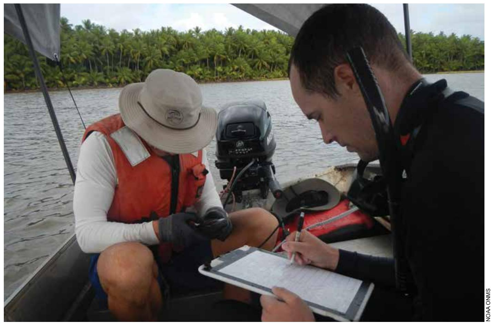

Figure 32: Conducting side scan target dives.

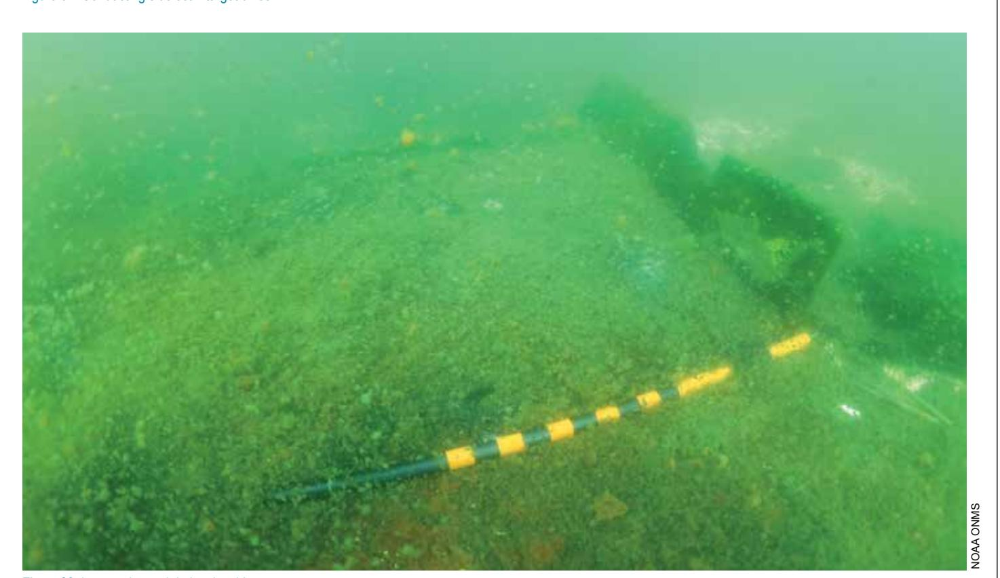

Figure 33: Iron tray located during the side scan survey.

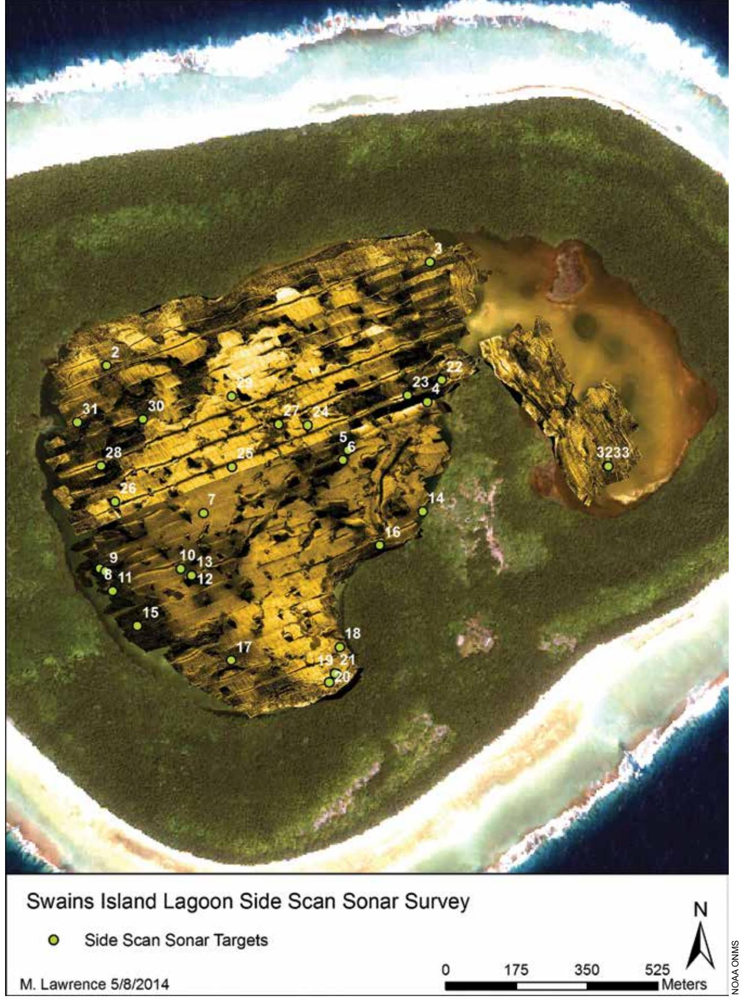

Figure 34: Side scan mosaic of lagoon bottom showing positions of targets, compiled by M. Lawrence.

| Target# | Dive/ snorkel | Latitude: -11° S | Longitude: -171° W | Observation                                    |
|---------|---------------|------------------|--------------------|------------------------------------------------|
| 2       | D             | -3.2444          | -4.9921            | algae and muck…no discernible target           |
| 3       | S             | -3.1057          | -4.5529            | rock projecting through muck                   |
| 4       | D             | -3.2933          | -4.5564            | log and branch                                 |
| 5       | D             | -3.3581          | -4.6638            | 100X50cm iron tray, very fragile/friable       |
| 6       | D             | -3.3714          | -4.6711            | geologic feature                               |
| 7       | D             | -3.4422          | -4.8606            | algae and muck…no discernible target           |
| 8       | S             | -3.5164          | -5.0014            | small log                                      |
| 9       | S             | -3.52            | -4.9943            | rocky reef                                     |
| 10      | D             | -3.517           | -4.8912            | rock projecting from muck                      |
| 11      | S             | -3.5468          | -4.9842            | branch with adjacent rock                      |
| 12      | D             | -3.5252          | -4.8764            | algae and muck…no discernible target           |
| 13      | D             | -3.5257          | -4.8769            | algae and muck…no discernible target           |
| 14      | S             | -3.4402          | -4.562             | log                                            |
| 15      | S             | -3.5934          | -4.9504            | 2 branches (one smooth side…image)             |
| 16      | D             | -3.4856          | -4.6212            | multiple logs                                  |
| 17      | S             | -3.6397          | -4.8232            | rocky bumps on reef                            |
| 18      | S             | -3.6219          | -4.6754            | algae and muck…no discernible target           |
| 19      | S             | -3.6578          | -4.6804            | algae and muck…no discernible target           |
| 20      | S             | -3.6688          | -4.6898            | low mound of sediment/algae, no linear feature |
| 21      | S             | -3.6572          | -4.6816            | algae and muck…no discernible target           |
| 22      | S             | -3.264           | -4.5367            | geologic rock lip                              |
| 23      | D             | -3.2844          | -4.583             | geologic feature rocky edge                    |
| 24      | D             | -3.3244          | -4.7187            | algae and muck…no discernible target           |
| 25      | D             | -3.3803          | -4.8214            | algae and muck…no discernible target           |
| 26      | D             | -3.427           | -4.9807            | geologic fractured rock slab, loose coconuts   |
| 27      | D             | -3.323           | -4.7584            | algae and muck…no discernible target           |
| 28      | S             | -3.379           | -5.0001            | low geologic mound                             |
| 29      | S             | -3.2856          | -4.822             | rock projecting through shell layer            |
| 30      | D             | -3.3165          | -4.9426            | Log                                            |
| 31      | S             | -3.3206          | -5.0321            | surficial rock projecting from sediments       |
| 32      | S             | -3.379           | -4.3117            | log                                            |

Table 6: Lagoon Side Scan Target Identification

#### **Terrestrial Archaeology Survey**

This section describes the findings from the Swains Island Archaeological Survey. A total of 28 potential historic properties were identified during the survey. See Figure 35 for mapped locations and Table 7 for coordinates.

The survey began with a reconnaissance survey of the shoreline surrounding the island. The object of the survey along the shore was to identify any potential evidence of historic properties on the shore, inland, due to erosion of inland sites, or in the coastal waters based on washed up wreckage flotsam. One crew member walked along the high tide mark, while the other walked close to the shoreline near the water, the distance apart was approximately 10 meters. The coastline is a coral and sand beach with areas of beach rock. It was a sunny day and visibility was good. Four potential historic properties were discovered. Two sites were ship wreck flotsam that had the potential to indicate the presence of a submerged cultural resource (historic context). The other two sites were areas where beach rock had been quarried.

A second reconnaissance survey was conducted along the coast line of the freshwater lagoon located in the center of the island. It was surveyed by paddling a paddle board about 5 meters from the edge of the shoreline along the lagoon. The paddle board was used because the vegetation along the shoreline was too dense to walk through in a timely manner. And the water along the shore varied in depth and muckiness so walking in the water along the shore would also be in practical.

The objective of the survey along the lagoon shore was to identify any potential historic properties on the shore, evidence of inland sites, or evidence of sites in the lagoon waters. The lagoon reconnaissance located six potential historic properties, namely, two sets of pilings in the water near the shore (historic context), a set of upright beach stones in the water just off the shore, a stone pier (historic context), horizontally stacked beach rock on the shoreline, and an Islet with coral slabs at its base. The potentially pre-western contact period (early context) sites are described as follows:

### **Beach Rock Quarry Area 1**

An area of beach rock that had evidence of being quarried based on the presence of what appeared to be straight line and right angle cuts in the beach rock found along the shore. The site is located on the southeastern "corner" of the island (see Figure 35). The UTM coordinates are Easting 4927741.98 Northing 8777878.67. (See Figure 36)

### **Beach Rock Quarry Area 2**

A second area of beach rock that had evidence of being quarried based on the presence of what appeared to be straight line and right angle cuts in the beach rock at this location. The site is located on close to the northeast "corner" of the island (see Figure 35). It is approximately 500 meters north of the first quarry. The UTM coordinates are Easting 492251.08, (see Figure 37) Northing 8778637.51.

#### **Stacked Cut Beach Rock**

The first site encountered during lagoon survey was a set of horizontally stacked beach rock on the edge of the shore. They were visibly three courses high, but there are likely more courses extending below the water line. They are located on the west side of the lagoon. Their UTM coordinates are Easting 490748.92, Northing 8777783.62. (See Figure 38)

### **Upright Cut Beach Rocks**

This site is a set of upright cut beach rocks that has been set in the water just off shore on the southwestern corner of the lagoon. See Figure 35. The UTM coordinates for this site are, Easting 491538.61, Northing 8777322.76. There are two cut beach rocks set on edge in the water near the shore. One is upright at a right angle to the shore on a north – south axis. The second cult beach rock is at a right angle directly to the east of the north end of first cut beach rock. It is on an oriented on an east –west axis. It is leaning at a 45 degree angle on the first cut beach rock. The second cut beach rock is leaning toward the shore. The function of these rocks is

| Site                        | Latitude South | Longitude West |
|-----------------------------|----------------|----------------|
| Beach rock quarry 1         | -11.055540     | -171.066149    |
| Beach rock quarry 2         | -11.048676     | -171.070944    |
| Stacked cut beach rock      | -11.056395     | -171.084699    |
| Beach rock upright          | -11.060565     | -171.077470    |
| Mound 1                     | -11.055382     | -171.085720    |
| Mound 2                     | -11.055569     | -171.085516    |
| Mound 3                     | -11.053600     | -171.085850    |
| Mound 4                     | -11.054067     | -171.085533    |
| Mound 5                     | -11.054383     | -171.085783    |
| Mound 6                     | -11.054367     | -171.086050    |
| Mound 7                     | -11.054267     | -171.086867    |
| Fale                        | -11.054093     | -171.087825    |
| Islet with beach rock slabs | -11.055957     | -171.082768    |
| Paved path                  | -11.056615     | -171.084967    |
| Tupua                       | -11.057440     | -171.074050    |

Table 7: Early context properties and UTM coordinates

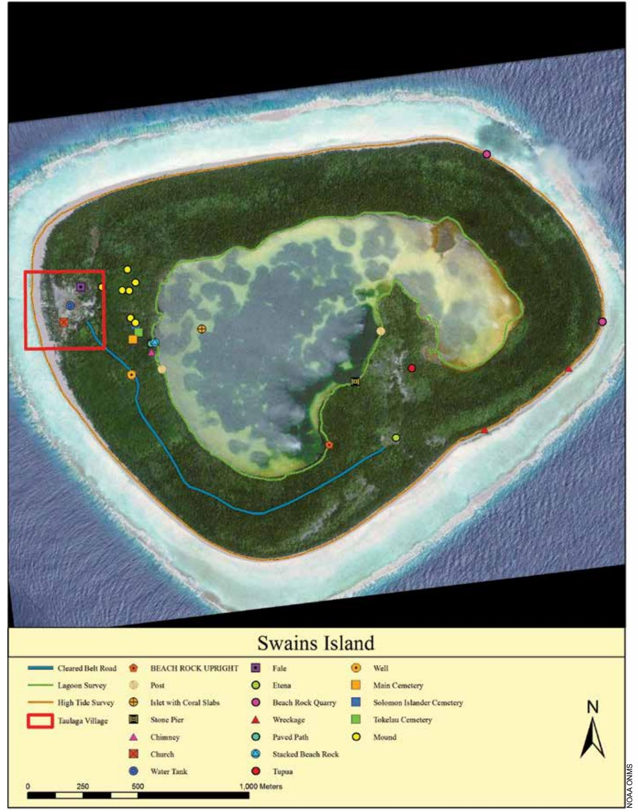

Figure 35: Showing the locations of potentially significant properties on Swains Island (both early and historic contexts).

unknown. (See Figure 39) Time did not allow for an exploration of the area immediately inland of these rocks.

#### **Mounds**

Reconnaissance survey work in the area surrounding the village discovered a number of large artificial mounds that may be the back-dirt result of excavating pits for the planting of pulaka '*elephant ear*' taro (Cytosperma chamissonis), as is done in the nearby Tokelau islands (Huntsman and Hooper 1996:25). The mounds are as much as three meters high and the ones observed by the terrestrial archaeologists tended to oval to linear and were next to a depression. We observed two next to the road from Taulaga to the western shore of the lagoon. They are next to low lying areas that could have been the result of purposeful excavations. Beaglehole and Beaglehole (1938:40-41) report similar mounds as the result of excavations for talo plantations at Pukapuka.

The land team discussed this with Dr. Rhonda Suka, the geomorphologist on the research team, and she informed them that she had seen similar mounds, a total of five, behind Taulaga village and had taken their GPS coordinates. The locations of these mounds are indicated on Figure 35. Due to dense vegetation and time constraints it was not practical to clear the mounds to take a representative photograph. Table 7 provides the coordinates for the seven mounds.

### **Fale Foundation Feature 1**

The survey of Tualaga village revealed the presence of two traditional style fale foundations.

The first is a traditional style raised fale foundation similar to those found in Samoa and Tokelau. The foundations long axis is oriented on an east – west axis. Its dimensions are approximately 11.5 meters by 6 meters. It is raised approximately 40-50 cm. Its periphery is defined by cut beach rock blocks usually placed horizontally and stacked 2 to 3 courses high. The interior of the foundation is filled with coral rubble. There were no artifacts found on the surface of the foundation. On the north side in the north toward the northeast corner there is a wooden post with a metal band that ap-

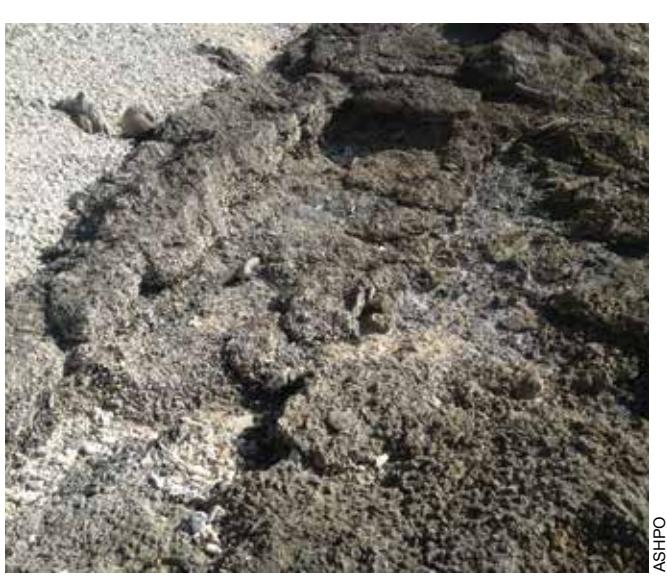

Figure 36: Possible beach rock quarry area at southeastern corner of Swains Island.

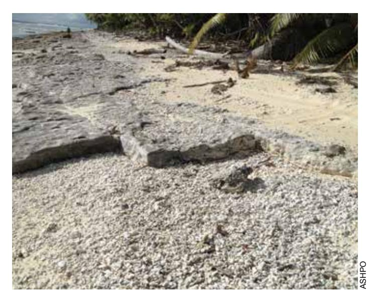

Figure 37: Possible beach rock quarry area on Swains Island.

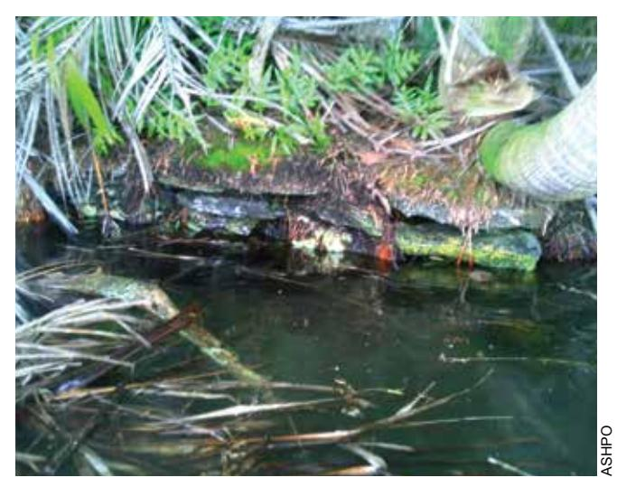

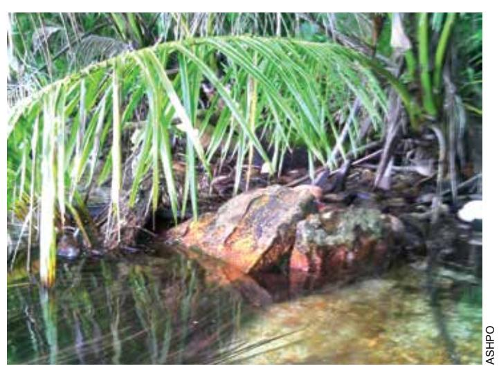

Figure 38: Stacked cut beach rock slabs along western shore of the lagoon. Figure 39: Showing two upright cut rock beach rocks on the southern shore of the lagoon.

pears to be associated with the foundation. The presence of this post indicates that the fale foundation was likely constructed in the historic era. Test excavations were conducted just to the west of this foundation and will be described below.

#### **Fale Foundation Feature 2**

Feature 2 is a traditional style raised fale foundation similar to those found in Samoa and Tokelau. It is approximately three meters to the north of the feature 1 fale foundation. The foundation is incomplete only the south side of the foundation remains. Its periphery, on the south side, is defined by cut beach rock blocks placed on edge and embedded in the ground. They protrude above the ground surface about 5 cm. They form an arch curving inward to the north. The original shape may have been oval or circular. The distance between the end points is approximately 5 meters. The area that is believed to be the interior of the foundation to the north is filled with coral rubble. The foundation appears to have been disturbed; the expected curbing stones that would have completed the outline of the foundation are absent.

#### **Cut Beach Rock Islet**

There is a small islet off the western shore of the lagoon. See Figure 35. Its UTM coordinates are Easting 490961.31, Northing 8777844.34. It appears to be an artificial islet as its base is made of cut beach rock. The maritime archaeologists investigated the site and found a submerged extension of cut beach to the east of the island. They surmised this was an extension of the work done to create the islet. It is not known when or for what purpose the islet was constructed.

### **Cut Beach Rock Path**

After the lagoon survey the inland location behind the stacked cut beach rocks was investigated. It was discovered that there is a cut beach rock path that extends from the shoreline location of the stacked beach rocks in a westward direction inland. Scaled photos were taken of the path and the path was measured. The path is approximately 1 meter wide and 20.2 meters in length. A large tree identified by worker Sione Tuamoheloa as a "Feta'u" tree has pushed up some of the beach rocks and partially covers others.

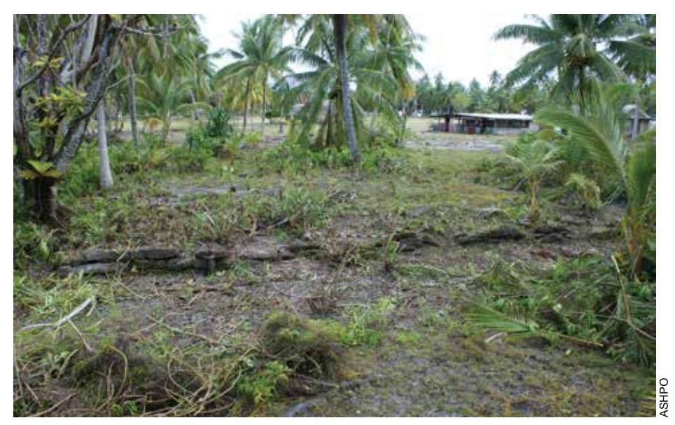

Figure 40: North side of feature 2 fale foundation. Note post with metal band center left.

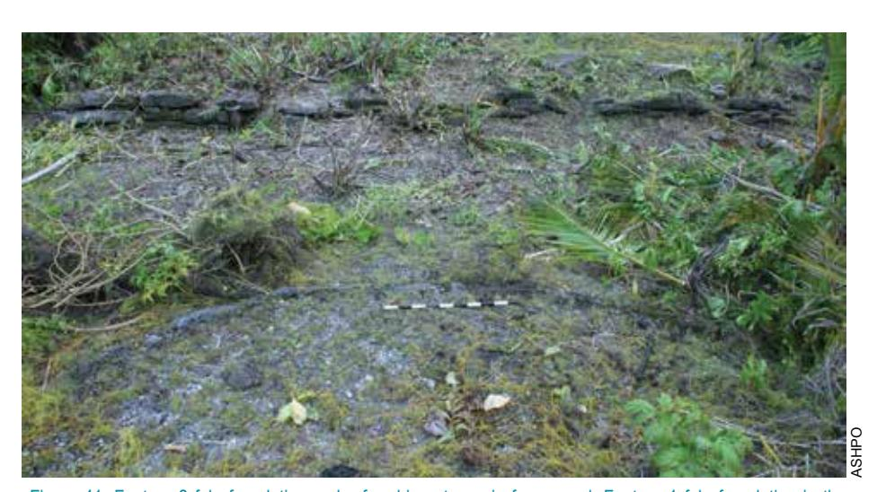

Figure 41: Feature 2 fale foundation arch of curbing stones in foreground. Feature 1 fale foundation in the background.

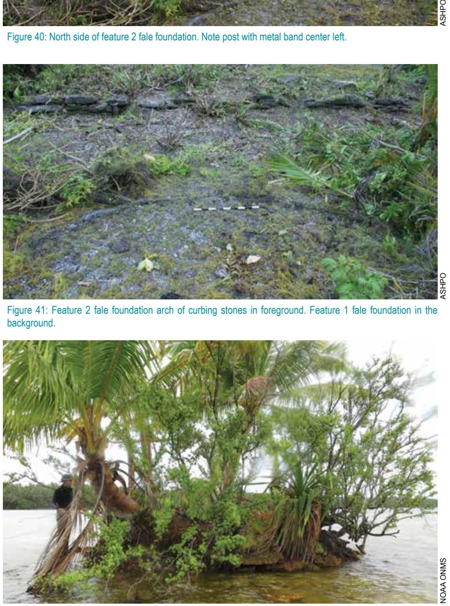

Figure 42: Artificial islet in Swains Island lagoon

The research team mapped a main group of 14 lagoon pilings (see historic context) in the vicinity of the stone path. They made note of the stacked rocks and initially believed them to be the same feature as noted in the land archaeology survey. However, if one compares the photograph (Figure 46) they took of the set of stacked cut beach rocks to those in the photograph (Figure 47) taken during land reconnaissance survey, one finds that they are two different sites.

Also, note that Figure 35 shows the stacked cut beach rock and stone path to be well north of the location of the pilings. This was not discovered until after we left the island, created Figures, and compared notes. This may mean that there is a second stone path that leads away from second location of cut stacked beach rock. This should be investigated should the team return for follow-up investigations.

### **Traditional Tupua and Platform**

A traditional tupua (sacred or propitiatory stone), hereafter referred to as the "tupua," with an associated platform, was identified in an isolated area of the coconut plantation to the north of the Jennings family abandoned residence (described below) at Etena. The location is shown on Figure 35. The coordinates for the location are UTM: Easting 491912.17, Northing 8777668.50.

David Jennings stated that he had heard that at some unknown point in time a group of individuals from the aumauga (a traditional untitled men's group) had knocked the "head" off of the tupua by throwing coconuts at it. A documentary concerning Swains Island, posted on the Internet on July 2009, briefly showing the tupua, claims that the tupua stone was worshiped by Tokelau people and that similar tupua exist on the Tokelau Islands (https://www. youtube.com/watch?v=0qt81PZHyU0).

There is a dirt road/path that leads from the old Jennings residence to the tupua. The tupua is in a cleared area with coral rubble and pebbles on the ground surface. It is an upright elongated coral rock with a cut beach rock that appears to be a "back brace." Both the tupua and the back brace are embedded in the ground.

Directly to the west "behind" the elongated coral rock tupua and the brace is a platform structure that consists of upright cut beach rock embedded in the ground forming the exterior of a six sided polygon platform that is filled with coral rubble/ pebbles. The platform has "arms" made of addition cut beach rock slabs, also embedded in the ground, that project from the southeast and northeast corners at approximately 45 degree angles that turn in a few degrees giving the arms a slightly bow-like appearance (see Figures 48-49 and 50-54). The "arms" form low walls that extend past the tupua on its north and south sides.

The tupua and platform are aligned in a general east/west orientation. The tupua, and the side of the platform with the projecting arms are facing east, and the back of the platform is facing to the west.

The tupua itself is approximately 122 cm in height from the ground surface. At its widest point it is approximately 40 cm across and 24 cm wide. From that point it narrows, tapering both up and down to smaller dimensions. It is approximately 10 cm across at the top and 20 cm across at the base at ground level.

As noted early there is an account that the "head" of the tupua may have been knocked off at some point. When we examined the tupua we observed that about one third of the way down (41 cm) from the top there is a crack that extends completely around the circumference of the tupua. A similar crack was observed at the base of the tupua (see Figures 55-58). It also appears that some type of cementing material may have been used to repair the tupua.

Directly to the west behind the tupua embedded into the ground is a triangular shaped piece of cut beach rock. It is resting against the back (west side) of the tupua and appears to have been placed there has a support brace for the tupua.

This rock is approximately 58 cm in height, 30 cm across at its base, and 12 cm wide. The raised platform structure, not counting the projecting arms, is a six-sided polygon. A single cut beach rock slab defines the east side. The slab is 28-30 cm in height (all heights are from the ground surface), 1.82 m across, and 9-10 cm wide.

The north side is composed of two cut beach rock slabs. The slab abutting the eastern slab is 48 cm in height, 62 cm across, and 2-5 cm wide. The second north side slab to the west of the first slab is 48 cm in height, 104 cm across, and 5-9 cm wide.

The next slab is in the northwest corner and is at a 45 degree again from the western north side slab to the west side slab. This slab is 48 cm in height, 70 cm across, and 3-10 cm wide.

The western side is composed of two cut beach rock slabs. The slab toward the north is 34 cm in height, 108 cm across, and 12 cm wide. The second slab on the west side is 34 cm in height, 30 cm across, and 10 cm wide.

Next, there is a single slab in the southwest corner; it is a 45 degree angle from the western slab to the first slab on the south side. It is 32 cm height, 59 cm across, and 2-3 cm wide.

The south side is composed of three cut beach rock slabs. The first slab on the south side is 32 cm in height 35 cm across, and 4 cm side. The second slab on the south side (toward the east) is 39-40 cm in height, 72 cm across, and 4-5 cm wide. The third slab on the side is 40 cm in height, 71 cm across, and 5-6 cm wide.

The platform also has two cut rock beach stones laying on its surface one near the northwest corner and the other near the southwest corner. They are both roughly triangular. The rock in the southwest corner is approximately 20 cm by 20cm, while the rock in the northwest corner is approximately 30 cm by 22 cm.

The arms or northeast and southeast walls that project to the southeast and north east on either side of the tupua have the following characteristics and dimensions. Starting with the southeast wall we observe that it is composed of four cut beach rock slabs embedded in the ground. The first slab, which is touching the southeast corner of the platform, is 42 cm in height, 68 cm across, and 2-3 cm wide. The next slab is 42 cm in height were it touches the first slab tapering down to a height of 30 cm at its far end. It appears to have been purposefully cut to taper downward as one moves to the southeast; it is 72 cm across, and 4-5 cm wide. The next slab is similar in that its height starts at 30 cm but then tapers as one moves to the southeast ending at a height of 20 cm. It is 60 cm across and 4-5 cm wide. The final slab is 20 cm in height, 22 cm across, and 3-4 cm wide.

There are three slabs that compose the northeast arm or wall. The slab touching the northeast corner of the platform is 50 cm in height and slopes slightly to the southeast to a height of 48 cm; it is 80 cm across, and 4-10 cm wide; the widest end abutting the southeast corner of the platform. The next slab abutting the first is 48 cm in height at this point and tapers down to a height of 33 cm. The slab appears to have been purposefully cut to taper downward as one moves to the northeast. It is 82 cm across and is 3-4 cm wide. The third slab is approximately 33-35 cm in height, 40 cm across, and 3-4 cm wide.

Three shovel test pits (STPs) were excavated along the periphery of the tupua monument site (Figure 59). Test pit locations were selected in hopes of avoiding any historic period disturbance which may have occurred closer to the monument. The STPs measured 30 centimeters (cm) in diameter and were excavated to a depth of 50 cm below surface (bs). The stratigraphy below the A-horizon at this location consisted entirely of a coral rubble deposit, which is pervasive across this part of the island. The rubble deposit consists primarily of unworn coral, which was likely deposited while still alive and may be the result of a single highenergy deposition event. This indicates that the area may have previously included a channel that connected the, now enclosed, lagoon with the sea. No cultural materials or deposits were encountered, which suggests few activities occurred around the tupua during the plantation period.

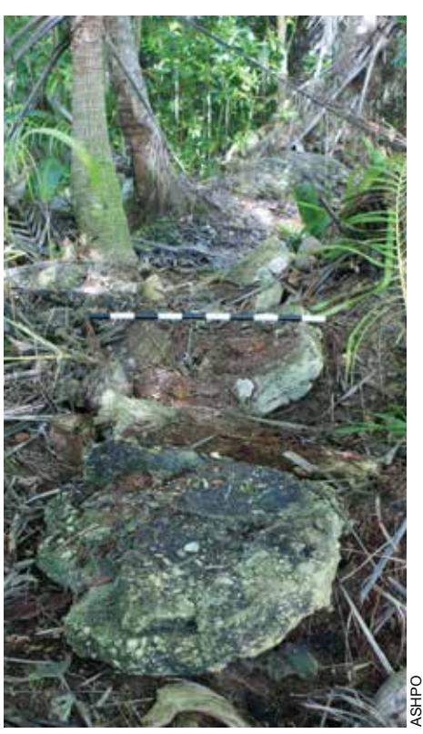

Figure 43: Cut beach rock path, note tree roots pushing up beach rock.

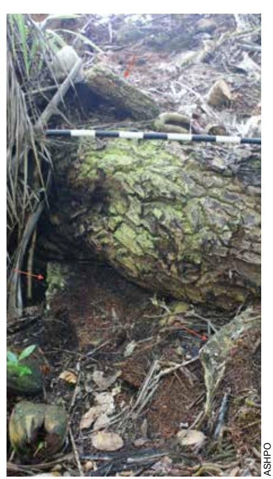

Figure 44: Red arrows point to cut beach rock on path, note tree root of Feta'u tree pushing up and going over cut beach rock that are part of the path.

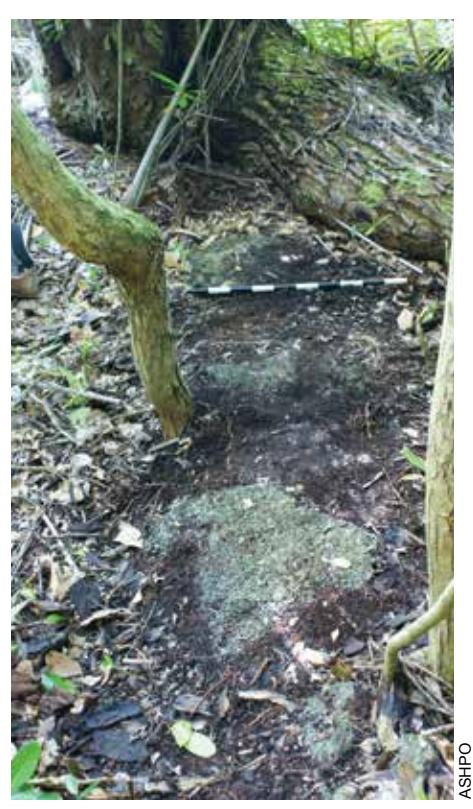

Figure 45: Cut beach rock path interrupted by tree.

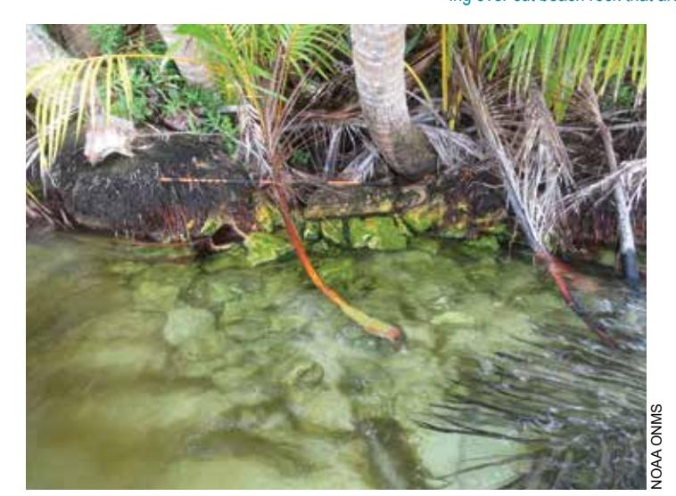

Figure 46: Stacked cut beach rock photographed by maritime archaeologists near the main piling area (historic context).

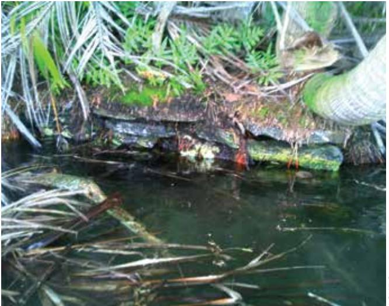

Figure 47: Stacked cut beach rock photographed during the land archaeology reconnaissance survey.

ASHPO

#### **Tupua Analysis**

Following Kikuchi (1963:83), tupua, or propitiatory stones, "are bounders, rocks, and natural physical features that are associated with historical, mythological and traditional character."

The propitiatory aspect has to do with fact that offerings or rites associated with pleasing the legendary individual in question were carried out in relation to these stones. The aim of such rites was to propagate or generate abundance in marine, terrestrial fauna, or agricultural resources (Turner 1884; Armstrong et al. 2011).

In Eastern Polynesian contexts there are upright stones having similar propitiatory functions, and though not referred to as tupua, they were often associated with or located on marae (open or partially enclosed spaces) with ahu (platforms). In Western Polynesian islands, such as Samoa and Tokelau, tupua were often, though not exclusively, associated with malae (the ceremonial center of the village) and *fale atua*  or *fale aitu* ("god or spirit houses"), as well as other alter like structures (Turner 1884; Stair 1897; Macgregor 1937; Armstrong et al. 2011). Macgregor (1937:65) describes a god house associated with tupua in Tokelau as follows:

*Each village in Tokelau had the usual Polynesian meeting ground called malae, where most of the religious ceremonies, all the dances, the ceremonial division of fish, turtles, and whales, and other community festivities took place. At Atafu the malae had an area of about 180 square feet and was covered with sand and pebbles. A god house (fale atua) stood at one end, some distance from the village. One informant stated that it contained:*

*…three coral slabs representing Tui Tokelau, Te Pusi, and Te Lio. A second informant said that two slabs of Tui Tokelau and Fakaofu stood before the god house, and none were inside it. These slabs were tupua, the residences of the gods during ceremonies.*

A god house and associated tupua are illustrated in an etching by T. Agate who visited the Tokelau Island of Fakaofo in 1841 as part of the United States Exploring Expedition led by Commander Charles Wilkes (Wilkes 1845: opp. P. 14). The god house was said to be forty by thirty feet and twenty feet in height (Hale 1846). It appears to be slightly elevated on a platform or foundation. In front of the god house are two upright "monuments," likely coral slab tupua, that are illustrated as covered in mats. The Tui Tokelau tupua, the taller of the two was described as being 10 to 14 feet tall (Hale 1846; Hudson 1840-1842.) The smaller one, unidentified by Hale, is about one third as tall as the Tui Tokelau tupua, so it was approximately 3 to 4 feet tall (see Figure 60).

Note that Macgregor states that the god house, and associated tupua, though at one end of the malae, was "some distance from the village." In Samoa there are examples of tupua in isolated wooded areas (Turner 1884:24-25, 54, 62). The tupua on Swains Island could be an indication that there was a village and associated malae within proximity, or that it is an isolated variant. Macgregor (1937: 62) explains further that:

*Two bands of spirits, tupua maiuta (spirits from inland) and tupua maitai (spirits from the sea), inhabited all the islands and the neighboring sea. The tupua maiuta were friendly spirits of the Tokelau people and waged a continual war upon the foreign spirits (tupua maitai). When the tupua maitai were victorious, troubles multiplied for the people.*

The isolated character of this tupua would be consistent with it being a representation of inland tupua maiuta.

As in Samoa, the gods associated with the tupua would bestow abundance on those who conducted rituals and made ceremonial offerings to the tupua. Huntsman and Hooper (1996:151) states that prayers and offerings were made to the Tui Tokelau instantiated in the tupua. These prayers and offerings helped to ensure that blessings and bounty would be realized; in particular Tui Tokelau was associated with providing an abundance of fish (Huntsman and Hooper 1996:151).

There are structural homologies between the tupua and god house at Fakaofu and the tupua found on Swains Island, namely, like the site at Fakaofu an upright coral rock tupua is located in front of platform structure. However, the Swains Island tupua and platform are unique as there are a number of differences that set it apart from the Fakaofu site. First, the platform structure is significantly smaller than the god house at Fakaofu. Secondly, the Swains Island platform is a six-sided polygon, not an oval like the Fakaofu god house. (Note: Though it might be viewed as referencing one half of an oval, as in a part for a whole relation. At the same time, looking at its general dimensions, east side to far west side is 2.2 m, and north side to south side 2 m, it could be viewed as is slightly rectangular.) Thirdly, the arms/walls that are projecting off of the eastern corners of the platform are not part of god houses described in Tokelau, or Samoa for that matter, and there are no known examples of any platforms with such associated "arms," or projecting low walls in Tokelau. These three differences are addressed as follows.

Regarding the difference in size, if one turns to Samoa, Swains' other neighbor, one finds that a god house was not necessarily a large structure; Stair (1897:226) states that they could be "mere huts," but were "rendered sacred by their being set apart as the dwelling-place of the god." Williamson (1933: 152) cites the missionary Murray's description of a temple in the village of Sailele, Tutuila Island, American Samoa, which contained three stones that were worshipped. That structure was said to be 10 feet by 6 feet and had a roof so low that an average man could not stand in it (Williamson 1933: 152). Williamson (1933: 152) also states that such structures were "almost always placed on fanua-tanu, or raised platforms…"

Considering the shape of the platform, this might be a structural transformation that is similar to marae found in Eastern Polynesia. The marae there have upright stones associated with deities that are placed on and in front of rectangular and sometimes square platforms known as ahu. Kirch and Green have argued from historical linguistic data that ahu are transforms of Western Polynesian oval god houses (Kirch and Green 2001:254-255). If the platform is a structural analogue to an ahu, in may be significant to recall that there are two cut beach rock slabs on the surface of the platform. This raises the question as to whether these slabs were at some point in time uprights on the platform as is found in Eastern Polynesia.

Turning to the "arms" projecting from the platform, Eastern Polynesian supplies another structural transformation that may be a relevant analogy for the Swains

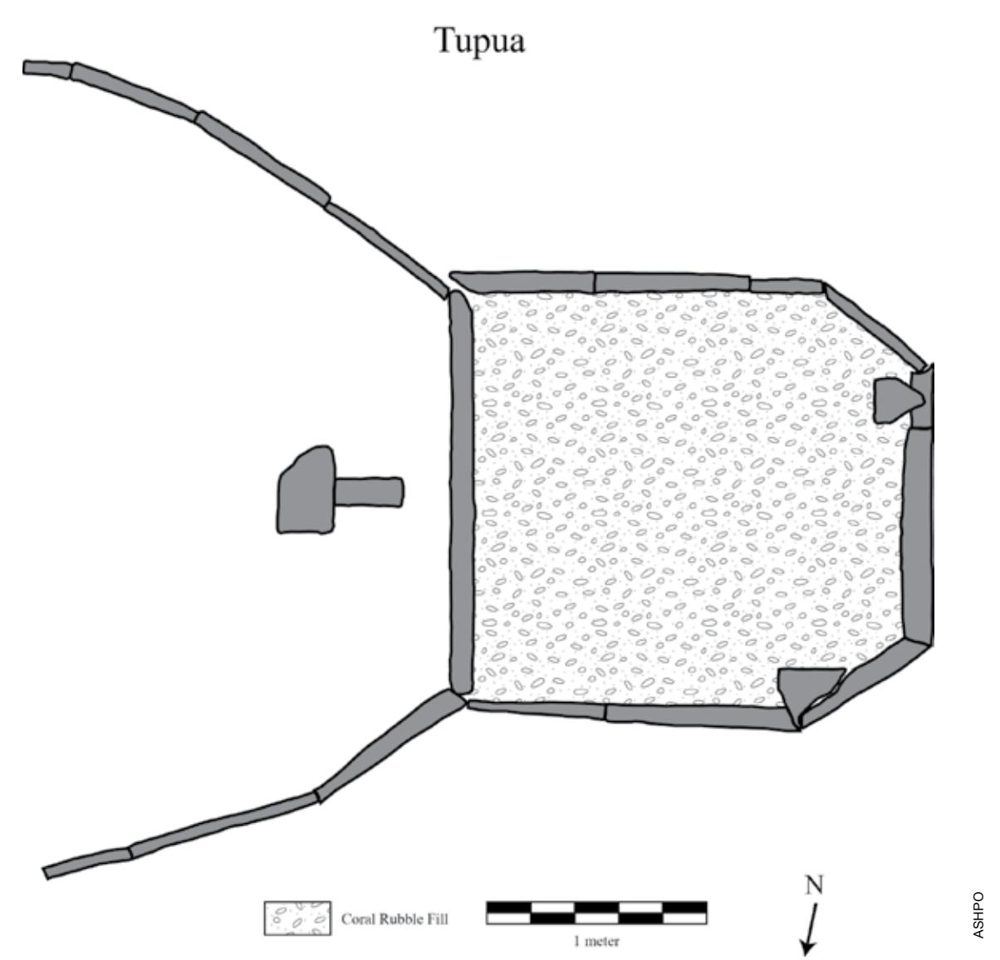

Figure 48: Plan view of Tupua and platform with "arms" or low walls.


Figure 49: Oblique angle of north side of Tupua and Platform with projecting "arms."

Island feature. Recall that in Tokelau one found a malae (an open ceremonial space), at one end of which was a tupua in front of the fale atua or god house. In Eastern Polynesian one finds a court yard-like ceremonial space, open at one end, which can contains uprights, partially enclosed by two low walls on the sides, which extend from an ahu platform that bounds the far end of the ceremonial space. These structures were described and illustrated by Emory (1937) for the Tuamotus (see examples after Emory Figures 61-62).

Following the structural analogy, the two low walls at the Swains Island tupua site may also be bounding a ceremonial space, open at one end, which contains the tupua upright, which extend from the platform that bounds the far end of the possible ceremonial space.

The Swains Island tupua and platform is a unique structure that appears to have structural similarities to sites in Tokelau, Samoa and Eastern Polynesia. Given these similarities one can ask, is the construction of the Swains Island tupua the beginning of a structural transformation that led to the development of Eastern Polynesian marae complexes, or is it an indication of Samoan, Tokelauan, and East Polynesian influence on the culture of the Swains Island?

The notion that there was some Eastern Polynesian influence on the inhabitants of Swains Island is supported if one considers the islands of Pukapuka to the east of Swains. The inhabitants of these islands also had "god houses" (wale atua), and other religious structures. Beaglehole and Beagelhole (1938) state the following:

*Commemorative stones, marking the shrine of an ancestor god on a sacred clearing (yionga), consisted of a single upright stone set in the ground, or else several stones set on edge to form a rectangular structure two or more feet square, the enclosure being filled with coral gravel.* 

Beaglehole and Beaglehole (1938: 317- 318) also report on a particular shrine:

*The shrine of Leweke, the god of clams, was described to me as a small raised platform of stone or coral pebbles about 4 feet square, two feet high. Probably coral slabs were raised on edge and the container this made filled with small while pebbles.*

This shrine was next to the water near the location of the stone representing Leweke to which offerings were made from the shrine.

In addition, Beaglehole and Beaglehole (1938: 160) also report that there were:

*Religious enclosures (awanga) on which a priest communicated with the gods were round or oval, the form demarcated by a circle of stones placed on edge. two gaps (pu) were left in this circle as entrances to the worshiping place. In the center was the sacred stone (unu) of the god.*

They further state that "the sacred enclosure corresponds to the religious marae of other parts of Polynesia."

Here we have all of the components of the tupua at Swains, namely an upright representing a god, a platform-like shrine associated with a separate stone, and an enclosure made of a low wall of coral slabs with openings in which there is a sacred stone.

Also of interest is that it is well documented that Pukapuka voyagers visited Tokelau and Swains (Olosega) and stopped at Swains on return voyages from Samoa. Beaglehole and Beaglehole (1938:378-384) report on various legends concerning these voyages. They also describe the Pukapuka navigation star chart that includes the stars (Orion's Belt) that was used to navigate from Swains to Pukapuka (Beaglehole and Beaglehole 1938: 347-253). David Lewis (1972: 269-272) working from Beaglehole and Beagehole's material mapped the routes using the star charts demonstrating their efficacy.

This provides the link to Eastern Polynesia that may help to explain the structure of the tupua on Swains. Beaglehole and Beaglehole (1938:413) state:

*A cursory comparison of Pukapukan material culture with that of Polynesia as a whole indicates that Pukapuka shares largely in prominent elements common in both eastern and western Polynesia.* 

Before we close this discussion we will consider two other hypotheses relative to the tupua for the sake of completeness.

The first alternate hypothesis is that the platform is actually a grave and the tupua is grave monument to a high-ranking chief or chiefs. There is some evidence to support this hypothesis. First, traditional Tokelau and Swains Island graves are made using cut beach rock to outline a grave and are filled with coral rubble. Simple graves for single individuals using cut beach rock and coral rubble are found on Swains Island; examples will be described below. In addition, there are larger multi-tiered graves found on Tokelau Islands (see Huntsman 1996: 394). If this is a gravesite, it is likely to be that of a high status individual such as a high chief.

Secondly, the size of the platform, 2.2 m x 2m or 7.2 feet by 6.5, is consistent with the size of a grave for two individuals. One should keep in mind, however, that there are no known examples of Tokelau or Swains Island graves that have this structure i.e. a platform with projecting walls, as this site has, nor a grave that has a tupua as an associated monument. Still, it could be a unique example of a grave, so in order to test whether it is a grave, or some type of fale, like a "god house," excavations, or non-destructive testing with ground penetrating radar, would have to be carried out. If it were a gravesite, one would expect human remains to be found. On the other hand, if it were some type of a fale the remains of post molds would be indicative of such a structure.

The second alternate hypothesis is that the tupua is some type of sighting or navigation stone. David Lewis describes such stones that have been found in the Kiribati Islands and one rare example in Tonga. Lewis (1972:363) states that:

*Sighting stones have been used to align canoes on taking departure in the same manner as natural landmarks, and probably also to record and teach stars.*

Lewis (1972:363) describes such sightings stones that were found in the Kiribati Islands where they were explicitly referred to as Te Atibu ni Borau, or "The Stones for Voyaging." There were a group of 13 of such stones on the island of Arorae at its most northwestern point. The stones were said to be "flat slabs of coral about five feet by four feet and about six inches thick. They were set on edge and secured at the base by paving" (Lewis 1972: 363). They were usually grouped in threes, two parallel to each other with a space between. A bearing was apparently taken by looking through


Figure 50: Oblique angle of north side of Tupua and Platform with projecting "arms."


Figure 51: North side view of Tupua and Platform with projecting "arms."


Figure 52: Oblique angle of east side of Tupua and Platform with projecting "arms."


Figure 53: Oblique angle of west side Tupua and Platform with projecting arms.


Figure 54: Oblique angle of south side of Tupua and Platform with projecting "arms."


Figure 55: Close up of south (back) side of Tupua with arrows indicating cracks and possible cement that may indicate that the Tupua was broken in three pieces and repaired.


Figure 56: East (front) side of Tupua arrows indicating cracks where repairs may have occurred.


Figure 57: North side of Tupua arrows indicating cracks where repairs may have occurred.


Figure 58: South side of Tupua arrows indicating cracks where repairs may have occurred. Figure 59: Location shovel test pit excavations in relation to the Tupua site.


the space between the two stones to the third stone some distance away. The bearings so obtain pointed in the direction of a given island group (Lewis 1972: 364). (See Figure 63, a detail of three of the stones from Lewis's Figure.)

Lewis (1972: 370) also describes a single large basalt stone, five feet in length, in Tonga that was laying on edge and pointed horizontally in the general direction of 'Uvea. It was in the middle of the village of Niuafo'ou and was called Hanga i 'Uvea which means, "facing 'Uvea."

While it is possible that tupua on Swains may have had some type of navigational significance, there are a number of difficulties that arise for such a hypothesis. First, Swains Island and Tokelau oral tradition identifies the tupua as a tupua, and, unlike in Kiribati and Tonga, there is no known oral tradition on Swains or Tokelau indicating that these stones have anything to do with navigation. Secondly, the tupua, like other tupua, is embedded in the ground in an upright position. It is not set on its lengthwise edge pointing along a compass bearing, as is found in Kiribiti and Tonga. Thirdly, the ethnographic examples of navigation stones described by Lewis do not have any associated platforms, or platforms with low walls extending from them.

Clearly more research needs to be done, such as more detailed comparative analysis and research that can answer basic questions such as the age of the tupua relative to the ages of structures to which it is compared.

In concluding this section, while there is not enough evidence at this time to definitely rule out any of the competing hypotheses, described above, and while addition research is certainly warranted, it seems reasonable to point out that the preponderance of evidence at this time supports the idea that the tupua site is some type of traditional Polynesian ceremonial tupua site, rather than a grave site, or a navigation stone site.

#### **General Excavation Results**

This section describes the results of excavation fieldwork accomplished during the Swains Island Project. Subsurface excavations were carried out at two locations on the island (Fig. 65), at Taulaga Village and the beachrock monument known as the tupua. Three exploratory shovel test


Figure 60: Illustration of two tupua covered in mats in front of god house on Fakaofu, Tokelau Islands.

pits (STP) were completed at the tupua site. Excavations at the village consisted of 14 STPs and a single controlled test unit. An intact cultural deposit containing historic materials was documented across much of Taulaga Village. No subsurface cultural deposit was identified at the tupua.

#### **Shovel Test Pit Excavations**

All shovel test pits were excavated manually with shovel or trowel by stratigraphic layer in 10 cm levels. Excavated soils were screened through 1/4 inch wire mesh and the following soil characteristics were profiled: color, including moisture condition (wet, moist, dry) when color read; texture; structural grade, size, and form (or absence of structure); dry or moist consistence; wet consistence (stickiness, plasticity); cementation; root and pore frequency and size and pore type; presence of charcoal or other cultural materials; and lower boundary distinctness and topography (Allen 2009; Munsell Color 2000). The STPs were backfilled after the placement of flagging tape at the base of the excavation.

#### **STPs in Taulaga Village**

Fourteen STPs were excavated at Taulaga Village (Figure 66). Ten STPs were excavated along a systematic transect that ran across the center of the village from west to east (Figure 66). Four additional STPs were excavated in order to investigate surface features documented during reconnaissance of the village. The STPs measured 30-50 cm in diameter and were excavated to a depth of 40-115 cm bs.

The stratigraphy documented throughout most of the village consists of a 20th century cultural deposit overlying natural calcareous sand. These deposits typically contain an active A-horizon developed into the sediment below. Culturally sterile calcareous sand was documented extending to the base of every STP. Disturbed sediments, containing the modern cultural deposit, were present in all excavations excluding STPs 1 and 2.

Table 2 presents the sediments documented in the STP transect across Taulaga Village. The STPs were excavated at 20 meter (m) intervals beginning near the beach and moving east toward the lagoon. The historic cultural deposit was present in all test pits, with the exception of STPs 1 and 2, the two located closest to the beach, where evidence of recent storm deposits was documented. Excavation of STP 6 was halted at 40 cm bs due to presence of limestone at that depth. It was not clear if the limestone indicated the depth of the bedrock at this location, or was simply a large subsurface boulder. A single Tridacna sp. shell was encountered in STP 4 at 25 cm bs. This shell represented the only Tridacna sp. remains documented during project excavations.

In addition to the ten STPs excavated along the transect, four test pits were completed at the north end of the village. STP 11 was located next to a large pit that was recently excavated to dispose of trash. Three STP's (12-14) were excavated off the west, north, and east sides of an elevated house foundation (See Fale 1). The foundation was constructed in the traditional manner, using cut beach rock slabs to form a retaining wall for coral rubble fill. All three STPs exhibited the modern cultural layer documented along the test pit transect in the center of the village. STP 12 contained a large amount of fish remains present in the cultural deposit, which prompted excavation of a controlled test unit at that location.

#### **Unit Excavation**

A single test unit was excavated during the Swains Island project. The 1 x 1 m unit was located 2.5 m west of a house foundation platform at the north end of the village (see Figure 35). The house foundation was encountered during reconnaissance survey of the north end of the village. The test unit was excavated manually by trowel and preceded in 10 cm levels within natural or cultural layers. All excavated soil was screened through 1/8-inch wire mesh. Soil characteristics were recorded (Table 9) and scaled profiles were drawn for each side wall (Figures 77-84). The unit was backfilled after the placement of flagging tape at the base of the excavation.

Excavation of the test unit was prompted by the presence of a high concentration of fish remains encountered in STP 12, one meter south of TU 1. Excavation revealed a historic deposit consistent with that recorded during the STP transect excavations at the center of the village. The deposit extended from the surface to 80 cm bs, and contained historic materials including: metal, glass, ceramic, textiles, rubber, and plastic. Other cultural materials collected from the deposit were: marine invertebrate shell, fish bone, mammal bone, and charcoal. Several slabs of beach rock were present in the unit from 6-34 cm bs, which may be the remains of a walkway or elements of a structure. A single feature (Feature 1) consisting of a concentration of dark soil was encountered in the northeast corner of the unit from 83- 115 cm bs. The feature was excavated and


Figure 61: An example of an Eastern Polynesian marae at the island of Reao in the Tuamotus.


Figure 62: Another example of an Eastern Polynesian marae this one at Takaroa in the Tuamotus.


Figure 63: Showing the relationship between three "sighting stones" at Arorae Island indicating a bearing to an off-shore island.


Figure 64: Recording and screening activities during excavation of the test unit at Taulaga Village.


Figure 65: Areas on Swains Island where excavation occurred. Figure 66: Location of excavations at Taulaga Village.


Figure 69: STP 3; view to the east.


Figure 70: STP 4; Tridacna sp. shell in east wall; view to the east. Figure 72: STP 6; view to the east.


Figure 67: STP 1; view to the east. Figure 68: STP 2; view to the east.


Figure 71: STP 5; view to the north.


Figure 73: STP 7; view to the east. Figure 74: STP 8; view to the east. Figure 75: STP 9; view to the east.


Figure 76: STP 10; view to the east.

screened separately and did not contain any cultural materials. It is not clear what the origin of the feature may have been, though the lack of cultural material suggests it may not have been anthropogenic. A shovel test pit, located in the southwest quadrant, was excavated at the base of the unit to a depth of 205 cm bs, where a solid substrate was encountered. No cultural materials were present in the STP.

No traditional cultural materials outside of a historic context were documented. The lack of a pre-Contact deposit in any of the excavations across Taulaga Village suggests that no habitation occurred at this location prior to the plantation era. The site may have been selected specifically for the plantation village due to its proximity to relatively a safe passage through the reef for landing craft.


Figure 77: North wall of test unit.


Figure 78: North wall of Test Unit 1, beach rock slab visible at 25 cm bs.

Figure 80: East wall of Test Unit 1.


Figure 81: South wall of Test Unit 1.


ASHPO

Figure 82: South wall of Test Unit 1, with STP completed in the southwest corner.


Figure 83: West wall of test unit. Figure 84: West wall of test unit, with STP completed in southwest corner.

| STP | Layer | Depth  | Description                                                                                                                                                                                                                      | Interpretation                |
|-----|-------|--------|----------------------------------------------------------------------------------------------------------------------------------------------------------------------------------------------------------------------------------|-------------------------------|
| 1   |       | 0-15   | Brown (10YR 5/3, moist) coarse sand; weak to moderate granular structure; soft consistence dry, nonsticky wet; weakly cemented; many medium to large roots; 5-10% coral pebbles; clear lower boundary.                     | A-horizon                     |
|     | I     | 15-65  | Gray (7.5YR 5/1, moist) coarse sand; structureless; loose noncoher ent dry, nonsticky wet; weakly cemented; very few roots; 40-50% coral pebbles and cobbles.                                                              | Natural calcareous deposit |
| 2   |       | 0-20   | Brown (10YR 5/3, moist) coarse sand; weak to moderate granular structure; soft consistence dry, nonsticky wet; weakly cemented; many medium to large roots; 5-10% coral pebbles.                                           | A-horizon                     |
|     | I     | 20-48  | Gray (7.5YR 5/1, moist) coarse sand; structureless; loose noncoher ent dry, nonsticky wet; weakly cemented; very few roots; 40-50% coral pebbles and cobbles; gradual lower boundary.                                      | Natural calcareous deposit |
|     | II    | 48-70  | Light gray (7.5YR 7/1, moist) coarse sand; structureless; loose noncoherent dry, nonsticky wet; weakly cemented; very few roots; <5% coral pebbles; gradual lower boundary.                                                | Natural calcareous deposit |
|     | III   | 70-76  | Dark gray (7.5YR 4/1, moist) coarse sand; structureless; loose non coherent dry, nonsticky wet; weakly cemented; very few roots; <5% coral pebbles; gradual lower boundary.                                                | Natural calcareous deposit |
|     | IV    | 76-78  | Light gray (7.5YR 7/1 moist) coarse sand; structureless; loose non coherent dry, nonsticky wet; weakly cemented; very few roots; <5% coral pebbles; gradual lower boundary.                                                | Natural calcareous deposit |
| 3   | I     | 0-60   | Brown (10YR 5/3, moist) coarse sand; weak to moderate granular structure; soft consistence dry, nonsticky wet; weakly cemented; many medium to large roots; 20-30% coral pebbles; clear lower boundary.                    | Historic cultural deposit  |
|     | II    | 60-115 | Light gray (7.5YR 7/1, moist) coarse sand; structureless; loose noncoherent dry, nonsticky wet; weakly cemented; very few roots; 10-20% coral pebbles.                                                                     | Natural calcareous deposit |
| 4   |       | 0-10   | Pale brown (10YR 6/3, moist) coarse sand; weak to moderate granu lar structure; soft consistence dry, nonsticky wet; weakly cemented; many medium roots; 20-30% coral pebbles; clear lower boundary.                       | A-horizon                     |
|     | I     | 10-20  | Dark gray (10YR 4/1, moist) coarse sand; weak to moderate granu lar structure; soft consistence dry, nonsticky wet; weakly cemented; many fine to medium roots; 20-30% coral pebbles; clear lower boundary.                | Historic cultural deposit  |
|     | II    | 20-30  | Pale brown (10YR 6/3, moist) coarse sand; weak to moderate granu lar structure; soft consistence dry, nonsticky wet; weakly cemented; many medium roots; 20% coral pebbles; clear lower boundary.                          | Historic cultural deposit  |
|     | III   | 30-55  | Dark gray (10YR 4/1, moist) coarse sand; weak to moderate granu lar structure; soft consistence dry, nonsticky wet; weakly cemented; few fine roots; 20% coral pebbles; clear lower boundary.                              | Historic cultural deposit  |
|     | IV    | 55-110 | Pale Brown (10YR 6/3, moist) coarse sand; weak to moderate granular structure; soft consistence dry, nonsticky wet; weakly cemented; very few fine roots; 15% coral pebbles.                                               | Natural calcareous deposit |
| 5   |       | 0-10   | Brown (10YR 5/3, moist) coarse sand; weak to moderate granular structure; soft consistence dry, nonsticky wet; weakly cemented; <5% coral pebbles; clear lower boundary.                                                   | A-horizon                     |
|     | I     | 10-19  | Brown (10YR 5/3, moist) coarse sand; weak to moderate granular structure; soft consistence dry, nonsticky wet; weakly cemented; 20% coral pebbles; clear lower boundary.                                                   | Historic cultural deposit  |
|     | II    | 19-26  | Gray (7.5YR 5/1, moist) coarse sand; structureless; loose noncoher ent dry, nonsticky wet; weakly cemented; very few roots; 20-30% coral pebbles; gradual lower boundary.                                                  | Natural calcareous deposit |
|     | III   | 26-100 | Pale brown (10YR 6/3, moist) coarse sand; weak to moderate granu lar structure; soft consistence dry, nonsticky wet; weakly cemented; 10-20% coral pebbles.                                                                | Natural calcareous deposit |
| 6   |       | 0-11   | Gray (7.5YR 5/1, moist) coarse sand; structureless; loose noncoher ent dry, nonsticky wet; weakly cemented; many fine roots; 5-10% coral pebbles; clear lower boundary.                                                    | A-horizon                     |
|     | I     | 11-22  | Dark gray (10YR 4/1, moist) coarse sand; weak to moderate granu lar structure; soft consistence dry, nonsticky wet; weakly cemented; many fine to medium roots; 10-20% coral pebbles; clear lower boundary.                | Historic cultural deposit  |
|     | II    | 22-40  | Pale brown (10YR 6/3, moist) coarse sand; weak to moderate granu lar structure; soft consistence dry, nonsticky wet; weakly cemented; very few fine roots; 20-30% coral pebbles. Limestone (possible bedrock) at 40 cm bs. | Natural calcareous deposit |

| STP | Layer | Depth  | Description                                                                                                                                                                                                                 | Interpretation                                                                 |
|-----|-------|--------|-----------------------------------------------------------------------------------------------------------------------------------------------------------------------------------------------------------------------------|--------------------------------------------------------------------------------|
| 7   |       | 0-10   | Light brown (7.5YR 6/3, moist) coarse sand; weak to moderate gran ular structure; soft consistence dry, nonsticky wet; weakly cemented; many fine roots; 20-30% coral pebbles; clear lower boundary.                  | A-horizon                                                                      |
|     | I     | 10-20  | Dark brown (7.5YR 3/2, moist) coarse sand; weak to moderate granular structure; soft consistence dry, nonsticky wet; weakly ce mented; fine to medium roots common; 20% coral pebbles; clear lower bound ary. - | Historic cultural deposit                                                   |
|     | II    | 20-100 | Pale brown (10YR 6/3, moist) coarse sand; weak to moderate granu lar structure; soft consistence dry, nonsticky wet; weakly cemented; fine to medium roots common; 20-30% coral pebbles.                              | Natural calcareous deposit                                                  |
| 8   |       | 0-12   | Dark gray (7.5YR 4/1, moist) coarse sand; structureless; loose noncoherent dry, nonsticky wet; weakly cemented; many fine roots; 5-10% coral pebbles; clear lower boundary.                                           | A-horizon                                                                      |
|     | I     | 12-19  | Pale brown (10YR 6/3, moist) coarse sand; weak to moderate granu lar structure; soft consistence dry, nonsticky wet; weakly cemented; many fine roots; 20-30% coral pebbles; clear lower boundary.                    | Historic cultural deposit                                                   |
|     | II    | 19-31  | Dark gray (10YR 4/1, moist) coarse sand; weak to moderate granu lar structure; soft consistence dry, nonsticky wet; weakly cemented; many fine roots; 10-20% coral pebbles; clear lower boundary.                     | Historic cultural deposit                                                   |
|     | III   | 31-51  | Gray (10YR 5/1, moist) coarse sand; weak to moderate granular structure; soft consistence dry, nonsticky wet; weakly cemented; few fine roots; 10% coral pebbles; gradual lower boundary.                             | Historic cultural deposit                                                   |
|     | IV    | 51-105 | Pale brown (10YR 6/3, moist) coarse sand; weak to moderate granu lar structure; soft consistence dry, nonsticky wet; weakly cemented; fine to medium roots common; 20-30% coral pebbles.                              | Natural calcareous deposit                                                  |
| 9   |       | 0-25   | Pale brown (10YR 6/3, moist) coarse sand; weak to moderate granu lar structure; soft consistence dry, nonsticky wet; weakly cemented; many fine roots; 10% coral pebbles; clear lower boundary.                       | Historic deposit                                                               |
|     | I     | 25-35  | Dark brown (7.5YR 3/2, moist) coarse sand; weak to moderate granular structure; soft consistence dry, nonsticky wet; weakly cemented; fine to medium roots common; 10-20% coral pebbles; clear lower boundary.     | Historic cultural deposit                                                   |
|     | II    | 35-60  | Gray (7.5YR 5/1, moist) coarse sand; structureless; loose noncoher ent dry, nonsticky wet; weakly cemented; many fine roots; 10-20% coral pebbles; gradual lower boundary.                                            | Natural calcareous deposit                                                  |
|     | III   | 60-110 | Pale brown (10YR 6/3, moist) coarse sand; weak to moderate granu lar structure; soft consistence dry, nonsticky wet; weakly cemented; fine roots common; 10% coral pebbles.                                           | Natural calcareous deposit                                                  |
| 10  |       | 0-7    | Dark brown (7.5YR 3/3, moist) coarse sand; weak to moderate granular structure; soft consistence dry, nonsticky wet; weakly cemented; 20-30% coral pebbles; clear lower boundary.                                     | A-horizon                                                                      |
|     | I     | 7-30   | Pale brown (10YR 6/3, moist) coarse sand; weak to moderate granu lar structure; soft consistence dry, nonsticky wet; weakly cemented; many fine roots; 10-20% coral pebbles; clear lower boundary.                    | Historic deposit                                                               |
|     | II    | 30-40  | Dark gray (10YR 4/1, moist) coarse sand; weak to moderate granu lar structure; soft consistence dry, nonsticky wet; weakly cemented; few fine roots; 10% coral pebbles; clear lower boundary.                         | Historic cultural deposit                                                   |
|     | III   | 40-70  | Pale brown (10YR 6/3, moist) coarse sand; weak to moderate granular structure; soft consistence dry, nonsticky wet; weakly cemented; fine roots common; 20-30% coral pebbles.                                         | Natural calcareous deposit                                                  |
|     |       | 0-9    | Pale brown (10YR 6/3, moist) coarse sand; weak to moderate granular structure; soft consistence dry, nonsticky wet; weakly cemented; many medium roots; 20-30% coral pebbles; clear lower boundary.                   | A horizon                                                                      |
|     | I     | 9-38   | Gray (10YR 5/1, moist) coarse sand; weak to moderate granular structure; soft consistence dry, nonsticky wet; weakly cemented; few fine roots; 10% coral pebbles; gradual lower boundary.                             | Historic cultural deposit                                                   |
|     | II    | 29-50  | Dark gray (10YR 4/1, moist) coarse sand; weak to moderate granular structure; soft consistence dry, nonsticky wet; weakly cemented; many fine to medium roots; 20-30% coral pebbles; clear lower boundary.            | Historic cultural deposit                                                   |
|     | IIIa  | 37-81  | Gray (7.5YR 5/1, moist) coarse sand; structureless; loose noncoherent dry, non sticky wet; weakly cemented; many fine roots; 10-20% coral pebbles; diffuse lower boundary.                                            | Natural calcareous deposit with some cultural material mixing from above |
|     | IIIb  | 60-205 | Pale Brown (10YR 6/3, moist) coarse sand; weak to moderate granular structure; soft consistence dry, nonsticky wet; weakly cemented; very few fine roots; 15% coral pebbles.                                          | Natural calcareous deposit                                                  |

# **TRACES OF CULTURAL LANDSCAPES: HISTORICAL CONTEXT**

#### **4.1 SURVEY METHODS**

#### **Maritime Archaeology**

In addition to the primary side scan survey and interior lagoon investigation, maritime archaeology team members also had the opportunity for the limited pursuit of defined secondary objectives, specifically: documenting historic period properties identified around the perimeter of the lagoon's interior shoreline; conducting an island perimeter survey of the beach and back reef marine environment; conducting a limited diving visual survey of selected reef crest areas; and documenting a variety of interesting properties and resource types identified on the island itself. These included various features like former lagoon pier locations (pilings), tools associated with the whaling era in the Pacific, iron anchors, disarticulated shipwreck components (shoreline flotsam), wooden skiff, blacksmith tools and more. Team members recorded positions with the hand-held Garmin GPS units, and documented features and artifacts with cameras and photo scales and, in some cases, measured sketching.

When individual artifacts and small cultural features were located, they were recorded in situ (visibility permitting), and/or brought to the surface for field recording (measured sketching and photography). Selected diagnostic samples were recorded in the field and then transported to Pago Pago and Honolulu for analysis and comparative studies (with permission of the land manager). Larger cultural features were recorded in situ and, where time permitted, mapped in plan view using baseline trilateration.

#### **Terrestrial Archaeology**

The terrestrial archaeology team also recorded multiple historic period (post-1856) properties on Swains Island, including the major features of the historic church, the Jennings' residency, graveyard areas, and many more. The team employed methods similar to those used for early context survey, including walking transects, lagoon coastline survey (kayak), GPS positioning, field measurements and photo documentation.


Figure 85: Position of lagoon perimeter features.

| Property        | Notes                             | Latitude S  | Longitude W |
|-----------------|-----------------------------------|-------------|-------------|
| Pilings area 1  | Main group (14) western perimeter |             | -171.084260 |
| Pilings area 2  | Small group of 4                  |             | -171.075339 |
| Drying platform | Near boat landing                 | -11.055460  | -171.084110 |
| Stone pier      | Etena Road                        | -11.057990  | -171.076420 |
| Glass bottles   | Isolated, near pilings            | various     | various     |
| Iron hoops      | Near rock island                  | -11.055850  | -171.082690 |
| Basalt fragment | Near rock island                  | -171.082690 | -171.082690 |

Table 10: Lagoon Perimeter Historic Context Property Locations


Figure 87: Distribution of (western group) pilings recorded by baseline trilateration, showing relationship to a possible rock path on shore.


Figure 86: Group of 14 pilings at west side of lagoon, near a rock slab path.


Figure 88: Slabs of cut beach rock emerge from beneath the perimeter tree growth, near the former pier (location different from cut rock slabs on the lagoon noted by the terrestrial team).

### **4.2 RESULTS AND DISCUS-SION: LAGOON PERIMETER**

#### **Pilings Area 1 (14)**

Pilings denoting some type of shoreline structure facilitating access, such as a dock or pier, were located in several different areas of the lagoon. Some of the pilings were observed to have deteriorated iron spikes driven into the wood. The wood was similar to varieties seen on shore, reportedly (local sources) from the Kanava or Kanawa tree, an important hardwood Kou-like tree found near swamps (Bryan 2007: 18).

#### **Piling Area 2 (4)**

This is a group of four pilings extend out from the southern shore of the lagoon on the western side of the peninsula. See Figure 35 for the location. The UTM coordinates for this set of posts are, Easting 491771.23, Northing 8777835.53. There were 3 posts visible from the surface, and one submerged. Time did not permit for an inland exploration of the inland area to the south of these posts.

Though there are no wooden piers remaining on the lagoon, some historic photographs show them in existence, and some of the pilings for those piers still remain. The Kanava wood which appears to be used for the lagoon pilings seems to be a common building material. W.A. Whistler, in his article "The Flora and Vegetation of Swains Island," refers to the Kanava tree as scattered over the island. "On Swains Island the wood is called "taiuli" and is excellent for posts and carvings, since it is strong and durable." (Whistler 1980: 9) The Kanava tree (Cordia subcordata) produces fruit that can survive being carried long distance by ocean currents. The fruit are edible and can be eaten during times of famine. (In Hawai`i the Kou tree is used to make bowls and utensils.) Cordia subcordata survives on coasts from 0-30m in elevation.

Long coconut tree trunks were found lying interspersed with the pilings. Local reports indicate that many timbers or trunks were immersed along the perimeter of the lagoon in order to "season" the wood, the salts from the brackish water making it impervious to rot. This may be true, however, given the algal coatings over the logs and the many trees falling


Figure 89: Iron spike in piling. (scale 2cm)


Figure 91: Three wooden pilings extending out from the southern shore of the lagoon, one submerged.


Figure 90: One of a series of Kanava posts. clothes, shells and other lagoon resources.


Figure 92: Kanava (?) fence posts at Taulaga Village


Figure 94: The wooden "namu" platform, for drying


Figure 93: Wharf at lagoon on Swain's Island, circa 1937.

Cerruti Collection

into the lagoon from natural causes, the divers were unable to discern any indications of intentional placement.

#### **Drying Platform**

This wooden platform, reportedly for drying clothes, shells and other lagoon resources, sits on the shallow coral substrate adjacent to road access points from Taulaga Village. Date of construction is unknown.

#### **Stone Pier**

A stone (cut beach rock) pier was located on the southern shore of the lagoon. A road that comes from Etena can reach it. The location can be found on Figure 35. The UTM coordinates are at Easting 491655.84, Northing 8777606.73. The pier is made entirely of cut beach rock stone. It is 14.2 meters long and 1.6 meters wide. Its long axis is oriented on an approximately north – south axis. According to David Jennings, the pier was for the Jennings family living at Etena and it allowed them to take a boat to and from Taulaga rather than go by road.

Quarrying the cut beach rock and building the stone pier required a significant investment in time and labor, and was likely not initiated prior to the construction of the nearby Jennings Residency. Sources disagree on the date of the construction of the Jennings house, some stating late 19th-century, others 1929. The stone landing would have played an important role in bringing imported construction materials and furnishings across the lagoon from the protected leeward (West) side beach landing area.


Figure 95: Stone pier on southern shore of the lagoon near Etena as seen from kayak.


Figure 96: Christopher Filimoehala measures stone pier with metric tape measure.


Figure 97: Stone pier on southern shore, west side of pier. Figure 98: End of rock pier below water.


Figure 99: Representative green bottle sample.


Figure 100: Representative green bottle sample (reverse side)


Figure 101: Representative clear bottle sample.


Figure 102: Representative clear bottle pontil.

#### **Glass Bottles**

Bottles, either intact or broken, were found at isolated locations along the lagoon perimeter, particularly near former wooden or stone piers. These were rare isolated finds. A few were modern "Red-Stripe" style beer bottles, with brown glass, shortened necks, shallow kick, and modern machine-made embossing and mold marks. Most others were clearly older. Most of the observed older samples were shards of broken heavy green glass bottles, many with the pushed punt and irregular applied finish or lip and side mold marks indicative of blown-inmold (pre-machine-made) bottles.

This thinner clear glass bottle is likely mouth-blown in a three-piece mold with numerous bubble inclusions. It more closely resembles a bottle for non-carbonated beverages, and may date from the late 19th-early 20th century.

There were only a few observed samples of broken heavy green glass bottles within the lagoon (in distinct contrast to discard in urban areas), most with the pushed punt and irregular applied lip and side mold marks indicative of blown-inmold (pre-machine-made) bottles. These most closely resemble an 1850-1870 wine or "utility" (intended to be used more than once) wine bottle style, common in many western countries. The clear thinner sample resembles a non-carbonated spirits bottle, as described by the Bureau of Land Management/Society for Historical Archaeology's Historic Glass Bottle Identification and Information Website.

This heavy green tall glass with narrow dip-molded shape and applied lip was used for spirits as well as ale/porter, wine, and likely other liquid consumables. Dipmolded construction was:

*…indicated by the faint line at the shoulder/body junction, faintly textured (from the mold surface) surface to the bottle body below the shoulder…* 

*This general type of bottle was also mouthblown in two and three-piece molds and later (late 19th and early 20th centuries) in turn-molds. This shape was undoubtedly commonly used for a variety of beverages and physically similar examples can date from the early 19th through early 20th century…This shape of bottle com-* *pared to the ones above shows the trend of wine bottles from wider and squatty to taller and narrower as time progressed. (http://www.sha.org/bottle/index.htm)*

The durability of glass provided for other important uses beyond a convenient container for liquids. Many of the grave sites on Swains Island are marked with bottles.

#### **Barrels and Barrel Hoops**

Two iron hoops (nested) lie submerged near the artificial island, 3cm wide each and ~40cm in diameter. These closely resemble iron barrel hoops for wooden barrels, the ubiquitous storage container for fluids and provisions prior to and during the 19th century. At the Jennings


Figure 104: Graveyard at Swains Island circa 1937.


Figure 103: Example of a 19th- century handmade blown-in-mold utility bottle.

Collection

house location on Etena Road, the shapes of four barrels (63cm length, 40cm end diameter) are preserved in concrete (concrete solidified, wooden barrel long disintegrated). The hoop dimensions may match the barrels form ends (40cm) found at that location.

Wooden barrels were, for more than 2,000 years, the dominant storage container of the maritime world. Coopers specialized in the production of wooden stave vessels, known by a variety of terms depending on their size and usage (kegs, casks, barrels, hogsheads, firkins, pipes, tuns, butts, breakers, etc). Simply judging from the size of the concrete forms on Swains Island (63X40cm or 24X16in), these were probably examples of wooden kegs or half barrels, traditionally used to transport a variety of liquids as well as heavier items such as nails or gunpowder…or concrete.

#### **Basalt Fragment**

As there is no natural source for basalt on Swains Island, the basaltic stone fragment may be part of a cooking or heating stone. Stone discovered out of context, in the lagoon. Date of construction and use remain unknown.


Figure 105: Two nested iron hoops.


Figure 107: Multiple barrel forms.


Figure 106: Concrete barrel "forms" near house location (scales 20cm).


*Charles Morgan*, Mystic Seaport.


Figure 108: Barrels and kegs on board the whaler Figure 109: Broken basaltic stone immediately north of the artificial island.

| Property               | Notes                 | Latitude S | Longitude W |
|------------------------|-----------------------|------------|-------------|
| Iron anchors (2)       | Reef outside channel  | -11.055320 | -171.092000 |
| Beach shipwreck area 1 | Multi-component       | -11.057440 | -171.067520 |
| Beach shipwreck area 2 | Square nail           | -11.054900 | -171.066040 |
| Beach shipwreck area 3 | timber                | -11.059952 | -171.071030 |
| Back Reef shipwreck    | Shallow back reef (6) | -11.060970 | -171.072560 |
| Isolated components    |                       | -11.060560 | -171.072050 |
|                        |                       | -11.060310 | -171.071170 |
|                        |                       | -11.060440 | -171.072280 |
|                        |                       | -11.060500 | -171.072010 |
|                        |                       | -11.057640 | -171.067410 |

Table 11: Shoreline/Reef Artifact Locations


Figure 110: Position of iron anchors and beach/back reef shipwreck scatter.


Figure 111: Position of two iron anchors circled.


Figure 114: Anchor #1 crown detail.


Figure 112: Anchor #1 single-palm bent-arm no-stock anchor. Note the small crack at the base of arm.


Figure 113: Diver's drawing of anchor #1. (shank length 2.2m)


Figure 115: Anchor #1 spade-shaped palm detail (width 0.37m).

### **4.3 RESULTS AND DISCUS-SION: SHORELINE, BACK REEF, AND DIVING SURVEY**

The island perimeter, back reef, and diving/snorkeling surveys revealed a scattering of shipwreck timbers and fasteners, along with metal debris and two large iron anchors.

#### **Iron Anchors (2)**

Two large iron anchors had been located during the 2011 Office of National Marine Sanctuaries trip to Swains Island (Paul Chetirkin ONMS), and these were photographed and sketched by the maritime archaeology team in 2013. Modern steel debris, including a small bent Danforth anchor, was located in the vicinity of the channel entrance.

Anchor #1 has a bent arm which is missing the palm (or fluke). It is an iron stock-style anchor but has no stock. There is a slight point to the crown. A small crack is obvious at the base of the bent (right) arm. The anchor is shackled to chain cable, which appears to disappear underneath rock. It is an indeterminate 19th-century anchor. Anchor #2 is smaller and lighter, with an iron stock, and ring for a hawser rather than a shackle for chain. It is what mariners might commonly call a "fisherman's" style anchor. Detailed measurements for these two iron anchors were recorded on the NAS Stock Anchor Form, as part of the NAS Big Anchor Project (international data collection).

Anchors are some of the most diagnostic of maritime artifacts commonly found in near shore waters. These two anchors found together near the Swains Island landing site, immediately outside the western channel, are very likely out of their original context…neither are actually "deployed" or properly set, which would be an indication of their loss during normal vessel operations. Anchor #1 in particular does not seem to be in any position that would have bent/broken its arm and palm. It seems doubtful that the coral setting could have provided sufficient leverage. In fact, it is hard to imagine what configuration of set would have bent the anchor arm inwards, towards the shank. Given no other context, this anchors' disposition on the reef is suggestive of old and broken marine equipment being re-used as perhaps temporary small craft or marker buoy moorings.


Figure 116: Anchor #2 light "fisherman" style anchor.


Figure 117: Diver's drawing (shank length 1.28m).


Figure 118: Anchor #1…unclear how the anchor could have been set in this position.

#### **Beach Shipwreck Area 1**

Fasteners and wooden timbers of an unidentified shipwreck lie scattered across a wide area of the island's eastsoutheast beach and in the adjacent back reef shallows. Most locations have indi vidual fasteners or individual timbers, ex cept for two multi-component articulated pieces (Figures 119-125).

The beach multi-component piece is 2.3m in overall length. Small 0.6cm (¼ inch) diameter round cupreous spikes can be seen on some timber surfaces, while five round threaded 1.9cm (¾-inch) diameter cupreous (yellow-metal?) through-bolts with washers/nuts join the major timbers. The longest fastener (tangled in fishing net) is a ¾-inch diameter threaded cupre ous bolt 1.1m in length. The broken cop per/bronze fishplate ("bowtie-shaped") hardware is 15cm wide, 37cm long, and 1.5cm thick. It is through-fastened. The main pieces are 15cm (6-inches) wide.

It is not possible to positively iden tify the components, nor positively iden tify the type of vessel from these scat tered parts. It is possible to say that the multi-component piece, with its density of through-bolt fasteners and fishplate joinery, are most typical of either the bow or stern portions of wooden-hulled construction (McCarthy 2005: 186). The scantlings (size) and fastener diameters suggests a relatively small (200-300 ton) vessel. All components are consistent with typical vessel (sail and/or power) construction circa 1850-1920s (Rodg ers written communication 2013). A near shore dive was conducted to visually lo cate larger wreckage in the vicinity, with negative results.

### **Beach Shipwreck Area 2 and Back Reef Shipwreck Components Beach Shipwreck Area 3**

This site is located on the southeast ern side of the island. There was a long wooden timber showing signs of Teredo navalis (ship worm) damage, indicating an extended period in the marine envi ronment. Disarticulated debris like this is common for many Pacific island loca tions. The UTM coordinates are Easting 492241.98 Northing 8777390.71.

Two clues exist as a possible source for the shipwreck pieces. A historic pho -


Figure 119: Shipwreck debris (multicomponent) ashore (scale 20/2cm).


Figure 120: Spikes and bolt of multicomponent piece.


Figure 121: Ends of the threaded through-bolt fasteners.


Figure 122: Back reef articulated wood debris with similar threaded fasteners.


Figure 123: Isolated back reef broken fastener (scale 1 in). Figure 124: Selected small through bolt fasteners from isolated beach locations (scale 1cm).

NOAA ONMS

to shows the beached wreck of the MV Aolele at what appears to be a very similar location to Shipwreck Area 1 on Swains Island. Also, an online eulogy for Su'a James Peter Curry 1924-2003 of Western Samoa (http://drews-aiga.blogspot. com/ accessed by Robert Schwemmer 10/08/14), states: "In 1960, work began on the MB Randy…Jim brought an extra engine from another local the vessel Aolele. The Aolele ran aground in the Swains Island. Jim went over to the island and retrieved the engine. This engine was fitted to the MB Randy…" The wreckage today may possibly be that of the Aolele, broken up and scattered in the surf, and re-deposited on shore.


Figure 125: Flotsam site 3, wooden timber, southeast shore of Swains Island.


Figure 126: Stern of wreck from Apia on Swains Island. Figure 127: "Aolele" written on the port quarter.


Figure 128: Opportunistic dive conducted along reef crest to do visual survey for heavier offshore shipwreck components…none detected.


Figure 129: View of the top of the reef crest and backside of breaking wave (looking inshore) during the opportunistic dive survey.

| Property                                    | Notes              | Latitude south | Longitude west |
|---------------------------------------------|--------------------|----------------|----------------|
| Chimney                                     | Near lagoon        | 11.056769      | 171.084850     |
| Well                                        | Near belt road     | 11.057717      | 171.085679     |
| Solomon island cemetery                     | West side          | 11.055684      | 171.085498     |
| Tokelau cemetery                            | West side          | 11.056058      | 171.085432     |
| Main cemetery                               | West side          | 11.056268      | 171.085617     |
| Jennings house                              | Etena or Residency | 11.060310      | 171.074570     |
| Skiff                                       | At Residency       | 11.060310      | 171.074570     |
| Life buoy                                   | At Residency       | 11.060310      | 171.074570     |
| Jennings cemetery                           | At Residency       | At residency   | At residency   |
| Church at Taulaga village                   | At Taulaga village | 11.055610      | 171.088530     |
| Water tank                                  | At Taulaga village |                | At Taulaga     |
| Grinding wheel Taulaga Village           |                    | 11.054860      | 171.088120     |
| Try pot                                     | Taulaga Village    | 11.054950      | 171.087310     |
| Ship tanks (3)                              | Locations vary     | 11.055100      | 171.087360     |
|                                             |                    | 11.060170      | 171.074750     |
|                                             |                    | 11.059620      | 171.075070     |
| Tools (anvil, table saw)                    | Taulaga Village    | At village     | At village     |
| Firebricks (multiple) Vicinity Residency |                    | 11.060310      | 171.074570     |

Table 12: Heritage Properties On-Island Locations

### **4.4 RESULTS AND DISCUS-SION: HISTORIC PERIOD RESOURCES ASHORE**

Swains Island still possesses multiple artifacts and properties reflecting mid to late 19th-century and early 20th-century on-island activities, contacts with outside vessels (whalers and whaling vessels, merchant ships), etc.

#### **Chimney Site**

Approximately 40 - 50 meters from the cut beach rock path is a lone chimney. See Figure 35 for the location. The UTM coordinates are, Easting 490732.44, Northing 8777742.26. There was no surface evidence of a house foundation, kitchen, or any type of structure associated with the chimney. It is made of cement. The hearth faces east toward the lagoon. It measures 1.74 meters by 1.07 meters. Its height is 4.4 meters. The hearth opening is 1.26 m across and 1.4 tall. It was suggested by David Jennings that the chimney might have served some type of copra drying shed.


Figure 130: Chimney site near cut beach rock path. Chimney faces east.


ASHPO

Figure 131: North side.

#### **Well site near Belt Road**

A road known as the "Belt Road" was constructed for the hauling of coconuts during the plantation period of the islands history. The road was so named because it circled the entire island. David Jennings says the road was built by Eli Jennings Sr. and that he also constructed wells along the road to provide plantation workers with ready access to fresh water. David Jennings stated that there were as many as 13 wells along the old Belt Road. Presently most of the old road is covered in vegetation and is impassible. Only the portion of the road between Taulaga and Etena is still useable. We walked the road and were able to discover one of the wells. It is made from cut beach rock. Its location is shown on Figure 35.

#### **Solomon Islander Cemetery**

The Solomon Islander Cemetery is one of four cemeteries that were identified during the survey on the island. The Jennings family refers to it as the Solomon Islander Cemetery because it is said that this is where Solomon Islander plantation workers were buried when they passed away. The cemetery is located off of the dirt road that leads to the lagoon from the village of Taulaga. It is south of the road on elevated area that may be an elevated extension of one of two mounds created for agricultural purposes that one has to walk over in order to gain access to the cemetery. Its location is indicated on Figure 35. GPS Points were taken giving the location at UTM: Easting: 490661.62. Northing: 8777862.21.

The cemetery is composed of seven grave monuments that are arranged in a linear manner along a north / south axis. All of the graves themselves are aligned lengthwise in an east / west orientation (see Figures 134-35). Three of the graves are outlined with cut beach rock slabs embedded on edge in the ground, another three are outlined with dark green to light green bottles that are embedded in the ground with the bottom side facing up. There is a single grave monument that is a formed concrete slab. A sketch map, description, and scaled photograph were taken of each grave monument and will be presented below. Site and feature numbers will designate the grave monuments. The feature numbers will begin with the southern-most grave monument and proceed in sequential order to the north.


Figure 132: Water well just off the Belt Road between Taulaga and Etena.


Figure 133: Interior of water well next to the Belt Road between Taulaga and Etena.


Figure 134: Solomon Island Cemetery, photograph taken facing south.

#### **Feature 1**

This grave monument is composed of cut beach rock slabs set on edge to outline the grave site. There are a total of 11 cut beach rock slabs, 1 on the east end, 1 on the west end, 4 on the south side, and 5 on the north side. The interior area is filled with small water worn coral pebbles. The dimensions of the feature are 2.2 meters by .65 meters. The lengthwise orientation of the feature is east – west (see Figure 136).

#### **Feature 2**

This grave monument is composed of 38 green glass bottles that outline the gravesite. Most of the bottles 33 are dark green while 5 are light green to clear. The green bottles are round. The light green bottles are ten sided. There was one green bottle lying on its side on the surface near the northeast corner of the feature. The bottle outline of the feature was incomplete possibly indicating that some bottles had been removed. There was on bottle on the western end of the feature, eight bottles on the eastern end of the feature seventeen bottles on the south side of the feature and eleven 12 bottles on the north side. The interior area of the feature is filled with small water worn coral pebbles. The dimensions of the feature are 1.6 meters by .45 meters. The lengthwise orientation of the feature is east – west (see Figure 137).


Figure 135: Map of Solomon Island Graves at Swains Island.

#### **Feature 3**

This grave monument is composed of cut beach rock slabs set on edge to outline the gravesite. There are a total of 10 cut beach rock slabs associated with the gravesite; 2 on the east end, 2 on the west end, 4 on the south side, 3 on the north side, and there is 1 displaced slab in the northwest corner . The interior area is filled with small water worn coral pebbles. The dimensions of the feature are 2 meters by .90 meters. The lengthwise orientation of the feature is east – west (see Figure 138).

#### **Feature 4**

This grave monument is lined with 28 green glass bottles and has a coral rubble interior fill. All of the bottles are dark green there is one broken bottle on the south side toward the southeast corner. They are all placed in the ground with their bottoms facing upward. In addition, to the bottles that line the grave there are two green bottles lying on their sides on the surface near the northwest corner of the feature. The bottle outline of the feature was incomplete, possibly indicating that some bottles had been removed. There are no bottles on the western end of the grave. There are 9 bottles on the south side of the feature, 4 bottles on the eastern end of the feature, and 15 bottles on the north side. The interior area of the feature is filled with small water worn coral pebbles. The dimensions of the feature are 1.7 meters by .90 meters. The lengthwise orientation of the feature is east – west (see Figure 139).

#### **Feature 5**

The grave monument is a concrete rectangular grave that is peaked to the centerline. The grave monument is wider at the eastern end and tapers to a smaller dimension at the west end. The dimensions of the feature are as follows: the long axis is 1.2 meters, the east end is 40 cm across, while the west end is 30 cm across. The lengthwise orientation of the feature is east – west (see Figure 140).

#### **Feature 6**

This grave monument is lined with 53 green glass bottles and has a coral rubble interior fill. All of the bottles are dark green. They are all placed in the ground with their bottoms facing upward. The bottle outline of the feature was complete. There are twenty (20) bottles on the south side of the feature, six (6) bottles on the eastern end of the feature, nineteen (19) bottles on the north side, and eight (8) bottles. The interior area of the feature is filled with small water worn coral pebbles. The dimensions of the feature are 1.7 meters by .90 meters. The lengthwise orientation of the feature is east – west (see Figure 141).

#### **Feature 7**

This grave monument is composed of cut beach rock slabs set on edge to outline the gravesite. There are a total of 10 cut beach rock slabs associated with the gravesite; 2 on the east end, 2 on the west end, 4 on the south side, 3 on the north side, and there is 1 displaced slab in the northwest corner . The interior area is filled with small water worn coral pebbles. The dimensions of the feature are 2 meters by .90 meters. The lengthwise orientation of the feature is east – west (see Figure 142).

### **Tokelau Cemetery**

The Tokelau Cemetery is located south of the Solomon Islander Cemetery to the north of what is known as the "Main Cemetery." The Jennings family refers it to as the Tokelau Cemetery because this is the cemetery where Tokelau plantation workers were buried when they passed away. As with Solomon Islander Cemetery, the bottle and cut beach rock graves monuments predominate, with a few concrete graves present, as well as the addition of orange bricks as a construction material. The Tokelau Cemetery has 33 grave mon-


Figure 136: Feature 1 at Solomon Islanders Cemetery.


Figure 137: Feature 2 at Solomon Islander Cemetery.


Figure 138: Feature 3 at Solomon Islander Cemetery.


Figure 139: Feature 4 at Solomon Islander Cemetery.

uments, 7 of the grave monuments are constructed using bottles, 5 constructed with bricks, 1 constructed with bricks and bottles, 18 constructed with cut beach rock coral slabs, and 3 made with concrete. Time constraints did not allow for photographing or mapping the site in detail. General location photographs were taken. It was necessary to take two photographs to show the entire cemetery see Figures 143-4 below. Its location is indicated on Figure 35 page 56. GPS Points were taken giving the location at UTM: Easting: 490674.30 Northing: 8777830.26.


#### **Main Cemetery**

The "Main Cemetery" is located southwest of the Tokelau Cemetery. The Jennings family refers it to as the Main Cemetery because this is the largest cemetery and it is where the majority of the Jennings Family ancestors were buried. The Main Cemetery, in addition to being larger, also has a wider variety of grave monument styles and construction material. The Main Cemetery has 67 grave monuments, 15 of the grave monuments are constructed using bottles, 8 are constructed with bricks, 1 is constructed with bricks and bottles, 17 are constructed with cut beach rock coral slabs, and 26 are made with concrete forming slabs and sometimes boxes, one of the concrete graves has a bottle embedded in the concrete. In addition, there are 4 concrete graves that have marble head stones with the names of the individuals buried engraved upon them. Time constraints did not allow for photographing or mapping the site in detail. General location photographs were taken (see Figure 145 below.) The cemeteries location is indicated on Figure 35. GPS Points were taken giving the location at UTM: Easting: 490648.65 Northing: 877797.64.


Figure 143: Tokelau Cemetery photo taken facing north (partial view 1).


Figure 144: Tokelau Cemetery photo taken facing northeast (partial view 2).

#### **Etena (Jennings house)**

Etena is the name of the location where the Jennings family residence was locat ed, along with the graves of the Jennings family. GPS coordinates were taken giv ing the location for Etena at UTM: East ing: 490648.65 Northing: 877797.64.

The old Jennings residence is aban doned. According to Alex Jennings it was built at same time that the church in Taulaga was built; sometime in the 1880s. It is a one-story wooden frame building with a front and back porch, windows, doors, a ventilated attic, and a corrugated tin gabled roof. The dimensions of the building are 12.5 meters by 8.2 meters. The front porch extended out an addi tional two meters. The building had been raised on wooden piers that rested on concrete blocks. The house has concrete staircase that led up to a porch. The build ing, judging by the height of the steps, was elevated above the ground surface approximately 1.7 meters. The porch had a corrugated shed style roof and provided access to three front entrances (see Figure 146). There are the remains of a boat un der the porch that was crushed when the house fell (see Figure 154). There is also a concrete staircase in the back that likely led up to a porch attached to the back of the building but which is no longer extant (See Figure 147). The building is oriented on a southwest to northeast axis with the front of the building facing southwest.

The building had 5 entrances; 3 en trances in the front, 2 of which have doors intact, and 2 entrances in the back, 1 of which has an intact door. The entrances in the front of the house are spaced evenly apart. The center entrance no longer has a door. The two entrances on either side of the center entrance have French style free swinging doors. Each of the French doors has 6 panes of glass. Below the glass panes of each door is a single wooden panel.

There are two back entrances. One en trance is centered and has no door. The second is toward the southeast and has a free-swinging four-panel door.

The building had 13 wooden framed glass widows some of which had screens and awnings. There were 5 windows each on the northwest and southeast sides, and 3 at the back of the house. The windows on the southeast side had 6 panes on the top half and screens on the bottom half.


Figure 145: Main Cemetery Swains Island 2013.


Figure 146: Front of the Jennings Family residence at Etena.


Figure 147: Back of Jennings residence and concrete steps.

The windows on the southeast side of the building have corrugated shed style awnings (see Figure 148). There are remnants of eves on the northwest side, but the window frames and glass were missing. Six of the windows, three on each side toward the front of the house had wooden ventilation slats below them. There are no extant awnings the back of the building, nor are there ventilation slats associated with the back windows of the house. The back windows appear to be twelve pane double hung windows, though the window to the southeast is missing the bottom six windows glass panes and may have had a screen at one time.

There are a total of four rectangular wooden slat attic vents, two are on the front gable of the building and two are on the back gable. The wood frame of the back attic gable area appears to have been repaired at some point in time with strips of iron sheeting.

Cyclone Olaf knocked the building off the piers in 2005. It has been abandoned ever since. When it was knocked off the piers they crashed through the floorboards (see Figure 149). The building now rests on the ground and is lower than the staircase.

There are also the remains of a separate kitchen building in the back of the house. The kitchen building also appears to have been raised on piers as there are concrete blocks present; it is likely that the wooden piers, now missing were placed on the concrete blocks. A concrete staircase that appears to be associated with the kitchen is present. In addition, there is a brick chimney that was likely associated with and oven. (See Figures 150-153).

#### **Wooden Skiff**

The small boat crushed beneath the porch beams of the Jennings' residency is best described as a simple screw-fastened hard-chined flat-bottomed plywood skiff, 5.2m (17 feet) in length, with a reinforced flat transom for mounting an outboard motor. The quarters and stem post have been reinforced by sheet metal strips. The sides of the hull are comprised of several strakes, screw fastened to light frames. Unfortunately the boat is beyond repair. Reportedly the boat belonged to David and Alex Jennings' grandfather, Eli Hutchinson Jennings Jr., manager of Swains Island until 1920. Date of original construction is unknown.


Figure 148: Showing southeast side of Jennings residence in Etena.


Figure 149: Interior of Jennings house showing wooden pier coming through the floor.


Figure 150: Kitchen area showing chimney, stairs, and concrete blocks behind house.


Figure 151: Front of kitchen chimney behind the Jennings' residence.


Figure 152: Side view of kitchen chimney behind Jennings residence.


Figure 153: Back of kitchen chimney at the Jennings' residence.


According to Paul Fontenoy, small craft specialist and curator at the North Carolina Maritime Museum, the craft is fairly modern in design, bearing no direct relationship to ethnographic examples in the northeast (Fontenoy, oral communication).

#### **Life Buoy**

A Franklin Life Buoy, manufactured by the Bath Iron Works in Maine, was found at the Residency. An inscribed mark on the front reads "Franklin Life Buoy Pat'd Sept. 4 '88 Bath Iron Works makers Bath, ME. USA." Two metal collars encircle the buoy with attachment points for poles (absent).

Volume 80, number 8 of the *Scientific American* (July 15, 1899) carried a descriptive article of a relatively new US Navy invention, US Patent Number 388,971 (page 40):

*The Franklin life buoy, a unique invention of Rear Admiral Hichborn, is now in use, not only on all vessels of the United States navy, but also to a great extent on the vessels of all considerable naval powers, says the Scientific American. Like all other useful inventions, it is simple in principle, being a hollow air tight, metallic ring, provided with two automatic torches which make it possible to locate the buoy at night. The torch staffs are so pivoted to the ring that they will lie in the same plane and stow neatly against the side of the ship when the buoy is not in use; but when it is dropped they assume, by virtue of the weight of their lower ends, a vertical position in the water, thus raising the signals above the surface. Each torch staff is fitted with a chamber at the lower end containing calcium phosphide, a chemical which ignites by contact with the water. When the buoy is dropped the seals of these chambers are broken automatically, and admission of wafer is permitted, and the gases of combustion ascend and produce a large flare at the top, the combustion being so regulated that there is no danger of overheating. The flotation of the buoy is sufficient to sustain three men, the central space accommodating one in a sitting position, supported by a chain which crosses the opening. Generally two of these buoys are hung near the stern, where they can be most easily dropped entirely clear. The most striking test of their efficiency in our service occurred on the ill-fated Maine, about a year before she was blown up in Havana harbor…*


Figure 157: Ship's patented Life Saving Buoy (scale 20cm).


Figure 158: Stanchion rings of life buoy.


Figure 159: the inscribed maker's mark on the life buoy.


Figure 160: Graphic from the *Scientific American* 1899 article on the Franklin Life Buoy, showing the buoy stowed.


Figure 161: Life buoy deployed, with calcium phosphide flares automatically ignited.

*Scientific American* July 1899

#### **Jennings Family Cemetery**

Approximately 150 meters to the northwest of the Jennings family residence is the Jennings family cemetery. This cemetery has eight grave monuments. One is a rectangular concrete slab. Two are graves with concrete exteriors forming rectangles outlines and have coral rubble fill. Three have concrete exteriors forming rectangles that are filled with coral rubble with headstones. Two of these have marble upright tablets headstones (numbered 1 & 2) with inscriptions and one has a marble square pedestal obelisk with inscriptions and a draped urn on the top. This was a standard design during the Victorian era. The grave with the pedestal is a two-tiered grave monument with the pedestal standing on the first tier just in front of the second tier. There is also 1 concrete box style grave and 1 cut beach rock grave. The cut beach rock is placed on edge in the ground forming a rectangular exterior wall; the interior of the grave is filled with coral rubble.

The inscriptions on the graves that have them are as follows:

#### **Pedestal Grave inscription:**

IN MEMORY OF ELI HUTCHINSON JENNINGS, BORN 1st JANUARY 1863 At OLOSEGA. DIED 24th OCTOBER 1920 AT OLOSEGA

#### **Headstone Tablet 1 inscription:**

IN MEMORY OF ELI HUTCHINSON JENNINGS BORN 14TH NOV. 1814, AT SOUTHAMPTON, LONG ISLAND, NEW YORK U.S.A. DIED 4TH DEC. 1878, AT OLOSEGA, AGED 62 YEARS LANDED ON OLOSEGA 13TH OCTOBER 1856 1 JOHN IV 7.8.16 – III. 23.

#### **Headstone Tablet 2 Inscription:**

SACRED TO THE MEMORY OF

MALIA JENNINGS. WIFE OF THE LATE ELI HUTCHINSON JENNINGS. BORN AT LEFAGA SAMOA, DIED AT OLOSEGA 25TH OCTO-BER 1891. LANDED AT OLOSEGA 13, OCTO-BER 1856 EFESO 111. 17. IV. 6. IA NOFOMAU KERISO I O OUTOU LOTO I LE FAATUATUA INA IA MAUAA OUTOU MA IA FAAVAEINA I LE ALOFA E TASI, LE ATUA O LE TAMA FO'I LEA O TAGATA UMA LAVA O LE PULE I MEA UMA LAVA, O LE UA IAI MEA UMA LAVA O LO'O I TOTONU FO'I IA TE OUTOU UMA. (MA LE PESE E) 350 SAUNIUNI IA TATOU TA'ITASI MA SAUNI PEI O LE AU PA'IA UA SAO, UA TAUNU'U I LE LAGI. PEISEAI O LOO TUTU TATOU I LE VAITAFE MA ILOA ATU LAI LATOU UA SAO UA FEPULAFI.

According to Alex Jennings these graves at had originally been located at the Main Cemetery, but that they were moved to Etena in the 1950s to be closer to the family living at the residence there.


Figure 163: Feature 2-Concrete slab grave monument.


Figure 164: Feature 3-Concrete and coral rubble fill grave monument.


Figure 162: Jennings family cemetery at Etena.


Figure 165: Feature 4-Concrete and coral filled grave monument.


Figure 166: Feature 6-Front of two tiered concrete with coral fill and pedestal grave.


Figure 167: Feature 6- Back of two tiered grave monument with pedestal.


Figure 169: Feature 7-Two tablet style headstones in front of a single concrete delineated and coral fill grave monument containing two burials.


Figure 173: Feature 9 -Cut beach rock and coral rubble filled grave monument at Etena.


Figure 171: Feature 7 headstone tablet 2 at Etena. Figure 172: Feature 8 -Box style grave monument at Etena.


Figure 174: North side of church at Taulaga 2013.


Figure 175: West side of church at Taulaga.


Figure 176: South side of church at Taulaga.


Figure 177: East side of church at Taulaga.


Figure 178: Interior of Taulaga church facing east showing altar and elements of the building.


Figure 179: Alter in Taulaga church with cloth set aside to show altar design elements.


Figure 180: Interior of Taulaga church showing the appearance of the altar area in 1889.

#### **Church at Taulaga Village**

Taulaga Village is the site where the residents of Swains Island established houses. a church, and support infrastructure for the copra plantation business, including a large copra drying shed named the Jubilee, a concrete water tank, and a rail system to transport the copra to the shore to load onto ships. The village follows a classic Samoan and Tokelau design in that it has a central malae (an open ceremonial space) with buildings arranged along the periphery of the malae. It is not known if the village was occupied prehistorically prior to the copra enterprise. These properties are a historic church dating from sometime around 1886, the remains of two traditional style fale house foundations (early context above), and a concrete water tank.

#### Church Feature 1

The historic church at Taulaga is the most prominent extant building in the village, standing on piers on the southern side of the village malae; it is taller than any building in the village. It is a single story building with a smaller vestibule attached at the front. It is painted white with gray trim. The building is oriented on an east west axis with the front to the west and toward the ocean

The larger structure and the vestibule both have gabled roofs. The gable in front has what was likely a single rectangular wooden slat ventilation portal, but it is now closed off with three wide wooden boards positioned vertically. The gable in the back has a rectangular wooden slat ventilation portal. The slats are arranged horizontally.

The church has a total of 13 windows, 11 are visible from the exterior and 2 are interior windows above a doorway. The exterior windows are as follows:

There are 4 square windows with a pointed arch above them, two are on the south side of the building and two are on the north side. The upper arched portion of the window is divided from the lower square portion by the upper wooden framing of the square window. The square portion of the window has a wooden storm shutter hinged from the top. Inspection of the interior of the building revealed that there is no glass in the lower square of the windows. The arched portion of the window is divided into two triangular and one diamond shaped panes of glass. The glass

is pebbled. The triangular glass is green in color and the diamond shape is red in color.

There are 3 rectangular windows with a rounded arched above them. One of the rectangular windows is on the front of the vestibule portion of the building (west side). The rectangular portion of the window is covered by white canvas and has no glass; the rounded arch above it is made of clear glass with a pebbled texture. There is a shed style corrugated tin awning above this window. The other two windows are on the back of the church on the east side; they are directly side by side. The rectangular portion of the window to the south is boarded up with wood and the window next to it is boarded with a combination of wood and canvas. The rounded arch portion of these windows has green glass with a pebbled texture. There is a shed style corrugated tin awning above these windows.

The remaining four windows are rounded ached windows above four doorways, two on the south side and two on the north side. These rounded arched windows have single panes of green pebbled glass.

The church has four solid wood free swinging doors two on the north side and two on the south side. One on each side is toward the eastern end of the building and opens just before the altar on the interior of the building. The other two are entrances on the north and south sides of the vestibule. There are concrete steps leading up to each doorway. One set of steps was repaired in 1987 and 1989 based on dates drawn in the concrete. Beside each door way is a small wooden door stop devise that can be turned and adjusted to hold the doors open (see photos x and x). This was likely done for ventilation purposes on hot days. The doors have small, almost decorative, awnings above them.

Another feature of the building are small rectangular ventilation vents with screen wire on the south, east, and north sides of the building. On each side they are to the east of the doors. The vent on the north side has grey trim while the one on the south side has trim except the bottom portion of the trim is missing. While on the east side one is on the wall to the south it has grey trim and the other on the wall to the south its trim is missing.

The building is supported by a total of 24 wooden piers there are 3 rows running east west of 5 posts under the main portion of the building two of the rows of posts support the outer edge of the building while the third row runs under the center of the building. The vestibule portion of the building has 3 rows of 3 posts arranged in the same pattern.

The interior of the building has an altar with a railing with two small entrances with swinging gates, a pulpit, and a table in front of the altar. The railing separates the altar from the rest of the church, the pulpit is in the center of the altar; the table in front is also center. The altar area is decorated with cloth and velvet paintings of the various Christian religious scenes. There is an American Flag to the right. The table in front of the altar is also decorated with cloth and artificial flowers and has an old bible on it. The church still contains wooden pews.

A photograph of the altar was taken in 1886. It shows that the general design is the same, i.e. an altar with railing, a centered pulpit on the altar and a table and chair in front of the altar, but it also shows that since that time the alter has been rebuilt with some design changes to the alter, as well as to the building itself. For example, the wood in the railing is now vertical rather than arranged horizontally. The table and chair are not the same as the ones shown in 1886. Also, the entrance gates to the altar were solid with vertical boards of wood, while the current gates have spaces between the vertical wooden bars. In addition, the windows at the back of the altar have been moved inward, and windows that were once on either side of the alter have been removed. Furthermore, none of the windows shown have the round arch or point arch design element. Finally, the 1886 photograph is rather Spartan it shows the altar lacked any decoration.

#### **Water Tank**

Feature four is a concrete water tank. Alex Jennings stated that it was built during the plantation period in the 1920s. He said that it was associated with a large copra drying shed known as "the Jubilee." Water was collected in the tank from drying sheds roof via gutters. The top of the tank is open and currently has no covering. It has seven triangular concrete braces. In addition, evenly spaced along the top edge of the tank, are fourteen small concrete squares a few centimeters higher than the top edge of the tank. These raised concrete squares each have metal bolts sticking out from the center of the square. There is a pipe at the bottom of the tank on the east side.


Figure 181: Chris Filimoehala stands on the east side of the Taulaga village water tank. Chris is 6' 2'' tall.


Figure 182: Position of ship tanks and other properties on-island.

#### **Grindstone**

A ship's grinding wheel or grindstone, typically found on board whaling vessels (necessary to keep the cutting-in and flensing knives sharp), lies inside the central hut at Taulaga Village (where it is still being used to sharpen iron tools). The wheel is 64cm in diameter by 14cm thick, with a 7cm square hole at its axis.

These large grindstones were often mounted in boxes, water filling the lower portion to wet the stone, and hand-cranked. The usefulness and durability of the grinding wheel make them a common item on board whaling vessels and therefore a typical item found on whaling vessel shipwreck sites. Several have been found on whaling vessel wreck sites in the Northwestern Hawaiian Islands.


Figure 183: Round grinding wheel (scale 20/2 cm).


Figure 185: Similar size grinding wheel in wreck context. Site of the British whaler *Pearl*, lost 1822 (scale 10cm).


Figure 184: Worn grinding surface.


Figure 186: Wheel box with cover on board the whaler *Charles Morgan*, Mystic Seaport.

NOAA ONMS

#### **Try Pot**

A two-handled cast iron whaler's try pot, used for "trying out" or processing the whale's blubber into oil on board whaling vessels, can be seen in Taulaga Village. The large pot is 103cm (40.5in) in diameter, and designed with two flat sides to be placed in the ship's try-works (brick structure for the fires and try pots) side-by-side with one or two other try pots. The two handles are rounded, and there are several lateral cast mold marks on the pot's surface. The upper edge has been cut, with bolt holes (four total), for the attachment of spillways or channels to facilitate the movement of whale oil between pots, or the hot oil into an adjacent cooling vessel.

In size and shape the try pot at Taulaga Village is exactly similar to the try pot in the Jean P. Haydon Museum, Pago Pago, American Samoa…reportedly from Swains Island. Whaling ship try-works often had two, and in the early years sometimes three, try pots in service on deck at the same time (Lytle 1984: 161). Spares could be carried below. Due to the inaccessibility of most of the island, the rumored presence of a possible third try pot could not be confirmed.

There is no way of discerning from the heritage property alone whether the try pot was used on Swains Island for whaling. Shore whaling during the 19th century, establishing the try works oil-processing site on land and setting out from shore for the hunt, was often a profitable alternative for whalers, and would have been quite possibly a natural pursuit for a whaler like Eli Jennings Sr. Certainly, though, an item as durable and useful as a large try pot served for many years as a storage vessel of importance for the residents of the island. Water was a resource of paramount importance.

Historical documents from whaling agents in New Bedford, 1858, describe two basic variations in try pot design: "old pattern" and "new pattern." (Lytle 1984: 162) Older try pots ranged between 140-200 gallon capacity, and new pots were slightly larger, as 200-220 gallon capacity. Judging simply from the rough dimensions of the Swains Island try pot and Lytle's very basic categorization, the example on the island is of the "old pattern" variety, roughly 140-gallon capacity.

Close examination of this historic image of Swains Island taken in 1886 (Figure 191) reveals the likely presence of


Figure 189: The Swains Island try pot at the Jean P. Haydon Museum, Pago Pago.


Figure 187: Cast iron whaling try pot at Taulaga Village.


Figure 188: One of two flat pot sides. Figure 190: Try pot side view, Jean P. Haydon Museum.

two large pots (center left distant and far right…water containers?) with the overall shape and raised upper edge of the try pot on Swains Island and at the Jean P. Haydon museum today. The image may be accessed in high resolution at: http://collections.tepapa. govt.nz/objectdetails.aspx?irn=1238484&page=10&imagesonly=true&term=thomas

It is possible that these try pots predated the Jennings' copra plantation on the island. Anthropologist David Hooper's 1975 article, "A Tokelau Account of Olosega," presents the Fakaofo version of early history, when several Frenchmen were processing copra on Swains Island 1848-1849: "Coconut was grated and fermented in barrels and drums. And huge pots brought from France. When the grated coconut was fermented the oil was squeezed into drums and taken to France." (Hooper 1975: 92)

But are these try pots of French design? Practical entrepreneurs in the Pacific, wherever they may have originally come from, would be more likely to procure heavy items like try pots locally. The design of the Swains Island try pots, with the two rounded handles, lateral cast mold marks, two flattened sides (for close placement and heat efficiency) and spillways cut into the lip, is very similar to examples of try pots in museums in Australia (e.g. Goolwa Museum and the National Maritime Museum in Sydney), among other places. Similar try pots in New Zealand are marked "1839-1840" (www.rootsweb.ancestry.com/~nzlscant/queries.htm).

Additionally, this specific design is similar to many try pots found in the archaeological context of historic South Australia shore whaling sites (Raupp personal communication 9/11/14). The whaling equipment used in Australia was mainly imported from Britain, most of which (including try pots) arrived in 1832, reflecting the establishment of shore whaling stations there (Pearson 1983: 50).


Figure 191: View of the copra drying sheds at Tualaga Village, Swains Island, 1886. Photographer Thomas Andrew.


Figure 192: Try pot at Goolwa Museum, Australia. Figure 193: Try pots with spillway attached, Australia National Maritime Museum, Sydney.


Figure 194: Ship tanks #1 (Taulaga Village) in-use.

NOAA ONMS

#### **Ship Tanks**

Several large riveted mild steel boxes, 96cm square (910 liters or 200 gallon capacity), were located on the island. All are the same size. These have a single round hole or port on one side. Tank #1 has been maintained as a water catchment tank for runoff; tanks #2-3 are abandoned.

According to Dr. Michael Pearson, these patented maritime containers originated in 1808, invented by British engineer Richard Trevithick and his partner John Dickinson. (Trevithick is better known for his claim to inventing the first full-scale working steam locomotive.) They were the first new types of cargo packaging to challenge the ubiquitous wooden barrel for mass maritime transportation of water and other perishable goods, the "container" box of their day. Interior surfaces were tinned or varnished (early), and then painted or galvanized (later), or sometimes left plain. Ship tanks were patented originally for:

*... the purpose of containing, enveloping, preserving and securing from damage the several articles of merchandise and other goods, whether in the solid or in the liquid form, which are taken on board ships and other vessels to be transported or consumed... And further, we do make our said packages, vessels or receptacles of such Figures or forms that they fit exteriorly to each other without waste of space which takes place in the storage of wooden casks. (Pearson 1992: 24)*

Ship tanks were also used as variable buoyancy containers in the salvage of sunken vessels. Former island residents stated that vessels, too deep to land near the shallow reefs of Swains Island, would float provisions to the island by tossing these boxes into the sea. They may then be re-used in a number of different applications (examples include dog kennels, fixed water tanks, wash tubs, coolers for whale oil, eucalyptus distilleries, reinforcing collars for mine shafts, etc).

The inscribed tank hatch found near tank #3 is marked "W.B. Bawn & Co. Byron Tank Works Poplar London E." W.B. Bawn & Co. started manufacturing ship tanks in the 1870's with Lancaster & Co., and then independently from the 1890s to the 1930s (Pearson 1992: 26).

The total number of ship tanks remaining on the island is not known, due to the inaccessibility of the majority of the island. These are probably the same 200-gallon capacity water tanks referred to in the 1938 government inspection report, nine of which were near Etena and six in the vicinity of Taulaga village (Ickes 2009: 216).


Figure 195: Tank #2 (peninsula road).


Figure 199: Ship tank lid marked "W.B. Bawn & Co. Byron Tank Works Poplar London E."


Figure 196: Ship tank #3 (near the Residency).


Figure 197: Ship tank advertisement from Hudson's Storecatalogue, 1929.


Figure 198: Tank #1.


Figure 200: iron oven door.


Figure 201: Oven within cookhouse stone chimney.


Figure 202: Carron Company insignia, by Stephen C. Dickson.


Figure 203: Cast plate on the iron oven door.


Figure 204: David Jennings and the wooden bowls discovered somewhere near Taulaga Village.


Figure 207: `Umete bowls at the Samoa National Museum, Apia.


Figure 205: Top view of smaller wooden bowl. Figure 206: Top view of larger wooden bowl.


#### **Oven/Stove at Etena**

Little is left of the oven or oven/stove amidst the foundations of the former cookhouse behind the residency at Etena, but one of the iron oven doors lies on the ground in front of the stone chimney. The embossed identification plate on the upper right corner of the door bears the triple-crossed cannon logo of the Carron Company ironworks established in 1759 on the banks of the River Carron near Falkirk, in Stirlingshire, Scotland.

The Carron Company is associated with maritime history through its development of a new and very successful type of shortrange cannon, the carronade, in 1765. It also has a specific connection to maritime transportation and the industrial revolution, having been engaged in the production of early steam engines for James Watt and for later prototype steam vessels such as the Experiment and the Charlotte Dundas, engineer William Symington. During the early 19th-century the Carron Company was the largest ironworks in Europe, branching out into a variety of cast iron products such as fire grates, bathtubs, and iron stoves.

#### **Wooden Food Bowls**

NOAA ONMS

Two large hand-carved (adze tool marks visible) wooden bowls were discovered by David Jennings and brought to Taulaga Village. Called kumete in Tokelau and `umete in Samoa (to distinguish them from tanoa or kava bowls), these resemble Kanava wood food preparation bowls; date of construction and period of use unknown.

In the 1920's `umete were made in a variety of sizes, but usually in round or elliptical shape, and typically used for the preparation of soft foods such as taufolo or fa`ausi (Mallon 2002: 93). Once the woodworker was finished carving the bowl, the `umete were often soaked in water, in order to season the wood and prevent it from splitting.

#### **Tools: Anvil**

NOAA ONMS

A blacksmith's anvil, 47cm long by 22cm high (18.5in X 9in), from somewhere on the island (recovered previously), is now inside the housing structure at Taulaga Village. There are no discernable markings on the anvil. The anvil's face includes both the pritchel (round) and hardie (square) holes, for the insertion of cutters or chisels. There is an additional handling hole beneath the horn of the anvil. No


Figure 208: Front of anvil, showing handling hole


Figure 209: Anvil showing pritchel and hardie holes. beneath the horn.


Figure 210: Top view of used London or English style anvil, by Fciron.


Figure 211: Swains Island anvil.

scales were available, but the anvil was estimated to weigh in excess of 150 lbs.

Prior to the invention of welding, iron anvils were the primary tool for all metal workers, a basic necessity. In style, the anvil found at Taulaga Village bears the closest similarity to an English style Peter Wright-designed anvil circa 1852-1860, closely corresponding in shape, foot design, lengthened horn, and additional handling hole beneath the horn. The stamp on the side is no longer visible. The Peter Wright anvil lines were copied by many others and defined the anvil shape of the late 19th and early 20th century (Postman 1998: 109).

The design elements of the anvil found on Swains Island suggest a construction date from the 1860-1885 period. A brief excerpt from Eli Jennings Sr.'s journal (original of which reported to have been in the possession of Miss Nellie Skeen of Tonga) includes Jennings' own description of arriving at Swains Island in 1856, and suggests he was a blacksmith himself (copied by the British consul in Tonga, September 19th, 1919):

*Diary kept at Olosega, Quiros Island [Swains] by Eli Jennings 1856. Left Lefaga Samoa with my family on board the schr. "Maria" Capt. Jos. Delany for Quiros intending to settle there. Arrived at the island Oct. 13. 1856. Left Samoa Oct. 11. 1856.*

*Monday 13th Oct. Commenced getting our baggage on shore. We found a few natives here who had been drifted here from Tokelau, they were very glad to see us come, as*  *they were very miserable by themselves for they made no attempt to cultivate anything at all but simply living on cocoanuts.*

*Tuesday 14th. Finished landing our goods and the schr. "Maria" left for Bowditch Island.*

*May 1866. Thursday 31st. Pleasant wind south east. Natives at work clearing bush and other jobs. Women sewing thatch for the church. Boken [sic] any myself blacksmithing. (Jennings 1856)*

Whether this anvil belong to Jennings Sr. or to some other yet unidentified blacksmith, a good anvil would have naturally been considered a high priority item in the list of tools needed to establish a working plantation on a remote island.


#### **Tools: Table Saw**

Parts of a #4 W.F. & J. Barnes Co. table saw had been recovered from the jungle (taken out of context) and brought to Taulaga Village. The table saw consisted of multiple cast-iron pieces. It's unknown if the assembly is complete for the basic #4 table saw (additional optional functions were available).

Today nothing exemplifies the need for self-dependence on a remote island more than a foot-powered table saw. Fortunately, the parts of the saw at Taulaga Village were clearly embossed. W.F. & J. Barnes Co., located in Rockford, Illinois, was established by William Fletcher and John Barnes in November 1869. Between 1869 and 1937, the Barnes Company specialized in the class of machine tool intended for use in the serious workshop. Vintage woodworking sites online provide access to excerpts of the Barnes Company catalogs. The complete cast iron #4 foot or treadle-powered table saw, advertised as "the strongest, most powerful and eminently practical foot and hand power circular saw that has


ever been built," weighed 400 pounds. It was produced between 1895 and 1928. It had numerous modern features, including a self-feeding mechanism, tilting table, side-operated hand crank for blade power, etc. The foot-powered table saw was a serious investment in self-dependency, and sold at that time (1928) for a staggering \$60.00, roughly equivalent to a price today of \$816.00.

#### **Fire bricks**

Several firebricks (clay refractory bricks usually used in lining furnaces, chimneys, fire boxes, etc) were located in the general vicinity of the Jennings family residency, approximately 11x23cm in size. The inscribed brand or company name is partially discernable on some of these bricks. The three letters of the first line appear to be "P C(S?) P" and the five letters of the second line appear to be "A (G? C?) O (?) N."

Online research revealed a similar company brand for firebricks with a stamped "PSP ACORN," produced by the Pacific Sewer Pipe Company in Los Angeles, California. PSP started making firebricks with this particular stamp in 1910, and was subsequently bought out by Pacific Clay Products (PCP) in 1921 (Mosier, written communication 10/17/14).


Figure 215: Several fire bricks located in the vicinity of the Jennings Residency.


Figure 216: Sample of the Pacific Sewer Pipe Company firebrick, circa 1910-1921.

# **Conclusions**

#### **5.1 PROOF OF CONCEPT**

The primary objective of locating significant cultural artifacts of the early Polynesian period with side scan sonar in the lagoon proved unsuccessful, either because the artifacts are not there, or the intruding medium of algae and other environmental conditions (buried in silt) prevented their detection. The number of discrete side scan anomalies that matched the natural targets located by the divers does confirm that the system was operating correctly, and the side scan survey was successfully completed. The resulting mosaic itself (Figure 34) is a unique product, capturing information about the lagoon never before seen, of interest to an audience beyond archaeologists and historians, such as geographers and biologists of Pacific atoll environments. In the end, the geomorphology survey and terrestrial archaeology survey achieved better primary objective results than the side scan investigation.

Understanding the geomorphology of Swains Island has direct implications for our perspective on the island's distant past. Archaeologists currently working in the Tokelau islands estimate that continual human occupation began circa 600 BP (Addison et al 2009; Petchey, Addison and McAlister 2010). This is a conservative estimate, and occupation may have started earlier (Addison written communication, February 26, 2014). The initial laboratory dates for coral samples from Swains lagoon, i.e. the signature of the drastic transition from marine to freshwater regimes, indicates a date of 1376 BP, 700+ years prior to the currently estimated continual occupation of the area. This suggests that people were not living on Swains Island at the time that the channel closed. The Samoan Islands, though, were settled some 3100-2900 BP (Irwin 2006: 67), leaving open the possibility of temporary voyaging contacts with Swains Island at some point during the island's marine lagoon phase. This work is very preliminary in that only a very limited number of samples have so far been tested.

This geomorphology study provides the first detailed maps and new data on the bathymetry and geomorphology of the lagoon and island including the timing and position of a past connection between lagoon and ocean. Isolated, uninhabited and difficult to reach, Swains Island was a virtually unexplored physical landscape. Now there is a basis for highlighting the value of continued research at Swains Island, which provides an opportunity to study natural processes and response to changes that are projected for the coming century.

The secondary maritime and terrestrial archaeology objectives of the project, investigating the historic period artifacts and features, succeeded in identifying properties and locations in the lagoon and on the island itself that speak to specific periods and activities of the island's past. Collectively, these resources add hidden details to emerging story of Swains Island, the ties to the whaling industry, and importance of maritime contacts in the 19th century.

### **5.2 CULTURAL LANDSCAPE APPROACH**

Interpretation and discussion of the heritage resources found on Swains Island must attempt to go beyond their physical description to highlight the significant connections to the maritime cultural landscape associated with Swains Island itself. The 2013 survey results are too preliminary to be able to fully describe past cultural landscapes of the island. The following, however, are a few suggestions of potential Swains Island landscapes that may add to future interpretation efforts:

Landscape of Lagoon Transportation: it is a well-known axiom that transportation of almost anything is usually easier done by water than by land. For Swains Island, the piling areas and pier may provide a discernable cultural "footprint" of activity and access and transportation within the lagoon.

Landscape of Maritime Transportation: vessels making contact with Swains Island brought all cultural materials/provisions to the remote location. These provisions came in specific shipping containers (bottles, kegs, try pots, ship tanks), the design of which changed over time. Many of these containers then saw re-use on-island, leading to:

Landscape of Island Self-dependency: re-use of materials and human-power (today called "green energy) are the hallmarks of island self-reliance. The material remains on Swains Island, by necessity, may feature these traits.

From the known historical background, the 2013 survey project benefited from an expectation of possible resources associated with:

- Initial habitation, Polynesian contact period
- 19th century historic whaling era
- 19th century copra plantation period
- Navy contacts up to the island's annexation in 1925


Figure 217: The initial heritage resources survey is beginning to open our understanding of Swains Island's cultural past.


Figure 218: 1953 map produced from memory (not to scale) by former residents of Swains Island, for comparison to historic resource results.

There is not yet a large cultural assemblage from which to draw conclusions on the past human activities of Swains Atoll. The results of the 2013 project are the products of a brief week-long on-island survey by a small team facing the challenges of an unknown location. But Swains presented an opportunity to study in microcosm the few traces of Pacific contacts and interactions on a very immediate small scale. Single artifacts, like larger collections, may also reflect human adaptations and connections to very specific environments. The results of the 2013 heritage survey mainly highlight aspects of two of the predicted four periods above: the historic whaling era and the copra plantation period.

The self-reliant nature of the historic resources still on Swains Island, in other words the historic lifestyle that those resources represent, might be compared to our modern consumer-based lifestyle today:

Today we can purchase specific tools for specific jobs. We do not often imagine having to change the purpose of our tools to satisfy completely different tasks. For example, we don't think of using lawnmowers as hedge trimmers. On Swains Island materials serve multiple tasks: try pots can serve as water containers and ships' tanks may be turned into catchment systems. Necessity is the "mother and father" of re-use.

Today we live with disposable packaging for most of our daily needs. We are only now beginning to think of re-using items like plastic bags. On Swains Island useful items like glass bottles lasted a long time, and were not casually discarded, but probably served many purposes (utility bottles), eventually ending up as significant gravestone markers. All useful vessels that were part of 19th-century maritime transportation system could be re-used. Containers were not disposable.

Today we have a near-constant need for electricity, particularly for construction projects and lighting. On Swains Island all tools were hand-powered (anvil, grind stone). There are even examples of foot-powered tools which have long since vanished from modern use (though vintage tool stores still may have them).

These are examples of successful 19thcentury remote island lifestyle. Applying the cultural landscape approach to the interpretation of the few historic resources discovered so far on Swains Island allows us to understand a little bit about the past and make a couple comparisons to our modern environment and lifestyle. The physical legacy of heritage resources on Swains Island may still hold a couple of lessons for us today.

### **5.3 NOMINATION OF PROP-ERTIES TO THE NATIONAL HIS-TORIC REGISTER**

The terrestrial archaeology survey addressed research goals 1 and 2. First, the survey identified 21 properties, 15 of which are considered eligible for the National Register of Historic Places. Those properties include a historic church, a traditional tupua shrine, a cut beach stone walkway,


Figure 219: Group portrait from Swains Island, 1886. Photographer Thomas Andrew.

a cut beach stone pier, four cemeteries, a well lined with cut beach stone, the belt road, and five mounds related to traditional agricultural practices. The report recommends that the historic church and traditional tupua be nominated to the National Register of Historic Places. The second goal was not met as no definite prehistoric sites were identified (construction date of the tupua unknown). However historic deposits were uncovered that included faunal remains that provide information on the diet of those living in the village during the historic plantation period. The third goal of placing historic properties within the context of Polynesian culture was met through the documentation and analysis of a traditional Polynesian ceremonial tupua site.

The terrestrial archaeology field notes are on file at the American Samoa Historic Preservation Office. Artifacts and faunal material are currently temporarily stored at the laboratory at International Archaeological Research Institution Incorporated, in Honolulu Hawaii, until such time that a permanent repository can be identified in American Samoa.

### **5.4 CLIMATE CHANGE AND HERITAGE RESOURCES**

Changes in climate can have large physical and subsequent biological and cultural impacts within marine protected areas. Precipitation patterns affect the extent of freshwater input to marine coastal ecosystems. Sea temperature changes can affect the distribution of fish species (species shift) and the survival of corals (disease outbreak). Tropical cyclones and increased storm events with significant wave activity can cause immediate physical impact and mechanical damage, as well as more long-term alteration of sediment profiles and local circulation patterns. Increased coastal erosion provides a dramatic example of this. All of these potential impacts can affect our human connection with the environment, our cultural landscape and its resources, as well. Climate change and associated impacts to low small islands and atolls in the Pacific is a topic of paramount importance. Cultural heritage resources must be considered within the context of climatic change.

Physical cultural heritage on Swains Island include the historic structures and properties identified on shore, as well as probable archeological sites and historic properties not yet located or identified. Swains Island, due to its small size, is essentially coastal in character. Pre-western contact habitation sites are suspected to exist somewhere on the island. As posited in the introduction, such sites may represent new information in the ancient history of Pacific migration. These sites have increased significance in the context of climate change (Addison et al 2010b: 39). Coastal archaeological sites are capable of revealing aspects of not just early human behavior, but the nature of past biological and physical environments in previous ocean stands and climatic regimes. In other words, the abundance and variety of floral and faunal remains and the location of the archaeological features themselves provide direct evidence of the early environment. Therefore, coastal archaeological sites must be considered as critical potential indicators of climate change themselves, as tools measuring previous ocean levels and different climate regimes.

### **5.5 RECOMMENDATIONS**

#### **Maritime heritage resources at Swains Island**

Until a survey method can overcome the obstacles in the lagoon, searching for and identifying potential heritage resources which may be on land should be the priority, particularly in the large land areas which were inaccessible in 2013 (peninsula within the lagoon and the northern and eastern belt road) due to heavy undergrowth and tree coverage.

Heritage resources identified in 2013 should be noted as important for future generations and preserved in an appropriate manner, as these are the direct physical markers of Swains Island history and relate to the past life ways of the residents of Swains Island (ship tanks, try pot, anvil, grinding wheel, life buoy, historic bottles etc). This preservation may or may not mean carefully moving items under cover and out of the elements. Where this may affect current practices (historic grinding wheel and try pot in modern use as sharpening stone and water tank), alternatives should be provided of equal utility and effectiveness. Consider hand-operated alternatives, "vintage" tools still available in today's specialty markets, maintaining the 19th century traditions of Swains Island.

#### **Geomorphology studies at Swains Island**

The morphology of Swains Island is relatively unique, and the survey during the 2013 project was only a beginning at understanding the physical characteristics of the ecosystem. Design future scientific research missions for collaborative multidisciplinary approaches which include geography and geomorphology, focusing on atoll evolution over time. Continuing the study of island morphology is particularly important to the further understanding of potential climate change impacts to the small atoll.

Associated biological components should be added to the continuing efforts to understand this unique island, in particular: 1) ecosystem survey of the lagoon; and 2) survey of the flora of Swains Island. Trees in the Pacific are often resources of intentional use, and therefore the distribution pattern of Cordia, Pandanus, Cocos species etc. can reveal information about past lifestyles. Pandanus in particular is cited in Ickes' 2009 dissertation as being intentionally cultivated for its useful products as well as its possible role in voyaging navigation or way-finding from Tokelau (Ickes 2009: 177). As a settled plantation, the flora of Swains may be an important and deliberate landscape element.

#### **Terrestrial archaeology at Swains Island**

The scope of work involved in conducting a comprehensive survey of Swains Island goes far beyond what is possible for a week-long project, and so the pedestrian survey and test excavations in 2013 were only the beginning of terrestrial archaeological investigations there. The importance of continuing the archaeological assessment of the island is clear, given the summary of potential climate change impacts (above). Both the mounds near Taulaga village and the tupua are clear possible indicators of permanent habitation prior to western contact. Excavations at the mounds and tupua to get charcoal remains for radiocarbon tests can help to test/resolve this hypothesis.

Develop a working relationship with the American Samoa Historic Preservation Office and including a terrestrial archaeology component in all future missions to Swains Island. Information available following the project suggests that the peninsula area in the lagoon, vicinity of the tupua, may be the location of an older settlement (Thompson oral report September 1, 2013). Additionally, sources cite a low island in the shallow eastern section of the lagoon, "Motu ati a Lafuniu," as an intentional reclamation, built by Tokelauan residents (Ickes 2009: 177). These areas should be prioritized. Swains Island should be promoted as an archaeological and learning opportunity for the whole community of archaeologists in American Samoa. The "memory map" (Figure 218) provides valuable clues for future targeted investigations.

Consider developing a working relationship with both the American Samoa Community College and the University of Hawai`i for ongoing archaeological investigations at Swains Island. Ultimately, a long-range research plan should be drafted to assure that opportunistic projects are coordinated and effective. Also, place high priority on the preservation and restoration of terrestrial historic properties described in 2013 (chimney, church, residency, beach rock pathways) so that the character of historic Swains Island can be maintained for future generations.

#### **Swains Island Cultural Landscape Study Part Three: Oral Interviews**

The Maritime Cultural Landscape Study Part I (2009 documentary inventory) and Part II (2013 heritage resources survey) represent only partial perspectives on Swains Island, for there is relatively little written documentation of the island's past, and relatively few historic or prehistoric properties discovered to date. For a more comprehensive understanding of Swains' historical past and cultural legacy, the documentary and physical resources should be enhanced by conducting professional oral interviews of former residents of Swains Island (pending approval and funding). This is particularly true for Swains Island due to its complex cultural heritage.

#### **Directions in ecosystem protection**

Though the hydrodynamic cycle and hydrography of the island was not a direct research focus for the 2013 researchers, the entire heritage research team was struck by the amount of fresh water that exists at Swains Island. Cold fresh water flowed into and siphons out of the lagoon's carbonate platforms. During heavy downpours, fresh rain water flowed seaward out the leeward side channel in a literal cold river. Fresh water is the resource of paramount importance for small atolls, and the island has it in great abundance, which is extremely rare. It is connected in critical ways to human habitation on Swains Island.

The 2013 research team was also powerfully struck by the peacefulness of the island, by the abundant stars, dark skies, and silence of the island…something that many urban dwellers do not have a chance to appreciate today.

In many ways Swains Island is a microcosm of our planet, and potential negative impacts may be more immediate than on larger islands. With this in mind, the 2013 heritage research team strongly recommends that potential impacts from gasoline (gasoline-driven generators) be minimized wherever possible. The team also strongly recommends that impacts from disposable containers (particularly plastics including plastic water bottles) be minimized wherever possible. The use of disposable products and particularly disposable plastics should be reduced to the absolute minimum. All plastics and disposable goods which are brought to the island by visitors/research missions should be taken away from the island for disposal by more environmentally sound methods, rather than burned and buried in pits (which will ultimately leach into the island's freshwater lens then flow into the sea). The number of generators provided for the team should be reduced to a minimum, and alternative green sources of energy for lighting should be pursued.

Elements of the historic cultural landscape of Swains Island can play a role in the lesson of sustainability. Efforts should be made to highlight Swains Island as a demonstration project in re-usable technology and ecosystem protection. To this end, the glass bottle and the foot-powered table saw (or other heritage resources discovered in the future) are symbols of re-usable (non-plastic) materials and alternative-source energy not reliant on gasoline. To live as better stewards of our planet, these modern sustainable practices should draw inspiration from the historic cultural landscape of Swains Island… *tradition at work.*

# **References**

- Addison, David, and F. Petchey, A. McAlister. (2010) "Re-interpreting Old Dates: Radiocarbon Determinations from the Tokelau Islands (South Pacific)" Journal of Pacific Archaeology, 1(2):161-167.
- Addison, David, and C.W. Filimoehala, S.J. Quintus, T. Sapienza. (2010b) "Damage to Archaeological Sites on Tutuila Island (American Samoa) Following the 29 September 2009 Tsunami" Rapa Nui Journal 24:34-44.
- Addison, David, and B. Bass, C. Christensen, J. Kalolo, S. Lundblad, P. Mills, F. Petchey, & A. Thompson. (2009) "Archaeology of Atafu, Tokelau: some initial results from 2008" (). Rapa Nui Journal 23(1):5-10.
- Aiman, Eliece. (1944) American Acquisition and Development of Minor Pacific Islands. Chicago: Chicago University MA Thesis.
- Allen, Jane (2009) A Step-by-Step Guide to Profiling Soils. Ms. International Archaeological Research Institute, Inc., Honolulu.
- Anon. "Life Buoy Designed by Rear Admiral Hichborn," *Scientific American* 80, no. 8(1899): 40.
- Armstrong, Karen, David Herdrich, and Arielle Levine (2011) Historic Fishing Methods in American Samoa. NOAA Technical Memorandum NMFS-PIFSC-24
- Beaglehole, E. and P. Beaglehole (1938) Ethnology of Pukapuka. Bernice P. Bishop Museum Bulletin, 150.
- Becke, Louis (1897). Wild Life in Southern Seas. London, T. Fisher Unwin. Birkeland, C., P. Craig, D. Fenner, L. Smith, W. Kiene and B. Riegl. (2007) Geologic setting and ecological functioning of coral reefs in American Samoa. Coral reefs of theUSA, Chap. 20.
- Black, Richard Blackburn. (1938) The Eleventh Cruise to American Equatorial Islands. Pacific Island Monthly 50(1): 7.
- Boggs, S. Whittemore (1938). "American Contributions to Geographical Knowledge of the Central Pacific," in Geographical Review, 28 v2: 177-192.
- Brainard, R., J. Asher, J. Gove, J. Helyer, J. Kenyon, F. Mancini, J. Miller, S. Myhre, M. Nadon, J. Rooney, R. Schroeder, E. Smith, B. Vargas-Angel, S. Vogt, P. Vroom, S. Balwani, P. Craig, A. DesRochers, S. Ferguson, R. Hoeke, M. Lammers, E. Lundblad, J. Maragos, R. Moffitt, M. Timmers and O. Vetter (2008) Coral Reef Ecosystem Monitoring Report for American Samoa: 2002-2006. NOAA Special Report NMFS PIFSC, 1-64.
- Bryan, Edwin H. (1939) "Swains Island USA," Pacific Island Monthly v51(7): 5-8.
- Bryan, Edwin H. (1974) Panala`au Memoirs. Honolulu: Bishop Museum. Bryan, Edwin H. (2007) Field Notes of E.H. Bryan, Jr. on the Whitney South Seas Expedition (February–November 1924). Compiled by Neal L. Evenhuis, Bishop Museum Technical Report #37. Honolulu.
- Buck, Peter H. (1953) Explorers of the Pacific: European and American Discoveries in Polynesia. Honolulu: Bishop Museum.

- Burney, James. (1817) A Chronological History of Voyages and Discoveries in the South Seas. Vol. 2. New York: Da Capo Press.
- Cande, S. C., C. A. Raymond, J. Stock and W. F. Haxby (1995) Geophysics of the Pitman Fracture Zone and Pacific-Antarctic Plate Motions During the Cenozoic. Science, 270, 947-953.
- Courtillot, V., A. Davaille, J. Besse and J. Stock (2003 ) Three distinct types of hotspots in the Earth's mantle. Earth and Planetary Science Letters 205, 295–308.
- Craib, J. L., Figirliyong, J., & Price, S. T. (1980) Archaeological Survey of Ulithi Atoll, Western Caroline Islandsvol 1. Pacific Studies Institute.
- --------. (1984) Settlement on Ulithi Atoll, Western Caroline Islands. University of Hawaii Press, Honolulu.
- Davidson, J. M. (1967) Archaeology on coral atolls. Polynesian Culture History
- Essays in Honor of Kenneth P. Emory. 363-375.
- --------. (1968) Nukuoro: archaeology on a Polynesian outlier in Micronesia. Prehistoric culture in Oceania. Y. H. Sinoto (Ed.). Bishop Museum Press:51-66.
- --------. (1971) Archaeology on Nukuoro Atoll. A Polynesian Outlier in the Eastern Caroline Islands. Bulletin of the Auckland Institute and Museum Auckland 9:1-108.
- --------. (1977) Western Polynesia and Fiji: prehistoric contact, diffusion and differentiation in adjacent archipelagos. World Archaeology. 9(1):82-94.
- Davidson, J. M., & Leach, B. F. (1996). Fishing on Nukuoro Atoll: ethnographic and archaeological viewpoints. Mémoire de Pierre, Mémoire D'Homme: Tradition et Archéologie en Océanie. Hommage à José Garanger, 184-202.
- Dickinson, W. R. (2000) Hydro-isostatic and tectonic influences on emergent Holocene paleoshorelines in the Mariana Islands, western Pacific Ocean. Journal of Coastal Research 16:735–746.
- -------. (2001) Paleoshoreline record of relative Holocene sea levels on Pacific islands. Earth-Science Review 55, 191– 234.
- -------. Dickinson, W. R. (2003) Impact of mid-Holocene hydro-isostatic highstand in regional sea level on habitability of islands in Pacific Oceania. Journal of Coastal Research 19, 489– 502.
- -------. (2004) Impacts of eustasy and hydro-isostasy on the evolution and landforms of Pacific atolls. Palaeogeography, Palaeoclimatology, Palaeoecology, 213, 251-269.
- -------. (2009) Pacific atoll living: How long already and until when? GSA Today, 19, 4-10.
- DMWR (1996) Report on a visit to Swains Island by the Department of Marine and Wildlife Resources March 27-29, 1996. 1-11.
- Emory, K. P. (1934) Tuamotuan Stone Structures. Bernice P. Bishop Museum Bulletin 118. Honolulu: Bernice P. Bishop Museum.

- Everham, E. and N. Brokaw (1996) Forest damage and recovery from catastrophic wind. Botany Review 62, 113-184.
- Fitzpatrick, S. M., and A. Anderson. (2008) Island Worlds Apart: Interaction and Remoteness on Seas and Oceans. The Journal of Island and Coastal Archaeology 3(1):1-3.
- Flint, D. E., G. Corwin, M. G. Dings, W. P. Fuller, F. S. MacNeill and R. A. Saplis (1953) Limestone walls of Okinawa. Geological Society of America Bulletin, 64, 1247– 1260
- Folk, R. L. and W. Ward (1957) Brazos River bar: a study in the significance of grain-size parameters. Journal of Sedimentary Petrology 27, 3-26.
- Ford, M. (2013) Shoreline changes interpreted from multi-temporal aerial photographs and high resolution satellite images: Wotje Atoll, Marshall Islands. Remote Sensing of the Environment, 135, 130-140.
- Giovas, C. M. (2006). No pig atoll: Island biogeography and the extirpation of a Polynesian domesticate. Asian Perspectives 45(1):69-95.
- GoogleEarth (2004) Swains Island, November 15, 2004. 11 3.313'S 171 4.694'W, Viewed December 30, 2013.
- Gray, J.A.C. (1980) Amerika Samoa. New York: Arno Press.
- Grossman, E. E., C. H. Fletcher III and B. M. Richmond (1998) The Holocene sea-level highstand in the equatorial Pacific: analysis of the insular paleosea-level database. Coral Reefs, 17, 309-327.
- Haddon, A.C. and James Hornell. (1936) Canoes of Oceania. Bishop Museum Press.
- HC&GS (1961) Historic Coast and Geodetic Survey Aerial Image of Swains Island. USGS EarthExplorer, 1VAHS00062196, http://earthexplorer.usgs.gov/.
- Hale, H. (1846) United States Exploring Expedition…:Ethnography and Philology. Philadelphia: Lee & Blanchard.
- Hedley, C. (1896) General account of the atoll of Funafuti. The Atoll of Funafuti, Ellice group: its zoology, botany, ethnology and general structure based on collections made by Charles Hedley of the Australian Museum, Sydney, N.S.W., 9-18.
- Hooper, Antony. "A Tokelau Account of Olohega," Journal of Pacific History 10(1975): 89-93
- Hooper, Antony (trans.) and Judith Huntsman (trans.). Matagi Tokelau: History and Traditions of Tokelau. Apia: Office of Tokelau Affairs, 1991.
- Horton, H.P. "Long Islanders Went Native," in Long Island Forum, vol. 11 no. 14 November 1948: 203-216.
- Hudson, C. W. L. (1840-1842) Journal of the U.S. Exploring Expedition, 11 August 1840 to 19 February 1842 PMB 16
- Huntsman, Judith and Antony Hooper. (1996) Tokelau: a historical ethnology. Honolulu: University of Hawaii Press.
- Ickes, Sania Fa`amaile Betty. (2009) Expanding the Tokelau Archipelago: a history and genealogy of Tokelau's pena tafea in diaspora. University of Hawaii dissertation, Department of History.
- Irwin, Geoffrey. (2006) "Voyaging and Settlement," in K.R. Howe (editor) Vaka Moana: Voyages of the Ancestors. Auckland: David Bateman Ltd.: 54-100.
- Jennings, Eli Hutchinson Sr. (1856) Journal excerpts for October 1856 and May 1866, copied by the British Consul in Tonga, September 19, 1919. Document from Western Pacific archives, 1877-1978 MSS & Archives 2003/1 Special Collections, University of Auckland Library.
- Jensen, John, and R. Mather, J. Gray. "Viewing the Future through the Lens of Maritime Cultural Landscapes," in Sanctuary Watch Fall (2011): 2-3.
- Kench, P. S., R. F. McLean and S. L. Nichol (2005) Newmodel of reef-island evolution: Maldives, Indian Ocean. Geology, 33, 145–148.
- Kench, P. S., S. L. Nichol, S. G. Smithers, R. F. McLean and R. W.

- Brander (2008) Tsunami as agents of geomorphic change in mid ocean reef islands. Geomorphology, 95.
- Kikuchi, William (1963) Archaeological Surface Ruins in American Samoa. Unpublished Master's Thesis. Pago Pago: On file American Samoa Historic Preservation Office.
- Kirch, Patrick V. and Roger C. Green (2001) Hawaiki, Ancestral Polynesia: An Essay in Historical Anthropology. Cambridge: Cambridge University Press.
- Koppers, A. A. P., H. Staudigel, M. S. Pringle and J. R. Wijbrans (2003) Short-lived and discontinuous intraplate volcanism in the South Pacific: Hot spots or extensional volcanism? Geochemistry, Geophysics, Geosystems 4, 1089.
- Krauss, Bob. (1967) "South Sea 'King' is Seeking Bride," Honolulu Advertiser p2.
- Krauss, N. L. H. (1974) Bibliography of Swains Island. Bernice P. Bishop Museum Bulletin.
- Langdon, Robert (editor). (1984) Where the Whalers Went: an Index to the Pacific Ports and Islands Visited by American Whalers (and some other ships) in the 19th Century. Canberra: Australian National University.
- Leach, F., & Ward, G. 1980. An Archaeological Survey of Kapingamarangi. Department of Anthropology, University of Otago, ie BF Leach.
- Lewis, David. (1972) We, the Navigators: the Ancient Art of Landfinding in the Pacific. Honolulu: University of Hawaii Press.
- Long, A. (2001) Mid-Holocene sea-level change and coastal evolution. Progress in Physical Geography, 25, 399-408.
- Lowe, Richard Barrett. (1967) Problems in Paradise: the View from Government House. New York: Pageant Press Inc.
- Lytle, Thomas G. (1984) Harpoons and Other Whalecraft. New Bedford: Old Dartmouth Historical Society.
- Macgregor, Gordon. (1937) Ethnology of Tokelau Islands. Bishop Museum Bulletin no. 146.
- Mallon, Sean. Samoan Arts and Artists: O Measina a Samoa. Honolulu: University of Hawaii Press, 2002.
- Martin, Marie Tisdale. (1961) Samoan Interlude. London: Peter Davies. Maude, H.E. (1981) Slavers in Paradise: the Peruvian labour trade in Polynesia, 1862-1864. Canberra: Australian National University Press.
- -------. (1959), Spanish Discoveries in the Central Pacific: A Study in Identification. Journal of the Polynesian Society. 1959: Vol. 68 No. 4.
- McCarthy, Michael. (2005) Ships' Fastenings: from Sewn Boat to Steamship. College Station: Texas A&M University Press.
- Mitrovica, J. X. and W. R. Peltier (1991) On postglacial geoid subsidence over the equatorial oceans. Journal of Geophysical Research 96, 20053– 20071.
- MPA Recommendations for Integrated Management Using a Cultural Landscape Approach in the National MPA System. (2011) Marine Protected Areas White Paper, Cultural Heritage Resources Working Group.
- Munsell Color (2000) Munsell Soil Color Charts. Rev. washable ed. Munsell Color, Gretag Macbeth, New Windsor, New York.
- Murray, AW. (1876) 40 years of mission work in Polynesia and New Guinea from 1835-1875. London: Nisbet.
- NOAA (2013a) Annual Tide Chart. NOAA Tides & Currents, http:// tidesandcurrents.noaa.gov/noaatidepredictions/NOAATides-Facade.jsp?Statio nid=1770000.
- NOAA (2013b) Storm events database National Climatic Data Center,http:// www.ncdc.noaa.gov/stormevents/listevents.jsp?beginDate\_ mm=01&beginDa te\_dd=01&beginDate\_yyyy=1996&endDate\_ mm=07&endDate\_dd=31&endDate\_yyy y=2013&eventType= %28Z%29+ALL&county=ALL&zone=SWAINS&submitbutton= Sea rch&statefips=97%2CAMERICAN+SAMOA.

- Page, M. and A. Green (1998) The Status of the Coral Reef of Swains Island 1998. Department of Marine and Wildlife Resources, http://www.botany.hawaii.edu/basch/uhnpscesu/pdfs/sam/ Page1998coralAS.pdf, 1-9.
- Pearson, Michael. "From Ship to the Bush: Ship Tanks in Australia," Australasian Historical Archaeology 10(1992): 24-29.
- Pearson, Michael. "The Technology of Whaling in Australian Waters in the 19th Century," Australian Historical Archaeology 1(1983): 40-54.
- Piianaia, Abraham and Killarney Opiopio. (1974) Diaries of Abraham Piianaia and Killarney Opiopio Jan. 24 to Feb. 23, 1936. Honolulu: Pacific Scientific Information Center.
- Poesch, Jessie. (1961) Titian Ramsay Peale, 1799-1885, and his journals of the Wilkes Expedition. American Philosophical Society Memoir 52.
- Postman, Richard A. (1998) Anvils in America. Postma Publishing: Michigan.
- de Queiros, Pedro Fernandes. (1615) The Voyages of Pedro Fernandes de Quiros, 1595 to 1606. Nendeln, Liechtenstein: Kraus Reprint 1967.
- Pritchard, William Thomas. (1866) Polynesian Reminiscences: or, Life in the South Pacific Islands. Papakura NZ: Southern Reprints (1985).
- Richards, Rhys. (1992) Samoa's Forgotten Whaling Heritage: American Whaling in Samoan Waters, 1824-1878. Wellington: Lithographic Services Ltd.
- Rodgers, Bradley A. Written communication to author, 16 Sept 2013. Schultz, L. P. (1943) Fishes of the Phoenix and Samoan islands collected in 1939 during the expedition of the U. S. S. "Bushnell,". U.S. Govt. Print. Off.
- Scoffin, T. P. (1993) "The geological effects of hurricanes on coral reefs and the interpretation of storm deposits," in Coral Reefs, 12, 203-221.
- Shinn, E. A. (2009) "The Mystique of Beachrock," in Perspectives in Carbonate Geology, 19-28. John Wiley & Sons, Ltd.
- Sinoto, Y. H., & McCoy, P. C. (1974) Archaeology of Teti'aroa Atoll, Society Islands: Interim Report. Bernice P. Bishop Museum.
- Skaggs, Jimmy M. (1994) The Great Guano Rush: entrepreneurs and overseas expansion. New York: St. Martin's Press.
- Sleight, Harry D. The Whale Fishery of Long Island. Hampton Press, 1931.
- Spriggs, M. 1998. From Taiwan to the Tuamotus: absolute dating of Austronesian language spread and major subgroups. Archaeology and language II: archaeological data and linguistic hypotheses:115-27.
- ------. (2008) Are islands islands? Some thoughts on the history of chalk and cheese. In Clark, Geoffrey Richard, Sue O'Connor, and Foss Leach eds. Islands of inquiry: colonisation, seafaring and the archaeology of maritime landscapes. ANU E-Press.

- Stackpole, Eduoard. (1953) The Sea-Hunters: the New England whalemen during two centuries, 1635-1835. Philadelphia: JB Lippencott Co.
- Stair, John B. (1897) Old Samoa or Flotsam and Jetsam From the Pacific Ocean. London: Religious Tract Society.
- Stephenson, Fanny (Van de Grift). (1914) The cruise of the "Janet Nichol" among the South Sea Islands. London: Chatto and Windus.
- Stephenson, C.S. (1937) "Sanitary Report on Swains Island," U.S. Naval Medical Bulletin, Washington 35.3 (1937): 357-364.
- Stoddart, D. R. (1971) Coral reefs and islands and catastrophic storms. Applied Coastal Geomorphology, 1-25.
- Stuart, Frederic D. (1944) Records of the United States Exploring Expedition under the command of Lieutenant Charles Wilkes, 1838-1842. Washington, National Archives (reprint).
- Turner, George (1884) Samoa, A Hundred Years Ago and Long Before. Second Reprint (1986). Apia, Western Samoa: Commercial Printers.
- Turner, R. (2005) Beachrock. Encyclopedia of Coastal Science.
- Vivian, J. C. (1872) Journal of a Voyage in the "John Williams" from Tahiti to Sydney 1871- 1872. London Missionary Society Archives, South Seas Journals, Microfilm copy Film 9, Box 11.
- Ward, R. Gerard. (1967) American Activities in the Central pacific, 1790-1870 (vol6). Ridgewood: Gregg Press.
- Wentworth, C. K. (1922) A scale of grade and class terms for clastic sediments. The Journal of Geology, 30, 377-392.
- Whistler, W.A. (1980) "The Flora and Fauna of Swains Island." Manuscript, Department of Botany, University of Hawai`i, Honolulu, Hawai`i, 1980. Accessed October 10, 2013. http://www.sil. si.edu/digitalcollections/atollresearchbulletin/issues/00262.pdf
- Wilkes, Charles. (1845) Narrative of the United States Exploring Expedition. Philadelphia: Lea and Blanchard vol. 5.
- Williamson, R. W. (1933) Religious and Cosmic Beliefs of Central Polynesia. 2 vols. Cambridge: Cambridge University Press.
- Williamson and Michael D. Sabath. 1982. Island Population, Land Area, and Climate: A Case Study of the Marshall Islands. Human Ecology 10(1):71-74.
- -------. (1984) Small population instability and island settlement patterns. Human Ecology 12(1): 21–34.
- Woodroffe, C. D., D. M. Kennedy, H. , D., C. E. Rasmussen and S. G. and Smithers (2000) Holocene reef growth in Torres Strait. Marine Geology, 170, 331–46
- Woodroffe, C. D., R. F. McLean, S. G. Smithers and E. Lawson (1999) Atoll reef-island formation and response to sea-level change: West Island, Cocos (Keeling) Islands. Marine Geology, 160, 85-104.
- Woodroffe, C. D. and R. J. Morrison (2001) Reef-island accretion and soil development, Makin Island, Kiribati, central Pacific. Catena, 44, 245–261

# **APPENDICES**

## **Appendix A: 2013 SWAINS ISLAND PROJECT RESEARCH TEAM**


### Hans Van Tilburg – NOAA Principal Investigator/Maritime Archaeologist Hans.vantilburg@noaa.gov

Hans is currently the maritime heritage coordinator for NOAA in the Pacific Islands region. His background includes an MA degree from the Maritime Studies Program at east Carolina University, and a PhD in maritime history from the University of Hawai`i. He has served as principal investigator on numerous maritime archaeology projects throughout the region. He will serve as an archaeologist/diver on the lagoon team, and assist with documenting historic properties on land. He is the liaison between the expedition research team and NOAA leadership, as well as the liaison with Gene Brighouse and the public/media project.

#### Matthew Lawrence – NOAA Remote Sensing Tech/Maritime Archaeologist Matthew.Lawrence@noaa.gov

Matt is currently a maritime archaeologist and maritime heritage coordinator at Stellwagen Bank National Marine Sanctuary, Scituate, MA. His background includes an MA degree from the Maritime Studies Program at East Carolina University and numerous field projects in maritime archaeology. Matt's role will be to conduct the remote sensing survey and act as a maritime archaeologist/diver on the lagoon team, and otherwise assist with the documentation of historic properties on land. Matt will serve as the side scan sonar and diving equipment technician.

#### Stephanie Gandulla – NOAA photographer/outreach specialist; maritime archaeologist steph.gandulla@noaa.gov

Stephanie is currently the media and outreach coordinator at the Thunder Bay National Marine Sanctuary in Alpena, MI. Her background includes working as crew chief and coordinator on numerous underwater archaeology projects. Stephanie is an MA candidate in the Maritime Studies Program at East Carolina University. Her role will be to assist in the documentation of artifacts in the lagoon and on shore, and document the survey process, featuring the historical and cultural resources of the island, and include video interviews with team members.


#### Zachary Hileman – NOAA Emergency/Diver Medical Technician (EMT/DMT) Zachary.hileman@noaa.gov

Zach is currently a training and equipment specialist for the NOAA Diving Center. His professional diving experiences have included NOAA, NASA, and the U.S. Army as well as diving medical and hyperbaric technician at UTMB Galveston, Texas. Zach's role will be to serve as the project EMT/DMT and also to serve as the dive safety coordinator for the expedition, as he is trained as both an emergency medical technician and diving medical technician.


#### Rhonda Suka -- UH Geographer geomorphologist mall@hawaii.edu

Rhonda is currently an Optical Mapping Specialist with the NOAA Coral Reef Ecosystem Division. Her Masters thesis on the coastal evolution and geomorphology of a subsiding landscape at Papadiokampos, Crete (Greece) led to development of a sonar/digital image/GPS platform ("SIGMA" platform) for very near shore shallow water bathymetric surveys. This platform allows for the reconnaissance of submerged landscapes, such as those of the Swains Island lagoon. Rhonda's role will be to investigate the geomorphology of Swains Island, particularly the hypothesis that an ancient channel once connected the lagoon to the ocean. She will be working both on land and in the lagoon and near shore reef environments.


#### LT Kyle Ryan -- NOAA Corps officer; logistical/geomorphology survey support Kyle.ryan@noaa.gov

Kyle graduated with high honors from the Coast Guard Academy in 2001 with a degree in Naval Architecture and Marine Engineering. He received his commission in the NOAA Corps in 2008. Currently LT Ryan is serving as Office of Coast Survey Pacific Islands Navigation Manager. Kyle's role will be to provide logistical support, small boat operations and diving support topside, and to assist in the geomorphology study of Swains Island and lagoon.


#### David Herdrich – ASHPO Historic Preservation Officer; archaeologist david.herdrich@go.as.gov

David is currently the historic preservation officer and head of the American Samoa Historic Preservation Office, and has lived in American Samoa for 20 years. His background includes a B.A. and M.A. in anthropology with a specialization in archaeology and cognitive anthropology. He has conducted numerous archaeological surveys and historic preservation projects. He has published articles subjects ranging from Samoan "star mounds" to Samoan spatial concepts, and is currently writing a report documenting an archaeological survey he led on Rose Atoll. David's role will be to serve as the lead archaeologist for the ASHPO land team, including the pedestrian survey, mapping, documentation, shovel tests and test excavations.

Chris is currently a field supervisor at International Archaeological Research Institute, Inc. (IARII), and a Ph.D. candidate at the University of Hawai'i-Mānoa, having completed an M.A. degree at UHM specializing in Pacific archaeology. Chris also has B.A. degrees in history and anthropology from the University of Utah. He has six years of research and field experience working throughout the Pacific region, including Hawai'i, Rapa Nui, Samoa, Tonga, and Tokelau. Chris's role will be to work with Dr. David Herdrich to meet the objectives of the Land Archaeology team. Chris also has experience with Tokelau archaeology through the Tokelau Science Education Research Project.

## **Appendix B: EMERGENCY PLAN AND DIVING PROCEDURES**

**On-Island:** The 2012 project team will include a trained and fully-supplied dive medical technician (NOAA Dive Center DMT) to assist with field operations. Support equipment on-island will include DMT field supplies, one DAN extended oxygen kit, sufficient oxygen for 12 hours, and one AED. Also on-island, one medical-grade oxygen K-cylinder (240cuft) and a HyperLite mobile recompression stretcher (NOAA DMT operator). On-island project staff will have contact with American Samoa via portable satellite phone communications.

**Advanced Medical Care:** The closest hospital to Swains Island is Tupua Tamasese Meaole Hospital, in Apia, Samoa. The second-closest is Lyndon B. Johnson Tropical Medical Center (LBJ Hospital) on Tutuila, American Samoa. Transportation to medical support beyond the capacity of the DMT in the field is lengthy. The M/V Lady Naomi, which normally operates out of Pago Pago (transiting to Apia and back) requires 20 hours from Pago Pago (American Samoa) to Swains and 16 hours back at Apia. In other words, evacuation from Swains Island to higher level medical support may be in the order of almost two days. Transportation to a recompression chamber would be in addition to that length of time (See 6.3 Dive Evacuation Plan). See 2013 Swains DEAP and 2013 Swains descriptive Dive Ops Plan (separate documents) for further details.

| Tupua Tamasese Meole Hospital, Motootua, Apia                      | 011-685-26323/26519 |
|--------------------------------------------------------------------|---------------------|
| EMS in Apia, Samoa                                                 | 996                 |
| Lyndon B. Johnson Tropical Medical Center, Tutuila, American Samoa | 684-633-1222x730    |
| EMS in American Samoa                                              | 911                 |
| LBJ Medical Services Director Dr. Iotamo Saleapaga                 | 684-633-4590        |
| Colonial War Memorial Hospital, Suva                               | 011-679-927-7386    |
| NOAA Diving Medical Officer LCDR Joel Dulaigh                      | (C) 206-300-2098    |
| Diving Safety Officer Steve Urick                                  | (O) 206-526-6223    |
| NOS Line Office Diving Officer Greg McFall                         | (O) 912-598-2416    |

Table 13: Swains project emergency medical contact information.

#### **Dive Evacuation/Chamber Plan**

A mono-place hyperbaric chamber facility has been established at Lyndon B. Johnson Tropical Medical Center (LBJ Hospital) on Tutuila, American Samoa. Evacuation time to this chamber is noted above. The hyperbaric facility in Fiji is the secondary option in terms of physical proximity. Commercial flights to Fiji originate out of Apia, Samoa. Flight time from Apia to Suva is: 2 hours. A third alternative is transport from Apia to Pago Pago in American Samoa, and then flight from Pago Pago to Honolulu and the Kuakini Hyperbaric Facility. Flight time from Apia to Pago Pago is 45 minutes. Flight time from Pago Pago to Honolulu is: 5.5 hours. However, these flights are only scheduled for Mondays and Thursdays.

Air Evacuation should be arranged through DAN.

#### **Diving Procedures**

**Platform:** Diving will be conducted from the shore and from a small boat (skiff or inflatable-type) or dock where possible. A boat operator/topside support person will be on site at all times. The boat will hold a maximum of two divers and the topside coxswain at any one time.

| DAN Divers Alert Network 24Hr Hotline                                                                                                                                                                                                                                                                                                    | 919-684-9111 / 800-446-2671            |
|------------------------------------------------------------------------------------------------------------------------------------------------------------------------------------------------------------------------------------------------------------------------------------------------------------------------------------------|----------------------------------------|
| USCG Joint Rescue Coordination Center (JRCC) For rescues more than 200 nm from Honolulu. INMARSAT: Prefix blank, country 23, Destination 392401, Extension blank, CES Santa Paula (POR 201), Network Telex. Radio communication VHF CH 16 "Any Coast Guard Unit" D14cc@uscg.mil Generally respond for life threatening emergencies only. | 808-535-3333                           |
| USCG Rescue Coordination Center Tahiti                                                                                                                                                                                                                                                                                                   | 011-689-46-5316                        |
| American Samoa Air Flight Control                                                                                                                                                                                                                                                                                                        | 699-1781                               |
| American Samoa Marine Patrol                                                                                                                                                                                                                                                                                                             | 633-2299/258-7001                      |
| Air Rescue International Dr. Fran Vogler                                                                                                                                                                                                                                                                                                 | (800) 922-4911 (V) airescue@msn.com |
| LBJ Hospital Hyperbaric Recompression Facility, Tutuila AS                                                                                                                                                                                                                                                                               | 684-633-1222 x730                      |
| Fiji Recompression Chamber, Colonial War Memorial Hospital                                                                                                                                                                                                                                                                               | 011-679-331-3444                       |
| Kuakini Hospital Hyperbaric Treatment Center, Oahu Hawaii                                                                                                                                                                                                                                                                                | (808) 587-3425                         |

Table 14: Air evacuation emergency contacts.

**Special Equipment:** Investigation in the lagoon will require hand tools such as slates and transect tapes and folding rulers, photo scales, and u/w cameras.

**Free Diving:** Much of the lagoon is sufficiently shallow to allow examination of heritage targets by snorkeling/free diving. In addition, the small boat will have the capacity to rig a tow line, and snorkeling/free diving observers will then be able to survey/locate possible maritime heritage targets. Speed will not exceed two knots. Free diving will be conducted as per NOAA Scientific Diving Standards and Safety manual. Only NOAA divers will conduct free diving operations. Free diving will be limited to 30-feet and shallower, and limited to areas where there are no potential underwater entanglements.

**Open-circuit scuba:** The project will use 80 cuft air cylinders (21% O2). Standard configuration open-circuit scuba dives will be conducted as line-tended operations (one diver down, standby diver and tender topside) appropriate to possible low visibility which may be encountered in the interior (land-locked) lagoon. Line-tended dives will be conducted as per the NSDSSM regulations. All divers participating in line-tended operations will receive NOAA line-tending training (classroom and hands-on) prior to the start of operations. The exception to lagoon line-tended operations will be (visibility permitting) if the videographer needs to film an archaeologist at work underwater. Given good visibility, videographer dives will be conducted as standard two-person buddy-team operations. Diving in the near shore marine shallow waters will be conducted as normal two-person buddy-team dive operations. A designated dive master with appropriate training and equipment (1st aid, oxygen and AED), able to assist the divers, will be immediately on scene at either diving operation, lagoon or near shore. Diving operations will be coordinated and conducted either at the lagoon or at the near shore, but never simultaneously at both locations.

**Environment:** The lagoon at Swains Island is a shallow, land-locked brackish pond...essentially a calm, still pool with the possibility of low visibility due to the silty conditions near the bottom. The scientific tasks can be met by a series of relatively shallow short duration dives. Divers will be using standard open-circuit scuba configuration. The maximum depth which could be reached is 36-feet (center of the lagoon based on charted depths); the majority of dives where cultural artifacts may be found will be closer to the shore in much shallower water (<20 feet). The preferred diving schedule will feature deeper dives first, followed by progressively shallower dives after that. Each morning the project PI will include, as part of the daily project briefing, a full dive briefing highlighting the days' diving objectives, dive team selection, dive area, etc. Prior to putting the diver in the water, the dive team will receive a pre-dive briefing/checklist by the on-site designated dive master/DPIC. All divers will carry the 13 cuft RASS system, more than enough air to make a safe ascent from 36 feet depth.

The near shore marine environment at Swains Island is a protected back reef and reef crest environment. Survey areas are accessible by shore (shallow back reef) and by small boat, with coxswain/topside support. Near shore diving will be limited to calm conditions and less than 60 feet. Underwater visibility is excellent. The geomorphology team will employ free diving in the near shore reef environment. The near shore dive team will conduct limited ecosystem monitoring dives.

All diving operations will comply with the NOAA Diving Regulations NAO 209-123, NOAA Science Diving Standards and Safety Manual, and applicable reciprocity agreements. All dives will be conducted within the no-decompression limits of the U.S. Navy Dive Tables.

### **Appendix C: Instrument Specifications**

#### **MARITIME ARCHAEOLOGY SURVEY:**

#### **Side Scan Sonar:**

Trimble DSM 232 GPS antenna

ODOM Echotrac CVM TPU with integrated Trimble GPS receiver Panasonic Touchbook with splashproof TPU (VBES & GPS CPU) Edgetech 4125 (search & recovery) 455/900 kHz SSS towfish

50m cable

#### **Camera:**

Canon Powershot S100 FIX S100 u/w housing

Option: UWL-28M52 fisheye conversion lens

**GPS:**

Garmin model GPSmap 62 Garmin model GPS 72H

#### **GEOMORPHOLOGY SURVEY:**

#### **Salinity:**

Model: VitalSine SR-6

Range: Salinity: 0-100%, Specific Gravity: 1.000-1.070 Resolution: Salinity: 1%, Specific Gravity: 0.001

Accuracy: Salinity: +1%, Specific Gravity: +0.001 Temperature Range: 10-30°C

**pH:**

pH Range: 0 - 14

Temperature Range: 0-80 °C; 32-176 °F

Resolution: 0.01 pH; Temperature resolution is 0.1 °C/F Accuracy: +/- 0.02 pH; Temperature accuracy is +/-2% Calibration: Digital automatic calibration (one point) with digital fine tuning Minimum EC/TDS: 5 uS/10 ppm Electrode: Replaceable glass sensor and reference tube electrodes Housing: IP-67 Waterproof (submersible; floats)

Power source: 3 x 1.5V button cell batteries

#### **Sonar:**

Model: Garmin Transom Mount Intelliducer NMEA 0183-compatible Temperature Range: -15˚C to 33˚C

Power: 150 W (RMS), 1,200 W (peak-to-peak) Frequency: 160 kHz

Depth range: 0.9 - 275 m Sonar beam angle: 17.5 degrees

Depth accuracy: ± 10 cm at 0.90-10 m depth, ± 1 m at > 10 m depth

**GPS:**

Model: GPSMAP 76Cx

Receiver: WAAS/EGNOS enabled Accuracy: 3-5 m

Interfaces: NMEA 0183 version 2.3, and RS-232 and USB for PC Data Transfer: Power/Data serial port cable with bare wire leads

**Camera:**

Model: GoPro Hero+3 Black Edition with housing Resolution: 12 MP Lens: 6-element aspherical glass Aperture: Fixed f/2.8 aperture

#### **TERRESTRIAL ARCHAEOLOGY SURVEY:**

**GPS:**

Model: Garmin Rino 655t

Receiver: WAAS enabled Accuracy: 3 m

Interfaces: high-speed USB and NMEA 0183 compatible

Altimeter: Pressure Based Radio: FRS/GMRS

**Camera:** 

5 megapixel with autofocus; 4x digital zoom; automatic geo-tagging.

Supports - Lat/Lon, Loran TD's, UTM/UPS, MGRS , Plus other Grids Including Maidenhead

Antenna: Quad helix **Camera (2nd):**

Model: Sony alpha350 Resolution: 14.2 Megapixels

Lens:

Model: Sony DT 18-70mm 1:3.5-5.6

Focal length 18-70mm

35mm equivalent focal length (APS-C) 27-105mm

Diagonal angle of view (APS-C) 76°- 23°

Maximum aperture F3.5-5.6 Minimum aperture F22-39

Lens Construction • 11 elements / 9 groups

• 1 aspherical and 1 ED glass element

# **Appendix D: 2009 Swains Historical Summary**

| Date                    | Topic                                                        | Source                                                                                                         | Content Summary                                                                                                                                                                                                                                                                                                                                                                                                                                                                                                                                                                                                                                                                                                                                                                                                                                                                                                                                                                                                                                                                                                                                                                                                                                                                                                                                                                                                                                                                                                                                                                                                                                                                                                                                                                                                                                                                                                                                                     |
|-------------------------|--------------------------------------------------------------|----------------------------------------------------------------------------------------------------------------|---------------------------------------------------------------------------------------------------------------------------------------------------------------------------------------------------------------------------------------------------------------------------------------------------------------------------------------------------------------------------------------------------------------------------------------------------------------------------------------------------------------------------------------------------------------------------------------------------------------------------------------------------------------------------------------------------------------------------------------------------------------------------------------------------------------------------------------------------------------------------------------------------------------------------------------------------------------------------------------------------------------------------------------------------------------------------------------------------------------------------------------------------------------------------------------------------------------------------------------------------------------------------------------------------------------------------------------------------------------------------------------------------------------------------------------------------------------------------------------------------------------------------------------------------------------------------------------------------------------------------------------------------------------------------------------------------------------------------------------------------------------------------------------------------------------------------------------------------------------------------------------------------------------------------------------------------------------------|
| Pre-western contact  | Initial occupation                                           | Huntsman and Hooper 1996                                                                                    | Possible indications that, initially, Tokelau atolls settled separately from one another. (Archaeological context for Polynesian settlement of area in Kirch and Green 2001)                                                                                                                                                                                                                                                                                                                                                                                                                                                                                                                                                                                                                                                                                                                                                                                                                                                                                                                                                                                                                                                                                                                                                                                                                                                                                                                                                                                                                                                                                                                                                                                                                                                                                                                                                                                     |
| Pre- western contact | Subsequent early occupation and Fakaofo domina tion | Macgregor 1937; Martin 1961; Hooper 1975 Huntsman and Hooper 1996 Ickes 2009 Beaglehole 1938 | Tala or legendary stories record founders Pipi and Hekei as "first human couple" at Nu kunono. Anthropological research: occupation of Olosega (Swains) by people who lived only on Atafu, Nukunono. Anthropological research: inter atoll warring and subsequent conquest of inhabitants of above three islands by Tokelau people from Fakaofo, establishing an atoll kingdom. Annual tribute the demanded by Fakaofo from other atolls for Fakaofo deity Tui Tokelau. Fakaofo governors influence control over other atolls. Union of Nukunono woman, Hinaolo, and Olosega's chief, Pou (last of Tui Olosega lineage) gives rise to son, Tuipagai, and two daughters, Puamagele and Puahiki. (Ickes: 43) Lineage ties between Nukunono and Olosega, and alliance at time between Olosega and Fakaofo. Following the death of Pou, Fakaofo sent other governors to control Olosega. Tuitea was followed by Pou, Kuifale, Fafie, Kuifale (return), and finally Mahaga (at the time of European presence on the island). Olosenga young men also resentful of the conquest, traveled in large canoe to Fakaofu, but could not surprise Fakaofu, returns to Olosega…then blown off course, ends up in Sava`i wrecked. Only two survive. Soon after this, drought strikes Olosega. Fishing fails. Famine. Whole population wiped out. Party from Fakaofu goes to Olosega to start a colony. Colony just getting started when three Frenchmen land at Olosega. (Macgregor 23) Possible influence from Samoa: "Much in the Tokelau culture, as well as definite tradi tions, points to Samoa as a homeland for at least part of the people" (Macgregor 19) According to Macgregor, Tokelau people did not always recognize Olosega as part of Tokelau. Tokelau navigators familiar with Samoa, Tonga, Pukapuka, Fiji, Tuvalu, Kiribati etc. Samoa/Swains/Pukapuka start courses in Beaglehole 1938. |
| 1606                    | Western con tact(?)                                       | Quiros 1615; Burney 1817; Buck 1953                                                                         | First-hand narrative by Pedro Fernandes de Quiros, Portuguese explorer sailing under the Spanish flag, discovers small atoll and lands, describing a light-skinned race of peaceful people. 100-200 people. Calls the island Handsome or "La Peregrina." Mission's historian calls it "Isla de la Gente Hermosa." (Quiros' second in command Luis Vaez de Torres calls it "Island of Slaughter.") Swains Island initially identified as La Peregrina. Identification of La Peregrina as Swains has been challenged and revised by later scholars.                                                                                                                                                                                                                                                                                                                                                                                                                                                                                                                                                                                                                                                                                                                                                                                                                                                                                                                                                                                                                                                                                                                                                                                                                                                                                                                                                                                                    |
| 1722                    | First western contact in Samoa                            | NA                                                                                                             | Joseph Roggeveen, Dutch navigator, at Manua…first European to describe Samoa.                                                                                                                                                                                                                                                                                                                                                                                                                                                                                                                                                                                                                                                                                                                                                                                                                                                                                                                                                                                                                                                                                                                                                                                                                                                                                                                                                                                                                                                                                                                                                                                                                                                                                                                                                                                                                                                                                       |
|                         |                                                              |                                                                                                                |                                                                                                                                                                                                                                                                                                                                                                                                                                                                                                                                                                                                                                                                                                                                                                                                                                                                                                                                                                                                                                                                                                                                                                                                                                                                                                                                                                                                                                                                                                                                                                                                                                                                                                                                                                                                                                                                                                                                                                     |

| Date  | Topic                      | Source                               | Content Summary                                                                                                                                                                                                                                                                                                                                                                                                                                              |
|-------|----------------------------|--------------------------------------|--------------------------------------------------------------------------------------------------------------------------------------------------------------------------------------------------------------------------------------------------------------------------------------------------------------------------------------------------------------------------------------------------------------------------------------------------------------|
| 1791  | Atafu landing              | Macgregor 1937                       | Captain Edwards at Atafu, searching for Fletcher Christian. Signs of temporary habitation for fishing parties (prior to conquest of Fakaofu?)                                                                                                                                                                                                                                                                                                             |
| 1814  | Eli Hutchinson Jennings | NA                                   | Born November 14, 1814 in Southampton, Suffolk County, New York. Career as ship builder.                                                                                                                                                                                                                                                                                                                                                                     |
| 1820  | Western contact            | Stackpole 1953                       | Secondary reference. Captain Jonathon Swain, ship Independence of Nantucket, discov ers Swains Island 1820.                                                                                                                                                                                                                                                                                                                                               |
| 1828  | Western contact            | Boggs 1938                           | Historic chart. Swains Island reported by whalers.                                                                                                                                                                                                                                                                                                                                                                                                           |
| 1830s | Western contact            | Lowe 1967                            | Secondary reference. WC Swain reports discovering Swains Island in the 1830s.                                                                                                                                                                                                                                                                                                                                                                                |
| 1839  | Western contact            | Ward 1967                            | Primary source report. Captain Coffin on board whaler Benjamin Rush reports dangerous shoal, called Coffin Shoal. (Nearest obstacle is Swains Island.)                                                                                                                                                                                                                                                                                                    |
| 1840  | Western contact            | Langdon 1984                         | Primary source report. Whaler Benjamin Rush touches at Swains Island 1840.                                                                                                                                                                                                                                                                                                                                                                                   |
| 1841  | US Exploring Expedition | Wilkes 1845; Buck 1953; Gray 1980 | First-hand narrative. LT Charles Wilkes, in overall command of the six-vessel USS Exploring Expedition 1838-1842.                                                                                                                                                                                                                                                                                                                                         |
|       |                            |                                      | Captain Hudson with the US ExEx at Atafu. Later finds traces of wreckage at Fakaofu, from wreck prior to 1841. Hudson then sails south to run down Swains Island, having heard of it from Captain Swains in Samoa. Running survey, did not land, no inhabitants. Not long afterwards, three Frenchmen settle on Swains, agents of a French company to procure oil.                                                                                  |
|       |                            |                                      | Captain William Hudson on board USS Peacock touches at Swains Island February 1, 1841. Learned of island from Captain WC Swain on board whaler George Chamblan (?), who claims discovery in 1830s. Rough seas prohibit landing.                                                                                                                                                                                                                        |
|       |                            |                                      | According to oral interview (Thompson 2009) Captain Hudson met Captain William Clar ence Swains at Pago Pago, prior to USS Peacock voyage to Swains Island. Hudson then confirmed that position of Swains Island differed from that reported earlier by Quiros. Renamed island after whaling captain.                                                                                                                                               |
|       |                            |                                      | According to whaling records, George Chamblan (Chamblain) made three voyages to the Pacific; 1830-33 under Captain Fordin Haskell; 1833-37 under Captain JA Brown; 1839-43 under Captain JA Brown. Captain William Swain on board whaler William Hamilton out of New Bedford made two voyages to Pacific within this time frame: 1834-37 and 1838-42. Possible miscommunication of identity of ship? Swain very large and active whaling family. |
|       |                            |                                      | USS Peacock: Sloop-of-War: tons 509; length 117 feet, 11 inches; beam 31 feet 6 inches; draft 16 feet 4 inches; complement 140 officers and men; armament two (2) 12-pounders, twenty-two (22) 32-pounder carronades. Authorized by Act of Congress 3 March 1813; laid down 9 July 1813 by Adam & Noah Brown at the New York Navy Yard; and launched 19 September 1813.                                                                          |
| 1841  | US Exploring Expedition | Stuart 1841                          | First-hand narrative. Journal of Frederic Stuart, captain's clerk on board the USS Pea cock. Hand-written detailed description of encounter with Swains Island.                                                                                                                                                                                                                                                                                           |
| 1841  | US Exploring Expedition | Poesch 1961                          | First-hand narrative. Primary source report. Journal of Titian Ramsey Peale, artist ac companying the USS Exploring Expedition. Description of contact at Swains Island.                                                                                                                                                                                                                                                                                  |
| 1845  | Whaler at Swains Island | Langdon 1984                         | Whaler Charleston touches at Swains Island October 16-17 1845. Possibly for fresh water source in interior lagoon.                                                                                                                                                                                                                                                                                                                                        |
| 1846  | Whaler at Swains Island | Langdon 1984                         | Whaler Martha touches at Swains Island September 28 1846 Martha at Upolu Sept. 6-25 1846, then to Swains, then back at Upolu 1847 July 30-Aug 8. Whale ship Martha, 369 tons, Capt. Drake, LD Cook and H Green owners, for the NW coast, departs Sept 18, 1844, returns April 8, 1847. 180bbs sperm, 2550bbs whale oil, 24000 bone. Ship Martha sailing from Sag harbor.                                                                         |
| 1846  | Hurricane nearby           | Macgregor 1937                       | 1846 hurricane devastates Fakaofu, forcing natives to leave the island to avoid starvation. Party from Fakaofu goes to Olosega to start a colony. Colony just getting started when three Frenchmen land at Olosenga. (Macgregor 23)                                                                                                                                                                                                                    |

| Date       | Topic                                              | Source                                                  | Content Summary                                                                                                                                                                                                                                                                                                                                                                                                                                                                                                                                                                                                                                                                                                                                                                                             |
|------------|----------------------------------------------------|---------------------------------------------------------|-------------------------------------------------------------------------------------------------------------------------------------------------------------------------------------------------------------------------------------------------------------------------------------------------------------------------------------------------------------------------------------------------------------------------------------------------------------------------------------------------------------------------------------------------------------------------------------------------------------------------------------------------------------------------------------------------------------------------------------------------------------------------------------------------------------|
| Late 1840s | Faivalua at Olosega                             | Huntsman and Hooper 1996                             | Faivalua voyaged from Fakaofa to Swains probably in late 1840s, then onward to Upolu.                                                                                                                                                                                                                                                                                                                                                                                                                                                                                                                                                                                                                                                                                                                       |
| 1848       | Palagi at Swains Island                         | Ickes 2009; Huntsman and Hooper 1996; Hooper 1975 | Primary and Secondary sources. Two Frenchmen and one American (?) or three French men reportedly at Swains Island using laborers to produce oil from copra. Details unclear. Palagi beachcombers reportedly: Jules Tirel (aka Hula, Sula, Tyrell) left half-caste child Kalofa Tyrell; Mr. Bullock (aka Bulu) brought Sula to island, reportedly one of the French men working for oil there.                                                                                                                                                                                                                                                                                                                                                                                                   |
|            |                                                    |                                                         | "This Jules Tirel was a Frenchman, said to be of good family, and a political exile. Though still young, he had been mixed up in a good deal of wild life…He had been, in company with certain of his countrymen, concerned in the perpetration of divers mischiefs at Quiros Island and Tokelau. There, among other objectionable vagaries, he had shot two Natives with a pistol; and for doing so would have undoubtedly have fallen a victim to the vengeance of their relatives, had chance not afforded him the opportunity of taking refuge on board of Martin's vessel."                                                                                                                                                                                                          |
| 1848       | Swains Island refugees                          | Huntsman and Hooper 1996                             | Secondary source. June 1848 exodus/migration of 22 Tokelau people from Olosega to Apia, with oil, reportedly because one of the palagi there had killed their chief. Five Tokelau people left at Olosega following this exodus. Period of drought and famine in Tokelaus 1846-1852.                                                                                                                                                                                                                                                                                                                                                                                                                                                                                                                   |
| 1849       | A Mr. Jennings on whaler in Pacific             | Richards 1992; Thomp son 2009                        | First-hand narrative. Primary source report. Log extracts reporting 1st mate "Mr. Jen nings" on board whaling bark Gem, Captain James M. Worth from Sag Harbor. Gem de parted Sag harbor October 9, 1847 for Pacific. No record of having visited Swains Island, Tokelaus, or Samoa. Vessel lost on reef at Suwarrow Island January 23, 1849. Jennings took nine men off in one of two boats which cleared the wreck, found wreck again in morning, then successfully conducted the open-boat rescue voyage to the Navigator Is land, arriving in Apia late January/early February 1849. Ship Elizabeth Captain M. Baker of New Bedford later salvages Gem by agreement with British Consul George Pritchard at Apia. Second mate of Elizabeth is Captain Turnbull. (Richards: 154) |
|            |                                                    |                                                         | Confirmed that this is the same Eli Jennings? Possibly. (Oral interview Thompson 2009 says yes, same Jennings. Reference to 1st mate (Jennings) going back to Suwarrow with Pritchard, Turnbull et al to assist in salvage of oil from wreck. Two journals exist re: this voyage of the Elizabeth (Richards 1992), one at Peabody Museum PAMBU microfilm 217 and one at Kendall whaling Museum PAMBU microfilm 808.                                                                                                                                                                                                                                                                                                                                                                             |
|            |                                                    |                                                         | In 1847 the first British Consular Agent was appointed in the person of George Pritchard, a missionary of the London Missionary Society who had been obliged to leave Tahiti in conse quence of his resistance to the growing power of France in the Society group. He was suc ceeded, in 1856, by his son, William Thomas Pritchard. Consulate established at Saluafata.                                                                                                                                                                                                                                                                                                                                                                                                                          |
|            |                                                    |                                                         | No known logbook extant for bark Gem. Possibilities at this point: 1) Eli on board another whaler from Sag Harbor such as the Martha, meets Gem somewhere in Pacific; 2) Eli sailed from Gem's homeport of Sag Harbor, wrecked at Suwarrow, and first made it to Apia on the rescue voyage.                                                                                                                                                                                                                                                                                                                                                                                                                                                                                                        |
|            |                                                    |                                                         | There were (according to Thompson 2009 oral interview) two other Jennings in the Pacific at the time: Frank and Edmund, both whaling captains.                                                                                                                                                                                                                                                                                                                                                                                                                                                                                                                                                                                                                                                           |
|            |                                                    |                                                         | Suwarrow note: during mid 19th century a ship from Tahiti conducting salvage of a wreck on a reef there found a treasure chest with \$15,000 in coin. ?                                                                                                                                                                                                                                                                                                                                                                                                                                                                                                                                                                                                                                                  |
|            |                                                    |                                                         | At this time approximately 200 foreigners at Upolu, Samoa.                                                                                                                                                                                                                                                                                                                                                                                                                                                                                                                                                                                                                                                                                                                                                  |
| 1849       | Alternate history: Jennings arrival in Samoa | Leff 1940                                               | Secondary source. Eli Hutchinson Jennings shipped out of Sag Harbor New York some time in the 1850s (?). As his vessel left Samoa, he deserted over the side, to be picked up by a native canoe. In Samoa he traded in coconut and sandalwood, married Maria of                                                                                                                                                                                                                                                                                                                                                                                                                                                                                                                                       |

Lefaga, daughter of a Samoan high chief.

| Date | Topic                                             | Source                                                | Content Summary                                                                                                                                                                                                                                                                                                                                                                                                                                                                                                                                                                                                                                                                                                                                                                                                                                                                                                                                                                                                                                                        |
|------|---------------------------------------------------|-------------------------------------------------------|------------------------------------------------------------------------------------------------------------------------------------------------------------------------------------------------------------------------------------------------------------------------------------------------------------------------------------------------------------------------------------------------------------------------------------------------------------------------------------------------------------------------------------------------------------------------------------------------------------------------------------------------------------------------------------------------------------------------------------------------------------------------------------------------------------------------------------------------------------------------------------------------------------------------------------------------------------------------------------------------------------------------------------------------------------------------|
| 1849 | role in Aana/ Manono wars in Samoa          | Pritchard 1866                                        | First-hand narrative. William Thomas Pritchard (son of Consul George Pritchard) describing innovations of Eli Hutchinson Jennings in Samoa: 1) paumualua (taumualua or double stem) "after the model of whaleboats, capable of carrying 80 to 100 men, and propelled just as their canoes were by paddles. A bulwark or barricade of bamboo went all around, which was considered impregnable… the invention of an ingenious Yankee, Eli Jennings, whose wife was related to some of the great Aana chiefs."                                                                                                                                                                                                                                                                                                                                                                                                                                                                                                                                            |
|      |                                                   |                                                       | WT Pritchard on board Jennings' vessel at battle. "Subsequently…Eli Jennings, the ingenious American to whom I have already referred, had improved upon his invention. He had built for the Aana party two boats, each rather over one hundred and twenty feet long, which he had fastened together by a deck, with the two hulls thirty-five feet apart. In the center of this deck was a large paddlewheel, turned by a crank, at which fifteen or twenty men worked at a time,propelling the boat at about four miles per hour in light winds. Around the deck a barricade of cocoanut logs and bamboo was erected, ten feet high, and partially covered in one head. To each of the four prows was fixed a piece of pointed iron, extending forwards six feet, just under the water. The armament consisted of four nine pounders and four carronades. From her iron prows she was called "Le Tau muasila" and carrying three hundred men, she was altogether rather a formidable van."                                              |
|      |                                                   |                                                       | Taumualua first built 1849, double-ended vessel propelled by paddles very successful hybrid of European and Samoan techniques. Eventually evolves into an oared fautasi (Haddon and Hornell 1936). Fautasi are the current style of Samoan long boat used in the popular annual races held every April 17. Traditional wooden fautasi strongly exhibit 19th century whaleboat construction influences.                                                                                                                                                                                                                                                                                                                                                                                                                                                                                                                                                                                                                                                     |
|      |                                                   |                                                       | Further description of taumualua and Jennings in Salesa ND; and Gray 1980 p50-51.                                                                                                                                                                                                                                                                                                                                                                                                                                                                                                                                                                                                                                                                                                                                                                                                                                                                                                                                                                                      |
|      |                                                   |                                                       | Description of Samoan wars on Upolu in Henry 1979.                                                                                                                                                                                                                                                                                                                                                                                                                                                                                                                                                                                                                                                                                                                                                                                                                                                                                                                                                                                                                     |
| 1849 | Jennings assis tance to people of Aana/Atua | Tuiatua Tupua Tamase se Efi 2009 Oral interview | Secondary source, oral interview with His Highness Tuiatua Tupua Tamasese Efi. "I have a lot to thank the Jennings family for, for being where I am now… We got beaten by these guys [contending forces during the extended struggles between Atua/Aana and Manono/Malietoa] time and time again, until Eli Jennings comes into the picture, and he builds these boats…It's a double-hulled boat, the way it was built, I think they had bamboo breastworks but it could carry 200 soldiers. And it could carry, very importantly, cannon… The reason why I'm grateful to the Jennings is that we wouldn't be around, you know, to take these guys on, if we had been crushed again in that naval battle which was fought in Safata …I want a plaque here that recognizes what Eli Jennings did for my forbearers, and did for the title and the inheritance of my family… We had used cannon before in land battles, but this was the first time they were used in naval battles…" Tuiatua Tupua Tamasese Efi Head of State of Samoa |
|      |                                                   |                                                       | Description of Samoan wars and methods of sea battle in Stair 1897.                                                                                                                                                                                                                                                                                                                                                                                                                                                                                                                                                                                                                                                                                                                                                                                                                                                                                                                                                                                                    |
| 1849 | Palagi return from Swains Island to Apia    | Huntsman and Hooper 1996                           | Secondary source. At the end of the year, two French beachcombers who had been on Swains Island operating a copra business return to Apia with plans to seek fortunes elsewhere.                                                                                                                                                                                                                                                                                                                                                                                                                                                                                                                                                                                                                                                                                                                                                                                                                                                                                 |
| 1850 | Whaler at Swains Island                        | Langdon 1984                                          | Whaler Ganges                                                                                                                                                                                                                                                                                                                                                                                                                                                                                                                                                                                                                                                                                                                                                                                                                                                                                                                                                                                                                                                          |
| 1851 | Whaler at Swains Island                        | Richards 1992; Langdon 1984                        | Primary source report. Whaler Oliver Crocker New Bedford Captain William Cash en counters boatload of castaways, takes them to Swains Island.                                                                                                                                                                                                                                                                                                                                                                                                                                                                                                                                                                                                                                                                                                                                                                                                                                                                                                                       |
|      |                                                   |                                                       | Whaler Oliver Crocker at Swains 19 Oct. 1851, at Upolu 21-25 Oct 1851, again July 20- 21 1852…out of New Bedford Capt. William B Cash, returned NB 1854.                                                                                                                                                                                                                                                                                                                                                                                                                                                                                                                                                                                                                                                                                                                                                                                                                                                                                                            |
| 1852 | Whaler at Swains                                  | Langdon 1984                                          | Whaler Canton touches at Swains Island April 18-23 1852.                                                                                                                                                                                                                                                                                                                                                                                                                                                                                                                                                                                                                                                                                                                                                                                                                                                                                                                                                                                                               |
|      | Island                                            |                                                       | Whaler Canton Captain Folger, out of New Bedford, July 31 1851 returns June 20 1855.                                                                                                                                                                                                                                                                                                                                                                                                                                                                                                                                                                                                                                                                                                                                                                                                                                                                                                                                                                                   |
| 1852 | Hurricane nearby                                  | Macgregor 1937                                        | 1852 another hurricane sweeps Fakaofu (Macgregor 32)                                                                                                                                                                                                                                                                                                                                                                                                                                                                                                                                                                                                                                                                                                                                                                                                                                                                                                                                                                                                                   |

| Date | Topic                                            | Source                                                     | Content Summary                                                                                                                                                                                                                                                                                                                                                                                                                                                                                                                                                                                                                                                                                             |
|------|--------------------------------------------------|------------------------------------------------------------|-------------------------------------------------------------------------------------------------------------------------------------------------------------------------------------------------------------------------------------------------------------------------------------------------------------------------------------------------------------------------------------------------------------------------------------------------------------------------------------------------------------------------------------------------------------------------------------------------------------------------------------------------------------------------------------------------------------|
| 1855 | Whaler at Swains                                 | Langdon 1984                                               | Whaler Ocean touches at Swains Island July 22 1855.                                                                                                                                                                                                                                                                                                                                                                                                                                                                                                                                                                                                                                                         |
|      | Island                                           |                                                            | Whale bark Ocean, 165 tons, Davis C. Osborn Capt. And owner, to Pacific 1864 ? from Sag harbor.                                                                                                                                                                                                                                                                                                                                                                                                                                                                                                                                                                                                          |
| 1856 | Whaler at Swains Island                       | Langdon 1984                                               | Whaler Lion touches at Swains Island June 12 1856.                                                                                                                                                                                                                                                                                                                                                                                                                                                                                                                                                                                                                                                          |
| 1856 | Whaler at Swains Island                       | Langdon 1984                                               | Whaler Isaac Howland touches at Swains Island June 21 1856.                                                                                                                                                                                                                                                                                                                                                                                                                                                                                                                                                                                                                                                 |
| 1856 | Jennings move to Swains Island                | Auckland docs 1919_960_1919; Gray 1980               | First-hand narrative. Eli Jennings and wife arrive (married daughter of chief at Lefaga/ Aana) at Swains Island from Upolu and establish household. Travel on board German Company JC Godeffrey & Sohn schooner? (HSB 1938). Excerpt of Jennings personal journal states passage on board schooner Maria Captain Joseph Delany to Swains Island. Departed Lefaga October 11 1856, arrived "Quiros" October 13. Found only a few natives there. No mention of a Captain Turnbull at the island upon arrival (though many later secondary sources report story of Jennings purchasing rights to island from Captain Turnbull). Excerpted final Jennings journal entry dated May 31 1866. |
|      |                                                  |                                                            | Copra plantation style community established, roughly based on Samoan matai system. (Last shipment of copra from Swains Island was in 1969, 40 tons.) This has been called a "semi-independent proprietary settlement." Some secondary reports state that Eli Jennings purchased the rights to Swains Island from a British Captain Turnbull for 15 shillings per acre and a bottle of gin.                                                                                                                                                                                                                                                                                                     |
|      |                                                  |                                                            | (Same Turnbull that Jennings met during salvage of wreck of Gem in 1849?) Met Turn bull in Apia? Or heard of Tyrell et al leaving Olosega? Not clear.                                                                                                                                                                                                                                                                                                                                                                                                                                                                                                                                                    |
|      |                                                  |                                                            | Reportedly (secondary sources), Eli Jennings not paid for his work on Taumasila, and left therefore for Swains Islands to try his hand at another enterprise.                                                                                                                                                                                                                                                                                                                                                                                                                                                                                                                                            |
|      |                                                  |                                                            | The 290-page Jennings journal noted as being in possession of Miss Nellie Skeen, Nukualofa, Tonga, as of 1919. Journal not located.                                                                                                                                                                                                                                                                                                                                                                                                                                                                                                                                                                      |
| 1856 | Plan for shore whaling at Swains Island    | Wally Thompson 2009 oral interview                      | Oral interview. Eli Jennings planned to do shore whaling at Swains Island, that's the rea son for the harpoons and try pots. There were three or four try pots (now only one left, at Haydon Museum). Much of the material remains of these things buried after 5 hurricanes on Swains Island.                                                                                                                                                                                                                                                                                                                                                                                                     |
| 1860 | Swains Island filed under US Guano Company | Skaggs 1994                                                | Secondary source. Swains Island filed under name Quiros as part of the giant Number 9 group of Alfred G. Benson's US Guano Company under the Guano Act, but no evidence of guano ever being taken from there, nor that it was ever occupied under that act.                                                                                                                                                                                                                                                                                                                                                                                                                                           |
| 1861 | Whaler at Swains Island                       | Langdon 1984                                               | Whaler Gay Head touches at Swains Island July 23 1861.                                                                                                                                                                                                                                                                                                                                                                                                                                                                                                                                                                                                                                                      |
| 1863 | Labor recruitment in the Pacific              | Maude 1981; Hunts man and Hooper 1996; Richards 1992 | Secondary source. February 16, Eli Hutchinson Jennings Sr. associated with forcibly recruit ing 57 Tokelau people for overseas contract labor at Atafu onto the blackbirding vessel Rosa Patricia (Maude 1981: 65). Jennings signed on vessel at Swains Island (had been recom mended by people in Apia?) as recruiter/translator for roundtrip in Tokelaus by supercargo Mr. Pitman. Blackbirding vessels initiate a population collapse in the Tokelau Atolls.                                                                                                                                                                                                                                |
| 1867 | Visit to Swains Island                        | Murray 1876                                                | Tokelau missionary vessel Wild Wave makes brief stop at Olosega                                                                                                                                                                                                                                                                                                                                                                                                                                                                                                                                                                                                                                             |
| 1868 | LMS visit to Swains                           | Ickes 2009                                                 | A.W. Murray (LMS) visits island and records: "The traditions of the neighboring islanders, and traces of human habitation on the island, prove that it was inhabited before it was taken possession by foreigners." (55)                                                                                                                                                                                                                                                                                                                                                                                                                                                                              |
| 1877 | Schooner at Swains Island                     | Richards 1992                                              | Schooner Ada May touches at Swains Island.                                                                                                                                                                                                                                                                                                                                                                                                                                                                                                                                                                                                                                                                  |
| 1878 | Death of Eli Hutchinson Jen nings          | NA                                                         | December 4 Eli Hutchinson Jennings passes away on Swains Island. Management shifts to Malia Jennings.                                                                                                                                                                                                                                                                                                                                                                                                                                                                                                                                                                                                    |

| Date | Topic                                                      | Source                                                    | Content Summary                                                                                                                                                                                                                                                                                                                                                                                                                                            |
|------|------------------------------------------------------------|-----------------------------------------------------------|------------------------------------------------------------------------------------------------------------------------------------------------------------------------------------------------------------------------------------------------------------------------------------------------------------------------------------------------------------------------------------------------------------------------------------------------------------|
| 1891 | Death of Malia Jennings                                 | NA                                                        | October 25 Malia Jennings passes away. Management shifts to Eli Hutchinson Jennings Jr. Plantation prospers under his management.                                                                                                                                                                                                                                                                                                                       |
|      |                                                            |                                                           | Partial statistics for copra industry in American Samoa (including Swains?) available in Coultier 1971.                                                                                                                                                                                                                                                                                                                                                 |
| 1900 | British commis sioner visit to swains Island         | Auckland docs 1900_69_1900                             | First-hand narrative. British Deputy Commissioner to the western Pacific Islands Sir George O'Brien tours Union Group (Tokelaus). At Olosega August 1 1900, HMS Pylades, description of working situation. Population of island at the time 75.                                                                                                                                                                                                      |
|      |                                                            |                                                           | For miscellaneous primary documents on the British perception of Swains Island's international status, as well as commentary on labor conditions and recruitment practices at swains Island, 1896-1926, see folder "Univ Auckland Swains docs."                                                                                                                                                                                                      |
| 1906 | Separate claim attempt on Swains Island              | Gray 1980                                                 | Secondary source. Daniel Jennings claims his older brother Eli Jennings Jr. in illegal possession of Swains Island (supported by owner of shipping company servicing Swains, Captain EF Allen). Swains Island at the time producing \$20,000 in copra annually.                                                                                                                                                                                      |
| 1909 | British tax profits at Swains Island                    | Bryan 1939                                                | Swains Island claimed by British Resident Commissioner of Gilbert and Ellice Islands. Visit to island in September and demanded payment of a tax of US \$85. Jennings paid, but he brought the matter before the US Department of State, and his money was ultimately refunded. The British government furthermore conceded that Swains was an American possession.                                                                            |
|      |                                                            |                                                           | US state department at this time expressing doubts as to whether a claim for sover eignty over the island could have really been made, had the British not easily agreed to consider Swains as US territory.                                                                                                                                                                                                                                         |
| 1913 | Request for Swains Island to be US                   | Bryan 1939; Gray 1980                                     | Eli Jennings Jr requests Swains be placed under US. Navy at the time did not want the island, and US State department would not move without request from Navy. American Samoa Governor Stearns asks Secretary of the Navy to consider request.                                                                                                                                                                                                      |
|      |                                                            |                                                           | Jennings family in Apia then becomes involved, claiming original will of Eli Hutchinson Jennings never went through proper probate, calling into question Eli Jennings Jr.'s title to the island.                                                                                                                                                                                                                                                    |
|      |                                                            |                                                           | Eventually another claim emerged: Mrs Sarah Swain, widow of Captain WC Swain, who had died believing he had discovered Swains Island, now 82-years old and destitute. Secretary of the Navy Josephus Daniels looks into issue, and passes question to the as sistant Secretary of the Navy Franklin D. Roosevelt. Roosevelt concludes, after consulta tion with navy hydrographic office, that WC Swain had simply rediscovered Quiros Island. |
|      |                                                            |                                                           | Outbreak of WWI may have delayed this dispute.                                                                                                                                                                                                                                                                                                                                                                                                             |
| 1914 | Robert Louis Stephenson at Swains Island             | Stephenson 1914                                           | First-hand narrative. Mrs. Robert Louis Stephenson published journal describing earlier visit to Swains Island during cruise of the Janet Nicole.                                                                                                                                                                                                                                                                                                       |
| 1917 | Testimony to working condi tions on Swains Island | Auckland docs 1917_2363_1917; Aiman 1944; Gray 1980 | First-hand narrative. Negative testimony to labor/working conditions on Swains Island from: Edwin Tyrell, Harry Jennings, June Tyrell, Tava (wife of Edwin Tyrell), and Tautua… at Native Court, Apia, Samoa June August 1917. British government reiterates that it con sidered Swains island to be US territory, and evidence transferred to the US Secretary of the Navy via the US State department.                                       |
|      |                                                            |                                                           | 70 people on island at the time.                                                                                                                                                                                                                                                                                                                                                                                                                           |
|      |                                                            |                                                           | Resultant of Sale (Charlie) Tyrell and brother et al in Apia seeking to gain control of Swains Island, claiming that Eli Jennings Jr. and Irving Carruthers were unjust in their dealings with their Polynesian employees… LCDR LW Sturm was ordered to make a personal survey and issue a report. The charges were investigated, but could not be substantiated.                                                                                 |
|      |                                                            |                                                           | Height of demand for copra products during WWI period.                                                                                                                                                                                                                                                                                                                                                                                                     |

| Date | Topic                                                         | Source                                               | Content Summary                                                                                                                                                                                                                                                                                                                                                                                                                                                                                                                                                                                                                                                                                                                                                                                                                                                                                                                                                                                                                                                                                                                                                                                         |
|------|---------------------------------------------------------------|------------------------------------------------------|---------------------------------------------------------------------------------------------------------------------------------------------------------------------------------------------------------------------------------------------------------------------------------------------------------------------------------------------------------------------------------------------------------------------------------------------------------------------------------------------------------------------------------------------------------------------------------------------------------------------------------------------------------------------------------------------------------------------------------------------------------------------------------------------------------------------------------------------------------------------------------------------------------------------------------------------------------------------------------------------------------------------------------------------------------------------------------------------------------------------------------------------------------------------------------------------------------|
| 1920 | Death of Eli Jen nings Jr.                                 | Aiman 1944; Bryan 1939                               | Eli Jennings Jr. dies October 24, son Alexander Hutchinson Jennings takes over as manager jointly with daughter Ann Eliza Jennings Carruthers. Jennings Jr.'s brother-in law, Irving H. Carruthers (British subject, Ann's husband) left as trustee and executor. Mrs. Carruthers dies intestate in August, 1921. Carruthers attempts to probate will of his father-in-law, but no court could be found to claim jurisdiction. Both Jennings and Car ruthers wanted American jurisdiction extended over Swains Island, and urged annexa tion. Pollock, Governor of American Samoa, started working towards formal annexation.                                                                                                                                                                                                                                                                                                                                                                                                                                                                                                                                                         |
| 1924 | Recommendation Swains be placed under American Samoa | Auckland docs 1924_2445_1924; Aiman 1944       | Primary source report. US Secretary of State report to US Congress, recommending that Swains Island be placed under jurisdiction of American Samoa. "While it is questionable whether the United states has acquired sovereignty over Swains Island by reasons of the provisions of the Act of August 18, 1856 [Guano Act], it appears to be clear that no other country is in a position to assert a claim to the island. The fact that the island is included in a list of the guano islands appertaining to the United States, and has since 1856 been continuously in the possession of the Jennings family, who have always regarded themselves as American citizens, and that American jurisdiction over the island has been recognized by Great Britain, the only other country which might be in a position to dispute the American claim thereto, would seem to place upon the Government the responsibility either of extending its sovereignty over Swains Island and assuming the obligations which such a course would necessarily entail, or of disclaiming the exercise of any control or jurisdiction over the island and the inhabitants thereof." |
| 1925 | Swains Island annexed by US                                |                                                      | Swains Island officially annexed by the United States, March 4. May 13, 1925 LCDR CD Edgar USS Ontario raises flag on Swains Island and fires 21-gun salute. Population approximately 100 at this time.                                                                                                                                                                                                                                                                                                                                                                                                                                                                                                                                                                                                                                                                                                                                                                                                                                                                                                                                                                                           |
| 1929 | Jennings house constructed                                 | NA                                                   | The "residency," Jennings family house, built at Etena                                                                                                                                                                                                                                                                                                                                                                                                                                                                                                                                                                                                                                                                                                                                                                                                                                                                                                                                                                                                                                                                                                                                                  |
| 1931 | Extent of copra plantation                                 | NA                                                   | 1931 approximately 98 people on Swains Island, and 800 acres of coconut trees.                                                                                                                                                                                                                                                                                                                                                                                                                                                                                                                                                                                                                                                                                                                                                                                                                                                                                                                                                                                                                                                                                                                          |
| 1936 | Extended visit by Panala`au stu dents                   | Piianaia and Opiopio 1936; excerpts Bryan 1974 | First-hand narratives. Abraham Piianaia and Killarney Opiopio (Panala'au colonists) sent to Swains Island on board USS Itasca. On island January 24-February 23. Diaries con tain extensive description of work and life on the island. Piianaia: "Leaving Olosega was the hardest thing I have ever done in my life. I only hope that I could come back some day to where men are men and where worry is unknown…"                                                                                                                                                                                                                                                                                                                                                                                                                                                                                                                                                                                                                                                                                                                                                                         |
| 1936 | Hurricane                                                     |                                                      | Hurricane sweeps across Swains Island.                                                                                                                                                                                                                                                                                                                                                                                                                                                                                                                                                                                                                                                                                                                                                                                                                                                                                                                                                                                                                                                                                                                                                                  |
| 1937 | Visit by USCG                                                 | Black 1938                                           | Visit at Swains Island made by USCG Roger B. Taney.                                                                                                                                                                                                                                                                                                                                                                                                                                                                                                                                                                                                                                                                                                                                                                                                                                                                                                                                                                                                                                                                                                                                                     |
| 1938 | Visit by USS Maury                                         | HSB 1938                                             | USS Maury calls at Swains Island, picks up passengers for Pago Pago.                                                                                                                                                                                                                                                                                                                                                                                                                                                                                                                                                                                                                                                                                                                                                                                                                                                                                                                                                                                                                                                                                                                                    |
| 1938 | Radio station built at Swains Island                       | AS microfilm reel 41                                 | US Navy installation and commissioning of the radio station at Swains Island. USS Ontario inspection trip, May 11, 1938. At this time on Swains Island, 7200 trees planted in last three years, 200-300 pigs on island, two boats for unloading copra (approx. 30 tons/day on large boat). Alfred Schultz manager on island.                                                                                                                                                                                                                                                                                                                                                                                                                                                                                                                                                                                                                                                                                                                                                                                                                                                                |
| 1939 | Visit by USS Bushnell                                      | Schultz 1939                                         | First-hand narrative. Visit by naturalist assigned to naval expedition, May 3-10 at Swains Island.                                                                                                                                                                                                                                                                                                                                                                                                                                                                                                                                                                                                                                                                                                                                                                                                                                                                                                                                                                                                                                                                                                   |
| 1945 | Activities during WWII                                     | NA                                                   | US military maintains weather and plane tracking outpost at Swains Island during WWII (?).                                                                                                                                                                                                                                                                                                                                                                                                                                                                                                                                                                                                                                                                                                                                                                                                                                                                                                                                                                                                                                                                                                              |
| 1953 | Petition and group exile, local governance              | Ickes 2009                                           | July 1953: long-standing grievances and resistance to working conditions (compulsory la bor requirements etc) lead to a work stoppage during the copra loading process and subse quent banishment and relocation of 50+ workers from Olosega, who then petitioned the US Government. This was followed by a Swains Island investigation by the attorney general. American Samoa, via Executive Order 1-54, establishes local governance on Olosega.                                                                                                                                                                                                                                                                                                                                                                                                                                                                                                                                                                                                                                                                                                                                         |
| 1967 | Last copra ship ment                                       |                                                      | Last commercial copra production on Swains Island.                                                                                                                                                                                                                                                                                                                                                                                                                                                                                                                                                                                                                                                                                                                                                                                                                                                                                                                                                                                                                                                                                                                                                      |

# **Appendix E: SIDE SCAN TARGET IMAGERY**


Figure 220: Numbered SSS target positions in the lagoon.

#### **Target Number and Image Target Image Date and Observation** Target 2 Timestamp: 2013-08-28 03:05:22.200 Target Position: S 11°03.2444' W 171°04.9921' Heading: 236.5 Ground Range: 5.9 m Sonar Speed: 0.0 kn Altitude: 0.0 m Source Data File: 20130828025607.jsf NO DISCERNABLE TARGET Target 3 Timestamp: 2013-08-28 02:54:29.558 Target Position: S 11°03.1057' W 171°04.5529' Heading: 48.8 Ground Range: 11.2 m Sonar Speed: 0.0 kn Altitude: 0.0 m Source Data File: 20130828025401.jsf CORAL SUBSTRATE Target 4 Timestamp: 2013-08-26 23:56:26.173 Target Position: S 11°03.2933' W 171°04.5564' Heading: 54.4 Ground Range: 8.9 m Sonar Speed: 0.0 kn Altitude: 0.0 m Source Data File: 20130826235312.jsf LOG AND BRANCH Target 5 Timestamp: 2013-08-27 00:20:24.361 Target Position: S 11°03.3581' W 171°04.6638' Heading: 225.4 Ground Range: 9.0 m Sonar Speed: 0.0 kn Altitude: 0.0 m Source Data File: 20130827001809.jsf IRON TRAY (FRAGILE/FRIABLE)

Table 15: SSS individual target images and data.

#### **Target Number and Image Target Image Date and Observation** Target 6 Timestamp: 2013-08-27 00:20:40.549 Target Position: S 11°03.3714' W 171°04.6711' Heading: 231.9 Ground Range: 7.8 m Sonar Speed: 0.0 kn Altitude: 0.0 m Source Data File: 20130827001809.jsf CORAL SUBSTRATE Target 7 Timestamp: 2013-08-27 00:24:19.392 Target Position: S 11°03.4422' W 171°04.8606' Heading: 231.5 Ground Range: 11.1 m Sonar Speed: 0.0 kn Altitude: 0.0 m Source Data File: 20130827001809.jsf NO DISCERNABLE TARGET Target 8 Timestamp: 2013-08-27 00:47:32.565 Target Position: S 11°03.5164' W 171°05.0014' Heading: 229.8 Ground Range: 2.7 m Sonar Speed: 0.0 kn Altitude: 0.0 m Source Data File: 20130827003918.jsf SMALL LOG Target 9 Timestamp: 2013-08-27 00:47:28.716 Target Position: S 11°03.5200' W 171°04.9943' Heading: 231.4 Ground Range: 14.4 m Sonar Speed: 0.0 kn Altitude: 0.0 m Source Data File: 20130827003918.jsf

CORAL SUBSTRATE

#### **Target Number and Image Target Image Date and Observation** Target 10 Timestamp: 2013-08-27 01:23:20.952 Target Position: S 11°03.5170' W 171°04.8912' Heading: 229.7 Ground Range: 5.4 m Sonar Speed: 0.0 kn Altitude: 0.0 m Source Data File: 20130827011732.jsf CORAL SUBSTRATE Target 11 Timestamp: 2013-08-27 01:25:04.204 Target Position: S 11°03.5468' W 171°04.9842' Heading: 229.2 Ground Range: 8.5 m Sonar Speed: 0.0 kn Altitude: 0.0 m Source Data File: 20130827011732.jsf BRANCH NEAR CORAL SUBSTRATE Target 12 Timestamp: 2013-08-27 01:28:17.586 Target Position: S 11°03.5252' W 171°04.8764' Heading: 52.9 Ground Range: 2.9 m Sonar Speed: 0.0 kn Altitude: 0.0 m Source Data File: 20130827012556.jsf NO DISCERNABLE TARGET Target 13 Timestamp: 2013-08-27 01:40:48.257 Target Position: S 11°03.5257' W 171°04.8769' Heading: 228.0 Ground Range: 16.2 m Sonar Speed: 0.0 kn Altitude: 0.0 m Source Data File: 20130827013527.jsf NO DISCERNABLE TARGET

#### **Target Number and Image Target Image Date and Observation** Target 14 Timestamp: 2013-08-27 02:23:16.904 Target Position: S 11°03.4402' W 171°04.5620' Heading: 53.8 Ground Range: 22.4 m Sonar Speed: 0.0 kn Altitude: 0.0 m Source Data File: 20130827021532.jsf LOG Target 15 Timestamp: 2013-08-27 02:32:49.802 Target Position: S 11°03.5934' W 171°04.9504' Heading: 57.8 Ground Range: 7.7 m Sonar Speed: 0.0 kn Altitude: 0.0 m Source Data File: 20130827023214.jsf TWO BRANCHES Target 16 Timestamp: 2013-08-27 02:38:53.008 Target Position: S 11°03.4856' W 171°04.6212' Heading: 60.2 Ground Range: 17.6 m Sonar Speed: 0.0 kn Altitude: 0.0 m Source Data File: 20130827023214.jsf MULTIPLE LOGS Target 17 Timestamp: 2013-08-27 03:37:05.874 Target Position: S 11°03.6397' W 171°04.8232' Heading: 53.5 Ground Range: 4.9 m Sonar Speed: 0.0 kn Altitude: 0.0 m Source Data File: 20130827033539.jsf

CORAL SUBSTRATE

#### **Target Number and Image Target Image Date and Observation** Target 18 Timestamp: 2013-08-27 03:49:04.748 Target Position: S 11°03.6219' W 171°04.6754' Heading: 48.2 Ground Range: 27.4 m Sonar Speed: 0.0 kn Altitude: 0.0 m Source Data File: 20130827034515.jsf NO DISCERNABLE TARGET Target 19 Timestamp: 2013-08-27 20:22:43.114 Target Position: S 11°03.6578' W 171°04.6804' Heading: 201.1 Ground Range: 25.5 m Sonar Speed: 0.0 kn Altitude: 0.0 m Source Data File: 20130827202227.jsf NO DISCERNABLE TARGET Target 20 Timestamp: 2013-08-27 20:23:35.318 Target Position: S 11°03.6688' W 171°04.6898' Heading: 267.9 Ground Range: 14.8 m Sonar Speed: 0.0 kn Altitude: 0.0 m Source Data File: 20130827202227.jsf LOW MOUND OF SEDIMENT Target 21 Timestamp: 2013-08-27 20:24:42.587 Target Position: S 11°03.6572' W 171°04.6816' Heading: 48.4 Ground Range: 10.4 m Sonar Speed: 0.0 kn Altitude: 0.0 m Source Data File: 20130827202432.jsf NO DISCERNABLE TARGET

#### **Target Number and Image Target Image Date and Observation** Target 22 Timestamp: 2013-08-27 20:47:50.729 Target Position: S 11°03.2640' W 171°04.5367' Heading: 313.4 Ground Range: 21.1 m Sonar Speed: 0.0 kn Altitude: 0.0 m 20130827204214.jsf CORAL SUBSTRATE Target 23 Timestamp: 2013-08-27 20:57:14.074 Target Position: S 11°03.2844' W 171°04.5830' Heading: 229.2 Ground Range: 1.2 m Sonar Speed: 0.0 kn Altitude: 0.1 m Source Data File: 20130827205504.jsf CORAL SUBSTRATE Target 24 Timestamp: 2013-08-27 21:00:19.053 Target Position: S 11°03.3244' W 171°04.7187' Heading: 232.1 Ground Range: 21.8 m Sonar Speed: 0.0 kn Altitude: 0.0 m Source Data File: 20130827205504.jsf NO DISCERNABLE TARGET Target 25 Timestamp: 2013-08-27 21:02:13.483 Target Position: S 11°03.3803' W 171°04.8214' Heading: 235.9 Ground Range: 10.8 m Sonar Speed: 0.0 kn Altitude: 0.0 m Source Data File: 20130827205504.jsf

NO DISCERNABLE TARGET

#### **Target Number and Image Target Image Date and Observation** Target 26 Timestamp: 2013-08-27 21:51:08.723 Target Position: S 11°03.4270' W 171°04.9807' Heading: 48.1 Ground Range: 27.7 m Sonar Speed: 0.0 kn Altitude: 0.0 m Source Data File: 20130827214909.jsf CORAL SUBSTRATE AND COCONUTS Target 27 Timestamp: 2013-08-27 21:56:23.532 Target Position: S 11°03.3230' W 171°04.7584' Heading: 55.5 Ground Range: 8.7 m Sonar Speed: 0.0 kn Altitude: 0.0 m Source Data File: 20130827214909.jsf NO DISCERNABLE TARGET Target 28 Timestamp: 2013-08-28 00:12:34.888 Target Position: S 11°03.3790' W 171°05.0001' Heading: 244.3 Ground Range: 2.6 m Sonar Speed: 0.0 kn Altitude: 0.0 m Source Data File: 20130828000326.jsf LOW SUBSTRATE MOUND Target 29 Timestamp: 2013-08-28 00:36:57.307 Target Position: S 11°03.2856' W 171°04.8220' Heading: 238.7 Ground Range: 12.4 m Sonar Speed: 0.0 kn Altitude: 0.0 m Source Data File: 20130828003104.jsf CORAL SUBSTRATE THROUGH SHELL LAYER

#### **Target Number and Image Target Image Date and Observation** Target 30 Timestamp: 2013-08-28 01:13:51.856 Target Position: S 11°03.3165' W 171°04.9426' Heading: 236.2 Ground Range: 4.1 m Sonar Speed: 0.0 kn Altitude: 0.0 m Source Data File: 20130828010550.jsf LOG Target 31 Timestamp: 2013-08-28 01:46:01.775 Target Position: S 11°03.3206' W 171°05.0321' Heading: 43.4 Ground Range: 8.2 m Sonar Speed: 0.0 kn Altitude: 0.0 m Source Data File: 20130828014546.jsf CORAL SUBSTRATE ABOVE SEDIMENTS Target 32 Timestamp: 2013-08-28 20:39:42.525 Target Position: S 11°03.3790' W 171°04.3117' Heading: 315.7 Ground Range: 18.6 m Sonar Speed: 0.0 kn Altitude: 0.0 m Source Data File: 20130828203913.jsf LOG Target 33 Timestamp: 2013-08-28 20:54:06.882 Target Position: S 11°03.3795' W 171°04.3100' Heading: 124.2 Ground Range: 10.1 m Sonar Speed: 0.0 kn Altitude: 0.0 m Source Data File: 20130828205158.jsf

SAME AS #32

# **Maritime Heritage**

#### **NOAA's National Marine Sanctuaries**

National marine sanctuaries are living classrooms where people can see, touch and learn about our nation's maritime heritage treasures. Our mission is to protect, promote and explore our maritime heritage ghrough a national program embracing heritage resources in our evolving coastal, marine and Great Lakes stewardship.

#### **www.MaritimeHeritage.NOAA.gov**

- Current Project Updates
- Expedition Reports
- Field Updates

#### **Did You Know?**

- Maritime heritage resources are physical, such as historic shipwrecks and prehistoric archaeological sites, as well as archival, including oral histories, traditional seafaring and the knowledge of traditional cultures.
- The Maritime Heritage Program documents, inventories and protects over 300 known shipwrecks and prehistoric sites in our sanctuaries.
- Maritime heritage resources play a major role in demonstrating the relevance of the oceans to our past, present and future lives.

#### **Program Highlights**

#### **Exciting Expeditions**

Archaeologists and historians study sanctuary maritime resources including the shipwrecks of Thunder Bay, the cultural sites at the Olympic Coast and the search for the lost Civil War submarine *Alligator*.

#### **State of the Art Technology**

Side scan sonar, magnetometers, remotely operated vehicles (ROVs) and mixed-gas diving provide the technical support for cutting-edge research and discoveries.

#### **Preservation Through Education**

As part of responsible stewardship, the Maritime Heritage Program designs and implements a variety of programs to educated the public about the importance of protecting and preserving our maritime past.

> Maritime Heritage Program, National Marine Sanctuaries, National Oceanic & Atmospheric Administration 1305 East West Highway, Silver Spring MD 20910 301-713-3125

# **The National Marine Sanctuary System**

The Office of National Marine Sanctuaries, part of the National Oceanic and Atmospheric Administration, serves as the trustee for a system of 14 marine protected areas encompassing more than 170,000 square miles of ocean and Great Lakes waters. The 13 national marine sanctuaries and one marine national monument within the National Marine Sanctuary System represent areas of America's ocean and Great Lakes environment that are of special national significance. Within their waters, giant humpback whales breed and calve their young, coral colonies flourish, and shipwrecks tell stories of our maritime history. Habitats include beautiful coral reefs, lush kelp forests, whale migrations corridors, spectacular deep-sea canyons, and underwater archaeological sites. These special places also provide homes to thousands of unique or endangered species and are important to America's cultural heritage. Sites range in size from one square mile to almost 170,000 square miles and serve as natural classrooms, cherished recreational spots, and are home to valuable commercial industries.


The Office of National Marine Sanctuaries is part of NOAA's National Ocean Service. **Vision -** People value marine sanctuaries as treasured places protected for future generations.

**Mission -** To serve as the trustee for the nation's system of marine protected areas to conserve, protect and enhance their biodiversity, ecological integrity and cultural legacy.

