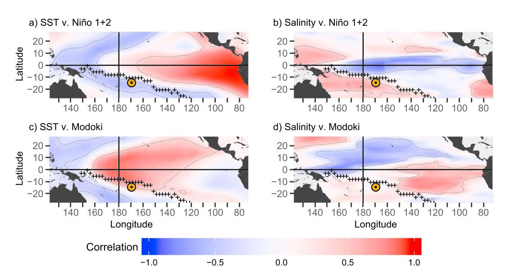
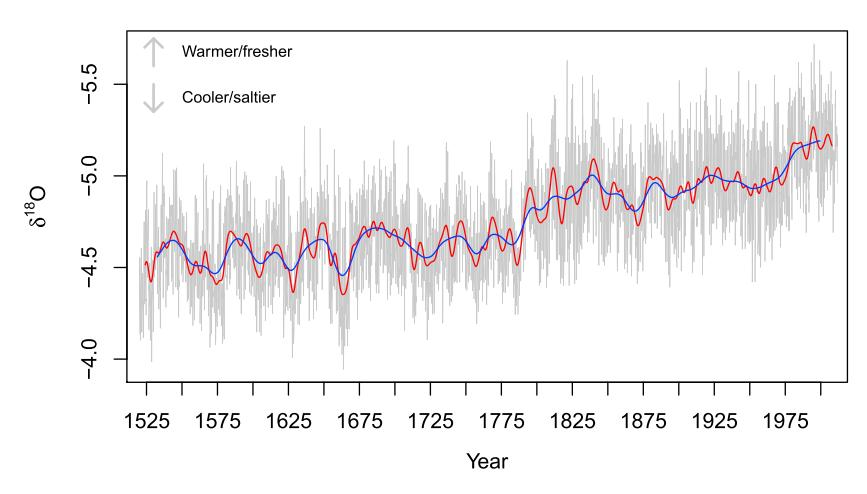
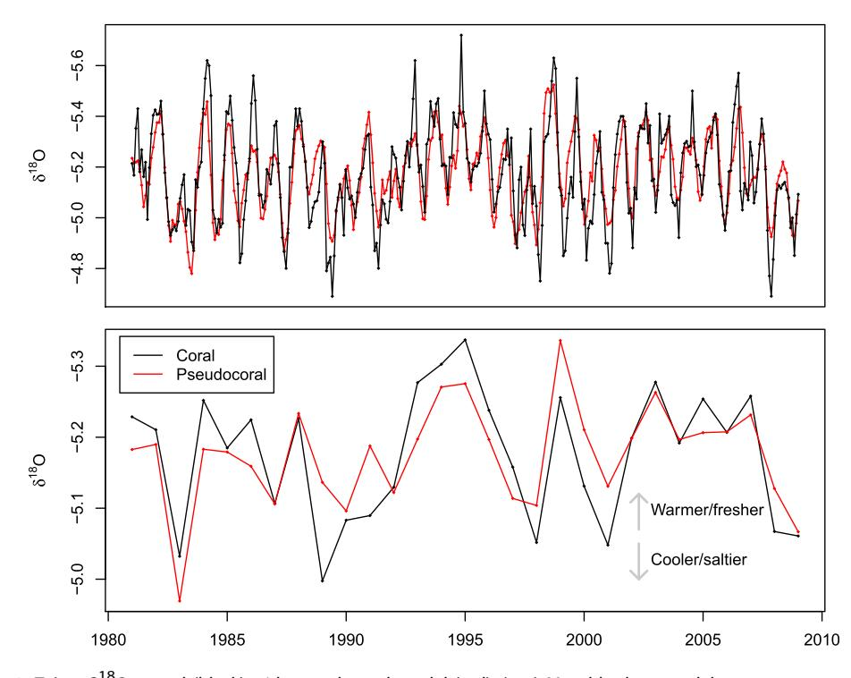
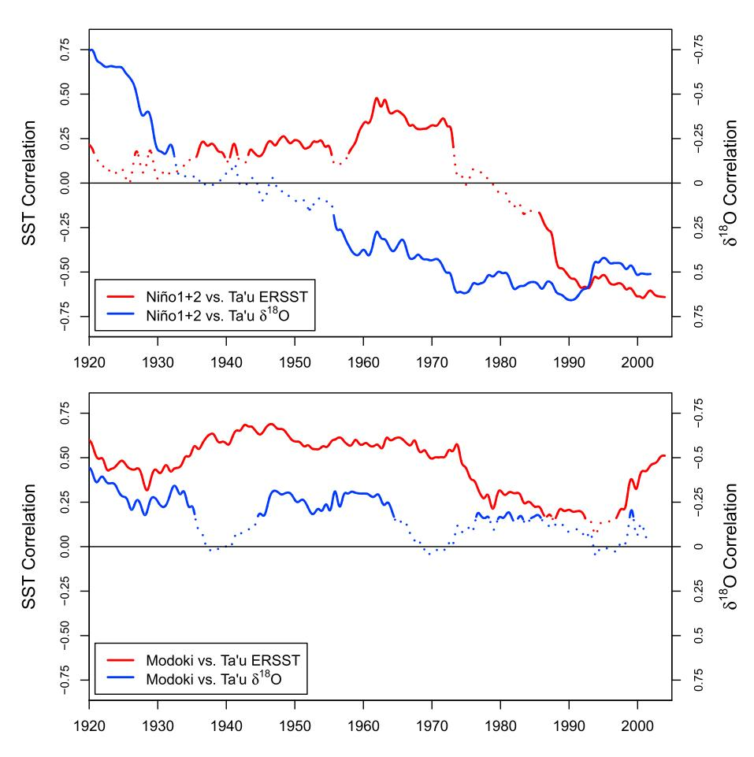
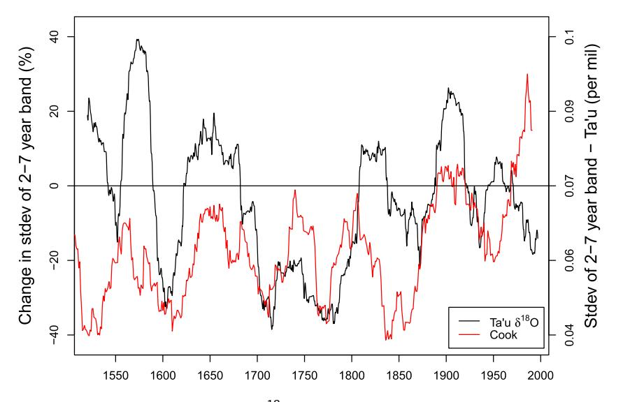
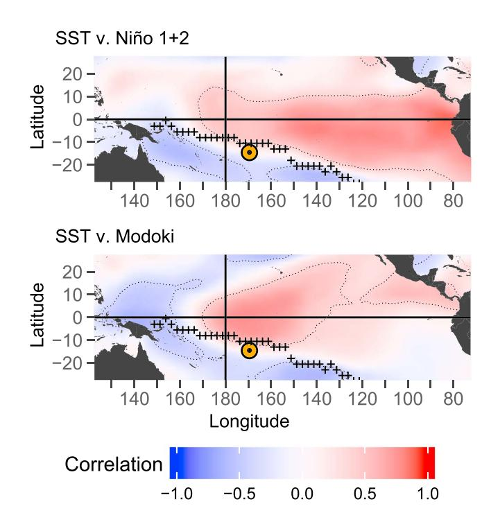
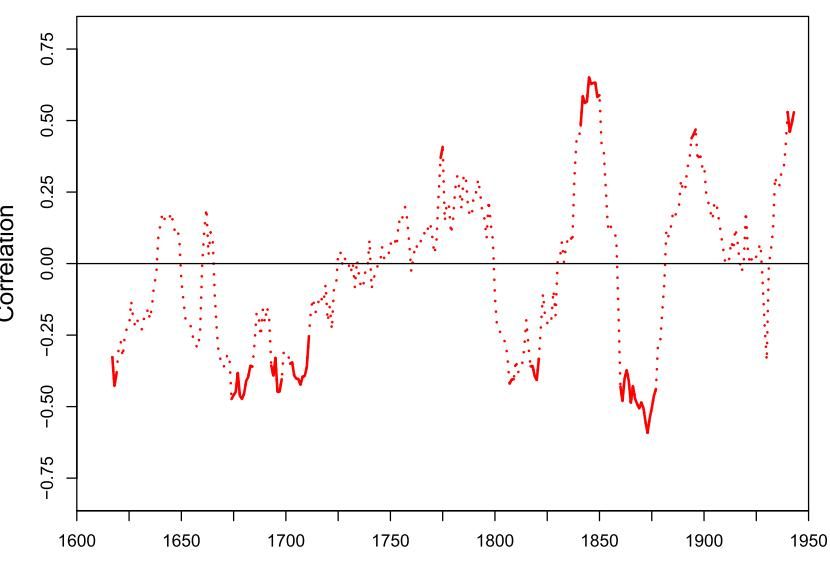

# [Paleoceanography and Paleoclimatology](http://onlinelibrary.wiley.com/journal/10.1002/(ISSN)2572-4525)

## RESEARCH ARTICLE

[10.1029/2017PA003310](http://dx.doi.org/10.1029/2017PA003310)

#### Key Points:

- Coral oxygen isotope data from American Samoa record contrasting responses to different types of ENSO
- The Eastern Pacific ENSO null (zero-correlation) zone has shifted northeast in the twentieth century, shrinking ENSO's footprint
- Changes in the spatial patterns of ENSO complicate the interpretation of ENSO proxies

#### [Supporting Information:](http://dx.doi.org/10.1029/2017PA003310)

[•](http://dx.doi.org/10.1029/2017PA003310) [Supporting Information S1](http://dx.doi.org/10.1029/2017PA003310)

#### Correspondence to:

N. Tangri, [tangri@stanford.edu](mailto:tangri@stanford.edu)

#### Citation:

Tangri, N., Dunbar, R. B., Linsley, B. K., & Mucciarone, D. M. (2018). ENSO's shrinking twentieth-century footprint revealed in a half-millennium coral core from the South Pacific Convergence Zone. Paleoceanography and Paleoclimatology, 33, 1136–1150. <https://doi.org/10.1029/2017PA003310>

Received 18 DEC 2017 Accepted 4 OCT 2018 Accepted article online 11 OCT 2018 Published online 5 NOV 2018

# ENSO's Shrinking Twentieth-Century Footprint Revealed in a Half-Millennium Coral Core From the South Pacific Convergence Zone

N. Tangri1 [,](http://orcid.org/0000-0002-2263-7905) R. B. Dunbar1 , B. K. Linsley2 , and D. M. Mucciarone1

1 Department of Earth System Science, Stanford University, Stanford, CA, USA, 2 Lamont-Doherty Earth Observatory, Columbia University, Palisades, NY, USA

Abstract A 492-year-long, continuous δ18O time series from a massive Porites coral colony in Ta'u, American Samoa, records contrasting responses to different types of El Niño-Southern Oscillation (ENSO) through a mixed sea surface temperature and salinity signal. Currently, conventional El Niño (La Niña) events generate cold and salty (warm and fresh) anomalies at Ta'u, while Modoki El Niño (La Niña) events warm (cool) the waters at Ta'u. Over the course of the twentieth century, the Ta'u δ18O record underwent a polarity shift in its response to conventional ENSO: A warm and fresh (cool and salty) response to El Niño (La Niña) was replaced by the opposite pattern. We interpret this as evidence for the movement of the Eastern Pacific ENSO null zone, the narrow band of the surface ocean where sea surface temperature variability is not on average correlated with ENSO. This movement appears to be related to overall shrinking of the ENSO footprint over the twentieth century. We infer no such trend in the Modoki footprint. The five-century-long Ta'u record shows dramatic, century-scale changes in ENSO-band variability. Comparisons with other ENSO reconstructions lead to conflicting interpretations: The Ta'u coral may have recorded changes in the strength of ENSO or in its spatial footprint. Changes in the spatial footprint manifest as a changing sensitivity to ENSO at any given location, presenting challenges to established methods of ENSO reconstruction.

## 1. Introduction

El Niño-Southern Oscillation (ENSO) is an irregular, coupled mode of ocean-atmospheric variability that dominates global climate variability at interannual (<10 years) time scales. Around the world, ENSO events—El Niño and La Niña—create widespread, significant impacts, contributing to flooding, drought, and high levels of coral mortality. In the tropical Pacific, ENSO events are accompanied by basin-scale sea surface temperature (SST), salinity, and precipitation anomalies. Recent decades have seen three extreme El Niño events, raising concern that global climate change is amplifying ENSO and in particular the strength of El Niño (Cai et al., 2015; Capotondi, 2015).

The effects of increased radiative forcing on ENSO have been examined with models and paleoclimate data, with inconsistent results. While proxy-based observations generally report increased (decreased) ENSO variability associated with lower (higher) levels of radiative forcing (D'Arrigo et al., 2005; Emile-Geay et al., 2013), model results are divided, perhaps due in part to counteracting feedback processes within the ENSO system, which make prediction and characterization difficult (Collins et al., 2010; G. Wang et al., 2017). The resulting irregularity can produce century-long periods of low and high variability without changes in external forcing (Wittenberg, 2009). Paleoclimate records spanning multiple centuries are thus required to understand the range of unforced ENSO behavior. Instrumental data from the tropical Pacific is geographically sparse and relatively recent, with little data preceding the midtwentieth century. Because of the sparse observations on which they are based, reanalysis products for SST (salinity) become unreliable before 1875 (1975) at the earliest (Delcroix, Alory, Cravatte, et al., 2011; Huang et al., 2015). Instead, researchers rely on paleoclimate archives that elucidate multiple centuries of climate variability at annual or higher resolution. Geochemical proxies in corals and ring widths in trees are used to reconstruct ENSO variability, but multicentury coral records from the core ENSO region of the Pacific are few and unevenly distributed. As a result, many ENSO reconstructions rely on relatively abundant tree-ring records from teleconnected regions (Braganza et al., 2009; D'Arrigo et al., 2005; Li et al., 2011, 2013; Wilson et al., 2010). These reconstructions rely on the assumption of stationarity of teleconnections from the core ENSO region (D'Arrigo et al., 2005). Changes in those

©2018. American Geophysical Union. All Rights Reserved.

Figure 1. Maps showing distinct responses to different types of ENSO. The location of Ta'u is marked with an orange and black bull's-eye. Crosses indicate the line of maximum precipitation in the SPCZ during DJF (Xie & Arkin, 1997). Dotted lines bound the region of correlations significant at the p < 0.05 level. (a) NINO1+2 index (Rayner et al., 2003) regressed on ERSST at each 2° × 2° grid box. (b) Same as Figure 1a, but regressed against salinity (Delcroix, Alory, Cravatte, 2011) instead of SST. (c, d) Same as Figures 1a and 1b, but using the Modoki index (Ashok et al., 2007) instead of NINO1+2. All regressions performed over 1981–2009; SPCZ data averaged over 1981–2010. ENSO = El Niño-South Oscillation; SPCZ = South Pacific Convergence Zone; DJF = December–January–February; ERSST = Extended Reconstructed Sea Surface Temperature; SST = sea surface temperature.

teleconnections, or in the spatial pattern of SST anomalies that define ENSO, could reduce the fidelity of ENSO reconstructions from distal sites.

No two ENSO events display the exact same spatial pattern of SST anomalies in the Pacific, yet several studies have observed time-varying trends in these patterns. B. Wang (1995) found that before 1977, SST anomalies during El Niño onset occurred off Australia and under the South Pacific Convergence Zone (SPCZ), whereas after 1977, they were basinwide. Setoh et al. (1999), examining the same periods, found that SST anomalies were more confined to the equator after the 1970s. Similarly, Giese and Ray (2011) found that strong El Niño events have moved slightly east and shrunk in extent over the twentieth century. A consensus has emerged that there are at least two and possibly more distinct types or "flavors" of ENSO, each with its own characteristic spatial pattern of SST anomalies (Ashok et al., 2007; Chen et al., 2015; Johnson, 2013; Kao & Yu, 2009; Kug et al., 2009; Larkin, 2005; Ren & Jin, 2011; Yu & Kim, 2013). Using a variety of statistical techniques and definitions, workers have identified two generally consistent and distinct SST anomaly patterns, referred to here as the Modoki (also known as dateline, warm pool, or Central Pacific) and conventional (i.e., canonical, cold tongue, or Eastern Pacific) ENSO (Figure 1; G. Wang et al., 2017). There is ongoing debate about whether these are discrete phenomena or form part of a continuum and what is responsible for observed changes in the relative frequency and intensity of the two types (Cai et al., 2015). What has not been discussed is evidence for spatial changes in the SST anomaly patterns of each of the types.

Since no two ENSO events are identical and instrumental records are short, it is difficult to distinguish changes in the footprint, or areal extent, of ENSO. One method is to look for changes in the position of the SST correlation null zone. The null or nodal zone is the narrow strip of ocean that separates positive from negative SST anomaly responses in the Pacific (Hereid et al., 2013). Conventional ENSO events are concentrated close to the equator and off the coast of South America, producing a broad footprint of waters that become warmer with an El Niño event. Meanwhile, surface waters in the western Pacific cool during an El Niño. A conventional La Niña event displays the opposite pattern: cooling along the equator and the southeastern tropical and subtropical Pacific and warming in the west. Between these positive and negative response zones lies the null zone, a boomerang-shaped slice of ocean that, on average, shows no

consistent SST response to ENSO (Hereid et al., 2013). Movement of this null zone over time implies a change in the spatial extent of ENSO that may not be solely attributable to changes in ENSO intensity.

The ENSO null zone in the South Pacific lies directly under the maximum rainfall axis of the SPCZ. The SPCZ is one of the most prominent climatological features of the Southern Hemisphere. The colocation of the SPCZ and the ENSO null zone suggests the possibility of a link between the two. The SPCZ is a spur of the globespanning Intertropical Convergence Zone, a region of low-level moisture convergence and consequent high rainfall and cloudiness running east from the Indonesian Low to about 170°E, and then in a southeastward direction (D. G. Vincent, 1994). The location and northwest-southeast orientation of the SPCZ is maintained in part by large SST gradients at the edge of the Western Pacific Warm Pool (WPWP; Borlace et al., 2014; Folland, 2002; D. G. Vincent, 1994). The SPCZ, particularly the diagonal section, responds to ENSO by moving northeast during an El Niño and southwest during a La Niña (Folland, 2002; Juillet-Leclerc et al., 2006; Salinger et al., 2014; E. M. Vincent et al., 2011). The SPCZ is known as a "graveyard" of synoptic weather systems and thus forms a boundary between distinct climatological regions of the south Pacific (Folland, 2002; Widlansky et al., 2011). However, to our knowledge, the relationship between the SPCZ and the null zone has not been explored.

ENSO events are also responsible for significant changes in surface salinity across the Pacific. In addition to movement of the SPCZ, which results in changes in precipitation-evaporation balance, ENSO drives changes in horizontal advection of distinct water masses, producing salinity anomalies in many regions (Cravatte et al., 2009; Gouriou & Delcroix, 2002; Kao & Yu, 2009; Picaut et al., 2001; Singh et al., 2011). Hasson et al. (2013) found that changes in vertical advection were also required to close the salinity budget for ENSO events.

Additional multicentury proxy records are required to improve reconstructions of past changes in ENSO intensity, spatial pattern, and frequency. Hermatypic corals have long lifespans and high growth rates, on the order of a centimeter per year, and can produce annually banded aragonite skeletons whose δ18O content is widely used as a climate proxy (Lough, 2010). Coral δ18O reflects both SST and seawater δ18O at the time of aragonite precipitation; the latter is closely related to seawater salinity (Fairbanks et al., 1997; Grottoli & Eakin, 2007; Weber & Woodhead, 1972). Here we present a 492-year-long, monthly resolved δ18O record from a massive Porites colony in Ta'u, American Samoa. Ta'u lies directly under the SPCZ at the edge of the WPWP and very close to the null zone for conventional ENSO. In this paper, we examine the record's contrasting responses to different types of ENSO and find evidence of a northeastward shift in the null zone, implying a shrinking ENSO footprint over time.

## 2. Materials and Methods

## 2.1. Coral Sampling

A 6.01-m continuous core (labeled Tau-1) was recovered from a large Porites spp. colony (known locally as Fale Bommie) located close to the shore of Ta0 u, American Samoa, at 14°S, 170°W, in 16.5 m of water at the base. The coral head, first described and photographed by Brown et al. (2009), is approximately 9 m in height and 14 m in diameter. Eight-centimeter-diameter cores were collected between 24 and 29 November 2011, using a Tech-2000 hydraulic underwater diamond-bit drilling system.

Prior to slabbing, the Tau-1 core was scanned by X-ray computer-automated tomography (CT) on a GE HiSpeed CT/i at 140 kV, 120 mA, 1-mm slice resolution to reveal growth bands and to determine the optimal cutting planes (Figure S1 in the supporting information). The core was slabbed on a two-bladed diamond tile saw to produce 5-mm-thick slabs.

The bottom 41 cm of the core was recovered from the drill barrel as rubble; this bottom of this section was bioeroded and appears to overlie a void of unknown size deep within the coral colony. In order to slab and sample this section, we epoxied the pieces together with West Marine 6-10 epoxy. We then chose overlapping transects that avoided epoxy and visible bioerosion where the coral had been exposed to open water.

We employed scanning electron microscopy to assess the degree of diagenetic alteration of the core (see Text S1 and Figure S2; Grossman & Ku, 1986; Hendy et al., 2007; Müller et al., 2001; Quinn & Taylor, 2006). We found no evidence of alteration in the upper half of the core and minimal alteration, in the form of secondary aragonite needles, in the lower half. We conservatively estimate that a maximum of 1% of the most altered section of the core is secondary aragonite, too little to significantly affect the δ18O signal.

Core slabs were cleaned with deionized water, air dried, and sampled using a low-speed Dremel tool and 1.5-mm drill bit at ~1-mm intervals, producing 6,476 samples, including transect overlaps but not replicates. The top half of the core, 2,521 samples dating from November 2011 to May 1803, was analyzed at Lamont-Doherty Earth Observatory (LDEO) on either an Elementar Isoprime mass spectrometer equipped with a dual-inlet and Multiprep device or a Themo-Fisher Delta V+ mass spectrometer with dual-inlet and Kiel IV carbonate reaction device. The cross-calibrated instruments are in the same laboratory at LDEO and use the same  $CO_2$  reference gas and the same dewatered phosphoric acid. With the Isoprime, we dissolved ~80- to 120- $\mu$ g coral powder aliquots in ~100%  $H_3PO_4$  at ~90 °C. With the Delta V-Kiel IV, we dissolved ~50- to 80- $\mu$ g coral powders in ~100%  $H_3PO_4$  at ~70 °C. NBS-19 (NIST RM8544) standards for Vienna Pee Dee Belemnite (VPDB;—2.2%  $\delta^{18}O$  and + 1.95%  $\delta^{13}C$ ) were analyzed five to six times per day. To assess external precision and sample homogeneity, 209 replicate samples were analyzed (8.2% replication). The standard deviation of NBS-19 standards analyzed was 0.06% ( $\delta^{18}O$ ) and 0.03% ( $\delta^{13}C$ ) on both instruments. The average difference of the replicate  $\delta^{18}O$  analyses was 0.080% (n=182) on the Isoprime and 0.087% (n=27) on the Delta V-Kiel.

The bottom half of the core was analyzed at Stanford University on a Finnigan MAT 252 coupled to a Kiel III carbonate autosampler, which added three drops of ~100%  $\rm H_3PO_4$  at ~70 °C to each sample of ~50–95  $\rm \mu g$  prior to analysis. Samples were corrected to NBS-19. The standard deviation of the standards was 0.065‰ ( $\rm \delta^{18}O$ ) and 0.033‰ ( $\rm \delta^{13}C$ ), and 244 (7.6%) of the unknown samples were replicated. The average difference of the replicates was 0.052‰ ( $\rm \delta^{18}O$ ) and 0.069 ( $\rm \delta^{13}C$ ). For cross-calibration between LDEO and Stanford, 21 LDEO powders were also run at Stanford, where  $\rm \delta^{18}O$  replicated to 0.027‰. All results are reported relative to VPDB (in ‰).

The abrupt decrease of 0.25‰ in the Tau-1  $\delta^{18}$ O record around 1790 (Figure S3) prompted us to drill multiple parallel transects to address the possibility of artifacts in the data from transect selection or from offsets between the two laboratories. The multiple transects confirmed the change in  $\delta^{18}$ O, and data above and below this section replicated well, so we conclude that the departure in  $\delta^{18}$ O values is real. The shift is too large to be attributed to diagenesis (Text S1).

We selected sampling transects that run along the corallites' growth axis. Because of the length of the core, 18 such transects were required (Figure S1). Each transect overlapped the preceding one by at least 10 samples, or approximately 1 year. A single  $\delta^{18}$ O and  $\delta^{13}$ C data set was produced by splicing the data across the sampling track jumps.

#### 2.2. Data Sets

As a measure of ENSO, we used the NINO1+2, NINO3.4, and the Modoki indices (Ashok et al., 2007; Rayner et al., 2003). To assess our confidence in the early decades of the NINO1+2 index, when the underlying instrumental data set is sparse (Figure S4), we compared it with a coral  $\delta^{18}$ O record from the Galápagos Islands that has been found to be a faithful recorder of SST and El Niño events (Dunbar et al., 1994). We found good agreement (r = -0.67, p < 0.001) between the smoothed monthly  $\delta^{18}$ O and NINO1+2 data from 1961 to 1982, following the procedures described in section 2.4. We then compared annual  $\delta^{18}$ O and annually averaged NINO1+2 values, finding generally good agreement (r = -0.58, p = 0.001) from 1925 to 1953; before 1925, the time series diverge. This may be due to inaccuracies in the index or dating errors in the coral. However, it gives us confidence that we can use the NINO1+2 index to represent conventional ENSO at least back to 1925.

We used three gridded reanalysis products for calibration and comparison: the Extended Reconstructed Sea Surface Temperature (ERSST) data set version 4 (Huang et al., 2015), the Hadley Centre Sea Surface Temperature (HadSST) data set version 1.1 (Rayner et al., 2003), and the tropical Pacific sea surface salinity (GSSS) data set (Delcroix, Alory, Cravatte, 2011; Delcroix, Alory, Cravatte, et al., 2011). ERSST (HadSST) data go back to 1854 (1870), but data coverage is sparse in early years (Figure S4). In ERSST, infilling is based on modern climatology, whereas in HadSST, infilling is based on contemporaneous data (Huang et al., 2015; Rayner et al., 2003). Both methods introduce inaccuracies; because ERSST data are based on modern climatology, these inaccuracies will tend to understate the change in SST spatial patterns over time. We therefore use ERSST back to 1925 as a conservative baseline to assess changes between SST and other observations. We obtain similar results from HadSST and include these in the supporting information. For local SST (salinity), we used the ERSST (GSSS) grid cell centered at 14°S, 170°W (14°S, 169°W).

#### 2.3. Chronology

The CT scans of the Tau-1 core show strong annual density banding that is horizontal or subhorizontal throughout the core (Figure S1). Near-monthly  $\delta^{18}$ O and  $\delta^{13}$ C data demonstrate clear annual cycles. We count 492 cycles in both the  $\delta^{18}$ O and  $\delta^{13}$ C data sets and 490 pairs of low- and high-density bands in the CT scans. In general, the timing of the  $\delta^{18}$ O and  $\delta^{13}$ C peaks and troughs align well, although  $\delta^{13}$ C peaks and troughs sometimes precede and sometimes follow their  $\delta^{18}$ O counterparts. We constructed our age model, spanning the years 1520 to 2011, based primarily on the  $\delta^{18}$ O cycle, but we referred to the  $\delta^{13}$ C and density bands to resolve year boundary picks in sections where the  $\delta^{18}$ O cycles were less pronounced.

To determine the seasonality of the  $\delta^{18}$ O cycles we observed, we constructed model (pseudocoral)  $\delta^{18}$ O time series from SST and salinity reanalysis products for the years 1981-2009. We constructed seven different pseudocorals, using a range of  $\delta^{18}$ O/°C calibrations (slopes from -0.13 to -0.53) and  $\delta^{18}$ O/psu calibrations (from 0.12 to 0.47) found in the literature (Bagnato et al., 2004; Braddock K. Linsley et al., 1999; Dunbar & Wellington, 1981; Felis et al., 2009; Grottoli & Eakin, 2007; Morimoto et al., 2002). The maximum pseudocoral  $\delta^{18}$ O value, corresponding to cool/saline conditions, occurred in September in 17 of the 28 years analyzed, while the minimum value, corresponding to warm/fresh conditions, occurred in April in 16 years. The choice of parameter values did not affect the seasonality of the pseudocoral. We therefore assigned September (April) to the annual  $\delta^{18}$ O maxima (minima) throughout the core. Intermediate samples were assigned dates by linear interpolation between pegged samples (two per year), resulting in an average of  $11.7 \pm 2.5$  samples per year, with no significant trend. We then resampled the entire record by linear interpolation to produce monthly  $\delta^{18}$ O values, which form the basis for subsequent analysis.

#### 2.4. Statistical Methods

We employ several statistical methods to detect and analyze the ENSO signal in the coral  $\delta^{18}$ O record. We applied a 2- to 7-year Butterworth band-pass filter to the monthly interpolated Ta'u  $\delta^{18}$ O data and then calculated the standard deviation on 30-year sliding windows; we refer to this as the relative variance approach. We report results as percent change in standard deviation from the twentieth-century mean. We also calculate running correlations between the band-pass-filtered coral  $\delta^{18}$ O record, SST, and ENSO indices using a variety of window sizes (8 to 25 years) and report qualitative changes in the record, such as polarity reversals, that are robust to choice of window size. Larger windows show greater significance, whereas smaller windows reveal change points with greater precision; as a compromise, we show the results from the 21-year window. We assessed significance with a Newey-West test (Newey & West, 1987) to account for autocorrelation introduced by the band-pass filtration.

#### 3. Results

## 3.1. Temperature and Salinity Controls on Stable Oxygen Isotopes

The Tau-1 record (Figure 2) contains a regular annual  $\delta^{18}$ O range of 0.49‰  $\pm$  0.16‰ (1 $\sigma$ ). The annual cycle is slightly smaller (0.46‰) before 1790 than after (0.53‰), with the period 1810–1848 showing higher annual variability (0.63‰). If due entirely to SST, this would imply an increase in the annual temperature range of 1.1  $\pm$  0.1 °C in the early nineteenth century, based on our calibration (equation (1)). From 1981 to 2009, the annual range is 0.51‰, reflecting an annual SST (ERSST) cycle of 2.1  $\pm$  0.5 °C and an annual salinity (GSSS) cycle of 0.8  $\pm$  0.3 psu. Using these two reanalysis products, we constructed a simple linear model of the  $\delta^{18}$ O record from 1981 to 2009, optimizing with an ordinary least squares regression (Figure 3).

$$\delta^{18}O_{crl} = -8.52 \pm 0.72 - SST * 0.15 \pm 0.01 + salinity * 0.21 \pm 0.02$$
 (1)

This calibration captures 61% (63%) of the variance in the monthly (annual)  $\delta^{18}$ O record. Cross-correlation analysis reveals no improvements in correlation with lagged SST or salinity. The residuals show 1-month and annual autocorrelation, but autocorrelated models perform worse, according to the Akaike information criterion (Akaike, 1974), than the simple linear model, so we report the latter. The SST coefficient lies at the edge of the range of reported values from the literature (Table 1), while the salinity coefficient is close to Fairbanks et al.'s (1997) multisite calibration to in situ water samples. Annually binning the data results in very little difference in calibration or performance, implying that the monthly age model does not introduce

25724525, 2018, 11, Downloaded from https://agupubs.onlinelibrary.wiley.com/doi/10.1029/2017PA003310, Wiley Online Library on [10/11/2024]. See the Terms and Conditions (https://onlinelibrary.wiley.com/terms-and-conditions) on Wiley Online Library for rules of use; OA articles are governed by the applicable Creative Commons License

Figure 2. Ta'u-1 δ 18O record from 1520 to 2011. Data resampled at monthly intervals (gray line) and then smoothed with an 8-year (red) and 25-year (blue) Hann filter. Note the inverted y-axis: More negative δ 18O values correspond to warmer and/or fresher conditions.

spurious biases. Assuming that coral δ18O is controlled only by SST and sea surface salinity, in the monthly model, SST explains 59% of the variance and salinity 41%, indicating that the coral δ18O record reflects a mix of changes in SST and seawater δ18O (Figure 3).

At Vanuatu, Fiji, and Rarotonga, researchers have found that the annual δ18O signal in coral is a good proxy for SST, while interannual patterns map well to salinity (Dassié et al., 2014; Gorman et al., 2012; Kilbourne et al., 2004; Le Bec et al., 2000; Linsley et al., 2006). This is not the case at Ta'u, where the annual salinity cycle is relatively strong and regular, contributing significantly to the annual δ18O cycle. On an interannual

Figure 3. Ta'u-1 δ 18O record (black) with pseudocoral model (red). (top) Monthly data; model parameters are given in equation (1) and Table 1. (bottom) Annually averaged data; model parameters in Table 1.

## **Paleoceanography and Paleoclimatology**

10.1029/2017PA003310

**Table 1** Calibration Values for the Tau-1  $\delta^{18}$ O Data Set Compared to Values From the Literature

|                                                                   | Monthly data                | Annual data                      | Literature values             |
|-------------------------------------------------------------------|-----------------------------|-------------------------------------|----------------------------------|
| Change in $\delta^{18}$ O/1 °C Change in $\delta^{18}$ O/1 psu | -0.15 ± 0.01 0.21 ± 0.02 | $-0.13 \pm 0.04$ $0.25 \pm 0.04$ | -0.155 to -0.465 0.12 to 0.43 |
| Correlation (r)                                                   | 0.79                        | 0.80                                |                                  |
| p value                                                           | <2.2e-16                    | 2.1e-06                             |                                  |

Note. Calibrations were calculated by optimizing a simple linear model  $\delta^{18}O=\alpha$  SST +  $\beta$  SSS + c with ordinary least squares on the grid coordinates containing the Ta'u site from two reanalysis data sets: ERSST v4 (Huang et al., 2015) and GSSS (Delcroix, Alory, Cravatt, 2011). Literature values from Craig and Gordon (1965), Dunbar and Wellington (1981), Felis et al. (2009), Grottoli and Eakin (2007), Le Bec et al. (2000), and Linsley et al. (2006). SST = sea surface temperature; SSS = sea surface salinity; ERSST = Extended Reconstructed Sea Surface Temperature; GSSS = tropical Pacific sea surface salinity.

(2–7 years) basis, salinity dominates the  $\delta^{18}$ O record, contributing 66% of explained variance, but SST also leaves an imprint (34% of explained variance), as they both track ENSO, albeit in complex ways.

#### 3.2. ENSO Diversity

ENSO events bring basinwide changes in SST, salinity, and precipitation, but the response at Ta'u is muted and complex. The El Niño events of 1965–1966, 1982–1983, and 1997–1998 produced suppressed warmseason isotopic minima in the Ta'u  $\delta^{18}$ O record, while the 1999–2000 La Niña produced a broad, strong (i.e., more negative  $\delta^{18}$ O) warm-season minimum (Figure S5). These events suggest that El Niño (La Niña) events generate cool and/or salty (warm and/or fresh) surface ocean anomalies at Ta'u. But the weak response to other ENSO events belies such a simple explanation. A comparison of the annually averaged Ta'u  $\delta^{18}$ O record with the NINO3.4 index over recent years (1981–2009) indicates a temporally varying and, on average, insignificant correlation (also see Linsley et al., 2017). This is expected based on the location of Ta'u in the current ENSO 3.4 null zone.

The Ta'u  $\delta^{18}$ O record does, however, exhibit significant correlations with other ENSO indices (Table 2). It is negatively correlated with the Modoki index, representing Central Pacific ENSO, but positively correlated with the NINO1+2 index, representing conventional or Eastern Pacific ENSO. The relationship between Ta'u  $\delta^{18}$ O and ENSO is strongly seasonal in nature, but the two types of ENSO affect Ta'u in different seasons: the correlation with NINO1+2 (Modoki) rises to r=0.58, p=0.001 (r=-0.39, p=0.03) for January–May (October–January) seasonal averages but is effectively zero for the rest of the year.

## 3.3. Changes in ENSO Relationships Over the Twentieth Century

To investigate the stability of these relationships over the instrumental period, we compared 21-year running correlations of the band-pass-filtered Ta'u  $\delta^{18}$ O data with the ENSO indices and ERSST data from the Ta'u location (Figure 4). The correlation between local SST and the Modoki index has been positive since 1925, indicating that SST increases (decreases) slightly with a Modoki El Niño (La Niña). The  $\delta^{18}$ O-Modoki correlation, which was negative early in the twentieth century, has slowly weakened over time.

The relationships with conventional ENSO show more dynamism. Between 1925 and 1990, both SST and  $\delta^{18}$ O show a change in polarity in their relationship to the NINO1+2 index, although the timing varies (Figure 4). In the midtwentieth century, SST warmed (cooled) during conventional El Niño (La Niña) events. This relationship flipped in the 1970s. The  $\delta^{18}$ O-NINO1+2 correlation was negative in the early twentieth century, consis-

**Table 2** Correlations (r Values) Between SST (ERSST), Salinity (GSSS), and the Ta'u  $\delta^{18}$ O Record With Various ENSO Indices: CP (Kao & Yu, 2009), NWP (Ren & Jin, 2011), Modoki (Ashok et al., 2007), EP (Kao & Yu, 2009), NCT (Ren & Jin, 2011), N1+2 (NOAA CPC), and N3.4 (NOAA CPC) Between 1981 and 2009

|                          | CP    | $N_{WP}$ | Modoki | EP    | $N_{CT}$ | N1+2  | N3.4 |
|--------------------------|-------|----------|--------|-------|----------|-------|------|
| SST                      | 0.53  | 0.38     | 0.50   | -0.64 | *        | -0.47 | *    |
| Salinity $\delta^{18}$ O | *     | *        | *      | *     | 0.53     | 0.45  | 0.40 |
| $\delta^{18}O$           | -0.46 | *        | -0.46  | 0.55  | *        | 0.41  | *    |

Note. All correlations are significant at the p < 0.05 level; asterisks indicate no significant correlation at the p < 0.05 level. All data have been annually binned on the climatological year (December—November) before correlating. SST = sea surface temperature; ERSST = Extended Reconstructed Sea Surface Temperature; GSSS = tropical Pacific sea surface salinity; ENSO = El Niño-South Oscillation; CP = Central Pacific; N $_{WP}$  = warm pool; EP = Eastern Pacific; N $_{CT}$  = cold tongue; N1+2 = Niño 1+2 anomaly; N3.4 = Niño 3.4 anomaly; NOAA = National Oceanic and Atmospheric Administration; CPC = Climate Prediction Center.

tent with warm and/or fresh (cool and/or salty) anomalies during El Niño (La Niña). This correlation also changed polarity beginning around 1930 (also see Linsley et al., 2017). We obtain similar results using the HadSST data set (Figure S6).

## 3.4. Changes in Pre-Twentieth-Century Variability

Going further back in time, we observe dramatic changes in band-passed Ta'u coral  $\delta^{18}$ O variability, ranging from 40% above to 40% below mean twentieth-century levels (Figure 5). The magnitude of these changes suggests that they are unlikely due to changes in salinity alone. For example, the 0.3% ENSO-band range of the 1900 peak is equivalent to 1.43 psu—significantly greater than the salinity changes associated with the extreme ENSO events of 1982–1983 (+0.79 psu) and 1998–1999 (–0.99 psu). We therefore attribute the swings in ENSO-band variability at least partly to changes in SST.

The Ta'u  $\delta^{18}$ O record displays clear 50- to 100-year cyclic changes in ENSO-band variance with broad peaks of high variability punctuated by shorter intervals of low variability. These echo Garcia-Herrera et al.'s (2008)

257.24525, 2018, 11, Downloaded from https://agupubs.onlinelibrary.wiley.com/doi/10.1029/2017PA003310, Wiley Online Library on [10/11/2024]. See the Terms and Conditions (https://onlinelibrary.wiley.com/cems-and-conditions) on Wiley Online Library for rules of use; OA articles are governed by the applicable Creative Commons Licenses

**Figure 4.** Twenty-one-year running correlations of the band-pass-filtered (top) NINO1+2 index and (bottom) Modoki index with the Ta'u  $\delta^{18}$ O record (blue) and local SST (ERSST; red). Dotted lines indicate correlations not significant at the p < 0.01 level. Note the reversed y-axis for the  $\delta^{18}$ O-index correlations. SST = sea surface temperature; ERSST = Extended Reconstructed Sea Surface Temperature.

**Figure 5.** Relative ENSO variability changes in Ta'u  $\delta^{18}$ O time series (black) and the Cook NINO3.4 reconstruction (red; D'Arrigo et al., 2005). Variability is the standard deviation of the 2- to 7-year frequency band within sliding 30-year windows, plotted on the left axis as percent differences from the twentieth-century mean. On the right axis, the standard deviation of the Ta'u time series is given in per mil (‰). ENSO = El Niño-South Oscillation.

finding of strong 100-year cyclicity in archival ENSO records from Peru. Periods of higher-amplitude ENSO activity in the Ta'u record are centered around 1575, 1660, 1820, and 1905, with discernible suppressed ENSO-band variability around 1735, in the latter half of the Little Ice Age. The period of strongest ENSO-band activity in the Ta'u record is from 1560 to 1585 (see Figure 5).

## 4. Discussion

## 4.1. Distinct Responses to ENSO Types

A comparison of Figures 1a and 1c indicates that there are regions of the Pacific that should display divergent responses to the different types of ENSO, but such locations have not been previously proposed in the literature. Here we find that the Ta'u record supports such behavior (see Table 2): Between 1981 and 2009, Ta0 u coral δ18O is positively correlated with the NINO1+2 index and negatively correlated with the Modoki index. Since coral δ18O decreases as temperature rises but increases with higher salinity, these correlations imply that local waters become cooler/saltier (warmer/fresher) during a conventional El Niño (La Niña) but have the opposite response to Modoki ENSO events.

A comparison of local SST with the ENSO indices (Table 2) yields consistent results: SST at Ta'u increases with a Modoki El Niño but decreases with a conventional El Niño. As stated before, there is no consistent relationship with the NINO3.4 index. Although the three ENSO SST patterns are broadly similar, differences in their extent mean that Ta'u lies in the positive correlation zone of Modoki, in the negative correlation zone of conventional ENSO, and in the null zone of NINO3.4, which captures both Modoki and conventional ENSO events (Figure 1).

Salinity at Ta'u rises (falls) during conventional El Niño (La Niña) events but is largely insensitive to Modoki events (Figure 1 and Table 2). This roughly echoes the findings of Singh et al. (2011), who found that the strongest salinity anomalies under the SPCZ are associated with Eastern Pacific ENSO events. We analyzed local precipitation (Climate Prediction Center Merged Analysis of Precipitation data set; Xie & Arkin, 1997) and found no significant relationship with any of the ENSO indices. This leads us to conclude that salinity changes at Ta'u probably result from advection of saltier (fresher) water from the east (west) during a conventional El Niño (La Niña), rather than from shifts in the SPCZ. A similar conclusion was reached for the Fiji and Tonga Islands and also Rarotonga (Dassié et al., 2014, 2017; Gouriou & Delcroix, 2002; Linsley et al., 2006). This is also consistent with previous work that found that while the western Pacific fresh pool advances east along the equator during an El Niño, in the SPCZ sector it retreats northwestward (Cravatte et al., 2009; Gouriou & Delcroix, 2002; Hasson et al., 2013). Similarly, Kao and Lagerloef (2015) found that although areas of concentrated precipitation colocate with and enhance salinity fronts, the movement of those fronts is determined by advection changes.

Oceanic advection changes may also be responsible for the null zone's location proximate to other prominent, near-contiguous features of the southwestern tropical Pacific, namely, the SPCZ, the edge of the WPWP, and the isohalines that demarcate the western Pacific fresh pool from the South Pacific subtropical gyre (Figure 1). The relationships between these features are less well understood than in the equatorial region, where the edges of the warm and fresh pools coincide with a well-defined, near-surface convergence zone that moves east–west with the phases of ENSO (Gouriou & Delcroix, 2002; Picaut et al., 2001). South of the equatorial zone, the eastern edges of the WPWP and the SPCZ fresh pool are not coterminous yet still tend to migrate synchronously (Cravatte et al., 2009; Kao & Lagerloef, 2015). The edge of the WPWP, as a region of strong SST gradients, has a dominant role in establishing the position of the SPCZ (Folland, 2002; D. G. Vincent, 1994). Salinger et al. (2001) also found the SPCZ to be the site of discontinuities in long-term SST and precipitation trends, implying distinct climate regimes to the northeast and southwest of the region. The relationship of the ENSO null zone to these features has not yet been explored, but since advection is the primary carrier of ENSO's characteristic SST anomalies, the null zone marks the average border between opposite-sense advective forces. These advective forces could be a common driver determining the locations of the null zone, the edges of the WPWP and fresh pool, and ultimately the SPCZ.

The divergent response of SST and salinity to different ENSO types at Ta'u highlights the importance of evaluating Central and Eastern Pacific ENSO events as distinct phenomena rather than relying on indices that merge them. However, the question of which index best represents the different types of ENSO remains

# Paleoceanography and Paleoclimatology 10.1029/2017PA003310

Figure 6. Same as Figures 1a and 1c, but for the years 1925–1950.

an open question. A number of different indices have been proposed (Ashok et al., 2007; Kao & Yu, 2009; Ren & Jin, 2011; Yu & Kim, 2013), and while they generally agree well with each other, there are significant differences in how well they capture ENSO dynamics at Ta'u (see Table 2). In this paper, we use the Modoki index from Ashok et al. (2007) and the NINO1+2 index from Rayner et al. (2003) to represent the Central and Eastern Pacific ENSO patterns, respectively. We choose these two indices for their long time span (some of the other indices go back only to 1948), their wide use in the literature, and, in the case of NINO1+2, its ability to capture salinity dynamics at Ta'u.

#### 4.2. The Null Zone and ENSO's Shrinking Footprint

The Ta'u coral colony is unusually long lived, which may be due in part to its location in and near the ENSO null zone. We hypothesize that the muted SST response to ENSO has shielded the Ta'u coral from the extreme SST anomalies that occur at other locations during ENSO events and have devastated corals worldwide. The null zone may be a promising region for the discovery of other long-lived corals and may even act as a refugia in the coming decades (Langlais et al., 2017).

This raises the question of whether the ENSO null zone is stationary through time. A regression of ENSO indices on SST for the early twentieth century suggests that the positive correlation zone ("footprint") of conventional ENSO has shrunk eastward and toward the equator, while that of Modoki has expanded somewhat over the twentieth century (Figure 6).

We test this hypothesis with a running correlation of the band-pass-filtered data on 21-year windows (Figure 4). Interpretation of this figure also requires inferring changes in the salinity response at Ta'u, as salinity is an important control on coral δ18O but data are not available before 1975. While the SST-Modoki relationship has shown some variability but little net change over the course of the twentieth century, the Ta'u coral δ18O-Modoki correlation has slowly weakened. This suggests little net movement in the Modoki null zone over the twentieth century.

Meanwhile, the Ta'u δ18O-NINO1+2 and local SST-NINO1+2 correlations have changed polarity, consistent with a crossing of the null zone over Ta'u. However, the timing of the transitions is different, with the δ18O-NINO1+2 relationship beginning to shift in the 1930s and continuing for several decades, whereas the SST-NINO1+2 relationship changed more dramatically beginning in the 1970s. Repeating the analysis with the Southern Oscillation Index (Ropelewski & Jones, 1987), another index for conventional ENSO, in place of NINO1+2 produces similar results (Figure S7). This not only lends support to our hypothesis that the conventional null zone passed over Ta'u during the twentieth century but also suggests a role for salinity that is similar to, but not synchronous with, SST.

Our correlation maps suggest that the polarity change in the SST response to conventional ENSO at Ta'u was part of a basinwide contraction of the conventional ENSO footprint (see Figures 1 and 6). Based on ERSST, the conventional null zone shifted approximately 6° north and 4° east (~ 400 km) in the vicinity of Ta'u between the early and late twentieth century (Figures 6 and S8). These changes in ENSO spatial patterns are consistent with Setoh et al.'s (1999) finding that the SST anomaly pattern of recent El Niño events has been more tightly constrained near the equator than was true in earlier decades and Giese and Ray's (2011) conclusion of a trend toward smaller footprints of strong El Niño events centered farther east over the twentieth century. Similarly, Johnson (2013) found a late-twentieth-century transition in WPWP La Niña patterns from weak or negative SST anomalies to positive anomalies.

Given the varying relationship between SST and δ18O, it is impossible to construct a precise salinity record for Ta'u. Rather, we propose a qualitative description of the changing influence of the ENSO-salinity relationship, interpreting the difference between the index-δ18O and index-SST correlations as being due to changes in the salinity response to ENSO (Figure 4). However, we note that 39% of the variance in the modern (1981– 2009) Ta'u δ18O record is unexplained by either SST or salinity and that figure may also vary in time; our

salinity interpretations are therefore somewhat speculative. We infer that early-twentieth-century El Niño (La Niña) events of both types brought fresh (salty) waters to Ta'u. Over the course of the twentieth century, the Modoki-salinity relationship weakened to become undetectable. The region of little average salinity response to Modoki events is not a narrow null zone separating regions characterized by opposite polarity salinity responses but rather a broad expanse of the Pacific (Figure 1d). Meanwhile, the salinity response at Ta'u to conventional ENSO changed polarity. The early twentieth century saw a strong δ18O response but very weak SST response to conventional ENSO, implying a strong salinity response. As with the SST response to conventional ENSO, the salinity response also changed polarity over the twentieth century but started earlier and did so more gradually. Gridded salinity data do not go back far enough in time to draw conclusions about what these changes in the salinity response to ENSO at Ta'u mean for changes in the overall spatial patterns of the ENSO-salinity response.

The responses of δ18O at Ta'u to Modoki and conventional ENSO appear to have evolved separately over time: The δ18O-Modoki correlation has remained negative throughout the twentieth century, while the δ18O-NINO1+2 correlation has switched from being negatively correlated (indicating warm/fresh anomalies during El Niño) in the early twentieth century to positively correlated (indicating the current cold/salty effect). These contrasting responses and distinct evolutions of the two types of ENSO support the idea that they are indeed distinct modes.

Spatial changes in ENSO patterns present challenges to the three primary methods of ENSO reconstruction from paleoarchives: proxies from teleconnected regions, single-site proxies, and multiproxy reconstruction. Reconstructions from distant regions rely upon the stationarity of teleconnections, an assumption that is undermined by the observed changes in relative frequency and intensity of different types of ENSO, which have distinct teleconnection patterns (D'Arrigo et al., 2005; Larkin, 2005; Yeh et al., 2009; Yu & Kim, 2013). Reconstructions based on proxies from the core ENSO region generally assume that ENSO's spatial pattern is stationary or, to put it another way, that a given location's sensitivity to ENSO is invariant in time. Changes in the spatial pattern of ENSO would manifest themselves as changes in local sensitivity to ENSO, overprinting any signal of changes in the basinwide frequency or amplitude of ENSO. Multiproxy reconstructions reflect the same assumptions about geographic stationarity and are also susceptible to destructive interference of interannual signals that can arise from relatively small dating errors (Emile-Geay et al., 2013). These challenges may help to account for the significant disagreement between ENSO reconstructions before the instrumental period (McGregor et al., 2013; Wilson et al., 2010).

### 4.3. Century-Scale Periodicity

Given Ta'u's location, preinstrumental changes in ENSO-band variance in the coral δ18O record (Figure 5) could reflect changes in basinwide ENSO intensity, changes in the areal extent of ENSO (i.e., shifts in the location of the null zone), or both. Proxy reconstructions from other parts of the Pacific basin also record significant changes in ENSO variability over the last several centuries (Braganza et al., 2009; Cobb et al., 2003; Emile-Geay et al., 2013; Gergis & Fowler, 2009; McGregor et al., 2013; Wilson et al., 2010). Unlike many of these reconstructions, we find that ENSO-band variability in the late twentieth century is lower than the average of the past five centuries. This is at odds with findings of increasing ENSO variability over time (D'Arrigo et al., 2005; Emile-Geay et al., 2013; Gergis & Fowler, 2009; Wilson et al., 2010) but consistent with other coral records of the southwest Pacific (McGregor et al., 2013). Despite lying close to the ENSO null zone, Ta'u does record the early-twentieth-century high-variability episode that is found in most reconstructions (e.g., Quinn et al., 2006, and references therein; a notable exception is Braganza et al., 2009, which is not calibrated to latetwentieth-century records). We infer that changes in ENSO spatial patterns are not limited to the location of the null zone but may also implicate the strength of SST response in broad regions of the Pacific.

Agreement between the various ENSO reconstructions breaks down rapidly in the preinstrumental period (Garcia-Herrera et al., 2008; McGregor et al., 2013; Wilson et al., 2010). The timing of high-intensity ENSO periods in the Ta'u record bears little resemblance to Gergis and Fowler's (2009) reconstruction of active and inactive periods, drawn primarily from paleoclimate records from the southwest Pacific and teleconnected regions. But it largely coincides with Garcia-Herrera et al.'s (2008) chronology of Eastern Pacific El Niño events, albeit offset; their dates (1625, 1725, 1810, and 1890) mark the beginning of the high-activity periods in the Ta'u record. The Ta'u variability record also shows reasonably good agreement, particularly in timing, with the Cook reconstruction of the NINO3.4 index (D'Arrigo et al., 2005), with the notable exception of the late

25724525, 2018, 11, Downloaded from https://agupubs.onlinelibrary.wiley.com/doi/10.1029/2017PA003310, Wiley Online Library on [10/11/2024]. See the Terms and Conditions (https://onlinelibrary.wiley.com/terms-and-conditions) on Wiley Online Library for rules of use; OA articles are governed by the applicable Creative Commons License

Figure 7. Twenty-one-year running correlation between the annually averaged Ta'u and Galápagos δ 18O records. Dotted lines indicate correlations not significant at the p < 0.05 level.

twentieth century, when the two diverge dramatically; the Cook reconstruction is based on tree-ring records from southwestern North America, a region sensitive to teleconnections from conventional ENSO events, rather than Central Pacific ones.

To assess whether the preinstrumental Ta'u record captures changes in conventional ENSO variability, we compared it with a third proxy for conventional ENSO, the annual Urvina Bay δ18O record from the Galápagos Islands (Dunbar et al., 1994). The running correlation of the two annual records mostly shows insignificant correlations but also brief periods of alternating positive and negative correlations (Figure 7). This implies that Ta'u's response to conventional ENSO alternates between the same sense as in the Galápagos (negative δ18O anomalies, associated with warm/fresh conditions, during El Niño) and the opposite sense (positive δ18O anomalies, associated with cool/salty conditions, during El Niño). If Ta'u's changing response is due primarily to changes in SST sensitivity to ENSO events, it would suggest that the null zone crossed back and forth across Ta'u multiple times in the past few centuries. However, a changing salinity response likely also plays an important role in Ta'u's changing sensitivity to ENSO.

## 5. Conclusions

The five-century-long Ta'u data set is the first to document contrasting imprints of the Central and Eastern Pacific types of ENSO: Ta'u coral δ18O decreases (increases), implying warmer/fresher (cooler/saltier) waters, with Modoki El Niño (La Niña) events but has the opposite relationship with conventional ENSO events. These contrasting responses at a single location highlight the importance of analyzing the types of ENSO as distinct phenomena.

The proximity of Ta'u to the null zone of both types of ENSO allows us to track changes in the spatial pattern of ENSO over time. Modoki SST patterns show relative stability over the twentieth century, while the conventional ENSO null zone has moved northeast from Ta'u, part of a contraction of its overall footprint. We hypothesize that the null zone's location in the southwest Pacific is determined by the relative strength of advective forces from the subtropical gyre and the WPWP/fresh pool, which both locate the SPCZ and delimit the ENSO SST anomaly field. Whatever the mechanism, changes in the spatial patterns of ENSO imply that climate proxies' sensitivity to ENSO changes over time and may even reverse polarity, as has happened at Ta'u. This complicates our ability to reconstruct ENSO variability with established methods.

This multicentury δ18O record captures dramatic, century-scale variability in ENSO-band activity at Ta'u, but it is not clear to what extent it has captured changes in overall ENSO strength or spatial extent. The timing of these variations roughly agrees with that recorded in Peru and North America, raising the possibility that Ta'u

recorded basinwide changes in ENSO strength until the midtwentieth century. However, a comparison with a δ18O record from the Galápagos shows multiple reversals in correlation polarity, suggesting that the conventional ENSO null zone may have crossed Ta'u several times since 1600. Further study will be needed to distinguish changes in ENSO strength from areal extent in reconstructions.

#### Acknowledgments

We thank Emilie Dassié, Jeffrey Herbst, and Max Blachman for their long hours in the lab; Cynthia Ross for the SEM images; Bolivia Vega for the CT scans; and Douglas Fenner for helping make the fieldwork possible. Emanuele Di Lorenzo provided helpful guidance and insight. Philip Brodrick, Edward Cook, Nina Golyandina, and Tom Russon kindly gave assistance with statistical methods. Reanalysis data, indices, and ICOADS data were provided by NOAA/ESRL PSD ([http://www.esrl.noaa.](http://www.esrl.noaa.gov/psd) [gov/psd\)](http://www.esrl.noaa.gov/psd). Sophie Cravatte, Simon McGree, Shayne McGregor, and Jim Salinger shared additional data. The Ta'u data are archived at [https://www.](https://www.ncdc.noaa.gov/paleo-search/study/25270) [ncdc.noaa.gov/paleo-search/study/](https://www.ncdc.noaa.gov/paleo-search/study/25270) [25270.](https://www.ncdc.noaa.gov/paleo-search/study/25270) This work was funded by the National Science Foundation Division of Ocean Sciences (OCE-1203999 to R. B. D. at Stanford and OCE-1203783 to B. K. L. at LDEO). B. K. L.'s participation in this specific contribution was partially supported by the G. Unger Vetlesen Foundation via a gift to the Lamont-Doherty Earth Observatory. N. T. received support from Stanford University's McGee/Levorsen grant program.

## References

- Akaike, H. (1974). A new look at the statistical model identification. IEEE Transactions on Automatic Control, 19(6), 716–723. [https://doi.org/](https://doi.org/10.1109/TAC.1974.1100705) [10.1109/TAC.1974.1100705](https://doi.org/10.1109/TAC.1974.1100705)
- Ashok, K., Behera, S. K., Rao, S. A., Weng, H., & Yamagata, T. (2007). El Niño Modoki and its possible teleconnection. Journal of Geophysical Research, 112, C11007.<https://doi.org/10.1029/2006JC003798>
- Bagnato, S., Linsley, B. K., Howe, S. S., Wellington, G. M., & Salinger, J. (2004). Evaluating the use of the massive coral Diploastrea heliopora for paleoclimate reconstruction. Paleoceanography, 19, PA1032.<https://doi.org/10.1029/2003PA000935>
- Borlace, S., Santoso, A., Cai, W., & Collins, M. (2014). Extreme swings of the South Pacific Convergence Zone and the different types of El Niño events. Geophysical Research Letters, 41, 4695–4703.<https://doi.org/10.1002/2014GL060551>
- Braganza, K., Gergis, J. L., Power, S. B., Risbey, J. S., & Fowler, A. M. (2009). A multiproxy index of the El Niño–Southern Oscillation, A.D. 1525– 1982. Journal of Geophysical Research, 114, D05106.<https://doi.org/10.1029/2008JD010896>
- Brown, D. P., Basch, L., Barshis, D., Forsman, Z., Fenner, D., & Goldberg, J. (2009). American Samoa's island of giants: Massive Porites colonies at Ta'u island. Coral Reefs, 28(3), 735–735.<https://doi.org/10.1007/s00338-009-0494-8>
- Cai, W., Santoso, A., Wang, G., Yeh, S.-W., An, S.-I., Cobb, K. M., et al. (2015). ENSO and greenhouse warming. Nature Climate Change, 5(9), 849–859.<https://doi.org/10.1038/nclimate2743>
- Capotondi, A. (2015). Extreme La Niña events to increase: Atmospheric science. Nature Climate Change, 5(2), 100–101. [https://doi.org/](https://doi.org/10.1038/nclimate2509) [10.1038/nclimate2509](https://doi.org/10.1038/nclimate2509)
- Chen, D., Lian, T., Fu, C., Cane, M. A., Tang, Y., Murtugudde, R., et al. (2015). Strong influence of westerly wind bursts on El Niño diversity. Nature Geoscience, 8(5), 339–345.<https://doi.org/10.1038/ngeo2399>
- Cobb, K. M., Charles, C. D., Cheng, H., & Edwards, R. L. (2003). El Niño/Southern Oscillation and tropical Pacific climate during the last millennium. Nature, 424(6946), 271–276.<https://doi.org/10.1038/nature01779>
- Collins, M., An, S.-I., Cai, W., Ganachaud, A., Guilyardi, E., Jin, F.-F., et al. (2010). The impact of global warming on the tropical Pacific Ocean and El Niño. Nature Geoscience, 3(6), 391–397.<https://doi.org/10.1038/ngeo868>
- Craig, H., & Gordon, L. I. (1965). Deuterium and oxygen 18 variations in the ocean and the marine atmosphere. In E. Tongiorgi (Ed.), Stable isotopes in oceanic studies and paleotemperatures (pp. 9–130). Pisa: Consiglio Nazionale Delle Richerche Laboratorio Di Geologia Nucleare.
- Cravatte, S., Delcroix, T., Zhang, D., McPhaden, M., & Leloup, J. (2009). Observed freshening and warming of the Western Pacific Warm Pool. Climate Dynamics, 33(4), 565–589.<https://doi.org/10.1007/s00382-009-0526-7>
- D'Arrigo, R., Cook, E. R., Wilson, R. J., Allan, R., & Mann, M. E. (2005). On the variability of ENSO over the past six centuries. Geophysical Research Letters, 32, L03711.<https://doi.org/10.1029/2004GL022055>
- Dassié, E. P., Hasson, A., Khodri, M., Lebas, N., & Linsley, B. K. (2017). Spatiotemporal variability of the South Pacific Convergence Zone fresh pool eastern front from coral-derived surface salinity data. Journal of Climate, 31(8), 3265–3288.<https://doi.org/10.1175/JCLI-D-17-0071.1>
- Dassié, E. P., Linsley, B. K., Corrège, T., Wu, H. C., Lemley, G. M., Howe, S., & Cabioch, G. (2014). A Fiji multi-coral δ18O composite approach to obtaining a more accurate reconstruction of the last two-centuries of the ocean-climate variability in the South Pacific Convergence Zone region. Paleoceanography, 29, 1196–1213.<https://doi.org/10.1002/2013PA002591>
- Delcroix, T., Alory, G., & Cravatte, S. (2011). A gridded sea surface salinity data set for the Pacific Ocean. The French Sea Surface Salinity Observation Service (SSS OS).<https://doi.org/10.6096/SSS-LEGOS-GRID-PAC>
- Delcroix, T., Alory, G., Cravatte, S., Corrège, T., & McPhaden, M. J. (2011). A gridded sea surface salinity data set for the tropical Pacific with sample applications (1950–2008). Deep Sea Research Part I: Oceanographic Research Papers, 58(1), 38–48. [https://doi.org/10.1016/j.](https://doi.org/10.1016/j.dsr.2010.11.002) [dsr.2010.11.002](https://doi.org/10.1016/j.dsr.2010.11.002)
- Dunbar, R. B., & Wellington, G. M. (1981). Stable isotopes in a branching coral monitor seasonal temperature variation. Nature, 293(5832), 453–455.<https://doi.org/10.1038/293453a0>
- Dunbar, R. B., Wellington, G. M., Colgan, M. W., & Glynn, P. W. (1994). Eastern Pacific sea surface temperature since 1600 A.D.: The δ 18O record of climate variability in Galápagos corals. Paleoceanography, 9(2), 291–315.<https://doi.org/10.1029/93PA03501>
- Emile-Geay, J., Cobb, K. M., Mann, M. E., & Wittenberg, A. T. (2013). Estimating central equatorial Pacific SST variability over the past millennium. Part I: Methodology and validation. Journal of Climate, 26(7), 2302–2328.<https://doi.org/10.1175/JCLI-D-11-00510.1>
- Fairbanks, R. G., Evans, M. N., Rubenstone, J. L., Mortlock, R. A., Broad, K., Moore, M. D., & Charles, C. D. (1997). Evaluating climate indices and their geochemical proxies measured in corals. Coral Reefs, 16(5), S93–S100.<https://doi.org/10.1007/s003380050245>
- Felis, T., Suzuki, A., Kuhnert, H., Dima, M., Lohmann, G., & Kawahata, H. (2009). Subtropical coral reveals abrupt early-twentieth-century freshening in the western North Pacific Ocean. Geology, 37(6), 527–530.<https://doi.org/10.1130/G25581A.1>
- Folland, C. K. (2002). Relative influences of the Interdecadal Pacific Oscillation and ENSO on the South Pacific Convergence Zone. Geophysical Research Letters, 29(13), 1643.<https://doi.org/10.1029/2001GL014201>
- Garcia-Herrera, R., Barriopedro, D., Hernández, E., Diaz, H. F., Garcia, R. R., Prieto, M. R., & Moyano, R. (2008). A chronology of El Niño events from primary documentary sources in northern Peru. Journal of Climate, 21(9), 1948–1962.<https://doi.org/10.1175/2007JCLI1830.1>
- Gergis, J. L., & Fowler, A. M. (2009). A history of ENSO events since A.D. 1525: Implications for future climate change. Climatic Change, 92(3–4), 343–387.<https://doi.org/10.1007/s10584-008-9476-z>
- Giese, B. S., & Ray, S. (2011). El Niño variability in simple ocean data assimilation (SODA), 1871–2008. Journal of Geophysical Research, 116, C02024.<https://doi.org/10.1029/2010JC006695>
- Gorman, M. K., Quinn, T. M., Taylor, F. W., Partin, J. W., Cabioch, G., Austin, J. A., et al. (2012). A coral-based reconstruction of sea surface salinity at Sabine Bank, Vanuatu from 1842 to 2007 CE. Paleoceanography, 27, PA3226.<https://doi.org/10.1029/2012PA002302>
- Gouriou, Y., & Delcroix, T. (2002). Seasonal and ENSO variations of sea surface salinity and temperature in the South Pacific Convergence Zone during 1976–2000. Journal of Geophysical Research, 107(C12), 8011.<https://doi.org/10.1029/2001JC000830>
- Grossman, E. L., & Ku, T.-L. (1986). Oxygen and carbon isotope fractionation in biogenic aragonite: Temperature effects. Chemical Geology: Isotope Geoscience Section, 59, 59–74. [https://doi.org/10.1016/0168-9622\(86\)90057-6](https://doi.org/10.1016/0168-9622(86)90057-6)

- Grottoli, A. G., & Eakin, C. M. (2007). A review of modern coral δ 18O and Δ14C proxy records. Earth-Science Reviews, 81(1–2), 67–91. [https://doi.](https://doi.org/10.1016/j.earscirev.2006.10.001) [org/10.1016/j.earscirev.2006.10.001](https://doi.org/10.1016/j.earscirev.2006.10.001)
- Hasson, A. E. A., Delcroix, T., & Dussin, R. (2013). An assessment of the mixed layer salinity budget in the tropical Pacific Ocean. Observations and modelling (1990–2009). Ocean Dynamics, 63(2–3), 179–194.<https://doi.org/10.1007/s10236-013-0596-2>
- Hendy, E. J., Gagan, M. K., Lough, J. M., McCulloch, M., & deMenocal, P. B. (2007). Impact of skeletal dissolution and secondary aragonite on trace element and isotopic climate proxies in Porites corals. Paleoceanography, 22, PA4101.<https://doi.org/10.1029/2007PA001462>
- Hereid, K. A., Quinn, T. M., & Okumura, Y. M. (2013). Assessing spatial variability in El Niño–Southern Oscillation event detection skill using coral geochemistry. Paleoceanography, 28, 14–23.<https://doi.org/10.1029/2012PA002352>
- Huang, B., Banzon, V. F., Freeman, E., Lawrimore, J., Liu, W., Peterson, T. C., et al. (2015). Extended Reconstructed Sea Surface Temperature Version 4 (ERSST.v4). Part I: Upgrades and Intercomparisons. Journal of Climate, 28(3), 911–930. [https://doi.org/10.1175/JCLI-D-14-](https://doi.org/10.1175/JCLI-D-14-00006.1) [00006.1](https://doi.org/10.1175/JCLI-D-14-00006.1)
- Johnson, N. C. (2013). How many ENSO flavors can we distinguish? Journal of Climate, 26(13), 4816–4827. [https://doi.org/10.1175/JCLI-D-12-](https://doi.org/10.1175/JCLI-D-12-00649.1) [00649.1](https://doi.org/10.1175/JCLI-D-12-00649.1)
- Juillet-Leclerc, A., Thiria, S., Naveau, P., Delcroix, T., Le Bec, N., Blamart, D., & Corrège, T. (2006). SPCZ migration and ENSO events during the 20th century as revealed by climate proxies from a Fiji coral. Geophysical Research Letters, 33, L17710. [https://doi.org/10.1029/](https://doi.org/10.1029/2006GL025950) [2006GL025950](https://doi.org/10.1029/2006GL025950)
- Kao, H.-Y., & Lagerloef, G. S. E. (2015). Salinity fronts in the tropical Pacific Ocean. Journal of Geophysical Research: Oceans, 120, 1096–1106. <https://doi.org/10.1002/2014JC010114>
- Kao, H.-Y., & Yu, J.-Y. (2009). Contrasting eastern-Pacific and central-Pacific types of ENSO. Journal of Climate, 22(3), 615–632. [https://doi.org/](https://doi.org/10.1175/2008JCLI2309.1) [10.1175/2008JCLI2309.1](https://doi.org/10.1175/2008JCLI2309.1)
- Kilbourne, K. H., Quinn, T. M., Taylor, F. W., Delcroix, T., & Gouriou, Y. (2004). El Niño–Southern Oscillation-related salinity variations recorded in the skeletal geochemistry of a Porites coral from Espiritu Santo, Vanuatu. Paleoceanography, 19, PA4002. [https://doi.org/10.1029/](https://doi.org/10.1029/2004PA001033) [2004PA001033](https://doi.org/10.1029/2004PA001033)
- Kug, J.-S., Jin, F.-F., & An, S.-I. (2009). Two types of El Niño events: Cold tongue El Niño and warm pool El Niño. Journal of Climate, 22(6), 1499–1515.<https://doi.org/10.1175/2008JCLI2624.1>
- Langlais, C. E., Lenton, A., Heron, S. F., Evenhuis, C., Sen Gupta, A., Brown, J. N., & Kuchinke, M. (2017). Coral bleaching pathways under the control of regional temperature variability. Nature Climate Change, 7(11), 839–844.<https://doi.org/10.1038/nclimate3399>
- Larkin, N. K. (2005). On the definition of El Niño and associated seasonal average U.S. weather anomalies. Geophysical Research Letters, 32, L13705.<https://doi.org/10.1029/2005GL022738>
- Le Bec, N., Julliet-Leclerc, A., Corrège, T., Blamart, D., & Delcroix, T. (2000). A coral δ 18O record of ENSO driven sea surface salinity variability in Fiji (south-western tropical Pacific). Geophysical Research Letters, 27(23), 3897–3900.<https://doi.org/10.1029/2000GL011843>
- Li, J., Xie, S.-P., Cook, E. R., Huang, G., D'Arrigo, R., Liu, F., et al. (2011). Interdecadal modulation of El Niño amplitude during the past millennium. Nature Climate Change, 1(2), 114–118.<https://doi.org/10.1038/nclimate1086>
- Li, J., Xie, S.-P., Cook, E. R., Morales, M. S., Christie, D. A., Johnson, N. C., et al. (2013). El Niño modulations over the past seven centuries. Nature Climate Change, 3(9), 822–826.<https://doi.org/10.1038/nclimate1936>
- Linsley, B. K., Dunbar, R. B., Lee, D., Tangri, N., & Dassié, E. (2017). Abrupt northward shift of SPCZ position in the late-1920s indicates coordinated Atlantic and Pacific ITCZ change. Past Global Changes Magazine, 25(1), 52–56.<https://doi.org/10.22498/pages.25.1.52>
- Linsley, B. K., Kaplan, A., Gouriou, Y., Salinger, J., deMenocal, P. B., Wellington, G. M., & Howe, S. S. (2006). Tracking the extent of the South Pacific Convergence Zone since the early 1600. Geochemistry, Geophysics, Geosystems, 7, Q05003. [https://doi.org/10.1029/](https://doi.org/10.1029/2005GC001115) [2005GC001115](https://doi.org/10.1029/2005GC001115)
- Linsley, B. K., Messier, R. G., & Dunbar, R. B. (1999). Assessing between-colony oxygen isotope variability in the coral Porites lobata at Clipperton Atoll. Coral Reefs, 18(1), 13–27.<https://doi.org/10.1007/s003380050148>
- Lough, J. M. (2010). Climate records from corals: Climate records from corals. Wiley Interdisciplinary Reviews: Climate Change, 1(3), 318–331. <https://doi.org/10.1002/wcc.39>
- McGregor, S., Timmermann, A., England, M. H., Elison Timm, O., & Wittenberg, A. T. (2013). Inferred changes in El Niño–Southern Oscillation variance over the past six centuries. Climate of the Past, 9(5), 2269–2284.<https://doi.org/10.5194/cp-9-2269-2013>
- Morimoto, M., Abe, O., Kayanne, H., Kurita, N., Matsumoto, E., & Yoshida, N. (2002). Salinity records for the 1997–98 El Niño from Western Pacific corals. Geophysical Research Letters, 29(11), 1540.<https://doi.org/10.1029/2001GL013521>
- Müller, A., Gagan, M. K., & McCulloch, M. T. (2001). Early marine diagenesis in corals and geochemical consequences for paleoceanographic reconstructions. Geophysical Research Letters, 28(23), 4471–4474.<https://doi.org/10.1029/2001GL013577>
- Newey, W. K., & West, K. D. (1987). Hypothesis testing with efficient method of moments estimation. International Economic Review, 28(3), 777–787.<https://doi.org/10.2307/2526578>
- Picaut, J., Ioualalen, M., Delcroix, T., Masia, F., Murtugudde, R., & Vialard, J. (2001). The oceanic zone of convergence on the eastern edge of the Pacific warm pool: A synthesis of results and implications for El Niño-Southern Oscillation and biogeochemical phenomena. Journal of Geophysical Research, 106(C2), 2363–2386.<https://doi.org/10.1029/2000JC900141>
- Quinn, T. M., & Taylor, F. W. (2006). SST artifacts in coral proxy records produced by early marine diagenesis in a modern coral from Rabaul, Papua New Guinea. Geophysical Research Letters, 33, L04601.<https://doi.org/10.1029/2005GL024972>
- Quinn, T. M., Taylor, F. W., & Crowley, T. J. (2006). Coral-based climate variability in the Western Pacific Warm Pool since 1867. Journal of Geophysical Research, 111, C11006.<https://doi.org/10.1029/2005JC003243>
- Rayner, N. A., Parker, D. E., Horton, E. B., Folland, C. K., Alexander, L. V., Rowell, D. P., et al. (2003). Global analyses of sea surface temperature, sea ice, and night marine air temperature since the late nineteenth century. Journal of Geophysical Research, 108(D14), 4407. [https://doi.](https://doi.org/10.1029/2002JD002670) [org/10.1029/2002JD002670](https://doi.org/10.1029/2002JD002670)
- Ren, H.-L., & Jin, F.-F. (2011). Niño indices for two types of ENSO. Geophysical Research Letters, 38, L04704. [https://doi.org/10.1029/](https://doi.org/10.1029/2010GL046031) [2010GL046031](https://doi.org/10.1029/2010GL046031)
- Ropelewski, C. F., & Jones, P. D. (1987). An extension of the Tahiti–Darwin Southern Oscillation Index. Monthly Weather Review, 115(9), 2161–2165. [https://doi.org/10.1175/1520-0493\(1987\)115](https://doi.org/10.1175/1520-0493(1987)115%3c2161:AEOTTS%3e2.0.CO;2)<2161:AEOTTS>[2.0.CO;2](https://doi.org/10.1175/1520-0493(1987)115%3c2161:AEOTTS%3e2.0.CO;2)
- Salinger, M. J., McGree, S., Beucher, F., Power, S. B., & Delage, F. (2014). A new index for variations in the position of the South Pacific Convergence Zone 1910/11–2011/2012. Climate Dynamics, 43(3–4), 881–892.<https://doi.org/10.1007/s00382-013-2035-y>
- Salinger, M. J., Renwick, J. A., & Mullan, A. B. (2001). Interdecadal Pacific Oscillation and South Pacific climate. International Journal of Climatology, 21(14), 1705–1721.<https://doi.org/10.1002/joc.691>
- Setoh, T., Imawaki, S., Ostrovskii, A., & Umatani, S.-I. (1999). Interdecadal variations of ENSO signals and annual cycles revealed by wavelet analysis. Journal of Oceanography, 55(3), 385–394.<https://doi.org/10.1023/A:1007854415983>

- Singh, A., Delcroix, T., & Cravatte, S. (2011). Contrasting the flavors of El Niño-Southern Oscillation using sea surface salinity observations. Journal of Geophysical Research, 116, C06016.<https://doi.org/10.1029/2010JC006862>
- Vincent, D. G. (1994). The South Pacific Convergence Zone (SPCZ): A review. Monthly Weather Review, 122(9), 1949–1970. [https://doi.org/](https://doi.org/10.1175/1520-0493(1994)122%3c1949:TSPCZA%3e2.0.CO;2) [10.1175/1520-0493\(1994\)122](https://doi.org/10.1175/1520-0493(1994)122%3c1949:TSPCZA%3e2.0.CO;2)<1949:TSPCZA>[2.0.CO;2](https://doi.org/10.1175/1520-0493(1994)122%3c1949:TSPCZA%3e2.0.CO;2)
- Vincent, E. M., Lengaigne, M., Menkes, C. E., Jourdain, N. C., Marchesiello, P., & Madec, G. (2011). Interannual variability of the South Pacific Convergence Zone and implications for tropical cyclone genesis. Climate Dynamics, 36(9–10), 1881–1896. [https://doi.org/10.1007/s00382-](https://doi.org/10.1007/s00382-009-0716-3) [009-0716-3](https://doi.org/10.1007/s00382-009-0716-3)
- Wang, B. (1995). Interdecadal changes in El Niño onset in the last four decades. Journal of Climate, 8(2), 267–285. [https://doi.org/10.1175/](https://doi.org/10.1175/1520-0442(1995)008%3c0267:ICIENO%3e2.0.CO;2) [1520-0442\(1995\)008](https://doi.org/10.1175/1520-0442(1995)008%3c0267:ICIENO%3e2.0.CO;2)<0267:ICIENO>[2.0.CO;2](https://doi.org/10.1175/1520-0442(1995)008%3c0267:ICIENO%3e2.0.CO;2)
- Wang, G., Cai, W., Gan, B., Wu, L., Santoso, A., Lin, X., et al. (2017). Continued increase of extreme El Niño frequency long after 1.5 °C warming stabilization. Nature Climate Change, 7(8), 568–572.<https://doi.org/10.1038/nclimate3351>
- Weber, J. N., & Woodhead, P. M. J. (1972). Temperature dependence of oxygen-18 concentration in reef coral carbonates. Journal of Geophysical Research, 77(3), 463–473.<https://doi.org/10.1029/JC077i003p00463>
- Widlansky, M. J., Webster, P. J., & Hoyos, C. D. (2011). On the location and orientation of the South Pacific Convergence Zone. Climate Dynamics, 36(3–4), 561–578.<https://doi.org/10.1007/s00382-010-0871-6>
- Wilson, R., Cook, E., D'Arrigo, R., Riedwyl, N., Evans, M. N., Tudhope, A., & Allan, R. (2010). Reconstructing ENSO: The influence of method, proxy data, climate forcing and teleconnections. Journal of Quaternary Science, 25(1), 62–78.<https://doi.org/10.1002/jqs.1297>
- Wittenberg, A. T. (2009). Are historical records sufficient to constrain ENSO simulations? Geophysical Research Letters, 36, L12702. [https://doi.](https://doi.org/10.1029/2009GL038710) [org/10.1029/2009GL038710](https://doi.org/10.1029/2009GL038710)
- Xie, P., & Arkin, P. A. (1997). Global precipitation: A 17-year monthly analysis based on gauge observations, satellite estimates, and numerical model outputs. Bulletin of the American Meteorological Society, 78(11), 2539–2558. [https://doi.org/10.1175/1520-0477\(1997\)078](https://doi.org/10.1175/1520-0477(1997)078%3c2539:GPAYMA%3e2.0.CO;2)<2539: [GPAYMA](https://doi.org/10.1175/1520-0477(1997)078%3c2539:GPAYMA%3e2.0.CO;2)>[2.0.CO;2](https://doi.org/10.1175/1520-0477(1997)078%3c2539:GPAYMA%3e2.0.CO;2)
- Yeh, S.-W., Kug, J.-S., Dewitte, B., Kwon, M.-H., Kirtman, B. P., & Jin, F.-F. (2009). El Niño in a changing climate. Nature, 461(7263), 511–514. <https://doi.org/10.1038/nature08316>
- Yu, J.-Y., & Kim, S. T. (2013). Identifying the types of major El Niño events since 1870. International Journal of Climatology, 33(8), 2105–2112. <https://doi.org/10.1002/joc.3575>