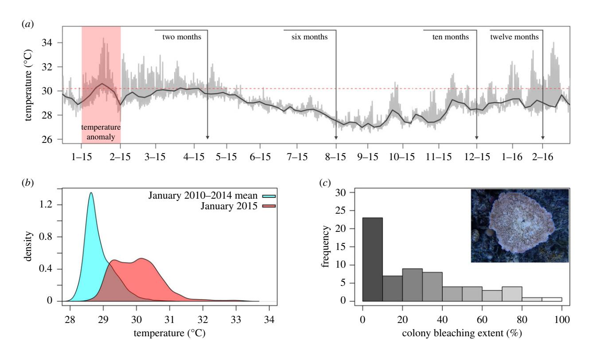
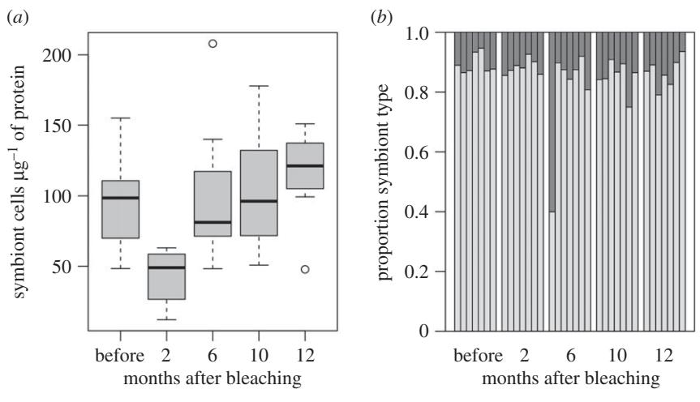
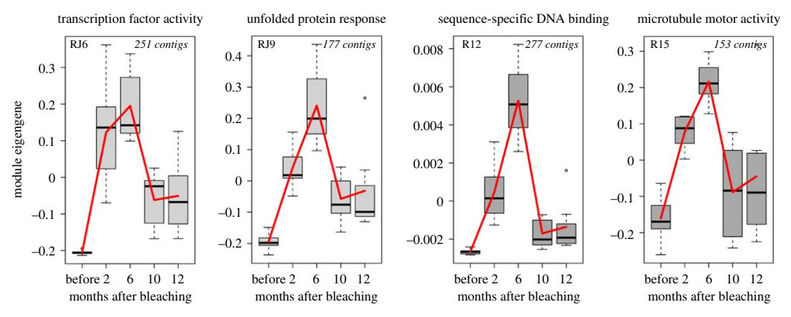
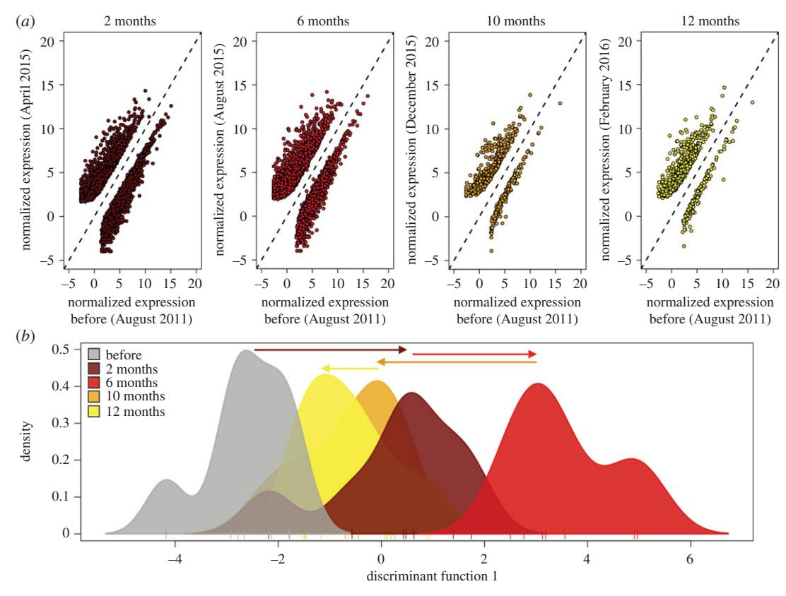

#### rspb.royalsocietypublishing.org

# Research

Cite this article: Thomas L, Palumbi SR. 2017 The genomics of recovery from coral bleaching. Proc. R. Soc. B 284: 20171790. http://dx.doi.org/10.1098/rspb.2017.1790

Received: 11 August 2017 Accepted: 22 September 2017

#### Subject Category:

Global change and conservation

#### Subject Areas:

ecology, genomics, physiology

#### Keywords:

coral bleaching, transcriptomics, recovery, Acropora hyacinthus

#### Author for correspondence:

Luke Thomas

e-mail: [luke.thomas@live.com.au](mailto:luke.thomas@live.com.au)

Electronic supplementary material is available online at [https://dx.doi.org/10.6084/m9.](https://dx.doi.org/10.6084/m9.figshare.c.3899386) [figshare.c.3899386](https://dx.doi.org/10.6084/m9.figshare.c.3899386).

# The genomics of recovery from coral bleaching

Luke Thomas and Stephen R. Palumbi

Department of Biology, Hopkins Marine Station, Stanford University, Pacific Grove, CA 93950, USA

LT, [0000-0003-1095-9170](http://orcid.org/0000-0003-1095-9170)

Ecological damage from periodic environmental extremes is often repaired in resilient ecosystems, but the rate of return to a non-damaged state is critical. Measures of recovery of communities include biomass, productivity and diversity, while measures of recovery of individuals tend to focus on physiological conditions and the return to normal metabolic functioning. Transcriptomics offers a window into the entire physiology of the organism under stress and can represent a holistic view of organismal recovery. In this study, we track the recovery of seven colonies of Acropora hyacinthusfollowing a natural bleaching event. We identified a large environmental stress response in the field that involved approximately 20% of the host transcriptome. The transcriptome remained largely perturbed for at least six months after temperatures had cooled and four months after symbiont populations had recovered. Moreover, a small set of genes did not recover to previous expression levels even 12 months after the event, about the time that normal growth rates resumed. This study is among the first to incorporate transcriptomics into a longitudinal dataset of recovery from environmental stress. The data demonstrate large and lasting effects on coral physiology long after environmental conditions return to normal and symbiont populations recover.

# 1. Introduction

A key component of resilience is the capacity for recovery following disturbance. This is often referred to as engineering resilience, measured as the rate of return to a predisturbance equilibrium [\[1](#page-7-0)]. If disturbance occurs at a rate greater than recovery, then communities can experience irreversible change. Understanding rates of recovery following disturbance is becoming increasingly critical as climate change begins to alter disturbance regimes. This is particularly true for habitat-forming foundation species, for which the resilience of the entire ecosystem is ultimately hinged upon.

Mass-bleaching events are among the most threatening disturbances to coral reef ecosystems globally [[2](#page-7-0)]. While severe cases of coral bleaching can result in wide-spread mortality and phase shifts [[3](#page-7-0)], during more moderate bleaching events individual coral colonies show a remarkable capacity to recover [[4](#page-7-0)]. In order for this to occur, corals must rely on alternative forms of energy to account for the reduced levels of photosynthetically fixed carbon from their algal symbionts, which can decline by up to 90% in bleached colonies [\[5\]](#page-7-0). Corals that can increase heterotrophy maintain high levels of energy reserves across the bleaching period and have quick recovery trajectories [[6,7\]](#page-7-0). Most corals, however, rely on stored energy reserves to meet daily metabolic demands while bleached and experience significant declines in tissue biomass across the bleaching period [\[5\]](#page-7-0). Recovering lost energy reserves after symbiont populations recover can take months, and as a result, periods of bleaching are often followed by strong declines in metabolically-intensive processes such as calcification, growth, and reproduction [\[4,8](#page-7-0)–[10\]](#page-7-0).

To date, physiological studies of bleaching recovery have focused mainly on energy reserves, growth and reproduction [\[4](#page-7-0),[5,7,9](#page-7-0)–[18](#page-7-0)]. Transcriptomics additionally offers a window into the entire physiology of the organism under stress and is an emerging tool in natural populations [\[19\]](#page-7-0). Recent studies applying transcriptomics to investigate thermal tolerance in corals have greatly improved our understanding of the physiological response to heat stress [\[20](#page-7-0)–[22\]](#page-7-0); however,

Figure 1. The 2015 bleaching event on Ofu, American Samoa. (a) Time-series temperature data taken from back-reef pool 400 [[25](#page-7-0)] in the National Park of American Samoa. Red panel highlights the warm water event that struck the region in January 2015. Vertical lines indicate approximate sample dates and the horizontal red line represents the NOAA regional bleaching threshold. (b) Density plot comparing temperature data in January 2015 with the previous 3 years. (c) Histogram of bleaching scores for all A. hyacinthus colonies (n ¼ 64) surveyed during bleaching in April 2015. (Online version in colour.)

they have been limited to short time periods (generally less than 10 days) and there remains a lack of long-term transcriptomic experiments on the bleaching recovery process [[23\]](#page-7-0).

Here, we present a longitudinal study of bleaching recovery in reef-building corals of the United States National Park of American Samoa to a climate driven warm-water event. Using samples collected from Acropora hyacinthus at five time points spanning a year of recovery, our results highlight the lasting impacts of warm-water events on the physiology of the coral colony. Our data indicate that the coral transcriptome can remain perturbed for up to 10 months after bleaching occurs and can have persistent effects on the physiology of an individual colony more than a year after bleaching. If bleaching events begin to occur annually in the coming decades, rates of disturbance may soon outpace the capacity of some important reef-building coral species to recover.

# 2. Methods

#### (a) The 2015 bleaching event

Anomalous sea surface temperatures associated with strong El Nino conditions emerging in late 2014 triggered the longest and most severe global-scale bleaching event since records began in the 1980s [\[2,24\]](#page-7-0). In January 2015, corals in the National Park of American Samoa on Ofu Island spent approximately 38% of their time above the NOAA regional bleaching threshold of 30.28C; the previous 3 years never exceeded 5% (figure 1a,b). Bleaching in the Park on Ofu was first reported in February and reef-wide surveys in April showed that overall response in the dominant reef-building coral A. hyacinthus was relatively mild; the mean bleaching score across 64 surveyed colonies was 30% (figure 1c).

#### (b) Sample collection and field data

Seven colonies of A. hyacinthus (type C [\[26\]](#page-7-0)) from the back-reef environment of Ofu Island were tagged, sampled, and monitored at five time-points spanning the bleaching event [\(table 1](#page-2-0)): before bleaching representing baseline expression levels (August 2011), and then two months (April 2015), six months (August 2015), 10 months (December 2015) and 12 months (February 2016) after initial bleaching was observed in February 2015. We focused on A. hyacinthus because it is one of the dominant reef-building species in Ofu, has large amounts of genomic resources available [[21,27](#page-7-0)–[29\]](#page-8-0), and is one of the few species that we had samples in hand that predated the bleaching event. Coral nubbins of approximately 2–4 cm in size were collected from colonies within 3 h of high-tide using garden clippers and preserved in RNAlater. All colonies occurred at depths of approximately 0.5–1.0 m and were within a 2500 m2 area of back-reef. We measured growth rates for the seven colonies by combing field collected maximum length measurements with colony photographs to calculate total colony area for each sample date using IMAGEJ [\[30\]](#page-8-0). We used these data to calculate colony growth rates across the bleaching recovery period, presented as fraction of colony growth per month. We returned to each colony in April 2016 to collect final data points on growth and mortality. Growth rates across the recovery period were compared to pre-bleaching growth rates determined using a monthly average from growth data calculated over 6 years (2010–2016) as part of a larger growth study [[31](#page-8-0)].

#### (c) Symbiont cell densities

Symbiodinium cell densities were quantified using automated cell counting with the non-sorting Guava EasyCyte flow cytometer, as in Krediet et al. [\[32\]](#page-8-0). Briefly, coral tissue was removed from the skeleton using a single-action siphon-feed airbrush (Paasche) filled with artificial seawater (33.5 ppt in deionized water) and needle sheared. Algal counts were normalized to total protein of each corresponding sample using the DC protein assay (Bio-Rad).

#### (d) RNAseq

Total RNA was extracted from tissue samples using Qiagen's RNAeasy Plus Kit, and 35 cDNA libraries (seven colonies for five

Table 1. Colonies of A. hyacinthus monitored across the bleaching recovery period. (Thermal microclimate was calculated from data collected from February to August 2011 and presented as per cent of time spent above 318C. Bleaching level was based on a visual bleaching score of 0 – 100% in April 2015. Symbiont indicates the dominant cp23s haplotype in samples collected in April 2015, when colonies were bleached. Mortality data were from the final time point, 14 months after initial bleaching.)

| colony ID | microclimate | bleaching (%) | symbiont (cp23s) | D growth | mortality (%) |
|-----------|--------------|---------------|------------------|----------|---------------|
| AH13      | 0.411        | 20            | C2               | 20.007   | 0             |
| AH14      | 0.297        | 20            | C2               | 20.012   | 0             |
| AH18      | 0.155        | 80            | C2               | 20.06    | 90            |
| AH21      | 0.334        | 20            | C2               | —        | 80            |
| AH25      | 0.05         | 0             | C2               | 0.083    | 0             |
| AH91      | 0.063        | 30            | C2               | —        | 0             |
| AH95      | 0.041        | 40            | C2               | 20.033   | 0             |

dates) were generated using the Illumina TruSeq RNA Library Prep Kit v2 with Protoscript II Reverse Transcriptase. The 35 libraries were multiplexed and sequenced across three lanes on a Hiseq2500 at the University of Utah Microarray and Genomic Analysis Core Facility. Raw fastq files were mapped to a reference transcriptome [\[21](#page-7-0)] using BOWTIE2.2.6 [[33\]](#page-8-0) under the very-sensitive mode with a minimum mapping quality of 10. We used SAMTOOLS [\[34\]](#page-8-0) to generate counts for each contig in our reference transcriptome. We also mapped raw reads to a reference FASTA file that included the common Symbiodinium chloroplast 23S (cp23s) sequences present on Ofu Island (clades C and D; [[35\]](#page-8-0)). We calculated the proportion of reads that uniquely mapped to each reference sequence as a measure for symbiont composition. To confirm that tissue samples collected at each time point corresponded to the same coral colony, we used FREEBAYES [\[36\]](#page-8-0) to generate variant call files and VCFTOOLS [\[37](#page-8-0)] to filter using a mapping quality of 20, a minor allele frequency of 0.05 and with no missing data.

#### (e) Targeting transcriptional modules

The transcriptomic response to environmental stress often involves thousands of transcripts that can be summarized as the expression of a small number of co-regulated gene sets, or transcriptional modules [\[38\]](#page-8-0). Transcriptional modules can represent distinct physiological units with individual functional enrichments that can dramatically simplify interpretations of the physiological stress response. For example, the response to experimental acute heat stress (3 h temperature ramp to 358C with a 1 h hold) in A. hyacinthusinvolves thousands of transcripts that can be summarized as the expression of 23 transcriptional modules, some of which are significantly correlated with bleaching outcome after heat stress and enriched for molecular functions including sequencespecific DNA binding, motor activity and extracellular matrix structure [[27](#page-7-0)]. In addition, Ruiz-Jones & Palumbi [\[28](#page-7-0)] combined high-resolution transcriptomic and environmental profiling and identified an additional three transcriptional modules in A. hyacinthus that are upregulated during tidal heat pulses when extreme low tides cause temperatures to spike above 30.58C. These modules are significantly enriched for transcription factors and gene products associated with the unfolded protein response [\[28](#page-7-0)].

We used these transcriptional modules to analyse our field-collected bleaching recovery dataset. To do this, we first normalized our expression data with DESEQ2 v 1.6.3 [\[39](#page-8-0)] and matched the normalized matrix to a list of contigs comprising the three sub-bleaching field stress modules that respond to field stress experienced during extreme low tides [\[28\]](#page-7-0) (modules RJ6, RJ9, RJ11) and the seven acute heat stress modules that correlate with bleaching outcome following experimental heat stress [\[27\]](#page-7-0) (modules R1, R4, R10, R12, R14, R15, R17). We then used WGCNA [\[40\]](#page-8-0) to calculate the expression of these 10 modules for each colony in our field-collected dataset across the bleaching recovery period. To determine whether these transcriptional modules also comprised co-regulated gene sets in our field-collected dataset, we used Pearson product-moment correlation tests of contig expression and corresponding module eigengene.

### (f) Transcriptome-wide gene expression

In addition to the targeted module analysis, transcriptome-wide changes in individual gene expression were analysed on raw expression counts using DESEQ2 [\[39\]](#page-8-0). We calculated pairwise comparisons independently for all dates relative to pre-bleaching baseline expression (August 2011) using Wald tests. Differentially expressed contigs (DECs) were identified as those with a log fold change greater than two.We carried out functional enrichment analyses using Uniprot accessions with the Database for Annotation, Visualization and Integrated Discovery (DAVID v. 6.8). All analyses we corrected for multiple comparisons using the Benjamini and Hochberg (BH) method at the 0.05 significance level. ADEGENET [\[41\]](#page-8-0) was used to perform a discriminant analysis of principle components (DAPC) on the normalized counts matrix after removing contigs with low counts or extreme outliers using DESEQ2.

# 3. Results

#### (a) Bleaching, mortality and size changes

Two months after initial bleaching, the intensity of pigment loss varied across the seven individual colonies, with visual bleaching score ranging from 0 to 80% (table 1). All colonies regained full pigmentation by six months (electronic supplementary material, table S1). AH18 was the only colony to display a strong bleaching phenotype in subsequent surveys; it showed 80% bleaching at 12 months, and 90% mortality at 14 months (electronic supplementary material, table S1). Other mortality rates after bleaching were low except in AH21, which experienced 50% by August 2015 and 80% mortality by April 2016 (table 1). We did not have suitable photographs to calculate growth rates for AH91. For all other colonies except AH25, growth rates (measured as fraction of colony growth per month) declined across the recovery period (April 2015 to February 2016) relative to pre-bleaching baseline levels (table 1). When excluding colonies that suffered partial mortality (i.e. AH18) or wave damage (i.e. AH25) at the final sample date, growth rates recovered to pre-bleaching levels in the remaining four colonies by April 2016 (electronic

Figure 2. Changes in Symbiodinium communities across the bleaching recovery period. (a) Symbiont densities for each sample date calculated using flow cytometry. (b) Proportion of Symbiodinium clades C (light grey) and D (dark grey) for each colony determined by mapping raw sequence reads to reference Symbiodinium cp23s haplotypes [[35](#page-8-0)].

supplementary material, table S2). For these four colonies, declines in growth rates and visual bleaching score showed a strong and significant relationship (r 2 ¼ 0.989, p ¼ 0.004).

### (b) RNAseq

In total, 69 689 086 reads from 35 cDNA libraries were mapped to a reference A. hyacinthus transcriptome consisting of 33 496 coral contigs [[21\]](#page-7-0). On average, 1 991 117 (+144 581 s.e.) reads per sample were successfully mapped to 31 737 contigs, with 13 253 contigs represented by a mean read depth greater than five (electronic supplementary material, table S3). Clustering analyses based on 3946 single nucleotide polymorphisms (SNPs) showed that tissue samples collected on consecutive dates from AH25 actually comprised three distinct genotypes (electronic supplementary material, figure S1), indicating that tissue samples were mistakenly collected from a nearby colony on three of the five sampling dates. As a result, we excluded AH25 for any individual-level gene expression analyses.

#### (c) Symbiont recovery

Symbiodinium cell densities had declined by 51% (+10% s.e.) in colonies two months after bleaching (figure 2). Cell densities rebounded back to pre-bleaching baseline levels at six months and remained stable over the remaining sample dates. An average of 158 reads per sample (range 22–626) mapped to the reference Symbiodinium sequence (cp23S). All colonies were associated predominantly with clade C (showing 0.75–0.95 proportion of clade C mapped reads) at all time points, except for a single colony (AH13) which showed 60% clade D six months after bleaching but over 90% clade C four months before and after this time point (figure 2; electronic supplementary material, table S4). SNP analysis confirmed that AH13 samples were in fact from the same colony in each time point (electronic supplementary material, figure S1).

#### (d) A prolonged environmental stress response

Using Pearson correlations of contig expression and corresponding module eigengenes, we determined that six of the stress response modules occurred as co-regulated gene sets in our natural bleaching recovery dataset (RJ6, RJ9, RJ11, R12, R15, R17; electronic supplementary material, figure S2). Four of these modules have significant enrichment (gene ontology (GO) terms) for molecular functions: RJ6 is enriched for transcription factor activity, RJ9 for gene products essential to the unfolded protein response, R12 for sequence-specific DNA binding, and R15 for microtubule motor activity (electronic supplementary material, table S5).

Expression profiles for these stress response modules in our field-collected samples followed similar patterns: low expression in samples collected before the bleaching event, and a strong increase two months after bleaching [\(figure 3\)](#page-4-0). Overall expression of the modules rose two months after the bleaching event while bleaching was still visually evident; however, these modules continued to increase in expression until six months after the bleaching event, when all colonies had returned to normal symbiont densities (figure 2). This eigengene increase occurred despite cooler water temperatures during the April–August 2015 period. Expression declined in December 2015 and remained low in February 2016 despite warmer water temperatures during the Austral summer.

Consistent with the targeted module analysis, differential gene expression analyses across time showed a large transcriptome-wide response in samples collected two and six months after bleaching relative to pre-bleaching baseline expression ([figure 4\)](#page-4-0). A total of 4766 DECs (2805 upregulated and 1961 downregulated contigs) were identified between samples collected two months after bleaching and pre-bleaching baseline samples ([figure 4](#page-4-0)a; electronic supplementary material, dataset S1). The top upregulated DECs at the two-month time point in April 2015 had annotations for proteins involved in response to stress and apoptosis, including heat-shock proteins, the transcription factor fosB, and BAG-domain containing proteins (electronic supplementary material, table S6 and dataset S1). Functional enrichment analyses showed that the upregulated DECs at two months were significantly enriched ( p.adj , 0.05) for gene products associated with extracellular regions and calcium ion binding (electronic supplementary material, table S7). Downregulated contigs had no significant functional enrichment.

Six months after bleaching in August 2015, the number of DECs relative to pre-bleaching baseline expression remained high at 4690 (2896 upregulated and 1794 downregulated) ([figure 4](#page-4-0)a; electronic supplementary material, dataset S2). While the top DECs from April 2015 remained strongly

**Figure 3.** Changes in transcriptional module expression across the bleaching recovery period. Module eigengenes, representing the first principle component of the expression of all genes in that module, are on the *y*-axis and sample dates are on the *x*-axis. Significant GO terms (p.adj < 0.05) are provided above each corresponding plot. Module name and size are provided in corners of plot. (Online version in colour.)

**Figure 4.** Changes in transcriptome-wide gene expression across the bleaching recovery period. (a) Regression of contig expression for each sample date (y-axis) against pre-bleaching baseline expression (x-axis). Each point represents a differentially expressed contig (DECs, p.adj < 0.05) identified using DEStq2. Points above the 1:1 line are upregulated and below the 1:1 are downregulated at the respective date relative to pre-bleaching baseline levels. (b) DAPC of transcriptome-wide gene expression data. Plot displays the density distribution of colonies along the first principle component and arrows mark the direction and magnitude of the transcriptional shift across the recovery period. (Online version in colour.)

upregulated in August 2015, the contigs with greatest increase in expression at the six-month time point in August 2015 were involved in amino acid modification and metabolism of complex sugars, and included two contigs with annotations for glycosyl-hydrolase family 5 proteins (endoglucanase and glycosyl hydrolase) and two for aspartate-beta hydroxylase domain containing proteins (electronic supplementary material, table S6 and dataset S2). These contigs were more highly expressed at the six-month time point by 460- to 820-fold across all colonies and returned to normal in subsequent time points (electronic supplementary material, figure S3). Functional enrichment analyses showed that upregulated DECs at six months were significantly enriched (p.adj < 0.05) for GO

terms including extracellular regions, signalling, plasma membrane, response to stimulus and cell projection, among others (electronic supplementary material, table S7). Downregulated DECs were functionally enriched for gene products associated with cellular compartments including vacuoles and endosomes. By December 2015, 10 months after initial bleaching, the number of DECs relative to pre-bleaching baseline expression declined to 815 (electronic supplementary material, dataset S3), and remained low at the 12 month mark (figure 4a; electronic supplementary material, dataset S4).

A discriminant analysis of principle components (DAPC) based on 9839 contigs identified a clear transcriptome-wide shift in expression along the first principle component at

two months relative to the pre-bleaching baseline [\(figure 4](#page-4-0)b). Consistent with the targeted module analysis, this response intensified at the six month time point in August 2015. The response subsided by 10 months and returned to near pre-bleaching levels by 12 months ([figure 4](#page-4-0)b).

#### (e) Lingering response genes

Although the main stress response declined 10 months after initial bleaching, module eigengenes did not fully reach prebleaching levels [\(figure 3\)](#page-4-0). This lingering response was not restricted to these contigs. Differential gene expression analyses in DESEQ2 identified 348 contigs that were significantly upregulated at two months, when bleaching was still evident, and that remained upregulated in all sample dates thereafter (electronic supplementary material, dataset S5). These contigs were functionally enriched ( p.adj , 0.05) for gene products associated with sequence-specific DNA binding (electronic supplementary material, table S7), such as transcription factor proteins. Furthermore, despite a strong decline in the overall number of DECs by 10 months, the top upregulated contigs at 10 and 12 months were still associated with apoptotic and stress response proteins, including heatshock proteins, tumour necrosis factor (TNF) receptors, and BAG-domain containing proteins (electronic supplementary material, table S6 and datasets S3 and S4), and remained functionally enriched ( p.adj , 0.05) for extracellular regions (electronic supplementary material, table S7).

# (f) Bleaching predicts the expression of stress genes a year later

Pearson correlation coefficients showed that individual colony bleaching score measured in April 2015 significantly predicted ( p , 0.05) the expression of the transcriptional modules and hundreds of other stress response genes measured in February 2016, 12 months after bleaching (electronic supplementary material, figure S4). There were 169 contigs that were in the top 10% tail of differential expression (log 2 fold change . 2.0, p.adj , 0.05) at two or six months (when the stress response was strongest) and that also fell in the top 10% tail of the Pearson correlation coefficient between visual bleaching score and expression at twelve months (electronic supplementary material, dataset S6). Included in this list were the top five most upregulated contigs from both April and August 2015, when the environmental stress response was at its greatest. This gene list was functionally enriched ( p.adj , 0.05) for response to chemical stimulus, with 36 genes involved in this annotation category, including transcription factors, heat-shock proteins, TNF and fibroblast growth receptors (electronic supplementary material, dataset S7). Other GO categories that were marginally non-significant included positive regulation of signalling, response to stimulus, positive regulation of cell communication, and response to organic substance (electronic supplementary material, table S7).

# 4. Discussion

Our data on the recovery process after coral bleaching show that a large part of the host transcriptome changed dramatically after bleaching and remained perturbed for several months after pigmentation returned to the colony. Even 10–12 months after bleaching, hundreds of genes had not returned to baseline expression. Across colonies, bleaching severity had a persistent effect on the transcriptome 12 months after the event: bleaching levels in April 2015 predicted gene expression patterns in February 2016. Taken together, the results from this study highlight the lasting impacts of a warm-water event on the physiology of a coral colony.

#### (a) Stages of bleaching recovery

In this study, the return of Symbiodinium populations marked merely the first stage of bleaching recovery. This is consistent with the generalized pattern of bleaching recovery from past studies, where symbionts and chlorophyll-a recover first, followed by tissue biomass and energy reserves, and finally growth and reproduction [\[4](#page-7-0),[5,9](#page-7-0),[10,16](#page-7-0)–[18](#page-7-0)[,42\]](#page-8-0). Bleaching recovery is primarily associated with energetics; corals that are capable of increasing heterotrophy maintain energy reserves throughout the bleaching recovery period and thus have a rapid recovery trajectory [[6,7\]](#page-7-0). Corals that cannotincrease heterotrophy begin to consume stored energy reserves to meet basic metabolic demands, resulting in a significant decline in tissue biomass [\[5,16](#page-7-0),[43](#page-8-0)]. Recovering those lost energy reserves takes time and often lags well behind the recovery of symbiont and chlorophyll-a levels [\[5,18,](#page-7-0)[44](#page-8-0)]. In this study we did not measure changes in energy reserves; however, the lag in transcriptome recovery we observed parallels previous observations that physiology recovers only slowly from bleaching. Where we could measure them, growth rates recovered after February 2016, suggesting that growth recovery quickly followed transcriptome recovery. Similarly, previous studies have shown skeletal extension rates to recover once tissue biomass is restored [\[4](#page-7-0)].

# (b) Recovery does not involve a shift in Symbiodinium clade

Our data show that recovering from bleaching does not require a shift in Symbiodinium clade ([figure 2](#page-3-0)b). This finding contrasts a number of other studies that have identified symbiont type to play a key role in the bleaching recovery process [\[45](#page-8-0)–[47](#page-8-0)]. In American Samoa, A. hyacinthus forms a flexible association with Symbiodinium clades C and D, with higher levels of the more thermally tolerant clade D occurring in high-temperature habitats [[35](#page-8-0)]. However, these colonies do not shift symbiont clade when transplanted to alternate microhabitats [[48\]](#page-8-0). In the current study, one colony (AH13) shifted to higher levels of clade D at the six month time point [\(figure 2](#page-3-0); electronic supplementary material, table S5) but shifted back to pre-bleaching proportions by the 10 month time point in December. Photographs made of these times showed sediment intrusion and a wholesale die off of corals immediately surrounding AH13 after the February 2015 bleaching event. Inspection of genetic variants confirmed that samples in August 2015 were AH13. It is possible that the large changes in symbiont type in AH13 reflect microclimate—this colony is the shallowest, most shoreward of all the colonies in our study and showed the highest temperature levels ([table 1](#page-2-0)).

# (c) A lasting environmental stress response to a warm-

#### water event

We identified a large environmental stress response in corals exposed to a natural warm-water event. Two months after initial bleaching, this response was largely similar to the response triggered during acute experimental heat stress, marked by changes in expression of genes associated with extracellular space, calcium ion homeostasis, heat shock and apoptotic proteins [\[21,](#page-7-0)[29\]](#page-8-0). Unlike the acute bleaching data, which show a decline in transcriptional changes within days, our data show that one portion of the environmental stress response intensified until at least the six month mark (figures [3](#page-4-0) and [4](#page-4-0)).

The environmental stress response in model organisms such as yeast, responds to a range of stressors, from heat stress to starvation, and is comprised of hundreds of genes that are common to a diverse range of environmental pressures, as well as a subset of genes unique to a particular environment [\[49](#page-8-0)]. Colonies in our current study initially bleached in February, so would have been surviving on reduced levels of photosynthetically fixed carbon for up to six months before symbiont populations fully returned by August 2015. As a result, colonies may have consumed large portions of their energy reserves during this period, and the environmental stress response we see at the six month time point in August 2015 may be associated with nutrient deprivation rather than a heat stress response. Past studies have shown that the recovery of lost energy reserves lags behind the recovery of symbiont populations [\[5](#page-7-0),[16](#page-7-0),[18](#page-7-0),[42](#page-8-0)], so we would expect the stress response to starvation to linger after symbiont densities recover until sufficient energy reserves were restored.

Top upregulated genes in corals at the six month mark were involved in amino acid modification and the metabolism of complex sugars (electronic supplementary material, table S6 and dataset S2). Among the most upregulated genes in samples collected six months after bleaching were two transcripts with annotations for aspartate beta-hydroxylase, a protein involved in the hydroxylation of aspartic acid, an amino acid that is a metabolite in the urea cycle and a primary component of the organic skeletal matrix of scleractinian corals. In addition, two of the top upregulated transcripts at six months had annotations for proteins of the glycosyl hydrolase family 5 (cellulase family A) (electronic supplementary material, table S6), which are common enzymes involved in the degradation of complex sugars, such as cellulose [\[50\]](#page-8-0).While most metazoans do not produce cellulase enzymes, the few that can are believed to have acquired their cellulolytic endoglucanases by horizontal gene transfer from their symbionts [\[50](#page-8-0)–[52](#page-8-0)].

Symbiodinium cells are encased in a cell wall containing cellulose [[53](#page-8-0)] and like other dinoflagellates must regulate the production and degradation of these walls during their life cycle [[54](#page-8-0)]. In culture, cellulase treatments can successfully digest isolated Symbiodinium cell walls [\[55\]](#page-8-0). However, within coral cells, the fate of symbiont cell walls remains largely unknown. Multiple layers of membranous material can accumulate between the symbiosome membrane and the vegetative algal cell wall [\[53\]](#page-8-0), but it is unclear whether this is a possible nutrient source or alternatively a hindrance to symbiont replication. An interesting question that follows is whether corals increase the production of cellulase-like enzymes to digest any nutrient-rich structures in Symbiodinium prior to expulsion, or if host-produced cellulase functions in rapid proliferation of symbionts during recovery. Periods of nutrient deprivation in other coral genera have been shown to coincide with marked declines in symbiont densities and an increase in the intensity of algal cell degradation in the gastroderm of the coral [\[56\]](#page-8-0). If this observation is general, then rapid symbiont expulsion after acute bleaching might be a slightly different phenomenon than later expulsion during starvation. Furthermore, should these observations be repeated in other localities, species and bleaching events, then enzymatic assays of endoglucanase in seemingly recovered corals might be a practical assay of lingering negative effects of previous bleaching events.

#### (d) Lingering physiological impacts of bleaching

Natural bleaching events can have lasting implications on the physiology of the coral colony. Previous transcriptome studies have shown lasting impacts on immune-related pathways in other genera of corals (Orbicella) exposed to a natural bleaching event, with changes in expression of apoptotic proteins up to a year after bleaching [[57\]](#page-8-0). The predominant transcriptome response in our current study, involving up to 20% of the transcriptome, persisted up to six months after bleaching, and hundreds of genes remained upregulated for a year after bleaching. Gene expression patterns that linger and do not return to baseline expression following acute experimental heat stress comprise functional annotation clusters for the regulation of the immune system, apoptosis, transcription, and protein signalling [\[29\]](#page-8-0). Corals thriving in naturally extreme thermal environments frontload similar stress response genes as a mechanism to prepare an individual for frequently encountered stress [\[21](#page-7-0)]. The same mechanism may apply to corals exposed to natural warm-water events, where constitutive transcriptional activity is altered in order to better prepare individuals for future stress.

# (e) Bleaching has a persistent effect on the coral transcriptome

Gene expression biomarkers that can accurately and rapidly assess the health of corals in situ represent a highly soughtafter tool for management that aims to take proactive approaches to coral reef conservation [[58\]](#page-8-0). In our dataset, individual colony bleaching level predicted eigengenes for five of the six stress modules, as well as the expression of approximately 200 stress response genes, at the final time point in those colonies (electronic supplementary material, figure S4 and dataset S6). This list of genes included classic stress response genes such as heat-shock proteins and TNF receptors and was functionally enriched for gene products associated with cellular response to chemical stimulus and signalling (electronic supplementary material, dataset S7). It may be the case that corals frontload a sub-set of stress response genes during warm summer months proportional to the level of bleaching stress they experienced the previous summer. If this is the case, then in addition to monitoring the in situ health of a coral colony, gene expression biomarkers may be capable of assaying the bleaching history of a colony even when the main stress response has subsided. Future studies that validate the results of high-throughput sequencing approaches with more classical biomarker development approaches using qPCR and protein assays will help verify whether any of the genes identified in this study using a RNAseq approach represent good candidate biomarkers for bleaching history.

#### (f) Broader implications

Understanding rates of recovery following severe disturbance is central to forecasting the response of coral reef ecosystems to rapid climate change. Ecological recovery from severe bleaching events can take decades, yet, the individual coral colony has a much faster recovery trajectory, which is an important component of resilience at the reef level. Our data show that full recovery for the cosmopolitan reefbuilder A. hyacinthus can take more than a year. The long time that individual colonies require to recover fully means that even this rapid mechanism is limited in effect when summer after summer imposes bleaching or sub-bleaching conditions. Different coral species have markedly different rates of recovery [16], which together with differential rates of mortality, will drive shifts in community composition and reef function as climate-driven bleaching events become more and more frequent.

Ethics. Tissue samples were collected under the Department of Marine and Wildlife Resources permit 2016/004 and National Park Service permit NPSA-2016-SCI-0003.

Data accessibility. All datasets and files are archived in the Dryad repository:<http://dx.doi.org/10.5061/dryad.3444s> [[59\]](#page-8-0).

Authors' contributions. L.T. and S.R.P. designed the project. L.T. collected the samples and conducted laboratory work. L.T. and S.R.P. analysed the data and drafted the manuscript. L.T. and S.R.P. prepared the final version of this manuscript.

Competing interests. The authors declare no competing interests.

Funding. This research was supported by the Gordon and Betty Moore Foundation and the National Science Foundation's Rapid Response Research (RAPID) OCE-1547921 to S.R.P.

Acknowledgements. We are grateful for the logistical support from the National Park of American Samoa throughout this study. We would like to thank Noah H. Rose for assistance in the field and with bioinformatics. Thanks are also extended to E. Sheets, M. Morikawa and E. Lopez for their invaluable assistance in the field and for insightful discussion on the data. Finally, we thank two anonymous reviewers for their constructive comments on earlier versions of this manuscript.

# References

- 1. Holling CS. 1973 Resilience and stability of ecological systems. Annu. Rev. Ecol. Syst. 4, 1– 23. [\(doi:10.1146/annurev.es.04.110173.000245\)](http://dx.doi.org/10.1146/annurev.es.04.110173.000245)
- 2. Hughes TP et al. 2017 Coral reefs in the Anthropocene. Nature 546, 82 – 90. [\(doi:10.1038/](http://dx.doi.org/10.1038/nature22901) [nature22901](http://dx.doi.org/10.1038/nature22901))
- 3. Depczynski M et al. 2012 Bleaching, coral mortality and subsequent survivorship on a West Australian fringing reef. Coral Reefs 32, 233– 238. [\(doi:10.](http://dx.doi.org/10.1007/s00338-012-0974-0) [1007/s00338-012-0974-0\)](http://dx.doi.org/10.1007/s00338-012-0974-0)
- 4. Mendes JM, Woodley JD. 2002 Effect of the 1995 1996 bleaching event on polyp tissue depth, growth, reproduction and skeletal band formation in Montastraea annularis. Mar. Ecol. Prog. Ser. 235, 93 – 102. [\(doi:10.3354/meps235093\)](http://dx.doi.org/10.3354/meps235093)
- 5. Rodrigues LJ, Grottoli AG. 2007 Energy reserves and metabolism as indicators of coral recovery from bleaching. Limnol. Oceanogr. 52, 1874 – 1882. [\(doi:10.4319/lo.2007.52.5.1874\)](http://dx.doi.org/10.4319/lo.2007.52.5.1874)
- 6. Grottoli AG, Rodrigues LJ, Palardy JE. 2006 Heterotrophic plasticity and resilience in bleached corals. Nature 440, 1186 – 1189. [\(doi:10.1038/](http://dx.doi.org/10.1038/nature04565) [nature04565](http://dx.doi.org/10.1038/nature04565))
- 7. Hughes AD, Grottoli AG. 2013 Heterotrophic compensation: a possible mechanism for resilience of coral reefs to global warming or a sign of prolonged stress? PLoS ONE 8, 1 – 10. ([doi:10.1371/](http://dx.doi.org/10.1371/journal.pone.0081172) [journal.pone.0081172\)](http://dx.doi.org/10.1371/journal.pone.0081172)
- 8. Goreau TJ, Macfarlane AH. 1990 Coral reefs following the 1987 – 1988 coral-bleaching event. Coral Reefs 8, 211 – 215. ([doi:10.1007/BF00265013\)](http://dx.doi.org/10.1007/BF00265013)
- 9. Szmant AM, Gassman NJ. 1990 The effects of prolonged 'bleaching' on the tissue biomass and reproduction of the reef coral Montastrea annularis. Coral Reefs 8, 217 – 224. ([doi:10.1007/BF00265014\)](http://dx.doi.org/10.1007/BF00265014)
- 10. Baird AH, Marshall PA. 2002 Mortality, growth and reproduction in scleractinian corals following bleaching on the Great Barrier Reef. Mar. Ecol. Prog. Ser. 237, 133– 141. [\(doi:10.3354/meps237133](http://dx.doi.org/10.3354/meps237133))
- 11. Levas S, Grottoli AG, Schoepf V, Aschaffenburg M, Baumann J, Bauer JE, Warner ME. 2016 Can heterotrophic uptake of dissolved organic carbon and zooplankton mitigate carbon budget deficits in

- annually bleached corals? Coral Reefs 35, 495– 506. [\(doi:10.1007/s00338-015-1390-z\)](http://dx.doi.org/10.1007/s00338-015-1390-z)
- 12. Levas SJ, Grottoli AG, Hughes A, Osburn CL, Matsui Y. 2013 Physiological and biogeochemical traits of bleaching and recovery in the mounding species of coral Porites lobata: implications for resilience in mounding corals. PLoS ONE 8, 32 – 35. ([doi:10.1371/journal.pone.](http://dx.doi.org/10.1371/journal.pone.0063267) [0063267\)](http://dx.doi.org/10.1371/journal.pone.0063267)
- 13. Anthony KRN, Hoogenboom MO, Maynard JA, Grottoli AG, Middlebrook R. 2009 Energetics approach to predicting mortality risk from environmental stress: a case study of coral bleaching. Funct. Ecol. 23, 539– 550. [\(doi:10.1111/j.](http://dx.doi.org/10.1111/j.1365-2435.2008.01531.x) [1365-2435.2008.01531.x\)](http://dx.doi.org/10.1111/j.1365-2435.2008.01531.x)
- 14. Grottoli AG, Rodrigues LJ. 2011 Bleached Porites compressa and Montipora capitata corals catabolize d13C-enriched lipids. Coral Reefs 30, 687– 692. [\(doi:10.1007/s00338-011-0756-0](http://dx.doi.org/10.1007/s00338-011-0756-0))
- 15. Rodrigues LJ. 2005 Physiology and biogeochemistry of bleached and recovering corals. PhD thesis, Department of Earth and Environmental Science, University of Pennsylvania, PA, USA.
- 16. Schoepf V, Grottoli AG, Levas SJ, Aschaffenburg MD, Baumann JH, Matsui Y, Warner ME. 2015 Annual coral bleaching and the long-term recovery capacity of coral. Proc. R. Soc. B 282, 20151887. [\(doi:10.](http://dx.doi.org/10.1098/rspb.2015.1887) [1098/rspb.2015.1887\)](http://dx.doi.org/10.1098/rspb.2015.1887)
- 17. Ward S, Harrison P, Hoegh-guldberg O. 2002 Coral bleaching reduces reproduction of scleractinian corals and increases susceptibility to future stress. Proc. 9th Int. Coral Reef Symp. 2, 1123 – 1128.
- 18. Fitt WK, Spero HJ, Halas J, White MW, Porter JW. 1993 Coral reefs after the 1987 Caribbean 'bleaching event'. Coral Reefs 12, 57 – 64. [\(doi:10.1007/](http://dx.doi.org/10.1007/BF00302102) [BF00302102\)](http://dx.doi.org/10.1007/BF00302102)
- 19. Franssen SU, Gu J, Bergmann N, Winters G, Klostermeier UC, Rosenstiel P, Bornberg-Bauer E, Reusch TBH. 2011 Transcriptomic resilience to global warming in the seagrass Zostera marina, a marine foundation species. Proc. Natl Acad. Sci. USA 108, 19 276– 19 281. [\(doi:10.1073/pnas.](http://dx.doi.org/10.1073/pnas.1107680108) [1107680108\)](http://dx.doi.org/10.1073/pnas.1107680108)

- 20. Bellantuono AJ, Hoegh-guldberg O, Rodriguez-Lanetty M. 2012 Resistance to thermal stress in corals without changes in symbiont composition. Proc. R. Soc. B 279, 1100– 1107. ([doi:10.1098/rspb.](http://dx.doi.org/10.1098/rspb.2011.1780) [2011.1780](http://dx.doi.org/10.1098/rspb.2011.1780))
- 21. Barshis DJ, Ladner JT, Oliver T, Seneca FO, Traylor-Knowles N, Palumbi SR. 2013 Genomic basis for coral resilience to climate change. Proc. Natl Acad. Sci. USA 110, 1387 – 1392. [\(doi:10.1073/pnas.](http://dx.doi.org/10.1073/pnas.1210224110) [1210224110](http://dx.doi.org/10.1073/pnas.1210224110))
- 22. Bay RA, Palumbi SR. 2015 Rapid acclimation ability mediated by transcriptome changes in reef-building corals. Genome Biol. Evol. 7, 1602– 1612. [\(doi:10.](http://dx.doi.org/10.1093/gbe/evv085) [1093/gbe/evv085\)](http://dx.doi.org/10.1093/gbe/evv085)
- 23. Maor-landaw K, Levy O. 2016 Survey of Cnidarian gene expression profiles in response to environmental stressors: summarizing 20 years of research, what are we heading for? In The Cnidaria, past, present and future (eds S Goffredo, Z Dubinsky), pp. 523– 543. Basel, Switzerland: Springer International Publishing.
- 24. Hughes TP et al. 2017 Global warming and recurrent mass bleaching of corals. Nature 543, 373– 377. [\(doi:10.1038/nature21707](http://dx.doi.org/10.1038/nature21707))
- 25. Smith LW, Wirshing H, Baker AC, Birkeland C. 2008 Environmental versus genetic influences on growth rates of the corals Pocillopora eydouxi and Porites lobata. Pacific Sci. 62, 57 – 69. [\(doi:10.2984/](http://dx.doi.org/10.2984/1534-6188) [1534-6188](http://dx.doi.org/10.2984/1534-6188))
- 26. Ladner JT, Palumbi SR. 2012 Extensive sympatry, cryptic diversity and introgression throughout the geographic distribution of two coral species complexes. Mol. Ecol. 21, 2224 – 2238. [\(doi:10.](http://dx.doi.org/10.1111/j.1365-294X.2012.05528.x) [1111/j.1365-294X.2012.05528.x\)](http://dx.doi.org/10.1111/j.1365-294X.2012.05528.x)
- 27. Rose N, Seneca FO, Palumbi SR. 2016 Gene networks in the wild: identifying transcriptional modules that mediate coral resistance to experimental heat stress. Genome Biol. Evol. 8, 243– 252. [\(doi:10.5061/dryad.and](http://dx.doi.org/10.5061/dryad.and))
- 28. Ruiz-jones LJ, Palumbi SR. 2017 Tidal heat pulses on a reef trigger a fine-tuned transcriptional response in corals to maintain homeostasis. Sci. Adv. 3, 1 – 10. [\(doi:10.1126/sciadv.1601298\)](http://dx.doi.org/10.1126/sciadv.1601298)

- 29. Seneca FO, Palumbi SR. 2015 The role of transcriptome resilience in resistance of corals to bleaching. Mol. Ecol. 24, 1387– 1641. ([doi:10.1111/](http://dx.doi.org/10.1111/mec.13125) [mec.13125\)](http://dx.doi.org/10.1111/mec.13125)
- 30. Schneider CA, Rasband WS, Eliceiri KW. 2012 NIH Image to ImageJ: 25 years of image analysis. Nat. Methods 9, 671– 675. [\(doi:10.1038/nmeth.2089\)](http://dx.doi.org/10.1038/nmeth.2089)
- 31. Gold Z, Palumbi SR. In press. Long term growth rates and effects of bleaching in Acropora hyacinthus. Coral Reefs.
- 32. Krediet CJ, DeNofrio JC, Caruso C, Burriesci MS, Cella K, Pringle JR. 2015 Rapid, precise, and accurate counts of Symbiodinium cells using the guava flow cytometer, and a comparison to other methods. PLoS ONE 10, e0135725. [\(doi:10.1371/journal.pone.](http://dx.doi.org/10.1371/journal.pone.0135725) [0135725\)](http://dx.doi.org/10.1371/journal.pone.0135725)
- 33. Langmead B, Salzberg SL. 2012 Fast gappedread alignment with Bowtie 2. Nat. Methods 9, 357– 359. ([doi:10.1038/nmeth.1923](http://dx.doi.org/10.1038/nmeth.1923))
- 34. Li H, Handsaker B, Wysoker A, Fennell T, Ruan J, Homer N, Marth G, Abecasis G, Durbin R. 2009 The sequence alignment/map format and SAMtools. Bioinformatics 25, 2078– 2079. ([doi:10.1093/](http://dx.doi.org/10.1093/bioinformatics/btp352) [bioinformatics/btp352\)](http://dx.doi.org/10.1093/bioinformatics/btp352)
- 35. Oliver T, Palumbi SR. 2010 Many corals host thermally resistant symbionts in high-temperature habitat. Coral Reefs 30, 241 – 250. ([doi:10.1007/](http://dx.doi.org/10.1007/s00338-010-0696-0) [s00338-010-0696-0\)](http://dx.doi.org/10.1007/s00338-010-0696-0)
- 36. Garrison E, Marth G. 2012 Haplotype-based variant detection from short-read sequencing. ArXiv e-prints 2012, 1207:3907. ([http://arxiv.org/abs/1207.3907\)](http://arxiv.org/abs/1207.3907)
- 37. Danecek P et al. 2011 The variant call format and VCFtools. Bioinformatics 27, 2156– 2158. ([doi:10.](http://dx.doi.org/10.1093/bioinformatics/btr330) [1093/bioinformatics/btr330](http://dx.doi.org/10.1093/bioinformatics/btr330))
- 38. Civelek M, Lusis AJ. 2014 Systems genetics approaches to understand complex traits. Nat. Rev. Genet. 15, 34 – 48. [\(doi:10.1038/nrg3575\)](http://dx.doi.org/10.1038/nrg3575)
- 39. Love MI, Huber W, Anders S. 2014 Moderated estimation of fold change and dispersion for RNAseq data with DESeq2. Genome Biol. 15, 550. [\(doi:10.1186/s13059-014-0550-8\)](http://dx.doi.org/10.1186/s13059-014-0550-8)
- 40. Langfelder P, Horvath S. 2008 WGCNA: an R package for weighted correlation network analysis.

- BMC Bioinformatics 9, 559. ([doi:10.1186/1471-2105-](http://dx.doi.org/10.1186/1471-2105-9-559) [9-559\)](http://dx.doi.org/10.1186/1471-2105-9-559)
- 41. Jombart T. 2008 Adegenet: an R package for the multivariate analysis of genetic markers. Bioinformatics 24, 1403– 1405. ([doi:10.1093/](http://dx.doi.org/10.1093/bioinformatics/btn129) [bioinformatics/btn129](http://dx.doi.org/10.1093/bioinformatics/btn129))
- 42. Rodrigues LJ, Grottoli AG. 2006 Calcification rate and the stable carbon, oxygen, and nitrogen isotopes in the skeleton, host tissue, and zooxanthellae of bleached and recovering Hawaiian corals. Geochim. Cosmochim. Acta 70, 2781– 2789. ([doi:10.1016/j.](http://dx.doi.org/10.1016/j.gca.2006.02.014) [gca.2006.02.014\)](http://dx.doi.org/10.1016/j.gca.2006.02.014)
- 43. Grottoli AG, Warner ME, Levas SJ, Aschaffenburg MD, Schoepf V, Mcginley M, Baumann J, Matsui Y. 2014 The cumulative impact of annual coral bleaching can turn some coral species winners into losers. Glob. Chang. Biol. 20, 3823– 3833. ([doi:10.](http://dx.doi.org/10.1111/gcb.12658) [1111/gcb.12658](http://dx.doi.org/10.1111/gcb.12658))
- 44. Fitt WK, McFarland FK, Warner ME, Chilcoat GC. 2000 Seasonal patterns of tissue biomass and densities of symbiotic dinoflagellates in reef corals and relation to coral bleaching. Limnol. Oceanogr. 45, 677 – 685. [\(doi:10.4319/lo.2000.](http://dx.doi.org/10.4319/lo.2000.45.3.0677) [45.3.0677\)](http://dx.doi.org/10.4319/lo.2000.45.3.0677)
- 45. Jones AM, Berkelmans R, van Oppen MJH, Mieog JC, Sinclair W. 2008 A community change in the algal endosymbionts of a scleractinian coral following a natural bleaching event: field evidence of acclimatization. Proc. R. Soc. B 275, 1359 – 1365. [\(doi:10.1098/rspb.2008.0069\)](http://dx.doi.org/10.1098/rspb.2008.0069)
- 46. Baker AC. 2001 Reef corals bleach to survive change. Nature 411, 765– 766. [\(doi:10.1038/35081151\)](http://dx.doi.org/10.1038/35081151)
- 47. Berkelmans R, van Oppen MJH. 2006 The role of zooxanthellae in the thermal tolerance of corals: a 'nugget of hope' for coral reefs in an era of climate change. Proc. R. Soc. B 273, 2305 – 2312. ([doi:10.](http://dx.doi.org/10.1098/rspb.2006.3567) [1098/rspb.2006.3567\)](http://dx.doi.org/10.1098/rspb.2006.3567)
- 48. Palumbi SR, Barshis DJ, Taylor-Knowles N, Bay RA. 2014 Mechanisms of reef coral resistance to future climate change. Science 344, 895– 898. ([doi:10.](http://dx.doi.org/10.1071/MF99078) [1071/MF99078](http://dx.doi.org/10.1071/MF99078))
- 49. Gasch AP, Werner-Washburne M. 2002 The genomics of yeast responses to environmental stress

- and starvation. Funct. Integr. Genomics 2, 181 192. ([doi:10.1007/s10142-002-0058-2](http://dx.doi.org/10.1007/s10142-002-0058-2))
- 50. Davison A, Blaxter M. 2005 Ancient origin of glycosyl hydrolase family 9 cellulase genes. Mol. Biol. Evol. 22, 1273– 1284. ([doi:10.1093/molbev/msi107](http://dx.doi.org/10.1093/molbev/msi107))
- 51. Chapman JA et al.2010 The dynamic genome of Hydra. Nature 464, 592–596. ([doi:10.1038/nature08830\)](http://dx.doi.org/10.1038/nature08830)
- 52. Baumgarten S et al. 2015 The genome of Aiptasia, a sea anemone model for coral symbiosis. Proc. Natl Acad. Sci. USA 112, 11 893– 11 898. [\(doi:10.1073/](http://dx.doi.org/10.1073/pnas.1513318112) [pnas.1513318112\)](http://dx.doi.org/10.1073/pnas.1513318112)
- 53. Wakefield TS, Farmer MA, Kempf SC. 2000 Revised description of the fine structure of in situ 'Zooxanthellae' genus Symbiodinium. Biol. Bull. 199, 76– 84. [\(doi:10.2307/1542709\)](http://dx.doi.org/10.2307/1542709)
- 54. Kwok ACM, Wong JTY. 2010 The activity of a wallbound cellulase is required for and is coupled to cell cycle progression in the dinoflagellate Crypthecodinium cohnii. Plant Cell 22, 1281– 1298. ([doi:10.1105/tpc.109.070243\)](http://dx.doi.org/10.1105/tpc.109.070243)
- 55. Levin R, Suggett D, Nitschke M, van Oppen M, Steinberg P. 2017 Expanding the Symbiodinium toolkit through protoblast technology. Eukaryot. Microbiol. 64, 588– 597. ([doi:10.1111/jeu.12393](http://dx.doi.org/10.1111/jeu.12393))
- 56. Titlyanov EA, Titlyanova TV, Leletkin VA, Tsukahara J, Van Woesik R, Yamazato K. 1996 Degradation of zooxanthellae and regulation of their density in hermatypic corals. Mar. Ecol. Prog. Ser. 139, 167– 178. [\(doi:10.3354/meps139167\)](http://dx.doi.org/10.3354/meps139167)
- 57. Pinzo´n JH, Kamel B, Burge CA, Harvell CD, Medina M, Weil E, Mydlarz LD. 2015 Whole transcriptome analysis reveals changes in expression of immunerelated genes during and after bleaching in a reefbuilding coral. R. Soc. open sci. 2, 140214. [\(doi:10.](http://dx.doi.org/10.1098/rsos.140214) [1098/rsos.140214](http://dx.doi.org/10.1098/rsos.140214))
- 58. Louis YD, Bhagooli R, Kenkel CD, Baker AC, Dyall SD. 2016 Gene expression biomarkers of heat stress in scleractinian corals: promises and limitations. Comp. Biochem. Physiol. Part C Toxicol. Pharmacol. 191, 63– 77. [\(doi:10.1016/j.cbpc.2016.08.007](http://dx.doi.org/10.1016/j.cbpc.2016.08.007))
- 59. Thomas L, Palumbi SR. 2017 Data from: The genomics of recovery from coral bleaching. Dryad Digital Repository. [\(http://dx.doi.org/10.5061/dryad.3444s\)](http://dx.doi.org/10.5061/dryad.3444s)