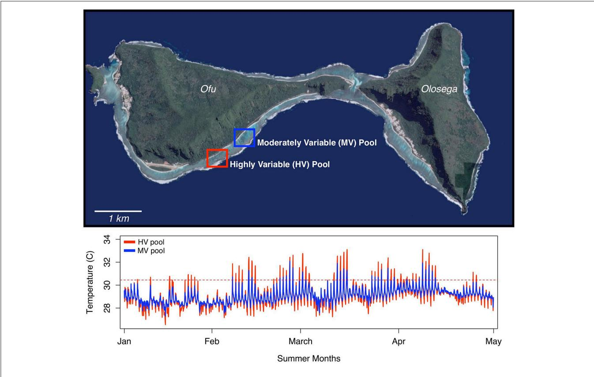
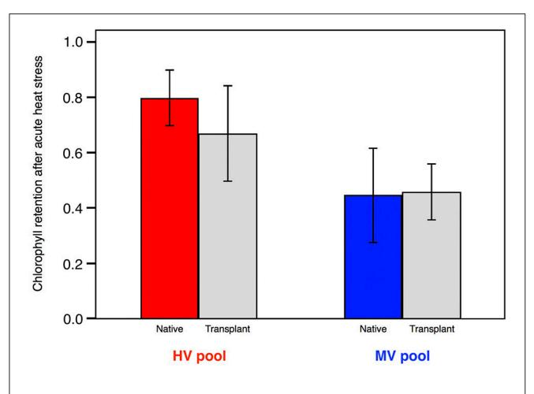
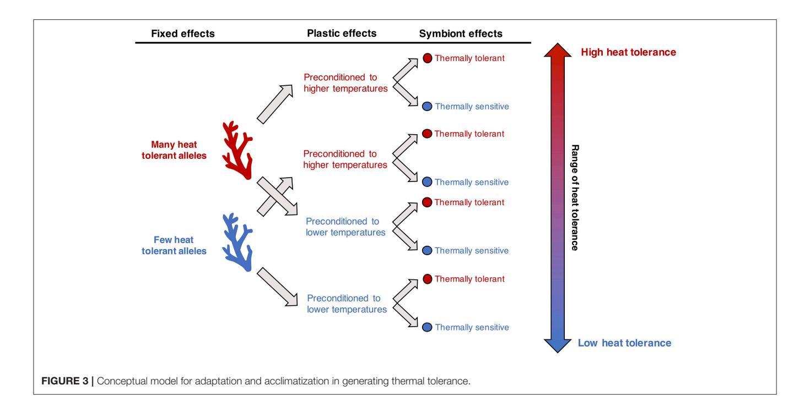
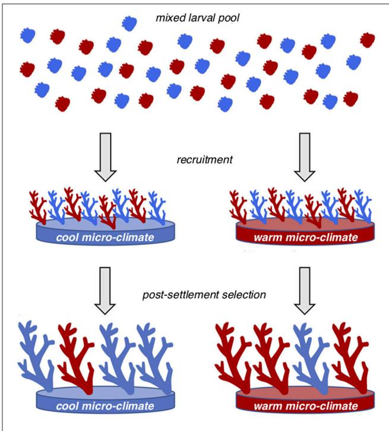
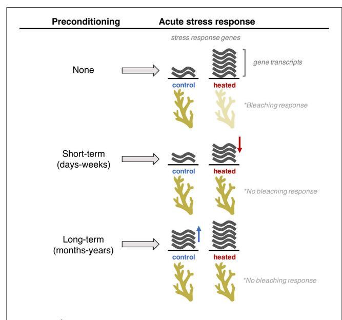

# Mechanisms of Thermal Tolerance in Reef-Building Corals across a [Fine-Grained Environmental Mosaic:](https://www.frontiersin.org/articles/10.3389/fmars.2017.00434/full) Lessons from Ofu, American Samoa

[Luke Thomas](http://loop.frontiersin.org/people/406686/overview) 1 \*, Noah H. Rose2 , Rachael A. Bay 3 , [Elora H. López](http://loop.frontiersin.org/people/508215/overview) 1 , Megan K. Morikawa1 , Lupita Ruiz-Jones 1 and Stephen R. Palumbi 1

1 Biology Department, Stanford University, Hopkins Marine Station, Pacific Grove, CA, United States, 2 Department of Ecology and Evolutionary Biology, Princeton University, Princeton, NJ, United States, 3 Institute of the Environment and Sustainability, University of California, Los Angeles, Los Angeles, CA, United States

#### Edited by:

David Suggett, University of Technology Sydney, Australia

#### Reviewed by:

Jörg Wiedenmann, University of Southampton, United Kingdom Mathieu Pernice, University of Technology Sydney, Australia

#### \*Correspondence:

Luke Thomas [luke.thomas@uwa.edu.au](mailto:luke.thomas@uwa.edu.au)

#### Specialty section:

This article was submitted to Coral Reef Research, a section of the journal Frontiers in Marine Science

Received: 04 May 2017 Accepted: 15 December 2017 Published: 01 February 2018

#### Citation:

Thomas L, Rose NH, Bay RA, López EH, Morikawa MK, Ruiz-Jones L and Palumbi SR (2018) Mechanisms of Thermal Tolerance in Reef-Building Corals across a Fine-Grained Environmental Mosaic: Lessons from Ofu, American Samoa. Front. Mar. Sci. 4:434. doi: [10.3389/fmars.2017.00434](https://doi.org/10.3389/fmars.2017.00434) Environmental heterogeneity gives rise to phenotypic variation through a combination of phenotypic plasticity and fixed genetic effects. For reef-building corals, understanding the relative roles of acclimatization and adaptation in generating thermal tolerance is fundamental to predicting the response of coral populations to future climate change. The temperature mosaic in the lagoon of Ofu, American Samoa, represents an ideal natural laboratory for studying thermal tolerance in corals. Two adjacent back-reef pools approximately 500 m apart have different temperature profiles: the highly variable (HV) pool experiences temperatures that range from 24.5 to 35◦C, whereas the moderately variable (MV) pool ranges from 25 to 32◦C. Standardized heat stress tests have shown that corals native to the HV pool have consistently higher levels of bleaching resistance than those in the MV pool. In this review, we summarize research into the mechanisms underlying this variation in bleaching resistance, focusing on the important reef-building genus Acropora. Both acclimatization and adaptation occur strongly and define thermal tolerance differences between pools. Most individual corals shift physiology to become more heat resistant when moved into the warmer pool. Lab based tests show that these shifts begin in as little as a week and are equally sparked by exposure to periodic high temperatures as constant high temperatures. Transcriptome-wide data on gene expression show that a wide variety of genes are co-regulated in expression modules that change expression after experimental heat stress, after acclimatization, and even after short term environmental fluctuations. Population genetic scans show associations between a corals' thermal environment and its alleles at 100s to 1000s of nuclear genes and no single gene confers strong environmental effects within or between species. Symbionts also tend to differ between pools and species, and the thermal tolerance of a coral is a reflection of individual host genotype and specific symbiont types. We conclude the review by placing this work in the context of parallel research going on in other species, reefs, and ecosystems around the world and into the broader framework of reef coral resilience in the face of climate change.

Keywords: phenotypic plasticity, polygenic adaptation, coral reefs, thermal tolerance, acclimatization, Acropora

#### INTRODUCTION

Species are often spread across heterogeneous environments, and populations that experience different temperature regimes can have markedly different responses and thresholds to thermal stress (Somero, 2010; Pereira et al., 2016). This is particularly true for marine organisms that have large geographic ranges that encompass strong gradients in temperature (Sorte and Hofmann, 2004; Sagarin and Somero, 2006; Dong and Somero, 2009; Kuo and Sanford, 2009). Understanding the mechanisms underlying variation in thermal tolerance within and among species has been a central focus of ecology for decades and is becoming increasingly urgent as climate change intensifies environmental stressors and alters species distributions (Somero, 2010; Wernberg et al., 2016).

Thermal tolerance arises primarily through two mechanisms: acclimatization and adaptation (Chevin et al., 2010; Foo and Byrne, 2016). Acclimatization refers to the physiological plasticity that allows an individual to maintain performance across a range of environments. It represents a physiological response within an organism's lifespan, resulting in a phenotypic shift that is plastic and often reversible. By contrast, adaptation is the result of environmental selection on beneficial genotypes in a population (Barrett and Schluter, 2008; Savolainen et al., 2013). Selection is acting on specific alleles, so these changes are heritable and passed on to the next generation. Thus, while acclimatization can occur within a single individual, adaptation acts between generations.

Coral reefs are dynamic yet fragile ecosystems and are particularly vulnerable to the impacts of climate change (Hoeghguldberg, 1999; Hughes et al., 2003; Hoegh-guldberg et al., 2007). Bleaching sparked by an increase of ocean water temperature has triggered widespread coral mortality over the past decades, including global die-offs in the recent 2015, 2016, and 2017 El Niño years (Hughes et al., 2017). Yet coral reefs occur in a variety of different temperature regimes, with corals in one area able to withstand the same warm temperatures that cause bleaching in their conspecifics from other areas. As the climate warms, natural variation in thermal tolerance will be a key driver in the capacity of corals to cope with rapid environmental change (Palumbi et al., 2014; Dixon et al., 2015; Kleypas et al., 2016); however, there is still much to learn about the underlying mechanisms driving thermal tolerance in reef-building corals.

Environments that are characterized by high levels of temperature variation at fine-spatial scales are ideal settings to unravel the relative roles of phenotypic plasticity and adaptation in thermal tolerance while minimizing the impacts of demographic processes that can confound patterns across broader spatial scales (e.g., latitude). Furthermore, corals thriving in present day extreme thermal environments can offer important insight into the mechanisms of elevated thermal tolerance and the future capacity for reef corals in general to cope with a rapidly warming planet. In this review, we summarize the findings of over a decade of research into the mechanisms of thermal tolerance in corals of the back-reef pools on Ofu, within the Manu'a Islands Group of American Samoa. The corals in these back-reef pools are exposed to a range of tidal temperature fluctuations that give rise to significant physiological differences

between conspecific corals inhabiting different pools. Focused on the important reef-building genus *Acropora*, this work has shown us that the variation in thermal tolerance among pools arises from a combination of acclimatization and adaptation and that there are 100's of genes involved in each mechanism. While acclimatization can greatly elevate the thermal tolerance of individuals at remarkably fine temporal scales, fixed genetic differences facilitate a level of bleaching resistance that cannot be achieved through acclimatization within a single generation. To conclude, we place this work in the context of parallel research going on in other species and in the broader framework of resilience in the face of rapid climate change.

#### THE SETTING

#### Ofu Island

The natural temperature mosaic in the lagoon of Ofu, in the Manu'a Islands Group of American Samoa, is an ideal natural laboratory for studying thermal tolerance in coral. The fringing reef along the southern coast of Ofu lies in the National Park of American Samoa and forms a series of back-reef pools with diverse coral assemblages with ~80 scleractinian species (Craig et al., 2001). During low tides the prominent reef crest obstructs circulation, and water in the back-reef pools becomes stagnant and heats up. On high tides, the pools experience extensive flushing (Koweek et al., 2015). As a result, the corals in these back-reef pools are exposed to wide swings in temperature and irradiance throughout the tidal cycle (Craig et al., 2001; Smith and Birkeland, 2007). The most variable of these pools reach ≥34°C during summer low tides and exhibits daily thermal fluctuations up to 6°C. Corals in these variable back-reef pools have higher stress protein biomarker levels (Barshis et al., 2010) and faster growth rates (Smith et al., 2007) than exposed fore-reef populations.

Within the back-reef, two adjacent pools  $\sim 500$  m apart have different temperature profiles (**Figure 1**). The smaller of the two pools ( $\sim 4,000$  m2, 1.1 m depth at low tide) experiences temperatures that range from 24.5 to 35°C, whereas the larger pool ( $\sim 27,000$  m2, 1.9 m depth at low tide) is characterized by more moderate variation in temperature (25–32°C) (Craig et al., 2001). These pools will hereafter be referred to as the highly variable (HV) pool and the moderately variable (MV) pool, respectively. Both pools harbor diverse coral assemblages that are nearly identical in species diversity and percent live coral cover (Craig et al., 2001).

#### **Standardized Stress Tests**

Exploring variation in thermal tolerance among coral populations from the two pools requires a standardized assay to measure bleaching resistance. In order to do this, a portable stress tank system was developed that provides accurate (within 0.2°C) controllable temperature profiles that can mimic field recordings of reef temperatures (Palumbi et al., 2014). Each tank is made of a 5-gallon cooler equipped with two Peltier chillers and a 200-watt aquarium heater powered by a custom-built interface based on a Newport controller. The typical heat stress profile ramps water temperature from 29 to

FIGURE 1 | Location of the highly variable (HV) and moderately variable (MV) pools on Ofu, in the Manu'a Islands Group of American Samoa. The plot below shows the temperature profiles over the summer months for the two adjacent back-reef pools.

34◦C over 3 h starting about 10 a.m. The tanks hold at 34◦C for 3 h, before cooling back down to 29◦C within an hour. For each heat stress experiment, several coral branches 1–2 cm in length are collected from a set of colonies and placed in control (29◦C) and heated experimental tanks in the morning. The temperature ramp is conducted from 10:00 to 16:00, and bleaching is recorded the next morning, 20 h after the onset of heat stress. Bleaching levels seen 20 h after heating in Acropora corals remained stable in subsequent days of incubation at 29◦C. Heated branches are then compared to branches from the same colonies from control tanks, visually scored on a 1–5 scale [\(Seneca and Palumbi,](#page-12-10) [2015;](#page-12-10) [Rose et al., 2016\)](#page-12-11), and placed in 3 ml of 95% ethanol for chlorophyll spectrophotometric analyses [\(Ritchie, 2008\)](#page-12-12). Samples used for genomic analyses are preserved in RNAlater. It is important to note that different profiles are needed for species with different heat responses. For example, Porites corals often require multiple days of treatment; heat levels high enough to cause a reaction in 1 day often kill the coral outright.

### The Acute Heat Stress Response

Whole transcriptome analysis offers insight into the entire physiology of an organism under stress and is an emerging tool used to explore the stress response in natural populations [\(Franssen et al., 2011\)](#page-11-10). By combining the portable stress assay with RNA sequencing technologies, [Seneca and Palumbi \(2015\)](#page-12-10) showed that colonies of Acropora hyacinthus from both pools mount a large and dynamic physiological response to heat stress that involves thousands of transcripts. These results showed that acute heat stress broadly affects protein processing, cell cycle, and metabolism at first, while the later bleaching response is associated with activity in RNA transport, extracellular matrix, calcification, and DNA replication and repair (Seneca and Palumbi, [2015\)](#page-12-10). In addition, high-resolution temporal sampling every 30 min indicated that components of the transcriptome are significantly upregulated within 90 min following the onset of heat stress [\(Traylor-knowles et al., 2017a\)](#page-13-1). Spatial gene expression visualization using histological techniques showed that this stress response is a complex mix of responses from different cell types [\(Traylor-Knowles et al., 2017b\)](#page-13-2). The data suggest that heat responsive genes occur widely in coral tissues outside of symbiont containing cells and that an expression response to bleaching conditions does not itself signal that a gene is involved in bleaching, but rather may be a component of a generalized stress response [\(Traylor-Knowles et al., 2017b\)](#page-13-2).

The environmental stress response in organisms often consists of a large and dynamic transcriptome response that involves thousands of transcripts. As a result, sorting through the swaths of gene expression data for genes that are more important than others in driving thermal tolerance can be extremely difficult. One solution to this problem is to focus on groups of co-expressed genes rather than looking at genes individually. Co-regulated gene sets, or transcriptional modules, can represent distinct physiological units with individual functional enrichments, environmental responses, and relationships to physiology that simplify interpretations of the stress response.

The acute heat stress response in A. hyacinthus involves changes in thousands of transcripts that can be explained as variation in the expression of a small number of co-regulated transcriptional modules [\(Rose et al., 2016\)](#page-12-11). These modules have various functional enrichments, and the expression of two modules (Module 10 and Module 12) at the onset of heat stress predicted bleaching outcome at the 20-h time point. Module 10 was negatively correlated with bleaching and enriched for extracellular matrix proteins and Module 12 was positively correlated with bleaching and enriched for sequence-specific DNA-binding proteins such as transcription factors and zincfinger proteins. Focusing on co-regulated gene sets instead of individual genes revealed that the most abundant classes of stress responsive genes (e.g., apoptosis genes) are not the most strongly related to variation in bleaching outcomes. Instead, the expression of other less abundant classes of genes (e.g., ETS-family transcription factors) is more strongly related to differences in coral bleaching [\(Rose et al., 2016\)](#page-12-11). These results point to the fact that less abundant classes of genes occupy a potentially pivotal place in coral bleaching gene networks. Extending these analyses to different species and time-points after the onset of heat stress will help further elucidate the true relevance of these transcriptional modules in a gener[alizable](#page-11-1) bleaching response.

#### Pool Differences

Corals native to the HV and MV pools vary in thermal tolerance. Under experimental heat stress, corals from the HV pool had higher rates of chlorophyll retention [\(Palumbi et al.,](#page-12-6) [2014\)](#page-12-6), photosystem II photochemical efficiency and survivorship [\(Oliver and Palumbi, 2011\)](#page-12-13) than the MV pool corals. In addition, variation in thermal tolerance is reflected in differences in gene expression. Corals from both pools mounted a broad transcriptomic response to experimental heat stress (Seneca and Palumbi, [2015\)](#page-12-10); however, corals from the MV pool had greater increases in expression of hundreds of genes [\(Barshis et al., 2013\)](#page-10-2). A large portion of the genes that are differentially responsive between pools are constitutively upregulated under control conditions in corals from the HV pool, suggesting that these genes may start off with a higher level of expression before heat stress [\(Barshis et al., 2013\)](#page-10-2). Transcripts with higher constitutive expression under ambient conditions in HV corals included classic heat stress genes such as Hsp70, TNFRs, peroxidasin, and zinc metalloproteases [\(Barshis et al., 2013\)](#page-10-2). This constitutive frontloading in HV pool corals may enable individual colonies to maintain physiological resilience during frequently encountered environmental stress.

### ACCLIMATIZATION

Phenotypic plasticity can play an important role in the response of marine organisms to rapid environmental change (Chevin et al., [2010\)](#page-11-1). This phenomenon can be defined as the capacity of a single genotype to exhibit a range of phenotypes in response to environmental variation [\(Fordyce, 2006\)](#page-11-11). Limits to acclimatization, the short-term phenotypic adjustment within an individual's lifespan, are set by species-specific physiological constraints [\(Somero, 2010\)](#page-12-0). Acclimatization is particularly relevant for long-lived organisms such as corals in the context of global climate change because this mechanism operates within a single lifespan of an organism and does not require a populationlevel shift in allele frequencies over multiple generations as is the case with evolutionary adaptation.

### Capacity for Acclimatization

Through reciprocal transplantation, acclimatization can be quantified using the equation I = IF + IA. Here, I represents the cumulative phenotypic change between two native populations living in different habitats, measured as the average phenotypic difference divided by the standard deviation. This value is comprised of fixed effects (IF) that are determined by the location of origin of an individual and acclimation effects (IA) that are determined by an organism's response to its local environment. A. hyacinthus colonies from the HV Pool had higher chlorophyll retention after stress tests than did colonies from the MV Pool (**[Figure 2](#page-4-0)**). The difference in chlorophyll retention between populations was I = 2.45, measured as the difference in means divided by the standard deviation. Following a 12-month reciprocal transplantation experiment, colonies of A. hyacinthus from the MV pool transplanted to the HV pool showed significantly (p < 0.001) higher chlorophyll retention during heat stress than the same colonies native to the MV pool (**[Figure 2](#page-4-0)**). Acclimatization also works in the opposite direction, and HV pool corals transplanted to the MV pool dropped their chlorophyll retention to the same level as MV pool natives within 12 months. The overall change in phenotype due to acclimatization (IA = 1.56 SD) was higher but similar to the estimated change caused by fixed effects between pools (I − IA = IE = 0.94 SD). Monitoring phenotypes in native populations and the same colonies after transplants indicated that both fixed effects between pools and acclimatization ability is a primary feature of coral adaptability to heat extremes [\(Palumbi et al.,](#page-12-6) [2014\)](#page-12-6).

#### Mechanisms of Acclimatization

Transcriptome-wide gene expression analyses via RNA-seq on reciprocally transplanted A. hyacinthus colonies revealed 74 genes that were differentially expressed between the two pools when comparing genetically identical coral fragments (Palumbi et al., [2014\)](#page-12-6). These acclimatization genes had annotations for several transcription factors, cell signaling proteins, heat shock and chaperonin proteins, TRAF-type proteins, cytochrome P450, and fluorochromes. Loci with strong components of acclimatization include the Tumor Necrosis Factor Receptor-Associated Factors, the signaling transducers for TNFRs, as well as Ras and Rab proteins, transcription factors and heat shock proteins. Overall, 15 out of the 23 transcriptional modules that comprise the A. hyacinthus stress response system showed

FIGURE 2 | Thermal tolerance, measured as chlorophyll retention following acute heat stress, in A. hyacinthus following 14 months of reciprocal transplantation between the HV and MV pools.

signs of acclimatization after reciprocal transplantation (Rose et al., [2016\)](#page-12-11). These data suggest that acclimatization is in part accomplished through the regulation of co-expressed gene modules.

### Rates of Acclimation

To test the rapidity of acclimation, and determine if it was equally sparked by daily variation in temperature as it is by constant temperatures, [Bay and Palumbi \(2015\)](#page-10-3) exposed colonies of Acropora nana to experimental acclimation treatments mimicking local heat stress conditions (i.e., a stable 31◦C and a variable 29–33◦C acclimation treatment). In both sets of conditions, colonies achieved significant gains in thermal tolerance within 7–11 days [\(Bay and Palumbi, 2015\)](#page-10-3): nubbins acclimated to heat treatments had significantly higher chlorophyll retention than nubbins from the same colonies held at 29◦C prior to acute heat stress. After 7 and 11 days, acclimatized and control coral nubbins showed different transcriptomic responses to acute heat stress. Expression patterns in the absence of acute heat stress did not change compared to the original value after acclimation; coral nubbins had the same baseline transcriptional profiles regardless of whether they were exposed to a short-term heated acclimation treatment. However, almost 900 contigs showed differences in expression levels between acclimated and control corals after acute heat stress, the majority of which could be clustered into two gene modules that were significantly enriched for gene ontology (GO) terms related to carbohydrate metabolism and ribosomal RNA processing [\(Bay and Palumbi, 2015\)](#page-10-3). These data show that rapid acclimation did not change the normal expression levels of any gene. Instead, rapid acclimation sparked the sensitivity of many genes to heat exposure—it adjusted the heat response system, not the normal daily physiology of these corals. This is in contrast to the front loading mechanism seen by [Barshis et al.](#page-10-2) [\(2013\)](#page-10-2) in A. hyacinthus. Those results were from corals native to either pool, suggesting that frontloading is either a longer-term acclimation response or is a reflection of genetic adaptation between pools.

Transcriptome analysis also has shown the impact of very short term environmental stresses on reefs. High-resolution transcriptomic and environmental profiling show that regular exposure to strong tidal cycles triggers a large but transient transcriptional response in A. hyacinthus (Ruiz-Jones and Palumbi, [2017\)](#page-12-14). During a 17-day period of daily monitoring, extreme low tides on days 7 and 8 caused temperatures to spike to above 31.5◦C, eliciting a transcriptional response in A. hyacinthus that involved hundreds of genes (Ruiz-Jones and Palumbi, [2017\)](#page-12-14). These genes could be organized into three coregulated gene sets that were enriched for gene products essential to the unfolded protein response, an ancient cellular response to endoplasmic reticulum (ER) stress. The response was transient and returned to normal expression levels after the temporary heat pulse passed, suggesting a return to homeostasis in the ER when temperatures drop below 30◦C. Under experimental heat stress, the expression of these modules increases to levels above that observed during the extreme low tide, suggesting that the unfolded protein response becomes more intense during severe stress.

### Symbiodinium and Host Thermal Tolerance

A well-documented driver of thermal tolerance in corals is based on the flexible association of individual colonies with Symbiodinium types with inherent differences in thermal tolerance [\(Lajeunesse et al., 2004;](#page-12-15) [Rowan, 2004;](#page-12-16) Berkelmans and van Oppen, [2006;](#page-10-4) [Jones et al., 2008;](#page-11-12) [Hume et al., 2015\)](#page-11-13). Sequencing of the chloroplast 23s rDNA from colonies collected from both Ofu pools showed that corals from the HV pool had significantly higher proportions of Symbiodinium clade D than those from the MV pool in five of the seven species examined [\(Oliver and Palumbi, 2010\)](#page-12-17). The clade D haplotype recovered was shown to be heat resistant elsewhere [\(Rowan, 2004;](#page-12-16) Berkelmans and van Oppen, [2006;](#page-10-4) [Jones et al., 2008\)](#page-11-12). Symbiont type alone, however, could not explain differences in bleaching resistance between pools: colonies from the MV pool that also harbored high levels of clade D experienced declines in photosystem II photochemical efficiencies that were not statistically different from the MV colonies predominantly harboring clade C (Oliver and Palumbi, [2011\)](#page-12-13). In addition, there was little evidence for symbiont switching in A. hyacinthus. Following the 12-months of reciprocal transplantation, MV pool corals transplanted to the HV pool showed an increase in thermal tolerance without a shift in symbiont clade [\(Palumbi et al., 2014\)](#page-12-6). It is important to note, however, that these studies focused on clade-level differences between pools, which remains too course a resolution for studies of thermal tolerance in corals, as sub-cladal differences in thermal tolerance have been widely documented [\(Tchernov et al., 2004;](#page-12-18) [Jones et al., 2008;](#page-11-12) [Sampayo et al., 2008;](#page-12-19) [Fisher et al., 2012;](#page-11-14) Hume et al., [2015\)](#page-11-13).

#### The Microbiome

The coral microbiome is a far less explored realm of the holobiont than Symbiodinium. Bacteria have been well-documented to contribute to the health of other marine organisms and

ecosystems, and metabarcoding approaches have begun to chart the diverse community of bacteria associated with reef corals [\(Ritchie, 2006;](#page-12-20) [Rosenberg et al., 2007;](#page-12-21) [Lema et al., 2012;](#page-12-22) [Ainsworth et al., 2015;](#page-10-5) [Hernandez-Agreda et al., 2017\)](#page-11-15). Yet, the relative role of the microbiome in thermal tolerance remains largely unknown. In Ofu, metabarcoding of the 16S rRNA gene showed that the microbiome of A. hyacinthus is different between the HV and MV pools [\(Ziegler et al., 2017\)](#page-13-3). Additionally, following 17 months of reciprocal transplantation, transplanted colonies shifted their microbial communities to reflect that of the native colonies. In subsequent short-term heat stress experiments, the microbial community shifted as a result of temperature stress in colonies transplanted to the MV pool, but colonies living in the HV pool bleached less and maintained their microbial communities. The robust and stable microbiome of corals from the HV pool was characterized by a consistent set of microbial taxa that were rare in the corals transplanted to the MV pool [\(Ziegler et al., 2017\)](#page-13-3). These results scratch the surface of the dynamics of coral-microbial interactions. In particular, they are based on microbial observations at one point in time. As a result, even though the sampling among pools clearly shows spatial differences, and the transplant experiments allow microbial dynamics to be strongly inferred, the dynamics of microbial communities over space and time is still poorly explored.

#### ADAPTATION

Selection favors specific combinations of alleles that confer beneficial phenotypes [\(Savolainen et al., 2013\)](#page-12-5) and patterns of local adaptation often reflect the thermal history of a given environment. Local adaptation, however, is a balance between selection and gene flow. When gene flow is high, gene swamping can replace locally-adapted alleles with maladaptive ones, and genetic differences between populations are eroded (Tigano and Friesen, [2016\)](#page-13-4). If selection is strong enough to overwhelm the homogenizing effects of gene flow, then locally adapted alleles maintain moderate levels of frequency in the population, and genetic variation is maintained. This kind of population genetic model may be common in long lived, sessile organisms such as redwood trees or corals. Once an individual settles into a location, its survival, growth, and reproduction may depend upon the match of its inherent genetics and its habitat. In these cases, a kind of local lottery selection ensues, in which natural selection generated on a very local scale determines fitness.

#### Fixed Effects

Layered on top of the plastic physiological responses are sets of fixed effects that distinguish populations in the two pools. Following the 12-month reciprocal transplant experiment, corals native to the MV pool increased their thermal tolerance but could not achieve the levels of the HV pool natives [\(Palumbi et al.,](#page-12-6) [2014\)](#page-12-6). MV pool corals transplanted to the HV pool retained significantly less chlorophyll in bleaching experiments than corals native to the HV pool (68 and 80%, respectively). These differences reflect limits on the ability of acclimatization to alter thermal tolerance of a colony, and are ascribed to fixed effects between localities (**[Figure 3](#page-5-0)**). Additionally, HV natives have higher survivorship (22% higher than MV natives) regardless of where they are transplanted [\(Bay and Palumbi, 2017\)](#page-10-6), further evidence of fixed differences between the two pools.

Transcriptome-wide gene expression also identified expression differences depending strictly on the pool of origin and not on the final transplant site. Seventy-one contigs were identified that differed in expression levels depending on the origin of the colonies, including TNFRs, galaxin, superoxide dismutase, immunoglobin e-Fc receptors, and pinin [\(Palumbi et al., 2014\)](#page-12-6). For example, TNFR genes showed a 10-fold difference in expression in colonies native to the HV pool, regardless of whether they were living in the HV pool or transplanted to the MV pool 12-months prior. These results indicate that mediators of coral thermal tolerance have constitutive expression levels that represent signs of genetically based local adaptation. They represent expression polymorphisms that differ between pools. These differences are also amplified in the transcriptional modules, where genetic differences between colonies from the two pools result in constitutive differences in expression of transcriptional modules [\(Rose et al., 2016\)](#page-12-11). For example, corals transplanted from the MV pool to the HV pool had significantly lower expression for Rose Module 12 under heat stress, but MV pool colonies transplanted to the HV pool could not achieve the expression levels of the HV natives. These data suggest that adaptation to thermal stress is in part driven by fixed genetic differences that regulate the coordinated expression of groups of genes.

#### Expression Quantitative Trait Loci

Some of these differences in gene expression can be driven by higher expression of one allele over another. Expression quantitative trait loci (eQTLs) are regions of the genome that contain sequence variants that alter the expression of a gene associated with a quantitative trait [\(Gilad et al., 2008\)](#page-11-16). Individuals that are homozygous for this region—sometimes demarcated by only a single SNP—have different expression compared to individuals homozygous for the alternate allele in that region. Heterozygotes are intermediate, with one allele being expressed more than the other. In this way, expression variation and SNP differences are functionally linked. Because they have such a clear phenotypic effect, expression polymorphisms are a class of variants on which selection can quickly act.

eQTLs that explain gene expression are common in A. hyacinthus and clustered in non-coding regions and among amino-acid changing positions [\(Rose et al., 2017\)](#page-12-23). Some of these eQTLs showed differences in allele frequencies between pools that could be driving the observed expression polymorphisms. For example, individuals with a putative transcription factor Rab-1b ortholog showing a TT genotype at position 292 had twice the expression level of this contig compared with individuals with the AA genotype. Furthermore, AT heterozygotes show intermediate expression. These alleles were present at different frequencies in the HV and MV pools. The A allele was present at ∼50% frequency in the MV pool but was almost entirely absent from the more thermally stressful HV pool. As a result, coral colonies in the MV pool had lower Rab-1b expression compared to colonies in the HV pool.

These analyses are likely to underestimate eQTL occurrence because they are based on RNASeq data which ignore several important regions controlling gene expression, especially gene promoter regions and introns. However, the data show that adaptive differences in gene expression between different coral populations may be related to selection for differences in the frequencies of gene regulatory variants. Future research will benefit from utilizing complete gene models (when available) and focus more closely on regions controlling gene expression, such as promoters, to build a more complete understanding of mechanisms driving differences in gene expression associated with gains in thermal tolerance.

#### Multi-locus Adaptation

Population differentiation based outlier analyses have shown that thermal tolerance in A. hyacinthus is associated with 100's of genes of small effect [\(Bay and Palumbi, 2014\)](#page-10-7). Genomewide patterns of differentiation between pools is low and nonsignificant; however, population differentiation based genome outlier scans have identified hundreds of SNPs putatively under divergent selection (FDR-corrected p < 0.05, FST > 0.05 and bootstrap-resampling tested). Further filtering of these loci for only those that correlated with individual temperature measurements (i.e., time spent above 31◦C for each colony) resulted in more than a hundred loci as likely candidates for directional selection. Minor allele frequencies for these candidate loci were higher in the HV pool, instead of having been evenly distributed among populations as were the non-candidate SNPs. Across all candidate SNPs, each HV pool coral had higher frequencies of minor alleles, on average, compared to the MV pool corals. These results suggest that a large number of loci, each with individually small effect, are contributing to the fixed effects we see between pools in thermal tolerance.

#### SYNTHESIS

### Local Adaptation Amidst High Gene Flow

Gene flow is high among back-reef pools in Ofu, yet populations maintain significant differences in allele frequency at hundreds of loci [\(Bay and Palumbi, 2014\)](#page-10-7). This pattern of local adaptation amidst high gene flow is consistent with the [Levene \(1953\)](#page-12-24) model of spatially varying selection, where recruits from a mixed larval pool are exposed to different selective forces that drive subtle shifts in allele frequencies between micro-environments (**[Figure 4](#page-7-0)**). Local adaptation is a balance between selection and migration (gene flow), and spatially varying selection develops into patterns of genetic differentiation only when selection is strong enough to counteract the effects of gene flow (Savolainen et al., [2013\)](#page-12-5). Simulation studies show that even alleles that are not maintained at intermediate frequencies by balancing selection can contribute to local adaptation; under some circumstances this could lead to persistence of locally adapted populations with a shifting set of genomic variants underlying adaptive differentiation between populations [\(Yeaman, 2015\)](#page-13-5). The existence of significant FST outliers which do not appear to be at stable equilibrium among eel populations that show a Levenetype system may provide evidence for the importance of nonequilibrium processes in local adaptation involving polygenic traits [\(Gagnaire et al., 2012\)](#page-11-17).

A key question that arises from this research is whether the spatial patterns of thermal tolerance and local adaptation identified in the back-reef lagoons of Ofu are ubiquitous across a range of coral reef systems. Do all reef systems

FIGURE 4 | The [Levene \(1953\)](#page-12-24) model of spatially varying selection to explain patterns of local adaption between pools amidst high gene flow.

harbor thermally resilient locally adapted populations? What environmental conditions are associated with the presence of heat adapted alleles? Certainly, the extreme temperature profiles of the HV pool are not unique to Ofu; corals are found in a variety of extreme environments and are exposed to temperatures that would cause bleaching in their conspecifics from other areas [\(Coles and Riegl, 2013;](#page-11-18) [Kline et al., 2015;](#page-11-19) [Richards et al.,](#page-12-25) [2015;](#page-12-25) [Camp et al., 2017\)](#page-10-8). Wide variation in thermal tolerance and genetic divergence has been reported across latitudes and at large-spatial scales [\(Middlebrook et al., 2008;](#page-12-26) Howells et al., [2013;](#page-11-20) [Dixon et al., 2015;](#page-11-7) [Thomas et al., 2017\)](#page-13-6), and it is becoming increasingly clear that locally adapted thermally tolerant pockets of corals exist at fine-spatial scales within a variety of coral reef systems [\(Goreau and Macfarlane, 1990;](#page-11-21) Smith et al., [2007;](#page-12-9) [Barshis et al., 2010;](#page-10-1) [Castillo et al., 2012;](#page-11-22) Kenkel et al., [2013b,](#page-11-23) [2015;](#page-11-24) [Schoepf et al., 2015\)](#page-12-27). For example, Porites astreiodes colonies from the thermally variable inshore patch reef environment of south Florida have greater thermal tolerance than offshore populations less than 10 km away [\(Kenkel et al., 2013a\)](#page-11-25). These populations exhibit significant spatial genetic structure [\(Kenkel et al., 2013b\)](#page-11-23) and reciprocal transplantation experiments confirmed that the physiological differences observed between inshore and offshore populations can be attributed to local adaptation [\(Kenkel et al., 2015\)](#page-11-24). Similarly, Sideerastrea sidera and Montastrea annularis populations from the warmer and more variable back-reef environment of the Mesoamerican Barrier Reef System have greater thermal tolerance than colonies from the more thermally stable fore-reef environment (Castillo and Helmuth, [2005;](#page-11-26) [Castillo et al., 2012\)](#page-11-22). This functional variation has also been reported at extremely fine-scales; intertidal corals of the remote Kimberley region in Western Australia experience aerial exposure and large daily swings in temperature and populations of Acropora aspera and Dipsastraea sp. have greater thermal tolerance than their subtidal conspecific counterparts 10's of meters away [\(Schoepf et al., 2015\)](#page-12-27); however the genetic mechanisms remain unknown. Expanding our portfolio of known "thermally resilient" populations will help fine tune our understanding of molecular mechanisms governing thermal tolerance, thereby creating a more robust and potentially predictive understanding. Common garden experiments show that once identified, heat tolerant corals can be used in transplants to generate bleaching tolerant populations and can significantly improve the success of reef restoration efforts (Morikawa MK, personal communication).

Local adaptation requires a fitness trade-off, and alleles that confer thermal tolerance in one environment must confer lower fitness in the other environment, otherwise a locus would reach fixation for the allele with the higher fitness [\(Savolainen et al.,](#page-12-5) [2013\)](#page-12-5). This is known as reciprocal home site advantage, where adaptation to one environment comes at a cost of adaptation to other environments [\(Hereford, 2009\)](#page-11-27). Fitness related trade-offs associated with local adaptation appear to be widespread in corals [\(Howells et al., 2013;](#page-11-20) [Kenkel et al., 2015;](#page-11-24) [Bay and Palumbi, 2017\)](#page-10-6). A reciprocal transplantation experiment of Acropora millepora between central and southern Great Barrier Reef found signals of local adaptation in fitness related traits including thermal tolerance, reproduction, and growth [\(Howells et al., 2013\)](#page-11-20). In addition, growth trade-offs exist between inshore and offshore populations of P. astreoides [\(Kenkel et al., 2015\)](#page-11-24) and M. annularis [\(Hudson, 1981\)](#page-11-28) in Florida. Similar fitness tradeoffs exist in Ofu, and colonies with the highest survivorship in the HV pool grow less when transplanted to the MV pool [\(Bay and Palumbi, 2017\)](#page-10-6). These studies highlight the fact that although some corals are locally adapted to thermally extreme environments, costs to other fitness related traits can be high and may impede survival in foreign environments.

## The Genetic Architecture of Thermal Tolerance

Accurately modeling the adaptive capacity of coral populations to climate change relies on a concrete understanding of the genetic architecture of thermal tolerance [\(Bay et al., 2017a\)](#page-10-9). Genetic architecture refers to the number, effect size, and distribution of genes that control a phenotypic trait (Gagnaire and Gaggiotti, [2016\)](#page-11-29) and can range from a few genes of large effect (oligogenic) to many genes of small effect (polygenic) [\(Jain and Stephan, 2017\)](#page-11-30). Data from Ofu indicate that thermal tolerance is a polygenic trait, where a number of alleles of small effect across many different cellular pathways are responsible for elevated thermal tolerance of the HV pool corals (Bay and Palumbi, [2014;](#page-10-7) [Palumbi et al., 2014\)](#page-12-6). Polygenic traits are a common feature of high gene flow species and occur widely in marine populations [\(Limborg et al., 2012;](#page-12-28) [Hale et al.,](#page-11-31) [2013;](#page-11-31) [Pespeni et al., 2013;](#page-12-29) [Laporte et al., 2015;](#page-12-30) [Barney et al.,](#page-10-10) [2017\)](#page-10-10).

When selection acts on a phenotype that is driven by a large number of loci, then large allelic shifts may not be evident and alleles will rarely reach fixation. Instead, subtle coordinated changes in allele frequencies across many loci will occur (Berg and Coop, [2014;](#page-10-11) [Yeaman, 2015;](#page-13-5) [Wellenreuther and Hansson,](#page-13-7) [2016\)](#page-13-7). Outlier detection software that scan the genome for large effect loci are thus not capable of providing a complete picture of the genetic architecture of thermal tolerance in corals. However, when gene flow is high, as in most broadcast-spawning corals, adaptation favors the tight clustering of these small effect loci into regions of reduced genetic distance and into areas under low recombination [\(Thompson and Jiggins, 2014;](#page-13-8) [Samuk et al.,](#page-12-31) [2017\)](#page-12-31). In this case, even though a large number of genes may contribute to phenotypic variation, specific chromosomal regions may play a particularly important role in driving evolutionary change. Experimental designs taking advantage of phenotypic variation within and among populations spread across variable environments may help identify these regions. The best example of this in natural populations comes from a recent metaanalysis on threespine stickelbacks, where genomic data from 52 populations showed statistically that adaptive alleles tend to cluster together on chromosomal regions of low recombination [\(Samuk et al., 2017\)](#page-12-31).

Recently, [Dixon et al. \(2015\)](#page-11-7) used inter-latitudinal reciprocal back crossing to identify two genomic regions of ∼100 cM in size that strongly respond to heat selection in larval populations of A. millepora from the GBR. This study paves the way for future research that explores the genetic architecture of thermal tolerance in corals; however; it is important to note that studies on model systems with large sample sizes often exceeding a thousand individuals still struggle to identify genes of significant impact for certain phenotypes, representing a cautionary tale for this pursuit in corals [\(Rockman, 2012\)](#page-12-32).

### Thermal History and Bleaching Susceptibility

Data from Ofu show that corals have a remarkable capacity to shift their physiology in response to environmental variation [\(Palumbi et al., 2014;](#page-12-6) [Bay and Palumbi, 2015\)](#page-10-3). Early examples of this phenotypic plasticity come from work on photo-acclimation, where individual colonies showed shifts in morphology and physiology in response to changes in solar radiation [\(Dustan,](#page-11-32) [1973;](#page-11-32) [Willis, 1985;](#page-13-9) [Brown, 1997\)](#page-10-12). For example, reciprocal transplant studies of Turbinaria mesenterina along a depth gradient revealed significant changes in morphology depending on transplant site; colony growth became more vertical in transplants from deep to shallow water, presumably to reduce light attenuation [\(Willis, 1985\)](#page-13-9).

More recently, focus has shifted toward understanding the plasticity of thermal tolerance in corals, and numerous studies have identified a direct link between thermal preconditioning and bleaching susceptibility from both field observations (Castillo and Helmuth, [2005;](#page-11-26) [Maynard et al., 2008;](#page-12-33) Thompson and van Woesik, [2009;](#page-13-10) [Castillo et al., 2012;](#page-11-22) [Shuail et al., 2016\)](#page-12-34) and experimental manipulation [\(Brown et al., 2000,](#page-10-13) [2002;](#page-10-14) Dove et al., [2006;](#page-11-33) [Middlebrook et al., 2008;](#page-12-26) [Bellantuono et al., 2012b;](#page-10-15) [Bay and Palumbi, 2015\)](#page-10-3). For example, Acropora, Pocillopora, and Porites from the Great Barrier Reef showed lower rates of bleaching during the 2002 bleaching event than the 1998 event, despite more intense conditions during the 2002 event (Maynard et al., [2008\)](#page-12-33). [Bellantuono et al. \(2012b\)](#page-10-15) showed that short-term experimental preconditioning to sub-bleaching temperatures results in gains in thermal tolerance without shifts in symbiont type [\(Bellantuono et al., 2012b\)](#page-10-15).

Acclimatization as a mechanism for increased thermal tolerance, however, is most effective if the rates and limits match the dynamics of the environment. In the context of coral bleaching events, heat stress from extreme climatic events that generally drive bleaching occurs on the time-scale of weeks, so acclimatization would need to occur within this time-scale in order to be effective against warming water temperatures. Indeed, data from Ofu show that significant gains in thermal tolerance can be achieved within roughly a week of preconditioning (Bay and Palumbi, [2015\)](#page-10-3). Similarly, studies from other regions and on other coral taxa have revealed significant gains in thermal tolerance after days of preconditioning [\(Brown et al., 2002;](#page-10-14) [Dove et al., 2006;](#page-11-33) [Middlebrook et al., 2008;](#page-12-26) [Bellantuono et al.,](#page-10-15) [2012b\)](#page-10-15). For example, [Middlebrook et al. \(2008\)](#page-12-26) showed that gains in thermal tolerance in A. aspera can occur in as little as 48 h of preconditioning. A similar response was observed in A. millepora following 8 days of experimental preconditioning to sub-bleaching temperatures [\(Bellantuono et al., 2012a\)](#page-10-16). That corals can increase their thermal tolerance this quickly suggests that short term acclimation may be a key mechanism for resilience in the face of warming waters.

In A. hyacinthus, elevated thermal tolerance following thermal preconditioning is in part achieved through transcriptome dampening, where preconditioned colonies show a lessermagnitude response to acute heat stress in certain stress response genes. This is accomplished through two fundamentally different pathways depending on the duration of preconditioning (**[Figure 5](#page-9-0)**). Short-term acclimation is attained through reduced expression of stress response genes under acute heat stress [\(Bay and Palumbi, 2015\)](#page-10-3), whereas long-term acclimatization involves a shift in baseline expression under control conditions, referred to as "frontloading" [\(Barshis et al., 2013;](#page-10-2) Palumbi et al., [2014\)](#page-12-6). The dampening of stress response genes following short-term preconditioning has also been reported in studies on A. millepora from the Great Barrier Reef, which showed a lesser magnitude response of genes associated with apoptotic signaling to acute heat stress following 10 days of preconditioning [\(Bellantuono et al., 2012a\)](#page-10-16). Moreover, [Gates and Edmunds](#page-11-34) [\(1999\)](#page-11-34) showed that exposure to heat stress triggers upregulation of heat shock proteins in Montastrea franksi but a return to normal expression at 12 h despite continued exposure to heat stress, indicative of acclimatization to elevated temperatures. In addition, an organism's physiological response to environmental change reflects the intensity and frequency of the stressor. For example, elevated thermal tolerance of inshore P. astreoides in Florida is achieved through a varying capacity for gene expression plasticity, where colonies from the more variable and warmer inshore environment show a higher capacity for shifting expression of stress response genes than colonies from

FIGURE 5 | Pathways of acclimatization to elevated temperatures. Short-term preconditioning results in the reduced expression of stress response genes during acute heat stress. Long-term preconditioning results in a fundamental shift in baseline expression of stress response genes ("frontloading").

offshore sites [\(Kenkel and Matz, 2016\)](#page-11-35). In Ofu, daily variation in temperature is frequent enough to spark fundamental shifts in baseline expression [\(Barshis et al., 2013\)](#page-10-2), while seasonal differences in South Florida are not frequent enough to alter baseline expression but is instead achieved through short-term expression plasticity [\(Kenkel and Matz, 2016\)](#page-11-35).

Although phenotypic plasticity of the coral animal is one mechanism of acclimatization to environmental stress, the dynamic symbiotic relationship with dinoflagellates of the genus Symbiodinium offers an additional pathway to elevated thermal tolerance [\(Berkelmans and van Oppen, 2006;](#page-10-4) [Jones et al.,](#page-11-12) [2008;](#page-11-12) [Cooper et al., 2011;](#page-11-36) [Hume et al., 2016\)](#page-11-37). In Ofu, subtle differences in temperature among pools give rise to differences in Symbiodinium communities between habitats, with clade D occurring at higher frequencies in HV pool corals (Oliver and Palumbi, [2010;](#page-12-17) [Palumbi et al., 2014\)](#page-12-6). This is consistent with a wide range of literature that have reported high proportions of clade D in colonies from more thermally extreme environments or in those that have historically encountered high levels of heat stress [\(Baker et al., 2004;](#page-10-17) [Berkelmans and van Oppen, 2006;](#page-10-4) [Jones et al., 2008;](#page-11-12) [Keshavmurthy et al., 2012\)](#page-11-38). Although there are clear differences in symbiont communities between pools in Ofu, colonies of A. hyacinthus show a limited capacity to shuffle their symbionts when transplanted to a different environment [\(Palumbi et al., 2014\)](#page-12-6). Furthermore, the type of symbiont a coral harbored did not explain differences in thermal tolerance among pools [\(Palumbi et al., 2014\)](#page-12-6). These data suggest that the higher prevalence of clade D in HV corals does not occur primarily because of symbiont shifts in adult corals as the external environment changes. Instead, clade C or D dominance may occur during early settlement stages or at young colony ages. As is the case with the coral host, however, adaptation and acclimatization of the symbiont represent additional pathways to rapid acclimatization and is a rapidly growing area of research [\(Howells et al., 2011;](#page-11-39) [Baums et al., 2014;](#page-10-18) [Hume et al., 2016\)](#page-11-37).

## Evolution in the Face of Environmental Change

As the climate warms, changes to the physical and chemical properties of the ocean pose serious challenges to the future health of marine populations. This is particularly true for corals living close to their upper thermal thresholds. Rapid adaptive responses to climate change are wide-spread in the terrestrial literature and are predominantly associated with timing of reproduction and activity [\(Hoffmann and Sgrò, 2011\)](#page-11-40). Marine fishes have also shown a high capacity for rapid adaptation [\(Bernatchez, 2016;](#page-10-19) [Reid et al., 2016;](#page-12-35) [Vera et al., 2016\)](#page-13-11). For corals, however, it remains unclear whether populations are capable of keeping up with the pace of environmental change.

Although reef-building coral populations are experiencing wide-spread die offs in the Anthropocene [\(Hughes et al., 2017\)](#page-11-6), in many ways corals have the necessary tool-kit to cope with nearfuture climate change. Firstly, corals generally have large effective populations sizes with high levels of genetic diversity. Standing genetic variation is a key component of the adaptive capacity to environmental change as higher levels of genetic diversity provide a greater probability of achieving allelic combinations that confer beneficial phenotypes in the new environment [\(Barrett and Schluter, 2008\)](#page-10-0). Secondly, coral species span strong temperature gradients and as a result likely have an abundance of genetic variation in traits associated with thermal tolerance. Thirdly, the main reproductive mode of corals is via broadcast spawning [\(Baird et al., 2009\)](#page-10-20), with larvae capable of dispersing large distances [\(Ayre and Hughes, 2000;](#page-10-21) [Miller and Ayre, 2008;](#page-12-36) [Davies et al., 2014\)](#page-11-41). This means that coral populations are generally characterized by high levels of gene flow, so the exchange of beneficial genetic variants among populations spread across large areas is high. Furthermore, a high dispersal capacity means that they have a high capacity for colonizing novel habitats that become suitable as isotherms shift poleward. The rate of expansion of leading edge-populations in the ocean on average is an order of magnitude higher than that observed on land [\(Poloczanska et al., 2013\)](#page-12-37). Fourthly, coral populations show a remarkable capacity for phenotypic plasticity and can rapidly shift their physiology to cope with repeated stress events. Phenotypic plasticity can also be adaptive, and recent studies show that this trait provides resilience to frequently encountered environmental variation [\(Kenkel and Matz, 2016\)](#page-11-35).

Such mechanisms set the stage for short-scale local adaptation over space but can also allow rapid evolution over time. Unlike on land where many long-lived animals have limited capacity for rapid evolution because of long generation times and low genetic diversity [\(Romiguier et al., 2014\)](#page-12-38), even long-lived corals may show adaptability. [Bay et al. \(2017b\)](#page-10-22) estimated evolutionary rates in A. hyacinthus in the face of warming ocean temperatures by examining a high latitude population in the Cook Islands for the same putative warm-adapted alleles found in the more equatorial Samoa archipelago. Under a multi-locus model in which a colony's inherent thermal tolerance was proportional to the number of heat tolerant alleles it had inherited, they could project the Cook Island population's level of heat adaptation under various climate scenarios. Under this evolutionary model, they predicted successful adaptation under mild buildup of atmospheric CO2, but failure under more extensive CO2 emissions. Such predictions are sensitive to the evolutionary models used and the genomic architecture of adaptation—for example if thermal tolerance alleles are clustered in short genomic regions as in [Dixon et al. \(2015\)](#page-11-7), then evolutionary adaptation might be more rapid. There is also an interaction between acclimatization and adaptation. An acclimated individual experiences less environmental stress than a non-acclimated individual, and stress induced fitness loss may be less. This has been called the "Beneficial Acclimation Hypothesis" [\(Kingsolver and Huey, 1998\)](#page-11-42), and the process of natural selection on tolerance of extremes may be slower in such cases [\(Seebacher et al., 2014\)](#page-12-39). This increases population fitness in the short term, but may decrease it in the long term. Such a situation may be observed on the Great Barrier Reef when protective pulses of short-term, warm water occur before bleaching events [\(Ainsworth et al., 2016\)](#page-10-23).

These overlapping mechanisms of adaptability will play a key role in the future of coral populations as they encounter climate change over the next century. Whether they are sufficient to allow populations to persist, and over what spatial scales, is a key question. The layered capacity of adaptability in corals is a major asset to their population persistence under some future climate scenarios. Research on the capacity of corals to persist despite local, global, and existential threats will require multi-species, multi-stressor, and multi-disciplinary efforts.

#### AUTHOR CONTRIBUTIONS

LT and SRP conceived the study and drafted the manuscript. All authors edited the manuscript and gave final approval.

#### FUNDING

This project was funded by the National Science Foundation and the Gordon and Betty Moore Foundation.

### REFERENCES

- Ainsworth, T. D., Heron, S. F., Ortiz, J. C., Mumby, P. J., Grech, A., Ogawa, D., et al. (2016). Climate change disables coral bleaching protection on the Great Barrier Reef. Science 352, 338–342. doi: [10.1126/science.aac7125](https://doi.org/10.1126/science.aac7125)
- Ainsworth, T. D., Krause, L., Bridge, T., Torda, G., Raina, J., Zakrzewski, M., et al. (2015). The coral core microbiome identifies rare bacterial taxa as ubiquitous endosymbionts. ISME J. 9, 2261–2274. doi: [10.1038/ismej.2015.39](https://doi.org/10.1038/ismej.2015.39)
- Ayre, D. J., and Hughes, T. P. (2000). Genotypic diversity and gene flow in brooding and spawning corals along the Great Barrier Reef, Australia. Evolution 54, 1590–1605. doi: [10.1111/j.0014-3820.2000.tb00704.x](https://doi.org/10.1111/j.0014-3820.2000.tb00704.x)
- Baird, A. H., Guest, J. R., and Willis, B. L. (2009). Systematic and biogeographical patterns in the reproductive biology of scleractinian corals. Annu. Rev. Ecol. Evol. Syst. 40, 551–571. doi: [10.1146/annurev.ecolsys.110308.120220](https://doi.org/10.1146/annurev.ecolsys.110308.120220)
- Baker, A. C., Starger, C., McClanahan, T., and Glynn, P. (2004). Corals' adaptive response to climate change. Nature 430:741. doi: [10.1038/430741a](https://doi.org/10.1038/430741a)
- Barney, B. T., Munkholm, C., Walt, D. R., and Palumbi, S. R. (2017). Highly localized divergence within supergenes in Atlantic cod (Gadus morhua) within the Gulf of Maine. BMC Genomics 18:271. doi: [10.1186/s12864-017-3660-3](https://doi.org/10.1186/s12864-017-3660-3)
- Barrett, R. D. H., and Schluter, D. (2008). Adaptation from standing genetic variation. Trends Ecol. Evol. 23, 38–44. doi: [10.1016/j.tree.2007.09.008](https://doi.org/10.1016/j.tree.2007.09.008)
- Barshis, D. J., Ladner, J. T., Oliver, T., Seneca, F. O., Traylor-Knowles, N., and Palumbi, S. R. (2013). Genomic basis for coral resilience to climate change. Proc. Natl. Acad. Sci. U.S.A. 110, 1387–1392. doi: [10.1073/pnas.1210224110](https://doi.org/10.1073/pnas.1210224110)
- Barshis, D. J., Stillman, J. H., Gates, R. D., Toonen, R. J., Smith, L. W., and Birkeland, C. (2010). Protein expression and genetic structure of the coral Porites lobata in an environmentally extreme Samoan back reef: does host genotype limit phenotypic plasticity? Mol. Ecol. 19, 1705–1720. doi: [10.1111/j.1365-294X.2010.04574.x](https://doi.org/10.1111/j.1365-294X.2010.04574.x)
- Baums, I. B., Devlin-Durante, M. K., and LaJeunesse, T. C. (2014). New insights into the dynamics between reef corals and their associated dinoflagellate endosymbionts from population genetic studies. Mol. Ecol. 23, 4203–4215. doi: [10.1111/mec.12788](https://doi.org/10.1111/mec.12788)
- Bay, R. A., and Palumbi, S. R. (2014). Multilocus adaptation associated with heat resistance in reef-building corals. Curr. Biol. 24, 2952–2956. doi: [10.1016/j.cub.2014.10.044](https://doi.org/10.1016/j.cub.2014.10.044)
- Bay, R. A., and Palumbi, S. R. (2015). Rapid acclimation ability mediated by transcriptome changes in reef-building corals. Genome Biol. Evol. 7, 1602–1612. doi: [10.1093/gbe/evv085](https://doi.org/10.1093/gbe/evv085)

- Bay, R. A., and Palumbi, S. R. (2017). Transcriptome predictors of coral survival and growth in a highly variable environment. Ecol. Evol. 7, 4794–4803. doi: [10.1002/ece3.2685](https://doi.org/10.1002/ece3.2685)
- Bay, R. A., Rose, N., Barrett, R., Bernatchez, L., Ghalambor, C. K., Lasky, J. R., et al. (2017a). Predicting responses to contemporary environmental change using evolutionary response architectures. Am. Nat. 189, 463–473. doi: [10.1086/691233](https://doi.org/10.1086/691233)
- Bay, R. A., Rose, N. H., Logan, C. A., and Palumbi, S. R. (2017b). Genomic models predict successful coral adaptation if future ocean warming rates are reduced. Sci. Adv. 3:e1791413. doi: [10.1126/sciadv.1701413](https://doi.org/10.1126/sciadv.1701413)
- Bellantuono, A. J., Granados-Cifuentes, C., Miller, D. J., Hoegh-guldberg, O., and Rodriguez-Lanetty, M. (2012a). Coral thermal tolerance: tuning gene expression to resist thermal stress. PLoS ONE 7:e50685. doi: [10.1371/journal.pone.0050685](https://doi.org/10.1371/journal.pone.0050685)
- Bellantuono, A. J., Hoegh-guldberg, O., and Rodriguez-Lanetty, M. (2012b). Resistance to thermal stress in corals without changes in symbiont composition. Proc. Biol. Sci. 279, 1100–1107. doi: [10.1098/rspb.2011.1780](https://doi.org/10.1098/rspb.2011.1780)
- Berg, J. J., and Coop, G. (2014). A population genetic signal of polygenic adaptation. PLoS Genet. 10:e1004412. doi: [10.1371/journal.pgen.1004412](https://doi.org/10.1371/journal.pgen.1004412)
- Berkelmans, R., and van Oppen, M. J. H. (2006). The role of zooxanthellae in the thermal tolerance of corals: a "nugget of hope" for coral reefs in an era of climate change. Proc. Biol. Sci. [273, 2305–2312. doi: 10.1098/rspb.](https://doi.org/10.1098/rspb.2006.3567) 2006.3567
- Bernatchez, L. (2016). On the maintenance of genetic variation and adaptation to environmental change: considerations from population genomics in fishes. J. Fish Biol. 89, 2519–2556. doi: [10.1111/jfb.13145](https://doi.org/10.1111/jfb.13145)
- Brown, B. E. (1997). Adaptations of reef corals to physical environmental stress. Adv. Mar. Biol. 31, 221–299. doi: [10.1016/S0065-2881\(08\)60224-2](https://doi.org/10.1016/S0065-2881(08)60224-2)
- Brown, B. E., Downs, C. A., Dunne, R. P., and Gibb, S. W. (2002). Exploring the basis of thermotolerance in the reef coral Gonistrea aspera. Mar. Ecol. Prog. Ser. 242, 119–129. doi: [10.3354/meps242119](https://doi.org/10.3354/meps242119)
- Brown, B. E., Dunne, R. P., Warner, M. E., Ambarsari, I., Fitt, W. K., Gibb, S. W., et al. (2000). Damage and recovery of Photosystem II during a manipulative field experiment on solar bleaching in the coral Goniastrea aspera. Mar. Ecol. Prog. Ser. 195, 117–124. doi: [10.3354/meps195117](https://doi.org/10.3354/meps195117)
- Camp, E. F., Nitschke, M. R., Rodolfo-Metalpa, R., Houlbreque, F., Gardner, S. G., Smith, D. J., et al. (2017). Reef-building corals thrive within hot[acidified and deoxygenated waters.](https://doi.org/10.1038/s41598-017-02383-y) Sci. Rep. 7:2434. doi: 10.1038/s41598-017- 02383-y

- Castillo, K. D., and Helmuth, B. S. T. (2005). Influence of thermal history on the response of Montastraea annularis to short-term temperature exposure. Mar. Biol. 148, 261–270. doi: [10.1007/s00227-005-0046-x](https://doi.org/10.1007/s00227-005-0046-x)
- Castillo, K. D., Ries, J. B., Weiss, J. M., and Lima, F. P. (2012). Decline of forereef corals in response to recent warming linked to history of thermal exposure. Nat. Clim. Chang. 2, 756–760. doi: [10.1038/nclimate1577](https://doi.org/10.1038/nclimate1577)
- Chevin, L., Lande, R., and Mace, G. M. (2010). Adaptation, plasticity, and extinction in a changing environment : towards a predictive theory. Plos Biol. 8:e1000357. doi: [10.1371/journal.pbio.1000357](https://doi.org/10.1371/journal.pbio.1000357)
- Coles, S. L., and Riegl, B. M. (2013). Thermal tolerances of reef corals in the Gulf: a review of the potential for increasing coral survival and adaptation to climate change through assisted translocation. Mar. Pollut. Bull. 72, 323–332. doi: [10.1016/j.marpolbul.2012.09.006](https://doi.org/10.1016/j.marpolbul.2012.09.006)
- Cooper, T. F., Berkelmans, R., Ulstrup, K. E., Weeks, S., Radford, B., Jones, A. M., et al. (2011). Environmental factors controlling the distribution of symbiodinium harboured by the coral Acropora millepora on the Great Barrier Reef. PLoS ONE 6:e25536. doi: [10.1371/journal.pone.0025536](https://doi.org/10.1371/journal.pone.0025536)
- Craig, P., Birkeland, C., and Belliveau, S. (2001). High temperatures tolerated by a diverse assemblage of shallow-water corals in American Samoa. Coral Reefs 20, 185–189. doi: [10.1007/s003380100159](https://doi.org/10.1007/s003380100159)
- Davies, S. W., Treml, E., Kenkel, C. D., and Matz, M. V. (2014). Exploring the role of Micronesian islands in the maintenance of coral genetic diversity in the Pacific Ocean. Mol. Ecol. 24, 70–82. doi: [10.1111/mec.13005](https://doi.org/10.1111/mec.13005)
- Dixon, G. B., Davies, S., Aglyamova, G., Meyer, E., Bay, L. K., and Matz, M. V. (2015). Genomic determinants of coral heat tolerance across latitudes. Science 348, 1460–1462. doi: [10.1126/science.1261224](https://doi.org/10.1126/science.1261224)
- Dong, Y., and Somero, G. N. (2009). Temperature adaptation of cytosolic malate dehydrogenases of limpets (genus Lottia): differences in stability and function due to minor changes in sequence correlate with biogeographic and vertical distributions. J. Exp. Biol. 212, 169–177. doi: [10.1242/jeb.024505](https://doi.org/10.1242/jeb.024505)
- Dove, S., Ortiz, J. C., Enríquez, S., Fine, M., Fisher, P., Prieto, R. I., et al. (2006). Response of holosymbiont pigments from the scleractinian coral Montipora monasteriata to short-term heat stress. Limnol. Oceanogr. 51, 1149–1158. doi: [10.4319/lo.2006.51.2.1149](https://doi.org/10.4319/lo.2006.51.2.1149)
- Dustan, P. (1973). Distribution of zooxanthellae and photosynthetic chloroplast pigments of the reef-building coral Montastrea. Bull. Mar. Sci. 29, 79–95.
- Fisher, P. L., Malme, M. K., and Dove, S. (2012). The effect of temperature stress on coral–Symbiodinium associations containing distinct symbiont types. Coral Reefs 31, 473–485. doi: [10.1007/s00338-011-0853-0](https://doi.org/10.1007/s00338-011-0853-0)
- Foo, S. A., and Byrne, M. (2016). Acclimatization and adaptive capacity of marine species in a changing ocean. Adv. Mar. Biol. 74, 69–116. doi: [10.1016/bs.amb.2016.06.001](https://doi.org/10.1016/bs.amb.2016.06.001)
- Fordyce, J. A. (2006). The evolutionary consequences of ecological interactions mediated through phenotypic plasticity. J. Exp. Biol. 209, 2377–2383. doi: [10.1242/jeb.02271](https://doi.org/10.1242/jeb.02271)
- Franssen, S. U., Gu, J., Bergmann, N., Winters, G., Klostermeier, U. C., Rosenstiel, P., et al. (2011). Transcriptomic resilience to global warming in the seagrass Zostera marina, a marine foundation species. Proc. Natl. Acad. Sci. U.S.A. 108, 19276–19281. doi: [10.1073/pnas.1107680108](https://doi.org/10.1073/pnas.1107680108)
- Gagnaire, P. A., and Gaggiotti, O. E. (2016). Detecting polygenic selection in marine populations by combining population genomics and quantitative genetics approaches. Curr. Zool. 62, 603–616. doi: [10.1093/cz/zow088](https://doi.org/10.1093/cz/zow088)
- Gagnaire, P. A., Normandeau, E., Côté, C., Hansen, M. M., and Bernatchez, L. (2012). The genetic consequences of spatially varying selection in the panmictic american eel (Anguilla rostrata). Genetics 190, 725–736. doi: [10.1534/genetics.111.134825](https://doi.org/10.1534/genetics.111.134825)
- Gates, R. D., and Edmunds, P. J. (1999). The physiological mechanisms of acclimatization in tropical reef corals. Am. Zool. 39, 30–43. doi: [10.1093/icb/39.1.30](https://doi.org/10.1093/icb/39.1.30)
- Gilad, Y., Rifkin, S. A., and Pritchard, J. K. (2008). Revealing the architecture of gene regulation: the promise of eQTL studies. Trends Genet. 24, 408–415. doi: [10.1016/j.tig.2008.06.001](https://doi.org/10.1016/j.tig.2008.06.001)
- Goreau, T. J., and Macfarlane, A. H. (1990). Coral Reefs following the 1987-1988 coral-bleaching event. Coral Reefs 8, 211–215. doi: [10.1007/BF00265013](https://doi.org/10.1007/BF00265013)
- Hale, M. C., Thrower, F. P., Berntson, E. A., Miller, M. R., and Nichols, K. M. (2013). Evaluating adaptive divergence between migratory and nonmigratory ecotypes of a salmonid fish, Oncorhynchus mykiss. Gene Genomes Genet. 3, 1273–1285. doi: [10.1534/g3.113.006817](https://doi.org/10.1534/g3.113.006817)

- Hereford, J. (2009). A quantitative survey of local adaptation and fitness trade-offs. Am. Nat. 173, 579–588. doi: [10.1086/597611](https://doi.org/10.1086/597611)
- Hernandez-Agreda, A., Gates, R. D., and Ainsworth, T. D. (2017). Defining the core microbiome in corals' microbial soup. Trends Microbiol. 25, 125–140. doi: [10.1016/j.tim.2016.11.003](https://doi.org/10.1016/j.tim.2016.11.003)
- Hoegh-guldberg, O. (1999). Climate change, coral bleaching and the future of the world's coral reefs. Mar. Freshw. Res. 50, 839–866.
- Hoegh-guldberg, O., Mumby, P. J., Hooten, A. J., Steneck, R. S., Greenfield, P., Gomez, E., et al. (2007). Coral reefs under rapid climate change and ocean acidification. Science 318, 1737–1742. doi: [10.1126/science.1152509](https://doi.org/10.1126/science.1152509)
- Hoffmann, A. A., and Sgrò, C. M. (2011). Climate change and evolutionary adaptation. Nature 470, 479–485. doi: [10.1038/nature09670](https://doi.org/10.1038/nature09670)
- Howells, E. J., Beltran, V. H., Larsen, N. W., Bay, L. K., Willis, B. L., and van Oppen, M. J. H. (2011). Coral thermal tolerance shaped by local adaptation of photosymbionts. Nat. Clim. Chang. 2, 116–120. doi: [10.1038/nclimate1330](https://doi.org/10.1038/nclimate1330)
- Howells, E. J., Berkelmans, R., van Oppen, M. J. H., Willis, B. L., and Bay, L. K. (2013). Historical thermal regimes define limits to coral acclimatization. Ecology 94, 1078–1088. doi: [10.1890/12-1257.1](https://doi.org/10.1890/12-1257.1)
- Hudson, J. H. (1981). Growth rates in Montastrea annularis: a record of environmental change in key largo reef marine sanctuary, florida. Bull. Mar. Sci. 31, 444–459.
- Hughes, T. P., Baird, A. H., Bellwood, D. R., Card, M., Connolly, S. R., Folke, C., et al. (2003). Climate change, human impacts and the resilience of coral reefs. Science 301, 929–933. doi: [10.1126/science.1085046](https://doi.org/10.1126/science.1085046)
- Hughes, T. P., Barnes, M. L., Bellwood, D. R., Cinner, J. E., Cumming, G. S., Jackson, J. B. C., et al. (2017). Coral reefs in the Anthropocene. Nature 546, 82–90. doi: [10.1038/nature22901](https://doi.org/10.1038/nature22901)
- Hume, B. C., D'Angelo, C., Smith, E. G., Stevens, J. R., Burt, J., and Wiedenmann, J. (2015). Symbiodinium thermophilum sp. nov., a thermotolerant symbiotic alga prevalent in corals of the world's hottest sea, the Persian/Arabian Gulf. Sci. Rep. 5:8562. doi: [10.1038/srep08562](https://doi.org/10.1038/srep08562)
- Hume, B. C., Voolstra, C. R., Arif, C., D'Angelo, C., Burt, J. A., Eyal, G., et al. (2016). Ancestral genetic diversity associated with the rapid spread of stress-tolerant coral symbionts in response to Holocene climate change. Proc. Natl. Acad. Sci. 113, 4416–4421. doi: [10.1073/pnas.1601910113](https://doi.org/10.1073/pnas.1601910113)
- Jain, K., and Stephan, W. (2017). Modes of rapid polygenic adaptation. Mol. Biol. Evol. 34, 3169–3175. doi: [10.1093/molbev/msx240](https://doi.org/10.1093/molbev/msx240)
- Jones, A. M., Berkelmans, R., van Oppen, M. J. H., Mieog, J. C., and Sinclair, W. (2008). A community change in the algal endosymbionts of a scleractinian coral following a natural bleaching event: field evidence of acclimatization. Proc. R. Soc. B Biol. Sci. 275, 1359–1365. doi: [10.1098/rspb.2008.0069](https://doi.org/10.1098/rspb.2008.0069)
- Kenkel, C. D., Almanza, A. T., and Matz, M. V. (2015). Fine-scale environmental specialization of reef-building corals might be limiting reef recovery in the Florida Keys. Ecology 96, 3197–3212. doi: [10.1890/14-2297.1](https://doi.org/10.1890/14-2297.1)
- Kenkel, C. D., Goodbody-Gringley, G., Caillaud, D., Davies, S. W., Bartels, E., and Matz, M. V. (2013a). Evidence for a host role in thermotolerance divergence between populations of the mustard hill coral (Porites astreoides) from different reef environments. Mol. Ecol. 22, 4335–4348. doi: [10.1111/mec.12391](https://doi.org/10.1111/mec.12391)
- Kenkel, C. D., and Matz, M. V (2016). Enhanced gene expression plasticity as a mechanism of adaptation to a variable environment in a reef-building coral. Nat. Ecol. Evol. 1, 59667. doi: [10.1038/s41559-016-0014](https://doi.org/10.1038/s41559-016-0014)
- Kenkel, C. D., Meyer, E., and Matz, M. V. (2013b). Gene expression under chronic heat stress in populations of the mustard hill coral (Porites astreoides) from different thermal environments. Mol. Ecol. 22, 4322–4334. doi: [10.1111/mec.12390](https://doi.org/10.1111/mec.12390)
- Keshavmurthy, S., Hsu, C. M., Kuo, C. Y., Meng, P. J., Wang, J. T., and Chen, C. A. (2012). Symbiont communities and host genetic structure of the brain coral Platygyra verweyi, at the outlet of a nuclear power plant and adjacent areas. Mol. Ecol. 21, 4393–4407. doi: [10.1111/j.1365-294X.2012.05704.x](https://doi.org/10.1111/j.1365-294X.2012.05704.x)
- Kingsolver, J. G., and Huey, R. B. (1998). Evolutionary analyses of morphological and physiological plasticity in thermally variable environments. Am. Zool. 38, 1–15. doi: [10.1093/icb/38.3.545](https://doi.org/10.1093/icb/38.3.545)
- Kleypas, J. A., Thompson, D. M., Castruccio, F. S., Curchitser, E. N., Pinsky, M., and Watson, J. R. (2016). Larval connectivity across temperature gradients, and its potential effect on heat tolerance in coral populations. Glob. Chang. Biol. 22, 3539–3549. doi: [10.1111/gcb.13347](https://doi.org/10.1111/gcb.13347)
- Kline, D. I., Teneva, L., Hauri, C., Schneider, K., Miard, T., Chai, A., et al. (2015). Six month in situ high-resolution carbonate chemistry and temperature study

- on a coral reef flat reveals asynchronous pH and temperature anomalies. PLoS ONE 10:e0127648. doi: [10.1371/journal.pone.0127648](https://doi.org/10.1371/journal.pone.0127648)
- Koweek, D. A., Dunbar, R. B., Monismith, S. G., Mucciarone, D. A., Woodson, C. B., and Samuel, L. (2015). High-resolution physical and biogeochemical variability from a shallow back reef on Ofu, American Samoa: an end-member perspective. Coral Reefs 34, 979–991. doi: [10.1007/s00338-015-1308-9](https://doi.org/10.1007/s00338-015-1308-9)
- Kuo, E. S. L., and Sanford, E. (2009). Geographic variation in the upper thermal limits of an intertidal snail : implications for climate envelope models. Mar. Ecol. Prog. Ser. 388, 137–146. doi: [10.3354/meps08102](https://doi.org/10.3354/meps08102)
- Lajeunesse, T. C., Bhagooli, R., Hidaka, M., Done, T., Schmidt, G. W., and Fitt, W. K. (2004). Closely related Symbiodinium spp. differ in relative dominance in coral reef host communities across environmental, latitudinal and biogeographic gradients. Mar. Ecol. Prog. Ser. 284, 147–161. doi: [10.3354/meps284147](https://doi.org/10.3354/meps284147)
- Laporte, M., Pavey, S., Rougeux, C., Pierron, F., Lauzent, M., Budzinski, H., et al. (2015). RAD-sequencing reveals within-generation polygenic selection in response to anthropogenic organic and metal contamination in North Atlantic Eels. Mol. Ecol. 25, 219–237. doi: [10.1111/mec.13466](https://doi.org/10.1111/mec.13466)
- Lema, K. A., Willis, B. L., and Bourne, D. G. (2012). Corals form characteristic associations with symbiotic nitrogen-fixing bacteria. Appl. Environ. Microbiol. 78, 3136–3144. doi: [10.1128/AEM.07800-11](https://doi.org/10.1128/AEM.07800-11)
- Levene, H. (1953). Genetic equilibrium when more than one ecological niche is available. Am. Nat. 87, 331–333. doi: [10.1086/281792](https://doi.org/10.1086/281792)
- Limborg, M. T., Helyar, S. J., De Bruyn, M., Taylor, M. I., Nielsen, E. E., Ogden, R., et al. (2012). Environmental selection on transcriptomederived SNPs in a high gene flow marine fish, the Atlantic herring (Clupea harengus). Mol. Ecol. [21, 3686–3703. doi: 10.1111/j.1365-294X.2012.](https://doi.org/10.1111/j.1365-294X.2012.05639.x) 05639.x
- Maynard, J. A., Anthony, K. R. N., Marshall, P., and Masiri, I. (2008). Major bleaching events can lead to increased thermal tolerance in corals. Mar. Biol. 155, 173–182. doi: [10.1007/s00227-008-1015-y](https://doi.org/10.1007/s00227-008-1015-y)
- Middlebrook, R., Hoegh-Guldberg, O., and Leggat, W. (2008). The effect of thermal history on the susceptibility of reef-building corals to thermal stress. J. Exp. Biol. 211, 1050–1056. doi: [10.1242/jeb.013284](https://doi.org/10.1242/jeb.013284)
- Miller, K. J., and Ayre, D. J. (2008). Protection of genetic diversity and maintenance of connectivity among reef corals within marine protected areas. Conserv. Biol. 22, 1245–1254. doi: [10.1111/j.1523-1739.2008.00985.x](https://doi.org/10.1111/j.1523-1739.2008.00985.x)
- Oliver, T., and Palumbi, S. R. (2010). Many corals host thermally resistant symbionts in high-temperature habitat. Coral Reefs 30, 241–250. doi: [10.1007/s00338-010-0696-0](https://doi.org/10.1007/s00338-010-0696-0)
- Oliver, T., and Palumbi, S. R. (2011). Do fluctuating temperature environments elevate coral thermal tolerance? Coral Reefs 30, 429–440. doi: [10.1007/s00338-011-0721-y](https://doi.org/10.1007/s00338-011-0721-y)
- Palumbi, S. R., Barshis, D. J., Taylor-Knowles, N., and Bay, R. A. (2014). Mechainsms of reef coral resistance to future climate change. Science 344, 895–898. doi: [10.1126/science.1251336](https://doi.org/10.1126/science.1251336)
- Pereira, R. J., Sasaki, M. C., and Burton, R. S. (2016). Adaptation to a latitudinal thermal gradient within a widespread copepod species: the contributions of genetic divergence and developmental plasticity. Proc. Biol. Sci. 284:20170236. doi: [10.1098/rspb.2017.0236](https://doi.org/10.1098/rspb.2017.0236)
- Pespeni, M. H., Barney, B. T., and Palumbi, S. R. (2013). Differences in the regulation of growth and biomineralization genes revealed through long-term common-garden acclimation and experimental genomics in the purple sea urchin. Evolution 67, 1901–1914. doi: [10.1111/evo.12036](https://doi.org/10.1111/evo.12036)
- Poloczanska, E. S., Brown, C. J., Sydeman, W. J., Kiessling, W., Schoeman, D. S., Moore, P. J., et al. (2013). Global imprint of climate change on marine life. Nat. Clim. Chang. 3, 919–925. doi: [10.1038/nclimate1958](https://doi.org/10.1038/nclimate1958)
- Reid, N. M., Proestou, D. A., Clark, B. W., Warren, W. C., Colbourne, J. K., Shaw, J. R., et al. (2016). The genomic landscape of rapid repeated evolutionary adaptation to toxic pollution in wild fish. Science 354, 1305–1308. doi: [10.1126/science.aah4993](https://doi.org/10.1126/science.aah4993)
- Richards, Z. T., Garcia, R. A., Wallace, C. C., Rosser, N. L., and Muir, P. R. (2015). A diverse assemblage of reef corals thriving in a dynamic intertidal reef setting (Bonaparte archipelago, Kimberley, Australia). PLoS ONE 10:e0117791. doi: [10.1371/journal.pone.0117791](https://doi.org/10.1371/journal.pone.0117791)
- Ritchie, K. B. (2006). Regulation of microbial populations by coral surface mucus and mucus-associated bacteria. Mar. Ecol. Prog. Ser. 322, 1–14. doi: [10.3354/meps322001](https://doi.org/10.3354/meps322001)

- Ritchie, R. J. (2008). Universal chlorophyll equations for estimating chlorophylls a, b, c, and d and total chlorophylls in natural assemblages of photosynthetic organisms using acetone, methanol, or ethanol solvents. Photosynthetica 46, 115–126. doi: [10.1007/s11099-008-0019-7](https://doi.org/10.1007/s11099-008-0019-7)
- Rowan, R. (2004). Thermal adaptation in reef coral symbionts. Nature 430:742. doi: [10.1038/430742a](https://doi.org/10.1038/430742a)
- Rockman, M. V. (2012). The QTN program and the alleles that matter for evolution: all that's gold does not glitter. Evolution 66, 1–17. doi: [10.1111/j.1558-5646.2011.01486.x](https://doi.org/10.1111/j.1558-5646.2011.01486.x)
- Romiguier, J., Gayral, P., Ballenghien, M., Bernard, A., Cahais, V., Chenuil, A., et al. (2014). Comparative population genomics in animals uncovers the determinants of genetic diversity. Nature 515, 261–263. doi: [10.1038/nature13685](https://doi.org/10.1038/nature13685)
- Rose, N. H., Bay, R. A., Morikawa, M. K., and Palumbi, S. R., (2017). Polygenic evolution drives species divergence and climate adaptation in corals. Evolution 72, 82–94. doi: [10.1111/evo.13385](https://doi.org/10.1111/evo.13385)
- Rose, N. H., Seneca, F. O., and Palumbi, S. R. (2016). Gene networks in the wild : identifying transcriptional modules that mediate coral resistance to experimental heat stress. Genome Biol. Evol. 8, 243–252. doi: [10.1093/gbe/evv258](https://doi.org/10.1093/gbe/evv258)
- Rosenberg, E., Koren, O., Reshef, L., and Efrony, R. (2007). The role of microorganisms in coral health, disease and evolution. Nat. Rev. Microbiol. 5, 355–362. doi: [10.1038/nrmicro1635](https://doi.org/10.1038/nrmicro1635)
- Ruiz-Jones, L. J., and Palumbi, S. R. (2017). Tidal heat pulses on a reef trigger a fine-tuned transcriptional response in corals to maintain homeostasis. Sci. Adv. 3, 1–10. doi: [10.1126/sciadv.1601298](https://doi.org/10.1126/sciadv.1601298)
- Sagarin, R. D., and Somero, G. N. (2006). Complex patterns of expression of heatshock protein 70 across the southern biogeographical ranges of the intertidal mussel Mytilus californianus and snail Nucella ostrina. J. Biogeogr. 33, 622–630. doi: [10.1111/j.1365-2699.2005.01403.x](https://doi.org/10.1111/j.1365-2699.2005.01403.x)
- Sampayo, E. M., Ridgway, T., Bongaerts, P., and Hoegh-guldberg, O. (2008). Bleaching susceptibility and mortality of corals are determined by fine-scale differences in symbiont type. Proc. Natl. Acad. Sci. U.S.A. 105, 10444–10449. doi: [10.1073/pnas.0708049105](https://doi.org/10.1073/pnas.0708049105)
- Samuk, K., Owens, G. L., Delmore, K. E., Miller, S. E., Rennison, D. J., and Schluter, D. (2017). Gene flow and selection interact to promote adaptive divergence in regions of low recombination. Mol. Ecol. 26, 4378–4390. doi: [10.1111/mec.14226](https://doi.org/10.1111/mec.14226)
- Savolainen, O., Lascoux, M., and Merilä, J. (2013). Ecological genomics of local adaptation. Nat. Rev. Genet. 14, 807–820. doi: [10.1038/nrg3522](https://doi.org/10.1038/nrg3522)
- Schoepf, V., Stat, M., Falter, J. L., and McCulloch, M. T. (2015). Limits to the thermal tolerance of corals adapted to a highly fluctuating, naturally extreme temperature environment. Sci. Rep. 5:17639. doi: [10.1038/srep17639](https://doi.org/10.1038/srep17639)
- Seebacher, F., White, C. R., and Franklin, C. E. (2014). Physiological plasticity increases resilience of ectothermic animals to climate change. Nat. Clim. Chang. 5, 61–66. doi: [10.1038/nclimate2457](https://doi.org/10.1038/nclimate2457)
- Seneca, F. O., and Palumbi, S. R. (2015). The role of transcriptome resilience in resistance of corals to bleaching. Mol. Ecol. 24, 1467–1484. doi: [10.1111/mec.13125](https://doi.org/10.1111/mec.13125)
- Shuail, D., Wiedenmann, J., D'Angelo, C., Baird, A. H., Pratchett, M. S., Riegl, B., et al. (2016). Local bleaching thresholds established by remote sensing techniques vary among reefs with deviating bleaching patterns during the 2012 event in the Arabian/Persian Gulf. Mar. Pollut. Bull. 105, 654–659. doi: [10.1016/j.marpolbul.2016.03.001](https://doi.org/10.1016/j.marpolbul.2016.03.001)
- Smith, L. W., Barshis, D. J., and Birkeland, C. (2007). Phenotypic plasticity for skeletal growth, density and calcification of Porites lobata in response to habitat type. Coral Reefs 26, 559–567. doi: [10.1007/s00338-007-0216-z](https://doi.org/10.1007/s00338-007-0216-z)
- Smith, L. W., and Birkeland, C. (2007). Effects of intermittent flow and irradiance level on back reef Porites corals at elevated seawater temperatures. J. Exp. Mar. Biol. Ecol. 341, 282–294. doi: [10.1016/j.jembe.2006.10.053](https://doi.org/10.1016/j.jembe.2006.10.053)
- Somero, G. N. (2010). The physiology of climate change: how potentials for acclimatization and genetic adaptation will determine "winners" and "losers." J. Exp. Biol. 213, 912–920. doi: [10.1242/jeb.037473](https://doi.org/10.1242/jeb.037473)
- Sorte, C. J. B., and Hofmann, G. E. (2004). Changes in latitudes, changes in aptitudes: Nucella canaliculata (Mollusca:Gastropoda) is more stressed at its range edge. Mar. Ecol. Prog. Ser. 274, 263–268. doi: [10.3354/meps274263](https://doi.org/10.3354/meps274263)
- Tchernov, D., Gorbunov, M. Y., de Vargas, C., Narayan Yadav, S., Milligan, A. J., Häggblom, M., et al. (2004). Membrane lipids of symbiotic algae are diagnostic

- of sensitivity to thermal bleaching in corals. Proc. Natl. Acad. Sci. U.S.A. 101, 13531–13535. doi: [10.1073/pnas.0402907101](https://doi.org/10.1073/pnas.0402907101)
- Thomas, L., Kennington, W., Evans, R., Kendrick, G., and Stat, M. (2017). Restricted gene flow and local adaptation highlight the vulnerability of highlatitude reefs to rapid environmental change. Glob. Chang. Biol. 38, 42–49. doi: [10.1111/gcb.13639](https://doi.org/10.1111/gcb.13639)
- Thompson, D. M., and van Woesik, R. (2009). Corals escape bleaching in regions that recently and historically experienced frequent thermal stress. Proc. Biol. Sci. 276, 2893–2901. doi: [10.1098/rspb.2009.0591](https://doi.org/10.1098/rspb.2009.0591)
- Thompson, M. J., and Jiggins, C. (2014). Supergenes and their role in evolution. Heredity 113, 1–8. doi: [10.1038/hdy.2014.20](https://doi.org/10.1038/hdy.2014.20)
- Tigano, A., and Friesen, V. L. (2016). Genomics of local adaptation with gene flow. Mol. Ecol. 25, 2144–2164. doi: [10.1111/mec.13606](https://doi.org/10.1111/mec.13606)
- Traylor-Knowles, N., Rose, N. H., and Palumbi, S. R. (2017b). The cell specificity of gene expression in the response to heat stress in corals. J. Exp. Biol. 15, 1837–1845. doi: [10.1242/jeb.155275](https://doi.org/10.1242/jeb.155275)
- Traylor-knowles, N., Rose, N. H., Sheets, E. A., and Palumbi, S. R. (2017a). Early transcriptional responses during heat stress in the coral acropora hyacinthus. Biology 232, 91–100. doi: [10.1086/692717](https://doi.org/10.1086/692717)
- Vera, M., Díez-Del-Molino, D., and García-Marín, J. L. (2016). Genomic survey provides insights into the evolutionary changes that occurred during European expansion of the invasive mosquitofish (Gambusia holbrooki). Mol. Ecol. 25, 1089–1105. doi: [10.1111/mec.13545](https://doi.org/10.1111/mec.13545)
- Wellenreuther, M., and Hansson, B. (2016). Detecting polygenic evolution: problems, pitfalls, and promises. Trends Genet. 32, 155–164. doi: [10.1016/j.tig.2015.12.004](https://doi.org/10.1016/j.tig.2015.12.004)

- Wernberg, T., Bennett, S., Babcock, R. C., Bettignies, T., De Cure, K., Depczynski, M., et al. (2016). Climate-driven regime shift of a temperate marine ecosystem. Science [149, 169–171. doi: 10.1126/science.](https://doi.org/10.1126/science.aad8745) aad8745
- Willis, B. (1985). "Phenotypic plasticity versus phenotypic stability in the reef corals Turbinaria mesenterina and Pavona cactus," in Proc. Fifth Int. Coral Reef Congr (Tahiti), 107–112.
- Yeaman, S. (2015). Local adaptation by alleles of small effect. Am. Nat. 186, S74–S89. doi: [10.1086/682405](https://doi.org/10.1086/682405)
- Ziegler, M., Seneca, F. O., Yum, L. K., Palumbi, S. R., and Voolstra, C. R. (2017). Bacterial community dynamics are linked to patterns of coral heat tolerance. Nat. Commun. 8, 1–8. doi: [10.1038/ncomms14213](https://doi.org/10.1038/ncomms14213)

**Conflict of Interest Statement:** The authors declare that the research was conducted in the absence of any commercial or financial relationships that could be construed as a potential conflict of interest.

The reviewer MP and handling Editor declared their shared affiliation.

Copyright © 2018 Thomas, Rose, Bay, López, Morikawa, Ruiz-Jones and Palumbi. This is an open-access article distributed under the terms of the [Creative Commons](http://creativecommons.org/licenses/by/4.0/) [Attribution License \(CC BY\).](http://creativecommons.org/licenses/by/4.0/) The use, distribution or reproduction in other forums is permitted, provided the original author(s) and the copyright owner are credited and that the original publication in this journal is cited, in accordance with accepted academic practice. No use, distribution or reproduction is permitted which does not comply with these terms.