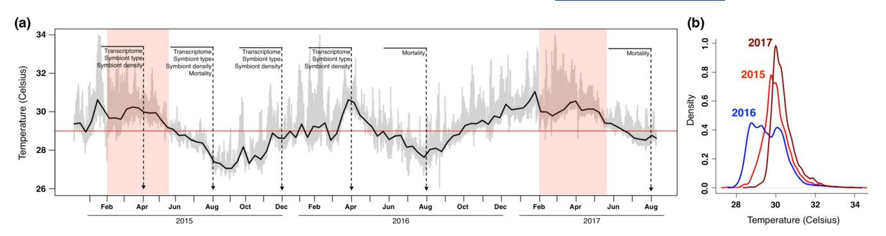
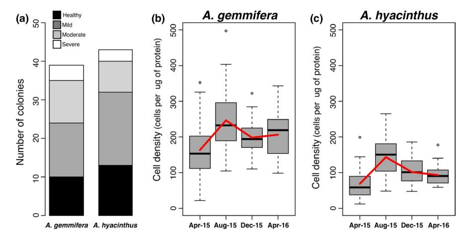
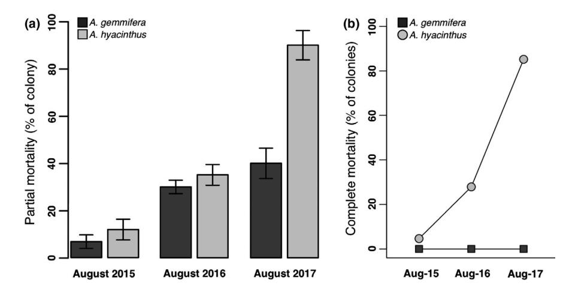
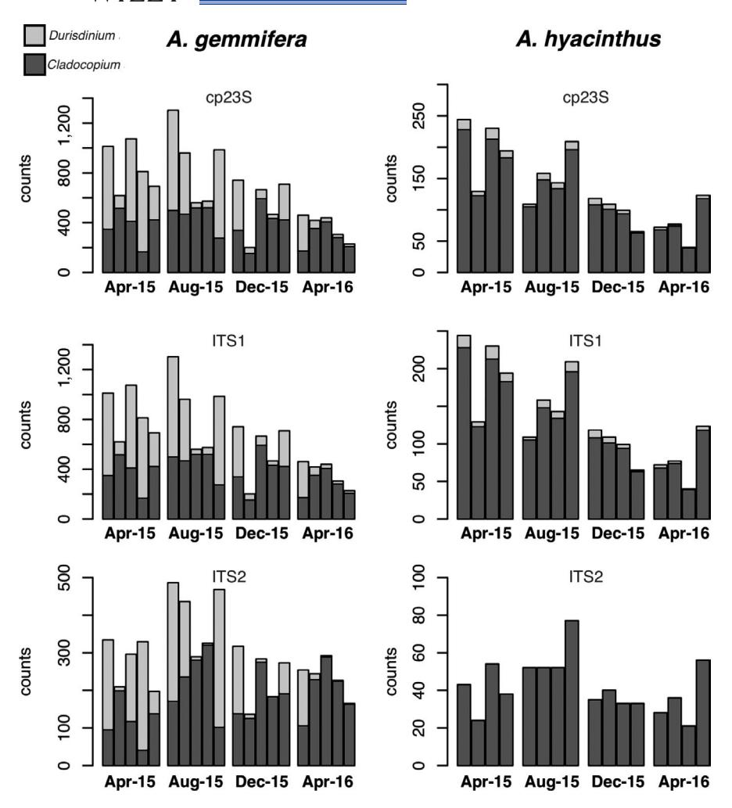
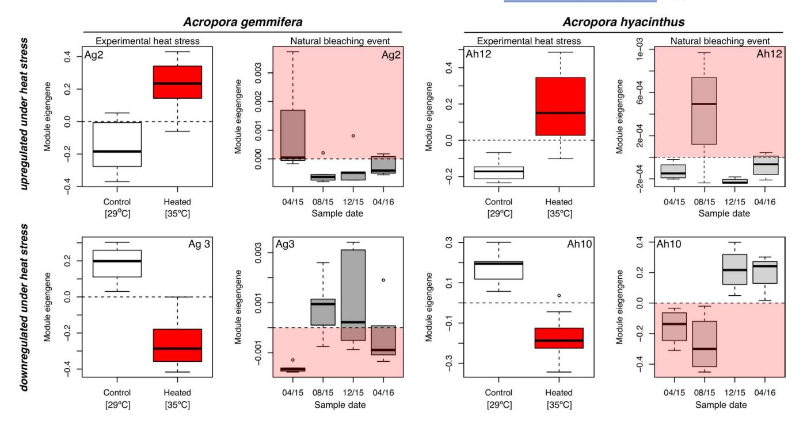
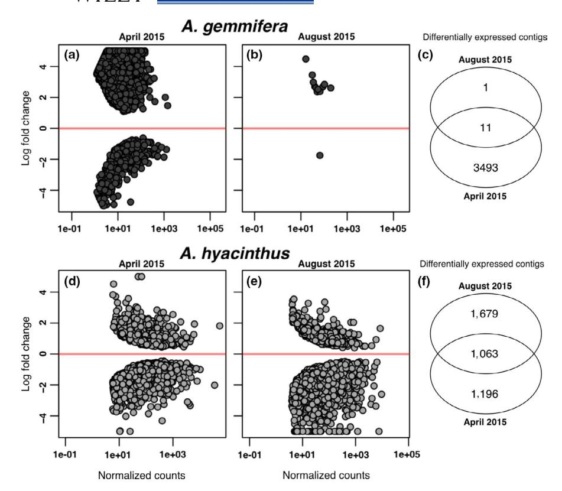

## ORIGINAL ARTICLE

# **Transcriptomic resilience, symbiont shuffling, and vulnerability to recurrent bleaching in reef‐building corals**

**Luke Thomas1,2,3** | **Elora H. López3** | **Megan K. Morikawa3** | **Stephen R. Palumbi3**

#### **Correspondence**

Luke Thomas, Australian Institute of Marine Science and the UWA Oceans Institute, The University of Western Australia, Perth, WA, Australia.

Email: [luke.thomas@uwa.edu.au](mailto:luke.thomas@uwa.edu.au)

#### **Funding information**

National Science Foundation, Grant/Award Number: OCE-1547921; Gordon and Betty Moore Foundation

#### **Abstract**

As climate change progresses and extreme temperature events increase in frequency, rates of disturbance may soon outpace the capacity of certain species of reef‐build‐ ing coral to recover from bleaching. This may lead to dramatic shifts in community composition and ecosystem function. Understanding variation in rates of bleaching recovery among species and how that translates to resilience to recurrent bleaching is fundamental to predicting the impacts of increasing disturbances on coral reefs globally. We tracked the response of two heat sensitive species in the genus *Acropora* to repeated bleaching events during the austral summers of 2015 and 2017. Despite a similar bleaching response, the species *Acropora gemmifera* recovered faster based on transcriptome‐wide gene expression patterns and had a more dynamic algal sym‐ biont community than *Acropora hyacinthus* growing on the same reef. Moreover, *A. gemmifera* had higher survival to repeated heat extremes, with six‐fold lower mor‐ tality than *A. hyacinthus*. These patterns suggest that speed of recovery from a first round of bleaching, based on multiple mechanisms, contributes strongly to sensitivity to a second round of bleaching. Furthermore, our data uncovered intragenus varia‐ tion in a group of corals thought generally to be heat‐sensitive and therefore paint a more nuanced view of the future health of coral reef ecosystems against a backdrop of increasing thermal disturbances.

#### **KEYWORDS**

*Acropora*, climate change, coral bleaching, recovery, transcriptomics

## **1** | **INTRODUCTION**

As the planet warms, the frequency and intensity of extreme weather events, such as marine heatwaves, is increasing (Oliver et al., 2018). These changes to disturbance regimes are gradually erod‐ ing the capacity of marine populations to recover from heat stress. Ocean warming is particularly stressful on coral reefs, where ther‐ mal stress triggers the breakdown of the symbiotic relationship be‐ tween the coral host and their photosynthetic algal endosymbiont (family Symbiodiniaceae [LaJeunesse et al., 2018]). This process is known as coral bleaching. Coral polyps rely on their symbionts for photosynthetically‐produced energy, and as a result, prolonged pe‐ riods of bleaching often lead to mortality. There have been three major global bleaching events since the records began in the 1980s (Hughes et al., 2017). The most recent and severe occurred during the strong El Niño years of 2015–2017, and was estimated to impact more than a third of the world's coral reefs (Hughes, Anderson, et al., 2018; Hughes, Kerry, et al., 2018).

Recovery is defined here as a return to a predisturbance base‐ line state. The recovery of coral reef ecosystems following severe coral bleaching can take decades as new recruits repopulate an area that experienced high levels of mortality (Gilmour, Smith, Heyward, Baird, & Pratchett, 2013). In contrast, the physiological recovery response of individual colonies can allow them to recover from a

Luke Thomas and Elora H. López are contributed equally to this work.

Australian Institute of Marine Science, Indian Ocean Marine Research Centre, Perth, WA, Australia

2 Oceans Graduate School, The UWA Oceans Institute, The University of Western Australia, Perth, WA, Australia

Biology Department, Hopkins Marine Station, Stanford University, Stanford, CA, USA

single bleaching event on metabolic, growth, and reproductive lev‐ els on much faster timescales (Grottoli & Rodrigues, 2011; Grottoli, Rodrigues, & Palardy, 2006; Levas, Grottoli, Hughes, Osburn, & Matsui, 2013). However, mechanisms of physiological recovery may fail when bleaching events increase in frequency. As the frequency of bleaching events increases in the coming decades, rates of distur‐ bance may soon outpace the capacity of some important reef‐build‐ ing coral species to recover (Grottoli et al., 2014; Schoepf et al., 2015).

Bleaching is the result of a breakdown in the symbiosis between the coral animal and its symbiotic algae. The type or types of symbiont that associate with a coral colony affects the coral's resilience or sus‐ ceptibility to bleaching when sea temperatures rise (Berkelmans & van Oppen, 2006). For example, the genus *Durusdinium* tends to associate with corals surviving in hotter temperatures across multiple species of corals (Baker, 2003; Lien et al., 2007; Oliver & Palumbi, 2009). Perhaps more intriguing than simply the association between *Durusdinium* and heat tolerance is the capacity for corals to shuffle symbiont types and increase proportions of *Durusdinium*, particularly after a stress event, as a mechanism to cope with a variable environment (Baker, Starger, McClanahan, & Glynn, 2004; Buddemeier, Baker, Fautin, & Jacobs, 2004; Jones, Berkelmans, van Oppen, Mieog, & Sinclair, 2008; Silverstein, Cunning, & Baker, 2015). The ability to shuffle symbiont types, however, differs from species to species and is therefore an im‐ portant factor influencing heat tolerance and recovery from bleaching (Correa, McDonald, & Baker, 2009; Grottoli et al., 2014; Jones et al., 2008; Mieog, Van Oppen, Cantin, Stam, & Olsen, 2007; Silverstein, Correa, & Baker, 2012).

The coral host itself also plays an important role in the capacity to both resist bleaching when faced with heat stress, as well as re‐ cover from bleaching after it occurs. Transcriptomics, the study of all expressed genes in a cell, represents a window into the entire physi‐ ology of an organism under stress and represents a powerful tool to explore the stress response in natural populations that lack a genome assembly (Franssen et al., 2011; Wang, Gerstein, & Snyder, 2009). When faced with heat stress, corals mount a large and dynamic response that involves hundreds of transcripts and includes genes involved in oxidative stress, transcription regulation, apoptosis and extracellular matrix components (Bellantuono, Granados‐Cifuentes, Miller, Hoegh‐Guldberg, & Rodriguez‐Lanetty, 2012; Kenkel, Meyer, & Matz, 2013; Maor‐Landaw & Levy, 2016). Many of these changes initiate within 90 min of the onset of heat stress and are a complex mix of responses from different cell types (Traylor‐Knowles, Rose, & Palumbi, 2017; Traylor‐Knowles, Rose, Sheets, & Palumbi, 2017). Gene expression changes occur not just during acute heat stress, but can shift gradually over time as a coral acclimatizes to sub‐bleaching temperature stress (Bellantuono, Granados‐Cifuentes, et al., 2012; Kenkel et al., 2013; Ruiz‐Jones & Palumbi, 2017). The capacity to alter the regulation of stress response genes is a key mechanism that allows corals to cope with a variable environment (Barshis et al., 2013; Kenkel & Matz, 2016).

The rate at which gene expression levels revert back to prestress baseline, also referred to as transcriptomic resilience, provides valu‐ able information on the duration of the physiological response to bleaching (Pinzón et al., 2015; Thomas & Palumbi, 2017). It also offers important insight into how different coral species will cope with the increasing frequency of marine heatwaves in the coming decades. While variation in transcriptomic resilience within a single species has been linked to bleaching resistance (Seneca & Palumbi, 2015), how it varies among species, and how that translates to dif‐ ferent outcomes following recurrent bleaching, has not yet been examined.

Here, we show that two congeneric coral species differ in tran‐ scriptomic resilience and symbiont community dynamics following a natural bleaching event. The species with slower rates of tran‐ scriptomic recovery and a more static composition of algal symbi‐ onts withstood an initial bleaching event in 2015, but suffered high mortality following a second event in 2017. In contrast, the species with faster transcriptome recovery and a dynamic symbiont com‐ munity experienced very low mortality after recurrent bleaching in 2015 and 2017. Our data show that resilience to recurrent bleaching can vary widely among congeners, and that studying recovery at the genus level therefore oversimplifies interspecific differences in physiology that ultimately drive differential mortality following sub‐ sequent stress events.

#### **2** | **MATERIALS AND METHODS**

## **2.1** | **Bleaching and mortality**

The fringing reef along the southern coast of Ofu lies in the National Park of American Samoa and forms a series of back‐reef pools with diverse coral assemblages (Craig, Birkeland, & Belliveau, 2001). In early 2015, corals in these backreef pools were exposed to anoma‐ lous temperatures that triggered widespread bleaching throughout the moderately variable pool (MVP), which as the name suggests ex‐ periences less extreme daily temperature fluctuations than do other backreef pools in the lagoon (Smith, Barshis, & Birkeland, 2007). In April 2015, we carried out reef‐wide visual bleaching surveys in the MVP and scored colonies of *Acropora gemmifera* and *Acropora hyacinthus* as either healthy (≤10% pigment loss), mildly bleached (10%–50% pigment loss), moderately bleached (50%–80% pigment loss) or severely bleached (>80% pigment loss). We collected tissue samples from 30 bleached colonies of *A. hyacinthus* and *A. gemmifera* and continued to monitor these colonies every four months for an additional three timepoints (August 2015, December 2015, April 2016), spanning a year of recovery. Tissue samples were preserved in RNAlater and stored at –20°C until transport, held at room tem‐ perature for 48 hr of transport, and then stored at –80°C until extraction.

We returned to MVP on Ofu in August 2016 to collect a final data point on mortality following the 2015 bleaching event; how‐ ever, in early 2017 coral colonies in the MVP were again exposed to bleaching level temperatures (Figure 1). Mean summer tempera‐ tures were approximately 0.5°C warmer than in the summer of 2015 (Figure 1b), and we observed widespread bleaching throughout the MVP in March 2017. In August 2017, we returned for a final set of

FIGURE 1 Sea surface temperature in the moderately variable pool (MVP) on Ofu, American Samoa: (a) in‐situ time‐series temperature plot (2015–2017) encompassing repeated bleaching events (red panels). Vertical lines indicate sampling dates and the data collected at each timepoint. Dashed horizontal red line represents the NOAA regional bleaching threshold for American Samoa; (b) density plot of temperatures recordings during the austral summer months of 2015, 2016, and 2017 from the MVP [Colour figure can be viewed at [wileyonlinelibrary.com\]](www.wileyonlinelibrary.com)

visual surveys to determine mortality rates of our tracked colonies following repeated bleaching events.

## **2.2** | **Symbiont density and type**

To measure changes in symbiont cell densities following the 2015 bleaching event, we used automated cell counting with the nonsort‐ ing Guava EasyCyte flow cytometer (Millepore) and normalized to total protein measurements, as in (Krediet et al., 2015). Coral tissue was removed from the skeleton of 30 bleached colonies of each species using a water pick in ultra‐filtered seawater (0.05 µm). To identify any shifts in symbiont type, we mapped RNA‐sequencing reads from a sub‐ set of samples (see Transcriptomic Resilience) to a reference file that included all chloroplast 23S (cp23S) and Internal Transcribed Spacer Region (ITS1 and ITS2) haplotypes found in *Acropora* on Ofu (Oliver & Palumbi, 2011). We mapped raw reads with *HISAT2* (Kim, Langmead, & Salzberg, 2015) using a minimum mapping quality of 10.

#### **2.3** | **Coral physiology with RNA sequencing**

A subset of colonies was selected for transcriptome‐wide gene ex‐ pression analyses. For these 36 field‐collected samples (five colonies of *A. gemmifera* and four colonies of *A. hyacinthus* across four time‐ points), total RNA was extracted from small nubbins approximately 1 cm3 in size using Qiagen's RNAeasy Plus Kit. In total 36 libraries were constructed using the Illumina TruSeq2 RNA Library Prep Kit v2 with Protoscript II Reverse Transcriptase. All samples were pre‐ pared in the same round of RNA extractions and library preps to remove biases associated with batch effects. We carried out multi‐ plexed Illumina sequencing (50 cycle single end) at the University of Utah Microarray and Genomic Analysis Core Facility.

#### **2.4** | **Targeting transcriptional modules**

To analyse rates of transcriptomic recovery following the 2015 bleaching event, we targeted groups of coregulated genes, or tran‐ scriptional modules, strongly associated with heat stress in each species. Using experimental heat stress, Rose Seneca and Palumbi (2015) showed that the heat stress response in *A. hyacinthus* involves thousands of transcripts that can be summarized as the expression of 23 transcriptional modules, some of which showed strong asso‐ ciations with bleaching outcome and were enriched for various cellu‐ lar functions including transcription factor activity and extracellular proteins (Rose et al., 2015).

To develop a comparable data set for *A. gemmifera*, we followed the approach of Rose et al. (2015) and used acute experimental heat stress to identify a similar set of heat responsive transcrip‐ tional modules in *A. gemmifera*. These experimental heat stress data, along with the *A. gemmifera* de novo assembly (see below), were generated as part of a larger study examining the role of seasonal acclimatization on the coral heat stress response (M. K. Morikawa and S. R. Palumbi, in preparation). Briefly, we exposed 10 colonies of *A. gemmifera* from the MVP to experimental heat stress in 2014 using temperature‐controlled tanks. Temperatures ramped from 29 to 35°C over 3 hr and held at 35°C for 3 hr before allowing to cool back down to 29°C within 1 hr. Samples were col‐ lected the following morning (20 hr after the onset of heat stress) and immediately preserved in RNAlater. Unpublished data show that bleaching levels seen 20 hr after heating in *Acropora* corals from Ofu remain stable in subsequent days of incubation at 29°C. Tissue samples were stored at –20°C until transport, held at room temperature for 48 hr of transport, and then stored at –80°C until extraction. RNA libraries were constructed using TruSeq2 RNA Sample Prep v2 and sequenced with 50 single‐end cycles on an Illumina HiSeq 2500.

For the *A. gemmifera* transcriptome assembly, three libraries were sequenced with 125 paired‐end cycles on an Illumina HiSeq 2500 for de novo transcriptome assembly using Trinity (Haas et al., 2013). The longest isoforms were extracted from the Trinity assembly and were further assembled with CAP3 using the following filters: segment pair cutoff score 30, chain score cutoff 31, overlap length cutoff 18, overlap similarity score cutoff 300. To remove symbiont contami‐ nation from the assembly, we used *blastx* to a database of symbiont transcripts and removed any contig with a threshold e‐value below 1e‐6. Any remnant prokaryote sequences were then filtered using *blastx* to the prokaryote RefSeq database with an e‐value of 1e‐5.

We mapped raw reads from the experimental heat stress experi‐ ment to the de novo assembled *A. gemmifera* assembly using HISAT2, normalized reads with DESeq2 (Love, Huber, & Anders, 2014) and filtered out contigs with mean read depth less than five. To identify groups of coregulated genes, we conducted a weighted gene coex‐ pression network analysis using the r package WGCNA (Langfelder & Horvath, 2008). We created a signed network topology using the following parameters: minKMEtoStay 0.75, minModuleSize 40, power 4, networkType'signed', deepsplit 4.

To identify modules that showed significant association with heat stress (i.e., altered expression between control and heated treat‐ ments), we used ANOVA as implemented in the built‐in r package *aov* to test for the significance of experimental treatment (heated vs. control) on module eigengene. We tested whether these modules were functionally enriched for genes involved in different molecular and cellular functions using Uniprot accessions with the Database for Annotation, Visualization and Integrated Discovery (DAVID v. 6.8– [https://david.ncifcrf.gov\)](https://david.ncifcrf.gov). Enrichment was considered signifi‐ cant if the Benjamini‐Hochberg corrected *p*‐value was <0.10.

## **2.5** | **Transcriptomic resilience**

We mapped raw sequence data from our field‐collected samples (see *Coral physiology with RNA sequencing*) of *A. gemmifera* to our de novo as‐ sembled transcriptome using HISAT2 with a minimum mapping quality of 10. We mapped raw sequence data from our field‐collected samples of *A. hyacinthus* to the publicly available *A. hyacinthus* transcriptome as‐ sembly by Barshis et al. (2013) using the same parameters. SAMtools (Li et al., 2009) was used to generate a counts matrix for each species. We normalized our field‐collected counts matrices with DESeq2 and matched the normalized matrices to a list of contigs comprising each of the transcriptional modules that showed a significant treatment effect in the laboratory. We then used WGCNA to calculate the expression (module eigengene) of these modules in each colony for each timepoint.

We also analysed transcriptome‐wide changes in individual gene expression in our field‐collected samples. We did not have samples that predated the bleaching event to represent a pre‐ bleaching baseline, so we calculated differentially expressed con‐ tigs during bleaching in April 2015, and four months later in August 2015, relative to December 2015, eight months after bleaching and before temperatures began to increase again the following sum‐ mer. Our recent study using a different set of *A. hyacinthus* colonies that included samples predating the 2015 bleaching event showed that physiological recovery was achieved by December 2015, justi‐ fying its use as a stress‐free control timepoint (Thomas & Palumbi, 2017). Independent DESeq2 analyses were carried out for the April versus December and August versus December timepoints in each species. Differentially expressed contigs were identified as those with an adjusted *p*‐value <0.1 (Benjamini & Hochberg, 1995). We then tested whether differentially expressed contigs in April and August were enriched for genes involved in any molecular or cel‐ lular function using Uniprot accessions with DAVID 6.8 as detailed above.

#### **3** | **RESULTS**

## **3.1** | **Bleaching response**

Reef‐wide surveys of coral health in April 2015 showed that colo‐ nies of *Acropora gemmifera* (*n* = 39) and *Acropora hyacinthus* (*n* = 43) exhibited a similar bleaching response, with approximately 70% of colonies displaying a bleaching phenotype (Figure 2a). Temperatures began to cool in May, and by August 2015 all colonies had regained their pigment. Despite a similar visual bleaching response, flow cy‐ tometry revealed that bleached colonies of *A. gemmifera* maintained significantly (*p* < 0.001) higher symbiont densities than did bleached colonies of *A. hyacinthus* (Figure 2b,c). All colonies increased visual pigmentation and symbiont cell densities to a one year, winter‐time

FIGURE 2 Symbiont densities following the 2015 bleaching event: (a) bleaching response in April 2015; (b) symbiont cell densities in bleached colonies of *Acropora gemmifera* (*n* = 29) determined by flow cytometry; (c) symbiont cell densities in bleached colonies of *A. hyacinthus* (*n* = 30) determined by flow cytometry. Red lines represent mean values per timepoint. Box plots display median as the midline and upper and lower quartiles [Colour figure can be viewed at [wileyonlinelibrary.com\]](www.wileyonlinelibrary.com)

maximum by August 2015, four months after bleaching. Summertime symbiont densities dropped again by April 2016 but mean values re‐ mained higher than in bleached colonies in April 2015 in both spe‐ cies (Figure 2b,c).

## **3.2** | **Mortality**

Mortality rates immediately following the first bleaching event in August 2015 were low in both species (Figure 3). By August 2016 partial mortality increased to 30% in *A. gemmifera* and 35% in *A. hyacinthus* (Figure 3a). There were no significant differences in partial mortality between species in August 2015 or August 2016. When we returned to these colonies in August 2017 to ob‐ serve mortality rates in response to a second round of bleaching, we identified significant (*p* < 0.001) differences in mortality be‐ tween species. Rates of partial mortality had increased to 90% in *A. hyacinthus* (Figure 3a) and 85% of colonies had completely died (Figure 3b). In contrast, rates of partial mortality in *A. gemmifera* remained low at 40% (Figure 3a) and not one colony showed com‐ plete mortality by August 2017 (Figure 3b).

# **3.3** | **Symbiont shifts**

Monitoring changes in symbiont communities across the 2015 bleaching event revealed contrasting patterns of symbiont com‐ munity dynamics between species. *A. gemmifera* showed a gradual shift from a mixed community of *Durusdinium* and *Cladocopium* at the start of bleaching in April 2015 to *Cladocopium* dominance across the recovery period (Figure 4; Table S1). This was pattern was consistent when mapping reads to both Cp23S, ITS1 and ITS2 genic regions. In contrast, *A. hyacinthus* maintained a stable community of *Cladocopium* dominance in all colonies at all four timepoints during and after the 2015 bleaching event (Figure 4). Background levels of *Durusdinium* (~10%) were detected in all

colonies when using the Cp23S and ITS1 markers, but not when mapping reads to ITS2 (Figure 4; Table S1).

## **3.4** | **Physiological response in the laboratory**

After removing samples with poor coverage, we mapped 97,664,937 reads from 17 samples (5,600,118 ± 708,419 *SE*) to our de novo as‐ sembled *A. gemmifera* transcriptome comprising 67,636 contigs. Weighted gene coexpression network analysis revealed that the *A. gemmifera* heat stress response included the expression of 23 tran‐ scriptional modules ranging in number of contigs from 45 to 1,436 (Table S2). Seven of these modules were significantly (*p* < 0.05) as‐ sociated with temperature after acute heat stress in the laboratory. Three modules were significantly upregulated (Modules Ag2, Ag12, Ag16) and four modules were significantly downregulated (Modules Ag3, Ag6, Ag10, Ag21) following heat stress exposure (Figure S1). We were able to successfully identify the gene complement for only 14% (9,460 contigs) of the contigs in our *A. gemmifera* assem‐ bly using Uniprot accessions, which limited our ability to detect any enrichment of gene pathways in the modules; however, two mod‐ ules showed significant enrichment for genes involved in at least one cellular function. Ag2 comprised 842 contigs and was enriched for gene products related to G‐protein coupled receptor signalling pathway, transcription factor activity and sequence‐specific DNA binding, and Ag3 comprised 425 contigs and was enriched for ex‐ tracellular space proteins (Table S2). Interestingly, the *A. hyacinthus* stress response included transcriptional modules that responded in the same direction to heat stress and with similar functional enrich‐ ments (Rose et al., 2015). For example, Ah12 was upregulated under acute heat stress and enriched for gene products associated with sequence‐specific DNA binding and G‐protein coupled receptor signalling, and module Ah10 was downregulated under acute heat stress in the laboratory and enriched for extracellular matrix compo‐ nents (Table S2, Rose et al., 2015).

FIGURE 3 Rates of mortality following recurrent bleaching: (a) mean partial mortality (± standard error) among colonies of *Acropora gemmifera* and *A. hyacinthus* at each timepoint; (b) percent of colonies that experienced complete mortality (0% live tissue cover) at each timepoint

FIGURE 4 Symbiont type following the 2015 bleaching event. Reads were mapped to cp23S, ITS1 and ITS2 genic regions. Number of reads that mapped to each marker are along the *y*‐axis, and individual colonies are represented by a vertical bar at each timepoint

|                          |    | Acropora gemmifera     |    | Acropora hyacinthus    |  |
|--------------------------|----|------------------------|----|------------------------|--|
| Treatment/date           | N  | Reads per sample       | N  | Reads per sample       |  |
| Experimental heat stress |    |                        |    |                        |  |
| Control (29°C)           | 10 | 5,604,063 ± 996,293 SE | 13 | 981,903 ± 6,148 SEa    |  |
| Heated (35°C)            | 10 | 4,475,092 ± 941,949 SE | 13 | 984,484 ± 13,763 SEa   |  |
| Natural bleaching event  |    |                        |    |                        |  |
| April 2015               | 5  | 771,314 ± 33,765 SE    | 4  | 2,337,168 ± 57,301 SE  |  |
| August 2015              | 5  | 885,061 ± 32,114 SE    | 4  | 2,389,376 ± 377,791 SE |  |
| December 2015            | 5  | 917,461 ± 51,620 SE    | 4  | 2,551,258 ± 315,473 SE |  |
| April 2016               | 5  | 790,1312 ± 47,477 SE   | 4  | 2,911,124 ± 97,731 SE  |  |

TABLE 1 Sample information and sequencing results from laboratory and field‐based RNA sequencing data sets

#### **3.5** | **Physiological response in the field**

Forty million seven hundred fifty‐five thousand seven hundred eight reads (2,547,232 ± 126,933 *SE* per library) from 16 field‐col‐ lected samples of *A. hyacinthus* (four colonies sampled at four timepoints) were mapped to the *A. hyacinthus* reference transcrip‐ tome (Barshis et al., 2013), with 15,964 contigs having a mean read depth greater than five (Table 1). For *A. gemmifera*, 16,819,836 reads (840,992 ± 23,949 *SE* per library) from the 20 field‐collected samples (five colonies sampled at four timepoints) were mapped to the *A. gemmifera* reference transcriptome (Morikawa and Palumbi, in preparation), with 8,269 contigs having a mean read depth greater than five (Table 1).

We defined the environmental stress response in the field‐ collected samples as changes in expression of the transcriptional modules that were significantly associated with experimental heat stress in the laboratory. Plotting their expression in our field col‐ lected samples following the 2015 bleaching event revealed that

a Data from Seneca and Palumbi (2015).

FIGURE 5 Patterns of module expression (eigengenes) following experimental heat stress (left column) and in field‐collected samples following the 2015 bleaching event (right column). Dotted horizontal lines provide a reference and red transparent rectangles in field plots indicate whether the corresponding module was up‐ or downregulated under heat stress in the laboratory. Box plots display median as the midline and upper and lower quartiles [Colour figure can be viewed at [wileyonlinelibrary.com\]](www.wileyonlinelibrary.com)

the predominant stress response in *A. gemmifera* occurred in April 2015 during bleaching. This pattern was consistent across six of the seven heat response modules identified in the laboratory (Figure S3). The expression of modules that were significantly upregulated in the laboratory following acute heat stress was greatest in our field‐collected samples during bleaching and declined four, eight and 12 months later (Figure 5, Figure S3). Modules that were downreg‐ ulated under acute heat stress in the laboratory were lowest in our field‐collected samples during bleaching and increased four, eight, and 12 months later (Figure 5, Figure S3).

In contrast, *A. hyacinthus* exhibited a stress response that was strongest four months after bleaching (Figure 5). This pattern was consistent across 10 of the 13 heat response modules identified in the laboratory (Figures S2 and S4). Modules that were significantly upregulated during experimental heat stress showed a delayed re‐ sponse that was strongest in August 2015, four months after bleach‐ ing (Figure 5, Figure S4). Modules that were downregulated under experimental heat stress were generally low during field bleaching in April 2015 and further decreased in August 2015 (Figure 5, Figure S4).

These patterns were also reflected in changes in expression of individual genes. Differential gene expression analyses identified a total of 3,504 differentially expressed contigs in bleached colonies of *A. gemmifera* in April 2015 (Figure 6a). This number declined to only twelve differentially expressed contigs four months later in August 2015 (Figure 6b). Likewise, we identified a strong expression signal among 2,259 contigs in *A. hyacinthus* in April 2015 (Figure 6d). In contrast to *A. gemmifera*, this signal lingered, and approximately half (1,063 contigs) of these contigs remained differentially expressed in August 2015 (Figure 6f). On top of this, *A. hyacinthus* had an ad‐ ditional 1,679 contigs that were not differentially expressed during bleaching but that "turned‐on" in August 2015, four months later (Figure 6e). Contigs that were differentially expressed during bleach‐ ing in *A. gemmifera* were enriched for gene products associated with signalling, receptor activity, protein binding, and extracellular regions (Table S3). No significant enrichment was detected in the 12 lingering genes in *A. gemmifera* in August. Contigs that were dif‐ ferentially expressed during bleaching in April in *A. hyacinthus* were enriched for gene products associated with oxidation, mitochondria and extracellular regions. The lingering stress response in August 2015 in *A. hyacinthus* was functionally enriched for metabolic pro‐ cesses, transcription and cell signalling (Table S3).

#### **4** | **DISCUSSION**

Recovery following recurrent bleaching events is a complex process driven by differences in physiological response and algal commu‐ nity interactions. The branching coral *Acropora gemmifera* showed a more dynamic symbiont community and faster physiological re‐ covery following the 2015 bleaching event than did the table top coral *Acropora hyacinthus* growing on the same reef. These differ‐ ences were associated with lower mortality in response to the sec‐ ond bleaching event in 2017, with 0% mortality for *A. gemmifera* as compared to 85% for *A. hyacinthus*. Transcriptome patterns meas‐ ured following the first bleaching event returned to baseline within four months in *A. gemmifera* and were stable thereafter. In addition,

FIGURE 6 Transcriptome‐wide changes in gene expression following the 2015 bleaching event: (a) differentially expressed contigs in *Acropora gemmifera* in April 2015 during bleaching; (b) differentially expressed contigs in *A. gemmifera* in August 2015, four months after bleaching; (c) venn diagram of overlapping differentially expressed contigs in *A. gemmifera* between dates; (d) differentially expressed contigs in *A. hyacinthus* in April 2015 during bleaching; (e) differentially expressed contigs in *A. hyacinthus* in August 2015, four months after bleaching; (f) venn diagram of overlapping differentially expressed contigs in *A. hyacinthus* between dates [Colour figure can be viewed at [wileyonlinelibrary.com\]](www.wileyonlinelibrary.com)

*A. gemmifera* experienced increased proportions of thermally toler‐ ant *Durusdinium* while bleached. By contrast, *A. hyacinthus* took up to eight months following bleaching for transcriptome recovery to occur, maintained a stable symbiont community of predominantly *Cladocopium*, and experienced high mortality following the second round of bleaching. These results between species show one spe‐ cies with fast recovery and high resilience after multiple rounds of bleaching and a second species with slow recovery and low resilience to repeated bleaching. These patterns occur within a genus of corals generally thought to be bleaching sensitive and suggest that recov‐ ery from bleaching and sensitivity to a second round of bleaching are linked. Exploring the way different species in the same genus at‐ tain heat resilience might reveal much about intrinsic mechanisms of bleaching resistance in corals, especially in a genus like *Acropora* that shows persistent interspecies introgression (van Oppen, McDonald, Willis, & Miller, 2001).

## **4.1** | **Rates of physiological recovery**

Many studies of coral gene expression after heat stress have fo‐ cussed on the purported functions of up‐ or downregulated tran‐ scripts, generally based on gene ontology resources (Anderson, Walz, Weil, Tonellato, & Smith, 2016; Bellantuono, Granados‐ Cifuentes, et al., 2012; Kenkel et al., 2013; Seneca & Palumbi, 2015). Although we noted the different gene ontology terms associated with transcription response to heat stress, identifying these genes has been done in detail elsewhere. Instead, we used aggregate gene modules that were identified in laboratory heat stress experi‐ ments as markers of overall physiological stress and recovery. By comparing distinct groups of genes that show similar transcriptional changes between individuals or over time, we show that transcrip‐ tomes returned to a nearly baseline state within four months for *A. gemmifera* (Figure 5). Genes that change expression during labo‐ ratory bleaching trials showed parallel changes in April 2015 when we sampled bleached *A. gemmifera* colonies. However, by August 2015, when temperatures had cooled and colonies had recovered symbiont density, these transcription modules had returned closer to nonheat stressed levels. For *A. hyacinthus* colonies, transcrip‐ tome patterns remained perturbed at the four month timepoint in August 2015 and only returned to normal by our eight month assay in December 2015. Thomas and Palumbi (2017) also found a lin‐ gering transcriptome response in *A. hyacinthus* in a different set of colonies after bleaching. In that data set, gene expression patterns could be compared before and after bleaching for the same colo‐ nies. The current data set compared colonies at bleaching and then after, but showed a similar signature of a lengthy recovery period for *A. hyacinthus*. It has been shown that faster returns to baseline gene expression patterns correlate with less bleaching in experimental tests for individuals of the same species (Seneca & Palumbi, 2015). Now, it appears that differences in return to baseline gene expres‐ sion between species may account for different outcomes once a second bleaching event hits.

#### **4.2** | **Different symbiont strategies**

Although both species showed a similar visual bleaching response in 2015, their symbiont communities responded differently across the recovery period (Figure 4). While *A. hyacinthus* harboured a stable community of *Cladocopium* at all dates sampled, *A. gemmifera* associated predominantly with *Durusdinium* while bleached, then shifted to primarily *Cladocopium* in the months after bleach‐ ing. Shifting symbiont type has been linked to thermal tolerance in corals, and the predominance of *Durusdinium* during and after bleaching events has been widely reported elsewhere on tropi‐ cal reefs (Baker, 2001; Berkelmans & van Oppen, 2006; Jones et al., 2008). In Ofu, colonies across a range of species living in the highly variable pool experience higher levels of temperature stress and tend to harbour mostly *Durusdinium* (Oliver & Palumbi, 2009). The colonies in the MVP have a more variable composi‐ tion of *Cladocopium* and *Durusdinium*, yet individual *A. hyacinthus* colonies there do not differ in bleaching susceptibility, bleaching recovery or growth rate as a function of symbiont type (Gold & Palumbi, 2018).

Physiological trade‐offs exist between different symbiont types (Abrego, Ulstrup, Willis, & van Oppen, 2008; Howells et al., 2011; Rowan, 2004) and shifts to *Durusdinium* dominance during bleach‐ ing are often followed by a gradual return to *Cladocopium* dom‐ inance when conditions return to normal (Thornhill, Lajeunesse, Kemp, Fitt, & Schmidt, 2006), as was observed for *A. gemmifera* in this study. Because background levels of *Durusdinium* were detected at all timepoints in samples of *A. gemmifera*, the preva‐ lence of *Durusdinium* during bleaching indicates that this change was brought on through an increase in proportion during bleach‐ ing, rather than the uptake of new symbiont types. The ability to shuffle symbiont types has been experimentally linked to the capacity to withstand multiple bleaching events (Grottoli et al., 2014), and the dynamic relationship between *A. gemmifera* and Symbiodiniaceae may help account for its lower mortality across two bleaching events than *A. hyacinthus*, which displayed a more constant symbiont community composition.

## **4.3** | **Response to repeated stress events**

We observed greater mortality due to bleaching in 2017 even though the local heat impact was similar to that of 2015 (Figure 3), indicating that the mechanisms that allow particular species to recover rapidly from single events may be compromised under recurrent bleaching (Grottoli et al., 2014; Levas et al., 2016; Schoepf et al., 2015). For example, the capacity for heterotrophic feeding, which allows corals to account for the loss of photosynthetically derived nutrients while bleached, can erode under repeated bleaching (Levas et al., 2016). *Acropora hyacinthus* was able to recover from the first event with only minor mortality but suffered extensive mortality following the second event. If *A. hyacinthus* was still compromised energetically from its prolonged transcriptomic heat stress response from 2015, then its capacity to respond to heat stress in 2017 may have been lower than that of *A. gemmifera*. Despite the transcriptome data showing a return to physiological homeostasis long before the sec‐ ond bleaching event struck Ofu in 2017, whatever mechanism that allowed *A. hyacinthus* to recover from the first round of bleaching may have become impaired or disabled when exposed to a second round of bleaching.

Recent data from the Great Barrier Reef (GBR) following repeated bleaching events show that corals on the Northern GBR bleached less severely in 2017 than in 2016 (Hughes, Anderson, et al., 2018; Hughes, Kerry, et al., 2018). These patterns have been taken to indicate the dif‐ ferential survival of more heat tolerant corals in the Northern GBR in 2016, leaving a more tolerant population in 2017 (Hughes, Anderson, et al., 2018; Hughes, Kerry, et al., 2018). In contrast, our study tracked the same individual colonies in the 2015 and 2017 bleaching events, so there was no chance for differential selection in our system, and the effects we saw were due to different susceptibilities of the same individuals to serial events. While there is a strong link between thermal preconditioning and bleaching susceptibility in corals (Bay & Palumbi, 2015; Bellantuono, Hoegh‐Guldberg, & Rodriguez‐Lanetty, 2012; Castillo & Helmuth, 2005; Castillo, Ries, Weiss, & Lima, 2012; Maynard, Anthony, Marshall, & Masiri, 2008; Middlebrook, Hoegh‐ Guldberg, & Leggat, 2008; Thompson & van Woesik, 2009), bleaching events on Ofu were separated by two years, so any gains in thermal tolerance due to acclimatization to the first event may have been lost prior to the build‐up of bleaching temperatures in 2017.

## **5** | **CONCLUSIONS**

There has been a strong focus on differential susceptibility to bleach‐ ing among species and individuals as a way to gauge impacts of future climate change on reefs. Our data, and other data sets focusing on coral physiology, suggest that bleaching susceptibility does not tell the full story, as many corals that bleach eventually recover (Grottoli et al., 2006, 2014; Rodrigues & Grottoli, 2007; Schoepf et al., 2015; Thomas & Palumbi, 2017). However, the speed at which species recover from bleaching may be strongly associated with mortality following recurrent bleaching, and this variation will have important consequences at the community and ecosystem level. When rates of recovery are slower than the frequency of bleaching events, the cu‐ mulative impact of recurrent stress events may diminish the recov‐ ery capacity, so slowly‐recovering species may experience relatively higher rates of mortality. Our data show that there is wide variation in resilience to recurrent bleaching in a thermally‐sensitive genus of reef‐building corals, painting a more nuanced view of the capacity of reef‐building corals to cope with rapid climate change.

### **ACKNOWLEDGEMENTS**

The authors would like to acknowledge the National Park of American Samoa for their support throughout the duration of this project. In addition, thanks to E. Sheets, N. Rose, and R. Bay for as‐ sistance in the field. This manuscript was greatly improved by the comments of two anonymous reviewers. This project was supported by the National Science Foundation (OCE‐1547921) and the Gordon and Betty Moore Foundation.

#### **CONFLICT OF INTEREST**

The authors declare no competing interests.

#### **AUTHOR CONTRIBUTIONS**

This study was conceptualized by L.T., S.R.P., and E.H.L. All authors collected field samples and data. M.K.M conducted experimen‐ tal heat stress experiments and assembled the *Acropora gemmifera* transcriptome. L.T. and M.K.M conducted laboratory work. L.T. and E.H.L analysed the data and drafted the manuscript. All authors con‐ tributed to subsequent drafts of the manuscript.

#### **DATA AVAILABILITY**

Raw sequence data for the *Acropora gemmifera* heat stress experi‐ ment and field collected samples of *A. gemmifera* and *Acropora hyacinthus* has been deposited on GenBank (SRA accession [PRJNA522650](info:ddbj-embl-genbank/PRJNA522650): [https://www.ncbi.nlm.nih.gov/sra/PRJNA522650\)](https://www.ncbi.nlm.nih.gov/sra/PRJNA522650) and will be made publicly available upon acceptance of this manuscript. All data sets (Data Sets S1–S8) and associated bioinformatic scripts have been uploaded onto Open Science Framework ([https://doi.org/10.17605/](https://doi.org/10.17605/OSF/.IO/DH9GA) [OSF/.IO/DH9GA](https://doi.org/10.17605/OSF/.IO/DH9GA)).

#### **ORCID**

*Luke Thomas* <https://orcid.org/0000-0003-1095-9170>

#### **REFERENCES**

- Abrego, D., Ulstrup, K. E., Willis, B. L., & van Oppen, M. J. H. (2008). Species‐specific interactions between algal endosymbionts and coral hosts define their bleaching response to heat and light stress. *Proceedings of the Royal Society B: Biological Sciences*, *275*(1648), 2273–2282.<https://doi.org/10.1098/rspb.2008.0180>
- Anderson, D. A., Walz, M. E., Weil, E., Tonellato, P., & Smith, M. C. (2016). RNA‐Seq of the Caribbean reef‐building coral *Orbicella faveolata* (Scleractinia‐Merulinidae) under bleaching and disease stress ex‐ pands models of coral innate immunity. *PeerJ*, *4*, e1616. [https://doi.](https://doi.org/10.7717/peerj.1616) [org/10.7717/peerj.1616](https://doi.org/10.7717/peerj.1616)
- Baker, A. C. (2001). Reef corals bleach to survive change. *Nature*, *411*(6839), 765–766.<https://doi.org/10.1038/35081151>
- Baker, A. C. (2003). Flexibility and specificity in coral‐algal symbio‐ sis: Diversity, Ecology, and Biogeography of Symbiodinium. *Annual Review of Ecology, Evolution, and Systematics*, *34*, 661–689. [https://](https://doi.org/10.1146/132417) [doi.org/10.1146/132417](https://doi.org/10.1146/132417)
- Baker, A. C., Starger, C., McClanahan, T., & Glynn, P. (2004). Corals ' adap‐ tive response to climate change. *Nature*, *430*(August), 741.
- Barshis, D. J., Ladner, J. T., Oliver, T., Seneca, F. O., Traylor‐Knowles, N., & Palumbi, S. R. (2013). Genomic basis for coral resilience to cli‐ mate change. *Proceedings of the National Academy of Sciences*, *110*(4), 1387–1392. <https://doi.org/10.1073/pnas.1210224110>
- Bay, R. A., & Palumbi, S. R. (2015). Rapid acclimation ability mediated by transcriptome changes in reef‐building corals. *Genome Biology and Evolution*, *7*(6), 1602–1612.<https://doi.org/10.1093/gbe/evv085>
- Bellantuono, A. J., Granados‐Cifuentes, C., Miller, D. J., Hoegh‐Guldberg, O., & Rodriguez‐Lanetty, M. (2012). Coral thermal tolerance: Tuning

- gene expression to resist thermal stress. *PLoS ONE*, *7*(11), e50685. <https://doi.org/10.1371/journal.pone.0050685>
- Bellantuono, A. J., Hoegh‐Guldberg, O., & Rodriguez‐Lanetty, M. (2012). Resistance to thermal stress in corals without changes in symbiont composition. *Proceedings of the Royal Society B: Biological Sciences*, *279*(1731), 1100–1107.<https://doi.org/10.1098/rspb.2011.1780>
- Benjamini, Y., & Hochberg, Y. (1995). Controlling the false discovery rate: a practical and powerful approach to multiple testing author. *Journal of the Royal Statistical Society. Series B (Methodological)*, *57*(1), 289–300.
- Berkelmans, R., & van Oppen, M. J. H. (2006). The role of zooxanthel‐ lae in the thermal tolerance of corals: A "nugget of hope" for coral reefs in an era of climate change. *Proceedings of the Royal Society B: Biological Sciences*, *273*(1599), 2305–2312. [https://doi.org/10.1098/](https://doi.org/10.1098/rspb.2006.3567) [rspb.2006.3567](https://doi.org/10.1098/rspb.2006.3567)
- Buddemeier, R. W., Baker, A. C., Fautin, D. G., & Jacobs, J. R. (2004). *The adaptive hypothesis of bleaching*.
- Castillo, K. D., & Helmuth, B. S. T. (2005). Influence of thermal history on the response of Montastraea annularis to short‐term temperature exposure. *Marine Biology*, *148*(2), 261–270. [https://doi.org/10.1007/](https://doi.org/10.1007/s00227-005-0046-x) [s00227-005-0046-x](https://doi.org/10.1007/s00227-005-0046-x)
- Castillo, K. D., Ries, J. B., Weiss, J. M., & Lima, F. P. (2012). Decline of forereef corals in response to recent warming linked to history of thermal exposure. *Nature Climate Change*, *2*(10), 756–760. [https://](https://doi.org/10.1038/nclimate1577) [doi.org/10.1038/nclimate1577](https://doi.org/10.1038/nclimate1577)
- Correa, A. M. S., McDonald, M. D., & Baker, A. C. (2009). Development of clade‐specific Symbiodinium primers for quantitative PCR (qPCR) and their application to detecting clade D symbionts in Caribbean corals. *Marine Biology*, *156*(11), 2403–2411. [https://doi.org/10.1007/](https://doi.org/10.1007/s00227-009-1263-5) [s00227-009-1263-5](https://doi.org/10.1007/s00227-009-1263-5)
- Craig, P., Birkeland, C., & Belliveau, S. (2001). High temperatures toler‐ ated by a diverse assemblage of shallow‐water corals in American Samoa. *Coral Reefs*, *20*(2), 185–189. [https://doi.org/10.1007/s0033](https://doi.org/10.1007/s003380100159) [80100159](https://doi.org/10.1007/s003380100159)
- Franssen, S. U., Gu, J., Bergmann, N., Winters, G., Klostermeier, U. C., Rosenstiel, P., … Reusch, T. B. H. (2011). Transcriptomic resilience to global warming in the seagrass Zostera marina, a marine foundation species. *Proceedings of the National Academy of Sciences*, *108*(48), 19276–19281. <https://doi.org/10.1073/pnas.1107680108>
- Gilmour, J. P., Smith, L. D., Heyward, A. J., Baird, A. H., & Pratchett, M. S. (2013). Recovery of an isolated coral reef system following severe disturbance. *Science*, *340*(6128), 69–71. [https://doi.org/10.1126/](https://doi.org/10.1126/science.1232310) [science.1232310](https://doi.org/10.1126/science.1232310)
- Gold, Z., & Palumbi, S. R. (2018). Long‐term growth rates and effects of bleaching in Acropora hyacinthus. *Coral Reefs*, *37*(1), 267–277. <https://doi.org/10.1007/s00338-018-1656-3>
- Grottoli, A. G., & Rodrigues, L. J. (2011). Bleached Porites compressa and Montipora capitata corals catabolize δ13C‐enriched lipids. *Coral Reefs*, *30*(3), 687–692. <https://doi.org/10.1007/s00338-011-0756-0>
- Grottoli, A. G., Rodrigues, L. J., & Palardy, J. E. (2006). Heterotrophic plasticity and resilience in bleached corals. *Nature*, *440*(7088), 1186– 1189. <https://doi.org/10.1038/nature04565>
- Grottoli,A.G.,Warner,M.E., Levas,S. J.,Aschaffenburg,M.D.,Schoepf,V., McGinley, M., … Matsui, Y. (2014). The cumulative impact of annual coral bleaching can turn some coral species winners into losers. *Global Change Biology*, *20*(12), 3823–3833. [https://doi.org/10.1111/](https://doi.org/10.1111/gcb.12658) [gcb.12658](https://doi.org/10.1111/gcb.12658)
- Haas, B. J., Papanicolaou, A., Yassour, M., Li, B., Blood, P. D., Grabherr, M., … Pochet, N. (2013). De novo transcript sequence reconstruction from RNA‐seq using the Trinity platform for reference genera‐ tion and analysis. *Nature Protocols*, *8*(8), 1494–1512. [https://doi.](https://doi.org/10.1038/nprot.2013.084) [org/10.1038/nprot.2013.084](https://doi.org/10.1038/nprot.2013.084)
- Howells, E. J., Beltran, V. H., Larsen, N. W., Bay, L. K., Willis, B. L., & van Oppen, M. J. H. (2011). Coral thermal tolerance shaped by local

- adaptation of photosymbionts. *Nature Climate Change*, *2*(2), 116–120. <https://doi.org/10.1038/nclimate1330>
- Hughes, T. P., Anderson, K. D. K., Connolly, S. R., Heron, S. F., Kerry, J. T., Lough, J. M., … Wilson, S. K. (2018). Spatial and temporal patterns of mass bleaching of corals in the Anthropocene. *Science*, *359*(6371), 80–83. <https://doi.org/10.1126/science.aan8048>
- Hughes, T. P., Barnes, M. L., Bellwood, D. R., Cinner, J. E., Cumming, G. S., Jackson, J. B. C., … Scheffer, M. (2017). Coral reefs in the Anthropocene. *Nature*, *546*, 82–90. [https://doi.org/10.1038/natur](https://doi.org/10.1038/nature22901) [e22901](https://doi.org/10.1038/nature22901)
- Hughes,T.P.,Kerry,J.T.,Connolly,S.R.,Baird,A.H.,Eakin,C.M.,Heron,S.F., … Torda, G. (2018). Ecological memory modifies the cumulative im‐ pact of recurrent climate extremes. *Nature Climate Change*, *9*, 40–43. <https://doi.org/10.1038/s41558-018-0351-2>
- Jones, A. M., Berkelmans, R., van Oppen, M. J. H., Mieog, J. C., & Sinclair, W. (2008). A community change in the algal endosymbionts of a scler‐ actinian coral following a natural bleaching event: Field evidence of acclimatization. *Proceedings of the Royal Society B: Biological Sciences*, *275*(1641), 1359–1365. <https://doi.org/10.1098/rspb.2008.0069>
- Kenkel, C. D., & Matz, M. V. (2016). Gene expression plasticity as a mech‐ anism of coral adaptation to a variable environment. *Nature Ecology & Evolution*, *1*(1), 0014. <https://doi.org/10.1038/s41559-016-0014>
- Kenkel, C. D., Meyer, E., & Matz, M. V. (2013). Gene expression under chronic heat stress in populations of the mustard hill coral (Porites astreoides) from different thermal environments. *Molecular Ecology*, *22*(16), 4322–4334. <https://doi.org/10.1111/mec.12390>
- Kim, D., Langmead, B., & Salzberg, S. L. (2015). HISAT: A fast spliced aligner with low memory requirements. *Nature Methods*, *12*(4), 357– 360. <https://doi.org/10.1038/nmeth.3317>
- Krediet, C. J., DeNofrio, J. C., Caruso, C., Burriesci, M. S., Cella, K., & Pringle, J. R. (2015). Rapid, precise, and accurate counts of symbiod‐ inium cells using the guava flow cytometer, and a comparison to other methods. *PLoS ONE*, *10*(8), e0135725. [https://doi.org/10.1371/journ](https://doi.org/10.1371/journal.pone.0135725) [al.pone.0135725](https://doi.org/10.1371/journal.pone.0135725)
- LaJeunesse, T. C., Parkinson, J. E., Gabrielson, P. W., Jeong, H. J., Reimer, J. D., Voolstra, C. R., & Santos, S. R. (2018). Systematic revision of sym‐ biodiniaceae highlights the antiquity and diversity of coral endo‐ symbionts. *Current Biology*, *28*(16), 2570–2580. e6. [https://doi.](https://doi.org/10.1016/j.cub.2018.07.008) [org/10.1016/j.cub.2018.07.008](https://doi.org/10.1016/j.cub.2018.07.008)
- Langfelder, P., & Horvath, S. (2008). WGCNA: An R package for weighted correlation network analysis. *BMC Bioinformatics*, *9*, 559. [https://doi.](https://doi.org/10.1186/1471-2105-9-559) [org/10.1186/1471-2105-9-559](https://doi.org/10.1186/1471-2105-9-559)
- Levas, S. J., Grottoli, A. G., Hughes, A. D., Osburn, C. L., & Matsui, Y. (2013). Physiological and biogeochemical traits of bleaching and re‐ covery in the mounding species of coral porites lobata: implications for resilience in mounding corals. *PLoS ONE*, *8*(5), 32–35. [https://doi.](https://doi.org/10.1371/journal.pone.0063267) [org/10.1371/journal.pone.0063267](https://doi.org/10.1371/journal.pone.0063267)
- Levas, S., Grottoli, A. G., Schoepf, V., Aschaffenburg, M., Baumann, J., Bauer, J. E., & Warner, M. E. (2016). Can heterotrophic uptake of dis‐ solved organic carbon and zooplankton mitigate carbon budget defi‐ cits in annually bleached corals? *Coral Reefs*, *35*(2), 495–506. [https://](https://doi.org/10.1007/s00338-015-1390-z) [doi.org/10.1007/s00338-015-1390-z](https://doi.org/10.1007/s00338-015-1390-z)
- Li, H., Handsaker, B., Wysoker, A., Fennell, T., Ruan, J., Homer, N., … Durbin, R. (2009). The Sequence Alignment/Map format and SAMtools. *Bioinformatics*, *25*(16), 2078–2079. [https://doi.](https://doi.org/10.1093/bioinformatics/btp352) [org/10.1093/bioinformatics/btp352](https://doi.org/10.1093/bioinformatics/btp352)
- Lien, Y.‐T., Nakano, Y., Plathong, S., Fukami, H., Wang, J.‐T., & Chen, C. A. (2007). Occurrence of the putatively heat‐tolerant Symbiodinium phylotype D in high‐latitudinal outlying coral communities. *Coral Reefs*, *26*(1), 35–44. <https://doi.org/10.1007/s00338-006-0185-7>
- Love, M. I., Huber, W., & Anders, S. (2014). Moderated estimation of fold change and dispersion for RNA‐seq data with DESeq2. *Genome Biology*, *15*(12), 550. <https://doi.org/10.1186/s13059-014-0550-8>
- Maor‐Landaw, K., & Levy, O. (2016). Survey of Cnidarian Gene Expression Profiles in Response to Environmental Stressors: Summarizing 20

- Years of Research, What Are We Heading for? In S. Goffredo, & Z. Dubinsky (Eds.), *The cnidaria, past, present and future* (pp. 523–543). Switzerland: Springer.
- Maynard, J. A., Anthony, K. R. N., Marshall, P., & Masiri, I. (2008). Major bleaching events can lead to increased thermal tolerance in corals. *Marine Biology*, *155*(2), 173–182. [https://doi.org/10.1007/](https://doi.org/10.1007/s00227-008-1015-y) [s00227-008-1015-y](https://doi.org/10.1007/s00227-008-1015-y)
- Middlebrook, R., Hoegh‐Guldberg, O., & Leggat, W. (2008). The effect of thermal history on the susceptibility of reef‐building corals to ther‐ mal stress. *The Journal of Experimental Biology*, *211*(Pt 7), 1050–1056. <https://doi.org/10.1242/jeb.013284>
- Mieog, J. C., Van Oppen, M. J. H., Cantin, N. E., Stam, W. T., & Olsen, J. L. (2007). Real‐time PCR reveals a high incidence of Symbiodinium clade D at low levels in four scleractinian corals across the Great Barrier Reef: Implications for symbiont shuffling. *Coral Reefs*, *26*(3), 449–457. <https://doi.org/10.1007/s00338-007-0244-8>
- Oliver, E. C., Donat, M. G., Burrows, M. T., Moore, P. J., Smale, D. A., Alexander, L. V., … Wernberg, T. (2018). Longer and more frequent marine heatwaves over the past century. *Nature Communications*, *9*(1), 1–12. <https://doi.org/10.1038/s41467-018-03732-9>
- Oliver, T., & Palumbi, S. R. (2009). Distributions of stress‐resistant coral symbionts match environmental patterns at local but not regional scales. *Marine Ecology Progress Series*, *378*(2004), 93–103. [https://](https://doi.org/10.3354/meps07871) [doi.org/10.3354/meps07871](https://doi.org/10.3354/meps07871)
- Oliver, T., & Palumbi, S. R. (2011). Do fluctuating temperature environ‐ ments elevate coral thermal tolerance? *Coral Reefs*, *30*(2), 429–440. <https://doi.org/10.1007/s00338-011-0721-y>
- Pinzón, J. H., Kamel, B., Burge, C. A., Harvell, C. D., Medina, M., Weil, E., & Mydlarz, L. D. (2015). Whole transcriptome analysis reveals changes in expression of immune‐related genes during and after bleaching in a reef‐building coral. *Royal Society Open Science*, *2*(4), 140214. <https://doi.org/10.1098/rsos.140214>
- Rodrigues, L. J., & Grottoli, A. G. (2007). Energy reserves and metab‐ olism as indicators of coral recovery from bleaching. *Limnology and Oceanography*, *52*(5), 1874–1882. [https://doi.org/10.4319/](https://doi.org/10.4319/lo.2007.52.5.1874) [lo.2007.52.5.1874](https://doi.org/10.4319/lo.2007.52.5.1874)
- Rose, N. H., Seneca, F. O., & Palumbi, S. R. (2015). Gene networks in the wild: identifying transcriptional modules that mediate coral resis‐ tance to experimental heat stress. *Genome Biology and Evolution*, *8*(1), 243–252. <https://doi.org/10.5061/dryad.and>
- Rowan, R. (2004). Thermal adaptation in reef coral symbionts. *Nature*, *430*(August), 742.
- Ruiz‐Jones, L. J., & Palumbi, S. R. (2017). Tidal heat pulses on a reef trig‐ ger a fine‐tuned transcriptional response in corals to maintain ho‐ meostasis. *Science Advances*, *3*(3), 1–10. [https://doi.org/10.1126/](https://doi.org/10.1126/sciadv.1601298) [sciadv.1601298](https://doi.org/10.1126/sciadv.1601298)
- Schoepf,V.,Grottoli,A.G.,Levas,S.J.,Aschaffenburg,M.D.,Baumann,J.H., Matsui, Y., & Warner, M. E. (2015). Annual coral bleaching and the long‐term recovery capacity of coral. *Proceedings of the Royal Society B: Biological Sciences*, *282*, 20151887. [https://doi.org/10.1098/](https://doi.org/10.1098/rspb.2015.1887) [rspb.2015.1887](https://doi.org/10.1098/rspb.2015.1887)
- Seneca, F. O., & Palumbi, S. R. (2015). The role of transcriptome resilience in resistance of corals to bleaching. *Molecular Ecology*, *24*, 1467–1484. <https://doi.org/10.1111/mec.13125>
- Silverstein, R. N., Correa, A. M. S., & Baker, A. C. (2012). Specificity is rarely absolute in coral‐algal symbiosis: Implications for coral response to climate change. *Proceedings of the Royal Society B: Biological Sciences*, *279*(1738), 2609–2618. [https://doi.org/10.1098/](https://doi.org/10.1098/rspb.2012.0055) [rspb.2012.0055](https://doi.org/10.1098/rspb.2012.0055)
- Silverstein, R. N., Cunning, R., & Baker, A. C. (2015). Change in algal symbiont communities after bleaching, not prior heat exposure, in‐ creases heat tolerance of reef corals. *Global Change Biology*, *21*(1), 236–249. <https://doi.org/10.1111/gcb.12706>
- Smith, L. W., Barshis, D. J., & Birkeland, C. (2007). Phenotypic plasticity for skeletal growth, density and calcification of Porites lobata in

- response to habitat type. *Coral Reefs*, *26*(3), 559–567. [https://doi.](https://doi.org/10.1007/s00338-007-0216-z) [org/10.1007/s00338-007-0216-z](https://doi.org/10.1007/s00338-007-0216-z)
- Thomas, L., & Palumbi, S. R. S. R. (2017). The genomics of recovery from coral bleaching. *Proceedings of the Royal Society B: Biological Sciences*, *284*(1865), <https://doi.org/10.1098/rspb.2017.1790>
- Thompson, D. M., & van Woesik, R. (2009). Corals escape bleaching in regions that recently and historically experienced frequent ther‐ mal stress. *Proceedings of the Royal Society B: Biological Sciences*, *276*(1669), 2893–2901.<https://doi.org/10.1098/rspb.2009.0591>
- Thornhill, D. J., Lajeunesse, T. C., Kemp, D. W., Fitt, W. K., & Schmidt, G. W. (2006). Multi‐year, seasonal genotypic surveys of coral‐algal symbioses reveal prevalent stability or post‐bleaching rever‐ sion. *Marine Biology*, *148*(4), 711–722. [https://doi.org/10.1007/](https://doi.org/10.1007/s00227-005-0114-2) [s00227-005-0114-2](https://doi.org/10.1007/s00227-005-0114-2)
- Traylor‐Knowles, N., Rose, N. H., & Palumbi, S. R. (2017). The cell spec‐ ificity of gene expression in the response to heat stress in corals. *The Journal of Experimental Biology*, *15*(220), 1837–1845. [https://doi.](https://doi.org/10.1242/jeb.155275) [org/10.1242/jeb.155275](https://doi.org/10.1242/jeb.155275)
- Traylor‐Knowles, N., Rose, N. H., Sheets, E. A., & Palumbi, S. R. (2017). Early transcriptional responses during heat stress in the coral *acropora hyacinthus*. *Biol*, *232*, 91–100. <https://doi.org/10.1086/692717>
- van Oppen, M. J. H., McDonald, B. J., Willis, B., & Miller, D. J. (2001). The evolutionary history of the coral genus Acropora (Scleractinia,

- Cnidaria) based on a mitochondrial and a nuclear marker: Reticulation, incomplete lineage sorting, or morphological convergence? *Molecular Biology and Evolution*, *18*(7), 1315–1329.
- Wang, Z., Gerstein, M., & Snyder, M. (2009). RNA‐Seq: A revolution‐ ary tool for transcriptomics. *Nature Reviews Genetics*, *10*(1), 57–63. <https://doi.org/10.1038/nrg2484>

#### **SUPPORTING INFORMATION**

Additional supporting information may be found online in the Supporting Information section at the end of the article.         

**How to cite this article:** Thomas L, López EH, Morikawa MK, Palumbi SR. Transcriptomic resilience, symbiont shuffling, and vulnerability to recurrent bleaching in reef‐building corals. *Mol Ecol*. 2019;28:3371–3382. <https://doi.org/10.1111/mec.15143>