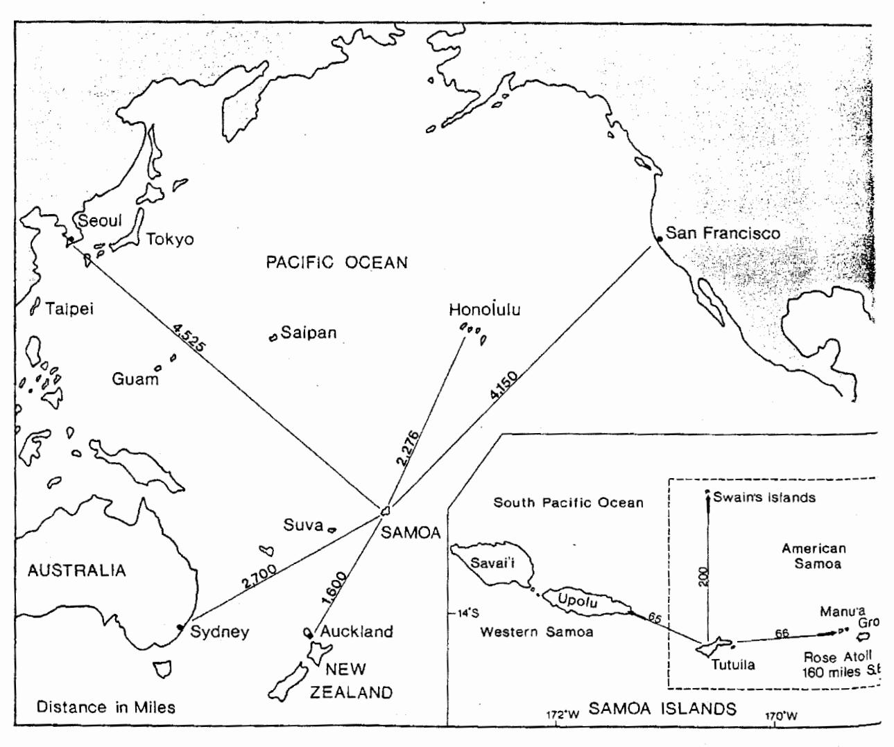
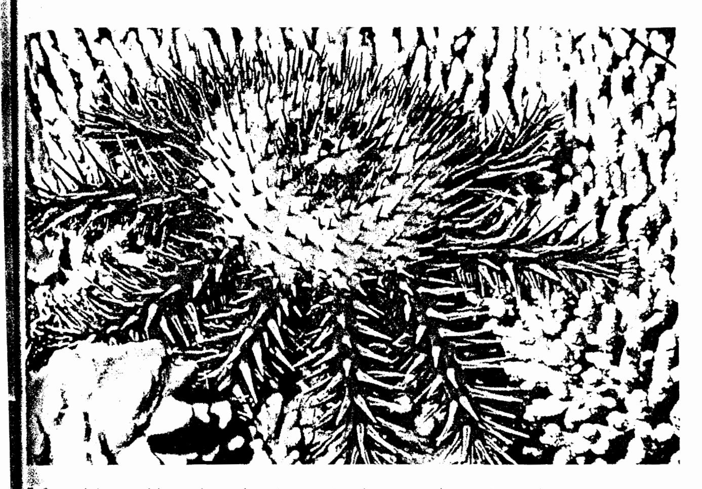
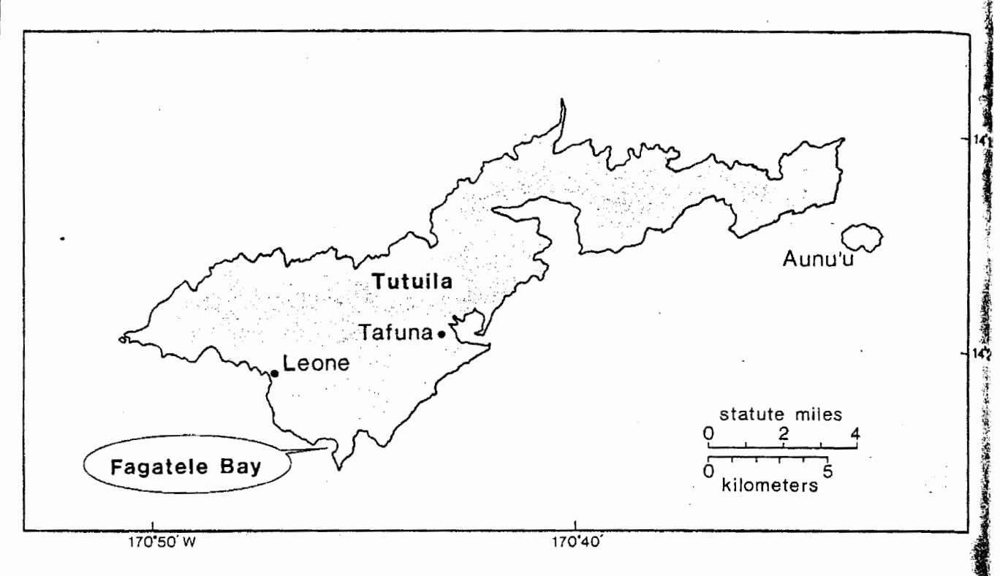
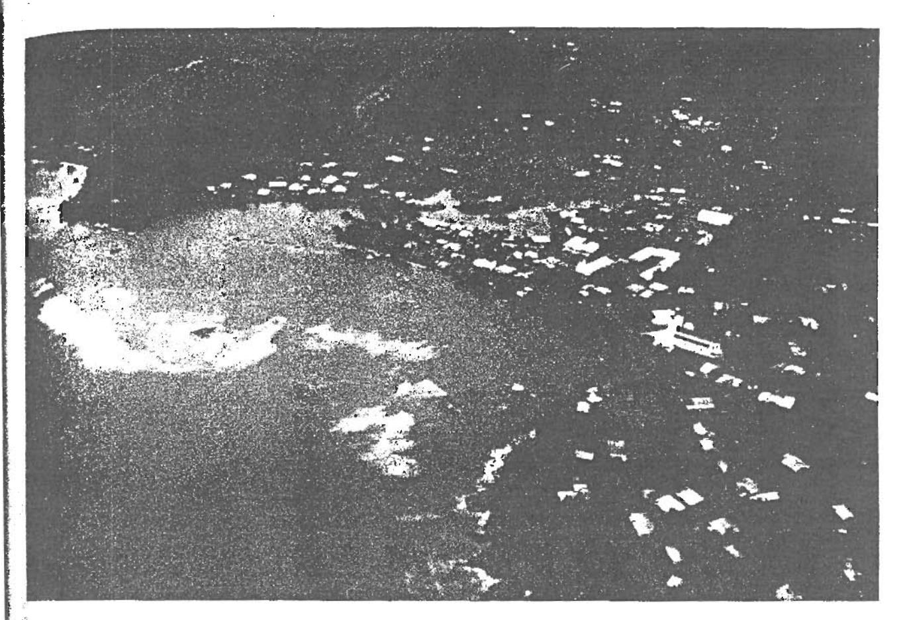
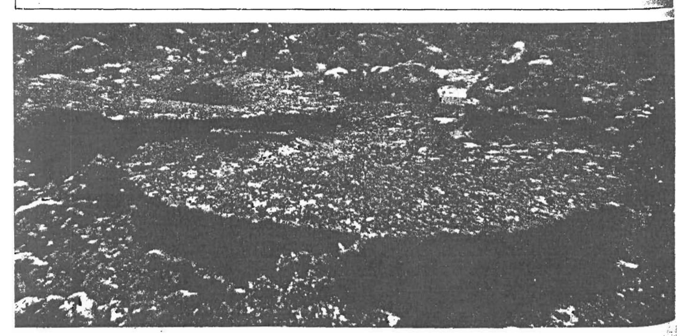
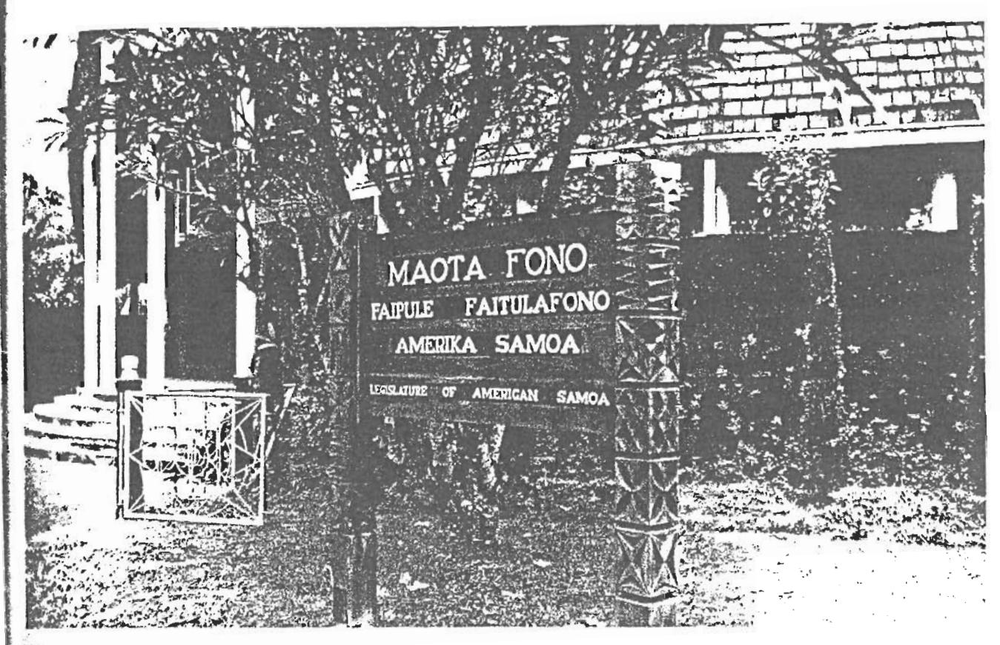
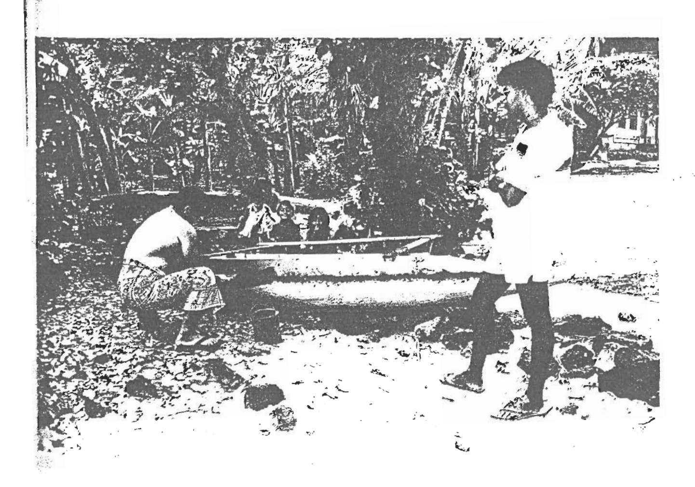

# Or Fagatele Bay: A Sanctuary in Samoa

by William J. Thomas

Figure 1. American Samoa, located nearly 2,300 miles south of Honolulu, has been a U.S. Territory since 1900. Fagatele Bi Tutuila, is the site of the United States' newest and southernmost National Marine Sanctuary.

The Crown-of-Thorns starfish, Acanthaster planci. (Courtesy Fagatale Bay National Marine Sanctuary)

early 2,300 miles south of Honolulu, in the laters of American Samoa (Figure 1), an ecologically thand pristine pocket of coastline, formed by the later of an extinct volcano, was nearly devastated by an infestation of the coral-eating Crown-of-Thorns arish (Acanthaster planci) in late 1978. Fagatele Bay tronounced fahng-a-teh'-leh), which may possess the most diverse coral fauna in the entire Samoan archipelago, lost nearly 90 percent of its corals to lese ravenous starfish. With much of the coral lead, many fish and invertebrates also disappeared from the bay. Their absence disrupted the traditional style of the Samoans living in the surrounding lages, severely curtailing traditional subsistence activities such as fishing and gleaning (gathering hellfish and algae) from the reefs.

The starfish infestation provided the impetus Fagatele Bay's sanctuary designation in 1986. The nerican Samoa government recognized that ional protection of the bay's diverse coral reef cosystem would enable scientists to study the wn-of-Thorns starfish and its impact on the bay's ources, enhance the Territory's conservation orts, and assist in preserving Samoan culture. The mation of the Fagatele Bay National Marine cultury represents an effort by the U.S. remment to blend traditional and modern ervation practices. Through a complete erstanding of Fagatele Bay's resources and the

cultural heritage of the Samoan people, the sanctuary's management policies and techniques will serve as a model for other Pacific island nations with similar goals for coral reef management and the maintenance of traditional culture.

### The Site

Fagatele Bay is a 163-acre embayment on the southwest coast of Tutuila (Figure 2), American Samoa's largest and most populated island. It has long been recognized as a resource of high ecological value by various federal, territorial, and private groups. Its pristine character has been virtually unchanged for many years because of the steep cliffs (rising vertically more than 200 feet) that rim the bay. Because of the difficult overland access, the bay has remained virtually isolated, and free from most human impacts. The cliffs, however, did not prevent the partial devastation of the bay's coral reefs from natural causes.

During late 1978 and early 1979, the starfish destroyed more than half of the coral reefs fringing Tutuila. Despite the devastating impact it had upon the live coral resource, this incident presented a unique opportunity to study and document the recovery of such ecosystems. Since periodic infestations of this starfish are common throughout most of the Pacific (see also Oceanus Vol. 29, No. 2, page 55), the results of this research could further

Figure 2. The Fagatele Bay National Marine Sanctuary is located on the southwest coast of Tutuila, American Samoa's largest and most populated island.

the understanding of coral reef recovery and help formulate sound management policies and techniques.

# Traditional Culture and Fagatele Bay

The traditional Samoan lifestyle, known as fa'a Samoa, places great importance on the dignity and achievements of the group rather than on an individual's achievements. The traditional communal lifestyle revolves around the aiga (ah-eeng'-a), or extended family. The aiga is headed by a matai (mah-tie'), or village chief, who takes responsibility for the welfare of all his or her aiga. The matai manages the communal economy, protects and distributes family lands, and represents the family in councils.

American Samoa's system of land tenure is based on communal lands held by aigas. The basic claim of each aiga is recognized and respected by all aigas. Land transfers among aigas rarely occur. Land alienation laws, aimed at preserving this Samoan system, have existed since the first U.S. Navy administration in 1900 (see box on page 22).

The traditional Samoan village was supported by a self-sustained local economy requiring a minimum of trade and specialization. Land and marine tenure allowed for farming and harvesting specific areas. Access to both land and water areas adjacent to villages was controlled by the matai.

While no written history of Fagatele Bay's traditional use patterns exists, oral accounts and archaeological work revealed two village sites along the margin of the bay. The villages' uses of the bay may have included salt harvesting and subsistence fishing, with tenure boundaries comprising the entire bay.

Today, primary usage of the bay includes sport and subsistence fishing by villagers who live above the bay. They control land access to the bay via their communal land tenure system. Gleaninggathering primarily shellfish, such as the giant clam Tridacna, and algae (Dictyota, Laurencia, and Ulva) from the nearshore reef areas—and pole and line fishing are the major subsistence activities, while rod and reel fishing are the dominant sportfishing activities. The most common species caught include butterfly fish (Chaeotodon spp.), surgeonfish (Acanthurus spp.), goatfish (Parapeneus), and snappers (Lutjanus). Most of these activities, occurring along the nearshore areas of the bay, presently are conducted by less than 20 people from the nearby villages.

# **Cooperative Planning Effort**

Recognizing the impact on the bay's resources resulting from the starfish infestation, the Pacific-wide need for coral reef management-related research, and the need to protect the site from additional human-induced stresses, a proposal was submitted in March 1982 by the American Samoa Government (ASG) to the National Oceanic and Atmospheric Administration (NOAA) nominating Fagatele Bay as a candidate for marine sanctuary designation.

In addition to describing the scientific justifications for sanctuary designation, the proposal also explained the role of culture and tradition and its importance to daily life in American Samoa. It was apparent that recognizing the existence of village regulations (non-codified) based on their traditional lifestyle, and protecting these traditions along with the bay's resources were vital to the sanctuary designation process.

Aerial view of Leone, a typical Samoan village near Fagatele Bay. (This, and following photos by the author)

Throughout the planning stages, local participation was encouraged by including appropriate village and territorial authorities identified by the ASG, the legislative and executive branches and Congressional office of the ASG, and the relevant Federal agencies. This wide consultation resulted in the early identification of five major issues.

The major issues were: 1) sanctuary designation may conflict with the traditional lifestyle and cultural heritage of the Samoan people;
2) traditional uses of the bay may be prohibited;
3) with the introduction of a Federal program, local participation in managing the site may be ignored;
4) the distance from Washington, D.C., may make management of the site impractical from the federal perspective; and 5) the availability of native Samoans qualified to manage the sanctuary may be a limiting actor in sanctuary management.

During the entire planning process, the concerns and lifestyle of the Samoan people, pecially the continuation of traditional uses of the sy, were considered to be of primary importance. Ince the territory lacks fish and wildlife regulations, the ASG also looked at sanctuary designation as a mechanism for establishing resource protection resulations at a specific site. These in turn could have as a model for the ASG to use in formulating its territorial resource protection regulations.

# Sanctuary Designation

April 1986, Fagatele Bay was formally designated der the pre-1984 regulations) the nation's newest

and southernmost National Marine Sanctuary.

The designation of Fagatele Bay as a sanctuary established the basis for cooperative management of the area by the American Samoan Government and NOAA. The management plan includes regulations that delineate the Sanctuary's boundaries, and prohibits such activities as spearfishing, taking or damaging natural resources (including the Crown-of-Thorns starfish); the use of trawls, seines, trammel nets or any fixed nets; disturbance to the benthic community; the discharge of any materials or substances into sanctuary waters; removing or damaging cultural resources; and the taking of any sea turtles. Traditional activities, such as gleaning and subsistence fishing, are specifically allowed.

The plan achieves a number of goals. The resource protection regulations reflect the area's historical use, while at the same time addressing coral reef management needs and ensuring adequate protection of Fagatele Bay's resources.

NOAA and the territorial government also recognized the need to provide technical training to local Samoans to provide further assurance that local participation in the sanctuary's day-to-day management will not be ignored. Thus, another major emphasis of the sanctuary at Fagatele Bay is to provide a mechanism to assist in the training of local personnel in resource management techniques. With active involvement of the sanctuary manager, Samoans will participate in workshops and training

# American Samoa

American Samoa is the only U.S. Territory 🔪 south of the equator. It consists of seven islands that possess a total land area of 76 square miles and a combined population of approximately 32,000 people. Approximately 90 percent of the population resides on American Samoa's largest island, 54 squaremile Tutuila (Too-too-ee'-la), while the remaining 10 percent live on nearby Aunu'u (Ow-noo'-oo) and the smaller eastern islands of Ofu (oh'-foo), Olosega (Oh-low-seng'-uh), and Ta'u (Tah-oo'). Rose Atoll, an uninhabited area approximately 160 miles east of Tutuila, is a National Wildlife Refuge. Swains Island, a privately-owned coral atoll, lies approximately 225 miles to the north.

The Dutch were the first Europeans to contact the Samoan people in the late 1700s. From 1840 to 1899, Germany, Great Britain, and the United States had a tripartite agreement to oversee Samoa's commerce. Their efforts to unify the islands were supplanted by their individual attempts to establish naval stations there. For example, in 1870, the United States launched a scientific expedition to the islands of Samoa led by Lt. Charles Wilkes. From the information provided by this expedition, the United States drafted a treaty with the Samoans in 1872 that would have granted its exclusive use of Pago Pago Harbor, had it been ratified.

The three powers nearly went to war over their exclusionary actions, but instead agreed to split the islands in 1899: the United States assumed jurisdiction over Samoa's eastern islands, Germany took control over the western islands, and Great Britain withdrew. The German islands of Western Samoa were larger and more fertile than the mountainous eastern islands. During World War I, New Zealand landed troops and took over the German colony. The islands were then placed under New Zealand's direction, until Western Samoa gained its full independence in 1962. The eastern islands, which included Pago Pago Harbor, were awarded to the United States.

In early 1900, American Samoa became a U.S. Territory; and on February 19, 1900, the U.S. Navy was assigned responsibility for administering the islands by President William McKinley. During World War II, the U.S. Navy used Pago Pago Harbor as a refueling station for their Pacific and south Pacific operations. They also created a landing strip near the village of Leone that the U.S. Marine Corps jointly used. In 1951, President Harry Truman transferred administration of the islands to the U.S. Department of the Interior, where it remains today.

The Territorial government is an Americanstyled system with three branches. The Executive Branch is headed by an elected governor. A bicameral Legislature, the Fono, has law-making authority under the Territorial Constitution. Members of the House of Representatives are elected by adult suffrage for two-year terms. The House includes residents of all social strata. Senators are registered chiefs who are selected by County Councils for four-year terms. The Judicial Branch includes a High Court and five District Courts.

Tabletop coral in Fagatele Bay, at a depth of 20 meters. Diameter of largest is approximately 6 meters.

The Samoan Legislature building where sessions in both Samoan and English are conducted.

provided by NOAA and other Pacific resource management programs—such as the South Pacific Commission's South Pacific Regional Environment Programme.

# Sanctuary Education Program

Sanctuary designation will also enhance American Samoa's public education. For many years, American Samoa's history was passed on in the oral tradition by village chiefs. Today, government officials who determine policies and standards use very different channels to communicate with people. The sanctuary education program is responsive to both the traditional and modern communication processes. Relying on a combination of local support, local experts, and non-island educators and scientists, the education program will not only convey the findings of scientists to the general public, but also will include the history of traditional rights in Samoa and other Pacific islands, and outline their roles in 20th Century conservation efforts.

Implementation of the education program is scheduled for this year. The program is divided into two stages, and will use the University of Hawaii's Curriculum and Development Group; and American Samoa's Department of Education, Community College, Department of Recreation, Development Planning Office, and Office of Marine Resources to facilitate its execution.

Stage I (1988 and 1989) will focus on identifying the sanctuary to the public and disseminating that information through the development of a marine science curricula in local schools, public outreach programs, and traveling exhibits. Stage II (1990–1993) will expand on Stage I to include areas outside the sanctuary, emphasizing the cultural and historical aspects of the bay and similar areas throughout the Pacific.

The cultural and natural history program will use legends, stories, and traditional conservation practices from Samoa and other Pacific islands to show the essential links between Samoans and the sea's resources. It also will establish bonds with other national marine sanctuaries, as well as other marine protected areas throughout the Pacific.

Centering around the desire to develop a strong environmental ethic, the sanctuary's educational program forms a solid foundation for individual and community actions that will promote environmental awareness on the whole island. The involvement of village matai will maintain the traditional lines of oral communication. In combination with on-site and off-site programs, involvement of the matai will also allow for greater acceptance of the program by the Samoan people. Thus, the sanctuary will serve not only as an environmental education laboratory, but also as a demonstration of how traditional and modern conservation practices may complement each other. In this manner, traditional rights and practices can re-emerge as tools for future resource conservation efforts.

The role of enforcement officials will include educating violators of Sanctuary regulations of the reasons for protecting Fagatele Bay's resources, and

how they can contribute to leaving a living legacy future generations. Through this, public support for American Samoa's National Marine Sanctuary can enhanced. With education and public support, the need for strict enforcement efforts ideally will be minimal.

# Pacific Marine Resource Management

Although the Crown-of-Thorns starfish infestation provided the impetus for sanctuary designation of Fagatele Bay, it also pinpointed the need to effectively manage coral reef resources throughout the Samoan Archipelago and the Pacific. If left undisturbed, these fragile ecosystems can recover. However, on the land-poor, volcanic South Pacific islands, increasing population and land-use pressure on the limited flat land have led to increased pressure on all coastal resources. The filling-in of reefs and mangroves to extend the available flat land is a common practice in several island areas.

Since many of these practices are either condoned or ignored by the local governments, sound management of coastal resources requires monly a complete understanding of the coral reef ecosystem, but also complete support by the local population for research and management of these areas.

The approach to these issues will necessarily vary from island to island, depending on the degree of "westernization" of the culture. But, through a combination of research, education, and enforcement programs tailored to the needs of the various island cultures, many of the most important coral reef management issues, such as the Crown-of Thorns, can be addressed effectively.

In keeping with a central goal of other conservation programs in the Pacific, the creation of other marine protected areas throughout the Pacific will help to preserve environments and traditions characteristic of other islands and regions. In this respect, it is believed that Fagatele Bay will eventually evolve to serve as a model for other Pacific island nations where coral reef management environmental awareness, and the maintenance of traditional culture are, or soon will become, important issues.

## Uniquely Samoan

While coral reef management and environmental awareness are relatively new to American Samoa, continued cooperation from both Federal and Territorial governments will enhance the success of the sanctuary program. Through the Fagatele Bay National Marine Sanctuary, the legacy left for future generations of American Samoans will improve the quality of life, while maintaining a cultural heritage and identity that is uniquely Samoan.

William J. Thomas is the Research Coordinator for the Manne and Estuarine Management Division (MEMD), National Oceanic and Atmospheric Administration, and was formerly the Fagatele Bay National Marine Sanctuary Project Manage for MEMD.

·Views expressed are those of the author and do not necessarily reflect those of the agency of affiliation.