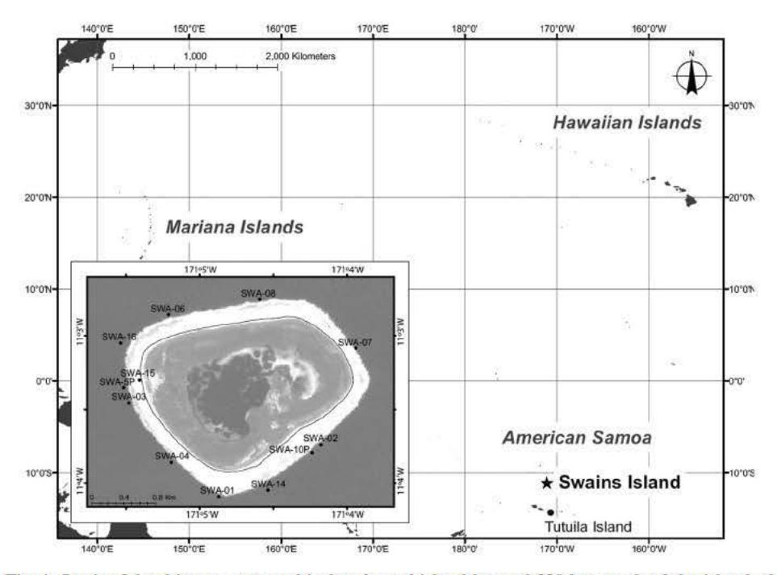

# **First records of marine benthic algae from Swains Island, American Samoa**

*Roy T. TSUDA a , Jack R. FISHER a,† & Peter S. VROOM b\*\**

*aBotany-Herbarium Pacificum, Bishop Museum, 1525 Bernice Street, Honolulu, HI 96817, USA*

*bOcean Associates, NOAA Fisheries' Pacific Islands Fisheries Science Center, Coral Reef Ecosystem Division, 1125B Ala Moana Boulevard, Honolulu, HI 96814, USA*

*† JRF passed away on 4 July 2010 prior to the submission of the manuscript*

*(Received 19 October 2010, Accepted 28 December 2010)*

**Abstract** – Fifty-nine species of marine benthic algae are reported for the first time from the coral reefs of isolated Swains Island, American Samoa, based on collections made during February 2002, 2004, 2006, and March 2008 under the auspices of the U.S. National Oceanic and Atmospheric Administration. The collections include 4 species of blue-green algae (cyanobacteria), 38 species of red algae, 3 species of brown algae and 14 species of green algae. Based on their frequency of occurrence at different stations during the 4 cruises, *Rhipilia geppiorum* and *Microdictyon umbilicatum* were considered the most widely distributed species during the months of February and March. Twenty-eight species represent new records for the Samoan Archipelago (American Samoa and Samoa).

**American Samoa / island biogeography / coral reef / long-distance dispersal / marine algae / Pacific Ocean / Swains Island**

**Résumé** – **Premiers reports d'algues marines benthiques de Swains Island, Samoas américaines.** Cinquante-neuf espèces d'algues marine benthiques sont signalées pour la première fois dans les récifs coralliens de Swains Island, Samoas américaines, sur la base d'échantillonnages effectués pendant les mois de février 2002, 2004, 2006 et mars 2008 sous les auspices de la National Oceanic and Atmospheric Administration aux Etats-Unis. On signale 4 cyanophytes (cyanobactéries), 38 algues rouges, 3 algues brunes et 14 algues vertes. Sur la base de leurs fréquences dans plusieurs stations pendant les quatre campagnes, *Rhipilia geppiorum* et *Microdictyon umbilicatum* étaient les espèces les plus répandues pendant les mois de février et de mars. Vingt-huit espèces sont signalées pour la première fois dans l'archipel des Samoas (Samoas américaines et Samoa).

**Algues marines / biogéographie des îles / dispersion / Océan pacifique / récifs coralliens / Samoa américaines / Swains Island**

\* Correspondence and reprints: Peter.Vroom@noaa.gov Communicating editor: Frederik Leliaert

Fig. 1. Swains Island is a remote and isolated coral island located 320 km north of the island of Tutuila, American Samoa. Although politically associated with American Samoa, Swains Island is physically part of the Tokelau island chain. Insert: Location of established NOAA monitoring stations at Swains Island, American Samoa. The landlocked brackish lagoon occupies the center of the island.

#### INTRODUCTION

Swains Island (11.05556°S, 171.07778°W) is a remote, low (maximum elevation of 2.8 m above sea level) coral island encompassing an area of 1.866 km² that includes a 0.358 km² land-locked brackish lagoon surrounded by 1.508 km² of dry land (Fig. 1). It is located 320 km north of Tutuila, the largest and most populated of the 7 islands which comprise American Samoa. The privately owned Swains Island, a copra plantation, is geologically part of the Tokelau Chain to the north, but is an unincorporated U.S. territory administered by American Samoa. The other islands in American Samoa include 'Aunu'u Island (which lies just east of the northeastern tip of Tutuila), the volcanic islands of Ofu, Olosega and Ta'i (comprising the Manu'a Islands located 100 km east of Tutuila), and isolated, oceanic Rose Atoll National Wildlife Refuge (part of the Rose Atoll Marine National Monument) which lies 270 km east of Tutuila.

This study presents the first floristic account of marine benthic algae from Swains Island. Skelton and South (1999, 2007) reviewed previous algal studies conducted in the Samoan Archipelago, which also included the two main islands ('Upolu and Savai'i) and four smaller islands (Nu'utele, Nu'ulua, Manono

and Apolima) of the independent nation of Samoa. According to Skelton and South (2004), 230 species of benthic marine algae have been recorded from the islands of American Samoa (excluding Swains Island). These algal species have primarily been documented from the main island of Tutuila by Setchell (1924), Hollenberg (1968a, 1968b, 1968c), Skelton and South (1999), South and Skelton (2000), Skelton (2003), Littler and Littler (2003) and Skelton and South (2004, 2007), although a few species from 'Aunu'u and the three Manu'a Islands are also reported in the above references. Only 15 species of algae have ever been reported from remote, oceanic Rose Atoll (Setchell, 1924).

### **MATERIALS AND METHODS**

Swains Island was visited in 2002, 2004, 2006, and 2008 as part of the U.S. National Oceanic and Atmospheric Administration's (NOAA) Pacific Islands Fisheries Science Center's (PIFSC) Coral Reef Ecosystem Division's (CRED) Reef Assessment and Monitoring Program (RAMP). Algal samples were collected by hand by scuba divers at 12 permanently established monitoring sites (Fig. 1) and 1 incidental site (see Appendix) following the protocol of Preskitt *et al.* (2004), and immediately frozen. Stations at Swains Island were identified using the first three letters of the island's name, e.g., SWA-01-02 signifies Swains Island (SWA), station or site number (01), and the year 2002 when the specimens were collected (02).

Prior to taxonomic examination, plastic bags of frozen algae from each station were thawed in tap water. Thawed seawater was poured carefully from the bag and replaced with 4% formalin in seawater to prevent the fragile turf algae and epiphytes from decomposing. The collections were examined using a dissecting microscope, and all epiphytes and turf were separated. The small specimens were mounted on glass slides by decalcifying with 10% hydrochloric acid, staining with aniline blue and mounting with 30% corn syrup (Karo) with phenol. Larger specimens were mounted on segments of herbarium paper; 5 specimens were also preserved in vials with 4% formalin in seawater. The small quantities of non-processed specimens from each station were consolidated into separate jars and preserved in 4% formalin in seawater. The retention of these specimens was to allow us to revisit the site collection, if needed, during our critical taxonomic reexamination of specimens, including epiphytes.

The following higher level classification systems were followed—bluegreen algae or cyanobacteria (Anagnostidis & Komárek, 1988; Komárek & Anagnostidis, 1989; Silva *et al.*, 1996), red algae (Abbott, 1999: Yoon *et al.*, 2006; Choi *et al.*, 2008), brown algae (Abbott & Huisman 2004) and green algae (Cocquyt *et al.*, 2010; Zechman *et al.*, 2010). Except for those species assigned PSV (Peter S. Vroom) specimen numbers, the majority of specimens were assigned Bishop Museum (BISH) numbers. New species records to the Samoan Archipelago (American Samoa and Samoa) presented in this manuscript are preceded by asterisks (\*). All BISH numbered specimens listed here were deposited in *Herbarium Pacificum* of the Bishop Museum, Honolulu; PSV numbered specimens and duplicate BISH specimens were deposited at the NOAA Fisheries' PIFSC, CRED in Honolulu.

Since all algal species from all stations of the four separate cruises to Swains Island were identified, recorded and preserved, the frequency of occurrence (Oosting, 1956), i.e., number or percentage of stations at which a species was recorded during any one cruise, provided an indication of the spatial distribution of a particular species at Swains Island. A maximum of five specimens, however, was cited as vouchers for each species recorded here. Although algal collections were obtained from a total of 13 different stations during the four cruises, collecting stations during an individual cruise varied, i.e., 2002 (9 stations), 2004 (9 stations), 2006 (8 stations) and 2008 (7 stations). Algae were collected at only Stations 6, 7 and 8 on all four cruises.

### **RESULTS**

Fifty-nine species of marine benthic algae were identified from the reefs of Swains Island: 4 species of cyanobacteria, 38 species of red algae, 3 species of brown algae, and 14 species of green algae. Only 2 species, i.e., *Calothrix confervicola* (Dillwyn) C. Agardh and *Jania rubens* (L.) J.V. Lamour. were restricted to the shallow reef flat, 0.1-0.3 m deep and 10 species were collected on both the shallow reef flats and deeper forereef, 11-21 m deep. The remaining 47 species were collected only on the forereef.

Twenty-eight species represent new records for the Samoan Archipelago (American Samoa and Samoa); of these there were 4 species of cyanobacteria, 17 species of red algae, 1 species of brown algae and 7 species of green algae. The 4 species identified only to the generic level, *i.e.*, *Peyssonnelia* sp., *Pterocladiella s*p., *Laurencia* sp. and *Cladophora* sp., were not included among the 28 species new to the Samoan Archipelago.

### **Phylum Cyanobacteria**

Class Cyanophyceae

Order Oscillatoriales

Family Oscillatoriaceae

\**Lyngbya bouillonii* **Hoffm.** *et* **Demoulin**; Lobban & Tsuda 2003: 57, fig. 2. Specimen examined: 2002: SWA-08-02, BISH 735565.

Note: Trichomes are 16-20 µm diam. with indented cross-walls. Based on 16S rRNA in *Lyngbya bouillonii* and three other *Lyngbya* species, *i.e.*, *L. confervoides C*. Agardh, *L. sordida* (Zanardini) Gomont, *L. majuscula* (Dillwyn) Harv., Engene *et al.* (2010) could not correlate phylogenetic species with morphological appearance of *Lyngbya* species. Marine species of the genus *Lyngbya*, however, formed a monophyletic clade which differed from clades of brackish-water species and *Lyngbya* mixed with other cyanobacteria.

*\*Lyngbya confervoides* **C. Agardh**; Desikachary 1959: 315, pl. 49 (fig. 8), pl. 52 (fig. 1). Specimens examined: 2004: SWA-01-04, BISH 735575; SWA-08-04, BISH 738852; SWA-10P-04, BISH 738864; SWA-14-04, BISH 738888. 2006: SWA-10P-06, BISH 738963.

Note: Trichomes range from 8-28 µm diam. with no indentation in cross-walls; numerous empty sheaths present. Molecular studies by Engene *et al.* (2010) were conducted on only one specimen of *L.* cf. *confervoides.*

Family Pseudoanabaenaceae

*\*Leptolyngbya crosbyana* **(Tilden) Anagn.** *et* **Komárek**; Tilden 1910: 96, pl. 4 (figs 60, 61).

Specimens examined: 2004: SWA-08-04, BISH 738861. 2008: SWA-03-08, BISH 738973.

Note: Specimens are hemispherical solid masses, 2 cm diam., on calcium carbonate substrata and consist of unbranched trichomes with cells 8 µm long and 2 µm diam.

## Order Nostocales

Family Rivulariaceae

*\*Calothrix confervicola* **(Dillwyn) C. Agardh**; Tilden 1910: 256, pl. 16 (figs 6-8). Specimen examined: 2002: SWA-RF-02, PSV 10412b.

Note: Filament consists of a single basal heterocyst 8 µm diam. with tapering trichome up to 160 µm long within a gelatinous sheath. The specimens were epiphytic on a fragment of *Laurencia* sp. collected on the reef flat in waters 0.1- 0.3 m deep.

## **Phylum Rhodophyta**

Class Compsopogonophyceae

Order Erythropeltidales

Family Erythrotrichiaceae

*Erythrotrichia carnea* **(Dillwyn) J. Agardh**; Skelton & South 2007: 11, fig. 8.

Specimens examined: 2004: SWA-06-04, BISH 738815; SWA-14-04, BISH 738901. Note: Specimens were growing on forereef at 11.6-17.4 m depth. This species, originally described from Wales, has been reported worldwide. Zuccarello *et al.* (2008) showed large sequence divergence among individuals of *E. carnea* sampled from the Pacific USA, Australia, Tasmania and Madagascar, possibly indicating multiple cryptic species.

# Class Florideophyceae

### Order Nemaliales

Family Galaxauraceae

*Galaxaura filamentosa* **R***.* **Chou**; Itono 1980: 2, fig. 1; Skelton & South 2007: 21, fig. 17.

Specimens examined: 2002: SWA-04-02, PSV 10110, PSV 10440. 2004: SWA-05P-04, BISH 738785. 2006: SWA-05P-06, BISH 738937. 2008: SWA-10P-08, BISH 739009.

Note: Plants are up to 5 cm tall, red and attached to substrata by a single discoid holdfast. Branches are clothed in silky assimilatory filaments which arise as a continuation of the intertwined colorless medullary filaments, *i.e.*, cortex absent.

## Family Liagoraceae

*Liagora ceranoides* **J.V. Lamour.**; Abbott 1999: 84, figs 13I-M.

Specimen examined: 2004: SWA-15-04, BISH 738802.

Note: Plants are less than 6 cm tall covered with white powdery calcium carbonate. Although only one collection of this species was made at Swains I., it is one of the more common *Liagora* in the central Pacific.

### Order Gelidiales

## Family Gelidiaceae

## *Pterocladiella* **sp.**

Specimen examined: 2004: SWA-06-04, BISH 738821.

Note: Specimens are less than 4 mm high and consist of prostrate axes with erect branches on the dorsal surface and irregularly situated rhizoids on the ventral surface. These sterile specimens appear morphologically more comparable to *Pterocladiella* than *Gelidium.* It is listed here in hopes that fertile plants may be found in other NOAA collections from American Samoa.

## Family Gelidiellaceae

*\*Gelidiella antipae* **Celan**; Abbott 1999: 202, figs 53D-F.

Specimens examined: 2004: SWA-06-04, BISH 738826; SWA-08-04, BISH 738858.

Note: Immature plants consist of terete prostrate axes with numerous unicellular rhizoids along the ventral surface and erect axes, less than 5 mm tall, present on the dorsal surface.

### Order Corallinales

## Family Corallinaceae

*\*Jania pacifica* **Aresch.**; Taylor 1945: 197, pl. 60 as *Jania mexicana* W.R. Taylor; Tsuda *et al.*, 2008: 275, fig. 2A..

Specimens examined: 2002: SWA-02-02, PSV 10102; SWA-06-02, BISH 735561; SWA-RF-02, PSV 10415, 10435. 2004: SWA-03-04, BISH 735587.

Note: Pink clumps on substrata, up to 9 cm across and 1 cm high, are heavily calcified; intergenicular length:width ratio is 2-3.5:1 with branches 300-360 µm diam. Terminal segments possess rounded apices. Habit of specimens is similar to those reported and illustrated from Baker Island (Tsuda *et al.*, 2008) located northwest of Swains Island. Specimens were collected from the reef flat and deeper forereef.

*Jania pumila* **J.V. Lamour.**; Abbott 1999: 189, fig. 48c; Skelton & South 2007: 46, figs 70-73.

Specimens examined: 2002: SWA-05P-02, BISH 735553. 2004: SWA-05P-04, BISH 738784 with ungulate apices; SWA-14-04, BISH 738892. 2006: SWA-05P-06, BISH 738939. 2008: SWA-10P-08, BISH 739016.

Note: Specimens are usually epiphytic, less than 100 µm diam., with rounded apices. Intergenicular length:width ratio is 2.5-3:1 or greater (Abbott 1999) as opposed to 1-2:1 ratio (Skelton & South 2007).

*\*Jania rubens* **(L.) J.V. Lamour.**; Taylor 1950: 133.

Specimen examined: 2002: SWA-RF-02, PSV 10418a.

Note: Branches are 92-96 µm diam. with attenuated apices on less than half of the branches. The specimen was collected only on the shallow reef flat.

## Order Peyssonneliales

## Family Peyssonneliaceae

## *Peyssonnelia* **sp.**

Specimens examined: 2004: SWA-01-04, BISH 734572 on *Rhipilia geppiorum*; SWA-03-04, BISH 738775; SWA-07-04, BISH 738838; SWA-14-04, BISH 738886 on *Rhipilia geppiorum.* 2006: SWA-07-06, BISH 738949.

Note: Red prostrate, fan-shaped calcareous crust, up to 2.5 cm broad and 50 µm thick, appear frequently as epiphytes on the spongy green alga *Rhipilia geppiorum* W.R. Taylor. Ventral side of the single layer hypothallus produces numerous unicellular rhizoids, up to 80 µm long and 8 µm diam. Dorsal surface cells (30 µm long and 8 µm diam.) radiate in parallel rows with occasional single branching near the base; cell inclusions absent. Immature tetraspores divide in a cruciate manner. All specimens were collected in water 12.2-18.9 m deep. Guimaraes & Fujii (1999) provides a summary of applicable morphological characters to examine in species of *Peyssonnelia.*

## Order Gigartinales

## Family Hypneaceae

*\*Hypnea spinella* **J. Agardh**; Abbott 1999: 117, figs 25B-E.

Specimens examined: 2002: SWA-RF-02, PSV 10419a. 2004: SWA-05P-04, BISH 738794. 2006: SWA-05P-06, BISH 738933.

Note: Secondary attachments among branches are present with conspicuous elongated cortical cells. Specimens were collected on the shallow reef flat and deeper forereef.

### Order Ceramiales

### Family Callithamniaceae

*\*Crouania mageshimensis* **Itono**; Abbott 1999: 293, figs 82A-D.

Specimens examined. 2004: SWA-01-04, BISH 735573. 2006: SWA-14-06, BISH 738969.

Note: Whorl branches are sparse and extend perpendicular to main axis.

## *\*Crouania minutissima* **Yamada**; Abbott 1999: 294, figs 82E-G.

Specimens examined: 2002: SWA-02-02, PSV 10397a. 2004: SWA-10P-04, BISH 738867; SWA-14-04, BISH 738893. 2006: SWA-04-06, BISH 738928.

Note: Whorl branches bushy with apices turned towards apex of main axis.

### Family Ceramiaceae

*Antithamnion lherminieri* **(P. Crouan** *et* **H. Crouan) Bornet** *ex* **Nasr** [= *Antithamnion antillanum* Børgesen]; Abbott 1999: 248, figs 69A-B; Skelton & South 2007: 84, figs 177-180.

Specimen examined: 2006: SWA-07-06, BISH 738948.

Note: Prostrate axes consist of dorsal erect axes with alternate branches; ventral surface possesses short unbranched filaments.

*\*Antithamnion decipiens* **(J. Agardh) Athanas.**; Abbott 1999: 250, figs 69C-D. Specimens examined: 2004: SWA-10P-04, BISH 738877; SWA-14-04, BISH 738894.

Note: Prostrate axes form erect branched determinate branches.

*Antithamnionella breviramosa* **(E.Y. Dawson) Woll.**; Skelton & South 2007: 86, figs 181-185.

Specimens examined: 2004: SWA-01-04, BISH 735579; SWA-07-04, BISH 738837; SWA-08-04, BISH 738856; SWA-10P-04, BISH 738878; SWA-14-04, BISH 738904. Note: Numerous erect axes with whorled branchlets are produced on the dorsal prostrate axes; rhizoids present on ventral prostrate axes.

*Ceramium affine* **Setch.** *et* **N.L. Gardner**; South & Skelton 2000: 54, figs 1-10. Specimen examined: 2008: SWA-03-08, BISH 738976.

Note: Nodal band is 28-34 µm diam. with 2-3 cell rows. Erect branches occasionally terminate in two unequal length pinchers, similar to *Gayliella flaccida.* Tetrasporangia lack involucre.

*Ceramium krameri* **South** *et* **Skelton**; South & Skelton 2000: 69, figs 45-51. Specimens examined: 2004: SWA-01-04, BISH 735582; SWA-07-04, BISH 738847. Note: Erect axes are 1 mm long with corticated axes 40-50 µm diam. with periaxial cells similar in appearance to cortical cells.

*Ceramium macilentum* **J. Agardh**; South & Skelton 2000: 71, figs 52-62. Specimens examined: 2004: SWA-03-04, BISH 738772; SWA-06-04, BISH 738810; SWA-07-04, BISH 738840; SWA-08-04, BISH 738855; SWA-10P-04, BISH 738866. Note: Species is characterized by the absence of basipetal derivatives of the periaxial cells.

*\*Corallophila apiculata* **(Yamada) R. E. Norris**; Abbott 1999: 288, figs 81A-C. Specimens examined: 2002: SWA-05P-02, BISH 735549. 2004: SWA-14-04, BISH 738900. 2006: SWA-08-06, BISH 738952. 2008: SWA-08-08, BISH 739002. Note: Prostrate and erect axes are nearly the same diameter.

*Corallophila huysmansii* **(Weber-van Bosse) R. E. Norris**; Skelton & South 2007: 109, figs 265-269.

Specimens examined: 2002: SWA-08-02, BISH 7355567. 2004: SWA-01-04, BISH 735581; SWA-06-04, BISH 738816; SWA-08-04, BISH 738859.

Note: This common species worldwide is characterized by 4 pericentral cells and narrow erect axes less than 80 µm diam. constricted at the base.

*\*Corallophila itonoi* **(Ardré) R. E. Norris**; Abbott 1999: 290, figs 81F-H. Specimens examined: 2002: SWA-05P-02, BISH 735555. 2004: SWA-05P-04, BISH 738783. 2006: SWA-05P-06, BISH 738931. 2008: SWA-10P-08, BISH 739010. Note: Some of the apices possess pinchers, unlike the other two species of *Corallophila* recorded above.

*Gayliella flaccida* **(Kütz.) T.O. Cho** *et* **L. McIvor**; South & Skelton 2000: 65, figs 32-39, 41-44 as *Ceramium flaccidum* (Harv. *ex* Kütz.) Ardiss. Specimens examined: 2004: SWA-05P-04, BISH 738793; SWA-10-04, BISH 738874. 2006: SWA-05P-06, BISH 738940. 2008: SWA-10P-08, BISH 739012. Note: The cortex consists of a gap between the horizontally elongated basipetal cells and the upper periaxial cells; terminal branches consist of unequal length pinchers.

## Family Dasyaceae

*\*Dasya corymbifera* **J. Agardh**; Abbott 1999: 320, figs 90A-C.

Specimens examined: 2002: SWA-08-02, PSV 10427. 2004: SWA-06-04, BISH 738805, 738825.

Note: Plants are up to 4 cm tall, erect, with main axes corticated throughout and lower section without pseudolaterals.

*\*Dasya iridescens* **(Schlech) A. Millar** *et* **I.A. Abbott**; Abbott 1999: 321, figs 91A-G.

Specimens examined: 2004: SWA-03-04, BISH 738773; SWA-14-04, BISH 738897. 2008: SWA-03-08, BISH 738977.

Note: Percurrent main axes possess whorls laterals.

*Heterosiphonia crispella* **(C. Agardh) M.J. Wynne**; Abbott 1999: 328, figs 94A-D. Specimens examined: 2004: SWA-03-04, BISH 738774; SWA-05P-04, BISH 738788. 2006: SWA-05P-06, BISH 738930. 2008: SWA-07-08, BISH 738995; SWA-10P-08, BISH 739014.

Note: Common epiphytic species characterized by alternately arranged branches arising from every second axial segments.

## Family Delesseriaceae

*Hypoglossum caloglossoides* **M.J. Wynne** *et* **Kraft**; Wynne & Kraft 1985: 9, figs 1- 19.

Specimens examined: 2004: SWA-01-04, BISH 735571; SWA-06-04, BISH 738813; SWA-10P-04, BISH 738863; SWA-14-04, BISH 738891. 2006: SWA-01-06, BISH 738915.

Note: Specimens consist of prostrate constricted thin blades with ventral aggregated rhizoids at the constrictions.

*\*Hypoglossum rhizophorum* **D.L. Ballant.** *et* **M.J. Wynne**; Ballantine & Wynne 1988: 8, figs 1-14.

Specimens examined: 2004: SWA-06-04, BISH 738831. 2008: SWA-16-08, BISH 739019.

Note: This Caribbean species, which possesses a distinct narrow rhizome, has been previously reported from Hawaii by Ballantine & Wynne (1988) and Abbott (1999).

## Family Rhodomelaceae

*\*Chondria polyrhiza* **Collins** *et* **Herv.**; Abbott 1999: 360, figs 103G-H.

Specimen examined: 2004: SWA-06-04, BISH 738819.

Note: Plants possess tapering apices with rectilinear surface cells.

*\*Chondria simpliciuscula* **Weber Bosse**; Abbott 1999: 361, figs 104A-F.

Specimens examined: 2002: SWA-RF-02, PSV 10395b, 10396d. 2006: SWA-04-06, BISH 738922. 2008: SWA-16-08, BISH 739017.

Note: Plants possess distinctly truncated apices with hexagonal surface cells. Specimens were collected on the shallow reef flat and deeper forereef.

*Herposiphonia secunda* **(C. Agardh) Ambronn**; Hollenberg 1968c: 555, fig. 14 as *Herposiphonia tenella* (C. Agardh) Schmitz; Skelton & South 2007: 176, figs 468- 473.

Specimens examined: 2004: SWA-01-04, BISH 735580; SWA-03-04, BISH 738779; SWA-06-04, BISH 738812; SWA-07-04, BISH 738842; SWA-10P-04, BISH 738879. Note: Specimens possess one or three determinate erect axes flanked by indeterminate axes. Specimens were collected on the shallow reef flat and deeper forereef.

*\*Laurencia majuscula* **(Harv.) A.H.S. Lucas**; Saito 1969: 149; McDermid 1988: 233, figs 13-14.

Specimens examined: 2002: SWA-06-02, BISH 735558. 2004: SWA-01-04, BISH 735578; SWA-03-04, BISH 738780; SWA-06-04, BISH 738829; SWA-14-04, BISH 738899.

Note: Protruding cortical cells especially at the apices are clearly evident; anatomically, lenticular thickening is absent.

## *Laurencia* **sp.**

Specimens examined: 2004: SWA-07-04, BISH 738840; SWA-10P-04, BISH 738875. 2006: SWA-01-06, BISH 739025. 2008: SWA-08-08, BISH 739004.

Note: All specimens consist of immature plants or fragments with soft terete main axis less than 13 mm long. Cortical cells, 20-32 µm diam., with secondary pitconnections, do not protrude beyond surface; lenticular thickening is absent.

*\*Neosiphonia flaccidissima* **(Hollenb.) M. S. Kim** *et* **I. K. Lee**; Hollenberg 1968a: 63, figs 2A, 11 as *Polysiphonia flaccidissima* Hollenb.

Specimens examined: 2004: SWA-03-04, BISH 738770; SWA-05P-04, BISH 738797. 2006: SWA-05P-06, BISH 738936.

Note: The Swains Island specimens seem to fall within the circumscription of this variable species (varieties) as described by Hollenberg (1968a). Plants possess limited prostrate axes; erect branches taper towards the apices with 4 pericentral cells and scar cells at nearly every segment.

*Neosiphonia howei (***Hollenb.** *in* **W. R. Taylor) Skelton** *et* **South** 2007: 188, figs 502-510; Hollenberg 1968b: 203, figs 1D, 1E, 2A as *Polysiphonia howei* Hollenb.

Specimen examined: 2004: SWA-06-04, BISH 738809.

Note: Specimens possess 8 offset pericentral cells with secondary pit connections.

## *Polysiphonia scopulorum* **Harv.**; Hollenberg 1968a: 79.

Specimens examined: 2002: SWA-06-02, BISH 735560. 2004: SWA-01-04, BISH 735583; SWA-10P-04, BISH 738881.

Note: Plants possess 4 pericentral cells with rhizoids clearly an extension of the pericentral cell.

## Family Wrangeliaceae

*\*Anotrichium secundum* **(Harv.** *ex* **J. Agardh) G. Furnari**; Abbott 1999: 245, figs 68A-C.

Specimens examined: 2004: SWA-07-04, BISH 738845. 2006: SWA-01-06, BISH 738912; SWA-08-06, BISH 738954.

Note: Prostrate axes, 200-320 µm diam., consist of narrower unbranched erect axes, 160-200 µm diam. In this species, the tetrasporangia are cut off asymmetrically from the pedicel.

*Anotrichium tenue* **(C. Agardh) Nägeli**; Skelton & South 2007: 120, figs 299-301. Specimen examined: 2004: SWA-10P-04, BISH 738870.

Note: Erect axes are frequently branched, unlike *Anotrichium secundum.* Tetrasporangia are cut off symmetrically from the pedicel center.

*Griffithsia subcylindrica* **Okamura**; Skelton & South 2007: 124, figs 313-319.

Specimen examined: 2004: SWA-06-04, BISH 738830.

Note: Cells are cylindrical and elongate toward the base.

## **Phylum Heterokontophyta**

Class Phaeophyceae

Order Dictyotales

Family Dictyotaceae

*Dictyota bartayresiana* **J.V. Lamour.**; Skelton & South 2007: 209, figs 578-581, 787.

Specimens examined: 2002: SWA-05P-02, BISH 735554. 2004: SWA-05P-04, BISH 738790. 2006: SWA-05P-06, BISH 738934.

Note: This species, which form ball-like clumps, is the most common *Dictyota* in the central Pacific, including Micronesia. The Swains specimens (<2 cm high) were erect and appeared to represent juveniles of this species.

*\*Dictyota sandvicensis* **Sond.**; Abbott & Huisman 2004: 205, figs 78a-B.

Specimen examined: 2006: SWA-05P-06, BISH 738935.

Note: Spatulate bladelets on margin are present but not abundant nor conspicuous as in Hawaiian specimens.

*Lobophora variegata* **(J.V. Lamour.) Womersley** *ex* **E.C. Oliveira**; Skelton & South 2007: 212, figs 595-597.

Specimens examined: 2002: SWA-01-02, PSV 10432; SWA-RF-02, PSV 10395. 2004: SWA-06-04, BISH 738820; SWA-08-04, BISH 738853. 2008: SWA-10P-08, BISH 739015.

Note: Cross-sections of the fan-shaped leathery blade show the characteristic cortical, subcortical and single medullary cell layer. Specimens were collected on the shallow reef flat and deep forereef.

## **Phylum Chlorophyta**

Order Palmophyllales

Family Palmophyllaceae

*\*Palmophyllum crassum* **(Naccari) Rabenh.**; Abbott & Huisman 2004: 37, figs 1A-B.

Specimens examined: 2002: SWA-01-02, PSV 10433a. 2004: SWA-08-04, BISH 738854; SWA-14-06, BISH 738889.

Note: Dried specimens are green to brown, flat and leathery. Microscopically, coccoid unicells, 4-5 µm diam., are embedded in the gelatinous body. The three specimens were collected on the forereef at a depth of 12.8-21 m. Sartoni *et al.* (1993) collected specimens on shaded rocky bottom at a depth of 25 m. Zechman *et al.* (2010) provide molecular phylogenetic evidence that this deep water alga represents a distinct and early lineage of green algae.

# Class Ulvophyceae

### Order Ulvales

Family Ulvaceae

*Ulva clathrata* **(Roth) C. Agardh**; Skelton & South 2007: 230, figs 630-635.

Specimens examined: 2002: SWA-RF-02, PSV 10396b. 2004: SWA-05P-04, BISH 738799. 2006: SWA-05P-06, BISH 738938.

Note: Based on molecular sequence data, O'Kelly *et al.* (2010) found that *Ulva clathrata* (type locality Baltic Sea) and six other tubular *Ulva* belong to seven operational taxonomic units of which none corresponds to currently accepted molecular concepts of named species. The species name *Ulva clathrata* is retained here since no substitute name has been proposed. Specimens were collected on the shallow reef flat and deeper forereef.

## Order Cladophorales

Family Anadyomenaceae

*Microdictyon umbilicatum* **(Velley) Zanardini**; Abbott & Huisman 2004: 62, fig. 15B.

Specimens examined: 2002: SWA-06-02, BISH 735556. 2004: SWA -01-04, BISH 735576; SWA-06-04, BISH 738808. 2006: SWA-01-06, BISH 738909. 2008: SWA-03-08, BISH 738971.

Note: Specimens up to 9.5 cm across with individual cells ranging from 200-400 µm diam. and mesh conspicuous, as in *Microdictyon setchellianum* Howe. End cells lack crenulations; however, few crenulations observed at apex of end cells in PSV 10416e and BISH 738857. The cuboidal cells, 320 µm diam., of PSV 10411 differ from the other specimens and may represent another species. Skelton and South (2007) recognize only one species, *Microdictyon japonicum* Setchell, from Apia, Samoa, which was relegated as a synonym under *M. umbilicatum* by Abbott and Huisman (2004). Kraft (2007: 91) reported that plants found in deeper waters possess a coarser mesh than the shallow water plants; however, the diameters of the cells do not exceed 140 µm diam. Specimens were collected on the shallow reef flat and deeper forereef.

## Family Cladophoraceae

*\*Cladophora catenata* **(Linnaeus) Kützing** [= *Cladophora luxurians* (W.J. Gilbert) I.A. Abbott *et* Huisman]; Abbott & Huisman 2004: 77, fig. 22D; Leliaert & Coppejans 2006: 672.

Specimen examined: 2004: SWA-01-04, BISH 735574.

Note: *Cladophora luxurians*, a species which was described initially as *Cladophoropsis luxurians* Gilbert (1962), is currently regarded as a synonym of *Cladophora catenata* (Leliaert & Coppejans, 2006). The filaments of the Swains Island specimen are 216-280 µm diam.

## *Cladophora* **sp.**

Specimens examined: 2004: SWA-10P-04, BISH 738882; SWA-14-04, BISH 738902.

Note: Specimens consist of irregularly branched fragments up to 5 mm long which lack the basal sections. Cells are 140-175 µm diam., 1.5-3.0 times longer than diameter. Hopefully, more specimens of this species will be found in other collections from American Samoa.

Family Siphonocladaceae

*Dictyosphaeria cavernosa* **(Forssk.) Børgesen**; Egerod 1952: 350, figs 1b-f, 2f, 2g; Skelton & South 2007: 253, figs 737, 792.

Specimens examined: 2002: SWA-06-02, PSV 10209. 2004: SWA-06-04, BISH 738807; SWA-10P-04, BISH 738869. 2006: SWA-01-06, BISH 738916. 2008: SWA-16-08, BISH 739018.

Note: This globally distributed single cell-layered morphospecies constitutes multiple cryptic species with possibly more narrow biogeographies (Leliaert *et al.*, *2*007). Specimens were collected on the shallow reef flat and deeper forereef.

*Dictyosphaeria versluysii* **Weber Bosse**; Egerod 1952: 351, figs 1a, 2h-k; Skelton & South 2007: 254, figs 738, 791.

Specimens examined: 2002: SWA-06-02, PSV 10210. 2004: SWA-01-04, BISH 735585; SWA-06-04, BISH 738823. 2006: SWA-01-06, BISH 738908. 2008: SWA-08-08, BISH 739001.

Note: This species is solid with the characteristic trabeculae present in the cell wall.

*Phyllodictyon anastomosans* **(Harvey) Kraft** *et* **M.J. Wynne**; Skelton & South 2007: 255, figs 681-686.

Specimens examined: 2004: SWA-06-04, BISH 739022. 2008: SWA-16-08, BISH 739020.

Note: The two immature specimens are only 1 mm long and fall within the morphological description by Skelton & South (2007). In recent accounts of the genus *Phyllodictyon*, Leliaert *et al.* (2008, 2009) reported that *Phyllodictyon anastomosans* and similar morphologies fall within a clade of *Boodlea* and *Cladophoropsis.*

### Order Bryopsidales

Family Bryopsidaceae

*Bryopsis pennata* **J.V. Lamour.**; Skelton & South 2007: 263, figs 690-691.

Specimens examined: 2004: SWA-05P-04, BISH 738796. 2008: SWA-03-08, BISH 738978.

Note: Siphons consist of central axes with pinnate branches.

### Family Caulerpaceae

*Caulerpa serrulata* **(Forssk.) J. Agardh**; Skelton & South 2007: 268, figs 697-698, 776, 788.

Specimens examined: 2004: SWA-03-04, BISH 735586; SWA-15-04, BISH 738801. 2006: SWA-04-06, BISH 738920; SWA-05P-06, BISH 738932. 2008: SWA-10P-08, BISH 739011.

Note: It is surprising that only one species of *Caulerpa* was collected during the four cruises in 2002, 2004, 2006 and 2008. The serrated blades are typical for *C. serrulata*; however, Stam *et al.* (2006) has shown through molecular phylogenetic studies that morphological identification can be unreliable for even serrated species of *Caulerpa*, e.g., *C. serrulata* and *C. curpressoides* (Vahl) C. Agardh. Specimens were collected on the shallow reef flat and deeper forereef.

## Family Codiaceae

*\*Codium geppiorum* **O.C. Schmidt**; Skelton & South 2007: 273, figs 701, 711-715. Specimen examined: 2006: SWA-04-06, BISH 738929.

Note: Specimens display the branching habit and possess inflated utricles, approximately 200 µm diam. Verbruggen *et al.* (2007) has shown that specimens morphologically identified as *C. geppiorum* were resolved into five distinct evolutionarily significant units via molecular phylogenetic studies. The study was based on specimens collected from S.E. Africa, Red Sea, Caribbean Sea, Arabian Sea and the Indo-Pacific Basin

## Family Derbesiaceae

*\*Pedobesia clavaeformis* **(J. Agardh) MacRaild** *et* **Womersley**; MacRaild & Womersley 1974: 91, figs 12-14.

Specimens examined: 2002: SWA-RF-02, PSV 10435a; SWA-05P-04, BISH 738795. 2004: SWA-06-04, BISH 738811. 2006: SWA-05P-06, BISH 738941; SWA-08-06, BISH 738951.

Note: Clusters of cylindrical siphons, up to 5.5 cm high and 1.1 mm wide (midsection) with occasional single branching, are attached by network of rhizoidal siphons at the base. The basal calcified disk was not obvious in our specimens. This alga has been reported from Australia, New Zealand and Tasmania (MacRaild & Womersley 1974). Specimens were collected on the shallow reef flat and deeper forereef.

## Family Halimedaceae

*\*Halimeda taenicola* **W.R. Taylor**; Taylor 1950: 86, pl. 46 (fig. 1); Hillis 1959: 354, pl. 2 (fig. 6), pl. 5 (fig. 12), pl. 6 (fig. 14), pl. 11; Verbruggen *et al.*, 2005.

Specimens examined: 2002: SWA-02-02, PSV 10106. 2004: SWA-01-04, BISH 735570; SWA-06-04, BISH 738828; SWA-10P-04, BISH 738862. 2006: SWA-01-06, BISH 738906.

Note. As per the finding of only a single species of *Caulerpa* at Swains Island, the presence of only one species of *Halimeda* is equally surprising based on four separate cruises.

### Family Udoteaceae

*\*Rhipilia geppiorum* **W.R. Taylor**; Taylor 1950: 70, pl. 35 as *Rhipilia geppii* W.R. Taylor; Millar & Kraft 2001: 25, figs 4, 13-16 as *Rhipilia geppii*.

Specimens examined: 2002: SWA-01-02, PSV 10100. 2004: SWA-01-04, BISH 735569; SWA-08-04, BISH 738851; SWA-10P-06, BISH 738960. 2008: SWA-07-08, BISH 738997.

Note: Plants are similar to the species described by Taylor (1950) from Bikini Atoll and Enewetak Atoll in the Marshall Islands. Siphons are 32-48 µm diam. with constrictions above each fork. Tenacular branches up to 225 µm long terminate in 2-4 prongs. Besides the Marshall Islands, Millar & Kraft (2001) report this species from Butaritari Atoll (Gilbert Islands) and Ifalik Atoll (Caroline Islands).

### **DISCUSSION**

Only 10 of the 59 algal species (17%) were recorded at 50% or more of the stations, i.e., frequency of occurrence, during at least 1 of the 4 NOAA cruises (Table 1). Seven of these species were collected during all 4 cruises, but 3 species, *Ceramium macilentum*, *Laurencia majuscula* and *Peyssonnelia* sp., were not collected during the 2008 cruise. Four green algal species (*Rhipilia geppiorum*,

Table 1. Frequency of occurrence of algal species documented at 50% or more of the stations during any one year, i.e., February 2002 (9 stations), February 2004 (9 stations), February 2006 (8 stations) and March 2008 (7 stations) at Swains Island, American Samoa. A total of 13 different stations were sampled during the four NOAA cruises.

| Species                      | Frequency of Occurrence |                  |                  |                  |
|------------------------------|-------------------------|------------------|------------------|------------------|
|                              | Feb-02 9 Sta.        | Feb-04 9 Sta. | Feb-06 8 Sta. | Mar-08 7 Sta. |
|                              |                         |                  |                  |                  |
| Microdictyon umbilicatum     | 8                       | 7                | 7                | 5                |
| Lyngbya confervoides         | 5                       | 8                | 5                | 1                |
| Dictyosphaeria versluysii    | 3                       | 6                | 6                | 3                |
| Halimeda taenicola           | 6                       | 5                | 3                | 1                |
| Herposiphonia secunda        | 3                       | 6                | 1                | 1                |
| Ceramium macilentum          | 1                       | 6                | 3                | 0                |
| Laurencia majuscula          | 1                       | 5                | 2                | 0                |
| Antithamnionella breviramosa | 1                       | 5                | 1                | 1                |
| Peyssonnelia sp.          | 1                       | 5                | 1                | 0                |

*Microdictyon umbilicatum*, *Dictyosphaeria versluysii*, *Halimeda taenicola*), and the red alga *Peyssonnelia* sp. can be considered macroalgae. The remaining 4 red algae, *Herposiphonia secunda*, *Ceramium macilentum*, *Antithamnionella breviramosa* and juvenile *Laurencia majuscula*, and the cyanobacterium *Lyngbya confervoides* are small epiphytes or turf. In agreement with a study documenting the relative abundance of macroalgal genera around the islands of American Samoa (Tribollet *et al.*, 2010), *Rhipilia geppiorum* and *Microdictyon umbilicatum w*ere the most widely distributed species in the marine waters of Swains Island during February and March, and were collected at more than 70% of the stations during all four cruises.

Eleven of the 59 algal species (19%) were considered rare during the collecting months of February and March, i.e., species recorded from a single station during only 1 of 4 cruises (Table 2). Two additional algal species, *Calothrix confervicola* and *Jania rubens*, were only collected from the shallow reef flats (RF) of Swains Island in February 2002; however, these species were not included in Table 2 since algae from shallow reef flat habitats were not sampled during the three subsequent 2004, 2006, and 2008 cruises.

Based on algal collections from four separate NOAA cruises from 2002 through 2008, the 59 species of marine algae recorded here represent a low algal diversity even for an island with limited reef area and no lagoon habitat such as Swains Island. The presence of only 1 species of *Halimeda* (*H. taenicola*) and only 1 species of *Caulerpa* (*C. serrulata*) is surprising. Similarly, the presence of only 3 species of brown algae, *Dictyota bartayresiana*, *Dictyota sandvicensis*, and *Lobophora variegata*, was unexpectedly low. Although *Halimeda* and *Caulerpa* in subtidal habitats are not typically seasonal, algal collections made in late summer at Swains Island may reveal additional species of *Halimeda*, *Caulerpa* and brown algae.

Table 2. Algal species documented from only one station during any one of the four NOAA cruises.

#### **2002 Cruise**

Station 8. *Lyngbya bouillonii*

#### **2004 Cruise**

Station 1. *Cladophora catenata*

Station 6. *Griffithsia subcylindrica, Neosiphonia howei, Pterocladiella* sp.

Station 10P. *Anotrichium tenue*

Station 15. *Liagora ceranoides*

#### **2006 Cruise**

Station 4. *Codium geppiorum*

Station 5P. *Dictyota sandvicensis*

Station 7. *Antithamnion lherminieri*

#### **2008 Cruise**

Station 3. *Ceramium affine*

South *et al.* (2001) reported a collection of 66 species of marine benthic algae collected during the summer (June and July) of 2000 from 7 of 8 atolls of the Phoenix Islands, Republic of Kiribati. These atolls are located north of Swains Island and the adjacent Tokelau Islands. Algal specimens were collected predominantly in waters 5-35 m deep; shallower algal collections were made at Orona (Hull) Atoll in waters 1-30 m deep and at Enderbury Atoll from the intertidal zone to a depth of 25 m. Of the 66 species reported by South *et al.* (2001) and the 59 species reported here, only 16 species (Table 3) were similar. This low number of similar species indicated that 43 and 50 species of marine benthic algae, respectively, from Swains Island and the Phoenix Islands represented different species. It is unclear whether the major difference is based on algal seasonality, geographic location or the physical morphology of the island or atoll. Tribollet *et al.* (2010) showed that the macroalgal assemblage in the lagoonal habitats of Rose Atoll, American Samoa differed from that on the outer forereef. Collection of algal specimens in the winter period in the Line Islands and in the summer period at Swains Island could be revealing.

Additionally, based on collections from other mid-Pacific Islands (Payri & N'Yeurt, 1997; South & Skelton, 2003), one would expect to find a few epiphytic species belonging to the brown algal families Ectocarpaceae and Sphacelariaceae. *Sphacelaria rigidula* Kützing, present worldwide in both tropical and temperate marine waters (Hoek, 1982), is commonly reported from central and western Pacific islands and atolls. The presence of the green algae *Pedobesia clavaeformis* and *Rhipilia geppiorum* from Swains Island are the first records of these species in the south central Pacific Ocean and represent a significant geographic range extension for these species.

Disperal between isolated, tropical islands in the Pacific Ocean is not well understood. The low number of species recorded at Swains Island during this study, coupled with the low number of species documented during similar studies of central Pacific Islands (South *et al.*, 2001; Tsuda *et al.*, 2008) suggests that the ability of tropical marine algae to disperse across vast stretches of ocean to small, Table 3. Sixteen species of marine benthic algae recorded at Swains Island, Ameican Samoa, in February-March 2002, 2004, 2006 and 2008 (this paper) and at 7 of 8 atolls in the Phoenix Islands, Republic of Kiribati, in June-July 2000 (South *et al.*, 2001). South *et al.* (2001) report a total 66 species and this paper reports a total 59 species.

Cyanobacteria (1 species)

*Lyngbya confervoides*

Rhodophyta (8 species)

*Anotrichium tenue, Ceramium affine, Corallophila huysmansii, Crouania minutissima, Galaxaura filamentosa, Gayliella flaccida, Heterosiphonia crispella, Hypoglossum caloglossoides*

Heterokontophyta (1 species)

*Lobophora variegata*

Chlorophyta (6 species)

*Bryopsis pennata, Caulerpa serrulata, Dictyosphaeria cavernosa, Dictyosphaeria versluysii, Halimeda taenicola, Rhipilia geppiorum*

geographically remote islands is rare to intermittent. Known algal dispersal mechanisms include passive transport of spores or zygotes by currents (Hoffmann, 1987; Norton, 1992) or even sea foam (Meneses, 1993), and passive transport of adult thalli through uni- or multi-organismal rafting (Norton, 1992; Thiel, 2003; McCormick *et al.*, 2008) or attachment to other floating objects, e.g. pumice (Norton, 1992), wood, or plastics (Thiel, 2003; Bryan *et al.*, 2004). The isolated nature of Swains Island would seem to prevent the dispersal of viable unicellular spores or zygotes, which have limited survival times (Norton, 1992), and suggests that floating adult thalli would be the most likely candidates allowing for colonization either by asexual propagation or by producing reproductive cells on arrival (Hoffmann, 1987). However, heavy and calcified genera such as *Halimeda* do not float, and it is hypothesized here that uncalcified juvenile stages attached to floating debris (Thiel, 2003) might be responsible for the spread of such plants between Pacific Islands.

**Acknowledgements.** The authors are grateful to Linda B. Preskitt, Kimberly N. Page, Meghan L. Dailer and Susan W. Cooper who collected the algal specimens, respectively, during the 2002, 2004, 2006 and 2008 NOAA cruises to Swains Island. The authors also appreciate the comments made by G. Robin South and an anonymous reviewer, as well as the corresponding editor, which improved the manuscript. R. T. Tsuda and J. R. Fisher acknowledge NOAA Fisheries' Pacific Island Fisheries Science Center, Coral Reef Ecosystem Division for financial support (AB133F07CQ0051) to sort and study the algal specimens from Swains Island. This study represents contribution 2011-001 of the Pacific Biological Survey, Bishop Museum.

#### **REFERENCES**

ABBOTT I.A., 1999 — *Marine red algae of the Hawaiian Islands.* Honolulu, Bishop Museum Press, 477 p.

ABBOTT I.A. & HUISMAN J.M., 2004 — *Marine green and brown algae of the Hawaiian Islands*. Honolulu, Bishop Museum Press, 259 p.

ANAGNOSTIDIS K. & KOMÁREK J., 1988 — Modern approach to the classification system of cyanophytes. 3. Oscillatoriales. *Archiv für Hydrobiologie Supplement* 80: 327-472.

- BALLANTINE D.l. & WYNNE M.J., 1988 The life history and development of *Hypoglossum rhizophorum* (Delesseriaceae, Rhodophyta) in culture, a new deep-water species from the Caribbean. *Journal of Phycology* 24: 8-12.
- BRYAN S.E., COOK A., EVANS J.P., COLLS P.W., WELLS M.G., LAWRENCE M.G., JELL J.S., GREIG A. & LESLIE R., 2004 — Pumice rafting and faunal dispersion during 2001-2002 in the Southwest Pacific: record of a dacitic submarine explosive eruption from Tonga. *Earth and Planetary Science Letters* 227: 135-154.
- CHOI H-G., KRAFT G.T., KIM H.-S, GUIRY M.D. & SAUNDERS G.W., 2008 Phylogenetic relationships among lineages of the Ceramiaceae (Ceramiales, Rhodophyta) based on nuclear small subunit rDNA sequence data. *Journal of Phycology* 44: 1033-1048.
- COCQUYT E., VERBRUGGEN H., LELIAERT F. & DE CLERCK O., 2010 Evolution and cytological diversification of the green seaweeds (Ulvophyceae). *Molecular Biology and Evolution* 27: 2052-2061.
- DESIKACHARY T.V., 1959 *Cyanophyta*. New Delhi, Indian Council of Agricultural Research, 686 p.
- EGEROD L.E., 1952 An analysis of the siphonous Chlorophycophyta with special reference to the Siphonocladales, Siphonales, and Dasycladales of Hawaii. *University of California Publications in Botany* 25: 325-454, pls. 29-42.
- ENGENE N., COATES R.C. & GERWICK W.H., 2010 16S rRNA gene heterogeneity in the filamentous marine cyanobacterial genus *Lyngbya. Journal of Phycology* 46: 591-601.
- GILBERT W.J., 1962 Contribution to the marine Chlorophyta of Hawaii, I. *Pacific Science* 16: 134- 144.
- GUIMARAES S.M.P.B. & FUJII M.T., 1999 Morphological studies of five species of *Peyssonnelia* (Gigartinales, Rhodophyta) from southeastern Brazil. *Phycologia* 38: 167-183.
- HILLIS L.W., 1959 A revision of the genus *Halimeda* (Order Siphonales). *Publication of the Institute of Marine Science*, *University of Texas* 6: 321-403.
- HOEK C. van den, 1982 The distribution of benthic marine algae in relation to the temperature regulation of their life histories. *Biological Journal of the Linnean Society* 18: 81-144.
- HOFFMANN A.J., 1987 The arrival of seaweed propagules at the shore: a review. *Botanica Marina* 30: 151-165.
- HOLLENBERG G.J., 1968a An account of the species of *Polysiphonia* of the central and western tropical Pacific Ocean. I. *Oligosiphonia*. *Pacific Science* 22: 56-98.
- HOLLENBERG G.J., 1968b An account of the species of the red alga *Polysiphonia* of the central and western tropical Pacific Ocean. II. *Polysiphonia*. *Pacific Science* 22: 198-207.
- HOLLENBERG G.J., 1968c An account of the species of the red alga *Herposiphonia* occurring in the central and western tropical Pacific Ocean. *Pacific Science* 22: 536-559.
- ITONO H., 1980 The genus *Galaxaura* (Rhodophyta) in Micronesia. *Micronesica* 16: 1-19.
- KOMÁREK J. & ANAGNOSTIDIS K., 1989 Modern approach to the classification system of cyanophytes. 4. Nostocales. *Archiv für Hydrobiologie Supplement* 82: 247-345.
- KRAFT G.T., 2007 *Algae of Australia: Marine benthic algae of Lord Howe Island and the southern Great Barrier Reef*, *1: Green algae.* ABRS, Canberra; CSIRO Publishing, Melbourne, 347 p.
- LELIAERT F. & COPPEJANS E., 2006 A revision of *Cladophoropsis* Børgesen (Siphonocladales, Chlorophyta). *Phycologia* 45: 657-679.
- LELIAERT F., DE CLERCK O., VERBRUGGEN H., BOEDEKER C. & COPPEJANS E., 2007 — Molecular phylogeny of the Siphonocladales (Chlorophyta: Cladophorophyceae). *Molecular Phylogenetics and Evolution* 44: 1237-1256.
- LELIAERT F., VERBRUGGEN H., WYSOR B. & DE CLERCK O., 2009 DNA taxonomy in morphologically plastic taxa: Algorithmic species delimitation in the *Boodlea* complex (Chlorophyta: Siphonocladales). *Molecular Phylogenetics and Evolution* 53: 122-133.
- LELIAERT F., WYSOR B., VERBRUGGEN H., VLAEMINCK C. & DE CLERCK O., 2008 *Phyllodictyon robustum* (Setchell et Gardner) comb. nov. (Siphonocladales, Chlorophyta), a morphologically variable species from the tropical Pacific coast of America. *Cryptogamie Algologie* 29: 217-233.
- LITTLER D.S. & LITTLER M.M., 2003 *South Pacific reef plants*. Washington D.C., Offshore Graphics, Inc., 331 p.
- LOBBAN C.S. & TSUDA R.T., 2003 Revised checklist of benthic marine macroalgae and seagrasses of Guam and Micronesia. *Micronesica* 35-36: 54-99.
- MACRAILD G.N. & WOMERSLEY H.B.S., 1974 The morphology and reproduction of *Derbesia clavaeformis* (J. Agardh) De Toni (Chlorophyta). *Phycologia* 13: 83-93.
- MCCORMICK T.B., BUCKLEY L.M., BROGAN J. & PERRY L.M., 2008 Drift macroalgae as a potential dispersal mechanism for the white abalone *Haliotis sorenseni*. *Marine Ecology Progress Series* 362: 225-232.
- MCDERMID K., 1988 *Laurencia* from the Hawaiian Islands: Key, annotated list, and distribution of the species. In: Abbott I.A. (ed.), *Taxonomy of economic seaweeds with reference to*

- *some Pacific and Caribbean species*, II. La Jolla, California Sea Grant College, University of California, pp. 231-247.
- MENESES I., 1993 Foam as a dispersal agent in the rocky intertidal of central Chile. *European Journal of Phycology* 28: 107-110.
- MILLAR A.J.K. & KRAFT G.T., 2001 Monograph of the green macroalgal genus *Rhipilia* (Udoteaceae, Halimedales), with a description of *R. crassa* sp. nov. from Australia and the Philippines. *Phycologia* 40: 21-34.
- NORTON T.A., 1992 Dispersal by Macroalgae. *British Phycological Journal* 27: 293-301.
- O'KELLY C.J., KURIHARA A., SHIPLEY T.C. & SHERWOOD, A.R., 2010 Molecular assessment of *Ulva* spp. (Ulvophyceae, Chlorophyta) in the Hawaiian Islands. *Journal of Phycology* 46: 728-735.
- OOSTING H.J., 1956 *The study of plant communities.* W.H. Freeman and Co., San Francisco, 440 p. PAYRI C.E. & N'YEURT A.D.R., 1997 — A revised checklist of Polynesian benthic marine algae. *Australian Systematic Botany* 10: 867-910.
- PRESKITT L.B., VROOM P.S. & SMITH C.M., 2004 A rapid ecological assessment (REA) quantitative survey method for benthic algae using photoquadrats with scuba. *Pacific Science* 58: 201-209.
- SAITO Y., 1969 The algal genus *Laurencia* from the Hawaiian Islands, the Philippine Islands and adjacent areas. *Pacific Science* 23: 148-160.
- SARTONI G., CINELLI F., HIRATA T., KATAYAMA N. & YOKOHAMA Y., 1993 On the lack of green light-harvesting pigments and the extremely high chlorophyll b/a ratio in the deep-water green alga, *Palmophyllum crassum* (Chlorophaerales). *Japanese Journal of Phycology* 41: 327-331.
- SETCHELL W.A., 1924 American Samoa: Part I. Vegetation of Tutuila Island. Part II. Ethnobotany of the Samoans. Part III. Vegetation of Rose Atoll. *Publications of the Carnegie Institution of Washington* 341: vi + 275 p.
- SILVA P.C., BASSON P.W. & MOE R.L., 1996 *Catalogue of the benthic marine algae of the Indian Ocean.* Berkeley, University of California Press, 1259 p.
- SKELTON P.A., 2003 *Marine plants of American Samoa.* Department of Marine & Wildlife Resources, Government of American Samoa. 103 p.
- SKELTON P.A. & SOUTH G.R., 1999 *A preliminary checklist of the benthic marine algae of the Samoan Archipelago.* The University of the South Pacific, Marine Studies Programme Technical Report 99/1: 1-30.
- SOUTH G.R. & SKELTON P.A., 2000 A review of *Ceramium* (Rhodophyceae, Ceramiales) from Fiji and Samoa, South Pacific. *Micronesica* 33: 45-98.
- SOUTH G.R. & SKELTON P.A., 2003 Catalogue of the marine benthic macroalgae of the Fiji Islands, South Pacific. *Australian Systematic Botany* 16: 699-758.
- SOUTH G.R., SKELTON P.A. & YOSHINAGA A., 2001 Subtidal benthic marine algae of the Phoenix Islands, Republic of Kiribati, Central Pacific. *Botanica Marina* 44: 559-570.
- SKELTON P.A. & SOUTH G.R., 2004 New records and notes on marine benthic algae of American Samoa - Chlorophyta & Phaeophyta. *Cryptogamie*, *Algologie* 25: 291-312.
- SKELTON P.A. & SOUTH G.R., 2007 The benthic marine algae of the Samoan Archipelago, South Pacific, with emphasis on the Apia District. *Nova Hedwigia* 132: 1-350.
- STAM W.T., OLSEN J.L., ZALESKI, S.F., MURRAY S.N., BROWN K.R. & WALTERS L.J., 2006 — A forensic and phylogenetic survey of *Caulerpa* species (Caulerpales, Chlorophyta) from the Florida coast, local aquarium shops, and e-commerce: Establishing a proactive baseline for early detection. *Journal of Phycology* 42: 1113-1124.
- TAYLOR W.R., 1945 *Pacific marine algae of the Allan Hancock Expeditions to the Galápagos Islands.* Allan Hancock Pacific Expeditions, 12, Los Angeles, University of California Press, 528 p.
- TAYLOR W.R., 1950 *Plants of Bikini and other northern Marshall Islands*. Ann Arbor, University of Michigan Studies, Scientific Series, 18, 227 p.
- THIEL M., 2003 Rafting of benthic macrofauna: important factors determining the temporal succession of the assemblage on detached macroalgae. *Hydrobiologia* 503: 49-57.
- TILDEN J., 1910 *Minnesota algae. Volume 1. The Myxophyceae of North America and adjacent regions including Central America*, *Greenland*, *Bermuda*, *the West Indies and Hawaii.* Report of the Survey, Botanical Series, VIII. Minneapolis. 328 p., 20 pls.
- TRIBOLLET A.D., SCHILS T. & VROOM P.S., 2010 Spatio-temporal variability in macroalgal assemblages of American Samoa. *Phycologia* 49: 574-591.
- TSUDA R.T., VROOM P.S., ABBOTT I.A., FISHER J.R. & FOSTER K.B., 2008 Additional marine benthic algae from Howland and Baker Islands, Central Pacific. *Pacific Science* 62: 271-290.
- VERBRUGGEN H., LELIAERT F., MAGGS C.A., SHIMADA S., SCHILS T., PROVAN J., BOOTH D. MURPHY S. DE CLERCK O., LITTLER D.S., LITTLER M.M. &

- COPPEJANS E., 2007 Species boundaries and phylogenetic relationships within the green algal genus *Codium* (Bryopsidales) based on plastid DNA sequences. *Molecular Phylogenetics and Evolution* 44: 240-254.
- VERBRUGGEN H., DE CLERCK O., COCQUYT E., KOOISTRA W.H.C.F. & COPPEJANS E., 2005 — Morphometric taxonomy of siphonous green algae: A methodological study within the genus *Halimeda* (Bryopsidales). *Journal of Phycology* 41: 126-139.
- WYNNE M.J. & KRAFT G.T., 1985 *Hypoglossum caloglossoides* sp. nov. (Delesseriaceae, Rhodophyta) from Lord Howe Island, South Pacific. *British Phycological Journal* 20: 9-19.
- YOON H.S., MULLER K.M., SHEATH R.G., OTT F.D. & BHATTACHARYA D., 2006 Defining the major lineages of red algae (Rhodophyta). *Journal of Phycology* 42: 482-492.
- ZECHMAN F.W., VERBRUGGEN H., LELIAERT F., ASHWORTH M., BUCHHEIM M.A., FAWLEY M.W., SPALDING H., PUESCHEL C.M., BUCHHEIM J.A., VERGHESE B. & HANISAK M.D., 2010 — An unrecognized ancient lineage of green plants persists in deep marine waters. *Journal of Phycology* 46: 1288-1295.
- ZUCCARELLO G.C., WEST J.A. & KIKUCHI N., 2008 Phylogenetic relationships within the Stylonematales (Stylonematophyceae, Rhodophyta): Biogeographic patterns do not apply to *Stylonema alsidii*. *Journal of Phycology* 44: 384-393.

## **Appendix**

Algae were collected by Linda B. Preskitt during the February 2002 NOAA cruise, Kimberly N. Page during the February 2004 NOAA cruise, Meghan L. Dailer during the February 2006 NOAA cruise and Susan W. Cooper during the March 2008 NOAA cruise.

SWA-01-02 (11°4.1049'S, 171°4.8594'W), high coral cover, southwest corner, 12.2-18.0 m deep, II-17-02.

SWA-01-04, see SWA-01-02 for location and habitat, II-17-04.

SWA-01-06, see SWA-01-02 for location and habitat, II-13-06.

SWA-02-02 (11°3.7399'S, 171°4.1770'W), south side, 18.0 m deep, II-17-02.

SWA-03-02 (11°3.4891'S, 171˚5.4875'W), storm damaged site, central west side, south of boat pass, 12.2-18.6 m deep, II-18-02.

SWA-03-04, see SWA-03-02 for location and habitat, II-17-04.

SWA-03-08, see SWA-03-02 for location and habitat, III-18-08.

SWA-04-02 (11°3.8609'S, 171°5.2067'W), coral rubble covered with crustose coralline and turf algae, and live corals, southwest side, 11.0-15.2 m deep, II-18-02.

SWA-04-06, see SWA-04-02 for location and habitat, II-13-06.

SWA-04-08, see SWA-04-02 for location and habitat, III-18-08.

SWA-05P-02 (11°3.3504'S, 171°5.5218'W), coral rubble, central west side outside of boat pass, 11.3-15.5 m deep, II-18-02.

SWA-05P-04, see SWA-05P-02 for location and habitat, II-17-04.

SWA-05P-06, see SWA-05P-02 for location and habitat, II-13-06.

SWA-06-02 (11°2.8383'S, 171°5.2115'W), abundant live corals, northwest side, 11.6-14.0 m deep, II-19-02.

SWA-06-04, see SWA-06-02 for location and habitat, II-15-04.

SWA-06-06, see SWA-06-02 for location and habitat, II-12-06.

SWA-06-08, see SWA-06-02 for location and habitat, III-16-08.

SWA-07-02 (11°3.0698'N, 171°3.9456'W), abundant live corals, northeast side, 14.3-18.9 m deep, II-19-02.

SWA-07-04, see SWA-07-02 for location and habitat, II-16-04.

SWA-07-06, see SWA-07-02 for location and habitat, II-12-06.

SWA-07-08, see SWA-07-02 for location and habitat, III-16-08.

SWA-08-02 (11°2.7437'S, 171°4.6022'W), abundant live corals, central north side, 13.7- 21.0 m deep, II-19-02.

SWA-08-04, see SWA-08-02 for location and habitat, II-15-04.

SWA-08-06, see SWA-08-02 for location and habitat, II-12-06.

SWA-08-08, see SWA-08-02 for location and habitat, III-16-08.

SWA-10P-04 (11°3.7743'S, 171°4.2240'W), high coral cover, southeast side, 13.7-18.9 m deep, II-16-04.

SWA-10P-06, see SWA-10P-04 for location and habitat, II-11-06.

SWA-10P-08, see SWA-10P-04 for location and habitat, III-17-08.

SWA-14-04 (11°4.0370'S, 171°4.5760'W), high coral cover, south side, 12.8-17.4 m deep, II-16-4.

SWA-14-06, see SWA-14-04 for location and habitat, II-11-06.

SWA-15-04 (11°3.301'S, 171°5.408'W), carbonate pavement covered with silt, inside pass near village, east side, 0.3-1.2 m deep, II-17-04.

SWA-16-08 (11°5.084'S, 171°9.224'W), northeast corner, 13.1-14.0 m deep, III-18-08.

SWA-RF-02. Reef flat, 0.1-0.3 m deep, II-19-02.