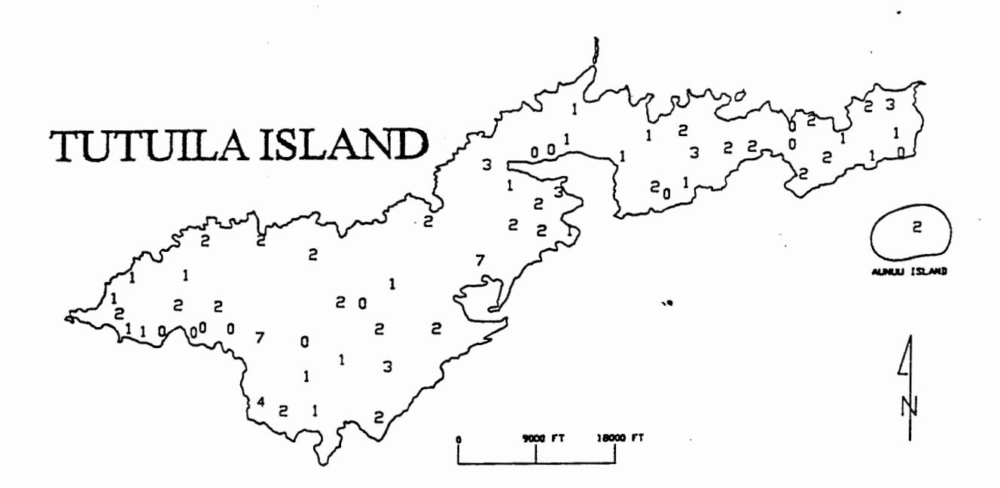
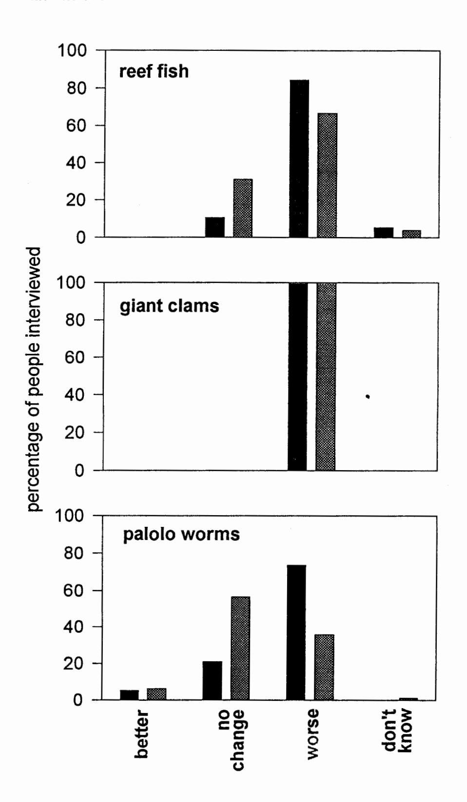
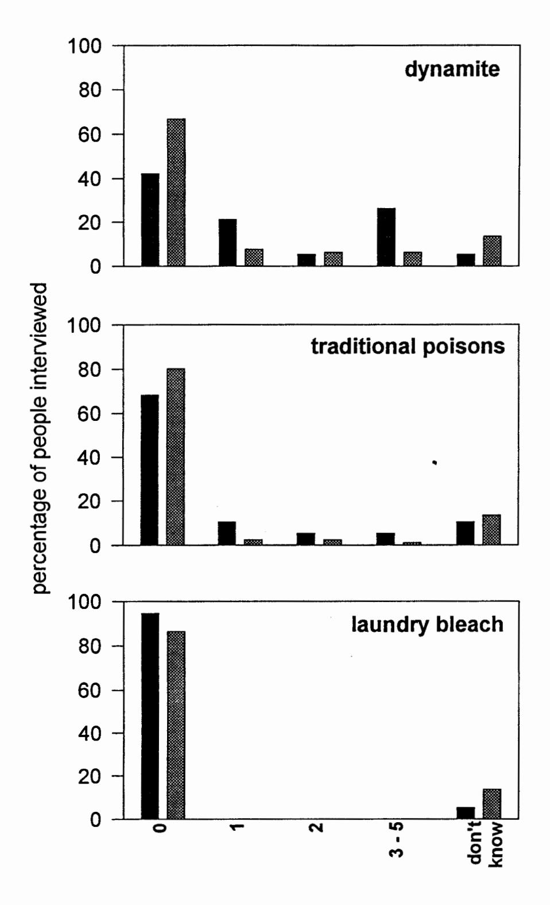
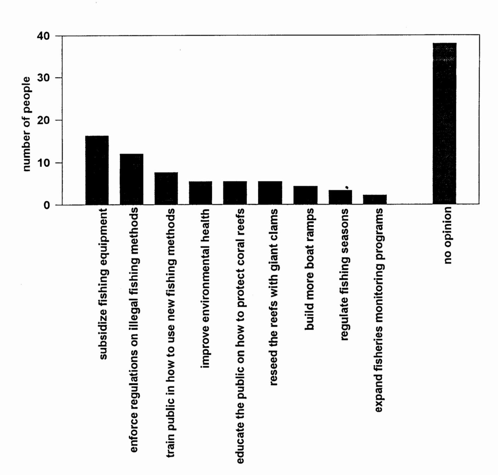

DMWP#72

# COMMUNITY PERCEPTION OF CHANGES IN CORAL REEF FISHERIES IN AMERICAN SAMOA

by

Fale Tuilagi & Alison Green

Department of Marine and Wildlife Resources

Box 3730, Pago Pago, American Samoa 96799

Prepared for: FFA/SPC Workshop on the management of South Pacific Inshore Fisheries. 26 June - 7 July 1995, New Caledonia.

#### Abstract

Coral reef fisheries are an important resource, both economically and culturally, in American Samoa. Data collected in the last 15 years indicate that these fisheries may be in decline. This study assessed community perception on how the coral reef fisheries had changed over a longer time period (up to 70 years) by a interview survey of the Samoan community. All people interviewed (n=100) believed that fishing for giant clams had declined (100%), while fewer people thought that fishing for reef fish (70%) and palolo worms (43%) had declined. Fishing for reef fish and palolo seem to have declined more on the north side than the south side of the island (84% and 67% for reef fish, and 74% and 36% for palolo respectively), possibly because habitat destruction by hurricanes was more severe on the north side of the island. In contrast, fishing for giant clams was thought to have declined on both sides of the island. Community perception on changes in these fisheries concur with recent and independent sources of information, including the Department of Marine and Wildlife Resources (DMWR) fisheries and coral reef assessment programs. This study also confirmed that illegal destructive fishing practices (dynamite fishing and the use of traditional fish poisons) continue to be used, but infrequently, on Tutuila Island . When asked what programs they thought DMWR should be doing, many people had no suggestions (38%) while others thought that we should be subsidizing fishing equipment (16%), improving fishing regulations and enforcement (15%), providing educational programs (13%) and improving reef health (5%).

#### Introduction

Like most Pacific Island countries, American Samoa has undergone many social, economic and environmental changes this century. There has been a shift from a subsistence to a mixed economy, which now includes both market and subsistence sectors (Hill 1977, Craig et al. 1993). Where once families depended on the coral reefs and plantations for their livelihood, many now receive monetary income from working for the government or industry.

This has been accompanied by a change in the nature of the local fishery from a primarily subsistence level to a largely artisanal and recreational fishery, with some subsistence fishing continuing (Hill 1977, Craig et al. 1993). In addition, fishing practises have shifted from the use of traditional methods including paopao canoes and specialized fishing methods (eg. fish traps, nets and lures), to modern methods including the use of power boats, SCUBA equipment and spearguns (Wass 1980).

Accompanying these changes, there has also been a massive increase in the human population. On the main island of Tutuila, the population has increased exponentially from about 5,000 in 1900 to the present level of 55,000 (Craig 1995a). Moreover, the population is still growing at one of the highest rates of increase in the world (3.7%), with a doubling time of only 19 years.

At the same time, there has been a dramatic decline in the condition of the coral reefs on Tutuila in the last 20 years, caused by a combination of both natural and human impacts (Maragos et al. 1994). In the 1970's, the reefs were devastated by a widespread outbreak of the crown-of-thorns starfish (Acanthaster planci), which resulted in the loss of up to 95% of live coral cover in many areas (Wass 1979). Some areas escaped the invasion and coral cover remained high there into the 1980's

(Wass 1982, Birkeland et al. 1991).

Since then, Tutuila has suffered two devastating hurricanes (Ofa in 1990 and Val in 1991), which caused tremendous damage to the reefs by destroying most coral growth down to a depth of 10 - 15m in most places around Tutuila (Maragos et al. 1994). Damage was most severe on the north side, although the south side of the island was badly affected also (Maragos et al. 1994). These hurricanes were followed by a mass coral bleaching event in April 1994, which affected most of the remaining coral in some locations (P. Craig 1995b). These disturbances coupled with ongoing and increasing human impacts (especially sedimentation, eutrophication, coastal construction, solid and chemical waste pollution), have resulted in a dramatic change in the coral reef habitats and their associated reef fish assemblages on the island (Green in prep.).

A downward trend has also been detected in the catch per unit effort of the local coral reef fishery (Saucerman 1995). However since quantitative fishery records were not kept prior to 1979, it is unknown whether changes had also occurred in the fishery prior to this time when socio-economic and environmental changes were already well underway (see Hill 1977). Moreover, since the geographic range of the quantitative survey is limited to a 20 km stretch of coastline on the populated southern side of the island (including Pago Pago Harbor), the degree to which the trends detected by this program are representative of the entire island is unknown.

The primary objective of this study was to assess changes that have occurred to coral reef fishery around the entire island of Tutuila over a long time period (up to 70 years), based on an interview survey of the community. Such surveys tap a valuable source of fisheries knowledge, which is known to exist in Pacific Island communities that were once closely associated with their

coral reefs (Hill 1977, Johannes et al. 1993).

For this study we focused on identifying potential changes that had occurred to three components of the fishery, which are each important in terms of the percentage of the catch that they represent ( Ponwith 1991, Craig et al. 1993) or their traditional value (Hill 1977): reef fish, giant clams (Tridacna maxima and T. squamosa) and a polychaete (Eunice viridis, locally called palolo). Palolo are only present in the fishery for a short time each year (2-3 days), when their reproductive segments (epitokes) emerge in a mass spawning event (Itano & Buckley 1986, Ponwith 1991). Samoans consider palolo a great delicacy, and its emergence each year is an important cultural event (Des Rochers & Tuilagi 1993). Palolo spawning is highly predictable, the precise timing of which was known to Samoans well before the arrival of Europeans (Caspers 1984). Despite their limited availability in time, palolo accounts for a significant part of the inshore fishery, because of the high yield and participation rate when it is available (Ponwith 1991).

One potential threat to these resources is the use of destructive fishing practices, which can cause severe damage to coral reef habitats and result in an ultimate decline in the fishery. The second objective of this study was to determine the degree to which destructive methods continue to be used in the Territory. These methods include traditional fish poisons, *Barringtonia* (futu) and *Derris* (ava niu kini), and modern methods such as dynamite fishing and fish poisoning using laundry bleach.

The final objective of the study was to gauge public opinion on what the Department of Marine and Wildlife Resources (DMWR) should be doing to improve coral reef fisheries in the Territory.

# Study area

This study focuses on the main island of Tutuila and the adjacent small island of Aunu'u in American Samoa (see Fig. 1). Tutuila is the largest island (137 km²) where the majority (95%) of the population lives (EDPO 1993). Aunu'u, which lays approximately 1 km off the SE side of Tutuila, will be considered a village on the south side of Tutuila for the purposes of this study. Narrow fringing reefs predominate on the southern coast of Tutuila, with apron reef communities occurring in the bays on the north side of the island. Human population is highest on the southern side of the island, with habitation limited to a few remote villages on the north side (EDPO 1993).

#### Methods

Information was gathered on perceived changes in the fishery by interviewing 100 residents in 50 of the 64 villages on Tutuila and Aunu'u (Fig. 1) between August 1994 and April 1995. Interviews were conducted on both the north and south sides of Tutuila, since they differ in terms of their population size and the severity of the effects of habitat degradation caused by the hurricanes (see Introduction). More villagers were surveyed on the south side (81 individuals in 36 villages) than the north side (19 individuals in 14 villages) of the Island, because more of the population live on the south than the north side (91% and 9% of the population respectively: EDPO 1993). During this survey, 0.6% of adults 30 years or older (n=16,200: EDPO 1993) were interviewed, with similar proportions interviewed on the north (1.3%) and south (0.6%) sides. One to four villagers were interviewed in each village, which was generally in proportion to the number of people living in the area.

All interviews were conducted by Samoans in their own language in the homes of the villagers. Villagers were interviewed who had a knowledge of past and current fishing activities, which generally involved interviewing older people (mean=51.0, se=1.12, range=28-81), and fishermen who had been raised in the Territory. Most of

the people interviewed were adult men (91%), since they represent the highest percentage of fishermen in the community (70%: Ponwith 1991). Interviews were conducted in free-form conversation so as not to intimidate the interviewee. However, the interviewer ensured that all pertinent topics were discussed to allow for questions to be answered on a standardised review sheet at the conclusion of the interview. Specific questions included:

- 1. How is fishing for reef fish, giant clams and palolo now compared to when you were a child?
- 2. Have destructive fishing methods been used in your village in the past year? If so, which ones and how frequently were they used?
- 3. What do you think that DMWR should be doing to improve coral reef fisheries on Tutuila?

## Results

The surveys revealed different perceptions about whether fishing for different components of the fishery had changed or not. All people interviewed believed that fishing for giant clams had declined (100% of those interviewed), while a lower percentage of people thought that fishing for reef fish (70%) and palolo (43%) had declined.

The surveys also revealed that the three types of destructive fishing methods were used at different frequencies in the last year. Some people (26%) reported that they knew of dynamite fishing occurring in the past year, while only a few (9%) knew of traditional poisons (ava niu kini) being used over the same time period. No one reported the use of laundry bleach in the last year.

People interviewed on different sides on the island differed slightly in their perception of how fishing had changed for two of the three components of the fishery (Fig. 2). Fishing for reef fish and palolo seem to have declined more on the north side than the south side of the island (84% and 67% for reef fish, and 74% and

36% for palolo respectively). In contrast, all people on both sides of the island were in agreement that fishing for giant clams had declined.

Similarly, people interviewed on different sides of the island differed slightly in their perception of the frequency of use of destructive fishing practises on Tutuila (Fig. 3). A higher percentage of people on the north side of the island reported dynamite fishing and the use of traditional poisons (53% and 21% respectively) than was reported on the south side (20% and 6% respectively). However no one on either side of the island reported the use of bleach in the last year.

When asked what programs they thought DMWR should be doing, many people had no suggestions (38%: Fig. 4) while others thought that DMWR should be subsidizing fishing equipment and improving access to the reef by building boat ramps (20%), enforcing and expanding fishing regulations and fisheries monitoring programs (17%), providing educational and training programs (13%), improving environmental health (5%) and re-seeding the reefs with giant clams (5%).

#### Discussion

In the absence of long-term fisheries data, this survey was able to assess the perceived changes in the coral reef fisheries in American Samoan by its residents. The survey found that most people believed that there had been a decrease in the reef fish catches in recent years (70% of those interviewed), which is consistent with the decline in this fishery as measured by the inshore fisheries monitoring program over the last 4 years (Saucerman 1995). The response of half of the people interviewed (50%) that palolo fishing was about the same is also comparable with the results of the inshore fisheries monitoring program, which has not detected a decline in palolo fishing in the last 4 years (Saucerman unpubl. data).

There was a unanimous response that fishing for giant clams had declined in living memory. This information is consistent with a decline in the catch of giant clams detected by the inshore fishery over a 12 year period (1975-1991: Ponwith 1991). Unfortunately there is no information available for clam densities prior to 1994-1995, so we do not know if clam densities have in fact declined on the island. However, the present paucity of this resource on Tutuila has been documented by recent surveys of the reefs around the island (1994/95), which have found only very low densities of giant clams remaining on the reefs (Green in prep.). Moreover, very few giant clams have been taken in the inshore fishery in the last 4 years (Saucerman unpubl. data).

One potential criticism of this survey may be that fishermen could always be expected to say that fishing is worse now than it was in the past. However, this was not always the case, with many people saying that there was no change in specific fisheries or in a few cases that it was better than before. Moreover, the fact that different responses were given to the question of how fishing had changed for each of the fishery components which concurs with recent fisheries information, suggests that they were knowledgeable responses.

In most cases, similar responses were gained from the north and south sides of the island. People on both sides of the island were unanimous in saying that fishing for giant clams had decreased, which is likely to be true since clams are similarly rare on both sides of the island (Green in prep.). Reef fish were also reported to have declined on both sides of the island, although a higher percentage of people reported a decline on the north (85%) than the south side (67%). Similarly, more people on the north side of the island (74%) thought that palolo fishing had declined than on the south side (36%). These differences may be real since the effects of the hurricanes were worse on the north than the south side, and it is possible that fishing for reef fish and palolo may have

decreased more on the north side because habitat destruction has been worse on that side. However in general, the palolo fishery appears to be in good condition on the south side of the island where most of the fishing for palolo occurs. The exception is Inner Pago Pago Harbour where palolo fishing no longer occurs as it did >50 years ago (T. Sevaaetasi pers. comm.), presumably because of the almost complete destruction of the coral reefs in this area due to pollution, land filling and dredging (Wass 1980, Dahl & Lamberts 1977, Ponwith 1991).

Destructive fishing practices can cause severe damage to coral reef habitats, which can ultimately lead to a decline in coral reef fisheries. Unfortunately this survey confirmed that these illegal fishing practices continue to be used on Tutuila, although infrequently. In the light of the recent and severe damage done to the coral reefs by hurricanes and other natural and human disturbances, the ongoing use of destructive fishing practices in the Territory is cause for concern. This is especially true, since dynamite appears to be the most frequently used method, which is also probably the most destructive to the habitat.

Once again the accuracy of the results of this survey can be assessed by comparing it with independent sources of information. The surveys reported that dynamite is still being used for fishing in the Territory, which is confirmed by the infrequent reports that DMWR receives from concerned members of the public. Similarly, the fact that fishing with traditional poisons continues on Tutuila is supported by the fact that DMWR has seized two such fish catches from the south side of the island in the last year. The fact that the use of destructive fishing methods appears to be more prevalent on the north side of the island, may be because many of the bays on that side are remote and unpopulated where these activities can go on unnoticed. There were no reports of the use of laundry bleach in the past year.

In conclusion, this study supports the suggestion that some of the coral reef resources of Tutuila have declined, and that destructive fishing methods continue to be used on the island. This information will be useful for the future management of these resources, and demonstrates that interview surveys can provide additional information which can compliment fisheries monitoring programs.

# Acknowledgements

We thank Peter Craig who initiated the project and reviewed the manuscript. We also thank Suesan Saucerman for the use of her unpublished data, and Elia Henry who conducted some of the interviews. Figure 1 was drafted by Ben Eisner.

## Literature cited

Birkeland, C., S. Amesbury & R.H. Randall 1991. Coral and reef-fish assessment of the Fagatele Bay National Marine Sanctuary. Report to NOAA, U.S. Dept. of Commerce. Univ. of Guam Marine Laboratory. NOAA Technical Memorandum Series. Mangilao, Guam, 126 pp.

Caspers, H. 1984. Spawning periodicity and habitat of the palolo worm *Eunice viridis* (Polychaeta: Eunicidae) in the Samoan Islands *Marine Biology* 79: 229-236

Craig, P. 1995a. Are tropical nearshore fisheries manageable in view of projected population increases? FFA/SPC Workshop on the management of South Pacific Inshore Fisheries. 26 June - 7 July 1995, New Caledonia.

Craig, P. 1995b. Major coral bleaching in local waters. *In* Craig, P. (ed.) American Samoa: natural history and conservation topics Vol. 2. Department of Marine & Wildlife Resources Biological Report Series No. 67, Pago Pago, American Samoa, pages 23-24.

Craig, P., B. Ponwith, F. Aitaoto & D. Hamm 1993. The commercial, subsistence, and recreational fisheries of American Samoa *Marine* 

Fisheries Review 55(2): 109-116.

Dahl, A.L. & Lamberts, A.E. 1977. Environmental impact on a Samoan coral reef: a resurvey of Mayor's 1917 transect *Pacific Science* 31(3): 309-319.

Des Rochers, K. & Tuilagi, F. 1993. 1992 American Samoa Subsistence fishing survey. Department of Marine & Wildlife Resources Biological Report Series No. 60, Pago Pago, American Samoa. 46 pp.

EDPO (Economic Development and Planning Office) 1993. American Samoa Statistical Digest 1993. American Samoa Government, Pago Pago.

Green, A.L. in prep. Status of coral reef fishes and their habitat in the Samoan Archipelago. Department of Marine & Wildlife Resources Biological Report Series, American Samoa.

Hill, H.B. 1977. The use of nearshore marine life as a food resource by American Samoans. MA thesis, University of Hawaii, Honolulu, Hawaii. 164 pp.

Itano, D. & T. Buckley 1986. Observations of the mass spawning of corals and palolo *Eunice viridis* in American Samoa. Department of Marine and Wildlife Resources Biological Report Series No. 10. Pago Pago, American Samoa. 13pp.

Johannes, R., K. Ruddle & E. Hviding 1993. The value today of traditional management and knowledge of coastal marine resources in Oceania, pp. 1-7. In Workshop on people, society and Pacific Islands fisheries development and management: selected papers. South Pacific Commission. Inshore Fish. Res. Project Tech. Doc. No. 5. 69 pp.

Maragos, J.E, C.L. Hunter & K.Z. Meier 1994. Reefs and corals

observed during the 1991-1992 American Samoa coastal resources inventory. Unpublished report prepared for the American Samoan Department of Marine and Wildlife Resources, American Samoa Government.

Ponwith, B. 1991. The shoreline fishery of American Samoa: a 12-year comparison. Department of Marine & Wildlife Resources Biological Report Series No. 23, Pago Pago, American Samoa. 46 pp.

Saucerman, S. 1995. Assessing the management needs of a coral reef fishery in decline. FFA/SPC Workshop on the management of South Pacific Inshore Fisheries. 26 June - 7 July 1995, New Caledonia.

Wass, R.C. 1979. Results of an Acanthaster planci (crown-of-thorns) survey around Tutuila Island, American Samoa. In Birkeland, C. & R.H. Randall 1979 Report on the Acanthaster planci (Alamea) studies on Tutuila, American Samoa. Prepared by University of Guam Marine Laboratory for the Director, Office of Marine Resources, Government of American Samoa, 53 pp + app.

Wass, R.C. 1980. The shoreline fishery of \*American Samoa -- past and present. *In* Marine and coastal processes in the Pacific: ecological aspects of coastal zone management, UNESCO, Jakarta, Indonesia. 31 pp.

Wass, R.C. 1982. Characteristics of inshore Samoan fish communities. Department of Marine & Wildlife Resources Biological Report Series No. 5, Pago Pago, American Samoa. 46 pp.

Fig. 1. Map showing the number of individuals interviewed in each of the villages on Tutuila and Aunu'u Islands.

Fig. 2. Community perception about changes in fishing for reef fish, giant clams and palolo worms on the north (solid, n=19 interviews) and south (hatched, n=81 interviews) sides of Tutuila Island in 1994-95.

Fig. 3. Community perception of the number of times that destructive fishing methods were used on the north (solid, n=19 interviews) and south (hatched, n=81 interviews) sides of Tutuila Island in 1994-95.

number of times used in 1994-95

Fig. 4. Community opinion on what DMWR should do on Tutuila Island.

