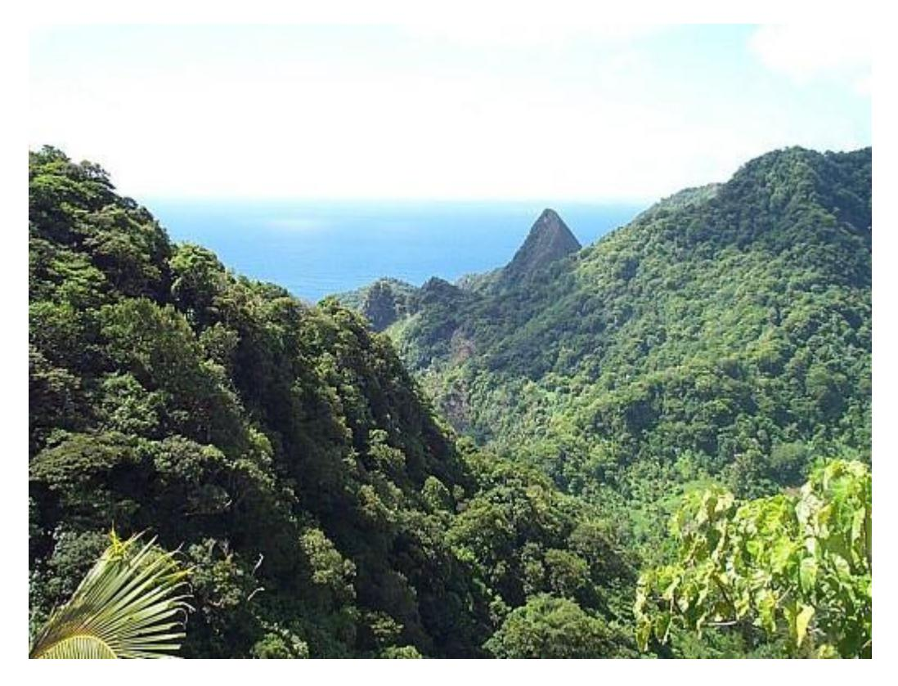
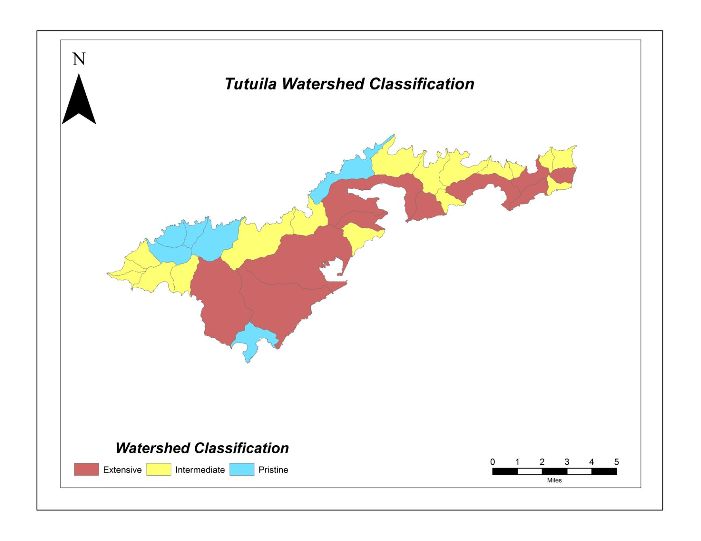

# WATERSHED CLASSIFICATION <u>UPDATE</u> FOR AMERICAN SAMOA

Prepared by American Samoa Environmental Protection Agency WATER PROGRAM

Christianera Tuitele Jewel Tuiasosopo Siumukuka Faaiuaso

PO Box PPA Pago Pago, AS 96799 January 2016

### **ABSTRACT**

The American Samoa archipelago is composed offive main islands: Tutuila, Aunu'u, Ta'u, Olosega, and Ofu. Tutuila is the largest island (53 mi -2 ) with the most people (55,502 people as of 2010). Population growth and its attendant pressures on natural habitats and resources has highlighted the need for aquatic resource monitoring in American Samoa. Of special concern are coral reef habitats, reef fish assemblages, and surface water ecosystems. A watershed classification is a useful framework upon which to develop agency monitoring programs, especially stream and nearshore marine monitoring programs. A classification scheme can provide *a priori* expectations concerning the condition of adjacent aquatic habitats. US Census data from 2010 were used to calculate population density in Territorial watersheds, and density was used as a surrogate for human disturbance within each watershed. From population data, three watershed classes were defined according to population density: pristine ≤ 100 mi -2 ; 100 < intermediate ≤ 750 mi -2 ; extensive >750 mi -2 . Watershed classification is the first step to establish an integrated monitoring program for Territorial waters. For instance, in the past AS-EPA updated the stream monitoring program based on this classification scheme. Preliminary results from stream monitoring are consistent with the expected changes in stream condition across watershed class. Whether other aquatic habitats (e.g., beaches) are also consistent with this scheme is unknown at this time. Future AS-EPA program initiatives may help address some of these unknowns.

#### **INTRODUCTION**

The American Samoa archipelago, of which Tutuila is the largest island (53 mi -2 ), lies roughly 14 degrees south of the Equator between longitudes 169 and 173 west. Other major islands in the archipelago are Aunu'u, Ta'u, Olosega, and Ofu. With 55,502 people, Tutuila is the most densely populated island (average density=1045 individuals mi -2 ).

Population growth and its attendant pressures on natural habitats and resources have highlighted the need for aquatic resource monitoring in American Samoa. Of special concern are coral reef habitats, reef fish assemblages, and surface water ecosystems. With respect to stream ecosystems, several studies have been commissioned to determine the current status and potential impact of population on freshwater resources(e.g., M&E Pacific 1979). Studies have concludedthat fresh surface water resources are still in good condition, although concerns for recharge of underground aquifers suggest that groundwater could suffer from land use changes and pollution impacts in the near future. Furthermore, increased development may directly impact the stream ecosystems themselves; many streams, especially in the populated areas, are extensively modified. Many more will continue to change as land use and resource extraction patterns continue to support the island's increasing population.

The American Samoa Environmental Protection Agency (AS-EPA) is responsible for tracking the condition of local aquatic resources, including stream, beach, and nearshore marine habitats. The AS-EPA has adopted a watershed approach to monitoring and assessing these ecosystems (Pedersen 2000). Concurrent with many watershed-level programs, the AS-EPA will monitorstream ecosystems to assess the overall condition of these habitats in the Territory.

A watershed classification is a useful framework upon which to develop agency monitoring

programs,especially stream and nearshoremarine monitoring. Sincemost, if not all, ofthe pollutants or human impacts on these ecosystems are coming from uplands of the surrounding watershed, a classification scheme can provide *a priori* (predicted) expectations for the condition of adjacent aquatic habitats.

#### **METHODS**

Watersheds are often classified using t y p e s o f land use. For instance, the percentage of total area that is covered with asphalt is correlated to stream condition, i.e., the level of nutrient enrichment, the integrity of the biological community, riparian modifications, etc. (Karr and Chu 1999). Other land use variables include percentage ofland in agricultural production and percent forested land. Many of these variables are calculated from GIS software platforms. GIS assessments and land use mapping are now fairly well developed on Tutuila; however, these efforts are not yet mature enough to assess all 41 watersheds of American Samoa. Instead, US Census data from 2010 were used to approximate the level of human disturbance within local watersheds. Data were downloaded from the Census 2010 website (https://www.census.gov/2010census/). Watershed populations were calculated by summing village population totals within each watershed (following Pedersen 2000).

Population density was calculated from population and watershed land area. Population density was plotted with a cumulative distribution function (CDF). Watersheds were classified based on the distribution of population densities. This method followed DiDonato (2004).

#### **RESULTS**

Population varied from 0 (e.g, Aoloau Sisifo, Fagatuitui, Tau Saute) to 18,170 (Tafuna Plain) (Table 1). Population numbers in two watersheds could not be directly determined. The upper region of Aoloau Sasae has some houses that are part of the village of Aoloau, but the exact number of residents is unknown. Similarly, the area surrounding Fagatele and Larson Bays has some houses and evidently some residents that the census data do not enumerate. Based on knowledge of local conditions AS-EPA assigned these two watersheds 0 population. The CDF for population density (Figure 1) providesthe basisfor classifying watersheds using population data. The first 29% of the watersheds (12 out of 41) have population densities less than 100 individuals mi -2 . After this there is a large cluster of 18 watersheds that show a continuous distribution of population density. Then, there is another gap in the distribution, and the last 11 watersheds have high population densities (> 750 mi -2 ). The break in the distribution of the first group was set at 100 individuals mi -2 . Watersheds below that density point were classified as **pristine**. Aoloau Sasae and Fagatele-Larson were included in this grouping because of the zero population in those watersheds. The major break at around 750 individuals mi -2 marked the transition into watersheds showing **extensive** modification. The middle grouping, greater than 100 but less than or equal to 750 individuals mi -2 were classified as having **intermediate** disturbance. Population density and the resulting classification for each watershed are summarized in Table 1. Results are plotted on a map for the island of Tutuila (Figure 2).

#### **DISCUSSION**

Watershed classification is the first step to establish an integrated monitoring program for Territorial waters. Using the classification levels as strata, for instance, AS-EPA developed a stream monitoring program that *a priori* accounts for a significant level of variability (i.e., human disturbance) in selected island streams. Furthermore, this classification scheme provides an expectation for the degree of beach contamination (i.e., we expect more contaminated beaches in extensively modified watersheds than in pristine watersheds).

The distribution of population density(the response variable) has two visible breaks, which are used as boundaries in this classification scheme . The first break, set at 100 individuals mi -2 , marks the upper boundary of watersheds considered pristine. Six of these watersheds (Fagatuitui, Aoloau Sisifo, Aunuu Sasae, Ofu Matu, Olosega Sasae, and Tau Saute) are uninhabited, while two have low resident populations (8 in Maloata and 47 in Fagamalo). There was no direct data for two watersheds (Aoloau Sasae and Fagatele-Larson), but the small number of residential structures in these watersheds, if they were accurately censussed, would likely have a final population density below 100 individuals mi -2 . These watersheds were assigned a population of "0" (Table 1).

The second obvious break sets off the watersheds where population density is highest (>750 individuals mi -2 ). These watersheds are primarily found in the Pago Pago Harbor area and the Tafuna- Leone Plain (Figure 2).

Lastly, the group in the middle (between the two natural breaks in the distribution) is composed of 18 watersheds. As there is not an obvious break in the distribution, this group is a single classification – intermediate.

( One concern for the classification scheme is that, since some watersheds are so small, this might skew the estimates of population density (e.g., Alao). For instance, Amanave, with a population of 250, is in the lower third of the watershed population distribution. However, its density is in the upper third. This suggeststhat an artifact of the density calculation could cause misclassification of watersheds if the correlation between population size and density ranks was not very strong. This was tested by rank-transforming both population and density for each watershed. While some, like Amanave, are different, there is a significant positive relationship *p*=0.828, p<0.001), suggesting that the classification scheme based on density is robust.

Lastly, a map of Tutuila watersheds coded by classification level (Figure 2) shows that the extensivelydisturbed areas on the island are concentrated between the Harborand the Tafuna Plain. The impact of recent development on these areas is obvious from aerial photographs. The pristine watersheds are predominantly located on the northern side of the island, while intermediate disturbance is scattered across both eastern and western watersheds.

There are 163 streams on Tutuila, 141 of which are considered perennial (Burger and Maciolek 1981). Most of the streams are short (median length of all streams~1 km), and stream drainage areas are typically small. Specifically, 122/141 (87%) of the perennial stream basins are less than 1 km2 . The rugged,steep terrain ofTutuila means that most of the streams have steep gradients: the median grade of perennial streams on Tutuila is 21.8% (~22 ft. rise per 100 ft. length).

Stream water quality and biotic communities are good indicators of watershed health. T h e A S - E P A stream monitoring program w i l l c o n t i n u e a probabilistic approach based on subsampling the population of Tutuila streams as classified at the watershed level as described above. After 1 year of monitoring (monitoring period to be determined) stream data will be analyzed to assess whether results agree with *a priori* expectations. This watershed approach will continue to be used as a backbone for other monitoring activities within the agency.

In conclusion, the watershed classification schemeprovides an organizational framework for agency monitoring efforts. Results from stream monitoring and coral reef monitoring strongly suggest that the condition of these natural systems is related to watershed population density. However, further study is necessary to determine if these initial trends continue and if these relationships are true for other systems (e.g. nearshore beaches).

#### **LITERATURE CITED**

- Burger, I. L. and J. A. Maciolek. 1981. Map inventory of nonmarine aquatic resources of American Samoa with on-site biological annotations. Review draft. U.S. Fish and Wildlife Service, National Fisheries Research Center, Seattle, WA.
- DiDonato, G. T. 2004. Developing an Initial Watershed Classification for American Samoa. Report to the American Samoa Environmental Protection Agency, Pago Pago, American Samoa.
- M&E Pacific, Inc. 1979. Baseline water quality survey in American Samoa. Report prepared for the U.S. Army Engineer District. Honolulu, HI.
- Pederson, J. 2000. American Samoa watershed protection plan. Report prepared for the American Samoa Environmental Protection Agency and the American Samoa Coastal Zone Management Program. Pedersen Planning Consultants, Saratoga, WY.
- United States Census Bureau. (2010). United States Census. Retrieved from https://www.census.gov/2010census/

#### **Figure Legends**

Figure 1. A cumulative distribution frequency (CDF) of population density (mi -2 ) for 41 watersheds of American Samoa.

Figure 2. A map of Tutuila with individual watersheds identified by class of human disturbance. Class levels are based on human population density. See text for details.

## **American Samoa Watershed Classification January 2016**

| Island  | Watershed       | Number  | Area (mi-2 ) | Population1 | Pop Density1 | Classification2 |
|---------|-----------------|---------|-----------------|-------------|--------------|-----------------|
|         |                 |         |                 |             |              |                 |
| Tutuila | Poloa           | 1       | 0.42            | 193         | 460          | Intermediate    |
| Tutuila | Fagalii         | 2       | 0.80            | 247         | 309          | Intermediate    |
| Tutuila | Maloata         | 3       | 1.08            | 8           | 7            | Pristine        |
| Tutuila | Fagamalo        | 4       | 1.30            | 47          | 36           | Pristine        |
| Tutuila | Aoloau Sisifo   | 5       | 0.62            | 0           | 0            | Pristine        |
| Tutuila | Aoloau Sasae    | 6       | 2.05            | 0           | 0            | Pristine        |
| Tutuila | Aasu            | 7       | 3.27            | 1109        | 339          | Intermediate    |
| Tutuila | Fagasa          | 8       | 1.35            | 831         | 616          | Intermediate    |
| Tutuila | Fagatuitui      | 9       | 2.00            | 0           | 0            | Pristine        |
| Tutuila | Vatia           | 10      | 1.89            | 640         | 339          | Intermediate    |
| Tutuila | Afono           | 11      | 1.29            | 524         | 406          | Intermediate    |
| Tutuila | Masefau         | 12      | 1.42            | 425         | 299          | Intermediate    |
| Tutuila | Masausi         | 13      | 0.60            | 164         | 273          | Intermediate    |
| Tutuila | Sailele         | 14      | 0.26            | 75          | 288          | Intermediate    |
| Tutuila | Aoa             | 15      | 0.85            | 855         | 1006         | Extensive       |
| Tutuila | Onenoa          | 16      | 0.30            | 150         | 500          | Intermediate    |
| Tutuila | Tula            | 17      | 0.60            | 405         | 675          | Intermediate    |
| Tutuila | Alao            | 18      | 0.52            | 495         | 952          | Extensive       |
| Tutuila | Auasi           | 19      | 0.40            | 161         | 403          | Intermediate    |
| Tutuila | Amouli          | 20      | 0.80            | 920         | 1150         | Extensive       |
| Tutuila | Fagaitua        | 21      | 1.88            | 1629        | 866          | Extensive       |
| Tutuila | Alega           | 22      | 0.51            | 98          | 192          | Intermediate    |
| Tutuila | Laulii-Aumi     | 23      | 0.70            | 1078        | 1540         | Extensive       |
| Tutuila | Pago Pago       | 24      | 4.00            | 9276        | 2319         | Extensive       |
| Tutuila | Fagaalu         | 25      | 0.96            | 910         | 948          | Extensive       |
| Tutuila | Matuu           | 26      | 1.00            | 662         | 662          | Intermediate    |
| Tutuila | Nuuuli Pala     | 27      | 6.70            | 6707        | 1001         | Extensive       |
| Tutuila | Tafuna Plain    | 28      | 5.50            | 18170       | 3304         | Extensive       |
| Tutuila | Fagatele-Larson | 29      | 1.23            | 0           | 0            | Pristine        |
| Tutuila | Leone           | 30      | 5.67            | 6836        | 1206         | Extensive       |
| Tutuila | Afao-Asili      | 31      | 1.07            | 406         | 379          | Intermediate    |
| Tutuila | Nua-Seetaga     | 32      | 1.20            | 652         | 543          | Intermediate    |
| Tutuila | Amanave         | 33      | 0.40            | 250         | 625          | Intermediate    |
| Aunuu   | Aunuu Sisifo    | 34      | 0.38            | 436         | 1147         | Extensive       |
| Aunuu   | Aunuu Sasae     | 35      | 0.22            | 0           | 0            | Pristine        |
| Manua   | Ofu Saute       | 36      | 1.78            | 176         | 99           | Pristine        |
| Manua   | Ofu Matu        | 37      | 1.06            | 0           | 0            | Pristine        |
| Manua   | Olosega Sisifo  | 38      | 0.80            | 177         | 221          | Intermediate    |
| Manua   | Olosega Sasae   | 39      | 1.20            | 0           | 0            | Pristine        |
| Manua   | Tau Matu        | 40      | 14.20           | 790         | 56           | Pristine        |
| Manua   | Tau Saute       | 41      | 3.30            | 0           | 0            | Pristine        |
|         |                 | Totals: | 75.6            | 55,502      |              |                 |

population data are taken from the US 2010 Census

disturbance classification based on population density: pristine ≤100 mi-2 ; 100< intermediate ≤750 mi-2 ; extensive >750 mi-2

