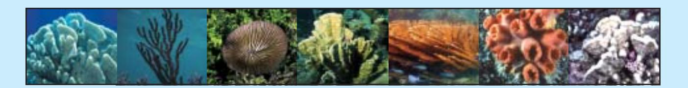

#### **THE STATE OF CORAL REEF THE STATE OF CORAL ECOSYSTEMS OF THE UNITED ECOSYSTEMS OF THE UNITED STATES AND PACIFIC FREELY STATES AND PACIFIC FREELY ASSOCIATED STATES: 2002 ASSOCIATED 2002 THE STATE OF CORAL REEF THE STATE OF CORAL REEF THE CORAL REEF ECOSYSTEMS OF THE UNITED ECOSYSTEMS OF THE UNITED ECOSYSTEMS OF THE UNITED STATES AND PACIFIC FREELY AND PACIFIC FREELY STATES FREELY ASSOCIATED STATES: 2002 ASSOCIATED STATES: 2002 2002**

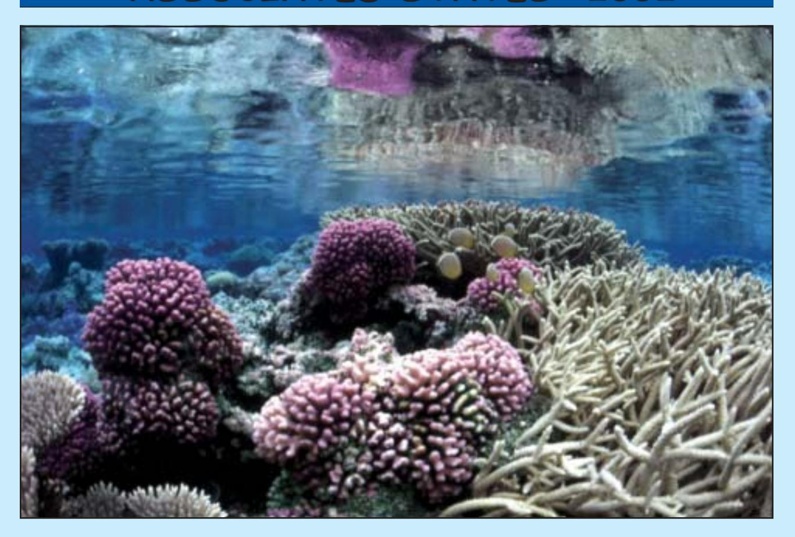

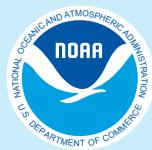

**National Oceanic and Atmospheric Administration Administration In Cooperation with Partners from Federal, In Cooperation with Partners from Federal, State, Territorial, and Commonwealth Agencies, Agencies, and the Pacific Freely Associated States States**

### **About This Document Document**

Called for by the U.S. Coral Reef Task Force's (USCRTF) *National Action Plan to Conserve Coral Reefs*, this is the first biennial report on the condition of coral reefs. It is the scientific baseline for subsequent reports on the health of U.S. coral reef ecosystems that are to be used by NOAA and others to evaluate the efficacy of coral reef conservation and management practices.

The National Oceanic and Atmospheric Administration's National Ocean Service led the development of this report. It was authored by 38 experts and supported by 79 contributors from government agencies and non-governmental organizations across the nation and internationally. Over 100 Task Force members and other notable scientists have reviewed this document.

**Acknowledgments Acknowledgments –** This document was prepared and printed under the auspices of NOAA's National Ocean Service in cooperation with federal and non-federal (State, Territory, and Commonwealth) members and staff of the USCRTF, and other eminent coral reef scientists and managers. The authors thank the many individuals that helped make this document what it is. We are especially grateful to Ruth Rowe for all her assistance in editing and formatting this report. Kevin McMahon assembled the sizable bibliography. Special thanks are due all the photographers who contributed their high quality art to this report. They made the story come alive.

**Photo Credits –** Front cover: Palmyra Atoll, James Maragos, USFWS; Back cover: Midway Atoll, James Maragos, USFWS; Inset photos: Kip Evans, Fagatele Bay NMS; William Harrigan, Florida Keys NMS; Matt Kendall, NOS; James Maragos, USFWS; Title Page: Donna Turgeon, NOS. All others are credited under the graphics they contributed.

All pictures of Hawaiian monk seals and green sea turtles that were taken in the Northwestern Hawaiian Islands are printed with the permission of NOAA's National Marine Fisheries Service.

**Citation CitationCitation –** Please cite this report as follows.

Turgeon, D.D., R.G. Asch, B.D. Causey, R.E. Dodge, W. Jaap, K. Banks, J. Delaney, B.D. Keller, R. Speiler, C.A. Matos, J.R. Garcia, E. Diaz, D. Catanzaro, C.S. Rogers, Z. Hillis-Starr, R. Nemeth, M. Taylor, G.P. Schmahl, M.W. Miller, D.A. Gulko, J.E. Maragos, A.M. Friedlander, C.L. Hunter, R.S. Brainard, P. Craig, R.H. Richond, G. Davis, J. Starmer, M. Trianni, P. Houk, C.E. Birkeland, A. Edward, Y. Golbuu, J. Gutierrez, N. Idechong, G. Paulay, A. Tafileichig, and N. Vander Velde. 2002. The State of Coral Reef Ecosystems of the United States and Pacific Freely Associated States: 2002. National Oceanic and Atmospheric Administration/National Ocean Service/National Centers for Coastal Ocean Science, Silver Spring, MD. 265 pp.

#### **THE STATE OF CORAL REEF ECOSYSTEMS OF THE UNITED STATES AND PACIFIC FREELY ASSOCIATED STATES: 2002 THE STATE OF CORAL REEF ECOSYSTEMS OF THE STATE OF CORAL REEF ECOSYSTEMS OF THE UNITED STATES AND UNITED STATES AND PACIFIC FREELY ASSOCIATED STATES: 2002 PACIFIC FREELY ASSOCIATED STATES: 2002**

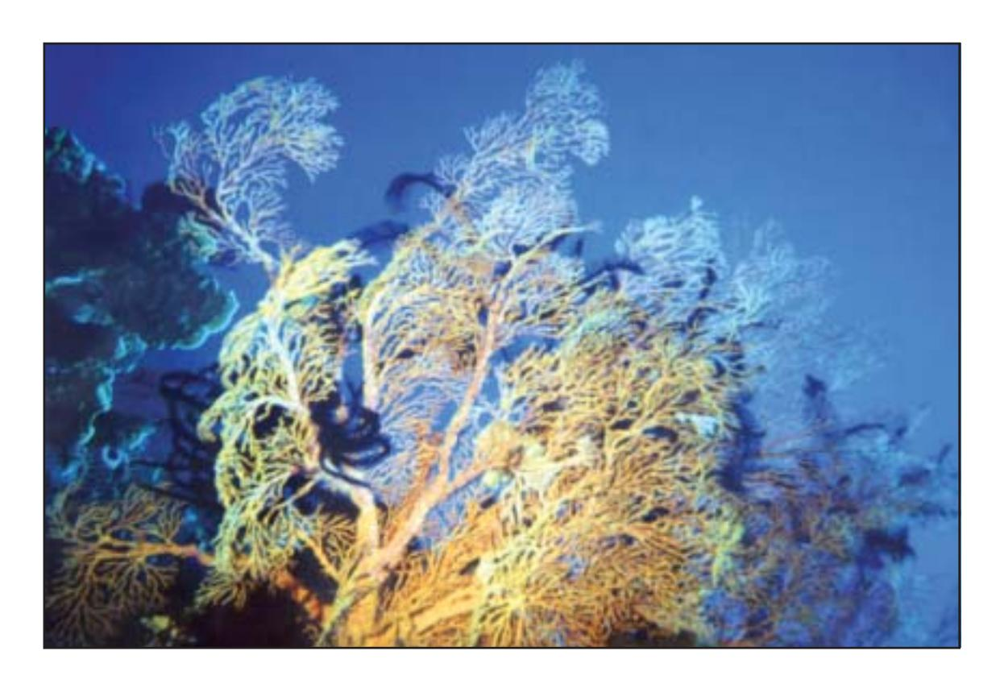

**Executive Summary and National Summary Executive Summary National Summary** by Donna D. Turgeon and Rebecca G. Asch **Status Reports by Jurisdiction: Jurisdiction:**

**Florida Florida** by Billy D. Causey, Richard E. Dodge, Walter Jaap, Ken Banks, Joanne Delaney, Brian D. Keller, and Richard Spieler

**Puerto Rico Rico** by Cruz A. Matos, Jorge R. Garcia, and Ernesto Diaz

**U.S. Virgin Islands Islands** by Don Catanzaro, Caroline S. Rogers, Zandy Hillis-Starr, Richard Nemeth, and Marcia Taylor

**Flower Garden Banks National Marine Sanctuary Marine Sanctuary** by George P. Schmahl

**Navassa Island Navassa Island** by Margaret W. Miller

**Hawai'i Hawai'i** by David A. Gulko, James E. Maragos, Alan M. Friedlander, Cynthia L. Hunter, and Russell E. Brainard

**American Samoa Samoa** by Peter Craig

**Guam**by Robert H. Richmond and Gerry W. Davis

 **Commonwealth of the Northern Mariana Islands Commonwealth of the Northern Mariana IslandsCommonwealth of the Northern Mariana Islands** by John Starmer, Michael Trianni, and Peter Houk

**Pacific Freely Associated States Pacific Freely States** by Charles E. Birkeland, Ahser Edward, Yimnang Golbuu, Jay Gutierrez, Noah Idechong, James E. Maragos, Gustav Paulay, Robert Richmond, Andrew Tafileichig, and Nancy Vander Velde

### **Contributors Contributors**

**Paula Allen**, Florida Department of Environmental Protection

**Larry Basch**, National Park Service **Jim Beets**, Jacksonville University **Antonio Betivoglio**, U.S. Fish and Wildlife Service

**Jim Bohnsack**, National Marine Fisheries Service

**Rafe Boulon**, National Park Service **Eric Brown**, University of Hawai'i **Andrew Bruckner**, National Marine Fisheries Service

**Leah Bunce**, National Ocean Service

**John Christensen**, National Ocean Service

**Gil Cintron**, U.S. Fish and Wildlife Service

**Athline Clark**, Hawai'i Division of Aquatic Resources

**Rick Clark,** Biscayne National Park **Andrew Cornish**, American Samoa Coral Reef Initiative

**Richard Curry**, Biscayne National Park

**Nancy Daschbach**, Fagatele Bay National Marine Sanctuary

**LCDR John Davis,** U.S. Coast Guard

**Damaris Delgado**, Puerto Rico Department of Natural and Environmental Resources

**Edward Demartini**, National Marine Fisheries Service

**Barry Devine**, University of the Virgin Islands

**Gerdard DiNardo**, National Marine Fisheries Service

**Michael Dowgiallo**, National Ocean Service

**Alexis Dragoni**, Puerto Rico Department of Natural and Environmental Resources

**Nick Drayton**, The Ocean Conservancy

**Tom Egeland**, U.S. Navy **Carol Emaurois**, Palau International Coral Reef Center

**John Field**, U.S. Fish and Wildlife Service

**Kevin Foster**, U.S. Fish and Wildlife Service

**Carol R. Fretwell**, National Coral

Reef Institute

**Alan M. Friedlander**, The Oceanic Institute

**CDR Matthew Gagelin**, U.S. Navy **Ginger Garrison**, U.S. Geological Survey

**Michael Gelardi**, Undersea Video Productions

**Cynthia Gerstner**, Shedd Aquarium **Steven Gittings**, National Marine Sanctuaries Office

**Carmen Gonzalez**, Puerto Rico Department of Natural and Environmental Resources

**Mark Grace**, National Marine Fisheries Service

**Ben Graham,** Department of Interior Office of Insular Affairs

**Felix Grana**, Puerto Rico Department of Natural and Environmental Resources

**Roger Griffis,** National Ocean Service

**Emma Hickerson**, Flower Garden Banks National Marine Sanctuary

**Thomas F. Hourigan**, National Marine Fisheries Service

**Paul Jokiel**, University of Hawai'i

**Matt Kendall**, National Ocean Service

**Barbara Kojis**, Virgin Islands Department of Planning and Natural Resources

**Vernon R. Leeworthy**, National Ocean Service

**Craig Lillyestrom**, Puerto Rico Department of Natural and Environmental Resources

**Becky Lizama**, CNMI Coastal Resources Management Office

**Christie Loomis**, University of the Virgin Islands

**Jarad Makaiau**, Western Pacific Regional Fishery Management Council

**Gary Matlock**, National Ocean Service

**Roberto Matos**, Puerto Rico Department of Natural and Environmental Resources

**Cliff McCreedy**, National Park Service

**John McManus**, National Center

for Caribbean Coral Reef Research **James Mcvey**, NOAA Office of

 Oceanic and Atmospheric Research

**Jill Meyer**, National Ocean Service **Katherine E. Miller,** formerly with the CNMI Division of Fish and Wildlife

**Steven Miller**, National Undersea Research Center

**Mark Monaco**, National Ocean Service

**John C. Ogden**, Florida Institute of Oceanography

**Arthur Paterson**, National Ocean Service

**Brendalee Phillips**, National Park Service

**Anthony R. Picciolo**, National Environmental Satellite, Data, and Information Service

**Michelle Pugh**, Dive Experience, St. Croix

**Ku'ulei Rodgers**, University of Hawai'i

**Paige Rothenberger**, University of the Virgin Islands

**Rojeanne Salles**, Puerto Rico Department of Natural and Environmental Resources

**Joseph Schwagerl**, U.S. Fish and Wildlife Service

**Robert Shallenberger**, U.S. Fish and Wildlife Service

**Will Smith**, University of Hawai'i **Richard Spieler**, National Coral Reef Institute

**Harold Stanford**, National Ocean Service

**Alan Strong**, National Environmental Satellite, Data, and Information Service

**James Thomas**, National Coral Reef Institute

**Jim Tilmant**, National Park Service **William Tobias**, Virgin Islands Department of Planning and Natural Resources

**Michael Weiss**, National Ocean Service

**Susan White**, U.S. Fish and Wildlife Service

**Cheryl Woodley**, National Ocean Service

## TABLE OF CONTENTS

| EXECUTIVE SUMMARY                                 | 1  |
|---------------------------------------------------|----|
| NATIONAL SUMMARY                                  |    |
| Background                                        | 17 |
| Coral Reefs                                       |    |
| Reef Ecosystems                                   | 19 |
| Corals and Reef Communities                       |    |
| Global Concerns                                   |    |
| Environmental Pressures                           | 27 |
| Global Climate Change and Coral Bleaching         |    |
| Diseases                                          | 30 |
| Tropical Storms                                   | 31 |
| Coastal Development and Runoff                    |    |
| Coastal Pollution                                 | 33 |
| Tourism and Recreation                            | 35 |
| Fishing                                           |    |
| Harvest and Trade in Corals and Live Reef Species | 37 |
| Boats, Ships, and Groundings                      |    |
| Marine Debris                                     | 39 |
| Alien Species                                     | 40 |
| Other Physical Impacts to Coral Reefs             | 40 |
| Offshore Oil and Gas                              |    |
| National Assessment                               | 43 |
| Gaps in Habitat Mapping                           | 43 |
| Gaps in Ecosystem Monitoring                      | 44 |
| Status of Coral Reef Ecosystems                   | 45 |
| Florida                                           | 45 |
| Puerto Rico                                       | 48 |
| The U.S. Virgin Islands                           | 49 |
| The Flower Garden Banks National Marine Sanctuary | 51 |
| Navassa Island                                    | 52 |
| The Hawaiian Archipelago                          | 53 |
| American Samoa                                    | 56 |
| Guam                                              | 57 |
| Commonwealth of the Northern Mariana Islands      | 58 |
| Pacific Freely Associated States                  | 61 |
| Republic of the Marshall Islands                  | 61 |
| Federated States of Micronesia                    | 61 |
| The Republic of Palau                             | 62 |
| National Trends in Coral Reef Ecosystems          | 62 |

| Agency Responses 73                                                                         |  |
|---------------------------------------------------------------------------------------------|--|
| Map All U.S. Coral Reefs 73                                                                 |  |
| Assess and Monitor Reef Health 74                                                           |  |
| Conduct Strategic Research 78                                                               |  |
| Understand Social and Economic Factions – The Human Dimension 80                            |  |
| Expand and Strengthen Marine Protected Areas 80                                             |  |
| Reduce Adverse Impacts of Fishing and Other Extractive Uses 82                              |  |
| Reduce Impacts of Coastal Uses 83                                                           |  |
| Reduce Pollution 85                                                                         |  |
| Restore Damaged Reefs 87                                                                    |  |
| Reduce Global Threats to Coral Reefs 88                                                     |  |
| Reduce Impacts for International Trade in Coral Reef Resources 89                           |  |
| Create an Informed Public 90                                                                |  |
| Improve Coordination and Accountability 91                                                  |  |
| Recommendations and Conclusions 93                                                          |  |
| Complete Mapping, and Establish a Monitoring Network 93                                     |  |
| Strengthen MPAs 93                                                                          |  |
| Reduce Overfishing 93                                                                       |  |
| Reduce Pollution from Runoff 93                                                             |  |
| Build a Better System of Enforcement 95                                                     |  |
| Increase Cooperation Among Agencies 95                                                      |  |
| Conclusions 95                                                                              |  |
|                                                                                             |  |
| REGIONAL REPORTS                                                                            |  |
| Status of the Coral Reefs in Florida 101                                                    |  |
| Status of the Coral Reefs of Puerto Rico 119                                                |  |
| Status of the Coral Reefs of the U.S. Virgin Islands 131                                    |  |
| Status of the Coral Reefs of the Flower Garden Banks of the Northwestern Gulf of Mexico 143 |  |
| Status of the Coral Reefs of Navassa 151                                                    |  |
| Status of the Coral Reefs in the Hawaiian Archipelago 155                                   |  |
| Status of the Coral Reefs of American Samoa 183                                             |  |
| Status of the Coral Reefs of Guam 189                                                       |  |
| Status of the Coral Reefs in the Commonwealth of the Northern Mariana Islands 195           |  |
| Status of the Coral Reefs of the Pacific Freely Associated States 205                       |  |
| The Republic of the Marshall Islands 205                                                    |  |
| The Federated States of Micronesia 212                                                      |  |
| The Republic of Palau 216                                                                   |  |
| APPENDICES AND BIBLIOGRAPHY 225                                                             |  |
| Appendix I: Acronyms 225                                                                    |  |
| Appendix II: Species Names – Scientific to Common Name 229                                  |  |
| Appendix III: Scientific Names – Common Name to ScientificName 235                          |  |
| Appendix IV: AFederal Protection for U.S. Coral Reef Ecosystems 241                         |  |
| Bibliography 243                                                                            |  |
|                                                                                             |  |

### **Authorizations, Appropriations, Agency Actions Actions**

**Coral Reef Conservation Act of 2000 Act of 2000 –** The Coral Reef Conservation Act ( Public Law 106-562, U.S.C. 6401 *et seq*., December 2000) authorizes \$16 million annually from 2000-2004 to the Secretary of Commerce to help preserve, sustain, and restore the condition of coral reef ecosystems. The Act authorizes 1) the establishment a new Coral Reef Conservation Program to providing matching grants for projects that conserve coral reefs, and 2) funding for a National Program to conduct a variety of coral reef activities such as mapping, assessment, monitoring, research, restoration, public outreach, and removing abandoned fishing gear, marine debris, and grounded vessels. The Act also requires the National Oceanic and Atmospheric Administration (NOAA) to develop a National Coral Reef Action Strategy, and authorizes establishing a Coral Reef Conservation Fund to build public-private partnerships for coral reef conservation. See http://www.coralreef.noaa.gov/ for more information.

**2000-02 Agency Activities Activities –** A variety of government (Federal, State, Territory, Commonwealth) and non-governmental partners are engaged in activities that help conserve, protect, and manage coral reef ecosystems. Some activities have increased since 2000. For example, beginning in 2000 the Department of Commerce and the Department of the Interior received new funding specifically related to coral reef conservation. Other entities have continued or shifted resources to begin addressing coral reef related issues on land and at sea. For more information please contact the United States Coral Reef Task Force http:// coralreef.gov/.

**Coral Reef Presidential Order Order –** As part of the National Ocean Conference in June 1998, President Clinton signed the Coral Reef Protection Executive Order (13089) to conserve and protect the health, biodiversity, heritage, and ecological, social, and economic values of U.S. coral reef ecosystems. The Executive Order tasks Federal agencies with a number of actions including reviewing and increasing efforts to protect coral reef ecosystems, working with State and Territorial resource trustees and other partners. The Order created an interagency U.S. Coral Reef Task Force (USCRTF) to oversee implementation of the Order. For more information see http://coralreef.gov/.

**United States Coral Reef Task Force Coral Reef Task Force –** Established by Executive Order 13089 in 1998, the USCRTF is co-chaired by the Secretary of the Interior and Secretary of Commerce. It is composed of the heads of 11 Federal agencies, the Governors of 7 states and territories, and the Presidents of the Freely Associated States (Palau, Marshal Islands, and Micronesia). Working with many government and non-government partners, the USCRTF adopted the *National Action Plan to Conserve Coral Reefs* (National Action Plan) in March 2000, the first national blueprint for U.S. action to address the loss and degradation of coral reefs. The National Action Plan outlines thirteen major goals to address key threats to reefs. For more information on the Task Force please see http://coralreef.gov.

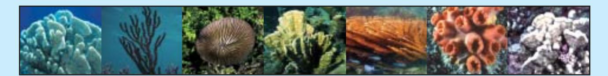

#### **Department of Commerce Commerce Donald L. Evans Donald L. Evans Secretary SecretarySecretary**

**National Oceanic and Atmospheric Administration National Oceanic Administration National Ocean Service Service Vice Admiral Conrad C. Lautenbacher, Jr., USN (Ret.) Admiral (Ret.) Margaret A. Davidson (Actg.) (Actg.) Under Secretary of Commerce for Commerce for Assistant Administrator for Ocean Assistant Administrator for Ocean Oceans and Atmosphere Atmosphere Services and Coastal Zone Management Services and Coastal Zone Management**

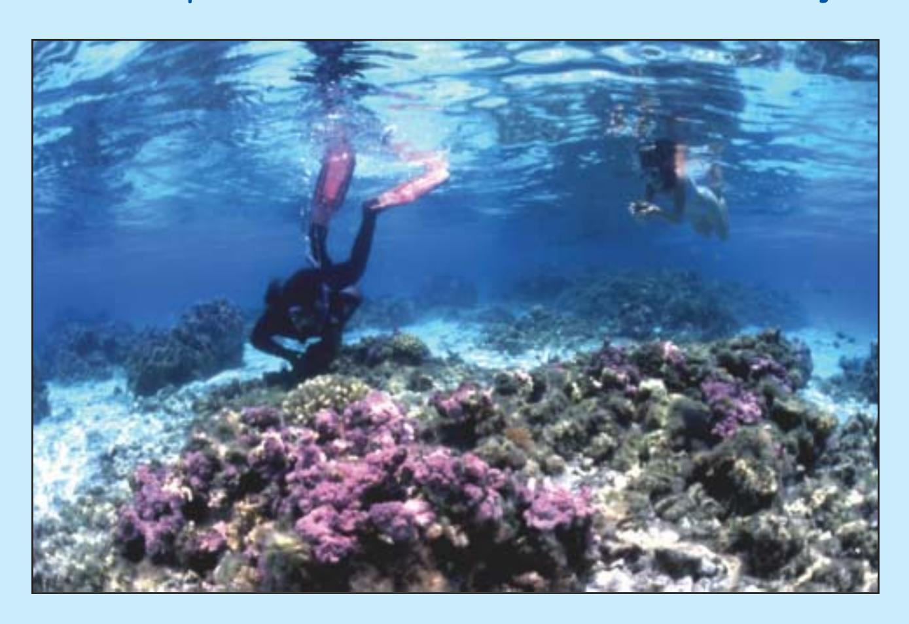

**U.S. Department of Commerce Commerce National Oceanic and Atmospheric Administration National Oceanic and Atmospheric Administration National Ocean Service Service July 2002 2002July 2002**

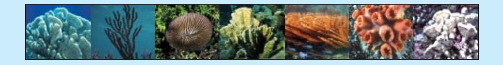

## EXECUTIVE SUMMARY

Kapuna (Hawaiian elder and expert fisherman) Buzzy Agard started fishing the Northwestern Hawaiian Islands in the early 1950s. When he first arrived, he spotted a school of large moi (threadfins, an early Hawaiian food fish) and harvested them. He tells that there were "no more the next day, the next week, or ten years later." He said he learned that "the reefs are fragile and need to be managed with care."

The United States has jurisdiction over majestic coral reefs covering an estimated 7,607 mi2 in the tropical-subtropical belt around the equator. Many of these reef systems support diverse, brightly colored marine life surrounded by emerald seas (Fig. 1); others have been affected by environmental and human-related impacts and need restoration. In the Western Atlantic and Caribbean, shallow-water1 coral reefs are found off Florida2, Puerto Rico, the U.S. Virgin Islands (USVI), and in the Navassa Island National Wildlife Refuge near Haiti. In the Gulf of Mexico, reef banks are found on the continental shelf 100 miles south of the Texas/Louisana Border. In the Pacific, coral reefs occur off the Hawaiian Archipelago, American Samoa, Guam, the Commonwealth of the Northern

Mariana Islands (CNMI), Wake Atoll, and another six remote National Wildlife Refuges3. In addition, the Freely Associated States (the countries of the Republic of Palau, the Republic of the Marshall Islands, and the Federated States of Micronesia), included in this report, have some of the richest coral reefs in the world, covering an estimated 4,479-31,470 mi2.

In response to growing concerns about the condition of reefs, the United States Coral Reef Task Force4 (USCRTF) called for a nationally-coordinated mapping and monitoring program to help track and evaluate the condition of U.S. coral reefs and report to

the Nation every two years. This report is the first effort to collect consistent, comparable scientific information to assess the status of coral reef health.

This first biennial report on the condition of coral reef ecosystems – *The State of Coral Reef Ecosystems of the United States and the Freely Associated States: 2002* was led by NOAA's National Ocean Service. Thirty-eight experts authored the report with information from another 79 contributors. It includes the latest data from published literature as well as unpublished information from coral reef managers and scientists. Information from recent USCRTF mapping, research, monitoring, and conservation initiatives are also included. It has been peer-reviewed by over 100 coral reef ecosystem experts.

Figure 1. Coral reefs are called the

(Photo: Mike White).

"rainforests of the sea" due to their high biodiversity and threatened status

This report assesses the condition of reef resources, ranks the relative importance of environmental pressures that have degraded reefs, highlights significant actions taken by USCRTF agencies to conserve coral reef ecosystems, and provides recommendations from coral reef managers to fill information gaps. It forms a baseline against which future assessments will be compared, allowing scientists to track and ultimately predict changes in reef conditions.

#### Pressures on Coral Reef Ecosystems

Every reef system has suffered varying degrees of impact from

Where first used, definitions of scientific terms are highlighted in bold type for the reader's reference. Within this report, **shallow-water** generally refers to those reefs in clear oceanic waters less than 150 feet where ambient light is adequate to support reef-building corals. Where used in the context of mapping habitats, it is the depth aerial and satellite photographic instruments can effectively penetrate the water column, at most 100 ft.

&lt;sup>2 There are three main areas of coral reefs and banks in Florida – the Florida Keys, the southeastern coast from Monroe to Palm Beach Counties, and the Florida Middle Grounds approximately 100 mi northwest of St. Petersburg.

&lt;sup>3 Baker, Howland, Jarvis, Johnston, Kingman, and Palmyra.

&lt;sup>4 The USCRTF, co-chaired by the Secretary of Interior and the Secretary of Commerce, includes the heads of 11 Federal agencies and the Governors of 7 States, Territories, and Commonwealths with responsibilities for coral reefs. The Task Force also includes representatives from the U.S. All-Islands Coral Reef Initiative and the Pacific Freely Associated States.

natural environmental and human disturbance (refer to Table 2 in the National Summary). A burgeoning population of 10.5 million now resides in coastal counties and islands next to U.S. coral reefs; another 203,000 reside on islands of the Freely Associated States. The coastal development (schools, roads, marinas, and other businesses) needed to support the population and the tourists that flock

Eigen 2 Abbarbad and in Florida (Obda)

Figure 2. A bleached coral in Florida (Photo: Harold Hudson).

to these seaside communities is a major threat. Add the recreational and commercial use of reef resources, and it is a wonder that beautiful reefs can still be found in all jurisdictions.

Changing climate, coastal development, **overfishing**5, disease, and natural events such as tropical storms may interact to increase overall reef degradation.

#### Global Climate Change and Coral Bleaching6 —

The ultimate long-term environmental threat to coral reef ecosystems is global climate change that many believe is linked to the dramatic increase of coral bleaching in the past decade. Bleaching varies regionally, locally within a reef7, and among species. It also coincides with elevated water temperatures associated with El Niño and La Niña events.

Although most U.S. reefs escaped major damage from the largest coral bleaching event on record (1997-1998), reefs off Florida, Palau, and Palmyra were devastated (Fig. 2). During this bleaching event, an estimated 16% of the reef corals were destroyed world-wide.

**Fishing** – Historically, the broad array of reef

fishing activities has great cultural, economic, and recreational value. This report calculates that U.S. commercial reef fisheries today are worth over \$137.1 million to fishermen. The gross value estimated for commercial fisheries in the Freely Associated States is another \$109.8

Figure 3. The Nassau grouper is a candidate for protection under the Endangered Species Act (Photo: NOAA's NMFS).

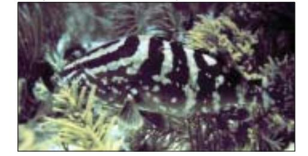

million. According to coral reef managers, the greatest human-related impacts on the broadest scale are over-harvesting of reef resources and fishing-associated habitat destruction.

Overfishing threatens Florida, Puerto Rico, the USVI, the Main Hawaiian Islands, American Samoa, and to a lesser degree reefs around other populated islands. In the South Atlantic, Gulf of Mexico, and

Caribbean, NOAA identified 23 reef fish as overfished and concluded there was too little data to determine the status of another 232 species. As a result, four species of Western Atlantic grouper have been added to the list of candidate species under the Endangered Species Act (Fig. 3).

Managers from Florida, Puerto Rico, USVI, Hawai'i, and the offshore coral banks in the Gulf of Mexico are particularly concerned that certain types of fishing gear, particularly fish and lobster traps and large gill nets, may physically damage and degrade reef habitat.

**Diseases** – Over the last few decades, there has been a worldwide increase in reports of new diseases. Disease appears to be more prevalent near human population centers. While there is no direct correlation, long-term, low-level stress from poor water quality, elevated water temperatures, overfishing, and other factors may make reef organisms more susceptible to disease.

The Caribbean region has much higher incidences of disease, where outbreaks of a number of diseases have contributed to mass mortalities of corals, fish, sea fans, sea urchins, sponges, sea-

grasses, and other organisms. One of the worst of these, a disease killed over 90% of the mature long-spined sea urchins throughout much of the Caribbean in the early 1980s. Since then, these urchins have recovered to only about 10% of their original numbers on reefs off Florida, Puerto Rico, and the USVI. Of

&lt;sup>5 As used throughout this report, the terms **overfishing** and **overfished** are generally the same as defined for U.S. federal fisheries – a rate or level of fishing mortality that jeopardizes the capacity of a fishery to produce the maximum sustainable yield on a continuing basis (Magnuson-Stevens Fishery Conservation and Management Act, Pub. Law 94-265, 16 U.S.C.1801 Sec. 2).

the many coral diseases to emerge over the last 20 years, white-band disease is one of the most virulent, killing up to 90-95% of the elkhorn and staghorn corals off St. Croix, Puerto Rico, and southeastern Florida by the 1990s.

With the exception of cancerous tumors infecting green sea turtles8 off the Main Hawaiian Islands, disease in the Pacific Islands is low to moderate.

**Tropical Storms Tropical Storms –** With eight hurricanes in the past 20 years nearly destroying staghorn and elkhorn coral populations, USVI managers consider tropical storms a major threat (Fig. 4). Elsewhere, reef corals have more resilience. On many Pacific islands, normal heavy wave action removes relatively fragile vertical branches of corals. As a result, throughout the region, low-growing encrust-

ing and massive growth forms of coral prevail.

Because they lie in the Western Pacific Monsoon Trough, Guam and the CNMI have these low-profile reefs. About half the typhoons that develop in the Pacific pass near or directly hit these islands, yet the extensive living reef structure that protects them sustains surprisingly little damage

even when a super typhoon passes directly overhead.

**Coastal Development and Runoff Development Runoff –** Tropical climates, colorful reefs, and clear waters draw permanent residents and tourists to seashores. To sustain the influx, additional housing, hotels, and other coastal development (e.g., roads, airports, hospitals, schools) are needed, all of which result in runoff and sedimentation during and after construction. Runoff and sedimentation from coastal development have degraded coral reef ecosystems off southeastern Florida and the Keys, Puerto Rico, the USVI, most of the Main Hawaiian Islands, Guam, and the CNMI.

Runoff and sedimentation also occur in rural areas where forests have been removed for agriculture.

Near-shore reefs off high Pacific islands in American Samoa, the CNMI, and Palau experience runoff and sedimentation during tropical storms. Although less widespread than overfishing, runoff and sedimentation are of considerable concern to managers in all jurisdictions.

**Coastal Pollution Pollution –** Managers from eight jurisdictions consider coastal pollution a major threat to their coastal coral reef ecosystems. Toxic chemicals and excessive nutrient enrichment are mostly limited to relatively small areas within canals, harbors and marinas, and near sewage disposal sites. There are polluted 'hot spots' near reefs off Florida, Puerto Rico, the USVI, some islands within the Hawaiian Archipelago, American Samoa, Guam, and the CNMI. High levels of toxic chem-

> icals have been found in the tissues of reef wildlife off urbanized areas and several of the Northwestern Hawaiian Islands.

**Harvesting and Trade in Corals Corals and Live Reef Species Species –** The trade in live reef fish, chunks of coral, and invertebrates for aquariums has grown rapidly over the last decade, raising concerns among scientists and managers, particularly those in Hawai'i (Fig. 5). The United

States is the largest importer of ornamental coral reef species, responsible for around 70-95% of the global trade in coral and 'live rock' and nearly half

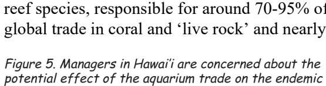

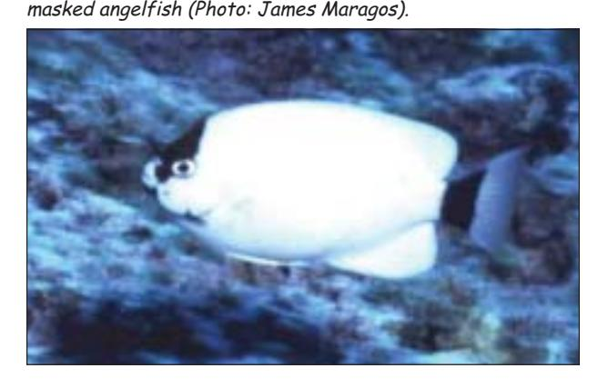

6**Bleaching** is a condition whereby the algae (called zooxanthellae) living in the epidermal tissue of most reef corals are expelled after prolonged exposure to certain environmental conditions (e.g., elevated temperatures). The color of the coral primarily comes from the zooxanthellae, so the coral whitens when they are expelled, leaving only the white carbonate color of the coral skeleton. This condition can be temporary if the zooxanthellae return within a few days, if not, then coral mortalities can be high.

Figure 4. Coral rubble produced by storm

damage (Photo: Matt Kendall).

7 Incidences and mortalities from bleaching are generally higher at shallower depths and lower on reefs within estuaries.

8 Fibropapilloma disease.

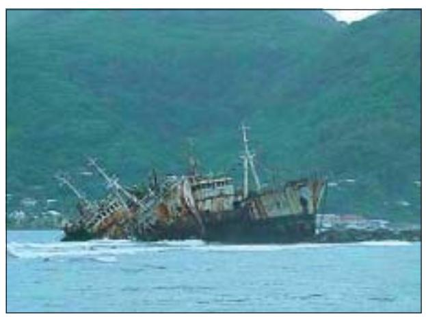

Figure 6. Two grounded fishing vessels in Pago Pago Harbor, American Samoa (Photo: James Hoff).

of the total worldwide trade in marine aquarium fishes. Most of the ornamental fish and invertebrates originating from U.S. waters come from Hawai'i and Florida, with smaller numbers originating in Puerto Rico, the USVI, and Guam. Since 1999, these jurisdictions have taken action with new studies, regulations, **marine protected areas**9 (MPAs), **no-take zones**, and landmark legal settlements.

**Alien**10**Species Species –** Only recently have alien species been recognized as a threat to ecosystems. Nonnative organisms are introduced to near-shore reefs from ship hull fouling and ballast water, aquarium releases, as well as purposeful introductions for science and aquaculture. Besides the organisms, each may have diseases or parasites that can devastate native species. Although their impacts are not well studied, coastal **invasive** species are a major concern in the Hawaiian Islands with its many rare and endangered species.

**Boats, Ships, and Groundings Ships, Groundings –** Boat traffic threatens reef structure and associated wildlife. Groundings, anchor damage, and propellers speeding through shallow waterways are some of the most destructive chronic human factors (Fig. 6). They cause significant localized damage to shallow-water coral reefs. The increasing number of large ship and small boat groundings is a major threat off Florida, the USVI, and the Main Hawaiian Islands, and of moderate concern along other populated coasts.

**Tourism and Recreation Tourism and Recreation –** The economic value of coral reefs is significant. But growth within the

tourist industry has serious ecological ramifications for coral reef ecosystems off Florida, Puerto Rico, USVI, the Main Hawaiian Islands, Guam, and Palau. This report calculated that annually 45 million visitors come to seaside and live-aboard accommodations to dive, fish, and otherwise enjoy U.S. coral reefs. Reef-related tourism generates an estimated \$17.5 billion annually in local income and sales for U.S. States, Commonwealths, and Territories. An additional 113,000 tourists visit the Freely Associated States, spending over \$84.8 million annually. With so many tourists visiting coral reefs, damage is inevitable (Fig. 7).

Managers from eight jurisdictions consider the impacts from tourism and associated recreational activities a medium-to-high concern for near-shore coral reef ecosystems.

**Marine Debris**11**–** Transported by ocean currents over long distances, marine debris snags, smothers, and breaks coral colonies, and kills marine wildlife (e.g., endangered Hawaiian monk seals, sea turtles, and island sea birds, Fig. 8) through either entanglement or ingestion. Marine debris is a matter of high concern for the coral reef managers from the Northwestern Hawaiian Islands and the Federated States of Micronesia. Since 1999, multi-agency clean-up activities have removed over 150 tons of debris from Hawaiian Island beaches and nearshore reefs, but much still remains.

**Offshore Oil and Gas and Gas –** Some coral reefs are located near petroleum extraction facilities; others are threatened by their close proximity to oil

Figure 7. Unaware of the damage they cause, tourists can literally trample the coral reefs that they come to see (Photo: William Harrigan).

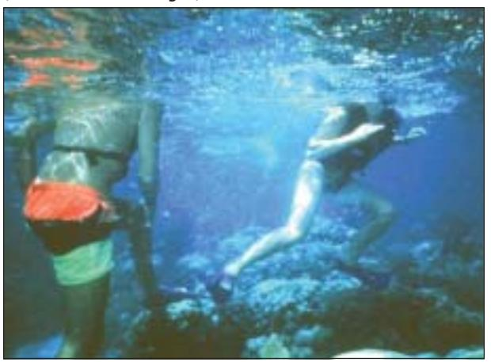

9 Defined in the Marine Protected Areas Executive Order 13158, an **MPA** is "an area of the marine environment that has been reserved by Federal, State, Territorial, Tribal, or Local laws or regulations to provide lasting protection for part or all of the natural and cultural resources therein" (*Federal Register* 2000). Some MPAs have **no-take provisions**, **zones**, or the entire MPA may be designated a **reserve**; in these, resource extraction has been prohibited to protect biodiversity and/or to enhance certain fish stocks.

refineries, storage facilities, or shipping lanes frequented by oil tankers. Potential impacts include accidental spills, contamination by drilling-related effluents and discharges, vessels anchoring when placing pipelines, drilling rigs and production platforms, seismic exploration, use of chemical dispersants in oil spill mitigation, and platform removal.

Within a 2.9 mi2 radius of the Flower Garden Banks National Marine Sanctuary in the northwestern Gulf of Mexico, there are currently ten oil production platforms with approximately 100 mi of pipeline. Within the boundary of the East Flower Garden Banks, there is a gas production platform. To date, none of these have been a problem.

#### **Other Physical Impacts to Coral Reefs Other Reefs –**

There are other human-related impacts to reef structure of concern to managers. Although no longer legal in U.S. waters, dynamiting reefs to collect fish remains a problem in the Indo-Pacific region. Live munitions aboard some sunken World War II relics have been found and used by fishermen to harvest reef fish.

Other wrecks may be a danger to recreational divers and local fishermen. For safety reasons, the U.S. Navy recently detonated live depth charges found on a WWII Subchaser that had wrecked on a now popular CNMI reef.

Between 1946 and 1958, the United States used Enewetak and Bikini Atolls in the Marshall Islands to test 67 nuclear devices. The craters of many of these blasts can still be seen and the effects on reef structure are evident in shallow waters.

Where national security training exercises and live-fire activities have been conducted (Vieques, Puerto Rico; Farallon de Medinilla, CNMI; Kaho'olawe and Kaula Rock, Main Hawaiian Islands), managers are concerned about impacts of bombing and unexploded ordnance on reefs.

#### **National Assessments of Coral Reef Coral Reef Ecosystems Ecosystems**

Every U.S. reef system has sustained impacts from environmental and human disturbance, but all jurisdictions still have some reefs in good to

excellent health. Many scientists consider reef systems in Florida and the U.S. Caribbean to be in the poorest condition, mostly because they are close to dense populations and have been repeatedly hit by a series of hurricanes, diseases, and various chronic human-induced impacts. Pacific reefs, even around urbanized islands, are in significantly better condition. This is due in large part to the fact that many lie off isolated islands and atolls and are surrounded by deep water with prevailing strong currents, upwelling, high waves, and tropical storms that flush the reefs with clean, cool water.

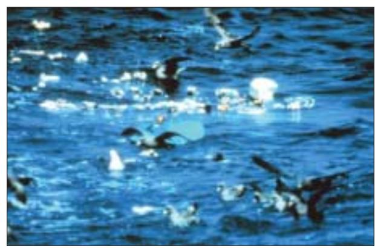

Figure 8. Seabirds feeding among plastic debris (Photo: NOAA Library).

Currently, there is relatively little quantitative information available assessing temporal and spatial trends in coral reef condition. Most coral reefs have yet to be mapped and their resources characterized. Little comparable data are available on coral reef function, structure, and condition.

Prior to 2000, the comprehensive mapping and long-term monitoring needed to prepare a national assessment were only available for a few locations12. Since FY0213, with considerable support from the U.S. Congress, NOAA started a major mapping initiative and has provided substantial grants to island agencies to build local capacity for long-term monitoring using comparable sampling methods and protocols. The authors of this report have committed to participating in a nationallycoordinated Coral Reef Monitoring Network to develop criteria, indicators, and metrics for a 'report card' to track changes in the condition of coral reef ecosystems. It will also allow them to

10 When established (i.e., successfully reproducing), a species purposefully or unintentionally introduced is termed **alien** or  **exotic**. Alien species (and some indigenous species) that have economic, environmental, and human health impacts are also termed **invasive**. 11 Fishing gear and other remnants of human activities coming from recreational and commercial vessels, storm drains,

industrial facilities, and waste disposal sites.

12 The Florida Keys National Marine Sanctuary and the Flower Gardens National Marine Sanctuary off Texas. 13 The federal fiscal year; in this instance, FY02 is from October 1, 1999 to September 31, 2002.

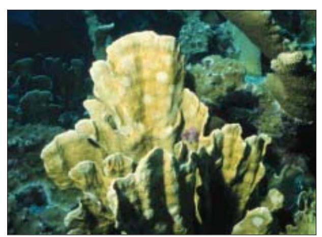

Figure 9. Blade fire coral has been particularly hard hit by coral bleaching in Florida (Photo: William Harrigan).

evaluate the effectiveness of conservation measures for the next biennial report, scheduled for 2004.

The following regional summaries are largely qualitative reports by the managers and scientists who are most familiar with the reef resources. For more details, see the jurisdictional reports that follow the National Summary.

**Florida Florida –** Florida's coral reefs are extensive. They have the greatest number of tourists/visitors of any U.S. jurisdiction, and consequently have substantial human impacts, particularly along the southeastern coast and in the Florida Keys. In general, reef health is declining in southeastern Florida and the Keys, as evidenced by species fluctuations, decreases in coral coverage, and disease. Over the past 20 years, coral bleaching has increased in both frequency and duration, often with high mortality. Particularly massive bleaching events in 1990 and 1997-1998 were responsible for the 80-90% mortality of blade fire corals on shallow-water reefs (Fig. 9).

Monitoring in the Florida Keys National Marine Sanctuary showed both coral reef abundance and diversity were declining – coral cover decreased 37% over the past five years. This was preceded by even more dramatic declines in the 1980s and early 1990s. On the other hand, deeper reefs off the Tortugas Ecological Reserve and the Florida Middle Grounds are in excellent condition.

In the Keys, 23 of 35 species of groupers, snappers, wrasses, and grunts are overfished, while five fish species from the Florida Keys are considered at risk of extinction. Nearby Florida Bay has

another six at-risk fish species. In Biscayne National Park, 26 of 34 fish species are considered overfished.

There is evidence that Sanctuary-designated fully protected zones have already replenished stocks for several over-harvested species. On these reefs, average size and abundance of large groupers, snappers, and spiny lobsters have increased in the past few years.

Turbidity, contaminants, and nutrient enrichment can periodically be high and vary geographically14. Toxic contaminant 'hot spots' have been found in the sediments of both Biscayne and Florida Bays.

The recreational fishing fleet in South Florida has grown at a near exponential rate since 1964 (a 444% increase in recreational boats from 1964 to 1998) with no limit on the number of boats allowed to fish.

**Puerto Rico Rico –** Due to its rapidly growing population and thriving tourism, human pressures on Puerto Rican coral reefs are some of the most severe in the Caribbean. Accelerated urban and industrial coastal development over the last four decades, with the corresponding coastal development, sewage discharge, and sediment runoff during and after construction, have all degraded the condition of nearby reefs.

Staghorn and elkhorn coral populations have declined in most locations over the last 25 years from hurricane damage, white-band disease, and coral-eating mollusks. Fishery resources show the classic signs of overfishing – reduced total landings, declining catch-per-unit-effort, smaller fish taken, and recruitment failures. Reef fisheries have plummeted during the last two decades; between 1979 and 1990 they dropped 69%.

Shallow-water coral reefs off La Parguera on the main island of Puerto Rico and off the islands of Desecheo and Vieques have the highest abundance and cover of living corals in the Commonwealth, but even those have been stressed significantly.

**U.S. Virgin Islands (USVI) (USVI) –** Over the past 20 years, near-shore coral reefs off the USVI have suffered a series of natural disasters and been exposed to increasing chronic impacts from island residents and tourists (Fig. 10). Compounding the devastation from being hit by eight hurricanes with

14 For example, higher nutrient concentrations are reported in the Middle and Lower Keys than in the Upper Keys and the Dry Tortugas.

little time to recover, shallow-water reef corals have suffered high mortality from coral diseases, particularly white-band disease. On some reefs, living elkhorn coral cover has fallen from 85% to 5%. Major coral bleaching events occurred in 1987, 1990, and 1998, but generally mortality was not high.

Macroscopic algae, covering about 5% of the bottom before Hurricane Hugo, are now periodically very abundant, averaging over 30% cover in some months. This is probably the result of decreased algal grazing after the loss of long-spined sea urchins in the early 1980s and the overfishing of **herbivorous fishes**15. Dredging, sand extraction, pier construction, and sewage effluent have all impacted USVI reefs, especially those off St. Thomas and St. Croix.

Overfishing is a serious problem throughout the USVI and has had a profound effect on finfish and invertebrates. After depleting the desirable species of groupers16, fishers began targeting smaller species. In general, fisheries are close to collapse, even within marine protected areas.

**Flower Garden Banks Garden Banks –** The coral reefs in the Flower Garden Banks National Marine Sanctuary are in excellent condition, largely because 1) the banks are located well offshore, 2) they generally lie deeper (the reef platform is around 55-100+ ft from the surface), and 3) they are far from human settlement.

Coral cover on the bank platform averages 47% and has not significantly changed since monitoring began in 1972 (Fig. 11). Disease is relatively low, as is coral bleaching; neither has resulted in significant mortality. Macroalgal populations have

Figure 11. Coral cover at the Flower Garden Banks has not changed significantly since the 1970s (Photo: Frank and Joyce Burek).

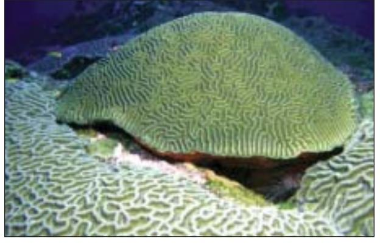

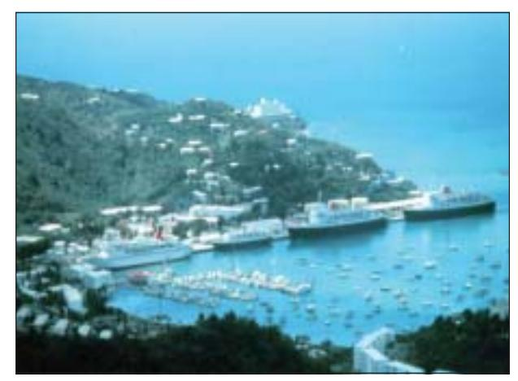

Figure 10. Increased tourism has brought more cruise ships to USVI harbors (Photo: Ralph Kresge).

historically been low, with cover estimates generally less than 5%.

Fishing pressure is not intense at this time. Commercial long-line fishing for snapper and grouper occurs along all of the continental shelf edge; target areas for this activity are typically the deeper portions of the bank structure, away from the shallower coral reef platform.

**The Main Hawaiian Islands (MHI) (MHI) –** With a few exceptions and despite changes in coastal land use, near-shore reefs around the eight MHI remain in relatively good condition. Coral reefs suffer from degradation related to human population growth, urbanization, and development. Major sources are ocean outfalls, urbanization, massive coastal recreational development (hotels, golf courses, etc.), and marine invasive species, especially macroalgae and the red mangrove. Previously, ranching, plantation agriculture, and military construction impacted reef condition.

There are strong indications of overfishing of the majority of fish and invertebrates. Recently there has been concern regarding the expanding live marine ornamental trade for home aquaria. Fishing pressure in heavily populated areas appears to exceed the capacity of these resources to renew themselves. The abundance of reef fishes in areas where fishing is allowed is substantially lower than in areas where it is prohibited. There are numerous no-take marine protected areas off MHI shores; some of the larger ones have been shown to be effective in replenishing local fish stocks, but the rest may be too small to serve as ecosystem refuges (Fig. 12).

15 Fish that primarily consume plant material such as algae.

16 By the 1970s, several spawning aggregations of Nassau grouper had been completely decimated. **77**

For almost 10 years now, high nutrient levels and algal blooms have been recurring on reef flats off the southern and western coasts of Maui. Ship traffic, proximity of reefs to harbor entrances, and more vessel groundings have resulted in more oil spills. High concentrations of toxic chemicals have been measured in near-shore sediments and in the tissues of a variety of coastal marine wildlife.

The Northwestern Hawaiian
Islands (NWHI) – The situation
is very different in the fardispersed, sparsely populated
islands to the northwest of the
MHI. The NWHI islands and
atolls are unique among Pacific
reefs because of their near-

pristine condition, preponderance of large fish, general lack of disease and bleaching, and the abundance of **endemic**17 species. High numbers of shallow-water fish that are all but absent in the MHI as well as substantial populations of large **apex predators**18, especially jacks and sharks, indicate these reefs are healthier than most.

Recent reef fish surveys throughout the Hawaiian Archipelago revealed that fish abundance in the NWHI averaged 260% more than that of the MHI; the average weight of apex predators was 570% greater. By weight, most of the dominant species in the NWHI were either rare or absent in the MHI.

The major anthropogenic impact on NWHI reefs is marine debris, mostly nets, plastics, and other trash transported by currents from fleets fishing in distant waters (Fig. 13).

The existing Hawaiian Islands and Midway National Wildlife Refuges and now the Northwestern Hawaiian Islands Coral Reef Ecosystem Reserve, make these reefs the most highly protected. Furthermore, the State of Hawai'i is presently evaluating its option of developing State fishery management areas in the NWHI.

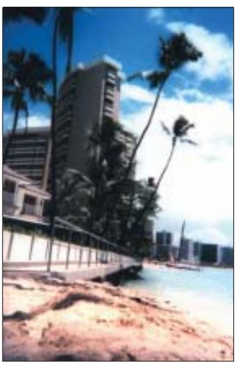

Figure 12. The Waikiki Marine Life Conservation District's small size and urban location may hinder its capacity to fulfill its conservation objectives (Photo: Michael Theberge).

American Samoa – Coral reefs off American Samoa are recovering from natural disasters – a crown-of-thorns starfish invasion (1979, Fig. 14), three hurricanes (1986, 1990, 1991), and a period of warm weather that caused massive coral bleaching (1994). Added to this are chronic human-induced impacts in populated areas like Pago Pago Harbor.

Coral recovery from the natural disturbances has been excellent through 2001. Information is limited, but with a few exceptions, the algae found around the islands are indicative of a low nutrient environment19 and/or heavy grazing by herbivores.

Harvested species such as giant clams and parrotfish are overfished; there is heavy pressure on surgeonfish, and there are fewer and smaller groupers, snappers, and jacks. The endangered hawksbill turtle is in serious decline from illegal harvest and loss of nesting habitat.

Fish are contaminated with heavy metals in some areas, particularly in Pago Pago Harbor.

**Guam** – The health of Guam's coral reefs ranges from excellent to poor, depending on adjacent land use, human accessibility, location of ocean outfalls and river discharges, recreational pressure, and

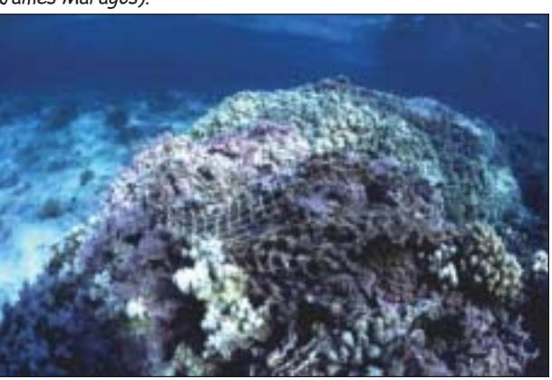

&lt;sup>17 Species with restricted geographic ranges; these rare species are unique to a specific area, such as an embayment, an island, or a group of islands.

&lt;sup>18 Those large meat-eating species at the top of an ecosystem food chain or web.

&lt;sup>19 Indicating low pollution in these areas.

&lt;sup>20 Typhoons, crown-of-thorns starfish outbreaks, and earthquakes.

&lt;sup>21 Underground water originating from upland sources of fresh water that percolates through coastal sediments along the beach or just offshore. Where this occurs, less saline, nutrient-laden water will kill reef species.

water circulation patterns. There are indications of an overall reduction in Guam's coral species diversity. Reefs impacted by natural disturbances20 have not recovered in specific areas.

Apra Harbor is home to a large U.S. Naval facility and the Guam Port Authority. Within the bay, corals and reefs have been impacted by freshwater runoff, sediments, grounding by ships, and thermal discharges from the Island's main power generation facilities. A variety of pollutants have been found in harbor sediments.

Agana, Tumon, and Piti (also known locally as Tapungun) Bays have heavy human use. The inner areas of these bays are in relatively poor condition,

affected by discharges from land as well as impacts from recreational activities. Agana and Tumon Bays are centers for tourism. West Agana has a sewage treatment plant built on the reef flat that had a pipe discharge in 60 ft of water (upgrades are underway). **Coastal aquifer** discharges21 usually have high levels of nutrients22, especially at the start of the rainy season. These are responsible for chronic algal **blooms**23 in Agana Bay and can cause **red tides** in Tumon Bay.

While the crown-of-thorns starfish have occurred in small-to-moderate numbers over the past few years, a substantial population of juveniles now is cause for

As indicators of overfishing, fish populations and catch-per-unit-effort have declined more than 50% over the past 15 years. Large reef fish are rare.

concern about the potential for a future outbreak.

#### **Commonwealth of the Northern Mariana of Mariana**

**Islands Islands –** Generally, the CNMI reef ecosystems are in excellent to good condition. Reefs adjacent to the populated southern islands of Saipan, Tinian, and Rota receive most of human impacts from development, population growth, fishing, and tourism.

Although coral reef species were devastated by a major crown-of-thorns starfish outbreak in the late 1960s, most of the affected reefs appear to have

recovered. CNMI coral reefs were spared the impacts of the 1998 coral bleaching event; however, bleaching is now a major concern.

Based on qualitative assessments, CNMI's populated southern reefs are all overfished at some level; fish populations on the mostly unpopulated northern reefs are generally in excellent condition.

**U.S. Remote Insular**24 **Reefs –** These reefs off remote and largely uninhabited atolls and islands remain relatively pristine. They have experienced few human-induced pressures outside of longdistance fishing. Disease is low; except for Palmyra Atoll, the same is true for coral bleaching.

> Since the late 1800s, there has been little fishing pressure on any of these reefs. Shallow-water reef fish communities exhibit high density and have substantial populations of large snappers, groupers, and herbivores.

#### **Republic of the Marshall Islands of the Marshall Islands –**

The RMI coral reef ecosystems are generally in good to excellent condition. Even the reefs used for the 67 nuclear tests have recovered well, though perhaps not as completely as some scientists have reported. There is little data on the diversity of reef organisms and only recently there have been assessments of general reef condition.

With their low elevation (average elevation of 7 ft), the entire Marshall Island chain is in danger of being submerged with even moderate sea level rise from global climate change.

**Federated States of Micronesia Federated of Micronesia –** Reef condition throughout the FSM is generally good to excellent. Most of the reefs around the low islands are quite healthy. Reefs around the populated islands of Pohnpei, Chuuk, Kosrae, and Yap vary in condition, but are generally good with live coral cover ranging from 20-70%.

The primary human impacts come from fishing pressure and ship groundings. Overfishing has been documented as a result of foreign commercial activities. Destructive fishing practices, including

Figure 14. Crown-of-thorns starfish outbreak in American Samoa (Photo: Charles

Birkeland).

22 From agricultural chemicals.

23 A sudden population explosion of algae within a relatively limited area, often the result of increased nutrients in the water. A **red tide** is a harmful bloom of microscopic algae (e.g., dinoflagellates) that often imparts a reddish or brownish hue to the water.

24 Another term for island or atoll. These are the Navassa Island National Wildlife Refuge in the Caribbean near Haiti, Wake in the Marshall Islands, and the Pacific National Wildlife Refuges of Johnston, Howland, and Baker in the Phoenix Islands; Jarvis; Johnston; and Kingman Reef and Palmyra in the Line Islands.

the use of explosives taken from the wrecks, have caused local reef damage.

**Republic of Palau Palau –** Before the 1997-1998 bleaching event in Palau, the remote reefs were in good to excellent condition, with the most diverse coral fauna of any area in Micronesia (over 425 stony coral and 120 soft coral species). Live coral cover generally ranged from 50-70% (Fig. 15). However, the event severely affected most shallow-water reefs; on some reefs 30-100% of the *Acropora*  coral died. Crown-of-thorns starfish have also been a problem for Palauan coral species, and on many reefs they are targeting the few *Acropora* corals that survived the bleaching event.

Reefs closer to population centers or areas where development is occurring show signs of degradation and are not as healthy as the remote reefs. Eutrophication in Malakal Harbor has been directly linked to fishing vessels anchored there, as fishers remain onboard with inadequate sanitation or waste disposal facilities.

Fish populations off the main islands of Palau25 are showing signs of overfishing compared to the southwestern islands where there is less fishing pressure. Around the main islands of Palau, highly desired species of fish are either absent or present in low numbers.

**Temporal Trends Trends –** In places where there has been credible long-term monitoring, there are alarming temporal trends. These include decreasing live reef cover, increasing coral disease and bleaching with significant mortality, and overfishing. Mostly due to hunting over the last century, all sea turtle species and a number of marine mammal species are in danger of extinction (Fig.

Figure 15. A Palauan coral reef with high percent coral cover (Photo: James McVey).

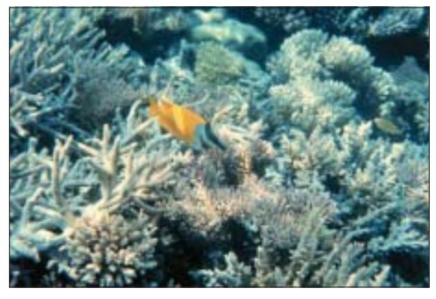

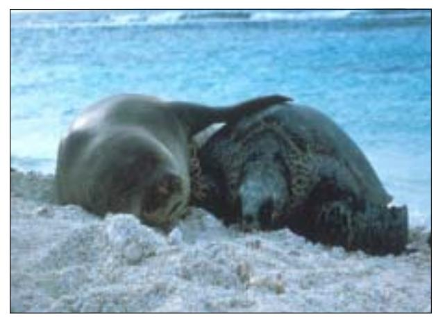

Figure 16. The Hawaiian monk seal and green sea turtle are both endangered species (Photo: George Balazs).

16). Now these are being protected under provisions of the Endangered Species Act and the Marine Mammal Protection Act.

Where no-take reserves have been enforced and monitored, there are increasing numbers and sizes of harvested fish and invertebrates.

**Spatial Trends –** Seven tables in the main report present what is known about the condition of coral reef ecosystems in the 13 jurisdictions. These will be the baseline for future assessments and biennial reports on coral reef ecosystem condition, and may be the basis for predicting ecosystem change.

Without a single master list of inventoried species and with significant information gaps on many of these tables, the effort to develop biennial reports on coral reef condition is limited. To remedy this, NOAA and its partners, initiated a pilot Hawaiian prototype project that should result in a computerized list of all U.S. coastal marine species in the near future. Further, NOAA's mapping initiative and its cooperative grants to island agencies that support long-term monitoring should fill many of the remaining information gaps.

#### **Agency Responses to Conserve Coral Coral Reef Ecosystems Reef Ecosystems**

In 1998, growing scientific evidence and global concerns for the health of coral reefs prompted the U.S. Government to issue a Presidential Order for the protection of coral reefs (E.O. 13089). It also established the USCRTF.

In 2000, the USCRTF issued its *National Action Plan to Conserve Coral Reefs* (National Action Plan). Congress appropriated \$8 million in FY00, \$27 million in FY01, and \$34 million in FY02 to

25 The most diverse reef ecosystem under U.S. jurisdiction, with a total of 1,278 known reef fish species.

the Department of Commerce and another \$10 million annually from FY00-02 to the Department of Interior to enhance coral reef conservation activities. In addition, the new Coral Reef Conservation Act of 2000 further integrated efforts by Federal, State, and Territorial agencies to map, monitor, conduct research, restore, and manage U.S. coral reef ecosystems. The USCRTF National Action Plan recommended preparing biennial reports on the State of American Coral Reef Ecosystems. This is the first.

The National Action Plan presented 13 action items that, if followed, will improve scientific and community understanding of coral reefs and reduce the adverse impacts of human activities. The agencies of the USCRTF have made significant progress in these areas since 2000, though much still remains to be done.

**Map all U.S. Coral Reefs Coral Reefs –** The National Action Plan called for mapping all shallow-water coral reef ecosystems by 2009. Digital maps of shallowwater habitats off Puerto Rico, USVI, and most of the Florida Keys have been completed. Aerial photographic images for portions of Hawai'i, and satellite images for most of the rest of the U.S. Pacific island shallow-water reefs have been acquired, a first step for mapping these reefs. In 2001, NOAA characterized and mapped habitats of the deep *Oculina* coral reefs off the eastern coast of Florida using submersibles and multi-beam sonar.

## **Assess and Monitor Reef Health Monitor Reef Health –** The National Action Plan called for a nationallycoordinated Coral Reef Monitoring Network that

will provide regular assessments of reef health as well as initiate new monitoring to fill information gaps. Now in its third year of NOAA leadership and funding, the National Coral Reef Program has provided cooperative grants to state and island agencies to build local capacity for assessing and monitoring local reefs. Other NOAA and DoI grants have supported related research, monitoring, and education projects.

A number of shallow-water rapid ecological assessments (REAs) of coral reef ecosystems have been conducted since FY00 by agency and nongovernmental scientists. Of these, the 2000 NOW-RAMP expedition was the most comprehensive (birds, marine mammals, fish, invertebrates, and

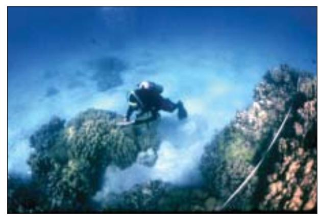

Figure 17. Diver assessing coral species at French Frigate Shoals during the NOW-RAMP Expedition (Photo: James Maragos).

sediment contaminants were surveyed throughout the length of NWHI, Fig. 17). Additionally, the U.S. Fish and Wildlife Service (USFWS) and NOAA conducted initial REAs of reef ecosystems off the U.S. Remote Insular Reefs. Also in cooperation with NOAA, the USFWS established sites for long-term coral reef monitoring at each of the REA islands as well as at the Midway, Rose, and Johnston Atoll National Wildlife Refuges.

A variety of volunteer programs also monitor the reefs as part of the Coral Reef Monitoring Network. They enhance coverage of the monitoring conducted by agency and non-governmental scientists.

**Conduct Strategic Research Strategic Research –** Additional research is needed to better understand coral reef ecosystems and help determine what can be done to protect and restore them. Funding for many applied research projects on coral reef ecosystems has gone through the Hawai'i Coral Reef Initiative Research Program, the National Coral Reef Institute, the National Center for Coral Reef Research, NOAA's Sea Grant Program, several of NOAA's National Underwater Research Centers, and the National Science Foundation.

NOAA, USEPA, and DoI created a new Coral Disease and Health Consortium (CDHC) in 2000. The CDHC will conduct and coordinate disease research, track outbreaks of coral disease, and characterize disease agents impacting coral reef ecosystems.

**Understand Social and Economic Factors Factors –** The social, economic, and cultural dimensions must be incorporated into any broader conservation

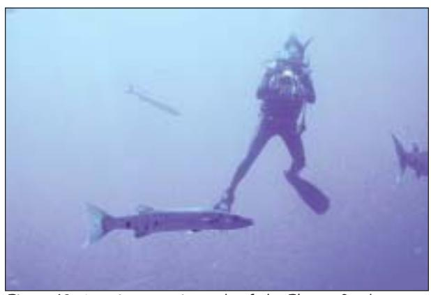

Figure 18. A socioeconomic study of the Flower Garden Banks National Marine Sanctuary evaluated the economic impact of dive tourism (Photo: Emma Hickerson).

strategy. The Global Coral Reef Monitoring Network released a *Socioeconomic Manual for Coral Reef Management*, edited by NOAA staff, in November 2000. Building on that manual, NOAA staff assisted in regional socioeconomic training workshops in East Africa, South Asia, and in the Caribbean. In 2001, a socioeconomic assessment of the financial impact of the Florida Keys National Marine Sanctuary's fully protected zones on commercial fishing and track trends in recreational tourism and its relationship to the local economy was completed. Another socioeconomic study has also been completed for the Flower Gardens Banks National Marine Sanctuary (Fig. 18). In 2002, similar studies were commissioned for reefs off Hawai'i, American Samoa, and Guam.

**Expand and Strengthen Marine Protected Protected Areas (MPAs) (MPAs) –** There is an urgent need to protect the most important reef habitats from further decline by strengthening and expanding a network of coral reef marine protected areas (MPAs) and notake reserves. The goal was to protect at least 5% of all U.S. coral reefs and associated habitat types in each major island group and Florida with notake provisions by 2002, at least 10% by 2005, and at least 20% by 2010. Until all coral reef ecosystem habitats have been mapped, the percentage of these reefs currently protected cannot be accurately calculated.

Significant new MPAs and no-take reserves have been established over the past several years off Florida, Puerto Rico, USVI, Hawai'i, CNMI, and in the Navassa, Palmyra Atoll, and Kingman Reef National Wildlife Refuges (see Table 10 for a full listing by area and percentage, Fig. 19).

But there is still a long way to go. Currently, there is full no-take protection for 1,329 mi2 of U.S. coral reef ecosystems; in Palau, another 25.2 mi2 of reefs have full protection. Three jurisdictions currently exceed the 2010 goal: the U.S. Remote Wildlife Refuges (30.3%), Guam (approximately 28%, and the Northwestern Hawaiian Island National Wildlife Refuge (21.4%). With the exception of the USVI, elsewhere no-take protection is only 5% or less of the total reef ecosystem.

Much has been done over the past few years by USCRTF agencies to strengthen MPAs, but current MPAs and new no-take areas cannot be effective without enforcement. This critical need is recognized by all jurisdictional managers as well as the many authors and collaborators who helped prepare this report.

#### **Reef Fishing and Collecting for Aquaria for Aquaria –** The

National Action Plan called for reducing the impacts of fishing (e.g., overfishing, **bycatch**26, destructive fishing practices) and the over-harvesting of reef organisms for the aquarium trade (Fig. 20). Since FY00, USCRTF agencies have taken a number of important actions to reduce the impacts of fishing and aquarium collection on coral reefs, including banning the taking of live coral, prohibiting reef fishers from using explosives and poisons, and designating no-take zones. Several jurisdictions banned SCUBA spearfishing. Others are conducting studies and planning to revise regulations relating to the capture of live organisms for aquariums.

As an alternative to wild capture, NOAA's National Sea Grant Program has funded research projects

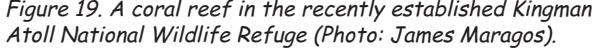

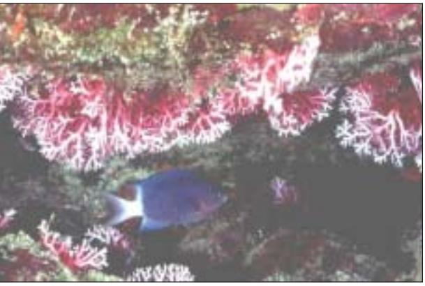

26 Fish that are harvested but not sold or kept for personal use (Magnuson-Stevens Fishery Conservation and Management Act, Pub. Law 94-265, 16 U.S.C.1801 Sec. 2). It includes economic discards and regulatory discards but not fish released alive under a recreational catch and release fishery management program.

in Puerto Rico, Florida, Texas, and Hawai'i to cultivate coral reef species. Over 20 species of fish, crustaceans, mollusks, and corals are now commercially grown.

#### Reduce Impacts of Coastal

Use – Federal and State permitting and management programs for coastal development activities that impact coral reef habitats must be improved. This includes preventing vessel-related impacts and reducing risks of damage to coral reefs from activities conducted, funded, or approved by Federal agencies.

Significant actions implemented in the past two years are reducing the impacts of coastal use and conserving reefs. These include limiting certain activities – prohibiting jet skis in sensitive areas off Puerto Rico, imposing a moratorium on water sports in CNMI, and banning the feeding of reef wildlife off Florida. Also, permanent mooring buoys have been installed or replaced (Fig. 21) and a national inventory of abandoned vessels was created to aid restoration activities.

To help mariners avoid anchoring in reef areas, standard symbols for No Anchoring Areas and Coral Reefs were added to the catalog of chart symbols of the International Hydrographic Organization, and the first mandatory 'No Anchoring Area' was established for the Flower Garden Banks National Marine Sanctuary. Finally, several large legal settlements and restorations were obtained for accidents involving coral damage.

Reduce Pollution – Another part of the National Action Plan called for significantly reducing or eliminating the amounts, sources, and cumulative impacts of contaminants in the water. Over the past two years, there has been substantial Federal assistance for

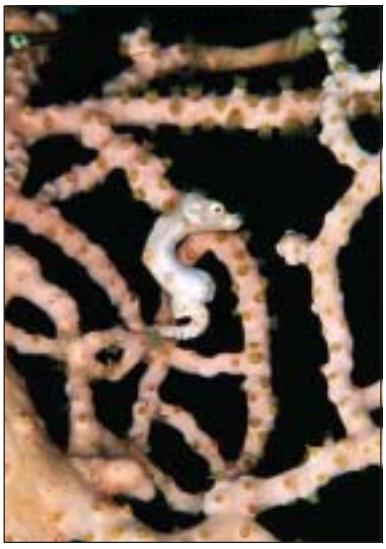

Figure 20. Globally, seahorses are highly targeted by the marine aquarium trade (Photo: Roberto Sozzani).

significant conservation actions. For example, the U.S. Department of Agriculture signed agreements and contracted with landowners and operators to assure the best conservation practices will be applied to nearly 1,776 mi2 of agricultural lands over the next 5-10 years to reduce non-point source water pollution near coral reefs.

And since 2000, tons of marine debris have been cleared from Hawaiian coral reefs and beaches. Several million people helped clean debris from beaches elsewhere.

Minimize Alien Species – Since alien species are an emerging issue, the Bishop Museum, NOAA, the USFWS, and other agencies and non-governmental agencies have prepared a variety of education materials and have committed to building an early warning system for coastal invasive species. Through the DoD's Legacy Program, The U.S. Navy initiated a survey of microflora in ballast tanks on its vessels in 2002.

Restore Damaged Reefs – Restoring of coral

reefs injured by vessel groundings is an important part of the National Action Plan. New techniques and approaches for improving restoration need to be developed.

Federal and State agencies have implemented a wide range of coral restoration projects. In one of the largest restoration operations to date, USCG, NOAA, the Department of Energy, Department of Interior, and American Samoa cooperated and successfully removed nine long-line fishing vessels from Pago Pago Harbor that were grounded during a 1991 cyclone. And in 1999-2000, USFWS contractors removed most of the ship debris from a 1993 grounding of a

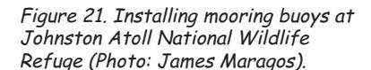

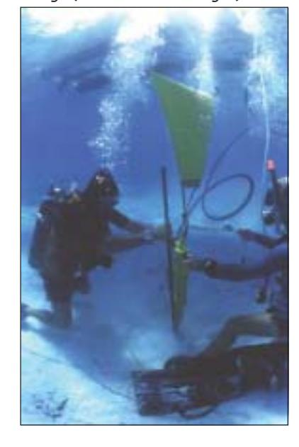

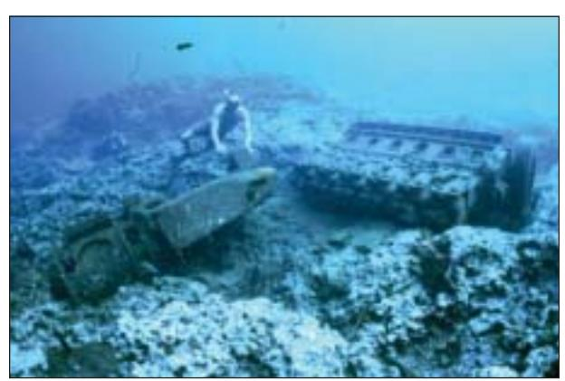

Figure 22. A diver inspects the engine of the Taiwanese longliner fishing vessel that grounded on Rose Atoll (Photo: James Maragos).

Taiwanese longliner at Rose Atoll (Fig. 22). The Waikiki Aquarium and the State of Hawai'i are initiating a pilot project to restore damaged coral habitat in Kealakekua Bay on the island of Hawai'i. NOAA and the State of Florida reconstructed four spurs of an ancient coral reef in the Florida Keys National Marine Sanctuary that had been damaged by the grounding of a 47 m vessel.

**Reduce Global Threats to Coral Reefs Reduce Global to Reefs –** The National Action Plan called for diverse activities to protect and conserve reefs internationally, with an emphasis on capacity-building and technical assistance. The United States assisted 25 countries in the wider Caribbean, Central America, South East Asia, South Pacific, East Africa, and Middle East regions to improve their capacity for sustainable management and conservation.

Additionally, a number of international activities received U.S. funding and technical assistance, including support for Mexico's first National Marine Park. Jamaica's Ridge to Reef Project received funding to integrate land-based management practices with coastal water quality. NOAA strengthened the International Coral Reef Initiative and supported several Global Coral Reef Monitoring Network initiatives.

**Reduce Impacts from International Trade in Reduce Impacts International Trade in Coral Reef Resources Resources –** The United States is the primary consumer of live coral and marine fishes for the aquarium trade, and coral skeletons and precious corals for curios and jewelry. Executive Order 13089 and the National Action Plan charge the USCRTF with addressing the degradation and loss of coral reefs arising from commerce in coral reef species and products.

The USCRTF International Working Group developed and recommended that Congress adopt new regulations for a comprehensive strategy to reduce adverse impacts of trade. Among other activities, the United States provided financial and technical support for the Pacific Regional Workshop "Sustainable Management of the Marine Ornamental Trade" held in Fiji, and the "International Coral Trade Workshop; Development of Sustainable Management Guidelines" held in Jakarta, Indonesia.

**Create an Informed Public an Informed Public –** The National Action Plan called for a focused, multi-level outreach campaign to prevent further declines in coral reef health. Since FY00, USCRTF State and Territorial agencies have expanded their education and public outreach projects for coral reef conservation and protection (Fig. 23). Many have been assisted by Federal grants. For example, Hawai'i, Guam, and the CNMI produced *State of the Reef*  reports and coral reef educational CDs.

#### **Improve Coordination and Accountability Accountability –**

Primarily, the USCRTF was created to improve coordination and accountability among Federal Agencies responsible for coral reefs. The National Action Plan established a small, interagency staff to coordinate the shared Federal agency tasks identified in the Executive Order.

Since FY00, this staff has coordinated the submission of annual agency annual program reports and accomplishments, crosscutting budget initiatives on coral reef conservation. It also developed the process for the public inquiry about the agency response to issues and concerns relating to Federal agency actions for coral reef protection. This same group has facilitated each Task Force meeting and

Figure 23. Elementary school children learn about coral reefs through an educational program (Photo: FGBNMS).

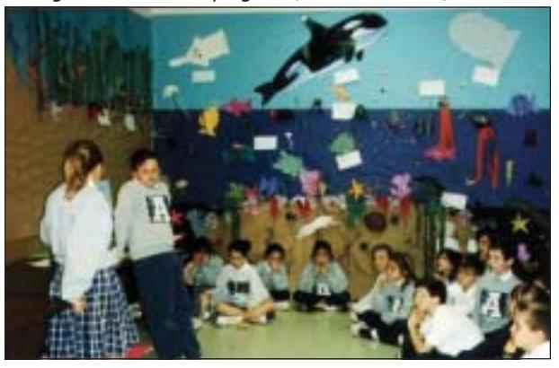

helped implement specific USCRTF-related actions at regional and local levels to strengthen the cohesive national strategy for coral reef conservation.

#### **The Coral Reef Conservation Fund (The Fund) The Coral Reef Conservation Fund (The Fund) –**

The Coral Reef Conservation Act of 2000 authorized NOAA to enter into an agreement with the National Fish and Wildlife Foundation, a nonprofit organization, to establish and administer a fund to support coral reef conservation. In 2001 the Fund provided approximately \$2 million in

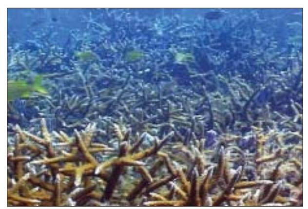

Figure 24. Staghorn coral thickets off of Southeast Florida seem to be in good condition despite their proximity to highly populated areas (Photo: NCRI).

grants to support the development of education and public outreach projects.

#### **Recommendations and Conclusions Conclusions**

Critical information is needed to conserve and protect U.S. coral reefs. Basic mapping has yet to be done for over 85% of all U.S. reefs. As a result, data in this report referring to the area covered by coral reefs, including the percent under no-take provisions, are mostly estimates from a variety of sources. The figures vary widely mostly because of inadequate and inaccurate base maps and charts.

Aside from ongoing mapping efforts, many reef areas need basic assessment and biotic inventories. Comparable long-term monitoring needs to be sponsored and integrated across regions. Managers of reefs with recognized high threats need more resources to mitigate impacts from degraded water and substrate quality, overfishing, invasive species, or other anthropogenic stresses. They must be prepared to take bold conservation measures to reverse present trends.

To track changes in ecosystem health and evaluate the effectiveness of conservation measures, grants

to State and Territorial agencies need to be continued for the next 5-10 years. Public awareness and education and efforts need to continue at a high level to encourage a new ethic of sustained use of coral reef ecosystems.

#### This report finds that:

- • U.S. coral reef areas are extensive.
- • Healthy reef ecosystems are critical for local and regional economies.
- • All jurisdictions still have some reefs in good to excellent health (Fig. 24). These need conservation.
- • All shallow reefs near urbanized coasts are degraded to some extent. These need restoration.
- • Areas next to densely populated shorelines generally have poorer water quality than those far from human habitation. Where water quality is fair to poor, reef ecosystems are degraded. Water quality needs to be improved in those areas, and measures taken to maintain the water quality of areas where reef condition is now deemed good to excellent.
- • Coastal development, runoff, and sedimentation have impacted reefs around most high islands. This needs to be minimized.
- • Fishing pressure has been a primary factor impacting reef ecosystems for decades. There is evidence that overfishing has changed ecosystem structure and function. Different and effective methods of management need to be implemented.
- • Remote reefs with little coastal development, good water quality, and low fishing pressure are in excellent health, as characterized by many large fish and generally high species diversityy. These need to be studied and preserved.
- • Marine refuges with no-take provisions produce more and larger fish. With enough time, they can conserve reef communities and longlived species, producing trophy-sized apex predators. More no-take areas need to be implemented within MPAs to reach the USCRTF goal of 20% protection.
- • Some existing marine protected areas are not protecting reefs. Regulations within these need to be strengthened and adequately enforced.
- • Enforcement is critical. It needs to be expanded and made more effective.

### **NATIONAL SUMMARY NATIONAL SUMMARY NATIONAL SUMMARY NATIONAL SUMMARY NATIONAL SUMMARY**

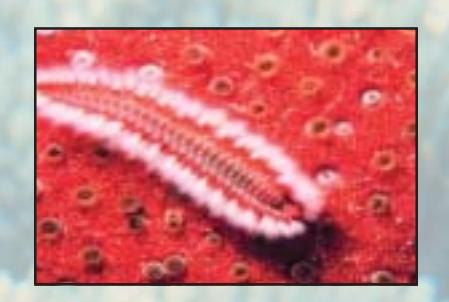

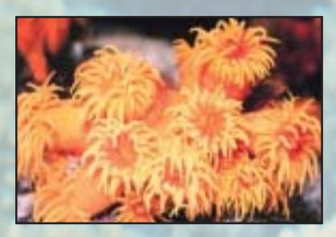

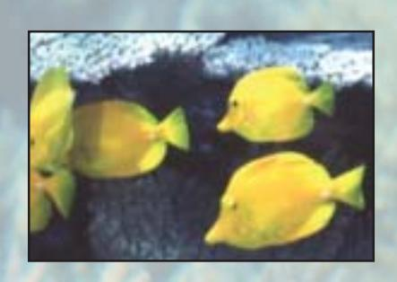

**Background Background Background Background**

**Environmental Pressures Pressures Environmental PressuresEnvironmental Pressures Environmental Pressures**

**National Assessments Assessments National Assessments National Assessments National Assessments**

**Agency Responses Agency Responses Agency Responses Agency Responses Agency Responses**

**Recommendations for Conservation for Conservation Recommendations Conservation Recommendations for Conservation Recommendations for Conservation Action and Conclusions Action Conclusions and ConclusionsAction and Conclusions Action and Conclusions**

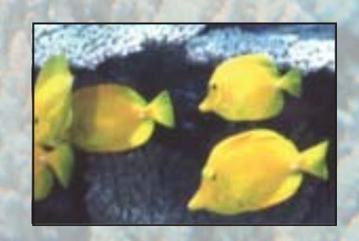

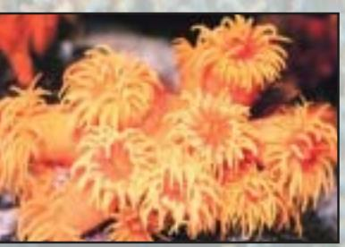

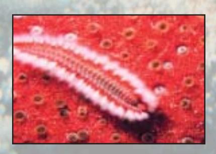

### **BACLGROUND BACLGROUND NATIONAL SUMMARY: NATIONAL SUMMARY: SUMMARY: NATIONAL SUMMARY: NATIONAL SUMMARY: BACKGROUND BACKGROUND Donna D. Turgeon and Rebecca G. Asch Turgeon and Rebecca Asch Donna D. AschDonna D. Turgeon and Rebecca G. Asch Donna D. and Rebecca G. Asch**

This is the first in a series of biennial reports on the *State of Coral Reef Ecosystems of the United States and the Pacific Freely Associated States*. The National Ocean Service led the development, but it is the product of the 38 coauthors, and they are responsible for its content. It is the result of a nationally-coordinated effort by the USCRTF to assess the condition of coral reef ecosystems. The working group was comprised of the USCRTF Governors' Points of Contact, members from all of the USCRTF working groups, and the managers and scientists from participating Federal agencies and U.S. States, Commonwealths, and Territories, and the Pacific Freely Associated States27 .

Coral reefs are the most diverse, productive, and economically important habitats found in tropical and semitropical oceans. But little specific scientific information is known about the function, structure, and condition of these ecosystems. Most have yet to be mapped and their biotic resources inventoried. This report is the beginning of gathering consistent, comparable scientific information on all the reefs in the United States and the Freely Associated States, so the condition of these resources can be reliably assessed and conserved.

Coral reefs discussed in this report are found along the Western Atlantic and the continental shelf of the northern Gulf of Mexico, and around Caribbean

and Pacific islands (Fig. 25). Western Atlantic and Caribbean shallow-water coral reefs are off the State of Florida, the Commonwealth of Puerto Rico, the Territory of the U.S. Virgin Islands (USVI), and the Navassa Island National Wildlife Refuge. Deeper reefs in the Northern Gulf of Mexico and the Western Atlantic are also covered. Shallow-water reefs off the U.S. Pacific islands are extensive and include the Main and Northwestern Hawaiian Islands, the Territories of American Samoa and Guam, the Commonwealth of the Northern Mariana Islands (CNMI), and seven remote, unincorporated Pacific island areas28. Also included in this report are Indo-Pacific reefs around the Freely Associated States. These are among the most biologically diverse coral reef ecosystems in the world.

With their habitat complexity and species richness, coral reefs protect coastlines from storms and are a source of food and recreation for millions of people. Many near-shore coral reef ecosystems are inextricably linked to coastal human populations, water-based activities, and economics. In general, coral reefs provide livelihoods for hundreds of thousands of people in all U.S. affiliated areas. However, human activity is rapidly degrading many near-shore reefs. If coral reef ecosystems are to continue to support abundant, diverse wildlife,

> as well as the humans that appreciate and depend on them, then they need to be conserved.

The mapping, assessment, monitoring, and other conservation activities presented in this report are the beginning of a comprehensive management strategy to conserve reef resources and to report biennially on the effectiveness of those conservation measures.

Figure 25. Map of coral reefs of the world with U.S. reefs highlighted in red (based on Bryant et al. 1998).

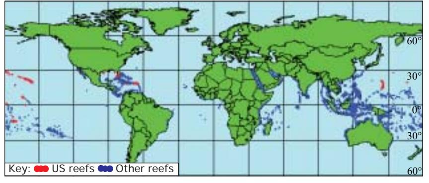

27 The Freely Associated States were formerly a part of the United States Trust Territory of the Pacific Islands for nearly 40 years following World War II. Three former territories, the Federated States of Micronesia (FSM), Palau, and the Republic of the Marshall Islands (RMI), are now independent nations that retain close association with the United States. Associates of the USCRTF, they requested to be included in this report.

**BACKGROUND**

28 Baker, Howland, Jarvis, Johnston, Kingman, Palmyra, and Wake.

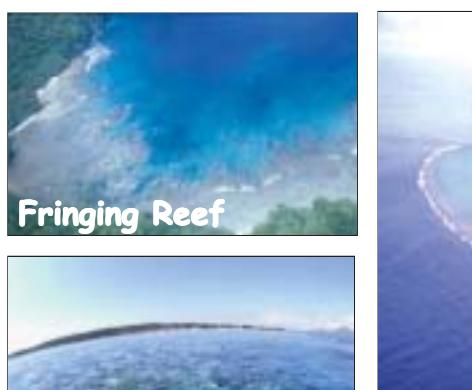

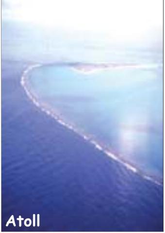

Figure 26. Three types of coral reef formations (Photos: Kip Evans, James Maragos, and the NOS Photo Gallery).

The rest of this Background discusses topics the managers of coral reefs consider important for the context of statements they make on the condition of corals and other aspects of this valuable aquatic ecosystem. These topics provide background for the classic presentation of sections that follow the Background (i.e., Pressures on the Ecosystem, State, or condition, of the Reefs, and Responses by Agencies to conserve coral reef resources).

#### Coral Reefs

Although deep-sea coral reefs with three-dimensional structure exist in cooler waters, the familiar reefs are in the shallow, clear turquoise-blue waters of tropical and subtropical seas. Reefs generally sit on continental shelves and submerged bases of volcanoes in depths ranging from emergent on low

tides to around 150 ft. Shallow-water coral reef development is optimum where sea temperatures are warmest, between 30°N and 30°S, which roughly coincides with the 20°C (68°F) **isotherm** (lines drawn on a map that connect points of equal temperature). Most corals cannot survive temperatures much below 60-65°F (16-18°C) even for a few weeks.

Coral reefs are the largest biological structures on earth, with millions of coral colonies, each made up of thousands of tiny interconnected corals. There are three general types of reefs, with many gradations and variations (Fig. 26)6. Fringing reefs

grow seaward from the rocky shores of islands and continents. Barrier reefs are parallel to shorelines of continents and islands and are separated from land by shallow lagoons. Barrier reefs off oceanic islands originate from fringing reefs in a process that is similar to the formation of atolls. Atolls are ring- or horseshoe-shaped coral reefs and coral islets surrounding a lagoon. An atoll lagoon is formed when the volcano that is the reef's foundation sinks into the ocean, leaving only the upward-growing reef near sea level. Atoll and barrier reef lagoons are usually connected to the open sea by breaks or passes through the reef, and may hold clusters of isolated patch reefs (small reefs that were

gradually separated from associated land masses because of island subsidence or rising sea levels).

In addition to shallow reefs, certain corals can also form reef-like structures or **banks** in deeper waters. These structures may play similar roles to shallow reefs, but they have been little studied and are generally not included in this report.

The United States and over 100 other countries claim sovereignty over coral reefs (Birkeland 1997a). Spalding *et al.* (2001) estimated the area covered by shallow coral reefs (less than 200 ft.) worldwide to be 109,800 mi² (284,300 km²). Their estimate of shallow reefs comprises less than 1.2% of the continental shelf area and only 0.9% of the world's oceans. Reefs in sovereign U.S. waters cover an estimated 7,607 mi² (19,702.4 km², Fig.

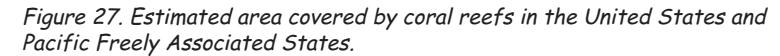

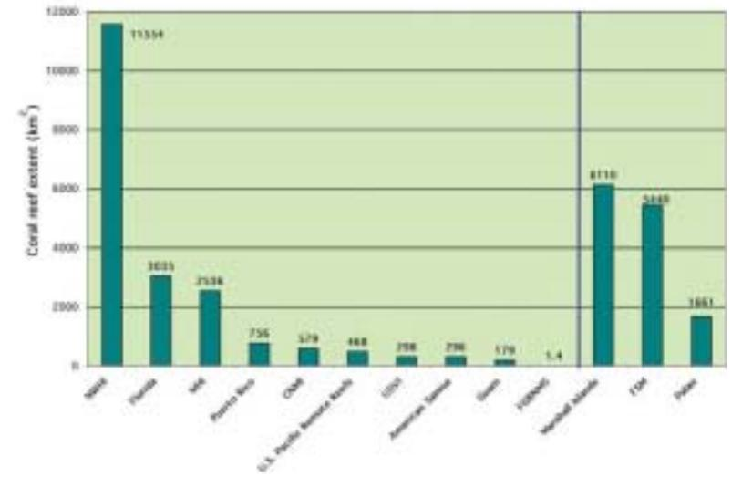

&lt;sup>29 The numbers were computed using informmation from Hunter 1995, FMRI/NOAA 1998, Ault *et al.* 2001, Florida Fish and Wildlife Conservation Commission 2001, Kendall *et al.* 2001, S. Gittings pers. comm., and S. White pers. comm.).

27)29. Estimates for the reefs off the Freely Associated States range from 4,479-31,470 mi2 (11,600 81,500 km2 , Holthus *et al.* 1993, Maragos and Holthus 1999, Spalding *et al.* 2001).

#### **Reef Ecosystems Reef Ecosystems**

**Ecosystems** are composed of biological communities and habitats. **Biological communities** are interacting populations of individual species.

Coral reef ecosystems include the species residing in these habitat types. They also include aquatic residents of associated sand, macroalgae, seagrass, and mangrove habitats. Species have specialized roles (**niches)** within habitats. Basically, organisms can be grouped into three general categories – **planktonic** (floating), **benthic** (bottom dwelling), or **nectonic** (swimming).

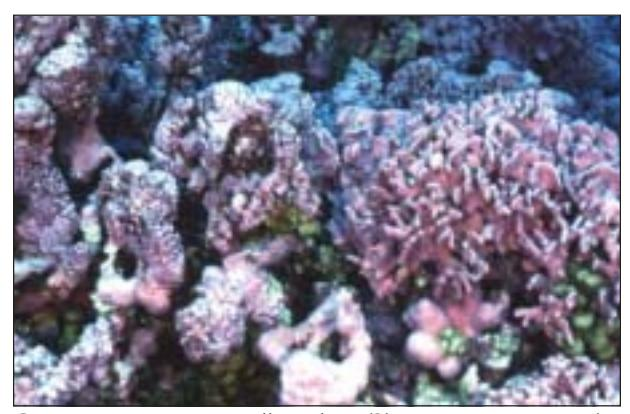

Figure 29. Crustose coralline algae (Photo: James Maragos).

An ecosystem includes all the energy, material/ nutrient cycling, and behavioral interactions, linking organisms in a community together and with their environment (Smith 1992). Monitoring components of coral reef ecosystems are key to both understanding their structure and function and wisely managing reef resources. This includes biological factors such as species abundance, size, distributions, diversity, and human-use patterns, along with non-biological factors such as coastal development, sedimentation, and pollution.

#### **Corals and Reef Communities Communities**

Corals are ancient animals that evolved into the modern reef-building forms over the last 25 million years (Allen and Steene 1996). They

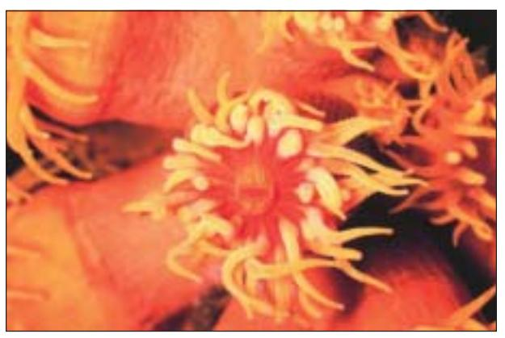

Figure 28. Coral polyp (Photo: James McVey).

initially appeared as solitary forms in fossils more than 400 million years ago.

The primary building blocks of a reef are polyps of **stony** coral species (also called **scleractinian** or **hermatypic** corals). Each **polyp** is generally **sessile** (attached to the substrate), with a small cylindrical body and prey-capturing tentacles surrounding the opening or mouth (Fig 28). The polyps of stony corals deposit a calcium carbonate skeletal cup around themselves. A coral reef is comprised of millions of these calcified polyps making up individual coral heads. Coral heads are often cemented together by **coralline** (coral-like, calcareous) algae (Fig. 29).

**Symbiotic**30 photosynthetic, single-celled algae, called **zooxanthellae** live in the tissues of each stony coral polyp. Reef-building corals cannot live without them. They depend on these microscopic plants for part of their nutrition, so are limited by their symbiont requirements to the maximum depth light penetrates in clear, oceanic waters (around 150 ft). This symbiosis enhances the growth rate and calcium deposition of shallow-water stony corals and contributes toward coral reefs being the most diverse marine ecosystems on earth.

Organisms within coral reef communities can be divided into four main groups.31 First, the **epibenthos** (sessile organisms, the living substrate) provides the complex structure of the reef itself. These are the coralline and fleshy algae, hard and soft corals, and sponges. Second, **plankton** (tiny floating plants and animals, most are microscopic) provides food for the reef **filter feeders**32. Third, the **suprabenthos** are the larger mobile animals that swim over and around the reef. These are the

**BACKGROUND**

30 From **symbiosis**, a term for a beneficial relationship between two organisms. Usually the smaller organism is the **symbiont** 

and the larger is the **host**. 31 Modified from the three coral reef components proposed by Reaka-Kudla (1997).

32 Organisms feed by filtering plankton from the water column. This includes much of the plankton itself, corals, clams, some fish, and baleen whales.

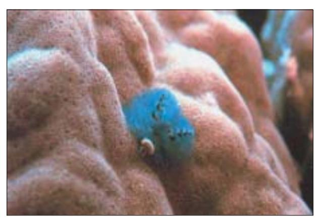

Figure 30. Polychaete worm on a coral reef (Photo: James McVey).

Coral reefs are unique, biologically diverse sys- There is also strong international concern that tems34. Their productivity rivals the tropical rain certain coral reef species are threatened or may forests. Although a comprehensive inventory of the become threatened through trade. The Convention biological diversity of coral reef species has yet to be done for the United States and the Pacific Freely Associated States, healthy coral reefs support an Figure 31. Juvenile fish swimming around mangrove roots (Photo: Matt Kendall). abundance of life. Only about 5% of the global coral biota has been described and about 93,000 species of coral reef organisms identified. Based on that, Reaka-Kudla (1997) estimated the 'true number of species on global coral reefs is at least 950,000.' Using another broad assumption, including the premise that only 10% of the organisms on coral reefs have been described, Spalding *et al.*  (2001) estimated a global total of 1-3 million species inhabit coral reefs and associated habitats.

Sand, algae, seagrass, and mangrove habitats are integral parts of the reef ecosystem, providing critical nursery areas and essential habitat for reef invertebrates and fish (Fig. 31). Marine organisms rely on the different habitats of the coral ecosystem at different life stages, and the loss or degradation of any of those habitats can have serious effects on the reef. Corals, most fishes, and other reef organisms have planktonic larval stages. Floating with ocean currents, these larvae link different ecosystems, often over large distances. Therefore, the health of a reef partly depends on the condition of ecosystems 'upstream' from which reefs derive **recruits** (juvenile and adult organisms that settle out of the plankton or migrate into the reef community).

A number of reef-associated species have been **herbivores** (those that feed on plants), **coral** listed as threatened or endangered under the U.S. **livores** (those that feed on corals), **carnivores** Endangered Species Act (Fig. 32). These include (those that eat other animals), and **detritivores** all the sea turtles35, and the Hawaiian monk seal (those that feed on dead and decaying matter). (*Monachus schauindslandi*). The Caribbean monk Fourth, the **cryptofauna**33 bores into the substrate seal (*M. tropicalis*), also listed as endangered, is and nestles in holes and reef crevices. These bryo probably extinct. Populations of **endemic** species zoans, sponges, tunicates, and polychaetes further (unique to a specific area, such as a single island) increase reef habitat complexity (Fig. 30). may be especially at risk for extinction36.

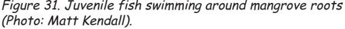

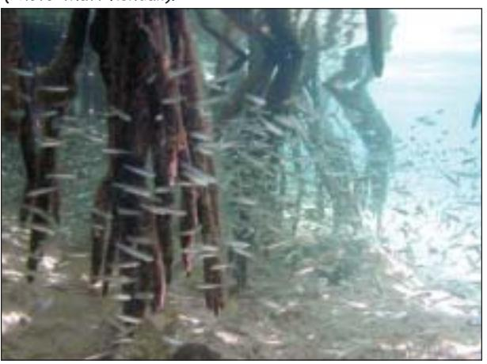

33 Richter *et al.* (2001) described the cryptofauna as a microcosm within a "swiss-cheese" reef. Inside a reef, there is 2.5-7.5 times the surface area of the outside. These internal areas are crammed with sponges, bacteria, sea squirts, and more. Only about half of the species they encountered were known to science. These authors postulate the cryptofauna filter up to 60% of the plant and animal plankton passing through the reef. The nitrogen and phosphorus they excrete after digesting the plankton fertilizes the corals and allows them to thrive in nutrient-poor waters.

**NATIONAL SUMMARY NATIONAL SUMMARY**

34 For example, Grassle (1973) reported that a single head of cauliflower coral (*Pocillopora damicornis*) contained 103 species of **polychaetes** (segmented worms with paddle-like appendanges). He also found numerous **decapod crustaceans** (crabs and shrimp), **amphipods** and **isopods** (small shrimp-like crustaceans), **sipunculids** (peanut worms), **oligochaetes** (earthworm-

like segmented worms), and **ophiuroids** (brittle stars, a type of starfish). 35 Green (*Chelonia mydas*), loggerhead (*Caretta caretta*), and olive ridley (*Lepidochelys olivacea*) sea turtles are listed as threatened throughout their range. Hawksbill (*Eretmochelys imbricata*), leatherback (*Dermochelys coriacca*), and Kemps ridley (*Lepidochelys kempii*) are listed as endangered throughout their range.

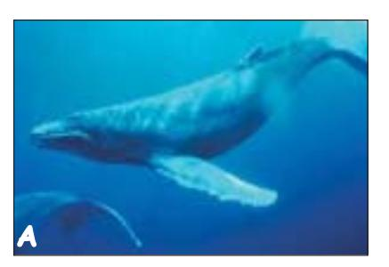

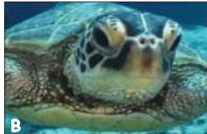

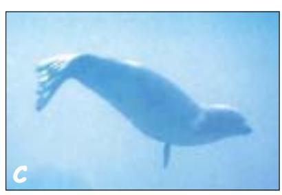

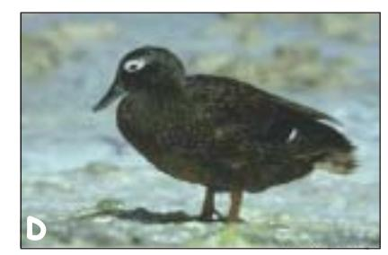

Figure 32. Some examples of Hawaiian species covered under the Endangered Species Act include: (a) the Humpback whale, (b) the green sea turtle, (c) the Hawaiian monk seal, and (d) the Laysan duck (Photos: Joseph Mobely, NMFS, Donna Turgeon and J. Marks).

on the International Trade in Endangered Species of Wild Fauna and Flora (CITES) lists those species. Currently, CITES protection has been extended to a number of reef species, many of which are commercially desirable37. CITES also warns that reef sharks are being rapidly depleted because of the global harvest of shark fins.

#### Cultural Value of Reef Ecosystems

Coral reefs are a significant part of a country's natural heritage. Some of the largest individual coral colonies found on reefs today were thriving centuries before human colonization. Rivaling old growth forests, well-developed reefs reflect thousands of years of growth and development. For centuries, coral reefs have provided sustenance and shoreline protection to indigenous peoples.

Uses of reef resources are woven into the social and cultural fabric of coastal communities. Reefs

Figure 33. A 'hukilau' is a traditional Hawaiian fish gathering method (Photo: Jeff Alexander).

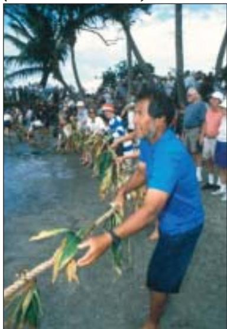

provide three general types of fishing opportunities: **artisanal** (small village-based fisheries for personal or community consumption), **recreational** (fishing for sport or pleasure), and **commercial** (fishing for commerce through sale, barter, or trade).

Native peoples of the Pacific Islands have a strong cultural and economic dependence on coral reefs and marine resources. Each island or island group had its own language, customs, local government, and a reef tenure system controlled at the village level.

One example of reef tenure systems still operating in Pacific Island rural regions is the traditional harvest system in Hawai'i38. Prior to the 1800s, there were social and cultural controls on fishing with a strictly enforced code of conduct (Fig. 33). Harvest management was not based on the amount of fish, but on identifying the specific times and places where fishing could occur. This kept the fishers from disturbing the

basic processes and habitats of important food resources (Friedlander *et al.* in press).

In 1994, the Hawai'i Legislature created a process for designating community-based subsistence fishing areas. These are being created on Moloka'i, Kaua'i, and Hawai'i. One community, residing in the Ho'olehua Hawaiian Homesteads on the northwest coast of Moloka'i, depends on food from the ocean for much of their diet. They prepared a fisheries management plan (Hui Malama o Mo'omomi 1995), proposing to 1) integrate traditional observational methods and science-based techniques;

&lt;sup>36 Endemism is a major concern for some Pacific Islands, particularly so for the State of Hawai'i where about 25% of the reef organisms are endemic, the highest of any coral reef area worldwide (Maragos and Gulko 2002). It is one of the main reasons why many Hawaiian species are endangered or already presumed extinct.

&lt;sup>37 All species of stony corals, black coral (*Antipathes* species), all giant clams (*Tridacna* species), black-lipped pearl oysters (*Pinctada margaritifera*), queen conch (*Strombus gigas*), coconut crab (*Birgus latro*), bumphead parrotfish (*Bolbometopon muricatum*), humphead or Napoleon wrasse (*Cheilinus undulatus*), some groupers, and the above sea turtles species.

&lt;sup>38 This is the traditional spelling. It is used throughout this report. Similar traditional spellings are also used.

|                                          | Rorida* | Puerto Nos | US Virgin Islands | Flower Gardens | Hasel  | American Sance | Gum   | Northern Mariana Mande | Marshall Mands | Federated States of Moronesia | Prince |
|------------------------------------------|---------|------------|-------------------|----------------|--------|----------------|-------|---------------------------|----------------|----------------------------------|--------|
| Fopulation (thousands)                   | 5.087   | 1,009      | 109               |                | 7,000  | 57             | 155   | 69                        | 51             | 133                              | 19     |
| Percent population growth (1990-2000) | 23.1%   | 8.1%       | 4.2%              |                | 9.3%   | 17.2%          | 15.4% | 57.2%                     | 9.5%           | 22.6%                            | 23.4%  |
| Number of tournts (thousands)         | ZR.HZO  | 4,566      | 2,500             | 2              | 11,167 |                | 1,380 | 737                       |                | 30                               | 78     |
| Tourist expenditures (millions \$\$)  | 1,875   | 2,388      | 800               | 1              | 10,918 | 10             | 936   | 587                       | 3              | 3                                | 75     |

Table 1. Population and tourism statistics for the U.S. coral reef areas and the Freely Associated States. \*This includes only Broward, Dade, Monroe, and Palm Beach Counties.

2) foster consensus about how fishing would be conducted to restore community values and stewardship; and 3) revitalize a locally-sanctioned code of fishing conduct. Now implemented, it is having an impact. Owing to its isolation and strong community conservation ethics, Friedlander *et al.* (in press) concluded fisheries resources at Mo'omomi are very healthy compared with most areas around the state.

In the past few decades, the lure of balmy climates and beautiful coral reefs has drawn an increasing number of new residents and tourists to nearby seashores. As a result, many of the fragile coral habitats that play an integral role in community dynamics are being affected by human activities with far-reaching consequences. For example, impacts to reef fish communities from overfishing

affect not only fishers and their families who depend on fish for their livelihoods, but also residents and tourists who indulge in fresh seafood served at local restaurants, seafood wholesalers and retailers, and exporters of fresh and frozen fish to markets worldwide. Coastal development and reef degradation now threaten their existence.

## Economic Value of Reef Ecosystems

Coral reefs are an integral component of local and regional economies. Reefs provide protection from storm wave action, reducing erosion, property damage, and loss of life. They Figure 34. Tourists at Sanibel Island Beach, Florida (Photo: South Florida Water Management District).

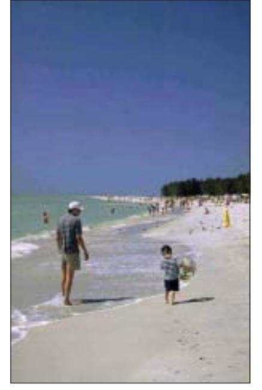

protect highly productive coastal wetland and mangrove habitats, as well as coastal communities, ports, and harbors. Costanza *et al.* (1997) estimated reef habitats globally provide \$375 billion each year to humans from living resources (fish and other food) and ecological services (tourism and coastal protection). Cesar (1996) calculated the cost

over a 25-year period of destroying 1 km2 (about 247 acres) of reef ranged between \$0.6-2.5 million when the value of fishery, tourism, and protection was considered.

The environment and the economy are inextricably linked, making the management and protection of coral reef resources critical. Coral reefs support a burgeoning coastal population and are a Mecca for tourists, adding millions of seasonal and temporary visitors (Table 1). The U.S. Census (2002) reported over 10.5 million people resided in U.S. coastal counties and islands adjacent to shallow coral reef ecosystems in 2000, with another 203,000 residents living on the islands of the Pacific Freely Associated States. Each year, 45 million visitors39 are drawn to U.S. seaside and live-aboard accommodations to fish, dive, and otherwise enjoy coral

reefs (Fig. 34). Another 113,000 tourists visit the tropical isles of the Pacific Freely Associated States.

The only region where a survey and market analysis of reef use has been done is the four-county area of South Florida40. When the seasonal and temporary visitors are considered, the region's 5.09 million residents are increased to a functional daily population41 between 5.56-5.92 million, depending on the season (Johns et al. 2001). According to those authors, South Florida residents and visitors spent 18.1 million person-days fishing and diving around natural coral reefs as well as viewing them from glassbottom boats. They used these

&lt;sup>39 This figure was compiled from Stewart 1997, U.S. Office of Insular Affairs 1999, Puerto Rico Planning Board 2000, Ditton and Tahiling 2001, Johns *et al.* 2001, UNESCAP 2002, and the respective regional reports that follow this National Summary.

&lt;sup>40 Broward, Palm Beach, Dade, and Monroe counties.

and other figures to place the annual economic value of South Florida's natural reef ecosystem at nearly \$228 million for nonmarket economic use and at \$7.6 billion for its **asset value**42.

They also calculated that South
Florida's natural reefs supported 44,500 jobs, providing a total annual income of \$1.2 billion. A similar study was also done for the Flower Gardens
National Marine Sanctuary in the Gulf of Mexico off the Texas
Coast. Economic studies like these have been recently commissioned for reefs off Hawai'i, American Samoa, and Guam.

Comparable data for other reef regions is lacking for a number of reasons. Value of catch comes in gross receipts, dockside value, or is calculated using economic multipliers, none of which can be directly compared. Likewise, States or coastal counties cannot be compared to local beaches or markets. Ultimately, the data may not even be collected. Even without definitive data, in the United States, tourist expenditures in areas with coral reef ecosystems account for at least \$17.5 billion43. In the Pacific Freely Associated States, tourist expenditures exceed \$84.8 million44.

U.S. coral reefs support commercial **ex-vessel landings** (value of the catch paid to fishermen) of over \$137.1 million45 (Fig. 35). The gross value estimate for commercial fisheries in the Freely Associated States is \$109.8 million. Except for South Florida, there are no estimates for the value of recreational fisheries within U.S. coral reefs.

Aside from tourism and fisheries-based sources of income, the Compacts of Free Association with the United States provide additional funds, services, and technical assistance to the Freely Associated States. The governments and some residents of the Marshall Islands also receive lease rents for U.S. use of Kwajalein Atoll as a missile testing facility

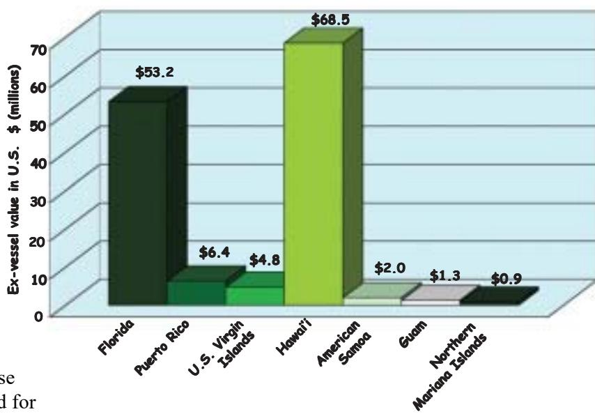

Figure 35. Estimates of the ex-vessel value of commercial fisheries by region.

and monetary compensation for past use of several atolls for nuclear weapons testing.

Bioprospecting (the harvest of biological organisms for medical and other applications) wildlife found on coral reefs offers economic promise. Already, biochemicals produced by many reef species are being used in health care products (e.g., sun blocks), medical procedures (e.g., bone grafts), and pharmaceuticals for treating viral infections and other medical conditions. Ongoing medical research indicates that other biochemicals extracted from reef-associated species may offer treatments for leukemia, skin cancer, and other diseases (Birkeland 1997a). There are concerns among coral reef managers that it may be a new threat to U.S. coral reef ecosystems, so they caution that bioprospecting must be carefully managed.

#### Global Concerns

U.S. coral reefs share many problems with reefs around the world. In 2002, the world population was 6.2 billion people (U.S. Bureau of the Census 2002) with almost 0.5 billion people living within 60 mi of some coral reef (Bryant *et al.* 1998, Henrichsen 1999). Coastal residents and the influx of tourists place increasing demands on these complex and fragile ecosystems. Some can no longer

&lt;sup>41 All the people in a given area on a given day that demand local services (e.g., fresh water, sewage and solid waste disposal, electricity, and transportation).

&lt;sup>42 The amount someone would pay to purchase the reefs and receive the \$228 million in income annually.

&lt;sup>43 Compiled from regional figures from Stewart 1997, U.S. Office of Insular Affairs 1999, Hawai'i DBEDT 2000, Puerto Rico Planning Board 2000, Johns *et al.* 2001, UNESCAP 2002, B. Ditton pers. comm.

&lt;sup>44 From U.S. Office of Insular Affairs statistics.

&lt;sup>45 Computed from information in Caribbean Fisheries Management Council (1998), Leeworthy (2001), and NMFS (2001).

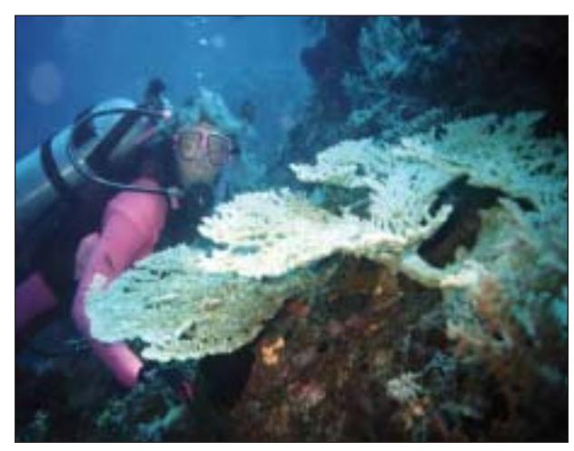

Figure 36. Coral reefs in Bali, Indonesia are some of the world's most diverse reefs, as well as the most threatened (Photo: Jim Hendee).

sustain such pressures. Given the declines in fisheries worldwide (Fig. 36), harvesting fish using unsustainable practices (e.g., dynamiting, poisons, overfishing) is destroying marine fisheries and coastal ecosystems (FAO 1995, Fig. 37). Sixty percent of commercial stocks are either fully harvested to the quota or overfished. This has direct and indirect implications for coral reef ecosystems and can be illustrated with the fisheries of the Hawaiian Islands.

The Northwestern Hawaiian Islands (NWHI) are relatively pristine and have little fishing pressure, while the Main Hawaiian Islands (MHI) have some of the densest populated islands in the Pacific46 with attendant heavy fishing of coral reef species. As a result, scientists have found the NWHI coral

reef fish community to be dominated by carnivores that are larger and more abundant than the fish community off the populated areas of the MHI (Okamoto and Kawamoto 1980, Hobson 1984, Parrish et al. 1985. Friedlander and DeMartini 2002). Those authors reported one jack and three sharks47 comprised 94% of the predator biomass at 106 coral reef stations in the NWHI, but were all but missing in the MHI (Fig. 38). Collectively, one parrotfish and two species of chubs48 contributed nearly 50% of the herbivore biomass49 in the NWHI, but were less than 7% of the biomass in the MHI. Only the black triggerfish (*Melichthys niger*), which is rarely targeted by fishers in the MHI, had greater relative abundance and biomass than that of the NWHI. Most likely these differences are from

moval (over-fishing) of top predators and heavy exploitation of lower trophic levels in the MHI compared to the largely unfished NWHI.

the near re-

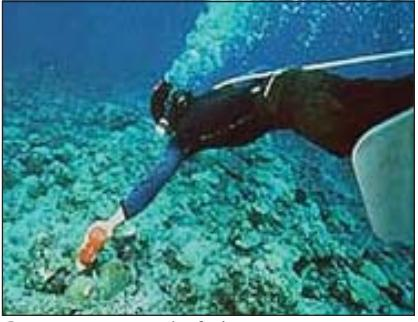

Figure 37. Cyanide fishing is an unsustainable practice and a serious concern for reefs in South East Asia (Photo: International Marinelife Alliance).

Overfishing is only part of the

world-wide degradation of reefs over the past decade. Bryant *et al.* (1998) estimated 36% of all reefs were potentially threatened by overexploita-

tion, 30% by coastal development, 22% by inland pollution and erosion, and 12% by marine pollution. Combined, 58% of the world's reefs face medium or high risk of degradation from human activities. This is similar to other estimates. Wilkinson (2000) found 66% of coral reefs are degra-ded globally. The Global Coral Reef Monitoring Network's Status of Coral Reefs of the World 2000 (Wilkinson 2000) estimated that before 1998, about 11% of the world's reefs may already be beyond recovery from anthropogenic (human-induced) impacts (Fig. 39). The extensive climate-

Figure 38. Biomass of dominant fish species in the Main and the Northwestern Hawaiian Islands (Source: Friedlander and DeMartini in press).

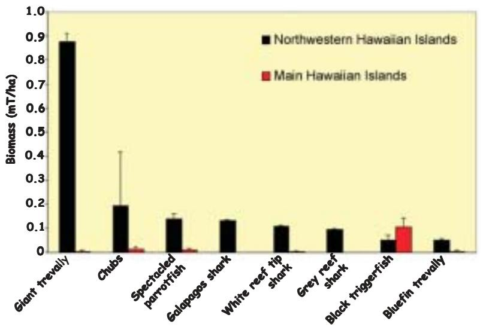

&lt;sup>46 Hawai'i and O'ahu are home to most of the population of the state.

&lt;sup>47 The giant trevally (*Caranx ignobilis*) and Galapagos, grey reef, and whitetip reef sharks (*Carcharhinus galapagensis*, *C. amblyrhynchos*, and *Triaenodon obesus*)

related mortality of corals in 1997-199850 destroyed an additional 16% of the world's reefs, with the worst impacts in the Indian Ocean (Wilkinson 2000). A detailed discussion of the impacts of an-thropogenic and natural pressures on reef ecosystems will be presented in Environmental Pressures.

Large marine vertebrates – whales. manatees, turtles, groupers, and sharks – have been harvested systematically by humans over the past 500 years and are now effectively absent from most coastal ecosystems (National Research Council 1995, Jackson et al. 2001, Pitcher 2001, Fig. 40). Populations of species important to many marine ecosystems are now so low they cannot exert their former ecological role; some are near extinction (Dayton 1998). The indirect effects are unknown because no baseline data exist for comparison (Dayton et al. 1998). Modern studies of marine ecosystems began long after enormous changes in these systems had occurred (Jackson 1997, Jackson et al. 2001), and the 'shifting baseline syndrome' (Pauly 1995, Sheppard 1995) makes it difficult to determine what constitutes a natural ecosystem. Because of this, it is also difficult to determine how to properly manage these ecosystems.

Predator-dominated coral reef ecosystems may well be the natural state (Fig. 41), but predaceous species are the most susceptible to, and most rapidly removed by human activities. Thus, the natural state is difficult to observe. The exception is the NWHI because limited human population

Figure 40. The populations of manatees have been reduced by a long history of harvesting (Photo: Laurel Canty-Ehrlich, FKNMS).

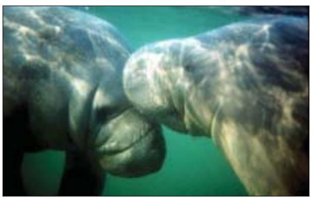

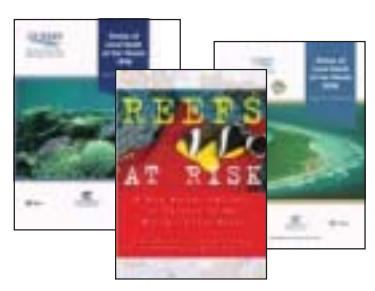

Figure 39. Reports on world-wide coral reef degradation.

and fishing activity means minimal human impact (Friedlander and DeMartini in press). These reefs are among the few remaining large, intact, predator-dominated reef ecosystems in the world.

The NWHI is one of the few reef ecosystems that is sufficiently pristine to study how unaltered

sys-tems are structured, how they function, and how they can be effectively preserved (Friedlander and DeMartini in press). They offer a chance to deter-mine what could occur if larger and more effective no-take marine protected areas were used other places.

Figure 41. Predator-dominated coral reef ecosystem in the Northwestern Hawaiian Islands (Photo: NOW-RAMP Expedition/Bishop Museum).

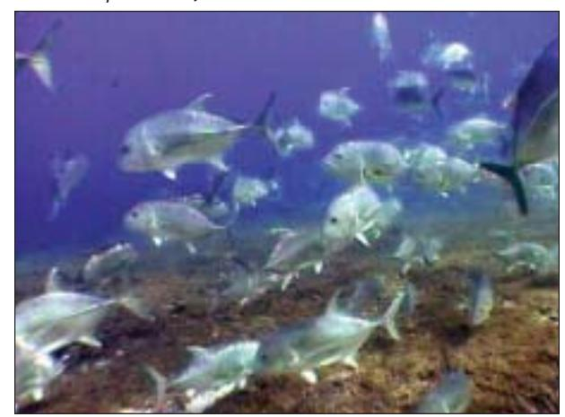

&lt;sup>48 The chubs (*Kyphosus bigibbus* and *K. vaigiensis*) and the endemic spectacled parrotfish (*Chlorurus perspicillatus*).

&lt;sup>49 Biomass is the weight or mass of a taxonomic group (i.e., species) in a given area (e.g., sample transect, habitat).

&lt;sup>50 See the section on Climate Change and Coral Bleaching for a full discussion of this event.

**NATIONAL SUMMARY NATIONAL SUMMARY**

## NATIONAL SUMMARY: ENVIRONMENTAL PRESSURES

In general, there are two types of environmental pressures on reefs (or any ecosystem) – natural forces and human impacts. Natural forces have shaped the distribution of coral reefs over the ages. A broad range of temperature and sea-level changes occur over hundreds and thousands of years. Diseases, storms, and predation are more intense but have shorter-term impacts.

On top of natural forces, human-induced pressures come from a myriad of activities (A. Bentivoglio pers. comm.). These include the following.

- Coastal development with the resulting runoff and sedimentation
- Chemical water pollution (toxic contaminants and nutrient enrichment)
- Over-harvesting of fishery resources and destruction of reefs and associated habitats
- Direct harvest of coral colonies and live reef fish
- Ship and boat groundings and anchor damage
- Tourism and recreation

- Alien invasive species
- Marine debris

Every coral reef ecosystem under U.S. jurisdiction has suffered from human disturbance to some degree. Because they are close to population centers, portions of reefs off Florida, Puerto Rico, the USVI, the Main Hawaiian Islands, Guam, and the CNMI have been degraded by multiple environmental and human-induced stresses. In contrast, the Flower Garden Banks National Marine Sanctuary, Navassa Island, the remote Pacific Island refuges, and the NWHI, have few human-induced pressures and remain relatively pristine. Table 2 compares the environmental threats to coral reef ecosystems as perceived by over reef 60 managers from the United States and Pacific Freely Associated States51.

Adding human pressures to natural variability may degrade local reef ecosystems faster. Given time, corals and reef communities mostly recover from **acute** (short-term and often dramatic) natural

Table 2. Summary of concerns about natural and anthropogenic pressures on coral reef ecosystems in the United States and Pacific Freely Associated States (Source: Priorities of reef managers for the United States and Freely Associated States).

| - Carlotte Control                   | Atl     | antic/      | Caribb      | ean            | F   | olnesi       | ia             |        | Mic              | crone            | sia                               |   |                              |
|--------------------------------------|---------|-------------|-------------|----------------|-----|--------------|----------------|--------|------------------|------------------|-----------------------------------|---|------------------------------|
|                                      | Florida | Puerto Rico | U.S. Virgin | Flower Gardens |     | Northwestern | American Samoa |        | Northern Mariana | Marshall Islands | Federated States of Micronesia |   | U.S. Remote Insular Reefs |
| Global warming and bleaching         | Н       | M           | M           | L              | L   | L            | М              | L      | M                | Н                | M                                 | Н | M                            |
| Diseases                             | Н       | Н           | Н           | L              | L   | L            | L              | L      | L                | L                | L                                 | L | L                            |
| Tropical storms                      | M       | L           | Н           | L              | L   | L            | М              | М      | M                | M                | L                                 | L | L                            |
| Coastal development and runoff       | Н       | Н           | Н           | L              | Н   | L            | Н              | Н      | Н                | М                | Н                                 | Н | L                            |
| Coastal pollution                    | Н       | Н           | Н           | L              | Н   | L            | Η              | Н      | Н                | L                | М                                 | Н | L                            |
| Tourism and recreation               | M       | M           | М           | L              | Н   | М            | L              | M      | M                | L                | L                                 | M | L                            |
| Fishing                              | Н       | Η           | Н           | L              | Η   | M            | Η              | M      | M                | М                | Н                                 | M | M                            |
| Trade in coral and live reef species | M       | Н           | ٦           | L              | Н   | М            | М              | L      | ٦                | Н                | L                                 | L | L                            |
| Ships, boats, and groundings         | Н       | M           | Н           | M              | Ξ   | Н            | М              | М      | М                | ۲                | Н                                 | M | M                            |
| Marine debris                        | M       | M           | L           | L              | M   | Н            | L              | L      | M                | L                | Н                                 | М | M                            |
| Alien species                        | M       | L           | L           | M              | Н   | Н            | M              | L      | L                | Н                | L                                 | M | M                            |
| Other physical impacts               | L       | Н           | L           | L              | M   | L            | L              | L      | Н                | M                | L                                 | L | Н                            |
| Offshore oil and gas exploration     | L       | L           | L           | M              | L   | L            | L              | ٦      | L                | L                | L                                 | L | L                            |
| H High con                           | cern    | М           | Medium      | n conce        | ern | Lit          | ttle-tc        | -no co | oncern           |                  |                                   |   |                              |

51 Information for this table and the basis for conclusions stated in the following subsections are in the regional reports that follow this National Summary.

stresses after the condition abates. However, these stresses may make key organisms more vulnerable to **chronic** (long-term, low-level, and perhaps undetectable52) stresses created by human populations (sedimentation, nutrification, overfishing, etc.). Moreover, natural and human stresses may interact **synergistically**, combining substances or factors which separately may be relatively harmless, but when added together can be more potent and magnify impacts in unpredictable ways.

#### **Global Climate Change and Coral and Coral and Coral Bleaching BleachingBleaching**

All coral reef managers considered global climate change a major, yet largely unmanageable threat to the survival of coral reef ecosystems. Managers from Florida, the RMI, and Palau, however, consider global climate warming and coral

bleaching a major threat to their local reefs. Those from Puerto Rico, the U.S. Virgin Islands, American Samoa, CNMI, the Federated States of Micronesia, and the U.S. remote insular reefs considered these factors a medium threat (Table 2).

According to the Third Assessment Report of the Intergovernmental Panel on Climate Change (IPCC 2001), the 1990s was the

warmest decade of the century and 1998 the warmest year on record (1861-2000). In the 1990s, concentrations of greenhouse gases and aerosols reached the highest recorded levels since the preindustrial era. In its conclusions, the Panel blamed human activities for increasing atmospheric concentrations of key greenhouse gases53, primarily from the combustion of fossil fuels, agriculture, and coastal development.

This *Third Assessment Report* presents the scientific consensus for changes over the next century.

• Globally averaged, CO2 concentrations in the atmosphere are projected to range between 540-970 ppm in 2100, more than doubling the

- pre-industrial age average of 280 ppm and well above the 2000 average of 368 ppm.
- • Globally averaged, sea surface temperatures are projected to increase 2.5-10.4o F (1.4-5.8o C) between 1990 and 2100.
- • Globally averaged, annual precipitation is projected to increase during the 21st century; regionally, both increases and decreases of 5 20% are projected.
- • Global mean sea level is projected to rise by 0.3-2.9 ft between the years of 1990 and 2100, with regional variation.

With confidence, the IPCC (2001) predicts ecological productivity and biodiversity will be affected by climate change and sea-level rise, increasing the risk of extinction for some vulnerable species.

Changes in sea level from long-term climate

change, have direct implications for coral reefs, as well as human populations that inhabit islands or shores with little elevation (Fig. 42)54. There could be severe social and economic effects, as resources critical to island and coastal populations would also be at risk (beaches, freshwater, fisheries, atolls, and wildlife habitat). Using historical evidence,

Shinn (1988) showed changes in reef communities as a result of sea level rise and flooding of shallow inshore bays off southeastern Florida (Florida Key West to Palm Beach).

Increasing concentrations of greenhouse gases are expected to change the frequency, intensity, and duration of extreme events. There will be more hot days, more heat waves, more heavy precipitation, and fewer cold days. Besides inundating low-lying coastal areas from the melting polar ice, potential climate change impacts include increased sedimentation of coral reefs caused by drought followed by heavy rains. The rising sea level could eliminate deeper reefs because the sunlight needed for photosynthesis would be too low.

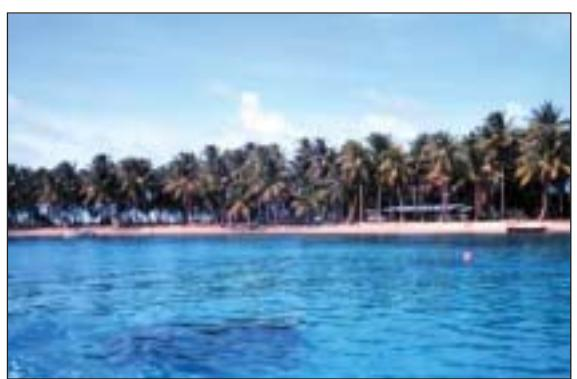

Figure 42 Majuro, the capital of the Marshall Islands, is a low-lying coral atoll that could be submerged by a rise in sea level (Photo: James McVey).

**NATIONAL SUMMARY NATIONAL SUMMARY**

52 For example, chronic sediment stress could be causing the loss of a small percentage of coral cover on near-shore reefs every year that would be undetectable with most of the existing monitoring programs.

53 Carbon dioxide, methane, nitrous oxide, and tropospheric ozone.

If calcification efficiency an estimated one-third of all

city also declines. This could happen with increased atmospheric CO2 because coral reef calcification depends on saturation of the carbonate mineral aragonite in surface waters. Kleypas *et al.*  (1999) predicted that increased CO2 levels would decrease both the aragonite saturation in the tropics by 30% and **biogenic** (biologically derived) aragonite precipitation by 14-30%. According to these scientists, current atmospheric concentrations of CO2 have already reduced the average deposition rate of calcium carbonate in the tropics.

Second, increased surface temperatures and ultraviolet light may cause coral bleaching (Fig. 43) that can kill polyps and entire coral colonies. From models of global climate change, Hoegh-Guldberg (1999) predicted that temperature would exceed the thermal tolerance levels of reef-building corals every year for the next several decades. In other words, coral bleaching at the level of the 1997 1998 global event is likely to be commonplace over the next 20 years.

be bleached with even periodic increases of a few degrees.

Coral bleaching and disease have been documented to coincide with elevated water temperatures associated with El Niño and La Niña events. Worldwide, the worst coralbleaching episode began in late 1997 during an El Niño event, and continued well into 1998 (Pomerance 1999, Wilkinson 1998). In the Caribbean, it

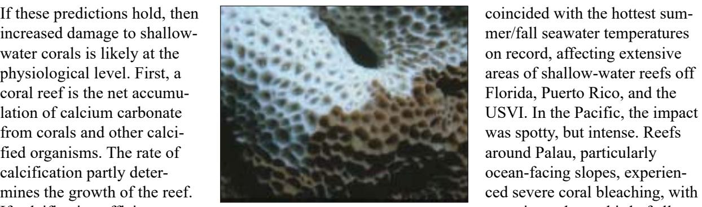

Figure 43. Coral bleaching in Guam (Photo: Robert Richmond).

declines, reef-building capa- corals affected, especially the

*Acropora* corals. One area in Micronesia had reefs with 20% of corals bleached to 60 ft, including a wide variety of hard and soft corals. Yet other parts of Micronesia reported only minor bleaching.

Since 1997, NOAA has predicted coral bleaching from surface water temperatures gathered from satellites and *in situ* buoys (NOAA 2001, Fig. 44) and placed the information on their web site (NOAA 2002). NOAA satellite data confirmed that Palmyra Atoll in the U.S. Line Islands experienced temperatures over 86o F (30o C) in late 1997 (A. Strong pers. comm.). This could have been responsible for the reduction in live coral (from 100 to 10% cover) along the southern and western reefs that was reported in a subsequent assessment (J. Maragos pers. obs.).

Coral bleaching as a factor impacting the condition of U.S. reef ecosystems has varied regionally and locally within reefs and among species. Generally

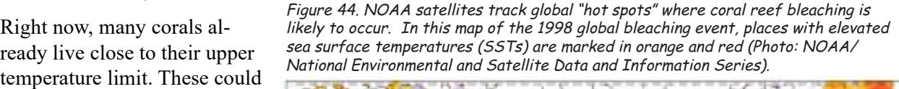

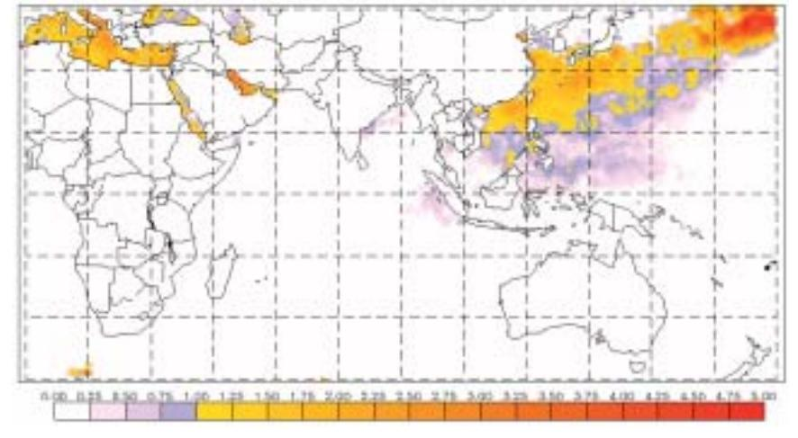

54 The average elevation of the RMI is 7 ft. Even a moderate rise in sea level would probably eliminate some islands entirely and reduce the available area on others.

**ENVIRONMENTAL PRESSURES ENVIRONMENTAL PRESSURES**

and Palmyra, mortality from off Florida, the CNMI, Palau, mum may not only survive, but benefit from global climate change (J. Maragos and D. Siciliano pers. comm.). Cooler water reefs off the NWHI and perhaps deeper reefs such as the Flower Garden Banks should be buffered from the effects of coral bleaching when surface waters warm.

#### **Diseases DiseasesDiseases**

Where diseases have wreaked havoc – Florida, Puerto Rico, and the USVI – the coral reef managers consider disease a prime threat to reef health (Table 2).

Over the past two decades, there has been a worldwide increase in reports of disease affecting coral reef organisms. In the Western Atlantic, disease outbreaks have contributed to die-offs of seagrasses, corals, sea fans, sea urchins, sponges, fish, and other organisms. Disease has modified the structure and composition of reefs by removing common and locally abundant species. Indirect evidence suggests that disease outbreaks in marine environments are becoming more frequent (Harvell *et al.*  1999). Diseases are reported from Pacific reefs, but the incidence is lower than in the Caribbean (Work and Rameyer 2001).

Coral disease appears to be more prevalent near population centers. Changing environmental conditions from climate variability coupled with human impacts may weaken corals, making them more vulnerable to disease (Green and Bruckner 2000). Coral diseases have been recorded by 54 different nations, with most records (66%) from the wider Caribbean, including reefs in Florida, Puerto Rico, and USVI (Green and Bruckner 2000). Of 29 diseases reported in the literature, about 80% of the reports are for white-band disease, black-band disease, and white plague.

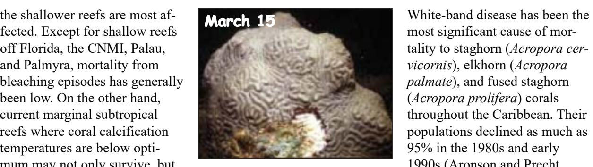

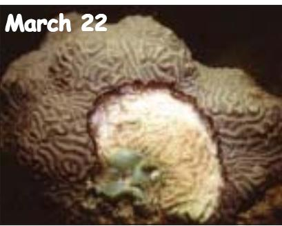

Figure 45. Black-band disease devours a knobby brain coral over a one-week period (Photo: Andrew Bruckner).

*vicornis* tality to staghorn ( ), elkhorn ( *Acropora cer-Acropora*  1990s (Aronson and Precht 2000).

Black-band disease, first identified in 1972, occurs at low levels on most Western Atlantic reefs and may increase seasonally during warm periods (Fig. 45). Although black-band disease occurs worldwide, severe outbreaks have only been reported from the Caribbean, including U.S. reefs (Antonius 1973, Edmunds 1991, Kuta and

Richardson 1997, Bruckner 1999).

White plague disease was first reported in the Florida Keys (Dustan 1977). A new, more virulent form (plague type II) emerged in the mid 1990s, and since then outbreaks have occurred in the Florida Keys, southwestern Puerto Rico, Culebra Island, and parts of the USVI (Bruckner and Bruckner 1997, Richardson 1998, Hernandez 2001, Miller *et al.* 2001). Particularly severe outbreaks were also observed in the spring and summer of 2001, impacting the important massive reef-building corals55. White plague may have severe impacts on reef ecosystems, as this disease affects a large number of coral species and kills tissue at rates up to 0.8 inches2 a day (2 cm2 /day).

In a growing list of new coral diseases and other syndromes, yellow-blotch disease is of particular concern. This disease selectively infects slowgrowing, massive corals, some of the most important reef-builders found on Caribbean reefs today. Once infected, the disease slowly kills the colony over several years (Green and Bruckner 2000).

In addition to scleractinian coral diseases, scientists have recently identified diseases and **pathogens** (disease-causing organisms) in colonial **anemones** and **soft corals** (soft-bodied sessile organisms that are in the same class as stony corals). Also, a fungus of terrestrial origin ( *Asper*

**NATIONAL SUMMARY NATIONAL SUMMARY**

55 Such species as the boulder brain coral ( species, *Montastraea annularis*; some authors still recognize *Colopophyllia natans M. faveolata* ) and the boulder star coral ( and *M. franksi*). **synonomyzed**, or renamed as one

*gillus*) has caused tissue destruction, skeletal erosion, and in some cases, death of Caribbean sea fans (Smith *et al.* 1996). The pathogen may be coming from upland soils from the altered patterns of land use moving seaward during storms. This provides additional evidence for a link between disease and human activity.

An invertebrate disease decimated the long-spined sea urchin (*Diadema antillarum*) in the early 1980s (Fig. 46). In the Caribbean Sea and Western Atlantic, populations of mature urchins were reduced to around 3% of their original size (Lessios *et al.*  1984, Vicente and Goenaga 1984, Lessios 1988, Ritchie *et al.* 2000). Long-spined sea urchin populations have been slow to recover, possibly because remaining individuals are too far apart to ensure successful fertilization of gametes that are broadcast into the water (Levitan 1991). In some locations, particularly the shallow reef crests and fore-reefs, urchin numbers remain especially low, only about 1% of the pre-1983 levels.

Ecological impacts on the reefs from the die-off of the urchins have been profound. Urchins are herbivores, eating **macroalgae** (large attached algae or seaweed). After the die-off, there was a dramatic increase of algal cover, since grazing on the algae was much reduced. Some areas recovered better from this than others.

In the Flower Garden Banks National Marine Sanctuary, algal populations returned to prior levels within two years, perhaps due to an increase in other herbivores (Gittings and Bright 1986). But the rest of the Caribbean has yet to recover. For most U.S. reef ecosystems, the shift in coral-algal balance was further exacerbated by a die-off of elkhorn and staghorn corals. Once the coral died from other causes, algae took over.

Figure 47. Damage from Hurricane Andrew in Florida (Photo: NOAA).

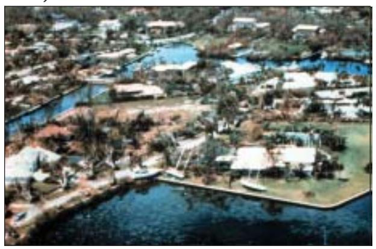

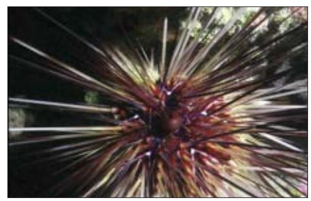

Figure 46. Long-spined sea urchin (Photo: Emma Hickerson).

Scheffer *et al.* (2001) postulated the shift from a healthy coral to a fleshy macroalgae-dominated system results from a combination of factors that make the system vulnerable to events triggering the shift. These factors include increased nutrient loading from land-based runoff and discharges and intensive fishing which reduces the numbers of large fish and subsequently the smaller herbivorous species (Aronson and Precht 2000, Scheffer *et al.*  2001). Once herbivorous fish became rare, the reefs rapidly became overgrown by fleshy brown algae. Scheffer *et al.* (2001) commented that this change will be difficult to reverse for two reasons: 1) mature algae are less palatable to herbivores and 2) algae-covered substrates prevent settlement of coral larvae.

#### **Tropical Storms Storms**

With eight major hurricanes in the past 20 years nearly exterminating shallow-water *Acropora* coral populations, USVI managers consider tropical storms a major threat to their reef systems; another five managers from U.S. regions consider tropical storms a medium-level concern (Table 2, Fig. 47). If global climate change is underway and hurricanes occur with more frequency, then all the nation's managers have concerns that reefs would not have sufficient recovery time.

Reefs grow in areas subject to hurricanes and typhoons. In general, reefs have great structural resilience and recover from storms. There is also good evidence that that such disturbances help keep reef diversity high (Rogers 1993, J. Ogden pers. comm.). For example, sand and rubble keys and coral islets on atolls are notorious for forming and eroding during tropical storms, as fragments break loose and are deposited toward land or in

**ENVIRONMENTAL PRESSURES ENVIRONMENTAL PRESSURES**

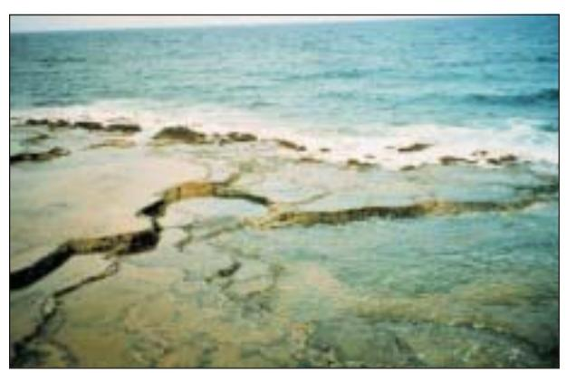

Figure 48. The shape of coral rock terraces in Guam reflect the dominance of encrusting and low profile growth forms (Photo: Ben Mieremet).

lagoons (Maragos *et al.* 1973). Hurricanes may also be beneficial because they fragment fast-growing branching corals that monopolize the substrate, freeing space for the slower-growing, massive species.

In the Caribbean and American Samoa, hurricanes make landfall on average every 15-20 years. But the CNMI and Guam are hit by about half the typhoons that develop in the Pacific because they lie in the Western Pacific monsoon trough. Guam has felt the impact of 52 major typhoons in the last 48 years. When typhoons pass nearby, the reefs receive the full impact of heavy wave action.

Contrary to what might be expected, typhoons in this region affect reefs to a lesser extent (Randall and Eldredge 1977) than hurricanes in the Caribbean (Tilmant *et al.* 1994) because the normal heavy wave action in the Pacific regularly removes the relatively fragile vertical branches. By doing this, the reef structure favors the encrusting or massive growth forms (Fig. 48). Typhoons, hurricanes, or cyclones have less impact on low-growing encrusting corals than they do on high-profile forms. Areas such as American Samoa and Palau, where storms are less frequent, have the higher-growing forms (Hubbard 1997).

#### Coastal Development and Runoff

Reef managers from nine regions consider coastal development, runoff, and sedimentation major threats to their coral reef ecosystems (Table 2). These areas include coral reefs off large continental population centers and close-to-shore

reefs off urbanized islands (Fig 49). Near-shore reefs off high islands with relatively low human habitation56 also experience substantial runoff and sedimentation during tropical storms.

In the United States, over 10.5 million people live in coastal counties and on islands near coral reefs, particularly in Florida, Puerto Rico, and much of the Main Hawaiian Islands. The Pacific Freely Associated States has another 203,000 island residents.

Infrastructure development is necessary to support coastal residents and the expanding reef tourism industry. This includes a myriad of activities: filling in wetlands to increase land area, dredging sand to replenish beaches, building causeways and bridges over existing reef habitats, dredging channels, erecting marinas and other support facilities along tidal shorelines, and destroying upland vegetation.

The impact of increasing human population on reef condition can be both acute and chronic. Reefs and related habitats suffer acute physical damage during construction, when such activities such as dredging to maintain deep-water draft for ships, erecting shoreside docks, and building marinas near or over coral reefs are in progress. The resulting runoff, plumes of sediment, and **turbid** (discolored, opaque) water from these activities can destroy a much broader area of reef habitat.

After coastal development is completed, the structures that were built and the activities related

Figure 49. The population of the Florida Keys has grown dramatically, resulting in increased development near or on coral reef ecosystems (Photo: NOS Photo Gallery).

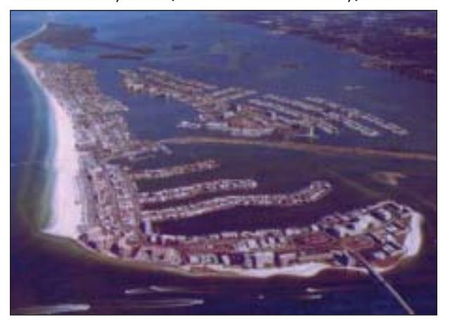

&lt;sup>56 These include islands in American Samoa, CNMI, and the Freely Associated States.

&lt;sup>57 Agricultural pollutants include fertilizers, pesticides, herbicides, hormones, and antibiotics.

Bases were built on Wake, Midway, Johnston, Palmyra, Howland, Jarvis, and Baker islands in the central Pacific. The Japanese established bases on Enewetak, Kwajalein, Chuuk, Yap, Peleliu, Koror, and other islands in the RMI and Caroline Archipelago.

to them often have chronic, long-term impacts. These include increased treated sewage effluent, water pollution from all the chemicals necessary to maintain boats and other apparatus necessary for tourists, and storm runoff from paved surfaces. There is also contaminant-laden runoff from industrial and agricultural57 operations (Fig. 50). All degrade and can destroy sensitive reef, seagrass, and mangrove habitats.

Compounding these problems, deforestation and stripping vegetation on high islands for agriculture and housing results in extensive land and river runoff during rainstorms. Chronic turbidity and silt deposition smothers sessile invertebrates, creating biologically barren areas.

Large sediment plumes and turbid water from construction activities taking weeks or months to complete may substantially reduce the light to below the level needed for survival of coral reef plants for weeks or months. When water is turbid, light cannot penetrate as far down the water column, so the stony coral symbionts (the zooxanthellae) can only marginally survive, if at all, and coral bleaching results. Death of entire coral colonies may soon follow.

Besides runoff, there are additional concerns about seepage and current storm water control practices. Bacteria, disease, hormones, and other chem-icals in the water potentially alter coral polyp development, inhibit successful settlement onto solid substrate, and even impact the social, territorial, and feeding behaviors of other reef organisms. Wide variations in salinity that damage near-shore reefs could become more commonplace if global climate brings more storms and flooding.

Beaches erode from storms and natural wave action. Dredging to replace sand on bathing beaches is a most destructive activity. Silt from dredging activities buries corals and suffocates sensitive reef organisms. Replenishment degrades water quality during the operation. Not only costly, it affects everything within the areas where the sand is taken from as well as where it is deposited, and must be repeated every 5-10 years.

On some Pacific coral reef islands and atolls, coastal development has been influenced by their long history as strategic staging areas for national defense. In the late 1930s, the Japanese British, French, Americans, New Zealanders, and

Bases were established on many islands58. While remnants of this construction remain, most reef populations have recovered. Battles and bombing raids during World War II also damaged reefs59 (Maragos in Grigg and Birkeland 1997). Postwar reconstruction resulted in additional damage to reefs from dredging, filling, and causeway construction60 (Brock *et al.* 1965, 1966). Ballistic missile testing at Johnston and Kwajalein stimulated additional construction, shore

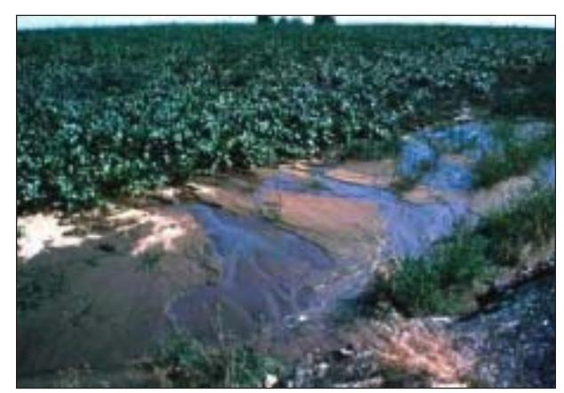

Figure 50. Agricultural runoff can transport sediments, nutrients, and pesticides to coral reefs (Photo: NOS Photo Gallery).

protection, and land reclamation (Maragos 1993, Smith and Henderson 1978).

#### Coastal Pollution

Optimum coral reef development is strongly correlated with clean, clear waters. Reef managers from eight jurisdictions consider coastal pollution (e.g., excess nutrients, toxic contaminants, and for the Marshall Islands, radiation) a high threat to their coastal ecosystems (Table 2).

The USEPA estimates that 60% of water pollution comes from **non-point sources** of contamination (input from a general area rather than a single point like a discharge pipe) such as storm-water runoff from urban areas and agriculture (Eichenberg 1999). More than 75% of the pollutants entering oceans are from non-point, land-based sources (YOTO 1998). Non-point pollution from

Australians began to fortify many islands in the central Pacific with garrisons, airfields, docks, and airplane refueling stations. All of these changed the structure of adjacent reefs (Woodbury 1946, Dawson 1959, Maragos 1993).

&lt;sup>59 At Chuuk, Peleliu, Enewetak, and Kwajalein, for example.

60 At Majuro, Enewetak, Bikini, Tarawa, and Johnston islands.

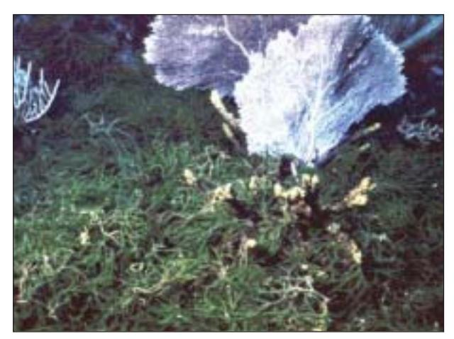

Figure 51. Macroalgae overgrowing sea fans and several coral species (Photo: Brian Lapointe).

agricultural operations and elsewhere, urban runoff, and even atmospheric discharges of soot and toxic chemicals can impact the diversity of reef wildlife. Agriculture is the leading source.

Nutrification of near-shore waters is a problem for many reefs. High nutrient levels encourage growth of algae over coral (Smith *et al.* 1981, Maragos *et al.* 1985, Lapointe 1991, Fig. 51) and can create phytoplankton blooms that limit the sunlight stony corals need to survive.

Since 1972, industry and government agencies have spent more than \$200 billion on reducing **point-source contamination** (specific points of discharge) – pipes dumping sewage and industrial pollutants and toxins directly into coastal waterways (Eichenberg 1999, Fig. 52). Harbors and urbanized, enclosed bays concentrate a wide variety of contaminants61 (Hunter *et al.* 1995, U.S. Fish and Wildlife Service 1996, Green 1997).

Point-source pollution creates **hot spots** (relatively small contaminated areas) that impact shallow, near-shore coral reefs off Florida, Puerto Rico, the USVI, the Hawaiian Archipelago (e.g., O'ahu, Midway, Kure), American Samoa, Guam, CNMI, and Palau.

The volume of human-related discharges from land-based activities, boating, and aviation has mushroomed, according to a recent report (Committee on Oil in the Sea 2002). Those authors calculated 29 million gallons of petroleum escape into North American waters each year from human activities. Of this, 85% are gasoline and oil spills involving land-based runoff from cars and trucks,

fuel dumping by commercial airline pilots, and emissions from small boats and personal watercraft such as jet skis.

Although contaminants are a problem for coral reef ecosystems off urbanized areas, there has been little research on the fate or action of potential toxicants on reef species. One study conducted in Kane'ohe Bay (Hawai'i) by Peachey and Crosby (1995) shows the potential for unintended synergestic interactions between chemicals or classes of chemicals and other factors in the environment. In this study, when PAHs62 in seawater are exposed to surface ultraviolet radiation from sunshine, these relatively unstable compounds become toxic and can kill crustaceans, polychaetes, and coral larvae. PAHs are common constituents of municipal wastes and urban runoff, particularly oils used in roadway pavement and gasoline products used in vehicles and airplanes. PAH toxicity has the potential to reduce overall reef biodiversity in harbors and wherever storm runoff from urban centers discharges directly into coastal waters.

Then there are radiation concerns. Between 1946 and 1958, the United States used Enewetak and Bikini Atolls in the Marshall Islands to test 67 nuclear devices (National Biodiversity Team RMI 2000). Both the physical blast and the radioactivity damaged the land and shallow lagoons. The Bravo blast in 1954 sent millions of tons of sand, plant, and sea life from Bikini reef, three nearby islands65, and surrounding lagoon waters high into the air. Radioactive fission products, particle-activated products, and unspent radioactive fuel contaminated the debris. This radioactivity entered the aquatic environment of the atolls (Donaldson *et al.* 

Figure 52. Point-source contamination in Chuuk, FSM (Photo: James McVey).

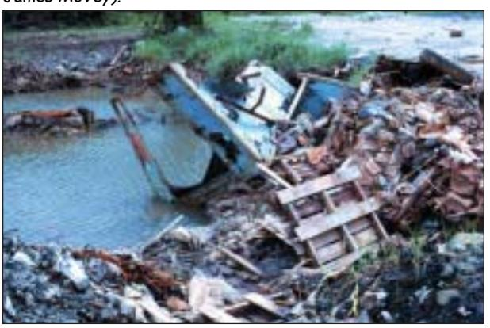

61 Chemicals from such things as marinas, canals, harbors, boat anchorages, airports, and sewage disposal sites.

**NATIONAL SUMMARY NATIONAL SUMMARY**

62 Polycyclic aromatic hydrocarbons, a class of organic compounds found in petroleum products.

63 Bokonijien, Aerokojlol, Nam

1997, Simon 1997, Walker *et al*. 1997, Robison and Noshkin 1999, Niederthal 2001). And atmospheric nuclear fallout rained on the inhabited atolls of Rongelap and Utirik, the uninhabited atoll of Rongerik, and other downwind atolls.

Part of the U.S. government's radiological cleanup activities on Enewetak involved mixing part of the contaminated soil, mostly from Runit Island, with cement and submerging it in nearby Cactus Crater (formed by a nuclear explosion in

1958). The remainder of the soil was mixed with concrete and made into a dome above the crater. A non-contaminated concrete cap was then constructed over the dome. A National Academy of Sciences committee examined the dome and concluded that the containment structure and its contents presented no credible hazard to the people of Enewetak, either now or in the future (Noshkin and Robison 1997).

From the studies done to date, the RMI marine ecosystem is considered essentially recovered (N. Vander Velde pers. comm.). But the Marshall Islands land environment has not been totally restored, despite the government's cleanup. The U.S. Department of Energy advises people not to visit Runit Island or the northern islands, which remain too radioactive because they were not included in the cleanup effort focused primarily on the three southern islands (G. Johnson pers. comm.). The southern islands are now inhabited and used for growing food.

Figure 54. Waikiki Beach on O'ahu, Hawai'i is a prime tourist destination (Photo: NOAA Corps).

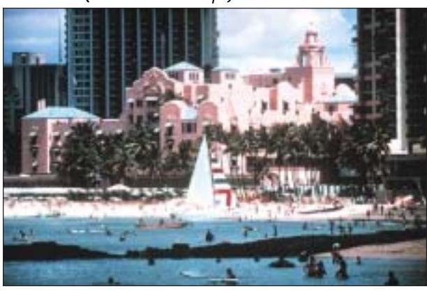

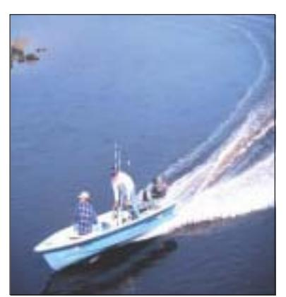

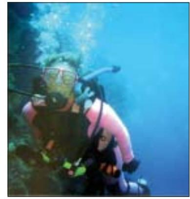

Figure 53. Recreational fishing and scuba diving are both popular activities that occur in coral reef areas (Photos: NOAA and Rusty Brainard).

#### **Tourism and Recreation Tourism and Recreation**

Over 75 million Americans engage in on-the-water activities (Lydecker and Podlich 1999, Leeworthy 2001). Recent data show over 90 million U.S. residents age 16 or older frequent coral reefs for some form of recreation (Leeworthy 2001, Leeworthy and Wiley 2001, Fig. 53). Over 11 million Americans participate in snorkeling or SCUBA diving, spending over 115 million person-days diving in U.S. coastal waters (Leeworthy and Wiley 2001). Many coral reefs in the United States and the Pacific Freely Associated States are heavily visited, particularly those along the shoreline and within easy cruising distances (Fig. 54).

With so many tourists visiting coasts and coral reefs, managers from the Main Hawaiian Islands consider the impacts from tourism and associated recreational activities a major threat to near-shore coral reef ecosystems, while managers from another seven jurisdictions consider it a medium concern (Table 2).

Damage to coral reef ecosystems from tourist activities is inevitable. Impacts range from coastal development (e.g., hotels, marinas) to boating and other recreational activities. Rental boats are a problem, as tourists unfamiliar with piloting vessels in and around shallow waters with coral reefs run aground or collide with corals. SCUBA divers, snorkelers, underwater tours using surface-supplied equipment, and a large number of personal watercraft (i.e., jet skis) have all affected reefs and water quality.

Harmful as they may be, damage from underwater reef-snorkeling tours and anchoring in most areas

**ENVIRONMENTAL PRESSURES ENVIRONMENTAL PRESSURES**

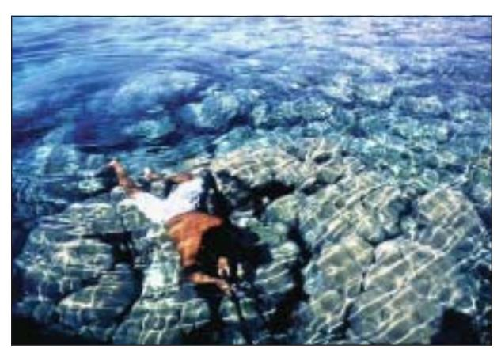

Figure 55. Spearfishing is a common fishing technique that can negatively impact reef species (Photo: USAID).

is small when compared to natural disasters, sedimentation, pollution, and overfishing.

#### **Fishing Fishing**

A tremendous cultural and economic asset, a wide range of reef species are harvested from coral reef ecosystems for artisanal use, recreational enjoyment, and the commercial market. While too late for many of these ecosystems, managers and scientists now know that reef resources are not limitless and the capacity to harvest these species has been exceeded on most reef systems. Along with urbanization of coastal regions, non-point source pollution, and sedimentation from upland development, overfishing is a widespread factor that negatively impacts coral reefs (Fig. 55).

With the exception of the Flower Garden Banks National Marine Sanctuary, managers from the remaining 12 jurisdictions consider overfishing and gear impacts64 a medium-to-high threat to the overall condition of coral reef resources (Table 2). Of particular concern to managers in Florida, Puerto Rico, USVI, Hawai'i, and the offshore coral banks in the Gulf of Mexico, certain types of fishing gear, such as fish and lobster traps and large gill nets, have damaged reef fish habitats (Fig. 56). Illegal or inadvertent trawling over reefs or anchoring on the reef is also a concern.

Many desirable reef fish grow relatively slowly, mature later, and have irregular **recruitment** (the process whereby annual adult spawning activity produces sufficient young fish that mature into reproducing adults year after year). All of these make depletion more likely. Generally, the highvalue resources – particularly lobsters, giant clams, large fish (groupers and snappers), and sharks – are removed first. To compound the problem, most reef fisheries in U.S. waters are small-scale, inadequately monitored and managed, and lack consistently enforced regulations.

Over 50% of all federally managed species of fish depend on coral reefs for at least part of their life cycle (USCRTF 2000). Unfortunately, many of these species have been greatly diminished by overfishing.

In 2000, 23 federally-managed reef fishes were listed as overfished in the South Atlantic, Gulf of Mexico, and the Caribbean65. Another 22 species of Atlantic sharks that visit or reside around coral reefs have been overfished (NMFS 2001). For this region, NMFS (2001) lists the status of another 58 species of South Atlantic reef snapper-groupers as unknown, 36 Gulf of Mexico reef-fish stocks as unknown, and 138 species of Caribbean reef fishes as unknown.

In the Pacific, reef fish fisheries are mostly managed within state and territorial waters. Although hard data were not available for this report, sharks, groupers, giant clams, bumphead parrotfishes (Fig. 57), humphead or napoleon wrasses, coconut

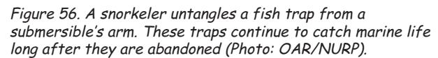

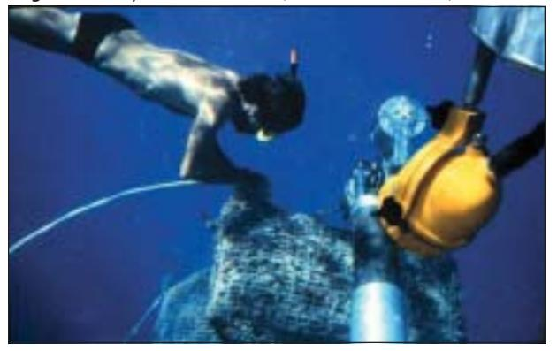

64 These include trawling, dredging, and **ghost fishing** (a term for untended nets that can be miles in length, capturing fish, sea

**NATIONAL SUMMARY NATIONAL SUMMARY**

turtles, marine mammals, and diving birds as they drift along with the current). 65 There are 14 South Atlantic species that are overfished: goliath grouper (*Epinephelus itajara*, formerly the jewfish), Nassau grouper (*E. striatus*), vermillion snapper (*Rhomboplites aurorubens*), red porgy (*Pagrus pagrus*), gag (*Mypteroperca microlepis*), red snapper (*Lutjanus campechanus*), speckled hind (*E. drummondhayi*), snowy grouper (*E. niveatus*), Warsaw grouper (E*. nitrigus*), golden tilefish (*Lopholatilus chamaeleonticeps)*, yellowtail snapper (*Ocyurus chrysurus*), red grouper (*E. morio*), black grouper (*M. bonaci*), and red drum (*Sciaenops ocellatus*). There are 6 Gulf of Mexico over-fished species: king mackerel (*Scomberomerus cavalla*), red snapper, red grouper, Nassau grouper, goliath grouper, and red drum. There are 3 Caribbean overfished species: Nassau grouper, goliath grouper, and queen conch.

crabs, and black-lipped pearl oysters, have been depleted throughout much of the Indo-Pacific region (J. Maragos pers. comm.).

Some reef species, like groupers and snappers, migrate great distances to specific spawning grounds and aggregate in unusually large numbers to reproduce. This makes them highly vulnerable because fishers know when and where they aggregate. For protection, a number of spawning aggregation areas in U.S. waters have been closed to fishing (e.g., one off St. Thomas Island, USVI in 1990, another within the fully protected Tortugas Ecological Reserve in 2001). Results indicate that protection of spawning aggregations is a sound management strategy for reversing impacts of overfishing.

During the 1970s, a spawning aggregation site for Nassau grouper off southern St. Thomas was overfished to complete collapse (Beets and Friedlander 1992). With that loss and evidence of a decline in a related species, a red hind (*E. guttatus*) spawning aggregation closure was implemented in 1990 off St. Thomas66, based on a demonstrated decline in catch-per-unit-effort and average length of red hind. Red hind also showed a very skewed sex ratio, about 15 females per male (Beets and Friedlander 1992). A recent evaluation by Beets and Friedlander (1999) showed a significant increase in average size of red hind and great improvement in the sex ratio (approximately 4 females per male). There were also many large males.

Overfishing has resulted in four species of Western Atlantic groupers becoming candidates for listing under the U.S. Endangered Species Act67. Fishers in areas characterized by overfishing and **serial depletion** (harvesting the most desirable species until these are depleted, then overfishing the next most desirable species, and so on) eventually progress to catches of small herbivores like parrotfish and surgeonfish. This may moderate the socioeconomic effects of overfishing high-value fishes,

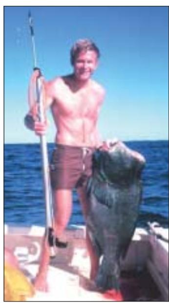

Figure 57. Bumphead parrotfishes, like this one caught in the 1970s, are now depleted through much of their range (Photo credit: NOAA).

but at the same time it poses a new risk to reefs, as overfishing can change the ecological balance of the reef. Removal of predatory fish accelerates the **bioerosion** of corals (boring into, biting, or eating living tissue) by invertebrate prey. These invertebrates are held in check by predaceous fish. Overfishing has also been implicated as a primary cause for macroalgae overgrowing corals. When the herbivorous fish are removed, there is little to keep the fast-growing algae in check and the algae takes over.

#### **Harvest and Trade in in Corals and Live Reef Corals and Live Reef Species Species**

Most of the marine ornamental fish and invertebrates originating in U.S. waters come from reefs off Hawai'i, Florida, Puerto Rico, and Guam. Managers from Puerto Rico, Hawai'i, and RMI consider the trade in coral and live reef species a high concern, whereas managers from Florida, NWHI, and American Samoa consider it a medium threat (Table 2). In the Hawaiian Islands, some relatively rare species68 are more common in the NWHI but considered to be vulnerable and inneed of protection.

The United States is the primary consumer of live coral for the aquarium trade as well as coral skeletons and precious corals for curios and jewelry (International Trade Subgroup 2000). Over a thousand tons (70-95% of the global trade) of hard corals and **live rock**69, and 15-20 million coral reef fishes are imported each year for U.S. saltwater aquariums. This is increasing 10-30% each year.

Even though the United Stated is the largest importer of coral and live rock, the extraction of hard corals is prohibited or strictly regulated in most Federal, State, Commonwealth, and Territory waters because of widespread concerns these animals are vulnerable to over-exploitation. The CNMI permits coral collection for cultural purposes (production of lime). In Micronesia, live coral is collected and burned to create lime for

**ENVIRONMENTAL PRESSURES ENVIRONMENTAL PRESSURES**

66 Federal regulations were published in 1990 by the Office of the Federal Register at 50 C.F.R. Section 669.

67 This law and implementing regulations are the authority for DoI and NOAA. They list those species that are deemed

threatened or endangered by extinction for protection. 68 Species such as the masked angelfish (*Genicanthus personatus*), dragon eel (*Enchelycore pardalis*), and the Hawaiian lionfish (*Pterois sphex*), now relatively abundant in some NWHI areas, require management to prevent over-exploitation. 69 Removing living coral, chunks of reef substrate, and all the small plants and animals in these habitats for aquaria.

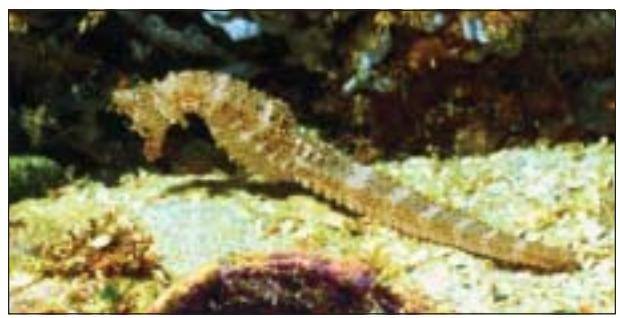

Figure 58. Seahorses are frequently targeted by the marine aquarium trade (Photo: Roberto Sozzani).

chewing betel nut70, a widespread cultural practice in Palau, Yap, and other areas (J. Maragos pers. comm.). Additionally, coral and live rock can be collected for research purposes in most areas of the CNMI (M. Trianni pers comm.).

Over 1,000 species of marine fishes and invertebrates are traded. Particular species are targeted. For example, there is extensive trading in seahorses – at least 46 nations and territories including the United States (Fig. 58). The more than 20 million seahorses captured annually (Vicente 1996) are sold for the pet and curio trade and used in traditional medicines. Between 60-80,000 giant clams are traded internationally each year with over 70% destined for the United States. In recent years, however, most imported giant clams are small specimens that have been captive-bred for home aquaria.

Recent studies have shown that aquarium collectors have had a significant negative impact on the dominant reef species (Tissot *et al.* 2000). Part of the impact is how the fish are collected. For live capture, collectors often use cyanide and other poisons to stun reef fish, damaging their internal organs. It also kills other small fish, corals, and invertebrates not being collected.

Although cyanide fishing is generally not thought to occur in U.S. waters, other fish poisons including chlorine bleach, quinaldine, and plant toxins have been reported from Puerto Rico, Hawai'i71, American Samoa, and one state in Micronesia. Use of quinaldine has been reported on reefs off Guam, and plant toxin use has been observed on reefs off the Freely Associated States (K. Foster pers. comm.).

Concerned about the impact of removing species and the methods of collection, the State of Hawai'i has designated Fisheries Replenishment Areas for the ornamental trade and is conducting related research in these and adjacent areas. The State of Florida imposed regulations on its 100-125 fulltime aquarium fish collectors. These include license requirements, bag limits, minimum and maximum size limits, and allowable gear.

In the early 1990s, Puerto Rico exported as many as 200,000 reef fish and invertebrates each year. Ornamental organism collectors were not considered fishers, so this was unregulated until 1998, when a new law was issued that required collectors to obtain permits. At the present time, ornamental collection and exportation is the subject of litigation and controversy. Reliable information is scarce, data on exported invertebrates is unavailable, and the number of full-time and part-time collectors is unknown. Currently, only eight exporters have been identified with a reported total catch of 82,290 reef fish from 92 species (Ojeda-Serrano and Aguilar-Perera 2001). The first stage of an in-depth study of this industry will be completed by October 2002.

#### **Boats, Ships, and Groundings Boats, Ships, Groundings**

Over 23 million Americans over 16 spend 290 million boating days in coastal waters (Leeworthy and Wiley 2001). With 16.8 million boats nationwide, recreational vessels comprise America's largest fleet (Lydecker and Podlich 1999), with most activity in near-shore ocean waters. There is particularly heavy use over shallow coral reefs near urban centers, such as those off Florida, Puerto Rico, the USVI, Hawai'i, and Guam. Therefore, managers of shallow coral reef systems off

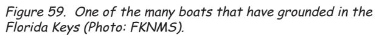

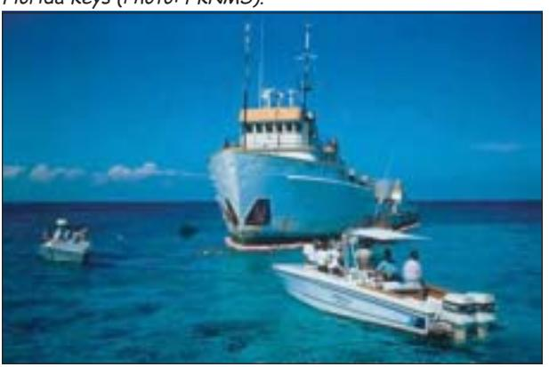

70 Live coral is preferred because it tastes better than dead coral that has been invaded by algae, sponges, and other organisms.

**NATIONAL SUMMARY NATIONAL SUMMARY**

71 Use of chlorine for fishing has been substantiated by court cases in the last couple years (D. Gulko pers. comm.).

72 For example, Miami, Port Everglades, Palm Beach, Florida; San Juan, Puerto Rico; Honolulu, Barbers Point, Pearl Harbor, Hawai'i; Pago Pago, American Samoa; and Apra Harbor, Guam.

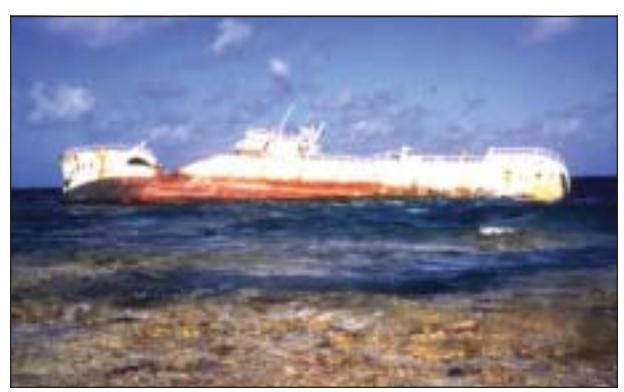

Figure 60. Grounded Taiwanese longliner on Rose Atoll (Photo: Jim Maragos, USFWS).

Florida, the USVI, the Main and Northwestern Hawaiian Islands, and FSM consider recreational boating a serious issue (Table 2).

Boat traffic threatens reef structure and associated wildlife. Propellers speeding through shallow waterways have broken corals, scarred seagrass beds, and killed endangered marine mammals and sea turtles. Groundings and anchor damage are considered some of the most destructive chronic human factors, causing significant localized damage to shallow-water coral reefs (Precht 1998).

Coral reef damage associated with ship groundings includes the direct loss of corals and other benthic invertebrates when they are dislodged, fractured, and crushed. Groundings also increase the risk of contamination from oil and toxic chemical spills.

Large ports located near shallow-water reefs72 with heavy traffic increase the probability of vessel collisions with reefs. Also, ships from foreign ports can introduce alien species into coastal waters73.

Over the past decade, moderate to severe large vessel groundings have occurred. In the Caribbean, a number of groundings severely damaged the reef structure off southeastern Florida, Puerto Rico, and the USVI (Fig. 59). For more information on groundings and their impacts, see the jurisdictional reports following the National Summary.

In the Pacific, the U.S. Coast Guard (USCG) reported 48 ship groundings in Hawai'i between 1993-1996, including passenger and fishing boats, freighters, towboats, and industrial, military, and offshore supply vessels. In the NWHI, a fishing vessel grounded in 1999 at Kure and another in 2000 at Pearl and Hermes Atoll. In American Samoa nine longline-fishing vessels were blown onto a reef in Pago Pago Harbor during a hurricane in 1991, and in 1993 another longliner ran aground on Rose Atoll (Fig. 60). In addition, several other fishing vessels, yachts, and a tugboat grounded on other Samoan reefs. In Guam, there were at least 15 groundings and 13 sinkings between 1992 and 1996, including a research vessel. In 1999, another passenger vessel attempting to land illegal immigrants at Guam ran aground on the reefs of the Guam National Wildlife Refuge.

#### Marine Debris74

All sorts of material is discarded from boats and vessels (Fig. 61). Currents transport some of this debris long distances and wave action washes it back and forth across shallow coral reefs, ultimately depositing it along shorelines. Marine debris is considered a medium-to-high threat by the coral reef managers in Florida, Puerto Rico, the Hawaiian Islands, particularly the NWHI, the CNMI, the U.S. remote **insular** (island) reefs, the FSM, and Palau (Table 2).

In the NWHI, derelict fishing nets from commercial fishing activities far away in the North Pacific have had a major impact on shallow reef systems, dislodging and breaking coral colonies. They also entangle Hawaiian monk seals75 and other marine mammals, sea turtles, corals, fish, and seabirds, often killing them. Exotic species attached to drifting marine debris can be transported far from their place of origin and introduced to remote reefs.

Some of the largest marine debris (e.g., planes, ships, and tanks) on Pacific islands and in lagoons date back to World War II battles and

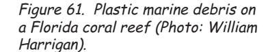

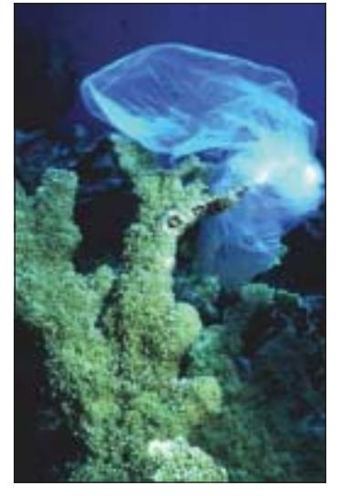

&lt;sup>73 One example: the elephant ear sponge (*Ianthella basta*), a resident of New Guinea and Indonesian reefs, is now an established alien species in Guam's Apra Harbor.

74 Fishing gear and other remnants of human activities coming from recreational and commercial vessels, storm drains, industrial facilities, and waste disposal sites.

&lt;sup>75 In 2000, about two dozen endangered Hawaiian monk seals were found entangled in nets off NWHI islands and atolls (R. Brainard pers. comm.).

bombing raids. They are now designated historical parks and monuments or are popular dive sites and artificial reefs (Fig. 62).

Removing marine debris is a major task. To date, 132 tons76 of debris have been removed out of an estimated 1,000 total tons encountered on NWHI reefs and beaches (R. Brainard pers. comm.).

#### Alien Species

Alien species, along with their associated symbionts and diseases, have had devastating effects on native biota globally. In the United States, Hawai'i has been impacted the most. Managers of Hawaiian Island and RMI

land and marine resources consider alien species to be one of the greatest threats to native wildlife and habitats, whereas managers from five other jurisdictions consider alien species a medium priority (Table 2).

Wagner *et al.* (1990) reported Hawaiian terrestrial habitats now contain more alien species than native ones. On both land and sea, a spectacular number of invasive species have become established throughout the islands.

Some 19 species of marine macroalgae have been introduced to Hawaiian coastal waters since 1950, four of which have been highly successful. Recent

Figure 63. Sea turtle swimming through an invasive algal bloom (Cladophora) in Honokowai, West Maui (Photo: Ursula Keuper-Bennett and Peter Bennett).

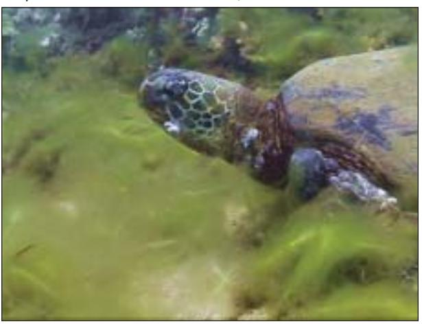

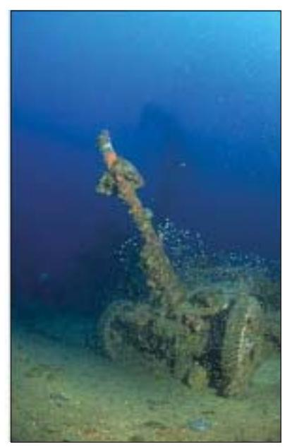

Figure 62. Sunken debris from World War II in Chuuk Lagoon, FSM (Photo: Tim Rock).

studies have shown overgrowth and killing of coral by an alien red alga (a species of *Kappaphycus*) in Kane'ohe Bay, O'ahu. This alga is thought to have caused the shift from a predominantly multi-species coral habitat to a monoculture algae habitat in some areas of the bay (Woo 2000). This may affect everything from fish recruitment to trophic interactions and have widespread impacts such as commercial fishing and tourism.

Two invasive algae, a brown and a green alga (*Hypnea musiformis* and *Cladophora sericea*), are overgrowing reef corals off western Maui (Fig. 63). These develop into algal blooms and are

displacing native and endemic algae. More significantly, the algae being replaced are the primary food for the threatened green sea turtle and provide critical habitat for the endangered hawksbill sea turtle (Gulko in press).

Over 250 species of marine invertebrates have been introduced into Hawaiian waters (Eldredge and Englund 2001). The effect on coral reefs for most of these has not been documented. Alien sponges however, have been observed growing over corals in Kane'ohe Bay, O'ahu, and concerns have been raised about the introduced snowflake coral (*Carijoa riisei*) competing with shade-adapted corals in some areas (L. Eldredge pers. comm.).

Thirty-four species of marine fishes have been introduced into Hawaiian waters; not all are successfully established. Of the established species, 13 species were intentionally released and at least seven species were accidental introductions (Englund and Eldredge 2001).

NOAA, the Hawai'i Department of Land and National Resources (DLNR), USFWS, National Park Service (NPS), the U.S. Geological Survey (USGS), the Bishop Museum, the University of Hawai'i, and other partners initiated a Hawaiian Pilot Study in 2001 to list all coastal marine species (native and alien) and build an early warning system for invasive and alien species.

#### **Other Physical Impacts to Coral Reefs Physical Impacts to Coral Reefs**

Besides the environmental pressures on reef ecosystems already mentioned, there are other types of direct physical impacts to reef structure. Activities involving explosives or heavy machinery near coral reefs can damage these fragile, living ecosystems. Although not legal in U.S. coastal waters, dynamiting reefs has been used to collect fish. In the CNMI, dynamite fishing using WWII ordnance was prevalent in the past, but this practice appears to be nonexistent today. Elsewhere in the Indo-Pacific, however, there is evidence this practice continues (Fig. 64).

Not all the war-time relics mentioned in the discussion of marine debris are safe. In 1996, the CNMI Governor asked the U.S. Navy to detonate live depth charges found on a wrecked WWII Subchaser, as they posed a hazard to recreational divers

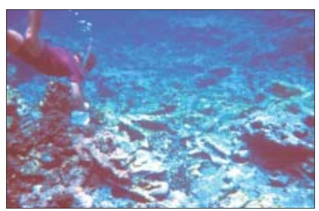

Figure 64. A diver swims past corals broken by dynamite fishing (Photo: Nancy Daschbach).

and fishermen (Worthington and Michael 1996). Although the force of the detonation damaged reef structure at the popular Coral Gardens dive site and a nearby fish reserve, killed wildlife, and created an extensive sediment plume, those reefs are now safe (Trianni 1998).

Managers from Puerto Rico and the Commonwealth of the Northern Mariana Islands where active security training exercises are being conducted, expressed high concern about the impact of bombing and live-fire activities on coral reefs. Managers from the Hawaiian Islands, where there were such activities in the past have moderate concerns for the condition of nearby reefs (Table 2).

DoD Military Services (i.e., the Air Force, Army, Navy, and Marine Corps) generally avoid coral reef areas in their normal operations except for some mission-essential ashore and afloat activities (DoD 2000). Wherever possible, it is DoD's policy to avoid adversely impacting coral reefs during training exercises. At military installations, the Services work to minimize activities that may negatively impact coral reef ecosystems.

To ensure that its Puerto Rico operations and training exercises do not negatively impact coral reefs and other marine resources, the Navy is cooperating with the USGS Biological Resources Division to update mapping coral reefs and seagrass beds near Naval Station Roosevelt Roads, Isla Pineros, Cabeza de Parro, and Vieques.

In the CNMI, the Navy considers its bombing range at Farallon de Medinilla a vital asset for the continued security training exercises for military readiness missions. To monitor the condition of the reefs, annual marine surveys are conducted by scientists from NOAA, the USFWS, and the CNMI Division of Fish and Wildlife Division of Environmental Quality. From those surveys, the Navy has concluded that there have been no significant impacts on marine communities, endangered and protected species, fishery resources, and existing coral (DoD 2000).

#### **Offshore Oil and Gas Gas**

Only a small fraction (8%) of all the petroleum escaping into North American ocean waters is from pipeline ruptures or massive tanker spills – a total of 2.7 million gallons (Committee on Oil in the Sea 2002). An even smaller amount (3%) is from offshore oil exploration and extraction activities. Fortunately, no major oil spills or other incidents off the reefs of the United States or the Pacific Freely Associated States have occurred.

Only the managers of the Flower Garden Banks National Marine Sanctuary have expressed moderate concern over offshore oil and gas threats to coral reef systems in the near future (Table 2). Protective measures enacted by the Minerals Management Service (MMS) have been successful so far in minimizing impacts from this activity around the Flower Garden Banks National Marine

**ENVIRONMENTAL PRESSURES ENVIRONMENTAL PRESSURES**

76 This number includes debris collected by the annual multi-ship (i.e., NOAA ship *Townsend Cromwell*, the USCG Cutter *Kukai*, and others) cleanup efforts conducted throughout the NWHI from 1999 through 2001. **4141**

Sanctuary. In spite of the intense activity, longterm monitoring studies indicate no significant detrimental impact to the coral reefs from nearby oil and gas development (Gittings 1998).

Petroleum production from offshore Federal lands presently comprises 20% of domestic oil production and 27% of domestic natural gas production (Kelly 1999). Most of this is centered in the northern Gulf of Mexico. It is one of the most active areas for oil and gas exploration and development in the world.

By the end of 1995, approximately 5,000 prodution platforms had been installed, 32,000 wells drilled, and over 30,000 mi of pipeline installed (Deslarzes 1998). This activity on the Gulf of Mexico Continental Shelf waters and the nearby land also have oil refineries, storage facilities, and shipping lanes frequented by oil tankers.

Potential impacts from offshore oil and gas exploration and development include accidental spills, contamination by drilling-related effluents and discharges, anchoring of vessels on coral reefs, seismic exploration, use of chemical dispersants in oil spill mitigation, and platform removal. About 1,000 of the platforms have already been removed, and another 1,000 platforms will need decommissioning in the coming decade (Kelly 1999).

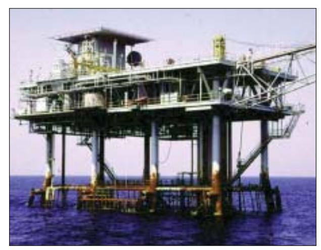

Figure 65. The High Island 389 natural gas platform is located one mile east of the East Flower Garden Bank (Photo: Frank and Joyce Burek).

For the United States, 72% of the oil and 97% of the natural gas produced in offshore U.S. waters comes from the northwestern Gulf of Mexico (MMS 2002). Within a 4 nmi radius of the Flower Garden Banks National Marine Sanctuary there are 10 production platforms and approximately 100 mi of pipeline. Half of the pipeline is dedicated for oil (Deslarzes 1998). And there is one gas production platform (High Island 389A, Fig. 65) located within the boundary of the East Flower Garden Banks.

**NATIONAL SUMMARY NATIONAL SUMMARY**

## **NATIONAL SUMMARY: SUMMARY: NATIONAL SUMMARY: SUMMARY: NATIONAL ASSESSMENTS NATIONAL ASSESSMENTS NATIONAL ASSESSMENTS**

There are three sets of national assessments within this section. First, gaps in the mapping and monitoring data are identified and their impact on developing an assessment of the national condition of coral reef ecosystems is discussed. Second, there is a national assessment on the current status of coral reef ecosystems by jurisdiction. Since much of the data has yet to be gathered, these are mostly qualitative, brief summaries (three pages or less) and were derived from the jurisdictional reports. Third, a national assessment of temporal and spatial trends in coral reef ecoystems concludes the section.

Mapping and monitoring the coral reefs to 1) fill in data gaps and 2) create a comparable set of data for all jurisdictions is the core of the program and vital to assessments of status and trends. The USCRTF initiatives to provide this information began in 2000 but have a long way to go. Mapping should be completed in 2009; monitoring is a longterm commitment. Until that information is available, rough estimates compiled from a variety of sources can be used to compare data among jurisdictions.

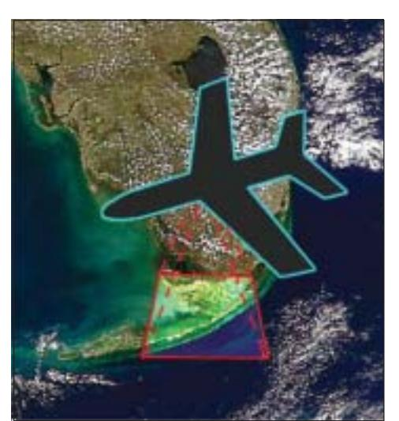

Figure 66. Aerial photographs have been acquired and interpreted to produce benthic habitat maps (Photo: National Ocean Service).

**Gaps in Habitat Mapping Habitat Mapping –** Until recently, not a single State, Commonwealth, or Territory had its coral reef resources characterized and mapped with aerial photography and ground verification. The extent of the coral reefs and characterization of associated benthic habitats off the U.S. and Freely Associated States is essentially unknown. This lack of statistically comparable spatial data prevents direct comparison of other data as well.

• Credible, comparable maps of reef and associated benthic habitats were completed for

Puerto Rico and the USVI by NOAA and its partners in 2001. Those were used for this report.

• About half of Florida's entire coral reef ecosystem has been mapped using methods similar to those for Puerto Rico and the USVI (Fig. 66). Mapping efforts covered the original boundaries of the Florida Keys National Marine Sanctuary in the 1990s (FMRI/NOAA 1998). Recently, a portion of the Dry Tortugas region was characterized (Schmidt *et al.* 1999). The rest of Florida's coral reef ecosystem has

> yet to be mapped. For this reason, the Florida values reported in this section and in the regional report that follows, where indicated, are for the FKNMS and not statewide.

• Elsewhere, benthic habitat mapping is underway. Estimates of coral reef area for these regions were taken from the literature.

Literature estimates vary widely. For example, published estimates for total coral reef habitat of the NWHI range from 3,475-4,247 mi2 (9,000-11,000 km2 ) (e.g., Hunter 1995). Most available

estimates were calculated from **bathymetry**77 . The maps from which those estimates were derived had varying levels of detail and accuracy.

Differences among regions may also be biased in the methodology and a general lack of information. Some of the literature estimates were based on the 100 m bathymetric line (i.e., the entire area equal to or less than 300 feet, regardless of habitat type), significantly over-estimating the shallow reefs78 within a region. Where this is the only data available, it was used for this first report.

**NATIONAL ASSESSMENTS NATIONAL ASSESSMENTS**

77 Lines connecting equal depths on printed maps.

78 Those in water less than 150 ft.

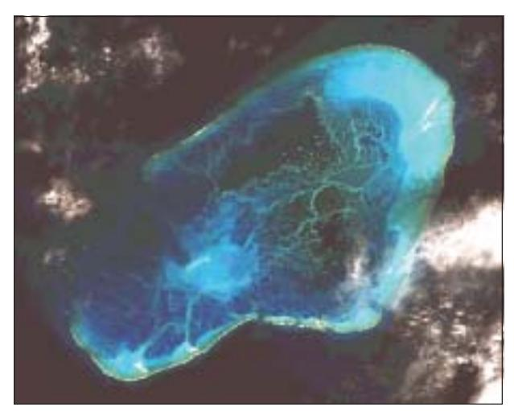

Figure 67. Landsat 7 satellite imagery is being used to map the remote Northwestern Hawaiian Islands (Imagery processed by NOS Coral Reef Mapping Team).

Reliable data on benthic communities is being developed, primarily from the USCRTF/NOAA benthic mapping effort. In 2000, NOAA initiated a program to map U.S. coral reef ecosystems and related benthic habitats by 2009 (USCRTF 2000). As mentioned before, by the end of 2001, NOAA had completed mapping benthic underwater habitats off Puerto Rico and the USVI. They have been mapping habitats off the Main Hawaiian Islands since 2000. By the end of 2002, there should be benthic habitat maps for about one third of the Hawaiian shoreline. The remaining two-thirds and possibly an update of the 2002 maps will be completed in 2005 (Fig. 67). In 2002, mapping activities are scheduled to begin in American Samoa, Guam, and the CNMI using IKONOS satellite imagery for initial map development.

#### Gaps in Ecosystem Monitoring – ${\operatorname{To}}$ be able to

follow the status and trends of the changing condition of coral reef ecosystems, comparable long-term monitoring is needed. Not all jurisdictions have the same capacity to conduct monitoring programs. This varies for both the geographic area and the parameters monitored. As a result, data from some areas is more definitive than from others.

The most extensive spatial and long-term temporal

monitoring is conducted over much of the Florida Keys National Marine Sanctuary. Sanctuary-wide monitoring of water quality, seagrasses, and coral and hard-bottom communities began in 1994 under a Water Quality Protection Program jointly undertaken by NOAA and the U.S. Environmental Protection Agency (USEPA). In 1997, the FKNMS implemented a network of fully protected zones79 and a zone monitoring program. The program was initiated to determine whether the zones met the objectives of reducing pressure on heavily used reefs, preserving biodiversity, facilitating research, and reducing conflicts among resource users. It monitors many parameters at around 100 sites.

Hawai'i has the next best monitoring coverage and program longevity. Since 1999, a collaboration of the University of Hawai'i, the Hawai'i Department of Land and Natural Resources, federal agencies, and NGOs, the Coral Reef Monitoring and Assessment Program (CRAMP) has been monitoring at least 30 coral reef sites off the Main Hawaiian Islands.

Although there has been long-term monitoring at a number of reef sites on other U.S. islands (e.g., sites off the USVI and American Samoa), both spatial coverage and parameters are far less comprehensive.

With considerable support from Congress, the USCRTF agencies80 are taking the necessary steps to build capacity for long-term monitoring using consistent, comparable sampling methods and protocols. Since 2000, substantial grants support a variety of projects undertaken by island agencies81 to map, conduct ecological assessments, character-

ize benthic habitats, and inventory the species that depend on them, monitor ecosystem health, and conserve reef resources (Fig. 68). Funding for managers of marine protected areas with coral reefs82 was enhanced during FY01 and FY02 to initiate or continue monitoring efforts. In 2002, similar assistance is planned for the Freely Associated States. The nation's managers have committed to building long-term monitoring capacity.

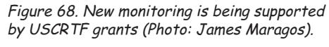

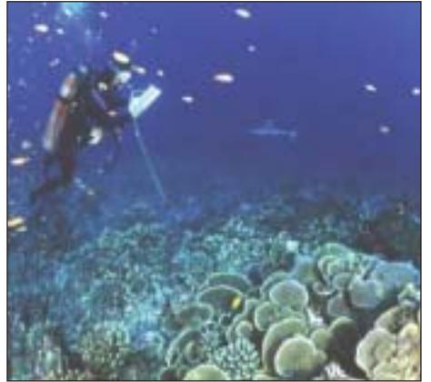

&lt;sup>79 Also called no-take marine reserves.

&lt;sup>80 Particularly the DoI and the DoC.

#### Status of Coral Reef Ecosystems

For this first report, assessments are presented as 11 short summaries on the condition of coral reefs in the United States and the Pacific Freely Associated States. For the most part, these reports are based on information contained within the jurisdictional reports that follow this National Summary.

#### Condition of Florida's Coral Reef Ecosystems -

Florida's coral reefs are extensive and interspersed with sand, seagrass, and hardbottom communities, from off southeastern shores (Vero Beach to Miami Beach), westward through the Florida Keys to the Dry Tortugas. Coral reef habitat is almost continuous along the Florida Reef Tract, parallelling the Keys for 220 mi from Fowey Rocks near Miami and terminating west of the Dry Tortugas. Discontinuous and less biologically diverse coral reef communities continue northward along western Florida shores to the Florida Middle Grounds, a series of submerged pinnacles rising to within 60-80 ft of the surface, about 100 mi northwest of St. Petersburg (Fig. 69).

Florida's total coral reef and colonized hardbottom area covers 1,172 mi2 (3,035 km2), of which 495 mi2 (1,281 km2) lies within the Upper,

Middle, and Lower Keys (FMRI/ NOAA 1998); 129 mi2 (335 km2) in the Dry Tortugas (Ault et al. 2001); 63 mi2 (164 km2) along the southeastern coast of Florida; 24 mi2 (62 km2) in the eastern Gulf of Mexico (excluding the Florida Middle Grounds); and 461 mi2 (1,193 km2) is attributed to the Florida Middle Grounds (Florida Fish and Wildlife Conservation Commission 2001). Coral reefs and adjacent habitats include nearshore patch reefs, midchannel reefs, offshore patch reefs, bank or transitional reefs, deep reefs, sand/soft bottom areas, seagrass beds, and fringing mangroves.

Florida Keys – The Florida Keys are home to the third largest shallow-water coral reef in the world and the only emergent reef ecosystem found off the continental United States. This unique marine habitat is under

protection, with the extreme northern end managed by the Biscayne National Park and the remainder of the reef tract managed by NOAA and the State of Florida as the Florida Keys National Marine Sanctuary (FKNMS or Sanctuary), and the Dry Tortugas National Park.

The Florida Keys has historically supported diverse and healthy marine communities despite being located at the northernmost range of many Caribbean coral species. At this time, the coral reefs of the region are in decline, as evidenced by decreases in coral coverage, species fluctuations, and disease (Jaap *et al.* 2001). One program documented a 36.6% decline in coral cover at monitoring stations during the period between 1996 and 2000 (Jaap *et al.* 2001). Significant gains and losses of several stony coral species have occurred as well, but to date no loss of species has occurred Sanctuary-wide.

While it is difficult to ascertain the exact causes of coral mortality and community change in the Sanctuary, declines may generally be attributed to natural and anthropogenic impacts. Over the past two decades the reef tract has been hit by a succession

Figure 69. Map of South Florida and its MPAs (Photos: Biscayne and Everglades National Parks and FKNMS). For all maps, yellow stars denote MPAs, red stars are no-take Reserves, and blue lines delineate the larger MPAs.

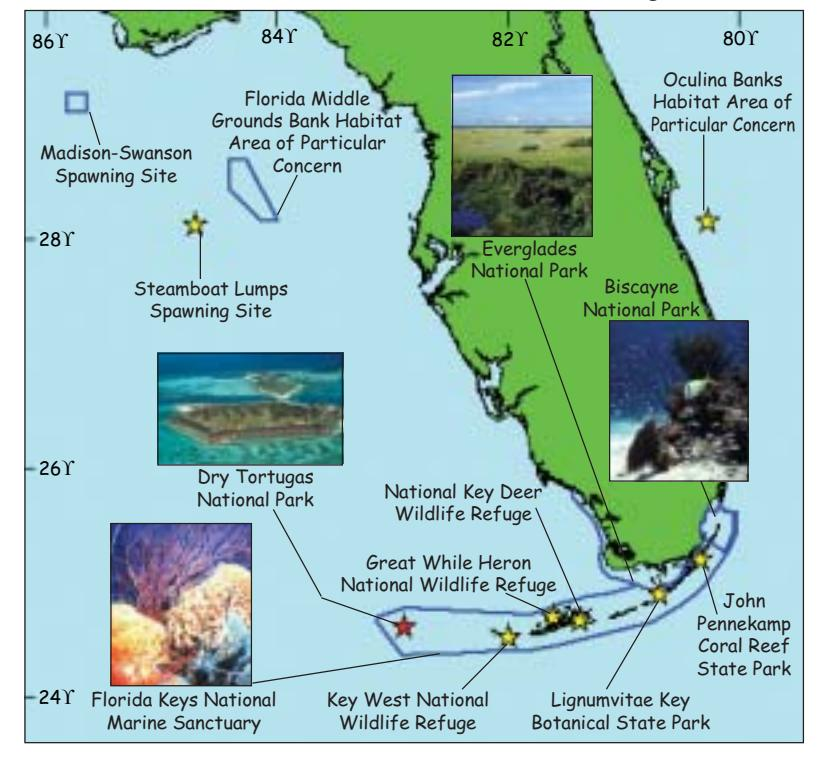

81 Puerto Rico, USVI, Hawai'i, American Samoa, Guam, and the CNMI.

82 For example, the Florida Keys National Marine Sanctuary and the Northwestern Hawaiian Islands Coral Reef Ecosystem Reserve.

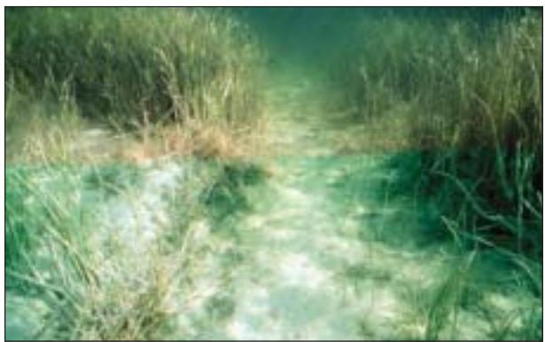

Figure 70. Prop scar damage to seagrass (Photo: Harold Hudson).

of natural disasters, including hurricanes, diseases, and coral bleaching. Hurricanes have had visible effects on populations of attached bottom animals and algae in most areas (Aronson *et al.* 2001). The number of new diseases and the extent of infection have been increasing since 1996 in shallow areas; in particular, there is increased coral mortality from a complex of diseases (e.g., white-plague, white-band, and white-pox) (Dustan 1999, Jaap *et al.* 2001).

Coral bleaching in the past 20 years has resulted in significant mortality. For example, the blade fire coral suffered 80-90% mortality following a 1997-1998 bleaching episode off the Florida Keys (W. Jaap pers. comm.); the population has remained low throughout most of the area. Mortality from bleaching often occurs with massive kills of other

invertebrates and fishes. Extreme mortality events, such as the 1983 Caribbean-wide die-off of the long-spined sea urchin, have indirectly affected corals by the loss of an important algal grazing species.

Direct destruction of corals, seagrasses, and hardbottom communities caused by inadvertent human actions, has increased dramatically over the last several decades. Boat groundings, propeller scarring (Fig. 70), careless anchoring, and direct contact by snorkelers and divers have damaged hundreds of miles of sensitive marine habitats in the Florida Keys, further stressing an ecosystem

already struggling to withstand natural impacts. Most of these pressures stem from the three million annual visitors (Leeworthy and Vanasse 1999) and 80,000 year-round residents of the Florida Keys. The residents and tourists in adjacent Miami-Dade county (2.49-2.56 million) place additional pressures on the fragile reefs of the Florida Keys.

In addition to habitat loss, declining water quality affects the Florida Keys marine environment. Inadequate wastewater and stormwater management degrade nearshore areas. Eutrophication is a documented problem. Though several improvements have been undertaken, such as an upgrade from an ocean outfall to deep well injection of treated wastewater for the City of Key West, additional advancements are needed Keys-wide to comprehensively address this problem. Reduced freshwater flows to Florida Bay from upstream water management have increased plankton blooms, sponge and seagrass die-offs, and fish kills, impacting critical nursery and juvenile habitat for a variety of reef species.

Serial overfishing has dramatically altered fish and other animal populations on the reef, contributing to an imbalance in the relationships that are critical to sustaining a diversity of organisms (Ault *et al.* 1998). Five species of fish in the Florida Keys and another six species in Florida Bay are at risk of

extinction (Musick *et al.* 2000). Those authors contend these species are threatened because the Florida Keys has undergone extensive development over the last 30 years, with much of the original habitat degraded or destroyed, while Florida Bay has experienced increased turbidity and altered freshwater influx.

The Florida Keys National Marine Sanctuary was designated in 1990 in an attempt to offset impacts from these and other environmental pressures and reverse trends in reef degradation. Through the development and implementation of a comprehensive management plan,

Figure 71. Staghorn coral spawning off the southeastern coast of Florida (Photo: National Coral Reef Institute).

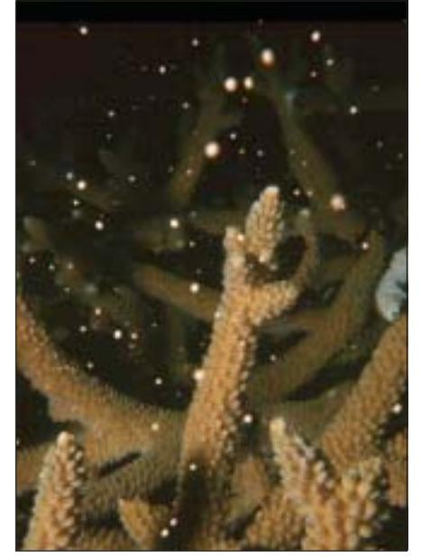

key problems such as degradation of habitats and water quality are addressed Sanctuary-wide through regulatory and non-regulatory strategies. A network of marine zones that includes 24 fully protected marine reserves has been implemented to provide additional protection to sensitive species and habitats. The fully protected zones encompass approximately 65% of shallow coral reefs in the Sanctuary. Initial monitoring of these areas suggests improvements in some key reef species (snappers, groupers, and spiny lobsters; Bohnsack *et al*. 2001).

Southeastern Coast – Characterized by three lines of discontinuous reefs that run parallel to the shoreline, this reef system is covered by algae and small soft corals, with an Anastasia limestone substrate and worm reef (*Phragmatopoma*). The stony coral cover and diversity is lower here than in the Florida Keys.

The outermost reef has a complex three-dimensional structure with a high diversity of stony (scleractinean) corals and an abundance of octocorals and large barrel sponges (*Xestospongia muta)*. For the past three years, sexual spawning has been observed on outcrops of staghorn coral (Vargas-Ángel and Thomas in press, Fig 71).

Based on the condition of coral and fish populations, reef communities on the southeastern coast of Florida are in relatively good condition, but there are issues. The Florida Current (the Gulf Stream) occasionally brings algal blooms onto the reefs. Since 1989, algal blooms of an invasive green alga called dead-man's fingers (*Codium isthmocladium*) to the north and a cyanobacterium *(Mictocoleus lynbyaceus*) to the south are commonly found. Blooms of dead man's fingers have reached massive proportions on some reefs off Palm Beach County.

Besides overfishing, fish kills and disease have been recurring problems for reef populations on the southeastern coast. Fish kills are common during cold-water upwelling events. In June 1980, hundreds of thousands of reef fish died within a very short time throughout the region, apparently from *Brooklynella*, a disease that continues to plague reef fish. There were severe outbreaks again in 1997, 1998, and 2000.

Within the past decade, a growing number of alien species have been identified from embayments and

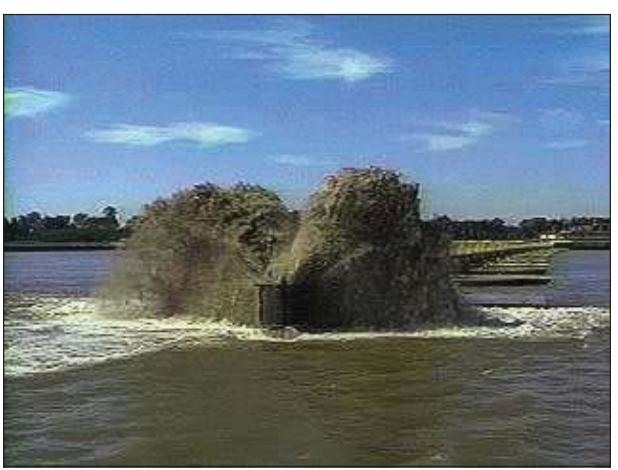

Figure 72. Turbid water from dredging (Photo: National Ocean Service Photo Gallery).

reefs in South Florida and the Gulf of Mexico. Most of these species are foreign to North American waters and were introduced by either ship hull fouling or ballast water dumping (USGS 2002). The majority of Florida's marine fish introductions comes from released aquarium fish, with occasional reports of various exotic species among native reef fish.

Throughout Southeast Florida, dredging for beach renourishment, channel deepening, and waterway maintenance have degraded water quality within reef habitats (Fig. 72). Most dredging occurs from Dade to Martin Counties (Miami to Vero Beach). In addition, ocean outfalls dump millions of gallons of treated sewage into coastal waters each day. Water control priorities in the larger South Florida region often put near-shore reefs at risk when millions of gallons of fresh water are dumped into the ocean through coastal canals.

Biscayne National Park, one of the largest parks in South Florida with beautiful coral reef and mangrove ecosystems, is also in danger. In or adjacent to Biscayne Bay, including Miami-Dade County and a sprawling suburbia, are threats from toxic contaminants, runoff from a huge municipal dump, a nuclear power plant, and heavy small vessel traffic with resulting groundings.

Florida Middle Grounds – These bank formations consist of two north-to-northwesterly parallel ridges separated by a valley. Most tropical species cannot live in these habitats because of the region's cooler water temperatures. Biologically, they are equally temperate and tropical, differing from the

**NATIONAL ASSESSMENTS NATIONAL ASSESSMENTS**

reefs of the Florida Keys and Flower Garden Banks in the western Gulf. Coral cover may be as high as 30% on some reef pinnacles.

Recent SCUBA and submersible expeditions to the Florida Middle Grounds examined a number of reef structures and found them apparently healthy (W. Jaap pers. obs.). The isolation and

**NATIONAL SUMMARY NATIONAL SUMMARY**

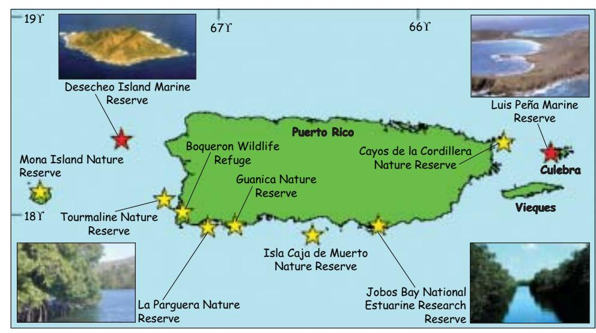

Figure 73. Map of Puerto Rico and its MPAs (Photos: John Christensen, USFWS, and NOAA).

distance of this area from populated shorelines likely provide protection from pollutants and heavy recreational fishing activity.

#### **Condition of Puerto Rico's Coral Reef Ecosystems Puerto Rico's Reef Ecosystems –**

The islands of the Commonwealth of Puerto Rico, with a combined total land area of about 3,435 mi2 (8,897 km2 , roughly the size of Rhode Island) and a linear coastline of 385 mi, are the easternmost islands of the Greater Antilles, located between La Hispaniola and the Virgin Islands (Fig. 73). The islands lie on a submarine platform and include Puerto Rico, Vieques, Culebra, Culebrita, Desecheo, Mona, and Monito.

With the exception of Monito Island, NOAA recently mapped Puerto Rico's coral reef ecosystem and associated benthic habitats to about 65 ft. The

Figure 74. Reef with a large amount of coral cover off La Parguera, Puerto Rico (Photo: Matt Kendall).

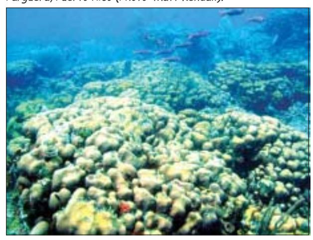

mapping delineated a total coral reef ecosystem area of 1,934 mi2 (5,009.6 km2 ). Coral reef and colonized hardbottom habitat comprised 292 mi2 (756.2 km2 , 15.1% of the total reef ecosystem), total seagrass habitat covered 241 mi2 (624.8 km2 , 12.5% of the ecosystem), macroalgal-dominated areas covered 37 mi2 (96.7 km2 , 1.9%), and the mangroves fringing the islands covered 28 mi2 (72.6 km2 , 1.4%).

Coral reefs off Puerto Rico near La Parguera, Desecheo Island, and Vieques Island have the highest abundance and percent cover of living coral (Fig. 74), although these reefs have been degraded by a host of human and natural impacts. Results from recent studies of Desecheo Island indicate its coral reefs are probably the bestdeveloped and healthiest in Puerto Rico, with about 70% coral cover and high water clarity (Armstrong *et al.* 2001).

Throughout the area, staghorn and elkhorn coral populations have declined over the last 25 years from hurricane damage, white-band disease, and corallivorous mollusks (Goenaga 1991, Bruckner *et al.* 1997, Williams *et al.* 2000). Extensive thickets of elkhorn coral formerly dominated many shallow coral reef habitats (0-16 ft).

White-band disease has had a devastating impact on what had been vast stretches of apparently healthy elkhorn coral off the eastern coast of Puerto Rico (Goenaga and Boulon 1992). A few outer reefs still had extensive elkhorn thickets as recently as 1998, but Hurricane Georges heavily

damaged those (Morelock *et al.* 2001). Staghorn coral, also damaged by Hurricane Georges, has recovered considerably from white-band disease. Although the disease is prevalent, flourishing stands can be found in shallow back-reef sites off San Cristóbal. But on reefs off La Parguera where large numbers of staghorn coral were lost during the 1980s and early 1990s (Williams *et al.* 2000), populations have continued to decline over the last decade (Bruckner *et al.* 1997, Morelock *et al.*  2001). The disease is also prevalent among elkhorn coral colonies.

Black-band disease was first observed in Puerto Rico in 1972 but occurs less here than elsewhere. White plague type II disease affects more than 50% of the brain coral population on one inner reef near La Parguera (Bruckner and Bruckner 1997). Yellow-blotch disease was first recorded in 1996, and by 1999 had affected 50% of the massive boulder star corals off the western coast of Mona. Now it affects all reefs in that area (Bruckner and Bruckner 2000). Most other diseases reported in the literature have been observed as well (A. Bruckner unpub. obs).

Overgrowth by sponges and other invertebrates has been a minor source of coral mortality on reefs that was first noted by Vicente (1978). The encrusting sponge (*Cliona* spp.) has covered substrates previously covered by elkhorn coral and is now overgrowing many other species of corals in a number of locations.

Hurricanes and tropical storms have damaged the reefs over the past 20 years. Hurricane Georges in September 1998 devastated the elkhorn corals and other shallow reef environments near La Parguera (Morelock *et al.* 2001). While Hortense in 1996, Marilyn in 1995, and Hugo in 1989 had weaker winds, they had heavier rains, impacting the shallow reefs with freshwater.

To date, fishery resources off Puerto Rico have shown the classic signs of overfishing. Reef fisheries are now only 31% of what they were in 1979 (C. Lilyestrom unpub. obs.).

The decline in abundance of large fish and the massive mortality of the long-spined urchin represent a major shift in community structure of the Puerto Rican reefs. Likewise, heavy fishing of the spiny lobster has substantially reduced its numbers

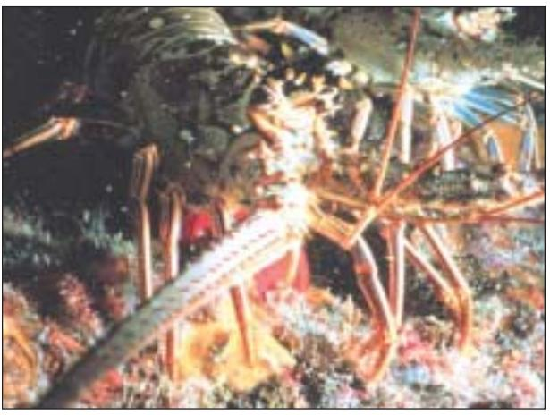

Figure 75. The spiny lobster has experienced heavy fishing pressure in Puerto Rico (Photo: NOAA OAR/NURP).

(Fig. 75), affecting populations of corallivorous mollusks, one of its prey.

Activities related to urbanization have degraded coastal water quality in Puerto Rico. Sedimentation and high turbidity have been associated with development have degraded a variety of reef systems around the island. In their qualitative inventory of reefs, Goenaga and Cintrón (1979) noted a high amount of sedimentation affected reefs of the northern coast and in bays used for ocean cargo on the southern and western coasts (e.g., Guayanilla, Mayagüez).

A periodic problem for near-shore water quality is illegally discharged wastes. Since 1991 on a yearly basis, the USEPA has provided compliance assistance to hundreds of regulated businesses and facilities (USEPA 2002). This is still a problem in particular areas. A major rum processing plant regularly exceeds permit limits for oxygen demand and solids in its stormwater runoff flowing into San Juan Bay (ten months between 1997 and 2000). Additionally, this company has been cited by the USEPA for discharging rum effluent directly into the Bayamon River Channel.

#### **Condition of USVI's Coral Reef Ecosystems Coral Ecosystems –**

The U.S. Virgin Islands (USVI) lie approximately 1,000 nmi southeast of Miami and 45 nmi east of Puerto Rico, and include the primary islands of St. Croix, St. John, and St. Thomas, as well as offshore cays. Around the islands are fringing, deep wall and shelf-edge, and patch reefs, some with spur-and-groove formations. Only St. Croix has barrier reefs. Bank reefs and scattered patch reefs

**NATIONAL ASSESSMENTS NATIONAL ASSESSMENTS**

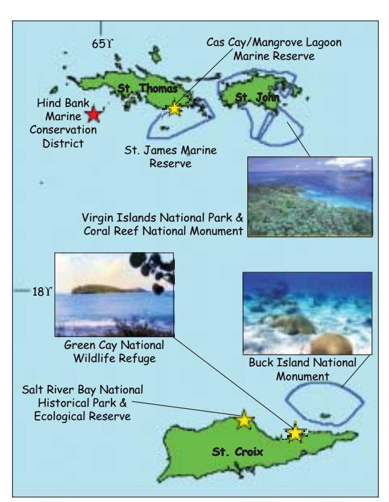

Figure 76. Map of the U.S. Virgin Islands and its MPAs (Photos: Matt Kendall, NPS, and USFWS).

with high coral diversity occur on geological features offshore at greater depths (Fig. 76).

Recently NOAA mapped USVI coral reef ecosystems and associated habitats to about 70 ft and delineated a total coral reef ecosystem area of 350 mi2 (906.3 km2 , Kendall 2001, Monaco *et al.*  2001). Deeper water reef habitats off the USVI islands have yet to be mapped.

A diverse array of stresses have degraded USVI coral reefs, associated marine ecosystems, and the fishery resources dependent on them. Natural disasters have also degraded USVI reefs. Eight hurricanes over the past 20 years have had dramatic impacts and given the reefs little chance to recover. Hurricanes David and Hugo were especially damaging, killing coral and impacting reef tracts.

Macroscopic algae are periodically abundant, increasing after storms and disease had killed corals. Although long-term data exists only for St. John, large, dense seagrass beds have dramatically declined, all but disappearing in popular anchorages.

Coral mortality from disease has been substantial over the past two decades. White-band disease,

black-band disease, plague type II, a sea fan disease, and possibly other undetected diseases all have impacted coral reef health.

Most dramatic has been the demise of the elkhorn coral. Impressive stands reported in the 1970s and 1980s are now graveyards from storms and whiteband disease (Fig. 77). Branches and fragments are dead, interspersed with algal-covered skeletons still in position. In places, living elkhorn coral cover has fallen from 85% in 1976 to a low of 5% in 1988.

Plague type II and a fungus also affect these reefs. While it does not always advance so quickly, plague type II can progress up to 0.5 cm/day on stony coral. Corals infected with this disease usually do not recover; instead, they die and are overgrown with algae.

Another major impact on USVI coral is bleaching. Major bleaching events occurred in 1987, 1990, and 1998. These affected 16-47% of the corals in any given event or location. Severe coral mortality, however, has not been associated with USVI coral bleaching. Since bleaching is related to increased water temperatures, increased warming should continue to have an effect.

An epidemic in 1983-1984 decimated the longspined sea urchin, reducing populations as much as 90% around the Caribbean. They are recovering, but slowly. Loss of this herbivore is significant because it feeds on macroscopic algae and plays a major role in reef ecology by keeping algal abundance in check.

Fish and large mobile invertebrates have been affected by human activities. The queen conch

Figure 77. Elkhorn coral with white-band disease (Photo: Andy Bruckner).

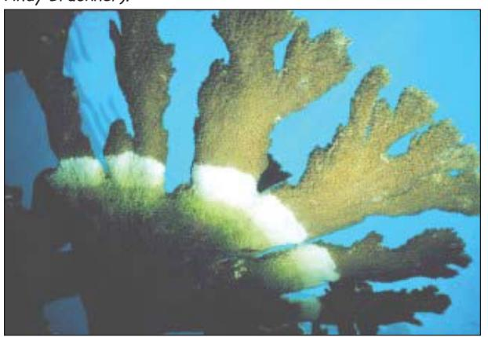

**NATIONAL SUMMARY NATIONAL SUMMARY**

population abundance is much reduced, from both the loss of habitat and overfishing.

Overfishing has changed the abundance and composition of fish inhabiting USVI reefs. Fisheries are close to collapse; even those within the marine protected areas are deteriorating (Beets 1996, Garrison *et al*. 1998, Wolff 1996, Beets and Rogers in press). According to Beets and Rogers (in press), groupers and snappers are now far less abundant, the proportion of herbivorous fishes has increased, individuals of many fish species are smaller, and spawning aggregations have been decimated.

Accelerated development of uplands, increases in point and non-point discharges, and poor land management impact near-shore water quality and the reef ecosystem. Runoff from the numerous unpaved roads probably contributes the largest amount of sediment to near-shore waters (Anderson and MacDonald 1998). Near-shore habitats, mostly mangroves, salt ponds, and seagrasses have been degraded and in places destroyed from coastal development, contaminant discharges, and sediment-laden runoff. Long-shore turbidity plumes are common after rainstorms.

Some regulations are in place, but current fishing regulations do not provide enough protection. In addition to inadequate enforcement of fishing regulations, regulations for zoning and erosion control are also not fully enforced, with negative consequences for the condition of USVI coral reef ecosystems.

#### **Condition of FGBNMS Coral Reef Ecosystems FGBNMS Ecosystems –**

In the Gulf of Mexico, these well-developed coral reefs are found approximately 192 km south of the Texas/Louisiana border (Fig. 78). These reefs, given federal protection in 1992 and now known as the Flower Garden Banks National Marine Sanctuary (FGBNMS), encompass 56 mi2 (146 km2 ) of banks and coral reef habitats that were formed atop salt domes on the sea floor. Also part of the FGBNMS, Stetson Bank, a separate claystone/ siltstone bank 30 mi away, harbors a low diversity coral community. The East Flower Garden Bank is 25.4 mi2 (65.8 km2 ) and contains about 247 acres (1 km2 ) of coral reef. The West Flower Garden Bank is separated from the East Bank by 12 mi and covers about 30 mi2 (77.2 km2 ), of which 100 acres (0.4 km2 ) are coral reefs.

The reef platform on the top of both banks is relatively flat with uniform coral growth. The Flower Garden Banks reef platform contains large, closely spaced coral heads. Between groups of coral heads, there are many sand patches and channels. The bank slopes steeply from surrounding deep reef bases to the relatively shallow reef platform. During the time scientists have studied these reefs, coral communities appear stable and in excellent condition. Coral cover (approximately 50%) has not significantly changed (Gittings 1998). Growth rates and other indicators of coral health show similar consistency.

Both disease and bleaching are relatively low. Bleaching only occurs when temperatures exceed 86o F (30o C) and most colonies recover (Dokken *et al.* 1999). Other impacts affecting coral condition are isolated incidences of anchor damage, tow and seismic cables, and illegal fishing gear.

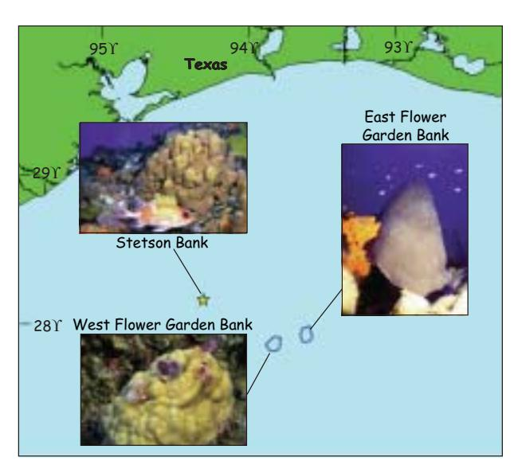

Figure 78. Map of the Flower Garden Banks National Marine Sanctuary (Photos: Frank and Joyce Burek and Stephen Gittings).

Algal cover has remained less than 5% in the shallower reef areas. The biggest change in algal cover was associated with the die-off of the long-spined sea urchin in 1983-1984, but cover returned to normal a few years afterward. Along with sponges, algae are a primary component in the deeper waters below 98 ft.

The fish population includes both resident tropical species and migratory pelagic species. Planktivores and benthic invertebrate feeders dominate the 266

**NATIONAL ASSESSMENTS NATIONAL ASSESSMENTS**

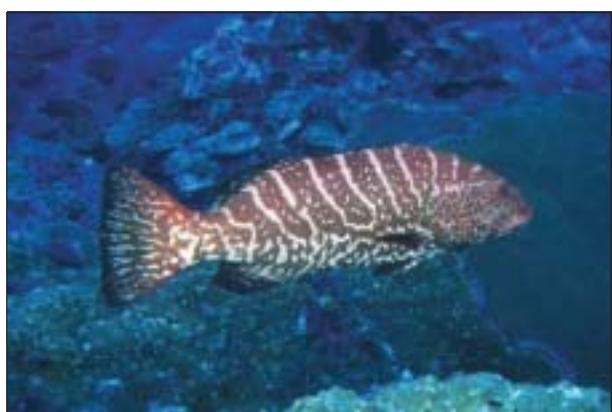

Figure 79. Tiger groupers are commercially targeted at the Flower Garden Banks (Photo: Frank and Joyce Burek).

fish species found around the reefs (Pattengill *et al.* 1997). Compared with other reefs in the south Atlantic and Caribbean, fish diversity is low (Pattengill-Semmens 1999).

The impacts of commercial fishing and associated activities are not well known, but fishing pressure is not intense at this time. There is concern that the limited area of hardbottom on and around the Banks do not support current fishing levels. The primary commercial fish species have been snapper and grouper (Fig. 79). While density information for fish has only been available in the last 30 years, anecdotal information suggests a decline of grouper.

There is also evidence that these reefs may serve as an important spawning and aggregation area for certain species of grouper. Targeted fishing, even what is allowed under current regulations, could have a significant impact on these populations.

As with other reefs, anchor damage has occurred on the Flower Garden Banks. Large oil industry vessels, freighters, fishing vessels, (Gittings *et al.*  1992) and foreign-flagged cargo vessels not aware of the restrictions in the area, have all damaged the reefs. The FGBNMS was recently designated the world's first 'No-Anchoring Area' by the International Maritime Organization.

Water quality is good. Salinity and temperature variations are well within the range needed for active coral growth. Turbidity is generally very low (Deslarzes 1998), but there are indicators of some concern. Stable nitrogen isotope analysis indicates coastal pollution is reaching Stetson Bank, and discoloration from turbidity is periodically seen at the Flower Garden Banks.

Additionally, oxygen-depleted areas have been identified in a large area of the northern Gulf and may be moving toward the outer Continental Shelf and nearer the Banks.

Primary sources of potential degradation of water quality include coastal runoff and rivers, atmospheric contributions, and effluent discharges from offshore activities such as oil and gas development, and marine transportation (Deslarzes 1998).

#### **Condition of Navassa Island's Coral Reef Condition of Navassa Island's Coral Reef Ecosystem Ecosystem –** Navassa is a small 2-mi2 uninhabited U.S. protectorate (since 1857) located between Jamaica and Haiti in the Caribbean (Fig. 80). In 1999, the Secretary of the Interior transferred full

administration of Navassa to the USFWS. The Navassa Island Wildlife Refuge is managed as a remote unit of the Caribbean Islands National Wildlife Refuge, including the island and submerged lands out 12 miles offshore by statute. Entry into the refuge is by permit only; however subsistence fishing is allowed.

The cliffs that surround the island are vertical, extending straight down to a largely sand-rubble shelf at about 75 ft, where there is dispersed patchreef habitat. The nearly vertical reefs at depths less than 75 ft have high live coral cover (20-26%) and a high degree of architectural complexity that makes these reefs particularly valuable as reef fish habitat. Besides scleractinian corals, sponges (7 27%) and fleshy brown macroalgae (10-23%, primarily *Dictyota* and *Lobophora* spp.) accounted for most of the remaining reef cover. The long-spined sea urchin, now scarce throughout most of the Caribbean, was moderately abundant (averaging

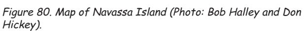

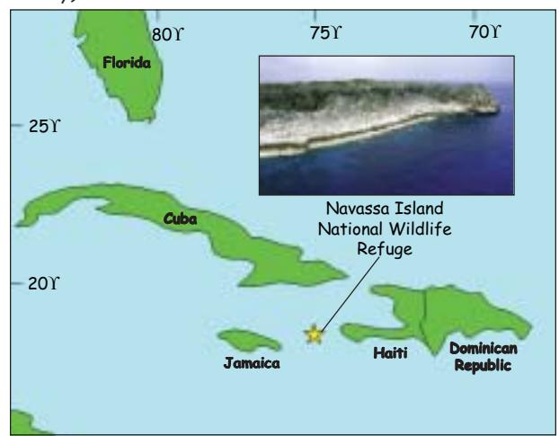

**NATIONAL SUMMARY NATIONAL SUMMARY**

2.9 adults per 98.4 ft (30 m) transect) at all sites.

Despite its remoteness, there is active fishing by Haitians on these reefs, both trap and hook-and-line. Even so, shallow reef fish communities exhibit high density and retain representation by large snapper, grouper, and herbivores, which are depleted at nearby Caribbean reefs with high fishing pressure.

Other than possible currentdeposited marine debris and anchoring of the artisanal Haitian boats, there is no evidence of degradation of

the reefs surrounding this island.

**Condition of Hawaiian Coral Reef Ecosystems –** 

The Hawaiian Archipelago, roughly 1,296 nmi (2,960 km) in length, straddles the Tropic of Cancer in the north central Pacific Ocean along a northwest-southeast axis. The Archipelago consists of eight large islands to the southeast (the Main Hawaiian Islands – MHI) and 124 small islands, reefs, and shoals to the northwest (the Northwestern Hawaiian Islands – NWHI).

Reef habitats progress from individual coral heads colonizing geologically recent basalt substrates to complex reef habitats off sand-covered atolls and in protected lagoons. For waters less than 300 ft, Hunter (1995) estimated a total coral reef area of 979 mi2 (2,536 km2 ) for the MHI and 4,461 mi2 (11,554 km2 ) for the NWHI. These values could change significantly when the shallow-water coral reef ecosystem is characterized and mapped.

Main Hawaiian Islands – The MHI are high volcanic islands. They range in age from seven million years old (Kaua'i Island) to less than a day on the eastern side of the island of Hawai'i where molten lava continues to solidify into basaltic rock. Around the islands are non-structural reef communities, fringing reefs, and two barrier reefs (Fig. 81). Recent partial analysis of data by the Hawai'i Coral Reef Assessment and Monitoring Program

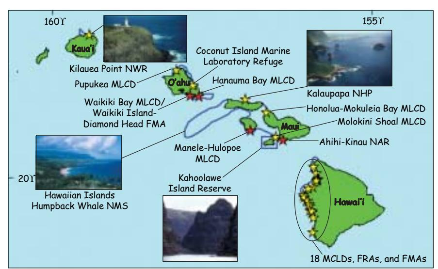

Figure 81. Map of the Main Hawaiian Islands and their MPAs. Abbreviations: FMA **–**  Fisheries Management Area; FRA **–** Fish Replenishment Area; MLCD **–** Marine Life Conservation District; NAR **–** Natural Area Reserve; NHP **–** National Historical Park; NMS **–** National Marine Sanctuary; NWR **–** National Wildlife Refuge (Photos: Marc Hodges, Barbara Maxfield, Jean Souza, and the NPS).

suggest live coral cover averages around 18%, ranging between 4-50%, at over 30 sites surveyed.

Despite changes in coastal land use, the consensus of many ecologists is that, with a few exceptions, the health of the near-shore reefs around the MHI remains relatively good. As with most reefs near populated areas, reefs in the MHI suffer from degradation resulting from human population growth, urbanization, and coastal development83.

This is reflected in the health of the organisms that make up the reefs and the plants and animals living around them. General necroses (lesions) and abnormal growth (tumors) are relatively common coral diseases (Hunter 1999).

No major coral bleaching was observed in Hawai'i during the 1997-1998 bleaching event. Currently, this is not a major concern.

The majority of food fish and invertebrates in the MHI are overfished (Shomura 1987, Harman and Kitakaru 1988). Fishing pressure in heavily populated areas of the MHI appears to exceed the capacity of these resources to sustain themselves (Smith 1993). The abundance of reef fish in unprotected areas is substantially lower than areas where fishing is prohibited (Grigg 1994).

A wide variety of Hawaiian invertebrates are currently harvested for the marine aquarium trade. The harvest of live sessile benthic invertebrates, **NATIONAL ASSESSMENTS NATIONAL ASSESSMENTS**

83 Ocean outfalls, urban construction, and coastal recreational complexes (e.g., hotels, golf courses) are major sources of reef degradation (Jokiel and Cox 1996).

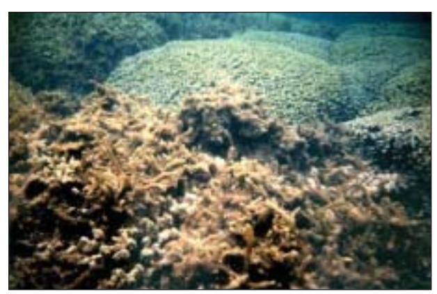

Figure 82. Alien algae overgrowing corals in Kane'ohe Bay, Hawai'i (Photo: Donna Turgeon).

especially the featherduster worm (*Sabellastarte sanctijosephi*), for the aquarium trade often causes destruction of reef habitat during collection.

Increasingly, alien species are a problem. Alien seaweeds are invading coral reefs, rocky shores, tidepools, and sandy beaches (Staples and Cowie 2001, Fig. 82). Thickets of mangroves not native to the Islands are forming along sheltered bays, ponds, and inlets, frequently overgrowing traditional Hawaiian fishponds, mudflats, and inshore reef flats. Many alien fish species, intentionally introduced, have established viable populations and, in some cases, are thriving. Over 250 species of invertebrates have also been introduced, but so far there is no documented evidence of their effect on coral.

Hawaiian green sea turtles have shown a dramatic increase in tumors, a condition almost unknown 15 years ago (Fig. 83).

Most MHI shallow-water coral reefs are extremely close to the majority of the State's 1.2 million humans – within a mile from major coastal urbanization and development (Fig. 84). This makes them prone to pollution. For example, secondarytreated sewage from urban areas is discharged

primarily through deepwater outfalls on O'ahu and through injection wells on Maui and Hawai'i (Kona District). Nutrient leaching from injection wells on Maui is attributed to the algal blooms occurring there.

Sediment runoff in the MHI has been estimated at more than a million tons per year from agricultural, ranching, urban, and industrial activities (USFWS in Green 1997a). Livestock grazing and agriculture have been the predominant land uses for over 100 years on O'ahu, Maui, Moloka'i, and Lana'i, contributing to chronic erosion and sedimentation on fringing reefs. Further, reef habitat has been lost to dredging and filling near-shore reefs.

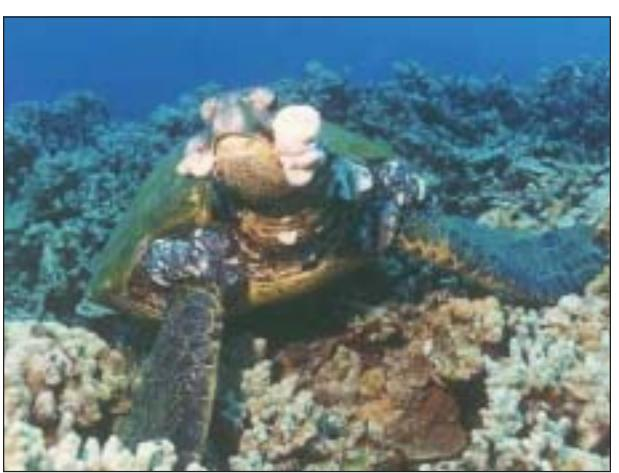

Figure 83. Turtle with large tumors (Photo: Ursula Keuper-Bennett and Peter Bennett).

A number of recent shore-based chemical spills from industrial and aquaculture (Clark and Gulko 1999) in the MHI have put large amounts of sulfuric acid, PCBs, and refrigerants onto near-shore reefs. On top of that, the USCG has recorded a 200% increase in oil spills from 1980 to 1990 (Pfund 1992).

High concentrations of dieldrin and chlordane were found in oyster tissues sampled near stream

Figure 84. Honolulu is located near two marine protected areas with coral reefs (Photo: Donna Turgeon).

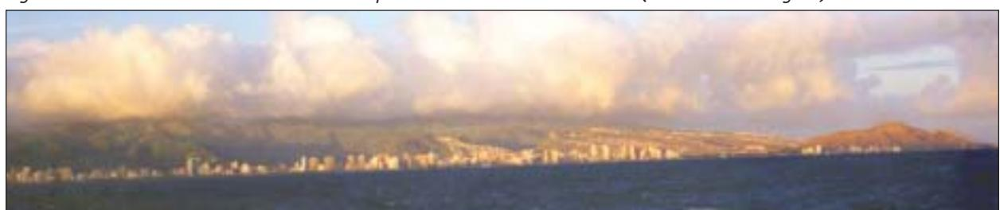

**NATIONAL SUMMARY NATIONAL SUMMARY**

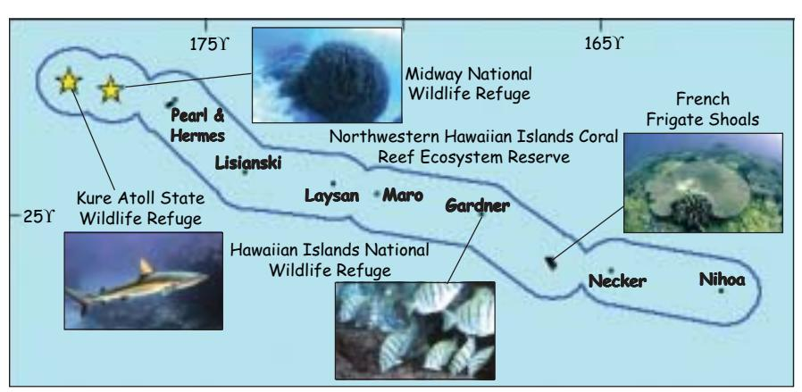

Figure 85. Map of the NWHI and its MPAs (Photos: James Maragos).

mouths in Kane'ohe Bay in 1991, five years after the ban on pesticides went into effect. Elevated levels of lead, copper, chromium, and zinc have been found in a number of tissue samples, particularly near the southern, more urbanized, watersheds of the bay (Hunter *et al.* 1995).

Northwestern Hawaiian Islands - Among 124 small islands, reefs, and shoals, the NWHI has 10 primary, mostly uninhabited, atolls and islands and 30 submerged banks. The NWHI extend more than 1,300 nmi to the northwest of the island of Kaua'i from Nihoa to Kure Atoll (Fig. 85).

Recent research found coral cover high off many atolls (Maragos and Gulko 2002, J. Parrish and J. Maragos pers. comm.), and at Neva Shoals near Lisianski Island (R. Brainard pers. comm.).

In general, the NWHI reef ecosystem is in excellent condition. While there is little information on coral disease and infections, observed disease was low during 2000-2001 surveys. There is even less information on diseases for other reef species. No turtles with tumors have yet been observed in the NWHI. Since fishing and other human impacts are relatively limited, these reefs are among the few remaining large-scale, intact, predator-dominated reef ecosystems anywhere (Friedlander and DeMartini 2002).

Surveys in the mid-1970s, 1980s, and 1990s found the coral reef fish community to be dominated by carnivores84. The latest study (Friedlander and DeMartini 2002) found more than 54% of the total fish biomass consists of apex predators85, followed by herbivores (28%), lower-level carnivores

(18%), and an assortment of small-bodied species (Fig. 86).

Prized fish species tend to be larger and more abundant compared to populated areas of the MHI (Okamoto and Kawamoto 1980, Hobson 1984, Parrish *et al.* 1985). More quantitative studies at French Frigate Shoals and Midway Atoll documented biomass esti-

mates of non-apex carnivorous and herbivorous fishes on shallow reefs almost twice that of the MHI, probably reflecting differences in fishing pressure (DeMartini *et al.* 1996).

The commercial lobster fishery is closed throughout the NWHI. Fishing for the black-lipped pearl oyster closed after only a couple years because of concerns for the harvest sustainability of this stock.

Alien species were not conspicuous in the NWHI during 2000-2001 surveys. The majority of alien species have been reported at Midway Atoll (L. Eldredge pers. comm.), most likely arriving there attached to the hulls of the ships docked in the harbor. Midway National Wildlife Refuge is a former U.S. Navy Base, the only island in the NWHI that had an active public use program86. Since the 1940s, Midway Atoll has had an active port and airstrip used for bringing supplies and tourists from the MHI and other areas.

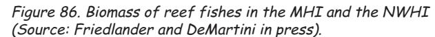

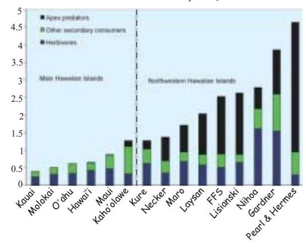

84 Mostly jacks, sharks, goatfishes, scorpionfishes, bigeyes, and squirrelfishes.

85 Primary apex predators were the sharks and jacks; the herbivores were mostly parrotfishes and surgeonfishes.

86 The public use program at Midway National Wildlife Refuge was temporarily suspended in December 2001, but the USFWS remains committed to appropriate public use as soon as possible.

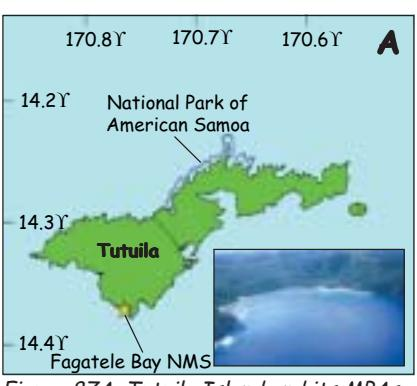

Figure 87A. Tutuila Island and its MPAs. Abbreviation: NMS – National Marine Sanctuary (Photo: Fagatele Bay NMS).

High levels of toxic contaminants have been reported from wildlife tissues and from sediments collected at several nearshore sites in the NWHI. PCBs have

been measured both in Hawaiian monk seal blood and blubber, moray eels, and albatrosses (Tummon 2000, L. Woodward pers. comm.). The analysis of 36 sediment samples for over 100 toxic contaminants (Turgeon in Maragos and Gulko 2002) revealed unexpectedly high concentrations of a

14.2Y

14.3Y

Park

few chemicals87 from NWHI sediments.

#### Condition of American Samoa's Coral Reef Ecosystems -

There are five volcanic islands and two atolls that make up American Samoa (Fig. 87a-c). Located in the central South Pacific Ocean, the islands are small, the largest being 55 mi2 (Tutuila). The islands are steep, sometimes reaching

over 2,500 ft within one mile from shore. Fringing reefs predominate. The total area of coral reefs within the 328 ft (100 m) bathymetric line has been calculated as 114 mi2 (296 km2) (Hunter 1995). Mapping of American Samoa's reef ecosystem will begin in 2003.

In the past 20 years, between hurricanes, a crownof-thorns starfish invasion, a period of warmer than usual seawater temperatures, and coral bleaching, the reef ecosystem has been fairly stressed. In some places, there have also been chronic human impacts. But by 1995, the corals were beginning to recover, and now some reefs are considered 'recovered' (C. Birkeland pers. comm.). Removing a number of shipwrecks and banning live rock collection for aquariums has also helped.

Macroalgal cover is generally low around the islands, indicating that available nutrient con-

centrations may be relatively low, hervbivore grazing may be high, or both. Low nutrients could be the result of the constant ocean flushing that keeps the waters clear and prevents nutrient buildup. Encrusting coralline algal (*Porolithon*) cover is high (40-50%) helping to cement and stabilize the loose surface below (Birkeland et al. 1997).

While the coral community may be recovering nicely from adverse natural and man-made events, recovery by fish and invertebrates has been slower. A number of commercially desirable species have been overfished. Harvested species such as giant clams and parrotfish are overfished in American Samoan near-shore waters, and there is heavy fishing pressure on surgeonfish (Craig et al. 1997, Page 1998, Green and Craig 1999). Many village fishermen and elders are convinced there are fewer

> and smaller groupers, snappers, and jacks than there were just a few decades ago (Tuilagi and Green 1995). A recently imposed territorial ban on SCUBA fishing should help

The endangered hawksbill sea turtle is rapidly approaching extinction in the Pacific (Eckert et al. 1998). The population of these turtles that nest on American Samoan

reefs has seriously declined from illegal harvesting and loss of nesting habitat (Tuato'o et al. 1993).

Water quality throughout the islands is generally good except for three things: turbid water and

sedimentation, nutrient enrichment, and toxic contaminants within the harbor. Fish tissues and substrates collected from Pago Pago Harbor have been reported with above ambient levels of heavy metals and other chemicals (AECOS 1991). Until the early 1990s, nutrient loading from cannery wastes in the inner harbor caused

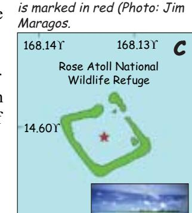

14.611

Figure 87C. Rose Atoll and its

MPA. A no-take reserve area

169.6Y 169.4Y 169.51 National Park of American Samoa this situation. Ta'u Va'oto Territorial

Figure 87B. Islands of the Manua Group and their MPAs (Photo: Chris Stein).

DDTs, PCBs, PAHs, arsenic, copper, and nickel were above the 85th percentile of all sediments monitored by the NOAA National Status and Trends Program. The symbol indicates similar toxic organic chemicals have been grouped together.

perpetual algal blooms and occasional fish kills due to oxygen depletion. Since then, canneries have been required to dispose of wastes beyond the inner harbor, so nutrient loading has generally decreased.

#### **Condition of Guam's Coral Reef Ecosystems Coral Reef Ecosystems –**

A U.S. territory, and the southernmost and largest island in the Mariana Archipelago, Guam is 216 mi2 and has a maximum elevation of 1,330 ft (Fig. 88). The northern half of the island is relatively flat and consists of uplifted limestone; the south is primarily volcanic, more rugged and with large areas of erosion-prone lateritic soils.

The island has fringing, patch, submerged, and barrier reefs, along with offshore banks. The fringing reef flats vary from 30 ft wide on the windward side to well over 300 ft elsewhere. The combined area of coral reef and lagoon is approximately 27 mi2 (69 km2 ) in nearshore waters between 0-3 mi, and an additional 42 mi2 (110 km2 ) in federal waters greater than 3 mi offshore (Hunter 1995). Guam lies close to the center of high coral reef biodiversity in the western Pacific. Right in the middle of the tropical Pacific typhoon belt, it averages one substantial typhoon each year. Shallowwater coral reefs play a major role in protecting the land from storm waves.

In general, the condition of Guam's coastal reefs continues to decline, primarily as a result of landbased activities. There is evidence of an overall decline in coral species diversity over the past 30 years. Coral recruitment data also support the observations (Fig. 89). In a little over 10 years, recruitment dropped significantly. Increases in blue-green algae (overgrowing corals), junenile

Figure 89. Coral spawning (Photo: Robert Richmond).

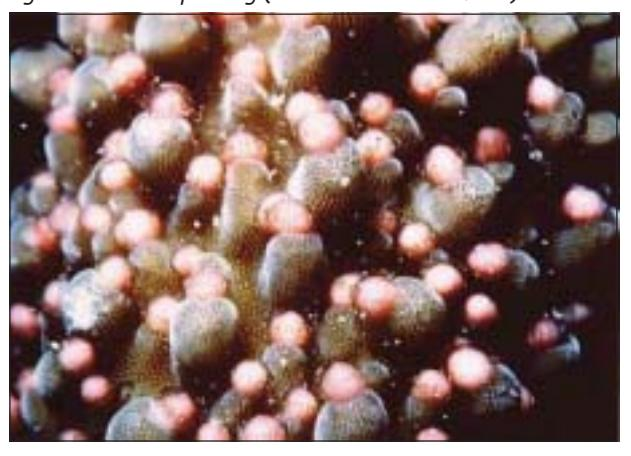

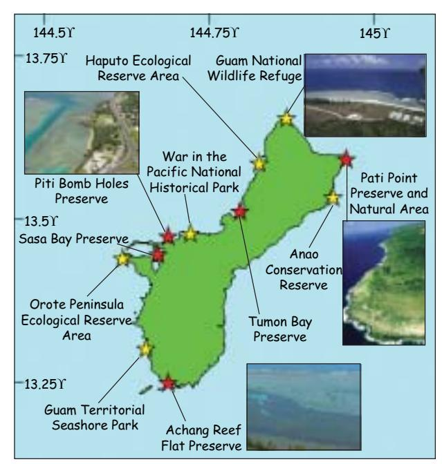

Figure 88. Map of Guam and its MPAs (Photos: USFWS, Jay Gutierrez, and Danko Taborosi).

crown-of-thorns starfish, coral diseases, the dark gray to black encrusting sponge (*Terpios hoshioto*), and coralline algal lethal orange disease have all been observed on Guam's reefs. None seem to be at a critical level at this time. However, each can have a major impact on these reefs.

Statistics collected by the Guam Department of Agriculture's Division of Aquatic and Wildlife Resources indicate fish populations and catch-perunit-effort (DWAR) have declined over the past 15 years. Total finfish harvest between 1985 and 1999 dropped almost 60%. Catch-per-unit effort has dropped and large reef fish are rare. Fishing practices, including the use of unattended gill nets, the use of bleach to stun and capture live fish, SCUBA spearfishing, and fish traps have contributed to the problem. However, habitat loss due to sedimentation, pollution, and physical damage has also been responsible for reduced fish populations. Regulations and protected reserves are being enforced to deal with this problem.

Reefs impacted by natural disturbances, including typhoons, crown-of-thorns outbreaks, and earthquakes are not recovering in specific areas. The condition of local reefs is variable, ranging from excellent to poor, depending on adjacent land use, accessibility, location of ocean outfalls and river discharges, recreational pressure, and circulation patterns. Coral cover on the good-to-excellent reefs **NATIONAL ASSESSMENTS NATIONAL ASSESSMENTS**

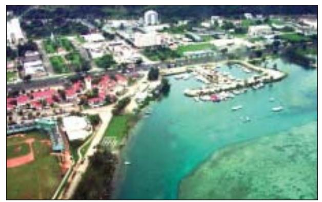

Figure 90. Urban development around Agana Bay. Adjacent coral reefs can be seen in the lower right-hand corner of the photograph (Photo: Guam DAWR).

ranges from 35-70%, while the most damaged sites have less than 10% coral cover, with fleshy algae and sediment dominating.

Guam's northern reefs are generally in better condition because there is limited erosion and sedimentation from the limestone landmass (no surface rivers or streams), but there is some aquifer discharge and associated eutrophication damaging the reefs. Coral cover and diversity are generally highest on the northeastern, windward exposures.

Most of the fringing reefs off the southern and southwestern shores remain in fair-to-poor condition. Clay sediments and freshwater runoff heavily influence reefs off the eastern, central, and southern sides of the island during the rainy season. During the early 1990s, a road project in the south resulted in particularly heavy sedimentation on the fringing reefs and high coral mortality. The sediment accumulation on reefs has been documented to substantially reduce coral diversity and abundance (Randall and Birkeland 1978b).

Corals in the inner areas of Agana, Tumon, and Piti Bays, centers of tourism and recreation activities, are in relatively poor condition, affected by discharges from land and the impacts of recreational activities (Fig. 90). A variety of industrial impacts have damaged corals within Apra Harbor, home to a U.S. Navy Base and the commercial port for the island, but fringing and patch reefs near the harbor mouth are in relatively good condition. Pollutants have been found in sediments of Apra Harbor, including PCBs, heavy metals, and PAHs. Toxic pollutants from other human found in the sediments raise concerns over the start of a harbor dredging project.

During periods of heavy rain, the sewage treatment plants divert stormwater mixed with wastewater directly into the ocean, with only primary treatment. Guam's aquifer discharge adds to eutrophication due to leaky sewage pipes, fecal material from animals, decomposing vegetation, and agrochemicals (fertilizers).

Guam's main power plants are located on Cabras Island, in the northern portion of Apra Harbor. Elevated temperatures, caused by the discharge of seawater used to cool the generators, have resulted in coral mortality. The discharge of cleaning chemicals has also occurred, with subsequent negative impacts on local coral populations.

#### **Condition of CNMI's Coral Reef Ecosystems –**

A U.S. territory, the Commonwealth of the Northern Mariana Islands (CNMI) is a chain of 14 islands located in the Marianas Archipelago in the northwestern Pacific Ocean about 100 nmi northeast of Guam (Fig. 91A-C). The five southern islands are primarily raised limestone and have well-developed fringing coral reefs. The ten largely uninhabited northern islands are mostly volcanic and have less reef development, mainly because

Figure 91A. Map of CNMI (Photos: Americopters, Inc., Larry Lee, Marianas Visitors Authority, and Eran More).

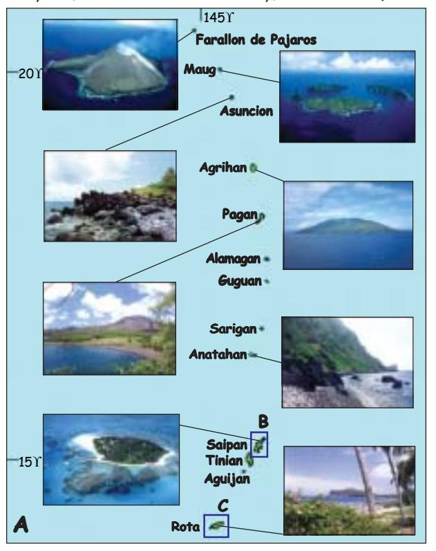

**NATIONAL SUMMARY NATIONAL SUMMARY**

they are younger and have steep shorelines.

Barrier reefs and welldeveloped fringing reefs tend to form along the western coasts of the southern islands, while eastern coasts are rockier with steep cliffs (UNEP/IUCN 1988). Extensive fringing and apron reefs are found on the northern and eastern sides of the island.

In addition to coral reefs surrounding the main islands, there are a number of submerged seamounts and shoals surrounding the CNMI that are considered reef banks. The total

coral reef area in the CNMI has been estimated at 224 mi2 (579 km2 , Hunter 1995); but benthic habitats have yet to be mapped. The Hunter estimate is probably high, since it included offshore banks and shoals (M. Trianni pers. comm.).

CNMI reef ecosystems are in good-to-excellent condition. The reefs adjacent to the southern populated islands of Saipan, Tinian, and Rota receive the bulk of human impacts from population growth, coastal development, fishing, and tourism. They are generally the most degraded.

Although coral reefs in the CNMI were spared the impacts of the 1998 coral bleaching event, shallow reefs off the CNMI (less than 10 ft) recently experienced bleaching as deep as 66 ft (1994, 1995, 1997, and 2001). High mortality was only documented for the 2001 event. There has been no quantitative assessment of bleaching effects for any of these events.

The CNMI Marine Monitoring Team is investigating disease incidences and potential impacts of three common diseases infecting CNMI coral reef species: coralline lethal orange disease, tumors, and black-band disease.

The southern islands experienced a crown-ofthorns outbreak in the late 1960s (Marsh and Tsuda 1973). There were smaller outbreaks associated with coral mortality at some reefs around Saipan in

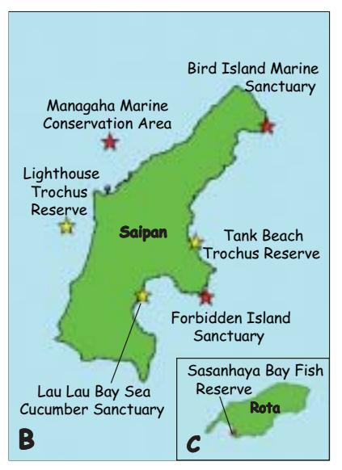

Figure 91B. and C. Maps of established MPAs on the islands of Saipan and Rota.

the mid-1980s. Most reefs appear to be recovering. *Terpios hoshinoto*  a sponge that can overgrow and kill live coral, is present on CNMI reefs, but is not currently a major problem.

Reefs off southern populated islands are all overfished at some level. The local people consider the northern reefs relatively pristine because the population is low there. Some analyses of old data show catch from spearfishing and SCUBA off Tinian were smaller and had a lower catch-per-uniteffort (M. Trianni pers. comm.).

The impact of pollution sources on marine water quality in general,

and coral reef resources in particular, is not well quantified. Sedimentation and turbidity impacts the water quality of all three southern islands and several of the high northern islands, yet little quantitative data on sedimentation has been collected. After periods of heavy rain, sediment washes down unpaved secondary roads on the three southern islands, creating sediment plumes that degrade near-shore water quality. Some major construction projects are reported to have increased sediment in local waters.

Increased nutrients impact reefs adjacent to populated southern islands and several northern islands because of feral goats. The CNMI Division of

Figure 92. Map of Pacific Remote Insular Reefs (Photos: Jim Maragos).

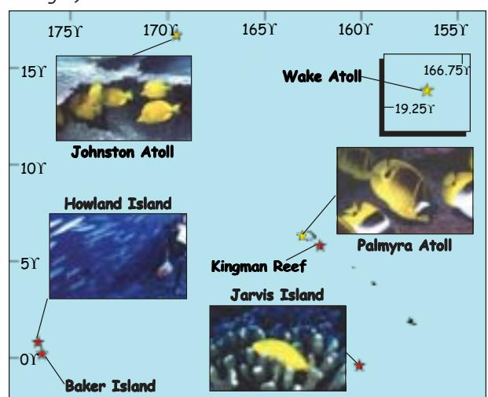

**NATIONAL ASSESSMENTS NATIONAL ASSESSMENTS**

Environmental Quality monitors microbial violations most likely associated with runoff from septic/sewage systems and animal waste.

| Location       | Protected Submerged Lands (km 2 ) | Coral Reef Habitat (km²)* |
|----------------|----------------------------------------------------|------------------------------|
| Baker Island   | 123                                                | 1 2                          |
| Howland Island | 130                                                | 8                            |
| J arvis Island | 143                                                | 7                            |
| Johnston Atoll | 480                                                | 2 3                          |
| Kingman Reef   | 1, 95                                              | 7 1 0                        |
| Palmyra Atoll  | 2,08                                               | 5 6                          |
| Wake Atoll* *  | Not available                                      | 3 2                          |
| Total          | 4,918                                              | 468                          |

Table 3. Coral reef area on the Pacific Remote Insular Reefs (Source: S. White pers. comm.). \*Within protected submerged lands; \*\*Data from Hunter 1995.

Condition of U.S. Pacific Remote Insular **Reef Ecosystems**88 – In addition to the Midway, Hawaiian Islands, and Rose Atoll National Wildlife Refuges (NWR) covered elsewhere in this report, the USFWS administers six other remote NWRs89 in the Pacific Region (Fig. 92). Johnston Atoll is located 800 nmi (1,500 km) southwest of Honolulu and is under joint USFWS and Department of Defense (DoD) management. Howland, Baker, and Jarvis Islands are low equatorial, arid coral islands. Howland and Baker are in the Phoenix Islands, about 1,620 nmi (3,000 km) southwest of Hawai'i. Jarvisis is 1,350 nmi (2,500 km) south of Hawai'i in the Line Islands. All three are surrounded by narrow fringing reefs. Kingman Reef and Palmyra Atoll are the northernmost of the Line Islands, at about 1,000 nmi (1,500 km) southwest of Honolulu. Wake Atoll is the only U.S. remote island that is not an NWR, and is co-administered by the DoI and DoD. It is the northernmost of the Marshall Islands, about 1,620 nmi (3,000 km) west of Hawai'i, and the northernmost of the U.S. atolls located 270 nmi (500 km) north of Bokaak Atoll.

The area covered by coral reefs around these islands is given in Table 3, using official USFWS records based on the 100-fathom bathymetric line of refuge boundaries (S. White pers. comm.). The estimates total 181 mi2 (468 km2), differing significantly from the 274 mi2 (709 km2) estimated for these same areas by Hunter (1995).

All the coral reefs are generally in excellent-togood condition. In 2000-2002, NOAA and the USFWS co-sponsored three expeditions to How-

land, Baker, Jarvis, Kingman, and Palmyra, and completed the first-ever detailed marine biological survey of these islands. Due to their small size and geographic isolation, Jarvis, Johnston, and Wake support about 40 species of stony corals. Howland and Baker Islands have 80-90 stony coral species each because they are further to the west where species biodiversity is greater. Kingman and Palmyra Atolls have the highest diversity (140-155 species) because they are large 5 atolls with more reef area and greater habitat 5 variety (Fig. 93). Seasonally, the Equatorial Countercurrent flows past, providing them with the larvae of species from western reefs, in addition to larvae coming from the east during other seasons when the North and South Equatorial Currents flow past the reefs.

Coral bleaching has killed corals and affected reefs at most of the equatorial islands within the past five years – Howland, Baker, Jarvis, Palmyra, and likely Kingman (J. Maragos pers. comm.).

The remote NWRs are fully protected by no-take provisions, except for Johnston and Palmyra where catch-and-release fishing is allowed. Invertebrate and finfish populations are in excellent condition. Fish and other wildlife may be as undisturbed as they were thousands of years ago, although there is evidence of recent unauthorized shark fishing at most islands except Jarvis and Wake (J. Maragos and P. Lobel pers. comm.).

Water quality is not an issue since all of the atolls and islands are at least 150-1,000 miles from any population center.

Figure 93. A. Pearl oysters. B. brown boobies. C. coconut crabs. D. green sea turtles. All are threatened species protected by the Palmyra Atoll NWR (Photos: Stan Butler, Beth Flint, Jim Maragos, and Robert Shallenberger).

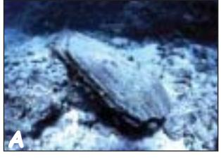

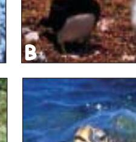

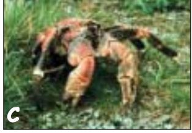

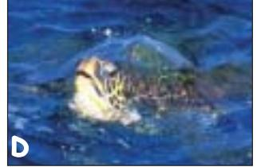

88 Much of the information in this section on U.S. Pacific Remote Insular Reefs was provided by J. Maragos (pers. comm.).

## Condition of the Pacific Freely Associated States -

These nations are the Republic of the Marshall Islands (RMI or Marshalls), the Federated States of Micronesia (FSM), and the Republic of Palau (Palau). These Indo-Pacific countries became independent from the United States 15-25 years ago, but maintain strong political and economic ties.

The FSM and Palau are known as the Caroline Islands. Over 1,553 miles (2,500 km) in length, they are one of the longest island chains. Each

island group has its own language, customs, local government, and reef tenure system.

Republic of the Marshall Islands – The RMI has 1,225 islands with a land mass less than 0.01% of its total 749,800 mi² ocean area (1,942,000 km², Fig. 94). Islands range from tiny, barely emergent islets to Kwajalein, the world's largest atoll (about 6 mi² of dry land with an 839 mi² lagoon). Some islands have significant rainfall, but many in the north have little or, in dry years, no rain. Typhoons are rare.

Despite the 67 nuclear tests detonated between 1946 and 1958, the reefs overall are in good condition (National Biodiversity Team of the Marshall Islands 2000). Even reefs used for testing have recovered well, though perhaps not as completely as some observers have reported recently.

There is little data on the diversity of coral and related organisms. Many early RMI assessments

Enewetak
Bikini

10Y

Ralik Chain

Ratak Chain

Kwajalein

Majuro

Arno

Figure 94. Map of the Republic of the Marshall Islands (Photos: James McVey and the RMI Embassy).

were trying to determine impacts of nuclear testing. Recently though, some independent surveys have been done. Fish diversity appears to be relatively high, with a number of species endemic to either the Marshalls or nearby areas.

Besides historical nuclear activity, the usual human-induced stresses occur – boat anchoring, fishing gear damage, and occasional ship groundings with resulting fuel spills, and trash and waste in the water.

With low elevation (atolls and low coral islands have an average elevation of 7 ft), some or all of the Marshall Islands could be submerged if climate change moderately raises the sea level. Further, with warmer temperatures, shallow-water reefbuilding corals could be impacted. A temperature increase of even 1.8° F (1° C) could cause coral mortalities and affect overall reef growth.

While most of the obvious effects of the nuclear tests are gone, there are other potential impacts. Long-lived radionuclides in the fine sediments of the lagoon bottoms are yet a concern for marine ecosystem food chains. While reports state the fish are again safe to eat, the physiological impacts of radiation on the genetic material of all the organisms, particularly to the humans that may have eaten those fish, has not been determined yet.

The Federated States of Micronesia – The FSM has four states (Kosrae, Pohnpei, Chuuk, and Yap,

Fig. 95). Each state supports population centers on high volcanic islands. FSM has both high islands and low atolls. The people of FSM have a strong dependence on coral reefs and marine resources, both economically and culturally.

Reefs in the FSM are generally in good shape. As with other high volcanic islands,

Figure 95. Map of the Federated States of Micronesia and its MPAs (Photos: FSM Visitors Board/Tim Rock and Matt Maradol/FSM Government).

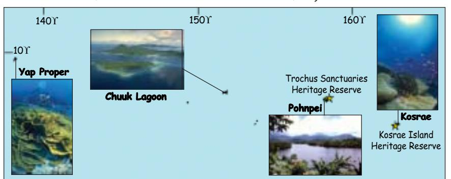

&lt;sup>89 Howland Island National Wildlife Refuge, Baker Island National Wildlife Refuge, Jarvis Island National Wildlife Refuge, Palmyra Atoll National Wildlife Refuge, Kingman Reef National Wildlife Refuge, and Johnston Atoll National Wildlife Refuge.

coastal development and agriculture often brings siltation, turbidity and other water quality concerns. Some degradation of reef ecosystems has already occurred in the more populated areas, and is expected to increase. Several large development projects, such as construction of an airport and a deep draft harbor, have had significant impacts on local reefs. Reefs located near population centers, within harbors, and near shipping lanes have had the largest impacts from fishing and ship groundings. Wrecks have caused local damage to both reef structures and biota.

Quantitative assessments of fisheries resources are limited, but some market information suggests fishing may be substantial and reef fish around some islands may be over-exploited. Overfishing has been documented as a result of foreign commercial activities. There have been destructive fishing practices, including the use of explosives to capture reef fish.

The Republic of Palau – Palau is a separate subarchipelago at the western end of the Caroline Islands (Fig. 96). It lies about 460 mi (741 km) east of Mindanao in the southern Philippines and 810 mi (1,300 km) southwest of Guam.

There are about 20 main islands and over 500 small islands in the 435-mi (700-km) chain of

Figure 96. Map of Palau and its MPAs (Photos: Kevin Davidson/PICRC and William Perryclear/PICRC).

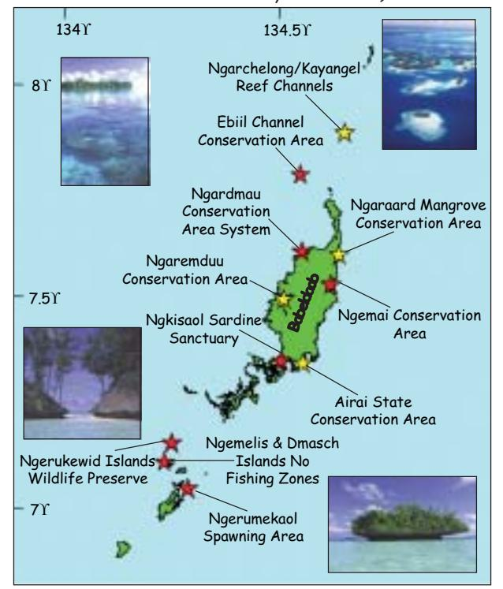

islands. The islands are volcanic, atolls, raised limestone, and low coral islands. Most of the population resides on several large volcanic islands; Koror is the capital.

Along the western coast of Palau, there is a long, well-developed barrier reef protecting the main cluster of islands. The reef on the eastern side is not as well developed, and some areas do not have any barrier reefs. There are more extensive reefs in the Southern Lagoon, with gaps and passes into the lagoon on the eastern side.

Within the whole Indo-Pacific region, Palau's coral diversity approaches the highest diversity of the Philippines, Indonesia, and Australia. The reefs closest to population centers or development show signs of degradation. Prior to the 1998 coral bleaching event, remote reefs were generally healthy with coral cover that ranged from 10% to over 70%.

The 1998 bleaching event affected shallow-water corals throughout much of Palau. Almost all reefs were bleached and have not yet recovered. Crown-of-thorns starfish are preying on the few surviving *Acropora* (J. Maragos pers. comm.). Overfishing around more populated areas is apparent, with a lack of or low abundance of desirable species. This is particularly true when data are compared to the Southwest Islands, but the ocean slopes still support abundant reef fish populations.

Even after the Rock Islands were designated as an MPA to protect nesting sites of the hawksbill turtle, poaching of eggs and taking turtle shell for jewelry has kept the nesting activity low.

There are no major water quality problems in the atolls. Coastal pollution, sedimentation, and erosion are still relatively nonexistent. The high, populated islands have local areas with degraded water quality. With heavy rainfall and steep topography, erosion and sedimentation rates can be high. Upland clearing of forested areas for agriculture has resulted in landslides and runoff, with sediment plumes impacting coastal resources.

#### National Trends in Coral Reef Ecosystems

There is relatively little quantitative information available for assessments of temporal or spatial trends in ecosystem condition at this time.

**Temporal Trends** – For most regions, quantitative measures of most indicators of reef condition (e.g.,

&lt;sup>90 Indicators of reef ecosystem health such as mortality rates and larval recruitment of corals and fisheries.

disease vectors, the extent of infection and the resulting mortality rates, and the loss of live reef cover) are generally lacking, so temporal trends could not be compared across the entire United States and the Freely Associated States.

In places where there has been credible long-term monitoring there are alarming temporal trends. For example, the FKNMS has recorded a general decrease in coral cover and harvested species over the last five years. On the other hand, monitoring

of FKNMS fully protected areas over the same time period shows an increase in previously harvested fish and lobster populations – animals are larger and more abundant (Fig. 97). Monitoring of other no-take reserves show the same trend.

Over the past 20 years, there seems to be irrefuable evidence of an increase in disease and mortality of corals and other invertebrates on reef systems off Florida, Puerto Rico, and the USVI.

There is a pervasive longterm trend of overfishing

harvested species at most reef systems where there are large populations living nearby. A number of reef fish species have been listed as threatened or endangered under the U.S. Endangered Species Act. Where reef habitat has been lost or the ecosystem substantially degraded, it may be difficult to reverse declining population trends for the rare species despite conservation measures.

Because of over-harvesting of adults and their eggs and loss of nesting habitats, all sea turtles are listed as endangered or threatened by extinction as a species.

Of the 27 species of marine mammals identified from coral reef ecosystems of the United States and the Freely Associated States, 21 are endangered or threatened. The endangered Hawaiian monk seal, usually found only in the Northwestern Hawaiian Islands, is occasionally sighted in the Main Hawaiian Islands. The Caribbean monk seal (*Monachus tropicalis*), is listed as endangered, but is probably extinct.

**Spatial Trends in Ecosystem Condition Spatial Trends in Ecosystem Condition –** The next seven tables present information assessing spatial trends in coral reef ecosystem condition within the United States and Pacific Freely Associated States. Because this is the first report and the beginning of a comprehensive assessment and monitoring program, some data are missing; in other places, only ranges and estimates were

available.

The information in these tables will form the basis for determining spatial trends in ecosystem condition in subsequent biennial reports. These tables compare total area of coral reef, delineate reef-associated habitats (e.g., seagrass and macroalgae), and characterize the type and abundance of species within those habitats.

Until all the data gaps are identified and a comparable, coordinated monitoring program fills the most critical gaps, it will be impossible to compare regions with confidence. Available data

were used for this report, so much of the data in these tables only provide estimates, and there are gaps where no literature estimates were available.

To fill the gaps and build a National Mapping and Monitoring Network, NOAA held two workshops in FY02 and reached a consensus on protocols among the managers and scientists monitoring coral reef health. The workshops were the beginning of building a nationally-coordinated program with comparable monitoring methods so managers can share data and assess the condition of each jurisdiction's coral reef ecosystems. It was also the start of the development of a 'report card' or rating system for tracking coral reef ecosystem change for future reports. Without quantitative and comparative monitoring data, the ability to develop crossregion indicators for reporting is seriously limited.

The criteria for evaluating reef condition, the **health indices**90 and the **metrics**91 for ranking have

Figure 97. Yellow-tail snapper is a harvested species that has benefited from the no-take areas in the FKNMS (Photo: FKNMS).

**NATIONAL ASSESSMENTS NATIONAL ASSESSMENTS**

91 Measurements of selected indicators used to track changes. For example, developing a fish consumption guideline would be an excellent metric for toxic contaminants. It would indicate how many fish would be safe to consume in a year because of toxic contaminant tissue burdens. As this metric changed, the index of whether the fish of a given reef were safe to eat should be an item of interest to residents and tourists alike.

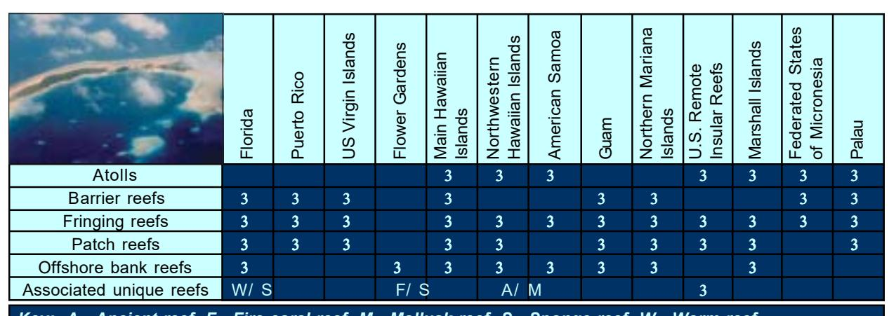

**Key: A—Ancient reef F—Fire coral reef M—Mollusk reef S—Sponge reef W—Worm reef** 

Table 4. Types of reefs found in the United States and the Freely Associated States (Photo: Richard Mieremet).

yet to be developed. Quantitative information crucial to developing health indices for coral reef ecosystems is presently not available. For example, degradation is a concern for reefs near population centers, but water quality monitoring of contaminants and nutrients is generally lacking. Standardized water quality monitoring must be initiated for those reef systems that currently do not have adequate coverage or may not be monitoring the same parameters. This will help identify and quantify causes of degradation for the next biennial report.

The remainder of this Section presents generally accepted indicators of ecosystem condition that will be evaluated and reported on every two years. Most of the information is now **qualitative**92 but more should be **quantitative**93 in the near future. This information forms the scientific baseline on which future authors can note any change in ecosystem condition, and on the basis of their findings, prepare respective assessments of coral reef ecosystem condition. As it becomes more refined, this data may be used to track and forecast ecosystem change. It will also be useful in evaluating conservation management effectiveness. This was called for in the Coral Reef Conservation Act of 2000.

Prior to 2001, except for Florida, none of the jurisdictions had long-term, ecosystem-wide monitoring of representative habitats94. Monitoring of reef fish at randomly selected sites using NOAA's digital benthic habitat maps began in the USVI and Puerto Rico in 2001 (Christensen *et al.* in press). This kind of rigorous monitoring, based on comparable benthic habitats, is needed to prepare

quantitative spatial trend assessments for the next biennial report.

**Reef Characterization Characterization –** U.S. shallow-water coral reefs are roughly computed to cover 7,607 mi2 (19,702.4 km2 ), with an additional 4,479 31,470 mi2 (11,600-81,500 km2 ) off the Pacific Freely Associated States. Pacific values, comprising the bulk of reef estimates in this table, are mostly estimates from Hunter (1995).

All major reef types can be found off the U.S. and Freely Associated States (Table 4). Also, the U.S. has several unique reef-associated habitats.

Human access to coral reefs ranges from those easily reached from nearby urban centers to remote reefs accessible only by ship (Fig. 97).

**Ecosystem Habitat Cover Cover –** For this initial report, reef ecosystem cover is mostly based on qualitative judgments, since there are few places with adequate quantitative data. Only off Puerto Rico and the USVI have shallow-water coral reef ecosystem habitats been mapped and habitat cover relatively determined throughout the jurisdiction.

Estimates of percent reef cover in Table 5 for Puerto Rico and the USVI are based on NOAA results from recent mapping of reefs around these islands. For all other reef areas, percent reef cover figures are from monitoring data; sometimes these have have been calculated from only a few transects taken at a small number of sites.

One general conclusion from this table is where stony corals are degraded or have succumbed to environmental pressures, the ecosystem responds

**NATIONAL SUMMARY NATIONAL SUMMARY**

92 Descriptive, not based on robust data.

93 Comparisons based on reliable measurements of standardized parameters.

with an increase in macroalgae. This makes it more difficult for coral larvae to find appropriate surfaces to settle out, thereby perpetuating degraded reef conditions.

**Biological Diversity Diversity –** The flora and fauna of reef ecosystems in the United States and the Freely Associated States are diverse, evolutionarily derived from Caribbean, Gulf of Mexico, Atlantic, Pacific, and Indo-Pacific faunal assemblages. The diversity of native, endemic, and alien species varies across systems, as does their degree of exposure to natural and human-induced pressures. The highest biological diversity occurs in the Indo-Pacific region (e.g., the Freely Associated States).

No census of all species inhabiting coral reefs within the United States or the Pacific Freely Associated States has ever been conducted. Neither is there a single comprehensive list of coral reef ecosystem species for any jurisdiction. Data were compiled from individual surveys conducted by different investigators at different reefs using different methodologies sometimes separated by decades. These are presented in Tables 6-9. They are a combination of rigorous collecting and species verification by experts, or, due to a lack of data, are reasonable estimates of how many species should be in the ecosystem. Where there is no notation on a table, managers lacked credible data and have identified these gaps as priority items.

Although the FKNMS seems to be well inventoried, their data are the result of integrating a series of investigations over a number of years for different parts of the region. Some records are over 20 years old. Even within the FKNMS, there were

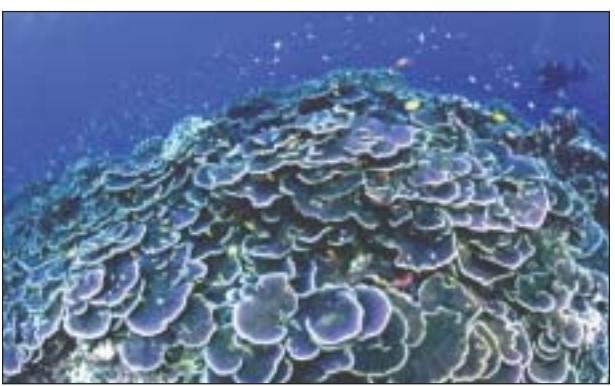

Figure 97. A remote reef at Jarvis Island (Photo: James Maragos).

dramatically different numbers for the same **taxa**95, so the authors of this report included citations for each selected value. See the jurisdictional reports for specific information. Lacking a master list, it was impossible at this time to report known species for all reefs in Florida, so the authors chose to report what is known for the FKNMS. In some cases, FKNMS values were well above those reported for the entire state.

As with Florida, other reef systems had inconsistencies among researchers concerning the actual count of reef biota even in regions where the data were quantitative. A number of coral reef ecosystems, however, still need a basic inventory of species. For this reason, no notation appears for much of the biota from many of the Pacific Island groups, Puerto Rico, and the USVI. Additionally, there is likely considerable duplication among the various scientific surveys conducted through the years on different reef ecosystems. These need to be integrated into a single list.

Table 5. Percent cover of benthic organisms on coral reefs in the United States and the Freely Associated States (Photo: James Maragos). \*Only information for FKNMS has been included here, because data for other areas of Florida are generally not available.

|                      | Provide France | Aday man | Puerto Bico   |   | ES Virole Schools | -   | Traver Curden |      | Wain Hawaiian | Manda | Northwestern | Hensian Islands |     | American samos   | Marin.             | Northern Mariana | Nands | U.S. Remote | Insular Reefs |   | Marshall scands | Federated States | of Moronesia |     | Pates |
|----------------------|----------------|----------|---------------|---|-------------------|-----|---------------|------|---------------|-------|--------------|-----------------|-----|------------------|--------------------|------------------|-------|-------------|---------------|---|-----------------|------------------|--------------|-----|-------|
| Reef cover (%/trend) | Good           |          | Secret Sec | - | Gen Is         |     | Exce          |      |               |       | Exte         |                 | Gos | ad I C slient |  a Luc Servi |                  |       |             |               | 0 |                 |                  | d to dead |     |       |
| Story corals         | 6.6            |          | 1531          |   | 25                | -01 | 310           | 0    | 11.0          | (3)   |              |                 |     |                  | 100                |                  |       |             |               |   |                 |                  |              | (6) | 1     |
| Soft corals          | 1.6            | 0        |               |   | 1                 |     |               |      |               |       |              |                 |     | 53               | 1                  |                  |       |             |               |   |                 |                  | 100          |     |       |
| Macroalgae           | 78             |          | 100           |   | 65                | 104 | 27            | 13   |               | 10    |              |                 |     |                  |                    |                  |       |             |               |   |                 |                  |              |     | Т     |
| Seagrannes           | 10077          | 10       | TAY           |   | (5)               | CI  | lin)          | 8    |               | 13    | 0            |                 | 13  | -                | =                  |                  | 15    | 0           | 10            |   |                 | FC.              |              |     | ı     |
| Mangroves            | 100            | 10       | TE)           |   |                   |     | 0             | 0    | ES1           |       |              | (1)             |     |                  |                    |                  |       | 0           | 0             |   |                 |                  |              |     |       |
| Sponges              | 15.63          | 1000     |               | _ |                   |     | 000           | ero: | 150           |       |              |                 | 100 |                  |                    |                  |       |             |               |   |                 |                  |              |     |       |

94 Not just coral reef, but seagrass, algal, sand, hardbottom, and mangrove habitats.

**NATIONAL ASSESSMENTS NATIONAL ASSESSMENTS**

95 For example, the number of species of mollusks differed among investigations as much as an order of magnitude. The term **taxa** (singular **taxon**) is the name given to biologically related groups of organisms (e.g., mollusks, crustaceans) in the scientific discipline of **taxonomy**.

| Species diversity        | Florida | Puerto Rico | US Virgin Islands | Flower Gardens | Main Hawaiian Islands | Hawaiian Islands Northwestern | American Samoa | Guam | Northern Mariana Islands | Insular Reefs U.S. Remote | Marshall Islands | Federated States of Micronesia | Palau    |
|--------------------------|---------|-------------|-------------------|----------------|--------------------------|----------------------------------|----------------|------|-----------------------------|------------------------------|------------------|-----------------------------------|----------|
| (# species) Algae     |         | 367 500     |                   |                | 4 4 > 4 0 0              | ~ 2 0 0                       | 8 0            |      | 3 06                        | 1 50                         |                  | 222                               |          |
| Endemic                  | 0       | 0           |                   | 0              | > 8 5                    |                                  | 0              |      |                             |                              |                  |                                   |          |
| Seagrasses               | 7       | 6           | 5                 | 0              | 2                        | 2                                |                | 4    | 3                           | 0                            |                  | 3                                 | 2        |
| Endemic                  | 0       | 0           |                   | 0              | 1                        | 1                                | 0              |      |                             | 0                            |                  |                                   |          |
| Mangroves                | 3       | 4           |                   | 0              |                          |                                  | 3              | 1 0  | 1                           | 0                            |                  | 5                                 | 1 4 9 |
| Endemic                  |         |             |                   | 0              | 0                        | 0                                |                |      |                             | 0                            |                  |                                   |          |
| Endangered/ threatened 1 |         |             |                   |                | 0                        | 0                                |                |      |                             |                              |                  |                                   |          |
| Alien                    | 0       |             |                   |                | 1 9                      | 1                                |                |      |                             |                              |                  |                                   |          |

Table 6. Marine plant species found in coral reef ecosystems in the United States and Freely Associated States (Photo: Matt Kendall).

To rectify this situation, NOAA and its partners are proposing to create and maintain a list of all U.S. coastal marine species on a web site with public access. This inventory effort will begin in 2002 as a Pilot Prototype Project for the Hawaiian coral reef ecosystem. With so many coral reef ecosystems now being characterized, many new species will probably be identified in the next report.

Marine Algae and Higher Plants – Across regions, there is great variance in species composition and the total number of marine plant species (Table 6). While there are as many as a dozen seagrass species in a given region, there could be hundreds of macroalgal species. The number of macroalgal species ranges from a low of 44 species on FGBNMS reefs to a high of 500 off Puerto Rico. There are several reef systems (USVI, U.S. remote insular reefs, FSM, and Palau) where algal surveys are needed. Most likely the number of macroalgal species will greatly expand when in-depth surveys are completed, filling the gaps in this table.

Alien plant species are a problem in some areas. In the Caribbean, native mangroves are nursery habitats and provide shelter for juveniles of many reef invertebrate and fish species. In Hawai'i, however, alien macroalgae and red mangrove (*Rhizophora mangle*) are a major problem, displacing native species, some of which may be rare endemics.

Corals and other Invertebrates – The condition of reef invertebrates is highly variable from region to region. Diseases in corals and other invertebrates are generally higher in the Caribbean. While recruitment is one of the primary measures of coral health, only three jurisdictions currently monitor this parameter. Standardization and implementation of monitoring for this health indicator is one of the near-term goals of NOAA's National Monitoring Network.

Stony corals comprise anywhere from 28 species in FGBNMS to 425 species off Palau (Table 7).

Not as diverse, soft coral species range from none in the FGBNMS to 120 off Palau. Sponge species are also highly variable among regional reefs, ranging from less than 27 in the FGBNMS to over 300 off Palau. Most likely the numbers are high in the insular reefs; they have not been well surveyed.

Among the many species of invertebrates that inhabit coral reefs, **mollusks**96 are probably the most biologically diverse. Well over a thousand species have been identified from many reef systems (Table 7).

Next to the mollusks in diversity, **crustaceans**97 range from a low of 62 species on the FGBNMS to over 884 species off the Main Hawaiian Islands. Small shrimp-like species of crustaceans98 are the

**NATIONAL SUMMARY NATIONAL SUMMARY**

96 Clams, snails, octopi, and squids.

97 Crabs, lobsters, and shrimps.

98 Mysids, amphipods, copepods, and isopods.

prey of larger invertebrates, finfish, seabirds, and marine mammals.

Relatively diverse but difficult to identify, **annelids**99 are not well inventoried on many reefs. The most complete inventory of these to date lists over 200 species recorded from the MHI.

The often large and colorful **echino-derms**100 are important reef species, yet many reefs need surveys of what species exist and what their niches are within respective habitats. Note the many gaps on Table 7. Echinoderm

diversity ranges from 15 species in the CNMI to over 278 species from coral reefs in the MHI.

Echinoderms are considered **keystone** species because their impact on the rest of the coral reef ecosystem can be significant. Two in particular – the algae-eating long-spined sea urchin and the crown-of-thorns starfish. Both have had major impacts. In different ways, both have devastated reef-building corals across entire regions.

Scientists determined that the loss of long-spined urchins has changed the structure and perhaps function of Caribbean reef ecosystems. Decimated by disease in the early 1980s, these urchins have not yet recovered to any significant degree. In the 1970s, crown-of-thorns starfish were responsible

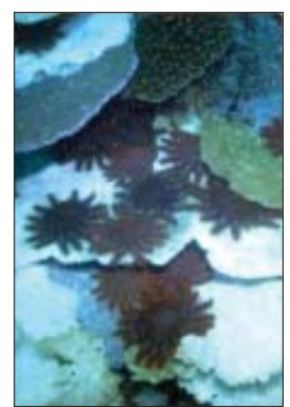

Figure 98. Crown-of-thorns starfish on American Samoa (Photo: Charles Birkeland).

for heavy mortality of corals off American Samoa (Fig. 98), the southern islands of the CNMI, Guam, and other Micronesian islands (Marsh and Tsuda 1973). But by 1981, many reefs had reasonably recovered. Then in the mid-1980s, smaller outbreaks of starfish were associated with coral mortality at some Indo-Pacific reefs, but again recovery was relatively rapid (Birkeland 1997b, Green 1997). In recent years, these starfish have not been a major problem; however, new aggregations were

reported recently at Palmyra Atoll (J. Maragos pers. comm.).

Invertebrate alien species are also a problem, particularly in Hawai'i. Eldredge and Englund (2001) consider more than 250 marine invertebrates to have been introduced to Hawaiian waters. Less is known about alien species introduced to other reef systems.

Finfish and Fisheries – Generally the data for fish diversity is more robust than for other taxa. Much of the data to determine fisheries condition, however, is not consistent. Although the parameters monitored for commercial fisheries vary somewhat among jurisdictions, the larger problem is that, with the exception of Florida, there is practically

Table 7. Coral and invertebrate species diversity and condition in reef ecosystems in the United States and Freely Associated States (Photo: Mohammed Al Momany). \*Only information for FKNMS has been included, because not all types of data are available from other areas of Florida.

| Species diversity (# species/#endemics) | Florida Kevs* | `    | Puerto Rico  |   |      | 200 |     | riowei Galdelis | Main Hawaiian | Islands | Northwestern | Hawaiian Islands | American Samoa |      | an Ber | 200   | Northern Mariana | Islands | U.S. Remote | Insular Reefs | Marshall Islands |     |     | of Micronesia | Palau |     |
|-----------------------------------------|---------------|------|--------------|---|------|-----|-----|-----------------|---------------|---------|--------------|------------------|----------------|------|-----------|-------|------------------|---------|-------------|---------------|------------------|-----|-----|---------------|-------|-----|
| Stony corals                            | 6 4           | 0    | 43           | 0 | 4 0  | 0   | 28  | 0               | 5 0           | 14-     | 5 2          | 10+              | 200            | 0    | 4 0       | 3     | 2 5              | 5 6     | 0 .         | 150           |                  | 250 | 1   |               |       | 425 |
| Soft corals                             | 5 5           | 0    | 4 2          | 0 |      |     | 0   | 0               |               |         |              |                  |                | 0    | 7.7       |       | 4 '              | 1       | <           | 1 0           |                  |     |     |               | 1     | 2 0 |
| Sponges                                 | 117           | 0    |              | 0 |      |     | 27  | 0               | > 100         | 3       | Ó            | 7                | +              |      | 0 1:      | 28    |                  | 2 8     |             |               |                  | 4 0 | 0   |               | 300   |     |
| Polychaetes                             | 8 9           | 0    |              | 0 |      |     | 2 0 | 0               | > 200         | 8       | Ó            |                  |                | C    | 10        | 4     |                  |         |             |               |                  |     |     |               |       |     |
| Mollusks                                | 1200          | 0    | 110          | 0 | 0    |     | 6   | 67              | 0 1           | 0.7 1   | 20           | 0 3 5            | 5 0            |      | 0         | 1 (   | 73               | 2       | 5 2 0       | 2             |                  |     | 165 | 5             | 1     |     |
| Crustaceans                             | 371           | 0    |              | 0 |      |     | 6   | 2 (             | 8 (           | 8 4     |              |                  |                |      | 0 8       | 3 2 5 |                  | 101     |             |               |                  | 728 | 3 3 |               |       |     |
| Echinoderms                             | 8 2           | 0    |              | 0 |      |     | 3 ( | 6 C             | 278           | 1 5     | 0            |                  |                | C    | 19        | 9 4   | 1                | 1 5     |             |               | 1                | 26  | 1   |               |       |     |
| Endangered/alien (# of species)      | 1             | 0    |              |   |      |     |     |                 | 0             | 20-     | 0            |                  |                |      |           |       |                  |         |             |               | 1 1              |     |     |               |       |     |
| Coral recruitment (#/m2)                | 2 -           | 10   |              |   |      |     |     |                 | 1.7           | - 2.3   |              |                  |                |      | .026      | 05    | 8                |         |             |               |                  |     |     |               |       |     |
| Diseases (impact/trend)                 | High          | Ŋ    | High         |   | High |     | Low | Ø               |               | Ø       | None         | Ø                |                | Ø    |           |       | Low              | Ø       |             |               |                  |     |     |               |       |     |
| Bleaching mortality                     | Hiç           | jh . | Mediu hig |   | Lo   | w   | Lo  | ow .            | Lo            | w       | Lo           | ow .             | Med            | lium |           |       | Med              | lium    | Med         | dium          |                  |     |     |               | Hig   | jh  |
|                                         |               |      |              |   |      | Kev | . a | Incr            | 0250          | 01      | Docro        | 200              | Ø No           | cha  | ngo       |       |                  |         |             |               |                  |     |     |               |       |     |

&lt;sup>99 Large polychaetes (segmented worms like bristle worms and the Samoan palolo worm) are better inventoried, but the oligochaetes and leeches are virtually unknown.

100 Seastars, ophiuroids, and brittle stars.

|                                  |                                       | Horitta Kegur |       | The same of the same of the same of the same of the same of the same of the same of the same of the same of the same of the same of the same of the same of the same of the same of the same of the same of the same of the same of the same of the same of the same of the same of the same of the same of the same of the same of the same of the same of the same of the same of the same of the same of the same of the same of the same of the same of the same of the same of the same of the same of the same of the same of the same of the same of the same of the same of the same of the same of the same of the same of the same of the same of the same of the same of the same of the same of the same of the same of the same of the same of the same of the same of the same of the same of the same of the same of the same of the same of the same of the same of the same of the same of the same of the same of the same of the same of the same of the same of the same of the same of the same of the same of the same of the same of the same of the same of the same of the same of the same of the same of the same of the same of the same of the same of the same of the same of the same of the same of the same of the same of the same of the same of the same of the same of the same of the same of the same of the same of the same of the same of the same of the same of the same of the same of the same of the same of the same of the same of the same of the same of the same of the same of the same of the same of the same of the same of the same of the same of the same of the same of the same of the same of the same of the same of the same of the same of the same of the same of the same of the same of the same of the same of the same of the same of the same of the same of the same of the same of the same of the same of the same of the same of the same of the same of the same of the same of the same of the same of the same of the same of the same of the same of the same of the same of the same of the same of the same of the same of the same of the sa | Lis Virgin Islands | Flower Gardens | Main Hawaian Manda | Northwestern Hannium Marsts | American Samos | Chaem     | Sorthern Mariana Mande | U.S. Remarte broder Reefs | Marchall Mands | Forbrated States of Microsoppia | Preises |
|----------------------------------|---------------------------------------|---------------|-------|--------------------------------------------------------------------------------------------------------------------------------------------------------------------------------------------------------------------------------------------------------------------------------------------------------------------------------------------------------------------------------------------------------------------------------------------------------------------------------------------------------------------------------------------------------------------------------------------------------------------------------------------------------------------------------------------------------------------------------------------------------------------------------------------------------------------------------------------------------------------------------------------------------------------------------------------------------------------------------------------------------------------------------------------------------------------------------------------------------------------------------------------------------------------------------------------------------------------------------------------------------------------------------------------------------------------------------------------------------------------------------------------------------------------------------------------------------------------------------------------------------------------------------------------------------------------------------------------------------------------------------------------------------------------------------------------------------------------------------------------------------------------------------------------------------------------------------------------------------------------------------------------------------------------------------------------------------------------------------------------------------------------------------------------------------------------------------------------------------------------------------|--------------------|----------------|-----------------------|--------------------------------|----------------|-----------|---------------------------|------------------------------|----------------|------------------------------------|---------|
| Species diversity (# species) |                                       |               |       |                                                                                                                                                                                                                                                                                                                                                                                                                                                                                                                                                                                                                                                                                                                                                                                                                                                                                                                                                                                                                                                                                                                                                                                                                                                                                                                                                                                                                                                                                                                                                                                                                                                                                                                                                                                                                                                                                                                                                                                                                                                                                                                                |                    |                |                       |                                |                |           |                           |                              |                |                                    |         |
| Marine fish                      | . 5                                   | 17            | 1 5   | 71                                                                                                                                                                                                                                                                                                                                                                                                                                                                                                                                                                                                                                                                                                                                                                                                                                                                                                                                                                                                                                                                                                                                                                                                                                                                                                                                                                                                                                                                                                                                                                                                                                                                                                                                                                                                                                                                                                                                                                                                                                                                                                                             | 532                | 266            | 3172                  | 266                            |                | 1105      | Charles of                |                              | 1052           | 1125                               | 1361    |
| Reef and shore fish              | 3                                     | 89            | 1.2   | 17                                                                                                                                                                                                                                                                                                                                                                                                                                                                                                                                                                                                                                                                                                                                                                                                                                                                                                                                                                                                                                                                                                                                                                                                                                                                                                                                                                                                                                                                                                                                                                                                                                                                                                                                                                                                                                                                                                                                                                                                                                                                                                                             | 246                | -234           | 557                   | 258                            | 890            | 1019      | 1019                      |                              | 860            | 873                                | 1278    |
| Endersics                        |                                       | Q.            |       | Mile                                                                                                                                                                                                                                                                                                                                                                                                                                                                                                                                                                                                                                                                                                                                                                                                                                                                                                                                                                                                                                                                                                                                                                                                                                                                                                                                                                                                                                                                                                                                                                                                                                                                                                                                                                                                                                                                                                                                                                                                                                                                                                                           | .0                 | 2              | 120                   |                                | 0              | 4.0       | 3                         |                              | 7              | 5                                  | 2       |
| Endangered/threatened            |                                       | k .           | 100   |                                                                                                                                                                                                                                                                                                                                                                                                                                                                                                                                                                                                                                                                                                                                                                                                                                                                                                                                                                                                                                                                                                                                                                                                                                                                                                                                                                                                                                                                                                                                                                                                                                                                                                                                                                                                                                                                                                                                                                                                                                                                                                                                | -11                | 200            | 910                   |                                | 7              | 100       | 7.7                       |                              | 6              | 7                                  | - 1     |
| Allen                            |                                       | 0             | 1 1 1 | 0                                                                                                                                                                                                                                                                                                                                                                                                                                                                                                                                                                                                                                                                                                                                                                                                                                                                                                                                                                                                                                                                                                                                                                                                                                                                                                                                                                                                                                                                                                                                                                                                                                                                                                                                                                                                                                                                                                                                                                                                                                                                                                                              | - 6                |                | 11                    |                                | 4              | 17.       | 7                         |                              | 1              | 2                                  | 4       |
| Diseases (presence/trend)        | √                                     | Ø             |       |                                                                                                                                                                                                                                                                                                                                                                                                                                                                                                                                                                                                                                                                                                                                                                                                                                                                                                                                                                                                                                                                                                                                                                                                                                                                                                                                                                                                                                                                                                                                                                                                                                                                                                                                                                                                                                                                                                                                                                                                                                                                                                                                |                    |                | V                     | Nove Ø                         |                |           |                           |                              |                |                                    |         |
| Fisheries condition              | Over                                  | Silve         | Over  | Shed                                                                                                                                                                                                                                                                                                                                                                                                                                                                                                                                                                                                                                                                                                                                                                                                                                                                                                                                                                                                                                                                                                                                                                                                                                                                                                                                                                                                                                                                                                                                                                                                                                                                                                                                                                                                                                                                                                                                                                                                                                                                                                                           | Destroyed.         | Teatly         | Dyerfolied            | Healthy                        | Overfished     | Overfahed |                           | Healthy                      |                | Derfolest*                         |         |
| Ž.                               | Eye Potential Collection Botto charge |               |       |                                                                                                                                                                                                                                                                                                                                                                                                                                                                                                                                                                                                                                                                                                                                                                                                                                                                                                                                                                                                                                                                                                                                                                                                                                                                                                                                                                                                                                                                                                                                                                                                                                                                                                                                                                                                                                                                                                                                                                                                                                                                                                                                |                    |                |                       |                                |                |           |                           |                              |                |                                    |         |

Table 8. Fish species diversity and condition in coral reef ecosystems in the United States and Freely Associated States (Photo credit: FKNMS). \*Only information for FKNMS has been included, because not all types of data are available from other areas of Florida; \*\*Refers to Chuuk only.

no monitoring of recreational and artisanal fisheries. That is the reason why only ex-vessel commercial fisheries data are summarized.

The number of marine fish species identified from coral reef ecosystems is diverse, ranging from around 266 species in the FGBNMS and the Northwestern Hawaiian Islands to over 1,300 from coral reefs off Palau (Table 8). Likewise, reefassociated and shore species vary among regions from around 200 to over 1,200. The highest number of alien fish species have been identified from coral reef ecosystems in Puerto Rico (30), Guam (17), and Hawai'i (13). The largest number of endemic species is found on Hawaiian nearshore coral reef ecosystems (120).

Although fish diseases and fish kills have been reported off Florida and the Main Hawaiian Islands, the status of reef fish diseases is mostly unknown. The National Monitoring Network will encourage measuring and monitoring this parameter.

Figure 99. Humpback whales (Photo: N MFS).

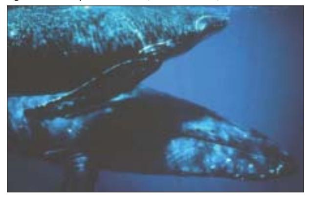

Reef fish populations are considered healthy in the FGBNMS, Navassa, and the NWHI. Elsewhere, most areas have been overfished. For some regions, fish condition is not known (note the gaps in Table 8).

Marine Reptiles and Mammals – Six species of sea turtles have been identified on U.S. coral reefs (Table 9). These marine reptiles only come ashore to lay eggs. Three species101 are found on occasion by Caribbean divers, but two additional species102 are rarely sighted (Humann 1994). Sea turtles are also found in the Pacific along with olive ridleys.

According to G. Paulay (pers. comm.), two species of sea snakes are known from Palau – the egglaying banded sea snake (*Laticauda colubrina*), and the viviparous yellowbellied sea snake (*Pelamis platurus*), a pelagic species ranging from East Africa to the Pacific coast of the Americas (Allen and Steene 1996). There are anecdotal accounts of the latter from the CNMI and the Federated States of Micronesia.

As many as 27 species of marine mammals, including porpoises, sea lions, seals, and whales, have been identified. One of the more spectacular species, the humpback whale ( *eangliae* Hawai'i to breed and calve, and then adults and their youngsters journey back to Alaska each summer to feed (Fig. 99). Spinner dolphins ) spends the winter near Mexico and *Megaptera nova* (*Stenella longirostris*) are common and form large schools that are often seen daily in the same areas (Fielding and Robinson 1987).

**Water Quality Quality –** U.S. coastal beaches and drinking water are monitored regularly for parameters

**NATIONAL SUMMARY NATIONAL SUMMARY**

101 Loggerhead, hawksbill, and green sea turtles. 102 Leatherbacks and Atlantic Ridleys.

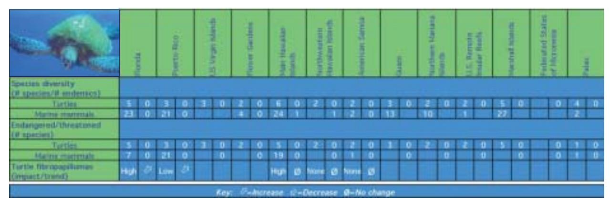

Table 9. Marine mammal and sea turtle species diversity and condition in the United States and Freely Associated States (Photo: Ursula Keuper-Bennet and Peter Bennett).

affecting human health using EPA prescribed methodologies for 305(b) reports103.

Many jurisdictions monitor coastal near-shore waters for dissolved oxygen, turbidity, fecal coliform, enterococcus, oil and grease, selected toxic metals, ammonia, nitrate/nitrite, and pH (e.g., American Samoa, Guam, CNMI). As an example of the longevity and breadth of EPA prescribed monitoring, the Puerto Rico Environmental Quality Board has been monitoring physical, chemical, and bacteriological parameters at 88 stations along its coastal zone since 1982. Because this monitoring follows prescribed methodologies, the data should be comparable and useful in determining temporal trends in water quality. This testing, however, is for parameters affecting human health, some of which may be more useful than others for determining coral reef health.

A few jurisdictions go beyond this set of parameters. They also monitor for toxic metals and organic chemicals104. With NOAA and the EPA, the FKNMS has been monitoring an array of water quality contaminants at fixed stations. To track changes in water quality affecting coral reefs

nationally, the Coral Reef Program is encouraging the addition of certain key water quality indicators to its National Coral Reef Monitoring Network.

Because the water quality data for some of the jurisdictions covered in this report were qualitative or not available, spatial and temporal trends for water quality cannot be assessed nationally. Managers from the FKNMS, Puerto Rico, and American Samoa, however, indicated that within their coral reef ecosystems, water quality had been deteriorating over the past decade. Not surprisingly, managers of reefs distant from human populations (the FGBNMS, the NWHI, and the U.S. remote insular reefs) all indicated that their reef systems had excellent water quality. The remainder had varying degrees of water quality problems within their jurisdiction.

The quantity and quality of reef organisms depends on water quality. Areas next to densely populated shorelines generally have poorer water quality than areas far from human habitation. The impact on the diversity and abundance of organisms in those degraded areas is generally lower, correlating directly with water quality and habitat condition.

Table 10. Areas protected by MPAs and no-take reserves (Photo: Kip Evans).

|                                   | Florida | Puerto Rico | US Virgin Islands | Flower Gardens | Main Hawaiian Islands | Northwestern Hawaiian Islands | American Samoa | Guam | Northern Mariana Islands | U.S. Remote Insular Reefs | Marshall Islands* | Federated States of Micronesia | Palau |
|-----------------------------------|---------|-------------|-------------------|----------------|--------------------------|----------------------------------|----------------|------|-----------------------------|------------------------------|-------------------|-----------------------------------|-------|
| Federal MPAs                      | 11      | -1          | 3                 | 1              | 4                        | 3                                | 3              | 2    | 0                           | 7                            |                   | 0                                 | 2     |
| State/Territorial MPAs            | Z       | 32          | 5                 | 0              | 30                       | 0                                | -1             | 8    | 7                           | 0                            |                   | 2                                 | -11   |
| No-take areas (lon 2 ) | 724.9   | 11.0        | 51.8              | 0              | 5.2                      | 2469                             | 10.4           | 28.0 | 9.6                         | 132                          |                   |                                   | 65.3  |
| Percent no-take area              | -5%     | 1.5%        | 17,4%             | 0%             | 0.3%                     | 21,4%                            | 3.5%           | -28% | 1.7%                        | 30.3%                        |                   |                                   | 3.9%  |

103 Coastal zone water quality monitoring required for human health. 104 Pesticides, herbicides, PAHs, PCBs, dioxins.

**NATIONAL ASSESSMENTS NATIONAL ASSESSMENTS**

**Marine Protected Areas (MPAs) and No-Take Marine Protected Areas (MPAs) and No-Take Reserves ReservesReserves –** As of 2002, there were 120 (35 Federal and 85 State/Territorial) MPAs in the United States and 15 MPAs in the Pacific Freely Associated States (Table 10). These provide variable levels of protection to the reefs, ranging from open harvest access to full enforcement of no-take provisions. Coral reef MPAs include National Marine Sanctuaries; National Parks, Seashores, Monuments, and Wildlife Refuges; and National Estuarine Research Reserves and Estuary Program areas. There are also State, Territory, and Commonwealth Parks,

Fishery Management Plans have also designated MPAs for habitat protection, rebuilding fish stocks, and for critical habitats of threatened or endangered species.

Conservation Areas, and Reserves.

U.S. marine areas protected by no-take provisions cover 1,329 mi2 (3,442 km2 ), while another 25.2 mi2 (65.3 km2 ) of no-take reserves protect Palauan reefs. Realistically, the percentage protected by notake provisions within most jurisdictions most likely will change when the coral reefs are entirely mapped.

For this report, it was deemed impossible to calculate the total reef area protected by no-take provisions across all jurisdictions because over 85% of reef-associated benthic habitats have yet to be mapped105. The authors of this report concluded that state-of-the-art shallow-water mapping needs to be completed before this could be done with confidence.

A synthesis of more than 100 studies of reserves worldwide shows protection from fishing leads to increased biomass, abundance, average size, and species diversity (Halpern in press). Because marine reserves contain more and larger fish, protected populations can produce more offspring. Roberts *et al.* (2001) demonstrated that reserves serve as sheltered nurseries. Large fish move to waters adjacent to the reserve through density-dependent spillover of juveniles and adults106.

This is seen around the Merritt Island National Wildlife Refuge. It is one of the oldest, fully protected marine reserves, closed to fishing since

1962 for security of the Kennedy Space Center. Roberts *et al.* (2001) report that sport fishers around this 40 km2 Reserve have landed a disproportionate number of world- and state-record fish. It accounts for 62% of 39 records for black drum,

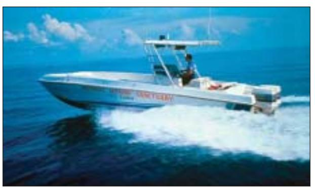

Figure 100. NOAA enforcement of regulations in FKNMS (Photo: Paige Gill).

54% of 67 records for red drum, and 50% of 32 records for spotted sea trout. Preliminary results from monitoring some of the more recently designated U.S. no-take reserves have similar information on their effectiveness.

To directly assess the effectiveness of no-take marine reserves in the FKNMS, NOAA conducted diver surveys in the Florida Keys and the Tortugas Ecological Reserve. The results after three years of monitoring, the FKNMS' zone network showed populations protected by no-take provisions improved significantly. Despite population declines elsewhere, numbers of some fish species in the fully protected zones of the Sanctuary are increasing. Analyses of three years of reef fish abundance data show that **mean densities**107 for several economically important exploited fish species108 are higher in the Sanctuary Preservation Areas (SPAs) than in fished reference sites (Bohnsack *et al.*  2001). Complementing these data, gray snapper (*L. griseus*), schoolmaster (*L. apodus*), and yellowtail snapper are increasing after fully-protected zones were established in 1997 at 16 sites monitored by Reef Environmental Education Foundation volunteers (Pattengill-Semmens 2001).

Legal-size spiny lobsters continue to be larger and more abundant in SPAs than in reference sites of

**NATIONAL SUMMARY NATIONAL SUMMARY**

105 One of many such examples, Statewide mapping is not yet available to the level of that already established in the FKNMS, so the percentage of coral habitat protected by no-take provisions is still only a reasonable estimate (i.e., 10%) for the FKNMS and not for all Florida.

106 As the fish populations within the protected area grow in both numbers and size of individuals, competition between the largest drives some of them into adjacent waters.

107 The average number of individuals per sample area.

comparable habitat (Cox *et al.* 2001). At all times of the year **catch rates**109 are higher within the Western Sambo Ecological Reserve than the two adjacent fished areas (Gregory 2001). This is not so, however, for the overfished queen conch. They have remained low despite a ban in the mid-1980s on both commercial and recreational harvesting.

#### **Coral Reef Governance and Management Reef Governance and Management –**

Federal, State, Territorial, and Commonwealth agencies are responsible for the conservation of living marine resources, including fisheries, marine mammals, and endangered and threatened species within the **Exclusive Economic Zone**110 (EEZ, Fig. 100). Legislation provides the authority for managing coral reef ecosystems (Appendix IV). These include Fishery Management Plans, management of MPAs, and protection of reef species and resources of concern111.

Fishery Management Plans written by Fisheries Management Councils govern commercial fishing throughout the EEZ, regulating harvests by annual catch quotas, closed seasons, gear restrictions, and minimum catch sizes. Most governments collect **landing data** (data collected at the dock or from creel surveys) on the kinds of fish, invertebrates,

and plants taken that can be used to track trends and evaluate the effectiveness of regulations.

In most regions, the management of coral reef resources112 is jointly undertaken by local and Federal agencies. Within three miles from shore, local agencies generally manage fisheries and other uses of coastal resources. A variety of legislation gives NOAA the authority to manage living marine resources in U.S. Federal waters113. Federal fisheries regulations are implemented by the Secretary of Commerce and enforced by NOAA's National Marine Fisheries Service (NMFS).

**Fisheries Management Plans Plans –** Four of eight Regional Fishery Management Councils have developed federal Fishery Management Plans (FMPs) for reef fisheries resources and proposed implementing regulations. They are as follows.

Gulf of Mexico Fishery Management Council – NOAA manages a number of fisheries associated with coral reefs based on FMPs, including Coral and Coral Reefs, Red Drum, Reef Fish Resources, Spiny Lobster, and Stone Crab. This Management Council also identified the Madison-Swanson and Steamboat Lumps Marine Protected Areas on the West Florida Shelf as potential reserves. NOAA designated them as such and since has been assessing their resources and fisheries contribution.

South Atlantic Fishery Management Council **–**  Coral reef associated fisheries managed under FMPs in the South Atlantic include Atlantic Coast

> Red Drum; Coral, Coral Reefs, and Live/Hard Bottom Habitats of the South Atlantic Region; Golden Crab; Snapper-Grouper Fisheries; and Spiny Lobster. This Council proposed the notake zones for the new Tortugas Ecological Reserve.

> Caribbean Fishery Management Council **–** Reef-associated fisheries of Puerto Rico and the USVI managed under FMPs

developed by the Caribbean Fishery Management Council in-clude Corals and Reef-Associated Plants and In-vertebrates; Queen Conch; Reef Fish; and Spiny Lobster.

Western Pacific Regional Fisheries Management Council **–** Three FMPs developed by this Council include coral reef resources. The Bottomfish FMP regulates fishing primarily for snappers, groupers, and jacks (Fig. 101) in the EEZ around the Territory of American Samoa, Territory of Guam, State of Hawai'i (including the NWHI), the Commonwealth of the Northern Mariana Islands, and U.S.

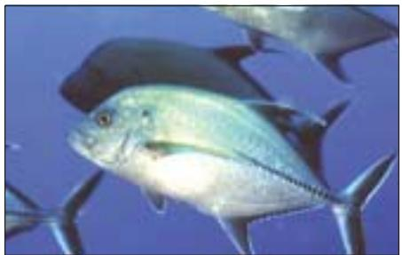

Figure 101. In the U.S. Western Pacific region, jacks are managed by the Bottomfish FMP (Photo: James Maragos).

**NATIONAL ASSESSMENTS NATIONAL ASSESSMENTS**

108 Gray snapper (*Lutjanus griseus*), yellowtail snapper, and grouper (several economically important species were combined).

109 Generally this term is dependent on the method of capture; as used here, it is the number of lobsters per trap.

110 The term Exclusive Economic Zone (defined by the Magnuson-Stevens Fishery Conservation and Management Act at 16 U.S.C. 1802, Section 3) is the zone established by Proclamation 5030, dated March 10, 1983. To apply the Act, the inner boundary of that zone is a line coterminous with the seaward boundary of each of the coastal states. The outer limit of the EEZ is 200 miles from the inner boundary.

111 Endangered species and the taking of live rock.

112 Mapping, research, and monitoring activities, as well as management and enforcement of any regulatory provisions.

113 Federal waters are generally defined as being from the seaward boundaries of the respective State and Territory jurisdiction to the outer boundary of the EEZ (defined above).

Pacific insular remote reefs. The Crustaceans Fishery FMP targeted spiny and slipper lobsters in the NWHI by limiting the number of entry fishery permits (15 maximum) of which fewer than half are usually active in any one year. The crustacean fishery has been closed since 2000 pending the resolution of uncertainties in the current stock assessment model.

The Precious Coral Fishery FMP operates in one area off the MHI. Although this has also been permitted, it has not operated in the NWHI for over 20 years.

A Draft FMP for Coral Reef Ecosystems of the Western Pacific Region has been completed and is now under NOAA and DoC review. This proposed FMP has provisions for marine protected areas (including no-take zones), special permits for new fisheries, and limitations on permitted fishing gear. NOAA has not yet approved the Draft FMP.

**Regulations and Enforcement Enforcement –** Regulations have been developed for most commercially

important fisheries. Those applicable to coral reef ecosystems vary among jurisdictions and cover quotas on catch, closed seasons, closed areas, gear restrictions, and minimum catch sizes. Other regulations protect coral reef resources by regulating oil exploration and mining, setting up no-anchor zones, regulating coastal construction, and imposing water quality and pollution controls.

All of the nearly 100 jurisdictional managers and experts developing this report agreed enforcement was not adequate to protect coral reef ecosystem resources. This is an especially difficult task for the larger and more remote reef systems with jurisdictions that lack the ships and staffing to adequately patrol their MPAs.

To support the need to better protect reefs, the USCRTF has called for better enforcement of laws, established new guidance to protect coral reefs, and provided funding and technical assistance to states and territories to build **management capacity**114 .

**NATIONAL SUMMARY NATIONAL SUMMARY**

114 Whatever management measures may be needed to conserve coral reef ecosystems. Many of the island agencies asked for federal support to build their local capacity to conduct a long-term monitoring and assessment program for their coral reef ecosystems. NOAA, through grants to island jurisdictions, has funded a variety of management activities since 2000 that include hiring full-time, permanent technical staff, purchasing equipment, and conducting various workshops.

## **NATIONAL SUMMARY: NATIONAL SUMMARY: SUMMARY: NATIONAL SUMMARY: NATIONAL SUMMARY: AGENCY RESPONSES AGENCY RESPONSES AGENCY RESPONSES**

(Identifying environmental pressures and gathering the comprehensive data for the National Assessments (the discussions in the previous sections) were mandated by the USCRTF National Action Plan. USCRTF agencies and their partners have worked together to make the National Action Plan a reality (USCRTF 2000). In less than two years, significant progress has been made on the two fundamental themes and action items (USCRTF 2002). The two themes and action items identified by the USCRTF are discussed in the remainder of this section.

**Theme 1: Understand Coral Reef Ecosystems Theme Ecosystems –** 

Understanding coral reef systems is necessary to 1) discern the conservation measures needed and 2) evaluate potential impacts of actions on the condition of the coral reef ecosystems. This includes comprehensive mapping, assessment, and monitoring of coral reef health (Fig. 102); supporting strategic research on regional threats to coral reef health and the underlying ecological processes upon which they depend; and incorporating the human dimension into conservation and management strategies.

**Theme 2: Quickly Reduce the Adverse Im Theme 2: Quickly Reduce the Adverse Impacts of Human Activities Activities –** Reducing impacts requires an expanded and strengthened network of Federal, State, and territorial coral reef MPAs. Along with this, it is necessary to reduce the adverse impacts of extractive uses, habitat destruction and pollution; restore damaged reefs; strengthen international activities, ameliorate the impacts of international trade in coral reef spe-

cies; improve governmental accountability and coordination; and create an informed and engaged public. Many of these actions require effective monitoring of reef health, tracking biotic changes, and evaluating impacts of conservation measures on affected components of the managed ecosystems.

In FY00 and FY01, DoI and NOAA provided over \$2 million in grants to help the U.S. islands96 improve coral reef management and conservation. This included monitoring, education, and designation of marine protected areas. Additionally, in FY00 NOAA provided \$7.8 million, and in FY01 \$27 million to agencies with coral reef management responsibilities for other initiatives for conserving coral reef ecosystems. In FY02, a total of \$34 million will be available from NOAA to continue coral reef initiatives on U.S. coral reef ecosystems and to initiate related efforts for reefs off the Pacific Freely Associated States.

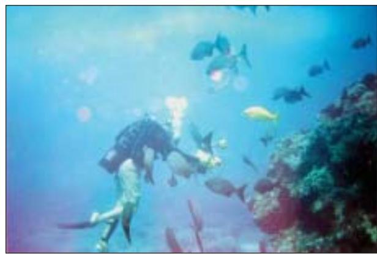

Figure 102. Assessment of a coral reef in the Northwestern Hawaiian Islands (Photo: Donna Turgeon).

The information used to prepare the biennial reports mandated by the Coral Reef Conservation Act of 2000 has to be based on reliable monitoring data and ecological assessments. NOAA and DoI are helping local agencies build their scientific capacity to assure that information will be available for those reports.

#### **Map All U.S. Coral Reefs All U.S. Reefs**

As discussed before, most U.S. coral reefs have never been adequately mapped. The agencies of the USCRTF are undertaking a major effort to develop comprehensive and consistent coral reef ecosystem maps for all U.S. reefs (Fig. 103). This is led by NOAA, the National Aeronautics and Space Administration, and the USGS (MISWG 1999).

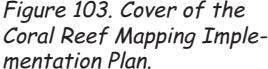

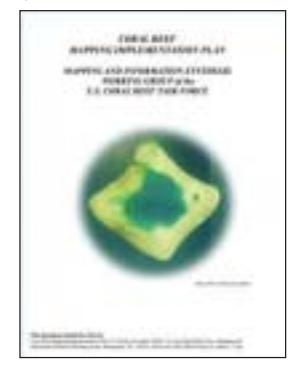

115 Puerto Rico, the USVI, Hawai'i, American Samoa, Guam, and the CNMI. **7373**

**AGENCY RESPONSES AGENCY RESPONSES**

The USCRTF National Action Plan committed to delineating and digitally mapping all U.S. shallow coral reefs by 2009 using airborne and satellite photography. Mapping and habitat characterization of selected deep reef and bank areas has also begun using multi-beam sonar, submersibles, and remotely-operated vehicles. This information will support more effective fish and coastal zone management, disaster mitigation, research, and restoration efforts.

Detailed and spatially accurate digital benthic habitat maps can be used to design monitoring programs, organize data, and conduct assessments. Digital data and the associated maps delineate major habitat types – seagrass, coral reefs, and mangroves – and can provide a framework for tracking changes in those habitats (Monaco *et al.*  2001). Other measurements of the ecosystem that correlate with habitat change116 can be layered onto these maps and perhaps ultimately used to help predict habitat change. Completed maps and related information (discussed in the following subsections) are available on a NOAA web site (Coral Reef Mapping and Monitoring 2002).

#### **Caribbean Shallow-Water Mapping Initiatives Initiatives –**

The characterization of marine habitats of Puerto Rico and USVI has been completed, and benthic habitat maps are now available (Coral Reef Mapping and Monitoring 2002). This was a collaborative project117 using visual interpretation of aerial photographs (Fig. 104). NOAA's National Geodetic Survey acquired aerial photographs for the near-shore waters in 1999.

Working in conjunction with the State of Florida, similar maps are available as a benthic habitat atlas of the Florida Keys (FKNMS Benthic Map 2002). Since this is just for the Keys, about 50% of Florida's coral reef ecosystem still needs to be mapped.

#### **Pacific Shallow-Water Mapping Initiatives Initiatives –**

NOAA is leading an investigation to map the distribution of coral reefs and other benthic habitats throughout the U.S. Pacific islands. Remotesensing technologies, ranging from ships to satellites will be used to create digital maps of marine habitats including coral reefs, seagrass beds, and mangrove forests.

**Gulf of Mexico Deep-Water Mapping Gulf of Mexico Deep-Water Mapping Initiatives Initiatives –** In 2001, USGS, MMS, and NOAA completed multi-beam sonar mapping of major

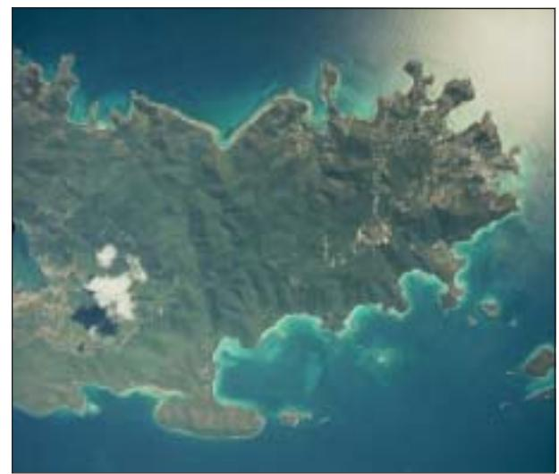

Figure 104. An aerial photograph of St. John, that was used to produce benthic habitat maps (Photo National Ocean Service).

areas off the Northeastern Gulf of Mexico including the newly-designated Madison-Swanson and Steamboat Lumps Marine Protected Areas. These are important habitats for commercial reef fishes and contain some deep reefs that may rival those in the FGBNMS.

In 2001, NOAA also conducted habitat characterization of deep *Oculina* coral reefs off the eastern coast of Florida using submersibles and multibeam sonar. Results showed significant habitat damage to protected banks from illegal trawling.

#### **Assess and Monitor Reef Health Health**

The USCRTF's National Action Plan (2000) called for an integrated nationwide coral reef monitoring system that could provide regular assessments of reef health as well as initiate new monitoring to fill gaps. This will provide the essential information managers need to respond to changing environmental conditions, to assess the effectiveness of management strategies, and identify the need for additional protective measures. Since then, NOAA initiated and is leading a coordinated effort to determine the condition of coral reefs, the causes of coral reef decline, and the impacts of environmental pressures on coral reef ecosystems.

**A National Program to Assess and Monitor to Assess Monitor Coral Reef Ecosystems Ecosystems –** In FY99, 50 coral reef managers and scientists prepared an Implementation Plan for *A National Program to Assess and Monitor Coral Reef Ecosystems* (National Coral Reef Program, Coral Reef Mapping and Monitoring 2002, Fig. 105). In FY00, NOAA held a

**NATIONAL SUMMARY NATIONAL SUMMARY**

116 Fish abundance, coral diversity, disease, and oceanic circulation patterns.

 117 There are local partners and collaborators. including island agencies and universities, the NPS, and USGS.

workshop for 60 coral reef managers to rank environmental threats and prioritize management needs (e.g., biotic inventories, ecosystem monitoring, and assessments of the sources and extent of reef degradation). The managers endorsed the proposed program (the National Coral Reef Program).

Now in its third year of NOAA funding, the National Coral Reef Program has provided cooperative grants to state and island agencies to build local capacity for assessing and monitoring coral reef ecosystems. With this funding, coordina

reef ecosystems. With this funding, coordinated monitoring is being conducted off Puerto Rico, the USVI, Hawai'i, American Samoa, Guam, and the CNMI. Another major objective of this program,

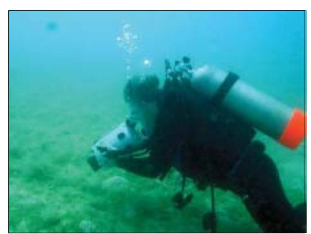

Figure 106. Video monitoring in La Parguera, Puerto Rico (Photo: John Christensen).

coral reef ecosystem health indicators, metrics, and a 'report card' will be developed to evaluate changes in the condition of benthic habitat, living marine resources, and water quality. NOAA's National Ocean Service will integrate local assessments into these biennial reports. They will evaluate the effectiveness of activities to conserve reef resources.

Also a part of the NOAA National Mapping and Monitoring Network, complementary monitoring is being conducted off Puerto Rico, Florida, and Hawai'i. NOAA sponsored additional work through cooperative grants from pass-through appropriations in FY00-02 to the Department of Natural and Environmental Resources of Puerto Rico, the National Coral Reef Initiative (NOVA University Florida), and the Hawai'i Coral Reef

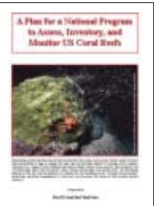

Figure 105. Cover of the National Program to Assess and Monitor Coral Reef Ecosystems.

Initiative (the University of Hawai'i).

With the USEPA and NOAA, the FKNMS Water Quality Protection Program monitoring continues in the Florida Keys. Specific monitoring of ecosystem process and functional changes that result from the implementation of fully protected marine reserves is also underway.

**Regional Assessment and Monitoring Activities** – Most of the U.S. coral reef ecosystem monitoring is conducted by State, Commonwealth, and Territory

agencies, at times in conjunction with Federal agencies or with local non-governmental organizations. The following is a summary of FY00-01 activities in each jurisdiction.

Florida - In the Florida Keys, fish and benthic habitat assessments and monitoring were conducted and an integrated molecular biomarker system was used to assess ecosystem health. Four cruises performed baseline surveys of the Tortugas Ecological Reserve to determine the influence of Reserve status on fish communities, the food web, and habitat structure and function (FKNMS 2002).

Puerto Rico – Puerto Rico established a Commonwealth-wide network of monitoring sites where sessile-benthic organisms, reef fish, motile invertebrates, and water quality were surveyed (Fig. 106). They also conducted a baseline characterization of bio-optical properties, surveyed three coral reef locations to gain baseline information, and assessed the effects of establishing a no-take zone at the Luis Peña Natural Reserve on Culebra Island. Additionally, a baseline characterization of the fish and motile and sessile benthic invertebrates inhabiting coral reef and sea grass habitats was conducted at 15 sites on Vieques Island.

U.S. Virgin Islands – The USVI Department for Planning and Natural Resources has partnered with the University of the Virgin Islands, the National Park Service (NPS), and the USGS to start filling gaps in monitoring and establishing a Territory-wide Monitoring Network. (USGS 2002, Coral Reef Mapping and Monitoring 2002).

Hawai'i – In the NWHI, monitoring and assessment techniques were developed as part of an overall effort to inventory the shallow-water reef biota and map benthic habitats around each of the 10 remote

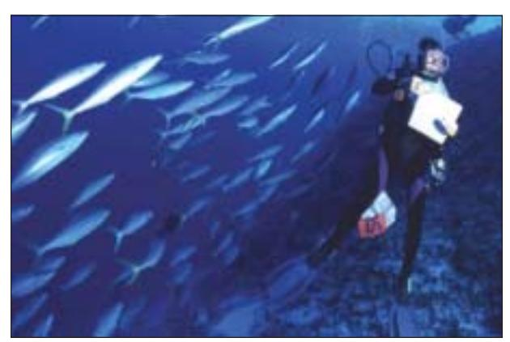

Figure 107. Diver assessing the condition of reefs surrounding Howland Island (Photo: James Maragos, USFWS).

islands and atolls (Hawaii DLNR 2002). Initial survey data assessed the impact of bottom fishing on the Raita and West St. Rogatien Banks in the NWHI Coral Reef Ecosystem Reserve. State-wide monitoring of coral reef habitats, algae, invertebrates, fish, marine mammals, and sea turtles of the Main Hawaiian Islands continued (CRAMP 2002).

American Samoa – American Samoa hired two fisheries biologists in the Department of Marine and Wildlife Resources. They are conducting fish census surveys of commercial fish stocks and a creel survey of market species. Water quality monitoring is currently limited to 12 beaches on Tutuila and the Manu'a group, but is being enhanced with new instrumentation.

Guam – A monitoring program for the recently created MPAs has been initiated (University of Guam MPA Research Group 2002). These activities complement ongoing inshore and off-shore island-wide creel surveys, weekly water quality tests, freshwater hydrology and contaminant testing and the University of Guam's benthic transect surveys. They monitor for disease and coral bleaching (Guam DAWR 2002).

Commonwealth of the Northern Mariana Islands – CNMI hired a marine biologist to coordinate its coral reef monitoring program (CNMI DEQ 2002). Biweekly monitoring surveys are conducted on Saipan, Tinian, Rota, and Aguijan. The USFWS conducted its annual coral reef monitoring of Farallon de Medinilla reefs and provided monitoring assistance to the U.S. Navy by monitoring for impacts of military training activities.

Pacific Remote National Wildlife Refuges – The USFWS continued surveying and

monitoring coral reef ecosystems in its Pacific Remote Islands National Wildlife Refuges of Howland, Baker, Jarvis, Palmyra Atoll, and Kingman Reef (Fig. 107). The USFWS participates in the Northwestern Hawaiian Islands Reef Assessment and Monitoring Program with followup surveys and continues to conduct surveys at Midway Atoll National Wildlife Refuge.

As of early 2002, the USFWS established 38 permanent coral reef monitoring transects, most with the cooperation of NMFS, at Baker, Howland, Jarvis, Johnston, Kingman, Palmyra, Rose, and Swains in the remote U.S. Pacific Islands and Midway, Pearl and Hermes, Maro, and French Frigate Shoals in the NWHI.

Pacific Freely Associated States – The USFWS has completed reports on its biennial inventory of significant marine species at U.S. Army Kwajalein Atoll in the Republic of the Marshall Islands.

**National Survey of Monitoring Capacity Capacity –** To determine gaps in ongoing coral reef monitoring programs, NOAA launched its Survey of U.S. Coral Reef Monitoring Projects in FY99. This comprehensive survey inventoried a total of 439 ongoing programs and projects assessing and monitoring coral reef ecosystems. The information gathered by this survey is now available in a GIS and metadata database (Coral Reef Mapping and Monitoring 2002, Fig. 108).

Survey results indicate that significant geographical disparities exist in the quantity and quality of monitoring projects conducted around the United States and its associated territories (Asch and

Figure 108. GIS-image pinpointing coral reef monitoring sites around Midway Atoll.

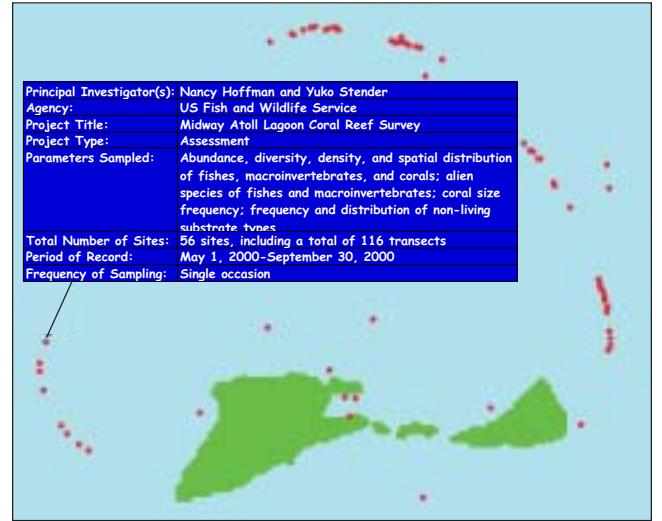

**NATIONAL SUMMARY NATIONAL SUMMARY**

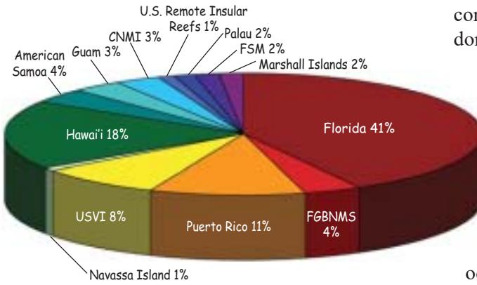

Figure 109. Percentage of 439 monitoring and assessment projects inventoried in 2000 in each region of the United States and Freely Associated States.

Turgeon in press, Fig. 109). A series of environmental problems occurred in the early 1990s involving the Florida Bay aquatic ecosystem and plans for 're-plumbing' the Everglades. Therefore historically, most of the U.S. coral reef monitoring support had focused on the Florida Keys. Since 2000, U.S. agency efforts have focused on building island capacity for long-term monitoring and other coral reef conservation activities.

#### The National Coral Reef Monitoring Network –

NOAA has made considerable progress in the development of a web-based data management and information system for the nation-wide integration of monitoring and mapping data. A large team of coral reef scientists and information technology specialists was brought together and is developing a NOAA single-point-of-discovery information

management system for coral reef data and information (CORIS). CORIS provides direct access to coral reef data and information, including relevant NOAA Library holdings (CORIS 2002).

Coral Reef Watch Program – To predict bleaching events, NOAA's Coral Reef Watch Program combines real-time environmental monitoring data from satellites and the in-water Coral Reef Early Warning System (CREWS) sensors (Fig. 110). Near real-time bleaching alert systems are now available on the web (NESDIS 2002). New CREWS systems

continue to be installed worldwide with 20 domestic systems expected to be in place by 2007.

Volunteer Monitoring Programs – A variety of volunteer monitoring programs collect information on coral reef ecosystems. These provide data and related information to the National Coral Reef Monitoring Network and enhance the monitoring being conducted by agency and non-governmental scientists.

These programs differ widely in scope, methods, and parameters measured, and may have issues regarding the quality of data. However, all provide the opportunity to educate the public, engage them in coral reef monitoring, and get basic information with minimal expense.

Global Coral Reef Monitoring Network (GCRMN) – This global network consists of 15 independent networks (nodes) in six regions around the world (GCRMN 2002). It focuses on regional databases used in national reports on reef status. The National Coral Assessment and Monitoring Program supports regional GCRMN activities and contributes regional reports to GCRMN for its biennial report on the Status of Coral Reefs of the World.

Reef Check – Initiated in 1997, Reef Check is a protocol for rapid assessment of reefs specifically designed for non-professionals and volunteers (Reef Check 2002). It evaluates the effects of human impacts on coral reefs. Annually it engages a large cadre of volunteer SCUBA and free divers in over 50 countries to survey selected harvested species, classify benthic substrates using the point-

intercept method, and report coral reef damage from bleaching and other stresses. The GCRMN designated Reef Check as its community-based monitoring protocol (Westmacott *et al.* 2000).

Reef Environmental Education Foundation (REEF) – Since 1990, this nonprofit organization has educated the public about marine resources and engaged divers and snorkelers in long-term monitoring (REEF 2002). REEF surveys fish distributions in the tropical western Atlantic, along the U.S. and Canadian West Coast, in the tropical eastern Pacific118, and off Hawai'i

Figure 110. A CREWS in-situ sensor in the Bahamas (Photo: Coral Reef Watch Program).

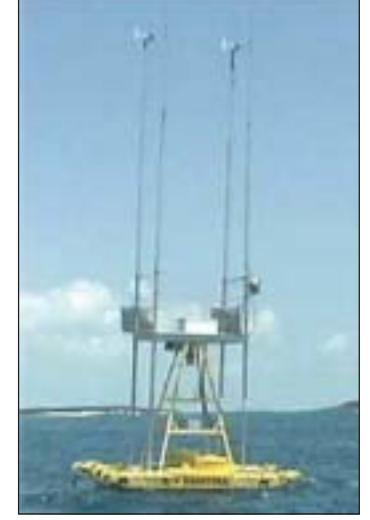

&lt;sup>118 From the Gulf of California to the Galapagos.

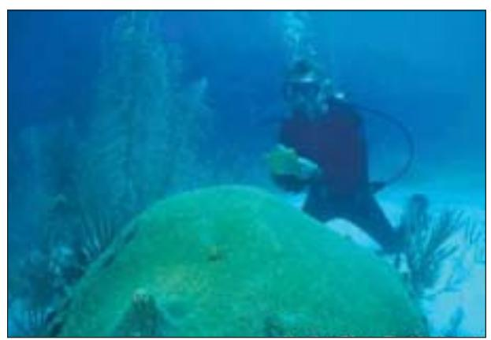

Figure 111. A REEF volunteer monitoring a site in the FKNMS (Photo: Heather Dine).

(Fig. 111). With NOAA, REEF evaluates the effectiveness of management zones in protecting fish resources in the FKNMS (Jeffries *et al.* 2000).

Atlantic and Gulf Rapid Reef Assessment (AGRRA) Program – Since June 1998, over 22 large-scale rapid ecological assessments on the condition of reef-building corals, algae, and fishes have been completed (AGRRA 2002). In 2001, a joint AGRRA and REEF project surveyed the FGBNMS; the data collected were used as part of the evidence that these reefs are in excellent condition.

Caribbean Coastal Marine Productivity (CARICOMP) Program – This program was initiated in 1985 to better understand regional phenomena119 that potentially control Caribbean coastal ecosystems (CARICOMP 2002). It is a regional network of greater Caribbean marine laboratories, parks, and reserves, with over 25 sites in 18 countries. It is dedicated to discriminating between human disturbance and natural variation within the reefs and reef-related habitats.

In 1991, CARICOMP instituted a synoptic, standardized monitoring program of coastal ecosystems that has centralized data management and communications. Members hold regular regional training workshops and facilitate directed research programs that involve members of the network and out-side investigators.

Reef Ecosystem Condition (RECON) **–** Initiated in 2000 by the Ocean Conservancy and the USEPA, RECON trains recreational divers to collect

information on key environmental parameters, assess the condition of stony corals and seafans, and record the presence of certain key organisms and obvious human-induced impacts (RECON 2002). The program is currently being tested in the Florida Keys, Puerto Rico, USVI, and the Bahamas.

#### **Conduct Strategic Research Research**

The USCRTF National Action Plan called for additional research to better understand coral reef ecosystems and help determine what can be done to protect and restore them. In FY00-01, the USCRTF agencies sponsored research on disease, bleaching, coral growth, and other aspects. This increased understanding of coral reef health, degradation, and recovery. National and international research accomplishments include the following.

- • The United Nations Environment Program's World Conservation Monitoring Center developed a web site for the global database of coral diseases (UNEP 2002, Fig. 112).
- • The National Science Foundation (NSF) continued to support research and education projects related to reef structure and function. During 2000, NSF renewed a 40-year ecological research project on the coral reefs of the Great Barrier Reef and supported reef studies in Costa Rica, Panama, and the Galapagos. In 2001, NSF sponsored \$8 million of new coral reef projects and continued 25 other studies.

Figure 112. Map of the distribution of incidents of whiteband disease in the Caribbean from the World Conservation Monitoring Center's global database of coral diseases (Photo: NMFS/UNEP-WCMC).

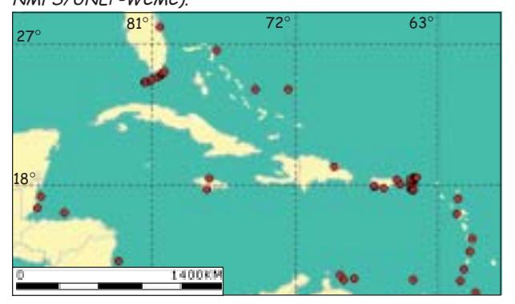

**NATIONAL SUMMARY NATIONAL SUMMARY**

119 The 1983-84 mass mortality of the long-spined sea urchin, coastal eutrophication, and coral bleaching. 120 At the University of North Carolina at Wilmington, the Caribbean Marine Research Center on Lee Stocking Island in the Bahamas, and the University of Hawaii at Manoa.

• The USFWS and the USEPA jointly funded a report titled *Mitigation of Coral Reef Impacts in the Pacific Islands*. This 2002 report evaluates the effectiveness of past compensatory mitigation efforts for federally-permitted or funded projects that removed coral reefs, and makes recommendations on ways to improve mitigation.

**National Sea Grant Program Grant Program –** NOAA's National Sea Grant College Program has funded research on coral reef species and habitats for over 30 years. Over \$2 million a year in grants have gone for State Sea Grant Programs in Hawai'i, Puerto Rico, and Florida, as well as individual projects in other states.

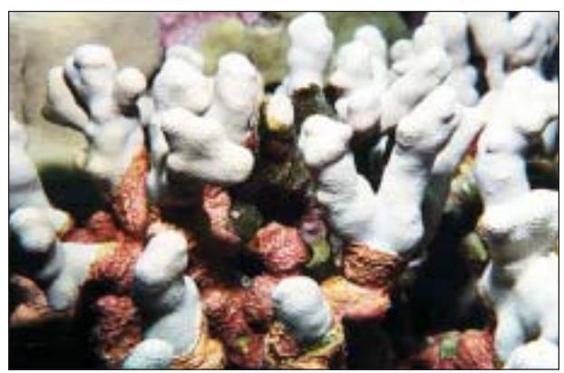

Figure 113. Coralline algae growing on finger coral at a site in Hawaii studied by HCRI's Fish, Algae, and Coral Ecology Team (Photo: Jennifer Smith).

These projects have resulted in over 1,000 scientific publications in peer-reviewed journals and other technical reports in the Sea Grant Depository at the University of Rhode Island (Sea Grant 2002).

**National Undersea Research Program Undersea Program –** Three of NOAA's National Undersea Research Centers120 (NURC 2002) spent over \$4 million on coral reef ecosystem research projects in FY01. NURC supported coral reef ecosystem research in the FKNMS, FGBNMS, Jamaica, the Bahamas, and off the Main and Northwestern Hawaiian Islands.

**Hawai'i Coral Reef Initiative Research Coral Reef Research Program (HCRI-RP) Program (HCRI-RP) –** This is a collaborative research and monitoring effort121 to better manage

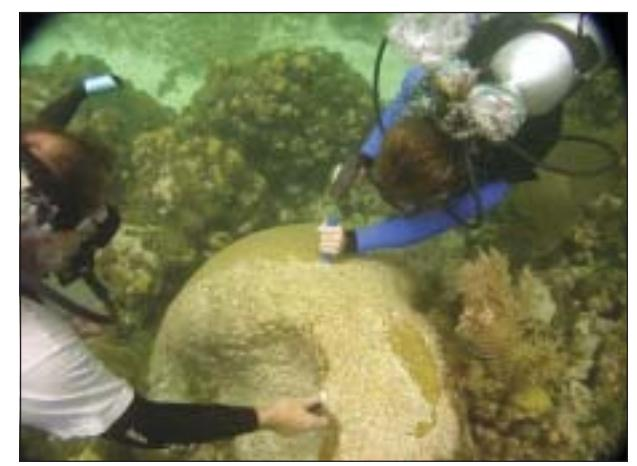

Figure 114. Researchers repairing a diseased coral colony (Photo: Richard Curry).

coral reef ecosystems in Hawai'i. Administered by NOAA, the HCRI-RP at the University of Hawai'i was established in 1998 by Congressional mandate and continues to receive Congressional funding. HCRI awards grants for projects that 1) address key threats to coral reefs and 2) reverse reef degradation (HCRI 2002, Fig. 113).

**National Coral Reef Institute (NCRI) (NCRI) –** A collaboration of universities and local/federal agencies122, NCRI's primary objective is the protection and preservation of coral reefs through applied and basic research on coral reef diversity, assessment, monitoring, and restoration (NCRI 2002). Established by Congressional mandate in 1998, it is administered by NOAA. NCRI continues to receive Congressional funding for its research projects. It provides scientific synthesis and evaluation criteria of existing programs for researchers and managers.

#### **Coral Disease and Health Consortium (CDHC) Consortium (CDHC) –**

With the USEPA and DoI, NOAA implemented the CDHC in 2000 to study the effects of natural and human stresses on coral communities (Fig. 114). CDHC research projects focus on the synergistic effects of disease and environmental stresses, and how these factors impact coral reefs.

Activities include coordinating disease research, tracking disease and predicting outbreaks of coral disease and bleaching, characterizing disease agents and transmission dynamics, and evaluating indicators of health status.

**AGENCY RESPONSES AGENCY RESPONSES**

121 Main collaborators are the University of Hawai'i, Hawai'i Division of Aquatic Resources, and the Pacific Science

Association/Bishop Museum. 122 Collaborators include Nova Southeastern University, U.S. Navy's Office of Naval Research, NOAA, City of Miami Beach, Broward County Department of Planning and Environmental Protection**,** National Fish and Wildlife Foundation, and Nautronix, Western Australia. **7979**

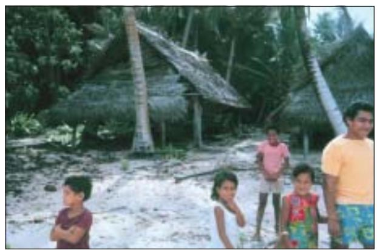

Figure 115. In the Southwest Islands of Palau, the traditional island lifestyle emphasizes subsistence fishing (Photo: NOAA).

**National Center for Caribbean Coral Reef Reef Research (NCORE) Research (NCORE) –** Established by the USEPA as a Federal Demonstration Project in 1999, NCORE still receives supplemental funding from NOAA, NSF, and other public and private sources. Located at the Rosenstiel School of Marine and Atmospheric Sciences of the University of Miami, NCORE integrates and refines physical and biological models to predict the consequences of either a given disturbance or a change in management strategy on the ecology of a coral reef and on reef-dependent people (NCORE 2002).

#### **Understand Social and Economic Economic Factors – The Human Dimension – The Dimension**

Coral reef management has traditionally focused on the biophysical aspects of coral reefs. Since reefs are coming under increasing pressure from human activities, better understanding the human dimension must play an important role in management programs. To ensure long-term success, programs must also involve the local community and create cooperative management.

Human activities and their resulting impacts are woven into the social, cultural, and economic fabric of regional coastal communities. This is particularly important among many of the U.S. Islands, where traditional management of coral reef resources, including subsistence fishing, have been an integral part of local government (Fig. 115).

The human dimension has become a significant component of USCRTF coral reef conservation activities. In FY00, NOAA shifted its priorities toward a more interdisciplinary approach, and began to diversify its focus, sponsor human

dimension data collection, and help build capacity for long-term coral reef conservation by State, Territorial, and Pacific Freely Associated State agencies.

**Socioeconomic Activities Socioeconomic Activities –** USCRTF agencies initiated a variety of projects in FY00-01 to better understand the role of socioeconomics.

- • The GCRMN *Socioeconomic Manual for Coral Reef Management*, edited by NOAA staff, was released in November 2000 (AIMS 2002, Fig. 116). Building on the manual, NOAA staff assisted in regional socioeconomic training workshops in East Africa and South Asia. With regional coastal environmental organizations, NOAA is planning additional workshops for the Caribbean and Southeast Asia.
- • HCRI engaged Local, State, and Federal agencies as well as private organizations in its public awareness program on threats to coral reef ecosystems. They also implemented education and training programs for coral reef managers and scientists.
- • NOAA is developing Figure 116. Cover of the a web-based database Socioeconomic Manual for of annotated referen- Coral Reef Management. ces of existing literature on socioeconomic values of coral reef habitats.
- • The FKNMS initiated a program in 1998 to monitor the economics of commercial fishermen displaced from fully protected zones (FKNMS 2002,

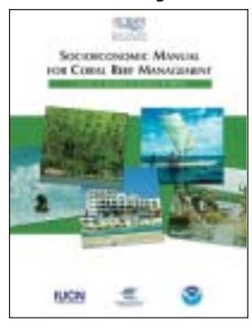

Fig. 117). It also tracks trends in recreational tourism and its relationship to the local economy. Baseline estimates (1995-1996) were developed on 'protected area use' and a 5-year update was recently completed. Part of the report compares satisfaction of reef users and rates the many reef attributes.

#### **Expand and Strengthen Marine Protected Protected Areas (MPAs) (MPAs)**

The USCRTF National Action Plan considers MPAs and areas with no-take provisions a key tool for protecting coral reef ecosystems and assuring

**NATIONAL SUMMARY NATIONAL SUMMARY**

the sustainable use of reef resources. Used nationally and internationally, MPAs conserve biodiversity, protect endangered species, reduce user conflicts, and enhance commercial and recreational activities (Salm *et al.* 2000). Enforcement determines the effectiveness of this (or any) conservation measure.

**Strengthen Current MPAs MPAs –** Much has been done over the past few years by USCRTF agencies to strengthen MPAs, but most have been incremental and relatively unheralded. The following are examples of what some of the island governments have undertaken since 1999.

- • The USVI Government initiated the development of a Marine Park Management Plan for a proposed marine protected area along the eastern end of St. Croix. Collaborating institutions are currently working on a socioeconomic assessment and resource description as well as a management plan for the USVI.
- • Hawai'i has begun to inventory and assess its MPA system and is designing a new structure for designation and management. It is increasing the size of the Pupukea MPA on O'ahu and creating a no-take zone within this MPA.
- • Guam is enforcing the waters within its five no-take coral reef reserves that protect about 20% of the island's shallow-water reefs (Fig. 118).

**Expand No-take Protection Protection –** Although most jurisdictions have yet to achieve the 20% no-take

protection goal for coral reefs (USCRTF 2000), areas of Guam's five no-take MPAs (Photo: Monument on St. Croix was have significantly increased. Since 1999, Federal, State, Territorial, and Commonwealth agencies have taken unprecedented action in this area.

Florida – In 2001, NOAA, the NPS, the State of Florida, local communities, regional Fishery Management Councils, and other partners implemented the Tortugas Ecological Reserve, a 200 mi2 (517.9 km2 ) fully protected marine reserve. With

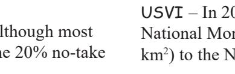

Figure 118. Tumon Bay Preserve is one

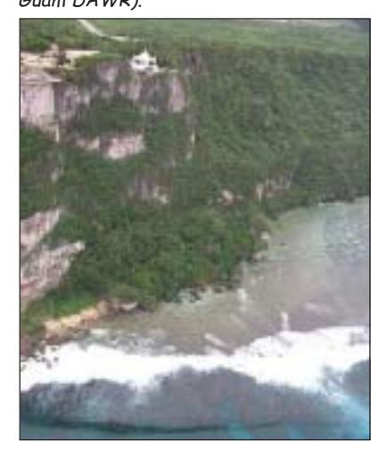

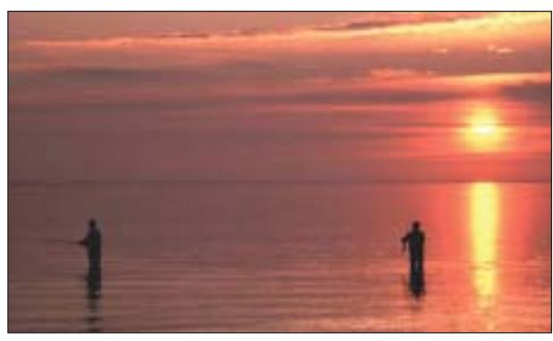

Figure 117. Socioeconomic monitoring is studying the economic status of Florida Keys fishermen (Photo credit: NOAA).

other fully protected zones, the Tortugas Ecological Reserve increased the total protected area of coral reefs within the Sanctuary to 10%. It adjoins a 61 mi2 (157.8 km2 ) Research Natural Area in the Dry Tortugas National Park. Together these areas protect near-shore to deep reef habitats of the Tortugas region and form the largest, permanent MPA in the United States.

Puerto Rico – In 1999, the Commonwealth established the Luis Peña Marine Reserve, its first no-take reserve. It is a 4.8 km2 zone where fishing and anchoring are prohibited. In 2000, the 2.4 mi2 (6.2 km2 ) Desecheo Marine Reserve was implemented, providing no-take protection for 4.2 mi2 (11 km2 ) of coral reefs. Currently, 1.5% of the area covered by Puerto Rico's coral reefs is protected through no-take reserves.

USVI – In 2001, the Virgin Islands Coral Reef National Monument added about 20 mi2 (51.43 ) to the National Park off St. John. In 2001,

Buck Island Reef National protected by no-take reserves Guam DAWR). expanded from about 1.4 mi2 to 30 mi2 (3.6 to 77 km2 ). The implementing language states "the Secretary [of the DoI] shall prohibit all extractive uses," including fishing, with a few minor exceptions. This effectively makes it a no-take reserve that covers 17.4% of USVI coral reef ecosystems.

> U.S. Remote Insular Reefs – In 1999, the Navassa Island National Wildlife Refuge was established by Administrative Order 3210 to

**AGENCY RESPONSES AGENCY RESPONSES**

protect about 594 mi2 (1,538 km2) of coral reefs and associated habitats (DoI 1999, Fig. 119). This Caribbean Refuge is open to artisanal fishing only.

In 2001, the islets of Palmyra Atoll were purchased from the Nature Conservancy by the DoI for inclusion in the Palmyra Atoll National Wildlife Refuge (Federal Register 2002a). This Refuge allows limited recreational fishing and wildlife observation activities. In 2001, the new National Wildlife Refuge at Kingman Reef was established (Federal Register 2002b). The entire refuge is protected by no-

take provisions – a total of about 756 mi2 (1,957 km2) of coral reef and other habitats are closed to access except for innocent passage through its waters.

Hawai'i – In 2000, the Northwestern Hawaiian Islands Coral Reef Ecosystem Reserve was established by Executive Order (E.O. 13178). It is the largest U.S. marine protected area, covering approximately 130,900 mi² (339,900 km²) (NWHI Coral Reef Ecosystem Reserve 2002). About 21.4% of the Reserve is within the established Hawaiian Islands National Wildlife Refuge, and protected by no-take provisions.

CNMI – Currently, the CNMI has seven established MPAs. The Sasanhaya Fish Reserve in Rota is a no-take reserve. In 2001, three new MPAs on Saipan123 were created but these have yet to be enacted into law. Overall, MPAs with no-take provisions protect about 3.7 mi2 (9.6 km2), for a total of 1.7% of the shallow-water coral reef ecosystem.

## Reduce Adverse Impacts of Fishing and Other Extractive Uses

Coral reefs and associated ecosystems support important recreational, commercial, and subsistence fisheries around the world. The rich reef biodiversity of reefs also supports a marine aquarium industry and represents genetic resources for future food, pharmaceuticals, and other products derived

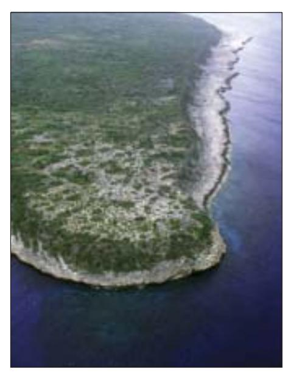

Figure 119. Aerial view of northwest Navassa Island (Photo: Bob Halley and Don Hickey).

through mariculture or biotechnology. Unfortunately, these benefits are being undermined by overfishing and fishing-associated impacts to reefs.

**Reef Fishing and Collecting for Aquaria** – USCRTF
agencies took a number of
important actions to reduce the
impacts of fishing and aquarium collection on coral reefs in
the different jurisdictions.

American Samoa – The Government developed a 5-year plan for coral reef management and banned the export of 'live rock.' The Governor issued an executive order prohibiting fishing with

SCUBA, addressing a major cause of overfishing of certain fishes. Three coastal villages joined the Department of Marine and Wildlife Resources' community-based fishery management program. Two of these villages124 created short-term replenishment areas where fishing is prohibited except during seasonal runs of big-eyed scad (*Selar crumenophthalmus*). Enforcement has also increased.

CNMI – The Commonwealth recently passed three laws that reduce fishing impacts. Commercial and non-commercial fishers are prohibited from using explosives, poisons, electric shocking devices, SCUBA, or hooks when harvesting reef fish or other marine life within the lagoon or reef, or within 1,000 ft of either.

Hawai'i – The State increased the minimum allowable size for all currently regulated reef fishes and invertebrates. It also prohibited harvesting aquarium fish along 355 miles of the West Hawai'i coastline.

To address concerns about the removal of Hawaiian reef fish for the aquarium trade, Hawaii's DLNR funded the West Hawaiian Aquarium Project, at the University of Hawaii at Hilo and at other institutions (W. Walsh pers. comm.). Those results showed significant population declines in areas where fish had been collected. For example, at sites with regular collecting Achilles tang had been reduced by 63%, longnose butterfly fish by 54%, and yellow tang by 47% (Fig. 120), according to B. Tissot (pers. comm.) of Washington State

123 Forbidden Island Sanctuary, Bird Island Sanctuary, and Mañagaha Marine Conservation Area.

University in Vancouver, B.C., who coordinated the project. This shows the type of applied research/monitoring needed to verify ecosystem condition, guide management decisions, and track changes after conservation measures are in place.

Puerto Rico – The Commonwealth is revising its fishing regulations regarding the capture and export of aquarium fish.

Florida – NOAA expanded its radar enforcement surveillance to include the new Tortugas Ecological Reserve.

**Culture of Reef Species Culture Species –** NOAA's National Sea Grant program played a key role in bringing the scientific and commercial ornamental species industry together by sponsoring symposia and funding research on culturing reef ornamental species.

The two international symposia on marine ornamentals attracted nearly 500 scientists and industry representatives. Sea Grant Florida convened the Second International Symposium on Marine Ornamental Fishes in 2001 and published a major study on Florida's live marine ornamental industry (Larkin *et al.* 2001).

As an alternative to wild capture, NOAA's National Sea Grant Program has funded research programs in Puerto Rico, Florida, Texas, and Hawai'i on the culture of coral reef species. Over 20 species of fish, crustaceans, mollusks, and corals are now commercially grown.

The Marine Aquarium Council, formed through industry and regulatory agency cooperation, has developed a certification process for ornamental

species. This certification will help tion techniques, and optimum health and vitality for cultured ornamental species. Industry participants agreed to display the certification in their retail outlets.

#### **Reduce Impacts of Coastal Impacts of Coastal Uses**

Rapid growth of both population and tourism in coastal areas poses increasing threats to the conservation of nearby coral reefs. Coastal activities such as dredging for navigation or marinas, construction of shoreline protection structures, beach renourishment, sand mining, pipeline and cable installation, and destructive land-use practices125 decrease water quality around reefs. Increased tourism has increased pressure on coral reef resources, either through direct impacts on the reefs or indirectly through increased levels of coastal development, sewage discharge, and vessel traffic. As the number of people using and transiting coral reefs increases, so does the frequency of vessel groundings on reefs.

A number of actions have been taken by the USCRTF to reduce these impacts.

#### **Recreational Vessels and Water Sports Vessels and Sports –**

Prohibitions on recreational vessels, especially jet skis, were implemented in sensitive areas in Puerto Rico using its revised Coastal Zone Management Program Federal Consistency Guidelines. Similarly, the CNMI imposed a moratorium on water sport operations until an impact assessment is completed. They also installed coral reef protection signs along the shorelines.

**Reef Wildlife Feeding Feeding –** In November 2001, after five public input-and-discussion sessions over two years, the Florida Fish and Wildlife Conservation Commission voted to ban feeding marine life by divers. Commissioners concluded any practice that modifies natural feeding habits is unacceptable, and practices that teach marine life to associate people with food are unhealthy for both.

**Anchoring on Coral Reefs Reefs –** Working through the International Hydrographic Organization, standard

assure the collection industry will Figure 120. Hawaiian reef species targeted by the aquarium trade, top to bottom, left to right: yellow tang, Moorish idol, gold ring surgeonfish, Achilles be sustainable using safe and tang, and Potter's angelfish (Photos: Keoki Stender/Hawaii Coral Reef Network). humane collection and transporta-

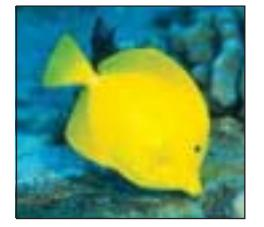

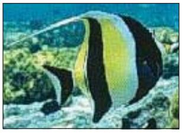

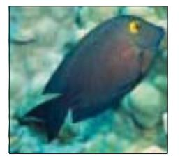

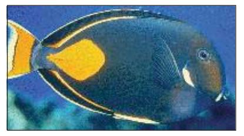

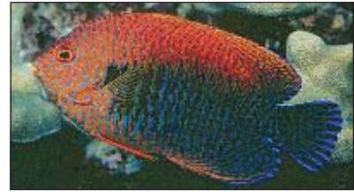

**AGENCY RESPONSES AGENCY RESPONSES**

124 Poloa and Alofau.

 125 Road construction, mangrove deforestation, and land reclamation for agricultural and urban development.

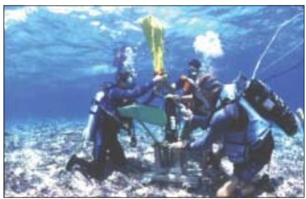

Figure 121 Divers installing a mooring buoy at Johnston Atoll (Photo: James Maragos).

symbols for 'No Anchoring Areas' for large vessels were added to its international catalog. The United States led an initiative to establish the first mandatory 'No Anchoring Area' in the FGBNMS. The International Maritime Organization granted NOAA its request in 2000 (FGBNMS 2002).

Permanent mooring buoys were installed at a number of national and international sites during 2000 2001. These delineate the site and allow boats to tie up for recreational diving and fishing without dropping anchor on the reef. NOAA's FGBNMS installed radar-reflecting buoys in the sanctuary and acquired mooring buoys, channel markers, and other aids to navigation with signs to mark protected areas.

Funded with Sportfish Restoration Funds, the Florida Department of Natural and Environmental Resources installed 200 mooring buoys near coral

reefs. NOAA also funded the installation of perm-anent moorings in Hurricane Hole, USVI. The State of Hawai'i installed or replaced 26 mooring buoys at Molokini Shoal Marine Life Conservation District.

The U.S. Air Force and USFWS installed permanent moorings for recreational diving and snorkeling at the most popular dive sites around Johnston Atoll in the Indo-Pacific region (Fig. 121). Naval Station Guantanamo Bay purchased buoy markers to establish a boat-free zone at Phillips Park,

a popular dive site. The buoys were installed as a joint effort between Port Operations and the Base Dive club.

**Grounded and Abandoned Vessels –** A Raconbeacon system has been installed in the FKNMS to help prevent navigational errors and reduce future groundings and vessel-related injuries to coral and seagrass habitats throughout the Florida Keys.

NOAA created an abandoned vessel inventory GIS database (Fig. 122) and developed a draft abandoned vessel white paper evaluating legal authorities, prioritization of threats, and a response/removal plan for high risk vessels (NOAA/DAC 2002). Workshops were held in 2001 to provide technical assistance and develop national goals for managing impacts from grounded and abandoned vessels.

NOAA initiated the Restoration and Assessment of Coral Reef Ecosystems program to recover natural resource damages for injury to FKNMS sanctuary resources caused by vessel groundings. Legal settlements and restorations were obtained in several coral cases126 (Fig. 123). Over 20 cases under the National Marine Sanctuary Act are currently in negotiation and litigation.

**Beach Renourishment and Dredging Dredging –** The USFWS, NOAA, and the Florida Department of Environmental Protection have relocated dredge materials from a Miami Beach nourishment project to an alternate borrow area and modified techniques to alleviate siltation and resul-tant coral

Figure 122. A draft map from the abandoned vessel inventory GIS (Photo: NOAA/ Damage Assessment Center).

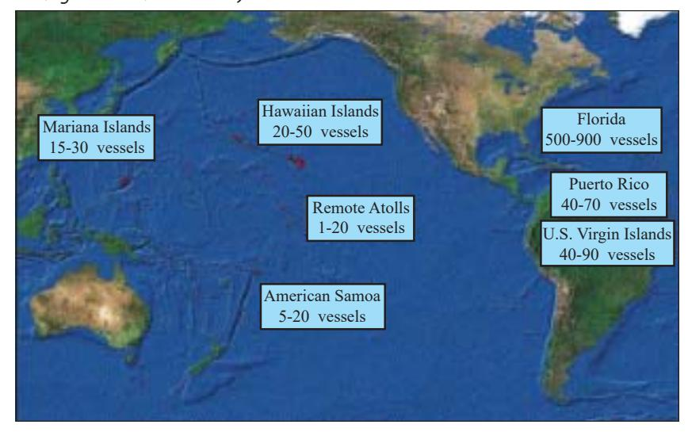

126 This includes the M/T Igloo Moon case in Biscayne NPS for \$1 million and a Puerto Rico Barge grounding for \$83.5 million.

**NATIONAL SUMMARY NATIONAL SUMMARY**

damage. These agencies are preparing intensive monitoring and contingency plans for beach renourishment in Broward County. The plans will protect nearshore and offshore hardbottom and corals.

The U.S. Navy surveys and implements protective measures for coral reefs near the Pearl Harbor Entrance Channel as part of its annual dredging operations.

**Federal Operations** – The USFWS has begun examining past major Federal projects for impacts to coral reefs. The project is documenting types of mitigation proposed for the

loss of coral resources and the effectiveness of the mitigation. One of the outcomes of this report will be a recommendation for other Federal and State agencies to improve mitigation tracking.

Since the *Coral Reef Protection Plan Implementation Plan* (DoD 2000) was issued, DoD has provided guidance to its forces to plan and budget for projects to sustain coral reefs. DoD has initiated an impressive number of new projects to reduce operations impacts on coral reef ecosystems.

The U.S Army Corps of Engineers and USEPA instituted new prohibitions and restrictions on the use of some Clean Water Act Section 404 Nationwide permits for activities that affect 'special aquatic sites' (including coral reefs) and issued new guidelines to minimize impacts to coral reefs from Federally permitted projects.

The U.S. Navy developed Coral Reef Protection Management Guidelines for DoD Vessels and Installations. It includes best management practices for vessels operating in proximity to coral reefs and training protocols for personnel to implement such measures. DoD ports and associated reef ecosystems will be surveyed to identify priority areas based on significant use and/or sensitive reef conditions. This data will be used to develop further project requirements to protect coral reefs. Additionally, the Navy is developing a GIS-based information system to assist military personnel in

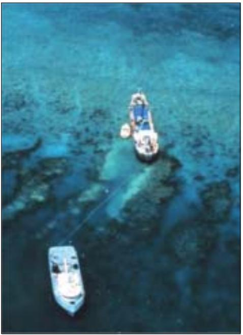

Figure 122. Removal of a grounded vessel in FKNMS (Photo: FKNMS).

identifying hazards and avoiding impacts to sensitive marine ecosystems.

Fort Kamehameha Outfall Extension, HI – In FY01, the Navy conducted a marine biological field survey of the entire project corridor to protect the limited coral resources within it. To avoid disturbing coral reefs, microtunneling to house the outfall pipe will pass below the fossil limestone bench on which the corals are growing.

#### **Reduce Pollution**

The USCRTF National Action Plan calls for Federal, State, Commonwealth, and Territory

agencies to better manage activities affecting coral reef resources, including habitat destruction and pollution. Managers of jurisdictions where human impacts are greatest have first responsibility for action. They have taken a number of significant conservation actions in FY00-01.

**Water Quality** – The USDA provided technical and financial assistance to landowners and operators to reduce agricultural non-point source pollution to near-shore coral reef ecosystems (Fig. 123). These contracts apply conservation measures to nearly 1,776 mi2 of agricultural lands over the next 5-10 years.

The USEPA developed a strategy for creating coral reef indexes of biological integrity. USEPA

Figure 123. Runoff from agricultural lands (Photo: NOS Photo Gallery).

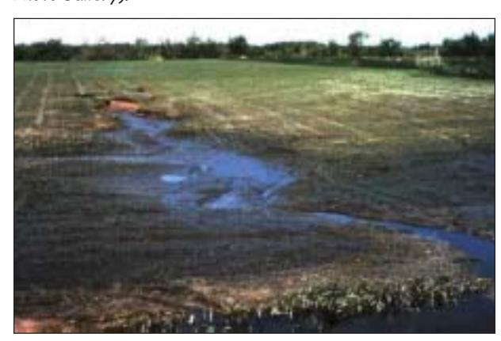

published *Nutrient Criteria Technical Guidance Manual for Estuarine and Coastal Marine Waters,*  establishing scientifically defensible nutrient criteria for coastal and estuarine waters.

USGS, USEPA, USDA, the University of Hawai'i, and the Hawai'i Department of Health collaborated to address the impacts of sediments and nutrients on coral reef ecosystems by identifying research needs for better prediction of erosion and sediment management practices.

The USEPA and NOAA implemented the Water Quality Protection Program Action Plan for the FKNMS. It focuses on sea grasses and water quality, upgrading inadequate wastewater and stormwater infrastructure, and conducting public education and outreach activities to improve local stewardship.

**Contaminant Biomonitoring Biomonitoring –** A biomonitoring program using reef fish to detect human impacts

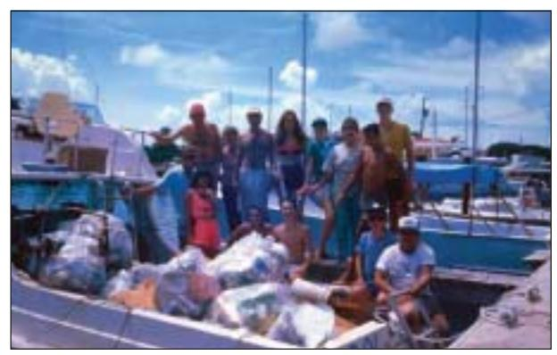

Figure 125. Volunteers removing marine debris within the FKNMS (Photo: Paige Gill).

was developed for coral reefs off Johnston Atoll with collaborative funding by the U.S. Army Program Manager for Chemical Demilitarization, the U.S. Air Force Pacific Command, and the U.S. Coast Guard (EPA 2002). Reproductive and developmental parameters will be monitored in populations of blackspot sergeant major damselfish (*Abudefduf sordidus*) spawning in areas potentially impacted by chemical contamination. This will be compared with populations from nonimpacted (control) areas. Samples of fertilized embryos are collected from the field and examined for developmental defects. The results are correlated with contamination.

**Marine Debris Marine Debris –** In 1996 and 1997, NOAA conducted the first surveys of derelict fishing gear in the NWHI, a problem which has since been identified as the major human impact in these islands. From 1998-2001, NOAA led a multi-agency partnership127 to remove marine debris from the NWHI.

Marine debris is also a concern in the Main Hawaiian Islands. In 1998, community groups, the military, and the Hawai'i DLNR pulled more than 3.5 tons of nets and debris128 out of Kane'ohe Bay and Wai'anae waters during three separate cleanup days (Clark and Gulko 1999). In 2000, Hawai'i developed a database on marine debris 'hot spots' around the main Hawaiian Islands. NOAA also assisted in a large-scale reef cleanup on the shoreline around Kauai. Tesoro Oil Company sponsored the work as compensation for an oil spill from their offshore moorings off the east coast of Kauai.

On Saturday, September 15th, 2001, nearly one million people scoured 20,700 miles of beaches, oceans, and waterways all over the world as part of the 16th Annual International Coastal Cleanup. Volunteers collected more than 6,123,000 kg of trash – the world's largest marine trash haul. The National Marine Debris Monitoring Program uses volunteer groups to monitor and remove marine debris from coastal beaches of the United States (Fig. 125). The data in the five-year program are compiled and analyzed by the Ocean Conservancy, and will be used by the USEPA to determine the effectiveness of current regulations against dumping at sea.

**Invasive Species Species –** An emerging issue, invasive species are generally believed to be a growing and imminent threat to marine resources (Carlton 2001). Carlton describes hundreds of species arriving daily in U.S. waters in ship ballast water, hull fouling, and by the deliberate or accidental release of species to the wild.

The Bishop Museum produced a *Guidebook of Introduced Marine Species in Hawai'i* and hosted two workshops to explore the pathways of introduction and impacts of invasive species on coral reefs. They also supported research on phase shifts from coral reef to alien macroalgae. The USFWS funded and provided logistical support to the Bishop Museum for its *Marine Survey of Alien Species at Johnston Atoll National Wildlife Refuge and French Frigate Shoals in the Hawaiian Islands National Wildlife Refuge*. The report for

**NATIONAL SUMMARY NATIONAL SUMMARY**

127 This included the USCG, USFWS, U.S. Navy, the Hawai'i DLNR, the University of Hawai'i, the National Sea Grant College Program, the Hawai'i Wildlife Society, and the Ocean Conservancy.

Johnston Atoll National Wildlife Refuge is now available.

The U.S. Navy requested Legacy Program project funding in 2002 to survey the microflora in ballast tanks on its vessels. Water from ballast tanks of ships will be surveyed to determine the live microflora transported as a function of Navy ship type and mission. The study will also develop

procedures and validate methods for evaluating microbiological flora of bulk water stores for use by government and/or private laboratory facilities.

#### **Restore Damaged Restore Damaged Reefs**

The USCRTF National Action Plan called for the restoration of coral reefs injured by vessel groundings and the development of new techniques and approaches for improving restoration. In response, Federal and State agencies have implemented a wide range of coral restoration projects using monies recovered from responsible parties through damage actions. Reef restoration requires a multi-disciplinary

approach to be most successful (Precht 1998).

A 'Reef Medics' volunteer restoration program was established in the FKNMS (Fig. 126) and artificial reef training workshops were conducted in Florida and Puerto Rico. Two more workshops are planned for the Pacific.

#### **Ship Removal and Reef Restoration Ship Reef Restoration –** NOAA

developed new methodologies to better assess damage from vessel groundings. NOAA, the Coast Guard, DoI, and island agencies updated the Environmental Sensitivity Index atlases for Puerto Rico, and the U.S. and British Virgin Islands. NOAA also held training sessions for partners in the Florida Keys and Hawai'i on the scientific aspects of oil spills in coral environments from

grounded ships. These activities will help managers respond more rapidly and effectively.

Florida – Large ships have been responsible for damaging or destroying an extensive tracts of coral reef habitat over the past ten years. However, recent reef restoration activities in the FKNMS have attempted to mitigate some of that damage. These included emergency removal of rubble to

> prevent scouring by waves or storms and reattachment of severed branching corals.

To address the major cumulative effect of small-craft groundings, NOAA and the State of Florida have instituted a new initiative focused on developing and implementing rapid, high-quality ecological assessment techniques. With these, a large percentage of the 600+ annual groundings in the FKNMS will be assessed and the responsible parties prosecuted. The damages recovered will be used to restore the most severely injured areas.

For example, NOAA and the State of Florida reconstructed four spurs of an ancient coral reef in the FKNMS damaged by the grounding of a 47 m

vessel. NCRI has begun a study of high-latitude reefs to evaluate variables concerning coral settlement and recruitment of coral fish assemblages on different restored habitats following a submarine grounding off the Southeast Florida coast.

Hawai'i – The Waikiki Aquarium and the Hawai'i DLNR are initiating a pilot project to restore damaged coral habitat in Kealakekua Bay on the island of Hawai'i. The Hawai'i DLNR, USFWS, and NOAA are working with the City and County of Honolulu to ameliorate the impacts of a marine wave break. This includes help from a local high school in transplanting and monitoring coral colonies.

American Samoa – The USCG, NOAA, DoE, DoI, and American Samoa cooperated to remove nine long-line fishing vessels grounded in Pago Pago

Figure 126.Transplantation of a pillar coral damaged in the FKNMS (Photo: Harold Hudson).

**8787** 128 Over 360 kg of broken stony corals were removed from these nets afterwards.

**AGENCY RESPONSES AGENCY RESPONSES**

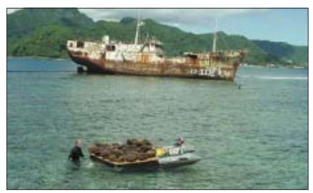

Figure 127. Relocation of corals prior to the removal of a ship wreck in Pago Pago Harbor, American Samoa (Photo: James Hoff).

Harbor during a 1991 cyclone. Prior to removal and to prevent further damage, NOAA temporarily relocated coral colonies away from the work area (Fig. 127). Once the vessels were removed, the relocated corals were returned and additional restoration activities begun. Survival of the restored reef habitat is being monitored.

Additionally, USFWS funded a reef restoration project to address the 1993 grounding and breakup of a 250 mT longline fishing vessel at Rose Atoll National Wildlife Refuge. Since 1993, the USFWS and the American Samoan Department of Marine and Wildlife Resources have periodically monitored the site (Green *et al.* 1998). The USFWS initiated a cleanup in 1999 and completed removal of shipwreck debris from the ocean reef flat and most debris from the slopes in 1999-2000 (Fig. 128). Over 100 mT has been removed, but about 40 mT remains in the lagoon.

Surveys in 2002 show cleanup actions have resulted in some reef recovery, but substantial impacts remain (J. Burgett and J. Maragos pers. comm.) There is a good chance additional funds from the USCG will be available for the USFWS to finish the cleanup in 2002-2003. Plans are being made to maintain a long-term monitoring program on this atoll through the next decade with the latest survey completed in February 2002 in cooperation with NOAA.

**Coral Restoration on Artificial Surfaces –** If successful, research using artificial surfaces for reef restoration could lead to new ways of repairing coral reef damage. NOAA and Dr. Chris Koenig deployed artificial structures with attached *Oculina* fragments in the Experimental Oculina Research Reserve. NOAA's FKNMS conducted two pilot

studies to reintroduce the long-spined sea urchin into patch- and fore-reef environments in the Florida Keys to reduce macroalgal biomass. Coral recruitment onto different structures used in FKNMS reef restoration projects was evaluated to identify optimal surfaces to enhance natural recruitment. Initial experiments in culturing spawned gametes of important reef-building coral species were conducted to improve settlement and recruitment potential.

A coral fragment holding and propagation facility was developed at the Florida Aquarium and two experimental coral nursery/restoration research projects were completed in the Florida Keys.

**Seagrass and Mangrove Restoration and Restoration –** New mapping technology was employed and a spatial recovery model was developed for seagrass damage assessment work in the FKNMS. The USFWS is restoring mangrove habitats on the Culebra and Cabo Rojo National Wildlife Refuges (Fig. 129) and is assisting the Commonwealth of Puerto Rico in restoring reserves and coastal forests.

Over 1,000 acres of mangroves were restored through a DoD Legacy project in the Los Machos and Red Mangrove Forests to support the recovery and protection of nearby coral reefs.

#### **Reduce Global Threats to Coral Reefs Reefs**

The United States has interests in protecting international coral reefs. Healthy coral reef ecosystems are critical to U.S. diplomatic and development strategies to promote economic and food security, establish social stability, improve human health, and conserve global biodiversity. These extremely

Figure 128. Removal of metallic debris from the ship wreck at Rose Atoll (Photo: James Maragos).

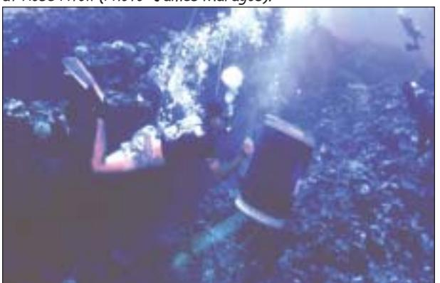

**NATIONAL SUMMARY NATIONAL SUMMARY**

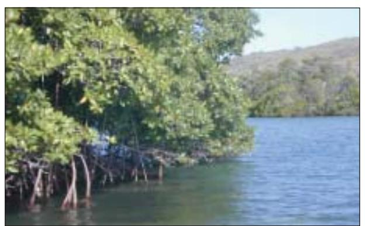

Figure 129. A mangrove forest in Puerto Rico (Photo: John Christensen).

valuable ecosystems constitute the economic base and future hope for sustained development in many countries, particularly small island nations.

The USCRTF National Action Plan has diverse activities to protect and conserve reefs internationally, with an emphasis on capacity building and technical assistance. Accordingly, the USCRTF has developed strategies to reduce adverse impacts from global threats to coral reef ecosystems, including destructive fishing practices and international trade.

**International Reef Conservation Conservation –** The United States assisted 25 countries in the wider Caribbean, Central America, South East Asia, South Pacific, East Africa, and Middle East regions to improve their capacity for sustainable management and conservation. Additionally, management, education, and enforcement in 15 parks of national and international importance were improved. U.S. assistance was also given to the Ridge to Reef project in Jamaica, which integrates land-based management practices for agriculture, forestry, and urban planning with coastal activities, such as improving coastal water quality to protect the reefs. Development assistance was also awarded Mexico's first National Marine Park. It was initiated by a local community and recognized by the Mexican government in 2000.

In collaboration with the Western Hemisphere Convention Ramsar's Scientific and Technical Review Panel, the USFWS developed *Guidelines for the Ramsar Contracting Parties* to designate coral reefs, seagrass beds, and mangroves as Wetlands of International Importance. Guidelines were also developed for Western Hemisphere Coastal Zone Management. These guidelines have been

approved by the Convention's Standing Committee and will be presented to the Contracting Parties for adoption in 2003 by Ramsar. It is believed these guidelines will contribute to conservation at a global level. Brazil has already designated the Parque Estadual Marinho do Parcel Manoel Luis a Ramsar site. This park contains some 175 mi2 of reefs.

NOAA strengthened the International Coral Reef Initiative and international recognition of the importance of coral reef conservation, and supported Global Coral Reef Monitoring Network initiatives **(**GCRMN 2002).

#### **Reduce Impacts from International Impacts from International Trade in Coral Reef Resources Resources**

Food fish and live fish for the aquarium trade, construction materials, curios, jewelry, pharmaceuticals, and traditional medicines all come from coral reefs around the world. The USCRTF International Working Group assessed the U.S. role in the international trade and developed a comprehensive strategy to reduce adverse impacts. The State Department recommended Congress adopt new measures to ensure U.S. consumer demand does not contribute to the degradation of coral reefs.

**Destructive Fishing Practices Destructive Fishing Practices –** The United States supported international programs under the East Asia and Pacific Environmental Initiative to address destructive fishing practices (Fig. 130) and other adverse aspects of international trade in coral

Figure 130. A diver extracts a lobster from a dynamite blasted reef in Indonesia. The diver's white squirt bottle probably contains cyanide, evidence of another destructive fishing technique (Photo: Mark Erdmann).

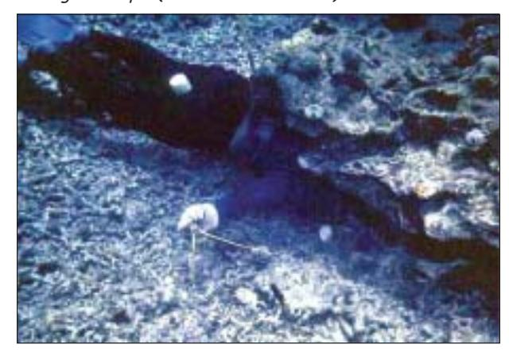

**AGENCY RESPONSES AGENCY RESPONSES**

reef species. The State Department provided funds to developing countries to increase their human and institutional capacity, promote sustainable management practices, and enhance their ability to address local adverse impacts.

**Trade in Marine Ornamental Species Marine Ornamental Species –** USCRTF agencies provided financial and technical support to the Pacific Regional Workshop held in Fiji – Sustainable Management of the Marine Ornamental Trade. Additionally, U.S. sponsorship and organizational assistance was provided to the International Coral Trade Workshop; Development of Sustainable Management Guidelines, held in Jakarta, Indonesia.

The United States submitted an in-depth report on coral mariculture and a new standard identification manual for live Indo-Pacific corals used in international trade to the CITES Coral Working Group. Within the protocol, federal biologists volunteered to poll national authorities on the conservation status and levels of trade in black corals130, review salient literature, and generate a report on the appropriateness of CITES protection. This report formed the foundation for discussions within CITES and eventual recommendations to retain CITES protection for black corals.

**Landmark Legal Cases –** The U.S. Justice Department awarded precedent-setting criminal convictions for illegally importing Caribbean spiny lobsters and protected corals. The first federal felony conviction involved a Florida company charged with smuggling and importing protected coral reef species from the Philippines131. In 2000, U.S. Federal and state law enforcement personnel successfully prosecuted three individuals for conspiring to illegally take 100 tons of coral and live rock from Hawaiian reefs for commercial sale132.

aspects of coral reef Figure 131. From Florida to American Samoa, children learn about coral reefs through ecosystems, fishing laws education and outreach programs (Photos: Nancy Daschbach and Heather Dine).

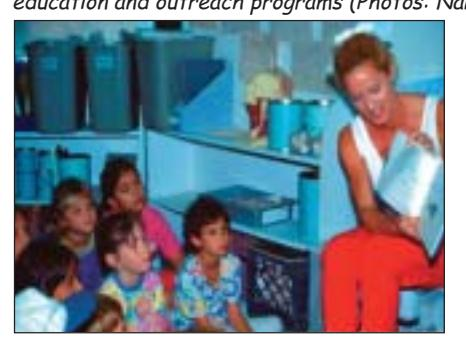

#### **Create an Informed Public Public**

The USCRTF strives to increase public understanding of coral reef conservation issues and engage the general public as well as local communities in conservation efforts. In FY00-01, USCRTF agencies expanded their education and outreach efforts, focusing on coral reef conservation and protection (Coral Reef 2002, Fig. 130). Most of these efforts are being done by State and Territorial agencies, although many have been assisted by Federal grants.

**Coral Reef Conservation Fund Reef Conservation Fund –** The Coral Reef Conservation Act of 2000 (CRCA) authorized NOAA to enter into an agreement with a nonprofit organization to establish and administer a Coral Reef Conservation Fund (the Fund). NOAA established the agreement with the National Fish and Wildlife Foundation (NFWF). Grants under the Fund support local-level public and private partnerships to conserve coral reefs. One of the major focus areas is increasing community awareness through education and stewardship activities. In 2001, the Fund provided approximately \$2 million in grants for education and public outreach projects.

#### **Agency Outreach and Education Activities and Education Activities –**

State, Commonwealth, and Territorial agencies created brochures and other materials to educate the public on the *National Action Plan* and other coral reef activities.

The USFWS, the Florida Keys National Marine Sanctuary, and The Ocean Conservancy initiated an outreach program targeting resource users in the Florida Keys. They developed bilingual displays and printed materials on coral reefs for Puerto Rico and the USVI. The State of Hawai'i has produced a variety of outreach and education materials on

> and regulations, and basic natural history (Fig. 132). Guam instituted a unique village-to-village coral reef education 'road show.' CNMI completed a Coral Reef Education series on CD for distribution in the local school system.

**NATIONAL SUMMARY NATIONAL SUMMARY**

129 Order Antipatharia. 130 The company was fined \$25,000 and has five years probation. The owner will serve 18 months in prison, as well as pay a \$5,000 fine on top of other penalties.

The USDA provided 6,465 customers with conservation education assistance in developing sound conservation plans that collectively kept an estimated 397,773 tons of soil erosion from agricultural land from reaching Caribbean reefs. The USDA also helped to reduce pig waste contamina-

tion to reef ecosystems and helped American Samoan farmers upgrade their swine management skills.

NOAA distributed over 30,000 Coral Reef Teacher guides throughout Mexico and Belize.

Recently the Department of Defense prepared several outreach publications on coral reefs. The *DoD Coral Reef Protection Implementation Plan* provides guidance and information to the DoD services regarding protection of coral reefs, and DoD's relevant existing programs, policies, and current funding authorities (Defense Environmental Exchange Network 2002). The *Coral Reef Conserva* 

tion Guide for the Military is a general outreach brochure to heighten awareness within DoD (Defense Environmental Exchange Network 2002). It provides an overview of DoD activities that could potentially have adverse impacts on coral reef ecosystems and outlines pertinent DoD and U.S. national laws and policies regarding coral reef protection.

National Sea Grant Education – Through its network of state educators and extension personnel, Sea Grant has played a critical role in bringing coral reef issues and education to the public. One example of this work resulted in a cooperative program of Sea Grant, the USEPA, and the State Department producing an educational activity book for middle school students. This book is now being used around the world as a coral reef related educational program.

Sea Grant has presented numerous workshops and hosted town meetings in coastal areas on topics

such as MPAs, fisheries management, aquaculture, sea food, technology, coral reef mapping, the use of GIS for coastal management, and habitat preservation and management.

#### Non-Governmental Organization Contributions –

Non-governmental organizations (NGOs) have a

significant role in addressing USCRTF education and outreach goals. A number of NGO groups performed a variety of coral reef education activities throughout the United States.

The project AWARE Foundation and Ocean Watch implemented their *Protect the Living Reef* campaign that teaches low-impact diving and snorkeling techniques. It incorporates videos and guides in a new certified Coral Reef Conservation specialty course from International PADI, Inc. and the Reef Condition Monitoring Program (Project AWARE 2002).

Through RECON and with support from the USEPA, the Ocean Conservancy and REEF

developed a rapid assessment protocol. It was field-tested by recreational divers and students. They surveyed the condition of stony corals, the presence of indicator organisms and conspicuous human-induced damage to reef systems in the wider Caribbean. Protocol training was provided to instructors and divers in the Florida Keys, US Virgin Islands, and Puerto Rico. The International Coral Reef Action Network132 designed a webportal that provides the public general coral reef information, tools and resources, and a central coral reef communications and network hub (ICRAN 2002).

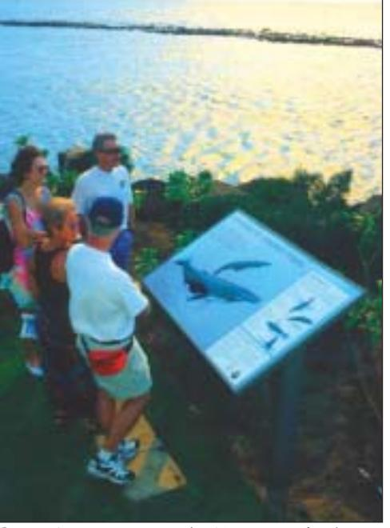

Figure 132. Visitors to the Hawaiian Islands Humpback Whale National Marine Sanctuary learning about the wildlife that inhabits the area (Photo: Jeff Alexander).

#### Improve Coordination and Accountability

The USCRTF was created to improve coordination and accountability among agencies and organizations responsible for the Nation's coral reef ecosystems. The Task Force, co-chaired by the Secretary of the Interior and the Secretary of Commerce,

&lt;sup>132 A partnership of institutions and scientists interested in coral reef protection.

&lt;sup>131 The settlement was a restitution payment of \$34,200 to the Hawai'i Department of Land and Natural Resources for reef restoration. There were also other personal fines and penalties.

includes the heads of 11 Federal agencies133 and the Governors of seven States, Territories, and Commonwealths134 with responsibilities for coral reefs (Fig. 133). Each governor appointed a Point of Contact to facilitate communication among members and tend to USCRTF business. The U.S. All-Islands Coral Reef Initiative135 also has a representative on the USCRTF.

USCRTF agencies meet about every six months and exchange information at meetings held alternately in Washington

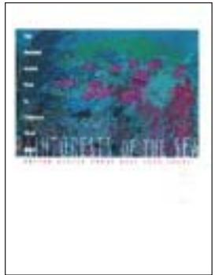

Figure 133. Cover of the USCRTF National Action Plan to Conserve Coral Reefs.

D.C. and at a different coral reef area so there can be public meetings on issues. At their request, the Presidents of the Republic of Palau, the Republic of the Marshall Islands, and the Federated States of Micronesia were invited to join the USCRTF in 2001. This structure has greatly increased partnership activities and integrated projects. The Task Force also has a mechanism for resolving problems among member agencies and grievances from the public.

**NATIONAL SUMMARY NATIONAL SUMMARY**

133 Department of Agriculture, Department of Commerce, Department of Defense, Department of the Interior, Department of Justice, Department of State, Department of Transportation, U.S. Environmental Protection Agency, National Aeronautics and Space Administration, National Science Foundation, U.S. Agency for International Development.

134 American Samoa, Florida, Guam, Hawai'i, Northern Mariana Islands, Puerto Rico, U.S. Virgin Islands. 135 Representing American Samoa, CNMI, Hawai'i, Guam, Puerto Rico, and the USVI.

## **NATIONAL SUMMARY: NATIONAL SUMMARY: NATIONAL SUMMARY: NATIONAL SUMMARY: NATIONAL SUMMARY: RECOMMENDATIONS AND CONCLUSIONS RECOMMENDATIONS AND CONCLUSIONS RECOMMENDATIONS AND CONCLUSIONS**

Managers of coral reef ecosystems in the United States and the Pacific Freely Associated States assessed and prioritized management needs at a Coral Reef Managers' Workshop held on O'ahu, HI in February 2000. (See Table 11.) The managers' table of priorities was updated and the USCRTF Points of Contact have assured that the resulting set of recommendations met local priority needs for FY02. The priorities in this table are similar to those in the National Coral Reef Action Strategy.

The table should be read as follows. If work had recently been completed, was underway, or planned and adequately supported, the item was not listed as a priority, although it may be of local importance. This was also true for mapping priorities, as deep-reef mapping resources were limited by the need to complete shallow-reef mapping first. At the time this report was being finalized, NOAA and DoI were entertaining FY02 proposals for grant support for projects based on the following priorities.

**Complete Mapping and Establish a Monitoring Establish Monitoring Network Network –** To fill identified information gaps, managers consider mapping, assessing, and monitoring U.S. coral reef ecosystems top priorities for 2002 (Fig. 133). While Puerto Rico and USVI reefs have been mapped, areas with poor water quality need still need final spatial information. Therefore, they are still listed even though mapping activities are well underway to fill those gaps.

To provide the more sophisticated monitoring needed to develop coral reef health indicators136 for the next biennial report, the level of funding previously allocated for assessing and monitoring was moderately increased. For 2001, about \$100,000 was available to each jurisdiction.

For all jurisdictions, training in coral reef monitoring and assessment, and support for assessment and monitoring activities is needed so local capacity can be developed. This is especially true in the Pacific Freely Associated States. Local expertise for assessment and monitoring has been increasing, but funds are a limiting factor, especially as finanis decreasing. Since they are now members of the USCRTF, the Freely Associated States are included in the Mapping, Assessment, and Monitoring Program. Plans are to initiate assessment and monitoring activities there in FY02.

**Strengthen MPAs MPAs –** This will continue to be a high priority for all but the U.S. remote insular reefs, Federated States of Micronesia, and the Marshall Islands. It follows what was accomplished by USCRTF members in 1999 and 2000 to expand and strengthen marine protected areas. And, except for the remote insular reefs where the considerable transit distances and the generally pristine condition of the reefs makes it a lower priority at this time, improved enforcement is a high priority for MPAs.

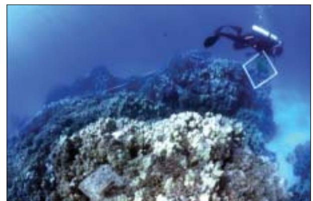

Figure 133. Mapping, monitoring, and assessment are top priorities, especially for reefs located in more remote and less studied areas (Photo: James Maragos).

Except for Guam who already has 20% of its reef resources protected by no-take provisions, managers are calling for broad-scale strengthening of MPAs to protect shallow-water resources.

**Reduce Overfishing Reduce Overfishing –** Most managers considered conservation measures related to fisheries a high priority. Fisheries impacts on coral reefs and other benthic habitats are either a high or medium priority for all but the U.S. remote insular reefs.

**Reduce Pollution from Runoff Reduce Runoff –** Managing impacts from coastal use of coral reef resources is a high priority for many U.S. jurisdictions and the cial support from the Compacts of Free Association Freely Associated States. Managers responsible for **CONCLUSIONS CONCLUSIONS**

136 Population recruitment statistics, disease incidence, water quality degradation. **9393**

Table 11. FY02 management priorities for coral reef ecosystems in the United States and the Pacific Freely Associated States.

|                         |                                          | 7 (0)   | antic/      |                     | can            |                                                   | Polyne                           | Jiu            |     | 1711                        | crone            | Jiu                            |          |                              |
|-------------------------|------------------------------------------|---------|-------------|---------------------|----------------|---------------------------------------------------|----------------------------------|----------------|-----|-----------------------------|------------------|--------------------------------|----------|------------------------------|
| MANAGEMENT              | PARAMETERS/                              | Florida | Puerto Rico | U.S. Virgin Islands | Flower Gardens | Main Hawaiian Main Hawaiian Islands Islands | Northwestern Hawaiian Islands | Ammeidaraßamoa |     | Northern Mariana Islands | Marshall Islands | Federated States of Micronesia | Palau    | U.S. Remote Insular Reefs |
| ACTIONS                 | INDICATORS Shallow reefs                 |         |             |                     |                |                                                   |                                  |                |     |                             |                  |                                |          |                              |
| Mapping -               | ( < 30 m)                                | Н       | Н .         | н                   | L              | Н .                                               | Н .                              | Н              | М . | Н .                         | <u> </u>         | Н .                            | <u>H</u> | M                            |
|                         | Deep reefs ( > 30 m) Rapid assessments & | M       | L           | н :                 | Н .            | L                                                 | L                                | M              | L   | L                           | <u> </u>         | L                              | L        | L                            |
| -                       | inventories                              | Н       | M           | Н                   | L              | Н                                                 | Н                                | M              | M   | Н                           | L                | Н                              | Н        | M                            |
|                         | Benthic cover                            | Н       | Н           | Н                   | L              | М                                                 | M                                | M              | L   | Н                           | L                | L                              | M        | М                            |
|                         | Disease                                  | Н       | Н           | Н                   | L              | L                                                 | L                                | L              | L   | М                           | M                | M                              | L        | М                            |
| _                       | Coral and fish recruitment               | Н       | M           | Н                   | M              | Н                                                 | M                                | M              | Н   | M                           | L                | Н                              | Н        | M                            |
| Assessment & _          | Fish abundance & diversity               | Н       | Н           | Н                   | М              | Н                                                 | Н                                | Н              | Н   | Н                           | М                | Н                              | Н        | Н                            |
|                         | nvertebrate abundance & diversity     | Н       | М           | H                   | L              | Н                                                 | Н                                | Η              | H   | Н                           | M                | Н                              | Н        | Н                            |
|                         | Algal abundance & diversity              | М       | Н           | Н                   | Н              | Н                                                 | М                                | Н              | Н   | М                           | М                | Н                              | М        | М                            |
|                         | Global warming & bleaching            | Н       | М           | М                   | L              | L                                                 | L                                | М              | L   | М                           | Н                | L                              | Н        | Н                            |
|                         | Water & substrate quality                | Н       | Н           | Н                   | Н              | М                                                 | L                                | Н              | Н   | Н                           | L                | Н                              | Н        | М                            |
| E                       | Endemic, endangered 8 alien species   | н       | L           | L                   | М              | Н                                                 | М                                | L              | Н   | н                           | н                | н                              | н        | н                            |
| Research                | Reef processes                           | Н       | М           | Н                   | М              | М                                                 | L                                | L              | М   | М                           | М                | М                              | М        | Н                            |
| Human Dimensions     | Socioeconomic value                      | M       | Н           | М                   | М              | Н                                                 | М                                | М              | Н   | Н                           | М                | L                              | н        | L                            |
| MDAs                    | Expansion & strengthening of MPAs        | н       | Н           | Н                   | Н              | н                                                 | Н                                | Н              | н   | н                           | L                | L                              | н        | М                            |
|                         | Overfishing                              | н       | Н           | Н                   | Н              | Н                                                 | М                                | Н              | L   | н                           | М                | Н                              | н        | М                            |
| Fisheries               | Habitat impacts                          | М       | Н           | М                   | М              | Н                                                 | Н                                | М              | М   | Н                           | L                | М                              | Н        | L                            |
|                         | Trade in live reef species               | М       | Н           | L                   | L              | Н                                                 | L                                | L              | М   | М                           | Н                | М                              | М        | L                            |
|                         | Land use & watershed management          | Н       | Н           | Н                   | М              | Н                                                 | L                                | Н              | L   | Н                           | L                | L                              | Н        | L                            |
|                         | Physically destructive practices         | н       | Н           | М                   | М              | L                                                 | L                                | М              | L   | н                           | М                | L                              | М        | н                            |
|                         | Ocean recreation                         | L       | Н           | Н                   | L              | н                                                 | L                                | L              | Н   | н                           | L                | L                              | н        | L                            |
| Coastal Uses -          | Vessel management                        | М       | Н           | М                   | Н              | Н                                                 | Н                                | L              | Н   | М                           | L                | L                              | М        | Н                            |
|                         | Invasive Species                         | М       | L           | L                   | М              | Н                                                 | Н                                | L              | L   | L                           | Н                | М                              | М        | L                            |
|                         | Enforcement                              | н       | Н           | Н                   | Н              | Н                                                 | Н                                | Н              | Н   | Н                           | н                | Н                              | н        | М                            |
|                         | Contaminants                             | М       | М           | М                   | М              | М                                                 | М                                | Н              | Н   | Н                           | М                | Н                              | н        | М                            |
| Dallestia               | Nutrients                                | Н       | Н           | М                   | L              | Н                                                 | L                                | М              | Н   | Н                           | L                | Н                              | Н        | L                            |
| Pollution               | Sedimentation                            | М       | Н           | Н                   | L              | Н                                                 | L                                | Н              | Н   | Н                           | L                | Н                              | Н        | L                            |
|                         | Marine debris                            | M       | М           | М                   | ٦              | М                                                 | Н                                | M              | L   | L                           | L                | Н                              | L        | М                            |
| Restoration F           | Restoration of damaged reefs             | М       | Н           | ۲                   | L              | L                                                 | L                                | L              | L   | М                           | L                | М                              | L        | М                            |
| Education & Outreach | Community outreach                       |         |             |                     |                |                                                   |                                  |                |     |                             |                  |                                |          |                              |
| Agonou                  | nteragency coordination                  | н       | М           | М                   | М              | Н                                                 | Н                                | Н              | L   | Н                           | М                | М                              | М        | L                            |

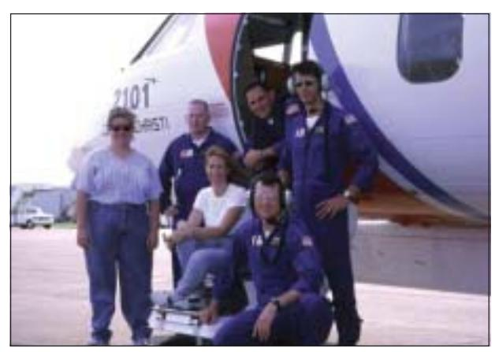

Figure 134. At the Flower Garden Banks National Marine Sanctuary, enforcement is conducted during fly-overs by the U.S. Coast Guard (Photo: FGBNMS).

shallow-water coral reef resources near urbanized coastal areas137 and those off high islands138 ranked land-use and watershed conservation a high priority for their near-shore reef ecosystems.

**Build a Better System of Enforcement Enforcement –** The managers with responsibility for coral reef resources who helped prepare this report and the USCRTF Points of Contact all made enforcement a high priority. Except for remote insular refuges, measures to conserve coral reef resources (e.g., notake closures, harvest limits) within most MPAs need adequate enforcement to assure success (Fig. 134). More effective enforcement is needed both within and outside MPAs. Difficulties in patrolling and enforcing regulations are almost insurmountable because of the vast distances covered by many jurisdictions, especially the recently-created Northwestern Hawaiian Island Coral Reef Ecosystem Reserve and the remaining remote Pacific National Wildlife Refuges.

**Increase Community Involvement Involvement –** Community outreach is a high priority for all areas except the mostly uninhabited Northwestern Hawaiian Islands and the U.S. remote insular reefs (Fig. 135).

**Increase Cooperation Among Agencies Among Agencies –** Interagency coordination is either a medium or high priority for all but Guam and the U.S. remote insular reefs. Additionally, participants at the 2001 Pacific managers workshop agreed 1) a coherent national and international policy for coral reefs is needed, and 2) a Federal law that provides protection for reef ecosystems is the best way to attain this.

#### **CONCLUSIONS CONCLUSIONS**

There is good news and bad news about U.S. coral reef ecosystems. The good news is the tremendous headway made so far to begin filling gaps in information, mapping, establishing a consistent monitoring program, making the public aware of the importance of preserving reefs, and getting their active participation in the program. The new U.S. legislation, congressional funding, and leadership provided by the USCRTF have resulted in new resources that have already made a difference in understanding and conserving reefs. The concerted efforts to initiate mapping, assessment, monitoring, research, and restoration will provide a consistent basis for assessing the status and trends of and tracking changes in coral reef ecosystems. Also, MPAs and the no-take areas are being strengthened and expanded, further protecting critical resources.

The bad news is that current enforcement is inadequate to protect MPAs, particularly remote coral reefs where ships and enforcement personnel are seldom available. In general, a lot more quantitative, comparable information is needed.

Basic mapping has yet to be done for over 85% of the reefs. Except where mapped, the available data are just estimates. This is especially true for areas covered by no-take provisions. Many reef areas need basic assessments and biotic inventories to fill significant gaps limiting the ability of managers to determine the condition of jurisdictional coral reefs, including overall biological diversity, popu-

Figure 135. An outreach activity at the Hawaiian Humpback Whale National Marine Sanctuary. Volunteers count whale sightings and document behavior (Photo: Naomi McIntosh).

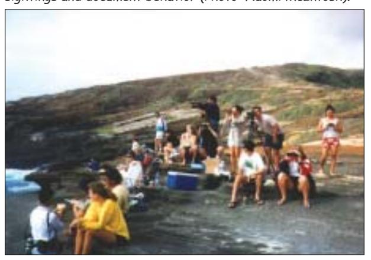

137 Florida, Puerto Rico, USVI, the Main Hawaiian Islands, the Flower Garden Banks National Marine Sanctuary. 138 American Samoa, Guam, and CNMI.

**CONCLUSIONS CONCLUSIONS**

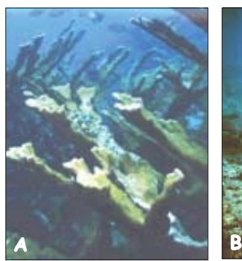

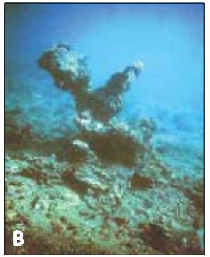

Figure 136. Elkhorn coral, once abundant throughout the Caribbean has been heavily impacted by (A) disease, bleaching, hurricanes, turbidity, and (B) siltation (Photos: Matt Kendall and E.C. Peters)

lation abundance, species recruitment, and the incidence of disease. Comparable long-term monitoring needs to be sponsored and integrated across regions. To track changes in ecosystem health and evaluate the effectiveness of measures to conserve and protect coral reef ecosystems, grants to State and Territorial agencies need to be continued for at least the next 5-10 years, ideally beyond that.

Only a nationally-coordinated program can provide reef managers the advice, support, and resources needed to 1) initiate the bold conservation measures necessary to reverse the downward trends of degraded reefs, and 2) maintain the quality of healthy reefs. On degraded reefs, water and substrate quality must be improved, overfishing and the gear damage reduced, invasive species controlled, and other human stresses minimized. Finally, public awareness and education activities need to be enhanced and expanded to develop cooperation. Renewed citizen awareness and a collective ethic for the sustained use of coral reef ecosystems in the United States and Freely Associated States need to be generated.

Every U.S. reef system has suffered varying degrees of impact from natural or human disturbance. For example, from the combined impacts of hurricanes, reduced urchin and fish herbivory, high nutrient input, coral diseases, and bleaching in the Caribbean, there has been a measured decrease in coral cover. The FKNMS recorded a 37% decline in coral cover over the past five years, and reported that other severe impacts predated their monitoring of the Florida Keys coral reef ecosystem. A series of earlier disasters were responsible

for the near elimination of dense stands of elkhorn and staghorn coral from areas in the Florida Keys, Puerto Rico, and the USVI (Fig. 136). At the extreme end, the eight hurricanes that have struck the USVI over the past two decades, reduced live *Acropora* corals at the Buck Island National Park, USVI by 85%. In their place are coral rubble and abundant macroalgae.

Caribbean coral reef ecosystems also have yet to recover from a die-off of the longspined sea urchin about 20 years ago. There is evidence that the loss of this key algal grazer coupled with over-nutrification and overfishing of herbivores may have

contributed to the shift from a coral-dominated ecosystem to a macroalgae-dominated system on many reefs.

Like the Caribbean, the U.S. Pacific island shallow-water coral reefs are currently recovering from natural disturbances occurring over the past two decades – first a crown-of-thorns starfish invasion of several island groups139 in 1979, then several periods of warm temperatures that caused coral bleaching, with the worst in 1997-1998. Chronic human impacts on coral reefs located near populated areas140 add to these sources of stress.

Human impacts play a large role in the condition of most reefs, particularly those near population centers. Coral reefs in the Main Hawaiian Islands, American Samoa, Guam, and the CNMI suffer from degradation related to population growth, urbanization, and development. On the more

Figure 137. Giant clams have been over-fished throughout much of their range (Photo: James Maragos).

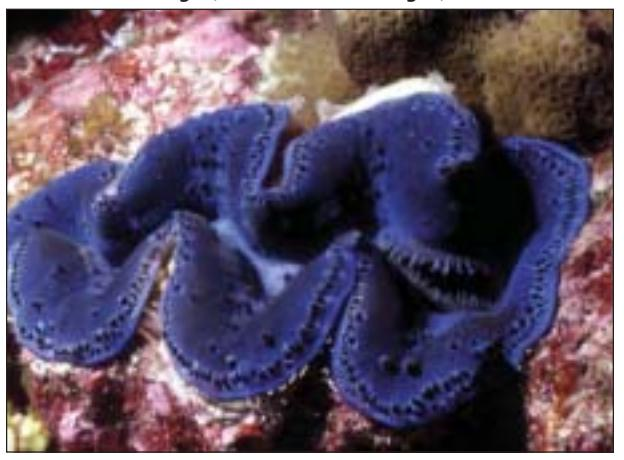

**NATIONAL SUMMARY NATIONAL SUMMARY**

139 American Samoa, Guam, and the CNMI. 140 Pago Pago Harbor, American Samoa; Apra Harbor, Guam; Kane'ohe Bay and Honolulu Harbor, O'ahu, Hawai'i; and Saipan Lagoon, CNMI.

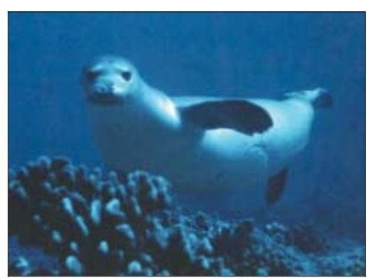

Figure 138. Elevated levels of PCBS have been found in the tissues of the Hawaiian monk seal (Photo: USFWS).

populated Pacific islands, ocean outfalls of sewage and massive coastal tourist development (hotels, golf courses) are major sources of runoff, nutrient enrichment, and sedimentation, any one of which degrades reef. Most shallow-water reefs near urbanized regions are exposed to both acute and chronic anthropogenic impacts, and the synergism among natural and human impacts exerts a far greater influence than any single factor.

For the most part, the proliferation of macroalgae has not been a problem in the Indo-Pacific region. The native algae found around islands indicate either low-nutrient environments or heavy grazing by herbivores. So despite changes in coastal land use and other human impacts, there are still breathtaking examples of healthy reefs around the Pacific Islands, as evidenced by their high ranking worldwide as dive and snorkel sites.

For many Pacific islands, there has been heavy fishing pressure on large apex predators141, resulting in fewer and smaller groupers, snappers, and jacks. Species such as giant clams, parrotfish, and humphead wrasse have been overfished on shallowwater coral reefs near major population centers (Fig. 137).

Pollution of toxic heavy metal and organic chemicals are affecting reef organisms in several areas. This concerns resource managers and conservationists worldwide. Toxic compounds are now showing up in fish from Pago Pago Harbor, Saipan Lagoon, and Apra Harbor. Even the endangered Hawaiian monk seals in the Northwestern Hawaiian Islands have been found to have high levels of polychlorinated biphenyls (PCBs) in their tissues (Fig. 138).

Degradation and loss of habitat impacts reef species. The endangered hawksbill and the threatened green sea turtle are in serious decline from illegal harvest and loss of nesting habitat throughout their range (Fig. 139).

In contrast, the Northwestern Hawaiian Islands, the Flower Garden Banks National Marine Sanctuary, Navassa Island, and remote Pacific Island refuges where there is little human impact other than longdistance fishing, remain relatively pristine. For these 'jewels,' live coral cover and species diversity range from relatively low off geologically young volcanic islands (e.g., Nihoa and Necker Islands in the NWHI) to high with an impressive degree of complexity (e.g., remote island atolls). For these reefs, disease and mortality is generally thought to be low. With the exception of Palmyra Atoll, the same is true for bleaching. Shallow reef fish communities on the remote reefs exhibit substantial populations of large apex predators and herbivores that are now rare in the Main Hawaiian Islands from fishing pressure.

The United States has a relatively pristine, remote, and expansive coral reef ecosystem that is ideal for coral reef conservation – the NWHI. These coral reefs are in excellent condition their near-shore coral reefs have been protected as National Wildlife Refuges. Over the past 95 years, these refuges have only allowed limited fishing by permit.

They are among the few remaining intact, largescale, predator-dominated reef ecosystems left in the world. It is an opportunity for us to understand how unaltered ecosystems are structured, how they

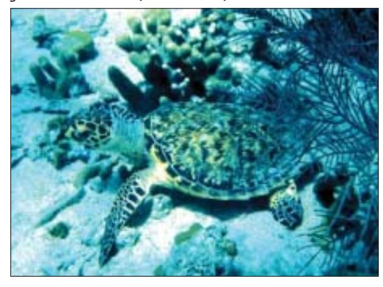

141 The largest predators at the top of a trophic or food web – snapper, grouper, jacks, and sharks.

**CONCLUSIONS CONCLUSIONS**

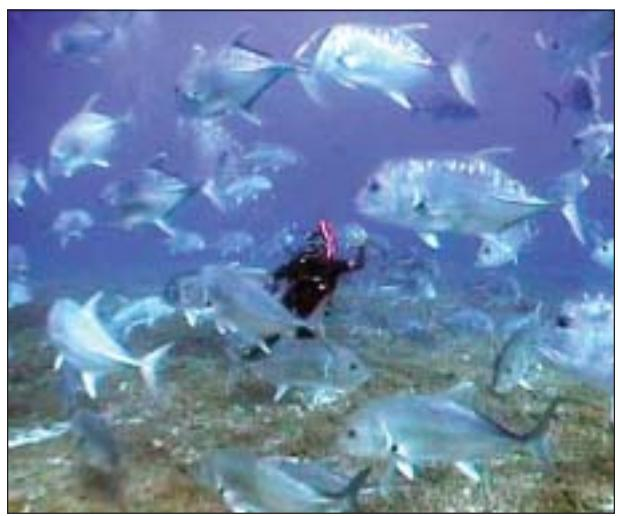

Figure 140. Giant ulua are one of the apex predators that account for a large percentage of fish biomass in the Northwestern Hawaiian Islands (Photo: NOW-RAMP Expedition/ Bishop Museum).

function, and how they can most effectively be preserved (Friedlander and DeMartini 2002).

These authors contrast the NWHI (a large, relatively inaccessible and lightly fished area) with the Main Hawaiian Islands (MHI, especially those that are urbanized with heavily fished areas). The differences in the numerical density, size, and biomass of the fish assemblage are dramatic. Grand mean abundance of fish in the NWHI was more than 260% greater than that of the MHI. Of this, more than 54% of the total fish biomass in the NWHI consisted of apex predators (Fig. 140), while this trophic level accounted for less than 3% of the fish biomass in the MHI. In contrast, fish biomass in the MHI was dominated by herbivores (55%) and small-bodied lower-level carnivores (42%). Most of the dominant species by weight in the NWHI were either rare or absent in the MHI. The target species that were present, regardless of trophic level, were nearly always larger in NWHI.

In broad, general terms, there is a significant body of published literature on aspects of U.S. coral reef ecosystems. There are qualitative assessments on the condition of corals and harvested fishes for many localities. Coral reef managers know generally what to guard against and, in most cases, what conservation measures would most likely have an impact on their reefs (J. Ogden pers. comm.).

There is now a body of evidence that implementation of no-take conservation measures work to reverse declining trends for many species. Where no-take provisions have been implemented in MPAs142, there were more and larger fishes and motile invertebrates within a year or so. Also, there are examples where coral reef ecosystems responded relatively quickly after disasters143 – the algae, corals, and fishes rebounded to pre-impact levels. This generally occurred where overfishing and other human impacts were minimal but that may not be the case for slow-moving or sessile reef species144 when they are subjected to repeated stresses, both local (e.g., nutrification, overfishing) and global (sea surface warming and bleaching). These species may not be able to respond within a human lifespan.

There is general consensus among scientists and USCRTF members that at least 20% of US coral reef ecosystems need protection by no-take provisions. The Hawaiian Islands provide textbook

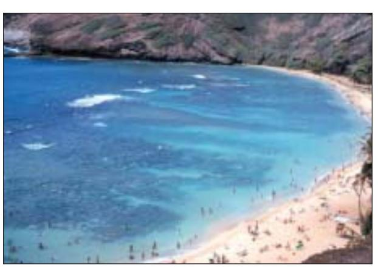

Figure 141. Hanauma Bay (Photo: James McVey).

examples of reef ecosystems that are in near pristine condition (the NWHI), those that have been overfished (the MHI), as well as those that have been managed by no-take zones and are recovering (Hanauma Bay no-take protected area).

Scientists generally agree that reef fisheries on the Main Hawaiian Islands are depleted except in a few of the small no-take reserves (J. Maragos pers. comm.). For example, the Hanauma Bay Marine Life Conservation District, closed to fishing since 1967, supports more biomass of targeted species of reef fish than the rest of O'ahu (A. Friedlander pers. comm., Fig. 141). The Merritt Island National Wildlife Refuge off the Kennedy Space Center demonstrates that no-take reserves can replenish nearby overfished areas with large and abundant fish (Roberts *et al.* 2001).

**NATIONAL SUMMARY NATIONAL SUMMARY**

142 The no-take for spiny lobster provision in the Dry Tortugas National Park, the grouper spawning ground closure off St. Thomas Island, the Merritt Island National Wildlife Refuge protecting Cape Canaveral.

USCRTF members acknowledge degradation from human influences is a global problem and U.S. coral reef ecosystems need to be included in international efforts such as the GCRMN. A Caribbean example of international linkages among coral reef ecosystems is water circulation patterns over FKNMS reefs have inputs 'downstream' from Cuba and Central America (Fig. 142). There are benefits (e.g., larval recruitment to the reef) but also detriments (e.g., aquatic and atmospheric transport of organic pollutants, J. Ogden pers. comm.). A Pacific example of this international exchange among ecosystems, Kingman and Palmyra Atolls, the two remote U.S. wildlife refuges that have the highest diversity. They are not only large atolls with a variety of lagoon habitats, but ocean currents bring a diversity of planktonic recruits from 'upstream.' Seasonally, the Equatorial Countercurrent flows past these atolls, providing them with the larvae of species from far western reefs, in addition to larvae coming from the east when the North and South Equatorial Currents flow past these reefs.

The Coral Reef Conservation Act of 2000 requires the Secretary of Commerce to prepare a conservation strategy and to report biennially on the effectiveness of conservation measures. Toward this end, NOAA initiated a process that will unfold over the next few years. In 2002-2003, NOAA and its partners will develop and test a 'report card' approach using indicators and metrics that can reliably show the condition of U.S. coral reef ecosystems. It will also evaluate the 'effectiveness of conservation measures.'

Figure 142. Due to oceanic circulation patterns, the health of reefs in Florida is tied to the fate of reefs in other areas of the Caribbean (Photo: Chuck Savall).

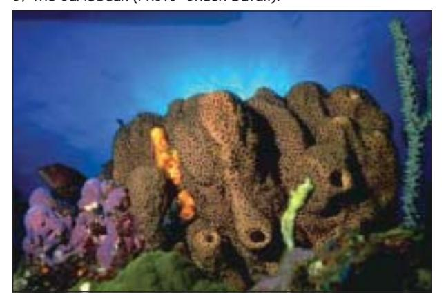

#### **This report finds:**

- • U.S. coral reef areas are extensive.
- • Healthy reef ecosystems are critical for local and regional economies.
- • All jurisdictions still have some reefs in good-to-excellent health. These need conservation.
- • All shallow reefs near urbanized coasts are degraded to some extent. These need restoration.
- • Areas next to densely-populated shorelines generally have poorer water quality than those far from human habitation. Where water quality is fair to poor, reef ecosystems are degraded. Water quality needs to be improved in those areas, and measures taken to maintain the water quality of areas where reef condition is now deemed good-toexcellent.
- • Coastal development, runoff, and sedimentation have impacted reefs around most high islands. These impacts need to be minimized.
- • Fishing pressure has been a primary factor impacting reef ecosystems for decades. There is evidence that overfishing has changed ecosystem structure and function. Different and effective methods of management need to be implemented.
- • Remote reefs with little coastal development, good water quality, and low fishing pressure are in excellent health, as characterized by many large fish and generally high species diversity within the reef community. These need to be studied and preserved.
- • Marine refuges with no-take provisions produce more and larger fish. With enough time, they can conserve reef communities and long-lived species, producing trophy-sized apex predators. More no-take areas need to be implemented within MPAs in order to reach the USCRTF goal of 20% protection.
- • Some existing marine protected areas are not protecting reefs. Regulations within these need to be strengthened and adequately enforced.

**CONCLUSIONS CONCLUSIONS**

143 Fagatele Bay National Marine Sanctuary and the Flower Garden Banks National Marine Sanctuary both of which involved

a substantial change in keystone urchin populations. 144 Queen conch in the Caribbean, and shallow-water coral colonies that suffered high mortalities from bleaching off Florida. **9999**

### **REGIONAL REPORTS REGIONAL REPORTS REGIONAL REPORTS REGIONAL REPORTS REGIONAL REPORTS**

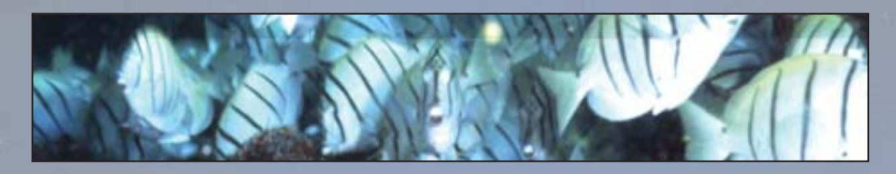

**Florida Florida Florida Florida Puerto Rico Puerto Rico Rico Puerto Rico Puerto Rico U.S. Virgin Islands U.S. Virgin Islands U.S. Virgin Islands U.S. Virgin Islands U.S. Virgin Islands Flower Garden Banks National Flower Garden National Flower Garden Banks National Flower Garden Banks National Flower Garden Banks NationalFlower Garden Banks National Marine Sanctuary Sanctuary SanctuaryMarine Sanctuary Marine Sanctuary**

**Navassa Island Navassa Island Navassa Island Navassa Island Navassa Island Hawai'i Hawai'i Hawai'i Hawai'i**

**American Samoa American Samoa American Samoa American Samoa American Samoa GuamGuam**

**Commonwealth of the Northern of the Northern Commonwealth of Northern Commonwealth of the Northern Commonwealth of the Northern Mariana Islands Mariana Islands Mariana Islands Mariana Islands Mariana Islands**

**Freely Associated States (Republic of Freely Associated States (Republic of Freely Associated (Republic of Freely Associated States (Republic of Freely States (Republic of the Marshall Islands, Federated the Marshall Federated Marshall Islands, Federated the Marshall Islands, Federated the Marshall Islands, Federated States of Micronesia, and Republic of and Republic of of Micronesia, and of States of Micronesia, and Republic of of Micronesia, and Republic Palau) Palau) Palau)**

## **STATUS OF CORAL REEFS IN FLORIDA STATUS OF CORAL REEFS IN FLORIDA STATUS OF CORAL REEFS IN FLORIDA Billy D. Causey, Richard E. Dodge, Walter Jaap, Ken D. Causey, Richard E. Dodge, Walter Jaap, Ken Causey, Richard Ken Billy D. Causey, Richard E. Dodge, Walter Jaap, Ken Billy D. Dodge, Walter Ken Banks, Joanne Delaney, Brian D. Keller, and Richard Spieler Delaney, Brian Keller, and Richard Spieler Spieler Banks, Joanne Delaney, Brian D. Keller, and Richard Spieler Banks, Joanne Delaney, Brian D. Keller, and Richard Spieler**

#### **Introduction Introduction**

There are three main areas of coral reefs and banks in Florida – the Florida Keys, the southeastern coast from northern Monroe County to Palm Beach County, and the Florida Middle Grounds in the eastern Gulf of Mexico, south of Apalachicola and northwest of Tarpon Springs. Numerous coral habitats are also scattered from the Florida Middle Grounds to the Florida Keys along Florida's west coast shelf at varying locations. New communities are constantly being discovered, such as those recently documented along Pulley's Ridge in 45-60 m (150-200 ft) of water.

**The Florida Keys Keys –** The Florida Keys have the only emergent coral reefs off the continental United States. Arching southwest 356 km from south of Miami to the Dry Tortugas, the Florida reef tract comprises one of the largest reef communities in the world. Except between Rebecca Shoal and the Dry Tortugas, it is almost continuous.

The majority of the reef tract lies within the boundaries of the 9800 km2 Florida Keys National Marine Sanctuary (FKNMS or Sanctuary). Over half of the Sanctuary is located in State of Florida territorial waters (less than 4.8 km from shore in the Atlantic waters and less than 16.5 km from shore in the Gulf of Mexico); the rest of the Sanctuary (42%) is in Federal waters. Designated in 1990, the Sanctuary is managed jointly between NOAA and the

Figure 143. A. Staghorn coral (Photo: NCRI); B. elkhorn coral (Photo: Paige Gill, FKNMS).

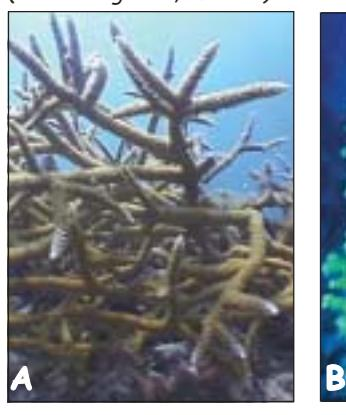

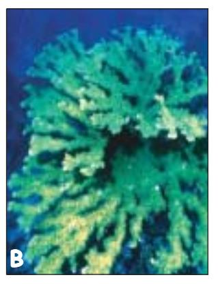

State. A comprehensive management plan adopted in 1997 guides Sanctuary management. One management component has been establishing and implementing five types of marine zones, which include 24 individual, fully protected zones designed to offer added protection to some of the over 1,400 km2 of coral reef habitat located within the Sanctuary.

Two additional marine protected areas managed by the National Park Service encompass reefs in the Florida Keys. Located on the northern boundary of the Sanctuary just south of Miami, Biscayne National Park has 683 km2 of coastal waters. At the western-most end of the reef tract lies Dry Tortugas National Park, covering 262 km2 .

The Florida Reef Tract has been described as a bank reef system comprised of an almost continuous reef community with elongated reef habitats paralleling one another. The reef ecosystems consist of distinct habitat types: nearshore patch reefs, mid-channel reefs, offshore patch reefs, seagrass beds, back reefs/reef flats, bank or transitional reefs, intermediate reefs, deep reefs, outlier reefs, and sand/soft bottom areas. In addition to the bank reefs, over 6000 circular to oval patch reefs lie along the Florida Reef Tract in 2 to 9 m of water. An outer reef tract lies 4.8 to 11.3 km east and south of the Keys.

The seaward-facing spur and groove formations of the Florida Reef Tract are constructional features, formed partly by wave energy (Shinn 1963, Shinn *et al.* 1981, DoC 1996). They extend 1 to 2 km off the main reef, from 1 to 10 m. Historically, the tops of the spurs were composed mainly of elkhorn coral (*Acropora palmata*, Fig. 143), especially at depths less than 5 m, while grooves contained carbonate sands and reef rubble (Hendler *et al.*  1995). These features are typically no more than 200 m long from offshore to onshore.

Primary corals found in this area include the star corals (*Montastrea annularis* complex and *the*  great star coral (*Montastrea cavernosa*), masssive starlet coral (*Siderastrea siderea*), and fire corals

**FLORIDA FLORIDA FLORIDA**

coral ( species. Staghorn and elkhorn corals, formerly common or dominant species at 3-15 m, are much *oides* (*Millepora* ), finger coral ( *Agaricia agaricites* spp.). Mustard hill coral ( *Porites porites* ) are also common ), and lettuce less abundant at this time.

**The Southeastern Coast Coast –** This reef system runs from northern Monroe County to Palm Beach County in a series of discontinuous reef lines paralleling the shore. Duane and Meisburger

(1969) and Goldberg (1973) defined the habitat at limited locations and provided information on the coral fauna.

**FLORIDA FLORIDA FLORIDA FLORIDA**

There are generally three lines of reef – one that nominally crests in 3 to 4 m of water (First Reef), another in 6 to 8 m (Second Reef), and a third in 15 to 21 m (Third Reef).

The First Reef has a very low profile with conspicuous small octocoral and algal cover. The substrate is relict reef of Anastasia Formation limestone and worm reef (*Phragmatopoma*), with breaks and sediment pockets within the reef. Typical sessile organisms are lesser starlet coral (*Siderastrea radians*) and colonial zoanthids ( *thoa mammalosa caribaeorum* ). and *P.* 

The Second Reef is also flat with somewhat more relief and dissecting channels. Octocorals are most conspicuous, some areas exceeding 60 per m2 (Fig. 144). Abundant stony corals include knobby brain coral (*Diploria clivosa),* elliptical star coral (*Dichocoenia stokesii*)*,* great star coral, and smooth star coral (*Solenastrea bournoni*). In the past few years, there has been vigorous recruitment of staghorn coral and some extensive aggregations are now present off Broward County. Here, reef-like accumulations or "thickets" of this species form a significant

*Porites astre*habitat. Spawning was documented in early August 2001 (Vargas-Ángel and Thomas in press).

> The Third Reef often has strong vertical relief and exhibits the highest diversity and abundance of sessile reef organisms. Octocorals and large barrel sponges (*Xestospongia muta*) are most conspicuous and visually dominate this reef. Stony corals are somewhat larger than those located on the Second Reef. Moderate-sized colonies of star corals are common.

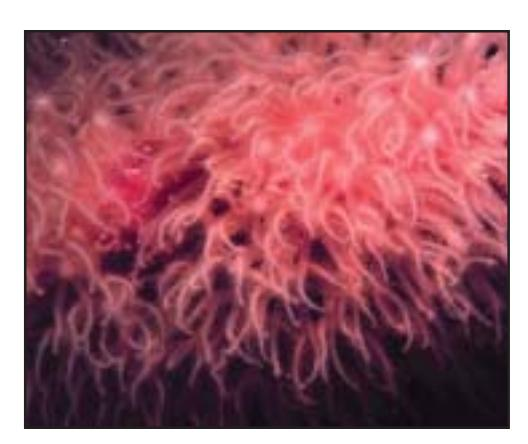

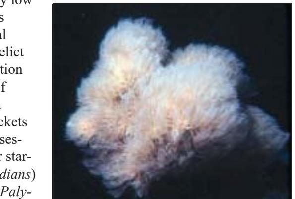

Figure 144. Octocorals with their polyps extended at night (Photo: FKNMS and Joe Seger).

#### **The Middle Grounds Grounds –**

This is a 1,193 km2 area in the eastern Gulf of Mexico (Florida Fish and Wildlife Conservation Commission 2001), 137 km south of Apalachicola and 129 km northwest of Tarpon Springs. Its banks are two parallel ridgelines separated by a valley lying in a northnorthwesterly direction. Individual banks are 12 to 15 m high with shallow crests 21 m below sea level. The reef structures are late Pleistocene to early Holocene (Brooks and Doyle 1991).

Winter temperatures reach 16˚ C, limiting many tropical species from occupying these banks. However, there are 23 species of stony corals (Grimm and Hopkins 1977). Environmental studies in the 1970s documented 103

species of algae, about 40 sponges, 75 mollusks, 56 decapod crustaceans, 41 polychaetes, 23 echinoderms, and 170 species of fish (Hopkins *et al.*  1977). Elliptical star coral, yellow pencil coral (*Madracis decactis*), and branching fire coral (*Millepora alcicornis*) are the most abundant stony coral species. Coral cover may be as high as 30% on some pinnacles.

Overall, the biotic characteristics of this area are very different from either the Florida Keys or the Flower Garden Banks, located off Texas.

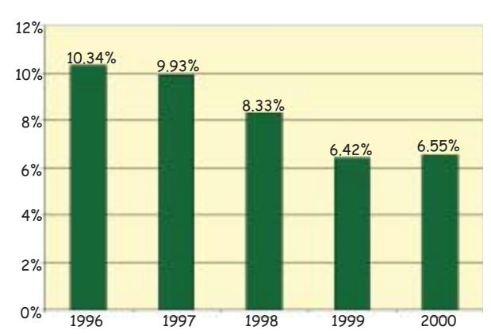

Figure 145. Mean percent stony coral cover at 160 stations in Florida Keys National Marine Sanctuary, 1996-2000 (Modified from Jaap et al. 2001).

#### **Condition of Coral Reef Ecosystems Ecosystems**

Historical fluctuations in sea level have influenced the reefs of Florida, with the last significant rise in sea level starting about 6,000 years ago. Since that time, the reefs off Southeast Florida and the Florida Keys have been building. Greater reef development in those areas generally occurs in the Upper and Lower Keys, where the Keys protect reefs from direct water flows from the Gulf of Mexico and Florida Bay (DoC 1996, Robbin 1981, Shinn *et al.* 1989).

Although the reefs of Florida have existed for the past several thousands years, they have only recently become the focus of scientific research and monitoring in an attempt to fully understand changes over time. Since the creation of the FKNMS, the reefs and associated marine habitats of the Florida Keys have become the subject of a broad research and monitoring program that seeks to establish baseline data on ecosystem condition and ascertain cause-and-effect linkages. The reefs and banks of Florida's southeastern coast and the Middle Grounds are not as well studied as those of the Florida Keys, though they are beginning to be mapped and estimates of cover are available from some monitoring programs. As a result, the condition of Florida's coral ecosystems can be best determined for Florida Keys reefs at this time; comprehensive, long-term monitoring of various ecosystem components is critical for the southeastern coast and Middle Grounds.

In the Florida Keys, Sanctuary-wide monitoring of water quality, seagrasses, and coral and hardbottom communities began in 1994 under a Water Quality Protection Program that was jointly undertaken by

NOAA and the U.S. Environmental Protection Agency (USEPA). In 1997, when a network of fully protected zones, or marine reserves were implemented, a Zone Monitoring Program was initiated to determine whether the zones meet their objectives of reducing pressure on heavily used reefs, preserving biodiversity, facilitating research, and reducing use conflicts, among others. Each of these monitoring programs and their methods are described in the Current Conservation Management section of this report. To date, over five years of data from the Water Quality Protection Program and three years of data from the Zone Monitoring Program have provided Sanctuary managers with emerging trends in coral reef ecosystem health throughout the Florida Keys.

**Coral–** Early surveys of Florida Keys coral reefs have documented two species of fire coral, 55 species of octocoral, and 64 taxa of stony corals (DoC 1996, Levy *et al.* 1996).

Under the Zone Monitoring Program, scientists from the University of North Carolina at Wilmington's National Undersea Research Center (UNCW/NURC) have more recently conducted rapid, large-scale assessments of coral reefs and hardbottom communities in the Sanctuary. In their 1999 assessment, the UNCW/NURC rapid assessment and rmonitoring program found coral cover highly variable by both habitat type and region (Miller *et al.* 2001). Jaap *et al.* (2001) confirmed that gains and losses of coral cover in the Florida Keys fluctuate among habitat types with patch reef habitats suffering the fewest losses and exhibiting the highest average percent cover over time.

Since 1996, over 66% of 160 stations in the Coral Reef/Hardbottom Monitoring Project of the Water Quality Protection Program exhibited losses in stony coral diversity. From 1996 to 2000, stony coral cover Sanctuary-wide decreased by 36.6% to a low of 6.6% in 2000, with the greatest relative change occurring in the Upper Keys (Jaap *et al.*  2001, Fig. 145). During this time, 67% of monitoring stations had reduced stony coral species richness, 20% gained species, and 13% had unchanged species richness (Jaap *et al.* 2001). However, positive trends were noted in the 1999 2000 survey period, when 69 stations had greater numbers of stony coral species, 56 stations had

**FLORIDA FLORIDA FLORIDA**

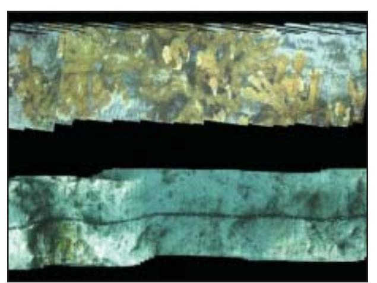

Figure 146. Changes in elkhorn coral cover at West Sambo, 1996 above and 2001 below (Photo: EPA/FKNMS Coral Reef Monitoring Project funded by EPA, UNCW, and NOAA).

fewer species, and 35 stations remained unchanged (Jaap *et al.* 2001).

In addition to coral cover, recruitment of stony corals to the Florida Keys ecosystem is a basic measure of overall community health. Relationships between coral cover, recruitment, and juvenile mortality are assessed at six sites in both fully protected Sanctuary zones and in reference areas (Aronson *et al.* 2001). Differences in coral recruitment have been seen among all sites over two years. More important, perhaps, is that juvenile mortality was greatest at shallow stations in the first year (1998) which coincided with a direct strike from Hurricane Georges in the Lower Keys. UNCW/NURC rapid assessment monitoring of benthic communities indicated no significant differences in juvenile coral density by habitat type and region in 2000 (Miller *et al.* 2001).

Increasingly, coral diseases threaten the overall health and vitality of reef systems in the Florida Keys. However, only three of ten presumptive or purported pathogens have been positively identified (Richardson 1998). The Coral Reef/Hardbottom Monitoring Project documented increases in the number of stations with diseased coral, the number of coral species with disease, and the number of presumptive diseases (Jaap *et al.* 2001). In 1998, a second ongoing coral disease etiology and monitoring program documented regional differences in the incidence of disease, with the highest concentration of coral diseases near Key West and in the Lower Keys. Significant seasonal increases in diseases were also noted in these

regions (Mueller *et al.* 2001). Back reef areas showed the highest prevalence of disease. These areas are dominated by elkhorn coral, which is susceptible to specific disease conditions (Mueller *et al.* 2001, Fig. 146). Aspergillosis, a fungal disease that targets the sea fan ( *talina* Sanctuary-wide during these surveys (Mueller ), was the most commonly reported disease *Gorgonia venet al.* 2001).

In addition to confirmed and purported coral diseases, coral bleaching impacts the Sanctuary's reefs (Fig. 147). Over the past 20 years, bleaching events have increased in both frequency and duration (Hoegh-Guldberg 1999, Jaap 1990). Massive coral bleaching was first recorded in 1983 along the outer reef tract of the Lower Keys. Shallow fore reef habitats were most affected (Causey in press). This event was preceded by periods of low wind and high air temperature, contributing to localized increased water temperature.

Massive bleaching occurred again in July 1987 following doldrum-like weather conditions. This time, the outer reefs throughout the Florida Keys were afflicted, and secondary impacts such as coral disease were observed. Then in July 1990, a massive bleaching event occurred Keys-wide. Inshore reefs bleached for the first time, and mortality of blade fire corals (*Millepora complanata*) reached over 65% on the shallow crest of Looe Key Reef in the Lower Keys (Causey in press).

Bleaching has both expanded and intensified in the last decade. Another massive episode in 1997 targeted both the inshore and offshore reefs. Before the reefs could adequately recover, lingering high water temperatures and a particularly strong El Niño event caused yet another bleaching in 1998.

Figure 147. Bleached brain coral (Photo: Mike White).

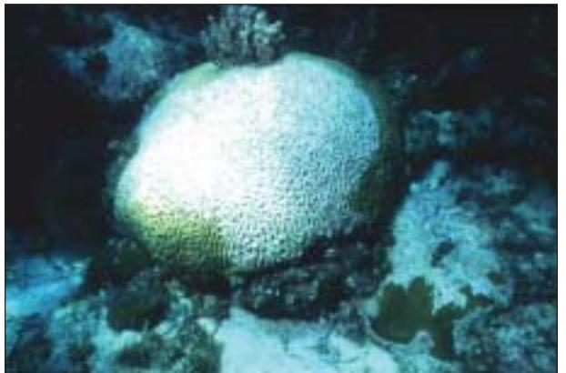

**FLORIDA FLORIDA FLORIDA FLORIDA**

This time, the blade fire coral suffered 80-90% mortality (W. Jaap pers. comm.), and has remained low in abundance throughout most of the area. There have been similar bleaching observations regionally and internationally since 1987, and it is widely recognized that 1997 and 1998 were the worst years on record.

While it is difficult to enumerate the exact causes of coral mortality from any given perturbation, coral bleaching is undoubtedly responsible for part of the dramatic declines in stony coral cover observed Sanctuary-wide in the last five years (Causey pers. obs.). Observations from the research community reinforce the results from several monitoring programs that show declines in coral health. This highlights the importance of continued monitoring. Empirical cause-and-effect studies might provide additional methods to alleviate these impacts and improve overall reef health.

Along the southeastern shoreline, there is little long-term data on abundance and/or cover for benthic reef components. The predominant information on status and trends is anecdotal. However, some reefs appear healthy when compared to historical information and personal recollections. Bleaching has been observed over the years along the southeastern reefs at a comparable level to the Florida Keys.

There is no information available at this time on the status of corals and benthic communities at the Florida Middle Grounds.

#### **Marine Algae, Other Plants, and Benthic Marine Other Benthic**

**Cover–** Ninety species of marine macroalgae have been identified from coral reefs within the FKNMS (Littler *et al*. 1986). Additionally, there are seven species of seagrasses (Fourqurean *et al*. 2002) in the region. Six species are common throughout South Florida (Fig. 148), whereas one endemic species of seagrass is only found in the northern part of Biscayne Bay. Three species of mangrove also grow in Florida (Mote Marine Laboratory 2002).

Benthic monitoring under the Sanctuary's Zone Monitoring Program indicates algae and attached invertebrate populations (sponges and soft corals) fluctuate widely between seasons and years (Aronson *et al.* 2001). As with coral communities,

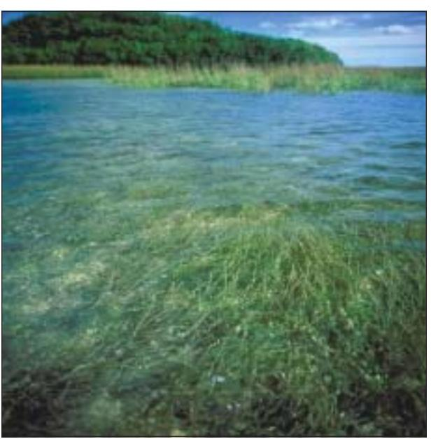

Figure 148. Seagrass meadow at Indian River Lagoon on Florida's eastern coast (Photo: South Florida Water Management District).

some of this variability can be attributed to storms around the Florida Keys in 1998 and 1999.

Functional group cover analyses from Jaap *et al.*  (2001) show a slight increase in macroalgal cover in all regions of the Florida Keys between 1996 and 2000 and indicate a general decrease in sponge and soft coral cover. Miller *et al.* (1999) found algae dominated all sites, with average cover generally above 75% in the Keys and above 50% in the Dry Tortugas region (2000). At deeper sites, predominant algal functional groups were fine and thick turf algae, brown frondose algae, green calcareous algae (mainly *Halimeda* spp.), and crustose coralline algae. Crustose coralline algae and green calcareous algae comprised a greater proportion of total algal cover at shallower sites than at deeper sites. In the Dry Tortugas, algal cover was mostly green calcareous algae and two genera of brown frondose algae.

In addition, sponge and soft coral coverages were minor (generally less than 10%) at shallow and deeper sites in the Keys (Miller *et al.* 1999) and generally low in the Dry Tortugas region (less than 20%) (Miller *et al.* 2000). Overall, variability is high across all regions for sponge cover (Miller *et al.* 2001). Likewise, analyses of benthic composition between fully protected zones and reference areas in the Sanctuary indicate that changes ob**FLORIDA FLORIDA FLORIDA**

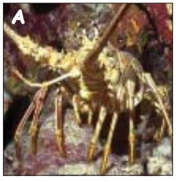

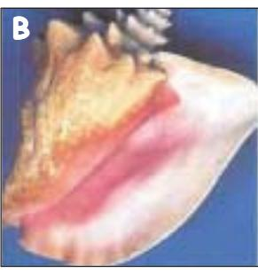

Fig. 149. A. Caribbean spiny lobster (Photo: Roberto Sozzani); B. queen conch (Photo: Caribbean Fishery Management Council).

served cannot be attributed to recent protection from fishing, but are likely a result of the initial biased selection of one of the zone types (Miller *et al.* 2001).

At least one species of seagrass was present at over 80% of the FKNMS stations monitored under the Water Quality Protection Program, indicating a coverage of approximately 12,800 km² of seagrass beds within the 17,000 km² study area that lies within and adjacent to the Sanctuary (Fourqurean et al. 1999). The primary species of seagrasses within the Sanctuary are turtle grass (*Thalassia testudinum*), manatee grass (*Syringodium filiforme*), shoal grass (*Halodule wrightii*), and balloon grass (*Halophila decipiens*).

As with coral communities, there is currently no comprehensive data available on algae or seagrasses from Florida's southeastern coast or Middle Grounds regions.

**Mobile invertebrates** – Diverse groups of invertebrates have been identified in the Florida Keys, including 117 species of sponges (Levy *et al.* 1996), 89 species of polychaete worms (Levy *et al.* 1996), more than 1,400 species of mollusks (Mikkelsen and Bieler 2000), 371 species of crustaceans (Levy *et al.* 1996), and 82 species of echinoderms (Hendler *et al.* 1995).

The focus of recent monitoring efforts has been on large mobile invertebrates such as the Caribbean spiny lobster (*Panulirus argus*) and queen conch (Fig. 149). Both have been moni-tored inside and outside of the Sanctuary's fully protected zones under the zone monitoring pro-gram. The size of spiny lobsters are also being tracked in the Dry Tortugas, where National Park designation eliminated this fishery several years ago. Since the

closure, individual lobsters have grown larger there than in the remainder of the Florida Keys.

Legal-sized spiny lobsters continue to be larger and more abundant in fully protected zones than in reference sites of comparable habitat. In the sanctuary preservation areas (SPAs), they average above legal minimum size. At reference sites, they remain below legal size (Cox *et al.* 2001). This is particularly true in the Western Sambo Ecological Reserve, where the average size has been significantly larger than in reference areas during both the open and closed fishing seasons (C. Cox pers. comm., Gregory 2001). Catch rates (number of lobsters per trap) are also higher within the Western Sambo Ecological Reserve than within two adjacent fished areas (Gregory 2001).

Queen conch populations have remained low in the last decade, despite a ban on commercial and recreational fishing since the mid-1980s. An intensive monitoring program directed by the Florida Fish and Wildlife Conservation Commission's Florida Marine Research Institute (FWC/FMRI) continues to find no significant differences in conch aggregation sizes, density, or abundance between fully protected zones and reference sites in the Sanctuary (Glazer 2001). Attempts to supplement wild populations with laboratory-reared stock and experiments to improve reproductive output are underway to address the long-term demise of this species.

Additional monitoring and some experimental research are focused on sea urchin populations within the Florida Keys. Various scientists speculate urchins play a critical role in structuring reef

Figure 150. Selected fish species that are numerically dominant or account for much of the biomass on Florida Kaya neefs (Photos: FKNMS)

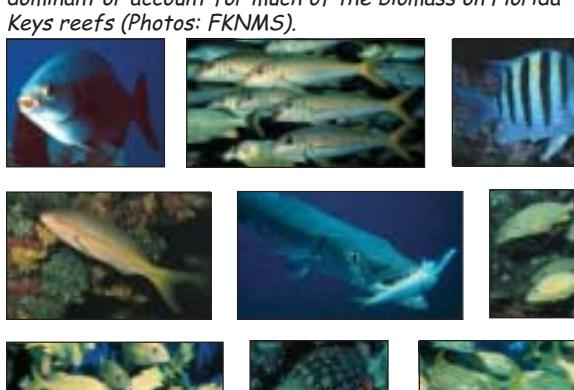

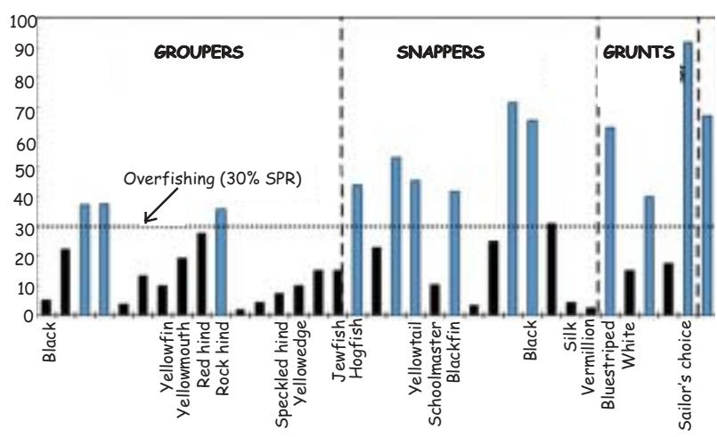

Figure 151. Estimated percent Spawning Potential Ratios (SPR%) for 35 species of reef fish comprised of groupers, snappers, grunts, hogfish, and great barracuda. Black bars indicate stock "overfishing" and blue bars indicate the stock is above the 30% SPR U.S. Federal standard (Modified from Ault et al. 1998).

communities by acting as key herbivores, keeping algae in check so adult corals can continue to grow and new corals may recruit to appropriate substrate. Reductions in the sea urchin population due to a massive, Caribbean-wide die-off in 1983 and relatively poor recovery of populations since then have been confirmed by two separate teams in the zone monitoring program (Fogarty and Enstrom 2001, Miller *et al.* 2001). Both document very low abundances of sea urchins, especially the long-spined sea urchin. Two research efforts underway in the Sanctuary are exploring viable means of restoring populations of this keystone species to coral reef habitats.

**Fish** – Considerable scientific attention has been

paid to fish species of the Florida Keys over the last several decades prior to the designation of the Sanctuary and its fully protected zones. Starck (1968) identified 517 fish species from the Florida Keys, including over 389 reef fish. Additional surveys have been conducted since 1979, documenting species composition, abundance, frequency, and size estimates (Bohnsack et al. 1999). Between 1979-1998 a total of 263 reef fish taxa representing 54 families were observed (Bohnsack et al. 1999). Numerically, over half (59%) of all fish were from just 10 species (Fig. 150). The majority of total fish biomass was comprised of

Figure 152. Gray snapper have benefitted from the fully protected zones (Photo: FKNMS).

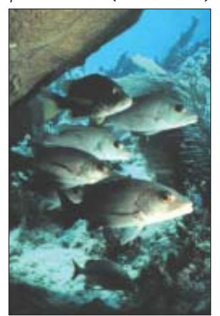

just a few species (Bohnsack et al. 1999).

The numerically dominant fishes observed were bluehead wrasse (Thalassoma bifasciatum), bicolor damselfish (Stegastes partitus), tomtate (Haemulon aurolineatum), sergeant major (Abudefduf saxatilis), striped parrotfish (Scarus croicensis), yellowtail snapper (*Ocyurus* chysurus), bluestriped grunt (Haemulon sciurus), white grunt (Haemulon plumieri), masked goby (Coryphopterus personatus), and French grunt (Hae*mulon flavolineatum*). Other species accounting for most of

the observed biomass were tarpon (*Megalops atlanticus*), barracuda (*Sphyraena barracuda*), gray snapper, Bermuda chub (*Kyphosus sectatrix*), stoplight parrotfish (*Sparisoma viride*), smallmouth grunt (*Haemulon chrysargyreum*), and yellow goatfish (*Mulloidichthys martinicus*) (Bohnsack *et al.* 1999).

Trends in spatial distribution and differences in populations over time are also noted. In most cases, relatively few fish of legal, harvestable size were seen. This is consistent with other studies indicating reef fish are highly exploited. Based on federal standards (Ault *et al.* 1998), 13 of 16 species of groupers, seven of 13 snappers, one

wrasse, and two of five grunts are overfished in the Florida Keys (Fig. 151). Non-sustainable fisheries practices are likely changing trophic interactions on reefs, with secondary effects such as reduced reproductive capacity (PDT 1990) and shifts in ecosystem structure and function.

Despite declines elsewhere in the Sanctuary, fish numbers of some economically important species are increasing somewhat in the fully protected zones. Analyses of three years of reef fish data show average densities (number of individuals per sample) for the exploited fish species – gray snapper (*Lutjanus griseus*, Fig. 152), yellowtail

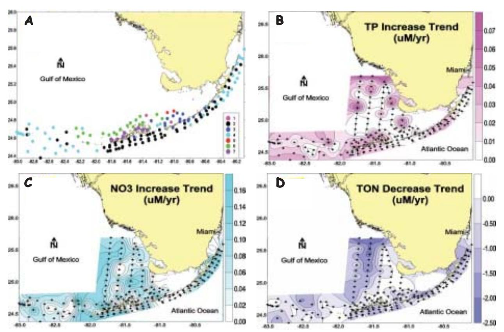

Figure 153. A. Map of water quality stations in FKNMS that are clustered according to statistical similarities in water quality parameters. B. Total phosphus (TP) trends in FKNMS, 1995-2000. Note significant increases in the Dry Tortugas, Marquesas Keys, Lower Keys, and portions of the Middle and Upper Keys. C. Nitrate (NO3 ) trends in FKNMS, 1995-2000. Increases occurred in the Southwest Florida Shelf, Dry Tortugas, Marquesas Keys, and Lower and Upper Keys. D Total organic nitrogen (TON) trends in FKNMS, 1995-2000. A moderate decrease in TON occurred in some areas, in contrast to increases in TP and NO3 . (Source: Jones and Boyer 2001).

snapper (*Ocyurus chrysurus*), and grouper (several economically important species were combined) – are higher in the SPAs than in fished reference sites (Bohnsack *et al.* 2001). Complementing this data is a trend in increasing average abundance of three species of snapper (gray snapper, schoolmaster, and yellowtail snapper) at sites monitored by Reef Environmental Education Foundation (REEF) volunteers before and after designation of the fully protected zones (Pattengill-Semmens 2001).

**Water Quality Quality –** Reduced salinity, agricultural and industrial chemical contamination, turbidity, and high nutrients possibly from sewage, upwelling, or groundwater have all impacted water quality to some degree in Southeast Florida, Florida Bay, and the Florida Keys. Ocean outfalls along the coast introduce millions of gallons of secondary sewage to coastal waters, adding nutrients. Eutrophication of nearshore waters (a result of excess nutrients) is a documented problem in the Keys. Given these anthropogenic impacts and the importance of also fully understanding natural variability, long-term water quality monitoring is

critical for the entire South Florida region. Water quality has been monitored at fixed stations in the FKNMS since 1995 as part of the Water Quality Protection Program (FKNMS WQPP 2002). Results to date indicate dissolved oxygen, total organic nitrogen, and total organic carbon are higher in surface waters, while salinity, turbidity, nitrite, nitrate, ammonium, and total phosphorus are higher in bottom waters. Geographical differences include higher nutrient concentrations in the Middle and Lower Keys than in the Upper Keys and Dry Tortugas regions. Generally, declining inshore to offshore trends along transects across Hawk Channel have been noted for nitrate, ammonium, silicate, total organic carbon and nitrogen, and turbidity (Jones and Boyer 2001).

Stations along passes between the Keys had higher nutrient concentrations, phytoplankton biomass, and turbidity than stations located off the Keys. Although these differences were small, the two shore types support different benthic communities, which may reflect long-term effects of water quality on community composition. Using a

**FLORIDA FLORIDA FLORIDA FLORIDA**

multivariate statistical approach, these stations were regrouped according to water quality. This resulted in seven clusters of stations with different water quality characteristics (Fig. 153), giving a functional zonation of Sanctuary water quality.

Probably the most interesting results are temporal trends in concentrations of total phosphorus, nitrate, and total organic nitrogen for much of the Sanctuary. There have been significant increases in total phosphorus for the Dry Tortugas, Marquesas Keys, Lower Keys, and portions of the Middle and Upper Keys. No trend in total phosphorus has been observed in Florida Bay or in areas of the Sanctuary most influenced by transport of Bay waters, and there was no concurrent increase in the concentration of chlorophyll *a*, a measure of phytoplankton in the water column. There were large increases in nitrates, which appeared to be seasonal. Most of the increases occurred in the Southwest Florida Shelf, Dry Tortugas, Marquesas Keys, and the Lower and Upper Keys. By contrast, total organic nitrogen decreased modestly at many sites. Most of the decreases occurred in the Southwest Florida Shelf, the Sluiceway, and the Lower and Upper Keys. It is possible that these trends are driven by regional circulation patterns arising from the Loop and Florida Currents.

#### **Coastal Populations and Reef Economics Coastal Populations and Reef Economics**

Much of South Florida is urban and its resident population continues to expand. A total of 5.09 million people resided in the four-county area of South Florida (Miami-Dade, Broward, Palm Beach, and Monroe Counties) in 2000, an increase of 23.1% in the past 10 years (U.S. Bureau of the Census 2002). Of this total, 2.25 million live in Miami-Dade, 80,000 live in Monroe (Florida

million. This annual value146 yields an Table 15. Recreation and tourism on natural reefs in Southeast Florida. estimate of the asset value of the natural \*Totals for these economic values are likely to be underestimated, because the data do not include inter-regional flows (Source: Johns et al. 2001). reefs at \$7.6 billion. Additional informa-

| Courty      | Person-Days (millions) | Number of Jobe' | (millions)* | Output/Sales (millions)* | (millions) | Amer Value (billions) |
|-------------|---------------------------|--------------------|-------------|-----------------------------|------------|--------------------------|
| Browned     | 5.5                       | 19,000             | \$547       | \$1,100                     | \$13.6     | \$2.8                    |
| Harri-Daile | 6.2                       | 13,000             | \$419       | 9879                        | 947.0      | \$1,6                    |
| Morroe      | 1.6                       | 8,000              | \$106       | 100                         | 855.0      | \$1.8                    |
| Paint Beach | 2.8                       | 4,500              | \$142       | \$157                       | \$42.0     | \$1.4                    |
| Totals      | 18.1                      | 44,500             | \$1,214     | \$2,706                     | \$227.6    | \$7.6                    |

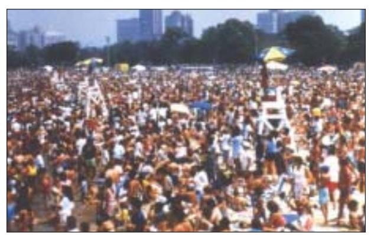

Figure 154. Visitors and residents at a South Florida beach (Photo: NOS Photo Gallery).

Keys), 1.13 million in Palm Beach, and 1.62 million in Broward counties.

Due to its climate and natural resources, South Florida draws millions of seasonal and temporary visitors (Fig. 154). Miami-Dade County receives a daily summer average of 240,000 seasonal and temporary visitors and a daily winter average of 308,000 visitors. Each day, Broward County receives between 140,000-320,000 visitors, depending on the season; Palm Beach County receives 73,000-183,000 visitors; and Monroe County receives 30,000-36,000 visitors (Johns *et al.* 2001). Including these visitors gives Miami-Dade, Broward, Palm Beach, and Monroe Counties, a functional population145 of 2.49-2.56 million, 1.76-1.94 million, 1.2-1.3 million, and 110,000 116,000, respectively.

Johns *et al.* (2001) estimated market economic contributions and non-market economic user values for recreational use of artificial and natural reefs. In the four-county South Florida region, residents and visitors spent 18.2 million person-days fishing, diving, and viewing natural coral reefs from glassbottom boats, yielding an annual non-market economic use value estimate of nearly \$228

tion on the economic impact of tourism has been summarized in Table 15.

In addition to supporting tourism in the region, coral reefs play an important role in maintaining Florida's commercial and recreational fisheries. In 2000, Monroe

**FLORIDA FLORIDA FLORIDA**

145 Functional populations include the number of people in a given area, on a given day, which demand local services (e.g., freshwater, sewage and solid waste disposal, electricity, transporation services). This number of people includes not only the permanent residents of an area, but also seasonal and temporary visitors.

146 In calculating this value, it was capitalized at a real interest rate (i.e., 'interest rate net of inflation' of 3% into perpetuity). **109109**

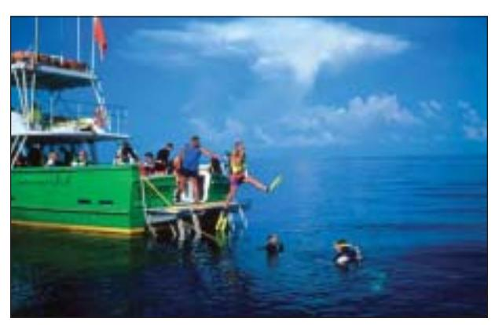

Figure 155. Approximately 900,000 people dive or snorkel in the Florida Keys each year (Photo: Paige Gill).

County commercial fishermen earned \$53.2 million in ex-vessel revenues (FWCC 2000). Since 40-60% of the commercial catch in this county is related to coral reefs, it can be estimated that the reef-related catch was worth \$22-32 million. Subsequently, this generated \$35-52 million in local sales/output, \$22 33 million in income, and 1,550-2,300 jobs (R. Leeworthy pers. comm.).

Recreational fisheries on natural reefs generated \$171 million in output/sales, \$44 million in income, and over 3,100 jobs. These totals are included in Table 15. In 2000-2001, commercial and recreational fisheries dependent on the natural reefs of the Florida Keys alone generated \$206-223 million in output/sales, \$66-77 million in income, and supported 4,650-5,400 jobs in Monroe County.

#### **Environmental Pressures on Coral Reefs Environmental Pressures on Coral Reefs**

**Human Stresses Stresses –** Humans can inadvertently alter physical characteristics of the reef environment, further stressing an ecosystem already combatting the broader stresses of natural variability and global climate change. Impact from human activities is likely greater in the Keys and along the southeastern coast than in the Middle Grounds. Due to its offshore location, the Middle Grounds has been somewhat protected, particularly from pollutants.

In the Florida Keys, the greatest immediate pressure is from the three million annual visitors (Leeworthy and Vanasse 1999) and the 80,000 year-round residents. The population of Monroe County has grown 160% during the past 40 years, a 50,000 resident increase. Visits to the Florida Keys increased by 15% in the two-year period from 1995-96 to 1997-98, and averages 46,500

58,700 visitors on any given day during the winter tourist season (Leeworthy and Vanasse 1999). In 1995-1996, over 65% of visitors to the Florida Keys participated in water-based activities, 31% of which were snorkeling and SCUBA diving (Leeworthy and Wiley 1996, Fig. 155). Since 1965, the number of registered private vessels has increased over six-fold (DoC 1996, Fig. 146).

Damage by humans to hundreds of square kilometers of reef, seagrass, and related habitat over the last 30 years has been documented for some time in the Florida Keys. Boat groundings on coral, seagrasses, and hardbottom areas, propeller scarring of seagrass, accumulation of debris, breaking and damaging corals with ship anchors, using destructive fishing methods, and divers and snorkelers standing on corals have all been documented in various places.

Boat propellers have permanently damaged over 121 km2 of seagrasses. Over 650 small boat groundings were reported in the Sanctuary in 2000 alone, with 158 of these affecting seagrass and 22 impacting coral reef habitats. Large ships have been responsible for damaging or destroying over 80,000 m2 of coral reef habitat in the Sanctuary.

Wastewater and stormwater treatment and solid waste disposal facilities in the Keys are highly inadequate, having a direct impact on water quality. However, some solutions to water quality problems are being implemented. One of the larger ocean outfalls off Key West that delivered approximately seven million gallons a day to the sea was recently replaced with a deep-well injection system (more than 914 m deep and below a containment layer) for treated effluent. Before injection, the effluent is

Figure 157. Currently, there are over 106,000 boats registered in south Florida (Photo: FKNMS).

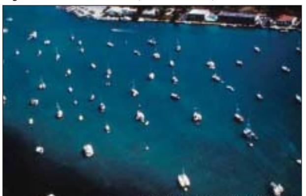

**FLORIDA FLORIDA FLORIDA FLORIDA**

treated according to USEPA Advanced Wastewater Treatment standards.

Another indirect impact is altered freshwater flow into coastal waters. The South Florida Water Management District has responsibility for managing the flow and release of freshwater to the ocean through an extensive system of canals and locks. In Florida Bay, reduced freshwater flow from water management practices in South Florida has been associated with increased plankton blooms (eutrophication), sponge and seagrass die-offs, and fish kills. Since Florida Bay and nearshore waters provide critical nursery and juvenile habitat for a variety of reef species, the declines seen in these areas indirectly affect the overall health and structure of offshore coral reefs in the Florida Keys. In addition, to control flooding, millions of gallons of fresh water have periodically been released into the canals and near-shore waters of South Florida, creating problems for marine communities.

The highly urbanized coastal region along Florida's southeastern coast puts its coral reefs under varied and chronic stress. During good weather, both recreational and commercial boating and fishing are very heavy on these reefs. The nearby Miami, Port Everglades, and Palm Beach ports handle cruise and container ships, oil tankers, and military vessels. In the past ten years, a number of moderate to severe large vessel groundings in Southeastern Florida have damaged the reef system (Fig. 157). Signs of anchor damage are also routinely seen. Four other large-vessel groundings have impacted areas of nearby Biscayne National Park.

Serial overfishing (Ault *et al.* 1998) throughout South Florida has dramatically altered reef fish and other animal populations, contributing to an imbalance in relationships critical to sustaining coral reef diversity. In Biscayne National Park, 26 of 34 fish species, or 77% of the fish stocks that were examined were overfished (Ault *et al.* 2001). In addition, certain types of fishing gear negatively impact reefs in Southeastern Florida.

Reef tracts off Boca Raton and Sunny Isles have been destroyed by dredging for beach renourishment, channel deepening, and channel maintenance. Chronic turbidity and silt deposition from dredging and similar activities impact water quality, indirectly affecting the reefs. These activities smother sessile invertebrates, resulting in

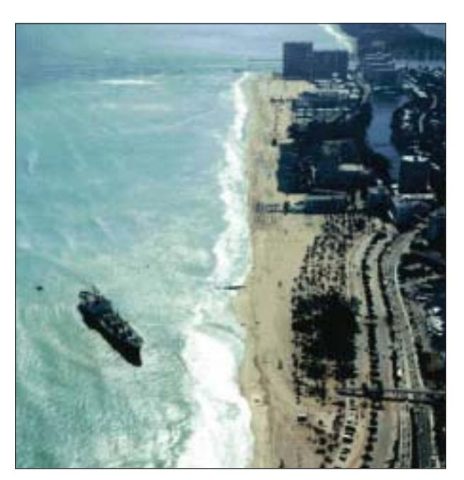

Figure 157. The M/V Firat grounded offshore of Fort Lauderdale, Florida (Photo: Greg McIntosh).

barren areas. Fiber optic cables were deployed across reefs in some areas, causing abrasion and detachment of corals and sponges (Jaap 2000).

Introduced, competitive species add additional stress. Within the past decade, several alien species have been identified on Florida Keys reefs. At least eight species of marine mollusks have been introduced into South Florida and are expanding their range. Non-native marine crustaceans are equally diverse and include six crab species, five shrimp species, three barnacles, four isopods, and one tanaid. Most of these species are foreign to North American waters and were introduced through ship hull fouling or ballast water dumping (USGS 2002).

The majority of Florida's marine fish introductions have come from released aquarium fish, with occasional reports from divers of various exotic species living among native reef fish. For example, the Indo-Pacific lionfish (*Pterois volitans*) has been sighted on South Florida reefs (Courtney 1995). Another popular aquarium fish, the Pacific batfish (*Platax orbicularus*), was observed off the Upper Keys; two specimens were removed and delivered to the New England Aquarium (B. Keller pers. comm.).

**Natural Variability –** In addition to the myriad of human impacts affecting coral reef health in Florida, natural environmental variability affects these habitats. Principal natural environmental

**FLORIDA FLORIDA FLORIDA**

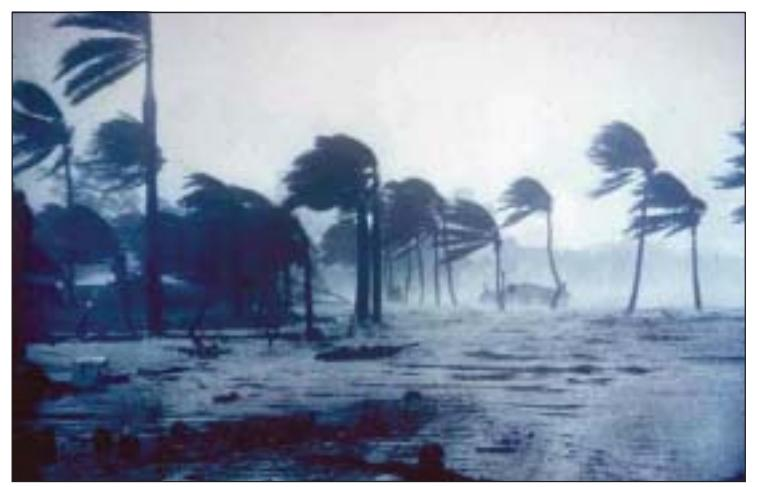

Figure 158. Several hurricanes have recently hit Florida, impacting its reefs (Photo: South Florida Water Management District).

impacts include hurricanes (Fig. 158), severe storms, winter cold fronts, cold-water upwelling, and ground water effects. Under normal conditions, corals and associated reef organisms tolerate a certain level of environmental stress and recover or acclimatize to sporadic events such as temperature variation or storms. The added human impacts and stresses may be prolonging the time needed as well as the ability of these organisms and systems to recover from large-scale climate fluctuations and other global changes.

#### **Current Conservation Management Management**

**Mapping Mapping –** Only about 50% of Florida's coral reef and associated benthic habitats have been mapped. As a result, reliable estimates of the percentage of coral reef and related habitats, as well as the area protected by no-take provisions, cannot be accurately computed state-wide.

Mapping efforts were undertaken in the Sanctuary in the 1990s. FWC/FMRI and NOAA published digital benthic habitat maps for the Florida Keys in 1998 (FMRI/NOAA 1998, Fig. 159). Recently, the Dry Tortugas region was characterized (Schmidt *et al.*1999). Also, Agassiz (1882) produced a remarkable baseline map of Dry Tortugas benthic habitats, which suggest a 0.4 km2 loss of elkhorn coral in a 100-year period (Davis 1982). Mapping gaps exist for deeper regions of the Tortugas.

The reefs along the Southeastern Florida coast are not as well studied. In 1999, Nova Southeastern University's National Coral Reef Institute (NSU/ NCRI) and the Broward County Department of Planning and Environmental Protection initiated

mapping of Broward County reefs**.** At this time, there is no comparable mapping program in Palm Beach and Miami-Dade Counties.

Improved mapping has resulted from aerial photos of near-shore areas and laser-based bathymetry of the three reef tracts off Southeastern Florida for specific projects. For example, detailed LADS (laser depth sounding) bathymetry is complete for all of Broward County, offshore to 36 m. A smaller amount of the area is also mapped with multibeam bathymetry and side-scan sonar.

Estimates of benthic cover are available from some monitoring programs. There is a general reef distribution map in Jaap and Hallock (1990).

No mapping of the Florida Middle Grounds has been conducted to date.

**Monitoring, Assessments, and Research –** In the Florida Keys National Marine Sanctuary, a comprehensive research and monitoring program has been implemented to establish baseline information on the various components of the ecosystem and help ascertain possible causes and effects of changes. This way, research and monitoring can ensure the effective implementation of management strategies using the best available scientific information.

Research and monitoring are conducted by many groups, including Local, State, and Federal agencies, public and private universities, private re-

Figure 159. A portion of the benthic habitat map of the Florida Keys (Map: FMRI/NOAA).

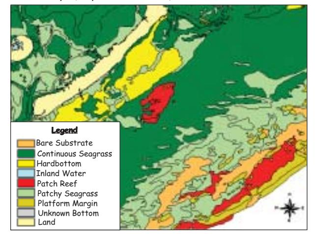

**FLORIDA FLORIDA FLORIDA FLORIDA**

search foundations, environmental organizations, and independent researchers. The Sanctuary facilitates and coordinates research by registering researchers through a permitting system, recruiting institutions for priority research activities, overseeing data management, and disseminating findings to the scientific community and the public.

The Water Quality Protection Program (WQPP), funded by the USEPA and recently, NOAA, is the most comprehensive, long-term monitoring program in the Florida Keys. Begun in 1994, it monitors three components: water quality, seagrasses, and corals/hardbottom communities. Reef fishes, spiny lobster, queen conch, and benthic cover are also monitored throughout the Sanctuary.

Water quality has been monitored at 154 fixed stations since 1995. Water samples are collected for measuring salinity, temperature, dissolved oxygen, turbidity, relative fluorescence, and light attenuation. Water chemistry includes nitrate, nitrite, ammonium, dissolved inorganic nitrogen, and soluble reactive phosphate. Concentrations of total organic nitrogen, total organic carbon, total phosphorus, and silicate are also measured, along with chlorophyll *a* and alkaline phosphatase activity (Jones and Boyer 2001).

Seagrass monitoring under the WQPP identifies the distribution and abundance of seagrasses within the Sanctuary and tracks changes over time. Quarterly monitoring is conducted at 30 fixed stations and annual monitoring occurs at 206 to 336 randomlyselected sites (Fourqurean *et al.* 2001, WQPP 2002). Permanent stations are co-located at 30 of the water quality monitoring sites to help discern relationships between seagrass health and water quality. This long-term monitoring is also invaluable for determining human impacts on the Sanctuary's seagrass communities.

The Coral Reef/Hardbottom Monitoring Project (CRMP 2002) tracks the status and trends of coral and hardbottom communities throughout the Sanctuary (Jaap *et al.* 2001, Fig 160). The project's 43 permanent sites include hardbottom, patch reef, shallow offshore reef, and deep offshore reef communities. Biodiversity, coral condition, and coral cover are recorded annually at four stations within each site, for a total of 172 stations.

In addition to the WQPP, a Zone Monitoring Program monitors the 24 discrete marine reserves located within the Sanctuary. Implemented in 1997, the goal of the program is to determine whether these fully protected zones effectively protect marine biodiversity and enhance human values related to the Sanctuary. Parameters measured include the abundance and size of fish, invertebrates, and algae, as well as economic and aesthetic values of the Sanctuary and compliance with regulations. This program monitors changes in ecosystem structure (size and number of invertebrates, fish, corals, and other organisms) and function (coral recruitment, herbivory, predation). Human uses of zoned areas are also tracked.

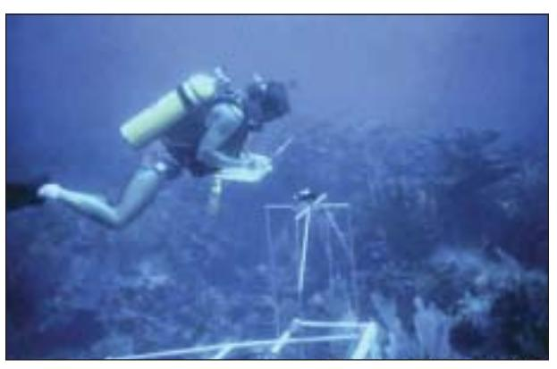

Figure 160. Photo-monitoring of corals within the FKNMS (Photo: Mike White).

Lastly, continuous monitoring of certain physical parameters of seawater and ocean condition is recorded by instruments (C-MAN stations) installed along the Florida Reef Tract as part of the SEAKEYS program (SEAKEYS 2002). There are six C-MAN stations from Fowey Rocks to the Dry Tortugas, and one in Florida Bay. These stations gather data and periodically transmit it to satellites, where it is converted to near real-time reports available on the Internet. For the past ten years the Sanctuary has maintained a network of 27 thermographs that record water temperature every two hours, located both inshore and offshore throughout the Keys.

As baselines are being documented, Sanctuary managers are developing a comprehensive science plan outlining specific management objectives and their associated monitoring and research needs. This is an evolving, adaptive management approach to help ensure management decisions are supported by the best available science. The science plan will identify high-priority research and monitoring projects to help fill gaps in understand**FLORIDA FLORIDA FLORIDA**

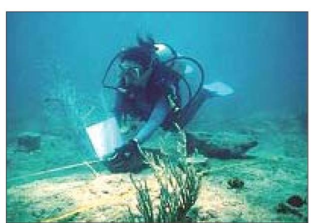

Figure 161. Coral reef monitoring along Florida's southeastern coast (Photo: NCRI).

ing the ecosystem and its responses to management actions.

Recognizing the importance of an ecosystem approach to management, the Sanctuary engages

agencies working on the Comprehensive Everglades Restoration Plan to achieve appropriate restoration goals for the entire ecosystem, including coral reefs and seagrasses. Active monitoring of natural resources is a Sanctuary priority, so that changes occurring as a result of water management regimes and restoration can be detected.

Figure 162. Detail of an artificial reef that is being used by NCRI to study reef restoration techniques (Photo: NCRI).

Along Florida's southeastern coast, much of the present monitoring originated as impact and mitigation studies for projects that had adverse impacts to specific sites (dredging, ship groundings, pipeline and cable deployments, and beach renourishment). In the past, such studies have been of limited duration (one to three years) and the focus has been largely on beach renourishment, restoration for grounding impacts, and some baseline data collection from reference areas.

Monitoring has begun in Broward County at 23 fixed 30-m2 sites for environmental conditions (sedimentation quantities and rates, water quality, and temperature), and coral, sponge, and fish abundance and/or cover (Fig. 161). There have been a number of discrete fish surveys on the reefs of Miami-Dade and Palm Beach counties, most of which have been associated with beach renourishment projects or artificial reef management

(Lindeman and Snyder 1999, Light 2001, C. Avila pers. comm.).

However, there is a concerted effort of NSU/NCRI scientists to complete a baseline survey of reef fishes off Broward County (Ettinger *et al.* 2001, Harttung *et al.* 2001). Initiated in 1998, this NOAA-funded survey is recording fishes on the edges and crests of the three major reef lines. At this time, more than 600 point-counts have been completed, and the full survey will be completed by mid-2002. In addition, during summer 2001, NSU/NCRI scientists inventoried fish on the first 30 m of the inshore reef at 158-m intervals for 25 km of shoreline using multiple visual techniques (point-count, 30 m transects, and 20 min random swim) (Baron *et al.* 2001). Broward County now has a database comprised of more than 1000 visual censuses from the shore to 30 m for reef fish.

> Researchers at NSU/NCRI are also currently involved in a multivariate, hypothesis-driven study that looks at the interaction of fish, transplanted corals, coral recruits, and potential coral attractants or optimal substrates (Fig. 162). Research variables include four potentially different fish assemblages (determined by reef complexity) and biofilm and coral recruitment on settlement plates of made of concrete, concrete and iron, concrete and

quarry rock, or concrete and coral transplants. Results of this three-year study should yield information critical to reef restoration.

The Florida Middle Grounds do not have any ongoing, formal monitoring programs at this time. Overall, the development of a comprehensive monitoring program for the reefs of southeastern Florida and the Florida Middle Grounds would provide a better understanding of current conditions for fish and corals in these regions and would promote more effective management.

**MPAs and Fully Protected Reserves Reserves –** As with monitoring, assessment, and research programs, coral reef conservation and management through the designation and implementation of marine protected areas (MPAs) varies widely. The largest and best-known MPA in Florida, the Florida Keys

**FLORIDA FLORIDA FLORIDA FLORIDA**

National Marine Sanctuary, was designated in 1990, placing 9,850 km2 of coastal waters and 1,381 km2 of coral reef area under NOAA and State of Florida management. Immediate protective measures were instituted as a result of Sanctuary designation, including prohibitions on oil and hydrocarbon exploration, mining and otherwise altering the seabed, and restrictions on large ship

traffic. Coral reefs were

separation of incompatible uses, among other goals. Three of the zone types (sanctuary preservation areas, ecological reserves, and special use/researchonly areas) are fully protected areas, or marine reserves, where lobstering, fishing, spearfishing, shell collecting, and all other consumptive activities are prohibited.

The 1997 zoning plan established 23 discrete fully

protected zones that encompass 65% of the Sanctuary's shallow coral reef habitats. The largest zone at that time, the 30.8 km2 Western Sambo Ecological Reserve, protects offshore reefs as well as other critical habitats, including mangrove fringe, seagrasses, productive hardbottom communities, and patch reefs. In July 2001 the 517.9 km2

Tortugas Ecological Reserve was implemented (Fig. 163). It is now the largest of the Sanctuary's fully protected zones. Located in the westernmost portion of the Florida Reef Tract, the Reserve conserves important deep-water reef resources and fish communities unique to this region of the Florida Keys. Together with the other fully protected zones, the Tortugas Ecological Reserve

increased the total protected

the Research Natural Area. Wildlife viewing, snorkeling, diving, boating and sightseeing are managed in this zone primarily through commercial tour guides. Together, the Sanctuary's Tortugas Ecological Reserve and the National Park's Research Natural Area fully protect near-shore to deep reef habitats of the Tortugas region and form the largest, permanent marine reserve in the United States.

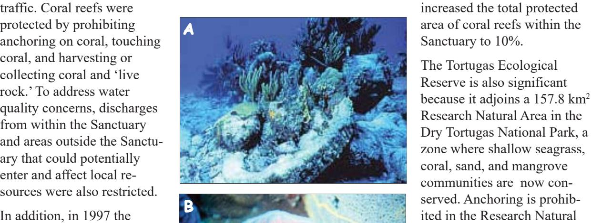

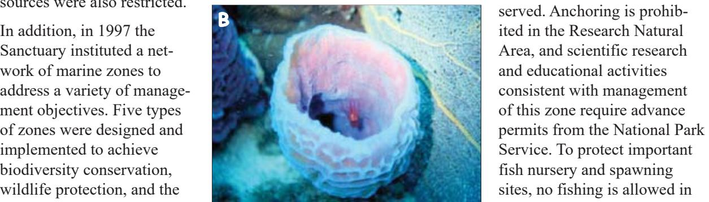

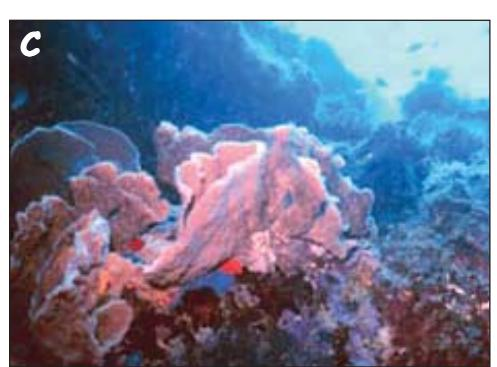

Figure 163. Recently established MPAs located offshore of Florida: A. Tortugas Ecological Reserve B. Madison-Swanson Spawning Site and C. Steamboat Lumps Spawning Site (Photos: NOAA Photo Library and NPS).

Overall, the Sanctuary management regime uses an ecosystem-wide approach to comprehensively address the variety of impacts, pressures, and threats to Florida Keys marine ecosystems. It is only through this inclusive approach that the complex problems facing coral reefs can be adequately addressed.

**FLORIDA FLORIDA FLORIDA**

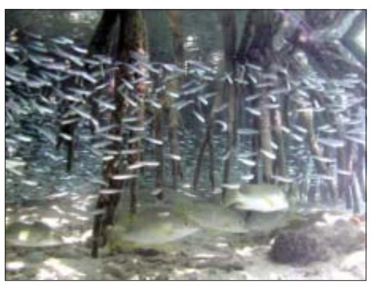

Figure 164. Mangrove prop roots serve as important nursery sites for certain fish species (Photo: Matt Kendall).

Biscayne National Park encompasses 683 km2 of waters just south of Miami, including the majority of Biscayne Bay and a substantial portion of the northern reef tract with 291 km2 of coral reefs. The Park is renowned for its productive coastal bay, nearshore, and offshore habitats, including islands, mangrove shorelines, seagrass beds, hardbottom communities, and coral reefs, which provide important recreational opportunities and spectacular scenic areas. The National Park Service is concerned about degradation of Park resources in the face of coastal development, increases in the number of recreational boats visiting the Park, and fishing pressure. The Park is revising its General Management Plan to provide for management zones that would give greater protection to Park resources, including Natural Resources Reserve areas where fish nurseries and spawning habitats would be protected from fishing and disturbance. In addition, the Park is developing a cooperative plan with the State of Florida to adopt a coordinated and seamless approach to protecting and restoring fishery resources both within and outside Park boundaries.

The Key West National Wildlife Refuge and the Great White Heron National Wildlife Refuge overlap with portions of the Florida Keys National Marine Sanctuary in the backcountry of the lower Keys and an extensive area around the Marquesas Islands between Key West and the Dry Tortugas. The Refuges, established in 1908 and 1938 respectively, contain over 1,619 km2 (400,000 acres) of lush seagrass beds, reef tract, patch reefs, hardbottom community, and pristine mangrove islets. A cooperative agreement with the State of Florida on the management of these submerged lands created

a number of wildlife management zones in the Refuges. These zones direct human activities away from sensitive wildlife and habitats, and help to ensure their continued conservation. The U.S. Fish and Wildlife Service, as administrators of the National Wildlife Refuge System, works cooperatively with the State and the Sanctuary for the protection of these sites.

Of the dozen or so State Parks in Southeast Florida, two are considered marine. One of the oldest marine parks in the world (acquisition began in 1959), the John Pennekamp Coral Reef State Park is located in Monroe County on Key Largo. It covers 249 km2 (61,531 acres) and has 461 km2 of coral reefs, seagrass beds, and mangrove swamps. Lignumvitae Key Botanical State Park, which includes Shell Key, is located in Monroe County, west of Islamorada. The Park's submerged habitats are located in Florida Bay and the Atlantic Ocean, and include fringing mangrove forest, extensive seagrass beds, patch reef, and sand flats.

Reefs off the southeastern coast and the banks of the Middle Grounds have some protection through various MPAs, but neither region is as comprehensively protected tas the Florida Keys. North of Vero Beach, the Oculina Bank Habitat Area of Particular Concern (HAPC) was established in 1984 and is currently under the management of NOAA's National Marine Fisheries Service (NMFS) and the South Atlantic Fishery Management Council. The HAPC runs along the central Florida eastern coast, from Ft. Pierce to Cape Canaveral, and protects deep-water pinnacles of ivory coral (*Oculina* spp.) This habitat has been identified as easily impacted by fishing activities, including destruction by dredges, trawlers, and long-line fishing gear.

The Madison-Swanson and Steamboat Lumps Spawning Sites were established in June 2000 under authority of the Magnuson-Stevens Fisheries Conservation and Management Act and will be managed by NMFS and the Gulf of Mexico Fishery Management Council. These MPAs, located offshore on the West Florida shelf, were created to protect spawning aggregations of gag ( *perca microlepis* fish species from fishing activities. Deepwater habitats are also protected from fishery-related impacts. These areas are closed to all fishing for a ) as well as other reef and pelagic *Myctero*period of four years in order to evaluate the effects of fishing on spawning aggregations.

**FLORIDA FLORIDA FLORIDA FLORIDA**

The Florida Middle Grounds HAPC was established in 1984 to protect this deeper coral habitat. Located approximately 70 nautical miles to the northwest of Clearwater, FL, the HAPC prohibits the use of several types of commercial gear, including fish traps, to protect and maintain fish stocks. The HAPC is under the management of NMFS and the Gulf of Mexico Fishery Management Council.

#### **Gaps in Monitoring and Conservation Conservation Capacity CapacityCapacity**

Current monitoring in the Florida Keys National Marine Sanctuary has largely focused on detecting changes within the fully protected zones and determining Sanctuary-wide status and trends of water quality, seagrasses, and corals. Some trends are beginning to show, providing a source of hypotheses to be tested. Continued monitoring is critical. These data will facilitate detecting longterm changes in communities both locally and ecosystem-wide.

Reef monitoring programs in southeastern Florida are limited by a near total lack of comprehensive inventories and assessments of marine communities in this area. Baseline assessments with monitoring programs at sites located off each of the counties in the region are needed. The first step should be to develop a functional classification of the reef habitats. For effective selection of monitoring sites, this classification should incorporate criteria to ensure that both representative habitats and unique sites receive attention.

The databases of reef fish in Broward, Miami-Dade, and Palm Beach Counties are based on visual survey techniques that can overlook a substantial number of cryptic species (as many as 37% in a recent Caribbean survey, Collette *et al.*  2001). Thus, intensive and broad-scale monitoring needs to be done to obtain a complete picture of the resident ichthyofauna. In addition, the fish below 30 m are poorly characterized and exploited by recreational fishers.

Likewise, the reef fish communities from seagrass and mangrove habitats of Port Everglades and the Intracoastal Waterway (ICW) remain a mystery. Given the high level of human activity in the area and since these are potentially important nursery sites (Leis 1991, Fig. 164), there is need for immediate clarification.

A formal monitoring program should also be instituted in the Florida Middle Grounds. Ideally, stations would be established based on the sites surveyed by Hopkins *et al.* in 1977. The ability to compare the area's current status with previous data would be helpful in detecting changes over time. To that end, video transects and methods comparable to the 1977 work should be employed.

The reefs along the southeast coast and the Middle Grounds banks should be fully mapped. The data should be consistent with state, national, and international programs, and should be rapidly disseminated for public consumption. A regional archive should be established.

#### **Government Policies, Laws, and and Legislation Legislation**

When President George Bush signed the Florida Keys National Marine Sanctuary and Protection Act into law in 1990, the FKNMS became the first national marine sanctuary designated by Congress. Its authority, along with the 12 other national marine sanctuaries, is established under the National Marine Sanctuaries Act (NMSA) of 1972, 16 U.S.C. 1431 *et seq*., as amended. The Sanctuary is administered by NOAA under the Department of Commerce, and is managed jointly with the State of Florida under a co-trustee agreement because over half of the waters of the Sanctuary are state territorial waters. The co-trustee agreement commits the Sanctuary to a periodic review of the management plan; the first review will be in 2002.

In 1997, a comprehensive management plan for the Sanctuary was implemented. It contains ten action plans and associated strategies for conserving, protecting, and managing the significant natural and cultural resources of the Florida Keys marine environment.

Largely non-regulatory, the strategies educate citizens and visitors, use volunteers to build stewardship for local marine resources, appropriately mark channels and waterways, install and maintain mooring buoys for vessel use, survey submerged cultural resources, and protect water quality. As described previously, the Sanctuary management plan also designated five types of marine zones to reduce pressures in heavily used areas, protect critical habitats and species, and separate use conflicts.

**FLORIDA FLORIDA FLORIDA**

A total of 24 fully protected zones were implemented in 1997 and 2001, covering approximately 6% of the Sanctuary, but protect 65% of shallow bank reef habitats and about 10% of coral resources. Most of the smaller zones (sanctuary preservation areas) are located along the offshore reef tracts and encompass the most heavily used spur and groove coral formations. In these areas, all consumptive activities are prohibited. The effectiveness of these zones and other biological and chemical parameters are monitored under the Research and Monitoring Action Plan of the Sanctuary.

Commercial fishing remains one of the largest industries in the Florida Keys (Fig. 165), but it is regulated heavily by State and Federal fishery management councils. Regulations for most commercial invertebrates and finfish include annual catch quotas, closed seasons, gear catch size restrictions. The State also collects landing information on approximately 400 kinds of fish, invertebrates, and plants to track trends in catch and to evaluate regulations (DoC 1996).

The reefs of southeastern Florida are in State territorial waters and protected from some impacts by State statutes and regulations. These include

Figure 165. Both shrimp (A) and lobster (B) fisheries are important industries and seagrasses, employ sustainable in South Florida (Photo: Paige Gill, FKNMS and NOAA). fishing practices, reduce pollution,

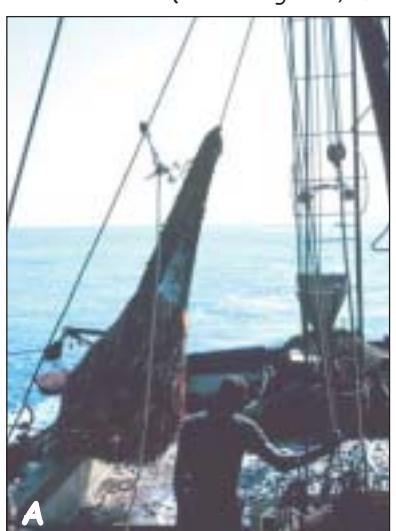

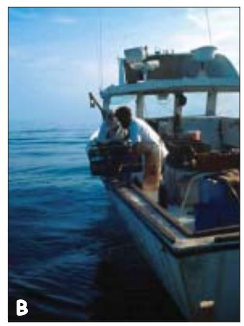

fishing regulations, dredging permits, and a statute protecting corals from harvest, sale, or destruction. Broward County has a small boat mooring program intended to reduce anchoring impacts on reefs.

#### **Conclusions and Recommendations Recommendations**

Overall, immediate action is needed to curtail alarming declines in coral reef condition throughout Florida. Local communities that are culturally and economically supported by coral reefs must employ management strategies and focus on alleviating controllable human impacts. For example, in southeastern Florida, the environmental impacts of fisheries, dredging, vessel anchorages, freshwater management, and nutrient input should receive attention to maximize protection to the reefs in this area. In the Florida Keys, solutions that address wastewater and stormwater problems, habitat degradation, and overfishing must be pursued.

At the regional level, elected officials and policymakers should work to conserve and protect watersheds, reduce emissions, and decrease energy use. Citizens, elected officials, and MPA managers must work together to improve water quality,

> minimize physical impacts to corals and save energy.

Globally, strict air pollution standards must be adopted, carbon dioxide emissions reduced, and renewable energy technologies employed to curb global warming trends. International policies on global climate change should be adopted and implemented. Comprehensive coral reef protection will ultimately require both proactive local steps and engaging leaders regionally and globally on climate **AB**change issues.

**FLORIDA FLORIDA FLORIDA FLORIDA**

## **STATUS OF THE CORAL REEFS OF PUERTO RICO STATUS OF THE CORAL REEFS OF PUERTO RICO STATUS OF THE CORAL REEFS OF PUERTO RICO Cruz A. Matos, Jorge R. García, and Ernesto Díaz Cruz A. Matos, Jorge R. García, and Ernesto Díaz Cruz A. Matos, Jorge Ernesto Díaz Cruz A. Matos, Jorge R. García, and Ernesto Díaz Cruz Jorge R. García, and Ernesto**

#### **Introduction Introduction**

The Commonwealth of Puerto Rico is approximately 1,600 km from Miami and lies between the island of Hispaniola and the US Virgin Islands. These islands – the main island of Puerto Rico and five smaller islands – are the smallest and easternmost in the Greater Antilles. They have a combined land area of about 8,897 km2 and a linear coastline of 620 km. Two of the small islands off the eastern coast of the main island are inhabited (Culebra and Vieques); the three islands off the western coast are not (Mona, Monito, Desecheo).

The island of Puerto Rico is almost rectangular (56.3 km by 161 km) with a mountainous interior formed by a central mountain chain (covering 60%), extending east to west across the island. The main island has coral growth along much of the insular shelf, but reef development is mostly restricted to the eastern, southern, and western coasts as a result of physical, climatic, and oceanic conditions.

With the exception of Monito Island, NOAA recently mapped Puerto Rico's coral reef ecosystem and associated habitats (e.g., sand, hardbottom, algae, mangroves) to a depth of about 20 m, and delineated a total coral reef ecosystem area of 5,009.6 km2 (Kendall *et al.* 2001). Coral reef and colonized hardbottom habitat comprised 756.2 km2 (15.1%) of the total area, seagrass habitat covered

Figure 166. Detail of a spur-and-groove formation (Photo: Matt Kendall).

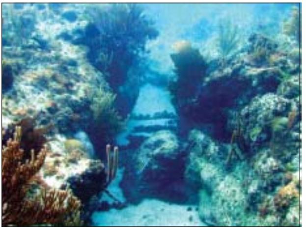

624.8 km2 (12.5%), macro-algal dominated areas covered 96.7 km2 (1.9%), and the mangrove fringe covered 72.6 km2 (1.4%).

Puerto Rico, Culebra, and Vieques are nearly completely ringed with reefs. Submerged hardsubstrate rock reefs are found on the northwestern and western coast of Puerto Rico with moderate to high topographic relief and high cover of turf algae and patchy coral growth. Flat eolianite reefs (rock formed on land by cementation of calcareous dune sands), are mostly along the northern coast of Puerto Rico with high cover of turf algae, sponges, and isolated encrusting corals. Fringing reefs are found mainly in the eastern, southern, and western coasts of Puerto Rico, Culebra, and Vieques. Northern fringing reefs are characterized by shallow (1-3 m) back-reef communities dominated by finger coral *Porites porites* and scattered coral colonies of different species.

Shelf-edge reefs are the best-developed but least studied coral reef ecosystems in Puerto Rico. An extensive reef formation is found at the shelf-edge off the southern coast, from Guayanilla to Cabo Rojo. This displays a typical spur-and-groove pattern with sand channels cutting through the shelf perpendicular to the coastline (Fig. 166). Off La Parguera, the reef starts at 18 m and continues down the shelf slope to at least 35 m. Optimal reef development can be found at 20 m at the shelfbreak.

Some of Puerto Rico's best developed shelf-edge reefs are found off the western and southwestern sections of Desecheo and Mona Islands. Both of these systems are perhaps fringing reefs that extend all the way to the shelf-edge due to the small extension of the insular shelf in these oceanic islands. The waters that surround these oceanic reefs receive minimal terrigenous inputs.

Patch reefs are relatively small, submerged coral reef systems surrounded by soft sediments. These are poorly known due to their small size and thus, are excluded from nautical charts. Nevertheless, these small patch reefs may be significant due to their high abundance in some places (Fig. 167),

such as La Parguera, Cordillera de Fajardo, Mayagüez Bay, Guayanilla Bay, Mona Island, Rincon, and Aguadilla.

Coral cover generally increases with distance from shore with 10-50% live coral at shelf-edge reefs (Morelock et al. 2001). At shelf-edge sites on the reef platform, boulder star corals dominate at 3-15 m, with colonies up to 5 m in height; living coral extends to at least 40 m (Bruckner 1999, J. Morelock pers. comm.).

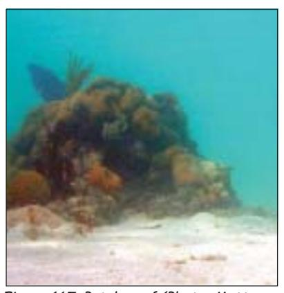

Figure 167. Patch reef (Photo: Matt Kendall).

emergent lands are managed by the DNER as a Natural Reserve. This island forms the top of an underwater ridge separating the Caribbean Basin from the Atlantic Ocean; the narrow insular platform drops rapidly into deep water (366-1,159 m).

There are extensive, well-developed reefs off the western. southern, and eastern coasts of Mona. The best-developed reefs are on the southwestern coast, near the edge of the insular shelf

where coral cover ranges from 10-45% and is dominated by massive boulder star corals and boulder brain corals. The southeastern coast has a narrow back reef and a well-developed reef crest dominated by elkhorn coral and symmetrical brain coral (Diploria strigosa). Deeper environments are mostly hard ground with isolated corals (A. Bruckner unpub. data).

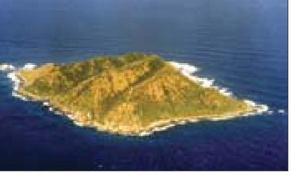

Figure 168. Desecheo National Wildlife Refuge (Photo: USFWS).

Condition of Coral Reefs

Without long-term monitoring data, it is difficult to generalize reef conditions in Puerto Rico. Lacking baseline data on live coral cover, overgrowth by algae and other biota encrusting coral skeletons has been used to indicate reef degradation.

**Coral** – Overall, 93 coral taxa, including 43 scleractinian corals, 42 octocorals, 4 antipatharians, and 4 hydrocorals have been reported from Puerto Rico (A. Bruckner pers. comm.).

Reefs ringing the main island are threatened and at places degraded, primarily because of their proxim-

> ity to coastal development. Coral reefs off Puerto Rico near La Parguera, Desecheo Island, and Vieques Island have the highest abundance and cover of living coral. But these reefs have also been degraded by human and natural impacts.

Recent studies of the coastal waters of Descheo indicate that these coral reefs are probably the best-developed and healthiest in Puerto Rico, with about

Desecheo Island off the western coast is managed by the USFWS as a National Wildlife Refuge (Fig. 168). This has well-developed coral reefs to the south and southwest. Surveys conducted between 1997 and 1999 found live coral cover at four reef sites ranged from 38-48%, soft coral cover from 1-10%, and algal cover from 24-28 %. A high inci-

dence of bleaching (13-29%) was noted during January 1999 surveys. Also at that time, 17% of the corals on Candlesticks Reef were diseased (Reef Keeper International summer 1999).

Mona Island, a small, uninhabited island located within Mona Passage, lies 73 km to the west of Puerto Rico and 65 km east of the Dominican Republic. The

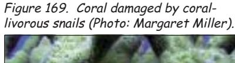

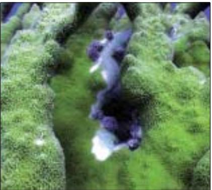

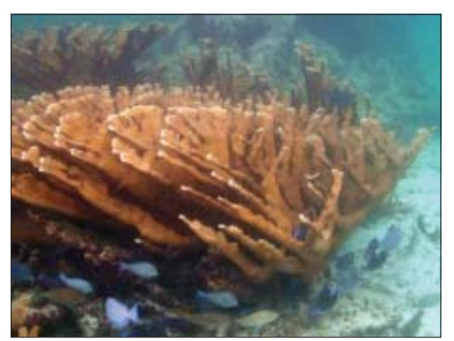

Figure 170. Today, few elkhorn coral thickets remain in Puerto Rico (Photo: Matt Kendall).

70% coral cover and high water clarity (Armstrong *et al.* 2001).

Staghorn and elkhorn coral populations have declined in most locations over the last 25 years from hurricane damage, white-band disease, and corallivorous mollusks (Fig. 169, Goenaga 1991, Bruckner *et al.* 1997, Williams *et al.* 2000). Vast stretches of elkhorn coral on the eastern coast of Puerto Rico, which appeared healthy in 1979, have been decimated possibly as a consequence of white-band disease (Goenaga and Boulon 1992). Extensive thickets of elkhorn coral formerly dominated shallow reef habitats (0-5 m). A few outer reefs still had extensive thickets as recently as 1998 (Fig. 170), but hurricane Georges heavily damaged these so that now only one thicket remains between Margarita and San Cristobel (Morelock *et al.*  2001).

Flourishing stands of staghorn coral can be found in shallow back-reef sites off San Cristobel; this species has recovered considerably since Hurricane

Figure 172. Black-band disease on a boulder brain coral (Photo: E.C. Peters).

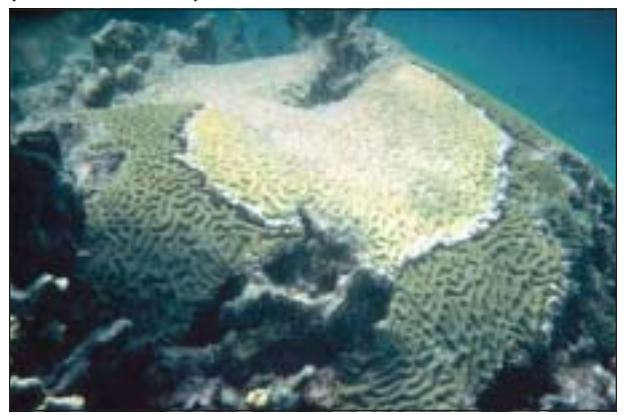

Georges on Mario reef although white-band disease is prevalent. Isolated colonies of staghorn coral occur at 5-15 m on outer reefs and at 18-20 m on shelf-edge reefs (Bruckner unpub. data). Dense thickets still exist in areas that have been affected by disease for over seven years (Fig. 171, A. Bruckner unpub. data).

Several hurricanes and white-band disease are also responsible for large losses of staghorn coral during the 1980s and early 1990s near La Parguera. These populations have continued to decline from disease, increased predation pressure by corallivorous mollusks, and Hurricane Georges (Bruckner *et al.*  1997, Morelock *et al.* 2001). White-band disease is also prevalent among elkhorn coral colonies off La Parguera, with up to 10% of the population affected at any given time.

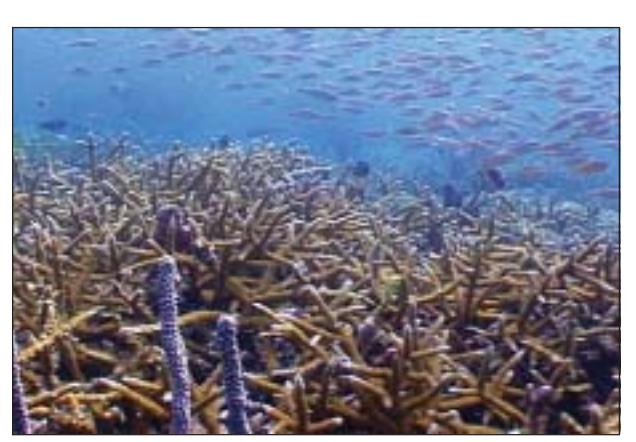

Figure 171. Despite disease and hurricane damage, staghorn coral thickets still occur in many areas (Photo: NCRI).

Several large stands of staghorn coral and yellow pencil coral (*Madracis mirabilis*) formerly existed on Mona Island in 6-15 m, but were destroyed by Hurricane Georges, and little recovery has been noted as of August 2001.

Disease has taken its toll. white-band disease, yellow-blotch disease, white plague II, black-band disease, white plague, and seafan fungus have all affected the coral.

Black-band disease was first observed in Puerto Rico in 1972 but the incidence of disease since then has not been as prevalent as elsewhere (Fig. 172, Antonius 1981, Peters 1984). Bruckner (1999) monitored disease prevalence on reefs off the northwestern (Jobos/Isabel), western (Rincon), and southwestern coast (La Parguera) between 1994 1998, and identified several reefs with outbreaks of black-band disease. Disease occurrence varied

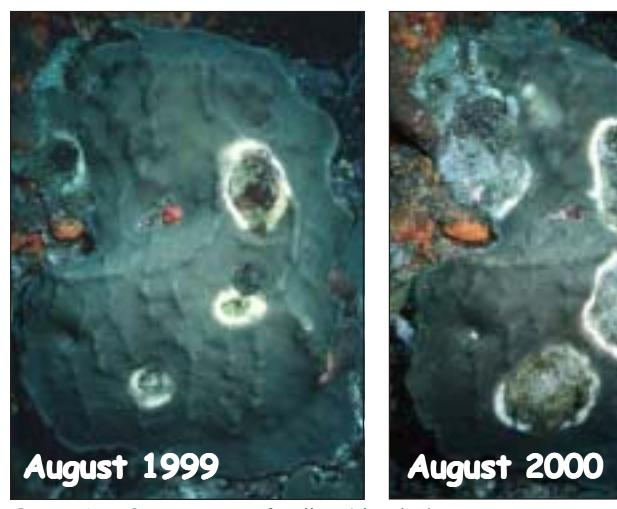

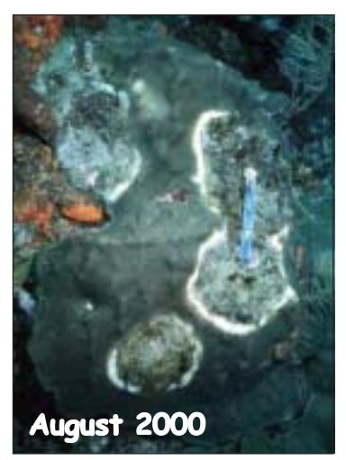

Figure 173. Progression of yellow-blotch disease over a one-year period on a mountainous star coral on Mona Island (Photo: Andy Bruckner).

seasonally and with depth on individual reefs, but infected corals were identified on near-shore reefs as well as offshore shelf-edge sites to 30 m.

White plague type II emerged on reefs of Puerto Rico shortly after Hurricane Hortense (1996), and spread to more than 50% of the brain coral population on one inner reef near La Parguera (Bruckner and Bruckner 1997). White plague has been observed on most other reefs in La Parguera, and also near Mona Island since 1999, but disease prevalence has remained fairly low (Bruckner unpub. obs.).

Yellow-blotch disease was discovered on reefs off Mona Island and Desecheo in 1996, and on two reefs near La Parguera in 1997, but few colonies were affected. By 1999, however, surveys on reefs off the western coast of Mona revealed that up to 50% of the massive boulder star corals were infected with yellow-blotch disease, and the disease was found on all other reefs examined near Mona (Fig. 173, Bruckner and Bruckner 2000).

**Algae and Higher Marine Plants Higher Marine Plants –** First noted in the 1970s (Mckenzie and Benton 1972, Vicente 1978), the massive macroalgal cover on some nearshore reefs off Puerto Rico continues to be a source of coral mortality. For many of those reefs, the overgrowth of macroalgae is indicative of eutrophication and a result of high nutrient loads from sewage and urban outfalls.

There are extensive seagrass beds in the shallow waters around nearshore and inner reefs of Puerto Rico (Fig. 174). Mangroves fringe the southern coast of Puerto Rico and elsewhere.

**Large Mobile Invertebrates Large Invertebrates –** As taxonomic inventories are conducted of Puerto Rico's coral reef ecosystem over the next several years, the total number of species should be much increased. Surveys conducted between 1985 and 1999 monitored a total of 25 species of motile megabenthic invertebrates, representing five different phyla on 40 reefs and 17 seagrass/algal bed habitats (J. Garcia pers. comm.). Twelve additional reefs from four sites have been surveyed during 2000, as part of Puerto Rico DNER's coral reef monitoring program.

Five invertebrate species were identified by R. García (pers. comm.) from six different reefs – the spotted spiny and Caribbean spiny lobsters (*Panulirus guttatus* and *P. argus*), and the slate, rock-boring and long-spined sea urchins (*Eucidaris tribuloides, Echinometra lucunter* and *Diadema antillarum*). In seagrass habitats, the slate sea-urchin and the Caribbean vase (*Vasum muricatum*) were the most commonly found.

In 1983-1984, 90-95% of the long-spined sea urchin, were killed by a suspected water-borne pathogen. Vicente and Goenaga (1984) reported the mass mortality around the coastline of the main island and provided a general description of dying specimens from field observations*.* The loss of herbivorous urchins altered reef habitats, as thick mats of fleshy and filamentous macroalgae covered the reefs, resulting in declines of coral species, crustose coralline algal covers and clionid sponges.

Figure 174. A seagrass bed in Puerto Rico (Photo: Matt Kendall).

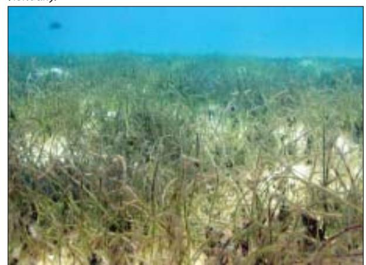

The urchins have since reappeared but the population is now only around a tenth of its original abundance.

Recently, researchers have expressed concern over large populations of the encrusting sponge (*Cliona*  spp.) colonizing much of the exposed substrates formerly dominated by elkhorn coral. These sponges have also overgrown many other species of corals near La Parguera, Mona Island, and elsewhere (Williams *et al.* 1999, Bruckner and Bruckner in press, E. Weil pers. comm.).

**Fish and Fisheries Fisheries –** Although no marine species are endemic to Puerto Rico, FishBase (2002) lists 242 reef-associated fish species. A total of 158 diurnal, non-cryptic fish have been identified from shallow reef and seagrass habitats during surveys off Puerto Rico (J. García pers. obs.). Preliminary analysis shows a positive correlation between fish

species diversity, abundance, and live coral cover in shallow reefs (Fig. 175). The data is now being analyzed to describe the dominant populations from shallow reefs (1 10 m), deep reefs (11-25 m), rock reefs, hardbottom, and seagrass/algal beds.

Reef fisheries have plummeted during the last two decades, and show the classic signs of overfishing: reduced total landings, declining catch per unit effort, shifts to smaller fish, and

recruitment failures. Fish landings reported between 1979 and 1990 fell 69%. (Appledoorn *et al.*  1992).

The decline in large fish and the massive die-off of the long-spined sea urchin may have caused a major shift in the community structure of many Puerto Rico reefs from coral- to algae-dominated communities. Additionally, the lack of herbivores such as parrotfishes and large fish predators has stimulated a proliferation of small fish. Damselfish (*Stegastes planifrons*), in particular, harm reefs because they bite and kill coral polyps to promote algae growth for their young (Fig. 176). This has been confirmed through the coral reef characterizations and subsequent monitoring activities in the Natural Reserves (García-Sais *et al.* 1999-2001 unpub. data, E. Hernández and R. Nemeth pers. obs.).

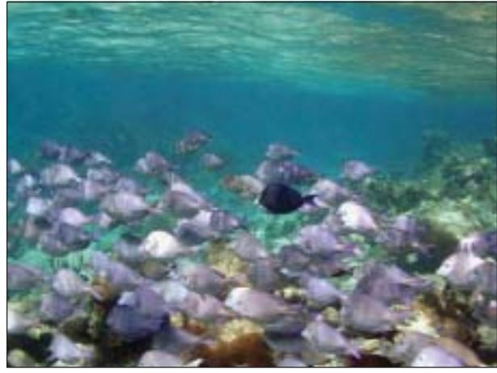

Figure 175. A group of abundant blue tangs on a shallow reef (Photo credit: Matt Kendall).

Persistent and increasing fishing of the spiny lobster (*Panulirus argus*) has substantially reduced this predator in shallow reefs. Consequently, there has been a proliferation of one of its favorite prey,

> the corallivorous gastropods in this area.

**Water Quality –** High sedimentation, turbidity, and nutrient loading have been associated with coral reef degradation in a number of reef systems off Puerto Rico by different authors (García *et al*. 1985, Acevedo and Morelock 1988, Castro and García 1996, García and Castro 1997, Hernández-Delgado 1995). In their qualitative inventory of reefs,

Goenaga and Cintrón (1979) noted high sedimentation affected reefs along the northern coast as well as those along the southern and western coasts in bays used for ocean cargo (e.g., Guayanilla, Mayagüez).

Fringing, patch, and shelf-edge reefs off the southern coast of the main island have been degraded by high sediment influx, turbidity, and generally have lower numbers of living coral cover than those observed off Parguera. Acevedo and Morelock (1988) provided a quantitative assessment of sediment impact on southern coast coral reefs by measuring reductions of live coral cover from reefs in areas located close to sediment sources. Dead and dying coral were identified off Mayagüez, Guayanilla, and Ponce especially in areas impacted by dredging activities, sewage outfalls, industrial

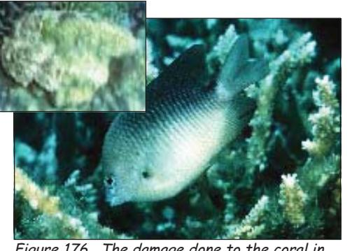

Figure 176. The damage done to the coral in the upper left-hand corner was caused by bites from a territorial three-spot damselfish (Photos: Margaret Miller and J.E. Randall, FishBase).

discharge, ship traffic, and river discharge.

On the southwestern coast, clear-cutting of the hillsides surrounding La Parguera has contributed to increased sedi-

| Capacity            | of Coastal Miles                       | to Support Ac           | puatic Life    |
|---------------------|----------------------------------------|-------------------------|----------------|
| Fully supporting | Fully supporting, but threatened | Partially supporting | Not supporting |
| 357.7 (65%)      | 179.5 (32.7%)                       | 3.0 (0.5%)           | 9.7 (1.8%)  |

Table 16. Results of 1998 and 1999 water quality monitoring (Source: Puerto Rico Environmental Quality Board).

disposal, and marinas.

and low dissolved oxygen (2.8 miles). These were linked to various contaminant sources, primarily industrial and municipal, sewage disposal, urban runoff, land

Guanica, and Ponce).

Western near-shore reefs are subjected to high turbidity, sediment influx from three rivers, nutrients and sewage from agriculture, the Mayagüez

ment runoff during rainy periods. Additionally,

from upstream sources (e.g., off Guayanilla,

local sewage is discharged into a mangrove channel and reefs may be affected by sewage discharge

outfall, and tuna canneries. Off Jobos Bay National Estuarine Research Reserve where several fringing reefs surrounding small cays, fore-reef environments have been severely impacted by sedimentation associated with coastal erosion and long-shore transport from the municipalities of Guayama and Salinas.

The Environmental Quality Board (EQB) operates a network of 88 permanent stations around the islands to monitor coastal water quality. Paremeters monitored are for direct human contact (swimming), indirect human contact (sports fishing), and aquatic life (for conservation and propagation of species and marine habitats). The EQB monitored

549.9 shoreline miles, of which 121.9 miles are around Vieques, Culebra, and Mona Islands. Table 15 presents the findings for 1998 and 1999.

EQB results show 97.7% of the Puerto Rican coastline can support aquatic life (defined as 10% or less of the shoreline segment in violation of health standards) and only 1.8% cannot (defined as more than 25% in violation of health standards). For toxic substances, a single significant violation is enough to classify the segment as non-support for aquatic life use. Water quality parameters with the greatest affect on aquatic life along the coastline were turbidity (5.0 miles), ammonia (4.9 miles), In May 2001 the USEPA cited the Bacardi Corporation for Clean Water Act Violations, alleging the company illegally discharged about 3,000 gallons of **mostos**, an industrial waste from its rum processing plant into the Old Bayamon River Channel. This waste is high in certain organic contaminants

(e.g., phenols, benzene) and heavy metals (e.g., copper, lead, zinc, chromium, cadmium) that are toxic to coastal wildlife inhabiting mangrove and coral reef habitats (USEPA 2002).

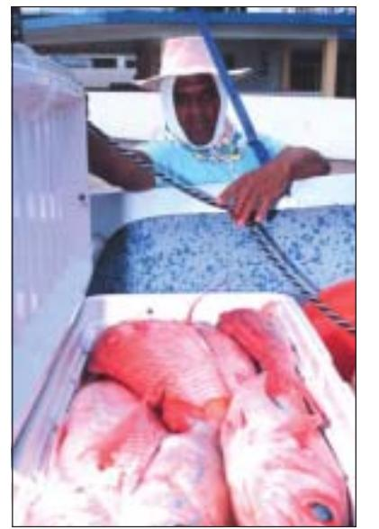

Figure 177. Artisanal fisherman and his catch in the Municipality of Rincon, Puerto Rico (Photo: William B. Folsom).

## Coastal Populations and Reef Economics

The population of the Commonwealth was 3.81 million in 2000 (U.S. Bureau of Census 2002). This represents an annual growth of 0.79% and increase of 8.1% over the past 10 years. Of the 78 municipalities, 43 are coastal ones, where the population is 2.3 million. In 10 years, Puerto Rico has had an increase of 130,418 residents along the coasts. According to the Puerto Rico Plan-

ning Board (2000), 4.57 million people visited Puerto Rico in 2000, with a total of \$2.39 billion spent in the Commonwealth.

Puerto Rico's artisanal and commercial fisheries (Fig. 177) have been declining in recent years Appledoorn *et al.* (1992). In 1996 it was estimated that the ex-vessel value of this fisheries was \$7.7 million), but by 2000 it had declined to \$6.4 million (U.S. Department of Commerce 2001). This value is only the revenue received by fishermen (ex-vessel value) and does not include the full value of fisheries products or impact on the economy.

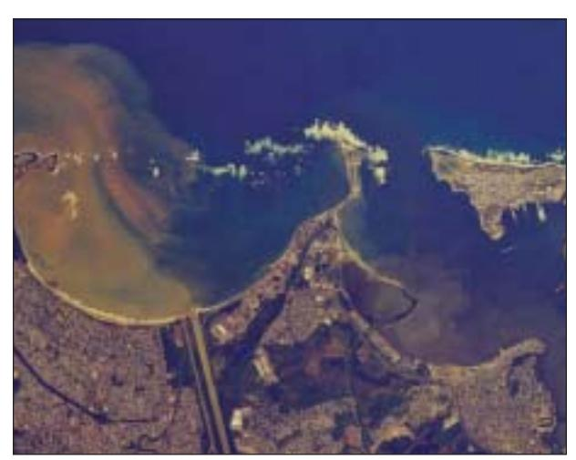

Figure 178. Sediment plume on Puerto Rico's northern coast (Photo: NOAA National Ocean Service).

#### **Environmental Pressures on Coral Environmental Pressures on Coral Environmental Pressures on Coral Reefs**

**Human Stresses Stresses –** Reefs off the urbanized island of Puerto Rico are subject to the usual problems generated by pollution/nutrients from urban, agricultural, and industrial sources, sediment runoff (Fig. 178), coastal development, and oil and chemical spills. These problems are slowly being brought under control, but a lot remains to be done.

In the 1950s, human activities such as the massive deforestation of mangroves, dredging rivers for sand and of the principal bays for ocean cargo, runoff from large scale agricultural developments in the coastal plain, the building of thermoelectric power plants on the northern and southern shores have degraded the coral reefs.

Ship groundings have damaged reefs over the years. Vessels removed over the past decade give some indication of the number of vessels that have been grounded (Fig. 179). Some have extensively damaged reef structure and associated seagrass habitats (Glynn 1973).

The *A. Regina*, a 109.7 m 3,000-ton car-passenger ferry was removed in 1990 after five years of intensive effort to remove the wreck in an environmentally safe way (G. Cintrón pers. comm.). In 1997, when the *Fortuna Reefer* was removed from a site near where the *A. Regina* ran aground, it compounded the damage done by the grounding. In an old-growth elkhorn coral thicket off Mona Island, it sheared off huge elkhorn coral branches and colonies, and fractured massive brain corals.

Damage extended over 30,000 m2 . In the early 1990s, the U.S. Navy completed removing and disposing of a 6,700-ton former target ship (*Ex Brookings*) stranded during Hurricane Hugo in 1988 on a seagrass bed in the Vieques Passage (G. Cintrón pers. comm.). In 1991, the Russian 129 m 2,400-ton *Larissa Reysner* ran aground and was removed from a spur-and-groove reef formation off western Puerto Rico. That same year, the Zapata oceangoing tug *Independence Service* was raised from a 30-foot deep seagrass bed where it had sunk while being towed after grounding and subsequent removal from a nearby reef in the Vieques Passage (G. Cintrón pers comm.).

Other major activities associated with reef degradation include 1) oil spills (Cerame-Vivas 1969); 2) anchoring of large oil cargo vessels (Hernández-Delgado pers. obs.); 3) overfishing (Appledoorn *et al*. 1992), 4) uncontrolled recreational activities (Hernández-Delgado 1992, 1994), 5) eutrophication (Goenaga and Boulon 1991a), 6) thermal pollution (Hernández-Delgado 1992), and 7) military activities particularly at Vieques and Culebra Islands.

The Navy operates a training facility on Vieques Island. Since 1941, a portion of the easternmost end of the island has been used for military training. Since 2001, the Navy has used nonexplosive ordnance. Scientific assessments report historical bombing off Puerto Rico's Culebra and Vieques Islands during strategic training activities has caused local destruction of reef structure (Antonnius and Weiner 1982).

**Natural Stresses Natural Stresses –** Damage to coral reefs in Puerto Rico from hurricanes, coral bleaching, coral diseases, and the Caribbean-wide mortality of the

Figure 179. Recovery of a survey launch that flipped over onto a reef in northern Puerto Rico (Photo: NOAA Library).

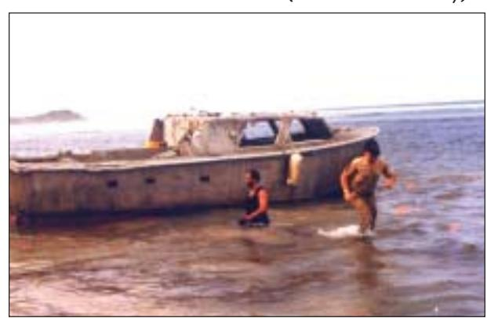

long-spined sea urchin *Diadema antillarum*  (Vicente and Goenaga 1984; Lessions 1984) has been well documented.

Hurricanes normally occur between August and October, and primarily affect the shallow reefs (Fig. 180). Some have been particularly damaging. Hurricane Georges (September 1998) was the worst hurricane since San Ciprian in 1932. It tracked across the center of the island, moving from the southeast coast across the island on a west-northwest path with sustained winds to 185 km/hr and an eye thirty-two km across. Other storms impacted shallow reefs with weaker winds but heavier rains (e.g., hurricanes Hortense in 1996, Marilyn in 1995, and Hugo in 1989).

Physical damage to reefs from hurricanes and tropical storms over the past two decades has been most severe on the eastern coast near Culebra and Vieques (Hugo and Marilyn) and the southwestern coast near La Parguera (Hortense and Georges). Hurricane Georges devastated most of the remaining elkhorn corals scoured other shallow reef environments, blew out seagrass habitats, knocked down mangroves near La Parguera (Morelock *et al.*  2001). Other notable storms impacted shallow reefs with weaker winds but heavier rains (e.g., hurricane Hortense in 1996).

The storm's biggest impact is when the surface wave action fragments the branching corals. The accompanying rains generate run-off, increasing turbidity. But hurricanes may also be beneficial because they fragment the fast growing branching corals that monopolize the substrate and create space for the slower growing, massive species.

**Climate Change and Coral Bleaching Change and Bleaching –** Massive coral bleaching occurred in the late 1980s (Buckley-Williams and Williams, Jr. 1987, Goenaga *et al*. 1989, Buckley-Williams and Williams 1988 and 1989) along with elevated sea surface temperatures. The bleaching created permanent damage.

More recently, Desecheo Island reefs experienced a bleaching event. ReefKeeper International reported a high incidence of bleaching (13-29%) on Desecheo Island nearshore reefs during its January 1999 survey.

#### **Current Conservation Management Management**

**Mapping Mapping –** In 2001 NOAA, in cooperation with Puerto Rico DNER, completed mapping coral reef habitats off the main island of Puerto Rico and the islands of Vieques, Culebra, Desecheo, and Mona. Shallow-water digital maps (to about 20 m) have been prepared for 27 levels of habitat types found around the islands (Kendall *et al.* 2001; Fig. 181). The project uses new technologies to correlate monitoring data obtained from remote sensing. Results are integrated in the DNER Geographic Information System (DNER-CZMP/GIS node).

Reef habitats have been mapped using SHOALS Marine LIDAR with AISA Hyperspectral Imagery to locate coral reefs by distinctive characteristics and classification. Bathymetric contour maps and high-resolution habitat classification maps have been generated that include seagrass beds and three types of reef communities contained within the 40 m depth contour and up to 2 km offshore (fringing

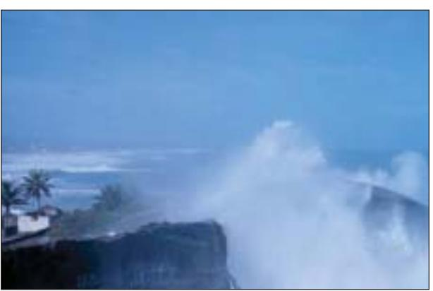

Figure 180. Hurricane surf near Arecibo, Puerto Rico. Note the size of the building for scale (Photo: Commander Grady Truell, NOAA Corps).

reefs, hard ground areas or crest reefs, and offshore reefs). These will be combined to develop an underwater 3-dimensional surface reflective model of the area.

**Research and Monitoring Research Monitoring** – Research on Puerto Rican coral reefs started in the 1960s and has proceeded at a slow pace until present. Initial qualitative surveys by Almy and Carrión Torres (1963). Glynn *et al*. (1964) and Glynn (1968) provided taxonomic accounts of corals and guidelines for their identification, which stimulated research on aspects of ecology during the 1970s.

The first geographical inventory of reefs of the area was prepared by Goenaga and Cintrón (1979). This work, along with subsequent qualitative surveys of reef geomorphology and community structure (Cintrón *et al*. 1975, Colin 1978, Canals and Ferrer

1980, Canals *et al.* 1983) established criteria for designation of marine areas with coral reef development as Natural Reserves by the government of Puerto Rico.

Intensified utilization of the coastal zone stimulated problem-oriented research involving coral reef communities, which allowed further quantitative characterizations during the late 1970s through the 1990s. Rogers *et al.* (1978) evaluated the impacts of military operations on the coral reefs of Vieques and Culebra on the northeast coast. Subsequent characterizations of coral reef communities in

shallow reefs around the islands of Puerto Rico have included fish assemblages as an integral part of the reef community (García *et al.* 1985, Castro and García 1996, García and Castro 1997). A preliminary assessment of the decline in coral reef associated fisheries was prepared by Appledoorn *et al.* (1992).

During the last decade, coral reef research in Puerto Rico has largely focused on community characterization and monitoring programs, marine reserve feasibility studies, environmental impact assessments, coral diseases, and mitigation programs. As part of the U. S. Coral Reef Initiative Program for Puerto Rico (with grants administered

by NOAA), a series of coral reefs in Natural Reserves of Puerto Rico have been recently selected as priority sites for establishment of characterization and monitoring programs. Baseline characterizations of coral reef communities based on quantitative sampling protocols are available for Jobos Bay (García and Castro 1997; Fig. 182), La Parguera (García et al. 1988), Guanica, La Cordillera de Fajardo, El Tourmaline Reef and Caja de Muertos, (García et al. 1999). During 2000, baseline characterization studies were

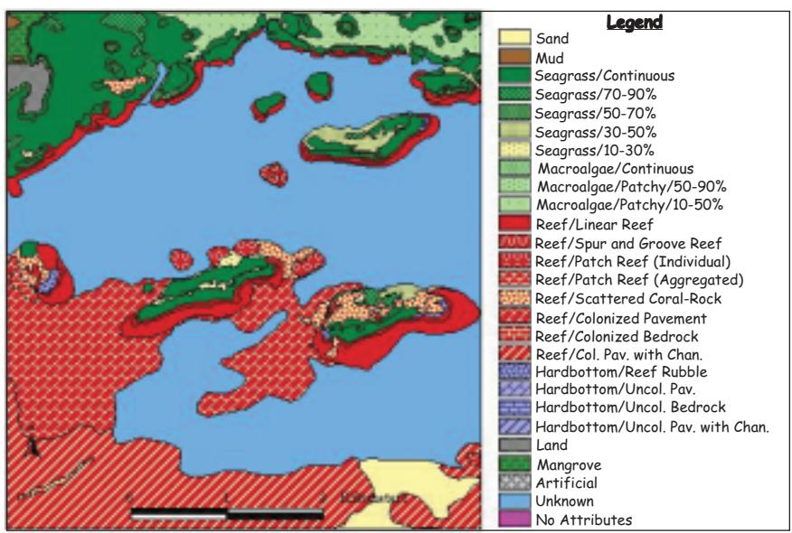

Figure 181. Benthic habitat maps of Puerto Rico were produced by delineating 25 major categories of benthic features (e.g., coral reefs, seagrass beds, mangroves, etc.) based on aerial photographs (Photo: NOAA Ocean Service).

underway at Mona Island, Desecheo Island, Boquerón, and La Parguera outer reefs (García *et. al.* 2000). Other initiatives have included characterization efforts in support of the coral reefs occurring within the Rio Espiritu Santo Natural Reserve (Hernández-Delgado 1995), Isla de Mona Natural Reserve (Canals *et. al.* 1983, Hernández-Delgado 1994), and La Cordillera de Fajardo Natural Reserve (Hernández-Delgado 1994).

At least two major efforts were launched during the 1990s to protect reef-associated fishery resources and the ecological integrity of important coral reef systems. A feasibility study for establishment of a Marine Fishery Reserve in La Parguera, southwest-

ern Puerto Rico (García, 1995) included a baseline characterization of sessile benthic and fish communities of the Turrumote, Media Luna, and San Cristobal Reefs.

More recently, on the northeastern side of the island, Hernández-Delgado *et al.* (1998) described the marine biological resources associated with the coral reef at the Luis Peña Fishery Reserve (Culebra Island, Fig. 183). In December 2001, the Puerto Rico DNER completed its initial baseline study at the Luis Peña

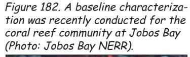

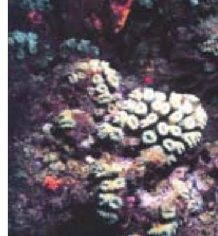

Marine Reserve. Seasonally, researchers gathered data on the condition of reef fish and benthic communities from three stations inside the Reserve and com-pared these to results from three coral reef sites adjacent to the Reserve. Data were collected to evaluate the structure of the reef fish and epibenthic communities, coral recruitment, and the density of corals, sea urchins, and territorial damselfish.

Additional quantitative and qualitative characterizations of reef communities have been included as part of environmental impact studies related with the submarine outfall discharges of Regional Wastewater Treatment Plants of the Puerto Rico Aqueducts and Sewers Authorithy from 11 sites around the island of Puerto Rico (García *et al*. 1985). Other characterizations of coral reef communities were performed in relation to operations of thermoelectric thermoelectric power plants in Jobos Bay (Szmant-Froelich 1973), San Juan Bay (García and Castro 1997), and Guayanilla-EcoElectrica (Castro and García 1995, García and Castro 1996).

The Puerto Rico CARICOMP project at La Parguera (Castro and García 1998) monitored fish and motile invertebrates from 1994 through 1998. More recent assessments of motile megabenthic invertebrates and fishes have been included in coral reef community characterization studies sponsored by the U. S. Coral Reef Initiative. These were eight coral reef sites designated as Natural Reserves by the Commonwealth of Puerto Rico (García *et al.*  2001a, 2001b) This work has been coordinated through the Puerto Rican DNER.

With FY00 and 01 NOAA-administered grants, DNER initiated a long-term project to create a network of near-shore monitoring sites that would include coral reefs, mangroves, seagrasses, algal beds, hard bottoms, and other habitats associated with coral reef ecosystems. Additionally, water/ substrate monitoring stations were established by DNER in cooperation with the EQB and the Jobos Bay National Estuarine Research Reserve (NERR) Monitoring Program that monitor habitats, disease, and human use of coral reef resources.

Monitoring began in 2000 at three reef sites at locations within nine Coastal Marine Natural Reserves, and in FY01, sites within three more Natural Reserves were added. Parameters moni-

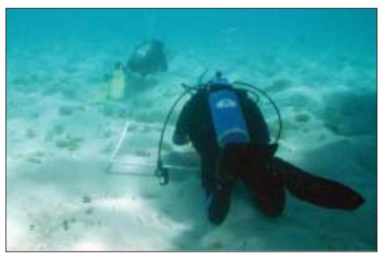

Figure 183. Monitoring activities in La Parguera, Puerto Rico (Photo: NOAA Ocean Service).

tored are sessile reef communities, motile benthic macroinvertebrates and fishes. Water samples are collected and analyzed for a suite of parameters. To examine temporal variability in water quality and to obtain baseline data, continuous *in situ* sampling is done periodically by deploying for 15 days a submersible instrument that stores measurements of selected parameters (e.g., turbidity, temperature, salinity, pH, and dissolved oxygen). DNER is also using side-scan sonar to characterize the bottom substrata and benthic communities, mainly off the northern and southern coasts of Puerto Rico. This technique will delineate fine-scale habitat structure and use by different species from the shoreline offshore to 61 m. Further, three sediment traps have been installed at each study site to determine contaminant deposition.

With additional NOAA grants in FY00-01, coral reef and seagrass bed communities off Vieques Island were characterized at 3 different depths for each of 4 study zones, with 5 replicate transects per depth (a total of 60 transects). Permanent, georeferenced sites were established for future monitoring of sessile and motile benthic macroinvertebrate populations. Diurnal, non-cryptic, reef fish populations are surveyed at reef and seagrass habitats.

Further, DoD commissioned in FY02 a baseline assessment of coral reefs off the eastern end of Vieques Island. Three 30-m long transects will be taken at each of 18 permanent monitoring sites (6 fringing reef, six bank-reef crest, and six bank-reef slope sites) to evaluate coral species richness and the incidence of coral injury, damage, disease, and bleaching. Baseline coral population data will include cover, abundance, diversity, and community

structure. Censuses of fish populations and sedimentation studies will also be conducted at each reef site. For comparison, three 30-m transects will be taken and similar parameters measured at each of six permanent monitoring sites (two sites each from comparable reef habitats) to assess St. Croix coral ecosystem condition.

Another new project was initiated in 2001. NOAA scientists and local partners (e.g., USGS, NPS, the University of Puerto Rico, and the Oceanic Institute) surveyed reef fish and habitat utilization (Fig. 183). This project is monitoring fish and associated habitats off the main island of Puerto Rico to define species habitat patterns along cross-shelf gradients (Christensen *et al.* in press) and ecologically relevant boundaries for the designation of MPAs off southwestern Puerto Rico.

Since 1994, NOAA has examined the effects of coral diseases and predators on scleractinian corals at sites in La Parguera, Rincon, Boqueron, Aguadilla, and Mona Island. The University of Puerto Rico conducts annual surveys of the red hind population on the western coast of Puerto Rico. Besides collecting data on red hind recruitment, abundance, and genetic make-up, this project also correlates stock size with the condition of the coral reef ecosystem by monitoring benthic cover and species diversity. Other University of Puerto Rico scientists have monitored recruitment, growth rates, and mortality of gorgonians in La Parguera on a semi-annual to biennial basis since 1983.

**MPAs and No-take Reserves Reserves –** The Desecheo National Wildlife Refuge is administered by DoI's USWFS. Numerous Commonwealth MPAs offer various measures of protection for coral reef ecosystems. Territorial MPAs include eight Special Planning Areas and 24 Coastal Marine Natural Reserves. Two new Territorial no-take zones prohibit fishing and anchoring.

In 1999, the Puerto Rico Planning Board established the Luis Peña Natural Reserve as a 4.8-km2 no-take zone. It is located along the channel separating Culebra Island from Luis Peña Island.

In 2000, the 6.2-km2 Desecheo Marine Reserve was designated by the Puerto Rico Legislature as Puerto Rico's second no-take zone. It comprises all coastal waters and aquatic ecosystems from the shoreline to 805 m offshore.

The Jobos Bay NERR was established in 1981 and

is currently co-managed by NOAA and DNER. In 2000, the Governor approved the Jobos NERR Management Plan. This MPA protects Puerto Rico's second largest estuarine area off the southern coast of the main island and includes a series of mangrove islets that are fringed by coral reefs and seagrass beds. The Jobos Bay NERR is home to several federally-protected endangered species, such as the brown pelican, the peregrine falcon, the hawksbill turtle, and the West Indian Manatee (Fig. 185).

#### **Government Policies, Laws, and Legislation Laws, Legislation**

Puerto Rico's maritime jurisdiction extends offshore 16.7 km from its coastline. Recently, there have been new and revised laws and regulations for the protection of coral reefs, fisheries, and related habitats, the approval of the Non-Point Source Implementation Plan, the Mapping of Coral reefs in Puerto Rico, and an increase in Island's NGOs outreach programs.

Developing regulations in the Commonwealth of Puerto Rico is different from that in the United States where control of development is a local responsibility and coastal management programs are at the state level. Because of its limited size, land use policies in Puerto Rico (including coastal management), are proposed by the Planning Board and approved by the Governor.

With input from the DNER and the EQB, the Planning Board (the Board) has responsibility for overall policymaking and development control. The Board adopted and established a general policy regarding the "...avoidance of urban sprawl" and to "... concentrate industrial development to avoid potential conflicts between uses and protect the environment and natural systems." Agricultural development has a general policy to "...protect

Figure 185. Sea turtle at Jobos Bay NERR (Photo: Jobos Bay NERR).

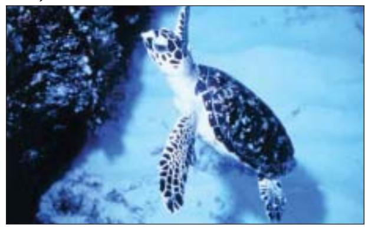

soils, avoid erosion, protect soil productivity, and avoid adverse impacts on water and other natural resources." The goal of the public policy regarding natural, environmental and cultural resources is "...to maintain and protect our" environment, while promoting conservation, preservation and wise use of our natural, environmental, historical, and cultural resources, recognizing their importance to integrated and sustainable development."

The government agencies responsible for coral reef and marine resources include the DNER, the EQB, the Planning Board, the Regulations and Permits Administration (RPA), and the National Marine Fisheries Service. The DNER manages the coastal zone. The EQB establishes and monitors water quality. The RPA administers the land-use regulations adopted by the Planning Board island-wide. By statute, the RPA works closely with the EQB and DNER.

Guidelines and funding under Section 6217 of the CZMA enabled DNER to prepare the Coastal Non-Point Sources of Pollution Control Plan, approved October 2000 by the NOAA and the USEPA. A Natural Protected Areas Strategy has been prepared and includes a Marine Protected Areas Subsystem, providing guidelines for important coastal area and resource identification, management and protection.

In 1997, a Coral Reef Working Group was formed in the DNER to update the Coral Reef Action Plan. The members are from all government divisions and programs with responsibilities for coral reefs. Together, they produced the DNER five-year Coral Reef Action Plan (1999-2004) with input from U.S. Islands Coral Reef Initiative, the Puerto Rico

Costal Zone Management Program, and the University of Puerto Rico Sea Grant Program.

The Action Plan focuses on gathering the necessary information needed to support science, education, monitoring, management, and enforcement, but retains the original objective of addressing the lack of information and adequate management of coral reefs. These have become key points in further developing a more detailed awareness, outreach, and enforcement plan.

#### **Conclusions and Recommendations Recommendations**

The present human pressures on Puerto Rican coral reefs are some of the most critical in the Caribbean (Goenaga and Boulon 1991b). Three of these islands currently support a resident population of over 428 people/km2 . Largely due to accelerated urban and industrial coastal development over the last four decades and the lack of effective implementation of policies to protect the ecological integrity of these resources, many of Puerto Rico's nearshore reefs are degraded.

Between the 1960s and the 1980s, there was only intermittent interest in the reefs and their health. Environmental Impact Statements, required by local law for development along the shoreline, have also generated quantitative and qualitative studies of reef communities, but these mostly relate to underwater outfalls from regional wastewater treatment plants and discharges from conventional thermoelectric power plants. Since the late 1990s, however, scientists and the Government have made a concerted effort to better understand, protect, and manage the reefs.

## **STATUS OF CORAL REEFS IN THE U.S. VIRGIN ISLANDS STATUS OF CORAL REEFS IN THE U.S. VIRGIN ISLANDS Don Catanzaro, Caroline Rogers, Zandy Hillis-Starr, Catanzaro, Caroline Hillis-Starr, Don Catanzaro, Caroline Rogers, Zandy Hillis-Starr, Don Catanzaro, Caroline Rogers, Zandy Hillis-Starr, Rick Nemeth, and Marcia Taylor Rick Nemeth, and Marcia Taylor Rick Nemeth, and Marcia Taylor Rick Nemeth, and Marcia Taylor**

#### **THE STATUS OF THE CORAL THE CORAL REEFS OF THE U.S. VIRGIN VIRGIN ISLANDS ISLANDS**

By D. Catanzaro, C. Rogers, Z. Hillis-Starr, R. Nemeth, M. Taylor

#### **Introduction Introduction**

The U.S. Virgin Islands (USVI) is a U.S. territory located approximately 1,000 nmi southeast of Miami and 45 nmi east of Puerto Rico. Coral reefs are found around the three main islands of St. Croix, St. John, and St. Thomas, as well as most offshore cays. Fringing reefs, deep reefs (wall and shelf-edge), patch reefs, and spur and groove formations are present on all three islands although only St. Croix has well developed barrier reefs. Bank reefs and scattered patch reefs with high coral

diversity occur on geological features offshore at greater depths.

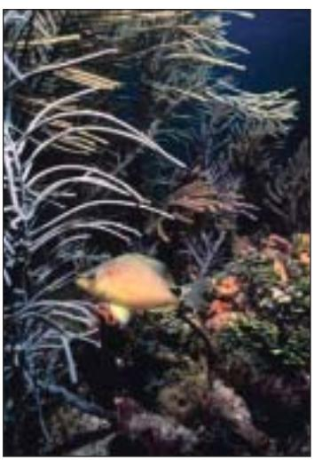

Figure 186. Shallow-water reef communities cover 61% of the region (Photo: William Harrigan).

Together the USVI total roughly 347 km2 of land area. St. Croix is the largest of the three USVI islands at 207 km2 (34 km by 10 km) with a relatively high western mountainous tip. This island has coral growth along much of the insular shelf with a well-developed barrier reef on the eastern end, and deep coral walls on the north shore. St. Croix is the only island with a permanent source of freshwater. St. Thomas is the second largest at 83 km2 (22 km by 5 km) and St.

John is the smallest of the three USVI islands at 52 km2 (14 by 5 km).

#### Recently NOAA mapped USVI coral reefs

Figure 187. Benthic habitats of Buck Island Channel, St. Croix, USVI were mapped from and associated aerial photographs ( Credit: John Christensen).

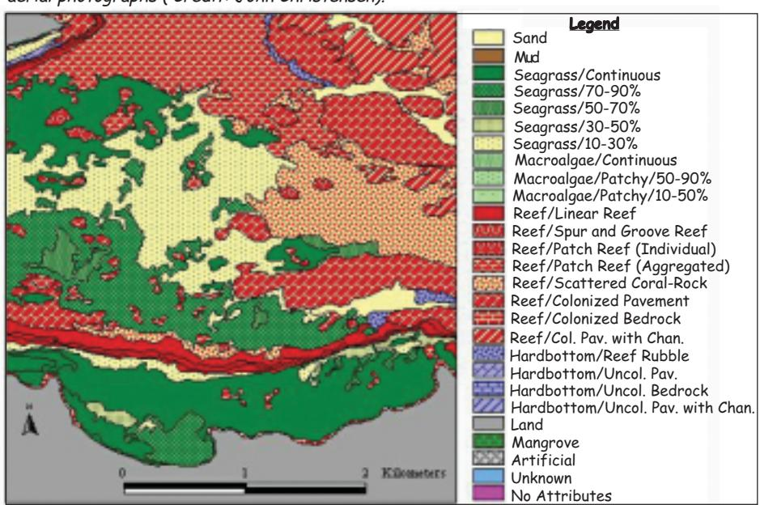

ecosystems to approximately a depth of 20 m and delineated a total submerged area of 485 km2 (Kendall 2001b, Monaco *et al.*  2001). Deeper water reef habitats off the USVI islands have yet to be mapped. Coral reef and colonized hardbottom habitats comprised 297.9

km2 and accounted for 61% of the mapped area; submerged aquatic vegetation covered 160 km2 or 33% of the mapped total, and unconsolidated sediments and uncolonized hard-bottom habitat comprised 23 km2 or the remaining 4%.

#### **Condition of Coral Reefs Reefs**

The long-term datasets for the USVI represent some of the best temporal data available for the Caribbean (Connell 1997). Although monitoring and research has occurred on all three USVI islands, consistent long-term datasets exist only for St. John and Buck Island, St. Croix (e.g. 1988 to present) and have been collected primarily by the Department of the Interior, National Park Service (NPS) and U.S. Geological Survey (USGS). Most of these studies are targeted in individual bays that might not be representative of conditions within the entire USVI (Table 1).

#### **Corals and Other Invertebrates Invertebrates –** NPS has conducted and supported

long-term monitoring on St. John (site of Virgin Islands National Park, VINP) and Buck Island, St Croix (site of Buck Island Reef National Monument, BINM) since 1988. Over time, statistical rigor has significantly increased due to improvements in technology and sample design. For the last three years USGS and NPS scientists have collaborated on long-term monitoring of coral reefs using a comprehensive protocol based on use of a digital video camera along randomly chosen transects (Miller and Rogers 2001, Rogers *et al.* in press). This protocol is one of the most statistically rigorous methods to monitor coral reefs in the world. A total of 79 randomly located transects at four sites (three in St. John and one at Buck Island, St. Croix) have been repeatedly sampled for two or more years. An additional site at Buck Island, St. Croix (20 transects) has been sampled for one year and one

additional site on St. John has eight nonrandomly located transects which have been sampled for three years.

Live scleractinian coral cover varies at these sites from a low of 5.8% (Buck Island, St. Croix) to a high of 22.8% (Mennebeck, St. John). . It should be noted that the site with non-randomly located transects has a live scleractinian coral cover of 45.3% (Tektite, St. John). Results of the repeated sampling are varied but overall, 76% of transects showed declines in the amount of live coral cover when the first year is compared to the third year. Percent of transects exhibiting declines at individual sites are as follows: 40% (Yawzi, St. John), 65% (Buck Island,

St. Croix), 75% (Mennebeck, St. John), 95% (Newfound, St. John), and 62% (Tektite, St. John).

NOAA monitoring funds were received by the USVI Territorial Government in 2001 and University of Virgin Islands conducted the study. The first year of this project supported six sites on St. Croix (six transects each) where coral, sea urchin (*Diadema antillarum*), and reef fish have been monitored. Live scleractinian coral cover varied from a low of 6% (Lang Bank) to

25% (Sprat Hole) (Nemeth *et al.* in press). Monitoring will be repeated in 2002.

White-band Disease – Branching acroporid species are most susceptible to White-band Disease. At BINM, elkhorn coral (*Acropora palmata*) cover fell from 85% in 1976 to 5% in 1988 because of mortality from the combination of storms and disease (Rogers *et al*. 1982, Gladfelter 1991). White-band Disease is still occasionally seen throughout the USVI and shallow reef areas are now graveyards of dead elkhorn coral, with branches and fragments interspersed among algal

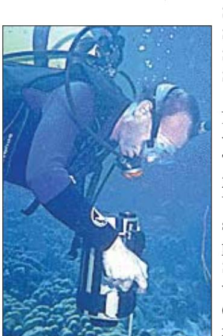

Figure 188. Monitoring in the USVI using videography (Photo: USGS).

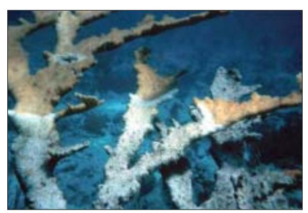

Figure 189. White-band disease on elkhorn coral (Photo: Caroline Rogers).

covered skeletons still upright in normal growth position.

There is current evidence that elkhorn coral is recovering in the USVI. Recruitment of elkhorn coral colonies may be increasing and biologists from NPS, USGS, and UVI are now monitoring and mapping this species at several USVI sites.

Plague – In July 1997, conspicuous white patches of necrotic tissue began to appear on scleractinian corals in several bays around St. John. Tissue samples have confirmed that Plague is affecting these corals. It has now been observed on 14 coral species. The disease can progress up to 0.5 cm/day but does not always result in total colony mortality, however diseased portions never recover. Monthly surveys on one St. John reef have documented new incidence of disease every month from 1997 to present (Miller *et al.* in press) making this the most destructive disease active on St. John.

Black-band Disease – This disease primarily infects major reef-building corals such as *Montastraea annularis* and *Diploria strigosa* (Edmunds 1991, Richardson *et al*. 1997). In 1988, Edmunds (1991) found very low incidence of Blackband Disease (0.2%) on corals in seven sites in the U.S. and British Virgin Islands. Nemeth reported 1.2% on St. John and

none on St. Thomas or St. Croix (Nemeth *et al.* in press). At Buck Island, Blackband Disease is seen on *Diploria* colonies but typically on fewer than 10 colonies a year (Zandy Hillis-Starr pers. comm).

A limited, recent assessment across the USVI found 3.4% (St. Thomas), 7.6% (St. John), and 2.0% (St. Croix) of coral colonies over 25 cm in diameter showing signs of disease (Nemeth *et al.* in press).

Other Diseases – Small USVI patch reefs of *Porites porites* have died from an unknown disease (Rogers 1999, J. Miller pers. comm., B. Kojis pers. comm.) and some of these reefs have been dead for over 12 years (see Beets *et al.* 1986). *Porites porites* is not known to be susceptible to either White-band or Blackband Disease.

Sea fan disease, caused by the fungus *Aspergillis syndowii*, occurs in sea fans on St. John reefs (G. Smith pers. comm.). This pathogenic strain has been isolated from air samples taken during African dust events, suggesting a possible link between air quality and sea fan condition.

Sea Urchins – According to Lessios *et al.*  (1984), the condition of USVI coral reefs has been significantly impacted by a dieoff of the long-spined sea urchin (*Diadema* 

Figure 190, A. Long-spined sea urchin feeding on reef algae (Photo: NOAA Photo Gallery). B. Urchin dead from a Caribbean-wide disease. (Photo: Caroline Rogers).

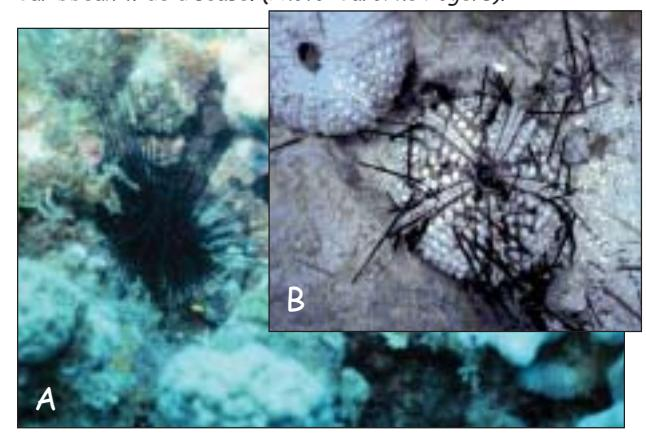

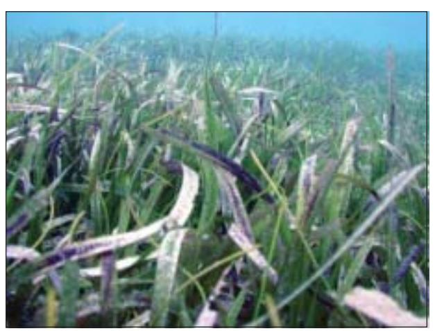

Figure 191. St. John's once extensive seagrass beds have significantly declined (Photo: Matt Kendall).

antillarum). While the extent of a possible recovery of the urchin population is unknown, recent surveys have noted increases in numbers (NPS and USGS records).

A major herbivore on Caribbean reefs, D. antillarum suffered losses of over 90% during an epizootic die off in 1983-1984 (Lessios et al. 1984). Diadema are recovering very slowly around the USVI. One estimate is that the current community is still at less than 10% of the level before the die-off (W. Tobias pers. comm.). Recent surveys of reefs 3-15 m deep in St. Thomas, St. John, and St. Croix found densities to be  $0.02/\text{m}^2$ ,  $0.06/\text{m}^2$ , and  $0.01/\text{m}^2$ m2, respectively and *Diadema* densities are higher along shallow (<3m) protected shorelines (Nemeth et al. in press.). Additional surveys at six Figure 192. Spawning aggregations of (A) Nassau grouper and (B) red St. Croix sites revealed a range of hind have been depleted in the 0.005 to 0.15 of these urchins per USVI (Photo: J.E. Randall, Fishm2 (A. Adams pers. comm.). Base).

Conchs – Queen conchs used to be very abundant around St. John (Randall 1964, Schroeder 1965). A recent study shows that conch populations in general appear to be decreasing and density of conchs inside VINP waters are not significantly higher than outside the park (Friedlander 1997). Conchs were surveyed along transects

around St. John and St. Thomas in 1981, 1985, 1990, 1996, and 2000 (Wood and Olsen 1983, Boulon 1987, Friedlander *et al.* 1994, Friedlander 1997). Because conchs have patchy distributions and move among several habitats and over a gradient of depths, it is difficult to document and interpret changes in their abundance. However, there is evidence of general declines in conch densities.

Lobsters – Limited data suggest decreases in the abundance of lobsters (Wolff 1998). Wolff (1998) noted that lobster densities for 4 sites around St. John in 1996 averaged only 5/ha compared to 19.4/ha at 89 sites around the island in 1970. Data suggest average size of lobsters declined within the park since 1970 (Olsen *et al.* 1975).

Marine algae and Other Plants – Long term data (e.g. 1990 to present) exists only for St. John.

St. John's previously large, dense seagrass beds are no longer present. Comparison of aerial photographs (1962 and 1983) showed a decline in areal extent and/or apparent density, especially within popular anchorages. Digital analysis of photographs of Great Lameshur Bay from 1971 to 1991 indicated a decrease in total seagrass area by 68,000 m² and the

seagrass bed in Little Lameshur Bay lost 22,000 m² of seagrass (L. Muehlstein unpub. data).

A

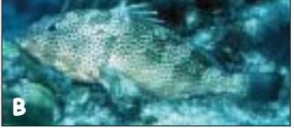

Williams (1988) reported densities of turtle grass (*Thalassia testudinum*) ranging from 80 to 200 shoots m-2 in Maho and Francis Bays in 1986. In 1997, densities in these bays were much lower (L. Muehlstein unpub. data). Thousands of boats anchor in these bays each year,

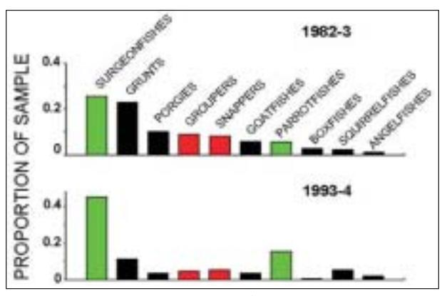

Figure 193. In only ten years, a 14% loss of desirable and a 19% increase in less desirable fish was documented within the Virgin Islands National Park (Source: Beets and Rogers in press).

leaving conspicuous scars (Williams 1988).

Seagrass communities in three other bays have been monitored annually from 1997 to 2001. In all these bays, seagrass have fluctuated but declined overall (L Muehlstein and NPS unpub. data).

#### **Fish and Fisheries and Fisheries** – Reef fish

assemblages have changed markedly in the USVI (Rogers and Beets 2001), but it is difficult to separate out the causal factors. Over-fishing, deterioration of coral reefs, mangroves, and seagrass beds all have undoubtedly contributed to significant changes in reef fish assemblages. However, many of the characteristics of the USVI fishery provide clear evidence of heavy fishing pressure.

Up through the 1960s, groupers and snappers were abundant and dominated the landings in the USVI fishery. Following the tourism boom and technological changes in the fishery (larger boats, engines, improved gear), fishers began to set more traps and to target species like groupers and snappers, especially their spawning aggregations. By the 1970s, several spawning aggregations of Nassau grouper had been decimated and local abundance of this species crashed (Olsen and LaPlace 1978). The Nassau grouper is still particularly scarce today (Wolff 1996, Garrison *et al.* 1998, USGS and NPS,

unpub. data). After depleting the larger species of groupers, fishers began targeting smaller aggregating species such as the red hind. On St. Croix there is active targeting of the mutton snapper aggregations on the southwest side of the island. Herbivorous species have increased in relative abundance in the catch while groupers and snappers have decreased.

Several studies document the failure of existing territorial regulations to protect reef fishes or reverse the declines in abundance of preferred species such as the large groupers and snappers (Beets 1996, Garrison *et al.* 1998, Wolff 1996, Beets and Rogers in press). Lack of enforcement has no doubt played a role; in one study of traps set by fishers,

over 50% had no functioning biodegradable panels to allow fish to escape if traps were lost (Garrison *et al.* 1998). However, it is unlikely that even full compliance with existing regulations would be adequate to reverse the alarming trends.

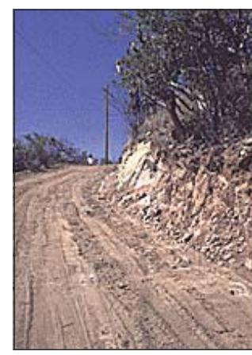

Figure 194. Erosion from unpaved roads are a major source of reef sediment

#### **Water Quality Water Quality**

**–** In general, increases in point and nonpoint source discharges are causing declines in the water quality in the USVI.

Wastewater disposal has been a chronic problem in the USVI. There are eight sewage treatment facilities on St. Thomas, seven secondary plants, and an anaerobic pond at the airport. The plants do not always attain secondary treatment discharge requirements (OAI 1999). A new secondary treatment plant opened in 2000 serving the 2,000 residents of Cruz Bay and surrounding areas of St. John. This secondary treatment replaced an overloaded facility that did not meet interim effluent limits and discharged into

a salt pond. The 50,000 residents of St. Croix are served by one primary wastewater treatment facility. The sewage collection system consists of 87 miles of gravity and force mains, 3 major sewage lift stations, and 12 feeder pump stations. Because of long detention time for flows arriving at the wastewater treatment plant, hydrogen sulfide is sometimes generated and deteriorates concrete sewer mains. Sewer mains have frequently and repeatedly failed, requiring raw sewage bypass during repairs (OIA 1999). Raw sewage bypasses have lasted close to a year.

Untreated rum-effluent from a St. Croix distillery is discharged on St Croix's south shore resulting in a 5-mile long benthic "dead zone" caused by the high toxin level, high Biological Oxygen Demand, and the high temperature of the effluent. Each year the VI Government requests and has been granted an exemption from the U.S. Clean Water Act for this discharge.

Poor land management practices associated with accelerating development on St. John pose an increasing threat. Over 80% of the island has slopes that exceed

Figure 195. Commercial fishing in the Virgin Islands National Park (Photo: J. Sneddon).

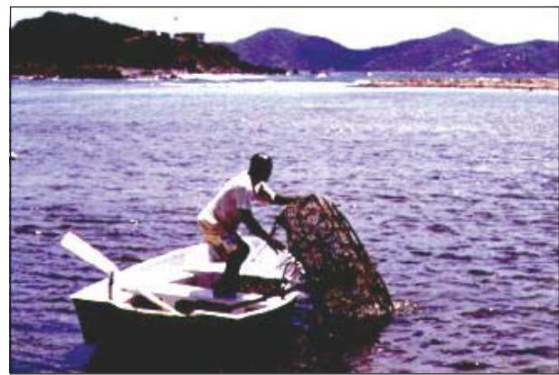

30% (CH2 M Hill 1979) and rainfall often arrives in brief, intense showers that promote erosion. Runoff from 56 km of unpaved roads contributes the largest amount of sediment to the coastal waters

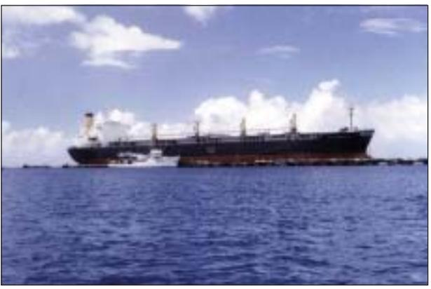

Figure 196. This bulk carrier, cruise ships, and other large ships regularly use St. Croix's piers (NOAA Photo Library).

(Anderson and MacDonald 1998). Water quality data from 30 sites around St. John show that bays with developed watersheds have higher turbidity and light extinction coefficients, and lower light transmission than bays inside the park associated with undeveloped or less disturbed watersheds (USGS and NPS unpub. data).

Recent studies suggest that excess sedimentation can exacerbate the effects of natural bleaching events. Nemeth and Nowlis (2001) found that bleaching of coral colonies during the peak of the 1998 bleaching event showed a strong positive relationship to sedimentation (r=0.92). At reef sites exposed to sedimentation rates between 10 to 14 mg/cm2 /d, 38% of the coral colonies examined exhibited pigment loss compared to 23% of the corals observed at sites exposed to sedimentation rates between 4 to 8 mg/cm2 /d.

#### **Coastal Populations and Reef Coastal Populations Reef Economics EconomicsEconomics**

A total of 108.6 thousand residents inhabited the USVI in 2000, an increase of 6.7% from the 1990 census and 12.5% from 1980 (U.S. Bureau of Census 2002). In 1999, total number of visitors to USVI was close to 2 million (560,000 air visitors and 1.4 million cruise passengers) and in 2000 arrivals increased to 2.5 million (VI

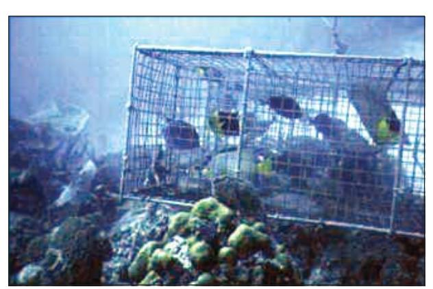

Figure 197. Fish trap atop the Yawzi Reef in the Virgin Islands National Park (Photo: Virginia Garrison).

Dept. of Tourism 2002). I got new data from Dept. of Tourism.

**Socioeconomics Socioeconomics –** Fishing is an important recreational and commercial aspect of the economy of the USVI. It is important to note that no fish are exported from the USVI; in fact, during peak demand fish are imported into the USVI (Downs and Petterson 1997).

USVI fisheries are small-scale, using several gear types to harvest over 180 species of reef fish (Caribbean Fisheries Management Council 1985, Beets 1997, Garrison

*et al*. 1998). The primary fishing gear in the USVI fishery (traps, followed by hook and line, and nets) has not changed greatly since the 1930s (Fiedler and Jarvis 1932), although the fishing effort has greatly increased and catch composition has changed (Appeldoorn *et al*. 1992, Beets 1997). The level of fishing effort varies greatly, some fishers use little gear nearshore and others set long trap lines across the insular shelf (B. Smith unpub. rept., Garrison *et al*. 1998).

Reef fish harvesting equipment has become more sophisticated, allowing fishers to access more areas; set and retrieve more traps in a day; use longer lasting, less degradable traps; and subsequently severely impact many

species of reef fishes. Average number of traps fished per full-time fishermen has increased from 4 in 1930, to 8 in 1967, to >100 in 1997 (Fiedler and Jarvis 1932, Dammann 1969, W. Tobias pers. comm.). Maximum number of pots fished by a single fisherman in 1930 was 30 traps whereas in 1997 the maximum was 3000 traps (Fiedler and Jarvis 1932, Downs and Petterson 1997).

Larger scale net fishing has been recently reported occurring in the reef areas adjacent to and east of Buck Island, St. Croix. Large nylon fishing nets are set directly off the barrier reef in the evenings to catch species of fish during nocturnal migrations off the reef. Subsequent to these reports, NPS has had confirmation that local fisherman have more fish than

Figure 198. This vessel was subsequently removed from the St. Croix reef it grounded on, but others still litter USVI harbor and reef areas (Photo: NOAA Photo Library).

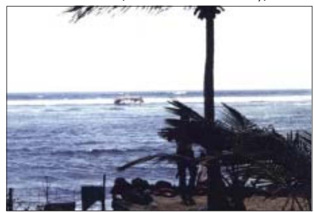

they can sell in a day and would rather throw the fish out than sell the fish for a bargain price (J. Tutein, NPS Superintendent, pers. comm.).

#### **Environmental Pressures on Coral Coral Pressures on Reefs**

A diverse array of stresses has caused degradation of USVI coral reefs, associated marine ecosystems, and the fishery resources dependent on them. Some natural stresses such as hurricanes have had dramatic and acute effects, while

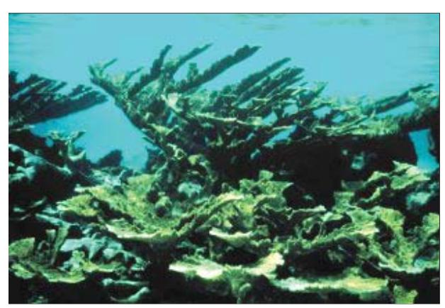

Figure 199. Prior to 1979, extensive thickets of elkhorn coral were dominant elements of USVI shallow-water reefs (Photo: Andy Bruckner).

other stresses are considered chronic conditions such as strong swells, sea temperature fluctuation, sedimentation, and pollution.

Human activities are superimposed on these natural stresses. Anchoring and ship groundings on coral reefs and seagrass beds are examples of acute stresses with immediate, obvious, and sometimes longterm effects (Rogers and Garrison 2001). Other acute human caused stresses affecting reefs, especially in St. Thomas and St. Croix, are dredging, sand extraction, groin construction, and sewage effluent (Goenaga and Boulon 1992).

**Human Stresses –** Chronic stresses like over-fishing (commercial, hand-line, pot fishing, spear fishing, net, long-line, trolling, driftnet), point and non-point source water pollution, and sedimentation

Figure 200. This diver is surveying off Buck Island, St. Croix the extent of elkhorn coral rubble left after Hurricane Hugo (Photo: Caroline Rogers).

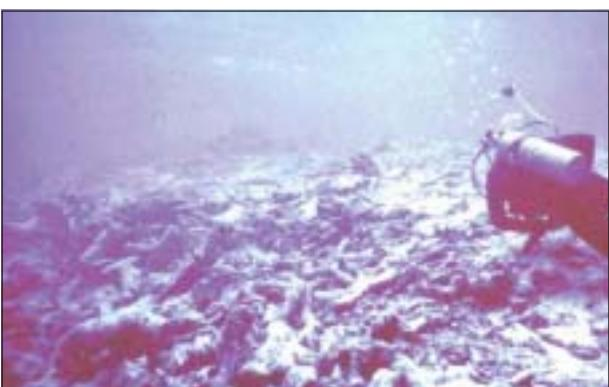

generally cause changes that are difficult to quantify and track but are particularly damaging. Moreover, stressors can act synergistically with natural disturbances to accelerate damage to reefs or slow their rate of recovery (Rogers and Beets 2001, Nemeth and Nowlis 2001).

Fishing Pressure – Over-fishing throughout the USVI has had profound effects on the resources, including those within federally protected areas such as VINP and BINM. Reports and observations from more than 20 years ago suggested that fishing was already changing the reef-associated fishes (J. Randall's field notes 1958-1961, Olsen and LaPlace 1978). Fisheries are close to collapse, and even those ecosystems within the boundaries of "marine protected areas" are deteriorating (e.g., Beets 1996, Beets and Rogers in press). Existing zoning, erosion control, and fishing regulations are not providing sufficient protection. The present combination of natural and human stresses and the magnitude of their effects may be unprecedented.

Recreational Uses – Destruction from boats running aground on reefs has been severe. Large vessels (greater than 65 ft) run aground with surprising regularity on USVI reefs (more than twice a year) and vessels abandoned after recent hurricanes still litter several harbor and reef areas.

Small boats run aground on shallow reefs, destroying corals, particularly elkhorn coral. For example, within VINP, an average of four boats per week ran aground on Windswept Reef (R. Boulon pers. comm). After the installation of resource protection buoys in 1985, groundings to this reef have decreased to an average of one a year (NPS records).

Surveys off St. John make it clear that benthic resources have been damaged by anchoring (Link 1997). A dramatic case of anchor damage involved the cruise ship "Windspirit" which destroyed a 283-m2

section of reef within VINP in 1988. Ten years later, no significant recovery of coral had occurred (Rogers and Garrison 2001). VINP has installed 211 moorings and over 111 resource protection buoys around St. John to help prevent anchor damage to benthic habitats and the entire southern section of VINP is a no-anchor zone. NPS has been monitoring benthic recovery surrounding moorings in several bays for the last three years.

All three USVI islands have popular snorkel and dive sites experiencing heavy visitor use (>200 visitors/site/day) (St. Croix Cane Bay Dive Shop instructors pers. comm., NPS records) that may be damaging coral reefs. BINM remains the number one tourist destination for St. Croix. Over 150 people per day visit the underwater interpretive snorkel trail and visits can peak over 200. BINM has a mooring system at the underwater trail that limits boats and snorkelers, but intensive use has resulted in some coral damage (Z Hillis-Starr pers. comm).

#### **Natural Stresses Natural Stresses**

Hurricanes – Since 1979, eight hurricanes have affected USVI reefs. Damage varied with storm path, strength and velocity, wave height and direction, the dominant coral species, and reef depth (e.g., Rogers *et al.* 1997, Bythell *et al.* 2000). Hurricanes David (1979) and Hugo (1989) were the most destructive and it appears that these acute incidents have pushed percent live coral cover to a relatively stable, albeit lower, equilibrium.

In some shallow zones at BINM, *A. palmata* cover, already reduced from 85 to 5% by White-band Disease, fell to 0.8% after Hurricane Hugo (Gladfelter 1991). Structural recovery from Hugo has been very slow due to several subsequent hurricanes in 1995, 1998, and most recently in late 1999.

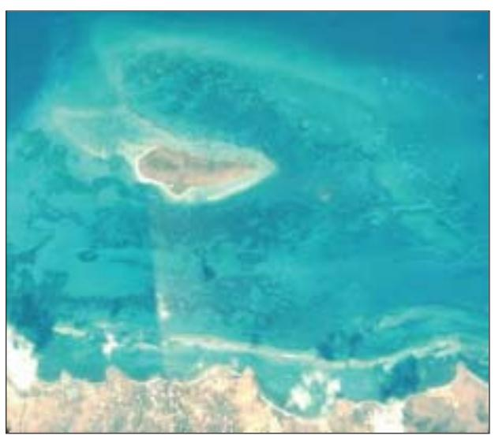

Figure 201. In 2001, Buck Island National Marine Monument off the island of St. Croix became the USVI's first substantial no-take area (Photo: NOAA Ocean Service).

Bythell *et al.* (1993) recorded partial and total mortality of coral colonies of three common species at 15 BINM sites over a 26-month period (1989-1991) that included Hurricane Hugo. The dominant species, *M. annularis*, suffered greater mortality from chronic factors such as predation and tissue necrosis than from the hurricane. *D. strigosa* suffered more tissue loss from the storm than from chronic factors, while *P*. *astreoides* had substantial mortality from all factors.

Hurricane Hugo also caused a 40% decline in the living coral in transects surveyed on a reef in Lameshur Bay, St. John which has failed to show any significant recovery in terms of an increase in live coral cover (Rogers *et al.* 1997, NPS and USGS and NPS, unpub. data). Macroscopic algae,

Table 17. Authorities with jurisdiction over USVI waters and submerged lands with coral reefs.

| Government Agency                                                                   | Harine Jurisdiction                                                                                                                                                                                                                                                                                                                                                                                                 |
|-------------------------------------------------------------------------------------|---------------------------------------------------------------------------------------------------------------------------------------------------------------------------------------------------------------------------------------------------------------------------------------------------------------------------------------------------------------------------------------------------------------------|
| U.S. Department of Interior  * Minerals Management Service  * National Park Service | * Submerged lands and vaters adjacent to federal property, seaward to 3 emi, submerged lands withheld (1974) * Lessing responsibility for: Submerged from 3 emi out to extent of U.S. Jurisdiction: Federal submerged lands within 3 emi of stone. * Buck bland Reef National Monument, Virgin blands National Park, Salt River Bay National Historical Park and Ecological Preserve. |
| U.S. Department of Commerce  * National Occurric and Atmospheric Administration     | * From the outer extent of the USVI jurisdiction (3 nm) to the outer extent of the EEZ (200 nm from the shoriline)                                                                                                                                                                                                                                                                                            |
| Virgin Islands Territorial Government                                               | * Non-U.S. government waters and submerged lands from the shoreline to 3 ami                                                                                                                                                                                                                                                                                                                                  |

| Type                    | Agincy                                                                                                    | Location/Frequency                                                                                            | Results/Products                                                                                                                                                                                     |
|-------------------------|-----------------------------------------------------------------------------------------------------------|---------------------------------------------------------------------------------------------------------------|------------------------------------------------------------------------------------------------------------------------------------------------------------------------------------------------------|
|                         | NPS (temperature BUS)                                                                                     | Every 2 hours                                                                                                 | Temp. graphs from 1991 to present.                                                                                                                                                                |
| Water quality           | VLDPNI DEP (various parameters)                                                                        | Variable (quarterly to yearly)                                                                                | Coastal water quality is degraded in developed buys, BUS and East End water quality remains very good                                                                                       |
| Fisheries               | VI DPNR DFW (commercial reef fish, conch, lobster, landing reports)                                 | Monthly catch reports from fluherness                                                                      | Declining, especially adults and diversity of reef fish                                                                                                                                           |
|                         | NPS (visual census and trap- counts at BUS) UVI-VIMAS* (photo-quadrats,                             | B-annually, 1988-1994; trap counts 1992-1993 Quarterly                                                  | Fishy is degraded due to ove fishing surrounding the park None to date                                                                                                                         |
|                         | 4 sites) UVI-CHES** (AGREA, 4 sites)                                                                   | Single survey in 1999                                                                                         | Coral cover 19%; mecroligae 16%; coral secrets 9 5/m²                                                                                                                                             |
| Battogical (benthic) | APS (chain transects, colony monitoring, video transects, and cross-reef depth profiles at 8USS) | Serr-annual to aresulty and after sever storm or bleaching events depending on type of monitoring    | Increased hard coral recruitment; survivorship of recruits of boulder and branching corals, specifically A. palmana                                                                      |
| 241                     | NPS .                                                                                                     | T E other (wasstants)                                                                                         | Consider connectable birth account                                                                                                                                                                   |
| Water quality           | 77.1                                                                                                      | 15 sites/quarterly                                                                                            | Quality generally high except in bays with developed watersheds                                                                                                                                |
| Water                   | UNI USGS                                                                                               | Lameshur/Fish Bay (turbidity, TSS) 4 sites/every 2 hours;                                               | in Fish Bay Naximum temperature over                                                                                                                                                              |
| temperature             |                                                                                                           | therrestor at 8-12 m depth                                                                                    | 30° C associated with coral bleaching                                                                                                                                                             |
| Aud fishes              | USGS/NPS/visiting scientists (adult fishes) USGS/visiting scientists                                | Armuelly for at least 4 reefs Monthly at Larneshur Reef                                                    | Temporal and spatial trends Peaks in recruitment in                                                                                                                                               |
| and the last            | (juvenile fishes)                                                                                         |                                                                                                               | surrener/early full                                                                                                                                                                                  |
|                         | USGS                                                                                                      | Lurreshor and Newfound Reefs surveyed at least once a year; done with video method                   | Decrease in coral cover from storms and probably disease, high macroaligal levels at Lamestur                                                                                               |
| finingeal (hentlis)  | OVI                                                                                                       | Great Cruz Bary, Fish Bay Lensisher Bay; monitored questinfy with AGRIA method and video             | Condi cover is 25 and condi recruit density is 33/m 2 at Lameshar; Condi cover is 125 and condinental density is 25/m 2 at Fish Bay. Hacrostipse is about 3% at |
|                         | NPS                                                                                                       | Barwal menturing of cover around newly installed moorkigs in several bays                               | Study just beginning                                                                                                                                                                                 |
| Coral diseases          | USOS                                                                                                      | Tektite Reef (monthly); Haultiver Reef (every 2 months)                                                 | 15 different coral species affected, disease present in alread every month surveyer                                                                                                            |
| Coral growth            | USGS                                                                                                      | 4 sites; transplanted and naturally occurring colonies of 3 species measured                            | Nesturally occurring and bransplanted coral fragments/colories showing similar survivorship                                                                                                 |
| Sedementation           | W                                                                                                         | Fish Bay/Lamestur Bay                                                                                         | 3 times more sediment entering sea at Fish Bay                                                                                                                                                    |
| Air quility             | NPS/EPA/USGS                                                                                              | Lind Point; rainfall and rutrients in set deposition                                                       | Pathogens in dust, high particulates «1 u m                                                                                                                                                       |
| M. Phores and           | DPNK, DEF                                                                                                 | Quarterly; sites around                                                                                       | Not available                                                                                                                                                                                        |
| Water quality           | UVI                                                                                                       | St. Thomas Caret Bay; TSS and turbidity                                                                    | Avg. TSS 8 mg/l                                                                                                                                                                                      |
|                         | UVI                                                                                                       | monitored monthly  8 sites; monthly to quarterly with photospacifrats, AGREA, and video                       | Ava. turbisity 0.4 NTU Coral cover 17%, macrosligar 42%, coral recruits 17/m 2                                                                                                      |
| (Seethic)               | DPNR, DFW                                                                                                 | Permanent transencts; Annual to biennial with sites in St. James and Hangrove Lagoon Marine Reserves | Data being analyzed                                                                                                                                                                                  |
|                         | UVI (adult fishes)                                                                                        | Southdrop (Red Hed Reserve); quarterly                                                                     | Increase in size of spewning groupers since last survey. Groupers migrate 7-15 miles to spewning litte.                                                                                     |
| Reef fishes             | UVI (Juvenile fluk)                                                                                       | 5 sites with belt transects                                                                                   | Peak recruitment of snapper and other opp. In spring and late summer/fall. Snapper an grunts most abundent in grass beds.                                                                |
|                         | UVI (larval fishes)                                                                                       | 3 sites with light traps                                                                                      | Peak recruitment of enappen and other spp. Spring and late summer/fall                                                                                                                         |
|                         | DPNR, DPW (barval fishes)                                                                                 | Fish censes at permanent transect sites at St. James and Mangrove Lagoon Marins Reserves             | Data been analyzed                                                                                                                                                                                   |
| Sedmentation            |                                                                                                           | 6 sites (traps)                                                                                               | Avg. sedment had 12.6 mg/cm 2 /d rearshore and 6.0 mg/cm 2 /d offshore cays                                                                                              |

Table 18. Monitoring related to coral reefs in the USVI.

\* VMAS – Virgin Islands Marine Advisory Service

**U.S. VIRGIN ISLANDS**

**140140**

covering about 5% of the bottom before Hurricane Hugo, are now periodically very abundant and can reach averages of over 30%. It appears that the level of herbivory by sea urchins and fishes has been too low to keep the macroalgae in check, and algae are inhibiting coral settlement and recruitment (Rogers *et al.* 1997).

**Climate Change and Coral Climate Coral Coral Bleaching BleachingBleaching –** Global warming is thought to contribute to an increased frequency and strength of hurricanes in the Caribbean and coral bleaching is often associated with higher water temperatures. The worst episode of coral bleaching to date occurred worldwide in 1998 (Pomerance 1999).

Extensive coral colony mortality was not associated with 1987, 1998, and 1990 USVI bleaching episodes. At two St. John sites, bleaching of coral tissues was estimated in the fall of 1998 at 43% and 47% (Rogers and Miller 2001). The 1998 bleaching episode coincided with the hottest seawater temperatures on record (four sites, NPS records). At Caret Bay reef, St. Thomas, maximum bleaching recorded was 41% but most colonies had recovered within six months (Nemeth and Nowlis 2001). Extensive bleaching (but not mortality) was observed at BINM in the fall of 1998 where an estimated 20% of *D. strigosa* at one site and 53% at a second site exhibited bleaching. During the fall of 1999, when sea temperatures reached 28.8 C,

\*\* CMES – Center for Marine and Environmental Service

mild bleaching was observed on 16%, 26%, and 48% of the coral colonies greater than 25 cm in diameter on St. Thomas, St. John, and St. Croix, respectively (Nemeth *et al*. in press).

#### **Current Conservation Management Conservation Management**

The U.S. Department of the Interior (DoI), U.S. Department of Commerce (DoC), and the Virgin Islands Territorial Government all have jurisdiction over submerged lands within the USVI (Table 2).

**Mapping Mapping –** Benthic habitat types found throughout the USVI have been digitally mapped to a depth of 20 m (Kendall et al. 2001). These habitat maps will be the basis for establishing a number of permanent sites as part of a new USVI-wide longterm monitoring program.

#### **Assessments, Research, and Research, and Monitoring Monitoring**

**–** The NPS and USGS in the USVI have collected some of the longest time-series data sets on coral reefs in the Caribbean, some dating back decades (Table 2).

Several innovative marine research and monitoring projects have been conducted in the USVI. The Tektite I and II underwater habitat projects took place on the south side of St. John from 1969-1971 (Collette and Earle 1972, Earle and Lavenberg 1975), and approximately 80

Figure 202. Long-term monitoring is needed to track trends and predict change in the USVI reef ecosystem (Photo: Matt Kendall).

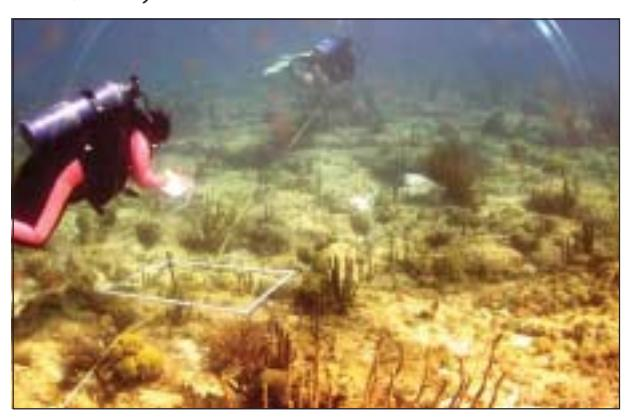

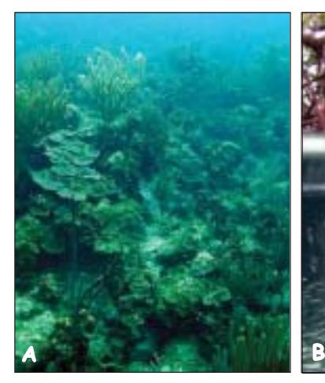

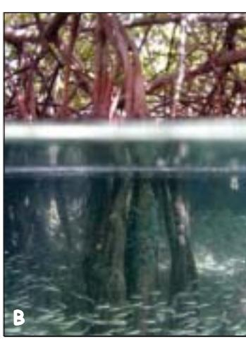

Figure 203. Little is known about the roles that deeper reef (A) and mangrove (B) habitats play in the life histories of shallow-water reef species, particularly those that have been overfished (Photo Matt Kendall).

Hydrolab (1977-1985) and 13 Aquarius (1987-1989) underwater habitat missions were conducted in St. Croix.

Much of the baseline information for the VINP comes from a series of reports produced by the Virgin Islands Resource Management Cooperative from 1983 1988. Fairleigh Dickinson University's West Indies Laboratory, located on St. Croix, conducted nearly 20 years of ecological studies that established a baseline for BINM (Hubbard 1991, Bythell *et al.* 1992, Gladfelter 1992).

BINM and VINP have formal monitoring programs dating to the early 1980s focusing on coral reef condition, reef fish, sea turtle populations, and seagrass beds (only VINP). USGS and NPS scientists have collaborated on long-term monitoring of coral reefs using a comprehensive protocol based on use of a digital video camera along randomly chosen transects (Miller and Rogers 2001, Rogers *et al.* in press). Each year three coral reef sites (20 transects each) at VINP and two at BINM are monitored using this protocol. For the past 14 years, reef fish in VINP have been monitored at between 4 and 16 reef sites (15-18 censuses are conducted at each site) and fish censuses were recently re-established at BINM (130 censuses). Research and monitoring on

both nesting and juvenile sea turtles at BINM has been summarized in Hillis-Starr and Phillips (1997).

In 2001, the USVI Territorial government initiated a long-term monitoring program with financial support from NOAA.

MPAs and No-Take Reserves – The USVI Territorial Government has designated Marine Reserves and Wildlife Sanctuaries (Salt River, Cas Cay and St. James) where fishing is allowed only with hand lines or for baitfish with a permit. Federal MPAs provide varying levels of protection and enforcement for USVI coral reef ecosystems.

**St.** Croix – A total of six federal MPAs protect aspects of coral reef ecosystems off this island.

Buck Island Reef National Monument – The NPS manages the BINM, established on St. Croix, USVI in 1962 (Presidential Proclamation No. 3443) to protect one of the finest coral reef ecosystems in the Caribbean. Additional marine portions were added in 1975 (Presidential Proclamation No 4346) and 2001 (Presidential Proclamation 7392). Current size of BINM is 71 ha of land and 77.7 km² of submerged lands.

This park and preserve includes applicantal by a Berland School of the Salutary of Serial School of the Salutary of Serial School of the Salutary of Serial School of the Salutary of Serial Serial of the Salutary of Serial Serial Serial of the Salutary of Serial Serial Serial Serial Serial Serial Serial Serial Serial Serial Serial Serial Serial Serial Serial Serial Serial Serial Serial Serial Serial Serial Serial Serial Serial Serial Serial Serial Serial Serial Serial Serial Serial Serial Serial Serial Serial Serial Serial Serial Serial Serial Serial Serial Serial Serial Serial Serial Serial Serial Serial Serial Serial Serial Serial Serial Serial Serial Serial Serial Serial Serial Serial Serial Serial Serial Serial Serial Serial Serial Serial Serial Serial Serial Serial Serial Serial Serial Serial Serial Serial Serial Serial Serial Serial Serial Serial Serial Serial Serial Serial Serial Serial Serial Serial Serial Serial Serial Serial Serial Serial Serial Serial Serial Serial Serial Serial Serial Serial Serial Serial Serial Serial Serial Serial Serial Serial Serial Serial Serial Serial Serial Serial Serial Serial Serial Serial Serial Serial Serial Serial Serial Serial Serial Serial Serial Serial Serial Serial Serial Serial Serial Serial Serial Serial Serial Serial Serial Serial Serial Serial Serial Serial Serial Serial Serial Serial Serial Serial Serial Serial Serial Serial Serial Serial Serial Serial Serial Serial Serial Serial Serial Serial Serial Serial Serial Serial Serial Serial Serial Serial Serial Serial Serial Serial Serial Serial Serial Serial Serial Serial Serial Serial Serial Serial Serial Serial Serial Serial Serial Serial Serial Serial Serial Serial Serial Serial Serial Serial Serial Serial Serial Serial Serial Serial Serial Serial Serial Serial Serial Serial Serial Serial Serial Serial Serial Serial Serial Serial Serial Serial Serial Serial Serial Serial Serial Serial Serial Serial Serial Serial Serial Serial Serial Serial Serial Serial Serial Serial Serial Serial Serial Serial Serial Serial Serial

designated a marine reserve with all

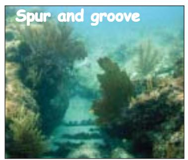

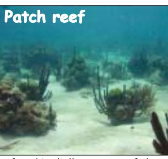

Figure 204. Beautiful reefs can still be found in shallow-waters of the USVI. However, additional regulations and enhanced enforcement are needed to reverse the serious decline in harvested species and general degradation of the reef ecosystem (Photos: Matt Kendall).

Presidential Proclamation 7392 declared the entire Monument a no-fishing and noanchoring zone, ending 40 years of legal extractive use. This monument is the first substantial "no-take area" established for the island of St Croix and will require consistent and enhanced law enforcement to protect the area and effect the recovery of St. Croix's depleted reef fisheries. Up until 2001, only a small eastern section (49.7 ha) was designated a no-take zone, thus most of BINM was open to extractive uses including setting of fish traps, cast net, hook and line, and hand collection of conch and lobster. NPS has had limited success in controlling illegal fishing due to a lack of law enforcement staff.

Salt River Bay National Historical Park and Ecological Preserve (SRBNHP) – The NPS manages this park, established on St. Croix, USVI in 1992 to preserve, protect, and interpret for the benefit of present and future generations certain nationally significant spawing laggitural and natural ritish and cessources through restricted by NOAA within this federally protected 3.9 km² MPA located on Lang Bank, east of St. Croix (50 CFR 622.23).

St. Croix Restricted Areas – Anchoring in the two restricted areas (0.01 km² and .4 km²) is prohibited with the exception of U.S. Government owned vessels and private vessels that have been specifically authorized to do so by the Commanding

## **STATUS OF THE FLOWER GARDEN BANKS OF THE STATUS OF THE STATUS OF THE FLOWER GARDEN BANKS OF THE NORTHWESTERN GULF OF MEXICO NORTHWESTERN GULF OF MEXICO NORTHWESTERN GULF OF MEXICO George P. Schmahl George P. Schmahl Schmahl George P. Schmahl George P. SchmahlGeorge P. Schmahl**

#### **Introduction Introduction**

The Flower Garden Banks are two prominent geological features on the edge of the outer continental shelf in the northwest Gulf of Mexico, approximately 192 km southeast of Galveston, Texas. Created by the uplift of underlying salt domes of Jurassic origin, they rise from surrounding water depths of over 100 m to within 17 m of the surface (Fig. 205). Stetson Bank, 48 km to the northwest of the Flower Gardern Banks, is a separate claystone/ siltstone feature that harbors a low diversity coral community. Fishermen gave the Flower Garden Banks their name because they could see the bright colors of the reef from the surface and pulled the brightly colored corals and sponges up on their lines and in their nets.

These are the northernmost coral reefs on the continental shelf of North America, located between 27˚ 52' and 27˚ 56' North. They are isolated from other Caribbean and Gulf of Mexico reefs, being over 690 km from the nearest reefs of the Campeche Bank off the Mexican Yucatan Peninsula.

The East Flower Garden Bank, located at 27˚ 54.5' N, 93˚ 36.0' W, comprises about 65.8 km2 and contains about 1.02 km2 of coral reef. About 19.3 km to the west, the West Flower Garden Bank, (27˚ 52.5' N, 93˚ 49.0' W) comprises about 77.2 km2 , of

which about 0.4 km2 is coral reef (Gardner *et al*. 1998).

Structurally, the Flower Garden Banks coral reefs are composed of large, closely spaced heads up to three or more meters in diameter and height. Reef topography is relatively rough, with many vertical and inclined surfaces. If the relief of individual coral heads is ignored, the top of the reef is relatively flat between the reef surface and about 30 m. It slopes steeply between 30 m and the reef base. Between groups of coral heads, there are sand patches and channels from 1-100 m long. Sand areas are typically small patches or linear channels.

Probably due to its geographic isolation and other factors, there are only about 28 species of reefbuilding corals, a relatively low diversity. Interestingly, the Flower Garden Banks contain no elkhorn or staghorn corals and no shallow-water sea whips or sea fans (gorgonians) which are common in the Caribbean.

Coral growth is relatively uniform over the entire top of both banks, occupying the bank crests down to about 50 m. As the reef slopes in the deeper regions, corals grow flatter and individual heads can cover large areas.

The East and West Flower Garden Banks were designated as the Flower Garden Banks National

> Marine Sanctuary (the Sanctuary or FGBNMS) in January 1992. In 1996, Stetson Bank was added. The Sanctuary encompasses 145.8 km2 and includes all of the shallow coral reef areas.

#### **Condition of the the Coral Reefs Reefs**

The Flower Garden Banks are two of the least disturbed coral reefs in the Caribbean and western

Figure 205. Bathymetry map of the East and West Flower Garden Banks (Credit: John Christensen).

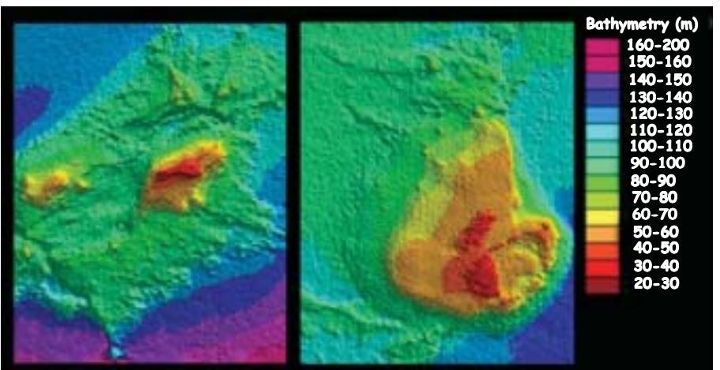

Atlantic and are among the few reefs anywhere that can be considered nearly pristine (Gittings and Hickerson 1998). The ocean water bathing the reefs is clear with visibility usually 25-30 m. Salinity and temperature variations are well within the range required for active coral growth. When first studied in the early 1970s, coral communities in the Flower Garden Banks appeared stable and in excellent general health and have remained so. Some isolated injury caused by anchoring vessels, illegal fishing gear, tow cables, and seismic arrays was observed.

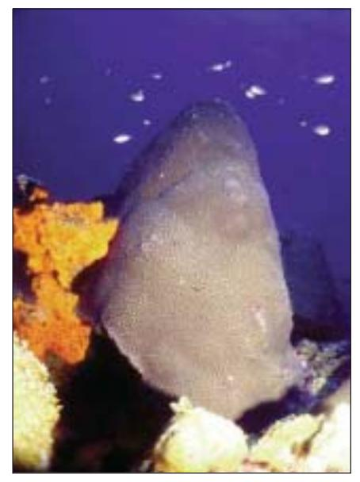

Figure 206. Reefs at the Flower Garden Banks have high coral cover (Photo: Stephen Gittings).

#### **Coral and Benthos** – Gittings

(1998) reviewed the data from all of the assessment and monitoring studies through 1995 (for specifics, refer to the below monitoring section within this report). Coral cover averaged 47.3% and has not significantly changed since initial studies in 1972 (Fig. 206). Similar consistency was observed in coral growth rates and other indicators of coral health. The most recently published results (Dokken *et al.* 1999) showed the trend had continued through 1997.

Table 19. Mean percent cover (%) of corals, reef rock, algae, sponge, and sand on random transects sampled during 1996 and 1997 survey cruises at the East and West Flower Garden Banks.

| PERCENT COVER             |             |             |             |             |  |  |  |  |  |
|---------------------------|-------------|-------------|-------------|-------------|--|--|--|--|--|
| Analyzed Components       | East Flower | Garden Bank | West Flower | Garden Bank |  |  |  |  |  |
|                           | 1996        | 1997        | 1996        | 1997        |  |  |  |  |  |
| Montastraea annularis     | 30.5        | 28.0        | 34.0        | 22.6        |  |  |  |  |  |
| Diploria strigosa         | 6.8         | 9.4         | 11.6        | 8 .4        |  |  |  |  |  |
| Porites astreoides        | 5.9         | 6.6         | 2.6         | 3.2         |  |  |  |  |  |
| Montastraea cavernosa     | 6.0         | 3.7         | 4 .7        | 3.3         |  |  |  |  |  |
| Colophyllia natans        | 1.0         | 3.1         | 1.7         | 1.2         |  |  |  |  |  |
| Millepora alcicornis      | 2.3         | 0.8         | 1.5         | 0.9         |  |  |  |  |  |
| Agaricia agaricites       | 1.0         | 0.2         | 0.3         | 0 .4        |  |  |  |  |  |
| Stephanocoenia intersepta | 0.6         | 1.0         | 0.6         | 0.2         |  |  |  |  |  |
| Madracis decactis         | 0.5         | 0.0         | 0.1         | 0.6         |  |  |  |  |  |
| Siderastrea siderea       | 0.3         | 0.2         | 0.2         | 1.4         |  |  |  |  |  |
| Mussa angulosa            | 0.0         | 0.0         | 0.0         | 0.2         |  |  |  |  |  |
| Scolymia cubensis         | 0.0         | 0.0         | 0.0         | 0.0         |  |  |  |  |  |
| Porites furcata           | 0.0         | 0.0         | 0.0         | 0.0         |  |  |  |  |  |
| Madracis mirabilis        | 0.0         | 0.0         | 0.0         | 0.0         |  |  |  |  |  |
| Total coral               | 54.8        | 52.9        | 57.4        | 42.3        |  |  |  |  |  |
| Reef rock                 | 41.8        | 48.6        | 39.8        | 51.5        |  |  |  |  |  |
| Leafy algae               | 0.0         | 5.2         | 0.9         | 4 .8        |  |  |  |  |  |
| Sponge                    | 1.4         | 2 .8        | 1.0         | 0.7         |  |  |  |  |  |
| Sand                      | 0.0         | 0.0         | 0.0         | 0.2         |  |  |  |  |  |

The current status provided by Dokken et al. (1999) is based on data from the 1996 and 1997 monitoring effort (Table 19). Live coral cover above 30 m averages 51.8% (53.8% on the East Bank and 49.8% on the West Bank). The coral heads are frequently very cavernous, showing evidence of substantial internal bioerosion (Fig. 207). Other prominent benthic components include coralline algae-covered rock (45.4%), leafy and filamentous algae (2.7%), sponge (1.5%), and patches of sand (less than 0.1%) may cover 10% of the bottom. Since sites were chosen to monitor reef habitat and avoid sand, sand channels and patches

probably account for around 10% of the Bank benthos.

By percentage cover, the dominant coral species are the boulder star coral (*Montastrea annularis* complex, 28.8%), symmetrical brain coral (*Diploria strigosa*, 9%), mustard hill coral (*Porites astreoides*, 4.6%), and the great star coral (*Montastrea cavernosa*, 4.4%). Diversity (H') averaged 1.727 for all monitoring years since 1992,

and Evenness (E) averaged 0.853.

Coral bleaching is routinely observed most years when water temperatures exceed 30° C, but is generally low and does not result in significant mortality (Dokken et al. 1999). Based on repetitive quadrat photography, no bleaching was observed in 1996 at either the East or West Flower Garden Bank. In 1997, bleaching was observed in 1.9% of the coral colonies on the East Bank, and in 1.2% of the colonies on the West Bank. Bleaching during the summer of 1998 was slightly higher than previous years, but was still less than

5%, with mortality less than 1% (Q. Dokken pers. comm.).

Coral disease was relatively rare, with only 23 incidents of disease or other unexplained mortality observed in over 3700 colonies. Data from the 1998 and 1999 monitoring effort have been compiled and are now under review.

Predation of living coral by parrotfish (Bruckner *et al.* 2000) is commonly observed, but the long-term effect of this phenomenon is not known at this time (Fig. 208).

**Algae–** Only recently has the coral reef algal community been well documented. Crustose coralline and calcareous green algae are common. Collections obtained in 1999 show a community of at least 44 species of algae in depths above 30 m (S. Fredericq pers. comm.). Benthic macroalgae are a minor, yet important component of the reef community in terms of potential competitors for space (Fredericq *et al.* 2000), growing mostly in crevices and sandy interfaces. Solitary foliose algae are rarely encountered; most of the algal community is composed of turf species. Algae are a primary

component of the deeper portions of the banks (below 30 m). The region between 46 and 88 m is known as the 'algal-sponge zone' (Rezak *et al*. 1985).

Algal populations have historically been low, with percent cover estimates generally less than 5% between 1989 and 1996. The algal community increased to over 13% after the long-spined sea urchin die-off in 1983-84, but returned to predieoff levels after two years (Gittings and Bright 1986), perhaps due to an increase of other herbivores.

Blue-green algae are abundant and invading open space on coral heads (S. Fredericq pers. comm.). This could be in response to elevated nutrient levels, and therefore, may be an important indicator of water quality degradation and a potential concern for the condition of the entire ecosystem (S. Fredericq pers. comm.).

In 1997, a slight increase in a red or blue-green turf algal mat was observed on both banks, averaging about 5% cover (Dokken *et al.* 1999). Algal cover declined slightly to about 3.2% in 1998, but then underwent a dramatic increase in 1999 (27.6% on the East Bank, 20.7% on the West Bank) (Q. Dokken pers. comm.). This increase occurred as algae colonized the bare reef rock, and may signal that environmental factors are changing to favor algae.

Figure 207. The mushroom-like shape of this brain coral is a product of bioerosion (Photo: Frank and Joyce Burek).

**Water Quality Water Quality –** In the vicinity of the Sanctuary, water quality is generally very good. Being on the outer edge of the Texas-Louisiana continental shelf, the Banks are directly influenced by the circulation patterns of the Gulf of Mexico. The most prominent current is the Loop Current which brings warm, clear water from the Caribbean through the Yucatan channel into the Gulf of Mexico basin, where it travels in a clockwise direction moving towards the western shelf of Florida. Moving inshore on the shelf, there is a significant onshore-offshore current component influenced by Loop Current rings and

spin-off eddies. Close to shore there is a counterclockwise (east to west) shelf current off western Louisiana and Texas. This current is strongest in

Figure 208. A stoplight parrotfish at the East Flower Garden Bank (Photo: Dick Zingula).

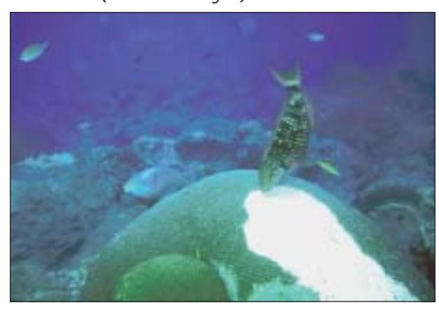

winter and almost absent in summer (Lugo-Fernandez 1998).

Water temperature near the Sanctuary varies seasonally and with depth. Average temperature over seven years varied at the reef surface at 24 m from a minimum of 19-20° C in February to a maximum of 29-30° C in July/August, with an annual range of 9-11° C (Lugo-Fernandez 1998). Interannual variations occur and temperatures over 30° C have been observed (Gittings *et al.* 1992), generally accompanied by varying levels of coral bleaching (Hagman and Gittings 1992). Salinity ranges between 35 and 36.5 ppt near the reef surface.

Visibility averages 25-30 m. Turbidity is generally very low, but periods of discoloration have been observed, primarily in June or July, and may be associated with the Mississippi and Atchafalaya River outflows and coastal waters moving onto the shelf (Deslarzes 1998). Surface waters are affected by freshwater flows when wind patterns reverse, changing nearshore currents.

Large Mobile Invertebrates – The Flower Garden Banks are home to at least 27 species of sponges, 20 species of polychaetes, 62 species of crustaceans, 667 species of mollusks, and 36 species of echinoderms. As in the case of mollusks, when invertebrate taxonomic experts inventory the biota of the Sanctuary, the total number of resident and transient species should increase substantially.

The Flower Garden Banks had an almost complete die-off of the long-spined sea urchin in 1983-84. There has been very little, if any, sustained recovery, even though individual sea urchins are found (Schmahl pers. comm.).

**Fish** – The Flower Garden Banks support a promi-Figure 210 A manta ray at FGBNMS (Photo: Kaile Tsapis).

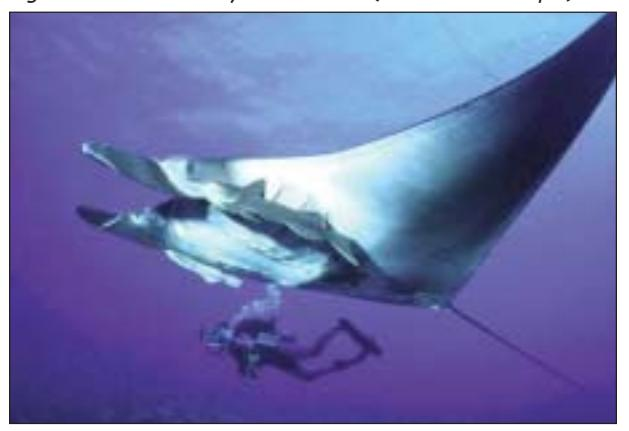

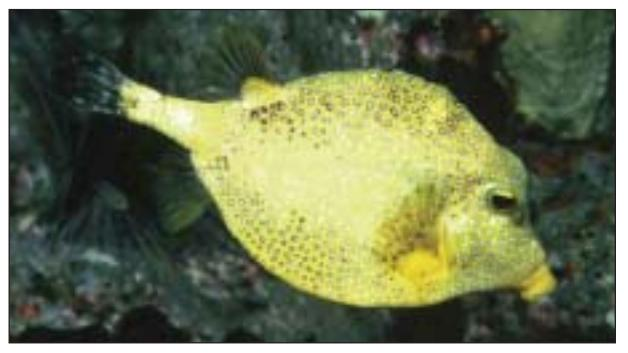

Figure 209. The golden-phase smooth trunk fish has only been reported on the Flower Gardens and Stetson Bank reefs (Photo credit: Frank and Joyce Burek).

nent reef fish population. Fish diversity is low compared with other Caribbean and South Atlantic reefs (266 species) and abundance is high (Pattengill-Semmens 1999). Based on abundance, planktivores and invertebrate feeders are the most dominant trophic groups (Pattengill *et al.* 1997).

Some of the most abundant species at all three banks were reef butterflyfish (Chaetodon sedentarius), Spanish hogfish (Bodianus rufus), bluehead wrasse (Thalassoma bifasciatum), brown chromis (Chromis multilineata), bicolor damselfish (Stegastes partitus), creolefish (Paranthias furcifer), and sharpnose puffer (Canthigaster rostrata). A unique gold color phase of the smooth trunkfish (Lactophrys triqueter) has been documented (Pattengill 1998, Fig. 209). Fish families and groups notably absent or only represented by one or few species in low numbers include grunts (Haemulidae), snappers (Lutjanidae), and hamlets (*Hypoplectrus* spp.). There is also evidence that these reefs may serve as an important spawning and aggregation area for certain species of grouper.

The banks are year-round habitat for devil rays and manta rays (*Mobula hypostoma* and *Manta birostris*, Fig. 210), and whale sharks (*Rhincodon typus*). They serve as a winter habitat for several species of schooling sharks, including hammerhead (*Sphyrna lewini*) and silky sharks (*Carcharhinus falciformis*), and spotted eagle rays (*Aetobatus narinari*) (J. Childs 2001).

Fishing pressure on the Sanctuary does not appear to be intense, but fishermen have used longline fishing gear in the vicinity of the banks and along the entire continental shelf since the late 1800s. Commercial snapper and grouper fishing occurs along the continental shelf edge, including the Flower Garden Banks. Target areas for this activity

are typically the deeper portions of the Bank structure, away from the shallower coral reefs. Anecdotal information suggests that snapper, jewfish, and other grouper populations have declined over time. These are present but do not occur in abundance. There is no data prior to the late 1970s.

Fish population estimates were not made at the same time as observations of algal populations, but by 1990, a significant increase in the abundance of queen and stoplight parrotfish (*Scarus vetula* and *Sparisoma viride*, respectively) was reported. Gittings *et al.* (1992) suggested that this increase may be due to greater availability of algae following the demise of long-spined sea urchins in the mid-1980s.

**Other Marine Life Other Life –** Juvenile loggerhead sea turtles (50-100 kg) are resident at the East and West Flower Garden Banks (Fig. 211). Based on satellite tracking studies, these turtles have a range of approximately 130 square kilometers, tightly centered on the Banks (Hickerson 2000).

Hawksbill and leatherback turtles (*Dermochelys coriacea*) have also been reported.

Atlantic spotted and pan-tropical spotted dolphins (*Stenella plagiodon* and *S. attenuatus* respectively), and bottlenose dolphins (*Tursiops truncatus*) are commonly seen. Recently an unidentified species of beaked whale was reported.

#### **Coastal Populations and Reef Economics Economics**

Recreational SCUBA diving is popular and the demand appears to be increasing. There are currently three live-aboard charter dive vessels which can carry up to 35 divers each. In 1997, from a survey of charter dive operations, it was estimated that 2,350 divers annually visit the Flower Garden Banks. These divers spent \$870,000 in Texas. About \$636,000 was spent in the local economy of Free-port Texas where it generated \$1.1 million in sales/output, \$477,000 in income, and 24 full and part-time jobs. An additional \$234,000 was spent in other areas of Texas with \$559,000 in sales/output, \$228 thousand in income, and 11 more jobs (Ditton and Thailing 2001).

#### **Environmental Pressures on Coral Reefs Reefs**

**Human Pressures Pressures –** Since they are relatively far from both Texas and Louisiana, the Flower Garden Banks are well buffered from urban pressures. There are four primary threats to these reefs: 1) physical injury from vessel anchoring, 2) potential water quality degradation, 3) impacts of fishing and fishing-related activities, and 4) impacts from oil and gas exploration and development.

Over the last 20 years, a number of large industry vessels, freighters, and fishing vessels have anchored at the Flower Garden Banks and caused significant damage (Gittings *et al*. 1992). Since 1994 there have been at least three large vesselanchoring incidents. Foreign-flagged cargo vessels have occasionally anchored, unaware of the anchoring restrictions.

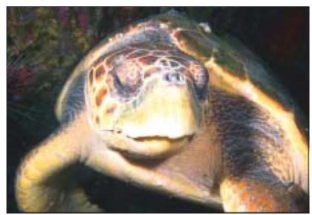

Figure 211. A loggerhead turtle (Photo: Frank and Joyce Burek).

Primary sources of potential degradation of water quality include coastal runoff, and river and effluent discharges from offshore activities such as oil/gas development and marine transportation (Deslarzes 1998). Oxygen-depleted (hypoxic) near-bottom waters have been found in a large area of the northern Gulf. Although relatively far from the Flower Garden Banks, there is concern that this area could grow and move, impacting the outer continental shelf. Often called the 'dead zone', this area has included up to 16,500 km2 on the continental shelf from the Mississippi delta to the Texas coast.

General coastal runoff and degraded nearshore water quality can potentially impact the banks through cross-shelf transport processes, which brings turbid, nutrient-rich water offshore. Deslarzes (in press) postulates the fluorescent bands observed in the carbonate skeletons of some corals come from the seasonal transport of

nearshore water onto the Sanctuary, which may be tainted by urban, agricultural, and biological contaminants.

Research using nitrogen isotopes suggests a pathway for direct primary nitrogen input from coastal river sources a considerable distance away. Benthic algae from Stetson Bank have a distinct nitrogen isotope signature similar to plants found in coastal estuarine systems, suggesting coastal influences on water quality are reaching only as far as Stetson Bank. Nitrogen isotopes from the Flower Garden Banks have signatures of oceanic origin (K. Dunton pers. comm.).

The impacts of fishing and associated activities are not well known. At this time, only traditional hook and line fishing is allowed in the Sanctuary. However, illegal fishing by both commercial longliners and recreational spearfishers has been reported. Targeted fishing efforts, which are allowed under current regulations, could have a significant detrimental impact on snapper and grouper populations.

Lost and discarded fishing gear has been observed at both the Sanctuary and Stetson Banks (Fig. 212). These can cause localized physical injury to coral reefs and can entangle and injure loggerhead sea turtles and other animals.

Figure 213. The High Island 389A gas production platform within the Sanctuary (Photo: Frank and Joyce Burek).

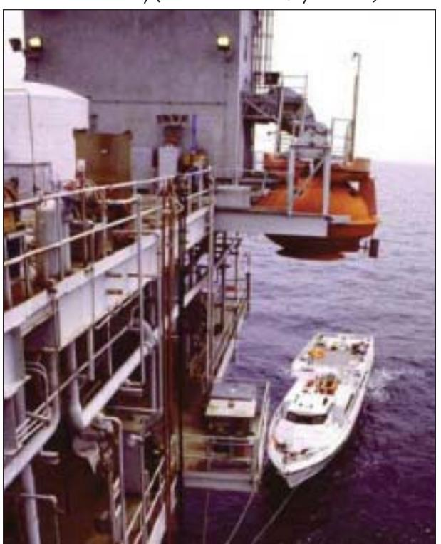

The two primary groups using reef resources are fishers and SCUBA divers. Recreational hook-and-line fishers frequently use the area. Commercial snapper and grouper long-line fishers fish along the edges of the banks and sometimes illegally within the borders, or lose gear

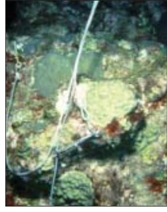

Figure 212. Hook-and-line fishing gear snagged on a coral (Photo: Frank and Joyce Burek).

that drifts into the Sanctuary. However, these activities are typically in the deeper portions of the bank structure.

The northern Gulf of Mexico is one of the most active areas for oil and gas exploration and development. By the end of 1995, approximately 5,000 production platforms had been installed (approximately 1,000 were subsequently removed), 32,000 wells had been drilled and 80,000 km of pipeline installed (Deslarzes 1998, A. Alvarado pers. comm.). The Gulf of Mexico accounts for more than 72% of the oil and 97% of the natural gas produced in offshore U.S. waters.

Within a four-mile radius of the Flower Garden Banks, there are currently 10 production platforms and around 161 km of pipeline, half of which are dedicated oil pipelines (Deslarzes 1998). There is one gas production platform (High Island 389A) within the East Sanctuary boundary (Fig. 213).

Potential impacts from offshore oil and gas exploration and development include accidental spills, contamination by drilling related effluents and discharge, anchoring of vessels involved in placing pipelines, drilling rigs and production platforms, seismic exploration, use of dispersants in oil spill mitigation, and platform removal. In spite of the intense industrial activity, long-term monitoring studies indicate no significant detrimental impact to the coral reefs of the Sanctuary from nearby oil and gas development (Gittings 1998). Fortunately, there have been no major oil spills or impacts from these activities.

**Climate Change and Bleaching Change and Bleaching –** The location and depth of these coral reefs buffer them some-

what from the short-term effects of global warming and climate change. Even though the effects of coral bleaching are relatively low to date, some bleaching is routinely observed, mostly when the water temperature approaches 30˚ C. As global ocean temperatures increase, this will no doubt increase.

#### **Current Conservation Management Current Conservation Management**

**Mapping Mapping –** Using high-resolution multi-beam sonar coupled with an extremely accurate vehicle motion sensor and very precise navigation, the USGS, the University of New Brunswick, and C & C Technologies, Inc. mapped the East and West Flower Gardens and Stetson Banks (Gardner *et al.* 1998).

#### **Monitoring, Assessments, and Research Monitoring, and Research –**

Since 1989, there has been a consistent, long-term monitoring program at the East and West Flower Garden Banks. NOAA and the Minerals Management Service (MMS) share the funding for this program. While not all, much of the monitoring has been related to concerns about the potential impact of oil and gas development.

This program includes analysis of coral cover, relative abundance, diversity, and coral growth rates. Coral cover, abundance and vitality (disease, bleaching) are measured along random transects and at permanently marked, repeatedly sampled photo-quadrat stations. Coral growth data are collected using photography and growth-ring measurements from coral cores. Continuous-recording instruments have been installed to measure temperature and light at the reef surface.

Results of the long-term monitoring efforts are published periodically (Gittings *et al.* 1992, Continental Shelf Associates 1996, Dokken *et al.* 1999, Dokken *et al.* 2001). Prior to the development of the long-term monitoring program, there had been other quantitative studies of the benthic community at FGBNMS since 1972 (Bright and Pequegnat 1974, Viada 1980, Continental Shelf Associates 1985).

Additional studies include periodic reef fish censuses and trophic studies (Pattengill *et al*. 1997), elasmobranch surveys (sharks and rays), sea turtle tagging and tracking, coral recruitment research, annual observations and experiments relating to mass coral spawning (Fig. 214), and

studies on historical water quality and paleoclimate (using coral cores). Enhanced water-quality instruments were installed in 2001, and are now collecting data on temperature, salinity, turbidity, dissolved oxygen, pH, and light intensity.

**MPAs–** The Flower Garden Banks were designated as a National Marine Sanctuary in January 1992, and are administered by NOAA. In cooperation with appropriate partners, the Sanctuary staff directs resource protection, education, research, and enforcement efforts. MMS provides additional protection through requirements imposed on industry operators in what is known as the 'Topographic Features Stipulation' for the Sanctuary.

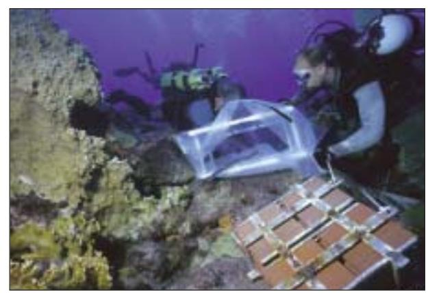

Figure 214. Researchers from the University of Texas lay tiles out on a reef during a study of coral spawning (Photo credit: Ed Enns).

#### **Government Policies, Laws, and and Legislation Legislation**

Regulations governing the Flower Garden Banks are authorized under the National Marine Sanctuaries Act, as amended, 16 U.S.C. 1431, and are contained within the Code of Federal Regulations 15 CFR 922, Subparts A, E, and L, and can be accessed on the web. They are designed to protect the sensitive coral reef and bank features of the Sanctuary. They prohibit all anchoring, mooring any vessel greater than 100 feet (30.5 m) in registered length on a Sanctuary mooring buoy, oil and gas exploration and development within a designated no activity zone (almost the entire sanctuary), injuring or taking coral and other marine organisms, using fishing gear other than traditional hook and line, discharging or depositing any substances or materials, altering the seabed, building or

abandoning any structures, and using explosives or electrical charges. To reduce damage, moring bouys have been installed (Fig. 215).

Effective June 1, 2001, the International Maritime Organization designated the Flower Garden Banks as the world's first international no-anchor zone.

#### Gaps in Current Monitoring and Conservation Capacity

The increased algal abundance highlights the need for more water quality monitoring. This needs to cover nutrient sampling and more detailed current

and water circulation information. It also should be expanded to include specific studies on algae population dynamics, the incidence and etiology of coral disease, and the area of the coral reef community in the deeper parts of the Sanctuary. The frequency of the monitoring program should also be increased to capture the aspects of community ecology that undergo short-term and seasonal

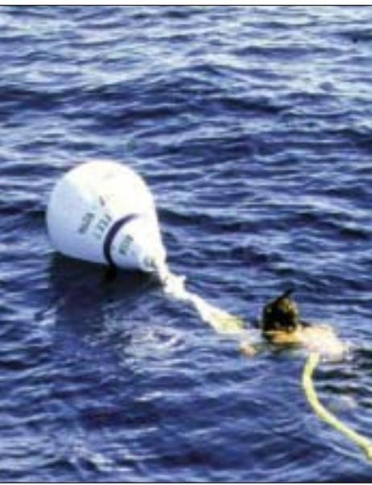

Figure 215. Mooring buoys have been installed at FGBNMS to prevent anchor damage to corals (Photo: Joyce and Frank Burek).

fluctuations (algal biomass, coral bleaching, herbivores, etc.).

The distance from shore hampers research and enforcement efforts. It also hampers monitoring human activity. While some data on visitor use can be acquired by a variety of remote methods such as overflights, satellite imagery, and remote radar systems, the Sanctuary needs on-site observation, management and enforcement. In May, 2001, the Sanctuary recently acquired its own vessel, an 82foot cutter, but also relies on charter vessels.

#### Conclusions and Recommendations

Recent data indicating the Flower Garden Banks may be an important spawning area for several species of grouper highlights the importance of considering a marine reserve to protect the biodiversity of this area.

## **STATUS OF CORAL REEFS OF NAVASSA STATUS OF CORAL REEFS OF NAVASSA STATUS OF CORAL REEFS OF NAVASSA Margaret W. Miller Miller W. Miller Margaret W. Miller Margaret W. Miller**

#### **Introduction Introduction**

Navassa Island is a small, uninhabited island located 55 km west of Haiti and 137 km northeast of Jamaica. A U.S. Protectorate, Navassa is currently administered by the USFWS as part of the Caribbean Islands National Wildlife Refuge. This covers an area from the shoreline to 19 km out, with entry by permit only.

All quantitative reef community structure information contained in this report results from The Ocean Conservancy's (formerly the Center for Marine Conservation) sponsored expedition in March 2000. This information, obtained from SCUBA activities at 11-23 m, was confined to the west and northwest coasts. Additional information was obtained from two other expeditions (The Ocean Conservancy, July-August 1998; NMFS September 1998), which involved ROV, stationary video, and longline sampling. Only recently have there been scientific observations at Navassa, so little is known regarding the disturbance history of the reefs.

Figure 216. Cliffs on the eastern coast of Navassa Island (Photo: Bob Halley and Don Hickey, USGS).

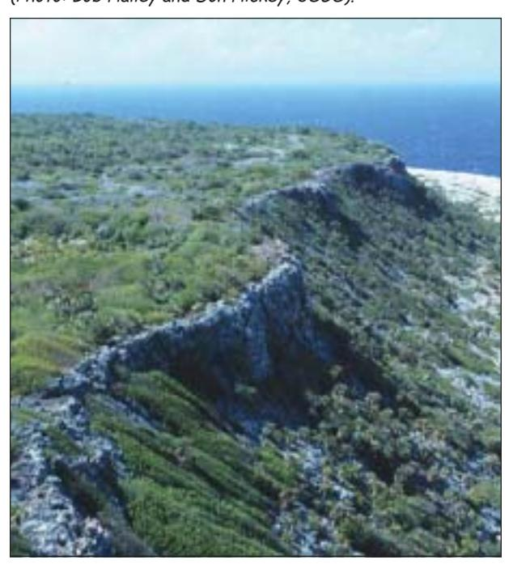

#### **Condition of Coral Reef Ecosystems Ecosystems**

There are currently no good estimates of the reef area at Navassa. Its topography does not conform to the normal zonation of Caribbean reefs (Goreau 1959, Goreau and Goreau 1973), which has protected back reef/sea grass communities near-shore, reef crest, and fore-reef habitats.

Instead, Navassa has cliffs surrounding the island, extending straight down to about 23 m of water (Fig. 216). Then there is a largely sand/rubble shelf at about 22-25 m, with patch-reef type habitats dispersed throughout. Because there is little shallow water, seagrass and mangrove habitats are essentially absent and most of the shallow reef surface is vertical rather than horizontal. The horizontal reef surfaces are largely confined to a small shelf area at the Northwest Point (10-14 m), indentations along or at the base of the wall, and on pinnacles. These were apparently formed as chunks of the wall broke off, since the pinnacles appear to be geologically based, not accreted biogenic structures.

Rugosity of the reefs at Navassa was quite high with mean rugosity indices ranging from 1.4 to 1.9. West Pinnacles had the highest rugosity index. Reefs with high rugosity have high value as fish habitat and a high potential for reef metabolism and nutrient uptake. While rugosity index data is not commonly collected in reef rapid assessments, Atkinson (1999) argues that it should be because it allows inferences regarding the nutrient uptake and hence, reef metabolism. Szmant (1997) suggested that topographic complexity is a vital determinant of a reef's capacity to metabolize nutrient input without undergoing a 'phase shift' to macroalgal dominance. Not surprisingly, at Navassa the site with highest coral cover also had highest rugosity index.

Quantitative reef assessments (fish and benthic communities) were done at four sites (11-23 m) during the March 2000 expedition. There is no established or ongoing reef monitoring or research program at Navassa.

**NAVASSA**

#### Coral and Benthos -

Average live scleractinian coral cover at the four sampled sites ranged from 20-26%. Other major cover were sponges (7-27%) and algae (10-23%), primarily brown algae and fleshy brown algae. There were no large differences in community composition between sites. However, the highest coral and sponge cover were measured at West Pinnacles, while the highest brown algal abundance was at Northwest Point, the site with the greatest expanse of horizontal reef area.

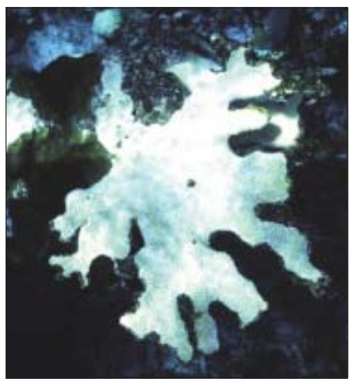

Figure 217. Encrusting elkhorn coral (Photo: Bob Halley and Don Hickey, USGS).

Abundance of the long-spined sea urchin averaged over the 14 transects where they were counted was 2.9 (0.84 SE) urchins/30 m2. Elkhorn coral was observed at 5 of the 7 dive sites. At several sites, most notably the Northwest Point, a preponderance of the colonies did not have the characteristic arborescent branching form, but instead, were encrusting (Fig. 217). Several encrusting colonies were small and appeared to be sexual recruits (rare for this fragmenting species), while others were fairly large (e.g., 60-100 cm diameter) and in some cases were overgrowing other corals (e.g., symmetrical brain coral).

Elkhorn coral appeared to be vigorously growing and healthy with no white-band disease and almost no observeable predation scars. One small encrusting colony was observed growing at 21 m which is extremely deep for this species. It normally ranges 1-10 m. Staghorn coral was observed, but at much lower abundance than the elkhorn coral. The largest thicket, about 2 m² north of Lulu Bay, had a high density of three-spot damselfish (*Stegastes planifrons*) which bite at the coral to create algal lawns.

Other qualitative observations of interest around this island include coral species that were unusually abundant at Navassa, including smooth flower coral (*Eusmilia fastigiata*), maze coral (*Meandrina meandrites*), and rough star coral (*Isophyllastrea rigida*).

A noticeable occurrence of partially dead colonies, particularly at the Northwest Point site (13-15 m), could have resulted from past bleaching or disease events, but the cause could not be ascertained. Observations in July-August 1998, during a major global beaching event, reported no coral bleaching at Navassa (Littler *et al.* 1999).

Overall, the reef is healthy, with little active coral disease. The only obvious active disease which re-

sembled white plague and was observed on 3 colonies of *Agaricia* spp. at the base of the wall north of Lulu Bay (approximately 21 m). Many of the *Montastraea* spp. colonies, particularly at the Northwest Point, appear to have suffered partial mortality at some point (i.e., the living tissue is fragmented with intervening organisms in some cases overgrowing it). The source of this mortality was not identifiable, but it could be a result of the 1998 bleaching event. However, researchers on the July-August 1998 cruise reported observing no bleaching (Littler *et al.* 1999).

Aside from the urchin data given before, no quantitative population data is available on large mobile invertebrates. During the March 2000 cruise, there was extensive sampling of the invertebrates to determine diversity, particularly in the echinoderm, crustacean, and molluscan groups. Collections are under analysis at the Los Angeles

Figure 218. Taxonomic (familial) composition of shallow reef fish assemblage at Navassa Island.

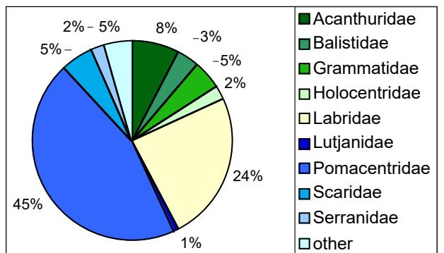

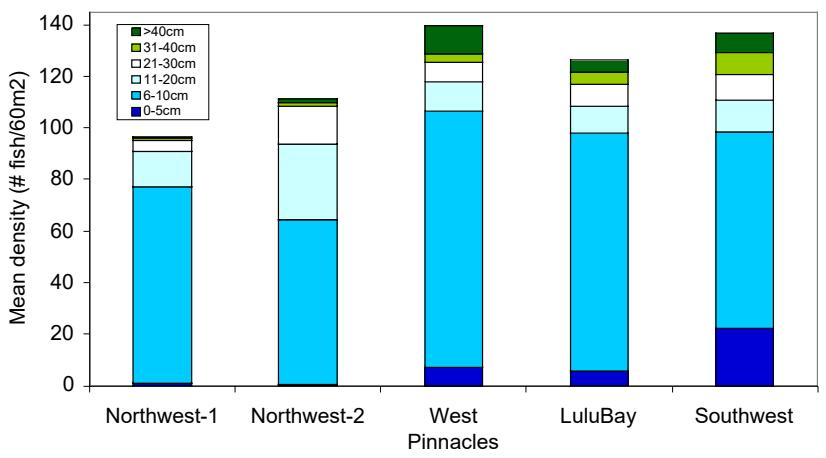

Figure 219. Fish density and size structure quantified via visual transects.

County and University of Michigan museums. Anecdotal observations of large animals from dives during the March 2000 expedition included 4 lobster, 1 large spotted eagle ray, 5 stingrays, 2 octopi, 3 small hawksbill turtles, and 1 large reef crab (*Mithrax* sp., about 25 cm carapace length).

**Fish** – Quantitative visual transect sampling of shallow reef fish communities counted between 36 and 41 species at each of five sites (Fig. 218). Average (standard error) total fish density for these sites ranged from 97 (9.4) to 140 (16.5) fishes/60 m2 (Figs. 4-5). Average snapper plus grouper density was 2.5 fishes/60 m2. Average herbivore density (surgoenfishes plus parrotfishes) was 15.9 fishes/60 m2 (Fig. 219).

Perhaps more importantly, individual fish sizes were relatively large – 92% of snapper and 23% of parrotfishes were longer than 40 cm. One extremely large grouper was observed (likely a jewfish over 1 m), but it was not in the quantitative transects. Grunts and some wrasses (slippery dicks and hogfish) were absent, perhaps due to the lack of appropriate seagrass nursery habitat.

Five longline sampling stations for pelagic fishes were set around Navassa over a 24-hr period in September 1998 (Grace 1998, 100 hook-hours per station, 120-150 m depth). Total catch included a bull shark (300 cm), seven scalloped hammerhead sharks (170-275 cm), two smooth dogfish (Mustelus canis), a great barracuda (Sphyranca barracuda, 178 cm), a silk snapper (Lujanus vivanu, 72 cm), and a misty grouper (Epinephelus mystacinus, 78 cm). Hence, pelagic predators are also large and fairly abundant.

Water Quality – Since the island is uninhabited and far from any modern human development, the water quality at Navassa appears to be quite good (zero land development, and low turbidity). The only quantitative water quality data was obtained during a 24 hour visit by the NMFS Coastal Shark Assessment cruise in September 1998 (Grace 1998), indicating at 15-30 m, temperature of 29.5° C, salinity of 36.1 ppt, dissolved oxygen 4.8 mg/l, turbidity 0.05%

transmittance, and chlorophyll a concentrations of 0.015 mg/m3.

Phosphate mining operations during the latter part of the 19th century may have created some phosphate enrichment of the surrounding reef waters, but no nutrient data is available.

A freshwater seep in a cave along the west wall (approximately 11m) was observed during the March 2000 expedition. This water was warmer than the ambient ocean water. Nutrient input from this seepage is under analysis.

## Environmental Pressures on Coral Reefs

Given the lack of even recent historical observations of the reefs, the influence of natural threats (climate/bleaching, storms, and disease), is impossible to assess. Fishing is, and likely will remain the sole human threat to Navassa reefs (Fig. 220).

Figure 220. Dense population of reef fish on Navassa Island. (Photo: Bob Halley and Don Hickey).

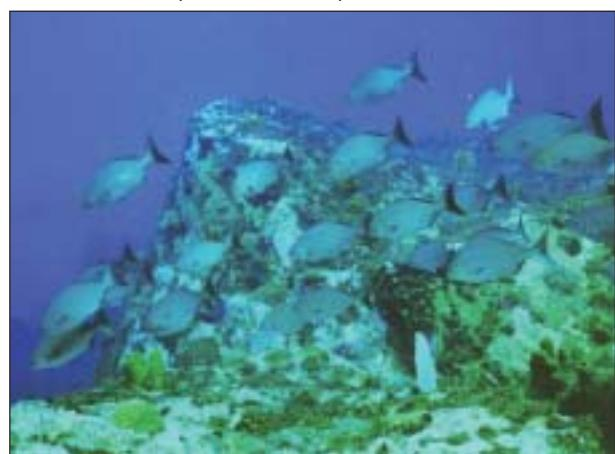

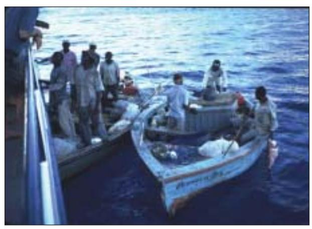

Figure 221. Haitian fishermen (Photo credit: Margaret Miller).

The only form of fishing exploitation on Navassa reefs are the Haitians (Fig. 221). These are subsistence fishers using traps in the deeper waters offshore and hook and line fishing over the reef. Again, no quantitative data is available on the level of effort or harvest, either now or in the past. One to four boats per day with 3-5 men per boat were present at Navassa during the March 2000 cruise. They appeared to be non-selective regarding species or size.

Casual observations suggest that increases in the technological level of these subsistence fishers (e.g., boat motors, ice chests) may have increased rapidly since the 1998 Ocean Conservancy cruise. Given the population pressures and poor fish resources in Haiti, fishing pressure may increase.

#### **Current Conservation Management Management**

The jurisdictional management of Navassa Island passed from the U.S. Coast Guard to the DoI in 1996, and was transferred to the USFWS as part of the Caribbean Islands National Wildlife Refuge in April 1999. A 12-mile fringe of marine habitat around Navassa (estimated at 340,000 acres) is under USFWS management. Navassa is the only component of the Caribbean Islands Refuge where USFWS jurisdiction extends into the ocean.

The USFWS is developing a Comprehensive Conservation Plan for the entire Caribbean Islands Refuge (eight separate units) beginning in 2002.

#### **Gaps in Current Monitoring and and Conservation Capacity Conservation Capacity**

There is some ambiguity of refuge management policy and its execution. For example, refuge

regulations allow subsistence fishing and as a result, persistent fishing activities are ongoing by small boats from Haiti. Intermittently, the U.S. Coast Guard patrols, and sometimes exclude the fishermen, even though the USFWS policy allows it. The development of a management strategy to keep subsistence fishing impacts attheir current, apparently minimal level is an important but difficult goal.

The other persistent gap which hinders the developing and implementing an effective management plan is the total lack of monitoring of either the reefs or the subsistence fishery. The Ocean Conservancy has made a large contribution toward an assessment of reef status, but no data is available on the subsistence fishery, nor are there plans for collection in the near future. Given the challenge management of this fishery presents, monitoring is a vital tool, but currently unavailable for the development and adaptive evaluation of a management strategy.

#### **Conclusions and Recommendations Recommendations**

Because the condition of reef and fish communities at Navassa appears to be good, especially relative to neighboring Caribbean nations, it is desirable to keep human impacts at their current levels, perhaps through licensing current users. The presence of a relatively intact Caribbean reef provides a unique opportunity for research on Caribbean reefs and could aid in 1) functional understanding these reefs and 2) development of effective management and restoration policies for other areas of the Caribbean.

However, given the strong push-and-pull factors in the fishery industry and the difficulty of enforcement in a remote place, the goal of maintaining the status quo will not be easy. No matter what fishery management strategies are adopted, it is plausible or perhaps even likely that fishing effort and reef impacts may escalate at Navassa. This could occur very rapidly. Quickly implementing a rigorous reef and fishery monitoring program could give important information on what the threshold levels of subsistence fishery are and how they impact the rest of the Caribbean reefs.

**NAVASSA**

## **STATUS OF CORAL REEFS IN THE HAWAIIAN ARCHIPELAGO STATUS ARCHIPELAGO STATUS OF CORAL REEFS IN THE HAWAIIAN ARCHIPELAGO David Gulko, James Maragos, Alan David Gulko, James Maragos, Alan David Alan David Gulko, James Maragos, Alan Gulko, James Alan Friedlander, Cynthia Hunter, and Russell Brainard Cynthia Hunter, Brainard Friedlander, Cynthia Brainard Friedlander, Cynthia Hunter, and Russell Brainard Friedlander, Hunter, and Russell Brainard**

The Hawaiian Archipelago stretches for over 2,400 km from 19o -28o N to 155o -178o E (Fig. 222).

Given the prevailing ocean currents and its distance from land masses, Hawai'i is one of the most isolated yet populated areas on earth (Juvik and Juvik 1998). This isolation has resulted in buffering many of the region-wide and global impacts seen in other areas while allowing a wide range of urban-related impacts not seen on most Pacific island coral reefs. Geographic isolation is also thought to have led to the high endemism seen across most marine phyla in Hawaiian waters.

found in the Hawaiian Archipelago (Maragos *et al.*  in prep.). Studies in the 1980s (Grigg 1983, Grigg and Dollar 1980) suggested that coral cover varies greatly throughout the entire archipelago. Many reefs of the MHI lie close to the majority of

ecoregion (Clark and Gulko 1999). There are approximately 60 named species of stony corals

the 1.2 million inhabitants, often less than 2 km from major coastal urbanization and development. The reefs function to protect and stabilize shorelines from seasonal storm waves; are responsible for the majority of white sandy beaches important

The Archipelago consists of eight large islands and 124 small islands, reefs, and shoals. It can be divided into two distinct regions: the Northwestern Hawaiian Islands (NWHI), primarily uninhabited atolls147, islands, and banks accounting for the majority of U.S. reefs, and the Main Hawaiian Islands (MHI) largely made up of populated, high, volcanic islands with non-structural reef communities, fringing reefs, and two barrier reefs. These two regions are so distinct in terms of impacts and resources (see Table 20 on next page) that the MHI and NWHI are treated separately throughout much of this document.

Hawaiian coral reefs are rich in natural beauty and biodiversity. The marine life also is so distinct from the rest of the Indo-Pacific Ocean that scientists treat these islands as a separate

Figure 222. Diagram of the Hawaiian Archipelago. The full spectrum of reef development is exemplified as geologic age increases northward through the island chain (Modified after Gulko 1998).

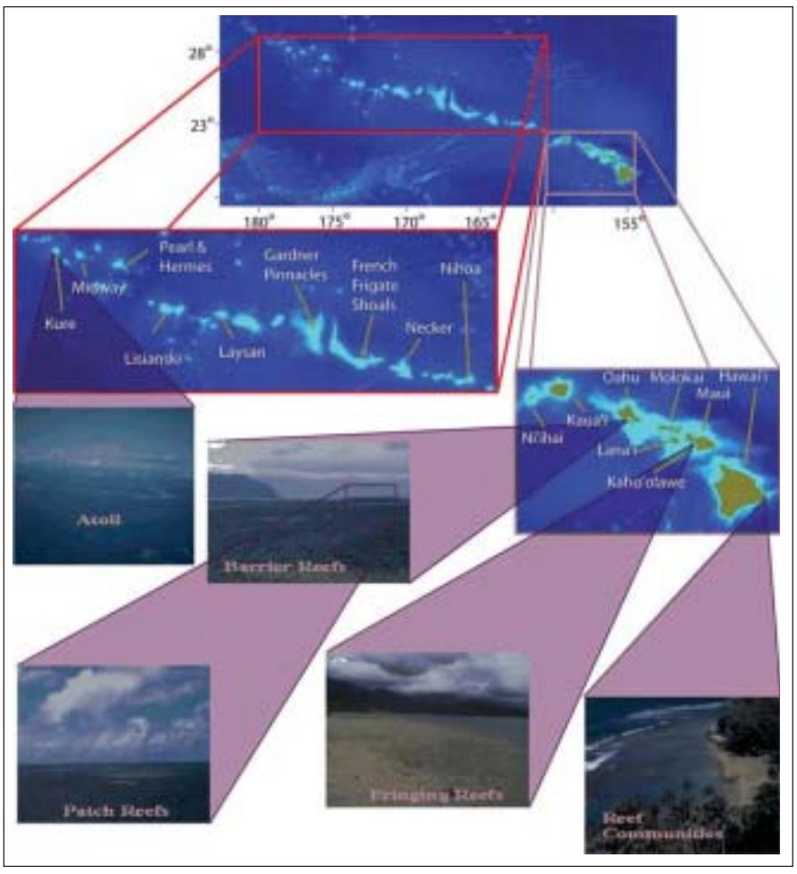

 147 The one major exception to this is Midway Atoll, which has a small resident population in addition to an active ecotourism operation including commercial airline flights, catch and release fishing, and charter boat excursions. Small permanent scientific field camps are also established on Laysan and French Frigate Shoals.

**HAWAI'I HAWAI'I HAWAI'I HAWAI'I HAWAI'I**

to the tourism industry; provide food products for **Main Hawaiian Islands (MHI) (MHI)** recreational, subsistence, and commercial fishing **Introduction** for residents and visitors; create Hawaii's famous

Table 20. Summary of data on islands and reefs of the Hawaiian Archipelago (Sources: Clark and Gulko 1999, Maragos and Holthous 1999).

surfing spots; and are critically important to the The eight main islands that comprise the MHI (Fig. State's \$800 million per year marine tourism 223) range in age from 7 million years (Kaua'i) to industry (Clark and Gulko 1999). less than a day old (portions of the eastern side of

the island of Hawai'i). A new volcanic island (Lo'ihi) is presently forming about 975 m below the sea surface off the southeast coast of the island of Hawai'i. This range of age along the chain of islands provides for the majority of recognized reef types to be present (Fig 224).

The MHI are largely comprised of populated, high volcanic islands with non-structural reef communities, fringing reefs, and two barrier reefs. Total reef area was estimated at 2,536 km2 (Hunter 1995). Detailed mapping of underwater benthic habitats is underway and expected to be done in 2002.

Culturally, the Polynesians who first settled the MHI had strong ties to coral reefs. According to the Hawaiian Hymn of Creation the *Kumulipo,* or coral polyp, was the first creature to emerge during creation. The presentation of corals as offerings during religious ceremonies also suggests the importance of these animals and the reefs they produce was not lost on the ancient Hawaiians. Coral reef resources provided food, medicines, building materials, and formed a portion of cultural and social customs important in ancient Hawai'i.

Human impacts on Hawaiian coral reefs may have started the the construction of fish ponds atop reef flats throughout the MHI. Wide-scale degradation of

**HAWAI'I HAWAI'I HAWAI'IHAWAI'I**

148 This includes NWHI areas such as French Frigate Shoals, Midway Atoll, and Kure.

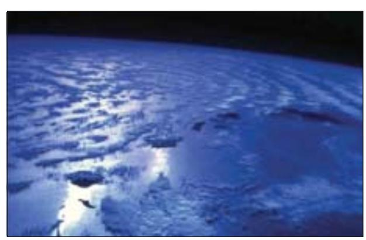

Figure 223. View of Main Hawaiian Islands from space (Photo: NASA).

reefs began some 100 to 200 years ago with the expansion of Western influence on the islands. Livestock grazing and agriculture were the primary land uses on the islands of Oʻahu, Maui, Molokaʻi, and Lanaʻi, contributing to erosion and sedimention on fringing reefs. Dredging and filling of nearshore reefs for residential, commercial, and military expansion increased in the last century148, resulting in further loss of reef habitat. Stream channelization and increased paving of land reduced sediment erosion but increased runoff. Despite these changes in coastal land use, the consensus of many ecologists is that nearshore reefs off the MHI, with a few exceptions, remain in relatively good condition.

#### Condition of Reefs

Algae and Higher Marine Plants – Abbott (1995) estimated over 400 species of marine algae are found throughout the Hawaiian Islands. Recent investigations suggest the majority of these species are red algae (Class Rhodophyta). This number

may be greatly underestimated (C. Smith pers. comm.). Endemism rates for most classes of Hawaiian algae are high. One endemic species of seagrass (*Halophila hawaiiensis*) is associated with shallow reef flats on Moloka'i (Fig. 225).

**Coral** – Grigg (1993) examined coral species distribution throughout the MHI and found the islands of O'ahu and Hawai'i had the highest coral biodiversity. Hawaiian endemism is thought to be over 25% (Maragos 1995, Maragos *et al.* in prep.). The apparently limited distribution of some endemic coral species has raised concern for their potential extinction.

Recent analyses of data by the Hawai'i Coral Reef Assessment and Monitoring Program (CRAMP) suggests live coral cover averages 18%149 for all

sites surveyed. This estimate may be conservative, given the limited number of sites analyzed so far, and that the weight of information was taken in shallow water (2-3 m) relative to data from greater than 10 m where coral cover is often higher. Many reefs in Hawai'i have live coral cover below 20 m.

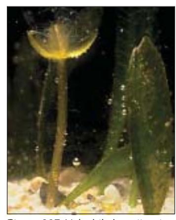

reefs in Hawai'i have Figure 225. Halophila hawaiiensis is one of many Hawaiian endemic species (Photo: University of Hawaii Botany Department).

Coral bleaching events that devastated reefs in many area of the

Figure 224. Timeline tracing the origins of the Hawaiian Islands and the Emperor Seamounts showing the formation and replacement of reef types over time (Modified after Gulko 1998).

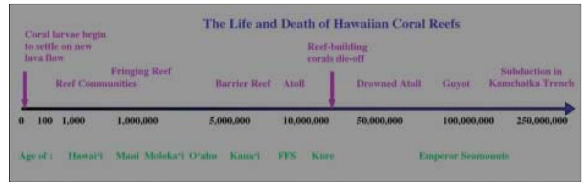

&lt;sup>149 With a range of 4-50%.

150 Resulting from persistently high sea surface temperatures associated with increased frequency of El Niño warming events.

Pacific during the last decade150 seemed to have missed the Hawaiian reefs. However, the corals are suspectible to locally elevated water temperatures and/or increased ultraviolet light penetration, often at the level of individual colonies (Jokiel and Coles 1990).

At least two type of coral disease commonly occur on Hawaiian reefs – general necroses and abnormal growth or 'tumors' (Hunter 1999). Necrotic coral tissues, whether caused by abrasion, predation, or pathogens, are rapidly invaded by fine filamentous algae and cyanobacteria (Fig. 226), followed by three potential outcomes: 1) recovery and overgrowth by adjacent healthy coral tissue, 2) successional change from turf to crustose coralline algae on which new coral recruits become established, or 3) persistence of the turf community resulting in net loss of coral cover.

Coral diseases and tumors have been documented in most major reef-building coral species in the MHI: *Porites lobata*, *P. compressa*, *Montipora capitata, M. patula,* and *Pocillopora meandrina*  (Peters *et al.* 1986, Hunter 1999).

Similar to other regions, incidence of coral disease on Hawaiian reefs does not appear to be consistently associated with known anthropogenic stressors (pollutants, proximity to urban centers; Glynn *et al.* 1984, Peters *et al.* 1986, Coles 1994, Hunter 1999). Preliminary pathological examination of two samples of diseased *Porites* coral tissues from Hanauma Bay, O'ahu, identified bacterial associations that were similar to those associated with white-band bisease in Florida

Figure 226. Lobe coral (Porites lobata) showing tissue necroses, abnormal skeletal growth, and filamentous algae overgrowing live coral tissue (Photo: Cindy Hunter).

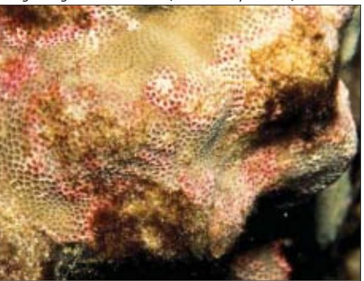

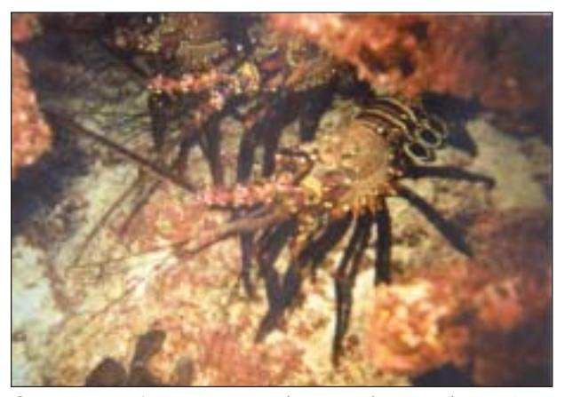

Figure 227. Lobsters are over-harvested in nearshore MHI waters (Photo: Donna Turgeon).

corals (Hunter 1999). No major die-off of corals has yet been documented due to disease outbreaks in Hawai'i.

**Invertebrates Invertebrates –** Marine invertebrate biodiversity is relatively high in Hawai'i. There are estimated to be over 100 sponge species (R. deFelice pers. comm*.*), 1071 species of marine molluscs (Kay 1995), 884 species of crustaceans (Eldredge 1995, Fig. 227), and 278 species of echinoderms (Eldredge and Miller 1995). Except for crustaceans, rates of endemism within these groups are among the highest in the Pacific.

Major outbreaks of the crown-of-thorns starfish (*Acanthaster planci*), which have occurred elsewhere in the Pacific, have been few in Hawai'i. The last major occurrence was observed off Moloka'i in the late 1960s and early 1970s (Branham *et al*. 1971, Gulko 1998). During this event, this seastar preyed on *Montipora capitata*, a species much less abundant than the dominant *Porites* species (J. Maragos pers. comm.). Lack of *Acropora* throughout the MHI, the dominance of *Porites* corals on most reefs151, and the islands' overall isolation may help account for the lack of outbreaks.

**Fish–** There are 557 species of reef and shore fishes in Hawai'i (Randall 1995). The fish fauna in Hawai'i is depauperate compared to the Indo-West Pacific from which it is derived and is characterized by a large number of endemic species (Hourigan and Reese 1987, Fig. 228). Hawai'i possesses the highest percentage of endemic warm-water marine fish fauna found anywhere in the world (24.3%). Many of these species are

**HAWAI'I HAWAI'I HAWAI'IHAWAI'I**

151 Corals in the family Acroporidae are among the favorite food items of crown-of-thorn starfish, while corals in the family Poritidae are not preferred, perhaps due to difficulty in digestion and symbiont defenses (Gulko 1998).

among the most common and abundant components of the fish assemblage (Randall 1996). Owing to its geographic and oceanographic isolation, a number of common fish families found throughout the Indo-Pacific region are poorly represented in Hawai'i, particularly those with a short larval duration.

A steady decline in abundance of nearshore living resources in the MHI has been reported by fishermen and researchers over the past century (Shomura 1987). Overfishing is the major cause of the long-term statewide decline in fish abundance (Harman and Kitakaru 1988). Fishing pressure on nearshore resources in heavily populated areas appears to exceed the capacity of these resources to renew themselves (Smith 1993) and the abundance of reef fishes in areas not protected from fishing is substantially lower than in areas where fishing is prohibited (Grigg 1994).

Under-reporting by commercial fishers and the existence of a large number of recreational and subsistence fishers without licensing or reporting requirements, have resulted in uncertainty in catch statistics for the state (Lowe 1995). In an island state such as Hawai'i, where as much as 35% of the resident population fishes (Hoffman and Yamauchi 1972, USFWS 1988), the recreational/subsistence catch may have a large impact on the nearshore marine resources.

Creel surveys in the MHI have shown the recreational catch to be equivalent to or greater than that reported in commercial fisheries landing data (Omnitrack 1991, Hamm and Lum 1992, Everson 1994). The few studies done in Hawai'i to date have shown that recreational fishers take a higher diversity of species with a wider variety of gear types than do commercial fishers (Omnitrack 1991, Hamm and Lum 1992, Everson 1994). The recreational catch has been shown to be equal to or greater than the commercial catch for a number of important target species (Friedlander 1996). Hawai'i is one of the few coastal states that does not require a saltwater recreational fishing license (Altman 1992).

A survey of the small-boat fisheries on O'ahu, with emphasis on the recreational and subsistence fisheries, was conducted from March 1990 to May 1991 (Hamm and Lum 1992). About 41% of the total catch was identified as destined to be sold.

This figure is believed to be conservative since State law prohibits catch sales without a valid commercial fishing license. Only 22% of the fishers interviewed identified their catch as destined to be sold. Traps (65%) and nets (53%) had the highest proportion of sales. Creel surveys conducted at Kane'ohe, Hanalei, and Hilo Bays have shown that there were significant differences between total and reported landings (Lowe 1995). Several gear types (spear, crab net, gill and surround net, trolling, and pole-and-line fishing) which are primarily recreation/subsistence in nature contribute much more to the total catch than is reported in commercial landings data.

In a creel survey conducted in Kane'ohe Bay few fishers reported selling their catch (Everson 1994). Gill netters and surround netters had the highest percentage of catch sold (12%) while less than one percent of all other fishers reported selling their catch.

A comparison of fisheries landings from Hanalei Bay, Kaua'i was made to State of Hawai'i Department of Land and Natural Resources' (DLNR) Division Aquatic Resources (DAR) commercial landings data and data obtained during a 1 1/2 year creel survey of the bay (Friedlander and Parrish 1997). On the whole, catches estimated from the creel survey were consistently higher than those reported to DAR. The differences ranged from a factor of less than two to more than 100 times the reported catch.

Subsistence fishing is culturally and economically important to many rural communities throughout

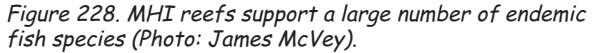

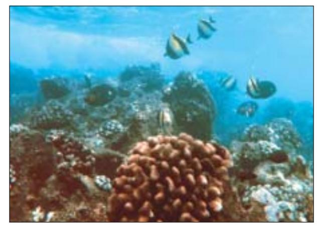

**HAWAI'I HAWAI'I HAWAI'I HAWAI'I HAWAI'I**

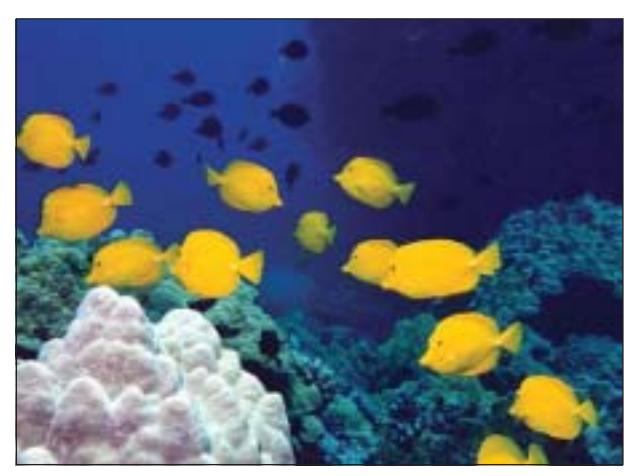

Figure 229. Yellow tangs (Zebrasoma flavescens) represent over 75% of the reported aquarium fish take throughout the State (Photo: J. E. Smith).

the MHI. The Hawaiians of old depended on fishing for survival and the consistent need for food motivated them to acquire a sophisticated understanding of the factors that caused limitations and fluctuations in their marine resources. The traditional harvest system in Hawai'i (pre-1800) emphasized social and cultural controls on fishing with a code of conduct that was strictly enforced. Harvest management was not based on a specific amount of fish but on identifying the specific times and places that fishing could occur to not disrupt basic processes and habitats of important food resources (Friedlander *et al*. in prep.). Based on their familiarity with the marine ecosystem, Hawaiian communities were able to devise systems that fostered sustainable use of the resources. In 1994, the Hawai'i State Legislature created a process for designating community-based subsistence fishing areas and there are currently efforts underway on Moloka'i, Kaua'i, and Hawai'i to create such regions.

Poaching is a recurring problem throughout the MHI. There are a large number of un-licensed commercial fishers. Take of under-sized fish and invertebrates (limpets, lobster, and octopus), and out-of-season harvests have contributed to overfishing pressure. From a creel survey conducted in Hanalei Bay, Kaua'i, less than 30% of the omilu (a highly prized jack species) were legal for harvest and only 3% had reached the size of sexual maturity (Friedander and Parrish 1997).

The proliferation of long and inexpensive gill nets has allowed new fishers to set nets deeper and in locations not previously harvested (Clark and

Gulko 1999). Conservation officials seized nearly five miles of net out of nearshore waters in a sixmonth period in 1998. The lack of marine-focused enforcement and minimal fines for those few cases that have been prosecuted contribute to a lack of incentive by the population to abide by fisheries management regulations.

Most marine ornamental fish and invertebrates originating from U.S. waters come from Hawai'i, which is known for its rare endemics of high value (Fig. 229). Based on collection reports, the annual harvest of aquarium fishes rose from 90,000 in 1973 to 422,823 in 1995, with the majority of the current industry centered around the island of Hawai'i. Commercial permits increased by 39% between 1995 and 1998 (Fig. 230) and recent studies have shown that aquarium collectors have had a significant negative impact on the dominant species taken in the fishery (Tissot *et al.* 2000). Currently there is a lack of regulation regarding size, number, and season for take of most invertebrates and fish sought for the trade.

Given the complex life histories and ecology (including sex change, haremic behavior, territories, and obligate associations), along with the high commercial value in the trade associated with many of these reef organisms, the impact of this activity has not been thoroughly assessed at this time (Gulko 1998).

In the past 15 years there have been numerous conflicts between marine ornamental collectors and subsistence fishers, commercial fishers, environmentalists, and the marine tourism industry. In response to the continued public outcry over

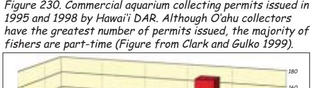

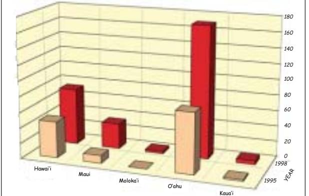

**HAWAI'I HAWAI'I HAWAI'IHAWAI'I**

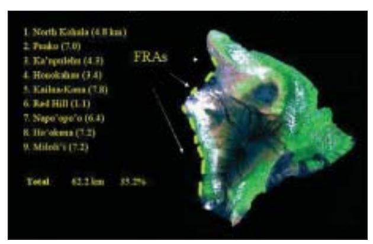

Figure 231. The newly designated West Hawai'i Fish Replenishment Areas, or FRAS (Source: Hawaii DAR).

aquarium collecting, the Hawai'i State legislature passed a bill in 1998 which focused on improving management of reef resources by establishing the West Hawai'i Regional Fishery Management Area. A major component of the bill was to improve management of the aquarium industry by declaring a minimum of 30% of the western Hawai'i island coastline as Fish Replenishment Areas (FRAs) and protect areas where aquarium fish collecting is prohibited. The FRAs restrict fish feeding by the commercial tour industry and eventually nonselective forms of fishing. Currently, over 35% of the West Hawai'i coastline has been designated as FRAs (Fig. 231).

Commercial food harvest of invertebrates includes primarily limpets, octopus, lobster, and crabs. A wide variety of invertebrates are harvested for the marine ornamental trade. The harvest of sessile benthic invertebrates, especially the featherduster worm, *(Sabellastarte sanctijosephi*) for the aquarium trade often causes destruction of reef habitat during the collection process.

Figure 233. Endangered Hawaiian monk seals can still be seen on beaches of the MHI (Photo: James McVey).

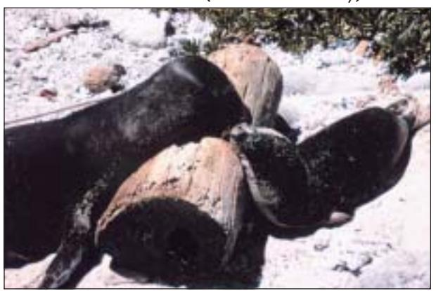

In the final analysis, there is a realization that the harvest of fisheries resources in the MHI is under reported, making effective management of these resources difficult at this time.

**Marine Reptiles and Mammals –** There have been six species of sea turtles and 24 species of marine mammals reported on MHI reefs.

Sea turtles are fully protected under both Federal and State laws. The threatened green sea turtle (*Chelonia mydas*) makes use of the shallow waters of the MHI for herbivorous feeding and resting habitat, while the endangered Hawaiian hawksbill sea turtle (*Eretmochelys imbricata*) is thought to feed, rest, mate, and nest primarily in the MHI.

Figure 232. Tumors are much more common on turtles near the MHI (Photo: U. Keuper-Bennett and P. Bennett).

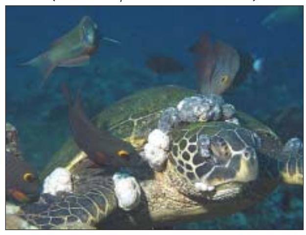

Prior to 1985, fibropapillomatosis (or turtle tumors) were rarely reported in Hawaiian green sea turtles in the MHI (Fig. 232). During the last ten years however, the numbers reported have increased dramatically. The condition is commonly found on turtles on Maui, Kaua'i, and O'ahu. Up to 60% of the turtles in Kane'ohe Bay are infected (Balazs *et al.* 1998).

The yellow-bellied sea snake (*Pelamis platurus*) is sometimes seen at night offshore by fishers but rarely occurs in nearshore reef environments.

The endangered Hawaiian monk seal (*Monachus schaunslandi*) occurs primarily in the Northwestern Hawaiian Islands, but occasionally is found in near-shore waters and sometimes hauls out on beaches of the MHI (Fig. 233).

**Water Quality Water Quality –** In the MHI, high nutrient

**HAWAI'I HAWAI'I HAWAI'I HAWAI'I HAWAI'I**

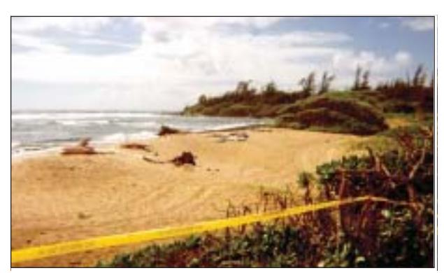

Figure 234. Nukoli Beach in Kaua'i was closed to the public in 1998 when tarballs and dead oiled birds washed ashore following a spill off Barber's Point, O'ahu (Photo: Curtis Carlson).

levels are known to encourage algal growth that can cause overgrowth of living corals (Smith *et al.*  1981, Maragos *et al.* 1985). Algal blooms have been a recurring problem on reef flats off the southern and western coasts of Maui for nearly ten years. *Hypnea, Sargassum, Dictyota,* and *Cladophora*152 have all dominated the reef flat areas

at various times, presumably due Figure 235. The majority of the Hawaiian to nutrients leaching from urban population lives within 2 km of living coral reefs (Photo: Hawai'i DAR). cesspools, injection wells, and other non-point sources (Green 1997, Grigg 1997). Questions remain as to the influence of nutrients on the success of alien seaweed displacement of native corals (Woo, 2000). Nutrient enrichment (through either point or nonpoint source discharge) can also cause phytoplankton blooms

limiting the sunlight necessary for most stony corals to survive. Additional concerns from runoff and seepage include bacteria and disease.

The Federal Clean Water Act requires a National Pollutant Discharge Elimination (NPDES) permit for any point source pollutant discharged into nearshore waters. Additionally, the Hawai'i Coastal Zone Management Program and the Hawai'i Department of Health are developing a Hawai'i Coastal Nonpoint Source Pollution Control Plan to deal with discharges not covered under NPDES permits.

agencies to follow when dealing with nutrient and pollutant discharges which take into account the specific impacts on corals and coral reef ecosystems; most of the existing guidelines are based on non-coral reef impacts.

**Oil Spills and Toxic Chemicals Oil Spills and Toxic Chemicals –** There is heavy reliance on imported oil in the islands, and therefore, oil and chemical spills are not uncommon. Most electricity production in the MHI is based on fossil fuels (Pfund 1992). Large urban populations, the military, and the tourist industry all use motor vehicles on all the major islands. More than 52 billion barrels per year of crude oil are brought to O'ahu by large tanker vessels and then shipped to neighbor islands by inter-island barges.

Ship traffic, proximity of reefs to harbor entrances, and increasing numbers of vessel groundings have resulted in more oil spills. Pfund (1992) stated the USCG recorded a 200% increase in the number of oil spills from 1980 to 1990. While 40% of reported spills in the MHI are small153, there have been a number of large oil spills during the past two years (Clark and Gulko 1999). In most cases

> these were either from ship groundings or release during oil offloading. In a recent case, a spill off O'ahu caused the most damage when it washed ashore on Kaua'i (Fig. 234).

In the past two years there have been a number of shore-based chemical spills from industrial or aquaculture sources (Clark and Gulko 1999). Sulfuric acid, PCBs, and refrigerants have

found their way onto nearshore reefs during the last year.

The projected large increase in cruise ship visits throughout the MHI154 has raised concerns over the constituents of the 'gray water' discharged by vessels in waters near Hawaiian reefs. Chemicals used to clean railings, decks, metal- and woodwork, drycleaning, and photoprocessing might find their way into nearshore waters during daily activities on these large vessels.

Harbors and urbanized, enclosed bays concentrate a wide variety of heavy metals, oils, PCBs, tributyltin (from boat paints), pesticides, and herbicides (Hunter *et al.* 1995, USFWS 1996, Green 1997). A majority of these areas in the MHI support coral reef organisms. High concentrations of

**HAWAI'I HAWAI'I HAWAI'IHAWAI'I**

There has been a lack of standards for government

152 At press time a major bloom of the seaweed *Cladophora* sp. was occurring along the West Maui coast.

| (sland(s)                                 | Population | Population Distribution | Population per km2 | 100P (S)         | Per Capita GDP (\$) | Number of Tourists Per Year |
|-------------------------------------------|------------|-------------------------|--------------------|------------------|---------------------|--------------------------------|
| Hawai's                                   | 138,400    | 27% 1960                | 13.                | \$2,400,000,000  | \$17,341            | 1,255,483                      |
| Maul, Kahoʻnlaws, Lana'i, and Moloka'i | 100,504    | 17% Kahului             | 33                 | \$2,800,000,000  | \$30,648            | 2,376,330                      |
| Cl'atas                                   | 871,800    | 43% Honolulu            | 564                | \$26,800,000,000 | \$30,741            | 5,002,530                      |
| Kasa'i and Nrihau                         | 56,665     | 14% Kopa'a              | 35                 | \$1,200,000,000  | \$21,177            | 992,790                        |
| NWH                                       | 164        | 99% Midway              | 11.                | Unknown          | Linknown            | 5,000                          |

Table 21. Basic demographic and economic data for the islands of the Hawaiian Archipelago (derived from Juvik and Juvik 1998).

dieldrin and chlordane were found in oyster tissues sampled near stream mouths in Kane'ohe Bay in 1991, five years after their use was banned in Hawai'i. Lead, copper, chromium, and zinc were elevated in a number of samples, particularly near the southern, more urbanized, watersheds of the bay (Hunter *et al.* 1995). There has been scant research on the fate or action of potential toxicants in Hawaiian reef biota.

Research conducted in Kane'ohe Bay by Peachey and Crosby (1995) showed a synergistic lethal effect of polycyclic aromatic hydrocarbons (PAHs) in seawater exposed to surface ultraviolet light. PAHs are produced as byproducts of municipal wastes and urban runoff, especially from oils used in automobiles and pavement. Ultraviolet light transforms the PAHs into toxic forms that kill crustaceans, polychaetes, and coral larvae.

Given the extensive urbanization of coastal areas in Hawai'i, the large number of motor vehicles used on these small islands, and the channelization of streams and storm drains into nearshore reef environments, the phototoxicity posed by the introduction of PAHs has the potential to affect biodiversity and fisheries stocks.

## Coastal Populations and Reef Economics

In 2000, an estimated 1.2 million people resided in the MHI (U.S. Bureau of the Census 2002). Since 1990, the size of MHI's population has increased by 9.3% (U.S. Census Bureau 2002, Table 21). Over seven million visitors visit Hawaii; 88% of them engage in some form of marine water activity (State of Hawai'i 2000).

Tourism is the largest industry, employer and revenue generator in the entire State. In 2000, visitor expenditures in Hawai'i totaled \$10.9 billion (Hawai'i Department of Business, Economic Development, and

Tourism 2000). The marine tourism industry is thought to bring over \$800 million dollars per year into the State and employs over 7,000 people in over 1,000 small busi-nesses (Clark and Gulko 1999).

Commercial fishing revenues (ex-vessel value) generate another \$68.5 million annually (NMFS 2001). Much of this (80-90%) is from pelagic, mostly longline fisheries, not coastal coral reef fisheries.

#### Environmental Pressures on Coral Reefs

**Human Stresses** – Nearshore coral reef environments in the MHI are subject to a range of human impacts, due in part to urbanization and the majority of the population living within a few kilometers of most major reefs (Gulko 1998, Fig 235). The impacts vary from island to island.

Alien Species – Some 19 species of macroalgae have been introduced to the island of O'ahu since 1950 with at least four species being highly successful (Fig. 236). Some of these non-native species appear to have spread throughout the main Hawaiian Islands, while others are found so far only on O'ahu. Recent studies have shown

Figure 236. A time series of the same coral habitat over the period of a year. The large, massive Porites compressa colonies were overgrown and killed by the invasive alga Kappaphycus alverezii. A. July 1998, B. February 1999, C. April 1999, D. June 1999 (Photo from Woo 2000).

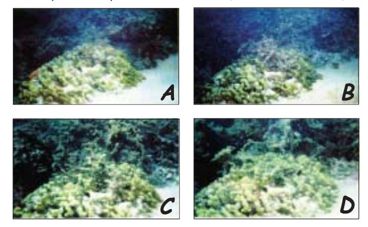

&lt;sup>153 Less than 4,000 liters (1000 gallons).

&lt;sup>154 See section on Ship Groundings.

overgrowth and killing of coral by the alien alga species *Kappaphycus* spp. in Kane'ohe Bay. These algae are thought to have caused a shift from a predominantly coral habitat to one characterized by a large, robust single species of seaweed in some areas of the bay (Woo 2000).

Such a habitat shift is thought to affect a range of processes from reef fish recruitment to trophic interactions and may have widespread influences on activities such as commercial fishing and the \$800 million/yr marine tourism industry. Certain alien algae, such as *Hypnea musiformis*, often displace native or endemic algae which may be primary food items for the threatened Hawaiian green sea turtle *(Chelonia mydas)*. Habitat shifts caused by these alien algal species may affect critical habitat necessary for feeding, resting, and

Figure 237. Now throughout the Hawaiian Archipelago, the blueline snapper is by far the most successful fish introduction (Photos: Richard Pyle).

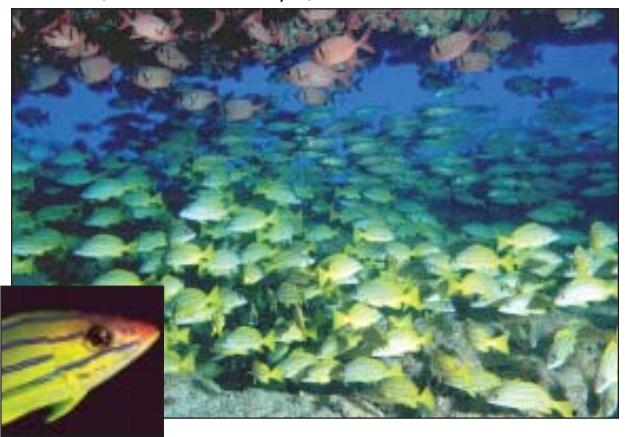

mating for the endangered Hawaiian hawksbill sea turtle (*Eretmochelys imbricata*) (Gulko in press).

Many invertebrate species have been introduced, either accidentally or purposely, into Hawaiian waters (Eldredge 1994). Most have not had a documented effect on coral reefs. Alien sponges have been observed growing over corals in Kane'ohe Bay, O'ahu, and concerns have been raised about the introduced snowflake coral (*Carijoa riisei*) competing with shade-adapted corals in some areas (L. Eldredge pers. comm.).

At least 13 species of introduced marine fishes have become established in Hawai'i (Eldredge 1994). Between 1951 and 1961, 11 demersal fish species – six groupers, four snappers, and the

emperor angelfish (*Pomocanthus maculosus*) were intentionally introduced into Hawai'i (Oda and Parrish 1981, Randall 1987). Of these species, the blueline snapper *(Lutjanus kasmira),* the blacktail snapper (*Lutjanus fulvus*), and the bluespotted grouper (*Cephalopholis argus*) have established viable breeding populations in the state.

The blueline snapper has been by far the most successful and threatening fish introduction to the Hawaiian coral reef ecosystem (Fig. 237). From some 3,200 individuals introduced around O'ahu, the population has expanded its range widely until it has now been reported over the full length of the Hawaiian archipelago (about 2,400 km). This species competes with valuable local species for food and shelter and its small size and yellow color bring low market prices.

The bluespotted grouper is a highly piscivorous species that has become well established, especially in coral rich areas on the island of Hawai'i. Several introduced tilapia species are also thought to reduce the abundance of the valuable native mullets through competition for food and other resources (Randall 1987, Eldredge 1994).

Concerns have been raised by both the USFWS and the Hawai'i DLNR regarding aquaculture of alien marine ornamentals (including both stony and soft corals), in part due to the high endemism of Hawaiian marine species.

Introductions of terrestrial organisms (and their associated symbionts and diseases) in Hawai'i have had devastating effects on the native biota contributing to Hawai'i being classified as the 'Endangered Species Capital' of the United States.

Destructive Fishing Practices – Recently, destructive fishing practices that involve using concentrated chlorine ('juicing') to stun or kill lobster or nocturnal food fish located deep in the recesses of coral reef holes and caverns have raised concerns about the impact of this rarely reported illegal activity. During the Spring and Summer of 2000 unconfirmed reports of 'juicing' were received from the islands of Maui, O'ahu, and Kaua'i. Unless apprehended in the act, this destructive practice is difficult to prove or document. However, since it destroys habitat for all, most fishers in Hawai'i find such action deplorable. Dynamite and cyanide fishing are not problems anywhere in the Hawaiian Archipelago.

**HAWAI'I HAWAI'I HAWAI'IHAWAI'I**

155 Oceanographic studies by the NMFS indicate that wind-driven ocean convergence zones shift southward during El Niño warming events such as occurred in 1992 and 1998 (Brainard *et al.* 2000), and caused the observed increases in marine debris in the MHI during these times.

The extensive use of long gill nets throughout most of the MHI is thought to have caused localized depletion of reef fish through its effectiveness and non-selectivity. Bycatch of endangered species (sea turtles, Hawaiian monk seals) and breakage of high-relief coral colonies caused by untended nets continues despite State laws requiring that nets be checked at least every two hours and removed after four hours.

Collection of sessile benthic invertebrates for the marine ornamental trade has raised concerns about destruction of coral reef habitat from the removal of habitat-forming organisms such as anthozoans, sponges, bryozoans, and seaweeds. Extraction of cryptic or infaunal organisms, especially the featherduster worm, often leads to destruction of habitat through the collection process.

Marine Aquaculture – The Hawai'i legislature recently passed a law that allows leasing of submerged lands for private enterprise. Two companies are currently seeking leases to conduct offshore aquaculture ventures. In both cases, proposed aquaculture facilities will be in close proximity to living coral reefs. Concerns raised by such activities relate primarily to eutrophication of coral reef habitat from excess feed and animal wastes diffusing out of the fish cages and into reef waters, the possibility of disease introduction to wild populations, introduction of alien species or symbionts, and aggregation of reef fish around these structures where they can be easily depleted.

Marine Debris **–** Marine debris (composed primarily of plastics, nets, lines, glass, rubber, metal, wood and cloth) is a common occurrence on reefs and shores throughout the MHI (Fig. 238). Sources of this material vary, from beachgoers and storm drains, to industrial facilities and waste disposal sites. In the last ten years there has been a noticeable increase in the amount of derelict fishing gear washing ashore in the MHI155. In 1998, community groups, the military, and DLNR pulled over 3,000 kg (7,000 pounds)156 of nets and debris out of Kane'ohe Bay and Wai'anae waters during three separate clean-up days (Clark and Gulko 1999).

Coastal Runoff and Sedimentation – Sedimentation caused by runoff continues to be a chronic problem throughout the MHI. Large sediment loads are created by active agricultural practices and forsaken agricultural lands upslope of near-

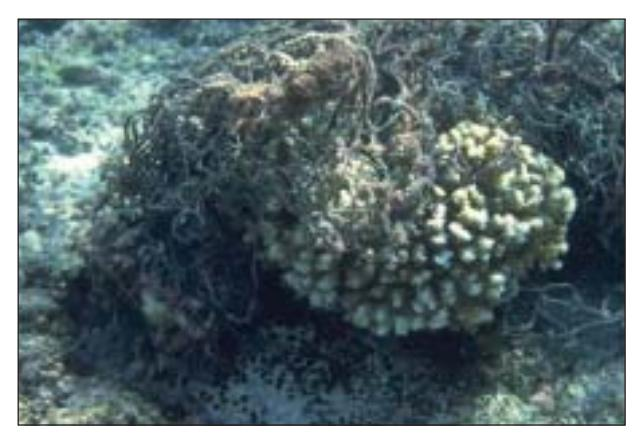

Figure 238. A fishing net entangled around living coral colonies (Photo: National Marine Fisheries Service).

shore reefs. Stream channelization and paving of coastal and upland areas throughout much of the MHI have contributed to sedimentation impacts through removal of the vegetation that normally filters much of the runoff.

Overall sediment runoff has been estimated at greater than 1,000,000 tons per year from agricultural, ranching, urban, and industrial activities (USFWS 1996 in Green 1997). With the decrease in 'slash and burn' agriculture (sugar and pineapple) and its replacement with alternatives such as coffee, macadamia, cocoa, and fruit trees, the amount of sedimentation is expected to decrease substantially in the near future.

Rates of movement of sediments off of reef flats around the MHI varies with location; in many areas, sediments are effectively removed by seasonal wave action. In areas such as Kane'ohe Bay, O'ahu; south Moloka'i, and Kaho'olawe Island157, decades or more may be required for

Figure 239. This U.S. Navy steel-reinforced concrete vessel has been hard aground off Shipwreck Beach, Lanai since the 1950s (Photo: Hans van Tillburg).

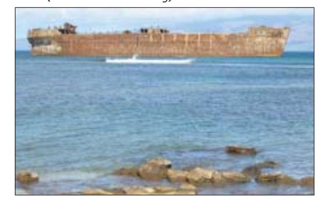

**HAWAI'I HAWAI'I HAWAI'I HAWAI'I HAWAI'I**

156 Over 360 kg (800 lbs of broken stony corals were removed from these nets afterwards). 157 In the past, grazing by large populations of feral goats on Kaho'olawe Island has resulted in extensive erosion, runoff, and sedimentation of adjacent reef areas. Currently all goats have been removed.

accumulated sediments to be winnowed from reef flats.

Ship Groundings – Ship groundings are a persistent problem (Fig. 239). Over 16,000 commercial and recreational vessels are registered in the State of Hawai'i; with the transient commercial and recreational vessels, over 18,500 ships ply the nearshore waters of the MHI annually. Given the close proximity of coral reefs to harbors, marinas, and channels, groundings occur frequently, primarily small recreational boats158. Such vessel groundings are often caused by broken moorings, inexperienced boaters, or faulty equipment. The situation with grounded recreational boats is compounded by a lack of coordination and timely notification between the agencies responsible for notification and the resource trustee often resulting in no assessment for environmental damage.

Figure 240. Vessel groundings occurring between 1993 and 2000 in the MHI (Source: DOBOR, Hololulu Advertiser, Honolulu Star Bulletin).

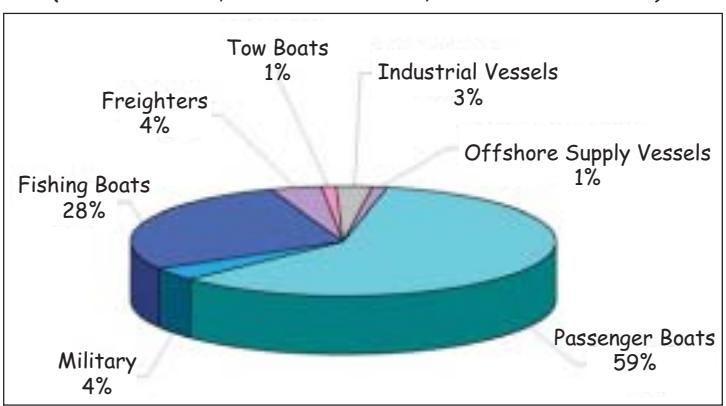

A number of large vessels have grounded on MHI coral reefs in the last several years (Fig. 240). Two military amphibious vessels ran aground on reefs off the windward side of Oʻahu. In 1999 a large troop vessel struck a patch reef in Kaneʻohe Bay but was quickly removed. In 2000, a longlining fishing vessel (the F/V Van Loi) ran aground on a fringing reef directly adjacent to the shoreline of Kauaʻi while enroute to the NWHI; portions of that vessel still remain atop the reef. As with almost all civilian vessel groundings that occur in Hawaiʻi, the parties responsible for groundings have not had to cover the majority of the cost for vessel salvage. For all vessels, restitution for physical damage to reef resources is rarely made.

An additional concern related to shipping is the projected increase in large cruise ship traffic to the MHI. Hawai'i has one cruise ship company which recently acquired a second large cruise ship and currently makes over 312 port calls in the MHI a year; large, international cruise ships made 97 port calls in 1998. This industry is projected to triple in the next four years (Clark and Gulko 1999). With limited port facilities and the desire to have ports of call throughout the islands, concerns have been raised regarding anchoring areas for these huge ships in close proximity to coral reefs on many of the neighbor islands. Freight vessel traffic is also projected to increase and harbor facilities (many of which are adjacent to coral reefs) will need to be expanded.

Tourism and Marine Recreation – Impacts from the tourism industry range from boating-associated impacts to development of coastal areas to overuse

of reef resources by commercial dive and snorkel tours (Fig. 241).

Hawai'i continues to be a major destination for recreational SCUBA divers. Rodale's Scuba Diving Magazine rated Hawai'i as one of the top five most popular diving destinations in the world for the year 2000159; the tiny islet of Molokini was rated as the third best dive site world-wide.

Concerns about overuse by commercial tourism have led to early attempts at limiting access either by controlling entry

to parking facilities for coastal MPAs (Hanauma Bay MLCD) or by limiting the number of mooring permits available (Molokini MLCD). To minimize anchor damage from repetitive visits to major dive sites, DLNR, in partnership with the dive industry, has placed hundreds of day-use moorings around the MHI. A number of companies have introduced new technologies such as tourist submarines, underwater propulsion units, 'seawalkers' (a type of surface-supplied helmet rig), and rebreathers. Concerns exist related to lack of oversight for these activities and their potential impacts.

Marine tourism is often the dominant impact in the few areas of the State set aside as no-take MPAs. For example, over a million people a year visit the 0.65-km2 (1/4 square mile) reef of the no-take

158 Less than 15 m (46 feet).

Hawai'i consistently ranks in the top ten for diving and snorkeling destinations.

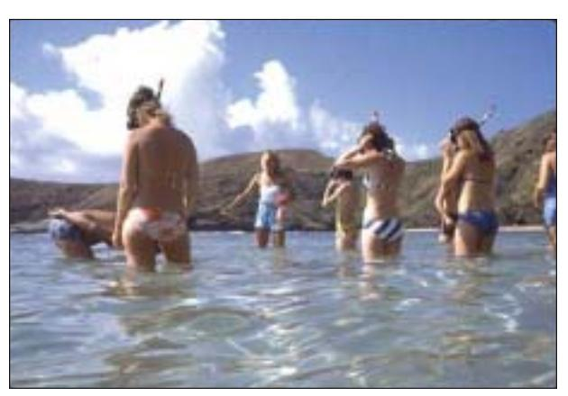

Figure 241. Getting ready to dive for the first time, this class of new snorkelers is standing on the reef (Photo: Hawaii Division of Aquatic Resources).

MPA Molokini Shoals MLCD. It is not unusual to find over 40 commercial tour boats moored there at a single time. Lack of strong controls and monitoring of impacts contribute to this problem. Unlike many terrestrial parks and preserves, the State's no-take MPAs have no official caretaker staff or refuge managers.

Hawai'i has a large resident coastal population, many of which engage in a wide variety of marine recreation (e.g., motor boating, sail boating, thrill craft, recreational fishing, SCUBA diving, snorkeling, surfing, sailboarding, kayaking). On Maui, Hawai'i, and O'ahu, conflicts between different user groups are commonplace and increasing. Concerns about the impacts of thrill craft (jet skis, speedboats) on shallow water reef flats, seagrass beds, and protected species (marine mammals and sea turtles) exist throughout

the MHI.

Urbanization and Coastal Development — Urbanization on O'ahu and Mau'i is a growing concern. These two islands house about 85% of the State's resident population; with continuous population growth occurring on most of the other MHI. The coastline of O'ahu has been extensively altered by filling

of reef flats for coastal development and airstrips (Maragos 1993).

Most islands contain reef areas that have been dredged for ship channels and harbors, or filled for coastal development. The result has been a functional loss of coastal wetlands and estuaries important for trapping freshwater runoff and for the recruitment of reef fish.

Seawall construction has modified sand movement and affected beach structure, erosion rates, and sedimentation across reef flats (Fig. 242). New construction of private marinas, resort hotels, and new commercial harbors provides access to coastal reef areas previously unimpacted by large numbers of human activities.

Other Physical Impacts – Activities involving the use of explosives and heavy machinery in the vicinity of coral reefs can have direct and indirect impacts on Hawaiian coral reef ecosystems. The island of Kaho'olawe was used as a military target for live-firing and bombing in the latter part of the last century. These activities contributed toward sedimentation of adjacent reef areas and resulted in the presence of unexploded ordinance in nearshore waters of Kaho'olawe. Currently the island has been turned over to the State of Hawai'i. It is now managed by the Kaho'olawe Island Reserve Commission, which, among other actions, has undertaken a complete assessment and monitoring program for the island's reef resources. Military ordnance, including bombs, have been found off other small islands, that lie close to Kaho'olawe (e.g., Molokini).

Kaula Rock, a small islet and a State of Hawai'i Bird Sanctuary, is located 35 km southwest of the island off Ni'ihau. It is still used a few times a year

as a live-firing and bombing target by the U.S. military. During 1999 reef fish diversity surveys by NOAA, submerged bomb and bullet shells were noted on reefs off Kaula Rock. Closed to harvesting, the waters around Kaula Rock are noted for their abundance of jacks and other large species.

Natural Stresses – Two major freshwater kills of corals occurred

in Kane'ohe Bay, O'ahu in 1965 and 1987. Both events were the result of '100 year storms' that brought torrential rainfall to the adjacent watersheds of the bay, followed by periods of light wind and low tidal exchange (Banner 1968, Jokiel *et al.* 1993). Salinity within 1-2 m of the surface

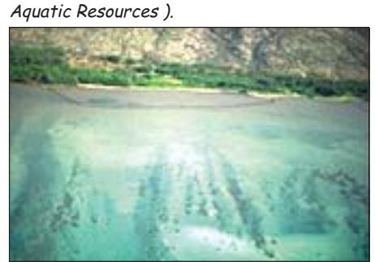

Figure 242. Chronic sedimentation off the island of Moloka'i (Photo: Hawai'i Division of

was reduced to 15 ppt for 2-3 days, causing mass mortality of corals and sedentary invertebrates on the shallow reef tops and slopes. In both cases, delivery of large amounts of freshwater into the nearshore environment was facilitated by channelization of streambeds and paving of lowland coastal areas throughout the watershed.

Differences in depth distributions of dominant reef corals on nearshore reefs in semi-estuarine environments may be predicted by their relative sensitivity to osmotic stress (Hunter and Krupp 1997). After experimental treatment in conditions similar to those generated by episodic rainfall events (15 ppt salinity for 48 h), mortality was highest in *Montipora capitata,* intermediate in *Porites compressa*, and lowest in *Fungia scutaria.*  In *P. compressa*, despite complete withdrawal of tissue from colony surfaces, intact mesenteries and undifferentiated tissues (and zooxanthellae) persist in a layer 2-7 mm below the skeletal surface. These tissues may rapidly regrow, resulting in a 'phoenix-like' recovery of this species after osmostic stress.

**Climate Change and Coral Bleaching Bleaching –** Ocean conditions during El Niño warm events are generally associated with slightly cooler than normal sea surface temperatures (SSTs) throughout the

Hawaiian Archipelago. Warmer than normal SSTs in Hawaiian waters are generally observed during La Niña cold events.

No major bleaching events were observed in Hawai'i during the 1997-98 worldwide coral bleaching event. Hoegh-Guldberg (1999) in a recent report on the future of global bleaching events suggested that the central Pacific, and especially Hawai'i, will be among the last reefs to experience major bleaching events. This is thought to be mostly due to Hawaii's subtropical and northcentral location in regards to existing oceanic gyres and the broad expanse of deep water surrounding the islands. However, many of the corals live close to their maximum temperature limits and elevated seawater temperatures may result in some level of bleaching and/or mortality (Jokiel and Coles 1990).

#### **Current Conservation Management Management**

**Mapping Mapping –** In 2000 NOAA and its State, Federal, and private sector partners collected aerial photography and hyperspectral imagery to develop methodologies to map the benthic habitats of the MHI (Fig. 243). A habitat classification scheme has been developed that delineates habitat types found down to about 30 m in water depth (Coyne *et al.* 2001a). The results of these prototype studies have enabled

> NOAA to develop a scope of work to contract the mapping of the MHI. Plans are to initiate this work in 2002 and complete it in 2005.

#### **Research and and Monitoring –** Funds provided by Congress, through NOAA's Ocean Service (NOS), helped establish the Hawai'i Coral Reef Initiative Research Program (HCRI-RP); a partnership between the University of Hawai'i and the State of Hawai'i Department of Land and Natural Resources, Division of Aquatic Resources.

Figure. 243. This benthic habitat map of Kane'ohe Bay, O'ahu was produced through photointerpretation of color aerial photography (Credit: NOAA Ocean Service).

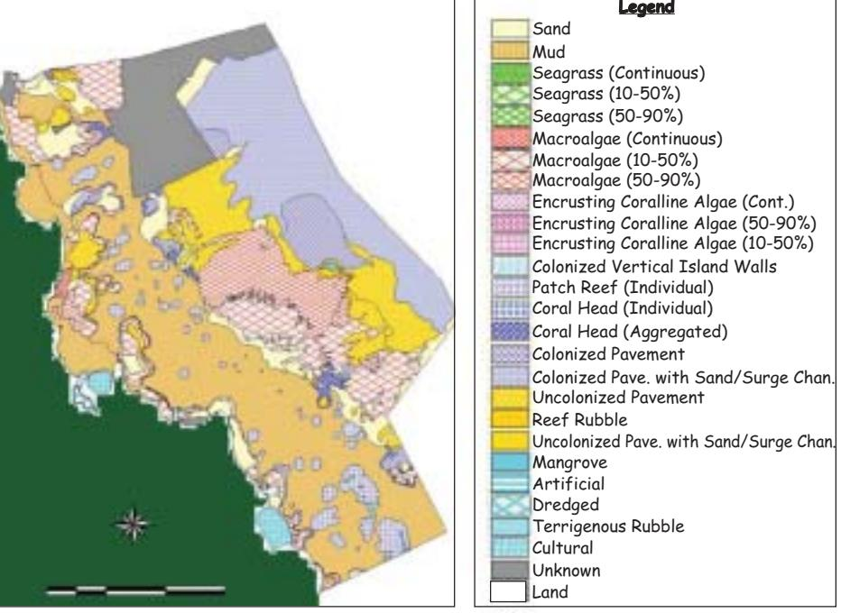

**HAWAI'I HAWAI'I HAWAI'IHAWAI'I**

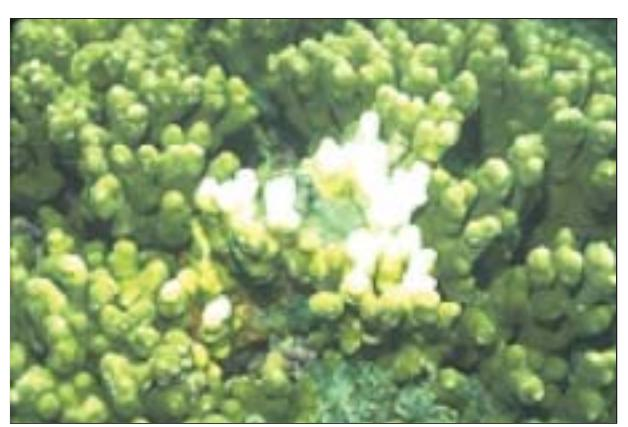

Figure 244. A bleached finger coral (Porites compressa) colony in Kane'ohe Bay, O'ahu (Photo: James Maragos).

The goals of the HCRI-RP are to:

- • Assess major threats to coral reef ecosystems, and provide information for more effective management,
- • Advance the understanding of the biological and physical processes that affect the health of coral reefs and build management capacity,
- • Develop a database to store and access data,
- • Conduct public awareness programs on the threats to coral reefs, and
- • Implement education and training for coral reef scientists and managers.

In June of 1998, DLNR and the East West Center co-sponsored the first Hawai'i Coral Reef Monitoring Workshop (Maragos and Grober-Dunsmore, eds. 2000). Participants recognized that Hawaii's coral reefs contribute hundreds of millions of dollars annually to the local economy through both tourism and fisheries, and that despite this importance, there were few programs in place to detect changes that might signal their existing or future degradation. In addition, it was also recognized that monitoring was an integral function of management. The workshop brought together regional and global experts in coral reef monitoring, coral reef research and coral reef management to compare existing methodologies and define protocols that would help revamp current management strategies and approaches.

The Hawai'i Coral Reef Assessment and Monitoring Program (CRAMP) is an integrated statewide monitoring program designed to describe the spatial and temporal variation in coral reef communities in relation to natural and man-made disturbances (Fig. 245). The program involves collaboration between the University of Hawai'i, the Hawai'i State Department of Land and Natural Resources, federal agencies, and NGOs. As of February 2000, CRAMP has installed and initiated monitoring at 25 sites on the islands of Kaua'i, O'ahu, Maui, Moloka'i, and Hawai'i. The network provides a cross section of reefs across the main Hawaiian Islands with regard to habitat type, degree of environmental degradation due to various human and natural factors, and rates of recovery in damaged areas. Initial assessment suggests that Hawaiian coral reefs are in better condition than reefs in many other regions.

Through the approval of Hawai'i Administrative Rule 13-60.3, nine Fish Replenishment Areas (roughly 35% of the West Hawai'i coastline) are now protected from aquarium fish collecting. Bimonthly monitoring of reef fish stocks is ongoing, first documenting the impact of collecting, and now monitoring the effect of closure of sites to aquarium collecting. Additional aspects of these FRAs will limit negative aspects of commercial marine tourism use (fish feeding) and certain fishing techniques which many feel are destructive and nonselective (gill nets).

The Office of Naval Research has placed a low frequency transmitter at a depth of 244 m off the north shore of the island of Kaua'i that broadcasts intermittently 195 dB160 low frequency (65-90 Htz) sounds into the water. One of several such sites, this basic research is being undertaken by some of the leading oceanographic institutions in the World (Scripps Institution of Oceanography, Applied Physics Laboratory of the University of Washing-

Figure 245. This CRAMP diver is surveying the reef ecosystem off Maui (Photo: CRAMP).

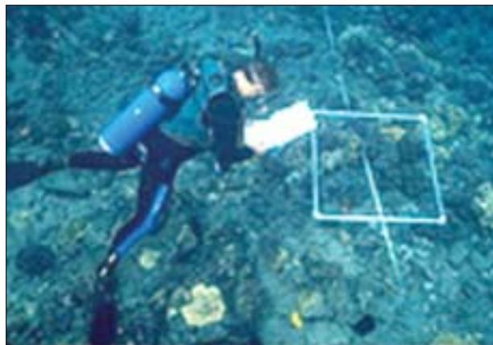

160 The term **dB** (decibel) is a measurement of sound volume or level; **Hz** (hertz) is a measure of sound frequency. **169169**

**HAWAI'I HAWAI'I HAWAI'I HAWAI'I HAWAI'I**

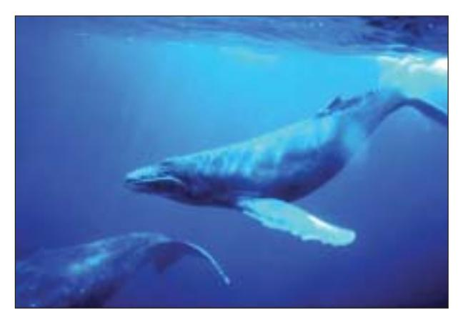

Figure 246. The Hawaiian Islands Humpback Whale National Marine Sanctuary is one of many MPAs protecting Hawaiian coastal resources (Photo: Lewis Herman).

ton, Woods Hole Oceanographic Institution, and the Massachusetts Institute of Technology). The data collected may provide insight into the global warming debate and an understanding of multi-year ocean warming/cooling events such as El Niño and La Niña. Questions have been raised by various groups as to the possible impacts of this research activity on marine organisms ranging from reef fish and sea turtles to Hawaiian monk seals and humpback whales. Environmental analysis conducted by the Navy and determinations by regulatory agencies with jurisdiction over coastal resources and marine mammals have indicated the project will not have adverse impacts.

A wide range of volunteer monitoring programs exist in the MHI. The international volunteer monitoring program, Reef Check, conducts periodic surveys throughout the MHI. Impact-specific monitoring is conducted in a number of communities on various islands. In an effort to better coordinate these activities, provide for management applicability of the data collected, and minimize coral reef impacts caused by such volunteer activities themselves, DLNR has embarked on a program to create a number of materials for use by such groups:

- • Best Practices Guidelines: a pamphlet that provides best management practices for various types of activities on Hawaiian coral reefs; planned to be distributed directly to the marine tourism industry.
- • Visual Impact Card: uses photographs to train divers to identify specific types of coral reef impacts; for example, to distinguish coral disease from fish bites.

• Volunteer Monitoring Techniques Training Manual.

Both Federal and State agencies partner to involve volunteers and the community in alien species awareness, monitoring, and mitigation. Under the guidance of the USFWS, a large multi-agency161 partnership – Marine Ecosystems Global Informational Systems (MEGIS) Group – was formed over the last two years to create a computerized GIS database to share coral reef habitat maps and management data, initially for the Hawaiian Islands, and eventually for other portions of the U.S. Pacific.

In September of 1999, DLNR brought together a wide range of recognized Hawaiian academic experts and marine resource managers to develop a list of proposed Hawaiian marine species to be considered by the Federal government for candidate species status as allowed for under the Endangered Species Act (ESA). The list of recommendations needs to be sent as a petition for consideration to the NMFS Office of Protected Resources. Those species that successfully are classified as 'Candidate Species' will be considered by NMFS for possible addition to the List of Threatened and Endangered Species. At this stage, proposed candidate species status serves to notify the public, user groups, managers, and policy makers of concerns regarding these species162 that may warrant listing in the future and facilitate voluntary conservation efforts. A preliminary list of all species is reported in Maragos (2000).

The following criteria for listing species were proposed for consideration: restricted range, threats throughout range, limited dispersion, limited reproduction, prolonged time to reach maturity,

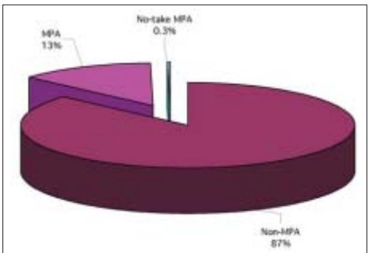

161 Includes Federal agencies (NOS, NMFS, NPS, USFWS, USGS), State Agencies (DLNR, Dept. of Planning, CZM), the academic community (the University of Hawaii and Bishop Museum), and other nongovernmental organizations. 162 Under the ESA, distinct vertebrate populations in addition to species can be considered for protection.

**HAWAI'I HAWAI'I HAWAI'IHAWAI'I**

biological dependency (obligate associations with ary (Clark and Gulko 1999, Maragos 2000; Fig. other organisms), life history characteristics, 246; Table 22). Several no-take MLCDs around depleted food/prey, overfished (includes food, Hawai'i have proven to be effective in increasing aquarium use, research use and bioprospecting) fish standing stock. Less restrictive MLCDs proand competitive exclusion.

Examples of species selected by the group include a number of endemic corals which are currently limited in their range even within the Hawaiian Islands (*Montipora dilatata, Porites pukoensis*, *Porites duerdeni*); fish and invertebrates which have been overfished for food (*Cellana talcosa, Epinephalus quernus, Epinephalus lanceolatus, Scarus perspicillatus*), the marine ornamental trade (*Heteractis malu, Centropyge loriculus*), or research (*Lingula reevii, Euprymna scolopes*); and habitat-forming organisms of limited range threatened by human activities (*Halophila hawaiiana*).

#### **MPAs and No-take Reserves Reserves –**

Closing areas to fishing is far from a new idea in the management of marine resources. Hawaiians used a variety of traditional marine resource management practices, which included 'kapus' or fishery closures. These closures were often imposed to ensure catches for special events or as a cache for when resources on the regular fishing grounds ran low. Various types of protected status currently exist for Hawaiian reefs and include Marine Life Conservation Districts (MLCDs), Fisheries Management Areas (FMAs), a Marine Laboratory Refuge, Natural Area Reserves (NARs), National Wildlife Refuges, and the Hawaiian Islands Humpback Whale National Marine Sanctu-

Table 22. Summary of data on coral reef marine protected areas (MPAs) of the Hawaiian Archipelago.

|           | wanan Archipelago.                                  |                          |              |             |              | 0                     | 0           | 0                |                                                                                    |                          |            |                      |                      | 24            |               | _                        |            |             |             | р.                 | 24                | ou.         |                      |            |
|-----------|-----------------------------------------------------|--------------------------|--------------|-------------|--------------|-----------------------|-------------|------------------|------------------------------------------------------------------------------------|--------------------------|------------|----------------------|----------------------|---------------|---------------|--------------------------|------------|-------------|-------------|--------------------|-------------------|-------------|----------------------|------------|
|           |                                                     |                          | L            |             |              |                       | Ш           | Ш                |                                                                                    |                          |            |                      | Ц                    |               |               |                          |            |             | Ц           |                    |                   |             |                      |            |
|           | anisaina drill                                      | _                        | H            |             | -            | 7                     | 2           | _                |                                                                                    |                          | _          |                      | 7                    | -             |               | -                        | 7          | 7           | Н           | -                  | -                 | _           | -                    |            |
|           | (Significant & Service) assissed                    | 7                        | 7            |             | 2            | _                     | *           | 7                | 7                                                                                  | ×                        |            | 'n                   | 7                    | -             | Ý             |                          | · ·     | 7           | Н           |                    | -                 | ¥           |                      |            |
|           | Sediment Runoff                                     |                          | -            |             | Ľ            |                       |             | _                |                                                                                    | Ľ                        | 7          | -                    | _                    | -             | -             | 7                        | _          |             | Н           |                    | -                 |             | -                    | H          |
| Ē         | leit/Sebil/sed/U - UtWA. Ilo 1                      | >                        | _            | Н           | н            | >                     | 7           | >                | н                                                                                  |                          |            | _                    | 7                    | _             | н             | ~                        | >          | 7           | Н           |                    | _                 | Н           |                      |            |
| Cancerns  | Pollucion/Mutrients - Agric.                        |                          | 7            |             | -            |                       | Н           | ×                | -                                                                                  | ¥                        |            | -                    | ¥                    | -             | -             |                          | ×          | _           | Н           | -                  | 4                 |             |                      |            |
| Ē         | Olivchemical Spills                                 | 7                        | Н            |             |              | >                     |             | >                | н                                                                                  |                          |            | _                    | 7                    | _             | 7             | 7                        |            |             | Н           |                    | -                 | 7           |                      |            |
| ä         | Jeseral Harnesto saiuM                              | _                        | 7            | 7           | 7            | >                     | 7           | -                |                                                                                    |                          |            |                      |                      |               | 7             |                          | >          |             | Н           |                    |                   |             |                      |            |
| Impact    | Murine Debrits                                      | ,                        | _            | 7           | *            | >                     | 7           | >                | >                                                                                  | _                        | >          | ш                    | 7                    | >             | Ц             | Ц                        | `          | 7           | Ц           | `                  | >                 | 7           | `                    | _          |
| Ξ         | (geidasof) geidzi7 lagelli                          |                          | 7            | 7           | Y            | 'n                    | ¥           | 2                | P                                                                                  | ×                        | 7          | P                    | ¥                    |               | P             | ¥                        | P          | ¥           | Ц           | ¥                  | 2                 | ¥           | 'n                   |            |
| <u> </u>  | Fishing Recreational                                | 7                        | -            | 2           | ÷            | >                     | ÷           | ×                | Ц                                                                                  | ÷                        | >          | Ш                    |                      | 7             | Ц             | ÷                        | 7          | 7           | Ц           |                    |                   | 7           | ┙                    |            |
| ā         | Fishing (Groundings & Gear Damage)                  | 7                        | >            | 7           | -            | *                     | 7           | 2                |                                                                                    |                          | >          |                      |                      |               |               | 7                        | >          |             | Ц           | 7                  | >                 |             | *                    |            |
| ۰         | Fishing Connersial                                  | 4                        | >            | 4           | 4            | 'n                    | 4           | ×                |                                                                                    |                          | *          |                      |                      |               |               |                          | 4          |             | Ц           | 'n                 | 4                 | 4           | 4                    |            |
|           | Coral Diseases                                      |                          |              |             |              |                       |             |                  |                                                                                    |                          |            |                      |                      |               |               |                          |            |             |             |                    |                   |             |                      | ı          |
|           | Coral Bleaching                                     |                          |              |             |              |                       |             |                  |                                                                                    |                          |            |                      |                      |               |               |                          |            |             |             |                    |                   |             |                      | ĺ          |
|           | caisagg avicavallasitA                              | 7                        |              |             |              | *                     |             | 2                | 4                                                                                  | *                        |            |                      |                      |               | 7             | *                        | 4          | 4           |             |                    |                   |             |                      | I          |
|           | Tebustica .                                         |                          | Г            |             |              |                       |             |                  |                                                                                    | ¥                        |            |                      |                      |               |               |                          |            |             | П           |                    |                   |             |                      | ſ          |
| :         | Potch Reefs within LaponnesiBays                    |                          |              |             |              |                       |             |                  |                                                                                    |                          |            |                      |                      |               |               |                          |            |             | Ħ           |                    |                   |             |                      |            |
| Ž         | stokel flosh bee stodestio                          |                          | Г            |             | П            |                       |             | П                |                                                                                    | П                        | -          |                      |                      | -             |               | _                        |            |             | П           | g                  | 2                 | 04          | 74                   | f          |
| Ę         | spag ssrutrag                                       |                          |              |             |              |                       |             |                  |                                                                                    |                          |            |                      |                      |               |               | 4                        |            |             | H           |                    |                   |             |                      | ı          |
| Allebitet | alletA abset assures?                            |                          |              |             |              |                       |             |                  |                                                                                    |                          |            |                      |                      |               |               |                          |            |             | H           | v                  | v                 | v           | ×                    |            |
| 3         |                                                     |                          | ь            |             |              |                       |             |                  |                                                                                    |                          |            | -                    |                      |               |               |                          |            |             | н           | 2                  | 2                 |             |                      |            |
|           | sleetStates8                                        | -                        | Н            | Н           | -            | _                     |             | -                | -                                                                                  | -                        | _          | _                    |                      | _             | -             | -                        | -          | _           | Н           | -                  | Ť                 | П           |                      |            |
| į         | Stanfer Roses                                       |                          | Н            | Н           | н            |                       | Н           | N.               | н                                                                                  | -                        | *          | _                    | ~                    | _             | н             |                          |            | ~           | Н           |                    | -                 |             |                      |            |
| =         | Slood gaigein?                                      |                          | H            |             |              |                       |             | ě                |                                                                                    |                          |            |                      |                      |               |               |                          | ×          | 7           | Н           | -                  | -                 | Н           | -                    |            |
|           | Reef Communities                                    | ,                        | ,            | 7           | 7            | >                     | *           | >                | 7                                                                                  | 7                        | >          | 7                    | 7                    | 7             | 7             |                          |            |             | Н           |                    | -                 | 4           |                      |            |
|           | Approximate % of Marine Take No.              | 900                      | <.58%        | 900         | 1238         | 200                   | 900         | 3600             | 10008                                                                              | 9009                     | 300        | 306                  | 90001                | 300           | 10004         | 900                      | 900        | 10006       | I           | 3006               | ۲-                | e-          | 2000                 |            |
|           | Total Area (aerea                             | 1361                     | 312          | 300         | 145          | 217                   | 50          | 48,455           | 2,045                                                                              | ņ                        | 24,676     | 300                  | ь                    | 10,797        | 101           | 52                       | 10         | 338         | 136,774     | 611,979            | 552,277           | 299,482     | 247                  | 910,527    |
|           | Terrestrial Area (aorea)                      | 199                      | 0            | 0           | 0            | 0                     | 0           | 0                | 1,238                                                                              | 0                        | 20,544     | 0                    | 0                    | 6,717         | 0             | 0                        | 0          | 0           | 37,240      | 1,730              | 1,977             | 1,582       | 247                  | 3,559      |
|           | Harine Area (sorres)                          | 200                      | 213          | 300         | 145          | 217                   | 50          | 48,400           | 607                                                                                | ę                        | 46,132     | 500                  | ę                    | 2,000         | 101           | 82                       | 100        | 76          | 97,434      | 610,140            | 990,300           | 296,820     | ٥                    | 610.148    |
|           | Extinate of Coral Reef Habitat Gaerres) |                          | 380          | 000         | 246          | 217                   | 32          | 21,794           | 907                                                                                | 53                       | 14,335     | 22                   | 22                   |               | 101           | 32                       | 152        | 20          | 18,958      | 610,149            | 950,300           | 55,104      | 0                    | 665,252    |
|           | Federally-managed                                   | 7                        |              |             |              |                       |             | Ц                |                                                                                    |                          |            |                      |                      | 'n            |               |                          |            |             | Ц           | ¥                  | Ц                 | ÷           |                      |            |
|           | bagenem-stet8                                       | 7                        | E            | 7           | 7            | 7                     | Y           | E                | 7                                                                                  | P                        | 7          | P                    | P                    | ×             | 7             | 7                        | 7          | 7           |             |                    | 7                 |             | 7                    |            |
|           | Ceral Bast MPAs                                     | Kodoko-Plomaliotysa NPIP | KeelskehmMcD | Kitholo FMM | LepsinshiMcD | Old Kona Airport MLCD | Webs BryMcD | West Heavill FRA | Abbidgraw NAR                                                                      | Honolus & Malouleis MLCD | Kahololama | Melokini Shouls MLCD | Halapoe-Massele M.CD | Calmpapa Neth | HanamaBayALCD | Hamai Motive Lab Receive | PopulosMCD | Plokas M.CD | Tetal Meti- | Hersien Ideod: W/R | MMHIFM (Proposed) | Michael MVR | Dare Mildlife Refuge | Total MMMI |
|           | S Lands                                             |                          | Firmali      |             |              | jma                   | **          | 3                | espe (1,2) (1) (1) (1) (1) (1) (1) (1) (1) (1) (1 | de.                      | 1          | nqs,o                |                      |               |               | IHAM                     |            |             |             |                    |                   |             |                      |            |

163 &#x27;MPA' in this figure refers to Marine Protected Areas that afford some protection against certain forms of extraction, but may allow other types to occur; 'No-take MPA' refers to designated MPAs where no extraction is allowed. **171171**

**HAWAI'I HAWAI'I HAWAI'I HAWAI'I HAWAI'I**

vide limited protection from consumptive practices and fish populations have not benefited significantly from the creation of these areas (Friedlander in press). In addition, certain MLCDs are popular tourist destinations and experience intensive nonconsumptive impacts such as fish-feeding, largescale commercial marine tourism, and touristrelated pollution (Gulko 1998). The new Kona Coast FMA, which restricts the collection of fish for the marine ornamental trade, appears to be increasing standing stocks of targeted fish species relative to nearby unprotected areas (Tissot *et al*. 2000). Despite their proven effectiveness, functional no-take areas account for only 0.3% of coastal areas in state waters (Fig. 247).

On the island of O'ahu, there are three MLCDs and multiple FMAs. Hanauma Bay was established as the state's first MLCD in 1967, and comprises 0.41 km2 (101 acres). Taking of all marine life is prohibited in the bay. The 0.1-km2 (25 acres) Pupukea MLCD is located on the north shore of O'ahu and was established in 1983. Pole-and-line fishing is currently permitted from the shoreline, and taking of seaweed is also permitted. Spearfishing without SCUBA is permitted throughout this MLCD, and the use of nets is allowed in the MLCD's northern portion. Established in 1988, the Waikiki MLCD is very small and comprises 0.3 km2 (76 acres) at one end of Waikiki Beach. The area consists of a lowrelief reef flat that extends approximately 35 m out to a dredged channel. The marine area adjacent to the MLCD has been greatly altered by shoreline construction, beach nourishment, terrestrial inputs, and proximity to a large urban population. In

Figure 248. Comparison of fish standing stock (biomass) between various O'ahu MPAs (Friedlander in press).

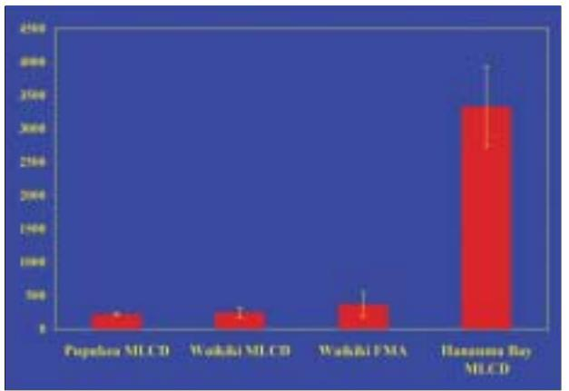

addition to these three MLCDs, the Waikiki-Diamond Head Shoreline Fisheries Management Area (FMA) is another regulated fishing area on O'ahu. This area is adjacent to the Waikiki MLCD and extends eastward. The area is open to fishing on even-numbered years and closed on oddnumbered years. During the open years, nighttime spearfishing and the use of gillnets is prohibited. These four areas represent a wide variety of sizes, habitat types, and management strategies.

Notwithstanding differences in location, size, and habitat type there is a dramatic difference in fish biomass between the Hanauma Bay MLCD and the other protected areas (Fig. 248). A study by Brock and Kam (1993) showed that benefits derived from the Waikiki-Diamondhead Shoreline Fisheries Management Area closures were lost quickly when the area was reopened to fishing. As a result, the overall standing stock in the zone never exceeded 50 g/m2 during their study. The Pupukea MLCD is very small (0.1 km2 ) and allows a wide range of fishing activities. Not surprisingly, this area possesses the lowest standing stock of fish compared to the other protected areas on O'ahu. These results point to the fact that a no-take MPA with good habitat diversity and complexity can have a positive effect on fish standing stock.

No-take MLCDs around other areas of Hawai'i have also proven to be effective management strategies for increasing fish standing stock. Kealakekua Bay on the island of Hawai'i was established as an MLCD in 1969 and Honolua-Mokuleia Bay on Maui was established as an MLCD in 1978.

All fishing is prohibited in specific subzones of these MPAs and the biomass of fish has increased steadily in these areas (Fig. 249) since their inception (Friedlander in press).

#### **Gaps in Current Monitoring and Conservation Gaps in Current Monitoring and Conservation Capacity CapacityCapacity**

One of the primary problems is enforcement of existing laws and regulations. Additionally, while many State and Federal laws and regulations concern coral reefs or impacts on them, there are few that deal directly with the protection of reef ecosystems (Gulko 1998). Many State regulations have not kept up with new technologies, new uses of natural resources, or the changes required to deal

**HAWAI'I HAWAI'I HAWAI'IHAWAI'I**

164 Hanauma Bay MLCD, Pupukea MLCD, Kealakekua MLCD, and Molokini MLCD are all heavily used (and marketed) by the

marine tourism industry. 165 Currently, MLCD's are designated based upon avail ability of public access and non-extractive use.

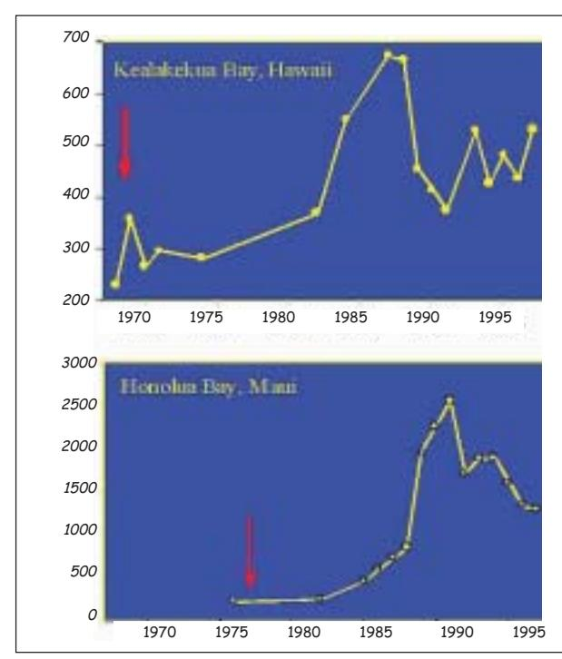

Figure 249. Comparison of fish standing stock at two neighbor island limited-take MPAs. Arrows represent year designated an MPA (from Friedlander in press).

with increased use versus diminished resources.

President Clinton's Executive Order 13089 for Protection of U.S. Coral Reefs (1998), mandating federal agencies make better use of their programs to protect and enhance U.S. reefs, has not yet been effectively put to the test in the MHI. Of particular concern are federal oversight or funding of activities such as offshore aquaculture, bioprospecting, marine ornamental aquaculture, underwater sensor technology, and shoreline or harbor modification.

Current monitoring of fisheries activities in the MHI does not provide information on the recreational and subsistence fisheries that accounts for much of the catch on Hawaiian coral reefs. Future management designs will need to consider the habitat requirements and life histories of the species of interest as well as the extent of fishing pressure in the area and the degree of enforcement.

Overuse of MHI MPAs for the tourist trade164 and the lack of any true, fully protected reserves165 is quickly eliminating the opportunity to have even a small area in the MHI that represents a natural coral reef ecosystem. What the MHI needs is a true coral reef ecosystem reserve, where all extraction

activities would be restricted. Given the substantial overlap of user groups in many MHI reef areas, the increasing population, and the perpetual conflict between resource utilization and conservation166, creation of such a new type of MPA is unlikely in the MHI any time in the near future.

#### **Northwestern Hawaiian Islands (NWHI) (NWHI) Hawaiian**

#### **Introduction Introduction**

The NWHI extend for more than 2,000 km (1,300 mi) to the northwest of the island of Kaua'i. From Nihoa and Necker (roughly 7 and 10 million years old respectively) to Midway and Kure atolls (~28 million years old), the NWHI represent the older, emergent portion of the Archipelago (Fig 250). The majority of the islets and shoals remain uninhabited, although Midway, Kure, and French Frigate Shoals have all been occupied for extended periods by various government agencies over the latter portion of the last century.

With the exception of Midway Atoll, the entire NWHI is part of the State of Hawai'i from the shoreline to 3 nmi from any emerged land. The USFWS manages Midway as a National Wildlife Refuge. Much of the rest of the NWHI167 is within the Hawaiian Islands National Wildlife Refuge, established by President Theodore Roosevelt in 1909, and administered by the USFWS. The nearshore reefs of the NWHI (with the exception of some species-specific and temporally-limited fisheries depletion) are in very good to excellent condition.

In addition, the Northwestern Hawaiian Islands Coral Reef Ecosystem Reserve was created by Executive Order 13178 on December 4, 2000. This

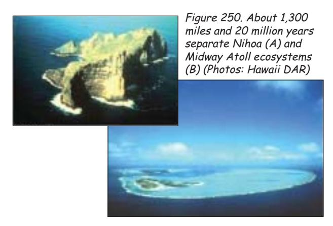

166 The State legislature recently passed a regulation requiring extensive review of all new management rules for effects on small

**HAWAI'I HAWAI'I HAWAI'I HAWAI'I HAWAI'I**

business. 167 Excluding Kure Atoll which is a State of Hawai'i wildlife refuge.

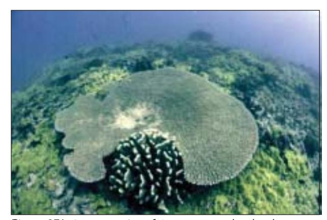

Figure 251. Seven species of Acropora corals, closely related to this table coral in French Frigate Shoals, have been identified from the NWHI (Photo: James Maragos).

large reserve area, 1,200 nmi long and 3-50 nmi from shorelines, is to be managed under the Secretary of Commerce, and is now undergoing the process for designation as a National Marine Sanctuary. The Executive Order also established 15 Reserve Preservation Areas within the reserve in which all extractive use is prohibited with limited exceptions.

#### **Condition of Coral Reefs Reefs**

**Algae and Higher Plants Higher Plants –** Abbott (1995) estimated the number of algal species in the NWHI to be around 200, with numerous new species and new records having been recently recorded (Maragos and Gulko 2002). Given the large amount of shallow (<30 m) benthic area relative to the MHI, seaweeds presumably comprise the largest component of the benthos and this number could be expected to increase significantly once the entire area is more fully assessed. As an example, prior to the 2000 NOWRAMP expedition, there were only eight species of algae known from French Frigate Shoals, compared to the roughly 130 species collected there as a result of this expedition (P. Vroom pers. comm.).

*Halophila hawaiiensis* has been found at Midway Atoll and Pearl and Hermes Atoll, and may exist elsewhere in the NWHI.

**Coral–** Previously 22 species of coral were reported from the NWHI (Okamoto and Kawamoto 1980), compared with 52 species reported from the recent NOWRAMP Expedition (Maragos and Gulko 2002). Seven species of the genus *Acropora168*  have been found in the NWHI, five of these have not been reported in the MHI169 (Fig 251). French Frigate Shoals, and Maro Reef have the highest

reported biodiversity of coral species (Grigg 1983, Maragos and Gulko 2002).

Coral cover for many areas of the NWHI is low, with the highest percentages at French Frigate Shoals and Maro Reef (Grigg 1983). Recent research reports that coral cover is also high at many of the atolls (Maragos and Gulko 2002) and Neva Shoals (R. Brainard pers. obs.). Towed diver video surveys conducted during the NOWRAMP 2000 Expedition revealed high heterogeneity within and among the different atolls, islands, and banks. Also, growth rates for corals in the northern portion of the chain are reported to be significantly slower than the same species found farther to the south170 (Grigg 1988), raising concern about recovery rates from human impacts at different locations.

**Large Mobile Invertebrates Large Invertebrates –** Surveys conducted in the 1970s (Okamoto and Kawamoto 1980) found only 63 species of macroinvertebrates throughout the NWHI. Rapid ecological assessments conducted during the Fall of 2000 added to this count (Minton *et al.* in prep.). Other surveys conducted within the soft sediment habitats characteristic of many atoll lagoons reported that a variety of polychaete worms and molluscs were the most abundant infauna (Sorden 1984). The NOWRAMP survey of soft sediments identified 5,400 organisms representing 300 taxa from 63 stations (D. Turgeon pers. comm.). Polychaetes comprised 47% of the total assemblage, followed in abundance by malacostracans (29%) and gastropods (7%).

Towed diver surveys during the NOWRAMP 2000 Expedition recorded localized areas with a moderate abundance of *A. planci* along the southern outer reef slope at Pearl and Hermes Atoll and along the eastern outer reef slope at Kure Atoll (R. Brainard

Figure 252. Carnivores abound in the NWHI, like this school of goatfishes in Kure Lagoon (Photo: James Maragos).

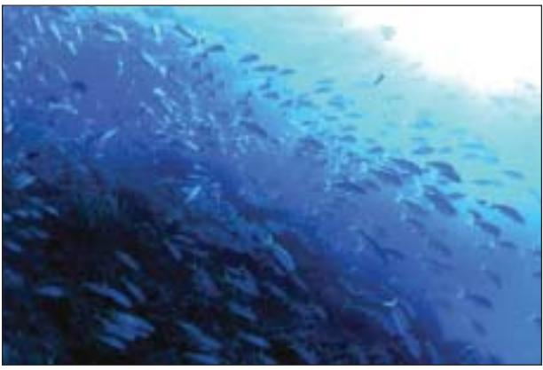

**HAWAI'I HAWAI'I HAWAI'IHAWAI'I**

168*A. cytherea*, *A. cerialis, A. gemmifera*, *A. humilis*, *A. nasuta, A. paniculata,* and *A. valida*. 169 A few small colonies of *Acropora cytherea* and *A. paniculata* were reported off the island of Kaua'i but have not been seen in recent years.

pers. comm.). These occurrences were associated with dead or dying *Pocillopora* colonies in areas of low coral cover.

**Fish–** A total of 266 species of fishes is listed from Midway Atoll of which 258 are reef and shore fishes (Randall *et al*. 1993). Cooler water temperatures, lack of certain high-island habitat types, and lower sampling effort may all contribute to the lower number of species compared to the main Hawaiian Islands. The reef fish community structure in the NWHI is different from other areas in the Hawaiian Archipelago owing to reduced abundance of herbivores (mostly surgeonfishes) and the increased importance of damselfishes and carnivores (mostly jacks, sharks, goatfishes, scorpionfishes, and big-

eyes, Fig. 252). Reef fish trophic structure in the NWHI is dominated by carnivores in numerical abundance and biomass (Parrish *et al*. 1985, Fig. 253). The result is that the NWHI are among the few large reef ecosystems on the globe to remain predator-dominated and intact regarding fish assemblages (Friedlander *et al.* in prep.).

Because of the distances involved and the more exposed sea conditions, commercial fishers with large vessels (greater than 20 m) are the primary participants in the NWHI fisheries (Smith 1993).

Commercial fishing in the NWHI within a 100 m depth targets mostly bottomfish and lobster, each of which is managed separately by the National Marine Fisheries Service (NMFS) through the actions of an advisory body: the Western Pacific Regional Fisheries Management Council (WPRFMC). Both of these fisheries are limited-entry with less than 20 vessels allowed to operate in either fishery.

There is currently concern over the declining abundance of lobsters in the NWHI, particularly in light of their potential importance as food for the endangered Hawaiian monk

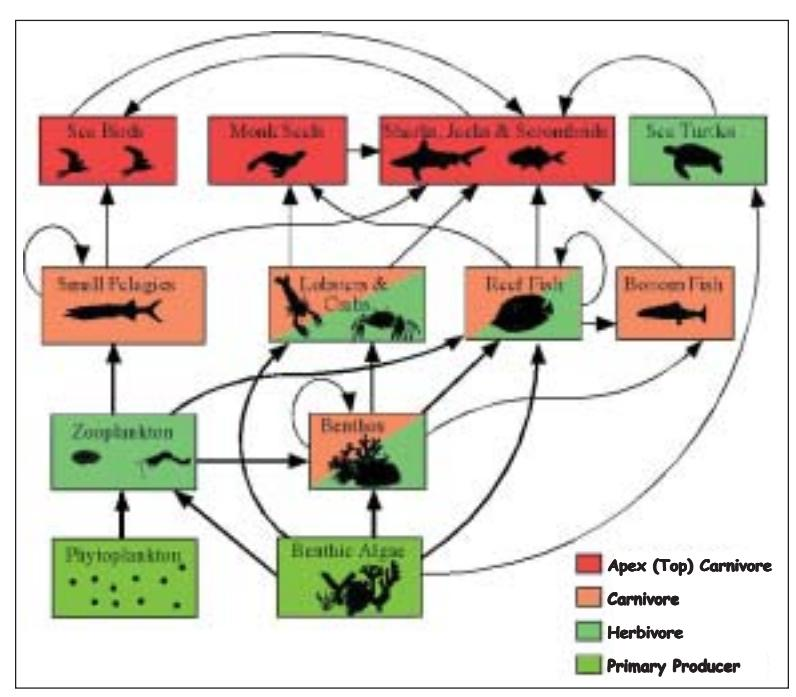

Figure 253. The coral reef food web in French Frigate Shoals, NWHI (Modified after Polovina 1984).

seal171. A lawsuit was filed in federal court in 1999 regarding this issue. Before a ruling was issued, NMFS closed the fishery when it became apparent that some of the assumptions used in the lobster population assessment model were incorrect. Executive Order 13178, which established the NWHI Coral Reef Ecosystem Reserve, capped the lobster take at the 2000 catch level or zero take. Currently the NWHI lobster fishery remains closed.

Recreational and commercial fishing is prohibited

within the 10-20 fathom isobath off most islands northwest of Kauai (varying with location) owing to their status as a National Wildlife Refuge managed by the USFWS, and their designation as critical habitat for the Hawaiian monk seal by the NMFS.

Mean standing stock of fish biomass on shallow reefs at French Frigate Shoals and Midway Atoll was almost twice as high as those reported from shallow reefs in the Main Hawaiian Islands (DeMartini *et al*. 1996). The difference in biomass among these locations may reflect the heavy fishing pressure on reef fishes in the MHI compared to the NWHI (Grigg

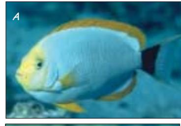

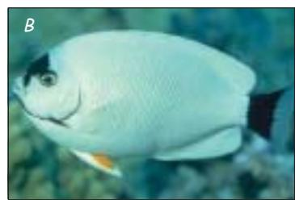

Figure 254. Female (A) and male (B) masked angelfishes (Photos: James McVey).

**HAWAI'I HAWAI'I HAWAI'I HAWAI'I HAWAI'I**

**175175** 170 For example, lobe coral (*Porites lobata*) reportedly grows at an average of 11 mm/yr in parts of the MHI while the same

species grows at only 0.3 mm/yr at the northern end of the chain. 171 Research has shown that lobster is a constituent of the monk seal diet. Studies on the importance of this component using fatty acid analysis and spew contents are underway by NMFS researchers.

1994, DeMartini *et al*. 1994). Okamoto and Kawamoto (1980) noted many inshore fish species appear to be larger at the northwestern end of the Hawaiian Archipelago. Fishing pressure may account for the low numbers and smaller sizes of certain prized species in the MHI compared to the NWHI where fishing pressure is relatively low (Hobson 1984).

The remoteness of the NWHI makes the cost of collecting marine ornamental species there relatively high. At present, collection of coral reef species from the NWHI for the aquarium trade is limited, although the recent sale of a number of pairs of masked angelfish (*Genicanthus personatus)* has raised concern for protecting such endemic and rare organisms from overexploitation. Species such as the masked angelfish *,*  dragon eel (*Enchelycore pardalis)* and the Hawaiian lionfish (*Pterois sphex*) are considered vulnerable and in need of protection (Fig. 254).

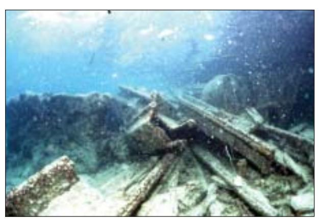

Figure 255. Debris that is a source of contaminants on Tern Island in French Frigate Shoals (Photo: James Maragos).

**Marine Reptiles and Mammals Mammals –** Ninety percent of the Hawaiian green sea turtles return as adults from all over the archipelago to nest on the tiny islets that make-up French Frigate Shoals Atoll in the NWHI. No turtles with fibropapillomatosis have yet been observed in the NWHI.

The endangered Hawaiian monk seal depends upon the islands and waters of the NWHI for breeding and sustenance; with a population of only 1,400 animals, this coral reef-associated seal remains one of the most critically endangered marine mammals in the United States.

**Water Quality Water Quality –** Eutrophication is not thought to be a problem in the NWHI due to lack of human habitation and distance from populated areas. Sewage discharges into the lagoon at Midway during the peak population periods from of the last century may have contributed nutrients and stimulated phytoplankton and algal growth in the lagoon.

Oil Spills and Toxic Chemicals – Recent oil spills in the NWHI are almost entirely due to groundings of fishing vessels on the isolated atolls. Des Rochers (1992) identified these vessels as a primary threat to reef resources as many carry greater than 37,900 liters (10,000 gallons) and there is a history of groundings in the NWHI. The October 1998 grounding of a 24-m longline fishing vessel at Kure Atoll released over half of its 41,640 liters of diesel onto the shallow reef environment.

Lead and PCBs were recently detected in waters surrounding seawalls on Tern Island at French Frigate Shoals (Fig. 255). Studies by USFWS suggest that these materials may have already entered the aquatic ecosystem food chain at Tern Island. PCBs have been measured in monk seal blood and blubber (Tummons 2000). High PCB levels have also been observed at Midway (L. Woodward pers. comm.). Kure, a State-administered atoll, was occupied for decades by USCG for a LORAN station and has not yet been fully evaluated for contaminants. High concentrations of contaminants were detected in a small area at Laysan Island by USFWS specialists. The contaminants are scheduled to soon be removed by USFWS.

Results from the NOWRAMP 2000 Expedition's preliminary survey of near-shore soft sediments off the NWHI islands and atolls identified high levels of toxic contaminants in a few sites from Midway and Kure atolls (Turgeon *et al*. in Maragos and Gulko 2002, Fig. 256). At four of 38 sites, levels of

Figure 257. An endangered Hawaiian monk seal entangled in nets in the NWHI (Photo: NOAA Marine Fisheries Service).

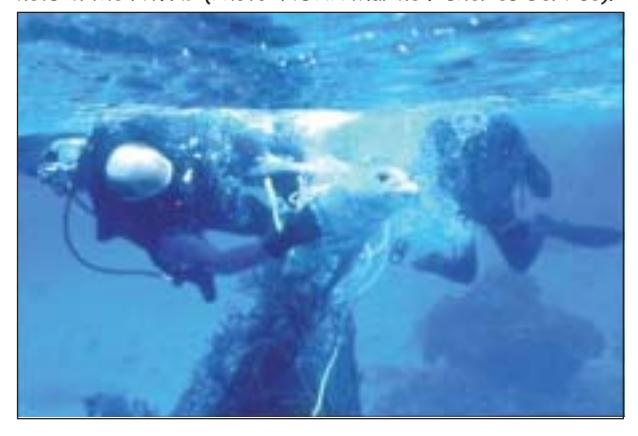

172 Over 23 endangered Hawaiian monk seals have recently been found entangled in nets in the NWHI (National Marine Fisheries Service).

**HAWAI'I HAWAI'I HAWAI'IHAWAI'I**

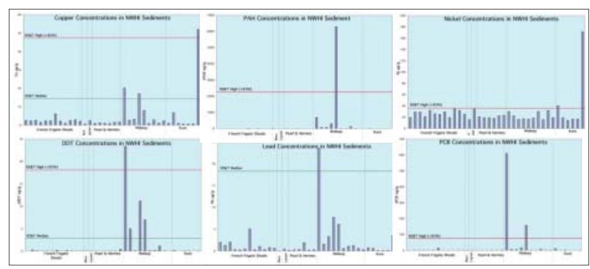

Figure 256. Sediment contamination (PAHs, PCBs, DDT, lead, copper, and nickel) was in the upper 85th percentile nationally at four near-shore sites off Kure and Midway (Source: Turgeon et al. in Maragos and Gulko 2002).

PCBs, PAHs, DDT, Dieldrin, Chlordane, nickel, and copper were above the 85th percentile of concentrations measured in the coastal United States by the NOAA Status and Trends Program.

#### **Environmental Pressures on Coral Reefs Reefs**

**Human Stresses Human Stresses –** Terrestrial sources of sedimentation are now practically non-existent in the NWHI due to the lack of human development and the lack of erodable land mass. The only major coastal construction in recent times occurred at Midway Atoll when it was a Naval Air Station (Maragos 1993) and involved airstrips, seawalls, roadways, large buildings, and construction of a deep draft harbor. Localized coastal construction has occurred on islets at Kure Atoll and French Frigate Shoals in the past. Tern Island at French Frigate Shoals was partially built of dredge spoils from the surrounding reef habitats. The seawall at Tern Island is scheduled for rebuilding in 2002.

Alien Species – Knowledge about the number and types of alien species and their range in the NWHI is very limited at this time. The NOWRAMP 2000 Expedition indicated that alien species do not appear to be widespread in the NWHI (Maragos and Gulko 2002). The majority of alien species have been reported at Midway, which has served as a gateway for many fouling species on the submerged hulls of ships for a period of over 60 years.

Destructive Fishing Practices – There are no confirmed reports of destructive fishing practices such as cyanide or dynamite fishing. Although the lobster fishery was thought to primarily operate over sand and algal bed habitats, surfacedeployment of lobster traps may have caused damage to benthic coral reef habitat when the fishery was open.

Marine Debris – Marine debris, primarily thought to arise from derelict gear from North Pacific fisheries, is impacting a wide range of marine life found throughout the NWHI. The gear includes drift nets, trawls, traps, and lines. Impacts include dislodging and breaking coral colonies, and entangling and killing seabirds, monk seals172, sea turtles, and fish (Fig. 257). Drifting marine debris may also serve as a vector for alien species introductions. In 1996 and 1997, NMFS conducted the first surveys for derelict fishing gear in the NWHI. In 1998, 1999, and 2000, NMFS led a multi-agency partnership involving the USCG, USFWS, DLNR, UH, the Sea Grant College Program, the Hawai'i Wildlife Society and the Center for Marine Conservation to remove marine debris from French Frigate Shoals, Lisianski, Pearl

Table 23. Chronology of reported vessel groundings and disposition in the NWHI (from DesRoches 1992, Green 1976, Clark and Gulko 1999, B. Kananaka pers comm.).

| Year       | Vessel Type | Location       | Removal |
|------------|-------------|----------------|---------|
| 1969       | Fishing     | Laysan         | No      |
| Late 1970s | Fishing     | Kure           | No      |
| 1980       | Cargo       | FFS            | Yes     |
| 1981       | Fishing     | FFS            | No      |
| 1989       | Cargo       | Pearl & Hermes | No      |
| pre-1992   | Fishing     | Kure           | No      |
| 1998       | Fishing     | Kure           | No      |
| 2000       | Fishing     | Pearl & Hermes | Yes     |

**HAWAI'I HAWAI'I HAWAI'I HAWAI'I HAWAI'I**

and Hermes, Kure, and Midway. The combined efforts removed over 60 tons of marine debris. It is estimated that about 1,000 tons of marine debris still remain on the islands and reefs of the NWHI (M. Donohue pers. comm.).

Ship Groundings – Ship groundings that occur in the NWHI raise special concerns due to the remote location, the pristine nature of the habitat, the exceptionally high numbers of marine endangered or protected animals present, and the effects on coral reef habitats that may be slow to recover. In addition, ship groundings in the NWHI provide added concerns due to the extreme costs involved in assessing the damage, controlling spills, removing the vessel and follow-up mitigation (Table 23).

Recently, it has been recognized that ferrous metal from grounded vessels promote the establishment of cyanobacteria (that has displaced calcareous algae and corals atop reef flats) in remote, oceanic areas such as Rose Atoll in American Samoa. Observations during the NOWRAMP 2000 expedition suggest that this may be occurring to a limited extent at Kure and Pearl and Hermes atolls.

In the last two years there have been three groundings of federally permitted fishing vessels atop coral reefs in State waters. One vessel ran aground at Kure Atoll, another grounded on Kaua'i while in transit to the NWHI, and the most recent event involved a longliner that ran aground at Pearl and Hermes Atoll. Reef structural damage from such groundings can be exascerbated if ships are not removed. For example, when a fishing vessel, the Paradise Queen, grounded on Kure Atoll in 1988, fuel spilled and lobster traps, lines, and other loose gear threatened federally-protected green sea turtles, sea birds, and the endangered Hawaiian monk seal (Fig. 258). Secondary damage from the breakup of this vessel by seasonal storm waves created a series of 'bulldozers' that are working their way shorewards, creating more physical damage to parts of the reef unharmed by the initial grounding (Gulko and Clark 1999). The vessel was never removed and the responsible parties have not paid any penalty.

Tourism – The only tourism activity currently in the NWHI occurs at Midway Atoll under the supervision of the USFWS. The USFWS has limited the number of visitors and workers that can be on the atoll at any one time. Activities include

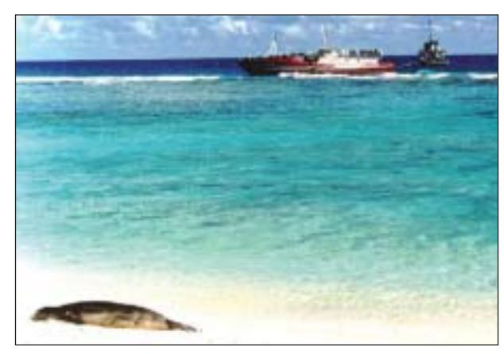

Figure 258. The fishing vessel, Paradise Queen, grounded on a coral reef at Kure Atoll, NWHI, in 1998; note the endangered Hawaiian monk seal resting in the foreground (Photo: M. Cripps).

fishing, boating, diving, snorkeling, and coastal activities. Concerns have been raised over the impact of the catch-and-release fishery at Midway. Large jacks have been infrequently encountered on fish surveys at Midway (relative to French Frigate Shoals) since recent surveys began in 1993, and especially since the catch-and-release fishery began in 1996 (NMFS Honolulu Lab in prep.). Concerns exist over potential commercial SCUBA-based 'live aboard' boats and cruise ships working their way up the NWHI chain.

**Climate Change and Coral Bleaching Change and Coral Bleaching –** Declines in seabirds, monk seals, reef fishes, and phytoplankton in the NWHI from the early 1980s to early 1990s (Polovina *et al*. 1994) are thought to have resulted from regional decreases in oceanic productivity (Polovina *et al*. 1995).

There was little monitoring for bleaching events in the NWHI during the 1997-1998 ENSO bleaching event; remnant evidence of such events was not detected during the NOWRAMP 2000 expedition.

#### **Current Conservation Management Management**

**Mapping Mapping –** The shallow-water (to a depth of approximately 30 m) coral reef ecosystems of the NWHI will be mapped using image analyses of commercially-available, high-resolution satellite imagery. Imagery has been purchased for 10 NWHI locales. Unvalidated draft maps have been generated for three of these – Kure Atoll, Midway Atoll, and Laysan Island. Similar maps are expected to be generated for the remaining seven areas by July 2002. At that time, an extensive effort will be initiated to validate all maps of the NWHI shallow

**HAWAI'I HAWAI'I HAWAI'IHAWAI'I**

water coral reef ecosystems. It is anticipated that final maps will be available by January 2003.

**Assessment and Monitoring Assessment Monitoring –** NOAA, USFWS, Hawai'i DLNR, the Bishop Museum, the Oceanic Institute, the University of Hawai'i, the University of California at Santa Cruz (UCSC), and private sector companies launched the NOW-RAMP initiative in 2000 to map and assess the status of coral reef shallow-water habitats in the NWHI (Fig. 259). An additional expedition in 2001, sponsored primarily by the NOAA Honolulu Fisheries Laboratory with additional participation by USFWS and UCSC, provided the opportunity to collect additional information and establish data monitoring buoys on reefs at French Frigate Shoals, Maro Reef, Lisianski Island, Pearl and Hermes Atoll, Midway Atoll, and Kure Atoll, and also included limited diver observations on Raita Bank (Maragos and Gulko 2002).

An early baseline assessment of shallow reef fish populations was conducted at French Frigate Shoals and Midway Atoll during 1980-1983 by USFWS fisheries biologists. Honolulu Laboratory biologists completed new baseline assessments at French Frigate Shoals and Midway in 1992 and 1993, respectively (DeMartini *et al.* 1996) and conducted annual monitoring surveys at both sites during 1995-2000 (DeMartini *et al.* 2002).

Since the early 1980s, NOAA Honolulu Fisheries Laboratory scientists have monitored endangered Hawaiian monk seals and sea turtles off French Frigate Shoals, Laysan, Lisianski, Pearl and Hermes, Midway, and Kure. Since 1992 NMFS has conducted annual reef fish surveys at French Frigate Shoals and Midway Atoll. Since 1990, these scientists have also mapped NWHI underwater benthic habitats using towed divers, video cameras, and submersible vehicles.

**MPAs–** The NWHI contain a number of examples of species-specific, limited-take MPAs. The majority of the NWHI is classified as Critical Habitat for the endangered Hawaiian monk seal. By federal regulation, a 50-mile protected species zone exists around the NWHI islands and atolls restricting longline fishing, and seasonal area closure zones were in effect for the take of NWHI lobster until the entire fishery was recently closed down.

On May 26, 2000, President Clinton directed the Secretaries of Commerce and the Interior, in cooperation with the State of Hawai'i, and in consultation with the Western Pacific Regional Fisheries Management Council (WPRFMC), to develop recommendations for a new coordinated management regime to increase protection for the unique coral reef resources of the NWHI. As a result, discussions have ensued over their trusteeship and jurisdictional authority. The State of Hawaii holds trusteeship of all reef resources out to three nautical miles from any emerged point of land in the NWHI173. The USFWS administers a National Wildlife Refuge throughout the NWHI (with the exception of Kure Atoll), the boundaries of which are currently being solidified and may vary in certain portions of the refuge. NOAA currently has jurisdictional authority over most reef resources outside of three nautical miles primarily through NMFS with the WPRFMC serving in an advisory role. The result of this effort was Executive Order 13178, which on December 4, 2000 established the Northwestern Hawaiian Islands Coral Reef Ecosystem Reserve.

The new NWHI Coral Reef Ecosystem Reserve contains provisions for a number of functional notake areas distributed across the entire NWHI (with the exception of Midway) in federal waters and ranging from 25 to 100 fathoms in depth. Other regulations to be included within these areas include restrictions on anchoring, discharge and non-extractive uses.

Figure 259. This scientist is making a video record of one of the many reefs surveyed during the 2000 NOWRAMP assessment (Photo: James Maragos).

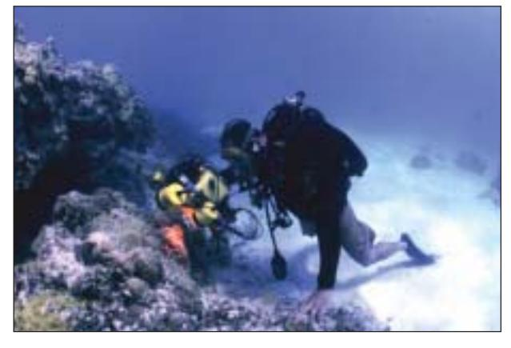

173 Midway, though geographically located within the NWHI, is the only portion of the Hawaiian Archipelago that is not part of the State of Hawai'i. It is administered independently by the USFWS as a National Wildlife Refuge. **179179**

**HAWAI'I HAWAI'I HAWAI'I HAWAI'I HAWAI'I**

#### **Gaps in Current Monitoring Gaps Monitoring**

Multiple agency jurisdictional authority over reef resources raises questions about effective stewardship of the NWHI's coral reefs, which is arguably the last major set of reef ecosystems left in the world that have not been heavily affected by human intrusion. The recent establishment of the NWHI Coral Reef Ecosystem Reserve should help sort out some of these conflicts and provide for a protective umbrella within Federal waters under which the various agencies can partner to effectively manage these unique resources. Currently State waters are not covered within this reserve and comparable effective State management structure or resources are lacking. This is of critical importance as many reef scientists feel that the majority of high biodiversity coral reef habitat in the NWHI is located within State waters. Current lack of regulations controlling extractive activities within NWHI waters pose a particular problem; the proposed State of Hawai'i FMA for the NWHI may not fully close this gaping loophole to protecting this fragile and unique wilderness area.

Difficulties in patrolling and enforcing regulations throughout the 1,600 km (1,000 miles) length of the NWHI poses a problem in encouraging compliance from the various types of vessels (fishing, research, and eco-tourism) currently in the area and the large number of vessels expected to enter the area in the future. Creation of an automated Vessel Monitoring System (VMS), with a transmitting unit required on all vessels operating in the NWHI, and which automatically notifies both the ship in question and the appropriate enforcement and resource trustees of approach to protected or off-limits174 areas would go a long ways towards effectively solving this problem given the large distances and the extremely limited resources available to the USCG and the resource trustees. Efforts are currently underway to fund installation of VMS on various types of vessels, though how the vessels will be monitored and which agencies will have access to the data still needs to be worked out.

Management of the NWHI has been shared among agencies with differing missions. Reliance on the WPRFMC to advise NMFS on management of NWHI fisheries resources at levels that do not impact the sustainability of the fished species, nor

prevent reef ecosystem damage, may have been of limited success. Federal court litigation has occurred during the last two years relating to NMFS compliance with federal fisheries management and endangered species laws in the NWHI. The proposed draft WPRFMC Coral Reef Ecosystem Fisheries Management Plan (FMP) proposes to manage the coral reef ecosystems of the NWHI at an ecosystem level, yet excludes all other existing FMPs from the majority of listed management measures. Since many of the coral reef species are already listed under other existing FMPs (crustaceans, groupers, snappers, sharks) the ecosystem approach is still subordinate to single-species decision-making. Mechanisms (such as automated VMS, active zoning, mitigative bonding) that have been successful in other managed coral reef areas of the Pacific have not been incorporated fully into the existing or proposed WPRFMC's FMPs for the NWHI.

#### **The Hawaiian Archipelago Archipelago**

The last two sections of this report pertain to the entire Hawaiian Archipelago.

#### **Government Policies, Laws, and Legislation Government Policies, Laws, and Legislation**

The majority of the shallow water coral reefs are under the jurisdictional authority of the State of Hawai'i (primarily DLNR). Direct military control over areas of the NWHI has been phased out over the last 30 years; Midway was turned over to the USFWS, and the USCG abandoned LORAN stations at Kure and Tern Island (French Frigate Shoals) in the 1970s to 1980s.

In 1998, President Clinton signed Executive Order 13089 for Coral Reef Protection which mandated "All Federal agencies whose actions may affect U.S. coral reef ecosystems shall: a) identify their actions that may affect U. S. coral reef ecosystems; b) utilize their programs and authorities to protect and enhance the conditions of such ecosystems; and, to the extent permitted by law, c) ensure that any actions they authorize, fund, or carry out will not degrade the conditions of such ecosystems."

This Executive Order also focused the resources of the various agencies of the federal government to assist the State and Territorial resource trustees in making serious inroads into protection of the

**HAWAI'I HAWAI'I HAWAI'IHAWAI'I**

174 Depending on the type of activity that the vessel is engaged in.

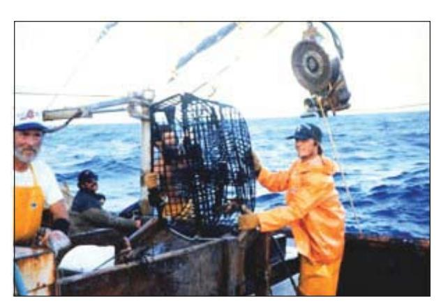

Figure 260. Popular throughout the Pacific, lobsters in the MHI are considered overfished while the NWHI lobster fishery remains closed due to concerns for sustainability of the population (Photo: Hawai'i DAR).

country's coral reef resources. To facilitate this, the President created the U. S. Coral Reef Task Force made-up of cabinet-level appointees to oversee the implementation of the Executive Order.

The State of Hawai'i has a number of existing laws and regulations concerning uses and impacts on corals and coral reefs. Sand, rubble, live rock, and coral are protected from harvest or destruction in State waters. Many Hawaiian stony corals are also prohibited from being sold. Certain Administrative Rules provide for protection of marine water quality, and creation of MPAs. The State Constitution can specifically be applied to protection of coral reef habitats. Portions of Section 1 state that "the State and its political subdivisions shall conserve and protect Hawaii's natural beauty and all natural resources, including land, air, mineral and energy sources, and shall promote the development and utilization of these resources in a manner consistent with their conservation and in furtherance of the self-sufficiency of the State." Section 9 of the same document states that "each person has the right to a clean and healthful environment, as defined by laws relating to environmental quality, including control of pollution and conservation, protection and enhancement of natural resources."

In the Spring of 2000, the Hawai'i Legislature passed a law banning the harvest of shark fins from State waters or landing of shark fins in the State regardless of the waters in which the sharks were caught. The result is a lessening of the fishing pressure on sharks, including species that play a role in reef ecosystems in Hawai'i.

Public Education and Outreach for Coral Reef Protection – The DLNR, as the primary resource trustee for most nearshore coral reefs throughout the Hawaiian Archipelago, has started to produce *of-the-Reefs*  policy-makers, and government agencies. Reports for distribution to the public, *State-*

DLNR also distributes a variety of pamphlets on coral reef MPAs, fishing regulations, laws and regulations and basic natural history information.

Under a grant from NOAA, the State is implementing a variety of public education and outreach projects designed to facilitate coral reef management. These projects include community-based monitoring initiatives, a coral reef awareness raising campaign, and community-based marine debris removal coordination. Installation of day-use mooring buoys at Molokini MLCD and an assessment of marine tourism use in State MPAs are also being funded under this grant.

The State of Hawai'i Coastal Zone Management Program has also supported both research and educational activities related to Hawaiian coral reefs. A new booklet will be widely distributed through the local marine tourism industry to better educate visitors and help guide them in limiting their impacts on the natural resources.

#### **Conclusions and Recommendations Recommendations**

Coral reefs have always been an important component of human existence in Hawai'i, as they provide habitat and other resources for fish and invertebrates that are popular for human consumption (Fig. 260). The nearshore reefs once provided the majority of the protein for the Hawaiian people, and today consumptive uses of reef resources include subsistence, commercial, and recreational activities. Despite their importance, coral reefs in Hawai'i suffer from degradation related to continued human population growth, urbanization and development. Ocean outfalls, urbanization, and massive coastal recreational development (e.g., hotels, golf courses) are presently focal points for coral reef degradation in Hawai'i (Jokiel and Cox 1996). New technologies for extraction, offshore aquaculture, and bioprospecting raise concerns about the ability of management agencies to keep up with new impacts to coral reef resources. Economic and business pressures to allow such

**HAWAI'I HAWAI'I HAWAI'I HAWAI'I HAWAI'I**

impacts may have severe consequences for Hawai'i where coral reefs represent a thin band of habitat directly next to the shore, yet are extremely important to the marine tourism industry which serves as a major lynchpin in the overall Hawaiian economy.

There are strong indications of overfishing for the majority of food fish and invertebrates in the MHI. Similar concerns are starting to be expressed in regards to the impact of the marine ornamental trade. These problems are compounded by the realization that the status of fisheries resources in the MHI are considerably under-reported, making proper management of these resources difficult at this time.

The coral reefs of the Hawaiian Archipelago represent not only the majority of U.S. reef area, but also a set of unique ecosystems of unusually high endemism and diversity of reef types, along with a uniquely predator-dominated fish assemblage within the NWHI. Given this, issues such as alien species introduction and marine ornamental collection175, are of stronger concern here then in many other coral reef areas.

Hawai'i has a wide variety of types of MPAs which protect coral reef habitat to some extent, yet very little of MHI reefs are 'No-take MPAs' where extraction of any type is not allowed. With only 0.3% of the MHI coral reef habitat protected as 'No-take MPAs,' it's going to be extremely challenging to meet the USCRTF's established goal of setting aside a minimum of 20% of the representative coral reef habitat as 'No-take MPA' by the year 2010. Even those few areas that are currently 'Notake MPAs' in the MHI are exposed to heavy human usage for recreation and marine tourism potentially undermining their effectiveness in representing 'natural' coral reef ecosystems.

While new efforts and joint partnerships have been initiated by the resource trustee agencies, academia, nongovernmental organizations and the various communities themselves, more support (financial and political) for the existing and proposed efforts is needed in order to effectively sustain the exceptionally wide variety and area of coral reef habitat and resources found in the Hawaiian Archipelago.

**HAWAI'I HAWAI'I HAWAI'IHAWAI'I**

175 Especially focused on rare or endangered species.

## **STATUS OF THE CORAL REEFS IN AMERICAN SAMOA STATUS OF THE CORAL REEFS IN AMERICAN SAMOA STATUS OF THE CORAL REEFS IN AMERICAN SAMOA Peter Craig Peter Craig Peter Craig Peter Craig Peter Craig**

#### **Introduction Introduction**

The Territory of American Samoa is a group of five volcanic islands and two atolls in the central South Pacific Ocean. These islands are small, ranging in size from the populated high island of Tutuila (142 km2 ) to the uninhabited and remote Rose Atoll (4 km2 ). The total area of coral reefs (to 100 m) in the territory is 296 km2 (Table 33).

| Island/Bask  | Island Type | Arma Sizer (km²) | Coral Reef Area (kerf) | Real Type                    |
|--------------|-------------|------------------|---------------------------|------------------------------|
| Tutulla      | Volcanic    | 147,3            | 243.0                     | Fringery, non- structural |
| Ofse         | Volcario    | 7.5              | 3.2                       | Fringing                     |
| Olosoga      | Volcario    | 3.4              | 2.0                       | Fringing                     |
| Ta'u         | Volcanic    | 45.7             | 1.7                       | Fringing, non- structural |
| Auncu        | Volcaric    | 1.6              | 0.5                       | Tringing                     |
| Swains       | Atoli       | 0.1              | 3.3                       | Atol                         |
| Rose         | Atoli       | 0.1              | 7.0                       | Atol                         |
| Neferco Bank |             | N/A              | 6.0                       | Submerged bank/shoal      |
| Tarro Bank   | +           | N/A              | 4.0                       | Submerged bank/sheat      |
| Outer banks  |             | N/A              | 25.0                      | Submerged bank/shoal      |
| Total        |             | 203              | 296                       | 10000                        |

Table 33. American Samoan island's and their coral reef area (Source: Hunter 1995).

The Samoan reefs support a diverse assemblage of 890 fishes, 200+ corals, and 80 algal species. These reefs provide an important source of food for villagers through daily subsistence use and sales at local stores. They also provide invaluable infrastructure and shoreline protection from storm wave action. Other potential uses of the reefs are low at present (e.g., tourism, or the extraction of reef products for aquariums).

#### **Condition of Coral Coral Reefs**

Due to the steepness of the main islands, shallow water habitats around the islands are limited and consist primarily of fringing coral reefs (85%) with a few offshore banks (12%), and two atolls (3%). The fringing reefs

have narrow reef flats (50-500 m); depths of 1000 m are reached within 2-8 km from shore.

**Coral–** The coral reefs are currently recovering from a series of natural disturbances over the past two decades: a crown-of-thorns starfish invasion (1979), three hurricanes (1986, 1990, 1991), and a period of warm water temperatures that caused mass coral bleaching (1994) (Fig. 261). Additionally, there are chronic human-induced impacts in areas like Pago Pago Harbor (Craig *et al*. 2000a).

By 1995, the corals were beginning to recover, as evidenced by an abundance of coral recruits (Mundy 1996, Birkeland *et al*. 1997). Coral growth has continued through 2000, but a full recovery will take time. There have also been improvements to reefs in Pago Pago Harbor by the removal of 9 shipwrecks; and another shipwreck was removed at Rose Atoll (Green *et al*. 1998). Additionally, the export of 'live rock' from coral reefs was banned in June 2000.

**Algae–** Information is limited, but with a few exceptions, the algae found around the islands indicate a low-nutrient environment and/or heavy grazing by herbivores. Encrusting coralline algae cover (*Porolithon*) is high (40-50%). These algae help cement and stabilize the loose surface below (Birkeland *et al*. 1997).

**Fish and Harvested Invertebrates Invertebrates –** Despite the on-going recovery of corals on local reefs, many fish and invertebrates are not recovering as quickly. Harvested species such as giant clams and

Figure 261. After being impacted by hurricanes (A), a crown-of-thorns starfish outbreak, and coral bleaching, reefs in American Samoa are now recovering (B). (Photos: National Park of American Samoa and Kip Evans, Fagatele Bay NMS).

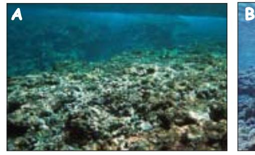

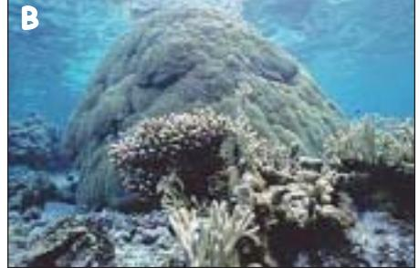

parrotfish are overfished (Fig. 262), and there is heavy fishing pressure on surgeonfish (Craig *et al*. 1997, Page 1998, Green and Craig 1999). Fewer and/or smaller groupers, snappers, and jacks are seen. Most village fishermen and elders believe that numbers of fish and shellfish have also declined (Tuilagi and Green 1995). Also, in some areas, fish are now toxic with heavy metals, particularly those from Pago Pago Harbor (AECOS 1991).

Since 1995, the nighttime artisanal spear fishermen began using SCUBA gear, greatly increasing their catches. This led to a territorial ban on SCUBAassisted fishing in April 2001.

**Sea Turtles Turtles –** Often overlooked as a part of the coral reef ecosystem, Hawksbill sea turtles feed on reef sponges and other organisms. hawksbill populations are in serious decline for two major reasons: 1) illegal harvest and 2) loss of nesting habitat (Tuato'o *et al*. 1993). The hawksbill is listed as endangered and is rapidly approaching extinction in the Pacific (Eckert *et al*. 1995).

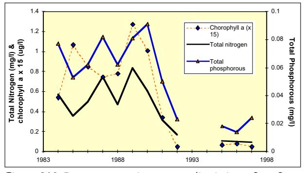

Figure 263. Improvements in water quality in inner Pago Pago Harbor after canneries were reqired to dispose of wastes beyond the innner harbor in 1991. Actual values of chlorophyll a are 15 times greater than values shown graphically. (Source: ASEPA 2000).

Green sea turtle populations in the South Pacific have declined as well and should probably be classified as endangered (Eckert *et al*. 1995). Conservation efforts are complicated by the turtles' complex migration patterns. Some migrate from American Samoa to both Fiji and French Poly-nesia. Conserving 'shared' turtle populations will require international cooperation.

**Water Quality Water Quality –** Due to the steepness of the islands and their limited development of shallow water habitats, the continual flushing by ocean currents provide generally good water quality. There are three exceptions: 1) sedimentation from improper land use practices that pours into coastal waters after heavy rains, 2) nutrient enrichment from human and animal wastes in populated areas, and 3) contamination in Pago Pago Harbor.

Pago Pago Harbor suffers from two kinds of pollution. First, fish and substrates in the

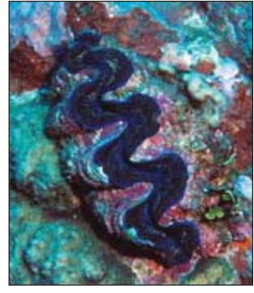

Figure 262. Today, giant clams are rare in populated areas of American Samoa (Photo: Nancy Daschbach).

harbor are contaminated with heavy metals and other pollutants (AECOS 1991). Second, nutrient loading from cannery wastes in the inner harbor formerly caused perpetual algal blooms and occasional fish kills due to oxygen depletion. In the early 1990s, the canneries were required to dispose of their wastes beyond the inner harbor (Fig. 262), greatly reducing nutrient levels.

#### **Coastal Populations and Reef Reef Economics EconomicsEconomics**

American Samo's population was 57,300 in 2000. During the past 10 years, the population increased by 10,500 people, an increase of 22%. The population is increasing at a yearly rate of 2.1%, adding about 1,200 people each year (Fig. 264). It is expected to continue, given the high birth rate (4.0 children per female), the fact that 50% of the population is younger than age 20, and the high immigration rate. Adverse human-related impacts will likely increase with rapid population growth.

Figure 264. Population growth in American Samoa.

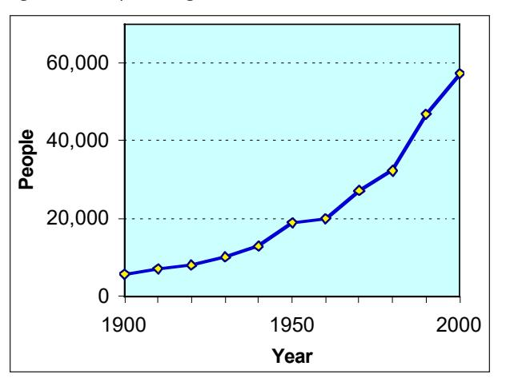

A recent Governor's Task Force on Population Growth report called for a population ceiling of 115,000. This ceiling is calculated on resources (particularly drinking water) and the diminishing quality of life. An action plan for the Territory identifies specific steps to reduce birth and immigration rates (Craig *et al*. 2000b).

More than 18,000 tourists (calculated in 1995) visit the islands annually and expend over \$10 million (calculated on tourist receipts from 1990, United Nations Economic and Social Commission for Asia and the Pacific 2002).

In 2001, ex-vessel landings from small boats in the domestic commercial fisheries generated \$2 million (NMFS 2001). However, the actual economic impact of commercial fisheries in American Samoa is far greater when distant-water tuna harvests are included. These fish are processed in two local canneries in Pago Pago Harbor. Their ex-vessel value from both foreign and domestic vessels was approximately \$232 million (Western Pacific Fishery Management Council 1999). American Samoans still rely on local coral reefs for food, and it is estimated that the reefs provide an economic base of \$1 million per year (Fig. 265).

#### **Environmental Pressures on Coral Reefs on Coral Reefs**

**Human Stresses Stresses –** At a recent workshop on coral reefs in American Samoa (Craig *et al*. 1999), the following list of human-related threats was identified and ranked.

Figure 265. Both commercial and subsistence fisheries play an important role in American Samoa (Photo: National Park of American Samoa).

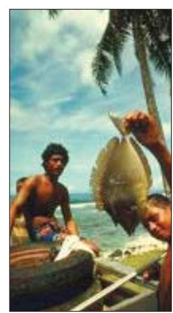

#### **High**

Overfishing of reef resources Coastal development and habitat destruction Oil and hazardous waste spills in Pago Pago Harbor

#### **Medium**

Sedimentation

Dumping/improper waste disposal

Nutrient loading/eutrophication in Pago Pago Harbor

#### **Low**

Nutrient loading/eutrophication elsewhere Oil and hazardous waste spills elsewhere Ship groundings Anchor damage

Destructive fishing habits

Marine debris from marine sources Alien species (e.g., from ballast water)

Crown-of-thorns starfish predation

Coral diseases

Collections for the aquarium market Bio-prospecting/natural products

**Natural Stresses Natural Stresses –** American Samoa lies close to a warmer than usual mass of seawater that tends to form south of the territory during La Niña years. Nearby Fiji and Western Samoa have been hit hard by mass coral bleaching in recent years, so it would seem probable the reefs of American Samoa may be similarly impacted.

#### **Current Conservation Management Management**

**Mapping Mapping –** American Samoa needs coral reef habitat mapping. NOAA habitat mapping activities are planned to begin in 2002. Fagatele Bay National Marine Sanctuary supported a multibeam mapping effort in 2001 that resulted in maps for the sanctuary and Pago Pago Harbor, with partial coverage elsewhere (D. Wright pers. comm.). This information is available on their web site (Oregon State University 2002).

Monitoring and assessment of coral reefs has been conducted in one of three ways to date: one-time surveys, long-term monitoring, and fisheries monitoring. One-time surveys of corals and fishes have been conducted over the years using various methods/sites/depths on all seven islands in the territory (e.g., Hunter *et al.* 1993, Green 1996, Mundy 1996, Green and Hunter 1998). Some of the data from these may be incorporated into future monitoring programs.

Water quality in Pago Pago Harbor has been monitored since 1984 (ASEPA 1998). Corals, other invertebrates, fish, and algae have been monitored by Birkeland *et al*. (1997) for nearly 20 years in Fagatele Bay National Marine Sanctuary and in

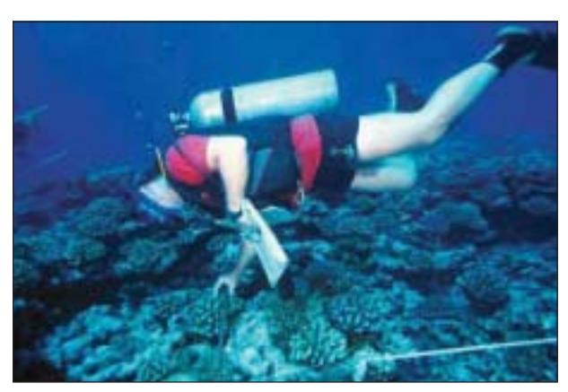

Figure 266. Coral reef monitoring in Fagatele Bay National Marine Sanctuary (Photo: Kip Evans).

lesser detail at other Tutuila locations (Fig. 266). Corals along an historical transect on a Pago Pago Harbor reef flat have been monitored on several occasions since 1917 (Green *et al*. 1997).

Limited harvest information is available for fish and invertebrates caught on the surrounding coral reefs. Declining subsistence catches were monitored in 1979 and 1991-1995 (Wass 1980, Saucerman 1996), but the surveys were discontinued. The artisanal (small-scale commercial) catch was monitored in 1994 – it is currently assessed via market invoices, but compliance by vendors is incomplete, so the harvest levels are not well known. Three studies have examined fishing pressure on harvested surgeonfish (Craig *et al*. 1997), parrotfish (Page 1998) and giant clams (Green and Craig 1999).

In 2002, a workshop was held to develop a territorial monitoring plan for coral reefs in the territory. Also, NOAA's *Townsend Cromwell* conducted a survey in 2002 of all the islands including manta tows, fish and coral surveys, and mapping.

**MPAs–** There are four Marine Protected Areas (MPAs) in American Samoa, one of which is a notake area (Rose Atoll, Table 24). Together, these MPAs account for about 6% of the territory's coral

reefs. But protection in these areas through regular Table 24. Existing MPAs in American Samoa. surveillance and enforcement is generally lacking. In the main islands where overfishing occurs, there are no no-take MPAs.

Poaching in all MPAs is an problem. Page (1998) determined that 9% of the

local artisanal fishery occurs illegally within the National Park of American Samoa on Tutuila Island.

#### **Government Policies, Laws, and Legislation Laws, Legislation**

Legislation is in place for water quality standards, land use regulations, waste disposal, fishery management, habitat protection, endangered species, protected areas, ship pollution, and other environmental issues. Environmental violations are more frequently detected and prosecuted, but enforcement of these regulations is not widespread and many problems persist.

Local environmental agencies have also undertaken aggressive education programs to increase community awareness and understanding of environmental issues. This effort is commendable, but it is difficult to keep pace with the territory's rapidly growing population and development pressures.

#### **Gaps in Current Monitoring and and Conservation Capacity Capacity**

On-island expertise in environmental protection has increased in recent years. Various research, monitoring, and environmental compliance efforts are conducted by several groups within the Department of Marine and Wildlife Resources, the American Samoa Environmental Protection Agency, the Department of Commerce and Fagatele Bay National Marine Sanctuary, American Samoa Community College, and the National Park of American Samoa (Craig and Basch 2001).

Nonetheless, these programs are generally small and would benefit from increased on-island capacity. Also, there is little on-island expertise to accurately identify the Indo-Pacific corals and fishes found on local reefs (200+ and 890 species, respectively). Consequently, it is necessary to

| HPA                                       | Island               | Arna Size (Sen 2 ) | Coxal Feet Aims (km²) | Percent of Territorial Coral Rents | No-take Status | Adequate Enforcement |
|-------------------------------------------|----------------------|----------------------------------|--------------------------|------------------------------------------|-------------------|-------------------------|
| Rose Atoli National Wildlife Sanctuary | Rose Atok            | 158.8                            | 7.0                      | 2.4%                                     | Yes               | No                      |
| National Park of American Samos        | Tutufa, Ofu, Ta'o | 9.1*                             | 9.1                      | 3.1%                                     | No                | Nis                     |
| Fagatele Bay National Marine Sanctuary | Tutulia              | 0.7                              | 0.7                      | 0.2%                                     | No                | No                      |
| Vaoto Territorial Park                    | Otu                  | 5.0                              | 0.2                      | 0.1%                                     | No.               | No                      |
| Total                                     |                      | 168.8                            | 17.0                     | 5.8%                                     | T.                |                         |

focus on indicator species so the local staff can monitor key reef resources at appropriate intervals.

#### **Conclusions and Recommendations Recommendations**

To date, coral reefs in American Samoa have been resilient to a series of natural perturbations, although full recovery may take another decade. The message for managers is that the reefs will recover no additional human pressure, but there are several examples where serious harm has already been done, particularly overfishing of reef resources, reduced water quality in populated areas, and loss of turtle nesting beaches to coastal construction. Climatic change has uncertain consequences for local reefs. Several areas needing additional work for coral reef conservation in the Territory.

**Expand coral reef monitoring efforts, but focus the objectives.** Most quantitative monitoring efforts in American Samoa might be characterized as ecological monitoring that tracks changes in the ecosystem over time. These studies have provided valuable insight, highlighting that coral reefs are very dynamic systems.

From another perspective, however, these studies do not address questions commonly faced by coral reef managers. Such things as "Is overfishing occurring?" "Is sediment from poor land-use practices harming the reef?" Consequently, any monitoring program must clearly identify 1) who is the intended user of the data, and 2) what parameters should be measured to provide that information. In addition to this management-driven approach, a monitoring program in American Samoa should be 1) achievable with local staff, although off-island scientific expertise may be needed to address some issues, 2) stable to rotations of technical staff who are typically hired on 2-year contracts, 3) comparable to other programs as much as possible, and 4) open to community input and management.

**Restart monitoring of coral reef fisheries.** A workshop in American Samoa identified overfishing as the major problem hindering recovery of local reefs (Craig *et al*. 1999). It is essential to collect basic harvest data to monitor trends in total catch, catch-per-unit-effort, etc.

**Improve land-use practices that impact water quality.** Despite welcome improvements in water quality in Pago Pago Harbor, coral reefs there have not fully recovered nor is there safe swimming or

uncontaminated fish in the harbor. A phased recovery plan is needed to build on the progress already made. Harbor fish and sediments also need to be re-tested for toxicity at regular intervals. Additionally, improvements in land-use and waste disposal practices are needed to reduce sedimentation and pollutants (Fig. 267).

**Create a territorial network of no-take marine protected areas.** There are two issues here. First, existing MPAs in the territory are not adequately enforced. Second, no-take MPAs are needed in the main islands where there is overfishing.

**Create a regional network of MPAs.** A meaningful effort to protect coral reef resources requires a regional approach. In addition to the issue of larval transport of reef fishes and invertebrates, sea turtles provide an excellent example of a shared resource that binds the islands in the region together. Tagging data show green sea turtles nest in American Samoa and migrate to both Fiji and Tahiti to feed, so conservation efforts are needed at both ends of their migration routes. The South Pacific biogeographic region needs a network of MPAs to address these issues.

Figure 267. Land-use practices within nearby watersheds affect coral reef health through their influence on sedimentation and nutrient levels (Photo: Kip Evans).

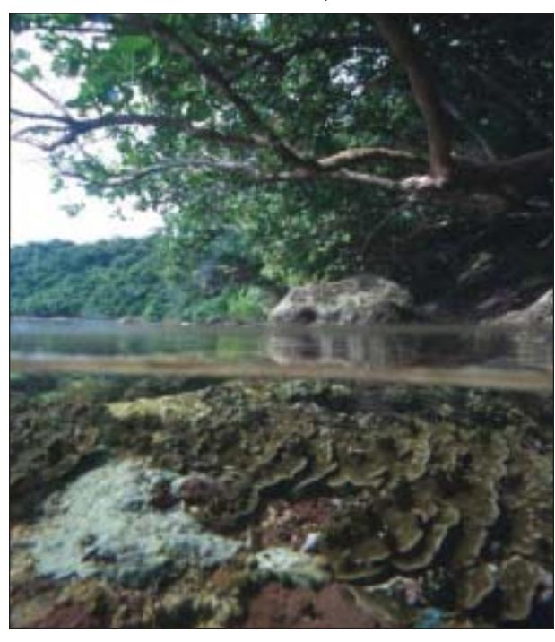

## **STATUS OF THE CORAL REEFS OF GUAM STATUS OF THE CORAL REEFS OF GUAM STATUS OF THE CORAL REEFS OF GUAM Robert H. Richmond and Gerry W. Davis Robert W. Davis Robert H. Richmond and Gerry W. DavisRobert H. Richmond and Gerry W. Davis Robert H. Richmond and Gerry W. Davis**

#### **Introduction Introduction**

Guam is a U.S. territory located at 13o 28' N, 144o 45' E and is the southernmost island in the Mariana Archipelago. It is the largest island in Micronesia, with a land mass of 560 km2 and a maximum elevation of approximately 405 m. The northern portion of the island is relatively flat and consists primarily of uplifted limestone. The southern half of the island is primarily volcanic, with more topographic relief and large areas of highly erodible lateritic soils.

The island possesses fringing reefs, patch reefs, submerged reefs, offshore banks, and a barrier reef surrounding the southern shores. The reef margin varies in width, from tens of meters along some of the windward areas, to well over 100 meters. The combined area of coral reef and lagoon is approximately 69 km2 in nearshore waters between 0-3 nmi, and an additional 110 km2 in federal waters greater than 3 nmi offshore (Hunter 1995).

Guam lies close to the center of coral reef biodiversity. Sea surface temperatures range from

Figure 268. Common Acropora species (Photo: Gustav Paulay).

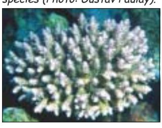

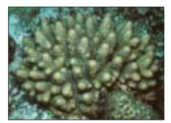

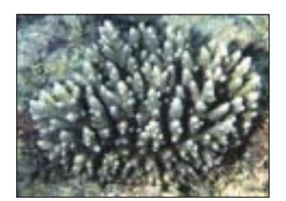

about 27-30OC with higher temperatures measured on the reef flats and in portions of the lagoons. According to G. Paulay (pers. comm.), 4 seagrass species, 306 marine macroalgae species, 403 stony and 77 soft coral species, 128 sponge species, 295 foraminiferan species, 53 flatworm species, 1,673 mollusk species, 104 polychaete species, 840 arthropod species, 194 echinoderm species, 117 ascidian species, 3 sea turtle species, and 13 marine mammal species have been

recorded from Guam's coral reef ecosystems. Myers and Donaldson (in press) list 1019 species of shorefishes (epipelagic and demersal species found down to 200 m) from the islands of the Southern Marianas, making no distinction among Guam, Rota, Tinian, and Saipan.

Coral reef fisheries include both finfish and invertebrates. These fisheries are both economically and culturally important. Reef fish have been historically important in the diet of the population, however, westernization and declining stocks have reduced the role of reef fish overall. Many of the residents from other islands in Micronesia continue to include reef fish as a staple part of their diet. Sea cucumbers, a variety of crustaceans, molluscs, and marine algae are also eaten locally.

In addition to the cash and subsistence value of edible fish and invertebrates, reef-related fisheries are culturally important as family and group fishing is a common activity in Guam's coastal waters.

#### **Condition of Coral Reef Ecosystems Ecosystems**

The condition of Guam's reefs is variable, ranging from excellent to poor, depending on adjacent land and land-use characteristics, accessibility, location of ocean outfalls and river discharges, recreational pressures and oceanic circulation patterns. Due to the limestone nature of northern Guam (hence no natural lakes or streams), the northern reefs are generally in better condition than those affected by erosion and sedimentation in the south. Aquifer discharge and associated eutrophication effects are evident on some northern reefs. Coral cover and diversity are generally highest on the northeastern (windward) exposures, with a variety of *Acropora*  species dominating the reef crest and slope (Fig. 268). The eastern reefs along the central and southern portions of the islands are heavily affected by sedimentation and freshwater runoff during the rainy season that occurs from June through November. During this period, terrigenous sediments often accumulate on the reef flats and reef slope.

During the early 1990s, a road project along the southern shores of the island resulted in particularly heavy sedimentation of a 10 km section of

fringing reef, killing all the coral. Most of the fringing reefs along the southern part of the island, continuing up along the southwestern shores are in poor to fair condition.

Apra Harbor is off the central part of the island, on the Philippine Sea (western side). The harbor is home to a large Navy Base and is also the location of the port facilities. Both fringing reefs and

shoals (patch reefs) are found within the harbor, and those closest to the harbor mouth are in relatively good condition. Further into the harbor, corals and reefs have been impacted by freshwater runoff, sediment and thermal discharges from the Island's main power generation facilities.

Agana, Tumon, and Piti Bay (also known as Tapungun) Bays have heavy human use. The inner areas of these bays are in relatively poor condition, affected by discharges from land as well as the impacts of recreational activities. Agana and Tumon Bays are centers for tourism. East Agana Bay serves as a main site for commercial watercraft (jet ski) operations. West Agana has a sewage treatment plant built on the reef flat that had a pipe discharge in 60 ft of water (Fig. 269). Infrastructure upgrades presently underway are expected to improve water quality within these bays, and limited/experimental restoration activities are planned.

**Coral and other Invertebrates and other Invertebrates –** Coral cover on the good-to-excellent reefs ranges from 35-70%, while the most damaged sites have less than 10%

Figure 270. Crown-of-thorns starfish (Photo: Donna Turgeon).

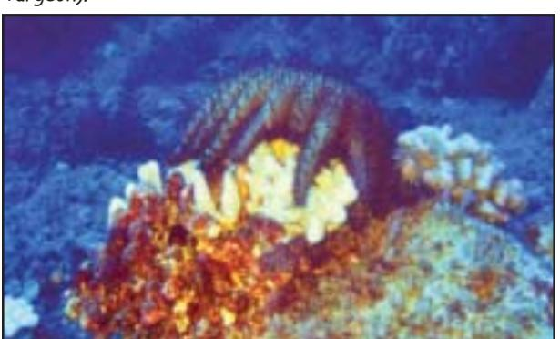

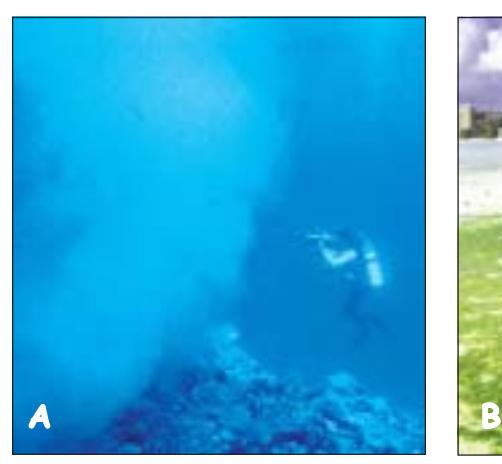

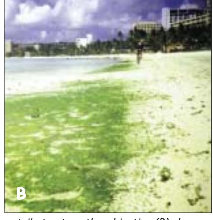

Figure 269. Sewage from ocean outfalls (A) contributes to euthrophication (B) algae washed up on tourist beaches (Photo: Bob Richmond and Donna Turgeon).

coral cover and fleshy algae and sediment dominate the substratum. Data compiled by Birkeland (1997b) found transect data taken in the 1960s generally showed reefs with over 50% live coral cover, but only 7 of 113 transects measured in the 1980s-1990s had over 50% live coral cover, while 88 had less than 25% live coral. In surveys taken off the Northern District sewer outfall in the early 1990s, not only was coral cover below 25%, most of the live coral was restricted to a few species, particularly the rapidly growing, common lobe and plate coral [*Porites* (*= Synarea) rus*], with indications of an overall reduction in coral species diversity.

Recruitment data also support the observations of an overall decline in coral reef condition. In 1979, 278 coral recruits were found from 525 fouling plates placed out on reefs around Guam (0.53 corals/plate), while data collected in 1989 and 1992 found only 0.004 and 0.009 recruits/plate respectively (Birkeland pers. comm.).

Coral diseases, the competitive black encrusting sponge *Terpios hoshinota*, and coralline algal lethal orange disease (CLOD) have all been observed on Guam's reefs, but none seem to be at a critical level at this time.

While the crown-of-thorns starfish occurred in small to moderate numbers over the past few years, a greater abundance of juveniles now is cause for concern about the potential for a future outbreak (Fig. 270).

**Algae–** Blue-green algae that recently are overgrowing coral have been a concern at some sites.

**Fish** – Fish populations have declined 70% over the past 15 years, as documented by the Guam Division of Aquatic and Wildlife Resources.

Total day and night finfish harvest for 1985 was estimated at 151,700 kg. In 1999, this number had dropped to 62,689 kg. Acanthurid fishes (surgeons), important reef herbivores, accounted for approximately 23% of the total catch in 1999 (Fig. 271). Catch-per-unit-effort has dropped by over 50% since

1985, and large reef fish are rare. Seasonal runs of juvenile rabbitfish (Fig. 272), a local favorite, were considered poor for the 1997-1999 seasons, but numbers increased last year. Regulations and protected reserves are being enforced to deal with this problem. SCUBA spear fishing and gill netting are still allowed on Guam, which is contrary to the prevailing conservation ethic. Legislation is being proposed to regulate these fishing methods.

**Water Quality** – Increased stormwater runoff from an airport expansion project, new roads, hotels, shopping centers and golf courses resulted in reduced coastal water quality, especially in bays and areas of restricted water circulation. The salinity of waters over coastal reefs was found to drop below 28 ppt after periods of rainfall during summer coral spawning, which results in reproductive failure (Richmond 1996). Stormwater collection passes into sewer lines, and during heavy rain

the sewage treatment plants divert the wastewater directly into the ocean outfall pipes, often with only primary treatment. Three of the Island's outfall pipes discharge within 200 m of the shoreline, in depths of 20-25 m and in areas where corals are found. Extension of the Northern and Central District outfalls into deeper waters further offshore is planned.

A variety of pollutants has been found in the sediments of

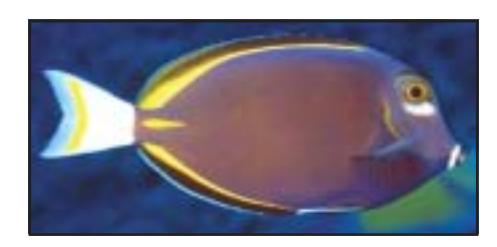

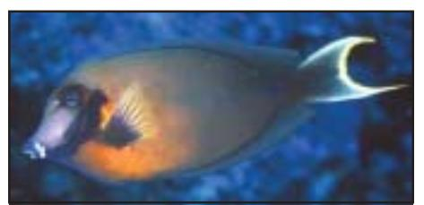

Figure 271. Two species of Acanthurid fish from Guam (Photo: Gustav Paulay).

Apra Harbor, including PCBs, heavy metals, and PAHs. A harbor dredging project is in the planning stages and poses a concern for surrounding reefs. Agrochemicals are also a concern for coastal waters.

## Coastal Populations and Reef Economics

The island underwent a development boom in the late 1980s and early 1990s, resulting in a 15.4% increase in the past ten years to its current population of 154.8 thousand (U.S. Cen-

sus Bureau 2000). Additionally over 1.4 million tourists visit the island each year (OIA 1997).

Tourism, primarily from Japan and other Asian countries, is the largest industry on island. In 1990, tourist expenditures contributed \$936 million to Guam's economy (UNESCAP 2002). Hence, coral reefs and associated marine recreation are of substantial economic value, contributing over \$80 million per year.

Guam's coral reef fisheries, both finfish and invertebrates, are economically and culturally important. The annual ex-vessel value of commercial fisheries landings on Guam is currently \$1.3 million (NMFS 2001). Marine algae also are eaten locally.

#### Environmental Pressures on Coral Reefs

**Human Stresses** – Sedimentation is the major

Figure 272. Two species of rabbitfish from

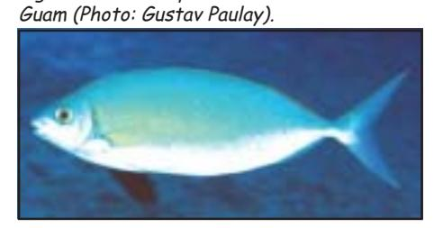

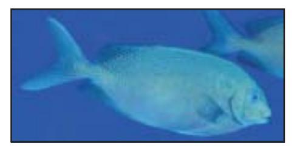

central and southern reefs. For the Ugum River Watershed, soil erosion was estimated at 176,500 tons/km²/year (DeMeo 1995). Forty six percent of this was attributed to sloped roads, while 34% was contributed from badlands. Ugum Watershed erosion rates doubled from 1975 to 1993 (from

anthropogenic problem for the

km2/year), from new road construction and development projects. Sediment accumulation on reefs has been docu-

1,547,250 to 3,039,750 tons/

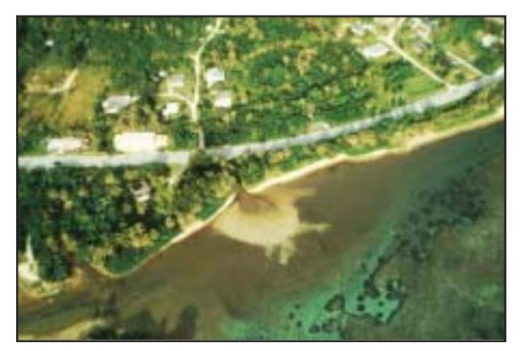

Figure 273. Sediment plume in Southeast Guam extends out towards a reef (Photo: Gerry Davis).

mented to substantially reduce both coral diversity and abundance (Fig. 273, Randall and Birkeland 1978).

Fish populations and catch-per-unit-effort have measurably declined since data collection began in 1985 (Fig. 274). Fishing practices, including the use of unattended gill nets, bleach, SCUBA spearfishing, and fish traps have contributed to the problem. However, habitat loss due to sedimentation, pollution, and physical damage has also been responsible for reduced fish populations.

With over 1 million tourists visiting Guam each year, many from countries where a coral reef conservation ethic is not fully developed, damage to reefs is inevitable. In addition to impacts from SCUBA divers and snorkellers, underwater walking tours using surface-supplied equipment and a large number of personal watercraft (jet skis) have affected reefs and water quality. A coastal use zoning law called the Recreational Water Use Master Plan was passed into law to address these problems but it needs enforcement support and updating to cover new activities and areas of concern.

Groundings of fishing vessels, recreational watercraft, and ships carrying cargo and illegal immigrants have resulted in localized damage to reefs.

Guam's main power generation facilities are located on Cabras Island, in the northern portion of Apra Harbor (Fig. 275). Water that used to cool the generators has killed coral. Cleaning chemicals have also been discharged, with subsequent impacts on local coral populations.

**Natural Stresses Natural Stresses –** Guam is in the tropical Pacific 'typhoon belt,' and experiences an average of one substantial tropical storm or typhoon each year. The coral reefs are of major value in providing protection from storm waves and associated coastal erosion.

**Climate Change and Coral Bleaching Change and Bleaching –** Coral bleaching has been documented to coincide with elevated water temperatures associated with El Niño events. Potential climate change impacts include inundation of low lying coastal areas, and increased sedimentation from drought followed by heavy rains.

Coral bleaching has been observed at a number of sites including within Apra Harbor and in Piti Bay just to the north. Both scleractinians and alcyonarians have been affected, with a few pockets of high mortality. However, the 1998 bleaching event in the Pacific did not cause widespread coral mortality in Guam.

#### **Current Conservation Management Management**

**Mapping Mapping –** Guam needs coral reef habitat mapping. With current funding levels, NOAA habitat mapping of Guam's coral reef ecosystems is planned to begin in 2002.

**Monitoring Monitoring –** In FY00, NOAA awarded a grant to the Guam Division of Aquatic and Wildife Resources (DAWR) for water quality monitoring at 30 stations (10 freshwater, and 20 marine) within the Agana and Tumon sub-watersheds. After reviewing existing data and survey work, sites identified as high risk for altered water quality were sampled for a battery of key microbial, chemical, and physical water quality parameters.

Figure 274. Total fisheries harvest in Guam, 1985-1996 (Modified from Birkeland 1997).

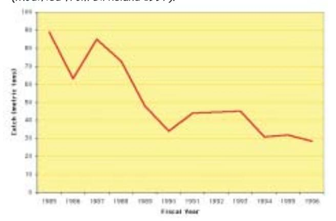

These two watersheds are located in urban-use areas (i.e., the primary hotel area and a major portion of Guam's business district), and are high human-contact zones (recreationally, commercially, and consumptively).

This project will be the basis for the development of future long-term coral reef monitoring strategies and sound management approaches to preserve and restore Guam's coral reef systems. In FY01, Guam continued its water quality monitoring of urbanized bays and initiated coral cover monitoring.

The University of Guam Marine Laboratory has ongoing coral reef monitoring programs, in col-

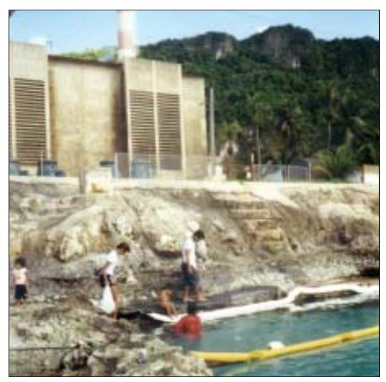

Figure 275. Guam's main power plant (Photo credit: Donna Turgeon).

laboration with the DAWR and the Guam Environmental Protection Agency (GEPA). The Marine Lab database dates back to 1970, and focuses on the marine biota. The DAWR collects data on fish catch through creel censuses, while GEPA has routine water quality sampling programs. A joint educational outreach program exists as a collaboration among the three aforementioned groups as well as the Guam Coastal Management Program.

**MPAs and No-take Reserves Reserves –** There are two Federal (War in the Pacific National Historical Park and Guam National Wildlife Refuge) and 11 territorial MPAs. Five of the territorial MPAs are no-take marine reserves (Pati Point, Tumon Bay, Piti Bomb Holes, Sasa Bay, and Achang Reef Flat

Preserves) representing approximately 12% of the coastline and 28% of the coral reefs. Established in 1998, all five marine reserves are under full enforcement.

In 1986 two ecological no-take reserves were established as mitigation. These reserves would add 2% more coastline and 5% more reef area to the total but they have not been enforced. An ocean current assessment is presently underway at the Pati Point Preserve to determine the areas most likely to be seeded by larvae originating from this preserve. Fish abundance, size, and diversity data are being collected to document the value of the preserves and the success of the program.

#### **Government Policies, Laws, and and Legislation Legislation**

Guam's natural resource legislation protecting coral reef resources is presented in two laws. The prevailing legal authority is the Guam Legislature or statutory law. These laws are relatively old and have not been revised in the past 20 years. For this reason, although it is specifically referenced, coral is considered a fish. When these laws were created, the only group likely to impact reefs were fishermen. Guam's statutory laws regulate the taking of coral and have penalties for fishing damage.

Coral can be taken only under a permit issued by the Department of Agriculture. But no permits have been issued since 1982. The law has provisions for both personal and commercial take but limits such permits to five days and requires specific collecting locations be identified.

This same title (5 GCA chapter 63) also regulates fishing net mesh sizes used in coastal waters as well as illegal chemical and explosives. In addition, the legislature also delegated the authority and responsibility of management and oversight for all aquatic and wildlife resources to the Department of Agriculture. Recently, the Department of Agriculture's DAWR used its regulatory authority to amend and expand the existing fishing regulations.

Title 16 regulates the size restrictions and seasons for aquatic fauna. Also contained in these regulations is an expanded definition section which now properly defines coral and other freshwater and marine fauna types, with a section preventing transplanting of corals or other aquatic fauna.

A major component of these new regulations are the rules governing the five newly established permanent marine preserves and maps defining their boundaries (Fig. 276). These areas define nearly 12% of Guam's coastline as no-take fisheries areas. Statutes have authority over regulations. The penalty for violating both statutes and regulations is a petty misdemeanor, with a fine of up to \$500.

There are also laws that provide indirect protection to coral reefs. GEPA has local water quality standards. These fines can be charged daily and cumulatively, up to \$10,000 a day.

The Seashore Protection Commission has review and approval authority over construction projects proposed within the area from 10 meters inland of the mean high tide mark out to a depth of 60 ft. This is a 21-member government review group who look at all the various impacts. Once this group reviews the proposal for a project, their comments are submitted to a commission made up of appointed members of the public for consideration of approval or rejection.

This commission has not been very successful in upholding their responsibilities. Guam still needs laws to address ship groundings and ways to assess damage and levy fines for large-scale human induced coral reef damage. It is also in the process of converting the misdemeanor penalties to a magistrate court system that could be used to issue citations instead of requiring a court hearing to collect penalties.

#### **Gaps in Current Monitoring and and Conservation Capacity Capacity**

Guam is fortunate to have a large number of technical experts in coral reef ecology, management, and policy. Three government agencies have staff dedicated to dealing with coral reef and coastal resource monitoring and protection – the DAWR, the Guam Coastal Management Program within the Bureau of Planning, and GEPA. In addition, there are two research units at the University of Guam that focus on coral reef and coastal environmental issues – The University of Guam

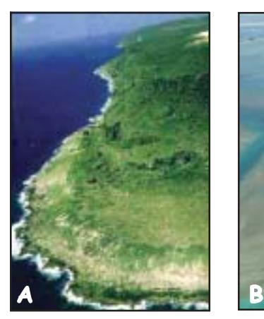

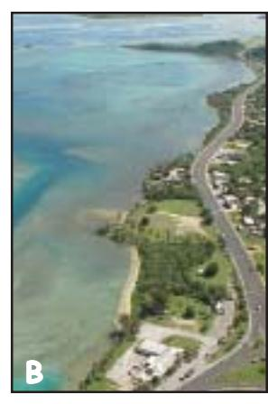

Figure 276. Pati Point Preserve (a) and Piti Bomb Holes Preserve (b) are two of the newly established MPAs (Photos: Jay Gutierrez and Danko Taborosi/WERI UOG).

Marine Laboratory and the Water and Environmental Research Institute. Collaboration and cooperation is high among these agencies and institutions. Funds specifically earmarked for monitoring are limited, especially for water quality monitoring. More stakeholder involvement is needed.

#### **Conclusions and Recommendations Recommendations**

In general, Guam's coastal reefs continue to decline, primarily as a result of land-based activities. Data on coral recruitment indicate significant reductions over the past two decades. Areas impacted by natural disturbances, including typhoons, crown-of-thorns outbreaks, and earthquakes are simply not recovering in specific areas. Community education initiatives have been paying off in terms of increased awareness and the political will to address reef decline is improving. However, there is far more to be done in these areas. Overfishing is still a concern, but establishing five marine reserves that formally received enforcement protection in June 2000 is a very positive step forward. Enforcement of existing laws and environmental regulations is still a major problem. More infrastructure improvements and erosion control programs are needed to reduce the land-based stresses on reefs.

## **STATUS OF CORAL REEFS IN THE COMMON- STATUS OF CORAL REEFS IN THE COMMON-WEALTH OF THE NORTHERN MARIANA ISLANDS WEALTH MARIANA ISLANDS WEALTH OF THE NORTHERN MARIANA ISLANDS John Starmer, Michael S. Trianni, and Peter Houk Michael S. Trianni, Houk John Starmer, Trianni, and Peter HoukJohn Starmer, Michael S. Trianni, and Peter Houk John Starmer, Michael and Peter Houk**

#### **Introduction Introduction**

The Marianas Archipelago encompasses 15 islands and numerous banks oriented on a north-south axis stretching over 460 nmi from Santa Rosa Reef south of Guam, to Uracas Bank north of the island of Uracas, or Farallon de Pajaros. Approximately 120 nmi west of the main island chain exists a succession of seamounts also oriented on a northsouth axis, referred to as the west Mariana Ridge.

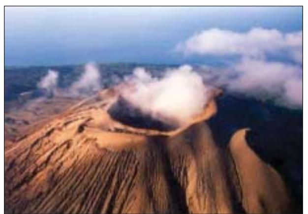

Figure 277. Volcanic activity on Pagan Island (Photo: Americopters, Inc.).

The Commonwealth of the Northern Mariana Islands (CNMI) is a political subset of the Mariana Archipelago that includes Rota Island in the south, extending northward to Uracas Bank. The 14 islands of the archipelago are geologically divided into two types; the southern arc characterized as raised limestone plateaus overlying volcanic cores, and the more recent northern islands are basaltic and volcanically active.

The southern arc consists of islands and banks from Rota Island to Sonome Reef north of Farallon de Medinilla.

The oldest and most complex reefs in the CNMI are associated with the western (leeward) sides of these islands. The majority of the CNMI's residents live on three of these islands: Rota, Tinian, and the Capitol, Saipan. species, and a species of mangrove have been

The northern arc consists of all islands and banks from Esmeralda Bank to Uracas Bank north of Uracas Island. The chain of islands north of Saipan are collectively referred to by local CNMI residents as the 'Northern Islands.' The extent of reefs around these islands is unassessed, however preliminary indications are that there is less reef development in comparison to the southern islands. Although some of these islands have held small permanent and seasonal communities, all permanent residents were evacuated in 1981 after the eruption of Pagan (Fig. 277). The banks and seamounts of the western Mariana Ridge are the youngest geologically, with some of the banks rising to nearly 9 m from the surface.

There is currently no good estimate of the total area of coral reefs in the CNMI. The length of total coastline is approximately 417 km (D. Mauro, pers. comm.). Nearly all of this is potential coral habitat, although active reef development may not be occurring in all areas. This is exclusive of the numerous offshore banks and reefs within CNMI's EEZ, nor does it include the extensive coral platform adjacent to Saipan.

#### **Condition of Coral Reefs Reefs**

The local interagency Marine Monitoring Team (MMT) continues to survey reefs in the southern islands to develop a baseline assessment of reef health. While the majority of the surveyed reefs are in good condition, there are extensive areas in the populated southern islands where polluted runoff is either preventing recovery or degrading coral reefs. Coral bleaching during the summer of 2001 caused extensive shallow water coral mortality, However, areas with good water quality are already showing signs of recovery. Overfishing is a problem associated with population centers near the southern islands. The status of coral reefs in the northern islands remains unassessed.

**Marine Macroalgae and Higher Plants Plants –** Over 150 species of algae in 80 genera, three seagrass

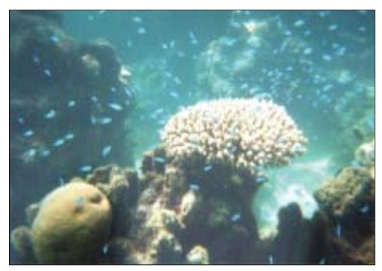

Figure 278. Coral reef located off of Saipan (Photo: Donna Turgeon).

identified from CNMI coral reef ecosystems. Documented algal species diversity continues to grow, due to an ongoing biodiversity survey being conducted by the Coastal Resources Management Office (CRMO). This project is documenting algal and plant species diversity and distributions within discrete habitats and throughout the archipelago. It is supported primarily with a NOAA Coral Reef Initiative grant.

Seagrasses are found only within the extensive Saipan Lagoon and in a small area on Rota. There have been extirpations (localized extinctions) on southern reef flats on both Rota and Saipan.

Mangrove habitat is restricted to two small areas near the commercial port areas in Saipan. Although these small areas represent the northernmost mangrove communities in the western Pacific and are unique habitat in the CNMI, they have no legal protection.

**Coral Condition Condition –** There have been 256 species of corals from 56 genera and 41 octocorals in 20 genera identified from CNMI coral reef habitats (Randall, 1995, Houk, unpub. data, Starmer unpub. data). These numbers continue to grow as the MMT continues its surveys.

Diversity is higher in the southern islands where reefs are older, more developed, and have more diverse habitats. Coral density, species richness, and coral cover on Saipan reefs all tend to increase moving from the shoreline to the outer reef margin (Randall 1991, Fig. 278). Coral cover in the inner reef zone and on the reef flat of most reef areas on Saipan tends to be patchy with fewer species and less coverage than on the reef fronts and terraces (Randall 1991). This may be attributed to the low

level of water on many reef flats, resulting in high variations of temperature and salinity.

Fewer coral studies have been conducted on Tinian and Rota. However, fringing reef communities on these islands are expected to be similar to those on Saipan and Guam. Of the northern islands, detailed surveys have only been conducted for Maug (Eldredge *et al.* 1977), and indicate that coral diversity is much lower, with only 74 species of scleractinian corals and four species of nonscleractinians in localized coral communities.

The MMT is investigating disease incidences and potential impacts of three common coral reef diseases: coralline algae lethal orange disease, tumors, and black-band disease (Fig. 279).

**Large Mobile Invertebrates Large Invertebrates –** A marine species list was compiled for CNMI, documenting 101 crustacean species, 15 echinoderm species, 30 annelid species, and 520 molluscan species (Asakura and Furuki 1994). Two gastropods (*Echininus viviparis* and *Nerita guamensis*) are endemic to the southern Marianas and Guam (UNEP/IUCN 1988). Also, 28 species of sponges and 11 species of ascidians have been observed in the CNMI (J. Starmer pers. comm.).

At present, the U.S. Federal Aid in Sportfish Restoration program, which provides the bulk of the Division of Fish and Wildlife's (DFW) fisheries research funding, limits invertebrate research. As a result, there is only minimal data collection of both commercial and recreational/subsistence species. Only a small amount of data have been collected on the topshell gastropod, sea cucumbers, and the

Figure 279. Detail of a coral with a tumor (Photo: Peter Houk).

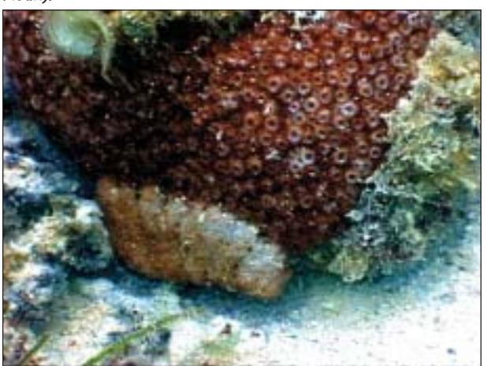

spiny lobster. The CRMO is currently conducting an invertebrate biodiversity survey with the MMT.

After initially publicized outbreaks in the late 1960s and early 1970s, the crown-of-thorns starfish briefly reappeared in large numbers on Saipan's reefs in 1984 (Fig. 280). Presently this starfish has been noted in low numbers on most reefs in Saipan, Tinian, and Rota. Two areas with apparently persistent populations have been identified by the MMT: the eastern side of Puntan Naftan near Boyscout Beach on Saipan and Unai Babui on the eastern side of Tinian.

**Fish and Harvested Species Species –** The ichthyofauna of CNMI belongs to the Indo-West Pacific (Myers 1999). According to the latest information (Myers and Donaldson in press), there are 1,019 species of shorefishes (epipelagic and demersal species found to 200 m) from the islands of the Southern Marianas, making no distinction between Guam, Rota,

Tinian, and Saipan. Previously, 946 species of fish had been recorded in the Mariana Islands, with 933 recorded in the southern islands and 427 species in the northern islands (Donaldson 1995).

The bulk of the fish fauna in the Marianas, as in other parts of the region, is comprised of the ten largest fish families: Gobiidae, Labridae, Serranidae, Pomacentridae, Muraenidae, Apogonidae, Blennidae, Carangidae, Acanthuridae, and

Chaetodontidae (Moots *et al.* 2000). Only three species of shallow-water reef fish are known to be endemic to the Mariana Islands: the yellowcrowned butterflyfish (*Chaetodon flavocoronatus*, Fig. 281) and two species of Guam reef damselfish (*Pomachromis gumaensis, Prealticus poptae*; M. Trianni pers. comm.).

There is little data assessing the health of fish resources in the CNMI. The fish resources in the northern islands are perceived as healthier than the populated islands southern because they have the least amount of fishing pressure. An analysis of data from 1992-1993 showed that fish caught by SCUBA and spearfishing around Saipan were generally smaller than those from Tinian and catchper-unit-effort for Saipan was lower compared to

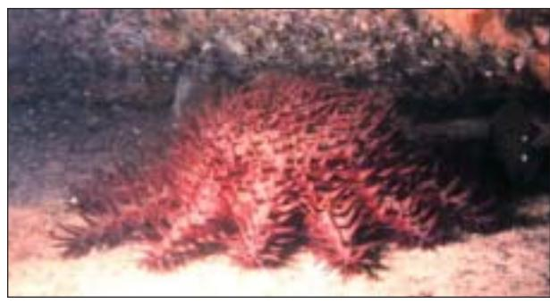

Figure 280. Crown-of-thorns starfish (Photo: James McVey).

that for similar habitats off Tinian (Graham 1994, Trianni 1998). Trianni's analysis included Graham's 1992-1993 data, data from 1995-1996 collected from the same the SCUBA spearfishery around Saipan and Tinian, and 1995 data from a SCUBA spearfishery in the Northern Islands (Anatahan, Maug, Pagan, and Sarigan). Trianni's analysis agreed with Graham's and confirmed that the fish populations in the southern islands are

impacted by fishing pressure.

The topshell gastropod is an introduced species in the Marianas. Imported in 1938 by the Japanese South Seas Government (Asano 1938, Adams *et al.* 1994), it was seeded on Saipan, and then introduced from Saipan to Tinian, Rota, Guam, and Agrihan. Commercially-harvested in other parts of Micronesia, its shell is used for buttons, and the meat is a popular food source of the local CNMI population. A moratorium protecting topshell from exploitation

within CNMI has been in effect since 1983, but was lifted for commercial fishing from October through December 1997. An 'open season' was declared, requiring a basal diameter minimum of 3 inches as per DFW regulations. Nearly 4 mt of topshell were harvested during that open season. About 0.36 mt of topshell (over 1,000 animals) harvested at the beginning of the period were sampled by DFW Conservation Officers. About 3% were found to be undersized and subsequently returned to the reef (Trianni 2002).

In 1993, along with the South Pacific Commission, the DFW conducted an assessment of the potential for a commercial or recreational/subsistence fishery for this gastropod. The assessment concluded that densities in the CNMI would not be able to

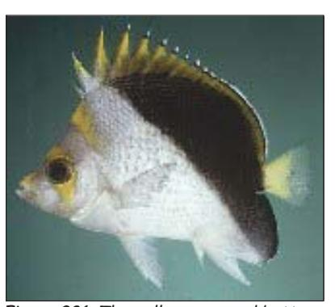

Figure 281. The yellow-crowned butterflyfish is endemic to the Marianas Archipelago (Photo: Richard Pyle, FishBase).

support a sustained fishery (Adams *et al.* 1994). The moratorium protecting topshell has now been extended for an indefinite time period.

In 1996, the CRMO contracted the DFW to evaluate the populations of nine species of edible sea cucumbers in the Saipan Lagoon (Fig. 282). That survey concluded that populations were too low to support commercial fishing (Tsuda 1997), but might be able to sustain a recreational/subsistence fishery.

Commercial harvesting of sea cucumbers took place on Rota

from October 1995 through May 1996 (Trianni 2002), and on Saipan from July 1996 through December 1996. Data collected by the Division and Wildlife for the period from Saipan showed a decline in commercial landings of sea cucumbers, which was corroborated by a DFW post-harvest survey (Trianni 2002).

Marine Reptiles and Mammals – Green and hawksbill sea turtles are known to frequent nearshore waters in the CNMI (Fig. 283). A year-long study conducted on Tinian suggested that resident subadult and nesting adult green turtles might belong to separate populations due to distinct size differences between the two (Pultz et al. 1999). The study also indicated that nearly all of Tinian's beaches are potential nesting areas. The same authors also expressed concern over not seeing any hawksbills during the 13-month study (Pultz et al. 1999). There is not enough information about habitat use, population dynamics, or genetic structure to summarize status of sea turtles throughout the CNMI.

According to G. Paulay (pers. comm.), there are anecdotal accounts of the viviparous yellowbellied sea snake (*Pelamis platurus*) from the CNMI. This species is pelagic and ranges from East Africa to the Pacific coast of the Americas (Allen and Steene 1996).

Marine mammals verified to frequent CNMI coastal areas residentially, seasonally, or during migration include spinner, striped, and bottlenose

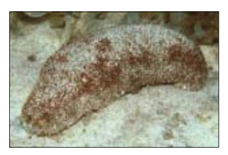

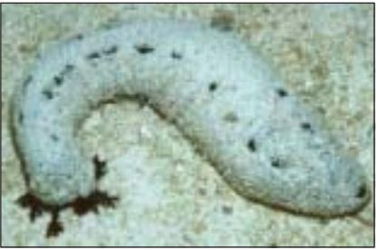

Figure 282. Two species of sea cucumbers found in the Mariana Archipelago (Photo: Gustav Paulay).

dolphins (Stenella longirostris, S. coeruleoalba and Tursiops truncatus), and numerous whale species. These include pygmy and dwarf sperm whales (Kogia simus and *K. breviceps*), pilot whales (Globicephala macrorhychus or G. mala), sperm whales (*Physeter catadon*), false killer whales (Pseudorca crassidens), humpback whales (Megaptera novaeangliae) and Bryde's whales (Balaenoptera edeni) (Trianni pers. comm.). Other circumtropical species most likely traverse CNMI's exclusive economic zone. The spinner dolphin is the most observed cetacean in CNMI (Fig.

284), having been sighted at various islands and banks, in addition to recent stranding episodes in Saipan Lagoon (Trianni and Kessler in press).

**Water Quality** – Both point and nonpoint sources of pollutants are responsible for lowering the quality of CNMI's coastal water. Sewage outfalls, sewage overflows, dredging, and sedimentation from unpaved roads and development are significant factors degrading marine water quality. Eutrophication and sedimentation are the two biggest stressors.

All three southern islands have unpaved secondary roads that funnel soil and sediment into nearshore waters during heavy rains, increasing turbidity of nearshore waters. There have been several reports of sedimentation associated with major construction projects (e.g., the Nikko Hotel, Lau Lau Bay Resort, and Bird Island Road) that covered near-

Figure 283. Resident sea turtle (Photo: CNMI Division of Fish and Wildlife).

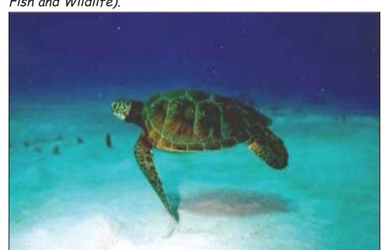

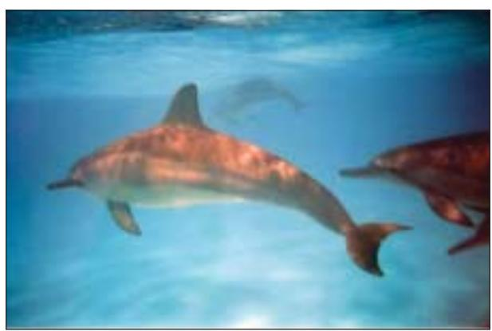

Figure 284. Spinner dolphins (Photo: Donna Turgeon).

shore corals. On several of the northern islands deforestation by feral animals is causing nearshore sedimentation. (T. de Cruz pers. comm.)

Farallon de Medinilla has been leased by the Navy since 1981 as a bombing target. No quantitative studies have been conducted to determine whether bombing has increased sediment runoff from the island. Little quantitative data on sedimentation have been collected and the impact of sediment on coral reefs has not been well documented.

Nutrient loading is also a concern for the reefs adjacent to populated islands. Potential sources of nutrients on the developed islands are septic systems and sewage outfalls, fertilizer on golf courses and agricultural land, and animal wastes. This includes wastes from introduced animals (e.g., Pagan has high populations of cows and pigs; other islands have goats). The impact of these on marine water quality in general, and coral reef resources in particular, is not well known.

The Division of Environmental Quality (DEQ) Surveillance Laboratory currently monitors salinity, dissolved oxygen, temperature, pH, turbidity, and fecal coliform. These parameters are monitored

weekly for Saipan West Beaches, and monthly for Tinian, Rota, and Managaha Beaches. Saipan East Beaches are monitored quarterly (Houk 2002).

The CNMI Water Quality Standards were largely based on the review of existing water quality standards for other tropical islands. Due to the potential impact and

million (Stewart 1997).

generate around \$1 million annually (NMFS 2001). In addition to invoice data presented in Western Pacific Regional Fisheries Management Council Plan Teams. numerous DFW Technical Reports have been published over the past eight years specifically addressing fishery resources based on

data collection programs.

Commercial fish landings

delicate aspects of the coral reef eco-systems and the lack of existing data, stringent nutrient standards were adopted for the CNMI (Houk 2002). The DEQ Laboratory recently began collecting data on nutrient levels. There is concern whether the current readings of nutrients reflect natural or anthropogenic sources (Houk 2002). A final determination will require monitoring nutrient levels in marine waters surrounding uninhabited islands over a sufficient period of time to establish the natural ambient conditions.

#### Coastal Populations and Reef Economics

Prior to receiving U.S. Commonwealth status in 1978, CNMI was part of the Pacific Trust Territories under the administration of the United States. along with the Marshall Islands, Palau, and the Federated States of Micronesia. During the U.S. administration of the islands, economic development was limited, there were few commercial enterprises, and the population relied primarily on subsistence agriculture and fisheries, and Federal aid.

The population in the islands has increased 57.2% over the past ten years to 69,200 in 2000 (U.S. Bureau of Census 2002). In 1995, about 90% of the CNMI population was in Saipan, 6% was in Rota, 5% was in Tinian, and less than 1% was in the Northern Islands (Stewart 1997).

As with most tropical islands, marine-related tourism is an important part of the island economy (Fig. 285). In the early 1980s, Japan invested heavily in tourism development, bringing in large numbers of foreign workers for facility construction and operation (Stewart 1992), creating a period of dramatic economic growth. In 1996, the CNMI received 737,000 visitors who spent over \$587

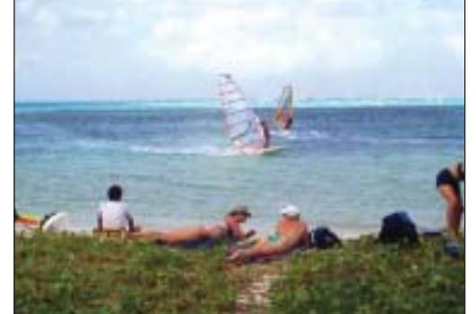

Figure 285. Marine-based tourism at Micro

Beach, Saipan (Photo: Bill Bezzant).

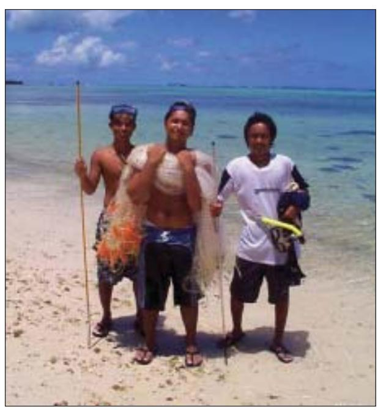

Figure 286. Young spearfishermen with their gear at Pau Pau Beach, Saipan (Photo: Bill Bezzant).

#### **Environmental Pressures on Coral Reefs on Reefs**

**Human Stresses Stresses –** The nearshore reefs closest to the population centers on Saipan, Tinian, and Rota, as well as reefs surrounding Farallon de Medinilla and offshore banks used for fishing have the greatest potential to be impacted by human activities. The reefs adjacent to these southern populated islands are of great concern. They receive most of the human impact from coastal development, population growth, fishing, and tourism.

Tourism and Marine Recreation – Concerns over the potential impacts of marine recreational sports on the nearshore marine environment caused the CRMO to limit the number of permitted motorized marine sports concessions. CRMO is currently conducting a study to determine the types and extent of impacts being caused by the various marine sports so they can better manage the industry. Working with the local dive operators association, CRMO is also installing and refurbishing mooring buoys at heavily used dive sites with funds made available through the NOAA Coral Reef Initiative.

Fishing Impacts – The types of fishing and related impacts have been historically varied and continue to change as technology and the islands' demographics change (Fig. 286). The reef-associated fisheries resources that have been studied have shown impacts from commercial fishery activities. Evaluation of CNMI-wide fisheries pressures is

complicated by the lack of staff, funding, and complexity of fishery target species and age classes as a result of a growing and diverse contract worker population.

Destructive fishing methods continue to be used. They are difficult to regulate due to lack of staff and funding for enforcement agencies. Though dynamite fishing using the remains of WWII ordnance was prevalent in the past, this practice appears to be nonexistent today. While fishing using poisons (e.g., household bleach) does occur, how common the practice is or the extent of damage caused by poisons has not been documented.

Oil Spills and Ship Groundings – More than 20 vessels have grounded in the CNMI over the past several decades. The majority of these groundings were typhoon related; two were the result of operator error. While some of these vessels have since been removed, nearly half remain in the water. Although most of these vessels were reportedly cleaned of fuel and oil, they still pose a threat to coral reef habitat as they disintegrate and the debris shifts across reefs during storms.

The CRMO recently held an interagency meeting in an attempt to address vessel-grounding issues with a focus on prevention. The office intends to coordinate the development of a Vessel Grounding Action Plan that will guide CNMI officials in closing communication gaps, creating or revising laws and regulations, strengthening enforcement, developing preventive measures, and addressing funding and resources limitations (B. Lizama pers. comm.).

Other Physical Damage to Coral Reefs – The CNMI was a major battlefield during WWII, and there is a significant amount of war debris and unexploded ordnance in the nearshore waters (Fig. 287).

In 1996, through the former CNMI Governor, the former Director of the CNMI Emergency Management Office requested the U.S. Navy detonate depth charges on the wreck of a WWII subchaser at the popular Coral Gardens dive site. They felt the charges posed a hazard to recreational divers and fishermen (Worthington and Michael 1996). In response, an assessment of the administrative record of unexploded ordinance operations was conducted on Rota by the U.S. Navy and the CNMI Emergency Management Office. The force of the

detonation caused significant damage to the nearby Sasanhaya Fish Reserve, one of CNMI's few marine reserves, killing numerous fish, decimating coral, and killing an endangered hawksbill turtle (Trianni 1998). In addition, secondary damage was caused by an extensive sediment plume resulting from the blast, blanketing a large area in and around the Coral Garden site. Two typhoons subsequently caused tertiary damage and expanded the impacted area to approximately 29,000 m2 (Richmond 1998). Estimates based on a value of \$2,833/ m2 put the total economic impact at \$82 million (J. Starmer pers. comm.).

Since World War II, the uninhabited island of Farallon de Medinilla (FDM) has been under the control of the U.S. Navy, and since 1971 has been the target site of live-fire military exercises. In 1981 the Navy signed a 50-year lease with an option to renew after 50 years, to use FDM for live-fire exercises.

In developing an environmental impact statement for military activities in the Marianas, the Navy conducted a preliminary survey of the nearshore marine resources in 1997. In the completed Environmental Impact Statement the Navy agreed to conduct an annual nearshore marine survey of FDM for three consecutive years (1999-2001). This survey collected qualitative data on fish abundance and species richness as well as coral species richness, in addition to documenting habitat changes from military exercises. Although the third year of the survey concluded in 2001, the Navy has

Figure 287. Military relics from World War II abound throughout CNMI both on the land and in the water (Photo: Donna Turgeon). Babui. After concerns were raised by

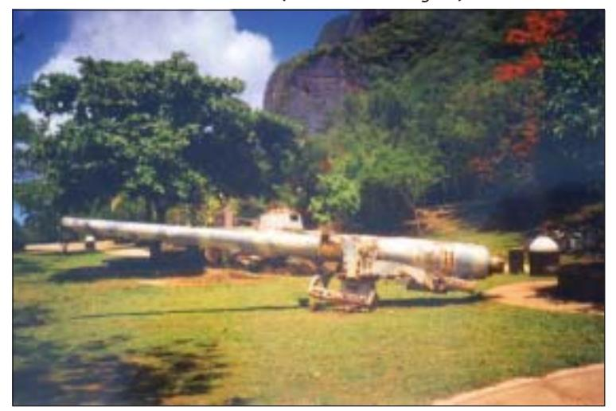

agreed to continue the survey as long as live-fire exercises continue.

The FDM survey team has included a U.S. Navy Contractor, and representatives from the NMFS, USFWS, and CNMI DFW. The survey team has been composed of the same individuals for both the preliminary and three-year annual survey (1997 and 1999-2001).

As in the 1997, 1999, and 2000 surveys, results of underwater surveys off Farallon de Medinilla in 2001 revealed no quantifiable impacts to marine communities from exploded ordnance, with the exception of an observation of damage to a single coral colony from the attachment wires of a fabric retardant (Belt Collins Hawaii 2001). Few fragments of exploded ordnance were noted on the reef surface.

In the areas where explosive impact may have resulted in accumulations of underwater rockslides in 1999, the habitat was not altered in a fashion to disturb existing biotic communities. In fact, the new habitat created by the rockslides provides more suitable habitat for fish and invertebrates than the adjacent unaltered area. The impact of sedimentation from accelerated erosion of the island has not been determined.

The Navy also leases approximately two-thirds of the northern portion of Tinian for training exercises and maneuvers. Results of qualitative surveys reveal very little damage to the reef structure there. In a recent environmental impact statement, the

> both the DFW and the DEQ, this proposal was withdrawn. Navy had proposed landing amphibious assault vehicles across the reef at Unai

> However, the CNMI did agree to allow the Navy to land air-cushioned craft over the reef if pre- and post-landing surveys indicated little damage would result. Staff from DFW participated in these surveys of Unai Chulu for the aircushioned landing-craft exercises, and found very little damage to the reef. In general, military activities on Tinian have been conducted with a high level of sensitivity to the potential impact on the environment. However, because of

the large number of personnel and equipment involved in the some of the Navy's exercises, the CNMI should continue to monitor these activities.

#### Natural Stresses –

Typhoons are a routine part of the annual seasonal cycles in the CNMI. These storms can affect coral reefs even when they do not pass directly over an island. Swells can cause coral damage through increased wave action directly and by shifting loose objects (coral, debris, grounded vessels, etc.) around the reef. The precipitation associated with typhoons also tends to increase sedimentation and nutrient inputs from polluted runoff.

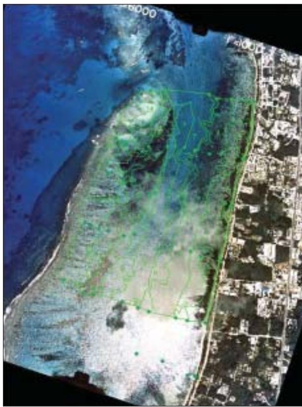

Figure 288. Aerial photograph of Saipan Lagoon with an overlay of habitats delineated during the Saipan Lagoon Habitat Assessment Project (Photo: CNMI Marine Monitoring Team).

Climate Change and Coral Bleaching – Bleaching was noted around Saipan in 1994, 1995, and near both Saipan and Pagan in 1997. There was no quantitative assessment of bleaching for any of these events. Over the summer of 2001, most shallow-water reefs (less than 3 m) on Saipan, Rota, and Tinian were affected by coral bleaching; bleaching was noted as deep as 18 m. Many encrusting Montipora and Acropora coral colonies died during this event. The MMT is currently collecting data to assess the effects of this bleaching event on CNMI reefs.

#### Current Conservation Management

**Mapping** – The first habitat and reef map for the CNMI was developed by the USGS for Saipan (Cloud 1959). These maps are still useful for ecological comparisons.

A beach and reef atlas was commissioned by the CRMO in 1980 (Eldredge and Randall 1980). It provided information on reef location and some information regarding habitat types for Saipan,

Tinian, Rota, Aguijan, and Farallon de Mendinilla based on aerial photographs.

The MMT's Saipan Lagoon Habitat Assessment Project is currently mapping coral reefs and associated habitats within Saipan's western lagoon. Field surveys are verifying habitats in aerial photographs (Fig. 288). This will allow comparisons among historical aerial photography to detect ecological changes.

Expanding on this project, CRMO is now working with georectified IKONOS satellite imagery provided through NOAA to create initial coral reef maps for the

entire CNMI. The MMT is ground-truthing reef habitats in the southern islands for this mapping initiative. The MMT will collaborate with NOAA Coral Reef Ecosystem Monitoring Program to ground-truth the northern islands imagery in 2003.

**Monitoring** – CNMI DEQ has been testing water quality at a number of sites adjacent to population centers on Saipan since 1980. More recently, water quality testing has been extended to Tinian and

Figure 289. Diver measuring the size of a reef fish during a monitoring survey (Photo: Fran Castro).

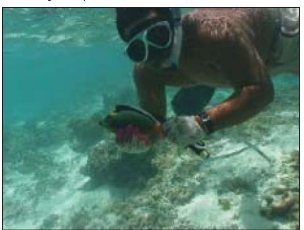

Rota. DEQ posts warnings at local beaches when water quality parameters exceed the acceptable limits for public health.

The CNMI also collects data on coral bleaching mortalities. The Fisheries Section of the DFW has been collecting data on fish diversity and abundance primarily within the existing and proposed conservation areas on Saipan, Tinian, and Rota since 1999 (Fig. 289). During fish surveys, data are also collected on reef topography (vertical relief) and estimated hard coral cover.

There are three major monitoring activities carried out in the CNMI. First, site surveys are conducted to satisfy local and regional requirements in EIS work. These surveys provide snapshots of CNMI reefs and can be very informative, but are usually limited to a single reef area. These have been and should continue to be used to understand changes over time. For example, comparison between two sites in Lau Lau Bay (Fig. 290) that were surveyed in 1991 and recently re-surveyed in 2001 by the MMT (Houk 2001) to see how they differ.

Turf algae dominate the benthic cover (46.7% and 52.3% ten years later). Coral cover was 28.1% then and 42.0% now. The second site showed a longterm decrease in mean coral diameter and the relative frequencies of large branching corals, attributed to the 1983 crown-of-thorns starfish outbreak. Between 1991-2001, the abundance of macroinvertebrates such as sea urchins and sea cucumbers decreased at both sites (Houk 2001).

Second, the DFW is monitoring several MPAs on Saipan (Mañagaha Marine Conservation Area, Bird Island Sanctuary, and Forbidden island Sanctuary) and Rota (Sasanhaya Bay Fish Reserve), as well as the proposed Tinian Marine Sanctuary located to the north of Puntan Diablo on Tinian. Done twice a year, the surveys gather data on the diversity and abundance of fish and commercially-important invertebrates and benthic cover.

Third, the MMT surveys benthic cover, coral communities, invertebrate and fish abundance, and much more as part of its long-term marine monitoring program. These data are being incorporated into a GIS for local and federal agencies. The MMT is also monitoring a portion of Saipan lagoon and creating habitat maps. This includes benthic coverage, invertebrate abundance, biodiversity and water quality.

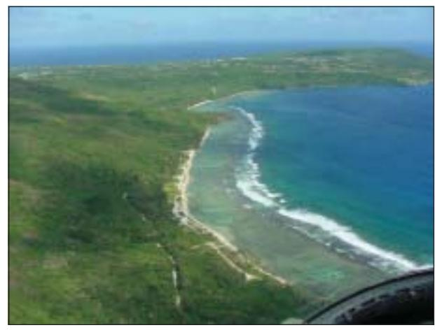

Figure 290. The marine ecosystem within Lau Lau Bay has been surveyed in 1991 and 2001 (Photo: Fran Castro).

With NOAA grant support, the CNMI increased local capacity to conduct long-term monitoring by hiring a manager to coordinate its coral reef program. Now the MMT monitors 13 sites off Saipan Island, 8 sites off Rota, 7 sites off Tinian, and 1 site off Aguijan. Parameters monitored include benthic coverage, coral communities, coral biodiversity, fish and macroinvertebrate abundance and diversity, sedimentation rates, and water quality. This program will provide the CNMI with a comprehensive baseline survey and the ability to track and predict changes in coral reef ecosystem health through time.

**MPAs and No-take Reserves MPAs and No-take Reserves –** The CNMI has eight MPAs protecting an area of 12.32 km2 . Of these, the Sasanhaya Bay Fish Reserve in Rota, the Mañagaha Marine Conservation Area (Fig. 291), Forbidden Island Sanctuary, and Bird Island Sanctuary are established no-take zones for all marine resources by CNMI Public Law. In addi-

Figure 291. Mañagaha Marine Conservation Area (Photo: Marianas Visitors Authority).

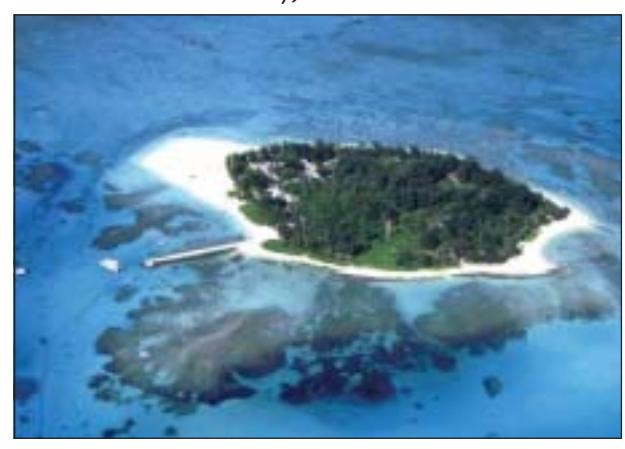

tion, permanent Topshell Gastropod Reserves exist on a mile-long stretch of the Saipan Lagoon barrier reef, the Lighthouse Reserve, and at Tank Beach. The Tank Beach Reserve overlaps with the Forbidden Island Sanctuary. Permanent Sea Cucumber Reserves have been established by DFW regulation at Lau Lau Bay and Bird Island, the latter of which overlaps with the Bird Island Sanctuary. A ten-year moratorium on the harvest of sea cucumbers and seaweeds was established by Public Law in 1998. The total area covered by no-take reserves is estimated at 9.63 km2 .

All these MPAs are monitored and regulated by the DFW, with assistance from CRMO and DEQ. Regulations for the Mañagaha Marine Conservation Area are currently in the final draft stage, and expected to be released for public review by midsummer.

In 1998, the Tinian Delegation to the CNMI Legislature proposed creating a marine protected area along approximately one-third of the western shoreline of Tinian. Within this conservation area, the collection of any marine resources would be limited to seasonal runs of nearshore fish species including atulai (*Selar crumenophthlmus*) and juvenile goatfish (Mullidae). The legislation establishing this conservation has been sent to the CNMI Legislature for action in 2002.

A major impediment in protecting these areas is the lack of funding for enforcement. Most funding

comes from local appropriations. These have not been sufficient to provide the DFW's officers with vessels and needed enforcement equipment. Currently NOAA Coral Reef Initiative funds from 2000 have been earmarked to support the DFW Conservation Officer Section through the purchase of a vessel to be used for law enforcement purposes.

#### **Government Policies, Laws, and and Legislation Legislation**

Legislation is in place for water-quality standards, land-use regulations, waste disposal, fishery management, habitat protection, endangered species, protected areas, ship pollution, and other environmental issues. Enforcement of these regulations is hampered by a lack of funding and resources.

Funding to support MPA regulation development and enforcement was recently provided to the DFW through a NOAA Coral Reef Initiative grant. CRMO is also working with an interagency group to refine or create legislation that will allow improved local management of vessel grounding issues as part of the CNMI Coral Reef Program. Local resource management agencies are emphasizing education to increase understanding of and concern for the environment and, hopefully, increase voluntary compliance with regulations.

# STATUS OF THE CORAL REEFS IN THE PACIFIC FREELY ASSOCIATED STATES

Charles Birkeland, Ahser Edward, Yimnang Golbuu, Jay Gutierrez, Noah Idechong, James Maragos, Gustav Paulay, Robert Richmond, Andrew Tafileichig, and Nancy Vander Velde

From east to west, the Freely Associated States include the Republic of the Marshall Islands (the Marshalls or the RMI), the Federated States of Micronesia (FSM), and the Republic of Palau. The Federated States of Micronesia – Kosrae, Pohnpei, Chuuk, and Yap – along with Palau, are known as the Caroline Islands, which are among the longest island chains in the world at 2,500 km.

All of these Micronesian islands were formerly a part of the Trust Territory of the Pacific Islands administered by the United States after World War II. All three countries achieved independence within the past 25 years but retain close economic and strategic ties to the United States (Hezel 1995). Although the process was initiated as early as 1979, the Compacts of Free Association for the RMI and FSM did not go into effect until 1986176. The Palau Compact was approved later 177 but was not effected until a few years after that.

Mostly unmapped, estimates of coral reef habitat for the Freely Associated States range from 11,600 km² (Spalding *et al.* 2001) to 81,500 km² (Holthus *et al.* 1993, Maragos and Holthus 1999). Throughout the region, there is high diversity of corals and associated organisms.

The human population is heavily dependent on coral reefs and related resources both economically and culturally.

## The Republic of the Marshall Islands178

#### Introduction

The Republic of the Marshall Islands encompasses approximately 1,225 individual islands and islets with 29 atolls and 5 solitary low coral islands (Fig. 292). Situated from 160°-173° E, and between 4°-

14° N, the Marshalls have a total dry land area of only about 181.3 km². However, when the Exclusive Economic Zone (by statute, from the shoreline to 200 miles offshore) is figured in, the Republic covers 1,942,000 km² of ocean within the larger Micronesia region. There are 11,670 km² of sea within the lagoons of the atolls.

Land only makes up less than 0.01% of the area of the Marshall Islands. Most of the country is the broad open ocean with a seafloor that reaches 4.6 km (15,000 ft). Scattered throughout are nearly a hundred isolated submerged volcanic seamounts; those with flattened tops are called **guyots**179.

The average elevation of the Marshall Islands is about 2 m (7 ft) above sea level. The air is warm and moist; humidity is around 80% with considerable salt spray. The air temperature averages 27.8° C (82° F) with a range of 24-32° C (76-90° F). Rainfall tends to be seasonal, ranging from 4 m a year in the south to as little as 0.6 m a year in the

Figure 292. Satellite imagery of Aur and Maloelap Atolls (Photo: Earth Sciences and Image Analysis Laboratory, NASA Johnson Space Center).

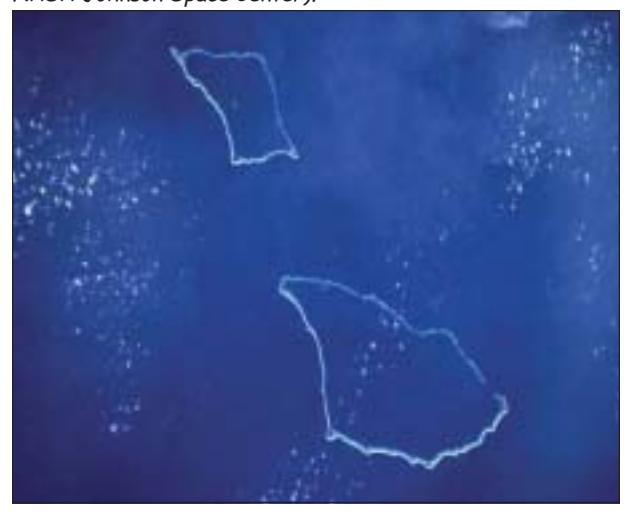

Pub. Law 99-239, the Compact of Free Association Act of 1985.

&lt;sup>177 Pub. Law 99-658.

&lt;sup>178 Much of this information was from a report by the National Biodiversity Team of the Republic of the Marshall Islands (2000).

These were geological masses formed millions of years ago that were not quite able to keep pace with subsidence or reach sea level to become or remain as islands or atolls.

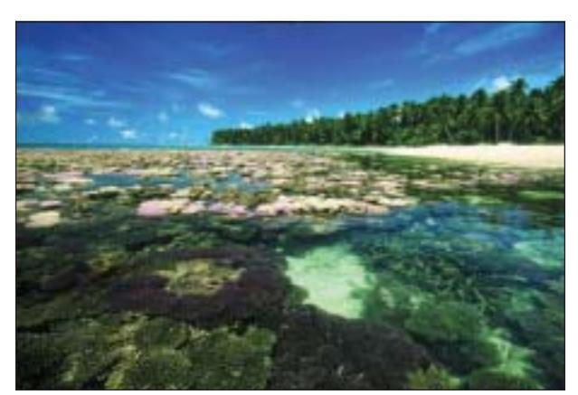

Figure 293. As demonstrated by the lush coral garden in this picture, there are still healthy coral reefs on Majuro (Photo: Marshall Islands Visitors Authority).

north. In extremely dry years, there may be no precipitation on some of the drier atolls. Tropical storms (typhoons) are relatively rare, but can be devastating.

The atolls vary in size from Kwajalein, the world's largest atoll with 16.4 km2 of dry land and a lagoon of 2,174 km2 , to Bikar with only 0.5 km2 of land, but with 37.4 km2 of lagoon, and Namdrik with more land (2.7 km2 ) but only 8.4 km2 of lagoon. Individual islands range from tiny sand-spits and vegetated islets that are inundated during storms and extreme high tides, to much larger islands such as Kaben Island at Maloelap Atoll, and Wotho Island, the main island at Wotho Atoll; both are over 8 km2 . Lagoons within the atolls typically have at least one deep-pass access; however, some, such as Namdrik, have no natural passes.

The atolls and islands of the Marshalls formed when fringing reefs began to establish and grow around ancient emergent volcanoes. After that, the volcanic peaks gradually sank and shrank, leaving lagoons in the vacated spaces and eventually became coral atolls after the volcanoes disappeared entirely beneath the reefs and sediments of coral atolls. The five solitary islands were formed in much the same way, but the peaks were small enough that no interior lagoon developed. With seamounts and guyots, the subsidence took those volcanoes and reefs far below the surface of the sea.

Mostly, the atolls of the Marshalls are not circular, nor do they have uniform islets. They are much larger than those in the Indian Ocean and are surrounded by numerous islets. The islets are more dominant on the windward side and seemingly sprawl around a deep lagoon. They are also

different from other atolls because they are deeper and have more circulation within their lagoons.

The islets are extremely young geologically and likely formed either when sea level dropped about 2 m to its present level around 4,000 years ago or in the aftermath of large waves that cast large reef blocks, coral rubble, and sand up on top of shallow reefs. Then vegetation, birds, crabs and other animals colonized the emergent islands, and eventually the Micronesian ancestors of the present day Marshall Islanders arrived. In contrast, the atoll reefs are 50 million years old or more, and up to a mile thick atop their volcanic foundation.

#### **Condition of Coral Reef Ecosystem Ecosystem**

In general, the reefs of the Marshall Islands are in good condition. Even those in the former nuclear test sites show remarkable recovery, although many of the larger bomb craters may not fill in for years, if at all. The reefs near the urban areas of Majuro are stressed, but still have an abundance of fish and invertebrates (Fig. 293). Recent information on the status of coral reefs of the Marshalls can be found in Maragos and Holthus (1999), Price and Maragos (2000), and the National Biodiversity Team of the Republic of the Marshall Islands (NBTRMI, 2000).

**Marine Algae and Higher Plants Marine Algae Higher Plants –** There have been 222 species of macroalgae, 3 species of seagrass, and at least 5 species of mangroves identified from the RMI. A salt-tolerant shrub or tree (*Pemphis acidula*) often forms monospecific stands in the intertidal region180. Other members of the mangrove community are found in inland depressions rather than along the coast. The principal mangrove species (*Bruguiera gymnorrhiza*) is

Figure 294. Three-banded anemonefish (Photo: Marshall Islands Visitors Authority).

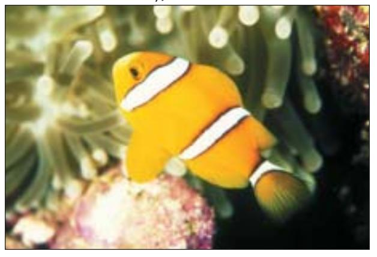

**FREELY ASSOCIATED STATES**

180The area between low and high tide. 181 Jellyfishes, hydroids, anemones.

found throughout the country. *Sonneratia alba*, *Lumnitzera littorea* and *Rhizophora* species, are only found on a few of the atolls (NBTRMI 2000).

**Corals and Other Macroinvertebrates –** There are at least 362 species of corals and other cnidarians181 40 species of sponges, 1,655 species of mollusks, 728 species of crustaceans, and 126 species of echinoderms on the coral reefs of the RMI.

**Fish–** There are at least 860 species of reef fishes recorded throughout the country. Seven species of fishes are endemic to the Marshalls and another 17 to the nearby area. One of these endemics, the three-banded anemonefish (*Amphiprion tricinctus*) is exported for aquariums (NBTRMI 2000, Fig. 294).

The after-effects of some of the 67 nuclear tests in the northern Marshalls between 1946-1958 on fish have also been studied, but most studies were years after the tests ended. Noshkin *et al.* (1997) summarized the results from all available data on the radionuclide182 concentrations in flesh samples of reef and pelagic fish collected from Bikini and Enewetak Atolls between 1964 and 1995. Although 239 + 240Pu and 241Am have not significantly accumulated in the muscle tissue of any species of fish, a variety of other radionuclides had accumulated in all species of fish from Bikini and Enewetak lagoons (Noshkin *et al.* 1986). Over the years, many of those radionuclides have diminished by radioactive decay and natural processes (Noshkin *et al.*  (1997). Those authors report that fish collected in the 1980s and 1990s show only low concentrations of a few remaining long-lived radionuclides. By the 1990s, 207Bi remained below detection limits in

Figure 296. Tourism has not been heavily developed in the Marshall Islands (Photo: James McVey).

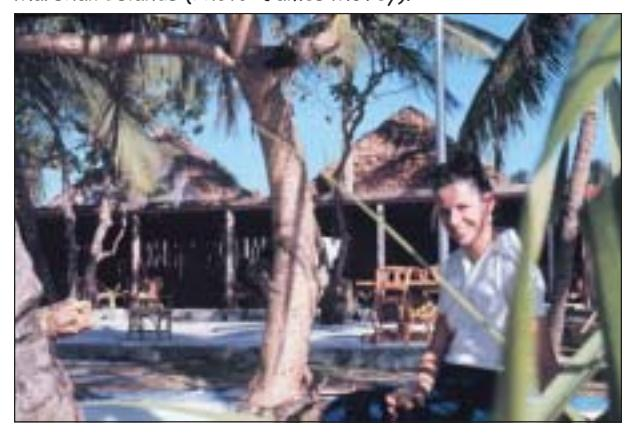

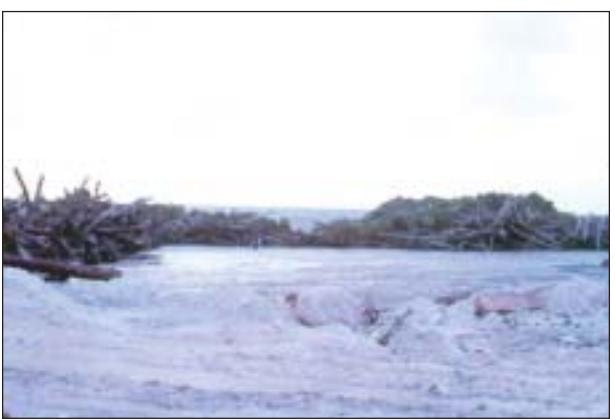

Figure 295. These trees were cleared for the construction of the Majuro airport (Photo: James McVey).

muscle tissue from all reef fish except goatfish. Levels of 137Cs diminished to detection limits in mullet and goatfish at many islands, and 60Co was found everywhere low in concentration or below the limit of detection.

**Marine Reptiles and Mammals Marine and Mammals –** Five species of sea turtles and 27 species of marine mammals have been observed in the Marshall Islands (NBTRMI 2000).

**Water Quality Water Quality –** Coastal construction for ports, docks, airfields, causeways, and roads has affected water quality in the RMI (Fig. 295). Development projects often require sources of fill material expand land areas. That lead to dredging and filling adjacent reef areas (Maragos 1993). While underway, construction along the shoreline mobilizes suspended sediments and turbidity and can change the circulation patterns in lagoons.

#### **Coastal Populations and Reef Economics Coastal Populations and Reef Economics**

In 1999, the Marshall Islands supported a population of 50,840 people (J. Butuna pers. comm.). This represents a dramatic 9.9% increase in population size over the last ten years.

Tourism is low (Fig. 296). Only 5,246 visitors traveled to the Marshall Islands in 2000 (B. Graham pers. comm.). However, even though there are few visitors, the contribution to the economy is important – an estimated \$3 million in 1998 (U.N. Economic and Social Commission for Asia and the Pacific 2002).

The gross value of fisheries output for the Marshall Islands was \$19.2 million in 1995 (FAO 2002). Subsistence and artisanal fishing play an important

**FREELY ASSOCIATED STATES FREELY ASSOCIATED STATES**

182 Radionuclides and isotopic forms (chemical abbreviations and superscript numbers are in parentheses) mentioned in this paragraph are plutonium (239 + 240Pu), americium (241Am), bismuth (207Bi), cesium (137Cs), and cobalt (60Co). **207207**

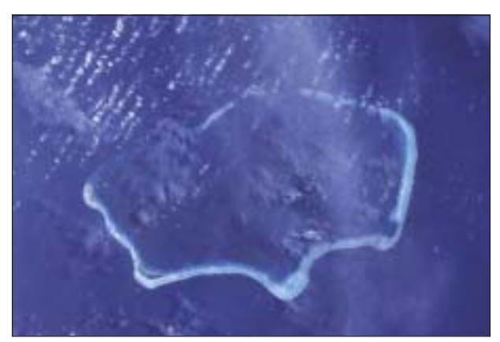

Figure 297. Satellite imagery of Bikini Atoll (Photo: Earth Sciences and Image Analysis Laboratory, NASA Johnson Space Center).

role in the Marshall Islands, especially in the outer atolls, where they provide the local population with a major source of animal protein.

#### **Environmental Pressures Environmental Pressures on Coral Reefs Coral Reefs**

**Human Stresses Stresses –** In general, the more apparent impact to the reefs of the Marshall Islands is lifestyle change, loss of traditional conservation knowledge, and urbanization. Lack of proper trash disposal results in occasional dumping in the lagoon or ocean, which, at the very least, causes aesthetic damage. Periodically, fishing vessels have broken loose from their anchor and hit the reef, damaging the coral

structure as well as spewing fuel over a large area.

Poaching reef species happens and surveillance is limited.

Invasive and non-native species are a subtle, but potentially more permanent threat, especially on land. Many terrestrial invasive species have been documented, and some of these, such as ironwood (*Casuarina equisetifolia*), can impact coastal areas by out-competing the native vegetation protecting the shoreline.

Fouling marine invertebrates have been introduced, especially in ports where they probably arrived on ship hulls. Non-native algae and fishes have been documented**,** but the full impact of their presence

has not been studied. Indications are that invasive species have the highest potential to damage coral reefs. (NBTRMI 2000, N. Vander Velde pers. comm.).

Harvesting 'live rock' and other coral reef products also has serious implications. Many species are exported for the aquarium trade. Seashells are heavily used in handicrafts.

The most destructive series of human impacts involving RMI islands, atolls, and lagoons occurred nearly 50 years ago. On March 1, 1954, a thermonuclear test bomb, code-named "Bravo," was detonated on Bikini Atoll (Fig. 297). Within seconds, it was a mile-wide 15-megaton blast – a fireball vaporizing entire islands and reefs – creating a huge crater in the reef. Fish, corals, and other marine and terrestrial animals were destroyed when

> millions of tons of water and debris were thrown high into the air and then fell back to the lagoon (Simon 1997, Walker *et al*. 1997, Robison and Noshkin 1999, Niedenthal 2000). Winds spread the radiation to nearby atolls, including inhabited Rongelap and Utrik and uninhabited Rongerik and Ailinginae.

> Unfortunately, the complete picture of nuclear testing on the Marshalls' biodiversity is neither simple, nor necessarily what it seems to casual observers. For example, J. Delgado (1996) observed in his book,

*Ghost Fleet,* that there was "no tangible evidence of the testing" on Bikini. J. Maragos (pers. comm.) counters, however, "the 2 km wide and 50 m deep crater in the reef at the Bravo test site is certainly evidence of lasting impacts, along with the islands that were evaporated by the Bravo blast."

Although a half-century has passed, the full extent of the impact on the biota – radioactive materials that came through the nuclear testing program – are uncertain (NBTRMI 2000). As R. A. Kenchington and B. Salvat (1988) stated, "Radioactive wastes may have long-term and largely unpredictable effects upon the genetic nature of the biological community." Risks from the consumption of large amounts of locally grown food are still acknowl-

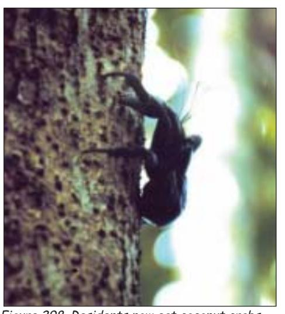

Figure 298. Residents now eat coconut crabs from islands affected by nuclear testing (Photo: James McVey).

**FREELY ASSOCIATED STATES**

edged, even though returning residents are again eating the crabs (Fig. 298).

**Natural Stresses Natural Stresses –** Although major typhoons are rare, they are devastating when they hit, not only to the land but also near-shore coral reefs. In 1991, Typhoon Zelda hit the southern atolls, quickly followed in early 1992 by Typhoon Axel, which scoured the south-facing reefs of Majuro, covering the land, including the airport with coral debris and rubble. Shortly thereafter, Typhoon Gaye ravaged much of the northern atolls, including Wotho. In late 1997, Paka changed from a tropical storm to a typhoon while over the Marshalls and caused considerable damage to Ailinglaplap (N. Vander Velde pers. comm.)

**Climate Change Change and Coral Bleaching Bleaching –** Of all ecosystems, coral reefs are considered the most sensitive to global warming. Coral reef countries, such as the Marshalls, are thus at risk, of not only the destruction of their critical services – fishing, shore protection, tourism and biodiversity – but also of the possible disappearance of the lowestlying countries, should the ocean level rise even moderately (NBTRMI 2000, Fig. 299). It was suggested during an inter-governmental meeting that such countries could be considered for United Nations Environmental Programme protection as 'endangered species' (South Pacific Regional Environmental Programme 1989).

Because they are low, any increases in sea level will severely impact the atolls. Moreover, it takes time for coral larvae (recruits) to successfully colonize new surfaces, and the erosive forces of waves, currents, herbivorous fish, boring urchins, sponges, and algae all counteract constructive forces. Under normal conditions, coral skeletons and the other components of a coral reef can provide sand and rock to replenish what is lost to islands from natural erosion. For instance, in the Marshalls, the growth rate for healthy reef is esti-

Figure 299. Low islands' existence is threatened by sea level rise (Photo: James (Tracey *et al.* 1948, Hiatt McVey). 1950, Ladd *et al*. 1950, Wells

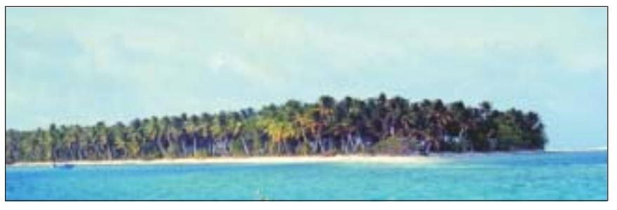

mated to be much lower than that of individual live coral**s,** and it is not clear whether upward reef growth could keep pace with erosion of the islands.

If the growth rates of corals are reduced, then atoll islets become more vulnerable to erosion. If sea level temperature rises, bleaching events and coral death could follow and effectively reduce overall reef growth. In 2002, the average sea temperature around the Marshall Islands is about 29o C, near the upper limit for coral survival. According to T. Goreau (pers. comm.) of the Global Coral Reef Alliance, the increase of 1o C (1.8o F) could trigger massive coral bleaching and die-off.

Climate change can impact ocean currents and weather patterns. A recent report on climate change in the Marshall Islands projected that air temperatures will continue to rise on all atolls with the highest increases in the northern areas (Crisostoma 2000). Total rainfall will decrease and there will be an increase in severe droughts especially in the northern atolls. And the intensity and frequency of extreme events (storms and storm surge) will increase.

These conditions also can negatively impact freshwater supplies. A decrease in rainfall can result in people using groundwater to the point it becomes salty. An increase in sea level also allows more salt to seep into the groundwater.

#### **Current Conservation Management Management**

**Mapping Mapping –** Benthic habitats need mapping. Although coastal resource atlases have been prepared, mapping of coral reef habitats and uses for Arno, Majuro, and Kwajelein Atolls. A South Pacific Applied Geoscience Commission **(**SOPAC**)**  sponsored project was recently started to map the coastal areas of Majuro**.** 

#### **Research, Assessment, and Monitoring Research, Assessment, Monitoring –**

Pioneering studies on coral reefs in the Marshall Islands encompassed several atolls before 1955

> 1951 and 1954, Emory *et al*. 1954). In 1987, a two-volume report on the natural and biological resources of Enewetak Atoll is perhaps the most comprehensive treatment of any of the Marshall Islands (Devaney *et al.* 1987). In

**FREELY ASSOCIATED STATES FREELY ASSOCIATED STATES**

1988, J. Maragos coordinated coastal resource inventories and atlases of Arno. Kwajalein, and Majuro Atolls. There were additional marine biodiversity surveys of the northern RMI islands and atolls involving marine biologists and cultural specialists183. In 2001, S. Pinca led a systematic survey of coral reef resources with community support through the College of the Marshall Islands and the Marshall Islands Marine Resources

Authority. It was the first of such studies; similar studies are planned for some of the northern atolls (including Ailinginae and Rongelap) and the southern atoll of Jaluit in 2002.

Several beaches on Majuro were surveyed as part of a training and monitoring program for the RMI Environmental Protection Agency in 1993-1994 (J. Maragos, pers. comm.). The status of subsequent beach and reef monitoring is not known. A coastal management program was conducted for Majuro in the late 1990s. It produced several small publications which have had a limited effect on conservation of the RMI coral reef ecosystem (UNDP/Majuro Atoll Local Government/RMI EPA/MIMRA 1998).

The U.S. Army regularly monitors Kwajalein Atoll environments, marine life, and other wildlife of islands and reefs that it leases and uses for its ballistic missile testing program (M. Molina pers. comm.).

Several RMI agencies are actively involved in protecting coral reef ecosystems. Primarily, these are the Marshall Islands Marine Resources Agency and the Environmental Protection Authority. In 2000, the National Biodiversity Strategy and Action Plan (NBSAP), as well as the National Biodiversity Report (NBTRMI 2000) were approved by Cabinet. These documents are now available to the general public. Both address to at least some extent the need for conservation and management of the natural resources. The National Report contains extensive lists of marine organisms. The NBSAP recommends strengthening the

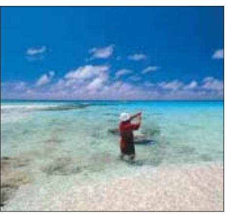

Figure 300. According to the RMI National Biodiversity Strategy and Action Plan, developing sustainable fisheries is a priority (Photo: Marshall Islands Visitors Authority).

concept of 'mo,' a traditional system of taboo that identified certain areas as 'pantries' that could be harvested only periodically. This was done in both terrestrial areas and coral reef ecosystems. The NBSAP also addressed the need for sustainable fishing practices (Fig. 300) and a retention of local knowledge. Implementation of these recommendations is pending (NBTRMI 2000).

#### Government Policies, Laws, and Legislation

Harding (1992) summarized the relevant International Laws. The Compact of Free Association between the United States of America and the Republic of the Marshall Islands (1986, Title One, Article VI) has a pledge between the two countries to "promote efforts to prevent or eliminate damage to the environment and biosphere and to enrich understanding of the natural resources of the Marshall Islands." In Section 161 (b), the Marshall Islands has an obligation to develop and enforce comparable environmental standards and procedures to those of the United States.

The Convention for the Protection of the Natural Resources and Environment of the South Pacific Region and related protocols was ratified in 1987 "to prevent, reduce and control pollution resulting from vessels, land-based sources, seabed activities, discharges into the air, disposal of toxic and nontoxic wastes, testing of nuclear devises, and mining."

Figure 301. Mangroves are protected by the RMI Public Lands and Resources Act (Photo: Ben Mieremet).

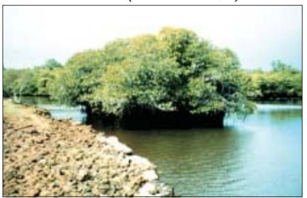

Titgen et al. 1988, Thomas et al. 1988, AAA Drafting and Engineering et al. 1989a and b, Manoa Mapworks 1989, Maragos et al. (eds) 1993a and b, Maragos 1994.

As a Compact Nation, a number of U.S. laws are legal authorities for conservation of RMI reef resources (relevent U.S. laws are in Appendix IV).

The **Marine Mammal Protection Act** provides protection for dolphins and other marine mammals captured during commercial fishing operations in the eastern Pacific Ocean.

The **National Environmental Protection Act**  provides for studies of the impact of human activities on natural resources to prevent degradation or impairment of the environment; and may involve the enforcement of regulations of human activities to ensure safe, healthful, protective, and aesthetically and culturally pleasing surroundings.

The **Coast Conservation Act** protects and preserves the coast from sea erosion or encroachment of sea-related to development activities. These laws apply to coastal activities such as building, depositing wastes or other material from outfalls, vessels, the removal of sand and living materials184, dredging and land reclamation, mining or drilling for minerals. But it does not include fishing within 7.6 m (25 ft) landward of mean high water line and 61 m (200 ft) seaward of the mean low water line.

The **Planning and Zoning Act** requires local governments to establish a Planning Commission and Planning Office to oversee coastal zoning activities and assure compliance.

The United States Army Kwajalein Atoll is under U.S. laws and regulations, including CITES, NEPA, and the Migratory Bird Act.

Relevant RMI laws protecting coral reef resources include the **Republic of the Marshall Island Constitution** (1979, Article X), which preserves traditional land tenure and titles system. It holds that no person with customary land rights may alienate or dispose of land without approval of traditional landowners, but the government retains the authority to acquire land or aquatic habitats and establish conservation and research programs for resident endangered or threatened species.

Under the **Public Lands and Resources Act** (1988 Title 9, Chapter 1, Section 3), all lands below mean high water mark belong to the government, with exceptions, but no one has the right to abuse, destroy, or damage mangroves or land (Fig. 301).

The **Marshall Islands Marine Authority Act** of 1988, revised in 1997, provides authority for the

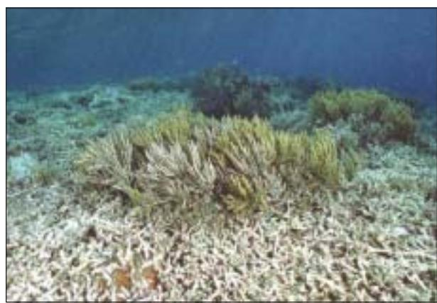

Figure 302. Dynamite fishing is prohibited in the Marshall Islands (Photo: Wolcott Henry).

licensing of foreign fishing vessels and activities other than foreign fishing. This includes the development of local fisheries, licensing local fishing vessels, non-commercial fishing, and fish processing. Section 3(1) of this act forbids the taking of hawksbill turtles, sea turtles and their eggs on shore and selling turtle products. Section 12 provides 15 areas for which the Authority may make regulations, including the conservation of fishery waters, protection of fish, the operation of domestic and foreign fishing vessels, licensing, pollution, and the export of fish. Part VI prohibits the use of explosives (Fig. 302), poisons, or other noxious substances to catch fish, the possession of fishing nets or gear not conforming to prescribed standards, foreign fishing vessels from fishing without a license, and the taking of artificially planted or cultivated sponges. It also sets size and seasonal limitations on the taking of black-lipped pearl oysters.

The **Marshall Islands Marine Resources Authority Act** (MIMRA) of 1989 prohibits the use and possession of drift nets within the exclusive economic zone of the RMI. This act also regulates the harvesting of the imported topshell gastropod and establishes an open season of no more than 3 months in any 12-month period. Topshells may be taken only by citizens of the Marshall Islands who either live where they have the right to fish under local law or have a MIMRA fishing license. To be harvested, the gastropod must have a shell of at least 3 inches in diameter at the base.

The **Republic of the Marshall Islands Environmental Protection Authority** (RMIEPA) has regulations controlling all earthmoving activities, or any construction or other activity that disturbs or **FREELY ASSOCIATED STATES FREELY ASSOCIATED STATES**

184 This covers coral, shells, vegetation, and sea grass.

alters the surface of the land, coral reef ecosystems, or the bottom of a lagoon. This includes all excavations, dredging, embankments, land reclamation, land development, mineral extraction, ocean disposal, and the depositing or storing of soil, rock, coral or earth. Under these regulations, those engaged in earthmoving must design, implement, and maintain effective erosion control plans, sedimentation control plans, and cultural preservation measures to prevent accelerated erosion, accelerated sedimentation, and disturbing potential cul-

tural resources. RMIEPA regulates the uses for which marine waters shall be maintained and protected, specifies water quality standards, prescribes standards necessary for implementing, achieving, maintaining specified marine water quality, and assures that no pollutants are discharged into RMI waters without treatment or control to prevent pollution, except for permitted activities. Additionally, the Marshall Islands have strict marine pollution control requirements, oil pollution prevention measures, and prohibitions concerning the discharge of sewage from vessels.

A variety of local regulations on Bikini, Ujae, Lae, Jabot, Jaluit, Utdrik, Mejit, and Wotje protect nesting turtles and their eggs and prohibit a variety of activities (e.g., walking on reefs between islands) and regulate the taking of marine resources.

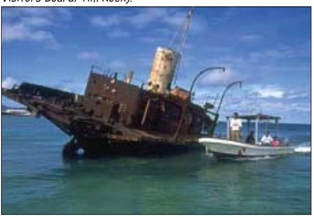

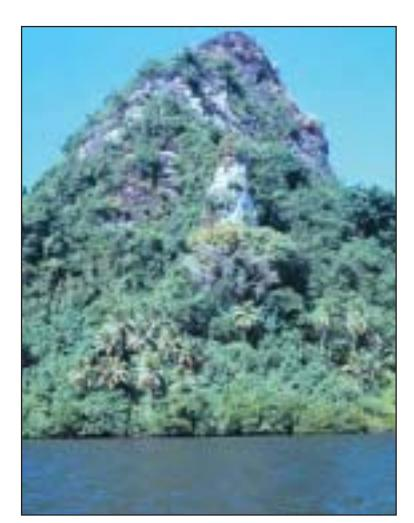

Figure 303. Pohnpei is a volcanic island (Photo: James McVey).

## Conclusions and Recommendations

At present, the coral reefs of the Marshall Islands are in good condition. While the two atolls used for the nuclear testing program experienced unique stresses, the reefs of the RMI as a whole have escaped the extensive damage seen in other parts of the world. The remoteness of many of the atolls and the fact that the country as a whole is relatively isolated has helped to minimize many potential impacts. However, this isolation also leaves the coral

reefs vulnerable to illegal or semi-legal exploitation. Moreover, increased globalization and the pressures to change from the traditional subsistence economy could easily alter the present situation and allow at least some of the stresses discussed before to become more serious threats.

## The Federated States of Micronesia

#### **Introduction**

The Federated States of Micronesia (FSM) is comprised of four states – from east to west, Kosrae, Pohnpei, Chuuk, and Yap. Along with Palau, these comprise the Caroline Islands. Each island or group has its own language, customs, local government, and reef tenure system. Traditional leaders (Chiefs or their equivalent) and community groups are active in traditional governance as well as western-style, democratically elected officials. This dual system provides opportunities and challenges to reef and marine resource protection.

FSM has high islands and low atolls, and a strong dependence on coral reefs and marine resources, both economically and culturally. Each state supports population centers on high volcanic islands surrounded by barrier reefs (Pohnpei, Chuuk) or very broad fringing reefs that are nearly barrier reefs (Kosrae, Yap). All states except Kosrae also include remote clusters of atolls and low coral islands (Maragos and Holthus 1999). Spalding *et al.* (2001) estimated total shallowwater coral reef area off the FSM to be 5,440 km2.

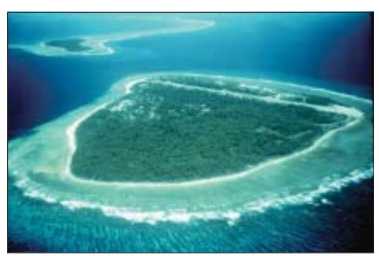

Figure 305. Aerial view of two of the islands that make up Yap State (Photo: Ben Mieremet).

Kosrae is a single volcanic island with a landmass of 109 km2 and an elevation of 629 m. It is surrounded by a fringing reef and has a single harbor.

The volcanic island of Pohnpei is the largest island in the FSM and is the FSM capitol (Fig. 303). It has an area of 345 km2 with a well-developed barrier reef surrounding a narrow lagoon. It and the eight nearby coral islands and atolls make up the state of Pohnpei.

Chuuk State (formerly known as Truk) has 15 inhabited volcanic and coral islands and atolls. Chuuk Lagoon is the largest atoll in the FSM and serves as the population and political center of Chuuk State. It is famous for the Japanese wrecks that were sunk in the lagoon during World War II (Fig. 304).

Yap State has a main volcanic island approximately 100 km2 , along with 15 coral islands and atolls (Fig. 305). The peoples inhabiting the offshore atolls and coral islands in Chuuk, Yap, and Pohnpei states are among the most traditional, with a highly sophisticated marine tenure and associated marine resource management system.

#### **Condition of Coral Reef Ecosystem Ecosystem**

The condition of FSM coral reef ecosystems is generally good to excellent (Fig. 306). Most of the reefs in the low islands are in excellent condition. The primary human impacts come from fishing pressure and ship groundings.

Reefs in Kosrae have been impacted by coastal development, specifically the construction of an airport built on top of a broad reef at Okat. Some dredging and road construction projects have

resulted in the destruction of specific reef areas including much of Okat.

**Marine Algae and Higher Plants Marine Plants –** Crustose coralline algae are abundant on the reefs. FSM has 14 species of mangroves.

**Corals and Benthic Cover Benthic Cover –** The reefs around the island of Pohnpei vary in condition. Surveys done after a ship grounding found the average coral cover above 20% adjacent to Sokehs channel, and limited survey information from the barrier reef shows 50-70% at selected sites. Due to high annual rainfall and steep volcanic topography, erosion and sedimentation can be heavy. Upland clearing of forested areas to grow sakau (kava) has resulted in landslides and other impacts to coastal villages and resources.

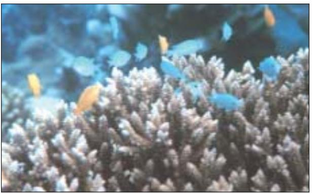

Figure 306. Most reefs in FSM are quite healthy (Photo: James McVey).

Surveys of 18 sites around Yap island made in 1995 and repeated 16 months later found mean coral cover at 28.8% and 28.7% respectively (Richmond and Birkeland 1997a), even though a typhoon hit the island between those surveys.

**Fish and Fisheries Fisheries –** According to FishBase (2002), reef-associated fish comprise 873 of the 1,125 marine fish species recorded for the FSM. Overall catch and export data are limited. Overfishing by foreign commercial fishers has been documented.

Quantitative assessments of fisheries resources within the FSM are needed.

The greatest impact on fish within the FSM has been commercial export. To reduce this, Yap and Kosrae have limited export largely for personal/ family use, allowing only coolers of fish to be sent **FREELY ASSOCIATED STATES FREELY ASSOCIATED STATES**

to relatives on Guam and in the CNMI. Chuuk had the largest commercial export, and some commercial export of fish and crab had been occurring from Pohnpei. A recent outbreak of cholera in Pohnpei shut down the export of fish and also affected exports from the other islands in the FSM (A. Tafileichig pers. comm).

Destructive fishing practices, including explosives taken from World War II wrecks, have caused localized reef damage, especially in Chuuk lagoon.

A small sea cucumber fishery operating in Yap was closed down in the mid-1990s.

**Water Quality** – There are no problems with sedimentation and erosion or coastal pollution in the uninhabited atolls. The coral cover in Chuuk Lagoon indicates generally acceptable water quality. Dredging and filling for road expansion, causeways, ports, and airfields built on reefs have degraded water quality on Kosrae, and to a lesser extent at the other high islands.

#### Coastal Populations and Reef Economics

The population for all FSM inhabited islands has grown by 22.6% over the past ten years to 133,100 in 2000 (U.S. Census Bureau 2002). The most populated centers occur at Kolonia, the national capitol on the north side of Pohnpei Island, and within Chuuk lagoon on several volcanic islands. Population growth has been rapid, with Chuuk already considered overcrowded. In contrast, the neighboring coral islands and atolls retain stable populations. These islands also have more traditional control over coral reefs.

Tourism has been growing in the FSM. In 1998, 30,000 tourists visited and spent \$3 million (B. Graham pers. comm.). Each of the states have modern jet airfields and deep draft harbors.

Quantitative assessments of fish resources within the FSM are limited, but some market information suggests the scale of the fisheries operation may be

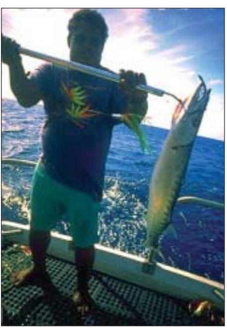

Figure 307. Spearfisher with a barracuda in Yap State (Photo: FSM Visitors Board and Tim Rock).

substantial (Fig. 307). In 1998, the gross value output of FSM fisheries was estimated at \$86.4 million (FAO 2002). The greatest impact on the fish in the FSM has been from commercial export. FSM earns about \$18-24 million annually from licensing fees for foreign vessels fishing for tuna in its waters (U.S. Office of Insular Affairs 1999).

## Environmental Pressures on Coral Reefs

**Human Stresses** – As with the other high islands, road construction and development projects without adequate erosion control have been responsible for reef damage from sed-

imentation. Dredging projects associated with airport and harbor construction have destroyed specific reefs (Fig. 306), and subsequent increases in freshwater runoff have limited recovery.

Increased population is a concern for the future of some islands as they come to terms with the need for associated infrastructure, including sewage processing plants and outfalls. And if not carefully guided, planned tourism development has the potential to impact reefs.

Export fisheries have been a problem for Chuuk and there have been numerous reports of destructive fishing practices in the past.

Ship groundings have been a problem for both the high and low islands. Foreign long-liners have been abandoned on numerous FSM reefs, with no funds

Figure 308. Causeway on Chuuk with remnants of a coral dredging operation from construction (Photo: James McVey).

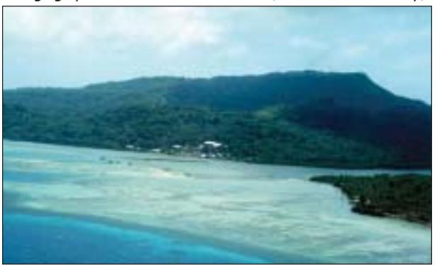

available to clean up oil spills or remove the ships. Larger shipping vessels have also run aground, most recently in Satawal and on Pohnpei.

Maragos and Fagolimul (1996) reported extensive direct (13,000 m2 ) and indirect (300,000 m2 ) impacts of the 1994 grounding and subsequent removal of a large freighter at Satawal Island, Yap State. Sediments generated by the erosion of reef at the site migrated to other reef areas more than a kilometer away, smothering corals, burying reef flats, creating new beaches on the island, and damaging reef life in the largest fishery reserve. Later, the people of Satawal reached an out-ofcourt settlement of more than \$2 million from the ship owners (J. Maragos pers. comm.).

**Global Warming and Coral Bleaching Global Warming and Coral Bleaching –** There is concern about potential sea level rise from global warming inundating the low islands and atolls. Tropical storms and related weather patterns are also an issue. Marine scientists documented the impact of a destructive 1990 typhoon passing over remote reefs in Pohnpei State (Holthus *et al.* 1993, Fig. 309), including large waves passing over Minto Reef. These picked up massive coral heads from the lagoon, depositing them on the reef flat and killing a variety of associated wildlife.

FSM reefs have experienced bleaching, but information is limited.

#### **Current Conservation Management Management**

**Mapping Mapping –** Some FSM shallow-water coral reef and associated benthic habitats have been mapped but only off the four high island population centers. Coastal resource inventories and atlases have been prepared for the islands of Pohnpei, Yap, Kosrae, and Moen Island in Chuuk Lagoon185 and initiated for the rest of Chuuk Lagoon. Consistent with similar initiatives in the Marshalls, the FSM inventories summarized the species, habitats, uses, and conditions of reefs, and the atlas maps portray the location of study sites, coastal uses, protected areas, cultural sites, bathymetry and distribution of reef habitats surrounding these islands.

**Assessments and Monitoring Assessments and Monitoring –** The College of Micronesia-FSM has faculty and staff trained in marine resource assessment and monitoring.

The FSM has regulatory agencies (Environmental and Marine Resource) with trained personnel. Each

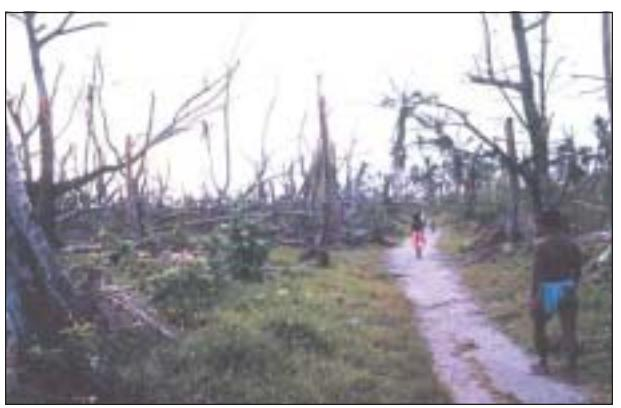

Figure 309. Damage done to a coconut and breadfruit plantation in FSM by a typhoon (Photo: James McVey).

state has a Marine Resources Management office and an Environmental Protection Agency office. Cooperation among regional institutions formalized under the Marine Resources Pacific Consortium and funded by the DoI is intended to increase local and regional capacity for assessment and monitoring.

Non-governmental organizations are active in the FSM, primarily The Nature Conservancy, and offer technical and financial assistance for related programs. The Peace Corps also has a presence in the FSM, and some of its volunteers have been involved in monitoring programs.

Coral reefs are protected by MPAs in the Trochus Sanctuaries Heritage Reserve and Kosrae Island Heritage Reserve. Other conservation areas are presently being negotiated in partnership with the FSM National Government.

Chiefs and other traditional leaders usually control protection of specific areas. In Yap, the villages own the reefs, and have authority over resource use. A number of the islands have areas set aside for reef protection and limit resource extraction, but currently the FSM lacks the enforcement capacity to protect these MPAs (A. Edward pers. comm.).

#### **Gaps in Current Monitoring and and Conservation Capacity Capacity**

Technical expertise in the FSM has been increasing, with a number of highly trained individuals dispersed among the College of Micronesia-FSM, the regulatory agencies, and local institutions like the Pohnpei Environmental Research Institute. Funds are a limiting factor, especially as financial support from the Compacts of Free Association is

**FREELY ASSOCIATED STATES FREELY ASSOCIATED STATES**

185 Cheney *et al*. 1982, Elliott and Maragos (1985), Holthus 1985, Manoa Mapworks 1985 and 1987, U.S. Army Engineer Division 1986, Manoa Mapworks and Sea Grant 1988, Orcutt *et al*. 1989, Environmental Resources Section 1989. **215215**

decreasing. Development of local talent and less dependence on expatriate technical staff must become a priority.

Both development projects and agricultural practices have already been responsible for reef damage (Fig. 310), and are expected to get worse. Integrated watershed management programs need to be developed.

Reef fisheries on Chuuk have been over-exploited. Improved coordination of management activities among the states is recommended. Programs for educating and involving the community need to be expanded.

#### Conclusions and Recommendations

The reefs within the FSM are in relatively good condition. However, land use practices on the high islands are a concern. Reef fisheries on some islands have been over-exploited. Damaging blast fishery practices have been documented in Chuuk Lagoon as late as 1994 (J. Maragos pers. comm.).

Integrated watershed management programs need to be developed. Improved coordination of management activities among the states is recommended. Education and programs involving the community need to be expanded. Ship groundings need to be addressed at the State and National level possibly requiring vessels to post bonds to cover any damage to the reefs. Additional support for the resource agencies is necessary if they are to meet their mandates.

### The Republic of Palau

#### **Introduction**

The Republic of Palau is a separate sub-archipelago at the western end of the Caroline Islands. It is the westernmost archipelago in Oceania, located 741 km east of Mindanao in the southern Philippines and about 1,300 km southwest of Guam.

The islands and reefs of Palau stretch 700 km from Ngaruangel Atoll and Velasco Reef in the north to Helen Atoll in the south. There are about 20 large and intermediate islands and over 500 small islands (Fig. 311). The biggest island,

nic. Koror (the capital) lies on the south of Babeldaob with the other islands in the chain south of it. Koror and the southern islands are separated from Babeldaob by a deep pass (30-40 m), Toachel El Mid. which cuts in from east to west, separating the reefs of Babeldaob from all the southern reefs. The southwestern islands

Babeldaob, is volca-

Figure 310. Betel nut agriculture on Yap (Photo: FSM Visitors Board and Tim Rock).

of Palau lie about 339-599 km southwest of the main Palau archipelago.

Most of the population resides in Koror and Babeldaob. Beyond the main islands to the north are two atolls and one submerged atoll reef. One large atoll (Helen) and five smaller low coral islands are up to 600 km to the south (Maragos and Cook 1995). The islands exhibit numerous island and reef types.

On the western coast of Palau there is a 144-km, well-developed barrier reef protecting the main cluster of islands from north of Babeldaob to the southern lagoon, then merging into the fringing reef. Peleliu is at the southern end of the fringing reef. Off the east coast of Babeldaob, the barrier reef is not well developed. Only Ngchesar and

Airai have a barrier reef. Ngerchelong, Ngarard, and Melekeok do not. Ngiwal has a submerged barrier reef about 5-10 meters below sea level.

The southern lagoon has much more extensive barrier reefs, lacking passage on the west side while the southeast side has numerous gaps and passes extending into the lagoon. Hundreds of rock islands or emergent coral reefs are concentrated in the southern lagoon.

Maragos and Meier (1993) estimated the total area covered by shallowwater coral reefs to be 1,661 km2.

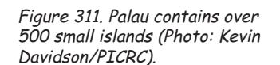

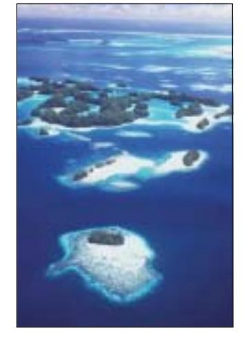

#### **Condition of the Coral Reefs the Coral Reefs**

**Marine Higher Plants –** Nine species of seagrass have been reported from Palau (Tsuda *et al*. 1977). Seagrass is found throughout Palau, from Kayangel Atoll through Babeldaob to Peleliu. The whole shoreline of Babeldaob, Koror, and Peleliu is covered with seagrass; even the lagoon side of the barrier reef has seagrass. Also, nine species of mangroves have been confirmed along with several more subspecies on Palauan islands and islets.

**Coral and Benthic Cover and Benthic Cover –** Within the whole Indo-Pacific region, Palau's coral diversity approaches the highest coral diversity of the Philippines, Indonesia, and Australia (Fig. 312). When assessments and biotic characterizations are complete, scientists expect diversity to be about 25% higher than that for Guam (R. Richmond pers. comm.).

Maragos (1994b) estimates Palau has 425 named species of stony corals belonging to 78 genera, although some of the species names may be synonyms (J. Maragos pers. comm.). There are an additional 120 species of octocorals in 57 genera (J. Starmer unpubl. data). For reefs in good condition, coral cover generally ranges from 50-70%. Coral diversity is moderate to high, ranging from 45-95 species at different sites. Coral cover at lagoon slopes of the barrier reef is 60% with a diversity of 45 species.

The ocean reef slopes reach a total length of 62.7 km. Coral cover at the northeast slopes average 10% with an average of 35 species. The protected bight at the southern end of Ngkesol has higher

coral cover and diversity (45 coral species accounting for about 25% of total cover). Along western ocean-facing reef slopes, coral cover ranged from 60 to 70% and diversity averaged 35 species. Northwestern ocean-facing reefs have lower coral cover (10-20%), but had higher diversity, with 50 species encountered during the REA. The northern reef slopes protected by Ngerael, Ngkesol and Kayangel reef have higher coral abundance and diversity.

The lagoon of Kayangel Atoll generally has low coral cover and diversity, but the Atoll had a total of 126 species of corals belonging to 47 genera. The Ulach channel along the western rim supports healthy marine communities including corals. During the REA surveys in 1992, the average coral cover for the outer walls was 70%, 50% inside. Coral cover at the ocean slopes averaged 20-25% along its 62.7 km length, with 40-50 coral species at different sites along the ocean slopes.

The western Babeldaob lagoon has over 500 patch reefs. Coral cover on the slope of the patch reefs is around 50%. Diversity ranges from 45 to 70 species in different sites. Several rare coral genera are found in these patch reefs including *Cynarina, Zoopilus*, and *Siderastrea*.

The 1992 Ngermeduu Bay Natural Resource Surveys, found 200 species of corals (Maragos, 1992). Areas away from freshwater and sedimentation stress average 50 species of corals per site, with several sites with as many as 60 species. The sites with higher diversity also have high coral cover averaging over 50%, sometimes as high as 70%.

Figure 312. Palau's coral reefs exhibit high biodiversity (Photo: Ethan Daniels, Kevin Davidson, and PICRC).

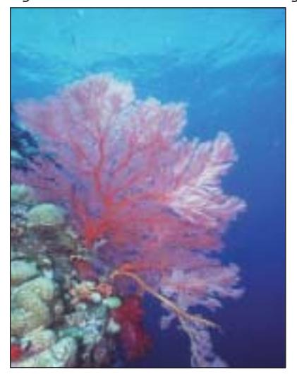

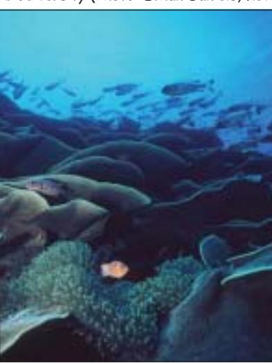

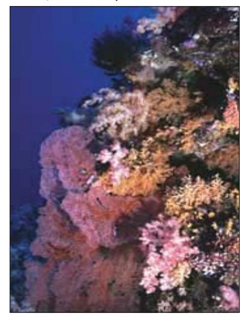

**FREELY ASSOCIATED STATES FREELY ASSOCIATED STATES**

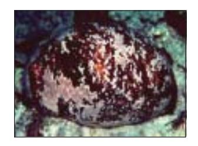

**FREELY ASSOCIATED STATES**

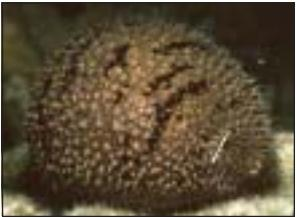

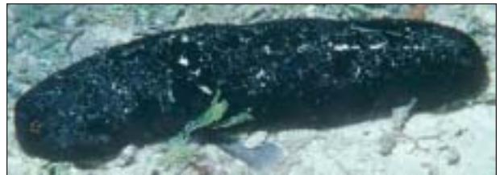

Figure 313. Sea cucumber species from Palau's coral reefs (Photos: Gustav Paulay).

In 1976 and 1991, there were quantitative surveys on the fringing reef at the southern tip of Malakal. These showed no significant differences in coral cover. In 1976, the coral cover at the reef margin was 60.3%, the slope was 73.6%. During the survey of the same sites in 1991, coral cover was 55.7% at the reef margin and 82.2% at the slope (Birkeland *et al*. 1976, Birkeland *et al*. 1993).

Before the 1998 bleaching event in Palau, the remote reefs were generally healthy and in good condition. The reefs closer to population centers or areas where there is development are showing signs of degradation and are not as healthy as the remote reefs. The bleaching event severely affected most reefs in Palau.

**Other Macroinvertebrates Other Macroinvertebrates –** Over 300 species of sponges have been reported from the Palau Archipelago (Spalding *et al*. 2001). According to these authors, a total of 144 species of marine invertebrates other than coral were observed around Kayangel atoll alone.

The Ngermeduu Bay Natural Resource surveys identified 170 species of invertebrates other than corals (Richmond 1992). There, the seagrass beds support numerous species of echinoderms including edible sea cucumbers (Fig. 313), whereas suspension feeders dominate the mouth of the bay.

The crown-of-thorns starfish (*Acanthaster planci*) is a problem in areas of Palau. They target the few remaining *Acropora* corals that survived bleaching.

**Fish and Fisheries –** Palau has the largest number of reef fish species within Micronesia, a total of 1,278 known species. But based upon gaps of

known distribution of fish, Myers (1999) projects this should be 1,449 (Fig. 233).

Fish populations in the main islands of Palau are showing signs of overfishing when compared to the Southwest islands where fishing is less intense (Donaldson 1993). Highly desired species of fish are either absent or present in low numbers around the main islands of Palau.

A 1991 REA recorded 467 species of fish from Kayangel, Ngeruangel/Velasco and 495 species from the Northern Lagoon and barrier reef complex (Amesbury 1992). These were the most diverse regions of Palau.

Ngermeduu Bay had 277 species of fish (Amesbury 1992). This area is unique in that it has two overlapping types of fish communities. One is the rich coral reef assemblage typical of other areas in Palau and Micronesia. The second community is dominated by planktivores, more commonly found in Indonesia.

There were 347 fish species recorded from West Babeldaob during an REA (Maragos *et al*. 1994). Adding the 277 species from Ngermeduu Bay Natural Resource Surveys (Amesbury 1992) brings the total for West Babledaob to 400 fish species. Three hundred thirty-seven species of fish were recorded for East Babeldaob during the 1991 REA.

Figure 314. Newly discovered fish species and new range extensions found in Palau during exploration of deep reefs (Photos: Richard Pyle, Bishop Museum).

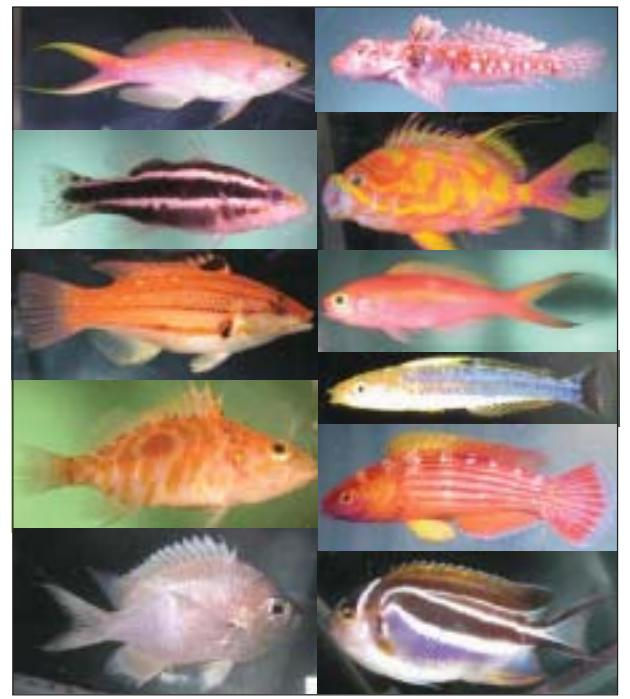

Channels serve as important pathways for migrating fish. For example, the Toachel Mlengui channel, located slightly north of the Ngermeduu Bay entrance and 15 km southwest of Daimechesengel pass in Ngardmau, is important to the coral reef ecosystem because it serves as a pathway for fish traveling between the lagoon and ocean reefs. Located 85 km south, the

Sengelokl pass, however, only offers a subtidal connection between the western ocean and the southern lagoon, so does not play a prominent role.

**Marine Reptiles and Mammals Marine Reptiles and Mammals –** There are four species of sea turtles known to use Palauan reefs. Historically, the Rock Islands supported large numbers of endangered hawksbill turtle nesting sites. But in recent years the poaching of eggs and the take of turtle shell for bekko jewelry have drastically reduced nesting activity. This species and part of its critical habitat is now protected within the Rock Island Reserve. Elsewhere, on unprotected reefs, hawksbill turtle nesting is diminished or has been eliminated altogether from excessive harvesting (NMFS and USFWS 1998).

According to G. Paulay (pers. comm.), two species of sea snakes are known from the reefs of Palau – the egg-laying banded sea snake (*Laticauda colubrina*), and the viviparous yellowbellied sea snake (*Pelamis platurus*, Fig. 315). The latter species is pelagic, ranging from East Africa to the Pacific coast of the Americas (Allen and Steene 1996).

There are reports of two species of marine mammals, including the endangered dugong or sea cow (*Dugong dugon*).

Table 25. Sale of fishery products from areas throughout Palau (Source: Palau Marine Resource Division).

| Location                                 | Time Period | Fish Sold (kg) |
|------------------------------------------|-------------|----------------|
| Koror                                    | 1992-1998   | 513,030.0      |
| Kayangel                                 | 1992-1998   | 91,862.4       |
| Ngerchelong                              | 1992-1998   | 230,578.7      |
| Ameliik                                  | 1992-1998   | 40,773.9       |
| Ngatpang                                 | 1992-1998   | 102,435.1      |
| Ngeremlengui                             | 1992-1998   | 319,771.9      |
| Ngardmau                                 | 1992-1998   | 33,919.9       |
| Airai, Mekekeok, Ngiwal, and Ngchesar | 1992-1998   | 8,970.6        |
| Ngarard                                  | 1992-1998   | 124,230.0      |

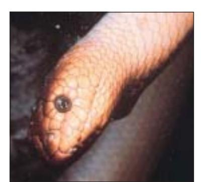

Figure 315. Sea snake (Photo: National Undersea Research Program).

Eutrophication in Malakal Harbor has been directly linked to fishing vessels anchored there, as fishers remain onboard with inadequate sanitation or waste disposal facilities.

#### **Coastal Populations and and Reef Economics Reef Economics**

Over the past ten years, the Palauan population increased 23.4% to about 18,800 in 2000

(U.S. Bureau of Census 2002).

Tourism is now a major component of the economy. In 1999, over 78,000 tourists a year visited the islands, contributing around \$78.8 million annually to the local economy (B. Graham pers. comm.). The number of foreign visitors and workers has increased dramatically over the past decade, and the population center is shifting to Babeldaob, by far the largest (volcanic) island in Palau.

As with the FSM, the more remote islands, atolls, and villages retain more traditional population levels and controls over coral reefs.

Commercial fisheries generate a reported \$6.4 million in gross value output (FAO 1998). Table 25 shows the fish products sold to markets in Koror from different areas throughout Palau (Marine Resource Division unpub. data).

#### **Environmental Pressures on Coral Reefs Environmental Pressures on Coral Reefs**

**Human Pressures Pressures –** Palau has already done a great deal toward limiting the impacts of tourists on reef resources. Mooring buoys, laws preventing the collection of corals, and diving tour operator education help conserve the culturally and economically important reef resources. Now the largest direct impact on some reef sites is the volume of divers with varying levels of training.

At the moment, the single greatest concern is the Compact road project for Babeldaob. It has a number of potential impacts on reefs. First, acute and dramatic erosion and sedimentation are likely to occur during and after construction. There are likely to be chronic, long-term impacts from damaged upland habitats.

Second, the road will open large areas to development, increasing both land and reef use with the

**FREELY ASSOCIATED STATES FREELY ASSOCIATED STATES**

resulting impacts on water quality and reef health. Finally, plans to dredge for fill material needed to build the road base have the potential for reef damage. Once built, the increased population (both local and visitors) will require additional sewage treatment and other support facilities.

Foreign-based fishing activities are already a problem (Fig. 316). Poachers from Indonesia and the Philippines are frequently encountered on Helen's Reef.

Ship groundings have also been occurring off the main islands as well as those in the south (Fig. 317).

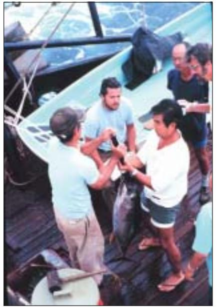

Figure 316. Foreign fishermen and their catch on Sonsorol Island in Southwest Palau (Photo: James McVey).

#### Natural Stresses – Natural

stress includes outbreaks of crown-of-thorn starfish, typhoons (even though rare), and big waves from storms. Although the Palau islands generally lie south of the main pathway for typhoons in the northwestern tropical Pacific, infrequent tropical cyclones do pass over the islands.

Climate Change and Coral Bleaching – Palau experienced substantial coral bleaching in 1997, when an estimated 30% of its reefs were heavily impacted. Acropora corals were especially susceptible, and in many places mortality was high (Figs. 318 and 319). In 1998 surveys of Ngaruangel, live coral coverage ranged from 10-30% with an average cover of 5-10%. An estimated 30-50% of these were bleached. All adult Acropora table-type corals were dead, yet juvenile colonies less that 10 cm in diameter had almost full survival (C. Birkeland pers. comm.). An estimated 75-85% of soft corals in the west and south side of Ngeruangel were also bleached.

On the eastern side of the atoll, coral cover on the slopes ranged from 1-10%, averaging 4%; about 20% of the live coral was bleached and all staghorn coral had died. Live corals consisted mainly of massive corals. Dead coral cover averaged 10-25%.

The lagoon patch reefs showed very low live coral coverage. Only a few blue-colored coral (*Heliopora*) and brain corals (*Porites*) remained on the patch reefs. All the *Acropora* corals were dead.

The southern side of the main channel was similar to the patch reefs, with most corals dead (PCS unpub. data).

Moderate coral bleaching was observed at Helen and Tobi Reefs in early December 1996 (P. Colin pers. comm.).

During the summer of 1999, most corals at Helen reef died from a bleaching event (P. Colin pers. comm.). Other islands in the Southwest must have also been affected, since offshore reefs in the Palau main islands were impacted the most (C. Birkeland pers. comm.).

During a late 1998 survey of Oruaol Libuchel patch reef, a state conservation area for

Ngatpang, live coral cover at the western side of the reef was 17% and dead coral covered 21% of the area (Golbuu, 2001). The eastern side had a higher coral cover (26%) and lower dead coral covered (11%). A nearby patch reef was also surveyed as a control for the conservation area monitoring. It had 31% live coral cover and 14% dead coral cover.

Ngchesar in east Babeldoab was seriously hit by bleaching in 1998. Most of the corals at the barrier reef died. The fringing reefs at Ngchesar were not as badly affected as the barrier reef. Some corals survived, mainly *Porites*, but most of the *Acroporas* in the fringing and patch reefs are dead.

Surveys at Ngerumekaol (Ulong Channel) in Koror revealed a high percentage of dead coral. In the

Figure 317. Ship hard aground on Helen's Reef (Photo: James McVey).

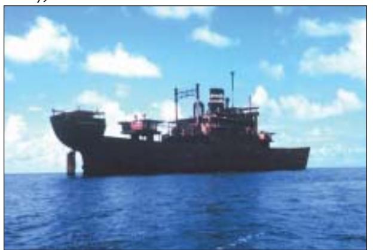

northern channel, 35% of the coral cover was dead, while live coral was only 23%. Similar patterns were seen at the southern side, with 41% dead coral and only 24% live coral. The reef slope at Ngerumekaol had 23% coral cover, 33% of which was dead (Golbuu *et al*. 1999).

Before the bleaching, Ngerumekaol had a healthy and diverse coral community with 52% live coral cover (Maragos 1991). During surveys of selected sites, a team from the University of Guam Marine Laboratory in July 1999 found bleaching was widespread and variable among the sites. *Acropora*  corals have been devastated, experiencing the highest overall mortality.

Interestingly, corals found in estuaries close to shore survived better than corals farther away. This was very evident in Ngiwal where coral survival was highest closer to land. Offshore reefs, like Short Drop-Off, have been hit the hardest; mortality of Acroporas was nearly 100% (G. Paulay unpub. data). Even at 90 ft, there was around 90% coral mortality, including *Favia*, *Porites*, *Fungia,*  and *Acropora*. Out of 3,630 colonies of corals from 52 genera surveyed in 1999 at several sites, 48% were living, 31% were dead, and 21% suffered varying mortality (G. Paulay unpub. data).

Fish populations were also affected by the recent bleaching event. Surveys at the Southwest Islands revealed the abundance of fish that prey on corals, use corals for shelter, or feed on fish that feed on corals decreased dramatically from 1992 levels (T. Donaldson pers. comm.).

#### **Current Conservation Management Management**

**Mapping Mapping –** Palau's shallow-water coral reef and associated benthic habitats have yet to be mapped.

Figure 319. A bleached Acropora (Photo: Wolcott Henry).

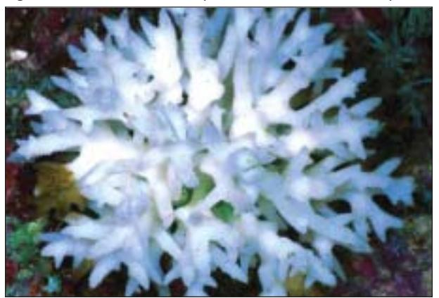

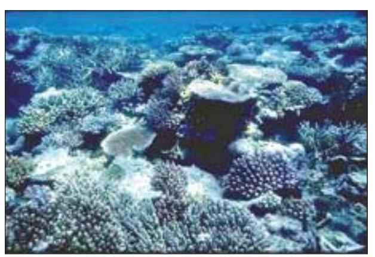

Figure 318. Acropora corals on a Palauan reef prior to the 1998 bleaching event (Photo: Bruce Carlson).

**Assessment and Monitoring Monitoring –** The Palau International Coral Reef Center (PICRC) was created to enhance the knowledge about coral reefs and related marine environments so they can be effectively managed and conserved within the Republic and the Western Pacific. PICRC has established 14 permanent sites on shallow reefs to monitor corals, coral recruitment, and fish. In addition, PICRC has also surveyed close to 200 non-permanent sites around Palau.

The Palau Conservation Society is active in conservation activities in the archipelago, and collaborates on monitoring and assessment programs with the Coral Reef Research Foundation, Palau Community College, the Environmental Quality Protection Board (EQPB) and the Marine Resources Division. The Nature Conservancy has an office on Palau, and works with the other agencies and organizations on coral reef conservation. Palau has substantial expertise, but financial resources are somewhat limiting.

**MPAs and No-take Zones Zones –** Currently, Palau has a total of 13 established MPAs. In 1956, the Rock Island Management and Preservation Act designated certain areas of the Rock Islands as reserves and others as tourist activity areas. This was Palau's first MPA.

The total area of Palau's coral reef ecosystems protected by no-take reserves is 65.3 km2 , which is equivalent to about 3.9% of the country's coral reef area.

#### **Gaps in Current Monitoring and Gaps in Current Monitoring and Conservation Capacity Capacity**

Palau's PICRC needs funding to continue monitoring of its established long-term coral reef **FREELY ASSOCIATED STATES FREELY ASSOCIATED STATES**

changes in structure.

can resource managers effectively implement management plans. Currently, there are not enough technical personnel to do the required monitoring. Additional people need to be trained if consistent and robust monitoring is to be done.

**FREELY ASSOCIATED STATES**

So far, most of the training has been for short-term monitoring and is focused on collection techniques that are easy and not timeconsuming. Coral identification is usually not covered. Without it, biological diversity surveys cannot be done, and the data that is collected may not truly reflect the actual condition of the coral reef ecosystem. For example, the Malakal sewer outfall study determined percent coral cover, and found no significant difference between 1976 and 1991. But species diversity decreased dramatically since 1973. So without taxonomic information, the conclusion would be that the reefs were doing well when they were not.

Periodically, funds are needed to bring people together for an REA of the entire reef environment from Ngeruangel to the Southwest Islands (Fig. 320). Reef studies tend to be limited to Koror and selected places in Babeldaob, neglecting unique areas far

Figure 321. The Marine Protection Act regulates the collection of species targeted by the aquarium trade, such as the Moorish Idol (Photo: James McVey).

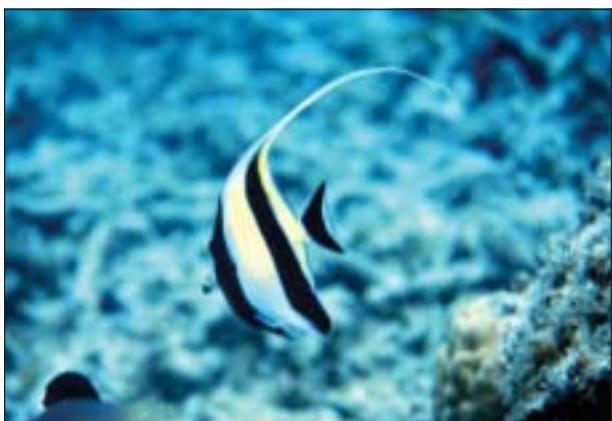

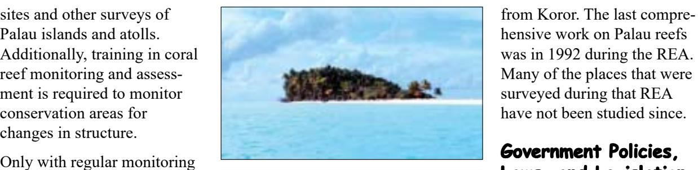

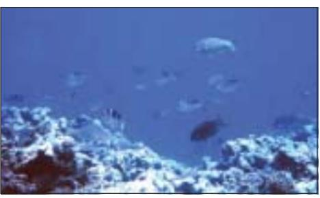

Figure 320. Helen's Reef is a remote area that has been monitored mainly through REAs (Photos: James McVey).

## **Laws, and Legislation Legislation**

Palau National Government policies regarding environmental issues are given in the Palau National Master Development Plan (SAGRIC 1996). The Plan recommends actions necessary to protect the environment, including formalizing a policy process, insti-

tuting and strengthening education and research programs, protecting habitats and wildlife, managing waste, reducing pollution, and implementing new coral reef conservation legislation.

As a Compact Nation, U.S. laws apply to the conservation of Palau's coral reef resources. The **Marine Protection Act** regulates taking certain species of marine organisms, prohibits or limits certain fishing methods, and authorizes the Minister of Resources and Development to develop regulations regarding the collection of marine animals for aquaria or research (Fig. 321).

The **Environmental Quality Protection Act** was consolidated into Palau National Code as Title 24. Division 1 of this Act creates the EQPB and mandates it to protect the environment of Palau. Division 2 (Chapter 10) deals with wildlife protection. Protected sea life includes turtles (Fig. 322), sponges, mother-of-pearl, dugong, *topshell* gastropods and clams. Chapter 13 deals with illegal fishing methods including the use of explosives, poisons, or chemicals. Division 3 deals with the protected areas of Ngerukewid and Ngerumkaol.

**The Natural Heritage Reserve System** Act mandates a set of reserves, sanctuaries, and refuges to be identified, developed, and strengthened. The Palau Bureau of Natural Resources and Development is the body responsible for designating and nominating areas for inclusion in the reserve and developing regulations to implement the Act.

State Government legislation is also helping to preserve the reefs. The Rock Island Management

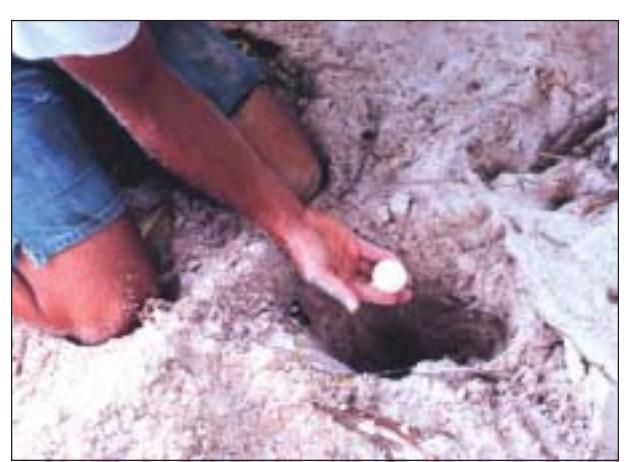

Figure 322. Green sea turtles and their eggs are protected by the Environmental Quality Protection Act (Photo: James McVey).

and Preservation Act designated certain areas of the rock islands as reserves and others as tourist activity areas (Fig. 323). Koror State Public Law K6 101-99 established the Ngerukewid Islands Wildlife Preserve and prohibited fishing in Ngerumkaol spawning area. Koror State Public Law (No. K6 119-2201, effective as of January 10, 2001) closed off Ngederrak reef (C. Emaurois pers. comm.).

The Fishing Conservation Act 1987 set aside two reef areas in Ngeremlengui State as a fish reserve and prohibited fishing in Toachel Mlengui channel during the summer months when fish are spawning. The Ngatpang Conservation Act of 1999 established the Ngatpang Reserve which includes three areas and Ngatpang's portion of Ngermeduu Bay. And the Ngiwal State Conservation Act of 1997 established Ngemai Conservation Area.

#### **Conclusions and Recommendations Conclusions and Recommendations**

For effective coral reef management, regular assessment and monitoring of Palau coral reefs is required. Regular monitoring programs detect problems earlier, allowing more effective strategies to be developed. There should also be an emphasis on reports and publications from the monitoring program. There are many reports dealing with coral reefs buried in government offices and generally inaccessible to the public. Having this available to the community would increase awareness and support for conservation.

Palau Community College has a public library staffed by one librarian and five full-time staff. All the materials in the library are cataloged and available for online computer search. Since the library already has the facility, staff, and resources, it would be wise to designate it as a depository for all documents relating to coral reefs.

Effective management of marine resources requires an informed and supportive public, so education is another important aspect of reef conservation. School curricula from elementary to secondary and post secondary should incorporate environmental issues and concerns. Community outreach projects could extend this education and awareness to the communities. Efforts should focus on raising awareness among policy makers, traditional and political leaders, and villagers.

Catch levels and trends for reef fisheries should be monitored closely and accurately so effective management of coral reef fish resources can be implemented. Currently, only two fish markets in Koror are providing landings information to the Marine Resources Division. To have accurate market data, the Marine Resources staff need to have landings and catch data from all fish markets. Other information such as the type of fishing gear used and the number of hours spent fishing would help in determining the level of exploitation.

Finally, a collaborative program needs to be established between all the agencies and organizations involved with coral reef monitoring and management. This could be a strategic planning group, setting priorities and areas of focus for each group/ area and focusing on problems that can only be solved with cooperation. With limited resources (time, money, and people) and a large coral reef area, everyone needs to work together to avoid duplication of effort and competition between the different groups. With a more coordinated effort, coral reef conservation will no doubt improve.

Figure 323. Palau's rock islands have been zoned to serve as marine reserves or tourism and recreation areas (Photo: William Perryclear/PICRC).

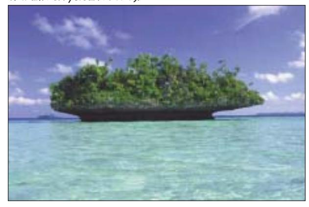

**FREELY ASSOCIATED STATES FREELY ASSOCIATED STATES**

#### **APPENDICES AND BIBLIOGRAPHY APPENDICES BIBLIOGRAPHY APPENDICES AND BIBLIOGRAPHY APPENDICES AND BIBLIOGRAPHY APPENDICES AND BIBLIOGRAPHY**

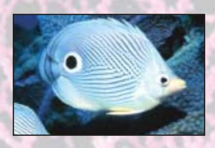

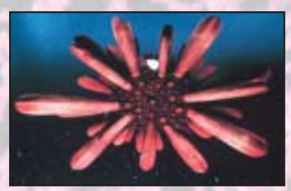

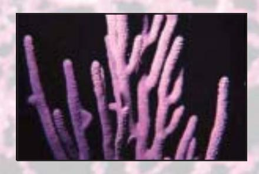

**Appendix I: Acronyms Appendix I: Acronyms Appendix I: Acronyms Appendix I: Acronyms Appendix I: Acronyms**

**Appendix II: Species Names (Scientific II: Species (Scientific Appendix II: (ScientificAppendix II: Species Names (Scientific Appendix II: Species Names (Scientific Name to Common Name) to Common Name) Name to Name) Name to Common Name) to Common Name Common Name)**

**Appendix III: Species Names (Common Appendix III: Species Names (Common Appendix III: Species Appendix III: Species Names (Common Appendix III: Species Names (Common Name to Scientific Name) Name to Scientific Name) Name to Scientific Name) Name to Scientific Name) Name to Scientific Name) Name to Scientific Name)**

**Appendix IV: Federal Protection for Appendix IV: Federal for Appendix IV: Protection for Appendix IV: Federal Protection for Appendix IV: Federal Protection for U.S. Coral Reef Ecosystems U.S. Coral Ecosystems U.S. Coral Reef Ecosystems U.S. Coral Reef Ecosystems U.S. Coral Reef Ecosystems**

> **Bibliography Bibliography Bibliography Bibliography Bibliography**

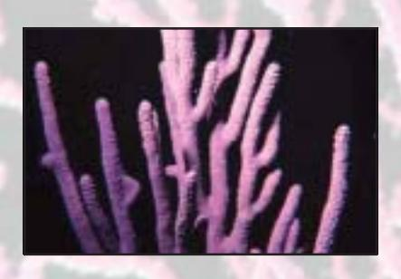

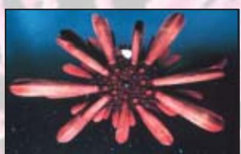

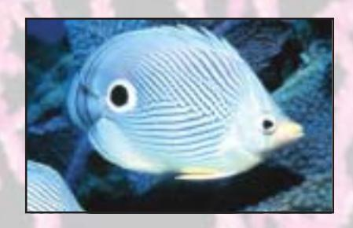

## **APPENDICES AND BIBLIOGRAPHY APPENDICES BIBLIOGRAPHY APPENDICES AND BIBLIOGRAPHY**

#### **Appendix I: I: Acronyms AcronymsAcronyms**

**AECOS**  AECOS, Inc., Hawaii, Samoa

**AIMS**  Australian Institute for Marine Science

**AISATM**  Airborne Imaging Spectroradiometer for Applications

**AGRRA**  Atlantic and Gulf Rapid Reef Assessment

**ASEPA A**merican Samoa Environmental Protection Agency

**BC DPEP**  Broward County Department of Planning and Environmental Protection

**BINM CARICOMP**  Buck Island Reef National Monument, DoI Caribbean Coastal Marine Productivity

**CARRUS CDHC**  Comparative Analyses of Reef Resilience Under Stress Coral Disease and Health Consortium, NOAA, USEPA, DoI

**CFR**  Code of Federal Regulations

**CITES**  Convention on International Trade in Endangered Species

**C-MAN**  Coastal Marine Automated Network, NOAA

**CMES**  Center for Marine and Environmental Science, University of the Virgin Islands

**CMC**  Center for Marine Conservation

**CORIS**  Coral Reef Information System, NOAA

**CNMI**  Commonwealth of the Northern Mariana Islands

**CRAMP**  Coral Reef Assessment and Monitoring Program, Hawai'i

**CRCA**  Coral Reef Conservation Act

**CREWS CRMO CRMP**  Coral Reef Early Warning System, NOAA Coastal Resources Management Office, CMNI Coral Reef Monitoring Program, FKNMS

**CZMA**  Coastal Zone Management Act

**CZMP DAR DAWR**  Coastal Zone Management Program, NOAA Division of Aquatic Resources, Hawai'i DLNR Division of Aquatic and Wildlife Resources, Guam

**DDT**  Dichloro-Diphenyl-Trichloroethane

**DEQ DFW**  Department of Environmental Quality, CNMI Department of Fish and Wildlife, CNMI

**DLNR**  Department of Land and Natural Resources, Hawai'i

**DNER**  Department of Natural and Environmental Resources, Puerto Rico

**DOBOR**  Division of Boating and Ocean Recreation, Hawai'i

**DoC DoD**  Department of Commerce Department of Defense

**DoH DoI**  Department of Health, Hawai'i Department of the Interior

**DPNR**  Department of Planning and Natural Resources, USVI

**EEZ EIS FDM**  Exclusive Economic Zone Environmental Impact Statement Farallon de Medinilla, CNMI

**EPA**  Environmental Protection Agency, state and jurisdictional

**ESA**  Endangered Species Act

**EQB EQPB**  Environmental Quality Board, Puerto Rico Environmental Quality Protection Board, Palau

**FGB**  Flower Garden Banks

**FGBNMS**  Flower Garden Banks National Marine Sanctuary, NOAA

**FKNMS** Florida Keys National Marine Sanctuary, NOAA

**FMA** Fisheries Management Area, Hawai'i

**FMP** Fisheries Management Plan **FMRI** Florida Marine Research Institute **FRA** Fisheries Replenishment Area, Hawai'i

**FSM** Federated States of Micronesia

**FWCC** Fish and Wildlife Conservation Commission, Florida

**GEPA** Guam Environmental Protection Agency **GCRMN** Global Coral Reef Monitoring Network

**GIS** Geographic Information System

**HAPC** Habitat Area of Particular Concern, Florida designated MPA

**HCRI-RP** Hawai'i Coral Reef Initiative Research Program

**ICW** Intracoastal waterway, Florida

**IKONOSTM** High-resolution commercial earth imaging satellite operated by Space Imaging, inc.

**IPCC** Inter-governmental Panel on Climate Change

**IUCN** International Union for Conservation of Nature And Natural Resources, World

Conservation Union

**LORAN** Long Range Navigation

**KIRC** Kaho'olawe Island Reserve Commission, Hawai'i

**LADS** LAser Depth Sounding

**MEGIS** Marine Ecosystems Global Informational Systems **MIMRA** Marshall Islands Marine Resources Authority Act

**MHI** Main Hawaiian Islands

**MLCD** Marine Life Conservation District, Hawai'i

**MMS** Minerals Management Service, DoI **MMT** Marine Monitoring Team, CNMI

**MPA** Marine Protected Area

**NAR** Natural Area Reserve, Hawai'i

**NBSAP** National Biodiversity Strategy and Action Plan

**NEPA** National Environmental Policy Act **NCRI** National Coral Reef Institute, Florida

**NCORE** National Center for Caribbean Coral Reef Research, Univeristy of Miami

**NERR** National Estuarine Research Reserve, NOAA

**NFWF** National Fish and Wildlife Foundation **NGO** Non-Governmental Organization

**NHP** National Historic Park, National Park Service

**NMFS** National Marine Fisheries Service, NOAA Marine Fisheries Service

**NMS** National Marine Sanctuary **NMSA** National Marine Sanctuaries Act

**NOAA** National Oceanic and Atmospheric Administration, DoC

**NOAA NESDIS** NOAANational Environmental Satellite, Data, and Information Service

**NOAA OAR** NOAA Oceanic and Atmospheric Research **NOS** National Ocean Service, NOAA Ocean Service

**NOW-RAMP** Northwestern Hawaiian Island Rapid Ecological Assessment and Monitoring Program

**NPDES** National Pollution Discharge Elimination

**NPS** National Park Service, DoI

**NSU** Nova Southeastern University, Florida **NURC** National Undersea Research Center, NOAA **NURP** National underwater Research Program, NOAA

**NWHI** Northwestern Hawaiian Islands

**NWR** National Wildlife Refuge, U.S. Fish and Wildlife Service

**OCRM** Office of Coastal Resources Management, NOAA **PADI** PADI International, Inc., a SCUBA organization

**PAH** Polycyclic Aromatic Hydorcarbons

**PCB** PolyChlorinated Biphenyls **PCS** Palau Conservation Society

**PICRC** Palau International Coral Reef Center

**RACE** Restoration and Assessment of Coral Reef Ecosystems, NOAA

**REA** Rapid Ecological Assessment

**RECON** Reef Ecosystem Condition, The Ocean Conservency and the USEPA

**REEF** Reef Environmental Education Foundation, a non-governmental organization

**RMI** Republic of the Marsahll Islands

**RMIEPA** Republic of the Marshall Islands Environmental Protection Authority

**ROV** Remotely Operated Vehicle

**RPA** Regulation and Permits Administration, Puerto Rico **SCUBA** Self-Contained Underwater Breathing Apparatus

**SEAKEYS** Sustained Ecological Research Related to Management of the Florida Keys, NOAA

**SOPAC** South Pacific Applied Geoscience Commission

**SPA** Special Planning Area, Puerto Rico

**SST** Sea Surface Temperature

**UCSC** University of California at Santa Cruz **UNCW** University of North Carolina at Wilmington **UNEP** United Nations Environmental Programme

**UNEP WCMC** United Nations Environmental Programme World Conservation Monitoring Center

**UNDP** United Nations Development Program **USAID** U.S. Agency for International Development

**USCG** U.S. Coast Guard

**USCRTF** U.S. Coral Reef Task Force **USDA** U.S> Department of Agriculture

**USEPA** U.S. Environmental Protection Agency **USFWS** U.S. Fish and Wildlife Service, DOI

**USGS** U.S. Geological Survey, DoI

**USVI** U.S. Virgin Islands

**UVI** University of the Virgin Islands

**VICRNM** Virgin Islands Coral Reef National Monument **VMAS** Virgin Islands Marine Advisory Service

**VMS** Vessel Monitoring System

**VINP** Virgin Islands National Park, DOI

**WQPP** Water Quality Protection Program, FKNMS

**WPRFMC** Western Pacific Regional Fisheries Management Council

**WWII** World War II

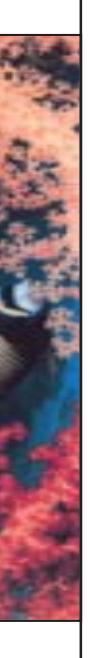

#### **Appendix II: Species Names Species Names Scientific Name to Common Name Scientific Name Common Name**

#### **Marine Algae and Cyanobacteria Cyanobacteria**

*Cladophora* spp. Green algal species

*Codium isthmocladum* Dead man's fingers, a green algal species

*Dictyota* spp*.* Hypnea spp. *Hypnea musiformis Kappaphycus* spp. *Kappaphycus alverezii*1 Brown algal species Brown algal species A brown algal species Red algal species A red algal species

*Porolithon* spp. Encrusting coralline red algal species

*Sargassum* spp. Brown algal species

#### **Higher Plants Plants**

*Bruguiera gymnorrhiza*  Large-leafed orange mangrove

*Halodule wrightii Halophila decipiens*  Shoal grass Balloon grass

*Halophila hawaiiana*  Endemic Hawaiian seagrass

*Lumnitzera litorea Rhizophora mangle*1 *Sonneratia alba Syringodium filiforme Thalassia testudinum*  Black mangrove Red mangrove Mangrove apple Manatee grass Turtle grass

#### **Cnidarians CnidariansCnidarians** (hard corals, soft corals, sea fans)

*Acropora cervicornis Acropora cytherea*  Staghorn coral Table coral

*Acropora gemmifera* 

*Acropora palmata*  Elkhorn coral

*Acropora prolifera*  Fused staghorn coral

*Agaricia agaricites Antipathes* spp. *Carijoa riisei Colpophyllia natans Dichcoenia stokesii Diploria clivosa Diploria strigosa Eusmilia fastigiata*  Lettuce coral Black coral species Snowflake coral Boulder brain coral Elliptical star coral Knobby brain coral Symmetrical brain coral Smooth flower coral

*Favia fragum Gorgonia ventalina Isophyllastrea rigida Madracis decactis Madracis mirabilis*  Golfball coral Common sea fan Rough star coral Ten-ray star coral Yellow pencil coral

*Meandrina meandrites*  Maze coral

*Millepora* spp. *Millepora alcicornis Millepora complanata Montastrea annularis*  Fire coral species Branching fire coral Blade fire coral Lobed star coral

Considered an invasive species in Hawaii

*Montastrea cavernosa* Great star coral *Montastrea franksi* Boulder star coral

*Montipora capitata* Rice coral

*Mussa angulosa* Spiny flower coral *Oculina* spp. Ivory coral species

*Palythoa caribaeorum* White encrusting zoanthid

*Palythoa mammillosa* Knobby zoanthid

*Pocillopora eydouxi* 

*Porites astreoides* Mustard hill coral *Porites compressa* Clubtip finger coral

*Porites lobata* Lobe coral *Porites porites* Finger coral *Porites* (*=Synarea) rus* Plate coral

*Siderastrea radians* Lesser starlet coral *Siderastrea siderea* Massive starlet coral *Scolymia cubensis* Artichoke coral *Solenastrea bournoni* Smooth star coral

#### **Sponges Sponges**

*Cliona* spp. Encrusting sponge species *Ianthella basta* Elephant ear sponge *Terpios hoshinota* Black encrusting sponge

*Vasum muricatum* Caribbean vase *Xestospongia muta* Giant barrel sponge

#### **Polycheates** (worms)

*Sabellastarte sanctijosephi* Featherduster worm

#### **Molluscs MolluscsMolluscs** (bivalves, gastropods)

*Cellana talcosa* Turtle limpet

*Euprymna scolopes* Endemic Hawaiian sepiolid squid

*Echininus viviparis* Endemic gastropod

*Lingula reevii* 

*Nerita guamensis*2 Guam nerite

*Pinctada* spp. Pearl oyster species *Pinctada margaritifera* Black-lipped pearl oyster

*Strombus gigas* Queen conch *Tridacna* spp. Giant clam species *Trochus niloticus* Topshell gastropod

#### **Crustaceans** (lobsters, crabs)

*Birgus latro* Coconut crab

*Mithrax* spp. Clinging crab species *Panulirus argus* Caribbean spiny lobster *Panulirus guttatus* Spotted spiny lobster

#### **Echinoderms Echinoderms** (starfish, sea urchins)

*Acanthaster planci* Crown-of-thorns starfish *Diadema antillarum* Long-spined sea urchin *Echinometra lucunter* Rock-boring sea urchin *Eucidaris tribuloides* Slate-pencil urchin

2 Endemic gastropod found in Guam and Northern Mariana Islands

#### **Fishes**

Acanthuridae Surgeonfish family *Abudefduf saxatilis* Sergeant major *Abudefduf sordidus* Blackspot sergeant *Aetobatus narinari* Spotted eagle rays

*Amphiprion tricinctus* Three-banded anemonefish

*Bodianus rufus* Spanish hogfish *Bolbometopon muricatum* Bumphead parrotfish *Canthigaster rostrata* Sharpnose puffer *Caranx ignobilis* Giant trevally

*Caranx melampygus* Bluefin trevally jack (Omilu = Hawaiian name)

*Caranx crysos* Hardnose *Carcharhinus falciformis* Silky shark *Carcharhinus galapagensis* Galapago shark *Carcharhinus leucas* Bull shark *Centropyge loriculus* Flame angelfish *Cephalopholis argus* Bluespotted grouper

*Chaetodon flavocoronatus* Yellow-crowned butterflyfish

*Chaetodon sedentarius* Reef butterflyfish

*Cheilinus undulatus* Humphead or Napoleon wrasse

*Chlorurus perspicillatus* Spectacled parrotfish *Chromis multilineata* Brown chromis *Coryphopterus personatus* Masked goby Dasyatidae Stingray family

*Enchelycore pardalis* Dragon eel *Epinephelu drummondhayi* Speckled hind *Epinephelus lanceolatus* Giant grouper *Epinephelus morio* Red grouper *Epinephelus mystacinus* Misty grouper *Epinephelus nitrigus* Warsaw grouper *Epinephelus niveatus* Snowy grouper

*Epinephelus quernus* Hawaiian black grouper

*Epinephelus striatus* Nassau grouper *Genicanthus personatus* Masked angelfish

*Haemulon aurolineatum* Tomtate

*Haemulon chrysargyreum* Smallmouth grunt *Haemulon flavolineatum* French grunt *Haemulon plumieri* White grunt *Haemulon sciurus* Bluestriped grunt *Halichoeres bivittatus* Slippery dick *Hypoplectrus* spp. Hamlet species *Kyphosus sectatrix* Bermuda chub *Lactophrys triqueter* Smooth trunkfish *Lutjanus apodus* Schoolmaster *Lutjanus campechanus* Red snapper *Lutjanus fulvus* Blacktail snapper *Lutjanus griseus* Gray snapper *Lutjanus kasmira* Blueline snapper *Lutjanus vivanus* Silk snapper

*Melichthys niger* Black triggerfish

*Megalops atlanticus* Tarpon

*Mobula hypostoma* Devil ray

Mullidae Goatfish family

*Mulloidichthys martinicus* Yellow goatfish *Mustelus canis* Smooth dogfish *Mycteroperca tigris* Tiger grouper

*Mypteroperca microlepis* Gag

*Oyurus chrysurus* Yellowtail snapper

*Pagrus pagrus* Red porgy *Paranthias furcifer* Creolefish

*Platax orbicularis* Orbicular batfish, Pacific batfish

*Polydactylus sexfilis* Pacific threadfin *(*Moi *=* Hawaiian name)

*Pomachromis gumaensis* Guam reef damselfish *Pomocanthus maculous* Emperor angelfish *Prealticus poptae* Marianas rockskipper *Pterois sphex* Hawaiian lionfish *Pterois volitans* Indo-Pacific lionfish

*Rhincodon typus* Whale shark

*Rhomboplites aurorubens* Vermillion snapper *Scarus perspicillatus* Speckled parrotfish *Scarus croicensis* Striped parrotfish *Scarus vetula* Queen parrotfish *Scomberomerus cavalla* King mackerel *Sparisoma viride* Stoplight parrotfish

*Sciaenops ocellatus* Red drum

*Sphyna lewini* Hammerhead shark *Sphyraena barracuda* Great barracuda

*Sphyrna lewini* Scalloped hammerhead shark

*Stegastes partitus* Bicolor damselfish *Stegastes planifrons* Three-spot damselfish *Thalassoma bifasciatum* Bluehead wrasse *Triaenodon obesus* Whitetip reef shark

*Zebrasoma flavescens* Yellow tang

#### **Marine Reptiles Reptiles**

*Caretta caretta* Loggerhead turtle *Chelonia mydas* Green sea turtle *Dermochelys coriacea* Leatherback turtle *Eretmochelys imbricata* Hawksbill turtle *Laticauda columbrina* Banded sea snake *Lepidochelys kempii* Kemp's ridley *Lepidochelys olivaea* Olive ridley

*Pelmais platurus* Yellowbellied sea snake

#### **Birds**

*Falco peregrinus* Peregrine falcon *Pelecanus occidentalis* Brown pelican *Sula leucogaster* Brown booby

#### **Marine Mammals Mammals**

*Balaenoptera edeni* Bryde's whale

*Dugong dugon* 

*Globicephala macrorhychus Globicephala mala Kogia breviceps* 

*Kogia simus* 

*Megaptera novaeangliae Monachus schauinslandi Monachus tropicalis* 

*Physeter catadon Pseudorca crassidens* 

*Stenella attenuatus* 

*Stenella coeruleoalba Stenella longirostris* 

*Stenella plagiodon Trichechus manatus Tursiops truncatus* 

Dugong, seacow

Short-finned pilot whale Long-finned pilot whale Dwarf sperm whale Pygmy sperm whale Humpback whale Hawaiian monk seal Caribbean monk seal

Sperm whale False killer whale

Pan-tropical spotted dolphin

Striped dolphin Spinner dolphin

Atlantic spotted dolphin West Indian manatee Bottlenose dolphin

#### **Appendix III: Species Names Appendix III: Species Names Common Name to Scientific Name Common Name to Scientific NameName**

#### **Marine Algae and Cyanobacteria Cyanobacteria**

Dead man's fingers Encrusting coralline algal species *Codium isthmocladum Porolithon* spp.

#### **Higher Plants Plants**

Balloon grass Black mangrove Endemic Hawaiian seagrass Large-leafed orange mangrove Mangrove apple Manatee grass Red mangrove1 Shoal grass Turtle grass *Halophila decipiens Lumnitzera litorea Halophila hawaiiana Bruguiera gymnorrhiza Sonneratia alba Syringodium filiforme Rhizophora mangle Halodule wrightii Thalassia testudinum* 

#### **Cnidarians CnidariansCnidarians** (hard corals, soft corals)

Artichoke coral Black coral species Blade fire coral Boulder brain coral Boulder star coral Branching fire coral Clubtip finger coral Common sea fan Elkhorn coral Elliptical star coral Finger coral Fire coral species Fused staghorn coral Golfball coral Great star coral Ivory coral species Knobby brain coral Knobby zoanthid Lesser starlet coral Lettuce coral Lobe coral Lobed star coral Massive starlet coral Maze coral Mustard hill coral Plate coral Rice coral Rough star coral Smooth flower coral Smooth star coral Snowflake coral *Scolymia cubensis Antipathes* spp. *Millepora complanata Colpophyllia natans Montastrea franksi Millepora alcicornis Porites porites Gorgonia ventalina Acropora palmata Dichcoenia stokesii Porites compressa Millepora* spp. *Acropora prolifera Favia fragum Montastrea cavernosa Oculina* spp. *Diploria clivosa Palythoa mammillosa Siderastrea radians Agaricia agaricites Porites lobata Montastrea annularis Siderastrea siderea Meandrina meandrites Porites astreoides Porites* (*=Synarea) rus Montipora capitata Isophyllastrea rigida Eusmilia fastigiata Solenastrea bournoni Carijoa riisei* 

1 Considered an invasive species in Hawaii

Spiny flower coral *Mussa angulosa*  Staghorn coral *Acropora cervicornis*  Staghorn coral *Acropora cytherea*  Symmetrical brain coral *Diploria strigosa*  Table coral *Acropora cytherea*  Ten-ray star coral *Madracis decactis*  White encrusting zoanthid *Palythoa caribaeorum*  Yellow pencil coral *Madracis mirabilis* 

#### **Sponges Sponges**

Black encrusting sponge *Terpios hoshinota*  Caribbean vase *Vasum muricatum*  Elephant ear sponge *Ianthella basta*  Encrusting sponge species *Cliona* spp. Giant barrel sponge *Xestospongia muta* 

#### **Polychaetes** (worms)

Featherduster worm *Sabellastarte sanctijosephi* 

#### **Molluscs MolluscsMolluscs** (bivalves, gastropods)

Black-lipped pearl oyster *Pinctada margaritifera*  Endemic gastropod *Echininus viviparis*  Endemic Hawaiian sepiolid squid *Euprymna scolopes*  Giant clam species *Tridacna* spp. Guam nerite *Nerita guamensis*2 Queen conch *Strombus gigas*  Pearl oyster species *Pinctada* spp. Topshell gastropod *Trochus niloticus*  Turtle limpet *Cellana talcosa* 

#### **Echinoderms Echinoderms** (starfish, sea urchins)

Crown-of-thorns starfish *Acanthaster planci*  Long-spined sea urchin *Diadema antillarum*  Rock-boring sea urchin *Echinometra lucunter*  Slate-pencil urchin *Eucidaris tribuloides* 

#### **Crustaceans Crustaceans** (lobsters, crabs)

Caribbean spiny lobster *Panulirus argus*  Clinging crab species *Mithrax* spp. Coconut crab *Birgus latro*  Spotted spiny lobster *Panulirus guttatus* 

#### **Fishes**

Great barracuda *Sphyraena barracuda*  Bermuda chub *Kyphosus sectatrix*  Bicolor damselfish *Stegastes partitus*  Black triggerfish *Melichthys niger*  Blackspot sergeant *Abudefduf sordidus* 

2 Endemic gastropod found in Guam and Northern Mariana Islands

Blacktail snapper Bluefin trevally jack, or Omilu Bluehead wrasse

Blueline snapper Bluespotted grouper Bluestriped grunt Brown chromis Bull shark

Bumphead parrotfish

Creolefish Damselfish Devil ray Dragon eel Emperor angelfish Flame angelfish French grunt Gag

Galapago shark Giant grouper

Giant trevally

Goatfish family

Gray snapper Great barracuda Guam reef damselfish *Lutjanus griseus Sphyraena barracuda Pomachromis gumaensis* 

*Lutjanus fulvus Caranx melampygus Thalassoma bifasciatum* 

*Lutjanus kasmira Cephalopholis argus Haemulon sciurus Chromis multilineata Carcharhinus leucas Bolbometopon muricatum* 

*Paranthias furcifer Stegastes planifrons Mobula hypostoma Enchelycore pardalis Pomocanthus maculous Centropyge loriculus Haemulon flavolineatum Mypteroperca microlepis Carcharhinus galapagensis Epinephelus lanceolatus* 

*Caranx ignobilis* 

Mullidae

Hamlet species Hammerhead shark Hardnose *Hypoplectrus* spp. *Sphyna lewini Caranx crysos* 

Hawaiian black grouper Hawaiian lionfish Humphead or Napoleon wrasse Indo-Pacific lionfish *Epinephelus quernus Pterois sphex Cheilinus undulatus Pterois volitans* 

King mackerel Masked goby *Scomberomerus cavalla Coryphopterus personatus* 

Marianas rockskipper Masked angelfish *Prealticus poptae Genicanthus personatus* 

Misty grouper Nassau grouper Pacific batfish Pacific threadfin, or Moi *Epinephelus mystacinus Epinephelus striatus Platax orbicularis Polydactylus sexfilis* 

Queen parrotfish Red drum Red grouper Red porgy *Scarus vetula Sciaenops ocellatus Epinephelus morio Pagrus pagrus* 

Red snapper Reef butterflyfish *Lutjanus campechanus Chaetodon sedentarius* 

Scalloped hammerhead shark Schoolmaster Sergeant major Sharpnose puffer Silk snapper *Sphyrna lewini Lutjanus apodus Abudefduf saxatilis Canthigaster rostrata Lutjanus vivanus* 

Silky shark *Carcharhinus falciformis* 

Slippery dick Smallmouth grunt Smooth dogfish

Smooth trunkfish Snowy grouper Spanish hogfish

Speckled hind Speckled parrotfish

Spectacled parrotfish Spotted eagle rays Stingray species

Stoplight parrotfish Striped parrotfish Surgeonfish family

Tarpon Three-banded anemonefish Three-spot damselfish

Tiger grouper Tomtate

Vermillion snapper Warsaw grouper Whale shark White grunt Whitetip reef shark

Yellow-crowned butterflyfish

Yellow goatfish Yellow tang Yellowtail snapper *Halichoeres bivittatus Haemulon chrysargyreum* 

*Mustelus canis Lactophrys triqueter Epinephelu niveatus Bodianus rufus* 

*Epinephelus drummondhayi* 

*Scarus perspicillatus Chlorurus perspicillatus Aetobatus narinari* 

Dasyatidae *Sparisoma viride Scarus croicensis*  Acanthuridae *Megalops atlanticus* 

*Amphiprion tricinctus Stegastes planifrons Mycteroperca tigris Haemulon aurolineatum Rhomboplites aurorubens Epinephelus nitrigus Rhincodon typus Haemulon plumieri Triaenodon obesus* 

*Chaetodon flavocoronatus Mulloidichthys martinicus Zebrasoma flavescens Oyurus chrysurus* 

#### **Marine Reptiles Reptiles**

Banded sea snake Green sea turtle Hawksbill turtle Leatherback turtle Loggerhead turtle Kemp's ridley Olive ridley Yellowbellied sea snake

*Laticauda columbrina Chelonia mydas Eretmochelys imbricata Dermochelys coriacea Caretta caretta Lepidochelys kempii Lepidochelys olivaea Pelmais platurus* 

### **Birds**

Brown booby Brown pelican Peregrine falcon *Sula leucogaster Pelecanus occidentalis Falco peregrinus* 

#### **Marine Mammals Marine Mammals**

Atlantic spotted dolphin Bottlenose dolphin Bryde's whale Caribbean monk seal

*Stenella plagiodon Tursiops truncatus Balaenoptera edeni Monachus tropicalis* 

Dugong Dwarf sperm whale False killer whale Hawaiian monk seal Humpback whale Pan-tropical spotted dolphin Short-finned pilot whale Long-finned pilot whale Pygmy sperm whale Seacow Sperm whale *Dugong dugon Kogia breviceps Pseudorca crassidens Monachus schauinslandi Megaptera novaeangliae Stenella attenuatus Globicephala macrorhychus Globicephala mala Kogia simus Dugong dugon Physeter catadon* 

Spinner dolphin Striped dolphin West Indian manatee *Stenella longirostris Stenella coeruleoalba Trichechus manatus* 

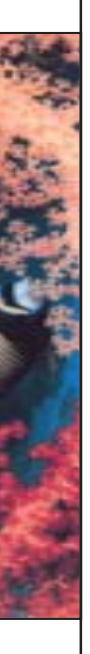

#### **Appendix IV: Federal Protection for U.S. Coral Reef Ecosystems Appendix IV: for U.S. Ecosystems**

A variety of Federal legislation currently authorizes protection for aspects of coral reef ecosystems inside and outside Federal MPAs. These include the following.

- • National Marine Sanctuaries Act, 16 U.S.C. 1431 et seq. Authorizes NOAA to designate areas as national marine sanctuaries and promulgates regulations for the conservation and management of those areas.
- • National Park Service Organic Act of 1916, 16 U.S.C. 1 et seq. Authorizes the creation of National Parks "to conserve the scenery and the natural and historic objects and the wildlife therein and to provide for the enjoyment of the same in such a manner and by such means as will leave them unimpaired for the enjoyment of future generations."
- • National Wilderness Preservation System, 16 U.S.C. 1131 et seq. Authorizes designation of federally owned areas as "wilderness areas" to be administered to preserve their pristine character.
- • National Wildlife Refuge System Improvement Act of 1997, 16 U.S.C. 668dd et seq. Authorizes National Wildlife Refuges to conserve fish, wildlife, and plants and their habitats; requires all Refuges to complete Comprehensive Conservation Management Plans within 15 years of enactment.
- • Sikes Act, 16 U.S.C. 670a-o. Requires the Department of Defense to provide for conservation and rehabilitation of natural resources on military installations.

- • The Clean Water Act (CWA). Among other objectives, the CWA regulates the discharge of dredged or fill materials into waters of the United States (marine and freshwater). It also contains provisions governing the filling or draining of wetlands (which include seagrass beds, mangroves and salt marshes).
- • The Coastal Zone Management Act (CZMA). Through cooperation between federal and state agencies, the CZMA provides for controlled management and development of shoreline areas.
- • The Endangered Species Act (ESA). Provides federal resources, including money and institutional support, for monitoring, conserving, and promoting the recovery of species listed as either "endangered" or "threatened".
- • The National Environmental Policy Act (NEPA). Environmental Impact Assessments (EIAs) or Statements (EISs) are required by NEPA for proposed projects that involve federal sponsorship or approval.
- • Lacey Act, 16 U.S.C. 3372 et seq., 18 U.S.C. 42. Makes it unlawful to import, export, sell, receive, posess, or transport wildlife taken in violation of state, federal, tribal, or foreign laws or regulations.
- • Magnuson Stevens Fishery Conservation and Management Act, 16 U.S.C. 1801 et seq. Conserves and manages fish stocks throughout the 200-mile U.S. Fishery Conservation Zone by developing fishery management plans and designating essential fish habitat.

#### **Bibliography Bibliography**

- AAA Engineering and Drafting Inc. and Sea Grant College Program (Manoa). 1989. Kwajalein Atoll Coastal Resource Atlas. Honolulu: U.S. Army Corps of Engineers, Pacific Ocean Division. 123 pp.
- AAA Engineering and Drafting Inc., Sea Grant College Program (Manoa), and Environmental Resources Program.1989. Arno Atoll Coastal Resource Inventory. Honolulu: U.S. Army Corps of Engineers, Pacific Ocean Division. 41 pp.
- Abbott, I.A. 1995. The state of systematics of marine algae in the tropical island Pacific. *In*: Maragos, J.E., M.N.A. Peterson, L.G. Eldredge, J.E. Bardach, and H.F. Takeuchi (eds.), Marine and Coastal Biodiversity in the Tropical Island Pacific Region. Volume I. Species Systematics and Information Management Priorities. Honolulu: University of Hawaii East-West Center. pp. 25–38.
- Acevedo, R. and J. Morelock. 1988. Effects of terrigenous sediment influx on coral reef zonation in southwestern Puerto Rico. *In*: Proceedings of the Sixth International Coral Reef Symposium. pp. 189 193.
- Adams, T., C. Aldan, V. Alfred, I. Bertram, A. Bukurrou, J. Cruz, T. Flores, F. Rasa, R. Seman, and J. Taman. 1994. Assessment of the Northern Marianas Trochus Resource and Recommendations for Management of the Fishery. Draft Report of the CNMI/SPC fisheries survey team to the Chief of the Division of Fish and Wildlife. Saipan: Government of Saipan. 41 pp.
- AECOS, Inc. 1991. A Preliminary Toxic Scan of Water, Sediment and Fish Tissues from Inner Pago Pago Harbor in American Samoa. Prepared for the Government of American Samoa. Pago Pago: Government of American Samoa. 75 pp.
- Agassiz, A. 1882. Explorations of the surface fauna of the Gulf Stream, under the auspices of the United States Coast Survey II: The Tortugas and Florida reefs. Memoranda of the American Academy of Arts and Sciences 2(1):107-132.
- AGRRA (Atlantic and Gulf Rapid Reef Assessment). 2002. On-line at http://www.coral.noaa.gov/agra/
- AIMS (Australian Institute of Marine Science). 2002. Online at http://www.aims.gov.au/index-ns.html
- Allen, G.R. and R. Steene. 1996. Indo-Pacific Coral Reef Field Guide. Singapore: Tropical Reef Research. 378 pp.
- Almy, C. Jr. and C. Carrión Torres. 1963. Shallow water stony corals of Puerto Rico. Caribbean Journal of Science 3:269-279.
- Altman, C. 1992. National Survey of Sport Fishing License Requirements. Washington, DC: Sport Fishing Institute. 112 pp.

- Anderson, D.M. and L.H. MacDonald. 1998. Modeling road surface sediment production using a vector geographic information system. Earth Surface Processes and Landforms 23:95-107.
- Antonius, A. 1973. New observations on coral destruction in reefs. Abstracts of the Association of Island Marine Laboratories of the Caribbean 10:3.
- Antonius, A. 1981. The "band" diseases in coral reefs. Proceedings of the Fourth International Coral Reef Symposium 2:7-14.
- Antonius, A. and A. Weiner. 1982. Coral reefs under fire. Marine Ecology 3:255-277.
- Appeldoorn R., J. Beets, J. Bohnsack, S. Boldlen, D. Matos, S. Meyers, A. Rosario, Y. Sadovy, and W. Tobias. 1992. Shallow Water Reef Fish Stock Assessment for the U.S. Caribbean. NOAA Technical Memorandum NMFS-SEFSC-304. 70 pp.
- Armstrong, R.A., J. Garcia, and F. Gilbes. 2001. Baseline Characterization of Bio-optical Oceanographic Properties and Their Relation to The Diversity and Health of Coral Reef Communities. Final data report submitted September 31, 2001. San Juan: Department of Natural and Environmental Resources. 69 pp.
- Aronson, R.B. and W. Precht. 2000. White-band disease and the changing face of Caribbean coral reefs. Hydrobiologia 460(1-3):25-38.
- Aronson, R.B., M.W. Miller, S.R. Smith, T. Murdoch, and J.C. Ogden. 2001. The no-take zones of the Florida Keys National Marine Sanctuary: Dynamics of coral reef benthic communities. Zone Monitoring Program Abstract. Silver Spring: National Oceanic and Atmospheric Administration, National Marine Sanctuaries Division. 4 pp.
- Asakura, A. and Furuki, T. 1994. Biological expedition to the Northern Mariana Islands, Micronesia. Natural History Research, Special Issue Number 1. 344 pp.
- Asano, N. 1938. Experiment of trochus transplantation in Saipan Island. Nanyo Suisan Jijo (South Seas Fisheries News) 2(3).
- Asch, R.G. and D.D. Turgeon. In press. Detection of gaps in the spatial coverage of coral reef monitoring projects in the U.S. Caribbean and Gulf of Mexico. Revista de Biologìa Tropical.
- ASEPA (American Samoa Environmental Protection Agency). 1998. Territory of American Samoa Water Quality Assessment and Planning Report. Pago Pago: Government of American Samoa. 23 pp.
- Atkinson, M.J. 1999. Topographical relief as a proxy for the friction factors of reefs: estimates of nutrient uptake into coral reef benthos. *In*: Maragos, J.E. and R. Grober-Dunsmore (eds.), Proceedings of the Hawaii Coral Reef Monitoring Workshop. Honolulu:

- Hawaii Division of Land and Natural Resources. pp. 99-103.
- Ault, J.S., J.A. Bohnsack, and G.A. Meester. 1998. A retrospective (1979-1996) multi-species assessment of coral reef fish stocks in the Florida Keys. Fishery Bulletin 96 (3):395-414.
- Ault, J.S., S.G. Smith, J. Luo, G.A. Meester, J.A. Bohnsack, and S.L. Miller. 2001. Baseline Multispecies Coral Reef Fish Stock Assessments for the Dry Tortugas: Final Report. Miami: University of Miami, Rosenstiel School of Marine and Atmospheric Science. 122 pp.
- Ault, J.S., Smith, S.G., Meester, G.A., and Luo, J. 2001. Site characterization for Biscayne National Park: assessment of fisheries resources and habitats. Biscayne National Park Report. Miami: Department of the Interior. 87 pp.
- Balazs, G.H., S.K.K. Murakawa, D.M. Ellis, and A.A. Aguirre. 1998. Manifestation of fibropapillomatosis and rates of growth of green turtles at Kaneohe Bay in the Hawaiian Islands *In*: Proceedings of the 18th Annual Symposium of Sea Turtle Biology and Conservation, Mazatlan, Mexico, 3-7 March, 1998. St. Petersburg: National Marine Fisheries Service Southeast Fisheries Science Center. p. 44.
- Banner, A.H. 1968. A fresh water "kill" on the coral reefs of Hawaii. Hawaii Institute of Marine Biology (HIMB) Technical Report 15. Honolulu: HIMB. pp. 1-29.
- Baron, R.M., P.T. Arena, F.M. Harttung, D.P. Fahy, B. Buskirk, and R.E. Spieler. 2001. The near-shore fishes of Broward County, Florida, USA. *In*: Abstracts of Annual Meeting of the Gulf and Caribbean Fisheries Institute (GCFI), November 12–17, 2001. Grand Turks and Caicos: GFCI. pp. 16-18.
- Beets, J. 1996. The effects of fishing and fish traps on fish assemblages within Virgin Islands National Park and Buck Island Reef National Monument. U.S. National Park Service Technical Report. Washington, DC: U.S. Dept of the Interior. 44 pp.
- Beets, J. 1997. Can coral reef fish assemblages be sustained as fishing intensity increases? Proceedings of the 8th International Coral Reef Symposium, Panama, June 1996. Vol. 2: 2009-2014.
- Beets, J., L. Lewand, and E. Zullo. 1986. Marine community descriptions and maps of bays within the Virgin Islands National Park/Biosphere Reserve. Virgin Islands Resource Management Cooperative (VIRMC). Biosphere Reserve Research Report 2. Virgin Islands: VIRMC. 117 pp.
- Beets, J. and A. Friedlander. 1992. Assessment and management strategies for red hind, *Epinephelus guttatus*, in the U.S. Virgin Islands. Proceedings of

- the Gulf and Caribbean Fisheries Institute 42:226 242. U.S. Virgin Islands: GCFI.
- Beets, J. and A. Friedlander. 1999. Evaluation of a conservation strategy: A spawning aggregation closure for red hind, *Epiniphelus guttatus*, in the Virgin Islands. Environmental Biology of Fishes 55:91-98.
- Beets, J. and Rogers, C.S. In press. Changes in fishery resources and reef fish assemblages in a marine protected area in the US Virgin Islands: The need for a no-take marine reserve. *In*: Moosa, K. (ed.), Proceedings of the 9th International Coral Reef Symposium. Bali, Indonesia: Research and Development Centre for Oceanology.
- Belt Collins. 2001. On-line at http://www.beltcollins.com/ Pages/project\_pages/government.html
- Birkeland, C.E. 1997a. Chapter 1: Introduction. pp.1-12 *In*: Birkeland, C.E. (ed.), Life and Death of Coral Reefs. New York: Chapman and Hall. 536 pp.
- Birkeland, C.E. 1997b. Status of coral reefs in the Marianas. In: Grigg, R.W. and C.E. Birkeland (eds.), Status of Coral Reefs in the Pacific. University of Hawaii Sea Grant NA36RG0507. Washington, DC: NOAA, Office of Sea Grant. pp. 91-100.
- Birkeland, C., R.T. Tsuda, R.H. Randall, S.S. Amesbury, and F. Cushing. 1976. Limited current and underwater biological surveys of a proposed sewer outfall site on Malakal Island, Palau. University of Guam Marine Laboratory Technical Report No. 25. Guam: University of Guam. 114 pp.
- Birkeland, C., S.S. Amesbury, and R.H. Randall. 1993. Koror Wastewater Facility: Biological Survey. Report submitted to Parsons Overseas Company (POC). Koror: POC. 88 pp.
- Birkeland, C., R. Randall, A. Green, B. Smith, and S. Wilkins. 1997. Changes in the Coral Reef Communities of Fagatele Bay National Marine Sanctuary and Tutuila Island (American Samoa) Over the Last Two Decades. Silver Spring, MD: National Oceanic and Atmospheric Administration. 225 pp.
- Bohnsack, J.A., D.B. McClellan, D.E. Harper, G.S. Davenport, G.J. Konoval, A.M. Eklund, J.P. Contillo, S.K. Bolden, P.C. Fischel, G.S. Sandorf, J.C. Javech, M.W. White, M.H. Pickett, M.W. Hulsbeck, J.L. Tobias, J.S. Ault, G.A. Meester, S.G. Smith, and J. Luo. 1999. Baseline Data for Evaluating Reef Fish Populations in the Florida Keys. NOAA Technical Memorandum (NOAA) National Marine Fisheries Service –Southeast Fisheries Science Center. NOAA-NMFS 427. St. Petersburg: NMFS. 61 pp.
- Bohnsack, J.A., D.B. McClellan, D.E. Harper, J. Ault, S. Smith, G. Meester, and J. Luo. 2001. Summary of Florida Keys National Marine Sanctuary (FKNMS) Reef Fish Monitoring through 2000 (Year 3). Zone

- Monitoring Program Abstract. Key West: FKMNS. 2 pp.
- Boulon, R.H. 1987. A basis for long-term monitoring of fish and shellfish species in the Virgin Islands National Park. Biosphere Reserve Research Report No. 22. National Park Service. Washington, DC: U.S. Dept. of the Interior. 66 pp.
- Branham, J.M., S.A. Reed, J.A. Bailey, and J. Caperon. 1971. Coral-eating sea stars, *Acanthaster planci* in Hawai'i. Science 172:1155–1157.
- Bright, T.J. and L.H. Pequegnat (eds). 1974. Biota of the West Flower Garden Bank. Houston: Gulf Publishing Company, Book Division. 435 pp.
- Brock, V.E., R.S. Jones, and P. Helfrich. 1965. An Ecological Reconnaissance of Johnston Island and the Effects of Dredging. Annual report to the U.S. Atomic Energy Commission, Contract no. AT(26-1)-90. Hawaii Institute of Marine Biology Technical Report 5. Honolulu: University of Hawaii. 90 pp.
- Brock, V.E., W. Van Heukelem, and P. Helfrich. 1966. An Ecological Reconnaissance of Johnston Island and the Effects of Dredging. Second annual report to the U.S. Atomic Energy Commission, Contract no. AT(26-1) 90. Hawaii Institute of Marine Biology Technical Report 11. Honolulu: University of Hawaii. 56 pp.
- Brock, R. H. and A.K.H. Kam. 1993. Fishing and its Impact on Coral Reef Fish Communities. Final report to the Hawai'i Department of Land and Natural Resources (HDLNR), Division of Aquatic Resources. Honolulu: HDLNR. 35 pp.
- Brooks, G.E. and L.J. Doyle. 1991. Geologic development and depositional history of the Florida Middle Ground: A mid-shelf, temperate-zone reef system in the northeastern Gulf of Mexico. Journal of the Society of Sedimentary Geology, Special Publication 46:189-203.
- Brownell, W.N. and W.E. Rainey. 1971. Research and Development of Deep-water Commercial and Sport Fisheries around the Virgin Islands Plateau. Special report (Contribution No. 3) of the Virgin Islands Ecological Research Station, Caribbean Research Institute (CRI). Virgin Islands: CRI. 88 pp.
- Bruckner, A.W. 1999 (PhD thesis). Black-band Disease (BBD) of Scleractinian Corals: Occurrence, Impacts and Mitigation. UMI Dissertation Services. 286 pp.
- Bruckner, A.W. and R.J. Bruckner. 1997. Outbreak of coral disease in Puerto Rico. Coral Reefs 16:260.
- Bruckner, R.J. A.W. Bruckner, and E.H. Williams Jr. 1997. Life history strategies of *Coralliophila abbreviata*  Lamarck (Gastropoda: Coralliophilidae) on the southwest coast of Puerto Rico. Proceedings of the 8th International Coral Reef Symposium, Panama, June 1996. Vol. 1: 627-632.

- Bruckner, A.W. and R.J. Bruckner. 2000. The prevalence of coral diseases on reefs surrounding Mona Island. Proceedings of the Ninth International Coral Reef Symposium (ICRS), October 23-27, 2000. Bali, Indonesia: ICRS. p. 281.
- Bruckner, A.W., R.J., Bruckner, and P. Sollins. 2000. Parrotfish predation on live coral: "Spot biting" and "focused biting." Coral Reefs 19:50.
- Bruckner, A.W. and R.J. Bruckner. 2002. In press. Condition of restored *Acropora palmata* fragments off Mona Island, Puerto Rico, two years after the *Fortuna Reefer* ship grounding. Coral Reefs.
- Bryant, D., L. Burke, J. McManus, and M. Spalding. 1998. Reefs at Risk: A Map-based Indicator of Threats to the World's Coral Reefs. Washington, DC: World Resources Institute. 56 pp.
- Bunkley-Williams, L. and E. H. Williams, Jr. 1987. Coral Reef bleaching peril reported. Oceanus 30(4): 71.
- Bunkley-Williams, L. and E. H. Williams. 1988. Coral reef bleaching: Current crisis, future warning. Sea Frontiers 34:80-87.
- Bythell, J.C., E.H. Gladfelter, and M. Bythell. 1992. Ecological Studies of Buck Island Reef National Monument, St. Croix, U.S. Virgin Islands: A Quantitative Assessment of Selected Components of the Coral Reef Ecosystem and Establishment of Longterm Monitoring Sites. Part II. National Park Service. U.S. Virgin Islands: U.S. Department of the Interior. 72 pp.
- Bythell, J.C., E.H. Gladfelter, and M. Bythell. 1993. Chronic and catastrophic natural mortality of three common Caribbean reef corals. Coral Reefs 12:143 152.
- Bythell, J.C., Z. Hillis-Starr, and C.S. Rogers. 2000. Local variability but landscape stability in coral reef communities following repeated hurricane impacts. Marine Ecology Progress Series 204:93–100.
- Callum, M.R., J.A. Bohnsack, F. Gell, J.P. Hawkins, and R. Goodridge. 2001. Effects of marine reserves on adjacent fisheries. Science 294:1920-1923.
- Canals, M. and H. Ferrer. 1980. Los arrecifes de Caja de Muertos. Department of Natural Resources (DNR), San Juan, Puerto Rico. Puerto Rico: DNR. 39 pp.
- Canals, M., H. Ferrer, and H. Merced. 1983. Los arrecifes de coral de Isla de Mona. Proceedings of the 8th Symposium, Department of Natural Resources, San Juan, Puerto Rico. p. 1-26
- Caribbean Fishery Management Council (CFMC). 1985. Fishery management plan, final environmental impact statement, and Draft Regulatory Impact Review for the Shallow-Water Reef Fish Fishery of Puerto Rico and the U.S. Virgin Islands. U.S. Virgin Islands: CFMC. 64 pp. + apps.

- Caribbean Fishery Management Council (CFMC). 1993. Fishery management plan for corals, plants, and associated invertebrates for Puerto Rico and the United States Virgin Islands. Puerto Rico: CFMC. 88 pp.
- CARICOMP (Caribbean Coastal Marine Productivity Program). 2002. On-line at http:// isis.uwimona.edu.jm/centres/cms/caricomp/ caricomp\_main.html
- Carlton, J.T. 2001. Introduced Species in U.S. Coastal Waters: Environmental Impacts and Management Priorities. Arlington, VA: Oceans Commission of the Pugh Charitable Trust. 29 pp.
- Caribbean Fishery Management Council (CFMC). 1998. Essential Fish Habitat (EFH) Generic Amendment to the Fishery Management Plans (FMPS) of the U.S. Caribbean. San Juan: CFMC. 47 pp.
- Castro, R. and J. R. Garcìa. 1996. Characterization of marine communities associated with reefs and seagrass/algal beds in Guayanilla and Tallaboa Bays. Report to EcoElectrica/Gramatges and Associates, Inc. For the Department of Marine Sciences, University of Puerto Rico, Mayaguez. Puerto Rico: EcoElectrica/Gramatges and Associates, Inc. 171 pp.
- Causey, B.D. 2001. In press. Lessons learned from the intensification of coral bleaching from 1980-2000 in the Florida Keys, USA. Proceedings of the Ninth International Coral Reef Symposium, October 23-27, 2000. Bali, Indonesia: ICRS.
- Cerame-Vivas, M.J. 1969. Ecologìa, Puerto Rico y pensamiento crìtico. San Juan: Editorial Panamericana. 245 pp.
- Cesar, H. 1996. Economic Analysis of Indonesian Coral Reefs. Washington, DC.: World Bank. 97 pp.
- CH2 M Hill, Inc. 1979. A Sediment Reduction Program. Report to the Department of Conservation and Cultural Affairs. U.S. Virgin Islands (USVI): Government of the USVI. 88 pp.
- Childs, J.N. 2001 (MS Thesis). The Occurrence, Habitat, Use, and Behavior of Sharks and Rays Associating with Topographic Highs in the Gulf of Mexico. Galveston, TX: Texas A and M University. 123 pp.
- Christensen, J.C., C.F.G. Jeffrey, C. Caldow, M.E. Monaco, M.S. Kendall, and R.S. Appledoorn. In press. Quantifying Habitat Utilization Patterns of Reef Fishes Along a Cross-Shelf Gradient in Southwestern Puerto Rico. *In*: Proceedings of the Gulf and Caribbean Fisheries Institute.
- Cintrón, G.J. Thurston, J. Williams, and F. MacKenzie. 1975. Caracteristicas de la plataforma insular de Isla de Mona. Proceedings of the 2nd Symposium of the Department of Natural Resources (DNR), San Juan, Puerto Rico. San Juan: DNR. pp. 69-91.

- Clark, A.M. and D. Gulko. 1999. Hawaii's state of the reefs report, 1998. Honolulu: Department of Land and Natural Resources. 41 pp.
- Coles, S.L. 1994. Extensive coral disease outbreak at Fahl Island, Gulf of Oman, Indian Ocean. Coral Reefs 13:424.
- Colin, P. 1978. Caribbean Reef Invertebrates and Plants. T.F.H. Publications. 512 pp.
- Collette, B.B. and S.A. Earle. 1972. Results of the Tektite program: Ecology of coral reef fishes. Los Angeles: Natural History Museum of Los Angeles County. Science Bulletin No. 14. 180 pp.
- Collette, B.B., J.T. Williams, C. Thacker, and M.L. Smith. 2001. Fishes of Navassa Island, West Indies: An Example of Why Rotenone-sampling is Needed for Fish Biodiversity Studies. 10th European Congress of Ichthyology (ECI), September 3–7, 2001. Prague: ECI. 23 pp.
- Committee on Oil in the Sea. 2002. Oil in the Sea III: Inputs, Fates, and Effects. National Research Council. Washington, DC: National Academy Press. 446 pp.
- Costanza, R., R. d'Arge, R. deGroot, S. Farber, M. Grasso, B. Hannon, K. Limburg, S. Naeem, R.V. O'Neill, J. Paruelo, R.G. Raskin, P. Sutton, and M. Vandenbelt. 1997. The value of the world's ecosystem services and natural capital. Nature 387: 253-260.
- Continental Shelf Associates, Inc. 1985. Environmental monitoring program for Platform "A," Lease OCS-G-2759, High Island Area, South Extension, East Addition, Block A-389, near the East Flower Garden Bank. Report to Mobil Producing Texas and New Mexico, Inc. The Woodlands, TX: Mobil Oil Corporation. 353 pp. + appendices.
- Continental Shelf Associates, Inc. 1996. Long-term monitoring at the East and West Flower Garden Banks. OCS Study MMS 96-0046. U.S. Department of the Interior (USDI), Minerals Management Service, Gulf of Mexico OCS Region. New Orleans: USDI. 77pp. + app.
- Coral Reef Mapping and Monitoring. 2002. On-line at http://cramp.wcc.hawaii.edu/
- CORIS (Coral Reef Information Service). 2002. On-line at http://www.coris.noaa.gov
- Courtenay W.R.J. 1995. Marine fish introductions in Southeastern Florida. Newsletter of the Introduced Fish Section, American Fisheries Society 14(1): 2-3.
- Cox, C., M.C. Darcy, and J.H. Hunt. 2001 (abstr.). Monitoring Caribbean Spiny Lobsters in the Florida Keys National Marine Sanctuary 1997-2000. Zone Monitoring Program. Silver Spring, MD: NOAA, Office of National Marine Sanctuaries. 1 pp.
- Coyne, M.S., M.E Monaco, M. Anderson, W. Smith, and P. Jokiel. 2001. Classification Scheme for Benthic

- Habitats: Main eight Hawaiian Islands. Technical Report of the NOAA/NOS Biogeography Program (http://biogeo.nos.noaa.gov/). Silver Spring, MD: NOAA National Ocean Service. 16 pp.
- Craig, P., J. Choat, L. Axe, and S. Saucerman. 1997. Population biology and harvest of the coral reef surgeonfish *Acanthurus lineatus* in American Samoa. Fisheries Bulletin 95:680-693.
- Craig, P., N. Daschbach, S. Wiegman, F. Curren, and J. Aicher. 1999. Workshop Report and Development of 5-year Plan for Coral Reef Management in American Samoa (2000-2004). American Samoa Coral Reef Advisory Group. Pago Pago: Government of American Samoa. 28 pp.
- Craig, P., S. Saucerman, and S. Wiegman. 2000a. Central South Pacific Ocean (American Samoa): an Environmental Evaluation. Chapter 103 in: Sheppard (ed.), Seas at the Millennium: An Environmental Evaluation. Pergamon Press. 443 pp.
- Craig, P, L. Peau, V. Filiga, M. Dworsky, M. McCuddin, S. Weigman, G. Brighouse, M. McPhee, J. Seamon, C. Seitz, N. Daschbach, and M. Kirshman, J. Craig, F. Curren, M. Turituri. 2000b. Impacts of Rapid Population Growth in American Samoa: a Call for Action. Report by Governor's Task Force on Population Growth, American Samoa. Pago Pago: Government of American Samoa. 31 pp.
- Craig, P. and L. Basch. 2001. Development of a Coral Reef Monitoring Program in the National Park of American Samoa: a Practical, Management-driven Approach for Small Marine Protected Areas. Pago Pago: National Park Service of American Samoa. 19 pp.
- Crawford, M.J. 1992. Republic of the Marshall Islands National Environmental Management Strategy. Part A: State of the Environment Report, 1992, and Part B: Action Strategy for Strengthening Environmental Management, 1992-1996. South Pacific Regional Environment Programme. Apia, Western Samoa: Government of the Marshall Islands. 93 pp.
- Crisostoma, Y.N. 2000. Initial Communication Under the United Nations Framework, Convention on Climate Change.
- Republic of the Marshall Islands Environmental Authority (RMI ERA). Majuro, Marshall Islands: RMI ERA. 72 pp.
- Dammann, A.E. 1969. Study of the fisheries potential of the Virgin Islands. Special Report. Virgin Islands Ecological Research Station, Caribbean Research Institute (CRI). US Virgin Islands: CRI. 197 pp.
- Dawson, E.Y. 1959. Changes in Palmyra Atoll and its vegetation through the activities of man 1913-1958. Pacific Naturalist 1(2):1-51.

- Dayton, P.K. 1998. Reversal of the burden of proof in fisheries management. Science 279(5352): 821-822.
- Dayton, P.K., M.J. Tegner, P.B. Edwards, and K.L. Riser. 1998. Sliding baselines, ghosts, and reduced expectations in kelp forest communities. Ecological Applications 8(2):309-322.
- Defense Environmental Exchange Network. 2002 on-line. https://www.denix.osd.mil/
- Delgado, J.D. 1999. Ghost Fleet: The Sunken Ships of Bikini Atoll. Honolulu: University of Hawaii Press. 204 pp.
- De Graaf, J. and D. Moore. 1987. Fisheries in Crisis. In: Proceedings of a Conference by the Government of the U.S. Virgin Islands (USVI), Department of Planning and Natural Resources, Division of Fish and Wildlife, St. Thomas, September 24-25, 1987. USVI: Government of the USVI. pp. 1-147.
- DeMartini, E.E., F.A. Parrish, and J.D. Parrish. 1994. Temporal comparisons of reef fish populations at Midway Atoll, Northwestern Hawaiian Islands: Statistical Power in Retrospect. NMFS, Southwest Fisheries Science Center Administrative Report H-94 05. Long Beach, CA. NOAA National Marine Fisheries Center. 56 pp.
- DeMartini, E.E., F.A. Parrish, and J.D. Parrish. 1996. Interdecadal change in reef fish populations at French Frigate Shoals and Midway Atoll, Northwestern Hawaiian Islands: Statistical power in retrospect. Bulletin of Marine Science 58(3): 804 - 825.
- DeMartini, E.E., B.C. Mundy, and J.J. Polovina. 1999. Status of nearshore sports and commercial fishing and impacts on biodiversity in the tropical Pacific. In: J.E. Maragos, M.N.A Peterson, L.G. Eldredge, J.E. Bardach and H.F. Takeuchi (eds.), Marine and Coastal Biodiversity in the Tropical Island Pacific Region. Volume II. Honolulu: East West Center. Pp. 339 -355.
- DeMartini, E.E., F.A. Parrish, and R.C. Boland. 2002. Comprehensive Evaluation of Shallow Reef Fish Populations at French Frigate Shoals and Midway Atoll, Northwestern Hawaiian Islands (1992/93, 1995-2000), with Results of a Methods-calibration Study for Bridging Past and Future Surveys. NOAA Technical Memorandum NOAA-TM-NMFS-SWFSC. Silver Spring, MD: NOAA, National Marine Fisheries Service. 44 pp.
- DeMeo, R. 1995. Resource assessment, Ugum Watershed, Guam. U.S. Dept. of Agriculture (USDA) Natural Resources Conservation Service Report. Washington, DC: USDA. 102 pp.
- Department of Defense. 2000. Department of Defense (DOD) Coral Reef Protection Implementation Plan. Submitted to the U.S. Coral Reef Task Force. Washington, DC: DOD. 69 pp. + apps.

- Des Rochers, K. 1992. The impact of an oil spill on Hawaii's natural environment: a general overview. *In*: Oil Spills at Sea. Potential Impacts on Hawai'i. Report prepared for the State of Hawai'i Department of Health by the University of Hawaii Sea Grant Program. Report number CR-92-06. Honolulu: State of Hawaii. 166 pp.
- Deslarzes, K.J.P. (ed.). 1998. The Flower Garden Banks (Northwest Gulf of Mexico): Environmental Characteristics and Human Interaction. OCS Report MMS 98-0010. U.S. Dept. of the Interior (DOI), Minerals Management Service, Gulf of Mexico OCS Region, New Orleans, LA. New Orleans: DOI. 100 pp.
- Deslarzes, K.J.P. 2002. In press. Preliminary observations on the macroalgae inhabiting the deep-water hard bank communities in the northeast Gulf of Mexico. Gulf of Mexico Science.
- Devaney, D.M., E.S. Reese, B.L. Burch, and P. Helfrich (eds.). 1987. The Natural History of Enewetak Atoll, The Ecosystem: Environments, Biotas, and Processes (2 vols.). Report no. DOE/EV/007-03-TI. Washington, DC: U.S. Department of Energy.
- Ditton, R.B. and C.E. Thailing. 2001. The Economic Impacts of Sport Divers Using the Flower Garden Banks National Marine Sanctuary. Department of Wildlife and Fisheries Sciences, Texas AandM University (TAMU). College Station, Texas: TAMU. 11 pp. Also available on-line at http://lutra.tamu.edu/ hdlab/downloads.htm.
- DOC (Department of Commerce). 1996. Florida Keys National Marine Sanctuary Final Management Plan/ Environmental Impact Statement. Sanctuaries and Reserves Division. Silver Spring, MD: DOC. 3 vols.
- DOI (Department of the Interior). 1999. On-line document at http://elips.doi.gov/elips/sec\_orders/html\_orders/ 3210.htm
- Dokken, Q.R, I.R. MacDonald, J.W. Tunnel, C.R. Beaver, G.S. Boland and D.K. Hagman. 1999. Long-term Monitoring of the East and West Flower Garden Banks, 1996-1997. OCS Study MMS 99-0005, US Department of the Interior (DOI), Minerals Management Service, Gulf of Mexico OCS Region, New Orleans, LA. New Orleans: U.S. DOI. 101 pp.
- Dokken, Q.R., I.R. MacDonald, J.W. Tunnell, Jr., T. Wade, C.R. Beaver, S.A. Childs, K. Withers, and T.W. Bates. 2001. Long-term monitoring of the East and West Flower Garden Banks, 1998-1999. OCS Study MMS 2001-101. U.S. Dept. of the Interior (DOI), Minerals Management Service, Gulf of Mexico OCS Region. New Orleans: U.S. DOI. 120 pp.
- Donaldson, T.J., 1993. Distribution Patterns of the Marine Fishes of Palau. Palau Rapid Ecological Assessment Part 11. Main Palau Islands. Honolulu: The Nature Conservancy, Pacific Region. 39 pp.

- Donaldson, T.J. 1995. Comparative analysis of reef fish distribution patterns in the northern and southern Mariana Islands. Natural History Research 3(2):227 234.
- Donaldson, L.R., A.H. Seymour, and A.E. Nevissi. 1997. University of Washington's radioecological studies in the Marshall Islands, 1946-1977. Health Physics 73(1)214-222.
- Downs, M.A. and J.S. Petterson. 1997. Rapid socioeconomic evaluation of the proposed marine conservation district in St. John, Virgin Islands. U.S.USVI: Caribbean Fisheries Management Council. 109 pp.
- Duane, D.B., E.P. Meisberger. 1969. Geomorphology and Sediments of the Nearshore Continental Shelf from Miami to Palm Beach, Florida. U.S. Army Corps of Engineers (ACOE) Technical Memorandum 29. Coastal Engineering Center. Fort Belvoir, VA: U.S. ACOE. 188 pp.
- Dustan, P. 1977. Vitality of reef coral populations off Key Largo, Florida: Recruitment and Mortality. Environmental Geology 2:51-58.
- Dustan, P. 1999. Coral reefs: Ancient ecosystems facing modern problems. *In*: Calypso Log, August 1999. Chesapeake, VA: Cousteau Society. pp. 4-6.
- Earle, S.A. and Lavenberg, R.J., (eds.). 1975. The Results of the Tektite Program: Coral Reef Invertebrates and Plants. Natural History Museum of Los Angeles County (NHMLAC) Science Bulletin 20. Los Angeles: NHMLAC. 103 pp.
- Eckert, S., J. Alvarado, G. Balazs, R. Byles, P. Craig, P. Dutton, K. Eckert, J. Engbring, J. Maragos, R. Pitman, S. Pulz, and J. Richardson.1998. Recovery Plan(s) for U.S. Pacific Populations of the Hawksbill Turtle (*Eretmochelys imbricata*) and Green Turtle (*Chelonius mydas*). Pacific Sea Turtle Recovery Team, U.S. Fish and Wildlife Service and National Marine Fisheries Service. Washington, DC: U.S.FWS and NMFS. 82 pp.
- Edmunds, P.J. 1991. Extent and effect of black-band disease on a Caribbean Reef. Coral Reefs 10:161-165.
- Edmunds, P. and J. Witman. 1991. Effect of Hurricane Hugo on the primary framework of reefs along the south shore of St John, U.S. Virgin Islands. Marine Ecology Progress Series 78: 201-204.
- Eichenberg, T. 1999. Perspectives on marine water quality. *In*: Cicin-Sain, B., R.W. Knecht, and N. Foster (eds.), Trends and Future Challenges for U.S. National Ocean and Coastal Policy: Proceedings of a Workshop. Washington, DC, January 22, 1999. National Oceanic and Atmospheric Administration. pp. 41-44.
- Eldredge, L.G. 1994. Introductions of Commercially Significant Aquatic Organisms to the Pacific islands.

- South Pacific Commission, Inshore Fisheries Research Project, Technical Document 7. 127 pp.
- Eldredge, L.G. 1995. Status of crustacean systematics. In: Maragos, J.E., M. N. A. Peterson, L.G. Eldredge, J.E. Bardach and H.F. Takeuchi, (eds.), Marine and Coastal Biodiversity in the Tropical Island Pacific Region. Volume I. Species Systematics and Information Management Priorities. University of Hawaii. Honolulu: East-West Center. pp. 161 – 170.
- Eldredge, LG, R.G. Tsuda, P. Moore, M. Chernin, and S. Neudecker. 1977. A Natural History of Maug, Northern Mariana Islands. University of Guam Technical Report 43. Guam: University of Guam. 87 pp.
- Eldredge, L.G. and S. E. Miller. 1995. How many species are there in Hawai'i? Bishop Museum Occasional Paper no. 41. Honolulu: Bishop Museum. pp 3-18.
- Eldredge, L.G. and R.A. England. 2001. Other invertebrates. In: Staples, G.W. and R.H. Cowie (eds.), Hawai'i's Invasive Species: A guide to invasive plants and animals in the Hawaiian Islands. Honolulu: Mutual Publishing. pp. 73-75.
- Emery, K.O., J.I. Tracey, and H.S. Ladd. 1954. Geology of Bikini and Nearby Atolls. U.S. Geological Survey (USGS) Professional Paper 260-A. Washington, D.C.: USGS.
- England, R.A. and L.G. Eldredge. 2001. Fishes. In: Staples G.W. and R.H. Cowie (eds.), Hawai'i's invasive species: A Guide to Invasive Plants and Animals in the Hawaiian Islands. Mutual Publishing. Honolulu: Mutual Publishing. pp. 32-40.
- EPA (U.S. Environmental Protection Agency). 2002 online. http://www.epa.gov/waterscience/methods/
- Ettinger, B.D., D.S. Gilliam, L.K.B. Jordan, R.L. Sherman, and R.E. Spieler. 2001. The coral reef fishes off Broward County Florida, species and abundance: a work in progress. In: Proceedings of the 52nd Annual Meeting of the Gulf and Caribbean Fisheries Institute (GCFI). Key West, Florida, November 1-5, 1999. Miami: GCFI. pp. 748–766.
- Everson, A. 1994. Fishery Data Collection System for Fishery Utilization Study of Kane'ohe Bay: A Twoyear Interim Report. Department of Land and Natural Resources, Division of Aquatic Resources, MHI-MRI Technical Report 94-01. Honolulu: State of Hawaii. 45 pp.
- FAO (Food and Agriculture Organization). 1995. Code of Conduct for Responsible Fisheries. Adopted by the 28th Session of FAO Conference, October 31, 1995, Rome. Rome: FAO.15 pp.
- FAO (Food and Agriculture Organization). 1998. On-line document. http://www.fao.org/fi/fcp/ FICP\_PLW\_E.asp

- FAO (Food and Agricultural Organization). 2001 on-line. Fishery Country Profiles. http://www.fao.org/fi/FCP/ fcp.asp
- Federal Register. 2000. Presidential Documents. Executive Order 13158 of May 26, 2000. Volume 65, No. 105. May 31, 2000. Washington, DC: U.S. Government Printing Office. 32 pp.
- Federal Register. 2002a on-line. http://www.epa.gov/ fedrgstr/EPA-IMPACT/2001/January/Day-24/ i2149.htm
- Federal Register. 2002b on-line. http://www.epa.gov/ fedrgstr/EPA-IMPACT/2001/January/Day-24/ i2148.htm
- FGBNMS (Flower Garden Banks National Marine Sanctuary). 2002 on-line. http://www.
  - flowergarden.nos.noaa.gov/
- Fiedler, R.H., and N.D. Jarvis. 1932. Fisheries of the Virgin Islands of the United States. Bureau of Fisheries Investigational Report No. 14(1)1-32. Washington, DC: U.S. Department of Commerce.
- Fielding, A. and E. Robinson. 1987. An Underwater Guide to Hawai'i. Honolulu: University of Hawaii Press. 156 pp.
- FishBase. 2002 on-line. FishBase: A Global Information System on Fishes. http://www.fishbase.org
- FKNMS (Florida Keys National Marine Sanctuary). 2002 on-line. http://seaserver.nos.noaa.gov/projects/ benthic\_habitats/
- FMRI/NOAA (Florida Marine Research Institute/National Oceanic and Atmospheric Administration). 1998. Benthic Habitats of the Florida Keys. FMRI Technical Report TR-4. ISSN 1092-194X. Miami: FMRI/ NOAA. 53 pp.
- Fogarty, N.D. and M. Enstrom. 2001. Sea Stewards: a volunteer ecological monitoring program. Zone Monitoring Program Abstract. Silver Spring, MD: NOAA, Office of National Marine Sanctuaries. 2 pp.
- Fourqurean, J., M. Durako, and J.C. Zieman. 1999. Florida Keys National Marine Sanctuary Water Quality Protection Program: Seagrass Status and Trends Monitoring. Annual report for Fiscal Year 1999. (vol. 1) .Key West: National Oceanic and Atmospheric Administration. 72 pp.
- Fourqurean, J.W., M.J. Durako, and J.C. Zieman. 2001. Seagrass monitoring in the Florida Keys National Marine Sanctuary: Executive summary. Annual report for FY 2000. Key West: National Oceanic and Atmospheric Administration. 5 pp.
- Fourqurean, J.W., M.J. Durako, M.O. Hall and L.N. Hefty. 2002. Seagrass Distribution in South Florida: A multiagency coordinated monitoring program. In: Porter, J.W. and K.G. Porter (eds.), The Everglades, Florida

- Bay, and Coral Reefs of the Florida Keys: An Ecosystem Source Book. Boca Raton, FL: C.R.C. Press. pp. 497-522.
- Fredericq S., N. Phillips and B. Gavio. 2000. Preliminary observations on the macroalgae inhabiting deep-water hard bank communities in the northwestern Gulf of Mexico. Gulf of Mexico Science 18 (2):12-18.
- Friedlander, A.M. 1996. Assessment of the Coral Reef Resources of Hawaii with Emphasis on Waters of Federal Jurisdiction. Report prepared for the Western Pacific Regional Fishery Management Council. Honolulu: National Marine Fisheries Service. 62 pp.
- Friedlander, A.M. 1997. Status of Queen Conch Populations Around the Northern US Virgin Islands (USVI) with Management Recommendations for Virgin Islands National Park. USVI: U.S. Geological Survey. 40 pp.
- Friedlander, A.M. 2002. In press. Essential fish habitat and the effective design of marine reserves: Applications for marine ornamental fishes. Aquarium Sciences and Conservation.
- Friedlander, A., R.S. Appeldoorn, and J. Beets. 1994. Spatial and temporal variations in stock abundance of queen conch, *Strombus gigas*, in the US Virgin Islands. *In*: Appeldoorn, R.S. and B. Rodriguez (eds.), Queen Conch Biology, Fisheries and Mariculture. Fundacion Cientifica Los Roques (FCLR). Caracas, Venezuela: FCLR. pp. 51-60.
- Friedlander, A.M., J.D. Parrish, and J.D. Peterson. 1995. A Survey of the Fisheries of Hanalei Bay, Kauai. Final report of the Hawaii Cooperative Fishery Research Unit to the State of Hawai'i, Department of Land and Natural Resources, Division of Aquatic Resources. Honolulu: State of Hawaii. 87 pp.
- Friedlander, A.M. and J.D. Parrish. 1997. Habitat characteristics affecting fish assemblages on a Hawaiian coral reef. Journal of Experimental Marine Biology and Ecology 224 (1):1-30.
- Friedlander, A.M. and E.E. DeMartini. 2002. Contrasts in density, size, and biomass of reef fishes between the Northwestern and the Main Hawaiian Islands: the effects of fishing down apex predators. Marine Ecological Progress Series 230:253-264.
- Friedlander, A.M., K. Poepoe, K. Helm, P. Bartram, J. Maragos, and K. Poepoe. 2002. In press. Application of Hawaiian tradition to community-based fishery management. Proceedings of the Ninth International Coral Reef Symposium (ICRS), Bali, Indonesia, October 23-27, 2000. Bali: ICRS.
- Friedlander, A.M. and D.A. Ziemann. 2002. In press. Impact of hatchery releases on the recreational fishery for Pacific threadfin in Hawaii. Fishery Bulletin.
- FWCC (Florida Fish and Wildlife Conservation Commission). 2000. Commercial Fishing Ex-vessel

- Value . FMRI Areas 1.0, 1.1, 1.9, 2.0, 2.9, 3.0, 3.1, 3.9, 748, and 748.1. Report by the Florida Marine Research Institute. St. Petersburg, FL: FWCC. 221 pp.
- FWCC (Florida Fish and Wildlife Conservation Commission). 2001. Distribution of Bottom Habitats on the Continental Shelf from North Carolina through the Florida Keys. St. Peterbsurg, FL: FWCC. 166 pp.
- García, J.R. 1994. La Parguera Marine Fishery Reserve: a feasibility study. Final Report submitted to Department of Natural Resources (DRN), Sea Grant Program (UPRM), Caribbean Fisheries Management Council (CFMC) and Department of Agriculture (DA). 111p.
- García, J.R. and R.L. Castro. 1997. Characterization of Coral Reef, Seagrass Beds and Mangrove Root Communities at the Jobos Bay Natural Estuarine Research Reserv. Department of Marine Sciences, University of Puerto Rico, Mayaguez. San Juan: University of Puerto Rico. 69 pp.
- García, J.R. and R.L. Castro. 1998. Pre-construction Survey of Marine Communities Associated with Coral Reefs and Seagrass/algal Bed Habitats in Guayanilla and Tallaboa Bays, Southwestern Puerto Rico. Report to Grammatges and Associates, Inc. Department of Marine Sciences, University of Puerto Rico, Mayaguez. San Juan: Grammatges and Associates. 83 pp.
- García, J. R., R. Castro and J. Sabater. 2001 a. Coral Reef Communities from Natural Reserves in Puerto Rico. Vol. 1. Cordillera de Fajardo, Isla Caja de Muertos, Bosque Seco de Guanica, Bahia de Mayaguez. Final Report submitted to DRNA/USCRI-NOAA. Commonwealth of Puerto Rico, San Juan, P. R.
- García, J. R., R. Castro, J. Sabater and M. Carlo. 2001 b. Coral Reef Communities from Natural Reserves in Puerto Rico. Vol. 2. Cabo Rojo, La Parguera, Isla Desecheo, Isla de Mona. Final Report submitted to DRNA/USCRI-NOAA. Commonwealth of Puerto Rico, San Juan, P. R.
- García, J.R., C. Goenaga, and V. Vicente. 1985. Characterization of Marine Communities in the Vicinity of PRASA submarine outfalls. Report to Metcalf and Eddy, Inc. for the Department of Marine Sciences, University of Puerto Rico, Mayaguez. San Juan: Metcalf and Eddy, Inc. 220 pp.
- García, J.R., C. Schmitt, C. Heberer, and A. Winter. 1988. La Parguera, Puerto Rico, USA. In: Kjerfve, B. (ed.), CARICOMP - Caribbean Coral Reef, Seagrass and Mangrove Sites. Paris: UNESCO. 195 pp.
- García-Sais, J. R., R. Armstrong, and J. Capella. 1998. "The Mayaguez Bay ecosystem study: Evaluation of marine community responses to a water quality restoration initiative." University of Puerto Rico, RUM, Mayaguez, Puerto Rico, 174 p.

- García-Sais, J.R., R.L. Castro, and J.S. Clavel. 1999. Isla Caja de Muertos, Bosque Seco de Guanica, Bahia de Mayaguez, Cordillera de Fajardo. Coral Reef Communities from Natural Reserves in Puerto Rico. NOAA's US Coral Reef Initiative and the Department of Natural and Environment Resources, Puerto Rico. San Juan: National Oceanic and Atmospheric Administration. 114 pp.
- García-Sais, J.R., J. Morelock, R. Castro, C. Goenaga, and E. Hernandez. 2000. Puertorican reefs: Research synthesis, present threats and management perspectives. Caribbean Journal of Science.
- Gardner, J.V., L.A. Mayer, J.E. Hughes-Clarke, and A. Kleiner. 1998. High-Resolution Multibeam Bathymetry of East and West Flower Gardens and Stetson Banks, Gulf of Mexico. Gulf of Mexico Science XVI No. 2:128.
- Garrison, V.H., C.S. Rogers, and J. Beets. 1998. Of reef fishes, overfishing and in situ observations of fish traps in St. John, U.S. Virgin Islands. Review of the Biology of the Tropics Supplement 46 ( 5): 41-59.
- GCRMN (Global Coral Reef Monitoring Network). 2002. On-line at http://www.coral.noaa.gov/gcrmn/.
- Gilliam, D.S., B.D. Ettinger, L.K.B. Jordan, and R.E. Spieler. 2000. Fish assemblages on high latitude coral reefs: a work in progress. *In*: Proceedings of the Southern Division of the American Fisheries Society Midyear Meeting, Savannah, GA, February 5-6, 2000.
- Gittings, S.R. 1998. Reef community stability on the Flower Garden Banks, Northwest Gulf of Mexico. Gulf of Mexico Science XVI No. 2:161.
- Gittings, S.R., G.S. Boland, K.J.P. Deslarzes, D.K. Hagman, and B.S. Holland. 1992. Long-term monitoring at the East and West Flower Garden Banks. OCS Study/MMS 92-006. U.S. Department of the Interior (DOI), Minerals Management Service, Gulf of Mexico OCS Regional Office, New Orleans, LA. New Orleans: U.S.DOI. 206 pp.
- Gittings, S.R. and T.J. Bright. 1986. Assessment of coral recovery following an incident of anchoring damage at the East Flower Garden Bank, Northwest Gulf of Mexico. Final Report to NOAA's National Marine Sanctuaries Division. Contract No. NA85AA-H-CZ015. Silver Spring, MD: National Oceanic and Atmospheric Administration. 45 pp.
- Gittings, S.R., C.L. Ostrom, and K.J.P. Deslarzes. 1997. Regulation by reason: Science and management in the Flower Gardens Sanctuary, Northwest Gulf of Mexico. *In*: Proceedings of the 8th International Coral Reef Symposium, Panama, June 1996. 2: 1967-1972.
- Gittings, S.R., and E.L. Hickerson. 1998. Introduction to a Dedicated Issue on the Flower Garden Banks National Marine Sanctuary. Gulf of Mexico Science XVI No. 2:128.

- Gladfelter, W.B. 1982. White band disease in *Acropora palmata*: implications for the structure and growth of shallow reefs. Bulletin of Marine Science 32:639-643.
- Gladfelter, W.B. 1991. Population structure of *Acropora palmata* on the windward forereef. Buck Island National Monument: Seasonal and catastrophic changes, 1988-1989. *In*: Gladfelter,E.H., J.C. Bythell, and W.B. Gladfelter (eds): Ecological studies of Buck Island Reef National Monument, St. Croix, U.S. Virgin Islands: A Quantitative Assessment of Selected Components of the Coral Reef Ecosystem and Establishment of Long-term Monitoring Sites. Part 1. U.S.VI: National Park Service. pp 1-37.
- Gladfelter, W. 1992. White band disease in *Acropora palmata*: implications for the structure and growth of shallow reefs. Bulletin of Marine Science 32:639-643.
- Gladfelter, W.B., E.H. Gladfelter, R.K. Monahan, J.C. Ogden, and R.F. Dill. 1977. Environmental studies of Buck Island National Monument, St. Croix, USVI. Link EG. 1997. Information transfer between managers and boaters and compliance with mooring and anchoring regulations in the Virgin Islands National Park. Master's Thesis. University of Rhode Island. 138 pp.
- Gladfelter, E., R. Monahan, and Gladfelter, W. 1978. Growth rates of five reef-building corals in the northeastern Caribbean. Bulletin of Marine Science 28: 728–734. enzymes against active oxygen. Coral Reefs 8: 225–232.
- Glazer, R. 2001. Queen conch population monitoring in the no-take zones. Zone Monitoring. Program Abstract. Silver Spring, MD: NOAA, Office of National Marine Sanctuaries. Program Abstract. 1 pp.
- Glynn, P.W. 1968. Mass mortalities of echinoids and other reef flat organisms coincident with midday, low water exposures in Puerto Rico. Marine Biology 1:226-243.
- Glynn, P.W. 1973. Aspects of the ecology of coral reefs in the Western Atlantic region. *In*: Jones, O.A. and R. Endean (eds.). Biology and Geology of Coral Reefs, Vol. 2. New York: Academic Press, Inc. pp. 271-324.
- Glynn, P.W., L.S. Howard, E. Corcoran, and A.D. Freay. 1984. The occurrence and toxicity of herbicides in reef building corals. Marine Pollution Bulletin. pp. 370-374.
- Goenaga, C. 1991. The state of coral reefs in the wider Caribbean. Interciencia 16:12-20.
- Goenaga, C. and R.H. Boulon. 1991a. State of Puerto Rico and U.S. Virgin Island Coral Reefs: An Aid to Managers. Report to the Caribbean Fisheries Management Council (CFMC). University of Puerto Rico at Mayaguez. San Juan: CFMC.
- Goenaga, C. and R.H. Boulon. 1991b. The State of Puerto Rican and U.S. Virgin Islands Corals. Caribbean

- Fishery Management Council (CFMC), Hato Rey, Puerto Rico. San Juan: CFMC. 66 pp.
- Goenaga C. and R.H. Boulon. 1992. The State of Puerto Rican and U.S. Virgin Island Corals: an aid to managers. Special Report of the Caribbean Fishery Management Council (CFMC). San Juan: CFMC. 73 pp.
- Goenaga, C. and G. Cintrón. 1979. Inventory of the Puerto Rican Coral Reefs. San Juan: Department of Natural Resources. 190 pp.
- Goenaga, C., V.P. Vicente, and R.A. Armstrong. 1989. Bleaching induced mortalities in reef corals from La Parguera, Puerto Rico; a precursor of change in the community structure of coral reefs. Caribbean Journal of Science 25:59-65.
- Golbuu, Yimnang. 2001. Monitoring of Oruaol Libuchel Reef at Ngatpang State, Republic of Palau. PCC-CRE Publication December 2001.
- Golbuu, Y., G. Mereb, D. Uehara, A. Bauman and J. Umang. 1999. Biological Survey at Ngerumkaol, Koror State, Republic of Palau. PCC-CRE Publication 17/99. Koror: Republic of Palau. 61pp.
- Goldberg, W.M. 1973. The ecology of the coral-octocoral communities off the Southeast Florida coast: Geomorphology, species composition, and zonation. Bulletin of Marine Science 23:465–488.
- Goreau, T.F. 1959. The ecology of Jamaican coral reefs. I. Species composition and zonation. Ecology 40: 67 90.
- Goreau, T.F. and N.I. Goreau. 1973. The ecology of Jamaican coral reefs. II. Geomorphology, zonation and sedimentary phases. Bulletin of Marine Science 23:399-464.
- Gourley, J. 1997. The Commonwealth of the Northern Mariana Islands (NMI): An Assessment of the Coral Reef Resources Under Federal Jurisdiction. Report to the Western Pacific Regional Fisheries Management Council. NMI: Commonwealth of NMI. 69 pp.
- Grace, M. 1998. Cruise Results: Coastal Shark Assessment. NOAA Ship *Oregon*-II Cruise OT-98-02 (231). Pascagoula, MS: NOAA, NMFS Southeast Fisheries Science Center. 113 pp.
- Graham, T. 1994. Biological analysis of the nearshore reef fishery of Saipan and Tinian. Department of Fish and Wildlife (DFW). Technical Report 94-02. Saipan: DFW. 112 pp.
- Grassle, F. 1973. Variety in coral reef communities. Biology and Geology of Coral Reefs: Vol. 2. 263 pp.
- Green, A. 1996. Status of the Coral Reefs of the Samoan Archipelago. Department of Marine and Wildlife ResourcesDMWR of American Samoa. Biological Report Series. American Samoa: DMWR. 125 pp.

- Green, A. 1997. An Assessment of the Status of the Coral Reef Resources, and their Patterns of Use in the U.S. Pacific Islands. Final report prepared for the Western Pacific Regional Fisheries Management Council, Honolulu. NOAA Award No. NA670940. Honolulu: National Oceanic and Atmospheric Administration. 281 pp.
- Green, A. 1997. Is there a need for federal management of coral reef resources in the Western Pacific Region? Final report prepared for the Western Pacific Regional Fisheries Management Council, Honolulu: NOAA. Award No. NA67AC0940. Draft. National Oceanic and Atmospheric Administration. 249 pp.
- Green, A., C. Birkeland, R. Randall, B. Smith and S. Wilkins. 1997. Seventy Eight years of coral reef degradation in Pago Pago Harbor: a quantitative record. Proceedings of the 8th International Coral Reef Symposium, Panama, June 1996. Vol. 2:1883 1888.
- Green, E. and A. W. Bruckner. 2000. The significance of coral disease epizootiology for coral reef conservation. Biological Conservation 96:347-361.
- Green, A., J. Burgett, M. Molina, and D. Palawski. 1998. The Impact of a Ship Grounding and Associated Fuel Spill on Rose Atoll National Wildlife Refuge, American Samoa. Pago Pago: U.S. Fish and Wildlife Service. 64 pp.
- Green, A. and P. Craig. 1999. Population size and structure of giant clams at Rose Atoll, an important refuge in the Samoan Archipelago. Coral Reefs 18:205-211.
- Green, A. and C. Hunter. 1998. A Preliminary Survey of the Coral Reef Resources in the Tutuila Unit of the National Park of American Samoa. American Samoa: U.S. Department of the Interior. 42 pp.
- Gregory, D.R. 2001. Annual Report: Sentinel Lobster Fisheries Project for the Florida Keys National Marine Sanctuary, January – December 2000. Silver Spring, MD: National Oceanic and Atmospheric Administraton Office of National Marine Sanctuaries. 10 pp.
- Grigg, R.W. 1983. Community structure, succession and development of coral reefs in Hawai'i. Marine Ecology Progress Series 11: 1-14.
- Grigg, R.W. 1988. Paleoocenaography of coral reefs in the Hawaiian Emperor Chain. Science 240: 1737–1743.
- Grigg, R.W. 1994. Effects of sewage discharge, fishing pressure and habitat complexity on coral ecosystems and reef fishes in Hawai'i. Marine Ecology Progress Series 103: 25-34.
- Grigg, R.W. 1997. Hawaii's Coral Reefs: Status and Health in1997, the International Year of the Reef. In: Grigg, R.W. and C. Birkeland (eds.), Status of Coral Reefs of the Pacific. University of Hawai'i Sea Grant

- College Program. Honolulu: East-West Center. pp. 59–72.
- Grigg, R.W. and S.J. Dollar. 1980. The status of reef studies in the Hawaiian Archipelago. *In*: Grigg, R.W. and R. Pfund (eds.), Proceedings of the Symposium on Status and Resources Investigations in the Northwestern Hawaiian Islands. University of Hawai'i Sea Grant Program, MR-80-04. Honolulu: East-West Center. pp. 100–119.
- Grigg, R.W. and C. Birkeland (eds.) 1997. Status of Coral Reefs in the Pacific. Hawaii Sea Grant College Program, Honolulu: East-West Center. 144 pp.
- Grimm, D. and T. Hopkins, 1977. A preliminary charaterization of the octocorallian and scleractinian diversity at the Florida Middle Grounds. Proceedings of the 3rd International Coral Reef Symposium vol. 2:136-142.
- Gulko, D.A. 1998. Hawaiian Coral Reef Ecology. Honolulu: Mutual Publishing. 246 pp.
- Gulko, D.A. In press. Sea Turtles: An Ecological Guide. Honolulu: Mutual Publishing. 140 pp.
- Hagman, D.K. and S.R. Gittings. 1992. Coral bleaching on high latitude reefs at the Flower Garden Banks, Northwestern Gulf of Mexico. *In*: Proceedings of the 7th Intternational Coral Reef Symposium, 1:38-43.
- Halpern, B. In press. The impact of marine reserves: does reserve size matter? Ecological Applications.
- Hamm, D.C. and H.K. Lum. 1992. Preliminary Results of the Hawaii Small-boat Fisheries Survey. Science Center Administrative Report H-92-08. Honolulu: NOAA, NMFS Southwest Fisheries Science Center, Honolulu Laboratory. 35 pp.
- Harding, E. 1992. Federated States of Micronesia. Review of Environmental Law. Apia, Samoa: South Pacific Regional Environmental Program. pp. 21-34.
- Harman, R.F. and A.Z. Kitakaru. 1988. Hawai'i Commercial Fishing Survey: Summary of Results. State of Hawai'i, Department of Land and Natural Resources, Division of Aquatic Resources. Honolulu: State of Hawaii. 58 pp.
- Harttung, F.M., P.T. Arena, L.K.B. Jordan, B.D. Ettinger, and R.E. Spieler. 2001. Spatial variability of coral reef fish assemblages offshore Broward County, Florida. *In*: Abstracts of Annual Meeting of the Caribbean Fisheries Institute, Grand Turks and Caicos, November 12–17, 2001. Grand Turk: pp 38-46.
- Harvell, C.D., K. Kim, J.M. Burkholder, R.R. Colwell, P.R. Epstein, D.J. Grimes, E.E. Hofmann, E.K. Lipp, A.D.M.E. Osterhaus, R.M. Overstreet, J.W. Porter, G.W. Smith, and G.R. Vasta. 1999. Emerging marine diseases: climate links and anthropogenic factors. Science 285:1505-1510.

- Hawaii DBEDT (Department of Business, Economic Development and Tourism). 2000. The State of Hawaii Data Book 2000. Honolulu: Hawaii DBEDT. 760 pp.
- Hawaii DLNR (Department of Land and Natural Resources). 2002. On-line at http:// kumu.icsd.hawaii.gov/dlnr/Welcome.html
- HCRI (Hawaii Coral Reef Initiative). 2002. On-line at http://www.coralreefnetwork.com/network/hcri.htm
- Hendler, G., J.E. Miller, D.L. Pawson, and P.M. Kier. 1995. Sea stars, sea urchins, and allies: echinoderms of Florida and the Caribbean. Washington, DC.: Smithsonian Institute Press. 390 pp.
- Henrichsen, D. 1999. The coastal population explosion. *In*: Cicin-Sain, B., R.W. Knecht, and H. Foster (eds.), Trends and Future Challenges for U.S. National Ocean and Coastal Policy: Proceedings of a Workshop, January 22, 1999, Washington, D.C. Silver Spring, MD: University of Delaware and National Oceanic and Atmospheric Administration. pp. 27-30.
- Hernández-Delgado, E.A. 1992. Coral Reef Status of Northeastern and Eastern Puerto Rican waters: Recommendations for Long-term Monitoring, Restoration and Management. Caribbean Fishery Management Council (CFMC) Hato Rey, Puerto Rico. San Juan: CFMC. 87 pp.
- Hernández-Delgado, E.A. 1994. National Marine Sanctuary Site Nomination: Mona and Monito Islands. Rockville, MD: National Oceanic and Atmospheric Administration. 18 pp.
- Hernández-Delgado, E.A. 1995. Inventario Preliminar de las Comunidades Coralinas de la Costa de Rìo Grande, Incluyendo la Reserva Natural del Estuario del Rìo Espìritu Santo. Junta de Planificaciûn, San Juan, P.R. San Juan: Government of Puerto Rico. 25 pp.
- Hernández-Delgado, E.A., L. Alicea-Rodriguea, J.E. Martinez-Suarez, and J.O. Melendez. 1998 (abstr.). Validation of the AGRRA Protocol in Culebra Island, Puerto Rico. Atlantic and Gulf Rapid Reef Assessment (AGRRA) Workshop. June 2-8, 1998, University of Miami. Miami: AGRRA.
- Hernández. 2001. On-line at Coral List. http:// coral.aoml.noaa.gov
- Hezel F.X. 1995. Strangers in Their Own Land. Honolulu: University of Hawai'i Press. 81 pp.
- Hiatt, R.W. 1950. Marine zoology study of Arno Atoll, Marshall Islands. Atoll Research Bulletin 4:1-13.
- Hickerson, E.L. 2000 (M.S. thesis). Assessing and tracking resident, immature loggerheads (*Caretta caretta*) in and around the Flower Garden Banks, Northwest Gulf of Mexico. College Station, Texas: Texas A&M University.

- Hillis-Starr, Z. and B. Phillips. 1998. Coral reefs in Buck Island Reef National Monument, Virgin Islands. *In*: Rockwell, E. (ed.), Inventory and Monitoring Program Annual Report for FY 1998. Washington, D.C.: U.S. Department of the Interior, National Park Service. 129 pp.
- Hobson, E.S. 1984. The structure of reef fish communities in the Hawaiian Archipelago. *In*: Grigg, R.W. and K. Tanoue (eds.), Proceedings of the Second Symposium on Resource Investigations in the Northwestern Hawaiian Islands. University of Hawai'i Sea Grant Program, MR-84-01. Honolulu: East-West Center. 1: 101-122.
- Hoegh-Guldberg, O. 1999. Climate change, coral bleaching and the future of the world's coral reefs. Marine and Freshwater Research 50:839-866.
- Hoffman, R.G. and H. Yamauchi. 1972. Recreational Fishing: Its Impact on State and Local Economies. Colloquim on Tropical Aqriculture Hawaii. Experimental Station. Departmental Paper 3. Honolulu: Univesity of Hawaii. 38 pp.
- Holthus, P.F., J.E. Maragos, J. Naughton, C. Dahl, D. David, A. Edward, M. Gawel, and S. Liphei. 1993. Oroluk Atoll and Minto Reef Resource Survey. East-West Center Program on the Environment. Honolulu: East West Center. 94 pp.
- Hopkins, T.S., D.R. Blizzard, S.A. Brawley, S.A. Earle, D.E. Grimm, D.K. Gilbert, P.G. Johnson, E.H. Livingston, C.H. Lutz, J.K. Shaw, and B.B. Shaw. 1977. A preliminary characterization of biotic components of composite strip transects on the Florida Middle Ground. *In*: Proceedings of the 3rd Interntaional Coral Reef Symposium 2:31-37.
- Houk, P. 2001. State of the Reef Report for Saipan Island, Commonwealth fo the Northern Marianas Islands (CNMI) Saipan: Division of Environmental Quality. 60 pp. + apps.
- Hourigan, T.F. and E.S. Reese. 1987. Mid-ocean isolation and evolution of Hawaiian reef fishes. Trends in Ecology and Evolution 2 (7): 187-191.
- Hubbard, D.K. 1997. Reefs as dynamic systems. In: Birkeland, C. (ed.), Life and Death of Coral Reefs. New York: Chapman and Hall. pp. 43-67.
- Hubbard, D.K., K.M. Parsons, J.C. Bythell, and N.D. Walker. 1991. The effects of Hurricane Hugo on the reefs and associated environments of St. Croix, U.S. Virgin Islands—A preliminary assessment. Journal of Coastal Research, Special Issue 8:33-48.
- Hughes, T.P. 1994. Catastrophes, phase shifts, and largescale degradation of a Caribbean coral reef. Science 265 (5178):1547–1551.
- Hui Malama o Mo'omomi. 1995. Proposal to designate Mo'omomi Community-Based Subsistence Fishing Area, Northwest coast of Moloka'i. Prepared for the

- Department of Land and Natural Resources (DLNR). Honolulu: State of Hawaii DLNR.
- Humann, P. 1994. Reef fish identification: Florida, Caribbean, Bahamas. Jacksonville, FL: New World Publications. 396 pp.
- Hunter, C.L. 1995. Review of Coral Reefs Around American Flag Pacific Islands and Assessment of Need, Value, and Feasibility of Establishing a Coral Reef Fishery Management Plan for the Western Pacific Region. Final report prepared for the Western Pacific Regional Fisheries Management Council. Honolulu: National Oceanic and Atmospheric Administration, National Marine Fisheries Service. 30 pp.
- Hunter, C.L. 1999. First record of coral disease and tumors on Hawaiian reefs. *In*: Maragos, J.E. and R. Gober-Dunsmore (eds.), Proceedings of the Hawaii Coral Reef Monitoring Workshop, June 7-9, 1999. pp. 73 98.
- Hunter, C.L., A.M. Friedlander, W. Magruder, and K. Meier. 1993. Ofu Reef Survey: Baseline Assessment and Recommendations for long-term Monitoring of the Proposed National Park, Ofu, American Samoa. American Samoa: U.S. Department of the Interior. 92 pp.
- Hunter, C.L., M.D. Stephenson, R.S. Tjeerdema, D.G. Crosby, G.S. Ichikawa, J.D. Goetzl, K.S. Pausen, D.B. Crane, M. Martin, and J. W. Newman. 1995. Contaminants in oysters in Kane'ohe Bay, Hawai'i. Marine Pollution Bulletin. 30 (10):646-654.
- Hunter, C.L. and M.D. Stephenson. 1999. Pollution impacts on biodiversity in coastal reef ecosystems of Central Pacific Islands. pp. 419-440. *In*: Eldredge, L.G., J.E. Maragos, P.F. Holthus, and H.F. Takeuchi (eds.), Marine and Coastal Biodiversity in the Tropical Island Pacific Region, Vol. 2: Population, Development and Conservation. Honolulu & Pacific Science Association. Honolulu: East-West Center. pp. 419-440.
- ICRAN (International Coral Reef Action Network). 2002. On-line at http://www.icran.org/.
- International Trade Subgroup. 2000. International Trade in Coral and Coral Reef Species: The Role of the United States. Report of the Trade Subgroup of the International Working Group to the U.S. Coral Reef Task Force. Washington, DC.: U.S. Department of Commerce. 45 pp.
- IPCC (Intergovernmental Panel on Climate Change). 2001. Climate change 2001: Synthesis Report, Summary for Policymakers. IPCC Plenary, Sept. 24 29, 2001, Wembley, United Kingdom. London: IPCC. 233 pp.
- Island Resources Foundation. 1999. Abbreviated 1998 Water Quality Assessment for the United States Virgin

- Islands. Submitted to the U.S. Environmental Protection Agency. Division of Environmental Protection, Department of Planning and Natural Resources (DPNR), Government of the Virgin Islands of the United States. USVI: DPNR. 101 pp.
- Jaap, W.C. 1990. U.S. Senate hearing on global climate and coral bleaching episodes, October 11, 1990. Memorandum to K. Steidinger. 2 pp.
- Jaap, W.C. 2000. Coral reef restoration. Ecological Engineering 15:345–364.
- Jaap, W.C. and P. Hallock. 1990. Coral reefs. *In*: Myers, R.L. and J.J. Ewel (eds.), Ecosystems of Florida. Orlando: University of Central Florida Press. pp. 574–616.
- Jaap, W.C., J.W. Porter, J. Wheaton, K. Hackett, M. Lybolt, M.K. Callahan, C. Tsokos, and G. Yanev. 2001. Environmental Protection Agency/Florida Keys National Marine Sanctuary Coral Reef Monitoring Project: Updated Executive Summary 1996-2000. Washington, DC: EPA. 22 pp.
- Jackson, J.B.C. 1997. Reefs since Columbus. Coral Reefs 16:S23-S32.
- Jackson, J.B.C., M.X. Kirby, W.H. Berger, K.A. Bjorndal, L.W. Botsford, B.J. Bourque, R.H. Bradbury, R. Cooke, J. Erlandson, J.A. Estes, T.P. Hughes, S. Kidwell, C.B. Lange, H.S. Lenihan, J.M. Pandolfi, C.H. Peterson, R.S. Steneck, M.J. Tegner, and R.R. Warner. 2001. Historical overfishing and the recent collapse of coastal ecosystems. Science 293: 629-637.
- Jeffries, C.F.G., C. Pattengill-Semmens, S. Gittings, and M.E. Monaco. 2001. Distribution and sighting frequency of reef fishes in the Florida Keys National Marine Sanctuary. Marine Sanctuaries Conservation Series MSD-01-1. Silver Spring, MD: NOAA, Office of Marine Sanctuaries. 51 pp.
- Johns, G.M., V.R. Leeworthy, F.W. Bell, and M.A. Bonn. 2001. Socioeconomic study of reefs in southeast Florida. Report by Hazen and Sawyer under contract to Broward County, Florida. 255 pp.
- Jokiel, P.L. and S.L. Coles. 1990. Response of Hawaiian and other Indo-Pacific reef corals to elevated temperature. Coral Reefs 8:155-162.
- Jokiel, P.L. and E. Cox. 1996. Assessment and monitoring of U. S. coral reefs in Hawai'i and the Central Pacific. *In*: Crosby, M.P., G. R. Gibson, and K.W. Potts (eds.), A Coral Reef Symposium on Practical, Reliable, Low Cost Monitoring Methods for Assessing the Biota and Habitat Conditions of Coral Reefs. Silver Spring, MD: NOAA Office of Coastal Resource Management.
- Jokiel, P.L. and E. Cox. 1996. Assessment and monitoring of U. S. coral reefs in Hawai'i and the Central Pacific, pp. 13-18. *In*: M. P. Crosby, G. R. Gibson and K. W. Potts (eds.), A Coral Reef Symposium on Practical, Reliable, Low Cost Monitoring Methods forAssessing the Biota and Habitat Conditions of Coral Reefs,

- January 26-27, 1995. Silver Spring, MD: NOAA Office of Coastal Resource Management.
- Jokiel, P. L., C.L. Hunter, S. Taguchi, and L. Waterai. 1993. Ecological impacts of a fresh-water "reef kill" in Kane'ohe Bay, O'ahu, Hawai'i. Coral Reefs 12:177 – 184.
- Jones, R.D. and J.N. Boyer. 2001. Water Quality Protection Program, Florida Keys National Marine Sanctuary: Water Quality Monitoring Project FY2000 Annual Report. Key West: NOAa, Office National Marine Sanctuaries. 63 pp.
- Juvik, S.F. and J.O. Juvik. 1998. Atlas of Hawai'i, 3rd ed. Honolulu: University of Hawai'i Press. 333 pp.
- Kay, E.A. 1995. Pacific island marine mollusks: systematics. *In*: J.E. Maragos, M.N.A. Peterson, L.G. Eldredge, J.E. Bardach, and H.F. Takeuchi, (eds.), Marine and Coastal Biodiversity in the Tropical Island Pacific Region. Volume I.: Species Systematics and Information Management Priorities. Honolulu: East-West Center. pp 135-161.
- Kenchington, R.A. and B. Salvat. 1988. Man's threat to coral reefs. *In*: Coral Reef Management Handbook, Unesco Regional Office for Science and Technology for Southeast Asia. New York: UNESCO.
- Kendall, M.S., C.R. Kruer, K.R. Buja, J.D. Christensen, M.Finkbeiner, and M.E. Monaco. 2001. CD-ROM. NOAA Technical Memorandum NOS NCCOS CCMA 152. Methods Used to Map the Benthic Habitats of Puerto Rico and the U.S. Virgin Islands. Silver Spring, MD: National Oceanic and Atmospheric Administration, NCCOS Biogeography Program. Also on-line at http://biogeo.nos.noaa.gov/projects/ mapping/caribbean/startup.htm.
- Kelly, P.L. 1999. Deepwater offshore oil development: Opportunities and future challenges. *In*: Cicin-Sain, B., R.W. Knecht, and N. Foster (eds.), Trends and Future Challenges for U.S. National Ocean and Coastal Policy. Proceedings of a Workshop, January 22,1999, Washington, DC. pp. Silver Spring, MD: University of Delaware and NOAA. pp. 65-68,
- Kleypas, J.A., R.W. Buddemeier, D. Archer, J.P. Gattuso, C. Langdon, and B.N. Opdyke. 1999. Geochemical consequences of increased carbon dioxide on coral reefs. Science 284:118-120.
- Kumpf, H. and H. Randall. 1961. Charting the marine environments of St John, US Virgin Islands. Bulletin of Marine Science 11:543–551.
- Krupp, D.A., C.L., Hunter, P.L. Jokiel, E. Neves, and P. Gillette. 1998. The Phoenix effect: regeneration of cryptic residual tissue in Hawaiian corals subjected to osmotic stress. American Zoology 37:16A.
- Kuta, K.G. and L.L. Richardson. 1997. Black band disease and the fate of coral colonies in the Florida Keys. *In*: Proceedings of the Eighth International Coral Reef Symposium. 1:575-578.

- Lapointe, B. 1991. Factors regulating productivity of *Codium isthmocladum* on reefs of Palm Beach and Broward Counties. *In*: Carlson, P.R. and B.S. Roberts (eds.*), Codium isthmocladum* blooms along the southeast Florida coast. Summary of a technical meeting, August 29-30, 1991, St. Petersburg, FL: Florida Marine Research Institute. 53 pp.
- Larkin, S.L., C.M. Adams, R.L. Degner, D.J. Lee, and J.W. Milton. 2001. An Economic Profile of Florida's Marine Life Industry. Sea Grant Technical Paper Number 113. Miami: Florida Sea Grant Program. 63 pp.
- Leeworthy, V.R. 2001. Preliminary Estimates From Versions 1-6: Coastal Recreation Participation, National Survey on Recreation and the Environment (NSRE) 2000. Silver Spring, MD: NOAA, Special Projects Office. 46 pp.
- Leeworthy, V.R. and P. Vanasse. 1999. Economic contribution of recreating visitors to the Florida Keys/ Key West: Updates for Years 1996-97 and 1997-98. Linking the Economy and Environment of Florida Keys/Florida Bay. Silver Spring, MD: NOAA, Special Projects Office. 20 pp.
- Leeworthy, V.R. and P.C. Wiley. 1996. Visitor Profiles: Florida Keys/Key West. Linking the Economy and Environment of Florida Keys/Florida Bay Report. Silver Spring, MD: NOAA, Offfice of Ocean Resources Conservation and Assessment.159 pp.
- Leeworthy, V.R. and P.C. Wiley. 2001. Current Participation Patterns in Marine Recreation. Silver Spring, MD: NOAA, Special Projects Office. 47 pp.
- Leis, J.M. 1991. The pelagic stage of reef fishes: The larval biology of coral reef fishes. In: P.F. Sale (ed.), The ecology of fishes on coral reefs. San Diego: Academic Press. pp. 183–227.
- Lessios, H.A., D.R. Robertson, and J.D. Cubit. 1984. Spread of *Diadema* mass mortality through the Caribbean. Science 226: 335-337.
- Lessios, H.A. 1988. Mass mortality of *Diadema antillarum* in the Caribbean—What have we learned? Annual Review of Ecology and Systematics 19: 371 393.
- Levitan, D.R. 1991. Influence of body size and population density on fertilization success and reproductive output in a free-spawning invertebrate. Biology Bulletin 181: 261-268.
- Levy, J.M., M. Chiappone, and K.M. Sullivan. 1996. Invertebrate infauna and epifauna of the Florida Keys and Florida Bay. Site characterization for the Florida Keys National Marine Sanctuary and Environs. Arlington, VA: The Nature Conservancy. 166 pp.

- Light, P. 2001. Investigations into reef fish abundance and biology in southeastern Florida: Artificial Reef Habitat and Recreational Reef Fish Abundance. West Palm Beach: State of Florida, Department of Environmental Resource Management. pp. 77.
- Lindeman, K.C. and D.B Snyder. 1999. Nearshore hardbottom fishes of southeast Florida and effects of habitat burial caused by dredging. Fisheries Bulletin 97:508–525.
- Link, E.G. 1997 (M.S. thesis). Information Transfer Between Managers and Boaters and Compliance with Mooring and Anchoring Regulations in the Virgin Islands National Park. Kingston, Rhode Island: University of Rhode Island. 138 pp.
- Littler, D.S. and M.M. Littler. 2000. Caribbean Reef Plants. Washington, D.C.: Offshore Graphics, Inc. 542 pp.
- Littler, M.M., D.S. Littler, and B.E. LaPointe. 1986. Baseline Studies of Herbivory and Euthrophication on Dominant Reef Communities of Looe Key National Marine Sanctuary. Rockville, MD: National Oceanic and Atmospheric Administration. NOAA Technical Memorandum NOS MEMD 1:1-49.
- Littler M.M., D.S. Littler, and B.L. Brooks. 1999. The First Oceanographic Expedition to Navassa Island, USA: Status of Marine Plant and Animal Communities. Reef Encounter, July 25, 1999. pp. 26 30.
- Lowe, M.K. 1995. The main Hawaiian Islands Marine Resources Investigation (MHI-MRI) Integrated Watershed and Inshore Fisheries Management to Conserve Hawaiian Coastal Fisheries Ecosystem. *In*: Dalzell, P. and T. Adams (eds.), South Pacific Commission and Forum Fisheries Agency Workshop on the Management of South Pacific Inshore Fisheries: Manuscript Collection of Country Statements and Background Papers Volume II. BP 76. Noumea New Caledonia: South Pacific Commission. pp. 1-14.
- Lugo-Fernandez, A. 1998. Ecological implications of hydrography and circulation to the Flower Garden Banks, Northwest Gulf of Mexico. Gulf of Mexico Science XVI No. 2:144.
- Lydecker, R. and M. Podlich. 1999. A profile of recreational boating in the United States. *In*: Cicin-Sain, B., R.W. Knecht, and N. Foster (eds.), Trends and Future Challenges for U.S. National Ocean and Coastal Policy: Proceedings of a Workshop, January 22, 1999, Washington, DC. Siver Spring, MD: Univeristy of Delaware and NOAA. pp. 81-84.
- Mckenzie, F. and M. Benton. 1972. Biological inventory of the waters and keys of northeast Puerto Rico. San Juan, Puerto Rico: Department of Natural Resources. 90 pp.

- Manoa Mapworks, University of Hawaii Sea Grant Extension Service, and Honolulu Engineer District Environmental Resources Section. 1989. Majro Atoll Coastal Resource Atlas. U.S. Army Corps of Engineers, Pacific Ocean Division, Honolulu. Honolulu: US Army Corps of Engineers. 53 pp.
- Maragos, J.E. 1977. Order *Scleractinia*: Stony corals. *In*: Reef and Shore Fauna of Hawaii. Section 1: Protozoa through *Ctenophora*. Bishop Museum Press, Honolulu, HI. pp. 158 – 241.
- Maragos J.E., 1992. Biological survey of Ngeremekaoul and Rebotel dead-end channels, Palau, 1991. The Nature Conservancy, Honolulu, unpubl.
- Maragos, J.E. 1992. Coral Reefs with Emphasis on Pacific Reefs. *In*: Restoring the Nation's Marine Environment. G. W. Thayer (ed.) Maryland Sea Grant. College Park, Maryland: Sea Grant. pp. 141 222.
- Maragos, J.E. 1992. Surveys of stony corals off Ngeremeduu Bay, Eastern Babeldaob, and the Southern Barrier Reef of Palau. *In*: Synthesis Report. Ngeremeduu Bay Natural Resource Surveys, Babeldaob Island, Republic of Palau. Koror: Government of the Republic of Palau. 82 pp.
- Maragos, J.E. 1993. Impact of coastal construction on coral reefs in the U.S.-Affiliated Pacific Islands. Coastal Management 21:235–369.
- Maragos, J.E. 1994. Description of the reefs and corals for the 1988 protected area survey of the northern Marshall Islands. Atoll Research Bulletin 419:1-88.
- Maragos, J.E. 1995. Revised checklist of extant shallowwater corals from Hawai'i (*Cnidaria: Anthozoa: Scleractinia*). Bishop Museum Occasional Papers 42. Honolulu: Bishop Musem Press. Pp. 54-55.
- Maragos, J.E. 1998. Status of coral reefs of the southwest and east Pacific: Melanesia and Polynesia. *In*: Wilkinson, C. (ed.), Status of Coral Reefs of the World: 1998. Cape Ferguson, Australia: Australian Institute of Marine Science. pp 89–108.
- Maragos, J.E. 2000. Hawaiian Islands (USA). Chapter 105 *In*: Sheppard, C. (ed.), Seas at the Millennium. London: Elsevier Science Ltd., pp. 213-234.
- Maragos, J.E., G.B.K. Baines, and P.J. Beveridge. 1973. Tropical cyclone Bebe creates a new land formation on Funafuti Atoll. Science 181:1161-4.
- Maragos, J.E., C.W. Evans, and P.F. Holthus 1985. Reef corals in Kaneohe Bay six years before and after termination of sewage discharges. *In*: Proceedings of the Fifth Internatational Coral Reef Congress, Tahiti. Vol. 4:189-194.
- Maragos, J.E. and K.Z. Meier. 1993. Reefs and corals of the main Palau islands. CORIAL. Honolulu: The Nature Conservancy, Pacific Region. 48 pp.

- Maragos, J.E., C. Birkeland, C. Cook, K. Des Rochers, R. Di Rosa, T.J. Donaldson, S.H. Geermans, M. Guilbeaux, H. Hirsh, L. Honigman, N. Idechong, P.S. Lobel, E. Matthews, K.J. McDermid, K.Z. Meier, R. Myers, D. Otobed, R.H. Richmond, B. Smith, and R. Smith. 1994. Marine and coastal areas survey of the main Palau Islands: Part 2. Rapid Ecological Assessment Synthesis Report. Prepared by CORIAL and The Nature Conservancy, Pacific Region for Republic of Palau, Ministry of Resources and Development. Koror, Palau: Republic of Palau.
- Maragos, J.E. and C.W. Cook, Jr. 1995. The 1991-1992 rapid ecological assessment of Palau's coral reefs. Coral reefs 14:237-252.
- Maragos, J.E. and J.O. Fagolimul. 1996. Impact of the grounding and removal of the bulk carrier *M/V Oceanus* on the coastal resources of Satawal Island (Yap State, Federated States of Micronesia). Prepared for Paul, Johnson, Park, and Niles on behalf of the People of Satawal. Honolulu: East-West Center and The Environmental Protection Authority, Yap. 23 pp + apps.
- Maragos, J.E. and R. Grober-Dunsmore (eds). 1999. Proceedings of the Hawai'i Coral Reef Monitoring Workshop, Honolulu, June 9-11, 1998. Honolulu: East-West Center and State of Hawai'i Department of Land and Natural Resources. 334 pp.
- Maragos, J.E. and P.F. Holthus. 1999. A status report on the coral reefs of the insular tropical Pacific. *In*: Eldredge, L.G., J.E. Maragos, P.F. Holthus, and H.F. Takeuchi (eds.). Marine and Coastal Biodiversity in the Tropical Island Pacific Region, Vol. 2: Population, Development and Conservation Priorities. Honolulu: East-West Center and Pacific Science Association. pp. 47-118.
- Maragos, J.E. and D. Gulko (eds). 2002. Coral Reef Ecosystems of the Northwestern Hawaiian Islands: Interim Results Emphasizing the 2000 Surveys. U.S. Fish and Wildlife Service (USFWS) and the Hawai'i Department of Land and Natural Resources (DLNR). Honolulu: USFWS and Hawaii DLNR. 46 pp.
- Maragos, J.E., D. Gulko, D. VanRavensway, R. Brainard, S. Holzwarth, and M. Dunlap (In prep.). Corals of the Northwestern Hawaiian Islands.
- Marsh, J.A. and R.T. Tsuda. 1973. Population levels of *Acanthaster planci* in the Mariana and Caroline Islands. Atoll Research Bulletin 170:1-16.
- Mikkelsen, P.M. and R. Bieler. 2000. Marine Biology of the Florida Keys: Discovered biodiversity. *In*: Harper, E.M., J.D. Taylor and J.A. Crane, (eds.). The Evolutionary Biology of the Bivalvia. London: Geological Society Special Publications. Vol. 177: 367-387.

- Miller, S.L., D.W. Swanson, and M. Chiappone. 1999. Ecological Assessment and Monitoring of Hardbottom Communities in No-take Zones of the Florida Keys National Marine Sanctuary: Level II zone monitoring program. 1999 Data Summary and Quick Look Report. Key West: NOAA Office of National Marine Sanctuaries. 68 pp.
- Miller, S.L., D.W. Swanson, M. Chiappone, and A. White. 2000. Rapid assessment of coral reef and hardbottom community structure and condition on the Dry Tortugas Region. National Oceanic and Atmospheric Administration (NOAA) National Marine Sanctuaries Division (NMSD Key West: NOAA Office of National Marine Sanctuaries. 15 pp.
- Miller, S.L., D.W. Swanson, and M. Chiappone. 2001. Rapid Assessment and Monitoring of the No-take Zones in the Florida Keys National Marine Sanctuary. 2001. Zone Monitoring Program. National Oceanic and Atmospheric Administration (NOAA) National Marine Sanctuaries Division (NMSD). Key West: NOAA Office of National Marine Sanctuaries. 7 pp.
- Miller, S.L., D.W. Swanson, and M. Chiappone. 2001. Multiple spatial scale assessment of coral reef and hard-bottom community structure in the Florida Keys National Marine Sanctuary. Proceedings of the Ninth International Coral Reef Symposium (ICRS), October 23-27, 2000. Bali, Indonesia: 281 pp.
- MMS (Minerals Management Service). 2002. On-line at http://www.mms.gov.
- MISWG (Mapping and Information Synthesis Work Group). 1999. Coral Reef Mapping Implementation Plan. U.S. Coral Reef Task Force, Mapping and Information Synthesis Working Group. Silver Spring, MD: NOAA, NASA, and U.S. Geological Survey. 17 pp.
- Monaco, M.E., J.D. Christensen, and S.O. Rohmann. 2001. Mapping and monitoring of U.S. coral reef ecosystems. The coupling of ecology, remote sensing, and GIS technology. Earth System Monitor: 12 (1):1 2, 4-7, 16.
- Moots, K.A., M.S. Trianni and T.R. Flores. 2000. Checklist of Fishes of the Commonwealth of the Northern Mariana Islands (CNMI). Division of Fish and Wildlife Technical Report 00-01. 51 pp.
- Morelock, J., W.R. Ramirez, A.W. Bruckner, and M. Carlo 2001. Status of coral reefs, southwest Puerto Rico. Caribbean Journal of Science. Document on-line at http://rmocfis.uprm.edu/~morelock/pdfdoc/ morlok6.pdf.
- Mote Marine Laboratory. 2002. On-line at http:// www.marinelab.sarasota.fl.us/

- Muehlstein, L.K. and J. Beets. 1999 (abstr.). Disturbance weakens the positive enhancement of seagrass-coral reef interactions. Fifteenth Biennial International Conference of the Estuarine Research Federation (ERF), September 1999, New Orleans. Lawrence, KS: ERF. pp. 36.
- Mueller, E., E.C. Peters, J.W. Porter, and K.G. Porter. 2001. Etiology and Distribution of Coral Diseases in the Florida Keys National Marine Sanctuary. Key West: NOAA, Office of National Marine Sanctuaries. 18 pp.
- Mundy, C. 1996. A quantitative survey of the corals of American Samoa. Department of Marine and Wildlife Resources (DMWR). Biological Report Series. American Samoa: DMWR. 75 pp.
- Musick, J.A., M.M. Harbin, S.A. Berkeley, G.H. Burgess, A.M. Eklund, L. Findley, R.G. Gilmore, J.T. Golden, D.S. Ha, G.R. Huntsman. J.C. McGovern, S.J. Parker, S.G. Poss, E. Sala, T.W. Schmidt, G.R. Sedberry, H. Weeks, and S.G. Wright. 2000. Marine, estuarine, and diadromous fish stocks at risk of extinction in North America (exclusive of Pacific salmonids). Fisheries 25 (11):6-30.
- Myers, R.F. 1999. Micronesian Reef Fishes: a Comprehensive Guide to the Coral Reef Fishes of Micronesia. Barrigada, Guam: Coral Graphics. 187 pp.
- Myers, R.F. and T.J. Donaldson. In press. New and recent records of fishes from the Mariana Islands. Micronesica 28 (2):207–266.
- National Biodiversity Team of the Republic of the Marshall Islands. 2000. The Marshall Islands – Living Atolls Amidst the Living Sea. National Biodiversity Report. Marshall Islands: Government of the Marshall Islands. 201 pp.
- National Environmental Satellite, Data, and Information Service. 2002. On-line at http:// psbsgi1.nesdis.noaa.gov:8080/PSB/EPS/SST/ climohot.html.
- National Research Council. 1995. Understanding Marine Biodiversity. Washington, DC.:National Academy Press. 96 pp.
- NCOR (National Center for Caribbean Coral Reef Research). 2002. On-line at http://es.epa.gov/ncer/ centers/trc/ncore/
- NCRI (National Coral Reef Institute). 2002. On-line at http://www.nova.edu/ocean/ncri/
- Nemeth, R.S. and J. Sladek Nowlis. 2001. Monitoring the effects of land development on the near-shore reef environment. Bulletin of Marine Science 69 (2):759 775.
- Nemeth, R.S, A. Quandt, L. Requa, P. Rothenberger and M. Taylor. In press. A rapid assessment of coral reefs

- in the Virgin Islands Part 1: stony corals and algae. Atoll Research Bulletin.
- Niederthal, J. 2001. For the Good of Mankind: A History of the People of Bikini and Their Islands. Microniter/ Bravo Publishers. 300 pp.
- NMFS (National Marine Fisheries Service)/FWS (Fish and Wildlife Service). 1998. Executive Order 13089. Coral Reef Protection. Washington, D.C: Department of Commerce. 15 pp.
- NMFS (National Marine Fisheries Service). In prep. Status of Fisheries of the United States. Report to Congress. 122 pp.
- NOAA (National Oceanic and Atmospheric Administration). 2001. Local Climatological Data, Annual Summary with Comparative Data, Pago Pago, American Samoa. Asheville, NC: National Climatic Data Center. 8 pp.
- NOAA (National Oceanic and Atmospheric Administration). 2002. On-line at http:// www.noaa.gov
- Noshkin, V.E., K.M. Wong, R.J. Eagle, T.A. Jokela, and J.A. Brunk. 1986. Concentrations of Radionuclides in Fish Collected from Bikini Atoll Between 1977 and 1984. Lawrence Livermore National Laboratory under Contract W-7405-Eng-48 to the U.S. Department of Energy (DOE). Washington, DC.: U.S. DOE. 56 pp.
- Noshkin, V.E. and W.L. Robison. 1997. Assessment of a radioactive waste disposal site at Enewetak Atoll. Health Physics 73 (1):234-247.
- NURC (National Undersea Research Center). 2002. Online at http://www.uncwil.edu/nurc/
- NURP (National Undersea Research Program). 2002. Online at http://www.nurp.noaa.gov/
- NWHI (Northwest Hawaiian Island) Coral Reef Ecosystem Reserve. 2002. On-line at http:// hawaiireef.noaa.gov/welcome.html.
- Oda, D. and F. Parrish. 1981. Ecology of commercial snappers and groupers introduced to Hawaiian reefs. In: Proceedings of the Fourth International Coral Reef Symposium (ICRS). Manila: ICRS. 1:59-67.
- Odgen, J.C. 1988. The influence of adjacent systems on the structure and function of coral reefs. *In*: Proceedings of the 6th International Coral Reef Symposium(ICRS). (eds.). Choat, J.H., D. Barnes, M.A. Borowitzka, J.C. Coll, P.J. Davies, P. Flood, B.G. Hatcher, D. Hopley, P.A. Hutchings, D. Kinsey, G.R. Orme, M. Pichon, P.F. Sale, P. Sammarco, C.C. Wallace, C. Wilkinson, W. Wolanski and O. Bellwood, Townsville, Australia: ICRS. Vol. 1, pp. 123-129.

- OIA (Office of Insular Affairs). 1999. A Report on the State of the Islands: 1999. Washington, DC.: U.S. Department of the Interior. 123pp.
- Ojeda-Serrano, E. and A. Aguilar-Perera. 2001. Current status of the wild marine ornamental fish trade in Puerto Rico. *In*: Marine Ornamentals 2001: Collection, Culture and Conservation. San Juan: Puerto Rico Department of Natural Resources. 131 pp.
- Okamoto, H. and B. Kawamoto. 1980. Progress report on the nearshore fishery resource assessment of the Northwestern Hawaiian Islands, 1977-79. *In*: Grigg, R.W. and R. Pfund (eds.), Proceedings of the Symposium on Status and Resources Investigations in the Northwestern Hawaiian Islands. University of Hawai'i Sea Grant Program, MR-80-04. Honolulu: East-West Center. pp. 71–80.
- Olsen, D.A., W.F. Herrnkind, and R.A. Cooper. 1975. Population dynamics, ecology and behavior of spiny lobsters, *Panulirus argus*, of St. John, U.S.V.I. (I) Introduction and general population characteristics. *In*: Earle, S.A. and R.J. Lavenberg (eds.), The Results of the Tektite Program: Coral Reef Invertebrates and Plants. Bulletin of the Natural History Museum of Los Angeles County 20:17-22.
- Olsen, D.A. and J.A. La Place. 1978. A study of a Virgin Islands grouper fishery based on a breeding aggregation. *In*: Proceedings of the Gulf and Caribbean Fisheries Institute 31:130-144.
- Omnitrack. 1991. Methodology report on DAR Small Boat Creel Survey. Honolulu: State of Hawaii, Division of Aquatic Resources, Department of Land and Natural Resources. 41 pp.
- Page, M. 1998. The Biology, Community Structure, Growth and Artisanal Catch of Parrotfishes of American Samoa. 1998. Department of Marine and Wildlife Resources (DMWR), Biological Report Series. American Samoa: DMWR. 87 pp.
- Parrish, J. D., M.W. Callahan, and J. E. Norris. 1985. Fish trophic relationships that structure reef communities. *In*: Proceedings of the 5th International Coral Reef Congress. Vol. 4: 73 – 78.
- Pattengill, C.V. 1998 (PhD. Dissertation). The structure and persistence of reef fish assemblages of the Flower Garden Banks National Marine Sanctuary. College Station, TX: Texas AandM University. 164 pp.
- Pattengill-Semmens, C.V. 1999. Occurrence of a unique color morph in the smooth trunkfish (*Lactophrys triqueter* L.) at the Flower Garden Banks and Stetson Bank, Northwest Gulf of Mexico. Bulletin of Marine Science, 65 (2):587-591.
- Pattengill-Semmens, C.V. 2001. Volunteer Reef Fish Monitoring in the Florida Keys National Marine Sanctuary: 2000 Annual Report – REEF zone

- monitoring. Key West: NOAA Office of National Marine Sanctuaries. 10 pp.
- Pattengill, C.V., B.X. Semmens, and S.R. Gittings. 1997. Reef fish trophic structure of the Flower Gardens and Stetson Bank, NW Gulf of Mexico. *In*: Proceedings of the 8th International Coral Reef Symposium, Panama, June 1996. Vol. 1:1023-1028.
- Pauly, D. 1995. Anecdotes and the shifting baseline syndrome of fisheries. Trends in Ecological Evolution 10:430.
- Peachey, R. and D. Crosby. 1995. Phototoxicity in a coral reef flat community. *In*: Gulko, D. and P.L. Jokiel (eds.), Ultraviolet Radiation and Coral Reefs. Hawai'i Institute of Marine Biology Technical Report No. 41. University of Hawai'i Sea Grant Publication UNIHI-SEAGRANT-CR-95-03. Honolulu: East West Center. pp. 193-200.
- Peters, E.C. 1984. A survey of cellular reactions to environmental stress and disease in Caribbean scleractinian corals. Helgol. Wiss. Meeresunters. 37:113-137.
- Peters, E.C., J.C. Halas, and H.B. McCarthy. 1986. Calicoblastic neoplasms in *Acropora palmata*, with a review of reports on anomalies of growth and form in corals. Journal of the National Cancer Institute 76:895-912.
- Peters, E.C. 1997. Diseases of coral-reef organisms. *In*: Birkeland, C. (ed.) Life and Death of Coral Reefs. London: Chapman and Hall: pp. 114–139.
- Pfund, R.T. (ed). 1992. Oil Spills at Sea. Potential impacts on Hawai'i. Report prepared for the State of Hawai'i Department of Health by the University of Hawaii Sea Grant Program. CR-92-06. Honolulu: East-West Center. 166 pp.
- Pitcher, T.J. 2001. Fisheries managed to rebuild ecosystem: Reconstructing the past to salvage the future. Ecological Applications 11 (2):601-617.
- Plan Development Team. 1990. The Potential of Marine Fishery Reserves for Reef Fish Management in the U.S. Southern Atlantic (J. A. Bohnsack, Subcommittee Chair). NMFS Southeast Fisheries Science Center (SFSC) Technical Memorandum 261. St. Petersburg, FL: NMFS SFSC. 45 pp.
- Polovina, J.J. 1984. Model of a Coral Reef Ecosystem: 1. The Ecopath model and its application to FFS. Coral Reefs 3:1-11.
- Polovina, J.J., G.T. Mitchum, N.E. Graham, M.P. Craig, E.E. DeMartini, and E.N. Fling. 1994. Physical and biological consequences of a climate event in the central North Pacific. Fisheries Oceanography 3:15 – 21.
- Polovina, J. J., G.T. Mitchum, and G. T. Evans. 1995. Decadal and basin-scale variation in mixed layer depth and the impact on biological production in the

- Central and North Pacific. Deep Sea Research. 42: 1701 – 1716.
- Pomerance, R. 1999. Coral bleaching, coral mortality, and global climate change. Report to the United States Coral Reef Task Force. Washington, DC: US EPA. 57 pp.
- Pomeroy, R.S. 1999. Economic analysis of the British Virgin Islands (BVI) commercial fishing industry. International Center for Living Aquatic Resources Management (ICLARM). BVI: ICLARM. 37 pp.
- Precht, W.F. 1998. The art and science of reef restoration. Geotimes. 98 (1): 16-19.
- Price A.R.G. and J.E. Maragos. 2000. The Marshall Islands. *In*: Shepard, C.R.C. (ed.), Seas at the Millennium: An Environmental Evaluation, Volume 2. New York: Pergamon Press. pp. 773-789.
- Project Aware. 2002. On-line at http:// www.projectaware.org.
- Puerto Rico Planning Board. 2000. Puerto Rico Visitors' Expenditures. On-line at http://www.prwow.com/ html/demographics.html.
- Pultz, S., D. O'Daniel, S. Krueger, and H. McSharry. 1999. Marine turtle survey on Tinian, Mariana Islands. Micronesica 31 (2):85-94.
- Quinn, N.J. and B.L. Kojis. 1999. Subsurface seawater temperature variation and the recovery of corals from the 1993 coral bleaching even in waters off St. Thomas, U.S. Virgin Islands. Bulletin of Marine Science 65 (1): 201-214.
- Randall, J. 1961 Observations on the spawning of surgeonfishes (*Acanthuridae*) in the Society Islands. Copeia (2): 237-238.
- Randall, J. 1964. Contributions to the biology of the queen conch, *Strombus gigas*. Bulletin of Marine Science for the Gulf and Carribbean 14: 246-295.
- Randall, J.E. 1995. Zoogeographic analysis of the inshore Hawaiian fish fauna. *In*: J. Maragos, M. Peterson, L. Eldredge, J. Bardach, and H. Takeuchi (eds.), Marine and Coastal Biodiversity in the Tropical Island Pacific Region. Volume 1: Species Systematics and Information Management Priorities. Honolulu: East-West Center. pp. 193-203.
- Randall, J.E.. 1996. Shore fishes of Hawai'i. Vida, OR: Natural World Press. 216 pp.
- Randall, R.H. 1987. Introductions of marine fishes to the Hawaiian Islands. Bulletin of Marine Science 41 (2):490-502.
- Randall, R.H. 1991. Community structure of the corals along the fringing reefs bordering Unai Laolao Kattan, Unai Baput, and Unai Laolao, Saipan, CNMI. Final Report Submitted to the Cheenis Pacific Company.

- Randall, R.H. 1995. Biogeography of reef-building corals in the Mariana and Palau Islands in relation to backarc rifting and the formation of the Eastern Philippine Sea. Natural History Research 3 (2):193-210.
- Randall, R.H. and L.G. Eldredge. 1977. Effects of typhoon Pamela on the coral reefs of Guam. *In*: Proceedings of the Third International Coral Reef Symposium, Vol. 1. Miami: University of Miami, Rosenstiel School of Marine and Atmospheric Science. 2:525-531.
- Randall, R.H. and C.E. Birkeland. 1978. Guam's reefs and beaches, Part II. Sedimentation studies at Fouha Bay and Ylig Bay. University of Guam Marine Laboratory Technical Report. No. 47. Guam: University of Guam. 77 pp.
- Randall, R. H., J.L. Earle, R.L. Pyle, J.D. Parrish, and T. Hayes. 1993. Annotated checklist of the fishes of Midway Atoll, Northwestern Hawaiian Islands. Pacific Science 47: 356-400.
- Reaka-Kudla, M. 1997. The global biodiversity of coral reefs: a comparison with rain forests. *In*: Reaka-Kudla, M., D.E. Wilson, and E.O. Wilson (eds.), Biodiversity II: Understanding and Protecting our Biological Resources. Washington, D.C.: Joseph Henry Press. pp. 83-108.
- RECON (Reef Ecosystem Condition Program). 2002.. Online at http://www.oceanwatch.org/ conservationprograms.htm#RECON.
- REEF (Reef Environmental Education Foundation). 2002. On-line at http://www.reef.org.
- Reefcheck. 2002. On-line at http://www.reefcheck.org/.
- Reefkeeper International. 1999. On-line at http:// www.reefkeeper.org/.
- Rezak, R., T.J. Bright, and D.W. McGrail. 1985. Reefs and Bnks of the Northwestern Gulf of Mexico: Their Geological, Biological, and Physical Dynamics. New York: John Wiley and Sons. 259 pp.
- Richardson, L.L. 1998. Coral diseases: what is really known? Trends in Ecology and Evolution 13 (11): 438-443.
- Richardson L.L., K.G. Kuta, S. Schnell, and R.G. Carlton. 1997. Ecology of the black band disease, *Microbial consortium*. *In*: Proceedings of the 8th International Coral Reef Symposium, Panama, June 1996. Vol. 1: 597-600.
- Richmond, R.H. 1992. Marine macroinvertebrates in the Ngermeduu Bay Area, Belau. *In*: Synthesis Report. Ngeremeduu Bay Natural Resource Surveys, Babeldaob Island, Republic of Palau. Report to the Government of the Republic of Palau, Koror. Koror: Government of Palau. pp. 22-37.
- Richmond, R.H. 1996. Reproduction and recruitment in corals: critical links in the persistence of reefs. *In*:

- Birkeland, C.E. (ed.) Life and Death of Coral Reefs. Chapman & Hall Publishers, N.Y. pp. 175-197.
- Richmond, R.H. 1997. Reproduction and recruitment in corals: critical links in the persistance of reefs. Pages 175-197 *In*: C. Birkeland (ed.) Life and death of coral reefs. Chapman & Hall, New York. 536 p.
- Richmond, R.H. 1998. Survey of the coral gardens, Rota, Commonwealth of the Northern Mariana Islands (CNMI). CNMI: Coastal Resources Management Office. 11 pp.
- Richter, C., M. Wunsch, M. Rasheed, I. Kooter, and M.I. Badran. 2001. Endoscopic exploration of Red Sea coral reefs reveals dense populations of cavitydwelling sponges. Nature 413:726-730.
- Ritchie, K.B., I. Nagelkerken, S. James, and G.W. Smith. 2000. Environmental microbiology—A tetrodotoxinproducing marine pathogen. Nature 404: 354.
- Robbin, D.M. 1981. Subaerial CaCO3 crust: A tool for timing reef initiating and defining sea level changes. *In*: Proceedings of the Fourth International Coral Reef Symposium, 1: 575-579.
- Roberts, C.M., J.A. Bohnsack, F. Gell, J.P. Hawkins, and R. Goodridge. 2001. Effects of marine reserves on adjacent fisheries. Science 294:1920-1923.
- Robison, W.L. and V.E. Noshkin. 1999. Radionuclide characterization and associated dose from long-lived radionuclides in close-in fallout delivered to the marine environment at Bikini and Enewetak Atolls. Science of the Total Environment 238:311-327.
- Rogers, C.S. 1993. Hurricanes and coral reefs: the intermediate disturbance hypothesis revisited. Coral Reefs 12:127-137.
- Rogers, C.S. 1999. Dead *Porites* patch reefs, St. John, U.S. Virgin Islands. Coral Reefs 18:254.
- Rogers, C.S. and J. Beets. 2001. Degradation of marine ecosystems and decline of fishery resources in marine protected areas in the U.S. Virgin Islands. Environmental Conservation. Vol. 28.
- Rogers, C.S., G. Cintrón, and C. Goenaga. 1978. The impact of military operations on the coral reefs of Vieques and Culebra. Department of Natural Resources (DNR), San Juan, P. R. San Juan: Puerto Rico DNR. 26 pp.
- Rogers, C.S., G. Garrison, and R. Grober-Dunsmore. 1997. A fishy story about hurricanes and herbivory: Seven years of research on a reef in St. John, U.S. Virgin Island. *In*: Proceedings of the 8th International Coral Reef Symposium, Panama, 1996. 1:555-560.
- Rogers, C.S. and G. Garrison. 2001. Ten years after the crime: lasting effects of damage from a cruise ship anchor on a coral reef in St. John, U.S. Virgin Islands. *In*: Proceedings of National Coral Reef Institute Conference. April 1999. 1:142.

- Rogers, C.S. and J. Miller. 2001. Coral bleaching, hurricane damage, and benthic cover on coral reefs in St. John, US Virgin Islands: a comparison of surveys with the chain transect method and videography. Proceedings of the National Coral Reef Institute Conference. April 1999. 1:142.
- Rogers, C.C., J. Miller, and R. Waara. 2002. Tracking changes on a reef in the US Virgin Islands with videography and SONAR: a new approach. *In*: K. Moosa (ed.) Proceedings of the 9th International Coral Reef Symposium. Bali: Research and Development Centre for Oceanograhy.
- Rogers, C.S., T. Suchanek, and F. Pecora. 1982. Effects of hurricanes David and Frederic (1979) on shallow *Acropora palmata* reef communities: St. Croix, USVI. Bulletin of Marine Science 32:532-548.
- Rogers, C.S. and R. Teytaud. 1988. Marine and terrestrial ecosystems of the Virgin Islands National Park and Biosphere Reserve. Biosphere Reserve Report U.S. No. 29. USVI: U.S. Department of the Interior, National Parks Service and Virgin Islands.
- SAGRIC International Pty. Ltd. 1996. Palau National Master Development Plan: Issues, Options and Strategies for Palau's development. Palau: The Republic of Palau.
- Salm, R.V., J. Clark, and E. Siirila. 2000. Marine and Coastal Protected Areas: A Guide for Planners and Managers. Washington, DC: IUCN – The World Conservation Union. xxi + 371 pp.
- Saucerman, S. 1996. Inshore fishery documentation. American Samoa: Department of Marine and Wildlife Resources Biological Report Services. 29 pp.
- Scheffer, M., S. Carepenter, J.A. Foley, C. Folkes, and B. Walker. 2001. Catastrophic shifts in ecosystems. Nature 413:591-596.
- Schmidt, T.W., J.S. Ault, and J.A. Bohnsack. 1999. Site Characterization for the Dry Tortugas Region: Fisheries and Essential Habitats. Final contract report for the FKNMS. 414 pp.
- Schroeder, R. 1965. Alligator Reef, Florida Keys; parasite removing habits. Elacatinus Ocenops. pp 110-112.
- Sea Grant. 2002. On-line at http://www.nsgo.seagrant.org/
- Sheppard, C. 1995. The shifting baseline syndrome. Marine Pollution Bulletin 30:766-767.
- Shinn, E.A. 1963. Spur and groove formation on the Florida Reef Tract. Journal of Sediment Petrology 32 (2):291-303.

- Shinn, E.A. 1988. Geology of the Florida Keys. Oceanus 31 (1): 47-53.
- Shinn, E.A., J.H. Hudson, D.M. Robin, and B. Lidtz. 1981. Spurs and grooves revisited: Construction versus erosion, Looe Key Reef, Florida. Proceedings of the 4th International Coral Reef Symposium. vol. 1:475-483.
- Shinn, E.A., B.H. Lidz, R.B. Halley, J.H. Hudson, and J.L. Kindinger. 1989. Reefs of Florida and the Dry Tortugas: field trip guide book. T176, American Geophysical Union, Washington, DC. 53 pp.
- Shomura, R.S. 1987. Hawaii's Marine Fishery Resources: Yesterday (1900) and Today (1986). NMFS Southwest Fisheries Science Center (SFSC)Administrative Report H-87-21. St. Petersburg, FL: NMFS SFSC. 15 pp.
- Simon, S.L. 1997. A brief history of people and events related to atomic weapons testing in the Marshall Islands. Health Physics 73 (6):962.
- Smith, G.W., L.D. Ives, I.A. Nagelkerken and K.B. Richie 1996. Caribbean sea fan mortalities. Nature 383:487.
- Smith, M. K. 1993. An ecological perspective on inshore fisheries in the Main Hawaiian Islands. Marine Fisheries Review 55 (2): 34-49.
- Smith, R.L. 1992. Elements of Ecology (third edition). New York: Harper Collins. 617 pp.
- Smith, S.V. and R.S. Henderson (eds.). 1978. An Environmental Survey of Canton Atoll lagoon, Phoenix Islands, Report 1. Atoll Research Bulletin 221.
- Smith, S.V., W.J. Kimmerer, E.A. Laws, R.E. Brock, and T.W. Walsh. 1981. Kaneohe Bay sewage diversion experiment: perspectives on ecosystem responses to nutritional perturbation. Pacific Science 35:279-402.
- Sorden, C.T. 1984. Feeding relationships of goatfishes in the Northwestern Hawaiian Islands. *In*: Grigg, R.W. and R. Pfund (eds.), Proceedings of the Symposium on Status and Resources Investigations in the Northwestern Hawaiian Islands. University of Hawai'i Sea Grant Program, MR-80-04. Honolulu: East-West Center. pp. 296–308.
- South Pacific Regional Environmental Programme (SPREP). 1989. Report on the SPC/UNDPP/ASPEI Intergovernmental Meeting on Climatic Change and Sea Level Rise in the South Pacific, Majuro, Marshall Islands, July 17-20, 1989. Noumea, New Caledonia: SPREP.
- Spalding, M.D., C. Ravilious, and E.P. Green. 2001. World Atlas of Coral Reefs. Berkeley: University of California Press. 424 pp.
- Staples, G.W. and R.H. Cowie (eds.). 2001. Hawaii's Invasive Species: A Guide to the Invasive Alien Animals and Plants of the Hawaiian Islands.

- Honolulu: Mutual Publishing and Bishop Museum Press. 118 pp.
- Starck, W.A. 1968. A list of fishes of Alligator Reef, Florida, with comments on the nature of the Florida reef fish fauna. Undersea Biology 1:4-40.
- Stewart, W.H. 1992. Business Reference and Investment Guide to the Commonwealth of the Northern Mariana Islands. Saipan: Economic Service Council. 131 pp.
- Stewart, W.H. 1997. Population Survey of the CNMI, 1995 Island Populations. Saipan: Economic Service Counsel. 44 pp.
- Swingle, W.E., A.E. Dammann, and Y.A. Yntema. 1970. Survey of the commercial fishery of the Virgin Islands of the United States. *In*: Proceedings of the Gulf and Caribbean Fisheries Institute, vol. 22:110-121.
- Szmant-Froelich, A. 1973. The Zonation and Ecology of Jobos Bay Coral Reefs. Annual report of the Puerto Rico Nuclear Center (PRNC), Department of Energy, Environmental Studies. San Juan: PRNC. pp. 174 224.
- Szmant, A.M. 1997. Nutrient effects on coral reefs: A hypothesis on the importance of topographic and trophic complexity to reef nutrient dynamics. In: Proceedings of the 8th International Coral Reef Symposium, Panama, 1996, 2:1527-1532.
- Tilmant, J.T., R.W. Curry, R. Jones, A. Szmant, J.C. Zieman, M. Flora, M.B. Robblee, D. Smith, R.W. Snow, and H. Wanless. 1994. Hurricane Andrew's effects on marine resources. Bioscience 44:230-237.
- Tissot, B., L. Hallacher, and W. Walsh. 2000. Impacts of Aquarium Fish Collecting and the Effectiveness of Marine Protected Areas in Hawai'i. Quarterly report prepared for the Hawai'i Coral Reef Initiative (CRI) Research Program. Honolulu: Hawai'i CRI. 5 pp.
- Titgen, R.H., A.M. Orcutt, and P.J. Rappa. 1988. Marine Environmental Assessment Report on United States Army Leased Islands at Kwajalein Atoll. NOAA Grant NA85AA-D-SG082. Honolulu: U.S. Army Corps of Engineers, Pacific Ocean Division. 266 pp.
- Thomas, P.E.J., F.R. Fosberg, L.S. Hamilton, D.R. Herbst, J.O. Juvik, J.E. Maragos, J.J. Naughton, and C.F. Streck. 1988. The Northern Marshall Islands Natural Diversity and Protected Area Survey. East-West Center, Honolulu, and the South Pacific Regional Environment Programme, Noumea, New Caledonia. Honolulu: East West Center. 133 pp.
- Tobias, W. 1997. Three-year Summary Report, April 1994- March 1997. Cooperative Fishery Statistics Program #SF-42 (NA227FT301-01), submitted to National Marine Fisheries Service (NMFS), Southeast Fisheries Science Center, St. Petersburg, Florida, by Bureau of Fisheries, Division of Fish and Wildlife, Department of Planning and Natural Resources, U.S.

- Virgin Islands (USVI). USVI: NMFS. 11 pp. + tables and figures.
- Tracey, J.E. Jr., H.S. Ladd, and J.E. Hoffmeister, 1948. Reefs of Bikini, Marshall Islands. Bulletin of the Geologic Society of America 59:861-878.
- Trianni, M.S. 1998. Summary and Further Analysis of the Nearshore Reef Fishery of the Commonwealth of the Northern Mariana Islands (CNMI). U.S. Department of Fish and Wildlife (FWS) Technical Report 98-02. CNMI: U.S. FWS. 64 pp.
- Trianni, M.S. 2002. Summary of data collected from a declared Trochus season on Saipan, Northern Mariana Islands. Trochus Bulletin No. 9.
- Trianni, M.S. 2001. Evaluation of the resource following the sea cucumber fishery of Saipan, Northern Mariana Islands. *In*: Proceedings of the Ninth International Coral Reef Symposium, Bali, Indonesia, October 23 27, 2000. Bali: ICRS. 6 pp.
- Trianni M.S. and C.K. Kessler. In press. Incidence and strandings of the Pantropical Spinner Dolphin, *Stenella longirostris*, in Saipan Lagoon. Micronesica 34(2).
- Tsuda, R.T., F.R. Fosberg, and M.-H.Sachet. 1977. Distribution of seagrasses in Micronesia. Miconesica 13 (2):191-198.
- Tsuda, R.T. 1997. Survey of commercially valued sea cucumbers in the Saipan Lagoon, CNMI. SPC Bechede-Mer Bulletin 9:15-17.
- Tuato'o-Bartley, N., T. Morrell, and P. Craig. 1993. Status of sea turtles in American Samoa in 1991. Pacific Science 47:215-221.
- Tuilagi, F. and A. Green. 1995. Community Perception of Changes in Coral Reef Fisheries in American Samoa. Biological Report Series No. 72. American Samoa: Department of Marine and Wildlife Resources. 16 pp.
- Tummons, P. (ed). 2000. Groups push closure of lobster fishery to promote recovery of monk seals. Environment Hawai'i 10:1-12.
- UNDP (United Nations Development Program). 1998. Summary and Achievements of Formulation of a Coastal Zone Management Plan for Majuro Atoll. Marshall Islands: Majuro Atoll Local Government, Republic of the Marshall Islands Environmental Protection Agency, and Marshall Islands Marine Resources Association.
- UNEP (United Nations Environmental Program) and the World Conservation Union (IUCN). 1988. Coral Reefs of the World, Vol. 3: Central and Western Pacific. Gland, Switzerland and Cambridge, UK (IUCN) and Nairobi, Kenya (UNEP): UNEP Regional Seas Directories and Bibliographies . 329 pp. + maps.

- UNESCAP (United Nations Economic and Social Commission for Asia and the Pacific). 2002. On-line at http://www.unescap.org/stat/index.htm
- UNESCO (United Nations Economic and Social Commission for the Carribean). 1998. CARICOMP – Caribbean Coral Reef, Seagrass and Mangrove Sites. Coastal Region and Small Island Papers No. 3. Paris: UNESCO. 347 pp.
- U.S. Bureau of the Census. 2002. On-line at http:// www.census.gov/
- USCRTF (United States Coral Reef Task Force). 2000. The National Action Plan to Conserve Coral Reefs. Washington, DC.: U.S. Environmental Protection Agency. 34 pp. + apps.
- USCRTF (United States Coral Reef Task Force). 2002. Online at http://coralreef.gov/index.cfm/
- U.S. Environmental Protection Agency. 2002. On-line at http://www.epa.gov/
- U.S. Environmental Protection Agency (EPA), Region II. 1992. Characterization of Use Impairments of the U.S. Virgin Islands and Puerto Rico. San Juan: U.S. EPA. 85 pp.
- U.S. FWS (U.S. Fish and Wildlife Service). 1988. 1985 National Survey of Fishing, Hunting and Wildlifeassociated Recreation. Washington, DC: U.S. Department of the Interior. 167 pp.
- U.S. FWS (U.S. Fish and Wildlife Service). 1996. Pacific Islands Ecoregion Coastal Ecosystems Program Proposal. Pacific Islands Ecoregion Office. Honolulu: U.S. Department of the Interior. 159 pp.
- USGS (U.S. Geological Survey). 2002. On-line at http:// www.usgs.gov/
- U.S. Office of Insular Affairs. 1999. State of the Islands Report. Washington, DC: U.S. Department of the Interior. 289 pp.
- Vargas-Ángel, B. and J.D. Thomas. In press. Sexual reproduction *of Acropora cervicornis* in nearshore waters off Fort Lauderdale, Florida, USA. Coral Reefs.
- Veron, J.E.N. 1986. Corals of Australia and the Indo-Pacific. Australian Institute of Marine Science. Melbourne, Australia: Angus and Robertson Publishers. 644 pp.
- Viada, S.T. 1980 (M.S. thesis). Species Composition and Population Levels of Scleractinean Corals within the Diploria-Montastrea-Porites zone of the East Flower Garden Bank, Northwest Gulf of Mexico. College Station, TX: Texas A&M University. 96 pp.
- Vicente, V.P. 1978. An ecological evaluation of the West Indian demosponge *Anthosigmella varians*

- *(Hadromerida: Spirastrellidae*). Bulletin of Marine Science 28:771-79.
- Vicente, V.P. and C. Goenaga. 1984. Mass mortalities of the sea urchin *Diadema antillarum (Philippi)* in Puerto Rico. CEER-M-195:1-30.
- Vincent, A.C.J. 1996. The International Trade in Seahorses. Cambridge, UK: TRAFFIC International. 43 pp.
- Virgin Islands Department of Tourism. 200. On-line at http://www.usvi.org/tourism/
- Wagner, W.L., D.R. Herbst, and S.H. Sohmer. 1990. Manual of Flowering Plants of Hawaii (2 vols.). Publ. No. 83. Honolulu: University of Hawaii Press and Bishop Museum Press.
- Walker, R.B., S.P. Gessel, and E.E. Held. 1997. The ecosystem study of Rongelap Atoll. Health Physics 73 (1):223-233.
- Wass, R. 1980. The shoreline fishery of American Samoa, past and present. *In*: Munro, J. (ed.), Marine and Coastal Processes in the Pacific: Ecological Aspects of Coastal Zone Management. Proceedings of a UNESCO seminar, July 1980. Paris: United Nations Education, Scientific and Cultural Organization. pp. 51-83.
- Water Quality Protection Program. 2002. On-line at http:// www.fknms.nos.noaa.gov/research\_monitoring/ wqpp.html
- Wells, J.W. 1951. The coral reefs of Arno Atoll, Marshall Islands. Atoll Research Bulletin 5:1-56.
- Wells, J.W. 1954. Recent Corals of the Marshall Islands, Bikini and Nearby Atolls, Part 2, Oceanography (Biologic). U.S. Geological Survey Professional Paper 260-i. Washington, DC: U.S. Government Printing Offoice, pp. 385-486 + plates 94-187.
- Western Pacific Fishery Management Council. 1999. The Value of the Fisheries in the Western Pacific Fishery Managemnt Council's (WPFMC) Area. Honolulu: WPFMC. 8 pp.
- Westmacott, S., K. Teleki, S. Wells, and J.M. West. 2000. Management of Bleached and Severely Damaged Coral Reefs. Gland, Switzerland and Cambridge, UK: IUCN (The World Conservation Union). 36 pp.
- Wilkinson, C. (ed). 1998. Status of Coral Reefs of the World: 1998. Queensland: Australian Institute of Marine Science. 184 pp.
- Wilkinson, C. (ed). 2000. Status of Coral Reefs of the World: 2000. Queensland: Australian Institute of Marine Science. 363 pp.
- Williams, E.H. Jr., P.J. Bartels, and L. Bunkley-Williams. 1999. Predicted disappearance of coral-reef ramparts: A direct result of major ecological disturbances. Global Change Biology 5:839-845.

- Williams, E.H. Jr. and L. Bunkley-Williams. 1989. Bleaching of Caribbean coral reef symbionts in 1987 1988. In: Proceedings of the 6th International Coral Reef Symposium, Australia, 3:313-318.
- Williams, S.L. 1988. *Thalassia testudinum* productivity and grazing by green turtles in a highly disturbed seagrass bed. Marine Biology 98:447-455.
- Wolff, N. 1996 (M.S. thesis). The Fish Assemblages within Four Habitats found in the Nearshore Waters of St. John, U.S. Virgin Islands: With some Insights into the Nature of Trap Fishing. Kingston, RI: University of Rhode Island. 207 pp.
- Wolff, N. 1998. Spiny Lobster Evaluation within Virgin Islands National Park (Summer of 1996). Report to U.S. Geological Survey (USGS), Biological Resources Division. Washington, DC: USGS. 16 pp.
- Woo, M.M.L. 2000 (M.S. thesis). Ecological Impacts and Interactions of the Introduced Red Alga, *Kappaphycus striatum*, in Kane'ohe Bay, O'ahu. Honolulu: University of Hawaii. 79 pp.
- Wood, R.S. and D.A. Olsen. 1983. Application of biological knowledge to the management of the Virgin Islands conch fishery. *In*: Proceedings of the Gulf and Caribbean Fisheries Institute, vol. 35:112 121.

- Woodbury, D.O. 1946. Builders for Battle—How the Pacific Naval Air Bases Were Constructed. New York: E.P. Dutton and Co., Ltd.
- Work, T.M. and R.A. Rameyer. 2001. Evaluating Coral Health in Hawaii. Final report to the U.S. Fish and Wildlife Service in fulfillment of interagency agreement no. 12000N004. Honolulu: U.S. Geological Survey, National Wildlife Health Center, Hawaii Field Station. 16 pp. + 13 color plates.
- Worthington, D and M Michael. 1996. An assessment of the administrative record of unexploded ordinance operations conducted on Rota by the Department of the Navy and the CNMI Emergency Management Office in May and June 1996. 9 pp.
- YOTO (Year of the Ocean) Discussion Papers. 1998. Prepared by U.S. Federal Agencies with Oceanrelated Programs. Washington, DC: National Oceanic and Atmospheric Administration. 365 pp. Also on-line at http://www.yoto98.noaa.gov/

| O. O. O. I I I L L L B B B I I |  |  |
|-----------------------------------------------------------------------|--|--|
| I B B B & & & D. D.                           |  |  |
| N N E E P P P P A A                        |  |  |
|                                                                       |  |  |
|                                                                       |  |  |
|                                                                       |  |  |
| 266 266                                                            |  |  |
|                                                                       |  |  |