# CLIMATE CHANGE IMPACTS IN HAWAI'I

A summary of climate change and its impacts to Hawai'i's ecosystems and communities

2014

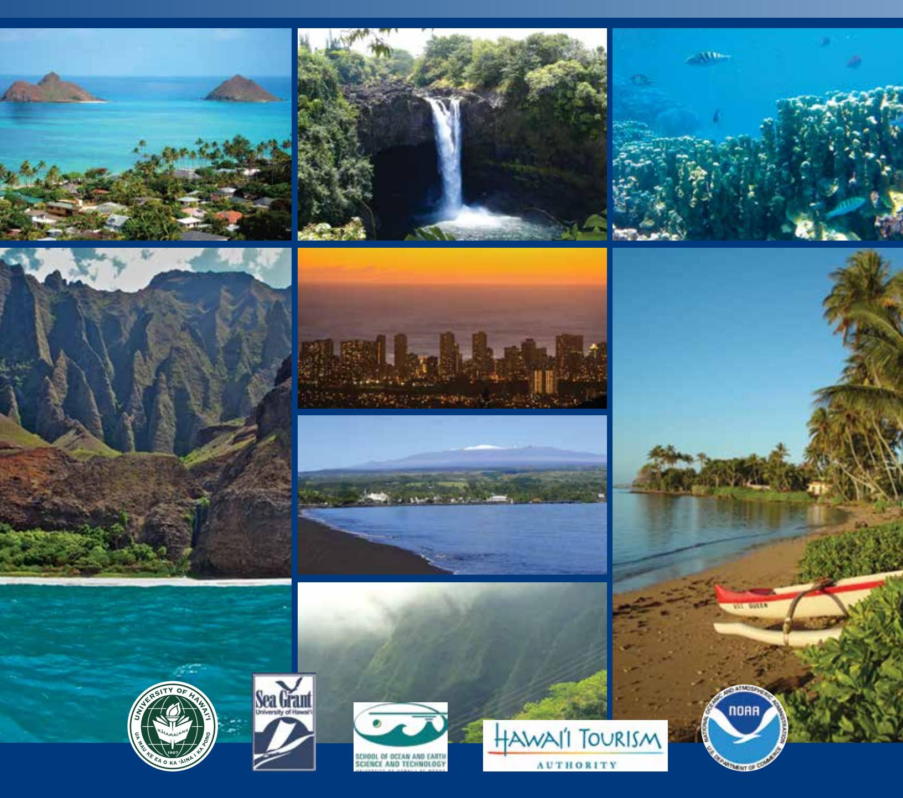

# "Intelligence is the ability to adapt to change."

-Stephen Hawking-

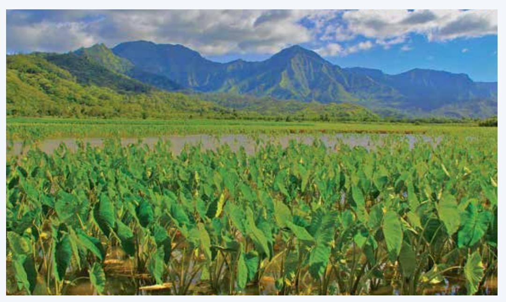

Image: Coastal taro fields, Hanalei, Kaua'i. Source: Dolan Eversole.

"Warming of the climate system is unequivocal, and since the 1950s, many of the observed changes are unprecedented over decades to millennia. The atmosphere and ocean have warmed, the amounts of snow and ice have diminished, sea level has risen, and the concentrations of greenhouse gases have increased."

> **Intergovernmental Panel on Climate Change (IPCC), 2013**

University of Hawai'i at Mänoa Sea Grant College Program. June 2014 Climate Change Impacts in Hawai'i - A summary of climate change and its impacts to Hawai'i's ecosystems and communities.

## **Table of Contents**

|      | ACKNOWLEDGEMENTS                                                                                                                                                                                                                                                           | i                                            |
|------|----------------------------------------------------------------------------------------------------------------------------------------------------------------------------------------------------------------------------------------------------------------------------|----------------------------------------------|
|      | EXECUTIVE SUMMARY                                                                                                                                                                                                                                                          | ii                                           |
| I.   | INTRODUCTION Climate Change and Hawai'i's Residents What is Climate Change? What are Greenhouse Gasses (GHG)? Principal Impacts of Climate Change in Hawai'i The Precautionary Principle and 'No Regrets' Aproaches Adaptation, Mitigation, and Response | 1 1 2 2 4 5 6              |
| II.  | BACKGROUND: CLIMATE RESEARCH AND SYNTHESIS Intergovernmental Panel on Climate Change Pacific Island Regional Climate Assessment                                                                                                                                      | 7 7 9                                  |
| III. | CLIMATE CHANGE IMPACTS TO HAWAI'I'S ECOSYSTEMS 1. Marine Ecosystems A. OPEN OCEAN B. CORAL REEFS AND OTHER NEARSHORE HABITATS 2. Coasts and the Built Environment 3. Terrestrial Ecosystems 4. Freshwater Resources 5. Human Health                   | 10 12 12 14 16 21 23 25 |
| IV.  | NEXT STEPS FOR CLIMATE CHANGE ADAPTATION IN HAWAI'I                                                                                                                                                                                                                        | 27                                           |
|      | APPENDIX A: HAWAI'I CLIMATE ADAPTATION POLICY                                                                                                                                                                                                                              | 28                                           |
|      | APPENDIX B: ADDITIONAL RESOURCES                                                                                                                                                                                                                                           | 29                                           |
|      | REFERENCES                                                                                                                                                                                                                                                                 | 30                                           |

# **ACKNOWLEDGEMENTS**

This document was produced by the University of Hawai'i Sea Grant College Program (UH Sea Grant). UNIHI-SEAGRANT-TT-12-04

Special thanks to the Florida Oceans and Coastal Council for the report concept. http://www.floridaoceanscouncil.org/reports/Climate\_Change\_Report.pdf

Appreciation is extended to Cindy Knapman and Heather Dudock (University of Hawai'i Sea Grant College Program) for their assistance in publishing this report.

This paper is funded in part, by a grant/cooperative agreement from the National Oceanic and Atmospheric Administration, Project A/AS-1 which is sponsored by the University of Hawai'i Sea Grant College Program, SOEST, under Institutional Grant No. NA09OAR4170060 from NOAA Office of Sea Grant, Department of Commerce. The views expressed herein are those of the author(s) and do not necessarily reflect the views of NOAA or any of its sub-agencies.

# **Contributors & Reviewers**

Primary Contributors:

**Dolan Eversole**, NOAA UH Sea Grant Coastal Storms Program Regional Coordinator **Alison Andrews,** Science Editor, UH Sea Grant

The following individuals also provided review and contributed to this document:

**Stephen Anthony,** United States Geological Survey

**Christopher Conger**, Coastal Scientist, Sea Engineering, Inc.

**Pao-Shin Chu,** Professor and State Climatologist, Department of Meteorology, School of Ocean and Earth Science and Technology, University of Hawai'i at Mänoa

**Charles Fletcher**, Department of Geology and Geophysics, School of Ocean and Earth Science and Technology, University of Hawai'i at Mänoa

**Matthew Gonser**, Community Planning and Design Extension Agent, UH Sea Grant **Kevin Hamilton,** Director, International Pacific Research Center, School of Ocean and Earth Science and Technology

**Dennis Hwang**, Coastal Hazard Mitigation Specialist, UH Sea Grant

**Victoria Keener**, Research Fellow, East-West Center

**Samuel J. Lemmo**, Administrator, Office of Conservation and Coastal Lands, Department of Land and Natural Resources

**Nancy Lewis**, Director, Research Program, East-West Center

**Delwyn Oki**, United States Geological Survey

**Tara Owens**, Coastal Processes Extension Agent, UH Sea Grant

**Ruby Pap**, Coastal Land Use Extension Agent, UH Sea Grant

**Roberto Porro,** Graduate Student, University of Hawai'i at Mänoa, Department of Urban and Regional Planning

**Bradley Romine**, Coastal Lands Extension Agent, UH Sea Grant

**Jesse Souki**, Director, State of Hawai'i Office of Planning

**Jacqueline Kozak Thiel**, Hawai'i State Sustainability Coordinator, Department of Land and Natural Resources

**Gordon Tribble**, United States Geological Survey

# **EXECUTIVE SUMMARY**

It is now widely accepted that human activities are affecting global climate systems in a significant way. While there are disagreements about the exact nature, magnitude, and timing of these changes, the science is clear that global climate change is being observed. This report is intended to provide a basic summary of the observed and projected changes to Hawai'i's ecosystems and their resulting impacts for Hawai'i's residents**.**

The University of Hawai'i Sea Grant College Program (UH Sea Grant) prepared this climate change impacts report to provide Hawai'i communities with a foundational understanding of the effects of global climate change on Hawai'i's resources and ecosystems. The report presents a summary of the current state of scientific knowledge regarding climate change and how it is expected to affect Hawai'i, including marine, coastal, terrestrial, and freshwater ecosystems, built systems, and human health so that Hawai'i can be better prepared for the changes to come.

The first part includes an overview of global climate science, followed by a summary of observed and projected impacts by specific ecosystem and sector. Where applicable, context is provided for how the changes in these ecosystems have bearing for Hawai'i's communities, economic sectors, and the built environment. This structure is intended to serve a broad audience, including communities and government agencies that are involved or interested in issues related to climate change impacts in Hawai'i, to improve the basic understanding of how climate change is expected to affect Hawai'i.

UH Sea Grant, in partnership with state, local, and non-governmental entities, strives to address the climate change adaptation needs of Hawai'i through additional research and technical support for state climate change adaptation planning. UH Sea Grant strives to support the adaptive capacity and resilience of Hawai'i's communities through university extension, education, and partnerships. The first step in building adaptive capacity is sharing knowledge about existing vulnerabilities to climate change impacts.

# **Global Climate Change and Hawai'i**

Climate change is now observed globally. The scientific consensus presented in the global body of climate research, including the fifth report released by the United Nations' Intergovernmental Panel on Climate Change (IPCC) in 2013, is that warming of Earth's climate system is unequivocal (IPCC, 2013). The fifth IPCC assessment report concludes that it is "extremely likely"1 that most of the temperature increase since the mid-20th century is caused by increased concentrations of greenhouse gases from human activities. This finding is supported by detection of land and sea temperature increases, changes in global water cycle, reductions in snow and ice, sea-level rise, and changes in climate extremes.

Defined as 95–100% probability by the IPCC, 2013 Summary for Policy Makers. "It is extremely likely that human influence has been the dominant cause of the observed warming since the mid-20th century." <http://www.climate2013.org/spm>

# **Summary of Local Impacts of Climate Change to Hawai'i**

The rate of **warming air temperature** in Hawai'i has quadrupled in the last 40 years to over 0.3°F (0.17°C) per decade. This warming could cause thermal stress for plants and animals, and heat-related illnesses in humans as well as expanded ranges for pathogens and invasive species.

**A decrease in the prevailing northeasterly trade winds**, which drive orographic precipitation on windward coasts, has been recorded in Hawai'i over the last 40 years.

Hawai'i has seen an overall **decline in rainfall** in the last 30 years, with widely varying precipitation patterns on each island. It is projected that Hawai'i will see more drought and heavy rains causing more flash flooding, harm to infrastructure, runoff, and sedimentation.

Declining precipitation trends have caused a **decrease in stream base flow** over the last 70 years, and could reduce aquifer recharge and freshwater supplies and influence aquatic and riparian ecosystems and agriculture.

**Sea surface temperatures have warmed** between 0.13°F and 0.41°F (0.07°C and 0.23°C) per decade in the Pacific for the last 40 years. This trend is projected to accelerate, warming by 2.3°F to 4.9°F (1.3°C to 2.7°C) before the end of the century. This warming can influence ocean circulation and nutrient distribution.

Global **ocean acidity has increased** by 30% due to marine uptake of CO2 , correlating to a pH change of 0.1. Acidification is expected to continue, with additional pH changes between 0.1 and 0.4 by the end of the century. Ocean acidification could trigger a wide range of impacts on marine biota, including inhibiting shell and skeleton growth in corals, shellfish, and plankton.

**Sea level has risen** over the last century on each island at rates varying from 0.5- 1.3 inches (1.5-3.3 centimeters) per decade, which has contributed to shoreline recession. Accelerating rates of sea-level rise have been detected in global sea level data. Rates of rise are projected to continue to accelerate, resulting in a 1-3 foot (approximately 0.3-1 meter) rise, or more, by the end of the century. Sea-level rise will exacerbate coastal inundation, erosion and hazards, leading to the degradation of coastal ecosystems, beach loss, and increasing damage to infrastructure in low-lying areas.

**Threats to human health** posed by Hawai'i's warming climate may include increased heat-related illness and wider ranges of vector-borne diseases such as dengue fever.

# **About the University of Hawai'i at Mänoa Sea Grant College Program**

The [University of Hawai'i at Mänoa Sea Grant College Program \(UH Sea Grant\)](http://http://seagrant.soest.hawaii.edu) supports and conducts an innovative program of research, education and extension services toward the improved understanding and stewardship of coastal and marine resources of the state, region, and nation. UH Sea Grant is one of 33 Sea Grant programs nationwide that comprise a functional network within our nation's universities and colleges promoting enhanced understanding, conservation, and use of coastal and marine resources. As part of the University of Hawai'i's prestigious School of Ocean and Earth Science and Technology (SOEST), UH Sea Grant partners with the National Oceanic and Atmospheric Administration (NOAA) to provide links among academia, federal, state and local government, industry, and the local community.

# **Sea Grant's Mission**

Sea Grant's mission is to provide integrated research, extension, and education activities that increase citizens' understanding and responsible use of the nation's ocean, coastal, and Great Lakes resources and support the informed personal, policy, and management decisions that are integral to realizing this vision.

Additional information on UH Sea Grant is available at [http://seagrant.soest.h](http://seagrant.soest.hawaii.edu/)[awaii](http://www.google.com/url?q=http%3A%2F%2Fseagrant.soest.hawaii.edu%2F&sa=D&sntz=1&usg=AFQjCNEtk-162JGPj-J1Syetv6eDRhAmPw)[.edu](http://seagrant.soest.hawaii.edu/)

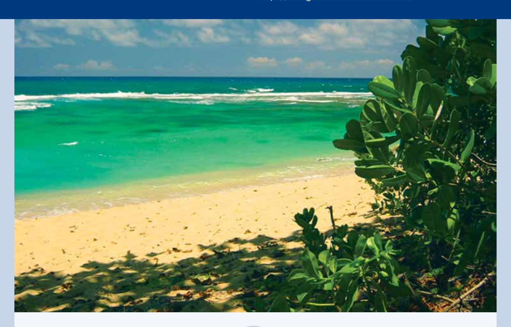

# I. INTRODUCTION

"Hawai`i joins other islands on the front lines of climate change, exposed to impacts that are already hitting tropical islands first and most severely—including drought, sea level rise, coastal erosion, flooding, storm intensification, rising temperatures, climate-sensitive disease proliferation and ocean acidification. These impacts have a direct effect on our urban and rural populations, as well as our rare flora and fauna."

Hawai'i Governor Neil Abercrombie, From Navigating Change Hawai'i's approach to adaptation, December 2013

# Climate Change and Hawai'i's Residents

Hawai'i is an archipelago of diverse features from the multi-hued reefs in Hanauma Bay and densely packed streets of Waikīkī to the sometimes-snowcapped summit of Mauna Loa. It is composed of unique species, phenomena, and habitats from the endemic Hawaiian honeycreeper, to the thundering north shore winter waves and the great chasm of Waimea Canyon. These unique environments are already changing under the influence of rising ocean levels, coastal erosion, invasive species, land-use and development changes, pollution, increasing population, and natural resources demands. Global climate change is adding further stress to Hawai'i's ecosystems and resources.

The islands' geographic and environmental complexity challenges us to anticipate the effects of climate change on the natural environment in a meaningful way. The limitations of downscaling climate models for local impacts and uncertainty in natural climate and weather patterns make long-term predictions very complex. Current observations – such as trends in declining rainfall and rising temperatures and seas – can serve as a indicators of Hawai'i's future and may help inform communities as they begin to plan for climate change.

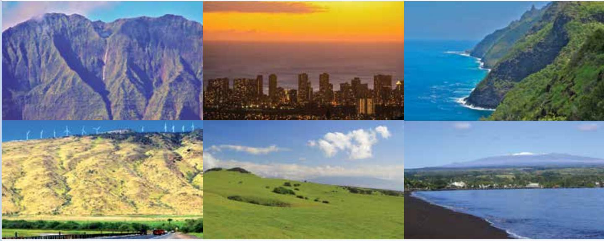

The Hawaiian Islands represent a wide diversity of ecosystems and environments, each having a different response to climate effects. UH Sea Grant.

While there is a large amount of science on global climate change available, sorting through and interpreting this very technical and often disparate information can be time-consuming and confusing, especially for the general public. This report provides insight to the current and projected state of climate change and the potential primary effects to Hawai'i's communities.

The structure of this outreach report provides a broad overview of the current state of climate science as it relates to Hawai'i's environment, beginning with global climate change and moving to regional, local, and finally ecosystem-specific impacts. The report highlights the primary impacts to Hawai'i ecosystems, communities, and economic sectors. It is hoped that an improved general understanding of climate science and the associated impacts will lead to informed communities that are better prepared and have greater motivation for undertaking and supporting climate adaptation and mitigation efforts.

# What is Climate Change?

According to the United Nations' Intergovernmental Panel on Climate Change (IPCC, 2007), climate change is "a change in the state of the climate that can be identified (e.g., using statistical tests) by changes in the mean and/or the variability of its properties, and that persists for an extended period, typically decades or longer. It refers to any change in climate over time, whether due to natural variability or as a result of human activity."

Since the industrial age, our climate has been changing in unprecedented ways. The chemical composition of the atmosphere is in flux, mostly due to human emission of greenhouse gases that contribute to excessive global warming (IPCC 2007, 2013). While warming of the Earth's ocean and air are at the heart of global climate change, the effects of this change are not limited to warming - they include a multitude of complex and often compounding feedback mechanisms and localized changes to Earth's natural systems that extend from pole to tropics.

# What are Greenhouse Gases (GHG)?

The temperature of our atmosphere is largely regulated by greenhouse gases, which absorb heat, or infrared radiation, emitted from Earth's surface. This process effectively traps heat in the atmosphere that would otherwise escape into space (Figure 1). These gases occur naturally in Earth's atmosphere but their concentrations are being increased beyond pre-industrial levels by processes such as burning of fossil fuels and deforestation. While greenhouse gases are essential to maintaining Earth's temperature, excess quantities are raising global average temperatures above the range of natural variability. The most important greenhouse gases are: water vapor ( $H_2O$ ), which causes about 60% of the greenhouse effect on Earth; carbon dioxide ( $CO_2$ ), about 26%; ozone ( $O_3$ ), about 8%; and methane ( $CH_4$ ) and nitrous oxide ( $N_2O$ ), together about 6%. Of the greenhouse gases that human activities emit,  $CO_2$  and  $CH_4$  have the greatest contribution to the excessive warming (Kiehl and Trenberth, 1996).

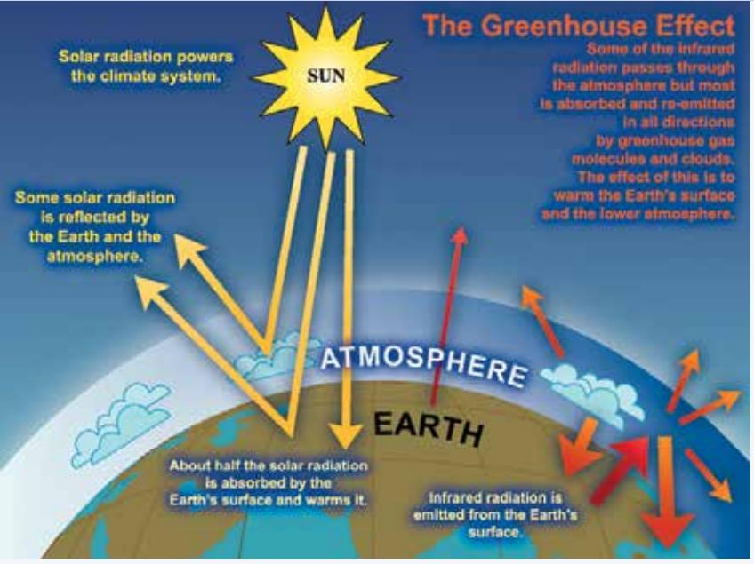

Figure 1. An idealized model of the natural greenhouse effect (IPCC, 2007).

Increasing greenhouse gas concentrations observed in recent decades drive changes in a variety of Earth's systems. Global average ocean and air temperatures have been increasing; precipitation patterns have been changing; snow cover and ice sheets have been melting; the oceans have been acidifying; and global sea levels have been rising at accelerated rates (Figure 2). These changes, in turn, have cascading and compounding effects on other natural processes and features such as ocean circulation, storms, precipitation and streamflow, and

terrestrial and marine biota around the world (IPCC, 2013, Fletcher, 2013).

Before the industrial age, levels of atmospheric carbon dioxide fluctuated between 180 to 300 parts per million (ppm) by volume (IPCC FAQ, 2007). In the modern industrial age CO2 levels have surpassed that range, peaking near 400 ppm in 2013 (Figure 3) (NOAA ESRL, 2013). Some greenhouse gases remain in the atmosphere for a long time — from decades to a thousand years — so we will likely continue to see increases in average global temperature and the feedbacks and compounding effects that follow regardless of GHG mitigation efforts (U.S. EPA, 2013).

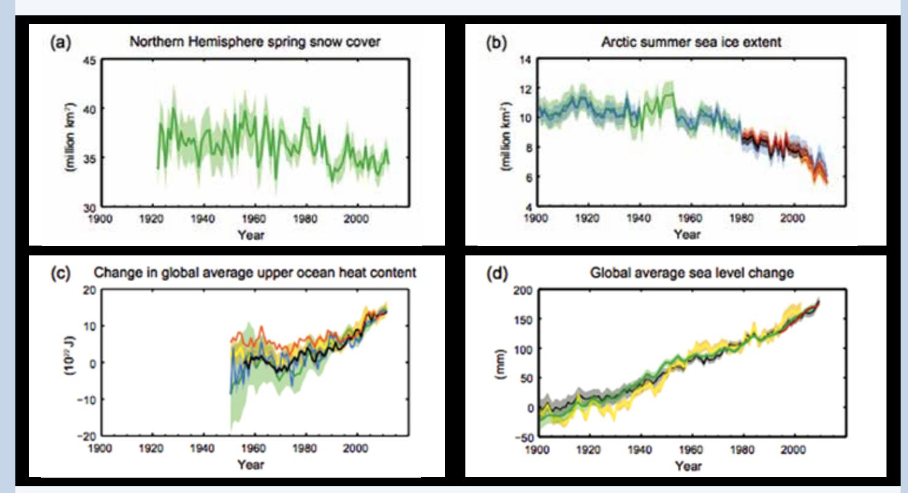

Figure 2. Observed changes in Northern Hemisphere snow and ice cover (a), Arctic summer sea ice extent (b), global upper ocean heat content (c), and global sea level since 1900 (d). Source: IPCC Working Group 1 AR5 SPM, Figure 3, 2013.

# **Principal Impacts of Climate Change in Hawai'i**

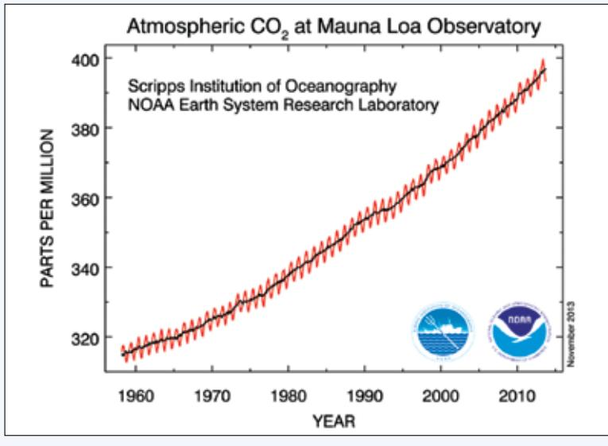

Figure 3. Monthly mean atmospheric carbon dioxide at Mauna Loa Observatory, Hawai'i, 1958-2013. NOAA ESRL, 2013.

Hawai'i is experiencing climate change impacts in unique, regionspecific ways. For instance, the rapid acceleration observed in globally averaged rates of sea-level rise (SLR) has not yet been observed in local sea-level data for Hawai'i, whereas O'ahu's daily temperature range is changing much more rapidly than the global mean. It is important to focus on the localized impacts of climate change to adequately understand and prepare for the changes to come. This report identifies the primary impacts by ecosystem to show the complex changes compounding

in geographic areas, while recognizing that ecosystems are linked to one another and are impossible to separate entirely. For example, some impacts are felt in multiple ecosystems, such as thermal stress, which affects the health of corals, vegetation, humans, and more. Additionally, an impact in one ecosystem may cause a subsequent impact in another, such as changes in precipitation in terrestrial ecosystems affecting runoff into nearshore marine ecosystems. Keeping these interconnections in mind, impacts are outlined in this report along the following broad divisions:

## **Marine Ecosystems**

- Open Ocean
- Ocean acidification
- Increasing sea surface and upper ocean temperature
- Changing ocean circulation and upwelling patterns
- Changing nutrient and species distributions
  - Coral Reefs and Other Nearshore Habitats
- Ocean acidification
- Increasing temperature leading to thermal stress and coral bleaching
- Increasing sedimentation due to erosion
- Increasing threat of disease and invasives
- Changing nutrient supply from changing stormwater runoff patterns

#### **Coasts and the Built Environment**

- Sea-level rise leading to increased coastal erosion and inundation
- Increasing frequency and intensity of tropical cyclones

#### **Terrestrial Ecosystems**

- Increasing temperature leading to changing habitat ranges
- Changing rainfall frequency and intensity
- Increasing threat of diseases, pests, and invasive species

#### **Freshwater Resources**

- Changing rainfall frequency and intensity
- Saltwater intrusion

#### **Human Health**

- Increasing threat of heat-induced illnesses
- Increasing threat of pathogens and diseases
- Decreasing water quality and availability due to drought
- Changing frequency and intensity of tropical cyclones (hurricanes)

Some of these impacts have already been observed in Hawai'i; some are projected to manifest in coming decades. This report characterizes these impacts as such - observations versus projections - recognizing the challenges of climate model downscaling, projection uncertainties, and natural climate variability. The exact timing of when specific climate change thresholds will be met is pertinent for scientists and planners alike, and much climate research centers on this topic, including the IPCC and various climate model downscaling efforts at the University of Hawai'i (Elison Timm et al., 2011 and Lauer et al., 2013). Projections extending further into the future, say, beyond 100 years, and those involving higher emissions scenarios are less certain by nature. Some impacts have been little studied and thus their projections are less robust. Even some observed changes can carry uncertainty as to the exact source and impact. Atmospheric temperature flux, for example, can be influenced by multiple factors unrelated to anthropogenic climate change, such as regional climate variability at a variety of timescales. Thus, it can be hard to predict temperature at a specific time and place due to this natural variability.

# **The Precautionary Principle and 'No Regrets' Approaches**

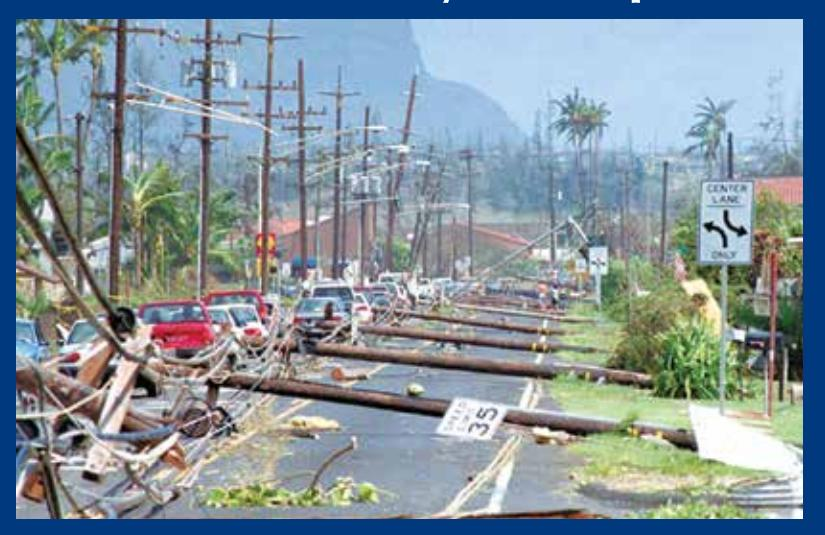

Hurricane Iniki damage, Kaua'i, 1992. Bruce Asato, Honolulu Star-Advertiser.

The Precautionary Principle requires that "when human activities may lead to morally unacceptable harm that is scientifically plausible but uncertain, actions shall be taken to avoid or diminish that harm" (COMEST, 2005). It boils down to erring on the side of caution. In the case of climate science, there are uncertainties and challenges in defining the exact impacts but a growing list of observations provide evidence to see that our environments and communities are at risk. The precautionary principle suggests that society should take proactive climate adaptation action because inaction could lead to further harm. There are several "no regrets" approaches in climate adaptation, employing strategies that serve to benefit communities regardless of the magnitude of future climate changes through hazard mitigation, resource

conservation and economic efficiency simultaneously. Preparing for climate change largely entails better preparation for the natural hazards that already threaten our communities such as coastal erosion, flooding, hurricanes, and drought. A "no regrets" approach may appeal to those who may not see the need to react to climate change due to the long-range projections of major impacts, but may see value in the same action to prepare and mitigate for existing natural hazards.

# **Adaptation, Mitigation, and Response**

The variety of changes to the natural environment presented in this report will require different adaptation and response efforts depending on the nature and severity of the impact:

- 1. **Some impacts are unavoidable and may not be effectively mitigated**. For example, Hawai'i may experience the degradation or loss of some of its most vulnerable marine ecosystems due to continued ocean acidification without a viable, cost-effective means of mitigation.
- 2. **Some impacts are unavoidable but can be mitigated** by strategies and actions that compensate for, or offset, some of the adverse impacts. For example, Hawai'i may enhance rain catchment programs and water conservation or choose to require new building and zoning codes in the coastal hazard zone to preserve sandy beaches, or harden some areas with shoreline protection and flood control measures to maintain critical infrastructure.
- 3. **Some impacts are unavoidable but Hawai'i will adapt** by changing our way of life, infrastructure, and economy to maintain a quality of life acceptable to Hawai'i residents. For example, infrastructure may need to be designed to new standards to accommodate flooding rather than stopping it, energy may need to be obtained from renewable sources, and food and water may need to be harvested more sustainably.
- 4. **Some impacts may be avoidable if future greenhouse gas concentrations can be limited** through improved energy efficiency and development of more sustainable energy sources or effective geo-engineering methods.

There are many benefits for communities that take action to mitigate potential impacts due to climate change. Hawai'i's communities will be more resilient through progressive land-use policies that integrate sustainability, hazard resilience, and hazard mitigation. Coastal resource conservation and ecosystem-based (e.g., ahupua'a) planning initiatives often serve the multiple benefits of protecting a specific resource while significantly reducing vulnerability to coastal hazards. Proactive efforts to increase open space, restore and provide buffers for coastal wetlands, and relocate major improvements away from vulnerable areas will greatly improve Hawai'i's resilience to climate change impacts.

# II. BACKGROUND: CLIMATE RESEARCH AND SYNTHESIS

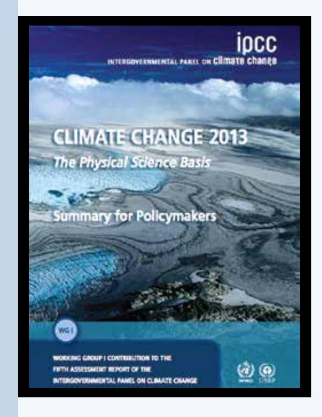

# Intergovernmental Panel on Climate Change

The Intergovernmental Panel on Climate Change (IPCC) is a scientific body that provides periodic peer-reviewed assessments of climate science to inform international decision-making on climate issues. The international panel, made up of scientists, government representatives, and experts in the climate field, uses a peer review process to assess the latest scientific, technical, and socioeconomic findings, providing an objective source of information (IPCC, 2008). In 2013, the panel issued its fifth report on the physical science basis of global climate change. Selected highlights from this report, especially those relevant to Hawai'i, are as follows (IPCC, 2013):

#### **OBSERVED CLIMATE CHANGE:**

- The last 30 years were the warmest since 1850 and likely (66%-100% probability) the warmest 30 years in the last 1400 years.
- $CO_2$  (carbon dioxide),  $CH_4$  (methane), and  $N_2O$  (nitrous oxide) levels are higher than they've been in 800,000 years.  $CO_2$  concentrations are 40% higher than preindustrial times.
- Global mean sea level rose 0.62 ft (0.19 m) over the period from 1901-2010.
- Arctic sea ice, ice sheets, glaciers, and snow cover have shrunk over the last two
  decades, with most melting rates increasing in the last decade.
- Oceans have absorbed 30% of the additional  $CO_2$  we have added to the atmosphere, contributing to a 26% change in the pH of the ocean.

#### PROJECTED CLIMATE CHANGE:

- Global mean temperature is projected to increase by at least 2.7°F (1.5°C) by the end of the century for intermediate to high future emissions scenarios also referred to as Representative Concentration Pathways (RCPs) (Figure 4).
- Arctic sea ice is projected to lose half to nearly all of its summer ice extent by the end of the century.
- The strongest ocean warming is projected to be felt in tropical and Northern Hemisphere subtropical regions, with increases up to 3.6°F (2.0°C) in the upper ocean above 650 ft (200 m) by the end of the century.
- The contrast between wet and dry regions and seasons will likely become more extreme. The Equatorial Pacific is likely to see an increase in precipitation and it is very likely that wet tropical areas and mid-latitude land will experience more frequent and extreme precipitation.

- Precipitation associated with the El Niño Southern Oscillation (ENSO) will likely intensify due to higher water content in air.
- Ocean acidity is projected to continue increasing, changing the pH by at least 0.06 and as much as 0.32 - triple the already observed change - by the end of the century.
- Rates of global sea-level rise are likely to accelerate beyond those already experienced, with sea levels 0.85 to 3.2 ft (0.25 to 1.0 m) higher than present by the end of the century.

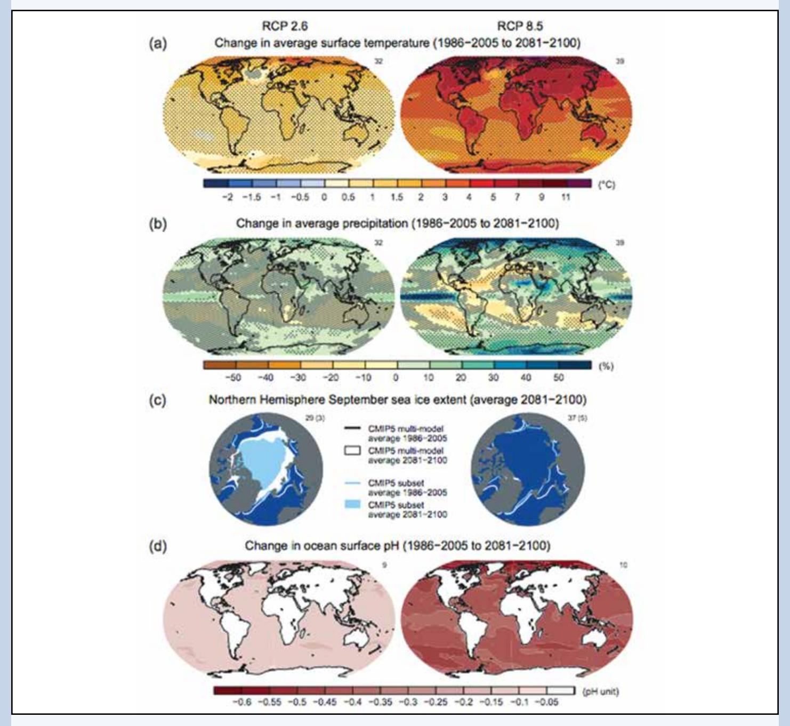

Figure 4. IPCC projections for global surface temperature (a), global precipitation (b), Arctic sea ice extent (c), and global ocean acidity (d) for low (RCP 2.6, left) and high (RCP 8.5, right) emissions scenarios. IPCC, 2013.

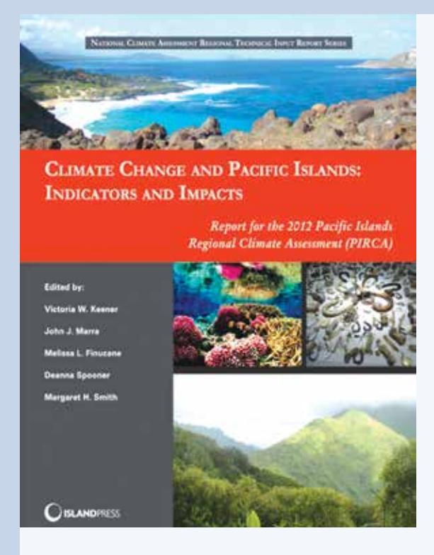

## **Pacific Islands Regional Climate Assessment**

 In 2012, th[e Pacific Islands Regional Climate](http://www.pacificrisa.org/projects/pirca/)  [Assessment \(PIRCA\)](http://www.pacificrisa.org/projects/pirca/) developed a comprehensive report, Climate Change and Pacific Islands: Indicators and Impacts, to assess climate change and its impacts on Pacific islands, as well as the adaptive capacity of those islands to change (Keener et al., 2012). The PIRCA report was a regional contribution, focusing on Hawai'i and the U.S.-Affiliated Pacific Islands, to the National Climate Assessment (NCA), which is a compiled report on nationwide climate change prepared every four years as required by the Global Change Research Act of 1990. Over 100 scientists and practitioners in the climate field provided input on impacts and adaptation approaches to freshwater supply and drought, sea-level rise and coastal

inundation, and aquatic and terrestrial ecosystems. Key climate impacts identified in the PIRCA include:

- Atolls, reefs, coasts, and high elevations on Pacific islands will be most vulnerable to the compounding impacts of projected changes in the region.
- Freshwater supply, especially on atolls, will decline.
- Increased coastal flooding and erosion due to sea-level rise will damage infrastructure, agriculture, tourism, endangered species habitat, and coral reefs.
- Short-term sea level changes such as high tides and storm surge will compound the effects of climate-induced sea-level rise.
- Warmer oceans will lead to increased coral bleaching.
- As the ocean absorbs more CO2 from the atmosphere, it will become increasingly acidic threatening both nearshore and open ocean ecosystems.
- Changes in marine ecosystems will alter fish distribution and ultimately decrease fish populations.
- Native plants and animals will be exposed to greater environmental stressors.
- The practice of and connection to cultural heritage on Pacific islands will be at risk due to changing availability of resources and damage to infrastructure and land.

# III. CLIMATE CHANGE IMPACTS TO HAWAI'I'S ECOSYSTEMS

The observed and projected influences of climate change on global and local ecosystems are diverse and often detrimental. Some of the changes likely to impact Hawai'i's ecosystems include accelerated sea-level rise, ocean and atmospheric warming, increased flooding, ocean acidification, changing distributions of terrestrial and marine biota, changing intensity and frequency of storms among others (Figure 5). Because Hawai'i is a coastal society and reliant on tourism as a primary economy, the economic and societal consequences of these climate impacts will be far reaching (Cristini, 2013).

An interdisciplinary approach utilizing a variety of scientific, economic, and sociocultural disciplines will assist in assessment of the primary impacts of climate change in Hawai'i. This section presents a broad overview of scientific findings, both Hawai'ispecific and global in scope, on climate impacts to the physical environment and their potential effects to Hawai'i. The impacts in the following ecosystem sections are divided into observed trends and projected changes. Information presented in this section is intended to be used to help Hawai'i's communities better understand the consequences of climate change and begin to plan for them.

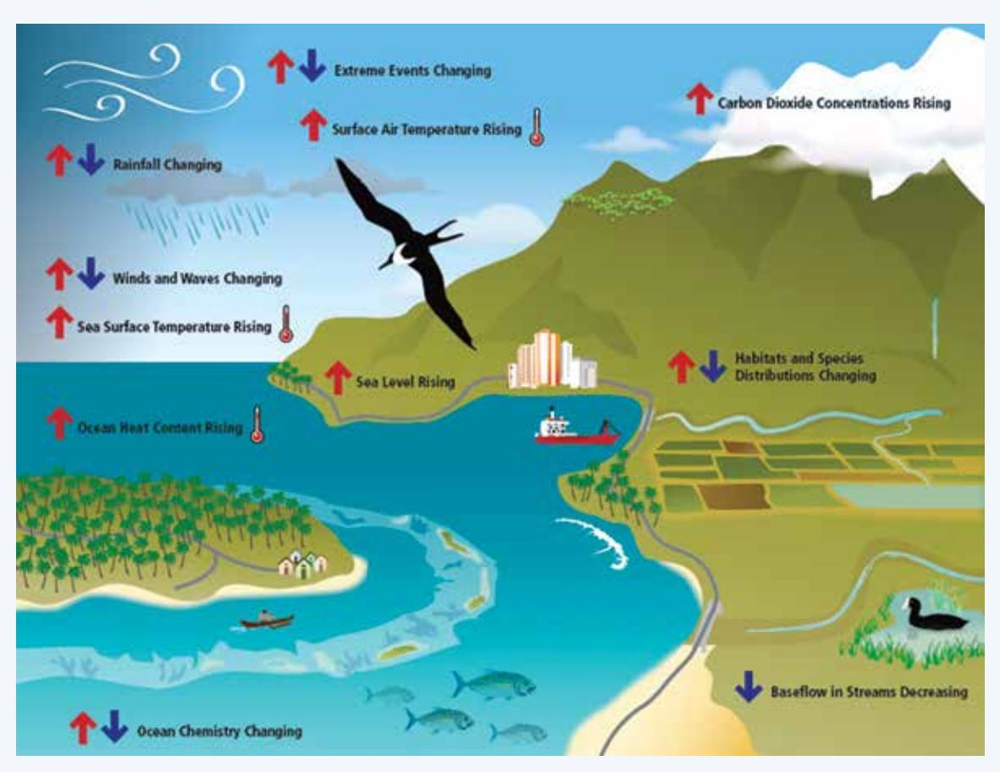

Figure 5. Key Indicators of Climate Change in the Pacific Islands Region. Source: Pacific Island Regional Climate Assessment (PIRCA), 2012, graphic designed by Susan Yamamoto, adapted from "Ten Indicators of a Warming World," in NOAA National Climatic Data Center, State of the Climate in 2009 (report).

Hawaiian ecosystems, some of which are already heavily altered, will be challenged by increasing frequency and severity of climate-related disturbances (e.g., storms, flooding, drought, wildfire, invasive species, ocean acidification) and continued pressure from anthropogenic influences (e.g., land-use change, pollution, fragmentation of natural systems, overexploitation of resources). Evidence of many of these climate-related impacts has already been observed in Hawai'i but additional research is needed to improve forecasts of future ecosystem impacts. These climaterelated hazards challenge us to continue to improve our understanding of specific risks through collaborative scientific research and develop innovative solutions for adaptation.

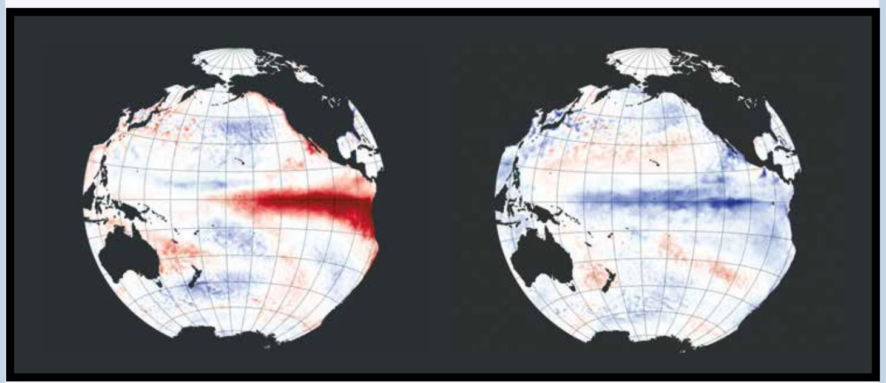

Figure 6. Sea surface temperature anomalies in the Pacific during El Niño (left), with warmer equatorial waters in the eastern Pacific (red shaded area), and La Niña (right), with colder equatorial waters (blue shaded area). Source:NOAA NCDC [http://www.ncdc.noaa.gov/sst/.](http://www.ncdc.noaa.gov/sst/)

# **ENSO and PDO**

The El Niño Southern Oscillation (ENSO) is a multi-year climatological phenomenon with two opposite phases - El Niño and La Niña - that affects temperature and precipitation, among other variables, in the Pacific Ocean and has important consequences for climate patterns around the world. The El Niño phase exhibits an anomalous warming of the equatorial waters in the eastern Pacific (red shaded area in Figure 6), typically bringing drier conditions to Hawai'i. Average El Niño events persist for 6 to 18 months and they usually occur once every three to seven years. The Pacific Decadal Oscillation (PDO) is a long-lived El Niño-like pattern of Pacific climate variability that shifts phases on a multi-decadal time scale, usually about 20 to 30 years. In contrast with El Niño's effect on tropical ocean temperatures, the oceanographic and climatic fingerprints of the Pacific Decadal Oscillation are more evident in the mid-latitudes of the North Pacific and North America (CIG, 2009).

# 1. Marine Ecosystems

#### A. OPEN OCEAN

The physical, chemical, and biological characteristics of the ocean are shifting globally and around Hawai'i under the influence of climate change. Although it still maintains an overall basic pH, the ocean is getting warmer and more acidic. Warming has the potential to drive changes in circulation which could influence the distribution of the nutrients necessary to support whole food webs from plankton, up to fish and whales. Entire ocean biomes are projected to shift in size and location with a warming ocean. Ocean warming could also be favorable to pathogens and invasive species, threatening native and endemic species.

# **Ocean Acidification**

Oceans serve as carbon sinks, absorbing over a third of the extra  $CO_2$  added to the atmosphere through human activities. Absorbing  $CO_2$  changes the acidity, or pH, of seawater. The pH scale ranges from 0, highly acidic, to 14, highly basic, with seawater slightly basic around 8 (NOAA PMEL). Since the industrial age, the global mean ocean pH has dropped by 0.1, which translates to a 30% increase in acidity due to the logarithmic scale used for pH (IPCC, 2013). Higher acidity decreases the availability of dissolved minerals in seawater, particularly calcium carbonate, which is necessary for many marine organisms, such as coral, shellfish, and plankton, to perform various biological processes including building shells and skeletons (NOAA PMEL) (Figure 7).

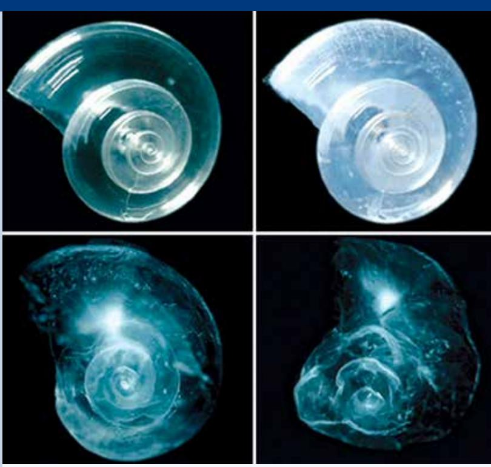

Figure 7. A pteropod shell dissolving in acidified water over the course of 45 days. Source: David Liittschwager and National Geographic Images. Used with permission. All rights reserved.

#### **OBSERVED CHANGES**

- The average pH of the world's oceans has fallen by 0.1 pH unit since 1750 because of the uptake of carbon dioxide caused by human activities (IPCC, 2013).
- Increased ocean acidification has been observed near Hawai'i and other areas of the North Pacific (Byrne et al., 2010, Dore et al., 2009).
- In the North Pacific, sea surface temperatures have been rising, on average, by about 0.22°F (0.12°C) per decade (Casey and Cornillon, 2001).
- Large-scale ocean gyres in the Pacific and Atlantic have shown dramatic decreases in biological productivity in the past decade (Polovina et al., 2008).

#### **PROJECTED CHANGES**

- The acidification of global oceans is expected to continue and possibly accelerate, with a potential pH drop of 0.1 to 0.4 projected between 2050 and 2100, threatening some calcifying plankton, corals, and other species (Kuffner et al., 2008) (Figure 7).
- Changing ocean temperatures could alter ocean circulation and climate variability patterns, which could, in turn, disrupt the timing of feeding and spawning of marine species and reduce primary productivity and fish catches around the Hawaiian Islands(Trenberth, 1990; Mimura et al., 2007; Karl et al., 2001; Bowler et al., 2009).
- Native and endemic species could be threatened by the expansion in the range of invasive species due to increasing temperatures (Keller et al., 2009).
- In the near term, changes in Pacific Ocean biomes could improve some species catches. In the longer term, biomes are projected to decrease in productivity with skipjack and bigeye tuna catches decreasing by 8 and 27%, respectively, by 2100 (Lehodey et al., 2011).
- Whole ocean biomes are projected to change in area, productivity, and location. The Pacific subtropical biome is projected to shift northward by 1,000 km per 100 years and eastward by 2,000 km per 100 years (Polovina et al., 2011).

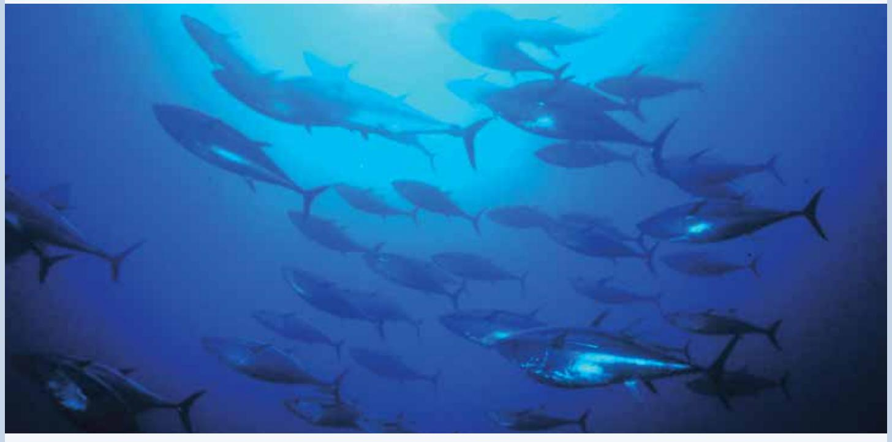

Skipjack Tuna, one of several pelagic species populations that are projected to decrease in the future. Source: NOAA-Danilo Cedrone.

#### **COMMENT: RESEARCH PROGRESS AND POLICY**

Intensive ocean acidification research continues to track the potentially dramatic effects of increased acidity on Hawai'i's ocean and the ecosystems it supports. The influence that climate change will have on PDO and ENSO patterns is not well understood, but will have great bearing on ocean dynamics and marine fisheries since ENSO and PDO play a major role in climatic and oceanographic patterns and the associated global distribution of commercial fisheries.

#### **B. CORAL REEFS AND OTHER NEARSHORE HABITATS**

Coral reefs and other nearshore habitats face degradation from both climate change and localized anthropogenic influences, including but not limited to, sedimentation, direct physical impacts, overfishing, nutrient loading from runoff, and erosion. Increasing sea surface temperatures lead to thermal stress in some marine animals and coral bleaching. Ocean acidification can inhibit important biological processes like calcification, which is necessary for coral and shell production. Changing precipitation patterns over islands influence the quantities and concentration of stormwater runoff that enters coastal waters. Increases in sea-level rise and coastal inundation will change the nearshore environment on which these habitats stand and may result in ecosystem shifts or loss.

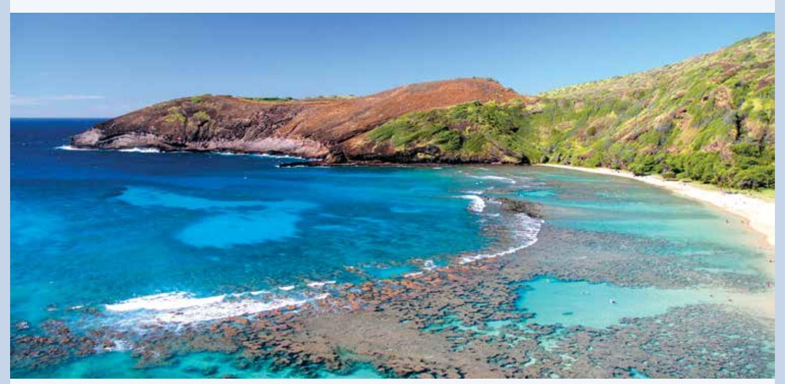

Some of Hawai'i's unique marine ecosystems face added challenges by climate change, Hanauma Bay, O'ahu. Photo: Dolan Eversole.

#### **OBSERVED CHANGES**

- Global ocean acidity has increased by 30%, a pH change of 0.1, resulting in the decreased availability of dissolved carbonate minerals.
- Acidification can cause a variety of responses in marine organisms, including inhibited development of calcium carbonate shells or skeletons in corals, shellfish, and plankton, and impaired physiological functions of some reef fish (Kuffner et al., 2008; Doney et al., 2012; Ishimatsu et al., 2005; Zeebe et al., 2008; Ries et al., 2009).
- The impacts of ocean acidification vary by species, but most coral species show reduced growth under lower pH conditions (Doney et al., 2012).
- Oceans have absorbed over 90% of Earth's excess warming, resulting in a sea surface warming within the upper 650 feet of ocean (200 meters) of 0.13-0.41°F (0.07-0.23°C) per decade, since 1970 (IPCC, 2013; Australian Bureau of Meteorology and CSIRO, 2011).

- Coral bleaching, a process in which corals expel symbiotic algae, can occur when upper temperature limits of reef building corals are reached for prolonged periods, which can be as little as 1.8°F (1°C) warmer (Doney et al., 2012; Keller et al., 2009; Jokiel and Brown, 2004).
- When stressed by environmental conditions, such as poor water quality and high temperatures, corals are more vulnerable to pathogens and rapid growth of algae, such as cyanobacteria (Harvell et al., 2002; Paerl and Paul, 2012).
- Bleached corals were observed in Käne'ohe Bay, O'ahu in 1996 and in the Northwestern Hawaiian Islands in 2002 and 2004. These events were attributed to spikes in sea surface temperatures greater than 1.8˚F (1°C), high solar energy, and low winds (Friedlander et al., 2009).
- In the past, flash floods in Hawai'i have often resulted in increased sediment load to the nearshore environment and have caused impacts to coral reefs from sedimentation, and stormwater runoff.

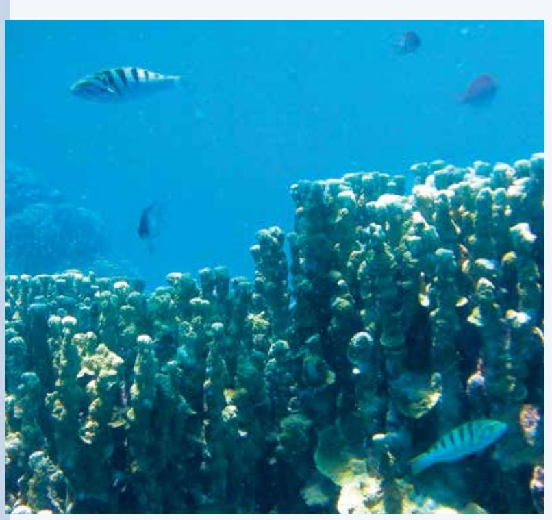

Coral reef ecosystem, Hawaiian Islands. Tropical coral reefs represent highly diverse ecosystems that represent the accumulation of calcium carbonate over hundreds to thousands of years. Source: Dolan Eversole.

#### **PROJECTIONS**

- With increasing atmospheric carbon content, ocean pH is projected to decline by at least an additional 0.1 and as much as 0.4 by 2100 (Doney et al., 2012; Royal Society, 2005).
- Under current emissions trends, most global coral reef habitats may support only adequate or marginal conditions for calcification by the year 2030 (Keener et al., 2012; Burke et al., 2011).
- Some nearshore marine plants, such as algae and grasses, may show increases in production with increasing carbon content of the ocean (Doney et al., 2009).
- Increased runoff and pollution could harm coral reefs and the fish species that depend on them and affect the frequency, intensity, and duration of harmful
- algal blooms (Harvell et al., 1999; Ogston and Field, 2010).
- Long-term trends in sea surface temperatures are projected to continue warming, increasing between 2.3°F and 4.9°F (1.3°C and 2.7°C) in the Pacific by 2100 (Australian Bureau of Meteorology and CSIRO, 2011).
- Coral mortality, due to bleaching and acidification, could lead to a shift towards algae-dominated seafloors, which has particular importance to biodiversity in Hawai'i due to the high percentage of endemic coral species in Hawai'i (25-40%) (Doney et al., 2009; Doney et al., 2012, A. Friedlander personal communication, 2013).

- • Climate-induced changes in ENSO frequency and intensity could increase coral bleaching events, which have in the past been linked to El Niño-driven temperature increases (Trenberth, 1990; Wilkinson et al., 1999; Shea et al., 2001).
- Coral reefs can grow vertically to adapt to rising sea levels at modest rates, around 10-20 mm per year, but could "drown" for lack of sunlight at higher rates of rise (Grigg, 1989).

## **COMMENT: RESEARCH PROGRESS AND POLICY**

Healthy coral reefs are among the most diverse ecosystems on the planet and they provide opportunities for recreation, tourism, fishing, and cultural practices as well as coastal storm hazard mitigation. Continued research is needed to further understand the current and potential impacts of decreased ocean pH on Hawai'i's marine ecosystems. The response of coral growth to rapid sea-level rise is also uncertain, especially in previously degraded areas and under poor environmental conditions. Controlling land-based sources of stormwater runoff and water pollution with climate change in mind may help alleviate the effects of climate-related changes.

# **2. Coasts and the Built Environment**

Hawai'i has over 750 miles of coastline comprised of a diverse mixture of environments, including sandy carbonate beaches, steep bluffs, densely-developed lowlands, lava benches, marshes and fishponds, many of which are eroding due to natural and anthropogenic causes. Hawai'i's coastal communities and ecosystems are exposed to a wide variety of coastal hazards including high wave events, hurricanes, tsunamis, and extreme tides. The impacts of these events are exacerbated by the rise of sea level and may be further amplified by accelerated rise and changing storm and cyclone patterns. The combined effects of these phenomena can cause shorelines to retreat, bluffs and cliffs to catastrophically fail, and low coastal areas to become inundated. Projected sea-level rise will undoubtedly increase erosion and flooding statewide and expose our coastal communities to greater hazards.

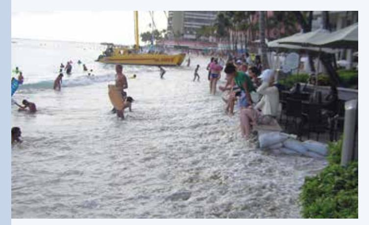

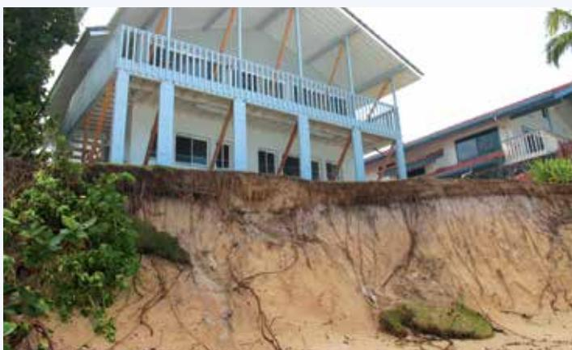

Local examples of modern high tide inundation and erosion on Waikïkï Beach, Honolulu, 2008. Chris Conger (left) and Sunset Beach, O'ahu, 2013. Dolan Eversole (right). These events are indicators of what we might expect with increasing frequency with increased sea levels in the future.

# **Sea-Level Rise**

The global average sea level is rising for a number of reasons. The two biggest global contributions are from thermal expansion, the process of warming water expanding, and from the melting of land-based ice sheets and glaciers adding volume to the ocean. The sea doesn't rise equally everywhere, however. Rates of sea-level rise can vary substantially between regions, and even islands, due to geologic uplift and subsidence, ocean currents, wind patterns, gravitational pull, and other factors (Figures 8 and 9).

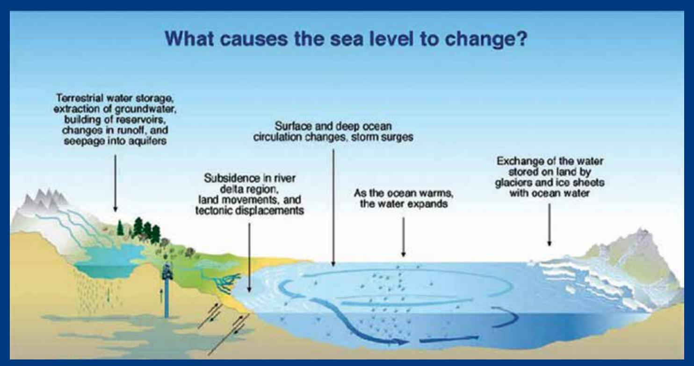

Figure 8. Causes of sea-level rise. Source: IPCC Climate Change 2001 Synthesis Report.

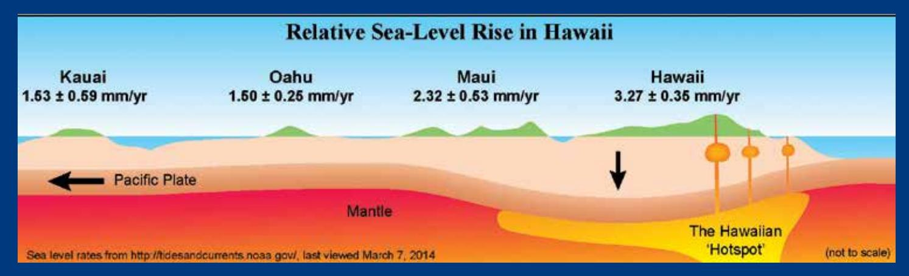

Figure 9. Example of varying relative sea-level rise in Hawai'i due to lithospheric flexure. Source: UH Coastal Geology Group.

#### **OBSERVATIONS**

- Sea level has been rising in Hawai'i for the past century or more. Rates of rise vary amongst the islands due to differing rates of subsidence based on distance from actively-growing Hawai'i Island. Rates of sea-level rise in Hawai'i ranged from 0.6 inches (1.5 cm) on O'ahu and Kaua'i, to 1.3 inches (3.3 cm) on Hawai'i Island per decade over the last century (NOAA CO-OPS, 2013) (Figure 9).
- Over the past century, 70% of the beaches in Hawai'i have eroded and over 13 miles of beach have been completely lost to erosion (Fletcher et al., 2012). This dominant trend of beach erosion could be driven by local sea-level rise (Romine et al., 2013).
- Shoreline retreat, averaging 1 ft per year (0.3 m/yr) statewide, wetland migration and cliff collapse due to erosion are occurring now on many of Hawai'i's coastlines (UH Coastal Geology Group, 2013; Fletcher, et al., 2010).
- Elevated groundwater tables, due in part to sea-level rise, are contributing to flooding in low coastal areas during higher tides and heavy rainfall events (Guidry and Mackenzie, 2006, Fletcher, 2010; Rotzoll and Fletcher, 2013).
- Antarctic and Greenland ice sheets are melting faster than previously predicted, which is contributing to the acceleration of global sea-level rise(Kammen, 2009; Fletcher, 2009).
- More tropical cyclones have developed from storms in the Pacific between 1991 and 2010 than previously recorded from the last century (Webster et al., 2005).
- Recent increases in worldwide societal impacts from tropical cyclones have largely been caused by rising concentrations of population and infrastructure in coastal regions (WMO, 2006).

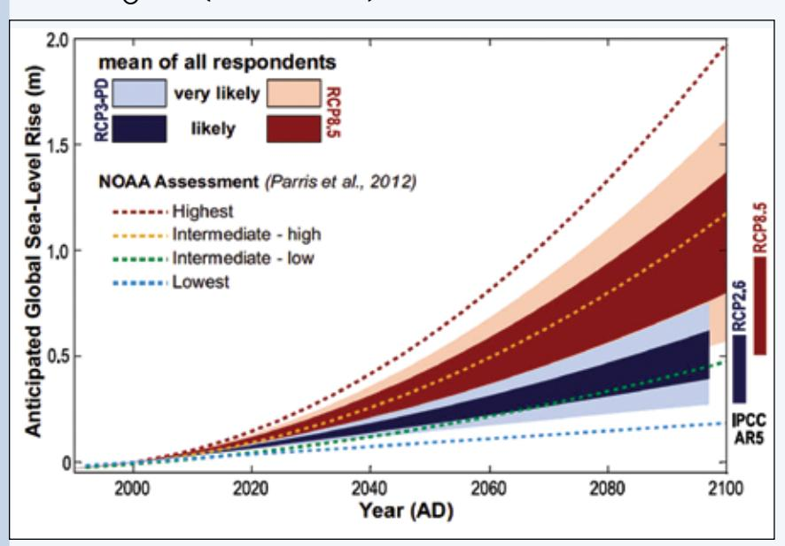

Figure 10. Mean projections for global sea-level rise averaged from a survey of 90 expert in the field of sea level for low (blue) and high (red) greenhouse gas concentration scenarios. Dashed lines show projections from a NOAA SLR Assessment, (NOAA, 2012).

## **PROJECTIONS**

- A survey of 90 experts in the field of sea-level rise research produced mean estimates of 1 ft and 3 ft (0.3 m and 0.9m) by the year 2100 for low and high emission concentration scenarios, respectively (Figure 10) (NOAA, 2012, Codiga and Wager, 2011; Richardson, 2009; Hansen, 2007; Horton et al., 2013).
- Hawai'i and the central western Pacific Ocean has been modeled to experience about 1 ft-2.5 ft (0.3 m-0.8 m) higher than global average sea-level rise by the year 2100 (Spada et al., 2013).
- Portions of low lying coastal areas may be submerged, such as Hanalei, Kaua'i; Kahului, Maui; Hilo, Hawai'i; and Waikïkï Beach, O'ahu (Figure 11) (Keener et al., 2012; NOAA, 2014).

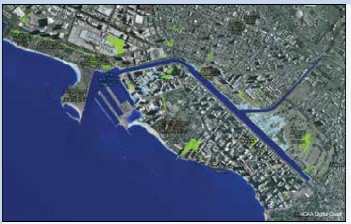

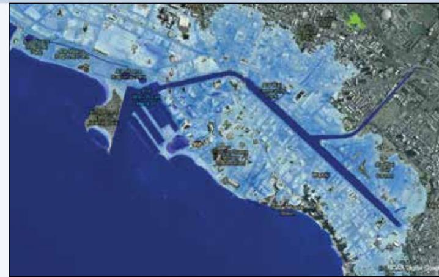

Figure 11. Projected coastal inundation (light blue) and low-lying areas (green) of Honolulu with 3 ft (left) and 6 ft (right) of sea-level rise above Mean High Water. Source: NOAA Sea-level Rise and Coastal Flooding Impacts Viewer, NOAA 2013.

- Sea-level rise has the potential to harm cultural sites on the coastline such as beaches, heiau, fishponds, and lo'i, risking the loss of cultural practices and heritage therein.
- Models that employ statistical relationships between past sea level and climate forcing, called semi-empirical models, generally project higher rates of sea-level rise, reaching about 3-5 ft (1-1.5 m) by 2100 (NOAA, 2012; NOAA, 2014; Grinsted et al., 2010; Rahmstorf, 2007; IPCC, 2013; Fletcher, 2013).
- With the long-term trend of sea-level rise, short-term events such as seasonal high surf, tsunamis, king tides, and high tides associated with oceanic eddies could reach farther inland and damage more infrastructure (Firing and Merrifield, 2004).
- Investigations and Brunn-Rule models of shoreline response to sea-level rise suggest a ratio of as much as 100:1 shoreline retreat for every 1 unit of sea-level rise (Fletcher et al., 2010; Romine et al., 2013).
- Beach and wetland systems may not be able to adapt to rising sea levels and could be lost if not allowed to migrate landward. The loss of wetlands could reduce the coast's ability to buffer impacts from storms and flooding(NOAA, 2014; Nyman et al., 1993; Badola and Hussain, 2005; SIG 2008).
- Inundation caused by elevated groundwater tables due to sea-level rise may breach the land surface in low-lying areas during higher tides and exacerbate existing flooding problems(Guidry and Mackenzie, 2006, Fletcher, 2010; Rotzoll and Fletcher, 2013).

# **Hawai'i Beach Loss**

A 2008 economic impact analysis of the potential complete erosion of Waikïkï Beach on the island of O'ahu suggests the economic impact on total hotel revenues could be as much as \$661.2 million annually (WIA, 2008). This same report estimates that nearly \$2.0 billion in overall visitor expenditures could be lost annually due to a complete erosion of Waikïkï Beach if no other economic sector replaces tourism there. In addition to potential direct impact on visitor expenditures, the estimated decline in room demand due to beach erosion could also result in a hotel industry job loss of 6,352 jobs based on the analyses and data provided by the State of Hawai'i. This is just one local example of the potential economic impact to one sector due to climate change. Similar studies in the U.S.found costs of inaction could exceed the cost of mitigation and adaptation (Stanton and Ackerman, 2007; CIER, 2007; IPCC, 2007).

- Global average cyclone intensity is expected to increase in response to warmer temperatures and other changing climatic conditions (Knutson et al., 2010; Emmanuel, 2008; Yu et al., 2009; Knutson et al., 2004).
- Locally, Hawai'i is expected to see an increased frequency of tropical cyclones as the storm track may shift northwards towards the Central North Pacific (Li et al., 2010; Murakami et al., 2013; Keener et al., 2012).
- Future increased frequency and intensity of storms, rising ocean levels and decreased coral reef framework could result in an increase in coastal inundation and erosion.

#### **COMMENT: RESEARCH PROGRESS AND POLICY**

Sea-level rise and the associated coastal impacts due to increased inundation, groundwater table elevation, storm surge, and erosion has the potential to harm an array of coastal infrastructure and environments in Hawai'i including but not limited to:

| Infrastructure                                | Environments           |
|-----------------------------------------------|------------------------|
| schools and hospitals                         | beaches                |
| airports, harbor facilities, and roads        | dunes                  |
| police and fire stations                      | coral reefs            |
| power plants, oil refineries, and fuel depots | coastal aquifers       |
| wastewater and hazardous waste sites          | wetlands and estuaries |
| military installations                        | anchialine ponds       |

There is an opportunity to identify a range of local sea-level rise scenarios for planning as suggested by NOAA and others (NOAA, 2012). Planning benchmarks are commonly targeted for the year 2100 and range from approximately 1-6 feet (NOAA, 2012). Using such sea level scenarios might greatly inform mid- and long-term (30-100 years) landuse and hazard mitigation planning strategies. While there is always going to be some degree of uncertainty in the modeled projections for sea level, these limitations should not preclude communities from planning and implementing adaptation strategies today, recognizing that better data will always be available tomorrow. Similarly, though the trends in tropical storm and cyclone frequency and intensity for Hawai'i hold some uncertainty, their potential impacts are significant. Further development and refinement of downscaled, regional climate models is needed to understand future cyclone characteristics in Hawai'i.

Continued and updated mapping of coastal erosion trends and sea level flooding hazards is needed to keep track of potential impacts from sea-level rise and climate change. New and sustained integrated sea-level rise research will improve the forecasts of the effects on shoreline change and coastal inundation and will facilitate the development of the next-generation of coastal hazard maps and planning tools to aid community resilience through urban land use planning. An integrated approach to coastline management incorporating climate and hazards science, economics, urban planning, socio-cultural and environmental concerns may help to avoid further impacts to Hawai'i's coastal, cultural, recreational, and environmental resources.

# **3. Terrestrial Ecosystems**

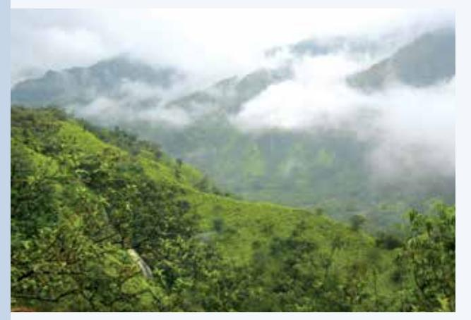

Hawai'i is home to a number of endemic species, from the Hawaiian honeycreeper to the Haleakalä silversword, which are at risk of altered habitats and conditions. As the extent of native habitats may diminish, ranges for pests, diseases and invasive species may expand. Warming air temperatures could cause ecosystems to shift upslope and decline in size. Higher elevations are bearing the brunt of these changes and lower elevations are seeing new habitats emerge that previously didn't exist in the archipelago. Changes

in precipitation, covered more thoroughly in Freshwater Resources, could affect terrestrial ecosystems including flooding, erosion, drought, and fire.

## **OBSERVATIONS**

- Air temperature has exhibited a consistent increasing trend in Hawai'i over the last 100 years, the rate of which has quadrupled in the last 40 years to over 0.3°F (0.17°C) per decade. This increasing trend is more extreme at higher elevations (Safeeq et al., 2012; Giambelluca et al., 2008).
- The difference between the nightly low and daytime high temperature, an important factor for many terrestrial species, is decreasing more rapidly in Hawai'i than global mean (Safeeq et al., 2012).
- Air temperature is heavily influenced by natural climate variability, including the Pacific Decadal Oscillation and the associated absorption of heat by the Pacific Ocean, which could be responsible for the observed stabilization of global land temperatures in the last 15 years (Kosaka and Xie, 2013).
- Precipitation frequency and intensities have changed with varying trends across all islands, affecting indigenous and introduced plants and animals alike (see Freshwater Resources for more information).

#### **PROJECTIONS**

- Hawai'i is projected to continue warming, with a range of +4-5°F (2.2-2.8°C) for high emissions scenarios by the year 2085 (Keener et al., 2013).
- Warming could cause a shift in the habitat ranges of native plants such as the Haleakalä silversword ('ähinahina), which is only found at high elevation on Mount Haleakalä and has experienced a decline in population over the last 20 years that is connected to temperature increase (Krushelnycky et al., 2011).
- Endemic bird species, such as the Hawaiian honeycreeper, could decline in population due to the warming of high-elevation forests where risk of avian disease transmission was previously low (Benning et al., 2002).
- Climate projections for terrestrial plants show that the species most vulnerable to climate change tend to be species of conservation concern due to non-climatic threats with numerous species that have no compatible climate areas remaining by the year 2100. Species primarily associated with dry forests have higher vulnerability than species from any other habitat type (Fortini et al., 2013).

- Elevated carbon dioxide (CO2 ) concentrations could benefit photosynthesis in some plants and crops but agricultural yields in low latitudes are projected to decline with heat and water stress (Rosenzweig and Parry, 1994).
- Precipitation trends will vary among islands, and even among watersheds, causing a range of responses in terrestrial biota (see Freshwater Resources for more information.)

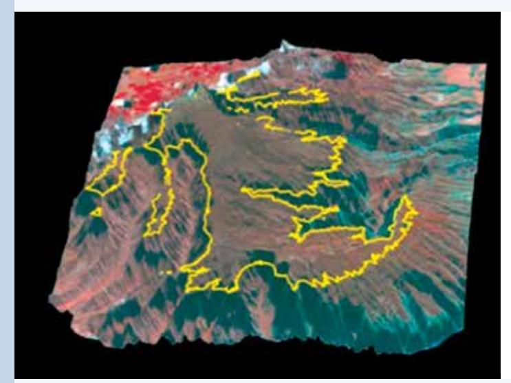

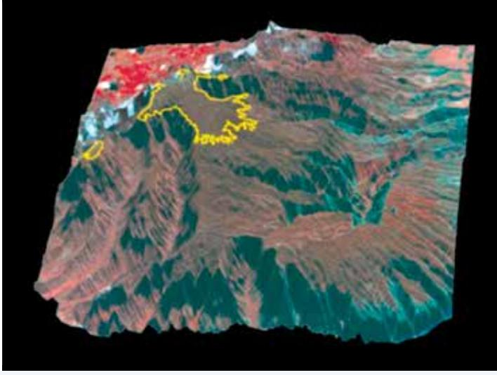

Figure 12. Warming temperatures could cause loss of high-elevation forests and habitat connectivity, such as in the Alaka'i swamp, Kaua'i where habitat related to the 62°F (17°C) isotherm (yellow line) in 2002 (left) is projected to retreat in a 3.6°F (2°C) warming scenario in the future (right) (Benning et al., 2002).

#### **COMMENT: RESEARCH PROGRESS AND POLICY**

Although the average atmospheric and land surface temperature trends in Hawai'i have risen and are projected to continue rising, the rates will vary spatially depending on land uses, topography, and trade wind and precipitation patterns. The effect of climate change on the trade winds, which bring a steady supply of rainfall to the Hawaiian islands, is a source of uncertainty in local predictions and remains an area of research interest. A greater understanding of the interactions between PDO, ENSO, and climate change will help to better resolve temperature changes in Hawai'i. Similarly, uncertainty as to the response of agriculture to increased atmospheric CO2 begs further research. Particular attention must be made to employ ecosystem- and watershedbased conservation of native and endemic species, wetlands and high elevation forests to avoid extinction. Diligent monitoring for invasive species prevention through strong biosecurity and early detection systems will help protect existing ecosystems.

# **4. Freshwater Resources**

Rainfall in Hawai'i varies dramatically both temporally and spatially based on trade winds, topography, mid-latitude weather systems, storms and cyclones, ENSO and PDO phases and much more (Schroeder, 1993). Climate change, natural variability, land use, complex topography, and other factors combine to present a challenge to the accurate projection of future rainfall and runoff patterns. Trends and projections vary from island

to island, and even valley to valley. The overarching past trend across the islands has been a decrease in total rainfall. The projections show a potential increase in frequency of extreme rain events. These projections have implications for stormwater infrastructure, sustainable yield from aquifers, and runoff into coastal waters.

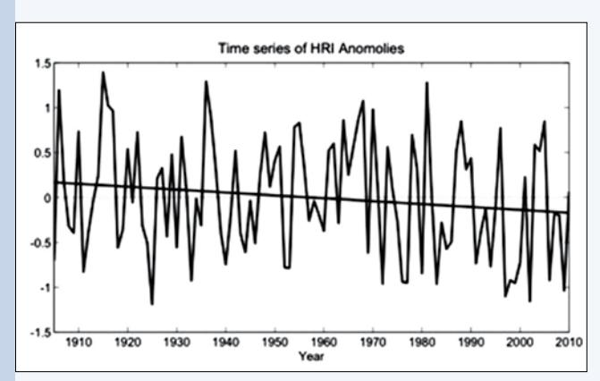

Figure 13. Time-series of the Hawai'i Rainfall Index (HRI) showing a long-term decreasing trend over the last century Source: Chen and Chu, 2005.

## **OBSERVATIONS**

- Hawai'i's total annual average rainfall, represented by the Hawai'i Rainfall Index, has decreased over the last century (Figure13) (Chu, 1995; Chu and Chen, 2005).
- Streamflow records also show a decline in base flow over the last century by 20- 70%, depending on the watershed, suggesting a decrease in groundwater level(Oki, 2004; Bassiouni and Oki, 2012; Giambelluca et al., 1991).
- At rain gauge stations across Hawai'i, the number of high intensity rain events has decreased by 27% while the frequency of
- low intensity rain events has increased (Elison Timm et al., 2011; Chu et al., 2010).
- Rainfall has become less intense for the western islands (O'ahu and Kaua'i) over the last 60 years but more intense for the island of Hawai'i (east). For Maui, the trend pattern in rainfall intensity is mixed. (Chu et al., 2010).
- High intensity rainfall can cause flash flooding, which is common in Hawai'i due to steep terrain and concrete stream channels, and has occasionally resulted in multimillion dollars of damage to infrastructure. It can also affect nearshore ecosystems (see Marine Ecosystems).

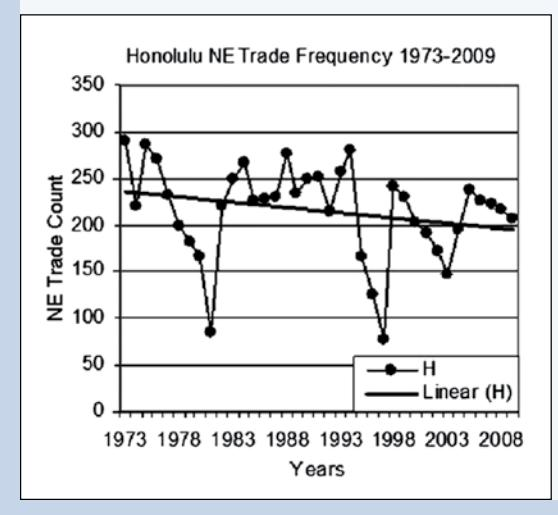

- Hawai'i has experienced longer droughts in recent years, as all the populated islands show an increasing trend in length of dry periods during 1980-2011, as compared with1950 -1970 (Chu et al., 2010).
- Prevailing northeasterly trade winds, which drive orographic precipitation on windward coasts, have decreased in frequency since 1973 in Hawai'i (Figure 14) (Collins et al., 2010; Tokinaga et al., 2012; Garza et al., 2012).

Figure 14. Number of days per year that northeasterly trade winds were recorded in Honolulu, revealing a downward trend (Garza et al., 2012)

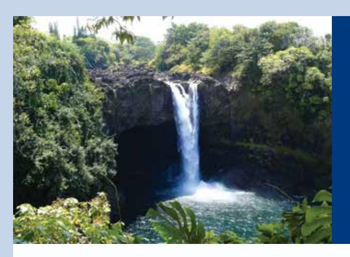

Characterizing the past behavior of rainfall in Hawai'i and projecting the future responses to predicted global climate change scenarios are very difficult due to the extremely complex and variable nature of the rainfall over the islands. Therefore, research on the projections of precipitation in Hawai'i continues to be an area of intense modeling research and lacks concrete conclusions on future climate induced conditions.

#### **PROJECTIONS**

- Coarse global models indicate that the southerly main Hawaiian islands (Hawai'i and Maui) may become wetter towards the end of the 21st century while those in the north (Kaua'i and O'ahu) become slightly drier, though rainfall projections for Hawai'i are still quite uncertain (Keener et al., 2013).
- For the southern shoreline of O'ahu, the frequency of heavy rainfall is projected to increase through 2040, with those heavy rainfall events becoming less extreme (Norton et al., 2011).
- Timm et al., 2014 applied a statistical downscaling method described by Timm and Diaz, 2009, in order to find a connection between the large-scale atmospheric circulation over the Pacific with the rainfall over Hawai'i. It is concluded from the six-model ensemble that the most likely scenario for Hawai'i by the late 21st century is a 5%-10% reduction of the wet-season precipitation and a 5% increase during the dry season, as a result of changes in the wind field.
- Other models suggest that summer dry months will become wetter while winter wet months become drier in Hawai'i over open ocean environments. (Lauer et al., 2013; Takahashi et al., 2011). It is still uncertain how this will translate over highly variable terrain
  - in Hawai'i.
  - If drought events continue to increase, dry areas could see more fire and problems with stressed water supplies.
  - A modeling study of the Makaha, O'ahu watershed showed that streamflow is very sensitive to changes in precipitation, for instance, a 20% decline in precipitation led to a 50% decline in stream flow and a 20% increase led to a 72% increase in streamflow (Safeeq and Fares, 2012).
  - Sea-level rise can increase saltwater intrusion in parts of the aquifer and cause the

groundwater table to rise, resulting in inundation of low-lying areas and infrastructure (Rotzoll and Fletcher, 2013). See page 16: Coasts and the Built Environment.

#### **COMMENT: RESEARCH PROGRESS AND POLICY**

Some regions of Hawai'i could experience more drought conditions while other regions could see unprecedented flooding. Both extremes have implications for agriculture,

the built environment, streamflow, terrestrial ecosystems, stormwater retention and control, and Hawai'i's water table. Groundwater provides most of the drinking water in Hawai'i. Since there are so many variables determining precipitation - from temperature to topography - it is necessary to conduct further research on downscaled climate hydrologic modeling to accurately assess future precipitation trends and develop a water resource strategy for efficient agricultural and urban water use and re-use.

# **The Downscaling Problem**

Global climate and circulation computer models (GCMs), including those used by the Intergovernmental Panel on Climate Change and others, are often too geographically broad to resolve specific regions such as Hawai'i. Climate scientists simulate regional changes by adapting global models to smaller scales. Most experts in climate change science are cautious when asked to make regional predictions, especially on extended timescales into the future. Downscaling GCMs can bring the risk of enhancing any inherent weakness or errors of the parent model but they can also help resolve uncertainty in regions with complex topography, such as Hawai'i. These problems, however, do not make regional simulations worthless, as long as their limitations are understood.

# **5. Human Health**

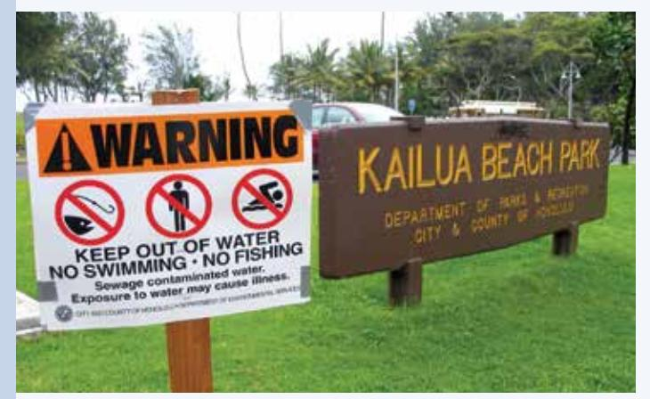

Beach closure due to contaminated run off at Kailua Beach Park, O'ahu.

In a rapidly changing climate, Hawai'i residents will face natural hazard threats similar to those described in preceding sections. Just as coral reefs face bleaching in warmer water, vulnerable individuals may experience heatstroke and illness during heat waves. Hawai'i faces some of the same risks to human health that other Pacific Islands face, such as increased levels of vector-borne diseases, water-borne diseases such as cholera, fish poisoning, heat-related illnesses, mental health problems, respiratory diseases and other non-communicable diseases, and injury and death from tropical

storms and cyclones (SPC, 2013; Colwell, 1996; Lewis, 2012). Due to the state's robust sanitation and healthcare infrastructure, Hawai'i residents are less vulnerable to many of these threats than many other Pacific Island locations. While many vector-based human health issues are closely associated with sanitation and healthy ecosystems, it is important to note that climate change could exacerbate these problems and will require extra diligence in monitoring for changes to disease and climate-related illness.

#### **OBSERVATIONS**

- Some vector-borne diseases, such as dengue fever spread by mosquitoes, are correlated with wet, warm conditions because of increased availability of stagnant water and shorter incubation periods for vectors. In 2001 and 2002, Maui experienced an outbreak of dengue fever during a period of warmer and wetter conditions (Kolviras, 2010; SPC 2013).
- III • Hawai'i may be at a high risk of vector-based disease due to the high volume of foreign visitors and imports.

25

- Inundation and flooding has led to contamination of surface water and groundwater on some Pacific islands (Presley, 2005; Hezel, 2009).
- Polluted runoff associated with excessive stormwater can contain sewage from overflowing manholes or chemicals from commercial and industrial facilities and has already caused the closure of Hawai'i beaches annually (Hawai'i Department of Health, 2014).
- Leptospirosis is a documented infectious disease presently affecting Hawai'i's surface waters, with increased infection rates during the wetter winter season (Katz et al., 2011).

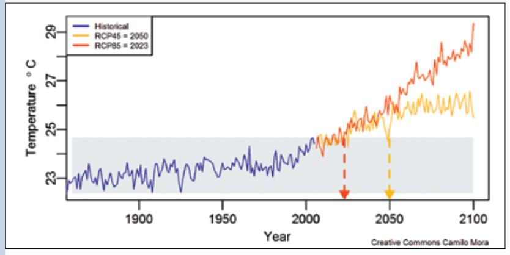

Figure 15. This graph shows the projected timing of 'climate departure' for Hawai'i when our annual average temperature will exceed the historical bounds of past temperature variability (shaded grey). Hawai'i is projected to reach climate departure by 2023 under a high greenhouse gas concentration scenario (red), and by 2050 under a moderate scenario (yellow) (Mora et al., 2013).

#### **PROJECTIONS**

- More frequent or intense occurrences of extreme weather events, such as heat waves and tropical storms and cyclones, could cause more instances of injury and death (SPC, 2013).
- Inundation and flooding can lead to contamination of surface waters. Infection from exposure through recreation (e.g., swimming) or occupation (e.g., taro farming) could be of particular concern (Keener et al., 2012; Katz et al., 2011).
- Ciguatera and other marine pathogens may extend their range as a result of warming oceans, resulting in more toxins in seafood (SPC, 2013).
- Hawai'i is expected to experience average air temperature extremes that exceed the annual maximum by the year 2023 under a "business as usual" greenhouse gas emissions scenario. The mean annual temperature for the location exceeds historical bounds by the year 2050 under a less aggressive emission scenario (Figure 15) (Mora et al., 2013).
- With increased temperatures, some residents could face increased vulnerability to extreme heat and its associated illnesses such as heatstroke and cardiovascular and kidney disease (NRDC, 2013).

#### **COMMENT: RESEARCH PROGRESS AND POLICY**

It is important that Hawai'i maintain the capacity to monitor for and mitigate epidemics and tropical diseases not currently in Hawai'i. Monitoring the emergence of new pathogens, such as dengue fever, and spread of existing diseases, such as leptospirosis, in addition to maintaining vector control systems will help curb infection and disease. Food scarcity due to local drought is of less concern for Hawai'i due to its high proportion of imported goods, but consideration should be made for food security and sustainability in the case of interruption of imports due to distant climate impacts such as storms, droughts, and other disruptive events elsewhere. Maintaining a strong [Food Self Sufficiency Strategy](http://files.hawaii.gov/dbedt/op/spb/INCREASED_FOOD_SECURITY_AND_FOOD_SELF_SUFFICIENCY_STRATEGY.pdf) for Hawai'i may serve as a mitigation and adaptation strategy that decreases Hawai'i's food carbon footprint (via imports) while increasing community resilience to climate and natural hazards.

# IV. NEXT STEPS FOR CLIMATE CHANGE ADAPTATION IN HAWAI'I

Climate-related changes identified in this document have great potential to alter Hawai'i's natural and built environments as well as the economies and communities that depend on them. In the face of these changes, residents, elected officials, resource managers, and researchers will need to work together to find timely and effective adaptation and mitigation strategies.

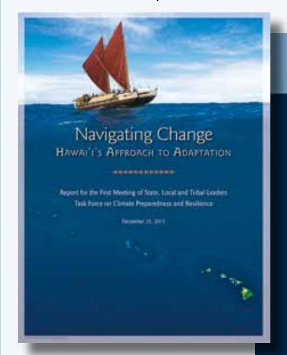

In November 2013, President Barack Obama appointed Hawai'i Governor Neil Abercrombie as one of only eight governors to serve on the task force, a tremendous opportunity for Hawai'i to share our unique perspective and needs so the federal government can better support our local efforts.

# OVERVIEW Climate Change Impacts in the United States U.S. National Climate Assessment

# **Executive Summary**

his report describes the State of Hawai'i's unique position and perspective as a member of President Obama's State. Local and Tribal Leaders Task Force on Climate Preparedness and Resilience. Hawai's team of state, federal and academic partners sought out knowledge and practices from a variety of local and regional sources. In response to the Task Force's charge to advise the Administration on how the Federal Government can best support resilience efforts. the Navigating Change Report also proposes initial recommendations in the areas of actionable information, coordination, and implementation.

#### Hawai'i's Vulnerability and Vantage Point

As the most geographically isolated islands on Earth, Hawaii is especially vulnerable to the impacts of climate change:

- Freshwater. Hawaii is 100% dependent on rainfall for our very survival. Rainfall and stream flows are declining.
- Coastlines. Hawaii's shorelines (more than 750 miles) are its natural borders, but they are vulnerable to beach erosion and sea level rise.
- Ocean Resources. Pacific Islanders are ocean peoples. Rising temperatures and acidification kill the reefs, damage fisheries and jeopardize the island way of life.
- Security. Climate change is a matter of security for Hawari. Climate change will disrupt and then theaten economic systems—food, water, energy, biodiversity, and health. Hawari's people will be at risk.

Hawari shares a unique vantage point of the world as an archipelago of islands:

- An indigenous host culture with more than 1000 years of traditional knowledge and adaptation practice
- An island understanding of finite resources and the need for an integrated, collaborative approach—on islands, the feedback loops are direct, immediate and widely experienced.
- An Asia-Pacific regional connection to islands, states and nations with shared issues

#### Hawai'i's Leadership in the Face of Climate Change

Hawaii is already a leader on climate change both nationally and internationally. The Hawaiian Islands are a fearning faboratory for scalable, innovative mitigation and adaptation policies and techniques, and a model for local and regional collaboration.

- Nawa'i was the first sub-national government to sign onto the Majuro Declaration for Climate Leadership
- Hawaii was the first state in the nation to adopt a hairel tax on imported petroleum to support clean energy
- Governor Abercrombie signed Climate

Change Adaptation Priority Guidelines into law for multi-sector resilience

 Hawai'i hosts several research institutions and regional collaborations around climate change

#### Hawai'i's Top Recommendations: An Opportunity to Strengthen Resilience with Federal Partners

- Provide actionable information for local decision-making and the island context
- First Step: Support Task Force members' engagement of local stakeholders to develop specific recommendations and expedite the development and delivery of priority technical assistance

#### Facilitate ongoing coordination and alignment of efforts after the Task force dissolves

- Convene an International Climate Change Resilvence forum at the East-West Center to coordinate domestic and international resilience efforts, especially in the Asia-Pacific region. "Think Globally, Pict Locally." ■ Establish a National Climate Change Network to coordinate federal efforts and facilitate state-to-state, local-to-local best practice sharing in real time.
- Support implementation for "smart adaptation" Recognize islands and indigenous pespectives, and the unique, biocultural needs of local communities in order to develop site specific and appropriate place-based information, investments, incentives and barrier removal.

#### Hawai'i's Next Steps

Governor Abercrombie will convene a Resilient Hawari Forum in early 2014 to engage more stakeholders, including Native Hawarian organizations, natural resource managers, the military, bornom officials, agricultural representatives, researchers and government at all levels to identify specific recommendations. These recommendations will be forwarded to the Task force and County and State officials for consideration.

On May 6, 2014, the U.S. Global Change Research Program released the Third National Climate Assessment, the most comprehensive, authoritative, transparent scientific report on U.S. climate change impacts ever generated. The Hawai'i section of the national report can be found here: http://nca2014.globalchange.gov/highlights/regions/hawaii#intro-section

# APPENDIX A: HAWAI'I CLIMATE ADAPTATION POLICY

In 2012, Hawai'i's legislature passed Act 286, HRS §226-109, amending the Hawai'i State Planning Act to incorporate climate adaptation into county and state actions, including land use, capital improvement, and program decisions (see priority guidelines below). The State Office of Planning plans to implement the policy with other agencies and organizations through the Ocean Resources Management Plan (ORMP). For more information on recent climate change legislation in Hawai'i, see UH Sea Grant's Climate Change Law and Policy in Hawai'i, Briefing Sheet 2012.

#### Hawai'i Revised Statutes (§226-109)

Climate change adaptation priority guidelines. Priority guidelines to prepare the State to address the impacts of climate change, including impacts to the areas of agriculture; conservation lands; coastal and nearshore marine areas; natural and cultural resources; education; energy; higher education; health; historic preservation; water resources; the built environment, such as housing, recreation, transportation; and the economy shall:

- (1) Ensure that Hawai'i's people are educated, informed, and aware of the impacts climate change may have on their communities;
- (2) Encourage community stewardship groups and local stakeholders to participate in planning and implementation of climate change policies;
- (3) Invest in continued monitoring and research of Hawaii's climate and the impacts of climate change on the State;
- (4) Consider Hawaiian traditional knowledge and practices in planning for the impacts of climate change;
- (5) Encourage the preservation and restoration of natural landscape features, such as coral reefs, beaches and dunes, forests, streams, floodplains, and wetlands, that have the inherent capacity to avoid, minimize, or mitigate the impacts of climate change;
- (6) Explore adaptation strategies that moderate harm or exploit beneficial opportunities in response to actual or expected climate change impacts to the natural and built environments;
- (7) Promote sector resilience in areas such as water, roads, airports, and public health, by encouraging the identification of climate change threats, assessment of potential consequences, and evaluation of adaptation options;
- (8) Foster cross-jurisdictional collaboration between county, state, and federal agencies and partnerships between government and private entities and other non-governmental entities, including nonprofit entities;
- (9) Use management and implementation approaches that encourage the continual collection, evaluation, and integration of new information and strategies into new and existing practices, policies, and plans; and
- (10) Encourage planning and management of the natural and built environments that effectively integrate climate change policy. (L 2012, c 286, §2)

# **APPENDIX B: ADDITIONAL RESOURCES**

#### **UH Sea Grant Publications**

Future Climate Change, Sea-Level Rise, and Ocean Acidification: Implications for Hawai`i and Western Pacific Fisheries Management, 2013

http://seagrant.soest.hawaii.edu/sites/seagrant.soest.hawaii.edu/files/publications/web\_fisheriescase\_study.pdf

A Landowner's Guide to Coastal Protection, 2013

http://seagrant.soest.hawaii.edu/sites/seagrant.soest.hawaii.edu/files/publications/lowres.-shorlineguide.pdf

Climate Change and the Visitor Industry: People, Place, Culture and the Hawai'i Experience, 2013 <a href="http://seagrant.soest.hawaii.edu/sites/seagrant.soest.hawaii.edu/files/publications/web-hta-climatechange-visitorindustry\_0.pdf">http://seagrant.soest.hawaii.edu/sites/seagrant.soest.hawaii.edu/files/publications/web-hta-climatechange-visitorindustry\_0.pdf</a>

Climate Change Law and Policy in Hawai'i, Briefing Sheet 2012

http://seagrant.soest.hawaii.edu/sites/seagrant.soest.hawaii.edu/files/publications/smclimatechangelawandpolicy\_1.pdf

Facing Our Future: Adaptive Planning for Sea-Level Rise in Maui and Hawai'i Counties, 2012 <a href="http://seagrant.soest.hawaii.edu/sites/seagrant.soest.hawaii.edu/files/publications/adaptive\_planning.pdf">http://seagrant.soest.hawaii.edu/sites/seagrant.soest.hawaii.edu/files/publications/adaptive\_planning.pdf</a>

Water Resources and Climate Change Adaptation in Hawai'i: Adaptive Tools in the Current Law and Policy Framework, 2012

http://seagrant.soest.hawaii.edu/sites/seagrant.soest.hawaii.edu/files/publications/water\_adaptation\_final.pdf

Sea-Level Rise and Coastal Land Use in Hawai`i: A Policy Tool Kit for State and Local Governments, 2011 <a href="http://seagrant.soest.hawaii.edu/sites/seagrant.soest.hawaii.edu/files/publications/icap-sealevelrisetoolkit\_web-1\_2.pdf">http://seagrant.soest.hawaii.edu/sites/seagrant.soest.hawaii.edu/files/publications/icap-sealevelrisetoolkit\_web-1\_2.pdf</a>

Hawai'i's Changing Climate, Briefing Sheet 2010

http://seagrant.soest.hawaii.edu/sites/seagrant.soest.hawaii.edu/files/publications/ClimateBriefingweb.pdf

Coastal Geology Group, University of Hawai'i Mānoa

http://www.soest.hawaii.edu/coasts/

#### Other Resources:

Hawai'i Department of Land and Natural Resources.

http://dlnr.hawaii.gov/

State of Hawai'i Office of Planning

http://planning.hawaii.gov/czm/initiatives/adapting-to-climate-change-2/

Asia Pacific Data Research Center

http://apdrc.soest.hawaii.edu/

Pacific Islands Climate Education Partnership

http://pcep.wested.org/index.html

Pacific Regional Integrated Sciences and Assessments (RISA)

http://www.pacificrisa.org/

On the Shores of Paradise

http://www.soest.hawaii.edu/coasts/publications/shores/index.html

Pacific Islands Regional Climate Assessment

http://www.pacificrisa.org/projects/pirca/

Climate Change: What the science tells us.

http://www.wiley.com/WileyCDA/WileyTitle/productCd-EHEP002419.html

Pacific Islands Climate Change Cooperative

http://piccc.net/

U.S. Global Change Research Program National Climate Assessment

http://www.globalchange.gov/

Secretariat of the Pacific Regional Environmental Programme

https://www.sprep.org/Climate-Change/climate-change-overview

NOAA Sea Level Rise and Coastal Flooding Impacts Viewer

http://www.csc.noaa.gov/digitalcoast/tools/slrviewer

NOAA Sea Grant Coastal Storms Program

http://seagrant.soest.hawaii.edu/csp

Pacific Climate Information System (PaCIS)

http://www.pacificcis.org/
Pacific Islands Climate (piko)
http://pacificislandsclimate.org/

# REFERENCES

2012 Haw. Sess. Laws., 26th Leg., Act 286.

http://www.capitol.hawaii.gov/session2012/bills/GM1403\_.PDF (12/18/13)

Australian Bureau of Meteorology and CSIRO. 2011. Climate Change in the Pacific: Scientific Assessment and New Research. Volume 1: Regional Overview. Volume 2: Country Reports. Retrieved from <a href="http://www.cawcr.gov.au/projects/PCCSP/">http://www.cawcr.gov.au/projects/PCCSP/</a>

Badola, R., and S.A. Hussain. 2005. Valuing ecosystem functions: an empirical study on the storm protection function of Bhitarkanika mangrove ecosystem, India. *Environmental Conservation* 32(1):85-92.

Bassiouni, M., and D.S. Oki. 2013. Trends and shifts in streamflow in Hawai'i, 1913-2008. *Hydrological Processes* 27(10):1484-1500.

Benning, T.L., D. LaPointe, C.T. Atkinson, and P.M. Vitousek. 2002. Interactions of climate change with biological invasions and land use in the Hawaiian Islands: Modeling the fate of endemic birds using a geographic information system. *PNAS* 99(22):14246-14249.

Bowler, C., D.M. Karl, and R.R. Colwell. 2009. Microbial oceanography in a sea of opportunity. *Nature* 459:180-184.

Burke, L., K. Reytar, M. Spalding, and A. Perry. 2011. Reefs at risk revisited. Washington, DC: World Resources Institute. http://www.wri.org/publication/reefs-at-risk-revisited

Byrne, R.H, S. Mecking, R.A. Feely, and X. Liu. 2010. Direct observations of basin-wide acidification of the North Pacific Ocean. *Geophysical Research Letters* 37(2):L02601.

Casey, K.S., and P. Cornillon. 2001. Global and Regional Sea Surface Temperature Trends. *Journal of Climate* 14.18:3801-3818.

Center for Integrative Environmental Research (CIER). 2007. The US Economic Impacts of Climate Change and the Coast of Inaction. <a href="http://www.cier.umd.edu/climateadaptation/">http://www.cier.umd.edu/climateadaptation/</a>

Chu, P.-S. 1995, Hawai'i Rainfall Anomalies and El Niño, Journal of Climate 8:1697-1703.

Chu, P.-S., Y.R. Chen, and T.A. Schroeder. 2010. Changes in Precipitation Extremes in the Hawaiian Islands in a Warming Climate. *Journal of Climate* 23(18):4881–4900. doi:10.1175/2010JCLl3484.1

Chu, P.-S., and H. Chen. 2005. Interannual and Interdecadal Rainfall Variations in the Hawaiian Islands. *Journal of Climate* 18(22):4796–4813.

Climate Impacts Group (CIG). 2009. "Comparing ENSO and PDO." <a href="http://cses.washington.edu/cig/pnwc/compensopdo.shtml">http://cses.washington.edu/cig/pnwc/compensopdo.shtml</a> (12/20/13).

Codiga, D., and K. Wager. 2011. Sea-level rise and coastal land use in Hawai'i: A policy tool kit for state and local governments. Honolulu, HI: Center for Island Climate Adaptation and Policy.

Collins, M. et al. 2010. The impact of global warming on the Pacific Ocean and El Niño. Nature Geoscience 3:391-397.

Colwell, R.R. 1996. Global Climate and Infectious Disease: The Cholera Paradigm. Science 274(5295):2025-2031.

Cristini, L., L.J. Cox, D.E. Konan, D. Eversole. 2013. Climate Change and the Visitor Industry-People, Place, Culture, and the Hawai'i Experience. University of Hawai'i Sea Grant College Program. A report for the Hawai'i Tourism Authority. Pg. 1-38.

Doney, S.C., V. J. Fabry, R.A. Feely, and J.A. Kleypas. 2009. Ocean Acidification: The other CO2 Problem. Annual Review of Marine Science 1:169-192.

Doney, S.C., et al. 2012. Climate Change Impacts on Marine Ecosystems. Annual Review of Marine Science 4:11-37.

Dore, J.E., R. Lukas, D.W. Sadler, M.J. Church, and D.M. Karl. 2009. Physical and biogeochemical modulation of ocean acidification in the central North Pacific. PNAS 106(30):12235-12240.

Elison Timm, O. et al., 2014. Statistical Downscaling of Rainfall for the Hawaiian Islands using CMIP3 and CMIP5 Model Scenarios. Asia-Pacific Data-Research Center of the IPRC. <http://apdrc.soest.hawaii.edu/projects/SD/>(03/19/14)

Elison Timm, O., H.F. Diaz, T.W. Giambelluca, and M. Takahashi. 2011. Projection of changes in the frequency of heavy rain events over Hawai'i based on leading Pacific climate modes. Journal of Geophysical Research 116:D04109.

Emanuel, K. 2008. The Hurricane-Climate Connections. Bull. Amer. Meteor. Soc. 89:ES10-ES20.

Firing, Y.L. and M.A. Merrifield. 2004. Extreme sea level events at Hawaii: Influence of mesoscale eddies. Geophysical Research Letters 31:L24306. doi: 10.1029/2004GL021539.

Fletcher, C., et al., 2010. Living on the Shores of Hawaii: Natural Hazards, the Environment, and Our Communities, UH Press, 384pp.

Fletcher, C. 2013. Climate Change: What the Science Tells Us, 265 p. J. Wiley & Sons, NY

Fletcher, C.H. 2009. Sea level by the end of the 21st century: A review. Shore and Beach 77(4):1-9.

Fletcher, C.H. 2010. Hawai'i's Changing Climate, Briefing Sheet, 2010. Honolulu: Center for Island Climate Adaptation and Policy. University of Hawai'i Sea Grant College Program.

Fletcher, C.H., et al. 2012. National Assessment of Shoreline Change: Historical Shoreline Change in the Hawaiian Islands. U.S. Geological Survey Open-File Report 2011–1051, 55 p. Also available at: <http://pubs.usgs.gov/of/2011/1051>

Fortini, L., et al. 2013. A Landscape-Based Assessment of Climate Change Vulnerability for all Native Hawaiian Plants. Hawai'i Cooperative Studies Unit. University of Hawai'i at Hilo. Technical Report HCSU-044

Friedlander A., E. DeMartini, L. Wedding, and R. Clark. 2009. Fishes. In A marine biogeographic assessment of the Northwestern Hawaiian Islands, Chapter 5, pp. 155-189. Edited by Alan Friedlander, Kaylene Keller, Lisa Wedding, Alicia Clarke, Mark Monaco. NOAA Technical Memorandum NOS NCCOS 84. Prepared by NCCOS's Biogeography Branch in cooperation with the Office of National Marine Sanctuaries Papahanaumokuakea Marine National Monument, Silver Spring, MD, 363 pp

Friedlander, A. Personal communication, 2013.

Garza, J.A., P.-S. Chu, C.W. Norton, and T.A. Schroeder. 2012. Changes of the prevailing trade winds over the islands of Hawaii and the North Pacific. J. Geophys. Res. 117(D11):2156-2202.

Giambelluca, T. W., H.F. Diaz, and M.S.A. Luke. 2008. Secular temperature changes in Hawai'i. Geophysical Research Letters 35:L12702. doi:10.1029/2008GL034377.

Giambelluca, T.W., M.A. Nullet, M.A. Ridgley, P.R. Eyre, J.E.T. Moncur, and S. Price. 1991. Drought in Hawai'i. Department of Land and Natural Resources, R88, Honolulu, Hawai'i, 232 pp.

Grigg, R.W. and D. Epp. 1989. Critical Depth for the Survival of Coral Islands: Effects on the Hawaiian Archipelago. Science 243(4891):638-641.

Grinsted, A., J.C. Moore, and S. Jevrejeva. 2010. Reconstructing sea level from paleo and projected temperatures 200 to 2100 AD. Climate Dynamics 34(4):461–472.

Guidry, M.W. and F.T Mackenzie. 2006. Climate Change, Water Resources, and Sustainability in the Pacific Basin: Emphasis on O'ahu, Hawai'i and Majuro Atoll, Republic of the Marshall Islands. Honolulu, HI: University of Hawaii Sea Grant College Program. 100 p.

Hansen, J.E. 2007. Scientific reticence and sea level rise. Environmental Research Letters 2:024002. doi:10.1088/1748-9326/2/2/024002.

Harvell, C.D., C.E. Mitchell, J.R. Ward, S. Altizer, A.P. Dobson, R.S. Ostfeld, and M.D. Samuel. 2002. Climate warming and disease risks for terrestrial and marine biota. Science 296(5576):2158-2162.

Harvell, C.D., K. Kim, J.M. Burkholder, R.R. Colwell, P.R. Epstein, D.J. Grimes, E.E. Hoffman, E.K. Lipp, A.D.M.E. Osterhaus, R.M. Overstreet, J.W. Porter, G.W. Smith, and G.R. Vasta. 1999. Emerging Marine Diseases–Climate Links and Anthropogenic Factors. Science 285:1505-1510.

Hawaii Department of Health, 2014. Clean Water Branch. [http://health.hawaii.gov/cwb/site-map/](http://health.hawaii.gov/cwb/site-map/clean-water-branch-home-page/general-health-advisory/) [clean-water-branch-home-page/general-health-advisory/](http://health.hawaii.gov/cwb/site-map/clean-water-branch-home-page/general-health-advisory/) (03/19/14).

Hezel, F.X. 2009. High Water in the Low Atolls. Micronesian Counselor #76. http:// [www.micsem.org/pubs/counselor/frames/highwaterfr.htm](http://www.micsem.org/pubs/counselor/frames/highwaterfr.htm)

Horton, B.P., S. Rahmstorf, S.E. Engelhart, and A.C. Kemp. 2013. Expert assessment of sea-level rise by AD 2100 and AD 2300. Quaternary Science Reviews 84:1-6.

IPCC. 2007. Climate Change 2007: The Physical Science Basis. Contribution of Working Group I to the Fourth Assessment Report of the Intergovernmental Panel on Climate Change. Solomon, S., D. Qin, M. Manning, Z. Chen, M. Marquis, K.B. Averyt, M.Tignor, and H.L. Miller (eds). Cambridge University Press, Cambridge, United Kingdom and New York, NY, USA. [www.ipcc.ch/publications\\_and\\_data/ar4/wg1/en/faq-1-3.html](http://www.ipcc.ch/publications_and_data/ar4/wg1/en/faq-1-3.html)

IPCC. 2007. "FAQ 6.2 - AR4 WG1 Chapter 6: Palaeoclimate." [http://www.ipcc.ch/publications\\_and\\_data/ar4/wg1/en/faq-6-2.html](http://www.ipcc.ch/publications_and_data/ar4/wg1/en/faq-6-2.html)

IPCC. 2008. "About IPCC."<http://www.ipcc.ch/organization/organization.htm>.

IPCC. 2013. Summary for Policymakers. In: Climate Change 2013: The Physical Science Basis. Contribution of Working Group I to the Fifth Assessment Report of the Intergovernmental Panel on Climate Change Edited by Stocker, T.F., D. Qin, G.-K. Plattner, M.M.B. Tignor, S.K. Allen, J. Boschung, A. Nauels, Y. Xia, V. Bex and P.M. Midgley. Cambridge University Press, Cambridge, United Kingdom and New York, NY, USA .

Ishimatsu, A., M. Hayashi, K.S. Lee, T. Kikkawa, and J. Kita. 2005. Physiological effects on fishes in a high-CO2 world. Journal of Geophysical Research 110:C09S09.

Jokiel, P.L., and E.K. Brown. 2004. Global warming, regional trends and inshore environmental conditions influence coral bleaching in Hawaii. Global Change Biology 10:1627-1641.

- Karl, D.M., R.R. Bidigare, and R.M. Letelier. 2001. Long-term changes in phytoplankton community structure and productivity in the North Pacific Subtropical Gyre: The domain shift hypothesis. Deep-Sea Research II 48:1449-1470.
- Katz, A.R., A.E. Buchholz, K. Hinson, S.Y. Park, and P.V. Effler. 2011. Leptospirosis in Hawai'i, USA 1999- 2008. Emerging Infectious Diseases 17:221-226.
- Keener, V.W., J.J. Marra, M.L. Finucane, D. Spooner, and M.H. Smith (Eds.). 2012. Climate Change and Pacific Islands: Indicators and Impacts. Report for The 2012 Pacific Islands Regional Climate Assessment. Washington, DC: Island Press.
- Keener, V.W., K. Hamilton, S.K. Izuka, K.E. Kunkel, L.E. Stevens, and L. Sun. 2013. Regional Climate Trends and Scenarios for the U.S. National Climate Assessment. Part 8. Climate of the Pacific Islands, NOAA Technical Report NESDIS 142-8, 44 pp.
- Keller, B.D., D.F. Gleason, E. McLeod, C.M. Woodley, S. Airamé, B.D. Causey, A.M. Friedlander, R. Grober-Dunsmore, J.E. Johnson, S.L. Miller, and R.S. Steneck. 2009. Climate Change, Coral Reef Ecosystems, and Management Options for Marine Protected reas. Environmental Management 44(6):1069-1088.
- Kiehl, J.T., and Kevin E. Trenberth. 1997. Earth's Annual Global Mean Energy Budget. Bulletin of the American Meteorological Society 78:197-208.
- Knutson, T.R., J.L. McBride, J. Chan, K. Emanuel, G. Holland, C. Landsea, I. Held, J.P. Kossin, A.K. Srivastava, and M. Sugi, 2010: Tropical cyclones and climate change. Nature Geoscience 3:157–163.
- Knutson, T.R., R.E. Tuyela, W. Shen, and I. Ginis. 2004. "Impact of Climate Change on Hurricane Intensities as Simulated Using Regional Nested High-Resolution Models." In Hurricanes and Typhoons: Past, Present, and Future. Edited by R.J. Murnane and K.-B. Liu. New York, NY: Columbia University Press. P 408-439.
- Kolivras, K.N. 2010. Changes in dengue risk potential in Hawai'i, USA, due to climate variability and change. Climate Research 42(1):1-11. doi:10.3354/cr00861
- Kosaka, Y., and S.-P. Xie. 2013. Recent global-warming hiatus tied to equatorial Pacific surface cooling. Nature 501:403-407.
- Krushelnycky, P., L. Loope, F. Starr, K. Starr, and T. Giambelluca. 2011. Is climate change already impacting Haleakalä silverswords? Presented at the 19th Annual Hawai'i Conservation Conference, 2-4 August 2011, Honolulu, HI.
- Kuffner, I.B., A.J. Andersson, P.L. Jokiel, K.S. Rodgers, and F.T. Mackenzie. 2008. Decreased abundance of crustose coralline algae due to ocean acidification. Nature Geoscience 1(2):114- 117. DOI: 10/1038/ngeo100.
- Lauer, A., C. Zhang, O. Elison-Timm, Y. Wang, and K. Hamilton. 2013. Downscaling of Climate Change in the Hawaii Region Using CMIP5 Results: On the Choice of the Forcing Fields. Journal of Climate 26:10006-10030.
- Lehodey, P., et al. 2011. Vulnerability of Oceanic Fisheries in the Tropical Pacific to Climate Change. In Vulnerability of Tropical Pacific Fisheries and Aquaculture to Climate Change. Edited by J.D. Bell, J.E. Johnson, and A.J. Hobday, pp. 433–492. Noumea, New Caledonia: Secretariat of the Pacific Community.
- Lewis, N. 2012. Islands in a Sea of Change: Climate Change, Health and Human Security in Small Island States. In: National security and human health implications of climate change, NATO Science for Peace and Security Series C: Environmental Security. pp. 13–24. Edited by H. J. S. Fernando, Z. Klaic, & J. L. McCulley. Dordrecht, The Netherlands: Springer.
- Li, T., M. Kwon, M. Zhao, J.-S. Kug, J.-J. Luo, and W. Yu. 2010. Global warming shifts Pacific tropical cyclone location. Geophysical Research Letters 37:L21804.

Mimura, N., L. Nurse, R.F. McLean, J. Agard, L. Briguglio, P. Lefale, R. Payet and G. Sem. 2007. Small islands. In: Climate Change 2007: Impacts, Adaptation and Vulnerability. Contribution of Working Group II to the Fourth Assessment Report of the Intergovernmental Panel on Climate Change. Edited by M.L. Parry, O.F. Canziani, J.P. Palutikof, P.J. van der Linden and C.E. Hanson, Cambridge, UK: Cambridge University Press, Cambridge, UK,. pp 687-716.

Mora, Camilo, et al. 2013. The projected timing of climate departure from recent variability. Nature 502:183–187.

Moss, R. et al. 2008. Towards New Scenarios for Analysis of Emissions, Climate Change, Impacts, and Response Strategies. Geneva: Intergovernmental Panel on Climate Change. p. 132. <http://www.aimes.ucar.edu/docs/IPCC.meetingreport.final.pdf>

Murakami, H., B. Wang, T. Li, and A. Kitoh. 2013. Projected increase in tropical cyclones near Hawaii. Nature Climate Change 3:749-754.

Natural Resources Defense Council (NRDC, 2013). Extreme Heat: More Intense Hot Days and Heat Waves.<http://www.nrdc.org/health/climate/heat.asp>(11/22/13).

NOAA Center for Operational Oceanographic Products and Services (CO-OPS). 2013. Mean Sea Level Trends for Global Network Stations. [http://tidesandcurrents.noaa.gov/sltrends/sltrends\\_global.shtml](http://tidesandcurrents.noaa.gov/sltrends/sltrends_global.shtml) (11/22/13)

NOAA, 2014. Sea Level Rise and Coastal Flooding Impacts Viewer <http://csc.noaa.gov/digitalcoast/tools/slrviewer>(03/2014)

NOAA. 2012. Global Sea level Rise Scenarios for the United States National Climate Assessment. Technical Report OAR CPO-1. Climate Program Office. Silver Spring, MD. [http://cpo.noaa.gov/sites/cpo/Reports/2012/NOAA\\_SLR\\_r3.pdf](http://cpo.noaa.gov/sites/cpo/Reports/2012/NOAA_SLR_r3.pdf) (12/16/13)

NOAA Earth System Research Laboratory (ESRL). 2013. Trends in Atmospheric Carbon Dioxide. <http://www.esrl.noaa.gov/gmd/ccgg/trends/#mlo>(11/16/13) Dr. Pieter Tans, NOAA/ESRL and Dr. Ralph Keeling, Scripps Institution of Oceanography.

NOAA Pacific Marine Environmental Laboratory (PMEL). What is Ocean Acidification? <http://www.pmel.noaa.gov/co2/story/What+is+Ocean+Acidification%3F> (11/16/13)

Norton, C.W., P.-S. Chu, and T.A. Schroeder. 2011. Projecting changes in future heavy rainfall events for Oahu, Hawaii: A statistical downscaling approach. J. Geophys. Res. 116:D17110.

Nyman, J.A., R.D. DeLaune, H.H. Roberts, and W.H. Patrick, Jr. 1993. Relationship between vegetation and soil formation in a rapidly submerging coastal marsh. Marine Ecology Progress Series 96:269-279.

Ogston, A.S., and M.E. Field. 2010. Predictions of Turbidity Due to Enhanced Sediment Resuspension Resulting from Sea-Level Rise on a Fringing Coral Reef: Evidence from Molokai, Hawaii. Journal of Coastal Research 26(6):1027-1037.

Oki, D.S. 2004. Trends in Streamflow Characteristics at Long-Term Gaging Stations, Hawaii. U.S. Geological Survey Scientific Investigations Report No. 2004-5080. <http://pubs.usgs.gov/sir/2004/5080/>

Paerl, H.W., and V.J. Paul. 2012. Cyanobacteria: Impacts of climate change on occurrence, toxicity and water quality management. Water Research 46(5):1349-1363.

Pew Center on Climate Change (C2ES). 2009. Key Scientific Developments Since the IPCC Fourth Assessment Report. Retrieved from <http://www.pewclimate.org/brieft/science-developments/June2009>

Polovina, J.J., E.A. Howell, and M. Abecassis. 2008. Ocean's least productive waters are expanding. *Geophysical Research Letters* 35:L03618. doi: 10.1029/2007GL031745.

Polovina, J.J., J.P. Dunne, P.A. Woodworth and E.A. Howell. 2011. Projected expansion of the subtropical biome and contraction of the temperate and equatorial upwelling biomes in the North Pacific under global warming. *Journal of Marine Science* 68(6):986-995.

Presley, T. K. 2005. Effects of the 1998 Drought on the Freshwater Lens in the Laura Area, Majuro Atoll, Republic of the Marshall Islands (U.S. Geological Survey Scientific Investigations Report No. 2005-5098). http://pubs.usgs.gov/sir/2005/5098/

Rahmstorf, S. 2007. A Semi-Empirical Approach to Projecting Future Sea-Level Rise. *Science*, 315(5810):368–370.

Richardson, K., W. Steffen, H.J. Schellnhuber, J. Alcamo, T. Barker, D.M. Kammen, R. Leemans, D. Liverman, M. Munasinghe, B. Osman-Elasha, N. Stern, O. Weaver. 2009. *Climate Change - Global Risks, Challenges and Decisions - Synthesis Report*. 10-12 March 2009, Copenhagen, Denmark. University of Copenhagen.

Ries, J.B., A.L. Cohen, and D.C. McCorkle. 2009. Marine calcifiers exhibit mixed responses to CO2-induced ocean acidification. *Geology* 37(12):1131–1134.

Romine, B.M., C.H. Fletcher, M.M. Barbee, T.R. Anderson, and L.N. Frazer. 2013. Are beach erosion rates and sea-level rise related in Hawaii? *Global and Planetary Change* 108:149-157.

Rosenzweig, C., and M.L. Parry. 1994. Potential impact of climate change on world food supply. *Nature* 367:133-138.

Rotzoll, K. and C.H. Fletcher. 2013. Assessment of groundwater inundation as a consequence of sea-level rise. *Nature Climate Change* 3:477-481.

Royal Society. 2005. Ocean Acidification due to Increasing Atmospheric Carbon Dioxide. Policy document 12/05. London England. <a href="http://royalsociety.org/displaypagedoc.asp?=13314">http://royalsociety.org/displaypagedoc.asp?=13314</a> <a href="http://www.us-ocb.org/publications/Royal\_Soc\_OA.pdf">http://www.us-ocb.org/publications/Royal\_Soc\_OA.pdf</a>

Safeeq, M., A. Mair, and A. Fares. 2012. Temporal and spatial trends in air temperature on the Island of Oahu, Hawaii. *Int. J. Climatol.* 33(13):2816-2835. doi:10.1002/joc.3629

Safeeq, M., and A. Fares. 2012. Hydrologic response of a Hawaiian watershed to future climate change scenarios. *Hydrol. Process.* 26(18):2745-2764.

Schroeder, T.A. 1993. Climate controls. In: *Prevailing trade winds*. Edited by Sanderson, M. Honolulu:University of Hawai'i Press. pp 12-36.

Secretariat for the Pacific Community (SPC). August 2013. Inform'ACTION Special Issue: Climate change and health. ISSN 1029-3396.

Shea, E.L., G. Dolcemascolo, C.L. Anderson, A. Barnston, C.P. Guard, M.P. Hamnett, S.T. Kubota, N. Lewis, J. Loschnigg, and G. Meehls. 2001. *Preparing for a Changing Climate: The Potential Consequences of Climate Variability and Change, Pacific Islands*. Report of the Pacific Islands Regional Assessment Group for the U.S. Global Change Research Program. Honolulu, Hawai'i: East-West Center, University of Hawai'i. 102 pp.

Spada, G., J.L. Bamber, R.T.W.L. Hurkmans. 2013. The gravitationally consistent sea-level fingerprint of future terrestrial ice loss. *Geophysical Research Letters* 40(3):482-486.

Spatial Informatics Group (SIG), LLC. 2008. The Protective Role of Natural and Engineered Defense Systems in Coastal Hazards. Prepared for Hawai'i DLNR and USDA Forest Service.

Stanton, E.A., and F. Ackerman. 2007. Florida and Climate Change: The Costs of Inaction. Tufts University Global Development and Environment Institute and Stockholm Environment Institute – US Center.

Takahashi, M., O. Elison Timm, T.W. Giambelluca, H.F. Diaz, and A.G. Frazier. 2011. High and Low Rainfall Events in Hawai'i in Relation to Large-Scale Climate Anomalies in the Pacific: Diagnostics and Future Projections (Abstract #GC51D–1024). Poster presented at the American Geophysical Union Fall Meeting, San Francisco, CA.

Timm, O., and H.F. Diaz. 2009. Synoptic-Statistical Approach to Regional Downscaling of IPCC Twenty-First-Century Climate Projections: Seasonal Rainfall over the Hawaiian Islands. J. Climate 22:4261–4280, doi: 10.1175/2009JCLI2833.1

Tokinaga, H. et al. 2012. Regional Patterns of Tropical Indo-Pacific Climate Change: Evidence of the Walker Circulation Weakening. Journal of Climate 25:1689-1710.

Trenberth, K.E. 1990. Recent Observed Interdecadal Climate Changes in the Northern Hemisphere. American Meteorological Society 71(7):988-993.

USACE. 2011. Sea-Level Change Considerations for Civil Works Programs. Department of the Army EC 1165-2-212 U.S. Army Corps of Engineers. [http://www.corpsclimate.us/docs/EC\\_1165-2-212%20-Final\\_10\\_Nov\\_2011.pdf](http://www.corpsclimate.us/docs/EC_1165-2-212 -Final_10_Nov_2011.pdf)

U.S. Environmental Protection Agency. 2013. Future Climate Change. <http://www.epa.gov/climatechange/science/future.html>.

University of Hawai'i (UH) Coastal Geology Group. Hawai'i Coastal Erosion website. [http://www.soest.hawaii.edu/asp/coasts/maui/indez.asp.](http://www.soest.hawaii.edu/asp/coasts/maui/indez.asp)

Waikïkï Improvement Association (WIA). 2008. Economic Impact Analysis of the Potential Erosion of Waikïkï Beach. Prepared for WIA by Hospitality Advisors, LLC.

Webster, P.J, G.J. Holland, J.A. Curry, and H.-R. Chang. 2005. Changes in Tropical Cyclone Number, Duration, and Intensity in a Warming Environment. Science 309:1844-1846.

Wikipedia, 2013. Precautionary Principle. 12/17/13 [http://en.wikipedia.org/wiki/Precautionary\\_principle#References](http://en.wikipedia.org/wiki/Precautionary_principle#References)

Wilkinson, C., O. Lindén, H. Cesar, G. Hodgson, J. Rubens, and A.E. Strong. 1999. Ecological and Socioeconomic Impacts of 1998 Coral Mortality in the Indian Ocean: An ENSO Impact and a Warning of Future Change? Ambio 28(2):188-196.

WMO. 2006. "Statement on Tropical Cyclones and Climate Change." WMO International Workshop on Tropical Cyclones, IWTC-6, San Jose, Costa Rica, 21-30 Novembe 2006.

World Commission on the Ethics of Science and Technology (COMEST). 2005. The Precautionary Principle. Paris, France: United Nations Educational, Scientific and Cultural Organization (UNESCO).<http://unesdoc.unesco.org/images/0013/001395/139578e.pdf>

Yu, J., Y. Wang, and K. Hamilton. 2009. Will Tropical Cyclones Grow Stronger with Global Warming? IPRC Quarterly Report. NASA. iprc.soest.hawaii.edu/research/2009\_slides/09\_fall\_NOAA.ppt

Zeebe, R.E., J.C. Zachos, K. Caldeira, and T. Tyrrell. 2008. Oceans: Carbon Emissions and Acidification. Science (Perspectives) 321:51-52.

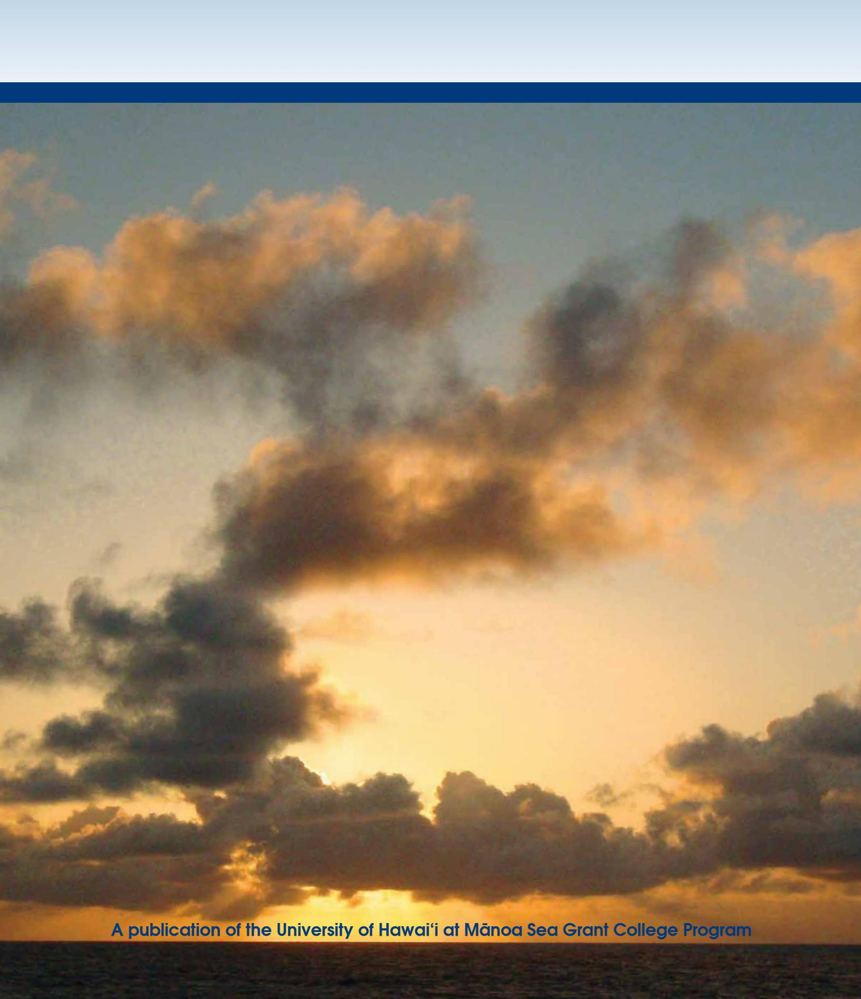