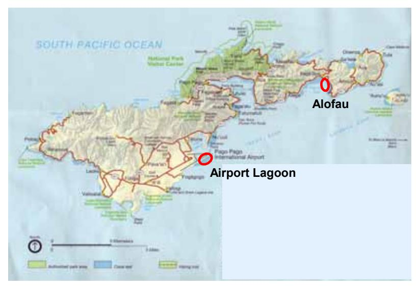

## **Short Report**

**Title: Preliminary study on flora in the territory of** *Stegastes nigricans* **in American Samoa** 

**Investigator:** Yu UMEZAWA (Ocean Research Institute, the Univ. of Tokyo umezawa@ori.u-tokyo.ac.jp) and Hiroki HATA (Kyoto Univ., Japan, hata@d01.mbox.media.kyoto-u.ac.jp)

**Scientific collection permit application series No:** 2004/10

**Periods of Field Survey:** (20040921 – 20040922 at Tuitula Island of American Samoa)

#### *Background and Objective of Research*

Recently, coral reef ecosystems all over the world are quite threatened by mass bleaching events, and territorial damselfish seems to be expanding their algal farms on dead corals (e.g., Hixon 2004). Many scientists have shown interest in the mechanisms of forming the algal farms and interaction between their extension and coral recruits after such a catastrophic event.

The damselfish *Stegastes nigricans* is one of the most dominant territorial fish that manages a conspicuous algal farm. In Okinawa, this fish manages a virtual monoculture of a filamentous rhodophyte *Polysiphonia* sp., but the algal composition of the farms in most other coral reefs is still unknown.

So, to provide this fundamental information, we conducted a preliminary study on algal assemblages inside the territories of *S. nigricans* at coral reefs in American Samoa where damselfish colonies are dominant (Mctee 2004).

Although collected algae will also be used for phylogenetic analyses to make clear the evolution of the interaction between the fish and algae inside its farm, this study is still in the middle of sampling and analyses in other targeted areas, so it will be compiled later. Here, we'll report species composition of algal farms within damselfish territories observed at Tutulia Island.

#### *Materials and Methods*

*Sampling sites* 

We collected 6 samples of algal mat within damselfish territories in the Airport Lagoon and 4 samples at Alofau (Fig. 1). Each algal mat was collected from a different colony, and then immediately transferred into the bottle with ethanol.

Fig.1 *Sampling sites at Tutuila Island* 

#### *Identification*

All algae were identified to the genus level under microscopes, based on the descriptions of Womersley (1998, 2003) and Abbott (1999).

# *Summary of Findings*

Table 1. List of algae inside the territory of the damselfish *Stegastes nigricans* in Airport Lagoon and Alofau. D, dominant; C, common; R, rare; -, no occurrence; Cy, cyanophytes; Ch, chlorophytes; Rh, rhodophytes

|                    |    | Airport Lagoon | Alofau |
|--------------------|----|----------------|--------|
|                    |    | n = 6          | n = 4  |
| Cyanophyta spp.    | Cy | D              | D      |
| Anotrichium sp.    | Rh | -              | R      |
| Centroceras sp.    | Rh | -              | R      |
| Chondria sp.       | Rh | R              | -      |
| Gelidiopsis sp.    | Rh | D              | C      |
| Herposiphonia sp.  | Rh | -              | R      |
| Hypnea sp.         | Rh | R              | -      |
| Jania spp.         | Rh | C              | C      |
| Neosiphonia sp.    | Rh | -              | C      |
| Polysiphonia sp. 1 | Rh | C              | C      |
| Polysiphonia sp. 2 | Rh | C              | R      |
| Cladophora sp.     | Ch | -              | R      |
| Enteromorpha sp.   | Ch | R              | R      |

Algal species collected inside the territories of *Stegastes nigricans* around Tutuila Island were similar to those around the Ryukyu Islands. The composition is, however, quite different. Around the Ryukyu Islands, algal farms of the fish are strongly dominated by one rhodophyte *Polysiphonia*  sp. On the contrary, around Tutulia Island algal farms were not dominated by that alga. We think this discrepancy is partly due to the difference in substratum (i.e., most territories at the Ryukyu Islands and Tutulia Island are located on the massive rocks and on the branching corals, respectively) and difference in nutrient-supply conditions (i.e., lots of land-derived N and somewhat stagnant conditions in the former area, while less land-derived N and rapid dilution with offshore water in the latter area). We hope we can make a thorough study of the interaction between algal composition and substratum structure, and between algal composition and nutrient-supply conditions in algal farms of *S. nigricans* in the near future.

#### *Acknowledgements*

We greately appreciated the thoughtful supports of Dr. D. Fenner, Ms. R. Oram and other staff at Department of Marine and Wildlife Resources for helping us choose sampling points, sampling assistance and issuing the scientific permission to bring algal samples back to Japan.

#### *References*

- Abbott IA (1999) Marine red algae of the Hawaiian Islands. Bishop Museum, Honolulu.
- Hixon MA (2004) Effects of *Agaricia* coral death on the demography of *Stegastes* damselfish in the Bahamas. *10th International Coral Reef Symposium Abstracts*: 82
- Mctee SA (2004) Damselfish territories and bioeroders: are they a threat to the structural integrity and long-term persistence of a reef? *10th International Coral Reef Symposium Abstracts*: 260
- Womersley HBS (1998) The marine benthic flora of southern Australia: Rhodophyta Part IIIC. State Herbarium of South Australia, Adelaide.
- Womersley HBS (2003) The marine benthic flora of southern Australia: Rhodophyta Part IIID. Australian Biological Resources Study, Canberra, the State Herbarium of South Australia, Adelaide.

#### *Our studies related to this survey.*

### **In prep**

- Umezawa Y and Hata H; Nitrogen dynamics within the damselfish *Stegastes nigricans* territories.

#### **Published**

- Hata H et al. (2002) Effects of habitat-conditioning by the damselfish *Stegastes nigricans*  (Lacepede) on the community structure of benthic algae. *J Exp Mar Bio Ecol* 280: 95-116
- Hata H and Kato M (2002) Weeding by the herbivorous damselfish *Stegastes nigricans* in nearly monocultural algae farms. *Mar Ecol Prog Ser* 237: 227-231.
- Hata H and Nishihira M (2002) Territorial damselfish enhances multi-species co-existence of foraminifera mediated by biotic habitat structuring. *J Exp Mar Bio Ecol* 270: 215-240.
- Umezawa et al. (2002) Fine scale mapping of land-derived nitrogen in coral reefs, by δ15N values in macroalgae. *Limnol Oceanogr* 47: 1405-1416
- Umezawa et al. (2002) Significance of groundwater nitrogen discharge into coral reefs at Ishigaki Island, southwest of Japan. *Coral Reefs* 21: 346-356
- Hata H and Kato M (2003) Demise of monocultural algal farms by exclusion of territorial damselfish. *Mar Ecol Prog Ser* 263: 159-167
- **-** Hata H and Kato M (2004) Monoculture and mixed-species algal farms on a coral reef are maintained through intensive and extensive management by damselfishes. *J Exp Mar Bio Ecol* 313: 285-296