# Algae-Dominated Reefs

*Numerous reports suggest that reefs must be dominated by coral to be healthy, but many thriving reefs depend more on algae*

Peter S. Vroom, Kimberly N. Page, Jean C. Kenyon and Russell E. Brainard

T he words coral and reef go together in everyday language like peanut hutter and jelly. In fact, many people think that coral—colonial marine organisms that secrete a skeleton made of calcium carbonate—means reef. In reality, though, a reef is just any ridge that runs near the surface of the ocean. But one without coral sounds like a reef verging on death, whether you ask someone off the street, most any biologist or even many ecologists. This idea—that only a reef covered in coral is healthy—came along fairly recently.

More than half a century ago, some scientists knew that healthy reefs could be covered in more than coral. On reefs around Hawaii in the early 1930s, Paul C. Galstoff collected algae—acellular, unicellular or multicellular organisms that lack true tissues and organs and that use light energy to create food via photosynthesis—and he reported that

the algae played an equal if not greater role on the reefs than coral. Over the years, other tropical-reef hiologists also noted the importance of algae in many reef systems; some scientists even created the name *hiotic reefs* for those dominated by algae.

Over the past few years seemingly every publication—from newsstand magazines and newspapers to peerreviewed journals and textbooks—has reported on the degradation of "coral" reefs. For example, in the March 18, 2005, *Science,* John Pandolfi of the University of Queensland in Australia and his colleagues wrote: "Coral reefs provide ecosystem goods and services worth more than \$375 billion to the global economy each year. Yet, worldwide, reefs are in decline." Although many reefs have declined in health, these authors lament the devastating degree of coral-reef degradation on all reefs and equate high algal cover with decreased reef health. Even if humans had never walked the Earth, though, there would still be natural successional and geographic gradients with some reefs dominated by coral and some dominated by algae.

In some cases, algae do take over reefs once dominated by coral. Environmental stresses—such as hurricanes, mass bleaching or diseases—can trigger such phase shifts, which are generally regarded as a sign of reef degradation. This phenomenon no doubt fostered a general impression that algae-dominated reefs are unhealthy ones.

As this article explains, we disagree. Algae can dominate a healthy reef, where all of the essential ecological processes are intact. After five years of monitoring relatively undisturbed, central-Pacific reefs, we have found that coral dominance is relatively limited. Algae, on the other hand, can be fairly common.

## Diving in Paradise

When asked how we run studies, we offer an idyllic picture: We go diving on reefs surrounding remote, uninhahited tropical islands. For many, this sounds like a fantasy job. People conjure up warm, azure-blue lagoons encompassed by gently swaying palm trees. They imagine us swimming over reefs chock-full of a dazzling array of multihued corals while swarms of vibrantly colored fish envelop us. Although such reefs exist in some places, do these romanticized visions hold true for most tropical-Pacific reef systems? It's been our job and pleasure to find out.

The United States holds jurisdiction over numerous unpopulated islands scattered across the Pacific Ocean. Many of these islands and atolls lie thousands of kilometers away from human populations and have long been protected as wildlife refuges. The scientific community recognizes these remote areas as the least-disturbed reef communities in the world because of a lack of direct anthropogenic impacts. Yet because of their isolated locations, few if any scientific studies have ever examined the waters around these tiny specks of land. In fact, before we began our work, basic species lists for many marine plants and animals did not exist, and few people even knew what these reefs look like.

In 2001, the U.S. National Oceanic and Atmospheric Administration (NOAA) funded the Coral Reef Ecosystem Division (CRED), which is located at the Pacific Islands Fisheries Science Center in Honolulu, Hawaii. CRED was established in response to

*Peter S. Vroom is a principal investigator for tlie Cora! Reef Ecosi/stems Division's (CREDj algal iaboratory. His current research interests indude community ecology of tropical alga! populations, nmltidisciplimnj integrated ecosystem correlations and algal taxomrny. Kimberly N. Page is an M.S. student in the Departviatt of Botany at the University of Hawaii at Manoa. Her thesis research focuses on benthic-habitat community structure, with an ejnphasis on reef algae at Pear! and Hermes Atoll in tlie Northwestern Hawaiian Is!ands. jean* C. *Kenyon is a principal investigator for CRED's coral studies. Her research interests include coralcommunity structure, coral bleaching and coral reproduction and recruitment. Russell E. Brainard is division chief for CRED. His research interests include understanding tropical reef-ecosystem integration, with particular emphasis on the role of ocean variability on ecosystem health. Address for Vroom: Coral Reef Ecosystem Division, NOAA Fisheries' Pacific Island Fisheries Science Center, 1125 B Ala Moana Boulevard, Honolulu, Hawaii 96814. Internet: pvroom@mait.nmfs.hawaii.edu*

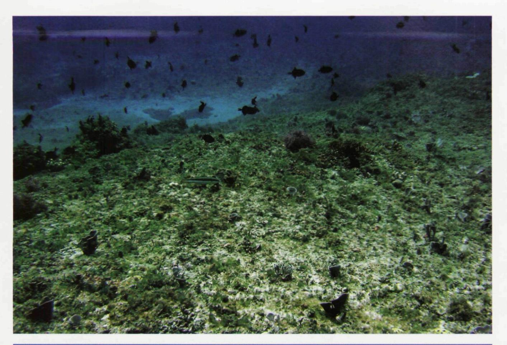

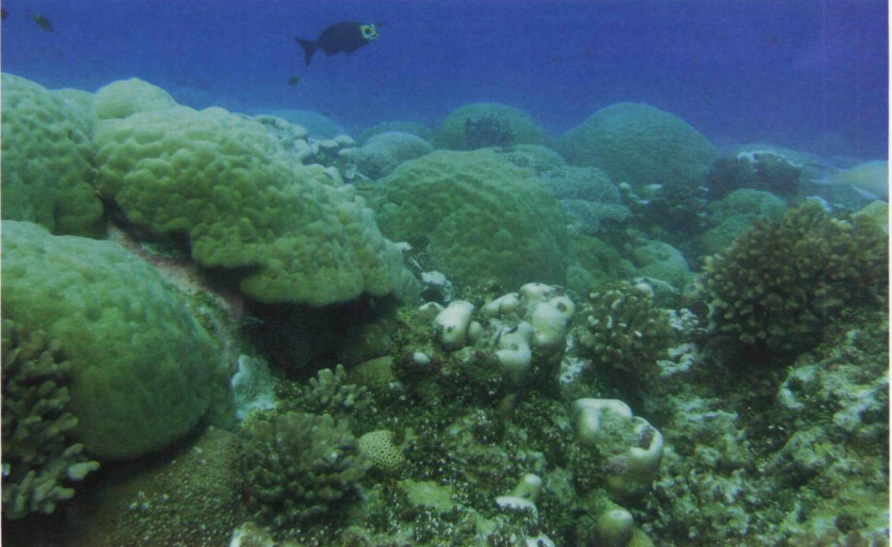

Figure 1. Algae-dominated reefs *(top)* look unhedUhy to many biologists. Reefs dominated by coral *(Iwttom),* on the other h.ind, represent their picture of health. In fact, many scientists only consider a reef to he healthy if coral takes up most of the surface area. As the authors show, however, some investigators learned decades ago that a reef can depend more on algae than coral. Moreover, surveys presented here show that algae dominate many healthy reefs in the Pacific Ocean. (Except where noted, photographs courtesy of the authors.)

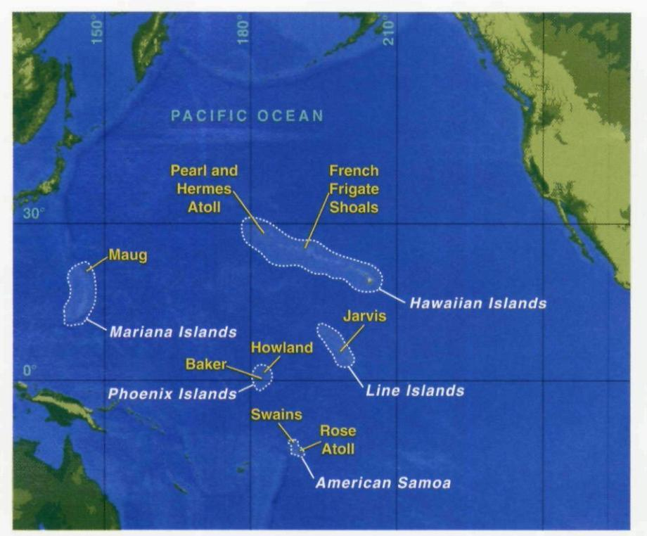

Figure 2. The authors work under the auspices of the Coral Reef Ecosystem Division, funded by the U.S. National Oceanic and Atmospheric Administration, to assess and monitor reef ecosystems on largely uninhabited U.S.-held islands in the tropical Pacific. These include reefs located in American Samoa, the Hawaiian Islands, the Line Islands, the Phoenix Islands and the Mariana Islands.

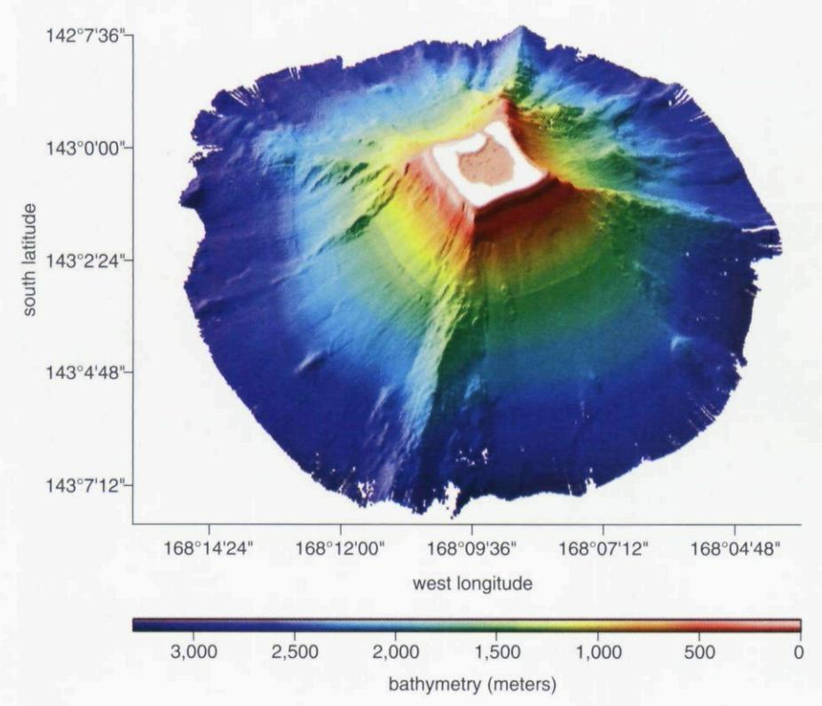

Figure 3. Sonar maps provide high-resolution imagery of a reef's surface. Such images—like this one of tiny Rose Atoll in American Samoa—help scientists distinguish geomorphic variations among reefs. (Image created by the CRED mapping group.)

growing interest by the government such as former President Clinton's Corai Reef Protection Executive Order 13089 in 1998, which established the U.S. Coral Reef Task Force—and the American public in protecting and conserving the nation's coral-reef ecosystems. CRED, which is funded by NOAA's Coral Reef Conservation Program, faced a complicated task: cissessing and monitoring coral-reef ecosystems on U.S.-held islands in the tropical Pacific.

To perform this vast endeavor, we regularly visit more than 350 long-term monitoring sites around 35 islands in both the Northern and Southern hemispheres, including American Samoa, the Northwestern Hawaiian Islands, U.S. Line Islands, U.S. Phoenix Islands and Northern Mariana Islands. In certain cases, up to 96 percent of the species that we have observed are new records for these areas.

**Divers with Diversity**

CRED relies on a multidisciplinary, ecosystem-based approach to science, using individuals who are trained to observe different types of organisms or processes. With that approach, CRED scientists record the "big picture" on reefs, rather than only studying specific groups, such as fish or coral. Anecdotal conversations with investigators who have been studying reef systems for decades indicate that many—although not all—past coralreef studies included coral and fish biologists but few scientists from other disciplines. Consequently, research teams naturally gravitated toward reef systems dominated by coral.

CRED research programs take an ecosystem-scale perspective by monitoring multiple habitats. At each longterm monitoring site, we collect specieslevel data concurrently for a variety of biological populations. Additionally, we amass a suite of txreanographic and mapping data from around the islands to provide an ecosystem-level understanding of the regions.

We collect these data through a variety of techniques. For example, we employ a sonar system to collect highre.solution imagery of the seafloor for mapping purposes, normally at depths of 20 to 250 meters below sea level. We also document the seafloor with a photoquadrat technique that photographs areas of known size—in our case, 0.18 square meter. These photo-

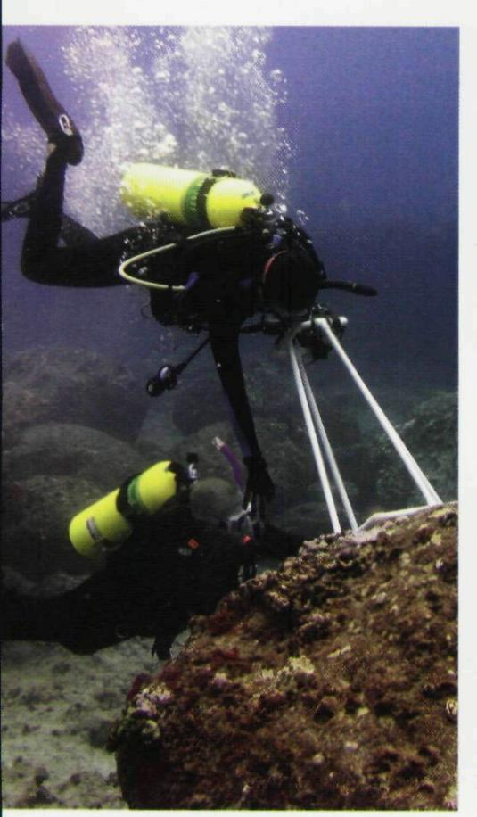

Figure 4. Photoquadrats provide one means of capturing data about the prevalence of organisms on a reef. A diver places a standardsized frame on the seafloor along a transect on the reef's surface and takes a digital photograph *(above).* At right, the authors show three images from different reefs, and graphs indicate the percentage of surface that different types of organisms cover. As these data show, the coverage of coral and the main categories of algae—macroalgae, turf algae and coralline algae—vary considerably from one site to another.

quadrats are taken at randomly selected points along an underwater transect, essentially a measuring tape that we roll out along the seafloor. From each photograph, we determine the percentage of the surface that individual organisms cover.

Some of our data also come from dynamic approaches. In video transects, for example, a diver takes videos—holding the camera at a standard distance from the seafloor—while swimming along the transects just mentioned. Then, we analyze random frames from the videotapes and calculate the percent cover of individual organisms. To cover much larger areas, other scientists conduct toweddiver surveys. In such cases, a small boat tows two scuba divers who hold

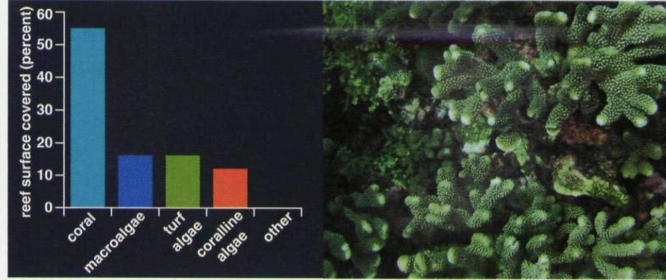

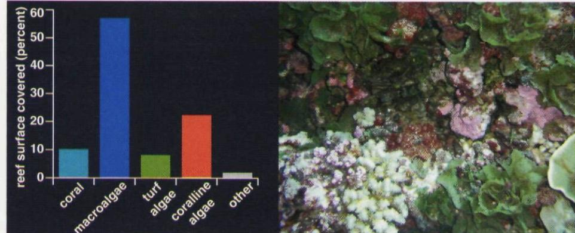

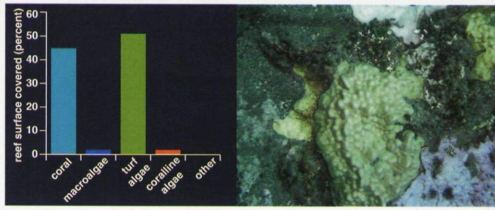

onto tow boards and visually estimate the percent cover of organisms. At the same time, a downward pointing camera on each tow board photographs the seafloor, and the pictures are then used to determine actual percent cover.

With photoquadrats and video transects, we can determine the percent cover of individual species in relatively small areas. Towed-diver surveys, on the other hand, provide estimates of the percent cover of organismal functional groups—such as corals and algae across vast stretches of reef.

In addition to all of the hard data, we often stumble onto anecdotal amazements. For instance, during one dive on Maro Reef in the Northwestern Hawaiian Islands, more than 50 Galapagos sharks surrounded a small

dive team that was collecting data. In fact, top predators dominate our study sites, and it's not unusual to be circled by a dozen sharks while we're conducting our reef surveys. Some coral-reef biologists believe that an abundance of predators defines intact ecosystems and that degraded ecosystems cannot support large carnivores. It's anecdotal, yes, but these predators provide more evidence of the good health of the reefs that we study.

#### Algal Assortment

To monitor reef health over time, tropical-reef biologists must create a set of diagnostic indicators. Clearly, reefs that were once dominated by coral and have become colonized by algae within a span of years or decades have declined

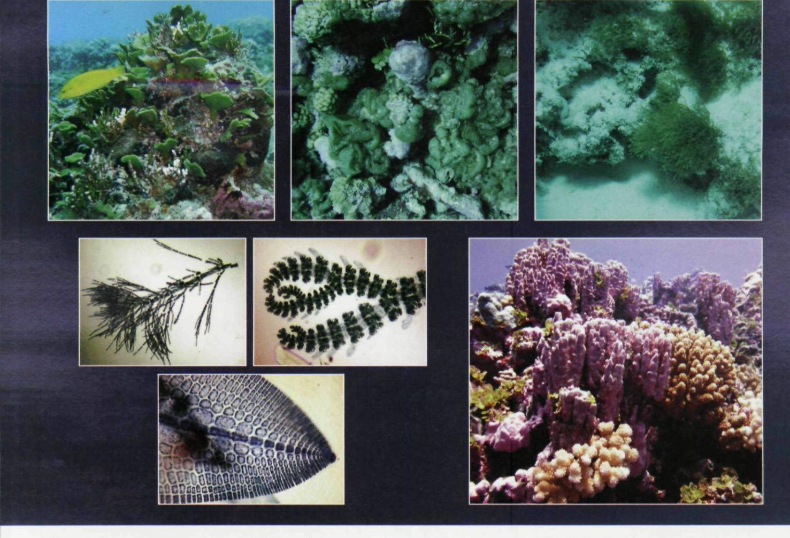

Figure 5. Algae come in many forms on Pacific reefs. Larger species are called macroalgae *(top).* Hundreds of species of macroalgae live on Pacific reefs, and meadows of fleshy algae can serve as nurseries for a variety of invertebrates and fish. Turf algae *(lower left)* often consist of individual filaments of cells, yet dense mats of them create specialized environments that can persist even in harsh waves. They can atso quickly colonize vacant substrate. Coralline algae *(lower right)* impregnate their bodies with calcium carbonate and can look more like rocks than plants. Still, some species of these algae can be among the first to colonize vacant-reef substrate. These plants also cement together loose components of a reef system, which holds it together.

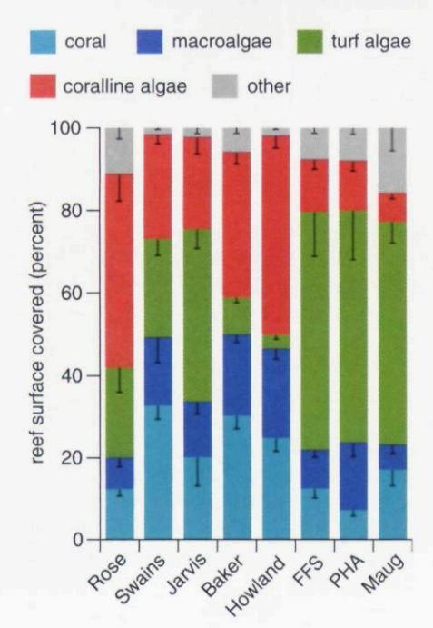

in health. Such a scenario has happened on many Caribbean reefs, including the Discovery Bay reef in Jamaica and some areas along the Florida Reef Tract. Such shifts can arise from increased anthropogenically derived nutrient inputs, overfishing or changes in animal species, such as the massive die-off of an herbivorous sea urchin, *Dladcina antillarum,* in the early 1980s.

Nonetheless, the composition of organisms that makes up a healthy reef

Figure *b.* Organismal cover on eight Pacific reefs—Rose, Swains, Jarvis, Baker, Howland, French Frigate Shoals (FFS), Pearl and Hermes Atoll (PHA), and Maug^—reveal the dominance of algae. On five of the eight reefs, coral takes up less than 20 percent of the surface. The three main groups of algae take up most of the remaining space. Bars indicate standard error of the mean or the natural variation of community structure.

can vary considerably depending on its location. Researchers are beginning to understand that reefs from different latitudes and in different successional stages differ dramatically from one another. Consequently, indices appropriate for measuring reef health at one island might not be appropriate for another. Although we found localized areas of dense coral on most of the reefe we studied, the majority contained only 7.1 to 32.7 percent live-coral cover.

What occupies the rest of the space? For the most part, algae. Tropical reefs naturally contain myriad algal species that are essential for healthy ecosystem dynamics. The three types that are easily observable to snorkelers or divers are turf algae, coralline algae and macroalgae.

Turf algae are some of the most overlooked macroscopic organisms on

tropical reefs. Casual divers swimming over boulder fields or bard pavements often don't realize that the fuzzy layer covering every inch of space between corals or other sessile organisms consists of hundreds of species of little plants that help form the hase of the food chain. These delicate organisms often consist of individual filaments of cells, yet dense mats of them create specialized environments that can persist even in harsh waves. Numerous small invertebrate species—such as amphipods, which are related to shrimp—make their home among the algal turf, and some fish species—including damselfish—feed exclusively on them, even though these algae rarely grow more than 2 to 3 centimeters in height in the tropical Pacific. Turf algae can quickly colonize vacant substrate. These algal communities also filter water and improve water quality in reef systems. Because scientists need a microscope to identify turf-algal species, many questions about the dynamics of turf ecosystems await answers.

Coralline algae impregnate their bodies with calcium carbonate—the same substance that corals use to build their skeletons and snails and clams use to create their shells. Historically, researchers thought that crustose coralline red algae, which often look more like rocks than plants, were slowgrowing members of reef communities. Current observations, though, show just the opposite for some tropical species. Crustose coralline red algae can be among the first to colonize vacant-reef substrate, and dime-sized colonies can be seen within weeks of space becoming available. Moreover, these plants cement together loose components of a reef system. Without crustose algae holding everything together, much of a reef would be washed into deep water or onto shore by heavy waves.

In many cases, the build-up of a reef system arises from a joint effort between crustose coralline red algae and corals. Crustose coralline red algae produce a chemical that triggers settlement in coral and other invertebrate lar\'ae, which creates a vital link between algal and coral communities. As is the case with turf algae, though, many questions regarding the taxonomy and biodiversity of crustose coralline algae in reef systems remain unanswered.

Macroalgae—^literally larger forms of algae—can also turn opportunistic on tropical reefs by taking advantage

of decreased herbivory or increased nutrients. This characteristic can trigger macroalgal blooms that overgrow reef communihes in areas of anthropogenic or natural disturbances. In healthy reef communities, hundreds of species of macroalgae are a natural component of the ecosystem, but grazing pressures or a lack of readily available nutrients keeps populations in check. Nevertheless, macroalgae often nestle among coral communities, and

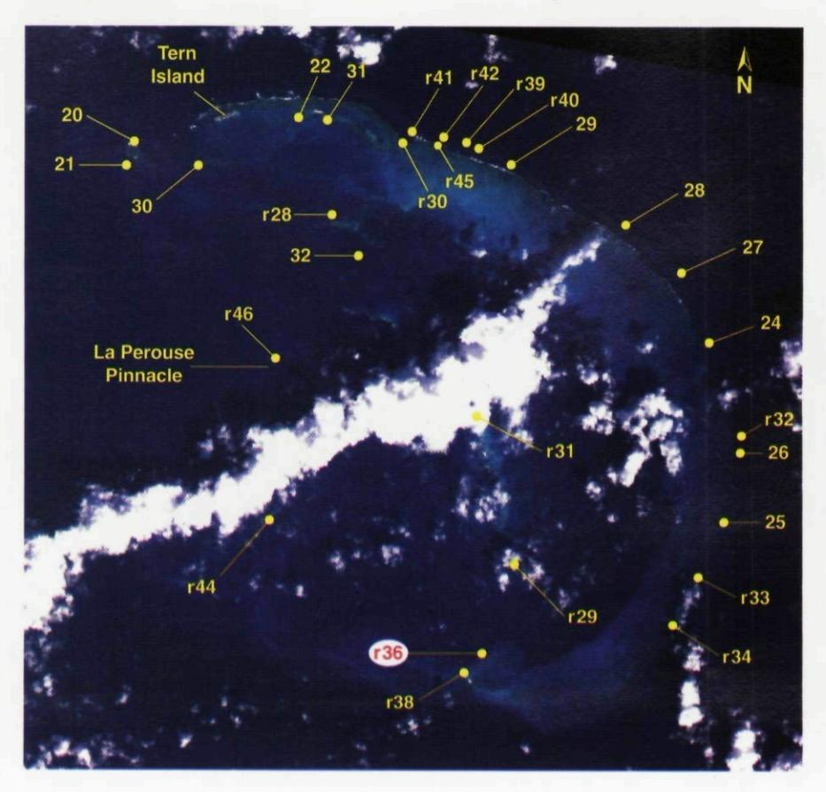

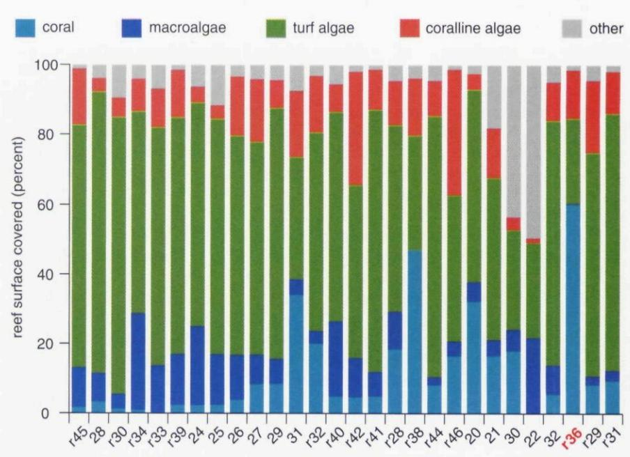

Figure 7. French Frigate Shoals *(top)*—like the other reefs—shows variation in the organisms covering the surface on different parts of the reef, At most of the 28 sites sampled, turf algae take up most of the space. At site rFFS36, on the other hand, coral take up more than half of the space. So the makeup of organisms on a reef can vary from one spot to another. (Image courtesy of Space Imaging L.L.C.)

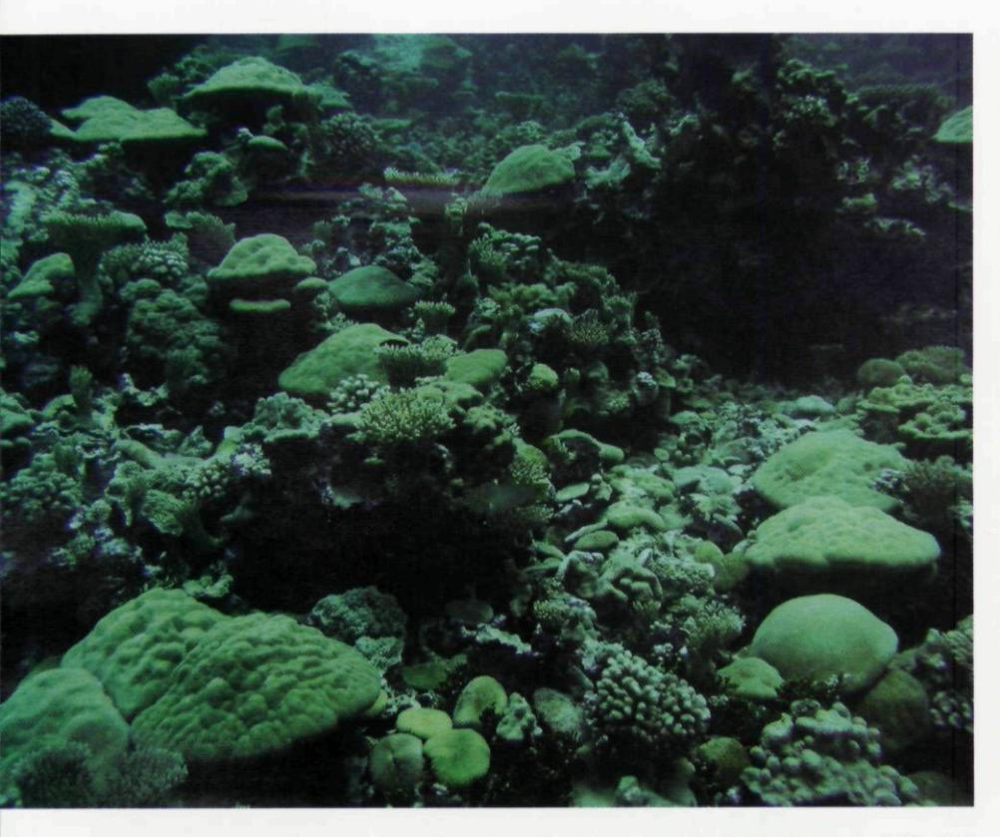

Figure 8. Dense patches of coral tend to exist in localized spots on the Pacific reefs studied by the authors. Consequently, such areas—such as the Kingman Reef in the U.S. Line Islands, shown here—must be protected and managed carefully. Still, divers must gather more data to truly understand the dynamics of organisms on Pacific reefs. The authors conclude, however, that algae occur naturally in relatively high abundance on many tropical Pacific reefs that receive no direct human impact.

they are particularly abundant in crevices or holes where herbivores have a difficult time reaching them. Some tropical reefs in the Pacific Ocean contain extensive meadows of fleshy macroalgae that serve as nurseries for a variety of invertebrates and fish.

Other species of macroalgae, such as *HaUmeda,* are calcified and produce much of the sand in reefs. In fact, *HaUmeda* sand makes up greater than 30 percent of the sediment on some of the most beautiful and famous beaches in the tropical Pacific. In our study areas, where *HaUmeda* formed dense thickets (mostly in lagoon regions), expansive beds of *Halimeda-derived* sand were common.

Our work has also uncovered new species. On one reef, we found large, easily observable seaweeds—a form of macroalgae—that were completely new to science. In the past two years, one of us (Vroom) described three new species of red macroalgae from the Northwestem Hawaiian Islands. Such discoveries underscore the remoteness of the islands on which we work and our poor knowledge of these reef systems.

## **Calculations of Coverage**

For comparative purposes, we determined the percent coverage of organisms inhabiting the seafloor from eight reefs studied by CRED. These reefs represent a broad geographic area within the Pacific Ocean, including islands in American Samoa (11-14 degrees south latitude), the U.S. Line Islands (0-7 degrees north latitude), the U.S. Phoenix Islands (on the equator), the Commonwealth of the Northern Mariana Islands (14-20 degrees north latitude) and the Northwestern Hawaiian Islands (23-29 degrees north latitude). Except for Swains Island in American Samoa, with fewer than 10 residents, no humans inhabit the studied islands or atolls, and they are located hundreds to thousands of kilometers away from population centers. Thus, adjacent human activities do not currently impact these islands, and they have historically received U.S. government protection as wildlife refuges.

At each of the eight islands, a multidisciplinary team selected sites that reflect dominant types of habitats. On each reef, the team surveyed enough sites, 4 to 28, to ensure roughly similar sampling densities. Except for some shallow backreef—the island side of a reef—or lagoonal areas, we collected data from depths of about 15 meters.

Our analysis shows that algae dominate many reefs. At all but one of our 94 sites, algae took up more space than coral. As many tropical-reef ecologists might expect, crustose coralline red algae—the ones responsible for reef growth and cementation—covered 40 times more surface area than coral at 65 percent of our sites. Similarly, turf algae occupied more area than coral up to 600 times more—at 69 percent of the sites. Moreover, macroalgae took up as much or more room than coral at 46 percent of the sites. This last finding is a huge surprise because many of the leading researchers in coral-reef ecology have stated that macroalgae in reef systems indicates decreased ecosystem health. Nonetheless, we found macroalgae dominating many healthy reefs that were far removed from direct anthropogenic influence.

Even more surprising, the majority of macroalgae occupying the seafloor on healthy reefs aren't the sand-producing *HaUmeda.* Although *HaUmeda* is a common component of reef communities at all of the islands that we visited, it made up less than 20 percent of the macroalgae recorded at 65 percent of the sites. Fleshy algae made up the dominant macroalgae, with species composition varying across geographic location. The prevalence of non-invasive fleshy macroalgae in tropical-reef systems opposes current images of a healthy reef.

Perhaps most important of all, our data show that different reefs support different organisms. In fact, even reefs that surround a single island can exhibit considerable heterogeneity.

The different oceanographic and geomorphic conditions surrounding each island probably account for the variation in the percentage of surface that functional groups cover on different reefs. For example, French Frigate Shoals is a large, subtropical-atoll system that exhibits wide habitat heterogeneity. Forereef regions—essentially the ocean side of reefs—stretching over 20 kilometers along the eastern side of this atoll experience moderate to heavy waves and contain dense beds of the green alga *Mkrodktyon;* in most cases, coral covers only 2 to 9 percent of the surface. Alternatively,

regions within the large lagoon exhibit high variability: Coral dominates some sites, crustose coralline red algae dominates others, and turf algae take over still other spots.

In contrast, algae cover the geographically small Rose Atoll in American Samoa in different ways. For example, crustose coralline red algae dominate forereef sites, which also experience moderate to high waves. On Rose Atoll's small and enclosed lagoon, however, algal turfs cover most of the surface. Most of the macroalgae occur on the eastern and southeastern sites, but they do not cover significantly more space than coral. Overall at Rose Atoll, coral takes up only 3 to 26 percent of the space.

Our data suggest that each island ecosystem exhibits characteristics that set it apart from geographically close or geomorphically similar ecosystems. This confounds generalizations about reef attributes within and among island groups. Nevertheless, some regional differences appear in the ratios of algal cover to coral cover. As previously noted, the subtropical Northwestern Hawaiian Islands contain reefs dominated by a combination of turf and macroalgae. Of the 28 sites sampled at French Frigate Shoals and the 22 sites examined at Pearl and Hermes Atoll, 32 percent and 59 percent of sites, respectively, contained significantly more space covered by macroalgae than coral. At sites sampled on central and south Pacific islands, however, it was rare for macroalgae to cover significantly more space than coral, although macroalgae covered as much or more surface than corals at 33 percent of sites.

When we found dense coverage by coral, it tended to be localized, instead of covering huge expanses of a reef. This underscores the need for increased protection of coral-dense areas.

#### Can We Rate a Reef?

Reef managers often ask us one question: Are my reefs healthy? Without a set of globally accepted indices that define a healthy reef, such questions lack definitive answers. Still, some scientists use our data to better understand what they consider to be healthy tropical-reef ecosystems. According to others, our data indicate more degradation in Pacific-reef systems. At present, CRED scientists deliver results as scientifically as possible in the hope of discovering meaningful indices to describe ecosystem health. Policy managers can put the interpretative spins on how our data should be presented.

After thousands of hours of fieldwork over the past five years, there is little doubt among our multidisciplinary team that algae occur naturally in relatively high abundance around many tropical Pacific islands that receive no direct human impact. Moreover, the coverage of different organisms varies with geographic location, geologic history and the age of the reef system.

Like the stock market, long-term trends provide one of the best ways to judge the health of a reef ecosystem. On the remote islands that we study, natural or indirect human activities can trigger massive die-offs of coral. For example, coral bleaching occurs when symbiotic zooxanthellae—single-celled algae that typically reside inside coral—disappear, usually in response to physical stress. Typically, these algae give coral its color, and the expulsion of this algae leaves a white coral skeleton that is visible through the now-transparent tissue, giving the coral a white, or bleached, appearance. Coral can also die because of disease or outbreaks of crown-ofthorns starfish. These phenomena can greatly reduce coral cover and increase algal cover. The main question on the minds of scientists revolves around whether the effects of such phenomena are short-term and whether the reef systems will be able to recover. So far, we lack the data to answer those questions.

After half a decade of dives, however, we can turn to a fundamental question: Do the romanticized visions of coral reefs held by the general public hold true for reef systems in the tropical Pacific? In certain cases, absolutely! But many other habitats exist, and algae dominate many of these reefs. Without algae there would be no tropical-reef ecosystem, yet marine algae are among the least-studied and least-understood organisms on the reef. So, we continue cataloging and quantifying the species on reef systems around the Pacific. Effective management and conservation of these Pacific ecosystems—and reef systems worldwide—require a better understanding and full appreciation of algae's role in reef health. So we'll continue diving in paradise.

#### Bibliography

- Galtsoff, P. S. 1933. Pearl and Hermes Reef, Hawaii, Hydrology and Biological Observations. Bishop Museum Bulletin 107.
- Harney, J. N., E. E. Grossman, B. M. Richmond and C. H. Fletcher III. 2000. Age and composition of carbonate shoreface sediments, Kailua Bay, Oahu, Hawaii. Coral Reefs 19:141-154.
- Kenyon, J. C., P. S. Vroom, K. N. Page, M. J. Dunlap, C. B. Wilkinson and G. S. Aeby. 2006. Community structure of hermatypic corals at French Frigate Shoals, Northwestern Hawaiian Islands: capacity for resistance and resilience to selective stressors. Pacific Science 60:153-175.
- Parrish, F. A., and R. C. Boland. 2004. Habitat and reef-fish assemblages of banks in the Northwestern Hawaiian Islands. Marine Biology 144:1065-1073.
- Preskitt, L. B., P. S. Vroom and C. M. Smith. 2004. A rapid ecological assessment (REA) quantitative survey method for benthic algae using photo quadrats with SCUBA. Pacific Science 58:201-209.
- Rooney, J., C. Fletcher, E. Grossman, M. Engels and M. Field. 2004. El Niño influence on holocene reef accretion in Hawaii. Pacific Science 58:305.
- Vroom, P. S., K. N. Page, K. A. Peyton and J. K. Kukea-Shultz. 2005. Spatial heterogeneity of benthic community assemblages with an emphasis on reef algae at French Frigate Shoals, Northwestern Hawaiian Islands. Coral Reefs 24:574-581.
- Waddell, J. E., ed. 2005. The state of coral reef ecosystems of the United States and Pacific freely associated states: 2005. NOAA Technical Memorandum NOS NCCOS 11. Silver Spring, MD: NOAA/NCCOS Center for Coastal Monitoring and Assessment's Biogeography Team.
- Wilkinson, C. W., ed. 2004. Status of Coral Reefs of the World: 2004, Volumes 1 and 2. Townsville, Australia: Australian Institute of Marine Science.

For relevant Web links, consult this issue of American Scientist Online:

http://www.americanscientist.org/ IssueTOC/issue/881

Copyright of American Scientist is the property of Sigma XI Science Research Society and its content may not be copied or emailed to multiple sites or posted to a listsery without the copyright holder's express written permission. However, users may print, download, or email articles for individual use.