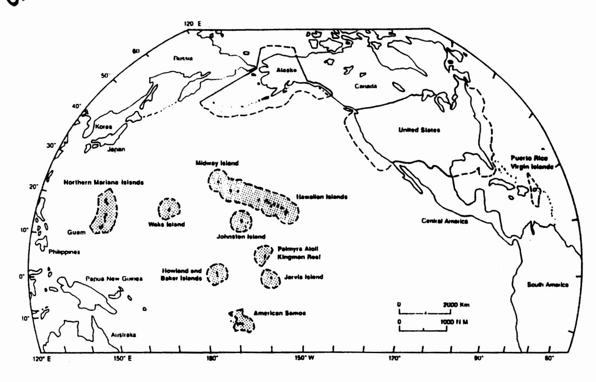

# DRAFT

PAGO PAGO, AMERICAN SAMOA 96799

ORIGINAL

# Western Pacific Fishery Management Council

# Fishery Management Plan

Strain of the state of the state of the state of the state of the state of the state of the state of the state of the state of the state of the state of the state of the state of the state of the state of the state of the state of the state of the state of the state of the state of the state of the state of the state of the state of the state of the state of the state of the state of the state of the state of the state of the state of the state of the state of the state of the state of the state of the state of the state of the state of the state of the state of the state of the state of the state of the state of the state of the state of the state of the state of the state of the state of the state of the state of the state of the state of the state of the state of the state of the state of the state of the state of the state of the state of the state of the state of the state of the state of the state of the state of the state of the state of the state of the state of the state of the state of the state of the state of the state of the state of the state of the state of the state of the state of the state of the state of the state of the state of the state of the state of the state of the state of the state of the state of the state of the state of the state of the state of the state of the state of the state of the state of the state of the state of the state of the state of the state of the state of the state of the state of the state of the state of the state of the state of the state of the state of the state of the state of the state of the state of the state of the state of the state of the state of the state of the state of the state of the state of the state of the state of the state of the state of the state of the state of the state of the state of the state of the state of the state of the state of the state of the state of the state of the state of the state of the state of the state of the state of the state of the state of the state of the state of the state of the state of the state of the stat

for

**Coral Reef Ecosystems** 

of the

Western Pacific Region

ORIGINAL

# DRAFT Fishery Management Plan for Coral Reef Ecosystems of the Western Pacific Region

# Working Draft by CRE Plan Team

(Revised 25 May 99)

# TABLE OF CONTENTS

| Executive Summary                                                                                                                                                                                                                                                                                                                                                                       |
|-----------------------------------------------------------------------------------------------------------------------------------------------------------------------------------------------------------------------------------------------------------------------------------------------------------------------------------------------------------------------------------------|
| <b>Definitions</b>                                                                                                                                                                                                                                                                                                                                                                      |
| Introduction17Ecosystem Management1Geographic Context20Scope of Management21                                                                                                                                                                                                                                                                                                            |
| Description of Resource Ecosystem  Fishery Management Unit (FMU)  Biology.  Life history.  Distribution and abundance.  Reproduction and recruitment.  Growth and mortality rates.  Community structure/function.  Ecological relationships.  Biomass per recruit.  Yield per recruit.  Present Condition of Components of the FMU.  Probable Condition of FMU Components in the Future |
| Essential Fish Habitat                                                                                                                                                                                                                                                                                                                                                                  |
| Description of Fisheries29History of Exploitation29Fishing Methods and Current Use Patterns30Description of Commercial, Recreational, and Charter Fishing Sectors36                                                                                                                                                                                                                     |

| Imr         | pacts on Fishing Communities                         | <del></del> 36 |
|-------------|------------------------------------------------------|----------------|
| 2111        | Identification of Fishing Communities                | 37             |
|             | Economic and Social Importance of Fisheries          | 37             |
|             | Fishery Impact Statement                             | 41             |
|             | Tishery impact statement                             | _              |
| Canacity I  | Limits                                               | 41             |
| Ove         | erfishing Criteria                                   | 41             |
| Me          | asures to Prevent Overfishing                        | 42             |
| Me          | asures to Rebuild Overfished Stocks                  | 42             |
| 1410        |                                                      |                |
| Description | n of Threats/Management Issues                       | <b>42</b>      |
| Inac        | dequate Information Base                             | 42             |
|             | k of Effective Enforcement                           |                |
|             | k of Coordinated, Comprehensive Management           |                |
|             | erfishing                                            |                |
|             | pitat Loss and Degradation                           |                |
|             | lution and Contamination                             |                |
|             | structive Fishing Practices                          |                |
|             | rine Debris                                          |                |
|             | gal Harvest of Corals, Fish and Marine Invertebrates |                |
| 1110        | gai maivest of Colais, Pish and Mainic invertebrates | 70             |
| Manageme    | ent Objectives                                       | 49             |
| Managama    | nut Dungmann                                         | 40             |
|             | ent Program                                          |                |
| Pro         | posed Management Alternatives                        |                |
|             | M.M.1: Fishing Permit                                |                |
|             | M.M.2: Marine Protected Areas                        |                |
| _           | M.M.3: Restrictions of Gear and Methods              |                |
| Proj        | posed Framework Provisions                           |                |
|             | Possible Regulatory Framework Measures               |                |
|             | Possible Non-Regulatory Framework Measures           |                |
| Add         | litional Framework Measures for Considerations       | 60             |
| Five        | e Year Review                                        | 61             |
| Enf         | orcement                                             | 61             |
| Adr         | ninistrative Costs                                   | 61             |
| Developme   | ent of Fishery Resources                             | 61             |
|             |                                                      |                |
| Bycatch     |                                                      | 62             |
| Relationsh  | ip to Existing Laws and Policies                     | 52             |
|             | er Fishery Management Plans                          |                |
|             | aties or International Agreements                    |                |
|             | eral Laws and Policies                               |                |
|             | e, Local and Other Applicable Laws and Policies      |                |
|             | -,                                                   |                |

| Impacts of Proposed and Rejected Regulatory Measures | • |
|------------------------------------------------------|---|
| Ecological                                           |   |
| Economic                                             |   |
| Social                                               |   |
| Cultural Impact Analysis                             |   |
| Impacts on Fishing Communities                       |   |
| Regulatory Impact Review                             |   |
| Research, Monitoring and Assessment Needs            |   |
| <b>References</b>                                    |   |
| Appendix A                                           |   |
| Other Appendices                                     |   |

#### **EXECUTIVE SUMMARY**

Roughly 70% of the world's coral reefs are located in the Pacific Ocean (Bryant et al. 1998). Approximately 94% of the coral reefs under U.S. jurisdiction are located in the Pacific Ocean (Clark and Gulko 1999). The coral reef resources of the U.S. Pacific Island Area cover an estimated 15,852 km², most of which (10,762 km²) is in the EEZ. Until this plan was developed, there were no specific management plans or comprehensive regulations addressing the use of coral reef resources in the EEZ of the U.S. Pacific Island Area. This was of special concern because of the potential for an imminent increase in the exploitation of these offshore coral reef resources, combined with the exceptional vulnerability of the species involved. Although the coral reef resources in the EEZ have not been exploited on a large scale to date, the potential for unmanaged exploitation compels the Western Pacific Regional Fishery Management Council (WPRFMC) to proactively prepare and implement a coral reef ecosystem fishery management plan (FMP). In addition, the Nation will realize a long-term economic benefit if the resources are harvested on a sustainable basis.

WPRFMC is the policy-making organization for the management of fisheries in the EEZ of the Western Pacific Region. This includes the waters surrounding the U.S. Pacific Island Area: State of Hawai'i, Territories of American Samoa and Guam, Commonwealth of the Northern Mariana Islands (CNMI), and the unincorporated other U.S. Pacific Islands. WPRFMC currently implements management plans for the fisheries of four species groups: bottomfish and seamount groundfish, pelagics, crustaceans, and precious corals (though not scleractinian or reef-building corals). This Coral Reef Ecosystem FMP seeks to manage the coral reef resources in the EEZ surrounding the U.S. Pacific Island Area on an ecosystem basis, pursuant to Sections 303 (a) and (b) of the Magnuson-Stevens Act. It does not supersede, but rather complements, the other FMPs implemented by the WPRFMC.

Consistent with the objectives of the international Code of Conduct for Responsible Fisheries, the President's Executive Order No. 13089, the report by NMFS' Ecosystem Principles Advisory Panel, and the efforts of the U.S. Coral Reef Task Force, the overall goal of this FMP is to ensure that coral reef resources in the U.S. Western Pacific EEZ are effectively managed to achieve a sustainable balance of economic productivity, ecological integrity, and social acceptability. A coral reef ecosystem has ecological integrity if it retains its biological diversity and abundance over time and when all the elements in the ecosystem, along with the processes and functions that support these elements, are maintained. Solid scientific justification and the power of legal regulation are not effective in management by themselves. A critical factor in the management of coral reef ecosystems is the sincere belief by the resource users, especially those living in closest proximity to the resource, that the management policy is suitable. This suitability must take into account the culture, traditions, and political perspectives of those involved.

Since a coral reef represents an association of closely interdependent communities, each of which is an association of closely interdependent species, it is inherently unpredictable. Real thresholds and limits occur and, when exceeded, can result in major community restructuring which, at times, can be irreversible. Attention to maintaining diversity and the multiple scales of interaction within and among ecosystems is fundamental to the ecosystem approach. Boundaries of ecosystems are open and prone to change over time. Adopting an ecosystem approach shifts the burden of proof from determining if proposed harvests will be detrimental to the ecosystem to establishing prior to harvest that such activities will not jeopardize the health and sustainability of the ecosystem. A precautionary management approach (as presented in the Technical Guidance on the Use of Precautionary Approaches

to Implementing National Standard 1 of the Magnuson-Stevens Act and the FAO Fisheries Department Code of Conduct for Responsible Fisheries) is employed and steps are taken to ensure against unforeseen impacts to the ecosystem. Fishery management is adaptive, learning from previous experiences locally and regionally.

#### Scope of Management

This FMP proposes active management, under Federal regulations, of the coral reef fisheries in the waters of the EEZ around American Samoa, CNMI, Guam, Hawai'i, and the other unincorporated U.S. Pacific Islands. This FMP does not affect the implementation of the Council's existing FMPs in the Western Pacific Region. Every effort has been made to ensure that the regulations proposed by this FMP complement state and territorial fishing regulations and landing laws.

#### Fishery Management Unit Species/Taxa

The complex interactions among the component species on coral reefs require an ecosystem approach to developing the FMP. For this reason, the management unit of this FMP is somewhat unconventional. Harvested species or species complexes comprise integrated segments of the coral reef ecosystem; therefore any harvest is considered a harvest of the ecosystem. The taxa or species complexes comprising the fishery management unit (FMU) include reef fishes, invertebrates, algae, and coral which are not covered under other WPRFMC FMPs. The potential for species overlap among the FMPs for coral reef resources and certain bottomfish, crustaceans and precious corals MUS is being addressed by collaboration with the respective Plan Teams to develop complementary approaches for covering MUS in each FMP, especially with respect to ecosystem impacts of these other fisheries on coral reefs. The selection of this FMU also considers the coral reef ecosystem as essential fish habitat (EFH).

It is important to evaluate the interdependency of coral reef resources and determine management units which can be harvested without severe impact to the reef ecosystem and the wide variety of species reliant on it (other FMP species, protected species, etc). Some evaluation of the social and cultural value of these resources should be made to determine if their non-consumptive worth exceeds the value of the proposed fishery. While nearly every organism in a coral reef ecosystem has the potential for utilization, Table A describes the fishery management units for the purposes of this FMP.

#### Essential Fish Habitat

Designating Essential Fish Habitat (EFH) is a new requirement of the Sustainable Fisheries Act. Because there are large gaps in scientific knowledge about the life histories and habitat requirements of many FMP species, the WPRFMC has adopted a precautionary approach in designating EFH. Generally, the EFH for coral reef resources was identified as the area from the shoreline to the seaward extent of the EEZ, in depths of 0 to 200 meters (to the limit of the photic zone). This EFH may also protect the habitats of species managed under other FMPs in the Western Pacific.

Table A: Fishery Management Units (FMUs): Distribution and
Use (F=food O=ornamental B=bioprospecting)

| FMUs                                         | AS    | CNMI | GU  | MHI | NWHI | Other |
|----------------------------------------------|-------|------|-----|-----|------|-------|
| Cheilinus undulatus                          | F     | F    | F   |     |      |       |
| Other Labridae sp.                           |       |      |     |     |      |       |
| Bolbometopon muricatum                       | F     |      | F   |     |      |       |
| Other Scaridae sp.                           |       |      |     |     |      |       |
| Decapterus spp.                              |       |      | F   |     |      |       |
| Carcharhinidae and Sphyrnidae (sharks)       | F     | F    | F   | F   | F    | F     |
| Dasyatididae, Myliobatidae, Mobulidae        |       |      |     |     |      |       |
| (rays)                                       | į     |      |     | i   |      |       |
| Serranidae (minus BMUS) (groupers)           | F     | F    | F,O |     |      |       |
| Carangidae (minus BMUS)                      | F     | F    | F   | F   | F    | F     |
| (jacks/trevallies)                           |       |      |     |     |      |       |
| Holocentridae (soldierfishes/squirrelfishes) | F     |      | F,O | F   |      |       |
| Mullidae (goatfishes)                        | F     | F    | F   | F   |      |       |
| Acanthuridae (surgeonfishes/unicornfishes)   | F     |      | F,O |     |      |       |
| Lethrinidae (Emperors)                       | F     | F    | F,O |     |      |       |
| Muraenidae, Chlopsidae, Congridae,           |       |      | F,O |     |      |       |
| Moringuidae, Ophichthidae (eels)             |       |      |     |     |      |       |
| Apogonidae (cardinalfishes)                  | F,O   |      | 0   | F   |      |       |
| Zanchidae (Moorish idols)                    | 0     |      | 0   | 0   |      |       |
| Chaetodontidae (butterflyfishes)             | 0     |      | 0   | 0   |      |       |
| Pomacanthidae (angelfishes)                  | 0     |      | 0   | 0   | 0    |       |
| Pomacentridae (damselfishes)                 | 0     |      | 0   |     |      |       |
| Scorpaenidae (scorpionfishes)                | 0     |      | 0   |     |      |       |
| Blenniidae (blennies)                        | 0     |      | 0   |     |      |       |
| Gobiidae (gobies)                            | 0     |      | 0   |     |      |       |
| Antennariidae (frogfishes)                   | 0     |      | 0   |     |      |       |
| Syngnathidae (pipefishes/seahorses)          | 0     |      |     |     |      |       |
| Sponges                                      | 0     |      | В   |     |      |       |
| Hydroids and Siphonophores                   |       |      |     |     |      |       |
| Soft corals and gorgonians                   | 0     |      | 0   | 0   |      |       |
| Anemones                                     | 0     |      |     | 0   |      |       |
| Zoanthids                                    | 0     |      |     | 0   |      |       |
| Stony corals                                 | 0     |      | 0   | 0   | 0    | 0     |
| Echinoderms                                  | 0     |      |     | . 0 |      |       |
| Sea Snails                                   | 0     |      | 0   | 0   |      |       |
| Sea Slugs                                    |       |      | 0   |     |      |       |
| Pinctada margaritifera                       | 0     |      |     |     |      |       |
| Bivalves                                     | 0     |      | 0   | 0   |      |       |
| Bryozoans                                    | 0     |      |     |     |      |       |
| Octopuses and squids                         | F,O   |      | F,O | F,O | F,O  | F,O   |
| Crustaceans (minus CMUS)                     | F.O   |      | F,O | F,O |      |       |
| Hydrozoans                                   | 0     |      |     |     |      |       |
| Annelids                                     | 0     |      | 0   | 0   |      |       |
| Algae                                        | F,O,B |      | B,O | В   |      | В     |
| Live rock                                    | 0     |      | 0   | 0   | 0    | 0     |
| Other reef species not specified here        |       |      |     |     |      |       |

[This table will be considered at next Plan Team meeting-revisions will be made so that distribution reflects actual geographic distribution; and use reflects ranges of uses]

Habitat Areas of Particular Concern (HAPCs) are those which are essential to the life cycle of important coral reef species. A great deal of life history work needs to be done in order to adequately identify HAPCs. The HAPC was identified generally as all hard bottom 0-100 meters deep and areas of source populations. Specific geographic areas identified as HAPCs are Guam's Southern Banks (11-mile and Galvez only), the Farallon de Medinilla in CNMI, Rose Atoll in American Samoa, and Midway Island in the NWHI. These coral reef areas are currently experiencing significant extractive use or provide important ecological functions.

[other requirements of the Sustainable Fisheries Act should also be summarized]

# **Proposed Management Alternatives**

The following management measures are proposed to address the management objectives identified in the FMP.

Management Measure 1 – Require a permit to fish coral reef resources, issued by the Regional Administrator of NMFS, subject to certain permit and reporting requirements to ensure a sustainable harvest of coral reef resources. Small-scale subsistence fishing is exempted from this permit process. Fishing under other FMPs is unaffected by this measure.

With a few exceptions, there is currently very little fishing for resources in the EEZ not managed under other FMPs. Given the depletion of nearshore resources and improving technologies, the potential exists for significant fishing pressure in the near future on these offshore coral reef resources. At the same time, there is little information on the life histories, vulnerability, ecological relationships, and yield potentials of these resources. This situation provides opportunities to determine appropriate management measures before fishing pressure is too great, to encourage the sustainable use of multispecies resources in an ecologically and culturally sensitive manner, and to direct effort to identifying and gathering needed biological and ecological information. Allowing fishing by exploratory permit will help provide information on the coral reef resources of the Western Pacific Region and may lead to the establishment of fishery management regimes that both ensure the long-term sustainability of coral reef resources and provide economic stability to the fishing communities of the region. This will help improve the database for establishing viable fisheries, estimating yield potentials, and possibly increasing the economic efficiency of domestic fishing without adverse impacts, thereby strengthening the basis to manage resources at the ecosystem level.

Permits will be issued on a case-by-case basis. It will require each applicant to outline his plan, the methods to be used, and the monitoring system for ensuring sustainable use. A permit will be valid for up to one year, will be free, and will be non-transferable. Terms and conditions may be attached to the exploratory fishing permit, consistent with its purposes. Standard conditions will require: standardized reporting for catch, effort and bycatch; certificates of origin for ornamentals and bioprospecting; and prohibition of discard of gear and ballast water from fishing vessels to reduce marine debris and to minimize introduction of alien species. The reporting requirements under these permits, combined with other research, will help provide the data necessary to estimate MSY and OY for specific coral reef fisheries. The permit system will allow for adaptive management to adjust for new information as it becomes available and for unexpected changes in the status of the resources, creating flexibility in the management process.

Management Measure 2 – Designate marine protected areas that are afforded greater conservation and management efforts. Some areas may be no-take marine reserves where harvest of fishery resources is prohibited, while others may be zoned for specific fishing activities.

Marine protected areas (MPAs) are discrete geographical areas of special value and significance to coral reef resources whose purposes are the protection, conservation, or management of economically and ecologically important species. MPAs can range from no-take fishing reserves to limited take zones to areas zoned for specific fishing uses.

Understanding the complexity of marine ecosystems and necessity of conserving and managing coral reef ecosystems simultaneously as marine resources and essential habitat, the Council deems it wise management to establish MPAs, both to curtail future problems with the fisheries, as well as to improve the conditions of the fisheries in the Western Pacific Region. There is a growing body of literature confirming the success of MPAs as one management tool for the conservation of coral reef ecosystems. No take marine reserves would be significant as nursery and spawning areas, or significant habitats for reef resources. Other zones in coral reef areas could separate incompatible uses and provide specified areas for uses such as aquaculture.

Plan Team members have suggested the following areas in the EEZ for consideration as MPAs: [need to decide on specific areas and describe with coordinates]

- Ka'ula Bank (MHI): The naturalness of Ka'ula Bank enhance the feasibility of this site for MPA status. If the federal areas were supported and matched by the State portions of the bank, the MPA would be particularly effective. The slopes of Ka'ula are steep, and the amount of area actually closed to fishing would be small.
- Penguin Banks and the area within the 100-meter depth contour between Moloka'i, Maui and Lana'i outside State jurisdiction (MHI): The Federal portion of Penguin Banks and the bottom area between Maui, Moloka'i and Lana'i are used substantially more than Ka'ula Bank, and it is recommended that they be zoned as specific use areas. Under this FMP, current spear and hand collection of fish and invertebrates at these sites would continue, subject to the permit and reporting requirements of Measure 1. Bioprospecting, aquarium collection, and any fishing using set nets would be prohibited in these limited take zones.
- NWHI: It is recommended that MPAs be established within the areas currently protected. This would include all NWHI reef areas shallower than 20 meters. These shallow depths represent the majority of the developed coral reef ecosystems in the NWHI and a strong reservoir of reproductive potential. To protect deep reef systems, it is recommended that the MPAs at Midway Island, Pearl and Hermes Reef, Laysan Island, and French Frigate Shoals be extended to depths of 100 meters. This provides deep reef MPAs in the upper, middle and lower portions of the NWHI archipelago. The rest of the deep reefs (20-100 meters) should be zoned limited take areas, where only existing trapping and bottomfishing activities are permitted.
- Wake Atoll, Johston Atoll, Kingman Reef, Palmyra Atoll, Jarvis Island, Howland Island and Baker Island (Other Unincorported U.S. Pacific Islands): It is recommended that MPAs be designated for all depths shallower than 100 meters. Currently, no long-term, established reef fishery occurs at these locations, so such a designation represents no economic hardship to an existing industry.
- Maug Island (CNMI):
- Guguan Island (CNMI):

- Sariguan Island (CNMI):
- Asuncion Island (CNMI):
- Farallon de Medinilla (CNMI): This site is currently leased by the U.S. Navy for military exercises. A bill has been drafted that would declare FDM a wildlife (i.e., bird) sanctuary. It is recommended that a limited take zone be established, allowing some forms of fishing.
- Aguigan Island (CNMI): This is the only uninhabited southern island. It is recommended that a limited take zone be designated, allowing some forms of fishing.
- Western Seamounts (CNMI): Some of the banks that form the Western Seamounts have been stated to have coral growth. These seamounts are approximately 200 miles west of the island chain.
- Pagan Island (CNMI): This island was populated before the 1983 eruption. Pagan has been mentioned actually a bill was introduced within the last couple of years as serving as an ecotourism site.

Management Measure 3 – Limit harvest gear for FMU species to traps (as per Crustacean FMP), hand harvest, handline, hook-and-line, rod and reel, spear, slurp gun, hand net/dip net, and barrier net (aquarium). The use of any above listed fishing gear in a manner that is substantially destructive to benthic substrate is prohibited. Because they tend to overexploit target species, are known to damage habitat, result is excessive bycatch, and/or allow no refuge, the following harvest methods and practices are explicitly prohibited: use of spear with SCUBA (open circuit or closed circuit); use of hookah; and possession or use of any poisons, explosives, or intoxicating substances for the purpose of harvesting coral reef resources. The non-listing of gear currently in use under the Council's existing FMPs does not preclude its use under the regulations of those FMPs.

Gear restrictions are an effective tool with which to manage a fishery. Requiring the use of gear that selectively harvests the targeted species and prohibiting its use in a manner that may damage habitat will ensure that the resources are sustained for the long-term economic benefit of the fishing community. Likewise, by banning the use of methods and practices known to damage habitat, result in excessive bycatch, or allow no refuge, fisheries will also be sustained over the long-term. This management measure will minimize bycatch and bycatch mortality, as well as reduce damage to EFH. Because limited coral reef fishing currently occurs in the majority of the EEZ, this management measure will not significantly change the economic conditions under which the industry operates.

#### **Proposed Framework Provisions**

Framework procedures enable the Council to change the regulatory regime governing the coral reef fishery through a rule-making process. The procedures specify how certain new measures may be promulgated in response to changes that may occur rapidly in the fishery, as well as how established measures may be revised without the Council having to develop and implement a full FMP amendment. The management flexibility afforded to the Council does not, however, preclude the Secretary from taking emergency regulatory action under the Magnuson-Stevens Act, if such action is deemed necessary.

The Council has determined that existing (established) measures are measures that have been evaluated and applied in the past. Adjustments under the framework procedures must be consistent with the original intent of the measure, and within the scope of analysis in previous documents supporting the existing measures. New measures, on the other hand, are those that have not been used before in the fishery. Included in this definition are measures that have been previously considered by the Council

but rejected. Also, their specific impacts on the stocks and on permit holders have not been evaluated in the context of current conditions.

The framework mechanism will improve the responsiveness of the Plan Team and Council to fishery and ecosystem changes, and availability of new data on coral reef ecology. The following specific measures are currently under development by the Plan Team and may be considered for addition to the FMP in the future.

#### Possible Regulatory Framework Measures

- Designate additional marine protected areas, considering criteria for establishment, developed by the U.S. Coral Reef Task Force Working Group on Ecosystem Science and Conservation.
- Permit the aquaculture of "live rock" in the EEZ of the Western Pacific Region with an
  Aquaculture Permit issued by the Regional Administrator of NMFS. Harvest or possession
  of wild "live rock" would be permitted by holders of Aquaculture Permits, only as provided
  in each individual permit. All other harvest or possession of wild "live rock" would be
  prohibited.
- Prohibit anchoring of vessels greater than 50-feet in length on Guam's Southern Banks (11 mile, Stu, Baby, Galvez, and White Tuna), except in the event of an emergency.
- Designate zones in the EEZ where mooring buoys would be installed in order to protect EFH from anchor damage. In areas with approved mooring buoys, prohibit anchoring of fishing vessels within a radius indicated on the buoy.
- Require the owner's permanent identification markings on any passive fishing gear put in the water, except if permitted under another FMP.

#### Possible Non-Regulatory Framework Measures

- Facilitate State and Territorial level management of coral reef resources.
- Create social, economic, and political incentives for sustainable use and disincentives for unsustainable use of coral reef resources.
- Conduct education, public outreach, and "coral reef management diplomacy."

#### Research, Monitoring and Assessment Needs

Coral reef management should be based on a sound knowledge of the conditions and patterns of utilization of the resources. The Council recommends that research, monitoring and assessment projects be undertaken to obtain information necessary to develop a sustainable coral reef fishery and to effectively manage the coral reef ecosystem of the EEZ of the Western Pacific Region. Priorities for funding of coral reef activities were discussed by the Plan Team and ranked as high, medium, or low. High priority projects include: (1) assess anchor impacts on offshore banks, shoals and reefs, particularly to Guam's Southern Banks; (2) identify and map coral reef resources, testing the efficacy of remote sensing, and incorporating the resulting data into State and Federal Geographic Information Systems

(GIS); (3) survey and assess biological resources in the EEZ, beginning with areas that are currently being fished, and including bycatch. Incorporate this information, including a compilation of existing data, into GIS; (4) identify uncontrolled fishing impacts (e.g., marine debris, derelict gear) on Essential Fish Habitats; and (5) analyze existing fisheries statistics.

#### 1.0 **DEFINITIONS**

- Bycatch: coral reef resources which are harvested in a fishery, but which are not sold or kept for personal use, and includes economic discards and regulatory discards.
- Charter Fishing: fishing from a vessel carrying a passenger for hire (as defined in section 2101(21a) of Title 46, United States Code) who is engaged in recreational fishing.
- Commercial Fishing: fishing in which the fish harvested, either in whole or in part, are intended to enter commerce or enter commerce through sale, barter or trade. For the purposes of this Fishery Management Plan, commercial fishing includes the commercial extraction of biocompounds.
- Coral Reef Ecosystem: those species, interactions, processes, habitats and resources associated with benthic substrata from 0-100 meters deep in the Exclusive Economic Zone.
- Coral Reef Resources: the currently or potentially exploitable resources in coral reef ecosystems.
- Council: the Western Pacific Regional Fishery Management Council established under Section 302.
- Dealer: one who buys and sells species in the fisheries management unit without altering their condition.
- Dip Net: a hand-held net consisting of a mesh bag suspended from a circular, oval, square or rectangular frame attached to a handle. A portion of the bag may be constructed of material, such as clear plastic, other than mesh.
- Ecology: the study of interactions between an organism (or organisms) and its (their) environment (both biological and physical).
- Ecological Integrity: means that the standing stock of resources are maintained at a level that allows the ecosystem processes to continue. Ecosystem processes include replenishment of resources, maintenance of integral interactions, and, in the case of coral reefs, rates of accretion that are equal to or exceed rates of erosion. Ecological integrity cannot be directly measured, but can be inferred from observed changes in coral reef ecology.
- Economic Discards: coral reef resources that are the target of a fishery, but which are not retained because they are of an undesirable size, sex or quality or for other economic reasons.
- Ecosystem: the interdependence of species within communities with one another and with their non-living environment.
- Environmental Impact Statement (EIS): a document required under the National Environmental Policy
  Act which addresses the impact on the environment of the proposed Fishery Management Plan.
- Essential Fish Habitat (EFH): those waters and substrate necessary to coral reef resources for spawning, breeding, feeding, or growth to maturity.

- Exclusive Economic Zone (EEZ): the area adjacent to the United States and possessions that, except where modified to accommodate international boundaries, encompasses all waters from the seaward boundary of each of the coastal states/territories/commonwealths to a line on which each point is 200 nautical miles (nmi) from the baseline from which the territorial sea of the United States and possessions is measured.
- Exporter: one who sends species in the Fishery Management Unit (FMU) to other countries or places for sale, barter or any other form of exchange.
- Fish: finfish, mollusks, crustaceans, and all other forms of marine animal and plant life other than marine mammals and birds.
- Fishery: one or more stocks of fish which can be treated as a unit for purposes of conservation and management and which are identified on the basis of geographical, scientific, technical, recreational, and economic characteristics; and any fishing for such stocks.
- Fishery Management Plan (FMP): a plan prepared by a Regional Fishery Management Council or by NMFS (if a Secretarial plan) to manage a particular fishery, as directed by the Magnuson Act.
- Fishery Management Unit (FMU): the coral reef resources in the FMP, including fish, corals, certain species associated with live-rock, reef-associated invertebrates and plants. The resources included in the FMU of this Plan are listed in Table 1.
- Fishing: the catching, taking, or harvesting of fish; the attempted catching, taking, or harvesting of fish; any other activity which can reasonably be expected to result in the catching, taking, or harvesting of fish; or any operations at sea in support of, or in preparation for, any activity described in this definition. Such term does not include any scientific research activity which is conducted by a scientific research vessel.
- Fishing Community: a community which is substantially dependent on or substantially engaged in the harvest or processing of fishery resources to meet social and economic needs, and includes fishing vessel owners, operators and crews, and United States fish processors that are based in such community.
- Habitat: living place of an organism or community, characterized by its physical or biotic properties.
- Habitat Area of Particular Concern (HAPC): those areas of EFH identified pursuant to Section 600.815(a)(9). In determining whether a type or area of EFH should be designated as a HAPC, one or more of the following criteria must be met: (1) ecological function provided by the habitat is important; (2) habitat is sensitive to human-induced environmental degradation; (3) development activities are, or will be, stressing the habitat type; or (4) the habitat type is rare.
- Harvest: the catching or taking of a marine organism or fishery management unit species by any means.

  Marine organisms or FMU species that are caught but immediately returned to the water free, alive, and undamaged are not harvested.
- Hook-and-line: fishing gear which consists of one or more hooks attached to one or more lines.

- Incidental Catch (Species): any species caught while fishing for the primary purpose of catching a different species.
- Live Rock: any natural hard substrate (including dead coral or rock) to which is attached, or which supports, any living marine life form associated with coral reefs.
- Main Hawai'ian Islands (MHI): The high islands of the State of Hawai'i consisting of Ni'ihau, Kaua'i, O'ahu, Moloka'i, Lana'i, Maui, Kaho'olawe, Hawai'i, and all of the smaller associated islets (from 154° W longitude to 161° 20' W longitude).
- Maximum Sustainable Yield (MSY): an estimate of the largest long-term average annual catch or yield that can be taken over a significant period of time from each stock (or stock complex) under prevailing ecological and environmental conditions.
- National Marine Fisheries Service (NMFS): the component of the National Oceanic and Atmospheric Administration (NOAA), Department of Commerce, responsible for conservation and management of living marine resources.
- Northwestern Hawai'ian Islands (NWHI): The EEZ of the Hawai'ian islands archipelago lying to the west of 161° 20' W longitude.
- Optimal Economic Productivity: means the greatest long-term net economic benefit from the resources.

  Economic benefits are defined as both market price-based benefits and non-market benefits.
- Optimum Yield (OY): as defined by the Magnuson-Stevens Act, means the amount of fishery resource that can be taken from a fishery that will provide the greatest overall benefit to the Nation with particular reference to food production and recreational opportunities, and which is prescribed as such on the basis of the MSY from each fishery, as modified by any relevant economic, social or ecological factor; and, in the case of an overfished fishery, that provides for rebuilding to a level consistent with producing the MSY in such fishery.
- Overfishing (Overfished): a rate or level of fishing mortality that jeopardizes the capacity of a stock or stock complex to produce the MSY on a continuing basis.
- Pacific Island Area: means American Samoa, Guam, Hawai'i, the Northern Mariana Islands, Baker Island, Howland Island, Jarvis Island, Johnston Atoll, Kingman Reef, Midway Island, Wake Island and Palmyra Atoll, and includes all islands and reefs appurtenant to such islands, reefs and atolls.
- Passive Fishing Gear: gear left unattended for a period of time prior to retrieval (e.g., traps, drift gill nets). [this definition has not been reviewed by Plan Team]
- Plan Team (PT): A team appointed by the Council to prepare the fishery management plan under the direction of the Council. The PT utilizes inputs from all committees and panels as well as outside sources in developing the FMP and amendments.

Precautionary Approach: The precautionary approach implements conservation measures even in the absence of scientific certainty that fish stocks are being overexploited. It is characterized by three features: (1) target reference points, such as OY, should be set safely below limit reference points; (2) a stock or stock complex that is below the size that would produce MSY should be harvested at a lower rate or level of fishing mortality than if the stock or stock complex were above the size that would produce MSY; and (3) criteria used to set target catch levels should be explicitly risk averse, so that greater uncertainty regarding the status or productive capacity of a stock or stock complex corresponds to greater caution in setting target catch levels. According to the FAO Technical Guidelines on the Precautionary Approach (FAO 1995), the precautionary approach to fisheries management requires: prudent foresight; taking into account unknown uncertainty by being more conservative; establishment of legal or social frameworks for all fisheries; implementation of interim measures that safeguard resources until management plans are finalized; avoidance of undesirable or unacceptable outcomes such as over-exploitation of resources, over-development of harvesting capacity, loss of biodiversity, major physical disturbances of sensitive biotopes, and social or economic dislocations; explicit specification of management objectives including operational targets and constraints; prospective evaluation; and sound procedures for implementation, monitoring and enforcement.

Recreational Fishing: fishing for sport or pleasure.

- Reef: a ridgelike or moundlike structure built by sedentary calcareous organisms and consisting mostly of their remains, is wave-resistant and stands above the surrounding sediment. It is characteristically colonized by communities of encrusting and colonial invertebrates and calcareous algae. Also such a structure built in the geologic past and now enclosed in rock commonly of differing lithology.
- Regulatory Discards: coral reef resources harvested in a fishery which fishers are required by regulation to discard whenever caught or are required by regulation to retain but not sell.
- Regulatory Impact Review (RIR): an assessment of the ability of the proposed measures to achieve the overall objectives through analysis of the associated economic, social, biological and ecological impacts.
- Restoration: the transplanting of live organisms from their natural habitat in one area to another area where losses of, or damage to, those organisms has occurred with the purpose of restoring the damaged or otherwise compromised area to its original, or a substantially improved, condition; as well as the altering of the physical characteristics (e.g., substrate, water quality) of an area that have been changed through human activities to return them as close as possible to their natural state in order to restore habitat for organisms.

Rock: any consolidated or coherent and relatively hard, naturally formed, mass of mineral matter.

Scientific Research: either research, conducted according to scientific methods, or education in science conducted at accredited schools or by agencies with appropriately trained staff, in either case for the purpose of enhancing knowledge of the biology and ecology of organisms in the FMU, or of exploring the medical potential of species in the FMU. Scientific activities are subject to approval of a work plan and receipt of a permit.

Secretary: the Secretary of Commerce or a designee.

Sessile: attached to a substrate; non-motile for all or part of the life cycle.

- Slurp Gun: a self-contained, typically hand-held, device that captures organisms by rapidly drawing seawater containing the organisms into a closed chamber.
- Social Acceptability: the acceptance of the suitability of the FMP by stakeholders, taking cultural, traditional, political, and individual benefits into account.
- Stock of Fish: a species, subspecies, geographical grouping, or other category of fish capable of management as a unit.
- Subsistence Fishery (Fishing): A fishery to obtain food for personal use rather than for sale or recreation.
- Sustainable Use: the use of components of biological diversity in a way and at a rate that does not lead to the long-term decline of biological diversity or of any of its components, thereby maintaining their potential to meet the needs and aspirations of present and future generations.
- Total Allowable Level of Foreign Fishing (TALFF): the portion of the Optimum Yield on an annual basis which will not be harvested by U.S. vessels.
- Trap: a box-like device used for catching and holding fish and crustaceans.
- Western Pacific Regional Fishery Management Council (WPRFMC): The Western Pacific Regional Fishery Management Council consists of representatives from the State of Hawai'i, the territories of American Samoa and Guam, and the Commonwealth of the Northern Mariana Islands with authority over the fisheries in the Pacific Ocean seaward of the jurisdiction of such State, territories, Commonwealth, and possessions of the United States in the Pacific Ocean area out to 200 nautical miles from shore (the EEZ).

#### 2.0 INTRODUCTION

Coral reefs are among the world's most biologically diverse and productive ecosystems (Birkeland 1984, Crisp 1975, Lewis 1977, 1982, Gulko 1998), as well as an important social asset, contributing to the subsistence, safety, and quality of life of coastal communities (Birkeland 1997). Around the world, they provide the basis for subsistence and commercial fisheries, and coastal and marine tourism (Alcala 1981, Birkeland 1997, Gulland 1971, Munro 1977, Polunin and Roberts 1996, Russ 1984). Reefs also provide habitat for many marine organisms valued by the biomedical and pharmaceutical industries (Mestel 1999). In addition, coral reefs serve as natural buffers to minimize the effects of high waves and storm surges on low-lying coastal areas (Birkeland 1997). Coral reefs comprise an inter-dependent ecosystem, where changes to one aspect of the ecosystem can have farreaching impacts to other parts of the ecosystem (Birkeland 1985, Hughes 1994, Jennings & Lock 1996, Ogden 1997, Pennings 1997). For example, changes in the populations of certain reef fishes can lead to an overabundance of algae which, in turn, can lead to degradation of the reef.

Roughly 70% of the world's coral reefs are located in the Pacific Ocean (Bryant et al. 1998). Approximately 94% of the coral reefs under U.S. jurisdiction are located in the Pacific Ocean (Clark and Gulko 1999). The coral reef resources of the U.S. Pacific Island Area cover an estimated 15,852 km2, most of which (10,762 km2) is in the EEZ. Until this plan was developed, there were no specific management plans or comprehensive regulations addressing the use of coral reef resources in the EEZ of the U.S. Pacific Island Area. This was of special concern because of the potential for an imminent increase in the exploitation of these offshore coral reef resources, combined with the exceptional vulnerability of the species involved. Increased exploitation may arise because: (1) tropical marine resources in the South China Sea have seriously diminished and foreign fishing vessels are seeking new fishing grounds; (2) the growing live reef fish trade has compelled the fishing industry in Asia to move further east in their acquisition of resources; and (3) rapidly developing technology is opening previously unavailable offshore and deepwater resources. The special vulnerability of the resources to over-exploitation is a result of the unique life history characteristics of coral reef species, the low net productivity of coral reef ecosystems, and the particular sensitivity of coral reef ecosystems to anthropogenic and natural threats. Although the coral reef resources in the EEZ have not been exploited on a large scale to date, the potential for unmanaged exploitation compels the Western Pacific Regional Fishery Management Council (WPRFMC) to proactively prepare and implement a coral reef ecosystem fishery management plan (FMP). In addition, the Nation will realize a long-term economic benefit if the resources are harvested on a sustainable basis.

#### 2.1 Ecosystem Management

WPRFMC is the policy-making organization for the management of fisheries in the EEZ of the Western Pacific Region. This includes the waters surrounding the U.S. Pacific Island Area: State of Hawai'i, Territories of American Samoa and Guam, Commonwealth of the Northern Mariana Islands (CNMI), and the unincorporated other U.S. Pacific Islands. WPRFMC currently implements management plans for the fisheries of four species groups: bottomfish and seamount groundfish, pelagics, crustaceans, and precious corals (though not scleractinian or reef-building corals). This Coral Reef Ecosystem FMP seeks to manage the coral reef resources in the EEZ surrounding the U.S. Pacific Island Area on an ecosystem basis, pursuant to Sections 303 (a) and (b) of the Magnuson-Stevens Act. It does not supersede, but rather complements, the other FMPs implemented by the WPRFMC.

On June 11, 1998, the President issued Executive Order No. 13089 on Coral Reef Protection. The Executive Order establishes a U.S. Coral Reef Task Force, comprising Federal agencies, which will work in cooperation with State, territorial, commonwealth, and local agencies, non-governmental organizations, the scientific community, and commercial interests, to develop and implement a comprehensive program of research and mapping to inventory, monitor, and address the major causes and consequences of degradation of coral reef ecosystems. The order directs Federal agencies to use their authorities to protect coral reef ecosystems and, to the extent permitted by law, prohibits them from authorizing, funding or carrying out any actions that will degrade these ecosystems. Of particular interest to the WPRFMC is the implementation of measures to address fishing activities that may degrade coral reef ecosystems, such as: overfishing, which can ultimately affect ecosystem processes (e.g., the removal of herbivorous fishes can lead to the overgrowth of corals by algae) and destroy the availability of coral reef resources (e.g., extraction of fishing aggregations of groupers); destructive fishing techniques, which can degrade Essential Fish Habitat (and are thereby counter to the Magnuson-Stevens Act); and discarded and/or derelict fishing gear, which can degrade Essential Fish Habitat and can cause "ghost fishing."

As part of the efforts of the U.S. Coral Reef Task Force, the U.S. Flag Islands proposed the following definition of sustainable use of coral reef ecosystems. This proposed definition is currently under revision for acceptability by all members.

Sustainable use of coral reefs, as with any natural resource, begins with the philosophy that the resources are a community's bank account, against which the interest can be drawn as long as the principal is protected. Achievement of sustainable use is dependent upon a community's

- Understanding that coral reefs are the building blocks of tropical marine environments and include a
  variety of inter-related ecosystems, such as mangroves, seagrass beds, mud and sand flats, and deep
  water environs;
- Appreciation that coral reefs provide protection from storms, an arena for recreation and tourism, a source for medicines and pharmaceuticals, for marine biodiversity, carbonate sand, and subsistence resources for food, tradition and culture;
- Concern for the effects of urban and population growth, poor land use practices, detrimental fishing
  practices and overfishing, increased human induced impacts from tourism, military, navigation and other
  maritime activities and, most important, the cumulative impacts on the resources from the combination
  of activities over time; and
- Determination that management decisions will be made by those most directly and immediately
  impacted by those decisions, and that each generation shall inherit the full rights to those resources
  which provide food for our tables, social and traditional cultural opportunities for our families, economic
  benefits for our communities, and beauty and wonder for our spirits.

Recognizing the potential of an ecosystem-based management approach to improve fisheries management, Congress requested that the National Marine Fisheries Service (NMFS) convene a panel of experts to: (1) assess the extent to which ecosystem principles are currently applied in fisheries research and management; and (2) recommend how best to integrate ecosystem principles into future fisheries management and research. In April 1999, this Ecosystem Principles Advisory Panel submitted a report to Congress entitled *Ecosystem-Based Fishery Management*. It concludes that the U.S. must develop governance systems which have ecosystem health and sustainability, rather than short-term economic gain, as their primary goals and states that the benefits of adopting ecosystem-based fishery management and research are more sustainable fisheries and marine ecosystems, as well as more economically-healthy coastal communities. The Panel provided fisheries management and policy recommendations for implementation by NMFS and the Councils.

These federal efforts complement an international effort to encourage the sustainable use of fishery resources. In 1995, the FAO Committee on Fisheries adopted the Code of Conduct for Responsible Fisheries. One of the Code's general principles states: "Fisheries management should promote the maintenance of the quality, diversity and availability of fishery resources in sufficient quantities for present and future generations in the context of food security, poverty alleviation and sustainable development. Management measures should not only ensure the conservation of target species but also of species belonging to the same ecosystem or associated with or dependent upon the target species" (General Principle 6.2). This principle embodies the concepts of sustainable use and ecosystem conservation that are particularly important in the management of coral reef resources.

Consistent with the objectives of the international Code of Conduct for Responsible Fisheries, the President's Executive Order No. 13089, the report by NMFS' Ecosystem Principles Advisory Panel, and the efforts of the U.S. Coral Reef Task Force, the overall goal of this FMP is to ensure that coral reef resources in the U.S. Western Pacific EEZ are effectively managed to achieve a sustainable balance of economic productivity, ecological integrity, and social acceptability. A coral reef ecosystem has ecological integrity if it retains its biological diversity and abundance over time and when all the elements in the ecosystem, along with the processes and functions that support these elements, are maintained. Solid scientific justification and the power of legal regulation are not effective in management by themselves. A critical factor in the management of coral reef ecosystems is the sincere belief by the resource users, especially those living in closest proximity to the resource, that the management policy is suitable. This suitability must take into account the culture, traditions, and political perspectives of those involved.

A key component of this FMP is its incorporation of the maintenance and improvement of the coral reef ecosystem itself as the primary measurement of its success. To do this requires an understanding of what makes up such an ecosystem and how these various components interact. At the most basic level such an ecosystem is composed of a variety of different communities which include both biotic (living) and abiotic (non-living) components1. The biotic components undergo a variety of biological interactions, which include predation (including that by fishermen), competition and symbiosis. All ecosystems require an ultimate source of energy, which in the case of coral reefs involves the sun. This solar energy is then tranformed by certain reef organisms (termed primary producers - the algae, phytoplankton, and symbiotic zooxanthellae within the corals themselves) into organic (biologically-produced or carbon-based) energy. This organic energy is then available for all of the life processes of the primary producers themselves or can be passed through complex food webs to a huge variety of heterotrophic organisms such as herbivores, carnivores, and omnivores. Dead organisms are often broken down by decomposers which, along with products released by the living organisms themselves, produce organic nutrients which can then be used by the primary producers. Both biotic and abiotic components of the ecosystem produce a variety of inorganic nutrients used by living organisms within the ecosystem. Complex cycles of organic nutrients, inorganic materials2, and energy shift these materials through the complex food web of the coral reef and its physical environment. In fact, most of the available energy on coral reefs is found within the organisms themselves, and it is this efficient recycling of energy between organisms that results in the exceptionally high biomass seen on coral reefs. This efficient recycling is due, to a large extent, to the complexity of the coral reef trophic (food) web.

2 Such as oxygen and minerals.

Abiotic examples include climate, physical energy, and geological layout.

However, despite the high gross productivity of coral reefs, these ecosystems have low net productivity, making them more vulnerable to anthropogenic impacts.

Since a coral reef represents an association of closely interdependent communities, each of which is an association of closely interdependent species, it is inherently unpredictable. Real thresholds and limits occur and, when exceeded, can result in major community restructuring which, at times, can be irreversible. Attention to maintaining diversity and the multiple scales of interaction within and among ecosystems is fundamental to the ecosystem approach. Boundaries of ecosystems are open and prone to change over time. Adopting an ecosystem approach shifts the burden of proof from determining if proposed harvests will be detrimental to the ecosystem to establishing prior to harvest that such activities will not jeopardize the health and sustainability of the ecosystem. A precautionary management approach (as presented in the Technical Guidance on the Use of Precautionary Approaches to Implementing National Standard 1 of the Magnuson-Stevens Act and the FAO Fisheries Department Code of Conduct for Responsible Fisheries) is employed and steps are taken to ensure against unforeseen impacts to the ecosystem. Fishery management is adaptive, learning from previous experiences locally and regionally.

# 2.2 Geographic Context

There are approximately 10,762 km2 of coral reefs in the EEZs of the U.S. Western Pacific Region (Figures ??-??). The majority of these coral reef areas are located in Hawai'i, with smaller areas present in the other parts of the region. According to Green (1997), all known reef types are represented in the 106 reefs recognized in the WPRFMC region, including atoll, fringing, barrier/lagoon, submerged banks/shoals, and non-structural reef communities. Green (1997) provides descriptions of the coral reef areas in each of the U.S. Pacific Island Areas. These are summarized below.

American Samoa: American Samoa has a very limited coral reef area in the EEZ. Hunter (1995) identified two banks totaling approximately 25 km2. The American Samoa Department of Marine and Wildlife Resources identifies five banks in the EEZ ranging from 30 to 50 miles from the nearest island. Resource utilization at these banks may be significant and is primarily bottomfish fishing.

Commonwealth of the Northern Mariana Islands (CNMI): There are approximately 579 km2 of coral reefs in the CNMI, accounting for the second largest reef area in the U.S. Pacific Islands after the State of Hawai'i. The majority of these coral reef resources (534 km2) are located between 3 and 200 nautical miles from shore, most of which are accounted for by Farallon de Medinilla (311 km2) and submerged shoals, reefs, and banks (204 km2) (Green 1997).

Guam: Guam also has a limited coral reef area in the EEZ, comprising approximately 110 km2. All of these reefs are offshore banks and shoals, which are less heavily fished than the nearshore areas. While virtually no data exist on the condition of the coral reef resources in the Federal waters of Guam, anecdotal information suggests these areas are affected by fishing activities.

Main Hawai'ian Islands (MHI): There are approximately 880 km2 of coral reefs in the Federal waters surrounding the MHI, the majority of which are located on the southern-most tip of Penguin Banks off Moloka'i and Ka'ula Bank off Kaua'i. These areas support both commercial and recreational fisheries. There are few recreational fisheries statistics for these areas.

Northwestern Hawai'ian Islands (NWHI): There are approximately 9,124 km2 of coral reefs around the NWHI, accounting for 85% of the reefs in the EEZ of the U.S. Western Pacific Region. Surveys of the NWHI show that they generally support healthy coral reefs with high standing stocks of many reef fishes. Because of their protected status, remoteness, and harsh seasonal weather conditions, these coral reef resources receive little direct fishing impact, except as a result of the lobster fishery. However, derelict fishing gear and vessel groundings have had a significant effect on these resources.

Other Unincorporated U.S. Pacific Islands: The total coral reef area on these remote islands and atolls is 620 km2, of which 112 km2 are currently under WPRFMC jurisdiction. With the exception of Johnston Atoll and Wake Island, where fishing is popular among the resident work forces, the majority of these islands and atolls are unfished because of their remoteness and protected status as National Wildlife Refuges. Derelict fishing gear may have a significant impact on these areas.

#### 2.3 Scope of Management

This FMP proposes active management, under Federal regulations, of the coral reef fisheries in the waters of the EEZ around American Samoa, CNMI, Guam, Hawai'i, and the other unincorporated U.S. Pacific Islands. This FMP does not affect the implementation of the Council's existing FMPs in the Western Pacific Region. Every effort has been made to ensure that the regulations proposed by this FMP complement state and territorial fishing regulations and landing laws.

#### 3.0 DESCRIPTION OF ECOSYSTEM RESOURCES

The complex interactions among the component species on coral reefs require an ecosystem approach to developing the FMP. For this reason, the management unit of this FMP is somewhat unconventional. Harvested species or species complexes comprise integrated segments of the coral reef ecosystem; therefore any harvest is considered a harvest of the ecosystem. The taxa or species complexes comprising the fishery management unit (FMU) include reef fishes, invertebrates, algae, and coral which are not covered under other WPRFMC FMPs. The potential for species overlap among the FMPs for coral reef resources and certain bottomfish, crustaceans and precious corals MUS is being addressed by collaboration with the respective Plan Teams to develop complementary approaches for covering MUS in each FMP, especially with respect to ecosystem impacts of these other fisheries on coral reefs. The selection of this FMU also considers the entire coral reef ecosystem as essential fish habitat (EFH).

#### 3.1 Fishery Management Unit Species/Taxa [see National Standard 3]

It is important to evaluate the interdependency of coral reef resources and determine management units which can be harvested without severe impact to the reef ecosystem and the wide variety of species reliant on it (other FMP species, protected species. etc.). Some evaluation of the social and cultural value of these resources should be made to determine if their non-consumptive worth exceeds the value of the proposed fishery. While nearly every organism in a coral reef ecosystem has the potential for utilization, management unit species and taxa to be included in the FMP are organized in three categories based on use (see also Table 1):

<u>Food</u>: Individual species were identified as those that are known (actual or potential) heavy targets, including Napoleon wrasse and Humphead parrotfish. Other harvestable reef fish were considered at more general taxonomic levels, including *Decapterus* spp., crustaceans (minus existing Crustacean

Management Unit Species [CMUS]), reef-associated sharks/rays, native serranids (minus existing Bottomfish Management Unit Species [BMUS]), native jacks (minus BMUS), soldierfish/squirrelfish, goatfish, surgeonfish/unicornfish, emperor fish/sweet lips, moray eels, and cardinal fish. Harvestable invertebrates were considered as octopus, other cephalopods, sea cucumber and sea urchins. Harvestable seaweeds were considered as a single group, and are limited to those algae collected as a non-exported food item.

Ornamental: Ornamental organisms are primarily for the aquarium trade, novelty items or jewelry. Management units at the species level include moorish idols, blue tang, and yellow tang. Reef fishes collected at higher taxonomic levels were identified as butterflyfish, angelfish, damselfish, scorpionfish, blennies, gobies, cardinal fish, frogfish and seahorses. Invertebrates include black-lipped oyster/pearl, trumpet/helmet shells, stony and soft corals (not including precious corals as defined in the Precious Coral FMP), echinoderms, anemones, hydrozoans, giant clams, cones/cowry, bryozoans, octopus/cephalopods, nudibranchs, ornamental crustaceans, zoanthids/parazoanthids, sponges, and annelids (featherduster, Christmas-tree worms). Other reef organisms under this category are algae and "live rock".

**Biotechnology/Prospecting**: Reef organisms are potentially in demand for use is medical research (e.g., cancer cures) and related modern technologies. Initial management units were set as lower invertebrates and algae, which are primary targets.

Appendix A provides the list of species currently managed under other FMPs and, therefore, explicitly not covered by this coral reef ecosystem FMP.

- 3.2 Biology (by species/taxa) [this section will be provided at a later date notes under headings below are from the Plan Team; see also Green 1997 for additional information]
  - 3.2.1 Life history

#### 3.2.2 Distribution and abundance

American Samoa: Limited assessments have been made of the resources at the five known banks in the American Samoa EEZ. There have been a few attempts to assess the bottomfish fishery at the banks, which are slow-growing and easily over-exploited.

NWHI: NWHI lobster, bottomfish and precious corals are currently managed under separate FMPs. The most developed coral reefs occur shallower than 20 meters, and in the NWHI are part of the refuge and off limits to fishing. Little reef related fishing has occurred. Resources which occur at these locations include extensive communities of reef fish whose size-structure reflects apex predators including sharks and jacks.

- 3.2.3 Reproduction and recruitment
- 3.2.4 Growth and mortality rates
- 3.2.5 Community structure/function

Table 1: Fishery Management Units (FMUs): Distribution and Use (F=food, O=ornamental, B=bioprospecting)

| FMUs                                         | AS                                               | CNMI        | GU                                               | MHI         | NWHI            | Other |
|----------------------------------------------|--------------------------------------------------|-------------|--------------------------------------------------|-------------|-----------------|-------|
| Cheilinus undulatus                          | F                                                | F           | F                                                |             |                 |       |
| Other Labridae sp.                           |                                                  |             |                                                  |             |                 |       |
| Bolbometopon muricatum                       | F                                                |             | F                                                |             |                 |       |
| Other Scaridae sp.                           | <del>†</del>                                     |             |                                                  |             |                 |       |
| Decapterus spp.                              |                                                  |             | F                                                |             |                 |       |
| Carcharhinidae and Sphyrnidae (sharks)       | F                                                | F           | F                                                | F           | F               | F     |
| Dasyatididae, Myliobatidae, Mobulidae        | † <del></del>                                    |             |                                                  |             |                 |       |
| (ravs)                                       |                                                  |             |                                                  |             |                 |       |
| Serranidae (minus BMUS) (groupers)           | F                                                | F           | F,O                                              |             |                 |       |
| Carangidae (minus BMUS)                      | F                                                | F           | F                                                | F           | F               | F     |
| (jacks/trevallies)                           |                                                  |             | 1                                                |             |                 |       |
| Holocentridae (soldierfishes/squirrelfishes) | F                                                |             | F,O                                              | F           |                 |       |
| Mullidae (goatfishes)                        | F                                                | F           | F                                                | F           |                 |       |
| Acanthuridae (surgeonfishes/unicornfishes)   | F                                                |             | F,O                                              |             |                 |       |
| Lethrinidae (Emperors)                       | F                                                | F           | F,O                                              |             |                 |       |
| Muraenidae, Chlopsidae, Congridae,           |                                                  |             | F,O                                              |             |                 |       |
| Moringuidae, Ophichthidae (eels)             |                                                  |             |                                                  |             |                 |       |
| Apogonidae (cardinalfishes)                  | F,O                                              |             | 0                                                | F           |                 |       |
| Zanchidae (Moorish idols)                    | 0                                                |             | 0                                                | 0           |                 |       |
| Chaetodontidae (butterflyfishes)             | 0                                                |             | 0                                                | 0           |                 |       |
| Pomacanthidae (angelfishes)                  | O                                                |             | 0                                                | 0           | 0               |       |
| Pomacentridae (damselfishes)                 | O                                                |             | 0                                                |             |                 |       |
| Scorpaenidae (scorpionfishes)                | ō                                                |             | 0                                                |             |                 |       |
| Blenniidae (blennies)                        | O                                                |             | 0                                                |             |                 |       |
| Gobiidae (gobies)                            | 0                                                |             | 0                                                |             |                 |       |
| Antennariidae (frogfishes)                   | O                                                |             | 0                                                |             |                 |       |
| Syngnathidae (pipefishes/seahorses)          | Ō                                                |             | <del>                                     </del> |             |                 |       |
| Sponges                                      | 0                                                |             | В                                                |             |                 |       |
| Hydroids and Siphonophores                   | <del>                                     </del> |             | <del>- </del>                                    |             |                 |       |
| Soft corals and gorgonians                   | 0                                                |             | 0                                                | 0           |                 |       |
| Anemones                                     | 0                                                |             |                                                  | 0           |                 |       |
| Zoanthids                                    | 0                                                |             |                                                  | 0           |                 |       |
| Stony corals                                 | 0                                                |             | 0                                                | ō           | 0               | 0     |
| Echinoderms                                  | 0                                                |             | <del>                                     </del> | 0           |                 | +     |
| Sea Snails                                   | 0                                                | _           | 0                                                | 0           |                 |       |
| Sea Slugs                                    |                                                  |             | 0                                                | 1           |                 |       |
| Pinctada margaritifera                       | 0                                                |             | <del>                                     </del> |             |                 |       |
| Bivalves                                     | 0                                                |             | 0                                                | 0           |                 |       |
| Bryozoans                                    | 0                                                |             | <del>                                     </del> |             |                 |       |
| Octopuses and squids                         | F.O                                              |             | F,O                                              | F,O         | F.O             | F,O   |
| Crustaceans (minus CMUS)                     | F.O                                              |             | F,O                                              | F,O         | - <del>  </del> |       |
| Hydrozoans                                   | 0                                                |             | 1.5                                              | 1,0         |                 |       |
| Annelids                                     | 0                                                |             | 0                                                | 0           |                 |       |
| Algae                                        | F,O,B                                            |             | B,O                                              | В           |                 | В     |
| Live rock                                    | 0                                                |             | 0                                                | O           | 0               | o     |
| Other reef species not specified here        | +                                                | <del></del> | +                                                | <del></del> | +               | +     |

[This table will be considered at next Plan Team meeting-revisions will be made so that distribution reflects actual geographic distribution; and use reflects ranges of uses]

# 3.2.6 Ecological relationships

The NWHI coral reef and its community is interdependent and contributes to management units of other FMPs and provides the forage base for some protected species.

# 3.2.7 Biomass per recruit

# 3.2.8 Yield per recruit

#### 3.3 Present Condition of Components of the FMU

Both natural and anthropogenic stressors seriously affect the distribution, condition, and potential productivity of coral reef ecosystems. Natural stressors include hurricanes and other storms, Acanthaster (crown-of-thorn seastar) outbreaks, coral bleaching, and coral diseases. Anthropogenic stressors include sedimentation; eutrophication; pollution; marine debris; introduction of alien species; physical damage caused by dredging, anchoring, military maneuvers and certain harvest methods; climate change; and overfishing. The effects of anthropogenic stressors on coral reef ecosystems depend, in part, on the proximity of the reefs to land areas, their remoteness and accessibility (depth, distance to land, and vessel traffic), and subsequent level of use. For example, sedimentation and eutrophication are generally not a problem on offshore banks, shoals and reefs, but may have considerable impact on nearshore reef systems.

American Samoa: Overfishing is the only current anthropogenic threat to American Samoa's coral reef species and habitats. Natural threats include storm damage, bleaching events and disease.

CNMI: Given the distance from shore and the limited range of the majority of local fishing vessels, it is likely that very little domestic fishing activity is occurring on CNMI's offshore reefs. The one exception is the reef surrounding Farallon de Medinilla, which is currently fished part of the year by local fishermen targeting shallow to deep water bottomfish. An assessment of resources on this reef should be conducted to determine what level of impact current fishing activities are having on the resources. It is likely that the resources on the reefs in the EEZ are abundant, with little fishing pressure occurring. Any export of marine species from the CNMI requires a Division of Fish and Wildlife (DFW) permit, to which conditions are attached. This has provided some data on coral reef species. Permits are also required for aquarium fish collection.

There is also little information on foreign fishing vessels that may be accessing these reefs. The permits that have been issued for commercial fishing have been issued to foreign residents of the CNMI and are primarily for pelagic and bottom fishing. Therefore, any fishing by foreign vessels would be illegal. In the past several years, the U.S. Coast Guard has apprehended a few foreign vessels illegally fishing in the EEZ adjacent to CNMI; however, all of these vessels had been fishing for pelagic species. Unfortunately, neither the Coast Guard nor the CNMI is able to patrol the EEZ on a regular basis.

Guam: Anchor damage is a major source of degradation of Essential Fish Habitat (EFH) on the banks in the EEZ near Guam. Anchor damage from large (>50-ft.) vessels is the most severe, but the grapple-type rebar anchors commonly used for smaller (<50-ft.) fishing boats leaves numerous lines of destruction through corals. The corals on the tops of these banks are the main shelter (EFH) for fishes because they create bathymetric relief. Corals are especially vulnerable to anchors because, at the depths on the tops of the banks, corals tend to grow as thin plates to intercept light from above.

Although there are not extensive data for the offshore banks in the EEZ of Guam, there is a general consensus among fishermen and Division of Aquatic and Wildlife Resources (DAWR) personnel that catches have decreased on the nearer banks (e.g., Galvez, Santa Rosa, White Tuna), and, in this sense, they have been overfished. One pinnacle off NW Guam was discovered in 1967 and fished down within six months (Ikehara et al. 1970). It has been monitored by the DAWR, and it has been seen to have not yet recovered after 32 years. The life history traits of coral reef fishes make them susceptible to overfishing and makes the recovery of their populations slow (Birkeland 1997a).

The CPUE and total take in weight of reef fishes in Guam itself (not in the EEZ, but on the coast) have decreased to about a quarter of the amounts of 15 year ago (data from DAWR). Scuba diving by tourists on coral reefs brings approximately \$150 million to Guam's economy each year (Birkeland 1997a). The observation of the diverse coral reef fishes is a major incentive for the tourists. Therefore, it is of concern that overfishing may negatively affect the economy of Guam.

MHI: At Ka'ula Bank and Penguin Bank, harvest is limited primarily to desirable food-related reef fishes taken by commercial and recreational users.

NWHI: Fishes, invertebrates and algae in the NWHI are generally abundant and in good condition, as fishing impacts are largely absent, with the exception of the lobster fishery managed under the Crustacean FMP. Spiny and slipper lobsters have been substantially harvested at many banks and on reefs deeper than 20 meters. The NWHI lobster trap-fishery sells incidental catches of octopus and small sharks. Most NWHI shallow reefs are within a refuge and will likely remain off-limits to fishing. Deeper reefs on the banks could be harvested for biomedical or aquarium trade, but such fishery developments should consider possible competition with monk seal forage needs.

In some locations, corals have been substantially affected by groundings of derelict fishing gear and, in a number of cases, vessels themselves. In addition to the physical damage to the coral reefs by marine debris, there are recent concerns about accelerated introduction of alien species by marine debris and eventual replacement of endemic species. Alien species associated with this derelict gear may, in grounding, assist colonization, particularly for sessile organisms, by scouring and clearing primary substrate for settlement. There is considerable evidence that the harmful effects of marine debris extend along the entire Hawai an Archipelago from Hawai to Kure Atoll.

Although the impacts of marine debris on NWHI coral reefs are the greatest concern, recent ship groundings and oil spills along the Hawai'ian Archipelago have heightened awareness of other anthropogenic impacts to these ecosystems which have not been adequately addressed. Coral reef damage caused by prior military occupations at Kure Atoll, Midway Islands, and French Frigate Shoals are not insignificant. There is a need to assess and monitor the reefs of the NWHI both to ascertain the present level of reef health and to establish a baseline for future comparisons.

Other Unincorporated U.S. Pacific Islands: [information to be supplied by Plan Team/contractor]

#### 3.4 Probable Condition of FMU Components in the Future

The future condition of coral reef ecosystems depends on the extent to which Federal, state and territorial agencies implement management measures. If management policies fail to address current problems, or those in effect continue not to be implemented or enforced, current trends indicate that coral reef ecosystems will continue to degrade. Education programs are also needed to address the

importance and significance of coral reef environments. The effects of possible community imbalances resulting from overfishing need to be addressed. The paucity of information available on the abundance, growth and replacement rates of most species in the FMU and the intensity of exploitation on certain species means that these may similarly be at risk. Implementation of this FMP, in combination with adoption by the state, territorial and federal agencies of recommendations contained therein, is expected to address many of the concerns expressed and to promote sustainable use of coral reef ecosystems in the Pacific for the maximal benefit of the Nation.

American Samoa: [information to be supplied by Plan Team/contractor]

CNMI: CNMI's proximity to Asia has raised concerns that reefs in the EEZ adjacent to CNMI may be exploited for the live reef fish and aquarium trades. The CNMI currently prohibits commercial fishing for aquarium fish; regulations addressing the live fish trade have been drafted by the DFW but have not yet been approved by the Legislature. Given CNMI's isolation and limited enforcement capability, it would be difficult to monitor fishing activities on reefs in the EEZ. Since the CNMI has several unoccupied northern islands with varying amounts of reefs in relatively shallow water, it is likely that any fishery would target these areas first before fishing on offshore reefs in the EEZ. As noted above, the exception is the reef at Farallon de Medinilla, which is currently fished during part of the year (weather and military activities permitting) by local fishermen primarily targeting shallow to deep water bottomfish.

Guam: As the nearer banks in the EEZ of Guam are now becoming overfished, there is talk of boats traveling further to the more distant banks, such as Bank A. There is concern that they, too, will soon be overfished.

MHI: These reefs may be able to support fisheries activities and are located closer to population centers, thus improving their economic viability.

NWHI: [information to be supplied by Plan Team/contractor]

Other Unincorporated U.S. Pacific Islands: [information to be supplied by Plan Team/contractor]

#### 4.0 ESSENTIAL FISH HABITAT

[more information will be provided at a later date]

The Western Pacific Region comprises a range of marine ecosystems used as habitat by coral reef organisms (Table 2). Protection of habitat is an essential component of a management regime for coral reef ecosystems. Numerous studies have shown that habitat is fundamental to the health and survival of coral reef species. At the same time, very little data are available to adequately document the extent of these habitats, to identify those that may be particularly critical to various life phases of significant commercial and recreational species, or to best locate marine reserves.

# 4.1 Description of the EFH and Adverse Impacts to It

Because there are large gaps in scientific knowledge about the life histories and habitat requirements of many FMP species, the WPRFMC has adopted a precautionary approach in designating essential fish habitat (EFH). Generally, the EFH for coral reef resources was identified as the area from

the shoreline to the seaward extent of the EEZ, in depths of 0 to 200 meters (to the limit of the photic zone). This EFH may also protect the habitats of species managed under other FMPs in the Western Pacific.

Table 2: Geomorphic Table

|                                  | Island Areas |      |      |    |       |  |  |
|----------------------------------|--------------|------|------|----|-------|--|--|
|                                  | AS           | CNMI | Guam | HI | Other |  |  |
| Estuaries                        | •            |      |      | •  |       |  |  |
| Fringing Reefs                   | •            | •    | •    | •  | •     |  |  |
| Atolls                           | •            |      |      | •  | •     |  |  |
| Barrier/Lagoon                   |              | •    | •    | •  |       |  |  |
| Non-structural Reef              | •            | •    | •    | •  |       |  |  |
| Banks and Shoals                 | •            | •    | •    | •  |       |  |  |
| Seagrass Beds                    |              | •    |      | •  | •     |  |  |
| Mangroves                        | •            | •    |      | •  | •     |  |  |
| Pelagic/Open Ocean               | •            | •    | •    | •  | •     |  |  |
| Deep Slope Terraces              |              | •    | •    | •  | •     |  |  |
| Patch Reefs                      | •            | •    |      | •  | •     |  |  |
| Reef Communities/ Apron Reefs | •            | •    |      | •  | •     |  |  |

Specifically, there are ?? species or species complexes for which EFH Tables are included [need to develop these tables]. The EFH described for these species is believed to be representative of the EFH requirements of other species in the FMU, where insufficient information is available to describe EFH. Section 4.2 describes research needs to better fulfill the requirements of the Act.

[Mgt. Unit species] Eggs larvae juvenile adult spawners
Planktonic
Mangroves
Seagrass
Coral Reef and Associated

Biological descriptions will be provided by species or species complex, as information is available.

#### 4.1.1 Habitat Areas of Particular Concern

Habitat Areas of Particular Concern (HAPCs) are those which are essential to the life cycle of important coral reef species. In determining whether a type or area of EFH should be designated as a HAPC, one or more of the following criteria must be met: (1) ecological function provided by the habitat is important; (2) habitat is sensitive to human-induced environmental degradation; (3) development activities are, or will be, stressing the habitat type; or (4) the habitat type is rare. A great

deal of life history work needs to be done in order to adequately identify HAPCs. The HAPC was identified generally as all hard bottom 0-100 meters deep and areas of source populations. Specific geographic areas identified as HAPCs are Guam's Southern Banks (11-mile and Galvez only), the Farallon de Medinilla in CNMI, Rose Atoll in American Samoa, and Midway Island and 0 to 20 meters depth in the NWHI. These coral reef areas are currently experiencing significant extractive use or provide important ecological functions.

[need to identify the criteria used in selecting each of these HAPCs (see HAPC definition at beginning of document).]

# 4.1.2 Fishing and Non-Fishing Threats to EFH

American Samoa: Because of the paucity of information about the resources of American Samoa's offshore banks, it is difficult to identify current and future fishing and non-fishing threats to EFH. Because there is some fishing on these banks in the EEZ, there is likely fishing pressure on the coral reef resources and, perhaps, damage to the bottom from anchoring and fishing gear. A survey of the resources on the five known banks in the American Samoa EEZ is necessary before determinations about EFH requirements and impacts on habitat can be made.

CNMI: [information to be supplied by Plan Team/contractor]

Guam: The main threat to EFH on the banks in the EEZ of Guam are anchors, especially from large (>50-ft.) vessels that anchor until a time at which they can move on to arrive at the entrance to Guam's harbor in daylight or that anchor for about 6 hours as their longlines set. There is also lesser, but still serious, damage done to the EFH coral topography by grapple-type rebar anchors of smaller (<50-ft.) fishing vessels. It is recommended that large vessels be prohibited from anchoring on banks in the EEZ. It is also recommended that the Council study how to reduce the damage from grapple-type anchors from small craft without discouraging fishing.

Hawai'i: [information to be supplied by Plan Team/contractor]

Other Unincorporated U.S. Pacific Islands: [information to be supplied by Plan Team/contractor]

# 4.2 Habitat Information Needs

The identification of specific EFH and HAPCs has been hindered by the paucity of information on the roles and functions of habitat areas throughout the life cycles of coral reef species. There is a need for general habitat characterizations for the coral reefs in the EEZ of all island areas, including biological surveys and assessments of ecological health. It is also essential to determine what reef habitats are required for sustaining protected species and the MSY of the management unit species.

# 4.3 Habitat Conservation Programs

[information will be provided at a later date]

#### 4.4 Recommended Conservation and Enhancement Measures

Recommended conservation and enhancement measures are identified in Section 9.0 of this document.

#### 5.0 DESCRIPTION OF FISHERIES

The inhabitants of the Pacific Islands use their coral reef resources in different ways, depending on the available natural resources, fishing equipment, and local customs. These patterns of utilization are described in detail in Green (1997) and are summarized below.

#### 5.1 History of Exploitation

American Samoa: American Samoa has a deep and well-documented history demonstrating a continous commitment to its tightly interwoven matai (chiefly) and 'aiga (family) system. This decentralized matai-'aiga system, rooted in the economics and politics of communally-held village land, has effectively resisted Euro-American colonial influence. The matai-'aiga system continues to play a central role in the "culture of fishing" in American Samoa today.

In the past, the local fishermen used traditional fishing methods to harvest reef fish, primarily for their families or to be shared throughout the local community. The fish were also used for social obligations such as funerals, marriages and birthdays. In 1956, Auapa`au described a method called *Alo Atu* for catching bonito in an article entitled Fishing Methods Used by Samoans (Hamnett *et al.* In prep.(b)). He also described two Samoan methods for catching sharks, three bottom-fishing techniques and three methods for catching ulua and groupers. In 1966, the American Samoa government investigated the feasibility of developing other offshore commercial fishing. A research vessel conducted 47 exploratory fishing trips, identified four major fishing grounds and caught 15,000 pounds of reef and bottomfish and 4,000 pounds of offshore skipjack (*atu*) tuna (Hamnett *et al.* In prep.(b)).

The five banks identified in the American Samoa EEZ have been the focus of several bottomfishing efforts over the past thirty years (see Itano 1991 for details). In 1991, Itano concluded that the bottomfish fishery was not economically sustainable. However, subsequent reports indicate that the fishery is not overexploited and the decline in total landings seen in the late 1980s and early 1990s has been due to a decline in effort (Craig et al. 1993). In 1996, the last year in which data were collected, 26 boats operated and landed almost 40,000 pounds of bottomfish. Only two in the last ten years showed larger catches (WPRFMC 1997).

In the 1950s and 1960s, a number of tuna canneries opened in American Samoa. These canneries continue to employ a significant number of the local population. In 1994, for example, 32% of the labor force were employed at the canneries (Hamnett *et al.* In prep.(b)).

CNMI: There is little information available on the historical importance of fishing in the Northern Mariana Islands. However, it is believed that the islands were originally colonized by peoples from Asia and elsewhere in Micronesia where fishing has historically been an important source of food. During the period of Spanish colonization (1668-1898), the Spanish reportedly destroyed the Chamorro peoples' sailing canoes, flying proa, in an effort to westernize the local society (Hamnett et al. In prep.). This effectively limited local fisheries to nearshore waters. The Carolinians, who were also resident on the island during the Spanish period, were permitted to retain their ocean-going canoes because they were used for transporting supplies between islands. However, there is no information on the extent to which these canoes were used for fishing.

In 1914, the islands were administered by the Japanese under a mandate from the League of Nations. There is evidence of a significant Japanese fishery in the Northern Mariana Islands during this period. This fishery primarily targeted pelagic species, with the majority of the catch exported to Japan. Although there are no data on commercial fishing for reef fish, it is very likely that some type of bottom fishing activities were being conducted for local fish consumption. Neither the Carolinians nor the Chamorros took part in these fisheries (Hamnett et al. In prep.).

Guam: In the past, the local fishermen used traditional fishing methods (cast net, gill net, surround net, spear, hook and line) to harvest reef fish, primarily for their families or to be shared throughout the local community. The fish were also used for social obligations such as funerals, marriages and fiestas.

Corals have been harvested for ornamental use and jewelry work on Guam in the past, with the species most commonly harvested including (in order of importance) Acropora spp., Antipathes dichotoma, Fungia fungites, Heliopora coerulea, and Tubipora musica (Hedlund 1977, Hensley and Sherwood 1993). In the 1970s, an estimated 2,000 pounds of hermatypic and precious coral were harvested commercially each year, with an annual commercial value ranging from \$8,000 to \$12,000 (Hedlund 1977). Hedlund (1977) also believed that a much larger quantity of hermatypic coral was being harvested by locals and tourists for gifts and souvenirs (or for private collections) on Guam in the 1970s, and that some Acropora spp. were sometimes gathered to make "lime" for betel nut. Coral harvesting without a permit is now illegal on Guam.

MHI: [information to be supplied by Plan Team/contractor]

NWHI: A pearl shell fishery operated at Pearl and Hermes Reef in the NWHI during the late 1920s. Recent surveys of the reef (1994) indicate the stock has not recovered.

Other Unincorporated U.S. Pacific Islands: [information to be supplied by Plan Team/contractor]

# 5.2 Fishing Methods and Current Use Patterns

#### 5.2.1 Domestic Activities

American Samoa: Domestic fisheries in American Samoa landed an average of 544,284 pounds of fish and invertebrates, worth \$887,435, each year between 1991 and 1995 (from Green 1997). The majority of this (58% by catch and 65% by value) was taken by the shoreline subsistence fishery. Between 1991 and 1995, the average annual landing of this fishery was 316,502 pounds, valued at \$574,770. The fishery occurs entirely on the coral reefs surrounding the islands, in territorial waters. Virtually all fish and invertebrate species caught in this fishery are retained for consumption or sale. In 1991, 69 taxa were harvested. The migratory atule Selar crumenophthalmus (bigeye scad) comprised 46% of the catch composition. Reef species were dominated by jacks, surgeonfishes, mullet, and octopus. Recent statistics indicate that the total catch and value of the shoreline subsistence fishery has been declining. In 1995, this fishery landed approximately 285,000 pounds of fish and invertebrates, valued at \$512,000, down from 506,730 pounds and \$937,450 in 1991 (Green 1997, Table 49, from Saucerman unpubl. data).

The domestic boat-based fishery typically comprises small boats (28- to 29-foot catamarans with outboard motors) which generally make short trips. Most of the fishing is done by trolling and bottomfishing, and the majority of the catch is sold locally (Hamm et al. 1995). Between 1991 and

1995, the average annual landing of this fishery was 227,782 pounds of fish and crustaceans, valued at \$312,665 (Green 1997, Table 51). Data indicate that the catch composition of the boat-based fishery in American Samoa is primarily pelagic fishes (68-87%), followed by bottomfishes (7-17%) and reef fishes (2-13%). Crustaceans make up a minor portion of the catch (0.2-1.2%) (Saucerman, unpubl. data in Green 1997). All of the reef fishes are harvested in territorial waters, while the bottomfishes are caught primarily on offshore banks in the EEZ. Many of the species included as bottomfishes could be considered reef fishes, including several species of carangid, lethrinid, lutjanid, serranid, since they are known to be reef-associated and occur at depths of less than 100 meters. The proportion of bottomfish catch that occurs in shallow reef areas is unknown at this time. The boat-based fishery has increased in recent years. In 1995, this fishery landed approximately 460,000 pounds of fish, valued at \$570,000, up from 124,760 pounds and \$172,671 in 1991 (Green 1997, Table 51, from Saucerman unpubl. data).

CNMI: Following World War II, domestic fisheries were slow to develop, in large part because of the limited availability of boats. To date, most of the boats used for commercial, recreational and subsistence fishing in CNMI are less than 24 feet in length, powered by an outboard motor, and lacking refrigeration or holding facilities. In 1982, approximately 140 boats were registered in the CNMI. Of these, close to 53% participated in some part-time fishing, while 27 boats were engaged in full-time commercial fishing. In 1992, 58 vessels were engaged in full-time fishing, 108 vessels participated in part-time commercial fishing, and 255 vessels were involved in subsistence and/or recreational fishing. In addition, there were 28 registered charter fishing vessels, with 13 operating full-time. By 1995, 87 vessels were involved in full-time commercial fishing, 69 were involved in part-time commercial fishing, and 33 vessels were registered as charter fishing vessels. In addition, 301 vessels were classified as subsistence fishing and/or recreational use (MCP Guide, yr?).

Number of Vessels Engaged in Fishery Activities in CNMI (1982, 1992, 1995)

|                       | <u>1982</u> | <u>1992</u> | <u>1995</u> |
|-----------------------|-------------|-------------|-------------|
| Full-time Commercial  | 27          | 58          | 87          |
| Part-time Commercial  | 74          | 108         | 69          |
| Subsistence/Recreat'l |             | 255         | 301         |
| Charter Fishing       |             | 28          | 33          |
| Total                 | 140 boats   | 449 boats   | 490 boats   |

In a recent study by Hamnett *et al.* (In prep.), 45% of the fishermen interviewed stated that they used their boats primarily for subsistence fishing, while 48% used their boats commercially and 30% used their boats primarily for recreation. The fishermen interviewed for this study were primarily local people (Carolinian and Chamorro).

The CNMI Division of Fish and Wildlife (DFW) relies on commercial purchase data and some landing surveys to evaluate the amount and type of species caught. Because these studies only target commercial enterprises, there is a large amount of fisheries information that is undocumented. Recreational and subsistence catches are not included in DFW's surveys. In the study conducted by Hamnett *et al.* (In prep.), all fishermen were found to sell or barter at least a portion of their catch. The manner in which the fish are disposed is closely tied to the success of individual fishing efforts (amount of fish caught). Therefore, a portion of both the subsistence and recreational catches should be included in commercial catch statistics. DFW's estimates of the mean annual harvest of reef fish and other seafood (bottomfish, pelagics, and miscellaneous species) are shown below.

Estimated Mean Annual Fisheries Harvest From 1983 - 1993 (in pounds (lbs.))

|           | Subsistence | Commercial | Total   |
|-----------|-------------|------------|---------|
| Reef Fish | 281,000     | 165,000    | 446,000 |
| Other     | 545,000     | 320,000    | 866,000 |

Data collected from the CNMI's commercial purchases database do not accurately differentiate between reef fish and reef-associated bottomfish species that are managed under the Council's Bottomfish Management Plan. In addition, the database does not provide information on where fishing was conducted.

Guam: In recent years, a larger proportion of the catch has entered commercial markets, and there has been an increase in the demand for reef fishes on Guam. Shore-based activities comprise the bulk of the coral reef fishery. The total annual harvest for the nearshore fishery ranged from approximately 100,000 to 368,000 lbs. from fiscal years (FY) 1982 to 1991 (Myers 1997). If the highly variable seasonal harvests of juvenile rabbitfishes are removed, the fishery shows a declining trend. More recent data show the estimated total inshore harvest (excluding seasonal juveniles) as ranging from 238,205 lbs. in FY92 to 84,683 lbs. in FY94 (DAWR annual reports for FY91-95 summarized in Myers 1997). The coral reef fishery includes over 100 species of fish, including the families Acanthuridae, Carangidae, Gerreidae, Holocentridae, Kyphosidae, Labridae, Lethrinidae, Lutjanidae, Mugilidae, Mullidae, Scaridae, and Siganidae (Hensley and Sherwood 1993). Myers (1997) noted that seven families (Acanthuridae, Mullidae, Siganidae, Carangidae, Mugilidae, Lethrinidae, and Scaridae) were consistently among the top ten species in any given year from FY91-95 and accounted for 45% of the annual fish harvest. Approximately 40 species of invertebrates are also harvested by the nearshore fishery, including 12 crustacean species, 24 mollusc species, and 4 echinoderm species (Amesbury et al. 1986, 1991 in Hensley and Sherwood 1993; Myers 1997).

The offshore fishery focuses on the portion of the coral reef fishery that is conducted from small boats, most of which takes place within territorial waters. Methods used to harvest coral reef resources in this fishery include spearfishing, bottomfishing, and bigeye scad ("atulai") fishing, as well as inshore methods at shallow areas accessed by boats (Myers 1997).

While spearfishing is the primary technique used in the boat-based fishery, it is highly seasonal because of weather conditions. During FY85 to FY91, parrotfishes (36%), surgeonfishes (17%), and wrasses (7%) were the primary species landed by spearfishing. At this time, all spearfishing occurs in territorial waters. In the last few years, there has been an increase in commercial spearfishing on SCUBA at night. These fishermen have become more successful because they are using improved technology (high capacity tanks, high tech. lights, and bang sticks) which allows them to fish in deeper water (30-42 meters). The result is that many larger species that have already been fished out in shallow waters are now reappearing in the fishery catch statistics (e.g., Bolbometopon muricatum, Cheilinus undulatus, stingrays, and larger scarid species) (DAWR personnel and M. Duenas pers. comm. in Green 1997).

Bottomfishing occurs in both territorial and federal waters. At this time, it is not possible to differentiate the fishery geographically because existing catch and effort data have not been presented by area fished (Myers 1997). However, the raw data sheets could be re-analyzed in the future to extract this information. It is possible to divide the bottom fishery into two components based on depth and species composition (Myers 1997). The larger shallow-water component (<150 meters) targets coral reef

associated species, while the smaller deepwater component (150-250 meters) targets deeper dwelling species. However, there is some overlap between the two groups. For example, some species range from shallow reef waters into deeper waters and are considered bottomfish management unit species (BMUS) under WPRFMC's Bottomfish and Seamount Groundfish FMP.

The shallow-water component comprised almost 68% (35,002 to 65,162 lbs.) of the aggregate bottomfish landings in FY92-94 (Myers 1997). Catch composition of the shallow-bottomfish complex (or coral reef species) is dominated by lethrinids, with one species (*Lethrinus rubrioperculatus*) alone accounting for 36% of the total catch (see Table 64 in Green 1997). Other important families include lujanids, carangids, serranids, and sharks, while holocentrids, mullids, labrids, scombrids and balistids are more minor components. It should be noted that at least two of these species (*Aprion virescens* and *Caranx lugubris*) also range into deeper water, and some of the catch of these species occurs in the deepwater fishery.

Summary information on Guam's deepwater BMUS (WPRFMC reports for calendar years 1980-1995) suggests that this fishery has come under increasing pressure in recent years (Green 1997). Estimated participation in the fishery increased substantially from 24 to 422 boats over a 15-year period from 1980 to 1995 (Myers 1997). Moreover, in the last few years (from 1992 to 1995), the estimated annual numbers of boat-hours and trips increased nearly two-fold (from 9,072 to 17,457 hours and 2,234 to 4,763 trips respectively) (Myers 1997). Concurrently, catch rates and revenues have declined. It is not possible at this time to determine if the apparent decline in deepwater bottomfishing is affecting the shallow-water component.

The majority of bigeye scad (Selar crumenophthalmus) fishing occurs in territorial waters but also occasionally takes place in federal waters. Estimated annual offshore landings for this species since 1985 have ranged from 6,393 to 44,500 lbs., with no apparent upward or downward trend (Myers 1997). At this time, it is unclear how much of this offshore atulai fishery occurs in federal waters.

According to Myers (1997), less than 20% of the total coral reef resources harvested in Guam are taken from federal waters, primarily because these resources are restricted to offshore banks which are more difficult to fish. Most offshore banks are deep, remote, shark infested, and subject to strong currents. Generally, these banks are only accessible during calm weather in the summer months (May to August/September). Galvez Bank is the closest and most accessible and, consequently, fished most often. In contrast, the other banks (i.e., White Tuna, Santa Rose, and Rota) are remote and can only be fished during exceptionally good weather conditions (M. Tenbata and J. Cruz pers. comm. in Green 1997). Local fishermen report that up to ten commercial boats (2-3 people per boat) and some recreational boats use the banks when the weather is good (M. Duenas pers. comm. in Green 1997). At present, these banks are fished using two methods: bottomfishing by hook and line and jigging at night for bigeye scad (Myers 1997).

MHI: Several important shortcomings to Hawai'i's commercial landings database make it difficult to determine the actual fisheries catch for the State (see Green 1997). According to information provided in Green (1997), the database likely underestimates the size and diversity of landings to a significant degree. However, the database does provide useful information on the trends in the fishery through time (Smith 1993, Friedlander 1996), as well as some indication of the relative importance of certain gear types, species, and fishing locations (Friedlander 1996).

Approximately 57% (by weight) of the total commercial catch of demersal species came from federal waters in Hawai'i, most of which was made up of deep bottomfish, jacks, sharks and crustaceans. In addition to the commercial catch, Penguin Bank has long been known to support a productive bottom "handline" fishery for snappers and groupers (Ralston and Polovina 1982 in Smith 1993). The recreational value of this fishery is significant, but poorly documented (WPRFMC 1988 in Friedlander 1996). However, Holland (1985 in Friedlander 1996) noted that the charter fishing fleet out of Kewalo Basin uses Penguin Bank as one of its major fishing areas.

When reef-associated species that are currently managed under other management plans are excluded from the analysis (i.e., deep bottomfish, jacks and lobsters), almost all of the coral reef fisheries in Hawai'i take place in nearshore waters in the MHI (Friedlander 1996). Only a small proportion (<12%) of the inshore fishes were caught in federal waters (32,018 lbs. valued at \$65,402) (see Table 67 in Green 1997). Similarly, only a small proportion of molluscs (18%) and seaweeds (1%), and no echinoderms, were harvested in federal waters. Of the crustaceans, more than 50% of the reported commercial catch of Kona crab (*Ranina ranina*: 14,191 lbs. valued at \$57,436) was taken in federal waters on Penguin Bank between 1990 and 1995 (see Table 68 in Green 1997). In fact, Penguin Bank has long been an important location for the extensive net harvest of Kona crabs (Onizuka 1972 in Smith 1993). However, the amount landed and its value do not contribute greatly to the overall fisheries landings of the State (1% of total catch by weight or value).

Fishing at Ka'ula Bank consists mainly of trolling and deepsea handline. Catch consists primarily of deep bottomfish and jacks, some of which are known to be reef associated species at times. This catch, however, represented less than one percent (in lbs.) of the mean annual catch of benthic and inshore marine resources reported by DAR commercial fisheries catch statistics for the years 1991-1995 (see Tables 66 and 67 in Green 1997).

There is a fishery for precious corals in Hawai'i. Grigg (1993 in Gourley 1997) characterizes the precious coral industry in Hawai'i as consisting of two types of fisheries: a shallow-water (30-100 meter) fishery for black coral species and a deepwater (400-1,500 meter) fishery for pink, gold, and bamboo coral species. These species are managed in federal waters under WPRFMC's Precious Corals FMP.

**NWHI**: Because of the large distances involved and the exposed sea conditions, commercial fishermen with large vessels are the primary participants in the NWHI fisheries. Pursuant to Hawai`ian Island National Wildlife Refuge regulations, fishing is prohibited within the 10-20 fathom isobath around most of the islands.

Lobsters account for most of the value of the nearshore resources in the NWHI, and bycatch of reef fish in the lobster fishery in minimal (Friedlander 1996). Fifteen boats are currently permitted to fish lobster in the NWHI, although only six boats participated in the 1998 fishery. The fishery is open from July-December or closes earlier upon attainment of the annual harvest quota. This fishery is managed by the WPRFMC under the Crustacean FMP. Lobster fishing occurs at depths that are primarily algal beds and carbonate pavement supporting little live coral (Parrish and Polivina 1994).

In 1998, 7 boats participated in the NWHI bottomfish fishery, managed under the Council's Bottomfish FMP. Some species were taken within coral reef depths (<100 meters), including shallow

snappers (such as "uku") and some jacks. Troll fishing is the technique used to catch these fish, and there is some bycatch, including sharks.

As yet, precious corals have not been commercially harvested in the NWHI under the Precious Corals FMP. However, a company will begin harvesting this year. Three beds have been identified in the NWHI: one at WestPac Bank, one on the French Frigate Shoals extension, and one on Brooks Bank.

Other Unincorporated U.S. Pacific Islands: Recreational fishing and shell collecting have occurred on Johnston Atoll since the U.S. Navy took possession of the island in the late 1930s (Cooke 1986, Irons et al. 1990). The fishery at Johnston Atoll was described over a six-year period (1985-1990), based on the results of a creel census by Irons et al. (1990). Irons et al. (1990) found that the majority of fishing activity and a large proportion of the catch were generated by long-term "residents" – almost all employees of the prime contractor for Johnston Atoll operations. These residents fished for enjoyment, to add fresh fish to their diet, and to accumulate fish to take home on leave. The remainder of the catch was harvested by "transients," personnel (military, contractors) stationed on the island for one or two years.

Irons et al. (1990) reported that the soldierfish Myrispristis amaenus comprised the largest proportion of catch of reef fishes at Johnston (see Table 72 in Green 1997). Other important fish species included bigeyes (Priacanthus cruentatus), flagtails (Kuhlia marginata), mullet (Chaenomugil leuciscus), goatfishes (Mulloides flavolineatus, Pseudupeneus bifasciatus, P. cyclostomus and P. multifasciatus), jacks (Caranx melampygus and Carangoides orthogrammus), parrotfish (Scarus perspicillatus), surgeonfishes (Acanthurus triostegus and Ctenochaetus strigosus), and bigeye scad (Selar crumenophthalmus). Gear types varied with the target species and included hook and line fishing, spearfishing, and the use of throw nets. All of the more heavily fished areas at Johnston are located in nearshore waters, which are jointly managed by the DOI, U.S. Navy, and WPRFMC. Irons et al. (1990) also noted that recreational divers at Johnston collected pieces of coral for souvenirs. Acropora cytherea and the red coral Distichopora violacea were the two main species collected, although smaller quantities of Acropora valida, Millepora and Fungia were also collected (see Table 72 in Green 1997).

Fishing regulations have changed at Johnston Atoll in recent years, because of concerns that fish were being exported and that coral collecting had become excessive and was incompatible with the philosophy of the refuge (B. Flint pers. comm. in Green 1997). Current DOI regulations prohibit coral collecting and the export of any reef fish or invertebrates from the island. No recent fisheries statistics are available for the area.

It is also likely that some fishing occurs on Wake Atoll. The nearshore waters surrounding Wake are administered by the U.S. Air Force and WPRFMC. There are about 110 people currently living on the island, most of whom are civilians and Thai workers who work for the base services contractor (B. Flint pers. comm. in Green 1997). Some recreational fishing is done on the reefs in nearshore waters. The impact of this activity of coral reef resources is not known, but assumed to be minimal.

#### 5.2.2 Foreign Fishing Activities

As the marine resources are becoming depleted near the Asian mainland, ships must travel farther to fish. Travel costs make it necessary for these fishing boats to diversify to make profitable use

of their time. In Yap, some personnel from foreign longliners have been caught harvesting reef fishes. In Palau, there have been 118 Chinese boats in port. During the past two years, three boats have been caught, each with 40 tons of Napoleon wrasse from Palauan coral reefs. It is unknown in most of the Western Pacific Region if any foreign fishing is occurring in coral reef areas. Research (Craig et al. 1993) and anecdotal information suggest that occasional poaching does occur in the EEZ.

American Samoa: Fishermen from the independent state of Samoa have been seen fishing in the EEZ waters adjacent to American Samoa. Some illegal tuna fishing by foreign vessels has also been reported.

CNMI: There is currently no legal foreign fishing in the EEZ adjacent to CNMI. All fishing permits have been issued to people who reside in CNMI, although many of them are not U.S. or CNMI citizens.

Guam: There are complaints by local fishermen of fishing by large longliners anchored on Guam's ofshore banks in the EEZ. The men on the longliners pass time fishing for coral reef or bottom fishes, while waiting for their previously set longlines or to move on into Guam's harbor at dawn. Local fishermen complain that these foreign longliners are affecting the fish stocks. Detection and enforcement are major problems on these offshore banks.

Hawai'i: [information to be supplied by Plan Team/contractor]

# **5.2.3 Domestic-Foreign Interactions**

There is little or no domestic-foreign interaction in the coral reef fisheries in the EEZ of the Western Pacific Region.

# 5.3 Description of Commercial, Recreational, and Charter Fishing Sectors that Participate in the Fishery [SFA requirement]

Pursuant to the Magnuson-Stevens Act, the WPRFMC must provide descriptive information about the commercial, recreational, and charter fishing sectors participating in the fishery and quantify trends in landings of the managed fishery resources by these sectors. In addition, the FMP should specify the pertinent data which will be submitted to the Secretary with respect to commercial, recreational, and charter fishing in the fishery (i.e., data reporting system).

The Plan Team provisionally classified the following areas: Penguin Bank – commercial, recreational; Ka'ula Bank – commercial, recreational; Guam's southern bank – commercial, recreational; Midway – recreational; Samoan Banks – commercial; CNMI FDM – commercial, recreational; Johnston Atoll – recreational, commercial.

[more information will be provided at a later date]

#### 5.4 Impacts on Fishing Communities [SFA requirement] [see National Standard 8]

Pursuant to the Magnuson-Stevens Act, this FMP must assess, specify, and describe the likely effects, if any, of the proposed conservation and management measures on participants in the fisheries, fishing communities affected by the plan, and participants in fisheries conducted in adjacent areas under the authority of other Councils.

# 5.4.1 Identification of Fishing Communities

The total land area of the islands within the WPRFMC's jurisdiction is about 7,000 square miles. In contrast, the EEZ waters surrounding them encompass nearly 1.5 million square miles, an area nearly equal to all other U.S. EEZ waters combined. Fishery resources have played a central role in shaping the social, cultural and economic fabric of the societies of Guam, American Samoa, the Main Hawai'ian Islands, and CNMI, which today comprise 1.4 million people. The aboriginal peoples indigenous to these islands relied on seafood as their principal source of protein and developed exceptional fishing skills. Later immigrants to the islands from East and Southeast Asia also possessed a strong fishing tradition. The importance of fisheries in the region is recognized in the Magnuson-Stevens Act, which states "Pacific Island Areas contain unique historical, cultural, legal, political, and geographical circumstances which make fisheries resources important in sustaining their economic growth" (Section 2(a)(10)).

In contrast to most U.S. mainland residents who have little contact with the marine environment, a large proportion of the people living in the Western Pacific Region observe and interact daily with the ocean for food, income and recreation. While most island residents today no longer depend only on their catches for food, seafood continues to be an integral part of the local diet. For example, in Hawai'i, the per capita consumption of seafood is almost twice the national U.S. average and is comparable to that of other Pacific islands.

Given the reference in the Magnuson-Stevens Act to the economic importance of fishery resources to the island areas within the Western Pacific Region and taking into account these islands' distinctive geographic, demographic, and cultural attributes, the WPRFMC concluded that it is appropriate to characterize each of the following island areas – Guam, American Samoa, and CNMI – as a fishing community. Each inhabited island in the State of Hawai'i – Kaua'i, Ni'ihau, O'ahu, Maui, Moloka'i, Lana'i, and Hawai'i – will be considered a fishing community. Defining the boundaries of the fishing communities broadly will help ensure that fishery impact statements analyze the economic and social impacts on all segments of island populations that are substantially dependent on or engaged in fishing-related activities.

# 5.4.2 Economic and Social Importance of Fisheries

American Samoa: Seafood consumption is any essential part of the social fabric of American Samoa. For many American Samoan fishermen, their catch moves in social networks involving 'aiga, matai and minister, deeply embedded in Samoan cultural values and practices. These include: fa 'alavelave, tautua, fesoasoani, to 'onai, and fa 'ataualofa. These traditional values and practices drive much of the fishing effort in American Samoa and determine how the catch will be distributed (Hamnett et al. In prep.(b)). When distributed, fish, along with money and other resources, moves through a complex culturally embedded kinship and exchange system that supports the food needs of kinsmen, as well as the status of both matai and minister.

[more information will be added at a later time: see final report of Hamnett et al. In prep.(b)]

CNMI: Seafood consumption is any essential part of the social fabric of the CNMI, and the demand for seafood has been increasing since the early 1990s. Seafood consumption has gradually increased as the availability of fresh and frozen seafood has increased. The Northern Mariana Islands

also have a substantial population of guest workers from Asia and other parts of Micronesia who have contributed to the increase in demand for seafood. In their Analysis of Saipan's Seafood Markets, Radke and Davis (1995) conclude that, based on an estimated 1995 daily population in the CNMI of 65,000 people, the estimated annual seafood purchased for consumer sale was approximately \$11 million. This includes reef fish, pelagics, bottomfish, and other species. At this time, local fishermen cannot meet this demand for seafood, resulting in the CNMI being a net importer of fish products.

The principal countries exporting fresh fish products into CNMI are Palau and the Philippines, although readily-available air freight also brings in fishery products from numerous other regions. Most other seafood imports (frozen, canned) come from the U.S. Unfortunately, most imports are reported as either "fish" or "seafood," making it difficult to determine how much of the products being imported are reef fish or reef resources.

The local fishing industry supplies only a small part of the total estimated seafood consumed in the CNMI (Radke and Davis 1995). One reason for this is that the system for marketing local catch is informal. Fishermen rarely contract with a particular retailer to provide a specific type or quantity of fish. As a result, local retailers do not rely on the local fishery for their supplies of fish. The large amount of imported fish has a tendency to reduce the price that retailers are willing to pay for local catch, especially since very few fishermen carry ice or have the capability of preserving their catch to ensure consistent quality.

Table \_\_ shows the catch amount and harvest value of CNMI's commercial reef fish landings, based on data from the DFW. Data collected from CNMI's commercial purchases database do not accurately differentiate between reef fish and reef-associated bottomfish species that are managed under the Council's Bottomfish FMP. The database is also not very accurate in tracking the sale of reef species that are not sold through established markets. This would include reef species caught by subsistence or recreational fishermen who sell or barter a portion of their catch to offset the costs of the fishing trips.

Table ??: Amount and Value of CNMI Commercial Fish Landings

|               | 1994             |               | 199              | 5             |
|---------------|------------------|---------------|------------------|---------------|
| Reef Fish     | Amount (in lbs.) | Value (in \$) | Amount (in lbs.) | Value (in \$) |
| Wrasse        | 313              | \$ 713        | 85               | \$ 85         |
| Rabbitfish    | 1,061            | 2,937         | 1,699            | 4,331         |
| Rudderfish    | 1,498            | 3,744         | 28               | 74            |
| Squirrelfish  | 7,649            | 14,167        | 3,540            | 7,583         |
| Parrotfish    | 5,141            | 13,167        | 4,856            | 13,649        |
| Surgeonfish   | 2,574            | 6,370         | 1,301            | 2,595         |
| Unicornfish   | 3,193            | 7,981         | 266              | 4,183         |
| Goatfish      | 21,300           | 39,375        | 1,853            | 4,183         |
| Invertebrates | 119              | 595           | 86               | 509           |
| Lobster       | 3,064            | 13,911        | 2,214            | 11,968        |
| Octopus       | 144              | 751           | 110              | 241           |
| Total         | 178,868          | \$421,570     | 147,353          | \$332,732     |

Subsistence fishing plays a much larger role in the Northern Mariana Islands than it might in other parts of the U.S. Currently, no data are being collected on the contribution of subsistence fishing to family income. Therefore, data from the commercial purchases database probably do not accurately represent the total economic benefit of reef fishing to the local economy.

In their Analysis of Saipan's Seafood Markets, Radke and Davis (1995) conducted surveys of 64% of the seafood buyers on Saipan, representing approximately 75% of the total volume of seafood purchased. Comparing the results of the survey to reports provided to the DFW, Radke and Davis found that value of locally harvested fish has been increasing since 1992 (Table ??). The significant increase in value between 1994 and 1995 may be the result of greater data accuracy associated with the 1995 survey. Even if data accuracy is taken into account, the table illustrates that the values of all locally caught fisheries resources have been increasing over the last several years. Data from DFW suggest this increase in value is accompanied by a corresponding increase in the amount of harvest (pounds of fish).

Table ??: Value of Locally Harvested Fish, Comparing DFW Reports and Survey Results (from Radke and Davis 1995).

|            | Rej       | Survey Results |           |             |
|------------|-----------|----------------|-----------|-------------|
|            | 1992      | 1993           | 1994      | <u>1995</u> |
| Reef Fish  | \$273,130 | \$316,000      | \$409,000 | \$738,000   |
| Bottomfish | 21,000    | 37,000         | 53,000    | 243,000     |
| Pelagics   | 306,000   | 249,000        | 206,000   | 683,000     |
| Total      | \$614,000 | \$623,000      | \$698,000 | \$1,664,000 |

The principal retailers for both locally-caught and imported fish are fish markets, hotels and resorts, and restaurants. Table \_\_ shows the amount of purchases by business type in 1995 (adapted from Radke and Davis (1995)).

Table ??: Amount of Purchases by Business Type in 1995

| Seafood Purchase                      |
|---------------------------------------|
| (in \$)                               |
| \$3,266,250                           |
|                                       |
| 2,844,968                             |
| 384,160                               |
| 4,231,720                             |
| ֡֡֜֜֜֜֜֜֜֜֜֜֜֜֜֜֜֜֜֜֜֜֜֜֜֜֜֜֜֜֜֜֜֜֜֜֜ |

The importance of imported fish far exceeds that of local fish in both the wholesale and retail markets. Table ?? presents the sources of fish purchased by each type of business in 1995 (from Radke and Davis 1995). Wholesalers purchased no local fresh fish, while 85% and 15% of their fish purchases were imported frozen/canned and imported fresh fish respectively. In contrast, 30% of the fish purchased by retail markets and 21% of the fish purchased by restaurants were local fresh fish. These were still proportionally less than the amounts of imported frozen/canned fish purchased by these

establishments. Restaurants also purchased a greater percentage of imported fresh fish than local fresh fish. Fish sales for resorts and hotels are largely aimed at the tourist industry which has been dominated by Japan. The primary customers for retail establishments are local residents.

Information from the DFW indicates that wholesalers do not purchase any reef fish, while 28% of purchases by resort hotels and 45% of purchases by restaurants comprise reef fish species. Forty-nine percent of purchases by the retail market constitutes reef fish.

| Table ??: Percentage of Fish Purchased l | DY Ì | Wholesalers and Retailers | in | 1995 by | / Source |
|------------------------------------------|------|---------------------------|----|---------|----------|
|------------------------------------------|------|---------------------------|----|---------|----------|

|                                 | Wholesalers | Retail Markets | Resort Hotels | Restaurants |
|---------------------------------|-------------|----------------|---------------|-------------|
| Local Fresh Fish                | -0-         | 30%            | 10%           | 21%         |
| Imported Fresh Fish          | 15%         | 13%            | 8%            | 41%         |
| Imported Frozen/ Canned Fish | 85%         | 53%            | 70%           | 37%         |
| Other                           | -0-         | 4%             | 12%           | -0-         |

Guam: Fishermen often sell their catch, but little economic information is available. However, reef fish prices are high, with the average price of \$3 to \$4 per pound for whole reef fish (Hensley and Sherwood 1993). With the influx of new people and the desire for local fresh fish, this market is increasing on Guam, and the supply has never met the demand. Currently, competition from inexpensive imports from Belau and the Federated States of Micronesia is keeping prices low and may be reducing the local fishing pressure on these coral reef resources (Hensley and Sherwood 1993, Myers 1993).

In 1996, the coral reef fishery landed 273,949 lbs. of fish with a value of \$387,740. While specific catch data are not yet available for 1997 and 1998, personnel from the DAWR claim the catches for these years were substantially higher. The Fishermen's Coop sold over one million dollars in 1998 (not yet officially tallied), and it is only one of four major outlets of local reef fishes, in addition to a number of minor roadside and market outlets. The DAWR personnel estimate that the economic production of the reef fishery on Guam for 1998 was probably between \$1.5-\$2.0 million.

It is estimated that the proportion of the reef fisheries from the offshore banks in the EEZ of Guam is about 10-20% of the total (the rest being from the fringing reefs and nearshore banks and pinnacles of Guam), placing the value of the offshore coral reef fishery between \$150,000-200,000. The amount of fishing on the offshore banks is increasing every year because of the availability of new technology to the average fishermen. Global Positioning Systems (GPS) allow the fishermen in small boats to find the banks easily, which was not possible several years ago.

While the total annual commercial reef fishery is valued at \$1.5-2.0 million, the 10% of tourists who come to Guam to dive on reefs spend approximately \$150 million a year (Birkeland 1997b). This is similar to Palau and Bermuda, where the economic input of reef resources via tourism is at least an order of magnitude greater than the harvest and sale of fishes (Birkeland 1997a). There are intrinsic characteristics of coral reef processes and life history characteristics of coral reef species that make the

economic potential of coral reef resources from tourism much greater than the economic potential from harvest and sale (Birkeland 1997a).

MHI: [information to be supplied by Plan Team/contractor]

NWHI: [information to be supplied by Plan Team/contractor]

Other Unincorporated U.S. Pacific Islands: [information to be supplied by Plan Team/contractor]

# 5.4.3 Fishery Impact Statement

[information to be supplied by Plan Team/contractor]

# 6.0 CAPACITY LIMITS [SFA requirement]

[more information will be provided at a later date]

#### 6.1 Overfishing Criteria [see National Standard 1]

Title 50 CFR 601.11(C)(1) requires that an objective and measurable definition of overfishing be prepared for each stock or stock complex managed under the FMP. The definition of overfishing is required to guide management in determinations of whether the capacity of a stock to maintain itself through reproduction might be destroyed by fishing. The ultimate goal of a definition of overfishing is to obtain Optimum Yield (OY).

Several considerations should be kept in mind regarding the MSY approach to assessing overfishing. MSY changes over time due to environmental and other conditions and may not be directly related to the spawning potential ratio (SPR). SPR is not directly amenable to producing MSY estimates, which typically require surplus production models. The parameters of such models can be highly confounded and produce a wide range of meaningless values in data poor situations. Environmental variation may have a strong influence on the productivity of a given stock, such that the estimation of MSY might occur during a particularly good or bad period for the population. The determination that overfishing has occurred if the threshold is exceeded in one year may be unrealistic, considering the normal wide annual variation in effort, targeting, and biological productivity for many fisheries.

Specifying overfishing criteria for coral reef fisheries may be problematic, due to its multispecies nature, strong ecological inter-relationships, and lack of information on MSY or proxy. There is a body of scientific literature that suggests MSY is not realistic for coral reef resources. Additionally, different types of coral reefs (atolls, shoals, etc.) may need to be managed differently; likewise, geographically-different coral reefs, even within the same general areas, may need to be managed differently. An exploratory fishery will be set up in such a way to help provide the data needed to define overfishing.

The sources of the problems with estimating MSY for coral reef species mainly arise from the following set of conditions: (1) the reef environment and its fishery stocks comprise the world's most complex aquatic assemblage; (2) very little is known of the biological reactions and interactions of the assemblage and the growth and mortality rates of the various species; (3) the number of species utilized

is very high compared to non-tropical fisheries, while the number of individuals per species is very low by the same standards; (4) the bulk of the landings come from a single type of rather unselective gear; and (5) long and accurate time series of fishery data are generally not available.

Russ (1991) defines four types of overfishing: growth, recruitment, ecosystem and economic. Growth overfishing and economic overfishing affect yields; recruitment overfishing occurs when a population is exploited beyond the level at which reproduction can replace the numbers lost to a fishery; and ecosystem overfishing occurs when one species declines in abundance and another replaces it, resulting in changes in ecosystem function (DeMartini et al. in press in Green 1997). Ecosystem overfishing may be most appropriate for this Coral Reef Ecosystem FMP, detected by shifts in species composition or trophic web dynamics.

The Total Allowable Level of Foreign Fishing (TALFF) is zero.

#### 6.2 Measures to Prevent Overfishing

Overfishing will only be controlled through regulatory and non-regulatory measures that may range from education programs for fishermen, to permit processes, to prohibiting fishing and enforcing any bans with patrols in the EEZ.

#### 6.3 Measures to Rebuild Overfished Stocks

The rebuilding of overfished stocks may happen automatically in parts of the EEZ because economic overfishing will occur before biological overfishing in the case of distant offshore banks. The offshore banks in the EEZ are so far away, the expense of gas and time will discourage fishermen from traveling out to the banks to fish if the stocks are low. Fishermen will only resume fishing after the stocks have built up again. [from Birkeland]

#### 7.0 DESCRIPTION OF MANAGEMENT ISSUES

#### 7.1 Inadequate Information Base

Current ecological understanding of many coral reef fishery species, and overall area-dependent reef ecology, is insufficient to establish optimal yields and other management measures for determining MSY. There is insufficient scientific and fishery information regarding growth rates, life span, colonization patterns, distribution, abundance, landings, catch, effort and mortality for most species with which to develop species-specific recommendations, or on which to base appropriate levels of OY, MSY and allowable harvest. Furthermore, little is understood about the importance of inter-specific associations for reef species' health and distribution, although these are known to be of critical importance to the integrity and diversity of the coral reef ecosystem.

#### 7.2 Lack of Effective Enforcement

Enforcement of fishing regulations for many of the reefs in the EEZ is hampered by limited capacity among local resource management agencies. It is possible, and even likely, that fishing is occurring in some of these areas but that resource agencies do not have the resources to be able to monitor the level and type of fishing activities to assess levels of harvest and ensure they are conducted in a sustainable manner.

# 7.3 Lack of Coordinated, Comprehensive Management

At present, coral reef resources in the EEZ, with the exception of those managed under other FMPs, are under-managed. Jurisdiction in the Western Pacific Region is complicated, and there are a number of state, territorial and federal agencies that have management responsibilities for various resources and uses of coral reefs, depending on the specific geographic area. In addition, in several island areas, there are jurisdictional conflicts about how far seaward local management authority extends.

Give the complexity of coral reef management, the paucity of information on the biology and habitat needs of coral reef species, and the lack of adequate resources for enforcement, the implementation of this FMP provides an opportunity for the state and territorial governments, along with the federal agencies, to work together in the spirit of the U.S. Coral Reef Initiative to address mutual management concerns and to collaborate on needed scientific research. It is important that management decisions made by the Council are consistent with the management goals and cultural needs of the Pacific Island Areas. In addition, the Council will work with state and territorial governments and non-governmental organizations to develop educational and outreach programs and non-regulatory mechanisms with which to encourage sustainable use of coral reef resources.

# 7.4 Overfishing [SFA requirement; also relates to National Standard 1]

There is considerable evidence of over-exploitation of coral reef resources in the nearshore waters of the Pacific Island Area (Ponwith 1992, Tuilagi and Green 1995, Green and Craig 1996, Adams and Dalzell in press, DFW 1994, Katnik 1982, Hensley and Sherwood 1993, DOA 1997, Myers 1997, Stojkovich and Smith 1978, Shomura 1987, Grigg 1994, Grigg 1997). As fishery stocks are depleted in these areas, fishers will likely move their operations to offshore banks and areas.

American Samoa: There is no information on the over-exploitation of coral reef resources in the EEZ. The few banks in the EEZ are targeted for deep and shallow-water bottomfish, not for coral reef species. There is considerable evidence that the nearshore fisheries in territorial waters are overfished. Much of this overfishing is due largely to a SCUBA spear-fishery that would not travel the distance to the offshore banks.

CNMI: According to Green (1997), while most of the reefs in the EEZ have probably not been overexploited because they are too remote to be heavily fished, there may be a few exceptions. For example, local fishermen have reported a decline in the size and abundance of the primary shallow-water bottomfish species at Farallon de Medinilla (Lethrinus rubrioperculatus), which they blame on the bombing of the area by the military. This decline may actually be due to overfishing. According to Trianni (pers. comm., 19 May 99), DFW surveys have not substantiated this claim. Similarly, there have been several reports that some of the seamounts near Saipan have been overfished. Scientific studies are now needed to determine if overfishing is a concern in these areas.

Guam: To date, most of the available information on overfishing is related to territorial waters, and there is little known about the status of the fisheries in federal waters. However, anecdotal evidence described in Green (1997) suggests that overfishing may be occurring in at least one location in the EEZ. In 1970, it was reported that Galvez Bank supported a large population of sharks and produced good catches of deepwater bottomfish (>100 meters), which included some reef species. More recently, interviews with local fishermen have revealed that this bank has been heavily fished in recent years and is now overfished.

MHI: Long-term temporal trends in fisheries suggest that there has been a dramatic decline (~80%) in the nearshore fisheries of Hawai'i this century (Shomura 1987). Similarly, Grigg (1994) reported that fish abundance has significantly declined in recent years in areas where fishing was allowed and that reef fish abundance was higher in areas protected from fishing than in fished areas (about 45 g/m² higher). These results are consistent with reports from fishermen who consider overfishing to be a major cause of the long-term decline in reef fish abundance in Hawai'i (DAR 1988, Harman and Katekaru 1988 in Grigg 1994). However, no specific information is available on fishing pressure at Penguin Bank, Ka'ula Bank and other offshore banks and shoals in Hawai'i's EEZ.

NWHI: [information to be supplied by Plan Team/contractor]

Other Unincorporated U.S. Pacific Islands: Little fishing occurs on these remote islands and atolls, and overfishing does not appear to be a concern at this time.

# 7.5 Habitat Loss and Degradation [SFA requirement: also relates to EFH]

Coral reefs are being affected in many locations in the U.S. Western Pacific Region by a combination of natural and anthropogenic causes (Maragos et al. 1996, Maragos and Payri 1997). Coral reef degradation can be a significant problem in managing coral reef resources, because it can result in the depletion of important coral reef resources, including reef fishes, corals and invertebrates. Natural stresses that may contribute to coral reef degradation in the WPRFMC Region include hurricanes, cyclones, typhoons or storms, coral bleaching, and outbreaks of the corallivorous starfish Acanthaster planci. Man-made stresses on coral reefs not only directly compromise their condition and that of the organisms that depend on them but are also believed to undermine their ability to recover from natural stressors. Anthropogenic stressors that contribute to habitat degradation include: land-based activities; dredging and dumping, anchor damage, ship groundings, and careless collection by scientists or commercial harvesters.

Of particular concern is the loss or degradation of habitats critical for certain life history stages or phases of development. Quantitative relationships between reef habitat and associated organisms have not been established, but it is certain that continuing degradation of reef habitat will adversely affect reef-dependent resources.

Since there is no information about the habitats of the offshore banks in American Samoa, there is no information on any loss or degradation of these habitats. The banks are used for bottomfishing, so there is a likelihood that there is damage from anchors, which are usually rebar grapples.

The major damage to the resources of offshore banks in the EEZ of Guam and the Marianas may be from anchoring. For deepwater bottomfishing, the fishermen often use large rebar grapples. These are very damaging to corals and are relatively cheap to leave when they become inextricably caught on the deep reef. The Palauans are exemplary in their tendency to avoid use of anchors. For use of reef resources in tourism, drift-diving is far safer because it requires more attention to the divers, it allows those fatigued or caught in unexpected currents to be retrieved, and it requires someone to always be in the boat. For safety of the fishermen, and for prevention of damage to the EFH, the Council should consider no anchoring on offshore banks of the EEZ of the Marianas.

Ship groundings can result in habitat degradation of coral reefs because of the physical damage caused by the initial collision, and the subsequent physical damage caused by the movement of the wreckage or reef materials loosened by the collision. In addition, ship groundings can also result in significant damage to coral reef resources as a result of associated spills of fuel and other pollutant onto the reef. Green (1997) provides information on ship groundings in the Pacific Island Area. With a few exceptions, these groundings have occurred in territorial waters. A significant grounding occurred in American Samoa in 1993 when a longliner ran aground on the southwest side of Rose Atoll. The initial collision and the subsequent movement of the wreckage over many years caused extensive physical damage to the reef. The fuel spill associated with the grounding also caused significant damage. One ship grounding is known to have occurred in the EEZ around Guam in recent history (on Santa Rosa Bank), but little information is available. In October 1998, a vessel participating in the NWHI lobster fishery ran aground at Kure Atoll Wildlife Refuge. Federal agencies recovered the majority of the diesel fuel aboard the vessel (approximately 4,000 gallons did spill into the nearshore waters), but much fishing gear and other debris remains on the vessel or in the surrounding reef and lagoon. Because of the remoteness of many of these offshore banks, shoals, seamounts, atolls, and islands, it is possible that other vessels have run aground and not been reported.

The magnitude of injury to reefs from vessel groundings can be greatly exacerbated by poorly executed or nonexistent salvage efforts. Grounded vessels continue to damage and destroy underlying coral reef structures even if they no longer threaten to release oil. Additionally, the loose debris generated by a grounding can continue to injure adjacent reef areas well beyond the initial area and time of impact. Often, the difficulty is in getting the vessel owners/operators and their insurance companies to remove the grounded vessels from the reefs. One recommendation to address this concern is to require a bond for all fishing vessels permitted to operate within federal waters which would pay for removal of the fishing and mitigation of damage to reef resources would go a long way towards dealing with this recurring problem [Gulko].

#### 7.6 Pollution and Contamination [EFH non-fishing impact]

Previous studies have shown that sedimentation can have a detrimental effect on coral communities by interfering with coral feeding, growth, survival, reproduction, development, recruitment and calcification rates (Rogers 1990, Maragos 1993, Richmond 1993a,b, 1997). The overall effects of sedimentation on reefs ranges from negligible to catastrophic (Randall and Birkeland 1978), depending on the volume and type of sediment, and rate of deposition (Richmond 1993a). In some situations, heavy or chronic sedimentation has been shown to cause coral reef degradation by reducing coral species richness and cover, and altering the relative abundance of species (Rogers 1990, Maragos 1993, Richmond 1993a,b). It has also been suggested that habitat degradation caused by sedimentation has been responsible for the decline of coral reef fisheries in some locations (Rogers 1990, Zann 1991, Saucerman 1995). In general, the effects of sedimentation on coral reefs are largely restricted to nearshore state and territorial waters in the Pacific Island Area, and reefs in federal waters seem less affected because they are more remote from major land areas.

Like with sedimentation, point and nonpoint sources of pollution are primarily a threat in nearshore waters, adjacent to populated areas or where significant development (e.g., agriculture, industry, military) has occurred. These impacts are detailed in Green (1997). Pollutants and contaminants include herbicides, pesticides, and toxic substances such as heavy metals and petroleum products (Peters et al. 1997). These pollutants can cause substantial damage to coral reef resources by killing coral reef organisms outright, as well as interfering with their metabolic processes including

growth, reproduction and recruitment (Pastorok and Bilyard 1985, Peters et al. 1997, Richmond 1993a, 1997). Toxic substances have also been known to interfere with the important symbiotic relationship between corals and their zooxanthellae. Pollution and contamination can result in coral reef degradation, by decreasing coral abundance, diversity and cover (Peters et al. 1997). These declines in coral reef health may also lead to the eventual demise of many reef species, which are dependent on living corals for food, shelter, and refuge from predators (see Pastorok and Bilyard 1985). Furthermore, high levels of toxic substances in coral reef organisms may make them unfit for human consumption (Green et al. 1997).

While pollution and contamination generally affect nearshore waters, there have been some problems associated with oil or cargo spills from shipping, fishing or recreational vessels, which can occur in both nearshore and offshore waters.

American Samoa: Rose Atoll National Wildlife Refuge was the site of a major spill in 1993, when a fishing vessel ran aground on the southwest side of the atoll, spilling more than 100,000 gallons of diesel fuel and other contaminants onto the reef. Prior to the spill, Rose Atoll was dominated by a lush growth of pink, crustose coralline algae and was considered to be one of the most pristine coral reefs in the world (UNEP/IUCN 1988). The fuel spill caused widespread injury to the coral reefs at Rose, causing the death of many reef organisms including sea urchins, corals and giant clams (Maragos 1994, USFWS 1997). The spill also resulted in a major change in the algal communities on the southwest side, where the crustose coralline algae have been replaced by a bloom of opportunistic species (USFWS 1997). The distribution of herbivores has also changed, since some fishes and sea urchins have been attracted to the algal bloom (USFWS 1997).

CNMI: [information to be supplied by Plan Team/contractor]

Guam: On the offshore banks in the EEZ, the tops of the reefs are well below the surface and so oil spills almost certainly do not affect the benthic communities. Sedimentation is probably not a problem for reefs miles away from emerging land masses. Chemical pollution is probably also not a problem on the isolated pinnacles in the middle of such a large water mass.

MHI: [information to be supplied by Plan Team/contractor]

NWHI: Two spills have been reported at Midway Atoll since 1993 (USCG unpubl. data in Green 1997). However, the size and cause of the spills, along with the impact on the reefs, are not known. Des Rochers (1992) noted that the threat of an oil spill from fishing vessels in the NWHI is real, since some of these vessels carry more than 10,000 gallons of fuel, and several have already run aground on Laysan Island (1969) and French Frigate Shoals (1981). In one event, the reefs of French Frigate Shoals were affected by a pollutant when a freighter ran aground there in 1980. In order to expedite the refloating of the vessel, 2,200 tons of cargo (kaolin, a hydrous aluminum silicate clay) was dumped into the surrounding waters (Dollar and Grigg 1981). While kaolin is chemically inert and not considered a hazardous substance, it is insoluble, and the dumping resulted in huge plumes of suspended clay in the area after the spill, which smothered corals in the immediate vicinity of the impact site (Dollar and Grigg 1981). However, the environmental impact was minor and highly localized.

Other U.S. Pacific Islands: Pollution and contamination is significant on many of the other U.S. Pacific islands, mostly as a result of military activities (see USFWS 1996). For example, on Johnston Atoll,

pollution and contamination are widespread, including contamination from nuclear warheads, chemical munitions, and dioxin contaminated wastes (USFWS 1996). Three fuel spills were also reported at Johnston in 1993 (USCG unpubl. data in Green 1997), although the sizes of the spills are unknown. The impacts of pollution and contamination on the reefs at Johnston Atoll are also largely unknown, although bioaccumulated dioxin compounds have been detected in the reef fishes on the atoll (USFWS 1996).

Contamination is also a problem on Baker Island, where 2,751 55-gallon drums are known to have leaked petroleum products onto the island in the last few decades. At a smaller scale, 10-15 drums probably also leaked onto Howland. Unfortunately, it is unknown if these contaminants have leaked onto the coral reefs and, if so, how much damage they have caused. USFWS is now involved in cleaning up the land-based contaminants on many of these islands (USFWS 1996).

Coral reefs on the other U.S. Pacific Islands may have also been exposed to pollutants and contaminants that have been released in nearby areas. For example, large quantities of Agent Orange have been incinerated at sea (USFWS 1996). The marine resources of these islands are also threatened by offshore oil spills. For example, a 12-mile oil slick was identified within federal waters (i.e., the EEZ of Palmyra Atoll and Kingman Reef) by the USCG in 1994 (USFWS 1996). A major fuel spill (22,000 tons of gasoline, jet and turbine fuel, and Bunker C from the vessel R.C. Stoner) was also reported at Wake Island in 1967 (Des Rochers 1992). In most cases, the impacts of these pollutants on the coral reefs were not identified (USFWS 1996), although the Wake Island spill is known to have resulted in approximately 2,500 kg. of reef fish killed and stranded on shore, as well as the death of numerous marine gastropods and sea urchins (Des Rochers 1992).

# 7.7 Destructive Fishing Practices [EFH]

In many places in the Pacific Islands, destructive fishing practices are used to capture reef fish (Zann 1991, Hensley and Sherwood 1993, SPREP 1995, Tuilagi and Green 1995, Green 1996). The most common methods include the use of fish poisons (e.g., sodium cyanide, chlorine bleach, and traditional plant extracts such as Derris elliptica and Barringtonia asiatica) and explosives (e.g., dynamite). These methods are extremely destructive, since they kill both target and non-target species of reef fish and invertebrates, and destroy important coral reef habitat. Explosives generate shock and concussion that stuns or kills fish by rupturing their air bladders, shatters or dislodges corals and also kills shellfish (Maragos 1992). Many of the fish affected are unwanted and many that are desired are not collected because they sink to the bottom before they can be captured (Maragos 1992). Many corals or coralline algae dislodged by blast fishing are effectively destroyed, because they can be more easily moved about by waves and strong currents (Maragos 1992).

At this time, use of fish poisons and explosives appears to be relatively uncommon in nearshore waters, and little information is available about their uses in the EEZ. Green (1997) provides a description of the use of these methods in the nearshore waters of the Pacific Island Area. As coral reef resources are depleted in these nearshore waters, the use of these destructive fishing methods may become more common in offshore areas.

Recent use of large amounts of inexpensive gill nets set between 10-100m in depth to catch reef fish in the Main Hawai'ian Islands also presents a significant threat to fish communities and reef health. The nets effectively take indiscriminate cross-sections of the fish community and dredge and damage substantial areas of coral when retrieved by power block.

Spearfishing on SCUBA has a singular history in the U.S. Queensland (Great Barrier Reef), Australia, all of French Polynesia (five archipelagoes), and New Caledonia do not allow the possession of spearguns and SCUBA gear in the same boats. Most other areas outside U.S. jurisdiction do not allow spearfishing with SCUBA because of the impact such fishing practice has on coral reef resources. On Guam, entire populations of *Chelinus undulatus* (humphead, Maori, or Napoleon wrasse) and *Bolbometopon muricatum* (bumphead parrotfish) were exterminated within the last twenty years through the use of spearguns or bangsticks with nightlights and SCUBA (Birkeland, pers. comm.).

#### 7.8 Marine Debris

Assessment and monitoring of NWHI coral reef ecosystems have been neglected largely because of the assumption that these coral reefs are pristine. Due to their remote location, it has been assumed that these reefs have not suffered from anthropogenic degradation. However, recent research efforts have shown considerable anthropogenic damage to coral reefs by marine debris (mostly derelict fishing gear) (Boland, 1997).

In some locations, corals have been substantially affected by groundings of derelict fishing gear. Initial NMFS surveys at French Frigate Shoals and Pearl and Hermes Reef Atolls encountered a density of 4,230 kg. of marine debris per square kilometer. Projections of the total derelict fishing gear grounded on the coral reefs of the NWHI exceed 6,000 metric tons. Although the most publicized impacts of derelict gear are Hawai'ian monk seal and sea turtle entanglements, derelict fishing gear threatens the ecological balance of the entire reef community by destroying habitat and entangling benthic reef flora and fauna. The surveys indicate that substantial areas of habitat are dredged and damaged in the wake of the derelict fishing gear's movement across the atoll. Data suggest that the drift and damage continue until the gear retains enough coral fragments (approximately 20% of total measured weight) to anchor. In addition to the physical damage to the coral reefs by marine debris, there are recent concerns about accelerated introduction of alien species by marine debris and eventual replacement of endemic species. Alien species associated with this derelict gear may, in grounding, assist colonization, particularly for sessile organisms, by scouring and clearing primary substrate for settlement. There is considerable evidence that the harmful effects of marine debris extend along the entire Hawai'ian Archipelago from Hawai'i to Kure Atoll. These recent problems associated with marine debris have only manifested in the past 10-20 years as commercial fishing with driftnets and trawls has accelerated in the North Pacific.

# 7.9 Illegal Harvest of Corals, Fish and Marine Invertebrates (Poaching)

Currently, no data exist about the illegal harvest of corals, fish, and marine invertebrates in the EEZ of the Pacific Island Area. Some poaching has been documented in nearshore waters. For example, in 1992, there was a massive illegal collection of 1,750 living coral colonies in Agana Bay, Guam. The persons responsible were taken to court and eventually prosecuted. This type of incident demonstrates the interest in live coral and other reef species that could extend to the EEZ if enforcement is strong in coastal areas. Because of the sensitivity of coral reef ecosystems, poachers could do significant damage in a very short time period.

#### 8.0 MANAGEMENT OBJECTIVES

There are six management objectives that are met by this FMP.

Objective 1: To foster sustainable use of multi-species resources in an ecologically and culturally sensitive manner, through the use of the precautionary approach and ecosystem-based resource management.

Objective 2: To provide a flexible and responsive management system for coral reef resources, which can rapidly adapt to changes in resource abundance, new scientific information, and changes in fishing patterns among user groups or by area, while retaining substantial Council and public input into management decisions.

Objective 3: To establish resource data collection and permitting systems, and a research and monitoring program to collect fishery information and develop scientific data necessary to make informed management decisions about coral reef ecosystems in the EEZ.

Objective 4: To minimize adverse human impacts on coral reef resources by establishing marine protected areas, managing fishing pressure, controlling wasteful harvest practices, reducing other anthropogenic stressors directly affecting them, and allowing the restoration of naturally-balanced reef systems. This objective includes the protection and restoration of essential fish habitats.

Objective 5: To improve public and government awareness and understanding of coral reef ecosystems and both their vulnerability and fishery potential, in order to reduce adverse human impacts and foster support for management.

Objective 6: To collaborate with other agencies and organizations concerned with the conservation of coral reefs, in order to obtain and share data and resources needed to effectively manage this vast and complex ecosystem.

# 9.0 MANAGEMENT PROGRAM

WPRFMC proposes a package of management measures for the coral reef fishery in the EEZ around Hawai'i, Guam, American Samoa, CNMI, and the other unincorporated U.S. Pacific Islands. In the Pacific Islands, people depend on fishing for subsistence, recreational and commercial purposes. Given the sensitive nature of the coral reef ecosystem, and the potential of a fishery to adversely affect the reef ecosystem in a short time, this management program utilizes a precautionary approach to management.

#### 9.1 Proposed Management Alternatives

The following management measures are proposed to address the management objectives. Rejected options for each management measure are also discussed.

9.1.1 Management Measure 1 – Require a permit to fish coral reef resources, issued by the Regional Administrator of NMFS, subject to certain permit and reporting requirements to ensure a sustainable harvest of coral reef resources. Small-scale subsistence fishing is exempted from this permit process. Fishing under other FMPs is unaffected by this measure.

Rationale: With a few exceptions, there is currently very little fishing for resources in the EEZ not managed under other FMPs. Given the depletion of nearshore resources and improving technologies, the potential exists for significant fishing pressure in the near future on these offshore coral reef resources. At the same time, there is little information on the life histories, vulnerability, ecological relationships, and yield potentials of these resources. This situation provides opportunities to determine appropriate management measures before fishing pressure is too great, to encourage the sustainable use of multi-species resources in an ecologically and culturally sensitive manner, and to direct effort to identifying and gathering needed biological and ecological information. Allowing fishing by exploratory permit will help provide information on the coral reef resources of the Western Pacific Region and may lead to the establishment of fishery management regimes that both ensure the long-term sustainability of coral reef resources and provide economic stability to the fishing communities of the region. This will help improve the database for establishing viable fisheries, estimating yield potentials, and possibly increasing the economic efficiency of domestic fishing without adverse impacts, thereby strengthening the basis to manage resources at the ecosystem level (National Standard 5 "Efficiency").

Permits will be issued on a case-by-case basis. The permit system will not discriminate between residents of different states and territories, consistent with National Standard 4 ("Allocations"). It will require each applicant to outline his plan, the methods to be used, and the monitoring system for ensuring sustainable use. A permit will be valid for up to one year, will be free, and will be non-transferable. Terms and conditions may be attached to the exploratory fishing Permit, consistent with its purposes. Standard conditions will require: standardized reporting for catch, effort and bycatch; certificates of origin for ornamentals and bioprospecting; and prohibition of discard of gear and ballast water from fishing vessels to reduce marine debris and to minimize introduction of alien species. The reporting requirements under these permits, combined with other research, will help provide the data necessary to estimate MSY and OY for specific coral reef fisheries, consistent with National Standards 1 ("Optimum Yield") and 2 ("Scientific Information"). Section 12.3.6 describes the information that fishers will be required to report. The permit system will allow for adaptive management to adjust for new information as it becomes available and for unexpected changes in the status of the resources, creating flexibility in the management process, consistent with Ecosystem Principles Advisory Panel (1999).

#### Beneficial Impacts:

- protects coral reef resources by limiting harvest until more information about the yield potentials and fishing impacts are known:
- helps the Council meet the President's Executive Order No. 13089 and some of the requirements of the Sustainable Fisheries Act; limiting fishing to that undertaken by permit, with reporting requirements, will help ensure that coral reef ecosystems are not degraded;
- provides opportunities for fishers to develop sustainable uses of coral reef resources; and
- allows for flexibility and use of the adaptive management approach.

#### Adverse Impacts:

reporting requirements may be a burden to fishers; however, the Council believes the benefits to the Nation of the information generated far exceed the reporting burden;

- the permit conditions may be difficult to enforce; and
- implementation will require fiscal and personnel resources.

#### Option 1A: Prohibit all harvest of coral reef species.

Rationale and Impact Assessment: Total prohibition of harvest of coral reef resources would provide maximum protection for these resources. However, it would not promote the sustainable use of the fishery resources, as mandated by the Magnuson-Stevens Act. The Council believes that controlled fishing will facilitate the collection of needed information on these resources and the potential for their sustainable use and provide a mechanism by which entrepreneurs can initiate sustainable fisheries activities.

# Option 1B: Ban certain types of fisheries, such as aquarium fish collection.

Rationale and Impact Assessment: Banning specific fisheries would not prevent possible over-exploitation of the resources by other fishery sectors and would limit the information obtained on the life histories, vulnerability, ecological relationships, and yield potentials of these coral reef resources. In addition, banning certain types of fisheries without corroborating information may not be equitable to certain resource user groups. As more information becomes known about the biology and ecology of coral reef ecosystems, the Council at that time may decide to restrict certain types of fisheries that cannot be pursued sustainably.

# Option 1C: No action (Status quo).

Rationale and Impact Assessment: The status quo would not address the management issues described above. Coral reefs ecosystems currently receive little comprehensive protection in waters under federal authority. To ensure their sustainable use and to prevent their over-exploitation, damage or destruction, some form of management is necessary. The proposed preferred management option (Option 1) provides for the long-term, managed use of these resources. While "no action" may have short-term benefits to current and future fishermen exploiting these resources, ultimately the status quo would negatively affect the resources and, in turn, the industries dependent on their healthy condition and sustainability, contrary to National Standards 1 ("Optimum Yield") and 8 ("Communities").

9.1.2 Management Measure 2 – Designate marine protected areas that are afforded greater conservation and management efforts. Some areas may be no-take marine reserves where harvest of fishery resources is prohibited, while others may be zoned for specific fishing activities.

Rationale: Marine protected areas (MPAs) are discrete geographical areas of special value and significance to coral reef resources whose purposes are the protection, conservation, or management of economically and ecologically important species. MPAs can range from no-take fishing reserves to limited take zones to areas zoned for specific fishing uses. NMFS's Ecosystem Principles Advisory Panel recommends that Councils use a zone-based management approach to designate geographic areas

for prescribed uses. Such zones could include marine protected areas, areas particularly sensitive to gear impacts, and areas where fishing is known to negatively affect the trophic food web. Similarly, the U.S. Coral Reef Task Force calls for the expansion of MPAs as a mechanism to protect and manage coral reef resources.

Understanding the complexity of marine ecosystems and necessity of conserving and managing coral reef ecosystems simultaneously as marine resources and essential habitat, the Council deems it wise management to establish MPAs, both to curtail future problems with the fisheries, as well as to improve the conditions of the fisheries in the Western Pacific Region. There is a growing body of literature confirming the success of MPAs as one management tool for the conservation of coral reef ecosystems. No take marine reserves would be significant as nursery and spawning areas, or significant habitats for reef resources. Other zones in coral reef areas could separate incompatible uses and provide specified areas for uses such as aquaculture.

Plan Team members have suggested the following areas in the EEZ for consideration as MPAs: [need to decide on specific areas and describe with coordinates]

- Ka'ula Bank (MHI): This remote site receives little fishing pressure on reef species. The vessel size required to visit Ka'ula Bank excludes most recreational users, and commercial landings of reef species that are not covered under other FMPs are small. Commercial catch data for species not managed under existing FMPs indicated less than 1,000 pounds were caught in 1997 (C-3 data 1997). The naturalness of Ka'ula Bank enhance the feasibility of this site for MPA status. If the federal areas were supported and matched by the State portions of the bank, the MPA would be particularly effective. All reef species shallower than 100 meters depth would be protected and the reef ecosystem of a complete island system would be preserved, something more difficult to do with larger MHI systems. The slopes of Ka'ula are steep, and the amount of area actually closed to fishing would be small.
- Penguin Banks and the area within the 100-meter depth contour between Moloka'i, Maui and Lana'i outside State jurisdiction (MHI): The Federal portion of Penguin Banks and the bottom area between Maui, Moloka'i and Lana'i are used substantially more than Ka'ula Bank, and it is recommended that they be zoned as specific use areas. Current activities at these locations, including bottomfishing and black coral collection, would continue to be managed under existing Bottomfish and Precious Coral FMPs. In 1997, approximately 20,000 pounds of fish were taken from Penguin Banks and 30,000 pounds from the channel areas (C-3 data 1997). The amount of reef fish caught in the area managed under this Coral Reef Ecosystem FMP is a small fraction of these values. Under this FMP, current spear and hand collection of fish and invertebrates at these sites would continue, subject to the permit and reporting requirements of Measure 1. Bioprospecting, aquarium collection, and any fishing using set nets would be prohibited in these limited take zones. Protecting the channel areas will provide refuge to reef species from southeast Moloka'i eastward to Maui, while not affecting reef activities that occur in adjacent coastal waters.
- NWHI: Designating MPAs in the NWHI should be simpler than in the MHI. Fishing is restricted in many areas of the NWHI that serve as critical habitats for monk seals and green sea turtles. It is recommended that MPAs be established within the areas currently protected. This would include all NWHI reef areas shallower than 20 meters. These shallow depths represent the majority of the developed coral reef ecosystems in the NWHI and a strong reservoir of reproductive potential. To

protect deep reef systems, it is recommended that the MPAs at Midway Island, Pearl and Hermes Reef, Laysan Island, and French Frigate Shoals be extended to depths of 100 meters. This provides deep reef MPAs in the upper, middle and lower portions of the NWHI archipelago. The rest of the deep reefs (20-100 meters) should be zoned limited take areas, where only existing trapping and bottomfishing activities are permitted (subject to review pursuant to Executive Order No. 13089).

- Wake Atoll, Johston Atoll, Kingman Reef, Palmyra Atoll, Jarvis Island, Howland Island and Baker Island (Other Unincorported U.S. Pacific Islands): It is recommended that MPAs be designated for all depths shallower than 100 meters. Currently, no long-term, established reef fishery occurs at these locations, so such a designation represents no economic hardship to an existing industry.
- Maug Island (CNMI):
- Guguan Island (CNMI):
- Sariguan Island (CNMI):
- Asuncion Island (CNMI):
- Farallon de Medinilla (CNMI): This site is currently leased by the U.S. Navy for military exercises. A bill has been drafted that would declare FDM a wildlife (i.e., bird) sanctuary. It is recommended that a limited take zone be established, allowing some forms of fishing.
- Aguigan Island (CNMI): This is the only uninhabited southern island. It is recommended that a limited take zone be designated, allowing some forms of fishing.
- Western Seamounts (CNMI): Some of the banks that form the Western Seamounts have been stated to have coral growth. These seamounts are approximately 200 miles west of the island chain.
- Pagan Island (CNMI): This island was populated before the 1983 eruption. Pagan has been
  mentioned actually a bill was introduced within the last couple of years as serving as an
  ecotourism site.

#### Beneficial Impacts:

- provides refuge and replenishment areas to ensure continued abundance and diversity of reef resources;
- protects critical spawning stock and recruits from depletion and overfishing, thus increasing abundance of fishery resources;
- protects coral and coral habitat, consistent with Executive Order No. 13089;
- exclusion of these resources from use now so that they may be available in the future when MSYs are better known; and
- improves opportunities for ecotourism.

#### Adverse Impacts:

- limited availability of resources for commercial and private use;
- difficulty in distinguishing boundaries between zones; and
- may be difficult to enforce.

# Option 2A: Address MPAs in the Framework Provisions.

Rationale and Impact Assessment: Early in Plan Team discussions, it was decided that there was not enough information to designate specific MPAs at this time. However, in subsequent discussions it was decided to designate some initial MPAs based on the limited information available. The Framework Provisions provide a mechanism so that additional MPAs may be designated in the future, when more information is available about the life cycle needs of coral reef resources, the sensitivity of specific geographic areas, and use patterns and pressures on offshore reefs, banks and shoals.

#### Option 2B: No action (Status quo).

Rationale and Impact Assessment: Coral reef resources and habitats of special significance and particularly stressed or vulnerable resources and habitats may need protection in addition to management measures provided in this FMP. MPAs are designed to direct protective regulations to only those specific areas requiring this protection. The establishment of MPAs may affect the activities of commercial fishers by causing them to move their activities to other potentially less favorable areas. Short-term dislocations and loss of revenues could be avoided by choosing to take no action. However, long-term benefits of preserving habitats as well as species would be forgone.

9.1.3 Management Measure 3 – Limit harvest gear for FMU species to traps (as per Crustacean FMP), hand harvest, handline, hook-and-line, rod and reel, spear, slurp gun, hand net/dip net, and barrier net (aquarium). The use of any above listed fishing gear in a manner that is substantially destructive to benthic substrate is prohibited. Because they tend to overexploit target species, are known to damage habitat, result is excessive bycatch, and/or allow no refuge, the following harvest methods and practices are explicitly prohibited: use of spear with SCUBA (open circuit or closed circuit); use of hookah; and possession or use of any poisons, explosives, or intoxicating substances for the purpose of harvesting coral reef resources. The non-listing of gear currently in use under the Council's existing FMPs does not preclude its use under the regulations of those FMPs.

Rationale: Gear restrictions are an effective tool with which to manage a fishery. Requiring the use of gear that selectively harvests the targeted species and prohibiting its use in a manner that may damage habitat will ensure that the resources are sustained for the long-term economic benefit of the fishing community. Likewise, by banning the use of methods and practices known to damage habitat, result in excessive bycatch, or allow no refuge, fisheries will also be sustained over the long-term. This management measure will minimize bycatch and bycatch mortality, consistent with National Standard 9 ("Bycatch"), as well as reduce damage to EFH. Because limited coral reef fishing currently occurs in the majority of the EEZ, this management measure will not significantly change the economic conditions under which the industry operates.

#### Beneficial Impacts:

- provides greater level of selectivity in the fishery, thereby minimizing bycatch;
- reduces the likelihood of overfishing;
- minimizes damage to and degradation of EFH;
- encourages fisheries that are more likely to be sustainable and discourages destructive fishing practices;

- is consistent with the President's Executive Order No. 13089 and requirements of the Sustainable Fisheries Act by restricting allowable gear to those which can be used sustainably and prohibiting methods and practices that degrade coral reef ecosystems; and
- is consistent with SFA requirement that FMPs must list all allowable fishing gear.

#### Adverse Impacts:

- there may be some costs associated with changing methods and gear.

# Option 3A: Ban all methods of harvest of coral reef species.

Rationale and Impact Assessment: Total prohibition of harvest of coral reef resources would provide maximum protection for these resources. However, it would not promote the sustainable use of the fishery resources, as mandated by the Magnuson-Stevens Act. The Plan Team believes that controlled fishing will facilitate the collection of needed information on these resources and the potential for their sustainable use and provide a mechanism by which entrepreneurs can initiate sustainable fisheries.

#### Option 3B: Other gear allowances.

Rationale and Impact Assessment: The gear types specified in Management Measure 3 were identified as the least destructive to coral reef resources and their habitats, while being effective at targeting desired species. As the coral reef fisheries evolve, the Council may add additional allowable fishing gears that have been shown to effect sustainable harvest.

# Option IVC: Ban other fishing methods and practices.

Rationale and Impact Assessment: The methods and practices specifically prohibited in Management Measure 3 were identified as the most destructive to coral reef resources and their habitats. Therefore, it is not currently necessary to ban other fishing methods and practices, unless data show that they are negatively affecting coral reef resources or habitats.

#### Option IVD: No action (Status quo).

Rationale and Impact Assessment: The status quo would allow the use of fishing gears, methods and practices that are destructive to habitat as well as indiscriminate in fishing, resulting in high incidental take and bycatch. This would further degrade the fisheries and is contrary to the Magnuson-Stevens Act.

#### 9.2 Proposed Framework Provisions

Framework procedures enable the Council to change the regulatory regime governing the coral reef fishery through a rule-making process. The procedures specify how certain new measures may be promulgated in response to changes that may occur rapidly in the fishery, as well as how established measures may be revised without the Council having to develop and implement a full FMP amendment. The management flexibility afforded to the Council does not, however, preclude the Secretary from taking emergency regulatory action under the Magnuson-Stevens Act, if such action is deemed necessary.

The framework procedures would be triggered by new information demonstrating that there are biological, social or economic problems in the fishery. These concerns and supporting information might be brought to the Council's attention by the Plan Team, Advisory Panel, SSC, state and territorial agencies, participants in the coral reef fishery, enforcement officials, NMFS, or other sources. At an ensuing Council meeting, discussion would consider whether changes to existing or new conservation and management measures would resolve the problem(s). If the Council determines that action is needed, a document that describes the problem and proposed regulatory action(s) would be prepared and submitted to the Regional Administrator, including a recommendation to initiate rule-making procedures. If the Regional Administrator approves all or part of the Council's recommendations, the new measures may be promulgated following their publication as a final rule in the Federal Register.

The Council has determined that existing (established) measures are measures that have been evaluated and applied in the past. Adjustments under the framework procedures must be consistent with the original intent of the measure, and within the scope of analysis in previous documents supporting the existing measures. New measures, on the other hand, are those that have not been used before in the fishery. Included in this definition are measures that have been previously considered by the Council but rejected. Also, their specific impacts on the stocks and on permit holders have not been evaluated in the context of current conditions.

The framework mechanism will improve the responsiveness of the Plan Team and Council to fishery and ecosystem changes, and availability of new data on coral reef ecology. The following specific measures are currently under development by the Plan Team and may be considered for addition to the FMP in the future.

# 9.2.1 Possible Regulatory Framework Measures

# 9.2.1.1 Additional Marine Protected Areas: Criteria for Establishment

As more information about the life cycles and habitat needs of coral reef resources becomes available, additional marine protected areas will be designated, considering the following criteria for establishment, developed by the U.S. Coral Reef Task Force Working Group on Ecosystem Science and Conservation (draft Building a National System of Marine Protected Areas for Coral Reefs, March 1, 1999):

- Biogeographical criteria (presence of rare biogeographic qualities or representativeness of a biogeographic "type");
- Ecological criteria (essential part of ecological processes such as nursery area, spawning area; important to critical life history functions including feeding, courtship, resting/ staging, or migration; ecological integrity; variety of habitats; presence of rare species or habitat and genetic diversity);
- Naturalness;
- Economic, social and scientific importance;
- International or national significance; and
- Feasibility (degree of community support and compatibility with management regimes).

9.2.1.2 Permit the aquaculture of "live rock" in the EEZ of the Western Pacific Region with an Aquaculture Permit issued by the Regional Administrator of NMFS. Harvest or possession of wild "live rock" would be permitted by holders of Aquaculture Permits, only as provided in each individual permit. All other harvest or possession of wild "live rock" would be prohibited.

Rationale: The aquaculture of "live rock" in the EEZ may provide a commercially-viable and environmentally-sustainable economic use of coral reef resources. It would also provide additional information about this component of the coral reef community and may eventually prevent an increase in fishing pressure on "wild" stocks in the EEZ. While many of the Pacific Islands currently prohibit the harvest of live rock in their territorial waters, there are no such controls in the EEZ.

Permits to individual entrepreneurs would be issued on a case-by-case basis. The permit system would not discriminate between residents of different states and territories, consistent with National Standard 4 ("Allocations"). Each applicant would be required to outline his plan, the methods to be used, protocols to minimize the introduction of alien species into the environment, and the monitoring system for ensuring sustainable use. Individuals with Aquaculture Permits would be allowed to harvest a limited and specified amount of "wild" stock to provide "broodstock" for their operations. An Aquaculture Permit would be valid for up to three years, would be free and non-transferable. Terms and conditions may be attached to the Aquaculture Permit, consistent with its purposes. Standard conditions would require: regular, standardized reporting; certificates of origin for cultured species; specification of controls to minimize the introduction of alien species into the environment, and prohibition of discard of gear to reduce marine debris. The reporting requirements would help provide the data necessary to estimate MSY and OY for specific coral reef fisheries, consistent with National Standards 1 ("Optimum Yield") and 2 ("Scientific Information"). The permit system would allow for adaptive management to adjust for new information as it becomes available and for unexpected changes in status of the resource, creating flexibility in the management process.

This measure is preferred over the alternatives of prohibiting aquaculture activities in the EEZ and banning all harvest of "live rock" in the EEZ.

#### Beneficial Impacts:

- reporting requirements will help assess the viability of the culture;
- is consistent with Executive Order No. 13089 in that the measure will reduce degradation of coral reef ecosystems that occurs from the collection of wild "live rock";
- may provide a sustainable, economic benefit to the Nation; and
- helps reduce fishing pressure on the natural stocks of live rock.

#### Adverse Impacts:

- possible introduction of alien species;
- reporting requirements may be a burden to aquaculturists; however, the Council believes the benefits to the Nation of the information generated far exceed the reporting burden;
- may make it more difficult for the islands to enforce ban on live rock collection in their territorial waters:
- increased federal control over offshore aquaculture activities; and
- implementation will require fiscal and personnel resources.

# 9.2.1.3 Prohibit anchoring of vessels greater than 50-feet in length on Guam's Southern Banks (11 mile, Stu, Baby, Galvez, and White Tuna), except in the event of an emergency.

<u>Rationale</u>: According to Guam's Division of Aquatic and Wildlife Resources (DAWR), anchor damage is a major problem on its offshore banks, particularly from large (> 50-ft.) vessels. The corals on the tops of these banks are the main shelter (EFH) for marine resources because they create bathymetric relief. Corals are especially vulnerable to anchors because, at the depths on the tops of the banks, they tend to grow as thin plates to intercept light from above.

While the smaller vessels may also be affecting the coral reef ecosystem on these banks, there was concern that disallowing anchoring may endanger vessel safety, contrary to National Standard 10 ("Safety of Life at Sea"). Therefore, the Plan Team and Council will consider viable alternatives to anchoring on these banks and assess the need for future measures to restrict anchoring by vessels less than 50-feet in length, without discouraging fishing. The Plan Team will also suggest studies to evaluate the damage to EFH from anchors of both large and small vessels and the recovery of these areas once anchoring has been prohibited. In addition, the Plan Team may recommend a project to study the possibility of extending a prohibition on anchoring to other parts of the EEZ in the Western Pacific Region.

This measure is preferred over the alternatives of prohibiting all anchoring for any vessel and preventing entry to all fishing vessels.

# Beneficial Impacts:

- minimizes continued damage to EFH;
- may reduce competition by larger vessels for fishery resources on the banks; and
- is consistent with the President's Executive Order No. 13089 and requirements of the Sustainable Fisheries Act.

#### Adverse Impacts:

- requires a change in current practices by larger vessels on the banks;
- prohibition may be difficult to enforce; and
- may discourage local fishers from investing in larger vessels for use on these offshore banks.

# 9.2.1.4 Designate zones in the EEZ where mooring buoys will be installed in order to protect EFH from anchor damage. In areas with approved mooring buoys, prohibit anchoring of fishing vessels within a radius indicated on the buoy.

Rationale: "No anchor zones" in specific habitat areas would protect coral reefs from devastating damage done by anchors. Mooring buoys have been used successfully in Hawai'i and elsewhere in the Pacific as an alternative to anchoring, particularly in high use areas. The use of these buoys by fishermen and others would reduce habitat damage caused by anchoring. The buoys would be used on a "first come first serve" basis, and allowable time limits would be specified so that no one boat monopolizes a buoy. This ensures that the use of these buoys, and the concomitant access to the resources, would be fair and equitable to all fishermen, consistent with National Standard 4

("Allocations"). Only one boat would be allowed to moor at a time at each buoy. The prohibition of anchoring would limit the number of secured boats fishing an area to the number of mooring buoys at the site. While this may concentrate fishing effort around the buoys, it would also limit the number of vessels fishing at one time, increasing vessel safety and minimizing fishing pressure on the coral reef resources.

#### Beneficial Impacts:

- prevents anchor damage to reef habitats;
- limits number of vessels fishing on the banks at one time, increasing vessel safety and minimizing fishing pressure on the coral reef resources;
- increases safety of fishermen by making anchoring (and its hazards) unnecessary and reducing risk of anchor dragging; and
- is consistent with the President's Executive Order No. 13089 and requirements of the Sustainable Fisheries Act by minimizing degradation of coral reef habitats.

#### Adverse Impacts:

- limits number of vessels able to fish in a designated mooring zone at one time;
- mooring buoy maintenance may be difficult;
- may concentrate fishing effort in areas with buoys; and
- may encourage "rafting" of vessels at each mooring buoy (even though it would be prohibited under the measure), which is a safety concern.

# 9.2.1.5 Require the owner's permanent identification markings on any passive fishing gear put in the water, except if permitted under another FMP.

Rationale: Derelict fishing gear that continues to "ghost fish" and damages essential fish habitat is a major problem in parts of the EEZ. While much of this gear may come from foreign sources, the lack of information about its sources leads people to accuse local fishermen. Placing an identification tag on each piece of passive fishing gear will help hold people accountable for environmental damage caused by ghost fishing and will provide data on actual sources of derelict fishing gear. The Plan Team also recommends that similar provisions be established for the other fisheries managed by WPRFMC, since some of the derelict gear currently ghost fishing may originate from these fisheries.

#### Beneficial Impacts:

- decreases false accusations of impact;
- limits liability for those not responsible for derelict gear;
- helps understanding of sources of marine debris (allows comparison of local vs. outside debris);
- promotes responsibility;
- decreases marine debris; and
- facilitates enforcement.

Adverse Impacts: This management measure will have very little adverse impact on the fishery, since the marking requirement represents a minimal extra cost to the fishermen.

# 9.2.2 Possible Non-Regulatory Framework Measures [these have been proposed by Jeff Walters to address FMP Objectives 5 and 6 and have not yet been reviewed by the Plan Team]

# 9.2.2.1 Facilitate State and Territorial level management of coral reef resources.

Rationale: According to the report to Congress by the Ecosystem Principles Advisory Panel (April 1999), "Councils and Department of Commerce have authority over a limited range of the human, institutional, and natural components of a marine ecosystem. It is important to recognize those components of the ecosystem over which fisheries managers have no direct control, and to develop strategies to address them in concert with appropriate international, Federal, State, Tribes and local entities (p.4)." The Council should identify the most significant elements outside its authority, including the most significant external effects on ecosystem health. It should also develop a strategic approach to mitigate each of the major impacts. This approach could include the development of agreements with other agencies to address significant ecosystem impacts or increase research on ecosystem functions or processes.

# 9.2.2.2 Create social, economic, and political incentives for sustainable use and disincentives for unsustainable use of coral reef resources.

Rationale: According to the report to Congress by the Ecosystem Principles Advisory Panel (April 1999), "many of today's fisheries problems stem from governance systems which create incentives that are incompatible with, or inimical to, ecosystem-level goals (e.g., health and sustainability). Alternate governance systems must be identified which provide fishermen and others with incentives to consider the health and sustainability of the ecosystem as primary goals" (p.5). The Council should develop and implement a multi-faceted program including: (1) research on the social and economic importance of coral reef fisheries, and of other ecosystem uses that affect fisheries, to better understand social objectives, motivations for behavior, and options for creating effective incentive systems; (2) case studies and comparative studies (with other industry sectors) to identify factors that determine success or failure of governance systems; and (3) management experiments to test approaches for involving stakeholders in governance systems and for making decisions when faced with multiple objectives (i.e., from different societal perspectives and across sectors).

# 9.2.2.3 Conduct education, public outreach, and "coral reef management diplomacy."

Rationale: According to the report to Congress by the Ecosystem Principles Advisory Panel (April 1999), in order "to facilitate an ecosystem approach and to aid the development and implementation of ... [ecosystem FMPs]..., training materials should be made available to the fishing industry, environmental organizations, and other interested parties" (p.4). Public education and outreach programs should be developed and implemented in cooperation with national, state, territorial, and local government agencies, and NGOs with expertise in environmental education and marketing.

#### 9.3 Additional Framework Measures for Considerations

Several management measures were identified during the development of this FMP which merit consideration for future management initiatives. These measures will be further developed by the Plan Team, and, if determined appropriate, may be added by amendment to this FMP. These measures include:

- (1) requiring permitted fishing vessels to post a bond to cover removal of the vessel and any damage to reef in the event of a grounding;
- (2) requiring fishing vessels to carry remote electronic vessel monitoring systems (VMS) as part of an effective monitoring and enforcement system for state, territorial, and federal agencies;
- (3) prohibiting harvest, sale or possession of certain vulnerable or rare coral reef species; and
- (4) prohibiting the introduction of alien marine organisms into federal waters.

#### 9.4 Five-Year Review

The Council has determined that a comprehensive review of the coral reef ecosystem management regime should be undertaken five years after implementation to evaluate the overall effectiveness of the management program. Although an annual fishery report will be prepared by the Plan Team, the five year review will give the Council a broader perspective on whether, and how, the performance of the management program could be improved.

#### 9.5 Enforcement

[information to be supplied by Plan Team/contractor]

# 9.6 Administrative Costs

[information to be supplied by Plan Team/contractor]

#### 10.0 DEVELOPMENT OF FISHERY RESOURCES

Very little is known about the sustainable coral reef fishery potential in the Western Pacific Region. The exploratory permit system established under this FMP will allow for the controlled exploitation of these resources and provide information needed to support a long-term, sustainable fishery.

American Samoa: There is a strong interest locally in expanding the artisanal fishery, and any new fishery developed in the EEZ would be supported by the Department of Marine and Wildlife Resources. Until the resources of the east and west bank in American Samoa's EEZ can be assessed, however, any further development of fisheries should be subject to the precautionary principle. Some bottomfish fishing takes place on or near the banks, and the impacts of that fishery should be analyzed before opening it to expanded development. Because of the depths of the banks, as well as the distances and logistics involved, the live fish or aquarium fish trade would not likely be conducted in the EEZ of American Samoa in the near future. However, as technology becomes more accessible and cost effective, and as the market pressure increases, it is possible that those fisheries could be proposed. Again, the precautionary principle should prevail, and any new fishery proposal should begin only after adequate assessment and analysis of the fish stocks have been conducted.

CNMI: CNMI currently has limited fisheries use of offshore banks and reefs in the EEZ. Coral reef fisheries development is a high priority and would benefit three industries in particular: food fish trade, aquarium trade, and biomedical industry. A management program that encourages sustainable use of coral reef resources on the offshore banks and reefs may reduce the impact that is occurring to nearshore reefs, as well as reduce CNMI's dependence of reef fish imports. At this time, there is some evidence that the reef resources around the three southern islands of CNMI have been or are becoming overfished

for certain species. The development of a fishery for under-utilized reef species would help meet the market demand for reef fishes, while shifting fishing pressure away from the nearshore reefs. However, any increase in resource utilization will add additional enforcement burdens on a system that currently does not have the capability to adequately enforce fisheries regulations. Therefore, this must be considered when developing new fisheries in the waters around CNMI.

Guam: At this time, there is insufficient quantitative information about the available resources on Guam's offshore banks in the EEZ. Surveys of the abundance of marine resources must be undertaken before fisheries development recommendations can be made.

MHI: [information to be supplied by Plan Team/contractor]

NWHI: [information to be supplied by Plan Team/contractor]

Other Unincorporated U.S. Pacific Islands: [information to be supplied by Plan Team/contractor]

# 11.0 BYCATCH /SFA requirement/

٤

[more information will be provided at a later date]

Coral reef fisheries are by nature multi-species fisheries. Subsistence use is common, and, typically, anything that is taken is utilized. Where more targeted fisheries do exist, bycatch can include sharks, eels, echinoderms, octopus, corals, other non-targeted invertebrates, and algae/seagrass. A condition of the permit described in Measure 1 is that all bycatch must be recorded on a standardized reporting form.

# 12.0 RELATIONSHIP of the RECOMMENDED MEASURES to EXISTING APPLICABLE LAWS and POLICIES

#### 12.1 Other Fishery Management Plans

Management measures contained in this FMP are compatible with and complement those in other FMPs for the Western Pacific Region, including those for bottomfish and seamount groundfish, pelagics, crustaceans, and precious corals. Although this FMP does not necessarily address managed species under other FMPs individually, many may be part of the coral reef ecosystem during at least a portion of their life cycles and may be key components of the system's health. Corals and coral reefs are also managed by the Gulf of Mexico, South Atlantic, and Caribbean Councils.

#### 12.2 Treaties or International Agreements

Foreign fishing is prohibited within the EEZ unless: (1) it is authorized by an international fishery agreement that existed before passage of the Magnuson Act and is still in force and effect, or (2) it is authorized by a Governing International Fishery Agreement (GIFA) issued according to the Magnuson Act.

#### 12.3 Federal Laws and Policies

# 12.3.1 Administrative Procedure Act (APA)

The APA requires a 45-day comment period for proposed rules that would implement an FMP/amendment. The proposed rules for this FMP will be published for public comment with the requisite comment period after NMFS receives the proposed FMP and regulations. At this time, the Secretary has not determined that the FMP is consistent with the national standards or other provisions of the Magnuson-Stevens Act, and other applicable laws. In making that determination, the Secretary will take into account the data, views, and comments received during the comment period on the proposed rules to implement this FMP.

# 12.3.2 Coastal Zone Management Act (CZMA)

Section 307(c)(1) of the CZMA requires all federal activities that directly affect the coastal zone to be consistent with approved state coastal zone management programs to the maximum extent practicable. Hawai'i, Guam, American Samoa, and CNMI all have approved CZM programs. Generally, these CZM programs have management policies relating coastal ecosystems (including reefs) and economic uses.

This proposed action will be implemented in a manner that is consistent to the maximum extent practicable with the approved coastal zone management programs of American Samoa, CNMI, Guam and Hawai'i. The NMFS will send copies of the FMP to these coastal zone management programs for review and comment.

# 12.3.3 Endangered Species Act (ESA)

The ESA provides for the listing of threatened or endangered plant and animal species. Once listed as a threatened or endangered species, taking (including harassment) is prohibited. The process ensures that projects authorized, funded or carried out by federal agencies do not jeopardize the species existence or result in habitat destruction or modification critical to species existence. Consultation under the ESA between WPRFMC, NMFS and U.S. Fish and Wildlife Service, as appropriate, is required if the fishery affects, directly or indirectly, endangered or threatened species or any designated critical habitat.

Under the ESA, NMFS is required to prepare and provide an impact assessment, which may serve as the biological assessment for consultation under Section 7 of the ESA, on the impacts of the fishery, as it would operate under this FMP, upon endangered and threatened species and their critical habitats. The Council has concluded that this FMP is not likely to have any significant adverse effects on any listed endangered species, or the habitat of those species. The NMFS will conduct a consultation under ESA Section 7.

#### 12.3.4 Marine Mammal Protection Act (MMPA)

The MMPA of 1972, as amended, allows for the incidental take of marine mammals during commercial operations under certain limited circumstances. If the fishery affects marine mammals, the potential impacts must be identified and analyzed under the MMPA. All fisheries in the Western Pacific Region are designated as Category 3, meaning that the fisheries were determined to have a remote likelihood or no known incidental taking of marine mammals. Fishermen must report interactions with marine mammals, but they are not required to obtain exemption certificates in order to fish.

# 12.3.5 National Environmental Policy Act (NEPA)

NEPA requires that the effects of federal activities on the environment be assessed. An EIS will be prepared for this FMP.

# 12.3.6 Paperwork Reduction Act (PRA)

The purpose of the PRA is to control the burden on the public (i.e., fishermen), businesses, county, state and territorial governments, and other entities of providing information to the federal government. The Act is intended to ensure that the information collected under the proposed action is needed and is collected in an efficient manner (44 U.S.C. 3501(1)).

Proposed Data Collection Program: [information to be supplied by Plan Team/contractor]

Estimate of Reporting Burden and Cost: [information to be supplied by Plan Team/contractor]

# 12.3.7 Regulatory Flexibility Act (RFA)

In compliance with Executive Order 12866 and the Regulatory Flexibility Act (RFA), NMFS requires that preparation of a regulatory impact review (RIR) and analysis of impacts under the RFA for all regulatory actions or for significant policy changes that are of public interest. This review and analysis will be provided in Section 13.0.

# 12.3.8 Executive Order No. 12866

Executive Order 12866 applies to the issuance of new rules and, in particular, the benefits and costs of the proposed regulatory actions. In compliance with this E.O., an analysis of impacts of regulatory actions will be provided in Section 13.0.

#### 12.3.9 Executive Order No. 12612

Executive Order 12612, effective October 26, 1987, requires that "federalism" principles be considered in the formulation and implementation of federal policies. This proposed action does not contain policies with federalism implications sufficient to warrant preparation of a federalism assessment.

#### 12.3.10 Executive Order No. 12630

Executive Order 12630 on Government Actions and Interference with Constitutionally Protected Property Rights requires that NMFS prepare a takings implication assessment for any of its administrative, regulatory, and legislative policies and actions that affect, or may affect, the use of any real or personal property as a result of federal action. Management measures requiring permits for exploratory harvest of coral reef species and designating MPAs do not appear to have any takings implications. The Council determined that the proposed actions of this FMP will not significantly affect the use of any real or personal property. Thus, no takings implication assessment is required to be prepared.

#### 12.3.11 Executive Order No. 12778

Executive Order 12778 on Civil Justice Reform provides a process to improve regulatory drafting to reduce needless litigation. The NMFS will submit, with the regulatory package for this FMP, a certificate signed by NOAA's General Counsel for Fisheries that the proposed regulations meet the applicable standards of the Executive Order.

#### 12.3.12 Executive Order No. 13089

Executive Order 13089 on Coral Reef Protection directs Federal agencies to use their authorities to protect coral reef ecosystems and, to the extent permitted by law, prohibits them from authorizing, funding or carrying out any action that will degrade these ecosystems. The Coral Reef Ecosystem FMP directly relates to this Executive Order.

# 12.3.13 Indigenous Peoples' Fishing Rights

There is no formal agreement between the U.S. government and the indigenous people of the region that allocates preferential fishing rights to native people (i.e., Carolinian, Chamorro, Hawai'ian and Samoan). The Council is exploring the legality and necessity of granting such rights. At present, this FMP does not appear to affect any native Carolinian, Chamorro, Hawai'ian or Samoan cultural or religious practices.

# 12.3.14 Vessel Safety Considerations

The Council did not identify any vessel safety issues in the proposed actions. The U.S. Coast Guard will be asked to review this FMP from the standpoint of vessel safety.

# 12.3.15 Magnuson-Stevens Act National Standards

[this section needs to be completed]

National Standard 1 (Optimum Yield): Standard 1 states that conservation and management measures shall prevent overfishing while achieving, on a continuing basis, the OY from each fishery for the U.S. fishing industry. As described in Section \_\_\_, this FMP is consistent with this Standard.

National Standard 2 (Scientific Information): Standard 2 states that conservation and management measures shall be based upon the best scientific information available. [continue]

National Standard 3 (Management Units): Standard 3 states that, to the extent practicable, an individual stock of fish shall be managed as a unit throughout its range, and interrelated stocks of fish shall be managed as a unit or in close coordination. [continue]

National Standard 4 (Allocations): Standard 4 states that conservation and management measures shall not discriminate between residents of different states. [continue]

National Standard 5 (Efficiency): Standard 5 states that conservation and management measures shall, where practicable, consider efficiency in the utilization of fishery resources; except that no such measure shall have economic allocation as its sole purpose. [continue]

National Standard 6 (Variations and Contingencies): Standard 6 states that conservation and management measures shall take into account and allow for variations among, and contingencies in, fisheries, fishery resources, and catches. [continue]

National Standard 7 (Costs and Benefits): Standard 7 states that conservation and management measures shall, where practicable, minimize costs and avoid unnecessary duplication. [continue]

National Standard 8 (Communities): Standard 8 states that conservation and management measures shall, consistent with the conservation requirements of the Magnuson-Stevens Act (including the prevention of overfishing and rebuilding of overfished stocks), take into account the importance of

fishery resources to fishing communities in order to: (1) provide for the sustained participation of such communities; and (2) to the extent practicable, minimize adverse economic impacts on such communities. [continue]

National Standard 9 (Bycatch): Standard 9 states that conservation and management measures shall, to the extent practicable: (1) minimize bycatch; and (2) to the extent bycatch cannot be avoided, minimize the mortality of such bycatch. [continue]

National Standard 10 (Safety of Life at Sea): Standard 10 states that conservation and management measures shall, to the extent practicable, promote the safety of human life at sea. [continue]

# 12.3.16 Department of Interior (DOI) Laws and Policies

The U.S. Fish and Wildlife Service (USFWS) administers the Hawai'ian Islands National Wildlife Refuge in the Northwestern Hawai'ian Islands under Executive Order No. 1019, which established the refuge, and the National Wildlife Refuge System Administration Act, which sets forth the management objectives for all units of the National Wildlife Refuge System. No USFWS-managed resources are expected to be negatively affected by this FMP, and the FMP could contribute positively through its protection of essential fish habitat and management measures to designate MPAs and limit fishing to sustainable levels.

# 12.3.17 Department of Defense (DOD)

į

The Department of Defense administers several of the U.S. Unincorporated Islands in the Pacific. This FMP should not affect the affairs of the DOD in any way.

# 12.3.18 Department of Transportation (DOT)

The U.S. Coast Guard shares enforcement responsibilities with NMFS under the Magnuson-Stevens Act. Enforcement difficulty will vary depending on the management approaches ultimately selected. Simplicity of enforcement is especially critical in the Western Pacific Region due to the large area of the EEZ (1.5 million square miles and large areas of coral reefs) and limited enforcement resources.

# 12.3.19 Department of State

Under this FMP, the Department of State is involved in allocations of TALFF. The FMP recommends zero (0) TALFF for this fishery.

#### 12.4 State, Local, and Other Applicable Laws and Policies

Appendix A of Green (1997) summarizes existing state and territorial laws and policies that relate to the management of coral reef ecosystems. Every effort has been made to ensure that the management measures proposed in this FMP are compatible with state and territorial laws and policies in order to simplify implementation and assist enforcement efforts.

# 13.0 IMPACTS of PROPOSED and REJECTED REGULATORY MEASURES

[this section will be developed at a later date]

This section provides an analysis of the beneficial and adverse impacts of potential management options. The structure for the economic and social analysis of regulatory impacts consists of estimating the benefits and costs – in monetary or qualitative terms – of each regulatory alternative.

# 13.1 Ecological

This section evaluates the ecological effects of the fishery, under the proposed management measures, on the fish or shellfish stocks and their habitat comprising the management unit, and effects on species that are associated in the ecosystem or that are dependent on the same habitat, including, specifically, marine mammals and endangered and threatened species. The section also considers the effects of fishing (as allowed under the proposed FMP) on present and future abundance, short- and long-term biological productivity, distribution of the affected resources, spawning success, population structure and stability, and species diversity.

#### 13.2 Economic

This section evaluates the economic effects of the management measures on each user group by considering changes relative to the status quo.

# 13.3 Social

This section evaluates the principal social effects of the management measures on each user group by considering changes, relative to the status quo, for employment in, or enjoyment of, the fishery.

# 13.4 Cultural Impact Analysis

#### 13.5 Impacts on Fishing Communities

# 13.6 Regulatory Impact Review

# 14.0 RESEARCH, MONITORING and ASSESSMENT NEEDS

Coral reef management should be based on a sound knowledge of the conditions and patterns of utilization of the resources. The Council recommends that the following research, monitoring and assessment projects be undertaken to obtain information necessary to develop a sustainable coral reef fishery and to effectively manage the coral reef ecosystem of the EEZ of the Western Pacific Region. Priorities for funding of coral reef activities were discussed by the Plan Team and ranked as high, medium, or low.

#### **High Priority Projects:**

- Assess anchor impacts on offshore banks, shoals and reefs, particularly to Guam's Southern Banks.
- Identify and map coral reef resources, testing the efficacy of remote sensing, and incorporating the resulting data into State and Federal Geographic Information Systems (GIS).
- Survey and assess biological resources in the EEZ, beginning with areas that are currently being
  fished, and including bycatch. Incorporate this information, including a compilation of existing data,
  into GIS.
- Identify uncontrolled fishing impacts (e.g., marine debris, derelict gear) on Essential Fish Habitats.
- Analyze existing fisheries statistics.

#### Medium Priority Projects:

- Assess the impacts of exempted FMP fisheries on the FMU resources of the Coral Reef Ecosystem FMP and identify threats to Essential Fish Habitats.
- Assess current resource use patterns.
- Assess resources that have the greatest sustainable economic potential for harvest.
- Undertake an economic valuation of coral reef resources in the various island areas (net value of fisheries—consumptive and non-consumptive uses).

#### Low Priority Projects:

- Develop a Vessel Monitoring System (VMS) ground-station for the WPRFMC, with links to remote stations.
- Research the life histories of coral reef ecosystem FMU species and develop effective methodologies to determine OY and MSY, if possible, for these species.

# 15.0 REFERENCES

- Adams, T. and P. Dalzell (in press). Artisanal Fishing. Proceedings of the Workshop on Marine/ Coastal Biodiversity in the Tropical Island Pacific Region (November 2-4, 1994), Volume II, East-West Center and Pacific Science Association, Honolulu, Hawai'i.
- Alcala, A.C. 1981. Fish yield of coral reefs of Sumilon Island, central Philippines. Nat. Res. Counc. Pres. Bull. 36: 1-7.
- Amesbury et al. 1986. [cited in Green 1997 but not referenced]
- Amesbury et al. 1991. [cited in Green 1997 but not referenced]
- Birkeland, C. 1984. Influence of topography of nearby land masses in combination with local water movement patterns on the nature of nearshore marine communities. Pages 16-31 In J.R.E. Harger (ed.), Productivity and processes in island marine ecosystems. UNESCO Reports in Marine Science 27.
- Birkeland, C. 1985. Ecological interactions between mangroves, seagrass beds and coral reefs. Pages 1-26 In Ecological interactions between tropical coastal systems. UNEP Regional Seas Reports and Studies No. 73.
- Birkeland, C. (ed.) 1997. Life and death of coral reefs. Chapman & Hall, NY. 536 pp.
- Birkeland, C. 1997a. Symbiosis, fisheries and economic development on coral reefs. Trends in Ecol. and Evol. 12: 364-367.
- Birkeland, C. 1997b. Status of coral reefs in the Marianas. Pages 91-100 In R.W. Grigg and C. Birkeland (eds.) Status of coral reefs in the Pacific. Sea Grant College Program, Univ. Hawai'i.
- Boland, R. 1997. A preliminary survey of the underwater accumulation of derelict nets at French Frigate Shoals. Honolulu Lab., Southwest Fish. Sci. Cent., Natl. Mar. Fish. Serv., NOAA, Honolulu, HI 96822-2396. Southwest Fish. Sci. Cent. Admin. Rep. H-97-13.
- Bryant, D., L. Burke, J. McManus and M. Spalding. 1998. Reefs at Risk: A Map-Based Indicator of Threats to the World's Coral Reefs. World Resources Institute.
- CNMI, Department of Fish and Wildlife. 1994. Biological analysis of the nearshore reef fishery of Saipan and Tinian. Technical Report 94-02. 123 pp.
- Clark, A. and D. Gulko. 1999. Hawai'i's State of the Reefs Report, 1998. Department of Land and Natural Resources, Honolulu.
- Cooke, W.J. 1986. Environmental assessment: Recreational fishing plan for the Johnston Atoll National Wildlife Refuge. A report prepared by the U.S. Fish and Wildlife Service.
- Craig, P., B. Ponwith, F. Aitaoto, D. Hamm. 1993. The commercial, subsistence, and recreational fisheries of American Samoa. Marine Fisheries Review 52(2): 109-116.
- Crisp, D.J. 1975. Secondary productivity in the sea. Pages 71-89 In D.E. Reichle, J.E. Franklin, and D.W. Goodall (eds.), Proceedings of a Symposium on Productivity of World Ecosystems. Nat. Acad. Sciences, Wash., D.C.
- Dalzell, P. and G. Preston. 1972. Deep reef slope fishery resources of the South Pacific: a summary and analysis of the dropline fishing survey data generated by the activities of the SPC Fisheries Programme between 1974 and 1988. S. Pac. Comm. New Caledonia. Inshore Fish. Res. Proj. Tech. Doc. 2. 90 p.
- DAR. 1988. Main Hawaiian Islands Marine Resources Investigation 1988 Survey. A report prepared by the Division of Aquatic Resources, Department of Land and Natural Resources, State of Hawaii.
- DeMartini, E.E., B.C. Mundy and J.J. Polovina. In press. Status of nearshore sports and commercial fishing and impacts on biodiversity in the tropical insular Pacific. In J.E.

- Maragos, M.N.A. Peterson, L.G. Eldredge, J.E. Bardach and H.F. Takeuchi (eds.), Proceedings of the Workshop on Marine/Coastal Biodiversity in the Tropical Island Pacific Region (November 2-4, 1994), Volume II. Honolulu: East-West Center and Pacific Science Association.
- DeMartini, E.E. and F.A. Parrish 1999. Monitoring reef fish stocks in the Northwestern Hawai'ian Islands abstract: International Conference on Scientific Aspects of Coral Reef Assessment, Monitoring, and Restoration 14-16 April 1999 Ft. Lauderdale, FL USA.
- DeMartini, E.E., F.A. Parrish, and J.D. Parrish. 1996. Interdecadal change in reef fish populations at French Frigate Shoals and Midway Atoll, Northwestern Hawai'ian Islands: statistical power in retrospect. Bull. Mar. Sci. 58:804-825.
- Department of Commerce, 1996. Statistical Yearbook 1996. American Samoa Government. 185 p.
- Des Rochers, K. 1992. The impact of an oil spill on Hawai'i's natural environment: a general overview. In: Pfund, R.T. (ed.). Oil spills at sea: Potential impacts on Hawai'i. Pages 59-86. A report prepared for the Hawai'i Dept. of Health by the University of Hawai'i Sea Grant College Program. CR-92-06. 166 pp.
- DFW. 1994. [not clear which reference this refers to in Green 1997: a, b or c]
- DOA. 1997. Justification for proposed amendments to the fishing regulations; marine reserve package. Document incorporating the sequence of events and justification for the proposal to modify the Department of Agriculture's fishing regulations by establishing marine reserves on Guam.
- Dollar, S.J. and R.W. Grigg. 1981. Impact of a kaolin clay spill on a coral reef in Hawai'i. Marine Biology 65: 269-276.
- Ecosystem Principles Advisory Panel (EPAP). 1999. Ecosystem-Based Fishery Management.

  A report to Congress as mandated by the Sustainable Fisheries Act amendments to the Magnuson-Stevens Fishery Conservation and Management Act of 1996.
- Food and Agriculture Organization (FAO). 1995. Precautionary approach to fisheries. Part I: Guidelines on the precautionary approach to capture fisheries and species introductions. Elaborated by the Technical Consultation on the Precautionary Approach to Capture Fisheries (Including Species Introductions). Lysekil, Sweden, 6-13 June 1995. FAO Tech. Pap. 350, Part 1. 52 p.Green, A. 1997. An assessment of the status of the coral reef resources, and their patterns of use, in the U.S. Pacific Islands. Draft. West. Pac. Reg. Fish. Man. Coun. 275 p.
- Friedlander, A.M. 1996. Assessment of the coral reef resources of Hawai'i with emphasis on waters of federal jurisdiction. Final report prepared for the Western Pacific Regional Fishery Management Council. 62 pp.
- Gourley, J. 1997. The Commonwealth of the Northern Mariana Islands: an assessment of the coral reef resources under local and federal jurisdiction. Report to Western Pacific Regional Fishery Management Council, Honolulu.
- Green, A. 1997. An assessment of the status of the coral reef resources, and their patterns of use, in the U.S. Pacific Islands. Final report prepared for the Western Pacific Regional Fishery Management Council.
- Green, A. 1996. Status of the coral reefs of the Samoan Archipelago. Department of Marine and Wildlife Resources Biological Report Series, Pago Pago.
- Green, A.L., C. Birkeland, R. Randall, B. Smith and S. Wilkens. 1997. 78 years of coral reef degradation in Pago Pago Harbor: a quantitative record. Proceedings of the 8th International Coral Reef Symposium, Panama, 1996, pages 1883-1888.

- Green, A. and P. Craig. 1996. Rose Atoll: a refuge for giant clams in American Samoa?

  Department of Marine and Wildlife Resources Biological Report Series, P.O. Box 3730,
  Pago Pago, American Samoa, 96799. 55 pp.
- Grigg, R.W. 1993. Precious coral fisheries in Hawai'i and the U.S. Pacific Islands. Marine Fisheries Review 55(2): 50-60.
- Grigg, R.W. 1994. Effects of sewage discharge, fishing pressure and habitat complexity on coral ecosystems and reef fishes in Hawai'i. Mar. Ecol. Prog. Ser. 103: 25-34.
- Grigg, R.W. 1997. Hawai'i's coral reef: status and health in 1997 the international year of the reef. In: R.W. Grigg and C. Birkeland (eds.), The Status and Health of Coral Reefs in the Pacific 1997, the International Year of the Reef. University of Hawai'i Sea Grant Publication. Pages 41-72.
- Gulko, D. 1998. Hawai'ian Coral Reef Ecology. Honolulu: Mutual Publishing.
- Gulland, J.A. 1971. The fish resources of the ocean. Fishing News (Books) Ltd., West Byfleet.
- Hamm, D.C. et al. 1995. Fishery statistics of the Western Pacific. Volume X. NMFS Administrative Report H-95-05.
- Hamnett, M.P., C. Anderson, R. Franco and C. Severence. In prep. Socio-economic survey of pelagic fishermen in the Northern Mariana Islands. Draft report funded by NOAA's Pelagic Fisheries Research Program.
- Hamnett, M.P. et al. In prep(b). DRAFT Coordinated Investigation of Pelagic Fishermen: Territory of American Samoa, dated 5/16/99.
- Harman, R.F. and A.Z. Katekaru. 1988. Hawaii commercial fishing survey: Summary of results. DLNR Division of Aquatic Resources.
- Hedlund, S.E. 1977. The extent of coral, shell, and algal harvesting in Guam Waters. Univ. Guam Mar. Lab., Tech. Rep. 37, 34 pp. Sea Grant Publ. UGSG-77-10.
- Hensley, R.A. and T.S. Sherwood. 1993. An overview of Guam's inshore fisheries. Marine Fisheries Review 55(2): 129-138.
- Holland, K.M. 1985. Seasonality of catch per unit effort of the sport fishing fleet at Kewalo Basin, Hawai'i. Sea Grant Tech. Report UNIHI-SEAGRANT-TR-86-01. 10 pp.
- Hughes, T.P. 1994. Catastrophes, phase shifts, and large-scale degradation of a Caribbean coral reef. Science 265: 1547-1551.
- Hunter, C. 1995. Review of coral reefs around American Flag Pacific Islands and assessment of need, value, and feasibility of establishing a coral reef fishery management plan for the Western Pacific Region. Final report prepared for Western Pacific Regional Fishery Management Council, Honolulu.
- Ikehara, I.I., H.T. Kami, and R.K. Sakamoto. 1970. Exploratory fishing survey of the inshore fisheries resources of Guam. Proc. 2nd CSK Symp., Tokyo: 425-437.
- Irons. D.K. et al. 1990. Johnston Atoll Resource Survey Final Report Phase Six (21 Jul 89 20 Jul 90). Report submitted to Dept. of the Army, U.S. Army Engineer District, Honolulu, Fort Shafter, Hawai'i. 150 pp.
- Itano, D. 1991. A review of the development of bottomfish fisheries in American Samoa. South Pacific Commission. 21 p.
- Jennings, S., and J.M. Lock. 1996. Population and ecosystem effects of reef fishing. Pages 193-218 In N.V.C. Polunin and C.M. Roberts (eds.) 1996. Reef fisheries. Chapman & Hall, NY.
- Katnik, S.E. 1982. Effects of fishing pressure on the reef flat fisheries of Guam. M.S. thesis, University of Guam, Mangilao. 62 pp.
- Lewis, J.B. 1977. Processes of organic production on coral reefs. Biol. Rev. 52: 305-347.

- Lewis, J.B. 1982. Estimates of secondary production of reef corals. Proc. 4th Intern. Coral Reef Symp., Manila 2: 347-369.
- Maragos, J.E. 1992. Chapter 5: Restoring coral reefs with emphasis on Pacific reefs. Pages 141-221 in G.W. Thayer (ed.), Restoring the Nation's Marine Environment. Maryland Sea Grant Book, College Park, Maryland.
- Maragos, J.E. 1993. Impact of coastal construction of coral reefs in the U.S.-Affiliated Pacific Islands. Coastal Management 21: 235-369.
- Maragos, J.E. 1994. Reef and coral observations on the impact of the grounding of the longliner Jin Shiang Fa at Rose Atoll, American Samoa. Report prepared for U.S. Fish and Wildlife Service, Pacific Island Office, Honolulu, Hawai'i. 27 pp.
- Maragos, J.E. and C. Payri. 1997. The status of coral reef habitats in the insular South and East Pacific. Proc. 8th Int. Coral Reef Symposium, Panama.
- Maragos, J.E., M.P. Crosby and J.W. McManus. 1996. Coral reefs and biodiversity: a critical and threatened relationship. Oceanography 9(1): 83-101.
- Mestel, R. 1999. Drugs from the sea. Discover 20: 70-75.
- Miller, S.L. and M.P. Crosby. 1998. "The extent and condition of US Coral Reefs". In: National Oceanic and Atmospheric Administration's (NOAA) State of the Coast Report. Silver Spring, MD, pp 34 (on-line URL: http://state-of-coast.noaa.gov/bulletins/html/crf 08/crf.html).
- Moffitt, R.B. 1989. Analysis of the depletion of bottom fishes at 2% Bank, American Samoa. Southwest Fisheries Center Honolulu, Laboratory, NMFS. 8 p.
- Munro, J.L. 1977. Actual and potential fish production from the coralline shelves of the Caribbean Sea. FAO Fish Rept. 200: 301-321.
- Myers, R.F. 1993. Guam's small-boat-based fisheries. Marine Fisheries Review 55(2): 117-128.
- Myers, R.F. 1997. Assessment of coral reef resources of Guam with emphasis on waters of federal jurisdiction. Report prepared for the Western Pacific Regional Fisheries Management Council. 21 pp.
- Ogden, J.C. 1997. Ecosystem interactions in the tropical coastal seacscape. Pages 288-297 In C. Birkeland (ed.), Life and death of coral reefs. Chapman & Hall, NY.
- Onizuka, E.W. 1972. Management and development investigations of the Kona crab, Ranina ranina (Linnaeus). Final report to Div. Aquatic Resources, Dept. Land and Natural Resources, State of Hawai'i. 28 pp.
- Parrish, J.D. and J.J. Polovina. 1994. Habitat thresholds and bottlenecks in production of the spiny lobster (Panulirus marginatus) in the Northwestern Hawaiian Islands. Bulletin of Marine Science 54: 151-163.
- Pastorok, R.A. and G.R. Bilyard. 1985. Effects of sewage pollution on coral-reef communities. Marine Ecology Progress Series 21: 175-189.
- Pennings, S.C. 1997. Indirect interactions on coral reefs. Pages 249-272 In C. Birkeland (ed.), Life and death of coral reefs. Chapman & Hall, NY.
- Peters, E.C. et al. 1997. Ecotoxicology of tropical marine ecosystems. Environmental Toxicology and Chemistry 16(1): 12-40.
- Polunin, N.V.C. and C.M. Roberts (eds.). 1996. Reef fisheries. Chapman & Hall, NY. 477 pp.
- Ponwith, B. 1992. The shoreline fishery of American Samoa: a 12-year comparison.

  Department of Marine and Wildlife Resources (American Samoa), Biol. Rep. Ser. 22. 51 pp.

- Radke, H. and S. Davis. 1995. Analysis of Saipan's Seafood Markets. Final report prepared for the CNMI Division of Fish and Wildlife under solicitation number RFP94-006.
- Ralston, S. and J.J. Polovina. 1982. A multispecies analysis of the commercial deep-sea handline fishery in Hawai'i. Fish. Bull. 80(3): 435-448.
- Randall, R.H. and C. Birkeland. 1978. Guam's reefs and beaches. Part II. Sedimentation studies at Fouha Bay and Ylig Bay. University of Guam Marine Laboratory Technical Report No. 47. 77 pp.
- Richmond, R.H. 1993a. Coral reefs: present problems and future concerns resulting from anthropogenic disturbance. Amer. Zool. 33: 524-536.
- Richmond, R.H. 1993b. Effects of coastal runoff on coral reproduction. Proc. Of the colloquium on global aspects of coral reefs. Healths, hazards, and history. Pages 360-364. University of Miami, Rosenstiel School of Marine and Atmospheric Science.
- Richmond, R.H. 1997. Reproduction and recruitment in corals: critical links in the persistence of reefs. Pages 175-197 in C. Birkeland (ed.). Life and death of coral reefs. Chapman and Hall Publishers, Melbourne.
- Rogers, C.S. 1990. Responses of coral reefs and reef organisms to sedimentation. Marine Ecology Progress Series 62: 185-202.
- Russ, G.R. 1991. Coral reef fisheries: effects and yields. Pages 600-635 in P.F. Sale (ed.), The Ecology of Fishes on Coral Reefs. San Diego: Academic Press.
- Russ, G. 1984. A review of coral reef fisheries. Pages 74-92 In J.R.E. Harger (ed.),
  Productivity and processes in island marine ecosystems. UNESCO Reports in Marine
  Science 27.
- Saucerman, S. 1995. Assessing the management needs of a coral reef fishery in decline. Joint FFA/SPC workshop on the management of South Pacific Inshore Fisheries. Noumea, New Caledonia, 26 June 7 July 1995. 14 pp.
- Shomura, R.S. 1987. Hawai'i's marine fishery resources; yesterday (1900) and today (1986). Southwest Fisheries Center Administrative Report H-87-21. 15 pp.
- Smith, M.K. 1993. An ecological perspective on inshore fisheries in the Main Hawai'ian Islands. Marine Fisheries Review 55(2): 34-49.
- SPREP. 1995. Pacific Island regional report on the issues and activities associated with coral reefs and related ecosystems. Report prepared by the South Pacific Regional Environment Programme (SPREP).
- Stojkovich, J.O. and B.D. Smith. 1978. Survey of edible marine shellfish and sea urchins on the reefs of Guam. Technical Report No. 2, Aquatic and Wildlife Resources Division, Department of Agriculture.
- Tuilagi, F. and A. Green. 1995. Community perception of changes in coral reef fisheries in American Samoa. Joint FFA/SPC workshop on the management of South Pacific Inshore Fisheries. Noumea, New Caledonia, 26 June 7 July, 1995. 16 pp.
- UNEP/IUCN. 1988. Coral reefs of the world. Volume 3: Central and Western Pacific. UNEP Regional Seas Directories and Bibliographies. IUCN, Gland, Switzerland and Cambridge, U.K./UNEP, Nairobi, Kenya.
- USFWS. 1996. Pacific Islands ecoregion coastal ecosystems program proposal. Prepared by Pacific Islands Ecoregion, U.S. Fish and Wildlife Service, Honolulu, Hawai'i. 159 pp.
- USFWS. 1997. The impact of a ship grounding and associated fuel spill at Rose Atoll National Wildlife Refuge, American Samoa. Report prepared for the U.S. Fish and Wildlife Service, Honolulu, Hawai'i. 60 pp.

Western Pacific Regional Fishery Management Council (WPRFMC). 1997. Bottomfish and seamount groundfish fisheries of the western Pacific, 1996 annual report. Appendix 1.

WPRFMC. 1988. Bottomfish and seamount groundfish fisheries of the Western Pacific region. WPRFMC, Honolulu, Hawai'i.

Zann, L. 1991. The inshore resources of Upolu, Western Samoa: coastal inventory and fisheries database. FAO/UNDP SAM/89/002 Field Report No. 5.

List of public meetings and summary of proceedings

# APPENDIX A

# Species Managed Under Other FMPs and Explicitly Not Included Under the Coral Reef Ecosystem FMP

| Scientific Name          | Common Name (local name)       | Scientific Name                        | Common Name (local name)                  |
|--------------------------|--------------------------------|----------------------------------------|-------------------------------------------|
| <u>Bottomfish</u>        |                                |                                        | leration by Council at June 1999          |
| Aphareus rutilans        | red snapper/silvermouth (lehi) | Meeting for Inclusion as               |                                           |
| Aprion virescens         | gray snapper/jobfish (uku)     |                                        | nus yellow-spotted trevally               |
| Caranx ignobilis         | giant trevally/jack (ulua)     | Caranx melampygus                      | bluefin trevally                          |
| C. lugubris              | black trevally/jack (ulua)     | Caranx sexfasciatus                    | bigeye trevally                           |
| Epinephelus fasciatus    | blacktip grouper               | Carangid sp.                           |                                           |
| E. quernus               | sea bass (hapuupuu)            | Cephalopholis sonnerati                | tomato grouper                            |
| Etelis carbunculus       | red snapper (ehu)              | Cephalopholis urodeta                  | flagtail grouper                          |
| E. coruscans             | red snapper (onaga)            | Epinephelus hexagonatus                |                                           |
| Lethrinus amboinensis    | ambon emperor                  |                                        | hexagon grouper                           |
| L. rubrioperculatus      | redgill emperor                | Epinephelus howlandi                   | blacksaddle grouper                       |
| Lutjanus kasmira         | blueline snapper (taape)       | Epinephelus macrospilos                | snubnose grouper/                         |
| Pristipomoides auricilla | yellowtail snapper (yellowtail |                                        | black-spotted grouper                     |
| D 01                     | kalekale)                      | Epinephelus merra                      | honeycomb grouper                         |
| P. filamentosus          | pink snapper (opakapaka)       | Epinephelus octofasciatus              |                                           |
| P. flavipinnis           | yelloweye snapper (yelloweye   | Epinephelus polyphekadio               | on camouflage grouper                     |
|                          | opakapaka)                     | Grouper sp.                            |                                           |
| P. seiboldi              | pink snapper (kalekale)        | Gnathodentex aurolineati               |                                           |
| P. zonatus               | snapper (gindai)               |                                        | striped large-eye bream                   |
| Pseudocaranx dentex      | thicklip trevally              | Gymnocranius microdon                  | blue-spotted large-eye bream              |
| Seriola dumerili         | amberjack                      | Lethrinus atkinsoni                    | Pacific yellowtail emperor                |
| Variola louti            | lunartail grouper              | Lethrinus erythacanthus                | orange-spotted emperor                    |
|                          |                                | Lethrinus harak                        | thumbprint emperor/                       |
| Seamount Groundfish      |                                |                                        | blackspot emperor                         |
| Beryx splendens          | alfonsin                       | Lethrinus obsoletus                    | orange-striped emperor                    |
| Hyperoglyphe japonica    | ratfish/butterfish             | Lethrinus olivaceus                    | longnose emperor                          |
| Pseudopentaceros         |                                | Lethrinus xanthochilus                 | yellowlip emperor                         |
| richardsoni              | armorhead                      | Monotaxis grandoculus                  | humpnose big-eye bream/ bigeye emperor |
| <u>Crustaceans</u>       |                                | Lethrinid sp.                          |                                           |
| Panulirus marginatus     | spiny lobster                  | Aphareus furea                         | blue smalltooth jobfish                   |
| P. penicillatus          | spiny lobster                  | Lutjanus bohar                         | twinspot snapper/red snapper              |
| Panulirus sp.            | spiny lobster                  | Lutjanus fulvus                        | flametail snapper                         |
| Scyllaridae sp.          | slipper lobster                | Lutjanus gibbus                        | humpback snapper                          |
| Ranina ranina            | Kona crab                      | Lutjanus monostigmus Pristipomoides | onespot snapper                           |
| Precious Corals          |                                | argyrogrammic                          | blue gindai                               |
| Corallium secundum       | pink coral                     | Lutjanid sp.                           | -                                         |
| Corallium regale         | red coral                      | •                                      |                                           |
| Corallium laauense       | red coral                      | Pelagics Pelagics                      |                                           |
| Gerardia sp.             | gold coral                     |                                        | e associated directly with coral          |
| Narella sp.              | gold coral                     | reefs.                                 |                                           |
| Calyptrophora sp.        | gold coral                     |                                        |                                           |
| Callogorgia gilberti     | gold coral                     |                                        |                                           |
| I amidiais alama         | hh                             |                                        |                                           |

Lepidisis olapa

Antipathes ulex

Antipathes dichotoma

Antipathes grandis

Acanella sp.

bamboo coral

bamboo coral

black coral

black coral

black coral

Green, A. 1997. An Assessment of the Status of the Coral Reef Resources, and Their Patterns of Use, in the U.S. Pacific Islands

Fishing Permit Application

Proposed Regulations (must follow OFR's *Document Drafting Handbook* guidelines) Cost/Benefit Comparison of FMP Alternatives