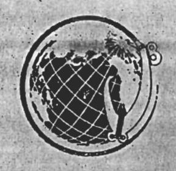

Prohibition on fishing for pelagic management unit species within closed area around the island of American Samoa by vessels more than 50 ft in length

Framework measure under the Fishery Management Plan for the Pelagic Fisheries of the Western Pacific Region

November 1 2000

Swains Island

South Pacific Ocean

Tutuila Island

Anunu'uIsland

Ofu Olosega

Ta'u

Rose Atoll

Western Pacific Regional Fishery Management Council
1164 Bishop Street, Suite 1400
Honolulu, Hawaii 96813
www.wpcouncil.org

# 1.0 PROLOGUE

# 1.1 Samoan Proverb

E poto le tautai ae se laua atu i ama

"Even a skilled fishermen sometimes mistakenly pulls up the bonito on the wrong (outrigger) side of the canoe"

# 1.2 Constitution of American Samoa

"...It shall be the policy of the Government of American Samoa to protect persons of Samoan ancestry against alienation of their lands and the destruction of the Samoan way of life and language, contrary to their best interests. Such legislation as may be necessary may be enacted to protect the lands, customs, culture and traditional Samoan family organization of persons of Samoan ancestry, and to encourage business enterprises by such persons...."

(Section 3 of revised Constitution, approved 1966)

## 2.0 SUMMARY

#### 2.1 Need for Action

The entry of new large US vessels (> 50 ft overall length) into the pelagics fishery in the Exclusive Economic Zone (EEZ) around American Samoa could conflict with objectives of the Council's management plan for pelagic fisheries (FMP) by 1) failing to achieve optimum yield, as defined in the FMP; 2) creating gear conflicts, particularly in areas of concentrated fishing; and 3) reducing the opportunities for (a) profitable fishing operations; (b) traditional fishing practices for non-market personal consumption and cultural benefits; and (c) satisfying recreational fishing experiences.

The nature and extent of interactions between large (> 50 ft overall length) and smallscale vessels (< 50 ft overall length) fishing for pelagic species in the EEZ around American Samoa are not clearly understood. The information available suggests that an increase in the number of large vessels fishing in the same areas as the small-scale fleet could reduce pelagic fish densities and catch rates. Gear conflicts could also arise between large and small pelagic fishing vessels. The potential for interactions between large and small vessels is increasing because (a) the fishing range of the small-scale fishery is expanding offshore with the addition of new and safer types of boats; and (b) up to 40 large vessels previously based in Hawaii are seeking new home ports in the Pacific after a US court order in August 2000 almost completely closed the central North Pacific longline fishery for swordfish to vessels with Hawaii longline limited entry permits. The proposed action would maintain the potential for economically viable catch rates in the small-scale fishery and would help to avoid gear conflicts. This will provide for sustained community participation in the small-scale pelagic fishery, not only to produce food, income and employment, but also to contribute to the perpetuation of Samoan culture. A significant reduction in the supply of fish would be potentially ruinous to the community, which depends on fisheries resources for cultural continuity, as well as for economic development.

Local overfishing, economic overfishing and/or gear conflict could occur in the EEZ around American Samoa if the overall size of the longline fleet becomes excessive. Measures to restrict the total number of vessels in the fishery, such as a license limitation system, may be necessary in the future to control such problems. Such controls would be considered "new management measures" under the FMP's framework procedure for adaptive management. In anticipation of possibly creating a limited access system, the Council and NMFS established a control date of July 15, 2000, after which the owner of any size vessel entering the fishery will not be assured of being allowed to use longline gear to fish for pelagic management unit species in the EEZ around American Samoa. The control date places the owners of longline vessels of any size on notice that they might be excluded if they entered the fishery after this date.

## 2.2 Comparison of management alternatives

The management alternatives considered by the Council included: 1) the preferred alternative, prohibiting US vessels more than 50 ft in length from fishing for pelagic management unit species (PMUS) within an area extending approximately 50 nm offshore from all islands of American Samoa; 2) prohibiting such vessels from fishing for PMUS within an area extending approximately 50 nm offshore from Tutuila island, Rose Atoll and the Manu'a islands and approximately 30 nm offshore from Swains Island; 3) prohibiting such vessels from fishing for PMUS within an area approximately 100 nm around all islands of American Samoa; and 4) prohibiting such vessels from fishing for PMUS in the existing area closure for foreign longline vessels. The Council also considered the alternative of taking no action (Alternative No. 5). Alternatives 1-4 all include exemptions for the owner of any large vessel (> 50 ft overall length) that was registered for use with a NMFS Longline General Permit and had landed PMUS in American Samoa on or prior to November 13, 1997.

At the time when the framework measure was first considered (1998), the small-scale fleet in American Samoa was comprised entirely of vessels under 30 ft in length, albacore tuna catch rates were relatively stable and the distant-water US purse seine fishery was not believed to interact with small-scale surface tuna fisheries over great distances. New information of significance to the framework proposal has been obtained since that time:

- Up to 40 large vessels previously based in Hawaii are seeking new home ports in the Pacific after a US court order in August 2000 almost completely closed the central North Pacific longline fishery for swordfish to vessels with Hawaii longline limited entry permits.
- Entry of several new and safer types of vessels capable of extending the fishing range of American Samoa's small-scale fishery beyond 50 nm from shore.
- Reduced catches of albacore tuna in the areas previously fished by the small-scale fleet within 20 nautical miles (nm) of shore but continued good catches of albacore tuna in the EEZ farther offshore, especially in areas between Tutuila and Swains Island.
- Preliminary indications from modeling of theoretical skipjack tuna movements that distant-water purse seine fishing has the potential for some negative effects on the catches of a small-scale fishery up to 600 nm away (P. Kleiber, pers. comm.)

The preferred alternative (No. 1) selected by the Council in June 2000 encourages further harvest of underutilized pelagic fish resources in American Samoa's EEZ at a small scale, with low risk of overcapitalization of harvesting capacity and "boom and bust" expansion. The preferred alternative (No. 1) furthers FMP objectives better than smaller area closures (Alternative Nos. 2 and 4) and no action (Alternative No. 5). The larger area closure (100 nm) proposed in Alternative No. 3 would provide a larger buffer area for the small-scale fishery. However, the alia catamaran boat design, even in newer versions, does not provide sufficient capacity to store and chill fresh fish catches. Long-range fishing beyond 50 nm from shore is highly inefficient for alia, so Alternative No. 3 is not preferred with the present predominance of alia in the small-scale fleet. Alternative No. 2 would establish a smaller closed area boundary (30 nm) around Swains Island than around the other islands of American Samoa. The latter alternative does not consider the extended range and safety of the new class of alia that has recently become available to residents of Swains Island nor does it provide a sufficient buffer to prevent possible catch competition with purse seine fishing in the vicinity of Swains Island. Furthermore, it does not sufficiently encourage the development of pelagic fishing as a cottage industry by the residents of Swains Island.

Table 2.1. Impacts of preferred framework measure and other alternatives based on consistency with relevant FMP objectives

|                                                |                                                        | FMP Objectives          |                                                                            |  |  |
|------------------------------------------------|--------------------------------------------------------|-------------------------|----------------------------------------------------------------------------|--|--|
| Management Alternatives                     | Achieve optimum yield (OY) without causing overfishing | Diminish gear conflicts | Promote (within limits of OY) domestic harvest and domestic fishery values |  |  |
| 50-nm area closures (No. 1, preferred)         | plus                                                   | plus                    | double plus                                                                |  |  |
| 50/30-nm area closures (No. 2)                 | plus                                                   | plus                    | plus                                                                       |  |  |
| 100-nm area closures (No. 3)                | plus                                                   | plus                    | plus                                                                       |  |  |
| Same as foreign longline area closures (No. 4) | Ò                                                      | plus                    | minus                                                                      |  |  |
| No action (No. 5)                              | minus                                                  | minus                   | double minus                                                               |  |  |

Rating Code:

double plus

Strong beneficial impact

plus

Moderate beneficial impact

0

No impact

minus

Moderate negative impact

double minus

=

Strong negative impact

Table 2.2 Potential impacts of alternatives on human environment

| Management Alternative                                     | Biological/Ecological Impacts                                                                                                                                                                                                                                                                                                                                                                                                                                                                                                                                           | Economic Impacts                                                                                                                                                                                                                                                                                                                                                                                                                                                                       | Social Impacts                                                                                                                                                                                                                                                                                                                                                                                                                                             |
|---------------------------------------------------------------|----------------------------------------------------------------------------------------------------------------------------------------------------------------------------------------------------------------------------------------------------------------------------------------------------------------------------------------------------------------------------------------------------------------------------------------------------------------------------------------------------------------------------------------------------------------------------|----------------------------------------------------------------------------------------------------------------------------------------------------------------------------------------------------------------------------------------------------------------------------------------------------------------------------------------------------------------------------------------------------------------------------------------------------------------------------------------|------------------------------------------------------------------------------------------------------------------------------------------------------------------------------------------------------------------------------------------------------------------------------------------------------------------------------------------------------------------------------------------------------------------------------------------------------------|
| Alternative No. 1 (50-nm closed areas)- PREFERRED             | No stockwide impact. Maintains potential for localized densities and catch rates of pelagic fish by controlling vessel size, thereby limiting per-vessel fishing power and fish mortality in the fishing range of small-boat fleet. Reduces potential for bycatch, especially from payao sets by purse seiners. Redirects fishing effort away from heavily exploited inshore marine resources. Establishes buffer zone around Rose Atoll that reduces risk of large US pelagic vessel grounding.                                                                           | Reduces catch competition from large-scale harvesters, thereby maintaining the potential for economically viable catch rates within fishing range of small-scale pelagic fleet.  Reduces risk of "boom and bust" development of local pelagic fishery.  Encourages expansion of fishery and support industries at a managed pace.  Marginally increases fishing costs for non-exempted large-scale US pelagic vessels.                                                                 | Maintains availability of pelagic fish within fishing range of small-scale fleet to sustain community participation in fishery and meet subsistence and cultural needs.                                                                                                                                                                                                                                                                                    |
| Alternative No. 2 (50/30-nm closed areas)                     | Same as No. 1 with marginally less benefit due to smaller closed area around Swains Island.                                                                                                                                                                                                                                                                                                                                                                                                                                                                                | Same as No. 1 with marginally less benefit due to smaller closed area around Swains Island.                                                                                                                                                                                                                                                                                                                                                                                            | Same as No. 1 with marginally less benefit due to smaller closed area around Swains Island.                                                                                                                                                                                                                                                                                                                                                                |
| Alternative No. 3 (100 nm closed areas)                       | Larger buffer zone offers potential for more positive impacts than other alternatives on local target stock catch rates, reducing bycatch, redirection of fishing effort from inshore resources if significant number of larger capacity and longerrange monohull vessels join small-scale fleet in the future. Present impacts similar to those of No. 1 because of predominance of low-capacity alia in existing fleet.  Would establish a larger buffer zone than other alternatives around Rose Atoll that protects against risk of large US pelagic vessel grounding. | Larger buffer zone offers potential for more positive impacts than other alternatives on managing expansion of small-scale pelagic fishery if significant number of larger capacity and longer-range monohull vessels join small-scale fleet in the future. Present impacts similar to those of No. 1 because of predominance of low-capacity alia in existing fleet.  Increases fishing costs for non-exempted large-scale pelagic fishing vessels more than alternatives 1, 2 and 4. | Larger buffer zone offers potential for more positive impacts than other alternatives to sustain community participation in small-scale fishery and maintain availability of pelagic fish to meet subsistence and cultural needs if significant number of larger capacity and longerrange monohull vessels join small-scale fleet in the future. Present impacts similar to those of No. I because of predominance of low-capacity alia in existing fleet. |
| Alternative No. 4 (closed areas same as for foreign longline) | Similar to No. 1 but substantially less positive; only marginally greater benefits than under no action (No. 5). No additional protection around Rose Atoll against risk of large US pelagic vessel grounding.                                                                                                                                                                                                                                                                                                                                           | Similar to No. 1 but substantially less positive; only marginally greater benefits than under no action (No. 5). Less increase in fishing costs for non-exempted large-scale pelagic fishing vessels than No. 1-3.                                                                                                                                                                                                                                                                     | Similar to No. 1 but substantially less positive; only marginally greater benefits than under no action (No. 5).                                                                                                                                                                                                                                                                                                                                           |

| Alternative No. 5 (no action)  No stockwide in Higher potential uncontrolled expelagic fishery, reduction of den rates of pelagic fishing range of fleet.  No incentive to effort away from exploited inshor resources.  No potential to roadditional propose Atoll again grounding by larvessels. | large US pelagic fishing vessels. Higher risk of "boom and bust" development of pelagic fishery. Higher risk for reduced catch rates of pelagic fish within fishing range of small-scale fleet. Incremental development of small-scale fishery and supporting businesses could be disrupted by "boom and bust" type of development.  fish availation community small-scale subsistence fleet. Incremental development of small-scale fishery and supporting businesses could be disrupted by "boom and bust" type of development. | c of reduced pelagic bility to sustain y participation in e fishery and to meet e and cultural needs. |
|----------------------------------------------------------------------------------------------------------------------------------------------------------------------------------------------------------------------------------------------------------------------------------------------------|-----------------------------------------------------------------------------------------------------------------------------------------------------------------------------------------------------------------------------------------------------------------------------------------------------------------------------------------------------------------------------------------------------------------------------------------------------------------------------------------------------------------------------------|-------------------------------------------------------------------------------------------------------------------|
|----------------------------------------------------------------------------------------------------------------------------------------------------------------------------------------------------------------------------------------------------------------------------------------------------|-----------------------------------------------------------------------------------------------------------------------------------------------------------------------------------------------------------------------------------------------------------------------------------------------------------------------------------------------------------------------------------------------------------------------------------------------------------------------------------------------------------------------------------|-------------------------------------------------------------------------------------------------------------------|

### 2.3 Preferred Framework Measure

The preferred framework measure was selected by the Council at a meeting on June 14, 2000. It would prohibit the taking of pelagic management unit species (PMUS) by US fishing vessels larger than 50 ft (length overall) from waters within an area that extends approximately 50 nautical miles (nm) offshore of the seaward boundary of the territorial sea around all islands of American Samoa.

An owner of a vessel greater than 50 ft in overall length that was registered for use with a National Marine Fisheries Service (NMFS) Longline General Permit and had landed PMUS in American Samoa on or prior to November 13, 1997, would be exempt from the prohibition to take PMUS within the closed area. A landing of PMUS demonstrating eligibility for an exemption to fish for PMUS in the American Samoa pelagic fishery prohibited management areas shall be based on information in the Western Pacific federal daily longline log forms which were properly recorded and submitted to NMFS, as required in § 660.14.

An exemption is valid only for a qualifying large vessel or a replacement vessel of equal or smaller length overall than the vessel that was initially registered for use with a longline general permit on or prior to November 13, 1997. An exemption may not be transferred to another vessel owner, whose vessel is greater than 50 ft.

To facilitate enforcement of the management measure, straight lines are used to define the boundaries of the area closures. The area closure boundaries around Tutuila Island, Rose Atoll and the Manu'a Islands are identified by lines connecting the following coordinates:

170° 49' 42" W and 13° 30' S 167° 30' W and 13° 30' S 167° 30' W and 15° 30' S 171° 51' W and 15° 30' S and the EEZ boundary connecting the points: 170° 349' 42" W and 13° 30' S 171° 51' W and 15° 30' S The area closure around Swain's Island is identified by lines connecting the following coordinates:

 $170^{\circ}\,05'$  W and  $10^{\circ}\,10'$  S (negotiated Tokelau-US maritime boundary)  $170^{\circ}\,05'$  W and  $12^{\circ}$  S  $171^{\circ}\,55'$  W and  $10^{\circ}\,20'$  S (negotiated Tokelau-US maritime boundary)  $171^{\circ}\,30'$  W and  $12^{\circ}$  S

### 2.4 Rationale

The preferred framework measure identified by the Council at a meeting on June 14, 2000, is a 50-nm area closure around all the islands of American Samoa. This would encompass all of the areas where the small-scale fleet presently fishes and all of the known banks and seamounts which are likely to aggregate tuna, thus providing a buffer area for fishery expansion. Not only does this measure avoid gear conflicts by separating large vessels from small ones but it encourages domestic harvest of underutilized pelagic fishery resources at a small scale that is more likely to achieve optimum yield than uncontrolled and overcapitalized (i.e., "boom and bust") development by large vessels. Just as importantly, the measure maintains the potential for economically viable catches of pelagic fish in the small-scale fishery as American Samoa's fishing culture evolves from a traditional subsistence activity harvesting heavily exploited, inshore marine resources to a more commercial activity harvesting underutilized offshore pelagic resources.

Due to a rapidly growing population and overexploitation of some inshore seafood resources, the American Samoa community is becoming increasingly dependent on pelagic fish for food, employment and income from fisheries and for perpetuation of *fa 'a Samoa* (the Samoan cultural heritage and way of life). The role of the small-scale pelagic fishery in cultural continuity is at least as important as the contributions made to nutritional or economic well-being of island residents (Severance et al. 1999).

Establishing a closed area is consistent with management initiatives undertaken throughout the Pacific islands to minimize interactions between large and small-scale pelagic fisheries. Precautionary management before a crisis occurs is preferable to repeating the experience in Hawaii, where fishery managers were forced to respond to sudden and uncontrolled expansion of the longline fishery in the late 1980s without adequate lead time or data.

Maintaining the potential for economically-viable catches by the small-scale fleet by establishing closed areas would impose some economic costs on large vessels that would be excluded from fishing for pelagic species. The latter have the capability of traveling to more distant fishing grounds if catch rates decline nearshore, whereas small vessels do not have this option. Owners of large vessels that were registered for use with NMFS General Longline Permits and had made landings of PMUS on or before November 13, 1997, are exempt from the area closures. When the latter vessels were acquired, their owners could not have anticipated that they would be excluded from fishing for pelagic species in portions of the EEZ around American Samoa or that they would not be able to replace their vessels without penalty.

It is impossible to quantify the number of additional pelagic fish that will be available to the small-boat fishery as a result of the proposed action or the additional benefit that will accrue to American Samoa and the Nation by this increase. It is clear, however, that the potential benefits to the small-boat pelagic fishery in American Samoa are substantial, whereas the potential costs that may be imposed on the excluded large vessels are likely to be low. Hence, the expected benefits of the proposed action to American Samoa and the Nation are anticipated to outweigh the expected costs.

#### 2.5 Annual evaluation

An evaluation of the biological, economic and social impacts of the closed areas will be made each year as part of the annual status report prepared by the Council for the pelagic fisheries managed in the Western Pacific Region. During the evaluation, the views and opinions of representatives of all sectors of the fishing industry in American Samoa will be solicited. The size of the closed areas may be expanded or contracted as new information becomes available. The existing FMP for pelagic fisheries provides a framework procedure allowing for rapid implementation of regulatory adjustments in response to changing conditions in the fishery or resource base. Following these procedures, the Council may recommend to the Regional Director that established measures, such as the area closures in the present framework proposal, be rapidly modified.

The Council will also examine the need to restrict fishing effort or catches within the EEZ of American Samoa, including the possibility of a limited entry program for domestic longline fishing vessels. In anticipation of the latter possibility, the Council and NMFS have established a control date of July 15, 2000. Owners of any vessel of any size entering the fishery after this date will not be assured of being allowed to use longline gear to fish for pelagic management unit species in the EEZ around American Samoa. The control date of November 23, 1997, remains applicable with respect to owners of vessels greater than 50 ft overall length if the proposed framework measure to establish area closures to large pelagic fishing vessels is approved.

# 3.0 TABLE OF CONTENTS

| Cover sheet                                                               |
|---------------------------------------------------------------------------|
| 1.0 Prologue                                                              |
| 2.0 Summary ii                                                            |
| 2.1 Need for action                                                       |
| 2.2 Comparison of management alternatives i                               |
| 2.3 Preferred framework measure vi                                        |
| 2.4 Rationale vii                                                         |
| 2.5 Annual evaluation is                                                  |
| 3.0 Table of Contents                                                     |
| 4.0 Introduction                                                          |
| 4.1 Responsible agencies                                                  |
| 4.2 List of preparers                                                     |
| 4.3 Public review process and schedule                                    |
| 4.4 Existing management measures                                          |
| 5.0 Purpose and Need for Action                                           |
| 5.1 Maintain the potential for economically viable catch rates            |
| in the small-scale pelagic fishery                                        |
| 5.2 Avoid gear conflict between large and small-scale vessels             |
| 5.3 Provide for sustained community participation and cultural continuity |
| 6.0 Management Objectives                                                 |
| 7.0 Initial Actions                                                       |

| 8.0 Comparison of Management Alternatives                                                  |
|--------------------------------------------------------------------------------------------|
| 8.1 Range of alternatives considered                                                       |
| 8.2 Biological and ecological impacts                                                      |
| 8.2.1 Impacts on target pelagic fish resources                                             |
| 8.2.2 Impacts on non-pelagic fishery resources                                             |
| and redirection of fishing effort                                                          |
| 8.2.3 Impacts on bycatch                                                                   |
| 8.2.4 Impacts on protected species and wildlife refuge resources                           |
| 8.3 Economic and social costs                                                              |
| 8.3.1 Fishing sectors and local fishing community                                          |
| 8.3.2 Fishing gear conflict                                                                |
| 8.3.3 Harvest of underutilized fish resources and opportunity for new entry 30             |
| 8.3.4 Fairness and equity to fishermen                                                     |
| 8.3.5 Safety of fishermen                                                                  |
| 8.3.6 Administrative and enforcement costs of regulation                                   |
|                                                                                            |
| 8.4 Contribution of management alternatives to relevant FMP objectives34                   |
| 0.0.C. wistern of Durfamed Alternative soith National Standards and                        |
| 9.0 Consistency of Preferred Alternative with National Standards and                       |
| Provisions of the Sustainable Fisheries Act                                                |
| 9.1 National Standards for fishery conservation and management                             |
| 9.2 Sustainable Fisheries Act determinations                                               |
| 9.2.1 Establish reporting methods to assess bycatch                                        |
| and minimize bycatch and bycatch mortality                                                 |
| 9.2.2 Description of commercial, recreational and charter fishing sectors 41               |
| 9.2.3 Describe essential fish habitat                                                      |
| 9.2.4 Specify overfishing criteria and preventive measures                                 |
| 9.2.5 Assess impacts on local fishing community                                            |
| 10.0 Other Applicable Laws                                                                 |
| 10.1 National Environmental Policy Act                                                     |
| 10.2 Coastal Zone Management Act                                                           |
| 10.3 Endangered Species Act                                                                |
| 10.4 Marine Mammal Protection Act43                                                        |
| 10.5 Paperwork Reduction Act                                                               |
| 10.6 Draft Regulatory Impact Review/Initial Regulatory Flexibility Analysis 44             |
|                                                                                            |
| 11.0 Draft Regulations                                                                     |
|                                                                                            |
| 12.0 Maps and incidental figures                                                           |
| •                                                                                          |
| 13.0 References Cited                                                                      |
|                                                                                            |
| Appendix I: Local Fishing Community Impact Statement I-1                                   |
|                                                                                            |
| Appendix II: Environmental Assessment                                                      |
|                                                                                            |
| Appendix III: Draft Regulatory Impact Review/Initial Regulatory Flexibility Analysis III-1 |

## 4.0 INTRODUCTION

## 4.1 Responsible agencies

The Council was established by the Magnuson Fishery Conservation and Management Act to develop Fishery Management Plans (FMPs) for fisheries operating in the US Exclusive Economic Zone (EEZ) around American Samoa, Guam, Hawaii, the Northern Mariana Islands and the US possessions in the Pacific.1 Once an FMP is approved by the Secretary of Commerce, it is implemented by federal regulations which are enforced by the National Marine Fisheries Service and the US Coast Guard, in cooperation with state, territorial and commonwealth agencies. For further information, contact:

Kitty M. Simonds
Executive Director
Western Pacific Regional
Fishery Management Council
1164 Bishop Street, Suite 1400
Honolulu, HI 96813

Telephone: (808) 522-8220

Charles Karnella Administrator

NMFS Southwest Region, Pacific Islands Area

Office

1601 Kapiolani Blvd., #1110 Honolulu, HI 96814-0047 Telephone: (808) 973-2937

# 4.2 List of preparers

This document was prepared by:

Western Pacific Regional Fishery

Management Council:

Donald Schug, Paul Dalzell Paul Bartram (Contractor)

National Marine Fisheries Service

Honolulu Laboratory:

Russell Ito

National Marine Fisheries Service

Pacific Islands Area Office:

Marcia Hamilton

1. Howland Island, Baker Island, Jarvis Island, Johnston Atoll, Midway Island, Kingman Reef, and Palmyra Atoll, and Wake Island.

# 4.3 Public review process

The framework measure proposed in this document is a re-submission of a proposal which the Council previously submitted (Oct. 22, 1998) to the National Marine Fisheries Service Southwest Regional Administrator with a request to initiate rule-making under the pelagic fisheries FMP framework procedure. This request was disapproved in a letter dated 11 March 1999 from the Regional Administrator to the Council. The present document is a revision of the original framework proposal. Both the original and revised proposals have been extensively reviewed by the public, as described in Section 7.

## 4.4 Existing management measures

A National Marine Fisheries Service (NMFS) longline general permit is required for longline fishing in American Samoa's EEZ. This fishery is presently open access, with no limits on the number of longline vessels, individual or total vessel capacity, catch or effort. A control date of November 13, 1997, has been established and all applicants for longline permits after that date are informed that they may not qualify for exemptions to limitations placed on longline vessels greater than 50 ft in overall length. In anticipation of the possibility of a limited entry program for domestic longline fishing vessels, the Council and NMFS have established a control date of July 15, 2000, after which owners of any vessel of any size entering the fishery will not be assured of being allowed to use longline gear to fish for pelagic management unit species in the EEZ around American Samoa.

There has been no legal fishing by foreign longline vessels in the EEZ around American Samoa since 1980, when the pelagic fisheries Preliminary Management Plan (PMP) for the Western Pacific Region was implemented. The Fishery Management Plan prepared by the WPRFMC in 1986 for pelagic fisheries prohibited foreign longline fishing within a rectangle around the principal islands of American Samoa bounded by 14° and 15° S and 168° and 171° W, and in a one degree square surrounding Swain's Island bounded by 10° 33' and 11° 33' S and 170° 34' W and 171° 34" W.

There is a possibility that legal fishing in the EEZ by foreign vessels may resume at some time under a Pacific Insular Area Fishing Agreement (PIAFA), which could give foreign vessels access to the EEZ around American Samoa in exchange for a negotiated fee and subject to a variety of permit conditions.

### 5.0 PURPOSE AND NEED FOR ACTION

The proposed action is needed for several purposes:

- To maintain the potential for economically viable catch rates in the small-scale fishery as it evolves from a traditional subsistence activity harvesting heavily exploited inshore marine resources to a more commercial activity extending the range of fishing offshore to harvest underutilized pelagic fish (i.e., achieve optimum yield as defined in pelagic FMP).
- To avoid gear conflicts between large and small-scale vessels within the fishing range of the small-scale pelagic fishery.
- To provide for sustained community participation in the small-scale pelagic fishery, recognizing that American Samoa is becoming increasingly dependent on pelagic fish for food, income, employment and perpetuation of Samoan culture.

# 5.1 Maintain the potential for economically viable catch rates in the small-scale fishery

Subsistence fishing traditionally provided most of the protein in the diet of the indigenous people who originally settled the Samoa islands. As American Samoa's economy shifted from purely subsistence toward a more commercial orientation in contemporary times, so did small-scale fisheries (Hill 1978).

Inshore fishery potential around the islands of American Samoa is quite limited. Samoa lacks the broad, shallow shelves characteristic of most continental margins. The coastal zone is characterized by narrow reefs sitting on steep island slopes. The relatively small area of shallow water and the general inability of small-island profiles to induce much upwelling of nutrient-rich colder water from the deep ocean greatly limit productivity (Adams et al. 1999). A long-term decline in catches of coral reef fish in American Samoa's shoreline fishery is well documented (Saucerman 1995; Craig 1999; Tuilagi and Green 1995). Attempts to develop deep slope fishing in American Samoa from mid-1960s to the mid-1980s were not sustained (Itano 1991).

The American Samoa Economic Advisory Commission was recently established to formulate a strategy that will stimulate economic development in the private sector and, over the long term, reduce dependence on Federal spending. One of the highest priorities of the commissioners is to encourage fisheries development as a way of expanding and diversifying the local economy and helping the Territory attain a higher level of economic self-sufficiency. The only fishery in American Samoa with significant potential for expansion is the harvest of offshore pelagic fish resources. In the past, Federal and American Samoa government agencies have funded a variety of projects to develop the harvesting and marketing capabilities of small-scale tuna fisheries.

Despite a 40-year history of tuna canning in American Samoa by two large processors, commercial fishing for tuna by domestic vessels in Samoa's EEZ is a relatively recent endeavor. The importance of pelagic fish as a source of income and employment in American Samoa's small-scale fishery has increased rapidly since 1996, following the adoption of longline fishing methods patterned after those in the neighboring country of Samoa. American Samoa's small-scale fishery is presently evolving from the realm of traditional subsistence activities to more commercial activities. This change involves considerable risk, not only financial risk for small-scale fishermen, but also a risk of developing overcapacity in the fishery that could be detrimental to the domestic economy, traditional social organization and cultural continuity of the American Samoa community.

The small-scale pelagic fishery in American Samoa employs small-scale vessels and relatively simple troll and longline fishing technology. Over 90% of the respondents in a survey of 20 longline fishermen planned to increase their efforts at longlining (Severance, et al. unpubl. research). Until very recently, most of the small-scale fleet was comprised of boats under 30 ft in overall length, principally catamarans known locally as *alias* in American Samoa and Samoa (Figure 11.4). New and safer types of small-scale vessels have begun to enter the pelagic fishery and they are capable of extending the safe range of fishing farther offshore. The length distribution of vessels owned by longline permit holders, as of the first quarter of 2000, is summarized in Table 5.1. By July 15, 2000, the number of permit holders had increased to 78.

Table 5.1. Longline permit holders based in American Samoa, first quarter 2000

| No. of Vessels, by Length Overall |          |           |            |             |        |
|-----------------------------------|----------|-----------|------------|-------------|--------|
| < 30 ft                           | 31-35 ft | 35-40 ft* | 41-45 ft** | 46-50 ft*** | 50+ ft |
| 34                                | 14       | 9         | 2          | 0           | 5      |

Source: NMFS

Notes: \*A newer and safer version of *alia* is being assembled in Samoa from pre-cut aluminum plates manufactured in New Zealand (Figure 11.4). Mostly 38-42 ft in length, this version is equipped with a larger fuel tank, navigational aids, higher freeboard and more safety equipment in order to extend fishing range to well over 100 nm from shore. Several new fishing enterprises in American Samoa have plans to acquire vessels of this type.

- \*\* In addition to planned acquisitions in this length class, FAO is designing a 45 ft catamaran-style vessel for the next phase of longline fishery expansion in neighboring Samoa. This design will also be available for boat-building in American Samoa.
- \*\*\*A design for a monohull vessel assembled from pre-cut steel plates in the 46-50 ft size class has been prepared for a boatbuilder in American Samoa.

Fishermen in American Samoa are acquiring new and safer types of small-scale vessels, not only to extend the range of pelagic fishing to at least 50 nm from shore, but also to be able to deliver larger catches of higher quality than previously. Figure 5.1 depicts a) the area where pelagic fishing by the small-scale fleet of the older and less safe design of *alia* catamaran vessels has been concentrated; b) the offshore areas where fishing by new and safer small-scale vessels has been documented; c) the offshore areas previously fished by the large domestic longline vessels in American Samoa; and d) the area occasionally fished in the past by US purse seiners when ENSO events shift surface tuna into the central equatorial Pacific.

The harvesting sector is supported in its expansion efforts by a growing number of local businesses which are becoming involved in small-scale fleet support and processing and marketing of pelagic fish catches. The two canneries based in American Samoa provide a ready market for tuna landed by the small-scale (and large-scale) domestic fleet but this quantity of fish is insignificant compared to cannery deliveries by purse seine and longline fleets of distant-water fishing nations. Not only do most fishermen in American Samoa lack the financial resources to acquire large purse seine or longline vessels but such vessels would greatly increase the financial risk and debt burden for boat owners and could possibly lead to overcapitalization of the domestic fishery. The newest (and safest) 40 ft version of the alia-style vessel can be purchased for about \$60,000, with earlier versions available for \$24,000-40,000. By comparison, a 65 ft longline vessel would cost about \$350,000 and a purse seiner would cost several million dollars. Assuming a 30% down payment and a 10-year loan at 10% annual interest rate, the initial payment of \$18,000 and an annual loan and interest payment of \$6,835 for a 40 ft alia would be an affordable investment for many small-scale fishing enterprises in American Samoa, whereas a down payment of \$105,000 with an annual loan and interest payment of nearly \$40,000 for a 65 ft longliner would be financially feasible only for a select few.

Incremental expansion of the small-scale pelagic fishery in American Samoa guards against unsustainable development; i.e., a "boom" of uncontrolled fishing by large vessels with greater fishing power, followed by a "bust" of overcapacity and reduced availability of pelagic fish. Neighboring Tonga provides a model for domestic tuna fishery growth at a controlled pace. Development of a small-scale domestic longline fishery in the northern portion of Tonga's EEZ was encouraged by a US Agency for International Development sponsored project in 1992-1994. The project concluded that a venture using a 40-45 ft vessel would be most cost-effective for a small-scale longline fishery. The initial project results were so successful that a commercial fishery was initiated to exploit the potential demonstrated by the fishing trials. Until its commercial feasibility was proven, the new fishery reduced risk and generated early profits by fishing at a single, highly productive seamount over 200 nm from port (S. Swerdloff, RDA International Chief of Party pers. comm.).

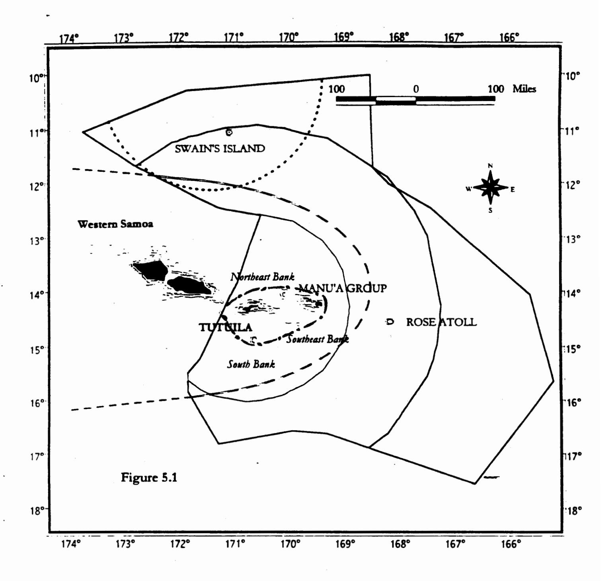

Figure 5.1. Approximate fishing area of large (> 50 ft) domestic longline vessels (dashed line) and purse seine vessels (dotted line) within the EEZ around American Samoa; the area where pelagic fishing by the small-scale fleet of older and less safe alia vessels has been concentrated (line interrupted by dots); the expected fishing range of the new and safer class of *alia* catamarans (38-42 ft) entering the fleet (thin solid line closer to Tutuila and Manu'a islands); the expected fishing range of monohull vessels < 50 ft entering the small-scale fleet (thicker solid line around Tutuila, Manu'a, Swains Islands and Rose Atoll).

Most of island nations which are neighbors to American Samoa have, or are developing, domestic longline fisheries which will compete for pelagic fish resources within the region. Rapid and uncontrolled expansion of the longline fleet in the adjacent country of Samoa may already be affecting catch rates in American Samoa's small-scale pelagic fishery (Figure 5.2). Between 1995 and 1999, the number of longline vessels in neighboring Samoa increased from 25 to over 200 vessels presently active (Mulipola 2000). Samoa's EEZ is the smallest of any Pacific island nation, and the EEZ boundary it shares with the American Samoa lies only 20 miles from Tutuila.

The large vessels (> 50 ft overall length, Figure 11.4) that comprise the US tuna fishing fleet are highly mobile and they have demonstrated a willingness in the past to seek new fishing opportunities in the central and western Pacific as fisheries in other areas of the US EEZ become increasingly restricted. Entry of such vessels into the pelagic fishery in the EEZ around American Samoa would further increase the competition for pelagic fish resources within the fishing range of the domestic small-scale fleet. Entry into the fishery by a large (> 50 ft), highly capitalized tuna vessel represents a much greater increase in fishing power and potential fishing mortality than entry by a small-scale vessel.

Table 5.2. Profile of different size vessels operating in American Samoa and neighboring Samoa domestic longline fisheries

| Vessel Size and Type | 28 ft Alia                  | 40 ft Alia | 50+ ft Monohull |
|-------------------------|-----------------------------|------------|-----------------|
| Purchase price (USD)    | \$ 25,000                   | \$ 60,000  | \$ 250,000      |
| Miles of mainline set   | 7-10                        | 20-25      | 35-50           |
| Sets/trip               | 1-2                         | up to 4    | 6-8             |
| Hooks/set               | 250-350                     | 500-900    | 1,200-1,600     |
| Trips/year              | 100-200 (weather dependent) | 50         | 40              |
| Hooks/year              | 30,000-60,000               | 160,000    | 400,000         |

Source: Mulipola 2000; personal communications in Samoa and American Samoa

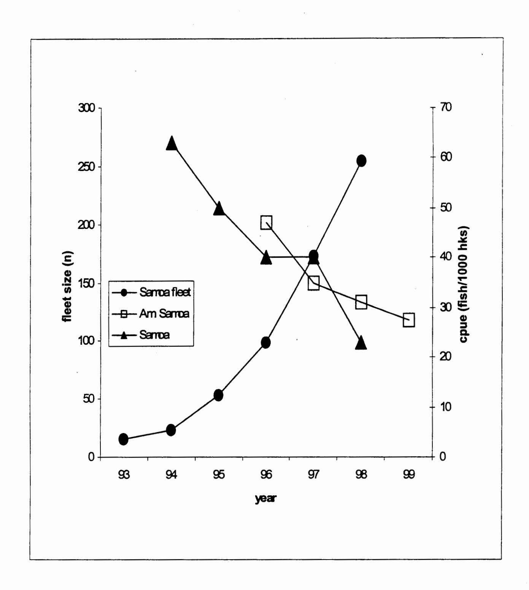

Figure 5.2 Tuna cpue in the Samoan Archipelago and fleet size in Samoa

# 5.2 Avoid gear conflicts between large and small-scale vessels

The proposed action is needed to physically separate small-scale and large-scale US tuna longline vessels to avoid gear conflict within the fishing range of American Samoa's small-scale fleet. This precautionary measure anticipates that additional large vessels (>50 ft), especially some of the US longliners being displaced from the swordfish fishery north of the Hawaiian Islands, are likely to join American Samoa's longline fishery. Large US longline vessels which arrived in Hawaii about 10 years ago from the Gulf of Mexico, US Atlantic and Pacific coasts initially fished within 50 nm of the coast around the main Hawaiian Islands, creating gear conflicts with small-scale fishermen (handline/troll) and prompting the Council to establish longline area closures in the nearshore areas around the main Hawaiian Islands. At the time of these closures, total longline effort in nearshore areas (to 50/75-nm offshore) had peaked at 2.8 million hooks/year (WPRFMC 1991, 1994). Based on the information presented in Table 5.2, only 2 additional large vessels joining American Samoa's longline fishery would have the potential to raise fishing effort in nearshore areas to the threshold which caused severe gear conflicts in Hawaii. American Samoa's Department of Marine and Wildlife Resources (DMWR) has been contacted by at least five Hawaii longline vessel owners interested in relocating (R. Tulafono, DMWR Director, pers. comm.). Monohull vessels over 50 ft can deploy 2-5 times as much gear as smaller vessels, thus increasing the possibility of gear conflict if large vessels set in nearshore areas.

Conflicts arose in nearshore waters around neighboring Samoa because of the high density of fishing effort within 50 nm of Apia, the primary port for 60 alia which fish regularly, setting a total of up to 2.4 million hooks per year. A number of fishermen have had their lines cut by rival fishermen (Mulipola 2000), similar to the gear conflicts that occurred in Hawaii. To minimize further conflicts, the Samoa government has implemented regulations that restrict vessels of over 15 m from longline fishing within 50 nm of the coast (Chapman 1998).

# 5.3 Provide for sustained community participation and cultural continuity

American Samoans are among the last full-blooded Polynesians. Their dependence on fishing undoubtedly goes back as far as the peopled history of the Samoa islands, about 3,500 years ago (Severance and Franco, 1989). Many aspects of the culture have changed in contemporary times but Samoans have retained a traditional social system that continues to strongly influence and depend upon the culture of fishing. Centered around an extended family ('aiga) and allegiance to a hierarchy of chiefs (matai), this system is rooted in the economics and politics of communally-held village land. It has effectively resisted Euro-American colonial influence and has contributed to a contemporary cultural resiliency unique in the Pacific islands region (Severance et al. 1999). American Samoa Government policy stated in the Revised Constitution of 1966 emphasizes the need to safeguard the traditional system of social organization and provide for cultural continuity.

Traditional Samoan values still exert a strong influence on when and why people fish, how they distribute their catch and the meaning of fish within the society. When distributed, fish and other resources move through a complex and culturally embedded exchange system that supports the food needs of 'aiga, as well as the status of both matai and village ministers (Severance et al. 1999). Customary exchanges include:

<u>Fa'alavelave</u> -- As a noun, mutual assistance to kinsmen in times of need; as a verb, to provide assistance in times of need. This assistance can be in the form of food from the land or sea, or money derived from local or overseas labor markets.

<u>Tautua</u> – As a noun, service to the kin group and to the <u>matai</u> as leader of the kin group; as a verb, to serve the kin group and its <u>matai</u>.

<u>Fesoasoani</u> – To help out; a less formalized, more individualized, response to a less serious need than in the case of fa'alayelaye.

<u>To'onai</u> – A ceremonial need served after Sunday service, where ministers, matai, other village leaders and important visitors to the village, reaffirm cultural and spiritual solidarity.

<u>Fa'ataualofa</u> -- To give away or sell at a reduced price to friends or kinsmen as an expression of an ongoing, sustained relationship.

American Samoa has a long history of harvesting pelagic fish species, especially skipjack and small yellowfin tuna, which has special significance in customary exchanges (Severance and Franco, 1989). Due to a rapidly growing population and overexploitation of some inshore seafood resources, the American Samoa community is becoming even more dependent on pelagic fish for food, employment and income from fisheries and for perpetuation of fa'a Samoa (Samoan cultural heritage and way of life). Despite increasing commercialization, the small-scale pelagic fishery continues to contributes strongly to the cultural identity and social cohesion of American Samoa. The role of pelagic fish in meeting cultural obligations is at least as important as the contributions made to nutritional or economic well-being of island residents (Severance et al. 1999).

The Samoa islands are an area of only modest productivity for pelagic fish resources compared to areas to the north, south and west. Fluctuations in pelagic fish densities and catches are inevitable as local fish movement patterns change in response to the ocean environment and the availability of forage. Community participation in American Samoa's small-scale fishery can be sustained only by maintaining the potential for economically viable catch rates of pelagic fish within the entire fishing range of the small vessels (< 50 ft length). A large choice of fishing areas allows flexibility is locating high densities of pelagic fish. Pelagic fishing areas off any particular island, such as Tutuila or Swains, should not be thought of as supporting only that island but the collective fishing community of the American Samoa islands. The proposed action is needed so that the collective fishing grounds close to the islands of American Samoa can provide a more stable resource base for sustained community participation in the small-scale pelagic fishery. Disruption or collapse of this fishery could jeopardize the availability of pelagic fish for customary food exchanges to meet cultural obligations.

# 6.0 MANAGEMENT OBJECTIVES

The following objectives of the pelagic FMP are relevant to this management measure:

- 1) To manage fisheries for management unit species in the Western Pacific to achieve optimum yield. The FMP defines optimum yield as the amount of each management unit species or species complex that can be harvested by domestic and foreign fishing vessels in the EEZ and adjacent waters to the extent regulated by the FMP without causing "local overfishing" or "economic overfishing" within the EEZ of each island area, and without causing or significantly contributing to "growth overfishing" or "recruitment overfishing" on a stock-wide basis.
- 2) To diminish gear conflicts in the EEZ, particularly in areas of concentrated domestic fishing.
- 3) To promote, within the limits of managing at OY, domestic harvest of the management unit species in the Western Pacific EEZ and domestic fishery values associated with these species, for example, by enhancing the opportunities for (a) satisfying recreational fishing experiences; (b) continuation of traditional fishing practices for non-market personal consumption and cultural benefits; and (c) domestic commercial fishermen, including charter boat operators, to engage in profitable fishing operations.

# 7.0 INITIAL ACTIONS

The Council was asked at the 92nd meeting in April, 1997, to assist in forming a fishermen's working group to consider various management options to ensure the long term sustainability of the small-boat fishery. Various meetings of the working group and other fishermen were convened by the Council and the American Samoa Department of Marine and Wildlife Resources between June and October 1997. The consensus among fishermen was that the most effective management action would be to establish a 100 nm closed area around the islands of American Samoa that prevented entry into the fishery by new pelagic fishing vessels larger than 50 ft in length. Fishermen contended that vessels larger than 50 ft are generally highly-capitalized, "industrial-scale" vessels whose fishing activities are capable of having a significant negative impact on the small-boat fishery.

During the meetings fishermen stated that as the small-scale pelagic fishery develops, they may acquire larger vessels in the 35-45 ft range. Such boats would have a greater fishing range, be capable of landing more fish of a higher quality and provide a safer fishing platform. According to fishermen, a 100 nm area closure would help ensure that adequate pelagic resources are available to support this increase in the fishing capacity of the small-scale fleet by encompassing all the major offshore banks, seamounts and pinnacles around which pelagic species aggregate, as well as create a "buffer zone" to further minimize potential interactions with industrial-scale vessels.

During the meetings in American Samoa, fishermen also noted that reduced catch rates and gear conflict could occur if the size of the small-boat fleet becomes excessive. If a significant increase in fishing effort occurs, however, measures to control effort, such as a license limitation system, may be required. In anticipation of possibly creating a limited access system, NMFS established a control date of November 13, 1997, after which the owner of any vessel entering the fishery will not be assured of being allowed to use longline gear to fish for pelagic management unit species in the EEZ around American Samoa. The control date placed the owners of longline vessels on notice that they might be excluded if they entered the fishery after this date.

At the 95th meeting in April 1998, the Council recommended that all domestic fishing vessels greater than 50 ft in length, including purse seiners, be prohibited from fishing for pelagic management unit species within 100 nm of the coastlines of American Samoa. The Council noted that such an area closure could impose an economic hardship on large longline vessels that acquired permits prior to the control date and fished in the waters around the Territory. When the owners of these vessels purchased their boats and applied for a NMFS Longline General Permit2 they had no expectation that there would be area restrictions on their fishing activity around the islands of American Samoa. The Council, therefore recommended that any owner of a vessel greater than 50 ft in length that was registered for use with a NMFS Longline General Permit and had made a landing of PMUS in American Samoa on or prior to November 13, 1997, be exempt from the prohibition to take PMUS within the closed area.

Large domestic purse seine vessels have occasionally fished for pelagic species in the EEZ surrounding American Samoa. The Council did not consider it appropriate to grant these vessels exemptions because the amount of fish caught by the vessels within the EEZ around the Territory has historically been a negligible fraction of their total catch.

In late April 1998, a document describing the problem raised by fishermen in American Samoa and alternative ways to resolve the problem was distributed to interested persons and organizations with a request for comments. Among the individuals and groups that received a copy of the document were all holders of NMFS longline vessel permits in the western Pacific, the United States Tuna Foundation and the Western Fishboat Owners Association.

After weighing the views and opinions of all interested parties, the Council selected a 50/30-nm (Tutuila, Rose, Manu'a/Swains) area closure as the preferred alternative at its 27-29 July 1998 meeting. The Council transmitted the Pelagics FMP framework measure to the NMFS Southwest Regional Administrator on October 22, 1998, with a request to initiate rulemaking under the FMP framework procedures. On March 11, 1999, the Regional Administrator informed the Council that the proposal had been disapproved in whole, questioning whether the area closures were consistent with several of the national standards for conservation and management of US fisheries.

&lt;sup>2The NMFS Longline General Permit entitles the holder to fish in the EEZ around the Pacific Insular Areas using longline gear.

After additional input was obtained from fishermen in American Samoa and after further deliberation, the Council revised its preferred alternative to a uniform 50-nm area closure (No. 1) at a meeting on June 14, 2000. The present document evaluates the alternatives considered by the Council, with particular attention to consistency with National Standard 4 (allocation of fishing privileges among US fishermen must be fair and equitable), National Standard 5 (consider efficiency and not have economic allocation as sole purpose), National Standard 7 (minimize industry and administrative costs) and National Standard 8 (provide for sustained community participation and, to extent practicable, minimize adverse economic impacts on community).

# 8.0 COMPARISON OF MANAGEMENT ALTERNATIVES

At a meeting on July 27-29, 1998, the Council selected a preferred alternative for the American Samoa framework proposal to close areas for pelagic fishing by large vessels (> 50 ft). The NMFS Regional Administrator subsequently disapproved the proposal. The present document is a re-submission of the framework measure, with the same preferred alternative as originally proposed by the Council. In reaching this decision, the Council considered a range of alternatives to resolve the problems described in Section 5.0. The purposes of this section are to a) describe the alternatives; b) compare their potential for beneficial and adverse impacts; and c) assess their potential contributions to the FMP objectives. Limitations on available information concerning the potential biological impacts of the alternatives precludes a detailed quantitative analysis. The analysis presented provides an adequate basis for selecting a preferred alternative.

The Western Pacific Council has previously established closed areas to reduce fishery interactions. The FMP prepared in 1986 for pelagic fisheries prohibited foreign longline fishing in the following areas of the EEZ to encourage the expansion of the domestic fishery: within 150 nm of Guam and the main Hawaiian Islands, 100 nm of the Northwestern Hawaiian Islands and 12 nm of US Pacific island possessions except for Midway Island; and within a rectangle around the principal islands of American Samoa bounded by 14° and 15° S and 168° and 171° W, and in a one degree square surrounding Swain's Island bounded by 10° 33' and 11° 33' S and 170° 34' W and 171° 34" W. In 1991, the Council established a domestic longline vessel exclusion zone around the main Hawaiian Islands ranging from 50 to 75 nm to prevent gear conflicts between longline and small fishing boats. Certain small longline vessels in Hawaii are exempted from the area restriction, and all longline vessels are allowed in otherwise closed areas when bigeye tuna are seasonally closer to shore and small boat activity is relatively low. A 50-nm longline area closure was also established around Guam and around banks south of that island.

## 8.1 Range of Alternatives Considered

The management alternatives considered by the Council are as follows:

<u>Alternative No. 1</u> - Prohibit fishing for pelagic management unit species (PMUS) by US vessels more than 50 ft in overall length around all the islands of American Samoa, from the seaward baseline of the territorial sea to approximately 50 nautical miles (nm) offshore (see Figure 11.1). This is the preferred alternative.

Alternative No. 2 - Prohibit fishing for PMUS by US vessels more than 50 ft in overall length around the islands of Tutuila, Manu'a and Rose, from the seaward baseline of the territorial sea to approximately 50 nm offshore. Around Swains Island, the closed area would extend from the seaward baseline of the territorial sea to approximately 30 nm offshore (see Figure 11.1).

Alternative No. 3 - Prohibit fishing for PMUS by US vessels more than 50 ft in overall length around all islands of American Samoa from the seaward baseline of the territorial sea to approximately 100 nm offshore (see Figure 11.2).

<u>Alternative No. 4</u> - Prohibit fishing for PMUS by US vessels more than 50 ft in overall length within the areas around the islands of American Samoa which are presently closed to foreign longline vessels (see Figure 11.3).

# Alternative No. 5 - No action.

Under Alternatives 1-4, an owner of a vessel greater than 50 ft in length that was registered for use with a NMFS Longline General Permit and had landed PMUS in American Samoa on or prior to November 13, 1997, is exempt from the prohibition to take PMUS within the closed areas. A landing of PMUS demonstrating eligibility for an exemption to the American Samoa pelagic fishery prohibited management areas shall be based on information in the Western Pacific federal daily longline log forms which were properly recorded and submitted to NMFS, as required in 660.14.

# 8.2 Biological/Ecological Impacts

## 8.2.1 Impacts on Target Pelagic Fish Resources

The preferred alternative would have little or no stockwide impact on tunas or secondary pelagic species, including billfish, sharks and epipelagic fish, which are taken in the pelagic fishery in the EEZ around American Samoa. Pelagic species are not confined to any particular EEZ or country but have a wide geographical distribution in the central and western Pacific. None of these stocks are presently overexploited in the South Pacific and stockwide effects are unlikely even if the American Samoa catch increased several fold.

The stock structures of pelagic fish are by no means well defined. Long distance movements are evident for all tuna species but mixing of various fractions of stocks between areas, at least over short and medium time periods, seems to be quite incomplete. Fluctuations in local ocean environmental conditions or prey availability can cause striking and unpredictable changes in the relative abundance and catch rates of pelagic fish, as a function of local movement patterns rather than "overfishing." If these fluctuations reduce the availability of pelagic fish in a localized area, they have a much more severe impact on small-scale fleets with limited fishing range than on larger, more mobile vessels. Local reductions in pelagic fish density can be amplified by interactions with nearby fisheries. The effect of fishing tuna in one area may affect the performance of a fishery harvesting the same stock in a nearby area. How various gears fishing in the same time and area compete "locally" to exploit pelagic fish resources and the effects on availability of the target fish are poorly understood.

It is not understood whether the sub-surface albacore tuna taken in American Samoa's small-scale longline fishery are primarily a local sub-population or are part of a more widely distributed regional mass (Stanley and Toloa 1998). The albacore catch by small-scale longline fisheries in American Samoa and neighboring Samoa totaled 6,800 mt in 1998, which represents 19% of the South Pacific regional albacore harvest by longline fisheries (Lawson, 1999). Albacore catches in American Samoa's longline fishery decreased from 454 mt in 1998 to 302 mt in 1999 (Coan et al. 2000).

The effect of rapid expansion and high catches by the small-scale longline fishery in western Samoa on the regional "throughput" of albacore cannot be estimated but may be a contributing factor in a recent decline in CPUE experienced by the American Samoa small-scale fishery (see Figure 5.2). Nor is it known whether catches obtained in the recent expansion years of the western Samoa fishery are representative of the long-term average. Most of the other island nations which are neighbors to American Samoa are also developing domestic longline fisheries.

In general, the large vessels (> 50 ft) that constitute the US longline fleet are highly mobile. The dozens of longline vessels that arrived in Hawaii during the late 1980s were from Alaska, California, the Gulf of Mexico and the East Coast (Travis 1999). Some of these vessels later returned to the continental US or moved on to new fishing areas such as the waters around Fiji. It is likely that some of the longline vessels that remained in Hawaii are currently seeking alternative fishing grounds because the area around the Hawaiian Islands in which longline vessels are allowed to operate is becoming increasingly restricted. In November 1999, a US District Court issued an injunction prohibiting vessels holding a Hawaii longline limited access permit from fishing within a 1.2 million square mile area north of the Hawaiian Islands. This area encompasses some of the principal fishing grounds for Hawaii-based longline vessels targeting swordfish. A court order issued in August 2000 continued the closed area and added other restrictions on longline operations that have crippled Hawaii's swordfish longline fishery. As many as 40 longline vessels have been displaced and some may look to American Samoa as a potential new home port.

In addition, quotas, limited access programs, commercial trip limits, incidental catch restrictions, prohibitions on sale, minimum size limits and time and area closures are among the array of measures that have been implemented or are being discussed by federal and state entities to manage pelagic stocks in the Atlantic and Gulf of Mexico. It is likely that these measures will restrict longline fishing and will cause some longline vessels currently operating in these areas to seek alternative fishing grounds. In addition, restrictions in other fisheries, such as the Gulf of Mexico shrimp fishery, may induce some fishermen to equip their vessels with longline gear and move to areas where there are productive fishing grounds for pelagic species.

Most of the fishing activity by US purse seine vessels occurs in the EEZ waters of Papua New Guinea, Federated States of Micronesia and other Pacific island nations far west of American Samoa. During El Nino events, however, these vessels are known to shift their fishing activity to the equatorial central Pacific. The percentage of yellowfin tuna in their catches often increases with this shift. The purse seine fleet does not catch albacore, so there is no interaction with American Samoa's small-scale longline fishery, whose main target is albacore. Yellowfin tuna comprise a minor portion of the present longline catch but this species could become a more desirable target in the future.

There is not yet any compelling evidence that the increased purse seine catches of large and small yellowfin have had any significant effect on yellowfin longline catch rates on a broad scale. Even in areas where high levels of effort by longline and surface gears co-occur, interaction has been difficult to demonstrate. A study in Kiribati suggests that, at a scale of separation of 300-600 nmi, purse seine catches of yellowfin are not negatively correlated with troll fishery catches. When purse seiners fished within 60 nm from Kiribati shorelines, however, some negative impacts were observed (Hampton et al. 1996). There is some indication from preliminary modeling of theoretical skipjack tuna movement that purse seine fishing could have an impact on the availability of skipjack tuna for small-scale trolling as far away as 600 nm (P. Kleiber pers. comm.).

During 1999, 90 percent of western Pacific US purse seine fishing effort was around untethered FADs (i.e. rafts known as payao) (Coan et al. 2000). With increased deployment of FADs by the US fleet, there is an increased risk that the migratory behavior of tuna in the western Pacific might be affected. FADs might retain tuna in areas where they would otherwise quickly pass through, and not be enticed by concentrated forage to remain. This could affect their biological parameters (growth, maturity, survival) and population dynamics. These potential effects on the population biology of tunas and on their ecosystem are currently largely unknown and require research attention (Sakagawa in press).

Small-scale fishermen in American Samoa are concerned that the US purse seine vessels which land fish at the tuna canneries in the Territory occasionally harvest surface tuna in the adjacent EEZ. Available data suggest that this is a rare occurrence. Even so, the large quantity of pelagic fish (30+ mt) that can be taken by a single purse seine set could have a severe impact if fish densities were reduced for a season or longer in the areas fished by the small-scale fleet. The effects would be magnified if purse seines were set at specific localities in the EEZ where tuna may aggregate seasonally. It is well known, for example, that seamounts and submarine features that rise sharply from the sea floor can aggregate commercial concentrations of tuna, although the responsible mechanisms are poorly understood (Rogers 1994; Yasui 1986).

## 8.2.1.1 Alternative No. 1 (50-nm) – Preferred

At a meeting on June 14, 2000, the Council selected Alternative No. 1 as the preferred framework measure. This alternative would close an area extending approximately 50 nm offshore from all islands of American Samoa. A 50-nm closure would encompass all of the areas where the small-scale fleet presently fishes and all of the known banks and seamounts which are likely to aggregate tuna, thus providing for small-scale fishery expansion. Approximately one-third of the EEZ would be closed to pelagic fishing by large vessels (> 50 ft).

Existing or potential interactions between large and small-scale vessels fishing for pelagic species in the EEZ around American Samoa cannot be quantified with available information. In general, pelagic fisheries interactions are difficult to document and model because of inadequate data, insufficient knowledge of the biology and population dynamics of the resource and poor understanding of environmental influences (Shomura et al. 1994; Shomura 1996). Migratory routes of specific fractions of stocks are of major importance in determining the availability of pelagic fish in localized areas fished by small-scale fleets. Specific routes are not scientifically documented but tuna fishermen in some islands of the Pacific have learned to "read" local tuna dynamics after many years of careful observation (Kaneko et al. 2000).

Areas closed to large fishing vessels compensate for uncertainty about pelagic fish resource abundance and dynamics because they limit pelagic fish mortality while improving fishery data. New information will be acquired by small-scale fishermen as they venture farther from offshore and discover new grounds. Entry into the fishery by large vessels represents a much greater increase in fishing effort and potential fishing mortality than the addition of small-scale boats. A typical 50+ ft longliner in neighboring Samoa, for example, sets 1,200-1,600 hooks per day, compared to 250-900 hooks set by small-scale longline vessels (< 50 ft) (Mulipola 2000).

In the Pacific basin, the establishment of area closures is increasingly becoming the preferred management tool to resolve conflicts associated with competition among fisheries harvesting the same local populations of pelagic fish resources. The government of neighboring Samoa has implemented regulations prohibiting longline fishing by vessels larger than 15 m within 50 nm of shore (Mulipola 2000). The Marshall Islands established a 50-nm longline exclusion zone around the atolls of Majuro and Kwajalein in 1996, after sportsfishermen contended that trolling catch rates for game fish species such as blue marlin and yellowfin tuna had declined as a result of fishing by the locally-based longline fleet (Bigelow and Lewis undated).

There is evidence from other pelagic fisheries that intensive fishing effort within core areas can reduce catch per unit of effort (CPUE) on a localized scale. Such an effect was observed on the Pacific coast of Mexico, where an increase of longline fishing effort led to marked overall decreases of CPUE in both longline and troll fisheries (Muhlia-Melo 1996). After Mexico established a sport fishery preserve which extended 50 nm offshore along the Pacific coast, Squire and Au (1990) noted that an improvement in striped marlin catch rates, which reflected the fishing down and rebuilding of two localized near shore areas where fish are attracted and regularly linger during their life cycle. In 1987, Mexico extended the area closed to longline fishing farther offshore (Muhlia-Melo 1996).

A 50-nm closed area may not be sufficient to encompass the natural variations in local tuna movement patterns or to encompass undiscovered seamounts where tuna aggregate in the EEZ of American Samoa. Albacore tuna concentrations have shifted farther offshore since late 1998, according to the owners of larger, mobile longline vessels based in American Samoa.

The preferred alternative considers the newly expanded fishing range of new and safer vessels entering American Samoa's small-scale fleet and provides sufficient buffer area to encourage controlled expansion of the small-scale fishery by the newer alia catamaran vessels. However, the alia design, even in newer versions, does not provide sufficient capacity to store and chill large fresh fish catches and long-range fishing beyond 50 nm from shore is not economically efficient. If a significant number of monohull vessels with larger carrying capacity and longer range join the small-scale fleet in the future, a 50-nm closure may not be sufficient to prevent interactions with large-scale vessels (> 50 ft).

During ENSO events, US purse seine fishing activity shifts toward the central equatorial Pacific, with sets made rarely in the portion of American Samoa's EEZ near Swains Island. Considering that negative impacts on small-scale tuna fisheries by purse seine fishing are much more likely within 60 nm of shore (Hampton et al. 1996), inclusion of Swains Island in a uniform 50-nm area closure would avoid the potential for yellowfin tuna catch competition with the purse seine fishery.

# 8.2.1.2 Alternative No. 2 (50/30-nm)

Alternative No. 2 would establish a 50-nm area closure around Tutuila, Rose and the Manu'a islands but only a 30-nm area closure around Swains Island. The closed areas comprise about 26 percent of American Samoa's EEZ. This alternative does not consider the extended range and safety of the newer class of *alia* that is available to residents of Swains Island. Nor does it provide an adequate buffer to prevent yellowfin tuna catch competition with purse seine fishing in the vicinity of Swains Island.

Some of the larger (> 50 ft) domestic vessels based in Tutuila are already finding areas of the EEZ near Swains Island highly productive for albacore longline fishing (A.M. Hunkin, pers comm.). Yellowfin tuna becomes a more important target for longlining closer to the equator and the EEZ around Swains Island could become an important "northern grounds" for this species as a fresh tuna export industry develops in American Samoa. A pilot longline fishing project conducted by the American Samoa Department of Marine and Wildlife Resources made good catches of swordfish in the vicinity of Swains Island (H. Sesepasara pers. comm.).

## 8.2.1.3 Alternative No. 3 (100-nm)

Alternative No.3 would establish a uniform 100-nm area closure around all islands of American Samoa. The closed area would comprise about 77 percent of American Samoa's EEZ area. The closed area is a continuous band from Swains Island to Rose Atoll and extends wel beyond the areas that have been previously fished by the small-scale fleet.

This alternative not only encompasses all of the known banks and seamounts which are likely to aggregate tuna but it provides a large buffer area to account for natural variations in local tuna movement patterns and for the strong possibility that new seamounts with tuna aggregations will be discovered. Albacore tuna concentrations have shifted farther offshore since late 1998, according to the owners of large, mobile longline vessels based in American Samoa.

The limited capacity of *alia* (even the new class) for storing and chilling fresh fish catches presently discourages fishing beyond 50 nm from shore because of very low efficiency. Should a significant number of monohull vessels with larger carrying capacity and longer range join the small-scale fleet in the future, however, this alternative could become more beneficial for maintaining catch rates of the small-scale fishery and for encouraging expansion of the small-scale fishery at a controlled pace.

# 8.2.1.4 Alternative No. 4 (same as foreign longline area closures)

Alternative No. 4 would establish closed areas around some islands of American Samoa that have the same boundaries as the areas that were closed to foreign longline vessels in 1986 (Figure 8.3). The closed areas constitute about 12 percent of the total EEZ area around American Samoa. The area closure would encompass most of the grounds currently fished by the small-scale fleet but would not encompass all of the offshore banks and seamounts that are known to aggregate tuna or all areas within the fishing range of the new class of safer vessels now entering the small-scale fishery.

# 8.2.1.5 Alternative No. 5 (no action)

Uncontrolled expansion of the pelagic fishery in the EEZ of American Samoa is possible with no action. Highly capitalized, mechanized vessels with greater fishing power could fish within the range of the small-scale fishery. An Asian longline fishery operated near American Samoa from the mid-1950s through the 1970s, until the Magnuson Act was implemented in 1977. The history of that fishery demonstrates the potential for a decline in tuna catch rates in conjunction with increasing fishing effort by large longline vessels. Albacore catch rates in the waters around American Samoa declined as the Asian longline fleet expanded rapidly in the 1950s. Analysis of this fishery from the 1950s to the 1970s by Otsu and Sumida (1968) and Yoshida (1975) indicates that the large increase in longline fishing effort may have had an effect on the South Pacific albacore stock. The average catch per day and catch per 1000 hooks (CPUE) of Asian longline vessels based in Pago Pago declined steadily between 1959 and 1971. That the apparent effect was not greater was due to expansion of the fishery into areas south of 20°S, where better catch rates were obtained.

Little data specific to American Samoa's EEZ are available from the earliest period of the fishery (1954-1959), when Asian longliners were still learning the albacore tuna grounds and confined their fishing largely to the vicinity of the Samoa islands. It is difficult to estimate the level of longline fishing effort in nearshore areas around American Samoa prior to 1959 but it no doubt exceeded the 1971-1977 average effort of 1.5 million hooks in American Samoa's EEZ (Yong and Wetherall 1980). The South Pacific longline fishery for albacore set an estimated 15-20 million hooks in 1963-1964 (Yoshida 1975), so it would not be surprising if the fishing effort in the EEZ of American Samoa during the late 1950s exceeded 5 million hooks per year. Increased effort was enough to cause a decline from 5 fish/100 hooks to 3 fish/hooks in the older grounds north of 20°S during the period 1966-1971 (Yoshida 1975).

American Samoa's domestic pelagic fishery is constrained by small boats with a limited fishing range. Most island nations which are neighbors to American Samoa have, or are developing, domestic longline fisheries which compete for pelagic fish resources available within the region. Neighboring Samoa has the smallest EEZ of any Pacific island nation and the catch of albacore per unit area in that country's rapidly expanding domestic longline fishery is among the highest in the Pacific. Catch competition which already exists would be exacerbated if there is uncontrolled expansion of pelagic fishing by large domestic vessels with greater fishing power in the same areas fished by the American Samoa's small-scale fleet. Even short-term reductions in pelagic fish densities and catch rates could jeopardize the economic viability of the small-scale fleet. Thus, no action has the potential for greater negative impacts on pelagic fishery resources than the other alternatives.

# 8.2.2 Impacts on non-pelagic fishery resources and redirection of fishing effort

Inshore fishery resources are heavily exploited or over-exploited in many areas of American Samoa. The effects of heavy fishing pressure have been exacerbated by the environmental effects of cyclones, pollution and sedimentation (Saucerman 1995). Attempts to harvest deep slope bottomfish have not been sustained (Itano, 1991). Domestic harvest of underutilized offshore pelagic fishery resources by the small-scale fleet could relieve some of the heavy fishing pressure on bottom-dwelling marine resources near shore.

The area closures proposed in the preferred Alternative No. 1 (50-nm) encourages expansion of the existing small-scale pelagic fishery, thereby shifting some fishing effort away from inshore resources. Alternative No. 2 (50/30-nm closures) would have marginally less beneficial impact because it provides a smaller buffer zone for pelagic fishery expansion around Swains Island. Alternative No. 3 (100-nm closures) would be more positive because of the large buffer zone established for expansion of the small-scale pelagic fishery. Alternative No. 4 (foreign longline closures) is only slightly better than no action in encouraging fishing pressure to shift offshore.

# 8.2.3 Impacts on bycatch

Most of the non-tuna fish taken by longline fisheries in the US Pacific islands are secondary or incidental species, rather than bycatch, because few are discarded. In 1997, NMFS logbook data for domestic longline vessels based in American Samoa indicated that discards amounted to 4.5 percent of the total catch of large (>50 ft) longline vessels, while 0.2 percent of the total catch of small vessels using longline gear was discarded. Longsnouted lancet fish, *Alepisaurus ferox*, is one of the most common species caught on longline gear by fishermen in neighboring Samoa and is always discarded (Mulipola 2000).

Most of the catch of large longline boats that has no market value, including small skipjack and yellow tuna, may be discarded, particularly where fish storage capacity or ice is limited (Mulipola 2000) but much of the unmarketable portion of the catch is taken home by the crew for personal consumption. For example, marlin is often cut up and distributed to the crew before the boat returns to port. Some sharks are finned at sea and the carcasses discarded (Mulipola 2000).

In 1999, 90 percent of the fishing effort by the western Pacific US purse seine fishery was around untethered fish aggregation devices (i.e., rafts known as payao) (Coan et al. 2000). With increased deployment of payao, there could be undesirable effects, such as discarding of dead undersized tunas and bycatch species. The shift towards payao operations has affected the US purse seine fleet's catch in three ways. First, the average size of tuna caught tend to be smaller in floating object sets than in free-swimming school sets. A higher percentage of tuna that is caught in floating object sets is undersized for US canning and, hence, is discarded. Second, floating object sets tend to contain a higher proportion of bigeye tuna than free-swimming school sets. Third, because floating objects tend to aggregate a large number of pelagic species than tuna, they produce more bycatch than free-swimming school sets (Coan et al. 1999).

The Forum Fishery Agency (FFA) administers an observer program covering a minimum of 20 percent of the fishing trips by US purse seiners for sampling per year. FFA observers collected bycatch and discard information from 616 sets made in 1998. The data have not been fully reviewed for accuracy and some data appear to be inconsistent with logbook information. Nevertheless, FFA observer data for 1998 indicate almost a 25-fold difference in the bycatch rate between floating object sets (1.59 mt of bycatch per set) and free-swimming school sets (0.06 mt of bycatch per set). Rainbow runner, oceanic triggerfish, sharks, mahimahi, wahoo, mackerel scad, mackerel and marlins were the most frequently taken bycatch species, according to FFA observers. Over 90 percent (by number) of the rainbow runner, triggerfish, mackerel scad and mackerel were discarded. Over 50 percent (by number) of wahoo and marlin were discarded. Only 17 percent of the sharks were discarded as whole fish (Coan et al. 1999) and the remainder were presumably finned.

By closing some areas of American Samoa's EEZ to pelagic fishing by large longline vessels and purse seiners, Alternative No. 1 (50-nm) could reduce the potential for bycatch, particularly from the purse seine fishery. Alternative No. 2 (50/30-nm closures) would offer marginally less beneficial impacts, whereas Alternative No. 3 (100-nm closures) has the greatest potential for positive impacts. Alternative No. 4 (foreign longline closures) is not as positive as the others but the smaller closed areas would still be more beneficial than no action, which does not offer any potential for reduction of bycatch in pelagic fisheries in American Samoa's EEZ.

## 8.2.4 Impacts on protected species and wildlife refuge resources

Interactions with protected species are uncommon in American Samoa's small-scale pelagic fishery. One hawksbill turtle and one olive ridley turtle were reported hooked in 1999. Both were released alive. These were the only interactions with any protected species reported for the domestic longline fishery during the 1996-1999 period. Both large-scale and small-scale longline vessels set mainline deep enough (45 fm) to target albacore tuna (Kaneko et al. 2000), thus reducing the potential for interactions with turtles.

Although there have been no reported interactions, other protected species occur in the waters around American Samoa. In Fagatele Bay National Marine Sanctuary, southern humpback whales mate and calve from June through September. Sperm whales are occasionally seen in the Sanctuary as well. Both species are listed as endangered under the Endangered Species Act (ESA) and the Marine Mammal Protection Act (MMPA). Several species of dolphins protected under the MMPA but not listed as threatened or endangered also frequent the Sanctuary. Twelve species of migratory seabirds reside on Rose Atoll, one of which is the bristle-thighed curlew, which is listed as vulnerable under the ESA.

Rose Atoll is a National Wildlife Refuge co-administered by the US Fish and Wildlife Service and American Samoa Department of Marine and Wildlife Resources. Entry to the refuge is prohibited without a special permit so there are few human impacts compared to the inhabited islands of American Samoa. Thus, Rose Atoll affords protection for nesting sea turtles on the beaches and potential foraging habitat for turtles on reefs and in the lagoon. Like many places, however, the habitat and wildlife resources of the refuge are subject to the destructive effects of vessel groundings. In 1993, for example, the reef at Rose Atoll was damaged by a fuel spill and debris after the grounding and breakup of a large Asian longline vessel.

Alternative No. 1 (preferred) would provide a closed area (50 nm) around Rose Atoll to greatly reduce the risk of grounding by large US pelagic fishing vessels. Alternative No. 2 would have the same positive impact. Alternative No. 3 would substantially increase the closed area around Rose Atoll and, for this reason, might be considered a higher level of protection against vessel groundings. Alternative No. 4 does not include a closed area around Rose Atoll, and like no action (Alternative No. 5), it does not provide any protection against the risk of grounding by large US pelagic fishing vessels.

# 8.3 Economic and Social Impacts

# 8.3.1 Fishing sectors and local fishing community

American Samoa has a compelling interest to foster and promote the development of pelagic fisheries because of the lack of alternative economic activities in the Territory. Unless the small-scale fishery evolves at a managed pace, however, there is a high risk of uncontrolled expansion by large vessels, with the potential for reduced densities and catch rates of pelagic fish. The preferred alternative gives particular support to the incremental development of the small-scale fishery because of its importance as a source of food for local consumption, income and employment. The preferred alternative would also maintain traditional fishing practices for non-market personal consumption and customary food exchanges that perpetuate the Samoan way of life and culture (fa'a Samoa). Pelagic fishing has ancient roots in Samoan cultural heritage and continues to contribute to cultural continuity and social cohesion in American Samoa.

Table 8.1 Profile of domestic pelagic fishing fleet operating in EEZ of American Samoa

| Vessel length | No. by Regular Port |        | by Regular Port No. by fishing method |          | Areas of EEZ fished | Generally safe fishing range |                               |
|------------------|---------------------|--------|---------------------------------------|----------|------------------------|------------------------------|-------------------------------|
|                  | Tutuila             | Aunu'u | Manu`a                                | Longline | Troll                  |                              |                               |
| < 30 ft          | 45                  | 7      | 7                                     | 18       | 41                     | < 20 nm from                 | < 50 nm from                  |
| 31-40 ft         | 22                  | 1      |                                       | 13       | 10                     | < 50 nm from port            | 50+ nm from port           |
| 41-50 ft         | 3                   |        |                                       |          | 3                      | 50-100 nm from port       | 200+ nm from port          |
| 50-90 ft         | 4                   |        |                                       | 4        |                        | Entire EEZ                   | Hundreds of nm from port      |
| > 90 ft          | 1                   |        |                                       | 1        |                        | Entire EEZ and beyond        | Several thousand nm from port |

Source: American Samoa Dept. Marine and Wildlife Resources, October 2000 vessel identification

By encouraging a controlled expansion of the small-scale harvesting sector, the preferred alternative is expected to enhance domestic economic and social values of the pelagic fishery. At present, the small-scale fishing fleet in American Samoa generates little indirect economic activity because the boats, fuel, gear, bait and other supplies it purchases are almost all imports. However, an expansion of the fleet could lead to new business opportunities such as local boat building, vessel support services, fish processing and export marketing. Investments are already being made in such industries. Recently, a non-profit private organization in American Samoa received a grant of \$346,000 from the Administration for Native American (ANA) for startup of a small-scale fish processing business. When operational, the new enterprise is expected to process fresh fish landed by domestic small-scale fleet fishermen and to sell finished products in local and export markets.

The 50-nm alternative could have a negative impact on another non-profit organization which has acquired a 52 ft fishing vessel with financial assistance from the ANA. The owners did not not obtain a NMFS General Longline Permit or make a qualifying landing of fish on or before November 13, 1997, the control date established for exemptions to area closures for fishing by US vessels over ft in overall length. The non-exempt large vessel is being used to train commercial fishermen so that an experienced local work force is available to fill new jobs as the longline fishery develops in American Samoa. In anticipation that the framework proposal for area closures would be approved, the vessel owners made an application to the NMFS Southwest Regional Director for an experimental fishing permit (EFP, which is available under the federal regulations for pelagic fisheries in the western Pacific. The reason for the request is to enable the large vessel to make more frequent and shorter fishing trips within 50 nm from shore with lower operating costs for quicker rotation of trainees (A.M. Hunkin EFP application dated 5 Jan. 2000). According to the training vessel owners, the additional distance to reach more distant fishing areas in the EEZ of American Samoa doubles average fuel consumption of a large vessel (> 50 ft) per week of fishing. Since the time the EHP application was made, the training vessel has made higher catch rates when fishing beyond 50-nm from shore than inside the proposed 50-nm closed areas. This offsets the higher fuel expense incurred by large vessels to travel offshore of the closed areas (A.M. Hunkin, pers. comm.). Owners of three other large longline vessels based in American Samoa have also observed that higher catch rates of albacore tuna in areas of the EEZ beyond the proposed 50-nm closures would mitigate the additional cost of fuel to travel farther offshore. The non-profit group plans to acquire a 49 ft vessel to conduct training in nearshore fisheries and to utilize the large vessel for pelagic fishing offshore of the proposed closed areas (A.M. Hunkin, pers. comm.).

An area closure could impose an economic hardship on owners of large longline vessels who acquired NMFS longline general permits and made landings of PMUS in American Samoa prior to the control date. When they purchased their boats and applied for a NMFS Longline General Permit, they had no expectation that there would be area restrictions on their fishing activity around the islands of American Samoa. Furthermore, they could not have anticipated that they would not be able to replace their vessels. The Council, therefore, recommended that the owner of a vessel greater than 50 ft in length that was registered for use with a Longline General Permit and had landed PMUS in American Samoa on or prior to November 13, 1997, be exempt from the prohibition to take PMUS within the closed area. An exemption would also be valid for a replacement vessel of equal or smaller length overall than the vessel that was initially registered for use with a longline general permit. Transfer of an exemption to another vessel owner, whose vessel is greater than 50 ft, was not considered to be a reasonable use of an exemption. The preferred alternative (No. 1) would not impose an economic hardship on the owners of two large domestic longline vessels which qualify for exemptions from the American Samoa pelagic fishery prohibited management areas. Because of the exemption, the other alternatives (No. 2-5) would have the same impact as the preferred alternative (No. 1) on these two vessel owners.

The owners of five other large (> 50 ft) domestic vessels that have received NMFS longline general permit are not expected to qualify for the exemption. All of these vessels are based in Hawaii or the US mainland. Two of the vessels participate mainly in the Alaska crab fishery and three are primarily used to troll for albacore. All of the owners have held NMFS longline general permit vessels for at least nine months, but only one of these five vessels has fished with longline gear in the EEZ around American Samoa. The owner of the latter vessel received a permit prior to the control date but did not land any PMUS in American Samoa before that date. The vessel owner has submitted only a single catch report from fishing in the proposed closed area of the EEZ. The proposed area closure should not have a significant adverse economic impact on these vessel owners because of their previous lack of participation in the longline fishery.

Under preferred Alternative No. 1, Swains Island would have the same size closed area (50 nm) as the other islands of American Samoa. Swains Island, located 210 miles north of Tutuila, was devastated by a hurricane approximately two years ago, reducing the population on Swains Island to about 33 families. The majority of the 200 Swains islanders living in American Samoa wish to return home and become involved in small-scale fisheries and other cottage industries. Because copra is no longer harvested on the island, the residents are turning to marine resource for their livelihood and fishing is becoming more important to the economic future of this small, relatively isolated community. A 50-nm area closure around Swains Island would help to encourage development of a small-scale pelagic fishery (W. Thompson, letter to WPRFMC dated 3 Feb. 2000).

Alternative No. 2 differs from Alternative No. 1 only in that Swains Island would have a reduced closed area boundary (30 nm) compared to the other islands of American Samoa. This alternative does not consider the extended range and safety of the newer class of *alia* that are available to residents of Swains Island. Furthermore, it does not sufficiently encourage the development of small-scale fishing as a livelihood by the residents of Swains Island.

Alternative No. 3 would have impacts similar to those of the preferred alternative. The benefits could be more positive because the larger area closures (100 nm) may provide a more stable resource base to sustain the small-scale pelagic fishery. The availability of target species in any one area is highly cyclical and a larger closure would allow flexibility is locating high densities of pelagic fish.

Alternative No. 4 would have impacts similar to those of the preferred alternative but the area closures proposed are smaller and less likely to stabilize pelagic fish catches for year-round harvest by the small-scale fishery.

No action (Alternative No. 5) could allow uncontrolled expansion and possible overcapitalization of the pelagic fishery; i.e., a "boom" of fishing by large vessels entering the fishery with greater fishing power, followed by a "bust" of overcapacity. This would disrupt further evolution of the small-scale fishery, possibly even leading to its collapse if small-scale fishermen were squeezed out by larger and better capitalized fishing operations. Even a significant reduction in catch rates of pelagic fish, if it lasted for more than a few seasons, could have a severe economic and social impact on the American Samoa fishing community. Income from fishing would be reduced, possibly causing some owners to default on boat loans. Job opportunities would be lost and ancillary businesses would experience economic hardship. Furthermore, residents of American Samoa would suffer from a decline in traditional fishing practices and a shortage of fish for subsistence and for customary food exchanges that maintain Samoan culture and community cohesion. Pelagic fishing effort of large vessels (> 50 ft) would not have to relocate offshore of closed areas with no action, so no extra expense for fuel consumption would be incurred by them to travel farther.

The establishment of a closed area for the small-scale fishery should have little direct effect on the domestic purse seine vessels that supply tuna to the fish processing industry in American Samoa regardless of the specific management alternative (No. 1-4) or size of the closed areas. The most productive fishing grounds for purse seiners are far from American Samoa. According to catch reports compiled by NMFS, six US purse seine vessels made seven sets within the EEZ around American Samoa between 1988 and 1997. The total catch from these sets was 36.3 metric tons of skipjack tuna. Only in one year during that period did three or more vessels fish in American Samoa's EEZ. Fishing activity increased during 1998-1999, when a total of four sets, two in each year, were made by US purse seiners operating in the EEZ of American Samoa. These sets resulted in a total catch of 100.7 mt of skipjack tuna and 20.8 mt of yellowfin tuna. The four sets were made in the same general area – the northern portion of the EEZ in the vicinity of Swains Island – as those reported in the previous 10-year period (R. McGinnis, letter dated 19 May 2000 to Paul Dalzell, WPRFMC).

The average annual catch of skipjack by a US purse seine vessel operating in the central and western Pacific from 1990 to 1997 was 3,161 mt (SPC 1998) with an ex-vessel value of nearly \$2 million. Therefore, even the 1998-1999 peak catches of 100.7 mt of skipjack and 20.8 mt of yellowfin in the EEZ around American Samoa were landed by a single vessel, the area closure would reduce its annual catch by only about 4 percent. The US purse seine fleet's increasing dependence on untethered FAD sets since 1999 introduces another possible impact. Although the vessels deploy payao far to the west of American Samoa, a few could drift close enough to enter portions of American Samoa's EEZ that are proposed for closure to large pelagic fishing vessels. In 1999, US seiners followed payao as far as Tonga and Niue. Seiners would not want to lose the opportunity to set on any rafts within American Samoa's EEZ on their route to and from the canneries in Pago Pago Harbor.

No action (Alternative No. 5) or status quo may have some marginal benefits for the US purse seine fleet. The United States Tuna Foundation has expressed concern that the establishment of an area closure could have an indirect negative impact on their fishing activities. Specifically, the Tuna Foundation argues that the establishment of a closed area in the waters around American Samoa will set a precedent that will be followed by Pacific island nations that are parties to the Multilateral Treaty on Fisheries. This treaty sets forth the terms and conditions that US purse seine vessels must adhere to in order to fish in the region. Among the principal issues of the treaty are closed and limited areas. The Tuna Foundation states that such a precedent could adversely affect efforts by the purse seine fleet to retain vital fisheries access throughout the region. However, a number of Pacific island nations such as Kiribati, Tuvalu and the Federated States of Micronesia depend upon foreign fishing access fees for a significant portion of their government revenue. The access fees paid by the US under the Multilateral Treaty on Fisheries are the highest of any licensing arrangement in the region (10% of the value of fish harvested). Given this economic incentive to accommodate foreign fishing vessels, particularly US purse seiners, it is unlikely that the Pacific island nations will be induced to enlarge the areas closed to foreign vessels by following the example of the preferred alternative for American Samoa.

In the future, it is possible that one way in which Pacific island countries encourage the further development of local tuna industries is to reserve a larger portion of their EEZ waters for exclusive use by domestic vessels. For example, Papua New Guinea has already closed its entire EEZ to foreign longline vessels. Such future restrictions on US fishing fleets are likely to occur whether or not an area closure is established in the EEZ around American Samoa.

The preferred alternative (No. 1), as well as Alternatives No. 2-3, are likely to reduce the prospect of negotiating a Pacific Insular Area Fishery Agreement (PIAFA) that would allow foreign vessels to fish in the EEZ around American Samoa in return for a negotiated fee. The PIAFA provision was included in the Magnuson-Stevens Act in order to provide American Samoa and other Pacific Insular Areas with an additional opportunity to derive economic benefits from the fishery resources within the EEZ. Any payments received under a PIAFA for American Samoa will be deposited in the American Samoa treasury. Decreasing that portion of the EEZ around the Territory in which foreign boats are allowed to fish is likely to reduce the interest of foreign nations in acquiring access rights. On the other hand, a PIAFA may not be entered into if it is determined by the Governor of the applicable Pacific Insular Area that the agreement will adversely affect the fishing activities of the indigenous people of the Pacific Insular Area. By spatially separating foreign vessels from domestic small-scale fishing boats, the preferred alternative (No. 1), as well as Alternatives No. 2 and 3, would mitigate any such adverse effects if a PIAFA is negotiated. Alternatives No. 4 and No. 5 would be the most positive for maintaining the potential for foreign fishing opportunities under a Pacific Insular Area Fishery Agreement (PIAFA).

# 8.3.2 Fishing gear conflict

In American Samoa, the small-scale longline fleet deploys relatively short lengths of mainline and they can usually avoid tangling gear. The larger vessels which are active in the longline fishery usually fish in offshore areas which produce higher catch rates. If additional large vessels enter the fishery and set gear in the same areas as the small-scale fleet, there would be a much greater potential for gear conflicts with the small-boat fleet. Large vessels (> 50 ft) may set 30-50 miles of mainline, compared to 7-25 miles of mainline set by small-scale vessels (< 50 ft) in Samoa. Dramatic expansion of the small-scale longline fishing fleet in western Samoa led to congestion and gear conflict in nearshore areas of concentrated fishing during the dramatic growth period of 1996-1997. To minimize further conflicts, the Samoa government has implemented regulations that prohibit longline fishing by vessels over 15 m within 50 nm of the coast (Chapman 1998).

Gear conflict was evident between the small-boat (troll and handline) and longline fleets during the rapid expansion of the Hawaii longline fleet in the late 1980s. The fleet increased from 37 vessels in 1987 to 75 in 1989, and then doubled again to 156 vessels in 1991. Many of the new longline vessels were recent arrivals from the continental USA. In addition to straining harbor facilities, the increased fishing effort led to gear conflicts and precipitated heated confrontations between the longliners and the established local fishing fleet, which consisted mainly of small troll and handline vessels (Pooley 1990). To avoid further gear conflicts, the Council established longline area closures extending 50-75 nmi offshore of the main Hawaiian Islands (MHI). This action occurred at a time when the majority of commercial troll fishing trips by small boats were taken within 20 nmi of the MHI, with a minority of small-scale vessels reporting troll fishing at distances of 40-60 nmi offshore of the MHI (WPRFMC 1991).

The preferred alternative (No. 1) would reduce the potential for gear conflict more than no action (Alternative No. 5) and Alternatives No. 2 and 4 based on the percentage of American Samoa's EEZ that would be closed to large vessels. Alternative No. 3 would close a larger percentage of the EEZ to large vessels but *alia* have limited carrying for fish and there is presently little economic incentive to set gear beyond 50 nm from shore. Should a significant number of monohull vessels with larger carrying capacity join the small-scale fleet in the future, however, the range of economically efficient fishing would be extended and this alternative could become beneficial in preventing gear conflicts in the EEZ beyond 50 nm from shore.

# 8.3.3 Harvest of underutilized fish resources and opportunity for new entry

The preferred alternative (50-nm closures) would have some negative impact on large longline vessels (> 50 ft) which are being displaced from the swordfish fishery north of the Hawaiian Islands and may look to American Samoa as a possible new home port. These vessels would be prohibited from fishing in nearshore areas of American Samoa's EEZ, as they have been around the Hawaiian Islands since 1991. Therefore, they would incur any new impacts on fishing cost that they have faced while based in Hawaii. Owners of large longline vessels based in American Samoa report that the additional cost of fuel consumption to travel to offshore portions of the EEZ beyond the proposed closed areas is offset by higher catch rates (A.M. Hunkin, pers. comm.). Large longline vessels relocating to American Samoa from Hawaii would no doubt have the same experience.

Alternatives 2 (50/30-nm) and 4 (foreign longline closures) would not have substantially different impacts on new entry than the preferred alternative (50-nm). Alternative 3 (100-nm), which would extend the area closures to 100-nm offshore, would add to the distance traveled and the fuel consumed by large vessels to reach offshore areas where they would be permitted to fish. The latter alternative would impose somewhat higher costs on large vessels relocating from the Hawaii longline fishery than what they have previously experienced in Hawaii. No action (Alternative No. 5) would not present any economic barriers to new entry and, in fact, could reduce travel and fuel consumption if large vessels chose to fish in nearshore areas of American Samoa's EEZ compared to costs that they have incurred because of nearshore longline area closures in Hawaii.

# 8.3.4 Fairness and equity to fishermen

The allocation of fishing privileges resulting from the preferred alternative is rationally connected to the furtherance of FMP objectives (Section 6). Furthermore, the potential benefits that the small-scale fishery and fishing community in American Samoa may receive from the preferred alternative outweigh the potential hardship that may be imposed on those large vessels excluded from the close areas. The preferred measure (Alternative No. 1) is reasonably calculated to promote conservation, and no particular individual, corporation or other entity is expected to acquire an excessive share of fishing privileges. Participation in the small-scale fishery will not be limited to residents of American Samoa.

Alternatives No. 4 and No. 5 (no action) protect the status quo for entry of large vessels better than the other alternatives. The preferred alternative (No. 1), as well as Alternatives No. 2-3, could discourage the entry of large longline vessels seeking new pelagic fishing opportunities in the nearshore portion of American Samoa's EEZ. There is generally a shortage of private sector capital in American Samoa to purchase large fishing vessels. Hence, the sustained participation of the fishing community could be better served by increased local ownership of less costly, small-scale boats that provide greater employment opportunities. The newest (and safest) 40 ft version of the *alia*-style vessel can be purchased for about \$60,000, with earlier versions available for \$24,000-40,000. By comparison, a 65 ft longline vessel would cost about \$350,000 and a purse seiner would cost several million dollars. Assuming a 30% down payment and a 10-year loan at 10% annual interest rate, the initial payment of \$18,000 and an annual loan and interest payment of \$6,835 for a 40 ft *alia* would be an affordable investment for many small-scale fishing enterprises in American Samoa, whereas a down payment of \$105,000 with an annual loan and interest payment of nearly \$40,000 for a 65 ft longliner would be financially feasible only for a select few.

The small-scale vessels favored by local fishermen are inexpensively built and maintained and are capable of multi-purpose harvesting of pelagic and other fisheries resources utilizing a variety of gear types. This flexibility is important considering the natural variation in pelagic fish availability due to fluctuation in the local ocean environmental conditions and prey availability.

# 8.3.5 Safety of fishermen

Development of small-scale longline fisheries in western and American Samoa was based on an FAO-designed catamaran-style vessel called an *alia*. The original design was for a multipurpose 28 ft fishing boat. The economic success of the fishery encouraged boat builders in western Samoa to produce a larger *alia*. A large number of the latter vessels were "stretched" to 32-34 ft, beyond the size recommended by the FAO project, and they were constructed without consultation from marine surveyors or naval architects. Many of the larger vessels proved incapable of sustaining rough ocean conditions. Consequently, during the dramatic growth years of 1996-1997, the *alia* longline fishery in western Samoa had a poor safety record. This was a period when gear conflicts and congestion in heavily fished nearshore areas forced fishing crews to venture farther from shore (Stanley and Toloa 1998). In the space of 15 months during 1997 and early 1998, at least 14 major accidents occurred, with a loss of 9 vessels and 25 fishermen lost at sea (Chapman 1998). Lack of safety equipment, inexperienced crews, engine failures and poor quality fuels have also contributed to the loss of life and vessels in western Samoa (Fa'asili 1997).

One of the recent developments to improve safety standards is the design and construction of new versions of the *alia* which are more seaworthy and are properly equipped with navigational aids, safety and communication equipment. One type of new vessel is a 38-42 ft *alia* assembled from a kit manufactured in Australia. In December 1999, at least 6 fishing enterprises in American Samoa were known to have such vessels under construction. These boats have larger fuel tanks than earlier versions of the *alia* and they are capable of safely extending the range of small-scale fishermen in American Samoa to at least 100 nm from shore (Capt. W. Thompson, letter to WPRFMC dated 3 Feb. 2000).

The FAO is designing a 45 ft version of the *alia* for the next phase of longline fishery expansion in western Samoa. When this type of vessel becomes available, it will no doubt be acquired by some small-scale fishing enterprises in American Samoa to extend the range of fishing to 200 nm offshore.

The preferred alternative (No. 1) may promote vessel safety by maintaining the potential for good catches of pelagic fish in the closed areas. The 50 ft restriction on vessel size, therefore, is not expected to place the safety of fishery participants at risk. The impacts on safety of Alternatives No. 2 and No. 3 would not be substantially different from that of the preferred alternative. Alternative No. 3 would establish much larger closed areas but this would not necessarily compromise vessel safety. In Hawaii fisheries, troll and handline vessels averaging 40 ft in length regularly make trips of 150 nm or more to seamounts and weather buoys without compromising safety. The vessels that make trips as far as 1000 nm to participate in the federally-regulated Northwestern Hawaiian Islands bottomfish fishery have an average size of 54 ft. Large vessels (> 50 ft) presently fishing or most likely to relocate to American Samoa are seaworthy monohull vessels which can safely fish hundreds to thousands of miles from port, depending on fuel capacity. None of the alternatives, therefore, would affect the safety of large fishing vessels (> 50 ft).

Samoa is a major source of vessels for fishing enterprises in American Samoa. The acquisition of at least 6 new and safer *alia* in the 38-42 ft class by fishermen in American Samoa will allow the small-scale fishery to extend the range of operation to 100 nm offshore without major risk (Capt. W. Thompson, letter to WPRFMC dated 3 Feb. 2000). Vessel length is only one facet of boat seaworthiness. Proper safety training and the acquisition of communication and emergency equipment are also important factors in reducing risk. The US Coast Guard has recently undertaken a campaign to inform fishermen in American Samoa about US commercial fishing vessel safety regulations and to ensure compliance with these regulations.

Alternative No. 4 and no action (Alternative No. 5) provide little encouragement to the small-scale fishermen in American Samoa to invest in safer vessels and obtain safety and communications equipment and training. If additional large vessels begin to harvest pelagic fish in the same areas as the small-scale fleet, fish densities and catch rates could decline, inducing small-scale vessels to venture to unsafe distances offshore in order to maintain catch rates.

## 8.3.6 Administrative and enforcement costs of regulation

The preferred alternative (No. 1) would minimize enforcement costs by using straight lines to define the boundaries of the area closures. Without an automated, satellite-based vessel monitoring system (VMS), however, an area closure can be very difficult and expensive to enforce, requiring at-sea and aerial surveillance. The NMFS Law Enforcement Office has determined that it is not cost-effective at this time for it to develop and administer a VMS to enforce an area closure in the EEZ around American Samoa. The Department of Marine and Wildlife Resources, in cooperation with NMFS Law Enforcement Office, has initiated a test program for an appropriately scaled-down VMS for alia. During the next year, VMS will be deployed in a trial on several vessels for 2-3 week periods (DMWR seminar with alia owners, August 2000).

It is possible that, in the near future, international fisheries agreements in the central and western Pacific will require vessels that harvest pelagic species in more than one EEZ or on the high seas to carry VMS units as part of a regional surveillance and monitoring program (FFA 1996a). If such a regional program is implemented, all foreign longline and domestic purse seine vessels based in American Samoa would be required to carry a VMS unit. In this event, all large domestic longline vessels based in the Territory would probably have to be equipped with a VMS unit if they fished outside American Samoa's EEZ or in the EEZs of neighboring countries.

In the initial stage of implementation, enforcement of the proposed area closures would have to rely on surveillance and reporting by the small-scale fleet itself. The preferred alternative (No. 1), as well as other alternatives (No. 2-3) would encourage the small-scale fishery to extend the range of fishing offshore. If this occurs, the presence of domestic vessels may serve as a deterrent to foreign fishing incursions, as well as violations by new large and non-exempted pelagic fishing vessels. According to the NMFS Law Enforcement Office, the incidences of vessels from Samoa fishing illegally in American Samoa's EEZ are increasing. The boundary between the Samoa and American Samoa EEZs is located only 20 nm west of Tutuila, so a domestic fishing presence could reinforce US control over fishing activities in the EEZ around American Samoa.

The preferred alternative (No. 1) would establish a uniform 50-nm area closure around all islands of American Samoa, including Swains. American Samoa's EEZ extends north of Swains Island for approximately 50 nm, terminating at the southern boundary of Tokelau's EEZ, which is under the administration of New Zealand. Administration and enforcement would be simpler with a 50-nm area closure around Swains than with a 30-nm area closure (Alternative No. 2), which would create a 20-nm gap between the area closure in American Samoa's EEZ and the northern boundary of the EEZ. The boundary between American Samoa's EEZ and Tokelau's EEZ was negotiated in 1990 and the 20-nm gap could encourage illegal fishing by Tokelau islanders crossing into US waters. Three newer versions of the aluminum alia (catamaran-style fishing vessel) in the 38-42 ft length class have been acquired by small-scale fishing enterprises in Tokelau. Their initial fishing efforts have been successful and, in the next phase of the development program, shore freezing facilities will be built to facilitate transshipment of tuna catches to the canneries in American Samoa. FAO and several other international agencies are providing financial assistance to develop fisheries infrastructure in the Tokelau islands, which have a large surrounding area of EEZ (W. Thompson, letter to WPRFMC dated 3 Feb. 2000). An area closure which extends to the northern limit of American Samoa's EEZ would reinforce the US claim.

Alternative No. 4 and no action (Alternative No. 5) would not improve surveillance or enforcement from the status quo, nor would they increase administrative and enforcement costs related to fishery management.

# 8.4 Contribution of management alternatives to relevant FMP objectives

The preferred alternative (No. 1) selected by the Council in July 1998 encourages further harvest of underutilized pelagic fish resources in American Samoa's EEZ by the small-scale fishery at a managed pace, with low risk of overcapitalization of harvesting capacity and "boom and bust" expansion. The preferred alternative (No. 1) is considered to contribute more positively to FMP objectives than smaller area closures (Alternative No. 4) and no action (Alternative No. 5). The larger area closure (100 nm) proposed in Alternative No. 3 would provide a larger buffer area for expansion of the small-scale fishery. However, the alia catamaran boat design, even in newer versions, does not provide sufficient capacity to store and chill fresh fish catches and long-range fishing beyond 50 nm from shore would be highly inefficient. Hence, Alternative No. 3 is not preferred with the present composition of the smallscale fleet. Alternative No. 2 would establish a smaller closed area boundary (30 nm) around Swains Island than around the other islands of American Samoa. The latter alternatives does not consider the extended range and safety of the newer class of alia that are available to residents of Swains Island. Nor does it provide an adequate buffer to prevent catch competition with purse seine fishing within 50 nm of Swains Island. Furthermore, it does not sufficiently encourage the development of small-scale fishing as a cottage industry by the residents of Swains Island.

Table 8.2. Consistency of preferred framework measure and other alternatives with relevant FMP objectives

|                                                | FMP Objectives                                         |                         |                                                                            |  |  |
|------------------------------------------------|--------------------------------------------------------|-------------------------|----------------------------------------------------------------------------|--|--|
| Management Alternatives                     | Achieve optimum yield (OY) without causing overfishing | Diminish gear conflicts | Promote (within limits of OY) domestic harvest and domestic fishery values |  |  |
| 50-nm area closures (No. 1, preferred)         | plus                                                   | plus                    | double plus                                                                |  |  |
| 50/30-nm area closures (No. 2)              | plus                                                   | plus                    | plus                                                                       |  |  |
| 100-nm area closures (No. 3)                | plus                                                   | plus                    | plus                                                                       |  |  |
| Same as foreign longline area closures (No. 4) | 0                                                      | plus                    | minus                                                                      |  |  |
| No action (No. 5)                              | minus                                                  | minus                   | double minus                                                               |  |  |

Rating Code:

double plus

Strong beneficial impact

plus

Moderate beneficial impact

No impact

minus

Moderate negative impact

double minus

Strong negative impact

# 9.0 CONSISTENCY OF PREFERRED ALTERNATIVE (NO. 1) WITH NATIONAL STANDARDS AND PROVISIONS OF THE SUSTAINABLE FISHERIES ACT

This section evaluates the consistency of the preferred alternative with national standards for fishery conservation and management and provisions of the Sustainable Fisheries Act.

## 9.1 National Standards for Fishery Conservation and Management

National Standard 1 -- Conservation and management measures shall prevent overfishing while achieving, on a continuing basis, the optimum yield from each fishery for the United States fishing industry.

The FMP defines optimum yield as the amount of each management unit species or species complex that can be harvested by domestic and foreign fishing vessels in the EEZ and adjacent waters to the extent regulated by the FMP without causing "local overfishing" or "economic overfishing" within the EEZ of each island area, and without causing or significantly contributing to "growth overfishing" or "recruitment overfishing" on a stock-wide basis. The preferred alternative will only affect small fractions of the stocks of pelagic fish species but it will promote conservation of pelagic fish in the EEZ around American Samoa because large vessels with greater fishing power would be excluded, thereby limiting the potential increase in total fishing effort and fishing mortality for pelagic species.

The Council recognizes that localized overfishing and economic overfishing could occur in the EEZ around American Samoa if the size of the small-boat fleet becomes excessive. Measures to restrict the number of small vessels in the fishery, such as a license limitation system, may be required in the future. In anticipation of possibly creating a limited access system, the Council and NMFS established a control date of July 15, 2000, after which any size vessel entering the fishery will not be assured of being allowed to use longline gear to fish for pelagic management unit species in the EEZ around American Samoa. The control date places the owners of longline vessels on notice that they might be excluded if they entered the fishery after this date.

The preferred alternative is also expected to help prevent overfishing of non-pelagic fish stocks. Inshore resources are heavily exploited or over-exploited in many areas of American Samoa (Wass 1980). The effects of heavy fishing pressure have been exacerbated by the environmental effects of cyclones, pollution and sedimentation (Saucerman 1995). Attempts to develop a fishery for deep slope bottomfish have not been sustained because of limited fishing grounds and low standing stocks of this resource (Itano 1996). Development of offshore pelagic fisheries for local seafood consumption could partially relieve pressure on inshore and deep slope marine resources.

National Standard 2 -- Conservation and management measures shall be based upon the best scientific information available.

The preferred alternative is based on the best scientific information available. It is difficult to predict the extent to which the problem of large and small vessel interaction will be resolved by implementing the preferred alternative. In the Pacific basin, the establishment of area closures is increasingly becoming the preferred management tool to resolve conflicts associated with catch competition and gear conflict between tuna fisheries. An evaluation of the biological, economic and social impacts of the preferred alternative will be made each year as part of the annual status report prepared by the Council for the pelagic fisheries managed in the Western Pacific Region. During the evaluation the views and opinions of representatives of all sectors of the fishing industry in American Samoa will be solicited. The size of the closed areas may be expanded or contracted as new information becomes available.

National Standard 3 -- To the extent practicable, an individual stock of fish shall be managed as a unit throughout its range, and interrelated stocks of fish shall be managed as a unit or in close coordination.

Only a small percentage of the stock of any of the highly migratory pelagic species is associated within the EEZ around American Samoa. Stockwide management of these species requires international initiatives, such as the ongoing Multi-lateral High Level Conference (MHLC).

National Standard 4 -- Conservation and management measures shall not discriminate between residents of different States. If it becomes necessary to allocate or assign fishing privileges among various United States fishermen, such allocation shall be (A) fair and equitable to all such fishermen; (B) reasonably calculated to promote conservation; and (C) carried out in such manner that no particular individual, corporation, or other entity acquires an excessive share of such privileges.

The allocation of fishing privileges resulting from the preferred alternative is rationally connected to the furtherance of FMP objectives (Section 6). Furthermore, the total potential benefits that the small-scale fleet in American Samoa may receive from the preferred alternative outweigh the potential hardship that may be imposed on those large vessels excluded. The measure is reasonably calculated to promote conservation, and no particular individual, corporation or other entity is expected to acquire an excessive share of fishing privileges. Participation in the small-scale fishery will not be limited to residents of American Samoa.

National Standard 5 -- Conservation and management measures shall, where practicable, consider efficiency in the utilization of fishery resources; except that no such measure shall have economic allocation as its sole purpose.

The economic importance of marine fisheries in American Samoa and the other Pacific Insular Areas is recognized in the Magnuson-Stevens Act, which states: "Pacific Insular Areas contain unique historical, cultural, legal, political, and geographical circumstances which make fisheries resources important in sustaining their economic growth." American Samoa, in particular, has a compelling interest to foster and promote the development of fisheries because of the lack of alternative economic activities in the Territory. The preferred alternative gives particular support to the development of the small-scale pelagic fishery because of its importance as a source of food for local consumption, income and employment and a means of preserving Samoan cultural values. The economic and social values associated with the domestic fishery would be enhanced by maintaining the potential for economically viable catch rates by the small-scale fleet.

The preferred alternative emphasizes the need to sustain the small-scale fishery for pelagic fish resources but this preference is not expected to decrease the catches of large vessels targeting the same resources. The most productive fishing grounds for large longline vessels are in the offshore portions of American Samoa's EEZ and fishing by purse seiners is concentrated far from American Samoa's EEZ. Consequently, the total catches and revenues of these large vessels could be maintained if effort is directed beyond the area closures.

If the absence of an area closure results in a localized reduction of pelagic fish densities and catch rates, the economic and social costs are likely to be more severe for the small-boat fleet than for larger vessels. Large vessels can compensate for reduced catch rates by relocating to more distant fishing grounds with better catch rates. The small-scale fishing fleet does not have this opportunity.

It is impossible to provide a quantitative estimate of how many more pelagic fish would be available to the small-boat fishery because of the preferred alternative or how much additional benefit would accrue to the Nation by this increase, but it is clear that the value of the potential economic and social benefits derived from an expansion of the small-boat fleet in American Samoa outweigh the small costs that may be imposed on any large vessels that are excluded from fishing within the closed area.

National Standard 6 -- Conservation and management measures shall take into account and allow for variations among, and contingencies in, fisheries, fishery resources and catches.

An evaluation of the biological, economic and social impacts of the preferred alternative will be made each year as part of the annual status report prepared by the Council for the pelagic fisheries managed in the Western Pacific Region. During the evaluation the views and opinions of representatives of all sectors of the fishing industry in American Samoa will be solicited. The size of the closed areas may be expanded or contracted as new information becomes available.

National Standard 7 -- Conservation and management measures shall, where practicable, minimize costs and avoid unnecessary duplication.

The preferred alternative minimizes enforcement costs of the preferred alternative by using straight lines to define the boundaries of the area closures. Without an automated, satellite-based vessel monitoring system (VMS), however, an area closure can be very difficult and expensive to enforce, requiring at-sea and aerial surveillance. The NMFS Law Enforcement Office has determined that it is not cost-effective at this time for it to develop and administer a VMS to enforce an area closure in the EEZ around American Samoa. It is likely that, in the near future, international fisheries agreements in the central and western Pacific will require vessels that harvest pelagic species in more than one EEZ or on the high seas to carry VMS units as part of a regional surveillance and monitoring program (FFA 1996a). If such a regional program is implemented, all foreign longline and domestic purse seine vessels based in American Samoa might be required to carry a VMS unit. Large domestic longline vessels based in the Territory would also be equipped with a VMS unit if they range into the EEZs of neighboring island countries.

National Standard 8 -- Conservation and management measures shall, consistent with the conservation requirements of this Act (including the prevention of overfishing and rebuilding of overfished stocks), take into account the importance of fishery resources to fishing communities in order to (A) provide for the sustained participation of such communities, and (B) to the extent practicable, minimize adverse economic impacts on such communities.

The preferred alternative takes into account the importance of pelagic fishery resources to the fishing community in American Samoa. Despite increasing commercialization of the artisanal fishery, harvesting of pelagic fish by the small-boat fleet provides for sustained community participation and perpetuation of fa 'a Samoa (Samoan cultural heritage and way of life). The dependence of the early Samoans on fishing for food security shaped their social organization, cultural values and religious beliefs. Many aspects of Samoan culture have evolved but fishing remains an important cultural practice for many communities. The role of fishing in cultural continuity is at least as important as the contributions to the nutritional or economic well-being of island residents. The area closures are expected to help sustain community participation in the pelagic fishery and provide for cultural continuity without significantly decreasing the catches or revenues of the large domestic pelagic fishing vessels that are based in American Samoa. Appendix I provides a more detailed discussion of potential impacts of the preferred alternative on American Samoa's fishing community.

National Standard 9 -- Conservation and management measures shall, to the extent practicable, (A) minimize bycatch and (B) to the extent bycatch cannot be avoided, minimize the mortality of such bycatch.

The preferred alternative may reduce overall bycatch levels, as less fishing area would be available to large vessels which tend to have greater amounts of bycatch than small vessels. In 1997, NMFS logbook data for domestic longline vessels based in American Samoa indicated that discards amounted to 4.5 percent of the total catch of large (>50 ft) longline vessels, while 0.2 percent of the total catch of small vessels using longline gear was discarded. Lower-value fish taken by larger boats at the beginning of a fishing trip may not be retained if storage capacity is needed for higher-value species taken later in the trip. The US purse seine fishery has become increasingly dependent on sets around untethered FADS (i.e., rafts known as payao). This trend has greatly increased the amount of undersized tuna and of non-tuna species bycatch (1.59 mt per set in 1998), which is mostly discarded (Coan et al. 1999). By comparison, small vessels in American Samoa using longline and troll gear generally discard only longsnouted lancet fish. Other unmarketable fish are usually taken home by the crew. Shark retrieved alive are too dangerous to bring onto small boats, so they are released. Marlin and shortbill spearfish captured alive may also released.

National Standard 10 -- Conservation and management measures shall, to the extent practicable, promote the safety of human life at sea.

One of the recent developments to improve safety standards is the design and construction of new versions of the *alia* which are more seaworthy and are properly equipped with navigational aids, safety and communication equipment. One type of new vessel is a 38-42 ft *alia* assembled from a kit manufactured in Australia. Several fishing enterprises in American Samoa plan to acquire such vessels. These boats have larger fuel tanks than earlier versions of the *alia* and they are capable of safely extending the range of small-scale fishermen in American Samoa to at least 100 nm from shore (Capt. W. Thompson, letter to WPRFMC dated 3 Feb. 2000).

The FAO is designing a 45 ft version of the *alia* for the next phase of longline fishery expansion in western Samoa. When this type of vessel becomes available, it will no doubt be acquired by some small-scale fishing enterprises in American Samoa to extend the range of fishing beyond 100 nm offshore.

The preferred alternative may promote vessel safety by maintaining the potential for good catches of pelagic fish nearshore so that the small-scale fleet is not induced to venture to unsafe distances offshore in order to maintain catch rates. The 50-ft restriction on vessel size is not expected to place the safety of fishery participants at risk. In Hawaii fisheries, troll and handline vessels averaging 40 ft in length regularly make trips of 150 nm or more to seamounts and weather buoys without compromising safety. The vessels that make trips as far as 1000 nm to participate in the federally-regulated Northwestern Hawaiian Islands' bottomfish fishery have an average size of 54 ft. Vessel length is only one facet of its seaworthiness. Safety training and the acquisition of proper communications and emergency equipment are also important. The US Coast Guard has recently undertaken a campaign to inform fishermen in American Samoa about US commercial fishing vessel safety regulations and to ensure compliance with these regulations.

## 9.2 Sustainable Fisheries Act Determinations

# 9.2.1 Establish reporting methods to assess bycatch and minimize bycatch and bycatch mortality

Bycatch in American Samoa's longline fishery, as well as in the US purse seine fishery, is discussed in Section 8.2.3 and alternatives for the framework proposal are compared in terms of how they could minimize bycatch and bycatch mortality. In general, bycatch in the domestic longline fishery is very low, with the quantity of fish discarded somewhat higher (4.5%) for large (> 50 ft length) longliners than for small-scale longliners (0.2%). Virtually all species taken have food value. Even unmarketable fish is useful for meeting cultural obligations to exchange food in the American Samoa community.

Longline vessels based in American Samoa are required to record catches in the NMFS Western Pacific Daily Longline Fishing Log. These reports include the number of various pelagic management unit species (PMUS) kept and the number released for every set. The form also requires longline fishermen to report the number of sharks finned, kept whole and not kept/released. There is also limited space on the report form for recording the number of non-PMUS kept or not kept/released. American Samoa's Department of Marine and Wildlife Resources plans to institute an observer program with the cooperation of alia owners to obtain more information on catch, by-catch and effort and to obtain size measurements and gonad samples to improve understanding of local tuna population dynamics.

Almost all of the pelagic fish caught by troll and handline gear in American Samoa are either sold, kept for personal consumption or given away to meet cultural obligations to exchange food. Some catch and release of live marlin is reported to be occurring in the troll fishery.

NMFS cooperates with the FFA in executing data collection requirements of the South Pacific Tuna Treaty. Licensed vessels are required to maintain and submit logbooks and landings data for purse seine fishing activities in the Treaty's licensing area, which does not include the EEZ around US Pacific islands. The Forum Fishery Agency (FFA) administers an observer program covering a minimum of 20 percent of the fishing trips by US purse seiners for sampling per year. FFA observers collected bycatch and discard information from 616 sets made in 1998. The data have not been fully reviewed for accuracy and some data appear to be inconsistent with logbook information. Nevertheless, FFA observer data for 1998 indicate almost a 25-fold difference in the bycatch rate between floating object sets (1.59 mt of bycatch per set) and free-swimming school sets (0.06 mt of bycatch per set).

# 9.2.2 Description of commercial, recreational and charter fishing sectors

The harvesting sector of American Samoa's pelagic fishery is described in detail in Appendix I. The purse seine fishery is clearly a commercial activity. The small-scale longline fishery is primarily a commercial activity but boat owners also make some of their catch available to meet cultural obligations that are a traditional part of Samoan cultural heritage. There is no clear separation of commercial, recreational and charter sectors the troll fishery in American Samoa because fishing effort and fish distribution are strongly influenced by cultural needs which blur such distinctions.

Data on the American Samoa domestic longline fleet is collected by the NMFS Western Pacific Daily Longline Fishing Log. The log records number of hooks, number of sets, fishing time and location, number of species caught and weather. The Offshore Survey administered by the American Samoa Department of Marine and Wildlife Resources (DMWR) also collects data on longline fishing, including the weight of the fish landed by species, and DMWR collects information on troll gear landings. The reported unsold portion of the total troll catch is considered to be the "recreational" catch. The American Samoa charter fleet consists of one or two boats that target pelagic fish species but it is not possible to separate the size and composition of their catches from total landings by troll gear.

The Pelagic Fisheries Annual Report prepared annually by the Council summarizes information on total weight of fish landed by longline and troll gear (differentiated by species), weight of fish landed by longline and troll gear that is sold (differentiated by species), fishing effort (number of hours, trips and boats), average price, revenue and annual catch per unit effort is summarized. The weight of skipjack, yellowfin and albacore tuna landed at the two fish canneries in Pago Pago by US and foreign vessels is collected by the PIAO and is also presented in the Pelagic Fisheries Annual Report.

## 9.2.3 Describe essential fish habitat

A detailed description of essential fish habitat of pelagic management unit species (PMUS) is given on p. A3-88 in WPRFMC (1998b).

# 9.2.4 Specify overfishing criteria and preventive measures

The populations of PMUS which are harvested by the small-scale pelagic fishery in American Samoa are just a fraction of widely ranging stocks. None of these are considered overfished on a stockwide basis. Meaningful stockwide management of these species can only be accomplished through international efforts. The Council has specified overfishing criteria and identified preventive measures from a stockwide perspective (p. 69-73 in WPRFMC 1998b).

# 9.2.5 Assess impacts on American Samoa's fishing community

A detailed description of American Samoa's fishing community and an assessment of the likely impacts resulting from the framework proposal are presented in Appendix I.

## 10.0 OTHER APPLICABLE LAWS

# 10.1 National Environmental Policy Act

An environmental assessment of the proposed framework measure is presented in Appendix II.

# 10.2 Coastal Zone Management Act

Section 307(c)(1) of the Coastal Zone Management Act of 1972 requires all Federal activities which directly affect the coastal zone be consistent with approved state coastal zone management (CZM) programs to the maximum extent practicable. The preferred framework measure is expected to be consistent. The measure supports American Samoa Government policy and programs for the coastal zone by a) encouraging a redirection of fishing effort from heavily exploited inshore marine resources to underutilized offshore pelagic fish resources and b) establishing a substantial closed area off the national wildlife refuge at Rose Atoll, greatly reducing the risk of grounding by large US pelagic vessels.

# 10.3 Endangered Species Act

The rule will not have any adverse effect on any listed endangered or threatened species, or habitat of those species. The framework measure would be beneficial in establishing a substantial closed area off the national wildlife refuge at Rose Atoll, thus reducing the risk of grounding of large US pelagic vessels and subsequent environmental damage.

### 10.4 Marine Mammal Protection Act

All fisheries in the Western Pacific Region are designated as Category 3, meaning that fishermen must report interactions with marine mammals, but they are not required to obtain exemption certificates in order to fish. This rule does not require a MMPA category redesignation for the pelagic fishery off American Samoa.

## 10.5 Paperwork Reduction Act

The Paperwork Reduction Act requires federal agencies to minimize paperwork and reporting burdens whenever collecting information form the public. No additional record-keeping and reporting requirements are necessary to implement this rule.

# 10.6 Draft Regulatory Impact Review/Initial Regulatory Flexibility Analysis (RIR/RFA)

A complete analysis of the economic impacts of these alternatives is attached as Appendix III (Draft Regulatory Impact Review/Initial Regulatory Flexibility Analysis for proposed framework measure to prohibit fishing for pelagic management unit species within closed areas around American Samoa by vessels more than 50 feet in length). In summary, the direct economic impacts of the above five alternatives ranges are difficult to quantify. The direct benefits of any area closure clearly fall to those vessels are allowed to continue fishing inside, while the costs fall on those which are excluded. The benefits of closing an area around American Samoa to large fishing vessels are not easy to quantify as pelagic fisheries interactions are difficult to document and model due to inadequate data, insufficient knowledge of the biology and population dynamics of the resource and poor understanding of environmental influences. In addition, how various gears fishing in the same time and area compete for locally available fishery resources and the effects on availability of the target fish are poorly understood.

As an example of the differences in fishery impacts between the American Samoa based fleet and the types of vessels which might be expected to be excluded by this measure, a typical 65 foot longliner in Hawaii sets1,200-1,500 hooks per day with an annual catch of 250,000 pounds, compared to the 200-500 hooks per day and 35,000 pounds landed per year by a typical American Samoa small-scale longline vessel. The average annual catch of skipjack by a US purse seine vessel operating in the central and western Pacific from 1990 to 1997 was 3,161 metric tons. In addition to the potential for catch competition, gear conflicts are likely if large longliners set their (Hawaii) average of 30-50 miles of mainline within an area that extends only 50 miles offshore. Although predicting likelihood and magnitude of such occurrences is difficult, the intent of this alternative is to reasonably preclude or minimize such negative shocks to the catches of small-scale vessels.

The five alternatives under consideration range from a 0% closure (no action) to a 100 nm closure which comprises 77% of American Samoa's EEZ (Alternative 3). The preferred alternative of a 50-nm closure would close one-third of American Samoa's EEZ to pelagic fishing by vessels more than 50 feet in length. This alternative is intended to provide a balanced approach which allows large vessels to continue fishing within two-thirds of the EEZ, while maintaining one-third for the exclusive use of small-scale vessels. These fishing vessels represent very small owner-operated businesses which have limited abilities to withstand even short term revenue interruptions. Small-scale fishery participants have little access to credit advances or other mechanisms to help them weather such an event, and a boom and bust fishing pattern could severely disrupt American Samoa's developing fishery infrastructure.

It is believed that the costs associated with this measure can be borne relatively easily by operators of excluded large vessels which are easily able to access alternate fishing areas, while the costs of no action may prove ruinous to American Samoa's small-scale fleet which has a limited range. These measures are also intended to allow for the continuing and controlled development of a profitable, small-scale fishery which is accessible to residents of American Samoa. These residents have an average annual per capita income of \$5,000 and a median annual household income of \$16,000. With an unemployment rate approaching 17% and few alternate employment opportunities, small-scale fishing ventures represent an important path to sustainable development and economic self-reliance for American Samoa. A sustainable fishery also has significant social importance to residents of American Samoa who have historically utilized fishery resources, and whose traditional cultural practices rely heavily on access to these resources.

### 11.0 DRAFT REGULATIONS

# AMERICAN SAMOA CLOSED AREAS PRELIMINARY REGULATORY CHANGES

10/00

Title 50, Part 660 - Fisheries off West Coast States and in the Western Pacific

# § 660.12 Definition.

Length overall (LOA) or length of a vessel, as used in § 660.21(i) and § 660.\_\_, means the horizontal distance, rounded to the nearest foot (with 0.5 ft and above rounded upward), between the foremost part of the stem and the aftermost part of the stem, excluding bowsprits, rudders, outboard motor brackets, and similar fittings or attachments (see Figure 2 of this part). "Stem" is the foremost part of the vessel, consisting of a section of timber or fiberglass, or cast, forged, or rolled metal, to which the sides of the vessel are united at the keel, and with the bowsprit, if one is present, resting on the upper end. "Stern" is the aftermost part of the vessel.

# § 660.22 Prohibitions.

Use a fishing vessel with a LOA greater than 50 ft (15.2 m) to fish for Pacific pelagic management unit species within an American Samoa pelagic fishery prohibited area, except as allowed pursuant to an exemption issued under §660.

# § American Samoa pelagic fishery prohibited area management

- (a) <u>Prohibited areas</u>. A fishing vessel of the United States with a LOA greater than 50 ft (15.2 m) may not fish for Pacific pelagic management unit species in the American Samoa pelagic fishery prohibited management areas as defined in paragraphs (b) and (c), except as allowed in paragraph (d) of this section.
- (a) <u>Longline prohibited areas</u>. Longline fishing shall be prohibited in the longline fishing prohibited areas as defined in paragraphs (b), (c), and (d) of this section.
- (b <u>Tutuila Island</u>, <u>Rose Atoll</u>, <u>Manu'a Islands</u>. The pelagic fishery prohibited management area around Tutuila Island, Rose Atoll and Manu'a Islands is the waters of the EEZ around American Samoa bounded by straight lines connecting the following coordinates in the order listed:

| Point                                              | S. lat. | W. long.   |  |  |
|----------------------------------------------------|---------|------------|--|--|
| Α                                                  | 13°30′  | 170°49′42″ |  |  |
| В                                                  | 13°30′  | 167°30′    |  |  |
| C                                                  | 15°30′  | 167°30′    |  |  |
| D                                                  | 15°30′  | 171°51′    |  |  |
| and the EEZ boundary connecting the points D and A |         |            |  |  |

(c) <u>Swain's Island</u>. The pelagic fishery prohibited management area around Swains Island is the waters of the EEZ around American Samoa bounded by straight lines connecting the following coordinates in the order listed:

| Point | S. lat.   | W. long. |  |
|-------|-----------|----------|--|
| Α     | 10°10' 1  | 170° 05' |  |
| В     | 12°       | 170° 05' |  |
| C     | 12°       | 171° 55' |  |
| D     | 10° 20' 1 | 171° 55' |  |

&lt;sup>1 Negotiated Tokelau-U.S. maritime boundary line

# § Exemption for American Samoa pelagic fishery prohibited management areas

- (a) The Regional Administrator of the Southwest Region, NMFS, may issue an exemption permitting a person, whose vessel is greater than 50 ft (15.2 m) LOA, to fish for Pacific pelagic management unit species in the American Samoa pelagic fishery prohibited management areas, providing that he or she was the owner of a vessel that was registered for use with a longline general permit and had landed Pacific pelagic management unit species in American Samoa on or prior to November 13, 1997.
- (b) A landing of Pacific pelagic management unit species demonstrating eligibility for an exemption to fish for Pacific pelagic management unit species in the American Samoa pelagic fishery prohibited management areas shall be based on information in the Western Pacific federal daily longline log forms which were properly recorded and submitted to NMFS, as required in §660.14.
- (c) An exemption is valid only for a vessel that was registered for use with a longline general permit and had landed Pacific pelagic management unit species in American Samoa on or prior to November 13, 1997, or a replacement vessel of equal or smaller LOA than the vessel that was initially registered for use with a longline general permit on or prior to November 13, 1997.
- (d) An exemption may not be transferred to another vessel owner, whose vessel is greater than 50 ft (15.2 m) LOA.

Figure 2 to Part 660 Subpart C - Length of Fishing Vessel

# 12. MAPS AND INCIDENTAL FIGURES

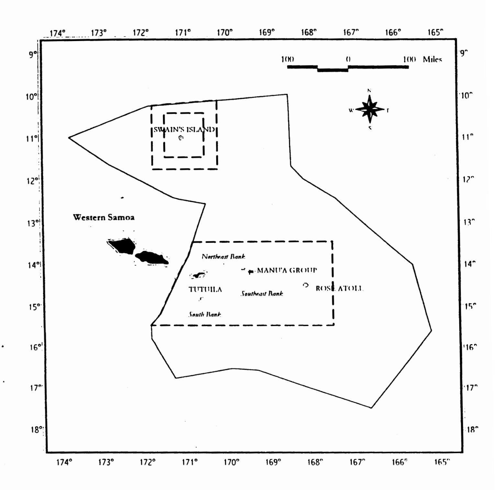

Figure 12.1. Alternative No. 1 (Preferred): Boundaries of a closed area approximately 50 nm around all islands of American Samoa; and Alternative No. 2: Boundaries of a closed area approximately 50 nm around the islands of Tutuila, Rose, Manu'a and approximately 30 nm around Swains Island

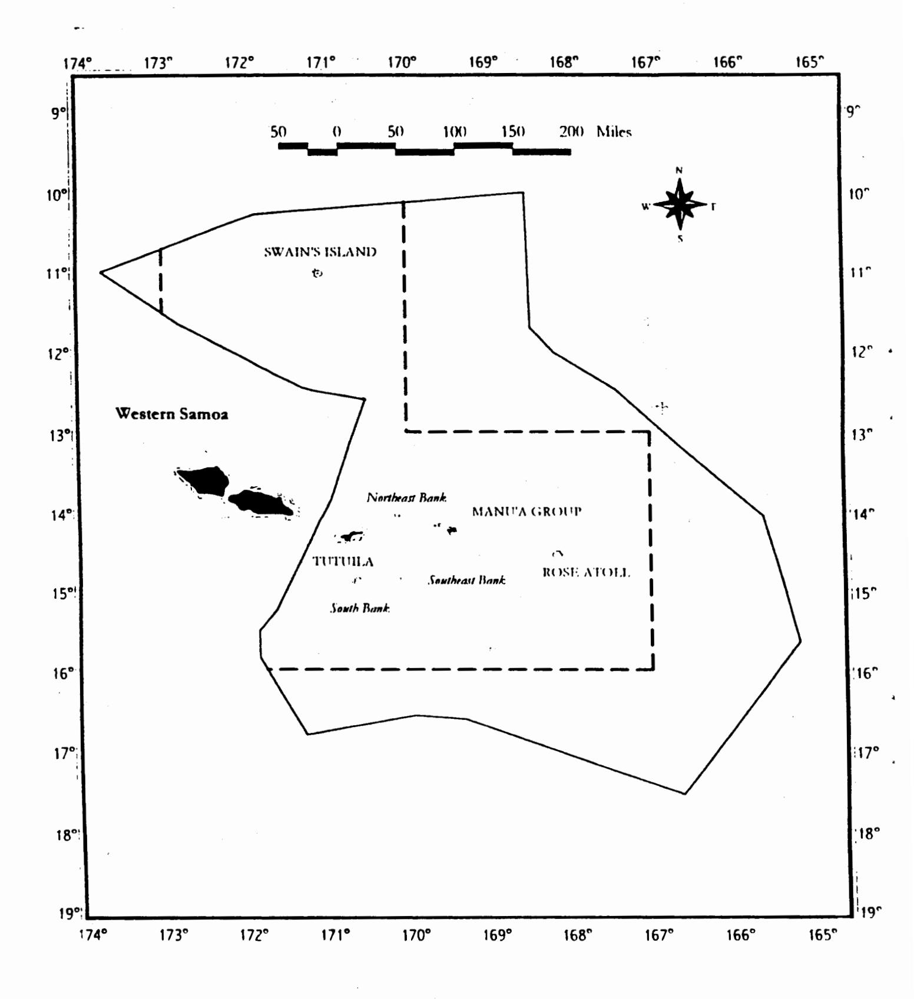

Figure 12.2. Alternative No. 3: Boundaries of closed area approximately 100 nm around Tutuila Island, Rose Atoll, the Manu'a Islands and Swains Island

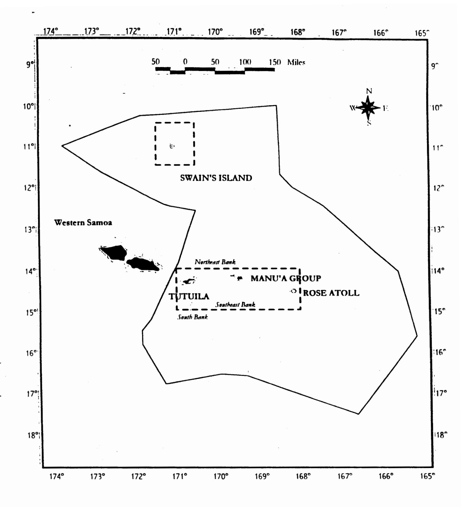

Figure 12.3. Alternative No. 4: Boundaries of the existing areas within the EEZ around American Samoa that are closed to foreign fishing

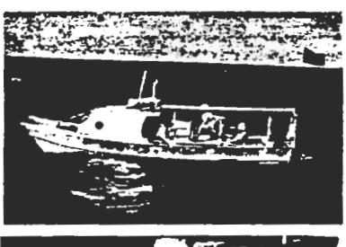

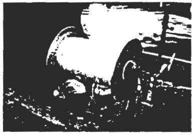

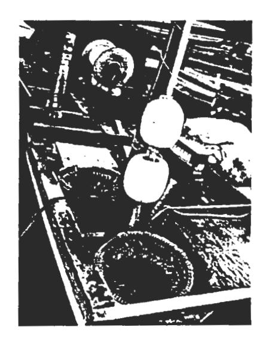

Typical 28 ft *alia* (top left) and longline reel (bottom left). Figure on right shows the placement of the reel plus the arrangement of branchlines and marker buoys

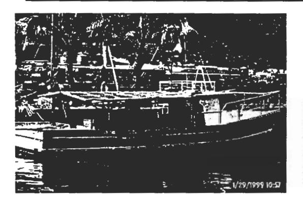

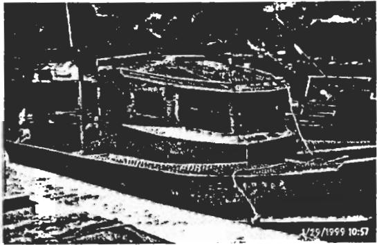

Newer 38-45 ft alias now entering the American Samoa longline fishery

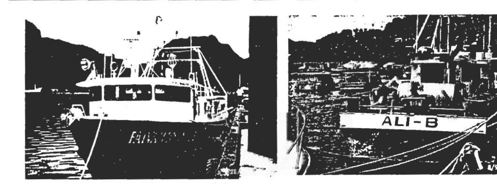

Large (> 50ft) longliners operating in the American Samoa longline fishery

Figure 12.4. Alia catamarans and other longline vessels operating in the American Samoa longline fishery

# 13.0 REFERENCES CITED

Adams, T., P. Dalzell and E. Ledua. 1999. Ocean resources, Chap. 30 In: The Pacific Islands Environment & Society (M. Rapaport ed.): 366-381. The Bess Press, Honolulu, HI.

Bigelow, K. and T. Lewis, undated. Sportfishing and longlining - a Majuro perspective. Oceanic Fisheries Programme, South Pacific Commission.

Chapman, L., 1998. The rapidly expanding and changing tuna longline fishery in Samoa. South Pacific Commission Fishery Newsletter 84, 10-23.

Childers, J. and F.R. Miller. 1998, Summary of the 1997 U.S. North and South Pacific albacore troll fisheries. National Marine Fisheries Service, Southwest Science Center Administrative Report LJ-98-06, La Jolla.

Chullasorn, S., 1996. Interactions of Thai tuna fisheries: problems, research and development. In Status of interactions of Pacific tuna fisheries in 1995. Fisheries Technical Paper No. 365, Rome FAO, 267-281.

Coan, A.L. Jr., G.T. Sakagawa, D. Prescott, P. Williams and G. Yamasaki. 1999. The 1998 U.S. tropical tuna purse seine fishery in the central-western Pacific Ocean. Prep. for annual meeting of parties to the South Pacific Tuna Treaty, March 1999, Koro, Republic of Belau. 20 p.

Coan, A.L., J. Childers, R. Ito, B. Kikkawa and D. Hamm. 2000. Summary of U.S. fisheries statistics for highly migratory species in the central-western Pacific, 1995-1999. SCTB13 Working Paper NFR-21. 13th Meeting of the Standing Committee on Tuna and Billfish, Noumea, New Caledonia, 5-12 July 2000.

Craig, P. 1999. Workshop to identity important fish issues in American Samoa for FY95-FY99. DMWR Biological Report Series No. 57, American Samoa Dept. of Marine and Wildlife Resources. 16 p.

Craig, P., Ponwith, B., Aitaoto, F., and D. Hamm, 1993. The commercial, subsistence and recreational fisheries of American Samoa. Marine Fisheries Review 55 (2), 109-116.

Curren, F. 2000. The offshore pelagic fisheries of American Samoa. SCTB13 Working Paper NFR-1, 13th Meeting of the Standing Committee on Tuna and Billfish, Noumea, New Caledonia, 5-12 July 2000.

Department of Commerce, 1998. American Samoa Statistical Yearbook 1996. American Samoa Government, Pago Pago.

Fa'asili, U. 1997. Review, redesigning and construction demonstration of *alia* fishing boats in Samoa. A project proposal submitted for funding assistance from UNDP. FFA. 5 p.

FFA (South Pacific Forum Fisheries Agency), 1996a. 6th Technical Consultation on Fishing Vessel Monitoring Systems. FFA Report 96/31, Honiara, Solomon Islands.

FFA (South Pacific Forum Fisheries Agency), 1996b. Overview of the biological, economic, social and political concerns related to interactions of Pacific tuna fisheries. <u>In</u> Status of Interactions of Pacific Tuna Fisheries in 1995. FAO Fisheries Technical Paper No. 365, Rome FAO, 566-575.

FAO 1997. Fisheries and Aquaculture in the South Pacific: Situation and Outlook in 1996. FAO Fisheries Circular No. 907 FIP/C907.

Fonteneau, A., 1991. Monts sous marins et thons dans l'Atlantique tropical est. Aquatic Living Resources 4, 13-25.

Hamnett, M. And W. S. Pintz, 1996. The contribution of tuna fishing and transshipment to the economies of American Samoa, the Commonwealth of the Northern Mariana Islands and Guam. JIMAR Contribution (6-303), Joint Institute for Marine and Atmospheric Research, Honolulu.

Hampton, J., Lawson, T., Williams, P. and J. Sibert, 1996. Interactions between small-scale fisheries in Kiribati and the industrial purse seine fishery in the western and central Pacific Ocean. <u>In</u> Status of Interactions of Pacific Tuna Fisheries in 1995. FAO Fisheries Technical Paper No. 365, Rome FAO, 183-223.

Hill, H.B. 1978. The use of nearshore marine life as a food resource by American Samoans. Misc. WP 1, Pacific Islands Studies Program, Univ. of Hawaii. 170 p.

Itano, D., 1996. The development of small-scale fisheries for bottomfish in American Samoa (1961-1987). South Pacific Commission Fisheries Newsletter No. 76 and No. 77.

Kaneko, J., P. Bartram, M. Miller and J. Marks. 2000. Local fisheries knowledge: the application of cultural consensus analysis to the management and development of small-scale pelagic fisheries. Final Report, SOEST 00-06, JIMAR Contribution 00-334. Pelagic Fisheries Research Program, Univ. Hawaii. 34 p.

Lawson, T. 1999. Estimates of annual catches of target species in tuna fisheries of the western and central Pacific Ocean. WP SWG-2, 12th Meeting of the Standing Committe on Tuna and Billfish, 16-23 June 1999, Papeete, Tahiti, French Polynesia. Ocean Fisheries Programme, SPC, Noumea, New Caledonia, 70 p.

Lehodey, P., Bertignac, M., Hampton, J., Lewis, A. and J. Picaut, 1997. ENSO and tuna in the Western Pacific. Nature 389, 715-717.

Mathews, C., Monintja D., and N. Naamin, 1996. Studies of Indonesian tuna fisheries, Part 2: Changes in yellowfin abundance in the Gulf of Tomini and North Sulawesi. <u>In</u> Status of Interactions of Pacific Tuna Fisheries in 1995. FAO Fisheries Technical Paper No. 365, Rome FAO, 298-305.

McGinnis, R.R. Actional Regional Administrator, NOAA/NMFS Southwest Region, Long Beach, CA. Letter dated 19 May 2000 to P. Dalzell, WPRFMC. 2 p.

Miller, A.J., D.R. Cayan, T.P. Barnett, N.E. Graham and J.M. Oberhuber. 1994. Interdecadal variability of the Pacific Ocean: model response to observed heat flux and wind stress anomalies. Climate Dynamics (1994) 9: 287-302.

Moana, A., 1988. Report of second visit to American Samoa. South Pacific Commission Deep Sea Fishery Development Project.

Muhlia-Melo, A. 1996. Interactions of tuna and big pelagic fishes among sport commercial fisheries. <u>In</u> Status of Interactions of Pacific Tuna Fisheries in 1995. FAO Fisheries Technical Paper No. 365, Rome FAO, 241-250.

Mulipola, A., 1998. Report on Samoa's longline fishery. Secretariat of the Pacific Community, 11th Standing Committee on Tuna and Billfish, May 30th- June 6th 1998, Honolulu, Hawaii.

Mulipola, A.P. 2000. Status of the commercial tuna fishing in Samoa. SCTB13 Working Paper NFR-18, 13th Meeting of the Standing Committee on tuna and Billfish, Noumea, New Caledonia, 5-12 July 2000. 9 p.

Otsu, T. and R. Sumida, 1968. Distribution, apparent abundance, and size composition of albacore (Thunnus alalunga) taken in the longline fishery based in American Samoa. Fishery Bulletin 67 (1), 47-69.

Philander, S. 1983. El Nino Southern Oscillation phenomena. Nature 302, 295-301.

PBDC (Pacific Basin Development Council), 1984. Central and Western Pacific Regional Development Plan: American Samoa Component. Pacific Basin Development Council, Honolulu.

Pooley, S., 1990. Hawaii longline fishing controversy. Tuna Newsletter 97, 3-6.

Rogers, A.D. 1994. The biology of seamounts. Advances in Marine Biology, vol. 30. Academic Press Ltd., p. 305-350.

Sakagawa, G.T. In press. The impact of FAD innovations on the performance of U.S. tuna purse seine operations in the Pacific Ocean. Peche Thoniere et Dispositifs de Concentration de Poisons. Actes de Colloques d'IFREMER, France.

Saucerman, S., 1995. Assessing the management needs of a coral reef fishery in decline. <u>In</u> South Pacific Commission and Forum Fisheries Agency Workshop on the Management of South Pacific Inshore Fisheries, Volume I, 442-456.

Schug, D. and A. Galea'i, 1987. American Samoa: the tuna industry and the economy. <u>In</u> Tuna Issues and Perspectives in the Pacific Islands Region, East-West Center, Honolulu.

Severance, C. and R. Franco, 1989. Justification and Design of Limited Entry Alternatives for the Offshore Fisheries of American Samoa, and an Examination of Preferential Fishing Rights for Native People of American Samoa Within a Limited Entry Context. Western Pacific Fishery Management Council, Honolulu.

Severance, C., R. Franco, M. Hamnett, C. Anderson and F. Aitaoto, 1999. Effort Comes from the Cultural Side: coordinated investigation of pelagic fishermen in American Samoa. Draft report for Pelagic Fisheries Research Program, JIMAR/SOEST, Univ. Hawaii - Manoa, Honolulu, HI.

Shomura, R., Majkowski, J. and S. Langi (eds), 1994. Preface. <u>In Interactions of Pacific Tuna Fisheries</u>: Volume 1. FAO Fisheries Technical Paper No. 336/1, Rome FAO, vii-ix. Skillman, R., Boggs, C., and S. Pooley, 1993. Fishery interaction between the tuna longline and other pelagic fisheries in Hawaii. NOAA Technical Memorandum NMFS SWFC 189, 46 pp.

SPC (South Pacific Commission), 1992. Tuna resources of Papua New Guinea waters, with particular reference to the so-called Morgado square. Unpublished report, Tuna and Billfish Assessment Programme, South Pacific Commission, Noumea, 32 pp.

SPC (South Pacific Commission), 1997. Status of tuna stocks in the Western and Central Pacific Ocean. South Pacific Commission, 10th Standing Committee on Tuna and Billfish, 16-18 June 1997, Nadi, Fiji, 38 pp.

SPC (South Pacific Commission), 1998. Estimates of annual catches of target species in tuna fisheries of the western and central Pacific Ocean. South Pacific Commission, 11th Standing Committee on Tuna and Billfish, 30 May - 6 June 1998, Honolulu, Hawaii, 67 pp.

Squire, J. and D. Au, 1990. Striped marlin in the Northeast Pacific - a case for local depletion and core area management. <u>In</u> Planning the Future of Billfishes: Research and Management in the 90s and Beyond. Proceedings of the Second International Billfish Symposium, August 1-5, Kailua-Kona, Hawaii, Part 2, 199-214.

Stanley, J. and F. Toloa, 1998. Review of the Samoan longline fishing industry. UNDP report prepared for the Government of Samoa and Forum Fisheries Agency. 50 p.

Travis, M., 1999. Entry and exit in Hawaii's longline fishery, 1988-96: A preliminary view of explanatory factors. <u>In Ocean-Scale Management of Pelagic Fisheries</u>: Economic and Regulatory Issues, Pelagic Fisheries Research Program, SOEST 99-01, Honolulu.

Tuilagi, F. and A. Green. 1995. Community perception of changes in coral reef fisheries in American Samoa. Biological Paper 22, In Proc. South Pacific Commission-Forum Fisheries Agency Regional Inshore Management Workshop (New Caledonia), June 1995. (Also American Samoa DMWR Biological Report Series No. 72).

Wass, R., 1980. The shoreline fishery of American Samoa - past and present. <u>In Marine and Coastal Processes in the Pacific: Ecological Aspects of Coastal Zone Management. UNESCO, Jakarta, 51-83.</u>

WPRFMC (Western Pacific Fishery Management Council) 1991. Amendment 5, Fishery Management Plan for the Pelagic fisheries of the Western Pacific Region. Western Pacific Regional Fishery Management Council, Honolulu.

WPRFMC (Western Pacific Fishery Management Council) 1994. Amendment 7 to the Fishery Management Plan for the Pelagic Fisheries of the Western Pacific Region: proposed limited entry program for the Hawaii longline fishery. Western Pacific Regional Fishery Management Council, Honolulu.

WPRFMC (Western Pacific Fishery Management Council), 1995. Pacific profiles: pelagic fishing methods in the Pacific. Western Pacific Fishery Management Council, Honolulu.

WPRFMC (Western Pacific Fishery Management Council), 1998a. Pelagic Fisheries of the Western Pacific Region: 1996 Annual Report. Western Pacific Fishery Management Council, Honolulu.

WPRFMC (Western Pacific Regional Fishery Management Council), 1998b. Magnuson-Stevens Act Definitions and Required Provisions. Amendment 8 to the Pelagic Fisheries Management Plan. 99 p. + appendices.

WPRFMC (Western Pacific Regional Fishery Management Council), 1999. Section 1, Pelagic fisheries of the western Pacific region 1998 annual report.

Yasui, M. 1986. Albacore, *Thunnus alalunga*, pole-and-line fishery around the Emperor Seamounts. In "The environment and resources of seamounts in the North Pacific" (R.N. Uchida, S. Hayashi and G.W. Boehlert eds.): 37-40. Proc. of the Workshop on the Environment and Resources of Seamounts in the North Pacific. US Dept. of Commerce, NOAA Tech. Report NMFS 43.

Yoshida, H., 1975. The American Samoa longline fishery, 1966-71. Fishery Bulletin, 73 (4), 747-765.

# APPENDIX I: American Samoa Fishing Community Impact Statement

# I.1 Overview of community

American Samoa is an unincorporated territory of the U.S.A consisting of the islands of Tutuila, Swains and the Manu'a group (Ofu, Olosega and Ta'u) and Rose Atoll. The total land area is 77 square miles. The Territory's population is about 60,000 and is growing rapidly, with a doubling time of only 20 years. Most of the islands are mountainous with limited flat land suitable for agriculture. American Samoa is lowest in gross domestic product and highest in donor aid per capita among the US Pacific islands (Adams et al. 1998).

American Samoa has a small developing economy, dependent mainly on two primary income sources: the American Samoa Government (ASG), which receives income and capital subsidies from the United States, and two tuna canneries on the island of Tutuila. These two primary income sources have given rise to a third: a services sector that derives from and complements the first two. In 1993, the latest year for which ASG has compiled detailed labor force and employment data, the local government employed 4,355 people (32.2 percent) of total employment, followed by the two canneries with 3,977 people (29.9 percent) and the rest of the services economy with 5,211 workers (38.4 percent). Altogether, the three segments employed 13,543 workers, while 2,718 people were registered as unemployed (that is, actively seeking employment). This gives a total labor force of 16,261 and an unemployment rate of 16.7 percent.

With a total population in 1993 estimated at 52,900, the labor force represented 30.7 percent of the population, very low when compared with the overall US labor force ratio (well over 50 percent) but typical of the smaller developing Pacific island economies. Of the 31,822 residents 16 years or older, the total labor force was equivalent to 51.1 percent. That half of the 16 years-plus population is not in the labor force is explained by American Samoa's lack of major industry other than government and fish canning. Work opportunities are certainly limited but not having a job in the money economy does not necessarily equate with unemployment in the territory, where subsistence activity contributes to the extended family's total well-being.

Official data notwithstanding, by many measures, American Samoa is not a poor economy. Its estimated per capita income of \$5,000 is almost twice the average for all the Pacific island economies (at \$2,700) (Bank of Hawaii Economic Research Dept. 1999). Per capita income in American Samoa does not represent the same market basket and value as it would, for example, in Honolulu. There are aspects of work and the creation of value in the communal societies of the Pacific islands that are not captured by market measures. For instance, to the extent that unemployment among the younger population can cause both economic and social ills, American Samoa's tightly organized aiga (extended family) system is one way to keep young people from becoming economically unproductive and socially disruptive. Another avenue for American Samoan youth not available to the vast majority of youth in the Pacific islands is emigration to the United States, where an estimated 70,000 Samoans live, 20,000 of them in Hawaii.

A large proportion of the territory's workers (in the case of the canneries as much as 90 percent) is from western Samoa. While it is correct to say that western Samoans working in the territory are legally alien workers, in fact, they are the same people, by culture, history and family ties.

# I.2 Description of the fisheries

## I.2.1 History of exploitation, vessel characteristics and fleet composition

# I.2.1.1 Small-scale fishery

The harvest of pelagic fish has been a part of the Samoan way of life since the islands were first settled some 3,500 years ago. Until the 1950s on the island of Tutuila, and even into the 1970s in the Manu'a Islands, the indigenous residents of American Samoa captured skipjack tuna in offshore waters using traditional canoes and gear (Severance and Franco 1989). Other tuna species, billfish, wahoo and mahimahi were also occasionally taken by traditional techniques.

The introduction of outboard motors in the 1950s and 1960s brought about a decline in traditional fishing methods in favor of motorized dinghies and skiffs for trolling and handlining. The development of offshore fisheries began in earnest during the early 1980s. It was at this time that the FAO-designed alia catamaran was introduced into the islands. The number of small vessels participating in commercial pelagic and bottomfish fisheries quadrupled between 1980 and 1985. During the latter period, almost all of the commercial catch of pelagic species was taken by trolling. Most pelagic fishing occurred near banks and seamounts where seabird flocks feed (thus indicating the presence of baitfish that tuna may also be feeding upon), or at fish aggregating devices (FADs) deployed around Tutuila Island. FADs were introduced to American Samoan coastal waters in 1979 and proved to be a popular way to increase the catch rates of widely dispersed pelagic fish (Craig et al. 1993). FADs attracted and retained schools of fish and made it easier for vessels to locate concentrations of tuna.

The extensive use of longline gear by the small-scale fleet in American Samoa is a recent phenomenon, with longline catches rising from zero prior to 1994 to almost 900,000 lbs in 1998. The stimulus for American Samoan fishermen to shift from troll or handline gear to longline gear was the fishing success of 28-34 ft *alia* catamarans equipped with longline gear operating in the EEZ around western Samoa. Following the example of the western Samoa fleet, the fishermen in American Samoa deploy a short monofilament longline with 250-350 hooks from a hand-powered reel. The predominant catch is albacore tuna, which is marketed to the local tuna canneries.

Fishermen who set longline gear in the Exclusive Economic Zone (EEZ) around American Samoa are required to obtain a federal permit from the National Marine Fisheries Service (NMFS) Pacific Islands Area Office. There is presently no limit on permits (i.e., no limited entry). To date, over 60 permits have been issued, although only 26 were active on a regular basis in 1999 (Curren 2000).

The technology employed by the small-scale fishing fleet in American Samoa is relatively unsophisticated. Typically, the boats are double- or single-hulled vessels equipped with outboard engines. Until recently, average boat length was 28 ft. Many boats are outfitted with wooden handreels that are used for bottomfish fishing as well as for trolling. Less than ten percent of the boats carry a depth finder, fish finder or global positioning system (Severance et al. 1998). The small vessels equipped for longline fishing store their gear on deck on a hand-powered reel, which can hold as much as 10 nautical miles (nm) of monofilament mainline. Most longliners leave for the fishing grounds in the early morning and return in the afternoon or early evening. The small *alia* fish up to 25 nm from shore, but effort has been mainly concentrated on banks 5 to 10 nm off the southern coast of Tutuila.

Less information is available on the fishing grounds of the small boats using trolling gear. Moana (1988) noted 12 years ago that small boats were increasingly traveling to distant banks and seamounts such as South Bank and Southeast Bank, both of which are located about 45 nm from land. This trend of fishing further offshore was also observed in a more recent study of the small-scale pelagic fishery in American Samoa (Severance et al. 1999)

Fishermen in American Samoa are acquiring larger boats (38-50 ft) with a greater fishing range and capacity for chilling fish. In 1998, a local private, non-profit organization received a grant from the Administration for Native Americans to equip a 40 ft double-hull fishing vessel with hydraulically powered longline gear. The new boat is being built by a local firm and is expected to be completed early in 20001.

&lt;sup>1Since 1981, boat builders in American Samoa have been constructing plywood and fiberglass alia catamarans for the local fishing industry (Itano 1996). Western Samoa has recently submitted a request to FAO to design a larger alia. The new design will also be available to boat-builders in American Samoa.

In addition, a 52 ft steel vessel joined the fleet late in 1999 and six 38-42 ft *alia* are reportedly being purchased by local businessmen. Most of the *alia* are assembled in western Samoa from pre-cut aluminum plates manufactured in Australia. This newer version of the *alia* has a higher freeboard and is equipped with a larger fuel tank, navigational aids and proper safety gear and it is capable of extending the range of American Samoa's small-scale fishery to at least 100 nm offshore (Capt. W. Thompson letter to WPRFMC dated 3 Feb. 2000). The older, "stretched" version of the original *alia* design was constructed in western Samoa without consultation with naval architects or marine surveyors. It proved to be unseaworthy and is blamed for the high loss of boats and crews during 1996-1997, the years of dramatic expansion in the western Samoa longline fishery (Stanley and Toloa 1998).

Tournament fishing for pelagic species began in American Samoa in the 1980s. Most of the boats that participate are *alia* catamarans and small skiffs. Catches from tournaments are often sold, as most of the entrants are local small-scale commercial fishermen. In 1996, three days of tournament fishing contributed about one percent of the total domestic landings. Typically, 7 to 14 local boats carrying 55 to 70 fishermen participate in each tournament, which are held 2 to 5 times per year (Craig et al. 1993).

# I.2.1.2 Large-scale distant water fishery

Large-scale commercial longline fishing in what is now the EEZ around American Samoa was initiated by Japanese vessels in the late 1940s. The foreign vessels later supplied albacore tuna to the two canneries established in the Territory by Van Camp Seafood Company and Star-Kist Foods in 1954 and 1963, respectively. From 1950 to 1965 there was a progressive expansion of the area of operation of these longliners from the waters in the immediate vicinity of American Samoa to more distant waters (Otsu and Sumida 1968; Yoshida 1975). The expansion of fishing area paralleled an increase in fleet size. Between 1954 and 1965 the number of foreign longline vessels off-loading in Pago Pago increased from less than 20 to over 150. In the mid-1960s, the Japanese vessels began to be replaced by Taiwanese and Korean longline vessels as the canneries' major suppliers of albacore. In recent years, the number of foreign longline vessels delivering fish to the canneries has sharply declined, and, presently, only about 40 vessels are making landings in American Samoa. A typical Asian longline vessel is 80-150 ft in length, highly mechanized and sets 50-60 nm of mainline with 1,500-2,000 hooks each day (WPRFMC 1995).

Legal fishing by foreign longline vessels in the waters around American Samoa ceased completely in 1980 after the implementation of the pelagic fisheries Preliminary Management Plan for the Western Pacific Region,2 which placed onerous requirements (e.g., permits, fees, observers) on foreign vessels. However, foreign longline vessels occasionally fish illegally in the EEZ around American Samoa. In 1992, for example, the Coast Guard seized a Taiwanese longline vessel fishing near Swains Island.

&lt;sup>2 The PMP was superceded by the Council's Pelagic Fisheries Management Plan in 1986.

There is a possibility that legal fishing in the EEZ by foreign vessels may resume under a Pacific Insular Area Fishing Agreement (PIAFA). This agreement could give foreign vessels access to EEZ waters around American Samoa in exchange for a negotiated fee and subject to a variety of permit conditions.

The domestic longline fleet based in American Samoa consists mainly of small vessels but five additional locally-owned vessels larger than 50 ft based in Pago Pago are also engaged in the longline fishery. These vessels are outfitted with modern electronic equipment for navigation, communications and fish finding and they are able to chill and freeze tuna catches. The owner of one of these vessels has also acquired permits to fish in the EEZs of neighboring island nations such as Niue, Cook Islands, Tokelau, Fiji and Samoa. The owners of five other large US longline vessels that are not based in American Samoa have received NMFS longline general permits that allow the boats to longline in the EEZ around the Territory, but only one of the owners has used his vessel for this purpose.

US purse seine vessels began exploratory fishing in the central and western Pacific in the late 1970s. The rapid expansion of the fleet during the 1980s coincided with an increase in the quantity of skipjack and yellowfin tuna landed at the canneries in American Samoa. At present, about 34 US purse seiners supply fish to the tuna canneries. The purse seiners commonly measure 200-250 ft in length and are equipped with sophisticated "fish-finding" equipment, including helicopters. The purse seine nets typically capture 15 to 45 metric tons of fish in a single set. Most of the fishing activity by these vessels occurs in the EEZ waters of Papua New Guinea, Federated States of Micronesia and other Pacific island nations far to the west of American Samoa. During an ENSO event, however, these vessels may shift their fishing activity to areas in the central Pacific, including the northern portion of the EEZ around American Samoa (see Figure 5.1 of framework proposal).

Until recently, US purse seine fishing effort in the western Pacific was divided about equally between sets on floating objects (logs and FADs) and on free-swimming schools. During 1999, however, 90 percent of the fishing effort was around untethered FADS (i.e., rafts known as payao) constructed and deployed by the purse seiners themselves. An average of 20 rafts per boat is estimated for the 34 vessel US fleet, for a total of approximately 700 untethered FADs. FAD technology has gained wide acceptance in the US purse seine fishery because it increases harvesting efficiency. FADs are easily deployed, tracked and located with radio beacon devices. Locating unassociated, free-swimming tuna schools is more difficult and requires long hours of searching and knowledge of the fishing grounds. The deployment of drifting FADS by the vessels themselves augments the supply of naturally occurring drifting objects that attract forage animals and tunas under them in the open ocean. FAD performance is thus similar to log performance. Both FAD and log sets are executed before day break and have a very high success rate (more than 90 percent) for catching tuna. This is nearly double the success rate of unassociated school sets, which are executed at all hours of the day (Sakagawa in press).

Domestic purse seine vessels operating in the central and western Pacific are not required to report catches made in the US EEZ. However, these boats often do so on a voluntary basis using report forms provided under the Multilateral Treaty on Fisheries. According to these reports,

The most productive fishing grounds for purse seiners are far from American Samoa. According to catch reports compiled by NMFS, six US purse seine vessels made seven sets within the EEZ around American Samoa between 1988 and 1997. The total catch from these sets was 36.3 metric tons of skipjack tuna. Only in one year during that period did three or more vessels fish in American Samoa's EEZ. All seven sets were made by vessels that recorded "searching" while transiting the EEZ around the Territory. There is no information available on domestic purse seine catches in the EEZ around American Samoa prior to 1988.

Fishing activity increased during 1998-1999, when a total of four sets, two in each year, were made by US purse seiners operating in the EEZ of American Samoa. These sets resulted in a total catch of 100.7 mt of skipjack tuna and 20.8 mt of yellowfin tuna. The four sets were made in the same general area – the northern portion of the EEZ in the vicinity of Swains Island – as those reported in the previous 10-year period (R. McGinnis, letter dated 19 May 2000 to Paul Dalzell, WPRFMC).

Domestic albacore troll vessels also supply tuna to the canneries in American Samoa on a seasonal basis. The South Pacific albacore troll fishery, which began in 1986, operates from December through early April, with 20-30 US vessels joining an international fleet (WPRFMC 1995). This high seas fishery targets dense concentrations of albacore that form along the subtropical convergence zone that lies 35-47° S and 170-130° W. Vessels are generally 60-80 ft in length, operating with crews of 3-5, and capable of freezing 45-90 tons of fish. The domestic albacore troll fleet is not known to fish in the EEZ around American Samoa, so this type of vessel is excluded from the proposed management action.

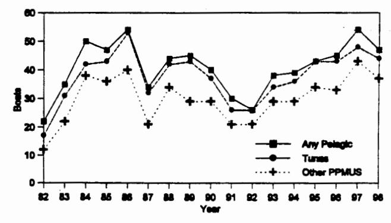

Figure I.1. Number of small boats participating in American Samoa pelagic fishery (after WPRFMC 1999)

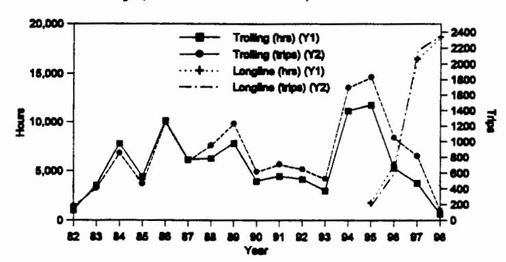

Figure I.2. Fishing effort by small boats using longline and troll gear in American Samoa pelagic fishery (after WPRFMC 1999)

Between 1992 and 1997, there was a marked increase in the number of American Samoa-based small vessels landing pelagic fish in American Samoa, although the number is still below the level that existed prior to the 1987 hurricane that damaged or destroyed a large segment of the fleet (Figure I.1). The level of trolling effort rose markedly between 1993 and 1995 but has declined since 1996 (Figure I.2). The decline in trolling effort coincided with a shift in gear types by small-scale fishermen from trolling to longlining.

# I.2.2 Effort levels and landings in small-scale fishery

Total landings of pelagic fish by the American Samoa small-scale fleet have fluctuated widely due to the effects of hurricanes, entry and exit of highliners and annual variations in fishing effort (Figure I.3). Catches increased in volume after 1993, initially as a result of an increase in trolling activity and later because of the widespread adoption of longline gear. The

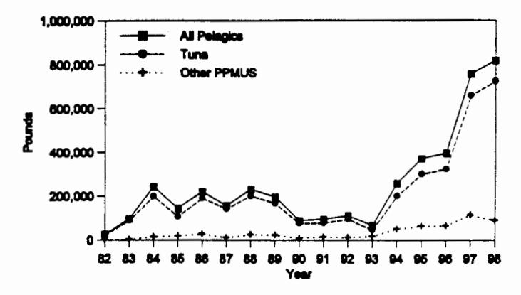

Figure I.3. Annual landings by boats using longline and troll gear in American Samoa pelagic fishery (after WPRFMC 1999)

harvest of "pelagic management unit species" (PMUS) and other pelagic species doubled between 1996 and 1997. This increase is largely due to higher catches by small boats using longline gear. Most of the longline landings are albacore, with yellowfin tuna, bigeye tuna, blue marlin, mahimahi and wahoo making up most of the remainder of the catch. The dominant species in the troll catch are skipjack and yellowfin tuna, with smaller but significant quantities of blue marlin, mahimahi, wahoo and dogtooth tuna (Figure I..4).

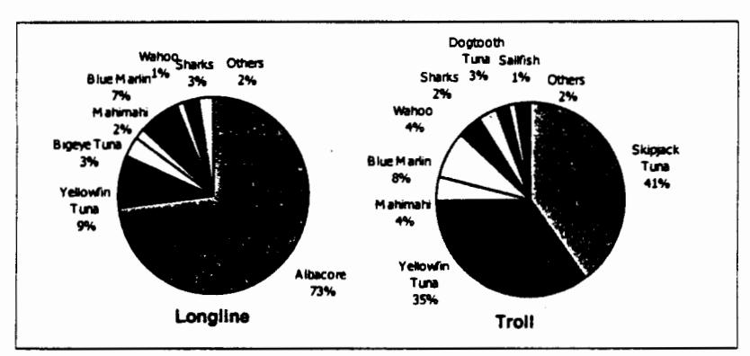

Figure I.4. Composition of catches of small boats using longline and troll gear in American Samoa pelagic fishery (after WPRFMC 1999)

# I.3 Description of economic characteristics of small-scale fishery

# L3.1 Harvesting sector

The economic performance of the small-scale fleet has improved dramatically in recent years. Despite a slight decrease in the price of tuna and other PMUS, the revenue from commercial landings of PMUS and other pelagic species doubled between 1996 and 1998 (Figure I.5). The increased catches are largely due to the increasing use of longline gear by small-scale boats.

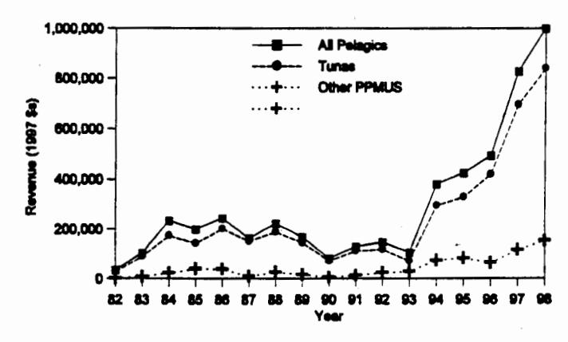

Figure I.5. Ex-vessel value of catches of small boats in American Samoa pelagic fishery (after WPRFMC 1999)

Table I.1 provides estimates of average gross and net revenue and fixed and variable costs for small boats using longline gear. Estimates of operating costs are based on a 1997 NMFS survey of *alia* vessels in American Samoa, and capital costs were estimated using information provided by Chapman (1998). Average trip revenues are derived from estimates of current effort, catch rates and average ex-vessel prices reported in WPRFMC (1998).

It is estimated that the average 28 ft alia catamaran equipped with longline gear earned a net revenue (before labor costs and taxes) of about \$15,000 in 1997. Factors such as experience and skill level directly affect both revenues and costs and there is undoubtedly a high variability across boats in the values of parameters. The cost-earnings analysis did not include a labor cost or identify how expenses, revenues and profits are shared among crew, captain and owner. Some owners pay each crew member a flat salary, while others pay the crew a percentage of the revenues after certain expenses have been deducted. The average vessel is operated by a captain and three crew members. Most boats are not owner-operated.

Table I.1. Average annual gross and net revenue (before labor costs and taxes) and fixed and variable costs for a 28 ft *alia* catamaran using longline gear in American Samoa pelagic fishery

## Annual Revenue

Number of fishing trips per year: 100 (average trip length is 7.6 hrs)

Number of hooks set per trip: 214

Catch per trip (lbs): Tuna - 300; Other PMUS - 50; Misc. fish - 5

Price per pound (\$): Tuna - 1.06; Other PMUS - 1.40; Misc. fish - 1.44

Total Revenue \$39,520

### Required Capital

| Vessel 1                | 13,000 |
|-------------------------|--------|
| Engine                  | 7,000  |
| Fishing gear (longline) | 3,000  |
| Radio                   | 200    |
| Safety                  | 1,000  |
| Total Required Capital  | 24,200 |

| Fixed Costs                  |       | Variable Costs |        |
|------------------------------|-------|----------------|--------|
| Debt service 2    | 3,748 | Fuel and oil   | 3,350  |
| Insurance (5%)               | 1,210 | Provisions     | 2,400  |
| Maintenance and repair       | 1,500 | Bait           | 10,300 |
| Depreciation 3    | 2,057 |                |        |
| Miscellaneous (permit, etc.) | 35    |                |        |
| Subtotal                     | 8,550 | Subtotal       | 16,050 |
| Total Casts \$24,600         |       |                |        |

Total Costs \$24,600

Net Revenue \$14,920

&lt;sup>1 28-ft alia catamaran constructed in American Samoa or Western Samoa

&lt;sup>2 Debt service assumed to occur over a 10-year period, with a 15% annual interest rate and 20% down

&lt;sup>3 Depreciation calculated on a straight line, 15% salvage basis, assuming a vessel life span of 10 years

Catch composition and marketing strategy have a major influence on vessel earnings in American Samoa, where local fresh fish markets and cannery tuna markets operate with different price structures. The most lucrative tuna fishing operations in the Pacific islands at present are those producing high-grade, fresh tuna for export. The ex-vessel price for premium-quality fresh fish is as high as \$4.75 per pound in American Samoa, compared to the \$1.06 per lb cannery price. A major constraint to opening up new marketing channels is that few fishermen have adopted the proper shipboard handling and chilling of tuna that are essential for fresh export. The restricted carrying capacity of the original 28 ft version of the *alia* limited the amount of ice that could be taken on fishing trips to maintain fish quality. Insufficient deck space of the *alia* has contributed to poor shipboard handling. As more medium sized vessels (35-50 ft) enter the fishery, sufficient ice can be carried for proper chilling of the catch.

# I.3.2 Markets and ancillary businesses

Most of the albacore tuna landed by the small-scale fishery are sold for canning, whereas other tuna species and non-tuna are sold fresh in local markets. There is interest in producing fish for fresh export but limited capacity for proper shipboard handling and storage of fish, inadequate shoreside ice and cold storage facilities and infrequent and expensive air transportation links are restrictive factors. If constraints to export marketing can be overcome, economic returns and export earnings by the fishing industry in American Samoa could increase substantially.

The American Samoa Economic Advisory Commission has identified air transportation as the single greatest obstacle to economic development. A commissioner noted that a fish dealer/broker in Fiji can chose from four flights per day, whereas a fish dealer in American Samoa has two flights per week. A priority of the Commission is to obtain for American Samoa an exemption from the prohibition on the use of foreign carriers similar to the exemption that enjoyed by the state of Alaska.

In 1998, the private, non-profit organization Tautua Samoa Association received a \$346,000 federal grant from the Administration for Native Americans for start up of a small-scale fish processing facility. The organization also plans to apply for a federal grant in the amount of about \$500,000 from the Economic Development Administration to complete the facility. Once implemented, the project will result in the establishment of a facility to procure fresh bottomfish and pelagic species landed by local fishermen and process it for local and export marketing. The facility will also process frozen "miscellaneous" fish landed by the foreign longline and US purse seine vessels which supply the two local tuna canneries. The miscellaneous fish includes tuna and incidental pelagic species unsuitable for canning. Portion-controlled steaks and other products would be processed from cannery by-products for export to food service markets in Hawaii and the continental USA. The processing facility will be located in the Senator Daniel Inouye Industrial Park on land leased from the American Samoa Government. The project will provide 20 to 40 full-time jobs and is expected to encourage additional investment in the local fishing industry.

# I.4 Description of the socioeconomic aspects of the fishing industry and fishing community

The natural protection afforded by Pago Pago harbor and four special provisions of US law form the basis of American Samoa's largest private industry - tuna canning - now more than forty years old. Canned tuna is American Samoa's major export. The Territory is exempt from the Nicholson Act, which prohibits foreign ships from landing their catches in US ports. American Samoa products with less than 50 percent market value from foreign sources enter the United States duty free (Headnote 3(a) of the US Tariff Schedule). In addition, the parent companies of American Samoa's fish processing plants enjoy special tax benefits. Furthermore, wages in the Territory are not set by federal law but by recommendation of a special US Department of Labor committee that reviews economic conditions every two years and establishes minimum wages by industry type.

Encouraging domestic harvest of offshore pelagic fishery resources is highly compatible with existing economic activities. A fish processing industry developed in American Samoa in the 1950s and 1960s with the establishment of two tuna cannery operations. Since that time, the canneries have been the largest private sector employer in American Samoa and its leading exporter. The production volume of the canneries has increased steadily over the years, and StarKist Samoa is currently the world's largest tuna processing facility. In 1998, Pago Pago received 208,300 tons of fish worth approximately \$232 million, making it the leading port in the USA in terms of the dollar value of fish landings. Ancillary businesses associated with the tuna processing industry, including those involved in re-provisioning the tuna fleet, also contribute significantly to America Samoa's economy. Fleet expenditures for fuel, provisions and repairs in 1994 were estimated to be between \$45 million and \$92 million (Hamnett and Pintz 1996). The majority of the tuna cannery employees are citizens of western Samoa and Tonga who have obtained permits to work in this particular sector of American Samoa's economy (Schug and Galea'i 1987). The American Samoa Government calculates that the canneries represent directly and indirectly about 15 percent of current money wages, 10-12 percent aggregate household incomes. 7 percent in local government receipts and 20 percent of power sales.

The single largest employer of American Samoan residents is the Territorial government, which is facing mounting debts and a major budget deficit. In recent years, Federal financial assistance to the government has declined. Consequently, the number of jobs available in the Territorial government is decreasing (Department of Commerce 1998). The shortage of jobs has led to heavy out-migration to the United States.

&lt;sup>3About 50 % of the workforce in American Samoa was born in Western Samoa or Tonga (Department of Commerce 1998), where wages are considerably lower than in American Samoa. For example, the minimum wage in Western Samoa is approximately US\$0.46 per hour, as compared to \$2.45-\$3.87 in American Samoa.

Pelagic fisheries are viewed by the American Samoa Government as having an important role in the expansion and diversification of the local economy and in helping the Territory attain a higher level of economic self-reliance. As in most other Pacific islands, stocks of pelagic species in the vicinity of American Samoa offer far greater resource potential than deep slope bottomfish or inshore fish stocks. Inshore resources are heavily exploited or over-exploited in most areas of American Samoa (Wass 1980; Saucerman 1995). The exploitation of slow growing, deep slope snappers in American Samoa is limited by suitable habitat and the low standing stock of the resource (Itano 1996).

The government has undertaken projects to support pelagic fishery development. The most successful has been the deployment of fish aggregation devices that significantly increased the production of the small-scale pelagic fishery.

The increase in albacore catches by small boats equipped with longline gear encouraged a number of private, non-profit organizations in American Samoa to seek federal assistance to expand local harvesting and processing capacity. Two organizations have obtained grants from the US Administration for Native Americans (ANA) to purchase and equip larger vessels (40+ ft) for longline fishing. A third group was awarded an ANA grant for start up of a fish processing operation.

A future source of funding for such projects will be the Western Pacific Fishery
Demonstration Program administered by the Western Pacific Regional Fishery Management
Council. This program was authorized under the Magnuson-Stevens Act to address concerns that
communities comprised of the descendants of indigenous people in the Council's area of
jurisdiction have not been appropriately sharing in the benefits from the region's fisheries. The
Act authorizes direct grants to Western Pacific communities for the purpose of establishing
demonstration projects to foster and promote the involvement of eligible communities in the
fisheries of the region.

The development of the local fish harvesting sector in American Samoa continues to be constrained by a shortage of private capital and, to some extent, by the economic preferences and cultural values of local fishermen. The median household income in the Territory is \$16,114, and 56% of families have incomes below the federal poverty level (Department of Commerce 1998). Most residents interested in commercial fishing do not have sufficient financial resources to invest in large, expensive vessels. A new 40 ft alia can be acquired for about \$60,000, with earlier versions of the alia available from \$24,000-40,000. By comparison, a 65 ft longline vessel would cost about \$350,000 and a purse seiner would cost several million dollars. Assuming a 30% down payment and a 10-year loan at 10% annual interest, the initial payment of \$18,000 and an annual loan payment of \$6,835 are an affordable investment for small-scale fishing enterprises in American Samoa, whereas an initial payment of \$105,000 and an annual loan payment of nearly \$40,000 are affordable only for a select few.

The majority of the fishermen in American Samoa do not rely on the sale of their catch as their only source of income. According to a recent survey, 65% of local fishermen are employed at another job (Severance et al. 1999). Furthermore, all Samoans have cultural obligations to extended families, traditional leaders and village ministers that require the exchange of food and other resources. Undertaking fishing on a part-time basis, rather than as a full-time business, provides local residents with the flexibility to fulfill these obligations, which an integral part of fa'a Samoa (the Samoan way of life).

The technologies and patterns of fishing that have evolved over the years in American Samoa are culturally acceptable as well as economically reasonable for small-scale fishermen. They have demonstrated a willingness to adopt new types of fishing gear and methods so that their catching power and efficiency has increased incrementally. The small to medium-size vessels favored by fishermen are easily and inexpensively built and maintained and they are capable of harvesting diverse fishery resources utilizing a variety of gear types. According to an early report on fisheries development in the American Pacific islands, this flexibility is essential in establishing commercially-viable fisheries in the region (PBDC 1984).

# I.5 Description of social and cultural framework of domestic commercial, recreational and subsistence fishermen and the fishing community

Samoa has a long history of dependence on pelagic fishery resources. The narrow reef shelf around the main islands of American Samoa and the lack of shallow productive lagoon waters limit potential inshore fishery yields. Severance and Franco (1989) and Severance et al. (1999) documented the traditional importance of capturing large pelagic fish, particularly skipjack tuna, and described the technology and skills developed by Samoans to catch these fish. This included special canoes (va'a alo) designed for lightness and speed which could follow tuna schools, and tuna hooks made from mother-of-pearl and turtle shell. In the past, fishermen in canoes might fish as far as 30 miles from shore when following tuna schools. Other tunas, billfish, wahoo and mahimahi were occasionally caught with baited lines and trolling gear.

The methods and equipment for catching skipjack and other pelagic species have evolved and island residents are no longer entirely dependent on local fishing for food. In contemporary Samoa, seafood continues to be a major component of the local diet. There has been no recent attempt to formally assess the subsistence fishing contribution to American Samoa4 but subsistence fishing is known to be an important supplement to cash income in many communities in the Territory (Severance et al. 1999).

&lt;sup>4 Wass (1980) reported that annual per capita consumption of seafood in American Samoa is 148 lbs, which is several times higher than the US national average.

In addition, fishing continues to contribute to the perpetuation of Samoan culture, which involves exchange of food and other resources to support extended families and traditional leaders. Participation in commercial activities, wage labor and a cash economy has not weakened these obligations so much as it has allowed new opportunities for customary exchange of goods and services, both formally and informally, through kinship and friendship networks. Individual Samoans participate as members of extended families or aiga that share resources and responsibilities. Each aiga is headed by a titled "chief" or matai who is the decision-maker and spokesperson for the family in many matters of village life. Untitled men and women of the village have many obligations for service and are expected to contribute goods (including fish), cash and labor to important village ceremonies ranging from holidays to weddings and title investitures.

Traditional Samoan values still exert a strong influence on when and why people fish, how they distribute their catch and the meaning of fish within the society. When distributed, fish and other resources move through a complex and culturally embedded exchange system that supports the food needs of 'aiga, as well as the status of both matai and village ministers (Severance, et al., unpubl. research). Customary exchanges include:

<u>Fa'alavelave</u> -- As a noun, mutual assistance to kinsmen in times of need; as a verb, to provide assistance in times of need. This assistance can be in the form of food from the land or sea, or money derived from local or overseas labor markets.

<u>Tautua</u> – As a noun, service to the kin group and to the <u>matai</u> as leader of the kin group; as a verb, to serve the kin group and its <u>matai</u>.

<u>Fesoasoani</u> – To help out; a less formalized, more individualized, response to a less serious need than in the case of fa`alayelaye.

<u>To`onai</u> – A ceremonial need served after Sunday service, where ministers, matai, other village leaders and important visitors to the village reaffirm cultural and spiritual solidarity.

<u>Fa'ataualofa</u> -- To give away or sell at a reduced price to friends or kin as an expression of an ongoing, sustained relationship.

Commercial fishermen are expected to fish when village ceremonies are pending and to be generous in sharing their catch. Some keep fish in freezers with the expectation that they may be called upon by their *matai* to provide food for cultural purposes. Reef fish and bottomfish are acceptable offerings but yellowfin and skipjack tuna are preferred. At times, tuna are ceremonially cut up for formal presentation to the *matai* and village pastor (Severance and Franco 1989).

Severance et al. (1999) recently conducted a survey of fishermen in American Samoa who fish for pelagic species. The 60 fishermen interviewed in 26 villages represent about 50% of the total number of fishermen in the Territory who fish for pelagic species. Thirty-five percent of the fishermen surveyed reported that they sell less than half of their catch. Forty percent of these fishermen also reported that half or more of the catch that they sold was done so as fa 'ataulofa, that is, sold at a reduced price to friends or kinsmen as an expression of a sustained social relationship.

The survey examined the cultural importance of the distribution of the unsold portion of the catch. The average number of times during the past year that individual fishermen contributed fish to Sunday village meetings was 22. Nineteen percent of the fishermen surveyed reported that half or more of their catch was contributed to a matai as a form of tautua, that is, service to the kin group. This service is expected of untitled men if they are to rise in status and perhaps achieve a matai title themselves. Twenty-five percent of the fishermen surveyed already hold matai titles, but they may be obligated to contribute fish to the village pastor or to a higher-ranked individual. Another form of obligatory contribution takes the form of assistance to kinsmen in times of need known as fa'alavelave. Forty-two percent of the fishermen surveyed reported contributing fish as fa'alavelave three or more times during the past year. A more individualized way of assisting kinsmen is referred to as fesoasoani. Thirty-two percent of the fishermen stated that half or more of the unsold portion of their catch was offered as fesoasoani.

In summary, despite increasing commercialization of the catch, fishing continues to contribute to the perpetuation of Samoa culture and social cohesion of American Samoa communities. The dependence of the early Samoans on fishing for food security shaped their social organization, cultural values and religion. Of course, many aspects of Samoan culture have evolved but fishing remains an important cultural practice for many villages. The role of fishing in cultural continuity is at least as important as the contributions made to the nutritional or economic well-being of island residents.

## I.6 Social impacts of proposed action

Pelagic fish landings by the small-scale fleet are important to American Samoa as a source of food for local consumption, for local income and employment and a means of preserving and perpetuating Samoan cultural values. The preferred alternative enhances the economic and social values associated with the pelagic fishery by maintaining the potential for economically viable catch rates of pelagic fish by the small-scale fleet, thereby furthering sustained community participation in the fishery.

The allocation of a portion of the EEZ to small vessels is consistent with the FMP objective to promote, within the limits of managing at optimum yield, domestic harvest of the management unit species in the Western Pacific EEZ and domestic fishery values associated with these species by enhancing the opportunities for a) satisfying recreational fishing experiences; b) continuation of traditional fishing practices for non-market personal consumption and cultural benefits; and c) domestic commercial fishermen to engage in profitable fishing operations. The area closures will provide for sustained community participation in the pelagic fishery without significantly decreasing the catches of large vessels which target pelagic fish. Taking no action could lead to reduced pelagic fish densities and catch rates within the fishing range of the small-scale fleet. Economic and social costs would be severe for the small-scale fishery, which does not have the option of large pelagic vessels to travel farther from port to obtain higher catch rates.

The establishment of closed areas ensures that fishing grounds of traditional importance to the small-scale fishing fleet will be reserved for its continued use. This is consistent with Article 6.18 of the FAO Code of Conduct for Responsible Fisheries:

Recognizing the important contributions of artisanal and small-scale fisheries to employment, income and food security, States should appropriately protect the rights of fishers and fish-workers, particularly those engaged in subsistence, small-scale and artisanal fisheries, to a secure and just livelihood, as well as preferential access, where appropriate, to traditional fishing grounds and resources in the waters under their national jurisdiction.

Furthermore, partitioning large and small fishing vessels into appropriate areas to reduce the likelihood of interaction is consistent with the objective of the pelagic fisheries FMP to diminish gear conflicts in the EEZ, particularly in areas of concentrated domestic fishing, and Article 7.6.5 of the Food and Agriculture Organization of the United Nations (FAO) Code of Conduct for Responsible Fisheries:

States and fisheries management organizations and arrangements should regulate fishing in such a way as to avoid the risk of conflict among fishers using different vessels, gear and fishing methods.

The area closures are also consistent with the policy of the American Samoa Government, as expressed in the Revised Constitution (1966) "...to protect persons of Samoan ancestry against...the destruction of the Samoan way of life....(and) to protect the lands, customs, culture, and traditional Samoan family organization of persons of Samoan ancestry, and to encourage business enterprises by such persons...." (Section 3).

## APPENDIX II: Environmental Assessment

This section has been prepared in accordance with the requirements of the National Environmental Policy Act (NEPA) of 1969 to assess the impacts on the human environment that may result from the proposed action. The Environmental Assessment (EA) provided here presents a brief analysis of the environmental impacts of the proposed action and its alternatives. NEPA requires preparation of an Environmental Impact Statement if the EA does not support a finding of no significant impact.

# II.1 Purpose and need for action

The proposed action is needed for several purposes:

- To maintain the potential for economically viable catch rates in the small-scale fishery as it evolves from a traditional subsistence activity harvesting heavily exploited inshore marine resources to a more commercial activity extending the range of fishing offshore to harvest underutilized pelagic fish (i.e., achieve optimum yield as defined in pelagic FMP).
- To avoid gear conflicts between large and small-scale vessels within the fishing range of the small-scale pelagic fishery.
- To provide for sustained community participation in the small-scale pelagic fishery, recognizing that American Samoa is becoming increasingly dependent on pelagic fish for food, income, employment and perpetuation of Samoan culture.

## II.2 Alternatives

The management alternatives considered by the Council are as follows:

Alternative No. 1 - Prohibit fishing for pelagic management unit species (PMUS) by US vessels more than 50 ft in overall length around all the islands of American Samoa, from the seaward baseline of the territorial sea to approximately 50 nautical miles (nm) offshore (see Figure 12.1). This is the preferred alternative.

Alternative No. 2 - Prohibit fishing for PMUS by US vessels more than 50 ft in overall length around the islands of Tutuila, Manu'a and Rose, from the seaward baseline of the territorial sea to approximately 50 nm offshore. Around Swains Island, the closed area would extend from the seaward baseline of the territorial sea to approximately 30 nm offshore (see Figure 12.1).

Alternative No. 3 - Prohibit fishing for PMUS by US vessels more than 50 ft in overall length around all islands of American Samoa from the seaward baseline of the territorial sea to approximately 100 nm offshore (see Figure 12.2).

Alternative No. 4 - Prohibit fishing for PMUS by US vessels more than 50 ft in overall length within the areas around the islands of American Samoa which are presently closed to foreign longline vessels (see Figure 12.3).

# Alternative No. 5 - No action.

Under Alternatives 1-4, an owner of a vessel greater than 50 ft in length who held a NMFS Longline General Permit on or prior to November 13, 1997, and made a landing of PMUS in American Samoa on or prior to that date is exempt from the prohibition to take PMUS within the closed areas.

## II.3 Affected environment

# II.3.1 Biological/ecological environment

# II.3.1.1 Pelagic management unit species

The pelagic management unit species (PMUS) commonly caught in pelagic fisheries in the Exclusive Economic Zone (EEZ) around American Samoa are listed in Table II.1. All the PMUS species harvested are part of larger populations which range throughout most of the tropical and sub-tropical Pacific Ocean. The stock structures of these species are by no means well defined.

# II.3.1.2 Abundance and present condition

The population dynamics of pelagic species differ significantly and affect their relative harvest potentials. For example, skipjack tuna are short lived and fast growing, with high natural mortality and a large standing stock size. These characteristics enable high catches to be sustained. Yellowfin tuna are also fast growing but longer lived than skipjack, with a moderate natural mortality rate and smaller standing stock. These characteristics are also conducive to large sustainable catches, but not as large as skipjack. A reliable bigeye tuna assessment is hindered by inadequate knowledge of stock structure and basic biological parameters, such as growth and mortality rates. Bigeye are possibly longer lived and have a lower natural mortality rate than yellowfin, thus their resilience to fishing may be less than for yellowfin. Albacore are slow growing and long lived relative to the three tropical and sub-tropical tuna species, therefore their fisheries potential may be more restricted than the other species.

Table II.1. Pelagic management unit species in American Samoa fishery

| English Common Name      | Scientific Name                                  | Samoan names           |
|--------------------------|--------------------------------------------------|------------------------|
| Albacore                 | Thunnus alalunga                                 | Apakoa                 |
| Yellowfin tuna           | T. albacares                                     | Asiasi, To'uo          |
| Indo-Pacific blue marlin | Makaira mazara:                                  | Sa'ula                 |
| Bigeye tuna              | T. obesus                                        | Asiasi, To'uo          |
| Oceanic sharks           | Alopiidae, Carcharinidae, Lamnidae, Sphynidae | Malie                  |
| Mahimahi (dolphinfish)   | Coryphaena spp.                                  | Masimasi               |
| Wahoo                    | Acanthocybium solandri                           | Paala                  |
| Sailfish                 | Istiophorus platypterus                          | Sa'ula                 |
| Swordfish                | Xiphias gladius                                  | Sa'ula malie           |
| Other tuna relatives     | Auxis spp, Scomber spp; Allothunus spp        | (various)              |
| Skipjack tuna            | Katsuwonus pelamis                               | Atu, Faolua, Ga'oga |
| Striped marlin           | Tetrapturus audax                                |                        |
| Shortbill spearfish      | T. angustirostris                                | Sa'ula                 |
| Pomfret                  | family Bramidae                                  | Manifi moana           |
| Oilfish family           | Gempylidae                                       | Palu talatala          |
| Moonfish                 | Lampris spp                                      | Koko                   |
| Kawakawa                 | Euthynnus affinis                                | Atualo, Kavalau        |
| Dogtooth tuna            | Gymnosarda unicolor                              | Tagi                   |

There are no obvious signs that fisheries across the Pacific have had a serious negative impact on skipjack or yellowfin tuna stocks (South Pacific Commission 1997). There is concern about a five-year continuous decline in the catch per unit effort (CPUE) of large yellowfin in Japanese purse seine catches, but changes in both targeting and fishing grounds over the same period of time confound interpretations of the change in the CPUE. Studies indicate that there is little, if any, separation of eastern and western Pacific bigeye stocks, but the longline CPUE for the eastern Pacific has been decreasing while that for the western Pacific was stable. Analysis of the eastern Pacific data indicated that catch levels in that region may be nearing full exploitation. Analyses conducted by the South Pacific Commission (1997) on the South Pacific albacore stock as a whole suggest that total catches have been stable over the past several years, although the success of the troll fishery in the sub-tropical convergence zone has been variable. The CPUE of Asian longline vessels has been stable or increasing in recent years and there is no evidence in the data that current levels of fishing are having an overall adverse affect on the stock. It is unknown whether the albacore harvested in the vicinity of the Samoa islands is primarily a local sub-population or part of a more widely distributed regional mass. The average size of the fish presently landed is quite consistent at about 30-45 lb. Few juveniles are harvested. The existing evidence from research on the South Pacific albacore stock suggests that larval albacore are present in waters associated with the 24°C isotherm of sea surface temperature, whereas juveniles

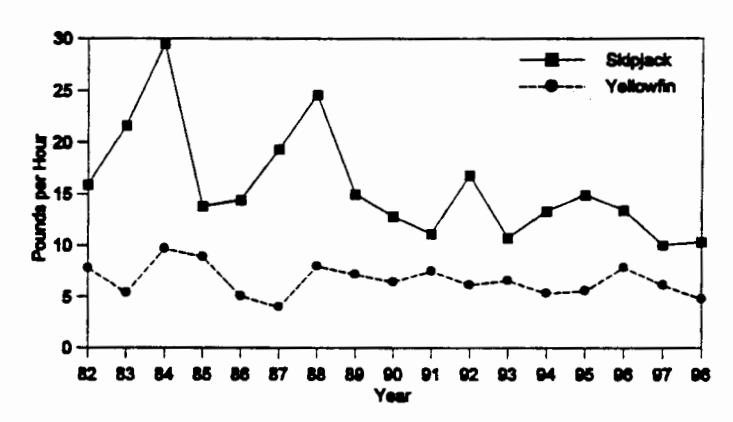

Figure II.1. Troll gear CPUE for skipjack and yellowfin tuna in American Samoa pelagic fishery (after WPRFMC 1999)

are distributed in cooler waters (16-20°C). Adults, on the other hand, are found over a broad temperature range from 13-25°C. The distribution of prey species, bathymetry and temperature fronts are also factors that contribute to the distribution of albacore.

Less is known about the status of billfish in the Central and Western Pacific. Most billfish are taken incidentally during longline operations targeting tuna but swordfish are specifically targeted by longliners in the higher latitudes north and south of the equator. Most studies suggest that Pacific billfish stocks are healthy but there is considerable uncertainty because of the quality of data and differences in the methods used to evaluate the trends (WPRFMC 1998).

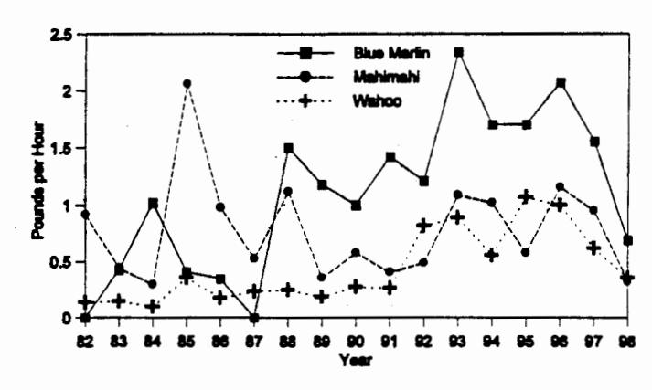

Figure II.2. Troll gear CPUE for non-tuna PMUS in American Samoa pelagic fishery (after WPRFMC 1999)

In American Samoa's pelagic fishery, catch rates of skipjack tuna by small boats using troll gear have fluctuated widely over the past 15 years, with some suggestion of an overall decline (Figure II.1). Catch rates of yellowfin tuna have remained relatively steady over the same time period. The troll gear CPUE for blue marlin, yellowfin, wahoo and mahimahi increased during the mid-1990s (Figure II.2), due partially to better fishing gear and the use of boats that have the range to fish around seamounts.

Since 1996, however, blue marlin, ono and mahimahi CPUEs have all declined markedly. There are only three years of CPUE data for the newly-developed small-scale longline fishery in American Samoa (Table II.2). The longline CPUE for albacore declined in 1997 and 1998, as did the CPUE values for billfish, bigeye, yellowfin, mahimahi and ono, whereas the CPUE of skipjack tuna increased.

Table II.2. Longline CPUE for target PMUS in American Samoa pelagic fishery (after WPRFMC 1999)

| Species   | Ċ     | PUE (no/1000 ho | oks)  |
|-----------|-------|-----------------|-------|
|           | 1996  | 1997            | 1998  |
| Billfish  | 2.05  | 1.30            | 0.53  |
| Albacore  | 35.28 | 26.70           | 26.35 |
| Bigeye    | 2.38  | 0.38            | 0.5   |
| Skipjack  | 0.05  | 0.83            | 2.65  |
| Yellowfin | 7.10  | 3.60            | 1.78  |
| Mahimahi  | 2.38  | 1.73            | 1.13  |
| Ono       | 2.38  | 1.73            | 1.38  |

### II.3.1.3 Probable future condition

# II.3.1.3.1 Potential fishery induced changes

The future condition of the component PMUS stocks occurring in the EEZ around American Samoa will be affected by changes in the size and composition of pelagic fishing fleets operating both within and outside the EEZ around the Territory. Predicting what these changes may be is difficult. The source of uncertainty which could have the greatest impact on the pelagic fisheries within the Council's jurisdiction is the international arrangement currently being negotiated to manage highly migratory fish stocks in the central and western Pacific. Participants in the negotiations recognize that in order for a multilateral arrangement to achieve its objective of conserving and managing stocks, it will need to agree on catch limitations, either directly, through quotas, or indirectly through a limit on fishing effort. Decisions have not yet been made regarding the approach to catch and/or effort limitation and where, when and by whom the fish will be caught.

During 1999, 90 percent of western Pacific US purse seine fishing effort was around untethered FADs (i.e. rafts known as payao). With increased deployment of FADs by the US fleet, there is an increased risk that the migratory behavior of tuna in the western Pacific might be affected. FADs might retain tuna in areas where they would otherwise quickly pass through, and not be enticed by concentrated forage to remain. This could affect their biological parameters (growth, maturity, survival) and population dynamics. These potential effects on the population biology of tunas and on their ecosystem are currently largely unknown and require research attention (Sakagawa in press).

## II.3.1.3.2 Potential environmental influences

Environmental variables have a considerable influence on the abundance and condition of pelagic fish stocks. The three tropical tunas, skipjack, yellowfin and bigeye, and billfish such as blue and striped marlin prefer waters ranging in temperature from 18-31° C, whereas subtropical fish such as albacore and swordfish prefer cooler waters ranging from 10-25° C. Abundance of these tropical and sub-tropical stocks is related to the abundance of prey items, which in turn may be the result of a physical structure such as a seamount, or an oceanographic feature such as a frontal system where two different water masses converge.

The Samoa islands are an area of modest productivity relative to areas to the north and west. The region is traversed by two main currents – the southern branch of the westward-flowing South Equatorial Current during June-October and the eastward-flowing South Equatorial Counter Current during November-April. Surface temperatures vary between 27-29° C and are highest in the January-April period. The upper limit of the thermocline in ocean areas is relatively shallow (27°C isotherm at 100m depth) but the thermocline itself is diffuse (lower boundary at 300m depth). Catch/effort data collected from longline fisheries in American Samoa and Samoa suggest that the regional abundance of albacore tuna, which has been the principal target of small-scale longline fisheries in the Samoa islands, is seasonal, although the peak and low seasons are not extreme.

The largest and strongest environmental influence on pelagic stocks in the western Pacific are *El Niño*-Southern Oscillation (ENSO) events (negative values of the Southern Oscillation Index1). ENSO events are associated with a weakening of the prevalent easterly trade winds in the tropical Pacific and an eastward shift of the western Pacific warm pool, the warm water mass that lies between New Guinea and the Micronesian islands.

The eastward displacement of the warm pool during an ENSO event results in a greater abundance of skipjack and yellowfin tuna in the central Pacific (SPC 1997; Lehodey et al. 1997). Further, ENSO events appear to have a negative impact on recruitment of South Pacific albacore, with poor recruitment following albacore spawning during an ENSO event, and good recruitment following spawnings during La Niña periods when the Southern Oscillation Index is strongly positive (SPC 1997).

A long-term shift in the physical environment of the equatorial Pacific Ocean began in 1977 (Miller et al. 1994). Conditions included more clouds, more rainfall, warmer sea surface temperatures and weaker trade winds, similar to a weak decadal el Nino state. They were most pronounced in the central equatorial Pacific, so American Samoa was close to the center of this shift, which persisted until 1999, when conditions were very different. Whether 1999 marks another regime shift will not be known for several years (J. Polovina, pers. comm.).

&lt;sup>1 The Southern Oscillation Index is the difference between the barometric pressure recorded in Northern Australia and French Polynesia. Normally, the pressure differential leads to prevailing easterly trade winds. During an *El Niño* the pressure gradient reverses, the trade winds fail and warm ocean water in the western Pacific spreads eastwards into the central and eastern Pacific (Philander 1983).

## II.3.2 Economic and social environment

American Samoa is an unincorporated Territory of the US consisting of the islands of Tutuila, Swain's and the Manu'a group (Ofu, Olosega and Ta'u) and Rose Atoll. The total land area is 77 square miles. The Territory's population is about 60,000 and is growing rapidly, with a doubling time of only 20 years. Most of the islands are mountainous with limited flat land suitable for agriculture. American Samoa is lowest in gross domestic product and highest in donor aid per capita among the US Pacific islands (Adams et al. 1998).

American Samoa has a small developing economy, dependent mainly on two primary income sources: the American Samoa Government (ASG), which receives income and capital subsidies from the United States, and two tuna canneries on the island of Tutuila. These two primary income sources have given rise to a third: a services sector that derives from and complements the first two. In 1993, the latest year for which ASG has compiled detailed labor force and employment data, the local government employed 4,355 people (32.2 percent) of total employment), followed by the two canneries with 3,977 people (29.9 percent) and the rest of the services economy with 5,211 workers (38.4 percent) of total employment.

Altogether, the three segments employed 13,543 workers, while 2,718 people were registered as unemployed (that is, actively seeking employment). This gives a total labor force of 16,261 and an unemployment rate of 16.7 percent, certainly out of line with unemployment rates in the states but not unusual when compared with unemployment rates throughout the Pacific islands. With a total population in 1993 estimated at 52,900, the labor force represented 30.7 percent of the population, very low when compared with the US labor force ratio (well over 50 percent of total population) but typical of the smaller developing Pacific island economies. Of the 31,822 residents 16 years or older, the total labor force was equivalent to 51.1 percent. That half of the 16 years-plus population is unemployed is explained by American Samoa's lack of major industry other than government and fish canning. Work opportunities are certainly limited but not having a job in the money economy does not necessarily equate with unemployment in the territory, where subsistence activity contributes to the extended family's total well-being.

Official data notwithstanding, by many measures, American Samoa is not a poor economy. Its estimated per capita income of \$5,000 is almost twice the average for all the Pacific island economies (at \$2,700) (Bank of Hawaii Economic Research Dept. 1999). Per capita income in American Samoa does not represent the same market basket and value as it would, for example, in Honolulu. There are aspects of work and the creation of value in the communal societies of the Pacific islands that are not captured by market measures. For instance, to the extent that unemployment among the younger population can cause both economic and social ills, American Samoa's tightly organized aiga (extended family) system is one way to keep young people from becoming economically unproductive and socially disruptive. Another avenue for American Samoan youth not available to the vast majority of youth in the Pacific islands is emigration to the states, where as estimated 70,000 Samoans live, 20,000 of them in Hawaii.

A large proportion of the territory's work force (in the case of the canneries as much as 90 percent) is from western Samoa. While it is correct to say that western Samoans working in the territory are legally alien workers, in fact, they are the same people, by culture, history and by family ties.

American Samoa has a long history of dependence on pelagic fishery resources. The narrow reef shelf around the islands and the lack of shallow productive lagoon waters limit potential inshore fishery yields. The methods and equipment for catching skipjack and other pelagic species have evolved and island residents are no longer entirely dependent on local fishing for food. In contemporary Samoa, seafood continues to be a major component of the local diet (Severance et al. 1999).

Encouraging domestic harvest of offshore pelagic fishery resources is highly compatible with existing economic activities. A fish processing industry developed in American Samoa in the 1950s and 1960s with the establishment of two tuna cannery operations. Since that time, the canneries have been the largest private sector employer in American Samoa and its leading exporter.

Very little of the raw fish processed by the canneries is landed by the domestic fleet. Most is supplied by distant-water purse seine, longline and albacore troll fleets. In 1998, the canneries at Pago Pago received 208,300 tons of fish worth approximately \$232 million, making it the leading port in the USA in terms of the dollar value of fish landings. Ancillary businesses associated with the tuna processing industry, including those involved in re-provisioning the tuna fleet, also contribute significantly to America Samoa's economy. Fleet expenditures for fuel, provisions and repairs in 1994 were estimated to be between \$45 million and \$92 million (Hamnett and Pintz 1996). The American Samoa Government calculates that the canneries represent directly and indirectly about 15 percent of current money wages, 10-12 percent aggregate household incomes, 7 percent in local government receipts and 20 percent of power sales.

As in most other Pacific islands, stocks of pelagic species in the vicinity of American Samoa offer far greater resource potential than deep slope bottomfish or inshore fish stocks. Inshore resources are heavily exploited or over-exploited in most areas of American Samoa (Wass 1980; Saucerman 1995). The exploitation of slow growing, deep slope snappers in American Samoa is limited by suitable habitat and the low standing stock of the resource (Itano 1996).

Pelagic fisheries are viewed by the American Samoa Government as having an important role in the expansion and diversification of the local economy and in helping the Territory attain a higher level of economic self-reliance. The development of the local fish harvesting sector in American Samoa continues to be constrained by a shortage of private capital and, to some extent, by the economic preferences and cultural values of local fishermen. Most residents interested in commercial fishing do not have sufficient financial resources to invest in large, expensive vessels. In addition, the majority of the fishermen in American Samoa do not rely on the sale of their catch as their only source of income.

The technologies and patterns of fishing that have evolved over the years in American Samoa are culturally acceptable as well as economically reasonable for small-scale fishermen. They have demonstrated a willingness to adopt new types of fishing gear and methods so that their catching power and efficiency has increased incrementally. The small to medium-size vessels favored by fishermen are easily and inexpensively built and maintained and they are capable of harvesting diverse fishery resources utilizing a variety of gear types.

Despite increasing commercialization of the catch, fishing continues to contribute to the perpetuation of Samoa culture and social cohesion in American Samoa. The dependence of the early Samoans on fishing for food security shaped their social organization, cultural values and religion. Of course, many aspects of Samoan culture have evolved but fishing remains an important cultural practice. The role of fishing in cultural continuity is at least as important as the contributions made to the nutritional or economic well-being of island residents. A more detailed discussion of this subject can be found in Appendix I.

# II.4 Environmental consequences of management alternatives

Table II.3. Summary of impacts of management alternatives

| Management Alternative                                     | Biological/Ecological Impacts                                                                                                                                                                                                                                                                                                                                                                                                                                                                                                                                          | Economic Impacts                                                                                                                                                                                                                                                                                                                                                                                                                                                                       | Social Impacts                                                                                                                                                                                                                                                                                                                                                                                                                                             |  |
|---------------------------------------------------------------|---------------------------------------------------------------------------------------------------------------------------------------------------------------------------------------------------------------------------------------------------------------------------------------------------------------------------------------------------------------------------------------------------------------------------------------------------------------------------------------------------------------------------------------------------------------------------|----------------------------------------------------------------------------------------------------------------------------------------------------------------------------------------------------------------------------------------------------------------------------------------------------------------------------------------------------------------------------------------------------------------------------------------------------------------------------------------|------------------------------------------------------------------------------------------------------------------------------------------------------------------------------------------------------------------------------------------------------------------------------------------------------------------------------------------------------------------------------------------------------------------------------------------------------------|--|
| Alternative No. 1 (50-nm closed areas)- PREFERRED             | No stockwide impact. Maintains potential for localized densities and catch rates of pelagic fish by controlling vessel size, thereby limiting per-vessel fishing power and fish mortality in the fishing range of small-boat fleet. Reduces potential for bycatch, especially from payao sets by purse seiners. Redirects fishing effort away from heavily exploited inshore marine resources. Establishes buffer zone around Rose Atoll that reduces risk of large US pelagic vessel grounding.                                                                          | Reduces catch competition from large-scale harvesters, thereby maintaining the potential for economically viable catch rates within fishing range of small-scale pelagic fleet. Reduces risk of "boom and bust" development of local pelagic fishery. Encourages expansion of fishery and support industries at a managed pace. Marginally increases fishing costs for non-exempted large-scale US pelagic vessels.                                                                    | Maintains availability of pelagic fish within fishing range of small-scale fleet to sustain community participation in fishery and meet subsistence and cultural needs.                                                                                                                                                                                                                                                                                    |  |
| Alternative No. 2 (50/30-nm closed areas)                     | Same as No. 1 with marginally less benefit due to smaller closed area around Swains Island.                                                                                                                                                                                                                                                                                                                                                                                                                                                                               | Same as No. 1 with marginally less benefit due to smaller closed area around Swains Island.                                                                                                                                                                                                                                                                                                                                                                                            | Same as No. 1 with marginally less benefit due to smaller closed area around Swains Island.                                                                                                                                                                                                                                                                                                                                                                |  |
| Alternative No. 3 (100 nm closed areas)                       | Larger buffer zone offers potential for more positive impacts than other alternatives on local target stock catch rates, reducing bycatch, redirection of fishing effort from inshore resources if significant number of larger capacity and longerrange monohull vessels join small-scale fleet in the future. Present impacts similar to those of No. 1 because of predominance of low-capacity alia in existing fleet. Would establish a larger buffer zone than other alternatives around Rose Atoll that protects against risk of large US pelagic vessel grounding. | Larger buffer zone offers potential for more positive impacts than other alternatives on managing expansion of small-scale pelagic fishery if significant number of larger capacity and longer-range monohull vessels join small-scale fleet in the future. Present impacts similar to those of No. 1 because of predominance of low-capacity alia in existing fleet.  Increases fishing costs for non-exempted large-scale pelagic fishing vessels more than alternatives 1, 2 and 4. | Larger buffer zone offers potential for more positive impacts than other alternatives to sustain community participation in small-scale fishery and maintain availability of pelagic fish to meet subsistence and cultural needs if significant number of larger capacity and longerrange monohull vessels join small-scale fleet in the future. Present impacts similar to those of No. 1 because of predominance of low-capacity alia in existing fleet. |  |
| Alternative No. 4 (closed areas same as for foreign longline) | Similar to No. 1 but substantially less positive; only marginally greater benefits than under no action (No. 5). No additional protection around Rose Atoll against risk of large US pelagic vessel grounding.                                                                                                                                                                                                                                                                                                                                          | Similar to No. 1 but substantially less positive; only marginally greater benefits than under no action (No. 5).  Less increase in fishing costs for non-exempted large-scale pelagic fishing vessels than No. 1-3.                                                                                                                                                                                                                                                                    | Similar to No. I but substantially less positive; only marginally greater benefits than under no action (No. 5).                                                                                                                                                                                                                                                                                                                                           |  |

| Alternative No. 5 (no action) | No stockwide impact. Higher potential for sudden and uncontrolled expansion of pelagic fishery, with possible reduction of densities and catch rates of pelagic fish within fishing range of small-boat                             | No increase in fishing costs for large US pelagic fishing vessels. Higher risk of "boom and bust" development of pelagic fishery. Higher risk for reduced catch rates of pelagic fish within | Higher risk of reduced pelagic fish availability to sustain community participation in small-scale fishery and to meet subsistence and cultural needs. |
|-------------------------------|-------------------------------------------------------------------------------------------------------------------------------------------------------------------------------------------------------------------------------------|----------------------------------------------------------------------------------------------------------------------------------------------------------------------------------------------|--------------------------------------------------------------------------------------------------------------------------------------------------------|
|                               | fleet. No incentive to shift fishing effort away from heavily exploited inshore marine resources. No potential to reduce bycatch. No additional protection around Rose Atoll against risk of grounding by large US pelagic vessels. | fishing range of small-scale fleet. Incremental development of small-scale fishery and supporting businesses could be disrupted by "boom and bust" type of development.                      |                                                                                                                                                        |

# II.4.1 Biological/Ecological Impacts

# II.4.1.1 Impacts on Target Pelagic Fish Resources

The preferred alternative would have little or no stockwide impact on tunas or secondary pelagic species, including billfish, sharks and epipelagic fish, which are taken in the pelagic fishery in the EEZ around American Samoa. Pelagic species are not confined to any particular EEZ or country but have a wide geographical distribution in the central and western Pacific. None of these stocks are presently overexploited in the South Pacific and stockwide effects are unlikely even if the American Samoa catch increased several fold.

The stock structures of pelagic fish are by no means well defined. Long distance movements are evident for all tuna species but mixing of various fractions of stocks between areas, at least over short and medium time periods, seems to be quite incomplete. Fluctuations in local ocean environmental conditions or prey availability can cause striking and unpredictable changes in the relative abundance and catch rates of pelagic fish, as a function of local movement patterns rather than "overfishing." If these fluctuations reduce the availability of pelagic fish in a localized area, they have a much more severe impact on small-scale fleets with limited fishing range than on larger, more mobile vessels. Local reductions in pelagic fish density can be amplified by interactions with nearby fisheries. The effect of fishing tuna in one area may affect the performance of a fishery harvesting the same stock in a nearby area. How various gears fishing in the same time and area compete "locally" to exploit pelagic fish resources and the effects on availability of the target fish are poorly understood.

It is not understood whether the sub-surface albacore tuna taken in American Samoa's small-scale longline fishery are primarily a local sub-population or are part of a more widely distributed regional mass (Stanley and Toloa 1998). The albacore catch by small-scale longline fisheries in American Samoa and neighboring Samoa totaled 6,800 mt in 1998, which represents 19% of the South Pacific regional albacore harvest by longline fisheries (Lawson, 1999). Albacore catches in American Samoa's longline fishery decreased from 454 mt in 1998 to 302 mt in 1999 (Coan et al. 2000).

The effect of rapid expansion and high catches by the small-scale longline fishery in western Samoa on the regional "throughput" of albacore cannot be estimated but may be a contributing factor in a recent decline in CPUE experienced by the American Samoa small-scale fishery. Nor is it known whether catches obtained in the recent expansion years of the western Samoa fishery are representative of the long-term average. Most of the other island nations which are neighbors to American Samoa are also developing domestic longline fisheries.

In general, the vessels that constitute the US longline fleet are highly mobile. The dozens of longline vessels that arrived in Hawaii during the late 1980s were from Alaska, California, the Gulf of Mexico and the East Coast (Travis 1999). Some of these vessels later returned to the continental US or moved on to new fishing areas such as the waters around Fiji. It is likely that some of the longline vessels that remained in Hawaii are currently seeking alternative fishing grounds because the area around the Hawaiian Islands in which longline vessels are allowed to operate is becoming increasingly restricted. In November 1999, a US District Court issued an injunction prohibiting vessels holding a Hawaii longline limited access permit from fishing within a 1.2 million square mile area north of the Hawaiian Islands. This area encompasses some of the principal fishing grounds for Hawaii-based longline vessels targeting swordfish. A court order issued in August 2000 continued the closed area and added other restrictions on longline operations that have crippled Hawaii's swordfish longline fishery. As many as 40 longline vessels have been displaced and some may look to American Samoa as a potential new home port.

In addition, quotas, limited access programs, commercial trip limits, incidental catch restrictions, prohibitions on sale, minimum size limits and time and area closures are among the array of measures that have been implemented or are being discussed by federal and state entities to manage pelagic stocks in the Atlantic and Gulf of Mexico. It is likely that these measures will restrict longline fishing and will cause some longline vessels currently operating in these areas to seek alternative fishing grounds. In addition, restrictions in other fisheries, such as the Gulf of Mexico shrimp fishery, may induce some fishermen to equip their vessels with longline gear and move to areas where there are productive fishing grounds for pelagic species.

Most of the fishing activity by US purse seine vessels occurs in the EEZ waters of Papua New Guinea, Federated States of Micronesia and other Pacific island nations far west of American Samoa. During El Nino events, however, these vessels are known to shift their fishing activity to the equatorial central Pacific. The percentage of yellowfin tuna in their catches often increases with this shift. The purse seine fleet does not catch albacore, so there is no interaction with American Samoa's small-scale longline fishery, whose main target is albacore. Yellowfin tuna comprise a minor portion of the present longline catch but this species could become a more desirable target in the future.

There is not yet any compelling evidence that the increased purse seine catches of large and small yellowfin have had any significant effect on yellowfin longline catch rates on a broad scale. Even in areas where high levels of effort by longline and surface gears co-occur, interaction has been difficult to demonstrate. A study in Kiribati suggests that, at a scale of separation of 300-600 nmi, purse seine catches of yellowfin are not negatively correlated with troll fishery catches. When purse seiners fished within 60 nm from Kiribati shorelines, however, some negative impacts were observed (Hampton et al. 1996). There is some indication from preliminary modeling of theoretical skipjack tuna movement that purse seine fishing could have an impact on the availability of skipjack tuna for small-scale trolling as far away as 600 nm (P. Kleiber pers. comm.).

During 1999, 90 percent of western Pacific US purse seine fishing effort was around untethered FADs (i.e. rafts known as payao) (Coan et al. 2000). With increased deployment of FADs by the US fleet, there is an increased risk that the migratory behavior of tuna in the western Pacific might be affected. FADs might retain tuna in areas where they would otherwise quickly pass through, and not be enticed by concentrated forage to remain. This could affect their biological parameters (growth, maturity, survival) and population dynamics. These potential effects on the population biology of tunas and on their ecosystem are currently largely unknown and require research attention (Sakagawa in press).

Small-scale fishermen in American Samoa are concerned that the US purse seine vessels which land fish at the tuna canneries in the Territory occasionally harvest surface tuna in the adjacent EEZ. Available data suggest that this is a rare occurrence. Even so, the large quantity of pelagic fish (30+ mt) that can be taken by a single purse seine set could have a severe impact if fish densities were reduced for a season or longer in the areas fished by the small-scale fleet. The effects would be magnified if purse seines were set at specific localities in the EEZ where tuna may aggregate seasonally. It is well known, for example, that seamounts and submarine features that rise sharply from the sea floor can aggregate commercial concentrations of tuna, although the responsible mechanisms are poorly understood (Rogers 1994; Yasui 1986).

# II.4.1.1.1 Alternative No. 1 (50-nm) - Preferred

At a meeting on June 14, 2000, the Council selected Alternative No. 1 as the preferred framework measure (Figure 12.1). This alternative would close an area extending approximately 50 nm offshore from all islands of American Samoa. A 50-nm closure would encompass all of the areas where the small-scale fleet presently fishes and all of the known banks and seamounts which are likely to aggregate tuna, thus providing for small-scale fishery expansion.

Approximately one-third of the EEZ would be closed to pelagic fishing by large vessels (> 50 ft).

Existing or potential interactions between large and small-scale vessels fishing for pelagic species in the EEZ around American Samoa cannot be quantified with available information. In general, pelagic fisheries interactions are difficult to document and model because of inadequate data, insufficient knowledge of the biology and population dynamics of the resource and poor understanding of environmental influences (Shomura et al. 1994; Shomura 1996). Migratory routes of specific fractions of stocks are of major importance in determining the availability of pelagic fish in localized areas fished by small-scale fleets. Specific routes are not scientifically documented but tuna fishermen in some islands of the Pacific have learned to "read" local tuna dynamics after many years of careful observation (Kaneko et al. 2000).

Areas closed to large fishing vessels compensate for uncertainty about pelagic fish resource abundance and dynamics because they limit pelagic fish mortality while improving fishery data. New information will be acquired by small-scale fishermen as they venture farther from offshore and discover new grounds. Entry into the fishery by large vessels represents a much greater increase in fishing effort and potential fishing mortality than the addition of small-scale boats. A typical 50+ ft longliner in neighboring Samoa, for example, sets 1,200-1,600 hooks per day, compared to 250-900 hooks set by small-scale longline vessels (< 50 ft) (Mulipola 2000).

In the Pacific basin, the establishment of area closures is increasingly becoming the preferred management tool to resolve conflicts associated with competition among fisheries harvesting the same local populations of pelagic fish resources. The government of neighboring Samoa has implemented regulations prohibiting longline fishing by vessels larger than 15 m within 50 nm of shore (Mulipola 2000). The Marshall Islands established a 50-nm longline exclusion zone around the atolls of Majuro and Kwajalein in 1996, after sportsfishermen contended that trolling catch rates for game fish species such as blue marlin and yellowfin tuna had declined as a result of fishing by the locally-based longline fleet (Bigelow and Lewis undated).

There is evidence from other pelagic fisheries that intensive fishing effort within core areas can reduce catch per unit of effort (CPUE) on a localized scale. Such an effect was observed on the Pacific coast of Mexico, where an increase of longline fishing effort led to marked overall decreases of CPUE in both longline and troll fisheries (Muhlia-Melo 1996). After Mexico established a sport fishery preserve which extended 50 nm offshore along the Pacific coast, Squire and Au (1990) noted that an improvement in striped marlin catch rates, which reflected the fishing down and rebuilding of two localized near shore areas where fish are attracted and regularly linger during their life cycle. In 1987, Mexico extended the area closed to longline fishing farther offshore (Muhlia-Melo 1996).

A 50-nm closed area may not be sufficient to encompass the natural variations in local tuna movement patterns or to encompass undiscovered seamounts where tuna aggregate in the EEZ of American Samoa. Albacore tuna concentrations have shifted farther offshore since late 1998, according to the owners of larger, mobile longline vessels based in American Samoa.

The preferred alternative considers the newly expanded fishing range of new and safer vessels entering American Samoa's small-scale fleet and provides sufficient buffer area to encourage controlled expansion of the small-scale fishery by the newer *alia* catamaran vessels. However, the *alia* design, even in newer versions, does not provide sufficient capacity to store and chill large fresh fish catches and long-range fishing beyond 50 nm from shore is not economically efficient. If a significant number of monohull vessels with larger carrying capacity and longer range join the small-scale fleet in the future, a 50-nm closure may not be sufficient to prevent interactions with large-scale vessels (> 50 ft).

During ENSO events, US purse seine fishing activity shifts toward the central equatorial Pacific, with sets made rarely in the portion of American Samoa's EEZ near Swains Island. Considering that negative impacts on small-scale tuna fisheries by purse seine fishing are much more likely within 60 nm of shore (Hampton et al. 1996), inclusion of Swains Island in a uniform 50-nm area closure would avoid the potential for yellowfin tuna catch competition with the purse seine fishery.

# II.4.1.1.2 Alternative No. 2 (50/30-nm)

Alternative No. 2 would establish a 50-nm area closure around Tutuila, Rose and the Manu'a islands but only a 30-nm area closure around Swains Island (Figure 12.1). The closed areas comprise about 26 percent of American Samoa's EEZ. This alternative does not consider the extended range and safety of the newer class of *alia* that is available to residents of Swains Island. Nor does it provide an adequate buffer to prevent yellowfin tuna catch competition with purse seine fishing in the vicinity of Swains Island.

Some of the larger (> 50 ft) domestic vessels based in Tutuila are already finding areas of the EEZ near Swains Island highly productive for albacore longline fishing (A.M. Hunkin, pers comm.). Yellowfin tuna becomes a more important target for longlining closer to the equator and the EEZ around Swains Island could become an important "northern grounds" for this species as a fresh tuna export industry develops in American Samoa. A pilot longline fishing project conducted by the American Samoa Department of Marine and Wildlife Resources made good catches of swordfish in the vicinity of Swains Island (H. Sesepasara pers. comm.).

# II.4.1.1.3 Alternative No. 3 (100-nm)

Alternative No.3 would establish a uniform 100-nm area closure around all islands of American Samoa (Figure 12.2). The closed area would comprise about 77 percent of American Samoa's EEZ area. The closed area is a continuous band from Swains Island to Rose Atoll and extends well beyond the areas that have been previously fished by the small-scale fleet.

This alternative not only encompasses all of the known banks and seamounts which are likely to aggregate tuna but it provides a large buffer area to account for natural variations in local tuna movement patterns and for the strong possibility that new seamounts with tuna aggregations will be discovered. Albacore tuna concentrations have shifted farther offshore since late 1998, according to the owners of large, mobile longline vessels based in American Samoa.

The limited capacity of *alia* (even the new class) for storing and chilling fresh fish catches presently discourages fishing beyond 50 nm from shore because of very low efficiency. Should a significant number of monohull vessels with larger carrying capacity and longer range join the small-scale fleet in the future, however, this alternative could become more beneficial for maintaining catch rates of the small-scale fishery and for encouraging expansion of the small-scale fishery at a controlled pace.

# II.4.1.1.4 Alternative No. 4 (same as foreign longline area closures)

Alternative No. 4 would establish closed areas around some islands of American Samoa that have the same boundaries as the areas that were closed to foreign longline vessels in 1986 (Figure 12.3). The closed areas constitute about 12 percent of the total EEZ area around American Samoa. The area closure would encompass most of the grounds currently fished by the small-scale fleet but would not encompass all of the offshore banks and seamounts that are known to aggregate tuna or all areas within the fishing range of the new class of safer vessels now entering the small-scale fishery.

# II.4.1.1.5 Alternative No. 5 (no action)

Uncontrolled expansion of the pelagic fishery in the EEZ of American Samoa is possible with no action. Highly capitalized, mechanized vessels with greater fishing power could fish within the range of the small-scale fishery. An Asian longline fishery operated near American Samoa from the mid-1950s through the 1970s, until the Magnuson Act was implemented in 1977. The history of that fishery demonstrates the potential for a decline in tuna catch rates in conjunction with increasing fishing effort by large longline vessels. Albacore catch rates in the waters around American Samoa declined as the Asian longline fleet expanded rapidly in the 1950s. Analysis of this fishery from the 1950s to the 1970s by Otsu and Sumida (1968) and Yoshida (1975) indicates that the large increase in longline fishing effort may have had an effect on the South Pacific albacore stock. The average catch per day and catch per 1000 hooks (CPUE) of Asian longline vessels based in Pago Pago declined steadily between 1959 and 1971. That the apparent effect was not greater was due to expansion of the fishery into areas south of 20°S, where better catch rates were obtained.

Little data specific to American Samoa's EEZ are available from the earliest period of the fishery (1954-1959), when Asian longliners were still learning the albacore tuna grounds and confined their fishing largely to the vicinity of the Samoa islands. It is difficult to estimate the level of longline fishing effort in nearshore areas around American Samoa prior to 1959 when activity was concentrated in the vicinity of the Samoa islands but it no doubt exceeded the 1971-1977 average effort of 1.5 million hooks in American Samoa's EEZ (Yong and Wetherall 1980). The South Pacific longline fishery for albacore set an estimated 15-20 million hooks in 1963-1964 (Yoshida 1975), so it would not be surprising if the fishing effort in the EEZ of American Samoa during the late 1950s exceeded 5 million hooks per year. Increased effort was enough to cause a decline from 5 fish/100 hooks to 3 fish/hooks in the older grounds north of 20°S during the period 1966-1971 (Yoshida 1975).

American Samoa's domestic pelagic fishery is constrained by small boats with a limited fishing range. Most island nations which are neighbors to American Samoa have, or are developing, domestic longline fisheries which compete for pelagic fish resources available within the region. Neighboring Samoa has the smallest EEZ of any Pacific island nation and the catch of albacore per unit area in that country's rapidly expanding domestic longline fishery is among the highest in the Pacific. Catch competition which already exists would be exacerbated if there is uncontrolled expansion of pelagic fishing by large domestic vessels with greater fishing power in the same areas fished by the American Samoa's small-scale fleet. Even short-term reductions in pelagic fish densities and catch rates could jeopardize the economic viability of the small-scale fleet. Thus, no action has the potential for greater negative impacts on pelagic fishery resources than the other alternatives.

# II.4.1.2 Impacts on non-pelagic fishery resources and redirection of fishing effort

Inshore fishery resources are heavily exploited or over-exploited in many areas of American Samoa. The effects of heavy fishing pressure have been exacerbated by the environmental effects of cyclones, pollution and sedimentation (Saucerman 1995). Attempts to harvest deep slope bottomfish have not been sustained (Itano, 1991). Domestic harvest of underutilized offshore pelagic fishery resources by the small-scale fleet could relieve some of the heavy fishing pressure on bottom-dwelling marine resources near shore.

The area closures proposed in the preferred Alternative No. 1 (50-nm) encourages expansion of the existing small-scale pelagic fishery, thereby shifting some fishing effort away from inshore resources. Alternative No. 2 (50/30-nm closures) would have marginally less beneficial impact because it provides a smaller buffer zone for pelagic fishery expansion around Swains Island. Alternative No. 3 (100-nm closures) would be more positive because of the large buffer zone established for expansion of the small-scale pelagic fishery. Alternative No. 4 (foreign longline closures) is only slightly better than no action in encouraging fishing pressure to shift offshore.

# II.4.1.3 Impacts on bycatch

Most of the non-tuna fish taken by longline fisheries in the US Pacific islands are secondary or incidental species, rather than bycatch, because few are discarded. In 1997, NMFS logbook data for domestic longline vessels based in American Samoa indicated that discards amounted to 4.5 percent of the total catch of large (>50 ft) longline vessels, while 0.2 percent of the total catch of small vessels using longline gear was discarded. Longsnouted lancet fish, *Alepisaurus ferox*, is one of the most common species caught on longline gear by fishermen in neighboring Samoa and is always discarded (Mulipola 2000).

Most of the catch of large longline boats that has no market value, including small skipjack and yellow tuna, may be discarded, particularly where fish storage capacity or ice is limited (Mulipola 2000) but much of the unmarketable portion of the catch is taken home by the crew for personal consumption. For example, marlin is often cut up and distributed to the crew before the boat returns to port. Some sharks are finned at sea and the carcasses discarded (Mulipola 2000).

In 1999, 90 percent of the fishing effort by the western Pacific US purse seine fishery was around untethered fish aggregation devices (i.e., rafts known as payao) (Coan et al. 2000). With increased deployment of payao, there could be undesirable effects, such as discarding of dead undersized tunas and bycatch species. The shift towards payao operations has affected the US purse seine fleet's catch in three ways. First, the average size of tuna caught tend to be smaller in floating object sets than in free-swimming school sets. A higher percentage of tuna that is caught in floating object sets is undersized for US canning and, hence, is discarded. Second, floating object sets tend to contain a higher proportion of bigeye tuna than free-swimming school sets. Third, because floating objects tend to aggregate a large number of pelagic species than tuna, they produce more bycatch than free-swimming school sets (Coan et al. 1999).

The Forum Fishery Agency (FFA) administers an observer program covering a minimum of 20 percent of the fishing trips by US purse seiners for sampling per year. FFA observers collected bycatch and discard information from 616 sets made in 1998. The data have not been fully reviewed for accuracy and some data appear to be inconsistent with logbook information. Nevertheless, FFA observer data for 1998 indicate almost a 25-fold difference in the bycatch rate between floating object sets (1.59 mt of bycatch per set) and free-swimming school sets (0.06 mt of bycatch per set). Rainbow runner, oceanic triggerfish, sharks, mahimahi, wahoo, mackerel scad, mackerel and marlins were the most frequently taken bycatch species, according to FFA observers. Over 90 percent (by number) of the rainbow runner, triggerfish, mackerel scad and mackerel were discarded. Over 50 percent (by number) of wahoo and marlin were discarded. Only 17 percent of the sharks were discarded as whole fish (Coan et al. 1999) but the remainder were presumably discarded after finning.

By closing some areas of American Samoa's EEZ to pelagic fishing by large longline vessels and purse seiners, Alternative No. 1 (50-nm) could reduce the potential for bycatch, particularly from the purse seine fishery. Alternative No. 2 (50/30-nm closures) would offer marginally less beneficial impacts, whereas Alternative No. 3 (100-nm closures) has the greatest potential for positive impacts. Alternative No. 4 (foreign longline closures) is not as positive as the others but the smaller closed areas would still be more beneficial than no action, which does not offer any potential for reduction of bycatch in pelagic fisheries in American Samoa's EEZ.

# II.4.1.4 Impacts on protected species and wildlife refuge resources

Interactions with protected species are uncommon in American Samoa's small-scale pelagic fishery. One hawksbill turtle and one olive ridley turtle were reported hooked in 1999. Both were released alive. These were the only interactions with any protected species reported for the domestic longline fishery during the 1996-1999 period. Both large-scale and small-scale longline vessels set mainline deep enough (45 fm) to target albacore tuna (Kaneko et al. 2000), thus reducing the potential for interactions with turtles.

Although there have been no reported interactions, other protected species occur in the waters around American Samoa. In Fagatele Bay National Marine Sanctuary, southern humpback whales mate and calve from June through September. Sperm whales are occasionally seen in the Sanctuary as well. Both species are listed as endangered under the Endangered Species Act (ESA) and the Marine Mammal Protection Act (MMPA). Several species of dolphins protected under the MMPA but not listed as threatened or endangered also frequent the Sanctuary. Twelve species of migratory seabirds reside on rose Atoll, one of which is the bristle-thighed curlew, which is listed as vulnerable under the ESA.

Rose Atoll is a National Wildlife Refuge co-administered by the US Fish and Wildlife Service and American Samoa Department of Marine and Wildlife Resources. Entry to the refuge is prohibited without a special permit so there are few human impacts compared to the inhabited islands of American Samoa. Thus, Rose Atoll affords protection for nesting sea turtles on the beaches and potential foraging habitat for turtles on reefs and in the lagoon. Like many places, however, the habitat and wildlife resources of the refuge are subject to the destructive effects of vessel groundings. In 1993, for example, the reef at Rose Atoll was damaged by a fuel spill and debris after the grounding and breakup of a large Asian longline vessel.

Alternative No. 1 (preferred) would provide a closed area (50 nm) around Rose Atoll to greatly reduce the risk of grounding by large US pelagic fishing vessels. Alternative No. 2 would have the same positive impact. Alternative No. 3 would substantially increase the closed area around Rose Atoll and, for this reason, might be considered a higher level of protection against vessel groundings. Alternative No. 4 does not include a closed area around Rose Atoll, and like no action (Alternative No. 5), it does not provide any protection against the risk of grounding by large US pelagic fishing vessels.

# II.4.2 Economic and Social Impacts

# II.4.2.1 Fishery sectors and fishing community

American Samoa has a compelling interest to foster and promote the development of pelagic fisheries because of the lack of alternative economic activities in the Territory. Unless the small-scale fishery evolves at a managed pace, however, there is a high risk of uncontrolled expansion by large vessels, with the potential for reduced densities and catch rates of pelagic fish. The preferred alternative gives particular support to the incremental development of the small-scale fishery because of its importance as a source of food for local consumption, income and employment. The preferred alternative would also maintain traditional fishing practices for non-market personal consumption and customary food exchanges that perpetuate the Samoan way of life and culture (fa 'a Samoa). Pelagic fishing has ancient roots in Samoan cultural heritage and continues to contribute to cultural continuity and social cohesion in American Samoa.

Table II.4 Profile of domestic pelagic fishing fleet operating in EEZ of American Samoa

| Vessel length | No. by Regular Port |        | No. by fishing method |          | Areas of EEZ fished | Generally safe fishing range |                                  |
|------------------|---------------------|--------|-----------------------|----------|------------------------|------------------------------|----------------------------------|
|                  | Tutuila             | Aunu'u | Manu'a                | Longline | Troil                  |                              |                                  |
| < 30 ft          | 45                  | 7      | 7                     | 18       | 41                     | < 20 nm from port            | < 50 nm from                     |
| 31-40 ft         | 22                  | 1      |                       | 13       | 10                     | < 50 nm from port         | 50+ nm from port              |
| 41-50 ft         | 3                   |        |                       |          | 3                      | 50-100 nm from port       | 200+ nm from port             |
| 50-90 ft         | 4                   |        |                       | 4        |                        | Entire EEZ                   | Hundreds of nm from port         |
| > 90 ft          | 1                   |        |                       | 1        | r                      | Entire EEZ and beyond        | Several thousand nm from port |

Source: American Samoa Dept. Marine and Wildlife Resources, October 2000 vessel identification

By encouraging a controlled expansion of the small-scale harvesting sector, the preferred alternative is expected to enhance domestic economic and social values of the pelagic fishery. At present, the small-scale fishing fleet in American Samoa generates little indirect economic activity because the boats, fuel, gear, bait and other supplies it purchases are almost all imports. However, an expansion of the fleet could lead to new business opportunities such as local boat building, vessel support services, fish processing and export marketing. Investments are already being made in such industries. Recently, a non-profit private organization in American Samoa received a grant of \$346,000 from the Administration for Native American (ANA) for startup of a small-scale fish processing business. When operational, the new enterprise is expected to process fresh fish landed by domestic small-scale fleet fishermen and to sell finished products in local and export markets.

The 50-nm alternative could have a negative impact on another non-profit organization which has acquired a 52 ft fishing vessel with financial assistance from the ANA. The owners did not not obtain a NMFS General Longline Permit or make a qualifying landing of fish on or before November 13, 1997, the control date established for exemptions to area closures for fishing by US vessels over ft in overall length. The non-exempt large vessel is being used to train commercial fishermen so that an experienced local work force is available to fill new jobs as the longline fishery develops in American Samoa. In anticipation that the framework proposal for area closures would be approved, the vessel owners made an application to the NMFS Southwest Regional Director for an experimental fishing permit (EFP, which is available under the federal regulations for pelagic fisheries in the western Pacific. The reason for the request is to enable the large vessel to make more frequent and shorter fishing trips within 50 nm from shore with lower operating costs for quicker rotation of trainees (A.M. Hunkin EFP application dated 5 Jan. 2000). According to the training vessel owners, the additional distance to reach more distant fishing areas in the EEZ of American Samoa doubles average fuel consumption of a large vessel (> 50 ft) per week of fishing. Since the time the EHP application was made, the training vessel has made higher catch rates when fishing beyond 50-nm from shore than inside the proposed 50-nm closed areas. This offsets the higher fuel expense incurred by large vessels to travel offshore of the closed areas (A.M. Hunkin, pers. comm.). Other owners of three other large longline vessels based in American Samoa have also observed higher catch rates of albacore tuna in areas of the EEZ beyond the proposed 50-nm closures. This reduces the potential for adverse impacts on their fishing operations. The non-profit group plans to acquire a 49 ft vessel to conduct training in nearshore fisheries and to utilize the large vessel for pelagic fishing offshore of the proposed closed areas (A.M. Hunkin, pers. comm.).

The preferred alternative (No. 1) would not impose an economic hardship on two of the large domestic longline vessels that are currently based in American Samoa because an owner of a vessel greater than 50 ft in length who held a NMFS longline general permit on or prior to November 13, 1997 and made a landing of PMUS in American Samoa on or prior to that date is exempt from the prohibition to take PMUS within the closed area. Because of the exemption, the other alternatives (No. 2-5) would have the same impact as the preferred alternative on the owners of these two vessels.

The owners of five other large (> 50 ft) domestic vessels that have received NMFS longline general permit are not expected to qualify for the exemption. All of these vessels are based in Hawaii or the US mainland. Two of the vessels participate mainly in the Alaska crab fishery and three are primarily used to troll for albacore. All of the owners have held NMFS longline general permit vessels for at least nine months, but only one of these five vessels has fished with longline gear in the EEZ around American Samoa. The owner of the latter vessel received a permit prior to the control date but did not land any PMUS in American Samoa before that date. The vessel owner has submitted only a single catch report from fishing in the proposed closed area of the EEZ. The proposed area closure should not have a significant adverse economic impact on these vessel owners because of their previous lack of participation in the longline fishery.

Alternative No. 2 differs from Preferred Alternative No. 1 only in that Swains Island would have a reduced closed area boundary (30 nm) compared to the other islands of American Samoa (Figure 12.1). Swains Island, located 210 miles north of Tutuila, was devastated by a hurricane approximately two years ago, reducing the population on Swains Island to about 33 families. The majority of the 200 Swains islanders living in American Samoa wish to return home and become involved in small-scale fisheries and other cottage industries. Because copra is no longer harvested on the island, the residents are turning to marine resource for their livelihood and fishing is becoming more important to the economic future of this small, relatively isolated community. Alternative No. 2 does not consider the extended range and safety of the newer class of *alia* that is available to residents of Swains Island. Furthermore, it does not sufficiently encourage the development of small-scale fishing as a livelihood by the residents of Swains Island. A 50-nm area closure around Swains Island (Preferred Alternative No. 1) would help to encourage development of a small-scale pelagic fishery (W. Thompson, letter to WPRFMC dated 3 Feb. 2000).

Alternative No. 3 (Figure 12.2) would have impacts similar to those of the preferred alternative. The benefits could be more positive because the larger area closures (100 nm) may provide a more stable resource base to sustain the small-scale pelagic fishery. The availability of target species in any one area is highly cyclical and a larger closure would allow flexibility is locating high densities of pelagic fish.

Alternative No. 4 (Figure 12.3) would have impacts similar to those of the preferred alternative but the area closures proposed are smaller and less likely to stabilize pelagic fish catches enough to sustain community participation in the small-scale fishery on a year-round basis.

No action (Alternative No. 5) could allow uncontrolled expansion and possible overcapitalization of the pelagic fishery; i.e., a "boom" of fishing by large vessels entering the fishery with greater fishing power, followed by a "bust" of overcapacity. This would disrupt further evolution of the small-scale fishery, possibly even leading to its collapse if small-scale fishermen were squeezed out by larger and better capitalized fishing operations. Even a significant reduction in catch rates of pelagic fish, if it lasted for more than a few seasons, could have a severe economic and social impact on the American Samoa fishing community. Income from fishing would be reduced, possibly causing some owners to default on boat loans. Job opportunities would be lost and ancillary businesses would experience economic hardship. Furthermore, residents of American Samoa would suffer from a decline in traditional fishing practices and a shortage of fish for subsistence and for customary food exchanges that maintain Samoan culture and community cohesion. Pelagic fishing effort of large vessels (> 50 ft) would not have to relocate offshore of closed areas with no action, so no extra expense for fuel consumption would be incurred by them to travel farther.

The establishment of a closed area for the small-scale fishery should have little direct effect on the domestic purse seine vessels that supply tuna to the fish processing industry in American Samoa regardless of the specific management alternative (No. 1-4) or size of the closed areas. The most productive fishing grounds for purse seiners are far from American Samoa. According to catch reports compiled by NMFS, six US purse seine vessels made seven sets within the EEZ around American Samoa between 1988 and 1997. The total catch from these sets was 36.3 metric tons of skipjack tuna. Only in one year during that period did three or more vessels fish in American Samoa's EEZ. Fishing activity increased during 1998-1999, when a total of four sets, two in each year, were made by US purse seiners operating in the EEZ of American Samoa. These sets resulted in a total catch of 100.7 mt of skipjack tuna and 20.8 mt of yellowfin tuna. The four sets were made in the same general area – the northern portion of the EEZ in the vicinity of Swains Island – as those reported in the previous 10-year period (R. McGinnis, letter dated 19 May 2000 to Paul Dalzell, WPRFMC).

The average annual catch of skipjack by a US purse seine vessel operating in the central and western Pacific from 1990 to 1997 was 3,161 mt (SPC 1998) with an ex-vessel value of nearly \$2 million. Therefore, even if the 1998-1999 peak catches of 100.7 mt of skipjack and 20.8 mt of yellowfin in the EEZ around American Samoa were landed by a single vessel, the area closure would reduce its annual catch by only about 4 percent. The US purse seine fleet's increasing dependence on untethered FAD sets since 1999 introduces another possible impact. Although the vessels deploy *payao* far to the west of American Samoa, a few could drift close enough to enter portions of American Samoa's EEZ that are proposed for closure to large pelagic fishing vessels. In 1999, US seiners followed *payao* as far as Tonga and Niue. Seiners would not want to lose the opportunity to set on any rafts within American Samoa's EEZ on their route to and from the canneries in Pago Pago Harbor.

No action (Alternative No. 5) or status quo may have some marginal benefits for the US purse seine fleet. The United States Tuna Foundation has expressed concern that the establishment of an area closure could have an indirect negative impact on their fishing activities. Specifically, the Tuna Foundation argues that the establishment of a closed area in the waters around American Samoa will set a precedent that will be followed by Pacific island nations that are parties to the Multilateral Treaty on Fisheries. This treaty sets forth the terms and conditions that US purse seine vessels must adhere to in order to fish in the region. Among the principal issues of the treaty are closed and limited areas. The Tuna Foundation states that such a precedent could adversely affect efforts by the purse seine fleet to retain vital fisheries access throughout the region. However, a number of Pacific island nations such as Kiribati, Tuvalu and the Federated States of Micronesia depend upon foreign fishing access fees for a significant portion of their government revenue. The access fees paid by the US under the Multilateral Treaty on Fisheries are the highest of any licensing arrangement in the region (10% of the value of fish harvested). Given this economic incentive to accommodate foreign fishing vessels, particularly US purse seiners, it is unlikely that the Pacific island nations will be induced to enlarge the areas closed to foreign vessels by following the example of the preferred alternative for American Samoa.

In the future, it is possible that one way in which Pacific island countries encourage the further development of local tuna industries is to reserve a larger portion of their EEZ waters for exclusive use by domestic vessels. For example, Papua New Guinea has already closed its entire EEZ to foreign longline vessels. Such future restrictions on US fishing fleets are likely to occur whether or not an area closure is established in the EEZ around American Samoa.

The preferred alternative (No. 1), as well as Alternatives No. 2-3, are likely to reduce the prospect of negotiating a Pacific Insular Area Fishery Agreement (PIAFA) that would allow foreign vessels to fish in the EEZ around American Samoa in return for a negotiated fee. The PIAFA provision was included in the Magnuson-Stevens Act in order to provide American Samoa and other Pacific Insular Areas with an additional opportunity to derive economic benefits from the fishery resources within the EEZ. Any payments received under a PIAFA for American Samoa will be deposited in the American Samoa treasury. Decreasing that portion of the EEZ around the Territory in which foreign boats are allowed to fish is likely to reduce the interest of foreign nations in acquiring access rights. On the other hand, a PIAFA may not be entered into if it is determined by the Governor of the applicable Pacific Insular Area that the agreement will adversely affect the fishing activities of the indigenous people of the Pacific Insular Area. By spatially separating foreign vessels from domestic small-scale fishing boats, the preferred alternative (No. 1), as well as Alternatives No. 2 and 3, would mitigate any such adverse effects if a PIAFA is negotiated eAlternatives No. 4 and No. 5 would be the most positive for maintaining the potential for foreign fishing opportunities under a Pacific Insular Area Fishery Agreement (PIAFA).

# II.4.2.2 Fishing gear conflict

In American Samoa, the small-scale longline fleet deploys relatively short lengths of mainline and they can usually avoid tangling gear. The larger vessels which are active in the longline fishery usually fish in offshore areas which produce higher catch rates. If additional large vessels enter the fishery and set gear in the same areas as the small-scale fleet, there would be a much greater potential for gear conflicts with the small-boat fleet. Large vessels (> 50 ft) may set 30-50 miles of mainline, compared to 7-25 miles of mainline set by small-scale vessels (< 50 ft) in Samoa. Dramatic expansion of the small-scale longline fishing fleet in western Samoa led to congestion and gear conflict in nearshore areas of concentrated fishing during the dramatic growth period of 1996-1997. To minimize further conflicts, the Samoa government has implemented regulations that prohibit longline fishing by vessels over 15 m within 50 nm of the coast (Chapman 1998).

Gear conflict was evident between the small-boat (troll and handline) and longline fleets during the rapid expansion of the Hawaii longline fleet in the late 1980s. The fleet increased from 37 vessels in 1987 to 75 in 1989, and then doubled again to 156 vessels in 1991. Many of the new longline vessels were recent arrivals from the continental USA. In addition to straining harbor facilities, the increased fishing effort led to gear conflicts and precipitated heated confrontations between the longliners and the established local fishing fleet, which consisted mainly of small troll and handline vessels (Pooley 1990).

The preferred alternative (No. 1) would reduce the potential for gear conflict more than no action (Alternative No. 5) and Alternatives No. 2 and 4 based on the percentage of American Samoa's EEZ that would be closed to large vessels. Alternative No. 3 would close a larger percentage of the EEZ to large vessels but *alia* have limited carrying for fish and there is presently little economic incentive to set gear beyond 50 nm from shore. Should a significant number of monohull vessels with larger carrying capacity join the small-scale fleet in the future, however, the range of economically efficient fishing would be extended and this alternative could become beneficial in preventing gear conflicts in the EEZ beyond 50 nm from shore.

# II.4.2.3 Harvest of underutilized fish resources and opportunity for new entry

The preferred alternative (50-nm closures) would have some negative impact on large longline vessels (> 50 ft) which are being displaced from the swordfish fishery north of the Hawaiian Islands and may look to American Samoa as a possible new home port. These vessels would be prohibited from fishing in nearshore areas of American Samoa's EEZ, as they have been around the Hawaiian Islands since 1991. Therefore, they would incur any new impacts on fishing cost that they have faced while based in Hawaii. Owners of large longline vessels based in American Samoa report that the additional cost of fuel consumption to travel to offshore portions of the EEZ beyond the proposed closed areas is offset by higher catch rates (A.M. Hunkin, pers. comm.). Large longline vessels relocating to American Samoa from Hawaii would no doubt have the same experience.

Alternatives 2 (50/30-nm) and 4 (foreign longline closures) would not have substantially different impacts on new entry than the preferred alternative (50-nm). Alternative 3 (100-nm), which would extend the area closures to 100-nm offshore, would add to the distance traveled and the fuel consumed by large vessels to reach offshore areas where they would be permitted to fish. The latter alternative would impose somewhat higher costs on large vessels relocating from the Hawaii longline fishery than what they have previously experienced in Hawaii. No action (Alternative No. 5) would not present any economic barriers to new entry and, in fact, could reduce travel and fuel consumption if large vessels chose to fish in nearshore areas of American Samoa's EEZ compared to costs that they have incurred because of nearshore longline area closures in Hawaii.

## II.4.2.4 Fairness and equity to fishermen

The allocation of fishing privileges resulting from the preferred alternative is rationally connected to the furtherance of FMP objectives (Section 6). Furthermore, the potential benefits that the small-scale fishery and fishing community in American Samoa may receive from the preferred alternative outweigh the potential hardship that may be imposed on those large vessels excluded from the close areas. The preferred measure (Alternative No. 1) is reasonably calculated to promote conservation, and no particular individual, corporation or other entity is expected to acquire an excessive share of fishing privileges. Participation in the small-scale fishery will not be limited to residents of American Samoa.

Alternatives No. 4 and No. 5 (no action) protect the status quo for entry of large vessels better than the other alternatives. The preferred alternative (No. 1), as well as Alternatives No. 2-3, could discourage the entry of large longline vessels seeking new pelagic fishing opportunities in the nearshore portion of American Samoa's EEZ. There is generally a shortage of private sector capital in American Samoa to purchase large fishing vessels. Hence, the sustained participation of the fishing community could be better served by increased local ownership of less costly, small-scale boats that provide greater employment opportunities. The newest (and safest) 40 ft version of the *alia*-style vessel can be purchased for about \$60,000, with earlier versions available for \$24,000-40,000. By comparison, a 65 ft longline vessel would cost about \$350,000 and a purse seiner would cost several million dollars. Assuming a 30% down payment and a 10-year loan at 10% annual interest rate, the initial payment of \$18,000 and an annual loan and interest payment of \$6,835 for a 40 ft *alia* would be an affordable investment for many small-scale fishing enterprises in American Samoa, whereas a down payment of \$105,000 with an annual loan and interest payment of nearly \$40,000 for a 65 ft longliner would be financially feasible only for a select few.

The small-scale vessels favored by local fishermen are inexpensively built and maintained and are capable of multi-purpose harvesting of pelagic and other fisheries resources utilizing a variety of gear types. This flexibility is important considering the natural variation in pelagic fish availability due to fluctuation in the local ocean environmental conditions and prey availability.

# II.4.2.5 Safety of fishermen

Development of small-scale longline fisheries in western and American Samoa was based on an FAO-designed catamaran-style vessel called an *alia*. The original design was for a multipurpose 28 ft fishing boat. The economic success of the fishery encouraged boat builders in western Samoa to produce a larger *alia*. A large number of the latter vessels were "stretched" to 32-34 ft, beyond the size recommended by the FAO project, and they were constructed without consultation from marine surveyors or naval architects. Many of the larger vessels proved incapable of sustaining rough ocean conditions. Consequently, during the dramatic growth years of 1996-1997, the *alia* longline fishery in western Samoa had a poor safety record. This was a period when gear conflicts and congestion in heavily fished nearshore areas forced fishing crews to venture farther from shore (Stanley and Toloa 1998). In the space of 15 months during 1997 and early 1998, at least 14 major accidents occurred, with a loss of 9 vessels and 25 fishermen lost at sea (Chapman 1998). Lack of safety equipment, inexperienced crews, engine failures and poor quality fuels have also contributed to the loss of life and vessels in western Samoa (Fa`asili 1997).

One of the recent developments to improve safety standards is the design and construction of new versions of the *alia* which are more seaworthy and are properly equipped with navigational aids, safety and communication equipment. One type of new vessel is a 38-42 ft *alia* assembled from pre-cut aluminum plates manufactured in Australia. In December 1999, at least 6 fishing enterprises in American Samoa were known to have such vessels under construction. These boats have larger fuel tanks than earlier versions of the *alia* and they are capable of safely extending the range of small-scale fishermen in American Samoa to at least 100 nm from shore (Capt. W. Thompson, letter to WPRFMC dated 3 Feb. 2000).

The FAO is designing a 45 ft version of the *alia* for the next phase of longline fishery expansion in western Samoa. When this type of vessel becomes available, it will no doubt be acquired by some small-scale fishing enterprises in American Samoa to extend the range of fishing to 200 nm offshore.

The preferred alternative (No. 1) may promote vessel safety by maintaining the potential for good catches of pelagic fish in the closed areas. The 50 ft restriction on vessel size, therefore, is not expected to place the safety of fishery participants at risk. The impacts on safety of Alternatives No. 2 and No. 3 would not be substantially different from that of the preferred alternative. Alternative No. 3 would establish much larger closed areas but this would not necessarily compromise vessel safety. In Hawaii fisheries, troll and handline vessels averaging 40 ft in length regularly make trips of 150 nm or more to seamounts and weather buoys without compromising safety. The vessels that make trips as far as 1000 nm to participate in the federally-regulated Northwestern Hawaiian Islands bottomfish fishery have an average size of 54 ft. Large vessels (> 50 ft) presently fishing or most likely to relocate to American Samoa are seaworthy monohull vessels which can safely fish hundreds to thousands of miles from port, depending on fuel capacity. None of the alternatives, therefore, would affect the safety of large fishing vessels (> 50 ft).

Samoa is a major source of vessels for fishing enterprises in American Samoa. The acquisition of at least 6 new and safer *alia* in the 38-42 ft class by fishermen in American Samoa will allow the small-scale fishery to extend the range of operation to 100 nm offshore without major risk (Capt. W. Thompson, letter to WPRFMC dated 3 Feb. 2000). Vessel length is only one facet of boat seaworthiness. Proper safety training and the acquisition of communication and emergency equipment are also important factors in reducing risk. The US Coast Guard has recently undertaken a campaign to inform fishermen in American Samoa about US commercial fishing vessel safety regulations and to ensure compliance with these regulations.

Alternative No. 4 and no action (Alternative No. 5) provide little encouragement to the small-scale fishermen in American Samoa to invest in safer vessels and obtain safety and communications equipment and training. If additional large vessels begin to harvest pelagic fish in the same areas as the small-scale fleet, fish densities and catch rates could decline, inducing small-scale vessels to venture to unsafe distances offshore in order to maintain catch rates.

# II.4.2.6 Administrative and enforcement costs of regulation

The preferred alternative (No. 1) would minimize enforcement costs by using straight lines to define the boundaries of the area closures. Without an automated, satellite-based vessel monitoring system (VMS), however, an area closure can be very difficult and expensive to enforce, requiring at-sea and aerial surveillance. The NMFS Law Enforcement Office has determined that it is not cost-effective at this time for it to develop and administer a VMS to enforce an area closure in the EEZ around American Samoa. The Department of Marine and Wildlife Resources, in cooperation with NMFS Law Enforcement Office, has initiated a test program for an appropriately scaled-down VMS for alia. During the next year, VMS will be deployed in a trial on several vessels for 2-3 week periods (DMWR seminar with alia owners, August 2000).

It is possible that, in the near future, international fisheries agreements in the central and western Pacific will require vessels that harvest pelagic species in more than one EEZ or on the high seas to carry VMS units as part of a regional surveillance and monitoring program (FFA 1996a). If such a regional program is implemented, all foreign longline and domestic purse seine vessels based in American Samoa would be required to carry a VMS unit. In this event, all large domestic longline vessels based in the Territory would probably have to be equipped with a VMS unit if they fished outside American Samoa's EEZ or in the EEZs of neighboring countries.

In the initial stage of implementation, enforcement of the proposed area closures would have to rely on surveillance and reporting by the small-scale fleet itself. The preferred alternative (No. 1), as well as other alternatives (No. 2-3) would encourage the small-scale fishery to extend the range of fishing offshore. If this occurs, the presence of domestic vessels may serve as a deterrent to foreign fishing incursions, as well as violations by new large and non-exempted pelagic fishing vessels. According to the NMFS Law Enforcement Office, the incidences of vessels from western Samoa fishing illegally in American Samoa's EEZ are increasing. The boundary between the Samoa and American Samoa EEZs is located only 20 nm west of Tutuila, so a domestic fishing presence could reinforce US control over fishing activities in the EEZ around American Samoa.

The preferred alternative (No. 1) would establish a uniform 50-nm area closure around all islands of American Samoa, including Swains. American Samoa's EEZ extends north of Swains Island for approximately 50 nm, terminating at the southern boundary of Tokelau's EEZ, which is under the administration of New Zealand. Administration and enforcement would be simpler with a 50-nm area closure around Swains than with a 30-nm area closure (Alternative No. 2), which would create a 20-nm gap between the area closure in American Samoa's EEZ and the northern boundary of the EEZ. The boundary between American Samoa's EEZ and Tokelau's EEZ was negotiated in 1990 and the 20-nm gap could encourage illegal fishing by Tokelau islanders crossing into US waters. Three newer versions of the aluminum alia (catamaran-style fishing vessel) in the 38-42 ft length class have been acquired by small-scale fishing enterprises in Tokelau. Their initial fishing efforts have been successful and, in the next phase of the development program, shore freezing facilities will be built to facilitate transshipment of tuna catches to the canneries in American Samoa. FAO and several other international agencies are providing financial assistance to develop fisheries infrastructure in the Tokelau islands, which have a large surrounding area of EEZ (W. Thompson, letter to WPRFMC dated 3 Feb. 2000). An area closure which extends to the northern limit of American Samoa's EEZ would reinforce the US claim.

Alternative No. 4 and no action (Alternative No. 5) would not improve surveillance or enforcement from the status quo, nor would they increase administrative and enforcement costs related to fishery management.

### II.5 Conclusions and determination

- a) The proposed action will have no adverse impact on the long-term productivity of pelagic stocks. As stated in the EA prepared for the pelagic FMP (Section 9.7.1(a)), US Pacific Island-based fisheries exploit only small fractions of stocks that are capable of extensive movement and are also caught by foreign and domestic fleets operating in other EEZs and the high seas.
- b) The proposed action will have no adverse impact on ocean and coastal habitats. As stated in the EA prepared for the FMP (Section 9.7.1(b)), the management unit species are distributed in the surface layer of the Pacific Ocean generally far removed from coastal habitats. Habitat conditions of the EEZ of the Western Pacific Region are of high quality. The proposed action will not affect the quality of this habitat.
- c) The proposed action is not expected to have an adverse impact on public health or safety. The proposed measure may promote vessel safety by maintaining catch rates at commercially viable levels. If no action is taken, densities of target pelagic fish in nearshore waters could be reduced and small fishing vessels could be induced to venture unsafe distances offshore in order to maintain catch rates.
- d) The propose action will not directly affect any endangered or threatened species or a marine mammal population.
- e) The proposed action will not result in cumulative, long-term, adverse impacts that could substantially affect target resource species or related stocks. An evaluation of the biological effects of the proposed action will be made each year as part of the annual status report prepared by the Council for the pelagic fisheries managed in the Western Pacific Region.
- f) The proposed action is not expected to generate controversy in terms of whether or not it will significantly affect the quality of the human environment.
- g) The proposed action will not have any effect upon flood plains or wetlands, nor upon any trails and rivers listed, or eligible for listing, on the National Trails and Nationwide Inventory of Rivers.

Based on the information contained in the environmental assessment, and other sections of this document, I have determined that the proposed alternative would not significantly affect the quality of the human environment, and therefore, preparation of an environmental impact statement is not required under the National Environmental Policy Act or its implementing regulations. Therefore, a finding of no significant impact is appropriate.

| Penelope Dalton                            | Date |
|--------------------------------------------|------|
| NOAA Assistant Administrator for Fisheries |      |

# APPENDIX III: Draft Regulatory Impact Review/Initial Regulatory Flexibility Analysis

## **III.1 Introduction**

Executive Order 12866 requires that long term national costs and benefits of significant regulatory action be assessed through the preparation of Regulatory Impact Reviews. In addition, the Regulatory Flexibility Act, 5 U.S.C. 601 et seq. (RFA) requires government agencies to assess the impact of their regulatory actions on small businesses and other small organizations via the preparation of Regulatory Flexibility Analyses. This document contains initial results of these analyses for the following proposed action. NMFS requests comments on these alternatives and their analysis, as well as comments on other alternatives not considered here which achieve the management objectives with reduced impacts on small businesses.

## III.2 Problem Statement and Need for Action

The entry of large vessels into the pelagics fishery in the Exclusive Economic Zone (EEZ) around American Samoa could conflict with the objectives of the Council's management plan for pelagic fisheries (FMP) by 1) failing to achieve optimum yield, as defined in the FMP; 2) creating gear conflicts, particularly in areas of concentrated fishing; 3) reducing the opportunities for (a) profitable fishing operations; (b) traditional fishing practices for non-market personal consumption and cultural benefits; and (c) satisfying recreational fishing experiences. The proposed action (a limitation on fishing by certain size vessels within a specified area around American Samoa) is needed to maintain sustained community fishing effort and cultural continuity, encourage the harvest of underutilized pelagic fishery resources without overcapitalization, maintain catch rates of pelagic fish at commercially viable levels within the fishing range of the small-boat fleet and provide a framework for adaptive management and rapid implementation of regulatory adjustments.

# III.3 Existing Management Measures

A National Marine Fisheries Service (NMFS) longline general permit is required for longline fishing in American Samoa's EEZ. This fishery is presently open access, with no limits on the number of longline vessels, individual or total vessel capacity, catch or effort. A control date of November 13, 1997, has been established and all applicants for longline permits after that date are informed that they may not qualify for exemptions to limitations placed on longline vessels greater than 50 ft in overall length. There has been no legal fishing by foreign longline vessels in the EEZ around American Samoa since 1980, when the pelagic fisheries Preliminary Management Plan (PMP) for the Western Pacific Region was implemented. Although this plan has mechanisms for foreign fishing, they involve onerous requirements (e.g., permits, fees, observers) on foreign vessels which have made them unattractive. There is a possibility that legal fishing in the EEZ by foreign vessels may resume at some time under a Pacific Insular Area Fishing Agreement (PIAFA), which could give foreign vessels access to the EEZ around American Samoa in exchange for a negotiated fee and subject to a variety of permit conditions.

# III.4 Management Objectives

The following management objectives are address in this management measure:

- Maintain the potential for economically viable catch rates in American Samoa's small-scale fishery as it evolves from a traditional subsistence activity harvesting heavily exploited inshore marine resources to a more commercial activity extending the range of fishing offshore to harvest underutilized pelagic fish (i.e., achieve optimum yield as defined in pelagic FMP).
- Avoid gear conflicts between large and small-scale vessels within the fishing range of the small-scale pelagic fishery.
- Provide for sustained community participation in the small-scale pelagic fishery, recognizing that American Samoa is becoming increasingly dependent on pelagic fish for food, income, employment and perpetuation of Samoan culture.
- Provide a framework for adaptive management and rapid implementation of regulatory adjustments.

# III.5 Management Alternatives

Alternative No. 1 (preferred) - Prohibit fishing for pelagic management unit species (PMUS) by US vessels more than 50 ft in overall length around all the islands of American Samoa, from the seaward baseline of the territorial sea to approximately 50 nautical miles (nm) offshore (Figure 12.1). Owners of vessels greater than 50 ft in length who held a NMFS Longline General Permit on or prior to November 13, 1997, and made a landing of PMUS in American Samoa on or prior to that date is exempt from the prohibition to take PMUS within the closed areas. Non-profit corporations owning and operating vessels larger than 50 ft in length for the purpose of pelagic fisheries training, as defined by the American Samoa Department of Marine and Wildlife Resources, are exempt from the prohibition to take PMUS within the closed areas.

Alternative No. 2 - Prohibit fishing for PMUS by US vessels more than 50 ft in overall length around the islands of Tutuila, Manu'a and Rose, from the seaward baseline of the territorial sea to approximately 50 nm offshore. Around Swains Island, the closed area would extend from the seaward baseline of the territorial sea to approximately 30 nm offshore (Figure 12.1). Owners of vessels greater than 50 ft in length who held a NMFS Longline General Permit on or prior to November 13, 1997, and made a landing of PMUS in American Samoa on or prior to that date is exempt from the prohibition to take PMUS within the closed areas. Non-profit corporations owning and operating vessels larger than 50 ft in length for the purpose of pelagic fisheries training, as defined by the American Samoa Department of Marine and Wildlife Resources, are exempt from the prohibition to take PMUS within the closed areas.

Alternative No. 3 - Prohibit fishing for PMUS by US vessels more than 50 ft in overall length around all islands of American Samoa from the seaward baseline of the territorial sea to approximately 100 nm offshore (Figure 12.2). Owners of vessels greater than 50 ft in length who held a NMFS Longline General Permit on or prior to November 13, 1997, and made a landing of PMUS in American Samoa on or prior to that date is exempt from the prohibition to take PMUS within the closed areas. Non-profit corporations owning and operating vessels larger than 50 ft in length for the purpose of pelagic fisheries training, as defined by the American Samoa Department of Marine and Wildlife Resources, are exempt from the prohibition to take PMUS within the closed areas.

Alternative No. 4 - Prohibit fishing for PMUS by US vessels more than 50 ft in overall length within the areas around the islands of American Samoa which are presently closed to foreign longline vessels (Figure 12.3). Owners of vessels greater than 50 ft in length who held a NMFS Longline General Permit on or prior to November 13, 1997, and made a landing of PMUS in American Samoa on or prior to that date is exempt from the prohibition to take PMUS within the closed areas. Non-profit corporations owning and operating vessels larger than 50 ft in length for the purpose of pelagic fisheries training, as defined by the American Samoa Department of Marine and Wildlife Resources, are exempt from the prohibition to take PMUS within the closed areas.

Alternative No. 5 - No action.

# III.6 Economic Impacts of Alternatives

Alternative No. 1 (Preferred) - Under this alternative, the closed areas comprise one-third of American Samoa's total EEZ (Figure 12.1). A 50-nm area closure would encompass all of the areas where the small-scale fleet presently fishes, as well as several additional banks and seamounts which are likely to aggregate tuna. The direct benefits of any area closure clearly fall to those vessels which receive permits, while the costs fall on those who do not. The benefits of closing an area around American Samoa to large fishing vessels are awkward to quantify as pelagic fisheries interactions are difficult to document and model due to inadequate data. insufficient knowledge of the biology and population dynamics of the resource and poor understanding of environmental influences. In addition, how various gears fishing in the same time and area compete for locally available fishery resources and the effects on availability of the target fish are poorly understood. There is evidence from other pelagic fisheries that intensive fishing effort within core areas can reduce catch per unit of effort (CPUE) on a localized scale. Such an effect was observed on the Pacific coast of Mexico, where an increase of longline fishing effort led to marked overall decreases of CPUE in both longline and troll fisheries. After Mexico established a sport fishery preserve which extended 50 nm offshore along the Pacific coast, improvements in striped marlin catch rates were reported by trollers, which reflected the fishing down and rebuilding of two localized near shore areas where fish are attracted and regularly linger during their life cycle.

In addition, fluctuations in local ocean environmental conditions or prey availability can cause striking and unpredictable changes in the relative abundance and catch rates of pelagic fish, as a function of local movement patterns rather than overfishing. If these fluctuations reduce the availability of pelagic fish in a localized area, they have a much more severe impact on smallscale fleets with limited fishing range than on larger, more mobile vessels which can seek alternate fishing grounds, including the two-thirds of the EEZ which would remain open under this alternative. As an example of the differences in fishery impacts between the American Samoa-based fleet and the types of vessels which might be expected to be excluded by this measure, a typical 65 ft longliner in Hawaii sets 1,200-1,500 hooks per day with an annual catch of 250,000 pounds, compared to 200-500 hooks per day and 35,000 pounds landed per year by a typical American Samoa small-scale longline vessel. Similarly, the average annual catch of skipjack by a US purse seine vessel operating in the central and western Pacific from 1990 to 1997 was 3,161 mt. Again, the fishery effects of an influx of vessels such as these into American Samoa's nearshore EEZ are difficult to quantify. The costs to excluded vessels are similarly speculative as few such vessels have fished anywhere in American Samoa's EEZ within the last decade. One large, non-American Samoa based longliner made one trip to fish in this area since 1990 and a total of six US purse vessels made seven sets within the EEZ around American Samoa between 1988 and 1997. In addition to the potential for catch competition, gear conflicts are likely if large longliners set their (Hawaii) average of 30-50 miles of mainline within an area that extends only 50 miles offshore. Although the likelihood and magnitude of such occurrences is difficult to predict, the intent of this alternative is to reasonably precluded or minimize such negative shocks to the catches of small-scale vessels. These fishing vessels represent very small owner operated businesses which have limited abilities to withstand even short term revenue interruptions. Small-scale fishery participants have little acess to credit advances or other mechanisms to help them weather such an event, and a boom and bust fishing pattern could severely disrupt American Samoa's developing fishery infrastructure.

Alternative No. 2 – This alternative would establish a 50-nm area closure around Tutuila, Rose and the Manu'a islands but only a 30-nm area closure around Swains Island (Figure 12.1). The closed areas comprise about 26 percent of American Samoa's EEZ. Swains Islandwas beyond the fishing range of the small-scale fleet based in Tutuila until the recent addition of safer vessels. One of the larger domestic vessels based in tutuila is already finding the area between Tutuila and swains highly productive for albacore longline fishing. Considering that it has been observed that the negative impacts on small-scale tuna fisheries by purse seine fishing are more likely within 60 nm of shore, a smaller closed area around Swains Island would not protect the tuna catch potential for the small-scale fishery as well as a 50-nm closed area (Alternative No. 1). Additionally, a pilot longline fishing project conducted by the American Samoa Department of Marine and Wildlife Resources reported good catches of swordfish in the vicinity of Swains Island.

Alternative No. 3 – This alternative would establish a uniform 100-nm area closure around all islands of American Samoa (Figure 12.2). The closed area would comprise about 77 percent of American Samoa's EEZ. This closure would consist of a continuous band from Swains Island to Rose Atoll and would extend beyond the areas previously fished by the small-scale fleet. This alternative not only encompasses all of the known banks and seamounts which are likely to aggregate tuna but provides an additional buffer to account for natural variations in local tuna movement patterns and for the strong possibility that additional seamounts with tuna aggregations will be discovered. It also considers the expanded fishing range of the newest entrants to American Samoa's small-scale fleet. These new boats are capable of fishing safely to over 100 nm offshore. In addition, albacore tuna concentrations have shifted farther offshore since late 1998, according to the owner of a large, mobile longline vessel based in American Samoa. This alternative was rejected because the predominant type of small-scale vessel is the alia catamaran, which has limited capacity to store and chill large quantities of fresh fish, thus making long-range fishing beyond 50 nm from shore highly inefficient.

Alternative No. 4 – This alternative would establish closed areas around the islands of American Samoa that have the same boundaries as areas that were closed to foreign longline vessels in 1986 (Figure 12.3). The closed areas extend approximately 30 miles around American Samoa and constitute about 12 percent of the total EEZ but do not encompass most of the grounds currently fished by the small-scale fleet or the offshore banks and seamounts that are known to aggregate tuna. This alternative was rejected as being insufficient to provide positive benefits to the small-scale fleet.

Alternative No. 5 – Under the no action alternative, expansion of the pelagic fishery in the EEZ of American Samoa will be controlled. Highly capitalized, mechanized vessels with high levels of fishing power could fish within the limited range of the small-scale fishery, leading to gear conflicts and catch competition between the two groups of vessels. Asian longline fleets operated near American Samoa during the 1960s and 1970s until the Magnuson act was implemented in 1977. The history of that fishery demonstrates the potential for a decline in tuna catch rates in conjunction with increasing fishing effort by large longline vessels. Albacore catch rates in the waters around American Samoa declined as the Asian longline fleet expanded rapidly in the 1950s. Analysis of this fishery from the 1950s to the 1970s indicates that the larger increase in longline fishing effort may have had an effect on the average catch per day and catch per 1000 hooks (CPUE) of these vessels, which declined steadily between 1959 and 1971.

It is difficult to predict whether large domestic longliners will seek new fishing areas in American Samoa's EEZ, however it seems not implausible given increasing area closures and regulatory measures affecting Pacific (Hawaii), Atlantic and Gulf of Mexico longliners. In addition to the potential for catch competition, gear conflicts are likely if large longliners set their (Hawaii) average of 30 miles of mainline within the limited range of the American Samoa-based small-scale fleet. The latter represent very small owner operated businesses which have limited abilities to withstand even short term revenue interruptions. Small-scale fishery participants have little access to credit advances or other mechanisms to help them weather such an event. In addition, a boom and bust fishing pattern could severely disrupt American Samoa's developing fishery infrastructure. For example, a non-profit private organization in American Samoa recently received a grant of \$346,000 from the Administration for Native Americans (ANA) for the start-up of a small-scale fish processing operation. When operational, the facility is expected to process fresh tuna procured from local fishermen and to sell finished products in local and export markets.

# III.7 Description of Small Businesses to Which the Rule Will Apply

The American Samoa based pelagic small-scale longline fishing fleet consists of 61 permit holders operating vessels ranging from 20 to 45 ft in length. At least a dozen additional vessels, mostly in the 41-50 ft range, are planned for acquisition. The average capital investment in these vessels is between \$25,000 and \$60,000. All of these vessels would be permitted to fish within the proposed closed areas. Also currently located in American Samoa are four longline vessels which are greater than 50 ft in length. Two of these would be permitted to fish within the proposed closed areas as they would qualify for the exemption for vessels which held NMFS general longline permits and made qualifying landings prior to the control date of Nov. 13, 1997. The third belongs to a non-profit organization which acquired it with financial assistance from the ANA. The owners did not obtain a NMFS General Longline Permit or make a qualifying landing of fish prior to the control date but could be exempted if fishing in closed areas meets criteria for "pelagic fisheries training." The vessel is used to train commercial fishermen to provide an experienced local work force that can fill new jobs as captains and crew as the smallscale pelagic fishery develops in American Samoa. Without an exemption, the area closures would force the vessel to travel at least 50 nm offshore to fish for pelagic species. As a consequence, training could become less efficient and more costly. Five additional large (> 50 ft) domestic vessels that received NMFS longline general permits prior to the control date did not land Pelagic Management Unit Species (PMUS) in American Samoa and, in fact, only one of these five vessels has fished with longline gear in the EEZ around American Samoa and it did not land PMUS. The average capital investment in these vessels is estimated to be \$350,000.

The establishment of a closed area to benefit the small-scale fishery is likely to have little actual effect on the domestic purse seine vessels that supply tuna to the fish processing industry in American Samoa regardless of the specific management alternative. The most productive fishing grounds for purse seiners are far from the EEZ of American Samoa and a total of six US purse seine vessels made only 7 sets within the EEZ around American Samoa between 1988 and 1997. These seven sets resulted in a total catch of 36.3 mt of skipjack tuna. Fishing activity increased during 1998-1999, when a total of four sets were made by US purse seiners operating in the EEZ. These sets resulted in a total catch of 100.7 mt of skipjack tuna and 20.8 mt of yellowfin tuna. The average annual catch of skipjack tuna by a US purse seine vessel operating in the central and western Pacific from 1990 to 1997 was 3,161 mt, with an ex-vessel value of nearly \$2 million. Thus, even if the entire American Samoa EEZ catch was landed by a single vessel, a closure of the entire EEZ would reduces its annual catch by less than four percent.

# III.8 Cost/Benefit Analysis of Alternatives

Because the intent of this measure is to avert potential future events, it is difficult to predict and quantify its costs and benefits. Obvious and direct benefits are the avoidance of gear conflicts and catch competition between large and small-scale vessels fishing within the (limited) fishing range of the small-scale pelagic fishery. These preventive measures are, in turn, expected to allow for the continuing and controlled development of a profitable, small-scale fishery which is accessible to residents of American Samoa. These residents have an average annual per capita income of \$5,000 and a median annual household income of \$16,000. With an unemployment rate approaching 17 percent and few alternate employment opportunities, small-scale fishing ventures represent an important path to sustainable development and economic self-reliance for American Samoa. A sustainable fishery also has significant social importance to residents of American Samoa who have historically utilized fishery resources and whose traditional cultural practices rely heavily on access to these resources. It is believed that the costs associated with this measure can be borne relatively easily by operators of excluded large vessels, while the costs of no action may prove ruinous to American Samoa's small-scale fleet. For further discussion of the status of the American Samoa economy, see Appendix I to the framework proposal (Fishing Community Impact Statement), as well as Appendix II (Environmental Assessment).