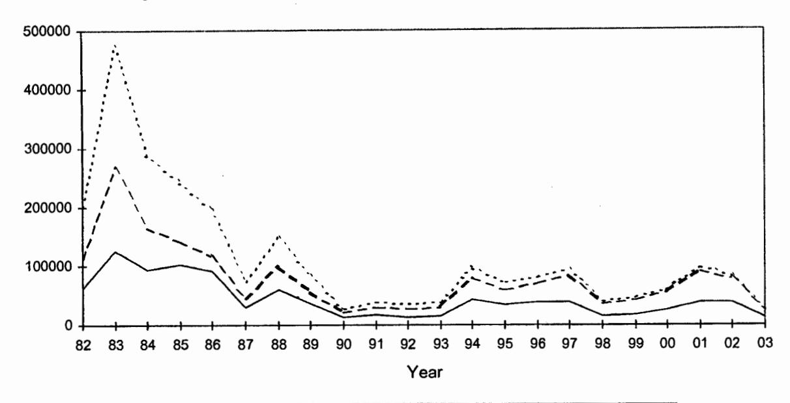
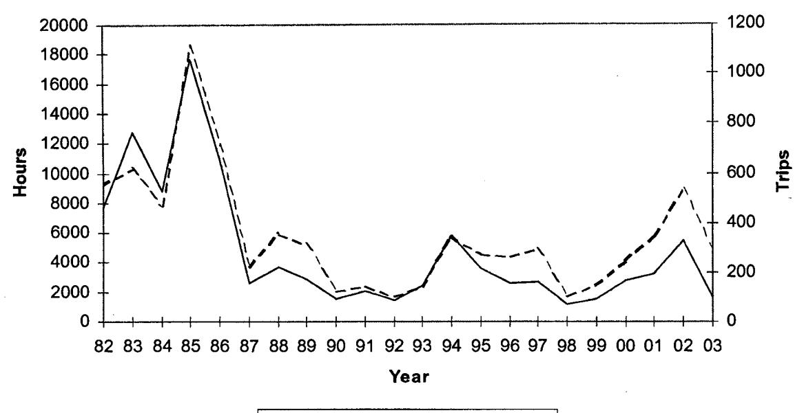
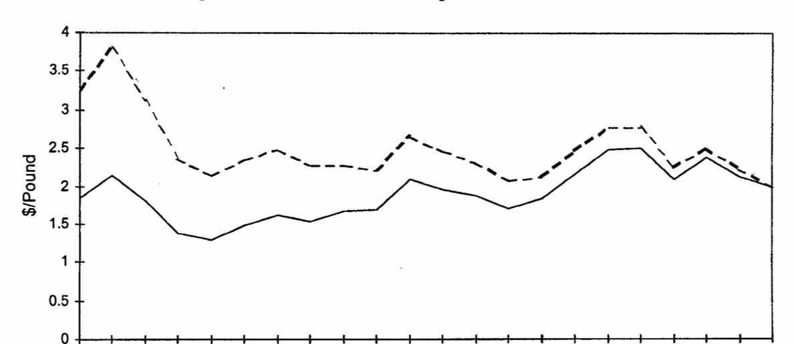
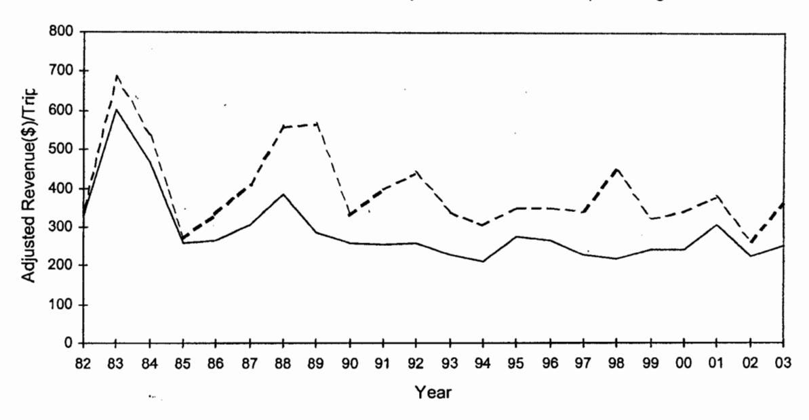
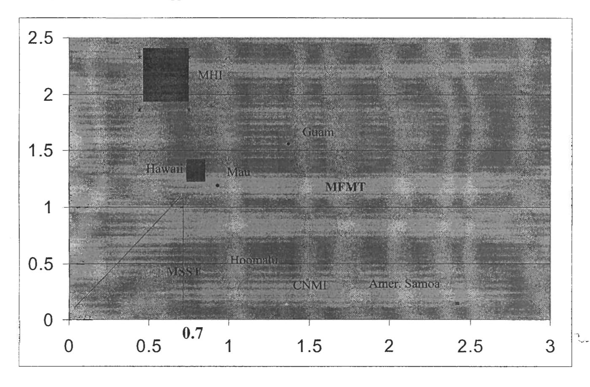

# Bottomfish and Seamount Groundfish Fisheries of the Western Pacific Region

2003 Annual Report

June 30, 2004

Prepared by the Bottomfish Plan Team and Council Staff for the Western Pacific Regional Fishery Management Council 1164 Bishop Street, Suite 1400, Honolulu, Hawaii 96813
Tel: (808) 522-8220, Fax: (808) 522-8226

# **Table of Contents**

| TABLE OF CONTENTS                                                         | Il                                     |
|---------------------------------------------------------------------------|----------------------------------------|
| 1.0 INTRODUCTION                                                          | 1                                      |
| 1.1 DEFINITION OF DESCRIPTORS                                             | 1                                      |
| 1.1.1 Landings information                                                |                                        |
| 1.1.2 Effort information                                                  |                                        |
| 1.1.3 Participation information                                           |                                        |
| 1.1.4 Economic information                                                |                                        |
| 1.2 DEFINITION OF INDICATORS                                              |                                        |
| 1.2.1 Aggregate Catch-Per-Unit-Effort                                     |                                        |
| 1.2.2 Mean Fish Size                                                      |                                        |
| 1.2.3 Percent Immature                                                    |                                        |
| 1.2.4 Spawning Potential Ratio                                            |                                        |
| 1.2.5 Economic Indicators                                                 |                                        |
| 1.3 2003 BOTTOMFISH PLAN TEAM MEMBERS                                     |                                        |
|                                                                           |                                        |
| 2.0 AREA SUMMARIES                                                        |                                        |
| 2.1 AMERICAN SAMOA                                                        | 7                                      |
| 2.1.1 Descriptors                                                         |                                        |
| 2.1.2 Indicators                                                          | 7                                      |
| 2.1.3 Recommendations                                                     |                                        |
| 2.2 Guam                                                                  |                                        |
| 2.2.1 Descriptors                                                         |                                        |
| 2.2.2 Indicators                                                          |                                        |
| 2.2.3 Recommendations                                                     |                                        |
| 2.3 Hawaii                                                                |                                        |
| 2.3.1 Descriptors                                                         |                                        |
| 2.3.2 Indicators                                                          |                                        |
| 2.3.3 Recommendations                                                     |                                        |
| 2.4 NORTHERN MARIANA ISLANDS                                              |                                        |
| 2.4.1 Descriptors                                                         |                                        |
| 2.4.2 Indicators                                                          |                                        |
| 2.4.3 Recommendations                                                     |                                        |
| 2.5 REGION-WIDE RECOMMENDATIONS 2003                                      | 13                                     |
| 3.0 PLAN ADMINISTRATION                                                   | 13                                     |
| 3.1 Management Actions and Decisions                                      | 13                                     |
| 3.2 NMFS 2003 ADMINISTRATIVE ACTIVITIES                                   |                                        |
| 3.2.1 Use-it or Lose it Requirement for Permit Renewal (Calendar Yr 2003) |                                        |
| 3.2.2 Northwestern Hawaiian Islands (NWHI) Bottomfish Fisheries           |                                        |
| 3.3 PROTECTED SPECIES INTERACTIONS                                        | 14                                     |
| 4.0 2003 ENFORCEMENT ACTIVITIES                                           |                                        |
|                                                                           | ,,,, ~ ~ ~ ~ ~ ~ ~ ~ ~ ~ ~ ~ ~ ~ ~ ~ ~ |

|                                              | 4.1 NOAA FISHERIES OFFICE FOR LAW ENFORCEMENT PACIFIC ISLANDS ENFORCEMENT |                                                                               |
|----------------------------------------------|---------------------------------------------------------------------------|-------------------------------------------------------------------------------|
|                                              | DIVISION                                                                  | 15                                                                            |
|                                              | 4.2 United States Coast Guard Fisheries Law Enforcement                   | 17                                                                            |
|                                              | TABLES                                                                    |                                                                               |
| 1                                            | Regional Summary of 2002 Bottomfish Statistics                            | 2                                                                             |
|                                              | Bottomfish Management Unit Species (BMUS) Names                           |                                                                               |
|                                              |                                                                           |                                                                               |
|                                              | APPENDICES                                                                |                                                                               |
| 1.                                           | American Samoa                                                            | 1-1                                                                           |
| 2.                                           | Guam                                                                      | 2-1                                                                           |
|                                              | Hawaii                                                                    |                                                                               |
|                                              | Northern Mariana Islands                                                  |                                                                               |
|                                              | Status of Bottomfish Stocks-2003 Overfishing Control Rule Application     |                                                                               |
|                                              | Glossary                                                                  |                                                                               |
|                                              |                                                                           |                                                                               |
|                                              | SUMMARY OF ISLAND AREA TABLE OF CONTENTS  Appendix 1. American Samoa      |                                                                               |
|                                              | Contents                                                                  |                                                                               |
| 1.                                           | Summary                                                                   |                                                                               |
|                                              | Historical Annual Statistics                                              | 1-2                                                                           |
|                                              | INITOGUCUON                                                               | 1-3                                                                           |
| 4                                            |                                                                           | 1-3 1-4                                                                    |
| 4.                                           | Recommendations                                                           | 1-3 1-4                                                                    |
| 4.                                           |                                                                           | 1-3 1-4                                                                    |
| 1.                                           | Recommendations                                                           | 1-3 1-4 1-5                                                             |
| 1. 2.                                     | Tables  American Samoa 2003 Estimated Total Bottomfish Landings           | 1-3 1-4 1-5 1-6 1-7                                               |
| 1. 2.                                     | Recommendations                                                           | 1-3 1-4 1-5 1-6 1-7                                               |
| 1. 2.                                     | Tables  American Samoa 2003 Estimated Total Bottomfish Landings           | 1-3 1-4 1-5 1-6 1-7                                               |
| 1. 2. 3.                               | Tables American Samoa 2003 Estimated Total Bottomfish Landings            | 1-3 1-4 1-5 1-6 1-7 1-8                                        |
| 1. 2. 3.                               | Tables American Samoa 2003 Estimated Total Bottomfish Landings            | 1-3 1-4 1-5 1-6 1-7 1-8                                        |
| 1. 2. 3.                               | Tables  American Samoa 2003 Estimated Total Bottomfish Landings           | 1-3 1-4 1-5 1-6 1-7 1-8                                        |
| 1. 2. 3. 1. 2. 3. 4.       | Tables  American Samoa 2003 Estimated Total Bottomfish Landings           | 1-3 1-4 1-5 1-6 1-7 1-8 1-9 1-10 1-12 1-14         |
| 1. 2. 3. 1. 2. 3. 4. 5. | Tables  American Samoa 2003 Estimated Total Bottomfish Landings           | 1-3 1-4 1-5 1-6 1-7 1-8 1-9 1-10 1-12 1-14 1-15 |

# Appendix 2. Guam

| Contents                                                     |      |
|--------------------------------------------------------------|------|
| 1. Introduction                                              | 2-2  |
| 2. Summary                                                   |      |
| 3. Historical Annual Statistics                              |      |
| 4. Recommendations                                           | 2-6  |
| 5. List of Tables                                            | 2-7  |
| 6. List of Figures                                           | 2-7  |
|                                                              |      |
| Tables                                                       |      |
|                                                              | Page |
| 1. Guam 2003 expanded creel survey composition of Bottomfish |      |
| Management Unit Species                                      |      |
| 2. Guam 2003 Commercial Bottomfish Average Prices            | 2-8  |
| ,                                                            |      |
| Figures                                                      | _    |
|                                                              | Page |
| 1a. Harvest of all bottomfish species                        |      |
| 1b. Harvest of BMUS species                                  |      |
| 2a. Total and Commercial BMUS harvest                        | •    |
| 2b. Commercial BMUS revenue                                  |      |
| 3a. Estimated bottomfish boat hours                          |      |
| 3b. Estimated bottomfish trips                               |      |
| 4. Bottomfish fishery participation                          |      |
| 5. Average bottomfish prices                                 |      |
| 6a. Bottomfish CPUE: Overall, Charter, Non-Charter           |      |
| 6b. Deepwater CPUE: Overall, Charter, Non-Charter            |      |
| 6c. Shallow water CPUE: Overall, Charter, Non-Charter        |      |
| 7. Average Revenue per Trip                                  |      |
| 8a-e. Jacks/Trevallys: Harvest, CPUE, Average Sizes          |      |
| 9a-c. Snappers: Harvest, CPUE, Average Sizes                 |      |
| 10a-c. Groupers: Harvest, CPUE, Average Sizes                |      |
| 11a-e. Emperors: Harvest, CPUE, Average Sizes                |      |
| 12a. Bottomfishing Bycatch: Non-charter and Charter          | 2-40 |

12b.

Bottomfishing Bycatch: Summary......2-40

# Appendix 3. Hawaii

|     | Contents                                                                                          | page |
|-----|---------------------------------------------------------------------------------------------------|------|
| 1.  | Summary                                                                                           | 3-2  |
| 2.  | Historical Annual Statistics                                                                      | 3-3  |
| 3.  | List of Tables                                                                                    | 3-6  |
| 4.  | List of Figures                                                                                   | 3-6  |
| 5.  | Introduction                                                                                      | 3-8  |
| 6.  | Recommendations                                                                                   | 3-9  |
|     |                                                                                                   |      |
|     | Tables                                                                                            |      |
| 1   | Mau zone bycatch by species, 2002                                                                 | page |
|     | Hoomalu zone bycatch by species, 2002                                                             |      |
| ۷.  | Hoomaid zone bycatch by species, 2002                                                             | 3-23 |
|     | Figures                                                                                           |      |
| 1   | Hawaii's bottomfish landings from the NWHI and MHI                                                | 3-10 |
|     | NWHI BMUS species composition of landings per trip by weight, Mau zone                            |      |
|     | NWHI BMUS species composition of landings per trip by weight, Hoomalu zone                        |      |
|     | NWHI BMUS species composition of landings by weight                                               |      |
|     | Number of trips made by NWHI bottomfish fleet, Mau and Hoomalu Zones                              |      |
|     | Number of vessels in the NWHI bottomfish fleet, Mau and Hoomalu Zones                             |      |
|     | MHI species composition of landings by weight                                                     |      |
|     | MHI reported effort and participation.                                                            |      |
|     | Hawaii bottomfish landings, revenues, inflation adjusted revenues, 1970- present                  |      |
|     | Hawaii bottomfish price, inflation adjusted price, 1970- present                                  |      |
|     | Hawaii bottomfish landings amd revenue by area, 1970-2002. (Inflation adjusted)                   |      |
|     | Hawaii bottomfish ex-vessel prices by area (NWHI vs MHI, 1987-2002)                               |      |
|     |                                                                                                   |      |
| 12  | Hawaii bottomfish ex-vessel prices by NWHI zone, 1989-2002 Hawaii bottomfish demand, 1980-present | 3-43 |
|     | NWHI bottomfish inflation-adjusted revenue per trip by zone, 1989-present                         |      |
|     | CPUE for Hawaiian bottomfish                                                                      |      |
| 14  | b. Partial CPUE for MHI bottomfish                                                                | 3-51 |
| 14  | c. Partial targeted CPUE for MHI bottomfish                                                       | 3-54 |
| 15. | Percent immature in Hawaiian bottomfish catch                                                     | 3-57 |
| 16. | Mean weight of Hawaiian bottomfish                                                                | 3-59 |
| 17. | Archipelago wide Spawning potential ratio (SPR)                                                   | 3-61 |
| 18. | 1                                                                                                 |      |
|     | a. Spawning potential ratio (SPR) for MHI bottomfish using targeted CPUE                          |      |
| 191 | b. Spawning potential ratio (SPR) for NWHI bottomfish using targeted CPUE                         | 3-68 |

| H-18. Research CPUE on SE Hancock Seamount                                                      | 3-71 |
|-------------------------------------------------------------------------------------------------|------|
| H-19. Armorhead Spawning potential ratio                                                        | 3-74 |
| H-20. CPUE for Hancock and Colahan Seamounts                                                    | 3-75 |
|                                                                                                 |      |
| Appendix 4. Commonwealth of the Northern Mariana Islands                                        |      |
| Contents                                                                                        | page |
| 1. Summary                                                                                      |      |
| 2. Historical Annual Statistics for CNMI Bottomfishes                                           |      |
| 3. List of Tables                                                                               |      |
| <ul><li>4. List of Figures</li><li>5. Introduction</li></ul>                                    |      |
| 6. Recommendations                                                                              |      |
| 7. Figures, Interpretations, Calculations, and Tables                                           |      |
| Tables                                                                                          |      |
| 1. Commercial landings (in pounds) of all bottomfishes, BMUS species identified                 | to   |
| species on invoices, all shallow-water bottomfishes, all deep-water bottom                      |      |
| and selected deep-water bottomfishes                                                            | 4-11 |
| 2. Commercial landings (in pounds) of fishes only identified as assorted bottomfis              | hes, |
| and selected shallow-water bottomfishes                                                         |      |
| 3. Commercial landings of bottomfishes, and their associated revenues and prices                |      |
| 2003                                                                                            | 4-13 |
| 4. CNMI seafood imports for 2003                                                                | 4-14 |
| 5. Commercial landings, consumer price indices (CPIs), revenue, and prices for al               | 1    |
| bottomfishes                                                                                    | 4-17 |
| 6. Number of fishermen (used as a proxy for number of boats), number of trips, ca               | ıtch |
| rate, revenue per trip, and inflation-adjusted revenue per trip for bottomfish                  |      |
| inflation-adjusted revenue per trip for all species when bottomfishing                          | 4-21 |
| 7. Bycatch during bottomfishing (totals for 4 years)                                            | 4-22 |
| 8. Bycatch during bottomfishing (2003)                                                          | 4-22 |
| 9. Overfishing and overfished criteria from the Sustainable Fisheries Act                       |      |
| Figures                                                                                         |      |
| Commercial bottomfish landings, allocated to sector of the fishery (or categoriz bottomfishes") |      |
| 2. Commercial bottomfish landings of deep-water species                                         |      |
| Commercial bottomfish landings of shallow-water species                                         |      |
| 4. Commercial bottomfish landings and inflation-adjusted revenue                                |      |
| 5. Average price of bottomfish                                                                  |      |
| -                                                                                               |      |
| 6. Number of fishermen (boats) making bottomfish landings                                       | 4-18 |

| 7. Number of bottomfish trips                                              | 4-18 |
|----------------------------------------------------------------------------|------|
| 8. Bottomfish catch in average pounds per trip                             | 4-18 |
| 9. Average inflation-adjusted revenue per trip landing bottomfish          | 4-19 |
| 10. Overfishing and overfished criteria from the Sustainable Fisheries Act | 4-23 |

# Bottomfish and Seamount Groundfish Fisheries of the Western Pacific 2003 Annual Report

#### 1.0 Introduction

The 2003 annual report provides a set of descriptors and indicators of the bottomfish fisheries from American Samoa, Guam, Hawaii and the Northern Mariana Islands. The descriptors are designed to document recent trends in landings, effort, participation, revenue and prices. Should management action be recommended, descriptor information will aid in assessing potential impacts of the action on fishery participants. The indicators are quantifiable and measurable tools used to identify signs of stress in the stocks or the fishery. Based on changes over time in indicator levels, the Bottomfish Plan Team (BPT) may identify "yellow light" situations (i.e., where stress is first detected) and recommend that either management action or additional study be undertaken or "red light" situations where immediate management action is needed.

The annual report is organized as follows: The introduction section defines and briefly explains the descriptors and indicators. The next section briefly summarizes time trends in descriptor and indicator levels, through the current year, and recommends any areas of concern for each island area. Reports from each island area are appended. The introduction describes the history and present characteristics of the fishery. Results of the current year's descriptors and indicators are presented in detail, in relation to past temporal trends. Figures are supported with information on source of the data, methods of calculation, and data interpretation. Table 1 summarizes 2003 bottomfish statistics for the region. The appended report from each area includes a summary of the new area specific and region-wide recommendations. Finally, additional appendices contain information on NMFS 2003 administrative and enforcement activities, habitat conditions, protected species interactions, and 2003 BPT membership.

Table 2 lists scientific, common English and local/indigenous names for bottomfish management unit species (BMUS) for each area (American Samoa, Guam/Northern Marianas, and Hawaii).

# 1.1 Definition of Descriptors

The fishery descriptors are defined as follows:

# 1.1.1 Landings information

Time series information on aggregate catch for each island area shows recent trends in total bottomfish harvest. For American Samoa and Guam, estimates of both the commercial landings and the total landings (combined commercial, recreational and subsistence) are available. For Hawaii and the Northern Marianas, landings information represents only the commercial harvest.

Table 1. Regional Summary of 2003 Bottomfish Species

|                    |                 |           |            |           | Hawaii      | vaii          |               |
|--------------------|-----------------|-----------|------------|-----------|-------------|---------------|---------------|
|                    | AS              | CU        | NMI        | All       | , MHI       | Mau           | Hoomalu       |
| BMUS Landings (lb) | 26,239          | 118,206   | 41,710     | 494,569   | 272,569     | 77,000        | 145,000       |
| Revenue (\$)       | 25,012          | 36,528    | 118,538    | 2,176,980 | 1,460,000   | 222,530       | 494,450       |
| No. Of Boats       | 61              | 481       | 58         | I         | 325         | s             | 4             |
| No. Of Trips       | 291             | 4,395     | 374        | I         | 1,517       | 37            | 39            |
| CPUE               | 16.2 lb/trip-hr | 4.7 lb/hr | 89 lb/trip | I         | 190 lb/trip | 2,070 lb/trip | 3,713 lb/trip |
| SPR                | !               | ł         | ŀ          | 0.31-0.50 | note 1      | note 2        | note 2        |
|                    |                 |           |            |           |             |               |               |

# Notes:

indicating localized subarea depletion: MHI onaga ("targeted" SPR = 0.1026); MHI opakapaka ("targeted" SPR = 0.0469); MHI uku ("targeted" SPR = 0.2007)

2) Healthy (SPR > 0.20) for all species 1) Species with Spawning Potential Ratio near or below threshold level of 0.20,

| Table (Absence of an indigenous nam Scientific | Table 2. Bottomfish Management Unit Species (BMUS) Names (Absence of an indigenous name implies no local name established or area is not within the species' geographic range.)  English Common American Samoa Guam/CNMI | init Species (BMUS) Nam shed or area is not within American Samoa | es the species' geographic range Guam/CNMI | e.) Hawaii            |
|------------------------------------------------------|--------------------------------------------------------------------------------------------------------------------------------------------------------------------------------------------------------------------------|-------------------------------------------------------------------------|--------------------------------------------------|--------------------------|
| Bottomfish:                                          |                                                                                                                                                                                                                          |                                                                         |                                                  |                          |
| Aphareus rutilans                                    | red snapper/silvermouth                                                                                                                                                                                                  | palu-gutusiliva                                                         | maraap tatoong                                   | lehi                     |
| Aprion virescens                                     | gray snapper/jobfish                                                                                                                                                                                                     | asoama                                                                  | tosan                                            | uku                      |
| Caranx ignobilis                                     | giant trevally/jack                                                                                                                                                                                                      | sapoanae                                                                | tarakito                                         | white ulua/pau'u         |
| C. lugubris                                          | black trevally/jack                                                                                                                                                                                                      | tafauli                                                                 | trankiton attilong                               | black ulua               |
| Epinephelus fasciatus                                | blacktip gouper                                                                                                                                                                                                          | fausi                                                                   | gadao matai                                      |                          |
| E. quernus                                           | sea bass                                                                                                                                                                                                                 |                                                                         |                                                  | hapu'upuu                |
| Etelis carbunculus                                   | red snapper                                                                                                                                                                                                              | palu-malau                                                              | guihan boninas                                   | ehu                      |
| E. coruscans                                         | red snapper                                                                                                                                                                                                              | paiu-loa                                                                | onaga                                            | onaga                    |
| Lethrinus amboinensis                                | ambon emperor                                                                                                                                                                                                            | filoa-gutumumu                                                          | mafuti/lililok                                   |                          |
| L. rubrioperculatus                                  | redgill emperor                                                                                                                                                                                                          | filoa-pa'o'omumu                                                        | mafuti tatdong                                   |                          |
| Lutjanus kasmira                                     | blueline snapper                                                                                                                                                                                                         | savane                                                                  | sas/funai                                        | ta'ape                   |
| Pristipomoides auricilla                             | yellowtail snapper                                                                                                                                                                                                       | palu-i'usama                                                            | guihan boninas                                   | yellowtail kalekale      |
| P. filamentosus                                      | pink snapper                                                                                                                                                                                                             | palu-'ena'ena                                                           | guihan boninas                                   | opakapaka                |
| P. flavipinnis                                       | yelloweye snapper                                                                                                                                                                                                        | palu-sina                                                               | guihan boninas                                   | yelloweye opakapaka      |
| P. seiboldi                                          | pink snapper                                                                                                                                                                                                             |                                                                         | guihan boninas                                   | kalekale                 |
| P. zonatus                                           | snapper                                                                                                                                                                                                                  | palu-sega                                                               | guihan boninas/gindai                            | gindai                   |
| Pseudocaranx dentex                                  | thicklip trevally                                                                                                                                                                                                        |                                                                         | terakito                                         | butaguchi/pig ulua       |
| Seriola dumerili                                     | amberjack                                                                                                                                                                                                                |                                                                         | guihan tatdong                                   | kahala                   |
| Variola louti                                        | lunartail grouper                                                                                                                                                                                                        | papa                                                                    | bueli                                            |                          |
| Seamount Groundfish:                                 |                                                                                                                                                                                                                          |                                                                         |                                                  |                          |
| Beryx splendens                                      | alfonsin                                                                                                                                                                                                                 |                                                                         |                                                  | kinmedai (Japanese)      |
| Hyperoglyphe japonica                                | ratfish/butterfish                                                                                                                                                                                                       |                                                                         |                                                  | medai (Jap.)             |
| Pseudopentaceros richardsoni                         | armorhead                                                                                                                                                                                                                |                                                                         |                                                  | kusakari tsubodai (Jap.) |
| ,                                                    |                                                                                                                                                                                                                          |                                                                         |                                                  |                          |

In Hawaii, changes in species catch composition are provided for the Main Hawaiian Islands (MHI) and the Northwestern Hawaiian Islands (NWHI). Statistical tests for consistency in catch composition over time and between areas are included. Where possible, descriptor information has been presented for each NWHI management zone: Hoomalu and Mau. For 2003, pounds landed by species are presented in tabular form for each area except Hawaii. For Hawaii, NWHI BMUS landings by species are provided for 1986 through 2003.

#### 1.1.2 Effort information

Effort is measured in number of trips for Hawaii and the Northern Marianas, and in both hours fished and trips taken for American Samoa and Guam.

# 1.1.3 Participation information

Estimates of the number of vessels making bottomfish landings are provided for all areas.

#### 1.1.4 Economic information

Time trends in economic performance are characterized by plots of total ex-vessel revenue, aggregate average price levels, and for Hawaii, price trends over time for major species. In time-series of prices and revenues, it is appropriate to adjust value for the rate of inflation so that values throughout the time period are comparable (based on a consistent purchasing power for the dollar). Both the unadjusted and adjusted aggregate average price and aggregate revenues are plotted to clarify the relative change over time.

#### 1.2 Definition of Indicators

Indicators were developed as tools for identifying signs of stress in the stocks or the fishery which deserve further investigation and/or a management response. Analyses consider how the indicators change over time. Indicators for Hawaii include 95% confidence intervals. To the degree possible, similar variance estimates are expected from the other areas in future annual reports. The indicators are defined as follows:

# 1.2.1 Aggregate Catch-Per-Unit-Effort

If the current year's aggregate catch-per-unit-effort (CPUE) is less than 50% of the average aggregate CPUE for the first three years of available data, there may be cause for concern. CPUE information is available for all areas; research CPUE is available for SE Hancock Seamount for all years since 1985, except in 1992 and 1994-2003.

#### 1.2.2 Mean Fish Size

If there has been a significant reduction in mean fish size for a species over time, the stock may be stressed by the fishery. Mean size information is provided for nine species in Hawaii. No mean size information was available at this time for American Samoa, Guam or the Northern Marianas.

#### 1.2.3 Percent Immature

If over 50% of the catch for a species is below the size of first maturity, the stock may be stressed by the fishery. Information for this indicator by species is available only from Hawaii.

## 1.2.4 Spawning Potential Ratio

The spawning potential ratio (SPR) is the ratio of the spawning stock biomass per recruit, at the current level of fishing, to the spawning stock biomass per recruit that would occur in the absence of fishing. According to the overfishing definition contained in the Bottomfish FMP (Amendment 3, 1990), if SPR is less than or equal to 0.20, recruitment overfishing has occurred (i.e., spawners have been reduced to 20%, or less, of their unexploited stock level). Data to calculate SPR were not available from Guam or the Northern Marianas. An estimate of the "worst case" SPR was calculated for American Samoa's bottomfish complex using Dory Project data to estimate the virgin population CPUE and information on percent of immature fish from Hawaii. In Hawaii, SPR was calculated for five major species in the Hoomalu and Mau Zones, of the NWHI, and the MHI; some SPR values changed slightly from previous year's reports due to improvement in the calculations. SPR for armorhead was calculated annually since 1985, except for 1992 and 1994-2003.

# 1.2.5 Economic Indicators

Revenue per trip plots are presented for all areas except the MHI. A more valuable indicator for the commercial fisheries, which may be available in the future, would be net revenue (ex-vessel revenue minus costs per trip). Net revenue is available only from the Hoomalu Zone and Mau Zone in Hawaii.

#### 1.3 2003 Bottomfish Plan Team Members

#### Selaina Vaitautolu

Dept. Of Marine and Wildlife Resources P.O. Box 3730 Pago Pago, AS 96977 PH:(684) 633-4456 FAX:(684) 633-5944

email: DMWR@samoatelco.com

#### Don Heacock

Hawaii Division of Aquatic Resources 3060 Eiwa Street, #306
Lihue, HI 96766
PH:(808) 274-3344
FAX:(808) 274-3448
e-mail: don@dar.ccmail.compuserve.com

Walter Ikehara

Hawaii Division of Aquatic Resources 1155 Punchbowl Street, #330 Honolulu, HI 96813 PH: (808) 243-5834 FAX: (808) 243-5833 email:Walter.N.Ikehara@hawaii.gov

# **Kurt Kawamoto**

NMFS, Honolulu Lab. 2570 Dole Street Honolulu, HI 96822 PH: (808) 983-5326 FAX: (808) 983-2902

email: kurt.kawamoto@noaa.gov

# Robert Moffitt (Chairman)

NMFS, Honolulu Lab. 2570 Dole Street Honolulu, HI 96822 PH: (808) 983-5373 FAX: (808) 983-2902

email: robert.moffitt@noaa.gov

#### **Thomas Flores**

DAWR, Dept. Of Agriculture, Guam 192 Dairy Road Mongilao, Guam 96923 PH: (671) 735-3986 FAX: (671) 734-6570 email: tfloresjr@hotmail.com

#### **Kate Moots**

Division of Fish and Wildlife, CNMI P.O. 10007 Saipan MP 96950 PH: (670) 322-3441 FAX: (670) 322-3470 email: KATEMOOTS@saipan.com

#### Ex-officio Members:

#### David Hamm

NMFS. Honolulu Lab. 2570 Dole Street Honolulu, HI 96822 PH: (808) 983-5330 FAX: (808) 983-2902

email: david.hamm@noaa.gov

#### Minling Pan

NMFS, Honolulu Lab 2570 Dole Street Honolulu, HI 96822 PH: (808) 983-5347 FAX: (808) 983-2902 email: minling.pan@noaa.gov

#### Council Staff:

# Mark Mitsuyasu

PH: (808) 522-6040 email: mark.mitsuyasu@noaa.gov Western Pacific Fishery Council 1164 Bishop Street #1400 Honolulu, HI 96813 PH: (808) 522-8220 FAX: (808) 522-8226

www.wpcouncil.org

#### 2.0 AREA SUMMARIES

#### 2.1 American Samoa

# 2.1.1 Descriptors

During 2003, a total of 19 local boats landed an estimated 26,239 pounds of bottomfish (about a 37.3% decrease from last years landings). Revenues for the domestic commercial fishery this year was estimated around \$25,000 (a 70% decrease from last year) with all the catch being sold locally. The CPUE for 2003 (16.2 lb/hr) was not less than 50% of the average aggregate CPUE for the first 3 years of available data. In 2003, effort (trips and hours) increased.

# 2.1.2 Indicators

CPUE (pounds per hour), though relatively stable (at about 10 lb/hr) in the early 1990's, increased in 1996 to 14.8 lb/hr, mainly due to improved sampling. decreased dramatically by about 51% in 2002 to 7.4 lb/hr, but increased in 2003 to 16.2 lb/hr, its highest CPUE since 1989. This level is not less than 50% of the average aggregate CPUE for the first three years of available data (9.7 lb/hr), indicating no cause for concern. Bottomfish revenue per trip (as opposed to total revenue) increased in 2003 (\$253/trip) by about 18.2% over 2002 (\$214/trip).

#### 2.1.3 Recommendations

#### 2003 Recommendations

- 1) DMWR should enhance internal development through training for staff to minimize chances of misidentification.
- 2) Incorporate market data from Market surveys into the database.
- 3) Include Import data from Western Samoa into the database for further enhancement of this report.

#### 2.2 Guam

# 2.2.1 Descriptors

The fairly large fluctuations over time in bottomfish landings in Guam appear to be due more to entry and exit patterns of fishermen, rather than changes in fish stocks. The number of highliners fishing in the area doubled from 1993 to 1994, increasing the total commercial

BMUS harvest and revenue by nearly 300% during that year. In 2003, an increase in bottomfish landings was due to large increases in landings from the offshore and non-charter sectors. 2003 landings increased by 33.4% from 2002, nearly matching the decrease between 2001 and 2002, and is above the long term average.

The adjusted average price for bottomfish has not shown consistent marketing trends. This is believed to have resulted from the seasonal supply of pelagic fish and difficulties in developing a consistent market for locally caught fish. In addition, imported fish from other islands around the region have contributed to the continued marketing problem for local fishermen. The 2003 inflation-adjusted average bottomfish price of \$3.11 increased very slightly from last year and is 25.4% below the long term average.

# 2.2.2 Indicators

Total and BMUS bottomfish harvest increased in 2003. Total bottomfish landings increased 33%, with charter decreasing 39% and Non-charter catch increased 53.2. Total BMUS landings increased 56%, with the non-charter and charter components also increasing 75% and 4.6% respectively. Offshore landings made up the overwhelming majority of both the total bottomfish catch and BMUS catch. The CPUE for all bottomfish increased 56.7%, while the non-charter increased 56.2% and charter CPUE decreased 31.6%.

The commercial landings and the adjusted revenue of BMUS species both decreased 36%. The after effects of Supertyphoon Pongsona in the first quarter of 2003 may have negatively impacted commercial sales. The average price for bottomfish remained virtually the same, increasing one cent, while revenue per bottomfishing trip increased 21%.

The CPUE for all bottomfish increased 57%, with the CPUE for shallow and deep bottomfishing increasing 79% and 20% respectively. The CPUE for non-charter boats increased 57% for all bottomfishing, 20% for deep bottomfishing, and 79% for shallow bottomfishing.

Bottomfishing effort did not change significantly in 2003. Total hours and trips decreased 2% and <1% respectively. Charter hours and trips decreased 11% and 14% respectively due to the after effects of Supertyphoon Pongsona in December 2002. Non-charter hours and trips decreased <1% and increased 3% respectively. The number of unique boats in the fishery increased 37% in 2003.

#### 2.2.3 Recommendations

# 2003 Recommendations

1) Completing the baseline biological survey of the red-gill emperor, *Lethrinus* rubrioperculatus, should be completed during 2004. Analyzing the data from the Bank A trips has been contracted out in 2003 and should be completed in 2004.

- 2) DAWR should establish mean fish size, percent immature, and SBB indicators for both deep and shallow water bottomfish complexes. Fine-tuning of this program should be completed in 2004.
- Additional staff and resources should be sought after in order to do, at the least, opportunitistic interviewing of fishermen utilizing Ylig Bay as a boat launching area. Periods of calm weather, especially during the summer months have increased the number of fishermen fishing off the east side of Guam. Spearing, bottomfishing, and trolling activity have been observed by Fisheries staff, methods that regularly catch BMUS species.

#### 2.3 Hawaii

\*All 2003 Data for Hawaii (MHI, Mau Zone, and Hoomalu Zone) are incomplete. Interpretations and summaries are based on preliminary data from NMFS-PIFSC. 2003 Data will be finalized in the 2004 Bottomfish and Seamount Groundfish Annual Report.

# 2.3.1 Descriptors

Main Hawaiian Islands: Only commercial data are available for both the MHI and NWHI fisheries, even though the MHI recreational/subsistence catch is estimated to be about equal that of commercial landings. In 1988, there was a dramatic increase in MHI bottomfish landings due to a bonanza uku (gray snapper) harvest. A steady decline in total landings occurred until 1993, which was the lowest recorded annual value at the time. Landings increased 32% in 1994 and remained high through 1997, although CPUE was at a 12 year low in 1997. Participation and landings have declined over the past two years while CPUE has increased 29% in that same period. Although the data for 2003 is incomplete, preliminary data shows that 2003 landings of 272,569 pounds are the lowest total landings seen in the 18-years of data that were collected between 1986 and the present. The 24.7% decrease in MHI bottomfish landings from 2002 to 2003 may be partially attributed to the 40.6% decline in number of trips taken in the MHI.

Total ex-vessel revenue from the MHI shows a general decline from 1988-1996 and has stabilized since, and even slightly increasing in the past couple of years. 2003 inflation adjusted revenue increased 4.6% from 2002 values, but still remains 37.4% below the long-term average.

NWHI Mau Zone: Mau Zone 2003 landings decreased 28.7% from 2002. Catch per trip increased by 46.2% in this zone. The total number of boats decreased from 6 in 2001 to 5 in 2002 and remained at 5 in 2003.

The Mau zone inflation adjusted revenue decreased in 2003 to \$222,530, down 35% from \$342,360 in 2002. The inflation adjusted price per pound also decreased in 2003 by 8.8%, and was the lowest price per pound since data were collected in 1989.

NWHI Hoomalu Zone: Hoomalu Zone 2003 landings increased 20.8% from 2002. Four boats fished in 2003, the same number of boats as in 2002. Bottomfish landings per trip decreased by 19.9% based on NMFS CPUE.

Inflation adjusted revenue increased slightly in 2003 (+14.1%), even though the inflated price per pound decreased in 2003 by 5.5%.

# 2.3.2 Indicators

# Hawaii Archipelago-wide:

SPR values for the five major BMUS species in 2003 are all above the 20% critical threshold level, which defines recruitment overfishing under the FMP, when viewed on an archipelago-wide basis. Of these species, onaga is still the lowest with a 2003 value of 31%. Implementation of the state's management plan should help improve the condition of onaga in the MHI and continue to increase the archipelago-wide SPR.

SPR values are also presented on a management zone basis (MHI, Mau Zone, Hoomalu Zone) for the purpose of determining locally depleted resources.

MHI: CPUE in 2003 increased from 2002 and returned to 2000 and 2001 levels. Recent CPUE values are approximately one-fourth the early (baseline 1948-50) values, signifying local depletion in the MHI. Most of the more commercially important species in the MHI have had relatively stable mean weights since 1984. Hapuupuu's mean weight dropped sharply in 1993 and has continued to be low. The small number of fish upon which the annual estimates are based may bias the result. However, with so many years in a row recording low mean weights, it is likely that marketed fish size has actually declined for MHI hapuupuu. Such a decline in mean size indicates increased stress on the MHI hapuupuu resource. These values do not exhibit a continuing decline, in fact, the 1997-2003 values are slightly greater than the 1995 lowest value.

For the ninth year 95% confidence intervals were constructed based on "best" and "worst" case bounds of SPR components (CPUE and percent immature). For the eighth year SPR values were calculated using both aggregate CPUE, as in previous years, and targeted CPUE, which gives a more accurate picture for individual species. 2003 aggregate CPUE SPR values for all five major species declined but remained above the 20% critical level, except for onaga: onaga (0.09), opakapaka (0.21), hapuupuu (0.29), ehu (0.26), and uku (0.26). The use of targeted CPUE showed a different picture for the four species where targeted trips are available. Here, ehu SPR is much worse than indicated using aggregate CPUE (SPR = 0.469), whereas SPR values for opakapaka is much higher than previously indicated and uku is lower (SPR = 0.3164 and 0.2007, respectively). Onaga's SPR remains consistent when using targeted or aggregate CPUE and has now been below 0.20 for the past 15 years and ehu has decreased to its lowest SPR in 2003 since 2000 (using targeted CPUE).

NWHI Mau Zone: The NMFS CPUE data are only available for the NWHI fishery as a whole since 1984 and by zone since 1986. The NWHI (combined Mau and Hoomalu Zones) NMFS CPUE steadily decreased from 1987 to 1992, rose in 1993, and then declined from 1994-96. CPUE rose in 1997 to the 1993-94 level, but dropped slightly in 1998. CPUE in the Mau Zone increased in 2002 to 438 lb/day and continued that trend in 2003 by increasing 16% to 508 lb/day, the highest CPUE since 1990. Mean weights of fish in the Mau Zone continue to exhibit year to year fluctuations, but are generally at much higher values than MHI mean weights. The percent of immature fish in the 2002 Mau Zone catch was dramatically below 50% for all species evaluated.

SPR values in the Mau Zone have been decreasing since 1990 (mirroring the pattern in the HDAR CPUE), experienced a surprising rise in 1994, returned to lower levels in 1995, followed by a continued four year increase through 1999. All values are presently above well above the critical level of 0.20 for 2003 and all have increased to over 50% for all species evaluated. SPR values are higher in the NWHI than the MHI because most of the catch is mature fish.

NWHI Hoomalu Zone: The Hoomalu Zone NMFS CPUE has been on a downward trend from since data collection began in 1988. 2003 CPUE increased to 490 lb/day an 18.9% increase from 2002. Pounds per trip decreased by 3.7% in 2003 from 2002. Mean weights of fish in the Hoomalu Zone continued to exhibit year to year fluctuations, but are still at much higher values than MHI mean weights. The percent of immature fish in the 2003 catch was just under 50% for all species evaluated.

The 2003 SPR values in the Hoomalu Zone decreased for all species except onaga which experienced an increase of 18.8%. The 2003 SPR levels range from 46% to 63%.

Seamount Groundfish (Armorhead): No fishing has been allowed on the armorhead stocks of the SE Hancock Seamount since the moratorium began in August, 1986. The 1993 CPUE, calculated from research longline catches, was more than double that of the last assessment (in 1991) and nearly as high as the highest CPUE recorded since surveying began in 1985. No research cruise occurred since 1993, and future research assessment cruises are unlikely.

No SPR values were available in 2003 as no research was undertaken. In 1993, SPR within the EEZ (SE Hancock Seamount) was above 0.02, the highest since 1986, but still far below (10% of) the threshold level for recruitment overfishing of 0.20. About 99% of the known armorhead seamount habitat occurs outside the U.S. EEZ, an area which had 0.06 SPR in 1993. During February and March 1997, an oceanic and larval armorhead survey over the seamounts outside the U.S. EEZ was conducted onboard the R/V Kaiyo Maru by the National Research Institute of Far Seas Fisheries Laboratory in Shimizu, Japan. Armorhead larvae were collected from surface waters around all seamounts except for Koko Seamount.

#### 2.3.3 Recommendations

# 2003 Recommendations

1) Support research using traditional hydro acoustic technology to assess bottomfish stock biomass.

# 2.4 Northern Mariana Islands

# 2.4.1 Descriptors

Data are available only on the commercial fishery. Landings of bottomfish continued to decrease in 2003 (10.8% fewer pounds in 2003 than in 2002) from the highest total landings in 2001 (71,256 lbs), to slightly higher than the 21-year mean. This fishery continues to show a high turnover with changes in the high liners participating in the fishery, and an increased number of local fishermen focusing on reef fishes in preference to bottomfishes. In 2003, the number of vessels fishing increased to 58 following 53 in 2002 and 75 in 2001. The number of trips in 2003 was equal to the numbers of trips taken in 2002 (just above the long term average with 374 trips), and is still down 55.2% from the highest number of trips recorded in 2001 (834).

The inflation adjusted price slightly decreased in 2003 (-1.7% from 2002) and 9.3% lower than the 21-year mean. The total 2003 ex-vessel revenue decreased to \$118,538 (down 12.3% from 2002), and 4.2% below the 21-year mean.

#### 2.4.2 Indicators

The average bottomfish catch per trip decreased from 101 lb/trip in 2002 to 89 lb/trip in 2003. Although the average catch per trip is not a very good measure of CPUE, because it is subject to significant biases (e.g., changes in trip length and relative amounts of bottom fishing compared to trolling or reef fishing); it is the only measure readily obtained from the commercial landings system. However, the smaller vessels commonly make mixed trips and the relative proportions of bottomfishes to pelagic and reef fishes seem to be changing. The number of fishermen (used as a proxy for the number of boats) making commercial sales of any bottomfish species has varied widely over the last 20 years. This year there were a few more fishermen selling bottomfish than last (58 vs. 53), but the number remains near the 21-year mean. Most of these fishermen are using small vessels and when catching bottomfish, are more likely to target the shallow-water species.

Revenues from bottomfish decreased in 2003 (12% less than in 2002). This is a result of the combined effect of lower pounds landed and a lower price per pound for almost all bottomfish species. Almost all fishes caught in the CNMI are considered food fishes, including many that show a high incidence of ciguatera locally, including lyretail grouper (*Variola louti*) and red snapper (*Lutjanus bohar*).

#### 2.4.3 Recommendations

#### 2003 Recommendations

- 1) To request NMFS and the Council continue to assist the CNMI by contracting a specialist to map commercial fishing banks, particularly around Farallon de Medinilla, Marpi Reef, and the banks closest to Saipan, Tinian, and Rota.
- 2) To request NMFS and the Council continue to assist the CNMI by supporting the MARAMP cruises to the northern islands of the CNMI.

# 2.5 Region-Wide Recommendations 2003

- 1) Conduct sensitivity analysis on the effects of MPAs on fishery based estimates of fishing mortality and CPUE for potential impacts in relation to overfishing/overfished thresholds.
- 2) PIFSC use the Stock Assessment (SAIP) funding to establish an ongoing program to collect bottomfish size frequency information in each island area; age at maturity; in support of addressing the Bottomfish Stock Assessment Workshop recommendations.
- 3) A group be created to establish action plans and associated budgets to implement the stock assessment workshop recommendations.
- 4) Council should encourage continued mapping of bottomfish habitat throughout the region in efforts to refine EFH.

#### 3.0 PLAN ADMINISTRATION

# 3.1 Management Actions and Decisions

Bottomfish issues in 2003 dealt primarily with the management of stocks in Guam. At the 117th Council meeting, the Council recommended to prohibit vessels larger than 50 feet from targeting BMUS within 50 miles of Guam's shores and require federal permitting and reporting for vessels 50 feet and larger. At the 118th meeting, the Council recommended the amendment to the FMP for management of the Guam bottomfish stocks be submitted to NMFS for approval. At this meeting, CNMI began the process of managing their stocks also. At the end of 2003, the Guam Bottomfish Amendment had already been transmitted to NMFS awaiting comments and approval.

The Council also dealt with the NWHI Mau Zone bottomfish Community Development Program (CDP). At its 117th and 118th meetings, the Council recommended a weighted point system for the Mau Zone CDP and that a framework adjustment to the FMP be submitted to NMFS. At the end of 2003, the framework adjustment was still with NMFS for comments/approval.

# 3.2 NMFS 2003 Administrative Activities

In 2003, NMFS approved the definitions of overfishing, bycatch, and fishing communities under Amendment 6 to the Bottomfish and Seamount Groundfish Fishery Management Plan (68 FR 46112, August 5, 2003).

# 3.2.1 Use-it or Lose it Requirement for Permit Renewal (Calendar Yr 2003)

Mau Zone limited entry permits expire on December 31 each year. NMFS will renew a permit for the following year if the permit holder's vessel made a minimum of 5 separate landings, each of which consisted of at least 500 pounds of bottomfish management unit species, from the Mau Zone during the previous permit year. Failure to meet the required landing requirement may result in the permit being lost (not renewed). All 2003 Mau Zone limited entry permits were renewed in 2004.

# 3.2.2 Northwestern Hawaiian Islands (NWHI) Bottomfish Fisheries

During calender year 2003, PIRO issued a total of 9 permits for the NWHI bottomfish fishery. Five vessels fished in the Mau zone and four vessels fished in the Hoomalu zone. Four vessels were registered for the Ho'omalu Zone fishery; 5 vessels were registered with Mau Zone Permits.

Ho'omalu Zone vessels

1. F/V Fortuna

2. F/V Laysan

3. F/V Kealailani

4. F/V Ka Imi Kai

Mau Zone Vessels

1. Iwa Lani

2. Constance Andrea

3. Kai Pali

4. Jamie Elizabeth

5. Wahine Kapaloa.

#### 3.3 Protected Species Interactions

Pacific Islands Regional Observer Program-Bottomfish Report

The Hawaii-based bottomfish fishery has been monitored under a mandatory observer program since October 2003. Beginning October 2003, branch personnel have conducted daily shoreside dock rounds in Honolulu to determine which fishing vessels are in port. These dock rounds are used to obtain an estimate of fishing effort on a real-time basis by assuming that a vessel is fishing when it is absent from the harbor. This report is used to ensure prompt dissemination of Hawaii Bottomfish Observer Data and may be revised. The following table summarizes percent observer coverage for vessel departures, vessels arriving with observers, and protected species interactions for vessels arriving with observers during the fourth quarter of 2003.

| Vessel Departures - 4th Quarter (October 1, 2003 - December 31, 2003)  Departures | 15    |
|-----------------------------------------------------------------------------------|-------|
| Departures with observers                                                         | 5     |
| Observer coverage 4th quarter                                                     | 33.3% |
| Vessels Arriving with Observers - 4th Quarter                                     |       |
| Departures with observers in 4th quarter                                          | 5     |
| Observers departing in 3rd quarter arriving 4th quarter                           | 0     |
| Observers departing in 4th quarter arriving 1st quarter 2004                      | 1     |
| Total vessels arriving with observers - 4th quarter                               | 4     |
| Protected Species Interactions - 4th Quarter                                      |       |
| Vessels arriving with observers - 4th quarter                                     | 4     |
| Trips with turtle interactions                                                    | 0     |
| Trips without turtle interactions                                                 | 4     |
| Trips with marine mammal interactions                                             | 0     |
| Trips without marine mammal interactions                                          | 4     |
| Trips with seabird interactions                                                   | 0     |
| Trips without seabird interactions                                                | 4     |
| Total Sea Turtle Interactions                                                     | 0     |
| Total Marine Mammal Interactions                                                  | 0     |
| Total Seabird Interactions                                                        | 0     |

Note: The percent of observer coverage is based on vessel departures.

Protected species interactions are based on vessel arrivals. For the purpose of this report, an animal that becomes hooked or entangled is an interaction.

#### 4.0 2003 ENFORCEMENT ACTIVITIES

# 4.1 NOAA Fisheries Office for Law Enforcement Pacific Islands Enforcement Division

Throughout this reporting period, random dockside compliance checks of Hawaii-based longliners were conducted. Minor technical violations were noted and addressed. In addition, several prominent investigations involving potential violations of the Western pacific Pelagic Regulations addressing the harvesting of swordfish were initiated. During the third quarter of 2003, there were four prominent enforcement actions resulting from violations of the MSFCMA which have resulted in financial penalties totaling \$143,817.81. Actionable conduct ranged from possession and use of float lines less than 20 meters in length, the direct targeting of swordfish, and various logbook and reporting infractions, to violation of the Shark Finning Prohibition Act.

Public education, deterrence, and intervention remain our primary focus with regards to averting marine mammal harassment within Hawaii. Moreover, coordination continues with volunteer organizations and local law enforcement agencies, in order to provide a timely response to marine mammal incidents. Joint patrols were conducted with personnel from the Hawaii Department of Conservation and Resources Enforcement on the Big Islands of Hawaii in order to assess and deter potential harassment of spinner dolphins. Enforcement personnel worked in partnership with researchers from the Pacific Islands Fisheries Science Center to resolve the status of land-locked sea turtles on private property. The turtles were listed as threatened or endangered. Strategies including returning the sea turtles to the open ocean.

The Pacific Islands Enforcement Division continues to provide enforcement support to the Northwestern Hawaiian Islands Coral Reef Ecosystem Reserve through the commitment of a special agent, full-time, to address the unique enforcement challenges of the reserve. The resident special agent in American Samoa attended the Coral Reef Advisory Group (CRAG) meeting and provided an enforcement assessment for the area.

To improve coral reef conservation in the Northwestern Hawaiian Islands, the VMS control center was modified to accept depth data that is transmitted automatically from VMS units. The project is ongoing, and the next phase will establish the transmission of depth data from vessel to shore side control center.

During the third quarter, there were two prominent enforcement actions resulting from violations of the Endangered Species Act, affecting sea turtles in Hawaii. Financial penalties totaling \$9,600.00 have resulted. Violations ranged from failing to carry line clippers and dip nets, to illegal takes with prohibited fishing gear.

Public education, outreach, and enforcement efforts in conjunction with the Hawaiian Islands Humpback Whale National Marine Sanctuary continued during 2003. Consistent with previous years, public education, deterrence, and intervention strategies were maintained throughout the 2002/2003 whale watching season. The NOAA Fisheries Office for Law Enforcement participated in pre-season enforcement workshops during November and December of 2002. In addition, the NOAA Office for Law Enforcement responded to over 60 complaints involving potential violations of the humpback whale approach regulations by kayak enthusiasts, recreational water craft, swimmers, and aircraft from January though April of 2003.

The Pacific Islands Enforcement Division continues to provide technical and investigative support to the Forum Fisheries Agency and its member countries. To be specific, the resident special agent has conducted enforcement training and workshops for Forum member

The Vessel Monitoring System (VMW) continued to be an integral part of the Pacific Islands/Southwest Law Enforcement's Monitoring, Control, and Surveillance (MCS) program. The VMS continued to be an effective tool for monitoring compliance with closed area and seasonal restrictions in the region, and cooperation from the fishing community continued to remain at high levels.

The size of the VMS program is relatively stable. OLE continued to monitor the entire permitted Hawaii longline fleet. In addition, most former Hawaii-based vessels that conducted fishing operations in California and American Samoa still have the VMS units on board. To be specific, personnel from the Pacific Islands Enforcement Division traveled to Vigo, Spain to inspect the court-ordered VMS installation on two US vessels that will soon enter the CCAMLR toothfish fishery.

Throughout this reporting period, we have continued to coordinate efforts and to assist NOAA OLE Headquarters in the development of a national oversight strategy for the VMS Program, based upon regional emphasis. The United States Navy in conjunction with the Pacific Missile Range Facility at Barking Sands, Kauai, relied on the NOAA OLE Hawaii Field Office to assist with the identification of fishing vessels in exclusion zone areas prior to missile test launches.

In retrospect, the Hawaii VMS Program has clearly demonstrated that a fishing vessel monitoring system can be an effective use of technology to improve monitoring, control and surveillance of regulated fisheries. VMS, in conjunction with air and surface patrols, promotes and supports regional strategies for conservation and management of highly migratory species in the Central and Western Pacific.

#### 4.2 United States Coast Guard Fisheries Law Enforcement

The following is a summary of U. S. Coast Guard fisheries law enforcement activity in the western and central Pacific Region and covers the period from October 1, 2002, to September 30, 2003.

During the first three months of fiscal year 2003, the majority of our efforts continued to be focused on maritime homeland security. We were unable to conduct planned C-130 deployments to Guam and American Samoa due to unscheduled maintenance requirements, super typhoon Pongsona relief efforts, and a number of emergent, long-range search and rescue missions. Although initially limited by the availability of resources, as the year progressed we conducted aerial patrols of the exclusive economic zone (EEZs) surrounding the Main Hawaiian Islands, Kingman Reef, Palmyra Atoll, Jarvis Island, Howland Island, Baker Island, Guam, and the Northern Mariana Islands. We had twelve suspected foreign fishing vessel encroachments during the course of the year, but were unable to respond due to non-availability of resources.

Our surface assets patrolled in the vicinity of the Main Hawaiian Islands, conducting boardings and monitoring the activity of the domestic longline fleet. No significant violations were noted, though one domestic longliner was found to be in possession of eight shark fins, without corresponding carcasses in violation of the Shark Finning Prohibition Act.

We capitalized on patrol support available from out of area assets to the greatest extent possible. During this period, we tasked one of the Coast Guard's polar icebreakers transiting to and from Antarctica to patrol the Howland/Baker EEZ along her route. In May, we were able to get 20 additional surface patrol days from the high-endurance cutter HAMILTON. HAMILTON

deployed from the mainland and was initially assigned to the Fourteenth Coast Guard District to support the homeland security mission. HAMILTON conducted boardings of the domestic longline fleet southwest of the Main Hawaiian Islands during this period. The most prevalent violations reported were vessels failing to carry a High Seas Fishing Act Compliance Permit and failure to properly mark their floats. All cases were turned over to NOAA Fisheries Enforcement for action. HAMILTON also patrolled the Johnston Island and Kingman Reef/Palmyra Atoll EEZ's.

During the month of June, one of the mobile shoreside patrols from Marianas Section observed two foreign fishing vessels offloading shark fins in Apra Harbor, Guam. Upon investigation, the first vessel was determined to be in compliance with sufficient carcasses onboard to support the amount of fins they had. The second vessel was found to have 3,457 pounds of shark fins onboard with an insufficient amount of carcasses. The patrol also found a beaked whale onboard this vessel. Both cases were turned over to NOAA Fisheries Enforcement for further action. Guam-based cutters continued to board foreign fishing vessels inbound to Apra Harbor.

The Coast Guard conducted dedicated surface and aerial patrols of the Hawaiian Island Humpback Whale National Marine Sanctuary in concert with National Marine Fisheries Enforcement Officers from December through the end of May, with no significant violations noted during the season.

During the period from June through August we saw an unprecedented amount of illegal large-scale, high seas driftnet activity well to the north and west of the Northwestern Hawaiian Islands. Although in previous years, vessels were targeting salmon, this year all vessels found to be illegally engaged in driftnetting were targeting squid, with a resultant bycatch of tuna, shark, and marlin.

Responding to reports of illegal activity, the Coast Guard sortied the cutter RUSH in June to proceed and investigate, en route the cutter's scheduled patrol in the Bering Sea. RUSH intercepted and boarded a vessel from the People's Republic of China (PRC) engaged in illegal driftnet operations. Acting on behalf of the PRC government, RUSH rendered the vessel's fishing gear inoperable and ordered the vessel back to port in China for further action by the PRC government.

Later in July, the Coast Guard responded to additional sightings of foreign vessels illegally engaged in high seas driftnet activity. I credit some of these sightings to US fishermen working in the North Pacific, who reported the activity as it occurred to the Coast Guard. The Coast Guard responded by directing the cutter JARVIS to proceed and investigate. During their patrol, JARVIS' crew prosecuted a total of five foreign fishing vessels illegally engaged in driftnetting. JARVIS also provided information to the PRC government regarding two additional vessels suspected of driftnetting. While engaged in prosecuting two additional vessels engaged in illegal driftnet operations, JARVIS' embarked helicopter sighted a third vessel, this one Russian, outfitted for driftnetting. Although unable to pursue this vessel due to the cases in progress, information on this vessel was passed to the Russian Federal Border Service, who dispatched a

patrol vessel to investigate. Additionally, during JARVIS' patrol, JARVIS freed a sperm whale that was entangled in driftnets and convinced one of the vessels being prosecuted for driftnetting to haul in approximately 30 nautical miles of driftnet that had been left behind to ghost fish. I am pleased to report that there was a significant amount of cooperation between the United States and the countries of Canada, Russia, Japan, and China to help remove vessels participating in this most environmentally destructive fishery.

# Appendix 1

# American Samoa

# CONTENTS .

|     | <u>Pa</u>                                                                     | ge |
|-----|-------------------------------------------------------------------------------|----|
| Su  | ımmary1-7                                                                     | 2  |
| Hi  | storical Annual Statistics 1-                                                 | 3  |
| Int | troduction1                                                                   | 4  |
| Re  | ecommendations 1-                                                             | 5  |
|     | Tables                                                                        |    |
| 1.  | American Samoa 2003 Estimated Total Bottomfish Landings 1-6                   | 6  |
| 2.  | American Samoa 2003 Estimated Commercial Landings by Species1-                | 7  |
| 3.  | American Samoa 2001 Bottomfish Bycatch1-8                                     | 8  |
|     | Figures                                                                       |    |
| 1.  | American Samoa Bottomfish Landings1-9                                         | 9  |
| 2.  | American Samoa Annual Estimated Commercial Bottomfish Landings 1-10           | 0  |
| 3.  | American Samoa Annual Estimated Bottomfish Hours and Trips 1-12               | 2  |
| 4.  | American Samoa Annual Est. Number of Boats Landing Bottomfish 1-14            | 4  |
| 5.  | . American Samoa Annual Bottomfish Average Price of Bottomfish 1-15           | 5  |
| 6.  | . American Samoa Annual Bottomfish CPUE                                       | 7  |
| 7.  | American Samoa Average Inflation-Adjusted Revenue per Trip Landing Bottomfish | 8  |

#### Summary

American Samoa's bottomfish fishery was relatively bigger between 1982 and 1986 than in recent years (Figure 1). This observation reflects a trend in the loss of skilled and full-time commercial fishermen from the fishery, the gradual depletion of newly discovered banks (e.g., 2% Bank), the shift of preference from bottomfishing to trolling and, recently, the diversion of effort by the highliner bottomfish fishermen towards longlining. The December 1992 hurricane contributed to the low 1992 landings (Figure 1) and the lowest number of trips recorded for the period 1982-1997 (Figure 3). A gradual increase in landings and revenues since 1998 converses the associated decrease in prices for the same period. A 290% increase in bottomfish exported from western Samoa contributed to the low market prices last year and again this year.

During 2003, a total of 19 local boats landed an estimated 26,200 pounds of bottomfish in the territory. Revenues for the domestic commercial fishery this year was estimated around \$25,000 with all catch being sold locally. The CPUE for 2003 (16.2 lb/hr) was the highest since 1989 and also not less than 50% of the aggregate CPUE for the first 3 years of this fishery. Effort (hours and trips) has been increasing since 1998 as some of the Alias that normally troll and/or longline perform bottomfishing when trolling and longline prices and catches decline. Overall average prices slightly dropped this year but prices for Lehi and Opakapaka increased mainly due to their demand by relatively new restaurants.

Regarding some of the SFA amendments: <u>Commercial</u> Bottomfish Landings and Revenues statistics for American Samoa is presented in Figure 2. No bottomfish <u>Recreational</u> trip was recorded this year. Recreational fishing is more associated with the pelagic fisheries and usually never occur in this fishery. There was no <u>chartered</u> bottomfish trip during this year and no bottomfish by catch was recorded this year (Table 3). In the <u>Preliminary Draft of EFH, Amendment for Bottomfish, WPRFMC Feb.1998</u>, the approximate MSY estimate for American Samoa [196 nautical miles 100-fathom isobath] is estimated at 79,000 lbs. per year. Only about 40% was reached this year.

Indicators derived from current data do not dictate immediate management response at this time.

The following selected annual statistics dating back to 1982 provides a brief historical snapshot of American Samoa's bottomfish fishery

# **Selected Historical Annual Statistics**

| Year      | Total Landings (lb) | CPUE (lb/trip-hr) | Adjusted Revenue | Adjusted Price/Lb. | CPI   | Number of Boats |
|-----------|------------------------|----------------------|---------------------|-----------------------|-------|--------------------|
| 1982      | 64942                  | 8.5                  | \$202006            | \$3.25                | 100.0 | 27                 |
| 1983      | 126327                 | 10.0                 | \$474662            | \$3.79                | 100.8 | 38                 |
| 1984      | 94104                  | 10.7                 | \$288766            | \$3.11                | 102.7 | 48                 |
| 1985      | 143225                 | 8.1                  | \$242522            | \$2.37                | 103.7 | 47                 |
| 1986      | 91533                  | 8.3                  | \$194769            | \$2.14                | 107.1 | 37                 |
| 1987      | 31232                  | 11.9                 | \$72375             | \$2.35                | 111.8 | 21                 |
| 1988      | 63136                  | 17.3                 | \$149971            | \$2.48                | 115.3 | 32                 |
| 1989      | 47646                  | 16.7                 | \$82873             | \$2.28                | 120.3 | 33                 |
| 1990      | 14303                  | 9.2                  | \$28492             | \$2.28                | 129.6 | 24                 |
| 1991      | 18665                  | 9.1                  | \$39064             | \$2.21                | 135.3 | 23                 |
| 1992      | 13374                  | 9.3                  | \$35222             | \$2.65                | 140.9 | 14                 |
| 1993      | 17584                  | 7.3                  | \$38535             | \$2.46                | 141.1 | 26                 |
| 1994      | 45105                  | 7.7                  | \$96157             | \$2.31                | 143.8 | 25                 |
| 1995      | 34945                  | 9.8                  | \$71476             | \$2.07                | 147.0 | 35                 |
| 1996      | 38522                  | 14.8                 | \$80620             | <b>\$2.13</b>         | 152.5 | 35                 |
| 1997      | 39882                  | 14.7                 | \$94010             | \$2.46                | 156.4 | 37                 |
| 1998      | 15884                  | 14.0                 | \$40063             | \$2.78                | 158.4 | 30                 |
| 1999      | 19385                  | 12.9                 | \$47395             | \$2.78                | 159.9 | 34                 |
| 2000      | 28270                  | 10.2                 | \$58667             | \$2.24                | 166.7 | 38                 |
| 2001      | 48862                  | 15.2                 | \$96913             | \$2.51                | 168.8 | 29                 |
| 2002      | 41859                  | 7.6                  | \$83325             | \$2.23                | 169.2 | 17                 |
| 2003      | 26239                  | 16.2                 | \$25012             | \$1.99                | 177.5 | 19                 |
| Averages  | 48410                  | 11.3                 | \$115586            | \$2.49                |       | 30.4               |
| Std. Dev. | 35177                  | 3.2                  | \$105730            | \$0.42                |       | 8.73               |

#### Introduction

Bottomfishing utilizing traditional canoes by the indigenous residents of American Samoa has been a subsistence practice since the Samoans settled into the Tutuila, Man'ua and Aunu'u islands. It was not until the early 1970's that the bottomfish fishery developed into a commercial scheme utilizing motorized boats. A government subsidized program, called the Dory Project, was initiated in 1972 to develop the offshore fisheries into a commercial venture, and resulted in an abrupt increase in the fishing fleet and total landings. In 1982, a fisheries development project aimed at exporting high-priced deepwater snappers to Hawaii caused another notable increase in bottomfish landings and revenues. Between 1982 and 1988, the bottomfish fishery comprised as much as 50% (by weight) of the total commercial landings. Beginning in 1988, the nature of American Samoa's fisheries changed dramatically with a shift in importance from bottomfish fishing towards trolling. In the past eight years, the dominant (by weight of fish landed) fishing method has been longlining.

During the early 1980's, fisheries data was collected from the bottomfish fishery by interviewing only commercial vessels. In the current Offshore Creel Survey on Tutuila that started on October 1, 1985, commercial, subsistence and recreational domestic fishing boats landing catch in five designated areas were interviewed and their catch recorded. For two weekdays and one weekend/holiday per week, DMWR technicians normally sampled offshore trips between 0500 and 2100 hours. In the past three years, the sampling period was increased to cover boats that come in earlier or after the normal sampling period. Two DMWR samplers based on Tau and Ofu collect fisheries data from the Manu'a islands fleet.

Boat-based fishing in American Samoa used to be mainly trolling and/or bottomfish. In the past six years, record longline landings were recorded with revenues around the one million-dollar mark. Bigger foreign boats are entering the local fisheries but these are rigged for longlining and more of these are expected to enter the territory's longline fishery. Limited entry options have been initiated to check this increase.

The bottomfish fishery of American Samoa was typically commercial overnight bottomfish handlining using skipjack as bait, on 28-30 foot aluminum/plywood Alias. Lower quality bottomfish imported from western Samoa helps satisfy the demand for bottomfish but at the same time result in unattractive prices for local bottomfish fishermen. The adverse effects of three hurricanes that struck American Samoa in 1987, 1990 and 1991 can be seen in some of the trends in the fishery as depicted by the data in this report.

Recent changes in the fishery and improvements in the Offshore Creel Survey necessitates modifications to algorithms used to process the data for this report. Hence the continuous improvements to DMWR's data processing systems by WPacFIN staff.

# Recommendations

# 2002 Recommendation:

1. DMWR biologists should further investigate the low CPUE recorded this year

# Status of 2002 Recommendation:

1. DMWR has hired a biologist and is currently investigating the issue at hand.

# 2003 Recommendation:

- 1. DMWR should enhance internal development through training for staff in order minimize chances of misidentification.
- 2. Incorporate market data from Market surveys into the database.
- Include Import data from Western Samoa into the database for further enhancement of this report.

Table 1. American Samoa 2003 Estimated Total Bottomfish Landings by Species.

Interpretation: Changes in species composition of the bottomfish complex reported in the past are due to samplers' varying ability and commitment to the identification of the various bottomfish species. Historical and current data and observations however, do not indicate any major changes in the composition of the bottomfish species landed.

Source: DMWR Offshore Creel

Calculation: Catches are normally weighed by species either at landing sites or during the selling of fish to stores and restaurants. Trips missed by the Creel Survey are accounted for in a separate data collections system — the Commercial Invoice System. This analysis, as in the past, is for the Offshore Creel Survey catch only. Analysis of the bottomfish fishery presented in this report is for the whole bottomfish complex and not just for the BMUS.

| Species                  | Pounds |
|--------------------------|--------|
| BMUS                     |        |
| Blue lined snapper       | 2519   |
| Ehu (squirrelfish snap.) | 868    |
| Gindai (flower snap)     | 115    |
| Gray jobfish             | 910    |
| Hawaiian opakapaka       | 743    |
| Lehi (silverjaw)         | 503    |
| Onaga (longtail snapper) | 850    |
| Yellowtail snapper       | 65     |
| Blacktip grouper         | 104    |
| Lunartail grouper        | 6169   |
| Redgill emperor          | 71     |
| Black Jack               | 502    |
| BMUS SUBTOTALS           | 13419  |
| OTHER                    |        |
| Blood snapper            | 7      |
| Blue lined gindai        | 63     |
| Humpback snapper         | 2861   |
| Kusakar's snapper        | 102    |
| Onespot snapper          | 29     |
| Pristipomoides/Etelis    | 453    |
| Rufous snapper           | 90     |
| Stone's snapper          | 209    |
| Twinspot/red snapper     | 152    |
| Yellow opakapaka         | 288    |
| Groupers (misc)          | 99     |
| Flagtail grouper         | 44     |
| Peacock grouper          | 11     |
| Smalltooth grouper       | 120    |
| Striped grouper          | 63     |
| Tomato grouper           | 303    |
| Emperors (misc)          | 5782   |
| Bigeye squirrelfish      | 75     |
| Orangespot emperor       | 77     |
| Longnose emperor         | 958    |
| Jacks (misc)             | 986    |
| Bigeye trevally          | 30     |
| Whitemouth trevally      | 18_    |
| OTHER SUBTOTALS          | 12820  |
| TOTAL BOTTOMFISH         | 26239  |

Table 2. American Samoa 2003 Estimated Commercial Landings by Species.

Interpretation: There appears to be no major changes in the prices of individual species in the past eight years. DMWR keeps track of fish prices for imported fish and those missed by the Offshore Creel Survey through a separate data collection system - the Commercial Invoice System. Data from that data processing system reveals that since 1992, the average price of bottomfish imported from western Samoa were lower than locally caught bottomfish. Locally caught bottomfish are of much superior quality than those imported from western Samoa (and previously from Tonga) of better because handling and affordable ice. Local fishermen, therefore, expect comparatively higher prices for their local bottomfish. Unfortunately, there has been a decrease in prices since 1998

Source: DMWR Offshore Creel Survey and Commercial Invoice System

| Onestee                  | Davinda   | Dring/I b        | Value           |
|--------------------------|-----------|------------------|-----------------|
| Species                  | Pounds    | Price/Lb.        | Value           |
| BMUS                     | 1017      | £1 00            | <b>#2630</b>    |
| Blue lined snapper       | 1917      | \$1.90 \$2.30 | \$3639          |
| Ehu (squirrelfish snap.) | 391 55 | \$2.39 \$1.85 | \$935 \$102  |
| Gindai (flower snap)     |           | \$1.85 \$2.11 | ,               |
| Gray jobfish             | 442       | \$2.11 \$1.76 | \$934 \$1304 |
| Hawaiian opakapaka       | 743       | \$1.76 \$2.50 | \$1304 \$730 |
| Lehi (silverjaw)         | 296       | \$2.50 \$2.57 | \$739 \$1066 |
| Onaga (longtail snapper) | 415       | \$2.57 \$2.50 | \$1066 \$153 |
| Yellowtail snapper       | 61        | \$2.50           | \$152 \$08   |
| Blacktip grouper         | 39        | \$2.50           | \$98 \$076   |
| Lunartail grouper        | 470       | \$2.08           | \$976           |
| Redgill emperor          | 71        | \$2.21           | \$158 \$400  |
| Black Jack               | 177       | \$2.28           | \$403           |
| BMUS SUBTOTALS           | 5077      | \$2.07           | \$10505         |
| OTHER                    |           |                  |                 |
| Blood snapper            | . 7       | \$2.10           | \$14            |
| Humpback snapper         | 2475      | \$1.71           | \$4234          |
| Onespot snapper          | 20        | \$2.50           | \$50            |
| Pristipomoides/Etelis    | 443       | \$3.00           | \$1329          |
| Rufous snapper           | 28        | \$2.50           | \$71            |
| Yellow opakapaka         | 224       | \$3.75           | \$842           |
| Groupers (misc)          | 84        | \$1.25           | \$106           |
| Flagtail grouper         | 24        | \$2.50           | \$61            |
| Smalltooth grouper       | 32        | \$2.50           | \$80            |
| Striped grouper          | 19        | \$2.50           | \$47            |
| Tomato grouper           | 134       | \$2.31           | \$309           |
| Emperors (misc)          | 2425      | \$1.75           | \$4253          |
| Bigeye squirrelfish      | 19        | \$2.39           | \$46            |
| Orangespot emperor       | 77        | \$2.00           | \$154           |
| Longnose emperor         | 824       | \$1.90           | \$1567          |
| Jacks (misc)             | 647       | \$2.08           | \$1346          |
| OTHER SUBTOTALS          | 7482      | \$1.94           | \$14507         |
| TOTAL BOTTOMFISH         | 12559     | \$1.99           | \$25012         |

**Calculation**: During creel surveys, the disposition of the catch is recorded, and if sold, the price is obtained whenever possible. The average prices reported in this table are calculated by dividing the total revenue by the weight sold in pounds for each species.

Table 3. American Samoa 2003 Bottomfish Bycatch

|                             |       | Вуса | tch |       |       |       | Int  | terviews |      |
|-----------------------------|-------|------|-----|-------|-------|-------|------|----------|------|
|                             |       | Dead |     |       |       | _     | With |          |      |
| Species                     | Alive | Ini  | Unk | Total | Catch | %BC   | BC   | All      | %BC  |
| Other Sharks                | 0     | 1    | 0   | 1     | 2     | 50.00 |      |          |      |
| All Species (Comparison) |       |      |     |       | 7721  | 0.013 | 1    | 535      | 0.19 |

**Interpretation:** Only one shark was caught as bycatch by bottomfishing representing 50% of the total sharks caught by bottomfishing and 0.013% of the total bottomfishing catch.

Source: DMWR Offshore Creel Survey

**Calculation:** The Bottomfish Bycatch table is obtained from creel survey interviews. The Bycatch numbers are obtained by counting fish in the interviews for purely bottomfishing trips with a disposition of bycatch. The catch for all species included for comparison is obtained by counting all species of fish caught by purely bottomfishing interviews and the number of interviews is a count of purely bottomfishing interviews

160000 140000 Fotal Bottomfish Landings (Lbs) 120000 100000 80000 60000 40000 20000 0 83 - 84 85 86 87 88 89 90 91 92 93 95 96 97 98 99 00 01 02 03 Year

Figure 1. American Samoa Total Bottomfish Landings

Interpretation: The substantial decline in landings in 1987 and 1990 were partially due to vessel losses caused by two hurricanes. Boat repairs were delayed as fisherman repaired or rebuilt their houses. In terms of total landings, the bottomfish fishery is much smaller in recent years than it was any time between 1982 and 1986, a period when there was a relatively large fleet and fishermen were attracted to the profitable bottomfish export program that exported deep-water snappers to Hawaii. The increase in 1994 was due primarily to improved sampling on Tutuila and increased efforts by the Tutuila highliners. Furthermore, the Manua landings more than tripled due to social/cultural events during the year. The 1998 decline mirror the 33% decrease in the number of boats participating. However, the continuous popularity in the longline fishery and some fishermen exiting the bottomfishery could have contributed to the continuous decrease in landings this year compared to recent years

Source: DMWR Offshore Creel Survey Database

Calculation: Bottomfish landings for 1982-84 were calculated by adjusting the sampled Tutuila data by the calculated annual percent coverage of the fleet, and then adding the similarly adjusted Manu'a landings. The landings from 1986 to Present were calculated by expanding the Offsfore Creel Survey Data for Tutuila for the species listed in Table 1. The sampled Manu'a landings were adjusted by adjusting for the monthly perecent coverage of the fleet and added to the Tutuila data. Since the Offshore Creel Survey started in October 1, 1985, The first nine month of the 1985 landings were calculated as it was in 1982-84 and the last three months of the 1985 landings were calculated as it is now.

| Year      | Landings(lb) |
|-----------|--------------|
| 1982      | 64942        |
| 1983      | 126327       |
| 1984      | 94104        |
| 1985      | 143225       |
| 1986      | 91533        |
| 1987      | 31232        |
| 1988      | 63136        |
| 1989      | 47646        |
| 1990      | 14303        |
| 1991      | 18665        |
| 1992      | 13374        |
| 1993      | 17584        |
| 1994      | 45105        |
| 1995      | 34945        |
| 1996      | 38522        |
| 1997      | 39882        |
| 1998      | 15884        |
| 1999      | 19385        |
| 2000      | 28270        |
| 2001      | 48862        |
| 2002      | 41859        |
| 2003      | 26239        |
| Average   | 48410        |
| Std. Dev. | 35177        |

Commercial Landings (lb) — — — Revenue (\$) ----- Adjusted Revenue (\$)

Interpretation: Commercial landings mirror the total fishery's low catches in recent years compared to 1982-1986 robust period. Relative to total landings, commercial landings decreased even more substantially in 1989, because the percent of the catch sold by bottomfish fishermen dropped from an average of about 97% in 1982-88 to 78% in 1989. The peak in 1983 portrays the high prices of deepwater snappers exported to Hawaii, while the trough in 1987 can be attributed to effects the 1987 of hurricane. The December 1991 hurricane contributed largely to the decreased landings and subsequently a decrease in revenues in 1992. Unfavorable weather continued through May 1992 hindering commercial bottomfish trips. Increased efforts in 1994 produced a

|           | Commercial    |          | CPI   | Adjusted |
|-----------|---------------|----------|-------|----------|
| Year      | Landings (lb) | Revenues | Adj.  | Revenue  |
| 1982      | 62016         | \$113678 | 1.777 | \$202006 |
| 1983      | 125167        | \$269083 | 1.764 | \$474662 |
| 1984      | 92841         | \$166917 | 1.730 | \$288766 |
| 1985      | 102670        | \$141495 | 1.714 | \$242522 |
| 1986      | 90775         | \$117331 | 1.660 | \$194769 |
| 1987      | 30740         | \$45519  | 1.590 | \$72375  |
| 1988      | 60388         | \$97258  | 1.542 | \$149971 |
| 1989      | 36330         | \$56033  | 1.479 | \$82873  |
| 1990      | 12535         | \$20752  | 1.373 | \$28492  |
| 1991      | 17736         | \$29729  | 1.314 | \$39064  |
| 1992      | 13322         | \$27932  | 1.261 | \$35222  |
| 1993      | 15657         | \$30584  | 1.260 | \$38535  |
| 1994      | 41552         | \$77797  | 1.236 | \$96157  |
| 1995      | 34487         | \$59120  | 1.209 | \$71476  |
| 1996      | 37911         | \$69202  | 1.165 | \$80620  |
| 1997      | 38357         | \$82683  | 1.137 | \$94010  |
| 1998      | 14405         | \$35707  | 1.122 | \$40063  |
| 1999      | 17070         | \$42621  | 1.112 | \$47395  |
| 2000      | 26211         | \$54983  | 1.067 | \$58667  |
| 2001      | 38647         | \$92035  | 1.053 | \$96913  |
| 2002      | 37390         | \$79281  | 1.051 | \$83325  |
| 2003      | 12559         | \$25012  | 1.000 | \$25012  |
| Average   | 43580         | \$78852  |       | \$115586 |
| Std. Dev. | 31620         | \$56632  |       | \$105730 |

notable increase in revenues and no major changes in commercial landings have been recorded since

then. The observed increase in bottomfish participation is reflected in the continuous increase in landings (and consequently increases in revenues) since 1998. However a dramatic drop in commercial landings this year could have been due to a more subsistence driven fishery rather than a commercial fishery.

Source: DMWR Offshore Creel Survey Database

Calculation: A relatively complex set of algorithms are used to estimate the commercial landings from estimates of total landings created by the creel survey data expansion system. In short the percent sold by species and by fishing method is calculated annually and multiplied by the estimated total landings by that method for that year. For 1982-85 sampling was conducted on the commercial fleet only (which included nearly all of the fishing boats), whereas since the 1985 creel sampling has covered all boats (commercial and recreational). Analysis of creel data for 1986-87 indicates that over 98% of the landed bottomfish was being sold. Therefore is it believed to be valid to compare commercial data for years prior to 1986 to creel survey totals for years since 1986.

------ Hours (Y1) ---- Trips (Y2)

Interpretation: The sharp decline in the bottomfish landings since 1986, noted in Fig.1 is mirrored in this figure by a sharp decline in the level of effort expended in that fishery. Rather than indicating a problem with the resource, this decline depicts an actual trend of commercial boat owners and fishermen seeking other more lucrative and stable lines of work. The 1994-1996 estimated efforts were greater than those for the 1990-93 period due to the highliners increased efforts, with some boat owners employing teams (usually 2-3 fishermen) in continuous shifts during good weather. In 1997 and 1998 the number of boats participating in this fishery dropped significantly (see Figure 4) resulting in the notable declines in the number of trips and hours fished that period. The 1999 increase in effort can be attributed to some Alias that normally longline and troll, doing occasional bottomfishing. In 2003 fishermen did not spend half the time they spent last year nor did they make half as many trips as they did in 2002. This would have been a contribution to the decrease in catch landings and commercial landings from the previous year.

Source: DMWR Offshore Creel Survey Database

| _ |           |        |       |
|---|-----------|--------|-------|
|   | Year      | Hours  | Trips |
|   | 1982      | 7671   | 548   |
|   | 1983      | 12695  | 621   |
|   | 1984      | 8796   | 468   |
|   | 1985      | 17682  | 1116  |
|   | 1986      | 10983  | 717   |
|   | 1987      | 2632   | 220   |
|   | 1988      | 3654   | 353   |
|   | 1989      | 2854   | 314   |
|   | 1990      | 1548   | 122   |
|   | 1991      | 2041   | 145   |
|   | 1992      | 1433   | 101   |
|   | 1993      | 2402   | 141   |
|   | 1994      | 5873   | 342   |
|   | 1995      | 3551   | 275   |
|   | 1996      | 2608   | 265   |
|   | 1997      | 2713   | 290   |
|   | 1998      | 1134   | 100   |
|   | 1999      | 1506   | 144   |
|   | 2000      | 2775   | 244   |
|   | 2001      | 3205   | 342   |
|   | 2002      | 5493   | 534   |
|   | 2003      | 1625 " | 291   |
|   | Average   | 4767   | 350   |
|   | Std. Dev. | 4206   | 237   |
|   |           |        |       |

Calculation: The annual estimated hours spent bottomfishing is calculated by dividing the annual total bottomfish catch by the average CPUE (pounds per hour) from trips doing only bottomfish fishing. The annual estimated number of trips is calculated by dividing the estimated annual hours by the average length of a bottomfish fishing trip. The average length of a bottomfish fishing trip (not shown) is calculated by using only trips which exclusively bottomfished and for which the trip length was recorded. The total hours fished from those trips is then divided by the number of trips. Recorded hours are trip hours.

60 50 40 40 20 10

91 92 93

Year

Figure 4. American Samoa Annual Estimated Number of Boats Landing Bottomfish

Interpretation: The decline in the fishery since 1985-86 is reflected by a decline in the number of boats participating in it. The 1987 hurricane caused the loss of the whole Manu'a fleet, plus some of the Tutuila fleet. Several Boats that contributed to the 1989 bottomfish annual landings did not land any bottomfish in 1990, due to much needed boat repairs and their participation in non-bottomfish chartered trips. About 90% of the domestic fishing fleet was affected by the December 1991 hurricane, hence the slight decline in 1992. The increase in 1993 is due mainly to the re-entry to this fishery of a few boats after repairs, trips by two 14foot vessels that didn't bottomfish in 1992, and the entry of one new Alia into the sampling area. A few new Alias were bought from western Samoa and entered the fishery in 1995-1996. The continued increase in the number of bottomfish Alias electing to longline, attracted by the relatively higher revenues obtained mainly from albacore sold to the canneries, is reflected in the significant drop in the number of boats bottomfishing in 1998. This continuous drop continues in 2000 until about 2002, however for 2003 there was one more boat added to the fishery.

86

87 88 89 90

85

84

82 83

Source: DMWR Offshore Creel Survey database

**Calculation:** The annual estimate of the number of boats in the bottomfish fishery is obtained from the data base by counting the unique boats sampled during the year which landed any bottomfish species regardless of fishing method.

| Year      | Boats |
|-----------|-------|
| 1982      | 27    |
| 1983      | 38    |
| 1984      | 48    |
| 1985      | 47    |
| 1986      | 37    |
| 1987      | 21    |
| 1988      | 32    |
| 1989      | 33    |
| 1990      | 24    |
| 1991      | 23    |
| 1992      | 14    |
| 1993      | 26    |
| 1994      | 25    |
| 1995      | 35    |
| 1996      | 35    |
| 1997      | 37    |
| 1998      | 30    |
| 1999      | 34    |
| 2000      | 38    |
| 2001      | 29    |
| . 2002    | 17    |
| 2003      | 19    |
| Average   | 30    |
| Std. Dev. | 9     |

01 02

00

98

Figure 5. American Samoa Average Price of Bottomfish

Unadjusted — — - Adjusted

Year

92 93 94 95 96 97

Interpretation: Prices were generally higher between 1982 and 1984 during the exportation of high-priced deepwater snappers to Hawaii. After this period, inflation-adjusted local prices have generally been stable. Prices of locally caught bottomfish are generally higher than imported fish, and could have been even higher had the local markets not been flooded by imported fish, which are usually of lower quality. The only imported bottomfish in 1994 were from western Samoa and these were sold at an average price of \$1.67/lb. Imported bottomfish (mainly from western Samoa) have always helped in meeting the demand for bottomfish. The increase in average price in 1998 is attributed mainly to the increase in demand for fresh bottomfish by a few new restaurants. Since 1999 there has been a general increase (16% in 1999 and 290% this year) in pounds of fish (miscellaneous bottomfish and pelagics) imported from Western Samoa and may contribute (increase supply) to last year's price drop. A relatively unchanged price/lb was recorded for this year.

86 87

88 89 90 91

82 83

Source: DMWR Offshore Creel Survey database

Calculation: The average price of all bottomfish species combined is calculated by dividing total bottomfish revenue by total sold weight. The inflation-adjusted price is calculated by multiplying the unadjusted annual average price by the annual calculated consumer price index (CPI) for American Samoa using the current year as base.

| Year      | Unadjusted Price/Lb | Adjusted Price/Lb |
|-----------|------------------------|----------------------|
| 1982      | \$1.83                 | \$3.25               |
| 1983      | \$2.15                 | \$3.79               |
| 1984      | \$1.80                 | \$3.11               |
| 1985      | \$1.38                 | \$2.37               |
| 1986      | \$1.29                 | \$2.14               |
| 1987      | \$1.48                 | \$2.35               |
| 1988      | \$1.61                 | \$2.48               |
| 1989      | \$1.54                 | \$2.28               |
| 1990      | \$1.66                 | \$2.28               |
| 1991      | \$1.68                 | \$2.21               |
| 1992      | \$2.10                 | \$2.65               |
| 1993      | \$1.95                 | \$2.46               |
| 1994      | \$1.87                 | \$2.31               |
| 1995      | \$1.71                 | \$2.07               |
| 1996      | \$1.83                 | \$2.13               |
| 1997      | \$2.16                 | \$2.46               |
| 1998      | \$2.48                 | \$2.78               |
| 1999      | \$2.50                 | \$2.78               |
| 2000      | \$2.10                 | \$2.24               |
| 2001      | \$2.38                 | \$2.51               |
| 2002      | \$2.12                 | \$2.23               |
| 2003      | \$1.99                 | \$1.99               |
| Average   | \$1.89                 | \$2.49               |
| Std. Dev. | \$0.33                 | \$0.42               |

98 99

00 01

02 03

20 18 16 14 Pounds/Trip-Hour 12 10 8 6 2 87 88 89 90 91 93 96 97 98 99 00 01 02 82 83 84 85 86 92 94 95

Year

Figure 6. American Samoa Annual Bottomfish CPUE

Interpretation: The initial increased CPUE in 1983 and 1984 occurred during the intense fishing of some new fishing grounds for deepwater snappers for export to Hawaii. A relatively high number of boats and local fishermen participated in the fishery during this period. The decline in 1985 and 1986 might be expected following the ardent harvesting of the limited fishing grounds. Reasons for the CPUE peak in 1988-89 are unknown. The decline in CPUE from 1989 to 1991 can be partially attributed to a combination of some new inexperienced fishermen entering the fishery and the exit of experienced and full-time commercial fishermen. CPUE has essentially remained stable during 1990-1992, increased for a few years and was relatively stable in 1996-1998. Bottomfishing techniques and gear have generally remained the same in the past years with the Alias being the highliners since the early 1970's. The 1996 high CPUE estimates (and most probably the 1988-89 CPUE increase) can be attributed mainly to improved sampling and may also be related to favorable environmental conditions. The past five year's CPUE was not less than 50% of the average aggregate CPUE for the first three years of available data and this years CPUE is the highest since 1990

Source: DMWR Offshore Creel Survey database

**Calculation:** CPUE is calculated using only trips in which only the bottomfish method was used and trip hours were recorded. The average is calculated by using each CPUE from each trip as an observation and dividing by the number of trips.

| Year      | CPUE  |
|-----------|-------|
| 1982      | 8.50  |
| 1983      | 10.00 |
| 1984      | 10.70 |
| 1985      | 8.10  |
| 1986      | 8.30  |
| 1987      | 11.90 |
| 1988      | 17.30 |
| 1989      | 16.70 |
| 1990      | 9.20  |
| 1991      | 9.10  |
| 1992      | 9.30  |
| 1993      | 7.30  |
| 1994      | 7.70  |
| 1995      | 9.80  |
| 1996      | 14.80 |
| 1997      | 14.70 |
| 1998      | 14.00 |
| 1999      | 12.90 |
| 2000      | 10.20 |
| 2001      | 15.20 |
| 2002      | 7.60  |
| 2003      | 16.20 |
| Average   | 11.34 |
| Std. Dev. | 3.21  |

Bottomfish - - - - All Species

Interpretation:. There have been no notable changes in revenues since 1990. The distance between these two lines reflects the relative importance of bottomfish species in the total catch whenever any bottomfish are landed. The prominent importance of bottomfish between 1982 and 1985 occurred during the targeting of deepwater snappers (mainly Etelis and Prisitipomoides) for export to Hawaii. Bottomfish fishing was also the more profitable method of fishing during that period. The relative importance of bottomfish has generally been declining since 1985 as most of the full-time commercial fishermen quit this fishery with the

|             | Bottomfish    | Bottomfish | All Species | All Species |
|-------------|---------------|------------|-------------|-------------|
| <u>Year</u> | Unadjusted    | Adjusted   | Unadjusted  | Adjusted    |
| 1982        | <b>\$1</b> 85 | \$328      | \$196       | \$348       |
| 1983        | \$341         | \$602      | \$388       | \$685       |
| 1984        | \$269         | \$465      | \$309       | \$534       |
| 1985        | \$151         | \$259      | \$157       | \$269       |
| 1986        | \$159         | \$265      | \$202       | \$335       |
| 1987        | \$192         | \$305      | \$257       | \$409       |
| 1988        | \$249         | \$384      | \$362       | \$558       |
| 1989        | \$193         | \$285      | \$382       | \$564       |
| 1990        | \$188         | \$258      | \$241       | \$331       |
| 1991        | \$194         | \$256      | \$304       | \$400       |
| 1992        | \$206         | \$260      | \$348       | \$439       |
| 1993        | \$181         | \$229      | \$271       | \$341       |
| 1994        | \$170         | \$210      | \$247       | \$305       |
| 1995        | \$230         | \$277      | \$290       | \$351       |
| 1996        | \$229         | \$267      | \$301       | \$351       |
| 1997        | \$201         | \$229      | \$299       | \$340       |
| 1998        | \$193         | \$217      | \$397       | \$445       |
| 1999        | \$218         | \$242      | \$291       | \$323       |
| 2000        | \$228         | \$243      | \$318       | \$339       |
| 2001        | \$293         | \$308      | \$360       | \$379       |
| 2002        | \$214         | \$225      | \$250       | \$263       |
| 2003        | \$253         | \$253      | \$357       | \$357       |
| Average     | \$215         | \$289      | \$297       | \$394       |
| Std. Dev.   | \$44          | \$89       | \$64        | \$103       |

remaining opting for trolling and lately, longlining. The supply of locally caught bottomfish has been supplemented by bottomfish imported from western Samoa.

These values are higher in this year's report than they were in previous year's reports because the trips included are only those that sold their catch commercially to be more consistent with the revenue/trip values from other islands which are based on sales receipt data.

Source: DMWR Offshore Creel Survey database

Calculation: The average revenue per trip for all species is calculated by summing the revenues of all sales for any trip which landed any bottomfish species and sold all or part of their catch commercially, and dividing by the number of such trips. The average bottomfish revenue per trip is calculated from those same trips by summing the sales of only bottomfish species and dividing by the number of trips that sold their catch. Figure 7 plots the inflation-adjusted bottomfish and all species revenue per trip for the period 1982-2003.

# Appendix 5

# STATUS OF BOTTOMFISH STOCKS 2003 APPLICATION OF CONTROL RULES

Reference values for biomass and fishing mortality are needed for application of the control rules. Since estimates of biomass and fishing mortality are not available for any of the areas involved, proxies of CPUE and effort at msy, respectively, are used to establish reference values. The current values for CPUE and effort are compared to the reference values and their ratio determines the current status of the fishery relative to control rule thresholds. The best available reference value estimates are used for each region. It should be noted that refinement of reference value estimates and standardization of catch and effort data for all fleets are an ongoing activities and those applied here are apt to change as better data is available.

For the outer island areas of Guam, CNMI, and American Samoa estimates of MSY, shown in Table 1, are very crude and are based solely on the catchability estimate, q, obtained from a research depletion study conducted at Pathfinder Reef in the CNMI and the length of the 100 fathom contour in these island areas. These estimates refer to the deepslope resources only and do not include shallow complex resources, emperors and small snappers. Reference values for biomass and fishing mortality in terms of current regional commercial fishing activity, CPUE and effort, have not been established. In cases like this the control rules allow estimation of reference values based solely on a time series of CPUE and effort values obtained from the commercial fleet.

Table 2 presents Guam CPUE and effort data as presented in the 2003 Guam module. CPUE at MSY is calculated as 50% of the maximum 5 year average and effort at MSY is calculated as the average effort over the period prior to CPUE dropping below the CPUEmsy estimate, 1980-1994 in this case. These values are used as the biomass and fishing mortality reference values found in Table 1.

Table 3 lists similar CPUE and effort data as presented in the 2003 modules for American Samoa and the CNMI. CPUE at MSY is estimated using a 5-year running average as described above. Effort at MSY, however, cannot be estimated in the same manner because CPUE never drops below CPUEmsy and a simple long-term average would not be an appropriate limit in developing fishery situation as found in these areas. The estimate of effort at MSY presented in Table 1 for each of these areas is calculated from the crude deepslope MSY value listed and the CPUEmsy value obtained above for each area. These should be a conservative estimates since it is based solely on the deeper species complex.

For Hawaii a longer time series of more complete data have allowed the application of a simple dynamic surplus production model. A three parameter model was fit to the NWHI daily CPUE and the MHI per trip CPUE time series with parameters of intrinsic rate of increase, r; Mau zone carrying capacity, k; and MHI catchability, q. NWHI zone q values used in the model were based on standardized estimates obtained from a research depletion study carried out in the CNMI. A four-step pattern of MHI q was used to simulate changes in catchability expected from changes in technology and experience of MHI fishermen. Carrying capacity values for the Hoomalu zone and MHI were based on the Mau zone k adjusted by relative length of 100 fathom contour for the zones. The reference values obtained for each zone are presented in Table 1.

The control rule uses the reference values to establish thresholds. The current status of the fishery is determined by the ratio of current values of CPUE and effort compared to the reference values. The maximum fishing mortality threshold (mfmt) is set at the effort at MSY, such that overfishing is occurring when the current effort ratio is greater than 1.00. The biomass threshold, MSST, is defined as 1.0 minus natural mortality. Natural mortality for species of the bottomfish complex is poorly estimated. Various sources report natural mortality estimates ranging from 0.30 to 0.90. We have selected the precautionary value of 0.30 for the purpose of establishing the MSST. The resulting MSST is 0.70. The current status of the stocks for the various island areas are presented in Table 4 and Figure 1. In 1998 the State of Hawaii established bottomfish restricted fishing areas encompassing 20% of the 100 fathom contour in the MHI. Commercial CPUE and effort data does not reflect any benefit in terms of increased biomass or decreased fishing mortality obtained from these closures. In Table 4 the MHI and Archipelago-wide biomass and fishing mortality ratios include potential benefits due to closure ranging from 0-20%, giving an upper and lower estimate of current condition. As can be seen in Table 4, American Samoan and CNMI fisheries are undeveloped with healthy stocks and minimal fishing effort (mortality). In Guam the stocks are greater than needed to obtain MSY, but effort is high indicating that overfishing is occurring. In Hawaii stocks are below that necessary for MSY and only slightly above the msst of 70% CPUEmsy and effort continues to be above the mfmt threshold indicating overfishing. The MHI is the zone that contributes most of the problems in terms of both reduced biomass and overfishing. The Mau zone has recently shown a high level of fishing effort, as well.

Reference values for the Hancock Seamount armorhead fishery are obtained from a time series of Japanese trawl data covering the entire range of the northern Pacific stock. CPUEmsy is calculated from this time series as 50% of the highest 5 year running average of CPUE (in terms of mt per trawl hr). Effort is calculated as the mean of effort values prior to a drop in CPUE. MSY for the US EEZ is calculated as 9% of the total MSY for the stock, because about 9% of the fishing grounds and historical catch is from the US seamounts. There is a moratorium in effect since 1986 for trawling within the US EEZ. Trawl catches obtained at Colahan Seamount (just outside of the US EEZ) are used as a proxy for conditions at the unfished Hancock Seamounts. The latest estimates of CPUE for armorhead, the 2002 value, remain well below the

7.5 mt/hr level expected at MSST indicating that this stock remains overfished.

Table 1 MSY and Reference Values (CPUE and Effort at MSY) by Island Area

| Island Area    | MSY        | CPUE at MSY  | Effort at MSY |
|----------------|------------|--------------|---------------|
| Guam           | 39,764 lb  | 3.43 lb/hr   | 11,593 hr     |
| American Samoa | 74,970 lb  | 6.70 lb/hr   | - 11,190 hr   |
| CNMI           | 171,990 lb | 65.3 lb/trip | 2,634 trips   |
| MHI            | 353,435 lb | 407 lb/trip  | 868 trips     |
| Mau zone       | 97,904 lb  | 470 lb/day   | 208 days      |

| Hoomalu zone         | 339,728 lb | 431 lb/day  | 789 days |
|----------------------|------------|-------------|----------|
| Seamount (armorhead) | 1,782 mt   | 10.71 mt/hr | 166 hr   |

Table 2 CPUE and Effort Data for Guam with 5-year running average for CPUE and MSY values

Guam

Year CPUE 5 vr ave Effort

| Guan |      | 00UE |     |          | <b>-</b>       |
|------|------|------|-----|----------|----------------|
| Year | 1980 | CPUE | 5.9 | 5 yr ave | Effort 4752 |
|      | 1981 |      | 7.6 |          | 8804           |
|      | 1982 |      | 7.2 |          | 5692           |
|      | 1983 |      | 6.3 |          | 7894           |
|      | 1984 | 4    | 7.3 | 6.86     | 7813           |
|      | 1985 |      | 5.7 | 6.82     | 15037          |
|      | 1986 |      | 5.2 | 6.34     | 6058           |
|      | 1987 |      | 5.8 | 6.06     | 7313           |
|      | 1988 |      | 4.9 | 5.78     | 12611          |
|      | 1989 |      | 5.6 | 5.44     | 13910          |
|      | 1990 |      | 4.5 | 5.2      | 13128          |
|      | 1991 |      | 4.8 | 5.12     | 12527          |
|      | 1992 |      | 5.8 | 5.12     | 13588          |
|      | 1993 |      | 4.2 | 4.98     | 25733          |
|      | 1994 |      | 5.6 | 4.98     | 19038          |
|      | 1995 |      | 2.5 | 4.58     | 40153          |
|      | 1996 |      | 4.1 | 4.44     | 31249          |
|      | 1997 |      | 3.7 | 4.02     | 30370          |
|      | 1998 |      | 2.6 | 3.7      | 36198          |
|      | 1999 |      | 3.2 | 3.22     | 37019          |
|      | 2000 |      | 3.7 | 3.46     | 31216          |

|      | Em      | SV   | 11593. |
|------|---------|------|--------|
| CP   | UEmsy _ | 3.43 |        |
| 2003 | 4.7     | 3.7  | 18059  |
| 2002 | 3       | 3.28 | 18357  |
| 2001 | 3.9     | 3.42 | 32138  |

Table 3 CPUE and Effort Data for American Samoa and CNMI with 5-year running average for CPUE and MSY values

| OUE and MS   |      | Data for A | merican S     | amoa and | CNMI WIT | n 3-year run |
|--------------|------|------------|---------------|----------|----------|--------------|
| Am. Samoa    |      |            |               | CNMI     |          |              |
|              |      | 5-yr ave   |               | CPUE     | 5-yr ave | Effort       |
| 1982 1983 |      |            | 7671 12695 | 43       |          | 536          |
| 1984         | 10.7 |            | 8796          | 70       |          | 489          |
| 1985         | 8.1  |            | 17682         | 117      |          | 279          |
| 1986         | 8.3  | 9.1        | 10983         | 104      |          | 229          |
| 1987         | 11.9 | 9.8        | 2632          | 169      | 100.6    | 236.0        |
| 1988         | 17.3 | 11.3       | 3661          | 181      | 128.2    | 209.0        |
| 1989         | 16.7 | 12.5       | 2844          | 73       | 128.8    | 267.0        |
| 1990         | 9.2  | 12.7       | 1548          | 81       | 121.6    | 128.0        |
| 1991         | 9.1  | 12.8       | 2042          | 47       | 110.2    | 122.0        |
| 1992         | 9.3  | 12.3       | 1426          | 59       | 88.2     | 143.0        |
| 1993         | 7.3  | 10.3       | 2393          | 84       | 68.8     | 176.0        |
| 1994         | 7.7  | 8.5        | 5857          | 74       | 69.0     | 276.0        |
| 1995         | 9.8  | 8.6        | 3497          | 93       | 71.4     | 310.0        |
| 1996         | 14.8 | 9.8        | 2608          | 119      | 85.8     | 448.0        |
| 1997         | 14.7 | 10.9       | 2712          | 137      | 101.4    | 375.0        |
| 1998         | 14.0 | 12.2       | 1132          | 148      | 114.2    | 318.0        |
| 1999         | 12.9 | 13.2       | 1519          | 156      | 130.6    | 288.0        |
| 2000         | 10.2 | 13.3       | 2769          | 56       | 123.2    | 647.0        |
| 2001         | 15.2 | 13.4       | 3210          | 68       | 113.0    | . 833.0      |
| 2002         | 7.6  | 12.0       | 5489          | 101      | 105.8    | 370.0        |

| 200       | 03 16.: | 2 12.4            | 1620  | 89     | 94.0 | 374.0  |
|-----------|---------|-------------------|-------|--------|------|--------|
|           | CPUEmsy | 6.7 Effort ave | 4763  |        | 65.3 | 335.9  |
| MSY (lbs) | 7497    | 0 Effort msy   | 11190 | 171990 |      | 2633.8 |

Table 4 Current Status of Bottomfish by Island Area

| Island Area           | Ratio of CPUE (current/msy) | Ratio of Effort (current/msy) |
|-----------------------|-----------------------------|-------------------------------|
| Guam                  | 1.37                        | 1.56                          |
| American Samoa        | 2.42                        | 0.14                          |
| CNMI                  | 1.36                        | 0.14                          |
| Hawaii*               | 0.72-0.86                   | 1.14-1.35                     |
| MHI*                  | 0.44-0.75                   | 1.86-2.33                     |
| Mau*                  | 0.93                        | 1.19                          |
| Hoomalu*              | 0.96                        | 0.37                          |
| Seamount (armorhead)+ | NA                          | NA                            |
|                       |                             |                               |

\* 2002 data used (2003 data incomplete)

\* Moratorium within US EEZ

Figure 1. Control Rule Application

