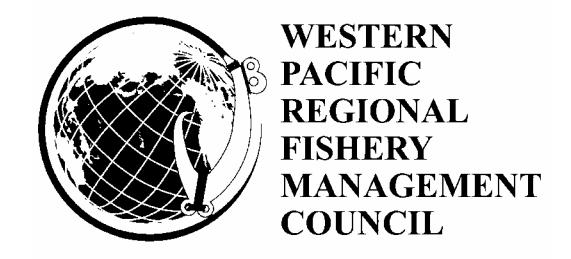

# **Fishery Ecosystem Plan for the American Samoa Archipelago**

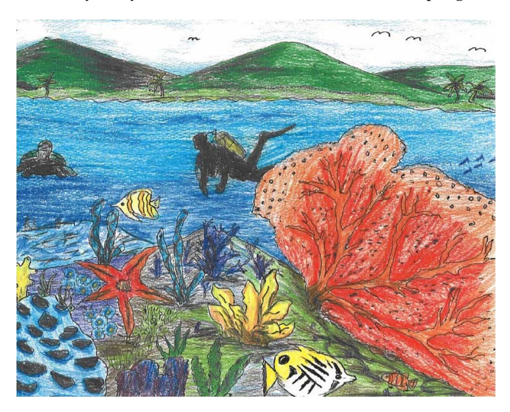

Western Pacific Regional Fishery Management Council 1164 Bishop Street, Suite 1400 Honolulu, Hawaii 96813

December 1, 2005

Cover Artwork Courtesy of:

Henry M. Ventura, Simon Sanchez High School Yigo, Guam

# **EXECUTIVE SUMMARY**

This American Samoa Archipelago Fishery Ecosystem Plan (FEP) was developed by the Western Pacific Regional Fishery Management Council and represents the first step in an incremental and collaborative approach to implement ecosystem approaches to fishery management in American Samoa.

Since the 1980s, the Council has managed fisheries throughout the Western Pacific Region through separate species-based fishery management plans (FMP) – the Bottomfish and Seamount Groundfish FMP, the Crustaceans FMP, the Precious Corals FMP, the Coral Reef Ecosystems FMP and the Pelagic FMP. However, the Council is now moving towards an ecosystem-based approach to fisheries management and is restructuring its management framework from species-based FMPs to place-based FEPs. Recognizing that a comprehensive ecosystem approach to fisheries management must be initiated through an incremental, collaborative, and adaptive management process, a multi-step approach is being used to develop and implement the FEPs. To be successful, this will require increased understanding of a range of issues including, biological and trophic relationships, ecosystem indicators and models, and the ecological effects of non-fishing activities on the marine environment. This FEP, in conjunction with the Council's Hawaii Archipelago, Mariana Archipelago, Pacific Remote Island Areas and Pacific Pelagic FEPs, reorganizes and amends the Council's existing Bottomfish and Seamount Groundfish, Coral Reef Ecosystems, Crustaceans, Precious Corals and Pelagic Fishery Management Plans.

The American Samoa Archipelago FEP establishes the framework under which the Council will manage fishery resources, and begin the integration and implementation of ecosystem approaches to management in American Samoa. This FEP does not establish any new fishery management regulations at this time but rather consolidates existing fishery regulations for demersal species. Specifically, this FEP identifies as management unit species those current management unit species known to be present in waters around American Samoa and incorporates all of the management provisions of the Bottomfish and Seamount Groundfish FMP, the Crustaceans FMP, the Precious Corals FMP, and the Coral Reef Ecosystems FMP that are applicable to the area. Although pelagic fishery resources play an important role in the biological as well as socioeconomic environment of these islands, they will be managed separately through the Pacific Pelagic FEP.

In addition, under the American Samoa Archipelago FEP, the organizational structure for developing and implementing Fishery Ecosystem Plans explicitly incorporates community input and local knowledge into the management process. This FEP also identifies topics in ecosystem approaches to management and identifies 10 overarching objectives to guide the Council in further implementing ecosystem approaches to management.

Future fishery management actions are anticipated to incorporate additional information as it becomes available. An adaptive management approach will be used to further advance the implementation of ecosystem science and principles. Such actions would be taken in accordance with the Magnuson-Stevens Fishery Conservation and Management Act, the National

| Environmental Policy Act, the Endangered Species Act, the Marine Mammal Protection Act, and other applicable laws and statutes. |
|------------------------------------------------------------------------------------------------------------------------------------|
|                                                                                                                                    |
|                                                                                                                                    |
|                                                                                                                                    |
|                                                                                                                                    |

# **TABLE OF CONTENTS**

| <b>EXECUT</b>  | TVE SUMMARY                                                      | i    |
|----------------|------------------------------------------------------------------|------|
| TABLE (        | OF CONTENTS                                                      | iii  |
| LIST OF        | TABLES                                                           | vi   |
| LIST OF        | FIGURES                                                          | vii  |
| ACRONY         | /MS                                                              | viii |
| <b>DEFINIT</b> | IONS                                                             | X    |
| CHAPTE         | R 1: INTRODUCTION                                                | 1    |
| 1.1            | Introduction                                                     |      |
| 1.2            | Purpose and Need for Action                                      | 2    |
| 1.3            | Incremental Approach to Ecosystem-based Management               | 4    |
| 1.4            | American Samoa Archipelago FEP Boundaries                        |      |
| 1.5            | American Samoa Archipelago FEP Management Objectives             | 5    |
| 1.6            | American Samoan Archipelago FEP Management Unit Species          |      |
| 1.7            | Regional Coordination                                            |      |
| 1.7.1          | Council Panels and Committees                                    | 19   |
| 1.7.2          | Community Groups and Projects                                    | 20   |
| 1.7.3          | International Management and Research                            | 21   |
| CHAPTE         | R 2: TOPICS IN ECOSYSTEM APPROACHES TO MANAGEMENT                |      |
| 2.1            | Introduction                                                     | 23   |
| 2.2            | Ecosystem Boundaries                                             |      |
| 2.3            | Precautionary Approach, Burden of Proof, and Adaptive Management | 24   |
| 2.4            | Ecological Effects of Fishing and Non-fishing Activities         |      |
| 2.5            | Data and Information Needs                                       |      |
| 2.6            | Use of Indicators and Models                                     | 26   |
| 2.7            | Single-species Management Versus Multi-species Management        |      |
| 2.8            | Ocean Zoning                                                     |      |
| 2.9            | Intra-agency and Inter-agency Cooperation                        |      |
| 2.10           | Community-based Management                                       |      |
| 2.10           | · · · · · · · · · · · · · · · · · · ·                            |      |
| 2.10           | •                                                                |      |
| CHAPTE         | R 3: DESCRIPTION OF THE ENVIRONMENT                              |      |
| 3.1            | Introduction                                                     | 33   |
| 3.2            | Physical Environment                                             | 33   |
| 3.2.1          | ·                                                                | 33   |
| 3.2.2          |                                                                  |      |
| 3.2.3          |                                                                  |      |
| 3.2.4          | Ocean Layers                                                     | 35   |
| 3.2.5          | · ·                                                              |      |
| 3.2.6          |                                                                  |      |
| 3.2.7          |                                                                  |      |
| 3.2.8          |                                                                  |      |
| 3.2.9          |                                                                  |      |
| 3.2.1          |                                                                  |      |
| 3.2.1          | •                                                                |      |

| 3.2.12 Pacific Island Geography                                         | 42 |
|-------------------------------------------------------------------------|----|
| 3.2.12.1 Micronesia                                                     | 42 |
| 3.2.12.2 Melanesia                                                      | 43 |
| 3.2.12.3 Polynesia                                                      | 44 |
| 3.3 Biological Environment                                              | 46 |
| 3.3.1 Marine Food Chains, Trophic Levels, and Food Webs                 | 46 |
| 3.3.2 Benthic Environment                                               |    |
| 3.3.2.1 Intertidal Zone                                                 | 48 |
| 3.3.2.2 Seagrass Beds                                                   | 48 |
| 3.3.2.3 Mangrove Forests                                                | 49 |
| 3.3.2.4 Coral Reefs                                                     | 49 |
| 3.3.2.5 Deep Reef Slopes                                                | 53 |
| 3.3.2.6 Banks and Seamounts                                             | 53 |
| 3.3.2.7 Deep Ocean Floor                                                | 54 |
| 3.3.2.7.1 Benthic Species of Economic Importance                        | 54 |
| 3.3.3 Pelagic Environment                                               |    |
| 3.3.3.1 Pelagic Species of Economic Importance                          |    |
| 3.3.4 Protected Species                                                 |    |
| 3.3.4.1 Sea Turtles                                                     | 62 |
| 3.3.4.2 Marine Mammals                                                  | 69 |
| 3.3.4.3 Seabirds                                                        | 72 |
| 3.4 Social Environment.                                                 | 74 |
| CHAPTER 4: DESCRIPTION OF AMERICAN SAMOA ARCHIPELAGO FISHERIES          | 79 |
| 4.1 Introduction                                                        | 79 |
| 4.2 Bottomfish Fishery of American Samoa                                | 79 |
| 4.2.1 History and Patterns of Use                                       | 79 |
| 4.2.2 Review of Bycatch                                                 | 81 |
| 4.3 Crustacean Fishery of American Samoa                                |    |
| 4.3.1 History and Patterns of Use                                       | 82 |
| 4.3.2 Review of Bycatch                                                 |    |
| 4.4 Coral Reef Fishery of American Samoa                                | 82 |
| 4.4.1 History and Patterns of Use                                       | 83 |
| 4.4.2 Review of Bycatch                                                 | 83 |
| 4.5 Precious Coral Fishery of American Samoa                            |    |
| 4.6 Description of American Samoa Fishing Communities                   |    |
| 4.6.1 Identification of Fishing Communities                             | 84 |
| 4.6.2 Economic and Social Importance of Fisheries                       | 85 |
| 4.6.3 Fishery Impact Statement                                          |    |
| CHAPTER 5: AMERICAN SAMOA ARCHIPELAGO FEP MANAGEMENT PROGRAM.           | 87 |
| 5.1 Introduction                                                        | 87 |
| 5.2 Description of National Standard 1 Guidelines on Overfishing        |    |
| 5.2.1 MSY Control Rule and Stock Status Determination Criteria          |    |
| 5.2.2 Target Control Rule and Reference Points                          | 89 |
| 5.2.3 Rebuilding Control Rule and Reference Points                      | 90 |
| 5.2.4 Measures to Prevent Overfishing and Overfished Stocks             | 90 |
| 5.3 Management Program for Bottomfish and Seamount Groundfish Fisheries |    |

| 5.3.1      | Permits and Reporting Requirements                       | . 91 |
|------------|----------------------------------------------------------|------|
| 5.3.2      | Gear Restrictions                                        | . 91 |
| 5.3.3      | At-sea Observer Coverage                                 | 91   |
| 5.3.4      | Framework for Regulatory Adjustments                     | . 91 |
| 5.3.5      | Bycatch Measures                                         |      |
| 5.3.6      | Application of National Standard 1                       |      |
| 5.4 Mar    | nagement Program for Precious Corals Fisheries           | 97   |
| 5.4.1      | Permits                                                  |      |
| 5.4.2      | Seasons and Quotas                                       | . 97 |
| 5.4.3      | Closures                                                 | 97   |
| 5.4.4      | Restrictions                                             | . 98 |
| 5.4.5      | Framework Procedures                                     | . 98 |
| 5.4.6      | Bycatch Measures                                         |      |
| 5.4.7      | Application of National Standard 1                       | . 99 |
| 5.5 Mar    | nagement Program for Crustacean Fisheries                |      |
| 5.5.1      | Management Areas and Subareas                            | 99   |
| 5.5.2      | Permits and Reporting Requirements                       | . 99 |
| 5.5.3      | Gear Restrictions                                        | . 99 |
| 5.5.4      | Notifications                                            | . 99 |
| 5.5.5      | At-sea Observer Coverage                                 | 100  |
| 5.5.6      | Framework Procedures                                     | 100  |
| 5.5.7      | Bycatch Measures                                         | 100  |
| 5.5.8      | Application of National Standard 1                       | 101  |
| 5.6 Mar    | agement Program for Coral Reef Ecosystem Fisheries       | 101  |
| 5.6.1      | Marine Protected Areas (MPAs)                            | 101  |
| 5.6.2      | Permits and Reporting Requirements                       | 101  |
| 5.6.3      | Notification                                             | 102  |
| 5.6.4      | Gear Restrictions                                        | 102  |
| 5.6.5      | Framework Procedures                                     | 102  |
| 5.6.6      | Other Actions                                            | 102  |
| 5.6.7      | Bycatch Measures                                         | 102  |
| 5.6.8      | Application of National Standard 1                       | 103  |
| CHAPTER 6: | IDENTIFICATION AND DESCRIPTION OF ESSENTIAL FISH HABITAT | 105  |
| 6.1 Intro  | oduction                                                 | 105  |
| 6.2 EFH    | I Designations                                           | 106  |
| 6.2.1      | Bottomfish                                               | 107  |
| 6.2.2      | Crustaceans                                              | 109  |
| 6.2.3      | Precious Corals                                          | 111  |
| 6.2.4      | Coral Reef Ecosystems                                    | 112  |
| 6.3 HAI    | PC Designations                                          | 132  |
| 6.3.1      | Bottomfish                                               | 132  |
| 6.3.2      | Crustaceans                                              | 132  |
| 6.3.3      | Precious Corals                                          | 133  |
| 6.3.4      | Coral Reef Ecosystems                                    | 133  |
| 6.4 Fish   | ing Related Impacts That May Adversely Affect EFH        |      |
|            | -Fishing Related Impacts That May Adversely Affect EFH   |      |

| 6.5.1 | Habitat Conservation and Enhancement Recommendations                           | 140     |
|-------|-----------------------------------------------------------------------------------|---------|
| 6.5.2 | Description of Mitigation Measures for Identified Activities and Impacts       | 141     |
| 6.6   | EFH Research Needs                                                             | 146     |
|       | CHAPTER 7: COORDINATION OF ECOSYSTEM APPROACHES TO FISHERIES                      |         |
|       | MANAGEMENT IN THE AMERICAN SAMOA ARCHIPELAGO FEP                                  | 149     |
| 7.1   | Introduction                                                                      | 149     |
| 7.2   | Council Panels and Committees                                                  | 149     |
|       | 7.3. Indigenous Program                                                           | 151     |
|       | 7.3.1 Western Pacific Community Development Program (CDP)                      | 152     |
|       | 7.3.2 Western Pacific Community Demonstration Project Program (CDPP)           | 152     |
| 7.4   | International Management and Research                                             | 152     |
|       | CHAPTER 8: CONSISTENCY WITH THE MSA AND OTHER APPLICABLE LAWS                     |  155 |
| 8.1   | Introduction                                                                      | 155     |
| 8.2   | National Standards for Fishery Conservation and Management                     | 155     |
| 8.3   | Essential Fish Habitat                                                         | 157     |
| 8.4   | Coastal Zone Management Act                                                       | 158     |
| 8.5   | Endangered Species Act (ESA)                                                   | 158     |
| 8.6   | Marine Mammal Protection Act (MMPA)                                            | 160     |
| 8.7   | National Environmental Policy Act (NEPA)                                          | 162     |
| 8.8   | Paperwork Reduction Act (PRA)                                                     | 162     |
| 8.9   | Regulatory Flexibility Act (RFA)                                                  | 162     |
| 8.10  | Executive Order 12866                                                          | 162     |
| 8.11  | Data Quality Act                                                               | 163     |
| 8.12  | Executive Order 13112                                                          | 163     |
| 8.13  | Executive Order 13089                                                          | 164     |
|       | CHAPTER 9: STATE, LOCAL AND OTHER APPLICABLE LAWS                                 | 165     |
| 9.1   | Introduction                                                                      | 165     |
| 9.2   | Department of Marine and Wildlife Management                                      | 165     |
| 9.3   | U.S. Fish and Wildlife Refuges and Units                                          | 166     |
| 9.4   | Fagatele Bay National Marine Sanctuary                                         | 166     |
|       | CHAPTER 10: DRAFT REGULATIONS                                                  | 167     |
|       | CHAPTER 11: REFERENCES                                                         | 209     |
|       | LIST OF TABLES                                                                    |         |
|       | Table 1: American Samoa Archipelago Bottomfish Management Unit Species            | 7       |
|       | Table 2: American Samoa Archipelago Crustacean Management Unit Species            | 8       |
|       | Table 3: American Samoa Archipelago Precious Coral Management Unit Species        | 8       |
|       | Table 4: American Samoa Archipelago Coral Reef Ecosystem Management Unit Species, |         |
|       | (Currently Harvested Coral Reef Taxa)                                             | 9       |
|       | Table 5: American Samoa Archipelago Coral Reef Ecosystem Management Unit Species, |         |
|       | (Potentially Harvested Coral Reef Taxa)                                           | 13      |
|       | Table 6: FEP Advisory Panel and Sub-panel Structure                               | 19      |
|       | Table 7: Non-ESA Listed Marine Mammals of the Western Pacific                  | 72      |

| Table 8: Overfishing Threshold Specifications for Bottomfish and Seamount Groundfish Stocks  |     |
|----------------------------------------------------------------------------------------------|-----|
|  Table 9: Recruitment Overfishing Control Rule Specifications for Bottomfish and Seamount | 93  |
| Groundfish Stocks                                                                            | 94  |
| Table 10: CPUE-based Overfishing Limits and Reference Points for Coral Reef Species          | 104 |
| Table 11: Occurrence of Currently Harvested Management Unit Species                          | 114 |
| Table 12: Occurrence of Currently Harvested Management Unit Species: Aquarium                |     |
| Taxa/Species                                                                              | 123 |
| Table 13: Summary of EFH designations for Currently Harvested Coral Reef Taxa             | 124 |
| Table 14: Ocurrence of Potentially Harvested Coral Reef Taxa                              | 127 |
| Table 15: Summary of EFH designations for Potentially Harvested Coral Reef Taxa           | 131 |
| Table 16: EFH and HAPC Designations for All Western Pacific Archipelagic FEP MUS             |     |
| (Including American Samoa)                                                                   | 134 |
| Table 17: Coral Reef Ecosystem HAPC Designations in American Samoa                        | 137 |
| Table 18: Threats to Coral Reefs in American Samoa                                        | 140 |
| Table 19: FEP Advisory Panel and Sub-panel Structure                                         | 150 |
| Table 20: EFH and HAPC for Management Unit Species of the Western Pacific Region          | 157 |
| LIST OF FIGURES                                                                              |     |
| Figure 1: Western Pacific Region                                                             | 1   |
| Figure 2: Earth's Tectonic Plates                                                            | 34  |
| Figure 3: Temperature and Salinity Profile of the Ocean                                      | 36  |
| Figure 4: Depth Profile of Ocean Zones                                                       | 37  |
| Figure 5: Major Surface Currents of the Pacific Ocean                                        | 38  |
| Figure 6: North Pacific Transition Zone                                                      | 39  |
| Figure 7: Deep-Ocean Water Movement                                                          | 40  |
| Figure 8: Central Pacific Pelagic Food Web                                                   | 47  |
| Figure 9: Benthic Environment                                                                | 48  |
| Figure 10: Bottomfish Landings and Value in American Samoa 1982–2003                         | 81  |
| Figure 11: Example MSY, Target, and Rebuilding Control Rules                                 | 88  |
| Figure 12: Combination of Control Rules and Reference Points for Bottomfish and Seamount     |     |
| Groundfish Stocks                                                                            | 96  |
| Figure 13: Illustration of Institutional Linkages in the Council Process                  | 154 |

# **ACRONYMS**

APA: Administrative Procedure Act ASG: American Samoa Government

B: Stock biomass

BFLAG: Minimum Biomass Flag

BMSY: Biomass Maximum Sustainable Yield

BOY: Biomass Optimum Yield

0 C: Degrees Celsius

BMUS: Bottomfish Management Unit Species

CFR: Code of Federal Regulations

CITES: Council on International Trade and Endangered Species

Cm: Centimeters

CNMI: Commonwealth of the Northern Mariana Islands

CPUE: Catch Per Unit Effort

CPUEMSY: Catch per unit effort Maximum Sustainable Yield

CPUEREF: Catch per unit effort

CRAMP: Coral Reef Assessment and Monitoring Program

CRE: Coral Reef Ecosystem

CRE-FMP: Coral Reef Ecosystem Fishery Management Plan

CRTF: Coral Reef Task Force

CZMA: Coastal Zone Management Act

DAR: Division of Aquatic Resources, Government of Hawaii

DAWR: Division of Aquatic and Wildlife Resources, Government of Guam

DBEDT: Department of Business, Economic Development and Tourism, State of Hawaii

DFW: Division of Fish and Wildlife, Government of CNMI

DLNR: Department of Land and Natural Resources, Government of Hawaii

DMWR: Department of Marine and Wildlife Resources, Government of American Samoa

DOC: United States Department of Commerce DOD: United States Department of Defense

DOI: Department of the Interior EEZ: Exclusive Economic Zone EFH: Essential Fish Habitat

EIS: Environmental Impact Statement EMSY: Effort Maximum Sustainable Yield

ENSO: El Niño Southern Oscillation

EO: Executive Order

EPAP: Ecosystem Principals Advisory Panel

ESA: Endangered Species Act

F: Fishing mortality

FMSY: Fishing mortality Maximum Sustainable Yield

FOY: Fishing mortality Optimum Yield

FEP: Fishery Ecosystem Plan FDM: Farallon de Medinilla, CNMI FEP: Fishery Ecosystem Plan

FFS: French Frigate Shoals

FLPMA: Federal Land Policy and Management Act

Fm: Fathoms

FMP: Fishery Management Plan

FR: Federal Register

FRFA: Final Regulatory Flexibility Analysis

Ft: Feet

FWCA: Fish and Wildlife Coordination Act

g: Grams

GIS: Geographic information systems GPS: Global Positioning System

HAPC: Habitat Areas of Particular Concern

HCRI: Hawaii Coral Reef Initiative Research Program HINWR: Hawaiian Islands National Wildlife Refuge

HIR: Hawaiian Islands Reservation

HMSRT Hawaiian Monk Seal Recovery Team IRFA Initial Regulatory Flexibility Analysis

Kg: Kilograms Km: Kilometers Lb: Pounds

LOF List of Fisheries

LORAN Long Range Aid to Navigation

m: meters mt: metric tons

maxFMT: maximum fishing mortality threshold

MHI: Main Hawaiian Islands

min SST: minimum spawning stock threshold

mm: millimeters

MMPA: Marine Mammal Protection Act

MPA: Marine Protected Area

MSA: Magnuson-Stevens Fisheries Conservation and Management Act

MSST: Minimum Stock Size Threshold MSY: Maximum Sustainable Yield MUS: Management Unit Species NDSA: Naval Defense Sea Areas

NEPA: National Environmental Policy Act

nm or nmi: Nautical Miles

NMFS: National Marine Fisheries Service (also known as NOAA Fisheries Service)

PIFSC: Pacific Islands Fisheries Science Center, NMFS NOAA: National Oceanic and Atmospheric Administration

NWHI: Northwestern Hawaiian Islands NWR: National Wildlife Refuge

NWRSAA: National Wildlife Refuge System Administration Act

OMB: Office of Management and Budget

OY: Optimum Yield

PBR: Potential Biological Removal

PIRO: Pacific Islands Regional Office, NMFS

PRA: Paperwork Reduction Act PRIA: Pacific Remote Island Areas RFA: Regulatory Flexibility Act RIR: Regulatory Impact Review SFA: Sustainable Fisheries Act SLA: Submerged Lands Act SPR: Spawning Potential Ratio SWR: State Wildlife Refuge

SSC: Scientific and Statistical Committee

TALFF: Total Allowable Level of Foreign Fishing

TSLA: Territorial Submerged Lands Act

USCG: United States Coast Guard

USFWS: United States Fish and Wildlife Service

VMS: Vessel Monitoring System

WpacFIN: Western Pacific Fisheries Information Network, NMFS WPRFMC Western Pacific Regional Fishery Management Council

# **DEFINITIONS**

**Adaptive Management**: A program that adjusts regulations based on changing conditions of the fisheries and stocks.

**Bycatch**: Any fish harvested in a fishery which are not sold or kept for personal use, and includes economic discards and regulatory discards.

**Barrier Net**: A small-mesh net used to capture coral reef or coastal pelagic fishes.

**Bioprospecting**: The search for commercially valuable biochemical and genetic resources in plants, animals and microorganisms for use in food production, the development of new drugs and other biotechnology applications.

**Charter Fishing**: Fishing from a vessel carrying a passenger for hire (as defined in section 2101(21a) of Title 46, United States Code) who is engaged in recreational fishing.

**Commercial Fishing**: Fishing in which the fish harvested, either in whole or in part, are intended to enter commerce or enter commerce through sale, barter or trade. For the purposes of this Fishery Ecosystem Plan, commercial fishing includes the commercial extraction of biocompounds.

**Consensual Management**: Decision making process where stakeholders meet and reach consensus on management measures and recommendations.

- **Coral Reef Ecosystem** (CRE): Those species, interactions, processes, habitats and resources of the water column and substrate located within any waters less than or equal to 50 fathoms in total depth.
- **Council**: The Western Pacific Regional Fishery Management Council (WPRFMC).
- **Critical Habitat**: Those geographical areas that are essential for bringing an endangered or threatened species to the point where it no longer needs the legal protections of the Endangered Species Act (ESA), and which may require special management considerations or protection. These areas are designated pursuant to the ESA as having physical or biological features essential to the conservation of listed species.
- **Dealer**: One who buys and sells species in the fisheries management unit without altering their condition.
- **Dip Net**: A hand-held net consisting of a mesh bag suspended from a circular, oval, square or rectangular frame attached to a handle. A portion of the bag may be constructed of material, such as clear plastic, other than mesh.
- **Ecology**: The study of interactions between an organism (or organisms) and its (their) environment (biotic and abiotic).
- **Ecological Integrity**: Maintenance of the standing stock of resources at a level that allows ecosystem processes to continue. Ecosystem processes include replenishment of resources, maintenance of interactions essential for self-perpetuation and, in the case of coral reefs, rates of accretion that are equal to or exceed rates of erosion. Ecological integrity cannot be directly measured but can be inferred from observed ecological changes.
- **Economic Discards**: Coral reef resources that are the target of a fishery but which are not retained because they are of an undesirable size, sex or quality or for other economic reasons.
- **Ecosystem**: The interdependence of species and communities with each other and with their non-living environment.
- **Ecosystem-Based Fishery Management**: Fishery management actions aimed at conserving the structure and function of marine ecosystems in addition to conserving fishery resources.
- **Ecotourism**: Observing and experiencing, first hand, natural environments and ecosystems in a manner intended to be sensitive to their conservation.
- **Environmental Impact Statement** (EIS): A document required under the National Environmental Policy Act (NEPA) to assesses alternatives and analyze the impact on the environment of proposed major Federal actions.

- **Essential Fish Habitat** (EFH): Those waters and substrate necessary to a species or species group or complex, for spawning, breeding, feeding or growth to maturity.
- **Exclusive Economic Zone** (EEZ): The zone established by Proclamation numbered 5030, dated March 10, 1983. For purposes of the Magnuson Act, the inner boundary of that zone is a line coterminous with the seaward boundary of each of the coastal states, commonwealths, territories or possessions of the United States.
- **Exporter**: One who sends species in the fishery management unit to other countries for sale, barter or any other form of exchange (also applies to shipment to other states, territories or islands).
- **Fish**: Finfish, mollusks, crustaceans and all other forms of marine animal and plant life other than marine reptiles, marine mammals and birds.
- **Fishery**: One or more stocks of fish that can be treated as a unit for purposes of conservation and management and that are identified on the basis of geographical, scientific, technical, recreational and economic characteristics; and any fishing for such stocks.
- **Fishing**: The catching, taking or harvesting of fish; the attempted catching, taking or harvesting of fish; any other activity that can reasonably be expected to result in the catching, taking or harvesting of fish; or any operations at sea in support of, or in preparation for, any activity described in this definition. Such term does not include any scientific research activity that is conducted by a scientific research vessel.
- **Fishing Community**: A community that is substantially dependent on or substantially engaged in the harvest or processing of fishery resources to meet social and economic needs and includes fishing vessel owners, operators and crews and United States fish processors that are based in such community.
- **Food Web**: Inter-relationships among species that depend on each other for food (predator-prey pathways).
- **Framework Measure**: Management measure listed in an FMP for future consideration. Implementation can occur through an administratively simpler process than a full FMP amendment.
- **Ghost Fishing**: The chronic and/or inadvertent capture and/or loss of fish or other marine organisms by lost or discarded fishing gear.
- **Habitat**: Living place of an organism or community, characterized by its physical and biotic properties.
- **Habitat Area of Particular Concern** (HAPC): Those areas of EFH identified pursuant to Section 600.815(a)(9). In determining whether a type or area of EFH should be designated as a HAPC, one or more of the following criteria must be met: (1) ecological

function provided by the habitat is important; (2) habitat is sensitive to human-induced environmental degradation; (3) development activities are, or will be, stressing the habitat type; or (4) the habitat type is rare.

**Harvest**: The catching or taking of a marine organism or fishery MUS by any means.

**Hook-and-line**: Fishing gear that consists of one or more hooks attached to one or more lines.

- **Live Rock**: Any natural, hard substrate (including dead coral or rock) to which is attached, or which supports, any living marine life-form associated with coral reefs.
- **Longline**: A type of fishing gear consisting of a main line which is deployed horizontally from which branched or dropper lines with hooks are attached.
- **Low-Use MPA**: A Marine Protected Area zoned to allow limited fishing activities.
- **Main Hawaiian Islands** (MHI): The islands of the Hawaiian islands archipelago consisting of Niihau, Kauai, Oahu, Molokai, Lanai, Maui, Kahoolawe, Hawaii and all of the smaller associated islets lying east of 161°20' W longitude.
- **Marine Protected Area** (MPA): An area designated to allow or prohibit certain fishing activities.
- **Maximum Sustainable Yield** (MSY): The largest long-term average catch or yield that can be taken, from a stock or stock complex under prevailing ecological and environmental conditions.
- **National Marine Fisheries Service** (NMFS): The component of the National Oceanic and Atmospheric Administration (NOAA), Department of Commerce, responsible for the conservation and management of living marine resources. Also known as NOAA Fisheries Service.
- **No-Take MPA**: A Marine Protected Area where no fishing or removal of living marine resources is authorized.
- **Northwestern Hawaiian Islands** (NWHI): the islands of the Hawaiian islands archipelago lying to the west of 161°20'W longitude.
- **Optimum Yield** (OY): With respect to the yield from a fishery "optimum" means the amount of fish that: (a) will provide the greatest overall benefit to the nation, particularly with respect to food production and recreational opportunities and taking into account the protection of marine ecosystems; (b) is prescribed as such on the basis of the MSY from the fishery, as reduced by any relevant economic, social or ecological factor; and (c) in the case of an overfished fishery, provides for rebuilding to a level consistent with producing the MSY in such fishery.

- **Overfishing**: Fishing at a rate or level that jeopardizes the capacity of a stock or stock complex to produce maximum sustainable yield on a continuing basis.
  - **Pacific Remote Island Areas** (PRIAs): Baker Island, Howland Island, Jarvis Island, Johnston Atoll, Kingman Reef, Midway Atoll, Wake Island and Palmyra Atoll.
  - **Passive Fishing Gear**: Gear left unattended for a period of time prior to retrieval (e.g., traps, gill nets).
  - **Precautionary Approach**: The implementation of conservation measures even in the absence of scientific certainty that fish stocks are being overexploited.
  - **Recruitment**: A measure of the weight or number of fish which enter a defined portion of the stock such as fishable stock (those fish above the minimum legal size) or spawning stock (those fish which are sexually mature).
  - **Reef**: A ridgelike or moundlike structure built by sedentary calcareous organisms and consisting mostly of their remains. It is wave-resistant and stands above the surrounding sediment. It is characteristically colonized by communities of encrusting and colonial invertebrates and calcareous algae.
  - **Reef-obligate Species**: An organism dependent on coral reefs for survival.
  - **Regulatory Discards**: Any species caught that fishermen are required by regulation to discard whenever caught, or are required to retain but not sell.
  - **Resilience**: The ability of a population or ecosystem to withstand change and to recover from stress (natural or anthropogenic).
  - **Restoration**: The transplanting of live organisms from their natural habitat in one area to another area where losses of, or damage to, those organisms has occurred with the purpose of restoring the damaged or otherwise compromised area to its original, or a substantially improved, condition; additionally, the altering of the physical characteristics (e.g*.*, substrate, water quality) of an area that has been changed through human activities to return it as close as possible to its natural state in order to restore habitat for organisms.
  - **Rock**: Any consolidated or coherent and relatively hard, naturally formed, mass of mineral matter.
  - **Rod-and-Reel**: A hand-held fishing rod with a manually or electrically operated reel attached.
  - **Scuba**-**assisted Fishing**: Fishing, typically by spear or by hand collection, using assisted breathing apparatus.
  - **Secretary**: The Secretary of Commerce or a designee.

**Sessile**: Attached to a substrate; non-motile for all or part of the life cycle.

**Slurp Gun**: A self-contained, typically hand-held, tube–shaped suction device that captures organisms by rapidly drawing seawater containing the organisms into a closed chamber.

**Social Acceptability**: The acceptance of the suitability of management measures by stakeholders, taking cultural, traditional, political and individual benefits into account.

**Spear**: A sharp, pointed, or barbed instrument on a shaft, operated manually or shot from a gun or sling.

 **Stock Assessment**: An evaluation of a stock in terms of abundance and fishing mortality levels and trends, and relative to fishery management objectives and constraints if they have been specified.

**Stock of Fish**: A species, subspecies, geographical grouping or other category of fish capable of management as a unit.

**Submersible**: A manned or unmanned device that functions or operates primarily underwater and is used to harvest fish.

**Subsistence Fishing**: Fishing primarily to obtain food for personal use rather than for sale or recreation.

**Target Resources**: Species or taxa sought after in a directed fishery.

**Trophic Web**: A network that represents the predator/prey interactions of an ecosystem.

**Trap**: A portable, enclosed, box-like device with one or more entrances used for catching and holding fish or marine organism.

#### **Western Pacific Regional Fishery Management Council** (WPRFMC or Council):

Representatives from the State of Hawaii, the Territories of American Samoa and Guam and the Commonwealth of the Northern Mariana Islands with authority over the fisheries in the Pacific Ocean seaward of the State of Hawaii, the Territory of American Samoa, the Territory of Guam, the Commonwealth of the Northern Mariana Islands and the Pacific Remote Island Areas.

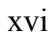

# **CHAPTER 1: INTRODUCTION**

#### **1.1 Introduction**

In 1976, the United States Congress passed the Magnuson Fishery Conservation and Management Act that was subsequently reauthorized as the Magnuson–Stevens Fishery Conservation and Management Act (MSA). Under the MSA, the United States (U.S.) has exclusive fishery management authority over all fishery resources found within its Exclusive Economic Zone (EEZ). For purposes of the MSA, the inner boundary of the U.S. EEZ extends from the seaward boundary of each coastal state to a distance of 200 nautical miles from the baseline from which the breadth of the territorial sea is measured. The Western Pacific Regional Fishery Management Council (Council) has authority over the fisheries based in, and surrounding, the State of Hawaii, the Territory of American Samoa, the Territory of Guam, the Commonwealth of the Northern Mariana Islands, and the U.S. Pacific Remote Island Areas (PRIA) of the Western Pacific Region.1

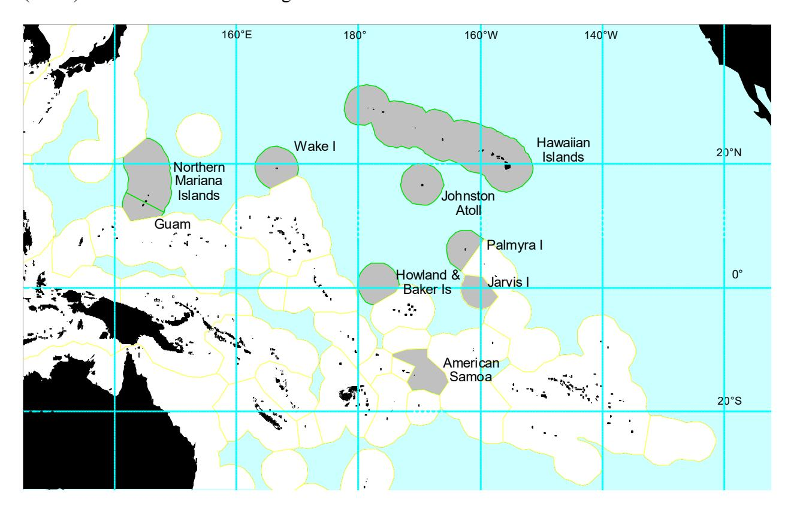

**Figure 1: Western Pacific Region** 

1 The Pacific Remote Island Areas comprise Baker Island, Howland Island, Jarvis Island, Johnston Atoll, Kingman Reef, Wake Island, Palmyra Atoll, and Midway Atoll. Although physically located in Hawaii, Midway is considered part of the PRIA because it is not a part of the State of Hawaii.

In the Western Pacific Region, responsibility for the management of marine resources is shared by a number of federal and local government agencies. At the federal level, the Council, the National Marine Fisheries Service (NMFS, also known as NOAA Fisheries Service), the National Oceanic and Atmospheric Administration (NOAA), and the U.S. Department of Commerce develop and implement fishery management measures. Additionally, NOAA's Ocean Service co-manages (with the State of Hawaii) the Hawaiian Islands Humpback Whale National Marine Sanctuary, manages the Fagatele Bay National Marine Sanctuary in American Samoa, and administers the Northwestern Hawaiian Islands Coral Reef Ecosystem Reserve.

The U.S. Department of the Interior, through the U.S. Fish and Wildlife Service, manages waters surrounding ten National Wildlife Refuges throughout the Western Pacific Region. Some refuges are co-managed with other federal and state agencies, while others are not.

The U.S. Department of Defense, through the Air Force, Army, Navy, and Marine Corps, also controls access and use of various marine waters throughout the region.

The Territory of American Samoa, the Territory of Guam, and the State of Hawaii manage all marine resources within waters 0–3 miles from their shorelines. In the Commonwealth of the Northern Mariana Islands (CNMI), the submerged lands and marine resources from the shoreline to 200 miles have been found to be owned by the federal government, although CNMI is currently seeking to acquire jurisdiction of the area from 0 to 3 miles through various legal means.

## **1.2 Purpose and Need for Action**

The Western Pacific Region includes a series of archipelagos with distinct cultures, communities, and marine resources. For thousands of years, the indigenous people of these Pacific islands relied on healthy marine ecosystems to sustain themselves, their families, and their island communities. This remains true in today's modern period, in which Pacific island communities continue to depend on the ecological, economic, and social benefits of healthy marine ecosystems.

On international, national, and local levels, institutions and agencies tasked with managing marine resources are moving toward an ecosystem approach to fisheries management. One reason for this shift is a growing awareness that many of Earth's marine resources are stressed and the ecosystems that support them are degraded. In addition, increased concern regarding the potential impacts of fishing and non-fishing activities on the marine environment, and a greater understanding of the relationships between ecosystem changes and population dynamics, have all fostered support for a holistic approach to fisheries management that is science based and forward thinking (Pikitch et al. 2004).

In 1998, the U.S. Congress charged NMFS with the establishment of an Ecosystem Principles Advisory Panel (EPAP) responsible for assessing the extent that ecosystem principles were being used in fisheries management and research, and recommending how to further their use to improve the status and management of marine resources. The EPAP was composed of members of academia, fishery and conservation organizations, and fishery management agencies.

The EPAP (EPAP 1999) reached consensus that Fishery Ecosystem Plans (FEPs) should be developed and implemented to manage U.S. fisheries and marine resources. According to the EPAP, a FEP should contain and implement a management framework to control harvests of marine resources on the basis of available information regarding the structure and function of the ecosystem in which such harvests occur. The EPAP also constructed eight ecosystem principles that it believes to be important to the successful management of marine ecosystems. These principles are as follows:

- The ability to predict ecosystem behavior is limited.
- Ecosystems have real thresholds and limits that, when exceeded, can affect major system restructuring.
- Once thresholds and limits have been exceeded, changes can be irreversible.
- Diversity is important to ecosystem functioning.
- Multiple scales interact within and among ecosystems.
- Components of ecosystems are linked.
- Ecosystem boundaries are open.
- Ecosystems change with time.

The Food and Agriculture Organization of the United Nations provides that the purpose of an ecosystem approach to fisheries "is to plan, develop and manage fisheries in a manner that addresses the multiple needs and desires of societies, without jeopardizing the options for future generations to benefit from a full range of goods and services provided by marine ecosystems" (Garcia et al. 2003).

Similarly, NOAA defines an ecosystem approach as "management that is adaptive, specified geographically, takes account of ecosystem knowledge and uncertainties, considers multiple external influences, and strives to balance diverse social objectives." In addition, because of the wide ranging nature of ecosystems, successful implementation of ecosystem approaches will need to be incremental and collaborative (NOAA 2004).

Given the above, this document establishes an FEP for the non-pelagic fisheries of the American Samoa archipelago. In particular, it

- 1. identifies the management objectives of the American Samoa Archipelago FEP;
- 2. delineates the boundaries of the American Samoa Archipelago FEP;
- 3. designates the management unit species included in the American Samoa Archipelago FEP;
- 4. details the federal fishery regulations applicable under the American Samoa Archipelago FEP; and
- 5. establishes appropriate Council structures and advisory bodies to provide scientific and management advice to the Council regarding the American Samoa Archipelago FEP.

In addition, this document provides the information and rationale for these measures; discusses the key components of the American Samoan archipelagic ecosystem, including an overview of the region's non-pelagic fisheries, and explains how the measures contained here are consistent with the MSA and other applicable laws. This FEP, in conjunction with the Council's Hawaii

Archipelago, Mariana Archipelago, Pacific Remote Island Areas and Pacific Pelagic FEPs, reorganizes and amends the Council's existing Bottomfish and Seamount Groundfish, Coral Reef Ecosystems, Crustaceans, Precious Corals and Pelagic Fishery Management Plans.

#### **1.3 Incremental Approach to Ecosystem-based Management**

As discussed above, fishery scientists and managers have recognized that a comprehensive ecosystem approach to fisheries management must be implemented through an incremental and collaborative process (Jennings 2004; Sissenwine and Murawski 2004; NOAA 2004). The goal of the measures contained in this document is to begin this process by establishing an American Samoa Archipelago FEP with appropriate boundaries, management unit species, and advisory structures. Successful ecosystem management will require an increased understanding of a range of social and scientific issues including appropriate management objectives, biological and trophic relationships, ecosystem indicators and models, and the ecological effects of non-fishing activities on the marine environment. Future fishery management actions are anticipated to utilize this information as it becomes available, and adaptive management will be used to further advance the implementation of ecosystem science and principles.

#### **1.4 American Samoa Archipelago FEP Boundaries**

An ecosystem is generally considered to be a system containing complex interactions among species, communities, and the non-living environment. Ecosystems can be considered at various geographic scales—from a coral reef ecosystem with its diverse species and benthic habitats to a large marine ecosystem such as the Pacific Ocean. From a marine ecosystem management perspective, the boundary of an ecosystem cannot be readily defined and depends on many factors, including life history characteristics, habitat requirements, and geographic ranges of fish and other marine resources including their interdependence between species and their environment. Additionally, processes that affect and influence abundance and distribution of natural resources, such as environmental cycles, extreme natural events, and acute or chronic anthropogenic impacts, must also be considered. Serious considerations must also be given to social, economic, and/or political constraints. For the purposes of this document, ecosystems are defined as geographically specified system of organisms, the environment, and the processes that control its dynamics. Humans and their society are considered to be an integral part of these ecosystems, and the alternatives considered here are cognizant of the human jurisdictional boundaries and varying management authorities that are present in the Western Pacific Region. This is also consistent with NMFS's EPAP's 1999 report to Congress recommending that Councils should develop FEPs for the ecosystems under their jurisdiction and delineate the extent of those ecosystems.

Taking these factors into account, the Council has determined that at this time, the American Samoa Archipelago FEP includes all waters and associated marine resources within federal waters of the American Samoa archipelago (see Figure 1). Although this overlaps with the boundaries of the Council's Pacific Pelagic FEP for pelagic fisheries, the American Samoa Archipelago FEP specifically manages those demersal resources and habitats associated with the federal waters of the American Samoa archipelago.

Under the approach described in this document, continuing adaptive management could include subsequent actions to refine or expand these boundaries if and when supported by scientific data and/or management requirements. Such actions would be taken in accordance with the MSA, the National Environmental Policy Act (NEPA), the Endangered Species Act (ESA), the Marine Mammal Protection Act (MMPA), and other applicable laws and statutes.

#### **1.5 American Samoa Archipelago FEP Management Objectives**

The MSA mandates that fishery management measures achieve long-term sustainable yields from domestic fisheries while preventing overfishing. In 1999, the EPAP submitted a report to Congress arguing for management that—while not abandoning optimum yield and overfishing principles—takes an ecosystem-based approach (EPAP 1999).

Heeding the basic principles, goals, and policies for ecosystem-based management outlined by EPAP, the Council initiated the development of FEPs for each major ecosystem under its jurisdiction beginning with the Coral Reef Ecosystems Fishery Management Plan (FMP), which was implemented in March 2004. This American Samoa Archipelago FEP represents—along with the Pacific Pelagic FEP, the Mariana Archipelago FEP, the Hawaii Archipelago FEP, and the PRIA FEP—the next step in the establishment and successful implementation of FEPs for all of the fisheries within its jurisdiction.

The overall goal of the American Samoa Archipelago FEP is to establish a framework under which the Council will improve its abilities to realize the goals of the MSA through the incorporation of ecosystem science and principles.

To achieve this goal, the Council has adopted the following ten objectives for the America Samoa Archipelago FEP:

*Objective 1:* To maintain biologically diverse and productive marine ecosystems and foster the long-term sustainable use of marine resources in an ecologically and culturally sensitive manner through the use of a science-based ecosystem approach to resource management.

*Objective 2:* To provide flexible and adaptive management systems that can rapidly address new scientific information and changes in environmental conditions or human use patterns.

*Objective 3:* To improve public and government awareness and understanding of the marine environment in order to reduce unsustainable human impacts and foster support for responsible stewardship.

*Objective 4:* To encourage and provide for the sustained and substantive participation of local communities in the exploration, development, conservation, and management of marine resources.

*Objective 5:* To minimize fishery bycatch and waste to the extent practicable.

*Objective 6:* To manage and comanage protected species, protected habitats, and protected areas.

*Objective 7:* To promote the safety of human life at sea.

*Objective 8:* To encourage and support appropriate compliance and enforcement with all applicable local and federal fishery regulations.

*Objective 9:* To increase collaboration with domestic and foreign regional fishery management and other governmental and non-governmental organizations, communities, and the public at large to successfully manage marine ecosystems.

*Objective 10:* To improve the quantity and quality of available information to support marine ecosystem management.

#### **1.6 American Samoan Archipelago FEP Management Unit Species**

Management unit species (MUS) are those species that are managed under each FMP or FEP. In fisheries management, MUS typically include those species that are caught in quantities sufficient to warrant management or specific monitoring by NMFS and the Council. The primary impact of inclusion of species in an MUS list is that the species (i.e. the fishery targeting that species) can be directly managed. National Standard 3 of the MSA requires that to the extent practicable, an individual stock of fish shall be managed as a unit throughout its range, and interrelated stocks of fish shall be managed as a unit or in close coordination. Under the American Samoa Archipelago FEP, MUS include only those current bottomfish and seamount MUS, crustacean MUS, precious coral MUS, and coral reef ecosystem MUS that are known to be present within EEZ waters around the American Samoa Archipelago. Although, certain pelagic MUS are known to occur within the boundary of the American Samoa FEP, they are managed under a separate Pelagic FEP.

Tables 1–5 list those current bottomfish and seamount MUS, crustacean MUS, precious coral MUS, and coral reef ecosystem MUS that are known to be present within the boundary of the American Samoa Archipelago FEP and are thus managed under this plan.

**Table 1: American Samoa Archipelago Bottomfish Management Unit Species** 

| English Common Name  | Samoan Name         |
|-------------------------|---------------------|
| red snapper/silvermouth | palu-gutusiliva     |
| gray snapper/jobfish    | asoama              |
| Giant trevally/jack     | sapoanae            |
| Black trevally/jack     | tafauli             |
| blacktip grouper        | fausi               |
| lunartail grouper       | papa, velo          |
| red snapper             | palu malau          |
| red snapper             | palu-loa            |
| ambon emperor           | filoa-gutumumu      |
| redgill emperor         | filoa-paomumu       |
| blueline snapper        | savane              |
| yellowtail snapper      | palu-i'usama        |
| pink snapper            | palu-'ena'ena       |
| yelloweye snapper       | palu-sina           |
| pink snapper            | palu                |
| snapper                 | palu-ula, palu-sega |
| amberjack               | malauli             |
|                         |                     |

palu = general name for *Etelis/Pristipomoides spp.*

**Table 2: American Samoa Archipelago Crustacean Management Unit Species** 

| Scientific Name        | English Common Name | Samoan Name |
|------------------------|---------------------|-------------|
| Panulirus marginatus   | spiny lobster       | ula         |
| Panulirus penicillatus | spiny lobster       | ula-sami    |
| Family Scyllaridae     | slipper lobster     | papata      |
| Ranina ranina          | kona crab           | pa'a        |

pa'a = general name for crabs

**Table 3: American Samoa Archipelago Precious Coral Management Unit Species** 

| Scientific Name                 | English Common     | Samoan Name     |  |
|---------------------------------|--------------------|-----------------|--|
|                                 | Name               |                 |  |
| Corallium secundum              | pink coral         | amu piniki-mumu |  |
|                                 | (also known as red |                 |  |
| [amu = general name for corals] | coral)             |                 |  |
| Corallium regale                | pink coral         | amu piniki-mumu |  |
|                                 | (also known as red |                 |  |
|                                 | coral)             |                 |  |
| Corallium laauense              | pink coral         | amu piniki-mumu |  |
|                                 | (also known as red |                 |  |
|                                 | coral)             |                 |  |
| Gerardia spp.                   | gold coral         | amu auro        |  |
| Narella spp.                    | gold coral         | amu auro        |  |
| Calyptrophora spp.              | gold coral         | amu auro        |  |
| Lepidisis olapa                 | bamboo coral       | amu ofe         |  |
| Acanella spp.                   | bamboo coral       | amu ofe         |  |
| Antipathes dichotoma            | black coral        | amu uliuli      |  |
| Antipathes grandis              | black coral        | amu uliuli      |  |
| Antipathes ulex                 | black coral        | amu uliuli      |  |

**Table 4: American Samoa Archipelago Coral Reef Ecosystem Management Unit Species,** 

**(Currently Harvested Coral Reef Taxa)** 

| Family Name                 | Scientific Name                                         | English Common Name      | Samoan Name             |
|-----------------------------|---------------------------------------------------------|--------------------------|-------------------------|
| Acanthuridae                | Acanthurus olivaceus                                    | orange-spot surgeonfish  | afinamea                |
| (Surgeonfishes)             | Acanthurus xanthopterus                                 | yellowfin surgeonfish    | **                      |
| [pone = general             | Acanthurus triostegus                                   | convict tang             | aanini                  |
| name for Acanthurus spp] | Acanthurus dussumieri                                   | eye-striped surgeonfish  | **                      |
|                             | Acanthurus nigroris                                     | blue-lined surgeon       | ponepone, gaitolama     |
|                             | Acanthurus lineatus                                  | blue-banded surgeonfish  | alogo                   |
|                             | Acanthurus nigricauda                                | blackstreak surgeonfish  | pone-i'usama            |
|                             | Acanthurus nigricans                                 | whitecheek surgeonfish   | laulama,                |
|                             | Acanthurus guttatus                                  | white-spotted            | maogo                   |
|                             |                                                         | surgeonfish              |                         |
|                             | Acanthurus blochii                                   | ringtail surgeonfish     | **                      |
|                             | Acanthurus nigrofuscus                               | brown surgeonfish        | ponepone                |
|                             | Acanthurus mata                                      | elongate surgeonfish     | **                      |
|                             | Acanthurus pyroferus                                 | mimic surgeonfish        | **                      |
|                             | Ctenochaetus strigosus                                  | yellow-eyed surgeonfish  | pone                    |
|                             | [Pone=genral name for                                   |                          |                         |
|                             | Ctenochaetus]                                           |                          |                         |
|                             | Ctenochaetus striatus                                   | striped bristletooth     | pone, pala'ia, logoulia |
|                             | Ctenochaetus binotatus                                  | twospot bristletooth     | **                      |
|                             | Naso unicornus [ume = general name for Naso spp.] | bluespine unicornfish    | ume-isu                 |
|                             | Naso lituratus                                          | orangespine unicornfish  | ili'ilia, umelei        |
|                             | Naso hexacanthus                                        | black tongue unicornfish | **                      |
|                             | Naso vlamingii                                          | bignose unicornfish      | ume-masimasi            |
|                             | Naso annulatus                                          | whitemargin unicornfish  | **                      |
|                             | Naso brevirostris                                       | spotted unicornfish      | ume-ulutao              |
|                             | Naso thynnoides                                         | barred unincornfish      | **                      |
| Balistidae                  | Balistoides viridescens                                 | titan triggerfish        | sumu, sumu-laulau       |

| Family Name                          | Scientific Name           | English Common Name       | Samoan Name           |
|--------------------------------------|---------------------------|---------------------------|-----------------------|
| (Triggerfishes)                      | Balistapus undulatus      | orangstriped triggerfish  | **                    |
| [sumu = general                      | Melichthys vidua          | pinktail triggerfish      | sumu-'apa'apasina,    |
| name for triggerfishes]           |                           |                           | sumu-si'umumu         |
|                                      | Melichthys niger          | black triggerfish         | sumu-uli              |
|                                      | Pseudobalistes fuscus     | blue Triggerfish          | sumu-laulau           |
|                                      | Rhinecanthus aculeatus    | picassofish               | sumu-uo'uo, sumu      |
|                                      |                           |                           | aloalo                |
|                                      | Sufflamen fraenatum       | bridled triggerfish       | sumu-gase'ele'ele     |
|                                      | Selar crumenophthalmus    | bigeye scad               | atule                 |
|                                      | Decapterus macarellus     | mackerel scad             | atuleau, namuauli     |
| Carcharhinidae                       | Carcharhinus              | grey reef shark           | malie-aloalo          |
| (Sharks)                             | amblyrhynchos             |                           |                       |
| [malie = general name for sharks] | Carcharhinus              | silvertip shark           | aso                   |
|                                      | albimarginatus            |                           |                       |
|                                      | Carcharhinus galapagensis | galapagos shark           | malie                 |
|                                      | Carcharhinus melanopterus | blacktip reef shark       | apeape, malie-alamata |
|                                      | Triaenodon obesus         | whitetip reef shark       | malu                  |
| Holocentridae                        | Myripristis berndti       | bigscale soldierfish      | malau-ugatele, malau  |
| (Soldierfish/Squir relfish        |                           |                           | va'ava'a              |
|                                      | Myripristis adusta        | bronze soldierfish        | malau-tui             |
| [malau = general name for         | Myripristis murdjan       | blotcheye soldierfish     | **                    |
| squirrelfishes]                      | Myripristis amaena        | brick soldierfish         | **                    |
|                                      | Myripristis pralinia      | scarlet soldierfish       | malau-mamo, malau     |
|                                      |                           |                           | va'ava'a.             |
|                                      | Myripristis violacea      | violet soldierfish        | malau-tuauli          |
|                                      | Myripristis vittata       | whitetip soldierfish      | **                    |
|                                      | Myripristis chryseres     | yellowfin soldierfish     | **                    |
|                                      | Myripristis kuntee        | pearly soldierfish        | malau-pu'u            |
| Holocentridae                        | Myripristis hexagona      | double tooth squirrelfish | **                    |

| Family Name                 | Scientific Name           | English Common Name     | Samoan Name             |
|-----------------------------|---------------------------|-------------------------|-------------------------|
| (Soldierfish/Squirre        | Sargocentron melanospilos | blackspot squirrelfish  | **                      |
| lfish                       | Sargocentron microstoma   | file-lined squirrelfish | malau-tianiu            |
| [malau = general            | Sargocentron tiereoides   | pink squirrelfish       | **                      |
| name for squirrelfishes] | Sargocentron diadema      | crown squirrelfish      | malau-tui, malau        |
|                             |                           |                         | talapu'u, malau         |
|                             |                           |                         | tusitusi, malau-pauli.  |
|                             | Sargocentron              | peppered squirrelfish   | **                      |
|                             | punctatissimum            |                         |                         |
|                             | Sargocentron tiere        | blue-lined squirrelfish | **                      |
|                             | Sargocentron spiniferum   | Saber or Long jaw       | tamalu, mu-malau,       |
|                             |                           | squirrelfish            | malau-toa               |
|                             | Neoniphon spp.            | spotfin squirrelfish    | **                      |
| Kuhliidae                   | Kuhlia mugil              | barred flag-tail        | safole, inato           |
| (Flagtails)                 | Kyphosus biggibus         | rudderfish              | nanue                   |
| Kyphosidae                  | Kyphosus cinerascens      | rudderfish              | nanue, mata-mutu,       |
| (Rudderfish)                |                           |                         | mutumutu.               |
|                             | Kyphosus vaigienses       | rudderfish              | nanue                   |
| Labridae                    | Cheilinus undulatus       | napoleon wrasse         | lalafi, tagafa. malakea |
| (Wrasses)                   | Cheilinus trilobatus      | triple-tail wrasse      | lalafi-matamumu         |
| [sugale = general           | Cheilinus chlorourus      | floral wrasse           | lalafi-matapua'a        |
| name for wrasses]           | Cheilinus fasciatus       | harlequin tuskfish      | lalafi-pulepule         |
|                             | Oxycheilinus diagrammus   | bandcheek wrasse        | sugale                  |
|                             | Oxycheilinus arenatus     | arenatus wrasse         | sugale                  |
|                             | Xyrichtys aneitensis      | whitepatch wrasse       | sugale-tatanu           |
|                             | Cheilio inermis           | cigar wrasse            | sugale-mo'o             |
|                             | Hemigymnus melapterus     | blackeye thicklip       | sugale-laugutu, sugale  |
|                             |                           |                         | uli, sugale-aloa,       |
|                             |                           |                         | sugale-lupe.            |
| Labridae (Wrasses)       | Hemigymnus fasciatus      | barred thicklip         | sugale-gutumafia        |

| Family Name                                       | Scientific Name               | English Common Name    | Samoan Name                    |
|---------------------------------------------------|-------------------------------|------------------------|--------------------------------|
|                                                   | Halichoeres trimaculatus      | three-spot wrasse      | lape, sugale-pagota            |
| [sugale = general name for wrasses]            | Halichoeres hortulanus        | checkerboard wrasse    | sugale-a'au, sugale            |
|                                                   |                               |                        | pagota, ifigi                  |
|                                                   | Halichoeres margaritaceus     | weedy surge wrasse     | sugale-uluvela                 |
|                                                   | Thalassoma purpureum          | surge wrasse           | uloulo-gatala,                 |
|                                                   |                               |                        | patagaloa                      |
|                                                   | Thalassoma quinquevittatum    | red ribbon wrasse      | lape-moana                     |
|                                                   | Thalassoma lutescens          | sunset wrasse          | sugale-samasama                |
|                                                   | Novaculichthys taeniourus     | rockmover wrasse       | sugale-la'o, sugale            |
|                                                   |                               |                        | taili, sugale-gasufi.          |
| Mullidae                                          | Mulloidichthys spp.           | yellow goatfish        | i'asina, vete, afulu           |
| (Goatfishes)                                      | Mulloidichthys vanicolensis   | yellowfin goatfish     | vete                           |
|                                                   | Mulloidichthys flaviolineatus | yellowstripe goatfish  | afolu, afulu                   |
|                                                   | Parupeneus spp                | banded goatfish        | afoul, afulu                   |
|                                                   | Parupeneus barberinus         | dash-dot goatfish      | tusia, tulausaena, ta'uleia |
|                                                   | Parupeneus bifasciatus        | doublebar goatfish     | matulau-moana                  |
|                                                   | Parupeneus heptacanthus       | redspot goatfish       | moana-ula                      |
|                                                   | Parupeneus cyclostomas        | yellowsaddle goatfish  | i'asina, vete, afulu,          |
|                                                   |                               |                        | moana                          |
|                                                   | Parupeneus pleurostigma       | side-spot goatfish     | matulau-ilamutu                |
|                                                   | Parupeneus multifaciatus      | multi-barred goatfish  | i'asina, vete, afulu           |
| Mugilidae                                         | Crenimugil crenilabis         | fringelip mullet       | anae, aua. Fuafua              |
| (Mullets) [anae = general name for mullets] | Neomyxus leuciscus            | false mullet           | moi, poi                       |
| Muraenidae                                        | Gymnothorax                   | yellowmargin moray eel | pusi                           |
| (Moray eels)                                      | flavimarginatus               |                        |                                |
|                                                   | Gymnothorax javanicus         | giant moray eel        | maoa'e                         |
|                                                   | Gymnothorax undulatus         | undulated moray eel    | pusi-pulepule                  |
| Octopodidae                                       | Octopus cyanea                | octopus                | fe'e                           |

| Family Name                                     | Scientific Name                 | English Common Name | Samoan Name                |
|-------------------------------------------------|---------------------------------|---------------------|----------------------------|
| (Octopus)                                       | Octopus ornatus                 | octopus             | fe'e                       |
| Polynemidae                                     | Polydactylus sexfilis           | threadfin           | umiumia, i'ausi            |
| Pricanthidae (Bigeye) [matapula = general | Heteropriacanthus cruentatus | glasseye            | matapula                   |
| name for Priacanthus]                        | Priacanthus hamrur              | bigeye              | matapula                   |
| Scaridae                                        | Calotomus carolinus             | stareye parrotfish  | fuga                       |
| (Parrotfishes)                                  | Scarus spp.                     | parrotfish          | fuga, galo-uluto'I,        |
| [fuga = general name for parrotfishes]       |                                 |                     | fuga-valea, laea mamanu |
|                                                 | Hipposcarus longiceps           | pacific longnose    | ulapokea, laea             |
|                                                 |                                 | parrotfish          | ulapokea                   |
| Scombridae                                      | Gymnosarda unicolor             | dogtooth tuna       | tagi                       |
| Siganidae (Rabbitfish)                       | Siganus aregenteus              | forktail rabbitfish | loloa, lo                  |
| Sphyraenidae                                    | Sphyraena helleri               | heller's barracuda  | sapatu                     |
| (Barracuda)                                     | Sphyraena barracuda             | great Barracuda     | saosao                     |
| Turbinidae (turban shells/green snails    | Turbo spp.                      | green snails        | alili                      |

**Table 5: American Samoa Archipelago Coral Reef Ecosystem Management Unit Species, (Potentially Harvested Coral Reef Taxa)** 

| Scientific Name                                    | English Common Name                            | Samoan Name                                                        |
|----------------------------------------------------|---------------------------------------------------|--------------------------------------------------------------------|
| Labridae [sugale = general name for wrasses] | wrasses (Those species not listed as CHCRT) | sugale, sugale-vaolo, sugale-a'a, lalafi, lape-a'au, la'ofia |
| Carcharhinidae Sphyrnidae                       | sharks (Those species not listed as CHCRT)  | malie, apoapo, moemoeao                                            |

| Scientific Name                                       | English Common Name                                                        | Samoan Name                                                                                                                                   |  |
|-------------------------------------------------------|-------------------------------------------------------------------------------|-----------------------------------------------------------------------------------------------------------------------------------------------|--|
| Dasyatididae Myliobatidae                          | rays and skates                                                               | fai                                                                                                                                           |  |
| Ephippidae                                            | batfishes                                                                     | pe'ape'a                                                                                                                                      |  |
| Haemulidae                                            | sweetlips                                                                     | mutumutu, misimisi, ava'ava-moana                                                                                                          |  |
| Echeneidae                                            | remoras                                                                       | talitaliuli                                                                                                                                   |  |
| Malacanthidae                                         | tilefishes                                                                    | mo'o, mo'otai                                                                                                                                 |  |
| Pseudochromidae                                       | dottybacks                                                                    | tiva                                                                                                                                          |  |
| Plesiopidae                                           | prettyfins                                                                    | aneanea, tafuti                                                                                                                               |  |
| Caracanthidae                                         | coral crouchers                                                               | tapua                                                                                                                                         |  |
| Anomalopidae                                          | Ffashlightfishes                                                              | ##                                                                                                                                            |  |
| Serrandiae [gatala = general name for groupers] | groupers (Those species not listed as CHCRT or BMUS)                 | gatala, ataata, vaolo, gatala uli, gatala-sega, gatala-aleva, ateate, apoua, susami, gatala sina, gatala-mumu.                       |  |
| Carangidae                                            | jacks and scads (Those species not listed as CHCRT or BMUS)          | lupo, lupota, mamalusi, ulua, sapoanae, taupapa, nato, filu, atuleau, malauli-apamoana, malauli-sinasama, malauli matalapo'a, lai |  |
| Holocentridae                                         | soldierfishes and squirrelfishes (Those species not listed as CHCRT) | malau                                                                                                                                         |  |
| Mullidae                                              | goatfishes (Those species not listed as CHCRT)                          | i'asina, vete, afulu, afoul, ulula'oa                                                                                                      |  |
| Acanthuridae                                          | surgeonfishes (Those species not listed as CHCRT)                       | pone, palagi                                                                                                                                  |  |
| Clupeidae                                             | herrings                                                                      | pelupelu, nefu                                                                                                                                |  |
| Engraulidae                                           | anchovies                                                                     | nefu, file                                                                                                                                    |  |

| Scientific Name                                                      | English Common Name                                        | Samoan Name                                                                              |
|----------------------------------------------------------------------|---------------------------------------------------------------|------------------------------------------------------------------------------------------|
| Gobiidae [mano'o=general name for gobies]                         | gobies                                                        | mano'o, mano'o-popo, mano'o-fugafuga, mano'o apofusami, mano'o-a'au.               |
| Lutjanidae                                                           | snappers (Those species not listed as CHCRT or BMUS) | mu, mu-taiva, tamala, malai, feloitega, mu-mafalaugutu, savane-ulusama, matala'oa. |
| Balistidae [sumu=general name for triggerfishes]               | trigger fishes (Those species not listed as CHCRT)      | sumu, sumu-papa, sumu taulau.                                                         |
| Siganidae                                                            | rabbitfishes (Those species not listed as CHCRT)        | lo                                                                                       |
| Kyphosidae                                                           | rudderfishes (Those species not listed as CHCRT)        | nanue, matamutu, mutumutu                                                             |
| Caesionidae                                                          | fusiliers                                                     | ulisega, atule-toto                                                                      |
| Lethrinidae                                                          | emperors (Those species not listed as CHCRT or BMUS) | filoa, mata'ele'ele, ulamalosi                                                        |
| Muraenidae Chlopsidae Congridae Moringuidae Ophichthidae | eels (Those species not listed as CHCRT)                | pusi, maoa'e, atapanoa, u'aulu, apeape, fafa, gatamea, pusi-solasulu.              |
| Apogonidae                                                           | cardinalfishes                                                | fo, fo-tusiloloa, fo-si'umu, fo-loloa, fo-tala, fo-manifi, fo-aialo, fo-tuauli.    |
| Zanclidae spp.                                                       | moorish idols                                                 | pe'ape'a, laulaufau                                                                      |
| Chaetodontidae                                                       | butterfly fishes                                              | tifitifi, si'u, i'usamasama, tifitifi-segaula, laulafau laumea, alosina.           |

| Scientific Name                                           | English Common Name                               | Samoan Name                                                                                                                                                      |  |  |  |
|-----------------------------------------------------------|------------------------------------------------------|------------------------------------------------------------------------------------------------------------------------------------------------------------------|--|--|--|
| Pomacanthidae                                             | angelfishes                                          | tu'u'u, tu'u'u-sama, tu'u'u lega, tu'u'u-ulavapua, tu'u'u matamalu, tu'u'u-alomu, tu'u'u-uluvela, tu'u'u atugauli, tu'u'u-tusiuli, tu'u'u-manini. |  |  |  |
| Pomacentridae                                             | damselfishes                                         | tu'u'u, mutu, mamo, tu'u'u-lumane.                                                                                                                            |  |  |  |
| Scorpaenidae                                              | scorpionfishes                                       | i'atala, la'otele, nofu                                                                                                                                          |  |  |  |
| Blenniidae [mano'o = general name for Blennies]     | blennies                                             | mano'o, mano'o-mo'o, mano'o-palea, mano'o-la'o.                                                                                                               |  |  |  |
| Sphyraenidae spp                                          | barracudas (Those species not listed as CHCRT) | sapatu                                                                                                                                                           |  |  |  |
| Cirrhitidae                                               | hawkfishes (Those species not listed as CHCRT) | la'o, ulutu'i, lausiva                                                                                                                                           |  |  |  |
| Antennariidae                                             | frogfishes                                           | la'otale, nofu                                                                                                                                                   |  |  |  |
| Syngnathidae                                              | pipefishes and seahorses                          | ##                                                                                                                                                               |  |  |  |
| Pinguipedidae                                             | sandperches                                          | ta'oto                                                                                                                                                           |  |  |  |
| Gymnosarda unicolor                                       | dog tooth tuna                                       | tagi                                                                                                                                                             |  |  |  |
| Aulostomus chinensis                                      | trumpetfish                                          | taoto-ena, taoto-sama, 'au'aulauti, taotito                                                                                                                   |  |  |  |
| Fistularia commersoni                                     | cornetfish                                           | taotao, taoto-ama                                                                                                                                                |  |  |  |
| Tetradontidae [sue= general name for buffer fishes] | puffer fishes and porcupine fishes                | sue, sue-vaolo, sue-va'a, sue-lega, sue-mu, sue-uli, sue-lape, sue-afa, sue sugale.                                                                     |  |  |  |
| Bothidae Soleidae                                      | flounders and soles                                  | ali                                                                                                                                                              |  |  |  |
| Ostraciidae                                               | trunkfishes                                          | moamoa                                                                                                                                                           |  |  |  |

| Scientific Name        | English Common Name                                                                                                       | Samoan Name                           |
|------------------------|------------------------------------------------------------------------------------------------------------------------------|---------------------------------------|
| Echinoderms            | sea cucumbers and sea urchins                                                                                             | fugafuga, tuitui, sava'e              |
| Heliopora              | blue corals                                                                                                                  | amu                                   |
| Tubipora               | organpipe corals                                                                                                             | amu                                   |
| Azooxanthellates       | ahermatypic corals                                                                                                           | **                                    |
| Fungiidae              | mushroom corals                                                                                                              | amu                                   |
|                        | Small and large coral polyps                                                                                              | amu                                   |
| Millepora              | fire corals                                                                                                                  | amu                                   |
|                        | soft corals and gorgonians                                                                                                | amu                                   |
| Actinaria              | Anemones                                                                                                                     | lumane, matalelei                     |
| Zoanthinaria           | soft zoanthid corals                                                                                                         | **                                    |
| Mollusca               | (Those species not listed as CHCRT)                                                                                       | ##                                    |
| Gastropoda             | sea snails                                                                                                                   | sisi-sami                             |
| Trochus spp.           |                                                                                                                              | aliao, alili                          |
| Opistobranches         | sea slugs                                                                                                                    | sea                                   |
| Pinctada margaritifera | black lipped pearl oyster                                                                                                 | ##                                    |
| Tridacnidae            | giant clam                                                                                                                   | faisua                                |
| Other Bivalves         | other Clams                                                                                                                  | pipi, asi, fatuaua, tio, pae, fole |
| Crustaceans            | lobsters, shrimps/mantis shrimps, true crabs and hermit crabs (Those species not listed as Crustacean MUS) | ula, pa'a, kuku, papata               |
| Tunicates              | sea squirts                                                                                                                  | ##                                    |

| Scientific Name | English Common Name                                    | Samoan Name |
|-----------------|-----------------------------------------------------------|-------------|
| Porifera        | Sponges                                                   | ##          |
| Stylasteridae   | lace corals                                               | amu         |
| Solanderidae    | hydroid corals                                            | amu         |
| Annelids        | segmented worms (Those species not listed as CHCRT) | ##          |
| Algae           | seaweed                                                   | limu        |
| Live rock       |                                                           | ##          |

All other coral reef ecosystem management unit species that are marine plants, invertebrates, and fishes which spend the majority of their non-pelagic (post settlement) life history stages within waters less than or equal to 50 fathoms in total depth.

#### **Key:**

- 1. \*\* = no specific species Samoan name, but may use general group name provided.
- 2. ## = no specific Samoan name identified, as of the date of this compilation.
- 3. The extensive use of the hyphen mark in Samoan names reflects the general use of descriptive names where the word after the hyphen is usually a description of the color(s) or other characteristics. A single species/group sometimes has more than one Samoan name depending on the color(s) and size (pers. comm. Chief Mauala P. Seiuli). In several cases, one Samoan name has been traditionally used for several species/groups.
- 4. Different islands of the Samoa group sometimes have different names for a single local species/groups. Hence, the attempt to include all known Samoan names from all the islands of the Samoa group.

#### **1.7 Regional Coordination**

In the Western Pacific Region, the management of ocean and coastal activities is conducted by a number of agencies and organizations at the federal, state, county, and even village levels. These groups administer programs and initiatives that address often overlapping and sometimes conflicting ocean and coastal issues.

To be successful, ecosystem approaches to management must be designed to foster intra- and interagency cooperation and communication (Schrope 2002 in NOAA 2003). Increased coordination with state and local governments and community involvement will be especially important to the improved management of near-shore resources that are heavily used. To increase collaboration with domestic and international management bodies, as well as other governmental and non-governmental organizations, communities, and the public, the Council has adopted the multi-level approach described below.

#### **1.7.1 Council Panels and Committees**

#### **FEP Advisory Panel**

The FEP Advisory Panel advises the Council on fishery management issues, provides input to the Council regarding fishery management planning efforts, and advises the Council on the content and likely effects of management plans, amendments, and management measures.

The Advisory Panel consists of four sub-panels. In general, each Advisory Sub-panel includes two representatives from the area's commercial, recreational, and subsistence fisheries, as well as two additional members (fishermen or other interested parties) who are knowledgeable about the area's ecosystems and habitat. The exception is the Mariana FEP Sub-panel, which has four representatives from each group to represent the combined areas of Guam and the Northern Mariana Islands (see Table 6). The Hawaii FEP Sub-panel addresses issues pertaining to demersal fishing in the PRIA due to the lack of a permanent population and because such PRIA fishing has primarily originated in Hawaii. The FEP Advisory Panel meets at the direction of the Council to provide continuing and detailed participation by members representing various fishery sectors and the general public.

**Table 6**: **FEP Advisory Panel and Sub-panel Structure** 

| Representative American Samoa FEP   |             | Hawaii FEP Sub-panel | Mariana FEP Sub-panel | Pelagic FEP Sub-panel |  |
|-------------------------------------------|-------------|-------------------------|--------------------------|--------------------------|--|
|                                           | Sub-panel   |                         |                          |                          |  |
| Commercial representatives             | Two members | Two members             | Four members             | Two members              |  |
| Recreational representatives           | Two members | Two members             | Four members             | Two members              |  |
| Subsistence representatives            | Two members | Two members             | Four members             | Two members              |  |
| Ecosystems and habitat representatives | Two members | Two members             | Four members             | Two members              |  |

#### **Archipelagic FEP Plan Team**

The Archipelagic FEP Plan Team oversees the ongoing development and implementation of the American Samoa, Hawaii, Mariana, and PRIA FEPs and is responsible for reviewing information pertaining to the performance of all the fisheries and the status of all the stocks managed under the four Archipelagic FEPs. Similarly, the Pelagic FEP Plan Team oversees the ongoing development and implementation of the Pacific Pelagic Fishery Ecosystem Plan.

The Archipelagic Plan Team meets at least once annually and comprises individuals from local and federal marine resource management agencies and non-governmental organizations. It is led by a Chair who is appointed by the Council Chair after consultation with the Council's Executive Standing Committee. The Archipelagic Plan Team's findings and recommendations are reported to the Council at its regular meetings.

#### **Science and Statistical Committee**

The Scientific and Statistical Committee (SSC) is composed of scientists from local and federal agencies, academic institutions, and other organizations. These scientists represent a range of disciplines required for the scientific oversight of fishery management in the Western Pacific Region. The role of the SSC is to (a) identify scientific resources required for the development of FEPs and amendments, and recommend resources for Plan Teams; (b) provide multi-disciplinary review of management plans or amendments, and advise the Council on their scientific content; (c) assist the Council in the evaluation of such statistical, biological, economic, social, and other scientific information as is relevant to the Council's activities, and recommend methods and means for the development and collection of such information; and (d) advise the Council on the composition of both the Archipelagic and Pelagic Plan Teams.

#### **FEP Standing Committees**

The Council's four Standing Committees are composed of Council members who, prior to Council action, review all relevant information and data including the recommendations of the FEP Advisory Panels, the Archipelagic and Pelagic Plan Teams, and the SSC. The Standing Committees are the American Samoa FEP Standing Committee, the Hawaii FEP Standing Committee (as in the Advisory Panels, the Hawaii Standing Committee will also consider demersal issues in the PRIA), the Mariana FEP Standing Committee, and the Pelagic FEP Standing Committee. The recommendations of the Standing Committees, along with the recommendations from all of the other advisory bodies described above, are presented to the full Council for their consideration prior to taking action on specific measures or recommendations.

#### **Regional Ecosystem Advisory Committees**

Regional Ecosystem Advisory Committees for each inhabited area (American Samoa, Hawaii, and the Mariana archipelago) comprise Council members and representatives from federal, state, and local government agencies; businesses; and non-governmental organizations that have responsibility or interest in land-based and non-fishing activities that potentially affect the area's marine environment. Committee membership is by invitation and provides a mechanism for the Council and member agencies to share information on programs and activities, as well as to coordinate management efforts or resources to address non-fishing related issues that could affect ocean and coastal resources within and beyond the jurisdiction of the Council. Committee meetings coincide with regularly scheduled Council meetings, and recommendations made by the Committees to the Council are advisory as are recommendations made by the Council to member agencies.

#### **1.7.2 Community Groups and Projects**

As described above, communities and community members are involved in the Council's management process in explicit advisory roles, as sources of fishery data and as stakeholders invited to participate in public meetings, hearings, and comment periods. In addition, cooperative research initiatives have resulted in joint research projects in which scientists and fishermen work together to increase both groups' understanding of the interplay of humans and the marine environment, and both the Council's Community Development Program and the Community Demonstration Projects Program foster increased fishery participation by indigenous residents of the Western Pacific Region.

#### **1.7.3 International Management and Research**

The Council is an active participant in the development and implementation of international agreements regarding marine resources. These include agreements made by the Inter-American Tropical Tuna Commission (of which the U.S. is a member) and the Convention on the Conservation and Management of Highly Migratory Fish Stocks in the Central and Western Pacific Region (of which the U.S. is a member). The Council also participates in and promotes the formation of regional and international arrangements for assessing and conserving all marine resources throughout their range, including the ecosystems and habitats that they depend on (e.g. the Forum Fisheries Agency, the Secretariat of the Pacific Community's Oceanic Fisheries Programme, the Food and Agriculture Organization of the UN, the Intergovernmental Oceanographic Commission of UNESCO, the Inter-American Convention for the Protection and Conservation of Sea Turtles, the International Scientific Council, and the North Pacific Marine Science Organization). The Council is also developing similar linkages with the Southeast Asian Fisheries Development Center and its turtle conservation program. Of increasing importance are bilateral agreements regarding demersal resources that are shared with adjacent countries (e.g. Samoa).

# **CHAPTER 2: TOPICS IN ECOSYSTEM APPROACHES TO MANAGEMENT**

#### **2.1 Introduction**

An overarching goal of an ecosystem approach to fisheries management is to maintain and conserve the structure and function of marine ecosystems by managing fisheries in a holistic manner that considers the ecological linkages and relationships between a species and its environment, including its human uses and societal values (Garcia et al. 2003; Laffoley et al. 2004; Pitkitch et al. 2004). Although the literature on the objectives and principles of ecosystem approaches to management is extensive, there remains a lack of consensus and much uncertainty among scientists and policy makers on how to best apply these often theoretical objectives and principles in a real-world regulatory environment (Garcia et al. 2003; Hilborn 2004). In many cases, it is a lack of scientific information that hinders their implementation (e.g. ecosystem indicators); in other cases, there are jurisdictional and institutional barriers that need to be overcome before the necessary changes can be accomplished to ensure healthy marine fisheries and ecosystems (e.g. ocean zoning). These and other topics are briefly discussed below to provide a context for the Council's increasing focus on ecosystem approaches to management.

#### **2.2 Ecosystem Boundaries**

It is widely recognized that ecosystems are not static, but that their structure and functions vary over time due to various dynamic processes (Christensen et al. 1996; Kay and Schneider 1994; EPAP 1999. The term *ecosystem* was coined in 1935 by A. G. Tansley, who defined it as "an ecological community together with its environment, considered as a unit" (Tansley 1935). The U.S. Fish and Wildlife Service has defined an ecosystem as "a system containing complex interactions among organisms and their non-living, physical environment" (USFWS 1994), while NOAA defines an ecosystem as "a geographically specified system of organisms (including humans), the environment, and the processes that control its dynamics" (NOAA 2004).

Although these definitions are more or less consistent (only NOAA explicitly includes humans as part of ecosystems), the identification of ecosystems is often difficult and dependent on the scale of observation or application. Ecosystems can be reasonably identified (e.g. for an intertidal zone on Maui, Hawaii, as well as the entire North Pacific Ocean). For this reason, hierarchical classification systems are often used in mapping ecosystem linkages between habitat types (Allen and Hoekstra 1992; Holthus and Maragos 1994). NOAA's Ecosystem Advisory Panel found that although marine ecosystems are generally open systems, bathymetric and oceanographic features allow their identification on a variety of bases. In order to be used as functional management units, however, ecosystem boundaries need to be geographically based and aligned with ecologically meaningful boundaries (FAO 2002). Furthermore, if used as a basis for management measures, an ecosystem must be defined in a manner that is both scientifically and administratively defensible (Gonsalez 1996). Similarly, Sissenwine and Murawski (2004) found that delineating ecosystem boundaries is necessary to an ecosystem approach, but that the scale of delineation must be based on the spatial extent of the system that is to be studied or influenced by management. Thus, the identification of ecosystem boundaries

for management purposes may differ from those resulting from purely scientific assessments, but in all cases ecosystems are geographically defined, or in other words, place- based.

## **2.3 Precautionary Approach, Burden of Proof, and Adaptive Management**

There is general consensus that a key component of ecosystem approaches to resource management is the use of precautionary approaches and adaptive management (EPAP 1999). The FAO Code of Conduct for Responsible Fisheries states that under a precautionary approach:

in the absence of adequate scientific information, cautious conservation management measures such as catch limits and effort limits should be implemented and remain in force until there is sufficient data to allow assessment of the impacts of an activity on the long-term sustainability of the stocks, whereupon conservation and management measures based on that assessment should be implemented. (FAO 1995).

This approach allows appropriate levels of resource utilization through increased buffers and other precautions where necessary to account for environmental fluctuations and uncertain impacts of fishing and other activities on the ecology of the marine environment (Pitkitch et al. 2004).

A notion often linked with the precautionary approach is shifting the "burden of proof" from resource scientists and managers to those who are proposing to utilize those resources. Under this approach, individuals would be required to prove that their proposed activity would not adversely affect the marine environment, as compared with the current situation that, in general, allows uses unless managers can demonstrate such impacts (Hildreth et al. 2005). Proponents of this approach believe it would appropriately shift the responsibility for the projection and analysis of environmental impacts to potential resource users and fill information gaps, thus shortening the time period between management decisions (Hildreth et al. 2005). Others believe that it is unrealistic to expect fishery participants and other resource users to have access to the necessary information and analytical skills to make such assessments.

The precautionary approach is linked to adaptive management through continued research and monitoring of approved activities (Hildreth et al. 2005). As increased information and an improved understanding of the managed ecosystem become available, adaptive management requires resource managers to operate within a flexible and timely decision structure that allows for quick management responses to new information or to changes in ecosystem conditions, fishing operations, or community structures.

#### **2.4 Ecological Effects of Fishing and Non-fishing Activities**

Fisheries may affect marine ecosystems in numerous ways, and vice versa. Populations of fish and other ecosystem components can be affected by the selectivity, magnitude, timing, location, and methods of fish removals. Fisheries can also affect marine ecosystems through vessel disturbance, bycatch or discards, impacts on nutrient cycling, or introduction of exotic species, pollution, and habitat disturbance. Historically, federal fishery management focused primarily on ensuring long-term sustainability by preventing overfishing and by rebuilding overfished stocks.

However, the reauthorization of the MSA in 1996 placed additional priority on reducing nontarget or incidental catches, minimizing fishing impacts to habitat, and eliminating interactions with protected species. While fisheries management has significantly improved in these areas in recent years, there is now an increasing emphasis on the need to account for and minimize the unintended and indirect consequences of fishing activities on other components of the marine environment such as predator–prey relationships, trophic guilds, and biodiversity (Browman et al. 2004; Dayton et al. 2002).

For example, fishing for a particular species at a level below its maximum sustainable yield can nevertheless limit its availability to predators, which, in turn, may impact the abundance of the predator species. Similarly, removal of top-level predators can potentially increase populations of lower level trophic species, thus causing an imbalance or change in the community structure of an ecosystem (Pauly et al. 1998). Successful ecosystem management will require significant increases in our understanding of the impacts of these changes and the formulation of appropriate responses to adverse changes.

Marine resources are also affected by non-fishing aquatic and land-based activities. For example, according to NOAA's (2005b) *State of Coral Reefs Ecosystems of the United States and Pacific Freely Associated States*, anthropogenic stressors that are potentially detrimental to coral reef resources include the following:

- Coastal development and runoff
- Coastal pollution
- Tourism and recreation
- Ships, boats, and groundings
- Anchoring
- Marine debris
- Aquatic invasive species
- Security training activities

Non-anthropogenic impacts arise from events such as weather cycles, hurricanes, and environmental regime changes. While managers cannot regulate or otherwise control such events, their occurrence can often be predicted and appropriate management responses can lessen their adverse impacts.

Understanding the complex inter-relationships between marine organisms and their physical environment is a fundamental component of successful ecosystem approaches to management. Obtaining the necessary information to comprehensively assess, interpret, and manage these inter-relationships will require in-depth and long-term research on specific ecosystems.

#### **2.5 Data and Information Needs**

Numerous research and data collection projects and programs have been undertaken in the Western Pacific Region and have resulted in the collection of huge volumes of potentially valuable detailed bathymetric, biological, and other data. Some of this information has been processed and analyzed by fishery scientists and managers; however, much has proven difficult to utilize and integrate due to differences in collection methodologies coupled with a lack of meta-data or documentation of how the data were collected and coded. This has resulted in incompatible datasets as well as data that are virtually inaccessible to anyone except the primary researchers. The rehabilitation and integration of existing datasets, as well as the establishment of shared standards for the collection and documentation of new data, will be an essential part of successful and efficient ecosystem management in the Western Pacific Region.

#### **2.6 Use of Indicators and Models**

Clearly, ecosystem-based management is enhanced by the ability to understand and predict environmental changes, as well as the development of measurable characteristics (e.g. indices) related to the structure, composition, or function of an ecological system (de Young et al. 2004; EPAP 1999; MAFAC 2003).

#### **Indicators**

The development and use of indicators are an integral part of an ecosystem approach to management as they provide a relatively simple mechanism to track complex trends in ecosystems or ecosystem components. Indicators can be used to help answer questions about whether ecosystem changes are occurring, and the extent (state variables; e.g. coral reef biomass) to which causes of changes (pressure variables; e.g. bleaching) and the impacts of changes influence ecosystem patterns and processes. This information may be used to develop appropriate response measures in terms of management action. This pressure–state–response framework provides an intuitive mechanism for causal change analyses of complex phenomena in the marine environment and can clarify the presentation and communication of such analyses to a wide variety of stakeholders (Wakeford 2005).

Monitoring and the use of indicator species as a means to track changes in ecological health (i.e. as an identifier of stresses) have been studied in various marine ecosystems including Indo-Pacific coral reefs using butterflyfishes (Crosby and Reese 1996) and boreal marine ecosystems in the Gulf of Alaska using pandalid shrimp, a major prey of many fish species (Anderson 2000). Others have examined the use of spatial patterns and processes as indicators of management performance (Babcock et al. 2005), and others have used population structure parameters, such as mean length of target species, as an indicator of biomass depletion (Francis and Smith 1995). Much has been written on marine ecosystem indicators (FAO 1999; ICES 2000, 2005). There are, however, no established reference points for optimal ecosystem structures, composition, or functions. Due to the subjective nature of describing or defining the desirable ecosystems that would be associated with such reference points (e.g. a return to some set of prehistoric conditions vs. an ecosystem capable of sustainable harvests), this remains a topic of much discussion.

#### **Models**

The ecosystem approach is regarded by some as endlessly complicated as it is assumed that managers need to completely understand the detailed structure and function of an entire ecosystem in order to implement effective ecosystem-based management measures (Browman and Stergiou 2004). Although true in the ideal, interim approaches to ecosystem management need not be overly complex to achieve meaningful improvements.

Increasing interest in ecosystem approaches to management has led to significant increases in the modeling of marine ecosystems using various degrees of parameter and spatial resolution. Ecosystem modeling of the Western Pacific Region has progressed from simple mathematical models to dynamically parameterized simulation models (Polovina 1984; Polovina et al. 1994; Polovina et al. 2004).

While physical oceanographic models are well developed, modeling of trophic ecosystem components has lagged primarily because of the lack of reliable, detailed long-term data. Consequently, there is no single, fully integrated model that can simulate all of the ecological linkages between species and the environment (de Young et al. 2004).

De Young et al. (2004) examined the challenges of ecosystem modeling and presented several approaches to incorporating uncertainty into such models. However, Walters (2005) cautioned against becoming overly reliant on models to assess the relative risks of various management alternatives and suggested that modeling exercises should be used as aids in experimental design rather than as precise prescriptive tools.

#### **2.7 Single-species Management Versus Multi-species Management**

A major theme in ecosystem approaches to fisheries management is the movement from conventional single-species management to multi-species management (Mace 2004; Sherman 1986). Multi-species management is generally defined as management based on the consideration of all fishery impacts on all marine species rather than focusing on the maximum sustainable yield for any one species. The fact that many of the ocean's fish stocks are believed to be overexploited (FAO 2002) has been used by some as evidence that single-species models and single-species management have failed (Hilborn 2004; Mace 2004). Hilborn (2004) noted that some of the species that were historically overexploited (e.g. whales, bluefin tuna) were not subject to any management measures, single- species or otherwise. In other cases (e.g. northern cod), it was not the models that failed but the political processes surrounding them (Hilborn 2004). Thus, a distinction must be made between the use of single-species or multi-species models and the application of their resultant management recommendations. Clearly, ecosystem management requires that all fishery impacts be considered when formulating management measures, and that both single-species and multi-species models are valuable tools in this analysis. In addition, fishery science and management must remain open and transparent, and must not be subjected to distorting political perspectives, whether public or private. However, it also appears clear that fishery regulations must continue to be written on a species-specific basis (e.g. allowing participants to land no more than two bigeye tuna and two fish of any other species per day), as to do otherwise would lead to species highgrading (e.g. allowing participants to land no more than four fish [all species combined] per day could result in each participant landing four bigeye tuna per day) and likely lead to overexploitation of the most desirable species.

Although successful ecosystem management will require the holistic analysis and consideration of marine organisms and their environment, the use of single-species models and management measures will remain an important part of fishery management (Mace 2004). If applied to all significant fisheries within an ecosystem, conservative single-species management has the potential to address many ecosystem management issues (ICES 2000; Murawski 2005; Witherell et al. 2000).

Recognizing the lack of a concise blueprint to implement the use of ecosystem indicators and models, there is growing support for building upon traditional single-species management to incrementally integrate and operationalize ecosystem principles through the use of geographically parameterized indicators and models (Browman and Stergiou 2004; Sissenwine and Murawski 2004).

#### **2.8 Ocean Zoning**

The use of ocean zoning to regulate fishing and non-fishing activities has been a second major theme in the development of marine ecosystem management theory (Browman and Stergiou 2004). In general, these zones are termed *Marine Protected Areas* (MPAs) and are implemented for a wide variety of objectives ranging from establishing wilderness areas to protecting economically important spawning stocks (Lubchenco et al. 2003). In 2000, Executive Order 13158 was issued for the purpose of expanding the Nation's existing system of MPAs to "enhance the conservation of our Nation's natural and cultural marine heritage and the ecologically and economically sustainable use of the marine environment for future generations." The Executive Order also established an MPA Federal Advisory Committee charged with providing expert advice and recommendations on the development of a national system of MPAs. In June 2005, this Committee released its first report, which includes a range of objectives and findings including the need for measurable goals, objectives, and assessments for all MPAs (NOAA 2005). Today, MPAs can be found throughout the Western Pacific Region and are considered to be an essential part of marine management. Ongoing research and outreach is anticipated to result in the implementation of additional MPAs as ecosystem research provides additional insights regarding appropriate MPA locations and structures to achieve specific objectives.

#### **2.9 Intra-agency and Inter-agency Cooperation**

To be successful, ecosystem approaches to management must be designed to foster intra- and inter-agency cooperation and communication (Schrope 2002 in NOAA 2003). As discussed in Chapter 1, the Western Pacific Region includes an array of federal, state, commonwealth, territory, and local government agencies with marine management authority. Given that these many agencies either share or each has jurisdiction over certain areas or activities, reaching consensus on how best to balance resource use with resource protection is essential to resolving currently fragmented policies and conflicting objectives. Coordination with state and local governments will be especially important to the improved management of near-shore resources as these are not under federal authority. The recently released U.S. Ocean Action Plan (issued in response to the report of the U.S. Ocean Commission on Policy) recognized this need and established a new cabinet level Committee on Ocean Policy (U.S. Ocean Action Plan 2004) to

examine and resolve these issues. One alternative would be to centralize virtually all domestic marine management authority within one agency; however, this would fail to utilize the local expertise and experience contained in existing agencies and offices, and would likely lead to poor decision making and increased social and political conflict.

#### **2.10 Community-based Management**

Communities are created when people live or work together long enough to generate local societies. Community members associate to meet common needs and express common interests, and relationships built over many generations lead to common cultural values and understandings through which people relate to each other and to their environment. At this point, collective action may be taken to protect local resources if they appear threatened, scarce, or subject to overexploitation. This is one example of community-based resource management.

As ecosystem principles shift the focus of fishery management from species to places, increased participation from the primary stakeholders (i.e. community members) can enhance marine management by (a) incorporating local knowledge regarding specific locations and ecosystem conditions; (b) encouraging the participation of stakeholders in the management process, which has been shown to lead to improved data collection and compliance; and (c) improving relationships between communities and often centralized government agencies (Dyer and McGoodwin 1994).

Top-down management tends to center on policy positions that polarize different interest groups and prevent consensus (Yaffee 1999). In contrast, "place"—a distinct locality imbued with meaning—has value and identity for all partners and can serve to organize collaborative partnerships. Despite often diverse backgrounds and frequently opposing perspectives, partners are inspired to take collective on-the-ground actions organized around their connections and affiliations with a particular place (Cheng et al. 2003).

In August 2004, President Bush issued Executive Order 13352 to promote partnerships between federal agencies and states, local governments, tribes, and individuals that will facilitate cooperative conservation and appropriate inclusion of local participation in federal decision making regarding the Nation's natural resources. Similarly, the U.S. Ocean Action Plan (2004) found that "local involvement by those closest to the resource and their communities is critical to ensuring successful, effective, and long-lasting conservation results."

Successful resource management will need to incorporate the perspectives of both local and national stakeholder groups in a transparent process that explicitly addresses issues of values, fairness, and identity (Hampshire et al. 2004). Given their long histories of sustainable use of marine resources, indigenous residents of the Western Pacific Region have not universally embraced increasingly prohibitive management necessitated by the modern influx of foreign colonizers and immigrants. In addition, some recent campaigns by non-governmental organizations representing often far-off groups vigorously opposed to virtually all use of marine resources have increased what many see as the separation of local residents from the natural environment that surrounds them. As humans are increasingly removed and alienated from the natural environment, feelings of local ownership and stewardship are likely to decline, and

subsequent management and enforcement actions will become increasingly difficult (Hampshire et al. 2004). This is especially relevant in the Western Pacific Region, which comprises a collection of remote and far-flung island areas, most of which have poorly funded monitoring and enforcement capabilities.

#### **2.10.1 Community Participation**

The Council's community program developed out of the need for an indigenous program to address barriers to the participation of indigenous communities in fisheries managed by the Council. An objective of the indigenous program is to arrive at a point of collaboration, reconciliation and consensus between the native indigenous community and the larger immigrant communities in CNMI, Guam and Hawaii. The community in American Samoa is 80 – 90 percent native but the objective is the same—to arrive at a point of collaboration, reconciliation and consensus with the larger U.S..

The Council's community program is consistent with the need for the development of Fishery Ecosystem Plans. Fishery Ecosystem Plans are place-based fishery management plans that allow the Council to incorporate ecosystem principles into fishery management. Human communities are important elements for consideration in ecosystem-based resource management plans. Resources are managed for people, communities. NOAA has recognized that communities are part of the ecosystem.

Any community-based initiative is about empowering the community, but the Council's efforts to develop fishery ecosystem plans (FEP) are focused on community collaboration, participation and partnership. The efforts result in the development of strong community projects such as community-led data collection and monitoring programs and revitalization of traditional and cultural fishing practices. Finding and partnering with communities and organizations is timeconsuming and resource depleting. Outreach to communities in the form of presentations and participation in school and community activities and other fora is ongoing to find projects that the Council can support.

Community-Based Resource Management (CBRM) is a way for communities to gain control of and manage their resources in ways that allow them to harvest and cultivate products in a sustainable manner. CBRM is based on the principle of empowering people to manage the natural and material resources that are critical to their community and regional success. This FEP increases the community's capacity and expertise in natural resource management, and provides viable alternatives to uncontrolled resource depletion.

Because of the Council's role in fishery conservation and management, many resources and skills are available within the Council. These assets forms the base for the application of Asset Based Community Development (ABCD) – Community assets connected to organization assets produce strong community-based projects.

Community assets include, but are not limited to, cultural knowledge, resource areas, habitats, sites, organizations, schools, individuals, families, community diversity and all of the attributes that bring value to and define a community.

The community program of the Council is the application of Council assets to community assets to produce community-based projects that strengthen the community's ability to conserve and manage their marine resources.

#### **2.10.2 Community Development**

In recent years, attention has been given to the potential impacts of growth and development on communities. In general, growth has been viewed as healthy and desirable for communities because it leads to additional jobs; increased economic opportunities; a broader tax base; increased access to public services and the enhancement of cultural amenities. Growth is also accompanied by changes in social structure, increased fiscal expenditures for necessary public services and infrastructure, increased traffic, increased and changed utilization and consumption of local natural resources and loss of open space and unique cultural attributes. Development decisions are often made without a sufficient understanding of the consequences of those decisions on overall community well-being. Changes induced by growth in a community are not always positive. Fishery ecosystem planning requires the participation of communities. Careful, planned decision-making is necessary for ensuring that growth and development is consistent with the long-range goals of the community.

# **CHAPTER 3: DESCRIPTION OF THE ENVIRONMENT**

#### **3.1 Introduction**

Chapter 3 describes the environment and resources included within the American Samoa Archipelago FEP. For more information, please see the Council's annual reports. Although this FEP will not manage the Western Pacific Region's pelagic resources, successful ecosystem management requires considerations of interactions between the pelagic and demersal environments, and thus both are discussed here.

#### **3.2 Physical Environment**

The following discussion presents a broad summary of the physical environment of the Pacific Ocean. The dynamics of the Pacific Ocean's physical environment have direct and indirect effects on the occurrence and distribution of life in marine ecosystems.

#### **3.2.1 The Pacific Ocean**

The Pacific Ocean is world's largest body of water. Named by Ferdinand Magellan as *Mare Pacificum* (Latin for "peaceful sea"), the Pacific Ocean covers more than one third of Earth's surface (~64 million square miles). From north to south, it's more than 9,000 miles long; from east to west, the Pacific Ocean is nearly 12,000 miles wide (on the Equator). The Pacific Ocean contains several large seas along its western margin including the South China Sea, Celebes Sea, Coral Sea, and Tasman Sea.

#### **3.2.2 Geology and Topography**

The theory of plate tectonics provides that there are several plates above the hot molten lava core of Earth. Figure 2 is schematic diagram of Earth's tectonic plates. These plates are made of different kinds of rock with varying densities and can be thought of as pieces of a giant jigsaw puzzle—where the movement of one plate affects the position of another. Tectonic processes and plate movements have defined the contours of the Pacific Ocean. Generally, the floor of the Pacific Ocean basin is relatively uniform, with a mean depth of about 4,270 m (14,000 feet; Tomzack and Godfrey 2003). Dotting the Pacific Basin, however, are underwater mountain chains, seamounts, islands, underwater valleys, and trenches that affect the movement of water and occurrence and distribution of marine organisms.

Generally, the topography of the Pacific Ocean is the result of boundary movements of the Pacific Plate. Divergent boundaries, or "sea floor spreading," occurs as the Pacific Plate moves away from a long crack between adjacent tectonic plates in the earth's crust. Lava is forced up through the crack. The resulting molten lava released in the ocean cools builds to form a midocean ridge and spreads outward from it. Long island chains are formed when the plate moves over a stationary "hot spot."2 The hot spot causes eruptions on the ocean floor. Large

33

 http://www.washington.edu/burkemuseum/geo\_history\_wa/The Restless Earth v.2.0.htm

eruptions reach the ocean surface to form volcanic islands. The Pacific Plate moves at ~10 cm/year and, over geologic time, islands are formed in a chain as the volcano reaches the surface of the ocean. A well-known example of sea floor spreading is the formation of the Hawaiian Islands and the Emperor Seamounts, which when connected, form a 6,000-mile chain.3

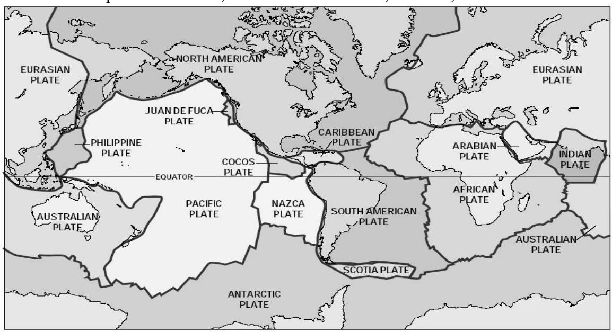

**Figure 2: Earth's Tectonic Plates** 

Source: U.S.Geological Survey

Convergent boundary movements—the subduction of the Pacific Plate under less dense plates can produce island arcs as well as deep trenches such as the Mariana Trench, which at nearly 36,000 feet, is the deepest point on Earth. Convergent boundary movements also result in the formation of island arcs, where the denser plate subducts under a less dense plate and begins to melt under the pressure. The formed lava is then released by convection, and the result is the formation of island archipelagos.4

The Pacific Ocean contains nearly 25,000 islands that can be simply classified as high islands or low islands. High islands, like their name suggests, extend higher above sea level, and often support a larger number of flora and fauna and generally have fertile soil. Low islands are generally atolls built upon layers of calcium carbonate that was secreted from reef-building corals. Over geologic time, the rock of these low islands has eroded or subsided to where all that is remaining near the ocean surface is the secreted calcium carbonate produced by reef-building corals (Nunn 2003).

#### **3.2.3 Ocean Water Characteristics**

Over geologic time, the Pacific Ocean basin has been filled in by water produced by physical and biological processes. A water molecule is the combination of two hydrogen atoms bonded with one oxygen atom. Water molecules have asymmetric charges, exhibiting a positive charge on the

3 http://pubs.usgs.gov/publications/text/Hawaiian.html

4 http://www.washington.edu/burkemuseum/geo\_history\_wa/The Restless Earth v.2.0.htm

hydrogen sides and a negative charge on the oxygen side of the molecule. This charge asymmetry allows water to be an effective solvent, thus the ocean contains a diverse array of dissolved substances. Relative to other molecules, water takes a great deal to heat to change temperature, and thus the oceans have the ability to store large amounts of heat. When water evaporation occurs, large amounts of heat are absorbed by the ocean (Tomzack and Godfrey 2003). The overall heat flux observed in the ocean is related to the dynamics of four processes: (a) incoming solar radiation, (b) outgoing back radiation,(c) evaporation, and (d) mechanical heat transfer between ocean and atmosphere (Bigg 2003).

The major elements (> 100 ppm) present in ocean water include chlorine, sodium, magnesium, calcium, and potassium, with chlorine and sodium being the most prominent, and their residue (sea salt–NaCL) is left behind when seawater evaporates. Minor elements (1–100 ppm) include bromine, carbon, strontium, boron, silicon, and fluorine. Trace elements (< 1 ppm) include nitrogen, phosphorus, and iron (Levington 1995).

Oxygen is added to seawater by two processes: (a) atmospheric mixing with surface water and (b) photosynthesis. Oxygen is subtracted from water through respiration of bacterial decomposition of organic matter (Tomzack and Godfrey 2003).

#### **3.2.4 Ocean Layers**

On the basis of the effects of temperature and salinity on the density of water (as well as other factors such as wind stress on water), the ocean can be separated into three layers: the surface layer or mixed layer, the thermocline or middle layer, and the deep layer. The surface layer generally occurs from the surface of the ocean to a depth of around 400 meters (or less depending on location) and is the area where the water is mixed by currents, waves, and weather. The thermocline is generally from 400 meters –to 800 meters and where water temperatures significantly differ from the surface layer, forming a temperature gradient that inhibits mixing with the surface layer. More than 90 percent of the ocean by volume occurs in the deep layer, which is generally below 800 meters and consists of water temperatures around 0–4° C. The deep zone is void of sunlight and experiences high water pressure (Levington 1995).

The temperature of ocean water is important to oceanographic systems. For example, the temperature of the mixed layer has an affect on the evaporation rate of water into the atmosphere, which in turn is linked to the formation of weather. The temperature of water also produces density gradients within the ocean, which prevents mixing of the ocean layers (Bigg 2003). See Figure 3 for a generalized representation of water temperatures and depth profiles

The amount of dissolved salt or salinity varies between ocean zones, as well as across oceans. For example, the Atlantic Ocean has higher salinity levels than the Pacific Ocean due to input from the Mediterranean Sea (several large rivers flow in the Mediterranean). The average salt content of the ocean is 35 ppt, but it can vary at different latitudes depending on evaporation and precipitation rates. Salinity is lower near the equator than at middle latitudes due to higher rainfall amounts. Salinity also varies at depth because horizontal salinity gradients are often observed in the oceans (Bigg 2003). See Figure 3 for a generalized representation of salinity at various ocean depths.

**Figure 3: Temperature and Salinity Profile of the Ocean** 

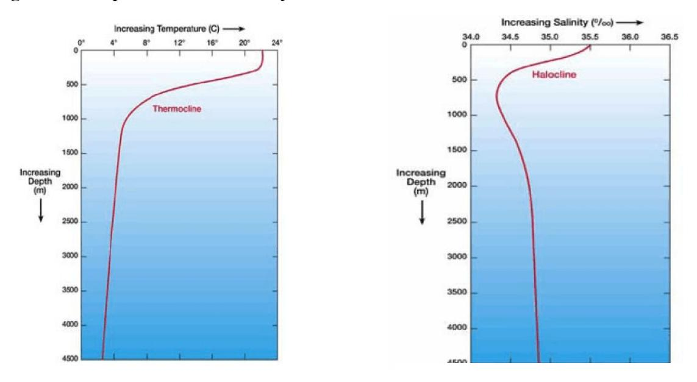

Source: http://www.windows.ucar.edu/tour/link=/earth/Water/temp.html&edu=high

#### **3.2.5 Ocean Zones**

The ocean can be separated into the following five zones (see Figure 4) relative to the amount of sunlight that penetrates through seawater: (a) epipelagic, (b) mesopelagic, (c) bathypelagic, (d) abyssalpelagic, and (e) hadalpelagic. Sunlight is the principle factor of primary production (phytoplankton) in marine ecosystems, and because sunlight diminishes with ocean depth, the amount of sunlight penetrating seawater and its affect on the occurrence and distribution of marine organisms are important. The epipelagic zone extends to nearly 200 meters and is the near extent of visible light in the ocean. The mesopelagic zone occurs between 200 meters and 1,000 meters and is sometimes referred to as the "twilight zone." Although the light that penetrates to the mesopelagic zone is extremely faint, this zone is home to wide variety of marine species. The bathypelagic zone occurs from 1,000 feet to 4,000 meters, and the only visible light seen is the product of marine organisms producing their own light, which is called "bioluminescence." The next zone is the abyssalpelagic zone (4,000 m–6,000 m), where there is extreme pressure and the water temperature is near freezing. This zone does not provide habitat for very many creatures except small invertebrates such as squid and basket stars. The last zone is the hadalpelagic (6,000 m and below) and occurs in trenches and canyons. Surprisingly, marine life such as tubeworms and starfish are found is this zone, often near hydrothermal vents.

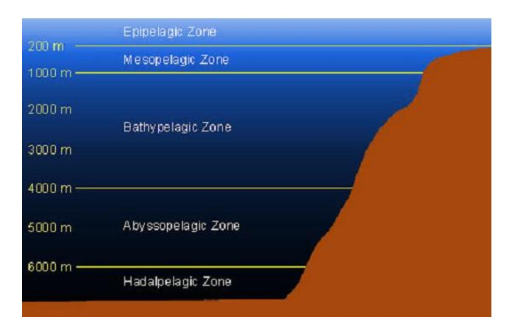

**Figure 4: Depth Profile of Ocean Zones** 

Source: Image reproduced by WPRFMC 2005. Concept from http://www.seasky.org/monsters/sea7a4.html

#### **3.2.6 Ocean Water Circulation**

The circulation of ocean water is a complex system involving the interaction between the oceans and atmosphere. The system is primarily driven by solar radiation that results in wind being produced from the heating and cooling of ocean water, and the evaporation and precipitation of atmospheric water. Except for the equatorial region, which receives a nearly constant amount of solar radiation, the latitude and seasons affect how much solar radiation is received in a particular region of the ocean. This, in turn, has an affect on sea–surface temperatures and the production of wind through the heating and cooling of the system (Tomzack and Godfrey 2003).

# **3.2.7 Surface Currents**

Ocean currents can be thought of as organized flows of water that exist over a geographic scale and time period in which water is transported from one part of the ocean to another part of the ocean (Levington 1995). In addition to water, ocean currents also transport plankton, fish, heat, momentum, salts, oxygen, and carbon dioxide. Wind is the primary force that drives ocean surface currents; however, Earth's rotation and wind determine the direction of current flow. The sun and moon also influence ocean water movements by creating tidal flow, which is more readily observed in coastal areas rather than in open-ocean environments (Tomzack and Godfrey 2003). Figure 5 shows the major surface currents of the Pacific Ocean.

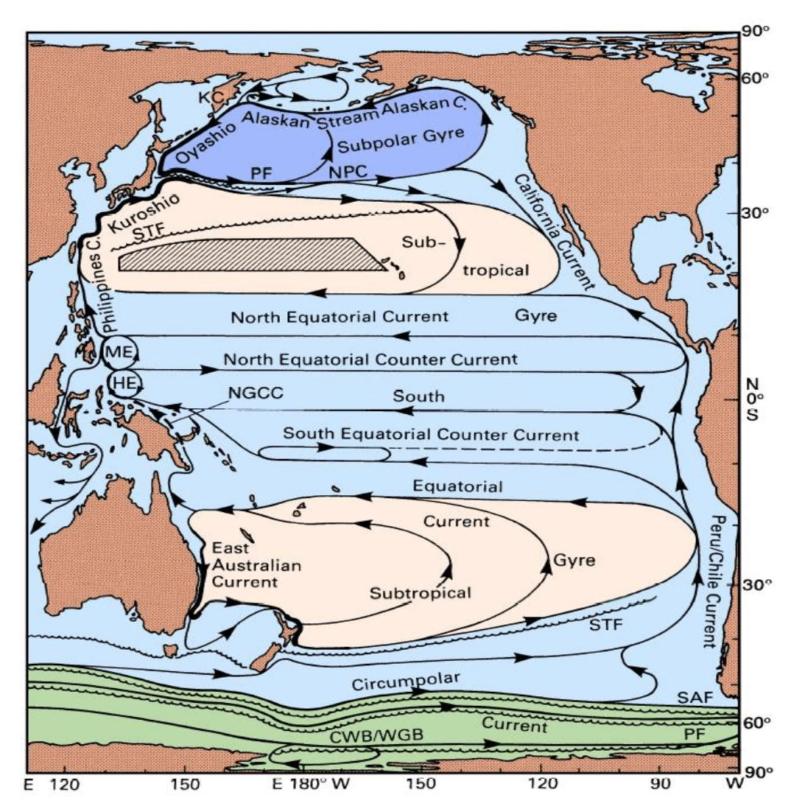

**Figure 5: Major Surface Currents of the Pacific Ocean** 

Source: Tomzack & Godfrey 2003

Surface currents of the Pacific Ocean. Abbreviations are used for the Mindanao Eddy (ME), the Halmahera Eddy (HE), the New Guinea Coastal (NGCC), the North Pacific (NPC), and the Kamchatka Current (KC). Other abbreviations refer to fronts: NPC (North Pacific Current), STF (Subtropical Front), SAF (Subantarctic Front), PF (Polar Front), and CWB/WGB (Continental Water Boundary/Weddell Gyre Boundary). The shaded region indicates banded structure (Subtropical Countercurrents). In the western South Pacific Ocean, the currents are shown for April–November when the dominant winds are the Trades. During December–March, the region is under the influence of the northwest monsoon, flow along the Australian coast north of 18° S and along New Guinea reverses, the Halmahera Eddy changes its sense of rotation, and the South Equatorial Current joins the North Equatorial Countercurrent east of the eddy (Tomzack and Godfrey 2003).

#### **3.2.8 Transition Zones**

Transition zones are areas of ocean water bounded to the north and south by large-scale surface currents originating from subartic and subtropical locations (Polovina et al. 2001). Located generally between 32° N and 42° N, the North Pacific Transition Zone is an area between the

southern boundary of the Subartic Frontal Zone (SAFZ) and the northern boundary of the Subtropical Frontal Zone (STFZ; see Figure 6). Individual temperature and salinity gradients are observed within each front, but generally the SAFZ is colder (~8° C) and less salty (~33.0 ppm) than the STFZ (18° C, ~35.0 ppm, respectively). The North Pacific Transition Zone (NPTZ) supports a marine food chain that experiences variation in productivity in localized areas due to changes in nutrient levels brought on, for example, by storms or eddies. A common characteristic among some of the most abundant animals found in the Transition Zone such as flying squid, blue sharks, Pacific pomfret, and Pacific saury is that they undergo seasonal migrations from summer feeding grounds in subartic waters to winter spawning grounds in the subtropical waters. Other animals found in the NPTZ include swordfish, tuna, albatross, whales, and sea turtles (Polovina et al. 2001).

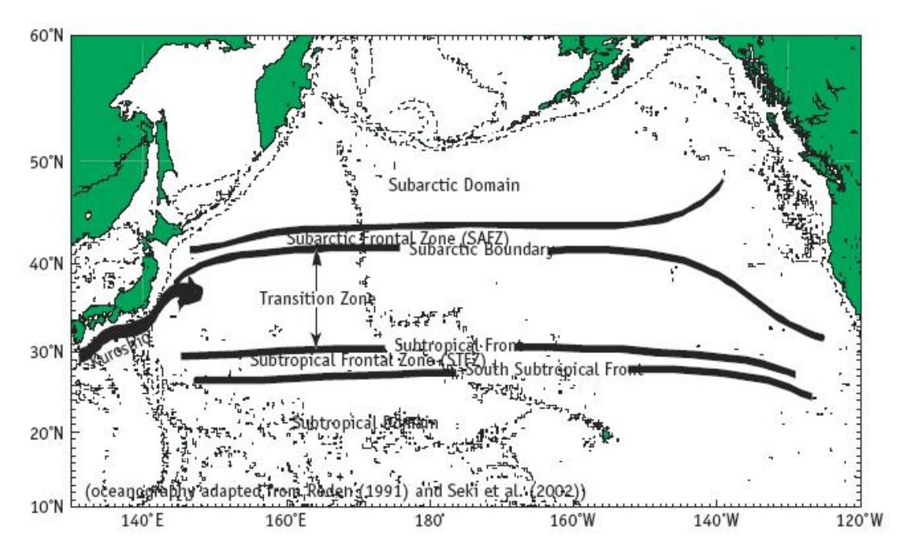

**Figure 6: North Pacific Transition Zone** 

Source: http://www.pices.int/publications/special\_publications/NPESR/2005/File\_12\_pp\_201\_210.pdf

#### **3.2.9 Eddies**

Eddies are generally short to medium term water movements that spin off of surface currents and can play important roles in regional climate (e.g. heat exchange) as well as the distribution of marine organisms. Large-scale eddies spun off of the major surface currents often blend cold water with warm water, the nutrient rich with the nutrient poor, and the salt laden with fresher waters (Bigg 2003). The edges of eddies, where the mixing is greatest, are often targeted by fishermen as these are areas of high biological productivity.

#### **3.2.10 Deep-Ocean Currents**

As described in Tomzack and Godfrey (2003), deep-ocean currents, or thermohaline movements, result from effect of salinity and temperature on the density of seawater. In the Southern Ocean, for example, water exuded from sea ice is extremely dense due to its high salt content. The dense seawater then sinks to the bottom and flows downhill filling up the deep polar ocean basins. The system delivers water to deep portions of the polar basins as the dense water spills out into oceanic abyssal plains. The movement of the dense water is influenced by bathymetry. For example, the Arctic Ocean does not contribute much of its dense water to the Pacific Ocean due to the narrow shallows of the Bering Strait. Generally, the deep-water currents flow through the Atlantic Basin, around South Africa, into the Indian Ocean, past Australia, and into the Pacific Ocean. This process has been labeled the "ocean conveyor belt"—taking nearly 1,200 years to complete one cycle. The movement of the thermohaline conveyor can affect global weather patterns, and has been the subject of much research as it relates to global climate variability. See Figure 7 for a simplified schematic diagram of the deep-ocean conveyor belt system.

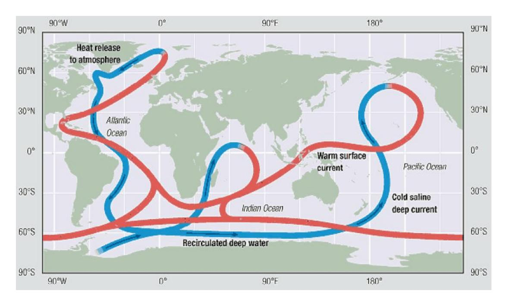

**Figure 7: Deep-Ocean Water Movement** 

Source: UN GEO Yearbook 2004

#### **3.2.11 Prominent Pacific Ocean Meteorological Features**

The air–sea interface is a dynamic relationship in which the ocean and atmosphere exchange energy and matter. This relationship is the basic driver for the circulation of surface water (through wind stress) as well as for atmospheric circulation (through evaporation). The formation of weather systems and atmospheric pressure gradients are linked to exchange of energy (e.g. heat) and water between air and sea (Bigg 2003).

Near the equator, intense solar heating causes air to rise and water to evaporate, thus resulting in areas of low pressure. Air flowing from higher trade wind pressure areas move to the low pressure areas such as the Intertropical Convergence Zone (ITCZ) and the South Pacific Convergence Zone (SPCZ), which are located around 5° N and 30° S, respectively. Converging trade winds in these areas do not produce high winds, but instead often form areas that lack significant wind speeds. These areas of low winds are known as the "doldrums." The

convergence zones are associated near ridges of high sea–surface temperatures, with temperatures of 28° C and above, and are areas of cloud accumulation and high rainfall amounts. The high rainfall amounts reduce ocean water salinity levels in these areas (Sturman and McGowan 2003).

The air that has risen in equatorial region fans out into the higher troposphere layer of the atmosphere and settles back toward Earth at middle latitudes. As air settles toward Earth, it creates areas of high pressure known as subtropical high-pressure belts. One of these highpressure areas in the Pacific is called the "Hawaiian High Pressure Belt," which is responsible for the prevailing trade wind pattern observed in the Hawaiian Islands (Sturman and McGowan 2003).

The Aleutian Low Pressure System is another prominent weather feature in the Pacific Ocean and is caused by dense polar air converging with air from the subtropical high-pressure belt. As these air masses converge around 60° N, air is uplifted, creating an area of low pressure. When the relatively warm surface currents (Figure 5) meet the colder air temperatures of subpolar regions, latent heat is released, which causes precipitation. The Aleutian Low is an area where large storms with high winds are produced. Such large storms and wind speeds have the ability to affect the amount of mixing and upwelling between ocean layers (e.g. mixed layer and thermocline; Polovina et al. 1994).

The dynamics of the air–sea interface do not produce steady states of atmospheric pressure gradients and ocean circulation. As discussed in the previous sections, there are consistent weather patterns (e.g. ITCZ) and surface currents (e.g. north equatorial current); however, variability within the ocean–atmosphere system results in changes in winds, rainfall, currents, water column mixing, and sea-level heights, which can have profound effects on regional climates as well as on the abundance and distribution of marine organisms.

One example of a shift in ocean–atmospheric conditions in the Pacific Ocean is El Niño– Southern Oscillation (ENSO). ENSO is linked to climatic changes in normal prominent weather features of the Pacific and Indian Oceans, such as the location of the ITCZ. ENSO, which can occur every 2–10 years, results in the reduction of normal trade winds, which reduces the intensity of the westward flowing equatorial surface current (Sturman and McGowan 2003). In turn, the eastward flowing countercurrent tends to dominate circulation, bringing warm, lowsalinity low-nutrient water to the eastern margins of the Pacific Ocean. As the easterly trade winds are reduced, the normal nutrient-rich upwelling system does not occur, leaving warm surface water pooled in the eastern Pacific Ocean.

The impacts of ENSO events are strongest in the Pacific through disruption of the atmospheric circulation, generalized weather patterns, and fisheries. ENSO affects the ecosystem dynamics in the equatorial and subtropical Pacific by considerable warming of the upper ocean layer, rising of the thermocline in the western Pacific and lowering in the east, strong variations in the intensity of ocean currents, low trade winds with frequent westerlies, high precipitation at the dateline, and drought in the western Pacific (Sturman and McGowan 2003). ENSO events have the ability to significantly influence the abundance and distribution of organisms within marine ecosystems. Human communities also experience a wide range of socioeconomic impacts from

ENSO such as changes in weather patterns resulting in catastrophic events (e.g. mudslides in California due to high rainfall amounts) as well as reductions in fisheries harvests (e.g. collapse of anchovy fishery off Peru and Chile; Levington 1995; Polovina 2005).

Changes in the Aleutian Low Pressure System are another example of interannual variation in a prominent Pacific Ocean weather feature profoundly affecting the abundance and distribution of marine organisms. Polovina et al. (1994) found that between 1977 and 1988 the intensification of the Aleutian Low Pressure System in the North Pacific resulted in a deeper mixed-layer depth, which led to higher nutrients levels in the top layer of the euphotic zone. This, in turn, led to an increase in phytoplankton production, which resulted in higher productivity levels (higher abundance levels for some organisms) in the Northwestern Hawaiian Islands. Changes in the Aleutian Low Pressure System and its resulting effects on phytoplankton productivity are thought to occur generally every ten years. The phenomenon is often referred to as the "Pacific Decadal Oscillation" (Polovina 2005; Polovina et al. 1994).

#### **3.2.12 Pacific Island Geography**

The Pacific islands can be generally grouped into three major areas: (a) Micronesia, (b) Melanesia, and (c) Polynesia. However, the islands of Japan and the Aleutian Islands in the North Pacific are generally not included in these three areas, and they are not discussed here as this analysis focuses on the Western Pacific Region and its ecosystems. Information used in this section was obtained from the online version of the U.S.Central Intelligence Agency's World Fact Book.5

#### **3.2.12.1 Micronesia**

Micronesia, which is primarily located in the western Pacific Ocean, is made up of hundreds of high and low islands within six archipelagos: (a) Caroline Islands, (b) Marshall Islands, (c) Mariana Islands, (d) Gilbert Islands, (e) Line Islands, and (f) Phoenix Islands.

The Caroline Islands (~850 square miles) are composed of many low coral atolls, with a few high islands. Politically, the Caroline Islands are separated into two countries: Palau and the Federated States of Micronesia.

The Marshall Islands (~180 square miles) are made up of 34 low-lying atolls separated by two chains: the southeastern Ratak Chain and the northwestern Ralik Chain.

The Mariana Islands (~396 square miles) are composed of 15 volcanic islands that are part of a submerged mountain chain that stretches nearly 1,500 miles from Guam to Japan. Politically, the Mariana Islands are split into the Territory of Guam and the Commonwealth of Northern Mariana Islands, both of which are U.S. possessions.

5 http://www.cia.gov/cia/publications/factbook/index.html

Nauru (~21 square miles), located southeast of the Marshall Islands, is a raised coral reef atoll rich in phosphate. The island is governed by the Republic of Nauru, which is the smallest independent nation in the world.

The Gilbert Islands are located south of the Marshall Islands and are made up of 16 low-lying atolls.

The Phoenix Islands, located to the southwest of the Gilbert Islands, are composed of eight coral atolls. Howland and Baker Islands (U.S. possessions) are located within the Phoenix archipelago. The Line Islands, located in the central South Pacific, are made up of ten coral atolls, of which Kirimati is the largest in the world (~609 square miles). The U.S. possessions of Kingman Reef, Palmyra Atoll, and Jarvis Island are located within the Line Islands. Most of the islands and atolls in these three chains, however, are part of the Republic of Kiribati (~ 811 square miles), which has an EEZ of nearly one million square miles.

#### **3.2.12.2 Melanesia**

Melanesia is composed of several archipelagos that include: (a) Fiji Islands, (b) New Caledonia, (c) Solomon Islands, (d) New Guinea, (e) Bismark Archipelago, (f) Louisiade Islands, (g) Tobriand Islands, (h) Vanuatu Islands, (i) Maluku Islands, and (j) Torres Strait Islands.

Located approximately 3,500 miles northeast of Sydney, Australia, the Fiji archipelago (~18,700 square miles) is composed of nearly 800 islands: the largest islands are volcanic in origin and the smallest islands are coral atolls. The two largest islands, Viti Levu and Vanua Levu, make up nearly 85 percent of the total land area of the Republic of Fiji Islands.

Located nearly 750 miles east–northeast of Australia, is the volcanic island of Grande Terre or New Caledonia (~6,300 square miles). New Caledonia is French Territory and includes the nearby Loyalty Islands and the Chesterfield Islands, which are groups of small coral atolls.

The Solomon Islands (~27,500 square miles) are located northwest of New Caledonia and east of Papua New Guinea. Thirty volcanic islands and several small coral atolls make up this former British colony, which is now a member of the Commonwealth of Nations. The Solomon Islands are made up of smaller groups of islands such as the New Georgia Islands, the Florida Islands, the Russell Islands, and the Santa Cruz Islands. Approximately 1,500 miles separate the western and eastern island groups of the Solomon Islands.

New Guinea is the world's second largest island and is thought to have separated from Australia around 5000 BC. New Guinea is split between two nations: Indonesia (west) and Papua New Guinea (east). Papua New Guinea (~178,700 square miles) is an independent nation that also governs several hundred small islands within several groups. These groups include the Bismark archipelago and the Louisiade Islands, which are located north of New Guinea, and Tobriand Islands, which are southeast of New Guinea. Most of the islands within the Bismark and Lousiade groups are volcanic in origin, whereas the Tobriand Islands are primarily coral atolls.

The Muluku Islands (east of New Guinea) and the Torres Strait Islands (between Australia and New Guniea) are also classified as part of Melanesia. Both of these island groups are volcanic in origin. The Muluku Islands are under Indonesia's governance, while the Torres Strait Islands are governed by Australia.

The Vanuatu Islands (~4,700 square miles) make up an archipelago that is located to the southeast of the Solomon Islands.There are 83 islands in the approximately 500-mile long Vanuatu chain, most of which are volcanic in origin. Before becoming an independent nation in 1980 (Republic of Vanuatu), the Vanuatu Islands were colonies of both France and Great Britain, and known as New Hebrides.

#### **3.2.12.3 Polynesia**

Polynesia is composed of several archipelagos and island groups including (a) New Zealand and associated islands, (b) Tonga, (c) Samoa Islands, (d) Tuvalu, (e) Tokelau, (f) Cook Islands, (g) Easter Island (Rapa Nui), and (h) Hawaii.

New Zealand (~103,470 square miles) is composed of two large islands, North Island and South Island, and several small island groups and islands. North Island (~44,035 square miles) and South Island (~58,200 square miles) extend for nearly 1,000 miles on a northeast–southwest axis and have a maximum width of 450 miles. The other small island groups within the former British colony include the Chatham Islands and the Kermadec Islands. The Chatham Islands are a group of ten volcanic islands located 800 kilometers east of South Island. The four emergent islands of the Kermadec Islands are located 1,000 kilometers northeast of North Island and are part of a larger island arc with numerous subsurface volcanoes. The Kermadec Islands are known to be an active volcanic area where the Pacific Plate subducts under the Indo-Australian Plate.

The islands of Tonga (~290 square miles) are located 450 miles east of Fiji and consist of 169 islands of volcanic and raised limestone origin. The largest island, Tongatapu (~260 square miles), is home to two thirds of Tonga's population (~106,000). The people of Tonga are governed under a hereditary constitutional monarchy.

The Samoa archipelago is located northeast of Tonga and consists of seven major volcanic islands, several small islets, and two coral atolls. The largest islands in this chain are Upolu (~436 square miles) and Savai`i (~660 square miles). Upolu and Savai`i and its surrounding islets and small islands are governed by the Independent State of Samoa with a population of approximately 178,000 people.

The five volcanic islands that are the major inhabited islands of American Samoa, are Tutuila, Aunu'u, Ofu, Olosega, and Ta'u. Tutuila, the largest island (55 square miles), is the center of government and business. Aunu'u, a satellite of Tutuila, lies one-quarter mile off the coast. The three islands of Ofu, Olosega, and Ta'u are collectively referred to as the Manu'a islands (with a total land area of less than 20 square miles) and lie 70 miles east of Tutuila. Swains Island, with a population of approximately 30, lies 200 miles north of Tutuila, and the uninhabited Rose Atoll is a national sanctuary. Tutuila, Manua, and Rose Atoll are between the 14°–15° S latitude, and Swains Island lies at 11° S lattidue. Swains Island is, geographically, a member of the Tokelau

archipelago. The region was believed to be relatively geologically inactive with few seamounts or guyots in comparison to other Polynesian states. New anecdotal evidence indicates that the region is volcanically active. The majority of islands rise from deep (4,000 m) oceanic depths.

The total land mass of American Samoa is about 200 square kilometers, surrounded by a EEZ of approximately 390,000 square kilometers. The largest island, Tutuila, is nearly bisected by Pago Pago Harbor, the deepest and one of the most sheltered embayments in the South Pacific.

American Samoa experiences southeast trade winds that result in frequent rains and a warm tropical climate. The year-round air temperatures range from 70° to 90° F. Humidity averages 80 percent during most of the year. The average rainfall at Pago Pago International Airport is 130 inches per year, while Pago Pago Harbor, only 4.5 miles away, receives an average of 200 inches of rainfall per year (TPC/Dept. of Commerce, 2000**).** 

To the east of the Samoa archipelago are the Cook Islands (~90 square miles), which are separated into the Northern Group and Southern Group. The Northern Group consists of six sparsely populated coral atolls, and the Southern Group consists of seven volcanic islands and two coral atolls. Rorotonga (~26 square miles), located in the Southern Group, is the largest island in the Cook Islands and also serves as the capitol of this independent island nation. From north to south, the Cook Islands spread nearly 900 miles, and the width between the most distant islands is nearly 450 miles. The Cook Islands EEZ is approximately 850,000 square miles.

Approximately 600 miles northwest of the Samoa Islands is Tuvalu (~10 square miles), an independent nation made up of nine low-lying coral atolls. None of the islands have elevation higher than 14 feet, and the total population of the country is around 11,000 people. Tuvalu's coral island chain extends for nearly 360 miles, and the country has an EEZ of 350,000 square miles.

East of Tuvalu and north of Samoa are the Tokelau Islands (~4 square miles). Three coral atolls make up this territory of New Zealand, and a fourth atoll (Swains Island) is of the same group, but is controlled by the U.S Territory of American Samoa.

The 32 volcanic islands and 180 coral atolls of the Territory of French Polynesia (~ 1,622 square miles) are made up of the following six groups: the Austral Islands, Bass Islands, Gambier Islands, Marquesas Islands, Society Islands, and the Tuamotu Islands. The Austral Islands are a group of six volcanic islands in the southern portion of the territory. The Bass Islands are a group of two islands in the southern-most part of the territory, with their vulcanism appearing to be much more recent than that of the Austral Islands. The Gambier Islands are a small group of volcanic islands in a southeastern portion of the Territory and are often associated with the Tuamotu Islands because of their relative proximity; however, they are a distinct group because they are of volcanic origin rather than being coral atolls. The Tuamotu Islands, of which there are 78, are located in the central portion of the Territory and are the world's largest chain of coral atolls. The Society Islands are group of several volcanic islands that include the island of Tahiti. The island of Tahiti is home to nearly 70 percent of French Polynesia's population of approximately 170,000 people. The Marquesa Islands are an isolated group of islands located in the northeast portion of the territory, and are approximately 1,000 miles northeast of Tahiti. All

but one of the 17 Marquesas Islands are volcanic in origin. French Polynesia has one of the largest EEZs in the Pacific Ocean at nearly two million square miles.

The Pitcairn Islands are a group of five islands thought to be an extension of the Tuamotu archipelago. Pitcairn Island is the only volcanic island, with the others being coral atolls or uplifted limestone. Henderson Island is the largest in the group; however, Pitcairn Island is the only one that is inhabited.

Easter Island, a volcanic high island located approximately 2,185 miles west of Chile, is thought to be the eastern extent of the Polynesian expansion. Easter Island, which is governed by Chile, has a total land area of 63 square miles and a population of approximately 3,790 people.

The northern extent of the Polynesian expansion is the Hawaiian Islands, which are made up of 137 islands, islets, and coral atolls. The exposed islands are part of a great undersea mountain range known as the Hawaiian-Emperor Seamount Chain, which was formed by a hot spot within the Pacific Plate. The Hawaiian Islands extend for nearly 1,500 miles from Kure Atoll in the northwest to the Island of Hawaii in the southeast. The Hawaiian Islands are often grouped into the Northwestern Hawaiian Islands (Nihoa to Kure) and the Main Hawaiian Islands (Hawaii to Niihau). The total land area of the 19 primary islands and atolls is approximately 6,423 square miles, and the over 75 percent of the 1.2 million population lives on the island of Oahu.

#### **3.3 Biological Environment**

This section contains general descriptions of marine trophic levels, food chains, and food webs, as well as a description of two general marine environments: benthic or demersal (associated with the seafloor) and pelagic (the water column and open ocean). A broad description of the types of marine organisms found within these environments is provided, as well as a description of organisms important to fisheries. Protected species are also described in this section.

#### **3.3.1 Marine Food Chains, Trophic Levels, and Food Webs**

Food chains are often thought of as a linear representation of the basic flow of organic matter and energy through a series of organisms. Food chains in marine environments are normally segmented into six trophic levels : primary producers, primary consumers, secondary consumers, tertiary consumers, quaternary consumers, and decomposers.

Generally, primary producers in the marine ecosystems are organisms that fix inorganic carbon into organic carbon compounds using external sources of energy (i.e. sunlight). Such organisms include single-celled phytoplankton, bottom-dwelling algae, macroalgae (e.g. sea weeds), and vascular plants (e.g. kelp). All of these organisms share common cellular structures called "chloroplasts," which contain chlorophyll. Chlorophyll is a pigment that absorbs the energy of light to drive the biochemical process of photosynthesis. Photosynthesis results in the transformation of inorganic carbon into organic carbon such as carbohydrates, which are used for cellular growth.

Primary consumers in the marine environment are organisms that feed on primary producers, and depending on the environment (i.e. pelagic vs. benthic) include zooplankton, corals, sponges, many fish, sea turtles, and other herbivorous organisms. Secondary, tertiary, and quaternary consumers in the marine environment are organisms that feed on primary consumers and include fish, mollusks, crustaceans, mammals, and other carnivorous and omnivorous organisms. Decomposers live off dead plants and animals, and are essential in food chains as they break down organic matter and make it available for primary producers (Valiela 2003).

Marine food webs are complex representations of overall patterns of feeding among organisms, but generally they are unable to reflect the true complexity of the relationships between organisms, so they must be thought of as simplified representations. An example of a marine food web is presented in Figure 8. The openness of marine ecosystems, lack of specialists, long life spans, and large size changes and food preferences across the life histories of many marine species make marine food webs more complex than their terrestrial and freshwater counterparts (Link 2002). Nevertheless, food webs are an important tool in understanding ecological relationships among organisms.

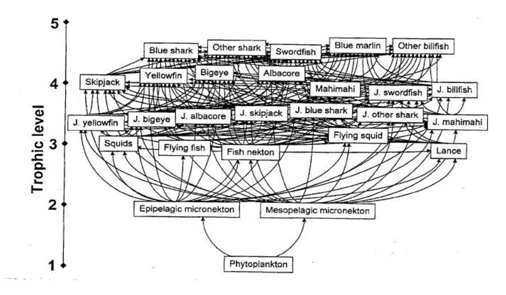

**Figure 8: Central Pacific Pelagic Food Web** 

Source: Kitchell et al. 1999

This tangled "bird's nest" represents interactions at the approximate trophic level of each pelagic species, with increasing trophic level toward the top of the web.

#### **3.3.2 Benthic Environment**

The word *benthic* comes from the Greek work *benthos* or "depths of the sea." The definition of the benthic (or demersal) environment is quite general in that it is regarded as extending from the high-tide mark to the deepest depths of the ocean floor. Benthic habitats are home to a wide

range of marine organisms forming complex community structures. This section presents a simple description of the following benthic zones: (a) intertidal tide pools, (b) subtidal (e.g. coral reefs), (c) deep-reef slope, (d) banks and seamounts and (e) deep-ocean bottom (see Figure 9).

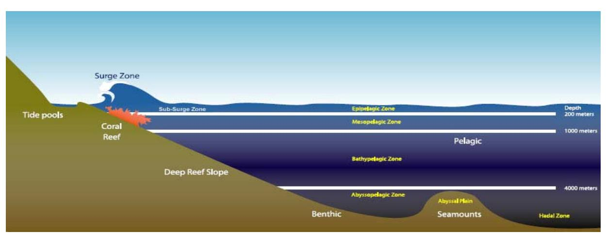

**Figure 9: Benthic Environment** 

Source: WPRFMC 2005

#### **3.3.2.1 Intertidal Zone**

The intertidal zone is a relatively small margin of seabed that exists between the highest and lowest extent of the tides. Because of wave action on unprotected coastlines, the intertidal zone can sometimes extend beyond tidal limits due to the splashing effect of waves. Vertical zonation among organisms is often observed in intertidal zones, where the lower limits of some organisms are determined by the presence of predators or competing species, whereas the upper limit is often controlled by physiological limits and species' tolerance to temperature and drying (Levington 1995). Organisms that inhabit the intertidal zone include algae, seaweeds, mollusks, crustaceans, worms, echinoderms (starfish), and cnidarians (e.g. anemones).

Many organisms in the intertidal zone have adapted strategies to combat the effects of temperature, salinity, and desiccation due to the wide-ranging tides of various locations. Secondary and tertiary consumers in intertidal zones include starfish, anemones, and seabirds. Marine algae are the primary produces in most intertidal areas. Many species' primary consumers such as snails graze on algae growing on rocky substrates in the intertidal zone. Due to the proximity of the intertidal zone to the shoreline, intertidal organisms are important food items to many human communities. In Hawaii, for example, intertidal limpet species (snails) such as `opihi (*Cellana exarata*) were eaten by early Hawaiian communities and are still a popular food item in Hawaii today. In addition to mollusks, intertidal seaweeds are also important food items for Pacific islanders.

#### **3.3.2.2 Seagrass Beds**

Seagrasses are common in all marine ecosystems and are a regular feature of most of the inshore areas adjacent to coral reefs in the Pacific Islands. According to Hatcher et al. (1989), seagrasses stabilize sediments because leaves slow current flow, thus increasing sedimentation of particles.

The roots and rhizomes form a complex matrix that binds sediments and stops erosion. Seagrass beds are the habitat of certain commercially valuable shrimps, and provide food for reefassociated species such as surgeonfishes (*Acanthuridae*) and rabbitfishes (*Siganidae*). Seagrasses are also important sources of nutrition for higher vertebrates such as dugongs and green turtles. A concise summary of the seagrass species found in the western tropical South Pacific is given by Coles and Kuo (1995). From the fisheries perspective, the fishes and other organisms harvested from the coral reef and associated habitats, such as mangroves, seagrass beds, shallow lagoons, bays, inlets and harbors, and the reef slope beyond the limit of coral reef growth, contribute to the total yield from coral reef-associated fisheries.

## **3.3.2.3 Mangrove Forests**

Mangroves are terrestrial shrubs and trees that are able to live in the salty environment of the intertidal zone. Their prop roots form important substrate on which sessile organisms can grow, and they provide shelter for fishes. Mangroves are believed to also provide important nursery habitat for many juvenile reef fishes. The natural eastern limit of mangroves in the Pacific is American Samoa, although the red mangrove (*Rhizophora mangle*) was introduced into Hawaii in 1902, and has become the dominant plant within a number of large protected bays and coastlines on both Oahu and Molokai (Gulko 1998). Apart from the usefulness of the wood for building, charcoal, and tannin, mangrove forests stabilize areas where sedimentation is occurring and are important as nursery grounds for peneaeid shrimps and some inshore fish species. They also provide a habitat for some commercially valuable crustaceans.

#### **3.3.2.4 Coral Reefs**

Coral reefs are carbonate rock structures at or near sea level that support viable populations of scleractinian or reef-building corals. Apart from a few exceptions in the Pacific Ocean, coral reefs are confined to the warm tropical and subtropical waters lying between 30° N and 30° S. Coral reef ecosystems are some of the most diverse and complex ecosystems on Earth. Their complexity is manifest on all conceptual dimensions, including geological history, growth and structure, biological adaptation, evolution and biogeography, community structure, organism and ecosystem metabolism, physical regimes, and anthropogenic interactions (Hatcher et al*.* 1989).

Coral reefs and reef-building organisms are confined to the shallow upper euphotic zone. Maximum reef growth and productivity occur between 5 and 15 meters (Hopley and Kinsey 1988), and maximum diversity of reef species occurs at 10–30 meters (Huston 1985). Thirty meters has been described as a critical depth below which rates of growth (accretion) of coral reefs are often too slow to keep up with changes in sea level. This was true during the Holocene transgression over the past 10,000 years, and many reefs below this depth drowned during this period. Coral reef habitat does extend deeper than 30 meters, but few well-developed reefs are found below 50 meters. Many coral reefs are bordered by broad areas of shelf habitat (reef slope) between 50 and 100 meters that were formed by wave erosion during periods of lower sea levels. These reef slope habitats consist primarily of carbonate rubble, algae, and microinvertebrate communities, some of which may be important nursery grounds for some coral reef fish, as well as a habitat for several species of lobster. However, the ecology of this habitat is poorly known,

and much more research is needed to define the lower depth limits of coral reefs, which by inclusion of shelf habitat could be viewed as extending to 100 meters.

The symbiotic relationship between the animal coral polyps and algal cells (dinoflagellates) known as zooxanthellae is a key feature of reef-building corals. Incorporated into the coral tissue, these photosynthesizing zooxanthellae provide much of the polyp's nutritional needs, primarily in the form of carbohydrates. Most corals supplement this food source by actively feeding on zooplankton or dissolved organic nitrogen, because of the low nitrogen content of the carbohydrates derived from photosynthesis. Due to reef-building coral's symbiotic relationship with photosynthetic zooxanthellae, reef-building corals do not generally occur at depths greater than 100 meters (~300 feet; Hunter 1995).

Primary production on coral reefs is associated with phytoplankton, algae, seagrasses, and zooxanthellae. Primary consumers include many different species of corals, mollusks, crustaceans, echinoderms, gastropods, sea turtles, and fish (e.g. parrot fish). Secondary consumers include anemones, urchins, crustaceans, and fish. Tertiary consumers include eels, octopus, barracudas, and sharks.

The corals and coral reefs of the Pacific are described in Wells and Jenkins (1988) and Veron (1995). The number of coral species declines in an easterly direction across the western and central Pacific, which is in common with the distribution of fish and invertebrate species. More than 330 species are contained in 70 genera on the Australian Barrier Reef, compared with only 30 coral genera present in the Society Islands of French Polynesia and 10 genera in the Marquesas and Pitcairn Islands. Hawaii, by virtue of its isolated position in the Pacific, also has relatively few species of coral (about 50 species in 17 genera) and, more important, lacks most of the branching or "tabletop" *Acropora* species that form the majority of reefs elsewhere in the Pacific. The *Acropora* species provide a large amount of complex three-dimensional structure and protected habitat for a wide variety of fishes and invertebrates. As a consequence, Hawaiian coral reefs provide limited "protecting" three-dimensional space. This is thought to account for the exceptionally high rate of endemism among Hawaiian marine species. Furthermore, many believe that this is the reason certain fish and invertebrate species look and act very differently from similar members of the same species found in other parts of the South Pacific (Gulko 1998).

#### **Coral Reef Productivity**

Coral reefs are among the most biologically productive environments in the world. The global potential for coral reef fisheries has been estimated at nine million metric tons per year, which is impressive given the small area of reefs compared with the extent of other marine ecosystems, which collectively produce between 70 and 100 million metric tons per year (Munro 1984; Smith 1978). An apparent paradox of coral reefs, however, is their location in the low-nutrient areas of the tropical oceans. Coral reefs themselves are characterized by the highest gross primary production in the sea, with sand, rubble fields, reef flats, and margins adding to primary production rates. The main primary producers on coral reefs are the benthic microalgae, macroalgae, symbiotic microalgae of corals, and other symbiont-bearing invertebrates (Levington 1995). Zooxanthellae living in the tissues of hard corals make a substantial

contribution to primary productivity in zones rich in corals due to their density—greater than 106 cells cm-2 of live coral surface—and the high rugosity of the surfaces on which they live, as well as their own photosynthetic potential. However, zones of high coral cover make up only a small part of entire coral reef ecosystems, so their contribution to total coral reef primary productivity is small (WPFMC 2001).

Although the ocean's surface waters in the tropics generally have low productivity, these waters are continually moving. Coral reefs, therefore, have access to open-water productivity and thus, particularly in inshore continental waters, shallow benthic habitats such as reefs are not always the dominant sources of nutrients for fisheries. In coastal waters, detrital matter from land, plankton, and fringing marine plant communities are particularly abundant. There may be passive advection of particulate and dissolved detrital carbon onto reefs, as well as active transport onto reefs via fishes that shelter on reefs but that feed in adjacent habitats. There is, therefore, greater potential for nourishment of inshore reefs than offshore reefs by external sources, and this inshore nourishment is enhanced by large land masses (Birkeland 1997).

For most of the Pacific Islands, rainfall typically ranges from 2,000 to 3,500 millimeters per year. Low islands, such as atolls, tend to have less rainfall and may suffer prolonged droughts. Furthermore, when rain does fall on coral islands that have no major catchment area, there is little nutrient input into surrounding coastal waters and lagoons. Lagoons and embayments around high islands in the South Pacific are, therefore, likely to be more productive than atoll lagoons. There are, however, some exceptions such as Palmyra Atoll and Rose Atoll which receive up to 4,300 millimeters of rain per year. The productivity of high-island coastal waters, particularly where there are lagoons and sheltered waters, is possibly reflected in the greater abundance of small pelagic fishes such as anchovies, sprats, sardines, scads, mackerels, and fusiliers. In addition, the range of different environments that can be found in the immediate vicinity of the coasts of high islands also contributes to the greater range of biodiversity found in such locations.

# **Coral Reef Communities**

A major portion of the primary production of the coral reef ecosystem comes from complex interkingdom relationships of animal/plant photosymbioses hosted by animals of many taxa, most notably stony corals. Most of the geological structure of reefs and habitat are produced by these complex symbiotic relationships. Complex symbiotic relationships for defense from predation, removal of parasites, building of domiciles, and other functions are also prevalent. About 32 of the 33 animal phyla are represented on coral reefs (only 17 are represented in terrestrial environments), and this diversity produces complex patterns of competition. The diversity also produces a disproportionate representation of predators, which have strong influences on lower levels of the food web in the coral reef ecosystem (Birkeland 1997).

In areas with high gross primary production—such as rain forests and coral reefs—animals and plants tend to have a higher variety and concentration of natural chemicals as defenses against herbivores, carnivores, competitors, and microbes. Because of this tendency, and the greater number of phyla in the system, coral reefs are now a major focus for bioprospecting, especially in the southwest tropical Pacific (Birkeland 1997).

Typically, spawning of coral reef fish occurs in the vicinity of the reef and is characterized by frequent repetition throughout a protracted time of the year, a diverse array of behavioral patterns, and an extremely high fecundity. Coral reef species exhibit a wide range of strategies related to larval dispersal and ultimately recruitment into the same or new areas. Some larvae are dispersed as short-lived, yolk-dependent (lecithotrophic) organisms, but the majority of coral reef invertebrate species disperse their larvae (planktotrophic) into the pelagic environment to feed on various types of plankton (Levington 1995). For example, larvae of the coral *Pocillopora damicornis*, which is widespread throughout the Pacific, has been found in the plankton of the open ocean exhibiting a larval life span of more than 100 days (Levington 1995). Because many coral reefs are space limited for settlement, therefore, planktotrophic larvae are a likely strategy to increase survival in other areas (Levington 1995). Coral reef fish experience their highest predation mortality in their first few days or weeks, thus rapid growth out of the juvenile stage is a common strategy.

The condition of the overall populations of particular species is linked to the variability among subpopulations: the ratio of sources and sinks, their degrees of recruitment connection, and the proportion of the subpopulations with high variability in reproductive capacity. Recruitment to populations of coral reef organisms depends largely on the pathways of larval dispersal and "downstream" links.

#### **Reproduction and Recruitment**

The majority of coral reef associated species are very fecund, but temporal variations in recruitment success have been recorded for some species and locations. Many of the large, commercially targeted coral reef species are long lived and reproduce for a number of years. This is in contrast to the majority of commercially targeted species in the tropical pelagic ecosystem. Long-lived species adapted to coral reef systems are often characterized by complex reproductive patterns like sequential hermaphroditism, sexual maturity delayed by social hierarchy, multispecies mass spawnings, and spawning aggregations in predictable locations (Birkeland 1997).

#### **Growth and Mortality Rates**

Recruitment of coral reef species is limited by high mortality of eggs and larvae, and also by competition for space to settle out on coral reefs. Predation intensity is due to a disproportionate number of predators, which limits juvenile survival (Birkeland 1997). In response, some fishes such as scarids (parrotfish) and labrids (wrasses)—grow rapidly compared with other coral reef fishes. But they still grow relatively slowly compared with pelagic species. In addition, scarids and labrids may have complex haremic territorial social structures that contribute to the overall effect of harvesting these resources. It appears that many tropical reef fishes grow rapidly to near-adult size, and then often grow relatively little over a protracted adult life span; they are thus relatively long lived. In some groups of fishes, such as damselfish, individuals of the species are capable of rapid growth to adult size, but sexual maturity is still delayed by social pressure. This complex relationship between size and maturity makes resource management more difficult (Birkeland 1997).

#### **Community Variability**

High temporal and spatial variability is characteristic of reef communities. At large spatial scales, variation in species assemblages may be due to major differences in habitat types or biotopes. Seagrass beds, reef flats, lagoonal patch reefs, reef crests, and seaward reef slopes may occur in relatively close proximity, but represent notably different habitats. For example, reef fish communities from the geographically isolated Hawaiian Islands are characterized by low species richness, high endemism, and exposure to large semiannual current gyres, which may help retain planktonic larvae. The Northwestern Hawaiian Islands (NWHI) are further characterized by (a) high-latitude coral atolls; (b) a mild temperate to subtropical climate, where inshore water temperatures can drop below 18° C in late winter; (c) species that are common on shallow reefs and attain large sizes, which to the southeast occur only rarely or in deep water; and (d) inshore shallow reefs that are largely free of fishing pressure (Maragos and Gulko 2002).

#### **3.3.2.5 Deep Reef Slopes**

As most Pacific islands are oceanic islands versus continental islands, they generally lack an extensive shelf area of relatively shallow water extending beyond the shoreline. For example, the average global continental shelf extends 40 miles, with a depth of around 200 feet (Postma and Zijlstra 1988). While lacking a shelf, many oceanic islands have a deep reef slope, which is often angled between 45° and 90° toward the ocean floor. The deep reef slope is home to a wide variety of marine of organisms that are important fisheries target species such as snappers and groupers. Biological zonation does occur on the reef slope, and is related to the limit of light penetration beyond 100 meters. For example, reef-building corals can be observed at depths less than 100 meters, but at greater depths gorgonian and black corals are more readily observed (Colin et al. 1986).

#### **3.3.2.6 Banks and Seamounts**

Banks are generally volcanic structures of various sizes and occur both on the continental shelf and in oceanic waters. Coralline structures tend to be associated with shallower parts of the banks as reef-building corals are generally restricted to a maximum depth of 30 meters. Deeper parts of banks may be composed of rock, coral rubble, sand, or shell deposits. Banks thus support a variety of habitats that in turn support a variety of fish species (Levington 1995).

Fish distribution on banks is affected by substrate types and composition. Those suitable for lutjanids, serranids, and lethrinids tend to be patchy, leading to isolated groups of fish with little lateral exchange or adult migration except when patches are close together. These types of assemblages may be regarded as consisting of metapopulations that are associated with specific features or habitats and are interconnected through larval dispersal. From a genetic perspective, individual patch assemblages may be considered as the same population; however, not enough is known about exchange rates to distinguish discrete populations.

Seamounts are undersea mountains, mostly of volcanic origin, which rise steeply from the sea bottom to below sea level (Rogers 1994). On seamounts and surrounding banks, species composition is closely related to depth. Deep-slope fisheries typically occur in the 100–500 meter depth range. A rapid decrease in species richness typically occurs between 200 and 400 meters deep, and most fishes observed there are associated with hard substrates, holes, ledges, or caves (Chave and Mundy 1994). Territoriality is considered to be less important for deep-water species of serranids, and lutjanids tend to form loose aggregations. Adult deep-water species are believed to not normally migrate between isolated seamounts.

Seamounts have complex effects on ocean circulation. One effect, known as the Taylor column, relates to eddies trapped over seamounts to form quasi-closed circulations. It is hypothesized that this helps retain pelagic larvae around seamounts and maintain the local fish population. Although evidence for retention of larvae over seamounts is sparse (Boehlert and Mundy 1993), endemism has been reported for a number of fish and invertebrate species at seamounts (Rogers 1994). Wilson and Kaufman (1987) concluded that seamount species are dominated by those on nearby shelf areas, and that seamounts act as stepping stones for transoceanic dispersal. Snappers and groupers both produce pelagic eggs and larvae, which tend to be most abundant over deep reef slope waters, while larvae of Etelis snappers are generally found in oceanic waters. It appears that populations of snappers and groupers on seamounts rely on inputs of larvae from external sources.

#### **3.3.2.7 Deep Ocean Floor**

At the end of reef slopes lies the dark and cold world of the deep ocean floor. Composed of mostly mud and sand, the deep ocean floor is home to deposit feeders and suspension feeders, as well as fish and marine mammals. Compared with shallower benthic areas (e.g. coral reefs), benthic deep-slope areas are lower in productivity and biomass. Due to the lack of sunlight, primary productivity is low, and many organisms rely on deposition of organic matter that sinks to the bottom. The occurrence of secondary and tertiary consumers decreases the deeper one goes due to the lack of available prey. With increasing depth, suspension feeders become less abundant and deposit feeders become the dominant feeding type (Levington 1995).

Although most of the deep seabed is homogenous and low in productivity, there are hot spots teeming with life. In areas of volcanic activity such as the mid-oceanic ridge, thermal vents exist that spew hot water loaded with various metals and dissolved sulfide. Bacteria found in these areas are able to make energy from the sulfide (thus considered primary producers) on which a variety of organisms either feed or contain in their bodies within special organs called "trophosomes." Types of organisms found near these thermal vents include crabs, limpets, tubeworms, and bivalves (Levington 1995).

#### **3.3.2.7.1 Benthic Species of Economic Importance**

#### **Coral Reef Associated Species**

The most commonly harvested species of coral reef associated organisms include the following: surgeonfishes (*Acanthuridae*), triggerfishes (*Balistidae*), jacks (*Carangidae*), parrotfishes (*Scaridae*), soldierfishes/squirrelfishes (*Holocentridae*), wrasses (*Labridae),* octopus (*Octopus* 

*cyanea, O. ornatus*), goatfishes (*Mullidae*), and giant clams (*Tridacnidae*). Studies on coral reef fisheries are relatively recent, commencing with the major study by Munro and his co-workers during the late 1960s in the Caribbean (Munro 1983). Even today, only a relatively few examples are available of in-depth studies on reef fisheries.

It was initially thought that the maximum sustainable yields for coral reef fisheries were in the range of 0.5–5 t km-2 yr-1, based on limited data (Marten and Polovina 1982; Stevenson and Marshall 1974). Much higher yields of around 20 t km-2 yr-1, for reefs in the Philippines (Alcala 1981; Alcala and Luchavez 1981) and American Samoa (Wass 1982), were thought to be unrepresentative (Marshall 1980), but high yields of this order have now been independently estimated for a number of sites in the South Pacific and Southeast Asia (Dalzell and Adams 1997; Dalzell et al. 1996). These higher estimates are closer to the maximum levels of fish production predicted by trophic and other models of ecosystems (Polunin and Roberts 1996). Dalzell and Adams (1997) suggested that the average maximum stainable yield (MSY) for Pacific reefs is in the region of 16 t km-2 yr-1 based on 43 yield estimates where the proxy for fishing effort was population density.

However, Birkeland (1997) has expressed some skepticism about the sustainability of the high yields reported for Pacific and Southeast Asian reefs. Among other examples, he noted that the high values for American Samoa reported by Wass (1982) during the early 1970s were followed by a 70 percent drop in coral reef fishery catch rates between 1979 and 1994. Saucerman (1995) ascribed much of this decline to a series of catastrophic events over the same period. This began with a crown of thorns infestation in 1978, followed by hurricanes in 1990 and 1991, which reduced the reefs to rubble, and a coral bleaching event in 1994, probably associated with the El Niño phenomenon. These various factors reduced live coral cover in American Samoa from a mean of 60 percent in 1979 to between 3 and 13 percent in 1993.

Furthermore, problems still remain in rigorously quantifying the effects of factors on yield estimates such as primary productivity, depth, sampling area, or coral cover. Polunin et al. (1996) noted that there was an inverse correlation between estimated reef fishery yield and the size of the reef area surveyed, based on a number of studies reported by Dalzell (1996). Arias-Gonzales et al. (1994) have also examined this feature of reef fisheries yield estimates and noted that this was a problem when comparing reef fishery yields. The study noted that estimated yields are based on the investigator's perception of the maximum depth at which true reef fishes occur. Small pelagic fishes, such as scads and fusiliers, may make up large fractions of the inshore catch from a particular reef and lagoon system, and if included in the total catch can greatly inflate the yield estimate. The great variation in reef yield summarized by authors such as Arias-Gonzales et al. (1994), Dalzell (1996), and Dalzell and Adams (1997) may also be due in part to the different size and trophic levels included in catches.

Another important aspect of the yield question is the resilience of reefs to fishing, and recovery potential when overfishing or high levels of fishing effort have been conducted on coral reefs. Evidence from a Pacific atoll where reefs are regularly fished by community fishing methods, such as leaf sweeps and spearfishing, indicates that depleted biomass levels may recover to preexploitation levels within one to two years. In the Philippines, abundances of several reef fishes have increased in small reserves within a few years of their establishment (Russ and

Alcala 1994; White 1988), although recovery in numbers of fish is much faster than recovery of biomass, especially in larger species such as groupers. Other studies in the Caribbean and Southeast Asia (Polunin et al. 1996) indicate that reef fish populations in relatively small areas have the potential to recover rapidly from depletion in the absence of further fishing. Conversely, Birkeland (1997) cited the example of a pinnacle reef off Guam fished down over a period of six months in 1967 that has still not recovered 30 years later.

Estimating the recovery from, and reversibility of, fishing effects over large reef areas appears more difficult to determine. Where growth overfishing predominates, recovery following effort reduction may be rapid if the fish in question are fast growing, as in the case of goatfish (Garcia and Demetropolous 1986). However, recovery may be slower if biomass reduction is due to recruitment overfishing because it takes time to rebuild adult spawning biomasses and high fecundities (Polunin and Morton 1992). Furthermore, many coral reef species have limited distributions; they may be confined to a single island or a cluster of proximate islands. Widespread heavy fishing could cause global extinctions of some such species, particularly if there is also associated habitat damage.

#### **Crustaceans**

Crustaceans are harvested on small scales throughout the inhabited islands of the Western Pacific Region. The most common harvests include lobster species of the taxonomic groups *Palinuridae* (spiny lobsters) and *Scyllaridae* (slipper lobsters). Adult spiny lobsters are typically found on rocky substrate in well-protected areas, in crevices, and under rocks. Unlike many other species of *Panulirus*, the juveniles and adults of *P. marginatus* are not found in separate habitat apart from one another (MacDonald and Stimson 1980; Parrish and Polovina 1994). Juvenile *P. marginatus* recruit directly to adult habitat; they do not utilize separate shallow-water nursery habitat apart from the adults as do many Palinurid lobsters (MacDonald and Stimson 1980; Parrish and Polovina 1994). Juvenile and adult *P. marginatus* do utilize shelter differently from one another (MacDonald and Stimson 1980). Similarly, juvenile and adult *P. pencillatus* also share the same habitat (Pitcher 1993).

Pitcher (1993) observed that, in the southwestern Pacific, spiny lobsters are typically found in association with coral reefs. Coral reefs provide shelter as well as a diverse and abundant supply of food items, he noted. Pitcher also stated that in this region, *P. pencillatus* inhabits the rocky shelters in the windward surf zones of oceanic reefs, an observation also noted by Kanciruk (1980). Other species of *Panulirus* show more general patterns of habitat utilization, Pitcher continued. At night, *P. penicillatus* moves onto reef flat to forage, Pitcher continued. Spiny lobsters are nocturnal predators.

Spiny lobsters are non-clawed decapod crustaceans with slender walking legs of roughly equal size. Spiny lobster have a large spiny carapace with two horns and antennae projecting forward of their eyes and a large abdomen terminating in a flexible tailfan (Uchida et al.1980). Uchida and Uchiyama (1986) provided a detailed description of the morphology of slipper lobsters (*S. squammosus* and *S. haanii)* and noted that the two species are very similar in appearance and are easily confused (Uchida and Uchiyama 1986). The appearance of the slipper lobster is notably different than that of the spiny lobster.

Spiny lobsters (*Panulirus* sp.) are dioecious (Uchida and Uchiyama 1986). Generally, the different species of the genus *Panulirus* have the same reproductive behavior and life cycle (Pitcher 1993). The male spiny lobster deposits a spermatophore or sperm packet on the female's abdomen (WPRFMC 1983). In *Panulirus* sp., the fertilization of the eggs occurs externally (Uchida et al. 1980). The female lobster scratches and breaks the mass, releasing the spermatozoa (WPRFMC 1983). Simultaneously, ova are released from the female's oviduct and are then fertilized and attach to the setae of the female's pleopod (WPRFMC 1983). At this point, the female lobster is ovigerous, or "berried" (WPRFMC 1983). The fertilized eggs hatch into phyllosoma larvae after 30–40 days (MacDonald 1986; Uchida and Uchiyama 1986). Spiny lobsters are very fecund (WPRFMC 1983). The release of the phyllosoma larvae appears to be timed to coincide with the full moon, and in some species at dawn (Pitcher 1993). In *Scyllarides* sp. fertilization is internal (Uchida and Uchiyama 1986).

Very little is known about the planktonic phase of the phyllosoma larvae of *Panulirus marginatus* (Uchida et al. 1980). After hatching, the "leaf-like" larvae (or phyllosoma) enter a planktonic phase (WPRFMC 1983). The duration of this planktonic phase varies depending on the species and geographic region (WPRFMC 1983). The planktonic larval stage may last from 6 months to 1 year from the time of the hatching of the eggs (WPRFMC 1983, MacDonald 1986).

Johnson (1968) suggested that fine-scale oceanographic features, such as eddies and currents, serve to retain lobster larvae within island areas. In the NWHI, for example, lobster's larvae settlement appears to be linked to the north and southward shifts of the North Pacific Central Water type (MacDonald 1986). The relatively long pelagic larval phase for palinurids results in very wide dispersal of spiny lobster larvae; palinurid larvae are transported up to 2,000 miles by prevailing ocean currents (MacDonald 1986).

#### **Reef Slope, Bank, and Seamount Associated Species**

# **Bottomfish**

The families of bottomfish and seamount fish that are often targeted by fishermen include snappers (*Lutjanidae*), groupers (*Serranidae*), jacks (*Carangidae*), and emperors (*Lethrinidae*). Distinct depth associations are reported for certain species of emperors, snappers, and groupers; and many snappers; some groupers are restricted to feeding in deep water (Parrish 1987). The emperor family (*Lethrinidae*) are bottom-feeding carnivorous fish found usually in shallow coastal waters on or near reefs, with some species observed at greater depths (e.g. *L. rubrioperculatus*). Lethrinids are not reported to be territorial, but may be solitary or form schools. The snapper family (*Lutjanidae*) is largely confined to continental shelves and slopes, as well as corresponding depths around islands. Adults are usually associated with the bottom. The genus *Lutjanus* is the largest of this family, consisting primarily of inhabitants of shallow reefs. Species of the genus *Pristipomoides* occur at intermediate depths, often schooling around rocky outcrops and promontories (Ralston et al. 1986), while *Eteline* snappers are deep-water species. Groupers (*Serranidae*) are relatively larger and mostly occur in shallow areas, although some occupy deep-slope habitats. Groupers in general are more sedentary and territorial than snappers or emperors, and are more dependent on hard substrata. In general, groupers may be less dependent on hard-bottom substrates at depth (Parrish 1987). For each family, schooling

behavior is reported more frequently for juveniles than for adults. Spawning aggregations may, however, occur even for the solitary species at certain times of the year, especially among groupers.

A commonly reported trend is that juveniles occur in shallow water and adults are found in deeper water (Parrish 1989). Juveniles also tend to feed in different habitats than adults, possibly reflecting a way to reduce predation pressures. Not much is known on the location and characteristics of nursery grounds for juvenile deep-slope snappers and groupers. In Hawaii, juvenile opakapaka (*P. filamentosus)* have been found on flat, featureless shallow banks, as opposed to high-relief areas where the adults occur. Similarly, juveniles of the deep-slope grouper, Hāpu`upu`u (*Epinephelus quernus*), are found in shallow water (Moffitt 1993). Ralston and Williams (1988), however, found that for deep-slope species, size is poorly correlated with depth.

The distribution of adult bottomfish is correlated with suitable physical habitat. Because of the volcanic nature of the islands within the region, most bottomfish habitat consists of steep-slope areas on the margins of the islands and banks. The habitat of the major bottomfish species tend to overlap to some degree, as indicated by the depth range where they are caught. Within the overall depth range, however, individual species are more common at specific depth intervals.

Depth alone does not assure satisfactory habitat. Both the quantity and quality of habitat at depth are important. Bottomfish are typically distributed in a non-random patchy pattern, reflecting bottom habitat and oceanographic conditions. Much of the habitat within the depths of occurrence of bottomfish is a mosaic of sandy low-relief areas and rocky high-relief areas. An important component of the habitat for many bottomfish species appears to be the association of high-relief areas with water movement. In the Hawaiian Islands and at Johnston Atoll, bottomfish density is correlated with areas of high relief and current flow (Haight 1989; Haight et al. 1993a; Ralston et al. 1986).

Although the water depths utilized by bottomfish may overlap somewhat, the available resources may be partitioned by species-specific behavioral differences. In a study of the feeding habitats of the commercial bottomfish in the Hawaii archipelago, Haight et al. (1993b) found that ecological competition between bottomfish species appears to be minimized through speciesspecific habitat utilization. Species may partition the resource through both the depth and time of feeding activity, as well as through different prey preferences.

#### **Precious Corals**

Currently, there are minimal harvests of precious corals in the Western Pacific Region. However, in the 1970s to early 1990s both deep- and shallow-water precious corals were targeted in EEZ waters around Hawaii. The commonly harvested precious corals include pink coral (*Corallium secundum, Corallium regale, Corallium laauense*), gold coral (*Narella* spp., *Gerardia* spp., *Calyptrophora* spp.), bamboo coral (*Lepidisis olapa, Acanella* spp.), and black coral (*Antipathes dichotoma*, *Antipathes grandis*, *Antipathes ulex*).

In general, western Pacific precious corals share several ecological characteristics: they lack symbiotic algae in tissues (they are ahermatypic), and most are found in deep water below the euphotic zone; they are filter feeders; and many are fan shaped to maximize contact surfaces with particles or microplankton in the water column. Because precious corals are filter feeders, most species thrive in areas swept by strong-to-moderate currents (Grigg 1993). Although precious corals are known to grow on a variety of hard substrate, they are most abundant on substrates of shell sandstone, limestone, or basaltic rock with a limestone veneer.

All precious corals are slow growing and are characterized by low rates of mortality and recruitment. Natural populations are relatively stable, and a wide range of age classes is generally present. This life history pattern (longevity and many year classes) has two important consequences with respect to exploitation. First, the response of the population to exploitation is drawn out over many years. Second, because of the great longevity of individuals and the associated slow rates of turnover in the populations, a long period of reduced fishing effort is required to restore the ability of the stock to produce at the MSY if a stock has been over exploited for several years.

Because of the great depths at which they live, precious corals may be insulated from some short-term changes in the physical environment; however, not much is known regarding the long-term effects of changes in environmental conditions, such as water temperature or current velocity, on the reproduction, growth, or other life history characteristics of the precious corals (Grigg 1993).

#### **3.3.3 Pelagic Environment**

Pelagic species are closely associated with their physical and chemical environments. Suitable physical environment for these species depends on gradients in temperature, oxygen, or salinity, all of which are influenced by oceanic conditions on various scales. In the pelagic environment, physical conditions such as isotherm and isohaline boundaries often determine whether the surrounding water mass is suitable for pelagic fish, and many of the species are associated with specific isothermic regions. Additionally, areas of high trophic transfer as found in fronts and eddies are important habitat for foraging, migration, and reproduction for many species (Bakun 1996).

The pelagic ecosystem is very large compared with any other marine ecosystem. Biological productivity in the pelagic zone is highly dynamic, characterized by advection of organisms at lower trophic levels and by extensive movements of animals at higher trophic levels, both of which are strongly influenced by ocean climate variability and mesoscale hydrographic features.

Phytoplankton, which contribute to more than 95 percent of primary production in the marine environment (Valiela 1995), represents several different types of microscopic organisms that require sunlight for photosynthesis. Phytoplankton, which primarily live in the upper 100 meters of the euphotic zone of the water column, include organisms such as diatoms, dinoflagellates, coccolithophores, silicoflagellates, and cyanobacteria. Although some phytoplankton have structures (e.g. flagella) that allow them some movement, generally phytoplankton distribution is controlled by current movements and water turbulence.

Diatoms can be either single celled or form chains with other diatoms. They are mostly found in areas with high nutrient levels such as coastal temperate and polar regions. Diatoms are the largest contributor to primary production in the ocean (Valiela 1995). Dinoflagellates are unicellular (one-celled) organisms that are often observed in high abundance in subtropical and tropical regions. Coccolithophores, which are also unicellular, are mostly observed in tropical pelagic regions (Levington 1995). Cyanobacteria, or blue-green algae, are often found in warm nutrient-poor waters of tropical ocean regions.

Oceanic pelagic fish such as skipjack and yellowfin tuna and blue marlin prefer warm surface layers, where the water is well mixed by surface winds and is relatively uniform in temperature and salinity. Other fish such as albacore, bigeye tuna, striped marlin, and swordfish prefer cooler, more temperate waters, often meaning higher latitudes or greater depths. Preferred water temperature often varies with the size and maturity of pelagic fish, and adults usually have a wider temperature tolerance than subadults. Thus, during spawning, adults of many pelagic species usually move to warmer waters, the preferred habitat of their larval and juvenile stages. Large-scale oceanographic events (such as El Niño) change the characteristics of water temperature and productivity across the Pacific, and these events have a significant effect on the habitat range and movements of pelagic species. Tuna are commonly most concentrated near islands and seamounts that create divergences and convergences, which concentrate forage species, and also near upwelling zones along ocean current boundaries and along gradients in temperature, oxygen, and salinity. Swordfish and numerous other pelagic species tend to concentrate along food-rich temperature fronts between cold upwelled water and warmer oceanic water masses (NMFS 2001).

These frontal zones have also been found to be likely migratory pathways across the Pacific for loggerhead turtles (Polovina et al. 2000). Loggerhead turtles are opportunistic omnivores that feed on floating prey such as the pelagic cnidarian *Vellela vellela* ("by the wind sailor") and the pelagic gastropod Janthia sp., both of which are likely to be concentrated by the weak downwelling associated with frontal zones (Polovina et al. 2000). Data from on-board observers in the Hawaii-based longline fishery indicate that incidental catch of loggerheads occurs along the 17° C front during the first quarter of the year, and along the 20° C front in the second quarter of the year. The interaction rate, however, is substantially greater along the 17° C front (Polovina et al. 2000).

#### **3.3.3.1 Pelagic Species of Economic Importance**

The most commonly harvested pelagic species in the Western Pacific Region are as follows: tuna (*Thunnus obesus, Thunnus albacares, Thunnus alalunga, Katsuwonus pelamis*), billfish (*Tetrapturus auda, Makaira mazara, Xiphias gladius*), dolphinfish (*Coryphaena hippurus, C. equiselas*), and wahoo (*Acanthocybium solandri*)*.* Species of oceanic pelagic fish live in tropical and temperate waters throughout the world's oceans. They are capable of long migrations that reflect complex relationships to oceanic environmental conditions. These relationships are different for larval, juvenile, and adult stages of life. The larvae and juveniles of most species are more abundant in tropical waters, whereas the adults are more widely distributed. Geographic distribution varies with seasonal changes in ocean temperature. In both the Northern and Southern Hemispheres, there is seasonal movement of tuna and related species toward the pole in the warmer seasons and a return toward the equator in the colder seasons. In the western Pacific, pelagic adult fish range from as far north as Japan to as far south as New Zealand. Albacore, striped marlin, and swordfish can be found in even cooler waters at latitudes as far north as 50° N, and as far south as 50° S. As a result, fishing for these species is conducted year-round in tropical waters, and seasonally in temperate waters (NMFS 2001).

Migration patterns of pelagic fish stocks in the Pacific Ocean are not easily understood or categorized, despite extensive tag-and-release projects for many of the species. This is particularly evident for the more tropical tuna species (e.g. yellowfin, skipjack, bigeye) that appear to roam extensively within a broad expanse of the Pacific centered on the equator. Although tagging and genetic studies have shown that some interchange does occur, it appears that short life spans and rapid growth rates restrict large-scale interchange and genetic mixing of eastern, central, and far-western Pacific stocks of yellowfin and skipjack tuna. Morphometric studies of yellowfin tuna also support the hypothesis that populations from the eastern and western Pacific derive from relatively distinct substocks in the Pacific. The stock structure of bigeye in the Pacific is poorly understood, but a single Pacific-wide population is assumed. The movement of the cooler water tuna (e.g. bluefin, albacore) is more predictable and defined, with tagging studies documenting regular, well-defined seasonal movement patterns relating to specific feeding and spawning grounds. The oceanic migrations of billfish are poorly understood, but the results of limited tagging work conclude that most billfish species are capable of transoceanic movement, and some seasonal regularity has been noted (NMFS 2001).

In the ocean, light and temperature diminish rapidly with increasing depth, especially in the region of the thermocline. Many pelagic fish make vertical migrations through the water column. They tend to inhabit surface waters at night and deeper waters during the day, but several species make extensive vertical migrations between surface and deeper waters throughout the day. Certain species, such as swordfish and bigeye tuna, are more vulnerable to fishing when they are concentrated near the surface at night. Bigeye tuna may visit the surface during the night, but generally, longline catches of this fish are highest when hooks are set in deeper, cooler waters just above the thermocline (275–550 m or 150-300 fm). Surface concentrations of juvenile albacore are largely concentrated where the warm mixed layer of the ocean is shallow (above 90 m or 50 fm), but adults are caught mostly in deeper water (90–275 m or 50–150 fm). Swordfish are usually caught near the ocean surface but are known to venture into deeper waters. Swordfish demonstrate an affinity for thermal oceanic frontal systems that may act to aggregate their prey and enhance migration by providing an energetic gain through moving the fish along with favorable currents (Olsen et al. 1994).

#### **3.3.4 Protected Species**

To varying degrees, protected species in the Western Pacific Region face various natural and anthropogenic threats to their continued existence. These threats include regime shifts, habitat degradation, poaching, fisheries interactions, vessel strikes, disease, and behavioral alterations from various disturbances associated with human activities. This section presents available information on the current status of protected species (generally identified as sea turtles, marine mammals, and seabirds) believed to be present in the Western Pacific Region.

#### **3.3.4.1 Sea Turtles**

All Pacific sea turtles are designated under the Endangered Species Act as either threatened or endangered. The breeding populations of Mexico's olive ridley sea turtles (*Lepidochelys olivacea*) are currently listed as endangered, while all other ridley populations are listed as threatened. Leatherback sea turtles (*Dermochelys coriacea*) and hawksbill turtles (*Eretmochelys imbricata*) are also classified as endangered. Loggerhead (*Caretta caretta*) and green sea turtles (*Chelonia mydas*) are listed as threatened (the green sea turtle is listed as threatened throughout its Pacific range, except for the endangered population nesting on the Pacific coast of Mexico). These five species of sea turtles are highly migratory, or have a highly migratory phase in their life history (NMFS 2001).

#### **Leatherback Sea Turtles**

Leatherback turtles (*Dermochelys coriacea*) are widely distributed throughout the oceans of the world, and are found in waters of the Atlantic, Pacific, and Indian Oceans; the Caribbean Sea; and the Gulf of Mexico (Dutton et al. 1999). Increases in the number of nesting females have been noted at some sites in the Atlantic (Dutton et al. 1999), but these are far outweighed by local extinctions, especially of island populations, and the demise of once-large populations throughout the Pacific, such as in Malaysia (Chan and Liew 1996) and Mexico (Sarti et al. 1996; Spotila et al. 1996). In other leatherback nesting areas, such as Papua New Guinea, Indonesia, and the Solomon Islands, there have been no systematic, consistent nesting surveys, so it is difficult to assess the status and trends of leatherback turtles at these beaches. In all areas where leatherback nesting has been documented, current nesting populations are reported by scientists, government officials, and local observers to be well below abundance levels of several decades ago. The collapse of these nesting populations was most likely precipitated by a tremendous overharvest of eggs coupled with incidental mortality from fishing (Sarti et al. 1996).

Leatherback turtles are the largest of the marine turtles, with a shell length often exceeding 150 centimeters and front flippers that are proportionately larger than in other sea turtles and that may span 270 centimeters in an adult (NMFS 1998). The leatherback is morphologically and physiologically distinct from other sea turtles, and it is thought that its streamlined body, with a smooth dermis-sheathed carapace and dorso-longitudinal ridges may improve laminar flow.

Leatherback turtles lead a completely pelagic existence, foraging widely in temperate waters, except during the nesting season when gravid females return to tropical beaches to lay eggs. Males are rarely observed near nesting areas, and it has been proposed that mating most likely takes place outside of tropical waters, before females move to their nesting beaches (Eckert and Eckert 1988). Leatherbacks are highly migratory, exploiting convergence zones and upwelling areas in the open ocean, along continental margins, and in archipelagic waters (Eckert 1998). In a single year, a leatherback may swim more than 10,000 kilometers (Eckert 1998).

Satellite telemetry studies indicate that adult leatherback turtles follow bathymetric contours over their long pelagic migrations and typically feed on cnidarians (jellyfish and siphonophores) and tunicates (pyrosomas and salps), and their commensals, parasites, and prey (NMFS 1998). Because of the low nutritient value of jellyfish and tunicates, it has been estimated that an adult

leatherback would need to eat about 50 large jellyfish (equivalent to approximately 200 liters) per day to maintain its nutritional needs (Duron 1978). Compared with greens and loggerheads, which consume approximately 3–5 percent of their body weight per day, leatherback turtles may consume 20–30 percent of their body weight per day (Davenport and Balazs 1991).

Females are believed to migrate long distances between foraging and breeding grounds, at intervals of typically two or four years (Spotila et al. 2000). The mean renesting interval of females on Playa Grande, Costa Rica to be 3.7 years, while in Mexico, 3 years was the typical reported interval (L. Sarti, Universidad Naçional Autonoma de Mexico [UNAM], personal communication, 2000 in NMFS 2004). In Mexico, the nesting season generally extends from November to February, although some females arrive as early as August (Sarti et al. 1989). Most of the nesting on Las Baulas takes place from the beginning of October to the end of February (Reina et al. 2002). In the western Pacific, nesting peaks on Jamursba-Medi Beach (Papua, Indonesia) from May to August, on War-Mon Beach (Papua) from November to January (Starbird and Suarez 1994), in peninsular Malaysia during June and July (Chan and Liew 1989), and in Queensland, Australia in December and January (Limpus and Reimer1994).

Migratory routes of leatherback turtles originating from eastern and western Pacific nesting beaches are not entirely known. However, satellite tracking of postnesting females and genetic analyses of leatherback turtles caught in U.S. Pacific fisheries or stranded on the west coast of the U.S. presents some strong insights into at least a portion of their routes and the importance of particular foraging areas. Current data from genetic research suggest that Pacific leatherback stock structure (natal origins) may vary by region. Due to the fact that leatherback turtles are highly migratory and that stocks mix in high-seas foraging areas, and based on genetic analyses of samples collected by both Hawaii-based and west-coast-based longline observers, leatherback turtles inhabiting the northern and central Pacific Ocean comprise individuals originating from nesting assemblages located south of the equator in the western Pacific (e.g. Indonesia, Solomon Islands) and in the eastern Pacific along the Americas (e.g. Mexico, Costa Rica; Dutton et al. 2000).

Recent information on leatherbacks tagged off the west coast of the United States has also revealed an important migratory corridor from central California to south of the Hawaiian Islands, leading to western Pacific nesting beaches. Leatherback turtles originating from western Pacific beaches have also been found along the U.S. mainland. There, leatherback turtles have been sighted and reported stranded as far north as Alaska (60° N) and as far south as San Diego, California (NMFS 1998). Of the stranded leatherback turtles that have been sampled to date from the U.S. mainland, all have been of western Pacific nesting stock origin (P. Dutton NMFS, personal communication 2000 in NMFS 2004).

#### *Leatherback Sea Turtles in American Samoa*

In 1993, the crew of an American Samoa government vessel engaged in experimental longline fishing, and pulled up a small freshly dead leatherback turtle about 5.6 kilometers south of Swains Island. This was the first leatherback turtle seen by the vessel's captain in 32 years of fishing in the waters of American Samoa. The nearest known leatherback nesting area to the Samoan archipelago is the Solomon Islands (Grant 1994).

#### **Loggerhead Sea Turtles**

The loggerhead sea turtle (*Caretta caretta*) is characterized by a reddish brown, bony carapace, with a comparatively large head, up to 25 centimeters wide in some adults. Adults typically weigh between 80 and 150 kilograms, with average curved carapace length (CCL) measurements for adult females worldwide between 95-–100 centimeters CCL (Dodd 1988) and adult males in Australia averaging around 97 centimeters CCL (Limpus 1985, in Eckert 1993). Juveniles found off California and Mexico measured between 20 and 80 centimeters (average 60 cm) in length (Bartlett 1989, in Eckert 1993). Skeletochronological age estimates and growth rates were derived from small loggerheads caught in the Pacific high-seas driftnet fishery. Loggerheads less than 20 centimeters were estimated to be 3 years old or less, while those greater than 36 centimeters were estimated to be 6 years old or more. Age-specific growth rates for the first 10 years were estimated to be 4.2 cm/year (Zug et al. 1995).

For their first years of life, loggerheads forage in open-ocean pelagic habitats. Both juvenile and subadult loggerheads feed on pelagic crustaceans, mollusks, fish, and algae. The large aggregations of juveniles off Baja California have been observed foraging on dense concentrations of the pelagic red crab *Pleuronocodes planipes* (Nichols et al. 2000). Data collected from stomach samples of turtles captured in North Pacific driftnets indicate a diet of gastropods (*Janthina* spp.), heteropods (*Carinaria* spp.), gooseneck barnacles (*Lepas* spp.), pelagic purple snails (*Janthina* spp.), medusae (*Vellela* spp.), and pyrosomas (tunicate zooids). Other common components include fish eggs, amphipods, and plastics (Parker et al. 2002).

Loggerheads in the North Pacific are opportunistic feeders that target items floating at or near the surface, and if high densities of prey are present, they will actively forage at depth (Parker et al. 2002). As they age, loggerheads begin to move into shallower waters, where, as adults, they forage over a variety of benthic hard- and soft-bottom habitats (reviewed in Dodd, 1988). Subadults and adults are found in nearshore benthic habitats around southern Japan, as well as in the East China Sea and the South China Sea (e.g. Philippines, Taiwan, Vietnam).

The loggerhead sea turtle is listed as threatened under the ESA throughout its range, primarily due to direct take, incidental capture in various fisheries, and the alteration and destruction of its habitat. In general, during the last 50 years, North Pacific loggerhead nesting populations have declined 50–90 percent (Kamezaki et al. 2003). From nesting data collected by the Sea Turtle Association of Japan since 1990, the latest estimates of the number of nesting females in almost all of the rookeries are as follows: 1998 −2,479 nests, 1999 −2,255 nests, and 2000 −2,589 nests.6

In the South Pacific, Limpus (1982) reported an estimated 3,000 loggerheads nesting annually in Queensland, Australia during the late 1970s. However, long-term trend data from Queensland indicate a 50 percent decline in nesting by 1988–89 due to incidental mortality of turtles in the coastal trawl fishery. This decline is corroborated by studies of breeding females at adjacent feeding grounds (Limpus and Reimer 1994). Currently, approximately 300 females nest annually

6 In the 2001, 2002, and 2003 nesting seasons, a total of 3,122, 4,035 and 4,519 loggerhead nests, respectively, were recorded on Japanese beaches (Matsuzawa, March 2005, final report to the WPRFMC).

in Queensland, mainly on offshore islands (Capricorn-Bunker Islands, Sandy Cape, Swains Head; Dobbs 2001). In southern Great Barrier Reef waters, nesting loggerheads have declined approximately 8 percent per year since the mid-1980s (Heron Island), while the foraging ground population has declined 3 percent and comprised less than 40 adults by 1992. Researchers attribute the declines to recruitment failure due to fox predation of eggs in the 1960s and mortality of pelagic juveniles from incidental capture in longline fisheries since the 1970s (Chaloupka and Limpus 2001).

*Loggerhead Sea Turtles in American Samoa*  There are no reports of loggerhead turtles in waters around American Samoa (Tuato'o-Bartley et al. 1993).

#### **Green Sea Turtles**

Green turtles (*Chelonia mydas*) are distinguished from other sea turtles by their smooth carapace with four pairs of lateral "scutes," a single pair of prefrontal scutes, and a lower jaw edge that is coarsely serrated. Adult green turtles have a light to dark brown carapace, sometimes shaded with olive, and can exceed 1 meter in carapace length and 100 kilograms in body mass. Females nesting in Hawaii averaged 92 centimeters in straight carapace length (SCL), while at Olimarao Atoll in Yap, females averaged 104 centimeters in curved carapace length and approximately 140 kilograms in body mass. In the rookeries of Michoacán, Mexico, females averaged 82 centimeters in CCL, while males averaged 77 centimeters in CCL (NMFS1998). Based on growth rates observed in wild green turtles, skeletochronological studies, and capture–recapture studies, all in Hawaii, it is estimated that an average of at least 25 years would be needed to achieve sexual maturity (Eckert 1993).

Although most green turtles appear to have a nearly exclusively herbivorous diet, consisting primarily of seagrass and algae (Wetherall 1993), those along the east Pacific coast seem to have a more carnivorous diet. Analysis of stomach contents of green turtles found off Peru revealed a large percentage of mollusks and polychaetes, while fish and fish eggs, jellyfish, and commensal amphipods made up a a lesser percentage (Bjorndal 1997). Seminoff et al*.* (2000) found that 5.8 percent of gastric samples and 29.3 percent of the fecal samples of east Pacific green turtles foraging in the northern Sea of Cortéz, Mexico, contained the remains of the fleshy sea pen (*Ptilosarcus undulatus*).

Green sea turtles are a circumglobal and highly migratory species, nesting and feeding in tropical/subtropical regions. Their range can be defined by a general preference for water temperature above 20° C. Green sea turtles are known to live in pelagic habitats as posthatchlings/juveniles, feeding at or near the ocean surface. The non-breeding range of this species can lead a pelagic existence many miles from shore while the breeding population lives primarily in bays and estuaries, and are rarely found in the open ocean. Most migration from rookeries to feeding grounds is via coastal waters, with females migrating to breed only once every two years or more (Bjorndal 1997).

Tag returns of eastern Pacific green turtles (often reported as black turtles) establish that these turtles travel long distances between foraging and nesting grounds. In fact, 75 percent of tag

recoveries from 1982–1990 were from turtles that had traveled more than 1,000 kilometers from Michoacán, Mexico. Even though these turtles were found in coastal waters, the species is not confined to these areas, as indicated by sightings recorded in 1990 from a NOAA research ship. Observers documented green turtles 1,000–2,000 statute miles from shore (Eckert 1993). The east Pacific green is also the second-most sighted turtle in the east Pacific during tuna cruises; they frequent a north–south band from 15° N to 5° S along 90° W and an area between the Galapagos Islands and the Central American Coast (NMFS 1998).

In a review of sea turtle sighting records from northern Baja California to Alaska, Stinson (1984, in NMFS 1998) determined that the green turtle was the most commonly observed sea turtle on the U.S. Pacific coast, with 62 percent reported in a band from southern California and southward. The northernmost (reported) year-round resident population of green turtles occurs in San Diego Bay, where about 30–60 mature and immature turtles concentrate in the warm water effluent discharged by a power plant. These turtles appear to have originated from east Pacific nesting beaches, on the basis of morphology and preliminary genetic analysis (NMFS and FWS 1998). California stranding reports from 1990–1999 indicate that the green turtle is the second most commonly found stranded sea turtle (48 total, averaging 4.8 annually; J. Cordaro, NMFS, personal communication, April 2000, NMFS 2004).

Stinson (1984) found that green turtles will appear most frequently in U.S. coastal waters when temperatures exceed 18° C. An east Pacific green turtle was tracked along the California coast by a satellite transmitter that was equipped to report thermal preferences of the turtle. This turtle showed a distinct preference for waters that were above 20° (S. Eckert, unpublished data). Subadult green turtles routinely dive to 20 meters for 9–23 minutes, with a maximum recorded dive of 66 minutes (Lutcavage et al. 1997).

The non-breeding range of green turtles is generally tropical, and can extend approximately 500– 800 miles from shore in certain regions (Eckert 1993). The underwater resting sites include coral recesses, undersides of ledges, and sand bottom areas that are relatively free of strong currents and disturbance from natural predators and humans. In the Pacific, the only major (> 2,000 nesting females) populations of green turtles occur in Australia and Malaysia. Smaller colonies occur in the insular Pacific islands of Polynesia, Micronesia, and Melanesia (Wetherall 1993) and on six small sand islands at French Frigate Shoals, a long atoll situated in the middle of the Hawaii archipelago (Balazs et al*.* 1995).

Green turtles were listed as threatened under the ESA on July 28, 1978, except for breeding populations found in Florida and the Pacific coast of Mexico, which were listed as endangered. Using a precautionary estimate, the number of nesting female green turtles has declined by 48 percent to 67 percent over the last three generations (~150 years; Troeng and Rankin 2005). Causes for this decline include harvest of eggs, subadults, and adults; incidental capture by fisheries; loss of habitat; and disease. The degree of population change is not consistent among all index nesting beaches or among all regions. Some nesting populations are stable or increasing (Balazs and Chaloupka 2004; Chaloupka and Limpus 2001; Troeng and Rankin 2005). However, other populations or nesting stocks have markedly declined. Because many of the threats that have led to these declines have not yet ceased, it is evident that green turtles face a measurable risk of extinction (Troeng and Rankin 2005).

Green turtles in Hawaii are considered genetically distinct and geographically isolated, although a nesting population at Islas Revillagigedos in Mexico appears to share the mtDNA haplotype that commonly occurs in Hawaii. In Hawaii, green turtles nest on six small sand islands at French Frigate Shoals, a crescent-shaped atoll situated in the middle of the Hawaii archipelago (Northwestern Hawaiian Islands; Balazs et al. 1995). Ninety to 95 percent of the nesting and breeding activity occurs at the French Frigate Shoals, and at least 50 percent of that nesting takes place on East Island, a 12-acre island. Long-term monitoring of the population shows that there is strong island fidelity within the regional rookery. Low-level nesting also occurs at Laysan Island, Lisianski Island, and on Pearl and Hermes Reef (NMFS 1998).

Since the establishment of the ESA in 1973, and following years of exploitation, the nesting population of Hawaiian green turtles has shown a gradual but definite increase (Balazs 1996; Balazs and Chaloupka 2004). In three decades, the number of nesting females at East Island increased from 67 nesting females in 1973 to 467 nesting females in 2002. Nester abundance increased rapidly at this rookery during the early 1980s, leveled off during the early 1990s, and again increased rapidly during the late 1990s to the present. This trend is very similar to the underlying trend in the recovery of the much larger green turtle population that nests at Tortuguero Costa Rica (Bjorndal et al. 1999). The stepwise increase of the long-term nester trend since the mid-1980s is suggestive, but not conclusive, of a density-dependent adjustment process affecting sea turtle abundance at the foraging grounds (Balazs and Chaloupka 2004; Bjorndal et al. 2000;). Balazs and Chaloupka (2004) concluded that the Hawaiian green sea turtle stock is well on the way to recovery following 25 years of protection. This increase is attributed to increased female survivorship since the harvesting of turtles was prohibited in addition to the cessation of habitat damage at the nesting beaches since the early 1950s (Balazs and Chaloupka 2004).

#### *Green Sea Turtles in American Samoa*

The life cycle of the green sea turtle involves a series of long-distance migrations back and forth between their feeding and nesting areas (Craig 2002). In American Samoa, their only nesting area is at Rose Atoll. When they finish laying their eggs there, the green turtles leave Rose Atoll and migrate to their feeding grounds somewhere else in the South Pacific. After several years, the turtles will return to Rose Atoll to nest again. Every turtle returns to the same nesting and feeding areas throughout its life, but that does not necessarily mean that all turtles nesting at Rose Atoll will migrate to exactly the same feeding area.

Two green turtles with tagged flippers and three that were telemetered by satellite after nesting at Rose Atoll were recovered in Fiji (Balazs et al. 1994). In addition, a green turtle with tagged flippers from Rose Atoll was found dead in Vanuatu less than 1 year later (G. H. Balazs cited in Grant et al. 1997).

#### **Hawksbill Sea Turtles**

Hawksbill sea turtles (*Eretmochelys imbricate*) are circumtropical in distribution, generally occurring from latitudes 30° N to 30° S within the Atlantic, Pacific, and Indian Oceans and associated bodies of water (NMFS 1998). Hawksbills have a relatively unique diet of sponges (Meylan 1985, 1988). While data are somewhat limited on their diet in the Pacific, it is well

documented that in the Caribbean hawksbill turtles are selective spongivores, preferring particular sponge species over others (Dam and Diez 1997b). Foraging dive durations are often a function of turtle size, with larger turtles diving deeper and longer. At a study site also in the northern Caribbean, foraging dives were made only during the day and dive durations ranged from 19 to 26 minutes at depths of 8–10 meters. At night, resting dives ranged from 35 to 47 minutes in duration (Dam and Diez 1997a).

As a hawksbill turtle grows from a juvenile to an adult, data suggest that the turtle switches foraging behaviors from pelagic surface feeding to benthic reef feeding (Limpus 1992). Within the Great Barrier Reef of Australia, hawksbills move from a pelagic existence to a "neritic" life on the reef at a minimum CCL of 35 centimeters. The maturing turtle establishes foraging territory and will remain in this territory until it is displaced (Limpus 1992). As with other sea turtles, hawksbills will make long reproductive migrations between foraging and nesting areas (Meylan 1999), but otherwise they remain within coastal reef habitats. In Australia, juvenile turtles outnumber adults 100:1. These populations are also sex biased, with females outnumbering males 2.57:1 (Limpus 1992).

Along the far western and southeastern Pacific, hawksbill turtles nest on the islands and mainland of southeast Asia, from China to Japan, and throughout the Philippines, Malaysia, Indonesia, Papua New Guinea, the Solomon Islands (McKeown 1977), and Australia (Limpus 1982).

The hawksbill turtle is listed as endangered throughout its range. In the Pacific, this species is rapidly approaching extinction primarily due to the harvesting of the species for its meat, eggs, and shell, as well as the destruction of nesting habitat by human occupation and disruption. Along the eastern Pacific Rim, hawksbill turtles were common to abundant in the 1930s (Cliffton et al. 1982). By the 1990s, the hawksbill turtle was rare to absent in most localities where it was once abundant (Cliffton et al. 1982).

#### *Hawksbill Sea Turtles in American Samoa*

Hawksbill turtles are most commonly found at Tutuila and the Manu'a Islands, and are also known to nest at Rose Atoll and Swains Island (Utzurrum 2002).

#### **Olive Ridley Sea Turtles**

Olive ridley turtles (*Lepidochelys olivacea*) are olive or grayish green above, with a greenish white underpart, and adults are moderately sexually dimorphic (NMFS and FWS1998d). Olive ridleys lead a highly pelagic existence (Plotkin 1994). These sea turtles appear to forage throughout the eastern tropical Pacific Ocean, often in large groups, or flotillas. In a 3-year study of communities associated with floating objects in the eastern tropical Pacific, Arenas et al. (1992) found that 75 percent of sea turtles encountered were olive ridleys and were present in 15 percent of the observations, thus implying that flotsam may provide the turtles with food, shelter, and/or orientation cues in an otherwise featureless landscape. It is possible that young turtles move offshore and occupy areas of surface-current convergences to find food and shelter among aggregated floating objects until they are large enough to recruit to the nearshore benthic feeding grounds of the adults, similar to the juvenile loggerheads mentioned previously.

While it is true that olive ridleys generally have a tropical range, individuals do occasionally venture north, some as far as the Gulf of Alaska (Hodge and Wing 2000). The postnesting migration routes of olive ridleys, tracked via satellite from Costa Rica, traversed thousands of kilometers of deep oceanic waters ranging from Mexico to Peru and more than 3,000 kilometers out into the central Pacific (Plotkin 1994). Stranding records from 1990–1999 indicate that olive ridleys are rarely found off the coast of California, averaging 1.3 strandings annually (J. Cordaro, NMFS, personal communication, NMFS 2004).

The olive ridley turtle is omnivorous, and identified prey include a variety of benthic and pelagic prey items such as shrimp, jellyfish, crabs, snails, and fish, as well as algae and seagrass (Marquez, 1990). It is also not unusual for olive ridley turtles in reasonably good health to be found entangled in scraps of net or other floating synthetic debris. Small crabs, barnacles, and other marine life often reside on debris and are likely to attract the turtles. Olive ridley turtles also forage at great depths, as a turtle was sighted foraging for crabs at a depth of 300 meters (Landis 1965, in Eckert et al. 1986). The average dive lengths for adult females and males are reported to be 54.3 and 28.5 minutes, respectively (Plotkin 1994, in Lutcavage and Lutz 1997).

Declines in olive ridley populations have been documented in Playa Nancite, Costa Rica; however, other nesting populations along the Pacific coast of Mexico and Costa Rica appear to be stable or increasing, after an initial large decline due to harvesting of adults. Historically, an estimated 10-million olive ridleys inhabited the waters in the eastern Pacific off Mexico (Cliffton et al. 1982, in NMFS and USFWS 1998e). However, human-induced mortality led to declines in this population. Beginning in the 1960s, and lasting over the next 15 years, several million adult olive ridleys were harvested by Mexico for commercial trade with Europe and Japan (NMFS and USFWS 1998e). Although olive ridley meat is palatable, it is not widely sought; eggs, however, are considered a delicacy, and egg harvest is considered one of the major causes for its decline. Fisheries for olive ridley turtles were also established in Ecuador during the 1960s and 1970s to supply Europe with leather (Green and Ortiz-Crespo 1982). In the Indian Ocean, Gahirmatha supports perhaps the largest nesting population; however, this population continues to be threatened by nearshore trawl fisheries. Direct harvest of adults and eggs, incidental capture in commercial fisheries, and loss of nesting habits are the main threats to the olive ridley's recovery.

#### *Olive Ridley Sea Turtles in American Samoa*

Olive ridley turtles are uncommon in American Samoa, although there have been at least three sightings. A necropsy of one recovered dead olive ridley found that it was injured by a shark, and may have recently laid eggs, indicating that there may be a nesting beach in American Samoa (Utzurrum 2002).

#### **3.3.4.2 Marine Mammals**

Cetaceans listed as endangered under the ESA and that have been observed in the Western Pacific Region include the humpback whale (*Megaptera novaeangliae*), sperm whale (*Physeter macrocephalus*), blue whale (*Balaenoptera musculus*), fin whale (*B. physalus*), and sei whale (*B.*  *borealis*). In addition, one endangered pinniped, the Hawaiian monk seal (*Monachus schauinslandi*), occurs in the region.

#### **Humpback Whales**

Humpback whales (*Megaptera novaeangliae*) can attain lengths of 16 meters. Humpback whales winter in shallow nearshore waters of usually 100 fathoms or less. Mature females are believed to conceive on the breeding grounds one winter and give birth the following winter. Genetic and photo identification studies indicate that within the U.S. EEZ in the North Pacific, there are at least three relatively separate populations of humpback whales that migrate between their respective summer/fall feeding areas to winter/spring calving and mating areas (Hill and DeMaster 1999). The Central North Pacific stock of humpback whales winters in the waters of the Main Hawaiian Islands (Hill et al. 1997). At least six well-defined breeding stocks of humpback whales occur in the Southern Hemisphere. In Fagatele Bay National Marine Sanctuary, southern humpback whales mate and calve from June through September. Humpbacks arrive in American Samoa from the south between June and December (Reeves et al. 1999). This area is probably a calving area and mating ground for the New Zealand group of Antarctic humpbacks.

There is no precise estimate of the worldwide humpback whale population. The humpback whale population in the North Pacific Ocean basin is estimated to contain 6,000–8,000 individuals (Calambokidis et al. 1997). The Central North Pacific stock appears to have increased in abundance between the early 1980s and early 1990s; however, the status of this stock relative to its optimum sustainable population size is unknown (Hill and DeMaster 1999).

#### **Sperm Whales**

The sperm whale (*Physeter macrocephalus*) is the most easily recognizable whale with a darkish gray-brown body and a wrinkled appearance. The head of the sperm whale is very large, making up to 40 percent of its total body length. The current average size for male sperm whales is about 15 meters, with females reaching up to 12 meters.

Sperm whales are found in tropical to polar waters throughout the world (Rice 1989). They are among the most abundant large cetaceans in the region. Sperm whales have been sighted around several of the Northwestern Hawaiian Islands (Rice 1960) and off the main islands of Hawaii (Lee 1993). The sounds of sperm whales have been recorded throughout the year off Oahu (Thompson and Freidl 1982). Sightings of sperm whales were made during May–July in the 1980s around Guam, and in recent years strandings have been reported on Guam (Reeves et al. 1999). Historical observations of sperm whales around Samoa occurred in all months except February and March (Reeves et al. 1999). Sperm whales are occasionally seen in the Fagatele Bay Sanctuary as well.

The world population of sperm whales had been estimated to be approximately two million. However, the methods used to make this estimate are in dispute, and there is considerable uncertainty over the remaining number of sperm whales. The world population is at least in the hundreds of thousands, if not millions. The status of sperm whales in Hawaii waters relative to

the optimum sustainable population is unknown, and there are insufficient data to evaluate trends in abundance (Forney et al. 2000).

#### **Blue Whales**

The blue whale (*Balaenoptera musculus*) is the largest living animal. Blue whales can reach lengths of 30 meters and weights of 160 tons (320,000 lbs), with females usually being larger than males of the same age. They occur in all oceans, usually along continental shelves, but can also be found in the shallow inshore waters and on the high seas. No sightings or strandings of blue whales have been reported in Hawaii, but acoustic recordings made off Oahu and Midway islands have reported blue whales somewhere within the EEZ around Hawaii (Thompson and Friedl 1982). The stock structure of blue whales in the North Pacific is uncertain (Forney et al. 2000). The status of this species in Hawaii waters relative to the optimum sustainable population is unknown, and there are insufficient data to evaluate trends in abundance (Forney et al. 2000).

#### **Fin Whales**

Fin whales (*Balaenoptera physalus*) are found throughout all oceans and seas of the world from tropical to polar latitudes (Forney et al. 2000). Although it is generally believed that fin whales make poleward feeding migrations in summer and move toward the equator in winter, few actual observations of fin whales in tropical and subtropical waters have been documented, particularly in the Pacific Ocean away from continental coasts (Reeves et al. 1999). There have only been a few sightings of fin whales in Hawaii waters.

There is insufficient information to accurately determine the population structure of fin whales in the North Pacific, but there is evidence of multiple stocks (Forney et al. 2000). The status of fin whales in Hawaii waters relative to the optimum sustainable population is unknown, and there are insufficient data to evaluate trends in abundance (Forney et al. 2000).

## **Sei Whales**

Sei whales (*Balaenoptera borealis*) have a worldwide distribution but are found mainly in cold temperate to subpolar latitudes rather than in the tropics or near the poles (Horwood 1987). They are distributed far out to sea and do not appear to be associated with coastal features. Two sei whales were tagged in the vicinity of the Northern Mariana Islands (Reeves et al. 1999). Sei whales are rare in Hawaii waters. The International Whaling Commission only considers one stock of sei whales in the North Pacific, but some evidence exists for multiple populations (Forney et al. 2000). In the southern Pacific most observations have been south of 30°(Reeves et al. 1999).

There are no data on trends in sei whale abundance in the North Pacific (Forney et al. 2000). It is especially difficult to estimate their numbers because they are easily confused with Bryde's whales, which have an overlapping, but more subtropical, distribution (Reeves et al. 1999).

#### **Other Marine Mammals**

Table 7 lists known non-ESA listed marine mammals that occur in the Western Pacific Region.

**Table 7: Non-ESA Listed Marine Mammals of the Western Pacific** 

| Common Name                 | Scientific Name            | Common Name                    | Scientific Name               |
|-----------------------------|----------------------------|--------------------------------|-------------------------------|
| Blainsville beaked whale | Mesoplodon densirostris | Pygmy sperm whale              | Kogia breviceps               |
| Bottlenose dolphin          | Tursiops truncatus         | Risso's dolphin                | Grampus griseus               |
| Bryde's whale               | Balaenoptera edeni         | Rough-toothed dolphin       | Steno bredanensis             |
| Cuvier's beaked whale    | Ziphius cavirostris        | Short-finned pilot whale    | Globicephala macrorhynchus |
| Dwarf sperm whale           | Kogia simus                | Spinner dolphin                | Stenella longirostris         |
| False killer whale          | Pseudorca crassidens       | Spotted dolphin                | Stenella attenuata            |
| Killer whale                | Orcinus orca               | Striped dolphin                | Stenella coeruleoalba         |
| Melon-headed whale          | Peponocephala electra   | Pacific white-sided dolphin | Lagenorhynchus obliquidens |
| Pygmy killer whale          | Feresa attenuata           | Minke whale                    | Balaenoptera acutorostrata |
| Fraser's dolphin            | Lagenodelphis hosei        | Dall's porpoise                | Phocoenoides dalli            |
| Longman's beaked whale   | Indopacetus pacificus      |                                |                               |

#### **3.3.4.3 Seabirds**

### **Short-Tailed Albatross**

The short-tailed albatross (*Phoebastria immutabilis*) is the largest seabird in the North Pacific, with a wingspan of more than 3 meters (9 ft) in length. It is characterized by a bright-pink bill with a light-blue tip and defining black line extending around the base. The plumage of a young fledgling (i.e. a chick that has successfully flown from the colony for the first time) is brown, and at this stage, except for the bird's pink bill and feet, the seabird can easily be mistaken for a black-footed albatross. As the juvenile short-tailed albatross matures, the face and underbody become white and the seabird begins to resemble a Laysan albatross. In flight, however, the short-tailed albatross is distinguished from the Laysan albatross by a white back and by white patches on the wings. As the short-tailed albatross continues to mature, the white plumage on the crown and nape changes to a golden yellow.

Before the 1880s, the short-tailed albatross population was estimated to be in the millions, and it was considered the most common albatross species ranging over the continental shelf of the U.S. (DeGange 1981). Between 1885 and 1903, an estimated five million short-tailed albatrosses were harvested from the Japanese breeding colonies for the feather, fertilizer, and egg trade, and by 1949 the species was thought to be extinct (Austin 1949). In 1950, ten short-tailed albatrosses were observed nesting on Torishima (Tickell 1973).

The short-tailed albatross is known to breed only in the western North Pacific Ocean, south of the main islands of Japan. Although at one time there may have been more than ten breeding locations (Hasegawa 1979), today there are only two known active breeding colonies: Minami Tori Shima Island and Minami-Kojima Island. On December 14, 2000, one short-tailed albatross was discovered incubating an egg on Yomejima Island of the Ogasawara Islands (southernmost island among the Mukojima Islands). A few short-tailed albatrosses have also been observed attempting to breed, although unsuccessful, at Midway Atoll in the NWHI.

Historically, the short-tailed albatross ranged along the coasts of the entire North Pacific Ocean from China, including the Japan Sea and the Okhotsk Sea (Sherburne 1993) to the west coast of North America. Prior to the harvesting of the short-tailed albatross at their breeding colonies by Japanese feather hunters, this albatross was considered common year-round off the western coast of North America (Robertson 1980). In 2000, the breeding population of the short-tailed albatross was estimated at approximately 600 breeding age birds, with an additional 600 immature birds, yielding a total population estimate of 1,200 individuals (65 FR 46643, July 31, 2000). At that time, short-tailed albatrosses were estimated to have an overall annual survival rate of 96 percent and a population growth rate of 7.8 percent (65 FR 46643, July 31, 2000). More recently, NMFS estimated the global population to consist of approximately 1,900 individuals (P. Sievert, personal commication; in NMFS 2005), and the Torishima population was estimated to have increased by 9 percent between the 2003–04 and 2004–05 seasons (Harrison 2005).

The short-tailed albatross was first listed under the Endangered Foreign Wildlife Act in June 1970. On July 31, 2000, the United States Fish and Wildlife Service extended the endangered status of the short-tailed albatross to include the species' range in the United States. The primary threats to the species are destruction of breeding habitat by volcanic eruption or mud- and landslides, reduced genetic variability, limited breeding distribution, plastics ingestion, contaminants, airplane strikes, and incidental capture in longline fisheries.

#### **Newell's Shearwater**

The Newell's shearwater (*Puffinus auricularis newelli*) is listed as threatened under the ESA. Generally, the at-sea distribution of the Newell's shearwater is restricted to the waters surrounding the Hawaii archipelago, with preference given to the area east and south of the main Hawaiian Islands. The Newell's shearwater has been listed as threatened because of its small population, approximately 14,600 breeding pairs, its isolated breeding colonies, and the numerous hazards affecting them at their breeding colonies (Ainley et al. 1997). The Newell's shearwater breeds only in colonies on the main Hawaiian Islands (Ainley et al. 1997), where it is threatened by urban development and introduced predators like rats, cats, dogs, and mongooses (Ainley et al. 1997).

Shearwaters are most active in the day and skim the ocean surface while foraging. During the breeding season, shearwaters tend to forage within 50–62 miles (80–100 km) of their nesting burrows (Harrison 1990). Shearwaters also tend to be gregarious at sea, and the Newell's shearwater is known to occasionally follow ships (Harrison 1990. Shearwaters feed by surface seizing and pursuit plunging (Warham 1990). Often shearwaters will dip their heads under the water to sight their prey before submerging (Warham 1990).

Shearwaters are extremely difficult to identify at sea, as the species is characterized by mostly dark plumage, long and thin wings, a slender bill with a pair of flat and wide nasal tubes at the base, and dark legs and feet. Like the albatross, the nasal tubes at the base of the bill enhances the bird's sense of smell, assisting them to locate food while foraging (Ainley et al. 1997).

#### **Other Seabirds**

Other seabirds found in the region include the black-footed albatross (*Phoebastria nigripes*), Laysan albatross (*Phoebastria immutabilis*), masked booby (*Sula dactylatra*), brown booby (*Sula leucogaster*), red-footed booby (*Sula sula*), wedge-tailed shearwater (*Puffinus pacificus*), Christmas shearwater (*Puffinus nativitatis*), petrels (*Pseudobulweria* spp., *Pterodroma* spp.), tropicbirds (*Phaethon* spp.), frigatebirds (*Fregata* spp.), and noddies (*Anous* spp.)

The bristle-thighed curlew, which is listed as "vulnerable" under the ESA, is a migratory seabird that resides on Rose Atoll. There are no known fishery interactions with American Samoa's demersal fisheries.

#### **3.4 Social Environment**

Because of the excellent harbor at PagoPago American Samoa, Tutuila has been a U.S. territory since 1899. New Zealand occupied Western Samoa in 1914, and in 1962 Western Samoa gained independence. In 1997, Western Samoa changed its name to Samoa. The demarcation between Samoa and American Samoa is political. Cultural and commercial exchange continues with families living and commuting between eastern and western Samoa.

American Samoa is more than 89 percent native Samoan. This population is descended from the aboriginal people who, prior to discovery by Europeans, occupied and exercised sovereignty in Samoa.

Approximately 95 percent of the landmass in American Samoa is held under the traditional land tenure system and under the direct authority of the Samoan chiefs known as "matais." Under this system, traditional land cannot be purchased or sold and the current reigning chief from within the family unit has final say over the disposition of a family's holdings. This system ensures the passage of assets to future generations and serves as the catalyst in the preservation of the Samoan culture.

Under the MSA, the islands of American Samoa are recognized as a fishing community. However, American Samoa's history, culture, geography, and relationship with the U.S. are vastly different from those of the typical community in the continental U.S. and are closely related to the heritage, traditions, and culture of neighboring independent Samoa. The seven islands that make up American Samoa were ceded in 1900 and 1904 to the U.S. and governed by the U.S. Navy until 1951, when administration was passed to the U.S. Department of the Interior, which continues to provide technical assistance, represent territorial views to the federal government, and oversee federal expenditures and operations. American Samoa elected its first governor in 1978, and is represented by a non-voting member of Congress.

The Samoan Constitution, the Convention of 1899, and subsequent amendments and authority recognize the primacy of Samoan custom over all sources of traditional law. Article 1, Section 3 of the Bill of Rights of the Constitution of American Samoa states: "It shall be the policy of the government of American Samoa to protect persons of Samoan Ancestry against alienation of their lands and the destruction of the Samoan way of life and language, contrary to their best interests. Such legislation as may be necessary may be enacted to protect the lands, customs, culture and traditional Samoan family organization of persons of Samoan ancestry, and to encourage business enterprises by such persons. No change in the law respecting the alienation or transfer of land or any interest therein, shall be effective unless the same be approved by two successive legislatures by a two-thirds vote of the entire membership of each house and by the Governor."

Tutuila, American Samoa's largest island, is the center of government and business, and is home to 90 percent of the estimated 63,000 total population of the territory. American Samoan natives born in the Territory are classified as U.S. nationals and categorized as native Americans by the U.S. government (TPC/Dept. of Commerce 2000). Population density is about 320 people/km2 , and the annual population growth rate is nearly three percent, with projected population doubling in only 24 years (SPC 2000). The net migration rate from American Samoa was estimated as 3.75 migrants/1,000 population in the year 2000 (CIA World Factbook).

The only U.S. territory south of the equator, American Samoa is considered "unincorporated" because the U.S. Constitution does not apply in full, even though it is under U.S. sovereignty (TPC/Dept. of Commerce 2000). American Samoa's vision for the future is not fundamentally different from that of any other people in the U.S., but American Samoa has additional objectives that are related to its covenant with the U.S., its own constitution, and its distinctive culture (Territorial Planning Commission/Dept.of Commerce 2000). A central premise of ceding eastern Samoa to the U.S. was to preserve the rights and property of the islands' inhabitants. American Samoa's constitution makes it government policy to protect persons of American Samoan ancestry from the alienation of their lands and the destruction of the Samoan way of life and language. It provides for such protective legislation and encourages business enterprise among persons of American Samoan ancestry (Territorial Planning Commission/Dept. of Commerce 2000).

American Samoa has a small developing economy, dependent mainly on two primary income sources: the American Samoa Government (ASG), which receives income and capital subsidies from the federal government, and the two fish canneries on Tutuila (BOH 1997). These two

primary income sources have given rise to a third: a services sector that derives from and complements the first two. In 1993, the latest year for which the ASG has compiled detailed labor force and employment data, the ASG employed 4,355 persons (32.2 percent of total employment), followed by the two canneries with 3,977 persons (29.4 percent) and the rest of the services economy with 5,211 persons (38.4 percent). As of 2000, there were 17,644 people 16 years and older in the labor force, of whom 16,718, or 95 percent, were employed (American Samoa Census 2000).

A large proportion of the territory's work force is from Western Samoa (now officially called Samoa; BOH 1997). While it would be true that Western Samoans working in the territory are alien workers by law, in fact they are the same people, by culture, history, and family ties.

Statistics on household income indicate that the majority of American Samoans live in poverty according to U.S. income standards. American Samoa has the lowest gross domestic product and highest donor aid per capita among the U.S.-flag Pacific islands (Adams et al. 1999). However, by some regional measures, American Samoa is not a poor economy. It's estimated per capita income of \$4,357 (American Samoa Census 2000) is almost twice the average for all Pacific island economies, although it is less than half of the per capita income in Guam, where proximity to Asia has led to development of a large tourism sector. Sixty-one percent of the population in 1999 was at or below poverty level (American Samoa Census 2000).

From the time of the Deeds of Cession to the present, despite increasing Western influences on American Samoa, native American Samoans have expressed a very strong preference for and commitment to the preservation of their traditional matai (chief), `aiga (extended family), and communal land system, which provides for social continuity, structure, and order. The traditional system is ancient and complex, containing nuances that are not well understood by outsiders (TPC/Dept. of Commerce 2000).

American Samoan dependence on fishing undoubtedly goes back as far as the peopled history of the islands of the Samoan archipelago, which is about 3,500 years ago (Severance and Franco 1989). Many aspects of the culture have changed in contemporary times, but American Samoans have retained a traditional social system that continues to strongly influence and depend on the culture of fishing. Centered around `aiga and allegiance to matai, this system is rooted in the economics and politics of communally held village land. It has effectively resisted Euro-American colonial influence and has contributed to a contemporary cultural resiliency unique in the Pacific islands region (Severance et al. 1999).

Traditional American Samoan values still exert a strong influence on when and why people fish, how they distribute their catch, and the meaning of fish within the society. When distributed, fish and other resources move through a complex and culturally embedded exchange system that supports the food needs of `aiga, as well as the status of both matai and village ministers (Severance et al. 1999).

The excellent harbor at Pago Pago and certain special provisions of U.S. law form the basis of American Samoa's largest private industry, fish processing, which is now more than 40 years old (BOH 1997). The territory is exempt from the Nicholson Act, which prohibits foreign ships from

landing their catches in U.S. ports. American Samoan products with less than 50 percent market value from foreign sources enter the United States duty free (Headnote 3(a) of the U.S. Tariff Schedule). The parent companies of American Samoa's fish processing plants enjoy special tax benefits, and wages in the territory are set not by federal law but by recommendation of a special U.S. Department of Labor committee that reviews economic conditions every two years and establishes minimum wages by industry.

The ASG has estimated that the tuna processing industry directly and indirectly generates about 15 percent of current money wages, 10 to 12 percent of aggregate household income and 7 percent of government receipts in the territory (BOH 1997). On the other hand, both tuna canneries in American Samoa are tied to multinational corporations that supply virtually everything but unskilled labor, shipping services, and infrastructure facilities (Schug and Galeai 1987). Even a substantial portion of the raw tuna processed by StarKist Samoa is landed by vessels owned by the parent company. The result is that few backward linkages have developed, and the fish-processing facilities exist essentially as industrial enclaves. Furthermore, most of the unskilled labor of the canneries is imported. Up to 90 percent of cannery jobs are filled by foreign nationals from Western Samoa and Tonga. The result is that much of the payroll of the canneries "leaks" out of the territory in the form of overseas remittances.

Harsh working conditions, low wages, and long fishing trips have discouraged American Samoans from working on foreign longline vessels delivering tuna to the canneries. American Samoans prefer employment on the U.S. purse seine vessels, but the capital-intensive nature of purse seine operations limits the number of job opportunities for locals in that sector as well. However, the presence of the industrial tuna fishing fleet has had a positive economic effect on the local economy as a whole. Ancillary businesses involved in reprovisioning the fishing fleet generate a significant number of jobs and amount of income for local residents. Fleet expenditures for fuel, provisions, and repairs in 1994 were estimated to be between \$45 million and \$92 million (Hamnett and Pintz 1996).

The tuna processing industry has had a mixed effect on the commercial fishing activities undertaken by American Samoans. The canneries often buy fish from the small-scale domestic longline fleet based in American Samoa, although the quantity of this fish is insignificant compared with cannery deliveries by the U.S. purse seine, U.S. albacore, and foreign longline fleets. The ready market provided by the canneries is attractive to the small-boat fleet, and virtually all of the albacore caught by the domestic longline fishery is sold to the canneries. Nevertheless, local fishermen have long complained that a portion of the frozen fish landed by foreign longline vessels enters the American Samoa restaurant and home-consumption market, creating an oversupply and depressing the prices for fresh fish sold by local fishermen.

Local fishermen have indicated an interest in participating in the far more lucrative overseas market for fresh fish. To date, however, inadequate shoreside ice and cold-storage facilities in American Samoa and infrequent and expensive air transportation links have been restrictive factors.

Using information obtained from industry sources for a presentation to the American Samoa Legislature (E. Faleomavaega 2002), canning the 3,100 metric tons of albacore landed in American Samoa by the domestic longline fishery in 2001 is estimated to have generated 75

jobs, \$420,000 in wages, \$5 million in processing revenue, and \$1.4 million in direct cannery spending in the local economy. Ancillary businesses associated with the tuna canning industry also contribute significantly to American Samoa's economy. The American Samoa government calculates that the canneries represent, directly and indirectly, from 10–12 percent of aggregate household income, 7 percent of government receipts, and 20 percent of power sales (Bank of Hawaii Economic Research Dept. 2002).

American Samoa's position in the industry is being eroded by forces in the world economy and in the tuna canning industry itself. Whereas wage levels in American Samoa are well below those of the U.S., they are considerably higher than in other canned tuna production centers around the world. To remain competitive, U.S. tuna producers are purchasing more raw materials, especially precooked loins, from foreign manufacturers. Tax benefits to U.S. canneries operating in American Samoa have also been tempered in recent years by the removal of a provision in the U.S. tax code that previously permitted the tax-free repatriation of corporate income in U.S. territories. Trends in world trade, specifically reductions in tariffs, are reducing the competitive advantage of American Samoa's duty-free access to the U.S. canned tuna market (Territorial Planning Commission/Dept. of Commerce 2000).

Despite the long history of the tuna canning industry in American Samoa, processing and marketing of pelagic fish by local enterprises have not yet developed beyond a few short-term pilot projects. However, the government's comprehensive economic development strategy (Territorial Planning Commission/Dept. of Commerce 2000) places a high priority on establishing a private sector fish processing and export operation proposed to be located at the Tafuna Industrial Park.

# **CHAPTER 4: DESCRIPTION OF AMERICAN SAMOA ARCHIPELAGO FISHERIES**

#### **4.1 Introduction**

Chapter 4 describes the fisheries of the American Samoa archipelago and provides background on the history of fishing by the residents of the area, including information on catches landings and bycatch for each fishery managed under this FEP. For more information, please see the Council's annual reports.

#### **4.2 Bottomfish Fishery of American Samoa**

#### **4.2.1 History and Patterns of Use**

Long before the arrival of Europeans in the islands of Samoa, the indigenous people of those islands had developed specialized techniques for catching bottomfish from canoes. Some bottomfish, such as *ulua*, held a particular social significance and were reserved for the matai (chiefs; Severance and Franco 1989).

By the 1950s, many of the small boats in American Samoa were equipped with outboard engines, steel hooks were used instead of ones made of pearl shell, and monofilament fishing lines had replaced hand woven sennit lines. However, bottomfish fishing remained largely a subsistence practice. It was not until the early 1970s that the bottomfish fishery developed into a commercial venture (Ralston 1979). Surveys conducted around Tutuila Island from 1967 to 1970 by the American Samoa Office of Marine Resources indicated that the potential existed for developing a small-scale commercial bottomfish fishery. Four major fishing grounds were identified around the island of Tutuila: Taputapu, Matatula, Leone West Banks, and Steps Point (Severance and Franco 1989). In 1972, a government-subsidized boat-building program was initiated to provide local fishermen with gasoline and diesel powered 24–foot wooden dories capable of fishing for bottomfish in offshore waters. Twenty-three boats were eventually built and used by fishermen. By 1980, however, mechanical problems and other difficulties had reduced the dory fleet to a single vessel (Itano 1996).

In the early 1980s, the 28-foot *alia* catamaran, designed by the Food and Agriculture Organization of the United Nations, was introduced into American Samoa, and local boat builders began constructing these inexpensive but seaworthy fishing vessels. A recovery in the size of the fishing fleet, together with a government-subsidized development project aimed at exporting deep-water snapper to Hawaii, caused another notable increase in bottomfish landings (Itano 1996). Between 1982 and 1988, the bottomfish fishery made up as much as half of the total catch of the local commercial fishery. However, since 1988, the nature of American Samoa's fisheries has changed dramatically, with a shift in importance from bottomfish fishing to trolling and longlining for pelagic species (WPRFMC 1999). Landings trends in the bottomfish fishery have also been periodically adversely impacted by hurricanes. The 1987 hurricane, in particular, damaged or destroyed a large segment of American Samoa's small-boat fishing fleet.

Today, the bottomfish fishery of American Samoa consists of approximately 19 part-time vessels that typically jig overnight using skipjack tuna as bait (WPRFMC 2004). The fishing technology employed by the fleet continues to be relatively unsophisticated. Most vessels are aluminum alia catatramans less than 30 foot length and many of the boats are outfitted with wooden hand reels that are used for both trolling and bottomfish fishing. In 1999, less than 10 percent of the boats carry a depth recorder, electronic fish finder, or global positioning system (Severance et al. 1999). Because few boats carry ice, they typically fish within 20 miles of shore. In recent years, however, a growing number of fishermen in American Samoa have been acquiring larger (> 35 ft) vessels with capacity for chilling or freezing fish and a much greater fishing range.

In recent years, commercial landings of bottomfish accounted for almost all of the total bottomfish catch. The amount of bottomfish caught for recreational or subsistence purposes was very small. In 2002, there were no recreational or charter landings recorded. The commercial catch declined significantly in 1987, recovered slightly in 1988, but then decreased dramatically again during the early 1990s (Figure 10). The overall decline was due to the effects of hurricanes that struck the territory in 1987, 1990, and 1991; the departure of several highliners from the fishery; and a shift by the fleet from bottomfish fishing to trolling for pelagic species (WPRFMC 1999) In addition, fishermen began to experience competition in local markets from fresh bottomfish imported from Samoa and Tonga. In 1991, bottomfish imports exceeded local landings of bottomfish. The significantly greater 1994 total landings, when compared with previous years, occurred primarily because of improved catch recording, an increase in effort by highline vessels, and a high fish demand for government and cultural events. However, the 1998 harvest was only 25 percent of the 17-year average and was the smallest catch since 1992. This decline was primarily due to a shift by highliners in the local fleet from bottomfish fishing to fishing for pelagic species with longline gear. Since 1998, some alias have returned to bottomfish fishing when longline catches and prices for pelagic species declined. In 2003, 19 vessels took 291 trips and landed 26,200 pounds of bottomfish in American Samoa. Of this, 2,5509 pounds were sold for a total ex-vessel revenue of \$25,012 (WPRFMC 2004). The majority of the catch is emperors and snappers.

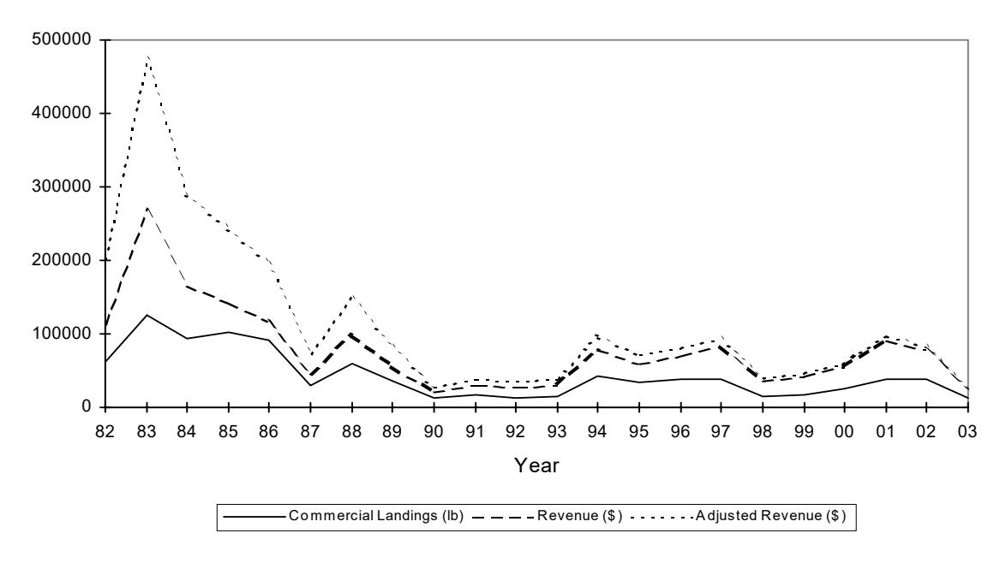

**Figure 10: Bottomfish Landings and Value in American Samoa 1982–2003** 

Source: WPRFMC 2004

#### **4.2.2 Review of Bycatch**

There are no finfish or invertebrate species captured in the bottomfish fisheries whose capture or retention is prohibited by law. Sea turtle species, which are protected under the ESA, are the only fish (as defined by the MSA) that, if captured in the bottomfish fishery, would be considered regulatory discards. No observer data are available regarding interactions with sea turtles in the bottomfish fisheries of American Samoa.

Observations of likely predation events were recorded in the NWHI bottomfish fishery observer program, resulting in a rough estimate of 27 fish lost to predation for every 100 fish boated. It is not known to what degree these estimates reflect predation rates in the bottomfish fisheries in the other island areas. The mortality rates due to hooked fish escaping and subsequently dying as a result of being hooked are presently unknown. In the American Samoa, bottomfish fishery bycatch data have been captured in the Offshore and Inshore Creel Survey since 1999 (ASDMWR).

Estimates of bycatch are not yet available for the bottomfish fisheries in the American Samoa. Fishery-independent surveys in American Samoa resulted in little catch (about 1 percent of the total) of what can generally be considered non-target species. The NWHI data can be considered to represent the most conservative end of the likely range of bycatch rates in the three island areas under the authority of the Council. Fishing trips to the NWHI are distant and costly and purely for commercial purposes, thereby encouraging the retention of only the highest value portion of the catch. Fisheries operating closer to home ports and fisheries that have recreational and subsistence motivations (such as American Samoa) are likely to retain a greater portion of the catch. Preliminary data from American Samoa's creel sampling program indicate only a few instances of bottomfish being discarded.

In summary, bycatch rates are relatively low in the bottomfish fisheries, but poor correspondence among observer data, logbook data, and experimental fishing data indicate a moderate level of uncertainty associated with bycatch estimates for the NWHI fishery, and reliable estimates are not yet available for the bottomfish fisheries of the other island areas (the fleets of which comprise mostly small boats). Only hook-and-line gears are used in the bottomfish fisheries, and these gears strongly select for carnivores, particularly aggressive predators. These types of species, with the exception of sharks, tend to be favored in markets, thus they tend to be target species. The flesh of many shark species is difficult to market, and shark fins have recently become much more difficult to market because of the prohibition on finning.

#### **4.3 Crustacean Fishery of American Samoa**

To date harvest of crustaceans in American Samoa has occurred in the territorial waters.

#### **4.3.1 History and Patterns of Use**

In American Samoa, lobsters are more expensive than fishes, but are often present in important meals such as wedding, funerals, Christmas, or New Years day. Formerly, lobsters were provided at the level of the village/family, whereas nowadays, they are mainly bought at the market, caught by professional/regular fishermen. Spiny lobster (*Panulirus penicillatus*) is the main species speared by night near the outer slope by free divers while diving for finfish. Total landings expanded from a market survey are estimated to average 1,271 lbs of spiny lobsters sold per year (without taking subsistence and recreational catches into account; Couture 2003).

#### **4.3.2 Review of Bycatch**

Lobsters are taken by hand, and harvest occurs almost exclusively in territorial waters, 0–3 miles. There is, therefore, no bycatch associated with this fishery.

#### **4.4 Coral Reef Fishery of American Samoa**

In American Samoa, a special permit, issued by the Regional Administrator, will be required to fish for and retain coral reef ecosystem MUS designated as Potentially Harvested Coral Reef Taxa. Anyone wishing to fish in the EEZ must contact his or her local marine fisheries office to confirm if a permit is needed, based on the specific target resources sought and the area to be fished. Local marine fisheries offices will handle requests for participation in all existing fisheries in coordination with the NMFS Pacific Islands Regional Office. To date no such permits have been requested or issued.

#### **4.4.1 History and Patterns of Use**

In American Samoa, coral reef fishes and invertebrates are harvested in subsistence and smallscale commercial fisheries by various gear types including hook and line, spear gun, and gillnets. The reef fish catch composition in American Samoa is dominated by six families: Acanthuridae (28 percent), Serranidae (12 percent), Holocentridae (12 percent), Lutjanidae (7 percent), Mugilidae (7 percent), and Scaridae (6 percent; Dalzell et al. 1996). Although, *atule* (*Selar crumenophthalmus*), a coastal pelagic species, seasonally accounts for significant portion of the coral reef catch (Craig et al. 1993; Saucerman 1995).

Between 1991 and 1995, the mean annual coral reef fisheries landing in American Samoa was 339,730 pounds (Green 1997). In 2003, approximately 25,000 pounds of coral reef species were reported landed by domestic commercial fisheries (NOAA 2003).

Declines in coral reef catches have been observed since the 1990s. The cause of declines in catches and low abundance of species is thought to be attributed to a combination of several factors including overfishing, natural and anthropogenic habitat degradation, and sociological changes associated with a shift from a subsistence to a market economy.

#### **4.4.2 Review of Bycatch**

Coral reef taxa are harvested primarily in territorial waters. No bycatch measures are necessary at this time.

#### **4.5 Precious Coral Fishery of American Samoa**

There are no known precious coral beds or precious coral fisheries in American Samoa.

#### **4.6 Description of American Samoa Fishing Communities**

The community setting of the fisheries of the Western Pacific Region is a complex one. While the region shares some features with domestic fishing community settings elsewhere, it is unlike any other area of the U.S. or its territories and affiliates in terms of its geographic span, the relative role of U.S. EEZ versus foreign EEZ versus high-seas area dependency, and its general social and cultural history. Furthermore, the identification of specific, geographically identical and bounded communities in these small insular areas is often problematic, at least for the purpose of social impact analysis. Participants in some fisheries may reside in one area on an island, moor or launch their vessels in another area, fish offshore of a different area, and land their fish in yet another area. In these cases, an island or group of islands is the most logical unit of analysis for describing the community setting and assessing community-level impacts. On the other hand, in cases such as the Hawaii-based longline fishery, the influence of and dependency on the fishery appear to be concentrated in certain areas of a particular island. Unfortunately, in most instances, there is a paucity of socioeconomic data on fishery participants at a subisland level with which to illustrate these points.

Other areas within the Western Pacific Region have not experienced the same increase in domestic industrial-scale fisheries, apart from American Samoa, where the longline fishery expanded markedly in 2001. The local fishing fleets that operate in the EEZ around American Samoa, Guam, and the CNMI consist mainly of small boats operated by part-time commercial or recreational fishers. However, these islands have discovered alternative ways to take economic advantage of expanding Pacific pelagic fisheries. Tuna processing, transshipment, and home port industries developed in American Samoa because it possesses a comparative economic advantage over other locations in the Pacific Basin. These advantages include proximity to fishing grounds, shipping routes, and markets; the availability and relatively low cost of fuel and other goods and services that support tuna fishing operations; tariff-free market access to the U.S.; and significant tax incentives.

American Samoa has seen a level of fish processing related activity unequaled elsewhere in the U.S., with the capital of Pago Pago easily being the leading port in the U.S. in terms of the value of fish landings. For many years, Pago Pago has been the site of a major tuna canning industry, and the StarKist cannery in Pago Pago is the currently the world's largest tuna processing facility. In 1998, American Samoa received 208,300 short tons of fish worth approximately \$232 million. Since the tuna processing industry began in American Samoa four decades ago, it has been the largest private sector employer in the territory and its leading exporter.

The link between local waters and processors in American Samoa, however, is not a straightforward one. The principal suppliers of tuna to the canneries are island-based U.S. purse seiners that fish primarily between 5° and 10° north or south of the Equator for skipjack and yellowfin tuna. From 1990 to 1998, about 95 percent of the domestic purse seine harvest in the central and western Pacific occurred outside the U.S. EEZ, with most of the fishing taking place between Papua New Guinea, the Federated States of Micronesia, and Kiribati. However, during some years, particularly during an ENSO event, a substantial portion of the U.S. purse seine harvest comes from the U.S. EEZs around Palmyra Atoll, Jarvis Island, Howland Island, and Baker Island. For example, 36,970 metric tons of skipjack and yellowfin tuna (26 percent of the total harvest) were caught around these islands in 1997. Other major suppliers of tuna to the canneries in American Samoa include U.S. albacore trollers operating in the North and South Pacific and foreign longline vessels that fish for large albacore, yellowfin, and bigeye tuna. In addition, freezer vessels deliver tuna to American Samoa from various transshipment centers around the Pacific.

#### **4.6.1 Identification of Fishing Communities**

In American Samoa, the residential distribution of individuals who are substantially dependent on or substantially engaged in the harvest or processing of fishery resources approximates the total population distribution. These individuals are not set apart—physically, socially, or economically—from island populations as a whole.

Given the economic importance of fishery resources to the island areas within the western Pacific region and taking into account these islands' distinctive geographic, demographic, and cultural attributes, the Council concluded that it is appropriate to characterize American Samoa as a fishing community. Defining the boundaries of the fishing communities broadly helps to

ensure that fishery impact statements analyze the economic and social impacts on all segments of island populations that are substantially dependent on or engaged in fishing-related activities.

#### **4.6.2 Economic and Social Importance of Fisheries**

The Council has compiled extensive information on the economic and social importance of fisheries for each island area. Summaries of this material are presented in the Council's FMPs, FMP annual reports, and annual *Value of the Fisheries* report. Detailed information appears in a wide range of research reports that examine the history, extent, and type of participation of island populations in the fisheries of the region. For example, in-depth analyses of the historical and contemporary importance of fisheries to the indigenous peoples of Guam, the Northern Mariana Islands, and American Samoa are provided by Amesbury and Hunter-Anderson (1989 and 2003), Amesbury et al. (1989), Iverson et al. (1990), and Severance and Franco (1989 Hamnett and Pintz (1996) examined the contributions of tuna processing and transshipment to island economies. Dye and Graham provide a detailed review of archaeological and historical data concerning reef fishing in Hawaii and American Samoa. Additional detailed descriptions of the fisheries in the western Pacific region are presented in Volume 55, Number 2 of *Marine Fisheries Review* (1993).

## **4.6.3 Fishery Impact Statement**

The American Samoa Archipelago FEP, which manages bottomfish and seamount groundfish, crustaceans, precious corals, and coral reef ecosystem fisheries of American Samoa, is consistent with the broad conception of fishing communities outlined above.

Drawing on the research material described in the preceding section, the Council has prepared fishery impact statements that have assessed the likely positive and negative economic and social impacts of alternative management measures on harvesters, processors, brokers/dealers, gear suppliers, and seafood consumers dispersed throughout island populations.

Because the establishment of this FEP will not result in promulgation of new management regulations or alter historical fishing operations or patterns, it is anticipated to have neutral to potentially beneficial impacts to fishing communities of American Samoa.

# **CHAPTER 5: AMERICAN SAMOA ARCHIPELAGO FEP MANAGEMENT PROGRAM**

#### **5.1 Introduction**

This chapter describes the Council's management program for bottomfish, crustaceans, precious corals, and coral reef ecosystem fisheries of the American Samoa Archipelago FEP as well as the criteria used to assess the status of managed stocks.

#### **5.2 Description of National Standard 1 Guidelines on Overfishing**

Overfishing occurs when fishing mortality (F) is higher than the level at which fishing produces maximum sustainable yield (MSY). MSY is the maximum long-term average yield that can be produced by a stock on a continuing basis. A stock is overfished when stock biomass (B) has fallen to a level substantially below what is necessary to produce MSY. So there are two aspects that managers must monitor to determine the status of a fishery: the level of F in relation to F at MSY (FMSY), and the level of B in relation to B at MSY (BMSY).

The National Standard Guidelines (CFR 50 CFR §600.305 et. seq.) for National Standard 1 call for the development of control rules identifying "good" versus "bad" fishing conditions in the fishery and the stock and describing how a variable such as F will be controlled as a function of some stock size variable such as B in order to achieve good fishing conditions. The technical guidance for implementing National Standard 1 (Restrepo et al. 1998) provides a number of recommended default control rules that may be appropriate, depending on such things as the richness of data available. For the purpose of illustrating the following discussion of approaches for fulfilling the overfishing-related requirements of the MSA, a generic model that includes example MSY, target, and rebuilding control rules is shown in Figure 11. The y-axis, F/FMSY, indicates the variable which managers must control as a function of B/BMSY on the x-axis.

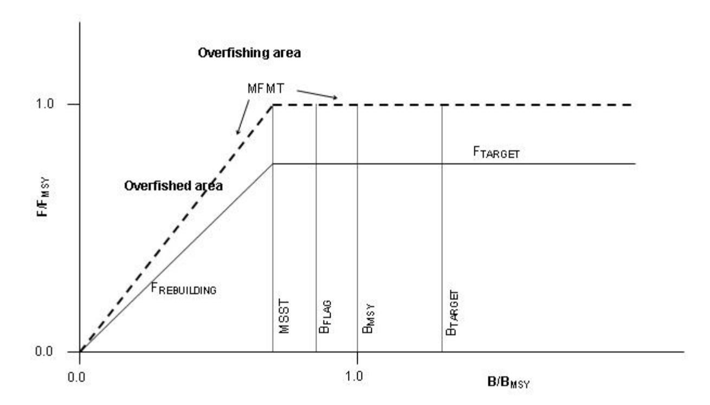

**Figure 11: Example MSY, Target, and Rebuilding Control Rules**

The dashed horizontal and diagonal line represents a model MSY control rule that is used as the MFMT; the solid horizontal and diagonal line represents a model integrated target (FTARGET) and rebuilding (FREBUILDING) control rule.

#### **5.2.1 MSY Control Rule and Stock Status Determination Criteria**

A MSY control rule is a control rule that specifies the relationship of F to B or other indicator of productive capacity under an MSY harvest policy. Because fisheries must be managed to achieve optimum yield, not MSY, the MSY control rule is a benchmark control rule rather than an operational one. However, the MSY control rule is useful for specifying the "objective and measurable criteria for identifying when the fishery to which the plan applies is overfished" that are required under the MSA. The National Standard Guidelines (50 CFR 600.310) refer to these criteria as "status determination criteria" and state that they must include two limit reference points, or thresholds: one for F that identifies when overfishing is occurring and a second for B or its proxy that indicates when the stock is overfished.

The status determination criterion for F is the maximum fishing mortality threshold (MFMT). Minimum stock size threshold (MSST) is the criterion for B. If fishing mortality exceeds the MFMT for a period of one year or more, overfishing is occurring. If stock biomass falls below MSST in a given year, the stock or stock complex is overfished. A Council must take remedial action in the form of a new FMP, an FMP amendment, or proposed regulations when it has been determined by the Secretary of Commerce that overfishing is occurring, a stock or stock complex is overfished, either of the two thresholds is being approached,7 or existing remedial action to end previously identified overfishing has not resulted in adequate progress. The Secretary reports annually to the Congress and the Councils on the status of fisheries according to the above overfishing criteria.

The National Standard Guidelines state that the MFMT may be expressed as a single number or as a function of some measure of the stock's productive capacity, and that it "must not exceed the fishing mortality rate or level associated with the relevant MSY control rule" (50 CFR 600.310(d)(2)(i)). The technical guidance in Restrepo et al. (1998:17) regarding specification of the MFMT is based on the premise that the MSY control rule "constitutes the MFMT." In the example in Figure 11 the MSY control rule sets the MFMT constant at FMSY for values of B greater than the MSST and decreases the MFMT linearly with biomass for values of B less than the MSST. This is the default MSY control rule recommended in Restrepo et al. (1998). Again, if F is greater than the MFMT for a period of one year or more, overfishing is occurring.

The National Standard Guidelines state that "to the extent possible, the stock size threshold [MSST] should equal whichever of the following is greater: One-half the MSY stock size, or the minimum stock size at which rebuilding to the MSY level would be expected to occur within 10 years if the stock or stock complex were exploited at the maximum fishing mortality threshold" (50 CFR 600.310(d)(2)(ii)). The MSST is indicated in Figure 11 by a vertical line at a biomass level somewhat less than BMSY. A specification of MSST below BMSY would allow for some natural fluctuation of biomass above and below BMSY, which would be expected under, for example, an MSY harvest policy. Again, if B falls below MSST the stock is overfished.

Warning reference points comprise a category of reference points that will be considered in these amendments together with the required thresholds. Although not required under the MSA, warning reference points could be specified in order to provide warning in advance of B or F approaching or reaching their respective thresholds. Considered in these amendments is a stock biomass flag (BFLAG) that would be specified at some point above MSST, as indicated in Figure 11. The control rule would not call for any change in F as a result of breaching BFLAG – it would merely serve as a trigger for consideration of action or perhaps preparatory steps towards such action. Intermediate reference points set above the thresholds could also be specified in order to trigger changes in F – in other words, the MFMT could have additional inflection points.

#### **5.2.2 Target Control Rule and Reference Points**

A target control rule specifies the relationship of F to B for a harvest policy aimed at achieving a given target. Optimum yield (OY) is one such target, and National Standard 1 requires that conservation and management measures both prevent overfishing and achieve OY on a continuing basis. Optimum yield is the yield that will provide the greatest overall benefits to the nation, and is prescribed on the basis of MSY, as reduced by any relevant economic, social, or ecological factor. MSY is therefore an upper limit for OY. The National Standard Guidelines further require that fishery councils adopt a precautionary approach to specification of OY. For example, "Target reference points, such as OY, should be set safely below limit reference points,

7 A threshold is being "approached" when it is projected that it will be reached within two years (50 CFR 600.310 (e)(1)).

such as the catch level associated with the fishing mortality rate or level defined by the status determination criteria" (50 CFR 600.310(f)(5)).

A target control rule can be specified using reference points similar to those used in the MSY control rule, such as FTARGET and BTARGET. For example, the recommended default in Restrepo et al. (1998) for the target fishing mortality rate for certain situations (ignoring all economic, social, and ecological factors except the need to be cautious with respect to the thresholds) is 75 percent of the MFMT, as indicated in Figure 11. Simulation results using a deterministic model have shown that fishing at 0.75 FMSY would tend to result in equilibrium biomass levels between 1.25 and 1.31 BMSY and equilibrium yields of 0.94 MSY or higher (Mace 1994).

It is emphasized that while MSST and MFMT are limits, the target reference points are merely targets. They are guidelines for management action, not constraints. For example, the technical guidance for National Standard 1 states that "Target reference points should not be exceeded more than 50% of the time, nor on average" (Restrepo et al. 1998).

#### **5.2.3 Rebuilding Control Rule and Reference Points**

If it has been determined that overfishing is occurring, a stock or stock complex is overfished, either of the two thresholds is being approached, or existing remedial action to end previously identified overfishing has not resulted in adequate progress, the Council must take remedial action within one year. In the case that a stock or stock complex is overfished (i.e., biomass falls below MSST in a given year), the action must be taken through a stock rebuilding plan (which is essentially a rebuilding control rule as supported by various analyses) with the purpose of rebuilding the stock or stock complex to the MSY level (BMSY) within an appropriate time frame, as required by MSA §304(e)(4). The details of such a plan, including specification of the time period for rebuilding, would take into account the best available information regarding a number of biological, social, and economic factors, as required by the MSA and National Standard Guidelines.

If B falls below MSST, management of the fishery would shift from using the target control rule to the rebuilding control rule. Under the rebuilding control rule in the example in Figure 11, F would be controlled as a linear function of B until B recovers to MSST (see FREBUILDING), then held constant at FTARGET until B recovers to BMSY. At that point, rebuilding would have been achieved and management would shift back to using the target control rule (F set at FTARGET). The target and rebuilding control rules "overlap" for values of B between MSST and the rebuilding target (BMSY). In that range of B, the rebuilding control rule is used only in the case that B is recovering from having fallen below MSST. In the example in Figure 11 the two rules are identical in that range of B (but they do not need to be), so the two rules can be considered a single, integrated, target control rule for all values of B.

#### **5.2.4 Measures to Prevent Overfishing and Overfished Stocks**

The control rules specify how fishing mortality will be controlled in response to observed changes in stock biomass or its proxies. Implicitly associated with those control rules are management actions that would be taken in order to manipulate fishing mortality according to the rules. In the case of a fishery which has been determined to be "approaching an overfished condition or is overfished," MSA §303(a)(10) requires that the FMP "contain conservation and management measures to prevent overfishing or end overfishing and rebuild the fishery."

#### **5.2.5 Use of National Standard 1 Guidelines in FEPs**

This FEP carries forward the provisions pertaining to compliance with the Sustainable Fisheries Act which were recommended by the Council and subsequently approved by NMFS (68 FR 16754, April 7, 2003). Because biological and fishery data are limited for all species managed by this FEP, MSY-based control rules and overfishing thresholds are specified for multi-species stock complexes.

#### **5.3 Management Program for Bottomfish and Seamount Groundfish Fisheries**

#### **5.3.1 Permits and Reporting Requirements**

Currently there are no permit and reporting requirements for bottomfish in American Samoa.

#### **5.3.2 Gear Restrictions**

The American Samoan bottomfish fishery is a hook and line fishery. The shallow and deepwater bottomfish fishing gear is essentially a hook and line where one or several hooks are attached to a mainline weighted with a sinker and lowered to a desired depth to target one or several species of grouper, snappers and emperors.

Fishing for bottomfish by means of bottom trawls and bottom set gillnets is prohibited. Possession or use of any poisons, explosives or intoxicating substances to harvest bottomfish or seamount groundfish is prohibited

#### **5.3.3 At-sea Observer Coverage**

All fishing vessels with bottomfish permits must carry an on-board observer when directed to do so by NMFS. Vessel owners or operators will be given at least 72 hour prior notice by NMFS of an observer requirement. Required standards of treatment and accommodations for observers must be followed.

#### **5.3.4 Framework for Regulatory Adjustments**

By June 30 of each year, a Council-appointed bottomfish monitoring team will prepare an annual report on the fishery by area covering the following topics: fishery performance data; summary of recent research and survey results; habitat conditions and recent alterations; enforcement activities and problems; administrative actions (e.g., data collection and reporting, permits); and state and territorial management actions. Indications of potential problems warranting further investigation may be signaled by the following indicator criteria: mean size of the catch of any species in any area is a pre-reproductive size; ratio of fishing mortality to natural mortality for any species; harvest capacity of the existing fleet and/or annual landings exceed best estimate of

MSY in any area; significant decline (50 percent or more) in bottomfish catch per unit of effort from baseline levels; substantial decline in ex-vessel revenue relative to baseline levels; significant shift in the relative proportions of gear in any one area; significant change in the frozen/fresh components of the bottomfish catch; entry/exit of fishermen in any area; per-trip costs for bottomfishing exceed per-trip revenues for a significant percentage of trips; significant decline or increase in total bottomfish landings in any area; change in species composition of the bottomfish catch in any area; research results; habitat degradation or environmental problems; and reported interactions between bottomfish fishing operations and protected species.

The team may present management recommendations to the Council at any time. Recommendations may cover actions suggested for federal regulations, state/territorial action, enforcement or administrative elements, and research and data collection. Recommendations will include an assessment of urgency and the effects of not taking action. The Council will evaluate the team's reports and recommendations, and the indicators of concern. The Council will assess the need for one or more of the following types of management action: catch limits, size limits, closures, effort limitations, access limitations, or other measures. The Council may recommend management action by either the state/territorial governments or by Federal regulation.

If the Council believes that management action should be considered, it will make specific recommendations to the NMFS Regional Administrator after requesting and considering the views of its Scientific and Statistical Committee and Bottomfish Advisory Panel and obtaining public comments at a public hearing. The Regional Administrator will consider the Council's recommendation and accompanying data, and, if he or she concurs with the Council's recommendation, will propose regulations to carry out the action. If the Regional Administrator rejects the Council's proposed action, a written explanation for the denial will be provided to the Council within 2 weeks of the decision. The Council may appeal denial by writing to the Assistant Administrator, who must respond in writing within 30 days.

#### **5.3.5 Bycatch Measures**

Bycatch is reduced through implementation of prohibitions on the use of less or non-selective fishing methods including bottom trawls, bottom gillnets, explosive and poisons.

Four types of non-regulatory measures aimed at reducing bycatch and bycatch mortality, and improving bycatch reporting are being implemented. They include: 1) outreach to fishermen and engagement of fishermen in management, including research and monitoring activities, to increase awareness of bycatch issues and to aid in development of bycatch reduction methods; 2) research into fishing gear and method modifications to reduce bycatch quantity and mortality; 3) research into the development of markets for discard species; and 4) improvement of data collection and analysis systems to better quantify bycatch.

#### **5.3.6 Application of National Standard 1**

#### **MSY Control Rule**

Biological and fishery data are poor for all bottomfish species in American Samoan waters.

Generally, data are only available on commercial landings by species and catch-per-unit-effort (CPUE) for the multi-species complexes as a whole. At this time, it is not possible to partition these effort measures among the various Bottomfish Management Unit Species (BMUS).

The overfishing criteria and control rules specified are applied to individual species within the multi-species stock whenever possible. Where this is not possible, they will be based on an indicator species for the multi-species stock. It is important to recognize that individual species will be affected differently based on this type of control rule, and it is important that for any given species fishing mortality does not exceed a level that would lead to its required protection under the Endangered Species Act (ESA). Currently, no indicator species are used for the four bottomfish multi-species stock complexes (American Samoa, CNMI, Guam and Hawaii). Instead, the control rules are applied to each of the four stock complexes as a whole. For the seamount groundfish stocks, armorhead serves as the indicator species.

The MSY control rule is used as the MFMT. The MFMT and MSST are specified based on the recommendations of Restrepo et al. (1998) and both are dependent on the natural mortality rate (M). The value of M used to determine the reference point values are not specified in this document. The latest estimate, published annually in the SAFE report, is used and the value is occasionally re-estimated using the best available information. The range of M among species within a stock complex is taken into consideration when estimating and choosing the M to be used for the purpose of computing the reference point values.

In addition to the thresholds MFMT and MSST, a warning reference point,  $B_{\text{FLAG}}$ , is also specified at some point above the MSST to provide a trigger for consideration of management action prior to B reaching the threshold. MFMT, MSST, and  $B_{\text{FLAG}}$  are specified as indicated in Table 8.

**Table 8: Overfishing Threshold Specifications for Bottomfish and Seamount Groundfish Stocks** 

| MFMT                                                                                                         | MSST                            | $\mathbf{B}_{	ext{FLAG}}$     |  |  |  |  |
|--------------------------------------------------------------------------------------------------------------|---------------------------------|-------------------------------|--|--|--|--|
| $F(B) = \frac{F_{MSY}B}{c B_{MSY}}  \text{for } B \le c B_{MSY}$ $F(B) = F_{MSY}  \text{for } B > c B_{MSY}$ | $c~\mathrm{B}_{	ext{	iny MSY}}$ | $\mathbf{B}_{	ext{	iny MSY}}$ |  |  |  |  |
| where $c = \max(1-M, 0.5)$                                                                                   |                                 |                               |  |  |  |  |

Standardized values of fishing effort (E) and catch-per-unit-effort (CPUE) are used as proxies for F and B, respectively, so  $E_{MSY}$ ,  $CPUE_{MSY}$ , and  $CPUE_{FLAG}$  are used as proxies for  $F_{MSY}$ ,  $B_{MSY}$ , and  $B_{FLAG}$ , respectively.

\_

&lt;sup>8 The National Standards Guidelines allow overfishing of "other" components in a mixed stock complex if (1) long-term benefits to the nation are obtained, (2) similar benefits cannot be obtained by modification of the fishery to prevent the overfishing, and (3) the results will not necessitate ESA protection of any stock component or ecologically significant unit.

In cases where reliable estimates of CPUEMSY and EMSY are not available, they will be estimated from catch and effort times series, standardized for all identifiable biases. CPUEMSY will be calculated as half of a multi-year average reference CPUE, called CPUEREF. The multi-year reference window will be objectively positioned in time to maximize the value of CPUEREF. EMSY will be calculated using the same approach or, following Restrepo et al. (1998), by setting EMSY equal to EAVE, where EAVE represents the long-term average effort prior to declines in CPUE. When multiple estimates are available, the more precautionary will be used.

Since the MSY control rule specified here applies to multi-species stock complexes, it is important to ensure that no particular species within the complex has a mortality rate that leads to required protection under the ESA. In order to accomplish this, a secondary set of reference points is specified to evaluate stock status with respect to recruitment overfishing. A secondary "recruitment overfishing" control rule is specified to control fishing mortality with respect to that status. The rule applies only to those component stocks (species) for which adequate data are available. The ratio of a current spawning stock biomass proxy (SSBPt) to a given reference level (SSBPREF) is used to determine if individual stocks are experiencing recruitment overfishing. SSBP is CPUE scaled by percent mature fish in the catch. When the ratio SSBPt/SSBPREF, or the "SSBP ratio" (SSBPR) for any species drops below a certain limit (SSBPRMIN), that species is considered to be recruitment overfished and management measures will be implemented to reduce fishing mortality on that species. The rule will apply only when the SSBP ratio drops below the SSBPRMIN, but it will continue to apply until the ratio achieves the "SSBP ratio recovery target" (SSBPRTARGET), which will be set at a level no less than SSBPRMIN. These two reference points and their associated recruitment overfishing control rule, which prescribes a target fishing mortality rate (FRO-REBUILD) as a function of the SSBP ratio, are specified as indicated in Table 9. Again, EMSY is used as a proxy for FMSY.

**Table 9: Recruitment Overfishing Control Rule Specifications for Bottomfish and Seamount Groundfish Stocks** 

|                      | FRO-REBUILD                                         | SSBPRMIN | SSBPRTARGET |
|----------------------|-----------------------------------------------------|----------|-------------|
| F(SSBPR) = 0   | for SSBPR ≤ 0.10                              |          |             |
| F(SSBPR) = 0.2 | FMSY for 0.10 < SSBPR ≤ SSBPRMIN        | 0.20     | 0.30        |
| F(SSBPR) = 0.4 | FMSY for SSBPRMIN < SSBPR ≤ SSBPRTARGET |          |             |

#### **Target Control Rules and Reference Points**

No target control rules or reference points are currently specified for bottomfish stocks of the American Samoa Archipelago.

#### **Rebuilding Control Rule and Reference Points**

No rebuilding control rule or reference points are currently specified for the bottomfish stocks of the American Samoa Archipelago.

#### **Stock Status Determination Process**

Stock status determinations involve three procedural steps. First, the appropriate MSY, target, or rebuilding reference points are specified. However, because environmental changes may affect the productive capacity of the stocks, it may be necessary to occasionally modify the specifications of some of the reference points or control rules. Modifications may also be desirable when better assessment methods become available, when fishery objectives are modified (e.g., OY), or better biological, socioeconomic, or ecological data become available.

Second, the values of the reference points are estimated and third, the status of the stock is determined by estimating the current or recent values of fishing mortality and stock biomass or their proxies and comparing them with their respective reference points.

The second step (including estimation of M, on which the values of the overfishing thresholds will be dependent) and third step will be undertaken by NMFS based on the latest results published annually in the Stock Assessment and Fishery Evaluation (SAFE) report. In practice, the second and third steps may be done simultaneously—in other words, the reference point values could be re-estimated as often as the stocks' status. No particular stock assessment period or schedule is specified, but in practice the assessments will likely be conducted annually in coordination with the preparation of the annual SAFE report.

The best information available is used to estimate the values of the reference points and to determine the status of stocks in relation to the status determination criteria. The determinations are based on the latest available stock and fishery assessments. Information used in the assessments includes logbook data, creel survey data, vessel observer data, and the findings of fishery-independent surveys when they are conducted.

#### **Measures to Address Overfishing and Overfished Stocks**

At present, no bottomfish stocks in the American Samoa Archipelago have been determined to be overfished or that overfishing is occurring. If in the future it is determined that overfishing is occurring, a stock is, or either of those two conditions is being approached, the Council will establish additional management measures. Measures that may be considered include additional area closures, seasonal closures, establishment of limited access systems, limits on catch per trip, limits on effort per trip, and fleet-wide limits on catch or effort.

The combination of control rules and reference points is illustrated in Figure 12. The primary control rules that are applied to the stock complexes are shown in part (a). Note that the position of the MSST is illustrative only; its value depends on the best estimate of M at any given time. The secondary control rule that would be applied to particular species to provide for recovery from recruitment overfishing is shown in part (b).

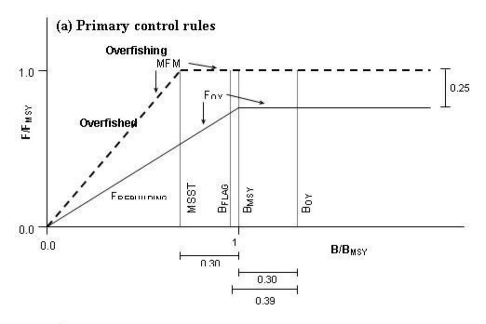

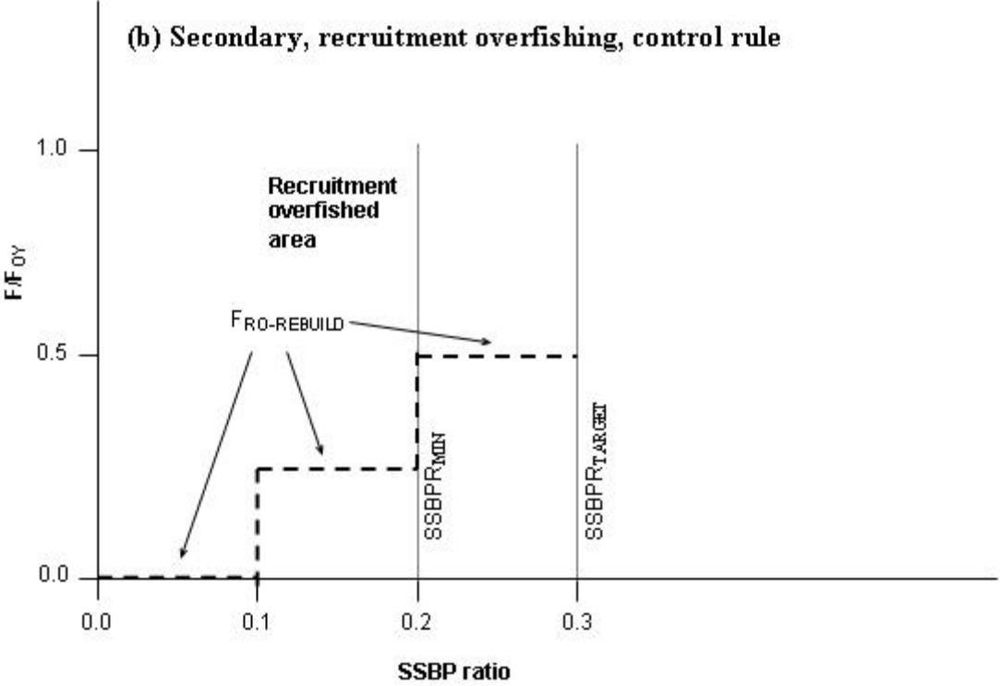

**Figure 12: Combination of Control Rules and Reference Points for Bottomfish and Seamount Groundfish Stocks** 

#### **5.4 Management Program for Precious Corals Fisheries**

No precious corals harvester has received a federal permit to harvest corals from the EEZ surrounding American Samoa since the implementation of the Precious Corals FMP in 1980, however, this does not preclude any future permit issuance. The U.S. EEZ surrounding American Samoa has been defined, for the purposes of precious coral fisheries management, as an Exploratory Precious Coral Permit Area.

#### **5.4.1 Permits**

Any vessel of the United States fishing for, taking or retaining precious corals in any precious corals permit area must have a permit. Each permit will be valid for fishing only in the permit area. No more than one permit will be valid for any one person at any one time. The holder of a valid permit to fish one permit area may obtain a permit to fish another permit area only upon surrendering to the NMFS Regional Administrator any current permit for the precious corals fishery.

#### **5.4.2 Seasons and Quotas**

The fishing year for precious corals begins on July 1 and ends on June 30 the following year.

The quota limiting the amount of precious corals that may be taken in any precious corals permit area in an exploratory area during the fishing year is 1,000 kg per area, all species combined (except black corals). Only live coral is counted toward the quota. Live coral means any precious coral that has live coral polyps or tissue.

The quotas for exploratory areas will be held in reserve for harvest by vessels of the U.S. by determining at the beginning of each fishing year that the reserve for each of the three exploratory areas will equal the quota minus the estimated domestic annual harvest for that year. And, as soon as practicable after December 31, each year, the Regional Administrator will determine the amount harvested by vessels of the U.S. between July 1 and December 31 of that year. NMFS will release to TALFF an amount of precious coral for each exploratory area equal to the quota minus the two times amount harvested by vessels of the U.S. in that July 1 to December 31 period. Finally, NMFS will publish in the Federal Register a notification of the Regional Administrator's determination and a summary of the information of which it is based a soon as practicable after the determination is made.

## **5.4.3 Closures**

If the NMFS Regional Administrator determines that the harvest quota for any coral bed will be reached prior to the end of the fishing year, NMFS will issue a Federal Register notice closing the bed and the public will be informed through appropriate news media. Any such field order must indicate the reason for the closure, delineate the bed being closed, and identify the effective date of the closure. A closure is also effective for a permit holder upon the permit holder's actual harvest of the applicable quota.

#### **5.4.4 Restrictions**

*Size Restrictions*--The height of a live coral specimen shall be determined by a straight line measurement taken from its base to its most distal extremity. The stem diameter of a living coral specimen shall be determined by measuring the greatest diameter of the stem at a point no less than one inch (2.54 cm) from the top surface of the living holdfast. Live pink coral harvested from any precious corals permit area must have attained a minimum height of 10 inches (25.4 cm). Live black coral harvested from any precious corals permit area must have attained either a minimum stem diameter of 1 inch (2.54 cm), or a minimum height of 48 inches (122 cm).

*Gear Restrictions*-- Only selective gear may be used to harvest coral from any precious corals permit area. Selective gear means any gear used for harvesting corals that can discriminate or differentiate between type, size, quality, or characteristics of living or dead corals.

#### **5.4.5 Framework Procedures**

Established management measures may be revised and new management measures may be established and/or revised through rulemaking if new information demonstrates that there are biological, social, or economic concerns in a precious corals permit area. By June 30 of each year, the Council-appointed Precious Corals Plan Team will prepare an annual report on the fishery in the management area. The report will contain, among other things, recommendations for Council action and an assessment of the urgency and effects of such action(s).

Established measures are management measures that, at some time, have been included in regulations implementing the FMP, and for which the impacts have been evaluated in Council/NMFS documents in the context of current conditions. According to the framework procedures of Amendment 3 to the FMP, the Council may recommend to the Regional Administrator that established measures be modified, removed, or re-instituted. Such recommendation will include supporting rationale and analysis and will be made after advance public notice, public discussion, and consideration of public comment. NMFS may implement the Council's recommendation by rulemaking if approved by the Regional Administrator.

New measures are management measures that have not been included in regulations implementing the FMP, or for which the impacts have not been evaluated in Council/NMFS documents in the context of current conditions. Following the framework procedures of Amendment 3 to the FMP, the Council will publicize, including by a Federal Register document, and solicit public comment on, any proposed new management measure. After a Council meeting at which the measure is discussed, the Council will consider recommendations and prepare a Federal Register document summarizing the Council's deliberations, rationale, and analysis for the preferred action and the time and place for any subsequent Council meeting(s) to consider the new measure. At a subsequent public meeting, the Council will consider public comments and other information received before making a recommendation to the Regional Administrator about any new measure. If approved by the Regional Administrator, NMFS may implement the Council's recommendation by rulemaking.

#### **5.4.6 Bycatch Measures**

A variety of invertebrates and fish are known to utilize the same habitat as precious corals. Such organisms include *onaga* (*Etelis coruscans*), *kāhala* (*Seriola dumerallii*) and the shrimp *Heterocarpus ensifer*, however, there is no evidence that these species or others significantly depend on precious coral beds for shelter or food. In addition, only selective gear can be used to harvest precious corals, thereby reducing the potential for bycatch.

#### **5.4.7 Application of National Standard 1**

Due to the paucity of information on the existence and distribution of precious corals and the absence of a precious coral fishery in the American Samoa Archipelago, specification of MSY, OY and overfishing have not been specifically determined for precious coral management unit species. However, as a precautionary approach, a quota for precious corals in the Exploratory Precious Coral Permit Area has been set at 1,000 kg/year. Should a precious coral fishery develop in the American Samoa Archipelago, the Council may develop specifications for specific coral beds depending on the information and stock assessment tools available.

#### **Measures to address overfishing**

At present no stocks of precious corals have been determined to be overfished or that overfishing is occurring. Provisions of the Precious Corals FMP, as amended, are sufficient to prevent overfishing and these measures will be carried over into the FEP.

#### **5.5 Management Program for Crustacean Fisheries**

#### **5.5.1 Management Areas and Subareas**

Permit Area 3 is the EEZ around the Territory of American Samoa and the EEZ around the Territory of Guam. Permit Areas 1 and 2 are waters of the EEZ around the Hawaiian Islands.

#### **5.5.2 Permits and Reporting Requirements**

Federal permit and logbook reporting is required when fishing for lobsters in the US EEZ around American Samoa. A permit must obtain from the Regional Administrator and will be issued to the owner of the vessel that is used to fish for lobster.

#### **5.5.3 Gear Restrictions**

In Permit Area 3, it is unlawful for any person to fish for, take or retain lobsters with explosives, poisons, or electrical shocking devices.

#### **5.5.4 Notifications**

Vessel operators must report not less than 24 hours, but not more than 36 hours, before landing, the port, the approximate date and the approximate time at which spiny and slipper lobsters will be landed. They must also report not less than six hours, and not more than twelve hours, before offloading, the location and time that offloading spiny and slipper lobsters will begin. The Regional Administrator will notify permit holders of any change in the reporting method and schedule required at least 30 days prior to the opening of the fishing season.

#### **5.5.5 At-sea Observer Coverage**

All fishing vessels must carry an observer when requested to do so by the NMFS Regional Administrator.

#### **5.5.6 Framework Procedures**

New management measures may be added through rulemaking if new information demonstrates that there are biological, social, or economic concerns in Permit Areas 1, 2 or 3. By June 30 of each year, the Council-appointed Plan Team will prepare an annual report on the fisheries in the management area. The report shall contain, among other things, recommendations for Council action and an assessment of the urgency and effects of such action(s).

Established measures are management measures that, at some time, have been included in regulations implementing the FMP, and for which the impacts have been evaluated in Council/NMFS documents in the context of current conditions. Following the framework procedures of Amendment 9 to the FMP, the Council may recommend to the NMFS Regional Administrator that established measures be modified, removed, or re-instituted. Such recommendation shall include supporting rationale and analysis, and shall be made after advance public notice, public discussion, and consideration of public comment. NMFS may implement the Council's recommendation by rulemaking if approved by the Regional Administrator.

New measures are management measures that have not been included in regulations implementing the FMP, or for which the impacts have not been evaluated in Council/NMFS documents in the context of current conditions. Following the framework procedures of Amendment 9 to the FMP, the Council will publicize, including by a Federal Register document, and solicit public comment on, any proposed new management measure. After a Council meeting at which the measure is discussed, the Council will consider recommendations and prepare a Federal Register document summarizing the Council's deliberations, rationale, and analysis for the preferred action, and the time and place for any subsequent Council meeting(s) to consider the new measure. At subsequent public meeting(s), the Council will consider public comments and other information received to make a recommendation to the Regional Administrator about any new measure. NMFS may implement the Council's recommendation by rulemaking if approved by the Regional Administrator.

#### **5.5.7 Bycatch Measures**

No bycatch measures or actions are necessary at this time. Lobsters are taken by hand and harvest occurs almost exclusively in territorial waters, 0-3 miles. There is no bycatch associated with this fishery.

#### **5.5.8 Application of National Standard 1**

Specification of MSY, OY and overfishing have not been determined for crustacean management unit species in American Samoa as there is virtually no crustaceans fishery operating in the EEZ surrounding those areas at present. However, should a crustacean fishery develop, and the Council determine a stock status determination is needed, the Council will rely on the specification of MSY, OY and overfishing, including target and rebuilding control rules and reference points established for the NWHI lobster fishery until appropriate specifications are developed for crustacean fishery resources of the American Samoa Archipelago. The specifications would be applied to multi-species stock complexes or to individual species, depending on the information and stock assessment tools available.

#### **5.6 Management Program for Coral Reef Ecosystem Fisheries**

#### **5.6.1 Marine Protected Areas (MPAs)**

Rose Atoll in American Samoa is a designated MPA with an outer boundary at the 50-fm isobath. It is a no-take MPA in which all extractive activities are prohibited except for small harvests related to scientific research and related resource management.

#### **5.6.2 Permits and Reporting Requirements**

Any person who harvests coral reef ecosystem MUS in a low-use MPAs is required to have a Federal special permit issued by NMFS. Issuance of special permits is on a case-by-case basis and based upon several factors including the potential for bycatch, the sensitivity of the area to the type of fishing proposed, and the level of fishing occurring in relation to the level considered sustainable in a low-use MPA. A person permitted and targeting non-CRE MUS under other fishery management plans is not required to obtain a special permit to fish in low-use MPAs.

In addition to the permit requirement for low-use MPAs, special permits are required for any directed fisheries on potentially harvested coral reef taxa (PHCRT) within the regulatory area or to fish for any CRE MUS in the coral reef regulatory area with any gear not normally permitted. Those issued a permit to fish within one of the other FMPs who incidentally catches CRE MUS while fishing for the other MUS is exempt from the permit requirement of this FEP. Also exempt from the permit requirement are those fishing for currently harvested coral reef taxa (CHCRT) outside of a MPA who does not retain any incidentally-caught PHCRT, and any person collecting marine organisms for scientific research. Permits are only valid for fishing in the fishery management subarea specified on the permit.

The harvest of live rock and living corals is prohibited throughout the federally managed U.S. EEZ waters of the region; however, under special permits with conditions specified by NMFS following consultation with the Council, indigenous people could be allowed to harvest live rock or coral for traditional uses, and aquaculture operations could be permitted to harvest seed stock. A Federal reporting system for all fishing under special permits is in place. Resource monitoring systems administered by state, territorial, and commonwealth agencies continue to collect fishery data on the existing coral reef fisheries that do not require special permits.

#### **5.6.3 Notification**

Any special permit holder must contact the appropriate NMFS enforcement agent in American Samoa at least 24 hours before landing any CRE MUS harvested under a special permit, and report the port and the approximate date and time at which the catch will be landed.

#### **5.6.4 Gear Restrictions**

Allowable gear types include: (1) Hand harvest; (2) spear; (3) slurp gun; (4) hand/dip net; (5) hoop net for Kona crab; (6) throw net; (7) barrier net; (8) surround/purse net that is attended at all times; (9) hook-and-line (powered and unpowered handlines, rod and reel, and trolling); (10) crab and fish traps with vessel ID number affixed; and (11) remote operating vehicles/submersibles. New fishing gears that are not included in the allowable gear list may be allowed under the special permit provision. CRE MUS may not be taken by means of poisons, explosives, or intoxicating substances. Possession and use of these materials is prohibited.

All fish and crab trap gear used by permit holders must be identified with the vessel number. Unmarked traps and unattended surround nets or bait seine nets found deployed will be considered unclaimed property and may be disposed of by NMFS or other authorized officers.

#### **5.6.5 Framework Procedures**

A framework process, providing for an administratively simplified procedure to facilitate adjustments to management measures previously analyzed in the CRE FMP, is an important component of the FEP. These framework measures include designating "no-anchoring" zones and establishing mooring buoys, requiring vessel monitoring systems on board fishing vessels, designating areas for the sole use of indigenous peoples, and moving species from the PHCRT to the CHCRT list when sufficient data has been collected. A general fishing permit program could also be established for all U.S. EEZ coral reef ecosystem fisheries under the framework process.

#### **5.6.6 Other Actions**

There are other non-regulatory measures consistent with plan objectives that are being undertaken by the Council outside of the regulatory regime. These include a process and criteria for EFH consultations; formal plan team coordination to identify and to address coral reef ecosystem impacts from existing fisheries; a system to facilitate consistent state and territorial level management; and research and education efforts.

#### **5.6.7 Bycatch Measures**

Almost all coral reef fishes caught in American Samoa are considered food fishes and are kept, regardless or size or species. There is no specific information available on bycatch from coral reef fisheries, particularly inshore fisheries.

#### **5.6.8 Application of National Standard 1**

#### **MSY Control Rule and Stock Status Determination**

Available biological and fishery data are poor for all coral reef ecosystem management unit species in American Samoa. There is scant information on the life histories, ecosystem dynamics, fishery impact, community structure changes, yield potential, and management reference points for many coral reef ecosystem species. Additionally, total fishing effort cannot be adequately partitioned between the various management unit species (MUS) for any fishery or area. Biomass, maximum sustainable yield, and fishing mortality estimates are not available for any single MUS. Once these data are available, fishery managers will then be able to establish limits and reference points based on the multi-species coral reef ecosystem as a whole.

When possible, the MSY control rule should be applied to the individual species in a multispecies stock. When this is not possible, MSY may be specified for one or more species; these values can then be used as indicators for the multi-species stock's MSY.

Clearly, any given species that is part of a multi-species complex will respond differently to an OY-determined level of fishing effort (FOY). Thus, for a species complex that is fished at FOY, managers still must track individual species' mortality rates in order to prevent species-specific population declines that would lead to strict protection, as required by the Endangered Species Act.

For the coral reef fisheries, the multi-species complex as a whole is used to establish limits and reference points for each area.

When possible, available data for a particular species will be used to evaluate the status of individual MUS stocks in order to prevent recruitment overfishing. When better data and the appropriate multi-species stock assessment methodologies become available, all stocks will be evaluated independently, without proxy.

#### **Establishing Reference Point Values**

Standardized values of catch per unit effort (CPUE) and effort (E) are used to establish limit and reference point values, which act as proxies for relative biomass and fishing mortality, respectively. Limits and reference points are calculated in terms of CPUEMSY and EMSY included in Table 10.

**Table 10: CPUE-based Overfishing Limits and Reference Points for Coral Reef Species** 

| Value         | Proxy        | Explanation                             |
|---------------|--------------|-----------------------------------------|
| MaxFMT (FMSY) | EMSY         | 0.91 CPUEMSY                            |
| FOY           | 0.75 EMSY    | suggested default scaling for target    |
| BMSY          | CPUEMSY      | operational counterpart                 |
| BOY           | 1.3 CPUEMSY  | simulation results from Mace (1994)     |
| MinSST        | 0.7 CPUEMSY  | suggested default (1-M)BMSY with M=0.3* |
| BFLAG         | 0.91 CPUEMSY | suggested default (1-M)BOY with M=0.3*  |

When reliable estimates of EMSY and CPUEMSY are not available, they are estimated from the available time series of catch and effort values, standardized for all identifiable biases using the best available analytical tools. CPUEMSY is calculated as one-half a multi-year moving average reference CPUE (CPUEREF).

#### **Measures to Address Overfishing and Overfished Stocks**

At present, no CRE stocks in the American Samoa Archipelago have been determined to be overfished or that overfishing is occurring. If in the future it is determined that overfishing is occurring, a stock is, or either of those two conditions is being approached, the Council will establish additional management measures. Measures that may be considered include additional area closures, seasonal closures, establishment of limited access systems, limits on catch per trip, limits on effort per trip, and fleet-wide limits on catch or effort.

While managing the multi-species stocks to provide maximum benefit, fishery managers must also ensure that the resulting fishing mortality rate does not reduce any individual species stock to a level requiring protection under the Endangered Species Act. Preventing recruitment overfishing on any component stock will satisfy this need in a precautionary manner. Best available data are used for each fishery to estimate these values. These reference points will be related primarily to recruitment overfishing and will be expressed in units such as spawning potential ratio or spawning stock biomass. However, no examples can be provided at present. Species for which managers have collected extensive survey data and know their life history parameters, such as growth rate and size at reproduction, are the best candidates for determining these values.

 Using the best available data, managers will monitor changes in species abundance and/or composition. They will pay special attention to those species they consider important because of their trophic level or other ecological importance to the larger community.

# **CHAPTER 6: IDENTIFICATION AND DESCRIPTION OF ESSENTIAL FISH HABITAT**

#### **6.1 Introduction**

In 1996, Congress passed the Sustainable Fisheries Act, which amended the MSA and added several new FMP provisions. From an ecosystem management perspective, the identification and description of EFH for all federally managed species were among the most important of these additions.

According to the MSA, EFH is defined as "those waters and substrate necessary to fish for spawning, breeding or growth to maturity." This new mandate represented a significant shift in fishery management. Because the provision required councils to consider a MUS's ecological role and habitat requirements in managing fisheries, it allowed Councils to move beyond the traditional single-species or multispecies management to a broader ecosystem-based approach.

In 1999, NMFS issued guidelines intended to assist Councils in implementing the EFH provision of the MSA, and set forth the following four broad tasks:

- 1. Identify and describe EFH for all species managed under an FMP.
- 2. Describe adverse impacts to EFH from fishing activities.
- 3. Describe adverse impacts to EFH from non-fishing activities.
- 4. Recommend conservation and enhancement measures to minimize and mitigate the adverse impacts to EFH resulting from fishing and non–fishing related activities.

The guidelines recommended that each Council prepare a preliminary inventory of available environmental and fisheries information on each managed species. Such an inventory is useful in describing and identifying EFH, as it also helps to identify missing information about the habitat utilization patterns of particular species. The guidelines note that a wide range of basic information is needed to identify EFH. This includes data on current and historic stock size, the geographic range of the managed species, the habitat requirements by life history stage, and the distribution and characteristics of those habitats. Because EFH has to be identified for each major life history stage, information about a species' distribution, density, growth, mortality, and production within all of the habitats it occupies, or formerly occupied, is also necessary.

The guidelines also state that the quality of available data used to identify EFH should be rated using the following four-level system:

| Level 1: | All that is known is where a species occurs based on distribution data for |
|----------|----------------------------------------------------------------------------|
|          | all or part of the geographic range of the species.                        |

- Level 2: Data on habitat-related densities or relative abundance of the species are available.
- Level 3: Data on growth, reproduction, or survival rates within habitats are available.

#### Level 4: Production rates by habitat are available.

With higher quality data, those habitats most highly valued by a species can be identified, allowing a more precise designation of EFH. Habitats of intermediate and low value may also be essential, depending on the health of the fish population and the ecosystem. For example, if a species is overfished, and habitat loss or degradation is thought to contribute to its overfished condition, all habitats currently used by the species may be essential.

The EFH provisions are especially important because of the procedural requirements they impose on both Councils and federal agencies. First, for each FMP, Councils must identify adverse impacts to EFH resulting from both fishing and non-fishing activities, and describe measures to minimize these impacts. Second, the provisions allowed Councils to provide comments and make recommendations to federal or state agencies that propose actions that may affect the habitat, including EFH, of a managed species. In 2002, NMFS revised the guidelines by providing additional clarifications and guidance to ease implementation of the EFH provision by Councils.

#### **6.2 EFH Designations**

The following EFH designations were developed by the Council and approved by the Secretary of Commerce. EFH designations for Bottomfish and Seamount Groundfish, Crustaceans, Precious Corals and Pelagic MUS were approved by the Secretary on February 3, 1999 (64 FR 19068). EFH designations for Coral Reef Ecosystem MUS were approved by the Secretary on June 14, 2002 (69 FR 8336). For the purpose of this plan, Pelagics MUS are not part of the American Samoa Archipelago FEP MUS.

In describing and identifying EFH for Bottomfish and Seamount Groundfish, Crustacean, Precious Coral, Coral Reef Ecosystem, and Pelagic MUS, four alternatives were considered: (1) designate EFH based on the best available scientific information (preferred alternative), (2) designate all waters EFH, (3) designate a minimal area as EFH, and (4) no action. Ultimately, the Council selected Alternative 1 designate EFH based on observed habitat utilization patterns in localized areas as the preferred alternative.

This alternative was preferred by the Council for three reasons. First, it adhered to the intent of the MSA provisions and to the guidelines that have been set out through regulations and expanded on by NMFS because the best available scientific data were used to make carefully considered designations. Second, it resulted in more precise designations of EFH at the species complex level than would be the case if Alternative 2 were chosen. At the same time, it did not run the risk of being arbitrary and capricious as would be the case if Alternative 3 were chosen. Finally, it recognized that EFH designation is an ongoing process and set out a procedure for reviewing and refining EFH designations as more information on species' habitat requirements becomes available.

The Council has used the best available scientific information to describe EFH in text and tables that provide information on the biological requirements for each life stage (egg, larvae, juvenile, adult) of all MUS (see the Western Pacific Regional Fishery Management Council's Essential

Fish Habitat Descriptions for Western Pacific Archipelagic and Remote Island Areas Fishery Ecosystem Plan Management Unit Species). Careful judgment was used in determining the extent of the essential fish habitat that should be designated to ensure that sufficient habitat in good condition is available to maintain a sustainable fishery and the managed species' contribution to a healthy ecosystem. Because there are large gaps in scientific knowledge about the life histories and habitat requirements of many MUS in the Western Pacific Region, the Council adopted a precautionary approach in designating EFH to ensure that enough habitats are protected to sustain managed species.

The preferred depth ranges of specific life stages were used to designate EFH for bottomfish and crustaceans. In the case of crustaceans, the designation was further refined based on productivity data. The precious corals designation combines depth and bottom type as indicators, but it is further refined based on the known distribution of the most productive areas for these organisms. Species were grouped into complexes because available information suggests that many of them occur together and share similar habitat.

In addition to the narratives, the general distribution and geographic limits of EFH for each life history stage are presented in the forms of maps.. The Council incorporated these data into a geographic information system to facilitate analysis and presentation. More detailed and informative maps will be produced as more complete information about population responses to habitat characteristics (e.g. growth, survival or reproductive rates) becomes available.

At the time the Council's EFH designations were approved by the Secretary, there was not enough data on the relative productivity of different habitats to develop EFH designations based on Level 3 or Level 4 data for any of the Western Pacific Council's MUS. Council adopted a fifth level, denoted Level 0, for situations in which there is no information available about the geographic extent of a particular managed species' life stage. Subsequently, very limited habitat information has been made available for MUS for the Council to review and use to revise the initial EFH designations previously approved by the Secretary. However, habitat-related studies for bottomfish and precious coral and to a limited extent, crustaceans, are currently ongoing in the NWHI and MHI. Additionally, fish and benthic surveys conducted during the NMFS Coral Reef Ecosystem Division's Pacific-Wide Rapid Assessment and Monitoring Program, along with other near-shore coral reef habitat health assessments undertaken by other agencies, may provide additional information to refine EFH designations for Coral Reef Ecosystem MUS in all island areas, including the American Samoa archipelago.

#### **6.2.1 Bottomfish**

Except for several of the major commercial species, very little is known about the life histories, habitat utilization patterns, food habits, or spawning behavior of most adult bottomfish and seamount groundfish species. Furthermore, very little is known about the distribution and habitat requirements of juvenile bottomfish.

Generally, the distribution of adult bottomfish in the western Pacific region is closely linked to suitable physical habitat. Unlike the U.S. mainland with its continental shelf ecosystems, Pacific islands are primarily volcanic peaks with steep drop-offs and limited shelf ecosystems. The

BMUS under the Council's jurisdiction are found concentrated on the steep slopes of deepwater banks. The 100-fathom isobath is commonly used as an index of bottomfish habitat. Adult bottomfish are usually found in habitats characterized by a hard substrate of high structural complexity. The total extent and geographic distribution of the preferred habitat of bottomfish is not well known. Bottomfish populations are not evenly distributed within their natural habitat; instead, they are found dispersed in a non-random, patchy fashion. Deepwater snappers tend to aggregate in association with prominent underwater features, such as headlands and promontories.

There is regional variation in species composition, as well as a relative abundance of the MUS of the deepwater bottomfish complex in the Western Pacific Region. In American Samoa, Guam, and the Northern Mariana Islands, the bottomfish fishery can be divided into two distinct fisheries: a shallow- and a deep-water bottomfish fishery, based on species and depth. The shallow-water (0–100 m) bottomfish complex comprises groupers, snappers, and jacks in the genera *Lethrinus*, *Lutjanus*, *Epinephelus*, *Aprion*, *Caranx, Variola,* and *Cephalopholis.* The deep-water (100–400 m) bottomfish complex comprises primarily snappers and groupers in the genera *Pristipomoides, Etelis, Aphareus, Epinephelus,* and *Cephalopholis*. In Hawaii, the bottomfish fishery targets several species of eteline snappers, carangids, and a single species of groupers. The target species are generally found at depths of 50–270 meters.

To reduce the complexity and the number of EFH identifications required for individual species and life stages, the Council has designated EFH for bottomfish assemblages pursuant to Section 600.805(b) of 62 FR 66551. The species complex designations include deep-slope bottomfish (shallow water and deep water) and seamount groundfish complexes. The designation of these complexes is based on the ecological relationships among species and their preferred habitat. These species complexes are grouped by the known depth distributions of individual BMUS throughout the Western Pacific Region. These are summarized in Table 16. For a broader description of the life history and habitat utilization patterns of individual BMUS, see the Western Pacific Fishery Management Council's Essential Fish Habitat Descriptions for Western Pacific Archipelagic and Remote Island Areas Fishery Ecosystem Plan Management Unit Species.

At present, there is not enough data on the relative productivity of different habitats to develop EFH designations based on Level 3 or Level 4 data. Given the uncertainty concerning the life histories and habitat requirements of many BMUS, the Council designated EFH for adult and juvenile bottomfish as the water column and all bottom habitat extending from the shoreline to a depth of 400 meters (200 fathoms) encompassing the steep drop-offs and high-relief habitats that are important for bottomfish throughout the Western Pacific Region.

The eggs and larvae of all BMUS are pelagic, floating at the surface until hatching and subject thereafter to advection by the prevailing ocean currents. There have been few taxonomic studies of these life stages of snappers (lutjanids) and groupers (epinepheline serranids). Presently, few larvae can be identified to species. As snapper and grouper larvae are rarely collected in plankton surveys, it is extremely difficult to study their distribution. Because of the existing scientific uncertainty about the distribution of the eggs and larvae of bottomfish, the Council designated

the water column extending from the shoreline to the outer boundary of the EEZ to a depth of 400 meters as EFH for bottomfish eggs and larvae throughout the Western Pacific Region. In the past, a large-scale foreign seamount groundfish fishery extended throughout the southeastern reaches of the northern Hawaiian Ridge. The seamount groundfish complex consists of three species (pelagic armorheads, alfonsins, and ratfish). These species dwell at 200–600 meters on the submarine slopes and summits of seamounts. A collapse of the seamount groundfish stocks has resulted in a greatly reduced yield in recent years. Although a moratorium on the harvest of the seamount groundfish within the EEZ has been in place since 1986, no substantial recovery of the stocks has been observed. Historically, there has been no domestic seamount groundfish fishery.

The life histories and distributional patterns of seamount groundfish are also poorly understood. Data are lacking on the effects of oceanographic variability on migration and recruitment of individual management unit species. On the basis of the best available data, the Council designated the EFH for the adult life stage of the seamount groundfish complex as all waters and bottom habitat bounded by latitude 29°–35° N and longitude 171° E–179° W between 80–600 meters. EFH for eggs, larvae, and juveniles is the epipelagic zone (~200 m) of all waters bounded by latitude 29°–35° N and longitude 171° E–179° W. This EFH designation encompasses the Hancock Seamounts, part of the northern extent of the Hawaiian Ridge, located 1,500 nautical miles northwest of Honolulu.

#### **6.2.2 Crustaceans**

Spiny lobsters are found throughout the Indo-Pacific region. All spiny lobsters in the western Pacific region belong to the family Palinuridae. The slipper lobsters belong to the closely related family, Scyllaridae. There are 13 species of the genus *Panulirus* distributed in the tropical and subtropical Pacific between 35° N and 35° S. *P. penicillatus* is the most widely distributed, the other three species are absent from the waters of many island nations of the region. The Hawaiian spiny lobster (*P. marginatus*) is endemic to Hawaii and the Johnston Atoll and is the primary species of interest in the NWHI fishery, the principal commercial lobster fishery in the western Pacific region. This fishery also targets the slipper lobster *Scyllarides squammosus.* Three other species of lobster—pronghorn spiny lobster (*Panulirus pencillatus*), ridgeback slipper lobster (*Scyllarides haanii*), and Chinese slipper lobster (*Parribacus antarticus*)—and the Kona crab, family Raninidae, are taken in low numbers in the NWHI fishery.

In the NWHI, there is wide variation in lobster total density, size, and sex ratio among the different islands. Neither the extent of species interaction between *P. marginatus* and *Scyllarides squammosus* nor the role of density dependent factors in controlling population abundance is known.

In the Main Hawaiian Islands (MHI), most of the commercial, recreational, and subsistence catches of spiny lobster are taken from waters under state jurisdiction. *P. maginatus* and *P. pencillatus* are taken in nearly equal numbers in trap samples around the island of Oahu. However, the species composition or the magnitude of the subsistence, recreational, and commercial catch is not known. In America Samoa, the Northern Mariana Islands, and Guam, the species composition or the magnitude of the subsistence, recreational, and commercial catch is also unknown.

In Hawaii, adult spiny lobsters are typically found on rocky substrate in well-protected areas, in crevices, and under rocks. Unlike many other species of *Panulirus*, the juveniles and adults of *P. marginatus* are not found in separate habitats apart from one another. Juvenile *P. marginatus* recruit directly to adult habitat; they do not utilize a separate shallow-water nursery habitat apart from the adults as do many Palinurid lobsters. Similarly, juvenile and adult *P. pencillatus* also share the same habitat. *P. marginatus* is found seaward of the reefs and within the lagoons and atolls of the islands.

The reported depth distribution of *P. marginatus* is 3–200 meters. While this species is found down to depths of 200 meters, it usually inhabits shallower waters. *P. marginatus* is most abundant in waters of 90 meters or less. Large adult spiny lobsters are captured at depths as shallow as 3 meters.

In the southwestern Pacific, spiny lobsters are typically found in association with coral reefs. Coral reefs provide shelter as well as a diverse and abundant supply of food items. *Panulirus pencillatus* inhabits the rocky shelters in the windward surf zones of oceanic reefs and moves on to the reef flat at night to forage.

Very little is known about the planktonic phase of the phyllosoma larvae of *Panulirus marginatus*. The oceanographic and physiographic features that result in the retention of lobster larvae within the Hawaiian archipelago are poorly understood. Evidence suggests that fine-scale oceanographic features, such as eddies and currents, serve to retain phyllosoma larvae within the Hawaiian Island chain. While there is a wide range of lobster densities between banks within the NWHI, the spatial distribution of phyllosoma larvae appears to be homogenous (Polovina and Moffitt 1995).

To reduce the complexity and the number of EFH identifications required for individual species and life stages, the Council has designated EFH for crustacean species assemblages. The species complex designations are spiny and slipper lobsters and Kona crab. The designation of these complexes is based on the ecological relationships among species and their preferred habitat. For a broader description of the life history and habitat utilization patterns of individual CMUS, see the Western Pacific Regional Fishery Management Council's Essential Fish Habitat Descriptions for Western Pacific Archipelagic and Remote Island Areas Fishery Ecosystem Plan Management Unit Species.

At present, there is not enough data on the relative productivity of different habitats of CMUS to develop EFH designations based on Level 3 or Level 4 data. There are little data concerning growth rates, reproductive potentials, and natural mortality rates at the various life history stages. The relationship between egg production, larval settlement, and stock recruitment is also poorly understood. Although there is a paucity of data on the preferred depth distribution of phyllosoma larvae in Hawaii, the depth distribution of phyllosoma larvae of other species of *Panulirus* common in the Indo-Pacific region has been documented. Later stages of panulirid phyllosoma larvae have been found at depths between 80 and 120 meters. For these reasons, the Council

designated EFH for spiny lobster larvae as the water column from the shoreline to the outer limit of the EEZ down to a depth of 150 meters throughout the Western Pacific Region. The EFH for juvenile and adult spiny lobster is designated as the bottom habitat from the shoreline to a depth of 100 meters throughout the Western Pacific Region (see Table 16).

#### **6.2.3 Precious Corals**

In the Hawaiian Islands, precious coral beds have been found only in the deep interisland channels and off promontories at depths between 300 and 1,500 meters and 30 and 100 meters. The six known beds of pink, gold, and bamboo corals are Keahole Point, Makapuu, Kaena Point, Wespac, Brooks Bank, and 180 Fathom Bank. Makapuu is the only bed that has been surveyed accurately enough to estimate MSY. The Wespac bed, located between Necker and Nihoa Islands in the NWHI, has been set aside for use in baseline studies and as a possible reproductive reserve. The harvesting of precious corals is prohibited in this area. Within the western Pacific region, the only directed fishery for precious corals has occurred in the Hawaiian Islands. At present, there is no commercial harvesting of precious corals in the EEZ, but several firms have expressed interest.

Precious corals may be divided into deep- and shallow-water species. Deep-water precious corals are generally found between 350 and 1,500 meters and include pink coral (*Corallium secundum*), gold coral (*Gerardia* sp. and *Parazoanthus* sp.), and bamboo coral (*Lepidistis olapa*). Shallowwater species occur between 30 and 100 meters and consist primarily of three species of black coral: *Antipathes dichotoma*, *Antipathes grandis,* and *Antipathes ulex*. In Hawaii, *Antipathes dichotoma* accounts for around 90 percent of the commercial harvest of black coral, and virtually all of it is harvested in state waters.

Precious corals are non–reef building and inhabit depth zones below the euphotic zone. They are found on solid substrate in areas that are swept relatively clean by moderate-to-strong (> 25 cm/sec) bottom currents. Strong currents help prevent the accumulation of sediments, which would smother young coral colonies and prevent settlement of new larvae. Precious coral yields tend to be higher in areas of shell sandstone, limestone, and basaltic or metamorphic rock with a limestone veneer.

Black corals are most frequently found under vertical drop-offs. Such features are common off Kauai and Maui in the MHI, suggesting that their abundance is related to suitable habitat (Grigg 1976). Off Oahu, many submarine terraces that otherwise would be suitable habitat for black corals are covered with sediments. In the MHI, the lower depth range of *Antipathes dichotoma* and *A. grandis* coincides with the top of the thermocline (ca. 100 m; Grigg 1983).

Pink, bamboo, and gold corals all have planktonic larval stages and sessile adult stages. Larvae settle on solid substrate where they form colonial branching colonies. The length of the larval stage of all species of precious corals is unknown.

The habitat sustaining precious corals is generally in pristine condition. There are no known areas that have sustained damage due to resource exploitation, notwithstanding the alleged illegal heavy foreign fishing for corals in the Hancock Seamounts area.

To reduce the complexity and the number of EFH identifications required for individual species and life stages, the Council designated EFH for precious coral assemblages. The species complex designations are deep- and shallow-water complexes (see Table 16). The designation of these complexes is based on the ecological relationships among the individual species and their preferred habitat.

The Council considered using the known depth range of individual PCMUS to designate EFH, but rejected this alternative because of the rarity of the occurrence of suitable habitat conditions. Instead, the Council designated the six known beds of precious corals as EFH. The Council believes that the narrow EFH designation will facilitate the consultation process. In addition, the Council designated three black coral beds in the MHI—between Milolii and South Point on Hawaii, Auau Channel between Maui and Lanai, and the southern border of Kauai—as EFH.

#### **6.2.4 Coral Reef Ecosystems**

In designating EFH for Coral Reef Ecosystem MUS, the Council used an approach similar to one used by both the South Atlantic and the Pacific Fishery Management Councils. Using this approach, MUS are linked to specific habitat "composites" (e.g. sand, live coral, seagrass beds, mangrove, open ocean) for each life history stage, consistent with the depth of the ecosystem to 50 fathoms and to the limit of the EEZ. These designations could also protect species managed under other Council FMPs to the degree that they share these habitats.

Except for several of the major coral reef associated species, very little is known about the life histories, habitat utilization patterns, food habits, or spawning behavior of most coral reef associated species. For this reason, the Council, through the CRE FMP, designated EFH using a two-tiered approach based on the division of MUS into the Currently Harvested Coral Reef Taxa (CHCRT) and Potentially Harvested Coral Reef Taxa (PHCRT) categories. This is also consistent with the use of habitat composites.

#### **Currently Harvested Coral Reef Taxa MUS**

In the first tier, EFH has been identified for species that (a) are currently being harvested in state and federal waters and for which some fishery information is available and (b) are likely to be targeted in the near future based on historical catch data. Tables 11 and 12 summarize the habitat types used by CHCRT species.

To reduce the complexity and the number of EFH identifications required for individual species and life stages, the Council has designated EFH for species assemblages pursuant to 50 CFR 600.815 (a)(2)(ii)(E). The designation of these complexes is based on the ecological relationships among species and their preferred habitat. These species complexes are grouped by the known depth distributions of individual MUS. The EFH designations for CHCRT throughout the Western Pacific Region are summarized in Table 13. For a broader description of the life history and habitat utilization patterns of CHCRT, see the Western Pacific Regional Fishery Management Council's Essential Fish Habitat Descriptions for Western Pacific Archipelagic and Remote Island Areas Fishery Ecosystem Plan Management Unit Species.

#### **Potentially Harvested Coral Reef Taxa MUS**

EFH has also been designated for the second tier, PHCRT. These taxa include literally thousands of species encompassing almost all coral reef fauna and flora. However, there is very little scientific knowledge about the life histories and habitat requirements of the thousands of species of organisms that compose these taxa. In fact, a large percentage of these biota have not been described by science. Therefore, the Council has used the precautionary approach in designating EFH for PHCRT so that enough habitat is protected to sustain managed species. Table 14 summarizes the habitat types used by PHCRT species. The designation of EFH for PHCRT throughout the Western Pacific Region is summarized in Table 15. As with CHCRT, the Council has designated EFH for species assemblages pursuant to the federal regulations cited above. See the Western Pacific Fishery Management Council's Essential Fish Habitat Descriptions for Western Pacific Archipelagic and Remote Island Areas Fishery Ecosystem Plan Management Unit Species for more detailed descriptions of life history and habitat utilization patterns of PHCRT.

**Table 11:Occurrence of Currently Harvested Management Unit Species** 

**Habitats:** Mangrove (Ma), Lagoon (La), Estuarine (Es), Seagrass Beds (SB), Soft substrate (Ss), Coral Reef/Hard Substrate (Cr/Hr), Patch Reefs (Pr), Surge Zone (Sz), Deep-Slope Terraces (DST), Pelagic/Open Ocean (Pe)

**Life history stages:** Egg (E), Larvae (L), Juvenile (J), Adult (A), Spawners (S)

| Sp ie ec s                                                                                                                                                                                                                                                                                                                                                                                                                                                                                                                                                                                                                                                                                                                                                                                                                                                                                                                                                                                                                                                                                                                                                                                                                                                                                                                                                                                                      | M a            | La                | Es                | S B | Ss                | Cr / H s | Pr                | Sz                | D S T | Pe          |
|--------------------------------------------------------------------------------------------------------------------------------------------------------------------------------------------------------------------------------------------------------------------------------------------------------------------------------------------------------------------------------------------------------------------------------------------------------------------------------------------------------------------------------------------------------------------------------------------------------------------------------------------------------------------------------------------------------------------------------------------------------------------------------------------------------------------------------------------------------------------------------------------------------------------------------------------------------------------------------------------------------------------------------------------------------------------------------------------------------------------------------------------------------------------------------------------------------------------------------------------------------------------------------------------------------------------------------------------------------------------------------------------------------------------------|-------------------|-------------------|-------------------|--------|-------------------|-------------------|-------------------|-------------------|-------------|-------------|
| Su b fa i ly ian ( ic f is he ) N m as ae un or n s B lu in ic f is h ( Na ) ico es p e u n or n so u n rn us Or in ic f is h ( Na l ) i tu tu an g es p e u n or n so ra s Hu ic f is h ( Na be ) tu m p no se n or n u so ro su s B la k ic f is h ( Na he hu ) to t c un g e u n or n so xa ca n s B ig ico f is h ( Na la ) ing i i no se n rn u so v m h i in ic f is h ( la ) W Na te tu m ar g n or n u so a nn u s Sp d u ic f is h ( Na br ) iro is t te tr o n or n so ev s Hu ba k ic f is h ( Na br hy ) tro m p c un or n so ac ce n n Ba d u in f is h ( Na hy de ) i t rre n co rn so nn o s Gr ic f is h ( Na ) iu ay u n or n so ca es s | J                 | A J, S , | J                 |        | A S ,       | A J, S , | A J, S , |                   | A S , | A l l |
| l is i da ( ig f is h ) Ba t tr e g er i ig f is h ( l de de ) T Ba is i ir i tan tr to g er s v sc en s C lo ig f is h ( l lu ) B. ic i tr n g er w c on sp m Or ip d ig ( Ba l du la ) is tr tr tap tu an g s e g er us u n s in k i l ig f is h ( l h hy du ) P M ic i ta tr t g er e s v a la k ig f is h ( ) B M ig tr c g er . n er lu ig f is h ( do ba l f ) B Tr Ps is tes e g er eu uc us ic f is h ( h hu lea ) P R in t tu as so ec an s a cu s W dg d P ic f is h ( B. lu ) ta e e as so re c ng u s Br i d le d ig f is h ( Su f f la f ) tr tu g er m en ra en a s                                                                                                                                                 | J                 | A S J, , | J                 | J      |                   | A S J, , | A S J, , | A                 | A S , | E, L     |
| Ca i da ( j ks ) ra ng e ac ig d ( Se la h ha lm ) B t ey e s ca r c ru m en op us ke l s d ( l lu ) M D ter ac re ca ec ap us m ac ar e s                                                                                                                                                                                                                                                                                                                                                                                                                                                                                                                                                                                                                                                                                                                                                                                                                                                                                                                                                                                                                                                                                                                      | A S J, , | A S J, , | A S J, , | J      | A S J, , | A S J, , | A S J, , | A J, , S | A l l |             |

| Sp ie ec s                                                                                                                                                                                                                                                                                                                                                                                                                                                                                                                                                                                                                                                                                                                                                                              | M a      | La          | Es          | S B | Ss          | Cr / H s | Pr          | Sz | D S T | Pe          |
|--------------------------------------------------------------------------------------------------------------------------------------------------------------------------------------------------------------------------------------------------------------------------------------------------------------------------------------------------------------------------------------------------------------------------------------------------------------------------------------------------------------------------------------------------------------------------------------------------------------------------------------------------------------------------------------------------------------------------------------------------------------------------------------------------|-------------|-------------|-------------|--------|-------------|-------------------|-------------|----|-------------|-------------|
| Ca ha h in i da rc r e Gr f s ha k ( Ca ha h in ey re e r rc r us b ly hy ho ) am r nc s S i lv ip ha k ( Ca ha h in t er s r rc r us l b ) im in tu a ar g a s G lap ha k ( Ca ha h lap ) in is a ag os s r rc r us g a ag en la k ip f s ha k ( Ca ha h B in t c re e r rc r us la ) ter m e no p us W h i ip f s ha k ( Tr do be ) ia te t re e r en o n o su s | A J , | A J , | A J , | J      | A J , | A J ,       | A J , |    | A J , | A J , |

| Sp ie ec s                                                                                                                                                                                                                                                                                                                                                                                                                                                                                                                                                                                                                                                                                                                                                                                                                                                                                                                                                                                                                                                                                                                                                                                                                                                                                                                                                                                                                                                                                                                                                                                                                                                                                                                                                                                                                                                                                                                                                                                                                                                                                                                                                                                                                                                                                                                                                                                                                                                                                                                                                                                                                                                                                                                                                                                                                                                                                                                                                                                                                                                                                             | M a      | La                | Es                | S B      | Ss | Cr / H s | Pr                | Sz | S D T | Pe      |
|-----------------------------------------------------------------------------------------------------------------------------------------------------------------------------------------------------------------------------------------------------------------------------------------------------------------------------------------------------------------------------------------------------------------------------------------------------------------------------------------------------------------------------------------------------------------------------------------------------------------------------------------------------------------------------------------------------------------------------------------------------------------------------------------------------------------------------------------------------------------------------------------------------------------------------------------------------------------------------------------------------------------------------------------------------------------------------------------------------------------------------------------------------------------------------------------------------------------------------------------------------------------------------------------------------------------------------------------------------------------------------------------------------------------------------------------------------------------------------------------------------------------------------------------------------------------------------------------------------------------------------------------------------------------------------------------------------------------------------------------------------------------------------------------------------------------------------------------------------------------------------------------------------------------------------------------------------------------------------------------------------------------------------------------------------------------------------------------------------------------------------------------------------------------------------------------------------------------------------------------------------------------------------------------------------------------------------------------------------------------------------------------------------------------------------------------------------------------------------------------------------------------------------------------------------------------------------------------------------------------------------------------------------------------------------------------------------------------------------------------------------------------------------------------------------------------------------------------------------------------------------------------------------------------------------------------------------------------------------------------------------------------------------------------------------------------------------------------------------------------|-------------|-------------------|-------------------|-------------|----|-------------------|-------------------|----|-------------|---------|
| lo i da ( l d ier f is h /sq irr l f is h ) H tr o ce n e so u e ig le l d ier f is h ( be d ) B M ip is is i t t sc a so y r r rn l d ier f is h ( du ) Br M ip is is t ta on ze so y r r a s lo he l d ier f is h ( d ) B M tc ip is is j t y e s o y r r m ur an ic ks l d ier f is h ( ) Br M ip is is t o y r r am ae na le l d ier f is h ( l ) Sc M ip is is in ia t s t ar o y r r p ra io le l d ier f is h ( la ) V M ip is is io t s t o y r r v ce a h i ip l d ier f is h ( ) W M ip is is i te t t t ta ta so y r r v l lo f in l d ier f is h ( hr ) Y M ip is is t e w so y r r c y se re s ly l d ier f is h ( ku ) Pe M ip is is t tee ar so y r r n ( he ) M ip is is t y r r xa g on a i lsp irr l f is h ( Sa Ta t s tro o q u e rg oc en n d la ) im tu ca u ac u m la ks irr l f is h ( Sa B t s tro c p o q e u rg oc en n la lo ) i m e no sp s i le -l in d irr l f is h ( Sa F tro e sq e u rg oc en n ) icr to m os m a in k irr l f is h ( Sa de ) P ier i tro t sq e u rg oc en n o s Cr irr l f is h ( Sa d de ) ia tro ow n sq e u rg oc en n m a d irr l f is h ( Sa Pe tro p p er e sq e u rg oc en n ) iss im ta t p un c um lu l in d irr l f is h ( Sa ) B ier tro t e- e sq e u rg oc en n e A la 'i h i ( Sa he hr ) tro t t rg oc en n x an ry um ( Sa f ) tro tu rg oc en n ur ca m ( Sa f ) in i tro rg oc en n sp er um Sp f in irr l f is h ( ho ) N ip t o sq e sp p. u eo n n |             | A J, S , | A J, S , | J           |    | A J, S , | A J, S , |    | A S , | E, L |
| h l i i da ( f la i ls ) Ku ta e g i ian f la i l ( h l dv ) H K ia ice is ta aw a g- u sa n ns d f la i l ( h l l ) Ba K ia i ta rre g- u m ug                                                                                                                                                                                                                                                                                                                                                                                                                                                                                                                                                                                                                                                                                                                                                                                                                                                                                                                                                                                                                                                                                                                                                                                                                                                                                                                                                                                                                                                                                                                                                                                                                                                                                                                                                                                                                                                                                                                                                                                                                                                                                                                                                                                                                                                                                                                                                                                                                                                                                                                                                                                                                                                                                                                                                                                   | A J , | A J ,       | A J ,       | A J , |    |                   |                   | A  |             | E, L |

| ie Sp ec s                                                                                                                                                                                                                                                                                                                                                                                                                         | M a | La                | Es                | S B | Ss                | Cr / H s | Pr                | Sz          | D S T       | Pe          |
|---------------------------------------------------------------------------------------------------------------------------------------------------------------------------------------------------------------------------------------------------------------------------------------------------------------------------------------------------------------------------------------------------------------------------------------------|--------|-------------------|-------------------|--------|-------------------|-------------------|-------------------|-------------|-------------------|-------------|
| Ky ho i da ( d de f is he ) p s e ru r s Ru d de f is h ( Ky ho b b bu ) ig i r p su s s ( K C ) in er as ce ns ( K Va ) ig ien is s                                                                                                                                         | J      | A J, S , | A J, S , |        | A J ,       | A J, S , | A J, S , | A J , |                   | A l l |
| br i da ( ) La e ra ss es w Sa d d le ba k ho f is h ( d b lu la ) Bo ia i tu c g nu s nu s ( hy ) Ra Xy ic t zo r w ra ss e r s p av o h i h ( h ) W Xy ic i is tep tc tes ten a ra ss e w r a ne s    |        | J                 | J                 | J      | A S J, , | A S J, , | A S J, , |             | A S J, , | E, L     |
| ip le i l w ( C he l lo ba ) Tr i in i -ta tr tu ra ss e us s lo l w ( C he l h lo ) F i in ra ra ss e us c ro ur us le in k f is h ( C he l f ) H i in ia tu tu ar q s u us as c s                                          |        | A J ,       | J                 |        | A S J, , | A S J, , | A S J, , |             | A S J, , | E, L     |
| in i le d ( he l R Ox i in ta g- w ra ss e y c us f ) i ia tu un as c s dc he k ( he l Ba Ox i in n e w ra ss e y c us d ) iag ra m m us ( he l ) Ar Ox i in tu tu en a s w ra ss e y c us a re na s |        | A J ,       |                   |        | A J, S , | A J, S , | A J, S , |             | A J, S , | E, L     |
| B la ke h ic k l ip ( H lap ) ig t ter c y e em y m nu s m e us d h ic k l ip ( f ) Ba H ig ia t tu rre em y m nu s as c s                                                                                                                                                                  |        | A J ,       |                   | J      | A J, S , | J                 | J, S           |             | A J, S , | E, L     |
| C ig ( C he l ) i io in is ar w ra ss er m                                                                                                                                                                                                                                                                                                                                                  |        |                   |                   |        |                   |                   |                   |             |                   |             |

| ie Sp ec s                                                                                                                                                                                                                                                                                                                                                                                                                          | M a | La          | Es | S B | Ss                | Cr / H s | Pr                | Sz          | D S T | Pe      |
|----------------------------------------------------------------------------------------------------------------------------------------------------------------------------------------------------------------------------------------------------------------------------------------------------------------------------------------------------------------------------------------------------------------------------------------------|--------|-------------|----|--------|-------------------|-------------------|-------------------|-------------|-------------|---------|
| hr ( l ho la ) T H ic im t w tr tu ee sp o ra ss e a er es ac u s he ke bo d ( l ho C H ic c r ar w ra ss e a er es ho la ) tu r nu s dy ( l ho W H ic ee su rg e w ra ss e a er es                                              |        | A J , | J  |        | A J, S , | A J, S , |                   | A J , |             | E, L |
| ) i ta m ar g ar co us ( l ho lo ) H ic icu a er es ze y n s ( ha la ) Su T rg e w ra ss e ss om a p ur p ur eu m dr i b bo ( ha la Re T n w ra ss e ss om a in i                                                                                     |        | A J , |    | J      | A J, S , | A J, S , | A J, S , |             |             | E, L |
| ) t ta tu q u q ue v m ( ha la lu ) Su T t w tes ns e ra ss e ss om a ce ns fa ( log do l ) Lo H ia tu ng ce w ra ss e o y nm os us s km ( l h hy Ro N ic t c ov er w ra ss e ov ac u s ) io ta en ur us |        | A J , |    |        | A J, S , | A J, S , |                   | A J , |             |         |
| le ( he l du la ) N C i in tu ap o on w ra ss e us u n s                                                                                                                                                                                                                                                                                                                   | J      | J           |    | J      |                   | A J, S , | A J, S , |             | A S , | E, L |

| Sp ie ec s                                                                                                                                                                                                                                                                                                                                                                                                                                                                                                                                                                                                                                                                                                                                                                                                                                                                                                                                                                                                                                                                                                                                                                                                                                                                                                                                                                                                                                                                                                                     | M a            | La                | Es                | S B      | Ss          | Cr / H s | Pr          | Sz | S D T | Pe      |
|-----------------------------------------------------------------------------------------------------------------------------------------------------------------------------------------------------------------------------------------------------------------------------------------------------------------------------------------------------------------------------------------------------------------------------------------------------------------------------------------------------------------------------------------------------------------------------------------------------------------------------------------------------------------------------------------------------------------------------------------------------------------------------------------------------------------------------------------------------------------------------------------------------------------------------------------------------------------------------------------------------------------------------------------------------------------------------------------------------------------------------------------------------------------------------------------------------------------------------------------------------------------------------------------------------------------------------------------------------------------------------------------------------------------------------------------------------------------------------------------------------------------------------------------|-------------------|-------------------|-------------------|-------------|-------------|-------------------|-------------|----|-------------|---------|
| l l i da ( f is h ) M t e g oa u l lo f is h ( l lo d h hy ) Y M i ic t t e g oa s s p p. w u ( l lo d h hy f leu ) M i ic P i t u s g er ( l lo d h hy ic len is ) M i ic t an o s u s v ( l lo d h hy f la l ) M i ic io in t tu u s v ea s de d f is h ( ) Ba Pa t n g oa ru p en eu s s p p. ( ba be ) Pa in ru p en eu s r r us ( b f ) Pa i ia tu ru p en eu s as c s ( he hu ) Pa ta t ru p en eu s p ca n s ( l ) Pa i ia tu ru p en eu s c s ( l ) Pa i ia tu ru p en eu s c s ( Pa lo ) to ru p en eu s c y c s m as ( Pa leu ) ig t ru p en eu s p ro s m a ( Pa d ) in icu ru p en eu s s ( Pa l f ) i ia t tu ru p en eu s m u ac s Ba i l g f is h ( Up ) ta t n oa en eu s a rg e |                   | A J ,       | A                 | A J , | A J , | A J ,       | A J , |    |             | E, L |
| O d i da ( ) to to c p o e oc p us es Oc top us cy an ea Oc tup tu us o rn a s                                                                                                                                                                                                                                                                                                                                                                                                                                                                                                                                                                                                                                                                                                                                                                                                                                                                                                                                                                                                                                                                                                                                                                                                                                                                                                                                                                   | A S J, , | A l l       | A S J, , | A l l | A l l | A l l       | A l l |    | A l l | L       |
| i l i da ( l le ) M ts ug e m u S ip d l le ( lg l c ha lu ) M i tr t e p m u u ep s l 's l le ( lg da l ) En M i t e g m u oo ar en g e lse l le ( leu ) Fa N isc t m u eo my xu s c us in l ip l le ( Cr l c la b ) Fr im i i is t g e m u en ug re n                                                                                                                                                                                                                                                                                                                                                                                                                                                                                                                                                                                                                                                                                                                                                                                                                                                                                                                                                                     | J                 | A S J, , | A S J, , | J           |             | A J ,       |             | A  |             | E, L |

| Sp ie ec s                                                                                                                                                                                                                                                                                                                                                                                                                                                                                                                                                                                                                                                                                                                                                                                                                                                                                                                                                    | M a            | La                | Es                | S B      | Ss                | Cr / H s | Pr                | Sz                | S D T | Pe      |
|------------------------------------------------------------------------------------------------------------------------------------------------------------------------------------------------------------------------------------------------------------------------------------------------------------------------------------------------------------------------------------------------------------------------------------------------------------------------------------------------------------------------------------------------------------------------------------------------------------------------------------------------------------------------------------------------------------------------------------------------------------------------------------------------------------------------------------------------------------------------------------------------------------------------------------------------------------------------|-------------------|-------------------|-------------------|-------------|-------------------|-------------------|-------------------|-------------------|-------------|---------|
| i da ( ls ) M ur ae n e m or ay e e l lo in ( Gy ho Y t e w m ar g m or ay m no ra x f la ) im in tu v ar g a s ian ( ho ) G Gy j icu t m t or ay m no ra x av an s du la d ( ho du la ) U Gy te t tu n m or ay m no ra x un s                                                                                                                                                                                                                                                                                                                                                                                                                                                                    | A S J, , | A S J, , | A S J, , | A J , | A S J, , | A S J, , | A S J, , | A J, , S | E, L     |         |
| ly i da ( hr d f in ) Po t ne m e ea s hr d f in ( ly da lu f l ) - i T Po M i is ty ea c s s ex o                                                                                                                                                                                                                                                                                                                                                                                                                                                                                                                                                                                                                                                                                                                                                   | A J ,       | A J, S , | A J, S , |             | A J, S , |                   |                   | A J ,       |             | E, L |
| Pr ia h i da ( b ig ) t ca n e ey es G la ( H hu ) ia ter t ta tu ss ey e e op r ca n s c ru en s B ig ( Pr hu ha ) ia t ey e ca n s m ru r                                                                                                                                                                                                                                                                                                                                                                                                                                                                                                                                                                                                                                                          |                   |                   |                   |             |                   | A J ,       | A J ,       |                   | A J , | E, L |
| S ig i da ( b b i f is h ) t an e ra Fo k i l r b b i f is h ( S ) ig ta t tu r a an us a re g en s G l de b b i f is h ( S ) ig t t ta tu o n ra an us g u s G l d- b b i f is h ( S ) ig iss im t r t ta t o sp o a an us p un c us Ra da l l 's b b i f is h ( S da l l ) ig i t n ra an us ra n Sc i b b le d b b i f is h ( S ) ig in t r ra an us sp us V icu la b b i f is h ( S la ) ig icu te t tu er m ra na us v er m s | A J, S , | A J, S , | A J, S , | J           |                   | A J, S , | A J, S , |                   | E, L     |         |
| Sc i da ( f is he ) t ar e p ar ro s f is he ( Sc ) Pa t rro s sp p. ar us Pa i f ic lo f is h ( H ip t c ng no se p ar ro p os ca ru s lo ) ice ng p s S f is h ( Ca lo l in ) tar t to ey e p ar ro m us c ar o us                                                                                                                                                                                                                                                                                                                                                                                                                                                                                                | J                 | A J, S , |                   | A J , |                   | A J, S , | A J, S , |                   |             | E, L |
| he d p f is h ( l bo Bu Bo t top m p a ar ro m e on ) ica tu m ur m                                                                                                                                                                                                                                                                                                                                                                                                                                                                                                                                                                                                                                                                                                                                                                                                                         | J                 | J                 |                   | J           |                   | A S J, , | A S J, , |                   | A J , | E, L |

| Sp ie ec s                                                                                                                                                                                                                                                                                           | M a      | La                | Es                | S B | Ss          | Cr / H s | Pr                | Sz | D S T | Pe          |
|---------------------------------------------------------------------------------------------------------------------------------------------------------------------------------------------------------------------------------------------------------------------------------------------------------------|-------------|-------------------|-------------------|--------|-------------|-------------------|-------------------|----|-------------|-------------|
| br i da ( /m ke l ) Sc tu om e na ac re h ( da lo ) D Gy ico to t tu og o na m no sa r u n r                                                                                                         |             | A J, S , |                   |        | A J , | A J, S , | A J, ,      |    | A J , | E, L     |
| hy i da ( ba da ) Sp ra en e rra cu s l ler ba da ( hy he l ler ) H 's Sp i e rra cu ra en a da ( hy ba da ) Gr Ba Sp t ea rra cu ra en a rr ac u | A J , | A J, S , | A J, S , | J      |             | A J, S , | A J, S , |    | A S , | l l A |
| Tu b in i da ( ba he l ls ) tu r e r n s Tu bo r sp                                                                                                                                                                                               |             | A J, S , |                   |        |             | A J, S , | A J, S , |    | A           | E, L     |

**Table 12: Occurrence of Currently Harvested Management Unit Species: Aquarium Taxa/Species** 

**Habitats:** Mangrove (Ma), Lagoon (La), Estuarine (Es), Seagrass Beds (SB), Soft substrate (Ss), Coral Reef/Hard Substrate (Cr/Hr), Patch Reefs (Pr), Surge Zone (Sz), Deep-Slope Terraces (DST), Pelagic/Open Ocean (Pe)

**Life history stages:** Egg (E), Larvae (L), Juvenile (J), Adult (A), Spawners (S)

| ie Sp ec s                                                                                                                                                                                                                                                                                                                                                                                                                                                                                                         | M a            | L a            | E s            | S B      | Ss                | C / H r s | P R            | Sz | D S T       | Pe          |
|-----------------------------------------------------------------------------------------------------------------------------------------------------------------------------------------------------------------------------------------------------------------------------------------------------------------------------------------------------------------------------------------------------------------------------------------------------------------------------------------------------------------------------|-------------------|-------------------|-------------------|-------------|-------------------|-----------------------|-------------------|----|-------------------|-------------|
| A hu i da ( f is he ) t ca n r e su rg eo n s l lo ( br f la ) Y Ze ta e ng w as om a ve sc en s l lo d f is h ( C ha Y te tu e w -e y e su rg eo n no c e s ) ig tr s os us A h i l le ( A hu h l le ) i ta t c s ng ca n ru s ac s | J                 | A S J, , | A S J, , | J           | A J, , S | A S J, ,     | A J, , S |    | A J ,       | E, L     |
| l i da Za nc e is h do l ( lu ) M I Za tu oo r nc s co rn u s                                                                                                                                                                                                                                                                                                                                                                                       | J                 | A S J, , | J                 | J           |                   | A S J, ,     | A J, , S |    |                   | E, L     |
| h i da ( l f is he ) Po t m ac an e an g e s Ce he d i tro n p y g e s p ar f la C. iss im v us                                                                                                                                                                                                                                                                                                              |                   | A J ,       |                   |             |                   | A J ,           | A J ,       | A  | J                 | E, L     |
| i da M ur ae n e ( he ly da l ) D En is ra g on m or ay c co re p ar ,                                                                                                                                                                                                                                                                                                                                                                     | A J, , S | A S J, , | A S J, , | A J , | A J, , S | A S J, ,     | A J, , S | A  | A J, , S | E, L     |
| C irr h i i da ( ha k f is he ) t e s w ha k f is h ( Ox h ) Lo irr i te ty ng no se w y c s p us la ha k f is h ( h ) F N irr i tu tu m e w eo c s ar m a s                                                                                                                                                                |                   | A J, S , |                   |             |                   | A J, S ,     | A J, , S | A  | A J, , S | A l l |

| ie Sp ec s                                                                                                                                                                                                                                                                                                                                                                                                                                                                                                                                                                                                                                                                                                                               | M a            | L a            | E s            | S B | Ss                | C / H r s | P R            | Sz | D S T       | Pe      |
|---------------------------------------------------------------------------------------------------------------------------------------------------------------------------------------------------------------------------------------------------------------------------------------------------------------------------------------------------------------------------------------------------------------------------------------------------------------------------------------------------------------------------------------------------------------------------------------------------------------------------------------------------------------------------------------------------------------------------------------------------|-------------------|-------------------|-------------------|--------|-------------------|-----------------------|-------------------|----|-------------------|---------|
| C ha do i da ( bu f ly f is he ) to t t te e n e r s hr d f in bu f ly f is h ( ha do T C t te to ea r e n ) ig au r a bu f ly f is h ( ha do lu la ) R C t te to ac co on r e n nu B la k- ba ke d bu f ly f is h ( C ha do t te to c c r e n la ) tu m e nn o s d d le d bu f ly f is h ( ha do Sa C t te to r e n h ) ip iu ep p m |                   | A J ,       |                   |        |                   | A J ,           | A J ,       |    |                   | E, L |
| i da ( da l f is he ) Po tr m ac en e m se s lu hr is ( hr d ) B C is ir i is e- g re en c om om v H bu da l lu ( D l lu ) um g sc y s as cy s ar ua nu s hr da l lu ( l lu T D t ee sp o sc y s as cy s la ) im tr tu ac u s                                                                                                                                                                                                                                                |                   | A J ,       |                   |        |                   | A J ,           | A J ,       | A  | A J ,       | E, L |
| Sa be l l i da ( fe he du ) t te e a r- s r w or m s                                                                                                                                                                                                                                                                                                                                                                                                                                                                                                                                                                                                                                  | A J, , S | A S J, , | A S J, , |        | A J, , S | A S J, ,     | A J, , S | A  | A J, , S | E, L |

**Table 13: Summary of EFH designations for Currently Harvested Coral Reef Taxa** 

| Sp ie A b la / C le ec s ss em g e om p x | E F H ( E d L ) g g an ar va e                                                                                                                                                                                               | E F H ( A du l d Ju i le ) t a n ve n                                                                                                                 |
|-------------------------------------------------------------------------------------------|---------------------------------------------------------------------------------------------------------------------------------------------------------------------------------------------------------------------------------------------------------------------|----------------------------------------------------------------------------------------------------------------------------------------------------------------------------------------------------|
| A hu i da t ca n r e                                              | he lu fr he ho l in he T te t to t w a r c o m n om s re e bo da f he de h f E E Z 5 0 te t to t ou r un ry o a p o fm | A l l bo ha b i d he d j t to ta t a t t w te m n a ac en a r lu fr fm 0 5 0 to co m n om |
| l is i da B t a e                                                    | he lu he ho l in he T fr te t to t a r c o m n om s re e w bo da f he de h f 0 E E Z 5 te t to t ou r un ry o a p o fm | l l bo ha b i d he d j A t to ta t a t t w te m n a ac en a r lu fr 0 0 fm 5 to co m n om |

| Sp ie A b la / C le ec s ss em g e om p x | E F H ( E d L ) g g an ar va e                                                                                                                                                                                                                                                                                  | E F H ( A du l d Ju i le ) t a n ve n                                                                                                                                                                                                               |
|-------------------------------------------------------------------------------------------|--------------------------------------------------------------------------------------------------------------------------------------------------------------------------------------------------------------------------------------------------------------------------------------------------------------------------------------------------------|--------------------------------------------------------------------------------------------------------------------------------------------------------------------------------------------------------------------------------------------------------------------------------------------------|
| C i da ar an g e                                                        | he lu fr he ho l in he T te t to t w a r c o m n om s re e bo da f he de h f E E Z 5 0 te t to t ou r un ry o a p o fm                                                                                    | A l l bo ha b i d he d j t to ta t a t t w te m n a ac en a r lu fr fm 0 5 0 to co m n om                                                                                               |
| ha h in i da C ar c r e                                        | / N A                                                                                                                                                                                                                                                                                                                                            | l l bo ha b i d he d j A t to ta t a t t w te m n a ac en a r lu fr 0 0 fm he f 5 to to t te te t o co m n om o u r e x n he E E Z t |
| lo i da H tr o ce n e                                             | he lu fr he ho l in he T te t to t w a r c o m n om s re e bo da f he de h f E E Z 5 0 te t to t ou r un ry o a p o fm                                                                                    | A l l r ky d l a d he d j t t w te oc a n co ra re as a n a ac en a r lu fr fm 0 5 0 to co m n om                                                                                 |
| h l i i da K e u                                                     | T he lu fr he ho l in he te t to t w a r c o m n om s re e l im i f he de h f 0 fm E E Z 5 te ts t to t ou r o a p o                                                                                      | A l l bo ha b i d he d j t to ta t a t t w te m n a ac en a r lu fr 0 2 fm 5 to co m n om                                                                                               |
| ho i da K y p s e                                                    | la d j i le he lu Eg t te g, rv ae an uv en : w a r c o m n , he ho l in he bo da fr f t to t te om s re e o r un ry o u he de h f 0 fm E E Z 5 t to t a p o | A l l r ky d l bo ha b i d he t to ta t a t oc a n co ra m n d j lu fr 0 1 5 fm t w te to a ac en a r c o m n om                                                |
| La br i da e                                                                  | T he lu d l l bo ha b i te t to ta t e te w a r c o m n an a m x n he de h f 0 fm E E Z 5 t to t a p o                                                                                                                   | d in fr he ho l in he bo da f t to t te g om s re e o u r un ry o                                                                                                                                                     |
| M l l i da u e                                                          | he lu d in fr he T te te t w a r c o m n ex n g om ho l in he bo da f he E E Z to t te t to s re e o u r un ry o de h f 5 0 fm t a p o                                               | A l l r ky /c l a d d- bo ha b i d t to ta t a oc or a n sa n m n d j lu fr fm 0 5 0 t w te to a ac en a r c o m n om                                        |
| M i l i da ug e                                                         | he lu fr he ho l in he T te t to t w a r c o m n om s re e l im i f he de h f fm E E Z 5 0 te ts t to t ou r o a p o                                                                                      | A l l s d d d bo d he d j t to t t an an m u m s a n a ac en lu fr fm 0 2 5 te to w a r c o m n om                                                                          |
| i da M ur ae n e                                                        | he lu fr he ho l in he T te t to t w a r c o m n om s re e bo da f he de h f E E Z 5 0 te t to t ou r un ry o a p o fm                                                                                    | A l l r ky d l a d he d j t t w te oc a n co ra re as a n a ac en a r lu fr fm 0 5 0 to co m n om                                                                                 |

| Sp ie A / C b la le ec s ss em g e om p x | ( ) E F H E d L g g an ar va e                                                                                                                                                                                                                                    | ( A i ) E F H du l d Ju le t a n ve n                                                                                                                                                                                                                                                                                       |
|-------------------------------------------------------------------------------------------|----------------------------------------------------------------------------------------------------------------------------------------------------------------------------------------------------------------------------------------------------------------------------------------------------------|--------------------------------------------------------------------------------------------------------------------------------------------------------------------------------------------------------------------------------------------------------------------------------------------------------------------------------------------------------------------------|
| d i da O to c p o e                                               | La T he lu fr he ho l in te t rv ae : a r c o m n om s re e w he l im i f he de h f 0 E E Z 5 to t te ts t to t o u r o a p o fm             | j E F H fo he du l i le ha d de l t t, r a en p se an m er sa uv , is de f in d l l c l, ky d d eg g s e as a or a ro c an sa n , bo fr fm 0 5 0 t to to m a re as om |
| ly i da Po ne m e                                                       | T he lu d in fr he te te t w a r c o m n ex n g om ho l in he bo da f he E E Z to t te t to s re e o u r un ry o de h f fm 5 0 t a p o | A l l r ky /c l a d d- bo ha b i d he t to ta t a t oc or a n sa n m n d j lu fr 0 0 fm 5 t w te to a ac en a r c o m n om                                                                                                     |
| ia h i da Pr t ca n e                                             | he lu d in fr he T te te t w a r c o m n ex n g om ho l in he bo da f he E E Z to t te t to s re e o r un ry o u de h f 0 fm 5 t a p o | A l l r ky /c l a d d- bo ha b i d he t to ta t a t oc or a n sa n m n j d lu fr 0 5 0 fm t w te to a ac en a r c o m n om                                                                                                     |
| Sc i da ar e                                                                  | he lu fr he ho l in he T te t to t w a r c o m n om s re e l im i f he de h f fm E E Z 5 0 te t o t to t ou r a p o                                            | l l bo ha b i d he d j A t to ta t a t t w te m n a ac en a r lu fr fm 0 5 0 to co m n om                                                                                                                                                                       |
| S ig i da an e                                                             | he lu fr he ho l in he T te t to t a r c o m n om s re e w bo da f he E E Z de h f 5 0 te t to t ou r un ry o a p o fm                                      | l l bo ha b i d he d j A t to ta t a t t w te m n a ac en a r lu fr 0 5 0 fm to co m n om                                                                                                                                                                       |
| Sc br i da om e                                                            | fo l l l i fe f do h is de ig E F H ta to t tu r a s g es o g o na s he bo da f he de h f E E Z 5 0 t te t to t o u r un ry o a p o    | d he lu fr he ho l in te t te t to na as w a r c o m n om s re e fm                                                                                                                                                                                                                           |
| Sp hy i da ra en e                                                      | fo l l l i fe in he fa i ly Sp hy i E F H ta t r a s g es m ra en ho l in he bo da f he E E Z to t te t to s re e o u r un ry o a               | da is de ig d he lu fr he te t te t e s na as w a r c o m n om de h f fm 5 0 t p o                                                                                                                                                                                       |
| b in i da Tu r e                                                        | he lu fr he ho l in he T te t to t w a r c o m n om s re e bo da f he de h f E E Z 5 0 te t to t ou r un ry o a p o fm                                      | A l l bo ha b i d he d j t to ta t a t t w te m n a ac en a r lu fr fm 0 5 0 to co m n om                                                                                                                                                                       |
| iu ie / A Sp Ta q ua r m ec s xa                      | A l l w fr 0– 5 0 fm fr he ho l in te t to a rs om om s re e he l im i f he E E Z t ts t o                                                                                                      | A l l c l, b b le he ha d- bo fe t t to tu or a ru or o r r m a re s , d he d j lu fr 0– 0 fm 5 t t w te an a ac en a r c o m n om                                                                                 |

**Table 14: Ocurrence of Potentially Harvested Coral Reef Taxa** 

**Habitat:** Mangrove (Ma), Lagoon (La), Estuarine (Es), Seagrass Beds (SB), Soft substrate (Ss), Coral Reef/Hard Substrate (Cr/Hr), Patch Reefs (Pr), Deep-Slope Terraces (DST), Pelagic/Open Ocean (Pe)

Life History Stage: Egg (E), Larvae (L), Juvenile (J), Adult (A), Spawners (S)

| MUS/Taxa                                                               | Ma      | La      | Es      | SB   | Ss      | Cr/Hs   | Pr      | DST     | Pe   |
|------------------------------------------------------------------------|---------|---------|---------|------|---------|---------|---------|---------|------|
| Labridae spp. (wrasses)                                                | J       | A, J, E | J       | J    | A, J    | A, J, S | A, J, S | A, J    | E, L |
| Kuhliidae                                                              | A, J    | A, J    | All     | A, J |         | A, S    | A, S    |         | E, L |
| Carcharhinidae, Sphyrnidae, (sharks)                                   | A, J    | A, J    | A, J    |      | A, J    | A, J    | A, J    | A, J    | A, J |
| Dasyatididae, Myliobatidae, Mobulidae (rays)                           | A, J    | A, J    | A, J    |      | A, J    | A, J    | A, J    | A, J    | A, J |
| Serranidae spp. (groupers)                                             | J       | A, J    |         | J    | A, J, S | A, J, S | A J, S  | A, S    | E, L |
| Carangidae (jacks/trevallies)                                          | A, J, S | A, J, S | A, J, S | J    | A, J, S | A, J, S | A, J, S | A, J, S | All  |
| Holocentridae spp. (soldierfish/squirrelfish)                          |         | A, J, S | A, J, S | J    |         | A, J, S | A, J, S | A, S    | E, L |
| Scaridae spp. (parrotfishes)                                           | J       | A, J, S |         | A, J |         | A, J, S | A, J, S |         | E, L |
| Bumphead parrotfish ( <i>Bolbometopon muricatum</i> )                  | J       | J       |         | J    |         | A, J, S | A, J, S |         | E, L |
| Mullidae spp. (goatfish)                                               | A, J, S | A, J, S | A, J, S | A, J | A, J, S | A, J, S | A, J, S | A, J    | E, L |
| Acanthuridae spp. (surgeonfish/unicornfish)                            | J       | A, J, S | A, J, S | J    | A, J, S | A, J, S | A, J, S | A, J    | E, L |
| Lethrinidae spp. (emperors)                                            | J       | A, J, S | J       | J    | A, J, S | A, J, S | A, J, S | A, S    | E, L |
| Chlopsidae, Congridae, Moringuidae, Ophichthidae, Muraenidae (eels) | A, J, S | A, J, S | A, J, S | A, J | A, J, S | A, J, S | A, J, S | A, J, S | E, L |

| MUS/Taxa                            | Ma      | La      | Es      | SB      | Ss      | Cr/Hs   | Pr      | DST     | Pe   |
|-------------------------------------|---------|---------|---------|---------|---------|---------|---------|---------|------|
| Apogonidae (cardinalfish)           | A, J, S | A, J, S | A, J, S | A, J, S |         | A, J, S | A, J, S | A, J, S | E, L |
| Zanclidae spp. (Moorish idols)      |         | A, J    |         |         |         | A, J    | A, J    |         | E, L |
| Chaetodontidae spp. (butterflyfish) | J       | A, J, S | J       | J       |         | A, J, S | A, J, S | A, S    | E, L |
| Pomacanthidae spp. (angelfish)      | J       | A, J, S | J       | J       |         | A, J, S | A, J, S | A, S    | E, L |
| Pomacentridae spp. (damselfish)     | J       | A, J, S | J       | J       |         | A, J, S | A, J, S | A, S    | E, L |
| Scorpaenidae (scorpionfish)         | J       | A, J, S | A, J, S | J       |         | A, J, S | A, J, S |         | E, L |
| Blenniidae (blennies)               |         | A, J, S | A, J, S |         | A, J, S | A, J, S | A, J, S | A, J, S | E, L |
| Ephippidae (batfish)                | J       | A, J, S | J       |         | A, S    | A, J, S | A, J, S | A, S    | All  |
| Monodactylidae (mono)               | A, J, S | A, J, S | A, J, S |         |         | A, J, S | A, J, S |         | E, L |
| Haemulidae (sweetlips)              | J       | A, J, S | A, J, S | J       |         | A, J, S | A, J, S |         | E, L |
| Echineididae (remoras)              |         |         |         |         |         | A, J, S | A, J, S | A, J, S | E, L |
| Malacanthidae (tilefish)            |         | A, J, S |         |         | A, J, S | A, J, S | A, J, S |         | E, L |
| Acanthoclinidae (spiny basslets)    |         |         |         |         |         | A, J    |         | A, J    | E, L |
| Pseudochromidae (dottybacks)        | J       | J       |         | J       |         | A, J, S | A, J, S |         | E, L |
| Plesiopidae (prettyfins)            | J       | A, J, S |         |         |         | A, J, S | A, J, S |         | E, L |
| Tetrarogidae (waspfish)             | J       | A, J, S |         |         |         | A, J, S | A, J, S |         | E, L |
| Caracanthidae (coral crouchers)     |         |         |         |         |         | A, J, S | A, J, S |         | E, L |
| Grammistidae (soapfish)             |         |         |         |         |         | A, J, S | A, J, S |         | E, L |
| Aulostomus chinensis (trumpetfish)  | J       | A, J, S |         | A, J    | A       | A, J, S | A, J, S |         | E, L |

| MUS/Taxa                             | Ma      | La      | Es      | SB   | Ss      | Cr/Hs   | Pr      | DST     | Pe   |
|--------------------------------------|---------|---------|---------|------|---------|---------|---------|---------|------|
| Fistularia commersoni (coronetfish)  | J       | A, J, S |         | A, J |         | A, J, S | A, J, S |         | E, L |
| Anomalopidae (flashlightfish)        |         |         |         |      |         | J       | J       | A, J, S | E, L |
| Clupeidae (herrings)                 | A, J, S | A, J, S | A, J, S |      |         | A, J, S | A, J, S | A, S    | All  |
| Engraulidae (anchovies)              | A, J, S | A, J, S | A, J, S |      |         | A, J, S | A, J, S | A, S    | All  |
| Gobiidae (gobies)                    | All     | All     | All     | All  | All     | All     | All     | All     | All  |
| Lutjanids (snappers)                 | A, J, S | A, J, S | A, J, S | J    |         | A, J, S | A, J, S | A, S    | E, L |
| Ballistidae/Monocanthidae spp.       | J       | A, J, S | J       | J    |         | A, J, S | A, J, S | A, S    | L    |
| Siganidae spp. (rabbitfishes)        | A, J, S | A, J, S | A, J, S | J    |         | A, J, S | A, J, S |         | E, L |
| Kyphosidae                           | J       | A, J, S | A, J, S |      |         | A, J, S | A, J, S |         | All  |
| Caesionidae                          | J       | A, J, S |         |      | A, S    | A, J, S | A, J, S | A, S    | All  |
| Cirrhitidae                          |         | A, J, S |         |      |         | A, J, S | A, J, S | A, J, S | All  |
| Antennariidae (frogfishes)           |         | All     |         | All  |         | All     | All     |         | L    |
| Syngnathidae (pipefishes/seahorses)  | All     | All     |         | All  |         | All     | All     |         | L    |
| Sphyraenidae spp. (barracudas)       | A, J    | A, J, S | A, J, S | J    |         | A, J, S | A, J, S | A, S    | All  |
| Priacanthidae                        | J       | A, J, S | J       |      |         | A, J, S | A, J, S | A, S    | E, L |
| Stony corals                         |         | A, J, S | A, J, S |      |         | A, J, S | A, J, S | A, J, S | E, L |
| Heliopora (blue)                     |         | A, J, S | A, J, S |      |         | A, J, S | A, J, S | A, J, S | E, L |
| Tubipora (organpipe)                 |         |         |         |      |         | A J     | A, J    |         |      |
| Azooxanthellates (non–reef builders) |         | A, J, S | A, J, S |      | A, J, S | A, J, S | A, J, S | A, J, S | E, L |

| MUS/Taxa                                      | Ma      | La      | Es      | SB      | Ss      | Cr/Hs   | Pr      | DST     | Pe   |
|-----------------------------------------------|---------|---------|---------|---------|---------|---------|---------|---------|------|
| Fungiidae (mushroom corals)                   |         | A, J, S | A, J, S |         |         | A, J, S | A, J, S | A, J, S | E, L |
| Small/Large polyped corals (endemic spp.)     |         | A, J    |         |         |         | A, J    | A, J    | A, J    |      |
| Millepora (firecorals)                        |         | A, J, S |         |         |         | A, J, S | A, J, S | A, J, S | E, L |
| Soft corals and gorgonians                    |         | A, J, S |         |         | A, J, S | A, J, S | A, J, S | A, J, S | E, L |
| Anemones (non-epifaunal)                      | A, J, S | A, J, S | A, J, S | A, J, S | A, J, S | A, J, S | A, J, S | A, J, S | E, L |
| Zooanthids                                    | A, J, S | A, J, S | A, J, S |         | A, J, S | A, J, S | A, J, S | A, J, S | E, L |
| Sponges                                       | A, J, S | A, J, S | A, J, S | A, J, S | A, J, S | A, J, S | A, J, S | A, J, S | E, L |
| Hydrozoans                                    | A, J, S | A, J, S | A, J, S | A, J, S | A, J, S | A, J, S | A, J, S | A, J, S | E, L |
| Stylasteridae (lace corals)                   | A, J, S | A, J, S | A, J, S |         |         | A, J, S | A, J, S | A, J, S | E, L |
| Solanderidae (hydroid fans)                   | A, J, S | A, J, S | A, J, S |         |         | A, J, S | A, J, S | A, J, S | E, L |
| Bryozoans                                     | A, J, S | A, J, S | A, J, S | A, J    |         | A, J, S | A, J, S | A, J, S | E, L |
| Tunicates (solitary/colonial)                 | A, J, S | A, J, S | A, J, S | A, J, S | A, J, S | A, J, S | A, J, S | A, J, S | E, L |
| Feather duster worms (Sabellidae)             | A, J, S | A, J, S | A, J, S |         | A, J, S | A, J, S | A, J, S | A, J, S | E, L |
| Echinoderms (e.g. sea cucumbers, sea urchins) | A, J, S | A, J, S | A, J, S | A, J, S | A, J, S | A, J, S | A, J, S | A, J, S | E, L |
| Mollusca                                      | A, J, S | A, J, S | A, J, S | A, J, S | A, J, S | A, J, S | A, J, S | A, J, S | E, L |
| Sea Snails (gastropods)                       | A, J, S | A, J, S | A, J, S | A, J, S | A, J, S | A, J, S | A, J, S | A, J, S | E, L |
| Trochus spp.                                  |         | A, J, S |         |         |         | A, J, S | A, J, S |         | E, L |
| Opistobranchs (sea slugs)                     | A, J    | A, J, S |         | A, J, S | A, J, S | A, J, S | A, J, S | A, J    | E, L |

| MUS/Taxa                                           | Ma      | La      | Es      | SB      | Ss      | Cr/Hs   | Pr      | DST     | Pe   |
|----------------------------------------------------|---------|---------|---------|---------|---------|---------|---------|---------|------|
| Pinctada margaritifera (black lipped pearl oyster) | A, J    | A, J, S |         |         |         | A, J, S | A, J, S | A, J, S | E, L |
| Tridacnidae                                        |         | A, J, S |         |         | A, J, S | A, J, S | A, J, S |         | E, L |
| Other bivalves                                     | A, J, S | A, J, S | A, J, S | A, J, S | A, J, S | A, J, S | A, J, S | A, J, S | E, L |
| Cephalopods                                        |         | All     | A, J, S | All     | All     | All     | All     | All     | E, L |
| Octopodidae                                        | A, J, S | All     | A, J, S | All     | All     | All     | All     | All     | L    |
| Crustaceans                                        | A, J    | All     | A, J    | A, J    | A, J    | All     | All     | All     | L    |
| Lobsters                                           |         | All     |         |         | A, J    | All     | All     | All     | L    |
| Shrimp/Mantis                                      |         | All     | A, J    | A, J    | A, J    | All     | All     | All     | L    |
| Crabs                                              | A, J    | All     | A, J    | A, J    | A, J    | All     | All     | All     | L    |
| Annelids                                           | A, J, S | A J, S  | A, J, S | A, J, S | A, J, S | A, J, S | A, J, S | A, J, S | E, L |
| Algae                                              | All     | All     | All     | All     | All     | All     | All     | All     |      |
| Live rock                                          |         | A, J    | A, J    |         |         | A, J, A | A, J, A | A J, A  | E, L |

Table 15: Summary of EFH designations for Potentially Harvested Coral Reef Taxa

| Species Assemblage/Complex                | EFH (Egg and Larvae)                                                                                       | EFH (Adult and Juvenile) |
|-------------------------------------------|------------------------------------------------------------------------------------------------------------|--------------------------|
| All Potentially Harvested Coral Reef Taxa | EFH for all life stages of Potentially Harvest water column and bottom habitat from the shadepth of 50 fm. | C                        |

#### **6.3 HAPC Designations**

In addition to EFH, the Council identified habitat areas of particular concern (HAPCs) within EFH for all FMPs. HAPCs are specific areas within EFH that are essential to the life cycle of important coral reef species. In determining whether a type or area of EFH should be designated as an HAPC, one or more of the following criteria established by NMFS must be met: (a) the ecological function provided by the habitat is important; (b) the habitat is sensitive to humaninduced environmental degradation; (c) development activities are, or will be, stressing the habitat type; or (c) the habitat type is rare. However, it is important to note that if an area meets only one of the HAPC criteria, it will not necessarily be designated an HAPC. Table 16 summarizes the EFH and HAPC designations for all Western Pacific Archipelagic FEP MUS, including American Samoa Archipelago FEP MUS.

#### **6.3.1 Bottomfish**

On the basis of the known distribution and habitat requirements of adult bottomfish, the Council designated all escarpments/slopes between 40–280 meters throughout the Western Pacific Region, including American Samoa, as bottomfish HAPC. In addition, the Council designated the three known areas of juvenile opakapaka habitat (two off Oahu and one off Molokai) as HAPC. The basis for this designation is the ecological function that these areas provide, the rarity of the habitat, and the susceptibility of these areas to human-induced environmental degradation. Off Oahu, juvenile snappers occupy a flat, open bottom of primarily soft substrate in depths ranging from 40 to 73 meters. This habitat is quite different from that utilized by adult snappers. Surveys suggest that the preferred habitat of juvenile opakapaka in the waters around Hawaii represents only a small fraction of the total habitat at the appropriate depths. Areas of flat featureless bottom have typically been thought of as providing low-value fishery habitat. It is possible that juvenile snappers occur in other habitat types, but in such low densities that they have yet to be observed.

The recent discovery of concentrations of juvenile snappers in relatively shallow water and featureless bottom habitat indicates the need for more research to help identify, map, and study nursery habitat for juvenile snapper.

#### **6.3.2 Crustaceans**

Currently, no crustacean HAPC has been designated in American Samoa. Research indicates that banks with summits less than 30 meters support successful recruitment of juvenile spiny lobster while those with summit deeper than 30 meters do not. For this reason, the Council has designated all banks in the NWHI with summits less than 30 meters as HAPC. The basis for designating these areas as HAPC is the ecological function provided, the rarity of the habitat type, and the susceptibility of these areas to human-induced environmental degradation. The complex relationship between recruitment sources and sinks of spiny lobsters is poorly

understood. The Council feels that in the absence of a better understanding of these relationships, the adoption of a precautionary approach to protect and conserve habitat is warranted. The relatively long pelagic larval phase for palinurids results in very wide dispersal of spiny lobster larvae. Palinurid larvae are transported up to 2,000 nautical miles by prevailing ocean currents. Because phyllosoma larvae are transported by the prevailing ocean currents outside of EEZ waters, the Council has identified habitat in these areas as "important habitat."

#### **6.3.3 Precious Corals**

Currently, no precious coral HAPC has been designated in American Samoa.

#### **6.3.4 Coral Reef Ecosystems**

Because of the already-noted lack of scientific data, the Council considered locations that are known to support populations of Coral Reef Ecosystem MUS and meet NMFS criteria for HAPC. Although not one of the criteria established by NMFS, the Council considered designating areas that are already protected—for example, wildlife refuges—as HAPC. The Coral Reef Ecosystem MUS HAPCs for American Samoa identified in Table 17have met at least one of the four criteria listed above, or the fifth criterion just identified. However, a great deal of life history work needs to be done in order to adequately identify the extent of HAPCs and link them to particular species or life stages.

**Table 16: EFH and HAPC Designations for All Western Pacific Archipelagic FEP MUS (Including American Samoa)**

|                                                                                                                     | Sp ie C le ec s om p x                                                                                                                                                                                                                                                                                                                                                                                                                                                                                                                                                                                                                                                                                                                                                                                                                                                                                                                                                                                                                                                                                                                                                                    | E F H                                                                                                                                                                                                                                                                                                                                                                                                                                                                                                                                                                                                                                                                                                                                                                                                                     | H A P C                                                                                                                                                                                                                                                                                                                                                                                                                                            |
|---------------------------------------------------------------------------------------------------------------------|-------------------------------------------------------------------------------------------------------------------------------------------------------------------------------------------------------------------------------------------------------------------------------------------------------------------------------------------------------------------------------------------------------------------------------------------------------------------------------------------------------------------------------------------------------------------------------------------------------------------------------------------------------------------------------------------------------------------------------------------------------------------------------------------------------------------------------------------------------------------------------------------------------------------------------------------------------------------------------------------------------------------------------------------------------------------------------------------------------------------------------------------------------------------------------------------------------------------|---------------------------------------------------------------------------------------------------------------------------------------------------------------------------------------------------------------------------------------------------------------------------------------------------------------------------------------------------------------------------------------------------------------------------------------------------------------------------------------------------------------------------------------------------------------------------------------------------------------------------------------------------------------------------------------------------------------------------------------------------------------------------------------------------------------------------------|-------------------------------------------------------------------------------------------------------------------------------------------------------------------------------------------------------------------------------------------------------------------------------------------------------------------------------------------------------------------------------------------------------------------------------------------------------------|
| B f is h t to o m d an Se t am ou n G d f is h ro un | S ha l lo ie ( 0– 5 0 fm ) ku ( Ap te io a r sp ec s : u w -w r n ), h ic k l ip l ly ( do de ), Ps ire t tre tex va v sc en s eu ca ra nx n lu i l g ( la lo ), b la k ip Va io i ta t t na r ro up er c g ro up er r u ( he lu f ), bo ( hr Ep in ia Le in tu t ep s as c s am n em p er or us bo ), dg i l l e ( hr Le in is in t re m p er or am en s us br la ), ia l ly ( Ca b l ), iop ig is t tre tu ru er cu s g n va ra nx no b la k l ly ( lu br ), be j k ( la Ca Se is io tre c va am r ac ra nx g u r du l ), ( ka ) i i Lu j ira ta t m er ap e an us sm | E d la he lu t te g g s a n rv ae : w a r c o m n d in fro he ho l in he te t to t ex n g m s re e l im i he do f E E Z te t o t to ou r n a w de h f 4 0 0 ( 2 0 0 fm ). t p o m i /a he lu Ju le du l ts t te ve n : w a r c o m n d l l bo ha b i d in t to ta t e te an a m n g x fr he ho l in de h f 4 0 0 t to t om s re e a p o ( fm ) 2 0 0 m                                      | A l l s lo d p es a n be ts tw es ca rp m en ee n ( d 4 0– 2 8 0 2 0 1 4 0 m an fm ) hr kn f T ee ow n ar ea s o j i le ka ka en o p a p a uv ha b i f f O hu ta t: tw o o a d f f lo ka i M an on e o o |
| B f is h t to o m d an Se t am ou n G d f is h ro un | ie ( 0– 2 0 0 fm ) hu ( l D 5 E is te te ee p- w a r sp ec s : e bu lu ), ( l ), ka ka E is te on ag a op a p a ca r nc u s co ru sc an s ( de f la ), l lo i l ka le ka le Pr is ip i i ta t to om o s m en su s y e w ( l la ), l lo ka ka ( f la ), P P ic i ip in is e ey e op a p a . a ur y w v n ka le ka le ( P bo l d ), in da i ( P ), ie i i tu . s g . z on a s ha ( he lu ), le h i ( ha Ep Ap in p uu p uu ep s q ue rn us re us la ) i t ru ns                                                                                                                                                                                                              | he lu E d la t te g g s a n rv ae : w a r c o m n d in fro he ho l in he te t to t ex n g m s re e l im i f he do E E Z te t o t to ou r w n a de h f ( fa ho ) 4 0 0 2 0 0 t t p o m m s i he lu Ju le /a du l ts t te ve n : w a r c o m n d l l bo ha b i d in t to ta t e te an a m x n g fr he ho l in de h f 4 0 0 t to t om s re e a p o ( fm ) 2 0 0 te m e rs | A l l s lo d p es a n be ts tw es ca rp m en ee n 4 0– 2 8 0 ( 2 0 d 1 4 0 m an fm ) hr kn f T ee ow n ar ea s o j i le ka ka en uv o p a p a ha b i f f O hu ta t: tw o o a d f f M lo ka i e an on o o |

|                                                                                                                     | Sp ie C le ec s om p x                                                                                                                                                                                                                                                                                                                                                                                                                                                                                                                                                                                                                                                                      | E F H                                                                                                                                                                                                                                                                                                                                                                                                                                                                                 | H A P C                                                                                                                                                                                                                                                                       |
|---------------------------------------------------------------------------------------------------------------------|---------------------------------------------------------------------------------------------------------------------------------------------------------------------------------------------------------------------------------------------------------------------------------------------------------------------------------------------------------------------------------------------------------------------------------------------------------------------------------------------------------------------------------------------------------------------------------------------------------------------------------------------------------------------------------------------------------------------|---------------------------------------------------------------------------------------------------------------------------------------------------------------------------------------------------------------------------------------------------------------------------------------------------------------------------------------------------------------------------------------------------------------------------------------------------------------------------------------------|----------------------------------------------------------------------------------------------------------------------------------------------------------------------------------------------------------------------------------------------------------------------------------------|
| f is B h t to o m d an Se t am ou n G d f is h ro un | Se d f is h ie ( 5 0– 2 0 0 fm ) t g am ou n ro un sp ec s : he d ( do ha ds ), Ps ic i ta ar m or a eu p en ce ro s r r on f is h / bu f is h ( ly he ), l fo in H j ic t t te ra r a ns y p er og p ap on a ( le de ) B er y x sp n ns                                                                                                                                                                                           | he ( ip la ic E d la t g g s a n rv ae : ep e g ) lu do te to zo ne w a r c o m n w n a de h f ( fm ) f a l l 2 0 0 1 0 0 E E Z t p o m o bo de d by la i de 2 9 °– te t t tu w a rs un 3 5 °                                                     | de ig d N H A P C te o s na fo t r s ea m ou n d f is h g ro un                                                                                                                                             |
|                                                                                                                     |                                                                                                                                                                                                                                                                                                                                                                                                                                                                                                                                                                                                                                                                                                                     | i /a l l Ju le du l E E Z ts te ve n : a w a rs d bo ha b i bo de d by t to ta t an m un la i de 2 9 °– 3 ° d lo i de 5 N t tu tu a n ng be d 1 7 1 ° E– 1 7 9 ° W 2 0 0 tw ee n an 6 0 0 ( 1 0 0 d 3 0 0 fm ) m an |                                                                                                                                                                                                                                                                                        |
| C ta ru s ce an s                                                                                 | Sp in d l ip lo bs le te an s p er r co m p x: y i ia in lo bs ( l ), H Pa iru in te tu aw a n sp y r nu s m ar g a s in lo bs ( l la ), i dg ba k P P ic i te tu sp r . s p. r e c y . p en s, l ip lo bs ( Sc l la de ha ), C h in l ip i i i te s p er r y r s an es e s p er lo bs ( ba ) Pa i ic te ta t r rr cu s an r us | he lu E d la t te g g s a n rv ae : a r c o m n w fro he ho l in he l im i t to t te t m s re e o u r f he do de h f E E Z 1 5 0 t to t o n a p o w ( fm ) 7 5 m Ju i le /a du l l l o f he bo ts t t to ve n : a m       | l l ba ks in he A t n i h i N W H I w t ts su m m le ha l 3 0 t to ss n or e q ua ( 1 fa ho ) fr 5 t m m s om he fa t su r ce |
|                                                                                                                     | K b on a cr a : b ( ) K Ra in in on a cr a n a ra n a                                                                                                                                                                                                                                                                                                                                                                                                                                                                                                                                                                                             | ha b i fr he ho l in de h ta t t to t om s re e a p f ( fm ) 1 0 0 5 0 o m                                                                                                                                                                                                                                                                                                                     |                                                                                                                                                                                                                                                                                        |

|                                                                         | Sp ie C le ec s om p x                                                                                                                                                                                                                                                                                                                                                                                                                                                                                                                                                                                                                                                                                   | E F H                                                                                                                                                                                                                                                                                                                                                                                                                                                                                                                                                                                                                                                      | H A P C                                                                                                                                                                                                                                                                                                                                                                  |
|-------------------------------------------------------------------------|----------------------------------------------------------------------------------------------------------------------------------------------------------------------------------------------------------------------------------------------------------------------------------------------------------------------------------------------------------------------------------------------------------------------------------------------------------------------------------------------------------------------------------------------------------------------------------------------------------------------------------------------------------------------------------------------------------------------------------|------------------------------------------------------------------------------------------------------------------------------------------------------------------------------------------------------------------------------------------------------------------------------------------------------------------------------------------------------------------------------------------------------------------------------------------------------------------------------------------------------------------------------------------------------------------------------------------------------------------------------------------------------------------|-----------------------------------------------------------------------------------------------------------------------------------------------------------------------------------------------------------------------------------------------------------------------------------------------------------------------------------------------------------------------------------|
| Pr io ec us C ls or a                              | D io ls te ee p- a r p re c us c or a w ( 1 5 0– 7 5 0 fm ) : in k l ( l l P Co iu co ra ra m du ), d l ( C. se cu n m re co ra le ), in k l ( C. p co ra re g a                                                                                                                                                                                                                                                                                                                                                                 | fo io ls is E F H Pr C r ec us or a f in d ix kn io to co n e s ow n p re c us l be ds lo d f f ho le K te co ra ca o ea in ka in Po M K Po t, t, a p uu ae na , be d, ks k, d W Br B es p ac oo an a n                                                                                                                                                                                                                      | lu de he ka be d, In M t c s a p uu be d, ks ks be d W Br B es p ac oo an                                                                                                                                                                                                                        |
|                                                                         | la ), i dw de au en se m ay ep se a l ( C. ), l d l co ra sp n ov g o co ra ( d ), l d l G ia sp g o co ra er ar ( Ca l lo l be ), l d ia i i t g or g g r g o l ( l la ), l d l N co ra sp p. g o co ra ar e ( Ca ly ho ), ba bo tro p p ra sp p. m o l ( d lap ), ba bo Le i is is co ra m o p o a l ( A l la ) co ra ca ne sp p. | 1 8 0 Fa ho B k t m an ha ls be de ig d E F H te s a o en s na fo hr be ds kn fo b la k t r ee ow n r c ls in he in i ia M H t co ra a aw a n la ds be i lo l i i a d Is M tw n ee n n h in he ig la d, So Po B Is t t o t n n u he A C ha l, d he t t ua u nn e an he bo de f i K t so u rn r r o au a | Fo B la k C ls he A t r c or a ua u , C ha l ha be i de i f ie d t nn e s en n as H A P C a                                                                                                                                                                     |
|                                                                         | S io ha l lo te w -w a r p re c us ls ( 1 0- 5 0 fm ) co ra : b la k l ( he A ip t t c co ra n a s d ho ), b la k l ic to m a c co ra ( h d ), b la k A ip is is t t c n a g ra n l ( A he lex ) ip t t co ra n a s u                                                                                                                                                                                                                                    |                                                                                                                                                                                                                                                                                                                                                                                                                                                                                                                                                                                                                                                                  |                                                                                                                                                                                                                                                                                                                                                                                   |
| C l R f E te or a ee co sy s m s | A l l C ly H d t te ur re n ar ve s C l R f T or a ee ax a                                                                                                                                                                                                                                                                                                                                                                                                                                                                                                                                                                                               | fo he l f E F H C R t r or a ee S in lu de he Ec M U te t os y s m c s lu d l l be h ic te t w a r c o m n an a n bs de h f 5 0 fm tra te to t su a p o                                                                                                                                                                                                                                                                                                                | lu de l l n ke In M P A ta c s a o- s i de i f ie d in he C l l R E- F M P, t t n a i f ic is la ds l l Pa te c re m o n as w e , is in M P A t as n um er ou s e x g s, |
|                                                                         | A ia l l Po l ly H d te t te n ar ve s C l R f T or a ee ax a                                                                                                                                                                                                                                                                                                                                                                                                                                                                                                                                                                                         | fr he ho l in he t to t te om s re e o u r l im i f he E E Z t o t                                                                                                                                                                                                                                                                                                                                                                                                                                                                                                                 | h i d l r f te re se ar c s s, an co ra ee ha b i hr ho he ta ts t t t te ou g es rn u w i f ic Pa c                                                                                                                                                            |

**Table 17: Coral Reef Ecosystem HAPC Designations in American Samoa** 

|                                                                              | Rarity of Habitat | Ecological function | Susceptibility to Human Impact | Likelihood of Developmental Impacts | Existing Protective Status |
|------------------------------------------------------------------------------|----------------------|------------------------|--------------------------------------|-------------------------------------------|----------------------------------|
| American Samoa                                                               |                      |                        |                                      |                                           |                                  |
| Fagatele Bay                                                                 | x                    | x                      |                                      |                                           | x                                |
| Larsen Bay                                                                   |                      | x                      | x                                    | x                                         |                                  |
| Steps Point                                                                  |                      | x                      | x                                    |                                           |                                  |
| Pago Pago (North Coast of Tutuila), National Park of American Samoa | x                    | x                      | x                                    |                                           | x                                |
| Aunuu Island                                                                 | x                    | x                      | x                                    | x                                         |                                  |
| Rose Atoll                                                                   | x                    | x                      |                                      |                                           | x                                |
| South coast Ofu (marine areas)                                            | x                    | x                      | x                                    | x                                         |                                  |
| Aua Transect Pago Pago harbor, oldest coral reef transect           | x                    | x                      | x                                    | x                                         |                                  |
| Tau Island                                                                   | x                    | x                      | x                                    |                                           |                                  |

#### **6.4 Fishing Related Impacts That May Adversely Affect EFH**

The Council is required to act to prevent, mitigate, or minimize adverse effects from fishing on evidence that a fishing practice has identifiable adverse effects on EFH for any MUS covered by an FMP. Adverse fishing impacts may include physical, chemical, or biological alterations of the substrate and loss of, or injury to, benthic organisms, prey species, and their habitat or other components of the ecosystem.

The predominant fishing gear types—hook and line, longline, troll, traps—used in the fisheries managed by the Council cause few fishing-related impacts to the benthic habitat utilized by coral reef species, bottomfish, crustaceans, or precious corals. The current management regime prohibits the use of bottom trawls, bottom-set nets, explosives, and poisons. The use of nonselective gear to harvest precious corals is prohibited and only selective and non-destructive gear may be allowed to fish for Coral Reef Ecosystem MUS. The Council has determined that current management measures to protect fishery habitat are adequate and that no additional measures are necessary at this time. However, the Council has identified the following potential sources of fishery-related impacts to benthic habitat that may occur during normal fishing operations:

- Anchor damage from vessels attempting to maintain position over productive fishing habitat.
- Heavy weights and line entanglement occurring during normal hook-and-line fishing operations.
- Lost gear from lobster fishing operations.
- Remotely operated vehicle (ROV) tether damage to precious coral during harvesting operations.

Trash and discarded and lost gear (leaders, hooks, weights) by fishing vessels operating in the EEZ, are a Council concern. A report on the first phase of a submersible-supported research project conducted in 2001 preliminarily determined that bottomfish gear exhibited minimal to no impact on the coral reef habitat (C. Kelley, personal communication). A November 2001 cruise in the MHI determined that precious corals harvesting has "negligible" impact on the habitat (R. Grigg, personal communication). The Council is concerned with habitat impacts of marine debris originating from fishing operations outside the Western Pacific Region. NMFS is currently investigating the source and impacts of this debris. International cooperation will be necessary to find solutions to this broader problem.

Because the habitat of pelagic species is the open ocean, and managed fisheries employ variants of hook-and-line gear, there are no direct impacts to EFH. Lost gear may be a hazard to some species due to entanglement, but it has no direct effect on habitat. A possible impact would be caused by fisheries that target and deplete key prey species, but currently there is no such fishery.

There is also a concern that invasive marine and terrestrial species may be introduced into sensitive environments by fishing vessels transiting from populated islands and grounding on shallow reef areas. Of most concern is the potential for unintentional introduction of rats (*Ratus*  spp.) to the remote islands in the NWHI and PRIA that harbor endemic land birds. Although there are no restrictions that prohibit fishing vessels from transiting near these remote island areas, no invasive species introductions due to this activity have been documented. However, the Council is concerned that this could occur as fisheries expand and emerging fisheries develop in the future.

While the Council has determined that current management measures to protect fishery habitat are adequate, should future research demonstrate a need, the Council will act accordingly to protect habitat necessary to maintain a sustainable and productive fishery in the Western Pacific Region.

In modern times, some reefs have been degraded by a range of human activities. Comprehensive lists of human threats to coral reefs in the U.S. Pacific Islands are provided by Maragos et al. (1996), Birkeland (1997), Grigg 1997, and Clark and Gulko (1999). (These findings are summarized in Table 18.) More recently, the US Coral Reef Task Force identified six key threats to coral reefs: (1) landbased sources of pollutions, (2) overfishing, (3) recreational overuse, (4) lack of awarness, (5) climate change, and (6) coral bleaching and disease.

In general, reefs closest to human population centers are more heavily used and are in worse condition than those in remote locations (Green 1997). Nonetheless, it is difficult to generalize about the present condition of coral reefs in the U.S. Pacific Islands because of their broad geographic distribution and the lack of long-term monitoring to document environmental and biological baselines. Coral reef conditions and use patterns vary throughout the U.S. Pacific Islands.

A useful distinction is between coral reefs near inhabited islands of American Samoa, CNMI, Guam, and the main Hawaiian islands and coral reefs in the remote NWHI, PRIAs, and northern islands of the CNMI. Reefs near the inhabited islands are heavily used for small-scale artisanal, recreational, and subsistence fisheries, and those in Hawaii, CNMI and Guam are also the focus for extensive non-consumptive marine recreation. Rather than a relatively few large-scale mechanized operations, many fishermen each deploy more limited gear. The more accessible banks in the main Hawaiian Islands (Penguin Bank, Kaula Rock), Guam (southern banks), and the CNMI (Esmeralda Bank, Farallon de Medinilla) are the most heavily fished offshore reefs in the FMP management area.

The vast majority of the reefs in the Western Pacific Region are remote and, in some areas, they have protected status. Most of these are believed to be in good condition. (Table 18 summarizes coral reef conditions in the region.) Existing fisheries are limited. The major exception is in the NWHI, where there are commercial fisheries for spiny lobster and deep-slope bottomfish (Green 1997). Poaching by foreign fishing fleets is suspected at Guam's southern banks, in the PRIA, and possibly in other areas. Poachers usually target high-value and often rare or overfished coral reef resources. These activities are already illegal but difficult to detect.

## **6.5 Non-Fishing Related Impacts That May Adversely Affect EFH**

On the basis of the guidelines established by the Secretary under Section 305 (b)(1)(A) of the MSA, NMFS has developed a set of guidelines to assist councils meet the requirement to describe adverse impacts to EFH from non-fishing activities in their FMPs. A wide range of nonfishing activities throughout the U.S. Pacific Islands contribute to EFH degradation. FEP implementation will not directly mitigate these activities. However, as already noted, it will allow NMFS and the Council to make recommendations to any federal or state agency about actions that may impact EFH. Not only could this be a mechanism to minimize the environmental impacts of agency action, it will help them focus their conservation and management efforts.

The Council is required to identify non-fishing activities that have the potential to adversely affect EFH quality and, for each activity, describe its known potential adverse impacts and the EFH most likely to be adversely affected. The descriptions should explain the mechanisms or processes that may cause the adverse effects and how these may affect habitat function. The Council considered a wide range of non-fishing activities that may threaten important properties of the habitat used by managed species and their prey, including dredging, dredge material disposal, mineral exploration, water diversion, aquaculture, wastewater discharge, oil and hazardous substance discharge, construction of fish enhancement structures, coastal development, introduction of exotic species, and agricultural practices. These activities and impacts, along with mitigation measures, are detailed in the next section.

**Table 18: Threats to Coral Reefs in American Samoa** 

| Activity                                 |
|------------------------------------------|
| Coastal construction                     |
| Destructive fishing                      |
| Flooding                                 |
| Industrial pollution                     |
| Overuse/over harvesting                  |
| Nutrient loading (sewage/eutrophication) |
| Poaching/depletion of rare species       |
| Soil erosion/sedimentation               |
| Vessel groundings/oil spills             |

Sources: Birkeland 1997; Clark and Gulko 1999; Grigg 1997; Jokiel 1999; Maragos et al. 1996

#### **6.5.1 Habitat Conservation and Enhancement Recommendations**

According to NMFS guidelines, Councils must describe ways to avoid, minimize, or compensate for the adverse effects to EFH and promote the conservation and enhancement of EFH. Generally, non-water dependent actions that may have adverse impacts should not be located in EFH. Activities that may result in significant adverse effects on EFH should be avoided where less environmentally harmful alternatives are available. If there are no alternatives, the impacts of these actions should be minimized. Environmentally sound engineering and management practices should be employed for all actions that may adversely affect EFH. Disposal or spillage of any material (dredge material, sludge, industrial waste, or other potentially harmful materials) that would destroy or degrade EFH should be avoided. If avoidance or minimization is not possible, or will not adequately protect EFH, compensatory mitigation to conserve and enhance EFH should be recommended. FEPs may recommend proactive measures to conserve or enhance EFH. When developing proactive measures, Councils may develop a priority ranking of the recommendations to assist federal and state agencies undertaking such measures. Councils should describe a variety of options to conserve or enhance EFH, which may include, but are not limited to the following:

**Enhancment of rivers, streams, and coastal areas** through new federal, state, or local government planning efforts to restore river, stream, or coastal area watersheds.

**Improve water quality and quantity** through the use of the best land management practices to ensure that water-quality standards at state and federal levels are met. The practices include improved sewage treatment, disposing of waste materials properly, and maintaining sufficient instream flow to prevent adverse effects to estuarine areas.

**Restore or create habitat,** or convert non-EFH to EFH, to replace lost or degraded EFH, if conditions merit such activities. However, habitat conversion at the expense of other naturally functioning systems must be justified within an ecosystem context.

#### **6.5.2 Description of Mitigation Measures for Identified Activities and Impacts**

Established policies and procedures of the Council and NMFS provide the framework for conserving and enhancing EFH. Components of this framework include adverse impact avoidance and minimization, provision of compensatory mitigation whenever the impact is significant and unavoidable, and incorporation of enhancement. New and expanded responsibilities contained in the MSA will be met through appropriate application of these policies and principles. In assessing the potential impacts of proposed projects, the Council and the NMFS are guided by the following general considerations:

- The extent to which the activity would directly and indirectly affect the occurrence, abundance, health, and continued existence of fishery resources.
- The extent to which the potential for cumulative impacts exists.
- The extent to which adverse impacts can be avoided through project modification, alternative site selection, or other safeguards.
- The extent to which the activity is water dependent if loss or degradation of EFH is involved.
- The extent to which mitigation may be used to offset unavoidable loss of habitat functions and values.

Seven nonfishing activities have been identified that directly or indirectly affect habitat used by MUS. Impacts and conservation measures are summarized below for each of these activities. Although not all inclusive, what follows is a good example of the kinds of measures that can help to minimize or avoid the adverse effects of identified nonfishing activities on EFH.

#### **Habitat Loss and Degradation**

*Impacts* 

- Infaunal and bottom-dwelling organisms
- Turbidity plumes
- Biological availability of toxic substances
- Damage to sensitive habitats
- Current patterns/water circulation modification
- Loss of habitat function
- Contaminant runoff
- Sediment runoff
- Shoreline stabilization projects

#### *Conservation Measures*

- 1. To the extent possible, fill materials resulting from dredging operations should be placed on an upland site. Fills should not be allowed in areas with subaquatic vegetation, coral reefs, or other areas of high productivity.
- 2. The cumulative impacts of past and current fill operations on EFH should be addressed by federal, state, and local resource management and permitting agencies and should considered in the permitting process.
- 3. The disposal of contaminated dredge material should not be allowed in EFH.
- 4. When reviewing open-water disposal permits for dredged material, state and federal agencies should identify the direct and indirect impacts such projects may have on EFH. When practicable, benthic productivity should be determined by sampling prior to any discharge of fill material. Sampling design should be developed with input from state and federal resource agencies.
- 5. The areal extent of the disposal site should be minimized. However, in some cases, thin layer disposal may be less deleterious. All non-avoidable impacts should be mitigated.
- 6. All spoil disposal permits should reference latitude–longitude coordinates of the site so that information can be incorporated into GIS systems. Inclusion of aerial photos may also be required to help geo-reference the site and evaluate impacts over time.
- 7. Further fills in estuaries and bays for development of commercial enterprises should be curtailed.
- 8. Prior to installation of any piers or docks, the presence or absence of coral reefs and submerged aquatic vegetation should be determined. These areas should be avoided. Benthic productivity should also be determined, and areas with high productivity avoided. Sampling design should be developed with input from state and federal resource agencies.
- 9. The use of dry stack storage is preferable to wet mooring of boats. If that method is not feasible, construction of piers, docks, and marinas should be designed to minimize impacts to the coral reef substrate and subaquatic vegetation.
- 10. Bioengineering should be used to protect altered shorelines. The alteration of natural, stable shorelines should be avoided.

#### **Pollution and Contamination**

*Impacts* 

- Introduction of chemicals
- Introduction of animal wastes
- Increased sedimentation
- Wastewater effluent with high contaminant levels

- High nutrient levels downcurrent of outfalls
- Biocides to prevent biofouling
- Thermal effects
- Turbidity plumes
- Affected submerged aquatic vegetation sites
- Stormwater runoff
- Direct physical contact
- Indirect exposure
- Cleanup

## *Conservation Measures*

- 1. Outfall structures should be placed sufficiently far offshore to prevent discharge water from affecting areas designated as EFH. Discharges should be treated using the best available technology, including implementation of up-to-date methodologies for reducing discharges of biocides (e.g. chlorine) and other toxic substances.
- 2. Benthic productivity should be determined by sampling prior to any construction activity. Areas of high productivity should be avoided to the maximum extent possible. Sampling design should be developed with input from state and federal resource agencies.
- 3. Mitigation should be provided for the degradation or loss of habitat from placement of the outfall structure and pipeline as well as the treated water plume.
- 4. Containment equipment and sufficient supplies to combat spills should be on-site at all facilities that handle oil or hazardous substances.
- 5. Each facility should have a Spill Contingency Plan, and all employees should be trained in how to respond to a spill.
- 6. To the maximum extent practicable, storage of oil and hazardous substances should be located in an area that would prevent spills from reaching the aquatic environment.
- 7. Construction of roads and facilities adjacent to aquatic environments should include a storm-water treatment component that would filter out oils and other petroleum products.
- 8. The use of pesticides, herbicides, and fertilizers in areas that would allow for their entry into the aquatic environment should be avoided.
- 9. The best land management practices should be used to control topsoil erosion and sedimentation.

#### **Dredging**

*Impacts* 

- Infaunal and bottom-dwelling organisms
- Turbidity plumes

- Bioavailability of toxic substances
- Damage to sensitive habitats
- Water circulation modification

#### *Conservation Measures*

- 1. To the maximum extent practicable, dredging should be avoided. Activities that require dredging (such as placement of piers, docks, marinas, etc.) should be sited in deep-water areas or designed in such a way as to alleviate the need for maintenance dredging. Projects should be permitted only for water-dependent purposes, when no feasible alternatives are available.
- 2. Dredging in coastal and estuarine waters should be performed during the time frame when MUS and prey species are least likely to be entrained. Dredging should be avoided in areas with submerged aquatic vegetation and coral reefs.
- 3. All dredging permits should reference latitude–longitude coordinates of the site so that information can be incorporated into Geographic Information Systems (GIS). Inclusion of aerial photos may also be required to help geo-reference the site and evaluate impacts over time.
- 4. Sediments should be tested for contaminants as per the EPA and U.S. Army Corps of Engineers requirements.
- 5. The cumulative impacts of past and current dredging operations on EFH should be addressed by federal, state, and local resource management and permitting agencies and should be considered in the permitting process.
- 6. If dredging needs are caused by excessive sedimentation in the watershed, those causes should be identified and appropriate management agencies contacted to assure action is done to curtail those causes.
- 7. Pipelines and accessory equipment used in conjunction with dredging operations should, to the maximum extent possible, avoid coral reefs, seagrass beds, estuarine habitats, and areas of subaquatic vegetation.

#### **Marine Mining**

*Impacts* 

- Loss of habitat function
- Turbidity plumes
- Resuspension of fine-grained mineral particles

Composition of the substrate altered

*Conservation Measures* 

- 1. Mining in areas identified as a coral reef ecosystem should be avoided.
- 2. Mining in areas of high biological productivity should be avoided.

3. Mitigation should be provided for loss of habitat due to mining.

#### **Water Intake Structures**

*Impacts* 

- Entrapment, impingement, and entrainment
- Loss of prey species

#### *Conservation Measures*

- 1. New facilities that rely on surface waters for cooling should not be located in areas where coral reef organisms are concentrated. Discharge points should be located in areas that have low concentrations of living marine resources, or they should incorporate cooling towers that employ sufficient safeguards to ensure against release of blow-down pollutants into the aquatic environment.
- 2. Intake structures should be designed to prevent entrainment or impingement of MUS larvae and eggs.
- 3. Discharge temperatures (both heated and cooled effluent) should not exceed the thermal tolerance of the plant and animal species in the receiving body of water.
- 4. Mitigation should be provided for the loss of EFH from placement of the intake structure and delivery pipeline.

#### **Aquaculture Facilities**

*Impacts* 

- Discharge of organic waste from the farms
- Impacts to the seafloor below the cages or pens

#### *Conservation Measures*

- 1. Facilities should be located in upland areas as often as possible. Tidally influenced wetlands should not be enclosed or impounded for mariculture purposes. This includes hatchery and grow-out operations. Siting of facilities should also take into account the size of the facility, the presence or absence of submerged aquatic vegetation and coral reef ecosystems, proximity of wild fish stocks, migratory patterns, competing uses, hydrographic conditions, and upstream uses. Benthic productivity should be determined by sampling prior to any operations. Areas of high productivity should be avoided to the maximum extent possible. Sampling design should be developed with input from state and federal resource agencies.
- 2. To the extent practicable, water intakes should be designed to avoid entrainment and impingement of native fauna.
- 3. Water discharge should be treated to avoid contamination of the receiving water and should be located only in areas having good mixing characteristics.

- 4. Where cage mariculture operations are undertaken, water depths and circulation patterns should be investigated and should be adequate to preclude the buildup of waste products, excess feed, and chemical agents.
- 5. Non-native, ecologically undesirable species that are reared may pose a risk of escape or accidental release, which could adversely affect the ecological balance of an area. A thorough scientific review and risk assessment should be undertaken before any nonnative species are allowed to be introduced.
- 6. Any net pen structure should have small enough webbing to prevent entanglement by prey species.
- 7. Mitigation should be provided for the EFH areas impacted by the facility.

#### **Introduction of Exotic Species**

*Impacts* 

- Habitat alteration
- Trophic alteration
- Gene pool alteration
- Spatial alteration
- Introduction of disease

#### *Conservation Measures*

- 1. Vessels should discharge ballast water far enough out to sea to prevent introduction of nonnative species to bays and estuaries.
- 2. Vessels should conduct routine inspections for presence of exotic species in crew quarters and hull of the vessel prior to embarking to remote islands (PRIAs, NWHI, and northern islands of the CNMI).
- 3. Exotic species should not be introduced for aquaculture purposes unless a thorough scientific evaluation and risk assessment are performed (see section on aquaculture).
- 4. Effluent from public aquaria display laboratories and educational institutes using exotic species should be treated prior to discharge.

#### **6.6 EFH Research Needs**

The Council conducted an initial inventory of available environmental and fisheries data sources relevant to the EFH of each managed fishery. Based on this inventory, a series of tables were created that indicated the existing level of data for individual MUS in each fishery. These tables are presented in Essential Fish Habitat Descriptions for Western Pacific Archipelagic and Remote Island Areas Fishery Ecosystem Plan Management Unit Species.

Additional research is needed to make available sufficient information to support a higher level of description and identification of EFH and HAPC. Additional research may also be necessary to identify and evaluate actual and potential adverse effects on EFH, including, but not limited to, direct physical alteration; impaired habitat quality/functions; cumulative impacts from fishing; or indirect adverse effects, such as sea level rise, global warming, and climate shifts.

The following scientific data are needed to more effectively address EFH provisions:

## **All Species**

- Distribution of early life history stages (eggs and larvae) of MUS by habitat
- Juvenile habitat (including physical, chemical, and biological features that determine suitable juvenile habitat)
- Food habits (feeding depth, major prey species, etc.)
- Habitat-related densities for all MUS life history stages
- Habitat utilization patterns for different life history stages and species for BMUS
- Growth, reproduction, and survival rates for MUS within habitats

## **Bottomfish Species**

- Inventory of marine habitats in the EEZ of the Western Pacific Region
- Data to obtain a better SPR estimate for American Samoa's bottomfish complex
- Baseline (virgin stock) parameters (CPUE, percent immature) for the Guam/NMI deepand shallow-water bottomfish complexes
- High-resolution maps of bottom topography/currents/water masses/primary productivity

#### **Crustaceans Species**

- Identification of postlarval settlement habitat of all CMUS
- Identification of source–sink relationships in the NWHI and other regions (i.e. relationships between spawning sites settlement using circulation models, and genetic techniques)
- Establish baseline parameters (CPUE) for the Guam/Northern Marinas crustacean populations
- Research to determine habitat related densities for all CMUS life history stages in American Samoa, Guam, Hawaii, and NMI
- High-resolution mapping of bottom topography, bathymetry, currents, substrate types, algal beds, and habitat relief

#### **Precious Corals Species**

• Distribution, abundance, and status of precious corals in the Western Pacific Region

#### **Coral Reef Ecosystem Species**

• The distribution of early life history stages (eggs and larvae) of MUS by habitat

- Description of juvenile habitat (including physical, chemical, and biological features that determine suitable juvenile habitat)
- Food habits (feeding depth, major prey species, etc.)
- Habitat-related densities for all MUS life history stages
- Habitat utilization patterns for different life history stages and species
- Growth, reproduction, and survival rates for MUS within habitats.
- Inventory of coral reef ecosystem habitats in the EEZ of the Western Pacific Region
- Location of important spawning sites
- Identification of postlarval settlement habitat
- Establishment of baseline parameters for coral reef ecosystem resources
- High-resolution mapping of bottom topography, bathymetry, currents, substrate types, algal beds, and habitat relief

NMFS guidelines suggest that the Council and NMFS periodically review and update the EFH components of FMPs as new data become available. The Council recommends that new information be reviewed, as necessary, during preparation of the annual reports by the Plan Teams. EFH designations may be changed under the FEP framework processes if information presented in an annual review indicates that modifications are justified.

# **CHAPTER 7: COORDINATION OF ECOSYSTEM APPROACHES TO FISHERIES MANAGEMENT IN THE AMERICAN SAMOA ARCHIPELAGO FEP**

#### **7.1 Introduction**

In the Western Pacific Region, the management of ocean and coastal activities is conducted by a number of agencies and organizations at the federal, state, county, and even village levels. These groups administer programs and initiatives that address often overlapping and sometimes conflicting ocean and coastal issues.

To be successful, ecosystem approaches to management must be designed to foster intra and inter-agency cooperation and communication (Schrope 2002 in NOAA 2003). Increased coordination with state and local governments and community involvement will be especially important to the improved management of near-shore resources that are heavily used. To increase collaboration with domestic and international management bodies, as well as other governmental and nongovernmental organizations, communities, and the public, the Council has adopted the multilevel approach described below. This process is depicted in Figure 13.

#### **7.2 Council Panels and Committees**

#### **FEP Advisory Panel**

The FEP Advisory Panel advises the Council on fishery management issues, provides input to the Council regarding fishery management planning efforts, and advises the Council on the content and likely effects of management plans, amendments, and management measures.

The Advisory Panel consists of four sub-panels. In general, each Advisory Sub-panel includes two representatives from the area's commercial, recreational, and subsistence fisheries, as well as two additional members (fishermen or other interested parties) who are knowledgeable about the area's ecosystems and habitat. The exception is the Mariana FEP Sub-panel, which has four representatives from each group to represent the combined areas of Guam and the Northern Mariana Islands (see Table 19). The Hawaii FEP Sub-panel addresses issues pertaining to demersal fishing in the PRIA due to the lack of a permanent population and because such PRIA fishing has primarily originated in Hawaii. The FEP Advisory Panel meets at the direction of the Council to provide continuing and detailed participation by members representing various fishery sectors and the general public.

**Table 19: FEP Advisory Panel and Sub-panel Structure** 

| Representative                            | American Samoa FEP | Hawaii FEP Sub-panel | Mariana FEP Sub-panel | Pelagic FEP Sub-panel |
|-------------------------------------------|-----------------------|-------------------------|--------------------------|--------------------------|
|                                           | Sub-panel             |                         |                          |                          |
| Commercial representatives             | Two members           | Two members             | Four members             | Two members              |
| Recreational representatives           | Two members           | Two members             | Four members             | Two members              |
| Subsistence representatives            | Two members           | Two members             | Four members             | Two members              |
| Ecosystems and habitat representatives | Two members           | Two members             | Four members             | Two members              |

#### **Archipelagic FEP Plan Team**

The Archipelagic FEP Plan Team oversees the ongoing development and implementation of the American Samoa, Hawaii, Mariana, and PRIA FEPs and is responsible for reviewing information pertaining to the performance of all the fisheries and the status of all the stocks managed under the four Archipelagic FEPs. Similarly, the Pelagic FEP Plan Team oversees the ongoing development and implementation of the Pacific Pelagic Fishery Ecosystem Plan.

The Archipelagic Plan Team meets at least once annually and comprises individuals from local and federal marine resource management agencies and non-governmental organizations. It is led by a Chair who is appointed by the Council Chair after consultation with the Council's Executive Standing Committee. The Archipelagic Plan Team's findings and recommendations are reported to the Council at its regular meetings.

# **Science and Statistical Committee**

The Scientific and Statistical Committee (SSC) is composed of scientists from local and federal agencies, academic institutions, and other organizations. These scientists represent a range of disciplines required for the scientific oversight of fishery management in the Western Pacific Region. The role of the SSC is to (a) identify scientific resources required for the development of FEPs and amendments, and recommend resources for Plan Teams; (b) provide multi-disciplinary review of management plans or amendments, and advise the Council on their scientific content; (c) assist the Council in the evaluation of such statistical, biological, economic, social, and other scientific information as is relevant to the Council's activities, and recommend methods and means for the development and collection of such information; and (d) advise the Council on the composition of both the Archipelagic and Pelagic Plan Teams.

#### **FEP Standing Committees**

The Council's four Standing Committees are composed of Council members who, prior to Council action, review all relevant information and data including the recommendations of the FEP Advisory Panels, the Archipelagic and Pelagic Plan Teams, and the SSC. The Standing Committees are the American Samoa FEP Standing Committee, the Hawaii FEP Standing Committee (as in the Advisory Panels, the Hawaii Standing Committee will also consider demersal issues in the PRIA), the Mariana FEP Standing Committee, and the Pelagic FEP Standing Committee. The recommendations of the Standing Committees, along with the recommendations from all of the other advisory bodies described above, are presented to the full Council for their consideration prior to taking action on specific measures or recommendations.

#### **Regional Ecosystem Advisory Committees**

Regional Ecosystem Advisory Committees for each inhabited area (American Samoa, Hawaii, and the Mariana archipelago) comprise Council members and representatives from federal, state, and local government agencies; businesses; and non-governmental organizations that have responsibility or interest in land-based and non-fishing activities that potentially affect the area's marine environment. Committee membership is by invitation and provides a mechanism for the Council and member agencies to share information on programs and activities, as well as to coordinate management efforts or resources to address non-fishing related issues that could affect ocean and coastal resources within and beyond the jurisdiction of the Council. Committee meetings coincide with regularly scheduled Council meetings, and recommendations made by the Committees to the Council are advisory as are recommendations made by the Council to member agencies.

#### **7.3. Indigenous Program**

The Council's indigenous program addresses the economic and social consequences of militarization, colonization and immigration on the aboriginal people in the Council's area of responsibility and authority. The resultant cultural hegemony is manifested in the poverty, unemployment, social disruption, poor education, poor housing, loss of traditional, cultural practices and health problems for indigenous communities. These social disorders affect island society. Rapid changes in the patterns of environmental utilization are disruptive to ecological systems that developed over millennia into a state of equilibrium with traditional native cultural practices. The environmental degradation and social disorder impacts the larger community by reducing the quality of life for all island residents. The result is stratification along social and economic lines and conflict within the greater community.

The primary process for the indigenous community to participate in the Council process is through their participation in the Subsistence and Indigenous Advisory Panel discussions. Grant workshops and other Council public fora provide additional opportunity for the indigenous community to participate in the Council process

There are two programs mandated by the MS Act for these communities to participate in the Council process: The Western Pacific Community Development Program and the Western Pacific Community Demonstration Project Program.

#### **7.3.1 Western Pacific Community Development Program (CDP)**

The CDP establishes a process to increase participation of the indigenous community in fisheries managed by the Council through FMP amendments, program development or other administrative procedures to manage fisheries.

The Council will put into service a Community Development Program Advisory Panel (CDP AP). The advisory panel will review recommendations made by a community and report to the Council. The AP will be one of the vehicles for communities to bring their concerns to the Council for consideration in the development and implementation of fishery management plans.

Two projects are in development under the CDP. he Mau Zone CDP reserves 20 percent (2 permits of 10) for the program. The Guam Volunteer Fishery Data Collection Project uses community participation to enhance and complement creel survey and market data in Guam.

#### **7.3.2 Western Pacific Community Demonstration Project Program (CDPP)**

The Community Demonstration Project Program is a grant program. The Council develops the funding priorities. The Council has an advisory panel which reviews and ranks proposals and forwards to the Council for approval and transmittal to the Secretary of Commerce.

The purpose of the Western Pacific Demonstration Project Program is to promote the involvement of western Pacific communities in fisheries by demonstrating the application and/or adaptation of methods and concepts derived from traditional indigenous practices. Projects may demonstrate the applicability and feasibility of traditional indigenous marine conservation and fishing practices; develop or enhance community-based opportunities to participate in fisheries; involve research, community education, or the acquisition of materials and equipment necessary to carry out a demonstration project.

To support this program, region wide grant application trainings and workshops are conducted by the Council. These workshops also provide a forum for the community to make recommendations and participate in the Council process.

#### **7.4 International Management and Research**

The Council is an active participant in the development and implementation of international agreements regarding marine resources. These include agreements made by the Inter-American Tropical Tuna Commission (of which the U.S. is a member) and the Convention on the Conservation and Management of Highly Migratory Fish Stocks in the Central and Western Pacific Region (of which the U.S. is a member). The Council also participates in and promotes the formation of regional and international arrangements for assessing and conserving all marine resources throughout their range, including the ecosystems and habitats that they depend on (e.g. the Forum Fisheries Agency, the Secretariat of the Pacific Community's Oceanic Fisheries Programme, the Food and Agriculture Organization of the UN, the Intergovernmental Oceanographic Commission of UNESCO, the Inter-American Convention for the Protection and Conservation of Sea Turtles, the International Scientific Council, and the North Pacific Marine Science Organization). The Council is also developing similar linkages with the Southeast Asian Fisheries Development Center and its turtle conservation program. Of increasing importance are bilateral agreements regarding demersal resources that are shared with adjacent countries (e.g. Samoa).

**Figure 13: Illustration of Institutional Linkages in the Council Process**

# **CHAPTER 8: CONSISTENCY WITH THE MSA AND OTHER APPLICABLE LAWS**

#### **8.1 Introduction**

This chapter provides the basis for the Council's belief that the measures contained in this document are consistent with MSA's National Standards and other applicable laws.

#### **8.2 National Standards for Fishery Conservation and Management**

*National Standard 1* states that conservation and management measures shall prevent overfishing while achieving, on a continuing basis, the optimum yield from each fishery for the United States fishing industry.

The measures in this FEP are consistent with National Standard 1 because they include no regulatory changes or measures that would influence fishing and lead to increases of fishing mortality or reduction of biomass. The measures in this FEP are a result of the consolidation of the Council's previous four species-based demersal FMPs (Bottomfish and Seamount Groundfish, Coral Reef Ecosystems, Crustaceans, and Precious Corals) into one place-based American Samoa Fishery Ecosystem Plan. The reference points and control rules for species or species assemblages within those four FMPs are maintained in this FEP without change.

*National Standard 2* states that conservation and management measures shall be based upon the best scientific information available.

The measures in this FEP are consistent with National Standard 2 because they use the best scientific information available to determine its boundaries and MUS. The American Samoa islands are part of a distinct and contiguous archipelago with recognizable distinct physical, oceanographic, social, cultural, and economic characteristics. Although the nearby Samoa islands are closely connected ecologically and culturally, limits to U.S. jurisdiction preclude their inclusion in this FEP. Based on available information, the MUS in this FEP include only those current bottomfish and seamount MUS, crustacean MUS, precious coral MUS, and coral reef ecosystem MUS that are known to be present within EEZ waters around the American Samoa Archipelago.

*National Standard 3* states that, to the extent practicable, an individual stock of fish shall be managed as a unit throughout its range, and interrelated stocks of fish shall be managed as a unit or in close coordination.

The measures in this FEP are consistent with National Standard 3 because they promote the coordinated management of the full range of demersal species known to be present within EEZ waters around the American Samoa Archipelago.

*National Standard 4* states that conservation and management measures shall not discriminate between residents of different States. If it becomes necessary to allocate or assign fishing

privileges among various United States fishermen, such allocation shall be (A) fair and equitable to all such fishermen; (B) reasonably calculated to promote conservation; and (C) carried out in such manner that no particular individual, corporation, or other entity acquires an excessive share of such privileges.

The measures in this FEP are consistent with National Standard 4 because they do not discriminate between residents of different States or allocate fishing privileges among fishery participants.

*National Standard 5* states that conservation and management measures shall, where practicable, consider efficiency in the utilization of fishery resources; except that no such measure shall have economic allocation as its sole purpose.

The measures in this FEP are consistent with National Standard 5 because they do not require or promote inefficient fishing practices nor do they allocate fishing privileges among fishery participants.

*National Standard 6* states that conservation and management action shall take into account and allow for variations among, and contingencies in, fisheries, fishery resources, and catches.

The measures in this FEP are consistent with National Standard 6 because they establish a management structure that is explicitly place based to promote consideration of the local factors affecting fisheries, fishery resources, and catches.

*National Standard 7* states that conservation and management measures shall, where practicable, minimize costs and avoid unnecessary duplication.

The measures in this FEP are consistent with National Standard 7 because they encourage the development of management measures that are tailored for the specific circumstances existing in American Samoa.

*National Standard 8* states that conservation and management measures shall, consistent with the conservation requirements of this Act (including the prevention of overfishing and rebuilding of overfished stocks), take into account the importance of fishery resources to fishing communities in order to (A) provide for the sustained participation of such communities, and (B) to the extent practicable, minimize adverse economic impacts on such communities.

The measures in this FEP are consistent with National Standard 8 because they include explicit mechanisms to promote the participation of fishing communities in the development and implementation of further management measures in American Samoa.

*National Standard 9* states that conservation and management measures shall, to the extent practicable, (A) minimize bycatch and (B) to the extent bycatch cannot be avoided minimize the mortality of such bycatch*.* 

The measures in this FEP are consistent with National Standard 9 because the bycatch provisions contained within the Council's previous four demersal FMPs are maintained in this FEP without change, and no new measures have been added that would increase bycatch or bycatch mortality.

*National Standard 10* states that conservation and management measures shall, to the extent practicable, promote the safety of human life at sea.

The measures in this FEP are consistent with National Standard 10 because they do not require or promote any changes to current fishing practices or increase risks to fishery participants.

#### **8.3 Essential Fish Habitat**

None of the measures in this FEP are expected to cause adverse impacts to EFH or HAPC for species managed under the Fishery Ecosystem Plans for Pacific Pelagics, the American Samoa Archipelago, the Hawaii Archipelago, the Mariana Archipelago, or the the PRIA (Table 20). Implementation of the FEPs is not expected to significantly affect the fishing operations or catches of any fisheries, rather it would simply amend and reorganize the FMPs into several geographically defined ecosystem plans. Furthermore, the FEPs are not likely to lead to substantial physical, chemical, or biological alterations to the oceanic and coastal habitat, or result in any alteration to waters and substrate necessary for spawning, breeding, feeding, and growth of harvested species or their prey.

The predominant fishing gear types (hook-and-line, troll, traps) used in the western Pacific fisheries included in this FEP cause few fishing-related impacts to the benthic habitat of bottomfish, crustaceans, coral reefs, and precious corals. The current management regime protects habitat through prohibitions on the use of bottom-set nets, bottom trawls, explosives, and poisons. None of the measures in the FEP will result in a change in fishing gear or strategy, therefore, EFH and HAPC maintain the same level of protection.

**Table 20: EFH and HAPC for Management Unit Species of the Western Pacific Region**  All areas are bounded by the shoreline, and the seaward boundary of the EEZ, unless otherwise indicated.

| MUS        | EFH (Juveniles and Adults)                    | EFH (Eggs and Larvae)      | HAPC                                                                                                        |
|------------|--------------------------------------------------|-------------------------------|-------------------------------------------------------------------------------------------------------------|
| Pelagic    | Water column down to 1,000 m                  | Water column down to 200 m | Water column down to 1,000 m that lies above seamounts and banks                                      |
| Bottomfish | Water column and bottom habitat down to 400 m | Water column down to 400 m | All escarpments and slopes between 40–280 m and three known areas of juvenile opakapaka habitat |

| MUS                     | EFH (Juveniles and Adults)                                                                                                                        | EFH (Eggs and Larvae)                                                                                                 | HAPC                                                                                                             |
|-------------------------|------------------------------------------------------------------------------------------------------------------------------------------------------|--------------------------------------------------------------------------------------------------------------------------|------------------------------------------------------------------------------------------------------------------|
| Seamount Groundfish  | Water column and bottom from 80 to 600 m, bounded by 29° E–35° E N and 171 E E –179° E W (adults only)                          | Epipelagic zone (0– 200 nm) bounded by 29° E–35° E N and 171° E E -179° E W (includes juveniles) | Not identified                                                                                                   |
| Precious Corals      | Keahole, Makapuu, Kaena, Wespac, Brooks, and 180 Fathom gold/red coral beds, and Milolii, S. Kauai, and Auau Channel black coral beds | Not applicable                                                                                                           | Makapuu, Wespac, and Brooks Bank beds, and the Auau Channel                                                |
| Crustaceans             | Bottom habitat from shoreline to a depth of 100 m                                                                                              | Water column down to 150 m                                                                                            | All banks within the Northwestern Hawaiian Islands with summits less than 30 m                          |
| Coral reef ecosystem | Water column and benthic substrate to a depth of 100 m                                                                                            | Water column and benthic substrate to a depth of 100 m                                                             | All MPAs identified in the FMP, all PRIAs, many specific areas of coral reef habitat (see Chapter 6) |

#### **8.4 Coastal Zone Management Act**

The Coastal Zone Management Act requires a determination that a recommended management measure has no effect on the land or water uses or natural resources of the coastal zone or is consistent to the maximum extent practicable with an affected state's approved coastal zone management program. A copy of this document will be submitted to the appropriate state government agencies in American Samoa for review and concurrence with a determination that the recommended measures are consistent, to the maximum extent practicable, with the state coastal zone management program.

#### **8.5 Endangered Species Act (ESA)**

The ESA requires that any action authorized, funded, or carried out by a federal agency ensure its implementation would not jeopardize the continued existence of listed species or adversely modify their critical habitat. Species listed as endangered or threatened under the ESA that have been observed, or may occur, in the Western Pacific Region are listed below (and are described in more detail in Chapter 3):

- All Pacific sea turtles including the following: olive ridley sea turtles (*Lepidochelys olivacea*), leatherback sea turtles (*Dermochelys coriacea*), hawksbill turtles (*Eretmochelys imbricata*), loggerhead (*Caretta caretta*), and green sea turtles (*Chelonia mydas*).
- The humpback whale (*Megaptera novaeangliae*), sperm whale (*Physeter macrocephalus*), blue whale (*Balaenoptera musculus*), fin whale (*B. physalus*), and sei whale (*B. borealis*). In addition, one endangered pinniped, the Hawaiian monk seal (*Monachus schauinslandi*).

ESA consultations were conducted by NMFS and the U.S. Fish and Wildlife Service (for species under their jurisdiction) to ensure ongoing fisheries operations—including the bottomfish and seamount groundfishery, the Hawaiian lobster fishery, and the harvest of precious corals and coral reef species—are not jeopardizing the continued existence of any listed species or adversely modifying critical habitat. The biological opinions resulting from these consultations are briefly described below. Implementation of this FEP would not result in any additional measures not previously analyzed. Therefore, the Council believes that there would be no additional impacts to any listed species or habitat.

#### **Biological Opinions**

In a biological opinion issued in March 2002, NMFS concluded that the ongoing operation of the Western Pacific Region's botttomfish and seamount fisheries, as managed under the Bottomfish and Seamount Groundfish FMP, was not likely to jeopardize the continued existence of any threatened or endangered species under NMFS's jurisdiction or destroy or adversely modify any critical habitat. This determination was made pursuant to section 7 of the ESA. The management and conservation measures contained in this FEP for targeting botttomfish or seamount groundfish species are being carried forth from the Bottomfish and Seamount Groundfish FMP and no additional measures are proposed at this time. Therefore, the Council believes that the proposed bottomfish and seamount groundfish fishing activities under this FEP are not likely to jeopardize the continued existence of any threatened or endangered species under NMFS's jurisdiction or destroy or adversely modify critical habitat.

A biological opinion issued by NMFS in May 1996, pursuant to section 7 of the ESA, concluded that the ongoing operation of the NWHI's lobster fishery was not likely to jeopardize the continued existence of any threatened or endangered species or destroy or adversely modify critical habitat. The management and conservation measures contained in this FEP for targeting crustacean species are being carried forth from the Crustaceans FMP and no additional measures are proposed at this time. In addition, there currently are no permits issued for the harvest of crustaceans in the EEZ surrounding American Samoa. Therefore, the Council believes that the proposed crustacean fishing activities under this FEP not likely to jeopardize the continued existence of any threatened or endangered species under NMFS's jurisdiction or destroy or adversely modify critical habitat.

In a biological opinion issued in October 1978, following a consultation under section 7 of the ESA, NMFS concluded that the ongoing operation of the Western Pacific Region's precious

coral fisheries was not likely to jeopardize the continued existence of any threatened or endangered species under NMFS's jurisdiction or destroy or adversely modify critical habitat. The management and conservation measures contained in this FEP for targeting precious corals are being carried forth from the Precious Corals FMP and no additional measures are proposed at this time. In addition, there currently are no permits issued for the harvest of precious corals in the EEZ surrounding American Samoa. Therefore, the Council believes that the proposed precious coral fishing activities under this FEP not likely to jeopardize the continued existence of any threatened or endangered species under NMFS's jurisdiction or destroy or adversely modify critical habitat.

An informal consultation under section 7 of the ESA was concluded March 7, 2002. As a result of the informal consultation, the NMFS Regional Administrator determined that fishing activities conducted under the Coral Reef Ecosystems FMP are not likely to adversely affect endangered or threatened species or critical habitat under NMFS's jurisdiction. On May 22, 2002, the USFWS concurred with the determination of NMFS that the activities conducted under the Coral Reef Ecosystems FMP are are not likely to adversely affect listed species under USFWS's exclusive jurisdiction (i.e., seabirds and terrestrial plants) and listed species shared with NMFS (i.e., sea turtles). The management and conservation measures contained in this FEP for targeting coral reef species are being carried forth from the Coral Reef Ecosysems FMP and no additional measures are proposed at this time. Therefore, the Council believes that the proposed coral reef fishing activities under this FEP not likely to jeopardize the continued existence of any threatened or endangered species under NMFS's jurisdiction or destroy or adversely modify critical habitat.

#### **8.6 Marine Mammal Protection Act (MMPA)**

Under section 118 of the Marine Mammal Protection Act (MMPA), NMFS must publish, at least annually, a List of Fisheries (LOF) that classifies U.S. commercial fisheries into one of three categories. These categories are based on the level of serious injury and mortality of marine mammals that occurs incidental to each fishery. Specifically, the MMPA mandates that each fishery be classified according to whether it has frequent, occasional, or a remote likelihood of or no-known incidental mortality or serious injury of marine mammals.

NMFS uses fishery classification criteria, which consist of a two-tiered, stock-specific approach. This two-tiered approach first addresses the total impact of all fisheries on each marine mammal stock and then addresses the impact of individual fisheries on each stock. This approach is based on the rate, in numbers of animals per year, of incidental mortalities and serious injuries of marine mammals due to commercial fishing operations relative to a stock's Potential Biological Removal (PBR) level. The PBR level is defined in 50 CFR 229.2 as the maximum number of animals, not including natural mortalities, that may be removed from a marine mammal stock while allowing that stock to reach or maintain its optimum sustainable population.

#### **Tier 1:**

If the total annual mortality and serious injury across all fisheries that interact with a stock is less than or equal to 10 percent of the PBR level of this stock, all fisheries interacting with this stock

would be placed in Category III. Otherwise, these fisheries are subject to the next tier of analysis to determine their classification.

#### **Tier 2:**

*Category I:* Annual mortality and serious injury of a stock in a given fishery is greater than or equal to 50 percent of the PBR level.

*Category II:* Annual mortality and serious injury of a stock in a given fishery is greater than 1 percent and less than 50 percent of the PBR level.

*Category III:* Annual mortality and serious injury of a stock in a given fishery is less than or equal to 1 percent of the PBR level.

All of the fisheries conducted in waters of the American Samoa archipelago are listed as Category III (69 FR 48407, August 10, 2004). Fisheries managed under this FEP are not expected to change their historical fishing operations or patterns as a result of implementation of the FEP. Therefore, no increased impacts on marine mammals that occur in the waters of the American Samoa archipelago are expected. The regulations governing Category III fisheries (found at 50 CFR 229.5) are listed below:

#### § 229.5 Requirements for Category III fisheries.

- (a) *General.* Vessel owners and crew members of such vessels engaged only in Category III fisheries may incidentally take marine mammals without registering for or receiving an Authorization Certificate.
- (b) *Reporting.* Vessel owners engaged in a Category III fishery must comply with the reporting requirements specified in §229.6.
- (c) *Disposition of marine mammals.* Any marine mammal incidentally taken must be immediately returned to the sea with a minimum of further injury unless directed otherwise by NMFS personnel, a designated contractor, or an official observer, or authorized otherwise by a scientific research permit in the possession of the operator.
- (d) *Monitoring.* Vessel owners engaged in a Category III fishery must comply with the observer requirements specified under §229.7(d).
- (e) *Deterrence.* When necessary to deter a marine mammal from damaging fishing gear, catch, or other private property, or from endangering personal safety, vessel owners and crew members engaged in commercial fishing operations must comply with all deterrence provisions set forth in the MMPA and any other applicable guidelines and prohibitions.
- (f) *Self-defense.* When imminently necessary in self-defense or to save the life of a person in immediate danger, a marine mammal may be lethally taken if such taking is reported to NMFS in accordance with the requirements of §229.6.
- (g) *Emergency regulations.* Vessel owners engaged in a Category III fishery must comply with any applicable emergency regulations.

Marine mammals are known to occur in waters around American Samoa. In the Fagatele Bay National Marine Sanctuary, southern humpback whales mate and calve from June through September. Sperm whales are occasionally seen in the Sanctuary as well. In addition to these

Federally listed marine mammals, several species of dolphins frequent the Sanctuary waters (WPRFMC 2000).

#### **8.7 National Environmental Policy Act (NEPA)**

To comply with the intent of the National Environmental Policy Act (NEPA), a Programmatic Environmental Impact Statement (EIS) is being prepared to analyze the measures proposed to implement this FEP. A Notice of Availability for the draft Programmatic EIS was published in the Federal Register on November 10, 2005 (70 FR 68443).

#### **8.8 Paperwork Reduction Act (PRA)**

The purpose of the Paperwork Reduction Act (PRA) is to minimize the burden on the public by ensuring that any information requirements are needed and are carried out in an efficient manner (44 U.S.C. 350191(1)). None of the measures contained in this FEP have any public regulatory compliance or other paperwork requirements.

#### **8.9 Regulatory Flexibility Act (RFA)**

In order to meet the requirements of the Regulatory Flexibility Act (RFA), 5 U.S.C. 601 et seq. requires government agencies to assess the impact of their regulatory actions on small businesses and other small entities via the preparation of regulatory flexibility analyses. The RFA requires government agencies to assess the impact of significant regulatory actions on small businesses and other small organizations. The basis and purpose of the measures contained in this FEP are described in Chapter 1, and the alternatives considered are discussed in the EIS prepared for this action. Because none of the alternatives contain any regulatory compliance or paperwork requirements, the Council believes that this action is not significant (i.e. it will not have a significant impact on a substantial number of small entities) for the purposes of the RFA, and no Initial Regulatory Flexibility Analysis has been prepared.

#### **8.10 Executive Order 12866**

In order to meet the requirements of Executive Order 12866 (E.O. 12866), NMFS requires that a Regulatory Impact Review be prepared for all regulatory actions that are of public interest. This review provides an overview of the problem, policy objectives, and anticipated impacts of the proposed action, and ensures that management alternatives are systematically and comprehensively evaluated such that the public welfare can be enhanced in the most efficient and cost effective way. In accordance with E.O. 12866, the following is set forth by the Council: (1) This rule is not likely to have an annual effect on the economy of more than \$100 million or to adversely affect in a material way the economy, a sector of the economy, productivity, jobs, the environment, public health or safety, or state, local, or tribal governments or communities; (2) This rule is not likely to create any serious inconsistencies or otherwise interfere with any action taken or planned by another agency; (3) This rule is not likely to materially alter the budgetary impact of entitlements, grants, user fees, or loan programs or the rights or obligations of recipients thereof; (4) This rule is not likely to raise novel or policy issues arising out of legal mandates, or the principles set forth in the Executive Order; (5) This rule is not controversial.

The measures contained in this FEP are anticipated to yield net economic benefits to the nation by improving our ability to maintain healthy and productive marine ecosystems, and foster the long-term sustainable use of marine resources in an ecologically and culturally sensitive manner that relies on the use of a science-based ecosystem approach to resource conservation and management.

#### **8.11 Data Quality Act**

To the extent possible, this information complies with the Data Quality Act and NOAA standards (NOAA Information Quality Guidelines, September 30, 2002) that recognize information quality is composed of three elements: utility, integrity, and objectivity. Central to the preparation of this regulatory amendment is objectivity that consists of two distinct elements: presentation and substance. The presentation element includes whether disseminated information is presented in an accurate, clear, complete, and unbiased manner and in a proper context. The substance element involves a focus on ensuring accurate, reliable, and unbiased information. In a scientific, financial, or statistical context, the original and supporting data shall be generated, and the analytic results shall be developed, using sound statistical and research methods.

At the same time, however, the federal government has recognized that "information quality comes at a cost." In this context, agencies are required to weigh the costs and the benefits of higher information quality in the development of information, and the level of quality to which the information disseminated will be held" (OMB Guidelines, pp. 8452–8453).

One of the important potential costs in acquiring "perfect" information (which is never available), is the cost of delay in decision- making. While the precautionary principle suggests that decisions should be made in favor of the environmental amenity at risk (in this case, marine ecosystems), this does not suggest that perfect information is required for management and conservation measures to proceed. In brief, it does suggest that caution be taken but that it not lead to paralysis until perfect information is available. This document has used the best available information and made a broad presentation of it. The process of public review of this document provides an opportunity for comment and challenge to this information, as well as for the provision of additional information.

#### **8.12 Executive Order 13112**

Executive Order 13112 requires agencies to use authorities to prevent introduction of invasive species, respond to, and control invasions in a cost effective and environmentally sound manner, and to provide for restoration of native species and habitat conditions in ecosystems that have been invaded. Executive Order 13112 also provides that agencies shall not authorize, fund, or carry out actions that are likely to cause or promote the introduction or spread of invasive species in the U.S. or elsewhere unless a determination is made that the benefits of such actions clearly outweigh the potential harm, and that all feasible and prudent measures to minimize the risk of harm will be taken in conjunction with the actions. The Council has adopted several recommendations to increase the knowledge base of issues surrounding potential introductions of invasive species into waters included in this FEP. The first recommendation is to conduct invasive species risk assessments by characterizing the shipping industry, including fishing,

cargo, military, and cruise ships for each FEP's geographic area. This assessment will include a comparative analysis of the risk posed by U.S. fishing vessels in the western Pacific with other vectors of marine invasive species.

The second recommendation is to develop a component in the Council's existing education program to educate fishermen on invasive species issues and inform the fishing industry of methods to minimize and mitigate the potential for inadvertent introduction of alien species to island ecosystems.

#### **8.13 Executive Order 13089**

In June 1998 the President signed an Executive Order for Coral Reef Protection, which established the Coral Reef Task Force (CRTF) and directed all federal agencies with coral reefrelated responsibilities to develop a strategy for coral reef protection. Federal agencies were directed to work cooperatively with state, territorial, commonwealth, and local agencies; nongovernmental organizations; the scientific community; and commercial interests to develop the plan. The Task Force was directed to develop and implement a comprehensive program of research and mapping to inventory, monitor, and address the major causes and consequences of degradation of coral reef ecosystems. The Order directs federal agencies to use their authorities to protect coral reef ecosystems and, to the extent permitted by law, prohibits them from authorizing, funding, or carrying out any actions that will degrade these ecosystems.

Of particular interest to the Council is the implementation of measures to address: (1) fishing activities that may degrade coral reef ecosystems, such as overfishing, which could affect ecosystem processes (e.g., the removal of herbivorous fishes leading to the overgrowth of corals by algae) and destroy the availability of coral reef resources (e.g., extraction of spawning aggregations of groupers); (2) destructive fishing techniques, which can degrade EFH and are thereby counter to the Magnuson-Stevens Act; (3) removal of reef substrata; and (4) discarded and/or derelict fishing gear, which can degrade EFH and cause Aghost fishing.@

To meet the requirements of Executive Order 13089, the Coral Reef Task Force issued the National Action Plan to Conserve Coral Reefs in March 2000. In response to the recommendations outlined in the Action Plan, the President announced Executive Order 13158, which is designed to strengthen and expand Marine Protected Areas.

# **CHAPTER 9: STATE, LOCAL AND OTHER APPLICABLE LAWS**

#### 9.1 Introduction

The American Samoa archipelago consists of the islands of Tutuila and Aunuu, the Manu'a Islands (a group of three volcanic islands), and two coral atolls, Rose Atoll and Swains Island. Pursuant to the Territorial Submerged Lands Act of 1960, the Territory of American Samoa owns and has management responsibility over the marine resources out to three "geographic" miles. In general, the authority of the MSA begins at three nautical miles from the shoreline.

The legal relationship between the Territory of American and the U.S. with regard to fisheries management is unresolved due to a discrepancy in the wording of the deeds of cession signed by the chiefs of what is now American Samoa and the law enacted by Congress which extended US sovereignty over the eastern Samoa islands in 1900. Language contained in the deeds of cession signed by the chiefs of Tutuila district state that they ceded, transferred and yielded up "all these islands of Tutuila and Aunu'u and all other islands, rocks, reefs, foreshores and waters lying between the 13th degree and the 15th degree of south latitude and between the 171st degree and 167th degree of west longitude...." Likewise, the chiefs of the Manu'a Islands also ceded to the U.S. "the whole of eastern portion of the Samoan Islands lying east of 171 degrees west of Greenwich and known as Tau, Olosega, Ofu and Rose Islands, and all other, the waters and property adjacent thereto...."

In contrast, Title 48 United States Code, Section 661, by which Congress accepted, confirmed and ratified these cessions by the chiefs, refers only to the islands, and not to the reefs, foreshores and waters or property adjacent lying between the referenced coordinates. Whether Congress deliberately or unintentionally failed to extend sovereignty over reef and ocean waters transferred by the chiefs of Tutuila and Manu'a is uncertain. However, many American Samoans assert that management over the waters and submerged lands surrounding these islands, including submerged lands within the EEZ should remain with the territorial government.

A central premise for ceding eastern Samoa to the U.S. was to preserve the rights and property of the islands' inhabitants. Additionally, American Samoa's constitution makes it government policy to protect persons of Samoan ancestry from the alienation of their lands and the destruction of the Samoan way of life and language and to encourage business enterprise among persons of Samoan ancestry. Therefore, any federal actions within the EEZ waters of American Samoa that would stymie these rights, including restriction of fishing, may be perceived to be contrary to American Samoa's constitution.

#### 9.2 Department of Marine and Wildlife Management

American Samoa's Department of Marine and Wildlife Resources (DMWR) functions for the protection and management or the Territory's marine and wildlife resources to the extent intended to best benefit the people of American Samoa while ensuring the integrity of such resources for posterity. The various projects undertaken by the department are designed to:

- 1. Generate information for the formulation of policies and guidelines for conservation and management of the resources;
- 2. Provide direct services and technical assistance for the development of community and government programs compatible with the wise utilization of natural resources; and
- 3. Prevent or minimize abusive or exploitative use of resources through conservation education and implementation of applicable federal and local regulations.

Regulations governing fishing activities and harvest of marine resources can be found in the American Samoa Administrative Code, Title 24, Chapter 9.

#### **9.3 U.S. Fish and Wildlife Refuges and Units**

Rose Atoll NWR, located in American Samoa, was established through a cooperative agreement between the Territory of American Samoa and the USFWS in 1973. Presidential Proclamation 4347 exempted Rose Atoll from a general conveyance of submerged lands around American Samoa to the Territorial Government. The boundary of the refuge extends out to three miles around the atoll and is under the joint jurisdiction of the Departments of Commerce and Interior, in cooperation of the Territory of American Samoa. Here the USFWS acknowledges fishery management authority of the Council, in coordination with the NMFS, within the "200-nautical mile EEZ" (Smith 2000b).

However the USFWS also asserts the authority to manage marine resources and all activities, including fishing activities within Refuge boundaries pursuant to the National Wildlife Refuge System Administration Act (NWRSAA) of 1966, as amended by the National Wildlife Refuge System Improvement Act of 1997, and other authorities (Gillman 2000).

USFWS regulations governing access and uses within National Wildlife Refuges can be found in 50 CFR Part 32.

#### **9.4 Fagatele Bay National Marine Sanctuary**

Fagatele Bay National Marine Sanctuary was designated in 1986 in response to a proposal from the American Samoa Government to the National Marine Sanctuary Program. The sanctuary comprises a fringing coral reef ecosystem nestled within an eroded volcanic crater on the island of Tutuila, American Samoa. This smallest and most remote of all the National Marine Sanctuaries is the only true tropical reef in the Program. Fagatele Bay provides a home to a wide variety of animals and plants, that thrive in the protected waters of the bay. The coral reef ecosystem found in the Sanctuary contains many of the species native to this part of the Indo-Pacific biogeographic region. Fishing is prohibited in this sanctuary.

Regulations governing access and uses within the Fagatele Bay National Marine Sanctuary can be found in 15 CFR Part 922.100 Subpart J

.

# **CHAPTER 10: DRAFT REGULATIONS**

*Note: The Part, Subpart and Section numbers (and related text references) may be changed prior to transmittal to NMFS, but the organization will remain consistent. The general regulations shown here in Subpart A will appear only once in the Code of Federal Regulations as they apply to all areas. They are included here for the convenience of readers. The FEP regulations are anticipated to follow as Subparts in the following order: American Samoa, Hawaii, Mariana Archipelago, PRIA, and Pelagics.* 

# **Part 665 Subpart A – General**

#### **Section 665.1 Purpose and scope.**

- (a) The regulations in this part govern fishing for Western Pacific fishery ecosystem management unit species by vessels of the United States that operate or are based inside the outer boundary of the U.S. EEZ around the Territory of American Samoa, Hawaii, the Territory of Guam, the Commonwealth of the Northern Mariana Islands, Palmyra Atoll, Kingman Reef, Jarvis Island, Baker Island, Howland Island, Johnston Atoll, and Wake Island.
- (b) General regulations governing fishing by all vessels of the United States and by fishing vessels other than vessels of the United States are contained in 50 CFR part 600.
- (c) Regulations governing the harvest, possession, landing, purchase, and sale of shark fins are found at 50 CFR part 600, subpart N.
- (d) Regulations specific to individual areas and fisheries are included in subparts B through F of this part.
- (e) Nothing in subparts B through F of this subpart is intended to supercede any valid state or Federal regulations that are more restrictive than those published here.

#### **Section 665.2 Relation to other laws**.

 NMFS recognizes that any state law pertaining to vessels registered under the laws of that state while operating in the fisheries regulated under this part, and that is consistent with this part and the FEPs implemented by this part, shall continue in effect with respect to fishing activities regulated under this part.

#### **Section 665.3 Reporting and recordkeeping.**

 Except for fisheries subject to subparts D and F of this part, any person who is required to do so by applicable state law or regulation must make and/or file all reports of management unit species landings containing all data and in the exact manner required by applicable state law or regulation.

#### **Section 665.12 Definitions**

 In addition to the definitions in the Magnuson-Stevens Act, and in Section 600.10, the terms used in subparts B through F of this part have the following meanings:

*American Samoa FEP* means the Fishery Ecosystem Plan for the American Samoa Archipelago.

*American Samoa longline limited access permit* means the permit required by §660.21 to use a vessel shoreward of the outer boundary of the EEZ around American Samoa to fish for Pacific pelagic management unit species using longline gear or to land or transship Pacific pelagic management unit species that were caught in the EEZ around American Samoa using longline gear.

*American Samoa pelagics mailing list* means the list maintained by the Pacific Islands Regional Office of names and mailing addresses of parties interested in receiving notices of availability for American Samoa longline limited access permits.

*Basket-style longline gear* means a type of longline gear that is divided into units called ``baskets'' each consisting of a segment of main line to which 10 or more branch lines with hooks are spliced. The mainline and all branch lines are made of multiple braided strands of cotton, nylon, or other synthetic fibers impregnated with tar or other heavy coatings that cause the lines to sink rapidly in seawater.

*Bottomfish FMP* means the Fishery Management Plan for Bottomfish and Seamount Groundfish of the Western Pacific Region.

*Carapace length* means a measurement in a straight line from the ridge between the two largest spines above the eyes, back to the rear edge of the carapace of a spiny lobster (see Figure 1 of this part).

*Circle hook* means a fishing hook with the point turned perpendicularly back towards the shank.

*Commercial fishing*, as used in subpart D of this part, means fishing with the intent to sell all or part of the catch of lobsters. All lobster fishing in Crustaceans Permit Area 1 is considered commercial fishing.

*CNMI offshore area* means the portion of the U.S. EEZ around the CNMI extending seaward from a line drawn 3 nautical miles from the baseline around the CNMI from which the territorial sea is measured, to the outer boundary of the U.S. EEZ, which to the south means those points which are equidistant between Guam and the island of Rota in the CNMI.

*Council* means the Western Pacific Regional Fishery Management Council.

*Crustaceans FMP* means the Fishery Management Plan for Crustacean Fisheries of the Western Pacific Region.

*Crustaceans Permit Area 1* means the U.S. EEZ waters around the Northwestern Hawaiian Islands.

*Crustaceans Permit Area 2* means the U.S. EEZ waters around the Main Hawaiian Islands.

*Crustaceans Permit Area 3* means the U.S. EEZ waters around the Territory of American Samoa and the U.S. EEZ waters around the Territory of Guam.

*Dead coral* means any precious coral that no longer has any live coral polyps or tissue.

*Deep-set or Deep-setting* means the deployment of, or deploying, respectively, longline gear in a manner consistent with all the following criteria: with all float lines at least 20 meters in length; with a minimum of 15 branch lines between any two floats (except basket-style longline gear which may have as few as 10 branch lines between any two floats); without the use of light sticks; and resulting in the possession or landing of no more than 10 swordfish (*Xiphias gladius*) at any time during a given trip. As used in this definition ``float line'' means a line used to suspend the main longline beneath a float and ``light stick'' means any type of light emitting device, including any fluorescent ``glow bead'', chemical, or electrically powered light that is affixed underwater to the longline gear.

*EFP* means an experimental fishing permit.

*First level buyer* means:

- (1) The first person who purchases, with the intention to resell, management unit species, or portions thereof, that were harvested by a vessel that holds a permit or is otherwise regulated under subpart D of this part; or
- (2) A person who provides recordkeeping, purchase, or sales assistance in the first transaction involving management unit species (such as the services provided by a wholesale auction facility).

*Fish dealer* means any person who:

- (1) Obtains, with the intention to resell, Pacific pelagic management unit species, or portions thereof, that were harvested or received by a vessel that holds a permit or is otherwise regulated under subpart E of this part; or
- (2) Provides recordkeeping, purchase, or sales assistance in obtaining or selling such management unit species (such as the services provided by a wholesale auction facility).

*Fishing gear*, as used in subpart D of this part, includes:

- (1) *Bottom trawl*, which means a trawl in which the otter boards or the footrope of the net are in contact with the sea bed.
- (2) *Gillnet*, (see Section 600.10).
- (3) *Hook-and-line*, which means one or more hooks attached to one or more lines.
- (4) *Set net*, which means a stationary, buoyed, and anchored gill net.
- (5) *Trawl*, (see Section 600.10).

*Fishing trip* means a period of time during which fishing is conducted, beginning when the vessel leaves port and ending when the vessel lands fish.

*Fishing year* means the year beginning at 0001 local time on January 1 and ending at 2400 local time on December 31.

*Freeboard* means the straight-line vertical distance between a vessel's working deck and the sea surface. If the vessel does not have a gunwale door or stern door that exposes the working deck, freeboard means the straight-line vertical distance between the top of a vessel's railing and the sea surface.

*Harvest guideline* means a specified numerical harvest objective.

*Hawaiian Archipelago* means the Main and Northwestern Hawaiian Islands, including Midway Atoll.

*Hawaii FEP* means the Fishery Ecosystem Plan for the Hawaii Archipelago.

*Hawaii longline limited access permit* means the permit required by §660.21 to use a vessel to fish for Pacific pelagic management unit species with longline gear in the EEZ around Hawaii or to land or transship longline-caught Pacific pelagic management unit species shoreward of the outer boundary of the EEZ around Hawaii.

*Hookah breather* means a tethered underwater breathing device that pumps air from the surface through one or more hoses to divers at depth.

*Incidental catch or incidental species* means species caught while fishing for the primary purpose of catching a different species.

*Interested parties* means the Council, holders of permits issued under subpart D of this part, and any person who has notified the Regional Administrator of his or her interest in the procedures and decisions described in Section 660.51 and 660.52, and who has specifically requested to be considered an ``interested party.''

*Land or landing* means offloading fish from a fishing vessel, arriving in port to begin offloading fish, or causing fish to be offloaded from a fishing vessel.

*Large vessel* as used in 660.22, 66037, and 660.38 is any vessel greater than 50 ft (15.2 m) in length overall.

*Length overall (LOA)* or *length of a vessel* means the horizontal distance, rounded to the nearest foot (with any 0.5 foot or 0.15 meter fraction rounded upward), between the foremost part of the stem and the aftermost part of the stern, excluding bowsprits, rudders, outboard motor brackets, and similar fittings or attachments (see Figure 2 to this part). ``Stem'' is the foremost part of the vessel, consisting of a section of timber or fiberglass, or cast forged or rolled metal, to which the

sides of the vessel are united at the fore end, with the lower end united to the keel, and with the bowsprit, if one is present, resting on the upper end. ``Stern'' is the aftermost part of the vessel.

*Live coral* means any precious coral that has live coral polyps or tissue.

*Live rock* means any natural, hard substrate, including dead coral or rock, to which is attached, or which supports, any living marine life-form associated with coral reefs.

*Lobster closed area* means an area of the EEZ that is closed to fishing for lobster.

*Longline fishing prohibited area* means the portions of the EEZ in which longline fishing is prohibited as specified in Section 660.26.

*Longline fishing vessel* means a vessel that has longline gear on board the vessel.

*Longline gear* means a type of fishing gear consisting of a main line that exceeds 1 nm in length, is suspended horizontally in the water column either anchored, floating, or attached to a vessel, and from which branch or dropper lines with hooks are attached; except that, within the protected species zone, longline gear means a type of fishing gear consisting of a main line of any length that is suspended horizontally in the water column either anchored, floating, or attached to a vessel, and from which branch or dropper lines with hooks are attached.

*Low use marine protected area (MPA)* means an area of the U.S. EEZ where fishing operations have specific restrictions in order to protect the coral reef ecosystem, as specified under area restrictions.

*Main Hawaiian Islands* means the islands of the Hawaiian Islands Archipelago lying to the east of 161º W. long.

*Mariana FEP* means the Fishery Ecosystem Plan for the Marianas Archipelago.

*Non-precious coral* means any species of coral other than those listed under the definition for precious coral in this section.

*Non-selective gear* means any gear used for harvesting corals that cannot discriminate or differentiate between types, size, quality, or characteristics of living or dead corals.

*Northwestern Hawaiian Islands (NWHI)* means the islands of the Hawaiian Islands Archipelago lying to the west of 161º W. long.

*No-take MPA* means an area of the U.S. EEZ that is closed to fishing for or harvesting of management unit species, precious corals and seamount groundfish, as defined in this section.

*Offloading* means removing management unit species from a vessel.

*Offset circle hook* means a circle hook in which the barbed end of the hook is displaced relative to the parallel plane of the eyed-end, or shank, of the hook when laid on its side.

 *Owner*, as used in subpart D of this part and Section 660**.**61(i) through (m), means a person who is identified as the current owner of the vessel as described in the Certificate of Documentation (Form CG-1270) issued by the USCG for a documented vessel, or in a registration certificate issued by a state, a territory, or the USCG for an undocumented vessel. As used in subpart F of this part and Section 660.61(c) through (h), the definition of ``owner'' in Section 600.10 of this chapter continues to apply.

*Pacific Islands Regional Office (PIRO)* means the Pacific Islands Regional Office, Pacific Islands Region, NMFS, located in Honolulu, Hawaii.

*Pacific remote island areas (PRIA, or U.S. island possessions in the Pacific Ocean)* means Palmyra Atoll, Kingman Reef, Jarvis Island, Baker Island, Howland Island, Johnston Atoll, Wake Island.

*Pacific Remote Island Areas (PRIA) pelagic troll and handline fishing permit* means the permit required by §660.21 to use a vessel shoreward of the outer boundary of the EEZ around the PRIA to fish for Pacific pelagic management unit species using pelagic handline or troll fishing methods.

*Pelagic FEP* means the Fishery Ecosystem Plan for the Pacific Pelagic Fisheries of the Western Pacific Region.

*Pelagics FMP* means the Fishery Management Plan for the Pelagic Fisheries of the Western Pacific Region.

*Pelagic handline fishing* means fishing for pelagic management unit species from a stationary or drifting vessel using hook and line gear other than longline gear.

*Pelagic troll fishing (trolling)* means fishing for pelagic management unit species from a moving vessel using hook and line gear.

*Precious coral permit area* means the area encompassing the precious coral beds in the management area. Each bed is designated by a permit area code and assigned to one of the following four categories:

- (1) Established beds.
- (2) Conditional beds.
- (3) Refugia.
- (4) Exploratory areas.
- (i) Permit Area X-P-AS includes all coral beds, other than established beds, conditional beds, or refugia, in the EEZ seaward of American Samoa.

*PRIA FEP* means the Fishery Ecosystem Plan for the Pacific Remote Island Areas.

*Protected species* means an animal protected under the MMPA, listed under the ESA, or subject to the Migratory Bird Treaty Act, as amended.

*Receiving vessel permit* means a permit required by Section 660.21(c) for a receiving vessel to transship or land Pacific pelagic management unit species taken by other vessels using longline gear.

*Regional Administrator* means Regional Administrator, Pacific Islands Region, NMFS, 1601 Kapiolani Blvd Suite 1110, Honolulu, HI 96814.

*Selective gear* means any gear used for harvesting corals that can discriminate or differentiate between type, size, quality, or characteristics of living or dead corals.

*Shallow-set or Shallow-setting* means the deployment of, or deploying, respectively, longline gear in a manner that does not meet the definition of deep-set or deep-setting as defined in this section.

*Shallow-set certificate* means an original paper certificate that is issued by NMFS and valid for one shallow-set of longline gear (more than one nautical mile of deployed longline gear is a complete set) for sets that start during the period of validity indicated on the certificate.

*Special Agent-In-Charge (SAC)* means the Special-Agent-In-Charge, NMFS, Pacific Islands Enforcement Division, or a designee of the SAC, located at 300 Ala Moana Blvd., Suite 7–118, Honolulu, Hawaii, 96850; telephone number (808) 541–2727.

*Special permit* means a permit issued to allow fishing for coral reef ecosystem management unit species in low-use MPAs or to fish for any PHCRT.

*Transship* means offloading or otherwise transferring management unit species or products thereof to a receiving vessel.

*Trap* means a box-like device used for catching and holding lobsters.

*U.S. harvested corals* means coral caught, taken, or harvested by vessels of the United States within any fishery for which a fishery management plan has been implemented under the Magnuson Act.

*Vessel monitoring system unit (VMS unit)* means the hardware and software owned by NMFS, installed on vessels by NMFS, and required by subpart C of this part to track and transmit the positions of longline vessels or the hardware and software used by vessels to track and transmit the positions of vessels permitted under subpart D of this part to fish in Crustaceans Permit Area 1.

*Transship* means offloading or otherwise transferring management unit species or products thereof to a receiving vessel.

*Western Pacific general longline permit* means the permit authorized under §660.21 to use a vessel shoreward of the outer boundary of the EEZ around Guam, the Northern Mariana Islands, Johnston or Palmyra Atolls, Kingman Reef, or Wake, Jarvis, Baker or Howland Islands to fish for Pacific pelagic management unit species using longline gear or to land or to transship Pacific pelagic management unit species that were caught using longline gear.

#### **Section 665**.**13 Permits and fees.**

- (a) *Applicability.* The requirements for permits for specific Western Pacific fisheries are set forth in subparts B through F of this part.
- (b) *Validity.* Each permit is valid for fishing only in the specific fishery management areas identified on the permit.
- (c) *Application.* (1) A Pacific Island Region Federal fisheries permit application form may be obtained from the Pacific Island Region Office (PIRO) to apply for a permit or permits to operate in any of the fisheries regulated under subparts D, E, F, and J of this part. In no case shall the Pacific Islands Regional Office accept an application that is not on the Southwest Region Federal Fisheries application form. A completed application is one that contains all the necessary information, attachments, certifications, signatures, and fees required.
- (2) A minimum of 15 days should be allowed for processing a permit application for fisheries under subparts D, E, and F of this part. A minimum of 60 days should be allowed for processing a permit application for fisheries under subpart J of this part. If the applicant fails to correct the deficiency within 30 days following the date of notification, the application will be considered abandoned.
- (d) *Change in application information*. A minimum of 10 days should be given for the Pacific Islands Regional Office to record any change in information from the permit application submitted under paragraph (c) of this section. Failure to report such changes may result in invalidation of the permit.
- (e) *Issuance.* (1) After receiving a complete application, the Regional Administrator will issue a permit to an applicant who is eligible under Section 660.41, 660.61, and 660.81.
- (2) After receiving a complete application, the Regional Administrator may issue a special permit in accordance with Section 660**.**601(d)(3).
- (f) *Fees.* (1) PIRO will not charge a fee for a permit issued under subpart D or F of this part.
- (g) *Expiration.* (1) Permits issued under subparts D, E, F, and J of this part are valid for the period specified on the permit unless transferred, revoked, suspended, or modified under 15 CFR part 904.
- (2) Permits issued under subpart E of this part expire at 2400 local time on December 31.
- (h) *Replacement.* Replacement permits may be issued, without charge, to replace lost or mutilated permits. An application for a replacement permit is not considered a new application.
- (i) *Transfer.* An application for a permit transfer under Section 660.41(e), or 660.61(e), or for registration of a permit for use with a replacement vessel under Section 660.61(k), must be submitted to the PIRO as described in paragraph (c) of this section.
- (j) *Alteration.* Any permit that has been altered, erased, or mutilated is invalid.
- (k) *Display.* Any permit issued under this subpart, or a facsimile of the permit, must be on board the vessel at all times while the vessel is fishing for, taking, retaining, possessing, or landing management unit species shoreward of the outer boundary of the fishery management

area. Any permit issued under this section must be displayed for inspection upon request of an authorized officer.

- (l*) Sanctions.* Procedures governing sanctions and denials are found at subpart D of 15 **CFR** part 904.
- (m) *Permit appeals.* Procedures for appeals of permit and administrative actions are specified in the relevant subparts of this part.

#### **Section 665.14 Reporting and recordkeeping.**

- (a) *Fishing record forms.* The operator of any fishing vessel subject to the requirements of Section 660.41, 660.81, or 660.602 must maintain on board the vessel an accurate and complete record of catch, effort and other data on report forms provided by the Regional Administrator. All information specified on the forms must be recorded on the forms within 24 hours after completion of each fishing day. Each form must be signed and dated by the fishing vessel operator. For the fisheries managed under Section 660.41 and 660.81, the original logbook form for each day of the fishing trip must be submitted to the Regional Administrator within 72 hours of each landing of MUS. For the fisheries managed under Section 660.601, the original logbook form for each day of the fishing trip must be submitted to the Regional Administrator within 30 days of each landing of MUS.
- (b) *Transshipment logbooks*. Any person subject to the requirements of Section 660.602(a)(2) must maintain on board the vessel an accurate and complete NMFS transshipment logbook containing report forms provided by the Regional Administrator. All information specified on the forms must be recorded on the forms within 24 hours after the day of transshipment. Each form must be signed and dated by the receiving vessel operator. The original logbook for each day of transshipment activity must be submitted to the Regional Administrator within 72 hours of each landing of Pacific pelagic management unit species. The original logbook for each day of transshipment activity must be submitted to the Regional Administrator within 7 days of each landing of coral reef ecosystem MUS.
- (c) *Sales report.* The operator of any fishing vessel subject to the requirements of Section 660.41 must submit to the Regional Administrator, within 72 hours of offloading of crustaceans management unit species, an accurate and complete sales report on a form provided by the Regional Administrator. The form must be signed and dated by the fishing vessel operator.
- (d) *Packing or weigh-out slips.* The operator of any fishing vessel subject to the requirements of Section 660.41 must attach packing or weighout slips provided to the operator by the firstlevel buyer(s), unless the packing or weighout slips have not been provided in time by the buyer(s).
- (e) *Modification of reporting and recordkeeping requirements*. The Regional Administrator may, after consultation with the Council, initiate rulemaking to modify the information to be provided on the fishing record forms, transshipment logbook, and sales report forms and timeliness by which the information is to be provided, including the submission of packing or weighout slips.
- (f) *Availability of records for inspection.*
- (1) Crustacean management unit species. Upon request, any first-level buyer must immediately allow an authorized officer and any employee of NMFS designated by the Regional Administrator, to access, inspect, and copy all records relating to the harvest, sale, or transfer of crustacean management unit species taken by vessels that have permits issued under this subpart

or that are otherwise subject to subpart D of this part. This requirement may be met by furnishing the information on a worksheet provided by the Regional Administrator. The information must include, but is not limited to:

- (i) The name of the vessel involved in each transaction and the owner or operator of the vessel.
- (ii) The amount, number, and size of each management unit species involved in each transaction.
- (iii) Prices paid by the buyer and proceeds to the seller in each transaction.
- (2) Bottomfish and seamount groundfish management unit species. Any person who is required by state laws and regulations to maintain records of landings and sales for vessels regulated by this subpart and subpart E of this part must make those records immediately available for Federal inspection and copying upon request by an authorized officer.
- (3) Coral reef ecosystem MUS. Any person who has a special permit and who is required by state laws and regulations to maintain and submit records of catch and effort, landings and sales for coral reef ecosystem MUS by this subpart and subpart J of this part must make those records immediately available for Federal inspection and copying upon request by an authorized officer as defined in Section 600.10 of this chapter of this chapter
- (g) *State reporting.* Any person who has a permit under Section 660.61 or 660.601 and who is regulated by state laws and regulations to maintain and submit records of catch and effort, landings and sales for vessels regulated by subparts E and J of this part must maintain and submit those records in the exact manner required by state laws and regulations.

#### **Section 665**.**15 Prohibitions.**

In addition to the prohibitions in 50 CFR part 600.725, it is unlawful for any person to:

- (a) Engage in fishing without a valid permit or facsimile of a valid permit on board the vessel and available for inspection by an authorized officer, when a permit is required under Section 660.13 or Section 660.17, unless the vessel was at sea when the permit was issued under Section 660.13, in which case the permit must be on board the vessel before its next trip.
- (b) File false information on any application for a fishing permit under Section 660.13 or an EFP under Section 660.17.
- (c) Fail to file reports in the exact manner required by any state law or regulation, as required in Section 660.14.
- (d) Falsify or fail to make, keep, maintain, or submit any logbook or logbook form or other record or report required under Section 660.14 and 660.17.
- (e) Refuse to make available to an authorized officer or a designee of the Regional Administrator for inspection or copying, any records that must be made available in accordance with Section 660.14.
- (f) Fail to affix or maintain vessel or gear markings, as required by Section 660.16, 660.47, and 660.605.
- (g) Violate a term or condition of an EFP issued under Section 660.17.
- (h) Fail to report any take of or interaction with protected species as required by Section 660.17(k).
- (i) Fish without an observer on board the vessel after the owner or agent of the owner has been directed by NMFS to make accommodations available for an observer under Section 660.17, 660.49, or 660.65.

- (j) Refuse to make accommodations available for an observer when so directed by the Regional Administrator under Section 660.49 or Section 660.65, or under any provision in an EFP issued under Section 660.17.
- (k) Fail to notify officials as required in Section 660.43, 660.63, and 660.603.
- (l) Fish for, take or retain within a no-take MPA, defined in Section 660.18, any bottomfish management unit species, crustacean management unit species, Pacific pelagic management unit species, precious coral, seamount groundfish or coral reef ecosystem MUS.

#### **Section 665.16 Vessel identification.**

- (a) Each fishing vessel subject to this subpart must display its official number on the port and starboard sides of the deckhouse or hull, and on an appropriate weather deck, so as to be visible from enforcement vessels and aircraft.
- (b) The official number must be affixed to each vessel subject to this subpart and subparts D, E, and F of this part, in block Arabic numerals at least 18 inches (45.7 cm) in height for fishing and receiving vessels of 65 ft (19.8 m) LOA or longer, and at least 10 inches (25.4 cm) in height for all other vessels, except vessels subject to Subpart F and 65 ft (19.8 m) LOA or longer must be marked in block Arabic numerals at least 14 inches (35.6 cm) in height. Marking must be legible and of a color that contrasts with the background.
- (c) The vessel operator must ensure that the official number is clearly legible and in good repair.
- (d) The vessel operator must ensure that no part of the vessel, its rigging, or its fishing gear obstructs the view of the official number from an enforcement vessel or aircraft.

#### **Section 665**.**17 Experimental fishing.**

- (a) *General.* The Regional Administrator may authorize, for limited purposes, the direct or incidental harvest of management unit species that would otherwise be prohibited by this subpart and subparts D, E, and F of this part. No experimental fishing may be conducted unless authorized by an EFP issued by the Regional Administrator in accordance with the criteria and procedures specified in this section. EFPs will be issued without charge.
- (b) *Observers.* No experimental fishing for crustacean management unit species may be conducted unless an NMFS scientific observer is aboard the vessel.
- (c) *Application.* An applicant for an EFP must submit to the Regional Administrator at least 60 days before the desired date of the EFP a written application including, but not limited to, the following information:
- (1) The date of the application.
- (2) The applicant's name, mailing address, and telephone number.
- (3) A statement of the purposes and goals of the experiment for which an EFP is needed, including a general description of the arrangements for disposition of all species harvested under the EFP.
- (4) A statement of whether the proposed experimental fishing has broader significance than the applicant's individual goals.
- (5) For each vessel to be covered by the EFP:
- (i) Vessel name.
- (ii) Name, address, and telephone number of owner and operator.

- (iii) USCG documentation, state license, or registration number.
- (iv) Home port.
- (v) Length of vessel.
- (vi) Net tonnage.
- (vii) Gross tonnage.
- (6) A description of the species (directed and incidental) to be harvested under the EFP and the amount of such harvest necessary to conduct the experiment.
- (7) For each vessel covered by the EFP, the approximate times and places fishing will take place, and the type, size, and amount of gear to be used.
- (8) The signature of the applicant.
- (d) *Incomplete applications.* The Regional Administrator may request from an applicant additional information necessary to make the determinations required under this section. An applicant will be notified of an incomplete application within 10 working days of receipt of the application. An incomplete application will not be considered until corrected in writing.
- (e) *Issuance.* (1) If an application contains all of the required information, NMFS will publish a notice of receipt of the application in the Federal Register with a brief description of the proposal and will give interested persons an opportunity to comment. The Regional Administrator will also forward copies of the application to the Council, the USCG, and the fishery management agency of the affected state, accompanied by the following information:
- (i) The current utilization of domestic annual harvesting and processing capacity (including existing experimental harvesting, if any) of the directed and incidental species for which an EFP is being requested.
- (ii) A citation of the regulation or regulations that, without the EFP, would prohibit the proposed activity.
- (iii) Biological information relevant to the proposal.
- (2) At a Council meeting following receipt of a complete application, the Regional Administrator will consult with the Council and the Director of the affected state fishery management agency concerning the permit application. The applicant will be notified in advance of the meeting at which the application will be considered, and invited to appear in support of the application, if the applicant desires.
- (3) Within 5 working days after the consultation in paragraph (e)(2) of this section, or as soon as practicable thereafter, NMFS will notify the applicant in writing of the decision to grant or deny the EFP and, if denied, the reasons for the denial. Grounds for denial of an EFP include, but are not limited to, the following:
- (i) The applicant has failed to disclose material information required, or has made false statements as to any material fact, in connection with his or her application.
- (ii) According to the best scientific information available, the harvest to be conducted under the permit would detrimentally affect any species of fish in a significant way.
- (iii) Issuance of the EFP would inequitably allocate fishing privileges among domestic fishermen or would have economic allocation as its sole purpose.
- (iv) Activities to be conducted under the EFP would be inconsistent with the intent of this section or the management objectives of the FEP.
- (v) The applicant has failed to demonstrate a valid justification for the permit.
- (vi) The activity proposed under the EFP would create a significant enforcement problem.

- (4) The decision to grant or deny an EFP is final and unappealable. If the permit is granted, NMFS will publish a notice in the Federal Register describing the experimental fishing to be conducted under the EFP. The Regional Administrator may attach terms and conditions to the EFP consistent with the purpose of the experiment including, but not limited to:
- (i) The maximum amount of each species that can be harvested and landed during the term of the EFP, including trip limits, where appropriate.
- (ii) The number, sizes, names, and identification numbers of the vessels authorized to conduct fishing activities under the EFP.
- (iii) The times and places where experimental fishing may be conducted.
- (iv) The type, size, and amount of gear which may be used by each vessel operated under the EFP.
- (v) The condition that observers be carried aboard vessels operating under an EFP.
- (vi) Data reporting requirements.
- (vii) Such other conditions as may be necessary to assure compliance with the purposes of the EFP consistent with the objectives of the FEP.
- (f) *Duration.* Unless otherwise specified in the EFP or a superseding notice or regulation, an EFP is effective for no longer than 1 year, unless revoked, suspended, or modified. EFPs may be renewed following the application procedures in this section.
- (g) *Alteration.* Any EFP that has been altered, erased, or mutilated is invalid.
- (h) *Transfer.* EFPs issued under subparts B through F of this part are not transferable or assignable. An EFP is valid only for the vessel(s) for which it is issued.
- (i) *Inspection.* Any EFP issued under subparts B through F of this part must be carried aboard the vessel(s) for which it was issued. The EFP must be presented for inspection upon request of any authorized officer.
- (j) *Sanctions.* Failure of the holder of an EFP to comply with the terms and conditions of an EFP, the provisions of subparts A through F of this part, any other applicable provision of this part, the Magnuson Act, or any other regulation promulgated thereunder, is grounds for revocation, suspension, or modification of the EFP with respect to all persons and vessels conducting activities under the EFP. Any action taken to revoke, suspend, or modify an EFP will be governed by 15 CFR part 904 subpart D. Other sanctions available under the statute will be applicable.
- (k) *Protected species.* Persons fishing under an EFP must report any incidental take or fisheries interaction with protected species on a form provided for that purpose. Reports must be submitted to the Regional Administrator within 3 days of arriving in port.

# **Subpart B - American Samoa Archipelago Fisheries**

#### **Section 665.100 Area restrictions.**

- (a) Fishing is prohibited in all no-take MPAs designated in this section.
- (b) MPAs--(1) No-take MPAs. The following U.S. EEZ waters are no-take MPAs:
- (i) Landward of the 50-fm (91.5-m) curve around Rose Atoll, as depicted on National Ocean Survey Chart Number 83484.

# **Section 665.101 American Samoa Bottomfish and Seamount Groundfish Fisheries**

#### **Section 665.102 Definitions**

*American Samoa bottomfish management unit species* means the following species:

| Scientific Name          | English Common Name  | Samoan Name         |
|--------------------------|-------------------------|---------------------|
| Aphareus rutilans        | red snapper/silvermouth | palu-gutusiliva     |
| Aprion virescens         | gray snapper/jobfish    | asoama              |
| Caranx ignobilis         | Giant trevally/jack     | sapoanae            |
| C. lugubris              | Black trevally/jack     | tafauli             |
| Epinephelus fasciatus    | blacktip grouper        | fausi               |
| Variola louti            | lunartail grouper       | papa, velo          |
| Etelis carbunculus       | red snapper             | palu malau          |
| E. coruscans             | red snapper             | palu-loa            |
| Lethrinus amboinensis    | ambon emperor           | filoa-gutumumu      |
| L. rubrioperculatus      | redgill emperor         | filoa-paomumu       |
| Lutjanus kasmira         | blueline snapper        | savane              |
| Pristipomoides auricilla | yellowtail snapper      | palu-i'usama        |
| P. filamentosus          | pink snapper            | palu-'ena'ena       |
| P. flavipinnis           | yelloweye snapper       | palu-sina           |
| P. seiboldii             | pink snapper            | palu                |
| P. zonatus               | snapper                 | palu-ula, palu-sega |
| Seriola dumerili         | amberjack               | malauli             |

palu = general name for *Etelis/Pristipomoides spp.*

#### **Section 665**.**103 Permits**.

(a) [reserved]

#### **Section 665.104 Prohibitions**.

 In addition to the general prohibitions specified in 50 CFR part 600.725 of this chapter and Section 660.15, it is unlawful for any person to do any of the following:

(a) Fish for bottomfish or seamount groundfish using gear prohibited under Section 660.64.

## **Section 665.105 Notification.**

(a) [reserved]

#### **Section 665.106 Gear restrictions.**

- (a) *Bottom trawls and bottom set gillnets.* Fishing for bottomfish and seamount groundfish with bottom trawls and bottom set gillnets is prohibited.
- (b) *Possession of gear.* Possession of a bottom trawl and bottom set gillnet by any vessel having a permit under Section 660.61 or otherwise established to be fishing for bottomfish or seamount groundfish in the management subareas is prohibited.
- (c) *Poisons and explosives.* The possession or use of any poisons, explosives, or intoxicating substances for the purpose of harvesting bottomfish and seamount groundfish is prohibited.

#### **Section 665.107 At-sea observer coverage.**

- (a) All vessels fishing for American Samoa bottomfish management unit species in U.S. EEZ waters around American Samoa subject to this subpart must carry an observer when directed to do so by the Regional Administrator.
- (b) The Pacific Islands Regional Office will advise the vessel owner or operator of any observer requirement within 72 hours (not including weekends or holidays) of receipt of the notice. If an observer is required, the owner or operator will be informed of the terms and conditions of observer coverage, and the time and place of embarkation of the observer.
- (c) All observers must be provided with sleeping, toilet, and eating accommodations at least equal to that provided to a full crew member. A mattress of futon on the floor or a cot is not acceptable in place of a regular bunk. Meal and other gallery privileges must be the same for the observer as for other crew members.
- (d) Female observers on a vessel with an all-male crew must be accommodated either in a single-person cabin or, if reasonable privacy can be ensured by installing a curtain or other temporary divider, in a two-person cabin shared with a licensed officer of the vessel. If the cabin assigned to a female observer does not have its own toilet and shower facilities that can be provided for the exclusive use of the observer, then a schedule for time-sharing of common facilities must be established and approved by the Regional Administrator prior to the vessel's departure from port.

#### **Section 665.108 Protected species conservation.**

(a) [reserved]

#### **Section 665.109 Framework for regulatory adjustments.**

- (a) Annual reports. By June 30 of each year, a Council-appointed Archipelagic Plan Team will prepare an annual report on the fishery by area covering the following topics:
- (1) Fishery performance data.
- (2) Summary of recent research and survey results.
- (3) Habitat conditions and recent alterations.
- (4) Enforcement activities and problems.
- (5) Administrative actions (e.g., data collection and reporting, permits).
- (6) State and territorial management actions.
- (7) Assessment of need for Council action (including biological, economic, social, enforcement, administrative, and state/Federal needs, problems, and trends). Indications of potential problems warranting further investigation may be signaled by the following indicator criteria:
- (i) Mean size of the catch of any species in any area is a pre-reproductive size.
- (ii) Ratio of fishing mortality to natural mortality for any species.
- (iii) Harvest capacity of the existing fleet and/or annual landings exceed best estimate of MSY in any area.
- (iv) Significant decline (50 percent or more) in bottomfish catch per unit of effort from baseline levels.
- (v) Substantial decline in ex-vessel revenue relative to baseline levels.
- (vi) Significant shift in the relative proportions of gear in any one area.
- (vii) Significant change in the frozen/fresh components of the bottomfish catch.
- (viii) Entry/exit of fishermen in any area.
- (ix) Per-trip costs for bottomfishing exceed per-trip revenues for a significant percentage of trips.
- (x) Significant decline or increase in total bottomfish landings in any area.
- (xi) Change in species composition of the bottomfish catch in any area.
- (xii) Research results.
- (xiii) Habitat degradation or environmental problems.
- (8) Recommendations for Council action.
- (9) Estimated impacts of recommended action.
- (b) Recommendation of management action. (1) The team may present management recommendations to the Council at any time. Recommendations may cover actions suggested for Federal regulations, state/territorial action, enforcement or administrative elements, and research and data collection. Recommendations will include an assessment of urgency and the effects of not taking action.
- (2) The Council will evaluate the team's reports and recommendations, and the indicators of concern. The Council will assess the need for one or more of the following types of management action: Catch limits, size limits, closures, effort limitations, access limitations, or other measures.
- (3) The Council may recommend management action by either the state/territorial governments or by Federal regulation.

- (c) Federal management action. (1) If the Council believes that management action should be considered, it will make specific recommendations to the Regional Administrator after requesting and considering the views of its Scientific and Statistical Committee and Bottomfish Advisory Panel and obtaining public comments at a public hearing.
- (2) The Regional Administrator will consider the Council's recommendation and accompanying data, and, if he or she concurs with the Council's recommendation, will propose regulations to carry out the action. If the Regional Administrator rejects the Council's proposed action, a written explanation for the denial will be provided to the Council within 2 weeks of the decision.
- (3) The Council may appeal denial by writing to the Assistant Administrator, who must respond in writing within 30 days.
- (4) The Regional Administrator and the Assistant Administrator will make their decisions in accord with the Magnuson Act, other applicable law, and the Bottomfish FEP.
- (5) To minimize conflicts between the Federal and state management systems, the Council will use the procedures in paragraph (b) of this section to respond to state/territorial management actions. Council consideration of action would normally begin with a representative of the state or territorial government bringing a potential or actual management conflict or need to the Council's attention.
- (d) Access limitation procedures. (1) Access limitation may be adopted under this paragraph (d) only for American Samoa.
- (2) If access limitation is proposed for adoption or subsequent modification through the process described in this paragraph (d), the following requirements must be met:
- (i) The Archipelagic Plan Team must consider and report to the Council on present participation in the fishery; historical fishing practices in, and dependence on, the fishery; economics of the fishery; capability of fishing vessels used in the fishery to engage in other fisheries; cultural and social framework relevant to the fishery; and any other relevant considerations.
- (ii) Public hearings must be held specifically addressing the limited access proposals.
- (iii) A specific advisory subpanel of persons experienced in the fishing industry will be created to advise the Council and the Regional Administrator on administrative decisions.
- (iv) The Council's recommendation to the Regional Administrator must be approved by a twothirds majority of the voting members.

#### **Section 665.110 Management subareas**.

- (a) American Samoa means the EEZ seaward of the Territory of American Samoa.
- (1) The inner boundary of the fishery management area is a line coterminous with the seaward boundaries of the Territory of American Samoa (the ``3 mile-limit'').
- (2) The outer boundary of the fishery management area is a line drawn in such a manner that each point on it is 200 nautical miles from the baseline from which the territorial sea is measured, or is coterminous with adjacent international maritime boundaries.

#### **Section 665.111 American Samoa Coral Reef Ecosystem Fisheries**

#### **Section 665.112 Definitions**

*American Samoa Archipelago* c*oral reef ecosystem management unit species* (Coral reef ecosystem MUS) means the following species:

## **American Samoa Archipelago Coral Reef Ecosystem Management Unit Species, (Currently Harvested Coral Reef Taxa)**

| Family Name                 | Scientific Name                                         | English Common Name      | Samoan Name             |
|-----------------------------|---------------------------------------------------------|--------------------------|-------------------------|
| Acanthuridae                | Acanthurus olivaceus                                    | orange-spot surgeonfish  | afinamea                |
| (Surgeonfishes)             | Acanthurus xanthopterus                                 | yellowfin surgeonfish    | **                      |
| [pone = general             | Acanthurus triostegus                                   | convict tang             | aanini                  |
| name for Acanthurus spp] | Acanthurus dussumieri                                   | eye-striped surgeonfish  | **                      |
|                             | Acanthurus nigroris                                     | blue-lined surgeon       | ponepone, gaitolama     |
|                             | Acanthurus lineatus                                  | blue-banded surgeonfish  | alogo                   |
|                             | Acanthurus nigricauda                                | blackstreak surgeonfish  | pone-i'usama            |
|                             | Acanthurus nigricans                                 | whitecheek surgeonfish   | laulama,                |
|                             | Acanthurus guttatus                                  | white-spotted            | maogo                   |
|                             |                                                         | surgeonfish              |                         |
|                             | Acanthurus blochii                                   | ringtail surgeonfish     | **                      |
|                             | Acanthurus nigrofuscus                               | brown surgeonfish        | ponepone                |
|                             | Acanthurus mata                                      | elongate surgeonfish     | **                      |
|                             | Acanthurus pyroferus                                 | mimic surgeonfish        | **                      |
|                             | Ctenochaetus strigosus                                  | yellow-eyed surgeonfish  | pone                    |
|                             | [Pone=genral name for                                   |                          |                         |
|                             | Ctenochaetus]                                           |                          |                         |
|                             | Ctenochaetus striatus                                   | striped bristletooth     | pone, pala'ia, logoulia |
|                             | Ctenochaetus binotatus                                  | twospot bristletooth     | **                      |
|                             | Naso unicornus [ume = general name for Naso spp.] | bluespine unicornfish    | ume-isu                 |
|                             | Naso lituratus                                          | orangespine unicornfish  | ili'ilia, umelei        |
|                             | Naso hexacanthus                                        | black tongue unicornfish | **                      |

| Family Name                                   | Scientific Name                | English Common Name      | Samoan Name                         |
|-----------------------------------------------|--------------------------------|--------------------------|-------------------------------------|
|                                               | Naso vlamingii                 | bignose unicornfish      | ume-masimasi                        |
|                                               | Naso annulatus                 | whitemargin unicornfish  | **                                  |
|                                               | Naso brevirostris              | spotted unicornfish      | ume-ulutao                          |
|                                               | Naso thynnoides                | barred unincornfish      | **                                  |
| Balistidae                                    | Balistoides viridescens        | titan triggerfish        | sumu, sumu-laulau                   |
| (Triggerfishes)                               | Balistapus undulatus           | orangstriped triggerfish | **                                  |
| [sumu = general name for triggerfishes] | Melichthys vidua               | pinktail triggerfish     | sumu-'apa'apasina, sumu-si'umumu |
|                                               | Melichthys niger               | black triggerfish        | sumu-uli                            |
|                                               | Pseudobalistes fuscus          | blue Triggerfish         | sumu-laulau                         |
|                                               | Rhinecanthus aculeatus         | picassofish              | sumu-uo'uo, sumu aloalo          |
|                                               | Sufflamen fraenatum            | bridled triggerfish      | sumu-gase'ele'ele                   |
|                                               | Selar crumenophthalmus         | bigeye scad              | atule                               |
|                                               | Decapterus macarellus          | mackerel scad            | atuleau, namuauli                   |
| Carcharhinidae (Sharks)                    | Carcharhinus amblyrhynchos  | grey reef shark          | malie-aloalo                        |
| [malie = general name for sharks]          | Carcharhinus albimarginatus | silvertip shark          | aso                                 |
|                                               | Carcharhinus galapagensis      | galapagos shark          | malie                               |
|                                               | Carcharhinus melanopterus      | blacktip reef shark      | apeape, malie-alamata               |
|                                               | Triaenodon obesus              | whitetip reef shark      | malu                                |
| Holocentridae (Soldierfish/Squir           | Myripristis berndti            | bigscale soldierfish     | malau-ugatele, malau va'ava'a    |
| relfish                                       | Myripristis adusta             | bronze soldierfish       | malau-tui                           |
| [malau = general name for                  | Myripristis murdjan            | blotcheye soldierfish    | **                                  |
| squirrelfishes]                               | Myripristis amaena             | brick soldierfish        | **                                  |
|                                               | Myripristis pralinia           | scarlet soldierfish      | malau-mamo, malau va'ava'a.      |

| Family Name                           | Scientific Name           | English Common Name       | Samoan Name             |
|---------------------------------------|---------------------------|---------------------------|-------------------------|
|                                       | Myripristis violacea      | violet soldierfish        | malau-tuauli            |
|                                       | Myripristis vittata       | whitetip soldierfish      | **                      |
|                                       | Myripristis chryseres     | yellowfin soldierfish     | **                      |
|                                       | Myripristis kuntee        | pearly soldierfish        | malau-pu'u              |
|                                       | Myripristis hexagona      | double tooth squirrelfish | **                      |
| Holocentridae (Soldierfish/Squirre | Sargocentron melanospilos | blackspot squirrelfish    | **                      |
| lfish                                 | Sargocentron microstoma   | file-lined squirrelfish   | malau-tianiu            |
| [malau = general                      | Sargocentron tiereoides   | pink squirrelfish         | **                      |
| name for squirrelfishes]           | Sargocentron diadema      | crown squirrelfish        | malau-tui, malau        |
|                                       |                           |                           | talapu'u, malau         |
|                                       |                           |                           | tusitusi, malau-pauli.  |
|                                       | Sargocentron              | peppered squirrelfish     | **                      |
|                                       | punctatissimum            |                           |                         |
|                                       | Sargocentron tiere        | blue-lined squirrelfish   | **                      |
|                                       | Sargocentron spiniferum   | Saber or Long jaw         | tamalu, mu-malau,       |
|                                       |                           | squirrelfish              | malau-toa               |
|                                       | Neoniphon spp.            | spotfin squirrelfish      | **                      |
| Kuhliidae                             | Kuhlia mugil              | barred flag-tail          | safole, inato           |
| (Flagtails)                           | Kyphosus biggibus         | rudderfish                | nanue                   |
| Kyphosidae                            | Kyphosus cinerascens      | rudderfish                | nanue, mata-mutu,       |
| (Rudderfish)                          |                           |                           | mutumutu.               |
|                                       | Kyphosus vaigienses       | rudderfish                | nanue                   |
| Labridae                              | Cheilinus undulatus       | napoleon wrasse           | lalafi, tagafa. malakea |
| (Wrasses)                             | Cheilinus trilobatus      | triple-tail wrasse        | lalafi-matamumu         |
| [sugale = general                     | Cheilinus chlorourus      | floral wrasse             | lalafi-matapua'a        |
| name for wrasses]                     | Cheilinus fasciatus       | harlequin tuskfish        | lalafi-pulepule         |
|                                       | Oxycheilinus diagrammus   | bandcheek wrasse          | sugale                  |
|                                       | Oxycheilinus arenatus     | arenatus wrasse           | sugale                  |
|                                       | Xyrichtys aneitensis      | whitepatch wrasse         | sugale-tatanu           |

| Family Name                                       | Scientific Name               | English Common Name   | Samoan Name                    |
|---------------------------------------------------|-------------------------------|-----------------------|--------------------------------|
|                                                   | Cheilio inermis               | cigar wrasse          | sugale-mo'o                    |
|                                                   | Hemigymnus melapterus         | blackeye thicklip     | sugale-laugutu, sugale         |
|                                                   |                               |                       | uli, sugale-aloa,              |
|                                                   |                               |                       | sugale-lupe.                   |
| Labridae (Wrasses)                             | Hemigymnus fasciatus          | barred thicklip       | sugale-gutumafia               |
|                                                   | Halichoeres trimaculatus      | three-spot wrasse     | lape, sugale-pagota            |
| [sugale = general name for wrasses]            | Halichoeres hortulanus        | checkerboard wrasse   | sugale-a'au, sugale            |
|                                                   |                               |                       | pagota, ifigi                  |
|                                                   | Halichoeres margaritaceus     | weedy surge wrasse    | sugale-uluvela                 |
|                                                   | Thalassoma purpureum          | surge wrasse          | uloulo-gatala,                 |
|                                                   |                               |                       | patagaloa                      |
|                                                   | Thalassoma quinquevittatum    | red ribbon wrasse     | lape-moana                     |
|                                                   | Thalassoma lutescens          | sunset wrasse         | sugale-samasama                |
|                                                   | Novaculichthys taeniourus     | rockmover wrasse      | sugale-la'o, sugale            |
|                                                   |                               |                       | taili, sugale-gasufi.          |
| Mullidae                                          | Mulloidichthys spp.           | yellow goatfish       | i'asina, vete, afulu           |
| (Goatfishes)                                      | Mulloidichthys vanicolensis   | yellowfin goatfish    | vete                           |
|                                                   | Mulloidichthys flaviolineatus | yellowstripe goatfish | afolu, afulu                   |
|                                                   | Parupeneus spp                | banded goatfish       | afoul, afulu                   |
|                                                   | Parupeneus barberinus         | dash-dot goatfish     | tusia, tulausaena, ta'uleia |
|                                                   | Parupeneus bifasciatus        | doublebar goatfish    | matulau-moana                  |
|                                                   | Parupeneus heptacanthus       | redspot goatfish      | moana-ula                      |
|                                                   | Parupeneus cyclostomas        | yellowsaddle goatfish | i'asina, vete, afulu,          |
|                                                   |                               |                       | moana                          |
|                                                   | Parupeneus pleurostigma       | side-spot goatfish    | matulau-ilamutu                |
|                                                   | Parupeneus multifaciatus      | multi-barred goatfish | i'asina, vete, afulu           |
| Mugilidae                                         | Crenimugil crenilabis         | fringelip mullet      | anae, aua. Fuafua              |
| (Mullets) [anae = general name for mullets] | Neomyxus leuciscus            | false mullet          | moi, poi                       |

| Family Name                                     | Scientific Name                 | English Common Name    | Samoan Name                |
|-------------------------------------------------|---------------------------------|------------------------|----------------------------|
| Muraenidae (Moray eels)                      | Gymnothorax flavimarginatus  | yellowmargin moray eel | pusi                       |
|                                                 | Gymnothorax javanicus           | giant moray eel        | maoa'e                     |
|                                                 | Gymnothorax undulatus           | undulated moray eel    | pusi-pulepule              |
| Octopodidae                                     | Octopus cyanea                  | octopus                | fe'e                       |
| (Octopus)                                       | Octopus ornatus                 | octopus                | fe'e                       |
| Polynemidae                                     | Polydactylus sexfilis           | threadfin              | umiumia, i'ausi            |
| Pricanthidae (Bigeye) [matapula = general | Heteropriacanthus cruentatus | glasseye               | matapula                   |
| name for Priacanthus]                        | Priacanthus hamrur              | bigeye                 | matapula                   |
| Scaridae                                        | Calotomus carolinus             | stareye parrotfish     | fuga                       |
| (Parrotfishes)                                  | Scarus spp.                     | parrotfish             | fuga, galo-uluto'I,        |
| [fuga = general name for parrotfishes]       |                                 |                        | fuga-valea, laea mamanu |
|                                                 | Hipposcarus longiceps           | pacific longnose       | ulapokea, laea             |
|                                                 |                                 | parrotfish             | ulapokea                   |
| Scombridae                                      | Gymnosarda unicolor             | dogtooth tuna          | tagi                       |
| Siganidae (Rabbitfish)                       | Siganus aregenteus              | forktail rabbitfish    | loloa, lo                  |
| Sphyraenidae                                    | Sphyraena helleri               | heller's barracuda     | sapatu                     |
| (Barracuda)                                     | Sphyraena barracuda             | great Barracuda        | saosao                     |
| Turbinidae (turban shells/green snails    | Turbo spp.                      | green snails           | alili                      |

**American Samoa Archipelago Coral Reef Ecosystem Management Unit Species, (Potentially Harvested Coral Reef Taxa)** 

| Scientific Name                                       | English Common Name                                                        | Samoan Name                                                                                                                                   |
|-------------------------------------------------------|-------------------------------------------------------------------------------|-----------------------------------------------------------------------------------------------------------------------------------------------|
| Labridae [sugale = general name for wrasses]    | wrasses (Those species not                                                 | sugale, sugale-vaolo, sugale-a'a, lalafi, lape-a'au, la'ofia                                                                            |
| Carcharhinidae Sphyrnidae                          | listed as CHCRT) sharks (Those species not listed as CHCRT)          | malie, apoapo, moemoeao                                                                                                                       |
| Dasyatididae Myliobatidae                          | rays and skates                                                               | fai                                                                                                                                           |
| Ephippidae                                            | batfishes                                                                     | pe'ape'a                                                                                                                                      |
| Haemulidae                                            | sweetlips                                                                     | mutumutu, misimisi, ava'ava-moana                                                                                                          |
| Echeneidae                                            | remoras                                                                       | talitaliuli                                                                                                                                   |
| Malacanthidae                                         | tilefishes                                                                    | mo'o, mo'otai                                                                                                                                 |
| Pseudochromidae                                       | dottybacks                                                                    | tiva                                                                                                                                          |
| Plesiopidae                                           | prettyfins                                                                    | aneanea, tafuti                                                                                                                               |
| Caracanthidae                                         | coral crouchers                                                               | tapua                                                                                                                                         |
| Anomalopidae                                          | Ffashlightfishes                                                              | ##                                                                                                                                            |
| Serrandiae [gatala = general name for groupers] | groupers (Those species not listed as CHCRT or BMUS)                 | gatala, ataata, vaolo, gatala uli, gatala-sega, gatala-aleva, ateate, apoua, susami, gatala sina, gatala-mumu.                       |
| Carangidae                                            | jacks and scads (Those species not listed as CHCRT or BMUS)          | lupo, lupota, mamalusi, ulua, sapoanae, taupapa, nato, filu, atuleau, malauli-apamoana, malauli-sinasama, malauli matalapo'a, lai |
| Holocentridae                                         | soldierfishes and squirrelfishes (Those species not listed as CHCRT) | malau                                                                                                                                         |

| Scientific Name                                                      | English Common Name                                        | Samoan Name                                                                              |  |
|----------------------------------------------------------------------|---------------------------------------------------------------|------------------------------------------------------------------------------------------|--|
| Mullidae                                                             | goatfishes (Those species not listed as CHCRT)          | i'asina, vete, afulu, afoul, ulula'oa                                                 |  |
| Acanthuridae                                                         | surgeonfishes (Those species not listed as CHCRT)       | pone, palagi                                                                             |  |
| Clupeidae                                                            | herrings                                                      | pelupelu, nefu                                                                           |  |
| Engraulidae                                                          | anchovies                                                     | nefu, file                                                                               |  |
| Gobiidae [mano'o=general name for gobies]                         | gobies                                                        | mano'o, mano'o-popo, mano'o-fugafuga, mano'o apofusami, mano'o-a'au.               |  |
| Lutjanidae                                                           | snappers (Those species not listed as CHCRT or BMUS) | mu, mu-taiva, tamala, malai, feloitega, mu-mafalaugutu, savane-ulusama, matala'oa. |  |
| Balistidae [sumu=general name for triggerfishes]               | trigger fishes (Those species not listed as CHCRT)      | sumu, sumu-papa, sumu taulau.                                                         |  |
| Siganidae                                                            | rabbitfishes (Those species not listed as CHCRT)        | lo                                                                                       |  |
| Kyphosidae                                                           | rudderfishes (Those species not listed as CHCRT)        | nanue, matamutu, mutumutu                                                             |  |
| Caesionidae                                                          | fusiliers                                                     | ulisega, atule-toto                                                                      |  |
| Lethrinidae                                                          | emperors (Those species not listed as CHCRT or BMUS) | filoa, mata'ele'ele, ulamalosi                                                        |  |
| Muraenidae Chlopsidae Congridae Moringuidae Ophichthidae | eels (Those species not listed as CHCRT)                | pusi, maoa'e, atapanoa, u'aulu, apeape, fafa, gatamea, pusi-solasulu.              |  |

| Scientific Name                                       | English Common Name                                                                                                                                                          |                                                                                       |
|-------------------------------------------------------|---------------------------------------------------------------------------------------------------------------------------------------------------------------------------------|---------------------------------------------------------------------------------------|
| Apogonidae                                            | cardinalfishes                                                                                                                                                                  | fo, fo-tusiloloa, fo-si'umu, fo-loloa, fo-tala, fo-manifi, fo-aialo, fo-tuauli. |
| Zanclidae spp.                                        | moorish idols                                                                                                                                                                   | pe'ape'a, laulaufau                                                                   |
| Chaetodontidae                                        | butterfly fishes                                                                                                                                                                | tifitifi, si'u, i'usamasama, tifitifi-segaula, laulafau laumea, alosina.        |
| Pomacanthidae                                         | tu'u'u, tu'u'u-sama, tu'u'u angelfishes lega, tu'u'u-ulavapua, tu'u'u matamalu, tu'u'u-alomu, tu'u'u-uluvela, tu'u'u atugauli, tu'u'u-tusiuli, tu'u'u-manini. |                                                                                       |
| Pomacentridae                                         | damselfishes                                                                                                                                                                    | tu'u'u, mutu, mamo, tu'u'u-lumane.                                                 |
| Scorpaenidae                                          | scorpionfishes                                                                                                                                                                  | i'atala, la'otele, nofu                                                               |
| Blenniidae [mano'o = general name for Blennies] | blennies                                                                                                                                                                        | mano'o, mano'o-mo'o, mano'o-palea, mano'o-la'o.                                    |
| Sphyraenidae spp                                      | barracudas (Those species not listed as CHCRT)                                                                                                                            | sapatu                                                                                |
| Cirrhitidae                                           | hawkfishes (Those species not listed as CHCRT)                                                                                                                            | la'o, ulutu'i, lausiva                                                                |
| Antennariidae                                         | frogfishes                                                                                                                                                                      | la'otale, nofu                                                                        |
| Syngnathidae                                          | pipefishes and seahorses                                                                                                                                                     | ##                                                                                    |
| Pinguipedidae                                         | sandperches                                                                                                                                                                     | ta'oto                                                                                |
| Gymnosarda unicolor                                   | dog tooth tuna                                                                                                                                                                  | tagi                                                                                  |
| Aulostomus chinensis                                  | trumpetfish                                                                                                                                                                     | taoto-ena, taoto-sama, 'au'aulauti, taotito                                        |
| Fistularia commersoni                                 | cornetfish                                                                                                                                                                      | taotao, taoto-ama                                                                     |

| Scientific Name                                           | English Common Name                 |                                                                                              |
|-----------------------------------------------------------|----------------------------------------|----------------------------------------------------------------------------------------------|
| Tetradontidae [sue= general name for buffer fishes] | puffer fishes and porcupine fishes  | sue, sue-vaolo, sue-va'a, sue-lega, sue-mu, sue-uli, sue-lape, sue-afa, sue sugale. |
| Bothidae Soleidae                                      | flounders and soles                    | ali                                                                                          |
| Ostraciidae                                               | trunkfishes                            | moamoa                                                                                       |
| Echinoderms                                               | sea cucumbers and sea urchins       | fugafuga, tuitui, sava'e                                                                     |
| Heliopora                                                 | blue corals                            | amu                                                                                          |
| Tubipora                                                  | organpipe corals                       | amu                                                                                          |
| Azooxanthellates                                          | ahermatypic corals                     | **                                                                                           |
| Fungiidae                                                 | mushroom corals                        | amu                                                                                          |
|                                                           | Small and large coral polyps        | amu                                                                                          |
| Millepora                                                 | fire corals                            | amu                                                                                          |
|                                                           | soft corals and gorgonians          | amu                                                                                          |
| Actinaria                                                 | Anemones                               | lumane, matalelei                                                                            |
| Zoanthinaria                                              | soft zoanthid corals                   | **                                                                                           |
| Mollusca                                                  | (Those species not listed as CHCRT) | ##                                                                                           |
| Gastropoda                                                | sea snails                             | sisi-sami                                                                                    |
| Trochus spp.                                              |                                        | aliao, alili                                                                                 |
| Opistobranches                                            | sea slugs                              | sea                                                                                          |
| Pinctada margaritifera                                    | black lipped pearl oyster           | ##                                                                                           |
| Tridacnidae                                               | giant clam                             | faisua                                                                                       |

| Scientific Name English Common Name |                                                                                                                                                         | Samoan Name                           |
|-------------------------------------------|---------------------------------------------------------------------------------------------------------------------------------------------------------|---------------------------------------|
| Other Bivalves                            | other Clams                                                                                                                                             | pipi, asi, fatuaua, tio, pae, fole |
| Crustaceans                               | lobsters, ula, pa'a, kuku, papata shrimps/mantis shrimps, true crabs and hermit crabs (Those species not listed as Crustacean MUS) |                                       |
| Tunicates                                 | sea squirts                                                                                                                                             | ##                                    |
| Porifera                                  | Sponges                                                                                                                                                 | ##                                    |
| Stylasteridae                             | lace corals                                                                                                                                             | amu                                   |
| Solanderidae                              | hydroid corals                                                                                                                                          | amu                                   |
| Annelids                                  | segmented worms                                                                                                                                         | ##                                    |
|                                           | (Those species not listed as CHCRT)                                                                                                                  |                                       |
| Algae                                     | seaweed                                                                                                                                                 | limu                                  |
| Live rock                                 |                                                                                                                                                         | ##                                    |

All other coral reef ecosystem management unit species that are marine plants, invertebrates, and fishes which spend the majority of their non-pelagic (post settlement) life history stages within waters less than or equal to 50 fathoms in total depth.

#### **Key:**

- 1. \*\* = no specific species Samoan name, but may use general group name provided.
- 2. ## = no specific Samoan name identified, as of the date of this compilation.
- 3. The extensive use of the hyphen mark in Samoan names reflects the general use of descriptive names where the word after the hyphen is usually a description of the color(s) or other characteristics. A single species/group sometimes has more than one Samoan name depending on the color(s) and size (pers. comm. Chief Mauala P. Seiuli). In several cases, one Samoan name has been traditionally used for several species/groups.
- 4. Different islands of the Samoa group sometimes have different names for a single local species/groups. Hence, the attempt to include all known Samoan names from all the islands of the Samoa group.

#### **Section 665.113 Relation to other laws.**

 To ensure consistency between the management regimes of different Federal agencies with shared management responsibilities of fishery resources within the Coral reef ecosystem regulatory area, fishing for American Samoa coral reef management unit species authorized under this subpart is not allowed within the boundary of a National Wildlife Refuge within U.S. EEZ waters around American Samoa unless specifically authorized by the USFWS, regardless of whether that refuge was established by action of the President or the Secretary of the Interior.

#### **Section 665.114 Permits and fees.**

- (a) *Applicability.* Unless otherwise specified in this subpart, Section 660.13 applies to coral reef ecosystem permits.
- (1) Special permit. Any person of the United States fishing for, taking or retaining coral reef ecosystem MUS must have a special permit if they, or a vessel which they operate, is used to fish for any:
- (i) Coral reef ecosystem MUS in low-use MPAs as defined in Section 660.18;
- (ii) Potentially Harvested Coral Reef Taxa in the coral reef ecosystem regulatory area; or
- (iii) Coral reef ecosystem MUS in the coral reef ecosystem regulatory area with any gear not specifically allowed in this subpart.
- (2) Transshipment permit. A receiving vessel must be registered for use with a transshipment permit if that vessel is used in the coral reef ecosystem regulatory area to land or tranship PHCRT, or any coral reef ecosystem MUS harvested within low-use MPAs.
- (3) Exceptions. The following persons are not required to have a permit under this section:
- (i) Any person issued a permit to fish under the American Samoa Archipelago FEP who incidentally catches coral reef ecosystem MUS while fishing for bottomfish management unit species, crustaceans management unit species, Pacific pelagic management unit species, precious coral, or seamount groundfish.
- (ii) Any person fishing for CHCRT outside of an MPA, who does not retain any incidentally caught PHCRT; and
- (iii) Any person collecting marine organisms for scientific research as described in Section 600.745 of this chapter.
- (b) *Validity.* Each permit will be valid for fishing only in the fishery management subarea specified on the permit.
- (c) *General requirements.* General requirements governing application information, issuance, fees, expiration, replacement, transfer, alteration, display, sanctions, and appeals for permits are contained in Section 660.13.
- (d) *Special permit.* The Regional Administrator shall issue a special permit in accordance with the criteria and procedures specified in this section.
- (1) Application. An applicant for a special or transshipment permit issued under this section must complete and submit to the Regional Administrator, a Special Coral Reef Ecosystem Fishing Permit Application Form issued by NMFS. Information in the application form must include, but is not limited to a statement describing the objectives of the fishing activity for which a special permit is needed, including a general description of the expected disposition of the resources harvested under the permit (i.e., stored live, fresh, frozen, preserved; sold for food,

ornamental, research, or other use, and a description of the planned fishing operation, including location of fishing and gear operation, amount and species (directed and incidental) expected to be harvested and estimated habitat and protected species impacts).

- (2) Incomplete applications. The Regional Administrator may request from an applicant additional information necessary to make the determinations required under this section. An applicant will be notified of an incomplete application within 10 working days of receipt of the application. An incomplete application will not be considered until corrected in writing.
- (3) Issuance.
- (i) If an application contains all of the required information, the Regional Administrator will forward copies of the application within 30 days to the Council, the U.S. Coast Guard, the fishery management agency of the affected state, and other interested parties who have identified themselves to the Council, and the USFWS.
- (ii) Within 60 days following receipt of a complete application, the Regional Administrator will consult with the Council through its Executive Director, USFWS, and the Director of the affected state fishery management agency concerning the permit application and will receive their recommendations for approval or disapproval of the application based on:
- (A) Information provided by the applicant,
- (B) The current domestic annual harvesting and processing capacity of the directed and incidental species for which a special permit is being requested,
- (C) The current status of resources to be harvested in relation to the overfishing definition in the FEP,
- (D) Estimated ecosystem, habitat, and protected species impacts of the proposed activity, and
- (E) Other biological and ecological information relevant to the proposal. The applicant will be provided with an opportunity to appear in support of the application.
- (iii) Following a review of the Council's recommendation and supporting rationale, the Regional Administrator may:
- (A) Concur with the Council's recommendation and, after finding that it is consistent with the goals and objectives of the FEP, the national standards, the Endangered Species Act, and other applicable laws, approve or deny a special permit; or
- (B) Reject the Council's recommendation, in which case, written reasons will be provided by the Regional Administrator to the Council for the rejection.
- (iv) If the Regional Administrator does not receive a recommendation from the Council within 60 days of Council receipt of the permit application, the Regional Administrator can make a determination of approval or denial independently.
- (v) Within 30 working days after the consultation in paragraph (d)(3)(ii) of this section, or as soon as practicable thereafter, NMFS will notify the applicant in writing of the decision to grant or deny the special permit and, if denied, the reasons for the denial. Grounds for denial of a special permit include the following:
- (A) The applicant has failed to disclose material information required, or has made false statements as to any material fact, in connection with his or her application.
- (B) According to the best scientific information available, the directed or incidental catch in the season or location specified under the permit would detrimentally affect any coral reef resource or coral reef ecosystem in a significant way, including, but not limited to issues related to, spawning grounds or seasons, protected species interactions, EFH, and habitat areas of particular concern (HAPC).

- (C) Issuance of the special permit would inequitably allocate fishing privileges among domestic fishermen or would have economic allocation as its sole purpose.
- (D) The method or amount of harvest in the season and/or location stated on the permit is considered inappropriate based on previous human or natural impacts in the given area.
- (E) NMFS has determined that the maximum number of permits for a given area in a given season has been reached and allocating additional permits in the same area would be detrimental to the resource.
- (F) The activity proposed under the special permit would create a significant enforcement problem.
- (vi) The Regional Administrator may attach conditions to the special permit, if it is granted, consistent with the management objectives of the FEP, including but not limited to:
- (A) The maximum amount of each resource that can be harvested and landed during the term of the special permit, including trip limits, where appropriate.
- (B) The times and places where fishing may be conducted.
- (C) The type, size, and amount of gear which may be used by each vessel operated under the special permit.
- (D) Data reporting requirements.
- (E) Such other conditions as may be necessary to ensure compliance with the purposes of the special permit consistent with the objectives of the FEP.
- (4) Appeals of permit actions. (i) Except as provided in subpart D of 15 CFR part 904, any applicant for a permit or a permit holder may appeal the granting, denial, conditioning, or suspension of their permit or a permit affecting their interests to the Regional Administrator. In order to be considered by the Regional Administrator, such appeal must be in writing, must state the action(s) appealed, and the reasons therefore, and must be submitted within 30 days of the original action(s) by the Regional Administrator. The appellant may request an informal hearing on the appeal.
- (ii) Upon receipt of an appeal authorized by this section, the Regional Administrator will notify the permit applicant, or permit holder as appropriate, and will request such additional information and in such form as will allow action upon the appeal. Upon receipt of sufficient information, the Regional Administrator will rule on the appeal in accordance with the permit eligibility criteria set forth in this section and the FEP, as appropriate, based upon information relative to the application on file at NMFS and the Council and any additional information, the summary record kept of any hearing and the hearing officer's recommended decision, if any, and such other considerations as deemed appropriate. The Regional Administrator will notify all interested persons of the decision, and the reasons therefore, in writing, normally within 30 days of the receipt of sufficient information, unless additional time is needed for a hearing.
- (iii) If a hearing is requested, or if the Regional Administrator determines that one is appropriate, the Regional Administrator may grant an informal hearing before a hearing officer designated for that purpose after first giving notice of the time, place, and subject matter of the hearing in the Federal Register. Such a hearing shall normally be held no later than 30 days following publication of the notice in the Federal Register, unless the hearing officer extends the time for reasons deemed equitable. The appellant, the applicant (if different), and, at the discretion of the hearing officer, other interested parties, may appear personally or be represented by counsel at the hearing and submit information and present arguments as determined appropriate by the hearing officer. Within 30 days of the last day of the hearing, the hearing officer shall recommend in writing a decision to the Regional Administrator.

- (iv) The Regional Administrator may adopt the hearing officer's recommended decision, in whole or in part, or may reject or modify it. In any event, the Regional Administrator will notify interested persons of the decision, and the reason(s) therefore, in writing, within 30 days of receipt of the hearing officer's recommended decision. The Regional Administrator's action constitutes final action for the agency for the purposes of the Administrative Procedure Act.
- (5) Any time limit prescribed in this section may be extended for good cause, for a period not to exceed 30 days by the Regional Administrator, either upon his or her own motion or upon written request from the Council, appellant or applicant stating the reason(s) therefore.

#### **Section 665.115 Prohibitions.**

 In addition to the general prohibitions specified in Section 600.725 of this chapter and Section 660.15 of this part, it is unlawful for any person to do any of the following:

- (a) Fish for, take, retain, possess or land any coral reef ecosystem MUS in any low-use MPA as defined in Section 660.18(c)(1) and (c)(2) unless:
- (1) A valid permit has been issued for the hand harvester or the fishing vessel operator that specifies the applicable area of harvest;
- (2) A permit is not required, as outlined in Section 600.602 of this chapter;
- (3) The coral reef ecosystem MUS possessed on board the vessel originated outside the regulatory area and this can be demonstrated through receipts of purchase, invoices, fishing logbooks or other documentation.
- (b) Fish for, take, or retain any coral reef ecosystem MUS species:
- (1) That is determined overfished with subsequent rulemaking by the Regional Administrator.
- (2) By means of gear or methods prohibited under Section 660.604.
- (3) In a low-use MPA without a valid special permit.
- (4) In violation of any permit issued under Section 660.13 or Section 660.601.
- (c) Fish for, take, or retain any wild live rock or live hard coral except under a valid special permit for scientific research, aquaculture seed stock collection or traditional and ceremonial purposes by indigenous people.

#### **Section 665.116 Notifications.**

 Any special permit holder subject to the requirements of this subpart must contact the appropriate NMFS enforcement agent in American Samoa at least 24 hours before landing any coral reef ecosystem MUS unit species harvested under a special permit, and report the port and the approximate date and time at which the catch will be landed.

#### **Section 665.117 Allowable gear and gear restrictions.**

- (a) Coral reef ecosystem MUS may be taken only with the following allowable gear and methods:
- (1) Hand harvest;
- (2) Spear;
- (3) Slurp gun;
- (4) Hand net/dip net;
- (5) Hoop net for Kona crab;

- (6) Throw net;
- (7) Barrier net;
- (8) Surround/purse net that is attended at all times;
- (9) Hook-and-line (includes handline (powered or not)), rod-and-reel, and trolling);
- (10) Crab and fish traps with vessel ID number affixed; and
- (11) Remote-operating vehicles/submersibles.
- (b) Coral reef ecosystem MUS may not be taken by means of poisons, explosives, or intoxicating substances. Possession or use of these materials by any permit holder under this subpart who is established to be fishing for coral reef ecosystem MUS in the regulatory area is prohibited.
- (c) Existing fisheries shall follow the allowable gear and methods outlined in their respective subparts.
- (d) Any person who intends to fish with new gear not included in Section 660.604 must describe the new gear and its method of deployment in the special permit application. A decision on the permissibility of this gear type will be made by the Regional Administrator after consultation with the Council and the director of the affected state fishery management agency.

#### **Section 665.118 Gear identification.**

- (a) The vessel number must be affixed to all fish and crab traps on board the vessel or deployed in the water by any vessel or person holding a permit under Section 660.13 or Section 660.601 or that is otherwise established to be fishing for coral reef ecosystem MUS in the regulatory area.
- (b) Enforcement action. (1) Traps not marked in compliance with paragraph (a) of this section and found deployed in the coral reef ecosystem regulatory area will be considered unclaimed or abandoned property, and may be disposed of in any manner considered appropriate by NMFS or an authorized officer;
- (2) Unattended surround nets or bait seine nets found deployed in the coral reef ecosystem regulatory area will be considered unclaimed or abandoned property, and may be disposed of in any manner considered appropriate by NMFS or an authorized officer.

#### **Section 665.119 Framework for regulatory adjustments.**

- (a) *Procedure for established measures*.
- (1) Established measures are management measures that, at some time, have been included in regulations implementing the FEP, or for which the impacts have been evaluated in Council/NMFS documents in the context of current conditions;
- (2) Following framework procedures of the FEP, the Council may recommend to the Regional Administrator that established measures be modified, removed, or re-instituted. Such recommendation shall include supporting rationale and analysis, and shall be made after advance public notice, public discussion and consideration of public comment. NMFS may implement the Council's recommendation by rulemaking if approved by the Regional Administrator.
- (b) *Procedure for new measures.*
- (1) New measures are management measures that have not been included in regulations implementing the FEP, or for which the impacts have not been evaluated in Council/NMFS documents in the context of current conditions. New measures include but are not limited to

catch limits, resource size limits, closures, effort limitations, reporting and recordkeeping requirements;

- (2) Following the framework procedures of the FEP, the Regional Administrator will publicize, including by Federal Register notice, and solicit public comment on, any proposed new management measure. After a Council meeting at which the measure is discussed, the Council will consider recommendations and prepare a document summarizing the Council's deliberations, rationale, and analysis for the preferred action, and the time and place for any subsequent Council meeting(s) to consider the new measure. At subsequent public meeting(s), the Council will consider public comments and other information received to make a recommendation to the Regional Administrator about any new measure. NMFS may implement the Council's recommendation by rule making if approved by the Regional Administrator.
- (i) The Regional Administrator will consider the Council's recommendation and supporting rationale and analysis, and, if the Regional Administrator concurs with the Council's recommendation, will propose regulations to carry out the action. If the Regional Administrator rejects the Council's proposed action, the Regional Administrator will provide a written explanation for the denial within 2 weeks of the decision.
- (ii) The Council may appeal denial by writing to the Assistant Administrator, who must respond in writing within 30 days.
- (iii) The Regional Administrator and the Assistant Administrator will make their decisions in accordance with the Magnuson-Stevens Act, other applicable laws, and the CREFEP.
- (iv) To minimize conflicts between the Federal and state/territorial/commonwealth management systems, the Council will use the procedures in paragraph (a)(2) in this section to respond to state/territorial/commonwealth management actions. The Council's consideration of action would normally begin with a representative of the state, territorial or commonwealth government bringing a potential or actual management conflict or need to the Council's attention.

#### **Section 665.120 Regulatory area.**

- (a) The regulations in this subpart govern fishing for coral reef ecosystem management unit species by vessels of the United States or persons who operate or are based inside the outer boundary of the U.S. EEZ off:
- (1) American Samoa.
- (b) The inner boundary of the regulatory area is as follows:
- (1) The seaward boundary of the Territory of American Samoa
- (c) The outer boundary of the regulatory area is the outer boundary of the U.S. EEZ or adjacent international maritime boundaries.

#### **Section 665.121 Annual reports**

- (a) *Annual reports*. By July 31 of each year, a Council-appointed Archipelagic Plan Team will prepare an annual report on coral reef fisheries of the western Pacific region. The report will contain, among other things, fishery performance data, summaries of new information and assessments of need for Council action.
- (b) *Recommendation for Council action.*

- (1) The Council will evaluate the annual report and advisory body recommendations and may recommend management action by either the state/territorial/commonwealth governments or by Federal regulation;
- (2) If the Council believes that management action should be considered, it will make specific recommendations to the Regional Administrator after considering the views of its advisory bodies.

#### **Section 665.122 American Samoa Crustacean Fisheries.**

#### **Section 665.123 Definitions.**

*American Samoa crustacean management unit species* means the following species:

| Scientific Name        | English Common Name | Samoan Name |
|------------------------|---------------------|-------------|
| Panulirus marginatus   | spiny lobster       | ula         |
| Panulirus penicillatus | spiny lobster       | ula-sami    |
| Family Scyllaridae     | slipper lobster     | papata      |
| Ranina ranina          | kona crab           | pa'a        |

pa'a = general name for crabs

*Crustaceans Permit Area 3* means the U.S. EEZ waters around the Territory of American Samoa and the U.S. EEZ waters around the Territory of Guam.

#### **Section 665.124 Permits.**

- (a) *Applicability.* (1) The owner of any vessel used to fish for lobster in Permit Area 3 must have a permit issued for such a vessel.
- (b) *General requirements.* General requirements governing application information, issuance, fees, expiration, replacement, transfer, alteration, display, sanctions, and appeals for permits issued under this section, as applicable, are contained in Section 660.13.
- (c) *Application.* An application for a permit required under this section will be submitted to the Pacific Islands Regional Office as described in Section 660.13.

## **Section 665.125 Prohibitions.**

 In addition to the general prohibitions specified in Section 600.725 of this chapter and Section 660.16, it is unlawful for any person to do any of the following:

(a) [reserved]

#### **Section 665.126 Notifications.**

(a) The operator of any vessel fishing subject to the requirements of this subpart must:

- (1) Report, not less than 24 hours, but not more than 36 hours, before landing, the port, the approximate date and the approximate time at which spiny and slipper lobsters will be landed.
- (2) Report, not less than 6 hours and not more than 12 hours before offloading, the location and time that offloading of spiny and slipper lobsters will begin.
- (b) The Regional Administrator will notify permit holders of any change in the reporting method and schedule required in paragraphs (a)(1) and (2) of this section at least 30 days prior to the opening of the fishing season.

### **Section 665.127 Lobster size and condition restrictions.**

(a) [reserved]

#### **Section 665**.**128 Closed seasons.**

(a) [reserved]

#### **Section 665.129 Closed areas.**

(a) [reserved]

#### **Section 665.130 Gear identification.**

(a) [reserved]

#### **Section 665.131 Gear restrictions.**

(a) [reserved]

#### **Section 665.132 At-sea observer coverage.**

 All fishing vessels subject to this subpart must carry an observer when requested to do so by the Regional Administrator.

#### **Section 665.133 Harvest limitation program.**

(a) [reserved]

#### **Section 665.134 Framework procedures.**

- (a) *Introduction.* New management measures may be added through rulemaking if new information demonstrates that there are biological, social, or economic concerns in Permit Area 3. The following framework process authorizes the implementation of measures that may affect the operation of the fisheries, gear, harvest guidelines, or changes in catch and/or effort.
- (b) *Annual report.* By June 30 of each year, the Council-appointed Archipelagic Plan Team will prepare an annual report on the fisheries in the management area. The report shall contain,

among other things, recommendations for Council action and an assessment of the urgency and effects of such action(s).

- (c) *Procedure for established measures.*
- (1) Established measures are management measures that, at some time, have been included in regulations implementing the FEP, and for which the impacts have been evaluated in Council/NMFS documents in the context of current conditions.
- (2) Following the framework procedures of the FEP, the Council may recommend to the Regional Administrator that established measures be modified, removed, or re-instituted. Such recommendation shall include supporting rationale and analysis, and shall be made after advance public notice, public discussion, and consideration of public comment. NMFS may implement the Council's recommendation by rulemaking if approved by the Regional Administrator.
- (d) *Procedure for new measures.*
- (1) New measures are management measures that have not been included in regulations implementing the FEP, or for which the impacts have not been evaluated in Council/NMFS documents in the context of current conditions.
- (2) Following the framework procedures of the FEP, the Council will publicize, including by a Federal Register document, and solicit public comment on, any proposed new management measure. After a Council meeting at which the measure is discussed, the Council will consider recommendations and prepare a Federal Register document summarizing the Council's deliberations, rationale, and analysis for the preferred action, and the time and place for any subsequent Council meeting(s) to consider the new measure. At subsequent public meeting(s), the Council will consider public comments and other information received to make a recommendation to the Regional Administrator about any new measure. NMFS may implement the Council's recommendation by rulemaking if approved by the Regional Administrator.

#### **Section 665.135 Five-year review**.

(a) [reserved]

#### **Section 665.136 American Samoa Precious Corals Fisheries.**

#### **Section 665.137 Definitions.**

*American Samoa Archipelago precious coral* management unit species means the following species:

| Scientific Name                                       | English Common                             | Samoan Name     |
|-------------------------------------------------------|--------------------------------------------|-----------------|
|                                                       | Name                                       |                 |
| Corallium secundum [amu = general name for corals] | pink coral (also known as red coral) | amu piniki-mumu |
| Corallium regale                                      | pink coral (also known as red coral) | amu piniki-mumu |

| Scientific Name      | English Common     | Samoan Name     |
|----------------------|--------------------|-----------------|
|                      | Name               |                 |
| Corallium laauense   | pink coral         | amu piniki-mumu |
|                      | (also known as red |                 |
|                      | coral)             |                 |
| Gerardia spp.        | gold coral         | amu auro        |
| Narella spp.         | gold coral         | amu auro        |
| Calyptrophora spp.   | gold coral         | amu auro        |
| Lepidisis olapa      | bamboo coral       | amu ofe         |
| Acanella spp.        | bamboo coral       | amu ofe         |
| Antipathes dichotoma | black coral        | amu uliuli      |
| Antipathes grandis   | black coral        | amu uliuli      |
| Antipathes ulex      | black coral        | amu uliuli      |

*Precious coral permit area* means the area encompassing the precious coral beds in the management area. Each bed is designated by a permit area code and assigned to a category:

(1) *Exploratory areas* (i) Permit Area X-P-AS includes all coral beds, other than established beds, conditional beds, or refugia, in the EEZ seaward of American Samoa.

#### **Section 665.138 Permits.**

- (a) Any vessel of the United States fishing for, taking, or retaining precious coral in any precious coral permit area must have a permit issued under Section 660.13.
- (b) Each permit will be valid for fishing only in the permit area specified on the permit. Precious Coral Permit Areas are defined in Section 660.12.
- (c) No more than one permit will be valid for any one vessel at any one time.
- (d) No more than one permit will be valid for any one person at any one time.
- (e) The holder of a valid permit to fish one permit area may obtain a permit to fish another permit area only upon surrendering to the Regional Administrator any current permit for the precious corals fishery issued under Section 660.13.
- (f) General requirements governing application information, issuance, fees, expiration, replacement, transfer, alteration, display, sanctions, and appeals for permits for the precious corals fishery are contained in Section 660.13.

#### **Section 665.139 Prohibitions.**

 In addition to the general prohibitions specified in 50 CFR part 600.725 of this chapter and in Section 660.15, it is unlawful for any person to:

- (a) Use any vessel to fish for, take, retain, possess or land precious coral in any precious coral permit area, unless a permit has been issued for that vessel and area as specified in Section 660.13 and that permit is on board the vessel.
- (b) Fish for, take, or retain any species of precious coral in any precious coral permit area:
- (1) By means of gear or methods prohibited by Section 660.88.
- (2) In refugia specified in Section 660.12.
- (3) In a bed for which the quota specified in Section 660.84 has been attained.
- (4) In violation of any permit issued under Section 660.13 or Section 660.17.
- (c) Take and retain, possess, or land any live pink coral or live black coral from any precious coral permit area that is less than the minimum height specified in Section 660.86 unless:
- (1) A valid EFP was issued under Section 660.17 for the vessel and the vessel was operating under the terms of the permit; or
- (2) The coral originated outside coral beds listed in this paragraph, and this can be demonstrated through receipts of purchase, invoices, or other documentation.

#### **Section 665.140 Seasons.**

(a) [reserved]

## **Section 665.141 Quotas.**

- (a) *General.* The quotas limiting the amount of precious coral that may be taken in any precious coral permit area during the fishing year are listed in Table 1 of this part. Only live coral is counted toward the quota. The accounting period for all quotas begins July 1, 1983.
- (b) *Conditional bed closure.* A conditional bed will be closed to all nonselective coral harvesting after the quota for one species of coral has been taken.
- (c) *Reserves and reserve release.* The quotas for exploratory areas will be held in reserve for harvest by vessels of the United States in the following manner:
- (1) At the start of the fishing year, the reserve for each of the three exploratory areas will equal the quota minus the estimated domestic annual harvest for that year.
- (2) As soon as practicable after December 31 each year, the Regional Administrator will determine the amount harvested by vessels of the United States between July 1 and December 31 of that year.
- (3) NMFS will release to TALFF an amount of precious coral for each exploratory area equal to the quota minus two times the amount harvested by vessels of the United States in that July 1 through December 31 period.
- (4) NMFS will publish in the Federal Register a notification of the Regional Administrator's determination and a summary of the information on which it is based as soon as practicable after the determination is made.

#### **Section 665.142 Closures.**

 (a) If the Regional Administrator determines that the harvest quota for any coral bed will be reached prior to the end of the fishing year, NMFS will issue a field order closing the bed involved by publication of an action in the Federal Register, and through appropriate news

media. Any such field order must indicate the reason for the closure, the bed being closed, and the effective date of the closure.

 (b) A closure is also effective for a permit holder upon the permit holder's actual harvest of the applicable quota.

#### **Section 665.143 Size restrictions**.

 The height of a live coral specimen shall be determined by a straight line measurement taken from its base to its most distal extremity. The stem diameter of a living coral specimen shall be determined by measuring the greatest diameter of the stem at a point no less than 1 inch (2.54 cm) from the top surface of the living holdfast.

- (a) Live pink coral harvested from any precious coral permit area must have attained a minimum height of 10 inches (25.4 cm).
- (b) Black coral. (1) Except as provided in paragraph (b)(2) of this section, live black coral harvested from any precious coral permit area must have attained either a minimum stem diameter of 1 inch (2.54 cm), or a minimum height of 48 inches (122 cm).

#### **Section 665.144 Area restrictions.**

(a) [reserved]

#### **Section 665.145 Gear restrictions**.

Only selective gear may be used to harvest coral from any precious coral permit area.

#### **Section 665.146 Framework procedures.**

- (a) *Introduction*. Established management measures may be revised and new management measures may be established and/or revised through rulemaking if new information demonstrates that there are biological, social, or economic concerns in a precious coral permit area. The following framework process authorizes the implementation of measures that may affect the operation of the fisheries, gear, quotas, season, or levels of catch and/or in effort.
- (b) *Annual report.* By June 30 of each year, the Council-appointed Archipelagic Plan Team will prepare an annual report on the fisheries in the management area. The report will contain, among other things, recommendations for Council action and an assessment of the urgency and effects of such action(s).
- (c) *Procedure for established measures*.
- (1) Established measures are management measures that, at some time, have been included in regulations implementing the FEP, and for which the impacts have been evaluated in Council/NMFS documents in the context of current conditions.
- (2) According to the framework procedures of the FEP, the Council may recommend to the Regional Administrator that established measures be modified, removed, or re-instituted. Such recommendation will include supporting rationale and analysis and will be made after advance public notice, public discussion, and consideration of public comment. NMFS may implement the Council's recommendation by rulemaking if approved by the Regional Administrator.
- (d) *Procedure for new measures*.

- (1) New measures are management measures that have not been included in regulations implementing the FEP, or for which the impacts have not been evaluated in Council/NMFS documents in the context of current conditions.
- (2) Following the framework procedures of the FEP, the Council will publicize, including by a Federal Register document, and solicit public comment on, any proposed new management measure. After a Council meeting at which the measure is discussed, the Council will consider recommendations and prepare a Federal Register document summarizing the Council's deliberations, rationale, and analysis for the preferred action and the time and place for any subsequent Council meeting(s) to consider the new measure. At a subsequent public meeting, the Council will consider public comments and other information received before making a recommendation to the Regional Administrator about any new measure. If approved by the Regional Administrator, NMFS may implement the Council's recommendation by rulemaking.

**Table 1. Quotas for Precious Coral Permit Areas** 

| Name of Coral Bed        | Type of Bed | Harvest Quota                                                         | Number of Years |
|--------------------------|-------------|-----------------------------------------------------------------------|-----------------|
|                          | Established | n/a                                                                   | n/a             |
|                          | Conditional | n/a                                                                   | n/a             |
|                          | Refugium    | n/a                                                                   | n/a             |
| American Samoa X-P-AS | Exploratory | 1,000 kg (all species combined except black corals) per area | 1               |

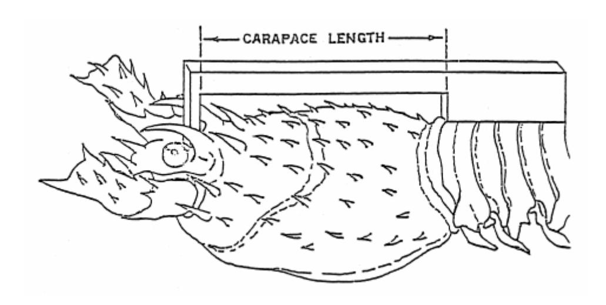

**Figure 1: Carapace Length of Lobsters** 

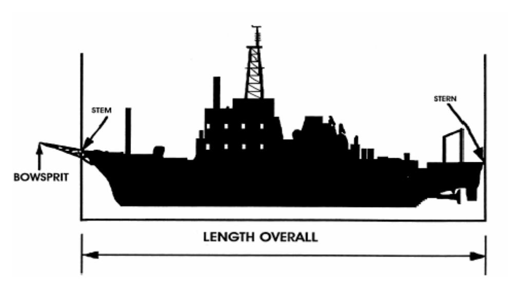

**Figure2: Length of Fishing Vessel** 

# **CHAPTER 11: REFERENCES**

- Adams T., P. Dalzell, E. Ledua. 1999. Ocean Resources. *In* M. Rappaport, ed. *The Pacific Islands Environment and Society*. The Bess Press: Honolulu.
- Ainley, D.G., T.C. Telfer and M.H. Reynolds. 1997. Townsends' and Newell's sheartwater (*Puffinus auricularis*). *The Birds of North America, No. 29*7 (A. Poole and F.Gill, Eds.). Philadelphia: The Academy of Natural Sciences; Washington, D.C.: The American Ornithologist's Union, 18 pp.
- Alcala, A. C. 1981. Fish yield of coral reefs of Sumilon Island, central Philippines. *Bulletin of the National Research Council of the Philippines.* 36:1–7.
- Alcala, A. C., and T. Luchavez. 1981. Fish yield of a coral reef surrounding Apo Island, central Visayas. *Proceedings of the Fourth International Coral Reef Symposium,* 69–73.
- Allen, T. F. H., and T. W. Hoekstra. 1992. *Toward a unified ecology*. New York: Columbia University Press.
- Amesbury, J. and R. Hunter-Anderson. 1989. *Native fishing rights and limited entry in Guam.* Western Pacific Regional Fishery Management Council, Honolulu.
- Amesbury, J., R. Hunter-Anderson and E. Wells. 1989. *Native fishing rights and limited entry in the CNMI*. Western Pacific Regional Fishery Management Council, Honolulu.
- Amesbury, J. and R. Hunter-Anderson. 2003. *Review of archaeological and historical data concerning reef fishing in the U.S. flag islands of Micronesia: Guam and the Northern Mariana Islands.* Final Report for the Western Pacific Regional Fishery Management Council, Honolulu, Hawaii.
- Anderson, P. J .2000. Pandalid shrimp as indicators of ecosystem regime shift. *J. Northw. Atl. Fish. Sci*. 27:1−10.
- Arenas, P. Hall, and M. Garcia. 1992. The association of tunas with floating objects and dolphins in the eastern pacific ocean. *In* VI. *Association of fauna with floating objects and dolphins in the EPO Inter-American tropical tuna commission* (unpublished). Inter-American Tropical Tuna Commission (IATTC), La Jolla, California. 38 pp.
- Arias-Gonzales, J. E., R. Galzin, J. Nielson, R. Mahon, and K. Aiken. 1994. Reference area as a factor affecting potential yield of coral reef fishes. *NAGA: The ICLARM Quarterly.* 17(4): 37–40.
- Austin O. 1949. The Status of Steller's Albatross. *Pacific Science.* 3. 283-295.
- Babcock, E.A., E.R. Pikitch, M.K. Murdoch, P. Apostolaki, and C. Santora. 2005. A

- perspective on the use of spatialized indicators for ecosystem-based fishery management through spatial zoning. *ICES Journal of Marine Science*. 62:469-476.
- Balazs, G.H. 1996. Behavioral changes within the recovering Hawaiian green turtle population. In: J.A. Keinath, D.E. Barnard, J.A. Musick, & B.A. Bell (compilers). *Proceedings of the 15th Annual Symposium on Sea Turtle Biology and Conservation*. NOAA Technical Memorandum NMFS-SEFSC-387. pp. 16-20.
- Balazs G. H., and M. Chalouka. 2004. Thirty-year recovery trend in the once depleted Hawaiian green sea turtle stock. *Biological Conservation.* 117:491–498.
- Balazs, G. H., and S. Hau. 1986. Geographic distribution: *Lepidochelys olivacea* in Hawaii. *Herpetological Rev*iew. 17(2):51.
- Balazs, G. H., Craig, P., Winton, B. R. and Miya, R. K. 1994. Satellite telemetry of green turtles nesting at French Frigate Shoals, Hawaii, and Rose Atoll, American Samoa. In: Bjorndal, K. A., Bolten, A. B., Johnson, D. A. and Eliazar, P. J. (eds), *Proc. 14th Ann. Symp. on Sea Turtle Biology and Conservation*. NOAA Tech Memo NMFSSEFSC-351., pp. 184–187.
- Bakun. A. 1996. *Patterns in the ocean*. La Jolla, CA: California Sea Grant.
- Bank of Hawaii (BOH). 1997. American Samoa Economic Report. Bank of Hawaii. Honolulu.
- Bartlett, G. 1989. Juvenile *Caretta* off Pacific coast of Baja California. *Noticias Caguamas. 2*:1– 10.
- Bigg, G. 2003. *The oceans and climate* (2nd ed.). Cambridge, England: Cambridge University Press.
- Birkeland, C. (Ed.). 1997. *Life and death of coral reefs.* New York: Chapman and Hall
- Birkeland, C. 1997. Status of coral reefs in the Marianas. In R. W. Grigg and C. Birkeland (Eds.), *Status of Coral Reefs in the Pacific* (pp. 91–100). Honolulu, Hawaii: University of Hawaii Sea Grant College Program.
- Bjorndal, K. A. 1997. Foraging ecology and nutrition of sea turtles. In P. L. Lutz and J. A. Musick (Eds.), *The biology of sea turtles*. Boca Raton, FL: CRC Press.
- Bjorndal, K.A., Wetherall, J.A., Bolten, A.B., and Mortimer, J.A. 1999. Twenty-six years of green turtle nesting at Tortuguero, Costa Rica: an encouraging trend. *Conservation Biol*. 13:126-134**.**
- Bjorndal, K. A., A. B. Bolten, and M. Y. Chaloupka. 2000. Green turtle somatic growth model: evidence for density dependence. *Ecol. Applic*. 10:269–282.

- Boehlert, G. W., and B. C. Mundy. 1993. Ichthyoplankton assemblages at seamounts and oceanic islands. *Bulletin of Marine Science.* 53(2):336–361.
- Browman, H. I., and K. I. Stergiou. 2004. Introduction. Perspectives on ecosystem-based approaches to the management of marine resources. *Marine Ecology Progress Series*. 274:269–303.
- Browman, H. I., and K. I. Stergiou. 2004. Marine protected areas as central element of ecosystem-based management: Defining their location, size, and number. Perspectives on ecosystem-based approaches to the management of marine resources. *Marine Ecology Progress Series*. 274:269–303.
- Central Intelligence Agency (CIA) World Fact Book. http://www.cia.gov/cia/publications/factbook/
- Chaloupka, M., and C. Limpus. 2001. Trends in the abundance of sea turtles resident in southern Great Barrier Reef waters. *Biological Conservation.* 102:235–249.
- Chan, E., and H. Liew. 1996. Decline of the leatherback population in Terengganu, Malaysia, 1956–1995. *Chelonian Conservation Biol*ogy. 2(2). 196–203.
- Chave, E. H., and B. C. Mundy. 1994. Deep-sea benthic fish of the Hawaiian Archipelago, Cross Seamount, and Johnston Atoll. *Pacific Science.*48:367–409.
- Christensen, N. L., A. M. Bartuska, J. H. Brown, S. Carpenter, C. Dantonio, R. Francis, J. F. Franklin, J. A. Macmahon, R. F. Noss, D. J. Parsons, C. H. Peterson, M. G. Turner, and R. G. Woodmansee. 1996. The report of the Ecological Society of America committee on the scientific basis for ecosystem applications. *Ecological Applications*. 6(3):665–691.
- Calambokidis J., G. Steiger, J. Straley, T. Quinn II, L. Herman, S. Cerchio, D. Salden, M. Yamaguchi, F. Sato, J. Urban, R. Jacobsen, O. von Ziegesar, K. Balcomb, C. Gabriele, M. Dahlheim, N. Higashi, S. Uchida, J. Ford, Y. Miyamura, P. de Guevara, S. Mizroch, L. Schlender, K. Rasmussen. 1997. *Abundance and population structure of Humpback whales in the North Pacific Basin (Final Report)*. Cascadia Research Collective. Contract #50ABNF500113 report.
- Cliffton K., D. Cornejo, R., and Felger. 1982. Sea turtles of the Pacific coast of Mexico. In K. Bjorndal (Ed.), *Biology and conservation of sea turtles* (pp. 199–209). Washington, DC: Smithsonian Institution Press.
- Clark, A. and D. Gulko. 1999. Hawaii's State of the Reefs Report, 1998. Report to the Department of Land and Natural Resources, Honolulu, Hawaii.
- Coles, R. and Kuo, J. 1995. Seagrasses. In: *Marine and Coastal Biodiversity in the*

- *Tropical Island Pacific Region, Volume 1, Systematics and Information Management Priorities*. J.E. Maragos, M.N.. Peterson, L.C. Eldredge, J.E. Bardach & H.F. Takeuchi. Editors. East-West Center Honolulu. 39-57.
- Colin, P.L., D.M Devaney, L. Hills-Colinvaux, T.H. Suchanek, and J.T. Harrison, III. 1986. Geology and biological zonation of the reef slope, 50-360 m depth at Enewetak Atoll, Marshall Islands. *Bull Mar. Sci.* 38(1):111-128.
- Coutures, E. 2003. The biology and artisanal fishery of lobsters of American Samoa. *DMWR Biological Report Series, No 103.*
- Crosby M.P., and Reese E.S.1996. *A Manual for Monitoring Coral Reefs with Indicator Species: Butterflyfishes as Indicators of Change on Indo Pacific Reefs*. Silver Spring, MD: Office of Ocean and Coastal Resource Management, NOAA. 45 pp.
- Dalzell, P. 1996. Catch rates, selectivity and yields of reef fishing. In N.V.C. Polunin and C. Roberts (Eds.), *Tropical reef fisheries* (pp. 161–192). London: Chapman & Hall: London.
- Dalzell, P., and T. Adams. 1997. Sustainability and management of reef fisheries in the Pacific Islands. *Proceedings of the Eighth International Coral Reef Symposium,* 2027–2032.
- Dalzell, P., T. J. H. Adams, and N. V. C. Polunin. 1996. Coastal fisheries in the Pacific islands. *Oceanography and Marine Biology: An Annual Review*. 34:395–531.
- Dam, R., and C. Diez. 1997a. Diving behavior on immature hawksbill turtle (*Eretmochelys imbricata*) in a Caribbean reef habitat*. Coral Reefs.*16:133–138.
- Dam, R., and C. Diez. 1997b. Predation by hawksbill turtles on sponges at Mona Island, Puerto Rico. *Proceedings of Eighth International Coral Reef Symposium, Vol. 2,* 1412–1426.
- Davenport J., and G. Balazs. 1991. Fiery bodies—Are pyrosomas an important component of the diet of leatherback turtles? *British Herpetological Society Bulletin*. 31:33–38.
- Dayton P. K., Thrush, S. F., and Coleman, F. C. 2002. *Ecological effects of fishing in marine ecosystems of the United States.* Arlington, VA: Pew Oceans Commision.
- DeGange A. 1981. The short-tailed albatross, *Diomedea albatrus*, its status, distribution and natural history. Unpublished report. U.S. Fish and Wildlife Service. 36p.
- de Young, B., M. Heath, F. Werner, F. Chai, B. Megrey, and P. Monfrey. 2004. Challenges of modeling ocean basin ecosystems. *Science.* 304:1463–1466.
- Dobbs, K. 2001. *Marine turtles in the Great Barrier Reef World Heritage Area*(1st ed.). Townsville, Queensland, Australia: Great Barrier Reef Park Authority.

- Dodd, C. K., Jr. 1988. Synopsis of the biological data on the loggerhead sea turtle *Caretta caretta* (Linnaeus 1758). *U.S. Fish and Wildlife Service Biological Report.* 88(14).
- Duron, M. 1978. *Contribution a L'Etude de la Biologie de Dermochelys Coriacea dans les Pertuis Charentais.* Doctoral dissertation, L'Universite de Bordeaux.
- Dutton, P., Bowen, B., Owens, D., Barragán, A., and Davis. S. 1999. Global phylogeography of the leatherback turtle (*Dermochelys coriacea*). *Journal of Zoology*. 248:397–409.
- Dye, T. S., and E. R. Graham. 2004. Review of archaeological and historical data concerning reef fishing in Hawaii and American Samoa. Final report to the Western Pacific Regional Fishery Management Council. Honolulu, Hawaii.
- Dyer, C., and J. R. McGoodwin. (Eds.). 1994. *Folk management in the world's fisheries.* . Niwot, CO: University of Colorado Press.
- Eckert, K. L. 1993. *The biology and population status of marine turtles in the North Pacific Ocean* (NOAA Tech. Memo, NOAA-TM-NMFS-SWFSC-186, 156 pp.). La Jolla, CA: National Marine Fisheries Service, Southwest Region.
- Eckert, S. A. 1998. Perspectives on the use of satellite telemetry and other electronic technologies for the study of marine turtles, with reference to the first year-long tracking of leatherback sea turtles, p. 294. In: *Proceedings of the Seventeenth 21 Annual Sea Turtle Symposium*. S. P. Epperly and J. Braun (eds.). NOAA Technical Memorandum NMFS-SEFC-415, Miami.
- Eckert, S. 1999. *Habitats and migratory pathways of the Pacific leatherback sea turtle* (Final report to NMFS, Office of Protected Resources, 15 pp.). San Diego, CA: Hubbs– SeaWorld Research Institute
- Eckert S., D. Nellis, K. Eckert, G. Kooyman. 1986. Diving patterns of two leatherback ea turtles (*Dermochelys coriacea*) during interesting intervals at Sandy Point, St. Croix, U.S. Virgin Islands. *Herpetologica: 4*2. 381-388.
- Eckert, K.L. and S.A. Eckert. 1988. Pre-reproductive movements of leatherback turtles (*Dermochelys coriacea*) nesting in the Caribbean. *Copeia* 1988(2):400-406.
- Ecosystem Principles Advisory Panel. 1999. *Ecosystem-based fishery management: A report to Congress.* Silver Springs, MD: NOAA National Marine Fisheries Service.
  - Faleomavaega, E. F. H. 2002. Statement before the American Samoa legislature. 6 p.
  - Food and Agriculture Organization of the United Nations. 1995. *Code of conduct for responsible fisheries.* Rome.

- Food and Agriculture Organization of the United Nations. 1999. *Indicators for sustainable development of marine capture fisheries: FAO guidelines for responsible fisheries.* Rome.
- Food and Agriculture Organization of the United Nations. 2002. *FAO guidelines on the ecosystem approach to fisheries*. Rome.
- Forney K., J. Barlow, M. Muto, M. Lowry, J. Baker, G. Cameron, J. Mobley, C. Stinchcomb, J. Carreta. 2000. *Draft U.S. Pacific Marine Mammal Stock Assessments: 2000*. NMFS Southwest Fisheries Science Center: La Jolla.
- Francis, R.I.C.C. and D.C. Smith. 1995. Mean length, age, and otolith weight as potential indicators of biomass depletion for orange roughy, Hoplostethus atlanticus. *New Zealand Journal of Marine and Freshwater Research*. 29: 581-587.
- Garcia, S., and A. Demetropolous. 1986. Management of Cyprus fisheries*. FAO Fisheries Technical Paper No. 250*.
- Garcia, S.M., and Staples, D.J. 2000. Sustainability reference systems and indicators for responsible marine capture fisheries: a review of concepts and elements for a set of guidelines. *Marine and Freshwater Research,* 51: 385-426.
- Garcia, S. M., A. Zerbi, C. Aliaume, T. Do Chi, and G. Lasserre. 2003. The ecosystem approach to fisheries: Issues, terminology, principles, institutional foundations, implementation, and outlook. *FAO Fisheries Technical Paper No. 443*.
- Gonsalez, O. J. 1996. Formulating an ecosystem approach to environmental protection. *Environmental-Management*. 20(5):597–605.
- Grant, G.S. 1994. Juvenile leatherback turtle caught by longline fishing in American Samoa. *Mar. Turtle Newsl*. 66:3-5.
- Grant, G.S., P. Craig and G.H. Balazs. 1997. Notes on juvenile hawksbill and green turtles in American Samoa. *Pacific Science*. 51 (1): 48-53.
- Green, A. 1997. *An Assessment of the Status of the Coral Reef Resources, and Their Patterns of Use in the U.S. Pacific Islands*. Final report prepared for the Western Pacific Regional Fishery Management Council, Honolulu, Hawaii.
- Green D. and F. Ortiz-Crespo. 1982. Status of sea turtle populations in the central eastern Pacific. *In* K. Bjorndal, ed. *Biology and Conservation of Sea Turtles*. Smithsonian Institution Press: Washington, D.C. 1-583.
- Grigg, R. 1976. Fishery management of precious and stoney corals in Hawaii. Sea Grant Tech. Rept. UNIHI-SEAGRANT-TR-77-03, University of Hawaii, Honolulu.

- Grigg, R. 1983. Community structure, succession and development of coral reefs in Hawaii. *Mar. Ecol. Prog. Ser. 11*:1-14.
- Grigg, R. 1993. Precious coral fisheries of Hawaii and the U.S. Pacific Islands. *Marine Fisheries Review. 55*(2):50–60.
- Gulko, D. 1998. *Hawaiian coral reef ecology*. Honolulu, HI: Mutual Publishing.
- Haight, W. 1989. *Trophic relationships, density and habitat associations of deepwater snappers (Lutjanidae) at Penguin Bank, Hawaii.* Master's thesis, University of Hawaii.
- Harrison, C.S. 1990. *Seabirds of Hawaii: natural history and conservation*. Cornell University Press, Ithaca, NY. 249 pp.
- Hamnett M. and W. Pintz, 1996. *The contribution of tuna fishing and transshipment to the economies of American Samoa, the Commonwealth of the Northern Mariana Islands, and Guam*. Pelagic Fisheries Research Program. SOEST 96-05. JIMAR Contribution 96- 303. 37p.
- Hampshire, K., S. Bell, G., Wallace, and F. Stepukonis. 2004. "Real" poachers and predators: Shades of meaning in local understandings of threats to fisheries*. Society and Natural Resources*. 17(4).
- Harrison, C. 2005.*Pacific Seabirds*. 32(1).
- Hasegawa H. 1979. Status of the short-tailed albatross of Torishima and in the Senkaku Retto in 1978-79. *Pacific Seabird Group Bulletin* 6: 806-814.
- Hatcher, B. G., R. E. Johannes, and A. I. Robertson. 1989. Review of research relevant to the conservation of shallow tropical marine ecosystems. *Oceanography and Marine Biology: An Annual Review.* 27: 337—414.
- Herman, L. M., P. H. Forestell, and R. C. Antinoja. 1980. The 1976/1977 migration of humpback whales into Hawaiian waters: composite description. Rep. MMC-77/19 for the U.S. Mar. Mammal Comm., Wash., D.C., 55 p. NTIS PB80-162332.
- Hilborn, R. 2004. Ecosystem-based fisheries management: the carrot for the stick?: Perspectives on ecosystem-based approaches to the management of marine resources. *Marine Ecology Progress Series*. 274:269–303.
- Hildreth, R., M. C. Jarman, and M. Landlas. 2005. Roles for precautionary approach in marine resources management. In A. Chircop and M. McConnel (Eds.), *Ocean yearbook 19*. Chicago: University of Chicago Press.
- Hill P. and D. DeMaster. 1999. *Alaska marine mammal stock assessments 1999*. National Marine Mammal Laboratory, NMFS Alaska Fisheries Science Center. Seattle.

- Hill P., D. DeMaster, R. Small. 1997. *Alaska Marine Mammal Stock Assessments, 1996.* U.S. Pacific Marine Mammal Stock Assessments: 1996. U.S. Dept. of Commerce, NOAA, Tech. Memo., NMFS, NOAA-0TM-NMFS-AFSC-78. 149p.
- Hodge R. and B. Wing. 2000. Occurrence of marine turtles in Alaska Waters: 1960-1998. *Herpetological Review*. 31:148-151.
- Holthus, P. F., and J. E. Maragos. 1995. Marine ecosystem classification for the tropical island Pacific. In J. E. Maragos, M. N. Peterson, L. G. Eldredge, J. E. Bardach, and H.E. Takeuchi (Eds.), *Marine and coastal biodiversity in the tropical island Pacific region* (pp. 239–278). Honolulu, HI: Program on Environment, East–West Center.
- Hopley, D., and D. W. Kinsey. 1988. The effects of a rapid short-term sea level rise on the Great Barrier Reef. In G. I. Pearman (Ed.), *Greenhouse: planning for a climate change* (pp. 189–201). New York: E. J. Brill.
- Horwood J. 1987. *The Sei Whale: Population Biology, Ecology and Management*. Croom Helm. London.
- Hunter, C. 1995. *Review of coral reefs around American Flag Pacific Islands and assessment of need, value, and feasibility of establishing a coral reef fishery management plan for the Western Pacific Region* (Final report prepared for Western Pacific Regional Fishery Management Council). Honolulu, Hawaii: Western Pacific Regional Fishery Management Council.
- Huston, M. A. 1985. Patterns of species diversity on coral reefs. *Annual Review of Ecological Systems.* 6:149–177.
- ICES. 2000. Ecosystem effects of fishing: Proceedings of an ICES/SCOR Symposium. *ICES Journal of Marine Science*. 57(3):465–791.
- ICES. 2005*. ICES Journal of Marine Science*. 62(4):307–614.
- Itano, D. 1996. The development of small-scale fisheries for bottomfish in American Samoa (1961-1987). *South Pacific Commission Fisheries Newsletter No. 76 and No. 77.*
- Jennings, S. 2004. The ecosystem approach to fishery management: A significant step towards sustainable use of the marine environment? Perspectives on ecosystem-based approaches to the management of marine resources. *Marine Ecology Progress Series*. 274:269–303.
- Johnson, M. W. 1968. On phyllamphion larvae from the Hawaiian Islands and the South China Sea (Palinuridea). *Crustaceana Supplement. 2:*38-46.

- Kamezaki, N., Y. Matsuzawa, O. Abe, H. Asakawa, T. Fujii, K. Goto, S. Hagino, M. Hayami, M. Ishii, T. Iwamoto, T. Kamata, H. Kato, J. Kodama, Y. Kondo, I. Miyawaki, K. Mizobuchi, Y. Nakamura, Y. Nakashima, H. Naruse, K. Omuta, M. Samejima, H. Suganuma, H. Takeshita, T. Tanaka, T. Toji, M. Uematsu, A. Yamamoto, T. Yamato, and I. Wakabayashi. 2003. Loggerhead turtles nesting in Japan. In A. B. Bolten and B. E. Witherington (Eds.), *Loggerhead sea turtles* (pp. 210–217). Washington, DC: Smithsonian Institution.
- Kanciruk, P. 1980. Ecology of juvenile and adult Palinuridae (spiny lobsters). Pages 59-92. In: J.S. Cob and B.F. Philips, editors. *The biology and management of lobsters, Vol. 2.* Academic Press, New York
- Kay, J. J., and E. Schneider. 1994. Embracing complexity: The challenge of the ecosystem approach. *Alternatives.* 20(3):32–39.
- Kitchell, J. F., C. H. Boggs, X. He, and C. J. Walters. 1999. Keystone predators in the central Pacific. Pages 665-704. In: *Alaska Sea Grant. Ecosystem approaches for fisheries management*. University of Alaska, Anchorage, Alaska, USA.
- Laffoley, D.d'A, Maltby, E., Vincent, M.A, Mee, L., Dunn, E., Gilliland, P., Hamer, J, Mortimer, D., and Pound, D. 2004. The Ecosystem Approach. Coherent actions for marine and coastal environments. A report to the UK Government. *English Nature*. 65 pp.
- Levington, J. S. 1995. *Marine biology*. New York: Oxford University Press.
- Limpus, C. J. 1982. The status of Australian sea turtle populations. In K. A. Bjorndal (Ed.), *Biology and conservation of sea turtles*. Washington, DC: Smithsonian Institution Press
- Limpus C. 1992. The hawksbill turtle, *Eretmochelys imbricata*, in Queensland: Population structure within a southern Great Barrier Reef feeding ground. *Wildlife Research* 19. 489– 506.
- Limpus, C. J., and D. Reimer. 1994. The loggerhead turtle, *Caretta caretta*, in Queensland: A population in decline. In R. James (Compiler). *Proceedings of the Australian Marine Turtle Conservation Workshop*: *November 14–17, 1990* Canberra, Australia: Australian Nature Conservation Agency.
- Link, J. S. 2002. Does food web theory work for marine ecosystems? *Marine Ecology Progress Series.* 230:1–9.
- Lubchencho, J., S. R. Palumbi, S. D. Gaines, and S. Andelman. 2003. Plugging a hole in the ocean: The emerging science of marine reserves. *Ecological Applications*. 13(Suppl.):S3–S7.

- Lutcavage M.E. and P.L. Lutz. 1997. Diving physiology. In P. L. Lutz and J. A. Musick*,* ed. *The biology of sea turtles*. CRC Press, Boca Raton. 432 pp.
- Lutcavage, M. E., P. Plotkin, B. Witherington, and P. L. Lutz. 1997. Human impacts on sea turtle survival. In P. L. Lutz and J. A. Musick (Eds.), *The biology of sea turtles* (pp. 387–409). Boca Raton, FL: CRC Press.
- MacDonald, C. 1986. Recruitment of the puerulus of the spiny lobster, *Panulirus marginatus*, in Hawaii. *Canadian Journal of Fisheries and Aquatic Sciences.* 43:2118– 2125.
- MacDonald, C., and J. Stimson. 1980. Population biology of spiny lobsters in the lagoon at Kure Atoll—preliminary findings and progress to date. In R. Grigg and R. Pfund (Eds.), *Proceedings of the Symposium on Status of Resource Investigations in the Northwestern Hawaiian Islands* (pp. 161–174)*.* April 24–25, 1980, Honolulu, Hawaii. (UNIHI-SEAGRANT-MR-80-04)
- Mace, P. 2004. In defense of fisheries scientists, single-species models and other scapegoats: Confronting real problems. Perspectives on ecosystem-based approaches to the management of marine resources. *Marine Ecology Progress Series*. 274:269–303.
- Maragos, J., and D. Gulko. 2002. *Coral reef ecosystems of the Northwestern Hawaiian Islands: Interim results emphasizing the 2000 surveys*. Honolulu, HI: U.S. Fish and Wildlife Service and the Hawaii Department of Land and Natural Resources.
- Marshall, N. 1980. Fishery yields of coral reefs and adjacent shallow water environments. Page 103. In: *Proceedings of an International Workshop on Stock Assessment for Tropical Small Scale Fisheries* (P.M. Roedel and S.B. Saila, Eds.). University of Rhode Island, Kingston.
- Marine Fisheries Advisory Committee (MAFAC) Ecosystem Approach Task Force. 2003. *Technical guidance for implementing an ecosystem-based approach to fisheries management.* Marine Fisheries Advisory Committee.
- MacDonald, C., and J. Stimson. 1980. "Population biology of spiny lobsters in the lagoon at Kure Atoll—preliminary findings and progress to date." In R. Grigg and R. Pfund (eds.), *Proceedings of the Symposium on Status of Resource Investigations in the Northwestern Hawaiian Islands.* April 24-25, 1980, Honolulu, Hawaii, p. 161-174. Univ. of Hawaii, Honolulu, HI UNIHI-SEAGRANT-MR-80-04.
- Marquez M. 1990. Sea turtles of the world. *An annotated and illustrated catalogue of sea turtle species known to date*. FAO species Catalog. FAO Fisheries Synopsis 11 (125). 81p.
- Marten, G. G., and J. J. Polovina. 1982. A comparative study of fish yields from various

- tropical ecosystems. In D. Paul and G. I. Murphy (Eds.),*Theory and management of tropical fisheries* (pp. 255–286). Manila, Philippines: ICLARM.
- Matsuzawa, Y. March 2005. *Nesting and beach management of eggs and pre-emergent hatchlings of pacific loggerhead sea turtles on Yakushima Island, Japan: April to September 2004*. Final Report to the Western Pacific Regional Fishery Management Council: Contract No. 04-WPC-011.
- McKeown, A. 1977. *Marine turtles of the Solomon Islands*. Honiara: Solomon Islands: Ministry of Natural Resources, Fisheries Division. .
- Meylan, A. 1985. The role of sponge collagens in the diet of the Hawksbill turtle, *Eretmochelys imbricata*. In A. Bairati and R. Garrone, (Eds.), *Biology of invertebrate and lower vertebrate collagens*. New York: Plenum Press .
- Meylan A. 1988. Spongivory in hawksbill turtles: A diet of glass. *Science.* 239. 393– 395.
- Moffitt, R. B. (1993). Deepwater demersal fish. In A. Wrightand L. Hill (Eds.), *Nearshore marine resources of the South Pacific* (pp. 73–95)*.* IPS (Suva), FFA (Honiara), ICOD (Canada).
- Munro, J. L. (Ed.). 1983. Carribean coral reef fishery resources. *ICLARM Studies and Reviews 7*.
- Munro, J. L. 1984. Coral reef fisheries and world fish production. *NAGA: The ICLARM Newsletter.* 7(4): 3–4.
- Murawski, S. 2005. *Strategies for incorporating ecosystems considerations in ecosystem management.* Managing Our Nations Fisheries II: Focus on the future. Washington D.C. March 24-26, 2005.
- National Marine Fisheries Service (NMFS). 1998. *Biological opinion on the fishery management plan for the pelagic fisheries of the Western Pacific Region: Hawaii Central North Pacific longline fishery.* La Jolla, CA: National Marine Fisheries Service, Southwest Region.
- National Marine Fisheries Service (NMFS). 2001. Final Environmental Impact Statement for the Fishery Management Plan for Pelagic Fisheries of the Western Pacific Region.
- National Marine Fisheries Service (NMFS). 2004. *Fisheries of the United States 2003*. Washington, DC: U.S. Government Printing Office.
- National Marine Fisheries Service (NMFS). 2005. Final Environmental Impact Statement: Seabird interaction avoidance methods and pelagic squid management. Fishery Management Plan for the Pelagic Fisheries of the Western Pacific Region. April 2005.

- National Oceanic and Atmospheric Administration (NOAA). 2004. New priorities for the 21st century. *NOAA's Strategic Plan Updated for FY 2005–FY 2010*.
- National Oceanic and Atmospheric Administration (NOAA). 2005. *Protecting America's Marine Environenent*. A report of the Marine Protected Areas Federal Advisory Committee on Establishing and Managing a National System of Marine Protected Areas. June 2005.
- National Oceanic and Atmospheric Administration (NOAA). 2005. *U.S. Pacific marine mammal stock assessments 2004.* J. V. Caretta, K. A. Forney, M .M. Muto, J. Barlow, J. Baker, B. Hanson, and M. Lowry. (NOAA Technical Memo NOAA-TM-NMFS-SWFSC-375)
- National Oceanic and Atmospheric Administration (NOAA). 2005. *The state of coral reef ecosystems of the United States and Pacific Freely Associated States.* (NOAA Technical Memo NOS NCCOS 11)
- Nichols, W. J., A. Resendiz, and C. Mayoral-Russeau. 2000. Biology and conservation of loggerhead turtles (*Caretta caretta)* in Baja California, Mexico. *Proceedings of the 19th Annual Symposium on Sea Turtle Conservation and Biology* (pp. 169–171). March 2–6, 1999, South Padre Island, Texas.
- Nunn, P. 2003. *Geomorphology. The Pacific Islands: Environment and society*. Honolulu: HI: The Bess Press
- Olson D., A. Hitchcock, C. Mariano, G. Ashjian, G. Peng, R. Nero, and G. Podesta. 1994. Life on the edge: Marine life and fronts. *Oceanography*. 7(2):52–59.
- Parker, D. M., W. Cooke, and G. H. Balazs. 2002. Dietary components of pelagic loggerhead turtles in the North Pacific Ocean. *Proceedings of the 20th Annual Sea Turtle Symposium*  (pp. 148–149). February 29–March 4, 2000, Orlando, Florida.
- Parrish, J. D. (1987). The trophic biology of snappers and groupers. In J. J. Polovina and S. Ralston (Eds.), *Tropical snappers and groupers: Biology and fisheries* management (pp. 405–464). Boulder, CO: Westview Press.
- Parrish, F. 1989. Identification of habitat of juvenile snappers in Hawaii. *Fishery Bulletin.*  87:1001–1005.
- Parrish, F., and J. Polovina. 1994. Habitat thresholds and bottlenecks in production of the spiny lobster (*Panulirus marginatus*) in the Northwestern Hawaiian Islands. *Bulletin of Marine Science. 54*(1):151–163.
- Pauly, D., Christensen, V., Dalsgaard, J., Froese, R., and F. Torres, Jr. 1998. Fishing down marine food webs. *Science*279: 860–863.

- Pikitch, E. K., C. Santora, E. Babcock, A. Bakun, R. Bonfil, D. O. Conover, P. Dayton, P. Doukakis, D. Fluharty, B. Heneman, E. D. Houde, J. Link, P. A. Livingston, M. Mangel, M. K. McAllister, J. Pope, and K. J. Sainsbury. 2004. Ecosystem-based fishery management. *Science*. 305:1–2.
- Pitcher, C.R. (1993) Chapter 17: Spiny Lobster, pp. 543-611. In: *Inshore Marine Resources of the South Pacific: Information for fishery development and management* (A. Wright and L. Hill, eds.), FFA/USP Press, Fiji.
- Plotkin, P.T. 1994. *The migratory and reproductive behavior of the olive ridley, Lepidochelys olivacea (Eschscholtz, 1829), in the eastern Pacific Ocean*. Ph.D. Thesis, Texas A&M Univ., College Station.
- Polunin, N. V. C., and R. D. Morton. 1992. *Fecundity: Predicting the population fecundity of local fish Populations subject to varying fishing mortality.* Unpublished report, Center for Tropical Coastal Management, University of Newcastle upon Tyne, Newcastle.
- Polunin, N. V. C., & C. Roberts. (Eds.). 1996. *Tropical reef fisheries.* London: Chapman & Hall.
- Polovina, J.J. 1984. Model of a coral reef ecosystem: 1. The ECOPATH model and its application to FFS. Coral Reefs 3: 1-11.
- Polovina, J. J. E. 2005. Climate variation, regime shifts, and implications for sustainable fisheries. *Bulletin of Marine Science*. 76(2)233–244.
- Polovina, J. J., E. Howell, D. R., Kobayashi, and M. P. Seki. 2001. The transition zone chlorophyll front, a dynamic global feature defining migration and forage habitat for marine resources. *Progress in Oceanography*. 49:469–483.
- Polovina J., D. Kobayashi, D. Parker, M. Seki, and G. Balazs. 2000. Turtles on the edge: Movement of loggerhead turtles (*Caretta caretta*) along oceanic fronts, spanning longline fishing grounds in the central North Pacific, 1997–1998. *Fisheries Oceanography.* 9:71– 82.
- Polovina, J. J. E., G. Mitchum, N. Graham, M. Craig, E. DeMartini, and E. Flint. 1994. Physical and biological consequences of a climate event in the central North Pacific. *Fisheries Oceanography*. 3:15–21.
- Polovina, J., and R. Moffitt. 1995. "Spatial and temporal distribution of the phyllosoma of the spiny lobster, *Panulirus marginatus*, in the Northwestern Hawaiian Islands." *Bull. Mar. Sci. 56*:406-417.
- Polunin, N. V .C., C. M. Roberts, and D. Pauly. 1996. Developments in tropical reef fisheries science and management. In N. V.C. Polunin and C. Roberts (Eds.), *Tropical reef fisheries* (. London: Chapman & Hall.

- Polovina, J. J., G. H. Balazs, E. A. Howell, D. M. Parker, M. P. Seki, and P. H. Dutton. 2004. Forage and migration habitat of loggerhead (Caretta caretta) and olive ridley (*Lepiodchelys olivacea*) sea turtles in the central North Pacific Ocean. *Fish. Oceanogr*. 13:36-51.
- Postma, H., and J. J. Zijlstra. (Eds.). 1988. *Ecosystems of the World 27: continental shelves.* Amsterdam: Elsevier.
- Ralston, S. 1979. *A description of the bottomfish fisheries of Hawaii, American Samoa, Guam and the Northern Marianas*. Western Pacific Regional Fishery Management Council, Honolulu.
- Ralston, S., M. Gooding, and G. Ludwig. 1986. An ecological survey and comparison of bottomfish resource assessments (submersible versus hand-line fishing) at Johnston Atoll. *Fishery Bulletin* 84(1):141–155.
- Ralston, S., and H. A. Williams. 1988. *Depth distributions, growth, and mortality of deep slope fishes from the Mariana Archipelago.* (*NOAA Technical Memo NMFS*)
- Reeves R., S. Leatherwood, G. Stone , L. Eldridge. 1999. *Marine mammals in the area served by the South Pacific Regional Environment Programme (SPREP)*. South Pacific Regional Environment Programme: Apia, Samoa. 48p.
- Reina, R .D., P. A. Mayor, J. R. Spotila, R. Piedra, and F. V. Paladino. 2002. Nesting ecology of the leatherback turtle, *Dermochelys coriacea*, at Parque Nacional Marino Las Baulas, Costa Rica: 1988–1989 to 1999–2000. *Copeia 3*:653–664.
- Rice D. 1989. Sperm whale *Physeter macrocephalus*. *Academic Press*. 442p.
- Robertson D. 1980. *Rare birds of the West Coast of North America*. Woodcock Publications: Pacific Grove, CA. 6-9.
- Rogers, A. D. 1994. The biology of seamounts. *Advances in Marine Biology*. 30:305– 350.
- Russ, G. R., and A. C. Alcala. 1994. Marine reserves: They enhance fisheries, reduce conflicts and protect resources. *Naga: The ICLARM Quarterly*. 17(3):4–7.
- Sarti L., S. Eckert, N. Garcia, and A. Barragan. 1996. Decline of the world's largest nesting assemblage of leatherback turtles. *Marine Turtle Newsletter.* 74:2–5.
- Saucerman, S. 1995. Assessing the management needs of a coral reef fishery in decline. In P. Dalzell and T. J. H. Adams (Eds.),*South Pacific Commission and Forum Fisheries Agency Workshop on the Management of South Pacific Inshore Fisheries* (pp. 441–445).

- Manuscript Collection of Country Statements and Background Papers, South Pacific Commission, Noumea.
- Schrope, M. 2002. Troubled waters. *Nature*. 418:718–720.
- Seminoff, J., W. Nichole, and A. Hidalgo. 2000. Chelonia mydas agassizii diet. *Herpetological Review.* 31:103.
- Severance, C. and R. Franco. 1989. *Justification and design of limited entry alternatives for the offshore fisheries of American Samoa, and an examination of preferential fishing rights for native people of American Samoa within a limited entry context*. Western Pacific Fishery Management Council, Honolulu.
- Severance, C., R. Franco, M. Hamnett, C. Anderson and F. Aitaoto. 1999. *Effort comes from the cultural side: coordinated investigation of pelagic fishermen in American Samoa*. Draft report for Pelagic Fisheries Research Program, JIMAR/SOEST, Univ. Hawaii – Manoa. Honolulu.
- Sherburne J. 1993. Status Report on the Short-tailed Albatross *Diomedea albatrus*. Unpublished Report for FWS, Alaska Natural Heritage Program. 33p.
- Sherman, K. and M. Alexander. 1986. *Variability and Management of Large Marine Ecosystems*. Boulder: Westerview Press.
- Sissenwine, M. and S. Murawski. 2004. Moving beyond 'intelligent tinkering': Advancing an ecosystem approach to fisheries. Perspectives on ecosystem-based approaches to the management of marine resources. *Marine Ecology Progress Series*. 274:269–303.
- Smith, S. V. 1978. Coral-reef area and the contributions of reefs to processes and resources in the world's oceans. *Nature*.273: 225–226.
- Secretariat of the Pacific Community (SPC). http://www.spc.org.nc/demog/pop\_data2000.html
- Spotila J., A. Dunham, A. Leslie, A. Steyermark, P. Plotkin, and F. Paladino. 1996. Worldwide population decline of Dermochelys coriacea: Are leatherback turtles going extinct? *Chelonian Conservation Biology*. 2(2):209–222.
- Spotila, J.R., Reina, R.D., Steyermark, A.C., Plotkin, P.T. and Paladino, F.V. 2000. Pacific leatherback turtles face extinction. *Nature.* 405:529-530.
- Starbird, C. H., and M. M. Suarez. 1994. Leatherback sea turtle nesting on the north Vogelkop coast of Irian Jaya and the discovery of a leatherback sea turtle fishery on Kei Kecil Island. Fourteenth *Annual Symposium on Sea Turtle Biology and* Conservation (p. 143). March 1– 5, 1994, Hilton Head, South Carolina.

- Stevenson, D. K., and N. Marshall. 1974. Generalizations on the fisheries potential of coral reefs and adjacent shallow-water environments. *Proceedings of the Second International Coral Reef Symposium* (pp. 147–156). University of Queensland, Brisbane.
- Stinson, M. L. 1984. *Biology of sea turtles in San Diego Bay, California, and in the northeastern Pacific Ocean*. Master of Science thesis, San Diego State University, California. 578 p.
- Sturman, A. P., and H. McGowan. 2003. *Climate. The Pacific Islands: Environment and society*. M. Rapaport (Ed.). Honolulu, Hawaii: The Best Press.
- Tansley, A. G. 1995. The use and abuse of vegetational concepts and terms. *Ecology*. 16: 284– 307.
- Territorial Planning Commission and Department of Commerce. 2000. American Samoa's comprehensive economic development strategy year 2000. American Samoa Government. 49 p.
- Thompson P. and W. Freidl. 1982. A long term study of low frequency sound from several species of whales off Oahu, Hawaii*. Cetology* 45. 1-19.
- Tickell W. 1973. A visit to the breeding grounds of Steller's albatross, *Diomedea albatrus*. *Sea Swallow.* 23: 1-4.
- Tomczak, M., and J. S. Godfrey. 2003. *Regional oceanography: An introduction* (2nd ed.). Dehli, India: Daya Publishing House. (http://gaea.es.flinders.edu.au/~mattom/regoc/pdfversion.html)
- Troeng, S., and E. Rankin. 2005. Long-term conservation efforts contribute to positive green turtle (*Chelonia mydas*) nesting trend at Tortuguero, Costa Rica. *Biological Conservation. 121*:111–116.
- Uchida, R., and J. Uchiyama (Eds.). 1986. *Fishery atlas of the Northwestern Hawaiian Islands*(NOAA Tech. Rep. NMFS 38). Silver Springs, MD: NOAA National Marine Fisheries Service.
- Uchida, R., J. Uchiyama, R. Humphreys, Jr., and D. Tagami. 1980. Biology, distribution, and estimates of apparent abundance of the spiny lobster, *Panulirus marginatus* (Quoy and Gaimard), in waters of the Northwestern Hawaiian Islands: Part I. Distribution in relationship to depth and geographical areas and estimates of apparent abundance. Part II. Size distribution, legal to sublegal ratio, sex ratio, reproductive cycle, and morphometric characteristics." InR. Grigg and R. Pfund (Eds.), *Proceedings of the Symposium on Status of Resource Investigations in the Northwestern Hawaiian Islands*. April 24-25, 1980, Honolulu, Hawaii. Honolulu, HI: University of Hawaii Press. (UNIHI-SEAGRANT-MR-80-04)

- U.S. Fish and Wildlife Service.1994. *Ecosystem approach to fish and wildlife management.*. Washington, DC: U.S. Department of Interior.
- U.S. Ocean Action Plan. 2004.*The Bush Administration's response to the U.S. Ocean Commission on Policy.* Washington, DC: U.S. Government Printing Office.
- United Nations Global Environmental Outlook. 2004. http://www.unep.org/geo/yearbook/yb2004/104.htm
- Valiela, I. 2003. *Marine ecological processes* (2nd ed.). New York: Springer.
- Veron, J. E. N. 1995. Corals of the tropical island Pacific region. In J. E. Maragos, M. N. A. Peterson, L. G. Eldredge, J. E. Bardach, and H. F. Tekeuchi (Eds.) *Marine and coastal biodiversity in the tropical island Pacific region:* Vol. 1. *Species systematics and information management priorities* (pp. 75–82). . Honolulu, HI: The East–West Center.
- Wakeford, R. 2005. Personal Communication at the April 18–22, 2005, Ecosystem Science and Management Planning Workshop. Convened by the Western Pacific Fishery Management Council. Honolulu, Hawaii.
- Walters, C. 2005. Personal Communication at the April 18–22, 2005 Ecosystem Science and Management Planning Workshop. Convened by the Western Pacific Fishery Management Council. Honolulu, Hawaii.
- Warham, J. 1990. The Shearwater Genus Puffinus. In: *The petrels: their ecology and breeding system.,* Academic Press Limited, San Diego. pp. 157-170.
- Wass, R. C. 1982. The shoreline fishery of American Samoa: Past and present. In J. L. Munro (Ed.), *Marine and coastal processes in the Pacific: Ecological aspects of coastal zone management* (pp. 51–83). Jakarta, Indonesia: UNESCO.
- Wells, S. M., and M. D. Jenkins. 1988. *Coral reefs of the world. Vol. 3: Central & Western Pacific.* New York: United Nations Environment Programme /International Union for the Conservation of Nature.
- Western Pacific Regional Fishery Management Council (WPRMFC). 1983. Fishery Management Plan for Crustacean Fisheries of the Western Pacific Region. Honolulu, Hawaii
- Western Pacific Regional Fishery Management Council (WPRFMC). 2000. Prohibition on fishing for pelagic management unit species within closed area around the islands of American Samoa by vessels more than 50 ft in length. Framework measure under FMP for Pelagic Fisheries of the Western Pacific Region. Honolulu, Hawaii.

- Western Pacific Regional Fishery Management Council (WPRFMC). 2001. Final Environmental Impact Statement for Coral Reef Ecosystems Fishery Management Plan of the Western Pacific Region.
- Western Pacific Regional Fishery Management Council (WPRFMC). 1999. Bottomfish and seamount groundfish fisheries of the Western Pacific Region 1998 annual report. Western Pacific Regional Fishery Management Council, Honolulu, Hawaii.
- Western Pacific Regional Fishery Management Council (WPRFMC). 2001. Final Environmental Impact Statement for Coral Reef Ecosystems Fishery Management Plan of the Western Pacific Region.
- Western Pacific Regional Fishery Management Council (WPRFMC). 2003. Bottomfish and Seamount Groundfish Fisheries of the Western Pacific Annual Report, 2001. Western Pacific Regional Fishery Management Council, Honolulu, Hawaii.
- Western Pacific Regional Fishery Management Council (WPRFMC). 2004. Bottomfish and Seamount Groundfish Fisheries of the Western Pacific Annual Report, 2002. Western Pacific Regional Fishery Management Council, Honolulu, Hawaii.
- Western Pacific Regional Fishery Management Council (WPRFMC). 2004. Pelagic fisheries of the Western Pacific Region: 2002 Annual Report. Western Pacific Fishery Regional Management Council, Honolulu, Hawaii.
- Western Pacific Regional Fishery Management Council (WPRFMC). 2005. Bottomfish and Seamount Groundfish Fisheries of the Western Pacific Annual Report, 2003.Western Pacific Regional Fishery Management Council, Honolulu, Hawaii.
- Wetherall, J. A. 1993. Pelagic distribution and size composition of turtles in the Hawaii longline fishing area. In G. H. Balazs and S. G. Pooley (Eds.), *Research plan to assess marine turtle hooking mortality: Results of an expert workshop held in Honolulu, Hawaii, November 16–18, 1993*. (SWFSC Administrative Report H-93-18)
- White, A.T. 1988. The effect of community managed marine reserves in the Philippines on their associated coral reef fish populations. *Asian Fish. Sci.* 2: 27-41.
- Wilson, R. R., and R. S. Kaufman. 1987. Seamount biota and biogeography. *Geophysics Monographs.* 43:355–377.
- Witherell, D., C. Pautzke, and D. Fluharty. 2000. An ecosystem-based approach for Alaska groundfish fisheries. *ICES Journal of Marine Science*. 57:771-777.
- Wolman, A.A. and C.M. Jurasz. 1977. Humpback whales in Hawaii: vessel census, 1976. Mar. Fish. Rev. 39(7):1-5.

- Yaffee, S. L. 1999. Three faces of ecosystem management. *Conservation Biology*. 13(4):713– 725.
- Zug, G. R., G. H. Balazs, and J. A. Wetherall. 1995. Growth in juvenile loggerhead sea turtles (*Caretta caretta*) in the North Pacific pelagic habitat. *Copeia* 1995(2):484–487.