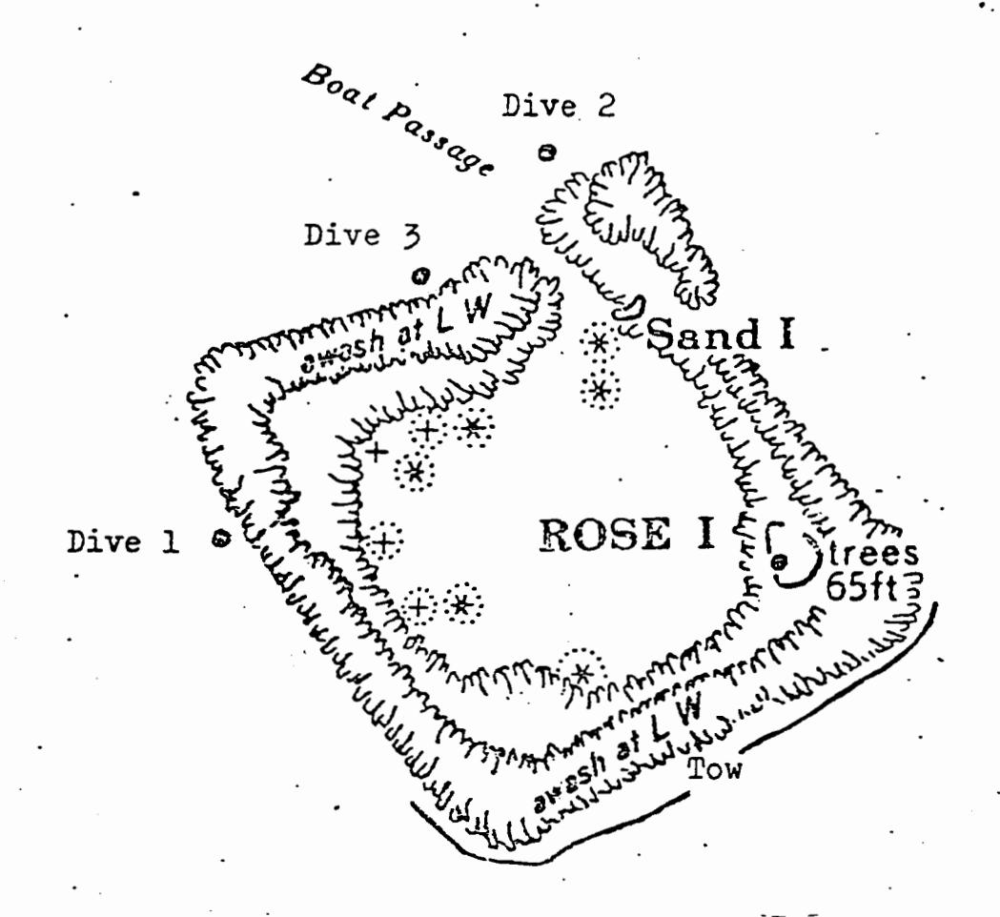

## THE FISHES OF ROSE ATOLL - Supplement I

by Richard C. Wass

Dept. of Marine and Wildlife Resources biological report series no. 5

A previous paper titled THE FISHES OF ROSE ATOLL discusses the results of a fish survey conducted November 12-13, 1980 within the four lagoon habitats of Rose Atoll, American Samoa. The present paper supplements the original effort by listing and discussing the fishes observed within the Reef Front Habitat which is the major habitat outside the lagoon. Additional species occurring within the lagoon and species records unique to Rose Atoll are also listed.

The survey described herein was conducted March 23-25, 1982. Observations were made during three SCUBA dives and while being towed on the surface behind an outboard-powered skiff at the locations noted in Figure 1. As in the previous study, the observer simply listed every species seen. Again, the list is strongly biased in favor of larger and easily visible fishes. Each species was subjectively assigned to one of three categories reflecting numerical abundance and relative biomass.

## Results

The Reef Front Habitat is located on the seaward side of the reef. As defined in the present study, it begins at a depth of about 4 m. and consists of an irregular and often steep slope to a depth of about 50 m. The upper

portion may be bisected by ridges and surge channels. In some areas a narrow terrace with little slope occurs at 5-20 m. before the bottom plunges steeply to greater depths. The irregular substrate is calcareous and compacted with coralline algae predominating. Corals are profuse and species are diverse. The predominance of coralline algae and the complete lack of table and staghorn Acropora distinguish this substrate from that found in similar habitats around Tutuila and the Manu'a Islands.

Š

The most visible fishes are those which occur well above the bottom in the midwater reaches. Dominant species include planktivorous surgeonfishes (Naso vlamingii, N. brevirostris, N. hexacanthus), butterflyfishes (Hemitaurichthys thompsoni), damselfishes (Chromis acares), anthiids (Anthias pascalus) and fusiliers (Pterocaesio tile) as well as carnivorous snappers (Aphareus furcatus, Lutjanus bohar), groupers (Gracila albomarginata), jacks (Caranx lugubris) and triggerfish (Melichthys niger). Dominant fishes associated closely with the bottom are groupers (Cephalopholis guttatus, C. urodelus and an undescribed Cephalopholis) and an angelfish (Centropyge loriculus).

A total of 105 fishes were observed within the habitat. They are listed in Table I along with a designation of relative abundance and comments on their distribution.

## Discussion

ì

4

THE STATE OF

ŧ

ŧ,

72

\*

When compared to reef fronts around Tutuila, the fish community at Rose Atoll is lacking in diversity. The number of species observed during 31 surveys in reef front habitats around Tutuila averaged 106 even though considerably less time was spent listing species than during the present study. Also, the 31 surveys were each conducted at a single location.

Two families are noticibly less diverse at Rose. The lack of damselfish species that was noted during the earlier study of the lagoon habitats also appears to be true for the reef front. Only eight species were observed at Rose while 12-15 damsels were commonly observed on reef fronts around Tutuila. Likewise, 8-12 species of parrotfishes were usually observed on reef fronts around Tutuila while only three were seen at Rose. Large, carnivorous species of groupers, jacks and snappers, however, are more abundant at Rose than at Tutuila. The lack of fishing pressure probably accounts for their increased biomass. The factors which limit the number of damselfish and parrotfish species are unknown but may be related to substrate composition.

## Additional Notes

Six species can be added to the list of lagoon fishes at Rose Atoll. They were observed by the author during November, 1981 and/or March 1982. They are: Adioryx tiere,

Flammeo opercularis, Carangoides ferdau, Chaetodon flavirostris, C. lineolatus and Scarus atropectoralis (tentatively identified as Scarus caudofasciatus in the previous report).

All are uncommon with the exception of Carangoides ferdau which is common in shallow sandy areas on the lagoon side of the reef.

į,

ř

-

本のはなるのはまでは

Five fishes from Rose Atoll have not been observed or recorded elsewhere in Samoa. They are: <u>Chaetodon flavirostris</u>, <u>Bodianus anthioides</u>, <u>Cirrhilabrus sp.</u>, <u>Scarus atropectoralis</u> and <u>Zebrasoma rostratum</u>.

Figure 1. SCUBA dive and tow locations from which fishes of the Reef Front Habitat were observed at Rose Atoll.

TABLE I. Fishes observed within the reef front habitat at

Rose Atoll. The letters indicate a combination of numerical abundance and relative biomass. A = Abundant; C = Common;

U = Uncommon.

The second second second second second second second second second second second second second second second second second second second second second second second second second second second second second second second second second second second second second second second second second second second second second second second second second second second second second second second second second second second second second second second second second second second second second second second second second second second second second second second second second second second second second second second second second second second second second second second second second second second second second second second second second second second second second second second second second second second second second second second second second second second second second second second second second second second second second second second second second second second second second second second second second second second second second second second second second second second second second second second second second second second second second second second second second second second second second second second second second second second second second second second second second second second second second second second second second second second second second second second second second second second second second second second second second second second second second second second second second second second second second second second second second second second second second second second second second second second second second second second second second second second second second second second second second second second second second second second second second second second second second second second second second second second second second second second second second second second second second second second second second second second second second second second second second second second secon

Witt . . . . . . . . . . . . . . . . . .

40.8

10000000000000000000000000000000000000

200 - 200 - 100 - 100 - 100 - 100 - 100 - 100 - 100 - 100 - 100 - 100 - 100 - 100 - 100 - 100 - 100 - 100 - 100 - 100 - 100 - 100 - 100 - 100 - 100 - 100 - 100 - 100 - 100 - 100 - 100 - 100 - 100 - 100 - 100 - 100 - 100 - 100 - 100 - 100 - 100 - 100 - 100 - 100 - 100 - 100 - 100 - 100 - 100 - 100 - 100 - 100 - 100 - 100 - 100 - 100 - 100 - 100 - 100 - 100 - 100 - 100 - 100 - 100 - 100 - 100 - 100 - 100 - 100 - 100 - 100 - 100 - 100 - 100 - 100 - 100 - 100 - 100 - 100 - 100 - 100 - 100 - 100 - 100 - 100 - 100 - 100 - 100 - 100 - 100 - 100 - 100 - 100 - 100 - 100 - 100 - 100 - 100 - 100 - 100 - 100 - 100 - 100 - 100 - 100 - 100 - 100 - 100 - 100 - 100 - 100 - 100 - 100 - 100 - 100 - 100 - 100 - 100 - 100 - 100 - 100 - 100 - 100 - 100 - 100 - 100 - 100 - 100 - 100 - 100 - 100 - 100 - 100 - 100 - 100 - 100 - 100 - 100 - 100 - 100 - 100 - 100 - 100 - 100 - 100 - 100 - 100 - 100 - 100 - 100 - 100 - 100 - 100 - 100 - 100 - 100 - 100 - 100 - 100 - 100 - 100 - 100 - 100 - 100 - 100 - 100 - 100 - 100 - 100 - 100 - 100 - 100 - 100 - 100 - 100 - 100 - 100 - 100 - 100 - 100 - 100 - 100 - 100 - 100 - 100 - 100 - 100 - 100 - 100 - 100 - 100 - 100 - 100 - 100 - 100 - 100 - 100 - 100 - 100 - 100 - 100 - 100 - 100 - 100 - 100 - 100 - 100 - 100 - 100 - 100 - 100 - 100 - 100 - 100 - 100 - 100 - 100 - 100 - 100 - 100 - 100 - 100 - 100 - 100 - 100 - 100 - 100 - 100 - 100 - 100 - 100 - 100 - 100 - 100 - 100 - 100 - 100 - 100 - 100 - 100 - 100 - 100 - 100 - 100 - 100 - 100 - 100 - 100 - 100 - 100 - 100 - 100 - 100 - 100 - 100 - 100 - 100 - 100 - 100 - 100 - 100 - 100 - 100 - 100 - 100 - 100 - 100 - 100 - 100 - 100 - 100 - 100 - 100 - 100 - 100 - 100 - 100 - 100 - 100 - 100 - 100 - 100 - 100 - 100 - 100 - 100 - 100 - 100 - 100 - 100 - 100 - 100 - 100 - 100 - 100 - 100 - 100 - 100 - 100 - 100 - 100 - 100 - 100 - 100 - 100 - 100 - 100 - 100 - 100 - 100 - 100 - 100 - 100 - 100 - 100 - 100 - 100 - 100 - 100 - 100 - 100 - 100 - 100 - 100 - 100 - 100 - 100 - 100 - 100 - 100 - 100 - 100 - 100 - 100 - 100 - 100 - 100 - 100 - 100 - 100 - 100 -

1

| Species                   | Abundance   | Comments                   |
|---------------------------|-------------|----------------------------|
| Carcharhinus ámblyrhyncho | os U        | More abundant in pre-      |
| •                         |             | vious years                |
| Carcharhinus melanopterus | С           | A shallow water species.   |
| Triaenodon obesus         | C.          |                            |
| Chanos chanos             | U           | A group of 4 large in-     |
| ,                         |             | dividuals.                 |
| Adioryx spinifer          | C           |                            |
| Adioryx tiere             | С           | •                          |
| Flammeo opercularis       | υ υ         | •                          |
| Myripristis berndti       | С           | More abundant than at      |
| •                         |             | Tutuila.                   |
| Myripristis vittatus      | Α           | Tends to occur deeper      |
|                           | ·*.         | than berndti.              |
| Caracanthus maculatus     | C           | Observed within Pocillo-   |
|                           |             | pora heads.                |
| Anthias lori              | C -         | Observed deeper than 40 m. |
| Arthias pascalus          | <b>A</b> :: | Schools well above the     |
|                           |             | bottom,                    |
| Cephalopholis guttatus    | Α           | Argus is a synonym.        |

| Species                    | Abundance  | e Comments               |
|----------------------------|------------|--------------------------|
| Cephalopholis urodelus     | Α          |                          |
| Cephalopholis n. sp.       | Α          | Reddish-brown with dark  |
| •                          |            | or light blotches.       |
| Gracila albomarginata      | Α          |                          |
| Belonoperca chabanaudi     | U          |                          |
| Caranx ignobilis           | U          |                          |
| Caranx lugubris            | Α          |                          |
| Caranx melampygus          | υ          | •                        |
| Scomberoides lysan         | Ų          | Occurs near surface      |
| Pterocaesio tile           | Α          | Midwater schools         |
| Aphareus furcatus          | · <b>A</b> |                          |
| Aprion virescens           | С          |                          |
| Lutjanus bohar             | A          | •                        |
| Lutjanus gibbus            | Ü          |                          |
| Lutjanus monostigmus       | U          |                          |
| Lutjanus kasmira           | U          | More abundant inside     |
|                            |            | lagoon                   |
| Macolor niger              | . <b>C</b> | •                        |
| Gnathodentex aureolineatus | ับ         | More common inside :     |
|                            |            | lagoon                   |
| Monotaxis grandoculis      | С          |                          |
| Parupeneus bifasciatus     | ·C         |                          |
| Parupeneus chryserydros    | U          |                          |
| Parupeneus trifasciatus    | U          | , ,                      |
| Pempheris oualensis        | U          | Occurs within cracks and |
|                            |            | caverns.                 |

 $\bigcirc$ 

The Control of the Control of the Control of the Control of the Control of the Control of the Control of the Control of the Control of the Control of the Control of the Control of the Control of the Control of the Control of the Control of the Control of the Control of the Control of the Control of the Control of the Control of the Control of the Control of the Control of the Control of the Control of the Control of the Control of the Control of the Control of the Control of the Control of the Control of the Control of the Control of the Control of the Control of the Control of the Control of the Control of the Control of the Control of the Control of the Control of the Control of the Control of the Control of the Control of the Control of the Control of the Control of the Control of the Control of the Control of the Control of the Control of the Control of the Control of the Control of the Control of the Control of the Control of the Control of the Control of the Control of the Control of the Control of the Control of the Control of the Control of the Control of the Control of the Control of the Control of the Control of the Control of the Control of the Control of the Control of the Control of the Control of the Control of the Control of the Control of the Control of the Control of the Control of the Control of the Control of the Control of the Control of the Control of the Control of the Control of the Control of the Control of the Control of the Control of the Control of the Control of the Control of the Control of the Control of the Control of the Control of the Control of the Control of the Control of the Control of the Control of the Control of the Control of the Control of the Control of the Control of the Control of the Control of the Control of the Control of the Control of the Control of the Control of the Control of the Control of the Control of the Control of the Control of the Control of the Control of the Control of the Control of the Control of the Control of the Control of the Control of the Co

÷

|   | Species    | ••••••          | Abundance | Comments                    |
|---|------------|-----------------|-----------|-----------------------------|
|   | Chaetodon  | auriga          | <b>U</b>  |                             |
|   | Chaetodon  | bennetti .      | υ         |                             |
|   | Chaetodon  | ephippium       | υ         |                             |
|   | Chaetodon  | lunula          | U         |                             |
|   | Chaetodon  | ornatissimus    | U         |                             |
|   | Chaetodon  | peléwensis      | •А        | Always close to the sub-    |
|   |            |                 |           | strate.                     |
|   | Chaetodon  | quadrimaculatus | U         |                             |
|   | Chaetodon  | reticulatus     | c ·       |                             |
| • | Chaetodon  | unimaculatus    | Ŭ         |                             |
|   | Hemitauric | hthys polylepis | U         | Occurs deeper than          |
|   |            |                 |           | thompsoni.                  |
|   | Hemitauric | hthys thompsoni | A         | Schools well off the bottom |
|   | Heniochus  | monoceros       | U         |                             |
|   | Forcipiger | flavissimus     | U         | ·                           |
|   | Forcipiger | longirostris    | U         | Dark and yellow phases      |
|   |            |                 |           | observed.                   |
|   | Centropyge | flavissimus '   | C         | Occurs at shallower depths. |
|   | Centropyge | heraldi         | U,        | · .                         |
|   | Centropyge | loriculis .     | A.        | Always close to the sub-    |
|   |            |                 |           | strate.                     |
|   | Pygoplites | diacanthus      | U         |                             |
|   | Amphiprion | chrysopterus    | C .       | Associated with large       |
|   |            |                 |           | anemones.                   |
|   |            |                 | _         |                             |

 $\bigcirc$ 

118

| Species                  | Abundance   | Comments                   |
|--------------------------|-------------|----------------------------|
| Chromis acares           | Α           | Most common damselfish.    |
| Chromis agilis -         | С           |                            |
| Chromis iomelas          | С           |                            |
| Chromis margaritifer     | С           |                            |
| Chromis kanthura         | ្ ប         | •                          |
| Dascyllus trimaculatus   | U           |                            |
| Plectroglyphidodon       |             | •.                         |
| johnstonianus            | C.          | Closely associated with    |
|                          | •           | substrate.                 |
| Neocirrhites armatus     | U           | Lives within Pocillopora   |
|                          |             | colonies.                  |
| Paracirrhites arcatus    | C ·         | •                          |
| Paracirrhites forsteri   | C           | Some with yellow caudal.   |
| Paracirrhites hemistictu | ıs U        | •                          |
| Sphyraena barracuda      | U =         | •                          |
| Sphyraena sp.            | <b>U</b> 15 | Two large schools observed |
| Bodianus anthioides      | <b>U</b> .  | One speared at 50 m.       |
| Cheilinus rhodochrous .  | C           |                            |
| Coris aygula             | C.          | Large terminal males       |
|                          |             | observed.                  |
| Gomphosus varius         | C           |                            |
| Halichoeres hortulanus   | . C:        |                            |
| Halichoeres melasmapomus | C           | Common at depths greater   |
| •                        |             | than 50 m.                 |

 $\bigcirc$ 

| Species                  | Abundance    | Comments                       |
|--------------------------|--------------|--------------------------------|
| Hemigymnus fasciatus     | C ,          |                                |
| Labroides bicolor        | U            |                                |
| Labroides dimidiatus     | U            |                                |
| Labroides rubrolabiatus  | Ċ            |                                |
| Labropsis sp.            | U            |                                |
| Pseudocheilinus evanidus | ; Ü          |                                |
| Pseudocheilinus hexataen | nia C        | •.                             |
| Thalassoma lutescens     | С            |                                |
| Thalassoma quinquevittat | um C         | Occurs at shallower depths.    |
| Scarus schlegeli         | . <b>U</b> ` | •                              |
| Scarus sordidus          | С            | The most abundant parrotfish.  |
| Scarus tricolor          | υ            | . •                            |
| Acanthurus achilles      | Α            |                                |
| Acanthurus glaucoparieus | A            |                                |
| Acanthurus nigroris      | U            | ·                              |
| Acanthurus thompsoni     | C .          | Observed in midwater.          |
| Ctenochaetus strigosus   | c ·          | Some with white caudal fins.   |
| Ctenochaetus striatus    | · c          |                                |
| Naso brevirostris        | Α            | Midwater schools.              |
| Naso lituratus           | c :          | Occurs closer to substrate     |
| . •                      |              | than other Naso.               |
| Naso hexacanthus         | C ·          |                                |
| Nasc vlamingii           | <b>A</b>     | Midwater schools.              |
| Zebrasoma rostratum      | υ.           | Unobserved elsewhere in Samoa. |
| •                        | -10-         |                                |

-10-

| Species                 | Abundance  | Comments                |
|-------------------------|------------|-------------------------|
| Zebrasoma veliferum     | υ          |                         |
| Zanclus cornutus ~      | <b>c</b> . |                         |
| Gymnosarda unicolor     | U One      | very large individual.  |
| Balistapus undulatus    | c          |                         |
| Balistoides viridescens | C ·        |                         |
| Melichthys niger        | A Sch      | ools in shallow water.  |
| Melichthys vidua        | A Ten      | ds to occur deeper than |
|                         | <u>ni</u>  | ger.                    |
| Canthidermis dumerili   | Ü          | ·                       |
| Diodon hystrix          | u          |                         |