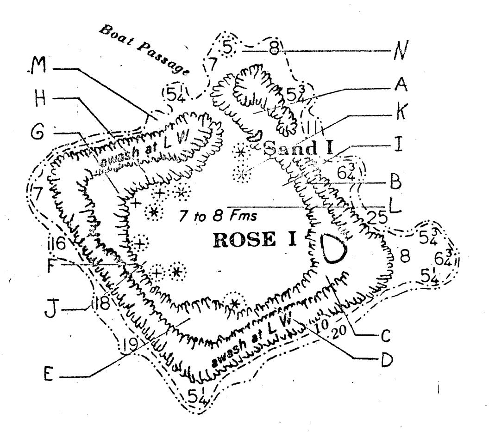
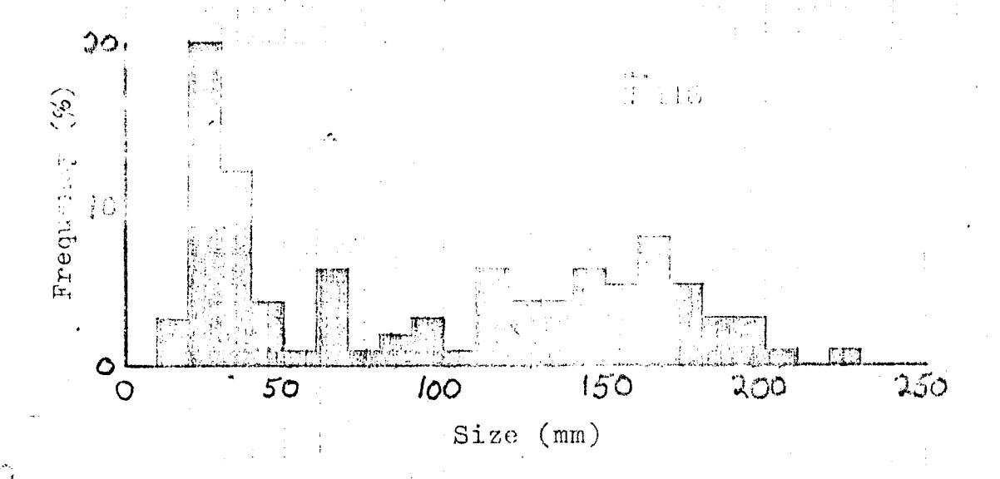
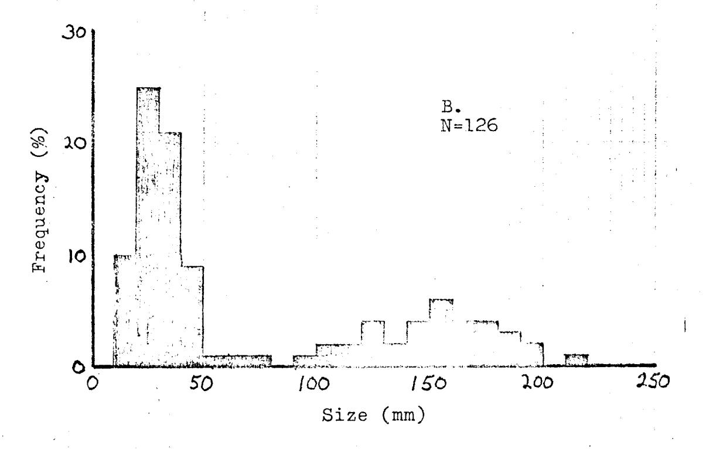
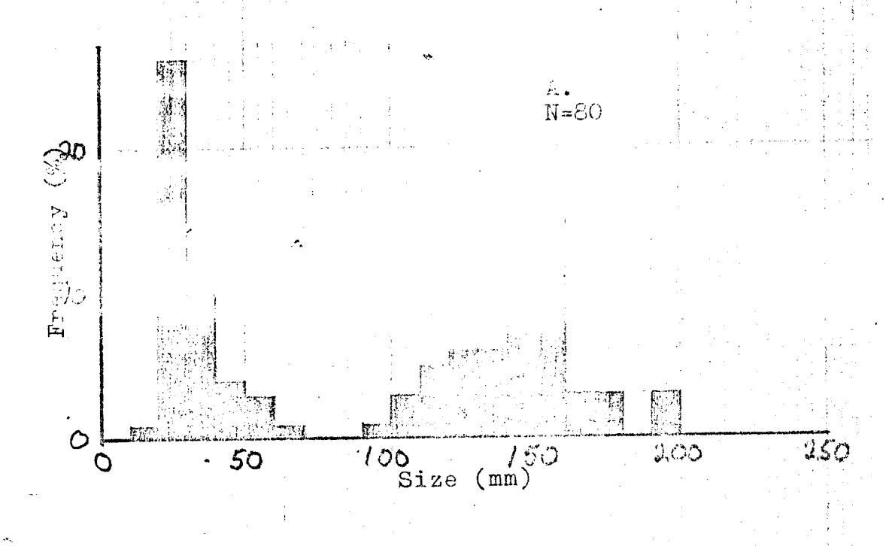
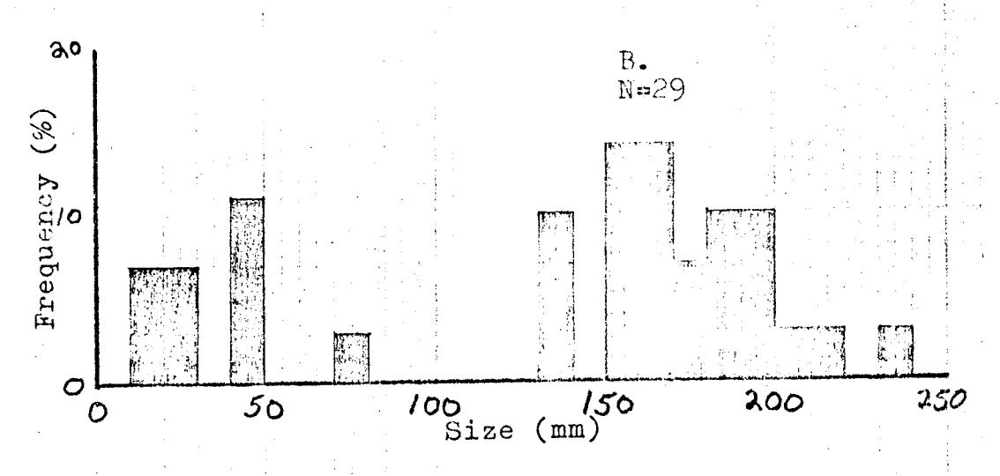
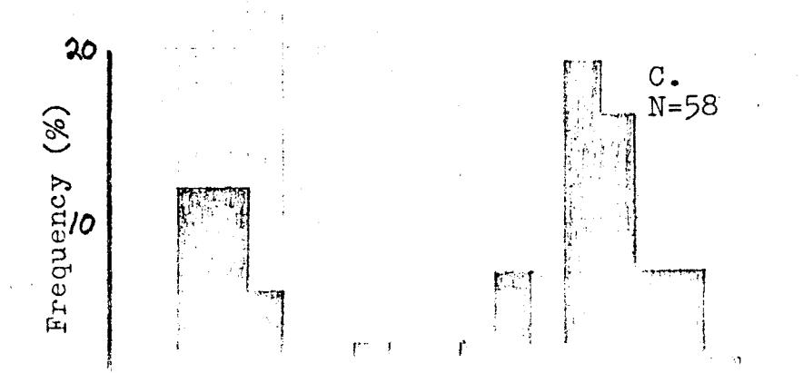
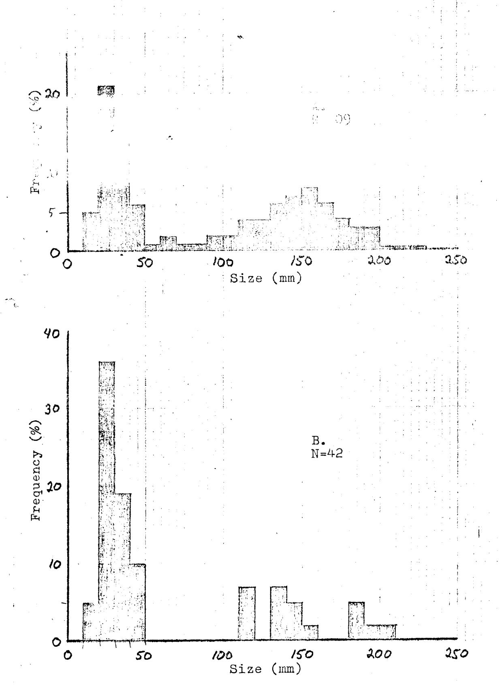

## THE TRIDACNA CLAMS OF ROSE ATOLL

Richard C. Wass, Fishery Biologist American Samoa Covernment

Dept. of Marine and Wildlife Resources biological report series no. 4

Because Rose Atoll is a federal wildlife refuge, fishermen are prohibited from fishing of the reefs and within the lagoon. They are unnappy with the closure and argue that the refuge was established primarily for the protection of birds and turtles which nest and roost on the islands and that they should be allowed to pursue a traditional fishery for giont clams of the genus Tridacna (called "faisua" by the Samoans) as long as the birds and turtles are undisturbed. The survey described herein was initiated by the Office of Marine Resources and the Fish and Wildlife Service as a first attempt to determine the magnitude of the Tridacna resource at Rose and to begin a study of the feasibility of opening the refuge to a clam fishery.

The distribution, abundance, density and size-frequency of Tridacna at Rose Atoll were surveyed 10-13 November 1980. The assistance of William Pedro, Ernie Kosaka and George Balazs with the collection of data and contribution of observations is gratefully acknowledged.

In order to obtain a general impression of the distribution and abundance of Tridacna, two or three divers spent five-minute periods in each of fourteen locations inside and outside the lagoon counting all living Tridacna observed. The divers maximized counts by concentrating their search within the preferred habitat and counting clams of all sizes including juveniles. The survey sites and their associated average five-minute counts are shown and listed in Figure 1. Sites A-H are located between the inner edge of the reef flat and the drop-off to the floor of the lagoon at depths of 1-5 m. Sites I and J are located at the base of this drop-off at 10-13 m. Site K is located on a coral pinnacle rising from the floor of the lagoon at about 15 m to the surface. Site L is located in the middle of the lagoon at a depth of about 22 m. Sites M and N are located on the reef terrace outside the lagoon at a depth of 3-10 m.

The distribution survey indicated that Tridacna are found throughout the shallow areas of the lagoon. Only Tridacna maxima was observed although T. squamosa also occurs at Tutuila Island, 140 miles to the west. The clams are always embedded within the hard limestone substrate and seem to prefer a relatively horizontal position to provide their mantle tissues with maximum exposure to sunlight. Because the shallow portions of the reef flat and the shallow flattened tops of the coral blocks within the lagoon are uncovered at low tide, Tridacna distribution is generally restricted to the edges of the very shallow blocks and

Figure 1. Tridaena olim army sites at Rose Ato'i.

Average number of Tridacna com in a Seminute period at 14 clima:

| A - 80 | D - 42                                | G - 50      | J - 276      | M 1   |
|--------|---------------------------------------|-------------|--------------|-------|
| ଓ - ୧୦ | · · · · · · · · · · · · · · · · · · · | rr ol       | A = 530      | M _ V |
| 0 - 50 | F = 168                               | 100 mm 1000 | <u>T</u> - 0 |       |

reefs or within, the few deeper pools on the flats. Clams occur almost everywhere there is hard substrate below the low tile level on the shallow reefs as well as in the deeper portions of the lagoon and on the coral pinnacles wherever there is hard substrate and clear water. Below about 13 m the water in the lagoon becomes turbid, restricting the penetration of sunlight and, thus, forming a lower limit to the depth distribution. Few clams occur outside the lagoon in the surge channels or on the reef terrace.

Though habitat conditions appear to be similar, the distribution of Tridacna within the lagoon is patchy. They seem to be less abundant in the southern portion and particularly large numbers of juveniles occur at sites F and J. Further study is required to determine if these observations are accurate and, if so, the factors responsible for the distributional pattern.

In an attempt to estimate population density, Tridacna were counted and measured within a 200 x 4.32 m transect randomly situated at Site F/J beginning at the lagoonward edge of the reef flat (1 m depth) and extending across the shallows, down the steep slope of the lagoon drop-off and across a portion of the lagoon floor (10 m depth). This effort was abandoned after one transect due to the length of time required and because Tridacna distribution is correlated with the distribution of suitable substrate. The widely scattered distribution of coral blocks in which the clams are embedded require a large number of transects to accurately estimate Tridacna density and time did not permit this amount of effort. A total of 242 living Tridacna with shell lengths of 11-226 mm were counted within this single transect for an average density of 0.28/m².

The size frequency distribution of this sample is illustrated in Figure 2 for both the shallow portion of the transect (1-3 m) and the deep portion (about 10 m). Size frequency of the adults appears to be similar at both depths. However, there seem to be more juveniles (individuals less than 50 mm shell length) at the deeper end (65% vs. 40%).

Size frequency data were collected at three other locations within 20 x 2 m transects intentionally situated over hard substrate and concentrations of Tridacna. Two 20 m transects were surveyed at a depth of 2 m at Site A, three transects were surveyed at 2 m at Site G, and one transect was surveyed at 7 m at Site K. These data are illustrated in Figure 3. Tridacna appear to be less abundant at Site G where density averaged only 0.24/m². Juveniles in particular are fewer and the adults seem to be larger than in the other three sites surveyed.

All of the size frequency data are summarized in Figure 4. Though juveniles are the most numerous, no individuals were found in the smallest size class (0-9 mm) which may indicate

Figure 2. Size frequency listallation of Tridacna at Site W/J along 200 x 4.32 m transact. A. First 120 m of transact at depth of 15 m.

Figure 3. Size frequency distribution of Tridacna at three sites. The 20 x 2 m transects were intentionally situated on hard substrate and Tridacna concentrations. A. Site A, two transects at a depth one transect at 7 m.

Figure 4. Size frequency distribution of living and dead Tridacha measured at all sites. A. Living Tridacha. B. Dead Tridacha (shell still embedded in substate

that larval settlement is restricted to a particular season and that the larvae settling during that period have already grown through the smallest stage or simply that they were unobserved because of their tiny size. Size classes between 50 and 59 mm are noticibly lacking. Either growth is comparatively rapid at these sizes or the year classes were not very successful. Amongst the adult of 153 150 and 150 me is the most abundant.

Part B of Figure 4 shows the size frequency distribution for the 42 dead individuals found within all the transects. When compared with Part A, it shows a higher frequency of juveniles (70% vs. 46%) indicating they are subject to higher rates of natural mortality. The data also indicate that about 10% of the Tridacna on the reefs of Rose are dead.

## RECOMMENDATIONS

The data discussed and summarized above are far too few on which to base a final plan for managing the Tridacna resource at Rose. The conclusions should all be regarded as tentative pending the accumulation of more data. Nevertheless, I would like to suggest a set of management regulations which would result in a high and sustainable yield of clams to the fishermen and produce the data required for future refinement and improvement of the management scheme. The regulations will also provide continued protection for the birds and turtles at Rose.

The key regulation is a minimum size limit for all clams harvested. Jameson (1976) found that Tridacna maxima in Guam attain full sexual maturity at a shell length of 110-130 mm. In a comprehensive study of the Tridacna of Tonga, McKoy (1980) concludes that 100% of the T. maxima are fully mature at 140 mm (at which size they are about eight years old). Because there are no size-at-maturity data for Samoan Tridacna, and assuming that size at maturity at Rose and Tonga are similar, it is proposed that a minimum size limit be set at 140 mm shell length. This would preserve the reproductive capacity of the population even if all clams larger than 140 mm were harvested. Part A of Figure 4 indicates that about 31% of the existing population is larger than 140 mm so the resource offers considerable potential to fishermen even with the minimum size limit. The larger clams, are, of course, also considerably more valuable.

In order to ensure enforcement of the minimum size limit, a second regulation should require that all clams be landed in the shell. This would also facilitate collection of size frequency data and maximize the economic return per clam because the shells could also be sold as souveniers.

A third regulation should require that all landings be reported to the Office of Marine Resources. Catch and effort data are needed for optimal management and to determine the value of the fishery.

Rose Atoll was declared a National Wildlife Refuge several years ago in order to protect the birds and turtles which utilize the islands for nesting and roosting. Two additional regulations are proposed in support of this objective. It is recommended that the northeastern reef from the channel leading into the lagoon to an area 100 yds south of Rose Island be declared off limits to all finhames. This would provide a buffer mount the islands of Rose and Sand where the nesting and roosting occur and, thus, serve to reduce disturbance. It would also provide additional protection for the Tridacna resource. Landing on the islands themselves would also be prohibited.

A final regulation would require advance permission to fish within the lagoon and would give the Office of Marine Resources or the Fish and Wildlife Service the option of placing an observer on board any vessel proposing to fish within the lagoon of Rose. In addition to enforcing the regulations outlined above, the observer's responsibilities might include the collection of catch and effort data for the Tridacna and other fisheries. He could also go ashore to make observations on birds and turtles as desired or requested.

The proposed regulations would be relatively easy and inexpensive to promulgate and enforce. The only additional expense would be the provision of an observer and that is optional. Exercise of this option might actually result in a savings by obviating the need for chartering a vessel to land an observer on Rose and Sand Islands. In preliminary discussion, the fishermen have indicated their willingness to accept the regulations outlined herein.

The question of whether or not to allow the pursuit of a Tridacna or other fishery on the reefs or within the lagoon of Rose is beyond the scope of this report. I do feel that a properly managed Tridacna fishery is compatible with a refuge for birds and turtles at Rose. Fishery resources within the Territory of American Samoa are meager and fishermen should be allowed the greatest possible access consistent with the principles of conservation and wise use.

The Samoans fished Tridacna at Rose on a limited basis prior to its establishment as a wildlife refuge and they should be allowed to continue to do so. At present there is only one Samoan vessel capable of fishing at Rose. Fishing for Tridacna within the lagoon would likely be pursued at a low level even by this vessel due to the distance involved and the vagaries of the weather. The vessel currently makes about four fishing trips a year to the vicinity of Rose and the opening of the lagoon to a fishery would probably result in little increase in the number of trips. It would, however, offer the captain an additional option for maximizing his catch and the economic return for the trip.

## LITERATURE CITED

- Jameson, S.C. 1976. Early life history of the giant clams Tridacna crocea Lamarck, Tridacna maxima (Röding), and Hippopus hippopus (Linnaeus). Pacific Science 30(3): 219-232
- McKoy, J.L. 1980. Biology, exploitation and management of giant clams (Tridachidae) in the Kingdom of Tonga. Fisheric: Bulletin No. 1, Fisherias Division, Tonga. 61 p.