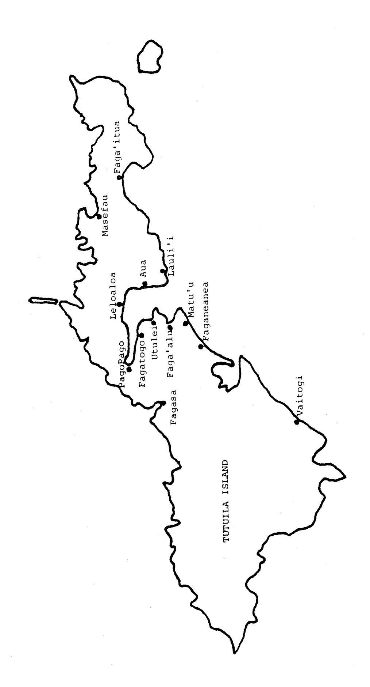

# MARINE AND COASTAL PROCESSES IN THE PACIFIC: ECOLOGICAL ASPECTS OF COASTAL ZONE MANAGEMENT

Papers presented at a Unesco Seminar
Held at Motupore Island Research Centre,
University of Papua New Guinea
14 - 17 July 1980

Wass, R. 1982. The shoreline fishery of American Samoa - past and present. pp. 51-83

Dept. of Marine and Wildlife Resources biological report series no. 3

United Nations Educational Scientific and Cultural
Organization

Regional Office for Science and Technology
for Southeast Asia

Jalan M.H. Thamrin 14

Jakarta Pusat
Indonesia

#### ABSTRACT

The proceedings of the Unesco Seminar on Marine and Coastal Porcesses in the Pacific (Motupore Island, Papua New Guinea, 14-17 July 1980) consisting of ten papers dealing with the coastal marine environment under the headings Habitat Degradation, Coastal Zone Resource Uses and Removals and Tourism and Indirect Impacts Related to Coastal Zone Management are reported herein. Formal recommendations and observations made by participants at the Seminar concerning: populations, development and environmental education, coastal zone research and management, traditional knowledge and management, resource investigations and finally research and training are also included.

The authors are responsible for the choice and the presentation of the facts contained in this book and for the opinions expressed therein, which are not necessarily those of Unesco and do not commit the Organization.

The designations employed and the presentation of material throughout the publication do not imply the expression of any opinion whatsoever on the part of Unesco concerning the legal status of any country, territory, city or area or of its authorities, or concerning the delimitation of its frontiers or boundaries.

3.1 THE SHORELINE FISHERY OF AMERICAN SAMOA -PAST AND PRESENT

by

RICHARD C. WASS\*

\* Government of American Samoa Office of Marine Resources Pago Pago American Samoa 96799 United States of America

# CONTENTS

|                                                   | Page |
|---------------------------------------------------|------|
|                                                   | 55   |
| INTRODUCTION                                      | 22   |
| TRADITIONAL FISHING PRACTICES                     | 55   |
| TRADITIONAL MANAGEMENT TECHNIQUES                 | 56   |
| CURRENT FISHING PRACTICES AND THE RESULTANT CATCH | 58   |
| Methods                                           | 58   |
| Results                                           | 60   |
| TRENDS OF CHANGE IN FISHING PRACTICE              | 78   |
| CURRENT MANAGEMENT MEASURES AND FUTURE STRATEGY   | 79   |
| ACKNOWLEDGEMENTS                                  | 82   |
| REFERENCES                                        | 83   |

#### INTRODUCTION

Edible marine organisms have been and generally still are the major protein source in the diet of the peoples of Oceania. Analogous methods and equipment have been developed throughout the area to harvest this bounty as a result of species similarities, likenesses in shoreline topography and physiography, common cultural heritages and interisland communication. Today, the islands are experiencing similar trends toward westernization, urbanization and technological development which have resulted in similar modifications and improvements on traditional methods. An examination of current and traditional fishing practice in American Samoa is, thus, broadly applicable to any island in Oceania.

The Samoan Islands consist of a chain of seven major islands located at 14°S latitude and ranging from 168° to 173° W longitude. Most are high islands of basaltic composition. They are divided politically into Western Samoa, comprised principally of the two largest and westernmost islands, and American Samoa, comprised principally of uninhabited Rose Atoll, three small islands in the Manu'a group and Tutuila Island. Tutuila is about 32 km long and averages about four km in width. Two-thirds of the coastline is bordered by narrow fringing reefs which are partially exposed at low tide. There are no barrier reefs and only a single well-developed lagoon. Beyond the breakers on the seaward margin of the reef flat the bottom slopes rapidly to very deep water. Tutuila is almost bisected by a deep natural harbor, Pago Pago Bay. Considerable urbanization has occurred along the shore of the bay and about a third of Tutuila's 30,626 inhabitants live there.

# TRADITIONAL FISHING PRACTICES

The early Samoans spent much of their time fishing, not only because it offered a means of providing food for the family, but because they enjoyed it as well. They were expert fishermen thoroughly familiar with the habits and behavior of their prey. Fishing, by definition, was traditionally the work of men and almost all of the men, including the chiefs, were fishermen. The practice of wading on the reef at low tide, perhaps with a sharp stick or knife, and gathering small fishes, sea urchins, shellfish, sea cucumbers, seaweed, etc. was considered the work of women and children and was not "fishing". Women were not allowed to fish outside the reef or from canoes though a number of the community fishing techniques were open for their participation as well as the use of basket traps and scoop nets.

A wide variety of specialized methods and fishing gear was used to harvest hundreds of species of fishes and invertebrates (Buck, 1930). Common practices included the following: fishes were driven into rock or coral heaps and surrounded by a net. The rocks and coral were then removed to capture the fishes. Snares were used to catch mantis shrimp, jacks, eels and even large sharks which were lured under a canoe by a rattle made from coconut shells and through a noose woven from sennit. Octopus were caught on lures made from

cowrey shells, rocks and coconut husks and dangled just above the bottom. Gill nets, throw nets, scoop nets and seines were skill-fully woven with cord made from bark or coconut husks. One of the most popular methods of net fishing involved laying the net across a channel through which fish normally exit the reef at low tide. Several lengths of vine or line to which coconut fronds and other leaves were attached were tied together and used to encircle a portion of the reef flat with the net as part of the circumference. A group of people, sometimes including an entire village, positioned themselves along the line which was steadily drawn in to tighten the circle. The leaves on the line, assisted by a great deal of splashing, shouting and rock throwing, drove the encircled fish into the net.

Spears and harpoons were crafted from sticks and bones. Traps were fabricated with sticks and cord. Fish were narcotized with a mixture of wet sand and the grated fruit of the Baringtonia tree or the roots of certain vines. The substance was used primarily to drive fish from shelter and into nets or other means of capture rather than as a poison to kill them directly. Weirs were constructed on the reef flats from stones, coral and even leaves to direct fishes into a small pond or pen in which they were trapped at low tide. The early Samoans made a variety of hooks and gorges. The most highly refined hooks had shanks of polished pearl shell to which were attached turtle shell points. A complex tradition evolved for making and trading these hooks which were used to troll for pelagic fishes such as skipjack tuna. The lure was trolled from a bamboo rod placed in a holder at the stern of the canoe.

Many of the traditional techniques required a group of fishermen (Buck, 1930) and much of the enjoyment the Samoans derived from fishing related to its social aspects. Two or three individuals were necessary to position a gill net or to man a shark-fishing canoe; several boat crews were required for a skipjack fishing expedition and perhaps a hundred people were needed for a large fish drive. The larger groups required a leader to coordinate their efforts and to make decisions regarding when to fish, which methods to use, how to divide the catch, etc. The leader or fishing chief was called the "tautai" and was generally elected by common consent because of his knowledge and ability as a fishermen.

Most of the traditional fishing was limited to the reef flat or just beyond. Samoans were not accomplished divers nor did they often make long ocean voyages between islands. Nevertheless, they built planked canoes of excellent quality for offshore fishing. Smaller dugout canoes were used for fishing in bays and lagoons and on the fringing reef at high tide.

#### TRADITIONAL MANAGEMENT TECHNIQUES

Ownership of the reefs and their resources was traditionally vested in the chiefs of each village in a like manner to land ownership. Seldom did a member of one village fish on the reefs or within sight of another village. Marine resources were, thus, controlled by a council of village chiefs who could institute any management measure they desired or felt necessary. A complex system of taboos reserving

Figure 1. Tutuila Island, American Samoa. Location of study villages.

certain species and size. of fish for the chiefs and restricting effort to certain seasons and locations arose which served to protect the reefs from over-exploitation.

The relatively small human population dependent upon the resource base also had a conservatory effect. The Samoans were careful to take only what they needed and to make full use of the entire calch including the bones and head. The family system of communal living provided many potential recipients if a fishermen happened to catch more than his immediate family required.

# CURRENT FISHING PRACTICES AND THE RESULTANT CATCH

During fiscal years 1977-1980, the Office of Marine Resources, American Samoa Government conducted a survey in 13 shoreside villages of Tutuila Island. The study was designed to measure the fishing effort exerted by subsistence and recreational fishermen on the fringing reef or shortly beyond and to estimate the resultant catch. Offshore recreational fishing from powered vessels and large-scale commercial fishing were excluded. The results are useful for determining the economic, recreational and cultural values of the fishery and for aiding the effort to maximize these values on a sustainable basis through management measures.

Hill (1977) also conducted a survey of the shoreline fishery of Tutuila. His period of study and sample sizes were considerably smaller than those of the present investigation but the conclusions are similar.

#### Methods

The study was divided into two distinct portions covering different villages and using different methods of data collection. During 1977 and 1978, nine contiguous villages (Faganeanea to Lauli'i) along an 18.8 km stretch of shoreline which encompasses Pago Pago Bay and about three kilometers of the exposed coast on either side were surveyed (Fig. 1).

Fishing effort was classified into one of eight generalized methods: day gleaning, night gleaning, bamboo rod fishing, rod and reel fishing, day diving, night diving, throw netting and seining. Gleaning consists of walking along the intertidal zone or on the reef flat at low tide and collecting edible invertebrates and fishes by hand or through use of a knife, stick or spear. The use of a bamboo pole and a fixed length of line is usually involved in bamboo rod fishing though handline fishing is also included within this category. Diving involves the use of goggles or a face mask by a swimmer. Seining is defined as active net fishing (e.g. drive-net fishing) with the fishermen in the water during the entire fishing period as opposed to passive net fishing (e.g. gill-net fishing) where the net is left to fish by itself.

Two types of surveys were made: effort surveys designed to determine average daily fishing effort for each village and method; and catch surveys designed to determine catch/man-hour for each village and method.

From Tutuila's main highway and short access roads, an observer with a pair of binoculars can see more than 95% of the shoreline in the study area without having to leave his vehicle. Effort surveys were conducted by driving back and forth along the perimeter road for an eight-hour time period and totaling the number of fishermen engaged in each fishing method for each village. These totals were multiplied by the quotient obtained from dividing the number of hours in the survey period (eight) by the number of times the observer drove past a village (usually eight) to calculate total man-hours of effort for the eight-hour period.

A total of 201 eight-hour effort surveys were made according to a rigid schedule designed to account for all sources of variation. They covered all portions of the 24-hour day equally as well as weekdays, Saturdays and Sundays in order to measure differential effort for these periods and days. Surveys were conducted during all weather conditions, tidal levels, wave heights, moon phases, seasons, etc.

Average effort was calculated for each eight-hour period for weekdays, Saturdays and Sundays and summed to get 24-hours averages. The 24-hour averages were, respectively, multiplied by the number of days in the year to determine annual effort. Holidays (excepting religious holidays and those falling on a Sunday) were treated as Saturdays.

Catch surveys were conducted on days when no effort surveys were scheduled. Fishermen were interviewed to determine number, age and sex of fishermen responsible for catch, fishing method, length of fishing period and species catch by number and weight. A total of 748 catches resulting from 1,969 man-hours of effort were examined from the nine villages in the greater Pago Pago Bay area. Average catch/man-hour was calculated for each village and method. These figures in turn were multiplied by annual effort estimates to estimate annual catch.

Effort resulting in no catch was, unfortunately, not recorded during the 1977 catch surveys though the use of correction factors enables retention of the data. The factors were calculated from the 1978 catch data and are simply the ratio of hours of total effort to hours of successful effort. The factors for the eight fishing methods varied from 1.00 to 1.25 and averaged 1.10 indicating that about one hour out of every eleven yields no catch. The corrected effort values for 1977 and the actual values for 1978 were totaled and divided by total catch to computer catch/man-hour.

The second portion of the study was conducted during 1979 and the fist half of 1980. It covered four of the more outlying villages of Tutuila (Faga'itua, Masefau, Fagasa and Vaitogi) (Fig. 1). These villages are widely scattered and were chosen for their location and reef physiography as more or less representative of all villages outside the greater Pago Pago Bay area.

For this portion of the study the observer spent an entire eight-hour period within one of the villages. Again, the survey periods were scheduled for equal distribution among the four villages,

the hours of the day and the days of the week and occurred during all weather conditions, tidal levels, moon phases, seasons, etc. Catch and effort data were gathered simultaneously by the observer who positioned himself so that he could see the coastline fronting the entire village. For each fishing party, he noted the fishing method, number, age and sex of fishermen and length of the fishing period. Upon termination of the party's effort, the observer identified and weighed the catch.

Because the villages are relatively small, there were generally only a few parties fishing at one time so data were rarely missed because two parties stopped fishing simultaneously.

During the year-and-a-half study period, 199 surveys representing 1,335 hours of observation were made in the four villages. A total of 118 catches representing 687 hours of fishing effort were examined.

The proportion of the year the observer was on site in each village was determined for weekdays, Saturdays and Sundays. The number of hours of observed effort for each day and method was then divided by this figure to estimate annual effort for each day and method. Average catch/man-hour was calculated for each method and multiplied by annual effort estimates to compute annual catch.

#### Results

Adult males tend to do most of the fishing as indicated by Table I which lists age and sex of fishermen by fishing method for the 1,119 fishermen whose catches were examined. Only the day gleaning effort was dominated by women and children. They also accounted for a significant proportion of the night gleaning effort. Boys do much of the bamboo rod fishing.

Fishing effort showed considerable variation depending upon the day of the week. Medium effort was exerted during weekdays. During Saturdays and non-religious holidays when people have more leisure time and are often engaged in preparation for their Sunday meal, fishing effort was 1.77 times as great. Religious beliefs and custom tend to restrict fishing on Sundays between sunrise and sunset. Sunday effort was found to be only 0.32 times that of a typical weekday.

Table II results from compilation and analysis of the 400 eight-hour effort surveys conducted during the study. It estimates annual fishing effort by village and method totaling over 92,000 man-hours. Most effort is involved in day gleaning, bamboo rod fishing and day diving. Seining accounts for the least amount of effort. Greatest effort was expended in Aua which has a relatively large population and a very well developed reef flat. The least effort was expended in Vaitogi which has no fringing reef flat and a rugged, basaltic coastline exposed to tradewinds and swell.

TABLE I. Age and sex of fishermen by fishing method.

| Fishing           | Fema             | l e      | Male ≤14 yrs. | >14 yrs. | TOTAL |
|-------------------|------------------|----------|------------------|----------|-------|
| Method            | <u>≰</u> 14 yrs. | >14 yrs. | <u></u>          | 14 )13.  |       |
| Day Gleaning   | 16               | 98       | 11               | 39       | 164   |
| Night Gleaning | 0                | 10       | 4                | 19       | 33    |
| Bamboo Rod     | 0                | 12       | 8 8              | 1 2 5    | 225   |
| Rod & Reel     | 0                | 1        | 1 2              | 187      | 200   |
| Day Diving     | 5                | 1 4      | 8                | 172      | 199   |
| Night Diving   | 0                | 0        | 1                | 8 7      | 88    |
| Throw Netting  | 0                | 0        | 15               | 160      | 175   |
| Seining           | . 0              | 5        | . 0              | 30       | 35    |
| TOTAL             | 21               | 140      | 1 3 9            | 819      | 1,119 |

Estimated annual fishing effort (man-hours) by village and method. TABLE II.

| Total             | 20,950          | 9,726             | 17,664        | 13,710        | 15,645                | 7,570           | 5,586            | 1,259   | 92,110 |
|-------------------|-----------------|-------------------|---------------|---------------|-----------------------|-----------------|------------------|---------|--------|
| Vaitogi           | 17              | 0                 | 142           | 309           | 0                     | 462             | 0                | 0       | 930    |
| Fagasa            | 843             | . 0               | 276           | 1,198         | 318                   | 1,623           | 985              | 0       | 5,243  |
| Masefau           | 1,660           | 0                 | 91            | 227           | 1,231                 | 1,360           | 524              | 0       | 5,093  |
| Faga- 'itua    | 950             | 0                 | 190           | 0             | 2,786                 | 2,902           | 336              | 0       | 7,164  |
| Lauli'i           | 2,512           | 1,149             | 571           | 427           | 1,117                 | 66              | 555              | 629     | 7,109  |
| Aua               | 4,695           | 2,347             | 2,463         | 926           | 2,114                 | 159             | 1,007            | 0       | 13,741 |
| Leloaloa          | 2,193           | 452               | 824           | 702           | 1,158                 | 62              | 355              | 70      | 5,816  |
| Pago Pago      | ß               | 40                | 2,964         | 558           | 57                    | 0               | 299              | . 0     | 4,291  |
| Fagatogo          | ю               | 0                 | 6,010         | 5,136         | 153                   | 0               | 36               | 0       | 11,338 |
| Utulei            | 1,419           | 185               | 1,596         | 1,206         | 2,401                 | 208             | 211              | 254     | 7,480  |
| raga'alu          | 2,191           | 1,190             | 740           | 1,232         | 1,526                 | 425             | 112              | 150     | 7,566  |
| Matu'u            | 2,079           | 1,751             | 767           | 468           | 1,329                 | 89              | 153              | 31      | 6,667  |
| Faga- neanea   | 2,383           | 2,612             | 1,030         | 1,291         | 1,455                 | 181             | 645              | 75      | 9,672  |
| Fishing Method | Day Gleaning | Night Gleaning | Bamboo Rod | Rod & Reel | Day Divin <b>g</b> | Night Diving | Throw Netting | Seining | TOTAL  |

The reefs within Pago Pago Bay have been subjected to increasing amounts of dredging, filling, siltation and pollution since the late nineteenth century. Approximately 95% of the reefs at the back of the bay fronting the villages of Fagatogo and Pago Pago have been filled. Tutuila's main commercial dock and the fuel dock as well as a couple of smaller docks are presently located in Fagatogo. Table III illustrates the considerable influence of filled and degraded reefs and the presence of piers, as well as reduced exposure to waves and currents, on effort and methods. Inner bay villages differ markedly from all others in several respects. Because reef flats are lacking, almost no gleaning effort occurs. Turbid water and the lack of productive reefs result in almost no diving. Instead, most of the effort occurs with bamboo rod and rod and reel. The use of hook and line is encouraged by the presence of piers and docks offering easy access to relatively deep water.

Outer bay and near bay villages show a similar distribution of effort among the various fishing methods and appear to differ somewhat from that of outlying villages in that gleaning seems to occur more often while diving seems to occur less often. These differences are probably non-existent or nearly so because they arise primarily from ambiguous definitions of gleaning and diving during the first portion of the study. Effort which involved wading on the reef flat was sometimes recorded as "gleaning" by the two observers recording data during the first two years even though goggles or a face mask were used concurrently. During the second portion of the study, a third observer recorded the same type of effort as "diving".

A total of 866 catches resulting from 2,656 man-hours of effort by 1,119 fishermen were examined. Average catches/man-hour are listed by village and method in Table IV. Values were estimated for a few positions in the matrix of the table when catches had not been examined for a particular method and village by averaging catch/man-hour values for all villages in the greater Pago Pago Bay area. Fishing effort was substantial for only one of these positions. Some positions are empty because no effort was recorded.

Seining and throw-netting are the most productive methods followed by night diving and day diving. Fishing with a bamboo rod is least productive. More than two-thirds of the gleaning catches and about one-third of the diving catches consist of invertebrates\*. The other four methods yield fishes primarily.

Hill's (1977) catch/man-hour estimates are generally lower than those listed in Table IV. He found average catches of 0.9 kg for day gleaning, 0.5 kg for night gleaning, about 0.55 kg for line fishing and 0.6 kg for spearfishing. His estimate of 2.5 kg for throw netting, however, is considerably higher. For two villages in Western Samoa, Lockwood (1971) found catches/man-hour to average about 0.9 kg and 2.4 kg for all methods combined.

\*No effort was made to correct for the shell weight of molluscs and sea urchins.

Relative fishing effort by method for inner Pago Pago Bay, outer Pago Pago Bay, near Pago Pago Bay and outlying villages. TABLE III.

| Fishing Method | Inner Bay 1 Man-Hours Perce | r Bay 1 Percentage | Outer Man-Hours | Outer Bay 2 ours Percentage | Near Bay 3 Man-Hours Per | ay³ Percentage | Out 1 Man-Hours | Outlying 4 irs Percentage | TOTAL Man-Hours | AL Percentage |
|-------------------|-------------------------------------------|----------------------------------|--------------------|-------------------------------------------|----------------------------------------|-------------------|--------------------|-----------------------------------------|--------------------|------------------|
| Day Gleaning   | ∞                                         | 0                                | 10,498             | 30.3                                      | 6,974                                  | 29.7              | 3,470              | 18.8                                    | 20,950             | . 23.7           |
| Night Gleaning | 40                                        | 0.3                              | 4,174              | 12.1                                      | 5,512                                  | 23.5              | 0                  | 0                                       | 9,726              | 10.6             |
| Bamboo Rod     | 8,974                                     | 57.4                             | 5,623              | 16.2                                      | 2,368                                  | 10.1              | 669                | 3.8                                     | 17,664             | 19.2             |
| Rod & Reel     | 5,694                                     | 36.4                             | 4,096              | 11.8                                      | 2,186                                  | 9.3               | 1,734              | 9.4                                     | 13,710             | 14.9             |
| Day Diving     | 210                                       | 1.4                              | 7,199              | 20.8                                      | 3,901                                  | 16.6              | 4,335              | 23.5                                    | 15,645             | 17.0             |
| Night Diving   | 0                                         | 0                                | 854                | 2.5                                       | 369                                    | 1.6               | 6,347              | 34.5                                    | 7,570              | 8.2              |
| Throw Netting  | 703                                       | 4.5                              | 1,685              | 4.9                                       | 1,353                                  | 5.8               | 1,845              | 10.0                                    | 5,586              | 6.0              |
| Seining           | 0                                         | 0                                | 474                | 1.4                                       | 785                                    | 3.4               | 0                  | 0                                       | 1,259              | 1.4              |
| TOTAL             | 15,629                                    | 100.0                            | 34,603             | 100.0                                     | 23,448                                 | 100.0             | 18,430             | 100.0                                   | 92,110             | 100.0            |
|                   |                                           |                                  |                    | ,                                         |                                        |                   |                    |                                         |                    |                  |

&#x27; Includes Faga'itua, Masefau, Fagasa and Vaitogi.

1 Includes the villages of Fagatogo and Pago Pago.

3 Includes Faganeanea, Matu'u and Lauli'i.

2 Includes Faga'alu, Utulei, Leloaloa and Aua.

0 0 0 (2.26)  $\begin{array}{c} 1.52 \\ 0 \end{array}$ Seining

0

Average catch/man-hour (kg) for fishes (upper value) and invertebrates (lower value) by village parentheses were estimated by averaging catch/man-hour values for all villages in the bay area and method for 866 fishermen interviews representing 2,656 hours of fishing effort. Values in because catches were not examined for that particular village and method. IV. TABLE

| :                 |                 |                   |               |               | 65 -          |                 |                  |         |
|-------------------|-----------------|-------------------|---------------|---------------|---------------|-----------------|------------------|---------|
| GRAND TOTAL    | 1.05            | 1.05              | .54           | .87           | 1.30          | 1.49            | 1.76             | 2.14    |
| TÒTAL             | .13             | .37               | .54           | .85           | .93 .37    | 1.28            | 1.76             | 2.14    |
| Vaitogi           | 0               |                   | .82           | .33           |               | 2.37            |                  |         |
| Fagasa            | . 28            |                   | 1.35          | 1.24          | 1.68          | 1.11            | 1.11             |         |
| Masefau           | .05             |                   | 1.96 0     | .82           | 1.56          | 1.21            | 1.64             |         |
| Faga- 'itua    | 0 . 79          |                   | 1.84          |               | 1.30          | 1.63            | 2.25             |         |
| Laulii            | .91             | .10               | .45           | 1.25          | .92           | 1.68            | 1.61             | 6.62    |
| Aua               | .10             | (.37)             | .49           | .77           | .78           | . 49            | 1.73             |         |
| Leloaloa          | .05             | (,37)             | .86           | .88           | .74           | (.68)           | 2.21             | .57     |
| Pago Pago      | (.20)           | (.37)             | .30           | .91           | (.50)         |                 | 1.91             |         |
| Fagatogo          | .80             |                   | .61           | .70           | .33           |                 | 0 C              |         |
| Utulei            | 0               | .08               | .41           | 1.02          | .68           | .39             | 1.68             | 2.20    |
| Faga'alu          | .15             | .72               | .32           | .53           | .70           | .78             | 4.26 0 ·      | (2.26)  |
| Matu'u            | .11             | .44               | 06.           | .97           | .35           | .58             | 1.44             | (2.26)  |
| Faga- neanea   | .20             | .53               | .82           | .93           | .75           | .81             | 1.55             | 1.52    |
| Fishing Method | Day Gleaning | Night Gleaning | Bamboo Rod | Rod f Reel | Day Diving | Night Diving | Thrc∵ Netting | Seining |

į.,

Annual catch estimates are listed by village and method in Table V. Catches totaling 67,271 kg fish (68%) and 32,031 kg invertebrates (32%) for a grand total of 99,302 kg are estimated for the listed methods in the 13 study villages. Day gleaning accounts for the largest catch and includes 61% of the total invertebrate catch. The largest fish catch is produced by day diving which is second to day gleaning in total production. Seining, though shown by the previous table to yield the largest catch/man-hour, accounts for the smallest total catch. Amongst the villages the largest total catch is estimated for Aua and the smallest for Vaitogi. The most fish are caught at Faga'itua and the most invertebrates at Aua. Almost no invertebrates are caught in Fagatogo and Pago Pago. Division of the total estimated catch by total estimated effort yields an average fish of 0.73 kg/ man-hour, an average invertebrate catch of 0.35 kg/man-hour and an average total catch of 1.08 kg/man-hour for the eight methods combined.

Data from the 866 catches examined during the study are listed by method and species in Table VI-a for fish and Table VI-b for invertebrates. The values within the matrix of the tables are the percentage contributions of the listed species toward the total catch for the listed method rather than actual weights. This facilitates determination of the species most commonly caught by each method. Total catches of 2,671.8 kg fish and 694.6 kg invertebrates were examined. Gleaning catches consisted primarily of octopus, snails, miscellaneous fishes (eels, wrasses, etc.) and surgeonfish. Hook-and-line catches consisted primarily of jacks, mackerel, snapper and grouper. Diving catches consisted primarily of surgeonfish, miscellaneous fishes (eels, butterflyfish, wrasses, etc.), grouper, octopus and lobster. Throw netting and seining produced mostly mackerel, surgeonfish and mullet.

Estimated catches for the 13 study villages are listed by method and species in Table VII-a for fishes and Table VII-b for invertebrates. These figures are the product of the total estimated catches for each method listed in Table V and the percentages listed in Tables VI-a and VI-b. Big-eye scad (Selar crumenophthalmus) and related species and surgeonfish are the most commonly caught species, each comprising about 19% of the fish catch. The fish catch is extremely diverse as evidenced by the relatively large catch of miscellaneous species (14% of the total) which include butterflyfish, eels, sardines, silversides, majorras, goatfish, wrasses, hawkfish, triggerfish, barracuda, needlefish, stingrays, etc. Octopus clearly account for the bulk of the invertebrate catch (44%) and are followed by snails (turban shells, top shells, etc.) and tridacnid and other clams.

With the exception of bigeye scad the fishes and invertebrates listed in Tables VII-a and VII-b are widely available to fishermen both inside and outside Pago Pago Bay. Big-eye scad, however, comprise about 41% of the fish catch for the six villages inside the bay and only about 3% of the fish catch for the seven villages outside the bay. Therefore, if the percentages listed at the bottom of Table VII-a are applied to a particular village, the big-eye scad percentage should be adjusted up or down with a proportionate adjustment in the percentages for the remaining species.

Annual catch estimates (kg) for fishes (upper value) and invertebrates (lower value) by village and method. TABLE V.

| Fishing Method | Faga- neanea         | Matu'u                  | Faga'alu                | Utulei                  | Fagatogo        | Pago Pago | Leloaloa                | Aua                      | Laulili            | Faga- 'itua           | Masefau  | Fagasa                | Vaitogi | TOTAL                      |
|-------------------|-------------------------|-------------------------|-------------------------|-------------------------|-----------------|--------------|-------------------------|--------------------------|--------------------|--------------------------|----------|-----------------------|---------|----------------------------|
| Day Gleaning   | 477                     | 229                     | 329 1,862            | 0                       | 3               |              | 110                     | 470 3,756             | 427                | 0 751                 | 83 2,623 | 236 742            | 0       | 2,364                      |
| Night Gleaning | 1,384                   | 771 525              | 856 452              | 15 246               | 00              | 15 28     | 167                     | 868 1,596             | 115                | 0                        | 0 0      | 0 0                   | 0       | 4,191 5,596             |
| Bamboo Rod     | 845 0                | 069                     | 237 0                | 654 0                | 3,666           | 889          | 708                     | 1,207                    | 257 0           | 350 0                 | 178      | 373 0              | 117     | 10,171                     |
| Rod f Reel     | 1,200                   | 454 0                | . 653                   | 1,230                   | 3,595 154    | 563 0     | 618 14               | 736                      | 534                | 00                       | 186 0 | 1,485 0            | 102     | 11,356                     |
| Day Diving     | 1,091                   | 465 266              | 1,068 366            | 1,632                   | 51 306       | 38 29     | 857 35               | 1,649                    | 1,028              | 3,621                    | 1,920    | 535 83             | 0       | 13,955 5,433            |
| Night Diving   | 146 0                | 51 81                | 332 276              | 81                      | 0 0             | 0 0          | 42 23                   | 78                       | 166 21          | 4,730                    | 1,646    | 1,801 162          | 1,095   | 10,168                     |
| Throw Netting  | 1,000                   | 220                     | 475 0                | 354 0                | 0.0             | 1,274        | 785 0                | 1,742                    | 893 0           | 755 0                 | 860      | 1,093                 | 0       | 9,451                      |
| Seining           | 113                     | 71 0                    | 339                     | 558                     | 0               | 0            | 40                      | 0                        | 4,494              | 0                        | 0 0      | 00                    | 0 0     | 5,615                      |
| TOTAL             | 6,256 2,769 9,025 | 2,951 3,326 6,277 | 4,289 2,956 7,245 | 4,524 3,271 7,795 | 7,314 463 7,777 | 2,780        | 3,327 2,024 5,351 | 6,750 6,007 12,757 | 7,914 4,327 12,241 | 9,456 2,358 11,814 | 4,873    | 5,523 987 6,510 | 1,314   | 67,271 32,031 99,302 |

·**-** 67 **-**

of the listed species toward the total catch for the listed method. The totals in the margins Fish species catch by method. The figures in the matrix indicate the percentage contribution indicate total weight amongst the catches examined for each species and method. TABLE VI-a.

| Fishing Method | Mackerel    | Surgeonfish | Jacks | Grouper | Snapper | Parrot. fish | Damsel- fish | Mullet | Squirrel- fish | Miscellaneous | TOTAL (kg) |
|-------------------|-------------|-------------|-------|---------|---------|-----------------|-----------------|--------|-------------------|---------------|------------|
| Day Gleaning   | 7%          | 28%         |       | 10%     | & %  | 2%              | 8%              |        | 3%                | 40%           | 62.1       |
| Night Gleaning |             | 28%         | 5%    | 13%     | 1,8%    | %               | 2%              |        | 17%               | 30%           | 27.2       |
| Bamboo Rod     | 31%         | ∾°          | 17%   | 11%     | 17%     | o% ~         |                 | 5%     | 4%                | °6            | 283.1      |
| Rod & Reel     | 19%         | <i>%</i>    | 46%   | 10%     | %6      | ,°°             |                 | . 2%   | 1%                | 10%           | 372.6      |
| Day Diving     | 200         | 31%         | 2%    | 17%     | 3%      |                 | 17%             |        | 5%                | 18%           | 459.6      |
| Night Diving   |             | 37%         | 3%    | 11%     | %6      | 14%             | 4 %          | 0/0    | 3%                | 18%           | 392.5      |
| Throw Netting  | 42%         | 11%         | 13%   | 1%      | 2%      | 3%              |                 | 19%    |                   | %6            | 631.0      |
| Seining           | <b>%</b> 09 | 16%         |       | 12%     |         | %6              |                 | 1%     |                   | 1%            | 443.7      |
| TOTAL (kg)        | 6.769       | 474.9       | 329.2 | 255.9   | 152.2   | 149.5           | 101.1           | 148.2  | 54.8              | 308.1         | 2,671.8    |

|                   |         |                                                                                 |                                          |                 |                                       |                                |                                           |                                                  |                                                                                                   | •                                   |      |
|-------------------|---------|---------------------------------------------------------------------------------|------------------------------------------|-----------------|---------------------------------------|--------------------------------|-------------------------------------------|--------------------------------------------------|---------------------------------------------------------------------------------------------------|-------------------------------------|------|
| TABLE             | VI-b.   | Invertebrate species cat contribution of the list in the margins indicate | te species on of the l gins indica | ch              | method. ecies to weight         | e figure the tot gst the | s in the ma al catch fo catches exa | matrix indica for the liste examined for e | matrix indicate the percentage for the listed method. The to xamined for each species and m | entage The totals and method. |      |
| Fishing Method | Octopus | Snails                                                                          | Clams                                    | Sea Anemones | Sea Cucumbers                      | Sea Urchins                 | Crabs                                     | Lobsters                                         | Miscellaneous                                                                                     | TOTAL (kg)                          |      |
| Day Gleaning   | 44%     | 15\$                                                                            | 15%                                      | 11%             | %9                                    | %                              |                                           |                                                  | 1.0°                                                                                              | 385.6                               |      |
| Night Gleaning | 118     | 51%                                                                             |                                          |                 | 11%                                   |                                | 20%                                       | 3.5°                                             | % %                                                                                            | 45.5                                |      |
| Bamboo Rod     |         |                                                                                 |                                          |                 |                                       |                                | 100%                                      |                                                  |                                                                                                   | æ.                                  |      |
| Rod & Reel     | 42%     | %                                                                               |                                          |                 |                                       |                                | 52%                                       |                                                  |                                                                                                   | 8.2                                 |      |
| Day Diving     | 83\$    |                                                                                 | 11%                                      |                 | <b>,</b> • 9                          |                                |                                           |                                                  |                                                                                                   | 188.1                               | - 69 |
| Night Diving   | 33%     |                                                                                 | 7%                                       |                 |                                       |                                | 19%                                       | 41%                                              |                                                                                                   | 64.7                                | -    |
| Throw Netting  |         | 100%                                                                            |                                          |                 |                                       |                                |                                           |                                                  |                                                                                                   | 1.5                                 |      |
| Seining           |         | 100%                                                                            |                                          |                 | •                                     |                                |                                           |                                                  |                                                                                                   | . 2                                 |      |
| TOTAL (kg)        | 356.9   | 86.2                                                                            | 82.1                                     | 43.5            | 38.8                                  | 28.4                           | 26.9                                      | 27.4                                             | 4.4                                                                                               | 294.6                               |      |
|                   |         |                                                                                 |                                          |                 |                                       |                                |                                           |                                                  |                                                                                                   |                                     |      |
|                   |         |                                                                                 |                                          |                 | e e e e e e e e e e e e e e e e e e e |                                |                                           |                                                  |                                                                                                   | :                                   |      |

•

Estimated annual fish catch (kg) by species and method for the 13 study villages. TABLE VII-a.

| Fishing Method             | Big-eye, Scad,etc. | Surgeonfish | Jacks | Grouper | Snapper | Parrot- fish | Damsel- fish | Mullet | Squirrel- fish | Miscellaneous | TOTAL  |
|-------------------------------|-----------------------|-------------|-------|---------|---------|-----------------|-----------------|--------|-------------------|---------------|--------|
| Day                           | 24                    | 662         |       | 237     | 189     | 47 .            | 189             |        | 7.1               | 945           | 2,364  |
| Gleaning Night Gleaning |                       | 1,173       | 509   | 545     | 42      | 168             | 84              |        | 713               | 1,257         | 4,191  |
| Bamboo Rod                 | 3,153                 | 208         | 1,729 | 1,119   | 1,729   | 102             |                 | 509    | 407               | 915           | 10,171 |
| Rod & Reel                 | 2,158                 | 227         | 5,224 | 1,135   | 1,022   | 113             |                 | 227    | 114               | 1,136         | 11,356 |
| Day Diving                 | 140                   | 4,326       | 279   | 2,372   | 419     | 837             | 2,372           |        | 869               | 2,512         | 13,955 |
| Night Diving               |                       | 3,763       | 305   | 1,118   | 915     | 1,423           | 407             | 102    | 305               | 1,830         | 10,168 |
| Throw Netting              | 3,970                 | 1,040       | 1,229 | 94      | 189     | 283             |                 | 1,796  |                   | 850           | 9,451  |
| Seining                       | 3,369                 | 899         | 56    | 674     |         | 202             |                 | 26     |                   | 92            | 5,615  |
| TOTAL                         | 12,814                | 12,598      | 9,031 | 7,294   | 4,505   | 3,478           | 3,052           | 2,690  | 2,308             | 9,501         | 67,271 |
| Percentage                    | 19%                   | 19%         | 13%   | 11%     | 7%      | 5%              | %               | %      | 3%                | 14%           | 100%   |

32,031 100% 19,430 5,596 168 5,433 30 1,342 32 Estimated annual invertebrate catch (kg) by species and method for the 13 study villages, 0 TOTAL Miscellaneous % 194 224 418 Lobsters 2% 168 550 718 5% Crabs 1,119 255 87 1,491 30 Sea Urchins 5% 1,554 1,554 Sea Cucumbers 1,166 326 919 2,108 Anemones % 2,137 2,137 Sea 11% Clams 2,915 298 3,607 94 18% 2,915 2,854 Snails 10 5,811 32 0 TABLE VII-b. Octopus 8,549 44% 615 4,509 443 14,187 7 Percentage Night Gleaning Day Gleaning Fishing Method Throw Netting Seining Bamboo Rod Night Diving Day Diving Rod G Reel TOTAL

The actual catches are, no doubt, greater than the estimates listed in Tables V, VII-a and VII-b. Some fishermen--particularly divers and those fishing at night--were probably overlooked by the observer making a roadside effort survey from his vehicle and there are areas fronting the Rainmaker Hotel, the marine railway and the canneries which cannot be seen from the road and which were only sporadically checked for fishermen. Canoes and other smaller boats fishing beyond the reef are also difficult to see. Some data were missed during the second portion of the survey when two fishing parties happened to stop fishing simultaneously. It is estimated that about 10% of the effort was missed due to the above deficiencies in data collection.

Though their capture is against U.S. federal laws applicable to American Samoa, three sea turtles were noted amongst the 866 catches examined. One was caught in Aua while day diving and two were caught in Faga'itua by divers—one during the day and one at night. The analytical methods previously outlined for fishes and invertebrates were used to estimate an annual turtle catch of 1,819 kg for the 13 study villages. Turtle catches are not included in Table V.

Though considerable amounts of effort are involved, catches resulting from passive fishing methods involving untended fishing gear such as gill nets, woven hemispherical traps and weirs are also excluded from the calculations resulting in Tables VI, VII-a and VII-b. Eighteen passive effort catches (totaling 510.7 kg fish) were examined from the bay area and six catches (totaling 58.6 kg fish and 11.8 kg invertebrates) were examined from the outlying villages. Except for indicating that the passive catch is significant, the bay area data are of little value because annual effort estimates cannot be derived. Passive data from the outlying villages, however, can be used to estimate annual effort and, consequently, annual catch. Calculations similar to those used for active fishing methods result in annual estimates of 72 kg fish and 107 kg invertebrates caught by passive methods in Fagasa and 1,627 kg fish and 222 kg invertebrates for Masefau. No passive effort was recorded for Faga'itua or Vaitogi.

As a first step in estimating the subsistence/recreational catch for the entire island of Tutuila, per capita catch was calculated for the 13 study villages (Table VIII). Catches ranged from 0.9 kg for Pago Pago to 47.3 kg for Faganeanea. Averages were 5.5 kg fish and 2.6 kg invertebrates for a total of 8.1 kg. Lowest catches occured in the inner Pago Pago Bay villages. Intermediate catches were found for the outer bay villages and considerably higher catches were calculated for the remaining villages. As was previously mentioned, little fishing is done in Vaitogi due to rough seas and the lack of a fringing reef so it is not grouped with the outlying villages in the lower portion of the table.

A combination of three factors is probably responsible for the decreasing catch rate toward the back of Pago Pago Bay. Degradation and destruction of reefs is one which has already been discussed. Another is the relatively high population of villages in the bay area with a consequent per capita reduction in the unit area of reef or unit length of shoreline. With the exception of Vaitogi, the inverse relationship between population si and per capita catch is very close for all villages surveyed. The third factor is socio-economic and is related to employemnt and income. Inhabitants of villages

TABLE VIII. Population size and per capita catch by active fishing methods for the 13 study villages.

|                                    |            | Per Cap | ita Catch (kg) |       |
|------------------------------------|------------|---------|----------------|-------|
| Village                            | Population | Fish    | Invertebrates  | TOTAL |
| Faganeanea                         | 191        | 32,8    | 14.5           | 47.3  |
| Matu'u                             | 315        | 9.4     | 10.6           | 20.0  |
| Faga'alu                           | 757        | 5.7     | 3.9            | 9.6   |
| Utulei                             | 991        | 4.6     | 3.3            | 7.9   |
| Fagatogo                           | 1,955      | 3.7     | 0.2            | 3.9   |
| Pago Pago                          | 3,017      | 0,.9    | 0.0            | 0.9   |
| Leloaloa                           | 789        | 4.2     | 2.6            | 6.8   |
| Aua                                | 1,471      | 4.6     | 4.1            | 8.7   |
| Lauli'i                            | 607        | 13.0    | 7.1            | 20.1  |
| Faga'itua                          | 429        | 22.0    | 5.5            | 27.5  |
| Masefau                            | 315        | 15.5    | 11.0           | 26.5  |
| Fagasa                             | 656        | 8.4     | 1.5            | 9.9   |
| Vaitogi                            | 661        | 2.0     | 0.0            | 2.0   |
| All Villages Combined           | 12,154     | 5.5     | 2.6            | 8.1   |
| Inner Bay Villages 2 | 4,972      | 2.0     | 0.1            | 2.1   |
| Outer Bay Villages 3 | 4,008      | 4.7     | 3.6            | 8.3   |
| Near Bay Villages               | 1,113      | 15.4    | 9.4            | 24.8  |
| Outlying Villages 5  | 1,400      | 14.2    | 4.9            | 19.1  |
| Vaitogi                            | 611        | 2.0     | 0.0            | 2.0   |

1The population figures are the preliminary counts from the 1980 census. 2Includes the villages of Fagatogo and Pago Pago. 3Includes Faga'alu, Utulei, Leloaloa and Aua. 4Includes Faganeanea, Matu'u and Lauli'i. 5Includes Faga'itua, Masefau and Fagasa but not Vaitogi.

within Pago Pago Bay are more likely to have jobs and a higher per capita income. Consequently, they tend to have less time to fish and more money to purchase commercially-caught or imported fish.

Extension of the average per capita catch to the entire population of Tutuila (30,626) results in an estimated total catch of 248,071 kg for active fishing methods. Though most of the villages not covered during the present survey are relatively small and all are outside the Pago Pago Bay area, the per capita catch for all 13 study villages is used rather than the higher catch for villages outside the bay area because ten of the remaining 49 villages are located in inland areas and the coastline of two others is similar to that of Vaitogi. The island wide catch for sea turtles is calculated at 4,585 kg in the same manner.

Annual estimates for passive fishing are available only for outlying villages as discussed above. Per capita catches are computed at 1.21 kg fish and 0.24 kg invertebrates for the outlying villages of Faga'itua, Masefau and Fagasa. The per capita catch of fish and invertebrates for active methods is calculated at 19.1 kg for these outlying villages and 8.1 kg for all villages (Table VIII). Multiplying passive catch rates for outlying villages by the ratio of active catch for all villages to active catch for outlying villages (8.1/19.1 = 0.42) yields per capita catch estimates for all 13 villages of 0.51 kg fish and 0.10 kg invertebrates. Extending these estimates to the entire population of Tutuila yields catch estimates of 15,619 kg fish and 3,063 kg invertebrates.

The total shoreline subsistence/recreational catch for Tutuila Island including sea turtles and passive method catches is, thus, estimated at 271,338 kg annually (Table IX). Assuming that about 10% of the fishing effort was overlooked by the observers involved in this survey, this estimate is rounded up to 300,000 kg.

Annual catches are related to reef surface areas for eleven villages in Table X. Areas are listed for reef flats (the shallow areas inside the breaking waves which are partially exposed at low tide) where fishing is most intensive and for fringing reefs shallower than about eight meters (including reef flats). Fagatogo and Pago Pago are excluded from the table because their reefs have been largely destroyed and the existing shallows are mostly mud and rubble.

An unknown proportion of the catch listed in Table X was caught at depths beyond eight meters. The percentage is small because it was caught from boats. Boats are seldom used by the fishery under consideration and when they are, they are often used at depths of less than eight meters. The error induced by catches made at depths in excess of eight meters is probably offset by the error resulting from effort data collection deficiencies.

Catches for the various villages range from 147 to 440 kg/ha of reef within the 8 m isobath. The wide variation results from several factors which influence the available biomass of fishes and invertebrates and the amount of fishing effort. Environmental

TABLE IX. Estimated shoreline subsistence/recreational fishery catch (kg) for Tutuila Island on an annual basis.

|                 | Fish    | Invertebrates | Turtles | TOTAL   |
|-----------------|---------|---------------|---------|---------|
| Active Methods  | 168,443 | 79,628        | 4,585   | 252,656 |
| Passive Methods | 15,619  | 3,063         |         | 18,682  |
| TOTAL           | 184,062 | 82,691        | 4,585   | 271,338 |

Rounding up to account for deficiencies in collection of effort data:  $\frac{300,000}{}$ 

Estimated annual catch by village\* of fishes and invertebrates per unit area of reef. TABLE X.

| TOTAL           | 299.3                     | 356.0                                         | 88,653                                 | 6.177                                   | 94,830                     | 266                                                                  |
|-----------------|---------------------------|-----------------------------------------------|----------------------------------------|-----------------------------------------|----------------------------|----------------------------------------------------------------------|
| Vaitogi         | <0.1                      | 10.4                                          | 1,314                                  |                                         |                            | 165                                                                  |
| Fagasa          | 14.1                      | 16.0                                          | 6,510                                  | 179                                     | 6,689                      | 418                                                                  |
| Masefau         | 37.2                      | 44.9                                          | 8,324                                  | 1,849                                   |                            | 227                                                                  |
| Faga- itua   | 29.7                      | 31.6                                          | 11,814                                 | 622                                     | 12,611 12,436              | 394                                                                  |
| Aua Lauli'i     | 24.6                      | 40.0                                          | 12,757 12,241                          | 370                                     | 12,611                     | 315                                                                  |
|                 | 46.5                      | 48.6                                          | 12,757                                 | 897                                     | 13,654                     | 281                                                                  |
| Leloaloa        | 34.6                      | 35.2                                          | 5,351                                  | 481                                     | 5,832                      | 166                                                                  |
| Utulei          | 18.6                      | 19.1                                          | 7,795                                  | 605                                     | 8,400                      | 440                                                                  |
| Matu'u Faga'alu | 35.3                      | 36.8                                          | 7,245                                  | 462                                     | 7,707                      | 209                                                                  |
| Matu'u          | 35.5                      | 44.0                                          | 6,277                                  | 192                                     | 6,469                      | 147                                                                  |
| Faga- neanea | 23.2                      | 29.4                                          | 9,025                                  | 117                                     | 9,142                      | 311                                                                  |
| ,               | Area of reef flat (ha) | Area of reef within 8-meter isobath(ha) | Annual catch (kg) active methods | Annual catch (kg) passive mathods | Total Annual catch (kg) | Catch/unit area of reef within 8 me- ter isobath (kg/ha) |

\*The villages of Fagatogo and Pago Pago are not included because their reef areas are not significant.

factors affecting the distribution and abundance of reef organisms include depth, salinity, turbicity, exposure to current and swell, physiography of the reef and the degree of habitat degradation. Sociological factors affecting the amount of fishing effort include population density within the immediate area, employment characteristics of the population, degree of dependence upon the reef as a food source, accessibility of the area to people living elsewhere, commonly used fishing methods and whether access is restricted to certain periods or individuals by village regulations.

The average annual catch for the villages listed in Table X is 266 kg/ha which is equivalent to almost 27 metric tons/km2. It is important to note that this figure applies to localized reefs directly in front of villages and subjected to intensive fishing pressure. Hill (1977) calculated an average catch of 12 tons/km2 for a 15.4 km stretch of coastline between Faga'itua and Pago Pago which included some sparsely populated areas. His figure may be a little low, however, because he estimated the night fishing catch at only one-tenth of the day catch. Catch estimates listed in Table V indicate that the night catch is about one-quarter of the day catch. Hill's estimate also excludes the mackerel catch which would add about 4 tons/km2 to his figure. He has justification for excluding mackerel because they frequent the mid-water habitat and are not dependent upon the reef. The figures listed in Table X however, indicate that the average catch for the seven villages located outside Pago Pago Bay (274 kg/ha) is higher thant the average for the four villages inside the bay (255 kg/ha) so it cannot be argued that the large mackerel catch in the bay is responsible for the relatively high average value.

Munro (1978) has compiled catch data for a number of tropical Atlantic shelf areas (to the 200 m isobath) and found maximum annual yields to vary from O to 1.9 tons/km2 in the Caribbean and from 1.2 to about 4.3 tons/km2 in Jamaica. These are largely trap and handline fisheries. Marshall (1979) suggests a finfish yield of 4 to 5 tons/km2/yr as the generalized potential for tropical superecosystems which he defines to include "coral reefs, the shallows adjacent thereto, plus the immediate slope beyond the reef". This figure is at the high end of fishery yield data compiled from areas in the Caribbean, Bahamas, Indian Ocean and the tropical Pacific. Yields calculated for Samoan reefs by Hill and in the present study are much higher. They represent highly localized situations, however, which do not include adjacent and deeper areas from which there is considerable recruitment. Ease of access and the shallow depths of Samoan fringing reefs result in more intensive fishing effort with a larger number of participants and a more varied methodology that in the areas referred to by Marshall and Munro. A considerable portion of the Samoan catch consists of a diverse assemblage of smaller fishes which are generally not taken in areas where the fishery may be largely commercial. About one-third of the catch is also comprised of invertebrates which are not included in the calculations for other areas. Finally, the yields calculated for Samoan reefs may be larger because catches are derived from shallower bottoms which receive more sunlight and, consequently, are more productive and able to support a relatively greater biomass. Herbivorous fishes which are highly prized by Samoan fishermen are particularly abundant.

The annual catch for the entire island of Tutuila is estimated at about 300 tons in Table IX. Division of this figure by the area within the 37 m (20 ft) isobath (64 km²) surrounding Tutuila yields a figure of about 4.7 tons/km² which is equivalent to the maximum potential suggested by Marshall. An additional 297 km² of shelf area surrounds the island to depths of 187 m (100 fm). Annual catches of demersal and nearshore pelagic species (by commercial and recreational powerboat fishermen) within this area average only about 20 tons. Exploitation of these resources, thus, decreases markedly with depth and distance from shore.

# TRENDS OF CHANGE IN FISHING PRACTICE

Changing Samoan fishing practices are largely due to modern technology, dilution and loss of culture, increasing population pressure and urbanization. Methodological changes directly attributable to modern technology include the use of rods and reels, power-driven fishing boats and SCUBA along with increased access to fishes in deeper water through fishing from man-made piers and docks and around fish aggregation devices such as deep-anchored buoys and artificial reefs. The efficiency of traditional methods is improved with the use of metal hooks and wire for traps and weirs; synthetic lines and nets; fins, diving mask and snorkel; rubber-powered lances and spearguns; underwater lights and gas lanterns; and dynamite and more potent poisons.

Some practices have change very little. Men still do most of the fishing while women and children do most of the gleaning and Sunday is still considered a day for attending church and resting rather than fishing. A 1980 survey conducted by the Development Planning Office, American Samoa Government revealed that less than 9% of the subsistence/recreational catch is sold so most is still consumed by the family and relatives. A greater proportion of a fishermen's catch is consumed by his immediate family today, however, than was traditionally the case. Prior to the availability of refrigeration, catches were more widely distributed because they would spoil if not consumed within a few days.

Increased efficiency and reliance on technology have resulted in a trend toward more generalized fishing methods (Hill, 1977). Traditional methods and gear designed to capture a specific kind of fish in a particular location are no longer used because the required gear is not commercially produced or because the fish is as vulnerable to a generalized method using modern equipment.

The dependency of Samoans on their marine resources is decreasing. Most no longer spend a major portion of their time fishing because fish and other foods can be easily purchased. Canned and frozen fish, poultry and meat are an attractive alternative to self-caught fish because they are convenient to purchase and store, offer a variety of taste, make excellent gifts for weddings, funerals and other cultural functions, and convey a sense of prestige to those who use them. Seafood consumption, however, remains high for Tutuila.

The data in Table XI are used to estimate per capita consumption at 67.3 kg/year. In contrast, the 1977 per capita consumption of fishery products has been estimated at 5.8 kg for the United States and 10.3 kg for the state of Hawaii (Hudgins, 1980). Only about 17% of the fish consumed on Tutuila is locally-caught. Canned mackerel from Japan is the largest import.

Growing numbers of automobiles and buses have given the Samoans increased mobility and a widened choide of fishing grounds. Hill (1977) found that 79% of the fishermen still limit their effort to the reefs of their own villages but there is an increasing tendency to fish the reefs of neighboring villages and the bay area.

While there are no quantitative data on group fishing effort prior to the study by Hill (1977), it appears there is also a trend toward decreasing group effort. Hill found group size to average only 1.2 to 2.3 fishermen for seven of the eight methods he examined. Group size for the eighth method (gill-net fishing) averaged 3.9 individuals. Of the eight active methods analyzed in the present study, seining, the most obvious group fishing method, was found to be the least practiced.

A decreasing influence associated with the position of tautai parallels the decline in group effort and fishing in general. Cultural breakdown has eroded the tautai's ability to ordain and direct fishing activities and the declining importance of fishing has further reduced the need for such a position. There are few tautai's left on Tutuila and most are old and will probably not be replaced.

The present population of Tutuila is more than six times as large as it was in 1899 when American Samoa was ceded to the United States. Increasing population coupled with a decrease in available fishing area due to reef destruction and pollution have resulted in declining catches and a reduction in per capita effort. Total effort, however, is probably greater than it was at the end of the nineteenth century because of the much larger population. Increased effort, along with new methodology and increased gear efficiency, has placed heavy pressure on the reources.

# CURRENT MANAGEMENT MEASURES AND FUTURE STRATEGY

The only American Samoa Government regulations relating directly to fisheries management prohibit the use of dynamite and the "reckless use" of poison. A U.S. federal regulation prohibits the taking of sea turtles and their eggs though it is not effectively enforced. Federal regulations included within the Environmental Protection Act assist in protecting the reefs and inshore environment from pollution, dredging, filling and siltation. Rose Atoll has been established as a fish and wildlife refuge by the territorial and federal governments for the protection of sea turtles and sea birds.

TABLE XI. Annual quantities (kg) and sources of seafood consumed on Tutuila Island.

Figures for canned fish have been reduced by 6% for consumption in the Manu'a Islands and by 5% to

account for fish taken home by Western Samoans.

| Source of Fish                   | . Source of Information                         | Annual Quantity      | Percent of Total |
|----------------------------------|-------------------------------------------------|-------------------------|---------------------|
| Imports for Retail Sale          | Customs Office, American Samoa               |                         |                     |
| Canned                           |                                                 | 1,200,560               | 58.2                |
| Frozen                           | •                                               | 94,187                  | 4.6.                |
| Star Kist Cannery                | General Manager, Star Kist, Samoa            |                         |                     |
| Canned Wahoo                     |                                                 | 43,297                  | 2.1                 |
| Frozen Miscellaneous Species  |                                                 | 54,976                  | 2.7                 |
| Van Camp Company                 | Ass † t. Manager, Van Camp, Samoa |                         |                     |
| Canned Wahoo and Tuna         |                                                 | 82,849                  | 4.0                 |
| Frozen Miscellaneous Species  |                                                 | 17,180                  | 0.8                 |
| Barter with Cannery Vessels*  | Office of Marine Resources, American Samoa      | 224,254                 | . 10.9              |
| Local Commercial Fleet           | Office of Marine Resour- ces, American Samoa | 30,000                  | 1.4                 |
| Powered Sportfishing Vessels  | Office of Marine Resour- ces, American Samoa | 1.5,000                 | 0.7                 |
| Subsistence/Recreational Fishery | Present Study                                   | 300,000                 | 14.6                |
| TOTAL Per Capita Consumption     | ,                                               | 2,062,303 kg 67.3 kg |                     |

\*Several canoes regularly trade island produce and liquor for miscellaneous species of fish (barracuda, wahoo, dolphin, pomfrets, shark-eaten tuna, etc.) with the crews of the longline vessels fishing for the canneries. The fish are sold to markets and restaurants as well as direct to retail customers.

Village councils occasionally limit fishing on the reefs fronting their village through a temporary ban on fishing or by prohibition of fishermen from other villages. Several villages do not allow fishing on Sundays and most prohibit the use of dynamite and poison—especially chlorine bleach. Management regulations instituted on the village level are much more effective than those of the territorial or federal governments because they are promulgated within the cultural context by traditional leaders and, consequently, are more likely to receive the approval and fealty of the villagers.

Current management efforts by village councils are not as extensive as in the past. Councils should be encouraged to take a more active role in future management schemes based on scientific principles as well as traditional religious beliefs and resource preservation for village use. A fisheries manager armed with catcheffort and socio-economic data and some tentative management recommendations as a basis for discussion should meet with the councils and solicit their opinion regarding management objectives and the means for their achievement. A management plan applicable to the island as a whole could then be formulated and returned to the councils for their approval and support. Much or all of the enforcement responsibility would be assumed by the villages if the councils firmly believed that the management strategy was beneficial.

Both village council members and fishermen must have an appreciation for the marine environment and a basic knowledge of conservation principles and rationale in order for fisheries management to be effective. These objectives can be achieved only through education. Steps must be taken to instill these qualities in future generations so that Samoans can continue to derive substantial benefits from their shoreline fishery.

#### ACKNOWLEDGEMENTS

I would like to acknowledge the effort of Messrs.

Malaeti'a Misa, Afasa Sesepasara and Herome D. Laupapa who conducted the effort surveys and fishermen interviews.

Mr. Laupapa is also responsible for much of the preliminary data compilation and for the data used to estimate the quantity of imported fish entering the market through barter. Mr. Misimoa Pone contributed data from the fishing survey conducted by the Development Planning Office, American Samoa Government. The study was funded primarily by the Federal Aid in Fish Restoration Act (P.L. 81-681) Project No. F-2-R.

#### REFERENCES

- Buck, Sir Peter H. 1930. Samoan Material Culture. B.P. Bishop Museum Bull. 75: 724 pp.
- Hill, Harry B. 1977. The Use of Nearshore Marine Life as a Food Resource by American Samoans. Master of Arts Thesis, Univ. of Hawaii, 164 p. (unpublished)
- Hudgins, Linda L. 1980. Per capita annual utilization and consumption of fish and shellfish in Hawaii, 1970-77. Marine Fisheries Review. 16-20.
- Lockwood, Brian. 1971. Samoan Village Economy. Melbourne and Sydney, Oxford University of Press. 232 p.
- Marshall, Nelson. 1979. Fishery yields of coral reefs and adjacent shallow water environments. In Proceedings of the International Workshop on Tropical Small-Scale Fishery Stock Assessment, International Center for Marine Resource Development, Univ. of Rhode Island.
- Munro, John L. 1978. Actual and potential fish production from the coralline shelves of the Caribbean Sea. <u>In</u> Cooperative Investigations of the Caribbean and Adjacent Regions II. FAO Fisheries Report 200:301-321.