# **Rose Atoll National Wildlife Refuge Research Compendium**

2006

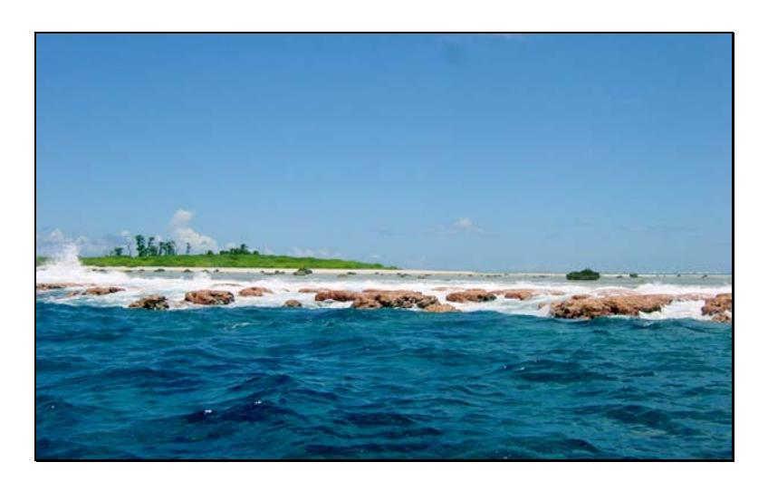

#### **Prepared for:**

#### **Chris Swenson**

**Pacific Islands Coastal Program Coordinator U.S. Fish and Wildlife Service / 300 Ala Moana Blvd., Room 3-122, Honolulu, HI 96850** 

#### **Charlie Pelizza**

**Hawaiian and Pacific Islands National Wildlife Refuge Complex / 300 Ala Moana Blvd., Room 5-231, Honolulu, Hawaii 96850** 

**By:** 

#### **Alexander Wegmann**

**Sula Restoration Ecology / 3190 Maile Way, Honolulu, Hawaii 96822** 

#### **Stephani Holzwarth**

**Sula Restoration Ecology / 3190 Maile Way, Honolulu, Hawaii 96822** 

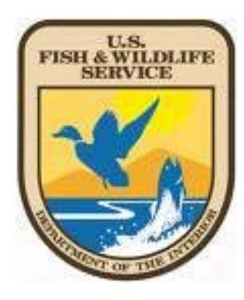

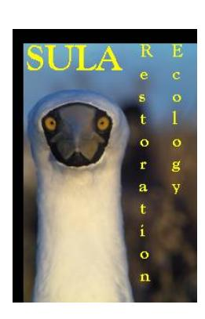

#### TABLE OF CONTENTS

| INTRODUCTION                                                                                                                                                                                   | 4        |
|------------------------------------------------------------------------------------------------------------------------------------------------------------------------------------------------|----------|
| BACKGROUND                                                                                                                                                                                     | 4        |
| FIGRUE 1: ROSE ATOLL NWR GEOGRAPHIC ORIENTATION                                                                                                                                                |          |
| PURPOSE AND NEED                                                                                                                                                                               | -        |
| HUMAN ENVIRONMENT                                                                                                                                                                              | 7        |
|                                                                                                                                                                                                |          |
| ARCHEOLOGICAL, PALENTOLOGICAL, HISTORICAL, AND CULTURAL RESOURCES                                                                                                                              |          |
| SOCIAL AND ECONOMIC SETTING                                                                                                                                                                    |          |
| PUBLIC ACCESS, EDUCATION, RESEARCH, AND RECREATION                                                                                                                                             |          |
| Table 1: Rose Atoll Visitation Activity Record: 1973 to 2005. Each row represents an expedition that produced a trip report or recoverable data. Except for the column "Management," X's indic |          |
| one or more observed measure recorded about the column topic; X's in the Management column                                                                                                     | aie      |
| indicate management recommendationsindicate management recommendations                                                                                                                         | 0        |
| NOXIOUS, EXOTIC, AND INVASIVE SPECIES                                                                                                                                                          |          |
| Invasive Plants                                                                                                                                                                                |          |
| Table 2: Observations of Cocos nucifera (Coconut Palm) on Rose Island                                                                                                                          |          |
| Invasive Mammals                                                                                                                                                                               |          |
| Rose Atoll Rat Eradication.                                                                                                                                                                    |          |
| Invasive Terrestrial Invertebrates                                                                                                                                                             |          |
| ANTHROPOGENIC IMPACTS                                                                                                                                                                          |          |
| Vessel Groundings                                                                                                                                                                              |          |
| Marine debris                                                                                                                                                                                  |          |
| Trespassing and poaching                                                                                                                                                                       |          |
| ENVIRONMENTAL SETTING                                                                                                                                                                          |          |
|                                                                                                                                                                                                |          |
| GEOGRAPHIC AND ECOSYSTEM SETTING                                                                                                                                                               | 14       |
| Climate                                                                                                                                                                                        |          |
| Geology                                                                                                                                                                                        |          |
| Oceanography                                                                                                                                                                                   | 14       |
| Figure 2: CREWS (Coral Reef Early Warning System) buoy deployed at Rose by CRED- left                                                                                                          |          |
| Figure 3: Photograph of a NOAA diver (Jamie Gove) installing a wave and tide recorder (WTR left, and map of oceanographic sampling and instruments installed at Rose by CRED, right            |          |
| Global climate change                                                                                                                                                                          |          |
|                                                                                                                                                                                                |          |
| TERRESTRIAL ECOSYSTEM                                                                                                                                                                          | 18       |
| VEGETATION                                                                                                                                                                                     |          |
| Table 3: Plant species of Rose Atoll – observation record                                                                                                                                      |          |
| Table 4: Vegetation Plot Sampling History, 1990 – 1998.                                                                                                                                        |          |
| Table 5: Mean combined (T. argentea & P. grandis) canopy cover from 1990 to 1998                                                                                                               |          |
| Table 6: Ground cover percentage by type and year for all vegetation plots sampled from 1990 t                                                                                                 |          |
| Figure 4: Adapted from Freifeld and Wegmann (2006), Rose Island: 1982, 2002, 2004, 2005 (the                                                                                                   |          |
| 1982 image is not to scale with the other images)                                                                                                                                              |          |
| Table 6: Seabird species observed at Rose Atoll, 1975-2005.                                                                                                                                    |          |
| Species                                                                                                                                                                                        | 21       |
| Resident Breeder?                                                                                                                                                                              | 21       |
| Table 7: Distribution by month of terrestrial surveys of Rose Island that included counts of active                                                                                            |          |
| seabird nests.                                                                                                                                                                                 |          |
| Seabird Nesting Patterns and Rat Eradication                                                                                                                                                   |          |
| Table 8: Chronology of major environmental events at Rose Atoll during the period 1975-2005                                                                                                    | 23 วง |
| Table 10: Median nest count values for seabirds at Rose prior to and after the 1991-1992 rat                                                                                                   | 44       |
| eradication                                                                                                                                                                                    | 25       |
| Seabird Nesting Patterns and Vegetation Change                                                                                                                                                 |          |
| Table 11: Pearson correlation of seabird nesting activity and % canopy cover at Rose Atoll NW                                                                                                  |          |
| SHOREBIRDS                                                                                                                                                                                     | 26       |

| year) 27                                                                                                                |    |
|-------------------------------------------------------------------------------------------------------------------------|----|
| VAGRANT BIRDS  Table 13: Rose Atoll vagrant bird sightings from 1976 to 1991 27                                   | 27 |
| TERRESTRIAL INVERTEBRATES                                                                                            | 27 |
| Table 14: Terrestrial invertebrate observations (Flint 1990) 28                                                         |    |
| TERRESTRIAL ECOSYSTEM SUMMARY AND MANAGEMENT CONSIDERATIONS                                                             | 28 |
| ACKNOWLEDGEMENTS FOR THE TERRESTRIAL SECTION                                                                            | 30 |
| TERRESTRAIL ECOSYSTEM BIBLIOGRAPHY                                                                                      | 31 |
| MARINE ECOSYSTEM                                                                                                        | 33 |
| Figure 5: Rose Island viewed from the protected waters of the lagoon. Photo: S. Holzwarth 33                            |    |
| Figure 6: The sole opening in the barrier reef, a narrow channel at the northwest corner (upper                         |    |
| photo), and the distinctive crustose coralline algae reef crest (lower photo) 34                                        |    |
| REEF FISHES                                                                                                          | 35 |
| Figure 7: Reef fauna at Rose 37                                                                                         |    |
| CORAL                                                                                                                   | 39 |
| ALGAE                                                                                                                | 40 |
| GIANT CLAMS AND OTHER REEF INVERTEBRATES                                                                                | 41 |
| Giant Clams- recent studies                                                                                             | 41 |
| Giant Clams- previous research                                                                                       | 42 |
| Other Reef Invertebrates                                                                                                | 44 |
| SEA TURTLES AND MARINE MAMMALS                                                                                          | 45 |
| Sea turtles                                                                                                             | 45 |
| Marine Mammals                                                                                                          | 47 |
| BENTHIC HABITAT MAPPING AND DEEP SEA EXPLORATION                                                                     | 48 |
| Figure 8: Bathymetric map of Rose Atoll from multibeam sonar surveys on the AHI during the AS RAMP cruise in 2006 49 |    |
| Figure 9: NOS Biogeography Program's map of Rose Atoll showing habitat type by biological                               |    |
| cover 50                                                                                                                |    |
| Figure 10: NOS Biogeography Program's map of Rose Atoll showing geomorphological structures. 51                      |    |
| Figure 11: NOS Biogeography Program's map of Rose Atoll showing reef zones 52                                           |    |
| Deep-water Habitat Exploration                                                                                          | 53 |
| MARINE ECOSYSTEM SUMMARY AND MANAGEMENT CONSIDERATIONS                                                                  | 54 |
| ACKNOWLEDGEMENTS FOR THE MARINE SECTION                                                                                 | 56 |
| MARINE ECOSYSTEM BIBLOGRAPHY                                                                                            | 57 |

## **Rose Atoll National Wildlife Refuge Research Compendium**

## **INTRODUCTION**

## **Background**

Rose Atoll, named by Louis de Freycinet on October 21, 1819, became the southernmost refuge in the US Fish and Wildlife Service (USFWS) National Wildlife Refuge System in 1973. Rose Atoll National Wildlife Refuge (Rose) consists of 2 small islets, totaling 6 hectares of emergent land, and 15,878 hectares of submerged reef. Rose Atoll NWR is home to and provides nesting habitat for 11 species of migratory seabirds and the threatened green sea turtle (*Chelonia mydas*), and is an important migratory stopover for at least 7 shorebird species. Among the diverse marine life in the lagoon are numerous fish species and a population of rare giant clams. As part of the Territory of American Samoa and a national wildlife , management of Rose is a cooperative effort by the US Fish and Wildlife Service and the government of American Samoa – Department of Marine and Wildlife Resources (DMWR).

Rose (**Figure 1**) is located 180 miles east of the populated portion of American Samoa in the southern, tropical Pacific Ocean. Rose Atoll became a National Wildlife Refuge through a cooperative agreement between the Territory of American Samoa and the USFWS. Presidential Proclamation 4347 exempted Rose Atoll from a wide-ranging conveyance of submerged lands around American Samoa to the Territorial Government. The refuge boundary extends out to 3 miles around the atoll and is under the joint jurisdiction of the U.S. Departments of Commerce and Interior, in cooperation with the Territory of American Samoa

The USS *Vincennes,* commanded by Commodore Charles Wilkes, made the first documented landing at Rose Atoll on October 7, 1839. From Wilkes's landing to the present day, many scientific expeditions called on Rose Atoll, making observations on the terrestrial and marine flora and fauna. Since achieving NWR status in 1973, scientists and mangers from several federal agencies: USFWS (Pacific Remote Islands National Wildlife Refuge Complex), American Samoa DMWR, National Park Service (National Park of American Samoa), and the National Oceanic and Atmospheric Administration (NOAA; Pacific Island Fisheries Science Center), developed and executed terrestrial and marine habitat monitoring programs. The boundary of Rose Atoll NWR coincides with the 3-nautical mile territorial surrounding the Atoll. The U.S. Fish and Wildlife Service (Service) and American Samoa government entered into a Memorandum of Understanding in 1993 to facilitate the Service's program by providing for the cooperation and coordination of both parties to develop baseline information and manage the wildlife resources of Rose (D. Palawski 2006 USFWS pers. com). Information gathered from the monitoring programs is scattered amongst the contributing agencies, sometimes in the form of raw field notes and internal trip reports; a comprehensive summary of existing data on Rose Atoll's terrestrial and marine systems is greatly needed.

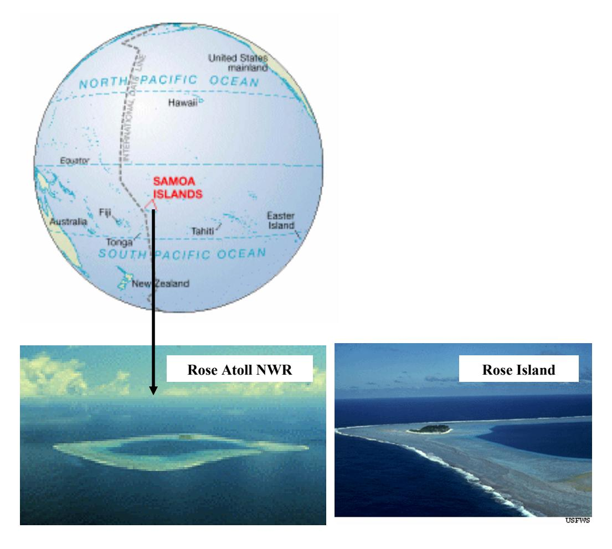

**Figrue 1: Rose Atoll NWR geographic orientation**

During the construction of this report, we contacted the following organizations:

- US Fish and Wildlife Service Honolulu
- Department of Marine and Wildlife Resources American Samoa
- NOAA-Fisheries Pacific Island Fisheries Science Center
  - o -Coral Reef Ecosystem Division
  - o -Protected Species Division
- American Samoa Department of Marine and Wildlife Resources
- National Park Service of American Samoa
- AIMS- Australia Institute of Marine Science
- Australian Museum- Sydney
- Western Pacific Regional Fishery Management Council

## **Purpose and Need**

Overall, there is a need to bring all refuges in line with the new National Wildlife Refuge System mission, goals, and policies, as described in the National Wildlife Refuge System Improvement Act of 1997 (Improvement Act). A Comprehensive Conservation Plan (CCP), required by the Improvement Act, is needed to address "…significant problems that may adversely affect the populations and habitats of fish, wildlife and plants and the actions necessary to correct or mitigate such problems." Specifically, problems and opportunities at Rose Atoll include: insufficient management access and surveillance; ensuring biological integrity, diversity and environmental health of refuge lands, seabird and migratory shorebird populations, coral reefs and associated waters; the need to restore degraded reef habitat; the need to evaluate and manage visitor use; the need to monitor, evaluate and control threats such as invasive species, illegal harvesting and fishing, illegal trespass on refuge lands, coral reefs and waters; and the need to instigate and maintain a comprehensive, consistent biological monitoring program. In addition, the Improvement Act requires the Service to consider increasing opportunities for people to experience wildlife-dependent recreation. The purpose of this Report is to advise the Service personnel involved in constructing the Rose Atoll NWR CCP on the refuge's human environment, physical environment, and ecological setting. Specifically, the Rose Atoll NWR Research Compendium:

- pulls together and summarizes fragmented studies mostly gray literature
- analyzes and summarizes 32 years of data on:
  - o seabirds
  - o shorebirds
  - o vegetation
  - o terrestrial invertebrates
  - o reef fishes
  - o coral
  - o marine algae
  - o giant clams and other marine invertebrates
  - o sea turtles
  - o marine mammals
  - o oceanography
  - o benthic habitat mapping
- assesses known factors about the refuge's ecosystem, physical environment, and human environment
- provides the Service with background information necessary for the development of a 15-year CCP

Comprehensive natural histories (Setchell 1924, Sachet 1955) and an annotated bibliography (Rodgers 1993) already exist for Rose Atoll. This report does not intend to duplicate these accomplished works; rather, we aim to summarize and disseminate previously collected fild data in a format that will assist agency managers in the preservation, restoration, and conservation of Rose.

## **HUMAN ENVIRONMENT**

## **Archeological, Palentological, Historical, and Cultural Resources**

Rose Atoll's limited amount of emergent land and lack of fresh water make the atoll an unlikely location for anything more than temporary human habitation. There is no evidence of prehistoric use of the atoll by Samoans. Basalt boulders on and around Rose Atoll's reef crest were originally considered evidence of pre-western human activity; however, Rodgers (2003) found that the boulders are distinct in both petrography and chemistry from basalt found throughout the rest of the Samoan Archipelago (See geology section below).

The first recorded human manipulation of the atoll occurred in 1920 when W. J. Terhune, Governor of American Samoa, planted Coconut Palms on Rose Island. On February 14, 1941, Rose Atoll was designated a Naval Defense Area by Executive order of President Franklin D. Roosevelt; however, the atoll did not experience military activity during WWII.

## **Social and economic setting**

Rose is uninhabited with no commercial or cultural activity occurring within the refuge.

## **Public access, education, research, and recreation**

Public access to Rose Atoll NWR has been closed since wildlife refuge designation in 1973, visitation to Rose Atoll NWR is controlled by special use permit only. Between 1973 and 2005, 49 documented expeditions visited Rose Atoll. Visitations with discernable observations on the ecology, physical environment, human activities, or management suggestions are presented in **Table 1**. Without staff, facilities, or the ability to manage public visits to the refuge, Rose Atoll NWR does not have an active recreation policy other than that all activities within refuge boundaries must be sanctioned by the Service by way of a special use permit.

**Table 1: Rose Atoll Visitation Activity Record: 1973 to 2005. Each row represents an expedition that produced a trip report or recoverable data. Except for the column "Management," X's indicate one or more observed measure recorded about the column topic; X's in the Management column indicate management recommendations** 

| Terrestrial Inverts Marine Mammals Marine Turtles Marine Inverts Environmental Marine Algae Land Crabs Vegetation Reef Fish Trespass Seabirds Fishing Month Clams Year Rats 1974 November X X X X X 1976 December X X X 1976 November X X 1976 October X X X X 1977 May X 1978 March X X X X X 1980 November X X X X 1981 September X X 1981 November X X 1981 November X X X 1981 September | Management X |
|----------------------------------------------------------------------------------------------------------------------------------------------------------------------------------------------------------------------------------------------------------------------------------------------------------------------------------------------------------------------------------------------------------------------------------------------------------------------------------------------------------------------------------------------------------------------------------------------------------|-----------------|
|                                                                                                                                                                                                                                                                                                                                                                                                                                                                                                                                                                                                          |                 |
|                                                                                                                                                                                                                                                                                                                                                                                                                                                                                                                                                                                                          |                 |
|                                                                                                                                                                                                                                                                                                                                                                                                                                                                                                                                                                                                          |                 |
|                                                                                                                                                                                                                                                                                                                                                                                                                                                                                                                                                                                                          |                 |
|                                                                                                                                                                                                                                                                                                                                                                                                                                                                                                                                                                                                          |                 |
|                                                                                                                                                                                                                                                                                                                                                                                                                                                                                                                                                                                                          |                 |
|                                                                                                                                                                                                                                                                                                                                                                                                                                                                                                                                                                                                          |                 |
|                                                                                                                                                                                                                                                                                                                                                                                                                                                                                                                                                                                                          |                 |
|                                                                                                                                                                                                                                                                                                                                                                                                                                                                                                                                                                                                          |                 |
|                                                                                                                                                                                                                                                                                                                                                                                                                                                                                                                                                                                                          |                 |
|                                                                                                                                                                                                                                                                                                                                                                                                                                                                                                                                                                                                          |                 |
|                                                                                                                                                                                                                                                                                                                                                                                                                                                                                                                                                                                                          | X               |
| 1982 March X X                                                                                                                                                                                                                                                                                                                                                                                                                                                                                                                                                                                  |                 |
| 1982 March X X X X X X X X X                                                                                                                                                                                                                                                                                                                                                                                                                                                                                                                                               | X               |
| 1982 October X X X X X X X X X                                                                                                                                                                                                                                                                                                                                                                                                                                                                                                                                             |                 |
| 1984 October X X X                                                                                                                                                                                                                                                                                                                                                                                                                                                                                                                                                                           |                 |
| 1984 April X X                                                                                                                                                                                                                                                                                                                                                                                                                                                                                                                                                                                  |                 |
| 1986 May X X X                                                                                                                                                                                                                                                                                                                                                                                                                                                                                                                                                                               |                 |
| 1986 November X X X X X X                                                                                                                                                                                                                                                                                                                                                                                                                                                                                                                                                           | X               |
| 1986 N/a X                                                                                                                                                                                                                                                                                                                                                                                                                                                                                                                                                                                         |                 |
| 1987 November X X X                                                                                                                                                                                                                                                                                                                                                                                                                                                                                                                                                                          |                 |
| 1987 February X X X X X                                                                                                                                                                                                                                                                                                                                                                                                                                                                                                                                                                | X               |
| 1987 February X X X X X X                                                                                                                                                                                                                                                                                                                                                                                                                                                                                                                                                           |                 |
| 1987 February X                                                                                                                                                                                                                                                                                                                                                                                                                                                                                                                                                                                    |                 |
| 1988 October X X X X X X                                                                                                                                                                                                                                                                                                                                                                                                                                                                                                                                                            | X               |
| 1988 February X X X                                                                                                                                                                                                                                                                                                                                                                                                                                                                                                                                                                          |                 |
| 1989 March X X X                                                                                                                                                                                                                                                                                                                                                                                                                                                                                                                                                                             |                 |
| 1990 October X X X X X                                                                                                                                                                                                                                                                                                                                                                                                                                                                                                                                                                 | X               |
| 1990 March X X X X                                                                                                                                                                                                                                                                                                                                                                                                                                                                                                                                                                        |                 |
| 1990 August X X X X X                                                                                                                                                                                                                                                                                                                                                                                                                                                                                                                                                                  |                 |
| 1991 April X                                                                                                                                                                                                                                                                                                                                                                                                                                                                                                                                                                                       | X               |
| 1991 April X X X                                                                                                                                                                                                                                                                                                                                                                                                                                                                                                                                                                             |                 |
| 1991 September X X X X X X                                                                                                                                                                                                                                                                                                                                                                                                                                                                                                                                                          | X               |
| 1992 September X X X X X                                                                                                                                                                                                                                                                                                                                                                                                                                                                                                                                                               |                 |
| 1993 March X X X X                                                                                                                                                                                                                                                                                                                                                                                                                                                                                                                                                                        | X               |
| 1993 November X X X X                                                                                                                                                                                                                                                                                                                                                                                                                                                                                                                                                                     | X               |
| 1994 October X X X X X X X                                                                                                                                                                                                                                                                                                                                                                                                                                                                                                                                                       |                 |
| 1994 November X X                                                                                                                                                                                                                                                                                                                                                                                                                                                                                                                                                                               |                 |
| 1994 March X X X X                                                                                                                                                                                                                                                                                                                                                                                                                                                                                                                                                                        |                 |
| 1996 July X X X X X X                                                                                                                                                                                                                                                                                                                                                                                                                                                                                                                                                               |                 |
| 1998 February X                                                                                                                                                                                                                                                                                                                                                                                                                                                                                                                                                                                    |                 |
| 2000 N/a X                                                                                                                                                                                                                                                                                                                                                                                                                                                                                                                                                                                         |                 |
| 2002 N/a X                                                                                                                                                                                                                                                                                                                                                                                                                                                                                                                                                                                         | X               |
| 2002 February X X                                                                                                                                                                                                                                                                                                                                                                                                                                                                                                                                                                               | X               |
| 2005 October X                                                                                                                                                                                                                                                                                                                                                                                                                                                                                                                                                                                     |                 |
| 2005 January X                                                                                                                                                                                                                                                                                                                                                                                                                                                                                                                                                                                     | X               |

## **Noxious, exotic, and invasive species**

Visits to Rose since 1973 have been infrequent and conducted according to the stipulations of the agencies responsible for protecting the atoll's natural environment, yet several species introductions have caused considerable damage to the Atoll's terrestrial and marine ecosystems.

#### **Invasive Plants**

Coconut trees were first observed on Rose Island in the mid-19th century, and were likely planted by Samoan visitors (Setchell 1924). Amerson and colleagues (Amerson 1982) mapped 13 trees on the island in mid-1970s. In 1987, a DMWR expedition mapped 30 coconut trees on Rose (Knowles 1987); this count includes several small trees planted around the island by a "vessel crew" the previous year (Hu 1986). Several trip reports make note of the coconut infestation and call for management (Shallenberger 1980). In 2005, Hurricane Olaf uprooted many of the native canopy trees (*Tournefortia argentea* and *Pisonia grandis*) on Rose Island. Three dense patches of adult coconut trees survived the hurricane and are now thick with small (< 2 m) trees and sprouting seeds (H. Freifeld 2005 USFWS pers. com.) (**Table 2**). Rose Island's vegetation is on the brink of a major composition change from a native *Pisonia* forest to a coconut forest. This transformation would homogenize the vegetation structure and substantially reduce the island's value as habitat for nesting seabirds.

 **Table 2: Observations of** *Cocos nucifera* **(Coconut Palm) on Rose Island** 

| Year | Month    | Notes                                                                                              |
|------|----------|----------------------------------------------------------------------------------------------------|
| 1974 | November | Trees healthy; seedlings                                                                           |
| 1975 | October  | Trees planted by Government of American Samoa were healthy; seedlings found below Mature trees. |
| 1975 | May      | Poor condition. 17 extant trees                                                                    |
| 1976 | October  | Generally good condition, flowers, seeds, seedlings.                                               |
| 1978 | March    | Good condition, one tree topped; 30-40 seedlings                                                   |
| 1986 | November | 77 young trees, 12 trees with fruit, 8 dead trees                                                  |
| 1988 | March    | 11 Mature trees, many young trees including plantings                                              |
| 1989 | March    | Many young trees resulted from planting                                                            |
| 1990 | October  | Most seeds eaten by rats                                                                           |
| 1993 | March    | 2 live plants on Sand Island                                                                       |
| 2005 | January  | 3 dense groves of adult trees; hundreds of small trees and seedlings                               |

Exactly when *Cenchrus echinatus*, a highly invasive grass commonly known as "Sandbur," established on Rose Island is unclear. A March 1993 expedition could not find "the grass" (Grant 1993), which implies its presence prior to this observation. *Cenchrus* was spotted in March 1994 (McDermond 1994). On 2 subsequent visits to Rose Island that same year, all *Cenchrus* plants were destroyed, and seeds were sifted out of the soil and similarly terminated (McDermond 1994). In November 1994, McDermond et al. (1994) fixed a heavy, black tarp over the area infested with *Cenchrus*. Evidently, this action successfully eradicated the invasive grass from Rose Atoll as the plant has not been observed since.

See **Appendix 2** for the discussion of invasive marine algae associated with the *Jin Shiang Fa* vessel grounding.

#### **Invasive Mammals**

The Black Rat, *Rattus rattus,* was introduced to Rose Atoll on or before 1920 (Mayor 1924)**.** There are 3 species of commensal rats in the genus *Rattus* that have been introduced to islands throughout the world. In order of decreasing body size they are: the Norway or Brown Rat (*R. norvegicus*), the Ship or Black Rat (*R. rattus*), and the Polynesian Rat (*R. exulans*). They have different dietary preferences, distributions and histories of introduction, but all 3 species are omnivorous, behaviorally plastic, have high reproductive rates, and can survive in a variety of habitats (Atkinson 1985; Moors *et al*. 1992). These traits make them ideally suited to survive on a variety of predator-free islands. One or more of these species occurs on an estimated 82% of all island groups worldwide (Atkinson 1985). Refer to **Table 1** for a listing of the reports that contain observations on rats at Rose Atoll.

The most pronounced impact of introduced rodents on island ecosystems is the extinction of endemic species. Rats alone are responsible for an estimated 40-60% of all bird and reptile extinctions (Island Conservation analysis of World Conservation Monitoring Centre data; Atkinson 1985). They have caused the extinction of endemic mammals, birds and invertebrates on islands throughout the world's oceans (Atkinson 2001, Campbell 2002, Delgado Garcia 2002, DeMattia 2006).

Even if extinctions do not occur, rats can have ecosystem-wide effects on the distribution and abundance of native species by directly and indirectly influencing the native biota. Comparisons of rat-infested and rat-free islands, and pre- and post-rat eradication experiments, show that rats depress bird population size and recruitment (Jones et al. 2005), and similarly effect reptiles (Towns 1991), plants (Campbell 2002), and terrestrial invertebrates (Wegmann 2006, unpublished data).

#### *Rose Atoll Rat Eradication*

Introduced rats feed opportunistically on plants, and alter the floral communities of ecosystems into which they are introduced (Campbell 2002), and in some cases degrade the quality of nesting habitat for birds that depend on the vegetation. In 1990, USFWS biologists began a rat eradication program that successfully removed all rats from Rose Island by the end of 1991 (Flint 1990, Flint 1993).

Rat eradication at Rose began in October of 1990. At this time, the atoll's rat population was estimated at 1048 individuals (Flint 1990). The eradication involved live traps, kill or "snap" traps, and bait stations. One-hundred and fifty live traps were deployed in 3 separate plots, and 50 snap traps were placed throughout the interior of the island. Thirtyone bait stations - 3" X 1' sections of PVC loaded with Talon anti-coagulant rodenticide pellets containing brodifacoum - were deployed on 25 October. The bait stations were checked and recharged daily along with the live and snap traps. By the morning of the 13th day, 600 rats had been killed (Flint 1990).

The rat eradication was conducted without major consequence to the native biota. During the first 2 weeks of the eradication, 2 Golden Plovers (*Pluvialis dominica*), 1 fledgling Sooty Tern (*Sterna fuscata*), 1 Long-tailed Cuckoo (Eudynamis taitensis), and several Hermit Crabs (*Coenobita sp.*) and Coconut Crabs (*Birgus latro*) were killed by snap traps. Snap-traps were subsequently elevated to reduce non-target species take (Flint 1990).

In conjunction with the rat eradication, a vegetation monitoring program was initiated to monitor plant response to rat removal (See the Vegetation and Seabird segments of the **ATOLL ECOSYSTEMS** section for a discussion of rat influence on Rose's biotic community). The following anecdote illustrates Rose Island's plant community response to the rat eradication.

No signs of chewed vegetation, gnaw marks on seabird eggs or dead turtle hatchlings, nor rodent feces were found…Because of this data and the continued spread of *Boerhavia repens* and *Tournefortia argentea* into areas bare this past November, plus the discovery of 7 seedlings of *Pisonia grandis*, 3 seedlings of *Ipomea pes-caprae*, 1 new seedling of *Hibiscus*, and a small seedling of unknown species,…we feel rats have probably been successfully eradicated from Rose Atoll. Succulent seedlings were unable to germinate successfully in the past due the high density of rats on the island. (McDermond 1994).

Rats have not been observed at Rose since the 1990-1991 eradication, however the risk of reintroduction renews with each expedition to the Atoll. Measures should be taken to minimize this risk as the early stages of rat recolonization could easily go undetected given the infrequency of terrestrial expeditions to Rose Atoll. Quarantine protocols are in place for Rose, but visitation that does not adhere to the protocols is known to occur.

#### **Invasive Terrestrial Invertebrates**

Of notable concern is the scale insect (*Pulvinaria urbicola*) infestation that was first noticed in 2002 (J. Burgett 2005 USFWS pers. com.). Scale insects concentrate on the petioles and leaves of the atoll's dominant canopy tree, *Pisonia grandis*. While the link between the recent *Pisonia* die-offs (see the **Atoll Ecosystems** / **Vegetation** section) and the scale infestation has not yet been scientifically established, it is likely that the invasive insects at least contribute to the drastic, recent increase in *Pisonia* mortality.

## **Anthropogenic impacts**

Vessel groundings, derelict marine debris, and unregulated resource extraction (recreational and commercial) are notable anthropogenic impacts that threaten Pacific island refuges.

#### **Vessel Groundings**

In October 1993, the longliner *Jin Shiang Fa* ran aground on Rose Atoll's barrier reef. Upon wrecking, the ship released 100,000 gallons of diesel fuel and caused physical damage to the coral and algae reef structures (Maragos 1994). Over time the vessel broke to pieces and scattered metal debris along the reefcrest and forereef. Environmental damage resulting from the fuel spill was not quantified, but data from a pre-assessment screen collected immediately after the grounding recorded the following:

"That data showed that oil sheens and oily debris were spread across the reef and lagoon and oil was entrapped within coral rubble and sediments. Additionally, biologists documented an extensive area where oil killed the reef-building pink crustose coralline algae (*Hydrolithon* or *Porolithon* spp.) as well as hundreds of marine snails, boring sea urchins (*Echinometra* spp.) and giant clams (*Tridacna maxima*). Opportunistic blue-green algae (the cyanobacteria *Lyngbya* and *Oscillatoria* spp.), which often invade a tropical reef after an oil spill, were also first noted at this time (USFWS 1996b).

"…A massive die-off of crustose coralline algae, extending approximately 1000 m along the reef flat and reef margin, occurred on the southwest arm of the atoll where the vessel grounded. Dead or injured coral also were documented along the outer reef slope and terrace, and the slope, floor and pinnacles of the lagoon (Maragos 1994, USFWS 1997)." (U.S. Fish and Wildlife Service and The Department of Marine and Wildlife Resources 2001)

By 1997, USFWS and DMWR scientists discovered an invasive algal bloom catalyzed by higher than normal levels of iron in the water around the wreck debris (U.S. Fish and Wildlife Service and The Department of Marine and Wildlife Resources 2001). USFWS, DWWR, and cooperating scientists have published comprehensive studies that detail the extent of the environmental damage caused by the *Jin Shiang Fa* grounding (Maragos 1994, Green 1997, Burgett 2002), See **Appendix 2** for an executive summary of the *Jin Shiang Fa* grounding and restoration actions taken by USFWS and DMWR, with the following conclusion almost a decade after the grounding:

"…Conditions on the atoll over eight years after the spill either show little improvement or have deteriorated. The crustose coralline algae have only shown limited recovery in areas where restoration activities have occurred and the 'weedy' invasive bloom has expanded into other areas of the reef and lagoon…The die-off of crustose coralline algae is of particular concern for the future management of Rose Atoll NWR, since this algae is the primary reef-building plant on the atoll. In the absence of a healthy crustose coralline algal community, reef growth may fail to keep pace with storm erosion or rising sea levels…Such an event would produce catastrophic changes in the lagoon's protected ecosystem, and would threaten critical nesting habitat for federally protected seabirds and sea turtles." (U.S. Fish and Wildlife Service and The Department of Marine and Wildlife Resources 2001)

Restoration actions in the form of an emergency clean-up were undertaken in 1999 - 2000. At substantial expense and effort over 100 metric tons (mT) of the shipwreck debris was removed, although an estimated 40 mT remain on the reef (Craig 2002a). Biologists who have surveyed the atoll in recent years reported that the cyanobacteria continues to dominate an extensive section of the southwest forereef near the wreck site (CRED 2006).

#### **Marine debris**

Aside from the vessel grounding, few observations of marine debris were documented in the trip reports. Several of the educational trips (DMWR expedition for school teachers from American Samoa) mention cleaning flotsam off the beach, but no quantitative analysis of debris accumulation has occurred at Rose Atoll (Davis 1987, Knowles 1987, Le'i 1988, Tiapula 1988).

#### **Trespassing and poaching**

Given Rose Atoll's remoteness, enforcement of the Refuge access policy is difficult at best. However, the atoll's remoteness also makes it a complicated place to access, thus trespass events are likely infrequent. Yet, the risk of species introductions and disturbance of extant species is serious regardless of the frequency of undocumented and unsanctioned stops at Rose Atoll. Only 2 expeditions to Rose Atoll documented evidence of trespass, "…a garbage burn site …on the north end of the island in the open sandy area. Tin cans and foil were easily seen" (Barclay 1992), and "Husked coconuts that were found on the beach indicated that trespassers had been on the island" (Ludwig 1982).

Poaching of fish and marine invertebrates (primarily giant clams) is a realistic threat to Rose Atoll's marine ecosystem. As with terrestrial trespass, marine poaching is difficult to detect yet has the potential to cause serious damage to Rose's reef communities, especially if the poaching is driven by socio-economic factors. See the **Marine Ecosystem / Giant Clams - previous research** section for a discussion of giant clam poaching at Rose Atoll.

## **ENVIRONMENTAL SETTING**

## **Geographic and Ecosystem Setting**

One of the most isolated reefs in the world, Rose Atoll lies about 120 km east-southeast of Ta`u Island in American Samoa (Fig. 1). Rose also is among the smallest atolls in the world; its square-shaped barrier reef encloses a lagoon only 2 km across at the widest point (Rodgers 1993). The reef itself is unusual in that it is built primarily of coralline algae rather than coral. The atoll has 2 islands: the intermittently vegetated Sand Island (~2.5 ha) on the north corner and permanently vegetated Rose Island (~5.2 ha) on the east corner.

## **Climate**

Although the mean annual temperature range throughout Samoa is only 2°C (22-24°C), the year may still be divided into summer (December – May) and winter (June – November), based on variation in temperature and precipitation (Amerson *et al.* 1982). Because of its low elevation, Rose Atoll receives far less precipitation than the 300-750 mm/year that falls on the high volcanic islands of Samoa. However, rainfall is frequent and abundant enough to support a small littoral forest on Rose Island. Hurricanes are relatively frequent in Samoa; 5 have hit the archipelago since 1987, with the most recent, Olaf, moving directly over Rose in February 2005.

#### **Geology**

A small number of publications regarding Rose Atoll geology are in the peer reviewed literature (Sachet 1955, Keating 1992, Rodgers 2003); however, no notable geologic observations were recorded in the available trip reports. From Rogers (2003), we know that Rose Atoll's structural core contains 3 distinct basalt types: holocrystalline olivine tholeiite, coarse vesicular picrite basalt, and olivine-poor transitional basalt. This aggregation of basalts most closely resembles the Ta'u Group lavas found in the Manu'a Islands. Rose basalts are unrelated to the main phases of Samoan plume activity and appear unique among neighboring island systems.

#### **Oceanography**

Rose Atoll, with its small size and well-defined boundaries, offers a natural laboratory to study oceanographic processes. Detailed data on current profiles and characteristics have also been collected intensively around Rose during research cruises by way of shipboard instrumentation. A number of sophisticated instruments have been dedicated to recording oceanographic parameters at Rose, including a satellite-telemetered Coral Reef Early Warning System buoy (CREWS), a subsurface wave and tide recorder, subsurface temperature recorders, and drifter buoys (CRED 2006b).

Oceanographic data was collected onboard NOAA Ships Townsend Cromwell, Oscar Elton Sette, and Hi'ialakai during research cruises to the Samoan islands, with the help of the on-board NOAA survey technician. ADCP (acoustic doppler current profile) data was collected continuously while the ship was at sea, recording a profile of current direction and velocity at multiple depths, linked with time, date, and geographic position of the ship. During the 2006 American Samoa Reef Assessment and Monitoring Project (AS-RAMP) cruise, a large box-shaped area around Rose was intensively surveyed with the ADCP to collect detailed data on local surface and subsurface water currents (pers. com.. Kevin Wong, CRED).

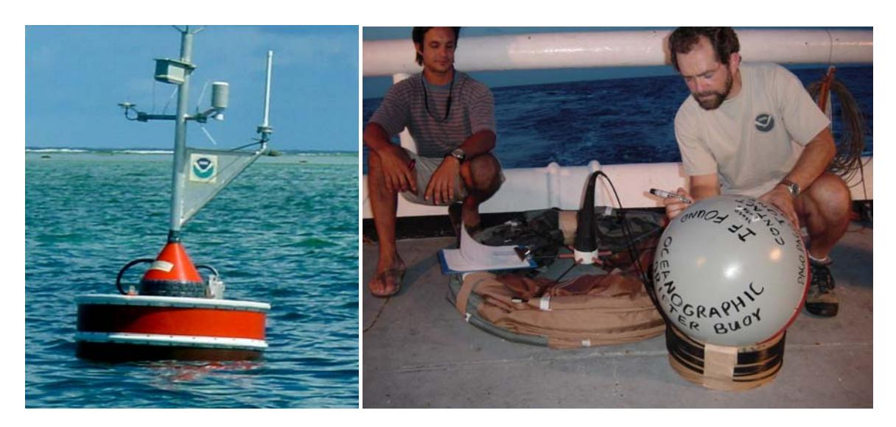

**Figure 2: CREWS (Coral Reef Early Warning System) buoy deployed at Rose by CRED- left. The satelite telemetered buoy is anchored in the lagoon and records fine resolution data on climatic and ocean conditions. Drifter buoy being prepared for deployment near Rose by oceanographer Ron Hoeke and survey technician Phil White. Photographs: S. Holzwarth.** 

Deep-water conductivity temperature depth (CTD) casts to a depth of 500 m were also part of shipboard operations, producing a depth profile of salinity (via conductivity), temperature, dissolved oxygen, and fluorescence. In 2006, a total of 17 deepwater CTDs were done around Rose, with water samples collected for laboratory analysis of chlorophyll, nutrients, and dissolved inorganic carbon (DIC). Shallow-water CTD casts were conducted from a small boat at intervals along the 30 m depth contour outside the reef, along with shallower casts in the lagoon. Thirteen shallow-water CTDs were conducted in 2006, along with water samples for lab analysis (Kevin Wong, CRED., pers. com).

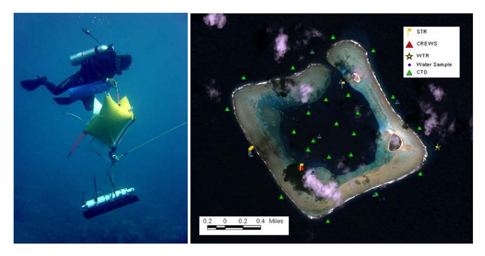

**Figure 3: Photograph of a NOAA diver (Jamie Gove) installing a wave and tide recorder (WTR), left, and map of oceanographic sampling and instruments installed at Rose by CRED, right. Six STRs (yellow flags) were attached to the reef at Rose to record high resolution water temperature**  *in situ***, including 4 placed along a depth gradient near the wrecksite, 1 in the channel, and 1 at the CREWS buoy site. The position of the WTR (yellow star) is also shown, near the outside eastern corner of the reef, as are shallow-water CTD casts done from a small boat (green triangles). Photograph by S. Holzwarth; Map by R. Hoeke, CRED.** 

As part of the AS-RAMP cruises, several oceanographic instruments were deployed at Rose during biennial visits. A CREWS buoy was anchored in a sandy spot in the southwest corner of the lagoon in 2002, and replaced in 2004 and again in 2006 (see Fig. 2 and 3) (CRED 2006b). The buoy was secured to a 1200 lb rubber-encased lead clump anchor with a bungi-style mooring device to avoid potential damage to corals from an anchor chain. A set of 16 settlement plates were biennially installed and retrieved around the base of the anchor as part of a coral recruitment study by CRED coral biologist J. Kenyon. The CREWS buoy was programmed to record high resolution sea surface and air temperature, wind speed and direction, and barometric pressure, transmitting a data summary to the Argos satellite system on a daily basis. Access to this data in near real time allows scientists and managers to remotely detect potential warm-water induced bleaching, cooling, storm, and other meteorological events. The daily summary data is available for download from the CRED website

http://crei.pifsc.noaa.gov/ocean\_data.html, by clicking the Rose Atoll link and then selecting the desired time frame for display.

A wave and tide recorder (WTR) was installed off the east corner of Rose, along with a number of small subsurface temperature recorders (STR) deployed throughout the reef. The WTR recorded water flow direction, velocity, and temperature, and wave height (Fig. 3), and was installed at 16 m depth. The STRs logged a detailed record of water temperature, and were deployed at depths of 2 to 31 m, with 1 in the channel, 1 attached to the CREWS buoy, and 4 near the shipwreck site placed at different depths (Fig. 3; Kevin Wong, pers. com..).

Rose has an almost completely enclosed lagoon, with only a single narrow channel at the northwest corner, and the water within the atoll can grow remarkably warm. Oceanographers at the PIFSC Honolulu Lab analyzed data from satellite derived sea surface temperature in combination with *in situ* data colleted by towed-diver temperature recorders, CTD casts, the CREWS buoy, and STRs. Hoeke et al. (2006) used this data to calculate a mean flushing time for Rose Atoll and to describe the somewhat unique oceanographic characteristics of the atoll. Preliminary results showed a remarkably warm lens of heated water on the surface of the lagoon when residence time was sufficient. The phenomenon was sufficiently dramatic to be detected by towed-divers, with remarkably warm surface waters and cooler water encountered 1 to 2 meters below in a broad section near the center of the lagoon (pers. exp. of co-author S. Holzwarth).

Drifter buoys were released from the stern of the NOAA research vessel *Townsend Cromwell* near Rose Atoll during the 2002 reef assessment cruise. The 6 SVP (surface velocity program) ocean drifter buoys were designed to travel with prevailing currents. The buoys featured sea anchor 15 m below the surface, and a surface unit that transmitted geographic position via satellite (CRED 2006b). The drifters were released at Rose to aid in the study of turtle migration routes (Craig et al. 2004), as well as to understand ocean currents and circulation patterns that affect transportation and settlement of aquatic larvae (CRED 2005). After drifting circuitously around Samoa for 1 to 10 months, all 6 buoys traveled west at a net rate of 0.54 km/h on prevailing surface currents. The longest traveling drifter continued west past Fiji and Vanuatu before it stopped transmitting.

## **Global climate change**

Global warming will likely have severe influence on low coralline atolls and islands throughout the world's oceans (McLean 2001). With a crest no more than 5 meters above sea level, Rose Atoll's terrestrial environment will be subject to physical environment changes brought on by climate driven sea-level change. Some predicted consequences of global warming and sea-level rise are: (McLean 2001)

- Increased levels of inundation and storm flooding
- Accelerated coastal erosion
- Seawater intrusion into fresh groundwater
- Elevated sea-surface and ground temperatures

When modeled, the biological consequence of these environmental changes for low-lying island systems ranges from moderate to severe (Baker et al. 2006). Rose atoll's small terrestrial footprint, 6 hectares of emergent land, is a refuge for nesting Green Sea Turtles, seabirds, land crabs, and several coastal-strand plant species. Increased storm activity, accelerated coastal erosion, and seawater contamination of fresh groundwater will negatively affect all components of the Atoll's terrestrial biota, and evated seasurface temperature could lead to coral bleaching

# **TERRESTRIAL ECOSYSTEM**

Rose Island provides a nesting refugium for a small population of green turtles and hawksbill turtles (*Chelonia mydas* and *Eretmochelys imbricata*), 11 seabird species, and habitat for 2 gecko species, the Oceanic Gecko (*Gehyra oceanica*), and the Mourning Gecko (*Lepidodactylus lugubris*), and the Strawberry Hermit Crab (*Coenobita perlatus*). Seven species of migrant shorebirds and the Pacific reef heron (*Egretta sacra*) regularly use the atoll as a seasonal foraging ground. Polynesian rats were observed on Rose Island as early as 1920 (Mayor 1924), and doubtless had a significant influence on both flora and fauna. Rats were eradicated from Rose in 1990-91 (Flint 1990, 1993). The terrestrial invertebrate fauna of the atoll is not well studied, but is known to include several spiders and lepidopterons, and at least 1 or 2 species of non-native ants which might be facilitating the scale insect infestation (B. Flint 2006 USFWS pers. com.).

## **Vegetation**

Rose Atoll's vegetation is currently dominated by the shrub *Tournefortia argentea*, which forms a patchy forest up to 3 or 4 m tall. Rose previously supported a mature stand of *Pisonia grandis*; a forest type that is in decline throughout its range. In the past few decades, the *Pisonia* trees experienced hurricane damage, several unexplained die-offs, and until 1991, recruitment limitation through rat herbivory. Other major components of Rose's vegetation includes: 3 trees - Beach Hibiscus (*Hibiscus tiliaceus*), Cordia (*Cordia subcordata*), and the introduced coconut tree (*Cocos nucifera*), and the prostrate herb - *Boerhavia tetrandra*. **Table 3** displays a record of plant observations from 1974 to 1998; trip reports after 1998 did not include observations on Rose's vegetation

**Table 3: Plant species of Rose Atoll – observation record** 

| Species                | 1974 | 1975 | 1976 | 1978 | 1982 | 1986 | 1987 | 1988 | 1989 | 1990 | 1991 | 1992 | 1993 | 1994 | 1998 |
|------------------------|------|------|------|------|------|------|------|------|------|------|------|------|------|------|------|
| Barringtonia asiatica  |      | X    |      |      |      |      |      |      |      |      |      |      |      | X    | X    |
| Boerhavia repens       | X    | X    | X    | X    | X    | X    | X    | X    |      |      |      | X    | X    |      |      |
| Calophyllum inophyllum |      |      |      |      |      |      |      |      |      |      |      |      |      | X    |      |
| Cenchrus echinatus     |      |      |      |      |      |      |      |      |      |      |      |      | X    | X    |      |
| Cocos nucifera         | X    | X    | X    | X    |      | X    |      | X    | X    | X    |      |      | X    |      |      |
| Cordia subcordata      |      |      |      |      |      |      |      |      |      |      |      |      |      | X    |      |
| Hibiscus sp.           |      |      |      |      |      |      |      |      |      |      |      |      |      | X    | X    |
| Ipomea macrantha       |      | X    | X    |      |      |      | X    |      |      |      |      |      |      |      |      |
| Ipomea pes-caprae      |      |      |      |      |      |      |      |      |      |      |      |      | X    |      |      |
| Pisonia grandis        | X    | X    | X    | X    | X    | X    |      | X    | X    | X    | X    | X    |      | X    | X    |
| Portulaca sp.          | X    | X    |      |      |      | X    |      | X    |      | X    |      |      |      |      |      |
| Suriana maratima       |      | X    |      |      |      |      | X    |      |      |      |      |      |      |      |      |
| Terminalia sp.         |      |      |      |      |      |      |      |      |      |      |      |      |      | X    |      |
| Tournefortia argentea  | X    | X    | X    | X    | X    | X    | X    | X    |      | X    |      | X    | X    | X    | X    |

A total of 28 random, permanent vegetation plots (6 m. diameter) were established on Rose Island in 1990 - several months prior to the rat eradication - to monitor vegetation response to rat removal. Vegetation plot sampling consists of counting and measuring the diameter of all stems of all species found within the plot, estimating the canopy cover above the plot, and categorizing ground cover by type and percent cover of each type (See **Appendix 3** for vegetation plot sampling protocol). From 1990 to present, vegetation plot sampling has been opportunistic and noncontiguous (**Table 4**). For this reason, quantitative analysis of existing data on Rose Atoll's vegetation is very limited.

Quantitative assessment of vegetation change at Rose Atoll is only marginally possible. When the vegetation plot data were filtered for Date and Plot number, only Combined Canopy Cover (*T. argentea* and *P. grandis*) emerges as the only robust variable with chronosequential values from 18 plots sampled in 1990, 1991, and 1998 (**Table 5**). While the data do not represent major disruptions to the plant community prior to 1990, such as the 1974 and 1988 *Pisonia* die-offs, a significant decrease in canopy coverage from 1991 to 1998 is evident. Thus, the vegetation plot data do not provide an adequate measure of vegetation response to the rat eradication. However, this does not mean that the collected measurements on Rose's plant community are useless.

**Table 4: Vegetation Plot Sampling History, 1990 – 1998.** 

| Plot # | 1990  | 1991  | 1991      | 1992      | 1994    | 1998     |
|--------|-------|-------|-----------|-----------|---------|----------|
|        | April | April | September | September | October | February |
| 1      | X     |       | X         | X         |         |          |
| 2      | X     |       | X         | X         |         |          |
| 3      | X     |       | X         | X         |         | X        |
| 4      | X     |       | X         | X         |         | X        |
| 5      | X     |       | X         | X         |         | X        |
| 6      | X     |       | X         | X         |         | X        |
| 7      | X     | X     | X         | X         |         |          |
| 8      | X     | X     | X         | X         |         | X        |
| 9      | X     | X     | X         |           |         | X        |
| 10     |       | X     | X         |           |         |          |
| 11     |       | X     | X         |           |         | X        |
| 12     | X     |       | X         |           |         | X        |
| 13     | X     | X     | X         |           |         | X        |
| 14     | X     | X     | X         |           |         | X        |
| 15     | X     |       | X         | X         |         | X        |
| 16     |       | X     | X         | X         |         | X        |
| 17     | X     | X     | X         | X         |         | X        |
| 18     |       |       |           |           | X       |          |
| 19     | X     |       | X         | X         | X       | X        |
| 20     |       |       |           |           | X       |          |
| 21     | X     |       | X         | X         | X       | X        |
| 22     |       |       |           |           | X       |          |
| 23     | X     |       | X         |           | X       | X        |
| 24     | X     |       | X         |           | X       | X        |
| 25     | X     | X     | X         |           |         | X        |
| 26     |       |       | X         | X         |         | X        |
| 27     | X     | X     | X         |           |         | X        |
| 28     | X     | X     | X         | X         | X       | X        |

**Table 5: Mean combined (T. argentea & P. grandis) canopy cover from 1990 to 1998** 

| Year              | 1990 | 1991 | 1998 |
|-------------------|------|------|------|
|                   | 48%  | 60%  | 18%  |
| Mean Canopy Cover |      |      |      |

Canopy coverage percentages represent mean values collected from 18 independent vegetation plots that were each sampled in 1990, 1991, and 1998

While not useful in an analytical sense, documentation of ground cover type and percentage within vegetation plots describes the general character of leaf-litter and forest debris sub-habitats. **Table 6** reports a summary of ground cover values from 1990 to 1998.

**Table 6: Ground cover percentage by type and year for all vegetation plots sampled from 1990 to 1998** 

| Ground Cover Type                                                                                         | 1990* | 1991 | 1992 | 1994 | 1998 |
|-----------------------------------------------------------------------------------------------------------|-------|------|------|------|------|
| bird carcass                                                                                              | 1%    |      |      |      |      |
| Boerhavia*                                                                                                |       | 90%  | 25%  | 47%  | 55%  |
| consolidated coral                                                                                        | 13%   | 10%  | 32%  | 35%  | 70%  |
| coral rubble                                                                                              | 40%   | 34%  | 30%  | 49%  | 68%  |
| dead leaves                                                                                               | 23%   | 18%  |      |      |      |
| dead wood                                                                                                 | 40%   | 33%  | 17%  | 24%  |      |
| duff                                                                                                      |       |      | 6%   |      |      |
| gravel                                                                                                    | 27%   |      | 21%  |      |      |
| humus                                                                                                     | 37%   | 84%  | 13%  | 32%  |      |
| leaf litter                                                                                               |       |      | 1%   |      |      |
| leaves                                                                                                    |       | 25%  |      | 12%  |      |
| live wood                                                                                                 |       | 7%   | 6%   | 12%  |      |
| sand                                                                                                      | 51%   | 55%  | 7%   |      | 100% |
| wood                                                                                                      | 41%   |      |      |      |      |
| * Rows and columns where total ground cover is greater than 100% indicates overlapping ground cover types |       |      |      |      |      |

The increase in ground cover type "sand," from 1992 to 1994 indicates a decline in plant cover. The following images (**Figure 4**) show a consistent reduction in vegetated habitat on Rose Island from 1982 to 2005 (Freifeld 2006).

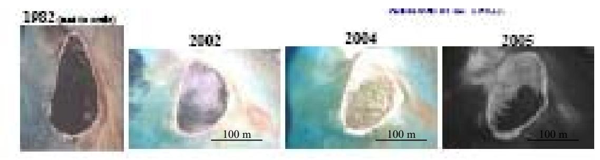

**Figure 4: Adapted from Freifeld and Wegmann (2006), Rose Island: 1982, 2002, 2004, 2005 (the 1982 image is not to scale with the other images)** 

In 2002, Rose's *Pisonia* forest experienced a scale insect (*Pulvinaria urbicola*) infestation that persists today (J. Burgett 2006 USFWS pers. com.). Currently, only 7 mature *Pisonia* trees remain, all of which are severely infested and thought to be dying. Over the past several years, periodic injections of systemic imidacloprid imicide by visiting USFWS personnel have not significantly deterred the scale infestation (B. Flint 2005 USFWS pers. com.).

Many of the Rose Atoll trip reports include qualitative statements about the vegetation: major disturbances, succession, and phenology. Pertinent sections of such narratives, primarily those focused on system level disturbances, are included in our assessment of seabird nesting patterns (see **Seabirds** section). **Appendix 4** chronologically lists, in note form, all of the vegetation observations from available trip reports. Such observations can be compared to current and future observations to assist management and restoration actions for Rose's plan community.

## **Seabirds**

**Table 6: Seabird species observed at Rose Atoll, 1975-2005.** 

| Species                                                                                                                       | Resident Breeder? |
|-------------------------------------------------------------------------------------------------------------------------------|-------------------|
| Wedge-tailed shearwater (Puffinus pacificus)                                                                                  | ?*                |
| Christmas shearwater (Puffinus navitatus)                                                                                     | ?**               |
| White-tailed tropicbird (Phaethon lepturus)                                                                                   | ?***              |
| Red-tailed tropicbird (Phaethon rubricauda)                                                                                   | Yes               |
| Masked booby (Sula dactylatra)                                                                                                | Yes               |
| Brown booby (Sula leucogaster)                                                                                                | Yes               |
| Red-footed booby (Sula sula)                                                                                                  | Yes               |
| Great frigatebird (Fregata minor)                                                                                             | Yes               |
| Lesser frigatebird (Fregata ariel)                                                                                            | Yes               |
| Gray-backed tern (Sterna lunata)                                                                                              | Yes               |
| Sooty tern (Sterna fuscata)                                                                                                   | Yes               |
| Blue noddy (Procelsterna cerulea)                                                                                             | ?                 |
| Brown noddy (Anous stolidus)                                                                                                  | Yes               |
| Black noddy (Anous minutus)                                                                                                   | Yes               |
| White tern (Gygis alba)                                                                                                       | Yes               |
| ? Breeding status unknown * Several individuals heard flying over island in 1991 & 1994 (Williamson 1991Craig et al. 1994) |                   |
| ** A single individual was observed on island in 1991 & 1994 (Williamson 1991, Craig et al. 1994)                             |                   |
| *** One egg observed in 1991 (Williamson 1991)                                                                                |                   |

Rose Atoll provides nesting and roosting habitat for 15 seabird species (**Table 6**). This grouping of seabirds utilizes all terrestrial habitat types: White Terns, Red-Footed Boobies, and Great and Lesser Frigatebirds nest in *Tournefortia* and *Pisonia* trees, Brown Noddies nest on low-lying *Tournefortia* branches and on the ground, Black Noddies,

Red-tailed Tropicbirds, and Sooty Terns nest on the ground. Until the 1990-1992 eradication, introduced rats had an unmeasured yet undoubtedly detrimental effect on seabird recruitment (this is discussed in detail below), while hurricanes and *Pisonia* dieoff events (**Table 8**) have also likely influenced seabird nesting activity.

Because access to Rose is often opportunistic and brief, counts of active seabird nests were not conducted on every trip to Rose Atoll between 1975 and 2005. In addition, data from some trips were found only in field book form, and the details of count methods and the opportunity to document or interpret important observations of some trips has been lost. For this overview, we chose to use only data from well-documented trips and those raw field data that were sufficiently clear to summarize without the assistance of the people who collected them (**Table 7**).

**Table 7: Distribution by month of terrestrial surveys of Rose Island that included counts of active seabird nests.** 

| Month     | N (visits) | Year(s)                                         |
|-----------|------------|-------------------------------------------------|
| January   | 0          |                                                 |
| February  | 3          | 1987, 1988, 2002                                |
| March     | 3          | 1978, 1982, 1989                                |
| April     | 2          | 1984, 1991                                      |
| May       | 2          | 1976, 2004                                      |
| June      | 0          |                                                 |
| July      | 2          | 1996, 2005                                      |
| August    | 2          | 1990, 1998                                      |
| September | 2          | 1991, 1992                                      |
| October   | 8          | 1975, 1976, 1982, 1984, 1988, 1989, 1990, 1993, |
| November  | 4          | 1976 (aerial), 1980, 1981, 1986                 |
| December  | 1          | 1976 (aerial)                                   |
| TOTAL     | 29         |                                                 |

The data was further refined to include only those species for which the record of nest numbers was consistent and reliable. Finally, of the reproductive variables that were regularly recorded during surveys, we chose to only use the total number of nests for each selected species for each selected trip as independent measures of nesting activity. Other variables, such as number of chicks, or number of eggs, were inconsistent and otherwise problematic.

We compiled reports and other records of 57 trips to Rose Atoll between 1975 and 2005. Of these, 28 trips met the criteria for inclusion in our overview (See **Appendix 1** for a bibliography of available trip reports) Many trips were either marine focused or did not contain comparable seabird or vegetation data. Trips were made in most months of the year, but not all months are represented equally in the data set. October is the bestrepresented month with 8 trips; this likely reflects the low probability of hurricanes toward the end of the austral winter (Amerson 1989).

#### **Seabird Nesting Patterns and Rat Eradication**

Upon examination of the data on active nests from each of the qualifying trips, we included 7 species in our analysis: Red-tailed Tropicbird (*P. rubricauda*), 3 Booby species (*Sula dactylatra*, *S. leucogaster*, *S. sula*), 2 Noddies (*Anous stolidus*, *A. minutus*), and the White Tern (*Gygis alba*). Even though they comprise the bulk, in both numbers and probably biomass, of Rose's seabird community, we excluded data on Sooty Tern nesting activity because nest counts values were gross estimates and thus not reliable – see the seabird monitoring protocol in **Appendix 5** for detail on the difficulty of obtaining Sooty Tern nest count data. The White-tailed Tropicbird (*Phaeton lepturus*) was excluded because it occurs in such low numbers (high count: 4 individuals) and is observed so sporadically that the data are insufficient for analysis; the Gray-backed Tern (*Sterna lunata*) nests in low numbers only on Sand Island, where both seabird nesting and survey effort are sparse and sporadic, respectively.

**Table 8: Chronology of major environmental events at Rose Atoll during the period 1975-2005.** 

| Date          | Event                                                                          |
|---------------|--------------------------------------------------------------------------------|
| October 1975  | Pisonia die-off                                                                |
| October 1982  | Pisonia defoliation                                                            |
| January 1987  | Hurricane Tusi                                                                 |
| October 1988  | Pisonia die-off                                                                |
| February 1990 | Hurricane Ofa                                                                  |
| December 1991 | Hurricane Val                                                                  |
| 1990-91       | Eradication of the Polynesian rat (Rattus exulans) from Rose Island            |
| October 1993  | Grounding of the F/V Jin Shiang Fa and associated contaminants spill           |
| 1993-2005     | Ongoing removal of debris from vessel grounding                                |
| 2001? 2002?   | Infestation of the scale insect Pulvinaria urbicola, and major Pisonia die-off |
| January 2004  | Hurricane Heta                                                                 |
| February 2005 | Hurricane Olaf                                                                 |

We also excluded Frigatebirds because 2 species (*Fregata minor* and *F. ariel*) nest at Rose, and inconsistent species identification of unbrooded chicks precluded complete counts of either *Fregata* species on most trips. The few observations of Wedge-tailed (*Puffinus pacificus*) and Christmas (*P. navitatus*) Shearwaters suggest that these species may once have nested on Rose Island. Based on the well-documented impact of rat predation on burrow-nesting seabirds elsewhere (Jones et al. 2005)**,** we conclude that shearwaters likely were extirpated from Rose by rats.

**Table 9: Seabird observed active nests by year at Rose** 

| Year          |                |                |                | Species         |                        |                          |               |
|---------------|----------------|----------------|----------------|-----------------|------------------------|--------------------------|---------------|
|               | Black Noddy | Brown Booby | Brown Noddy | Masked Booby | Red footed Booby | Red-tailed Tropicbird | White Tern |
| 1975 (Oct)*   | 351            | 90             | 5              | 5               | 14                     | 4                        | 100           |
| 1976 (Dec)    |                | 10             |                |                 |                        |                          |               |
| 1976 (May)    | 0              | 217            | 0              | 2               | 2                      | 16                       | 0             |
| 1976 (Nov)    |                | 10             |                | 0               | 0                      |                          |               |
| 1976 (Oct)    | 2              | 23             |                | 25              | 0                      | 2                        | 0             |
| 1978 (Mar)    | 250            | 0              | 10             | 0               | 0                      | 3                        | 0             |
| 1980 (Nov)    | 235            | 39             | 145            | 3               | 0                      | 1                        | 120           |
| 1981 (Nov)    | 746            | 8              | 136            | 2               | 0                      | 0                        | 27            |
| 1982 (Mar)    | 294            | 375            | 143            | 17              | 205                    | 8                        | 0             |
| 1982 (Oct)**  | 0              | 0              | 0              | 2               | 10                     | 0                        | 0             |
| 1984 (Apr)    | 356            | 250            | 116            | 15              | 450                    | 11                       | 0             |
| 1984 (Oct)    | 365            | 8              | 128            | 6               | 35                     | 5                        | 75            |
| 1986 (Nov)   |                | 0              | 30             | 0               | 0                      | 2                        | 51            |
| 1987 (Feb)    | 0              | 0              | 0              | 0               | 9                      | 3                        | 0             |
| 1988 (Feb)    | 292            | 35             | 82             | 3               | 4                      | 8                        | 9             |
| 1988 (Oct)*   | 81             | 35             | 187            | 10              | 205                    | 6                        | 15            |
| 1989 (Mar)    | 180            | 111            | 204            | 15              | 93                     | 12                       | 10            |
| 1989 (Oct)    | 7              | 15             | 148            | 4               | 270                    | 6                        | 4             |
| 1990 (Apr)   |                | 0              | 55             | 7               | 0                      | 27                       | 0             |
| 1990 (Oct)Ψ   | 0              | 5              | 1              | 12              | 420                    | 12                       | 18            |
| 1991 (Apr)Ψ   |                | 249            |                | 18              | 691                    | 25                       |               |
| 1991 (Sep)Ψ   | 0              | 0              | 0              | 2               | 0                      | 0                        | 0             |
| 1992 (Sep)Ψ   | 0              |                | 48             | 4               | 253                    | 13                       | 0             |
| 1993 (Oct)   | 0              |                | 0              |                 | 0                      | 3                        | 0             |
| 1996 (Jul)    | 541            | 28             | 16             | 10              | 469                    | 24                       | 1             |
| 1998 (Aug)*** | 566            | 12             | 28             | 12              | 160                    | 21                       | 5             |
| 2002 (Feb)    | 362            | 232            | 111            | 8               | 142                    | 38                       | 63            |
| 2004 (May)   |                | 23             |                | 1               | 5                      | 15                       |               |
| 2005 (Jul)   | 583            | 0              | 40             | 5               | 15                     | 26                       | 0             |

*\* Pisonia* Die-off Event, \*\* *Pisonia* Defoliation Event, \*\*\* Scale Infestation of *Pisonia*, Hurricane, Ψ Rat Eradication

Because of the opportunistic nature of visits to Rose, this data set is not a continuous time series and we could not assess seasonal patterns with accuracy or detect trends over the 30-year period. We visually inspected numerous graphical representations of the seabird data to see whether any patterns in the number of active nests for each species were immediately apparent, particularly with reference to season and a list of natural and anthropogenic events (described above) that we knew or inferred to have affected seabird habitat on the island (**Tables 8** and **9**). Some cause-and-effect relationships may be inferred from inspection of these results, and these are discussed below. Again, the lack

of a continuous record hinders efforts to place these relationships in a larger context and make specific statements.

An initial assessment of Black Noddies, Brown Boobies, Masked Boobies, Red-footed Boobies, and Red-tailed Tropicbird nesting activity show a positive repsonse to rat eradication (**Table 9**, **Table 10)**; however, when we performed a one-way Kruskal-Wallis Test on nest counts factored for values before the rat eradication, and values after the rat eradication, only Red-tailed Tropicbirds had a significant difference between pre and post-eradication nest counts (p = 0.011). Brown noddies, which nest both on and near the ground, would be expected to benefit from rat eradication, too, but **Table 10** suggests the opposite. This effect may be caused by an increase in Black Noddies and an explosion in the species likely to be the chief beneficiary of rat eradication: the Sooty Tern. Increase in the abundance and density of both these species may have resulted in a displacement of Brown Noddies, which have not been as abundant as Black Noddies (or Sooty Terns) on Rose between 1975 and 2005. As stated above, there is insufficient data available to precisely depict seabird response to the rat eradication; however, rat eradications elsewhere resulted in higher fitness for affected seabird populations, it is hard to imagine that the same is not true for Rose.

**Table 10: Median nest count values for seabirds at Rose prior to and after the 1991-1992 rat eradication** 

|                       | Rats Present (n*=21) | Rats Removed (n=7) |
|-----------------------|----------------------|--------------------|
| Black Noddy           | 180                  | 451.5              |
| Brown Booby           | 12.5                 | 23                 |
| Brown Noddy           | 68.5                 | 34                 |
| Masked Booby          | 4                    | 6.5                |
| Red-footed Booby      | 9                    | 142                |
| Red-tailed Tropicbird | 5.5                  | 21                 |
| White Tern            | 4                    | 0.5                |

\*n values = number of samples for each species prior to and after rat eradication

#### **Seabird Nesting Patterns and Vegetation Change**

Radical, long-term habitat changes, such as the introduction or eradication of predators (rats) or a wholesale change in vegetation structure, ultimately may influence seabird numbers. However, outside of response to disturbance events, e.g., chicks displaced from nests during big storms and the suggestive increase in Red-tailed Tropicbird and Black Noddy nesting activity after rat eradication, variability in Rose Atoll's nesting seabird populations between 1975 & 2005 is likely tied to oceanography/climate rather than fluctuations in nesting habitat .

The significant decrease in canopy cover from 1991 to 1998 (**Table 5**) did not result in a mirrored decrease in nesting activity for either Black Noddies or Red-footed Boobies (**Table 9**) – both tree-nesting seabird. Similarly, there is not at significant relationship between Red-tailed Tropicbird nesting activity and *Pisonia* or *Tournefortia* Biomass or Canopy Cover, which indicates that while this species favors covered nesting habitat, it does not require such habitat.

**Table 11: Pearson correlation of seabird nesting activity and % canopy cover at Rose Atoll NWR** 

|      |                     | PGBM | TABM    | RFBO | RTTR | PGCC    | TACC    |
|------|---------------------|------|---------|------|------|---------|---------|
| PGBM | Pearson Correlation | 1    | 595     | 325  | 219  | 668     | 690     |
|      | Sig. (2-tailed)     |      | .290    | .594 | .724 | .218    | .197    |
|      | N                   | 5    | 5       | 5    | 5    | 5       | 5       |
| TABM | Pearson Correlation | 595  | 1       | .441 | .681 | .622    | .900(*) |
|      | Sig. (2-tailed)     | .290 |         | .457 | .205 | .262    | .037    |
|      | N                   | 5    | 5       | 5    | 5    | 5       | 5       |
| RFBO | Pearson Correlation | 325  | .441    | 1    | .669 | .666    | .498    |
|      | Sig. (2-tailed)     | .594 | .457    |      | .216 | .220    | .393    |
|      | N                   | 5    | 5       | 5    | 5    | 5       | 5       |
| RTTR | Pearson Correlation | 219  | .681    | .669 | 1    | .211    | .405    |
|      | Sig. (2-tailed)     | .724 | .205    | .216 |      | .734    | .499    |
|      | N                   | 5    | 5       | 5    | 5    | 5       | 5       |
| PGCC | Pearson Correlation | 668  | .622    | .666 | .211 | 1       | .881(*) |
|      | Sig. (2-tailed)     | .218 | .262    | .220 | .734 |         | .048    |
|      | N                   | 5    | 5       | 5    | 5    | 5       | 5       |
| TACC | Pearson Correlation | 690  | .900(*) | .498 | .405 | .881(*) | 1       |
|      | Sig. (2-tailed)     | .197 | .037    | .393 | .499 | .048    |         |
|      | N                   | 5    | 5       | 5    | 5    | 5       | 5       |

\*Correlation is significant at the 0.05 level (2-tailed), only plots with 4 consecutive samples were included in this analysis PGBM = *Pisonia* Biomass index; TABM = Tournefortia Biomass index; PGCC = Average *Pisonia* Canopy Cover; TACC = Average Tournefortia Canopy Cover; RFBO = Number of RFBO nests in a given year; RTTR = Number of RTTR nests in a given year

Change in forest canopy coverage & seabird nesting activity are not significantly correlated (**Table 10**). In step with this observation is the fact that fluctuations in seabird nesting activity do not reflect the massive change in vegetation and island structure brought on by Hurricane Olaf in February, 2005 (**Table 9**). It is likely that the nesting activity of tree nesting seabirds, such as Black Noddies and Red-Footed Boobies, is adapted to non-catastrophic yet significant disturbances to nesting habitat – hurricanes and *Pisonia* die-off events. However, this observation does not discount the importance of the destruction of wet atoll forest systems by invasive species (e.g., scale insects).

## **Shorebirds**

Following 9 primary north-to-south flyways (Piersma and Lindstrom 2004), several million shorebirds annually migrate from summer Arctic breeding grounds to winter foraging areas (Morrison 2000). Many species spend non-breeding months on islands in the tropical Pacific. This habitat shift, from Arctic tundra to tropical islands, requires resourceful foraging. Rose Atoll NWR is a regular foraging stop for 7 migratory shorebirds (**Table 12**).

**Table 12: Rose Island shorebird counts from 1975 to 1993 (numbers equal total counted within the given year)** 

| Species (common)       | 1975 | 1976 | 1978 | 1980 | 1982 | 1984 | 1986 | 1987 | 1988 | 1989 | 1990 | 1991 | 1992 | 1993 |
|------------------------|------|------|------|------|------|------|------|------|------|------|------|------|------|------|
| Bristle-thighed Curlew | 4    |      |      | 2    | 9    | 21   | 6    | 6    | 10   | 6    | 8    | 6    | 3    |      |
| Numenius tahitiensis   |      |      |      |      |      |      |      |      |      |      |      |      |      |      |
| Whimbrel               |      |      |      |      |      |      |      |      |      |      |      |      | 1    | 1    |
| Numenius phaeopus      |      |      |      |      |      |      |      |      |      |      |      |      |      |      |
| Ruddy Turnstone        | 25   | 25   | 15   | 8    | 45   | 38   | 24   | 8    | 26   | 4    | 0    | 25   | 3    |      |
| Arenaria intrepes      |      |      |      |      |      |      |      |      |      |      |      |      |      |      |
| Pacific Golden Plover  | 15   | 21   | 10   | 12   | 22   | 49   | 23   | 4    | 10   | 22   | 0    | 0    |      |      |
| Pluvialis fulva        |      |      |      |      |      |      |      |      |      |      |      |      |      |      |
| Wandering Tattler      | 2    | 14   |      | 6    | 20   | 8    |      | 10   | 23   | 13   | 10   | 8    |      |      |
| Heteroscelus incanus   |      |      |      |      |      |      |      |      |      |      |      |      |      |      |
| Sanderling             | 4    | 2    |      | 2    |      | 3    |      |      | 1    |      |      |      |      |      |
| Calidris alba          |      |      |      |      |      |      |      |      |      |      |      |      |      |      |
| Pacific Reef Heron     | 6    | 15   | 1    | 6    | 2    | 1    | 2    | 1    | 2    |      | 1    | 1    |      |      |
| Egretta sacra          |      |      |      |      |      |      |      |      |      |      |      |      |      |      |

## **Vagrant Birds**

Blown off course by storms or driven asunder by a faulty directional decision during migration, birds occasionally end up in the "wrong place." From 1976 to 1991, there have been 10 sightings of 4 wayward species at Rose Atoll (**Table 13**).

**Table 13: Rose Atoll vagrant bird sightings from 1976 to 1991** 

| Species                        | 1976 | 1978 | 1980 | 1984 | 1990 | 1991 |
|--------------------------------|------|------|------|------|------|------|
| Cattle Egret                   |      |      |      |      |      |      |
| Bubulcus ibis                  |      | 1    |      |      |      |      |
| Snowy Egret                    |      |      |      |      |      |      |
| Egretta thula                  |      | 1    | 1    |      |      |      |
| Long-tailed New Zealand Cuckoo |      |      |      |      |      |      |
| Eudynamys taitensis            | 1    |      | 1    | 2    | 1    | 1    |
| Wattled Honeyeater             |      |      |      |      |      |      |
| Foulehaio carunculata          |      |      | 1    |      |      |      |

# **Terrestrial Invertebrates**

With the exception of scale insect documentation in reports from 2002-2005, few visitors to Rose Atoll reported observations on terrestrial invertebrates. In his 1980 trip report, Shallenberger notes that Darrel Herbst collected "various insects" while on Rose and Sand Islands. Shallenberger also states that *Coenobita perlatus*, the Strawberry Hermitcrab, is the largest terrestrial invertebrate at Rose Atoll; they gather under the *T. argentea* during the day, and forage across the island at night. *C. perlatus* were also

observed foraging on dead birds, fish (presumably washed up or regurgitated), coconut meat, and bird eggs (Shallenberger 1980).

**Table 14: Terrestrial invertebrate observations (Flint 1990).** 

| Insects            | Notes                                                                                                                                                                                |
|--------------------|--------------------------------------------------------------------------------------------------------------------------------------------------------------------------------------|
| Fruitfly           | dark, attracted to dead animals                                                                                                                                                      |
| Fruitfly           | yellow                                                                                                                                                                               |
| Cricket            | light-colored, sings in trees at night                                                                                                                                               |
| Scale              | large                                                                                                                                                                                |
| Wasp               | orange, large, seen eating a housefly, several paper nests between 30 and 40 cm in diameter                                                                                       |
| Housefly           | not common, did not swarm around rat carcasses                                                                                                                                       |
| Ants               | small, red                                                                                                                                                                           |
| Earwig             |                                                                                                                                                                                      |
| Beetle             | black, 3mm                                                                                                                                                                           |
| Moth               | 2 cm, tan with black and reddish orange spots, found in large numbers around a flowering Tournefortia, many caterpillars with longitudinal stripes were also found at the site |
| Moth               | 1cm, tan, came to lights at night                                                                                                                                                    |
| Cockroach          | uncommon, 3 cm, reddish brown                                                                                                                                                        |
| Beetle             | 2 mm, capable of hovering in one place                                                                                                                                               |
| Arachnids          |                                                                                                                                                                                      |
| Orb-weaving spider | black and yellow, large numbers through the forest                                                                                                                                   |
| Wolf spider        | lived in corner of cook tent, robust legs, collected exoskeleton                                                                                                                     |
| Jumping spider     | black velvety legs, yellowish abdomen, black end with 3 white spots, black and yellow thorax, forward facing eyes                                                                 |
| Red spider mites   | possibly connected to bites at waist and sock line - similar to chigger bites.                                                                                                       |

In 1990, Flint et al. noted that both hermit crabs and other land crabs (*Cardisoma*) were frequently caught in the snap-traps set out to capture rats, and readily consumed the anticoagulant bait in the rat bait stations. This report also provides the only list of terrestrial insects and arachnids (**Table 14**).

# **TERRESTRIAL ECOSYSTEM SUMMARY AND MANAGEMENT CONSIDERATIONS**

Rose Atoll NWR currently provides important breeding habitat for 11 seabird species, and is a regular foraging stop for 7 migratory shorebirds. Rose Atoll's plant community is not unique among moist tropical forest systems; however it is one of few that is not directly threatened by anthropogenic disturbances, such as agriculture, logging, and rural development.

Quarantine is essential to the protection of Rose Atoll's native biota. Flint's 1990 trip report states that an inadequate check of camping gear prior to landing on Rose Island led to a near introduction of an invasive plant, *Desmodium*. While the comprehensive quarantine protocol employed at sensitive sites in the Northwestern Hawaiian Islands is now a component of every Service issued Special Use Permit for access to Rose Atoll, continued monitoring for invasive species is an imperative management charge.

Removal or control of coconut palms on Rose Island will greatly enhance both the native moist tropical forest community and the Atoll's seabird community. Coconut palms are aggressive canopy trees readily take advantage of light-gaps to produce a shading canopy that limits recruitment for native canopy trees. Additionally, Brown Noddies are the only actively nesting seabird at Rose that utilizes coconut palms as nesting substrate. Coconut palm removal is not complicated as adult trees are easily cut, and seeds and seedlings are easily killed. Prevention of reestablishment would only require several hours of seed and seedling control during an annual or even semiannual visit.

The scale infestation currently plaguing Rose's *Pisonia grandis* population is likely responsible for the tree's current decline. Despite great effort, USFWS has not been able to effectively control an outbreak of the same scale insect at Palmyra Atoll (A. Wegmann 2005, pers. obs.), and chances of doing so at Rose are slim. Until adequate scale insect control methods have been developed, we suggest focusing restoration efforts on members of the native tree community (*Cordia subcordata, Tournefortia argentea*) that are not compromised by the scale infestation.

Rose Atoll's terrestrial invertebrate community is poorly understood. We prioritize a complete survey of Rose's terrestrial invertebrate fauna, and suggest that such an action takes place during the next research expedition.

Continued and enhanced monitoring at Rose Atoll will provide the resource manager (USFWS) and the greater conservation community a valuable "data point" in the South Pacific, as well as solid documentation of the biota's response to wholesale ecosystem changes to the island's environment, such as the eradication of rats and major storm events. Regular surveys of Rose's terrestrial biota are a necessary for several reasons:

- Control of current invasive species
- Early detection of new invasive species
- Documentation of habitat change in response to natural and anthropogenic disturbance
- Documentation of native species populations
- Documentation and deterrence of trespassing and poaching

The difficulty and expense of access to Rose suggest that visits to the atoll will remain intermittent and opportunistic for the foreseeable future. This is also the case for other remote-island NWRs in the Pacific, such as Johnston, Howland, Baker, and Jarvis Islands. The issue of intermittent access raises the question of data collection and management priorities at such islands. For example, we found that the lack of a continuous time series of seabird data from Rose precludes a detailed examination of mechanisms underlying the patterns and trends in the abundance and phenology of Rose's seabirds. This inhibits the inclusion of Rose in any regional analysis of such

patterns and trends. Although increased and regular collection of quantitative data from Rose would be highly valuable, for now adequate management of Rose Island's native biota may not be dependent upon these data; the existing data do demonstrate that most of Rose's seabirds have been resilient to a range of natural and anthropogenic disturbances on a decadal timescale. This is not to suggest that conducting surveys at Rose should be abandoned; fortunately the island is small enough that a complete seabird survey, at least, is often possible. However, when access to the island is opportunistic and quantitative data cannot be collected at regular intervals, perhaps control of invasive alien species, such as coconut trees, and surveillance for new invasions should take precedence when time is extremely limited.

## **ACKNOWLEDGEMENTS FOR THE TERRESTRIAL SECTION**

We would like to thank the following colleagues, and organizations for contributing to the Rose Atoll Research Compendium. Holly Freifeld (USFWS) significantly contributed to the seabird section and gave invaluable insight into the current state of Rose's terrestrial ecosystem. Beth Flint (USFWS) gave opened her files to the project and spent many hours discussing aspects of the rat eradication, seabird monitoring, and the vegetation monitoring. Both Chris Swenson and Charlie Pelizza (USFWS) provide excellent critiques of early and final drafts. The USFWS, Honolulu office, allowed access to their trip-report library and contributed a significant amount of photocopying as an inkind expense. DMWR and NPS in American Samoa both contributed trip reports and recommendations for the structure of this report.

## **TERRESTRAIL ECOSYSTEM BIBLIOGRAPHY**

- Amerson, J., A.B., Whistler, W.A. and Schwaner, T.D. 1982. Wildlife and wildlife habitat of American Samoa. *in* E. a. Ecology, editor. U.S. Department of the Interior, Fish and Wildlife Service.
- Atkinson, I. A. E. 2001. Introduced Mammals and Models For Restoration. Biological Conservation **99**:81-96.
- Baker, J. D., C.L. Littnan, and D. W. Johnston. 2006. Potential effects of sea lievel rise on the terrestrial habitats of endangered and endemic megafauna in the Northwestern Hawaiian Islands. Endangered Species Research **4**:1-10.
- Barclay, S. 1992. Rose Atoll Expedition Log. Pages 19 *in*.
- Burgett, J. 2002. Summary of Algal Community Changes Observed on the Southwest Arm of Rose Atoll from 1995-2002. USFWS, Honolulu.
- Campbell, D. J. A., I.A.E. 2002. Depression of tree recruitment by the Pacific rat (Rattus exulans Peale) on New Zealand's northern offshore islands. Biological Conservation **107**:19-35.
- Davis, R. 1987. Rose Island Trip Report: November 6-10 1987. Pages 3 *in*.
- Delgado Garcia, J. D. 2002. Interaction between introduced rats and a frugivore birdplant system in a relict island forest. Journal of Natural History **36**:1247-1258.
- DeMattia, E. A., Beverly J. Rathcke. 2006. Effects of Small Rodent and Large Mammal Exclusion on Seedling
- Recruitment in Costa Rica. BIOTROPICA **38**:196–202.
- Flint, E. 1993. Trip Report: Rose Atoll and American Samoa 15 21 October 1993. Pages 4 *in* Administrative Report. USFWS.
- Flint, E. N. 1990. Rose Atoll Trip Report 14 October to 5 November, 1990. *in*.
- Freifeld, H., and A. Wegmann. 2006. Seabirds of Rose Atoll. *in* 33rd Annual Pacific Seabird Group Annual Meeting, lyeska Resort in Girdwood, Alaska, U.S.A.
- Grant, G. S. 1993. Rose Atoll Trip Report 15-18 March, 1993. *in*.
- Green, A., J. Burgett, M. Molina, D. Palawski, and P. Gabrielson. 1997. The Impact of a Ship Grounding and Associated Fuel Spill at Rose Atoll National Wildlife Refuge, American Samoa. Pages 60 *in* H. U.S. Fish and Wildlife Service Pacific Islands Ecoregion, Hawaii, editor.
- Hu, D. 1986. Trip Report: Rose Atoll National Wildlife Refuge 4-12 November 1986. Pages 11 *in*.
- Jones, H., R.W. Henry, G.R. Howald, B. R. T. and, and D. Croll. 2005. Predation of Artificial Xantus's Murrelet (Synthliboramphus hypoleucus scrippsi) nests before and after black rat (Rattus rattus) eradication. Environmental Conservation.
- Keating, B. H. 1992. The Geology of the Samoan Islands. Springer-Verlag, New York.
- Knowles, B. 1987. Rose Atoll Trip Report: Educators from Am. Samoa.
- Knowles, B. 1987. Trip Report: Rose Atoll National Wildlife Refuge February 12-16, 1987. Pages 20 *in*.
- Le'i, M. 1988. Rose Island Trip Report. *in*.
- Ludwig, G. M. 1982. Trip Report: Rose Atoll National Wildlife Refuge March 23-26, 1982. Pages 7 *in*. U.S. Fish and Wildlife Service Pacific Islands Ecoregion.
- Maragos, J. E. 1994. Reef and coral observations on the impact of the grounding of the longliner Jin Shiang Fa at Rose Atoll, American Samoa. Pages 21 *in* P. o. E. University of Hawaii, East-West Center, Honolulu, Hawaii., editor.

- Mayor, A. G. 1924. Rose Atoll, American Samoa. Carnegie Institution of Washington Publication **340**:73-79.
- McDermond, D. K., and G. Grant. 1994. Trip Report: Rose Atoll National Wildlife Refuge and American Samoa 23-31 March 1994. *in*.
- McDermond, K., P. Craig, H. Friefeld, A. Green. 1994. Rose Atoll Trip Report, November 30, 1994. Pages 5 *in* D. M. W. R. A. Samoa, editor.
- McLean, R. F., and A. Tsyban. 2001. Coastal zones and marine ecosystems. Pages 345- 379 *in* C. O. F. McCarthy J.J., Leary N.A., Dokken, D.J., and White K.S., editor. Climate change 2001: impacts, adaptation, and vulnerability. Contribution of working group II to the thrid assesment rreport of the intergovernmental panel on climate change. Cambridge University Press, Cambridge.
- Morrison, R. I. G., R.E. Gill, B.A. Harrington, S. Skagnen, G.W. Page, C.L. Gratto-Trevor, and S.M. Haig. 2000. Population estimates of near-arctic shorebirds. Waterbirds **23**:337-352.
- Piersma, T., and A. Lindstrom. 2004. Migrating shorebirds as integrative sentinels of global environmental change. Ibis **146**:61-69.
- Rodgers, K. A., F. L. Sutherland, and P.W.O. Hoskin. 2003. Basalts from Rose Atoll, American Samoa. Records of the Australian Museum **55**:141-152.
- Rodgers, K. A., I. McAllan, C. Cantrell & B. Ponwith. 1993. Rose Atoll: an annotated bibliography. Technical Reports of the Australian Museum **9**:1-37.
- Sachet, M.-H. 1955. Pumice and other extraneous volcanic material on coral atolls. Atoll Research Bulletin
- **37**:1-27.
- Sachet, M.-H. F. R. F. 1955. Island bibliographies. Micronesian botany, land environment and ecology of coral atolls, vegetation of tropical Pacific islands. National Academy of Sciences - National Research Publication **335**:577 pp.
- Setchell, W. A. 1924. American Samoa. Part III. Vegetation of Rose Atoll. 341.
- Setchell, W. A. 1924. American Samoa. Part III. Vegetation of Rose Atoll. Carnegie Institution of Washington Publication **341**:225-261.
- Shallenberger, R. J. 1980. Trip Report: Rose Atoll National Wildlife Refuge November 10-13, 1980. Pages 19 *in*.
- Tiapula, F. T. S. 1988. The Rose Island Trip. *in*.
- Towns, D. R. 1991. Response of lizard assemblages in the Mercury Islands, New Zealand, to removal of an introduced rodent: the kiore Rattus exulans. Journal of the Royal Society of New Zealand 21: 119-136. **21**:119-136.
- U.S. Fish and Wildlife Service and The Department of Marine and Wildlife Resources, T. G. o. A. S. 2001. Final Restoration Plan for Rose Atoll National Wildlife Refuge.

## **MARINE ECOSYSTEM**

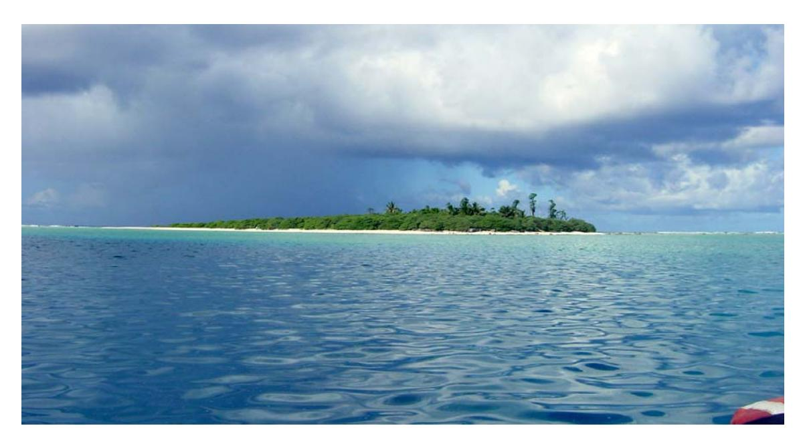

**Figure 5: Rose Island viewed from the protected waters of the lagoon. Photo: S. Holzwarth.** 

As a national wildlife refuge, the waters around Rose are the largest marine protected area in American Samoa, and the only one that is long-term and no-take (Craig et al. 2005). The small size, remoteness, and almost pristine condition of the marine ecosystem at Rose Atoll make it a natural laboratory for biologists and oceanographers- where natural processes can be studied on a small scale. Several culturally and ecologically important marine animals that have declined precipitously in populated regions are abundant at Rose. Giant clams (*Tridacna maxima*), severely depleted in most places, are abundant, and green sea turtles (*Chelonia mydas*) nest on the undisturbed beaches of the 2 small islands in the lagoon. Other species of concern, such as the Maori wrasse (*Cheilinus undulatus*), also benefit from the protected habitat at this National Wildlife Refuge, as do large parrotfishes, sharks, and other fishery targets. The reef ecosystem at Rose, while not completely unscathed, appears to be resilient and generally in good health, able to recover from natural and human-caused perturbations given time.

Comprehensive marine surveys of American Samoa, including Rose Atoll, were undertaken relatively recently in a joint effort by NOAA-Fisheries Pacific Island Fisheries Science Center (PIFSC), U.S. Fish and Wildlife Service (USFWS), University of Hawaii, National Park Service of Samoa, and the American Samoa Department of Marine and Wildlife Resources (DMWR). Beginning in 2002, biennial American Samoa Reef Assessment and Monitoring cruises (AS-RAMP) were organized by PIFSC Coral Reef Ecosystem Division, PI Rusty Brainard. NOAA research vessels *Townsend Cromwell, Oscar Elton Sette*, and *Hi'ialakai* served as research platforms for the AS-RAMP cruises in 2002, 2004, and 2006 respectively, and there are plans to continue monitoring on a biennial basis, contingent on funding from Congress.

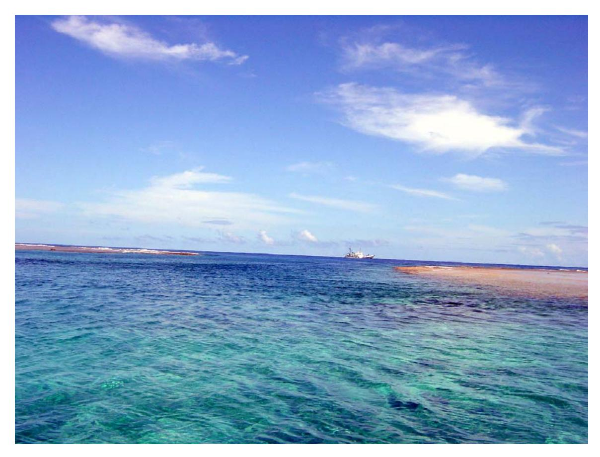

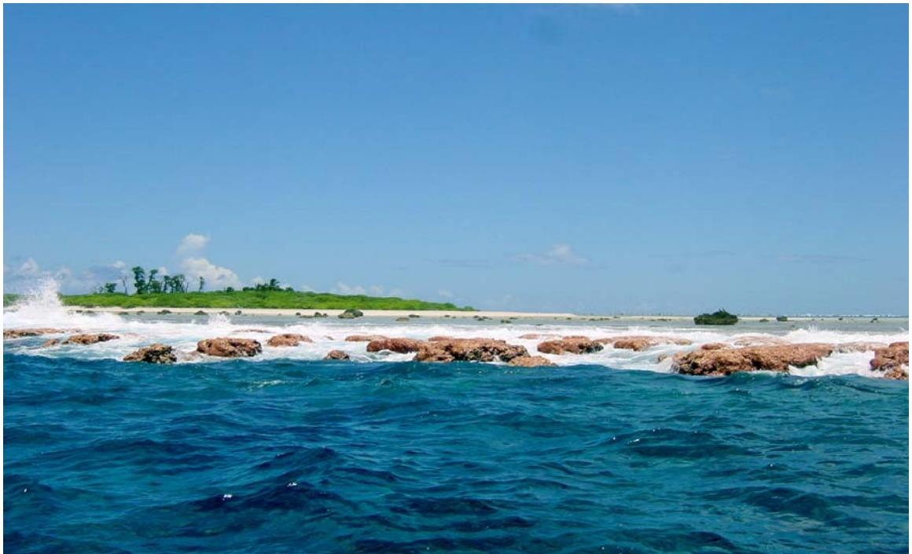

**Figure 6: The sole opening in the barrier reef, a narrow channel at the northwest corner (upper photo), and the distinctive crustose coralline algae reef crest (lower photo). Photographs: S. Holzwarth.**

The multi-agency research teams on these cruises were comprised of fish, coral, algae, and invertebrate biologists, along with oceanographers, acousticians, and a benthic habitat mapping team. Results from 2002 and 2004 were presented in a draft monitoring report for American Samoa (CRED 2006), as well as in Status of the Reef Reports (Craig 2002a, Craig et al. 2005, Green 1996), pertinent summaries of which are included in this compendium. Detailed maps of the reef structure and habitats created from recently collected data are also included in this report (NCCOS 2005; CRED 2006b).

While comprehensive multi-disciplinary surveys of Rose are a recent phenomenon, historical data on various aspects of the marine ecosystem exist from 19th and 20th century visits to the atoll. An excellent annotated bibliography of Rose Atoll sources is presented in Rodgers et al. (1993), following in the footsteps of earlier summaries by Setchell (1924) and Sachet (1954). There are also documents providing summaries of research specific to sea turtles at Rose (Balazs 1990) and effects of the *Jin Shiang Fa* shipwreck (Green et al. 1998). This compendium builds on previous summaries, focusing on the most recent scientific studies available, with data from historical sources added for context, in hopes of providing a document which will be useful for addressing current and upcoming management issues at this unique atoll.

The marine ecosystem section is organized into 7 components: reef fishes, coral, algae, giant clams and other invertebrates, sea turtles and marine mammals, oceanography, and habitat maps. Each section includes summaries of historical and current research, with references to published work as well as datasets that are in the process of being analyzed. The final summary at the end of this report ties together the assorted elements of marine ecosystem research and lists suggestions for future management and research directives.

## **Reef Fishes**

The number of reef fish species at Rose Atoll is currently estimated to be 272 (Schroeder 2004). While this is a subset of the almost 900 reef fish species listed for all of American and Independent Samoa in Wass (1984), the proportion found at Rose is substantial given that the atoll has <1% of the total reef habitat in the archipelago (Robertson 1991).

Reef fish surveys have documented an assortment of reef fish genera similar to other central Pacific shallow reefs (Green 1996; CRED 2006). Damselfishes (Pomacentridae), surgeonfishes (Acanthuridae), wrasses (Labridae), and parrotfishes (Scaridae) were the most common families of medium to small reef fish encountered. Snappers (Lutjanidae), groupers (Serranidae), and jacks (Carangidae) were the most common large reef fishes observed at Rose. Sharks (Carcharhinidae) were present, but not overly abundant.

Of all fish surveyed by NOAA scientific divers, small damselfish, most notably the midget chromis (*Chromis acares*), were the most abundant fish on the reef, with 100 to 200 recorded per 10 m transect (CRED 2006). While the same damselfish was numerically dominant at most of the other islands in American Samoa as well, the highest densities were recorded at Rose. Divers often encountered thick clouds of these tiny yellow and brown damsels feeding on plankton in the water column (S. Holzwarth, pers.

obs.). While density was very high, damselfish diversity was low (CRED 2006), a result found in earlier studies as well (Wass 1981; Green 1996).

Surgeonfishes were also abundant on reefs at Rose, with large roving schools of convict tangs (*Acanthurus triostegus*), orange-spined unicornfish (*Naso literatus*), and striated surgeonfish (*Ctenochaetus striatus*). While surgeons were common at most sites, their abundance was significantly higher at sites near the 1993 shipwreck site according to statistical analyses by B. Schroeder, CRED fish biologist (Schroeder et al. 2006; CRED 2006), a pattern first recorded a decade earlier (Green et al. 1998). These herbivores were apparently attracted to the rich grazing pastures of the iron-enriched wreck site, where cyanobacteria (blue-green algae) continues to carpet the reef floor. Among the larger surgeons, blacktongue unicornfish (*Naso hexacanthus*)- a planktivore rather than a benthic herbivore- were abundant along the outside fringing reef as recorded by towed fish diver surveys. A recent DMWR survey reported large schools of ringtail surgeonfishes (*Acanthurus blochii*) as well, feeding on the reef slope (Whaylen 2005).

Wrasses and parrotfishes, 2 key reef fish families, were well represented at Rose. The DMWR survey report noted that a terminal phase clown coris (*Coris aygula*) was sighted, a fish that is rare on most reefs in American Samoa (Whaylen 2005). Steephead parrots (*Chlorurus microrhinus*) were recorded frequently by towed and REA fish divers alike, as were other large, edible species that have become uncommon on many of the reefs in American Samoa (CRED 2006).

Sighting of the Maori wrasse (*Cheilinus undulatus*) were rare to non-existent. Neither Wass (1981) nor Whaylen (2005) recorded this species. Towed-divers on the NOAA cruises recorded 2 Maori wrasses in 2002 and again in 2004. The fish ranged in size from 75 to 100+ cm total length, and were seen singly. At other islands in Samoa the large wrasse was seen in loose groups of up to 10 fish, a healthy sign for those reefs as Maori wrasses are harem-breeders. The large wrasse is rare throughout its range due to human harvest and slow reproductive rates, but is abundant at a few remote places, such as Johnston Atoll. Rose appears to have only a small population, possibly due to the limited area of reef and protected habitat, although there is also the possibility of poaching. No bumphead parrotfish (*Bolbometopon muricatum*)- were seen during NOAA or DMWR surveys at Rose, and it is likely there are few to none of this endangered fish species in residence at Rose Atoll. Ta'u was the only island in American Samoa where bumphead parrotfish were observed (CRED 2006).

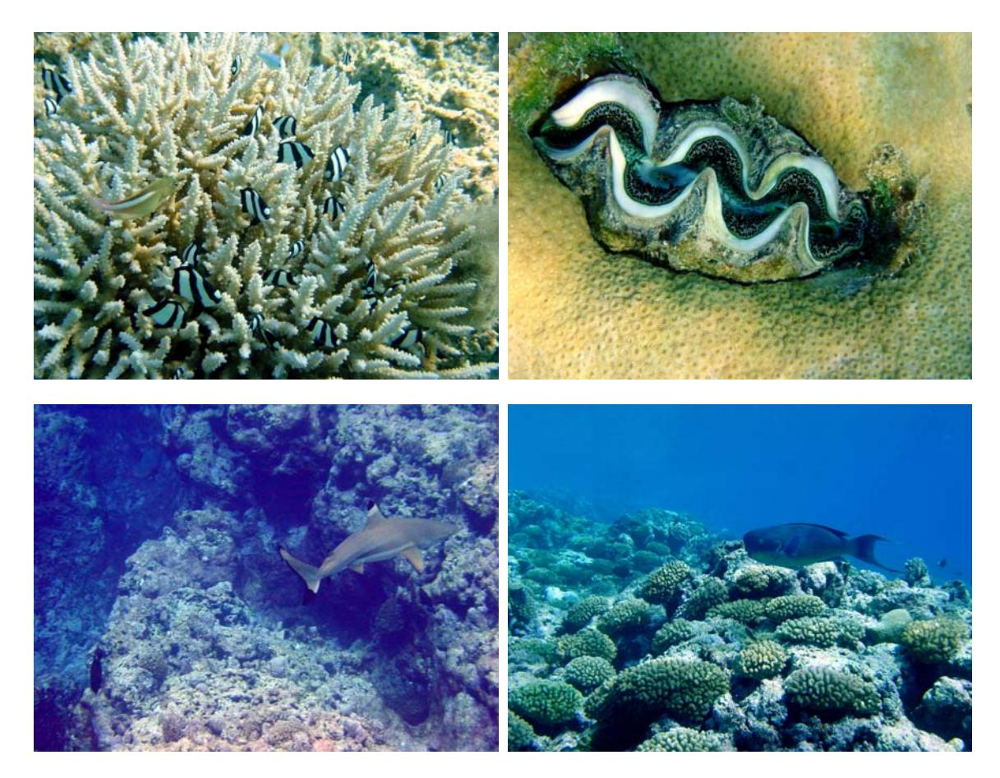

**Figure 7: Reef fauna at Rose. Whitetail dascyllus (***Dascyllus aruanus***) in a coral colony (***Acropora* **sp.)- upper left; Giant clam (***Tridacna maxima***)- upper right; blacktip reef shark (***Carcharhinus melanopterus***)- lower left; large male steephead parrotfish (***Chlorurus microrhinus***)- lower right. Photographs: S. Holzwarth.** 

Large, predatory reef fishes at Rose included many of the same species found on other reefs in Samoa and the central Pacific- notably snappers, groupers, jacks, and barracuda dominated. Among snappers, the ubiquitous twinspot snapper (*Lutjanus bohar*) was common, as were the smaller blue-lined snapper (*L. kasmira*) and smalltooth jobfish (*Aphareus furca*) (CRED 2006). Groupers at Rose included relatively large individuals of peacock grouper (*Cephalopholis argus*) and flagtail grouper (*C. urodeta*), likely in response to the lack of fishing pressure. Jacks were uncommon at most sites, typically with no more than a bluefin trevally (*Caranx melampygus*) or giant trevally (*C. ignobilis*) showing up. The exception was at the mouth of the channel at the NW corner of the atoll where schools of several hundred bigeye jacks (*Carangoides sexfasciatus*) were observed on multiple occasion, in 2002 and 2004 by towed-divers (CRED 2006) and in 2005 by Whaylen (2005). Most of the bigeye jacks in the school showed spawning coloration and behavior, with paired light and dark individuals swimming in tandem, apparently taking advantage of the outflowing current. Barracuda were also present in large schools, with ~300 recorded near the channel opening by towed-divers in 2002, along with 40 great barracuda (*Sphryaena barracuda*) in 2004. The DMWR survey also lists a large school of Heller's barracuda (*Sphryaena helleri*) (Whaylen 2005).

Sharks and other large fishes were much less abundant at Rose, and American Samoa in general, than at unfished reefs such as the Northwestern Hawaiian Islands, but not as scarce as in the main Hawaiian Islands (CRED 2006). Blacktip reef sharks (*Carcharhinus melanopterus*), whitetip reef sharks (*Triaenodon obesus*), and grey reef sharks (*C. amblyrhynchos*) were recorded during towed-diver surveys in 2002 and 2004: 5 blacktips, 14 whitetips, and 4 gray reefs. During the DMWR survey, divers recorded 8 blacktips, 2 whitetips, and 1 gray reef over the course of 9 dives (Whaylen 2005). USFWS trip reports from the 1980s mention the absence of sharks on the outer reef, but later report blacktip reef sharks as abundant (Ludwig 1982a, 1982b).

One interesting trend that emerged from preliminary analysis of size class data was a decreased in average shark length between survey years, from 120 cm to 90 cm total length (CRED 2006). The small size of sharks could be related to the size of the atoll, interspecific competition for limited food resources, or illegal shark finning. During the DMWR survey, a small dead blacktip shark was found on the beach (Whaylen 2005), though its cause of death was not determined. As monitoring continues in subsequent years, it will be interesting to see if the mean size of sharks continues to oscillate.

Historical data on marine fishes at Rose includes sporadic mentions of various species, as well as a few more complete surveys. A tropical two-winged flying fish (*Exocoetus volitans*) was collected at Rose on the Wilkes Expedition in the 1840's (Fowler 1940). Capt. Rantzau noted parrotfish (*Scarus* sp) and grouper (*Serranus* sp) (Graeffe 1873). A later study of seabird diet on Rose listed a number of fish as booby prey items: convict tang, jack, pompano dolphinfish (*Coryphaena equiselis*), 2 kinds of flying fish, skipjack tuna (*Katsuwonus pelamis*), and albacore (*Thunnus alalunga*) (Harrison et al. 1984).

Following the USS Bushnell's visit to Rose in 1939, Schultz published the first real attempt at a fish list for Rose with 132 species, 6 of which were species new to science (Schultz 1943). The red-barred rubble goby (*Trimma eviotops*), Phoenix devil damsel *(Plectroglyphidodon phoenixensis*), spot-tailed dottyback (*Pseudochromis jamesi*), blotched podge (*Aporops bilinearis*), whiteface moray (*Echidna leucotaenia*), and Rose Island basslet (*Pseudolesiops rosae*) were all first discovered at this atoll and described by Schultz. More recently, an undescribed species of goby (*Trimma* sp.) was collected during Whaylen's 2005 survey, and is being named and described by Bishop Museum fish biologist Jack Randall (J. Randall *in prep*).

Wass surveyed fishes in 4 habitats at Rose Atoll in the 1980s, listing a total of 126 species (Wass 1980, 1982), in notable contrast to his checklist of fishes for all of Samoa, which had 991 species of marine fishes (Wass 1984). Measures of fish biodiversity typically increase with reef area, variety of habitats, and survey effort, so this was not an unexpected result. Recent estimates of reef fish biodiversity at Rose hovered at ~200 species (UNEP 1988, Whaylen 2005), jumping up to 272 species in 2004 when a fish taxonomy specialist (T. Donaldson, University of Guam) participated in the AS-RAMP cruise (R. Schroeder, pers. com.).

## **Coral**

One distinctive characteristic of Rose Atoll is that coralline algae are the dominant reef builders rather than corals (Mayor 1921, Green 1996), but this by no means negates the vital role corals play in providing reef structure, habitat, shelter, food, and a solid surface for numerous other organisms in the ecosystem.

Corals have long been of interest to biologists that visited Rose, and were mentioned in several of the historical accounts. Darwin, who was forming his ideas of atoll formation, initially dismissed Rose as an atoll because of the basalt boulders strewn along the rim (Darwin 1842), an error corrected in a later edition. The most common genera listed in the older field reports include the many of the same main players that were found to be dominant in recent surveys: *Acropora* (staghorn/table corals), *Favites* (brain/honeycomb corals), *Porites* (lobe corals), and *Pocillopora* (lace/cauliflower corals), plus *Symphyllia* and *Porolithon* (Mayor 1921, Hoffmeister 1925, Setchell 1924).

In the wake of the 1993 grounding of the Taiwanese longliner *Jin Shiang Fa* surveys were conducted by USFWS coral biologist Jim Maragos in 1994, 1999, and 2000. During those and later AS-RAMP surveys, he established a total of 13 permanent transects for detailed monitoring purposes- 9 in the lagoon and 4 on the outside reef. Results from his initial field survey showed 62 species of coral in 25 genera; *Favia*, *Acropora*, *Porites*, *Montipora*, *Astreopora*, *Montastrea* and *Pocillopora* were generally dominant (Maragos 1994). The coral community at Rose has been described as being distinctly different from other islands in Samoa, with different proportions of certain species and generally lower diversity and percent cover (Maragos 1994; Green 1996).

In the year following the shipwreck, an atoll-wide bleaching event was recorded by Maragos, with corals bleached to a depth of at least 20 to 25 m in habitats both inside and outside the fringing reef (Maragos 1994). While the bleaching was likely precipitated by warmer than normal water temperatures rather than the recent shipwreck and fuel spill, it did not help matters that much of the coralline algae and coral had been wiped out along the SW corner. While coral populations along the rest of the reef have made good progress towards recovery, the southwest wreck site still suffers visibly from lingering effects of the wreck (CRED 2006). When it became apparent that hunks of iron were stimulating cyanobacteria growth and thwarting the recolonization of corals or coralline algae, an emergency clean-up effort was undertaken in 1999 - 2000. At substantial expense and effort over 100 metric tons (mT) of the shipwreck debris was removed, although an estimated 40 mT remain on the reef (Craig 2002a).

Coral surveys during the first AS-RAMP cruise were of necessity qualitative in nature, and used to generate species lists and general descriptors of coral communities at Rose. Subsequent data included quantitative components such as frequency of occurrence and colony size along belt transects. Preliminary results from 2004 surveys were analyzed by CRED coral biologist Jean Kenyon as part of the draft Samoa monitoring report (CRED 2006). At the 12 sites surveyed, the 4 most common corals (comprising 10% or more of the numerical total) were *Pocillopora*, *Montastrea*, *Montipora*, and *Favia*. Live coral cover ranged from a low of 7% near the shipwreck on the SW side, to a high value of

28% at a site on the SE side. Coral diversity following a similar pattern, with only 3 genera recorded at the station near the wreck and a high of 16 genera at sites on the SE forereef (CRED 2006). Towed-divers, who have access to deeper areas of the reef, recorded octocorals and hydroids on the outer reefs (CRED 2006).

Results from Kenyon's analysis of coral size class data show some interesting differences between Rose and the other island reefs in American Samoa (CRED 2006). Most coral colonies measured on belt transect surveys at Rose in 2004 were less than 20 cm in diameter. Compared to other reefs in the island group, the largest and smallest size classes were under-represented. Rose had the fewest 'neophyte' corals, those just starting on the reef (<5 cm diameter), perhaps because the corals that re-colonized after the bleaching and shipgrounding perturbations are not yet at a point where they can bud off small colonies. Few shallow colonies survived the bleaching, since no large colonies (>160 cm) were observed in the depth range surveyed by the coral divers- generally 10 - 15 m. Massive lobe corals (*Porites*) were seen along deeper sections of the NW and SE forereef (18 to 30 m) by towed divers (CRED 2006), implying there were at least some deep water refugia from the warm water induced bleaching event.

## **Algae**

The dominant role of algae at Rose has long been acknowledged, with Mayor (1921) suggesting it be called a "lithothamnium atoll" due to the prevalence of pink encrusting algae. Fleshy and filamentous algae are abundant as well, if not as diverse as at larger reefs in Samoa, though it should be noted that very few dedicated algal surveys occurred at Rose until recently, and the algal species list is still in a state of flux.

The atoll was named for the wife of French explorer Louis de Freycinet (Houston 1936), and the pinkish hue of the reef crest makes Rose a fitting name. The predominance of crustose coralline algae was noted by early scientific visitors (Mayor 1921; Setchell 1924), and reiterated many times thereafter. A sample of *Porolithon craspedium* f. *mayorii* from the reef crest was subjected to a chemical analysis (Lipman and Shelly 1924). Most modern phycologists simply lump coralline reds into a functional group, a practical convention given that identification to species is complicated and must be completed in a lab. Regarding the importance of this functional group, one assessment of benthic cover estimated that coralline algae made up over 30% of the substrate in forereef habitats (Green 1996). The percentage was even higher in results from detailed analysis of digital video footage, with coralline algae cover ranging from an average of 65% along shallow contours to 35% on deeper areas of the forereef (Kenyon et al. unpubl. manuscript).

The algal surveys completed by researchers on the AS-RAMP cruises provided a valuable in-depth assessment of the underwater plant flora. Initials assessment surveys were descriptive, followed by quantitative survey methodology for monitoring purposes. On analyzing 2004 field data, CRED phycologist Peter Vroom found several distinct patterns in algal distribution at Rose (CRED 2006). One prominent feature was the presence of vast mats of *Microdictyon umbilicatum* on the south and east sides of the

outside reef, an algae that was not found in great abundance at any of the high volcanic islands of American Samoa. *Dictyosphaeria*, another mat-forming green alga from the same group (Siphonoclades), had a similar south and east distribution at Rose. *Lobophora*, a fleshy brown alga, had the reverse pattern- present only on north and western sides of the atoll. *Halimeda*, a calcareous green alga responsible for substantial amounts of sand production, were abundant at most sites, with the exception of the east side, especially at the wreck site. Within the lagoon itself, macroalgae were generally absent, with low-lying turf algae predominating, and a modest amount of crustose coralline reds. Outside the lagoon on the forereef, crustose coralline red algae were extremely abundant (CRED 2006), in agreement with previous surveys.

While algal specimens from the NOAA research cruises are still being analyzed and identified in the lab, results from Rose currently include a total of 17 genera/functional groups (CRED 2006). Green algae (6 genera), brown algae (3), red macroalgae (4), and coralline reds (2 functional groups) are represented on this list, plus turf algae and cyanobacteria. The algal diversity at Rose was comparable to that found at Swain's and the Manu'a group (Ofu, Olosega, and Ta'u), though Tutuila has more than double the number of genera, most likely due to its larger size and different types of habitat. Rose had at least one unique alga record- *Caulerpa cupressoides*, a leafy green alga not found at any of the other island reefs in American Samoa.

For more detailed data on the abundance and distribution of algae by genus at Rose and the other islands of American Samoa, refer to the Samoa Monitoring Report (CRED 2006). Additionally, results from algal photoquadrat analysis of Rose surveys are forthcoming, and will be submitted as a scientific manuscript (Vroom and Cooper, *in prep*).

## **Giant Clams and Other Reef Invertebrates**

The status of the giant clam population is an issue of key importance to the managers and biologists tasked with overseeing Rose Atoll as a National Wildlife Refuge. To some local inhabitants of Samoa the wealth of Rose lies entirely in the great abundance of giant clams in the lagoon, which they call *faisua*, and consider delectable as well as important for celebration feasts (Craig 2002b). Giant clams are severely depleted in most populated areas in the south Pacific, including American Samoa. Summaries of a number of studies conducted to gain information on the clam population of Rose in the past several decades, including several in-depth recent studies, are presented here. Data from historical sources and recent reef monitoring efforts on other reef invertebrates of economic and/or ecological interest are also presented.

#### **Giant Clams- recent studies**

A pivotal study published by A. Green and P. Craig highlights the importance of Rose Atoll as a refuge for giant clams (Green and Craig 1999). In 1994 – 1995 they surveyed all 6 islands of American Samoa, recording a total of 2853 giant clams in survey transects, 97% of which were found at Rose. The majority were located in the lagoon,

with clams favoring areas at the base of pinnacle patch reefs. Roughly a quarter of the clams were mature in size, and mortality was estimated as being very low, due mostly to natural causes. The largest clam recorded was 27.8 cm across the widest part of the shell. Given the mean density of clams, the population of giant clams at Rose was estimated to be about 27,800 clams (Green and Craig 1999).

Giant clam data from AS-RAMP surveys were analyzed by invertebrate biologist S. Godwin of the Bishop Museum and benthic towboarder M. Timmers of CRED, with results generally concurring with those found by previous surveys. Along the outside reef giant clams were uncommon, but in the lagoon there were impressive numbers of the large, colorful bivalve. Giant clams were recorded to be among the most common macroinvertebrates present on lagoon patch reefs (CRED 2006). Towed-diver surveys recorded over 1100 giant clams on 48 linear km of transect, with ~95% on interior reefs (Molly Timmers, CRED, pers. com.). Researchers have noted that the reef just inside the channel into the lagoon had a markedly lower density of giant clams than the rest of the lagoon and it seems likely that this was where illegal harvesting takes place (CRED 2006).

#### **Giant Clams- previous research**

Other studies of giant clams at Rose in the past 30 years include research done by scientists from American Samoa, Hawaii, and Florida. The first surveys of giant clams at Rose were undertaken by Wass (1981), who worked for Department of Marine and Wildlife Resources (DMWR) in American Samoa. The study was an attempt to quantify the resource in response to requests by the Samoans that they be allowed to harvest clams. Their reasoning was that the wildlife refuge had been established primarily to protect seabirds and turtles, not clams. The DMWR study used divers to survey clams of all sizes inside and outside the lagoon. They identified a single species- *Tridacna maxima*- which was uncommon in the channel and on outside reefs, but grew in healthy profusion within the lagoon. Distribution within the lagoon was patchy, in part due to substrate considerations, and in part due to light. Clams were especially abundant on solid substrates in the shallow, relatively clear parts of the lagoon, which was attributed to the dual need for giant clams to attach to the reef and expose symbiotic algae in their mantles to sunlight for photosynthesis. Other patterns noted were lower densities in the southern part of the lagoon and below about 13 m where the water became noticeably more turbid. Numerical density of clams proved time-consuming to record, and only one transect was effectively completed, yielding a count of 242 clams, for a density estimate of 0.28 per m2 (Wass 1981).

Several size-frequency charts of giant clams are also presented in Wass (1981). Clam shell measurements ranged from 1 – 24 cm, with about 31% being above 14 cm. This size is characteristic of a fully mature clam of about 8 years in age according to a study in Tonga (McCoy 1980), and was proposed by Wass as a minimum size limit to ensure reproductive capacity. He also proposed requiring all clams be harvested in-shell, all landings reported to the Office of Marine Resources, and several other practical suggestions in the event that clam fishing was sanctioned. He concluded that the limited data collected during his study was not sufficient for developing a management plan, but

did state that clam harvest at Rose had occurred prior to the wildlife refuge designation and could conceivably be continued without undue harm to the population (Wass 1981).

A subsequent study of giant clams and hydrography at Rose was undertaken by R. Radtke of the University of Hawaii Institute of Marine Biology (HIMB), funded by National Geographic. In spite of a veritable comedy of errors including repeatedly lost luggage and equipment, leaky scuba tanks, flooded cameras, boat delays, airline groundings, rough weather, and turtles nesting in the midst of camp, the fieldwork was completed (Radtke 1984). His impetus was to study the ecology of a population of giant clams in a virtually undisturbed state, and he collected data on a variety of parameters: abundance, distribution, age/size class data, reproduction, and mortality.

Transects were surveyed by divers to collect data on clam density and distribution in various habitats (Radtke 1984, 1985). Results showed marked differences related to depth and substrate. Patch reefs in 20 to 40 ft of water were concluded to be prime real estate for clams, with densities of 3 – 6 clams per m² and 40 – 50% of the area colonized. Smaller coral patches- with up to 3 clams per m²- and lagoon substrate- with up to 5 clams per m²- were colonized at ~20%. The researcher reported that artificial concrete blocks placed in sandy areas were not sufficient to attract clam colonization, and concluded that hydrographic conditions were suboptimal in those areas. Radtke's total estimated number of clams in the lagoon was about 1,338,000. He added an observation that reddish brown color morphs seemed to be more common in shallow areas, while clams with blue mantles were deeper. While color/depth correlation was not confirmed in HPLC (high performance liquid chromotography) analysis of mantle pigments, the chemical analysis revealed differences in the proportion of various pigments in juveniles versus mature clams.

The reproduction and mortality of giant clams at Rose was also described by Radkte (1985). The gonads were sliced and stained as a microscope preparation, and the presence of eggs or sperm was noted. As expected from known life history parameters, the smaller giant clams (<11 cm) were male, with females/hermaphrodites showing up at 8 cm and above. All clams over 12 cm were fully mature. Mortality rates were estimated to be 0.154 of the population per year, with higher rates in young clams that leveled off to a low, stable percentage as maturity was reached. Radtke estimated that only 0.1 kg per ha (the equivalent of 3 mature clams) could be taken without negatively affecting the population, and stated that harvest did not appear to be "within the rational state of exploitation" (Radtke 1985).

Additionally, detailed age and size class data were collected to describe population dynamics of giant clams at Rose (Radtke 1985). Size class graphs show a roughly bimodal distribution, with a peak at around 3 - 5 cm, and a second peak at around 15 - 17 cm. In general, larger clams tended to be shallower and smaller clams deeper. To help determine age/size relationships, analysis of the internal microstructure of 20 shells was conducted. One process involving slicing thin sections of the shell, polishing them, and using x-rays to reveal 'rhythmic banding patterns' used for age estimation. SEM (scanning electron microscope) studies were performed on gold-plated cross-sections from the hinge area, and visual methods of counting bands on translucent slices of shell

were also attempted, for comparison. The x-ray method proved to be unreliable and the other 2 methods preferable. Some interesting results came of the age study, suggesting that giant clams grow more slowly with increasing depth, which explains in part why bigger clams were found shallower. Also, the lamination patterns seemed to correspond to daily deposition, with major increments showing annual time scales. The oldest clam estimated with the SEM technique was 18 years old and had a shell length of 20 cm. Clams with shells up to 24 cm were measured in the field.

A geo-chemical analysis of Rose Atoll giant clam shells was published in Science by Jones et al. (1986), with a lengthier exposition of the results made available in Romanek et al. (1987). Their technique was based on using molecular properties of the shell as a record of physiological and environmental changes. Banding patterns of stable isotope ratios of oxygen-18 to oxygen-16 and carbon-13 to carbon-12 gave an indirect record of the seasonal water temperatures and metabolism. The data were used to determine age and growth rates of the clams with relative precision. The results showed that clams experience 2 distinct growth phases- a fast, year-round calcium-accumulating phase for the first 10 years of their life as juveniles, followed by a slower growth phase during the subsequent decades as a sexually mature clam. The change in growth rate was ascribed to a shift in energy priorities, with increased resources being allocated to reproduction once the clam reached maturity (Jones et al. 1986, Romanek et al. 1987), at which point growth was relegated to the cooler months. Lifespan was estimated to be about 28 years (Romanek et al. 1987), which was similar to the value of ~32 years estimated for the same species on a reef in Australia (McMicheal 1974).

To summarize, when the data from the various studies are taken into account, giant clams (*T. maxima*) at Rose reach maturity at about 10 years of age corresponding to a shell width of 8 to 12 cm. Young clams are male and put most of their energy into growth and become female/hermaphrodites upon maturity, with a lifespan of about 30 years. The clam population in the lagoon is abundant, especially in shallow, clear, patch-reef habitats, but there is no consensus on if legalizing harvest would be sustainable. A small, unquantified amount of poaching currently occurs, thinning the clam population near the channel entrance, but the unsanctioned harvest seems to be limited to that area at present.

#### **Other Reef Invertebrates**

Of the reef invertebrates typically present on a coral reef, mollusks and crabs were the only 2 groups that were not noticeably scarce in most habitats. Invertebrate surveys, conducted by Scott Godwin of the Bishop Museum during the Sette cruise in 2004, found that in addition to giant clams, cliff oysters (*Spondylus*) and cerith snails (*Cerithidia* sp.) were relatively common on lagoon patch reefs. On the outer reef habitats, cone snails (Conidae), cowries (Cypraeidae), rock shells (Thaididae), and hermit crabs (*Calcinus* and *Dardanus*) were most commonly recorded. Small commensal crabs (*Trapezia*) that live among the branches of cauliflower coral (*Pocillopora*), were also abundant as a direct consequence of the preponderance of their host coral on the forereef slope. Trochid snails (*Trochus*) were surprisingly common in the deep area (29 m) near the channel mouth (CRED 2006).

Besides the mollusks and crabs listed above, other macroinvertebrates were notably scarce at Rose. REA and towed-diver benthic surveys alike found echinoderms to be uncommon; sea cucumbers, sea stars, urchins, and crinoids were relatively rare in most habitats, with the exception of the very shallow reef crest which had boring urchins, and intertidal areas which had a population of sea cucumbers. Crown-of-thorns sea stars (*Acanthaster*) were looked for but never found during towed-diver surveys, although corals displaying the irregular white patches indicative of crown-of-thorn predation were observed along the SW outside reef by towed divers (CRED 2006), and the presence of crown-of-thorn sea stars was noted during an earlier visit (Itano 1988).

Historical accounts and previous surveys gave similar assessments- with mollusk and crabs generally more plentiful than other families. Swerdloff and Needhan (1970) list 13 species of cowry, 5 species of cone snail, 5 species of auger (*Terebra*), and a dozen mollusks in other genera. They also listed 5 species of crab, but for echinoderms- only a single unidentified sea cucumber and 1 slate pencil urchin (*Heterocentrotus mamillatus*) were found. Incidental data on invertebrates include mention of blacklipped pearl oyster (*Pinctada margaritifera*) (Itano 1988), and as part of a prey study from sea birds on Rose, ommastrephid squid (*Symplectoteuthis* spp.) (Harrison et al. 1984). The star-shaped limpet (*Patella paumotensis*) was proposed as a new species by Gould in 1848 from a Rose Atoll specimen, but it was later determined to be a synonym for an earlier described species (*P. flexuosa*).

## **Sea Turtles and Marine Mammals**

#### **Sea turtles**

Green sea turtles (*Chelonia mydas*) and hawksbill sea turtles (*Eretmochelys imbricata*) utilize the protected habitat of Rose Atoll. Both species have declined throughout the south Pacific, impacted by the combined effects of habitat destruction, human harvest for meat and tortoise shell, depredation by introduced predators, and incidental drowning in fishing gear (e.g. Kinan 2005; Craig 2002c). The isolated beaches on Rose Atoll provide an important nesting ground for green sea turtles, and although it is not clear if hawksbills nest at Rose, they are consistently sighted utilizing the marine habitats of the atoll. The number of green turtles nesting annually on Rose has been estimated at 24 – 36 (Tuato'o-Bartley et al. 1993). The total number of turtles utilizing Rose as a nesting ground would be several fold higher, since females only nest every 4 – 5 years, and thus a different set of turtles shows up each season. Also, given the scarcity of beaches where turtles can nest and their eggs hatch unmolested, the value of Rose's isolated beaches is considerable, even if only 120 or so turtles nest there

The presence of sea turtles at Rose Atoll is noted in the written record as early as 1839, when C.F. Girard of the U.S. Exploring Expedition reports that they saw several turtles, captured 1, and describes it as a new species- *Chelonia tenuis* (Girard 1858). Another account identifies turtles at Rose as black sea turtles, *C. agassizii*, (Amerson et al. 1982). The running debate on how to classify *Chelonia* in different parts of the world has yet to

be resolved, but the most widely accepted convention is to simply use *Chelonia mydas* globally (Parham and Zug 1996), which we have done here.

While having a more stable taxonomy, it is worth noting that the hawksbill was initially referred to as *Chelonia imbricata*, and later placed in its current genus *Eretmochelys*. Hawksbills have been consistently reported at Rose in historical accounts (Graeffe 1873; Setchell 1924), as well as more recent surveys (Sekora 1974; Ludwig 1981; Amerson et al. 1982; Morrel et al. 1991; Flint 1992; CRED 2006). It is also notable that in Gerald R. Ford's Presidential Proclamation 4347, he keeps the submerged lands adjacent to Rose Atoll NWR from being transferred to the government of American Samoa for the sake of green and hawksbill sea turtles (the same proclamation also keeps rights to Apra Harbor for national defense needs).

The Historical Summary of Sea Turtle Observations at Rose Atoll, American Samoa, 1839-1993 (Balazs 1996) is a useful compilation of historical data and notations, relevant portions of which are summarized here. The document lists a total of 47 entries for that time period, most of the earlier ones simply reporting presence or absence of turtles. Capt. Rantzau sometime in the 1860's wrote that in August "a great number of sea turtles came to lay their eggs," and furthermore that "When the time came for the young to hatch, the surrounding sea was full of sharks who avidly snapped up the little turtles as fast as they arrived in deeper water," (Graeffe 1873).

From 1970 onward, turtle observations were more quantatative, if no less sporadic and opportunistic due to the expense of reaching the remote atoll. Aerial, land-based, and water-based surveys recorded the number of sea turtles, their tracks, nest pits, eggs, hatchlings, and nesting and mating behaviors (Balazs 1996). An estimated 200 turtles were counted in the lagoon during an aerial survey in August 1974, the highest value recorded. A high value of 406 pits were counted on Rose Island and Sand Island combined during a survey in October 1976. A decade later, in fall 1985, biologists counted 244 on both islands combined, and a decade after that, in fall 1992, the total count was 81 nesting pits.

The problem with nest pit counts is that female turtles often dig test pits before actually laying eggs, and lay multiple clutches the year they make the long migration to their natal nesting beach. Also, unless there is a major storm event that wipes the beach clean, it is difficult to reliably discern if a pit was dug that season or the season before (Ponwith 1990). These limitations, as well as uneven survey effort, should be taken into account when comparing pit counts from various years, and it should be recognized that pit counts are not the equivalent of a population count.

The green sea turtles that visit Rose do so seasonally for reproduction, and spend the rest of their time in other parts of the south Pacific. Metal flipper tags were applied to a total of 46 nesting females from 1971 – 1996 in order to see where they traveled (Balazs 1996). 3 of these tags were resighted after the turtles were killed for food or fatally injured from a hunting attempt (i.e. speargun still imbedded). Two were located in Fiji at the time of tag recovery, 1 in Vanuatu- both island groups to the west of Samoa. A fourth turtle was resighted at Rose, 9 years after she was initially tagged (Ponwith 1990). She

made multiple visits to the beach to nest and her carapace had grown 3 cm since the initial measurement, in spite of having lost most of her left foreflipper.

Given the limited resighting rate of flipper tags, satellite tagging was subsequently employed in an effort to better comprehend the migration routes of green turtles in the south Pacific (Craig et al. 2004). Seven females at Rose Atoll were outfitted with satellite tags during the nesting seasons of 1993 – 1995. After 2 months of nesting at Rose, 6 of the turtles traveled to feeding grounds in Fiji, west of Samoa. The seventh turtle traveled due east to Raiatea, an island in French Polynesia. It was surmised that the turtles made the long trip to Fiji for abundant sea grasses and algae found there. The turtles' migration route crossed 1600 km of ocean and took an average of 40 days. The route followed prevailing surface currents as recorded by satellite-linked ocean drifters deployed from Rose during the 2002 AS-RAMP cruise, though the drifters traveled more slowly (net rate of 0.54 km/h) than the turtles (1.8 km/hr). While these green turtles spend the majority of their life in Fiji, accumulating the fat stores that will enable them to reproduce, the remote beaches at Rose Atoll provide invaluable undisturbed nesting habitat (Craig et al. 2004).

In a separate study of the physiognomy of beach sands from turtle nesting beaches around the world, the sand at Rose Atoll was characterized by unusually coarse sand grains (Mortimer 1990). Most of the turtle beaches surveyed, with the exception of Hawaii and Rose, had moderately sorted sand with grain diameter 0.2 - 1.0 mm. Of the 50 beaches analyzed, Rose Atoll and Pearl and Hermes Atoll (where turtles dig test pits but do not actually nest) in the Northwestern Hawaiian Islands stood out as exceptions. Their sand had ~75% of grains with >2 mm diameter, and particles more oblong than spherical. The sand type could be the cause of test-pit digging that occurs at these 2 locations, as turtles nesting on finer, moister beaches usually dig their nests without the preliminary fuss of test pits. While Mortimer (1990) found that coarse, dry sand correlated with higher mortality rates of nests at Aldabra Atoll and Ascension Island, she noted that turtles nest in a wide variety of sand types and concluded that other characteristics of a nesting beach were equally or more important than sand characteristics.

#### **Marine Mammals**

While seals and other pinnipeds do not occur in Samoa or at Rose, evidence of cetaceans has been recorded by a variety of sources. Only 2 species of toothed whales (Odontocetae) have been reported specifically for Rose: a historical account reports the skull of a medium sized blackfish on the beach at Rose (Mayor 1921), and a pilotwhale (*Globicephala meleana*) was observed 60 years later, along with a porpoise in the genus *Stenella* (Shallenberger 1980).

Data on baleen whales (Mysticeti) at Rose is similarly sparse. Historical accounts of whalers in the South Pacific mention whaling ships visiting Rose Atoll in the 1830's and 40's (Langdon 1979). A study of humpback whales (*Megaptera novaeangliae*) in the South Pacific had only 1 datapoint in American Samoa. The individual returned to French Polynesia, where it was originally seen, a short time after it was recorded in Samoa (Garrgue 2006). Two field trip reports list humpback whale sightings at Rose (Ludwig 1982; Hu 1987), and whales and porpoises are generically listed in the accounts of flora and fauna of Rose by Amerson et al. (1982). The limited data available indicate that cetaceans visit the waters around Rose on occasion, but little to nothing is known about the seasonality or frequency of such visits. The NOAA Pacific Island Fisheries Science Center in Honolulu recently added a cetacean component to their Protected Species Division and extensive surveys were conducted around Tutuila in 2006 (Dave Johnston, PIFSC, pers. com.), providing key baseline data for American Samoa, if not Rose Atoll.

## **Benthic Habitat Mapping and Deep Sea Exploration**

The benthic habitat of Rose Atoll has been described and mapped on several different scales, including point and belt transects by free-swimming divers, towed-divers transects, multibeam mapping from a 10-m survey vessel and full-sized research ships, and computer-assisted satellite imagery interpretation. The deeper habitats near Rose have also been recently studied using ROVs and manned submersibles.

Multibeam mapping provides a large scale but detailed look at underwater topography and bottom types. In 2006, as part of the NOAA reef monitoring cruise, the survey vessel *AHI* (Acoustic Habitat Investigator) completed a benthic survey of the waters in and around Rose Atoll. *AHI* is an 8-m rigid hull inflatable equipped with a high-resolution multibeam sonar (CRED website).

Data was processed by the benthic habitat mapping team of researchers at CRED, who provided a draft map of Rose for this report (see Fig. 8). The map reveals the shape of the underwater landscape in impressive detail, showing the ridges, bumps, and smooth steep walls of the reef as it slopes towards the ocean floor. The previous year, the *Kaimikai-okanaloa* (KoK) mapped a total of 59 km2 of benthic habitat around Rose Atoll using their shipboard multibeam sonar (Smith et al. 2006).

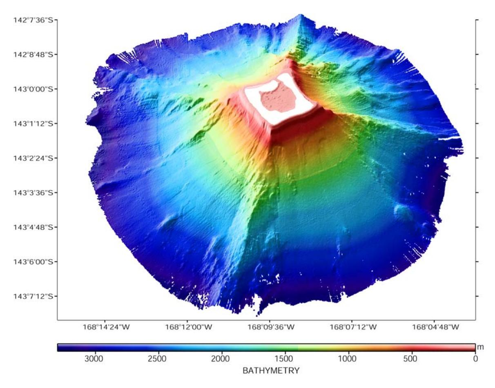

**Figure 8: Bathymetric map of Rose Atoll from multibeam sonar surveys on the AHI during the AS-RAMP cruise in 2006.** 

**Note the ridged-corners of the reef, and the dramatic relief off the northeast side of the atoll. Map courtesy of NOAA-Fisheries CRED Benthic Habitat Mapping Team.** 

In response to recommendations by the Coral Reef Task Force, NOAA's National Ocean Service (NOS) Biogeography Program began digitally mapping all shallow reefs in U.S. jurisdiction (Monaco et al. 2001). Three maps of Rose were produced, showing biological cover (Fig. 9), geomorphological structure (Fig. 10), and reef zone (Fig. 11) (NCCOS 2005). The maps were produced using remote sensing data from satellites, with ground-truthing by divers. It is important to note that the minimum mapping unit (MMU) was 1 acre for visual imagery interpretation, limiting the resolution of smaller scale features.

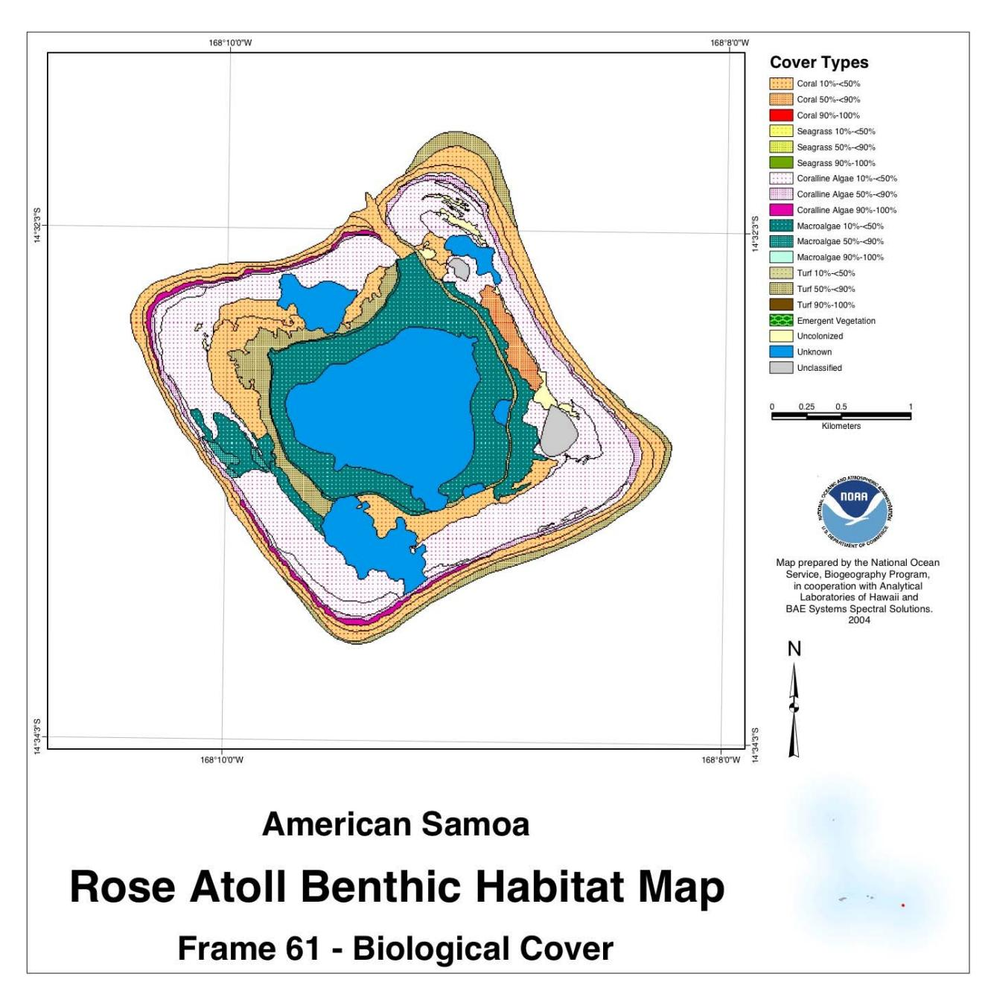

**Figure 9: NOS Biogeography Program's map of Rose Atoll showing habitat type by biological cover. Note the broad reef flat composed of crustose coralline algae, ringed by coral cover inside and outside the lagoon, with macroalgae growing thickest in the inner lagoon. Map is from NCCOS 2005, and is also available on the web at: < http://ccma.nos.noaa.gov/products/biogeography >.** 

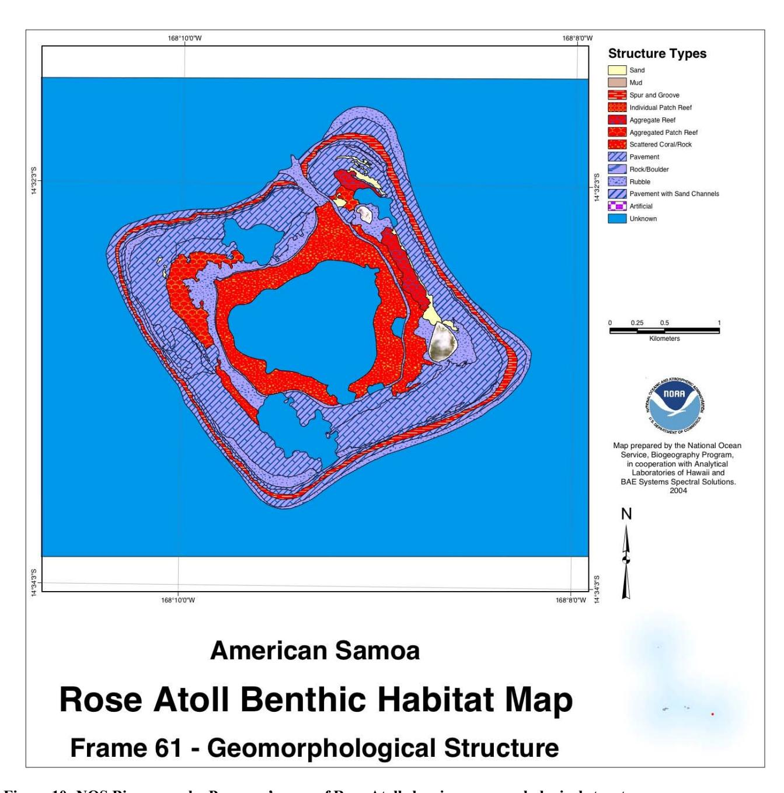

**Figure 10: NOS Biogeography Program's map of Rose Atoll showing geomorphological structures. Note the patch reefs in the lagoon, and the predominance of pavement on the reef flat, with smaller sections of rubble and sand interspersed. Map is from NCCOS 2005, and is also available on the web at: < http://ccma.nos.noaa.gov/products/biogeography >.**

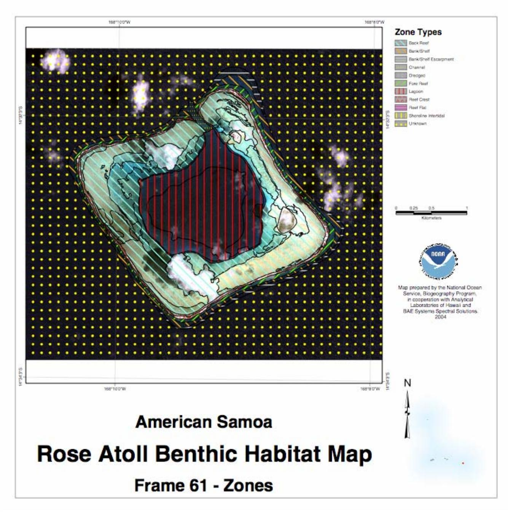

**Figure 11: NOS Biogeography Program's map of Rose Atoll showing reef zones. Note the progression from bank/shelf to forereef, reef crest, reef flat, backreef, and lagoon. Map is from NCCOS 2005, and is also available on the web at: < http://ccma.nos.noaa.gov/products/biogeography >.** 

Towed-diver surveys conducted by CRED, with subsequent analysis of digital video frames, provide meso-scale data and bridge the gap between free-swimming diver surveys and larger-scale satellite and multibeam surveys. Tows ranged from 1 to 3 km in distance covered, with video frame sampling about once every 25 m (Kenyon et al. 2005). Results of video analysis from 17 tows completed at Rose in 2002 and 2004 showed the lagoon substrate to be mostly sand and rubble, on the lagoon floor and perimeter respectively. At the 3 depth contours surveyed- shallow (< 5 m), moderate (8 – 17 m), and deep (20 – 23 m) on the outer reef, coralline algae was the most common substrate, comprising 35 to 65% of the reef floor. Live coral was also consistently high on the forereef, ranging from 19 to 28%, values that were much higher than the 2 to 7% live coral cover visually estimated in 1994 during post-shipwreck surveys (Green 1996). The difference in density and size of coral colonies between surveys was equivalent to ~8.5 years growth, which corresponded with the length of time since the shipwreck and atoll-wide bleaching (Kenyon et al. 2005). Macroalgae, turf algae, and 2 genera of coral (*Pocillopora* and *Porites*) were the most common components of the benthos on the forereef, after coralline algae.

On the smallest scale, scientific divers from a number of institutions have completed transects of coral, algae, giant clams, and other reef invertebrates that make up the benthos. While these transects varied in length, most were between 10 and 50 m long, with data recorded generally to the genus and/or species level. These detailed surveys of the substrate and benthic community provide data that help with ground-truthing the larger-scale mapping efforts. Several researchers have included descriptions of general habitat types at Rose in the site description section of their paper (e.g. Wass 1981a, Rodgers et al. 1993, Maragos 1994). Green and Craig (1996), for example, list 6 habitats, which they say are easily definable at Rose. Moving from seaward reefs to the inner lagoon, the habitats were termed: reef front, reef flat, rubble flat (just inside the barrier), shallow lagoon, lagoon floor, and lagoon pinnacles. While some terms are different, the NOS classification scheme used to map reef zones- forereef, reef crest, reef flat, backreef, and lagoon- corresponds to similar habitat delineations.

#### **Deep-water Habitat Exploration**

The waters below 200 m at Rose were visited by humans for the first time in July 2005 (Wiltshire 2006). The University of Hawaii research vessel *Kaimikai O' Kanaloa* deployed the PISCES-V submersible with 3 scientists- Jim Maragos from USFWS, and Michael Graves and Suzanne Finney from NOAA Undersea Research Program (NURP). The submersibles were supplied and operated by the Hawaii Undersea Research Laboratory (HURL). They completed 2 dives, surveying to a depth of 941 m, and ascertained that the bow from the 1993 shipwreck was not present close to the reef, as had been a concern. As many as 60 new species were observed and/or recorded on film during the 2 dives at Rose (Wiltshire 2006). The deep water habitats of Rose, along with those of Jarvis, had a greater density of deep-water organisms than Palmyra and Kingman, although all 4 islands had lower densities than expected given the amount of life near the surface (NOAA 2005).

# **MARINE ECOSYSTEM SUMMARY AND MANAGEMENT CONSIDERATIONS**

Knowledge of the marine ecosystem of Rose Atoll has grown considerably in the 200 years since the early scientific expeditions of the 1800s. Fish, coral, algae, invertebrates, turtles, oceanography, and the sea floor have been studied in detail. Species lists and habitat maps have been created and updated, and deep sea exploration has potentially discovered a number of new species. As long as funding continues, there are plans for continued monitoring, which will add a spatial and temporal dimension to the growing understanding of how a healthy, intact marine ecosystem such as Rose Atoll responds to natural and human-caused perturbations.

Rose Atoll has one of the few remaining thriving populations of giant clams in the south Pacific. While the designation of Rose Atoll as a National Wildlife Refuge in 1973 included protection for giant clams, there is physical evidence that a certain amount of harvesting continues to occur. As the range of personal watercraft increases and demand for clams continues to vastly exceed supply, with enforcement at the remote atoll being spotty at best- poaching may very well become a problem in the future. Data from intensive studies of giant clam life history, habitat use, and population dynamics, coupled with biennial reef monitoring, can at least provide tools for detecting the effects of poaching and/or increased harvest.

Rose Atoll provides undisturbed nesting beaches and protected lagoon waters for green and hawksbill turtles. Marine turtles have declined worldwide due to myriad factors, including habitat-related issues, harvest of adults and eggs, and nest depredation by introduced species. While the number of green turtles nesting annually at Rose was estimated to average a modest ~30 in recent years, the positive effect of having a protected breeding refuge should not be underestimated. Unlike many places in their range, at Rose turtles can approach the beach without risk of being speared or drowned in nets, and eggs and hatchlings are free from depredation by boars, rats, dogs, and humans. Natural predators and dangers inherent to the populated areas east of Samoa where the turtles feed continue to impact turtle populations, but having a refuge such as Rose may very well help hold off extinction, allowing for additional conservation measures to come into effect. Continued monitoring of the nesting beaches at Rose will give researchers a proxy for population trends of green sea turtles in the region. Unfortunately, the protected nesting beaches at Rose are no help if adult turtles do not survive their time abroad. Craig et al. (2004) stresses the importance of working towards protection for turtles in their foraging waters east of Samoa, since this is where turtles spend 90% of their adult life.

Reef fishes at Rose are abundant and diverse, with 272 species recorded at present, and especially high densities of small planktivorous damselfish. For medium to large reef fishes, Rose is ranked next to Swain's Island, at the top of the list for American Samoa, but with much lower densities than the Northwestern Hawaiian Islands or the U.S. Line and Phoenix Islands. Species of concern include the Maori wrasse and bumphead parrotfish; Rose appears to support a small number of Maori wrasses and while bumphead parrotfish were not observed in recent surveys, many of the other large, spearfished species were not uncommon. The low density of sharks and their small size

may also be of concern to managers, but it is not known if their low numbers are a natural state or caused by illegal fishing operations. Other reef predators, such as bigeye jacks and barracuda, were recorded in schools of several hundred individuals and seem to favor the area near channel mouth as a breeding and/or feeding area.

The health of the benthic community of coral, algae, and reef invertebrates is vital to the overall health and viability of the atoll itself as these act as living architects of the reef. Shipwrecks and global climate change, rather than poaching, are probably the greatest threats to these key components of the ecosystem. The wreck of the longliner *Jin Shiang Fa* on the otherwise pristine reef of Rose Atoll was unfortunate to say the least. Attempts to remove the remaining 40 m T of ferrous material would be advisable, given the persistence of cyanobacteria near the wrecksite. The regime shift from crustose coralline algae to cyanobacteria was identified soon after the shipwreck (Green et al. 1998), and the coralline algae has not yet recovered a foothold on the reef in that location (CRED 2006). Corals have made good progress towards recovery in the decade following the massive bleaching event that occurred just after the ship grounding, although they have not done as well near the grounding site.

Measurements of local climate, oceanography, and currents at Rose will facilitate understanding of the seasonal conditions and natural aberrations that affect the health of its reef. Benthic and bathymetric maps provide a detailed picture of underwater habitats that has only recently become technologically feasible, and likewise deep water exploration has potentially yielded dozens of new species in the waters of Rose after only 2 submersible dives. The chance to discover unknown species, as well as observe biological processes at a relatively undisturbed coral reef, confirms the value of Rose Atoll as a wildlife refuge and argues for careful management and conservation of this unique ecosystem.

## **ACKNOWLEDGEMENTS FOR THE MARINE SECTION**

We would like to thank the following friends and colleagues for providing invaluable assistance in locating Rose-related resources and information for this compendium. The marine section would have been a ghost of its current self without the generous input from the Coral Reef Ecosystem Division of NOAA-Fisheries PIFSC, especially Seema Balwani- program analyst, Rusty Brainard- chief, Scott Ferguson- benthic habitat mapping, Jean Kenyon- coral biologist, Joyce Miller- benthic habitat mapping, Molly Timmers- marine ecosystem specialist, Robert Schroeder- fish biologist, Peter Vroomphycologist, and Kevin Wong- oceanographer. Other scientists who work with CRED also contributed results anonymously through cruise, field, and other reports. George Balazs of the Protected Species Division of NOAA-Fisheries PIFSC and Irene Kinan of the Western Pacific Regional Fishery Council provided excellent help with the turtle section. Leslie Whaylen, who formerly worked in Samoa with DMWR, was extremely helpful with providing fish survey data and reports. Two folks from American Samoa-Peter Craig of NPS and Doug Fenner of DMWR- were bastions of local knowledge and facilitated scanning and sending a number of hard to obtain reports on Rose. Likewise, Shane McEvey of the Australian Museum in Sydney went above and beyond to help our mission, converting a key resource into an electronic format and sending it free of charge.

## **MARINE ECOSYSTEM BIBLOGRAPHY**

Amerson, A.B., Jr, W.A. Whistler & T.D. Schwaner. 1982. Wildlife and wildlife habitat of American Samoa. 2. Accounts of flora and fauna. (R.C. Banks, ed.). US Department of the Interior, Fish and Wildlife Service, Washington, D.C. ii + 151 pp.

Balazs, G.H., P. Craig, B. Winton, R. Miya. 1994. Satellite telemetry of green turtles nesting at French Frigate Shoals, Hawaii, and Rose Atoll, American Samoa. Proceedings of the 14th annual symposium on sea turtle biology and conservation. 4 pp.

Balazs, G.H. 1996. Historical summary of sea turtle observations at Rose Atoll, American Samoa, 1839-1993. National Marine Fisheries Service, Honolulu Laboratory, Hawaii (unpublished rept.). 9 pp.

Craig, P. 2002a. Status of the coral reefs of American Samoa. pp. 183-188. In: D.D. Turgeon et al. 2002. The State of Coral Reef Ecosystems of the United States and Pacific Freely Associated States: 2002. NOAA/National Ocean Service/National Centers for Coastal Ocean Science, Silver Spring, MD. 265 pp.

Craig. P. 2002b. Natural History Guide to American Samoa. Chapter 9: Giant Clams, p. 18. National Park of American Samoa and Department of Marine and Wildlife Resources, Pago Pago, American Samoa.

Craig, P. 2002c. Rapidly approaching extinction: sea turtles in the central South Pacific. Western Pacific sea turtle cooperative research and management workshop. Honolulu, HI, 5-8 Feb. 2002. Western Pacific Regional Fishery Management Council, Honolulu, HI.

Craig, P., D. Parker, R. Brainard, M. Rice, and G. Balazs. 2004. Migrations of green turtles in the central South Pacific. Biological Conservation 116: 433-438.

Craig, P., G. DiDonato, D. Fenner, and C. Hawkins. 2005. The State of Coral Reef Ecosystems of American Samoa. pp. 312-337. In: J. Waddell (ed.), The State of Coral Reef Ecosystems of the United States and Pacific Freely Associated States: 2005. NOAA Technical Memorandum NOS NCCOS 11. NOAA/NCCOS Center for Coastal Monitoring and Assessment's Biogeography Team. Silver Spring, MD. 522 pp.

CRED. 2006a. Draft Samoa Monitoring Report.

CRED. 2006b. "Oceanography." Coral Reef Ecosystem Division, Pacific Island Fisheries Science Center, NOAA-Fisheries, Honolulu. <http://www.nmfs.hawaii.edu/cred/ oceanography.php>.

CRED 2006c. "Applied Research." Coral Reef Ecosystem Division, Pacific Island Fisheries Science Center, NOAA-Fisheries, Honolulu. <http://www.pifsc.noaa.gov/cred/ applied\_research.php>.

Darwin, C. 1842. The structure and distribution of coral reefs. Smith Elder, London. 214 pp.

Flint, B. 1992. Trip report – Rose Atoll NWR June 11-25, 1992. Internal Memo, USFWS, Hawaiian and Pacific Islands NWR.

Fowler, H.W. 1940. The fishes obtained by the Wilkes expedition 1938-1842. Proceedings of the American Philosophical Society 82(5): 733-800.

Garrigue, C., C.S. Baker, R. Constantine, M. Poole, N. Hauser, P. Clapham, M. Donoghue, K. Russell, D. Paton, and D. Mattila. 2006. Interchange of humpback whales in Oceania (South Pacific), 1999 to 2004. Inter-sessional workshop for the comprehensive assessment of southern hemisphere humpback whales. Scientific committee of the International Whaling Commission. Hobart, 3 – 7 April 2006.

Gould, A.A. 1848. Descriptions of new shells collected by the United States Exploring Expedition, and belonging to the genus *Patella*. Proceedings, Boston Society of Natural History 2 (1845-1848):148-153.

Graeffe, E. 1873. Samoa oder die Schifferinseln. I: Topographie von Samoa. Journal, Museum Godeffroy 1(1): 1-32.

Grant, G., Craig, P., Balazs, G., 1997. Notes on juvenile hawksbill and green turtles in American Samoa. Pac. Sci. 51, 48–53.

Green, A., P. Craig, F. Tuilagi. 1995. Rose Atoll: a refuge for giant clams in American Samoa? Department of Marine and Wildlife Resources Biological Report Series, Pago Pago, American Samoa. 55 pp.

Green, A.L. 1996. Status of the coral reefs of the Samoan Archipelago. Department of Marine and Wildlife Resources Biological Report Series, Pago Pago, American Samoa. 125 pp.

Green, A., J. Burgett, M. Molina, and D. Palawski. 1998. The impact of a ship grounding and associated fuel spill at Rose Atoll National Wildlife Refuge, American Samoa. Pago Pago: U.S. Fish and Wildlife Service. 64 pp.

Harrison, C.S., T.S. Hilda, and M. Seki. 1984. The diet of the brown booby *Sula leucogaster* and masked booby *Sula dactylatra* on Rose Atoll Samoa. Ibis 126(4): 588- 590.

Hoeke, R., R. Moffitt, and R.E. Brainard. 2006. The Relationship of Coral Reef and Open Ocean Water Temperatures: Estimation of Coral Reef Flushing Rates from Bulk Parameterization of Heat Flux. Eos Trans. AGU, 87(36), Ocean Sciences Meeting Supplement, Abstract OS15L-04.

Hoffmeister, J.E. 1925. Some corals from American Samoa and the Fiji Islands. Carnegie Istitution, Washington Papers, Dept of Marine Biology 22: v + 90 pp.

Houston, V.S.K., 1936. Madame de Freycinet in Hawaii - 1819, Paradise of the Pacific 48(11): 18- 20.

Hu, D. 1987. Rose Atoll trip report, 4-12 November 1986. Internal Memo. USFWS, Hawaiian and Pacific Islands NWR, 11pp.

Jones, D.S., D.F. Williams, C.S. Romanek. 1986. Life history of symbiont-bearing giant clams from stable isotope profiles. Science 231: 46-48.

Kenyon, J.C., R.E. Brainard, R.K. Hoeke, and F.A. Parrish. 2005. Towed-diver surveys, a method for mesoscale spatial assessment of benthic reef habitat: a case study at Rose Atoll, American Samoa. Unpublished Rept, NOAA- Fisheries, Pacific Island Fisheries Science Center, Hononlulu, HI. 34 pp.

Kinan, I. (editor) 2005. Proceedings of the Second Western Pacific Sea Turtle Cooperative Research and Management Workshop. Vol. 1: West Pacific Leatherback and Southwest Pacific Hawksbill Sea Turtles. 17-21 May 2004, Honolulu, HI. Western Pacific Regional Fishery Management Council: Honolulu, HI, USA.

Langdon, R. (ed.), 1979. *Thar she went: an index to the Pacific ports and islands visited by American whalers and traders in the 19th century, being a supplement to "American Whalers and Traders in the Pacijic: a guide to the records on microfilm".* Pacific Manuscript Bureau, Research School of Pacific Studies, Australian National University, Canberra. X + 159 pp.

Lipman, C.B. and P.E. Shelley, 1924a. The chemical composition of Lithothamnium from various sources. Carnegie Institution of Washington Publication 340: 193-197.

Ludwig, G. 1981. Trip report – Rose Atoll NWR November 18-20, 1981. Internal Memo, USFWS, Hawaiian and Pacific Islands NWR.

Ludwig, G. 1982a. Trip report – Rose Atoll NWR March 23-26, 1982. Internal Memo, USFWS, Hawaiian and Pacific Islands NWR, 13 pp.

Ludwig, G. 1982b. Trip report – Rose Atoll NWR October 1-15, 1982. Internal Memo, USFWS, Hawaiian and Pacific Islands NWR, 12 pp.

Mayor, A.G. 1921. Rose Atoll, American Samoa. Proceedings, American Philosophical Society 60(2): 62-70.

McKoy, J.L. 1980. Biology, exploitation and management of giant clams (Tridacnidae) in the Kingdom of Tonga. Fisheries Bulletin Tonga 1, 61 pp.

McMichael, D.F. 1974. Growth rate, population, size and mantle coloration in the small giant clam, *Tridacna maxima* (Roding), at One Tree Island, Capricorn Group, Queensland. Proc. Second Int. Coral Reef Symp. 1974: 241-254.

Monaco, M.E., J.D. Christensen, and S.O. Rohmann. 2001. Mapping and Monitoring of U.S. Coral Reef Ecosystems. Earth System Monitor. Vol. 12(1):1-16.

Morrell, T., B. Ponwith, P. Craig, T. Ohashi, J. Murphy, and E. Flint. 1991. Eradication of Polynesian rats (*Ratus exulans*) from Rose Atoll National Wildlife Refuge, American Samoa. Unpubl. Rept. 24 pp.

Mortimer, J.A. 1990. The influence of beach sand characteristics on the nest behavior and clutch survival of green turtles (*Chelonia mydas*). Copeia 1990(3): 802-817.

NOAA National Centers for Coastal Ocean Science (NCCOS). 2005. Shallow-Water Benthic Habitats of American Samoa, Guam, and the Commonwealth of the Northern Mariana Islands (CD-ROM). NOAA Technical Memorandum NOS NCCOS 8, Biogeography Team. Silver Spring, MD.

NOAA 2005. Exploration of South Pacific finds strange new species and magical scenes. Sets records for NOAA undersea research. Press release Aug. 11, 2005.

Parham, J. F. and G. R. Zug. 1996. *Chelonia agassizii* - Valid Or Not?. Marine Turtle Newsletter 72:2-5.

Ponwith, B.J. (1990). Turtle observations from Rose Atoll, 18 October to 28 November, 1990. Report submitted to Depart of Marine and Wildlife Resources, Pago Pago, American Samoa. 9 pp.

Proclamation No. 4347, Territorial Submerged Lands Act, 48 USC. 1705 *et seq.* enacted by Congress on 5 October 1974, 40 Fed. Reg. 5129 (1 February 1975).

Radtke, R.L. 1984. Preliminary report on the ecology of the giant clam, *Tridacna maxima*, at Rose Atoll. 24 pp.

Radtke, R.L. 1985. Population dynamics of the giant clam, *Tridacna maxima*, at Rose Atoll. Technical Report, Hawaii Institute of Marine Biology, Univ Hawaii, 25 pp.

Roberston, R. 1991. Population maintenance among tropical reef fishes: inferences from small-island endemics. PNAS 98 (10): 5667-5670.

Rodgers, K.A., I. McAllan, C. Cantrell, B. Ponwith. 1993. Rose Atoll: an annotated bibliography. Technical Report of Australian Museum, Sydney. #9, 37 pp.

Sachet, M. 1954. A summary of information on Rose Atoll. Atoll Research Bulletin 29, 1-25.

Schroeder, R.E. 2004. Cruise report for OES-04-02. Unpublished report to Pacific Island Fishery Science Center, NOAA-Fisheries, Honolulu.

Schroeder, R.E., A.L. Green, E.E. DeMartini, and J.C. Kenyon. 2006. Long-term effects of a ship-grounding on coral reef fish assemblages at Rose Atoll, American Samoa. Eos Trans. AGU, 87(36), Ocean Sciences Meeting Supplement, Abstract OS26I-12.

Sekora, P.C. 1974. Trip report: Rose Atoll National Wildlife Refuge, November 21–24, 1974. U.S. Fish and Wildlife Service, Kailua, Hawaii. 5 pp.

Setchell, W.A. 1924. American Samoa. Part III. Vegetation of Rose Atoll. Carnegie Institution of Washington Publication 341: 225-261.

Shallenberger, R. 1980. Trip report, Rose Atoll National Wildlife Refuge November 10- 13, 1980. USFWS, Hawaiian and Pacific Islands NWR. 20 pp.

Shultz, L.P. 1943. Fishes of the Phoenix and Samoan Islands collected in 1939 during the expedition of the USS "Bushnell". United States National Museum Bulletin 180: x + 316 pp.

Skelton, P.A., L.J. Bell, A. Mulipola, and A. Trevor. 2000. The status of the coral reefs and marine resources of Samoa. Global Coral Reef Monitoring Network (GCRMN) Report.

Smith, J.R., R.B. Dunbar, and F.A. Parrish. 2006. First multibeam mapping of deep-water habitats in the U.S. Line Islands. Eos Trans. AGU, 87(36), Ocean Sciences Meeting Supplement, Abstract OS15F-13.

Swerdloff, S.N., and R.L. Needhan. 1970. Rose Atoll, a survey, August 1, 1970. Unpublished Report, Office of Marine and Wildlife Resources, Govt of American Samoa, Pago Pago. 12 pp.

Tuato'o-Bartley, N., T. Morrell, and P. Craig. 1993. The status of sea turtles in American Samoa in 1991. Pacific Science 47: 215-221.

United Nations Environment Programme: International Union for Conservation of Nature and Natural Resources. 1988. Coral Reefs of the World. Vol.3: Central and Western Pacific. UNEP Regional Seas Directories and Bibliographies. IUCN, Cambridge, UK. 329 pp.

Vroom, P. and S. Cooper. Manuscript on the algae of Rose Atoll based on quantative analysis of photoquandrants. *In prep.*

Wass, R. 1981a. The fishes of Rose Atoll (& Supplement I). Unpublished Report, Office of Marine and Wildlife Resources, Govt. of American Samoa, Pago Pago. 21 pp.

Wass, R. 1981b. The *Tridacna* clams of Rose Atoll. Unpublished Report, Office of Marine and Wildlife Resources, Govt. of American Samoa, Pago Pago. 9 pp.

Wass, R. 1984. An annotated checklist of the fishes of Samoa. NOAA Technical Report NMFS SSRF-781. 43p.

Whaylen, L. 2005. Rose Atoll fish biodiversity survey. Report to US Fish and Wildlife Service, Hawaii, and Department of Marine and Wildlife Resources, American Samoa.

Wiltshire, J. 2006. "Witnessing the birth of an undersea mountain… and other exciting discoveries! NOAA's Undersea Research Program supports successful submersible expedition to the American Flagged Pacific Islands". NURP Research ~ In the Spotlight. NOAA's Undersea Research Program. 22 February 2006. <http://www.nurp.noaa.gov/ Spotlight/UnderseaMtn.htm>

# **Appendix 1: Rose Atoll Research Compendium Trip Report Biblography**

- 1976. Rose Aerial Trip December 28, 1976.
- 1976. Rose Atoll Aerial Survey November 11, 1976.
- 1976. Trip Report: Rose Atoll National Wildlife Refuge May 3-8, 1976. Pages 1 *in*.
- 1987. Rose Atoll Trip Reports: Educators from Am. Samoa.
- Barclay, S. 1992. Rose Atoll Expedition Log. Pages 19 *in*.
- Barclay, S. 1996. Trip Report: Rose Atoll NWR, 10 September 4 October 1992. Pages 20 *in* Admisitrative Report. USFWS.
- Bryan, P. 1977. Trip Report: Rose Atoll National Wildlife Refuge. Pages 1 *in*.
- C. Fred Zeillemaker, R. C. W., John J. Kuruc, and A. Binion Amerson, Jr. 1975. Trip Report: Rose Atoll national Wildlife Refuge October 20-25, 1975. Pages 8 *in*.
- Davis, R. 1987. Rose Island Trip Report: November 6-10 1987. Pages 3 *in*.
- Douglas J. Forsell, R. A. B., and William Knowles. 1988. Expedition Report: Rose Atoll October 11-15, 1988. Pages 15 *in*.
- Environmental Consultants, I. 1976. Trip Report: Rose Atoll National Wildlife Refuge May 3-8, 1976. USFWS.
- Fefer, S. 1984. Rose Atoll Expedition October 21-25, 1984. Fagatele Bay Expedition October 27, 1984. Pages 5 *in*.
- Fefer, S. 1984. Trip Report: Rose Atoll National Wildlife Refuge 24-28 April, 1984. Pages 5 *in*.
- Fefer, S. 1987. Rose Atoll Trip 8-15 November 1987 & Turtle Tagging and Monitoring Instructions. *in*.
- Flint, E. 1993. Trip Report: Rose Atoll and American Samoa 15 21 October 1993. Pages 4 *in* Administrative Report. USFWS.
- Flint, E. N. 1990. Rose Atoll Trip Report 14 October to 5 November, 1990. *in*.
- Flint, E. N. 1992. Rose Atoll Trip Report. *in*. U.S. Fish and Wildlife Service Pacific Islands Ecoregion.
- Flint, E. N. 1998. Rose Atoll NWR Trip Report.
- Forsell, D. J. 1989. Fall Survey of Rose Atoll October 22-29, 1989. Pages 17 *in*.
- Giezantanner, J. B. 1976. Trip Report: Rose Atoll National Wildlife Refuge November 11, 1976. Pages 2 *in*.
- Grant, G. S. 1993. Rose Atoll Trip Report 15-18 March, 1993. *in*.
- Hu, D. 1986. Trip Report: Rose Atoll National Wildlife Refuge 4-12 November 1986. Pages 11 *in*.
- Keating, B. H. 1992. The Geology of the Samoan Islands. Springer-Verlag, New York.
- Knowles, B. 1987. Rose Atoll Trip Report: Educators from Am. Samoa.
- Knowles, B. 1987. Trip Report: Rose Atoll National Wildlife Refuge February 12-16, 1987. Pages 20 *in*.
- Knowles, B. 1988. Trip Report: Rose Atoll National Wildlife Refuge February 24-28, 1988. Pages 17 *in*.
- Le'i, M. 1987. Rose Island Trip Report February 12016, 1987. *in*.
- Le'i, M. 1988. Rose Island Trip Report. *in*.
- Ludwig, G. M. 1981. Rose Atoll Field Trip November 11-22, 1981. Pages 14 *in*.

- Ludwig, G. M. 1982. Trip Report: Rose Atoll National Wildlife Refuge March 23-26, 1982. Pages 7 *in*. U.S. Fish and Wildlife Service Pacific Islands Ecoregion.
- Ludwig, G. M. 1982. Trip Report: Rose Atoll National Wildlife Refuge October 1-15, 1982. Pages 13 *in*.
- Madrigal, L. 1986. A Survey of Holothurians at Rose Atoll.
- Maragos, J. E. 1994. Reef and coral observations on the impact of the grounding of the longliner Jin Shiang Fa at Rose Atoll, American Samoa. Pages 21 *in* P. o. E. University of Hawaii, East-West Center, Honolulu, Hawaii., editor.
- Mayor, A. G. 1924. Rose Atoll, American Samoa. Carnegie Institution of Washington Publication **340**:73-79.
- McDermond, D. K., and G. Grant. 1994. Trip Report: Rose Atoll National Wildlife Refuge and American Samoa 23-31 March 1994. *in*.
- McDermond, K., P. Craig, H. Friefeld, A. Green. 1994. Rose Atoll Trip Report, November 30, 1994. Pages 5 *in* D. M. W. R. A. Samoa, editor.
- Murphy, J. D. 1991. Second Trip Report Cooperative Rat Eradication Project Rose Atoll National Wildlife Refuge, American Samoa April 25 - May 1, 1991. *in* A. a. P. H. I. s.-A. D. C. U.S. Department of Agriculture, editor.
- Naughton, M. 1981. Trip Report: Rose Atoll 17-20 November 1981. Pages 18 *in*.
- Pease, R. W. 1987. The Plant Communities of Rose Atoll. Pages 6 *in*.
- Ponwith, B. J. 1990. Rose Atoll Trip Report: Teachers' Workshop 14-19 August, 1990. Pages 9 *in*.
- Richard A. Coleman, P. B. 1978. Trip Report: Rose Atoll National Wildlife Refuge March 28-30, 1978. Pages 3 *in*.
- Rodgers, K. A., F. L. Sutherland, and P.W.O. Hoskin. 2003. Basalts from Rose Atoll, American Samoa. Records of the Australian Museum **55**:141-152.
- Rodgers, K. A., I. McAllan, C. Cantrell & B. Ponwith. 1993. Rose Atoll: an annotated bibliography. Technical Reports of the Australian Museum **9**:1-37.
- Rosa, R. D. 1991. Trip Report Rose Atoll 21 April 4 May, 1991. Pages 6 *in*.
- Rowland, C. M. 1989. Spring Survey of Rose Atoll, March 13-20, 1989. Administrative Report, U.S. Fisha nd Wildlife Service, Hawaiian and Pacific Islands National Wildlife Refuge. Pages 5 *in*.
- Sachet, M.-H. 1955. Pumice and other extraneous volcanic material on coral atolls. Atoll Research Bulletin **37**:1-27.
- Sachet, M.-H. F. R. F. 1955. Island bibliographies. Micronesian botany, land environment and ecology of coral atolls, vegetation of tropical Pacific islands. National Academy of Sciences - National Research Publication **335**:577 pp.
- Schletz Saili, K. 2005. Trip Report: Rose Atoll National Wildlife Refuge, January 14th to January 22nd, 2005. *in*.
- Sekora, P. C. 1974. Trip Report: Rose Atoll National Wildlife Refuge November 21-24, 1974. Pages 5 *in* Administrative Report. USFWS, Honolulu.
- Sesepasara, H., P.C. Sekora. 1976. Tirp Report: Rose Atoll National Wildlife Refuge October 19-22, 1976. Pages 8 *in*.
- Sesepasara, H. S. 1976. Trip Report: Rose Atoll National Wildlife Refuge December 28, 1976. Pages 2 *in* Administrative Report.
- Shallenberger, R. J. 1980. Trip Report: Rose Atoll National Wildlife Refuge November 10-13, 1980. Pages 19 *in*.

Swerdloff, S. 1973. Rose Atoll NWR. Pages 4 *in*.

Tiapula, F. T. S. 1988. The Rose Island Trip. *in*.

USFWS. 1987. Monitoring Methods For Rose Atoll. *in*.

Webb, E. 1998. Rose Atoll NWR Trip Report.

Williamson, D. A. 1991. Rose Atoll Trip Report - September 5 to October 3, 1991. *in*.

# Appendix 2: Jin Shiang Fa Shipwreck Restoration Plan for Rose Atoll National Wildlife Refuge

# Final Restoration Plan for Rose Atoll National Wildlife Refuge

## Prepared by:

U.S. Fish and Wildlife Service Divisions of Environmental Contaminants, Refuges, and Ecological Services

#### and

The Department of Marine and Wildlife Resources, The Government of American Samoa

#### May 2001

## **Table of Contents**

| EXECUTIVE SUMMARY                             | 67 |
|-----------------------------------------------|----|
| NEPA COMPLIANCE                               | 68 |
| THE NEED FOR RESTORATION ACTIONS              | 68 |
| PUBLIC PARTICIPATION                          | 69 |
| AFFECTED ENVIRONMENT                          | 69 |
| Chapter 2                                     | 71 |
| Incident Background                           |    |
| 2.1 Oil Release                               |    |
| 2.2 Response Actions                          |    |
| 2.3 Emergency Restoration                     |    |
| 2.4 Involvement of the Responsible Party      |    |
| CHAPTER 3                                     |    |
| Injury Determination                          |    |
| 3.1 Pre-Assessment Screen                     |    |
| 3.2 Natural Resource Damage Assessment        |    |
| 3.2.1 Reef-building Corals                    |    |
| 3.2.2 Sea Urchins                             |    |
| 3.2.3 Sea Cucumbers                           |    |
| 3.2.4 Giant Clams                             |    |
| 3.2.5 Fishes                                  |    |
| 3.3 Recent Field Surveys and Natural Recovery |    |
| 3.4 Conclusions                               |    |

#### **Executive Summary**

In October 1993 the Jin Shiang Fa, a Taiwanese fishing vessel, ran hard aground on the western reef of Rose Atoll National Wildlife Refuge (NWR). The vessel broke up before a salvage tug could reach the atoll, resulting in the release of over 100,000 gallons of diesel and lube oil across the reef. The spill killed a large area of the primary reef building organisms, crustose coralline algae, near the wreck site. Invasive species of cyanobacteria and articulated coralline algae immediately began colonizing those areas of the reef injured by the spill. Data collected in the years following the spill indicates that iron released into the water from corroding metal wreckage is stimulating the growth of the invasive 'weedy' species, thereby preventing resources injured by oil from returning to baseline conditions. These 'weedy' species have spread to areas of the atoll that initially were unaffected by the incident, overgrowing and killing the crustose coralline algae below. Other documented spill-related injuries included the death of numerous giant clams, sea cucumbers and sea urchins. Studies also showed that the composition of the local fish community was altered by the incident.

Since the oil spill, conditions on the reef have continued to deteriorate and there is an increasing likelihood that the very structure of the atoll will become seriously weakened in those areas where the invasive species have replaced the reef building crustose coralline algae. The Natural Resource Trustees (Department of the Interior represented by the U.S. Fish and Wildlife Service and the Government of American Samoa) have serious concerns that if the reef is weakened further by the lack of a healthy reef building community, it may be breached, resulting in a significant change in water circulation patterns across the atoll, and the eventual destruction of Rose and Sand Islands. If these islands are destroyed, it would mean the loss of the most important resting and nesting habitat for federally protected seabirds and the federally listed green sea turtle in the American Samoa archipelago.

The goal of the Natural Resource Trustees' (Trustees) Restoration Plan is to stop the ongoing, spill-related injuries to the atoll, thereby permitting the natural resources of the atoll to return to their baseline conditions. The large area of crustose coralline algae initially killed by the oil spill has failed to return to baseline levels due to the spread of invasive 'weedy' species. Various marine invertebrates injured by the oil also have failed to return to baseline levels following the spill. Furthermore, the area of crustose coralline algae injured has expanded due the spread of the invasive species. Emergency restoration actions taken in July-August 1999 and April 2000 indicate that removal of metal debris will arrest the spread and dominance of the invasive 'weedy' species. The Trustees have concluded that the only way to halt the ongoing injury, caused by the Jin Shiang Fa oil spill, is to remove the remaining metal debris. The removal of metal debris also is considered a prerequisite to implementing any other restoration alternative.

The Restoration Plan for Rose Atoll NWR consists of removing the remaining metal debris and monitoring the recovery of the injured reef community. Because of differences in metal debris removal techniques, the restoration activities will be divided into three separate operations. The vast majority of the metal debris on the reef flat has recently been removed by hand and the remaining removal will not require the use of underwater equipment. Larger debris on the reef slope must be cut into smaller pieces by divers and transported to the surface before being loaded onto a vessel for transport to an approved offshore dumpsite. The removal of the remaining lagoon debris also will require divers, who will transport the debris to a smaller work vessel stationed within the lagoon and then to the offshore dumpsite. Monitoring will begin after restoration activities are complete, and will be conducted biennially for the following ten years. The Natural Resource Trustees have estimated the total cost of this restoration to be \$1,277,400.

Public comments were sought on the Draft Restoration Plan for Rose Atoll NWR. No public comments were received by the Trustees. By approving this Final Restoration Plan (including Environmental Assessment), Trustees select the proposed restoration project described as the preferred alternative and make a Finding of No Significant Impact.

## **NEPA Compliance**

The restoration of natural resources under OPA must comply with National Environmental Policy Act (NEPA) regulations (40 CFR 1500 et seq.). The Trustees used information gathered during several years of assessing injury at Rose Atoll to determine whether an Environmental Impact Statement (EIS) would be required prior to the selection of the final restoration alternative. The Draft Restoration Plan served as an Environmental Assessment by describing: 1) the need for the proposed restoration action, 2) the environmental setting, and 3) the restoration alternatives along with their potential environmental consequences. The Trustees have received no new information from the public or otherwise, do not believe that the proposed restoration alternative will significantly adversely affect the quality of the environment and, therefore, have determined that preparation of an Environmental Impact Statement is not required.

## **The Need for Restoration Actions**

Data collected at Rose Atoll NWR in the years following the 1993 Jin Shiang Fa oil spill indicate that conditions on the reef are deteriorating. The oil spill killed a large area of crustose coralline algae, which was quickly colonized by invasive opportunistic species (U.S. Fish and Wildlife Service [USFWS] 1997). These invasive species continue to dominate in the spill zone and have spread to other areas of the atoll, overgrowing and killing otherwise healthy portions of the reef. The Trustee's preliminary field data indicate that the bloom of these invasive species is being artificially maintained by elevated iron levels in the water coming from the corroding vessel debris (Maragos 1999). These data also suggest that the reef area injured by the oil spill will not return to baseline conditions until these invasive species are brought back to baseline levels. There is an increasing likelihood that the structure of the atoll may become seriously weakened in those areas where invasive species have replaced the reef building crustose coralline algae for several years. If an area becomes so weak it is breached, a significant change in water circulation patterns across the atoll likely would occur leading to the eventual destruction of Rose and Sand Islands. If these islands are destroyed, it would mean the loss of the most important nesting and roosting habitat for federally protected seabirds and the federally listed green sea turtle in the American Samoa archipelago. The preferred restoration alternative proposed in this plan will prevent additional injury to the reef community by returning the invasive species to baseline levels and allowing reef organisms to return to baseline conditions.

## **Public Participation**

The Trustees considered public review of the Draft Restoration Plan for Rose Atoll NWR to be an integral part of the restoration planning process. Current and complete information was made available about the nature and extent of the natural resource injuries identified and the restoration alternatives evaluated. Public comment was sought on the assessment of natural resource injuries and the restoration project being proposed to restore injured natural resources or replace lost resource services. A Notice of Intent to Conduct Restoration Planning was published in the Samoa Post on February 24, 2000. A public notice regarding the opportunity to comment on the draft plan was placed in the Samoa Post on April 16, 2000. Public comments were accepted over a period of 30 days until May 15, 2000. The draft plan was made available to the public as part of the publicly-available Administrative Record or by delivery in hardcopy form by request. Public review of the Draft Restoration Plan for Rose Atoll NWR was consistent with all federal and state laws and regulations that apply to the Natural Resource Damage Assessment Process, including Section 1006 of the Oil Pollution Act (OPA), the OPA regulations, the National Environmental Policy Act, as amended (42 USC 4371 et seq.) and its implementing regulations (40 CFR Parts 1500-1508). The Trustees received no written comments on the draft plan. Additional information on the status of emergency restoration actions and resulting impacts on the reef community was provided by Dr. James Maragos, USFWS (2000) and incorporated into this document. The Trustees, therefore, determined that the Draft Restoration Plan for Rose Atoll NWR could be adopted as a final plan without modifications to the proposed project. The Trustee resolution to adopt the proposed restoration project is provided in Appendix C. A Finding of No Significant Impact determination was made by each of the Trustee agencies. Copies of this determination are provided in Appendix D.

#### **Affected Environment**

## *Chapter 1*

Rose Atoll is located on the far eastern edge of the Samoan Archipelago (Figure 1). The shape of the atoll is square, with the four "corners" facing roughly north, south, east, and west. The lagoon is almost entirely enclosed by the reef, except for a narrow opening on the northwest side (Figure 2). Prior to the Jin Shiang Fa oil spill, the atoll was considered to be one of the least disturbed coral atolls in the world (UNEP/IUCN 1988). The unique coral reef ecosystem at Rose Atoll is dominated by crustose coralline algae rather than hermatypic corals more commonly found in the Samoan Archipelago (Mayor 1921, Green 1996). Dominant coral genera at Rose Atoll include Favia, Acropora, Porites, Montipora, Astreopora, Montastrea and Pocillopora. Two species, Favia speciosa and Astreopora myriopththalma, are much more abundant at Rose Atoll than elsewhere in Samoa (Maragos 1994). In contrast, four genera (Pavona, Galaxea, Leptastrea, and

Platygyra) are less abundant at Rose Atoll than they are on the other islands in the archipelago (Maragos 1994).

Figure 1. Map of Samoan Archipelago showing the location of Rose Atoll National Wildlife Refuge (modified from USFWS 1997).

Although a "coral" atoll dominated by crustose coralline algae is not unique in the central Pacific Ocean, Rose Atoll is an excellent example of this type of reef. Rose Atoll was designated as a National Wildlife Refuge in 1974 "for the conservation, management, and protection of its unique and valuable fish and wildlife resources" (Greenwalt 1974). Soon after, a Presidential Proclamation recognized that "the submerged lands surrounding Rose Atoll are necessary for the protection of the atoll's marine life, including the green sea and hawksbill turtles" (Ford

1975). This remote refuge is jointly administered by the U.S. Fish and Wildlife Service (USFWS) and the Department of Marine and Wildlife Resources (DMWR) of the American Samoa Government.

The fish community at Rose Atoll also is distinctly different from those that occur elsewhere in the Samoan Archipelago (Green 1996). Fish density is very high and species richness is moderately high at Rose Atoll, although fish biomass is low because of the dominance of small, planktivorous species (Green 1996). The fish assemblages at Rose Atoll also differ from the rest of the archipelago by having a much lower diversity of herbivorous species (especially parrotfishes and damselfishes), and a high density of planktivorous and carnivorous species (primarily damselfishes, unicornfishes, and snappers) (Wass 1981a, Green 1996, unpubl. data). Giant clam (Tridacna maxima) densities at Rose Atoll are much higher than elsewhere in the Samoan Archipelago, where populations have been severely reduced by over-harvesting (Green and Craig 1996). Clam density is highest on the atoll at the base of the lagoon pinnacles (Wass 1981b, Radtke 1985, Green and Craig 1996).

Rose Atoll supports two emergent islets, the largest of which (Rose Island, 5.2 ha [12.8 acres]) is heavily vegetated with Pisonia trees and beach heliotrope shrubs (Tournefortia argentea) (USFWS 1996a,b). Rose Island is an important nesting site for 12 species of federally protected seabirds. Approximately 97% of the total seabird population of American Samoa resides on the atoll (Amerson et al. 1982, Rodgers et al. 1993, USFWS 1996a,b). Five species of federally protected migratory shorebirds and one species of forest bird use the terrestrial habitat, shoreline, and exposed reef for feeding, resting, and roosting (USFWS 1996a,b). The second island (Sand Island) is smaller (2.6 ha) and unvegetated. Both islands are uninhabited and are important nesting sites for the threatened green sea turtle (Chelonia mydas) (Rodgers et al. 1993). Satellite tags attached to nesting green turtles at Rose Atoll have shown that these turtles migrate between American Samoa and other Pacific island nations including Fiji and French Polynesia (Balazs et al. 1994). In addition to the migratory breeding population of turtles that use the atoll during the nesting season (from August to February), there also appears to be a small, resident population of juveniles living on the atoll (G. Balazs, pers. comm.). Endangered hawksbill turtles (Eretmochelys imbricata) also have been seen in the lagoon (USFWS 1996a). It is not known if they nest on the islands.

The coral reefs at Rose Atoll can be divided into seven habitat zones, which vary in terms of their physical and biological characteristics (Figure 2). The outer reef slope is located on the seaward side of the atoll, and consists of an irregular and often steep slope down to a depth of approximately 50 meters (m). In some locations, a shallow reef terrace (< 10 m deep) is located on the upper slope, before the reef plunges down almost vertically into very deep water. Spur and groove formations occur on the shallow reef terrace in some locations. The reef flat is a hard, consolidated substratum that is exposed during spring tides. The seaward edge of the reef flat, just before the reef starts to slope down into deeper water, is called the reef margin. The lagoon is almost entirely enclosed by the reef flat, except for a narrow channel on the northwest side. The inner edge of the reef flat slopes down to a shallow shelf (1-3 m deep) that surrounds the lagoon called the lagoon terrace. Most of this shelf (50-75%) is covered with coral rubble and a few scattered colonies of Acropora; the rest is dotted with small patch reefs whose tops are uncovered at low tide. The inner edge of the lagoon terrace slopes steeply down the lagoon slope to the lagoon floor (> 15 m deep). The lagoon has an undulating sandy floor with a few isolated Acropora patches around its perimeter and numerous flat-topped, vertical patch reefs that extend up to the surface and pinnacles submerged below the surface. Wave exposure is low in the lagoon and high on the outer reef slope and reef flat.

#### Chapter 2 **Incident Background**

*2.1 Oil Release* 

At approximately 4:00 am on October 14, 1993, the Taiwanese longline fishing vessel Jin Shiang Fa ran hard aground on the seaward edge of the southwest arm of Rose Atoll NWR. The ship had just refueled in Pago Pago Harbor on Tutuila Island less than 24 hrs earlier and was in transit to an unspecified fishing area in the Pacific (USFWS 1996a). Initial observations of the wreckage suggest that the vessel was traveling parallel to the southwest arm when it struck the reef. The vessel collided with the upper portion of the outer reef slope and skipped across the tops of two large spurs (depth 3-4 m) before coming to rest on the tops of two others. The orientation of the grounded vessel was nearly parallel to the reef margin, with the ship's hull keeled over toward its port side and its bow pointed in a north-northwesterly direction (Molina 1994).

At the time of the grounding, the 37 m vessel was carrying approximately 100,000 gallons of diesel fuel and 500 gallons of lube oil. All of these contaminants were discharged into the marine environment at the wreck site where prevailing currents carried the bulk of the material across the reef flat and into the lagoon. The rate at which the contaminants were released into the marine environment could not be accurately determined, although the discharge appeared to be continuous for approximately six weeks after the initial grounding. Based on observations during over-flights and site visits, the majority of the oil likely was discharged within the first few days after the grounding, with lesser amounts discharged up until the time of salvage operation six weeks later (Barclay 1993, Molina 1994, USFWS 1996b).

Due to the heavy wave action at the atoll, it is likely that a significant portion of the fuel oil moving over the surf zone was forced downward into the water column and trapped in the reef structure. Entrapped oil was documented extending at least 190 m southeast and 440 m northwest of the spill site. Molina (1994) observed that oil remained on the reef flat for at least three weeks after the spill in the form of sunken oily debris and oil

entrapped in the reef matrix, coral rubble, and associated sediments. Oil persisted in the sediment at the grounding site for at least 22 months after the spill (D. Palawski, USFWS, unpubl. data). Diesel fuel also was detected in sediment samples taken from the lagoon terrace and lagoon slope, indicating that reef organisms were exposed to petroleum hydrocarbons for an extended period of time.

#### *2.2 Response Actions*

Initial response actions included: 1) estimating the amount of fuel discharged; 2) limited documentation of marine life mortalities; and 3) an initial attempt at salvaging the vessel. No fuel or lube oil was removed or recovered from either the vessel or the reef. The vessel grounded in an area of high wave energy and broke up before a salvage tug could reach the atoll (Barclay 1993). When salvage operations began on November 27, 1993, the stern of the vessel (approximately 250 tons) was nearly submerged on the shallow reef slope with only a small amount of rigging above water. The bow section (76 tons), wheelhouse (5 tons), shelter deck (2 tons) and miscellaneous pieces of the ship (38 tons) were scattered over the reef flat, covering an area of approximately 9,000 m2. Ship debris was also spread over an estimated 175,000 m2 of reef flat and lagoon terrace, although the majority was concentrated in a 100-m wide band adjacent to the wreck (Barclay 1993).

Salvage operations removed most of the larger pieces of wreckage and debris from the reef flat. These operations included pulling the bow, wheelhouse, shelter deck, and miscellaneous pieces of ship wreckage off the reef flat into deeper water (600 to1,000 m). The mass of the stern (approximately 160 tons) prevented its removal from the shallow reef slope (Barclay 1993). In the months following the salvage operation, high wave energy broke the stern into smaller pieces. Recent surveys revealed that much of the wreckage is still present on the reef flat and reef slope (J. Maragos in prep.).

#### 2.3 Emergency Restoration

Funding for emergency restoration actions was provided by the USFWS, Pacific Islands Ecoregion, Refuges Division. Emergency restoration actions in July and August 1999 succeeded in the removal of 75 tons (about 99%) of the metallic debris from the reef flats, as well as approximately 2 tons of debris from the lagoon. Additional emergency restoration actions in April 2000 resulted in the removal of 30 tons of metallic debris and several tons of line and nets from the reef slope (Maragos 2000). The debris was transported to a U.S. Environmental Protection Agency-designated ocean disposal site located approximately 6 km north of the atoll. Approximately 40 tons of large metallic debris remain on the reef slope and 10 tons of non-metallic debris remain in the lagoon. Another 2 tons of metallic debris have washed up on the reef flat from the reef slope between August 1999 and April 2000. Removal of the remaining debris is expected to allow complete recovery of the atoll reef ecosystem.

#### 2.4 Involvement of the Responsible Party

The owner of the F/V Jin Shiang Fa is Jin Ho Ocean Enterprise Co., Ltd., a Taiwanese business incorporated in 1985. Under the U.S. Oil Pollution Act and associated Natural Resource Damage Assessment regulations, this company was designated as the responsible party for the spill that injured the natural resources at Rose Atoll NWR. According to the law offices of LeGros, Buchanan and Paul, which represented the insurance interests of the responsible party, the company's sole source of income was the sale of fish from the vessel, and the vessel was the company's only asset. The company and the vessel had Protection and Indemnity insurance coverage through Shipowners' Mutual Protection and Indemnity Association (Luxembourg). Under the policy, the insurance company was only obligated to reimburse costs paid by the insured. The insurance company claims to have paid in excess of 1.1 million dollars for the salvage operation. The insurance company has also asserted that it has exceeded the vessel's limitation of liability, and has refused to pay for any further expenses. The United States determined not to file an action to recover its response costs. Given these circumstances, there has been no participation by the responsible party in the assessment process.

## *Chapter 3*

#### **Injury Determination**

#### 3.1 Pre-Assessment Screen

Data was collected for a pre-assessment screen (PAS) in the weeks following the ship grounding. That data showed that oil sheens and oily debris were spread across the reef and lagoon and oil was entrapped within coral rubble and sediments. Additionally, biologists documented an extensive area where oil killed the reef-building pink crustose coralline algae (Hydrolithon or Porolithon spp.) as well as hundreds of marine snails, boring sea urchins (Echinometra spp.) and giant clams (Tridacna maxima). Opportunistic blue-green algae (the cyanobacteria Lyngbya and Oscillatoria spp.), which often invade a tropical reef after an oil spill, were also first noted at this time (USFWS 1996a). A review of the evidence gathered during the PAS process allowed the Trustees to determine that:

- ➢ The Oil Pollution Act applies to the spill;
- ➢ Natural resources under the jurisdiction of the Trustees were injured by the spill;
- ➢ Response actions did not adequately address injuries to trust natural resources; and
- ➢ Feasible restoration actions exist to address injuries to trust natural resources. On the basis of the above determinations, the Trustees began planning for restoration with the initiation of a natural resource damage assessment.

#### 3.2 Natural Resource Damage Assessment

An ongoing natural resource damage assessment has confirmed that the reef ecosystem suffered substantial and extensive oil-related injuries (USFWS 1997). These injuries are summarized below.

#### 3.2.1 Reef-building Corals

Prior to the spill, the living matrix that formed Rose Atoll NWR was composed primarily of crustose coralline algae. Observations during and after the oil spill indicated that the coralline algal community was severely impacted and significantly altered by the petroleum released during the grounding. The following oil-related injuries and changes were documented:

- ➢ A massive die-off of crustose coralline algae, extending approximately 1000 m along the reef flat and reef margin, occurred on the southwest arm of the atoll where the vessel grounded. Dead or injured coral also were documented along the outer reef slope and terrace, and the slope, floor and pinnacles of the lagoon (Maragos 1994, USFWS 1997).
- ➢ The large scale die-off of the crustose coralline algae was accompanied by a bloom of opportunistic invasive "weedy" species (cyanobacteria and the articulated coralline algae [Jania spp.]), which were previously uncommon on the atoll. Within a year, these 'weedy' species had spread across the atoll's entire southwest arm and had begun to invade adjacent areas of the lagoon as well as portions of the northwest arm (USFWS 1997).
- ➢ By 1995, data showed that sampling stations previously dominated by crustose coralline algae were now almost entirely (up to 90%) covered by the opportunistic invasive 'weedy' species (USFWS 1997).

#### 3.2.2 Sea Urchins

- ➢ Early observations indicated that many boring sea urchins were killed by the oil spill, mostly along the outer reef flat (USFWS 1997).
- ➢ Surveys in 1993 revealed that boring sea urchins were extirpated from a zone 90 m north and 60 m south of the spill site. Surveys conducted in 1995 and 1996 revealed that sea urchin densities had declined along the atoll's entire southwest arm (USFWS 1997).

## 3.2.3 Sea Cucumbers

- ➢ The abundance of sea cucumbers (Holothuria spp.) was reduced in the vicinity of the grounding site immediately following the spill (USFWS 1997).
- ➢ Surveys in 1995 and 1996 revealed that the southwest arm of the atoll had the lowest density of sea cucumbers.

#### 3.2.4 Giant Clams

- ➢ Initial surveys showed that a large number (>200) of giant clams died in the immediate vicinity of the spill. Dead clams were recorded along the reef flat and lagoon terrace up to a distance of 400 m from the grounding site (USFWS 1997).
- ➢ Surveys conducted six months after the spill revealed that clams on the lagoon terrace and pinnacles adjacent to the wreck site were covered with a thick growth of

cyanobacteria. These clams appeared physiologically stressed, as evidenced by abnormally heavy mucus production (USFWS 1997).

➢ Clam mortality remained elevated at the spill sited in 1994 and 1995, indicating that oil-related effects were still apparent 12 to 18 months after the spill (USFWS 1997).

### 3.2.5 Fishes

- ➢ The cyanobacteria bloom produced by the oil spill altered the fish community in the vicinity of the grounding site. Herbivorous species, such as surgeonfish (Acanthurus triostegus) and parrotfish (Scarus frontalis), increased in abundance, while those species associated with a healthy reef ecosystem such as butterflyfish (Chaetodon spp.) and damselfish (Chromis acares) decreased in abundance (USFWS 1997).
- ➢ Alterations in the fish community were still evident two years after the spill, and appeared to be maintained by the on-going cyanobacteria bloom and altered physical habitat (USFWS 1997) .

#### 3.3 Recent Field Surveys and Natural Recovery

Recent field studies revealed that the reef ecosystem remains severely altered both intertidally on the reef flats and subtidally along the ocean and lagoon-facing reef slopes (Burgett 1998, J. Maragos in prep.) Limited natural recovery has occurred in areas where restoration activities have been implemented (J. Maragos in prep.). The following oilrelated injuries were still apparent five to seven years after the spill:

- ➢ During 1997 surveys, cyanobacteria and articulated coralline algae dominated more than 800 m of the reef flat. Much of the normally abundant crustose coralline algae remains dead within this area, and shows no signs of recovery. By 1999, over 700 m of reef was still covered by the cyanobacteria and articulated coralline algae immediately prior to the emergency restoration. Upon completion of the emergency restoration, the area covered by these species declined to approximately 400 m due to natural recovery in the areas where the metal was removed.
- ➢ The area of proliferating invasive species and dead crustose coralline algae has expanded into additional areas and now includes portions of the atoll's northwest arm and lagoon.
- ➢ In 1997, several pinnacles within the lagoon were largely devoid of any living coral colonies and were dominated by large mats of cyanobacteria. Several pinnacles continue to be devoid of any living coral colonies as of April 2000.
- ➢ The sea urchin population continued to be reduced within 1000 m of the grounding site as of 1997.
- ➢ Sea cucumbers remain absent near the grounding site.

Detailed investigations of fish and giant clam populations were not conducted in 1998 due to time and funding constraints. Photoquadrat surveys of corals and clams were completed in 1999 at seven lagoon sites, but the data have not been analyzed. However, since neither the crustose coralline, sea urchin, or sea cucumber populations have recovered, and cyanobacteria and articulated coralline algae still dominate much of the

reef area injured by the oil spill, there is no reason to assume the fish or giant clam populations have recovered from the effects of the oil.

In mid-1999, the zone of opportunistic invasive species still dominated most of the reef flats along the southwest arm of the atoll, but there were some signs that the area of coverage had shrunk in size as a result of the removal of some of the metal debris in that area. Nevertheless the 'weedy' species still dominate the reef flat near the grounding site (J. Maragos, in prep.). The Trustees believe the data clearly shows that natural recovery will not occur for many years, if at all, thereby necessitating the continuation of active restoration efforts.

#### 3.4 Conclusions

The pristine nature of Rose Atoll NWR was seriously impacted in October 1993 when the Taiwanese fishing vessel Jin Shiang Fa ran aground on the southwestern side of the atoll and spilled over 100,000 gallons of fuel and lube oil. Initial documented injuries due to the oil release included a massive die-off of crustose coralline algae, giant clams, boring sea urchins and other invertebrates in the vicinity of the spill site. Areas along the reef flat and reef slope where the coralline algae died were quickly colonized by opportunistic invasive species (primarily cyanobacteria and the articulated coralline algae). Conditions on the atoll over eight years after the spill either show little improvement or have deteriorated. The crustose coralline algae have only shown limited recovery in areas where restoration activities have occurred and the 'weedy' invasive bloom has expanded into other areas of the reef and lagoon. Sea urchins and sea cucumber numbers near the spill zone remain depressed. Although giant clams appear to be slowly recolonizing the impacted area, clams within the lagoon continue to show signs of physiologic stress. The die-off of crustose coralline algae is of particular concern for the future management of Rose Atoll NWR, since this algae is the primary reef-building plant on the atoll. In the absence of a healthy crustose coralline algal community, reef growth may fail to keep pace with storm erosion or rising sea levels. The structure of the reef also may become weakened in areas where crustose coralline algae are absent. Either scenario could lead to unpredictable changes in the water circulation patterns across the atoll, or possibly result in a breach of the southwest arm of the atoll. Such an event would produce catastrophic changes in the lagoon's protected ecosystem, and would threaten critical nesting habitat for federally protected seabirds and sea turtles.

The bloom and expansion of opportunistic invasive species at the spill site is also of major concern. Although such blooms are common after an oil spill in the marine environment (Bellamy et al. 1967, Houghton et al. 1991, Jackson et al. 1989), they are usually ephemeral, lasting only several months to a year (Bellamy et al. 1967, Keller and Jackson 1993). The bloom at Rose Atoll is now in its sixth year, it has expanded, and it is most persistent in areas containing high levels of dissolved iron associated with metal debris. Iron has been shown to be a limiting nutrient for algae in oceanic environments (Martin and Fitzwater 1988), and it seems likely that the algal bloom at Rose Atoll is being maintained or enhanced by the presence of this element above baseline levels. Emergency restoration activities begun in 1999 corroborate these data and evidence. The Trustees injury assessment data indicates that immediate action is necessary to address conditions that are preventing the resources injured by the oil spill from returning to their baseline condition. The remaining metal debris must be removed before the reef

will be able to fully recover from the adverse effects of the Jin Shiang Fa oil spill. The Trustees data also suggests that without intervention, this once pristine atoll will not only continue to degrade, but could undergo a catastrophic change if crustose coralline algae populations do not return to their pre-spill abundance and distribution. It is therefore necessary to complete restoration actions at Rose Atoll as soon as possible.

#### **Appendix 3: Rose Atoll Vegetation Monitoring Protocol**

A study of Rose Atoll's plant community response to rat removal was initiated in the fall of 1990. The aim of this project is to document change in species composition, plant density, mode of reproduction (vegetative or from seed), and ground cover before and after rat removal.

25 permanent circular plots were established in 1990. With increased shoreline erosion, several plots are now in the non-vegetated beach zone or are underwater. Plot centers are also marked with a gray PVC pipe and metal tag. After locating a plot, a 3 meter string is used to identify the plot's circumference, which is marked by scuffing a line in the ground or laying a few sticks around the plot boundary. The vegetation and groundcover are then characterized. All stems of *Cocos, Pisonia, Tournefortia*, and any new plant species are counted. *Boerhavia* is usually too numerous to count and very consistent in size so a only a total percent cover is estimated for this species. The diameter of each stem is estimated, and if possible the plants reproductive origins are noted - vegetative (from a prostrate stem or at base of trunk), or from seed. This determination may not be possible for larger stems. Ground cover is lumped into 9 categories: dead wood, live wood, *Boerhavia*, coral rubble, sand, gravel, leaves, humus, and duff. Canopy cover % is estimated by standing at the center of the circle and looking up but also includes cover made by understory plants. Every species except *Boerhavia* is taken into account when estimating canopy cover.

**Appendix 4: Qualitative observations of vegetation at Rose Atoll NWR,** 

| Species                   | Date                 | Notes                                                                                                                                                              |
|---------------------------|----------------------|--------------------------------------------------------------------------------------------------------------------------------------------------------------------|
|                           |                      |                                                                                                                                                                    |
| Barringtonia asiatica  | October 20, 1975  | Seeds found on the beach                                                                                                                                           |
|                           | October 24, 1994  | Seeds found on the beach                                                                                                                                           |
|                           |                      |                                                                                                                                                                    |
| Boerhavia repens       | November 21, 1974 | Boerhavia is healthy                                                                                                                                               |
|                           | May 3, 1975          | Healthy, thick mats on southeast and west-central portions of island, flowers, fruit.                                                                           |
|                           | October 20, 1975  | Extensive mats associated with Tournefortia; in light gaps                                                                                                         |
|                           | October 19, 1976  | Moving into Pisonia die-off area                                                                                                                                   |
|                           | March 28, 1978    | covers most open space except northern end.                                                                                                                        |
|                           | October 1, 1982   | lush and dense                                                                                                                                                     |
|                           | November 4, 1986  | Flowering                                                                                                                                                          |
|                           | February 12, 1987 | Storm action removed all Boerhavia from Sand Island; flowering and fruiting on Rose                                                                             |
|                           | February 24, 1988 | Flowering                                                                                                                                                          |
|                           | September 5, 1991 | spreading                                                                                                                                                          |
|                           | March 16, 1993    | More than before                                                                                                                                                   |
|                           |                      |                                                                                                                                                                    |
| Calophyllum inophyllum | October 24, 1994  | Seeds found on the beach                                                                                                                                           |
|                           |                      |                                                                                                                                                                    |
| Cenchrus echinatus     | March 16, 1993    | not present                                                                                                                                                        |
|                           | March 23, 1994    | present                                                                                                                                                            |
|                           | October 24, 1994  | all plants found were destroyed, seeds collected and the entire are was covered with a heavy black tarp which was secured and left in place.                    |
|                           | November 30, 1994 | Present in previously designated C. echinatus area, patch smaller than in March '94, all plants and seeds were destroyed, area covered with heavy-duty tarp. |
|                           |                      |                                                                                                                                                                    |
| Cocos nucifera            | November 21, 1974 | Trees healthy; seedlings                                                                                                                                           |
|                           | May 3, 1975          | Poor condition. 17 extant trees                                                                                                                                    |
|                           | October 20, 1975  | Trees planted by Government of American Samoa were healthy; seedlings primarily found below Mature trees.                                                       |
|                           | October 19, 1976  | generally good condition, flowers, seeds, seedlings.                                                                                                               |
|                           | March 28, 1978    | Good condition, one tree topped; 30-40 seedlings                                                                                                                   |
|                           | November 4, 1986  | 77 young trees, 12 trees with fruit, 8 dead trees                                                                                                                  |

|                      | March 30, 1988           | 11 Mature trees, many young trees including plantings                                                                                                                                                                                                                                                                                                                                |
|----------------------|-----------------------------|--------------------------------------------------------------------------------------------------------------------------------------------------------------------------------------------------------------------------------------------------------------------------------------------------------------------------------------------------------------------------------------|
|                      | March 13, 1989           | Many young trees resulted from planting                                                                                                                                                                                                                                                                                                                                              |
|                      | October 22, 1990         | Most seeds eaten by rats                                                                                                                                                                                                                                                                                                                                                             |
|                      | March 16, 1993           | 2 live plants on Sand Island                                                                                                                                                                                                                                                                                                                                                         |
| Cordia subcordata | October 24, 1994         | 1 individual 3 m tall found near grid point 64                                                                                                                                                                                                                                                                                                                                       |
| Hibiscus sp.         | March 23,                   | 1 seedling (not seen while rats were on island)                                                                                                                                                                                                                                                                                                                                      |
|                      | 1994 October 24, 1994 | 2 individuals (2 m tall) found near veg grid points 64 and 73                                                                                                                                                                                                                                                                                                                        |
|                      |                             |                                                                                                                                                                                                                                                                                                                                                                                      |
| Ipomea macrantha  | May 3, 1975                 | Covered 15 X 30 ft area in the north-central part of the Pisonia die-off area, flowers.                                                                                                                                                                                                                                                                                           |
|                      | October 20, 1975         | First record for Rose, species not specified                                                                                                                                                                                                                                                                                                                                         |
|                      | October 19, 1976         | Moving into Pisonia die-off area; covers 75' X 60'                                                                                                                                                                                                                                                                                                                                   |
|                      | February 12, 1987        | Absent                                                                                                                                                                                                                                                                                                                                                                               |
|                      |                             |                                                                                                                                                                                                                                                                                                                                                                                      |
| Ipomea pes caprae | March 16, 1993           | not present                                                                                                                                                                                                                                                                                                                                                                          |
|                      |                             |                                                                                                                                                                                                                                                                                                                                                                                      |
| Pisonia grandis      | November 21, 1974        | Significant Pisonia die-off; no foliage on trees, bark sloughing from trunks, most trees have fallen. No apparent explanation for die-off; no insect infestation. 1974 was "a relatively dry year," significant drought in Samoa - had to close tuna canneries.                                                                                                             |
|                      | May 3, 1975                 | Healthy Pisonia trees found along the south and east-central portions of the island. New growth occurred on only one of the fallen trees in the die-off area. Photos taken of die-off area.                                                                                                                                                                                    |
|                      | October 20, 1975         | Investigation of Pisonia die-off. Possible explainations for the die-off are: drought related distubrance of the island's freshwater lens; salt water intrusion from severe weather events; and toxic soil conditions brought on by bird guano depposition. Very little reproduction observed. Ground temperature exceeded 120 F. Rats eating fallen Pisonia flowers. |
|                      | October 19, 1976         | Pisonia is recovering; 86 new trees from 6'' to 8', refoliation of mature trees, all pisonia in excellent condition.                                                                                                                                                                                                                                                              |
|                      | March 28,                   | Very dense in center of island, trees 4-6 feet in die-off area                                                                                                                                                                                                                                                                                                                       |
|                      | 1978 October 1, 1982  | Notable defoliation - possibly due to high wind, or salt spray                                                                                                                                                                                                                                                                                                                       |
|                      | November 4, 1986         | Canopy sparse in some areas, little sign of sexual reproduction                                                                                                                                                                                                                                                                                                                      |
|                      | February 24, 1988        | Increase in number of fallen trees                                                                                                                                                                                                                                                                                                                                                   |

|                          | October 11, 1988  | Many large trees fell in the middle of the Pisonia forest, Sooty Terns nesting in the clearing                                                            |
|--------------------------|----------------------|--------------------------------------------------------------------------------------------------------------------------------------------------------------|
|                          | March 13, 1989    | Die-off in progress, many fallen trees, leaf litter = 10-20 leaves pr. Meter                                                                              |
|                          | October 22, 1990  | Several large trees fell in middle of main patch; lots of new groth, older trees loosing branches and falling - possible due to storm related overwash |
|                          | September 5, 1991 | Pisonia seedlings present in plots                                                                                                                           |
|                          | March 23, 1994    | 7 seedlings found (not seen while rats were on island)                                                                                                       |
|                          | October 24, 1994  | no sexual reproduction noticed                                                                                                                               |
|                          |                      |                                                                                                                                                              |
| Portulaca                | November 21, 1974 | Portulaca is healthy                                                                                                                                         |
|                          | May 3, 1975          | Sparse patches, flowers, fruit                                                                                                                               |
|                          | October 20, 1975  | Small patches within Boerhavia mats                                                                                                                          |
|                          | November 4, 1986  | Flowering                                                                                                                                                    |
|                          | February 24, 1988 | Vegetative                                                                                                                                                   |
|                          | October 22, 1990  | not present                                                                                                                                                  |
|                          |                      |                                                                                                                                                              |
| Suriana marimia       | May 3, 1975          | Single plant found on east-central side, healthy, 1.5m tall, flowers, fruit.                                                                              |
|                          | October 20, 1975  | One flowering plant found in a Portulaca patch                                                                                                               |
|                          | February 12, 1987 | Absent                                                                                                                                                       |
|                          |                      |                                                                                                                                                              |
| Terminalia sp.           | October 24, 1994  | Seeds found on the beach                                                                                                                                     |
|                          |                      |                                                                                                                                                              |
| Tournefortia argentea | November 21, 1974 | Tournefortia is abundant and healthy                                                                                                                         |
|                          | May 3, 1975          | Healthy, flowering, fruiting, growing in light gap from Pisonia die off.                                                                                  |
|                          | October 20, 1975  | Very healthy, blooming. Lots of seedlings observed.                                                                                                          |
|                          | October 19, 1976  | Moving into Pisonia die-off area                                                                                                                             |
|                          | March 28, 1978    | lush and dense                                                                                                                                               |
|                          | March 21, 1982    | Many trees defoliated - probably due to storm related overwash (Typhoon reached AS on February 25 1982)                                                   |
|                          | October 1, 1982   | Several trees overturned by waves; seedlings on Sand Island                                                                                                  |
|                          | November 4, 1986  | Flowering, full canopy; 35 plants on Sand Island                                                                                                             |
|                          | February 12, 1987 | Replacing Pisonia                                                                                                                                            |
|                          | February 24,         | some mature plants defoliated from Typhoon activity, some plants                                                                                             |

|            | 1988                 | floweirng                                                             |
|------------|----------------------|-----------------------------------------------------------------------|
|            | October 22, 1990  | Healthy                                                               |
|            | September 5, 1991 | Tournefortia seedlings present in plots                               |
|            | March 16, 1993    | More than before                                                      |
|            | October 24, 1994  | healthy                                                               |
|            |                      |                                                                       |
| General    | February 12,         | Five major plant communities: Tourneforita, Pisonia - open, Pisonia - |
| Vegetation | 1987                 | closed, Mixed Tournefortia Pisonia, and Boerhavia                     |
|            | April 21, 1991       | E. Flint established vegetation plots                                 |

### **Appendix 5: Seabird Monitoring Protocol**

Starting in 1989, surveys of nesting seabirds at Rose Atoll were based on the island's 30 X 30 meter grid (Forsell 1989). Seabird surveys (and other work in the colony) are restricted to morning and evening hours to minimize the risk of addled eggs and heatstressed adults and chicks.

To conduct a census of nesting seabirds on Rose Island, two or three observers line up at roughly equal intervals along the 30m-long edge of one grid square, and move forward along parallel transects, counting nests of all species and recording the status of each nest (egg vs. chick and chick stages). The survey team traverses the entire island, one grid unit at a time. Counters maintain visual or vocal contact to avoid counting the same nest twice. The only species not amenable to this count method is the Sooty Tern (*Sterna fuscata*), which is an order of magnitude more abundant (tens of thousands of nests) than any other species nesting on Rose. Sooty Tern eggs may be counted, but very young chicks (*i.e.*, prior to eruption of scapular feathers) will lose their parents if the adults are flushed *en masse*, and older chicks are too mobile to count with accuracy. Patches of the island harboring very small Sooty Tern chicks are avoided, and the nests of other species in these areas are counted using binoculars.

## **Appendix 6: Terrestrial Species Lists for Rose Atoll**

**IUCN Categories** (Reprinted from the IUCN web page http://www.iucnredlist.org/info/categories\_criteria1994#categories)

CRITICALLY ENDANGERED (CR) - A taxon is Critically Endangered when it is facing an extremely high risk of extinction in the wild in the immediate future, as defined by any of the criteria (A to E) as described below.

ENDANGERED (EN) - A taxon is Endangered when it is not Critically Endangered but is facing a very high risk of extinction in the wild in the near future, as defined by any of the criteria (A to E) as described below.

VULNERABLE (VU) - A taxon is Vulnerable when it is not Critically Endangered or Endangered but is facing a high risk of extinction in the wild in the medium-term future, as defined by any of the criteria (A to E) as described below.

LOWER RISK (LR) - A taxon is Lower Risk when it has been evaluated, does not satisfy the criteria for any of the categories Critically Endangered, Endangered or Vulnerable. Taxa included in the Lower Risk category can be separated into three subcategories:

- 1. Conservation Dependent (cd). Taxa which are the focus of a continuing taxon-specific or habitatspecific conservation programme targeted towards the taxon in question, the cessation of which would result in the taxon qualifying for one of the threatened categories above within a period of five years.
- 2. Near Threatened (nt). Taxa which do not qualify for Conservation Dependent, but which are close to qualifying for Vulnerable.
- 3. Least Concern (lc). Taxa which do not qualify for Conservation Dependent or Near Threatened.

NOT EVALUATED (NE) A taxon is Not Evaluated when it is has not yet been assessed against the criteria.

## **Plants**

| Common                 | Family         | Scientific Name           | Relative          | Native     | IUCN  |
|------------------------|----------------|---------------------------|-------------------|------------|-------|
| Name                   |                |                           | Abundance at Rose | Status     | Satus |
| sea putat              | Lecyhtidaceae  | Barringtonia asiatica  | Rare (seeds)      | Native     | LR/lc |
| alena                  | Nyctaginaceae  | Boerhavia repens          | Common            | Native     | NE    |
| alexandrian laurel  | Clusiaceae     | Calophyllum inophyllum | Rare (seeds)      | Non-native | LR/lc |
| sand burr              | Poaceae        | Cenchrus echinatus     | Eradicated        | Invasive   | NE    |
| coconut palm           | Arecaceae      | Cocos nucifera            | Common            | Invasive   | NE    |
| cordia                 | Boraginaceae   | Cordia subcordata         | Rare              | Native     | LR/lc |
| n/a                    | Malvaceae      | Hibiscus sp.              | Rare              | n/a        | NE    |
| moonflower             | Convolvulaceae | Ipomea macrantha          | Rare              | Native     | NE    |
| beach morning glory | Convolvulaceae | Ipomea pes caprae      | Rare              | Native     | NE    |
| grand devil's claws | Nyctaginaceae  | Pisonia grandis           | Common            | Native     | NE    |
| hog-weed               | Portulacaceae  | Portulaca sp.             | Rare              | n/a        | NE    |
| bay-cedar              |                | Suriana maratima          | Rare              | Non-native | NE    |

| false kamani     | Combretaceae | Terminalia sp. | Rare (seeds) | n/a    | NE |
|------------------|--------------|----------------|--------------|--------|----|
| beach heliotrope | Boraginaceae | Tournefortia   | Common       | Native | NE |
|                  |              | argentea       |              |        |    |

#### **Birds**

| Common Name                       | Scientific Name       | Realative Abundance at Rose | IUCN Status |
|-----------------------------------|-----------------------|--------------------------------|-------------|
| Wedge-tailed shearwater           | Puffinus pacificus    | Rare                           | LC          |
| Christmas shearwater              | Puffinus navitatus    | Rare                           | LC          |
| White-tailed tropicbird           | Phaethon lepturus     | Uncommon                       | LC          |
| Red-tailed tropicbird             | Phaethon rubricauda   | Common                         | LC          |
| Masked booby                      | Sula dactylatra       | Common                         | LC          |
| Brown booby                       | Sula leucogaster      | Common                         | LC          |
| Red-footed booby                  | Sula sula             | Common                         | LC          |
| Great frigatebird                 | Fregata minor         | Common                         | LC          |
| Lesser frigatebird                | Fregata ariel         | Common                         | LC          |
| Gray-backed tern                  | Sterna lunata         | Common                         | LC          |
| Sooty tern                        | Sterna fuscata        | Common                         | LC          |
| Blue noddy                        | Procelsterna cerulea  | Rare                           | LC          |
| Black noddy                       | Anous minutus         | Common                         | LC          |
| Bristle-thighed Curlew            | Numenius tahitiensis  | Common                         | VU          |
| Whimbrel                          | Numenius phaeopus     | Rare                           | LC          |
| Ruddy Turnstone                   | Arenaria intrepes     | Common                         | LC          |
| Pacific Golden Plover             | Pluvialis fulva       | Common                         | LC          |
| Wandering Tattler                 | Heteroscelus incanus  | Common                         | LC          |
| Sanderling                        | Calidris alba         | Common                         | LC          |
| Pacific Reef Heron                | Egretta sacra         | Common                         | LC          |
| Cattle Egret                      | Bubulcus ibis         | Rare                           | LC          |
| Snowy Egret                       | Egretta thula         | Rare                           | LC          |
| Long-tailed New Zealand Cuckoo | Eudynamys taitensis   | Rare                           | LC          |
| Wattled Honeyeater                | Foulehaio carunculata | Rare                           | LC          |

#### **Reptiles**

| Common Name      | Scientific Name         | Relative Abundance at Rose | ICUN Status |
|------------------|-------------------------|-------------------------------|-------------|
| Oceanic Gecko    | Gehyra oceanica         | Common                        | NE          |
| Polynesian gecko | Lepidodactylus lugubris | Common                        | NE          |
| Green Turtle     | Chelonia mydas          | Common                        | EN          |
| Hawksbill Turtle | Eretmochelys imbricata  | Common                        | CR          |

**Invertebrates** (Rose's terrestrial arthropod community has not been described)

| Common Name            | Scientific Name    | Relative Abundance at Rose | ICUN Status |
|------------------------|--------------------|-------------------------------|-------------|
| Strawberry hermit crab | Coenobita perlatus | Common                        | NE          |

## **Appendix 7: Reef Fishes of Rose Atoll**

Data were collected June 17-23, 2005 and compiled by Leslie Whaylen, American Samoa Coral Reef Monitoring Coordinator, DMWR (lesliewhaylen@yahoo.com).

**Table 1: Relative abundance of 34 most common fish species observed at Rose Atoll during 2005 DMWR survey by L. Whaylen (lesliewhaylen@yahoo.com).** 

KEY: Abundance values:1 (single), 2 (Few <10), 3 (Many 11-100), 4 (Abundant >100). Numerical abundance values were averaged for the 9 total dives/snorkels.

| Family         | Common name                       | Scientific Name            | Rel. Abund. |
|----------------|-----------------------------------|----------------------------|----------------|
| Pomacentridae  | Blue-green chromis                | Chromis viridis            | 3.1            |
| Pomacentridae  | South sea devil                   | Chrysiptera taupou         | 2.8            |
|                | Bluestripe snapper (Bluelined     |                            |                |
| Lutjanidae     | snapper)                          | Lujanus kasmira            | 2.7            |
|                | Bigeye emperor (Humpnose bigeye   |                            |                |
| Lethrinidae    | bream)                            | Monotaxis grandoculis      | 2.6            |
| Labridae       | Threespot wrasse                  | Halichoeres trimaculatus   | 2.4            |
|                | Fivestripe wrasse (Redribbon      |                            |                |
| Labridae       | wrasse)                           | Thalassoma quinquevittatum | 2.4            |
| Pomacanthidae  | Lemonpeel angelfish               | Centropyge flavissimus     | 2.3            |
| Acanthuridae   | Orangespine unicornfish           | Naso lituratus             | 2.3            |
|                | Yellowspot emperor (Striped large |                            |                |
| Lethrinidae    | eye bream)                        | Gnathodentex aureolineatus | 2.2            |
| Pomacentridae  | Humbug dascyllus                  | Dascyllus aruanus          | 2.2            |
| Scaridae       | Bullethead parrotfish             | Chlorurus sordidus         | 2.2            |
| Labridae       | Redtailed wrasse (Scott's wrasse) | Cirrhilabrus scottorum     | 2.2            |
| Acanthuridae   | Striped surgeonfish               | Acanthurus lineatus        | 2.1            |
| Lutjanidae     | Humpback snapper                  | Lutjanus gibbus            | 2.1            |
| Serranidae     | Peacock grouper                   | Cephalopholis argus        | 2.1            |
| Labridae       | Bird wrasse                       | Gomphosus varius           | 2.0            |
| Mullidae       | Manybar goatfish                  | Parupeneus multifasciatus  | 2.0            |
|                | Lined bristletooth (Striped       |                            |                |
| Acanthuridae   | bristletooth)                     | Ctenochaetus striatus      | 1.9            |
| Acanthuridae   | Brown surgeonfish                 | Acanthurus nigrofuscus     | 1.8            |
| Carangidae     | Bluefin trevally                  | Caranx melampygus          | 1.8            |
| Serranidae     | Flagtail grouper                  | Cephalopholis urodeta      | 1.8            |
| Labridae       | Sunset wrasse                     | Thalassoma lutescens       | 1.8            |
| Labridae       | Bluestreak cleaner wrasse         | Labroides dimidatus        | 1.8            |
| Chaetodontidae | Threadfin butterflyfish           | Chaetodon auriga           | 1.7            |
| Zanclidae      | Moorish idol                      | Zanclus cornutus           | 1.7            |
| Acanthuridae   | Orangeband surgeonfish            | Acanthurus olivaceus       | 1.7            |
| Acanthuridae   | Blackstreak surgeonfish           | Acanthurus nigricauda      | 1.7            |
| Balistidae     | Pinktail triggerfish              | Melichthys vidua           | 1.7            |
| Acanthuridae   | Pacific sailfin tang              | Zebrasoma veliferum        | 1.6            |
| Acanthuridae   | Whitecheek surgeonfish            | Acanthurus nigricans       | 1.6            |
| Pomacentridae  | Twospot demoiselle                | Chrysiptera biocellata     | 1.6            |
| Scaridae       | Tan-faced parrotfish              | Chlorurus frontalis        | 1.6            |
| Labridae       | Checkerboard wrasse               | Halichoeres hortulanus     | 1.6            |
| Labridae       | Sixbar wrasse                     | Thalassoma hardwicke       | 1.6            |

**Table 2: Sighting Frequency of 39 most common fish species observed at Rose Atoll during 2005 DMWR survey by L. Whaylen (lesliewhaylen@yahoo.com).** 

KEY: Sighting frequency- the % of surveys when the species was observed- was calculated for the 9 total dive/snorkels.

| Family               | Common name                                              | Scientific Name                                       | Sighting Freq. |
|----------------------|----------------------------------------------------------|-------------------------------------------------------|-------------------|
| Pomacanthidae        | Lemonpeel angelfish                                      | Centropyge flavissimus                                | 100.0             |
| Acanthuridae         | Striped surgeonfish                                      | Acanthurus lineatus                                   | 100.0             |
|                      | Bigeye emperor (Humpnose bigeye                          |                                                       |                   |
| Lethrinidae          | bream)                                                   | Monotaxis grandoculis                                 | 100.0             |
| Serranidae           | Peacock grouper                                          | Cephalopholis argus                                   | 100.0             |
| Scaridae             | Bullethead parrotfish                                    | Chlorurus sordidus                                    | 100.0             |
| Labridae             | Bird wrasse Fivestripe wrasse (Redribbon              | Gomphosus varius                                      | 100.0             |
| Labridae             | wrasse)                                                  | Thalassoma quinquevittatum                            | 100.0             |
| Chaetodontidae       | Threadfin butterflyfish                                  | Chaetodon auriga                                      | 88.9              |
| Zanclidae            | Moorish idol                                             | Zanclus cornutus                                      | 88.9              |
| Acanthuridae         | Brown surgeonfish                                        | Acanthurus nigrofuscus                                | 88.9              |
| Acanthuridae         | Blackstreak surgeonfish Lined bristletooth (Striped   | Acanthurus nigricauda                                 | 88.9              |
| Acanthuridae         | bristletooth)                                            | Ctenochaetus striatus                                 | 88.9              |
| Acanthuridae         | Whitecheek surgeonfish                                   | Acanthurus nigricans                                  | 88.9              |
| Acanthuridae         | Orangespine unicornfish Bluestripe snapper (Bluelined | Naso lituratus                                        | 88.9              |
| Lutjanidae           | snapper) Yellowspot emperor (Striped large            | Lujanus kasmira                                       | 88.9              |
| Lethrinidae          | eye bream)                                               | Gnathodentex aureolineatus                            | 88.9              |
| Pomacentridae        | South sea devil                                          | Chrysiptera taupou                                    | 88.9              |
| Serranidae           | Flagtail grouper                                         | Cephalopholis urodeta                                 | 88.9              |
| Labridae             | Checkerboard wrasse                                      | Halichoeres hortulanus                                | 88.9              |
| Labridae             | Sunset wrasse                                            | Thalassoma lutescens                                  | 88.9              |
| Labridae             | Bluestreak cleaner wrasse                                | Labroides dimidatus                                   | 88.9              |
| Holocentridae        | Sabre squirrelfish                                       | Sargocentron spiniferum                               | 88.9              |
| Blenniidae           | Piano fangblenny                                         | Plagiotremus tapeinosoma                              | 88.9              |
| Chaetodontidae       | Raccoon butterflyfish                                    | Chaetodon lunula                                      | 77.8              |
| Pomacanthidae        | Regal angelfish                                          | Pygoplites diacanthus                                 | 77.8              |
| Acanthuridae         | Brushtail tang                                           | Zebrasoma scopas                                      | 77.8              |
| Acanthuridae         | Orangeband surgeonfish                                   | Acanthurus olivaceus                                  | 77.8              |
| Acanthuridae         | Pacific sailfin tang                                     | Zebrasoma veliferum                                   | 77.8              |
| Carangidae           | Bluefin trevally                                         | Caranx melampygus                                     | 77.8              |
| Lutjanidae           | Humpback snapper                                         | Lutjanus gibbus                                       | 77.8              |
| Pomacentridae        | Princess damselfish                                      | Pomacentrus vaiuli                                    | 77.8              |
| Pomacentridae        | Twospot demoiselle                                       | Chrysiptera biocellata                                | 77.8              |
| Pomacentridae        | Blue-green chromis                                       | Chromis viridis                                       | 77.8              |
| Labridae             | Sixbar wrasse                                            | Thalassoma hardwicke                                  | 77.8              |
| Labridae Labridae | Threespot wrasse Ringtail wrasse                      | Halichoeres trimaculatus Oxycheilinus unifasciatus | 77.8 77.8      |
| Labridae             | Sixstripe wrasse                                         | Pseudochelinus hexataenia                             | 77.8              |
| Balistidae           | Pinktail triggerfish                                     | Melichthys vidua                                      | 77.8              |
| Mullidae             | Manybar goatfish                                         | Parupeneus multifasciatus                             | 77.8              |

**Table 3: Relative abundance of the total 200 reef fish species observed at Rose Atoll during 2005 DMWR survey by L. Whaylen (lesliewhaylen@yahoo.com).** 

KEY: Abundance values:1 (single), 2 (Few <10), 3 (Many 11-100), 4 (Abundant >100). Numerical abundance values were assigned to each spp on each dive or snorkel survey. Densities were then averaged for the 9 total dives/snorkels.

| Family         | Common name                                            | Scientific Name           | Rel. Abund. |
|----------------|--------------------------------------------------------|---------------------------|----------------|
| Chaetodontidae | Dot & dash butterflyfish                               | Chaetodon pelewensis      | 1.0            |
|                |                                                        |                           |                |
| Chaetodontidae | Fourspot butterflyfish                                 | Chaetodon quadrimaculatus | 1.0            |
|                | Gray butterflyfish (Thompson's                         |                           |                |
| Chaetodontidae | butterflyfish)                                         | Hemitaurichthys thompsoni | 0.3            |
| Chaetodontidae | Lined butterflyfish                                    | Chaetodon lineolatus      | 0.1            |
|                | Longnose butterflyfish                                 |                           |                |
| Chaetodontidae | (Forcepsfish)                                          | Forcipiger flavissimus    | 0.8            |
| Chaetodontidae | Big longnose butterflyfish                             | Forcipiger longirostris   | 0.4            |
| Chaetodontidae | Ornate butterflyfish                                   | Chaetodon ornatissimus    | 0.1            |
| Chaetodontidae | Pacific double-saddle butterflyfish                    | Chaetodon ulietensis      | 0.4            |
| Chaetodontidae | Raccoon butterflyfish                                  | Chaetodon lunula          | 1.3            |
|                | Redfin butterflyfish (Oval                             |                           |                |
| Chaetodontidae | butterflyfish)                                         | Chaetodon lunulatus       | 0.8            |
| Chaetodontidae | Reticulated butterflyfish                              | Chaetodon reticulatus     | 1.0            |
| Chaetodontidae | Saddled butterflyfish                                  | Chaetodon ephippium       | 0.6            |
| Chaetodontidae | Speckled butterflyfish                                 | Chaetodon citrinellus     | 1.3            |
| Chaetodontidae | Threadfin butterflyfish                                | Chaetodon auriga          | 1.7            |
| Chaetodontidae | Vagabond butterflyfish                                 | Chaetodon vagabundus      | 1.0            |
| Chaetodontidae | Pennant bannerfish                                     | Heniochus chrysostomus    | 0.1            |
| Chaetodontidae | Masked bannerfish                                      | Heniocus monoceros        | 0.0            |
| Pomacanthidae  | Emperor angelfish                                      | Pomocanthus imperator     | 0.0            |
| Pomacanthidae  | Regal angelfish                                        | Pygoplites diacanthus     | 1.3            |
| Pomacanthidae  | Lemonpeel angelfish Two-spined angelfish (Dusky     | Centropyge flavissimus    | 2.3            |
| Pomacanthidae  | angelfish)                                             | Centropyge bispinosus     | 0.4            |
| Pomacanthidae  | Flame angelfish                                        | Centropyge loriculus      | 0.6            |
| Zanclidae      | Moorish idol                                           | Zanclus cornutus          | 1.7            |
| Acanthuridae   | Achilles tang                                          | Acanthurus achilles       | 0.8            |
| Acanthuridae   | Brown surgeonfish                                      | Acanthurus nigrofuscus    | 1.8            |
| Acanthuridae   | Brushtail tang                                         | Zebrasoma scopas          | 1.2            |
| Acanthuridae   | Convict tang                                           | Acanthurus triostegus     | 1.4            |
| Acanthuridae   | Orangeband surgeonfish                                 | Acanthurus olivaceus      | 1.7            |
| Acanthuridae   | Whitefin surgeonfish                                   | Acanthurus albipectoralis | 0.1            |
| Acanthuridae   | Pacific sailfin tang                                   | Zebrasoma veliferum       | 1.6            |
| Acanthuridae   | Ringtail surgeonfish                                   | Acanthurus blochii        | 0.6            |
| Acanthuridae   | Blackstreak surgeonfish Lined bristletooth (Striped | Acanthurus nigricauda     | 1.7            |
| Acanthuridae   | bristletooth)                                          | Ctenochaetus striatus     | 1.9            |
| Acanthuridae   | Bluelipped bristletooth                                | Ctenochaetus cyanocheilus | 0.3            |
| Acanthuridae   | Whitetail bristletooth                                 | Ctenochaetus flavicauda   | 0.7            |
| Acanthuridae   | Striped surgeonfish                                    | Acanthurus lineatus       | 2.1            |
| Acanthuridae   | Whitecheek surgeonfish                                 | Acanthurus nigricans      | 1.6            |

| Acanthuridae  | Whitespotted surgeonfish                                           | Acanthurus guttatus        | 0.6 |
|---------------|--------------------------------------------------------------------|----------------------------|-----|
| Acanthuridae  | Mimic surgeonfish                                                  | Acanthurus pyroferus       | 0.2 |
| Acanthuridae  | Yellowfin surgeonfish                                              | Acanthurus xanthopterus    | 0.4 |
| Acanthuridae  | Bluespine unicornfish                                              | Naso unicornis             | 0.2 |
| Acanthuridae  | Orangespine unicornfish                                            | Naso lituratus             | 2.3 |
| Acanthuridae  | Spotted unicornfish                                                | Naso brevirostris          | 0.8 |
| Acanthuridae  | Bignose unicornfish                                                | Naso vlamingii             | 0.6 |
| Acanthuridae  | Humpnose unicornfish                                               | Naso tuberosus             | 0.8 |
| Carangidae    | Bluefin trevally                                                   | Caranx melampygus          | 1.8 |
| Carangidae    | Black trevally                                                     | Caranx lugubris            | 0.9 |
| Carangidae    | Bigeye trevally                                                    | Caranx sexfasciatus        | 0.3 |
| Carangidae    | Giant trevally                                                     | Caranx ignoblis            | 0.2 |
| Carangidae    | Blue trevally (Barred trevally) Yellow-spotted trevally (Island | Carangoides ferdau         | 0.2 |
| Carangidae    | jack) Small-spotted dart (Small-spotted                         | Carangoides orthogrammus   | 0.6 |
| Carangidae    | pompano)                                                           | Trachinotus baillonii      | 0.4 |
| Carangidae    | Doublespotted queenfish                                            | Scomberoides lysan         | 0.1 |
| Kyphosidae    | Chub                                                               | Kyphosus sp.               | 0.3 |
| Sphyraenidae  | Barracuda                                                          | Sphyraena barracuda        | 0.1 |
| Sphyraenidae  | Heller's barracuda                                                 | Sphryaena helleri          | 0.4 |
| Chanidae      | Milkfish                                                           | Chanos chanos              | 0.2 |
| Lutjanidae    | Blacktail snapper                                                  | Lutjanus fulvus            | 0.8 |
| Lutjanidae    | Humpback snapper                                                   | Lutjanus gibbus            | 2.1 |
|               | Bluestripe snapper (Bluelined                                      |                            |     |
| Lutjanidae    | snapper)                                                           | Lujanus kasmira            | 2.7 |
| Lutjanidae    | Black or Midnight snapper                                          | Macolor spp                | 0.6 |
| Lutjanidae    | Red snapper (Twinspot snapper)                                     | Lutjanus bohar             | 1.0 |
| Lutjanidae    | Onespot snapper                                                    | Lutjanus monostigmus       | 0.8 |
| Lutjanidae    | Smalltooth jobfish                                                 | Aphareus furca             | 0.4 |
| Lutjanidae    | Green jobfish                                                      | Aprion virescens           | 0.7 |
|               | Bigeye emperor (Humpnose bigeye                                    |                            |     |
| Lethrinidae   | bream)                                                             | Monotaxis grandoculis      | 2.6 |
|               | Yellowspot emperor (Striped large                                  |                            |     |
| Lethrinidae   | eye bream)                                                         | Gnathodentex aureolineatus | 2.2 |
| Lethrinidae   | Yellowlip emperor                                                  | Lethrinus xanthochilus     | 1.0 |
| Lethrinidae   | Yellowfin emperor                                                  | Lethrinus erythracanthus   | 0.1 |
| Pomacentridae | Dusky gregory                                                      | Stegastes nigricans        | 1.3 |
| Pomacentridae | Whitebar gregory                                                   | Stegastes albifasciatus    | 1.3 |
|               |                                                                    | Plectroglyphidodon         |     |
| Pomacentridae | Jewel damselfish                                                   | lacrymatus                 | 0.4 |
| Pomacentridae | Princess damselfish                                                | Pomacentrus vaiuli         | 1.2 |
| Pomacentridae | Neon damselfish                                                    | Pomacentrus coelestis      | 0.1 |
| Pomacentridae | Charcoal damselfish                                                | Pomacentrus brachialis     | 0.9 |
|               | Blackbar damselfish (Dick's                                        |                            |     |
| Pomacentridae | damsel)                                                            | Plectroglyphidodon dickii  | 0.4 |
|               |                                                                    | Plectroglyphidodon         |     |
| Pomacentridae | Johnston damselfish                                                | johnstonianus              | 0.4 |
| Pomacentridae | Twospot demoiselle                                                 | Chrysiptera biocellata     | 1.6 |
| Pomacentridae | Gray demoiselle                                                    | Chrysiptera glauca         | 0.7 |
| Pomacentridae | South sea devil                                                    | Chrysiptera taupou         | 2.8 |
| Pomacentridae | Humbug dascyllus                                                   | Dascyllus aruanus          | 2.2 |
| Pomacentridae | Threespot dascyllus                                                | Dascyllus trimaculatus     | 0.1 |
|               |                                                                    |                            |     |

| Pomacentridae | Reticulated dascyllus              | Dascyllus reticulatus      | 0.2 |
|---------------|------------------------------------|----------------------------|-----|
| Pomacentridae | Reef chromis (Agile chromis)       | Chromis agilis             | 0.2 |
| Pomacentridae | Blue-green chromis                 | Chromis viridis            | 3.1 |
| Pomacentridae | Pacific half-and-half chromis      | Chromis iomelas            | 1.3 |
| Pomacentridae | Bicolor chromis                    | Chromis margaritifer       | 0.9 |
| Pomacentridae | Pale-tail chromis                  | Chromis xanthura           | 0.1 |
| Pomacentridae | Midget chromis                     | Chromis acares             | 1.3 |
| Pomacentridae | Vanderbilt's chromis               | Chromis vanderbilti        | 0.4 |
| Caesionidae   | Bluestreak fusilier                | Pterocaesio tile           | 0.3 |
| Serranidae    | Peacock grouper                    | Cephalopholis argus        | 2.1 |
| Serranidae    | Flagtail grouper                   | Cephalopholis urodeta      | 1.8 |
| Serranidae    | Leopard grouper                    | Cephalopholis leopardus    | 0.1 |
|               |                                    |                            |     |
| Serranidae    | Strawberry grouper                 | Cephalophois spiloparaea   | 1.1 |
| Serranidae    | Honeycomb grouper                  | Epinephelus merra          | 0.2 |
| Serranidae    | Masked grouper                     | Gracila albomarginata      | 0.2 |
| Serranidae    | Purple queen                       | Pseudanthias pascalus      | 1.0 |
| Scaridae      | Japanese parrotfish                | Chlorurus japanensis       | 0.2 |
| Scaridae      | Bridled parrotfish                 | Scarus frenatus            | 0.8 |
| Scaridae      | Redlip parrotfish                  | Scarus rubroviolaceus      | 0.1 |
| Scaridae      | Filament-fin parrotfish            | Scarus altipinnis          | 0.1 |
| Scaridae      | Bullethead parrotfish              | Chlorurus sordidus         | 2.2 |
| Scaridae      | Yellowbar parrotfish               | Scarus schlegeli           | 1.1 |
| Scaridae      | Steephead parrotfish               | Chlorurus microrhinos      | 0.9 |
| Scaridae      | Tan-faced parrotfish               | Chlorurus frontalis        | 1.6 |
| Scaridae      | Palenose parrotfish                | Scarus psittacus           | 1.3 |
|               | Violet-lined parrotfish (Roundhead |                            |     |
| Scaridae      | parrotfish)                        | Scarus globiceps           | 0.1 |
| Scaridae      | Festive parrotfish                 | Scarus festivus            | 0.2 |
|               | Bluepatch parrotfish (Rainbow      |                            |     |
| Scaridae      | parrotfish)                        | Scarus forsteni            | 0.6 |
| Labridae      | Barred thicklip                    | Hemigymnus fasciatus       | 0.3 |
| Labridae      | Checkerboard wrasse                | Halichoeres hortulanus     | 1.6 |
| Labridae      | Sixbar wrasse                      | Thalassoma hardwicke       | 1.6 |
|               |                                    |                            | 2.0 |
| Labridae      | Bird wrasse                        | Gomphosus varius           |     |
| Labridae      | Threespot wrasse                   | Halichoeres trimaculatus   | 2.4 |
| Labridae      | Redshoulder wrasse                 | Stethojulis bandanensis    | 0.2 |
| Labridae      | Yellowtail coris                   | Coris gaimard              | 0.8 |
| Labridae      | Clown coris                        | Coris aygula               | 1.2 |
| Labridae      | Ringtail wrasse                    | Oxycheilinus unifasciatus  | 0.9 |
|               | Linedcheeked wrasse                |                            |     |
| Labridae      | (Bandcheek/Cheeklined wrasse)      | Oxycheilinus digrammus     | 0.1 |
|               |                                    |                            |     |
| Labridae      | Rockmover wrasse                   | Novaculichthys taeniourus  | 0.9 |
| Labridae      | Surge wrasse                       | Thalassoma purpureum       | 0.6 |
|               | Fivestripe wrasse (Redribbon       |                            |     |
| Labridae      | wrasse)                            | Thalassoma quinquevittatum | 2.4 |
| Labridae      | Sunset wrasse                      | Thalassoma lutescens       | 1.8 |
| Labridae      | Blackbar wrasse                    | Thalassoma nigrofasciatum  | 0.1 |
|               | Bluehead wrasse (Two-Tone          |                            |     |
| Labridae      | wrasse)                            | Thalassoma amblycephalum   | 1.4 |
| Labridae      | Yellowbreasted wrasse              | Anampses twistii           | 0.4 |
| Labridae      | Ornate wrasse                      | Halichoeres ornatissimus   | 0.6 |
|               |                                    |                            |     |

| Labridae       | Wedgetail wrasse (Yellowback tubelip wrasse) | Labropsis xanthonota       | 0.4 |
|----------------|-------------------------------------------------|----------------------------|-----|
| Labridae       | Sixstripe wrasse                                | Pseudochelinus hexataenia  | 1.4 |
| Labridae       | Eightstripe wrasse                              | Pseudochelinus ocotaenia   | 1.0 |
| Labridae       | Disappearing wrasse (Striated wrasse)        | Pseudochelinus evanidus    | 0.9 |
| Labridae       | Fourstripe wrasse                               | Pseudochelinus tetrataenia | 0.4 |
| Labridae       | Slingjaw wrasse                                 | Epibulus insdiator         | 0.1 |
| Labridae       | Redtailed wrasse (Scott's wrasse)               | Cirrhilabrus scottorum     | 2.2 |
| Labridae       | Dotted wrasse                                   | Cirrhilabrus punctatus     | 0.4 |
| Labridae       | Bluestreak cleaner wrasse                       | Labroides dimidatus        | 1.8 |
| Labridae       | Bicolor cleaner wrasse                          | Labroides bicolor          | 0.7 |
| Labridae       | Redlip cleaner wrasse                           | Labroides rubrolabiatus    | 0.7 |
| Labridae       | Knife razorfish                                 | Labroides praetextatus     | 0.2 |
| Labridae       | Blackfin hogfish                                | Bodianus loxozonus         | 0.2 |
|                |                                                 | Cheliodipterus             |     |
| Apogonidae     | Fivelined cardinalfish                          | quinquelineatus            | 1.1 |
| Apogonidae     | Spurcheek cardinalfish                          | Pristiapogon fraenatus     | 0.6 |
| Apogonidae     | Iridescent cardinalfish                         | Pristiapogon kallopterus   | 0.9 |
| Apogonidae     | Narrowstripe cardinalfish                       | Pristiapogon exostigma     | 1.2 |
| Apogonidae     | New cardinalfish species                        | Ostorhincus leslie         | 1.1 |
| Holocentridae  | Blackfin squirrelfish                           | Neoniphon opercularis      | 1.0 |
| Holocentridae  | Smallmouth squirrelfish                         | Sargocentron microstoma    | 0.1 |
| Holocentridae  | Tahitian squirrelfish                           | Sargocentron tiere         | 1.0 |
| Holocentridae  | Sabre squirrelfish                              | Sargocentron spiniferum    | 1.0 |
| Holocentridae  | Big-scale soldierfish                           | Myripristis berndti        | 0.8 |
| Pempheridae    | Copper sweeper                                  | Pempheris oualensis        | 0.2 |
| Cirrithidae    | Arceye hawkfish                                 | Paracirrhites arcatus      | 1.1 |
| Cirrithidae    | Halfspotted hawkfish                            | Paracirrhites hemistictus  | 0.2 |
| Cirrithidae    | Freckled hawkfish                               | Paracirrhites forsteri     | 0.3 |
|                | Twotone dartfish (Blackfin                      |                            |     |
| Ptereleotridae | dartfish)                                       | Ptereleotris evides        | 1.2 |
| Ptereleotridae | Zebra dartfish                                  | Ptereleotris zebra         | 0.1 |
| Ptereleotridae | Pearly dartfish                                 | Ptereleotris microlepis    | 1.1 |
| Blenniidae     | Barred blenny                                   | Cirripectes polyzona       | 0.1 |
| Blenniidae     | Red-speckled blenny                             | Cirripectes variolosus     | 0.4 |
| Blenniidae     | Piano fangblenny                                | Plagiotremus tapeinosoma   | 1.4 |
| Gobiidae       | Gold-speckled shrimpgoby                        | Ctenogobiops pomastictus   | 0.1 |
| Gobiidae       | Fourmanoir's blenny                             | Ecsenius fourmanoiri       | 0.1 |
| Gobiidae       | Unidentified goby                               | Trimma spp.                | 0.7 |
| Gobiidae       | Shoulderspot goby                               | Gnatholepis cauerensis     | 0.2 |
| Gobiidae       | Twospot sand goby                               | Coryphopterus duospilus    | 0.2 |
| Gobiidae       | Green bubblegoby                                | Eviota punctulata          | 0.2 |
| Gobiidae       | Bluestreak goby                                 | Valenciennea strigata      | 0.2 |
| Pinguipedidae  | Latticed sandperch                              | Parapercis clathrata       | 0.2 |
| Synodontidae   | Reef lizardfish                                 | Synodus variegatus         | 0.1 |
| Synodontidae   | Slender lizardfish                              | Saurida gracilis           | 0.1 |
| Caracanthidae  | Spotted croucher                                | Caracanthus maculatus      | 0.1 |
| Scorpaenidae   | Spotfin lionfish (Antenna lionfish)             | Pterois antennata          | 0.1 |

| Fistulariidae  | Cornetfish                           | Fistularia commersonii      | 0.4 |
|----------------|--------------------------------------|-----------------------------|-----|
| Malacanthidae  | Blue blanquilllo                     | Malacanthus latovittatus    | 0.0 |
|                | Picasso triggerfish (Lagoon          |                             |     |
| Balistidae     | triggerfish)                         | Rhinecanthus aculeatus      | 1.4 |
| Balistidae     | Wedgetail triggerfish                | Rhinecanthus rectangulus    | 0.1 |
| Balistidae     | Orange-lined triggerfish             | Balistapus undulatus        | 1.0 |
| Balistidae     | Black triggerfish                    | Melichthys niger            | 0.7 |
| Balistidae     | Pinktail triggerfish                 | Melichthys vidua            | 1.7 |
| Balistidae     | Scythe triggerfish (Lei triggerfish) | Sufflamen bursa             | 0.9 |
| Balistidae     | Flagtail triggerfish                 | Sufflamen chrysopterus      | 0.2 |
|                |                                      | Pseudobalistes              |     |
| Balistidae     | Yellow-margin triggerfish            | flavimarginatus             | 0.9 |
| Monacanthidae  | Barred filefish (Yelloweye filefish) | Cantherhines dumerili       | 0.4 |
| Tetraodontidae | Guineafowl pufferfish                | Arothron meleagris          | 0.2 |
| Diodontidae    | Porcupinefish                        | Diodon hystrix              | 0.3 |
| Tetraodontidae | Spotted toby                         | Canthigaster solandri       | 0.4 |
| Tetraodontidae | Black-saddled toby                   | Canthigaster valentini      | 0.4 |
| Mullidae       | Goldsaddle goatfish                  | Parupeneus cyclostomus      | 0.7 |
| Mullidae       | Manybar goatfish                     | Parupeneus multifasciatus   | 2.0 |
| Mullidae       | Yellowfin goatfish                   | Mulloidichthys vanicolensis | 0.6 |
| Mullidae       | Sidespot goatfish                    | Parupeneus pleurostigma     | 0.1 |
| Mullidae       | Doublebar goatfish                   | Parupeneus bifasciatus      | 0.8 |
| Mullidae       | Dash-dot goatfish                    | Parupeneus barberinus       | 0.9 |
| Muraenidae     | Peppered moray                       | Gymnothorax pictus          | 0.2 |
| Muraenidae     | Giant moray                          | Gymnothorax javanicus       | 0.1 |
| Echeneidae     | Sharksucker                          | Echeneis naucrates          | 0.1 |
| Carcharhinidae | Whitetip reef shark                  | Trianodon obesus            | 0.3 |
| Carcharhinidae | Gray reef shark                      | Carcharhinus amblyrhynchos  | 0.2 |
| Carcharhinidae | Blacktip reef shark                  | Carcharhinus melanopterus   | 0.6 |