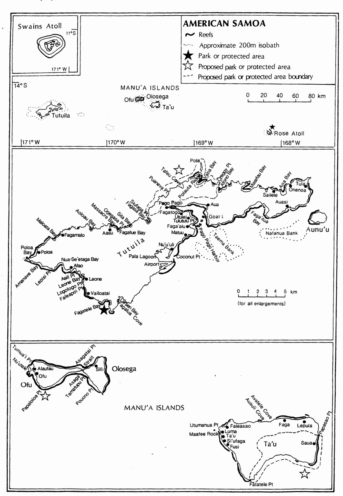

**AMERICAN SAMOA** 

Wells, S.M. (ed) (1988). Coral Reefs of the World. Volume 3: Central and western Pacific. UNEP, Nairobi; International Union for Conservation of Nature and Natural Resources, Switzerland.

#### INTRODUCTION

### General Description

American Samoa, an unincorporated territory of the U.S.A., comprises the six eastern islands of the Samoan Archipelago as well as Swains Atoll, which is geographically part of the Tokelau group. The land area covers 76 sq. mi. The geology of the Samoan Islands is described by Stearns (1944). All the islands except Swains Atoll are aligned along the crest of a discontinuous submarine ridge which extends over 485 km and trends roughly north-west by south-east. Swains and Rose Atolls are limestone, the others are composed principally of volcanic rock and are typically steep-sided, with little in the way of coastal plains, and with lush vegetation. Terrestrial aspects of the ecology of the islands are described in some detail in Amerson et al. (1982) and Dahl (1970 and 1973) provides short ecological reports.

Tutuila is the largest island and is the top of a composite volcano rising approximately three miles (4.8 km) from the ocean floor, which results in deep water near shore. There are many small but no major streams and the island is almost bisected on the south-east by a deep natural harbour, Pago Pago Harbor. The coastline, except at the mouths of drowned alluvial valleys, is irregular, rocky and composed of steep cliffs of variable height.

American Samoa has a warm, humid tropical climate with average temperature of 70-90°F (21-32°C) and average humidity of 80%; mean rainfall is about 200 in. (5080 mm), the heaviest rains occurring from December to March. It is in the zone of the south-east trade winds which are moderate from May to November. During the remainder of the year winds are variable; the strongest occur during the winter months of June to August, and the weakest are from December to February. Major hurricanes are experienced about once every five years; these normally approach from the north but occasionally come from other directions. Tsunamis may also occur although only inner Pago Pago Harbor has experienced any sizeable run-up (USDC, 1984).

## Table of Islands

**Tutuila** (X) 52 sq. mi. (135 sq. km) (32 x 4 km). volcanic, 2141 ft (653 m) with chain of mountains; fringing reef along eastern part of south coast as described below (see separate accounts for Fagatele Bay and Goat Island Pt - Utulei Reef).

Aunu'u (X) 1 sq. mi. (2.6 sq. km); volcanic islet with 200 ft (61 m) cone, 1.6 km off south-east coast of Tutuila; fringing reef.

# Manu'a Group

Ofu (X) 3 sq. mi. (7.8 sq. km), 1621 ft (494 m) volcanic; undisturbed fringing reef; important reefs at Asaga Strait, Alaufau and Ofu; important structural reefs occur as

offshore banks near Asaga Strait and Tumua'i Pt (Maragos, 1986); reef on west side at anchorage, 200 m off shore from Alaufau at 10-20 m depth, described by Dahl et al. (1974): water clear and warm with abundant fish; bottom has marked topographic relief, with small corals and red algae on top of elevations, dense coral cover; high species diversity on walls and white sand in troughs; (see account for Papaloloa Pt); brief descriptions of some sites in Itano (1987).

Olosega (X) 2 sq.mi. (5.2 sq. km); volcanic, 2095 ft (639 m); important reefs at Tamatupu Pt and Sili and important structural reef at Pouono Pt (Maragos, 1986); reef about 200 m off sheltered west side at 20-25 m depth described by Dahl et al. (1974): bottom rocky with huge blocks; coral cover more extensive and diversity higher than Ta'u, with huge colonies of table Acropora and Porites and abundant alcyonarians.

Ta'u (X) 17 sq. mi. (44 sq. km); 3170 ft (966 m) central peak; important reefs at Faleasao, Si'ufaga, Fusi and Saua (Maragos, 1986); reef on north-west coast described by Dahl *et al.* (1974); other reefs described by Itano (1987); see below for descriptions; fish recorded at various sites listed in Itano (1987).

Rose Atoll (see se parate account).

Swains Atoll (X) (see se parate account).

(X) = Inhabited

The islands are rich in fringing reefs although these are relatively narrow and lack good near-shore drop-offs. They typically consist of a shallow lagoon or moat (about 2 m deep), a shallower fore-reef, a reef crest (usually emergent at low tide), a surge zone (with spur and groove formation on the south-west windward side) and a sharp reef front dropping 5-10 m to a reef terrace and gradually descending to deep water. Most of the reefs have passes; the maximum width is 500 m and most are much narrower (Dahl, 1970 and 1973).

The reefs of American Samoa are among the best documented in the South Pacific region, those around Tutuila having been studied for nearly 70 years (Dahl, Lamberts (1983a) describes early scientific expeditions to the islands, the only extensive study of the reefs being the Carnegie Institution programme of 1917 to 1920. Early coral studies include those of Cary (1921 and 1931), Chamberlin (1921), Davis (1921), Helfrich et al. (1975), Hoffmeister (1925) and Maragos (1972). A resource survey of selected sites was carried out in the early 1970s by Randall and Devaney (1974). Monitoring surveys of reefs around Tutuila were made between 1970 and 1980 (Dahl, 1981). In 1979, a complete survey of the reefs was carried out for the U.S. Army Corps of Engineers and a reef inventory prepared for Tutuila, Aunu'u, Ofu, Olosega and Ta'u (AF and AECOS, 1980; Maragos and Elliott, 1985). monitoring stations have been set up by Itano and Buckley of the Office of Marine and Wildlife Resources

of the American Samoa Government on all islands except Ta'u. Some of these transects duplicate areas previously studied by Wass (1978) and Dahl et al. (1974), others are new and were chosen because they are representative of a particular biotope. On Tutuila, transects have been set up at Whale Rock, Faga'alu, Taema Bank, Nafanua Bank, Faga'itua Bay, Tula, Aoa, Masefau, Puaneva Pt, Fagasa. Sita Bay, Poloa, Afao, Leone Bay and Coconut Pt. Periodic monitoring is carried out at the monitoring stations and transects for reef fish and corals are made. Corals are identified to species where possible and a coral reference collection is maintained and added to (Itano in litt., 29.7.87). Lamberts (1983a) lists 174 scleractinian corals in 48 genera and subgenera for American Samoa. Surveys by the Office of Marine and Wildlife Resources have recorded Blue Coral Heliopora caerulea on Ofu, Olosega, Swains Island, and Taema Bank off Tutuila, with highest abundance on Ofu (Itano in litt., 29.7.87); Dahl et al. (1974) also recorded it at Leone Bay, Tutuila. Reef algae were studied by Dahl (1972).

Two thirds of the coastline of Tutuila (about 55 km), particularly to the south, is bordered by narrow fringing reefs which are partially exposed at low tide. There are no barrier reefs and only a single well-developed lagoon (Pala Lagoon). Beyond the breakers on the seaward margin of the reef flat, the bottom slopes rapidly to very deep water, except south-west of Aunu'u Island where depths are less because of the drowned barrier reef Nafanua Bank. Because of rapid submergence during the last period of Pleistocene sea-level rise, the limited areas of fringing reefs are discontinuous and consist primarily of bedded calcareous sand and silt rather than coral reef framework (Stearns, 1944).

The most important reefs, identified in the course of compiling the coral reef inventory, are in Pago Pago Harbor, Utulei, Aua, Faga'alu, Tafananai, Alega, Faga'itua, Aoa, Masefau, Afono, Vatia, Fagasa, Massacre, Maloata, Poloa, Amanave, Nua-Se'etaga and Leone, Asili, Pala Lagoon, Matuu and around Aunu'u Island. Structurally the most important reefs occur at Pala Lagoon, Faleapoi Pt (south of Leone), Coconut Pt, outer Pago Pago Harbor and Faga'itua Bay on the south coast and Aoa, Masefau, Fagasa and Poloa Bays on the north coast. Much of the north coast lacks structural reefs altogether. Important submerged structural reefs occur as the two offshore banks, Taema and Nafanua (Maragos, 1986; AF and AECOS, 1980).

The broadest fringing reef extends about 1000 m from the shore in the south mid portion of the island, at Nu'u'uli, near Pago Pago Airport. It protects the shallow estuary, Pala Lagoon, separated from it in part by the sandy peninsula, Coconut Pt. Prior to construction work for the airport, the deeper parts of this area had large thickets of staghorn acroporid corals some of which were over 30 m across and 2 m high (Helfrich et al., 1975).

A fifth of the Tutuila reef front is found in Pago Pago Harbor which was extensively studied between 1917 and 1920 by Mayor (1918, 1924 a,b,c and d) and by Bramlette (1926) who described marine bottom samples. Of the reef transects made by Mayor, only those of Aua and Utulei now cross living reef, the others having disappeared as a result of dredging and filling (Dahl and Lamberts, 1977) and sedimentation (Maragos, 1986). A reduction in total numbers of corals, a change in the

relative proportions of different genera and a probable reduction in the average size of individual colonies was recorded. *Acropora* is still the dominant coral but *Psammocora* abundance has been reduced by two thirds. *Pocillopora* has become more abundant replacing *Porites*.

Brief surveys were made at two sites on Tutuila by Dahl et al. (1974), prior to the Acanthaster infestation of 1978-79. At Leone Bay on the windward south-west side, the reef was surveyed out to 350 m from the shore near Logologo Pt. At that time the reef structure was irregular, somewhat resembling a spur and groove system, with a shallow reef flat and large reef patches in deeper water extending down to 25 m. Coral cover was very variable, sometimes reaching 100%, but with many A large flat of white, completely heliopores. detritus-free, coarse sand occurred at 15 m depth. The water was clear and warm with abundant fish. This area was apparently not affected by the Acanthaster outbreak and in 1987 was reported as still having a dense cover of Acropora hyacinthus and A irregularis, with other corals also being abundant and fish diversity high (Itano in litt., 29.7.87). On the north side of Tutuila, at Ogegasa Pt, Dahl et al. (1974) described a vertical basaltic rock slope from the surface to 3 m, followed by a rocky flat with small scattered corals extending 50 m off shore to 7 m depth. From here a slope with spur and groove formations dropped to 15 m and then a very steep slope dropped down to 30 m, ending in an extensive sand flat. This slope had extremely high coral cover and species diversity.

Sita Bay on the north coast still has good coral growth after the *Acanthaster* infestation (Itano *in litt.*, 29.7.87; Lamberts *in litt.*, 7.2.85). Fagatele Bay, on the south-west, is described in a separate account.

Taema Bank is a drowned barrier reef, similar to Nafanua Bank, about 7 km off the entrance to Pago Pago Harbor. Both banks are the remains of a barrier reef which enclosed a former lagoon extending from the vicinity of the airport to the channel between Tutuila and Aunu'u Island. Water depth varies from 100 m in the lagoon to 6 m over the banks which are cut by passages. The inner slopes of the banks are reported to be heavily silted and mostly devoid of conspicuous marine life but currents keep the seaward slopes free of silt (Maragos, 1986). The seaward slope and crest of the shallower sections of the banks have high coral abundance (Maragos in litt., 10.7.87). The banks and the area between Tutuila and the Manu'a Group are major feeding grounds for birds and have abundant commercial fish (Maragos, 1986).

Reefs around Ofu and Olosega are mentioned briefly above in the table. On Ta'u, the reef between Faga on the central part of the northern coast and Lepula in the north-east is characterized by spur and groove formation extending gradually offshore for 100 m from the outer reef flat margin before sloping to meet basalt pavement areas at ca 20 m depth. The channels are lined with boulders and sand pockets and generally have no coral cover; coral growth on the higher parts of the basalt spurs is generally sparse but increases to ca 30% below 10 m depth. Corals are generally robust, low growing or encrusting forms capable of withstanding high wave energies, the community being dominated by Acropora humilis, Porites lutea, encrusting Millepora and small

colonies of massive faviids. Similar coral communities occur along the western half of the north coast, between Utumanua Pt and Avatele Cove, coral cover increasing off Faleasao Village (Itano, 1987). Buckley (1987) gives a brief description of the reef fronting Faleasao Village. Dahl et al. (1974) briefly surveyed a reef on the north-west coast, at a leeward but exposed site about 300 m off shore. They described a rocky flat with huge boulders at 20-25 m depth; Porites and Pocillo pora were the most common corals, but diversity, abundance and colony size were low. Itano (1987) surveyed the northern half of the west coast of Ta'u. Here a broad shallow shelf extends out from the fringing reef at Luma to encompass Maafee Rock and has relatively high live coral cover dominated by Acropora humilis and other sturdy coral species; the area off Ta'u village had spur-and-groove formations similar to those between Lepula and Faga.

Leatherback Turtles Dermochelys coriacea, Olive Ridleys Lepidochelys olivacea and Loggerheads Caretta caretta have been recorded in American Samoan waters, and both Green Turtles Chelonia mydas and Hawksbills Eretmochelys imbricata nest, mainly on Rose Atoll with apparently scattered nesting elsewhere, principally in the Manu'a group, although it is possible that Eretmochelys also nests sparsely on Tutuila (Amerson et al., 1982; Anon., 1979; Johannes, 1986).

#### Reef Resources

Tutuila is the most populated island with 90% of the total population of American Samoa (35 000 in 1980); one third lives around Pago Pago Bay and the remainder live mainly in small villages on the limited flat coastal areas. Much of the inner part of the island is still relatively pristine as a result of the inaccessibility of the central ridge system. The Manu'a group have a considerably lower population density and no industry and are therefore little changed, but the population is again concentrated on the coast in several small villages.

The Samoan people have historically relied on reef and lagoon organisms for a substantial part of their diet. Fishing practices were surveyed by the Office of Marine Resources between 1977 and 1980 on Tutuila and the results are described by Wass (1983). Additional information is provided by Hill (1978). Shoreline recreational fishing is traditionally important and about 300 tonnes of fish a year are taken in this way. Office of Marine and Wildlife Resources is conducting a bottom fish stock assessment in conjuction with the U.S. National Marine Fisheries Service (Itano, 1987). Both eggs and meat of turtles (mainly Eretmochelys imbricata) are eaten, and tortoiseshell is used locally for jewellery and decoration. Johannes (1986) estimated that ca 50 turtles a year were taken on Tutuila and Olosega, although in general there was little interest in catching turtles. In the early 1980s the 50 or so inhabitants of Swains Atoll (see separate account) apparently relied to some extent on turtle eggs and meat for subsistence (Balazs, 1982). Tourism and reef-related recreational activities are popular in some areas, particularly at Goat Island Pt and Fagatele Bay (see se parate accounts).

### Disturbances and Deficiencies

The reefs of American Samoa have suffered disturbance from a variety of causes, and a 1979 coral reef inventory

showed relatively few areas with more than 50% coral cover. The reefs of Tutuila were subjected to a severe infestation of Acanthaster planci in 1978-1979 (Beulig et al., 1981; Birkeland and Randall, 1979). Damage, particularly to Acropora, was widespread with reefs at the following sites being severely damaged or wiped out: Taema, Nafanua, Faga'itua Bay, Aunu'u, Onenoa, Aoa, Sailele, Masefau, Afono, Vatia, Tafeu Cove, Fagasa, Fagafue, Aasu, Aoloau, Fagamalo, Maloata, Poloa, Vailoatai, Fagatele, Fagalua (Larsen) Bay and the airport. Recolonization has been slow and new colonies are still small. Reefs of the Manu'a islands Surveys in 1987 revealed fair were unaffected. concentrations of Acanthaster on Ofu although these are not considered to represent a major infestation (Itano, 1987 and in litt., 29.7.87).

Silt-laden freshwater from torrential rain often overlays the Pago Pago reefs and in 1924 was responsible for considerable coral death (Mayor, 1924a). In 1966 a hurricane caused terrestrial damage but only minor harm to the reefs (Dahl and Lamberts, 1977). Hurricane Tusi, on 17th January 1987, caused considerable terrestrial damage on the Manu'a islands but did not result in large destructive swells and thus caused relatively little direct damage to the reefs. The vegetation has reportedly recovered well in general, with little excess erosion, although two drainage basins on the north coast of Ta'u (Auauli and Avatele) were gutted by excessive runoff, leading to increased sediment load on adjacent reefs with some evidence of coral smothering (Itano, 1987 and in litt., 29.7.87).

In many reef moats on Tutuila, large thickets of *Acropora formosa*, the lower parts of which are often dead and the upper parts killed in a sharply demarcated line, have been found presumably corresponding to extreme low water tide level (Dahl and Lamberts, 1977).

There has been some coral mortality where it is not known whether the cause was natural or man-induced. On Tutuila, extensive coral death occurred in 1973 on the reefs bounded by Coconut Pt, Pago Pago Airport and out to the reef edge. All the corals of the dominant suborder including Acropora, Astrocoeniina, Monti pora and Pocillo pora, died to a depth of 6 m within an area of at least 8 ha. Fungiids and faviids remained healthy (Lamberts, 1983b). It was postulated that the mortality was caused by some event connected with the erection of a fish trap in the area, such as the addition of poisons to the water, but subsequent experiments proved nothing conclusively. Lamberts (1983b) studied recolonization rates of this reef area. Most of the species that had died out have re-established themselves, but the natural processes are being modified by the dredging of borrow pits, which may also account for increased beach erosion along Coconut Pt. The Acropora thickets previously found in these areas will probably never be fully re-established because of changes in substrate (increased sediment) but it is thought that the reef may eventually recover. Similar areas of coral kill were observed in the north shore bay of Masefau and at the edge of moderately deep water in Faga'itua Bay.

Human activities are having an increasing impact on the reef. Coastal areas, particularly Pago Pago Harbor, Pala Lagoon and the more populated inlets, have been fairly extensively degraded through pollution, coral smothering through sedimentation and siltation, fish dynamiting and

fish poisoning. Littoral erosion arising from inadequate protection against wave energy has, in the past, removed considerable portions of the narrow coastal platform. Increased agricultural usage of steep slopes and increasing numbers of dredging and construction projects including road construction have resulted in erosion with deposition of terrigenous silt in sheltered bays and on reef areas adjacent to stream outfalls; significant portions of Pago Pago Bay, Faga'itua Bay, Leone Bay and Pala Lagoon have been silted over. Dredging and blasting activities in at least 20 sites around Tutuila and the Manu'a islands have resulted in direct destruction of the reef; dredging in some cases has been to provide access to isolated villages, but has often been carried out to provide a source of road-bed materials (SPREP, 1980; Swerdloff, 1973). There are also problems with the containment of oil spills and the dislocation of coastal outline due to irregular reclamation practices including land filling with rubbish. In recent years there has been a serious problem of littering and rubbish dumping on reefs and in lagoons adjacent to villages.

On Tutuila, the reefs in Pago Pago Bay have suffered particular damage. Between 1942 and 1945, the military dredged several inshore areas for landfill, there was an increase in harbour traffic and shipping converted from coal to oil. Tuna canneries were established on the north shore of the harbour in 1956 and dredging operations were expanded in 1960. By 1973 the tuna canneries and a marine railway in the harbour serviced an ocean-going fleet of over 250 fishing ships and the port facilities are increasingly visited by tour ships and used as a freight transhipment point. High turbidity and siltation caused the death of most corals in the inner half of the bay as described by Dahl and Lamberts (1977). Approximately 95% of the reefs at the back of the bay fronting the villages of Fagatogo and Pago Pago have been filled (Wass, 1983). Only the shallow reefs near the mouth of the bay, with a relatively high rate of water exchange, have remained viable, and a portion of that area has been destroyed by dredging. Organic pollution is also a problem; untreated sewage, polluted streams and untreated wastes from two fish canneries flow into the bay which has changed from a clear-water coral reef regime to a turbid silty area. The problem has been accentuated by the increased use of agricultural fertilizers. Oil streaks often cover the bay, originating from the bilge residue of commercial vessels (primarily the long line fishing fleet), spillage at the fuel dock and leakage from deteriorating underground fuel oil pipe lines (Swerdloff, 1973). Maragos (1972) monitored the growth and survival of transplanted corals at several sites in the harbour and reported greater mortality and least growth at the innermost site, Goat Island Reef (see separate account), concluding that poorer water quality inside the bay was the cause. Dahl and Lamberts (1977) reported occasional small oil spills and the drainage of urban and industrial wastes into the harbour. Treatment projects are, however, under way (see below) and Dahl and Lamberts (1977) suggested that Aua Reef is gradually recovering from earlier stress.

Significant damage was caused to reefs adjacent to Pala Lagoon by the extension of the commercial airfield out into the lagoon. An assessment of the expected impact of dredging in Pala Lagoon for a proposed boat basin was carried out by Helfrich et al. (1975). Devaney and Suzumoto (1977) carried out a survey of Auasi Harbor in the context of a harbour development project; some reef

damage may have occurred. The reefs at Leone Bay are potentially threatened by a planned boat harbour (Itano in litt., 29.7.87).

The Manu'a Islands, although free from extensive construction and agricultural usage, have suffered some reef destruction. Channels have been dredged at Ofu and Ta'u for small boat harbours and blasting of the Asaga Strait between Ofu and Olosega as part of a bridge and road project has caused some damage to reefs (Maragos, 1986). A large land slide caused by road construction on Olosega had covered some 5 sq. km of reef flat by July 1987 and was expected to cause more damage as construction and associated erosion (Buckley in litt., 4.8.87). Small boat harbour dredging and construction on Aunu'u, Ofu, and Fusi (Ta'u) has probably caused some reef damage but also created coral and fish habitat (Itano in litt., 29.7.87).

The recent rapid population growth has put considerable pressure on reef resources and traditional conservation practices have largely been discarded. The dependancy of American Samoans on their marine resources is decreasing, due to the availability of canned and frozen foods, but seafood consumption remains high. Increased mobility has led to a tendency to fish reefs of neighbouring villages. Reef fishermen consider that yields are less than they were previously, but it is believed that while fish varieties have been reduced, there has probably not been a reduction in biomass. Fish poisoning and dynamiting have caused a reduction in the variety of fish stocks. Dynamiting has caused considerable damage to reefs around Tutuila and in the Manu'a group (Swerdloff, 1973; Thomas in litt., 9.7.87); it is less widespread than previously, but in the past three years has been recorded several times in Fagatele and Fagasa Bays and other areas around Tutuila (Thomas in litt., 9.7.87). Giant Clams (Tridacna spp) have effectively been fished out in Samoan waters, other than at Rose Atoll (Maragos in litt., 10.7.87). Turtle numbers around Tutuila are said to have declined considerably in the five years up to 1981 (Johannes, 1986).

#### Legislation and Management

A general overview of conservation activities is given in Eaton (1985) and OTA (1987) provides an analysis of coastal resource development and management.

Ownership of the reefs and their resources was traditionally vested in the chiefs of each village and a complex system of taboos, restricting efforts to certain seasons and locations arose, which served to protect the reefs from over-exploitation. These rights have been largely abandoned but some elements remain. At present, village councils occasionally limit fishing on the reefs fronting the village through temporary bans on fishing or by prohibiting fishermen from other villages (Johannes, in press; Wass, 1983). It is still customary for outsiders to request permission to fish these reefs (Maragos in litt., 10.7.87). Several villages do not allow fishing on Sundays and most prohibit the use of dynamite or bleach (Johannes, in press; Wass, 1983).

Under Federal Public Law 93-435, the American Samoan Government owns all submerged lands from the mean highwater mark out to the limit of the territorial sea. Executive Order 3-80, which established the American

Samoa Coastal Management Program (ASCMP) in 1980, contains 16 policies which govern the use of the coastal zone, including reef protection, marine resource protection, protection of unique areas, improvement of recreational opportunities and control of shoreline development (USDC, 1980). A detailed description of legislation relevant to reefs is given in USDC (1984). Many of the U.S. Federal laws and regulations apply, including the Marine Protection, Research and Sanctuaries Act (1972), the Marine Mammal Protection Act (1972), the Fishery Conservation and Management Act (1976), the Endangered Species Act (1973), the Coastal Zone Management Act (1972), the River and Harbor Act (1899), the Clean Water Act (1977) and the National Environmental Policy Act.

Pollution control is now greatly improved (Maragos, The Environmental Protection Agency is represented and is active in controlling effluent from the tuna canneries; stricter controls affecting the dumping of nitrogen- and phosphate-rich wastes into Pago Pago Bay have been imposed and will have to be complied with by 1991. A sewerage project is in progress for Pala Lagoon which should improve water quality in the estuary. The Office of Coastal Zone Management actively enforces U.S. Coast Guard oil pollution regulations and funds a project responsible for oil pollution control and cleaning up debris and oil spill in Pago Pago Harbor. It runs an Island Wide Metal Cleanup programme and a Marine Awareness programme for students which stresses the importance of the sea to Samoa, and the damage done by pollution, siltation and other activities. The office is also active in trying to control illegal landfills, mangrove cutting and beach sand mining, although with limited success, and has also contracted teachers to develop and adapt the school science curriculum to make it more relevant to the country (Itano in litt., 29.7.87). Seawalls are being rebuilt along eroded sections of coast (SPREP, 1980). The Office of Marine and Wildlife Resources (OMWR) is responsible for fisheries development and wildlife management in cooperation with U.S. Federal Resource Agencies and American Samoa Agencies (Buckley in litt., 30.9.87).

At present Public Law 16-58 prohibits the use of poison in territorial waters and provides punishment by fines and/or imprisonment; territorial law also prohibits the use of dynamite to harvest fish and other marine resources. Attempts are being made to control the use of dynamite and bleach with a public awareness campaign using newspapers, television and lectures (Itano in litt., 29.7.87).

Executive Order 3-80 (see above) provides for the establishment of Special Management Areas. Two protected areas, Rose Atoll National Wildlife Refuge and Fagatele Bay National Marine Sanctuary, include reefs and are described in separate accounts.

A small Tridacnid clam nursery has been started in Faga'itua Bay on Tutuila by the village of Alofau in cooperation with the Office of Marine and Wildlife Resources, with seed clams obtained from the Micronesian Mariculture Demonstration Center in Palau. The village leaders have closed the immediate reef area around the clams to swimming or fishing. The long term aim is to increase Giant Clam populations on Tutuila's reefs (Anon., 1987b; Buckley in litt., 4.8.87).

#### Recommendations

A number of reef areas have been recommended for protection.

- 1. A National Park has been proposed for the northern part of Tutuila from Siufaga Pt east to Craggy Pt, apparently excluding Vatia Bay; restrictions on the use of reefs and marine resources have not been defined in the proposals (Anon., 1988). As of March 1988 the proposals had not been endorsed by the U.S. National Park Service (Harry in litt., 29.2.88). This would include the area of Pola Islet Pola'uta Ridge, recommended as a protected area for breeding birds and as a marine reserve by Amerson et al. (1982) and (Dahl, 1980).
- Goat Island Reef Utulei Reef on Tutuila (see se parate account).
- Coastal and reef reserves have been recommended at Lepisi Pt and Ogegasa Pt on Tutuila by Dahl (1980).
- 4. Pago Pago Bay and Pala Lagoon on Tutuila have been identified as areas of particular concern and importance (Maragos, 1986); recommendations for the management of Pala Lagoon are given in Yamasaki et al. (1985) and there are plans to rehabilitate both areas.
- 5. A National Park has been proposed for the area covering much of the southern part of Ta'u, from Fatatele Pt east to Papasao Pt; it would include waters and reefs up to 0.25 mi. (0.4 km) from shore, although restrictions on the use of reefs and marine resources have not been defined in the proposals (Anon., 1988). As of March 1988 the proposals had not been endorsed by the U.S. National Park Service (Harry in litt., 29.2.88).
- Papaloloa Pt proposed national marine sanctuary on Ofu (see se parate account).
- 5. Protection of Nu'utele islet, off Ofu, for its seabird colony has been recommended (Dahl, 1980).
- 6. Swains Atoll (see se parate account).

The American Samoan Natural Resources Commission made up of "fono" (the bicameral legislative body of the Territory of American Samoa) members and resource management agency representatives is drawing up a list of endangered species for the Territory (Buckley in litt., 30.9.87; Thomas in litt., 9.7.87). It is hoped that fisheries regulations drafted by the Office of Marine and Wildlife Resources (OMWR) will be implemented in 1988, when OMWR enforcement officers should also be appointed (Itano in litt., 10.7.87). Wass (1983) recommended that village councils should be encouraged to take a more active role in future management schemes and suggested that a management plan for the island of Tutuila as a whole should be formulated. The effects of uncontrolled destruction on the outer edges of the 223 acres (90 ha) of mangrove and wetland areas on the coast need assessment.

It has been suggested that aid for fisheries in the Manu'a group should concentrate on controlling erosion,

developing the Fish Aggregating Devices, developing support facilities for "alias" (simple aluminium-hulled catamaran styled fishing boats), and reef enhancement projects (Itano, 1987).

Itano (1987) recommends further surveys on the reefs of Ofu, with particular emphasis on *Acanthaster* and the potential need to implement controlling measures.

#### References

- \* = cited but not consulted
- \*AF and AECOS (Aquatic Farms, Inc. and AECOS, Inc.) (1980). American Samoa Coral Reef Inventory. Part A. Text. Part B. Atlas. Prep. for U.S. Army Corps of Engineers and American Samoa Development Planning Office, Honolulu. 314 pp.
- Amerson Jr, A.B., Whistler, W.A. and Schwaner, T.D. (1982). Wildlife and Wildlife Habitat of American Samoa. 1. Environment and Ecology. Fish and Wildlife Service, U.S. Department of the Interior, Washington D.C.
- Anon. (1979). Country Statement: American Samoa. Paper presented at Joint SPC-NMFS Workshop on Marine Turtles in the Tropical Pacific Islands. Noumea, New Caledonia, 11-14 December 1979. SPC-NMFS/Turtles/WP.15.
- Anon. (1985). Summary record of proceedings of ministerial and technical sessions. Report of the 3rd South Pacific National Parks and Reserves Conference, Apia 1. 95 pp.
- Anon. (1987a). Memorandum re Rose Atoll, from Fishery Biologist, Office of Marine and Wildlife Resources, American Samoa Govenment to Refuge Manager, Fish and Wildlife Resources, Honolulu, Hawaii. Anon. (1987b). Micronesian Mariculture Demonstration Center, Palau. Clamlines 3: 2-3.
- Anon. (1988). National park feasibility study, American Samoa. Draft. Prepared by the National Park Service and American Samoa Government. 139 pp.
- Anon. (n.d. a). Potential Marine Sanctuary Site. Manuscript.
- \*Anon. (n.d. b). Rose Atoli National Wildlife Refuge, American Samoa. Brochure, USDI, FWS.
- Balazs, G.H. (1982). Sea turtles and their traditional usage in Tokelau. Unpublished project report prepared for WWF-US and Office of Tokelau Affairs.
- Beulig, A., Beach, D. and Martindale, M.Q. (1981). Influence on daily movements of Acanthaster planci during a population explosion on American Samoa. Proc. 4th Int. Coral Reef Symp., Manila 2: 755 (Abst.).
- Birkeland, C. and Randall, R.H. (1979). Report on the Acanthaster planci (Alamea) studies on Tutuila, American Samoa. Prep. by Univ. Guam Mar. Lab. for Office of Marine Resources, Government of American Samoa.
- Birkeland, C., Randall, R.H., Wass, R.C., Smith, B.D. and Wilkins, S. (in press). Biological resource assessment of the Fagatele Bay National Marine Sanctuary. Report prepared for the Development Planning and Tourism Office, Government of American Samoa and the Sanctuary Program Division, National Oceanic and Administration, U.S. Department of Commerce.
- \*Bramlette, M.N. (1926). Some marine bottom samples from Pago Pago Harbour, Samoa. Carnegie Inst. Washington Rept 23.

- \*Bryan, E. (1974). Swains Island. Pacific Information Center, B.P. Bishop Museum. Unpub. rept.
- Buckley, R. (1986). Internal memorandum on coral transects at Faleasao Village, Ta'u Island (3.11.86). Office of Marine and Wildlife Resources, American Samoa Government.
- \*Cary, L.R. (1921). Studies of Alcyonaria and of boring through reefs of Samoa. Carnegie Inst. Washington Yearbook 19: 193-194.
- \*Cary, L.R. (1931). Studies on the coral reefs of Tutuila, American Samoa with special reference to the Alcyonaria. Carnegie Inst. Wash. Publ. 413, Pap. Tortugas Lab. 27: 53-98.
- Chamberlin, R.T. (1921). The geological interpretation of the coral reefs of Tutuila, Samoa. Carnegie Inst. Washington Yearbook 19: 194-195.
- \*Clapp, R.B. (1968). The birds of Swain's Island, south central Pacific. *Notornis* 15(3): 198-206.
- \*Dahl, A.L. (1970). Ecological report on Tutuila, American Samoa, Washington D.C. 13 pp.
- \*Dahl, A.L. (1972). Ecology and community structure of some tropical reef algae in Samoa. *Proc. Int. Seaweed Symp.* 7: 36-39.
- \*Dahl, A.L. (1973). Ecological report on American Samoa. Washington D.C. 18 pp.
- Dahl, A.L. (1980). Regional ecosystems survey of the South Pacific Area. SPC/IUCN Technical Paper 179. South Pacific Commission, Noumea, New Caledonia.
- Dahl, A.L. (1981). Monitoring coral reefs for urban impact. Bull. Mar. Sci. 31(3): 544-557.
- Dahl, A.L. (1985). Status and conservation of South Pacific coral reefs. *Proc. 5th Int. Coral Reef Cong., Tahiti* 6: 509-513.
- Dahl, A.L. and Lamberts, A.E. (1977). Environmental impact on a Samoan coral reef: A resurvey of Mayor's 1917 transect. *Pacific Science* 31(3): 309-319.
- Dahl, A.L., Macintyre, I.G. and Antonius, A. (1974). A comparative survey of coral reef research sites. In: Sachet, M.-H. and Dahl, A.L., Comparative Investigations of Tropical Reef Ecosystems: Background for an integrated coral reef program. *Atoll Res. Bull.* 172: 37-77.
- \*Davis, W.M. (1921). The coral reefs of Tutuila, Samoa. Science 53: 559-565.
- **Devaney, D.M. and Suzumoto, A.Y.** (1977). Marine ecology reconnaissance survey: Auasi Harbor project, Auasi, Tutuila Island, American Samoa. U.S. Army Corps of Engineers, Pacific Ocean Division. 124 pp.
- Eaton, P. (1985). Land Tenure and Conservation: Protected areas in the South Pacific. SPREP Topic Review 17. South Pacific Commission, Noumea, New Caledonia. 103 pp.
- \*Helfrich, P., Ball, J.L., Bienfang, P., Foster, M., Gallagher, B., Guinther, E., Krasnick, G. and Maragos, J.E. (1975). An assessment of the expected impact of a dredging project for Pala Lagoon, American Samoa. Univ. of Hawaii Sea Grant Technical Report UNIHI-SEAGRANT-TR-76-02. 76 pp.
- Hill, H.B. (1978). The use of nearshore marine life as a food source by American Samoans. *Pacific Islands Program, University of Hawaii, Misc. Work Papers* 1. 170 pp.
- \*Hoffmeister, J.E. (1925). Some corals from American Samoa and the Fiji Islands. Carnegie Inst. Wash. Publ. 343, Pap. Dep. Mar. Biol. 22: 1-90.
- Itano, D. (1987). Internal memoranda to Director, coral reef assessments on Ofu Reef (10.2.87), Rose Atoll (26.2.87), Swains Island (21.4.87), Ta'u Island Reefs

(20.5.87). Office of Marine and Wildlife Resources, American Samoa Government.

Johannes, R.E. (1986). A review of information on the subsistence use of Green and Hawksbill Sea Turtles on Islands under United States Jurisdiction in the Western Pacific Ocean. National Marine Fisheries Service, Southwest Region/NOAA.

Johannes, R.E. (in press). The role of Marine Resource Tenure Systems (TURFs) in sustainable nearshore marine resource development and management in U.S.-affiliated tropical Pacific islands. In: Smith, B.D. (Ed.), Topic Reviews in Insular Resource Development and Management in the Pacific U.S.-affiliated Islands. Univ. Guam Mar. Lab. Tech. Rept 88.

Lamberts, A.E. (1983a). An annotated checklist of the corals of American Samoa. *Atoll Res. Bull.* 264. 15 pp.

Lamberts, A.E. (1983b). Coral kill and recolonization in American Samoa. *National Geographic Society Research Projects* 15: 359-377.

\*Maragos, J.E. (1972). A study of the ecology of Hawaiian reef corals. Ph.D. dissertation, University of Hawaii, Honolulu. 292 pp.

Maragos, J.E. (1986). Coastal resource development and management in the U.S. Pacific Islands: 1. Island-by-island analysis. Office of Technology Assessment, U.S. Congress. Draft.

Maragos, J.E. and Elliott, M.E. (1985). Coastal resource inventories in Hawaii, Samoa and Micronesia. *Proc. 5th Int. Coral Reef Cong.*, Tahiti 5: 577-582.

\*Mayor, A.G. (1918). The growth rate of Samoan coral reefs. Nat. Acad. Sci. Proc. 4: 390-393.

\*Mayor, A.G. (1924a). Structure and ecology of Samoan reefs. Carnegie Inst. Wash. Publ. 340, Pap. Dep. Mar. Biol. 19: 1-25.

\*Mayor, A.G. (1924b). Causes which produce stable conditions in the depth of the floors of the Pacific fringing reef-flats. Carnegie Inst. Wash. Publ. 340, Pap. Dep. Mar. Biol. 19: 27-36.

\*Mayor, A.G. (1924c). Inability of stream-water to dissolve submarine limestones. Carnegie Inst. Wash. Publ. 340, Pap. Dep. Mar. Biol. 19: 37-49.

\*Mayor, A.G. (1924d). Growth rate of Samoan corals. Carnegie Inst. Wash. Publ. 340, Pap. Dep. Mar. Biol. 19: 51-72.

\*Mayor, A.G. (1924e). Rose Atoll, American Samoa. Posthumous Memorial Volume, Alfred Goldsborough Mayor. Carnegie Inst. Wash. Publ. 340, Pap. Dep. Mar. Biol. 19: 73-79.

NOAA (1983). Announcement of national marine sanctuary program final site evaluation list. Federal Register 48(151): 35568-35577.

\*OTA (Office of Technology Assessment) (1987). Integrated Renewable Resource Management for U.S. Insular Areas. OTA-F-325. U.S. Government Printing Office, Washington D.C. 443 pp.

\*Radtke, R. (1985). Population dynamics of the Giant Clam *Tridacna maxima* at Rose Atoll. Hawaii Institute of Biology, Univ. Hawaii.

\*Randall, J.E. and Devaney, D.M. (1974). Marine biological survey and resource inventory of selected sites at American Samoa. Prep. for U.S. Army Corps of Engineers, Honolulu District.

\*Sachet, M.-H. (1954). A summary of information on Rose Atoll. Atoll Res. Bull. 29. 25 pp.

\*Setchell, W.A. (1924). American Samoa: Part 1. Vegetation of Tutuila Island. Part 2. Ethnobotany of the Samoans. Part 3. Vegetation of Rose Atoll. Carnegie Inst. Wash. Publ. 413, Pap. Tortugas Lab. 20: 1-275.

SPREP (1980). American Samoa. Country Report 1. South Pacific Commission, Noumea, New Caledonia.

\*Stearns, H.T. (1944). Geology of the Samoan Islands. Bull. Geol. Soc. Am. 55: 1279-1332.

Swerdloff, S.N. (1973). The status of marine conservation in American Samoa - 1971. Paper 4. Proceeding and Papers, Regional Symposium on Conservation of Nature - Reefs and Lagoons. South Pacific Commission, Noumea, New Caledonia.

Thomas, W. (1985). Fagatele Bay National Marine Sanctuary. Report of the 3rd South Pacific National Parks and Reserves Conference, Apia 2: 79-87.

USDC (1980). American Samoa Coastal Management Program and Final Environmental Impact Statement. U.S. Dept of Commerce, NOAA, Office of Coastal Zone Management.

USDC (1984). Final Environmental Impact Statement and Management Plan for the Proposed Fagatele Bay National Marine Sanctuary. Sanctuary Programs Division, U.S. Dept of Commerce, NOAA and Development Planning Office, Pago Pago.

Wass, R.C. (1978). Fagatele Bay reef front and flat: list of species recorded along reef front on September 25, 1978 and along reef flats on February 15, 1978. Office of Marine Resources, American Samoa Government. Unpub.

Wass, R.C. (1983). The shoreline fishery of American Samoa - past and present. In: Marine and Coastal Processes in the Pacific: Ecological aspects of coastal Zone Management. Unesco Seminar, Motupore Island Research Centre, University of PNG, 14-17 July 1980, Unesco, Jakarta, Indonesia.

Wass, R.C. (1987). Rose Atoll National Wildlife Refuge Public Use Policy. USDI Fish and Wildlife Service Circular.

Wass, R.C. (n.d. a). The Fishes of Rose Atoll. Unpub. rept.

Wass, R.C. (n.d. b). The Fishes of Rose Atoll. Supplement 1. Unpub. rept.

Wass, R.C. (n.d. c). The Tridacna clams of Rose Atoll. Unpub. rept.

Whistler, W.A. (1983). The flora and vegetation of Swains Island. Atoll Res. Bull. 262. 20 pp.

Yamasaki, G., Itano, D. and Davis, R. (1985). A study of and recommendations for the management of the mangrove and lagoon areas of Nu'u'u'li and Tafuna, American Samoa. Final rept. 99 pp.

# FAGATELE BAY NATIONAL MARINE SANCTUARY

Geographical Location 12 km south-west of Pago Pago Harbour on the southernmost point of Tutuila, including the whole bay up to mean high high water; 14°23'S, 170°46'W.

Area, Depth, Altitude 66 ha; 26-36 m depth to 122 m altitude.

Land Tenure American Samoan Government.

Physical Features Fagatele Bay is formed by a collapsed volcanic crater and is surrounded by steep cliffs and volcanic rocks. Seumalo Ridge rises over 400 ft (122 m) along the western and northern sides, and the eastern side is bounded by Matautuloa Ridge, over 200 ft (61 m)

high. Soils on the steep slopes surrounding the bay are silty clay loams. The beaches are composed primarily of calcareous sand with a small amount of volcanic sand. The sand deposits extend off shore for about 20-30 ft (6-9 m) until they merge with the reef platforms which are composed primarily of consolidated limestone and encrusting algae.

The platforms, approximately 200 ft (61 m) or less wide and 2 ft (0.6 m) deep, have bottom reliefs of 1 ft (0.3 m). They fringe the shore of the bay, the widest platform occurring on the eastern side. The reef front drops almost vertically to 5-10 ft (1.5-3.0 m), then gradually slopes seaward to 15-20 ft (4.5-6.0 m). The reef front slope may extend up to 300 ft (91 m) off shore, and contains widely separated pinnacles rising from depths of 15-20 ft (4.5-6.0 m) to within 4-5 ft (1.2-1.5 m) of the surface. The bay bottom reaches a depth of 120 ft (36 m) approximately 1100 ft (335 m) due west of the pocket beach and is covered with rubble.

Wave action (normally from the east) is damped by the encircling reef platform and because the bay faces south-west. Tides are probably similar to Pago Pago Bay where they are diurnal with mean and spring tidal ranges of 2.5 ft (0.76 m) and 3.1 ft (0.95 m) respectively. Water temperatures is 80-82°F (26.7-27.8°C) with little seasonal or diurnal change; salinity ranges from 35.5 ppt to 36.0 ppt. Visibility is normally at least 50 ft (15 m) (USDC, 1984).

Reef Structure and Corals A fairly well-developed fringing reef flat exists within the protected portion of the bay, the submerged part of which varies in depth from 0.5 to 2 m. There is a sparse covering of corals Pavona, Porites, Acropora, Pocillopora and Millepora. Along the eastern edge of the bay, 10% of the reef flat at a depth of about 2 ft (0.6 m) is covered by coral and a further 5% has dead coral heads. The most conspicuous corals are Pocillopora verrucosa, Favia sp., Galaxea sp., Goniastrea sp., A humilis, Porites lutea and the soft coral Palythoa sp. Other species have been recorded in Leone Bay, just west of Fagatele Bay, and may be present in the latter.

The reef terrace varies from 2 to 10 m depth with strong currents and surge in some areas. The substrate is basalt in exposed areas and calcium carbonate in sheltered Prior to Acanthaster infestation, there was areas. 30-100% coral cover of Acropora, Porites, Montipora, The reef front borders the Pocillopora and others. seaward edge of the reef terrace and consists of a portion of the fore-reef, 5-40 m deep, that slopes steeply to deep Prior to Acanthaster infestation, the upper portions supported the most luxuriant and diverse coral assemblages in the bay. Nearly vertical basalt cliffs and faces extend from the surface to as deep as 80 m along the exposed outer portions of the bay which are characterized by strong currents and surge in the upper portions. Scattered corals are found on these walls including large fan corals at depths below 40 m.

About 172 coral species have been recorded from the area (USDC, 1984).

Noteworthy Fauna and Flora The steep cliffs have typical coastal and littoral vegetation. There is an abundant avifauna and the fruit bats *Pteropus samoensis* and *P. tonganus* roost in the area (Amerson et al., 1982;

Dahl, 1980; Itano in litt., 29.7.87). The Humpback Whale Megaptera novaeangliae is found in the bay and adjacent waters from July to October, the breeding and calving season. Sperm Whales Physeter catodon are occasionally sighted off shore. Other cetaceans, including the Pacific Bottlenose Tursiops truncatus Spinner Stenella sp. Dolphins also use the bay and adjacent waters (USDC, 1984). Hawksbills Eretmochelys imbricata and Green Turtles Chelonia mydas are found frequently, and Leatherbacks Dermochelys coriacea. Olive Ridleys Le pidochelys olivacea and Loggerheads Caretta caretta have been recorded (USDC, 1984).

The bay's configuration provides a protected habitat for an abundant fish fauna. Surveys of fish located on the reef flat and reef front indicate a high diversity and over 80 species of fish have been recorded. 114 species have been recorded from the waters off the south-eastern tip of the bay (Wass, 1978; USDC, 1984).

Scientific Importance and Research A brief survey of the flora and fauna was carried out in 1979 and more detailed studies of the fish fauna have been made but these have not been published. A further survey to gather baseline population data, by the University of Guam under contract to the National Oceanic and Atmospheric Administration and the Development Planning and Tourism Office, Government of American Samoa, was completed in April 1985 (Birkeland et al., in press), and the reefs will be re-surveyed in 1988 (Thomas in litt., 9.7.87; Itano in litt., 29.7.87). Reference collections of the fish, corals, algae and invertebrates are housed at the Office of Marine and Wildlife Resources, Pago Pago, and at the University of Guam (Itano in litt., 29.7.87). Research on coral recolonization and changes in the composition and structure of inshore fish communities is under way. The pristine nature of the bay provides ideal conditions for the study of coral regeneration following Acanthaster predation. Future research requirements are described in USDC (1984), and range from broad surveys to monitoring of Acanthaster.

Economic Value and Social Benefits The steep cliffs surrounding the bay make it relatively inaccessible from land, although the beaches can be reached via a foot trail. The area is located near the village of Leone (1700 inhabitants), and there are three smaller villages in the immediate vicinity. The sanctuary has a number of invertebrates which serve as important subsistence food sources, including sea anemones, lobsters, limpets, clams, octopuses and sea urchins. Subsistence fishing and recreational activities are both important in the area (USDC, 1984).

Disturbance or Deficiencies In late 1978 and early 1979, hard corals were heavily predated by *Acanthaster*, 90% of the reef being destroyed; recent surveys indicate that coral cover is regenerating (Thomas, 1985).

Human impact has been minimal, and the bay is considered one of the least disturbed areas on Tutuila, although dynamiting has occurred during the last three years (Thomas in litt., 9.7.87). Water quality is considered to be very high as there is no urban or industrial run-off, agricultural activities on the surrounding ridges are limited and there are no permanent streams discharging into the bay. Increased visitor use of the area could

affect the reefs, although the regulations should limit this (USDC, 1984).

Legal Protection Fagatele Bay was declared a marine park in October 1982 by the governor of American Samoa. This gave the Department of Parks and Recreation of the American Samoan Government the authority to enforce and promulgate laws to protect the resources to the 10 fathom (18.3 m) line as well as collect any fees. Protection was enhanced by the designation of the area as a National Marine Sanctuary on 17.4.85 under Title 3 of the Marine Protection, Research and Sanctuaries Act, 1972 (Thomas, 1985 and in litt., 9.7.87) which finally came into force in July 1987 (Buckley in litt., 30.9.87). The sanctuary regulations prohibit activities, such as dredging and discharge of pollutants, which would threaten the bay's resources. Traditional uses such as subsistence fishing and recreation are permitted. In the past, local customary rules restricted fishing by outsiders, especially for commercial purposes, and also reinforced government bans on the use of dynamite and chemical poisons (Eaton, 1985).

The Sanctuary Programs Division, Management National Oceanic and Atmospheric Administration (NOAA), of the U.S. Federal Government is responsible programme overall administration and implementation within the sanctuary. A management plan has been drawn up for the sanctuary (USDC, 1984) and a manager is to be appointed in the 1988 fiscal year (which begins on 1st October 1987), funding not having been available for this so far. The American Samoan Office of Economic Development Planning is the on-site agency which will take the lead in coordinating with the manager for the day-to-day management of the It will coordinate its Coastal Zone sanctuary. Management Program activities with the Department of Parks and Recreation where appropriate (Thomas 1985 and in litt., 9.7.87). The Department of Parks and Recreation is responsible for providing a park ranger to assist the future manager with enforcement; a local ranger has been hired to police the area and is receiving training in Hawaii (Itano in litt., 29.7.87). The area is divided into two zones: an outer zone in which subsistence fishing is permitted, and an inner core zone which is a strict reserve. It is anticipated that most visitors will come by boat from Leone which would give the park authority greater control (Eaton, 1985).

Recommendations Recommendations are provided in the management plan and include a detailed research programme, provision of mooring buoys, improved access, and the development of an interpretive programme and centre. It was originally recommended that Fagalua (Larsen's) Bay be included in the sanctuary, but after extensive review, both the Territorial and Federal governments decided against it (Thomas in litt., 9.7.87).

# GOAT ISLAND POINT - UTULEI REEF

Geographical Location Along the western side of the outer portion of Pago Pago Bay, Tutuila, from eastern edge of oil dock at Fagatogo, around Goat Island Point

(Rainmaker Hotel), past Utulei Village to Tulutulu (Blunt's) Point; 170°41'W, 14°17'S.

Area, Depth, Altitude 1800 m of shoreline; 0-50 m depth to base of reef slope.

Physical Features The site originally proposed as a marine sanctuary encompasses the intertidal area, reef flat and associated dredged area (10-250 m, wide) and the steeply sloping reef front to a depth of 50 m (Anon., n.d. a).

Reef Structure and Corals The reefs fronting Goat Island Point and Utulei Village are fairly typical of semi-protected reefs in the region and have a fairly diverse fauna. An extensive dredged area along a portion of the shoreline provides habitat for organisms preferring a silty sand bottom (Anon., n.d. a).

Noteworthy Fauna and Flora No information.

Scientific Importance and Research The area was originally studied between 1917 and 1920 by Mayor (1918, 1924a, b, c and d) and subsequently by Maragos (1972) who monitored the growth and survival of transplanted corals here. It is the innermost remaining structural reef (not yet dredged or filled) on the southern side of Pago Pago Harbour (Maragos in litt., 10.7.87).

Economic Value and Social Benefits The area is important for recreational and subsistence fisheries, particularly for villagers from Utulei. Annual catches are estimated at 4524 kg fish and 3271 kg invertebrates (Wass, 1983). It is the most popular area for recreational diving, snorkelling, boating and water sports. The only two public beach parks on Tutuila and the Pago Pago Yacht Club lie within the proposed site, and the major hotel on the island, the Rainmaker, is adjacent. There are plans for additional watersport activities in the area (Anon., n.d. a).

Disturbance or Deficiencies A variety of pollutants including organic and chemical wastes from fish canneries, oil from vessel traffic and fuelling operations, silt from construction projects and increased run-off, and sewage have adversely affected the habitat over the years. A sewage outfall is located at the southern boundary of the site off Utulei (Anon., n.d. a). Species diversity has decreased, hard coral coverage has been reduced, and turbidity has increased. Maragos (1972) found that coral growth and survival in 1970-71 was suboptimal probably due to sedimentation and other water pollution. The fuelling of large vessels and the offloading of petroleum products on the north-west boundary of the proposed site pose a serious threat should a major oil spill occur.

Legal Protection None at present.

Management None.

Recommendations The area was originally considered by the National Oceanic and Atmospheric Administration as a potential marine sanctuary; it was not, however, included on the Final Site Evaluation List and thus remains unprotected (Thomas in litt., 9.7.87). Management measures included in the original proposal included protection of corals, fish and shells on the reefs

surrounding the hotel for the benefit of tourists and residents. The residents of Utulei were to be allowed to continue subsistence fishing (Anon., n.d. a).

#### PAPALOLOA POINT

Geographical Location Ofu Island; southernmost tip, along the edge of the runway at Ofu airport, eastward to Asagatai Point; 169°40'W, 14°11'S.

Area, Depth, Altitude 0.75 sq. mi. (1.92 sq. km) with 3 miles (4.8 km) of shoreline; depth to 45 m.

Physical Features Includes shoreline and adjacent fringing reef, 150-180 m wide. Visibility is good in the nearshore depression (see below) but is reduced near the Point (AF and AECOS, 1980).

Reef Structure and Corals Most of the fringing reef is shallow (0.6-1.0 m at high tide) and consists of rubble and consolidated limestone. The inner reef flat 275 m north-west of Papaloloa Point is relatively barren with low coral cover. A depression lies just off shore here, about 1.5-2.5 m deep, which has numerous large microatolls of Heliopora coerulea, 3-5 m in diameter. Other abundant corals are Porites lutea, Millepora spp., especially M. tortuosa, and large patches of Montipora spp. Thick branched Acropora intermedia grows in thickets in the deeper, more seaward part of the depression. It has been suggested that the microatolls may be the result of regrowth of corals following dredging for fill material for Ofu airport. Small amounts of coral grow on the relatively flat outer reef platform (AF and AECOS, 1980).

Noteworthy Fauna and Flora The reef fronting the eastern end of the airport has a very diverse fish fauna, over 70 species having been described. Giant Clams *Tridacna* spp. are present, and the Hawksbill Turtle *Eretmochelys imbricata* has been recorded (Itano in litt., 29.7.87). The area is adjacent to Vaoto Marsh.

Scientific Importance and Research The reefs at Papaloloa Point were surveyed by the Office of Marine and Wildlife Resources in 1986 and 1987 (Itano in litt., 29.7.87). They are an excellent example of a fringing reef community with a diverse and abundant fauna. Itano (in litt., 29.7.87) considers them to be unique in the country for their beauty and coral and fish diversity; Blue Coral Heliopora coerulea is present and is more abundant around Ofu than at any of the other sites at which it is known to occur in American Samoa.

Economic Value and Social Benefits The area is important for recreational and subsistence fishing. Diving, snorkelling and swimming are popular activities and there is considerable potential for increased recreational use. A small hotel (6-8 beds capacity) has been built near Ofu airport which encourages visitors to enjoy the reef through non-destructive activities such as snorkelling and photography; it is mainly used by contract workers on construction projects (Itano in litt., 29.7.87; Thomas in litt., 9.7.87).

Disturbance or Deficiencies The area was not affected by hurricane damage from Hurricane Tusi, which struck American Samoa on 17th Jan. 1987 (Itano *in litt.*, 29.7.87). The site is fairly remote and is therefore unaffected by pollution or over-exploitation at present.

Legal Protection None.

Management None.

Recommendations Proposed for national marine sanctuary designation and is on the National Marine Site Evaluation List (NOAA, 1983). Protection of the area is considered a high priority in the Action Strategy for Protected Areas in the South Pacific Region (Anon., 1985).

#### ROSE ATOLL NATIONAL WILDLIFE REFUGE

Geographical Location 241 km east-south-east of Pago Pago Harbour; 14°32'S, 168°08'W.

Area, Depth, Altitude Lagoon 2 km wide and 20 m deep; 640 ha reef and lagoon; Rose Island 5.18 ha, 3 m alt. and 1.0 km shoreline length; Sand Island 2.59 ha, 5.2 m alt. and 0.5 km shoreline. The exterior boundary of the refuge is the extreme low waterline outside the perimeter reef except at the entrance channel where the boundary is a line extending between the extreme low waterlines on each side of the entrance channel (Wass, 1987).

Land Tenure U.S. Federal Government ownership.

Physical Features One of the smallest coral atolls in the world consisting of two low sandy islets, Rose and Sand, on a coralline algal reef enclosing a lagoon. A single channel 6-50 ft (1.8-15 m) deep links the lagoon to the sea. There is no freshwater. Information on the atoll is given in Sachet (1954) and Mayor (1924e).

Reef Structure and Corals A brief description of some of the reef habitats of the lagoon is given in Wass (n.d. a). 25-50% of the area between the inner edge of the reef flat and the drop-off to the floor of the lagoon is covered by coral blocks, the larger of which are exposed at low tide. The tops of the larger blocks are flattened and encrusted with coralline algae; their sides are profusely covered with a diverse assortment of hard and soft corals, and algae. The remainder of the area consists of rubble flat, encrusted with coralline algae and a few scattered small colonies of branching Acropora. The lagoon floor has an undulating sandy bottom at 12-20 m, much of which is covered with algae; there are occasional small colonies of Acropora. Jutting up from the floor of the lagoon to its surface are several coral pinnacles with flat tops and very steep sides. The flattened tops are encrusted with coralline algae, while hard and soft corals and algae are found on the often vertical or undercut

The reef front described by Wass (n.d. b) begins at a depth of 4 m and consists of an irregular and often steep slope to a depth of about 50 m. The upper portion may

U

T

(1

N

rı

а

u

ι

C

r

p

c

d

ij

5

F

T

c

ŧ

c

I

c

t

2

be bisected by ridges and surge channels. In some areas a narrow terrace occurs at 5-20 m, before the bottom plunges steeply to greater depths. The irregular substrate is calcareous and compacted with coralline algae predominating. Corals are abundant and diverse, but table and staghorn *Acropora* are lacking.

The outer reef was surveyed by the Office of Marine and Wildlife Resources and five monitoring sites were chosen in 1986 (Itano, 1987). The results of these surveys are not available at present.

Noteworthy Fauna and Flora There is a *Pisonia* grove on Rose Island and some coconuts. Vegetation is described by Setchell (1924) and Amerson *et al.* (1982) and is the least diverse of that on any island in American Samoa. There are only seven plant species. Sand Island has no vegetation.

Hawksbills Eretmochelys imbricata and Green Turtles Chelonia mydas nest on the atoll. About 97% of the total seabird population of American Samoa is resident on the atoll, with about 312 000 birds of 20 species. There are large nesting colonies of seabirds including Greater Fregata minor and Lesser F. ariel Frigatebirds, Red-footed Sula sula, Brown S. leucogaster and Blue-faced S. dactylatra Boobies, Red-tailed Tropicbirds Phaeton rubricauda, White Gygis alba and Sooty Sterna fuscata Terns, Brown Anous stolidus and Black A minutus Noddies, Reef Herons Egretta gularis and a variety of shore birds (Amerson et al., 1982).

Over 200 species of fish have been recorded. The lagoon fish fauna is similar to that of the rest of the Samoan Islands although there is a lack of damselfish species and biomass within the lagoon, and relatively few herbivorous fish (Wass, n.d. a). The abundance of carnivorous fish is high, possibly due to the lack of fishing pressure. The fish fauna of the reef front has a low diversity compared with other reef fronts around Tutuila. Surveys in early 1987 indicated little change in the reef fish community over the past six or seven years. The Giant Clam Tridacna maxima is present throughout the shallow areas of the lagoon; in 1980 about 10% of the population was dead (Wass, n.d. c).

Scientific Importance and Research The atoll is considered one of the most isolated and least disturbed in the world. Annual resource surveys are carried out by U.S. Fish and Wildlife Service (USFWS) and American Samoan government personnel; these include surveys of both the outer reef and lagoon as well as of the terrestrial biota of Sand and Rose Islands. Itano (in litt., 29.7.87) suggests that the benthic community of Rose Atoll may be unique in American Samoa because of the overwhelming presence of encrusting coralline algae; soft corals are also abundant whilst hard corals are poorly represented. The Tridacna maxima (Giant Clam) population is being studied by USFWS to determine management strategies (Radtke, 1985; Itano in litt., 29.7.87). The atoll has considerable scientific and educational value and has been visited by school teachers from the American Samoan Department of Education (Anon., 1987a).

Economic Value and Social Benefits The atoll has apparently never been inhabited (Swerdloff, 1973). Prior to its establishment as a wildlife refuge, the Samoans fished Giant Clams on the atoll.

Disturbance or Deficiencies The islands are virtually undisturbed apart from the presence of a concrete marker, a U.S. Fish and Wildlife Service Refuge sign and a few introduced coconut trees Cocos nucifera which are reportedly not thriving. Introduced Polynesian rats Rattus exulans feed on bird eggs, and perhaps birds and their young and hatchling turtles; there is however, little direct evidence of this and the rats do not appear to constitute a major threat to the island's biota (Amerson et al., 1982). Hurricane Tusi in 1987 does not appear to have had any adverse impact on the reefs (Itano, 1987).

Legal Protection Established as a National Wildlife Refuge on 5.7.73, primarily for the protection of turtles and seabirds.

Management Administered as a strict natural area by the Hawaiian Islands and Pacific Islands National Wildlife Refuge Complex, Honolulu, in cooperation with the American Samoan Government. A permit is required for entrance and all activities within the refuge generally require the issue of a Special Use Permit; these are issued only for activities which are beneficial to fish and wildlife resources and management of the refuge. Fishing is permitted within the refuge but the catch must be consumed on site or released; any Giant Clam fishing requires a special permit. Birds and turtles may not be disturbed or harvested and no animals or plant material may be taken ashore. The number of people allowed to camp overnight at once on the islands is strictly limited (six on Rose Island and two on Sand Island) and no camping on beaches is allowed during the Green Turtle nesting season (Wass, 1987). A brochure has been produced for visitors (Anon., n.d. b).

Recommendations The island was proposed as an Island for Science under the IBP programme. Wass (1987) outlines policy and recommendations for the use of Rose Atoll to increase environmental awareness and appreciation amongst Samoan teachers. It was recommended by the Government that harvesting of Giant Clams be resumed (Wass, n.d. c). However it has been stressed that the value of Rose Atoll as a refuge and study site for an undisturbed population of *Tridacna* considerably outweighs any benefits which may be derived from a commercial harvest of the clams (Itano in litt., 29.7.87; Maragos in litt., 10.7.87).

## **SWAINS ATOLL**

Geographical Location 270 km north of Samoa; geographically and floristically part of the Tokelau Islands, 160 km to the north-west; 11°03'S, 171°03'W.

Area, Depth, Altitude Island is 210 ha; max. alt. less than 6 m.

Land Tenure Privately owned by the Jennings family and a sovereign (flag) possession of the U.S.A.

Physical Features The island is a ring-shaped atoll with a large, completely enclosed brackish water lagoon in the centre. Rainfall is about 2500 mm/year (Whistler, 1983). The island is described by Bryan (1974).

Reef Structure and Corals The reefs were surveyed by Itano (1987 and in litt., 29.7.87). Prior to devastating storm damage in February 1987, the reefs were apparently virtually pristine, with 80-100% live coral cover. The lagoon is land-locked and very little sediment reaches the reefs, leading to underwater visibilites exceeding 150 ft (46 m). The community is dominated by Pocillopora and Montipora with isolated massive colonies of Porites lutea. Stylophora mordax is fairly common and Pavona, Psammocora and Acropora were noted but not common; an explanate Porites was very common on the outer reef slope from 15 to 40 m depth on the north-east coast but was not observed on the west coast. Mille pora was present and Helio pora caerulea was not uncommon on the reef flat. The north-east coast appeared to be the only area unaffected by the storm.

Noteworthy Fauna and Flora The flora and vegetation of the island are described by Whistler (1983); there is some scrub and forest but the rest of the island is cultivated. Birds are described by Clapp (1968). Hernandia forest, uncommon elsewhere in American Samoa, is found on the island. Green Turtles Chelonia mydas reportedly used to nest; in 1982 it was stated that they had only been recorded off shore in recent years (Amerson et al., 1982).

Prior to storm damage (and still on the north-east coast), the fish community was dominated by large predatory fishes such as carangids, serranids, lutjanids and large barracuda, and dogtooth tuna (Gymnosarda unicolor). Fishing pressure was evidently low with very large and old wrasse (Cheilinus undulatus) and giant grouper present, and abundant jack populations. Pomacentrids were low in diversity and abundance with the exception of Chromis acares which was common (Itano in litt., 29.7.87).

Scientific Importance and Research The reefs have been surveyed by the Office of Marine and Wildlife Resources of the American Samoan Government and may more closely resemble those of Tokelau than American Samoa. Prior to storm damage, they were considered among the most beautiful and productive in American Samoa (Itano, 1987).

Economic Value and Social Benefits Until recently there was an important copra industry on the island, employing several hundred Tokelau Islanders (Amerson et al., 1982). Copra export has now apparently ceased and by 1987 the population had declined to 18-20 Samoans. The storm of early 1987 destroyed all buildings at Taulaga, the only village on the island, and the inhabitants have moved to Tutuila to await the construction of pre-fabricated buildings which will be

taken to the island in September 1987 (Itano in litt., 29.7.87). Landing is made on the west side of the island, at Taulaga (Whistler, 1983). In the early 1980s the inhabitants were to some extent reliant on turtle eggs and meat for subsistence (Balazs, 1982).

Disturbance or Deficiencies The reefs suffered devastating damage as a result of a storm in early 1987. Damage was most severe around the western half of the island with near total destruction of living corals down to 60 ft (18 m) in some areas. At one transect site facing due west, at Taulaga, live coral cover down to 50 ft (15 m) had decreased from 95-100% (recorded in December 1986) to 7-12% (April 1987). branching Pocillo pora colonies had been broken off near their bases, and flat Montipora colonies had also been broken or apparently killed by sedimentation. Many of the deeper corals were being smothered by coral rubble generated further up the reef. The north-west facing reef was believed likely to be particularly susceptible to damage as this area is sheltered from the prevailing winds (the south-east trades) and swell, allowing development of more delicate coral growth forms. The zone facing south-east had apparently not been greatly affected. This area had previously not had very high coral cover, the coral fauna being dominated by soft corals and low growing robust forms which could withstand the south-east tradewinds and associated swells. The eastern part of the island was least affected and a transect off the north-east shore showed live coral cover of nearly 100% with virtually no coral breakage. There appeared to have been a concommitant reduction in fish diversity, other than off the east side of the island, with a notable lack of large predatory fishes; many of the smaller fishes were apparently still present but at lower densities. There is concern that the storm damage to the reefs may lead to a reduction in available food for the villagers in the future (Itano, 1987).

The coconut trees on the island are slowly being replaced by littoral forest species, chiefly *Hernandia* and *Pandanus* (Amerson *et al.*, 1982). The Polynesian Rat *Rattus exulans* is common on the island and feral pigs are found in the coconut plantations (Amerson *et al.*, 1982).

Legal Protection None.

Management None.

Recommendations Dahl (1980) recommended that the outer reefs and lagoon should be surveyed; this has now been carried out and recommendations for management should be drawn up.