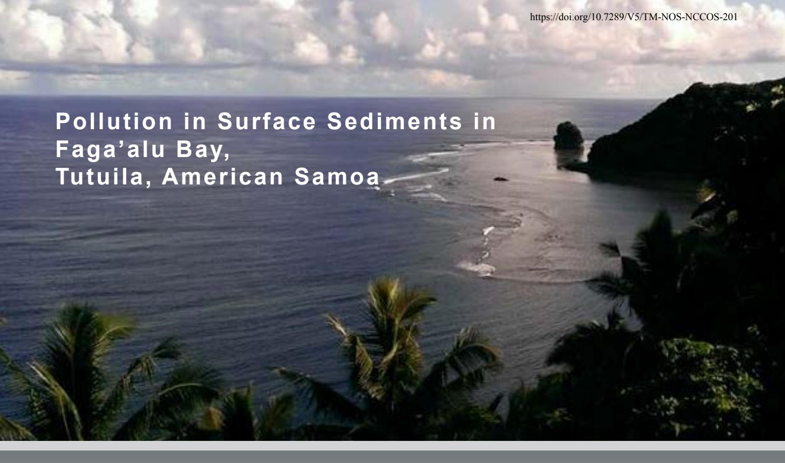

**NOAA National Centers for Coastal Ocean Science Center for Coastal Monitoring and Assessment** D. Whitall S. Holst

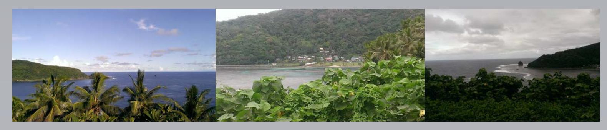


# CITATION Whitall, D. and S. Holst. 2015. Pollution in Surface Sediments in Faga'alu Bay, Tutuila, American Samoa. NOAA Technical Memorandum NOS/NCCOS 201. Silver Spring, MD. 54 pp. Mention of trade names or commercial products does not constitute endorsement or recommendation for their use <https://doi.org/10.7289/V5/TM-NOS-NCCOS-201>

by the United States government.

# Pollution in Surface Sediments in Faga'alu Bay, Tutuila, American Samoa

National Oceanic and Atmospheric Adminstration (NOAA) National Ocean Service (NOS) National Centers for Coastal Ocean Science (NCCOS) Center for Coastal Monitoring and Assessment (CCMA)

> Authors David Whitall1 , Susie Holst2

1 NOAA, National Centers for Coastal Ocean Science, Center for Coastal Monitoring and Assessment

NOAA, Office of Coastal Management, Coral Reef Conservation Program

# **NOAA Technical Memorandum NOS NCCOS 201 August 2015**


United States Department of Commerce

National Oceanic and Atmospheric Administration

National Ocean Service

Penny Pritzker Secretary

Kathryn Sullivan Under Secretary

Russell Callender Acting Assistant Administrator

### **About this Document**

This document represents a portion of a larger study, which involves a comprehensive, integrated baseline assessment of Faga'alu Bay, Tutuila, American Samoa. This document focuses on the sediment contaminant portion of the larger effort.

The report details: (1) contaminant (e.g. polycyclic aromatic hydrocarbons (PAHs), polychlorinated biphenyls (PCBs), pesticides, heavy metals) magnitudes and distributions in surface sediments (inside the Bay and in the watershed streams) and (2) a one time "snapshot" of surface water nutrient concentrations inside the Bay.

The efforts discussed here were led by the National Centers for Coastal Ocean Science (NCCOS) and NOAA's Coral Reef Conservation Program (CRCP), with significant participation from partners, such as NOAA's National Marine Sanctuaries. NCCOS has been proactive in collaborating with other NOAA line offices as well as federal, state and nongovernmental organization partners to maximize cost-sharing efforts and reach its goals. Their efforts and extramural funding has made it possible to complete assessments that would have otherwise been unobtainable through federal funding alone.

Live hyperlinks to related products (indicated by blue text) are embedded throughout this report and are accessible when viewing this document as a PDF. For more information about this report and others like it, please visit the NCCOS web site, http://coastalscience.noaa.gov/, or direct comments to:

Mark Monaco, PhD, Director Center for Coastal Monitoring and Assessment NOAA National Centers for Coastal Ocean Science (NCCOS) Telephone: 301.713.3020 x160

E-mail: Mark.Monaco@noaa.gov

Greg Piniak, PhD, COAST Branch Chief Center for Coastal Monitoring and Assessment NOAA National Centers for Coastal Ocean Science (NCCOS)

Telephone: 301-713-3028 x115 E-mail: Greg.Piniak@noaa.gov

### **Table of Contents**

| About this Document                                        | ii  |
|------------------------------------------------------------|-----|
| Executive Summary                                          | iii |
| List of Tables and Figure                                  | iv  |
| Introduction                                               | 1   |
| Purpose and Objective                                      | 1   |
| Background                                                 | 2   |
| Context                                                    | 2   |
| Mitigation Actions/Intervention                            | 3   |
| Rationale for Collection of Baseline Data for Contaminants | 3   |
| Methods                                                    | 4   |
| Sampling Design                                            |     |
| Materials and Methods                                      | 5   |
| Statistical Analysis                                       | 6   |
| Providing Context for Results                              | 6   |
| Results                                                    | 10  |
| PCBs                                                       | 13  |
| DDT                                                        | 15  |
| Chlordanes                                                 | 17  |
| HCHs                                                       | 19  |
| Other Pesticides                                           | 21  |
| Organotins                                                 | 23  |
| PAHs                                                       |     |
| Arsenic                                                    | 27  |
| Chromium                                                   |     |
| Copper                                                     |     |
| Nickel                                                     |     |
| Silver                                                     |     |
| Zinc                                                       |     |
| Aluminum                                                   |     |
| Antimony                                                   |     |
| Cadmium                                                    |     |
| Iron                                                       |     |
| Lead                                                       |     |
| Manganese                                                  |     |
| Mercury                                                    |     |
| Selenium                                                   |     |
| Silicon                                                    |     |
| Tin                                                        |     |
| Sediment Grain Size                                        |     |
| Sediment TOC                                               |     |
| Clostridium perfringens                                    |     |
| Water Column Nutrients                                     |     |
| Additional Analysis                                        |     |
| Crustal Element Ratios                                     |     |
| Impact of the Quarry on Metal Flux                         |     |
| Putting Data into a National/Historical Perspective        |     |
| Conclusions                                                |     |
| References                                                 | 74  |

### **List of Tables and Figures**

- Table 1: Site descriptions.
- Table 2: List of sediment analytes.
- Table 3: Sediment Quality Guidelines. (Long and Morgan, 1990; Long et al., 1995, Long et al. 1996, Long et al.
- 1998, Long and MacDonald, 1998)
- Table 4: Summary statistics for organics, metals and Clostridium perfringens for Faga'alu Bay and Watershed.
- Table 5: Detected pesticides in Faga'alu sediments.
- Table 6: Nutrient concentrations.
- Table 7: Correlations (Spearman rho) for metal contaminants with crustal "non-pollutant" metals. Only rho values which are statistically significant and above 0.7 are shown.
- Figure 1: Location of study site (Faga'alu Bay) on Tutuila, American Samoa. Inset shows location of American Samoa in the Pacific Ocean.
- Figure 2: Sediment contaminant and nutrient sites in Faga'alu Bay and watershed.
- Figure 3: Concentrations of total PCBs in surface sediments. January 2014.
- Figure 4: Sediment PCBs by strata. Red line shows ERL guideline.
- Figure 5: Total DDT concentrations in sediments. January 2014.
- Figure 6: Sediment DDT concentrations by strata. Red line shows ERL guideline.
- Figure 7: Total chlordane concentrations in sediments. January 2014.
- Figure 8: Sediment chlordane concentrations by strata. Red line shows ERL guideline.
- Figure 9: Total HCH concentrations in sediments. January 2014.
- Figure 10: Sediment HCH concentrations by strata.
- Figure 11: Total butyltin concentrations in sediments. January 2014.
- Figure 12: Sediment butyltin concentrations by strata.
- Figure 13: Total PAH concentrations in sediments. January 2014.
- Figure 14: Sediment PAH concentrations by strata.
- Figure 15: Arsenic concentrations in sediments. January 2014.
- Figure 16: Sediment arsenic concentrations by strata. Red line shows ERL guideline.
- Figure 17: Chromium concentrations in sediments. January 2014.
- Figure 18: Sediment chromium concentrations by strata. Red line shows ERL guideline.
- Figure 19: Copper concentrations in sediments. January 2014.
- Figure 20: Sediment copper concentrations by strata. Red line shows ERL guideline.
- Figure 21: Nickel concentrations in sediments. January 2014.
- Figure 22: Sediment nickel concentrations by strata. Solid red line shows ERL guideline. Dashed red line shows ERM guideline.
- Figure 23: Silver concentrations in sediments. January 2014.
- Figure 24: Sediment silver concentrations by strata. Red line shows ERL guideline.
- Figure 25: Zinc concentrations in sediments. January 2014.
- Figure 26: Sediment zinc concentrations by strata. Solid red line shows ERL guideline. Dashed red line shows ERM guideline.
- Figure 27: Aluminum concentrations in sediments. January 2014.
- Figure 28: Sediment aluminum concentrations by strata.
- Figure 29: Antimony concentrations in sediments. January 2014.
- Figure 30: Sediment antimony concentrations by strata.
- Figure 31: Cadmium concentrations in sediments. January 2014.
- Figure 32: Sediment cadmium concentrations by strata.
- Figure 33: Iron concentrations in sediments. January 2014.
- Figure 34. Sediment iron concentrations by strata.
- Figure 35: Lead concentrations in sediments. January 2014.

- Figure 36: Sediment lead concentrations by strata.
- Figure 37: Manganese concentrations in sediments. January 2014.
- Figure 38: Sediment manganese concentrations by strata.
- Figure 39: Mercury concentrations in sediments. January 2014.
- Figure 40: Sediment mercury concentrations by strata.
- Figure 41: Selenium concentrations in sediments. January 2014.
- Figure 42: Sediment selenium concentrations by strata.
- Figure 43: Silicon concentrations in sediments. January 2014.
- Figure 44: Sediment silicon concentrations by strata.
- Figure 45: Tin concentrations in sediments. January 2014.
- Figure 46: Sediment tin concentrations by strata.
- Figure 47: Percentage of fine grained sediments. January 2014.
- Figure 48: Total organic carbon (TOC) content of sediments (January 2014).
- Figure 49: *Clostridium perfringens* concentrations in sediments. January 2014.
- Figure 50: Sediment *Clostridium perfringens* concentrations by strata.
- Figure 51: Surface water orthophosphate concentrations (mg P/L) in Faga'alu Bay, January, 2014.
- Figure 52: Surface water dissolved inorganic nitrogen (DIN) concentrations (mg N/L) in Faga'alu Bay, January, 2014.
- Figure 53: Sediment nickel versus sediment aluminum.
- Figure 54: Sediment zinc versus sediment aluminum.
- Figure 55: Sediment arsenic versus sediment aluminum.
- Figure 56: Number of sediment quality guideline (SQG) exceedances per site.

# **Introduction**

### **Purpose and Objective**

This document presents environmental data collected in 2014 on surface sediment contamination in Faga'alu Bay on the island of Tutuila, American Samoa (Figure 1). These data are part of a larger interdisciplinary baseline assessment effort which included: biological assessments, stream nutrient and sediment loading, and physical oceanography. Collaborators for this larger effort included: San Diego State University, USGS, NOAA's Coral Reef Ecosystem Division, NOAA's National Centers for Coastal Ocean Science and NOAA's Coral Reef Conservation Program (CRCP). CRCP coordinated and funded this effort to gather baseline data and information in Faga'alu before a management intervention was implemented to reduce land-based sources of pollution. To carry out these baseline assessments, experts from across NOAA were asked to apply their knowledge and technical skills to develop baseline information to share with the local management authorities in American Samoa so that the effectiveness of the intervention could be determined. The activities undertaken thus far represent the short-term baseline data collection and interpretation needed up front in order to determine the effectiveness of the intervention over the long term. In order to understand the effectiveness of the intervention, long-term monitoring will be required and the data from that monitoring will be compared to these baselines. This work represents the pre-intervention baseline data collection, analysis and interpretation needed for future evaluation of the effectiveness of the mitigation actions taken. Ongoing long-term monitoring should transition into the hands of the local management authorities.

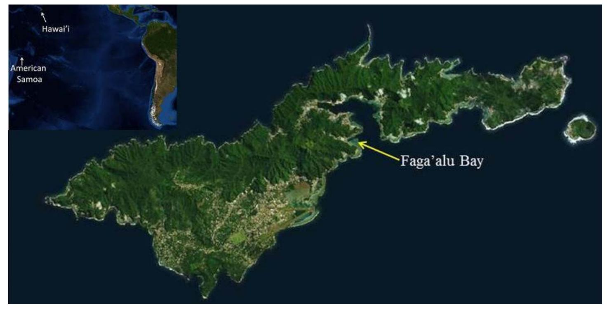

Figure 1: Location of study site (Faga'alu Bay) on Tutuila, American Samoa. Inset maps shows location of American Samoa in the Pacific Ocean.

### **Background**

In August 2012, Faga'alu, American Samoa was chosen by the United States Coral Reef Task Force (USCRTF) as a priority watershed site for the Watershed Partnership Initiative (WPI). In 2009, the WPI was launched in Guanica, Puerto Rico and is an active effort of the USCRTF to reduce land-based sources of pollution (LBSP). This goal is pursued by facilitating and enhancing coordination, partnerships, and contributions of local and federal agency resources and expertise to implement geographically specific integrated activities to reduce pollutant loads to coral reef ecosystems. The WPI also promotes consistent and strengthened application and enforcement of laws and authorities intended to address LBSP within the U.S. coral reef jurisdictions. Currently, the WPI is active in three watersheds: Guanica (Puerto Rico), West Maui (Hawaii) and Faga'alu (American Samoa).

In a separate process conducted in 2010 by NOAA's Coral Reef Conservation Program (CRCP) to identify management priorities in the US coral reef jurisdictions, the American Samoan resource managers, invited management advisors, and science advisors identified Faga'alu as one of two priority areas in American Samoa based on biological value, degree of risk and threat, and management effectiveness. Additionally, as a result of the 2010 management priority setting process three strategic coral reef management goals were identified including: "*Goal 2: Improve coastal watershed quality and enhance coral reef ecosystem function and health by reducing land-based sources of pollution*".

In August of 2012, the Village of Faga'alu completed its Watershed Management and Conservation Plan, which was prepared in collaboration with American Samoa's Land-based Sources of Pollution Local Action Strategy Group. This plan identified sedimentation as a key threat to the Faga'alu watershed. By the end of 2012, with the above processes complete and the village plan as a guide, the CRCP began to provide resources and coordinate activities in Faga'alu to monitor baselines and to address the threat of LBSP, specifically the sedimentation issues and resulting turbidity found in Faga'alu Stream and Faga'alu Bay which do not pass the American Samoa Water Quality Standards (ASWQS). Excessive turbidity is in part responsible for placing Faga'alu on the 303(d) list of impaired waters according to the American Samoa Environmental Protection Agency (ASEPA). Other parameters that do not meet the ASWQS include total nitrogen, total phosphorus, dissolved oxygen, and bacteria levels.

### **Context**

*Geography and Climate*

American Samoa exhibits a tropical climate with warm, humid conditions throughout the year. There is a wet season (October to April) and a dry season (May to September), but rainfall is common throughout the year, with annual averages ranging from 320 cm to over 750 cm, depending on topographic location, with mountains receiving more rain (NPS 2015).

Faga'alu is a relatively small, steep coastal watershed located southwest of Pago Pago Harbor on Tutuila Island. The watershed is 2.5 square kilometers and sits above Faga'alu Bay which is bounded to the north by Tulutulu Point and to the south by Niuloa Point. Within the watershed is Faga'alu Village (population 910; US Census 2010), the only hospital in American Samoa, a popular public beach park, Matafao Elementary School, and several businesses – including Samoa Maritime Company, an open pit quarry located above the village. The quarry has been identified as a primary source of excess sedimentation (Messina and Biggs 2014), making the Samoa Maritime quarry a target for mitigation actions to reduce the amount of sediments leaving Faga'alu watershed. The sediments flow from the quarry into Faga'alu stream then out into Faga'alu Bay where a shallow lagoon and a fringing reef exists.

Based on hydrodynamic modeling in Faga'alu Bay, the ocean circulation generally moves from south to north thus carrying the sediments and other pollutants across the north part of the bay before it is flushed out by the prevailing ocean currents (Storlazzi et al. 2014, Vargas-Angel and Vetter 2012).

### **Mitigation Actions/Intervention**

Since the designation of Faga'alu as a priority site for the WPI, multiple entities, including the National Fish and Wildlife Foundation (NFWF), the America Samoa Coral Reef Advisory Group (CRAG), ASEPA, and NOAA CRCP have been in discussions with Samoa Maritime to implement a corrective action plan at the quarry. This plan included adding a diversion of surface flow of groundwater from the rock face of the quarry to drain directly into the stream rather than across the grounds where it gathered settled dust and other sediments generated by quarry operations, and the installation of two retention ponds to reduce the sediment transport away from the quarry grounds during heavy rainfall conditions. The diversion channel was added in early 2013 and the work on the retention ponds began in the summer of 2014 and was completed by the end of the fall.

An engineering design for the intervention at Samoa Maritime quarry was developed by Horsley Witten Group, and this was built into a corrective action plan for the quarry to implement using their own equipment and time, as well as a combination of funding from NFWF, NOAA and CRAG, with the remainder of costs to be assumed by the quarry. Coordination for the on-site work was handled by ASEPA, CRAG, and NOAA CRCP staff based in American Samoa in cooperation with Samoa Maritime staff. Several site visits were conducted during the implementation of the corrective action plan to ensure that the work was in alignment with the plans prepared by Horsley Witten with final sign off responsibility resting with technical staff at ASEPA.

### **Rationale for Collection of Baseline Data For Contaminants**

Through conversations in 2013 with ASEPA, SDSU, CRAG, and the research coordinator at the National Marine Sanctuary of American Samoa, concerns were raised about the quantity and quality of groundwater flowing through the bedrock in Faga'alu. A 2013 study prepared for ASEPA looking at decadal trends in coral reefs near watershed villages (Houk, 2013) showed that significant freshwater input, possibly due to groundwater movements, may occur on the southern coast of Tutuila thereby adding another possible source of pollution. In 2013, the CRCP also learned that the site of the Matafao Elementary School was a U.S. military dump site during World War II and is a potential source of some contaminants into Faga'alu Bay via groundwater. Thus to identify any additional stressors besides sediments from the quarry, in 2014 the CRCP funded the collection of baseline levels of contaminants in the watershed and the bay using standardized methods from NOAA's National Status and Trends Program, in addition to sediment load and coral community information. This was also a sub-activity of the CRCP project "Comprehensive baseline assessment and pilot test of outcome performance measures in Faga'alu Bay, American Samoa."

### **Methods**

### **Sampling Design**

A stratified random sampling design was employed in this study to assess the overall contaminant condition of the ecosystem, and to be able to make geographically explicit conclusions about how pollutants vary spatially. In this method, all areas within a stratum had an equal chance of being selected as a sampling site.

The sampling area was delineated using existing benthic habitat maps (NOAA 2005) and included all non-hard bottom sediments. This area was then divided into four geographic strata for sediment sampling: Inner Bay, North Bay, South Bay and Channel. In each of these four strata, 3 sites were randomly selected (Figure 2). If a site could not be sampled (e.g. if the site was inaccessible) a pre-selected randomly determined alternate site from within that stratum was sampled. Additionally, four targeted sediment sites were selected in the watershed. These sites included: a site upstream from the quarry (WS03, just above the dam), a site just below the quarry (WS01), a site just below the hospital (WS02) and a site on the tributary that enters the main branch of the Faga'alu stream from the north-northeast (WS04, Figure 2, Table 1). These sites could not be randomly selected due to site access considerations; the exact location of these sites was determined by where stream access was logistically possible. Finally, based on field observations by USGS staff (Storlazzi, personal communication) suggesting that groundwater might be entering the north bay near the school, one additional targeted sediment site was placed near the school (site NB50). Seventeen sediment sites were sampled in January of 2014. Grab samples of surface water were collected from the Bay sites concurrently for nutrient analysis. One nutrient sample from the inner bay was compromised (broken bottle cap) during shipment and was not analyzed out of concerns for contamination.

### **Materials and Methods**

Sediment samples were collected using standard NOAA National Status and Trends (NS&T) Program protocols (Apeti et al, 2012a). Briefly, samples were collected by hand either by wading, surface diving or SCUBA, depending on the depth. Field personnel wore nitrile gloves and scooped sediments directly into the sample jars to avoid contamination. Rocks, large coral or shell fragments or bits of seagrass were removed.

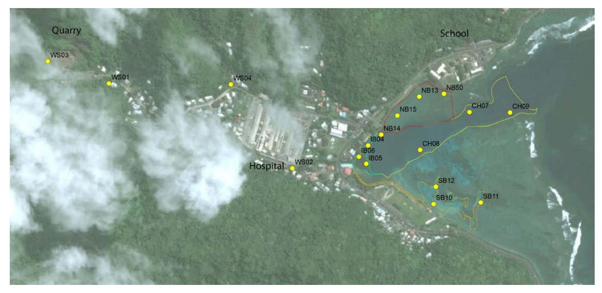

Figure 2: Sediment and nutrient sampling sites in Faga'alu Bay and watershed. Colored polygons are sampling strata.

### **Table 1. Site Descriptions.**

| Sites | Strata    | Random/Targeted | Long      | Lat          | Water Depth (m)<br>Notes                           |
|-------|-----------|-----------------|-----------|--------------|----------------------------------------------------|
| WS01  | Watershed | targeted        | -170.6910 | -14.2888 < 1 | Watershed site just below quarry.                  |
| WS02  | Watershed | targeted        | -170.6850 | -14.2915 < 1 | Watershed site near hospital.                      |
| WS03  | Watershed | targeted        | -170.6930 | -14.2881 < 1 | Watershed site above quarry.                       |
| WS04  | Watershed | targeted        | -170.6870 | -14.2888 < 1 | Watershed site on NE branch of stream.             |
| IB04  | Inner Bay | random          | -170.6825 | -14.2908 2   | Lots of trash observed.                            |
| IB05  | Inner Bay | random          | -170.6826 | -14.2914 < 1 | Sediments had moderate hydrogen sulfide smell.     |
|       |           |                 |           |              | Lots of trash observed.                            |
| IB06  | Inner Bay | random          | -170.6828 | -14.2911 < 1 | Lots of trash observed. Some larger fish observed. |
| CH07  | Channel   | random          | -170.6792 | -14.2897 15  | Sampled via SCUBA. Moderate visibility             |
| CH08  | Channel   | random          | -170.6808 | -14.2909 12  | Sampled via SCUBA; moderate visibility             |
| CH09  | Channel   | random          | -170.6779 | -14.2897 22  | Sampled via SCUBA; bad visibility                  |
| SB10  | South Bay | random          | -170.6804 | -14.2926 3   | Sampled via snorkel; some fish observed.           |
| SB11  | South Bay | random          | -170.6788 | -14.2926 2   | Sampled via snorkel                                |
| SB12  | South Bay | random          | -170.6803 | -14.2921 3   | Sampled via snorkel; sea cucumbers observed.       |
| NB13  | North Bay | random          | -170.6808 | -14.2892 < 1 | Green algae observed on rocks.                     |
| NB14  | North Bay | random          | -170.6821 | -14.2904 1   | Large marine debris (truck parts, etc) observed.   |
| NB15  | North Bay | random          | -170.6816 | -14.2898 1   | Large marine debris (truck parts, etc) observed.   |
| NB50  | North Bay | targeted        | -170.6800 | -14.2891 1   | Green algae observed on rocks. Sediment site only. |
| NB99  | North Bay | targeted        | -170.6796 | -14.2895 2   | Nutrient site only.                                |

Sediments were collected into a certified clean (IChem®) 250 ml labeled jar, capped and then placed on ice in a cooler. Sediments for grain size analysis were placed in a Whirl-Pak® bag, sealed and placed on ice in a cooler. After returning from the field each day, sediment samples were frozen (-15°C) and the Whirl-Pak® bags for grain size analysis were refrigerated (4°C), to avoid altering the grain size structure of the sediment that could occur during freezing. Nutrient samples were collected in pre-cleaned HDPE bottles and frozen until analysis. Samples were hand carried on ice via commercial air from American Samoa to Hawai'i, where they were re-frozen prior to overnight shipment to the laboratory in Texas. The analyte list is shown in Table 2.

Laboratory analyses were conducted following the protocols of the National Status and Trends Program (Kimbrough *et al.* 2006, Kimbrough and Lauenstein 2006, McDonald et al. 2006) using a NOAA contract lab (TDI Brooks International). Briefly, PAHs were analyzed in the laboratory using gas chromatography/mass spectrom-

**Table 2: List of analytes.**

| PAHs - Low Molecular Weight | PAHs - High Molecular<br>Weight | PCBs           | Organochlorine Pesticides  |  |
|-----------------------------|---------------------------------|----------------|----------------------------|--|
| Naphthalene*                | Fluoranthene*                   | PCB8/5         | Aldrin                     |  |
| 1-Methylnaphthalene*        | Pyrene*                         | PCB18          | Dieldrin                   |  |
| 2-Methylnaphthalene*        | C1-Fluoranthenes/Pyrenes        | PCB28          | Endrin                     |  |
| 2,6-Dimethylnaphthalene*    | C2-Fluoranthenes/Pyrenes        | PCB29          | Heptachlor                 |  |
| 1,6,7-Trimethylnaphthalene* | C3-Fluoranthenes/Pyrenes        | PCB31          | Heptachlor-Epoxide         |  |
| C1-Naphthalenes             | Naphthobenzothiophene           | PCB44          | Oxychlordane               |  |
| C2-Naphthalenes             | C1-Naphthobenzothiophenes       | PCB45          | Alpha-Chlordane            |  |
| C3-Naphthalenes             | C2-Naphthobenzothiophenes       | PCB49          | Gamma-Chlordane            |  |
| C4-Naphthalenes             | C3-Naphthobenzothiophenes       | PCB52          | Trans-Nonachlor            |  |
| Benzothiophene              | Benz(a)anthracene*              | PCB56/60       | Cis-Nonachlor              |  |
| C1-Benzothiophenes          | Chrysene*                       | PCB66          | Alpha-HCH                  |  |
| C2-Benzothiophenes          | C1-Chrysenes                    | PCB70          | Beta-HCH                   |  |
| C3-Benzothiophenes          | C2-Chrysenes                    | PCB74/61       | Delta-HCH                  |  |
| Biphenyl*                   | C3-Chrysenes                    | PCB87/115      | Gamma-HCH                  |  |
| Acenaphthylene*             | C4-Chrysenes                    | PCB95          | 2,4'-DDT                   |  |
| Acenaphthene*               | Benzo(b)fluoranthene*           | PCB99          | 4,4'-DDT                   |  |
| Dibenzofuran                | Benzo(k)fluoranthene*           | PCB101/90      | 2,4'-DDD                   |  |
| Fluorene*                   | Benzo(e)pyrene*                 | PCB105         | 4,4'-DDD                   |  |
| C1-Fluorenes                | Benzo(a)pyrene*                 | PCB110/77      | 2,4'-DDE                   |  |
| C2-Fluorenes                | Perylene*                       | PCB118         | 4,4'-DDE                   |  |
| C3-Fluorenes                | Indeno(1,2,3-c,d)pyrene*        | PCB128         | DDMU                       |  |
| Anthracene*                 | Dibenzo(a,h)anthracene*         | PCB138/160     | 1,2,3,4-Tetrachlorobenzene |  |
| Phenanthrene*               | C1-Dibenzo(a,h)anthracenes      | PCB146         | 1,2,4,5-Tetrachlorobenzene |  |
| 1-Methylphenanthrene*       | C2-Dibenzo(a,h)anthracenes      | PCB149/123     | Hexachlorobenzene          |  |
| C1-Phenanthrene/Anthracenes | C3-Dibenzo(a,h)anthracenes      | PCB151         | Pentachloroanisole         |  |
| C2-Phenanthrene/Anthracenes | Benzo(g,h,i)perylene*           | PCB153/132     | Pentachlorobenzene         |  |
| C3-Phenanthrene/Anthracenes |                                 | PCB156/171/202 | Mirex                      |  |
| C4-Phenanthrene/Anthracenes | Trace Elements                  | PCB158         | Chlorpyrifos               |  |
| Dibenzothiophene            | Aluminum                        | PCB170/190     |                            |  |
| C1-Dibenzothiophenes        | Antimony                        | PCB174         | Butyltins                  |  |
| C2-Dibenzothiophenes        | Arsenic                         | PCB180         | Monobutyltin               |  |
| C3-Dibenzothiophenes        | Cadmium                         | PCB183         | Dibutyltin                 |  |
|                             | Chromium                        | PCB187         | Tributyltin                |  |
|                             | Copper                          | PCB194         | Tetrabutyltin              |  |
|                             | Iron                            | PCB195/208     |                            |  |
|                             | Lead                            | PCB199         |                            |  |
|                             | Manganese                       | PCB201/157/173 |                            |  |
|                             | Mercury                         | PCB206         |                            |  |
|                             | Nickel<br>Selenium              | PCB209         |                            |  |
|                             | Silver                          |                |                            |  |
|                             | Tin                             |                |                            |  |

<sup>\*</sup>Compounds used in the calculation of total PAHs

PAHs = polycyclic aromatic hydrocarbons; PCBs = polychlorinated biphenyls

etry in the selected ion monitoring (SIM) mode. Selected chlorinated organics (PCBs and pesticides) were analyzed using gas chromatography/electron capture detection. Butyltins were analyzed using gas chromatography/flame photometric detection.

Silver, cadmium, copper, lead, antimony, and tin were analyzed using inductively coupled plasma - mass spectrometry. Aluminum, arsenic, chromium, iron, manganese, nickel, silicon and zinc were analyzed using inductively coupled plasma - optical emission spectrometry. Mercury was analyzed using cold vapor - atomic absorption spectrometry. Selenium was analyzed using atomic fluorescence spectrometry. For each element, total elemental concentration (i.e. sum of all oxidation states) was measured.

Total Organic Carbon (TOC) was quantified via high temperature combustion and subsequent quantification of the CO<sub>2</sub> produced. Grain size analysis was carried out using a series of sieving and settling techniques. To assess the presence of viable *Clostridium perfringens*, sediment extracts were plated on growth medium and the number of colonies that develop were counted.

Water samples were analyzed for a standard suite of nutrient analytes: nitrate (NO<sub>3</sub>-), nitrite (NO<sub>2</sub>-), orthophosphate (HPO<sub>4</sub>-), ammonium (NH<sub>4</sub>+), urea ((NH<sup>2</sup>)<sup>2</sup>CO), total nitrogen and total phosphorus. Nitrate and nitrite analyses were based on the methodology of Armstrong et al (1967). Orthophosphate was measured using the methodology of Bernhardt and Wilhelms (1967) with the modification of hydrazine as reductant. Silicate determination was accomplished using the methods of Armstrong et al. (1967) using stannous chloride. Ammonium analysis was based on the method of Harwood and Kuhn (1970) using dichloro-isocyanurate as the oxidizer. Urea was measured using diacetyl-monoximine and themicarbozide. Total concentrations of nitrogen and phosphorus were determined after an initial decomposition step. This method involves persulfate oxidation while heating the sample in an autoclave (115°C, 20 minutes) (Hansen and Koroleff 1999). After oxidation of the samples, nutrient determination was conducted on the Technicon II analyzer for nitrate and orthophosphate.

### **Statistical Analysis**

All contaminant data were analyzed using JMP® statistical software. The data were first tested for normality using the Shapiro-Wilk test. The data were not normally distributed. A non-parametric multiple comparisons test (Dunn Method for Joint Ranking,  $\alpha$ =0.05) was used to evaluate differences among strata. The targeted sites (four watershed sites, plus one site by the school) were included in the summary statistics for the entire study area, but were excluded from the statistical analysis of differences between strata. Spearman Rank correlations ( $\alpha$ =0.05) were examined to evaluate the relationships between sediment variables.

### **Providing Context for Results**

In addition to comparing contamination results between strata, there are three other ways to evaluate the relative level of contamination of Faga'alu Bay. First, and most simply, these findings can be compared to the contaminant concentrations in another study in American Samoa, in nearby Pago Pago Harbor (CH2MHill 2007). Second, the degree of sediment contamination in Faga'alu Bay can be assessed using NOAA's numerical sediment quality guidelines (SQG) known as ERL (effects range-low) and ERM (effects range-median) developed by Long and colleagues (Long and Morgan, 1990; Long et al., 1995, Long et al. 1996, Long et al. 1998, Long and MacDonald, 1998). The SQG value was not defined for all analytes; existing values are presented in Table 3. These guidelines are statistically derived levels of contamination above which toxic effects would be expected to be observed in benthic organisms with at least a 50% frequency (ERM), and below which effects were rarely (<10 %) expected (ERL). Finally, for analytes for which the ERM is exceeded, or for analytes which do not have sediment quality guidelines, concentrations observed in Faga'alu can be compared against three decades of sediment contaminant data collected from all over the United States by NOAA's National Status and Trends Program (NOAA 2015). This puts the values in this study into a historical and national context, and can be useful in identifying unusually high values.

**Table 3: Sediment Quality Guidelines (Long and Morgan 1990).**

| Analyte    | ERL | ERM  |       |  |
|------------|-----|------|-------|--|
| Chlordane  |     | 0.5  | 6     |  |
| Total DDT  |     | 1.58 | 46.1  |  |
| Total PCBs |     | 22.7 | 180   |  |
| Total PAHs |     | 4022 | 44792 |  |
| Arsenic    |     | 8.2  | 70    |  |
| Cadmium    |     | 1.2  | 9.6   |  |
| Chromium   |     | 81   | 370   |  |
| Copper     |     | 34   | 270   |  |
| Lead       |     | 46.7 | 218   |  |
| Mercury    |     | 0.15 | 0.71  |  |
| Nickel     |     | 20.9 | 51.6  |  |
| Silver     |     | 1    | 3.7   |  |
| Zn         |     | 150  | 410   |  |

### **Results**

Summary statistics for the chemical constituents quantified in this study are shown in Tables 4 and 5. Each analyte, including background information on sources/uses, environmental impacts, and analysis of spatial patterns, is discussed by pollutant group (e.g. PCBs) or by individual analyte (e.g. metals). For data maps, blue dots always represent zero values. Red dots always represent exceedance of the Effects Range Low (ERL, discussed above) and red stars indicate exceedance of the Effects Range Median (ERM, discussed above) Sediment Quality Guidelines.

**Table 4: Summary statistics for organics, metals and Clostridium perfringens for Faga'alu Bay and Watershed. CFU is Clostrdium Forming Units.**

| Analyte                      | Units | Min   | Max     | Mean   | Median | StDev  | Number of Sites<br>Exceeding ERL/ERM |
|------------------------------|-------|-------|---------|--------|--------|--------|--------------------------------------|
| Ag                           | ug/g  | 0     | 2.74    | 0.49   | 0      | 0.81   | 4/0                                  |
| Al                           | ug/g  | 475   | 72400   | 25682  | 8250   | 28817  | NA                                   |
| As                           | ug/g  | 1.19  | 11.5    | 4.44   | 3.91   | 2.90   | 3/0                                  |
| Cd                           | ug/g  | 0     | 0.31    | 0.10   | 0.07   | 0.09   | 0/0                                  |
| Cr                           | ug/g  | 7.13  | 191     | 39.47  | 25.7   | 46.42  | 1/0                                  |
| Cu                           | ug/g  | 0     | 37.7    | 8.53   | 5.74   | 9.67   | 1/0                                  |
| Fe                           | ug/g  | 712   | 103000  | 28484  | 18300  | 29827  | NA                                   |
| Hg                           | ug/g  | 0.001 | 0.016   | 0.01   | 0.01   | 0.00   | 0/0                                  |
| Mn                           | ug/g  | 20    | 1250    | 467    | 184    | 495    | NA                                   |
| Ni                           | ug/g  | 4.19  | 211     | 35.13  | 12.6   | 50.66  | 4/2                                  |
| Pb                           | ug/g  | 0.641 | 45.5    | 13.15  | 8.46   | 12.93  | 0/0                                  |
| Sb                           | ug/g  | 0     | 0.472   | 0.18   | 0.196  | 0.15   | NA                                   |
| Se                           | ug/g  | 0     | 0.127   | 0.02   | 0      | 0.04   | NA                                   |
| Si                           | ug/g  | 105   | 256000  | 74608  | 13300  | 97244  | NA                                   |
| Sn                           | ug/g  | 0.27  | 15.40   | 4.50   | 4.37   | 3.73   | NA                                   |
| Zn                           | ug/g  | 3.70  | 416.00  | 109.69 | 53.70  | 119.72 | 3/1                                  |
| Total PAHs                   | ng/g  | 1.35  | 2097.48 | 177.80 | 27.49  | 501.36 | 0/0                                  |
| Total HCH                    | ng/g  | 0     | 0.10    | 0.03   | 0      | 0.04   | NA                                   |
| Total Chlordane              | ng/g  | 0     | 4.60    | 0.62   | 0      | 1.30   | 4/0                                  |
| Total DDT                    | ng/g  | 0     | 2.29    | 0.23   | 0.11   | 0.54   | 1/0                                  |
| Total PCBs                   | ng/g  | 2.19  | 92.89   | 14.35  | 2.32   | 29.06  | 3/0                                  |
| Monobutyltin                 | ng/g  | 0     | 2.00    | 0.18   | 0      | 0.54   | NA                                   |
| Dibutyltin                   | ng/g  | 0     | 0.60    | 0.08   | 0      | 0.17   | NA                                   |
| Tributyltin                  | ng/g  | 0     | 0.98    | 0.07   | 0      | 0.24   | NA                                   |
| Tetrabutyltin                | ng/g  | 0     | 0       | 0      | 0      | 0      | NA                                   |
| Clostridium perfringensCFU/g |       | 0     | 1722    | 302    | 125    | 432    | NA                                   |

**Table 5: Detected pesticides in Faga'alu sediments (ng/g).**

|                            | Min | Max   | Mean  | StDev |
|----------------------------|-----|-------|-------|-------|
| 1,2,3,4-Tetrachlorobenzene | 0   | 0.107 | 0.018 | 0.025 |
| Pentachlorobenzene         | 0   | 0.049 | 0.003 | 0.012 |
| Pentachloroanisole         | 0   | 0.012 | 0.001 | 0.003 |
| Dieldrin                   | 0   | 0.011 | 0.001 | 0.003 |

### **PCBs**

*Background:* Polychlorinated biphenyls (PCBs) are environmentally persistent, man-made organic compounds. The structure of PCBs includes a biphenyl ring structure (two benzene rings with a carbon to carbon bond) and chlorine atoms, the latter of which varies in both number and location on the rings. There are 209 possible PCB congeners.

*Uses:* PCBs have a wide range of uses including: electrical transformers and capacitors, hydraulic and heat transfer fluids, pesticides and paints. Manufacture of PCBs has been banned in the United States, but in some cases, use of equipment containing PCBs (e.g. railroad locomotive transformers) is still permitted (CFR 1998).

*Environmental effects:* Exposure to PCBs has been linked to reduced growth, reproductive impairment and vertebral abnormalities in fish (EPA 1997). Solbakken et al. (1984) quantified the bioconcentration of radiolabeled

hexaPCB (2,4,5,2',4',5'-hexachlorobiphenyl) in coral. The PCB was rapidly accumulated in *Diploria strigosa* and *Madracis decatis*, however, depuration proceeded at a slow rate; after 275 days nearly 33 percent of the original radioactivity from the PCB remained in the coral, suggesting that PCBs are quite persistent in coral tissues. The effects of PCBs on corals have not been well documented, but other studies have demonstrated that PCBs do accumulate in coral tissues in the ambient environment (Whitall et al. 2014).

*Sediment Concentrations in Faga'alu:* Total PCBs are reported as the sum of all measured PCB congeners. Sediment concentrations of PCBs in Faga'alu ranged from 2.19 ng/g to 92.89 ng/g, with a mean of 13.35 ng/g. *Comparison to Sediment Quality Guidelines:* Three sites exceeded the ERL of 22.71 ng/g. No sites exceeded the ERM. This suggests a potential for toxicity to benthic infauna.

*Spatial Patterns:* Qualitatively, sediment concentrations are similar between the watershed sites and the bay sites, with the exception of the North Bay stratum, which has elevated concentrations of PCBs. This observed pattern, however, is not statistically significant (Dunn's test, a=0.05).

*Discussion:* Although concentration appear to be higher in the north bay, there was no statistically significant correlation between PCBs and either sediment total organic carbon (TOC) or grain size, suggesting that sediment characteristics alone are not driving these apparent spatial patterns. It is possible that prevailing current patterns in the Bay, which push water from the mouth of the stream to the north (Vargas-Angel and Vetter, 2012), are playing a role. However, because the concentrations of PCBs in the watershed are lower than observed in the north bay stratum, either there has been degradation of PCBs in the watershed or that there is some source other than the stream. One hypothesis is that the elevated PCBs in the north bay stratum are due to a near shore source along the coastline, possibly related to the old Department of Defense landfill located at the site of the current school (USACE 2011).

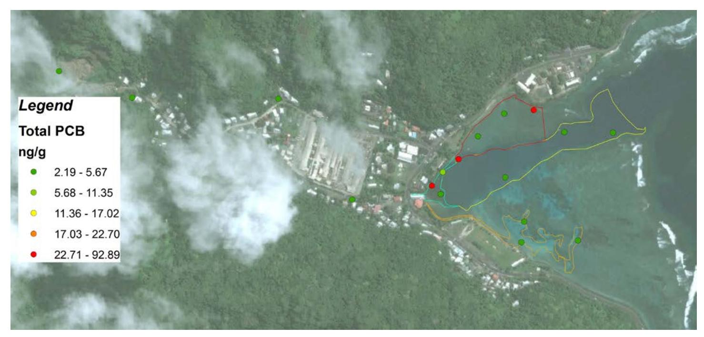

Figure 3: PCB concentrations in sediments. January 2014.

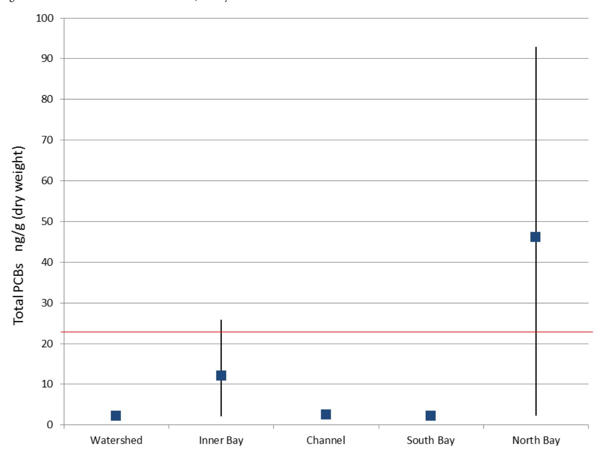

Figure 4: Sediment PCBs concentrations by strata. Squares are mean values; lines show maximum and minimum values. Red lines indicate Effect Range Low. There were not statistically significant differences between Bay strata (Dunn's test, α=0.05).

### **DDT**

*Background:* Dichlorodiphenyltrichloroethane (DDT) is a hydrophobic, man-made organic chemical which was used historically as an organochlorine pesticide. In this study we present total DDT, which is the sum of DDT and its degradation products (DDMU, DDE and DDD).

*Uses:* DDT was widely used as an insecticide, both in agriculture and for mosquito control, until it was banned in the United States in 1972 due to environmental concerns.

*Environmental effects:* DDT is of concern due to its environmental persistence, potential to bioaccumulate, and toxicity to non-target organisms. These concerns led to its ban in the United States, but because of its persistence and heavy use in the past, residues of DDT can be found in the environment, including biota. DDT is still used in some parts of the world, especially for malaria control. DDTs act on biota as a neurotoxin and have been shown to be an endocrine disruptor. DDT and its metabolite DDE have been specifically linked to eggshell thinning in birds, particularly raptors. DDT is also toxic to aquatic life including crayfish, shrimp and some species of fish (EPA 2009).

*Sediment Concentrations in Faga'alu:* Sediment concentrations of DDT in Faga'alu ranged from below limits of detection to 2.287 ng/g, with a mean of 0.23 ng/g.

*Comparison to Sediment Quality Guidelines:* One site, in the north stratum, exceeded the ERL of 1.58 ng/g. No sites exceeded the ERM. This suggests a potential for toxicity to benthic infauna at that site.

*Spatial Patterns:* Statistically, there is a significant difference (Dunn's test, a=0.05, p=0.027) between the Inner Bay and the South Bay. This is primarily driven by the very low values, including two non-detects, in the South Bay stratum. It is noteworthy that neither DDT nor its breakdown products (DDE and DDE) are present in the watershed.

*Discussion:* DDT was not well correlated with either sediment TOC or grain size, suggesting that sediment characteristics alone are not driving this pattern. Because DDT was so widely used and is environmentally persistent, it is unusual to see no DDT or DDT breakdown products in the watershed, but to see it in the Bay. This could mean that DDT associated sediments are not accumulating in the streams, or that DDT was not widely used in the watershed. In the Bay, the highest observed value is near the old Department of Defense landfill located at the site of the current school (USACE 2011). DDT was not quantified in a previous study in the area (CH2MHill 2007).

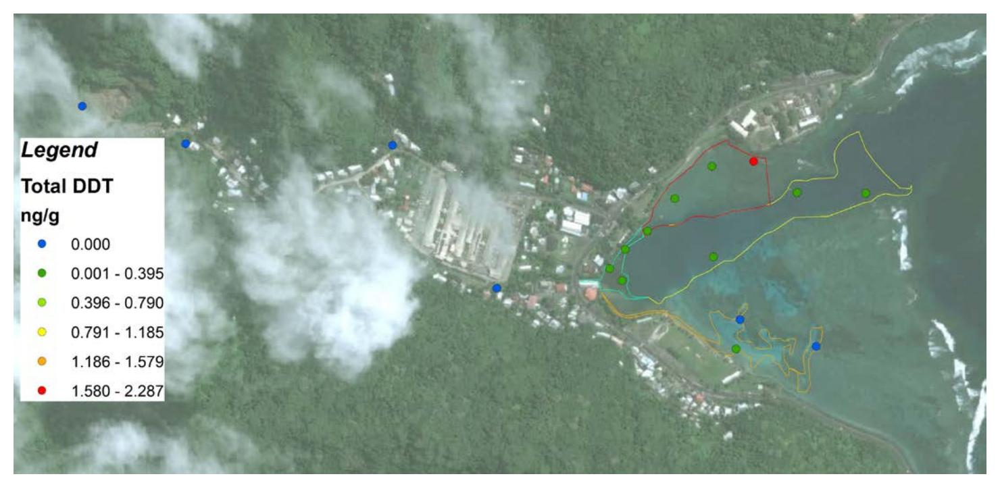

Figure 5: Total DDT concentrations in sediments. January 2014.

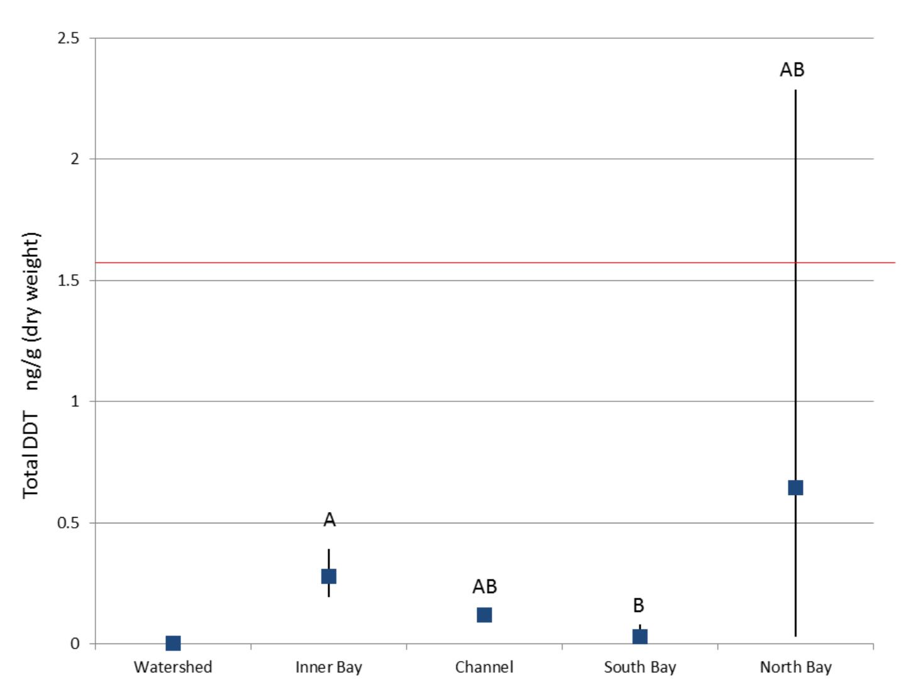

Figure 6: Sediment DDT concentrations by strata. Squares are mean values; lines show maximum and minimum values. Red lines indicate Effect Range Low. Letters denote statistically significant differences between Bay strata (Dunn's test α=0.05)

### **Chlordanes**

*Background:* Chlordane, and its various forms, are man-made organic chemicals which were used historically as organochlorine pesticides. In this study we present total chlordane, which is the sum of heptachlor, heptachlor-epoxide, oxychlordane, alpha-chlordane, gamma-chlordane, trans-nonachlor and cis-nonachlor.

*Uses:* Prior to 1978, chlordane was widely used as an insecticide in agriculture, lawns and gardens, but was banned for these uses in the United States in 1978. In 1983, chlordane was approved for termite control use in the United States, and was used in this capacity until 1988 when it was banned for all uses due to toxicity concerns (EPA 2000).

*Environmental effects:* Like DDT, chlordane primarily acts on biota as a neurotoxin. Chlordanes are also toxic to aquatic life including crayfish, shrimp and fish (EPA 2000). Chlordane's effect on corals has not been well documented, but other studies have demonstrated that chlordane does accumulate in coral tissues (Whitall et al. 2014). *Sediment Concentrations in Faga'alu:* Sediment concentrations of chlordane in Faga'alu ranged from below limits of detection to 4.597 ng/g, with a mean of 0.622 ng/g.

*Comparison to Sediment Quality Guidelines:* Two sites in the Bay exceeded the ERL of 0.5 ng/g. No sites exceeded the ERM. This suggests a potential for toxicity to benthic infauna. While SQG were not designed for freshwater systems, it is interesting to note that two watershed sites also exceeded the ERL.

*Spatial Patterns:* Chlordane was detected in the sediment in the watershed, the inner bay and close to shore in the north bay and the channel. There are no statistically significant differences between strata (Dunn's test, a=0.05).

*Discussion:* It is interesting to note that sediment concentrations of chlordane were either below detection or above the ERL. Chlordane was not well correlated with either sediment TOC or grain size, suggesting that sediment characteristics alone are not driving the observed spatial patterns. Based on historical uses of chlordane, the observed pattern suggesting a watershed source makes sense, especially as it relates to use in termite control. Chlordane was not measured in a similar study in the area (CH2MHill 2007).

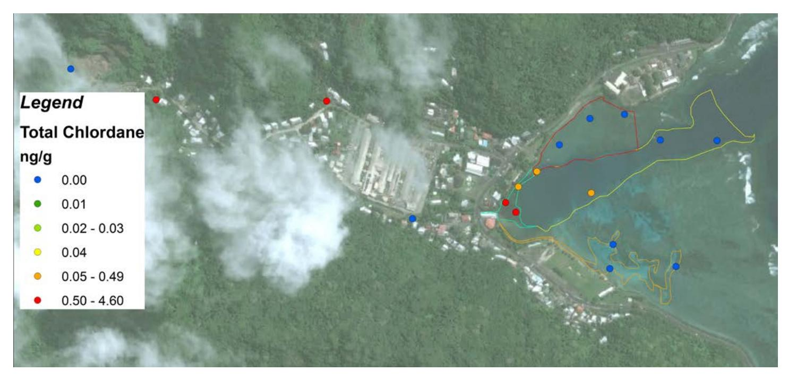

Figure 7: Total chlordane concentrations in sediments. January 2014.

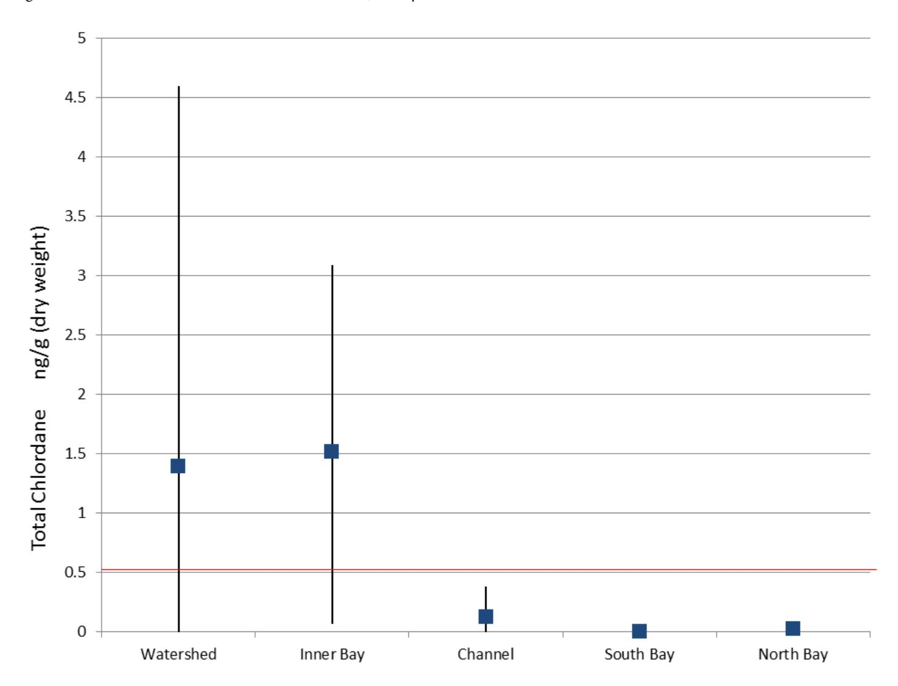

Figure 8: Sediment chlordane concentrations by strata. Squares are mean values; lines show maximum and minimum values. Red lines indicate Effect Range Low. There were no statistically significant differences between Bay strata (Dunn's test, α=0.05).

### **HCHs**

*Background:* Isomers of hexachlorocyclohexane (HCH) include alpha, beta, delta and gamma HCH. These are man-made chemicals that were used as organochlorine pesticides. The most common of these was gamma HCH, also known as lindane.

*Uses:* Historically, HCH has been used for veterinary and pharmaceutical purposes. Agricultural uses were phased out in the United State in 2007 (EPA 2006), but pharmaceutical uses (e.g. for lice) are still permitted.

*Environmental effects:* Like other organochlorine pesticides, HCH primarily acts on biota as a neurotoxin. HCH is also toxic to aquatic life including crayfish, shrimp and some species of fish. HCH is environmentally persistent and is transported readily through the environment (EPA 2006). HCH's effect on corals has not been well documented, but other studies have demonstrated that HCH does accumulate in coral tissues (Whitall et al. 2014). *Sediment Concentrations in Faga'alu:* Sediment concentrations of HCH in Faga'alu ranged from below limits of detection to 0.10 ng/g, with a mean of 0.03 ng/g.

*Comparison to Sediment Quality Guidelines:* There are currently no SQG for HCH.

*Spatial Patterns:* Qualitatively, sediment concentrations are higher in the outer bay than they are in the inner bay or watershed. This observed pattern is not statistically significant (Dunn's test, a=0.05).

*Discussion:* HCH was not well correlated with either sediment TOC or grain size, suggesting that sediment characteristics alone are not driving the observed concentrations. It is interesting that watershed concentrations of HCH are below detection limits. Since pesticide application in the watershed could be a historical source of these chemicals to the environment, their presence in the Bay, but absence in the watershed could mean that watershed stream sites are not accumulating HCH associated sediments or that HCH was not widely used in the watershed. HCH was not measured in a previous similar study in the area (CH2MHill 2007).

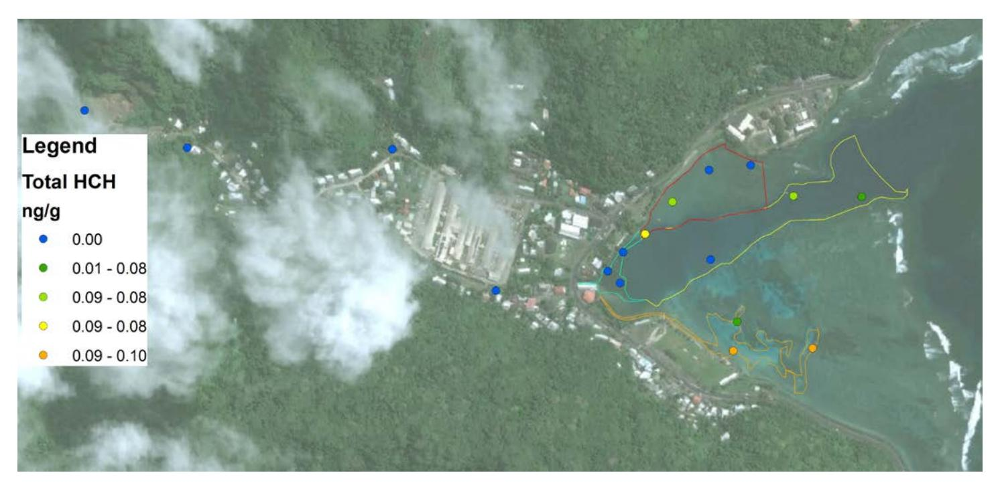

Figure 9: Total HCH concentrations in sediments. January 2014.

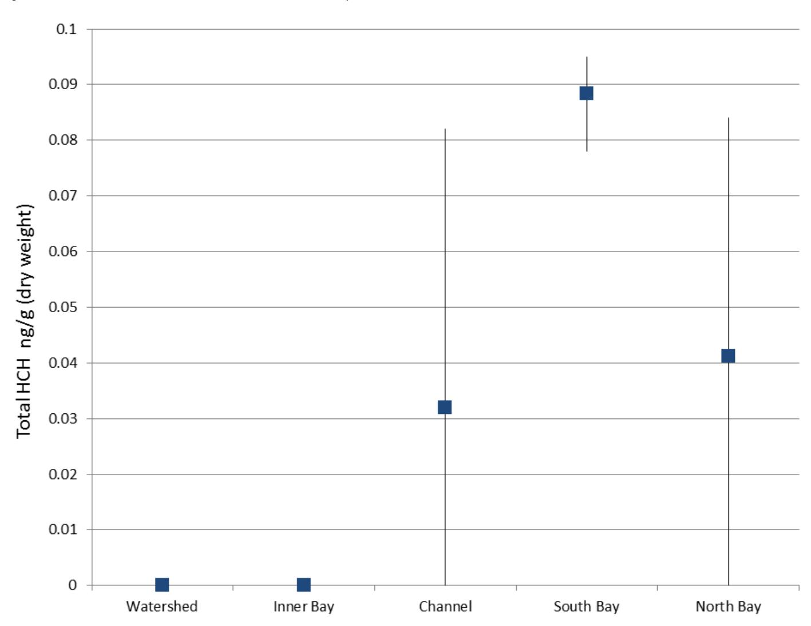

Figure 10: Sediment HCH concentrations by strata. There are no statistically significant differences between Bay strata (Dunn's test α =0.05) Squares are mean values; lines show maximum and minimum values.

### **Other Pesticides**

*Background:* A variety of other less common synthetic pesticides have been historically used for pest control in the United States. This study quantified concentrations of a variety of pesticides and their degradation products, including: aldrin, dieldrin, endrin, 1,2,3,4-tetrachlorobenzene, 1,2,4,5-tetrachlorobenzene, hexachlorobenzene, pentachloroanisole, pentachlorobenzene, mirex and chlorpyrifos.

*Environmental effects:* Like DDT and chlordane, these pesticides primarily act on biota as neurotoxins and endocrine disruptors, and may bioaccumulate. Markey et al. (2007) showed decreases in settlement and metamorphosis in the coral *Acropora millepora* when exposed to low water column concentrations (0.3 to 1 ug/L) of chlorpyrifos. A number of organochlorine pesticides are toxic to fish and other aquatic organisms. These pesticides include legacy fungicides and insecticides, which persist in the environment despite being phased out (USEPA 2015).

*Sediment Concentrations in Faga'alu:* Of the pesticides quantified, aldrin, endrin, 1,2,4,5-tetrachlorbenzene, hexachlorobenzene, mirex and chlorpyrifos were not detected. Several constituents (aldrin, pentachloroanisole, pentachlorobenzene) were detected at only at a few sites and at very low concentrations. 1,2,3,4-Tetrachlorobenzene was widely detected (13 of 17 sites), but at relatively low concentrations when compared with national/ historic data. Summary statistics are show in Table 5.

*Comparison to Sediment Quality Guidelines:* No SQG exist for these pesticides.

*Spatial Patterns:* There are no statistically significant differences between strata (Dunn's Test, a=0.05) for any of these analytes.

*Discussion:* Levels of detected pesticides are relatively low and likely represent low level historical use in the watershed and near coastal land.

Table 5: Detected pesticides in Faga'alu sediments (ng/g)

|                            |   | Min   | Max   | Mean  | StDev |
|----------------------------|---|-------|-------|-------|-------|
| 1,2,3,4-Tetrachlorobenzene |   | 0     | 0.107 | 0.018 | 0.025 |
| Pentachlorobenzene         |   | 0     | 0.049 | 0.003 | 0.012 |
| Pentachloroanisole         |   | 0     | 0.012 | 0.001 | 0.003 |
| Dieldrin                   | 0 | 0.011 | 0.001 | 0.003 |       |

### **Organotins**

*Background:* Tributyltin (TBT) refers to man-made organotin compounds containing the compound  $(C_4H_9)_3Sn$ . In the aquatic environment, TBT is broken down by bacteria and photodegradation (Bennett, 1996). The breakdown process involves sequential debutylization resulting in dibutyltin, monobutyltin, and finally inorganic tin (Batley, 1996). TBT and its breakdown products (dibutyltin and monobutyltin), as well as tetrabutyltin (a manufacturing by-product), were quantified here. For simplicity, total butyltins are presented here.

*Uses:* TBT was widely used anti-fouling agent in boat paint but was gradually phased out due to toxicity concerns.

*Environmental effects:* TBT is of great environmental concern due to its environmental persistence and toxicity to aquatic organisms. Its method of action on non-target organisms, including bivalves and gastropod molluscs, is through endocrine disruption (EPA 2004).

Comparison to Sediment Quality Guidelines: There are no sediment quality guidelines for TBT.

Spatial Patterns: Statistically, there are no statistically significant differences (Dunn's test,  $\alpha$ =0.05, p=0.027) between the Bay strata.

*Discussion:* TBT was not well correlated with either sediment TOC or grain size, suggesting that sediment characteristics alone are not driving observed spatial patterns. Presence of butyltins at watershed site WS04 was unexpected as this is not a navigable stream and TBT is most strongly associated with boats. This unusual data point was confirmed at the lab via sample re-extraction/re-analysis. It is possible that an anti-fouling agent containing boat paint was spilled in this area in the past. While this watershed detection is unusual, these are still quite low concentrations of butyltins. It should be noted that most of the butyltins detected exist as MBT or DBT, indicating degradation in the environment, which suggests that there is no new source of TBT in the area. TBT was not measured in a previous site in the area (CH2MHill 2007).

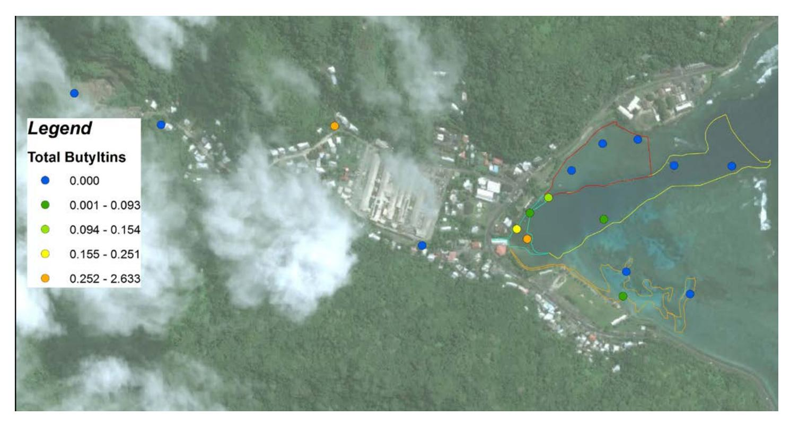

Figure 11: Total BT concentrations in sediments. January 2014.

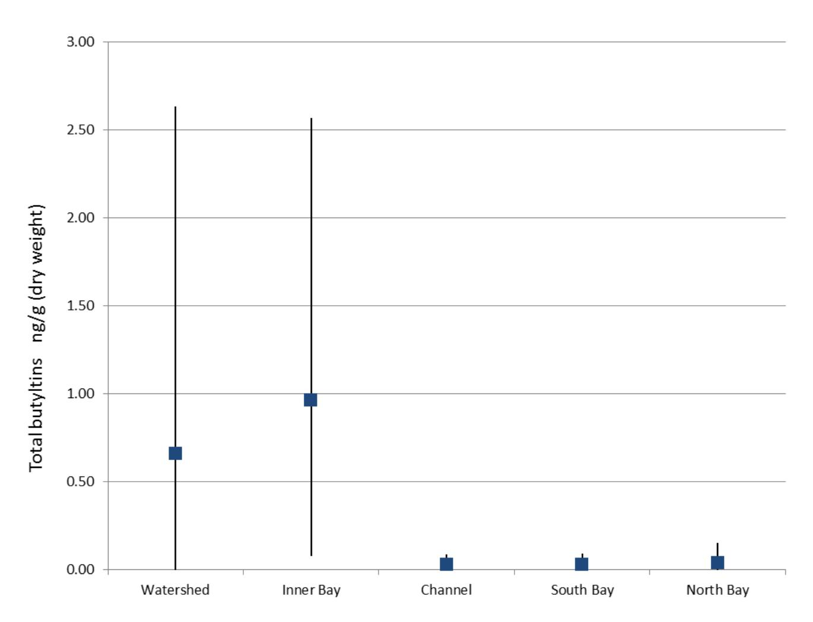

Figure 12: Sediment TBT concentrations by strata. Squares are mean values; lines show maximum and minimum values. There were not statistically significant differences between Bay strata (Dunn's test, α=0.05)

# **Polcyclic Aromatic Hydrocarbons (PAHs)**

*Background:* Polycyclic aromatic hydrocarbons (PAHs) are multiple ringed organic compounds consisting of carbon and hydrogen. They are can be occur naturally or result from human activities, such as fossil fuel combustion. Extraction and use of PAHs has increased their presence in the environment. In this study we present total PAHs as the sum of the PAHs analyzed (see Table 2).

*Uses:* PAHs are associated with the use and combustion of fossil fuels and other organic materials (e.g., wood). Natural sources of PAHs include forest fires and volcanoes. In addition to fossil fuels, PAHs are used in industrial processes and are found in cigarette smoke.

*Environmental effects:* Because of their hydrophobic nature, PAHs tend to accumulate in marine organisms through direct exposure (e.g body surface, gills) or through the food chain (Neff 1985). Exposure to PAHs has been associated with oxidative stress, immune system and endocrine system problems, and developmental abnormalities in marine organisms (Hylland 2006). Toxicity may be related to light exposure (Peachy and Crosby, 1995). Furthermore, a number of individual PAHs including benzo[a]pyrene, benz[a]anthracene, chrysene, benzo[b]fluoranthene, benzo[k]fluoranthene, dibenzo[a,h]anthracene, and indeno[1,2,3-c,d]pyrene have been previously identified as likely carcinogens (USDHHS 1995). The carcinogenic nature of PAHs in marine organisms is associated with their metabolic breakdown which generates reactive epoxides which can affect cellular components such as DNA (Hylland 2006; Neff 1985). In corals, PAHs can affect the zooxanthellae, the symbiotic photosynthetic dinoflagellate algae found within coral tissues. Bioaccumulation in corals has been documented (Ko et al. 2014) and appears to be related to the lipid content of both the coral and the algae (Kennedy et al. 1992). Bioaccumulation by corals is not an impact by itself; however, the accumulation of a chemical contaminant in an organism increases the likelihood of adverse effects. More research is needed to establish body burden thresholds. *Sediment Concentrations in Faga'alu:* Sediment concentrations of PAHs in Faga'alu ranged from 1.35 ng/g to 2097.48 ng/g, with a mean of 177.8 ng/g.

*Comparison to Sediment Quality Guidelines:* No sites exceeded the ERL (4022 ng/g).

*Spatial Patterns:* Qualitatively, sediment concentrations are highest in the watershed, with Bay sites being relatively similar to each other. Statistically, the inner bay has higher concentrations than the south bay (Dunn's Test, a=0.05, p=0.028).

*Discussion:* PAHs are relatively low in this system and likely do not represent a significant ecological threat. The PAHs that are present appear to be coming from the watershed and are likely from road runoff (i.e. oil and gas from cars). The highest concentration values observed in the bay are in the inner stratum, which reflects the watershed source.

A previous study in the area did not measure PAHs (CH2MHill 2007).


Figure 13: Total PAH concentrations in sediments. January 2014.

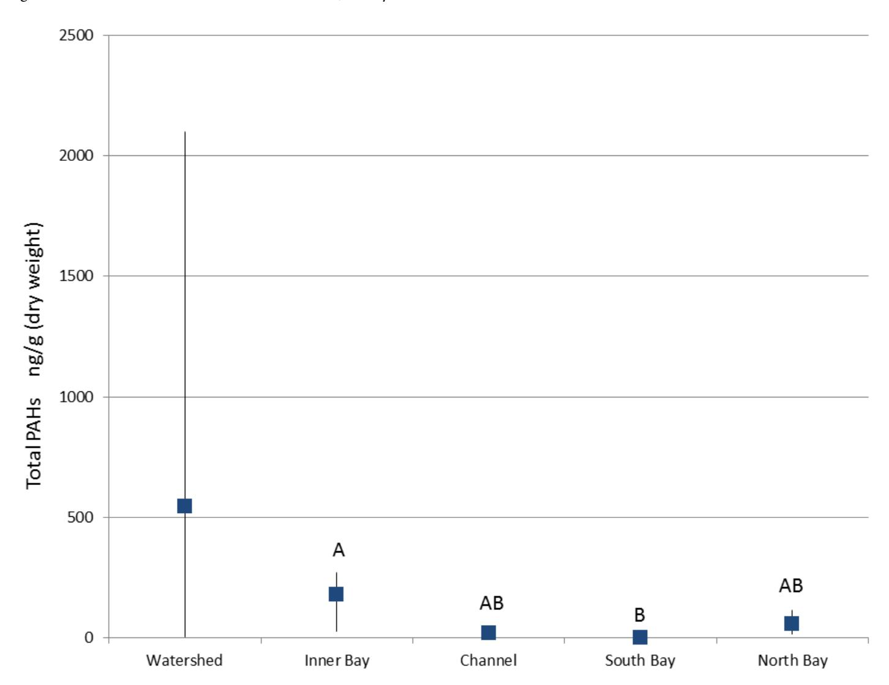

Figure 14: Sediment PAHs concentrations by strata. Squares are mean values; lines show maximum and minimum values. Letters denote statistically significant differences between Bay strata (Dunn's test, α=0.05).

# **Arsenic**

*Background:* Arsenic (As) is a metalloid element that naturally occurs in the Earth's crust. It can exist as either an inorganic or organic compound. Mining and use of arsenic has increased the amount of arsenic present in the environment.

*Uses:* Arsenic has been widely used for centuries in applications ranging from pharmaceuticals to agriculture. Although arsenic use has declined in recently years due to concerns over toxicity, the most common uses of arsenic are pesticides, herbicides, desiccants, wood treatments and growth stimulants for agricultural crops and livestock (Eisler 1988). Arsenic can also be released into the environment through smelting. Inorganic forms of arsenic are generally much more toxic than organic forms.

*Environmental effects:* Arsenic is a known carcinogen, mutagen and teratogen. Its adverse effects have been quantified in humans, various mammalian species and fish, as well as in plants and invertebrates (Eisler 1988, Novellini et al. 2003). Arsenic's effect on corals has not been well documented, but other studies have demonstrated that arsenic does accumulate in coral tissues (Whitall et al. 2014).

*Sediment Concentrations in Faga'alu:* Sediment concentrations of arsenic in Faga'alu ranged from 1.19 mg/g to 11.5 mg/g, with a mean of 4.44 mg/g.

*Comparison to Sediment Quality Guidelines:* Three sites, all in the North Bay stratum, exceed the ERL of 8.2 mg/g. No sites exceeded the ERM. This suggests a potential for toxicity to benthic infauna.

*Spatial Patterns:* Qualitatively, sediment concentrations are similar between the watershed sites and the bay sites, with the exception of the north bay stratum, which has elevated concentrations of arsenic. This observed pattern is statistically significant (Dunn's test, a=0.05, p=0.039) with the North Bay having higher arsenic concentrations than the South Bay.

*Discussion:* Arsenic concentrations measured in this study were slightly lower than what was previously reported for Pago Pago Harbor, where the reported range of sediment concentrations was 4.54 to 14.58 mg/g, with a mean of 10.46 mg/g (CH2MHill 2007). The same study also quantified arsenic at two stream locations in the Faga'alu watershed. One site had very similar concentrations to what was reported here and the other site was much higher. This probably owes to large differences in grain size between the two samples, and field observations of the heterogeneity in the stream bed. Arsenic was not well correlated with sediment grain size, suggesting that sediment characteristics alone are not driving this pattern. It is possible that prevailing current patterns in the Bay, which push water from the mouth of the stream to the north (Vargas-Angel and Vetter, 2012), are playing a role here, but because the concentrations of arsenic in the watershed are lower than observed in the north bay stratum, there is likely some source other than the stream. In addition to natural (crustal) sources, arsenic can enter the coastal environment from a variety of sources including treated wood, insecticides and herbicides. We hypothesize that the elevated arsenic in the North Bay stratum is due to a near shore source along the coastline, possibly related to the old Department of Defense landfill located at the site of the current school (USACE 2011).

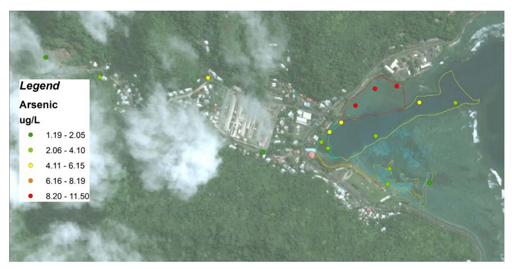

Figure 15: Arsenic concentrations in sediments. January 2014.

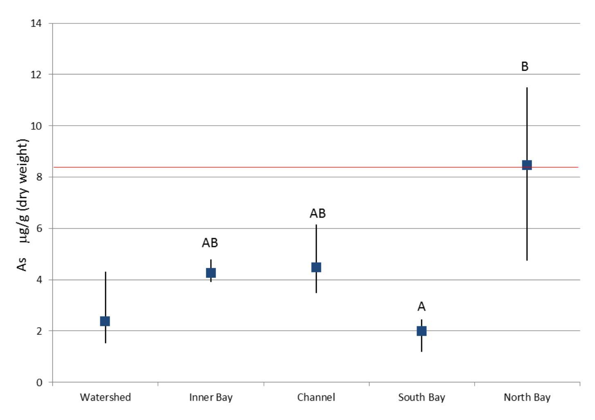

Figure 16: Sediment arsenic concentrations by strata. Squares are mean values; lines show maximum and minimum values. Red lines indicate Effect Range Low. Letters denote statistically significant differences between Bay strata (Dunn's test α =0.05)

# **Chromium**

*Background:* Chromium (Cr) is a metallic element that naturally occurs in the Earth's crust. Mining and use of chromium has increased the amount of chromium present in the environment.

*Uses:* Chromium has a variety of uses including leather tanning, stainless steel, metallic plating and in industrial catalysts (RSC 2014a). Chromium is an essential nutrient for plants and animals but can be toxic in excessive concentrations.

*Environmental effects:* Chromium has been shown to reduce survival and fecundity in the cladoceran *Daphnia magna*, decreased reproductive success in the sea urchin *Paracentrotus lividus* (Novellini et al. 2003) and reduced growth in fingerling chinook salmon (*Oncorhynchus tshawytscha*) (Eisler 1986). Chromium's effect on corals has not been well documented, but other studies have demonstrated that chromium does accumulate in coral tissues (Whitall et al. 2014).

*Sediment Concentrations in Faga'alu:* Sediment concentrations of chromium in Faga'alu ranged from 7.13 mg/g to 191 mg/g, with a mean of 39.47 mg/g.

*Comparison to Sediment Quality Guidelines:* One site in the inner bay exceeded the ERL of 81 mg/g. No sites exceeded the ERM. This suggests a potential for toxicity to benthic infauna. Although SQG were not designed for freshwater systems, it is useful to note that one watershed site also exceeded the ERL.

*Spatial Patterns:* Qualitatively, sediment concentrations are slightly higher in the watershed and the inner bay than in the main portion of the Bay, although there are no statistically significant differences between the strata in the Bay (Dunn's test, a=0.05).

*Discussion:* Chromium concentrations in the Bay were similar to what was previously reported for Pago Pago Harbor, where the reported range of sediment concentrations was 17.9 to 85.7 mg/g, with a mean of 56.03 mg/g (CH2MHill 2007). The same study also quantified chromium at two stream locations in the Faga'alu watershed. One site had very similar concentrations to what was reported here and the other site was lower. This probably owes to large differences in grain size between the two samples, and field observations of the heterogeneity in the stream bed. In Faga'alu Bay chromium concentrations are generally low in the bay with one site that might be of ecological concern. There is no obvious strong source of chromium in the watershed, although there are certainly human activities (e.g. chromium plating is used on automobiles) which could be contributing small amounts of chromium to the environment. The observed chromium concentrations are likely a combination of natural crustal chromium and an anthropogenic signal.

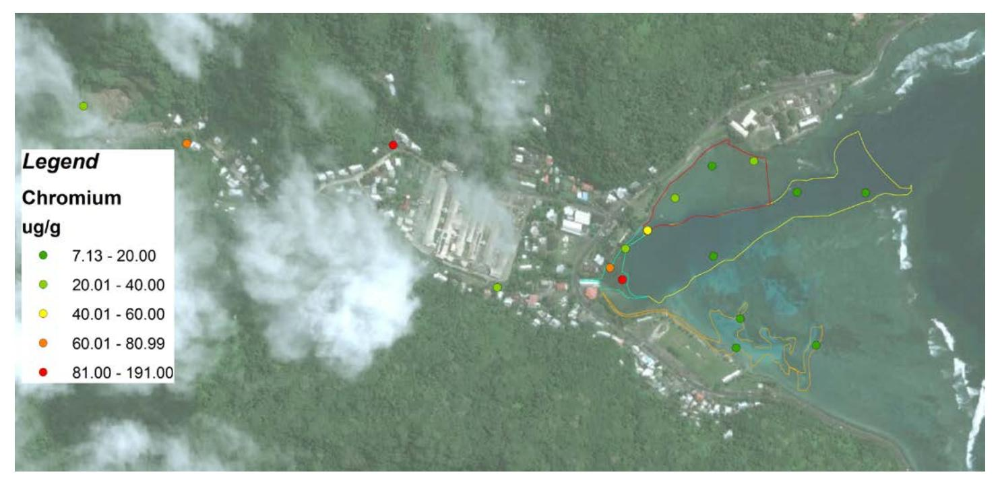

Figure 17: Chromium concentrations in sediments. January 2014.

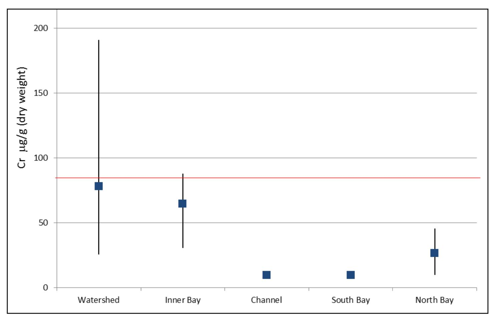

Figure 18: Sediment chromium concentrations by strata. Squares are mean values; lines show maximum and minimum values. Red lines indicate Effect Range Low. There were no statistically significant differences (Dunn's test, α=0.05) between strata in the Bay.

# **Copper**

*Background:* Copper (Cu) is a metallic element with excellent conductivity that naturally occurs in the Earth's crust. Mining and use of copper has increased the amount of copper present in the environment.

*Uses:* Copper has a wide array of uses ranging from coins to wires to pipes to pesticides to industrial materials (e.g. heat exchangers) to anti-fouling paints to alloys. Copper is an essential micronutrient for plants and animals but can have adverse effects at high concentrations.

*Environmental effects:* In aquatic environments, copper can have deleterious effects on reproduction and development in mysid shrimp (Eisler 1998), and sea urchins (Edullantes and Galpate, 2014; Dermeche et al. 2012; Novellini et al. 2003). In corals, copper concentrations of 20 μg/L have been shown to significantly reduce fertilization success in brain coral *Goniastrea aspera (*Reichelt-Brushett and Harrison, 2005). At copper concentrations at or above 75 μg/L, fertilization success was reduced to one percent or less. Fertilization success was also significantly reduced in the coral *Acropora longicyathus* at 24 μg/L, a similar concentration level at which effects were observed in *G. aspera*. Furthermore, studies have demonstrated that copper does accumulate in coral tissues (Whitall et al. 2014).

*Sediment Concentrations in Faga'alu:* Sediment concentrations of copper in Faga'alu ranged from 0 mg/g to 37.7 mg/g, with a mean of 8.53 mg/g.

*Comparison to Sediment Quality Guidelines:* No sites in the Bay exceeded the ERL or ERM. Although SQG were not developed for freshwater systems, it is useful to note than one watershed site did exceed the ERL of 34 mg/g.

*Spatial Patterns:* Qualitatively, sediment concentrations are higher in the watershed and Inner Bay. Statistically, the Inner Bay stratum was higher than the South Bay strata (Dunn's test, a=0.05, p=0.018).

*Discussion:* Sediment concentrations of copper in Faga'alu Bay were an order of magnitude lower than what was previously reported for Pago Pago Harbor, where the reported range of sediment concentrations was 4.82 to 564 mg/g, with a mean of 211.3 mg/g (CH2MHill 2007). This is not surprising since copper is used in anti-fouling boat paints and there is far greater boat traffic in Pago Pago Harbor than in Faga'alu. The same study also quantified copper at two stream locations in the Faga'alu watershed. One site had very similar concentrations to what was reported here and the other site was much higher. This probably owes to large differences in grain size between the two samples, and field observations of the heterogeneity in the stream bed. Concentrations of copper in Faga'alu Bay are generally fairly low and are probably not a danger to benthic infauna or other biota. Observed spatial differences between the inner bay and south bay may be due to prevailing currents (Vargas-Angel and Vetter, 2012). Copper was not well correlated sediment or grain size, suggesting that sediment characteristics alone are not driving this pattern.

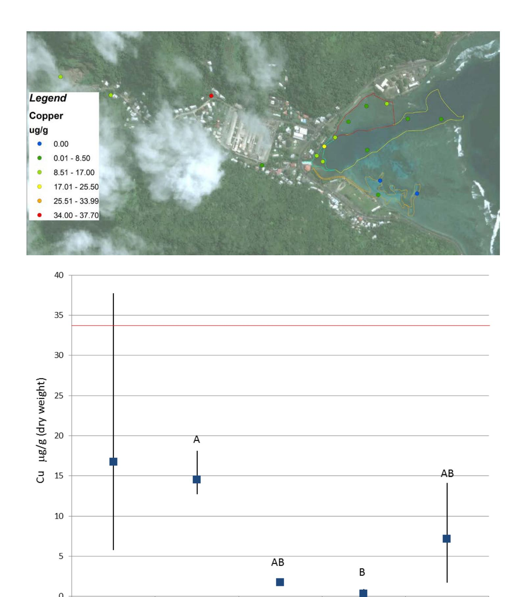

Figure 20: Sediment copper concentrations by strata. Squares are mean values; lines show maximum and minimum values. Red lines indicate Effect Range Low. Letters denote statistically significant differences between Bay strata (Dunn's test α =0.05).

# **Nickel**

*Background:* Nickel (Ni) is a metallic element that naturally occurs in the Earth's crust. Mining and use of nickel has increased the amount of nickel present in the environment.

*Uses:* Nickel is used in batteries, coins, metal plating and a variety of alloys (e.g. stainless steel).

*Environmental effects:* Nickel has been shown to have adverse effects on sea urchins (Novellini et al. 2003), crustaceans and fish (Hunt 2002). Previous studies (e.g. Whitall et al. 2014) have shown that nickel accumulates in coral tissues, and that water column concentrations of 9 mg/L cause mortality in *Pocilopora damicornis* larvae (Goh 1991).

*Sediment Concentrations in Faga'alu:* Sediment concentrations of nickel in Faga'alu ranged from 4.19 mg/g to 211 mg/g, with a mean of 35.1 mg/g.

*Comparison to Sediment Quality Guidelines:* Two sites, both in the inner bay stratum, exceeded the ERL of 40.51 mg/g. This suggests a potential for toxicity to benthic infauna in the Bay. While SQG were not developed for freshwater systems, it is useful to note that one site in the watershed exceeded the ERL and one site exceeded the ERM (77.21 mg/g).

*Spatial Patterns:* Qualitatively, the watershed appears to be a source of nickel to the Bay. Statistically, there are no differences between the strata in the Bay (Dunn's test, a=0.05).

*Discussion:* Concentrations of nickel reported for Faga'alu Bay were higher than what was previously reported for Pago Pago Harbor, where the reported range of sediment concentrations was 10.4 to 62.5 mg/g, with a mean of 40.2 mg/g (CH2MHill 2007). Because there aren't any obvious strong sources of nickel in the watershed, this may be due to differences between the geology between the two watersheds. The same study also quantified nickel at two stream locations in the Faga'alu watershed. Both Faga'alu watershed sites in the previous study were higher than what is reported here. Those differences might be due to observed heterogeneity in the stream sediments, but the high levels of watershed nickel supports the theory that Faga'alu does have unusually high naturally occurring watershed nickel.

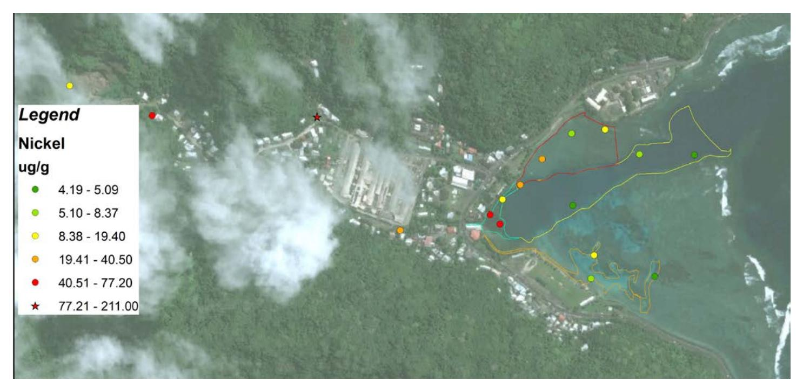

Figure 21: Nickel concentrations in sediments. January 2014.

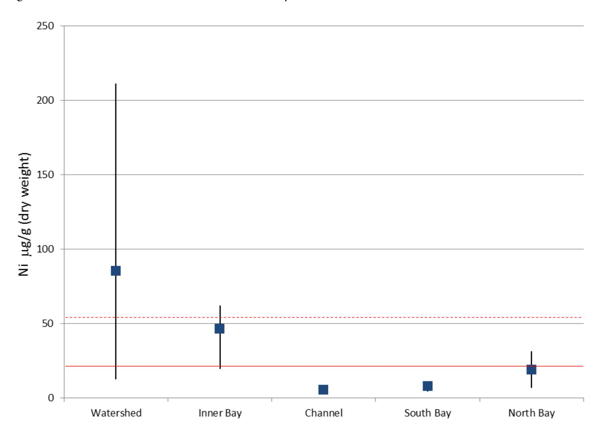

Figure 22: Sediment nickel concentrations by strata. Squares are mean values; lines show maximum and minimum values. Solid red line indicated Effect Range Low, dashed line indicates Effect Range Median. There were no statistically significant differences between the strata in the Bay (Dunn's test, α=0.05).

# **Silver**

*Background:* Silver (Ag) is a metallic element that naturally occurs in the Earth's crust. Mining and use of silver has increased the amount of silver present in the environment.

*Uses:* Silver is widely used including in jewelry, dental alloys, solder and brazing alloys, electrical contacts, batteries, circuits, photography and nanoparticles(RSC 2014b).

*Environmental effects:* Silver is one of the more toxic elements to plants and animals in the marine environment (Bryan 1984) including toxicity to bivalves, fish and phytoplankton. Previous studies (e.g. Whitall et al. 2014) have not reported widespread uptake of silver in coral tissues, which is consistent with the finding that Ag was primarily accumulated in coral skeletons in *Stylophora pistillata* (Metian et al. 2014).

*Sediment Concentrations in Faga'alu:* Sediment concentrations of silver in Faga'alu ranged from 0 mg/g to 2.74 mg/g, with a mean of 0.49 mg/g.

*Comparison to Sediment Quality Guidelines:* One site in the inner bay exceeded the ERL (1 mg/L) suggesting a potential for toxicity to benthic infauna. While these SQG were not developed for freshwater systems, it is interesting to note that three of the four watershed sites exceeded the ERL. No sites exceeded the ERM.

*Spatial Patterns:* Qualitatively, sediment concentrations are highest in the watershed with no detectable silver in the Bay beyond the Inner Bay stratum. There were no statistically significant differences between strata within the Bay (Dunn's test, a=0.05).

*Discussion:* Silver was not measured in the previous study (CH2MHill 2007) in the area. Most of the Bay is devoid of silver in the sediments. Any potential sediment toxicity due to silver would be limited to the inner bay. In the watershed, the highest concentration of silver was observed near the hospital, which is a potential source of silver in the watershed (i.e. from the radiology department). However, this concentration (2.74 mg/L) is not that much higher than what was observed in the unpopulated portion of the watershed (i.e. above the dam, 1.28 mg/L). This suggests that although the hospital could have historically contributed to the silver budget of the system (EPA 1990), silver naturally exists in the geology of the system at relatively high levels that could be triggering the exceedance of the ERL in the Bay.

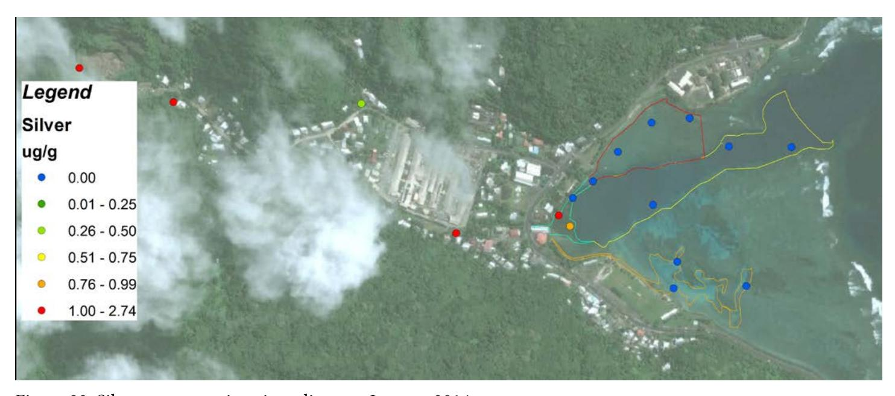

Figure 23: Silver concentrations in sediments. January 2014.

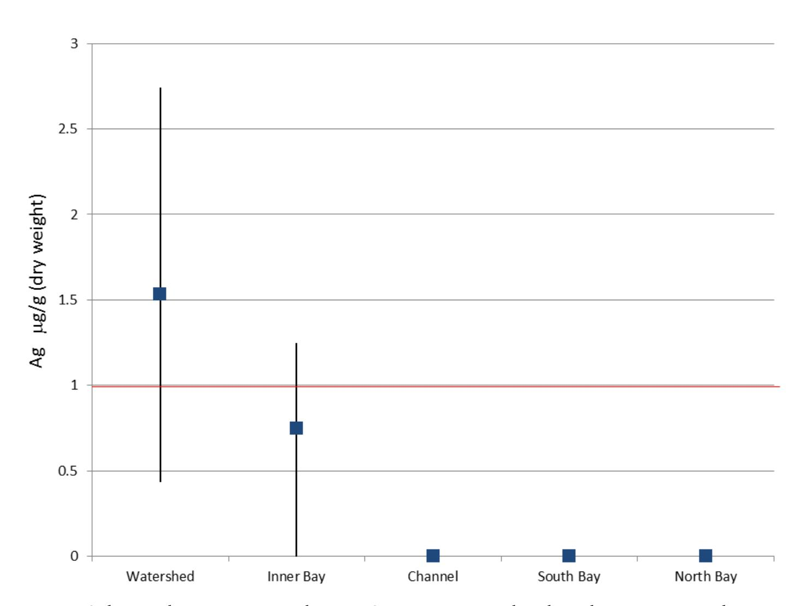

Figure 24: Sediment silver concentrations by stata. Squares are mean values; lines show maximum and minimum values. Red lines indicate Effect Range Low. There were no statistically significant differences among between strata (Dunn's test, α=0.05) for randomly selected sites.

# **Zinc**

*Background:* Zinc (Zn) is a metallic element that naturally occurs in the Earth's crust. Mining and use of zinc has increased the amount of zinc present in the environment.

*Uses:* Zinc is used in brass, bronze, die castings metal, alloys, rubbers, paints, wood preservation, catalysts, corrosion control in drinking water systems, photographic paper, vulcanization acceleration for rubber (including automobile tires), ceramics, textiles, fertilizers, pigments, batteries, and as nutritional supplements or medicines (EPA 2005).

*Environmental effects:* Zinc is a micronutrient for both plants and animals, but can be toxic in excess. Zinc has been shown to be toxic to aquatic invertebrates, including sea urchins (Novellini et al. 2003; Dermeche et al. 2012; Edullantes and Galapate, 2014), and fish (Besser and Lieb, 2007), but relative less toxic to mammals and birds (USDOI 1998). Zinc accumulates primarily in the tissues of corals rather than the skeletons (Metian et al. 2014) and can cause reduction in fertilization success in scleractinian corals (Reichelt-Brushett and Harrison, 2005).

*Sediment Concentrations in Faga'alu:* Sediment concentrations of zinc in Faga'alu ranged from 3.7 mg/g to 416 mg/g, with a mean of 109.7 mg/g.

*Comparison to Sediment Quality Guidelines:* Two sites in the Bay, both in the inner bay stratum, exceed the ERL of 150 mg/g. This suggests a potential for toxicity to benthic infauna in the Bay. While these SQG were not developed for freshwater systems, it can be noted that all of the watershed sites exceeded the ERL, with one site exceeding the ERM of 410 mg/g.

*Spatial Patterns:* Qualitatively, sediment concentrations decrease from the watershed into the Bay. Statistically, the inner bay has higher zinc concentrations (Dunn's test, a=0.05, p=0.019) than the south bay.

*Discussion:* Zinc was not well correlated with either sediment TOC or grain size, suggesting that sediment characteristics alone are not driving this pattern. The watershed appears to be a strong source of zinc to the Bay. Although there are roads in the lower watershed which could be contributing automobile tire dust derived Zn (Councell et al 2004), because the site above the dam (i.e. in the portion of the watershed without roads) also has elevated Zn concentrations, it is more likely that this is naturally occurring Zn associated with the volcanic geology (Piercey 2010). Concentration reported here are lower than what was previously reported for Pago Pago Harbor, where the reported range of sediment concentrations was 33.4 to 1810 mg/g, with a mean of 778.9 mg/g (CH2MHill 2007).

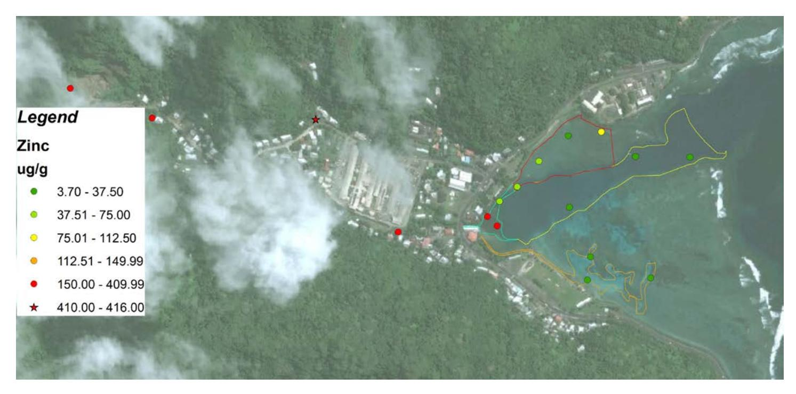

Figure 25: Zinc concentrations in sediments. January 2014.

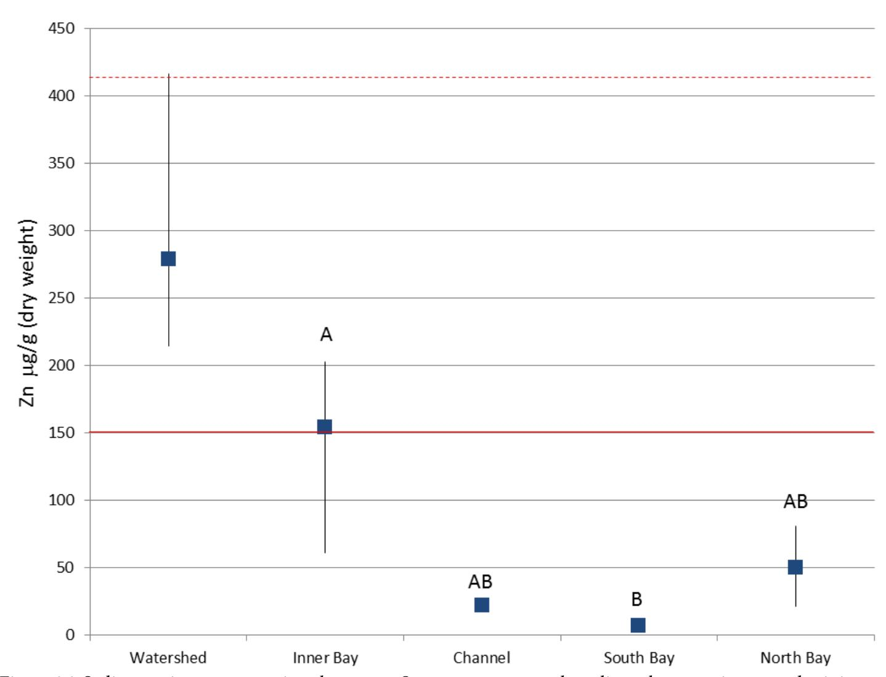

Figure 26: Sediment zinc concentrations by strata. Squares are mean values; lines show maximum and minimum values. Letters denote statistically significant differences (Dunn's test, α=0.05).

# **Aluminum**

*Background:* Aluminum (Al) is the most common metallic element in the Earth's crust.

*Uses:* Aluminum has a wide range of uses due to its malleability, lightweight nature and resistance to corrosion. Common uses include cans, foils, kitchen utensils, window frames, beer kegs and airplane parts. It is also used in alloys with copper, manganese, magnesium and silicon (RSC 2014c).

*Environmental effects:* Aluminum is generally not considered to be toxic in the environment, but ratios of aluminum to other elements can provide information about sources (see Further Analysis section).

*Sediment Concentrations in Faga'alu:* Sediment concentrations of aluminum in Faga'alu ranged from 475 mg/g to 72,400 mg/g, with a mean of 25,682 mg/g.

*Comparison to Sediment Quality Guidelines:* There are no published sediment quality guidelines for aluminum as it is generally non-toxic.

*Spatial Patterns:* Qualitatively, sediment concentrations are higher in the watershed sites and show evidence of dilution moving into bay sites. This is consistent with a strong natural crustal/erosional source of aluminum. There are no statistically significant differences between the randomly selected (non-watershed) sites (Dunn's test, a=0.05).

*Discussion:* Aluminum was not measured in the previous study (CH2MHill 2007). As referenced above, ratios of aluminum to other crustal elements can be informative as to the source of those crustal elements. Further exploration of this analytical technique is presented in the Further Analysis section.

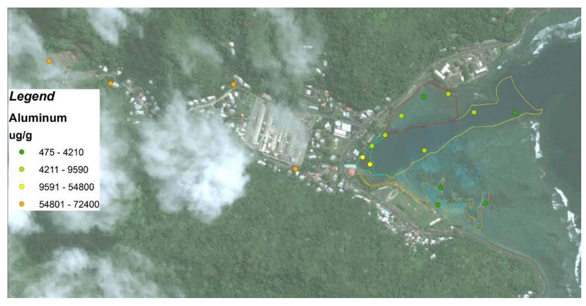

Figure 27: Aluminum concentrations in sediments. January 2014.

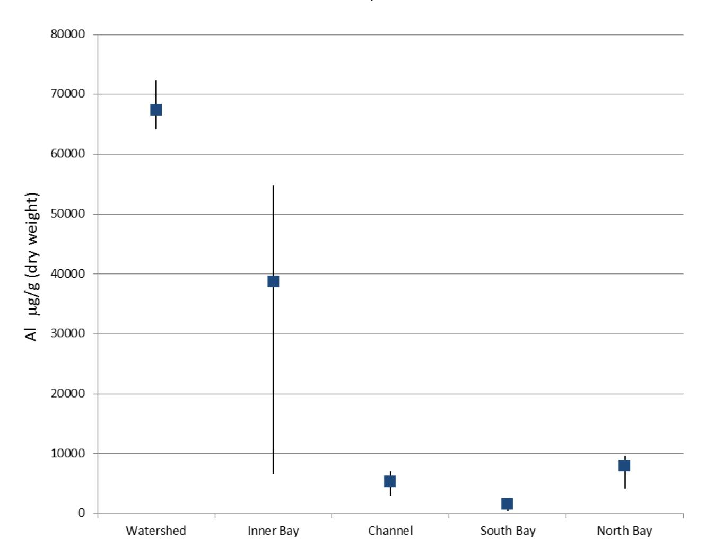

Figure 28: Sediment aluminum concentrations by strata. Squares are mean values; lines show maximum and minimum values. There were no statistically significant differences between strata (Dunn's test α=0.05).

# **Antimony**

*Background:* Antimony (Sb) is a metalloid element that naturally occurs in the Earth's crust. Mining and use of antimony has increased the amount of antimony present in the environment.

*Uses:* Uses of antimony include as a component in semi-conductors, and a variety of alloys and compounds which are used for batteries, bullets, cable sheathing, flame retardants, and enamels(RSC 2014d).

*Environmental effects:* In the aquatic environment, antimony has been demonstrated to have both acute and chronic toxicity to both animals and plants, although there is very little data for the marine environment (EPA 1980). *Sediment Concentrations in Faga'alu:* Sediment concentrations of antimony in Faga'alu ranged from 0 mg/g to 0.47 mg/g, with a mean of 0.18 mg/g.

*Comparison to Sediment Quality Guidelines:* There are no sediment quality guidelines for antimony. *Spatial Patterns:* Qualitatively, sediment concentrations are similar between the watershed sites and the north bay sites, although there are no statistically significant differences between the Bay strata (Dunn's test, a=0.05).

*Discussion:* Antimony was not quantified in a previous study in the area (CH2MHill 2007). There are no obvious potential sources of antimony in the watershed. Levels of antimony in the southern portion of the Bay are below limits of detection. The magnitude of antimony in combination with this spatial pattern suggests a natural watershed source of antimony which is being distributed to the northern part of the bay by the prevailing currents (Vargas-Angel and Vetter 2012).

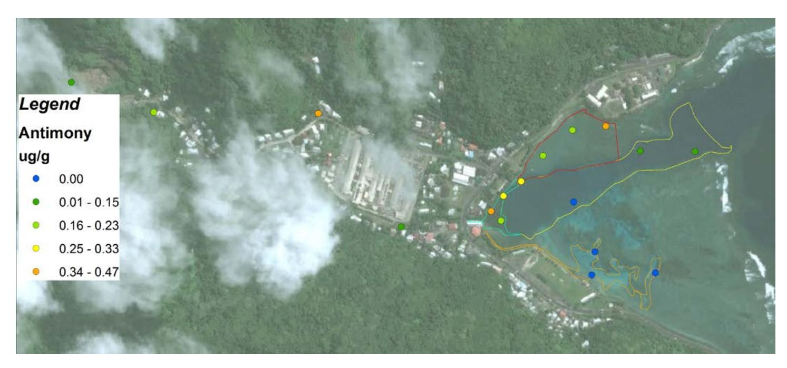

Figure 29: Antimony concentrations in sediments. January 2014.

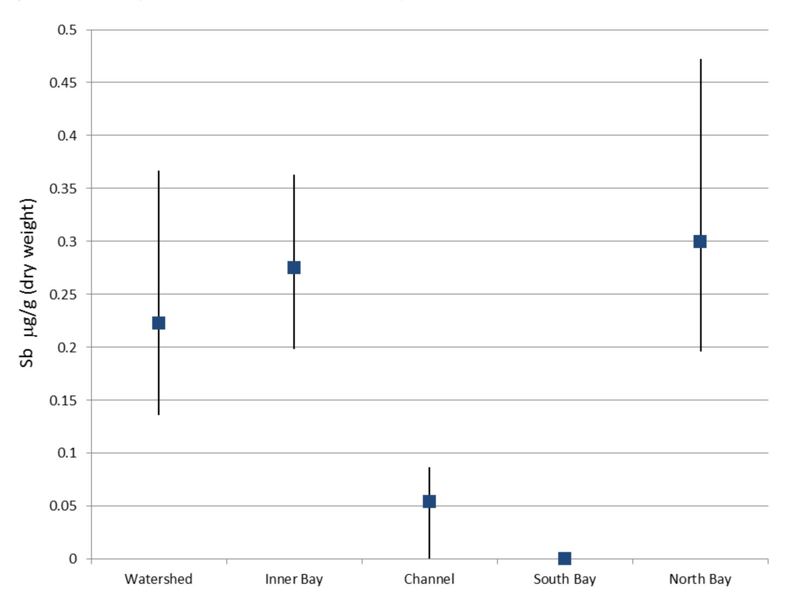

Figure 30: Sediment antimony concentrations by strata. Squares are mean values; lines show maximum and minimum values. There were no statistically significant differences between strata for randomly selected sites (Dunn's test α=0.05).

# **Cadmium**

*Background:* Cadmium (Cd) is a metallic element that naturally occurs in the Earth's crust. Mining and use of cadmium has increased the amount of cadmium present in the environment.

*Uses:* Cadmium has historically been widely used in batteries, pigments and in electroplating. Cadmium use is being reduced due to concerns over toxicity (RSC 2014e).

*Environmental effects:* Although cadmium is a minor nutrient for plant growth, it is relatively toxic to aquatic organisms. Toxicity to sea urchins (Edullantes and Galapate, 2014, Dermeche et al. 2012), bivalves, crustaceans, sediment invertebrates and fish has been reported (EPA 2001), including effects on development and reproduction in several invertebrate species, and the potential to impede osmoregulation in herring larvae (USDHHS 1999; Eisler 1985). Previous studies (e.g. Whitall et al. 2012) have shown that cadmium is taken up by corals, and that cadmium is primarily accumulated in tissues than skeletons (Metian et al. 2014). Cadmium inhibits fertilization in scleractinian coral at relatively high concentrations (5,000 mg/L, Reichelt-Brushett and Harrison, 2005).

*Sediment Concentrations in Faga'alu:* Sediment concentrations of cadmium in Faga'alu ranged from 0 mg/g to 0.31 mg/g, with a mean of 0.098 mg/g.

*Comparison to Sediment Quality Guidelines:* No sites exceeded the ERL or ERM. This suggests that potential toxicity to benthic infauna is low.

*Spatial Patterns:* Qualitatively, the watershed appears to be a strong source of cadmium, with moderate concentrations at the stream mouth and lower values in the main portion of the Bay. However, there are no statistically significant differences between the strata of the Bay (Dunn's test, a=0.05).

*Discussion:* The previous contaminant study in this area (CH2MHill 2007) did not measure cadmium. Cadmium concentrations are relatively low in this system. While there are potential small scale sources (e.g. discarded batteries) in the watershed, the relatively low cadmium concentrations probably represent naturally occurring background levels.


Figure 31: Cadmium concentrations in sediments. January 2014.

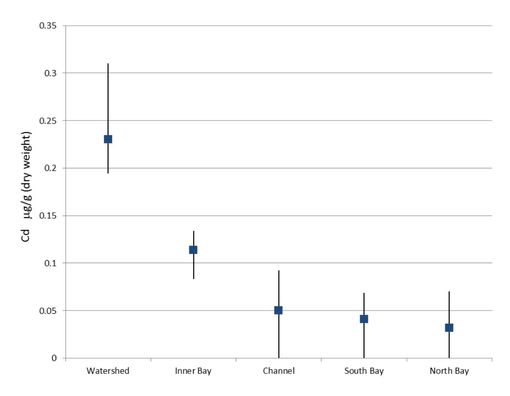

Figure 32: Sediment cadmium concentrations by strata. Squares are mean values; lines show maximum and minimum values. There were no statistically significant differences between the Bay strata (Dunn's test α=0.05).

# **Iron**

*Background:* Iron (Fe) is a metallic element that by mass is the most abundant element in the Earth's crust. Mining and use of iron has increased the amount of iron present in the environment.

*Uses:* Iron is used in many materials for construction and manufacturing including steel, stainless steel and cast iron. Iron is an essential nutrient for both plants and animals.

*Environmental effects:* Iron is generally not considered to be toxic in the environment, but like aluminum it can provide some context about the source of other crustal elements (e.g. erosion versus pollution) (RSC 2014f). *Sediment Concentrations in Faga'alu:* Sediment concentrations of iron in Faga'alu ranged from 712 mg/g to 103,000 mg/g, with a mean of 28,484 mg/g.

*Comparison to Sediment Quality Guidelines:* Iron is generally not considered toxic and no SQG exist.

*Spatial Patterns:* Qualitatively, and as would be expected based on crustal erosion, the watershed and Inner Bay have higher Fe concentrations. The Inner Bay is significantly higher than the South Bay (Dunn's test, a=0.05, p=0.034).

*Discussion:* Iron was not measured in the previous study (CH2MHill 2007). As referenced above, ratios of iron to other crustal elements can be informative as to the source of crustal elements. Further exploration of this analytical technique is presented in the Further Analysis section. Fe was not well correlated with either sediment TOC or grain size, suggesting that sediment characteristics alone are not driving this pattern. Since there is no obvious strong source of Fe in the watershed, this is likely a natural background level of geologic iron in the system. The differences between the Inner Bay and South Bay could be explained by the prevailing currents which tend to push stream water to the north portion of the Bay (Angel-Vargas and Vetter, 2012), meaning that the channel and north bay received the majority of the freshwater inflow, and its associated metals.

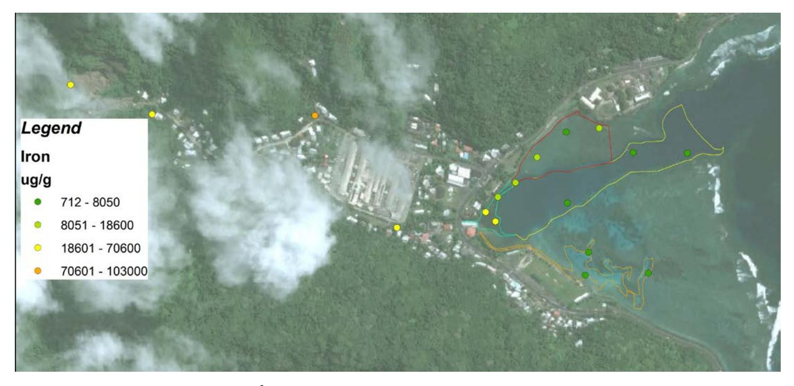

Figure 33: Iron concentrations in sediments. January 2014.

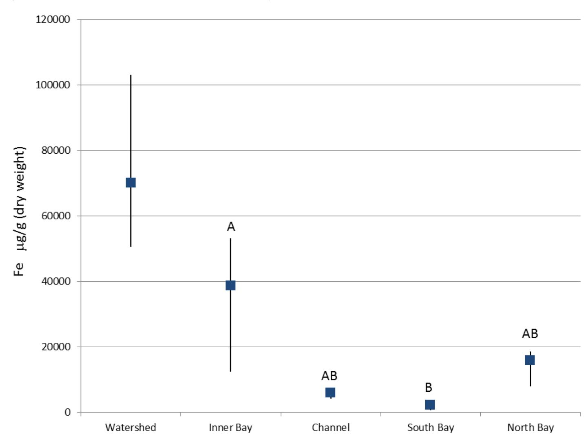

Figure 34: Sediment iron concentrations by strata. Squares are mean values; lines show maximum and minimum values. Letters denote statistically significant differences between Bay strata (Dunn's test, α=0.05).

# **Lead**

*Background:* Lead (Pb) is a malleable, corrosion resistant metallic element that naturally occurs in the Earth's crust. Mining and use of lead has increased the amount of lead present in the environment.

*Uses:* Lead has been widely used for centuries in pipes, pewter, paints, pottery glazes, insecticides, hair dyes and gasoline additives. These uses have been greatly reduced due to concerns over lead toxicity. Lead is still widely used in car batteries, ammunition, weights (e.g. barbells and dive belts), crystal glass, solder and radiation protection (RSC 2014g).

*Environmental effects:* Lead has no known nutritional role in plant or animal health. It can be acutely toxic as well as a carcinogen and teratogen (RSC 2014g). Reproductive effects on sea urchins have been previously documented (Novellini et al. 2003, Dermeche et al. 2012). Lead's effect on corals has not been well documented, but other studies have demonstrated that lead does accumulate in coral tissues (Whitall et al. 2014).

*Sediment Concentrations in Faga'alu:* Sediment concentrations of lead in Faga'alu ranged from 0.64 mg/g to 45.5 mg/g, with a mean of 13.15 mg/g.

*Comparison to Sediment Quality Guidelines:* No sites exceeded the ERL of 46.7 mg/g, indicating that benthic toxicity due to lead is unlikely.

*Spatial Patterns:* Qualitatively, sediment concentrations are similar between the watershed sites, the inner bay and the north bay. Statistically, for the Bay strata the South Bay is statistically lower than the Inner Bay (Dunn's test, a=0.05, p=0.039).

*Discussion:* The observed concentrations of lead in this study are lower than what was previously reported for Pago Pago Harbor, where the reported range of sediment concentrations was 9.51 to 173 mg/g, with a mean of 86.3 mg/g (CH2MHill 2007). The same study also quantified lead at two stream locations in the Faga'alu watershed. The values reported in the current study were much higher for lead than previously reported. This probably owes to large differences in grain size between the two samples, and field observations of the heterogeneity in the stream bed. Lead was not well correlated with sediment grain size, suggesting that sediment characteristics alone are not driving this observed spatial pattern. It is possible that prevailing current patterns in the Bay, which push water from the mouth of the stream to the north (Vargas-Angel and Vetter, 2012), are playing a role here.

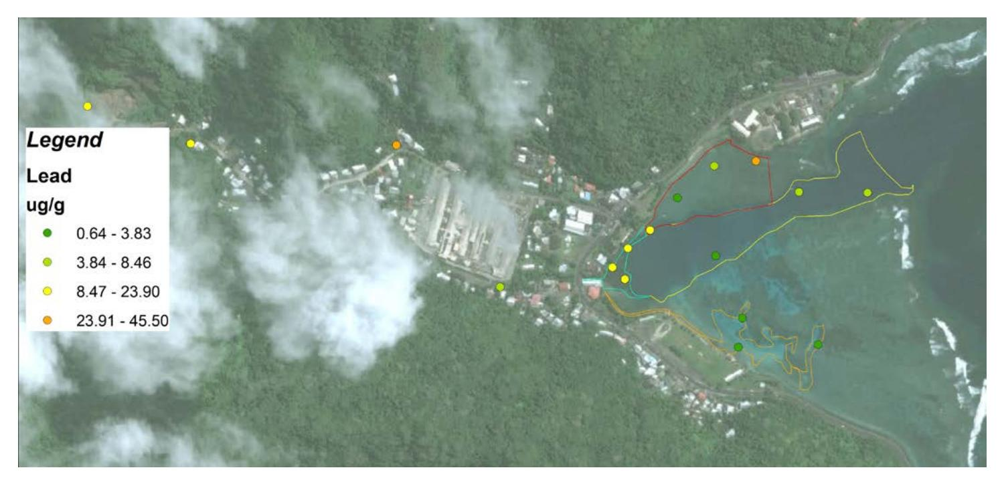

Figure 35: Lead concentrations in sediments. January 2014.

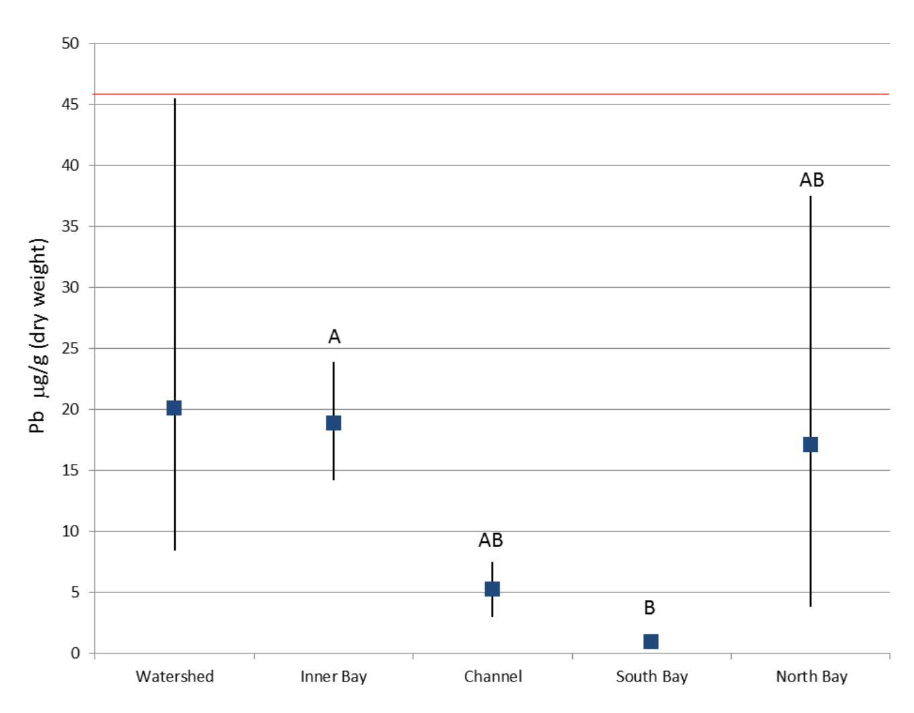

Figure 36: Sediment lead concentrations by strata. Squares are mean values; lines show maximum and minimum values. Red lines indicate Effect Range Low. Letters denote statistically significant differences between Bay strata (Dunn's test, α=0.05).

# **Manganese**

*Background:* Manganese (Mn) is a brittle metallic element that naturally occurs in the Earth's crust. Mining and use of manganese has increased the amount of manganese present in the environment.

*Uses:* Because of its brittle nature, manganese is primarily used in alloys with steel and aluminum, as well as a catalyst, rubber additive, in fertilizers and in pesticides (RSC 2014h).

*Environmental effects:* Manganese is an essential element for plants and animals although it can be toxic to aquatic invertebrates at chronic high doses (Norwood et al. 2007). Studies have demonstrated that manganese, like other major and trace elements, does accumulate in coral tissues (Whitall et al. 2014) and is primarily sequestered in the tissues, rather than the skeleton (Metian et al. 2014).

*Sediment Concentrations in Faga'alu:* Sediment concentrations of manganese in Faga'alu ranged from 20 mg/g to 1250 mg/g, with a mean of 467 mg/g.

*Comparison to Sediment Quality Guidelines:* There are no published sediment quality guidelines for manganese.

*Spatial Patterns:* Qualitatively, sediment concentrations are highest in the watershed and Inner Bay. Statistically, the Inner Bay stratum is higher than the south bay stratum (Dunn's test, a=0.05, p=0.039).

*Discussion:* Manganese was not quantified in the previous study in the area (CH2MHill 2007). The watershed appears to be a strong source of manganese to the Bay, although the concentrations beyond the inner bay are quite low. Mn was not well correlated with either sediment TOC or grain size, suggesting that sediment characteristics alone are not driving this pattern. Since there is no obvious strong source of Mn in the watershed, this is likely a natural background level of geologic manganese in the system. The differences between the inner bay and south bay could be explained by the prevailing currents which tend to push stream water to the north portion of the Bay, meaning that the channel and north bay received the majority of the freshwater inflow, and its associated metals.

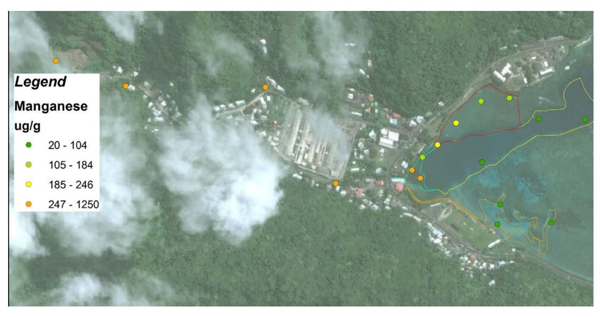

Figure 37: Manganese concentrations in sediments. January 2014.

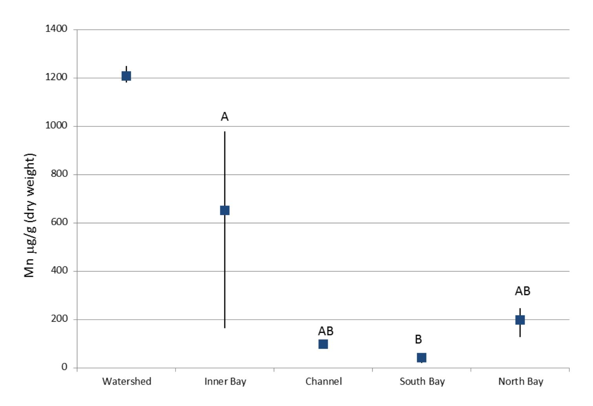

Figure 38: Sediment manganese concentrations by strata. Squares are mean values; lines show maximum and minimum values. Letters denote statistically significant differences between Bay strata (Dunn's test, α=0.05).

# **Mercury**

*Background:* Mercury (Hg) is a naturally occurring heavy metal that is liquid at room temperature in its elemental form. It exists in natural geologic formations as a solid in various compounds. Mining and use of mercury has increased the amount of mercury present in the environment.

*Uses:* Historically, mercury was used in manufacturing, batteries, fluorescent lights, dental fillings, felt production and thermometers, but these uses have been gradually phased out due to mercury toxicity. It is currently used in the chemical industry as a catalyst, and in some electrical switches.

*Environmental effects:* Methyl mercury (CH3 Hg) is the most toxic form of mercury. Mercury can be toxic to birds and invertebrates, and bioaccumulates in fish, which can have human health implications for fisheries species (USGS 2000). Mercury has been shown to be more toxic to sea urchins than other metals (Novellini et al. 2003). Although toxic effects of mercury on corals are not well understood, mercury uptake by corals has been previously demonstrated (e.g. Whitall et al. 2014; Guzman and Garcia, 2002), and mercury accumulates more in coral tissues than in the skeleton (Bastidas and Garcia 2004).

*Sediment Concentrations in Faga'alu:* Sediment concentrations of mercury in Faga'alu ranged from 0.0008 mg/g to 0.0163 mg/g, with a mean of 0.006 mg/g.

*Comparison to Sediment Quality Guidelines:* No sites exceeded the ERL. This suggests that toxicity to benthic infauna is unlikely.

*Spatial Patterns:* Qualitatively, sediment concentrations are similar between the watershed sites and the bay sites, with the exception of the South Bay stratum, which appears to be lower. However, this observed pattern is not statistically significant (Dunn's test, a=0.05).

*Discussion:* Mercury concentrations were slightly lower than what was previously reported for Pago Pago Harbor, where the reported range of sediment concentrations was 0.04 to 0.38 mg/g, with a mean of 0.22 mg/g (CH2MHill 2007). The same study also quantified mercury at two stream locations in the Faga'alu watershed. Both sites in the previous study had significantly higher mercury concentrations than observed here. This probably owes to large differences in grain size between the two samples, and field observations of the heterogeneity in the stream bed. Mercury in sediments in this study area is relatively low. While the hospital is a potential source of mercury to the stream and bay (EPA 2002), the data presented here suggests that this is not a concern.

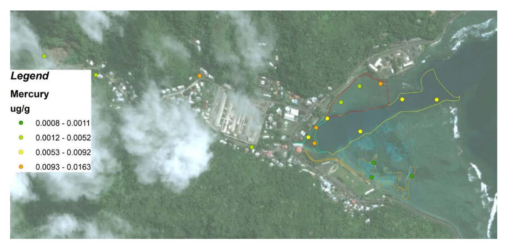

Figure 39: Mercury concentrations in sediments. January 2014.

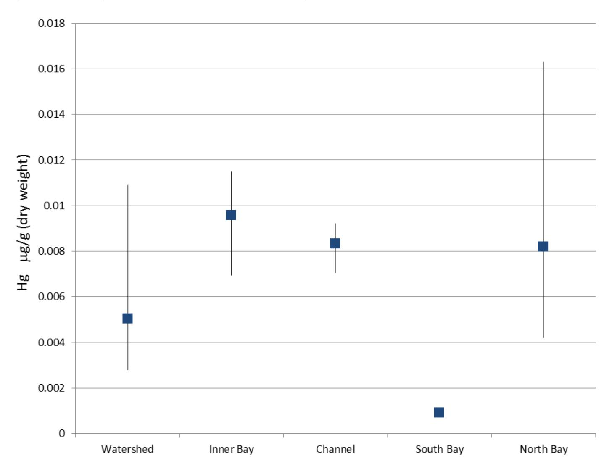

Figure 40: Sediment mercury concentrations by strata. Squares are mean values; lines show maximum and minimum values. No statistically significant differences between Bay strata (Dunn's test, α=0.05).

# **Selenium**

*Background:* Selenium (Se) is a trace element (semi-metal) that naturally occurs in the Earth's crust. Mining and use of selenium has increased the amount of selenium present in the environment.

*Uses:* Selenium has a range of uses including as an additive in glass production, as a fungicide and in photocells, solar cells, photocopiers and rectifiers (RCS 2014i).

*Environmental effects:* Selenium is a micronutrient for some organisms including humans. Selenium can bioaccumulate and has been shown to be toxic to both invertebrates and fish at elevated concentrations (EPA 2014). Selenium's effect on corals has not been well documented, but other studies have demonstrated that selenium does accumulate in coral tissues (Whitall et al. 2014).

*Sediment Concentrations in Faga'alu:* Sediment concentrations of selenium in Faga'alu ranged from 0 mg/g to 0.13 mg/g, with a mean of 0.02 mg/g.

*Comparison to Sediment Quality Guidelines:* No sediment quality guidelines exist for selenium. *patial Patterns:* Qualitatively, Se is quite low across the study area. There are no statistically significant differences between Bay strata (Dunn's test, a=0.05).

*Discussion:* Selenium was not measured in a previous study in the area (CH2MHill 2007). Selenium is low even in the watershed stream sites, which likely reflects the local geology.

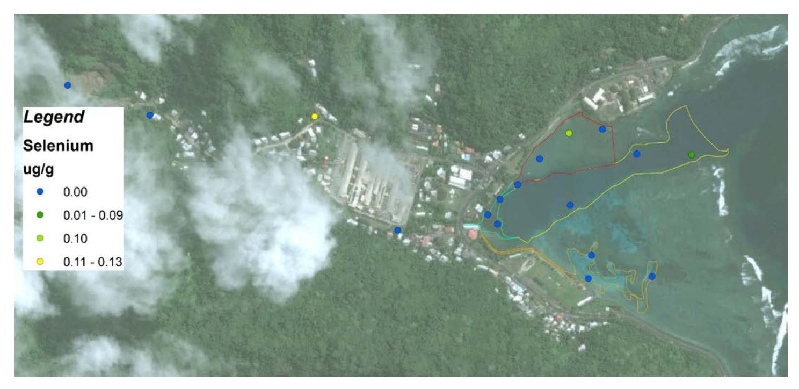

Figure 41: Selenium concentrations in sediments. January 2014.

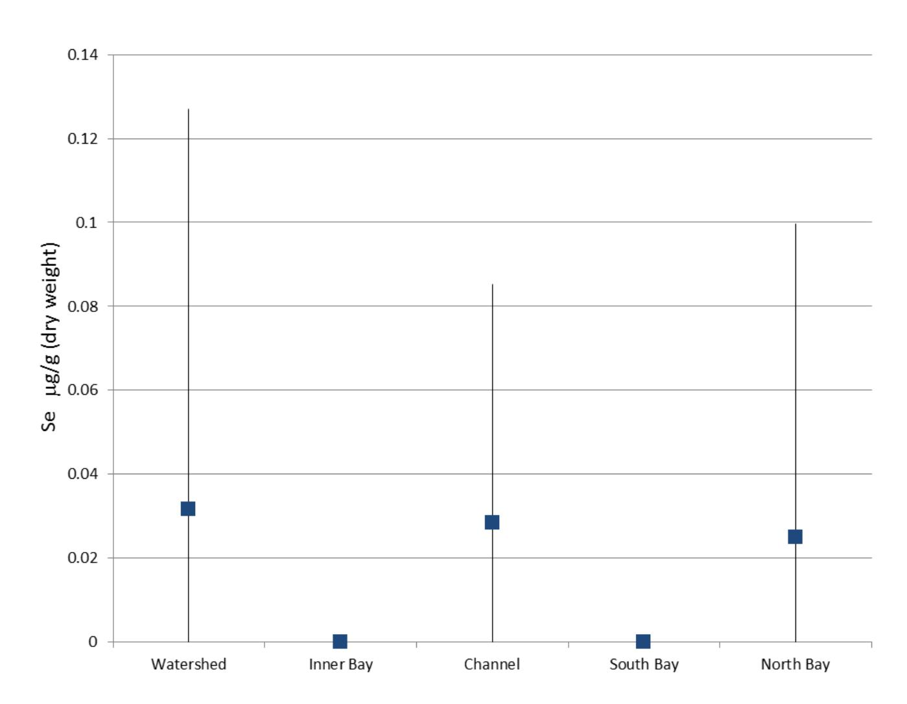

Figure 42: Sediment selenium concentrations by strata. Squares are mean values; lines show maximum and minimum values. There were no statistically significant differences between Bay strata (Dunn's Test, α=0.05).

# **Silicon**

*Background:* Silicon (Si) is a metalloid element that naturally occurs in the Earth's crust. Over 90% of the Earth's crust is made up of silica minerals.

*Uses:* Silicon has been widely used for centuries in applications primarily in alloys, which can be used to make machine tools, engine blocks and cylinder heads. Silicone polymers are used in lubricants and in personal care products. Elemental silicon is used extensively in semi-conductors. Sand (silicon dioxide), clay (aluminum silicate) and granite (a complex silicate) are all used extensively in the construction industry (RSC 2014j).

*Environmental effects:* Silicon is essential to plant life, including diatoms, and is not considered to be toxic. *Sediment Concentrations in Faga'alu:* Sediment concentrations of silicon in Faga'alu ranged from 105 mg/g to 256,000 mg/g, with a mean of 74,608 mg/g.

*Comparison to Sediment Quality Guidelines:* There are no sediment quality guidelines for silicon.

*Spatial Patterns:* Qualitatively, sediment concentrations are higher in the watershed sites and the Inner Bay. There are no statistically significant differences between Bay strata (Dunn's test, a=0.05).

*Discussion:* Silicon was not well correlated with either sediment TOC or grain size, suggesting that sediment characteristics alone are not driving the observed spatial patterns. Silicon was not measured in a previous study in the area (CH2MHill 2007). Ratios of silicon to other crustal elements can be informative as to the source of crustal elements (see Further Analysis section).

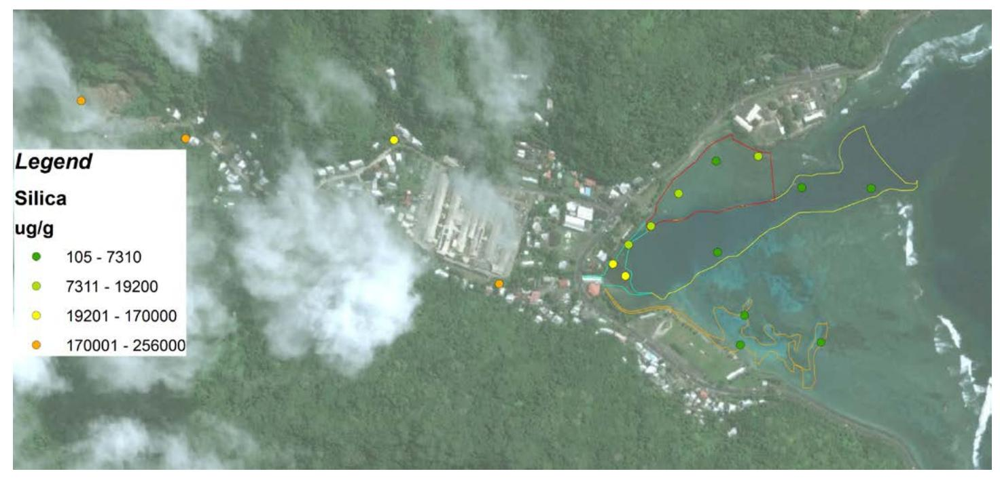

Figure 43: Silicon concentrations in sediments. January 2014.

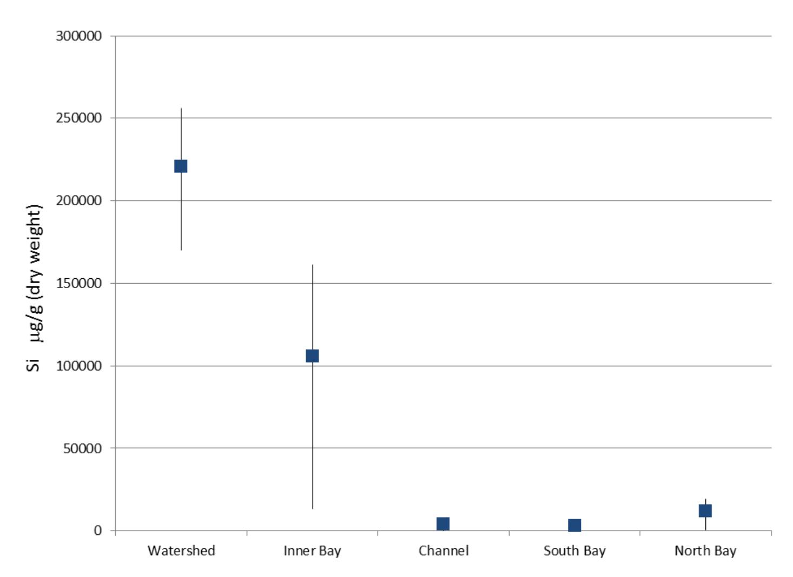

Figure 44: Sediment silicon concentrations by strata. Squares are mean values; lines show maximum and minimum values. There were no statistically significant differences between the Bay strata (Dunn's test, α=0.05).

# **Tin**

*Background:* Tin (Sn) is a pliable metallic element that naturally occurs in the Earth's crust. It can exist as either as an inorganic or organic compound. Mining and use of tin has increased the amount of tin present in the environment.

*Uses:* Tin is used in metal coatings to prevent corrosion (e.g. tin-coated steel), a variety of alloys, window glass, fire retardants and in anti-foulant boat paints (RSC 2014k).

*Environmental effects:* Tin has no known biological role and the elemental metal is generally non-toxic. However, organic forms, especially butyltins used in boat paints, can be very toxic to marine organisms (RSC 2014k). *Sediment Concentrations in Faga'alu:* Sediment concentrations of tin in Faga'alu ranged from 0.27 mg/g to 15.4 mg/g, with a mean of 4.5 mg/g.

*Comparison to Sediment Quality Guidelines:* There are no sediment quality guidelines for tin.

*Spatial Patterns:* Qualitatively, sediment concentrations are similar between the watershed sites and the bay sites, with the exception of the North Bay stratum, which has elevated concentrations of Sn. There are no statistically significant (Dunn's test, a=0.05) differences between the strata of the Bay.

*Discussion:* Tin was not measured in a previous study in the area. (CH2MHill 2007). While there are no statistically significant differences between the strata, it is interesting to note that the highest observed value is not in the watershed, as would be expected if erosional/natural sources were dominant, nor in the channel which would be expected if butyltins associated with boats were a strong source, but on the north shore, near the old Department of Defense landfill located at the site of the current school. Tin was not well correlated with either sediment grain size, suggesting that sediment characteristics alone are not driving this pattern. It is possible that prevailing current patterns in the Bay, which push water from the mouth of the stream to the north, are playing a role here, but because the concentrations of tin in the watershed are lower than observed in the north bay stratum, there is likely some source other than the stream.

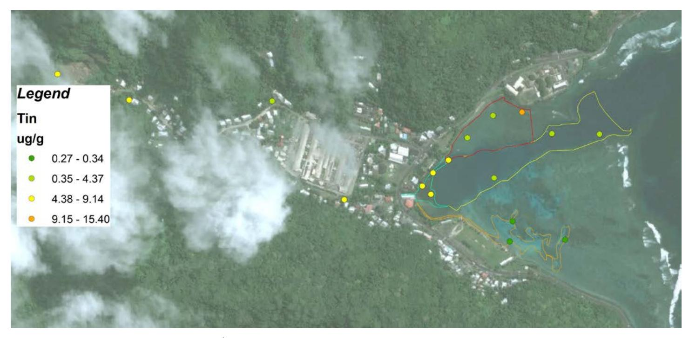

Figure 45: Tin concentrations in sediments. January 2014.

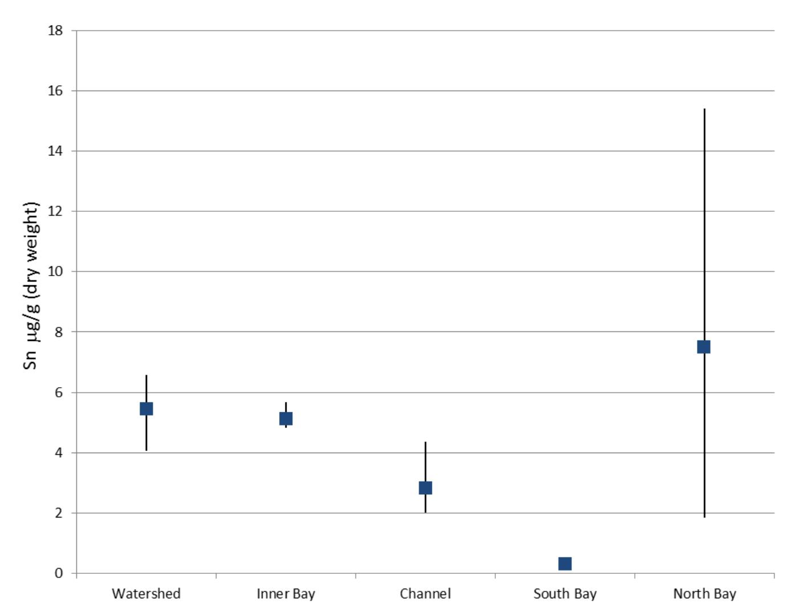

Figure 46: Sediment tin concentrations by strata. Squares are mean values; lines show maximum and minimum values. There were no statistically significant differences (Dunn's test, α=0.05) between Bay strata.

# **Sediment Grain Size – Percent Fines**

*Background:* Sediment grain size characteristics are usually summarized as percentages of clay (1-4 mm in diameter), silt (4 to 62.5 mm), sand (62.5 mm to 2 mm) and gravel (> 2 mm). This can further be simplified to the percent fines, defined as clay plus silt.

*Environmental relevance:* Grain size is both shaped by and influences the environment around it. Sediment size is influenced by geology, weathering rates and biologic inputs (e.g. calcium carbonate sand). Grain size influences the species and abundance of benthic infauna, as well as the potential for a given sediment to sequester contaminants. Fine size sediments tend to contain more contaminants than coarse sediments due to increased surface area.

*Sediment Grain Size in Faga'alu:* Sediment composition in the Bay and watershed ranged from 1% fines (silt plus clay) to 16.5% fines.

*Spatial Patterns:* Watershed stream sites were generally very rocky and it was difficult to find loose sediment to sample. The area with the largest percentage of fine sediment materials was the channel. Reef areas in the south stratum have primarily calcium carbonate sand sediments.

*Discussion:* Sediment grain size, expressed as percent fines, is not well correlated with any of the contaminants measured in this study. This is similar to what has been observed in other tropical systems (e.g. Whitall 2014) and may be related to the relatively coarse nature of the sediments (coralline sand and gravel). This suggests that sediment grain size alone is not the cause of the observed spatial differences in contaminants levels in this system.

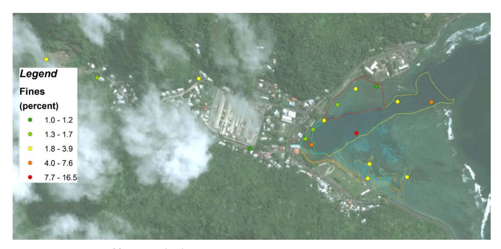

Figure 47: Percentage of fine grained sediments. January 2014.

# **Sediment Characterstics – Total Organic Carbon**

*Background:* Organic carbon can result from geologic weathering, or from biologic processes. Total organic carbon content (TOC) is expressed as a percentage.

*Environmental relevance:* TOC is both shaped by and influences the environment around it. Organic carbon can be influenced by geology, weathering rates and biologic inputs. Sediments rich in organic carbon are a better substrate for microbial populations, and sediments high in organic carbon tend to harbor more contaminants due to the binding capacity of organic molecules.

*Sediment Grain Size in Faga'alu:* Sediment TOC in the Bay and watershed ranged from 0.4% to 2.85%.

*Spatial Patterns:* There were no strong spatial patterns in TOC.

*Discussion:* Total organic carbon, expressed as a percent, is not well correlated with any of the contaminants measured in this study. This may be related to the relatively low amount of organic carbon in the system, possibly due to in situ production of inorganic carbon (calcium carbonate from reefs). This suggests that TOC alone is not the cause of the observed spatial differences in contaminants levels in this system.

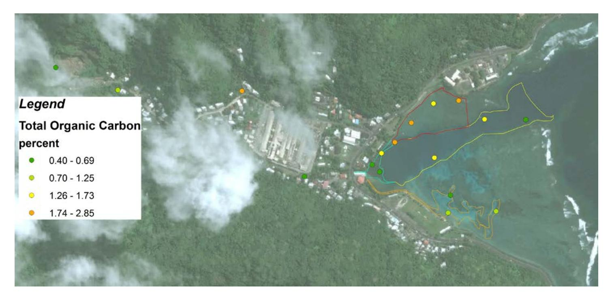

Figure 48: TOC (%) concentrations in sediments. January 2014.

# *Clostridium perfringens*

*Background: Clostridium perfringens* is a bacterium associated with human and animal waste. It is gram positive and anaerobic. The bacterium forms spores which can be sampled in sediments.

*Environmental relevance: Clostridium perfringens* can cause food poisoning in humans, but from a coastal ecology perspective, it is useful as a tracer of human and animal fecal matter.

*Sediment Concentrations in Faga'alu:* Sediment concentrations of *Clostridium perfringens* in Faga'alu ranged from 0 CFU/g (Clostridium Forming Units per gram) to 1722 CFU/g.

*Spatial Patterns:* There were no statistically significant (Dunn's Test, a=0.05) differences between strata within the Bay.

*Discussion:* Although *Clostridium perfringens* can lead to food poisoning in humans, there are no environmental criteria for acceptable levels in sediments. Likely sources of the bacteria include septic systems within the watershed and domesticated animals, especially free roaming dogs, which are common in the area. The bacteria were detected at all sites except for one in the South Bay. Widespread occurrence is fairly typical of what has been observed in other coastal coral ecosystems (e.g. Whitall et al. 2014); however, levels of Clostridium forming units were high compared to national monitoring values (see Additional Analyses below).

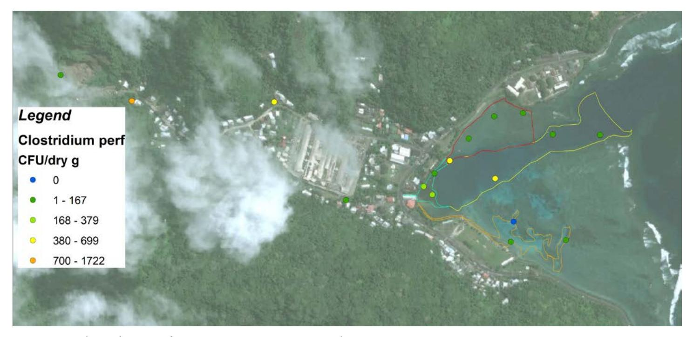

Figure 49: *Clostridium perfringens* concentrations in sediments. January 2014.

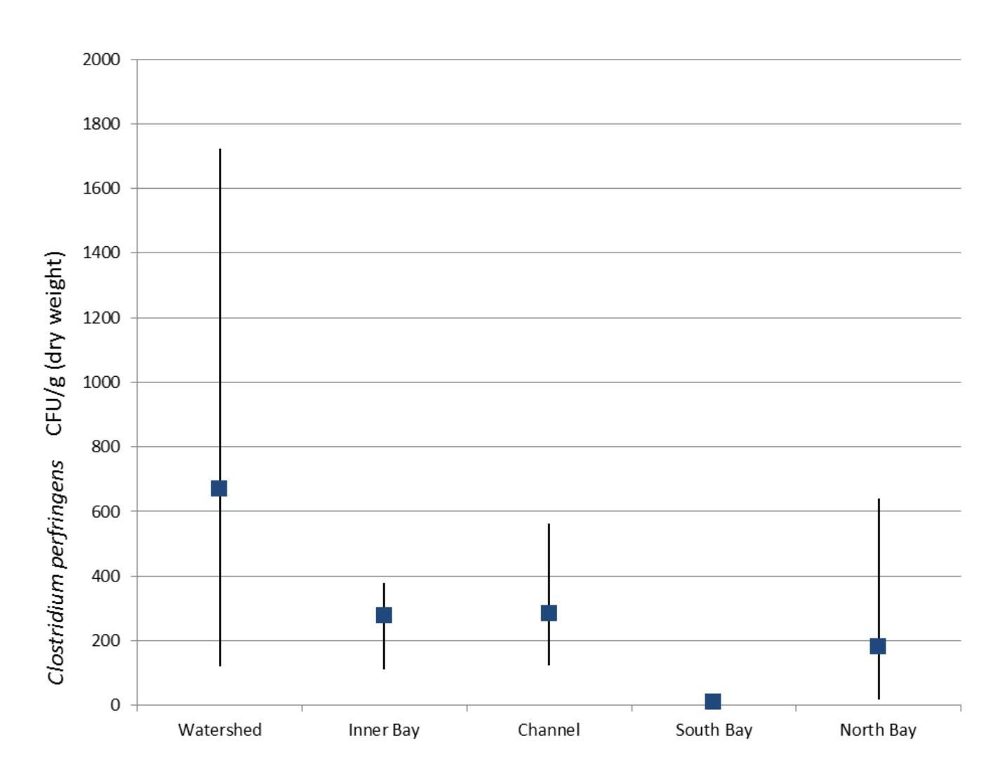

Figure 50: Sediment *Clostridium perfringens* concentrations by strata. Squares are means, vertical lines show the range of data. Letters denote statistically significant differences (Dunn's test, α=0.05).

# **Water Column Nutrients**

Background: Nutrients, including both inorganic (nitrate, nitrite, ammonium, and orthophosphate) and organic forms (e.g. urea, amino acids), are both essential building blocks of plant and animal life, as well as byproducts (waste) of human and animal functions. Nutrients in the environment are both naturally occurring (i.e. from biogeochemical cycling), as well as from human activities.

Uses: Nutrients can enter the environment from a wide variety of anthropogenic sources (Whitall et al. 2012), including fertilizers, animal waste, human waste (from both septic systems and wastewater treatment plants), fossil fuel combustion, industry and mining (i.e. of phosphate).

Environmental effects: Too few nutrients in a marine environment can stifle primary productivity, but the excess of nutrients (eutrophication) can lead to a cascade of environmental effects including algal blooms, hypoxia and deleterious effects on corals. Nutrients can indirectly affect corals by causing increases in macroalgae which can outcompete and overgrow corals (McCook et al. 2001) or by reductions in water transparency (Hallock and Schlager, 1986). Corals can be directly impacted by elevated levels of nitrogen and phosphorus by lowering fertilization success (Harrison and Ward, 2001), and reducing both photosynthesis and calcification rates (Marubini and Davis, 1996).

Concentrations of nutrients in Faga'alu: Concentrations of each analyte (minimum, maximum, mean, standard deviation) are shown in Table 6.

Spatial Patterns: Qualitatively, dissolved inorganic nitrogen (DIN, sum of inorganic species) is higher along the north shore, and phosphate is highest in the inner bay. However, there were no statistically significant differences between the strata (Dunn's test, a=0.05).

Discussion: Care should be taken in interpreting these data because there is only one time point. Nutrient concentrations are likely to change on the time scale of hours to days, and this "snapshot" of nutrient conditions in the Bay provides only limited utility. A more robust event based nutrient monitoring program in the Bay would be necessary to tease out spatiotemporal variability which may be useful to managers. However, with those caveats, several observations of these data can be made. First, although not statistically significant, spatial patterns suggest that phosphorus is reaching the Bay through the stream, whereas, both the stream and groundwater on the north shore may be contributing to inorganic nitrogen (Figures 51 and 52). This is not surprising as phosphorus tends to reach coastal waters primarily through runoff, whereas, the delivery mechanism for nitrate is more commonly groundwater. It is also possible that spatial differences in nutrient uptake or sequestration in sediments may be influencing spatial patterns in nutrient concentrations. Although widely agreed upon threshold values for nutrients in coral reef ecosystems have not been established, several publications should be noted. De'ath and Fabricus (2008) proposed nutrient threshold values for the Great Barrier Reef, but only for particulate nutrients (i.e. particulate nitrogen and particulate phosphorus) which are not comparable with the data presented here. Lapointe (1997) proposed nutrient threshold values for dissolved constituents in Caribbean coral reef ecosystems (1 mM DIN and 0.1 mM soluble reactive phosphorus). Acknowledging that there may be regional and species differences in nutrient responses, values observed in this study exceed those thresholds for both DIN and inorganic phosphorus. This, in combination with observed fecal indicators (Clostridium perfringens) in the Bay, suggests that further study is required to assess the spatial and temporal variability of nutrients and their impact on the ecosystem of the Bay.

```
Table 6: Nutrient concentrations (mg N/L or mg P/L)
```

| Analyte         |       | Min   | Max   | Mean  | Stdev |       |
|-----------------|-------|-------|-------|-------|-------|-------|
| Ammonium        |       | 0.020 | 0.152 | 0.062 | 0.044 |       |
| Urea            | 0.002 | 0.007 | 0.004 | 0.001 |       |       |
| Nitrate+Nitrite |       |       | 0.007 | 0.065 | 0.028 | 0.020 |
| DIN             | 0.032 | 0.159 | 0.089 | 0.047 |       |       |
| Total N         |       | 0.122 | 0.212 | 0.156 | 0.028 |       |
| Orthophosphate  |       |       | 0.002 | 0.057 | 0.015 | 0.020 |
| Total P         | 0.004 | 0.058 | 0.018 | 0.020 |       |       |

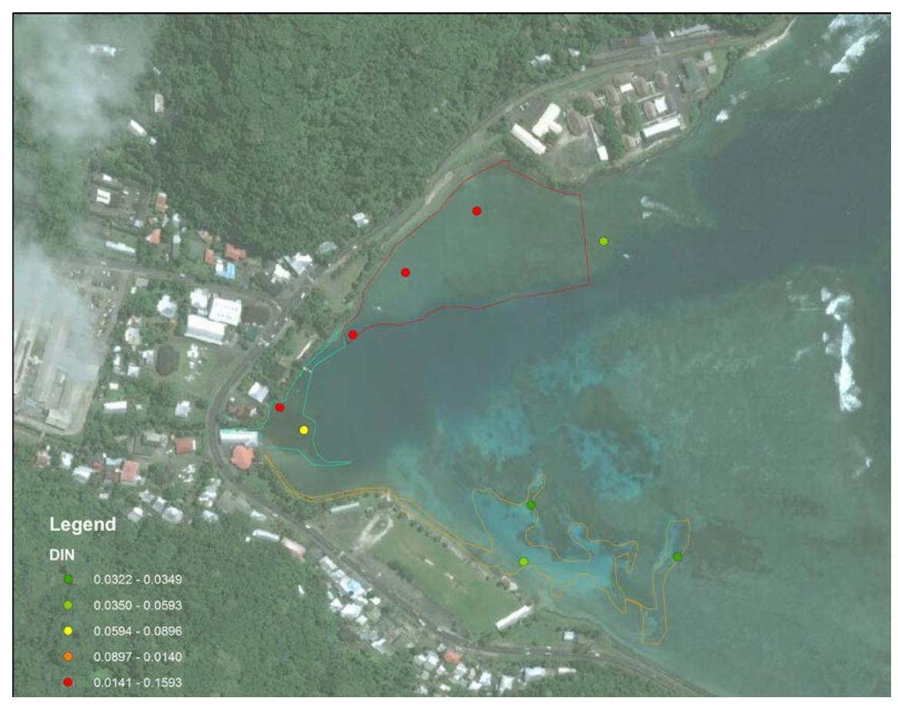

Figure 51: Surface water orthophosphate concentrations (ug P/L) in Faga'alu Bay, January, 2014.

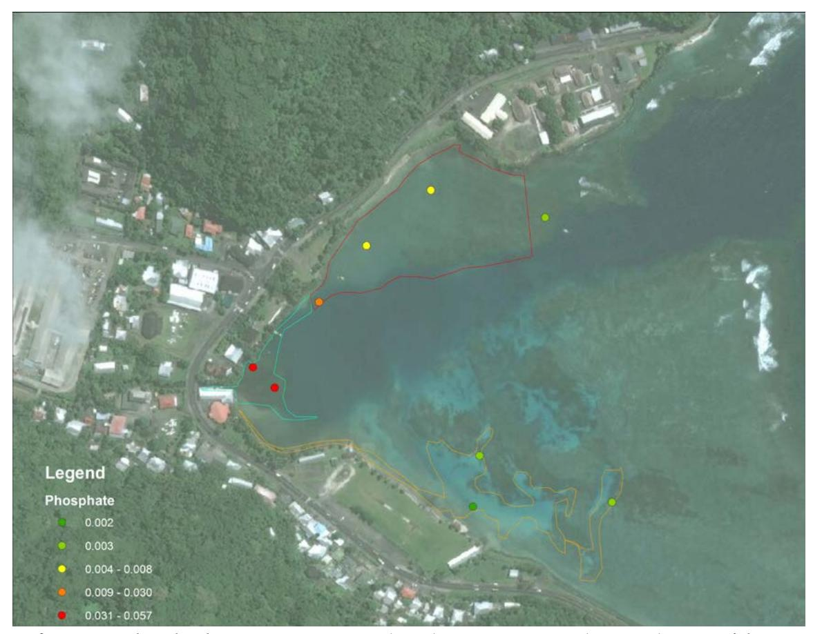

Figure 52: Surface water dissolved inorganic nitrogen (DIN) concentrations (mg N/L) in Faga'alu Bay, January, 2014.

# **Additional Analysis: Crustal Element Ratios**

Another way to potentially examine the nature of the source of metals quantified in sediments is to look at the relationship of crustal elements to each other. For the purposes of this comparison, we have operationally defined Al, Fe, Mn and Si as "reference elements" because they are plentiful in the earth's crust and are generally not considered to be pollutants. By comparing these reference elements with other metals that are widely used by humans, patterns may emerge which can shed light on whether these metals exist in enriched (i.e. greater than natural) quantities, or if their presence is merely due to natural crustal erosion. In order to make this comparison, each metal was correlated with the reference elements using a Spearman rank correlation. "Well correlated" is operationally defined here as a statistically significant relationship with a rho value of greater than 0.7. If a metal is well correlated with one or more reference element, it is more likely to have a natural (erosional) source (see also, Apeti et al. 2012b). Silver, nickel and zinc were well correlated (i.e. Spearman rho > 0.7) with all four elements (Al, Fe, Mn, Si) strongly suggesting that their sources are from natural/erosional sources (Table 7). This is especially noteworthy for Ni and Zn (Figures 53 and 54) which had observed values above the sediment quality guidelines, suggesting potential toxicity to benthic infauna. Arsenic, cadmium, mercury, antimony, selenium and tin were not well correlated with any of the four elements. Of these elements, only arsenic was elevated to potentially toxic levels and this lack of relationship with crustal elements strongly suggests an anthropogenic source (Figure 55).

Table 7: Correlations (Spearman rho) for metal contaminants with crustal "non-pollutant" metals. NS= not significant or not strongly correlated (rho<0.7)

|    | Al   | Fe   | Mn   | Si   |
|----|------|------|------|------|
| Ag | 0.80 | 0.79 | 0.82 | 0.85 |
| Al |      | 0.97 | 0.84 | NS   |
| As | NS   | NS   | NS   | NS   |
| Cd | NS   | NS   | NS   | NS   |
| Cr | 0.80 | 0.85 | 0.81 | NS   |
| Cu | 0.73 | 0.80 | 0.74 | NS   |
| Fe | 0.97 |      | 0.98 | 0.90 |
| Hg | NS   | NS   | NS   | NS   |
| Mn | 0.98 | 0.98 |      | 0.93 |
| Ni | 0.84 | 0.87 | 0.85 | 0.83 |
| Pb | NS   | 0.72 | NS   | NS   |
| Sb | NS   | NS   | NS   | NS   |
| Se | NS   | NS   | NS   | NS   |
| Si | 0.94 | 0.90 | 0.93 |      |
| Sn | NS   | NS   | NS   | NS   |
| Zn | 0.96 | 0.97 | 0.95 | 0.92 |

# **Additional Analysis: Impact of the Quarry on Metal Flux**

While the upper portion of the Faga'alu watershed is undeveloped and uninhabited, the lower watershed is dominated by two man made activities: the hospital and the quarry. The quarry has been identified as a major source of sediment erosion that reaches the Bay via the stream. In addition to the flux of sediment itself, another research question relevant to managers is: do the mining activities at the quarry increase the amount of heavy metals being carried by the stream? While a robust exploration of this question is beyond the scope of this study, it may be instructive to examine the differences in sediment metal concentrations above the quarry (site WS03) and immediately below the quarry (WS01). These data should be compared with caution because there is only one data point per site, which cannot capture any within site variability, but observed differences may be somewhat informative. Due to the limited amount of data, we operationally defined a large difference as >100% (i.e. a factor of 2). Chromium and nickel are both much larger (163% and 513%, respectively) directly below the quarry than above the quarry. However, both metals are actually higher on the northeast branch of the stream (site WS04) which is not influenced by the quarry. Total PAHs are over 800% higher immediately below the quarry when compared to above. While PAHs are higher elsewhere in the study area (most likely due to vehicle traffic), PAH levels below the quarry may be the result of heavy machinery used in mining. Additional research is needed in order to tease out the role of the quarry in heavy metals and PAHs. Future studies may shed more light on this relationship, as sediment management changes are currently underway at the mining operation that should greatly decrease sediment loss to the stream, and potentially also decrease the flux of metals and PAHs.

# **Additional Analysis: Putting Data into a National/Historical Context**

For analytes which exceeded the ERM, as well as analytes for which SQG have not been published, concentrations were compared against the nationwide historical NOAA NS&T dataset.

For aluminum, antimony, selenium, silicon and butyltins, concentrations in Faga'alu were relatively low compared to national values; no value was in the upper 10th percentile of observations nationally. This was also the case for most organic compounds.

Multiple analytes (Fe, Mn, Ni, Zn, Sn and *Clostridium perfringens*) had sites with concentrations in the top 10% of national historic values. Of these Fe, Mn, Ni and Zn have been identified as naturally occurring from crustal erosion, although this may be accelerated by mining activities at the quarry. Only one site for Sn was high; this site was located near the historical landfill and may represent metal pollution associated with that legacy land use. Fecal indicator (*Clostridium perfringens)* values in Faga'alu were high compared to national historic values. This is likely reflective of multiple factors, including the influence of septic systems and a large free range dog population. While it is possible that tropical temperatures could play a role, elevated national/historical values do not seem to be skewed towards warmer climates. More research would be needed to explore the role of temperature in the distribution of *Clostridium perfringens.*

# **Spatial Patterns in Exceedances of Sediment Quality Guidelines**

Figure 56 shows the number of SQG exceedances per site. In the Bay, seven of thirteen sites had no exceedances, two sites had one exceedance, and four sites had more than one exceedance. Of the sites with multiple exceedances, they were clustered in the Inner Bay and North Bay strata. This likely reflects the influence of the stream, as well as the prevailing currents in the Bay, which tends to push water towards the north shore. It is also possible that exceedances on the north shore are related to groundwater inputs from the historical Department of Defense landfill on the school site.

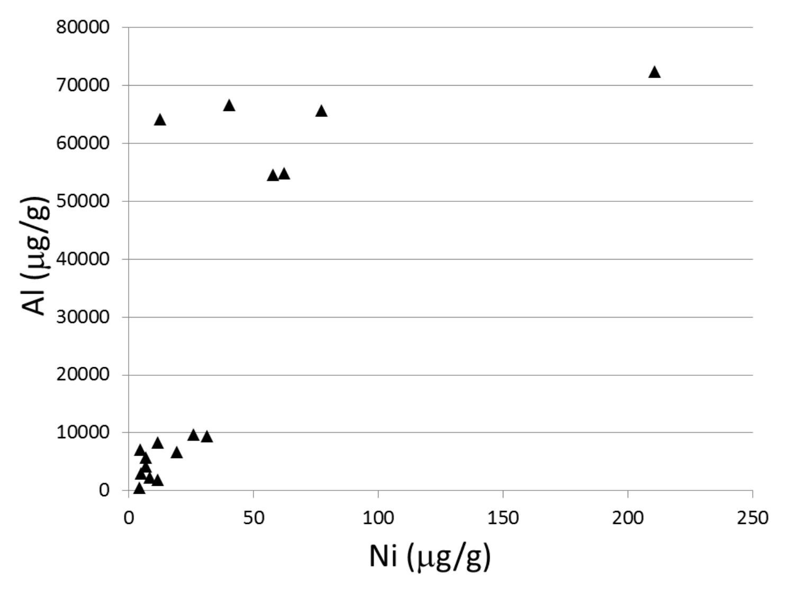

Figure 53: Sediment nickel versus sediment aluminum. Rho=0.84 at α=0.05.

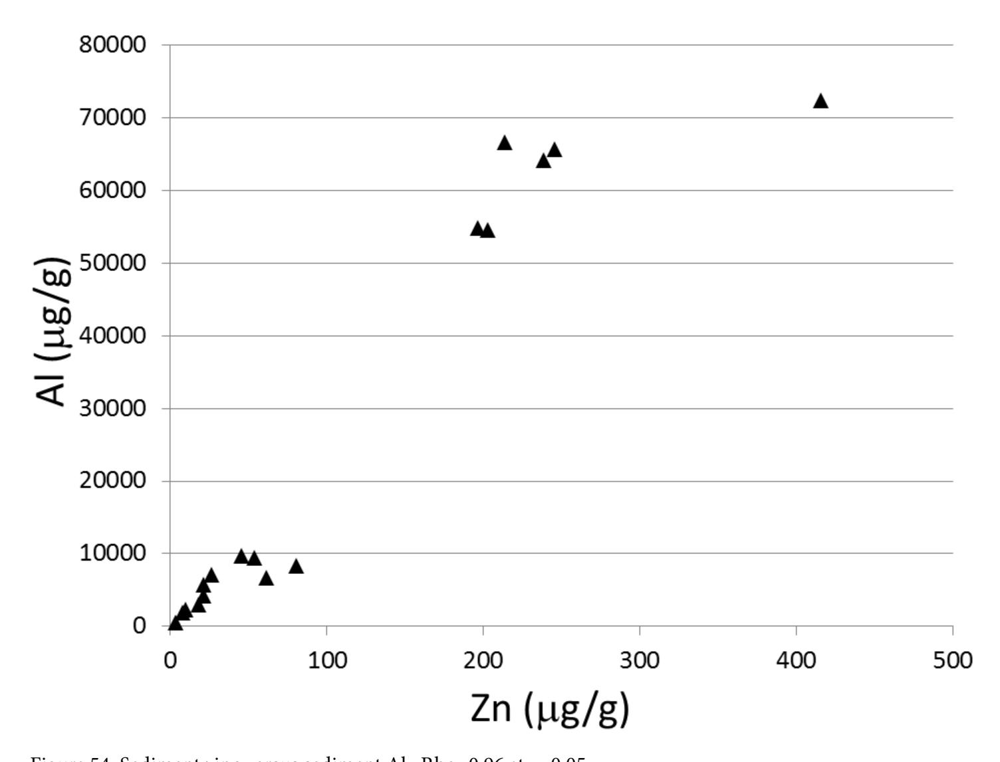

Figure 54: Sediment zinc versus sediment Al. Rho=0.96 at α=0.05.

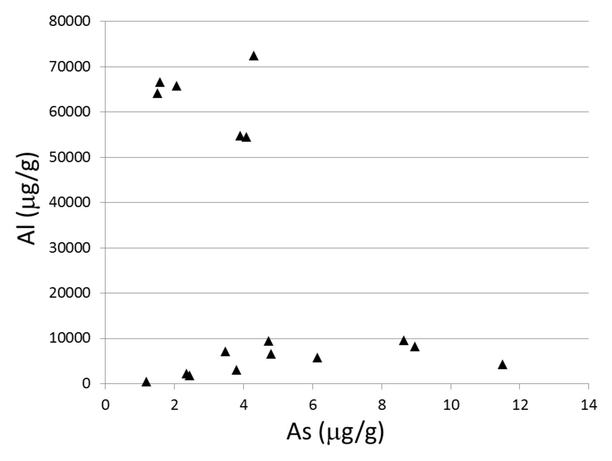

Figure 55: Sediment arsenic versus sediment aluminum. No statistically significant correlation.

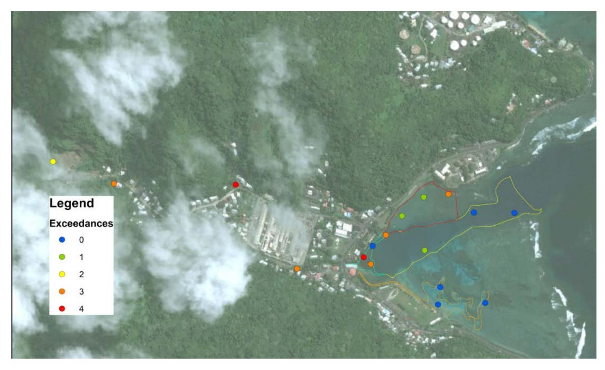

Figure 56: Number of sediment quality guideline (SQG) exceedances per site.

# **Conclusions**

This data set serves as an important baseline of surface sediment contaminants against which to measure future change, including the efficacy of ongoing watershed management activities (e.g. improved management practices at the quarry).

Pollution in the surface sediments of the Bay and in the watershed streams is generally low, although there are a few contaminants for which levels appear to be elevated above levels of concern including: arsenic, chromium, nickel, silver, zinc, chlordane, DDT, and PCBs. In some cases (e.g. nickel, silver and zinc) these elevated levels may be due to natural erosion of bedrock, although this erosion may be accelerated by mining activities at the quarry. In other cases (arsenic, PCBs, DDT), there is some evidence that the legacy landfill beneath the elementary school may be a potential source of pollution through groundwater leaching. Additional research would be necessary to further understand the role the landfill may be playing in the health of the Bay.

Possible future studies could explore the extent to which these contaminants are being taken up by corals, as well as, species which may be harvested for human consumption such as octopus, sea cucumbers or fish. Additionally, future work could quantify the toxicity to benthic infauna through laboratory experiments. Other studies (e.g. Whitall et al. 2014) have quantified the accumulation of toxins in coral tissues, but currently there are no threshold values above which biological effect is likely. The development of coral tissue body burden guidelines would be an important next step in linking land based sources of pollution to direct ecological impact in coral reef ecosystems. The guidelines must take into account that sequestration of pollutants in corals is partitioned between tissue, zooxanthellae and skeleton, with most metals occurring in highest concentration in the zooxanthellae (Reichelt-Brushett and McOrist, 2003).

# **Acknowledgments**

Support for this work was provided by NOAA's Coral Reef Conservation Program and NOAA's National Centers for Coastal Ocean Science. The authors would like to thank a number of individuals without whom the field work would not have been possible including: Wendy Cover (NOAA-National Marine Sanctuaries) for dive support, and Hideyo Hattori (NOAA-Coral Reef Conservation Program), Kristine Bucchianeri (American Samoa Coral Reef Advisory Group), Kelley Anderson Tagarino (American Samoa Community College) and Beth Lumsden (NOAA-NMFS) for assistance with field logistics. This report also benefited greatly from comments from the following reviewers: Trent Biggs (San Diego State University), Kristine Bucchianeri (ASCRAG), Mia Comeros (ASEPA), Meagan Curtis (ASCRAG), Mike Fulton (NOAA), Ian Hartwell (NOAA), Alice Lawrence (ASDMWR), Alex Messina (San Diego State University), Tony Pait (NOAA) and Greg Piniak (NOAA). We would also like to thank Curt Storlazzi (USGS), Alex Messina (SDSU), Trent Biggs (SDSU) and Bernardo Vargas-Angel (NOAA) for valuable discussions about the geology and ecology of Faga'alu. Kevin McMahon provided excellent support in formatting this document for publication.

# **References**

Apeti, D.A., S.I. Hartwell, W.E. Johnson and G.G. Lauenstein. 2012a. National Status and Trends Bioeffects Progam: Field Methods. NOAA National Centers for Coastal Ocean Science, Center for Coastal Monitoring and Asssessment. NOAA NCCOS Technical Memorandum 135. Silver Spring, MD.27 pp.

Apeti, D., D. Whitall, A. Pait, Dieppa, A. Zitello, and G. Lauenstein. 2012b. Characterization of land-based sources of pollution in Jobos Bay, Puerto Rico: status of heavy metal concentration in bed sediment. Environ Monit Assess (2012) 184:811–830.

Armstrong, F. A. J., C. R. Stearns, et al. 1967. "The measurement of upwelling and subsequent biological processes by means of the Technicon Autoanalyzer and associated equipment." Deep-Sea Research 14(3): 381-389.

Bastidas, C. and E.M. Garcia. 2004. Sublethal effects of mercury and its distribution in the coral Porites astreoides. Marine Ecology Progress Series 267:133-143.

Batley, G. 1996. Distribution and fate of tributyltin. In: S. J. de Mora, editor, Tributyltin: A Case Study of an Environmental Contaminant. Cambridge University Press. Cambridge, England. 301 pp.

Bennett, R.F. 1996. Industrial manufacture and applications of tributyltin compounds. In: S. J. de Mora (Ed.), Tributyltin: A Case Study of an Environmental Contaminant. Cambridge University Press. Cambridge, England. 301 pp.

Bernhardt, H. and A. Wilhelms. 1967. The continuous determination of low level iron, soluble phosphate and total phosphate with the AutoAnalyzer. Technicon Symposium.

Besser, J.M. and K.J. Leib. 2007. Toxicity of Metals in Water and Sediment to Aquatic Biota. In: Integrated Investigations of Environmental Effects of Historical Mining in the Animas River Watershed, San Juan County, Colorado. USGS Professional Paper 1651.

Bryan, G.W. 1984. Pollution due to Heavy Metals and their Compounds, in Otto Kinne (ed.), Marine Ecology, Volume V, Part 3: Pollution and Protection of the Seas – Radioactive Materials, Heavy Metals and Oil (Chichester: John Wiley & Sons 1984), pp. 1289-1431

Code of Federal Regulations (CFR). 1998. PCB allowable uses provisions. 40 CFR 761.80, July 1998. Available at: http://www.access.gpo.gov/nara/cfr/cfr-Table3.-search.html.

CH2MHill. 2007. Report on Fate and Transport Analysis (Study Element 4) for the Pago Pago Harbor Sediment Toxicity Study. Prepared for American Samoa Environmental Protection Agency and U.S. Environmental Protection Agency.

Councell, T.B., K.U. Duckenfield, E.R. Landa, and E. Callender. 2004. Tire-wear particles as a source of zinc to the environment. Environ. Sci. Technol. 38: 4206-4214.

De'ath, G. and K.E. Fabricius. 2008. Water quality of the Great Barrier Reef: distributions, effects on reef biota and trigger values for the protection of ecosystem health. Final Report to the Great Barrier Reef Marine Park Authority. Australian Institute of Marine Science, Townsville.

Dermeche, S., F. Chahrour and Z. Boutiba. 2012. Evaluation of the toxicity of metal pollutants on embryonic development of the sea urchin Paracentrotus lividus (Lamarck,1816) (Echinodermata Echinoidea). Biodiversity Journal 3: 165-172.

Edullantes, B. and R.P. Galapate. 2014. Embryotoxicity of Copper and Zinc in Tropical Sea Urchin Tripneustes gratill. Science Diliman 26: 25-40

Eisler, R. 1985. Cadmium hazards to fish, wildlife, and invertebrates: a synoptic review. U.S. Fish and Wildlife Service Biological Report 85(1.2). 30 pp.

Eisler, R. 1986. Chromium hazards to fish, wildlife, and invertebrates: a synoptic review. U.S. Fish and Wildlife Service Biological Report 85(1.6). 60 pp.

Eisler, R. 1988. Arsenic hazards to fish, wildlife, and invertebrates: a synoptic review. U.S. Fish and Wildlife Service Biological Report 85(1.12). 65 pp.

[Eisler](http://www.sciencedirect.com/science?_ob=ArticleURL&_udi=B6V7H-41DHWYK-2&_user=9407112&_coverDate=02%2F28%2F2001&_rdoc=1&_fmt=high&_orig=search&_sort=d&_docanchor=&view=c&_searchStrId=1394790102&_rerunOrigin=scholar.google&_acct=C000060967&_version=1&_urlVersion=0&_userid=9407112&md5=1e38a7bbdd7247cf44e0ccf092ce277a#bbib6), R. 1998. Copper hazards to fish, wildlife, and invertebrates: a synoptic review (Contaminant Hazard Reviews Report No. 33). US Department of the Interior and US Geological Survey. 1998.

EPA (U.S. Environmental Protection Agency). 1980. Ambient Water Quality Criteria for Antimony. [http://water.](http://water.epa.gov/scitech/swguidance/standards/criteria/upload/AWQC-for-Antimony_1980.pdf) [epa.gov/scitech/swguidance/standards/criteria/upload/AWQC-for-Antimony\\_1980.pdf](http://water.epa.gov/scitech/swguidance/standards/criteria/upload/AWQC-for-Antimony_1980.pdf)

EPA (U.S. Environmental Protection Agency). 1990. Guides to Pollution Prevention: Selected Hospital Waste Streams. Center for Environmental Research Information. Office of Research and Development.

EPA (U.S. Environmental Protection Agency). 1997. Management of polychlorinated biphenyls in the United States. Environmental Protection Agency. Available at: [http://www.chem.unep.ch/pops.](http://www.chem.unep.ch/pops. ) Office of Pollution Prevention and Toxics, U.S. Environmental Protection Agency. 6 pp.

EPA (U.S. Environmental Protection Agency). 2000. Hazard Summary for Chlordane. [http://www.epa.gov/](http://www.epa.gov/ttnatw01/hlthef/chlordan.html) [ttnatw01/hlthef/chlordan.html](http://www.epa.gov/ttnatw01/hlthef/chlordan.html)

EPA (U.S. Environmental Protection Agency). 2001. 2001 Update of Ambient Water Quality Criteria for Cadmium. EPA-822-R-01-001

EPA 2002. Environmental Best Practices for Health Care Facilities: Eliminating Mercury in Hospitals. [http://www.](http://www.epa.gov/region9/waste/p2/projects/hospital/mercury.pdf) [epa.gov/region9/waste/p2/projects/hospital/mercury.pdf](http://www.epa.gov/region9/waste/p2/projects/hospital/mercury.pdf)

EPA (U.S. Environmental Protection Agency). 2004. Aquatic Life Criteria for Tributyltin (TBT) Fact Sheet. [http://](http://water.epa.gov/scitech/swguidance/standards/criteria/aqlife/tributyltin/fs-final.cfm) [water.epa.gov/scitech/swguidance/standards/criteria/aqlife/tributyltin/fs-final.cfm](http://water.epa.gov/scitech/swguidance/standards/criteria/aqlife/tributyltin/fs-final.cfm)

EPA (U.S. Environmental Protection Agency). 2005. Toxicological Review of Zinc and Compounds. EP-A/635/R-05/002

EPA (U.S. Environmental Protection Agency). 2006. Pesticide News Story: Remaining Lindane Registrations Cancelled

[http://www.epa.gov/oppfead1/cb/csb\\_page/updates/2006/lindane-order.htm](http://www.epa.gov/oppfead1/cb/csb_page/updates/2006/lindane-order.htm)

EPA (U.S. Environmental Protection Agency). 2009. DDT regulatory history: a brief survey (to 1975). Online: http://www.epa.gov/history/topics/ddt/02.htm.

EPA (U.S. Environmental Protection Agency). 2014. Aquatic Life Water Quality Criteria for Selenium. EPA-820-F-14-005.

EPA (U.S. Environmental Protection Agency). 2015. Aldrin/Dieldrin. <http://www.epa.gov/pbt/pubs/aldrin.htm>

Goh, B. 1991. Mortality and settlement success of Pocillopora damicornis planula larvae during recovery from low levels of nickel. Pacific Science 45: 276-286.

Guzmán, H.M. and E.M. García. 2002. Mercury levels in coral reefs along the Caribbean coast of Central America. Mar Pollut Bull 44:1415–1420

Hallock, P. and W. Schlager. 1986. Nutrient excess and the demise of coral reefs and carbonate platforms. Palaios 1: 389-398.

Hansen, H. P. and F. Koroleff. 1999. Determination of Nutrients. Methods of Seawater Analysis. K. Grasshoff, K. Kremling and M. Ernhardt. New York, Wiley-VCH: 159-251.

Harrison, P.L., and S. Ward. 2001. Elevated levels of nitrogen and phosphorus reduce fertilisation success of gametes from scleractinian reef corals. Marine Biology. 139: 1057-1068.

Harwood, J.E. and A.L. Kuhn. 1970. A colorimetric method for ammonia in natural waters. Water Research 4: 805 - 811.

Houk, P., D. Benavente, and S. Johnson. 2013. Watershed-based coral reef monitoring across Tutuila, American Samoa: Summary of decadal trends and 2013 assessment. Prepared for and submitted to American Samoa EPA.

Hunt, J.W., B.S. Anderson, B.M Phillips, R.S. Tieerdema, H.M. Puckett, M. Stephenson, D.W. Tucker and D. Watson. 2002. Acute and chronic toxicity of nickel to marine organisms: implications for water quality criteria. Environ Toxicol Chem. 21: 2423-30.

Hylland, K. 2006. Polycyclic aromatic hydrocarbons (PAH) ecotoxicology in marine ecosystems. Journal of Toxicology and Environmental Health, Part A 69: 109-123.

Kennedy, C.J., N.J. Gassman and P.J. Walsh. 1992. The fate of benzo[a]pyrene in the scleractinian corals Favia fragum and Montastrea annularis. Marine Biology 113: 3131-318.

Kimbrough, K.L. and G.G. Lauenstein (eds). 2006. Major and trace element analytical methods of the National Status and Trends Program: 2000-2006. Silver Spring, MD. NOAA Technical Memorandum NOS NCCOS 29. 19 pp.

Kimbrough, K.L., G.G. Lauenstein and W.E. Johnson (eds). 2006. Organic contaminant analytical methods of the National Status and Trends Program: Update 2000-2006. NOAA Technical Memorandum NOS NCCOS 30. 137 pp.

Ko, F.C, C.W. Chang and J.O. Cheng. 2014. Comparative study of polycyclic aromatic hydrocarbons in coral tissues and the ambient sediments from Kenting National Park, Taiwan. Environmental Pollution 185: 35-43.

Lapointe, B. 1997. Nutrient Thresholds for Bottom-Up Control of Macroalgal Blooms on Coral Reefs in Jamaica and Southeast Florida. Limnology and Oceanography 42: 1119-1131.

Long, E.R. and L.G. Morgan. 1990. The Potential for Biological Effects of Sediment-Sorbed Contaminants Tested in the National Status and Trends Program. NOAA Tech. Memo NOS OMA 52. NOAA, Seattle, WA. 175 pp.

Long, E.R., D.D. MacDonald, S.L. Smith, and F.D. Calder. 1995. Incidence of adverse biologival effects within ranges of chemical concentrations in marine and estuarine sediments. Environmental Management 19: 81-97.

Long, E.R., A. Robertson, D.A. Wolfe, J. Hameedi and G.M. Sloane. 1996. Estimates of the spatial extent of sediment toxicity in major U.S. estuaries. Environmental Science and Technology 30(12):3585-3592.

Long, E.R., L.J. Field and D.D. MacDonald. 1998. Predicting toxicity in marine sediments with numerical sediment quality guidelines. Environmental Toxicology and Chemistry 17(4): 714-727.

Long, E.R., and D.D. MacDonald. 1998. Recommended uses of empirically derived, sediment quality guidelines for marine and estuarine ecosystems. Human and Ecological Risk Assessment 4(5): 1019-1039.

McDonald, S.J., D.S. Frank, J.A. Ramirez, B. Wang and J.M. Brooks. 2006. Ancillary methods of the National Status and Trends Program: 2000-2006 Update. Silver Springs, MD. NOAA Technical Memorandums NOS NCCOS 28. 17 pp.

Markey, K.L., A.H Baird, C. Humphrey and A.P. Negri. 2007. Insecticides and a fungicide affect multiple coral life stages. Marine Ecology Progress Series 330:127-137.

Marubini, F., and P.S. Davies. 1996. Nitrate increases zooxanthellae population density and reduces skeletogenesis in corals. Marine Biology. 127: 319-328.

McCook, L.J., J. Jompa and G. Diaz-Pulido. 2001. Competition between corals and algae on coral reefs: a review of evidence and mechanisms. Coral Reefs 19:400-417.

Messina, A. and T. Biggs. 2014. Contributions of human activities to suspended-sediment yield during storm events from a steep, small, tropical watershed, American Samoa. Poster. American Geophysical Union meeting. San Diego, CA.

Metian, M., L. Hedouin, C. Ferrier-Pages, J.L. Teyssie, F. Oberhansli, E. Buschiazzo and M. Warnau. 2015. Metal bioconcentration in the scleractinian coral Stylophora pistillata: investigating the role of different components of the holobiont using radiotracers. Environmental Monitoring and Assessment 187: 178-188.

Neff, J.M. 1985. Polycyclic aromatic hydrocarbons. In: G.M. Rand and S.R. Petrocelli. Fundamentals of Aquatic Toxicology. Hemisphere Publishing Corporation. New York. 666 pp.

National Oceanic and Atmospheric Administration (NOAA). 2005. Atlas of the Shallow-Water Benthic Habitats of American Samoa, Guam, andthe Commonwealth of the Northern Mariana Islands. NOAA Technical Memorandum NOS NCCOS 8

National Oceanic and Atmospheric Administration (NOAA). 2015. National Status and Trends Data Portal. <http://egisws02.nos.noaa.gov/nsandt/>

National Park Service. 2015. Weather of American Samoa National Park. [http://www.nps.gov/npsa/planyourvisit/](http://www.nps.gov/npsa/planyourvisit/weather.htm) [weather.htm](http://www.nps.gov/npsa/planyourvisit/weather.htm)

Norwood, W.P., U. Borgmann, and D.G. Dixon. 2007. Chronic toxicity of arsenic, chromium and manganese to Hyalella azteca in relation to exposure and bioaccumulation. Environmental Pollution 147: 262-272.

Novelli, A.A., C. Losso, P.F. Ghetti, and A.V. Ghirardini. 2003. Toxicity of heavy metals using sperm cell and embryo toxicity bioassays with Paracentrotus lividus (Echinodermata: Echinoidea): Comparisons with exposure concentrations in the lagoon of Venice, Italy. Environmental Toxicology and Chemistry 22: 1295-1301.

Peachy, R.L. and D.G. Crosby. 1995. Phototoxicity in a coral reef flat community. In: Ultraviolet radiation and Coral Reefs; HIMB Tech Report #41.

Piercey, S.J, J.M Peter, W.D. Goodfellow and R.M. Herrington. 2010. Zinc-rich volcanogenic massive sulphide (VMS) Deposits. Conference paper: Zinc 2010. Ireland. [https://www.researchgate.net/publication/257498507\\_](https://www.researchgate.net/publication/257498507_Zinc-rich_volcanogenic_massive_sulphide_%28VMS%29_deposits) [Zinc-rich\\_volcanogenic\\_massive\\_sulphide\\_%28VMS%29\\_deposits](https://www.researchgate.net/publication/257498507_Zinc-rich_volcanogenic_massive_sulphide_%28VMS%29_deposits)

Reichelt-Brushett, A.J. and G. McOrist. 2003. Trace metals in the living and non-living components of scleractinian corals. Marine Pollution Bulletin 46: 1573-1582.

Reichelt-Brushett, A.J. and P.L. Harrison. 2005. The effect of selected trace elements on the fertilization success of several scleractinian coral species. Coral Reefs 24: 524-534.

Royal Chemistry Society. 2014a. Periodic Table – Chromium. [http://www.rsc.org/periodic-table/element/24/](http://www.rsc.org/periodic-table/element/24/chromium) [chromium](http://www.rsc.org/periodic-table/element/24/chromium)

Royal Chemistry Society. 2014b. Periodic Table – Silver. <http://www.rsc.org/periodic-table/element/47/silver>

Royal Chemistry Society. 2014c. Periodic Table – Aluminum. [http://www.rsc.org/periodic-table/element/13/alu](http://www.rsc.org/periodic-table/element/13/aluminium)[minium](http://www.rsc.org/periodic-table/element/13/aluminium)

Royal Chemistry Society. 2014d. Periodic Table–Antimony. [http://www.rsc.org/periodic-table/element/51/anti](http://www.rsc.org/periodic-table/element/51/antimony)[mony](http://www.rsc.org/periodic-table/element/51/antimony)

Royal Chemistry Society. 2014e. Periodic Table – Cadmium. [http://www.rsc.org/periodic-table/element/48/cad](http://www.rsc.org/periodic-table/element/48/cadmium)[mium](http://www.rsc.org/periodic-table/element/48/cadmium)

Royal Chemistry Society. 2014f. Periodic Table – Iron.<http://www.rsc.org/periodic-table/element/26/iron>

Royal Chemistry Society. 2014g. Periodic Table – Lead. <http://www.rsc.org/periodic-table/element/82/lead>

Royal Chemistry Society. 2014h. Periodic Table – Manganese. [http://www.rsc.org/periodic-table/element/25/](http://www.rsc.org/periodic-table/element/25/manganese) [manganese](http://www.rsc.org/periodic-table/element/25/manganese)

Royal Chemistry Society. 2014i. Periodic Table – Selenium. [http://www.rsc.org/periodic-table/element/34/seleni](http://www.rsc.org/periodic-table/element/34/selenium)[um](http://www.rsc.org/periodic-table/element/34/selenium)

Royal Chemistry Society. 2014j. Periodic Table – Silicon. <http://www.rsc.org/periodic-table/element/14/silicon>

Royal Chemistry Society. 2014k. Periodic Table – Tin. <http://www.rsc.org/periodic-table/element/50/tin>

Solbakken, J.E., A.H. Knap, T.D. Sleeter, C.E. Searle and K.H. Palmork. 1984. Investigation into the fate of 14C-labeled xenobiotics (napthalene, phenanthrene, 2,4,5,2',4',5'-hexachlorobiphenyl, octachlorostyrene) in Bermudian corals. Marine Ecology Progress Series 16: 149-154.

Storlazzi, C., A. Messina, O. Cheriton and T. Biggs. 2014. Eulerian and Lagrangrian Measurements of Water Flow and Residence Time in a Fringing Coral Reef Embayment. Poster Presentation. American Geophysical Union Annual Meeting.

U.S. Army Corps of Engineers. 2011. Site Inspection Report Matafao School Tutuila Island, American Samoa FUDS Project No. H09AS002601

U.S. Census. 2010. Population of America Samoa by Village. [http://www.census.gov/2010census/news/xls/as\\_vil](http://www.census.gov/2010census/news/xls/as_village_pop_counts.xls)[lage\\_pop\\_counts.xls](http://www.census.gov/2010census/news/xls/as_village_pop_counts.xls)

U.S. Department of Human Health and Services (USDHHS). 1995. Polycyclic aromatic hydrocarbons toxicology profile. Agency for Toxic Substance and Disease Registry (ATSDR). Atlanta, GA. 487 pp.

U.S. Department of Human Health and Services (USDHHS). 1999. Toxicological profile for cadmium. Agency for Toxic Substance and Disease Registry (ATSDR). Atlanta, GA. 439 pp.

U.S. DOI (Department of the Interior). 1998. Guidelines for Interpretation of the Biological Effects of Selected Constituents in Biota, Water and Sediment: Zinc. <http://www.usbr.gov/niwqp/guidelines/pdf/Zinc.pdf>

USGS 2000. Mercury in the Environment. Fact Sheet 146-00. <http://www.usgs.gov/themes/factsheet/146-00/>

Vargas-Angel, B and O. Vetter. 2012. Inter-Disciplinary Study of Flow Dynamics and Sedimentation Effects on Coral Colonies in Faga'alu Bay, American Samoa. Presentation to U.S. Coral Reef Task Force, August 2012. [http://](http://www.coralreef.gov/meeting28/pdf/bvargasangel.pdf) [www.coralreef.gov/meeting28/pdf/bvargasangel.pdf](http://www.coralreef.gov/meeting28/pdf/bvargasangel.pdf)

Whitall, D., A. Mason, A. Pait, L. Brune, M. Fulton, E. Wirth, and L. Vandiver. 2014. Organic and metal contamination in marine surface sediments of Guánica Bay, Puerto Rico Marine Pollution Bulletin 80: 293-301.

Whitall, D., A. Mason, and A. Pait. 2012. Nutrient Dynamics in Coastal Lagoons and Marine Waters of Vieques, Puerto Rico. Tropical Conservation Science Vol.5 (4):495-509, 2012

National Ocean Service

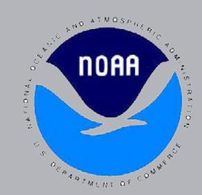


Pollution in Surface Sediments in Faga'alu Bay, Tutuila, American Samoa. NOAA Technical Memorandum NOSS/NCCOS 201