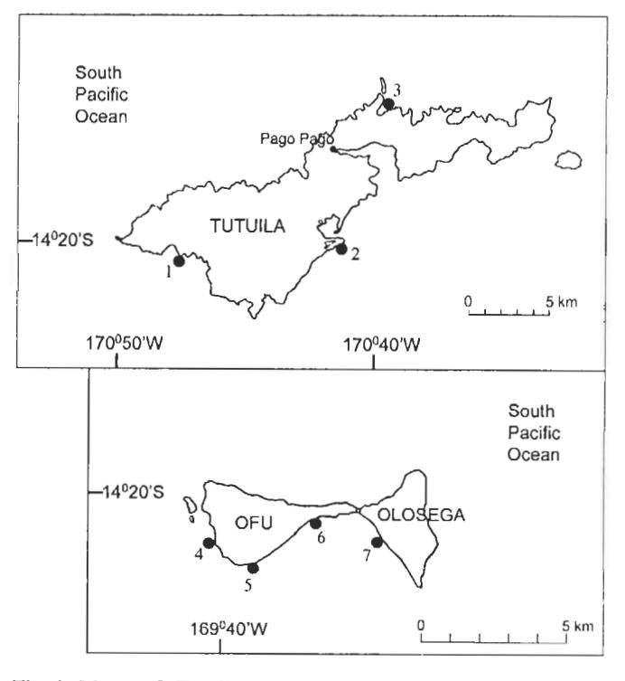
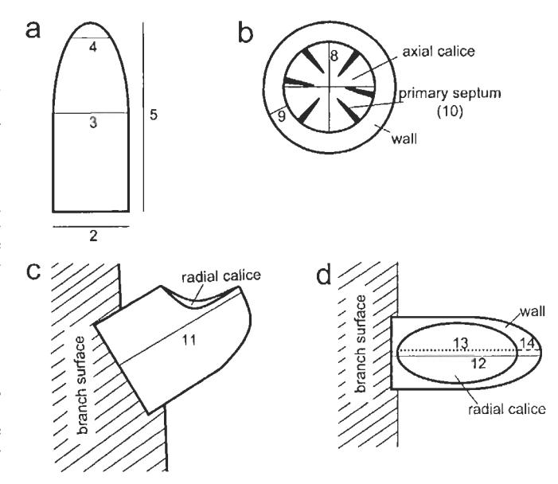
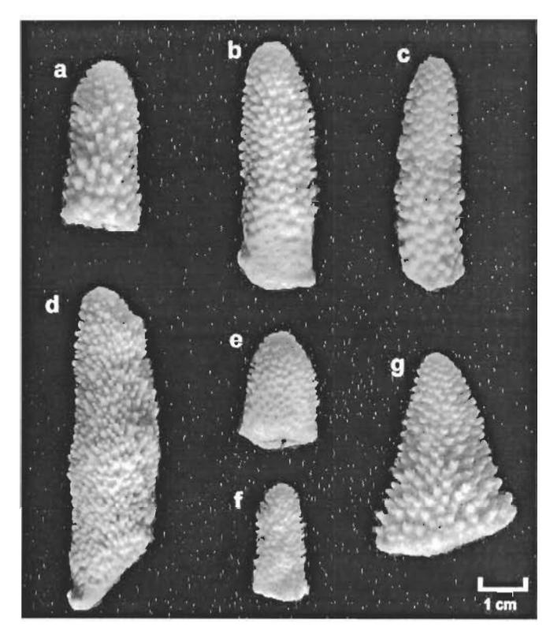
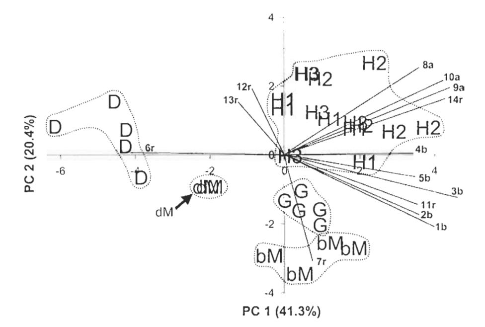
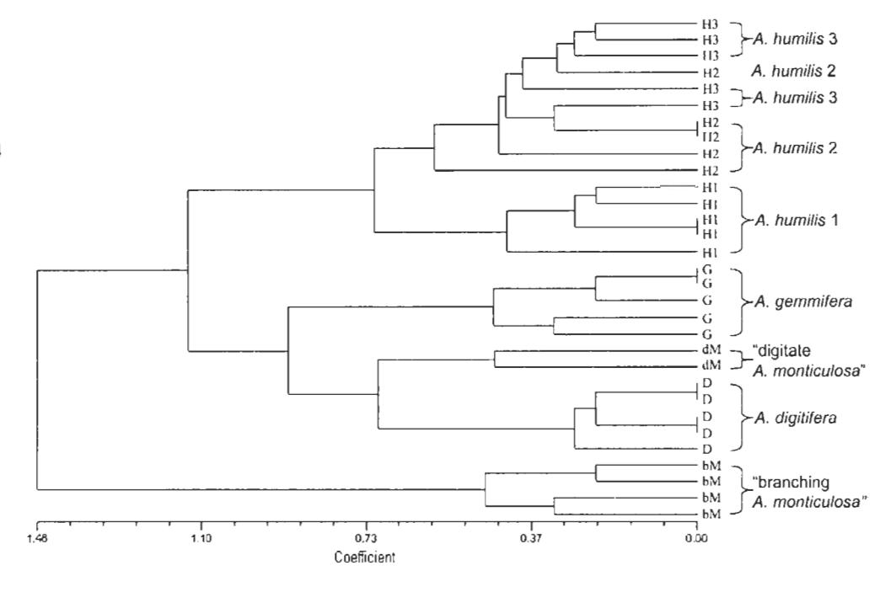
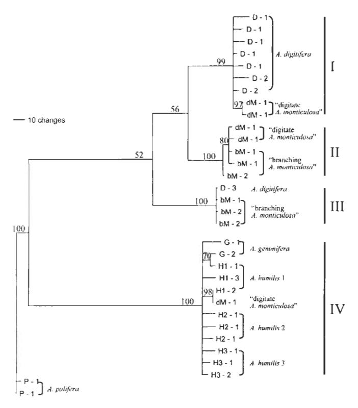

## REPORT

J. K. Wolstenholme · C. C. Wallace · C. A. Chen

# Species boundaries within the *Acropora humilis* species group (Cnidaria; Scleractinia): a morphological and molecular interpretation of evolution

Received: 23 April 2002 / Accepted: 2 December 2002 / Published online: 20 May 2003 © Springer-Verlag 2003

Abstract Species boundaries remain unresolved in many scleractinian corals. In this study, we examine evolutionary boundaries of species in the Acropora humilis species group. Five morphologically discrete units are recognized using principal components and hierarchical cluster analyses of quantitative and qualitative characters, respectively. Maximum parsimony and likelihood analyses of partial 28S rDNA sequences suggest that these morphological units diverged to form two evolutionarily distinct lineages, with A. humilis and A. gemmifera in one lineage and A. digitifera and two morphological types of A. monticulosa in the other. Low levels of sequence divergence but distinct morphologies of A. humilis and A. genunifera within the former lineage suggest recent divergence or ongoing hybridization between these species. Substantially higher levels of diverwithin and between A. digitifera A. monticulosa suggest a more ancient divergence between these species, with sequence types being shared through occasional introgression without disrupting morphological boundaries. These results suggest that morphology has evolved more rapidly than the 28S rDNA marker, and demonstrate the utility of using morphological and molecular characters as complementary tools for interpreting species boundaries in corals.

Electronic Supplementary Material Supplementary Material is available for this article if you access the article at http://dx.doi.org/10.1007/s00338-003-0299-0. A link in the frame on the left on that page takes you directly to the supplementary material.

J. K. Wolstenholme (🖂)

Department of Marine Biology and Aquaculture, James Cook University, Townsville, Queensland 4811, Australia

E-mail: jackie.wolstenholme@jcu.edu.au

Tel.: +61-7-47814801 Fax: +61-7-47251570

C. C. Wallace · J. K. Wolstenholme Museum of Tropical Queensland, 78–102 Flinders St., Townsville, Queensland 4810, Australia

C. A. Chen Institute of Zoology, Academia Sinica, Nankang, Taipei 115, Taiwan **Keywords** Acropora · Morphology · 28S rDNA · Species boundaries

#### Introduction

Species are the basic units of measurement of biodiversity and therefore their accurate definition is critical to understanding evolutionary processes and ecological dynamics. Yet, despite the importance of species in studies of living systems, their definition and formation have long represented one of the most elusive subjects in evolutionary biology (Palumbi 1994). In scleractinian corals, a number of issues impede our understanding of the extent to which currently defined species represent evolutionary entities. Species of corals are traditionally described using morphological characters (e.g. Wells 1956; Veron and Wallace 1984; Wallace 1999), with morphological discontinuities being used to determine the boundaries between species (Wallace and Willis 1994). However, morphological discontinuities between currently defined species of corals are often not clear. An inherent factor contributing to this lack of resolution is morphological plasticity (Lang 1984), due to environmental influences such as light and energy regimes as well as space availability (e.g. Veron and Pichon 1976; Willis 1985; Budd et al. 1994; Muko et al. 2000). Therefore, distinguishing between morphological plasticity and genetic variation, including the recognition of possible sibling species, is essential for accurate definition of species of corals (Knowlton and Jackson 1994).

Molecular techniques greatly enhance our understanding of the evolutionary relationships between morphologically defined species. Indeed, during the past decade, electrophoretic and DNA sequence data have already provided substantial insight into these issues. Species boundaries within the genus *Porites* were unable to be resolved using morphological characters (Brakel 1977; Jameson 1997) but were resolved using electrophoretic data (Weil 1992). Two species of *Montipora*,

previously synonymized as a single species, were distinguished on the basis of morphological and breeding criteria and have also been shown to be electrophoretically distinct (Stobart and Benzie 1994; Stobart 2000). Substantial morphological variability exists within the genus Montastraea (e.g. Foster 1985; Weil and Knowlton 1994). However, whether this variation represents separate species or morphotypes within a single polymorphic species continues to be debated (Lopez et al. 1999; Medina et al. 1999). Near or complete concordance of morphological and genetic characters has been demonstrated between species within the genera Porites, Goniastrea, and between two species of Acropora (A. palifera and A. cuneata) (Ayre et al. 1991; Budd et al. 1994; Garthwaite et al. 1994; Babcock and Miller 1997; Hunter et al. 1997). In contrast, genetic exchange appears to be ongoing between morphological species of Platygyra (Miller and Benzie 1997). Genetic overlap has also been demonstrated between some species within the genera Acropora and Madracis, while other species within these genera are genetically distinct for the same molecular marker (van Oppen et al. 2000; Diekmann et al. 2001).

In corals, hybridization during multi-species mass spawning events has been proposed as the means by which common gene pools are maintained between species of corals (Miller and Benzie 1997; Hatta et al. 1999; Diekmann et al. 2001; van Oppen et al. 2001), and has been demonstrated to be possible under laboratory conditions (e.g. Willis et al. 1997). Based on this evidence, with additional support from karyotypic data, a reticulate evolutionary hypothesis has been proposed for scleractinian corals (Veron 1995; Kenyon 1997). Conversely, genetic overlap between species may merely be due to incomplete lineage sorting of ancestral genotypes, due to slow rates of molecular evolution in corals (Knowlton 2001).

Tracing the evolutionary history of scleractinian corals is clearly a very complex task but one fundamental to defining species boundaries within the Scleractinia. This is particularly true for the genus Acropora, the largest extant genus of scleractinian corals (Veron and Wallace 1984; Wallace 1999), with recently proposed phylogenies based on morphological characters (Wallace 1999) and molecular sequence data (van Oppen et al. 2001) suggesting conflicting patterns of evolution. Fossil records indicate that the high diversity of this genus appears to be the result of relatively recent and rapid speciation in the Indo-Pacific during and since the Miocene (Wallace 1999). Consequently, unresolved morphological and genetic boundaries between currently described species, and the ability of some species to interbreed under laboratory conditions (Wallace and Willis 1994; Willis et al. 1997), could indicate that many species of Acropora are still in the process of diverging.

In this paper, we examine the evolutionary relationships between species within the *A. humilis* species group in American Samoa, using morphological and molecular data. The purpose of the morphological analyses was to

define morphological groupings of corals, with the aim of determining whether morphological entities can be recognized within currently described species, or alternatively whether currently described species merge to form larger overlapping morphological entities. The morphological entities defined in this study were then analyzed using partial sequences of the 28S ribosomal DNA unit. Finally, we propose evolutionary relationships for the morphological entities, based on the combined results of the morphological and molecular data.

## Methods

#### Sampling

Field work was carried out in American Samoa in January 1999. Samples were collected from seven sites on the islands of Tutuila, Ofu, and Olosega (Fig. 1). Putative morphs, distinguished using field-recognizable and gross skeletal characters, were used as the sampling units in this study. Seven morphs were recognized from the *A. humilis* species group in American Samoa. Five colonies of each putative morph were sampled, except two rare forms for which only two and four colonies were sampled. All sites were exposed to very exposed. Each site was searched for morphs of the *A. humilis* species group from a depth of approximately 20 m up to the reef flat.

Samples for morphological and molecular analyses were collected from each colony sampled. All samples were used in the morphological analyses and representative samples for each putative morph were used in the molecular analysis. Samples were collected using the following protocol. First, the colony was photographed to record colony appearance and the distance between

Fig. 1 Maps of Tutuila and Ofu-Olosega, American Samoa; indicated sampling sites and *numbers* correspond with Table 3. The islands of Ofu and Olosega are approximately 100 km east of Tutuila

branches for morphological analysis (see below). Color of colonies and polyps, whether polyps were extended, overall colony appearance, and any other distinguishing features were recorded. Five branches (the largest branches in the colony that did not have additional secondary branches developed) were collected for morphological analysis. Lastly, branch samples were collected for molecular analysis. Molecular samples for each colony were preserved in 95% (v/w) high-grade ethanol. The morphological branch samples were secured within labeled nylon bags and bleached in a sodium hypochlorite solution to remove all tissue, then rinsed in fresh water and dried. All morphological samples and corresponding molecular samples used in this study are deposited at the Museum of Tropical Queensland, Townsville, Australia (registration numbers G55587–G55617).

#### Morphological analyses

Analyses of morphometric and descriptive characters were used as complementary techniques to define morphological units within and between the morphs recognized in the field surveys. The morphometric analysis quantified characters as continuous variables and was therefore less subjective than the descriptive analysis. In contrast, the descriptive analysis allowed characters to be included that could not readily be quantified, particularly colony growth form, radial corallite shape, and coenosteal structure.

#### Morphometric characters

Characters used for the morphometric analysis (Table 1 and Fig. 2) were adapted from a previous study (Wallace et al. 1991). Character 1 (distance between branches) was measured from photos of live colonies, using Image Tool 2.00 (Wilcox et al. 1995–96). Characters 2–14 were measured directly from skeletal branch samples, using Vernier calipers for branch dimensions (characters 2–5) and a microscope and ocular graticule for corallite dimensions (characters 8–14). Characters 6 and 7 were measured by counting the number of corallites intersecting a 3-cm transect around the branch. Diameters and lengths of radial corallites were measured from mature corallites, defined as the largest radial corallites on the branch that did not have smaller corallites budding from their surface.

Morphometric characters were analyzed using principal components analysis (PCA). PCA is an exploratory tool, in which no a priori assumptions are made. PCA was therefore used to explore morphological distance, both within and between morphs. Characters 2–10 were measured from five branches. Characters 11–14 were measured for five radial corallites on each of five branches. The average value for each character for each coral colony was used in the analysis. The data matrix was standardized as a correlation matrix, to

Fig. 2 Diagrammatic branch and corallite dimensions measured in the morphometric analysis: a single branch; b upper view of axial corallite; c profile view of radial corallite; and d upper view of radial corallite. *Numbers* correspond with characters 2–5 and 8–14 listed in Table 1. Characters 1, 6, and 7 are described in Table 1 and in the 'Methods' section

equally weight the branch and corallite measurements. Analysis was carried out in SPSS 9.0, using the factor analysis option.

#### Descriptive characters

Characters used for the descriptive analysis are listed in Table 2 and were adapted from a previous study (Wallace 1999). The same colonies and branch samples used in the morphometric analysis were used in this analysis. Characters 1 and 2 were coded from photos and field notes. Characters 3–20 were coded directly from the skeletal branch samples.

The descriptive characters were analyzed using hierarchical cluster analysis. As in the morphometric analysis, no prior assumptions were made about the relationships between colonies. Analysis was carried out using NTSYSpc 2.10d (Rohlf 1986–2000), using the sequential agglomerative hierarchical nested (SAHN) cluster analysis option. The clustering method used was the Unweighted Pair-Group Method using Arithmetic Averages (UPGMA).

Table 1 Morphometric characters measured in this study

| No. | Character                  | Code     | Description                                                                                  |
|-----|----------------------------|----------|----------------------------------------------------------------------------------------------|
| 1   | Branch spacing             | brdist   | Distance to five nearest branches                                                            |
| 2   | Basal branch diameter      | diambase | Diameter at base of branch                                                                   |
| 3   | Mid branch diameter        | diammid  | Diameter at mid-point of branch length                                                       |
| 4   | Branch tip diameter        | diamtip  | Diameter 5 mm from tip of branch                                                             |
| 5   | Branch length              | brlength | Distance from tip to base of branch                                                          |
| 6   | Radial crowding            | radcor   | Average number of regular radial corallites per three transects                              |
| 7   | No. of subimmersed radials | subimm   | Average number of subimmersed radial corallites per three transects                          |
| 8   | Diameter of axial calice   | axcal    | Average distance between inner walls of axial corallite, measured as perpendicular diameters |
| 9   | Axial wall thickness       | axwall   | Width of axial wall                                                                          |
| 10  | Septal length              | axsepta  | Average length of primary septa (usually six) in axial corallite                             |
| 11  | Profile length             | rcprolen | Maximum distance from base to outer edge of corallite                                        |
| 12  | Corallite diameter         | rcordiam | Maximum diameter of corallite from inner to outer wall                                       |
| 13  | Calice diameter            | rcaldiam | Maximum diameter of calice from inner to outer wall                                          |
| 14  | Outer wall thickness       | rewall   | Thickness of outer wall of radial corallite                                                  |

Table 2 Descriptive morphological characters used in this study

| No. | Character                                  | Code     | States                                                                 | Coding |
|-----|--------------------------------------------|----------|------------------------------------------------------------------------|--------|
| 1   | Colony outline                             | determ   | Determinate from a focused origin                                      | 0      |
| 2   | Predominant outline                        | growth   | Indeterminate Arborescent/divergent                                    | 1 0 |
| 2   | Fredommant outline                         | growin   | Corymbose                                                              | 1      |
|     |                                            |          | Digitate                                                               | 2      |
| 3   | Branch structure                           | axvsrad  | Axial dominated                                                        | 0      |
|     | _                                          |          | Axials ≅ radials                                                       | 1      |
| 4   | Coenosteum                                 | coentype | Same on and between radial corallites                                  | 0      |
| 5   | Coenosteum on                              | radcoen  | Different on and between radial corallites Costate or reticulo-costate | 1 0 |
| 3   | radial corallites                          | radeoen  | Open spinules                                                          | 1      |
| 6   | Coenosteum between                         | axcoen   | Reticulo-costate                                                       | Ô      |
|     | radial corallites                          |          | Reticulate                                                             | 1      |
|     |                                            |          | Open spinules                                                          | 2      |
| 7   | Spinule shape                              | spinules | Single pointed, fine                                                   | 0      |
|     |                                            |          | Blunt, irregular, sturdy pointed                                       | 1      |
| 8   | Radial corallite sizes                     | resize   | Elaborate One size or graded, with occasional,                         | 2      |
| 0   | Radiai cofainte sizes                      | icsize   | scattered small radials                                                | U      |
|     |                                            |          | Two distinct sizes                                                     | 1      |
|     |                                            |          | Variable                                                               | 2      |
| 9   | Radial corallite inner wall                | rcinwall | Developed                                                              | 0      |
|     |                                            |          | Not developed                                                          | I      |
| 10  | Dadist and Winds                           |          | Reduced                                                                | 2      |
| 10  | Radial corallite shape                     | rcshape  | Tubo-nariform                                                          | 0 1 |
|     |                                            |          | Dimidiate Lipped                                                    | 2      |
|     |                                            |          | Tubular                                                                | 3      |
| 11  | Radial corallite openings                  | rcopen   | Oval                                                                   | 0      |
|     |                                            | •        | Rounded                                                                | 1      |
| 12  | Axial corallite diameter                   | axdiam   | Large, > 3.0 mm                                                        | 0      |
|     |                                            |          | Medium, 2.8–3.0 mm                                                     | 1      |
| 13  | Radial corallites                          | relsize  | Small, < 2.8 mm                                                        | 2      |
| 13  | Radiai Colamites                           | Teisize  | Large Medium                                                        | 1      |
|     |                                            |          | Small                                                                  | 2      |
| 14  | Maximum branch thickness                   | brthick  | > 25 mm                                                                | 0      |
|     |                                            |          | 20–25 mm                                                               | 1      |
|     |                                            |          | 15–20 mm                                                               | 2      |
| 15  | Branch tanon (tin = 2 mm                   | to       | <15 mm                                                                 | 3      |
| 13  | Branch taper (tip = 3 mm below branch tip) | taper    | Broad conical (base > twice tip) Conical (base broader than tip)       | 0 1 |
|     | below branch hp)                           |          | Terete (no to slight taper)                                            | 2      |
| 16  | Maximum branch length                      | brlength | ≥80 mm                                                                 | 0      |
|     |                                            | υ        | ≥70 mm                                                                 | 1      |
|     |                                            |          | ≥60 mm                                                                 | 2      |
|     |                                            |          | ≥50 mm                                                                 | 3      |
|     |                                            |          | ≥40 mm                                                                 | 4      |
| 17  | Radial crowding                            | crowding | ≥30 mm Radials do not touch                                         | 5 0 |
| 1 / | Radiai Growding                            | crowding | Some radials touch                                                     | 1      |
|     |                                            |          | Radials crowded, touching                                              | 2      |
| 18  | No. of axial corallite                     | axrings  | 2                                                                      | 0      |
|     | synapticular rings                         |          | 3–4                                                                    | 1      |
| 10  | Chalatal managity                          |          | >4                                                                     | 2      |
| 19  | Skeletal porosity                          | porosity | Radial walls porous Radial walls not porous                         | 0      |
| 20  | No. of radial corallite                    | rcrings  | 2–3                                                                    | 0      |
|     | synapticular rings                         |          | > 3                                                                    | 1      |

#### Molecular analysis

The 28S nuclear large subunit rDNA (domains 1 and 2) was used for the molecular analysis. DNA was extracted from branch fragments of approximately 3–4 g wet weight, based on protocols described by Chen et al. (2000) and Chen and Yu (2000). Branch fragments were ground to a fine powder in liquid nitrogen and mixed with an equal volume of DNA extraction buffer (5 M NaCl, 0.5 M EDTA, pH 8.0,

2% SDS), to which 100 μg/ml of proteinase K was added. The solution was incubated overnight in a water bath at 50 °C. DNA was extracted using phenol/chloroform and precipitated in absolute ethanol. Following precipitation, the genomic DNA was dried, resuspended in TE buffer, and stored at -20 °C. The target segments, domains 1 and 2 from 28S rDNA, were amplified using the primers 5S: 5′-GCCGACCCGCTGAATTCAAGCATAT-3′ and B35: 5′-CCAGAGTTTCCTCTGGCTTCACCCTATT-3′ (developed by

Chen et al. 2000). The amplification reaction used 100-200 ng of DNA template and BRL Tag polymerase in a 50-ul reaction, in the presence of the buffer supplied with the enzyme (as per manufacturer's instructions). PCR was performed in a PC-960G gradient thermal cycler using the following thermal cycles: 1 cycle at 95 °C (4 min); 30 cycles at 94 °C (30 sec), 50 °C (1 min), 72 °C (2 min); 1 cycle at 72 °C (10 min); 1 cycle at 25 °C (30 sec). PCR products were electrophoresed in a 0.8% agarose (FMC Bioproduct) gel in 1× TAE buffer to assess the yield. PCR products were cloned using the ligation kit, pGEM Teasy (Promega) and DH5α competent cells (BRL), under the conditions recommended by the manufacturers. Bacterial colonies containing the vector were picked with a sterile toothpick and cultured for 6-12 hours in a 4-ml LB nutrient solution and purified using a plasmid DNA mini-prep kit (Viogene). Nucleotide sequences were generated for pairs of complementary strands on an ABI 377 Genetic Analyzer using the ABI Big-dye Ready Reaction kit following standard cycle sequencing protocol. The sequences were submitted to GenBank under accession numbers AY139650-AY139681.

Sequences were initially aligned using ClustalX (Thompson et al. 1997) and then optimized manually within variable regions. The distance matrix comparing the pair wise differences was calculated in PAUP\* 4.0b10 (Swofford 2002), as were the maximum parsimony and maximum likelihood analyses. Maximum parsimony was run using the heuristic search option, with 10 random additions of sequences to search for the most parsimonious trees. Bootstrapping with 1,000 pseudoreplicates determined the robustness of clades, with branches supported by <50% collapsed. Analyses were run with gaps excluded from the analysis, as well as treating gaps as a fifth character. The most appropriate evolutionary model for the maximum likelihood analysis was selected using Modeltest (Posada and Crandall 1998). Maximum likelihood analysis was run using the heuristic search option, with 10 random additions of sequences. Bootstrapping with 500 pseudoreplicates determined the robustness of clades, with branches supported by < 50% collapsed.

Acropora palifera, of the subgenus Isopora, was used as the outgroup. This species was selected as an appropriate outgroup taxon because the two subgenera (Isopora and Acropora) are thought to have diverged early in the history of the genus, and the A. humilis species group occupies a basal position within the morphological phylogeny of the genus Acropora (Wallace 1999). The A. palifera sample used was collected by C.C.W. in September 1999 in the Togian Islands, central Sulawesi, Indonesia (Museum of Tropical Queensland registration number G55715).

#### Results

## Morphological analyses

The seven morphs recognized during field surveys (Fig. 3) clustered as five morphological units (Figs. 4 and 5). These morphological units correspond with the species A. humilis (Dana 1846), A. gemmifera (Brook 1892), A. digitifera (Dana 1846), and two forms (branching and digitate) of A. monticulosa (Brüggemann 1879). Characters describing each morph are summarised in Table 3. In both the quantitative and qualitative morphological analyses, all morphs except A. humilis formed discrete, non-overlapping units corresponding with the putative groupings (Figs. 4 and 5). The A. humilis morph comprises the remaining three undifferentiated putative groupings (A. humilis 1, A. humilis 2, and A. humilis 3). All morphs, except the two forms of A. monticulosa, were generally common at each of the seven sites surveyed. All colonies of the branching form

Fig. 3 Branch skeletons of each putative morph. Museum of Tropical Queensland registration numbers are listed in brackets after the name of each morph: a "A. humilis 1" (G55591); b "A. humilis 2" (G55593); c "A. humilis 3" (G55599); d "branching A. monticulosa" (G55617); e "digitate A. monticulosa" (G55612); f A. digitifera (G55602); g A. gemmifera (G55607)

of A. monticulosa were sampled at site 1 and both colonies of the digitate form of A. monticulosa at site 7 (Fig. 1). Data matrices used in the morphometric and descriptive analyses are available as electronic supplementary material (appendices I and II respectively).

### Morphometric characters

The relationships between the five morphs revealed by PCA of the morphometric characters are presented in Fig. 4, with each data point representing a single colony. Colonies of each of the five morphs (A. humilis, A. gemmifera, A. digitifera, "branching A. monticulosa," and "digitate A. monticulosa") formed discrete clusters. The morphometric characters quantified branch, axial corallite, and radial corallite dimensions. Characters quantifying radial corallites (size and spacing) were most useful for separating the five morphs. The three axial corallite characters were highly correlated, as were the five characters that quantified branch dimensions. The analysis therefore indicates that A. digitifera colonies were characterized by relatively crowded, small radial corallites and thin, short branches. The morph "branching A. monticulosa" was characterized by a high proportion of subimmersed radial corallites, which were

Fig. 4 PCA scatterplot of morphometric characters for principal components (PC) 1 and 2. Each data point in the PCA plot represents a single colony. Codes for each data point are indicated by codes for each morph as follows: H1 "A. humilis 1"; H2 "A. humilis 2"; H3 "A. humilis 3"; bM "branching A. monticulosa"; dM "digitate A. monticulosa"; D A. digitifera; G A. gemmifera. Envelopes highlighting the clusters of each morph were drawn by eye. Length and direction of vectors indicate the relative effect of each character on distribution of morphs within the plot. Numbers for each vector correspond with character codes in Table 1 and letters indicate vector type: b branch character; a axial character; r radial character. Two colonies of H3 and two colonies of dM almost overlay each other; one colony of H3 lies almost at the origin

oval rather than elongate in cross section. The three putative morphs of A. humilis were all strongly characterized by the axial characters and radial corallite wall thickness and width, with the radials tending to be widely spaced. The morphs "digitate A. monticulosa" and A. gemmifera were not strongly influenced by any particular characters. The short branches and relatively small, thin-walled axials were the most distinctive characters for the "digitate A. monticulosa" colonies and the high proportion of subimmersed radial corallites was the most distinctive character for colonies of A. gemmifera.

### Descriptive characters

Qualitative analysis of the morphological characters showed the same separation of morphs as the morphometric analysis, with colonies of each of the five morphs (A. humilis, A. gemmifera, A. digitifera, "branching A. monticulosa," and "digitate A. monticulosa") clustering as distinct groups. The relationships within and between the morphs, based on UPGMA analysis of the descriptive characters, are shown in Fig. 5. A high cophenetic correlation of 0.96 calculated for this dendrogram indicates that the pattern of clustering is a true representa-

tion of the original data set. Analysis of the descriptive characters, using both single and complete linkage methods (calculated separately and as a strict consensus tree) grouped colonies in a similar pattern to the UP-GMA analysis, differing only in branch lengths and the ordering of colonies within the *A. humilis* cluster.

As also demonstrated in the morphometric analysis, the two morphs of A. monticulosa clearly have very distinct morphologies. Colonies of "branching A. monticulosa" showed the greatest dissimilarity to all other morphs within the A. humilis species group, while colonies of "digitate A. monticulosa" shared most morphological characters with A. digitifera and A. gemmifera. Within the A. humilis cluster, "A. humilis 1" colonies formed a subcluster, while "A. humilis 2" and "A. humilis 3" colonies were not differentiated. Colonies of the putative morph "A. humilis 1" all had short branches and a different coenosteal structure compared with "A. humilis 2" and "A. humilis 3," while all other characters were shared between these three putative morphs.

# Molecular analysis

The major findings in this analysis, based on the sequences examined, were that the morphs A. digitifera, "branching A. monticulosa," and probably "digitate A. monticulosa" were distinct from the morphs A. humilis and A. gemmifera. Variability between sequences of the former three morphs was substantially greater than between the latter two morphs.

Cloned sequences from domains 1 and 2 of the 5' end of 28S rDNA were obtained from colonies of the seven putative morphs. In total, 32 clones from 15 coral colonies were sequenced. Sequence divergence ranged from 0–14.8% between morphs of the *A. humilis* species group, compared with 22.3–30.8% when compared with the *A. palifera* outgroup sequences. Nucleotide compo-

Fig. 5 Hierarchical cluster analysis (UPGMA) of descriptive morphological characters. Each branch of the dendrogram represents a single colony. Codes for each morph are the same as listed for Fig. 4

sition was similar for all clones, with an average GC content of 62.57%. GC content was slightly lower in clones isolated from morphs of the *A. humilis* species group (61.15–63.53%) compared with the two *A. palifera* outgroup sequences (64.98%).

The aligned sequences consisted of 907 positions, with individual sequences ranging in length from 782–851 bp. Within the aligned sequences, 635 positions were constant, 37 variable characters were not parsimony informative, and 235 (25.9%) were parsimony informative.

Maximum parsimony (MP) and maximum likelihood (ML) analyses grouped the sequences into four strongly supported clades. Sequences from A. digitifera and the two morphs of A. monticulosa were substantially more divergent than those from A. humilis or A. gemmifera. The phylogenetic tree from the MP analysis (Fig. 6, 50% majority-rule consensus tree based on 885,920 trees) formed two branches grouping clades I, II, and III separately from clade IV. There were only low levels of divergence, indicating high levels of similarity between sequences within each of the four clades. Clade I grouped all but one sequence from A. digitifera (seven sequences from two colonies) with the other sequence from a third colony grouping with "branching A. monticulosa" in clade III. Sequences from "digitate A. monticulosa" grouped in clades I and II, indicating that this morph shares sequence types with both A. digitifera and "branching A. monticulosa." Sequences from two colonies of "branching A. monticulosa" grouped in clades II and III, indicating that there were two distinct types present within each colony of this morph. The remaining clade IV contained all sequences from the A. humilis and A. gemmifera morphs in addition to one sequence from the digitate morph of A. monticulosa. This latter sequence from "digitate A. monticulosa"

appears to be an erroneous sequence for two reasons. First, this sequence is almost identical to one of the A. humilis sequences. Second, the sequences cloned from the A. humilis and A. gemmifera morphs have very low levels of divergence and are otherwise very distinct from all sequences cloned from the other morphs (Fig. 6). Negative controls were consistently clear in all PCR reactions and so the source of error is most likely to have occurred during cloning. It is possible that this sequence is a cloning artifact, although contamination may also be the source.

The four clades were identical in composition when gaps were excluded from the analysis or treated as a fifth character in the MP analysis. Treating gaps as a fifth character produced a tree with two differences to that in Fig. 6. A shorter branch connected the ingroup and outgroup sequences and bootstrap support increased for the branch grouping clades I and II from 56 to 91%. Analysis of the sequences using ML also produced four clades identical in composition to the MP analysis, with 70, 96, 99, and 100% bootstrap support for clades I-IV, respectively. The structure of the ML tree differed in that the four clades formed a polytomy (compared with the grouping of clades I-III as a single branch in the MP analysis), with a longer branch length separating the ingroup from the outgroup sequences. The GTR + G + Imodel (G = 0.5612 and I = 0.3768) was selected for the maximum likelihood analysis.

## **Discussion**

Synthesis of morphological and molecular findings

The seven putative morphs recognized in this study, within the A. humilis species group in American Samoa,

**Table 3** Descriptions of morphs recognized from the *Acropora humilis* species group in American Samoa in this study. Characters are described relative to the other morphs in this table. Characters that are most important for distinguishing morphs are highlighted in *bold*. Distinctive features of the three putative morphs of *A. humilis* are noted. Sites sampled correspond with sites in Fig. 1

|                            | Ushitat                                                                              |                                                                                                                                                                                 |                                                                               |                     |                                                                                                            |                                                                                                                                                |                                                                |
|----------------------------|--------------------------------------------------------------------------------------|---------------------------------------------------------------------------------------------------------------------------------------------------------------------------------|-------------------------------------------------------------------------------|---------------------|------------------------------------------------------------------------------------------------------------|------------------------------------------------------------------------------------------------------------------------------------------------|----------------------------------------------------------------|
|                            | nabilal                                                                              | Growth form                                                                                                                                                                     | Branches                                                                      | Axial corallites    | Axial corallites Radial corallites                                                                         | Colony color                                                                                                                                   | Sites sampled                                               |
| A. hunilis                 | Exposed slopes, just subtidal to > 20 m  A. humilis 1: shallower more exposed slopes | Digitate to corymbose Terete and long  A. humilis 3: A. humilis 1: shorte approaching branches caespito-corymbose due A. humilis 2: longer to more secondary branches branching | Terete and long  A. humilis 1: shorter branches A. humilis 2: longer branches | Large to very large | One size, large Nariform to tubo-narifo rm Not crowded                                            | Brown with pale brown, white, or green branch tips; polyps are white, green, or sometimes pale brown and may be partly extended during the day | A. humilis 1: 4, 6, 7 A. humilis 2: 4, 6 A. humilis 3: 1, 4, 5 |
| A. gennnifera              | Exposed slopes, just subtidal to > 10 m                                              | Digitate to corymbose                                                                                                                                                           | Conical and medium length                                                  | Medium              | Two sizes, Large: tubular with dimidiate openings; small: subimmersed, crowded                             | Brown with paler to white or sometimes blue branch tips; polyps brown or white and may be partly extended during the day.                      | 2, 3, 4                                                        |
| "branching A. monticulosa" | Shallow, semi-exposed reef tops to ∼4 m                                        | Divergent arborescent branching, proximal parts of branches dead                                                                                                                | Tapering at branch tips, Small variable length                                | Smail               | Mixed sizes, small elongate, cylindrical tubes interspersed with scattered subinmersed corallites, crowded | Brown with a yellow or green tinge all over, sometimes slightly paler at branch tips; polyps are the same color as the surrounding corallites  | _                                                              |
| "digitate A. monticulosa"  | Shallow, wave-exposed crests to ~4 m                                           | Digitate                                                                                                                                                                        | Terete, short, evenly sized, regularly spaced                                 | Small               | One size, small nariform, crowded                                                                       | Pale to dark brown, sometimes with paler blue or paler brown branch tips; polyps dark brown and may be partly extended during the day          | 7                                                              |
| A. digitifera              | Shallow, wave-exposed crests to ∼4 m                                           | Digitate                                                                                                                                                                        | Terete, short, evenly sized, regularly spaced                                 | Small               | Mixed sizes, small, interspersed with scattered subimmersed corallites, lipped, crowded                    | Pale to dark brown, sometimes with paler blue or paler brown branch tips, polyps dark brown and may be partly extended during the day          | 1, 3                                                           |

Fig. 6 Maximum parsimony consensus tree (50% majority-rule) of the partial 28S sequences (domains 1 and 2). *Numbers* above branches indicate percent bootstrap support; branches with < 50% support have been collapsed. Tree length: 481; CI: 0.696; RI: 0.850; HI: 0.304. *Vertical bars at left of tree* indicate the four major clades (I–IV). Codes for each morph are the same as listed in Fig. 4. *Numbers after the hyphen* identify different coral colonies within each putative morph. *Scale bar* indicates number of nucleotide substitutions along branches

clustered as five morphological units (Figs. 4 and 5). These morphological units correspond with the species A. lumilis, A. gemmifera, A. digitifera, and two forms (digitate and branching) of A. monticulosa. Cloned sequences of the 28S nuclear rDNA unit from each of these morphs formed four strongly supported clades (Fig. 6). All sequences from A. humilis and A. gemmifera grouped in a single clade with little further differentiation. Sequences from A. digitifera and the two morphs of A. monticulosa grouped in the other three clades with sequences from pairs of each of these three morphs in each clade, indicating high levels of sequence variation within and between these three morphs. Based on the partial 28S rDNA sequences cloned in this study, we propose that the morphs A. humilis and A. gemmifera are evolutionarily distinct from A. digitifera and A. monticulosa. The distinct morphologies but low levels of sequence divergence between A. humilis and A. gemmifera suggest recent divergence between these morphs. In contrast, sequence types appear to be shared through occasional introgression while maintaining the distinct morphologies of the three morphs, A. digitifera, "digitate A. monticulosa," and "branching A. monticulosa.'

## Divergence between clades

All sequences cloned from colonies of the morphs A. humilis and A. gemmifera grouped in a single clade with complete bootstrap support (Fig. 6, clade IV) in both maximum parsimony and likelihood analyses. Based on these analyses, these morphs appear to be an evolutionary lineage that is distinct from A. digitifera and A. monticulosa. To confirm this proposal, additional sequences from colonies of "digitate A. monticulosa" are necessary to verify that the anomalous sequence for this morph in clade IV is erroneous. Alternatively, additional sequences will reveal the mechanisms of introgression operating between this and the other morphs examined in this study. The other three clades (Fig. 6, clades I, II, and III), comprising sequences from A. digitifera and A. monticulosa, form a single branch with weak bootstrap support in the parsimony analysis and a polytomy with clade IV in the likelihood analysis. This indicates that each of these clades are also distinct, but probably share greater affinity with each other than with clade IV.

# Divergence within clades

The extremely low level of sequence divergence between A. humilis and A. gemmifera in clade IV (Fig. 6) can be interpreted by the fact that either these morphs diverged too recently for these lineages to be assorted or they have not diverged and interbreeding between these two morphs is ongoing. The species A. humilis and A. gemmifera are often very similar morphologically at many locations within their distribution range, to the extent that the two species may be difficult to distinguish (Wallace 1999). However, in American Samoa the morphs representing these two species were morphologically distinct, with no overlap or merging of morphological characters (Table 3, Figs. 4 and 5), suggesting that recent divergence seems most plausible. Analysis of a maternally inherited mitochondrial marker is now underway, which will provide additional evidence on whether or not the low level of sequence divergence reported in this study represents recent common ancestry between these now morphologically distinct morphs. Breeding trials are also being conducted to test the potential for these species to interbreed.

The partial 28S sequences cloned from A. digitifera and both forms of A. monticulosa were highly divergent, due to distinct sequence types being found within and between these morphs. The high to complete bootstrap support for clades I, II, and III indicates that distinct sequence types are present in different colonies of A. digitifera, the A. monticulosa morphs, and even in single colonies of each of the A. monticulosa morphs (Fig. 6). The high levels of sequence variation within and shared sequence types between these morphs were surprising because the three morphs were morphologically distinct, and colonies within each of these morphs were indistinguishable as live colonies and in skeletal samples

(personal observation; Figs. 4 and 5). It therefore appears that these three morphs share a common ancestral lineage, in which lineage sorting is incomplete, and that gene flow may still be occurring between the three morphs through occasional hybridization and backcrossing. The high levels of divergence in these morphs may also be due to common ancestry with species not examined in this study, possibly those that share the monophyletic clade comprising *A. digitifera* and *A. monticulosa* in the phylogeny proposed by Wallace (1999) for the genus *Acropora*. More sequences are necessary from the same colonies and additional colonies of these morphs in order to confirm these proposals.

The grouping of sequences from "branching A. monticulosa" and "digitate A. monticulosa" in different clades is significant, given that these two morphs fall within the limits of a single species according to the current taxonomic description of A. monticulosa (Wallace 1999). Although these two morphs belong to the same taxonomic species, they were distinct morphologically, having different growth forms, differently shaped radial corallites and coenosteal structure (Figs. 4 and 5), as well as different colors of live colonies (Table 3). Despite the distinct morphological groupings of the A. digitifera and two A. monticulosa morphs (Figs. 4 and 5), the digitate form of A. monticulosa also shared apparent affinities with the A. digitifera colonies, having a similar growth form and color of live colonies. Based on these morphological affinities and the shared sequence types, we tentatively propose that the morph "digitate A. monticulosa" may have been derived from A. digitifera and "branching A. monticulosa," and that the two A. monticulosa morphs represent sibling species.

## Evolutionary implications

The large subunit 28S nuclear rDNA gene is usually used in phylogenetic studies to examine the evolutionary relationships at higher taxonomic levels than species because of its relatively slow rate of evolution (Hillis and Dixon 1991). For example, it has been used to examine phylogenetic relationships between taxa within the Phylum Cnidaria (Odorico and Miller 1997a), Class Anthozoa (Chen et al. 1995), and Order Scleractinia (Veron et al. 1996; Romano and Cairns 2000). In contrast, more rapidly evolving markers, such as ITS-1, ITS-2, and the 5.8S gene of the nuclear ribosomal DNA unit, the mtDNA putative control region, Pax-C and the mini-collagen gene have been used to study species boundaries within the genus Acropora (Odorico and Miller 1997b; Hatta et al. 1999; van Oppen et al. 2000; van Oppen et al. 2001). These studies all conclude that the lack of resolution found between many species of Acropora using these markers indicates that this genus is evolving in a reticulate rather than a divergent pattern. It seems likely, however, based on the molecular evidence in these papers and the morphological and molecular evidence in this paper, that complex

evolutionary relationships exist between species within the genus *Acropora*, with boundaries between species currently at various stages of formation.

In this study, we demonstrate that domains 1 and 2 of the 28S nuclear rDNA unit contain important information for interpreting the evolutionary relationships between A. digitifera, the A. monticulosa morphs, and the A. humilis-A. gemmifera lineage, while more rapidly evolving markers are likely to be most useful for interpreting evolutionary relationships between more recently diverged species such as A. humilis and A. gemmifera. Additional sequences are necessary to fully utilize the potential of this 28S marker and provide a more comprehensive analysis of the evolutionary relationships between species examined in this study as well as their relationship with other species in the genus Acropora. To achieve this, additional sequences are needed from the individuals and morphs examined in this project, particularly the A. digitifera and A. monticulosa morphs, as well as other species of the genus Acropora occurring in American Samoa. These additional sequences will reveal the number of sequence types within individual colonies and individual morphs as well as the levels of divergence and evolutionary affinities between morphs. The 28S marker is also likely to be useful for examining evolutionary relationships between these species over a broader biogeographic area because of its slow rate of evolution.

The existence of recognizably discrete groups of organisms, as seen in this study, "argues against the idea that species are simply peaks in a continuum of variation" (Vogler 2001). This view is reiterated for corals by Wallace and Willis (1994), who state that the apparent morphological consistency of many species across a broad geographic range supports the validity of species as real taxonomic entities. The presence of the five discrete morphs of the A. humilis species group in American Samoa, based on morphological characters, supports this view. Shared DNA sequences between currently described species, previously interpreted as evidence for reticulate evolution in corals (Odorico and Miller 1997b; Hatta et al. 1999; van Oppen et al. 2000; Diekmann et al. 2001; van Oppen et al. 2001), are equally likely to represent common ancestry and be evidence of either recent or ancient divergence. Substantial genetic overlap may exist between sister or other closely related species because only one or a small number of genes may cause speciation, with large regions of the genome remaining unchanged until the process of speciation is complete (Mayr 1963; Wu 2001).

Hybridization has been proposed by advocates of reticulate evolution as the mechanism preventing species of corals from diverging as discrete evolutionary lineages (Veron 1995; Odorico and Miller 1997b; Hatta et al. 1999; van Oppen et al. 2000; Diekmann et al. 2001; van Oppen et al. 2001). The opportunity for hybridization in corals appears to be considerable because fertilization in many species occurs externally during interspecific mass spawning events, in which gametes are mixed as they are released and aggregate at the water surface. However, it

is equally plausible that hybridization in corals may retard but not prevent the final stages of divergence. If the latter is true, a major implication is that the time since speciation is likely to be underestimated in molecular phylogenetic analyses because genetic characters may have been shared through occasional interbreeding. Hybridization, leading to polyploidy, has also been proposed as a direct mechanism of rapid, sympatric speciation in the genus Acropora (Kenyon 1997) as is well known in angiosperms [reviewed by Arnold (1997)]. Therefore, as well as maintaining shared gene pools between recently diverged species, hybridization may also be a sudden means of divergent evolution. Further research is necessary to determine the extent to which hybridization occurs under natural circumstances and its role in the evolutionary history of corals.

The results presented in this paper demonstrate the importance of interpreting morphological and molecular characters in complementary analyses to resolve species boundaries in corals (Willis 1990; Stobart 2000), with analysis of morphological characters providing additional information not revealed in the phylogeny of the sequence data. This conflicts with the findings of van Oppen (2001) that morphology has little predictive value in defining distinct evolutionary units. Concordance of the morphological and molecular data for the A. humilis morph, grouping the three putative morphs as a single unit, strengthens support for colonies of these putative groupings belonging to a single species, despite the morphological variation recognized in field surveys. The recognition of two morphs within A. monticulosa, which may represent two sibling species, also demonstrates the utility of examining corals at the intraspecific level for tracing evolutionary relationships between species.

To enable further resolution of the evolutionary relationships of morphologically defined species of corals, it will be necessary to examine fossil and extant morphs across broad biogeographic ranges as well as to trace their ancestry both directly in fossil lineages and indirectly using increasingly sophisticated molecular tools. Augmenting morphological and molecular studies with interspecific breeding experiments will also provide valuable insights into the current reproductive potential of individual morphs. Clearly, as demonstrated in this study, to resolve species boundaries and the evolutionary relationships of species in corals, it is important to work at the intraspecific level. This will enable possible sibling and intermediate species, as well as evolutionarily discrete species, to be recognized.

Acknowledgments We thank T. Hughes, N. Daschbach, A. Green, and P. Craig for organizing field logistics and E. Dinsdale, M.-J. Boyle, and P. Craig for field assistance; J. Wright for photographing branch samples; and B. Radford, S. Klanten, and students at the Institute of Zoology, Academia Sinica, for laboratory support. T. Hughes, L. van Herwerden, A. Baird, P. Muir, and two anonymous reviewers provided useful comments on the manuscript. This study was funded by grants to J. Wolstenholme from the Australian Coral Reef Society and James Cook University, an ARC grant to T. Hughes, and an NSC grant and internal funding from Academia Sinica to C.A. Chen.

#### References

- Arnold ML (1997) Natural hybridization and evolution. Oxford University Press, New York
- Ayre DJ, Veron JEN, Dufty SL (1991) The corals *Acropora palifera* and *Acropora cuneata* are genetically and ecologically distinct. Coral Reefs 10:13–18
- Babcock R, Miller K (1997) Genus Goniastrea: insights from morphological, genetic and reproductive variation. Proc ACRS 75th Anniversary Conf, Abstr 248
- Brakel WH (1977) Corallite variation in *Porites* and the species problem in corals. Proc 3rd Int Coral Reef Symp 1:457-462
- Brook G (1892) Preliminary descriptions of new species of *Madrepora* in the collections of the British Museum. Part II. Ann Mag Nat Hist 10:451-465
- Brüggemann F (1879) Corals in zoology of Rodriguez. Phil Trans R Soc Lond B 168:569-579
- Budd AF, Johnson KG, Potts DC (1994) Recognizing morphospecies in colonial reef corals: I. Landmark-based methods. Paleobiology 20:484–505
- Chen CA, Yu J-K (2000) Universal primers for amplification of mitochondrial small subunit ribosomal RNA-encoding gene in scleractinian corals. Mar Biotechnol 2:146–153
- Chen CA, Odorico D, Louis Mt, Veron J, Miller D (1995) Systematic relationships within the Anthozoa (Cnidaria: Anthozoa) using 5'-end of 28s rDNA. Mol Phyl Evol 4:175–183
- Chen CA, Wallace CC, Yu J-K, Wei NV (2000) Strategies for amplification by polymerase chain reaction of the complete sequence of the gene encoding nuclear large subunit ribosomal RNA in corals. Mar Biotechnol 2:558-570
- Dana JD (1846) Zoophytes. US Explor Exped 7:1-740
- Diekmann OE, Bak RPM, Stam WT, Olsen JL (2001) Molecular genetic evidence for probable reticulate speciation in the coral genus *Madracis* from a Caribbean fringing reef slope. Mar Biol 139:221-233
- Foster AB (1985) Variation within coral colonies and its importance for interpreting fossil species. J Paleontol 59:1359–1381
- Garthwaite RL, Potts DC, Veron JEN, Done TJ (1994) Electrophoretic identification of poritid species (Anthozoa: Scleractinia). Coral Reefs 13:49-56
- Hatta M, Fukami H, Wang W, Omori M, Shimoike K, Hayashibara T, Ina Y, Sugiyama T (1999) Reproductive and genetic evidence for a reticulate evolutionary history of mass-spawning corals. Mol Biol Evol 16:1607-1613
- Hillis DM, Dixon MT (1991) Ribosomal DNA: molecular evolution and phylogenetic inference. Q Rev Biol 66:411-453
- Hunter CL, Morden CW, Smith CM (1997) The utility of ITS sequences in assessing relationships among zooxanthellae and corals. Proc 8th Int Coral Reef Symp 2:1599–1602
- Jameson SC (1997) Morphometric analysis of the Poritidae (Anthozoa: Scleractinia) off Belize. Proc 8th Int Coral Reef Symp 2:1591–1596
- Kenyon JC (1997) Models of reticulate evolution in the coral genus *Acropora* based on chromosome numbers: parallels with plants. Evolution 51:756–767
- Knowlton N (2001) Who are the players on coral reefs and does it matter? The importance of coral taxonomy for coral reef management. Bull Mar Sci 69:305–308
- Knowlton N, Jackson JBC (1994) New taxonomy and niche partitioning on coral reefs: jack of all trades or master of some? Trends Ecol Evol 9:7-9
- Lang JC (1984) Whatever works: the variable importance of skeletal and of non-skeletal characters in scleractinian taxonomy. Palaeontogr Am 54:18-44
- Lopez JV, Kersanach R, Rehner SA, Knowlton N (1999) Molecular determination of species boundaries in corals: genetic analysis of the *Montastraea annularis* complex using amplified fragment length polymorphisms and a microsatellite marker. Biol Bull 196:80–93
- Mayr E (1963) Animal species and evolution. Belknap Press, Cambridge, Massachusetts

- Medina M, Weil E, Szmant AM (1999) Examination of the Montastraea annularis species complex (Cnidaria: Scleractinia) using ITS and COI sequences. Mar Biotechnol 1:89–97
- Miller KJ, Benzie JAH (1997) No clear genetic distinction between morphological species within the coral genus *Platygyra*. Bull Mar Sci 61:907–917
- Muko S, Kawasaki K, Sakai K, Takasu F, Shigesada N (2000) Morphological plasticity in the coral *Porites sillimaniani* and its adaptive significance. Bull Mar Sci 66:225–239
- Odorico D, Miller D (1997a) Internal and external relationships of the Cnidaria: implications of primary and predicted secondary structure of the 5'-end of the 23S-like rDNA. Proc R Soc Lond B 264:77-82
- Odorico DM, Miller DJ (1997b) Variation in the ribosomal internal transcribed spacers and 5.8S rDNA among five species of *Acropora* (Cnidaria; Scleractinia): patterns of variation consistent with reticulate evolution. Mol Biol Evol 14:465–473
- Palumbi SR (1994) Genetic divergence, reproductive isolation, and marine speciation. Annu Rev Ecol Syst 25:547-572
- Posada D, Crandall KA (1998) MODELTEST: testing the model of DNA substitution. Bioinformatics 14:817–818
- Rohlf F (1986-2000) NTSYS-pc. Numerical taxonomy and multivariate analysis system. Exeter Software, New York
- Romano SL, Cairns SD (2000) Molecular phylogenetic hypotheses for the evolution of scleractinian corals. Bull Mar Sci 67:1043-
- Stobart B (2000) A taxonomic reappraisal of Montipora digitata based on genetic and morphometric evidence. Zool Stud 39:179–190
- Stobart B, Benzie JAH (1994) Allozyme electrophoresis demonstrates that the scleractinian coral Montipora digitata is two species. Mar Biol 118:183-190
- Swofford DL (2002) PAUP\*. Phylogenetic analysis using parsimony (\* and other methods). Sinauer Associates, Massachusetts
- Thompson JD, Gibson TJ, Plewniak F, Jeanmougin F, Higgins DG (1997) The ClustalX windows interface: flexible strategies for multiple sequence alignment aided by quality analysis tools. Nucl Acids Res 24:4876–4882
- van Oppen MJH, Willis BL, van Vugt HWJA, Miller DJ (2000) Examination of species boundaries in the Acropora cervicornis group (Scleractinia, Cnidaria) using nuclear DNA sequence analyses. Mol Ecol 9:1363-1373
- van Oppen MJH, McDonald BJ, Willis BL, Miller DJ (2001) The evolutionary history of the coral genus Acropora (Scleractinia, Cnidaria) based on a mitochondrial and a nuclear marker: reticulation, incomplete lineage sorting, or morphological convergence? Mol Biol Evol 18:1315–1329
- Veron JEN (1995) Corals in space and time: the biogeography and evolution of the Scleractinia. UNSW Press, Sydney

- Veron JEN, Pichon M (1976) Scleractinia of eastern Australia. Part I. Families Thamnasteriidae, Astrocoeniidae, Pocilloporidae. Australian Government Publishing Service, Canberra
- Veron JEN, Wallace CC (1984) Scleractinia of eastern Australia. Part V. Family Acroporidae. Australian National University Press, Canberra
- Veron JEN, Odorico DM, Chen CA, Miller DJ (1996) Reassessing evolutionary relationships of scleractinian corals. Coral Reefs 15:1-9
- Vogler AP (2001) The genic view: a useful model of the process of speciation? J Evol Biol 14:876–877
- Wallace CC (1999) Staghorn corals of the world: a revision of the coral genus Acropora (Scleractinia; Astrocoeniina; Acroporidae) worldwide, with emphasis on morphology, phylogeny and biogeography. CSIRO Publishing, Collingwood
- Wallace CC, Willis BL (1994) Systematics of the coral genus Acropora: implications of new biological findings for species concepts. Annu Rev Ecol Syst 25:237–262
- Wallace CC, Pandolfi JM, Young A, Wolstenholme J (1991) Indo-Pacific coral biogeography: a case study from the Acropora selago group. Aust Syst Bot 4:199-210
- Weil E (1992) Genetic and morphological variation in Caribbean and eastern Pacific Porites (Anthozoa, Scleractinia). Preliminary results. Proc 7th Int Coral Reef Symp 2:643-656
- Weil E, Knowlton N (1994) A multi-character analysis of the Caribbean coral *Montastraea annularis* (Ellis and Solander, 1786) and its two sibling species, *M. faveolata* (Ellis and Solander, 1786) and *M. franksi* (Gregory, 1895). Bull Mar Sci 55:151-175
- Wells JW (1956) Scleractinia. In: Moore RC (ed) Treatise on invertebrate paleontology: Coelenterata. Geological Survey of America and University of Kansas Press, Kansas, pp 328-443
- Wilcox D, Dove B, McDavid D, Greer D (1995–96) UTHSCSA Image Tool for Windows. University of Texas Health Science Center, San Antonio
- Willis BL (1985) Phenotypic plasticity versus phenotypic stability in the reef corals *Turbinaria mesenterina* and *Pavona cactus*. Proc 5th Int Coral Reef Symp 4:107-112
- Willis BL (1990) Species concepts in extant scleractinian corals: considerations based on reproductive biology and genotypic population structures. Syst Bot 15:136-149
- Willis BL, Babcock RC, Harrison PL, Wallace CC (1997) Experimental hybridization and breeding incompatibilities within the mating systems of mass spawning reef corals. Coral Reefs 16(Suppl):S53-S65
- Wu C-I (2001) The genic view of the process of speciation. J Evol Biol 14:851-865