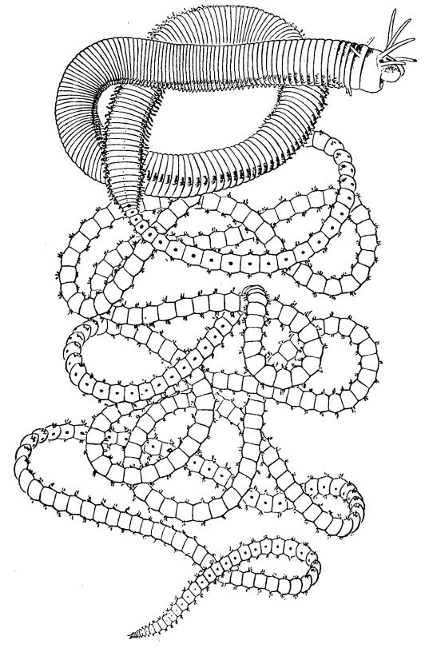

Preliminary Report on the "Palolo" Worm of Samoa, Eunice Viridis (Gray)

Author(s): W. McM. Woodworth

Source: The American Naturalist , Dec., 1903, Vol. 37, No. 444 (Dec., 1903), pp. 875-881

Published by: The University of Chicago Press for The American Society of Naturalists

Stable URL:<https://www.jstor.org/stable/2455384>

## REFERENCES

Linked references are available on JSTOR for this article: [https://www.jstor.org/stable/2455384?seq=1&cid=pdf](https://www.jstor.org/stable/2455384?seq=1&cid=pdf-reference#references_tab_contents)[reference#references\\_tab\\_contents](https://www.jstor.org/stable/2455384?seq=1&cid=pdf-reference#references_tab_contents) You may need to log in to JSTOR to access the linked references.

JSTOR is a not-for-profit service that helps scholars, researchers, and students discover, use, and build upon a wide range of content in a trusted digital archive. We use information technology and tools to increase productivity and facilitate new forms of scholarship. For more information about JSTOR, please contact support@jstor.org.

Your use of the JSTOR archive indicates your acceptance of the Terms & Conditions of Use, available at https://about.jstor.org/terms

The American Society of Naturalists and The University of Chicago Press are collaborating with JSTOR to digitize, preserve and extend access to The American Naturalist

## PRELIMINARY REPORT ON THE " PALOLOr' WORM OF SAMOA, EUNICE VIRIDIS (GRAY).'

## W. McM. WOODWORTH.

 SINCE a Monograph of Samoa would not be complete without some account of the " Palolo," at Dr. Kramer's request I have prepared the following summary, reserving for a subsequent publication a detailed account of the "Palolo " and other annelids of the coral reefs of the Pacific. In this preliminary paper I can only touch upon historical matters and the often written story of the "rising" and " fishing" of the " Palolo," referring the reader to the publications of Collin,2 Friecllaen der,3 Krirmer,4 and Ehlers."

 The " Palolo " has been known to naturalists for more than half a century and much has been written about it in a fragmentary way. It was, however, during the period of Kramer's investi gations in Samoa that its true history was brought to light, and

 I This provisional account prepared for Kramer's monographic work on the Samoan Islands (I(rimer, Augustin, Die Samoa Insein etc. Stuttgart, E. Nagele, 1903, Bd. 2, pp. 399-403) and translated by him into German, is reprinted here with some changes and corrections. The author has in preparation an extended study of the life history, morphology and distribution of the " Palolo," and allied Eunicido.

 2 Collin, A. Bemerkungen uiber den essbaren Palolowurm, Lysidice viridis (Gray). Appendix to Kriimer's Bait der Korallenriffte pp. 164-174.

 3Friedlaender, B. Uber den sogenannten Palolowurm. Biolok. Centralblat. Bd. 28, p. 337-357. I898. Idevi, Notes on the Palolo. Jour. Polynesian Soc. Vol. 7, p. 44-46; Wellington, N. Z. I98.- Idem, Nochmals der Palolo etc. Biolog. Centralblatt. Bd. I9, pp. 242-269. I899.

 41Kramer, A. Uber den Baut der Korallenrife -und die Plankton-verteilieng an dler samoanisclhen Kiiste nebst verg/eichendten Bemerkungen. Kiel und Leipzig 1897.- Zdam, Palolountersuchungen. Biolog. Centralblaft. Bd. 19, 'pp. I5-30. 1899.- Itdem, Palolountersuchungen im October und November i898 in Samoa. Ibid. pp. 237-239. I899.

 6Ehlers, E. Uber Palolo (Eunice viridis Gray). ANchr. . Ges. Wiss. Gcit ling-en. Math.-ntiurw. KZ. 1898. pp. 400-4I5.

 much of our knowledge of this interesting worm is due directly to him and to the stimulus of his work. The first extended account was written by Collin' as an appendix to Kramer's earlier work an Samoa. In this account Collin, with previous writers, considers the\* " Palolo " to be the posterior part of Lylsidlice viridis (Gray), a. few detached heads of which had from time to time been taken with the " Palolo " at the ' fishing' ,season, and as no other annelid heads were taken with the "Palolo " and all " Palolo " were headless, it was natural, for want of better evidence, to ascribe the "Palolo" to the genus Lysi cdice. The discovery of the origin of the "Palolo" was made independently by Kramer and Friedlaender, although the latter was the first to publish an account of his investigations. Fried laender succeeded in obtaining from the reef rock at Samatau several specimens of " Palolo " together with the head ends of an annelid of different appearance and much larger size belonging to the genus Eunice. His material was afterwards studied by Ehlers 3 who recognized an extreme case of sexual dimorphism and showed the " Palolo" to be the epitokal posterior portion of Eunice viridis (Gray). Ehlers says, "Ich ergiinze das im Voraus clamit, class ich die Eunice, die nun den Namen Euznice viridis (Gray) erhfilt, in den Kreis der Eunice siciliensis Gr. bringe und' an ihr die Ausbilciung des " Palolo " als eine Form der Epitokie auffasse, wie sie zum ersten Male aus der Familie der Euniciden, und in ihrer Besonclerheit abweichend von allen Erscheinungen cler Epitokie, die von 13orstenwtirmern bekannt silnd, sich clarstellt. Demnach ist in cler Art eine atoke unci epitoke Form, in cler letzteren eine atoke und epitoke Kbrperstrecke zu unterscheiden."

 It was my good fortune to be at Levuka in the Fiji Islands during the " rising " of the "1 Palolo " 4in November, I 897, where I gathered much material and information, and in the following year went to Samoa to learn more about the history of this

I O.p. cit.

 2 See Thilenius, G. Bemerkungen Zu den Aufsitzen der Herni Kramer und Friedlaelider uber den sogenalinten Palolo. Riol. Cntrailbl/att, Bd. 20, pp. 24I- -242, I900.

 3 Op. cit.

 4 Bololo, pronounced Mbololo in Fijian.

 mysterious worm. I arrived at Apia on October 20 and was fortunate in meeting Dr. Kramer who placed at my disposal the notes he had collected during three years in the islands. I nmade my headquarters in the village of Falelatai on the South side of Upolu a little to the eastward of Samatau where Friedlaender obtained his material. After several days of fruitless search on the reef between Samatatu and Falelatai my native friends took me to a shallow bay called Fagaioftu about two miles east of our village. The bay lies between two small promontories and is about one quarter of a mile wide, the distance from the shore to the edge of the fringing reef, which fills the bay, is not more than i5o meters. The place is so shallow that at low tide one can wade from the shore to the edge of the reef. The reef plat form, which is composed chiefly of dead coral and honeycombed reef rock, is interrupted by two narrow deep channels or passages.

 The reef at Fagaiofu proved to be literally alive with " Palolo." They were discovered by prising off, with a crowbar, masses of the rock at the edges of the channels. They could be seen dangling from the freshly exposed surfaces and wriggling free into the deeper water of the channel to be carried seaxvard by the retreating tide, to the astonishment of my natives who had never seen the " Palolo " before the time appointed for its appear ance this was three days before. Owing to the great length of the entire worm, its fragile structure and intricate association with the cavities of the honeycomb rock, the operation of freeing unbroken specimens is a delicate one. With the aid of chisels .and forceps I succeeded with great difficulty in obtaining, in addition to other material, three worms complete from head to tail.

 My experiences confirm the discoveries of Kramer and Fried laender as to the origin of the " Palolo." The accompanying figure, which is drawn to scale, shows the complete animal, the broad anterior atokal portion being sharply marked off from the more attenuated and much longer posterior epitokal part which, when free-swimming, is known as the "Palolo." The total length averages 400 mm., about one fourth of this length being in the anterior atokal part. 429, 359, and 250 atokal segments were counted the first two in male specimens the latter in a  female. These figures are not accurate as a dense gelatinous secretion in the posterior part of the atokal region makes it diffi cult to count the segments. The greatest diameter of the atokal region is 4 mm. and that of the epitokal region i-I.& mm. dimin ishing gradually at the anal end, and more abruptly at the junc tion of the atokal and epitokal parts. The color of the male is

 Eunice viridis (Gray). The narrow posterior epitokal part when detached and free-swimming is known as the "Palolo." X 2.

 reddish brown, that of the female bluish green. These colors, which are very marked in the epitokal portions are due to the colors of the sperm and ova; after the discharge of these ele ments the collapsed integument is translucent and colorless. These - distinctive sexual colors are also present in the atokal parts but are not so marked, the female being more greenish in

 hue than the male; the colors here are integumentary. Each of the epitokal segments bears on its ventral surface a prominent pigmented spot, the "Bauchauge " of Ehlers. These eye spots can be traced into the atokal part through about 20 segments, diminishing in size toward the anterior end; they are lacking on the anal segment and are usually absent in 2-6 of the preanal segments.

 A similar swarming of marine annelids, and at corresponding seasons, is known for other islands of the Pacific, though the worms have not everywhere been identified. Powell1 speaks of them in the Gilbert Islands where they are known to the natives as te nrnatamata and Codrington2 gives a detailed account for Mota in the Banks Islands where they are known as u1n1.3 Brown4 mentions an annual appearance of a "Palolo " on the East coast of New Ireland, and the zwazwo of Rumphius which occurs at Amboina in the Moluccas is doubtless the same, as has been pointed out by Collin.5 Seemnan 6 mentions the occurrence in the New Hebrides, and it is known in Fiji and Tonga. It is reasonable to suppose that a systematic search would show the " Palolo " or some allied form to have a wider distribution in the coral reefs of the Pacific than has been as yet recorded. That the annelid is best known from Samoa and Fiji is accounted for by these two groups of islands having been most visited and longest inhabited by whites. It is significant also that such records as we possess from other places, though meager, have come to us through the missionaries, the pioneers of intelligent whites in the islands of the Pacific.7

 &#x27;Powell, T. Remarks on the Structure and Habits of the Coral Reef Annelid Palolo viridis. Journ. Linn. Soc. London. Vol.. i6, PP. 393-399; i883.

 2 Codrington, R. H. The Melanesians. Studies inthzei4 Anthropology and Folke Lore. Oxford I 89 r.

 3Doubtless the 'oon of McIntosh.

 4Brown, G. Notes on the Duke of York Group, New Britain and New Ireland. Jour-n. Roy. Geog. Soc. Vol. 47, pp. I37-I50. i877.

 .Op. cit.

 6 Seeman, B. Viti. An Account of a Government Mission to the Vitian or Fr/ian Islands in the Years S6o-0z86z. Cambridge i862.

 7Cases of swarming associated with extreme sexual dimorphism have been described for a Eunice from Florida (Mayer, A. G., Bull. Mus. Comp. Zodl. Vol. 37, i900) and for one of the Lycoridx from Japan (Izuka, A., Journz. Coil. Sci. -Imtp. Univ. Tokyo, I903).

 The " Palolo " makes its appearance in Samoa in the months of October and November during the last quarter of the moon. This is the time of the lowest or spring tides when the reef flats in shallow places are uncovered or only awash, and at this sea- son the sun is nearest to the zenith. I must reserve for my final paper a discussion of the causes of the swarming of the "Palolo " and will only say here that I am inclined to believe in some thermotropic or heliotropic reaction of the eyes borne on the ventral segments of the epitokal part of the worm. These eyes have recently been studied histologically by Hesse I on material collected by Kramer. Hesse states that from their structure the eyes probably do not form images, but function rather in reacting to light of different intensities, the direction of light and possibly to different colors. It is significant that these eyes are found only on a few of the posterior segments of the atokal sedentary part and are not well developed; while on the other hand they are highly developed on all but the anal segments of the epitokal active part which leads such an ephemeral free existence.

 This spring season is recognized as the period of ripeness and sexual activity throughout the- Pacific Islands and where the " Pallo " occurs the season and even the months are named for it. All of the many other kinds of annelids inhabiting the reefs are sexually mature as shown by the extensive collections made. by Kramer and myself in Samoa and Fiji and this is true also of the reef fauna in general. The spawning time of the land crabs, the occurrence of certain fish, etc., is reckoned by the natives as so many days before or after the " Palolo," and so for the appear ance of blossoms the ripening of fruits and tubers. In Samoa the "Palolo " season is called tluunafamua (i. e. the time of much to eat), in the Banks Islands they say " taul mazla the season of maturity, yams can be eaten."2

 The " Palolo-time " in Samoa embraces three successive dcays.. When in the last quarter of the moon in October and November, more especially the latter, the water on the "Palolo-grounds

 1 Hesse, R. Untersuchungen uber die Organe der Lichtempfindung bei niederen Thieren. V, Die Augen der polychaeten Annieliden. Zeitschlr. ?C'ls.. Zool., Bd. 65, pp. 459, i899.

 2 Codrington, op. cit.

 has a turbid or riled look, with floating patches of scum, the7 natives know that two days later the " Palolo " will ' rise.' This first day is called salefiu. The second day is marked by the swarming of a small annelid, headless like the " Palolo," and the sexes distinguished by the same yellow and greenish tints. This. day is called molusaga. The third is the tutelega when the "Palolo" swarms and the natives come many. miles to the favored places to gather it. With " Palolo" of the tatelega day many of the small annelids of the motlusLga occur, and a few- "Palolo" appear on motusaga day. A microscopical examina tion of the salefu scum shows it to consist of a gelatinous slime in which are grains of sand, appendages, fragments and casts of Entomostraca and a varied detritus of the seething life inhabiting the reefs, including many ova of various kinds in different stages of segmentation. The sale/f may be looked upon as a manifes tation of the awakening of the " Palolo " previous to its swarm ing or marriage-swim; an annual activity of countless numbers of annelids resulting in a discharge into the water of the deposits. accumulated in the galleries and crevices of the reef-flats. The small annelid of motlsaga day is Lysidice falax Ehlers, the L viiidis (Gray) to which the " Palolo " was so long ascribed.

 CAMBRIDGE, MASS. August, 1902.