# **AMERICAN SAMOA REEF HEALTH SURVEY**

Thierry M. Work, Robert A. Rameyer

USGS-National Wildlife Health Center-Hawaii Field Station, PO Box 50167, Honolulu, HI 96850.

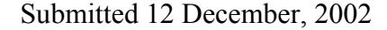

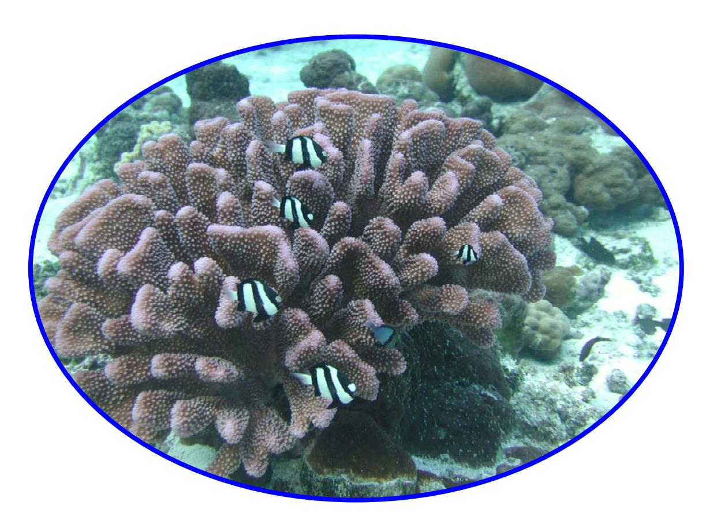

**In partial fulfillment of USFWS Interagency Agreement No. 122000N004** 

### **SUMMARY**

We surveyed corals in American Samoa for presence of lesions. We did 19 SCUBA and additional snorkel dives on 6 and 7 sites on Tuituila and Ofu-Olosega, American Samoa. We photographed and took 70 samples from 49 corals comprising 29 species. Corals were fixed, decalcified, and sectioned on microscope slide to examine cellular architecture. Grossly, the most common lesions in corals were bleaching, growth anomalies, and tissue necrosis. On histology, depletion of zooxanthellae from coral tissue was most often seen followed by tissue necrosis associated with algae or fungi, hyperplasia of gastrovascular canals, or uncomplicated tissue necrosis. Two grossly bleached corals had evidence of pathologic lesions associated with invasion by ciliates (protozoa). One coral had evidence of primary infection with a fungus that manifested grossly as growth anomaly. One coral had evidence of skeletal enlargement associated with polychaete infestation. Incidental lesions included presence of bacterial aggregates or crustacea in normal tissues of several coral species.

A gross diagnosis (e.g. bleaching) could have several different causes. This phenomenon underlines the importance of conducting microscopic exams on coral lesions to better define what the underlying causes of grossly visible changes. This study also provided the first baseline survey of corals in this region for pathogens and the first evidence that ciliates may, in some instances, be responsible for bleaching of selected coral colonies. This study also extended the documented range of growth anomalies in Acroporid corals. Future surveys should concentrate on systematically evaluating the spatial distribution of major lesions to allow for better comparisons of between sites.

### **INTRODUCTION**

Coral reefs comprise a fundamental component of tropical marine ecosystems, and have both ecologic and economic value to island communities that they surround. Coral reefs may also serve as a valuable indicator of marine ecosystem health. In the Caribbean, a panoply of widespread diseases affects hard and soft corals. Major examples include black band disease associated with bacteria and white band disease the cause of which remains unknown (Peters, 1996). Outside of the Atlantic, very little is known about coral diseases in the Pacific Basin. Recent surveys of Hawaii, Johnston Atoll, and French Frigate Shoals, Hawaii, revealed that corals are susceptible to diseases although not on the widespread scale of those in the Caribbean (Work and Rameyer, 2001; Work et al., 2001, 2002). Nothing is known of the status of coral diseases in American Samoa. Yet, this region contains a rich diversity of coral some of which have been protected through the establishment of special reserves such as American Samoa National Park and Fagatele Bay National Marine Sanctuary.

In 2002, the US Fish and Wildlife Service funded the National Wildlife Health Center Hawaii Field Station to conduct surveys of coral health in American Samoa. The objectives of the survey were to identify and describe gross and microscopic morphology of lesions in corals, and where possible to determine the cause of these lesions.

### **METHODS**

Survey areas were chosen based on prior discussions and agreements with managers from Samoa Department of Marine and Wildlife Resources (DMWR), National Oceanic and Atmospheric Administration (NOAA), and National Park Service (NPS). Survey sites were those that were monitored by biologists from the aforementioned

agencies for distribution of fish and coral. Areas surveyed on Tutuila included Fagatele Bay, Pago Pago Harbor (East and West), Fagaitua Bay, Aoa, and Masefau. Areas surveyed on Ofu included South and North Ofu and Olosega (Table 1, Figure 1).

Surveys were done using SCUBA or snorkeling. Corals were photographed using a Nikonos V underwater camera with a 20 mm lens and twin Ikelite 50 strobes or a digital camera in an underwater housing. Close-up photos were taken with a Nikonos V camera with a single Ikelite 50 strobe and a 2:1 extension tube. Gross lesions were characterized as bleaching if there were large areas of white discoloration on the coral, tissue necrosis if there were focal areas of discoloration, or growth anomaly if there was aberrant growth of the skeleton. Coral samples were taken using bone shears, or hammer and chisel, and placed into labeled plastic bags in seawater. In cases where lesions were sampled, care was taken to collect both normal and abnormal tissue bordering the lesion.

Corals were preserved in Helleys fixative (Barszcz and Yevich, 1975) with added salt and allowed to fix for 24 hr. The fixative was decanted and the coral rinsed with fresh water once every 12 hr for 24 hr. Subsequently, coral was stored in 70% ethanol, decalcified with Cal-ex II (Fisher Scientific), placed in cassettes, processed for paraffin embedding, trimmed at 5 um, and stained with hematoxylin and eosin. Silver or gram stains were used on tissue sections to identify fungi or bacteria, respectively. Slides were examined using light microscopy at magnifications ranging from 20-400X. Normal histology of selected corals was described. Microscopic lesions were categorized as tissue necrosis, tissue necrosis associated with marine algae or fungi, depletion of zooxanthellae, infection with ciliates, skeletal hypertrophy, and hyperplasia of gastrovascular canals.

### **RESULTS**

We did 19 SCUBA dives on Tuituila and Ofu-Olosega Islands ranging from 1.2 to 13.7 m and several snorkels on South Ofu. We examined 70 samples from 49 corals comprising 29 species (Table 2). Of 42 corals collected with lesions, 22, 13, and 7 had gross lesions of bleaching, growth anomalies, or tissue necrosis, respectively. Bleaching and growth anomalies were noted in almost all sites examined whereas tissue necrosis appeared limited to south Tutuila (Fig. 2).

 Bleaching of corals comprised living tissue with absence of pigmentation. Bleaching patterns could be divided into focal (Fig. 3A), marginal where bleaching encompassed just the border of the coral (Fig. 3B), diffuse with islands of normal tissue (Figs. 3C-G) and diffuse contiguous (Figs. 3H, 4). Growth anomalies were characterized by focal areas of smooth to rugose aberrant coral growth. Tissue overlying these growths was typically depigmented or had slightly purple pigmentation, was bereft of polyps or had aberrant polyp structure (Figs. 5, 6A, B). Tissue necrosis was characterized by focal areas of tissue sloughing leaving white skeleton or algal infiltrates giving the areas a brown or green color (Fig. 6C-H).

Of the microscopic diagnoses, depletion of zooxanthellae was the most common followed by tissue necrosis associated with algae or fungi, hyperplasia of gastrovascular canals, or uncomplicated tissue necrosis; skeletal hypertrophy and ciliate infections were seen in 1 and 2 corals, respectively (Table 3). There did not appear to be a distinct geographic patterns in distribution of microscopic lesions (Fig. 7).

*Depletion of zooxanthellae*:

Grossly, corals with this lesion were bleached. On microscopy, the hallmark of this lesion was absence of zooxanthellae from the gastrodermis (Fig. 8). In some instances, remaining zooxanthellae were atrophied with an excessively red and fragmented cytoplasm. While not universal, significant tissue atrophy accompanied depletion of zooxanthellae. In some species, the atrophy appeared limited to gastrodermis and epithelium, however, in *Pocillopora* sp., there was marked atrophy of mesoglea leading to general collapse of tissue architecture (Fig. 8 H).

In two instances, depletion of zooxanthellae was accompanied by invasion of coral tissues with ciliates (Fig 9 B-F). Ciliates were associated with diffuse necrosis of gastrodermis underlying intact epithelium (Fig 9B-C), and in other instances, were invading gastrovascular canals (Fig. 9E) or coral epithelium (Fig. 9F). When located in gastrovascular canals, ciliates were typically replete with zooxanthellae (Figs. 9C, E). *Tissue necrosis associated with algae or fungi* 

Grossly, this type of lesion manifested as bleaching, tissue necrosis, or growth anomaly. There was one instance where fungal infection was the dominant organism associated with the lesion. In this case (an *A. cytherea*), fungal organisms appeared as organized clumps of hyphae (Fig 10A-B) associated with necrotic tissue. Grossly, the lesion in the coral was evident as a growth anomaly. More typical, however, was the presence of a mixed assemblage of filamentous algae and fungi associated with tissue necrosis (Figs. 10C-H, 12A-C). Other than tissue necrosis, most corals seemed to mount a minimal response to invading algae. However, In *Montipora* sp., there was evidence of a significant cellular defense response against invasive algae manifested by an increase in number and size of mesogleal eosinophilic granular cells (Fig. 10G-H). In some instances, necrotic tissues were opportunistically invaded by ciliates (Fig. 9A). *Hyperplasia of gastrovascular canal* 

Grossly, this type of lesion manifested as aberrant growth of coral skeleton (Fig. 5). The histologic hallmark of this lesion was a marked proliferation of gastrovascular canal network (Figs. 11B, D, E, H) with specific proliferation of gastrodermal cells. Within these areas of gastrovascular canal proliferation, mesenteries were missing or markedly atrophied, and polyps were usually missing, or when present, appeared deformed with absence of tentacles. Gastrodermal cells within the lesion were uniformly bereft of zooxanthellae, and in many cases, epithelium and underlying gastrodermis appeared atrophied. In some *Acropora* sp, epithelium appeared to have larger than normal numbers of spirocysts. Acroporidae were over-represented in this category although a similar lesion was noted in a *Pocillopora meandrina*.

### *Uncomplicated tissue necrosis*

Grossly, corals with this type of lesion manifested as tissue necrosis or bleaching. This lesion was characterized by necrosis of coral tissue with no visible accompanying organisms such as algae, infectious organisms or other cause. In some cases, necrosis appeared limited to the gastrodermis (Fig. 12D), and in other instances, encompassed epithelium and mesoglea. (Fig. 12E-H).

### *Incidental findings*

 In addition to microscopic lesions associated with grossly abnormal tissue, we encountered organisms associated with normal coral tissue. The most notable was the presence of gram-negative aggregates of putative bacteria within gastrodermis or

epithelium of a variety of corals (Fig. 9G-H; 13A-B). These aggregates were well defined and surrounded by normal tissue. These suspect bacterial inclusions were most often seen in *Acroporidae* including *A. abrotenoides*, *A. digitifera*, and *A. hyacinthus,*  however, other species including *P. lactuca, Platygyra* sp., *P. eydouxi*, and *P. meandrina* were affected.

The other notable incidental lesion was presence of putative crustacea within the pharyngeal cavity of polyps in *Rumphella* sp. or massive *Porites* sp. (Fig. 13E, G), putative polychaete worms within gastrovascular canals of *Montipora* sp. and *Echinopora* sp. (Fig. 13C-D), and presence of putative crustaceans within the mesoglea of *Pectinia* sp (Fig. 13F). Marked hypertrophy of skeleton was associated with an putative polychaete in *Montipora turtlensis* (Fig. 13H). Grossly, this manifested as growth anomaly (Fig. 6B).

## **DISCUSSION**

Bleaching of corals was the most commonly observed change seen grossly during surveys, but on microscopy, this bleaching manifested in several ways. In addition to depletion of zooxanthellae, other lesions associated with gross appearance of bleaching included infection with ciliates, tissue necrosis associated with fungi and marine algae, and uncomplicated tissue necrosis. As expected, many corals with bleaching had depletion of zooxanthellae in gastrodermis associated with atrophy of tissue. Similar changes have been noted in bleached corals from the Pacific coast of Panama (Glynn et al., 1985), Thailand (Brown et al., 1995), and central Pacific (Work et al., 2001). There are several mechanisms of depletion of zooxanthellae in corals including elevated

temperature (Coles and Jokiel, 1977, Brown et al., 1995) and infection with *Vibrio* sp. (Kushmaro et al., 2001).

Ciliate infection associated with bleaching was an unexpected finding. Ciliates have been seen in corals associated with necrotic coral tissue, however, their absence in healthy tissues or at margins of necrotic and healthy tissues suggested they were opportunists (Fig. 9A). Similar opportunistic ciliates have been associated with necrotic tissues of *Porites* sp. (Work and Rameyer., 2000). In contrast, ciliates in Samoan corals were closely associated with or directly invading intact tissues. The association of ciliates replete with zooxanthellae with necrotic gastrodermis suggested two possibilities. Either these protozoa are direct pathogens that eat zooxanthellae and gastrodermal tissue and cause bleaching, or that an underlying process is causing degeneration of gastrodermis and the ciliates are opportunistically ingesting liberated zooxanthellae. We think the latter hypothesis is less likely as we saw no evidence of gastrodermal degeneration in absence of ciliates. Ciliates in corals have been documented in Caribbean *Porites porites, P. astreoides,* and *Acropora palmata* with the latter case exhibiting epithelial necrosis (Peters, 1984). However, no mention was made as to whether corals with these organisms were bleached. Although ciliates were noted only in two instances, the role of these organisms in bleaching awaits further studies.

Necrosis of tissue associated with mixed marine algae and fungi was a common finding in corals exhibiting gross evidence of bleaching or tissue necrosis. Coral algal interactions are common elsewhere such as the Caribbean (Peters, 1984) and the Pacific (Work and Rameyer, 2001; Work et al. 2001) and appear to be a predominant cause or association with tissue necrosis. In the Samoan corals, most of these lesions involved a

mix of algae and fungi. In one instance, fungal/algal invasion of coral tissue resulted in a marked inflammatory response in *Montipora* sp. A similar inflammatory was noted in this species in the main Hawaiian islands (Work and Rameyer, 2001). Very little is known about immune defenses of coral (Hildemann et al., 1975), and most coral respond to algal infiltration with tissue necrosis. More investigation is needed to understand mechanisms of defense response of corals against invasive pathogens.

 Knowledge about fungal pathogens in scleractinian corals is also limited. Fungi in normal and unhealthy corals appear to be a common phenomenon, particularly in the skeleton (Ravidran et al., 2001). We found one instance where a fungus was implicated as the direct cause of growth-anomaly lesions in *Acropora cytherea*. Our conclusions were based on presence of organized clumps of fungal hyphae associated with necrotic tissues. Raghukumar and Raghukumar (1991) implicated fungi as causes of necrotic lesions in several species of scleractinians in the Andaman islands of India, and Ramos-Flores (1983) found fungi responsible for black lesions on *Montastrea annularis* in Venezuela. In both cases, fungi were implicated as pathogens based on their association with dead tissue and invasion of coral tissue with fungal hyphae. Finally, Work and Rameyer (2001) found a fungus associated with pearl-like lesions in *Pocillopora eydouxi* on Oahu.

Growth anomalies were commonly seen, particularly in *Acropora* sp. Typically, they manifested as hyperplasia of gastrovascular canal. There was no evidence of neoplasia, which is typically characterized by uncontrolled growth of pleomorphic cells with prominent nucleoli, mitotic figures, and occasional tissue necrosis. Similar growths from Johnston Atoll and French Frigate Shoals were characterized as gastrodermomas by

Work et al (2001), however, after reassessment, they were classified as hyperplasia of gastrovascular canal. Peters et al. (1986) characterized similar growths in Caribbean *Acropora* sp. as calicoblastic neoplasms based on proliferation of calicoblastic epithelium. The fact that hyperplasia of gastrovascular canals appear predominantly in *Acropora* sp. may be related to the phenomenon that this is one of the faster growing species of corals. Physiologic mechanisms responsible for these lesions, whether they are neoplastic, and whether they pose a detriment to coral colonies remains to be elucidated.

Other instances of growth anomalies were due to infestation with metazoans (*Montipora*) or infection with fungi (*Acropora cytherea*). Polychaete worms as a possible cause of growth anomalies was documented in *Montipora* sp. from Israel (Wielgus et al. 2002), and marine algae as a cause of growth anomalies in *Montipora* from French Frigate Shoals was documented by Work et al. (2001).

 There were several instances of corals with necrosis of tissue that could not be associated with any visible pathogen (uncomplicated tissue necrosis). In some cases such as the massive *Porites* sp. (Fig. 6F) or *Palythoa* sp. (Fig. 6H), we strongly suspect predation as a cause of the lesions. In particular, the lesions in the massive *Porites* sp. were very similar to those found on the main Hawaiian Islands that are indicative of fish bites (Work and Rameyer, 2001). Similar suspicions could hold for tissue necrosis in certain other species such as some *Platygyra* sp., where necrosis of tissue also accompanied erosion of the skeleton. In many cases of fish predation, there is not only removal of coral tissue but also skeleton. On the other hand, the cause of uncomplicated

necrosis of gastrodermis in *Diploastrea* leading to widespread bleaching remains unknown and probably deserves further study.

Presence of basophilic aggregates of putative bacteria was noted in several species of corals. This study expands the range of these apparently benign organisms in corals to 3 other genera (*Acropora, Goniastrea, Platygyra*). In the Pacific, they are commonly seen in *Porites* sp., but were also seen in *Pocillopora* from Johnston Atoll (Work et al., 2001). The role of these organisms in coral reefs is unknown, however, attempts should be made to culture them. Current evidence does not implicate them as causing disease in corals from the Pacific, however, Peters (1983) implicated similar organisms as causing white band disease in Caribbean Acroporids. Crustaceans were seen in polyp pharynx suggesting they were being ingested as food. Polychaete worms in the gastrovascular canals of normal tissues were seen in several species and their role in coral biology is unknown. Crustacea in normal tissue mesoglea of *Pectinia* was an unusual finding. We were unable to find evidence that this organism caused significant pathology to this species of corals.

### **RECOMMENDATIONS**

- 1) Now that major lesions have been characterized in Samoan corals, future efforts should concentrate on expanding the range of surveys and conducting systematic counts to allow for quantitative site-to-site comparisons.
- 2) Continuing efforts are needed to determine whether growth anomalies seen in Acroporids constitute true neoplasia (cancerous growths).
- 3) The role of ciliates in bleaching of corals needs to be further elucidated.

4) Further work is needed on determining what causes apparently uncomplicated tissue necrosis in certain species of corals.

### **ACKNOWLEDGMENTS**

 This project would not have been possible without the gracious assistance from a variety of people. Peter Craig and Eva Pasko of the National Park Service provided guidance and field support for surveys on Tuituila and Ofu-Olosega. Nancy Daschbach from NOAA provided the boat used on surveys on Tuituila and accompanied us on surveys at Fagatele Bay. Anthony Beeching, Flynn Curren and Dave Wilson graciously provided the use of Samoa DMWR facilities and general guidance on location of survey sites. Finally, our sincere gratitude goes out to Lee Yandall and Jon Pita whose excellent boat handling skills made the Tuituila and Ofu-Olosega surveys possible.

### **REFERENCES**

- Barszcz CA, Yevich PP (1975) The use of Helly's fixative for marine invertebrate Histopathology. Comp Path Bull 7:4.
- Brown BE, Le Tissier MDA, Bythell JC (1995) Mechanisms of bleaching deduced from histological studies of reef corals sampled during a natural bleaching event. Mar Biol 122: 655-663.
- Coles S, Jokiel PL (1977) Effects of temperature on photosynthesis and respiration in hermatypic corals. Mar Biol 43: 209-216.
- Glynn PW, Peters EC, Muscatine L (985) Coral tissue microstructure and necrosis: relation to catastrophic coral mortality in Panama. Dis Aquat Org 1:29-37.
- HildemannWH, Linthicum DS, Vann DC (1975) Immunoincompatibility reactions in corals (Coelenterata). Adv Exp Med Biol 64: 105-114

- Kushmaro A, Banin E, Loya Y, Stackebrandt E, Rosenberg E (2001). *Vibrio shiloi* sp. nov. the causative agent of bleaching of the coral *Oculina patagonica*. Int J Syst Evol Microbiol 51: 1383-1388.
- Peters EC, Oprandy JJ, Yevich PP (1983) Possible causal agent of "white band disease" in Caribbean Acroporid corals. J Inv Pathol 41: 394-396.
- Peters EC (1984) A survey of cellular reactions to environmental stress and disease in Caribbean scleractinian corals. Helgo Meere 37: 113-137.
- Peters EC, Halas JC, McCarty HB (1986) Calicoblastic neoplasms in *Acropora palmata*, with a review of reports on anomalies of growth and form in corals. The Journal of the National Cancer Institute. 76: 895-912.
- Peters EC (1996) Diseases of coral-reef organisms, In. Life and Death of Coral Reefs, C. Birkeland (ed.), Chapman & Hall, New York, NY, pp. 114-139.
- Raghukumar C, Raghukumar S (1991) Fungal invasion of massive corals. P. S. Z. N. I. Mar Ecol. 12: 251-260.
- Ramos-Flores T (1983) Lower marine fungus associated with black line disease in star corals (*Montastrea annularis*, E. & S.). Biol Bull 165: 429-435.
- Ravidran J, Raghukumar C, Raghukumar S (2001) Fungi in *Porites lutea*: association with healthy and diseased corals. Dis Aquat Org 47:219-228.
- Wielgus J, Glassom D (2002) An aberrant growth form of red sea corals caused by polychaete infestations. Coral Reefs. 21: 315-316.
- Work TM, Coles SL, Rameyer RA (2001) Johnston Atoll Reef Health Survey. US Geological Survey, National Wildlife Health Center, Hawaii Field Station, 28 pp.

- Work TM, Coles SL, Rameyer RA (2002) French Frigate Shoals Reef Health Survey. US Geological Survey, National Wildlife Health Center, Hawaii Field Station, 25 pp.
- Work TM, Rameyer RA (2001) Evaluating coral health in Hawaii. US Geological Survey, National Wildlife Health Center, Hawaii Field Station, 42 pp.

Table 1. Survey date, UTM-NAD83 coordinates, site, and island for individual surveys.

| Date      | Latitude | Longitude | Island  | Site                     |
|-----------|----------|-----------|---------|--------------------------|
| 6/21/2002 | 541842   | 8422135   | Tutuila | Fagaitua Bay             |
| 6/21/2002 | 536131   | 8420558   | Tutuila | Pago Pago East           |
| 6/22/2002 | 544388   | 8423777   | Tutuila | Aoa                      |
| 6/24/2002 | 540776   | 8423980   | Tutuila | Masefau                  |
| 6/25/2002 | 535090   | 8420946   | Tutuila | Pago Pago West           |
| 6/25/2002 | 535053   | 8420904   | Tutuila | Pago Pago West           |
| 6/25/2002 | 534948   | 8421023   | Tutuila | Pago Pago West           |
| 6/25/2002 | 534945   | 8421026   | Tutuila | Pago Pago West           |
| 6/26/2002 | 525499   | 8411726   | Tutuila | Fagatele Bay             |
| 6/29/2002 | 648014   | 8432465   | Olosega | South Olosega            |
| 6/29/2002 | 647617   | 8432665   | Ofu     | South Ofu, Bridge        |
| 6/30/2002 | 646468   | 8432851   | Ofu     | South Ofu Pool 500       |
| 6/30/2002 | 646682   | 8432708   | Ofu     | South Ofu Pool 400       |
| 6/30/2002 | 645299   | 8432089   | Ofu     | South Ofu Hurricane Pool |
| 7/1/2002  | 649054   | 8434298   | Olosega | North Olosega            |
| 7/1/2002  | 647619   | 8433669   | Ofu     | North Ofu-bridge         |
| 7/1/2002  | 642106   | 8434185   | Ofu     | North Ofu                |

Table 2. Coral species, number of colonies and samples examined during American Samoa surveys, 2002.

| Species                | No. corals | Samples |
|------------------------|------------|---------|
| Acropora abrotenoides  | 5          | 8       |
| Acropora cytherea      | 4          | 6       |
| Acropora digitifera    | 1          | 2       |
| Acropora gemmifera     | 1          | 1       |
| Acropora hyacinthus    | 4          | 6       |
| Acropora samoensis     | 1          | 1       |
|                        |            |         |
| Cladiella sp.          | 1          | 1       |
| Diploastrea heliopora  | 4          | 6       |
| Echinopora lamellosa   | 1          | 2       |
| Favia stelliger        | 1          | 2       |
| Goniastrea sp.         | 3          | 5       |
| Hydnophora microconos  | 1          | 2       |
| Leptoria phrygia       | 1          | 1       |
| Lobophyllia hemprichii | 1          | 1       |
| Massive Porites        | 3          | 3       |
| Millepora sp.          | 1          | 1       |
| Montipora nodosa       | 1          | 4       |
| Montipora sp.          | 2          | 1       |
| Montipora turtlensis   | 1          | 1       |
| Palythoa sp.           | 1          | 1       |
| Pavona minuta          | 1          | 1       |
| Pectinia lactuca       | 1          | 1       |
| Platygyra daedala      | 1          | 1       |
| Platygyra sp.          | 1          | 4       |
| Pocillopora eydouxi    | 2          | 3       |
| Pocillopora meandrina  | 2          | 1       |
| Pocillopora verrucosa  | 1          | 2       |
| Rumphella sp.          | 1          | 1       |
|                        |            |         |

Table 3. Species, depth of collection, gross and microscopic findings, and island and site of collection for 2002 American Samoa coral health survey.

| Fagatele                 | Tutuila       | y   Hyperplasia of gastrovascular canals | Growth anomaly | 4.3   | Acropora hyacinthus    |
|--------------------------|---------------|------------------------------------------|----------------|-------|------------------------|
| Fagatele                 | Tutuila       | -                                        | Growth anomaly | 4.3   | Acropora abrotenoides  |
| Fagatele                 | Tutuila       | _                                        | Growth anomaly | 2.7   | Acropora hyacinthus    |
| Masefau                  | Tutuila       |                                          | Growth anomaly | 6.1   | Acropora digitifera    |
| Masefau                  | Tutuila       | ļ                                        | Growth anomaly | 4.3   | Pocillopora meandrina  |
| Masefau                  |               | ├—                                       | Growth anomaly | 6.7   | Acropora cytherea      |
| Masefau                  |               | -                                        | Growth anomaly | 5.2   | Acropora abrotenoides  |
| Aoa                      | -             | ⊢                                        | Growth anomaly | 5.2   | Acropora cytherea      |
| South Ofu Hurricane Pool | osega         | -                                        | Growth anomaly | 1.2   | Acropora samoensis     |
| Pago harbor              |               | Fungi, marine algae and necrosis         | Growth anomaly | 6.1   | Acropora cytherea      |
| North Olosenga           | $\dashv$      | Necrosis                                 | Bleaching      | 8.5   | Diploastrea heliopora  |
| South Ofu Hurricane Pool | $\rightarrow$ | Necrosis                                 | Bleaching      | 1.2   | Platygyra daedala      |
| South Ofu Pool 500       | -             | Necrosis                                 | Bleaching      | 1.2   | Platygyra sp.          |
| South Ofu, Bridge        | $\dashv$      | Necrosis                                 | Bleaching      | 10.6  | Goniastrea sp.         |
| South Olosenga           | Ofu-Olosega   | Necrosis                                 | Bleaching      | 6.4   | Diploastrea heliopora  |
| Pago harbor              |               | Marine algae and necrosis                | Bleaching      | 13.7  | Montipora sp.          |
| Pago harbor              | Tutuila       | Marine algae and necrosis                | Bleaching      | 11.6  | Montipora sp.          |
| South Ofu Hurricane Pool | Ofu-Olosega   | Fungi, marine algae and necrosis         | Bleaching      | 1.2   | Goniastrea sp.         |
| West Pango               | Tutuila       | Fungi, marine algae and necrosis         | Bleaching      | 10.1  | Montipora nodosa       |
| Masefau                  |               | Fungi, marine algae and necrosis         | Bleaching      | 13.4  | Pavona minuta          |
| Aoa                      |               | Depletion of zooxanthellae and ciliates  | Bleaching      | 9.1   | Acropora abrotenoides  |
| Fagaitua Bay             | -             | Depletion of zooxanthellae and ciliates  | Bleaching      | 9.8   | Acropora cytherea      |
| North Ofu-bridge         | -             | Depletion of zooxanthellae               | Bleaching      | 12.3  | Platygyra sp.          |
| North Ofu-bridge         |               | Depletion of zooxanthellae               | Bleaching      | 11.1  | Leptoria phrygia       |
| South Ofu Hurricane Pool | Н             | Depletion of zooxanthellae               | Bleaching      | 1.2   | Massive Porites        |
| South Ofu Pool 400       |               | Depletion of zooxanthellae               | Bleaching      | 1.2   | Massive Porites        |
| South Ofu Pool 500       | Ofu-Olosega   | Depletion of zooxanthellae               | Bleaching      | 1.2   | Goniastrea sp.         |
| Masefau                  | Tutuila       | Depletion of zooxanthellae               | Bleaching      | 6.0   | Acropora abrotenoides  |
| Aoa                      | Tutuila       | Depletion of zooxanthellae               | Bleaching      | 6.1   | Pocillopora verrucosa  |
| Aoa                      | Tutuila       | Depletion of zooxanthellae               | Bleaching      | 11.3  | Pocillopora eydouxi    |
| Aoa                      | Tutuila       | Depletion of zooxanthellae               | Bleaching      | 9.1   | Hydnophora microconos  |
| Fagaitua Bay             | Tutuila       | Depletion of zooxanthellae               | Bleaching      | 5.8   | Acropora hyacinthus    |
| SITE                     | ISLAND        | MICROSCOPIC                              | GROSS          | DEPTH | SPECIES                |
|                          |               |                                          |                |       | Corner months out to). |

| Acropora abrotenoides  | 4.3  | Growth anomaly  | Hyperplasia of gastrovascular canals                  | Ofu-Olosega | South Olosenga |
|------------------------|------|-----------------|-------------------------------------------------------|-------------|----------------|
| Acropora hyacinthus    | 1.8  |                 | hyperplasia of gastrovascular canals, fungi and algae | Tutuila     | Masefau        |
| Montipora turtlensis   | 9.4  |                 | Skeletal hypertrophy and metazoan                     | Tutuila     | West Pango     |
| Lobophyllia hemprichii | 13.1 | Normal          | Normal                                                | Tutuila     | Pago harbor    |
| Sarcophyton sp.        | 11.6 | Normal          | Normal                                                | Tutuila     | Pago harbor    |
| Cladiella sp.          | 11.6 | Normal          | Normal                                                | Tutuila     | Fagaitua Bay   |
| Acropora gemmifera     | 0.8  | Normal          | Normal                                                | Tutuila     | Fagaitua Bay   |
| Rumphella sp.          | 10.7 | Normal          | Normal                                                | Tutuila     | Aoa            |
| Pectinia lactuca       | 9.8  | Normal          | Normal                                                | Tutuila     | Masefau        |
| Pocillopora eydouxi    | 2.7  | Normal          | Normal                                                | Tutuila     | Fagatele       |
| Echinopora lamellosa   | 4.9  | Tissue Necrosis | Fungi, marine algae and necrosis                      | Tutuila     | Fagaitua Bay   |
| Diploastrea heliopora  | 6.4  | Tissue Necrosis | Fungi, marine algae and necrosis                      | Tutuila     | West Pango     |
| Favia stelliger        | 12.5 | Tissue Necrosis | Marine algae and necrosis                             | Tutuila     | Pago harbor    |
| Massive Porites        | 12.2 | Tissue Necrosis | Marine algae and necrosis                             | Tutuila     | Pago harbor    |
| Diploastrea heliopora  | 9.8  | Tissue Necrosis | Necrosis                                              | Tutuila     | Fagaitua Bay   |
| Millepora sp.          | 10.0 | Tissue Necrosis | Necrosis                                              | Tutuila     | West Pango     |
| Palythoa sp.           | 6.7  | Tissue Necrosis | Necrosis                                              | Tutuila     | West Pango     |

Figure 1. Survey sites (red dots) for 2002 American Samoa coral health survey.

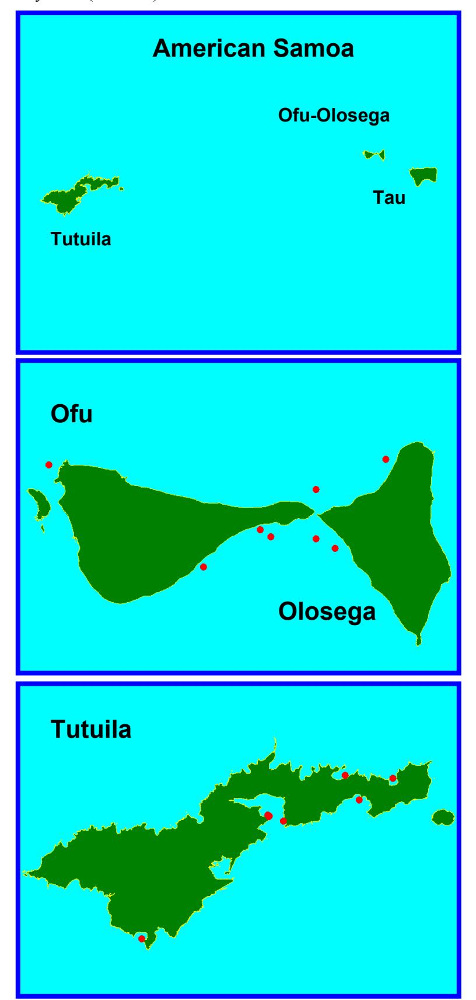

Figure 2. Location of gross lesions seen in corals in American Samoa, 2002.

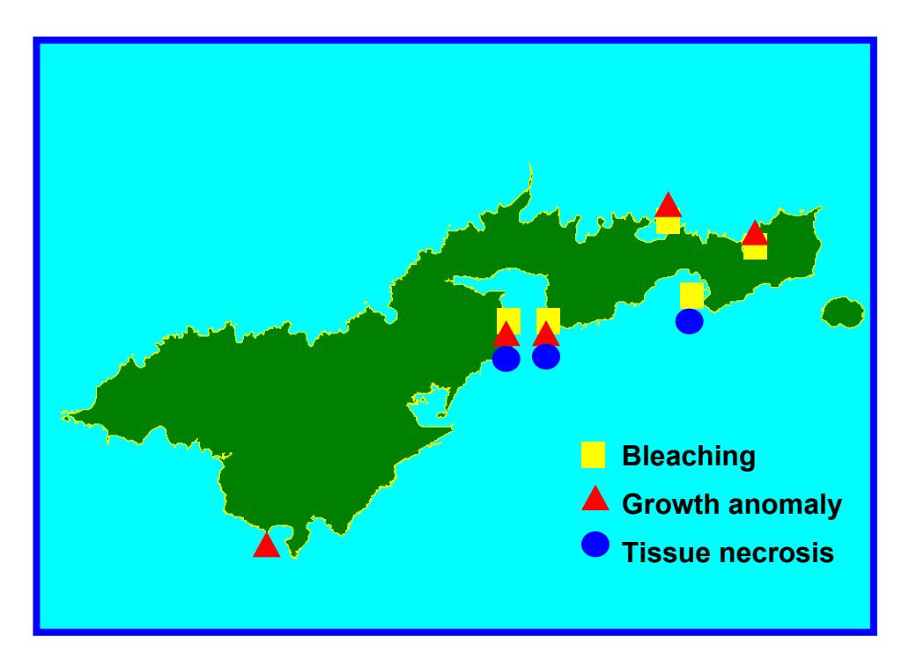

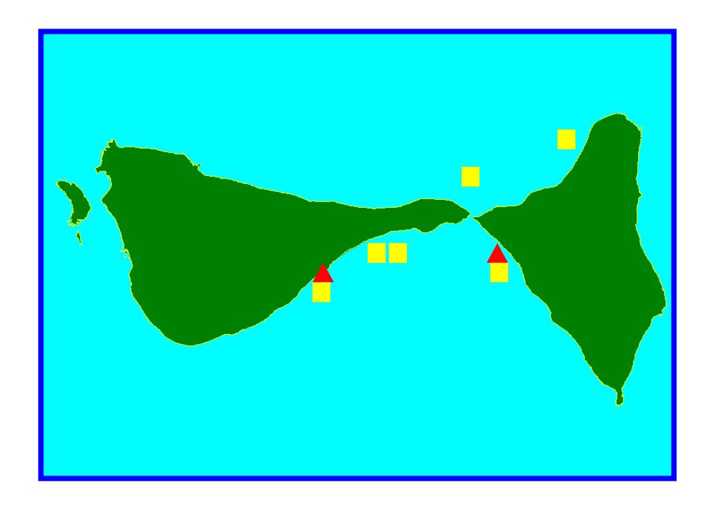

Figure 3. Bleaching patterns seen in Samoan corals. Focal (A); Marginal (B); Diffuse with normal tissue (C-G); Diffuse contiguous (H). A) Massive *Porites* sp.; B) *Acropra hyacinthus;* C-D) *Goniastrea* sp.; E) *Pavona minuta;* F) *Pocillopora verrucosa*; G) *Diploastrea heliopora*; H) *Acropora cytherea.*

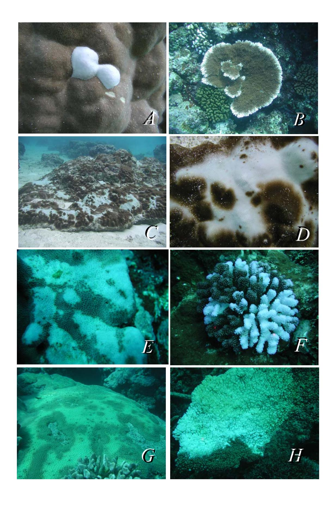

Figure 4. Bleaching patterns seen in Samoan corals, diffuse contiguous (cont.). A) *Hydnophora microconos*; B) *Leptoria phrygia*; C-D) *Platygyra daedalea*; E-F) *Montipora nodosa*; G-H) *Acropora abrotenoides*.

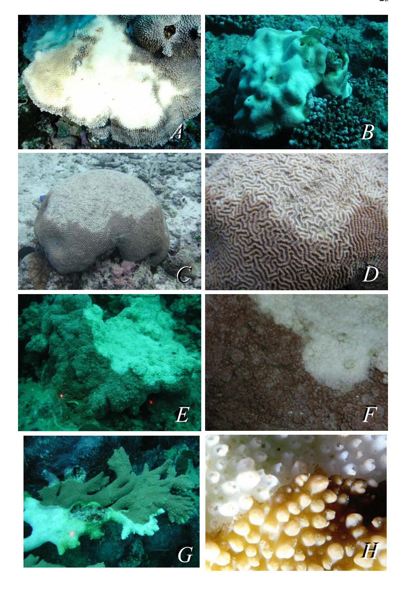

Figure 5. Growth anomalies of Samoan corals. A-B) *Acropora abrotenoides*; C-D) *Acropora cytherea*; E-G) *Acropora hyacinthus*; H) *Pocillopora meandrina*.

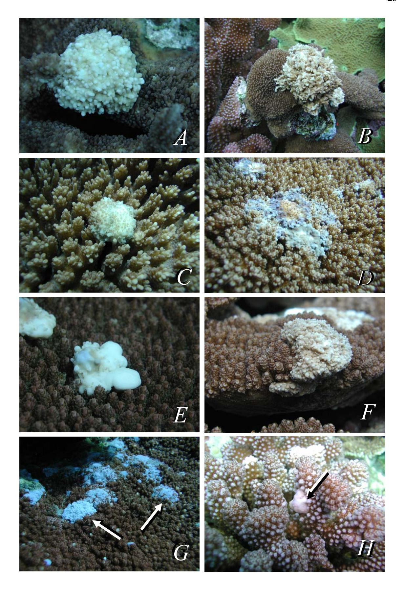

Figure 6. Growth anomalies in Samoan corals (cont.) A) *Acropora digitifera*; B) *Montipora turtlensis*; Tissue necrosis in Samoan corals. C-D) *Diploastrea heliopora*; E) *Echinopora lamellosa*; F) massive *Porites* sp. G) *Millepora* sp.; H) *Palythoa* sp.

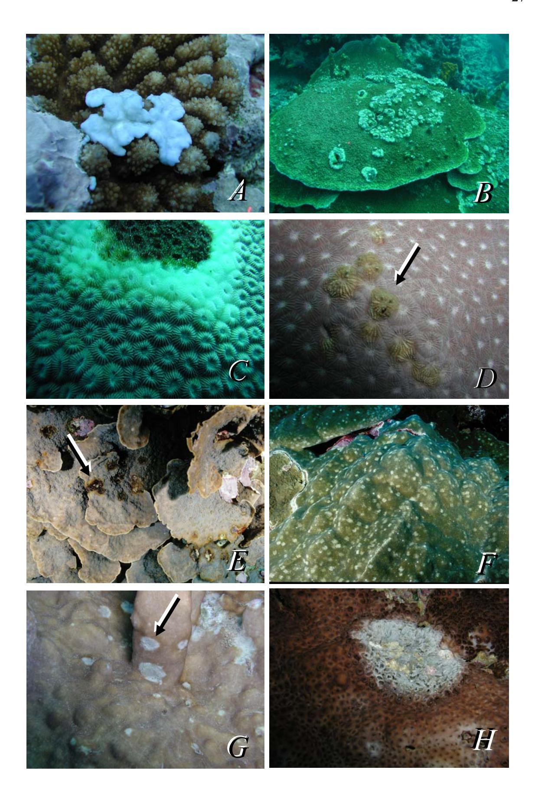

Figure 7. Location of microscopic lesions in corals in American Samoa, 2002.

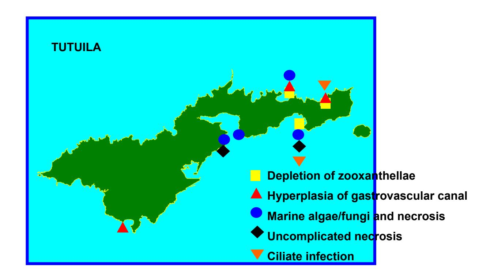

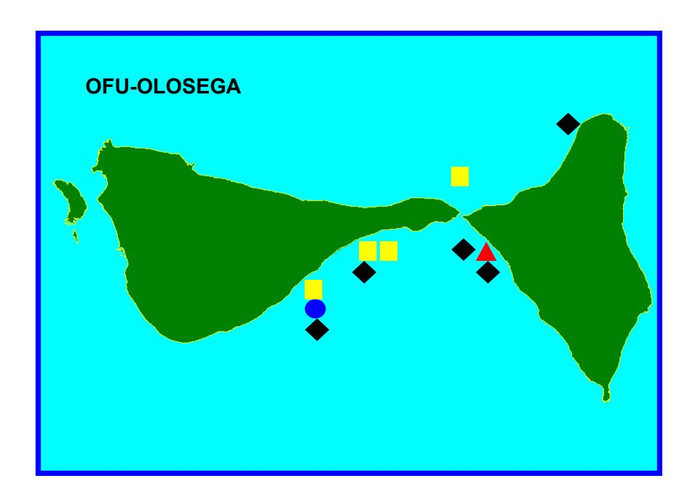

Figure 8. Depletion of zooxanthellae. Coenosarc *Acropora hyacinthus,* bar = 50 µm (A-B); Tentacle *H. microconos*, bar = 100 µm (C-D); Coenosarc *Goniastrea sp*, bar = 50 µm (E-F); Coenosarc *Pocillopora eydouxi*, bar = 100 µm (G-H). Normal tissues are on left (A, C, E, G) and depleted tissues on right (B, D, F, H). A) Note gastrodermis replete with zooxanthellae (arrow); B) Note gastrodermis in bleached tissue depleted of zooxanthellae (arrow); C) Note gastrodermis with plump supporting cells and zooxanthellae (arrow) and epithelium with nematocyst warts (arrowhead); D) Note atrophied gastrodermal supporting cells with prominent spaces (arrow) and absence of zooxanthellae and atrophied epithelium (arrowhead); E) Note plump gastrodermis with granular brown pigment cells and zooxanthellae (arrow); (F) Note marked atrophy of gastrodermis and absence of zooxanthellae (arrow). G) Note gastrodermis replete with zooxanthellae (arrow) and prominent mesogleal structure (arrowhead); (H) Note marked atrophy of gastrodermis (arrow) and collapse and atrophy of mesoglea (arrowhead).

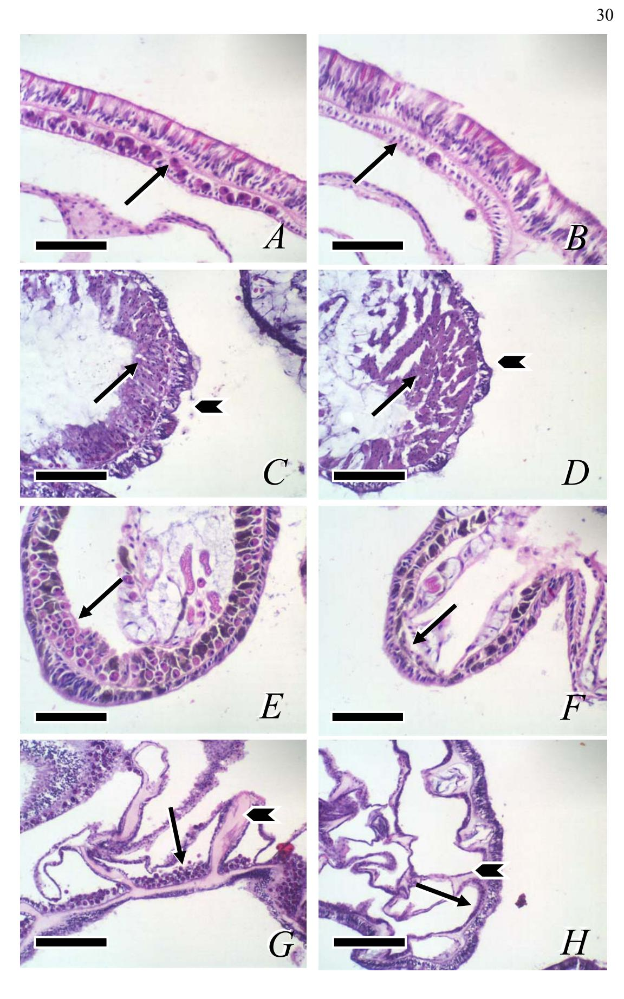

Figure 9. Ciliate-coral interactions (A-F). Bacterial inclusions (G-H). A) *Montipora* sp. gastrovascular canal. Note ciliates (arrow) within necrotic tissue debris, bar = 50 µm; *Acropora abrotenoides* (B-C); *Acropora cytherea* (D-F); B) Note ciliates (arrow) among necrotic gastrodermal tissue (arrowhead) and intact epithelium, bar = 100 µm ; C) Note ciliate (arrow) distended with zooxanthellae adjacent to necrotic tissue (arrowhead), bar = 50 µm; D) Note ciliates (arrows) among necrotic tissue (arrowhead) and overlying intact epithelium, bar = 100 µm; E) note ciliates (arrows) distended with zooxanthellae within gastrovascular canals, bar = 50 µm; F) Note ciliates (arrows) invading intact epithelium, bar = 50 µm; G) *Pocillopora meandrina* gram stain, note aggregates of gram-negative bacteria (arrow) in mesoglea, bar = 50 µm; H) *Acropora hyacinthus gram stain*, bar = 50 µm. e=epithelium.

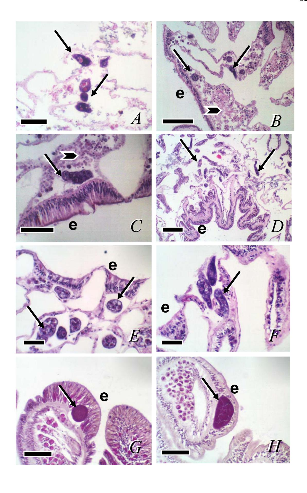

Figure 10. Tissue necrosis associated with algae and fungi. *Acropora cytherea* (A-B); A) Note organized mass of fungal organism (arrow) and adjacent clump of necrotic tissue (arrowhead), bar =50 µm; B) Silver stain of fungal hyphae (arrow), bar =100 µm; C) *Echinopora lamellosa*, note filamentous algae (arrow), necrotic tissue (arrowhead) bordering normal tissue (upper right), bar =100 µm; D) *Pavona minuta*, note necrotic tissue (arrow) and filamentous organisms (arrowhead), bar = 100 µm; E) *Acropora hyacinthus* silver stain, note mat of fungi (arrow), bar =100 µm; F) *Goniastrea* sp., note mats of filamentous algae (arrowhead) and necrotic tissue (arrow), bar =100 µm; (G-H) *Montipora nodosa*, bar =50 µm,; G) Normal tissue, note sparse eosinophilic granular cells in mesoglea of gastrovascular canals (arrow); H) Areas of algal infiltration (arrowhead). Note infiltrates of hypertrophied eosinophilic granular cells (arrow), bar =50 µm.

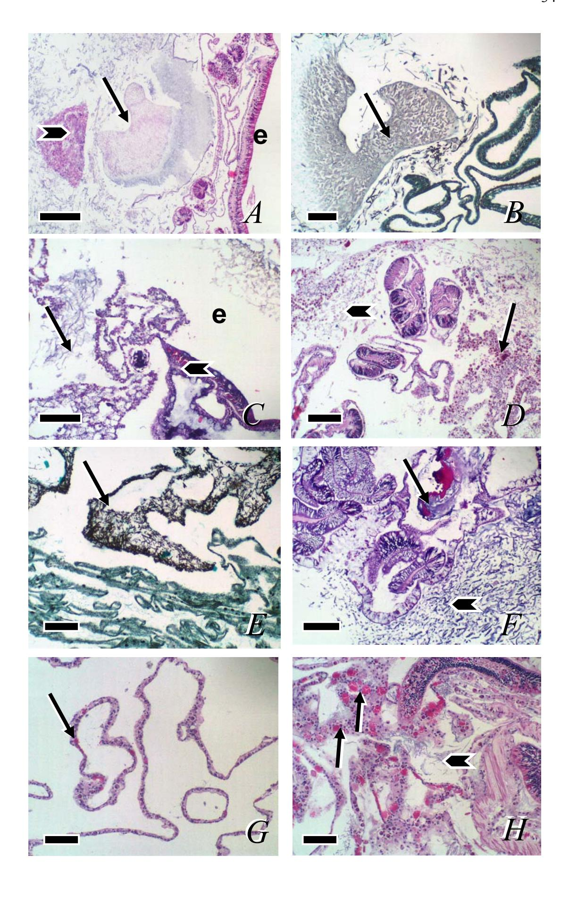

Figure 11*.* Growth anomalies. *Acropora cytherea* (A-C); *Acropora abrotenoides* (D); *Acropora digitifera* (E-F); *Pocillopora meandrina* (G-H). A) Normal tissue, note tentacles (arrow) and gastrodermis replete with zooxanthellae (arrowhead), bar = 200 µm ; B) Growth anomaly, note proliferation of gastrovascular canals (arrow), absence of polyps, and absence of zooxanthellae in gastrodermis (arrowhead), bar = 200 µm ;C) Gastrovascular canals, note hyperplasia of gastrodermis (arrow), bar = 50 µm; D) Growth anomaly, note massive proliferation of gastrovascular canals (arrow), absence of polyps, and absence zooxanthellae in gastrodermis, bar = 500 µm; E) Normal tissue, note pharynx of polyp (arrow), prominent epithelium and gastrodermis replete with zooxanthellae (arrowhead), bar = 100 µm; F) Growth anomaly, note thin epithelium, absence of polyps, and gastrodermis bereft of zooxanthellae, bar = 100 µm; G) Normal tissue, note polyps (arrow) and organized structure of parallel gastrovascular canals (arrowhead), bar = 500 µm; H) growth anomaly, note gastrodermis bereft of zooxanthellae, and proliferation and disorganization of gastrovascular canals (arrow), bar = 500 µm. e=epithelium.

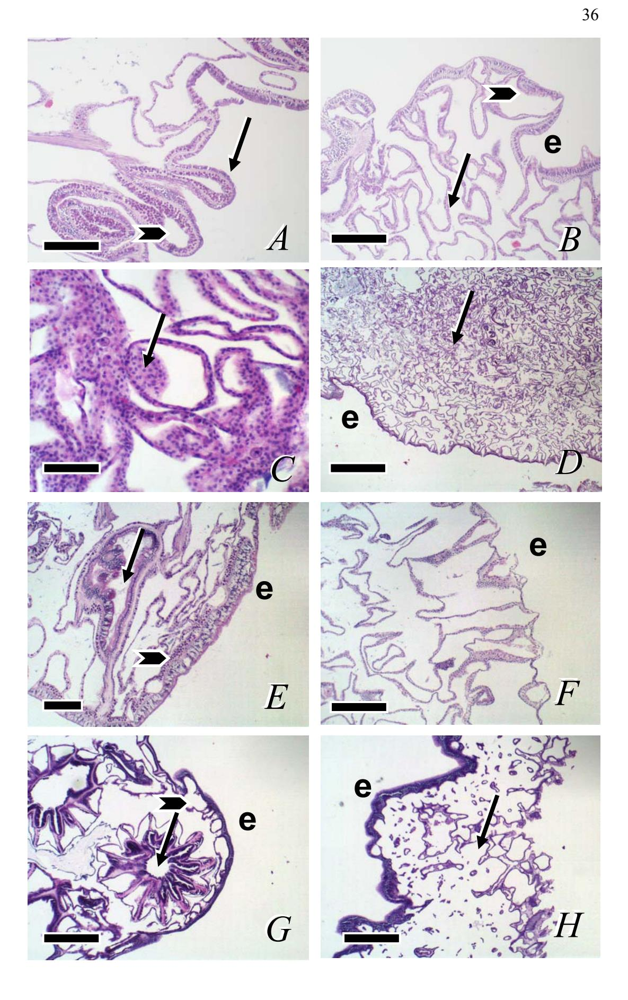

Figure 12. Tissue necrosis associated with algae/fungi (A-C); uncomplicated tissue necrosis (D-H). *Montipora* sp. (A-B); A) Gastrovascular canal, note filamentous organisms (arrow) associated with tissue necrosis (arrowhead), bar = 50 µm; B) Epithelium, note disruption of epithelium, gastrodermis and mesoglea by filamentous organisms (arrow) bar =;50 µm C-E) *Diploastrea heliopora*; C) Note infiltration of gastrovascular canal network with filamentous algae and atrophy of epithelium and gastrodermis (arrowhead), bar =500 µm; D) Note clumping and lifting of gastrodermis (arrowhead) off mesoglea (arrowhead), bar =50 µm; E) Note full thickness necrosis of mesoglea, epithelium, and gastrodermis (arrow), bar =100 µm; F) *Millepora* sp. Note diffuse coagulation necrosis of tissue (arrow), bar =100 µm; G) *Palythoa* sp. note full thickness necrosis of mesoglea, epithelium, and gastrodermis , bar = 100 µm; H ) *Platygyra* sp. note full thickness necrosis of mesoglea, epithelium, and gastrodermis (arrow), bar = 100 µm. e=epithelium.

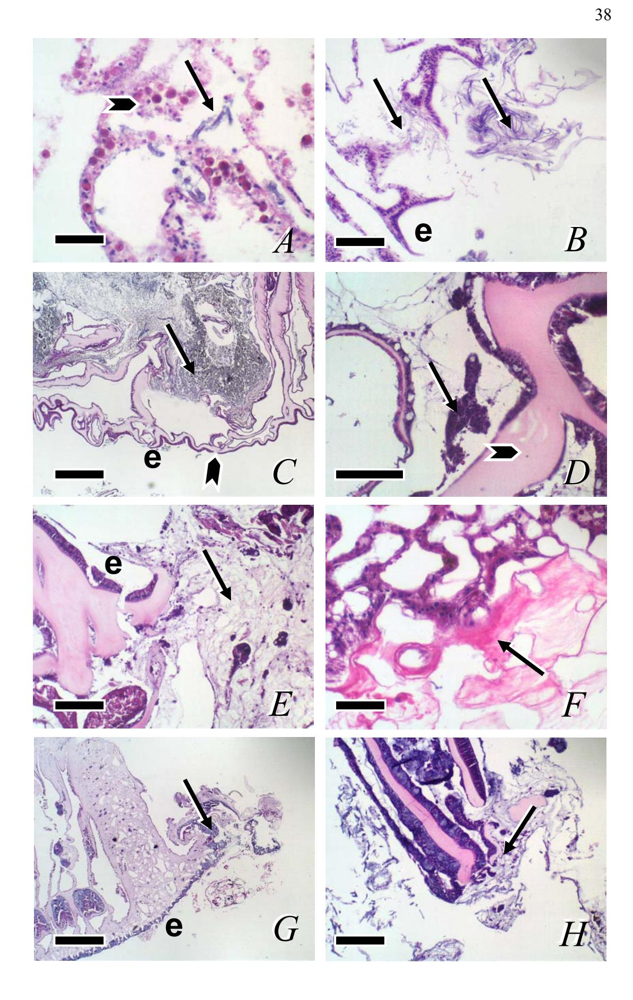

 Figure 13. Bacterial inclusions and metazoa. A) *Goniastrea* sp., bar = 50 µm; B) *Platygyra* sp. bar = 100 µm; C) *Montipora* sp. note polychaete within lumen of gastrovascular canal, bar = 100 µm; D) *Echinopora lamellosa* Note metazoan eveloped by pharyngeal cells (arrowhead) bar = 100 µm ; E) *Rumphella* sp., note crustacean in gastrovascular canal, bar = 100 µm; F) *Pectinia lactuca*, note metazoan within mesoglea, bar = 100 µm ; G) Massive *Porites* sp., note crustacean in pharyngeal cavity, bar = 100 µm ; H) *Montipora turtlensis*, note metazoan (arrow) among filamentous algae in gastrovascular canal network and skeletal hypertrophy (arrowhead), bar = 500 µm.

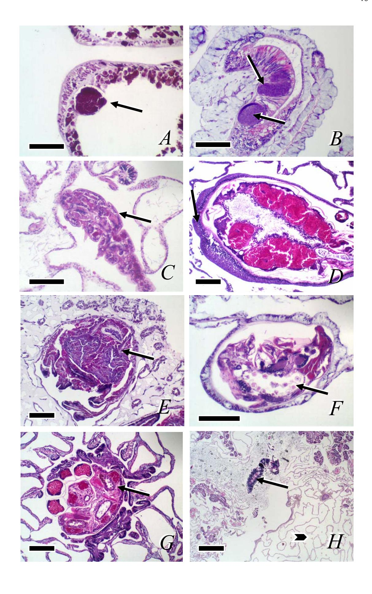