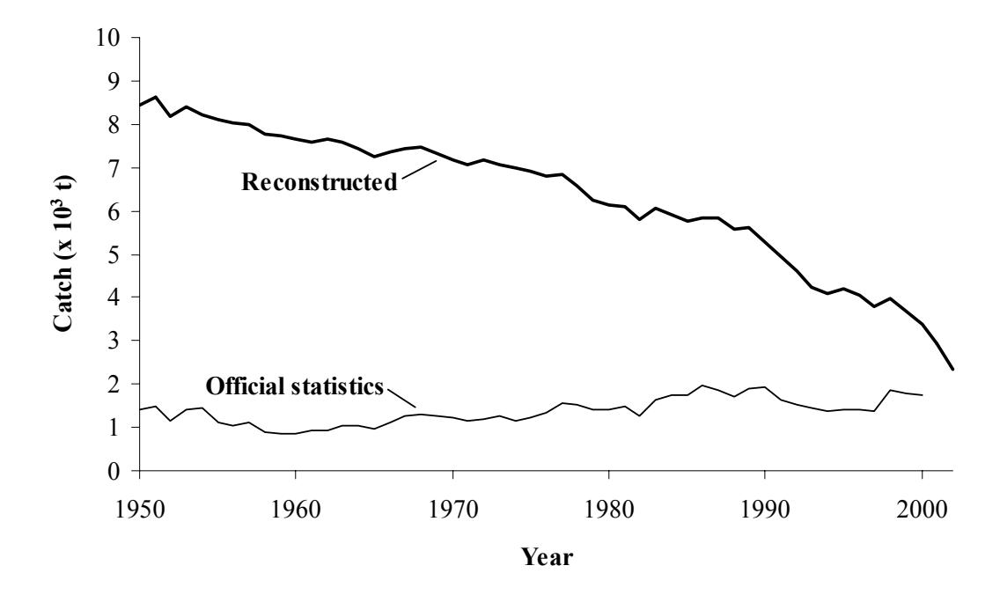
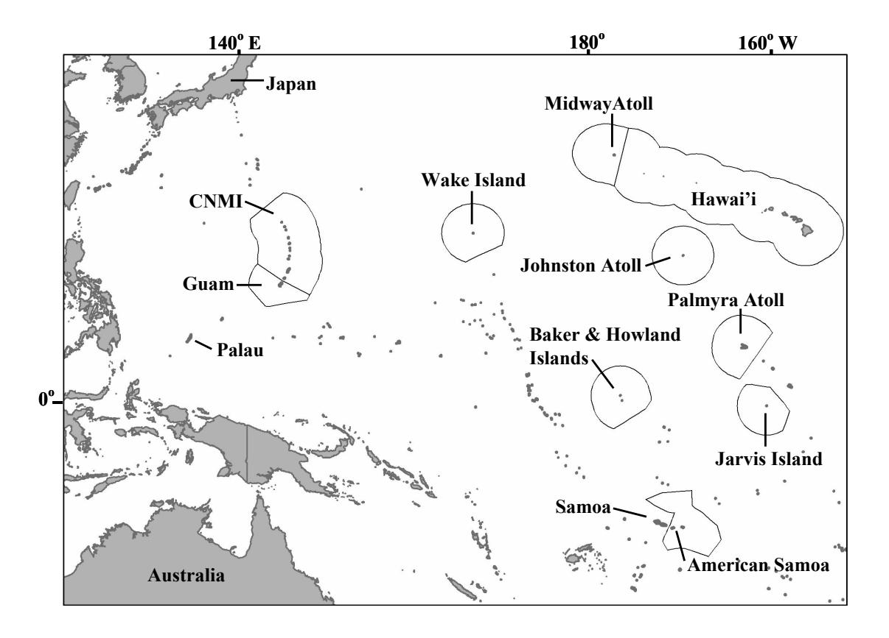
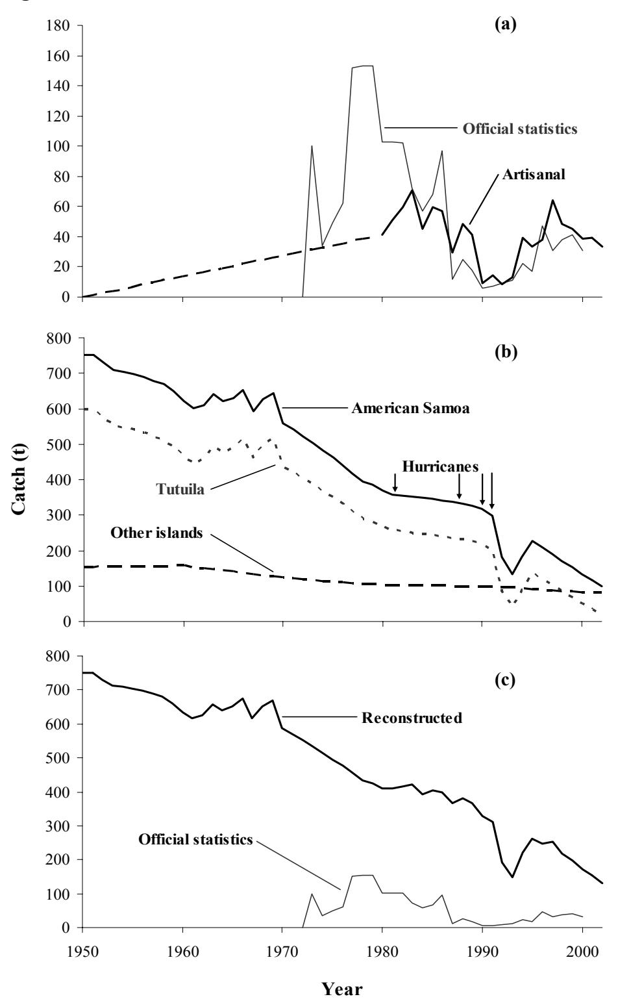
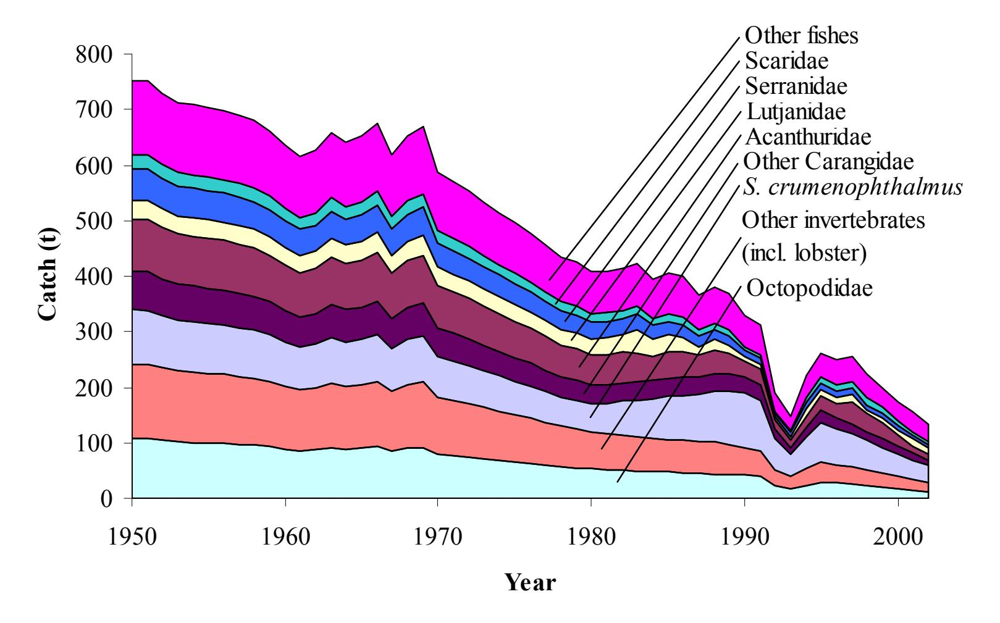
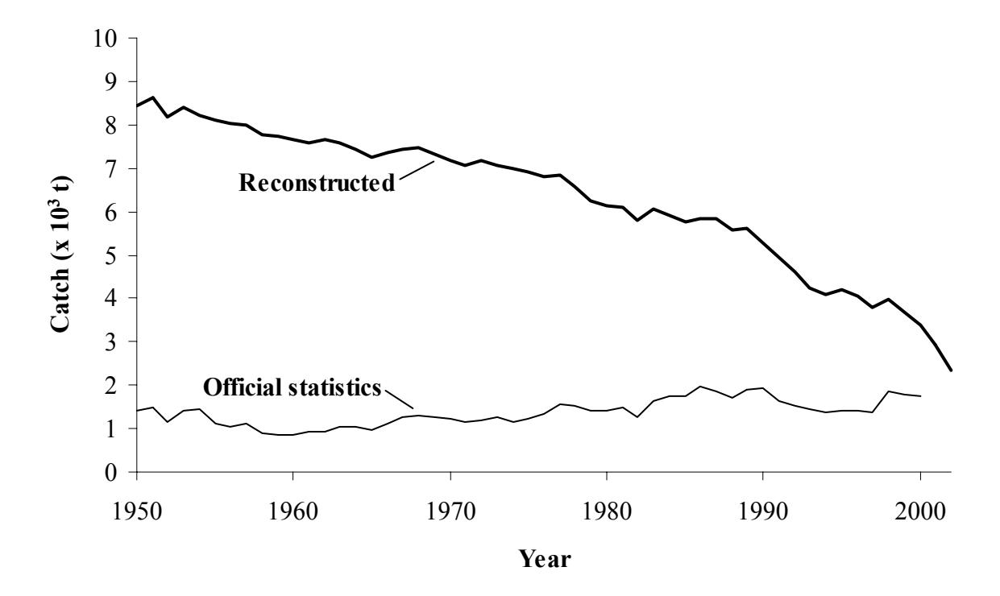

# **Reconstruction of coral reef fisheries catches for U.S. associated islands in the Western Pacific Region, 1950 to 2002**

Dirk Zeller, Shawn Booth & Daniel Pauly Fisheries Centre University of British Columbia 2259 Lower Mall Vancouver, BC V6T 1Z4

### **For:**

Western Pacific Regional Fishery Management Council 1164 Bishop St., Suite 1400 Honolulu, Hawaii 96813

Contract #: 03-WPC-043

Final Report: March 2005

# **Contents:**

| 1. Executive Summary                             | 1  |
|--------------------------------------------------|----|
| 2. General introduction                          | 6  |
| 3. Methods and Results                           | 10 |
| 3.1 American Samoa                               | 10 |
| 3.2 Guam                                         | 25 |
| 3.3 Commonwealth of the Northern Mariana Islands | 39 |
| 3.4 Hawaii                                       | 54 |
| 3.5 Other islands                                | 75 |
| 4. Conclusions                                   | 79 |
| 5. Acknowledgements                              | 83 |
| 6. References                                    | 84 |
| 7. Appendix                                      | 92 |

# **1. Executive Summary**

Fisheries have played a key role in defining and shaping Pacific Island societies. While fisheries for pelagic species such as tuna and billfishes are generally of great commercial significance, near-shore fisheries targeting coral reef species and species closely associated with coral reefs are of more fundamental importance, providing subsistence, recreational, cultural and food security functions. However, with regards to monitoring and reporting catches, these fisheries, owing to their scattered nature, have generally been ignored or neglected in official statistics, due to perceived difficulties in obtaining reliable 'hard data'. Thus, such catches remain unaccounted for in official statistics.

Reconstructing historic catches in cases where time-series data are lacking, requires bold assumptions and interpolations between often widely spaced data anchor points. These anchor points are usually based on data sources such as local studies, fisheries-unrelated studies (e.g., human diet- and consumption-studies) and generally unpublished gray literature. However, such approaches are required, as the alternative, i.e., continuing the established pattern of dealing with 'no timeseries data' situations by not reporting anything (which eventually is interpreted as 'zero' catches) is not really acceptable in light of increasing demands for accountability, and calls for sustainability and ecosystem based approaches to management. Without more fully accounting for all fisheries catches, we will not be able to obtain any measure of the true direct and indirect economic, as well as cultural value of marine resources to society, or of the cost overfishing represents for Pacific Island communities.

The purpose of this project was to assemble available information on catches for the coral reef fisheries of the U.S. associated islands of the Western Pacific region, specifically American Samoa, Guam, the Commonwealth of the Northern Mariana Islands (CNMI), Hawaii, and the other, isolated islands and atolls under U.S. jurisdiction, for the 1950-2002 period. The aim was to derive estimates of total removal of marine resources for this period, excluding large pelagic fisheries (e.g., tunas and billfishes). Thus, the focus was on coral reef fisheries, including the bottom-fisheries, as well as catches of coastal, reef-associated small pelagic species such as scads and jacks.

# *Overall summary*

The catch reconstruction for the U.S. associated islands of the Western Pacific undertaken here indicated:

- The catches for all islands combined suggested a substantial decline of about 72 % in total catches between 1950 and 2002. This contrasted distinctly with the pattern observed from the officially reported data alone, which suggested an increase in catches of about 19% (Figure 1.1); and
- The official reported data under-represented the reconstructed likely total catches for this time period by a factor of about 5 (Figure 1.1). This implies a substantial, if inadvertent, mis-representation of the status of local fisheries.

# *Individual island entities*

For American Samoa (Section 3.1), the reconstructed catches suggested a decline of about 80% in catches for coral reef and reef-associated pelagic fisheries between 1950 and 2002. Significant also was the 15-fold difference between the reconstructed catches and the official statistics as reported by the Western Pacific Fisheries Information Network (WPacFIN), based on data reported by American Samoa. Given the historic focus of official data collection systems on reporting commercial landings for economic development purposes, it is not surprising that the statistics for American Samoa reflect only the predominantly commercial small-boat bottom fish catches reported through WPacFIN (as well as the large pelagic species excluded here).

For Guam (Section 3.2), the reconstruction of historic catches suggested a decline of over 90% over the 50 year time period considered here. Important also is the 7 fold discrepancy between the reconstructed catches and the officially reported statistics. As officially reported data are usually used as indicators of global, regional and local fisheries conditions and trends, they are inadvertently misrepresenting the likely status of fisheries and resources in Guam.

For the Commonwealth of the Northern Mariana Islands (CNMI; Section 3.3), the reconstructed catches indicated a decline of about 48% in catches between 1950 and 2002. Comparing the officially reported non-pelagic catches with the reconstructed catches, indicated a 3 fold under-representation of catches by the officially reported data, compared to the reconstructed totals.

For Hawaii (Section 3.4), our reconstruction suggested that the combined commercial (officially reported data) and non-commercial fisheries catches for non-pelagic species declined by about 67% between 1950 and 2002. The unreported, non-commercial fisheries catches alone appear to have declined by about 78% over this time period. Furthermore, our reconstruction also suggested that, summed over the entire time period, non-commercial catches were approximately three times those of commercial landings.

For the other islands (Midway Atoll, Johnston Atoll, Palmyra Atoll, and Wake, Jarvis, Baker and Howland Islands; Section 3.5), only Johnston, Midway and Wake have small resident populations, and have small, recreational fisheries, with most data not reported in the official statistics. Reconstruction of catches for Johnston atoll suggested possible catches ranging from about 6 t·year-1 (13,000 lbs·year-1) for 1950 to a peak of about 14 t·year-1 (32,000 lbs·year-1) in 1985, before declining to approximately 3 t·year-1 (6,500 lbs·year-1) by 2002, with the overall pattern driven by changes in resident population of military and civilian personnel. Overall, an estimated total catch of about 435 t (960,000 lbs) was likely

extracted from the near-shore reefs around Johnston Atoll over the period considered here. The relatively small population of military and civilian personnel based on Wake Island were thought to catch on average approximately 900 kg·year-1 (1,960 lbs·year-1).

While local and regional agencies are aware of the official data being incomplete, our reconstruction makes the full scale of the likely mis-representation evident. The historic catch estimates will be useful for the assessments of fisheries and ecosystem status and conditions, i.e., as baselines of historic patterns, and as indicators of past productivity, largely lost at the present.

The present estimates are clearly not 'accurate' in the sense of being close to the 'true' time-series values, which are obviously not known. However, fundamentally important is the realization that the present estimates are less 'wrong' than what is used otherwise, i.e., the currently officially reported figures. We have shown that ignoring the catches of the non-commercial sectors of fisheries resulted in fundamentally skewed pictures of the historic use of coral reef resources in these islands. Moreover, we have shown that our approach led to conservative estimates.

Accepting the distinctly different baselines of past catches as presented in this report sheds new light on issues and concerns for fisheries sustainability and conservation. We suggest that management considerations regarding use and conservation of near-shore coral reefs, especially around the main inhabited islands, are no longer about 'sustainability', but rather about rebuilding depleted ecosystems. Also, the forgone benefits of not rebuilding will have to be considered when evaluating management strategies.

**Figure 1.1:** Total reconstructed catches of coral reef-, bottom- and reef-associated pelagic-fisheries for all U.S. associated islands of the Western Pacific combined, versus the officially reported statistics based on national reporting to FAO. Both the substantial under-representation of likely total catches, as well as the missed distinct decline in catches is evident when considering only the officially reported data.

# **2. General introduction**

Fisheries resources have played a key role in defining and shaping Pacific Island communities for centuries (Dalzell, 1998; Anonymous, 2001). While fisheries for pelagic species are often the most significant commercial fisheries in many areas of the tropical Pacific, near-shore coral reef fisheries are generally of more fundamental subsistence, recreational, social and cultural importance for many of the island communities, providing more than just food, trade and recreational resources (Boehlert, 1993; Dalzell, 1996; Dalzell *et al.*, 1996; Dalzell and Adams, 1997). Also, subsistence fisheries in many Pacific Island communities play, as primary source of protein, a particularly vital role in food security (Anonymous, 2001). Yet they are often ignored in official statistics due to perceived difficulties in 'hard-data' quantification (Anonymous, 2000). However, while catches for large pelagics are generally relatively well documented (at least for the last decades), catches for the small-scale, artisanal and recreational fisheries are often not reported to fisheries agencies. Hence, extractions of these marine resources usually remain unaccounted for in national and global statistics (Pauly, 1998). Such inadequate accounting and the resulting poor understanding of historical trends are a concern, given recent illustrations of the generally overlooked historical impacts of fishing and other human activities on marine resources and ecosystems (Jackson, 1997; Jackson *et al.*, 2001; Watson and Pauly, 2001; Pauly *et al.*, 2002; Christensen *et al.*, 2003; Pandolfi *et al.*, 2003).

Reconstruction of historic catch time series in cases where 'hard' time series data are lacking often requires interpolation and bold assumptions, justified by the unacceptable nature of the alternative, i.e., accepting catches as zero (Pauly, 1998). For example, the only global data set of fisheries catches in existence, assembled and maintained by the United Nations Food and Agriculture Organization (FAO, extracted June 2003), based on member country reports, presents total catches for Guam as <200 t prior to the mid 1980s (the majority being unidentified 'miscellaneous marine fishes'). Clearly, this is not reflective of true catches for an island whose human population nearly doubled between 1950-1980, from approximately 60,000 to over 100,000. Similarly, catches of non-pelagic species for the Northern Mariana Islands and American Samoa are poorly represented in FAO fisheries statistics, especially for the pre-1990 period.

Without accounting for fisheries catches for all sectors of a community, we cannot obtain any measure of the true direct and indirect economic as well as cultural value of these resources to the communities, or of the risks overfishing may represent for Western Pacific Island societies. This is of concern, given that human population growth rates in some areas of the Pacific are among the highest in the world (Craig, 2002; Green, 2002) and natural resources in the small Pacific Islands are limited, and perceived to be declining (Craig, 1995). Furthermore, for many Pacific Islands, the shift from predominantly subsistence to westernized, cashoriented economies, combined with increasing westernized development since the Second World War (WWII), has resulted in significantly diminished availability of coastal marine resources as a result of substantial environmental degradation of near-shore reefs due to coastal development. While localized overfishing is to blame for some of these impacts, coastal development, construction, discharges, pollution and poor watershed management leading to sedimentation have likely contributed substantially to reduce coral reef habitat- and resource-status. This is particularly the case close to human population centers on the main islands, while more remote locations appear in better shape (Green, 1997; Anonymous, 2001).

Given the highly scattered nature of coral reef fisheries, their catches are often not reported (Munro, 1980), despite the data assimilation and reporting support provided to U.S. associated islands by the National Oceanic and Atmospheric Administration (NOAA) through the Western Pacific Fisheries Information Network (WPacFIN, [www.pifsc.noaa.gov/wpacfin](http://www.pifsc.noaa.gov/wpacfin)). While many fisheries are unique to certain locations, such as palolo worm in American Samoa (Craig *et al.*, 1993), or the seasonal fisheries for juvenile rabbitfish in Guam (Hensley and Sherwood, 1993), some aspects, such as the seasonal fisheries for big-eye scad (*Selar crumenophthalmus*), are common to all islands (Boehlert, 1993). However, in many instances, small-scale studies have been undertaken, reporting local catches or catch rates for specific periods, locations and/or gear types (e.g., Craig *et al.*, 1993). Information is also often 'available' only in difficult-to-access gray literature reports (e.g., Saucerman, 1994), or form part of published studies with a primary focus other than catch reporting (e.g., Craig *et al.*, 1997). Such sources can form the foundation for deriving coral reef fisheries catches, catch rates per unit area, or *per caput* catch rates during a given time interval. These time point estimates provide anchor points of 'hard' data around which total catch estimates can be formed. Once all such data have been extracted, interpolations can be employed to fill in the periods for which hard data are missing. While, at first sight, interpolated periods may seem unsupported by data, the unfortunately common alternative is to leave years blank (no data), which later will invariably be interpreted as catches of zero, which is far worse than any interpolated estimate (Pauly, 1998). Thus, the key aspect of the approach used here is psychological, as one has to overcome the notion that 'no information is available', which is not only generally incorrect when dealing with fisheries, but also profoundly misleading (Pauly, 1998).

The purpose of the present project was to assemble available information and data on catches for the coral reef fisheries of American Samoa, Guam, the Commonwealth of the Northern Mariana Islands (CNMI) and Hawaii (Figure 2.1), for the 1950-2002 period. The aim was to derive estimates of total removal of marine resources for this period. The present reconstructions exclude large pelagic fisheries (e.g., tunas and billfishes). The remainder was treated as reef fisheries catches, including the so-called 'bottom-fishery' (Anonymous, 2004), as well as catches of coastal, reef-associated small pelagic species such as carangids, e.g., the big-eye scad (*Selar crumenophthalmus*), culturally important in many islands.

Significantly, by ascertaining historic baselines and time series of catches we can establish foundations on which local, community based management initiatives can build for long-term ecosystem rebuilding, leading to eventual sustainability, and the maintenance of the livelihoods and cultures of island societies (Pauly *et al.*, 2002).

**Figure 2.1:** Map of the Pacific Ocean, showing the location and EEZs of the U.S. associated Pacific Islands: American Samoa, Guam, Commonwealth of Northern Mariana Islands, Hawaii, and the other minor islands (Midway, Wake, Johnston, Palmyra, Jarvis, Baker and Howland Islands). Other countries mentioned in the text are also shown. Map courtesy of A. Kitchingman, *Sea Around Us* Project, University of British Columbia Fisheries Centre.

# **3. Methods and Results**

# **3.1 American Samoa**

# **Introduction**

American Samoa, the only U.S. territory south of the equator (14o 20'S, 170o W, land area: 200 km2 , Figure 2.1) includes two coral atolls and five volcanic islands. It is composed of the main island Tutuila, Aunu'u, the Manu'a Islands of Ofu, Olesega and Tau, the uninhabited Rose Atoll, and Swains Island. The islands are surrounded by fringing coral reefs that are partially exposed at low tide (NOAA, 1998). Estimated total coral reef area to 50 m depth is 479 km2 (A. Graves, National Park of American Samoa, pers. comm.), while the EEZ comprises 404,670 km2 . Beyond the reef edges of most islands, the bottom drops rapidly to deep water. The reefs around the main island of Tutuila have experienced several major hurricanes, a crown-of-thorns outbreak in the 1970s and a coral bleaching event in 1994, all causing substantial habitat damage (NOAA, 1998). While the coral communities seem to be recovering (Green, 2002), the fish communities around Tutuila appear not. The reefs of the more remote outer islands appear to be in good condition (Green, 1997, 2002).

Tuna canneries and the local government are the two main employers on American Samoa, with canned tuna being the only significant export commodity, supplying about 25% of all canned tuna in the U.S. in the early 1990s (Craig *et al.*, 1993). While tuna fishing and canning are major industries, many native Samoans practice subsistence farming and fishing. Significantly, subsistence fisheries play an important role in Samoan culture, and make important indirect economic contributions to households, given the generally low levels of wage-income by islanders (Craig *et al.*, 1993; Green, 1997). The population of American Samoa was about 68,000 in 2002, with the majority living on the main island of Tutuila. American Samoa's growth rate is among the highest in the world (2.1% per year, Craig, 2002), and during then 1990s alone, the population increased by 22% (Craig, 2002). This rapid population growth has raised significant concerns about overfishing the resources of American Samoa's main island of Tutuila (Craig *et al.*, 1999; Craig, 2002; Green, 2002). Indeed, the shore-based catches on Tutuila appear to have been in decline since at least the 1970s (Ponwith, 1991; Craig *et al.*, 1993).

The American Samoan coral reef fishery has two components, a shore-based subsistence fishery and a boat-based artisanal fishery (Green, 1997), but a clear separation between commercial and non-commercial aspects in each fishery is difficult, as some fish are sold and others retained for personal consumption (Craig *et al.*, 1993).

### **Approach & methods**

In line with Craig *et al*. (1993), one can distinguish four types of domestic fisheries in American Samoa:

- a) A shoreline subsistence fishery;
- b) An artisanal, small-boat fishery for bottom-fish;
- c) An artisanal fishery for offshore pelagic species; and
- d) A recreational tournament fishery targeting large pelagic species.

Catches for (c) and (d) consist of large pelagic species such as tuna (mainly *Thunnus alalunga*, *T. albacares*, *T. obesus*, and *Katsuwonus pelamis*), mahi mahi (*Coryphaena hippurus*), wahoo (*Acanthocybium solandri*) and billfishes, and, together with the larger commercial distant water fleets targeting tuna, were not considered here. Thus, our focus is on (a) the shoreline subsistence and (b) the artisanal bottom fisheries.

Examination of the WPacFIN data [\(www.pifsc.noaa.gov/wpacfin](http://www.pifsc.noaa.gov/wpacfin)) and associated information (Aitaoto, 1985; Craig *et al.*, 1993; Hamm *et al.*, 2003) indicated that these data primarily pertain to the small boat fleets, providing the best estimates for catches of the artisanal sector back to the mid-1980s. The shoreline subsistence fishery, on the other hand, was first examined by Hill (1978) and Wass (1980). During the first half of the 1990s, an inshore creel survey attempted to estimate shoreline catches for the main island of Tutuila, but was unfortunately discontinued (Ponwith, 1991; Craig *et al.*, 1993; Saucerman, 1994, 1996). Between 1991 and 1995, WPacFIN reported shoreline subsistence fishery catch estimates based on this survey. However, differences in the estimated catches between WPacFIN records and original sources (Ponwith, 1991; Craig *et al.*, 1993; Saucerman, 1994), combined with uncertainties about the procedure used to derive the database estimates by scaling up from the creel surveys (D. Hamm, WPacFIN, pers. comm.) suggested that the original sources were more reliable.

Thus, the procedure employed for reconstructing total catches was:

### *Artisanal fisheries*

- 1) *1982-2002*: The WPacFIN data were taken as artisanal catches (data extracted on May 26, 2004). We removed the artisanal pelagic catches by species, thus retaining only bottom-fish and reef-associated species;
- 2) *1980-1981*: We used total catches reported in the American Samoa Statistical Digest (Anonymous, 1988). In order to account for pelagic catches for 1980- 81, we removed the 1982-84 average percentage for pelagic species as per WPacFIN data;
- 3) *1950-1979*: We assumed that the artisanal fisheries developed well after WWII (P. Craig, National Park American Samoa, pers. comm.). Thus, we set artisanal catches to zero in 1950 and interpolated between 1950 and 1980.

### *Subsistence fisheries*

The shore-based subsistence fisheries were separated into two geographic components, the main island (Tutuila) and 'outer islands' (Ofu, Olosega, T'au and minor islands). This was done for two reasons: (a) the assessments done in the past (Wass, 1980; Ponwith, 1991; Craig *et al.*, 1993; Saucerman, 1994, 1996) restricted their sampling to the main island, and (b) the 'outer islands' have not experienced the increasing population (and fishing) pressure of the main island, and are deemed to be more stable in their near-shore fisheries pattern, and likely more representative of near-pristine subsistence catches (Green, 2002, P. Craig, National Park American Samoa, pers. comm.).

The procedure for subsistence catch reconstruction was as follows:

- 1) Data anchor points:
  - a. *Main island (Tutuila)*: For the year 2002, we used the estimate by Coutures (2003), and for 1991 the estimate from Craig et al. (1993) for the main island. For 1992-1995, we used Saucerman's (1994; 1996) data and percentage decline of catches relative to 1991. For 1980, we relied on the study by Wass (1980) for main island catches, while for 1979, we used the *per caput* catch rate estimated by Craig *et al.* (1993), in combination with human population estimates for the main island [\(www.census.gov/ipc/](http://www.census.gov/ipc/)). For 1950, we assumed a *per caput* catch rate of 36.3 kg·person-1·year -1 (80 lbs·person-1·year-1) based on a slightly lower subsistence catch rate than that observed for 'outer islands' (see below) due to the higher opportunities for alternative livelihoods available on Tutuila in 1950 (P. Craig, National Park American Samoa, pers. comm.);
  - b. *Outer islands*: Recent work done by P. Craig (unpublished data) for the 'outer islands' indicated that a previous catch estimate for these islands (Craig *et al.*, 1993) was a substantial underestimate. Instead, an estimate of about 82 t for 2002 was used, derived as part of an

ongoing investigation into subsistence fisheries in American Samoa (P. Craig unpublished data). This was converted into a *per caput* catch rate for the 'outer islands' using population statistics, and is considered a representative subsistence catch rate under minimal influence of urbanization.

# 2) Time series interpolation:

- a. *Main island (Tutuila)*: For the period 1996-2002, we extrapolated between the 1995 and 2002 anchor points outlined above;
- b. For the period 1981-1990, we used the *per caput* catch rates for 1979 and 1991 (8.82 and 4.45 kg·person-1·year-1, respectively; Craig *et al.* 1993), interpolated these between the anchor years, and extrapolated catches for the population sizes on Tutuila from 1981 to 1990;
- c. For 1950-1978, we interpolated the *per caput* catch rates used as anchor points for 1950 (P. Craig, National Park American Samoa, pers. comm.) and 1979 (Craig *et al.*, 1993), and expanded to catches using human population statistics;
- d. *Outer islands*: We carried the *per caput* catch rate reported by P. Craig (unpublished data) back to 1950, and extrapolated catches using population statistics for these islands.

### *Species composition*

The taxonomic breakdown of artisanal catches as reported by WPacFIN for 1988 to 2002 was retained as presented. As a large proportion (64-91%) of catches for the earlier period, 1982-1987, was reported as 'miscellaneous' groups, we applied a proportional species breakdown to these groups, as well as to the interpolated catch estimates for the pre-1982 period. We derived this average proportional breakdown from the reported WPacFIN data for 1989-1993, to exclude the gear specific effects on species composition due to the rapid growth of SCUBA-based spear-fishing between 1994 and 2001, which biased the species breakdowns (P. Craig, unpublished data).

For the subsistence component, taxonomic compositions were reported by Wass (1980) and Saucerman (1994), and formed the basis for interpolations. Emphasis was placed on minimizing the un-informative 'miscellaneous' categories (Watson *et al.*, 2004). Wass (1980) was used for the 1950-1980 time period, and Saucerman (1994) for 1990 onwards. The data for 1981 to 1989 was interpolated from Wass (1980) to Saucerman (1994) at the taxon level described by Wass (1980).

### *Data quality checks*

Quality checks were undertaken for all reconstructed catch estimates, notably by converting estimated catches into catch per surface area of coral reef and into *per caput* catch of seafood (excluding pelagics and ignoring imports) using human population data. American Samoa has approximately 479 km2 of coral reefs to a depth of 50 m, with about 108 km2 and about 17 km2 associated with the main island Tutuila and the outer inhabited islands, respectively (A. Graves, National Park of American Samoa, unpublished data). For human population statistics, we relied on U.S. Census Bureau data.

# **Results**

### *Total catch estimates*

*FAO versus NOAA-WPacFIN data* 

Examination of official fisheries catch statistics from FAO, with pelagic species removed but miscellaneous groups retained in full, indicated that prior to the early 1970s, no reliable data were submitted by U.S. authorities to FAO for American Samoa (Figure 3.1.1a). Until the mid 1990s, FAO reports a maximum of about 150 t·year-1 , mainly as 'miscellaneous marine fishes', which likely contain pelagic species. The data reported by WPacFIN for non-pelagic species, representing the regional (NOAA Pacific) and local (American Samoa) official statistics for the

small-boat based artisanal fisheries, match the FAO (non-pelagic) pattern fairly well, at least for the latter years (Figure 3.1.1a). While this reflects a relatively well established reporting mechanism from the local to the international level, it also illustrates that the artisanal catches appear to be the only non-pelagic catches reported to FAO.

### *Subsistence fisheries catches*

The catch reconstruction for the shore-based, subsistence fisheries documented two distinct trends (Figure 3.1.1b). The reconstructed catch estimates for the main island, Tutuila, showed a decline from 1950 to 1990, followed by a dramatic drop in the early 1990s, before returning to the approximate levels and declining trend of the pre-1990s. In contrast, catches for the 'outer islands' simply reflect the decrease in human population levels on the islands. The overall picture for American Samoa, however, is one of dramatically declining levels of total catches in the non-commercial sector of the fisheries, from an estimated peak of about 750 t in 1950, to the present low of about 100 t in 2002 (Figure 3.1.1b).

Thus, the officially reported landings (NOAA and FAO) underestimate historic catch levels as reconstructed here by a factor of 15, and fail to demonstrate the dramatic decline in coral reef fisheries resources experienced by the local population (Figure 3.1.1c).

### *Taxonomic accounting*

Our reconstruction improved taxonomic accounting from 11 taxa (plus 'miscellaneous marine fishes') as reported by FAO, to 144 taxa plus two miscellaneous groups: 'marine fishes' and 'marine invertebrates'. We also reduced the proportion of catch reported in the uninformative 'miscellaneous' categories from a time series average of 77.3% (range: 0-100%) in FAO and 25.0% (range: 0- 91.5%) in WPacFIN to 7.2% (range 0.2-10.0%) in the reconstructed time series. The lack of variability in taxonomic patterns between years for the earlier period of the reconstructed data (pre-1980) is a reflection of the interpolation using fewer anchor points (Figure 3.1.2). Nevertheless, some patterns emerge. The catch estimates are dominated in the earlier years by typical coral reef fishes, such as serranids, scarids and acanthurids, as well as coastal pelagics such as the Carangidae (Figure 3.1.2). However, octopus was also important during these early years. This is likely a reflection of the higher occurrence of reef gleaning in earlier periods, which often targets invertebrates such as octopus and bivalves. In contrast, the later years are dominated by small coastal pelagics, especially the bigeye scad (*Selar crumenophthalmus*, Carangidae). This pattern thus reflects a decline in diversity in catches. The decline of invertebrates in the catches is especially noticeable in the decline in catches of octopus, from an estimated 107 t in 1950 to 13 t in 2002 (Figure 3.1.2).

### *Data quality checks*

Catch per area of coral reef (to 50 m depth), based on the reconstructed catches for the whole of American Samoa, ranged from about 1.6 t·km-2·year -1 at the start of the time series to 0.3 t·km-2·year-1 in 2000 (Table 3.1.1). This dramatic decline in area catch rates is driven by the main island, Tutuila, where rates declined from 5.5 t·km-2·year-1 to about 0.6 t·km-2 ·year-1 between 1950 and 2000 (Table 3.1.1). Estimated catch rates for the outer islands declined less, from about 9 t·km-2·year-1 in 1950 to about 5 t·km-2 ·year-1 by 2000 (Table 3.1.1).

The human population of American Samoa has grown rapidly in the last decades. However, this growth has only occurred on the main island of Tutuila, while the outer islands have experienced a steady decline in resident population (Table 3.1.1). Taking into account these population changes, the *per caput* catch rate has declined substantially on Tutuila, from approximately 36 kg·person-1 ·year-1 to 1 kg·person-1·year-1 over the time period considered here. The *per caput* catch rate for the 'outer islands' has remained constant in our reconstructed data (58.6

kg·person-1·year-1, Table 3.1.1) due to the nature of our reconstruction in this datapoor context.

# **Discussion**

The reconstruction of historic catches presented here suggests an 80% decline in catches for coral reef and reef-associated small pelagic fisheries around American Samoa between 1950 and 2002. Significant is the large discrepancy (15-fold difference) between the reconstructed scenario and official statistics (FAO), based on national reporting. Given the historic focus of most national, as well as FAO databases, on reporting commercial landing statistics for economic development purposes, it is not surprising that the official statistics for American Samoa reflect only the (predominantly commercial) small-boat artisanal bottom fish catches reported through WPacFIN (as well as the large pelagic species, excluded here). Nevertheless, national and FAO statistics, increasingly used as indicators of global fisheries conditions and trends, clearly - if inadvertently - mis-represent the true nature of fisheries catches for American Samoa over the last 50 years.

In contrast, while known to be important (Craig *et al.*, 1993; Dalzell *et al.*, 1996), the historically large shore-based subsistence catch is not estimated. This is a typical example of 'no data' being eventually transformed into 'zero catches' (Pauly, 1998). The official statistics are dominated by the commercial fisheries (especially the large pelagic fisheries not considered here) and the small boatbased artisanal fisheries. While this commercial component clearly makes a direct economic contribution to American Samoa, subsistence fisheries play a significant role in local culture, and make important indirect economic contributions to households (Craig *et al.*, 1993; Green, 1997).

The shore-based catches on the main island Tutuila appear to have been in decline at least since the 1970s (Ponwith, 1991; Craig *et al.*, 1993). The 80% decline in overall coral reef catches since the 1950s, as reported here thus supports the argument of substantial overfishing (Craig and Green, 2004). In the past, Pacific islanders have relied heavily on coral reef resources, often as their primary source of protein (Dalzell *et al.*, 1996). While economic and social changes over the last 50-100 years have resulted in islanders' diet becoming more variable, coral reef resources remain a major element in food security (Dalzell *et al.*, 1996). The apparent increases in reef fish imports from Samoa (formerly Western Samoa) also indicate that catches from American Samoa cannot meet the demand (Craig *et al.*, 1993). Furthermore, the small size of fish in catches and surveys (Craig *et al.*, 1993; Green, 1997) supports serious concerns about overfishing. Interestingly, the annual *per caput* catch, as estimated here for the main island Tutuila, has declined from 36.3 kg·person-1 ·year-1 to 1.1 kg·person-1·year-1 between 1950 and 2000. In contrast, Samoa has a *per caput* fish consumption of at least 32 kg·person-1·year -1 (Spalding *et al.*, 2001). Given the proximity and historic cultural affinity between the two Samoas, one could assume that American Samoa would have a similar or slightly lower consumption pattern (due to increased westernization), hence the high and growing rates of imports of reef fishes into Tutuila (Craig *et al.*, 1993). In contrast, *per caput* catch for the 'outer islands' was recently estimated at about 58 kg·person-1·year-1 (P. Craig, National Park American Samoa, unpublished data). This compares favorably with estimates of 61 kg·person-1·year -1 as the average *per caput* catch in the Polynesian islands in the mid 1990s (Dalzell *et al.*, 1996). Thus, while coral reef catches are thought to be sustainable on the 'outer islands', the available evidence points strongly towards substantial overfishing of the coastal resources of Tutuila over the last 50 years.

The dramatic decline in catches observed in the early 1990s on Tutuila coincided with several hurricanes which caused considerable damage to coral reefs (Craig, 2002; Green, 2002; Craig and Green, 2004). The local ecosystems, particularly the fish communities, would have been stressed prior to the hurricanes due to overfishing, as illustrated by the declines in reconstructed catches prior to 1990.

Thus, the effects of hurricanes were likely only an additional, albeit severe, stressor for an already overfished ecosystem.

Dalzell and Adams (1997) presented catch rates for the main island of Tutuila of 7.04 t·km-2·year-1 and 17.03 t·km-2 ·year-1 for the mid 1990s and early 1980s, respectively. These estimates are much higher than those calculated for Tutuila from our reconstructed data (0.6-5.5 t·km-2·year -1), and the reasons for this aren't clear. Similarly, our estimated catch rates for 'outer islands' (4.9-9.4 t·km-2·year -1), while being higher than for Tutuila, are at the lower end of the estimates presented by Dalzell and Adams (1997), and are due to the low population density on the 'other islands'. Thus, the present reconstruction and its extrapolation are likely a very conservative estimation of historic catches.

**Table 3.1.1:** Data quality check for reconstructed coral reef fisheries catches for American Samoa. Estimated catches are presented as catch per surface area of coral reefs to a depth of 50 m, and as *per caput* catch of reef and reef-associated species, for American Samoa in total, and for the 'main' and 'outer' islands separately.

| <u>separater</u>                                                       | Estimated |                                    |                                          | h                                              |  |
|------------------------------------------------------------------------|-----------|------------------------------------|------------------------------------------|------------------------------------------------|--|
| Year                                                                   | catch     | Catch/area Population a |                                          | <i>Per caput</i> catch b            |  |
|                                                                        | (t)       | $(t\cdot km^{-2}\cdot year^{-1})$  |                                          | (kg·person -1 ·year -1 ) |  |
|                                                                        |           | American Samo                      | $a (479 \text{ km}^2)^c$                 |                                                |  |
| 1950                                                                   | 752       | 1.57                               | 19,100                                   | 39.4                                           |  |
| 1960                                                                   | 636       | 1.33                               | 20,000                                   | 31.8                                           |  |
| 1970                                                                   | 587       | 1.23                               | 27,267                                   | 21.5                                           |  |
| 1980                                                                   | 409       | 0.85                               | 32,418                                   | 12.6                                           |  |
| 1990                                                                   | 328       | 0.68                               | 47,199                                   | 7.0                                            |  |
| 2000                                                                   | 142       | 0.30                               | 57,301                                   | 2.5                                            |  |
|                                                                        | 1         | Main island (Tutui                 | la; 108.2 km 2 ) c |                                                |  |
| 1950                                                                   | 598       | 5.53                               | 16,468                                   | 36.3                                           |  |
| 1960                                                                   | 478       | 4.42                               | 17,305                                   | 27.6                                           |  |
| 1970                                                                   | 464       | 4.29                               | 25,155                                   | 18.4                                           |  |
| 1980                                                                   | 307       | 2.84                               | 30,686                                   | 10.0                                           |  |
| 1990                                                                   | 228       | 2.11                               | 45,485                                   | 5.0                                            |  |
| 2000                                                                   | 60        | 0.55                               | 55,886                                   | 1.1                                            |  |
| Outer islands (Ofu, Olosega, T'au; 16.9 km 2 ) c |           |                                    |                                          |                                                |  |
| 1950                                                                   | 154       | 9.11                               | 2,632                                    | 58.6                                           |  |
| 1960                                                                   | 158       | 9.35                               | 2,695                                    | 58.6                                           |  |
| 1970                                                                   | 124       | 7.34                               | 2,112                                    | 58.6                                           |  |
| 1980                                                                   | 101       | 5.98                               | 1,732                                    | 58.6                                           |  |
| 1990                                                                   | 100       | 5.92                               | 1,714                                    | 58.6                                           |  |
| 2000                                                                   | 83        | 4.91                               | 1,415                                    | 58.6                                           |  |

&lt;sup>a U.S. Census Bureau, <u>www.census.gov/ipc/www/idbprint.html</u>, accessed August 2004;

b excluding pelagic species, and ignoring imports; c A. Graves (National Park of American Samoa, unpubl. data)

**Figure 3.1.1 (see next page):** Catch time series for non-pelagic fisheries in American Samoa, with (a) Official catch time series for non-pelagic species from two sources: FAO (FISHSTAT 2001 data) and NOAA WPacFIN (representing artisanal, small-boat fisheries). Note that until 1994, FAO reported only two categories ('miscellaneous marine fishes' and 'spiny lobster'), and therefore the 'miscellaneous' category likely contains pelagic species, explaining the discrepancy in catches between the two sources, especially for the 1970s and early 1980s; (b) Reconstructed catches of the shore-based, subsistence fisheries of American Samoa as estimated by the present study. Catches were estimated separately for the main island Tutuila, and the outer islands (Ofu, Olosega, T'au and minor islands). The time periods of major hurricanes in the last 20 years is indicated. Note that coral reef associated, near-shore small pelagic species such as Carangidae (specifically the big-eye scad, *Selar crumenophthalmus*) are included in the present estimates; and (c) Total reconstructed coral reef fisheries catches for American Samoa (small-boat, artisanal and shore-based, subsistence fisheries combined) versus the official globally reported statistics as per FAO. Both the substantial under-representation of total catches as well as the missed distinct decline in catches is evident when considering only the global statistics.

**Figure 3.1.2:** Taxonomic breakdown of reconstructed catches for coral reef and reef-associated small pelagic fisheries for American Samoa. For clarity in the present figure we reduced the taxonomic breakdown from 144 taxa plus two miscellaneous groups to seven groups plus two miscellaneous groups (other fishes: 44 taxa, other invertebrates: 15 taxa).

# **4. Conclusions**

The catch reconstruction for the U.S. associated islands of the Western Pacific undertaken here provides for several main conclusions with regards to coral reef, bottom- and reef-associated pelagic species:

- 1) The reconstruction of historic catches for all islands combined indicated a substantial decline of about 72 % between 1950 and 2002 (Figure 4.1). This pattern contrasted distinctly with that observed from the officially reported data alone, which suggested a marginal increase in catches of about 19% (Figure 4.1);
- 2) The officially reported data under-represented by a factor of about 5 the likely total catches based on the reconstructions (Figure 4.1). This implies a substantial - if inadvertent - mis-representation of the status of local marine resources and fisheries;
- 3) Consequently, in conjunction with the generally increasing population base on these islands, and a general tendency for centralization of population density on one or more main islands, the *per caput* catch rates have declined (Table 4.1). This also reflects in part the increasing westernization of dietary habits, with the resultant health problems (WHO, 2003); and
- 4) The catch rates per surface area of coral reefs have declined on all islands entities, in some cases substantially (e.g., Guam, Table 4.2). However, the rates estimated using our reconstruction are well within published ranges of production for Pacific Islands (e.g., Dalzell, 1996; Dalzell *et al.*, 1996; Dalzell and Adams, 1997), though generally at the lower end, confirming the conservative nature of our approach. Nevertheless, with respect to the centralized population pressures, exploitation levels on coral reefs close to population centers (in the case of Hawaii most of the islands in the MHI) are very high (e.g., Green, 1997), and have exceeded their sustainable levels.

With regards to our use of and comparison to official data (mainly based on FAO statistics), we acknowledge that FAO FishStat was originally designed as an economic development tool, thus explaining its focus on commercial landings. Nevertheless, these data are being used extensively to present global fisheries conditions and resources status and trends. Thus, the likely mis-representation as illustrated here can lead directly to erroneous interpretation of the status of resource within the U.S. associated islands, and likely the Pacific in general. While local and regional agencies are aware of the official data being incomplete, the full scale of the potential mis-representation is made evident through our reconstruction. In the long term it would serve the responsible authorities well to utilize the historic catch estimates as presented here as basis for assessments of fisheries and ecosystem status and conditions, i.e., as baselines of historic patterns, forgone benefits and indicators of past productivity, largely lost at present.

The approach used here, relying on anchor points of data obtained from published and unpublished literature, localized case studies or indirect indicators (e.g., historic consumption rates), and extrapolated using human population data, resulted in catch estimates that do not correspond with official reported values. We acknowledge that our estimates clearly are not 'accurate' in the sense of being close to 'true' time-series values, which are obviously not known. However, of fundamental importance is the realization that the present estimates are less 'wrong' than the currently officially reported figures. We have shown clearly that ignoring the catches of non-commercial sectors of fisheries in the U.S. associated islands of the Western Pacific results in a fundamentally skewed picture of the historic use of coral reef resources in these islands. This project also clearly demonstrated the importance of the observation that 'no data' does not mean 'zero catches' (Pauly, 1998).

Local and regional management agencies need to recognize the substantial decline in coastal and coral reef resources, both as represented here in terms of catch volume, as well as with regards to the problem of removal of large keystone species, such as large parrot-fishes that play a fundamental role in coral reef ecosystem functioning and structural maintenance (Bellwood *et al.*, 2003). Given poor taxonomic accounting particularly for the critical early periods, we are not in a position to assess these taxonomic shifts in detail. Accepting such different estimates of past catches sheds new light on directions of fisheries sustainability issues and conservation concerns. Clearly, considerations of conservation and use of near-shore coral reefs, especially around the main inhabited islands, are no longer about 'sustainability', but rather about rebuilding depleted ecosystem (Pitcher, 2001; Pikitch *et al.*, 2004).

**Table 4.1**: Per caput catch rates (kg·person-1·year-1).

| Year | American Samoa | Guam | CNMI | Hawaii |
|------|----------------|------|------|--------|
| 1950 | 39.4           | 26.6 | 72.6 | 11.3   |
| 1960 | 31.8           | 19.9 | 53.9 | 8.1    |
| 1970 | 21.5           | 10.0 | 37.9 | 6.8    |
| 1980 | 12.6           | 4.1  | 20.5 | 5.1    |
| 1990 | 7.0            | 1.9  | 7.6  | 3.9    |
| 2000 | 2.5            | 1.4  | 3.5  | 2.3    |

**Table 4.2**: Catch rates per surface area of coral reefs (t·km-2) for the main U.S. associated Western Pacific Islands.

| Year | American Samoa | Guam  | CNMI - | Hawaii |            |
|------|----------------|-------|--------|--------|------------|
|      |                |       |        | MHI    | MHI + NWHI |
| 1950 | 1.57           | 23.10 | 15.84  | 2.13   | 0.40       |
| 1960 | 1.33           | 19.36 | 16.58  | 2.04   | 0.37       |
| 1970 | 1.23           | 12.34 | 16.27  | 2.07   | 0.37       |
| 1980 | 0.85           | 6.22  | 12.00  | 1.93   | 0.35       |
| 1990 | 0.68           | 3.70  | 11.61  | 1.59   | 0.31       |
| 2000 | 0.31           | 3.23  | 8.56   | 1.01   | 0.20       |

**Figure 4.1:** Total reconstructed catches of coral reef-, bottom- and reef-associated pelagic-fisheries for all U.S. associated islands of the Western Pacific combined, versus the officially reported statistics based on national reporting to FAO. Both the substantial under-representation of likely total catches, as well as the missed distinct decline in catches is evident when considering only the officially reported data.

# **6. References**

- AECOS. 1983. Central and Western Pacific Regional Fisheries Development Plan. Report to Pacific Basin Development Council, Honolulu, Hawaii, Kailua, Hawaii, 175 p.
- Aitaoto, F. 1985. Domestic commercial fishery in American Samoa. Annual Report, Office of Marine Resources, Government of American Samoa, Pago Pago, 16 p.
- Anderson, R. D. and A. Hosmer. 1981. Annual Report Fiscal Year 1981. Division of Aquatic & Wildlife Resources, Guam, 202 p.
- Anderson, R. D., R. L. Kock, H. G. Tucker and C. M. Wille. 1979. Annual Report Fiscal Year '79. Division of Aquatic & Wildlife Resources, Guam, 339 p.
- Anderson, R. D., A. Hosmer, D. Morris and J. Beaver. 1980. Annual Report Fiscal Year '80. Division of Aquatic & Wildlife Resources, Guam, 206 p.
- Anonymous. 1965. Survey of Guam's fish population and fishing methods. Division of Aquatic & Wildlife Resources, Guam, 5-20 p.
- Anonymous. 1966. Survey of Guam's fish population and fishing methods. Division of Aquatic & Wildlife Resources, Guam, 3-14 p.
- Anonymous. 1967. Survey of Guam's fish population and fishing methods. Division of Aquatic & Wildlife Resources, Guam, 4-17 p.
- Anonymous. 1968. Survey of Guam's fish population and fishing methods. Division of Aquatic & Wildlife Resources, Guam, 1-13 p.
- Anonymous. 1969. Survey of Guam's fish population and fishing methods. Division of Aquatic & Wildlife Resources, Guam, 72-82 p.
- Anonymous. 1970. Survey of Guam's fish population and fishing methods. Division of Aquatic & Wildlife Resources, Guam, 43-52 p.
- Anonymous. 1971. Survey of Guam's fish population and fishing methods. pp. 1-12 *in* Anonymous, editor. Annual Report Fiscal Year '71. Division of Aquatic & Wildlife Resources, Guam.
- Anonymous. 1972. Survey of Guam's fish population and fishing methods. pp. 1-12 *in* Anonymous, editor. Annual Report Fiscal Year '72. Division of Aquatic & Wildlife Resources, Guam.
- Anonymous. 1973. Survey of Guam's fish population and fishing methods. pp. 1-10 *in* Anonymous, editor. Annual Report Fiscal Year '73. Division of Aquatic & Wildlife Resources, Guam.
- Anonymous. 1974. Survey of Guam's fish population and fishing methods. pp. 1-9 *in* Anonymous, editor. Annual Report Fiscal Year '74. Division of Aquatic & Wildlife Resources, Guam.
- Anonymous. 1975. Survey of Guam's fish population and fishing methods. pp. 1-14 *in* Anonymous, editor. Annual Report Fiscal Year '75. Division of Aquatic & Wildlife Resources, Guam.

- Anonymous. 1976. Survey of Guam's fish population and fishing methods. pp. 1-11 *in* Anonymous, editor. Annual Report Fiscal Year '76. Division of Aquatic & Wildlife Resources, Guam.
- Anonymous. 1977. Survey of Guam's fish population and fishing methods. pp. 1-19 *in* Anonymous, editor. Annual Report Fiscal Year '77. Division of Aquatic & Wildlife Resources, Guam.
- Anonymous. 1978. Survey of Guam's fish population and fishing methods. pp. 1-42 *in* Anonymous, editor. Annual Report Fiscal Year '78. Division of Aquatic & Wildlife Resources, Guam.
- Anonymous. 1982a. Offshore Creel Census. pp. 2-22 *in* Anonymous, editor. Annual Report Fiscal Year '82. Division of Aquatic & Wildlife Resources, Guam.
- Anonymous. 1982b. Fisheries Data Compilation Project (Guam), final report. Funded by Western Pacific Regional Management Council, prepared by Pacific Basin Environmental Consultants (Guam), Honolulu, 40 p.
- Anonymous. 1987a. 1985 National Survey of Fishing, Hunting and Wildlife-associated Recreation: Hawaii. US Fish and Wildlife Service, US Bureau of Census, Washington, DC, 83 p.
- Anonymous. 1987b. A report on resident fishing in the Hawaiian Islands. Developed by: Meyer Resources. Southwest Fisheries Center, National Marine Fisheries Service, Administrative Report H-87-8C, Honolulu, 74 p.
- Anonymous. 1987c. Commonwealth of the Northern Mariana Islands. Report to the Western Pacific Regional Fisheries Management Council, Honolulu, 10 p.
- Anonymous. 1988. American Samoa Statistical Digest 1988. Economic Development and Planning Office, American Samoa Government, Pago Pago, 136 p.
- Anonymous. 1989. Inshore Fisheries Survey. pp. 33-46 *in* Anonymous, editor. Annual Report Fiscal Year '89. Division of Aquatic & Wildlife Resources, Guam.
- Anonymous. 1994. Biological analysis of the nearshore reef fishery of Saipan and Tinian. Division of Fish and Wildlife, Commonwealth of the Northern Mariana Islands, Technical Report 94-02, Saipan, 125 p.
- Anonymous. 1998a. CNMI Statistical Yearbook. Central Statistics Division, Department of Commerce, CNMI Government, Saipan, 146 p.
- Anonymous. 1998b. 1996 National Survey of Fishing, Hunting and Wildlife-associated Recreation: Hawaii. US Fish and Wildlife Service, US Bureau of Census, Washington, DC, vii+47+32 p.
- Anonymous. 2000. Cities, Seas, and Storms. Managing change in Pacific Island economies. Volume III: Managing the use of the ocean. The World Bank, Washington, D.C., XIII + 43 p.
- Anonymous. 2001. Final Fisheries Management Plan for Coral Reef Ecosystems of the Western Pacific Region. Western Pacific Regional Fishery Management Council, Honolulu, 341 + 352 + 383 p.
- Anonymous. 2003. State of Hawaii 2001 Fishery Statistics. Report prepared by Division of Aquatic Resources and the Western Pacific Fishery Information Network, Honolulu, 52 p.
- Anonymous. 2004. Bottom fish and seamount groundfish fisheries of the Western Pacific region, 2002 Annual Report. A report of the Western Pacific Regional

- Fishery Management Council, NOAA award Number NA07FC0025, Honolulu, 174 p.
- Bellwood, D. R., A. S. Hoey and J. H. Choat. 2003. Limited functional redundancy in high diversity systems: resilience and ecosystem function on coral reefs. Ecology Letters 6: 281-285.
- Boehlert, G. W. 1993. Fisheries and marine resources of Hawaii and the U.S.-associated Pacific Islands: An introduction. Marine Fisheries Review 55: 3-6.
- Brock, V. E. 1947. Report of the Director, Division of Fish and Game. Report of the Board of Commissioners of Agriculture and Forestry of the Territory of Hawaii. Biennial period ending June 30, 1946, Honolulu, 48-62 p.
- Cesar, H. S. J. and P. J. H. van Beukering. 2004. Economic valuation of the coral reefs of Hawai'i. Pacific Science 58: 231-242.
- Christensen, V., S. Guénette, J. J. Heymans, C. J. Walters, R. Watson, D. Zeller and D. Pauly. 2003. Hundred-year decline of North Atlantic predatory fishes. Fish and Fisheries 4: 1-24.
- Cobb, J. N. 1903. The Aquatic Resources of the Hawaiian Islands. Part II Section III. The commercial fisheries of the Hawaiian Islands. Bulletin of the United States Fish Commission 23: 715-765.
- Coutures, E. 2003. The shoreline fishery of American Samoa. Department of Marine and Wildlife Resources Biological Report Series No 102, Pago Pago, 22 p.
- Craig, P. 1995. Are tropical nearshore fisheries manageable in view of projected population increases? South Pacific Commission and Forum Fisheries Agency workshop on the management of South Pacific inshore fisheries. Manuscripts collection of country statements and background papers. Tech. Doc. Integr. Coast. Fish. Manag. Proj. S. Pac. Comm. 11(Vol. 1), Noumea (New Caledonia), 197-208 p.
- Craig, P. 2002. Status of coral reefs in 2002: American Samoa. pp. 183-187 *in* Turgeon, D. D., R. Asch, B. Causey, R. Dodge, W. Jaap, K. Banks, J. Delaney, B. Keller, R. Speiler, C. Matos, J. Garcia, E. Diaz, D. Catanzaro, C. Rogers, Z. Hillis-Starr, R. Nemeth, M. Taylor, G. Schmahl, M. Miller, D. Gulko, J. Maragos, A. Friedlander, C. Hunter, R. Brainard, P. Craig, R. Richond, G. Davis, J. Starmer, M. Trianni, P. Houk, C. Birkeland, A. Edward, Y. Golbuu, J. Gutierrez, N. Idechong, G. Paulay, A. Tafileichig and N. Vander Velde, editors. The State of Coral Reef Ecosystems of the United States and Pacific Freely Associated States: 2002. National Oceanic and Atmospheric Administration/National Ocean Service/National Centers for Coastal Ocean Science, Silver Spring, M.D.
- Craig, P. and A. Green. 2004. Overfished coral reefs in American Samoa: no quick fix. Report to Coral Reef Advisory Group, Pago Pago, 2 p.
- Craig, P., B. Ponwith, F. Aitaoto and D. Hamm. 1993. The commercial, subsistence, and recreational fisheries of American Samoa. Marine Fisheries Review 55: 109-116.
- Craig, P., J. H. Choat, L. M. Axe and S. Saucerman. 1997. Population biology and harvest of the coral reef surgeonfish *Acanthurus lineatus* in American Samoa. Fishery Bulletin 95: 680-693.
- Craig, P., N. Daschbach, S. Wiegman, F. Curren and J. Aicher. 1999. Workshop Report and Development of 5-year Plan for Coral Reef Management in American

- Samoa (2000-2004). American Samoa Coral Reef Advisory Group, Government of American Samoa, Pago Pago, 28 p.
- Dalzell, P. 1996. Catch rates, selectivity and yields of reef fishing. pp. 161-192 *in* Polunin, N. V. C. and C. M. Roberts, editors. Reef Fisheries. Chapman & Hall, London.
- Dalzell, P. 1998. The role of archaeological and cultural-historical records in long-range coastal fisheries resources management strategies and policies in the Pacific Islands. Ocean and Coastal Management 40: 237-252.
- Dalzell, P. and T. J. H. Adams. 1997. Sustainability and management of reef fisheries in the Pacific Islands. Proceedings of the eight international coral reef symposium 2: 2027-2032.
- Dalzell, P., T. J. H. Adams and N. V. C. Polunin. 1996. Coastal fisheries in the pacific islands. Oceanographic Marine Biology Annual Review 34: 395-531.
- Dela Cruz, P. Q. and W. H. Stewart. 1997. A graphical presentation of selected economic and social indicators for the Commonwealth of the Northern Mariana Islands. Department of Commerce, CNMI Government, Saipan, 66 p.
- Eldredge, L. G. 1983. Summary of environmental and fishing information on Guam and the Commonwealth of the Northern Mariana Islands: historical background, description of the islands, and review of the climate, oceanography, and submarine topography. NOAA Technical Memorandum NOAA-TM-NMFS-SWFC-40, Guam, 181 p.
- Everson, A. 1994. Fishery data collection system for fishery utilization study of Kaneohe Bay. Two year interim report. Main Hawaiian Islands Marine Resources Investigation, Hawaii Division of Aquatic Resources, Technical Report 94-01, Honolulu, 45 p.
- Everson, A. 1995. Catch, effort, and yields for a coral reef fishery at Kaneohe Bay, Hawaii. Draft 6/95, Honolulu, 25 p.
- Friedlander, A. 1996. Assessment of the coral reef resources of Hawaii with emphasis on waters of federal jurisdiction. Western Pacific Regional Fishery Management Council, Honolulu, 62 p.
- Friedlander, A. and J. D. Parrish. 1997. Fisheries harvest and standing stock in a Hawaiian Bay. Fisheries Research 32: 33-50.
- Gaffney, R. 2000. Evaluation of the status of the recreational fishery for ulua in Hawai'i, and recommendations for future management. DAR Technical Report 20-02, Honolulu, 35 p.
- Garrod, P. V. and K. C. Chong. 1978. The fresh fish market in Hawaii. Hawaii Agricultural Experimental Station Departmental Paper 23 (2M), College of Tropical Agriculture, University of Hawaii, Honolulu, 24 p.
- Gourley, J. 1997. The Commonwealth of the Northern Mariana Islands: An assessment of the coral reef resources under local and federal jurisdiction. Western Pacific Regional Fishery Management Council, Contract 96-WPC-119, report prepared by Micronesian Environmental Services, Saipan, Honolulu, 69 p.
- Green, A. 1997. An assessment of the status of the coral reef resources, and their patterns of use, in the U.S. Pacific Islands. Western Pacific Regional Fisheries Management Council, NOAA Award Report NA67AC0940, Honolulu, 281 p.

- Green, A. 2002. Status of coral reefs on the main volcanic islands of American Samoa. Department of Marine and Wildlife Resources, Pago Pago, 86 p.
- Gulko, D., J. Maragos, A. Friedlander, C. Hunter and R. Brainard. 2002. Status of coral reefs in the Hawaiian Archipelago. pp. 155-182 *in* Turgeon, D. D., R. Asch, B. Causey, R. Dodge, W. Jaap, K. Banks, J. Delaney, B. Keller, R. Speiler, C. Matos, J. Garcia, E. Diaz, D. Catanzaro, C. Rogers, Z. Hillis-Starr, R. Nemeth, M. Taylor, G. Schmahl, M. Miller, D. Gulko, J. Maragos, A. Friedlander, C. Hunter, R. Brainard, P. Craig, R. Richond, G. Davis, J. Starmer, M. Trianni, P. Houk, C. Birkeland, A. Edward, Y. Golbuu, J. Gutierrez, N. Idechong, G. Paulay, A. Tafileichig and N. Vander Velde, editors. The State of Coral Reef Ecosystems of the United States and Pacific Freely Associated States: 2002. National Oceanic and Atmospheric Administration/National Ocean Service/National Centers for Coastal Ocean Science, Silver Spring, M.D.
- Hamm, D. and H. K. Lum. 1992. Preliminary results of the Hawaii small-boat fisheries survey. Southwest Fisheries Center, National Marine Fisheries Service, Administrative Report H-92-08, Honolulu, 35 p.
- Hamm, D., N. T. S. Chan and C. J. Graham. 2003. Fishery statistics of the Western Pacific Volume XVIII: Territory of American Samoa (2001), Commonwealth of the Northern Mariana Islands (2001), Territory of Guam (2001), State of Hawaii (2001). NOAA Fisheries, Pacific Islands Fisheries Science Center Administrative Report H-03-02, Honolulu, 172 p.
- Helvey, M., S. J. Crooke and P. A. Milone. 1987. Marine recreational fishing and associated state-federal research in California, Hawaii, and the Pacific Island Territories. Marine Fisheries Review 49: 8-14.
- Hensley, R. A. and T. S. Sherwood. 1993. An overview of Guam's inshore fisheries. Marine Fisheries Review 55: 129-138.
- Hill, H. B. 1978. The use of nearshore marine life as a food resource by American Samoans. M.Sc. University of Hawaii, Honolulu Pages p.
- Hoffman, R. G. and H. Yamauchi. 1999. 1972. Recreational fishing its impact on state and local economies. Departmental Paper 3. College of Tropical Agriculture, Hawaii Agricultural Experiment Station, University of Hawaii. pp. 12-15 *in* Glazier, E. W., editor. Non-commercial fisheries in the Central and Western Pacific: A summary review of the literature. SOEST 99-07, JIMAR Contribution 99-326. National Marine Fisheries Service, Honolulu.
- Hudgins, L. L. 1980. Per capita annual utilization and consumption of fish and shellfish in Hawaii, 1970-1977. Marine Fisheries Review 42: 16-20.
- Irons, D. K., R. K. Kosaki and J. D. Parrish. 1990. Johnston Atoll resource survey final report - Phase six (21 Jul 89 - 20 Jul 90). Dept. of the Army, U.S. Army Engineer District, Honolulu, Fort Shafter, Hawaii. *in* Anonymous, editor. Final Fisheries Management Plan for Coral Reef Ecosystems of the Western Pacific Region. Western Pacific Regional Fishery Management Council, 2001, Honolulu.
- Jackson, J. B. C. 1997. Reefs since Columbus. Coral Reefs 16: S23-S32.
- Jackson, J. B. C., M. X. Kirby, W. H. Berger, K. A. Bjorndal, L. W. Botsford, B. J. Bourgue, R. H. Bradbury, R. Cooke, J. Erlandson, J. A. Estes, T. P. Hughes, S. Kidwell, C. B. Lange, H. S. Lenihan, J. M. Pandolfi, C. H. Peterson, R. S.

- Steneck, M. J. Tegner and R. R. Warner. 2001. Historical overfishing and the recent collapse of coastal ecosystems. Science 293: 629-638.
- Kahiapo, J. and M. K. Smith. 1994. Shoreline creel survey of Hilo Bay: 1985-1990. Main Hawaiian Islands Marine Resources Investigation, Hawaii Division of Aquatic Resources, Technical Report 94-02, Honolulu, 31 p.
- Lack, M., K. Short and A. Wilcock. 2003. Managing risk and uncertainty in deep-sea fisheries: lessons from Orange Roughy. TRAFFIC Oceania and WWF Australia Endangered Seas Programme 73 p.
- Lowe, M. K. 2001. The status of inshore fisheries ecosystems in the main Hawaiian Islands at the dawn of the millennium: cultural impacts, fisheries trends and management challenges. pp. 236 *in* Friedlander, A. M., editor. Symposium Proceedings: Status of Hawaii's coastal fisheries in the new millennium. American Fisheries Society, Honolulu.
- Miller, S. A. 2001. Economic assessment of the domestic fisheries development potential of the Commonwealth of the Northern Mariana Islands. National Marine Fisheries Service, NOAA, Saltonstall-Kennedy Grant Program, Grant Number: NA 96FD0471, Saipan, 127 p.
- Munro, J. L. 1980. Stock assessment models: applicability and utility in tropical smallscale fisheries. pp. 35-47 *in* Saila, S. B. and P. M. Roedel, editors. Stock assessment for tropical small-scale fisheries. University of Rhode Island, Kingston.
- Myers, R. F. 1993. Guam's small-boat-based fisheries. Marine Fisheries Review 55: 117-128.
- NOAA. 1998. The extent and condition of US coral reefs. *in*. Miller, S.L. and Crosby, M.P.. NOAA's State of the Coast Report. Silver Spring, MD. Available at: http://state\_of\_coast.noaa.gov/bulletins/html/crf\_08/crf.html.
- Pandolfi, J. M., R. H. Bradbury, E. Sala, T. P. Hughes, K. A. Bjorndal, R. G. Cooke, D. McArdle, L. McClenachan, M. J. H. Newman, G. Paredes, R. R. Warner and J. B. C. Jackson. 2003. Global trajectories of the long-term decline of coral reef ecosystems. Science 301: 955-958.
- Pauly, D. 1998. Rationale for reconstructing catch time series. EC Fisheries Cooperation Bulletin 11: 4-10.
- Pauly, D., V. Christensen, J. Dalsgaard, R. Froese and F. Torres. 1998. Fishing down marine food webs. Science 279: 860-863.
- Pauly, D., V. Christensen, S. Guénette, T. J. Pitcher, U. R. Sumaila, C. J. Walters, R. Watson and D. Zeller. 2002. Towards sustainability in world fisheries. Nature 418: 689-695.
- Pikitch, E. K., C. Santora, E. A. Babcock, A. Bakun, R. Bonfil, D. O. Conover, P. Dayton, P. Doukakis, D. L. Fluharty, B. Heneman, E. D. Houde, J. Link, P. A. Livingston, M. Mangel, M. K. McAllister, J. Pope and K. J. Sainsbury. 2004. Ecosystem-based Fishery Management. Science 305: 346-347.
- Pitcher, T. J. 2001. Fisheries managed to rebuild ecosystems? Reconstructing the past to salvage the future. Ecological Applications 11: 601-617.
- Polovina, J. J. 1987. Assessment and management of deepwater bottom fishes in Hawaii and the Marianas. pp. 505-532 *in* Polovina, J. J. and S. Ralston, editors. Tropical

- Snappers and Groupers. Biology and Fisheries Management. Ocean Resource and Marine Policy Series, Westview Press, Boulder.
- Ponwith, B. 1991. The shoreline fishery of American Samoa: a 12-year comparison. Department of Marine and Wildlife Resources Biological Report Series, No. 22, Pago Pago, 51 p.
- Pooley, S. G. 1993. Hawaii's marine fisheries: some history, long-term trends, and recent developments. Marine Fisheries Review 55: 7-19.
- Radtke, H. and S. Davis. 1995. Analysis of Saipan's seafood markets. Report for: Division of Fish and Wildlife, Commonwealth of the Northern Mariana Islands, RFP94-0006, Saipan, XV + 89 + appendices p.
- Richmond, R. H. and G. W. Davis. 2002. Status of the coral reefs of Guam. pp. 189-194 *in* Turgeon, D. D., R. Asch, B. Causey, R. Dodge, W. Jaap, K. Banks, J. Delaney, B. Keller, R. Speiler, C. Matos, J. Garcia, E. Diaz, D. Catanzaro, C. Rogers, Z. Hillis-Starr, R. Nemeth, M. Taylor, G. Schmahl, M. Miller, D. Gulko, J. Maragos, A. Friedlander, C. Hunter, R. Brainard, P. Craig, R. Richond, G. Davis, J. Starmer, M. Trianni, P. Houk, C. Birkeland, A. Edward, Y. Golbuu, J. Gutierrez, N. Idechong, G. Paulay, A. Tafileichig and N. Vander Velde, editors. The State of Coral Reef Ecosystems of the United States and Pacific Freely Associated States: 2002. National Oceanic and Atmospheric Administration/National Ocean Service/National Centers for Coastal Ocean Science, Silver Spring, M.D.
- Roberts, C. 2002. Deep impact: the rising toll of fishing in the deep sea. Trends in Ecology and Evolution 17: 242-245.
- Saucerman, S. 1994. The inshore fishery of American Samoa, 1991 to 1993. Department of Marine and Wildlife Resources, DMWR Biological Report Series, Pago Pago, 35 p.
- Saucerman, S. 1996. Inshore fisheries documentation. Annual Report of the Department of Marine and Wildlife Resources, Pago Pago, 29 p.
- Schug, D. M. 2001. Hawai'i's commercial fishing industry: 1820-1945. The Hawaiian Journal of History 35: 15-34.
- Shomura, R. S. 1987. Hawaii's marine fishery resources: yesterday (1900) and today (1986). Southwest Fisheries Center, National Marine Fisheries Service, Administrative Report H-87-21, Honolulu, 14 p.
- Smith, M. K. 1993. An ecological perspective on inshore fisheries in the main Hawaiian Islands. Marine Fisheries Review 55: 34-49.
- Smith, R. O. 1947. Survey of the fisheries of the former Japanese mandated islands. Fishery Leaflet 273, U.S. Fish and Wildlife Service, Department of the Interior, Washington, 105 p.
- Somerton, D. A. and B. S. Kikkawa. 1992. Population dynamics of pelagic armorhead *Pseudopentaceros wheeleri* on southeast Hancock seamount. Fishery Bulletin 90: 759-769.
- Spalding, M. D., C. Ravilious and E. P. Green. 2001. World Atlas of Coral Reefs. University of California Press, London, 424 p.
- Starmer, J., M. Trianni and P. Houk. 2002. Status of coral reefs in The Commonwealth of the Northern Mariana Islands. pp. 195-204 *in* Turgeon, D. D., R. Asch, B.

- Causey, R. Dodge, W. Jaap, K. Banks, J. Delaney, B. Keller, R. Speiler, C. Matos, J. Garcia, E. Diaz, D. Catanzaro, C. Rogers, Z. Hillis-Starr, R. Nemeth, M. Taylor, G. Schmahl, M. Miller, D. Gulko, J. Maragos, A. Friedlander, C. Hunter, R. Brainard, P. Craig, R. Richond, G. Davis, J. Starmer, M. Trianni, P. Houk, C. Birkeland, A. Edward, Y. Golbuu, J. Gutierrez, N. Idechong, G. Paulay, A. Tafileichig and N. Vander Velde, editors. The State of Coral Reef Ecosystems of the United States and Pacific Freely Associated States: 2002. National Oceanic and Atmospheric Administration/National Ocean Service/National Centers for Coastal Ocean Science, Silver Spring, M.D.
- Trianni, M. S. 1998. Summary and further analysis of the nearshore reef fishery of the Northern Mariana Islands. Division of Fish and Wildlife, Department of Lands and Natural Resources, Commonwealth of the Northern Mariana Islands, Technical Report 98-02, Saipan, 64 p.
- Uchida, R. N. 1978. The fish resources of the Western Central Pacific Islands. FAO Fisheries Circular No. 712, FIRM/C712, Rome, 53 p.
- Uchida, R. N. 1983. Summary of environmental and fishing information on Guam and the Commonwealth of the Northern Mariana Islands: a review of the plankton communities and fishery resources. NOAA Technical Memorandum, Southwest Fisheries Center, NOAA-TM-NMFS-SWFC-33, Honolulu, 159 p.
- Uchida, R. N. and D. T. Tagami. 1984. Groundfish fisheries and research in the vicinity of seamounts in the North Pacific Ocean. Marine Fisheries Review 46: 1-17.
- Wass, R. C. 1980. The shoreline fishery of American Samoa: past and present. pp. 51-83 *in* Munro, J. L., editor. Marine and coastal processes in the Pacific: ecological aspects of coastal zone management. Papers presented at a UNESCO seminar held at Motupore Island Research Centre, University of Papua New Guinea. United Nations Educational Scientific and Cultural Organization, Jakarta Pusat.
- Watson, R. and D. Pauly. 2001. Systematic distortions in world fisheries catch trends. Nature 414: 534-536.
- Watson, R., A. Kitchingman, A. Gelchu and D. Pauly. 2004. Mapping global fisheries: sharpening our focus. Fish and Fisheries 5: 168-177.
- WHO. 2003. Diet, food supply and obesity in the Pacific. World Health Organization. Background document for the FAO/SPC/WHO Consultation on Food Safety and Quality in the Pacific, Nadi, Fiji, 11-15 November 2002, Geneva, 62 p.