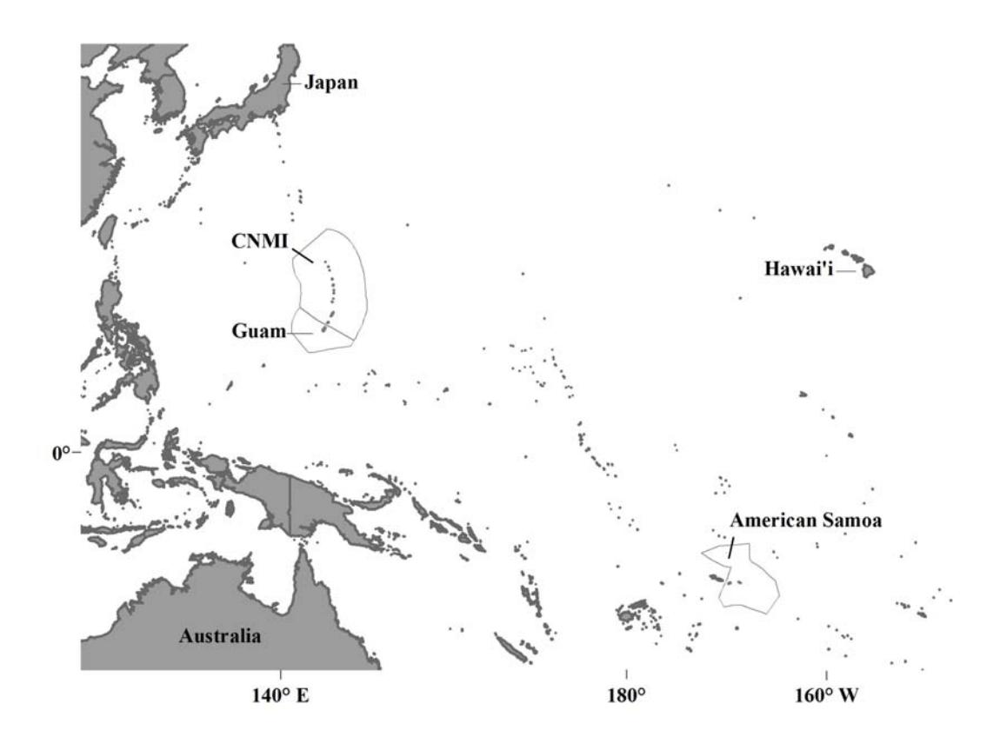
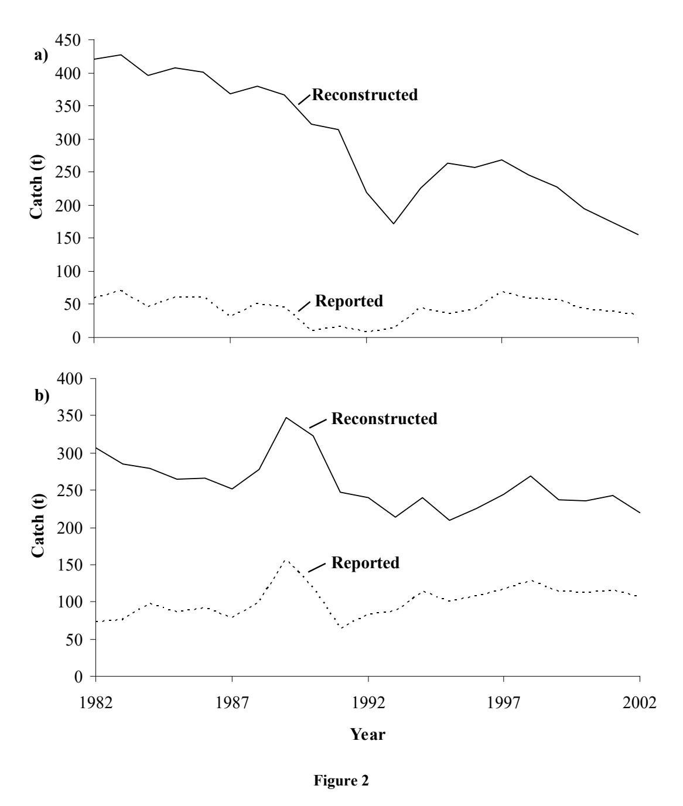
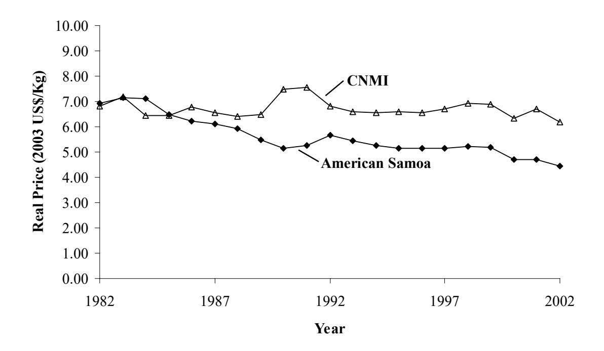
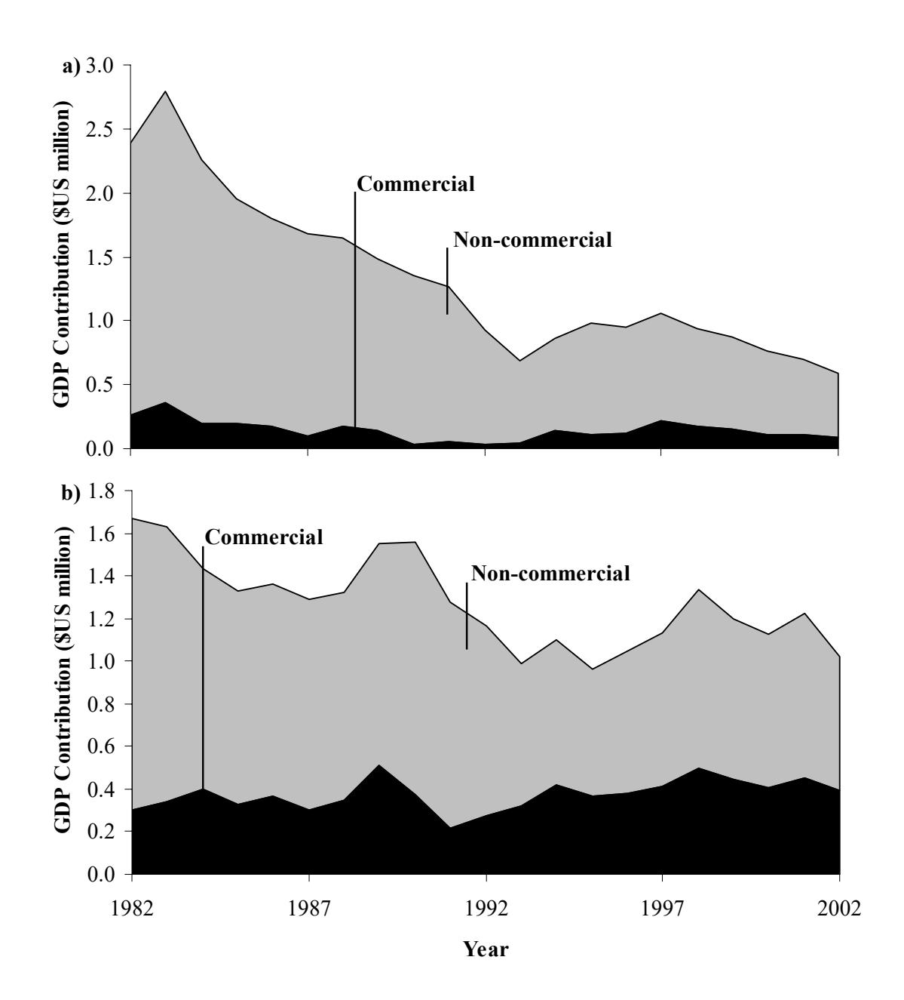

# **Fisheries Contributions to GDP: Underestimating Small-scale Fisheries in the Pacific**

**DIRK ZELLER\* , SHAWN BOOTH, DANIEL PAULY**

Fisheries Centre, University of British Columbia Vancouver, V6T 1Z4, Canada

\* Corresponding author: [d.zeller@fisheries.ubc.ca](mailto:d.zeller@fisheries.ubc.ca) 

Other authors: [s.booth@fisheries.ubc.ca,](mailto:s.booth@fisheries.ubc.ca) [d.pauly@fisheries.ubc.ca](mailto:d.pauly@fisheries.ubc.ca)

**Marine Resource Economics 2006 (in press)** 

**Running head**: *Underestimating Small-scale Fisheries*

### **Abstract**

*In developing countries, official statistics, national accounts, and economic development initiatives generally focus on commercial, often export-oriented fisheries, which are often perceived to be the major economic contribution of fisheries. While small-scale, noncommercial fisheries, especially near-shore subsistence fisheries, have been recognized as fundamental for social, cultural, and food security reasons, their catches are seldom accounted for in official statistics. Thus, their contribution to Gross Domestic Product (GDP) are often not taken into consideration. Previously undertaken catch time-series reconstructions for small-scale coastal fisheries of two U.S. flag island areas in the tropical Pacific (American Samoa and the Commonwealth of the Northern Mariana Islands [CNMI]) provided estimates of total catches for 1982-2002 (commercial and non-commercial) and suggested considerable discrepancies between reported (commercial) statistics and reconstructed (commercial plus non-commercial) estimates. We applied a valuation approach used by the Manila-based Asian Development Bank to the reconstructed catch data for nonpelagic species to estimate total near-shore fisheries contributions to national GDP using value-added estimators for each fisheries sector in combination with available price data for the period 1982-2002. This suggested that the contributions of small-scale fisheries to GDP for these two island areas may have been underestimated by a factor of over five, and indicated that the non-commercial sector plays a more significant role in national accounts as contributors to GDP than currently assumed. This analysis should challenge existing perspectives of marginality of non-commercial fisheries sectors to developing countries in general and should give international development agencies, as well as local governments, pause to rethink their prioritization of fisheries development support.* 

**Keywords** Artisanal fisheries, catch reconstruction, coral reef fisheries, developing countries, GDP, national accounts, small-scale fisheries, subsistence fisheries, valuation.

**JEL Classification Code** Q22.

### **Introduction**

When considering fisheries in the economic context of developing countries, governments generally rely on fisheries data reported by their fisheries agency. For many Pacific islands, these are dominated by large-scale, industrial Distant Water Fleets targeting tuna resources, or local, small-scale commercial fisheries supplying local markets (Anonymous 1997; Gillett *et al.* 2001). In contrast, non-commercial small-scale fisheries (e.g., subsistence fisheries), while recognized as fundamental for social, cultural, and food security reasons, have catches which are seldom comprehensively accounted for in official statistics, due either to perceived difficulties of estimating a spatially dispersed fishery, or to limited financial and human resources (Dalzell, Adams, and Polunin 1996). Hence, the contributions of small-scale fisheries to Gross Domestic Product (GDP) of a country are often not taken into full consideration as part of national accounting (Gillett and Lightfoot 2002). Thus, the importance of fisheries to a country's economy, if only based on reported commercial statistics, may be considerably undervalued in cases where small-scale and non-commercial fisheries are significant, yet underreported. This adds further to the marginalization of smallscale fisheries, often already disadvantaged by their socio-economic, physical, and political remoteness from urban centers (Pauly 1997).

Fisheries in developing countries, especially in small-island countries, can be difficult to categorize by size or level of commercialization, since any one fishing trip may include commercial, subsistence, and recreational aspects (Craig *et al.* 1993). Nevertheless, divisions usually exist that can be used to differentiate, for the sake of catch estimation, different fisheries sectors (Zeller, Booth, and Pauly 2005; Zeller *et al.* 2006; Zeller *et al.* 2007). For example, the domestic fisheries of American Samoa can be divided into a shoreline fishery (largely subsistence); a predominantly artisanal, boat-based commercial fishery; and a recreational tournament fishery targeting large pelagic species (Craig *et al.* 1993). Thus, such broad distinctions generally permit one to separately estimate fisheries catches.

As part of a related study, time series of total domestic coastal fisheries catches for non-pelagic species (excluding the large tunas and billfishes) for the Western Pacific U.S. flag island areas of American Samoa, Guam, the Commonwealth of the Northern Mariana Islands (CNMI), and the State of Hawaii were reconstructed for 1950-2002 (Zeller, Booth, and Pauly 2005; Zeller *et al.* 2006, Zeller *et al.* 2007). The approach of differentiating between reported and unreported catches used in these studies provided the opportunity to compare the economic contribution of fisheries to a country's GDP based on the usual national accounts approach of relying exclusively on reported data, with a more holistic economic assessment of the likely contribution to GDP based on estimates of total small-scale fisheries catch. Thus, we applied the reconstructed coastal catch data for two of the U.S. flag island areas (Zeller *et al.* 2006, Zeller *et al.* 2007) to an approach used to assess fisheries contributions to GDP for selected Pacific islands in the late 1990s (Gillett and Lightfoot 2002). Our approach accounted for small-scale (commercial and non-commercial) fisheries contributions to national GDP using value-added estimators for each fisheries sector in combination with local prices reported for 1982-2002. In the present study, the values and resulting contributions of small-scale coastal fisheries to GDP for these islands, as based on reported statistics, were compared to the estimates derived from the reconstructed catch data. In this manner, the economic value of both the commercial and non-commercial small-scale coastal fisheries to these island countries were monetized and compared.

### **Methods**

*Study Areas* 

While other island areas and countries in the Pacific are also associated with the U.S., e.g., the Federated States of Micronesia, the designated U.S. Pacific flag island areas consist primarily of the following islands: American Samoa, Guam, the Commonwealth of the Northern Mariana Islands (CNMI), and the State of Hawaii, as well as several predominantly uninhabited, minor islands. For our study, we excluded the U.S. State of Hawaii from consideration, as the majority of its non-commercial fisheries fall entirely into the recreational category, which are valuated differently. We also excluded Guam, as it represents the relatively unique situation of having a well-established creel-survey system deemed to comprehensively account for total commercial and non-commercial catches (Zeller *et al.* 2007). Hence, it can be assumed that all fisheries sectors are accounted for in Guam's national accounts.

American Samoa, the only U.S. territory south of the equator (14o 20'S, 170o W, figure 1), has an EEZ comprising 404,670 km 2 , but a land area of only 199 km2 (table 1). It consists of the main island, Tutuila, and several smaller islands and atolls, some of which are uninhabited. While tuna canning on the main island is a major industry (with most catches landed from other Western Pacific areas), many Samoans practice small-scale farming and fishing, including artisanal fishing for the local market. Subsistence fisheries for selfconsumption play an important role in Samoan culture. The population of American Samoa was about 57,000 in 2000 (table 1), with the majority living on the main island of Tutuila. Rapid population growth experienced on Tutuila has raised significant concerns about overfishing (Craig *et al.* 1999; Craig 2002). The American Samoan domestic fishery has two main components: a shore-based fishery, which is largely, but not exclusively for subsistence, and a boat-based fishery, which is largely commercial in nature (Green 1997). Only catches from the boat-based fisheries are reported on a regular basis.

The Commonwealth of the Northern Mariana Islands (CNMI) consists of a 680 km long chain of 14 volcanic islands located north of Guam (figure 1), with a land area of 477 km2 and an EEZ of 758,121 km2 (table 1). The population has increased rapidly since the 1980s (table 1), primarily due to labor-related immigration, and tourism and garment manufacturing provide the main sources of income (NOAA 1998). The condition of the marine environments vary due to the high population density and more extensive coastal development, with overfishing being considered a problem on the main islands (Trianni 1998), while the more remote islands and offshore reefs have received relatively little fishing pressure (Green 1997). The official data collection system utilized by the CNMI government covers only commercial catches using a commercial purchase record system, but is adjusted for under-reporting (Hamm, Chan, and Graham 2003). Thus, domestic fisheries catches for CNMI can be differentiated on the basis of commercial (reported) and non-commercial (unreported) sectors.

## *Data Sources*

### Catch Data

Official fisheries statistics for each island entity were obtained from the Western Pacific Fishery Information Network (WPacFIN 2005), which consist of yearly reported catches by taxon from the early 1980s to the present. WPacFIN assists the U.S. flag island areas in collecting, processing, and managing commercial fisheries data, and reports official data back to the early 1980s. Missing fisheries sector data, i.e., coastal and coral reef catches not covered by the official data reporting systems, were based on the historic catch reconstruction studies of Zeller, Booth, and Pauly (2005), Zeller *et al.* (2006) and Zeller *et al.* (2007), and consisted primarily of non-commercial sectors. Essentially, the reconstruction process consisted of deriving estimates for the non-commercial sectors (such as subsistence fisheries) based on conservative data anchor points in time taken from a diverse range of information sources (including published and grey literature and local expert knowledge). Data anchor points were expanded to country-wide catch estimates for the relevant sector and then interpolated for time periods between anchor points. While the studies by Zeller, Booth, and Pauly (2005), Zeller *et al.* (2006) and Zeller *et al.* (2007) covered the period 1950-2002, only data for the 21-year time period also covered by the officially reported data as per WPacFIN (1982-2002) were used here. While large pelagic species, such as tuna and billfishes, contribute to domestic fisheries in these islands, the majority of their catches are captured by the official data reporting system, and were not considered here. They can be obtained directly from WPacFIN.

### Summary of Catch Reconstruction Method

The methods used for estimating unreported fisheries catches for American Samoa and CNMI are described by Zeller, Booth, and Pauly (2005), Zeller *et al.* (2006) and Zeller *et al.* (2007), and consist of six general steps:

1) Identification and sourcing of existing, reported catches (R*ij*) for each reported year *i* by taxon *j* (e.g., national data presented by WPacFIN on behalf of local agencies; data available at [www.pifsc.noaa.gov/wpacfin](http://www.pifsc.noaa.gov/wpacfin));

- Identification of sectors, time periods, species, gears, etc. not covered by (1); e.g., unreported 'missing' catch data via extensive literature searches and consultations with local experts;
- 3) Sourcing of available alternative information sources dealing with unreported 'missing' data identified in (2), via literature searches and consultations with experts;
- 4) Development of data 'anchor' points in time for unreported data items and their expansion to country-wide catch estimates by taxon;
- 5) Interpolation for time periods between country-wide expanded data 'anchor' points, generally via *per capita* catch rates, deriving estimated unreported catch  $(U_{ij})$  for each year i by taxon j; and
- 6) Estimation of final total catch  $(C_i)$  for year i, combining reported catches  $(R_{ij})$  in year i by taxon j from (1) and interpolated, country-expanded unreported catch estimates  $(U_{ij})$  in year i by taxon j from (5):

$$C_i = \sum_{i=1}^{n} R_{ij} + U_{ij} . {1}$$

For American Samoa, WPacFIN (www.pifsc.noaa.gov/wpacfin) presents the data collected by the local fisheries agency back to the early 1980s. Examination of the WPacFIN data and associated information indicated that these data pertained to the artisanal, small-boat fleet and provided the best estimates for commercial catches of this sector back to the early 1980s (Craig *et al.* 1993; Hamm, Chan, and Graham 2003). The second sector, the shoreline fishery (predominantly subsistence), was investigated sporadically via case studies limited in space and time by Wass (1980), Ponwith (1991), Craig *et al.* (1993), Saucerman (1994, 1996) and

Coutures (2003). Thus, the approach used for reconstructing this second sector was based on a suite of data 'anchor' point estimates (table 2), augmented by local expert knowledge and connected by interpolations.

The shore-based subsistence fisheries for American Samoa were separated into two geographic components, the main island (Tutuila) and the inhabited 'outer islands' (Ofu, Olosega, T'au, and minor islands). This was done for two reasons: (a) the studies undertaken in the past (Craig *et al.* 1993) restricted their sampling to the main island, and (b) the 'outer islands' have not experienced the increasing human population pressure of the main island and are deemed to have remained more stable in their near-shore fisheries pattern over the last decades (Green 2002). Data sources for the main island were extensively literature based and contained island-wide expansions, or clear descriptions of data to permit expansion, with catches between anchor points being interpolated via *per capita* catch rates (table 2). No published data were available for the outer islands. However, recent work by P. Craig (unpublished data in Zeller *et al.* 2006) derived a total catch estimate for the outer islands for 2002. This was converted into a *per capita* catch rate and interpolated via human population data to derive estimates of total catches for outer islands for 1982-2002 (table 2).

For CNMI, reported commercial landings for 1982-2002 were available via WPacFIN [\(www.pifsc.noaa.gov/wpacfin](http://www.pifsc.noaa.gov/wpacfin)) based on data collected by the national fisheries agency. While the collected data related to the main island of Saipan only, WPacFIN uses an adjustment factor of 20% to expand to CNMI total catches (Zeller *et al.* 2007) and account for the underreporting of commercial landings (Radtke and Davis 1995). Thus, the WPacFIN data was considered the best estimates of commercial catches for CNMI.

Non-commercial catches are not reported in CNMI. However, non-commercial subsistence fishing was an important daily activity in the Northern Marianas after WWII, and the local population of CNMI was reported as having traditionally consumed approximately 0.45 kg of fish per person per day, implying an annual *per capita* consumption of approximately 166 kg·person-1·year -1 in the late 1940s (Smith 1947). While this seemed a high estimate, other Pacific islands have reported similarly high consumption rates as recently as the late 1990s, ranging from 113-183 kg·person-1·year -1 for Tuvalua, Palau, the Federated States of Micronesia, and Kiribati (Gillett 2002). Nevertheless, a rate reduced by over 50% (72.6 kg·person-1·year -1, Zeller *et al.* 2007) was used in the catch reconstruction as the catch rate anchor point for 1950 to remain conservative (table 2). The *per capita* catch rates were interpolated between this 1950 level and the catch rate estimated for 1984 (see below), and expanded to total non-commercial catch estimates via human population census data (U.S. Census Bureau various years). Significantly, given that shortly after WWII, virtually no vessels were available for exploitation of offshore resources for subsistence use, it was assumed that non-commercial catches in 1950 were based predominantly on inshore, nonpelagic resources (Zeller *et al.* 2007). For the present purpose, only the interpolated catch values for 1982 and 1983 were used.

In an assessment of Saipan's seafood market, Radtke and Davis (1995) estimated that in the early 1980s, non-commercial catches may have accounted for approximately 63% of total catches, which corresponded to a non-commercial to commercial catch ratio of 1.7:1 (table 2). As part of the catch reconstruction by Zeller *et al.* (2007), this ratio was used as the 1984 anchor point (table 2). Radtke and Davis (1995) also suggested that by the early 1990s (here taken as 1993), this ratio had declined to 1:1 (i.e., approximately 50% of total catches constituted non-commercial catches). Thus, the non-commercial component for the time period 1993-2002 was set equal to the total commercial catches (table 2). The proportion of non-commercial catches to total catches was interpolated between 1984 and 1993 and expanded to CNMI-wide, non-commercial catch estimates using reported commercial catches.

### Economic Data

Current ex-vessel prices (US\$/lb.) by taxon or taxonomic group for each year (1982-2002) were obtained from WPacFIN and standardized to US\$/kg to form the foundation for estimation of the value of reconstructed catches. Annual Consumer Price Indices (CPI) for each country, obtained from the U.S. Western Pacific Regional Fishery Management Council's Annual Report (Anonymous 2004), were used to adjust the reported annual current ex-vessel prices to real, constant 2003 prices (table 3). While prices were not available for all taxa in all years, missing prices were derived either by interpolation between adjacent years with given price points, or by using a higher taxonomic group price (e.g., family price for a species level catch) in cases where no species price was given. In a few cases where no taxaspecific prices were available for either the start or end years of the time series, individual current prices were carried forward or backward unchanged from the last or first reported year and standardized by the CPI to real 2003 prices.

The value of catches was determined from prices and kilograms of fish landed. In order to assess what fraction of the value contributed to GDP, i.e., to account for intermediate costs of fishing (e.g. fuel, gear, maintenance), we applied a farm-gate pricing method (e.g., Anonymous 1980; Fafchamps and Vargas Hill 2005). Generally, intermediate costs are expressed as a percentage of the landed value and the complement to intermediate costs is the value-added ratio. The value-added ratio can then be used in conjunction with the landed value to determine the contributions of fisheries to a country's GDP. In the present study, value-added ratios were derived from a study of fisheries sectors in several Pacific Island countries undertaken by Gillett and Lightfoot (2002). Their study undertook a review of value-added ratios for a variety of fisheries sectors, ranging from highly industrialized to non-motorized subsistence fishing. As no value-added ratios were available specific to American Samoa and CNMI, we used the sector-specific average value-added ratios (table 4) of Gillett and Lightfoot (2002).

Total economic contributions of small-scale domestic fisheries to GDP (GDP $_c$ ) were thus derived for commercial (as represented by reported catches) and non-commercial sectors (as represented by unreported catches) for each island entity as:

$$GDP_{c} = GDP_{r} + GDP_{u}, (2)$$

Where:

$$GDP_r = \sum_{i=1}^m \sum_{j=1}^n \alpha[(P_{ij} \times CPI_i) \times R_{ij}],$$

and

$$GDP_u = \sum_{i=1}^m \sum_{i=1}^n \beta[(P_{ij} \times CPI_i) \times U_{ij}],$$

with GDPr and GDPu being the estimated contributions to GDP for reported (i.e., commercial) and unreported (i.e., non-commercial) fisheries, respectively;  $\alpha$  and  $\beta$  being the value-added ratios for the small-scale commercial and subsistence/non-commercial sectors, respectively (table 4); Pij being the current price for species j in year i; CPIi being the Consumer Price

Marine Resource Economics *(in press)*

Index for the given country for year *i* (table 3); and R*ij* and U*ij* being the reported and

unreported catches for species *j* in year *i*, respectively.

This approach permitted comparison of economic contributions based solely on

reported data (generally commercial catches) and reconstructed estimates of total catches

(commercial and non-commercial combined).

**Results** 

*Catches: Reported versus Reconstructed* 

The catch reconstructions undertaken by Zeller, Booth, and Pauly (2005), Zeller *et al.* (2006)

and Zeller *et al.* (2007) are briefly summarized here. Their findings suggest that estimates of

total coastal and coral reef catches (large pelagic species excluded) for the two island areas

combined may have been 3.9 times higher compared to the officially reported data over the

21-year time period considered here (figures 2a, b). Both American Samoa and CNMI were

shown to underreport likely total catches by 6.9 and 2.6 times, respectively (figures 2a, b).

The reconstruction also suggested that total estimated catches over the last 21 years may have

declined by 49% for both island areas combined (figures 2a, b). American Samoa showed the

strongest decline in likely total catches and the largest discrepancy between reported and

reconstructed total catches, with an average decline in reconstructed total catches of

approximately 4% per year and total catches ranging from 7.1 times higher (for 1982) to 4.6

times higher (in 2002) than reported (figure 2a). For CNMI, this discrepancy was less,

ranging from 4.2 times in 1982 to 2.1 times in 2002 (figure 2b), with reconstructed total

catches suggesting an annual decline of approximately 1% between 1982 and 2002 (figure

2b). The observed difference between reported and reconstructed catches in each case was

13

largely due to the non-commercial fisheries sector, whose catches did not form part of the established fisheries data collecting and reporting mechanisms.

### *Contributions to GDP: Commercial versus Non-commercial*

The gross valuations of fisheries of the island areas were used to determine the net contribution to GDP for each island by fisheries sector (small-scale commercial versus noncommercial), cost-adjusted annually by applying the value-added ratios for each fisheries sector (table 4). The contribution to the GDP for each island area was based on both the reported and the reconstructed data, where the reconstructed data could be divided into commercial (reported) and non-commercial (unreported) components.

The small-scale, commercial (reported) component of the two island areas combined contributed approximately US\$10.8 million to the GDP, summed over the entire time period considered here (table 5). These values would represent the official economic assessment of the contribution of small-scale domestic fisheries for non-pelagic species to the GDPs of these two islands**.**

In contrast, incorporating the estimated non-commercial data, based on the catch reconstruction as outlined here and documented in Zeller *et al.* (2006) and Zeller *et al.* (2007), suggested that overall, small-scale fisheries actually contributed approximately US\$54.7 million to the GDPs of the islands over the time period considered here (table 5). Thus, for these two island areas alone, the likely more realistic contribution of small-scale coastal and coral reef fisheries to the GDP was 5.1 times higher (summed over the time period) than suggested by the reported commercial catches only. This substantially higher economic contribution can be attributed to non-commercial (mainly subsistence) fisheries.

Interestingly, the CPI adjusted prices (current 2003 US\$) suggested a general price decline for the majority of species in American Samoa, while prices remained relatively constant in CNMI over the 21-year period considered here (figure 3).

### Individual Island Areas

American Samoa's artisanal, commercial fisheries catches (as represented by the reported data) contributed approximately US\$2.98 million to the island's GDP over the 21-year period considered here (table 5). Commercial catches showed a general decline in economic contribution during this time from US\$0.26 million·year-1 in 1982 to US\$0.09 million·year-1 by 2002 (table 5, figure 4a). Based on reported catches, the average annual contribution to the GDP was US\$0.142 million (table 5). In contrast, the unreported, non-commercial fisheries sector was estimated to contribute approximately US\$24.98 million to the GDP over the entire 21-year time period, but also displayed a large decline in economic contribution, from US\$2.13 million·year-1 to US\$0.50 million·year-1 between 1982 and 2002. This led to an annual average contribution to the GDP of US\$1.9 million, 8.4 times higher than for the reported commercial catches (table 5). Therefore, the total estimated contribution of smallscale, non-pelagic fisheries to American Samoa's GDP may have been approximately US\$27.9 million over the 1982-2002 period; i.e., nine-fold larger than based on reported commercial data alone (table 5). Furthermore, even for the most recent year (2002), likely true economic contributions to the GDP were still approximately 6.6 times higher than suggested by the reported data alone (table 5, figure 4a). Significantly, the overall economic contribution of domestic fisheries appears to have declined substantially in American Samoa (figure 4a).

American Samoa's GDP, adjusted to real 2003 US dollars, was reported as US\$181.5 million and US\$535 million for 1995 and 2000, respectively ([www.theodora.com/wfb](http://www.theodora.com/wfb)). Thus, reported commercial catches of non-pelagic species accounted for 0.061% (1995) and 0.021% (2000) of the GDP. Incorporating the estimated contribution to the GDP of the unreported non-commercial catches, however, increased the estimates of the GDP to US\$182.4 million (1995) and US\$535.7 million (2000). Significantly, small-scale fisheries (commercial and non-commercial) would then account for 0.54% (1995) and 0.14% (2000) of the adjusted GDP, corresponding to an 8.9 and 6.9-fold larger contribution of small-scale fisheries to the GDP for 1995 and 2000, respectively.

For CNMI, the reported, commercial component of small-scale fisheries contributed approximately US\$7.8 million to the GDP for the 1982-2002 time span, leading to an average annual contribution of US\$0.373 million to the GDP (table 5). The commercial sector displayed a small but steady increase in economic contributions (figure 4b). In contrast, the estimated non-commercial component, based on the reconstructed unreported data, may have contributed approximately US\$18.9 million over the same time span, leading to an average annual contribution of US\$0.899 million (table 5), with a declining trend. Thus, the total estimated contribution of small-scale fisheries (commercial plus non-commercial) to the GDP of the CNMI over the time period considered here may have been over US\$26.7 million, or 3.4-times larger than based purely on reported commercial data (table 5). Even for the most recent year (2002), the likely economic contribution of total small-scale fisheries to the GDP was still approximately 2.6 times higher than suggested by the reported data alone (table 5, figure 4b).

CNMI's GDP (including US subsidies), standardized to real 2003 dollars, was estimated to be US\$539.7 million ([www.authorama.com/world-2000-d-34.html](http://www.authorama.com/world-2000-d-34.html)) and US\$891.0 million [\(www.cia.gov/cia/publications/factbook\)](http://www.cia.gov/cia/publications/factbook) for 1996 and 2000, respectively. Considering only the reported commercial fisheries sector, this would have accounted for 0.071% (1996) and 0.045% (2000) of the GDP. In contrast, including estimates for the unreported non-commercial sector increased the estimates of the GDP to US\$540.4 million (1996) and US\$891.7 million (2000). Thus, small-scale fisheries would account for 0.194% (1996) and 0.126% (2000) of adjusted GDP, leading to a 2.74 and 2.79-fold larger contribution of small-scale fisheries to the GDP for the years 1996 and 2000, respectively.

### **Discussion**

Traditionally, government agencies rely on reported fisheries data to estimate contributions of this economic sector to the country's GDP. For many countries, especially (but not exclusively) developing countries, the catch reports are from the market-based, commercial fishing sector only. In contrast, while small-scale, non-commercial fisheries, generally dominated in the developing world by near-shore subsistence components, are recognized as important for social, cultural, and food security purposes (Dalzell, Adams, and Polunin 1996), catches of this sector are rarely accounted for in official statistics. Therefore, they are not incorporated in valuations and assessments of the economic contribution to the GDP of fishing activities. While it is understandable that many developing countries might not have the resources to dedicate to the regular assessment of spatially highly dispersed noncommercial fisheries, this has the direct result that domestic fisheries are usually not properly considered in national accounts, leading to further marginalization of often disadvantaged, yet fundamentally important small-scale fisheries (Pauly 1997).

We have shown here that by utilizing reconstructed estimates of total non-pelagic fisheries catches, a more holistic assessment of the economic contribution of small-scale, near-shore fisheries to the GDP of developing countries can be achieved. The present assessment suggests that, if one relied purely on the reported fisheries catch data, the economic contribution to the GDP of these island areas is substantially underestimated. Our study indicates that between 1982-2002, small-scale fisheries for non-pelagic species alone may have contributed approximately US\$54.7 million to the GDP of the two island areas considered here. Our estimates represented a 5.1-times higher valuation than currently assumed, based on official reported catch data alone. This compares with the study by Gillett and Lightfoot (2002) for a range of Pacific island countries in the late 1990s, which suggested a 1.3 times higher contribution to the GDP of these countries if non-commercial fisheries were included in the valuations. However, their assessment often included the economic contribution of the non-domestic large pelagic fisheries, and was limited to the late 1990s time period, during which our estimations also suggested smaller differences between reported and unreported values compared to the earlier time periods (figure 4).

### *Economic Implications*

Although contributions to the GDP of likely total non-pelagic catches may be between 2.7 (CNMI) and 8.9 (American Samoa) times higher then currently reported, in overall terms the contributions of non-pelagic fisheries to GDP appeared relatively modest, at 0.13-0.19% and 0.14-0.19% of total GDP for CNMI and American Samoa, respectively. However, fisheries resources in these islands may have a far more fundamental economic role than is reflected in present GDP measures (published GDP measures also appear to be skewed by US federal subsidies). This will likely become more evident in the near future.

Both island areas have been economically dependent on or highly vulnerable to external sources. American Samoa receives US federal subsidies and grants of around US\$33 million per year from the US Department of the Interior (Anonymous 2005) and US\$18 million per year from the US Department of Education, as well as various tax concessions (Anonymous 2006). CNMI has benefited substantially in the past from financial assistance from the USA in the form of federal government subsidies and development aid, to the extent that in 1980, 80% of CNMI's government funding came from US subsidies (Almasi 1999). For the period 1986-1992, CNMI received US\$228 million for capital development, government operations, and special programs [\(http://en.wikipedia.org/wiki/Economy\\_of\\_the\\_Northern\\_Mariana\\_Islands\)](http://en.wikipedia.org/wiki/Economy_of_the_Northern_Mariana_Islands). Since 1992, funding has been on an annual basis, with economic aid for 1995 being approximately US\$21 million ([http://en.wikipedia.org/wiki/Economy\\_of\\_the\\_Northern\\_Mariana\\_Islands](http://en.wikipedia.org/wiki/Economy_of_the_Northern_Mariana_Islands)). The long-term availability of such subsidies and support may be questionable, given that American Samoa's subsidies have been fixed at the above amount since the late 1980s (Wolman 2002), while CNMI's support has declined over the last decade (Almasi 1999).

At least equally important, however, is the fact that both island countries are heavily dependent on a narrow range of industries. The majority of American Samoa's economic activity is centered around two tuna canneries, which employ one third of the local workforce (Wolman 2002) and currently supply half the canned tuna products sold in the USA (Anonymous 2006). This dominance is under threat, as an important US federal tax concession is due to expire, and even the low production and salary costs of American Samoa are being undercut by production costs in Asia and South America, which have increasing access to the US markets (Wolman 2002). Thus, American Samoa's tuna canneries may not survive much longer. Since the 1980s, CNMI's economy has been driven primarily by tourism (mainly from Asia) and a garment manufacturing industry taking advantage of low salaries and duty-free access to the US mainland market (Osman 1997, 2003; Anonymous 2000). By the late 1990s, these local industries made CNMI increasingly independent from US federal subsidies (Almasi 1999), and by 2002 US federal support accounted for only approximately 20% of CNMI government revenues (Pacific Virtual Information Center). However, both industries have experienced a decline, either influenced by global events, such as the September 11, 2001 terrorist attack on the USA (Fajardo *et al.* 2002), or to increasing access to the US market for other manufacturing countries (Osman 1997, 2003).

Hence, both countries should reconsider their priorities for the long-term needs of their local population beyond the current economic drivers. If avenues for the local population to participate in the cash economy are marginalized due to factory closures and/or prolonged tourism downturns, then it is possible that a larger proportion of the population may once again become more dependent on a subsistence economy, and thus subsistence fisheries of near-shore resources (with corresponding exploitation and management concerns). Fish and other living marine resources are the islands' only major renewable resource and the primary, domestic protein source for the local population. As such, they should be considered 'national treasures' for future food and economic security.

*Implications for Fisheries Management* 

Both the estimated contribution to the GDP presented here, as well as the catch reconstruction based on studies by Zeller *et al.* (2006) and Zeller *et al.* (2007), strongly suggest that the noncommercial fisheries sector for non-pelagic species is far more important to the economies of these islands than previously thought. Thus, recent total catches and economic contributions to the GDP are substantially higher than reported data indicate. This suggests that the current dominant focus on management of commercial operations only may be insufficient, particularly in light of local (Craig 2002; Green 2002) and global (Pauly *et al.* 2002) concerns about overfishing, sustainability, and ecosystem based management.

Given the importance of marine resources, which are the major renewable economic resource for these and most other Pacific island countries, it may be prudent for the American Samoan and CNMI governments to develop better management and monitoring practices for all fishing sectors. While it is clearly not feasible or appropriate to place management restrictions or burdens on true subsistence fishing (which seems increasingly rare, at least in CNMI), the increasing trend towards recreational fishing, especially on the main islands, should be managed and all sectors monitored. The present study, and those of Zeller *et al.* (2006) and Zeller *et al.* (2007), have shown that, as a first step, better monitoring of the catches for all sectors of the fishery should be implemented. While financial and human resource limitations may prohibit annual estimates to be made, regular, non-annual total estimation approaches should be implemented, hopefully in close collaboration with the existing technical expertise and support of NOAA's WPacFIN (Zeller, Booth, and Pauly 2005).

Furthermore, the declining trend in total catches of non-pelagic species documented in Zeller *et al.* (2006) and Zeller *et al.* (2007), driven by declines in non-commercial catches in both island countries over the last few decades, supports other observations of localized overfishing around the main islands of American Samoa and CNMI (Green 2002; Craig 2002; Green 1997; NOAA 1998; Trianni 1998). It would be prudent for local agencies with responsibility for marine resource use to undertake assessments of localized stocks and ecosystems in light of the now documented likely long-term historic trends in catches (Zeller *et al.* 2006, Zeller *et al.* 2007), to evaluate if localized fisheries restrictions should be implemented. Our assessment of the true economic contribution to the GDP by fisheries, which is substantially higher then was previously assumed, lends credence to the validity of this assessment need. Of particular importance would be a better understanding of levels of and changes in effort patterns in time and space. This would complement the reconstructed catch data, and together would enable better assessments of the likely status and past and present resource trends.

Nevertheless, given the difficulty in implementing traditional fisheries control mechanisms based on effort and gear restrictions in tropical countries with limited resources, serious consideration should be given to spatial and temporal closure management options. These management approaches are more readily enforced and monitored for infringements in near-shore waters, especially if location and timing are kept relatively simple and within easy reach of monitoring and enforcement personnel, even if location may be ecologically suboptimal.

In summary, our estimation suggests that non-commercial fisheries for non-pelagic species; i.e., subsistence and recreational fisheries, play a considerably more important role in national accounts as contributors to the GDP then currently assumed. This should challenge our perspective of the importance of various fisheries sectors to the economies of Pacific islands and other developing countries, and should give international development agencies and lending institutions, as well as local governments, pause to rethink their prioritization of fisheries development support.

### **Acknowledgements**

We thank the US Western Pacific Regional Fishery Management Council for funding the original catch reconstruction on which the present valuation is based, and our colleagues at the Pacific Islands Fishery Science Centre (NMFS, NOAA) and in each island area for supplying a variety of information and data. We acknowledge the Pew Charitable Trusts, Philadelphia, PA, for supporting the *Sea Around Us Project* at the University of British Columbia Fisheries Centre. Comments from two anonymous reviewers greatly improved the manuscript.

### **References**

- Almasi, D. 1999. Economic sanctions against a small U.S. possession are unwarranted, says group, pp. 2. Washington: The National Center for Public Policy Research. Available at: [www.nationalcenter.org/PRCNMI499.html](http://www.nationalcenter.org/PRCNMI499.html)
- Anonymous. 1980. Farm and input price: collection and compilation. Rome: Food and Agriculture Organization of the United Nations, FAO Economic and Social Development Paper No. 16.
- ———. 1997. The Pacific's tuna: The challenge of investing in growth, pp. 90. Manila: Office of Pacific Operations, Asian Development Bank.
- ———. 2000. Northern Mariana Islands: Garment and tourist industries play a dominant role in the Commonwealth's economy Washington: United States General Accounting Office. Report to Congressional Committees GAO/RCED/GGD-00-79, 90 p. Available at: [www.gao.gov/archive/2000/r200079.pdf.](http://www.gao.gov/archive/2000/r200079.pdf)
- ———. 2004. Bottom fish and seamount groundfish fisheries of the Western Pacific region, 2002 Annual Report, pp. 174. Honolulu: A report of the Western Pacific Regional Fishery Management Council, NOAA award Number NA07FC0025.
- ———. 2005. US House approves DOI 2006 budget, including \$33 million for American Samoa. Available at: [www.doe.as/New%20Folder/moreNews/doi.htm](http://www.doe.as/New Folder/moreNews/doi.htm).
- ———. 2006. American Samoa Primer. Virtual Information Center. Available at: [www.vic](http://www.vic-info.org/RegionsTop.nsf/45cb6498825bd61d0a256c6800737df2/7e467525f93d6c548a2569e1000e7bd9?OpenDocument)[info.org/RegionsTop.nsf/45cb6498825bd61d0a256c6800737df2/7e467525f93d6c548a](http://www.vic-info.org/RegionsTop.nsf/45cb6498825bd61d0a256c6800737df2/7e467525f93d6c548a2569e1000e7bd9?OpenDocument) [2569e1000e7bd9?OpenDocument](http://www.vic-info.org/RegionsTop.nsf/45cb6498825bd61d0a256c6800737df2/7e467525f93d6c548a2569e1000e7bd9?OpenDocument).
- Coutures, E. 2003. The shoreline fishery of American Samoa, pp. 22. Pago Pago: Department of Marine and Wildlife Resources Biological Report Series No 102.
- Craig, P. 2002. Status of coral reefs in 2002: American Samoa. *The State of Coral Reef Ecosystems of the United States and Pacific Freely Associated States: 2002*, D. D. Turgeon, R. Asch, B. Causey, R. Dodge, W. Jaap, K. Banks, J. Delaney, B. Keller, R. Speiler, C. Matos, J. Garcia, E. Diaz, D. Catanzaro, C. Rogers, Z. Hillis-Starr, R. Nemeth, M. Taylor, G. Schmahl, M. Miller, D. Gulko, J. Maragos, A. Friedlander, C. Hunter, R. Brainard, P. Craig, R. Richond, G. Davis, J. Starmer, M. Trianni, P. Houk, C. Birkeland, A. Edward, Y. Golbuu, J. Gutierrez, N. Idechong, G. Paulay, A. Tafileichig and N. Vander Velde, eds., pp. 183-187. Silver Spring, M.D.: National Oceanic and Atmospheric Administration/National Ocean Service/National Centers for Coastal Ocean Science.
- Craig, P., N. Daschbach, S. Wiegman, F. Curren, and J. Aicher. 1999. Workshop Report and Development of 5-year Plan for Coral Reef Management in American Samoa (2000- 2004), pp. 28. Pago Pago: American Samoa Coral Reef Advisory Group, Government of American Samoa.
- Craig, P., B. Ponwith, F. Aitaoto, and D. Hamm. 1993. The commercial, subsistence, and recreational fisheries of American Samoa. *Marine Fisheries Review* 55 (2):109-116.
- Dalzell, P., T. J. H. Adams, and N. V. C. Polunin. 1996. Coastal fisheries in the pacific islands. *Oceanographic Marine Biology Annual Review* 34:395-531.

- Fafchamps, M., and R. Vargas Hill. 2005. Selling at the farmgate or traveling to market. *American Journal of Agricultural Economics* 87 (3):717-734.
- Fajardo, A.R., B.L. Campbell, D. Shuster, and G. Johnson. 2002. But for the US territories, they are bracing for the worst. *Pacific Magazine Online Edition.* Available at: *[www.pacificislands.cc/pm12002/pmdefault.php?urlarticleid=0017](http://www.pacificislands.cc/pm12002/pmdefault.php?urlarticleid=0017)*.
- Gillett, R. 2002. Pacific Island fisheries: regional and country information, pp. 168. Bangkok: Asia-Pacific Fishery Commission, FAO Regional Office for Asia and the Pacific. RAP Publication 2002/13.
- Gillett, R., and C. Lightfoot. 2002. The contribution of fisheries to the economies of Pacific island countries, pp. 217. Manila: Pacific Studies Series, Asian Development Bank, Forum Fisheries Agency and World Bank.
- Gillett, R., M. McCoy, L. Rodwell, and J. Tamate. 2001. Tuna: A key economic resource in the Pacific, pp. 95. Manila: Pacific Studies Series, Asian Development Bank, Forum Fisheries Agency.
- Green, A. 1997. An assessment of the status of the coral reef resources, and their patterns of use, in the U.S. Pacific Islands, pp. 281. Honolulu: Western Pacific Regional Fisheries Management Council, NOAA Award Report NA67AC0940.
- ———. 2002. Status of coral reefs on the main volcanic islands of American Samoa, pp.86. Pago Pago: Department of Marine and Wildlife Resources.
- Hamm, D., N.T.S. Chan, and C.J. Graham. 2003. Fishery statistics of the Western Pacific Volume XVIII: Territory of American Samoa (2001), Commonwealth of the Northern Mariana Islands (2001), Territory of Guam (2001), State of Hawaii (2001), pp. 172. Honolulu: NOAA Fisheries, Pacific Islands Fisheries Science Center Administrative Report H-03-02.
- NOAA 1998. The extent and condition of US coral reefs, pp. S.L. Miller and M.P. Crosby, eds. *NOAA's State of the Coast Report*, pp. 40. Silver Spring, MD. Available at: [http://state\\_of\\_coast.noaa.gov/bulletins/html/crf\\_08/crf.html.](http://state_of_coast.noaa.gov/bulletins/html/crf_08/crf.html)
- Osman, W.M. 1997. Commonwealth of the Northern Mariana Islands Economic Report, pp. 25. Honolulu: Bank of Hawaii.
- ———. 2003. Commonwealth of the Northern Mariana Islands Economic Report, pp. 25. Honolulu: Bank of Hawaii.
- Pacific Virtual Information Center. US Federal Support and Pacific Government Revenue. Available at: [www.vic-info.org.](http://www.vic-info.org/)
- Pauly, D. 1997. Small-scale fisheries in the tropics: marginality, marginalization, and some implications for fisheries management, pp. 40-49. *Global Trends: Fisheries Management*, E. K. Pikitch, D. D. Huppert and M. P. Sissenwine, eds. Bethesda, Maryland: American Fisheries Society Symposium 20.
- Pauly, D., V. Christensen, S. Guénette, T.J. Pitcher, U. R. Sumaila, C.J. Walters, R. Watson, and D. Zeller. 2002. Towards sustainability in world fisheries. *Nature* 418:689-695.
- Ponwith, B. 1991. The shoreline fishery of American Samoa: a 12-year comparison, pp. 51. Pago Pago: Department of Marine and Wildlife Resources Biological Report Series, No. 22.
- Radtke, H., and S. Davis. 1995. Analysis of Saipan's seafood markets, pp. XV + 89 + appendices. Saipan: Division of Fish and Wildlife, Commonwealth of the Northern Mariana Islands, RFP94-0006.

- Saucerman, S. 1994. The inshore fishery of American Samoa, 1991 to 1993, pp. 35. Pago Pago: Department of Marine and Wildlife Resources, DMWR Biological Report Series.
- ———. 1996. Inshore fisheries documentation, pp. 29. Pago Pago: Department of Marine and Wildlife Resources.
- Smith, R.O. 1947. Survey of the fisheries of the former Japanese mandated islands, pp. 105. Washington: Fishery Leaflet 273, U.S. Fish and Wildlife Service, Department of the Interior.
- Trianni, M.S. 1998. Summary and further analysis of the nearshore reef fishery of the Northern Mariana Islands, pp. 64. Saipan: Division of Fish and Wildlife, Department of Lands and Natural Resources, Commonwealth of the Northern Mariana Islands, Technical Report 98-02.
- U.S. Census Bureau. Human population census data for various years. Available at: [www.census.gov](http://www.census.gov/).
- Wass, R.C. 1980. The shoreline fishery of American Samoa: past and present, pp. 51-83. *Marine and coastal processes in the Pacific: ecological aspects of coastal zone management. Papers presented at a UNESCO seminar held at Motupore Island Research Centre, University of Papua New Guinea*, J.L. Munro, ed. Jakarta Pusat: United Nations Educational Scientific and Cultural Organization.
- Wolman, L. 2002. Tuna, tuna, tuna: American Samoa's economy is dependent on the tuna industry, but what will happen if the canneries pack up? Pp. 1. *Pacific Magazine Online Edition.* Available at: *[www.pacificislands.cc/pm12002/pmdefault.php?urlarticleid=0009](http://www.pacificislands.cc/pm12002/pmdefault.php?urlarticleid=0009)*.
- WPacFIN, 2005. Western Pacific Fishery Information Network, Pacific Islands Fisheries Science Center, NOAA National Marine Fisheries Service, Available at: [www.pifsc.noaa.gov/wpacfin](http://www.pifsc.noaa.gov/wpacfin).
- Zeller, D., S. Booth, P. Craig, and D. Pauly. 2006. Reconstruction of coral reef fisheries catches in American Samoa, 1950-2002. *Coral Reefs* 25:144-152.
- Zeller, D., S. Booth, G. Davis, and D. Pauly. 2007. Re-estimation of small-scale fisheries catches for U.S. flag island areas in the Western Pacific: The last 50 years. *US Fishery Bulletin* (in press).
- Zeller, D., S. Booth, and D. Pauly. 2005. Reconstruction of coral reef- and bottom-fisheries catches for U.S. flag island areas in the Western Pacific, 1950 to 2002. Honolulu: Report to the Western Pacific Regional Fishery Management Council.

**Table 1**  Location, Human Population, and Areas of Land and Exclusive Economic Zones

|                              | Location      |        | Human population | Land area | EEZ       |
|------------------------------|---------------|--------|------------------|-----------|-----------|
| Island entity                | (Lat. Long.)  | 1980   | 2000             | (km2 ) | (km2 ) |
| American Samoa               | 14o 20' S  | 32,418 | 57,301           | 199       | 404,670   |
|                              | 170o W     |        |                  |           |           |
| Commonwealth of the Northern | 15o 12' N  | 16,890 | 69,706           | 477       | 758,121   |
| Mariana Islands (CNMI)       | 145o 45' E |        |                  |           |           |

**Table 2**Sources, Values, and applicable Time Periods of Data Point Estimates used for the Reconstruction of American Samoan and CNMI's Non-pelagic Fisheries Catches for the Non-commercial Fisheriesa

| Ye ar                            |                                                                                      | So ur ce                                                                                           |                                                                           | Ca h tc                       |  |
|-------------------------------------|--------------------------------------------------------------------------------------|----------------------------------------------------------------------------------------------------------|---------------------------------------------------------------------------|-------------------------------------|--|
|                                     | fer Re en ce                                                                | Da ta                                                                                                 | Co t mm en                                                       | im ( ) Es t ate t |  |
| ica Am Sa er n m     | oa                                                                                   |                                                                                                          |                                                                           |                                     |  |
| lan d ( M Is in a | la ) Tu i tu                                                             |                                                                                                          |                                                                           |                                     |  |
| b 1 9 8 0               | W ( 1 9 8 0 ) as s                                           | -1·y -1 2 6 6, 1 9 6 kg ( 8. 7 kg ) ·p ers on ea r | M in is lan d e im st ate a                       | 2 6 6                         |  |
| 1 9 9 1                    | Cr ig l. ( 1 9 9 3 ) et a a                         | -1·y -1) 1 9 9, 1 2 9 kg ( 4. 3 kg ·p ers on ea r     | M in is lan d e im st ate a                       | 1 9 9                         |  |
| 1 9 9 2                    | Sa ( 1 9 9 4 ) uc erm an                                  | 4 3 % de l ine fro 1 9 9 1 c m                                       | M in is lan d e im st ate a                       | 1 1 3                         |  |
| 1 9 9 3                    | Sa ( 1 9 9 4 ) uc erm an                                  | 4 5 % de l ine fro 1 9 9 2 c m                                       | M in is lan d e im st ate a                       | 6 2                              |  |
| 1 9 9 4                    | Sa ( 1 9 9 6 ) uc erm an                                  | 8 9, 0 0 0 kg                                                                             | M in is lan d e im st ate a                       | 8 9                              |  |
| 1 9 9 5                    | Sa ( 1 9 9 6 ) uc erm an                                  | -1·y -1) 1 3 6, 0 0 0 kg ( 2. 6 kg ·p ers on ea r     | M in is lan d e im st ate a                       | 1 3 6                         |  |
| 2 0 0 2                    | Co ( 2 0 0 3 ) utu re s                                   | -1·y -1) 3 9, 4 2 9 kg ( 0. kg 7 ·p ers on ea r          | in is lan d e im M st ate a                       | 3 9                              |  |
| Ou lan ds Is ter        | ( O f O los 'au ) T u, eg a,                           |                                                                                                          |                                                                           |                                     |  |
| c 2 0 0 2               | Cr ig ( b l is he d da ) P. ta a un p u | -1·y -1) 8 2, 0 0 0 kg ( 8. 6 kg 5 ·p ers on ea r     | ita Pe te r c ap ra                                        | 8 2                              |  |
|                                     |                                                                                      |                                                                                                          | int lat d 1 9 8 2- 2 0 0 2 erp o e |                                     |  |

#### ine Resource Economics *(in press)* Mar

| 1 9 5 0                      | Sm it h ( 1 9 4 7 )                              | -1·y -1 1 6 6 kg ·p er so n ea r | Re du d t ive im f 7 2. 6 at t ate ce o c on se rv es o |                             |
|---------------------------------------|--------------------------------------------------------------------------|-------------------------------------------------------------------|---------------------------------------------------------------------------------------------------------------|-----------------------------|
|                                       |                                                                          |                                                                   | -1·y -1 kg ·p ers on ea r                                                                |                             |
| 1 9 8 4                      | Ra dt ke d Da is ( 1 9 9 5 ) an v | 6 3 % f t l c h ota atc o                 | No ia l t ia l 1. 7: 1 n- co mm erc o c om m erc                 | 1 6 6                 |
| 1 9 9 3- 2 0 0 2 | dt ke d is ( 1 9 9 ) Ra Da 5 an v | 0 % f t l c h 5 ota atc o                 | ia l = ia l No n- co mm erc co mm erc                                        | d 8 1 0 6 7- |

Modified from Zeller, Booth, and Pauly (2005), Zeller *et al.* (2006), and Zeller *et al.* (2007).

bFor the present study, the interpolated catch amount for 1982 was used.

cThe 2002 catch estimate was interpolated back to 1982 via *per capita* catch rates.

dCatch for 1993 was 87 t, for 2002 106 t.

**Table 3** Consumer Price Index Adjustment Factorsa used to Convert Annual Current Pricesb (US\$/kg) to Constant 2003 Prices

| Year | American Samoa | CNMI  |
|------|-------------------|-------|
| 1982 | 1.78              | 1.92c |
| 1983 | 1.76              | 1.92  |
| 1984 | 1.73              | 1.77  |
| 1985 | 1.71              | 1.70  |
| 1986 | 1.66              | 1.66  |
| 1987 | 1.59              | 1.59  |
| 1988 | 1.54              | 1.51  |
| 1989 | 1.48              | 1.43  |
| 1990 | 1.37              | 1.36  |
| 1991 | 1.31              | 1.26  |
| 1992 | 1.26              | 1.16  |
| 1993 | 1.26              | 1.11  |
| 1994 | 1.24              | 1.08  |
| 1995 | 1.21              | 1.07  |
| 1996 | 1.17              | 1.03  |
| 1997 | 1.14              | 1.02  |
| 1998 | 1.12              | 1.03  |
| 1999 | 1.11              | 1.01  |
| 2000 | 1.07              | 0.99  |
| 2001 | 1.05              | 1.00  |
| 2002 | 1.05              | 1.00  |
| 2003 | 1.00              | 1.00  |

Marine Resource Economics *(in press)*

a Anonymous (2004). b Price data based on prices available from WPacFIN [www.pifsc.noaa.gov/wpacfin](http://www.pifsc.noaa.gov/wpacfin). c As no CPI was available for 1982, we substituted with the 1983 value.

**Table 4**  Value-added Ratios, Separated by Fisheries Sectorsa

|                   | Fisheries sector |                |  |  |
|-------------------|------------------|----------------|--|--|
| Value-added ratio | Small-scale      | Subsistence/   |  |  |
|                   | commercial       | non-commercial |  |  |
| Mean              | 0.625            | 0.90           |  |  |
| Range             | 0.55-0.70        | 0.90b          |  |  |

a Ranges were based on Gillett and Lightfoot (2002), while means represent the intermediate value of the range indicated.

b Shore-based, non-motorized subsistence fisheries were reported as having a value added ratio without a range of estimated values (Gillett and Lightfoot 2002).

**Table 5**Contributions toGDP (Million US\$)a for American Samoa and CNMIb

|          |                                | Am ica Sa er n m oa  |                                             |                                | C N M I                       |                                             |
|----------|--------------------------------|----------------------------------------|---------------------------------------------|--------------------------------|----------------------------------------|---------------------------------------------|
| Ye ar | Co ia l mm erc     | ia l No n- co mm erc | l To ta                               | Co ia l mm erc     | ia l No n- co mm erc | l To ta                               |
|          | ( d ) te rep or | ( d ) te un rep or   | ( d ) tru cte re co ns | ( d ) te rep or | ( d ) te un rep or   | ( d ) tru cte re co ns |
| 1        | 0.                             | 2.                                     | 2.                                          | 0.                             | 1.                                     | 1.                                          |
| 9        | 2                              | 1                                      | 3                                           | 2                              | 3                                      | 6                                           |
| 8        | 6                              | 3                                      | 9                                           | 9                              | 6                                      | 6                                           |
| 2        | 1                              | 0                                      | 2                                           | 8                              | 8                                      | 6                                           |
| 1        | 0.                             | 2.                                     | 2.                                          | 0.                             | 1.                                     | 1.                                          |
| 9        | 3                              | 4                                      | 7                                           | 3                              | 2                                      | 6                                           |
| 8        | 5                              | 3                                      | 9                                           | 3                              | 8                                      | 2                                           |
| 3        | 8                              | 6                                      | 4                                           | 8                              | 9                                      | 7                                           |
| 1        | 0.                             | 2.                                     | 2.                                          | 0.                             | 1.                                     | 1.                                          |
| 9        | 1                              | 0                                      | 2                                           | 3                              | 0                                      | 4                                           |
| 8        | 9                              | 6                                      | 6                                           | 9                              | 3                                      | 3                                           |
| 4        | 4                              | 6                                      | 1                                           | 7                              | 9                                      | 6                                           |
| 1        | 0.                             | 1.                                     | 1.                                          | 0.                             | 0.                                     | 1.                                          |
| 9        | 1                              | 7                                      | 9                                           | 3                              | 9                                      | 3                                           |
| 8        | 9                              | 5                                      | 5                                           | 3                              | 9                                      | 2                                           |
| 5        | 2                              | 8                                      | 0                                           | 0                              | 5                                      | 6                                           |
| 1        | 0.                             | 1.                                     | 1.                                          | 0.                             | 0.                                     | 1.                                          |
| 9        | 1                              | 6                                      | 8                                           | 3                              | 9                                      | 3                                           |
| 8        | 7                              | 2                                      | 0                                           | 6                              | 9                                      | 6                                           |
| 6        | 6                              | 9                                      | 5                                           | 6                              | 8                                      | 4                                           |
| 1        | 0.                             | 1.                                     | 1.                                          | 0.                             | 0.                                     | 1.                                          |
| 9        | 1                              | 5                                      | 6                                           | 2                              | 9                                      | 2                                           |
| 8        | 0                              | 7                                      | 7                                           | 9                              | 9                                      | 9                                           |
| 7        | 2                              | 6                                      | 9                                           | 9                              | 2                                      | 1                                           |
| 1        | 0.                             | 1.                                     | 1.                                          | 0.                             | 0.                                     | 1.                                          |
| 9        | 1                              | 4                                      | 6                                           | 3                              | 9                                      | 3                                           |
| 8        | 7                              | 7                                      | 5                                           | 4                              | 7                                      | 2                                           |
| 8        | 2                              | 8                                      | 0                                           | 8                              | 6                                      | 5                                           |
| 1        | 0.                             | 1.                                     | 1.                                          | 0.                             | 1.                                     | 1.                                          |
| 9        | 1                              | 3                                      | 4                                           | 5                              | 0                                      | 5                                           |
| 8        | 3                              | 3                                      | 7                                           | 1                              | 3                                      | 4                                           |
| 9        | 9                              | 9                                      | 8                                           | 2                              | 6                                      | 8                                           |
| 1        | 0.                             | 1.                                     | 1.                                          | 0.                             | 1.                                     | 1.                                          |
| 9        | 0                              | 3                                      | 3                                           | 3                              | 1                                      | 5                                           |
| 9        | 2                              | 2                                      | 5                                           | 7                              | 8                                      | 5                                           |
| 0        | 9                              | 2                                      | 2                                           | 5                              | 4                                      | 9                                           |
| 1        | 0.                             | 1.                                     | 1.                                          | 0.                             | 1.                                     | 1.                                          |
| 9        | 0                              | 2                                      | 2                                           | 2                              | 0                                      | 2                                           |
| 9        | 4                              | 1                                      | 6                                           | 1                              | 6                                      | 7                                           |
| 1        | 9                              | 8                                      | 7                                           | 8                              | 1                                      | 9                                           |
| 1        | 0.                             | 0.                                     | 0.                                          | 0.                             | 0.                                     | 1.                                          |
| 9        | 0                              | 8                                      | 9                                           | 2                              | 8                                      | 1                                           |
| 9        | 3                              | 9                                      | 2                                           | 7                              | 9                                      | 6                                           |
| 2        | 1                              | 1                                      | 3                                           | 5                              | 1                                      | 6                                           |
| 1        | 0.                             | 0.                                     | 0.                                          | 0.                             | 0.                                     | 0.                                          |
| 9        | 0                              | 6                                      | 6                                           | 3                              | 6                                      | 9                                           |
| 9        | 4                              | 4                                      | 8                                           | 2                              | 6                                      | 9                                           |
| 3        | 5                              | 2                                      | 7                                           | 3                              | 7                                      | 0                                           |
| 1        | 0.                             | 0.                                     | 0.                                          | 0.                             | 0.                                     | 1.                                          |
| 9        | 1                              | 2                                      | 8                                           | 4                              | 6                                      | 0                                           |
| 9        | 3                              | 7                                      | 6                                           | 1                              | 9                                      | 9                                           |
| 4        | 7                              | 7                                      | 4                                           | 7                              | 7                                      | 7                                           |
| 1        | 0.                             | 0.                                     | 0.                                          | 0.                             | 0.                                     | 0.                                          |
| 9        | 1                              | 8                                      | 9                                           | 3                              | 9                                      | 9                                           |
| 9        | 1                              | 6                                      | 8                                           | 6                              | 4                                      | 6                                           |
| 5        | 0                              | 7                                      | 6                                           | 7                              | 5                                      | 1                                           |

| 1996           | 0.124 | 0.828  | 0.952  | 0.382 | 0.668  | 1.050  |
|----------------|-------|--------|--------|-------|--------|--------|
| 1997           | 0.219 | 0.844  | 1.062  | 0.410 | 0.722  | 1.132  |
| 1998           | 0.172 | 0.771  | 0.943  | 0.495 | 0.840  | 1.335  |
| 1999           | 0.153 | 0.716  | 0.869  | 0.442 | 0.754  | 1.196  |
| 2000           | 0.111 | 0.656  | 0.767  | 0.404 | 0.722  | 1.126  |
| 2001           | 0.113 | 0.582  | 0.695  | 0.453 | 0.770  | 1.222  |
| 2002           | 0.089 | 0.496  | 0.585  | 0.391 | 0.631  | 1.022  |
| Total          | 2.978 | 24.982 | 27.960 | 7.841 | 18.878 | 26.719 |
| Annual average | 0.142 | 1.900  | 1.331  | 0.373 | 0.899  | 1.272  |

&lt;sup>a Data based on the officially reported and the reconstructed catch data by Zeller, Booth, and Pauly (2005), Zeller *et al.* (2006), and Zeller *et al.* (2007).

b Commonwealth of the Northern Mariana Islands.

**Figure 1** 

Map of the Pacific showing American Samoa and the Commonwealth of the Northern Mariana Islands (CNMI). Indicated also are the EEZ, as well as Guam, Japan, Australia and Hawaii for reference.

Officially Reported and Reconstructed Fisheries Catches (t) for (a) American Samoa; and (b) the Commonwealth of the Northern Mariana Islands (CNMI) a .

a Data source: Zeller, Booth, and Pauly (2005), Zeller *et al.* (2006), and Zeller *et al.* (2007).

**Figure 3**  Average Pricesa in 2003 Real US\$ for all Taxa Pooled, for American Samoa and CNMI for the 1982-2002 Period.

a Data based on annual, current prices by taxon, adjusted using country specific Consumer Price Indices.

**Figure 4**  Contribution to GDP (Million US\$), Separated into Commercial and Estimated Non-commercial Sectors, for (a) American Samoa; and (b) the Commonwealth of the Northern Mariana Islands (CNMI).