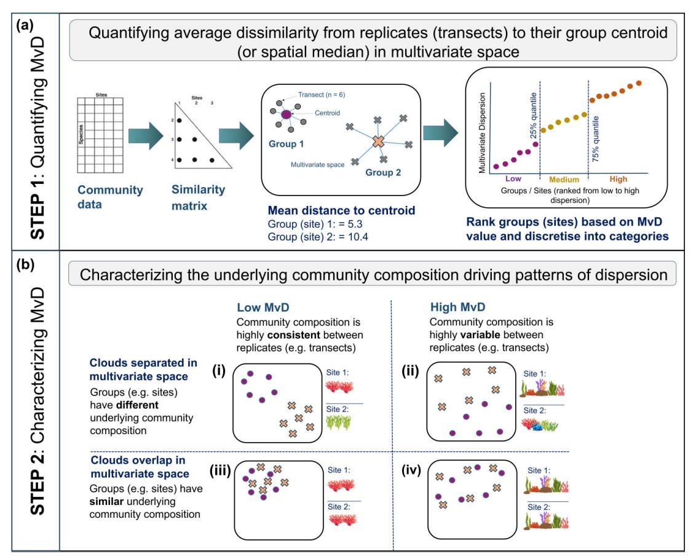
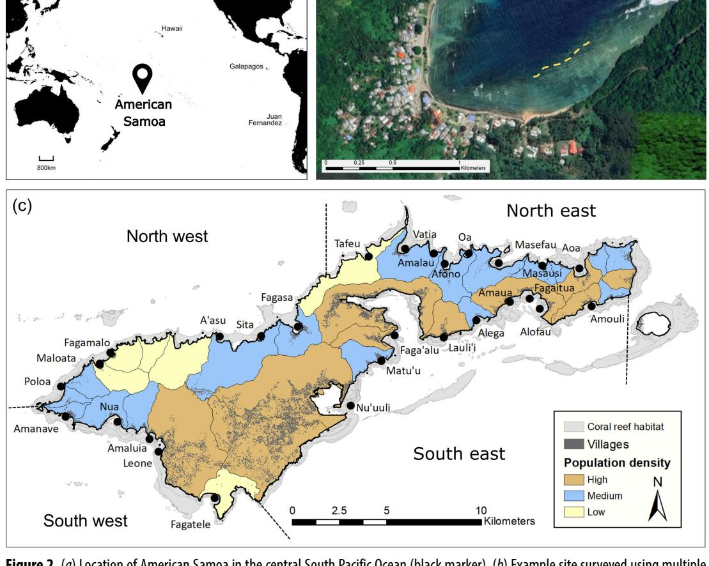
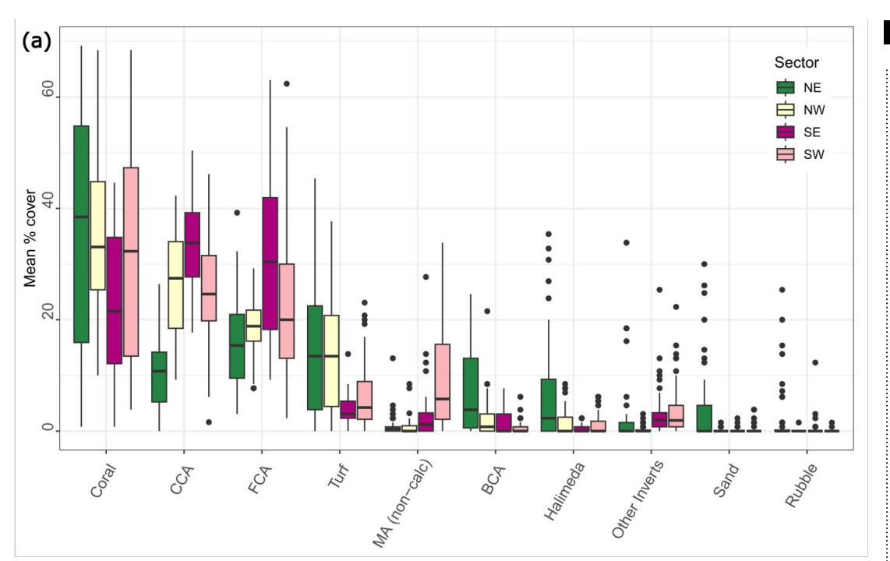
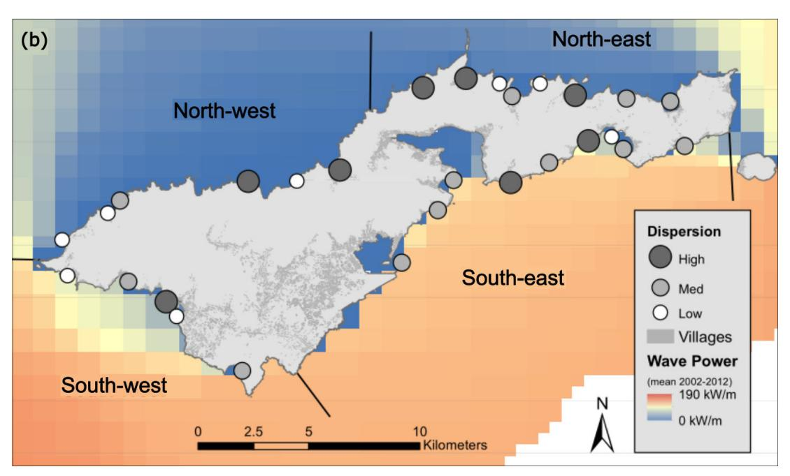
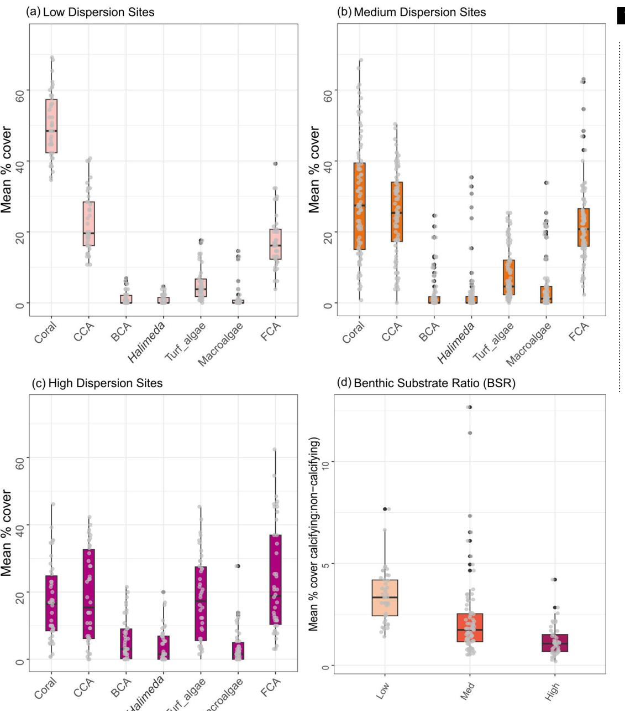
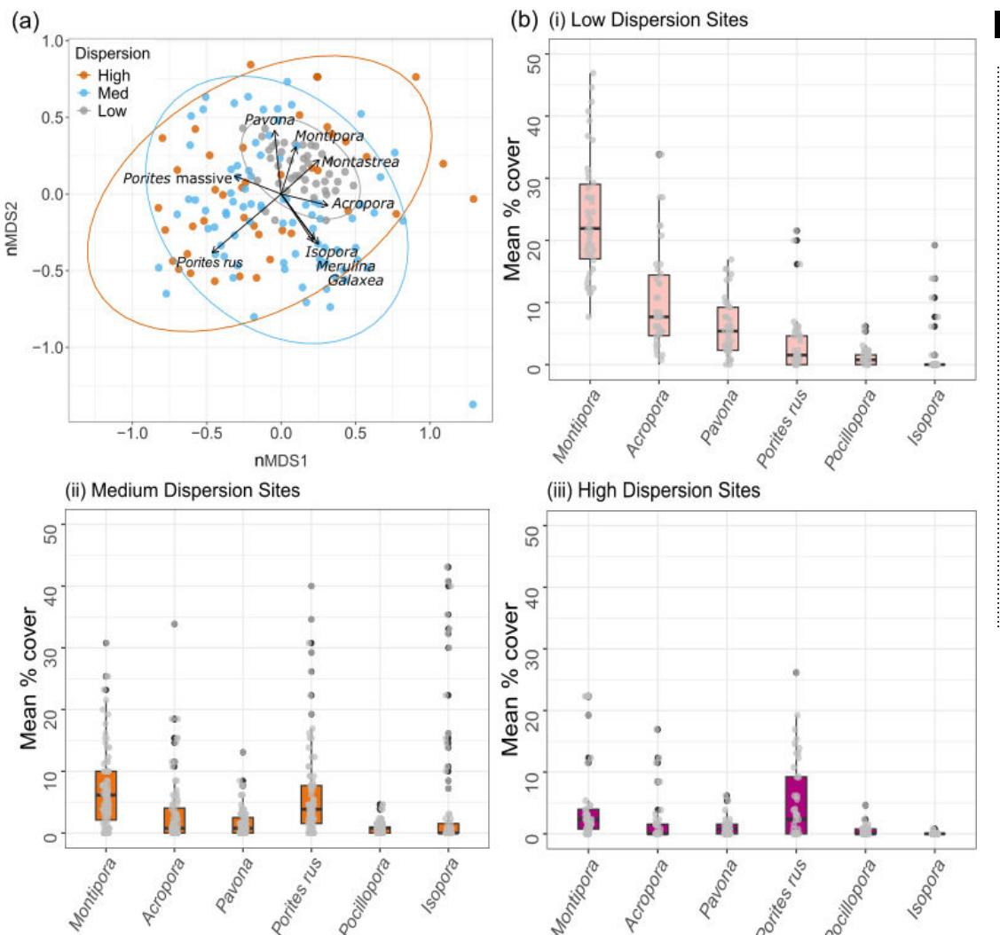
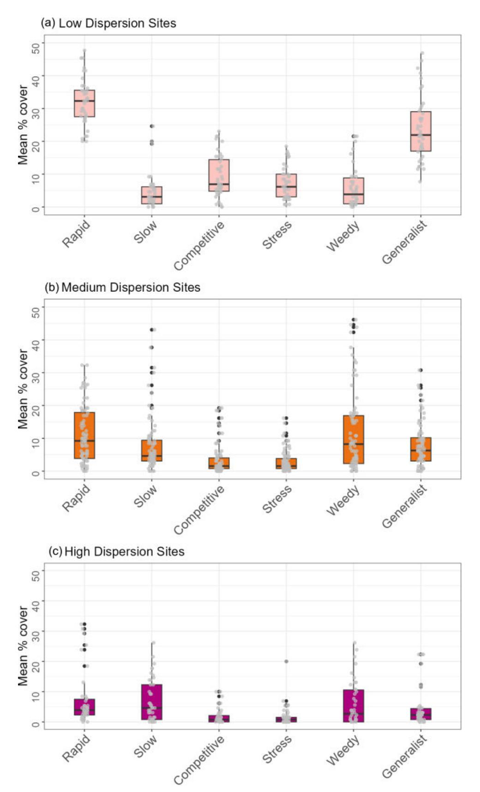
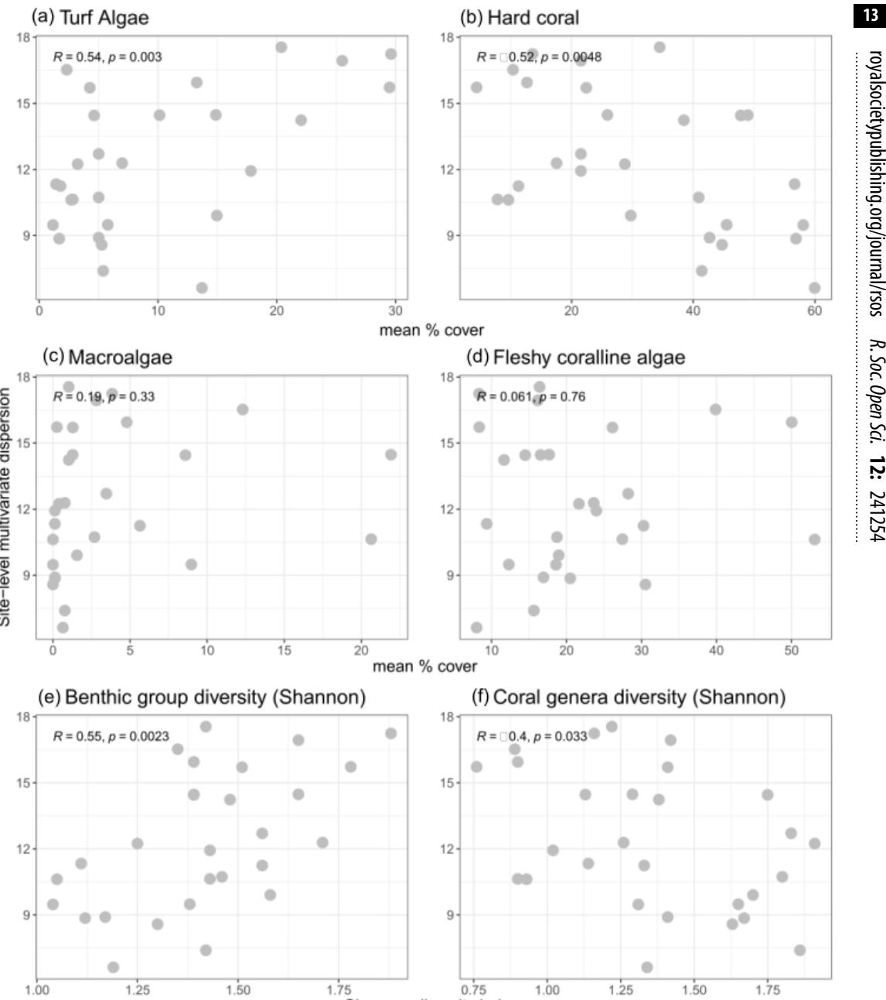

# Research

**Cite this article:** Lawrence AK, Heenan A, Williams GJ. 2025 Quantifying spatial gradients in coral reef benthic communities using multivariate dispersion. *R. Soc. Open Sci.* **12**: 241254. <https://doi.org/10.1098/rsos.241254>

Received: 26 July 2024 Accepted: 21 January 2025

#### **Subject Category:**

Ecology, conservation and global change biology

#### **Subject Areas:**

ecology, ecosystem, environmental science

#### **Keywords:**

American Samoa, benthic heterogeneity, *Betadisper*, community variability, coral life history, coral species

#### **Author for correspondence:**

Alice K. Lawrence

e-mail: alice.lawrence@bangor.ac.uk

† Present address: School of Ocean Sciences, Bangor University, Menai Bridge, Anglesey, UK.

Electronic supplementary material is available online at [https://doi.org/10.6084/](https://doi.org/10.6084/m9.figshare.c.7745789) [m9.figshare.c.7745789](https://doi.org/10.6084/m9.figshare.c.7745789).

# Quantifying spatial gradients in coral reef benthic communities using multivariate dispersion

Alice K. Lawrence† , Adel Heenan† and Gareth J. Williams†

School of Ocean Sciences, Bangor University, Menai Bridge, Anglesey LL59 5AB, UK

AKL, [0000-0003-3255-5505;](http://orcid.org/0000-0003-3255-5505) GJW, [0000-0001-7837-1619](http://orcid.org/0000-0001-7837-1619)

Tropical coral reefs are dynamic, disturbance-driven ecosystems that are heterogeneous across space and time, partly owing to gradients in cross-scale human impacts and natural environmental factors. Localized management interventions that strive to maintain the long-term persistence and function of coral reefs need to be informed by how and why reef habitats vary. Using the 'multivariate dispersion' metric, a statistical approach to measure ecological community variability, we quantified spatial gradients in coral reef benthic communities around Tutuila Island in American Samoa, central South Pacific. Benthic communities with low, medium and high dispersion each had distinct and consistent underlying benthic community characteristics. Low dispersion sites were consistently characterized by high hard coral cover, medium dispersion sites were generally dominated by crustose coralline algae, while high dispersion sites were dominated by turf and fleshy coralline algae. Variability in hard coral and turf algal cover explained 42% of the underlying variation in benthic community dispersion across sites, while site-level gradients in human impacts and environmental factors did not correlate well with variations in benthic community dispersion. The metric should be further tested on temporal data to determine whether it can summarize complex community changes in response to and following acute disturbance.

# 1. Introduction

Tropical coral reefs are dynamic, disturbance-driven ecosystems that display habitat heterogeneity across space and time [[1,2](#page-15-0)]. This heterogeneity is partly driven by gradients in environmental factors like surface wave energy, seawater temperature and

© 2025 The Author(s). Published by the Royal Society under the terms of the Creative Commons Attribution License <http://creativecommons.org/licenses/by/4.0/>, which permits unrestricted use, provided the original author and source are credited.

differences in nutrient concentrations and primary production [\[3–6\]](#page-16-0). These broad-scale environmental gradients cause variation in habitat condition that, in part, dictate which benthic groups can then compete for space at smaller scales on the reef floor [\[7,8\]](#page-16-0). Human impacts of varying scale, such as ocean warming, overharvesting of resources, habitat loss and nearshore declines in water quality associated with coastal development, also drive reef ecosystem patterns and processes [\[9](#page-16-0)]. These impacts are superimposed over the backdrop of natural environmental factors and together shape coral reef benthic community organization on many contemporary coral reefs [\[10–12\]](#page-16-0). Localized management interventions that strive to maintain the long-term persistence and function of coral reefs need to be informed by how and why coral reef habitats vary [[13–15](#page-16-0)]. Attempts to modify reef condition by manipulating manageable human drivers must do so within the natural bounds of the system and what is even achievable given the local environmental context of the reef community [\[16](#page-16-0)]. An essential step to achieve this is to effectively quantify and characterize coral reef benthic community heterogeneity across gradients in these various driving forces.

Over the last four decades, multiple stressors on coral reefs have occurred more frequently and at stronger intensities [\[17](#page-16-0)], driving global decline in coral cover and habitat complexity [\[18–20\]](#page-16-0) and changes in ecosystem function [[21–23](#page-16-0)]. Some coral reefs, typically formed by reef-building scleractinian corals, have become dominated by other non-accreting benthic groups (e.g. fleshy macroalgae, soft coral, turf algae and sponges [\[14,15,24–26](#page-16-0)]). In some instances, this can lead to 'biotic homogenization', whereby multiple specialist species and groups are replaced by fewer, more generalist species and groups to create more spatially homogenous reef communities [\[12,27,28\]](#page-16-0).

Studies documenting such changes in reef communities have often focused on overall declines in total coral cover, overlooking more taxonomically resolved changes in community structure [[12,29–31](#page-16-0)]. For example, shifts in coral community composition following acute and chronic disturbance can occur because of a disproportionate loss of fragile habitat-forming branching, plating and digitate *Acropora* and *Pocillopora* coral species, compared to the more resilient massive and encrusting coral forms that offer more limited shelter for reef-associated organisms [\[32](#page-16-0)[–36\]](#page-17-0). One approach to better understand changes in coral communities beyond changes in total cover is to categorize coral species by their life history strategy. These include the 'competitively' dominant, fast-growing species, which are more sensitive to disturbance compared with 'stress-tolerant', slower-growing species; the opportunistic 'weedy' corals, which quickly recolonize after disturbance; and the 'generalist' group of species that display characteristics of the other three strategies [\[37](#page-17-0)]. The application of these trait-based groups is one method of characterizing coral reef composition in the face of their natural heterogeneity and in response to acute and chronic disturbance [\[35,38](#page-17-0)].

Changes in ecological community composition can also be quantified statistically, and although functional diversity indices are commonly used, there is a need to explore other community-level metrics. Beta diversity, a measure of biodiversity related to species turnover, can be used to estimate the variability in species composition among sampling units for a given area at a given spatial scale [\[39](#page-17-0)]. Anderson [[40\]](#page-17-0) developed the 'multivariate dispersion' metric, as a measure of beta diversity, which quantifies the variability in ecological communities (in multivariate space) among independent sampling units [\(figure 1\)](#page-2-0).

Low multivariate dispersion indicates that community composition is highly consistent between replicates (e.g. transects) within groups (e.g. sites), whereas high multivariate dispersion is indicative of more heterogeneous communities, with greater replicate-to-replicate variability in community structure. Two groups can, of course, have the same level of multivariate dispersion (e.g. low or high dispersion sites) but for different underlying taxonomic reasons. As such, two groups with similar dispersion levels may overlap or not overlap in multivariate space, indicating that they have similar or different underlying communities respectively [\(figure 1\)](#page-2-0). Previous works have used changes in multivariate dispersion of ecological communities to indicate environmental stress [[41,42\]](#page-17-0), capture the recovery trajectories of coral reefs following warming events [\[43](#page-17-0)], quantify depth and latitudinal gradients in temperate reef fish communities [\[44](#page-17-0)] and highlight how temperate reef fish communities respond differently to changes in habitat structure at varying spatial scales [[45\]](#page-17-0). Very few studies have applied the multivariate dispersion metric to understand the spatial heterogeneity within and across locations on tropical coral reefs despite the metric having higher sensitivity compared to univariate counterparts in detecting low levels of disturbance [\[39,43,46\]](#page-17-0). This synthetic data reduction method has the potential to be used more broadly to understand underlying differences in habitat within the whole community and to characterize the differences that may exist within and between reefs.

Here, we apply and assess the use of the multivariate dispersion metric to characterize coral reef benthic communities. This is an important first step in determining whether the metric is an effective

**Figure 1.** Analytical pipeline used to quantify benthic community multivariate dispersion among observations (in our case, 'transects') within each group (in our case, 'sites') (*a*: STEP 1) and to characterize the underlying benthic community composition of gradients in dispersion in multivariate space (*b*: STEP 2).

reef resilience monitoring indicator for synthesizing complexities in benthic communities that can inform local management interventions in maintaining the long-term persistence and function of coral reef ecosystems. Using survey data, we quantified the spatial gradients in coral reef benthic community variability across sites around the island of Tutuila in American Samoa, which represent major watersheds along a gradient of reef geomorphologies (steepness and habitat complexity), wave exposures, water quality and human impact. American Samoa has a history of multiple and varied types of disturbance over the past 40 years, including two major coral predator (crown-of-thorns) outbreaks (1976 and 2013), four mass bleaching events (1994, 2002, 2003 and 2017), 10 cyclones, six extreme low tide events and a tsunami in 2009 [\[47](#page-17-0)]. The coral reef communities in American Samoa have shown resiliency for rapid recovery and high tolerance to natural and human-induced stressors [\[47](#page-17-0)], providing a suitable study area to understand spatial heterogeneity in response to the various driving factors. Specifically, the study aims were to: (i) quantify patterns of benthic community multivariate dispersion across space (sites); (ii) characterize the underlying benthic community composition of gradients in multivariate dispersion (composition of benthic functional groups and coral communities); (iii) test whether the percentage cover of specific benthic groups or metrics of benthic diversity explains patterns of multivariate dispersion across space; and (iv) test whether gradients in human impacts and environmental factors explain patterns of multivariate dispersion across space.

*R. Soc. Open Sci.*

 **12:**

241254

# 2. Material and methods

#### 2.1. Study area

Data were collected around the high volcanic island of Tutuila in American Samoa, an unincorporated United States of America Territory located in the central South Pacific Ocean (14.27° S, 170.13° W) [\(figure 2](#page-4-0)*a*). Tutuila Island has a human population of approximately 56 000, a total land area of approximately 200 km2 and a forereef habitat area (the outer reef slope facing the open ocean) of approximately 49 km2 [\[49](#page-17-0)]. Surveys were conducted over a three week period in November 2016, as part of an inter-agency watershed monitoring project, which aimed to integrate existing coral reef surveys and water quality sampling conducted by local government agencies [[50\]](#page-17-0). As part of the project, 28 sites were chosen using ArcMap 10.4 to represent major watershed delineations around Tutuila [\(figure 2](#page-4-0)*c*). To ensure comparability, survey sites were located in bays on the forereef habitat at 10 m depth and approximately 250 m out from any major stream mouth ([figure 2](#page-4-0)*b*). Human population density per major watershed was calculated from the 2010 census of American Samoa using the population counts for places (villages), and each site was categorized into low (≤ 25th percentile), medium (≥ 25th and ≤ 75th percentile) or high (≥ 75th percentile) human population [\[51](#page-17-0)]. Sites were categorized into four geographical sectors (northwest, northeast, southwest, southeast), based on biogeographic habitat delineations used by the National Oceanic and Atmospheric Administration's (NOAA's) Pacific Reef Assessment and Monitoring Program ([[52\]](#page-17-0); [figure 2](#page-4-0)*c*).

#### 2.2. Benthic community digital surveys and post-processing

At each site, surveys were conducted by divers on SCUBA by laying two 100 m transect tapes consecutively along the 10 m depth contour parallel to shore in the direction of the open ocean ([figure](#page-4-0) 2*[b](#page-4-0)*). Benthic community surveys were then conducted along six 25 m sections of this combined 200 m linear distance with 5 m breaks in between each of them: 0−25, 30−55, 60−85, 90−115, 120−145 and 150−175 m. Along each 25 m section, digital images of the benthos were taken approximately 1 m above the sea floor at 1 m intervals using an Olympus Tough TG-4 camera (*n* = 26 images taken per transect, *n* = 156 images per site).

For each image, five randomly allocated points were overlaid (*n* = 125 data points per transect, 750 data points per site; [[53\]](#page-17-0)) using Coral Point Count with Excel extensions [\[54](#page-17-0)] and the substrate under each point identified as belonging to one of the following 10 major categories: hard coral (to genus level and growth forms within genera such as *Acropora* 'tables', 'staghorn' or 'arborescent'); crustose coralline algae (CCA; multiple genera); branching coralline algae; non-calcified macroalgae (greater than 2 cm, to genus level if abundant); *Halimeda* spp. (a common genus of calcifying macroalgae across the Pacific); turf algae (a mixed community of filamentous algae and cyanobacteria less than 2 cm tall, including the 'epilithic algal matrix'); fleshy coralline algae (e.g. shedding-calcareous algae known to overgrow corals like *Peyssonnelia* spp. [\[55](#page-17-0)]); other invertebrates (including sponges, and soft coral to genus level if abundant); sand and rubble (electronic supplementary material, table S1). This categorization resulted in 61 minor categories, 41 of which were coral genera and common coral species within the hard coral major category (electronic supplementary material, table S2). The benthic substrate ratio (BSR) can be used as a metric of reef condition [[56\]](#page-17-0) by calculating the ratio of heavily calcified organisms (hard corals, CCA, branching coralline algae and *Halimeda* spp.) to lessor non-calcifying (turf algae, non-calcified macroalgae and fleshy coralline algae) benthic variables for each survey site. Coral genera and common coral species were classified into four different life-history strategy categories: competitive, opportunistic weedy, stress-tolerant and generalist, which are primarily separated by colony morphology, growth rate and reproductive mode (*sensu* [[37\]](#page-17-0); electronic supplementary material, table S2). Key coral genera were also classified into rapid- and slow-growing categories [[35\]](#page-17-0), based on the growth forms 'bushy and tabular', and 'massive and columnar' (electronic supplementary material, table S2).

#### 2.3. Quantifying human impacts and environmental factors

Human impacts and environmental factors collated for each survey site included surface wave energy, dissolved inorganic nitrogen, human population density per major watershed, the proportion of disturbed land in each major watershed, reef steepness and habitat complexity. Surface wave energy, a

241254

**Figure 2.** (*a*) Location of American Samoa in the central South Pacific Ocean (black marker). (*b*) Example site surveyed using multiple transects (yellow dotted lines), image source: [\[48\]](#page-17-0). (*c*) Survey site locations (displayed with black dots) within the four biogeographical sectors around Tutuila Island (delineated by dotted lines) and categories of major watershed delineations based on human population density (low, medium, high).

key driver of benthic community structure on coral reefs [\[4,](#page-16-0)[57](#page-17-0)], was calculated using a wave exposure proxy developed for Tutuila by NOAA [\[58](#page-17-0)], which is an estimate of the mean maximum daily wave power (kW m−1) over a 10-year period (2002−2012) at 1 km resolution using the NOAA WaveWatch III global wave model [\(http://pacioos.org/metadata/as\\_noaa\\_all\\_wave\\_avg.html](http://pacioos.org/metadata/as_noaa_all_wave_avg.html)). Dissolved inorganic nitrogen was used as a proxy of 'water quality' owing to it often being the most abundant and bioavailable form of nitrogen and relatively straightforward and economical to analyse [\[59](#page-17-0)]. Dissolved inorganic nitrogen concentrations (in mg l−1) were measured using a SEAL Analytical AA3 HR nutrient analyzer [[50\]](#page-17-0). Mean, standard deviation and maximum dissolved inorganic nitrogen were calculated for each survey site using data from samples collected at 26 streams, which were located within major watersheds associated with each survey site. The samples were collected at the same time each month over a 12-month period between September 2016 and September 2017 with a few exceptions. Two of the survey sites were only sampled twice, and another two sites were not sampled at all owing to the inaccessibility of the stream from land. As each sample represents a snapshot in time, we calculated the 12 month mean, standard deviation and maximum value for each site to account for any seasonal variations in rainfall and storm events. To try and capture local human impacts to the nearshore reefs, we quantified two proxies: human population density and nearby land use. Human population density per major watershed was calculated from the 2010 census of American Samoa using the population counts for places (villages) [\(https://www.census.gov/population/www/](https://www.census.gov/population/www/cen2010/island_area/as.html) [cen2010/island\\_area/as.html\)](https://www.census.gov/population/www/cen2010/island_area/as.html). The proportion of disturbed land to undisturbed land in each major watershed's area was estimated in ArcGIS 10.4 using the American Samoa vegetation layer derived from QuickBird satellite imagery [[60\]](#page-17-0). The total area of disturbed land was calculated using four categories: quarry/landfill (areas recently bulldozed for quarrying activities or used for solid waste disposal), secondary scrub (an intermediate type of vegetation that occurs when cultivated land is abandoned and allowed to revert to natural forest), urban built-up (impervious urban surfaces such as houses and paved roads) and urban cultivated area (all vegetated areas within a general urban boundary). To quantify site-level habitat complexity, four digital images were taken of the reefscape at the start of each transect at each site, by facing each major cardinal direction (N, E, S, W). Each image was visually and manually scored from 0 to 5, where 0 = no vertical relief; 1 = low and sparse relief; 2 = low but widespread relief; 3 = moderately complex; 4 = very complex with numerous fissures and caves; 5 = exceptionally complex with numerous caves and overhangs [[61](#page-18-0)]. Site-level reef steepness was also estimated using the same images, by assigning a value from 1 to 5, where 1 = flat, 2 = gradual slope, 3 = 45° slope, 4 = 65° slope and 5 = vertical wall. These transect-level values of habitat complexity and steepness were then used to calculate site-level averages.

#### 2.4. Statistical analyses

To quantify variability in community composition (multivariate dispersion) across the six benthic transects at each site, we used the '*betadisper'* function in the *vegan* package [\[62](#page-18-0)] for R [\(https://](https://www.r-project.org) [www.r-project.org\)](https://www.r-project.org). The '*betadisper*' function runs a distance-based test for the analysis of multivariate homogeneity of group dispersions (variances; [[40,46](#page-17-0)]) and calculates the distance of each observation (in this case 'transect', *n* = 6) to its group centroid (in this case 'site', *n* = 28). We used distance to spatial median as our distance measure (the point in the multivariate cloud that minimizes the sum of the distances from each replicate observation to that point) as it is less affected by outliers [\[63](#page-18-0)]. Calculations of multivariate dispersion were run on a Euclidean similarity matrix for the mean percentage cover of the 10 major benthic variables. No transformations were applied to the data to preserve the raw dispersion among transects within each site [[40\]](#page-17-0). Patterns of multivariate dispersion were visualized using non-metric multi-dimensional scaling (nMDS) using the *metaMDS* function in the *vegan* package [[62\]](#page-18-0), again using Euclidean similarity matrices for the major benthic variables. Sites were ranked based on their distance to median (dispersion) values, which were defined as low (≤ 25th percentile), medium (≥ 25th and ≤ 75th percentile) or high (≥ 75th percentile) dispersion categories.

To investigate which of the benthic characteristics and human impacts and environmental factors (predictor variables) best explained variation in multivariate dispersion at the major benthic category taxonomic resolution (response variable), we used distance-based linear modelling (DISTLM [[64,65](#page-18-0)]). In addition to the benthic variables and human impacts and environmental factors, we calculated a suite of diversity indices on both the mean percentage cover of the major benthic variables and the coral genera data using the DIVERSE function in PRIMER v. 7.0.23 [[66\]](#page-18-0). The indices calculated for each site were Margalef's species richness (*d*); the Shannon–Wiener index (*H*'), which places more emphasis on rare or less abundant variables; Simpson's index (*λ*), which places more emphasis on the more dominant variables [[63\]](#page-18-0) and Pielou's evenness (*J*), which measures how uniformly spread the total abundance of each variable is within each observation [\[66](#page-18-0)]. Prior to model fitting, we tested whether any of the predictor variables were significantly correlated with each other using the 'ggcorrplot' package in R [[67\]](#page-18-0), testing the null hypothesis that each pairwise comparison was not correlated (electronic supplementary material, figures S1 and S2). The following predictors significantly correlated: Shannon's diversity index of the major and minor benthic substrate groups correlated with the Simpson's diversity index (*r* = 1), we retained the Shannon diversity index as it emphasizes less abundant species instead of dominant species; Pielou's evenness of benthic groups and Simpson's diversity index of benthic groups (*r* = 0.9), we retained Pielou's evenness of benthic groups; sand and rubble (*r* = 0.9), rubble was retained owing to the relative importance of rubble with regard to benthic invertebrate diversity [[68\]](#page-18-0); and mean correlated with maximum dissolved inorganic nitrogen (*r* = 0.9). We retained maximum dissolved inorganic nitrogen, given that maximum exposure to nutrient stress is likely to be more important than mean exposure. The final suite of benthic variables and human impacts and environmental factors included in the models are listed in table 1.

Models were first built using the benthic characteristics as the predictor variables, and then the model-fitting process was repeated using the human impacts and environmental factors as predictors. In each case, the DISTLM models were built from a Euclidean similarity matrix of the site dispersion values. All possible candidate models (i.e. unique combinations of the predictor variables) were computed using the 'best' model selection procedure [\[63](#page-18-0)] and ranked using Akaike's information criterion [[69\]](#page-18-0) with a second-order bias correction applied (AICc; [[70\]](#page-18-0)) to account for the relatively small sample size relative to the number of predictor variables. All models within 15% AICc of the top model

*R. Soc. Open Sci.*

 **12:**

241254

**Table 1.** Predictor variables, biotic (*a*) and human impacts and environmental (*b*), used to try and explain variation in coral reef benthic community multivariate dispersion among sites using distance-based linear modelling (DISTLM). (Units and spatial/temporal resolution are shown for each variable and the data sources for the human impacts and environmental factors.)

| (a) Biotic variables             | Unit  |
|----------------------------------|-------|
| Branching coralline algae        | %     |
| Benthic Substrate Ratio (BSR)    | ratio |
| Coral                            | %     |
| Crustose Coralline Algae (CCA)   | %     |
| Evenness - J (Major Benthic)     |       |
| Evenness - J (Coral Genera)      |       |
| Fleshy coralline algae           | %     |
| Halimeda spp. (calcified algae)  | %     |
| Macroalgae (non-calcified)       | %     |
| Other invertebrates              | %     |
| Rubble                           | %     |
| Shannon diversity - H' (Benthic) |       |
| Shannon diversity - H' (Coral)   |       |
| Turf algae                       | %     |

| (b) Human impacts and environmental factors      | Units          | Resolution | Time period    | Source                                                                                  |
|-----------------------------------------------------|----------------|------------|-------------------|-----------------------------------------------------------------------------------------|
| Dissolved inorganic nitrate – mean                  | mg l−1         | monthly    | 09/16 to 09/17 | R2R project [46]                                                                        |
| Dissolved inorganic nitrate – standard deviation | mg l−1         | monthly    | 09/16 to 09/17 | R2R project [46]                                                                        |
| Dissolved inorganic nitrate – maximum            | mg l−1         | monthly    | 09/16 to 09/17 | R2R project [46]                                                                        |
| Disturbed land                                      | %              |            | 2010              | QUICKBIRD imagery [56]                                                                  |
| Habitat complexity                                  | index          |            | 2017              | R2R project [46]                                                                        |
| Human population density                            | people km−2 | village    | 2010              | 2010 census (https:// www.census.gov/population/www/cen2010/ island_area/as.html) |
| Reef steepness                                      | index          |            | 2017              | R2R project [46]                                                                        |
| Wave energy (mean)                                  | kW m−1         | 1 km       | 2002−2012         | NOAA Wave Watch III (http://pacioos.org/ metadata/as_noaa_all_wave_avg.html)         |

are reported, and the marginal relationships between each predictor and benthic dispersion were plotted to identify the overall directionality of the relationships and Pearson's correlations calculated. All DISTLM analyses were completed using the PERMANOVA+ add on [[63\]](#page-18-0) for PRIMER v. 7.0.23 [\[71](#page-18-0)]. Source code available at<https://github.com/alicelawrence2021/dispersion.git>.

# 3. Results

#### 3.1. Intra-island gradients in benthic cover

There were clear intra-island gradients in benthic group cover within the four biogeographical sectors (northeast, northwest, southeast, southwest; [\(figure 3](#page-7-0)*a*)). Mean (± s.e.) hard coral cover peaked in the northeast (35.6% ± 7.4%) and was lowest in the southeast (22.4% ± 4.9%) [\(figure 3](#page-7-0)*a*). Sites in the

**Figure 3.** (*a*) Median percentage cover of benthic groups within the four biogeographical sectors northeast (*n* = 8 sites), northwest (*n* = 6 sites), southeast (*n* = 9 sites), southwest (*n* = 5 sites). CCA, crustose coralline algae; FCA, fleshy coralline algae; MA (non-calc), macroalgae (non-calcified); BCA, branching coralline algae; Halimeda, *Halimeda* spp.; Other Inverts, other invertebrates. Black dots represent outliers, and boxes show the interquartile range and their middle lines represent median values. (*b*) Location of the 28 survey sites around Tutuila Island and their associated multivariate dispersion (distance to median) category (low, medium, high), mean maximum daily wave power (kW m−1) from 2002 to 2012, location of villages and biogeographic sector delineations.

northeast also had the highest mean cover of branching coralline algae (7.2% ± 2.4%), *Halimeda* spp. (6.6% ± 3.4%), rubble (2.2% ± 1.6%), sand (4.0% ± 2.4%) and turf algae (14.9% ± 3.9%). The mean cover of turf algae was also high in the northwestern sites (14.1% ± 3.8%) and lowest in the southeast (3.8% ± 0.5%). Sites in the southeast had the highest mean cover of CCA and fleshy coralline algae (33.5% ± 2.0% and 30.8% ± 5.5% respectively). The highest mean cover of non-calcifying macroalgae was at southwestern sites (9.2% ± 2.8%) and lowest in the northwest (0.9% ± 0.5%). The benthic substrate ratio did not identify any island-wide trends in calcifying to non-calcifying organisms by sector, with

**Figure 4.** Variation in benthic group cover among multivariate dispersion categories (low, medium, high). Relative similarity in site-level (*n* = 6 transects per site) multivariate dispersion of benthic communities across 28 sites around Tutuila Island, American Samoa. nMDS was constructed from all six transect replicates at each survey site, using Euclidean dissimilarities of non-transformed mean percentage cover estimates of all major benthic categories (stress value: 0.18). The correlation between each benthic variable and the first two ordination axes is overlaid as a bi-plot, with the length of each vector line proportional to the strength of the correlation. CCA, crustose coralline algae; FCA, fleshy coralline algae; BCA, branching coralline algae; Other Inverts, other invertebrates.

the highest ratio in the southwest (2.4% ± 0.8%) and lowest in the southeast (1.9% ± 0.5%; electronic supplementary material, table S3).

#### 3.2. Gradients in benthic community multivariate dispersion

Downloaded from https://royalsocietypublishing.org/ on 16 April 2025

At the site level, low-dispersion sites were characterized as having a higher percentage cover of hard coral (49.9% ± 1.4%), compared to medium (20.0% ± 1.8%) or high (17.1 ± 1.8 %) dispersion sites (figures 4 and [5a](#page-9-0)). The medium- to high-dispersion sites had a mixture of benthic substrate groups, including turf algae, branching coralline algae, macroalgae, sand and rubble (figure 4). The cover of turf algae, *Halimeda* spp., and branching coralline algae was highest at high dispersion sites (17.8% ± 2.0%, 4.1% ± 0.8% and 5.9% ± 1.0% respectively) as compared to low-dispersion sites (5.4% ± 0.7%, 0.9% ± 0.2% and 1.3% ± 0.3% respectively). CCA cover was highest at medium dispersion sites (25.3% ± 1.3%), and lowest at high dispersion sites (18.6% ± 2.1%) ([figure 5](#page-9-0)*b*). CCA cover exceeded hard coral cover (by between 10% and 28%) at 7 of the 28 survey sites, six of which had medium dispersion (see the electronic supplementary material, figure S3 for site-level graphs). Overall, the benthic substrate ratio decreased with increasing dispersion (figure 5*d*), suggesting that low-dispersion sites had a higher proportion of calcifying, reef-building organisms. However, there was no consistent pattern in benthic community multivariate dispersion within and between the four island sectors (electronic supplementary material, table S3).

#### 3.3. Gradients in hard coral community multivariate dispersion

The corals that best discriminated among the high-medium-low dispersion categories were *Montipora, Pavona, Acropora* branching and corymbose growth forms, and *Porites rus* ([figure 6](#page-10-0)*a*; see the electronic supplementary material, figure S4 for site-level graphs). Low-dispersion sites were dominated by the encrusting coral *Montipora grisea* ([figure 6](#page-10-0)*b*), where mean cover (23.8% ± 1.5%) was 16.5% higher than at medium-dispersion sites (7.3% ± 0.7%) and 19% higher than at high-dispersion sites (4.7% ± 1.1%). The cover of *Pavona* and all *Acropora* growth forms were also highest at low dispersion sites (6.1% ± 0.7%

*R. Soc. Open Sci.*

 **12:**

241254

**Figure 5.** Variation in mean percentage cover of the main benthic substrate categories within each multivariate dispersion category: (*a*) low, (*b*) medium (med), and (*c*) high. The ratio of mean percentage cover of heavily calcified organisms to less- or non-calcifying within each multivariate dispersion category is shown in plot (*d*) benthic substrate ratio (BSR). Boxplots are overlaid with transect replicate data for each survey site, black dots represent outliers and boxes show the interquartile range and their middle lines represent median values. CORAL, hard coral; CCA, crustose coralline algae; BCA, branching coralline algae; HALI, Halimeda spp.; TURF, turf algae; MA, macroalgae; FCA, fleshy coralline algae.

and 8.1% ± 0.7% respectively; [figure 6](#page-10-0)*b*). *Pocillopora* corals were present in similar abundances at both low- and medium-dispersion sites (1.2% ± 0.2% and 0.8% ±0.1% respectively), and the cover of *Isopora* and *Por. rus* corals was highest at medium-dispersion sites (4.7% ± 1.2% and 6.4% ± 0.9% respectively; [figure 6](#page-10-0)*b*). The mean percentage cover of coral at high dispersion sites was relatively low (18.5% ± 15.0%), with the communities dominated by *Montipora, Pavona* and *Por. rus* (4.7% ± 1.1%, 1.0% ± 0.2% and 5.2% ±1.0% respectively; [figure 6](#page-10-0)*b*).

There were also clear patterns in the cover of hard corals with different life-history strategies across dispersion categories [\(figure 7\)](#page-11-0). The cover of rapid-growing corals was higher at low-dispersion sites (33.0% ± 5.0%) compared to high-dispersion sites (4.2% ± 3.5%; [figure 7\)](#page-11-0). The cover of slow-growing corals was higher at medium- and high-dispersion sites (4.8% ± 4.5% and 4.8% ± 6.5% respectively)

*R. Soc. Open Sci.*

 **12:**

241254

**Figure 6.** Variation in percentage cover of corals that best discriminated amongst the different multivariate dispersion categories (low, medium, high). (*a*) Relative similarity in site-level (*n* = 6 transects per site) multivariate dispersion of benthic communities across 28 sites around Tutuila Island, American Samoa. nMDS plot based on all six transect replicates at each survey site, using Bray–Curtis dissimilarities of non-transformed mean percentage cover estimates of all coral genera categories (stress value: 0.28). The correlation between each benthic variable and the first two ordination axes are overlaid as a bi-plot, with the length of each vector line proportional to the strength of the correlation. (*b*) Median percentage cover of six coral genera within each benthic dispersion category (i) low, (ii) medium; and (iii) high. Boxplots are overlaid with transect replicate data for each survey site; black dots represent outliers and boxes show the interquartile range and their middle lines represent median values.

compared with low-dispersion sites (3.5% ± 5.2%). The mean cover of generalist, competitive and stress-tolerant corals was highest at low dispersion sites (22.0% ± 7.5%, 7.0% ± 12.2% and 6.0% ± 4.3% respectively), and all three groups decreased in cover with increasing dispersion ([figure 7\)](#page-11-0). Medium dispersion sites had the highest cover of opportunistic weedy coral species (such as *Por. rus* and *Pocillopora* corals; 8.0% ± 8.2%), followed by high (4.0% ± 0.4%) and then low-dispersion sites (2.5% ± 4.2%; [figure 7](#page-11-0)).

#### 3.4. Ecological drivers of multivariate dispersion among sites

Variations in hard coral and turf algae cover (top-performing model) explained 41.5% of the underlying variation in benthic community multivariate dispersion across the 28 sites (table 2).

Benthic community multivariate dispersion was negatively correlated with hard coral cover and positively correlated with turf algae cover ([figure 8\)](#page-12-0). Variations in coral genera diversity, benthic substrate group diversity and macroalgae explained 45.5% of the underlying variation, and the cover of turf algae and fleshy coralline algae explained 39.5% of the variation in benthic community

**Figure 7.** Variation in cover of corals with different life-history strategies among multivariate dispersion categories (low, medium, high). Summary boxplots showing median percentage cover of life history categories within each benthic dispersion category (*a*) low, (*b*) medium, and (*c*) high. Boxplots are overlaid with transect replicate data for each survey site; black dots represent outliers and boxes show the interquartile range, and their middle lines represent median values.

**Figure 8.** Correlations between benthic community multivariate dispersion (site-level, *n* = 28, mean distance to median) and underlying benthic community characteristics, selected from DISTLM model results. \*R, Pearson correlation coefficient; *p*, *p*‐value.

dispersion. Benthic dispersion positively correlated with mean cover of turf algae and benthic substrate group diversity (figure 8). Conversely, benthic dispersion was negatively correlated with hard coral cover and coral genera diversity (figure 8).

#### 3.5. Correlations between benthic community multivariate dispersion and human impacts and environmental factors

Overall, the variation in site-level benthic community multivariate dispersion was not well explained by the human impacts and environmental factors we quantified. Variations in benthic habitat complexity, reef steepness and population density (the top three performing models) explained only 10.2, 7.4 and 7.3% of the overall variability in benthic community multivariate dispersion respectively (table 3). The combination of benthic habitat complexity with reef steepness explained 14.7% of the

241254

**Table 2.** Distance-based linear modelling (DistLM) results testing for relationships between benthic community multivariate dispersion across sites (*n* = 28) and underlying benthic community characteristics. (All possible candidate models were run (unique combinations of the predictor variables), and models were ranked using Akaike information criterion with a second-orderbias-correction applied (AICc). All models within 15% AICc of the top-performing model are reported. Proportion (prop. %), overall variation in multivariate dispersion explained by the candidate model (individual contribution of each predictor to the overall model performance is shown in parentheses for each predictor within each candidate model); RSS, residual sum of squares.)

| AICc  | prop. (%) | RSS    | candidate model                                                                              |
|-------|-----------|--------|----------------------------------------------------------------------------------------------|
| 53.40 | 41.47     | 146.81 | turf algae (30.3%), coral (11.1%)                                                            |
| 54.11 | 45.54     | 136.59 | Shannon diversity (benthic) (23.6%), Shannon diversity (coral) (13.9%), macroalgae (8.0%) |
| 54.34 | 39.46     | 151.86 | turf algae (30.3%), fleshy coralline algae (9.1%)                                            |
| 54.37 | 45.03     | 137.76 | turf algae (30.3%), coral (11.1%), evenness (coral genera) (0.5%)                            |
| 54.54 | 44.71     | 138.69 | turf algae (30.3%), fleshy coralline algae (9.1%), other invertebrates (1.6%)                |

**Table 3.** Distance-based linear modelling (DistLM) results testing for relationships between benthic community multivariate dispersion across sites (*n* = 28) and human impacts and environmental factors. (All possible candidate models were run (unique combinations of the predictor variables), and models were ranked using Akaike information criterion with a second-order-biascorrection applied (AICc). All models within 15% AICc of the top-performing model are reported. Proportion (prop. %), overall variation in multivariate dispersion explained by the candidate model (individual contribution of each predictor to the overall model performance is shown in parentheses for each predictor within each candidate model); RSS, residual sum of squares.)

| AICc   | prop. (%) | RSS    | candidate model                                             |
|--------|-----------|--------|-------------------------------------------------------------|
| 62.854 | 10.213    | 225.2  | habitat complexity (10.2%)                                  |
| 63.703 | 7.4479    | 232.14 | reef steepness (7.4%)                                       |
| 63.748 | 7.2999    | 232.51 | human population density (7.3%)                             |
| 63.929 | 17.631    | 213.87 | habitat complexity (10.2%), reef steepness (7.4%)           |
| 64.294 | 17.511    | 216.68 | habitat complexity (10.2%), human population density (7.3%) |
| 64.854 | 11.866    | 221.06 | habitat complexity (10.2%), wave energy (mean) (0.08%)      |

variation in multivariate dispersion across sites. Similarly, the combination of benthic habitat complexity with population density, and with mean wave power explained 13.6 and 11.9% of the variation in multivariate dispersion respectively. Benthic community multivariate dispersion was negatively correlated with habitat complexity; there were weak positive correlations between benthic dispersion and reef steepness and with human population density (electronic supplementary material, figure S5). Dissolved inorganic nitrate and disturbed land only explained 0.0003 and 1.15% of the overall variation in multivariate dispersion respectively.

# 4. Discussion

Using multivariate dispersion, we quantified spatial gradients in coral reef benthic community variability around the circumference of American Samoa in the central South Pacific and investigated whether different dispersion levels (low, medium, high) had commonalities in their underlying benthic community characteristics [\(figure 1](#page-2-0)). We found that variability in hard coral and turf algae cover explained most of the underlying variation in benthic community dispersion across sites. Low-dispersion sites were consistently characterized by high coral cover, dominated by encrusting corals and a diverse assemblage of rapid-growing, branching and corymbose coral genera in low abundances. Medium dispersion sites were generally dominated by CCA and coral genera with opportunistic life-history strategies while high dispersion sites were dominated by turf algae and fleshy coralline algae. There was higher cover of calcifying organisms at low dispersion sites, which decreased as dispersion increased. Variations in benthic community dispersion were not well explained by gradients in the human impacts and environmental factors modelled here (< 15% total variation explained), suggesting that smaller scale biological processes may be more important in driving these patterns.

Low-dispersion sites around our study island were consistently dominated by high coral cover rather than macroalgae, turf algae or soft corals that often characterize more homogenous benthic communities on coral reefs subjected to chronic and acute disturbance [[24,](#page-16-0)[72\]](#page-18-0). Sites with low dispersion were dominated by the encrusting hard coral *M. grisea*, which has rapid-growing, stress-tolerant and competitive life-history traits [\[37](#page-17-0)]. Low-dispersion sites were also characterized by a high diversity of other predominantly rapid-growing coral genera, all co-occurring in relatively low abundances, including tabulate *Acropora* corals and other branching corals such as *Pocillopora* and *Porites cylindrica*. Although rapid-growing corals with branching and corymbose growth forms tend to be susceptible to thermal stress [\[32,](#page-16-0)[34,](#page-17-0)[73\]](#page-18-0), and are selectively fed on by coral predators such as crown-of-thorns starfish [\[74](#page-18-0)], they are competitively dominant corals that can propagate through fragmentation following acute physical disturbance from storms and persistent high wave energy [\[4,](#page-16-0)[33,](#page-17-0)[75](#page-18-0)]. Low-dispersion sites also had the highest cover of *Pavona* corals, which have slow-growing and stress-tolerant life-history strategies [[37\]](#page-17-0). It is unclear why low-dispersion sites were characterized by a diverse mix of rapidgrowing and stress-tolerant coral genera. One hypothesis is that low-dispersion sites may be indicative of locations that have experienced both acute and chronic disturbances and may represent areas with environmental conditions that naturally create spatially heterogeneous habitats and diverse and resilient coral communities. Further temporal studies are required to better understand the interactions between different disturbance events and community dynamics at these low-dispersion sites.

Benthic community dispersion increased as the cover of non-reef-building organisms, such as turf algae, fleshy coralline algae and non-calcifying macroalgae, increased, and as overall habitat structural complexity decreased. Unlike low-dispersion sites that consistently had the same underlying benthic community characteristics [\(figure 1](#page-2-0)*b*(iii)), the benthic communities creating either medium or high dispersion were highly variable ([figure 1](#page-2-0)*b*(ii)). Medium-dispersion sites had the highest mean cover of CCA, which rapidly colonize bare substrate following disturbance [[47\]](#page-17-0), stabilizing the reef [\[76,77\]](#page-18-0) and providing substrate for coral settlement and growth [[47,](#page-17-0)[78](#page-18-0)]. Medium dispersion sites also had the highest cover of opportunistic weedy corals, including *Por. rus*, which have brooding reproduction and high population turnover [[79\]](#page-18-0) that rapidly colonize newly available space following acute disturbance [\[80](#page-18-0)]. Long-term monitoring surveys in American Samoa have shown a general decline in the cover of *Acropora* corals and a widespread increase in the cover of *Por. rus* because of disturbances (C. Birkeland 2024, personal communication), which could indicate that medium dispersion sites at this location are characteristic of benthic communities in recovery following acute disturbance. With increased frequency and magnitude of acute disturbances, systems may tend to shift towards earlier successional states [\[81](#page-18-0)], which are characterized by simple, low-ecosystem complexity composed of early colonizers that are quick to respond and react to the change in environmental conditions [[13\]](#page-16-0). The high cover of turf algae and fleshy coralline algae at high dispersion sites suggests these sites are dominated by organisms that have colonized newly available space following acute disturbance [\[82,83\]](#page-18-0), and environmental conditions may not be as favourable as medium dispersion sites.

Over the last decade, fleshy coralline algae, or peyssonnelid algal crusts, have become spatially dominant across shallow reefs in the Caribbean [\[84](#page-18-0)], probably owing to their ability to overgrow hard corals [[84\]](#page-18-0) and inhibit coral settlement [[85\]](#page-18-0). In the absence of sufficient herbivorous fishes to maintain cropped algal turfs, sediment can accumulate, which inhibits coral settlement and recruitment and may provide suitable conditions for fleshy macroalgae to dominate the benthic community [\[86,87](#page-18-0)]. High-dispersion sites had the lowest cover of hard coral, and of the corals present, the highest cover of the large, slow-growing, stress-tolerant *Porites* massive corals. Massive and encrusting coral growth forms such as massive *Porites* and faviids are less susceptible to acute stressors such as coral bleaching [\[34,](#page-17-0)[73\]](#page-18-0), and can dominate the reef when faster-growing *Acropora* species are unable to recover owing to repeated disturbance [[88\]](#page-18-0). One hypothesis is that high-dispersion sites are in areas with unfavourable environmental conditions and ongoing chronic stress (e.g. human or abiotic), which could contribute to a slower-than-expected recovery (two-phase recovery) following acute disturbances [[89\]](#page-18-0). Massive and encrusting coral growth forms can be more tolerant to variable and chronic stressors [\[90](#page-18-0)[–92\]](#page-19-0), although there are exceptions to this generalization [\[93](#page-19-0)].

Across our study sites, underlying variation in benthic community dispersion was only weakly explained by concurrent gradients in three human impacts and environmental factors: benthic habitat complexity, reef steepness and human population density. As habitat structural complexity increased, benthic dispersion values decreased. Habitat complexity is driven by the underlying benthic community, and at sites with lower dispersion, we saw an increase in coral types that generate higher structural complexity (e.g. tabulate, branching and corymbose corals). There was a weak positive correlation between human population density and benthic community dispersion, where sites close to the highest

*R. Soc. Open Sci.*

 **12:**

241254

human population densities around Tutuila had the highest dispersion, relatively low coral cover and habitat structural complexity and high cover of turf and macroalgae. These drivers only explained a small proportion of the variation in multivariate dispersion, yet many studies have found links between local human impacts and a reduction in reef resilience. For example, a decrease in habitat complexity and an increase in fleshy algae cover from overfishing [[14,](#page-16-0)[86](#page-18-0)], nutrient and wastewater pollution [[15,](#page-16-0)[94\]](#page-19-0) and coastal development [\[95](#page-19-0)]. Additionally, we did not find any associations between variation in benthic community dispersion and surface wave energy, dissolved inorganic nitrogen (water quality proxy) or the proportion of disturbed land in the watershed. Potential explanations are scale mismatches between the spatial resolution of our human impacts and environmental factors and benthic community dispersion, or that benthic dispersion is being driven by smaller scale biological driving forces, such as competition, predation and reproduction.

In conclusion, multivariate dispersion (a univariate metric) was able to capture and synthesize complex underlying multivariate gradients in coral reef benthic community characteristics across our study sites in American Samoa. In particular, the metric helped to highlight key differences in coral assemblages and their life-history strategies among dispersion categories. Similar community gradients for the other benthic groups (e.g. macroalgae) might be revealed by increasing their taxonomic resolution. The use of multivariate dispersion as a response metric could be further tested on temporal benthic community data to test whether it effectively captures shifts in successional states and community recovery following disturbance and the impacts of gradients in local human disturbance across broader spatial scales. Multivariate dispersion could be used as a synthetic data reduction method for monitoring coral reef benthic communities and has the potential to be used more broadly to understand community differences across other trophic levels that may exist within and between reefs.

**Ethics.** This work did not require ethical approval from a human subject or animal welfare committee.

**Data accessibility.** The dataset supporting this article can be found on GitHub at: [https://github.com/](https://github.com/alicelawrence2021/dispersion) [alicelawrence2021/dispersion](https://github.com/alicelawrence2021/dispersion). Source code available at [\[96](#page-19-0)], and have been archived within the Zenodo repository: [https://doi.org/zenodo.14725878.](https://doi.org/zenodo.14725878)

Supplementary material is available online [[97\]](#page-19-0).

**Declaration of AI use.** We have not used AI-assisted technologies in creating this article.

**Authors' contributions.** A.K.L.: conceptualization, data curation, formal analysis, investigation, methodology, writing original draft, writing—review and editing; A.H.: conceptualization, supervision, writing—review and editing; G.J.W.: conceptualization, supervision, writing—review and editing.

All authors gave final approval for publication and agreed to be held accountable for the work performed therein.

**Conflict of interest declaration.** We declare we have no competing interests.

**Funding.** The fieldwork was supported by the US Environmental Protection Agency Region 9 Wetland Program Development Grant FY2015-16. The postgraduate research is self-funded, and support to cover tuition fees for the academic year 2022-23 was received by the Alumni Bangor Fund Scholars Award for self-funding Postgraduate Researchers.

**Acknowledgements.** The lead author is thankful to Dr Peter Houk, Dr Mia Comeros-Raynal, and Dr Mareike Sudek for expert assistance with R2R project conception, implementation and data analysis. We are grateful to the American Samoa Department of Marine and Wildlife Resources, especially the late Director Va'amua Henry Sesepasara and his team for administration support, and the American Samoa Coral Reef Advisory Group monitoring team for field logistics, data collection and analysis, including Motusaga Vaeoso, Natasha Ripley, Kim McGuire, Trevor Kaitu'u and Fa'asalafa Kitiona. We are also grateful for support from the American Samoa Environmental Protection Agency Director, Fa'amao Asalele Jr, and assistance with water quality sampling and analysis from Jospehine Regis and team. We are also thankful for support and assistance from staff at the National Marine Sanctuaries of American Samoa, the National Park of American Samoa and the American Samoa Community College, including Scott Birch, Bert Fuiava, Ian Moffitt, Paolo Marra-Biggs, Joseph Paulin, Meagan Curtis, Kelley Anderson Tagarino and Francis Leiato. We are grateful for initial statistical support and PRIMER-e advice from Dr Marti Anderson at Massey University, New Zealand, and for R statistical and graphics advice from Dr Jyodee Sannassy Pilly.

# References

- 1. Karlson RH, Hurd LE. 1993 Disturbance, coral reef communities, and changing ecological paradigms. *Coral Reefs* **12**, 117–125. (doi[:10.1007/](http://dx.doi.org/10.1007/bf00334469) [bf00334469\)](http://dx.doi.org/10.1007/bf00334469)
- 2. Rogers CS. 1993 Hurricanes and coral reefs: the intermediate disturbance hypothesis revisited. *Coral Reefs* **12**, 127–137. (doi[:10.1007/](http://dx.doi.org/10.1007/bf00334471) [bf00334471\)](http://dx.doi.org/10.1007/bf00334471)

*R. Soc. Open Sci.*

 **12:**

- 3. Gischler E, Storz D, Schmitt D. 2014 Sizes, shapes, and patterns of coral reefs in the Maldives, Indian Ocean: the influence of wind, storms, and precipitation on a major tropical carbonate platform. *Carbonates Evaporites* **29**, 73–87. (doi:[10.1007/s13146-013-0176-z](http://dx.doi.org/10.1007/s13146-013-0176-z))
- 4. Williams GJ, Smith JE, Conklin EJ, Gove JM, Sala E, Sandin SA. 2013 Benthic communities at two remote Pacific coral reefs: effects of reef habitat, depth, and wave energy gradients on spatial patterns. *PeerJ* **1**, e81. (doi[:10.7717/peerj.81](http://dx.doi.org/10.7717/peerj.81))
- 5. Aston EA, Williams GJ, Green JAM, Davies AJ, Wedding LM, Gove JM, Jouffray J, Jones TT, Clark J. 2019 Scale‐dependent spatial patterns in benthic communities around a tropical island seascape. *Ecography* **42**, 578–590. (doi:[10.1111/ecog.04097\)](http://dx.doi.org/10.1111/ecog.04097)
- 6. Ford HV, Gove JM, Davies AJ, Graham NAJ, Healey JR, Conklin EJ, Williams GJ. 2021 Spatial scaling properties of coral reef benthic communities. *Ecography* **44**, 188–198. (doi[:10.1111/ecog.05331](http://dx.doi.org/10.1111/ecog.05331))
- 7. White PS, Pickett STA. 1985 Natural disturbance and patch dynamics: an introduction. In *The ecology of natural disturbance and patch dynamics* (eds S Pickett, PS White), pp. 3–13. Cambridge, MA: Academic Press.
- 8. Richardson LE *et al*. 2023 Local human impacts disrupt depth-dependent zonation of tropical reef fish communities. *Nat. Ecol. Evol*. **7**, 1844– 1855. (doi[:10.1038/s41559-023-02201-x](http://dx.doi.org/10.1038/s41559-023-02201-x))
- 9. Norström AV, Nyström M, Jouffray J, Folke C, Graham NA, Moberg F, Olsson P, Williams GJ. 2016 Guiding coral reef futures in the Anthropocene. *Front. Ecol. Environ*. **14**, 490–498. (doi:[10.1002/fee.1427\)](http://dx.doi.org/10.1002/fee.1427)
- 10. Williams GJ, Graham NAJ, Jouffray J, Norström AV, Nyström M, Gove JM, Heenan A, Wedding LM. 2019 Coral reef ecology in the Anthropocene. *Funct. Ecol*. **33**, 1014–1022. (doi:[10.1111/1365-2435.13290\)](http://dx.doi.org/10.1111/1365-2435.13290)
- 11. Ford HV, Gove JM, Healey JR, Davies AJ, Graham NAJ, Williams GJ. 2024 Recurring bleaching events disrupt the spatial properties of coral reef benthic communities across scales. *Remote Sens. Ecol. Conserv*. **10**, 39–55. (doi[:10.1002/rse2.355](http://dx.doi.org/10.1002/rse2.355))
- 12. Richardson LE, Graham NAJ, Pratchett MS, Eurich JG, Hoey AS. 2018 Mass coral bleaching causes biotic homogenization of reef fish assemblages. *Glob. Chang. Biol*. **24**, 3117–3129. (doi:[10.1111/gcb.14119](http://dx.doi.org/10.1111/gcb.14119))
- 13. Sandin SA, Sala E. 2012 Using successional theory to measure marine ecosystem health. *Evol. Ecol*. **26**, 435–448. (doi[:10.1007/s10682-011-](http://dx.doi.org/10.1007/s10682-011-9533-3) [9533-3](http://dx.doi.org/10.1007/s10682-011-9533-3))
- 14. Graham NAJ, Jennings S, MacNeil MA, Mouillot D, Wilson SK. 2015 Predicting climate-driven regime shifts versus rebound potential in coral reefs. *Nature* **518**, 94–97. (doi[:10.1038/nature14140\)](http://dx.doi.org/10.1038/nature14140)
- 15. Gove JM *et al*. 2023 Coral reefs benefit from reduced land–sea impacts under ocean warming. *Nature* **621**, 536–542. (doi[:10.1038/s41586-023-](http://dx.doi.org/10.1038/s41586-023-06394-w) [06394-w](http://dx.doi.org/10.1038/s41586-023-06394-w))
- 16. Heenan A, Williams GJ, Williams ID. 2020 Natural variation in coral reef trophic structure across environmental gradients. *Front. Ecol. Environ*. **18**, 69–75. (doi:[10.1002/fee.2144\)](http://dx.doi.org/10.1002/fee.2144)
- 17. Burton PJ, Jentsch A, Walker LR. 2020 The ecology of disturbance interactions. *BioScience* **70**, 854–870. (doi[:10.1093/biosci/biaa088\)](http://dx.doi.org/10.1093/biosci/biaa088)
- 18. Gardner TA, Côté IM, Gill JA, Grant A, Watkinson AR. 2003 Long-term region-wide declines in Caribbean corals. *Science* **301**, 958–960. (doi:[10.](http://dx.doi.org/10.1126/science.1086050) [1126/science.1086050\)](http://dx.doi.org/10.1126/science.1086050)
- 19. Bruno JF, Selig ER. 2007 Regional decline of coral cover in the Indo-Pacific: timing, extent, and subregional comparisons. *PLoS ONE* **2**, e711. (doi: [10.1371/journal.pone.0000711\)](http://dx.doi.org/10.1371/journal.pone.0000711)
- 20. Alvarez-Filip L, Dulvy NK, Gill JA, Côté IM, Watkinson AR. 2009 Flattening of Caribbean coral reefs: region-wide declines in architectural complexity. *Proc. R. Soc. B* **276**, 3019–3025. (doi:[10.1098/rspb.2009.0339\)](http://dx.doi.org/10.1098/rspb.2009.0339)
- 21. Yadav S, Alcoverro T, Arthur R. 2018 Coral reefs respond to repeated ENSO events with increasing resistance but reduced recovery capacities in the Lakshadweep archipelago. *Coral Reefs* **37**, 1245–1257. (doi:[10.1007/s00338-018-1735-5\)](http://dx.doi.org/10.1007/s00338-018-1735-5)
- 22. McWilliam M, Pratchett MS, Hoogenboom MO, Hughes TP. 2020 Deficits in functional trait diversity following recovery on coral reefs. *Proc. R. Soc. B* **287**, 20192628. (doi:[10.1098/rspb.2019.2628\)](http://dx.doi.org/10.1098/rspb.2019.2628)
- 23. Williams GJ, Graham NAJ. 2019 Rethinking coral reef functional futures. *Funct. Ecol.* **33**, 942–947. (doi[:10.1111/1365-2435.13374](http://dx.doi.org/10.1111/1365-2435.13374))
- 24. Reverter M, Helber SB, Rohde S, de Goeij JM, Schupp PJ. 2022 Coral reef benthic community changes in the Anthropocene: biogeographic heterogeneity, overlooked configurations, and methodology. *Glob. Chang. Biol.* **28**, 1956–1971. (doi[:10.1111/gcb.16034](http://dx.doi.org/10.1111/gcb.16034))
- 25. Fabricius KE, Crossman K, Jonker M, Mongin M, Thompson A. 2023 Macroalgal cover on coral reefs: spatial and environmental predictors, and decadal trends in the Great Barrier Reef. *PLoS ONE* **18**, e0279699. (doi:[10.1371/journal.pone.0279699\)](http://dx.doi.org/10.1371/journal.pone.0279699)
- 26. Tebbett SB, Connolly SR, Bellwood DR. 2023 Benthic composition changes on coral reefs at global scales. *Nat. Ecol. Evol*. **7**, 71–81. (doi[:10.1038/](http://dx.doi.org/10.1038/s41559-022-01937-2) [s41559-022-01937-2](http://dx.doi.org/10.1038/s41559-022-01937-2))
- 27. Olden JD, LeRoy Poff N, Douglas MR, Douglas ME, Fausch KD. 2004 Ecological and evolutionary consequences of biotic homogenization. *Trends Ecol. Evol*. **19**, 18–24. (doi:[10.1016/j.tree.2003.09.010](http://dx.doi.org/10.1016/j.tree.2003.09.010))
- 28. McKinney ML, Lockwood JL. 1999 Biotic homogenization: a few winners replacing many losers in the next mass extinction. *Trends Ecol. Evol*. **14**, 450–453. (doi:[10.1016/s0169-5347\(99\)01679-1](http://dx.doi.org/10.1016/s0169-5347(99)01679-1))
- 29. Bellwood DR, Hoey AS, Ackerman JL, Depczynski M. 2006 Coral bleaching, reef fish community phase shifts and the resilience of coral reefs. *Glob. Chang. Biol*. **12**, 1587–1594. (doi:[10.1111/j.1365-2486.2006.01204.x\)](http://dx.doi.org/10.1111/j.1365-2486.2006.01204.x)
- 30. Cheal A, Wilson S, Emslie M, Dolman A, Sweatman H. 2008 Responses of reef fish communities to coral declines on the Great Barrier Reef. *Mar. Ecol. Prog. Ser*. **372**, 211–223. (doi[:10.3354/meps07708\)](http://dx.doi.org/10.3354/meps07708)
- 31. Wilson SK, Graham NAJ, Pratchett MS, Jones GP, Polunin NVC. 2006 Multiple disturbances and the global degradation of coral reefs: are reef fishes at risk or resilient? *Glob. Chang. Biol*. **12**, 2220–2234. (doi[:10.1111/j.1365-2486.2006.01252.x](http://dx.doi.org/10.1111/j.1365-2486.2006.01252.x))
- 32. van Woesik R, Sakai K, Ganase A, Loya Y. 2011 Revisiting the winners and the losers a decade after coral bleaching. *Mar. Ecol. Prog. Ser*. **434**, 67– 76. (doi[:10.3354/meps09203\)](http://dx.doi.org/10.3354/meps09203)

*R. Soc. Open Sci.*

 **12:**

- 33. Johns KA, Osborne KO, Logan M. 2014 Contrasting rates of coral recovery and reassembly in coral communities on the Great Barrier Reef. *Coral Reefs* **33**, 553–563. (doi:[10.1007/s00338-014-1148-z\)](http://dx.doi.org/10.1007/s00338-014-1148-z)
- 34. Vercelloni J, Kayal M, Chancerelle Y, Planes S. 2019 Exposure, vulnerability, and resiliency of French Polynesian coral reefs to environmental disturbances. *Sci. Rep.* **9**, 1027. (doi[:10.1038/s41598-018-38228-5](http://dx.doi.org/10.1038/s41598-018-38228-5))
- 35. Pratchett MS, McWilliam MJ, Riegl B. 2020 Contrasting shifts in coral assemblages with increasing disturbances. *Coral Reefs* **39**, 783–793. (doi: [10.1007/s00338-020-01936-4](http://dx.doi.org/10.1007/s00338-020-01936-4))
- 36. Raj KD *et al*. 2021 Coral reef resilience differs among islands within the Gulf of Mannar, southeast India, following successive coral bleaching events. *Coral Reefs* **40**, 1029–1044. (doi:[10.1007/s00338-021-02102-0](http://dx.doi.org/10.1007/s00338-021-02102-0))
- 37. Darling ES, Alvarez‐Filip L, Oliver TA, McClanahan TR, Côté IM. 2012 Evaluating life‐history strategies of reef corals from species traits. *Ecol. Lett*. **15**, 1378–1386. (doi[:10.1111/j.1461-0248.2012.01861.x](http://dx.doi.org/10.1111/j.1461-0248.2012.01861.x))
- 38. Gilmour JP, Cook KL, Ryan NM, Puotinen ML, Green RH, Heyward AJ. 2022 A tale of two reef systems: local conditions, disturbances, coral life histories, and the climate catastrophe. *Ecol. Appl*. **32**, e2509. (doi[:10.1002/eap.2509\)](http://dx.doi.org/10.1002/eap.2509)
- 39. Anderson MJ, Ellingsen KE, McArdle BH. 2006 Multivariate dispersion as a measure of beta diversity. *Ecol. Lett*. **9**, 683–693. (doi:[10.1111/j.1461-](http://dx.doi.org/10.1111/j.1461-0248.2006.00926.x) [0248.2006.00926.x\)](http://dx.doi.org/10.1111/j.1461-0248.2006.00926.x)
- 40. Anderson MJ. 2006 Distance‐based tests for homogeneity of multivariate dispersions. *Biometrics* **62**, 245–253. (doi:[10.1111/j.1541-0420.2005.](http://dx.doi.org/10.1111/j.1541-0420.2005.00440.x) [00440.x\)](http://dx.doi.org/10.1111/j.1541-0420.2005.00440.x)
- 41. Chapman MG, Underwood AJ, Skilleter GA. 1995 Variability at different spatial scales between a subtidal assemblage exposed to the discharge of sewage and two control assemblages. *J. Exp. Mar. Biol. Ecol*. **189**, 103–122. (doi[:10.1016/0022-0981\(95\)00017-l\)](http://dx.doi.org/10.1016/0022-0981(95)00017-l)
- 42. Clarke M. 2018 The effect of sample area on heterogeneity and plant species richness in coastal barrens. BSc thesis, Saint Mary's University, Halifax, Nova Scotia, Canada.
- 43. Warwick RM, Clarke KR, Suharsono1990 A statistical analysis of coral community responses to the 1982-83 El Niño in the Thousand Islands, Indonesia. *Coral Reefs* **8**, 171–179.
- 44. Anderson MJ, Tolimieri N, Millar RB. 2013 Beta diversity of demersal fish assemblages in the north-eastern Pacific: interactions of latitude and depth. *PLoS ONE* **8**, e57918. (doi:[10.1371/journal.pone.0057918](http://dx.doi.org/10.1371/journal.pone.0057918))
- 45. Anderson MJ, Millar RB. 2004 Spatial variation and effects of habitat on temperate reef fish assemblages in northeastern New Zealand. *J. Exp. Mar. Biol. Ecol*. **305**, 191–221. (doi[:10.1016/j.jembe.2003.12.011](http://dx.doi.org/10.1016/j.jembe.2003.12.011))
- 46. Anderson MJ *et al*. 2011 Navigating the multiple meanings of β diversity: a roadmap for the practicing ecologist. *Ecol. Lett*. **14**, 19–28. (doi:[10.](http://dx.doi.org/10.1111/j.1461-0248.2010.01552.x) [1111/j.1461-0248.2010.01552.x\)](http://dx.doi.org/10.1111/j.1461-0248.2010.01552.x)
- 47. Birkeland C, Green A, Lawrence A, Coward G, Vaeoso M, Fenner D. 2021 Different resiliencies in coral communities over ecological and geological time scales in American Samoa. *Mar. Ecol. Prog. Ser*. **673**, 55–68. (doi:[10.3354/meps13792](http://dx.doi.org/10.3354/meps13792))
- 48. Google. 2022 Tutuila. See<http://maps.google.co.uk>(accessed 20 July 2022).
- 49. Williams ID, Baum JK, Heenan A, Hanson KM, Nadon MO, Brainard RE. 2015 Human, oceanographic and habitat drivers of central and western Pacific coral reef fish assemblages. *PLoS ONE* **10**, e0120516. (doi:[10.1371/journal.pone.0120516\)](http://dx.doi.org/10.1371/journal.pone.0120516)
- 50. Comeros-Raynal MT, Lawrence A, Sudek M, Vaeoso M, McGuire K, Regis J, Houk P. 2019 Applying a ridge-to-reef framework to support watershed, water quality, and community-based fisheries management in American Samoa. *Coral Reefs* **38**, 505–520. (doi:[10.1007/s00338-](http://dx.doi.org/10.1007/s00338-019-01806-8) [019-01806-8\)](http://dx.doi.org/10.1007/s00338-019-01806-8)
- 51. U.S. Census Bureau. 2010 *American Samoa population and housing census*. See [https://www.census. gov/population/www/cen2010/island\\_](https://www.census.%20gov/population/www/cen2010/island_area/as.html) [area/as.html](https://www.census.%20gov/population/www/cen2010/island_area/as.html) (accessed 27 November 2022).
- 52. Pacific Islands Fisheries Science Center. 2011 *Coral reef ecosystems of American Samoa: a 2002– 2010 overview. NOAA Fisheries Pacific Islands Fisheries Science Center, PIFSC Special Publication, SP-11-02, 48 p*. See [https://www.coris.noaa.gov/activities/am\\_samoa2010/welcome.html](https://www.coris.noaa.gov/activities/am_samoa2010/welcome.html).
- 53. Houk P, Van Woesik R. 2006 Coral reef benthic video surveys facilitate long-term monitoring in the Commonwealth of the northern Mariana Islands: toward an optimal sampling strategy. *Pac. Sci*. **60**, 005. (doi[:10.1353/psc.2006.0005](http://dx.doi.org/10.1353/psc.2006.0005))
- 54. Kohler KE, Gill SM. 2006 Coral Point Count with Excel extensions (CPCe): a Visual Basic program for the determination of coral and substrate coverage using random point count methodology. *Comput. Geosci*. **32**, 1259–1269. (doi:[10.1016/j.cageo.2005.11.009\)](http://dx.doi.org/10.1016/j.cageo.2005.11.009)
- 55. Ballantine DL, Ruiz H. 2011 *Metapeyssonnelia milleporoides*, a new species of coral-killing red alga (Peyssonneliaceae) from Puerto Rico, Caribbean Sea. *Bot. Mar*. **54**. (doi[:10.1515/bot.2011.003](http://dx.doi.org/10.1515/bot.2011.003))
- 56. Houk P, Musburger C, Wiles P. 2010 Water quality and herbivory interactively drive coral-reef recovery patterns in American Samoa. *PLoS ONE* **5**, e13913. (doi:[10.1371/journal.pone.0013913](http://dx.doi.org/10.1371/journal.pone.0013913))
- 57. Gove J, Williams G, McManus M, Clark S, Ehses J, Wedding L. 2015 Coral reef benthic regimes exhibit non-linear threshold responses to natural physical drivers. *Mar. Ecol. Prog. Ser*. **522**, 33–48. (doi:[10.3354/meps11118](http://dx.doi.org/10.3354/meps11118))
- 58. NOAA Pacific Islands Fisheries Science Center (PIFSC), NOAA Coral Reef Conservation Program (CRCP), NOAA National Centers for Environmental Prediction (NCEP). 2021 *Distributed by the Pacific Islands Ocean Observing System (PacIOOS)*. Wave Power Long-term Mean, 2002-2012 - American Samoa.
- 59. Dumont E, Harrison JA, Kroeze C, Bakker EJ, Seitzinger SP. 2005 Global distribution and sources of dissolved inorganic nitrogen export to the coastal zone: results from a spatially explicit, global model. *Global Biogeochem. Cycles* **19**, 10 259–10 272. (doi[:10.1029/2005GB002488\)](http://dx.doi.org/10.1029/2005GB002488)
- 60. Liu Z, Gurr NE, Schmaedick MA, Whistler WA, Fischer L. Vegetation mapping of American Samoa. General technical report*. (R5-TP-033)*. Vallejo, CA: U.S: Department of Agriculture, Forest Service, Pacific Southwest Region. See [https://www.fs.usda.gov/Internet/FSE\\_DOCUMENTS/](https://www.fs.usda.gov/Internet/FSE_DOCUMENTS/fseprd937236.pdf) [fseprd937236.pdf](https://www.fs.usda.gov/Internet/FSE_DOCUMENTS/fseprd937236.pdf) (accessed 27 November 2022).

*R. Soc. Open Sci.*

 **12:**

- 61. Polunin N, Roberts C. 1993 Greater biomass and value of target coral-reef fishes in two small Caribbean marine reserves. *Mar. Ecol. Prog. Ser*. **100**, 167–176. (doi[:10.3354/meps100167](http://dx.doi.org/10.3354/meps100167))
- 62. Oksanen J *et al*. 2024 *'vegan' community ecology package v2.6-4*. See <https://CRAN.R-project.org/package=vegan>(accessed 10 November 2022).
- 63. Anderson MJ, Gorley RN, Clarke KR. 2008 *PERMANOVA+ for PRIMER: guide to software and statistical methods*. See [http://www.primer-e.com.](http://www.primer-e.com)
- 64. McArdle BH, Anderson MJ. 2001 Fitting multivariate models to community data: a comment on distance-based redundancy analysis. *Ecology* **82**, 290. (doi[:10.2307/2680104\)](http://dx.doi.org/10.2307/2680104)
- 65. Legendre P, Anderson MJ. 1999 Distance-based redundancy analysis: testing multispecies responses in multifactorial ecological experiments. *Ecol. Monogr.* **69**, 1–24. (doi:[10.2307/2657192](http://dx.doi.org/10.2307/2657192))
- 66. Clarke KR, Gorley RN. 2015 *85 85 Getting started with PRIMER v7 Plymouth routines in multivariate ecological research*. See [https://www.primer](https://www.primer-e.com)[e.com](https://www.primer-e.com).
- 67. Kassambara A. 2023 *Visualization of a correlation matrix using 'ggplot2.' Package `ggcorrplot`*. See [https://CRAN.R-project.org/package=](https://CRAN.R-project.org/package=ggcorrplot) [ggcorrplot](https://CRAN.R-project.org/package=ggcorrplot) (accessed 27 March 2023).
- 68. Wolfe K, Kenyon TM, Mumby PJ. 2021 The biology and ecology of coral rubble and implications for the future of coral reefs. *Coral Reefs* **40**, 1769–1806. (doi[:10.1007/s00338-021-02185-9](http://dx.doi.org/10.1007/s00338-021-02185-9))
- 69. Akaike H. 1973 Information theory and an extension of the maximum likelihood principle. *Biometrika* **60**, 199–211. (doi[:10.1007/978-1-4612-](http://dx.doi.org/10.1007/978-1-4612-1694-0_15) [1694-0\\_15\)](http://dx.doi.org/10.1007/978-1-4612-1694-0_15)
- 70. Hurvich CM, Tsai CL. 1989 Regression and time series model selection in small samples. *Biometrika* **76**, 297–307. (doi[:10.1093/biomet/76.2.](http://dx.doi.org/10.1093/biomet/76.2.297) [297\)](http://dx.doi.org/10.1093/biomet/76.2.297)
- 71. Clarke KR, Gorley RN. 2015 PRIMER v7: user manual/tutorial Plymouth routines In multivariate ecological research. See [https://learninghub.](https://learninghub.primer-e.com/books/primer-v7-user-manual-tutorial) [primer-e.com/books/primer-v7-user-manual-tutorial.](https://learninghub.primer-e.com/books/primer-v7-user-manual-tutorial)
- 72. Vellend M, Harmon L, Lockwood J, Mayfield M, Hughes A, Wares J. 2007 Effects of exotic species on evolutionary diversification. *Trends Ecol. Evol*. **22**, 481–488.
- 73. Loya Y, Sakai K, Yamazato K, Nakano Y, Sambali H, van Woesik R. 2001 Coral bleaching: the winners and the losers. *Ecol. Lett*. **4**, 122–131. (doi: [10.1046/j.1461-0248.2001.00203.x\)](http://dx.doi.org/10.1046/j.1461-0248.2001.00203.x)
- 74. Keesing JK, Thomson DP, Haywood MDE, Babcock RC. 2019 Two time losers: selective feeding by crown-of-thorns starfish on corals most affected by successive coral-bleaching episodes on western Australian coral reefs. *Mar. Biol.* **166**, 72. (doi[:10.1007/s00227-019-3515-3](http://dx.doi.org/10.1007/s00227-019-3515-3))
- 75. Kayal M, Vercelloni J, Wand MP, Adjeroud M. 2015 Searching for the best bet in life-strategy: a quantitative approach to individual performance and population dynamics in reef-building corals. *Ecol. Complex*. **23**, 73–84. (doi:[10.1016/j.ecocom.2015.07.003\)](http://dx.doi.org/10.1016/j.ecocom.2015.07.003)
- 76. Birkeland C, Craig P, Fenner D, Smith L, Kiene WE, Riegl BM. 2008 Geologic setting and ecological functioning of coral reefs in American Samoa. In *Coral reefs of the usa. coral reef of the world, vol. 1*(eds BM Riegl, RE Dodge), pp. 741–765. Dordrecht, The Netherlands: Springer. (doi[:10.1007/](http://dx.doi.org/10.1007/978-1-4020-6847-8_20) [978-1-4020-6847-8\\_20\)](http://dx.doi.org/10.1007/978-1-4020-6847-8_20)
- 77. Dikou A. 2010 Ecological processes and contemporary coral reef management. *Diversity* **2**, 717–737. (doi[:10.3390/d2050717](http://dx.doi.org/10.3390/d2050717))
- 78. Price N. 2010 Habitat selection, facilitation, and biotic settlement cues affect distribution and performance of coral recruits in French Polynesia. *Oecologia* **163**, 747–758. (doi:[10.1007/s00442-010-1578-4](http://dx.doi.org/10.1007/s00442-010-1578-4))
- 79. Spalding RC, Green E. 2001 *World atlas of coral reefs*, p. 424. Oakland. CA: University of California Press.
- 80. Darling ES, McClanahan TR, Côté IM. 2013 Life histories predict coral community disassembly under multiple stressors. *Glob. Chang. Biol*. **19**, 1930–1940. (doi[:10.1111/gcb.12191](http://dx.doi.org/10.1111/gcb.12191))
- 81. Sala E, Sugihara G. 2005 Food-web theory provides guidelines for marine conservation. In *Aquatic food webs: an ecosystem approach* (eds A Belgrano, UM Scharler, J Dunne, RE Ulanowicz), pp. 170–183. Oxford, UK: Oxford University Press.
- 82. Adjeroud M *et al*. 2009 Recurrent disturbances, recovery trajectories, and resilience of coral assemblages on a South Central Pacific reef. *Coral Reefs* **28**, 775–780. (doi:[10.1007/s00338-009-0515-7](http://dx.doi.org/10.1007/s00338-009-0515-7))
- 83. Pratchett M, Munday P, Wilson S, Graham N, Cinner J, Bellwood D, Jones G, Polunin N, Mcclanahan T. 2008 *Oceanography and marine biology*, 1st edn. Boca Raton, Florida, USA: CRC Press. (doi[:10.1201/9781420065756.ch6\)](http://dx.doi.org/10.1201/9781420065756.ch6)
- 84. Edmunds PJ, Zimmermann SA, Bramanti L. 2019 A spatially aggressive peyssonnelid algal crust (PAC) threatens shallow coral reefs in St. John, US Virgin Islands. *Coral Reefs* **38**, 1329–1341. (doi[:10.1007/s00338-019-01846-0\)](http://dx.doi.org/10.1007/s00338-019-01846-0)
- 85. Wilson B, Fan CM, Edmunds PJ. 2020 An unusual microbiome characterises a spatially-aggressive crustose alga rapidly overgrowing shallow Caribbean reefs. *Sci. Rep.* **10**, 20949. (doi[:10.1038/s41598-020-76204-0\)](http://dx.doi.org/10.1038/s41598-020-76204-0)
- 86. Hughes TP *et al*. 2007 Phase shifts, herbivory, and the resilience of coral reefs to climate change. *Curr. Biol*. **17**, 360–365. (doi:[10.1016/j.cub.](http://dx.doi.org/10.1016/j.cub.2006.12.049) [2006.12.049](http://dx.doi.org/10.1016/j.cub.2006.12.049))
- 87. Fong CR, Frias M, Goody N, Bittick SJ, Clausing RJ, Fong P. 2018 Empirical data demonstrates risk-tradeoffs between landscapes for herbivorous fish may promote reef resilience. *Mar. Environ. Res*. **133**, 1–5. (doi:[10.1016/j.marenvres.2017.11.001\)](http://dx.doi.org/10.1016/j.marenvres.2017.11.001)
- 88. Lukoschek V, Cross P, Torda G, Zimmerman R, Willis BL. 2013 The importance of coral larval recruitment for the recovery of reefs impacted by cyclone Yasi in the central Great Barrier Reef. *PLoS ONE* **8**, e65363. (doi:[10.1371/journal.pone.0065363\)](http://dx.doi.org/10.1371/journal.pone.0065363)
- 89. Warne DJ, Crossman KA, Jin W, Mengersen K, Osborne K, Simpson MJ, Thompson AA, Wu P, Ortiz J. 2022 Identification of two‐phase recovery for interpretation of coral reef monitoring data. *J. Appl. Ecol*. **59**, 153–164. (doi[:10.1111/1365-2664.14039](http://dx.doi.org/10.1111/1365-2664.14039))
- 90. Jackson J, Hughes T. 1985 Adaptive strategies of coral-reef invertebrates. *Am. Sci*. **73**, 265–274.
- 91. Soong K. 1993 Colony size as a species character in massive reef corals. *Coral Reefs* **12**, 77–83. (doi:[10.1007/bf00302106\)](http://dx.doi.org/10.1007/bf00302106)

*R. Soc. Open Sci.*

 **12:**

- 92. Rachello-Dolmen PG, Cleary DFR. 2007 Relating coral species traits to environmental conditions in the Jakarta Bay/Pulau Seribu reef system, Indonesia. *Estuar. Coast. Shelf Sci*. **73**, 816–826. (doi:[10.1016/j.ecss.2007.03.017](http://dx.doi.org/10.1016/j.ecss.2007.03.017))
- 93. Guest JR, Baird AH, Maynard JA, Muttaqin E, Edwards AJ, Campbell SJ, Yewdall K, Affendi YA, Chou LM. 2012 Contrasting patterns of coral bleaching susceptibility in 2010 suggest an edaptive response to thermal stress. *PLoS ONE* **7**, e33353. (doi[:10.1371/journal.pone.0033353](http://dx.doi.org/10.1371/journal.pone.0033353))
- 94. Johnson GC, Pezner AK, Sura SA, Fong P. 2018 Nutrients and herbivory, but not sediments, have opposite and independent effects on the tropical macroalga, *Padina boryana*. *J. Exp. Mar. Biol. Ecol*. **507**, 17–22. (doi:[10.1016/j.jembe.2018.07.004\)](http://dx.doi.org/10.1016/j.jembe.2018.07.004)
- 95. Maragos JE. 1993 Impact of coastal construction on coral reefs in the U.S.‐affiliated Pacific islands. *Coast. Manag*. **21**, 235–269. (doi[:10.1080/](http://dx.doi.org/10.1080/08920759309362207) [08920759309362207](http://dx.doi.org/10.1080/08920759309362207))
- 96. Lawrence A. 2025 Dispersion. *GitHub*.<https://github.com/alicelawrence2021/dispersion>
- 97. Lawrence AK, Heenan A, Williams G. 2025 Supplementary material from: Quantifying spatial gradients in coral reef benthic communities using multivariate dispersion. Figshare. (doi:[10.6084/m9.figshare.c.7745789](http://dx.doi.org/10.6084/m9.figshare.c.7745789))