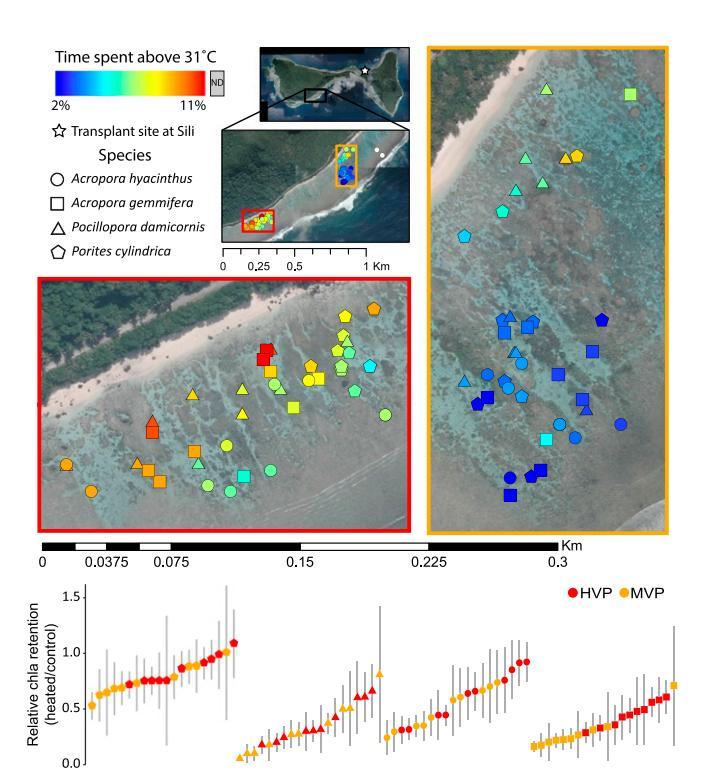
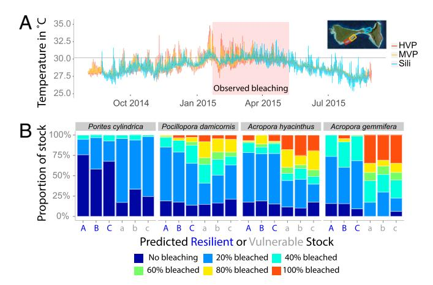
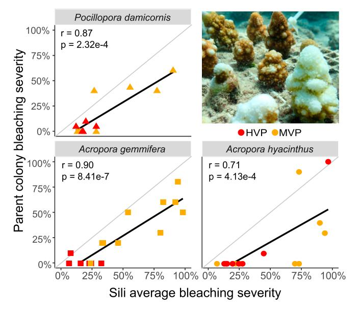
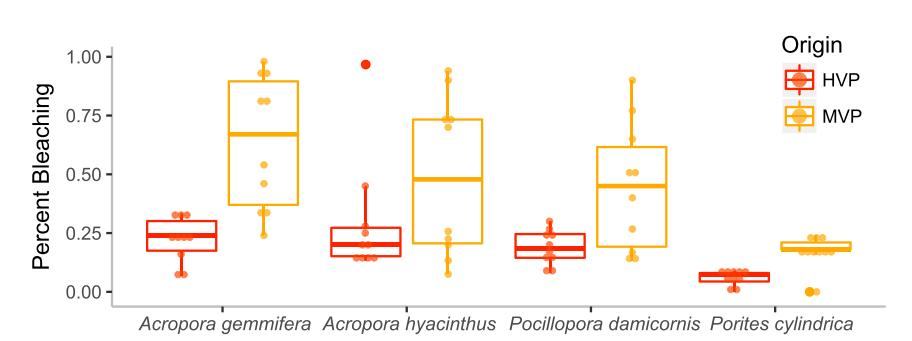

# Using naturally occurring climate resilient corals to construct bleaching-resistant nurseries

Megan K. Morikawaa and Stephen R. Palumbia,1

aDepartment of Biology, Hopkins Marine Station, Stanford University, Pacific Grove, CA 93950

Contributed by Stephen R. Palumbi, February 27, 2019 (sent for review December 11, 2017; reviewed by Andrew C. Baker, Les Kaufman, and Nancy Knowlton)

Ecological restoration of forests, meadows, reefs, or other foundational ecosystems during climate change depends on the discovery and use of individuals able to withstand future conditions. For coral reefs, climate-tolerant corals might not remain tolerant in different environments because of widespread environmental adjustment of coral physiology and symbionts. Here, we test if parent corals retain their heat tolerance in nursery settings, if simple proxies predict successful colonies, and if heat-tolerant corals suffer lower growth or survival in normal settings. Before the 2015 natural bleaching event in American Samoa, we set out 800 coral fragments from 80 colonies of four species selected by prior tests to have a range of intraspecific natural heat tolerance. After the event, nursery stock from heattolerant parents showed two to three times less bleaching across species than nursery stock from less tolerant parents. They also retained higher individual genetic diversity through the bleaching event than did less heat-tolerant corals. The three best proxies for thermal tolerance were response to experimental heat stress. location on the reef, and thermal microclimate. Molecular biomarkers were also predictive but were highly species specific. Colony genotype and symbiont genus played a similarly strong role in predicting bleaching. Combined, our results show that selecting for host and symbiont resilience produced a multispecies coral nursery that withstood multiple bleaching events, that proxies for thermal tolerance in restoration can work across species and be inexpensive, and that different coral clones within species reacted very differently to bleaching.

coral resilience | climate change | bleaching | American Samoa | restoration

Successful ecosystem restoration involves identifying organisms that are well adapted to current and future environmental conditions (1, 2). With climate change, environmental conditions are expected to shift, disrupting local adaptation and in many cases creating more degraded ecosystems (3). Predictable shifts in climate (4) present an opportunity to use knowledge of expected conditions in future environments to selectively boost resilience in current restoration. The ability of populations to evolve in the face of strong natural selection from climate change will derive from a store of previously accumulated genetic diversity that generates heritable fitness differences among individuals for success in future conditions. The challenge in many cases is to identify that diversity, and test its utility in restoration or protection programs.

In addition to gene-based adaptation, physiological plasticity as a result of physiological adjustment, epigenetic modification, movement, or other mechanisms (see ref. 5 for review), is an alternative source of variation in individual fitness in a variable environment. If individuals in different thermal environments adjust physiologically to those environments and maintain high fitness, then there may be far less additive genetic variation associated with phenotypic variation than if natural selection generated the same fitness landscape. In such cases, climate-resistant local phenotypes generated by acclimatization may not provide higher fitness when moved to new locations.

In economically, socially, and biologically important coral reefs faced with widespread and recurrent bleaching (6), there is increasing interest in whether corals will be able to evolve and survive future climates. Within species, heat tolerance varies widely with latitude (7), symbiont genus (8), between fore reef and back reef environments (9), and among microhabitats subject to different natural heat regimes (10). Work across ocean basins suggests that heat tolerance is affected by the genus of symbionts in a colony, as well as by many different genes of small effect in several species of the coral genus *Acropora* (11, 12), though some strong single gene effects have also been documented (13).

For reef building corals, the additional challenge of phenotypic plasticity matches colonies to local temperature conditions in two key ways. First, some coral colonies host multiple symbiont types and can change the proportions of symbionts with different levels of heat resistance (8, 14). Symbionts are acquired from the surrounding environment in many corals, usually during juvenile stages (15) and perhaps later in life for some species (16). Second, corals have a strong ability to rapidly adjust their heat tolerance physiologically. Transplant experiments, laboratory experiments, and transcriptome studies show widespread physiological plasticity of corals starting in as little as 7–11 d (17–19). Because the mechanisms of symbiont shift and physiological adjustment have been widely observed in corals, it is generally unknown if colonies that are currently thriving in high heat environments will produce heat tolerant clones in different settings, based on their inherent genetics, or if these clones will deacclimatize and lose their heat tolerance when moved to a new setting.

Here we assess individual colony heat tolerance within populations of four coral species in American Samoa: Acropora

## **Significance**

Coral reefs are threatened by global bleaching, spurring a need to improve upon reef restoration practices. Yet the strong capacity for corals and their symbionts to acclimatize to their local environment has brought into question whether or not corals that are temperature tolerant in one setting will lose that tolerance elsewhere. We show that variation in bleaching resilience among intraspecific colonies is maintained in novel environments for four species, and can be used to construct bleaching-resistant coral nurseries for restoration. By focusing on the host genotype and symbiont genus and its importance in stock selection, we demonstrate a path forward for reef restoration in the face of climate change.

Author contributions: M.K.M. and S.R.P. designed research; M.K.M. performed research; M.K.M. and S.R.P. analyzed data; and M.K.M. and S.R.P. wrote the paper.

Reviewers: A.C.B., University of Miami; L.K., Boston University; and N.K., Smithsonian Institution

The authors declare no conflict of interest.

This open access article is distributed under Creative Commons Attribution-NonCommercial-NoDerivatives License 4.0 (CC BY-NC-ND).

Data deposition: BioProject accession numbers for Sequence Read Archive of the fastq files are available at PRJNA529901 for Acropora gemmifera, PRJNA529902 for Pocillopora damicornis, and PRJNA529904 for Acropora hyacinthus.

1To whom correspondence should be addressed. Email: spalumbi@stanford.edu.

This article contains supporting information online at www.pnas.org/lookup/suppl/doi:10. 1073/pnas.1721415116/-/DCSupplemental.

Published online May 6, 2019.

hyacinthus, Acropora gemmifera, Pocillopora damicornis, and Porites cylindrica. In our descriptions, we consider a "parent colony" to be an individual coral colony on the reef that we sampled, a "clone" or "genet" to be the same underlying genome of coral host, and a "nubbin" to be biological replicates of parent colonies.

Because practical use of heat tolerance as a management tool demands low cost and rapid trait assessment, we categorized tolerance based on direct physiological testing and several indirect proxies for 20 parental colonies of four species in a natural lagoon environment spanning about 0.5 square kilometers. We then created 10 nubbins from each parent, and in the austral winter of 2014, planted a multispecies 800-fragment coral nursery on a reef that experiences similar mean temperatures but lower variability in daily fluctuations about 3 km away. We measured heat tolerance, growth, mortality, and symbiont genus through the summer of 2015 at which time a global bleaching event washed over the Samoan archipelago. This event allowed us to measure the response of each clone to bleaching conditions, its recovery, and subsequent growth, mortality, and shifts in symbionts. A second bleaching event occurred in 2017, allowing us to assess how bleaching tolerance changes after subsequent natural bleaching events.

Our results show that heat-tolerant colonies better resisted bleaching even after 8 mo in a common garden for all four species. Physiological and environmental proxies and symbiont type were good indicators of future bleaching response and recovery by the parent colonies across all species. The experiments show that the substantial variation in heat tolerance among clones is not rewritten by acclimatization, but instead is retained in this restoration setting. Moreover, understanding which parental colonies are the most heat resistant can substantially improve restoration outcomes after a natural bleaching event. The ability to use natural variation in heat tolerance among corals for restoration enhancement, if widely confirmed, could allow local corals in warm microhabitats to form the basis for targeted nursery development with climate resilience in mind.

# Results

Downloaded from https://www.pnas.org by 76.173.43.155 on November 30, 2024 from IP address 76.173.43.155.

Heat Tolerance, Microclimate, Symbiont, and Biomarkers Across Species. To evaluate heat stress performance of parent colonies, we used a standardized stress assay (20), and measured chlorophyll loss of heated branches compared with controls in small, computer controlled temperature tanks. We denote the reaction to this experimental stress as "heat tolerance" and the response to naturally experienced heating experienced later in the study as "natural bleaching." To determine species-specific maximum stress temperatures, we tested all species at halfdegree intervals from 32 °C to 37 °C. We then determined the temperature at which 50% of the bleaching response occurred (denoted T50; 34 °C for A. hyacinthus, 35 °C for A. gemmifera and P. damicornis, and 36 °C for P. cylindrica). We then tested four fragments from each of the 20 parental colonies for each species in August 2014 for heat tolerance at the T50 temperature, compared with four paired fragments in the control tank. As expected, P. cylindrica showed the greatest heat tolerance in this rapid test: fragments ranged from losing 50% of their original chlorophyll to losing none (Fig. 1, Lower), despite experiencing the warmest experimental heating temperature. The other three species showed lower levels of heat tolerance but also showed marked variation among parental colonies (Fig. 1, Lower). The five least tolerant parent colonies lost two to three times more chlorophyll than the five most tolerant colonies.

Individual temperature loggers showed that parent colonies ranged from spending 2.4–11.3% of time above 31 °C (Fig. 1, Upper). Colonies from a warmer section of the back reef [the highly variable pool (HVP)] spent on average 8% of time above 31 °C compared with 4% of the time for colonies from a less variable section [the moderately variable pool (MVP)]. Across all colonies, time spent above 31 °C was also highly correlated to

Fig. 1. (Upper) Forty corals from the HVP (red border) and 40 from the MVP (orange border) colored by time spent above 31 °C from December 2014 to April 2015 (austral summer). (Lower) Thermal tolerance (relative chlorophyll retained after a single day, species-specific heat stress) tends to be higher in corals from the HVP. Corals are arranged in ascending order of chlorophyll retention for the four species. Error bars represent SD across four paired replicates per colony.

time spent above 32 °C to 34 °C (R2 > 0.85). Heat tolerance was higher for colonies that originated in the HVP versus the MVP (Fig. 1, Lower). For example, of the five most heat-tolerant parent colonies for all four species, 75% originated from the HVP (binomial probability, P = 0.0206). Heat tolerance of a parent colony was also positively correlated to time that colony spent above 31 °C for all species, but not significantly for any one species.

Parent colonies of P. cylindrica only hosted genus Cladocopium symbionts. We tested for subtypes of symbionts by mapping transcriptomes to known ITS2 regions. The species A. gemmifera, and A. hyacinthus hosted symbiont species Cladocopium C3k and Durusdinium trenchii (formerly clade D1): P. damicornis, hosted Cladocopium C1d and D. trenchii, though all colonies tended to be dominated by one type or the other [\(Dataset S1](https://www.pnas.org/lookup/suppl/doi:10.1073/pnas.1721415116/-/DCSupplemental)). Within genera of corals, we found no evidence of multiple subclades in either Cladocopium or Durusdinium in any parent. Nearly half of the colonies for all three Acropora and Pocillopora species were dominated by less heat resilient Cladocopium clones. Overall 70% of the corals with the highest heat tolerance hosted the heat-tolerant symbiont D. trenchii rather than clones from genus Cladocopium (binomial P = 0.0214). We also mapped transcriptome data against full symbiont genomes and found 576 SNPs within the Acropora and Pocillopora parental colonies. These SNPs confirmed the distinctions between species Cladocopium C3k and Cladocopium C1d subclades, but they also suggested hidden variation in genus Durusdinium between corals that did not appear in the ITS2 data (see Materials and Methods). This approach may open up the low-diversity D. trenchii to more fine scale genetic analysis, suggesting more research is necessary to establish genera-specific associations with D. trenchii.

For A. hyacinthus and A. gemmifera, we used de novo transcriptomes to map published biomarkers that have been shown to be associated with thermal tolerance in coral for each parent. A subset of the Bay and Palumbi (11) candidate heat-tolerance alleles was tested for the species in which they were characterized, A. hyacinthus, and the congener A. gemmifera. We evaluated the proportion of the more tolerant alleles found across these sites for each parent colony. For A. hyacinthus, parents ranged from hosting 13–59% of the more tolerant alleles and in A. gemmifera, parents ranged from hosting 87–96% of the more tolerant alleles. There was a significant positive correlation between the density of tolerant alleles and measured heat tolerance among A. hyacinthus colonies, but this relationship was dominated by the differences in allele proportions between pools. For coral parent colonies compared within pools, we found no significant correlations between alleles and heat tolerance. For A. gemmifera, the high level of tolerant alleles correlates with higher heat tolerance in this species compared with A. hyacinthus, but there was low statistical power to detect trends within A. gemmifera. Jin et al. (13) identified the C70S236 marker to be correlated with bleaching tolerance in the Australian A. millepora. Our tests showed that this marker was homozygous for the more tolerant allele in nearly all parent colonies in Samoan A. hyacinthus and A. gemmifera.

Growth and Survival in Common Garden Before Bleaching. In the common garden nursery, we measured growth by buoyant weight of each replicate nubbin from August 2014 to April 2015, when the first signs of bleaching occurred. Species differed in relative growth rate, with the branching Acropora growing by three- to fivefold during this period compared with two- to threefold growth in P. cylindrica ([SI Appendix](https://www.pnas.org/lookup/suppl/doi:10.1073/pnas.1721415116/-/DCSupplemental), Fig. S1A). The lowest net growth was recorded for P. damicornis but this was due to consistent predation of branches by resident corallivores.

Pool of origin was an important predictor of growth for two species. In P. cylindrica, nubbins from parent colonies grew more slowly when they were from the warmer HVP (88% vs. 114% growth, P < 0.0001, t test). The opposite trend was seen in A. hyacinthus, where nubbins from parent colonies grew more slowly when they were from the less variable MVP (144% vs. 188% growth, P = 0.007, t test). Origin was not a significant factor in growth of A. gemmifera or P. damicornis during this prebleaching period.

Symbiont genus played a significant role in growth for A. hyacinthus (ANOVA P = 0.004): colonies hosting primarily D. trenchii symbionts and switchers tended to grow faster than those hosting primarily genus Cladocopium. Colonies of A. hyacinthus with D. trenchii grew by 295% compared with 249% for those with Cladocopium. Though we saw the same relationship in A. gemmifera (274% growth with Durusdinium vs. 225% with Cladocopium) this difference was not significant, largely because of the small number of colonies hosting Cladocopium. By contrast, in P. damicornis, colony growth was higher for colonies with Cladocopium symbionts (188% vs. 156%, ANOVA P = 0.0007). Symbionts were not variable in P. cylindrica.

For all species but P. cylindrica, identity of the parent colony played a very strong role in determining overall growth rate. There was about a twofold difference in growth across the 20 colonies of each Acropora species, with relatively low variance among growth rates of the 10 replicates of each colony (average coefficient of variation ∼25% of the mean, [SI Appendix](https://www.pnas.org/lookup/suppl/doi:10.1073/pnas.1721415116/-/DCSupplemental), Fig. [S1](https://www.pnas.org/lookup/suppl/doi:10.1073/pnas.1721415116/-/DCSupplemental)A). As a result, a significant proportion of the variance in growth among clones in the nursery was explained by parent identity (ANOVA P < 7e-10).

We found that survival was most affected by conditions of the transplant site. In particular, predation by small benthic reef fish at the transplant site in Sili Reef caused the most mortality, particularly in P. damicornis and A. hyacinthus ([SI Appendix](https://www.pnas.org/lookup/suppl/doi:10.1073/pnas.1721415116/-/DCSupplemental), Fig. [S1](https://www.pnas.org/lookup/suppl/doi:10.1073/pnas.1721415116/-/DCSupplemental)B). By April 2015, survival was 94% for A. gemmifera, 97% for P. cylindrica, 67% for A. hyacinthus, and 54% for P. damicornis.

Bleaching and Recovery in the 2015 and 2017 Events. Eight months after the establishment of the nursery, the 2015 El Niño brought temperatures reaching above 35 °C to back reef areas of American Samoa, causing bleaching in both the parental populations and the nursery nubbins (Figs. 2 and 3). Bleaching occurred again in 2017, 31 mo after establishment ([SI Appendix](https://www.pnas.org/lookup/suppl/doi:10.1073/pnas.1721415116/-/DCSupplemental), [Fig. S2](https://www.pnas.org/lookup/suppl/doi:10.1073/pnas.1721415116/-/DCSupplemental)). Monitoring 10 nubbins per parent allowed us to evaluate the way replicate nubbins from different parents reacted to a natural bleaching event. In both events, bleaching was variable within species, allowing us to test the value of our proxies of thermal tolerance, origin, biomarkers, and microclimate measured for parent colonies to predict nursery results.

After the 2015 bleaching event, visual bleaching of nubbins was less severe for P. cylindrica (average bleaching was 12%), moderate for P. damicornis (32%), and severe for A. hyacinthus (39%) and A. gemmifera (43%). However, there was also a great deal of variation within species. Even after 8 mo of growth side by side in common garden settings, bleaching of nubbins was 1.9– 2.5 times higher when they originated from parents in the MVP compared with the HVP (Figs. 2B and 4, two-way ANOVA F = 67.1, P = 10−12). This result shows that common garden growth of 200–500% and 8 mo of acclimatization did not erase the differences in heat tolerance among parent colonies.

Because we have data on three bleached species, from 10 parental colonies from each of two pools, and 10 replicates each, we tested how much variation in bleaching is partitioned by parent, origin, and symbiont. Different colonies, even from the same pool, had nubbins that bleached very differently than those of other colonies (Fig. 4, two-way ANOVA, F = 21.9, P = 10−18). For example, A. hyacinthus colony SU03 had nubbins that bleached 80–100% (mean 92%, n = 10), whereas conspecific SU08 had nubbins that bleached only 20–40% (mean 23%, n = 8). These colonies were from the same pool but had different symbionts ([SI Appendix](https://www.pnas.org/lookup/suppl/doi:10.1073/pnas.1721415116/-/DCSupplemental), Fig. S1A).

To tease apart the relationship between pool of origin, symbiont, and nubbin bleaching, we used both general linear models (GLMs)

Fig. 2. (A) Average temperature in the HVP, the MVP, and the transplant site in Sili with observed natural bleaching marked in the red box. The gray line marks the expected threshold bleaching temperature. (B) Visual bleaching severity of nubbins in the nursery partitioned using the three simplest proxies for predicted resilience. Labels on the predicted resilient or vulnerable stocks axis are as follows: (A, in blue lettering) corals from the HVP; (B, in blue lettering) top 10 experimental stress performers; (C in blue lettering) hottest extreme microclimates and the corresponding predicted vulnerable stocks: (a) corals from the MVP; (b) bottom 10 experimental stress performers; and (c) coolest extreme microclimates.

Fig. 3. Correlations between the average bleaching severity of replicate nursery nubbins in Sili versus the average bleaching severity of their parent genotypes in their original habitats. Photograph demonstrates severely bleached A. gemmifera next to nonbleached nubbins.

and multiple linear regression. For both analyses (implemented in R), pool of origin was a significant factor in bleaching after accounting for symbiont (SI Appendix[, Tables S1 and S2](https://www.pnas.org/lookup/suppl/doi:10.1073/pnas.1721415116/-/DCSupplemental)). Symbiont was separately significant in the multiple linear regression but only marginally so in the general linear model analysis. These results suggest that bleaching in the nursery was affected by both the pool of origin of the parent and to a slightly lesser degree by the parent's symbiont type: the combination of these effects explains much of the complex variation of nubbins in their bleaching patterns ([SI](https://www.pnas.org/lookup/suppl/doi:10.1073/pnas.1721415116/-/DCSupplemental) [Appendix](https://www.pnas.org/lookup/suppl/doi:10.1073/pnas.1721415116/-/DCSupplemental), Fig. S1A).

This variation was consistent with heat resistance we previously measured for these parents. Bleaching of nubbins in the common garden in 2015 was higher when they were derived from parents with higher heat tolerance. The correlation was significant for the two Acropora species (P = 0.006 and P = 0.032) and was in the same direction but nonsignificant for P. damicornis (P = 0.18) ([SI Appendix](https://www.pnas.org/lookup/suppl/doi:10.1073/pnas.1721415116/-/DCSupplemental), Fig. S3).

Similar results were recorded after the 2017 bleaching event. The two Acropora species bleached, whereas P. cylindrica did not (predation-based mortality between 2015 and 2017 was too high to score bleaching in P. damicornis). In both Acropora species, bleaching was less severe for parents from the HVP than the MVP, and for parents scored as more heat resistant in 2014 ([SI](https://www.pnas.org/lookup/suppl/doi:10.1073/pnas.1721415116/-/DCSupplemental) Appendix[, Fig. S2\)](https://www.pnas.org/lookup/suppl/doi:10.1073/pnas.1721415116/-/DCSupplemental). This second event was less drastic in A. gemmifera than the first bleaching.

Parent Versus Nursery Bleaching. In addition, by monitoring parents during the bleaching event, we could compare bleaching in nursery nubbins and parents. Even though they experienced high water temperatures on different reefs in different months, clones and corresponding nursery replicates showed a strong and significant correlation in the 2015 bleaching for the three species that bleached (Fig. 3; from Pearson's correlation: P. damicornis P = 8.89e-5, A. gemmifera P = 8.82e-8, A. hyacinthus P = 4.14e-4; P. cylindrica colonies did not bleach in their original environments). For example, A. gemmifera clone GE\_J bleached 80% in its native habitat and the nursery replicates from this colony bleached an average of 94%. By contrast, GE\_C did not bleach in its native habitat and none of its replicates in the transplant bleached more than 20%. The strong correlation from clone to corresponding nursery replicates and low SD (<10%) across nubbins indicate stability in the bleaching response.

Acclimatization in Common Garden Settings. Acclimatization to overall lower heat tolerance was also apparent in our study. The bleaching-inducing temperatures experienced in the nursery site were relatively mild compared with the environmental history experienced by parent colonies ([SI Appendix](https://www.pnas.org/lookup/suppl/doi:10.1073/pnas.1721415116/-/DCSupplemental), Fig. S4). Nevertheless, nursery replicates at Sili bleached more (average 11%) than their parents did in their original habitat. Despite this small loss of bleaching tolerance in a milder environment ([SI Appendix](https://www.pnas.org/lookup/suppl/doi:10.1073/pnas.1721415116/-/DCSupplemental), [Fig. S3](https://www.pnas.org/lookup/suppl/doi:10.1073/pnas.1721415116/-/DCSupplemental)), the rank order of bleaching remained highly correlated between clones in their home environment and corresponding nursery replicates (Fig. 3).

Symbiont Switching During Bleaching. For the two Acropora species, we observed symbiont shifts to occur in 11 of the 40 parent colonies, all shifting from Cladocopium-dominated to Durusdiniumdominated symbiont populations. For nubbins, lower bleaching was seen for parent colonies that switched to genus Durusdinium (52% vs. 88% for A. gemmifera P = 0.01, 16% vs. 80% for A. hyacinthus, P = 0.008) than for parents that retained Cladocopium.

Variation in symbionts allowed a limited test of the expected tradeoff between increased growth in corals with genus Cladocopium and increased heat tolerance in corals with genus Durusdinium (21). Transplant corals from the MVP with genus Durusdinium symbionts bleached less than the MVP transplants with genus Cladocopium symbionts. In addition, clones that switched from genus Cladocopium to genus Durusdinium showed much less bleaching than colonies that started with genus Cladocopium and did not switch (Fig. 4). However, the impact of symbiont type on growth was negligible. Within the MVP, parent colonies with genus Cladocopium did not produce nubbins that grew more quickly than

Fig. 4. Average percent bleaching across four species in the Sili nursery after the 2015 natural bleaching event. Bleaching of nubbins that came from parents from the HVP (red) was two- to threefold lower than for nubbins with parents from the MVP (orange).

Downloaded from https://www.pnas.org by 76.173.43.155 on November 30, 2024 from IP address 76.173.43.155.

those with genus Durusdinium, as might be expected if the tradeoff between growth and bleaching were strong (15).

Correlations Between Bleaching and Simple Predictive Proxies. All of our simple environmental and physiological proxies allowed the identification of parental corals producing nubbins that bleached substantially less in both the 2015 and 2017 bleaching events (Fig. 2 and [SI Appendix](https://www.pnas.org/lookup/suppl/doi:10.1073/pnas.1721415116/-/DCSupplemental), Fig. S2). In the 2015 event, all three environmental and physiological proxies significantly explained the bleaching response (linear model P values <0.01). Origin (HVP vs. MVP) and symbiont were the proxies that performed best, explaining 21% of the response. Microhabitat and stress performance explained 11% and 8%, respectively after removing the effect of origin. Biomarkers proved effective at predicting tolerance for the species in which they were characterized (A. hyacinthus) ([SI Appendix](https://www.pnas.org/lookup/suppl/doi:10.1073/pnas.1721415116/-/DCSupplemental), Fig. S5), but were not effective in other species.

Limited Tradeoffs in Growth in a Resilient Nursery. Host-driven bleaching tolerance is predicted to come with potential tradeoffs (22). For P. cylindrica, the parents that bleached less tended to grow at slower rates under prebleaching conditions (August 2014–December 2014), as expected by tradeoff predictions [Pearson's P = 0.005, correlation coefficient (cor) = 0.6]. In the period after bleaching (April 2015–August 2015), this tradeoff persisted for P. cylindrica (Pearson's P = 0.008, cor = 0.6). For A. gemmifera, a similar but weaker trend was also seen (Pearson's P = 0.05, cor = 0.4), and was largely explained by high growth and high bleaching for colonies from the MVP. However, in the period after bleaching, the trend reversed and coral from more tolerant parents grew faster than coral from less tolerant parents, dominated by low growth in those that were bleached (Pearson's P = 0.02, cor = −0.5). By contrast, we did not see significant trends in A. hyacinthus or P. damicornis between growth and bleaching.

Diversity in Nurseries Before and After Bleaching. We constructed our nurseries with an even mix of species and colonies, so they began the experiment with high Shannon–Weaver diversity [measured as H′ = Ppi\*ln( pi) based on the average size of nubbins and the number surviving across the 80 parents]. Predation on P. damicornis, larger growth of P. cylindrica, and A. gemmifera, and differential bleaching among species and clones led to a decline in overall species and clonal diversity over the course of the experiment (H′ = 4.37 → 4.13 out of a maximum of 4.38). However, the decline was less among the HVP clones (4.31 → 4.20) than among the MVP clones (4.41 → 4.05). In particular, diversity declined among the MVP clones after the 2015 bleaching event (4.29 → 4.05) but dropped much less among the HVP clones (4.23 → 4.21).

# Discussion

Our common garden experiment showed the ability of heattolerant corals to produce a heat-tolerant nursery in a transplant site that experienced similar mean temperatures but lower variability in daily fluctuations. These results document that the powerful mechanisms of coral acclimatization and symbiont switching did not fully erode heat tolerance after transplantation. Even after 8 mo of common garden growth, transplants from parents with higher heat tolerance bleached two- to threefold less during the 2015 and 2017 bleaching events than did transplants from parents originally with low heat tolerance. In addition, we monitored bleaching in the original parents on their native reefs in 2015 and show that parent and transplant bleaching was highly correlated across genotypes.

Physiological acclimatization is a type of phenotypic plasticity that can powerfully adjust physiology in the face of fluctuating temperature (5). Especially in marine settings, acclimatization reduces the impact of temperature on physiological shifts such as metabolic rate changes (23). Experimentally derived acclimation is widely seen in corals: heat tolerance has been seen to shift rapidly after exposure to increased temperature (17, 18, 24). Kingsolver and Huey (25) suggested that untangling the roles of phenotypic plasticity and evolutionary adaptation will often require field experiments in different environments. Here, we used common garden experiments to show that acclimatization to lower heat tolerance occurred once we transplanted corals to a reef site that experienced fewer hot days, but the relative rank of heat tolerance across individual hosts remained largely the same.

Role of Holobiont in Bleaching and Recovery. Physiological response of corals to environment is a complex feature of the coral holobiont, including species (26), host genetics (27), host acclimatization (10, 20, 23), symbiont genetics (8, 19), symbiont acclimatization, and an extensive microbiome. In our experiments, we tested corals from a common garden setting that were different species, came from different locations, and had different symbionts. There is a good correlation of nubbin bleaching in the nursery with both symbiont type and origin of the parent colony when analyzed separately ([SI Appendix](https://www.pnas.org/lookup/suppl/doi:10.1073/pnas.1721415116/-/DCSupplemental), Fig. S8). However, there is a tight association between symbiont type and pool of origin in this location. The HV pool is dominated by symbiont genus Durusdinium, whereas the MV pool has a more even mix of Durusdinium and Cladocopium symbionts ([SI Appendix](https://www.pnas.org/lookup/suppl/doi:10.1073/pnas.1721415116/-/DCSupplemental), Fig. S8; see also ref. 28). Both GLM and multiple linear regression analyses ([SI](https://www.pnas.org/lookup/suppl/doi:10.1073/pnas.1721415116/-/DCSupplemental) Appendix[, Tables S1 and S2\)](https://www.pnas.org/lookup/suppl/doi:10.1073/pnas.1721415116/-/DCSupplemental) show that both origin and symbiont genus play a significant role in determining the holobiont's response.

Our goal in these experiments was to assess whether the differences we see in parental colonies are also seen in the nurseries after 8–17 mo of growth, and our results show this to strongly be the case (e.g., see correlations in Fig. 3). However, three other features stand out in these analyses. First, colonies from the MV pool or with genus Cladocopium symbionts have a wider range of bleaching than do colonies from the HV pool or Durusdinium symbionts ([SI Appendix](https://www.pnas.org/lookup/suppl/doi:10.1073/pnas.1721415116/-/DCSupplemental), Fig. S8, ANOVA F = 51.3, P = 10−29), reflecting a larger range of average bleaching scores in MVP than HVP. Because these data were from nubbins exposed to common garden conditions, this variation cannot be ascribed to local variation in environment. Several alternative sources of variation could be: genetic differences among the hosts, hidden variation among Cladocopium symbionts, and long-term impact of environmental history on nursery traits. Genetic differences among host colonies are well known in A. hyacinthus from this population (11, 17), and parental genotypes at 114 loci correlate well with nubbin bleaching ([SI Appendix](https://www.pnas.org/lookup/suppl/doi:10.1073/pnas.1721415116/-/DCSupplemental), Fig. S5). The parental genetics of the other species are not as well known. Analysis of transcriptome SNPs from symbionts among our parent colonies does indeed show variation within both symbiont genera ([SI](https://www.pnas.org/lookup/suppl/doi:10.1073/pnas.1721415116/-/DCSupplemental) Appendix[, Fig. S6,](https://www.pnas.org/lookup/suppl/doi:10.1073/pnas.1721415116/-/DCSupplemental) PC axis 2), even within the genus Durusdinium, that might relate to bleaching. Thus, even in this wellknown system, the genetic basis for host or symbiont effects on variation in bleaching is just starting to be discovered.

Our bleaching data also show significant symbiont switching from genus Cladocopium to genus Durusdinium during the bleaching event, both in parental colonies and also in the common garden nursery clones. This is in contrast to strong persistence of symbiont types after transplantation in previous studies (20), but is in line with a host of studies in other systems on symbiont dynamics (16). Our previous transplants never experienced bleaching conditions, and so the differences in our two sets of results may hinge on the impact of bleaching on different symbionts.

Third, host genotype also played an important role in recovery. Recovery from bleaching has been shown to be dependent on both biotic and abiotic conditions (29, 30). In our system, biotic factors of genotype and species continued to play important roles in rapid recovery. Despite widespread bleaching in 2015, 65% of bleached replicates regained baseline levels of pigmentation within 5 mo. For A. hyacinthus, recovery depended solely on the severity of bleaching (GLM P < 0.01). However, for A. gemmifera and P. damicornis, recovery was also dependent on the genotype (GLM P < 0.01). For example, both genotype GE\_M and GE\_P had an average bleaching severity across replicates of >90%, but GE\_M had 0% recovery while GE\_P had 80% recovery.

Conservation Engineering: A Path for Coral Nurseries to Survive a Changing Climate. Selecting for resilience remains an important question in the face of climate change. One current approach to select for resilience in corals has been to wait for bleaching events to unveil winners (13). However, bleaching is known to vary in severity from event to event (9), making it challenging to observe the total amount of bleaching diversity within a specific system. Instead, there have been alternative calls for predictive assays for coral thermal tolerance (17, 18, 20). To be successful, such predictive tools should work across species, be simple, inexpensive, rapid, and deployable in remote locations. In addition, the practice of selecting natural diversity should also carefully consider potential impacts and identify whether the system can be managed in other ways, for example within adaptation networks (31).

In our study, coral nurseries were prepared for climate change by choosing parental stock using simple proxies of microclimate, origin, and experimental heat response. The proxies yielded results quickly and inexpensively, producing a nursery that resulted in two- to threefold less bleaching. Combined, these results provide managers a path for building resilience before bleaching occurs. This active approach to adding resilience and conservation of diversity for corals, much like ecosystem engineering,

- 1. Wortley L, Hero J-m, Howes M (2013) Evaluating ecological restoration success: A review of the literature. Restor Ecol 21:537–543.
- 2. Bayraktarov E, et al. (2016) The cost and feasibility of marine coastal restoration. Ecol Appl 26:1055–1074.
- 3. Chen IC, Hill JK, Ohlemüller R, Roy DB, Thomas CD (2011) Rapid range shifts of species associated with high levels of climate warming. Science 333:1024–1026.
- 4. Parmesan C, Yohe G (2003) A globally coherent fingerprint of climate change impacts across natural systems. Nature 421:37–42.
- 5. Kingsolver JG, Buckley LB (2017) Quantifying thermal extremes and biological variation to predict evolutionary responses to changing climate. Philos Trans R Soc B 372: 20160147.
- 6. Hughes TP, et al. (2017) Global warming and recurrent mass bleaching of corals. Nature 543:373–377.
- 7. Coles SL, Jokiel PL, Lewis CR (1976) Thermal tolerance in tropical versus subtropical Pacific reef corals. Pac Sci 30:159–166.
- 8. Berkelmans R, van Oppen MJ (2006) The role of zooxanthellae in the thermal tolerance of corals: A 'nugget of hope' for coral reefs in an era of climate change. Proc Biol Sci 273:2305–2312.
- 9. Oliver TA, Palumbi SR (2011) Do fluctuating temperature environments elevate coral thermal tolerance? Coral Reefs 30:429–440.
- 10. Berkelmans R, Willis BL (1999) Seasonal and local spatial patterns in the upper thermal limits of corals on the inshore Central Great Barrier Reef. Coral Reefs 18:219–228.
- 11. Bay RA, Palumbi SR (2014) Multilocus adaptation associated with heat resistance in reef-building corals. Curr Biol 24:2952–2956.
- 12. Dixon GB, et al. (2015) CORAL REEFS. Genomic determinants of coral heat tolerance across latitudes. Science 348:1460–1462.
- 13. Jin YK, et al. (2016) Genetic markers for antioxidant capacity in a reef-building coral. Sci Adv 2:e1500842.
- 14. Cunning R, et al. (2015) Growth tradeoffs associated with thermotolerant symbionts in the coral Pocillopora damicornis are lost in warmer oceans. Coral Reefs 34:155–160.
- 15. Little AF, van Oppen MJ, Willis BL (2004) Flexibility in algal endosymbioses shapes growth in reef corals. Science 304:1492–1494.
- 16. Boulotte NM, et al. (2016) Exploring the Symbiodinium rare biosphere provides evidence for symbiont switching in reef-building corals. ISME J 10:2693–2701.
- 17. Bay RA, Palumbi SR (2015) Rapid acclimation ability mediated by transcriptome changes in reef-building corals. Genome Biol Evol 7:1602–1612.
- 18. Middlebrook R, Hoegh-Guldberg O, Leggat W (2008) The effect of thermal history on the susceptibility of reef-building corals to thermal stress. J Exp Biol 211:1050–1056.
- 19. LaJeunesse TC, et al. (2018) Systematic revision of Symbiodiniaceae highlights the antiquity and diversity of coral endosymbionts. Curr Biol 28:2570–2580.e6.
- 20. Palumbi SR, Barshis DJ, Traylor-Knowles N, Bay RA (2014) Mechanisms of reef coral resistance to future climate change. Science 344:895–898.

combines an understanding of the physiological drivers of environmental stress with the practical results of field trials.

Conservation engineering and resilient restoration is part of a trend occurring across natural gradients in forests, grasslands, mangroves, and eelgrass (32–36). In all systems, creating conditions for high resilience will only buy time while global greenhouse gas emissions are reduced and atmospheric content declines. However, for coral, adding resilience by mapping tolerance of individuals already living on a reef may jumpstart use of resilient colonies in future restoration, even while longer-term laboratory-based selective breeding proceeds (37). More examples are needed, in the Indian, Pacific, and Caribbean basins, of both the degree to which host genotype plays a role in heat tolerance (38) and the degree to which acclimatization and symbiont switching alters colony phenotypes. If detecting and using heat-tolerance traits is repeatable in other locations, this provides a promising pathway for local restoration efforts to utilize thermally resilient coral. That these thermally resilient corals may be within their own management areas is a hopeful step forward for reefs in a changing climate.

### Materials and Methods

Twenty colonies each from four species were selected, 10 each from the MVP and 10 from the HVP. All were tested for heat resistance by exposing them to a defined daily temperature pulse and recording loss of chlorophyll. Local temperatures were recorded with HOBO pendant data loggers. In August 2014, we cut 10 fragments, each approximately 3 cm long from each colony, and created 10 replicate nursery panels at Sili Reef, about 2 km from the native location. Nursery colonies were photographed, weighed, scored for bleaching status, and sampled for transcriptomes, coral genomes, microbiomes, and symbiont genetics every 4–8 mo (detailed methods are in [SI](https://www.pnas.org/lookup/suppl/doi:10.1073/pnas.1721415116/-/DCSupplemental) [Appendix](https://www.pnas.org/lookup/suppl/doi:10.1073/pnas.1721415116/-/DCSupplemental)).

- 21. Rowan R (2004) Coral bleaching: Thermal adaptation in reef coral symbionts. Nature 430:742.
- 22. Kenkel CD, Almanza AT, Matz MV (2015) Fine-scale environmental specialization of reef-building corals might be limiting reef recovery in the Florida Keys. Ecology 96: 3197–3212.
- 23. Seebacher F, White CR, Franklin CE (2015) Physiological plasticity increases resilience of ectothermic animals to climate change. Nat Clim Change 5:61–66.
- 24. Bellantuono AJ, Granados-Cifuentes C, Miller DJ, Hoegh-Guldberg O, Rodriguez-Lanetty M (2012) Coral thermal tolerance: Tuning gene expression to resist thermal stress. PLoS One 7:e50685.
- 25. Kingsolver H, Huey RB (1998) Evolutionary analyses of morphological and physiological plasticity in thermally variable environments. Am Zool 38:545–560.
- 26. Fitt WK, et al. (2009) Response of two species of Indo-Pacific corals, Porites cylindrica and Stylophora pistillata, to short-term thermal stress: The host does matter in determining the tolerance of corals to bleaching. J Exp Mar Biol Ecol 373:102–110.
- 27. Edmunds RJ (1994) Evidence that reef-wide patterns of coral bleaching may be the result of the distribution of bleaching-susceptible clones. Mar Biol 121:137–142.
- 28. Oliver T, Palumbi S (2009) Distributions of stress-resistant coral symbionts match environmental patterns at local but not regional scales. Mar Ecol Prog Ser 378:93–103.
- 29. Cunning R, Ritson-Williams R, Gates RD (2016) Patterns of bleaching and recovery of Montipora capitata in Kane'ohe Bay, Hawai'i, USA. Mar Ecol Prog Ser 551:131–139.
- 30. Baird A, Marshall P (2002) Mortality, growth and reproduction in scleractinian corals following bleaching on the Great Barrier Reef. Mar Ecol Prog Ser 237:133–141.
- 31. Webster MS, et al. (2017) Who should pick the winners of climate change? Trends Ecol Evol 32:167–173.
- 32. Havens K, et al. (2015) Seed sourcing for restoration in an era of climate change. Nat Areas J 35:122–133.
- 33. Johnson LC, et al. (2015) Intraspecific variation of a dominant grass and local adaptation in reciprocal garden communities along a US Great Plains' precipitation gradient: Implications for grassland restoration with climate change. Evol Appl 8: 705–723.
- 34. Ibáñez I, et al. (2012) Moving forward in global-change ecology: Capitalizing on natural variability. Ecol Evol 3:170–181.
- 35. Cochrane A, Yates CJ, Hoyle GL, Nicotra AB (2015) Will among-population variation in seed traits improve the chance of species persistence under climate change? Glob Ecol Biogeogr 24:12–24.
- 36. Sherman CDH, York PH, Smith TM, Macreadie PI (2016) Fine-scale patterns of genetic variation in a widespread clonal seagrass species. Mar Biol 163:82.
- 37. van Oppen MJH, Oliver JK, Putnam HM, Gates RD (2015) Building coral reef resilience through assisted evolution. Proc Natl Acad Sci USA 112:2307–2313.
- 38. Lohr KE, Patterson JT (2017) Intraspecific variation in phenotype among nurseryreared staghorn coral Acropora cervicornis (Lamarck, 1816). J Exp Mar Biol Ecol 486:87–92.

Downloaded from https://www.pnas.org by 76.173.43.155 on November 30, 2024 from IP address 76.173.43.155.