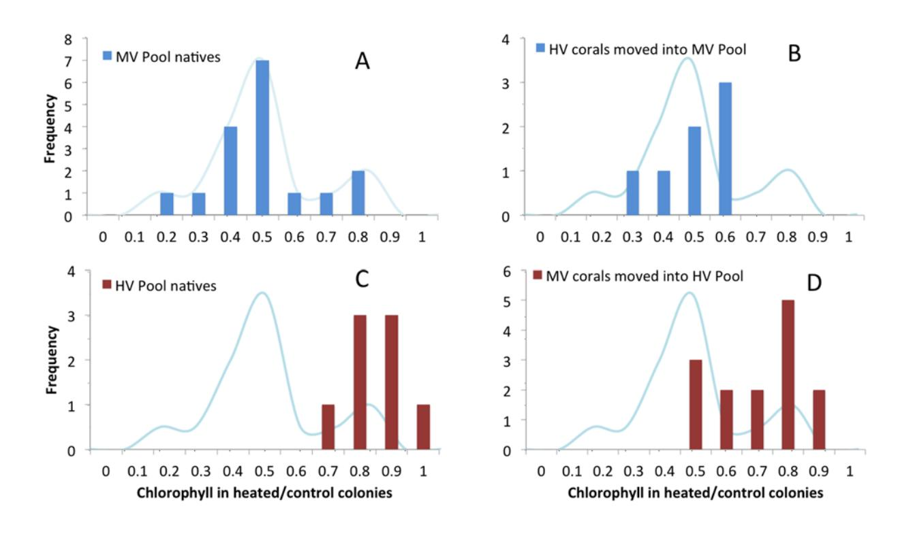
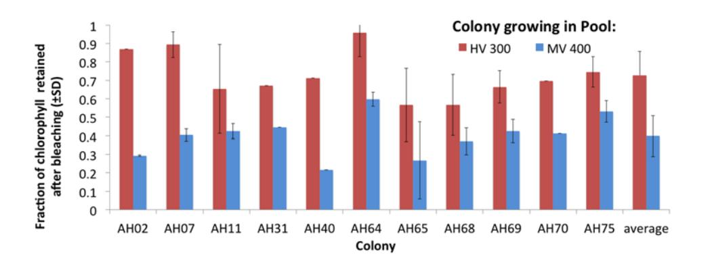
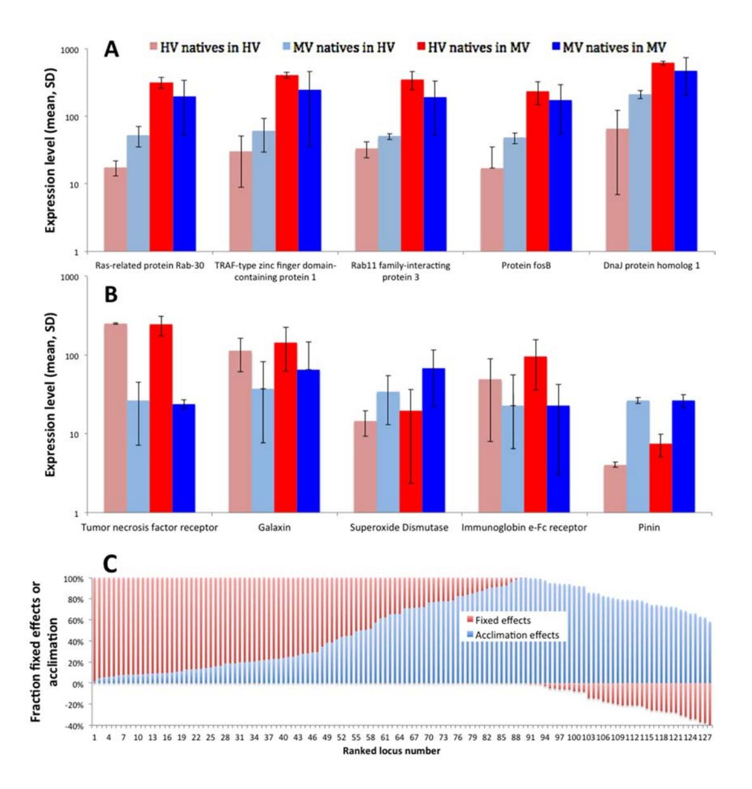
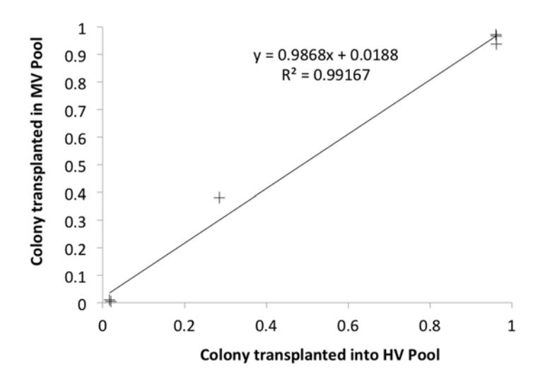

## Mechanisms of Reef Coral Resistance to Future Climate Change

Stephen R. Palumbi,\* Daniel J. Barshis, † Nikki Traylor-Knowles, Rachael A. Bay

Department of Biology, Stanford University, Hopkins Marine Station, Pacific Grove, CA 93950, USA. \*Corresponding author. E-mail: spalumbi@stanford.edu

†Present address: Department of Biological Sciences, Old Dominion University, Norfolk, VA 23529, USA.

**Reef corals are highly sensitive to heat, yet populations resistant to climate change have recently been identified. To determine the mechanisms of temperature tolerance, we reciprocally transplanted corals between reef sites experiencing distinct temperature regimes, and tested subsequent physiological and gene expression profiles. Local acclimatization and fixed effects, such as adaptation, contributed about equally to heat tolerance and are reflected in patterns of gene expression. In less than two years, acclimatization achieves the same heat tolerance that we would expect from strong natural selection over many generations for these long-lived organisms. Our results show both short-term acclimatory and longerterm adaptive acquisition of climate resistance. Adding these adaptive abilities to ecosystem models is likely to slow predictions of demise for coral reef ecosystems.**

Reef-building corals have experienced global declines resulting from bleaching events sparked by pulses of warm water exposure (*1*–*4*). However, corals in naturally warm environments can have high resistance to bleaching temperatures, and can survive heat exposure that would bleach conspecifics in cooler microclimates (*5*, *6*). Similarly, recent discovery of populations of acidification-resistant corals show that physiological or evolutionary mechanisms of environmental accommodation exist (*7*, *8*). Such populations are ideal test sites for research into the mechanisms of coral response to climate change.

Corals in adjacent backreef pools in the U.S. National Park of American Samoa on Ofu Island experience strong differences in temperature (*9*, *10*). In the Highly Variable (HV) Pool, temperatures often exceed the local critical bleaching temperature of 30°C, reaching 35°C during strong noontime low tides (*6*). By contrast, the Moderately Variable (MV) Pool rarely experiences temperatures above 32°C. Corals in the HV Pool have higher growth rates (*9*, *10*), higher survivorship and higher symbiont photosynthetic efficiency during experimental heat stress than conspecifics from the MV Pool (*6*). These pools provide a powerful system to test the speed and extent of coral acclimatization and adaptation to warm water conditions in the context of future climate change.

To test corals in their native habitats for physiological resistance to heat stress, we collected branches of the table top coral *Acropora hyacinthus* (cryptic species E, (*11*)) and exposed them to experimental bleaching conditions. *A. hyacinthus* is a cosmopolitan species that comprises a large percentage of hard coral cover on Pacific reefs and shows high levels of bleaching and mortality during large-scale bleaching events (*4*). We chose *A. hyacinthus* for this study because it is a dominant reef-builder and is especially sensitive to environmental stress, making its relative ability to acclimate or adapt extremely important to the future of coral reef ecosystems as climate change proceeds. We subjected branches of corals to a prescribed ramp in water temperature of 29 - 34°C for 3 hours, followed by an incubation for 3 hours at 34°C. These conditions mimic the natural increase in temperature observed in the HV Pool during a tidal cycle. Experiments on fragments of tagged and monitored colonies showed that individuals native to the HV Pool exhibit higher resistance to thermal stress, measured by retention of chlorophyll derived from photosynthetic symbionts, than corals from the MV Pool (Fig. 1). The average retention of chlorophyll-a after experimental heat stress was 80% in HV Pool corals (Fig. 1C) but only 45% in MV Pool corals (Fig. 1A, *t* test, p<0.00001) compared with controls.

To test for acclimatization, we transplanted coral colonies of *A. hyacinthus* reciprocally from their native locations in the HV and MV pools to three transplant sites within each pool. We transplanted six colonies from the HV Pool and twelve from the MV Pool. After 12, 19, and 27 months, we tested transplanted colonies for thermal resistance. For 11 separate colonies, 22 of 23 paired bleaching experiments show that corals acquired at least part of the heat sensitivity of the pool they were transplanted into. The experiments showed higher chlorophyll-a retention during heat stress in colonies transplanted to the HV Pool than in the same colony transplanted to the MV Pool (p < 0.0001, paired *t* test, Fig. 2). Bleaching resistance did not vary with the time

of transplant or season (p>0.80).

Although the MV Pool corals acquired heat resistance when moved to the HV Pool, they did not achieve the resistance of native HV corals. MV pool corals transplanted to the HV Pool retained less chlorophyll in bleaching experiments than corals native to the HV pool (compare Fig. 1C and Fig. 1D; i.e., 67.5% and 80%, respectively. Student's *t* test p<0.05). By contrast, HV Pool corals transplanted into the MV Pool dropped their chlorophyll-a retention to the same level as the MV Pool natives (compare Fig. 1 A and Fig. 1 B; i.e., 47% and 45%, respectively).

To understand the physiological changes associated with acquired heat resistance, we investigated gene expression in reciprocally transplanted corals. Six corals were sampled at noon on August 30, 2011, each from reciprocal transplant sites in the HV and MV Pools. Reads from 12 mRNA extractions (one from each coral from each pool) were mapped to the *A. hyacinthus* assembly developed by Barshis *et al*. (*12*). Data pipelines and statistical procedures followed De Wit *et al*. (*13*). Transcriptome profiles of transplanted colonies show strong evidence for acclimatization. A 2-way ANOVA of 16,728 coral genes detected 74 that changed significantly when comparing genetically identical coral fragments between the two pools (average 3.4-fold expression difference, FDR-corrected p value <0.05, Table S3). Among the 55 contigs with annotations, we found several transcription factors and cell signaling proteins (14 contigs), heat shock and chaperonin proteins (9 contigs), TRAF-type proteins, cytochrome P450 and fluorochromes (Fig. 3A) that appeared to be involved in heat acclimation.

The ANOVA test also highlights 71 contigs with differential expression depending on the origin of colonies (2-way ANOVA experimentwide FDR p<0.05, Table S2). These genes showed differences in expression levels depending strictly on the pool of origin, not on the final transplant site. In our previous work members of the tumor necrosis factor receptor (TNFR) superfamily, which is involved in eukaryotic immune function and apoptosis (*14*, *15*), were constitutively upregulated in native HV Pool corals (*13*). In the current data set, one TNFR gene exhibited a 9.9 fold difference in expression in coral colonies native to the HV Pool, whether they were living in the HV or MV pools (Fig. 3B), when compared with corals native to the MV Pool. These results indicated that mediators of coral thermal resistance have fixed constitutive expression levels in either pool, perhaps representing signs of genetically-based local adaptation.

Our transcriptome data also allowed us to test for changes in the proportions of symbiotic algae during coral acclimatization. *Symbiodinium* clades C and D are common in corals in American Samoa and corals in warmer microclimates tend to have clade D symbionts (*16*). Though most colonies are dominated by one or the other of these clades, all colonies we have tested host background populations of the other clade (*17*). To test if coral host acclimation was accompanied by changes in symbiont proportion, we estimated the proportion of clade C and D by counting the transcriptome reads that mapped exclusively to small artificial test contigs of ITS1, ITS2 and the chloroplast 23S gene, which distinguish clade C and D *Symbiodinium* (*17*). In our experiments, symbiont type explained a negligible fraction of the variation in bleaching resistance in common garden conditions (R2 = 0.15 and 0.06 in the HVP and the MVP transplants, respectively, p>0.30, Fig. S2). Our data also showed little shift in C versus D proportions as a result of transplantation. When clade C-dominated MV Pool corals are moved to the HV Pool their proportion of clade D shifts from <1% to about 2%. Likewise D-dominated HV corals moved to the MV Pool maintain only about 4% clade-C symbionts (Fig. 4). Additionally, there were no gene expression changes in *Symbiodinium* between transplants to the different pools, suggesting little acclimation by symbionts occurred in the altered environmental conditions (*18*).

These experiments showed that some corals are capable of broad acclimatization to microclimate and developed enhanced resistance to bleaching without changing symbionts. We can place this capacity for acclimatization in an evolutionary context by comparing the natural phenotypic difference we find between pools with the shift due to acclimatization after transplantation. Phenotypic change in evolutionary biology is often measured by the intensity parameter *I*, which is defined as the change in mean phenotype before versus after natural selection, divided by the standard deviation (*19*). In our case, we applied this concept to the spatial differences between pools instead of to temporal differences. The average phenotypic change from corals native to the HV Pool versus the MV Pool was 0.35 with a standard deviation of 0.14 (compare Fig. 1A and Fig. 1C). Thus, the phenotypic shift between pools was 2.5 standard deviations.

Here, *I* measures the difference in phenotype between coral populations subjected to different environments, and is affected by phenotypic change caused by the fixed effects between the microclimates (denoted *IF*), as well as by the acclimatization of individuals (denoted *IA*), *I* = *IF*+*IA*. In this case, fixed effects include evolutionary adaptation, shifts in symbiont type, developmental changes and epigenetics. Our transplant experiment allowed us to measure *IA* as the average change in mean phenotype among acclimating individuals (0.214) divided by the standard deviation (0.137), resulting in *IA* = 1.56 (Fig. 1A vs B and C vs D). This in turn allowed us to estimate *IF* to be 0.94 standard deviation units (= *I* - *IA*).

These estimates indicated that these corals did acclimate to higher temperatures. The change in phenotype due to acclimatization (1.56 sd units) was similar to, but higher than the change we estimated is caused by fixed effects between pools (0.94 sd units).

We have provisionally extended this analysis to gene expression to illustrate the dual roles of acclimation and adaptation in gene expression shifts. There are 141 contigs for which corals native to the HV Pool showed expression levels that were more than one standard deviation different from corals native to the MV Pool, and that were significant in the above 2-way ANOVA analysis. Considering gene expression as a phenotype, these loci had an intensity *I* >1.0. We also measured the contribution of acclimation to this phenotypic change by measuring gene expression in MV Pool corals in the HV Pool and vice versa. For these 141 contigs, the change caused by acclimation (*IA*) averaged 42% of the phenotypic difference (Fig. S4, Table S4), with the rest being caused by fixed effects (*IF*). Loci with strong fixed effects included Tumor Necrosis Factor Receptor (as above) and a series of cellular transport loci with unknown function in corals. As in the case of bleaching phenotypes, fixed effects could be due to adaptive evolution, but also affected by developmental changes, epigenetics and symbiont type. It is also possible there are residual effects that might eventually be erased by longer residence time. However, our experiments were conducted on branches that grew in situ after transplantation, and so our data are from tissues that never experienced the native pool environment. Loci with strong components of acclimation include the Tumor Necrosis Factor Receptor-Associated Factors, the signaling transducers for TNFR, as well as *Ras* and *Rab* proteins, transcription factors and heat shock proteins.

The possibility that corals can acclimate to local differences has been suggested for decades: conspecific corals at different latitudes show bleaching temperatures 1-2°C above local mean summer maximum sea surface temperature (*20*, *21*), despite substantial differences in mean summer maximum temperatures. However, the mechanism generating this pattern has never been strongly tested. Early analyses of the threat to corals from climate change (*1*, *2*) emphasized the potential for coral acclimatization or local adaptation to alter predictions of climate change effects. New models show that coral adaptation over a forty year time frame could substantially change predictions for coral reef demise (*22*). But because future adaptation over many generations has been considered too slow for long-lived species such as corals, the role of individual acclimatization in coral environmental tolerance has been central to the debate on the future of reefs. The corals in our experiment achieved a larger bleaching phenotype shift (*IA* = 1.56) due to acclimatization within 15-24 months than the shift due to fixed effects between habitats, a substantial acceleration in the rate of local matching of coral phenotype to thermal environment. Our results clearly show that acclimatization can allow corals to acquire significant high temperature resistance more quickly than strong natural selection would produce.

We do not yet know how many coral species can acclimate or evolve. Several dozen coral species live and grow in the over-heated backreef pools of Ofu (*23*), but whether all individual colonies have equal acclimatization ability, or if there is an upper thermal limit to acclimatization or adaptation (*24*) remain unknown. It is also probable that multiple stressors – from acidification and heat, for example – can reduce the ability of corals to respond (*25*). Thus, acclimatization alone cannot be expected to completely overcome the threat to corals from widespread bleaching events, especially if the onset of high temperature stress is abrupt and sustained. In this regard, the tempo and severity of heat anomalies will be critical for effective coral acclimatization.

Persistence of populations through climate change demands biogeographic shifts of species (*26*–*28*), evolutionary adaptation of populations (*29*) or local acclimatization of individuals (*2*). For long-lived, sessile foundation species that create ecosystem habitat such as forest trees or reef building corals, range shifts and evolution are predicted to be slow (*2*, *30*). As a consequence, the rate and scope of acclimatization in these species to future environmental conditions is central to understanding the impact of climate change. For the fast-growing, shallow water species we studied, acclimatory andadaptive responses allowed them to inhabit reef areas with water temperatures far above their expected tolerances. How well other corals can similarly respond, and what the limits of these responses are, will determine how well current models accurately predict the future demise of coral reefs.

## **References and Notes**

- 1. O. Hoegh-Guldberg, Climate change, coral bleaching and the future of the world's coral reefs. *Mar. Freshw. Res.* **50**, 839 (1999). [doi:10.1071/MF99078](http://dx.doi.org/10.1071/MF99078)
- 2. T. P. Hughes, A. H. Baird, D. R. Bellwood, M. Card, S. R. Connolly, C. Folke,

- R. Grosberg, O. Hoegh-Guldberg, J. B. Jackson, J. Kleypas, J. M. Lough, P. Marshall, M. Nyström, S. R. Palumbi, J. M. Pandolfi, B. Rosen, J. Roughgarden, Climate change, human impacts, and the resilience of coral reefs. *Science* **301**, 929–933 (2003). [Medline](http://www.ncbi.nlm.nih.gov/entrez/query.fcgi?cmd=Retrieve&db=PubMed&list_uids=12920289&dopt=Abstract) [doi:10.1126/science.1085046](http://dx.doi.org/10.1126/science.1085046)
- 3. T. P. Hughes, N. A. J. Graham, J. B. C. Jackson, P. J. Mumby, R. S. Steneck, Rising to the challenge of sustaining coral reef resilience. *Trends Ecol. Evol.* **25**, 633–642 (2010). [Medline](http://www.ncbi.nlm.nih.gov/entrez/query.fcgi?cmd=Retrieve&db=PubMed&list_uids=20800316&dopt=Abstract) [doi:10.1016/j.tree.2010.07.011](http://dx.doi.org/10.1016/j.tree.2010.07.011)
- 4. K. E. Carpenter, M. Abrar, G. Aeby, R. B. Aronson, S. Banks, A. Bruckner, A. Chiriboga, J. Cortés, J. C. Delbeek, L. Devantier, G. J. Edgar, A. J. Edwards, D. Fenner, H. M. Guzmán, B. W. Hoeksema, G. Hodgson, O. Johan, W. Y. Licuanan, S. R. Livingstone, E. R. Lovell, J. A. Moore, D. O. Obura, D. Ochavillo, B. A. Polidoro, W. F. Precht, M. C. Quibilan, C. Reboton, Z. T. Richards, A. D. Rogers, J. Sanciangco, A. Sheppard, C. Sheppard, J. Smith, S. Stuart, E. Turak, J. E. Veron, C. Wallace, E. Weil, E. Wood, One-third of reef-building corals face elevated extinction risk from climate change and local impacts. *Science* **321**, 560–563 (2008). [Medline](http://www.ncbi.nlm.nih.gov/entrez/query.fcgi?cmd=Retrieve&db=PubMed&list_uids=18653892&dopt=Abstract) [doi:10.1126/science.1159196](http://dx.doi.org/10.1126/science.1159196)
- 5. T. A. Oliver, S. R. Palumbi, Distributions of stress-resistant coral symbionts match environmental patterns at local but not regional scales. *Mar. Ecol. Prog. Ser.* **378**, 93–103 (2009)[. doi:10.3354/meps07871](http://dx.doi.org/10.3354/meps07871)
- 6. T. A. Oliver, S. R. Palumbi, Do fluctuating temperature environments elevate coral thermal tolerance? *Coral Reefs* **30**, 429–440 (2011). [doi:10.1007/s00338-011-0721-y](http://dx.doi.org/10.1007/s00338-011-0721-y)
- 7. K. E. Shamberger, A. L. Cohen, Y. Golbuu, D. C. McCorkle, S. J. Lentz, H. C. Barkley, Diverse Coral Communities in Naturally Acidified Waters of a Western Pacific Reef. *Geophys. Res. Lett.* **41**, 499–504 (2014). [doi:10.1002/2013GL058489](http://dx.doi.org/10.1002/2013GL058489)
- 8. K. E. Fabricius, C. Langdon, S. Uthicke, C. Humphrey, S. Noonan, G. De'ath, R. Okazaki, N. Muehllehner, M. S. Glas, J. M. Lough, Losers and winners in coral reefs acclimatized to elevated carbon dioxide concentrations. *Nature Climate Change* **1**, 165–169 (2011). [doi:10.1038/nclimate1122](http://dx.doi.org/10.1038/nclimate1122)
- 9. L. W. Smith, D. Barshis, C. Birkeland, Phenotypic plasticity for skeletal growth, density and calcification of Porites lobata in response to habitat type. *Coral Reefs* **26**, 559–567 (2007)[. doi:10.1007/s00338-007-0216-z](http://dx.doi.org/10.1007/s00338-007-0216-z)
- 10. L. W. Smith, H. H. Wirshing, A. C. Baker, C. Birkeland, Environmental versus genetic influences on growth rates of the corals Pocillopora eydouxi and Porites lobata (Anthozoa: Scleractinia). *Pac. Sci.* **62**, 57–69 (2008). [doi:10.2984/1534-6188\(2008\)62\[57:EVGIOG\]2.0.CO;2](http://dx.doi.org/10.2984/1534-6188(2008)62%5b57:EVGIOG%5d2.0.CO;2)
- 11. J. T. Ladner, S. R. Palumbi, Extensive sympatry, cryptic diversity and introgression throughout the geographic distribution of two coral species complexes. *Mol. Ecol.* **21**, 2224–2238 (2012). [Medline](http://www.ncbi.nlm.nih.gov/entrez/query.fcgi?cmd=Retrieve&db=PubMed&list_uids=22439812&dopt=Abstract) [doi:10.1111/j.1365-](http://dx.doi.org/10.1111/j.1365-294X.2012.05528.x) [294X.2012.05528.x](http://dx.doi.org/10.1111/j.1365-294X.2012.05528.x)
- 12. D. J. Barshis, J. T. Ladner, T. A. Oliver, F. O. Seneca, N. Traylor-Knowles, S. R. Palumbi, Genomic basis for coral resilience to climate change. *Proc. Natl. Acad. Sci. U.S.A.* **110**, 1387–1392 (2013). [Medline](http://www.ncbi.nlm.nih.gov/entrez/query.fcgi?cmd=Retrieve&db=PubMed&list_uids=23297204&dopt=Abstract) [doi:10.1073/pnas.1210224110](http://dx.doi.org/10.1073/pnas.1210224110)
- 13. P. De Wit, M. H. Pespeni, J. T. Ladner, D. J. Barshis, F. Seneca, H. Jaris, N. O. Therkildsen, M. Morikawa, S. R. Palumbi, The simple fool's guide to population genomics via RNA-Seq: An introduction to high-throughput sequencing data analysis. *Molecular Ecology Resources* **12**, 1058–1067 (2012). [Medline](http://www.ncbi.nlm.nih.gov/entrez/query.fcgi?cmd=Retrieve&db=PubMed&list_uids=22931062&dopt=Abstract) [doi:10.1111/1755-0998.12003](http://dx.doi.org/10.1111/1755-0998.12003)
- 14. M. Karin, E. Gallagher, TNFR signaling: Ubiquitin-conjugated TRAFfic signals control stop-and-go for MAPK signaling complexes. *Immunol. Rev.* **228**, 225–240 (2009). [Medline](http://www.ncbi.nlm.nih.gov/entrez/query.fcgi?cmd=Retrieve&db=PubMed&list_uids=19290931&dopt=Abstract) [doi:10.1111/j.1600-065X.2008.00755.x](http://dx.doi.org/10.1111/j.1600-065X.2008.00755.x)
- 15. H. M. Shen, S. Pervaiz, TNF receptor superfamily-induced cell death: Redoxdependent execution. *FASEB J.* **20**, 1589–1598 (2006). [Medline](http://www.ncbi.nlm.nih.gov/entrez/query.fcgi?cmd=Retrieve&db=PubMed&list_uids=16873882&dopt=Abstract) [doi:10.1096/fj.05-5603rev](http://dx.doi.org/10.1096/fj.05-5603rev)
- 16. T. A. Oliver, S. R. Palumbi, Many corals host thermally resistant symbionts in high-temperature habitat. *Coral Reefs* **30**, 241–250 (2011). [doi:10.1007/s00338-010-0696-0](http://dx.doi.org/10.1007/s00338-010-0696-0)
- 17. J. T. Ladner, D. J. Barshis, S. R. Palumbi, Protein evolution in two cooccurring types of Symbiodinium: An exploration into the genetic basis of thermal tolerance in Symbiodinium clade D. *BMC Evol. Biol.* **12**, 217 (2012)[.](http://www.ncbi.nlm.nih.gov/entrez/query.fcgi?cmd=Retrieve&db=PubMed&list_uids=23145489&dopt=Abstract) [Medline](http://www.ncbi.nlm.nih.gov/entrez/query.fcgi?cmd=Retrieve&db=PubMed&list_uids=23145489&dopt=Abstract) [doi:10.1186/1471-2148-12-217](http://dx.doi.org/10.1186/1471-2148-12-217)
- 18. D. J. Barshis, J. T. Ladner, T. A. Oliver, S. R. Palumbi, Lineage-specific transcriptional profiles of Symbiodinium spp. unaltered by heat stress in a coral host. *Mol. Biol. Evol.* (2014). 10.1093/molbev/msu107 [Medline](http://www.ncbi.nlm.nih.gov/entrez/query.fcgi?cmd=Retrieve&db=PubMed&list_uids=24651035&dopt=Abstract) [doi:10.1093/molbev/msu107](http://dx.doi.org/10.1093/molbev/msu107)
- 19. J. Endler, *Natural Selection in the Wild*. (Princeton University Press,

- Princeton, NJ, 1986).
- 20. S. L. Coles, P. L. Jokiel, C. R. Lewis, Thermal tolerance in tropical versus subtropical Pacific reef corals. *Pac. Sci.* **30**, 155 (1976).
- 21. P. Jokiel, S. Coles, Response of Hawaiian and other Indo-Pacific reef corals to elevated temperature. *Coral Reefs* **8**, 155–162 (1990). [doi:10.1007/BF00265006](http://dx.doi.org/10.1007/BF00265006)
- 22. C. A. Logan, J. P. Dunne, C. M. Eakin, S. D. Donner, Incorporating adaptive responses into future projections of coral bleaching. *Glob. Change Biol.* **20**, 125–139 (2014). [Medline](http://www.ncbi.nlm.nih.gov/entrez/query.fcgi?cmd=Retrieve&db=PubMed&list_uids=24038982&dopt=Abstract) [doi:10.1111/gcb.12390](http://dx.doi.org/10.1111/gcb.12390)
- 23. P. Craig, C. Birkeland, S. Belliveau, High temperatures tolerated by a diverse assemblage of shallow-water corals in American Samoa. *Coral Reefs* **20**, 185– 189 (2001)[. doi:10.1007/s003380100159](http://dx.doi.org/10.1007/s003380100159)
- 24. J. H. Stillman, Acclimation capacity underlies susceptibility to climate change. *Science* **301**, 65 (2003). [Medline](http://www.ncbi.nlm.nih.gov/entrez/query.fcgi?cmd=Retrieve&db=PubMed&list_uids=12843385&dopt=Abstract) [doi:10.1126/science.1083073](http://dx.doi.org/10.1126/science.1083073)
- 25. J. E. Carilli, R. D. Norris, B. A. Black, S. M. Walsh, M. McField, Local stressors reduce coral resilience to bleaching. *PLOS ONE* **4**, e6324 (2009[\).](http://www.ncbi.nlm.nih.gov/entrez/query.fcgi?cmd=Retrieve&db=PubMed&list_uids=19623250&dopt=Abstract) [Medline](http://www.ncbi.nlm.nih.gov/entrez/query.fcgi?cmd=Retrieve&db=PubMed&list_uids=19623250&dopt=Abstract) [doi:10.1371/journal.pone.0006324](http://dx.doi.org/10.1371/journal.pone.0006324)
- 26. C. Parmesan, N. Ryrholm, C. Stefanescu, J. K. Hill, C. D. Thomas, H. Descimon#, B. Huntley, L. Kaila, J. Kullberg, T. Tammaru, W. J. Tennent, J. A. Thomas, M. Warren, Poleward shifts in geographical ranges of butterfly species associated with regional warming. *Nature* **399**, 579–583 (1999). [doi:10.1038/21181](http://dx.doi.org/10.1038/21181)
- 27. C. Parmesan, G. Yohe, A globally coherent fingerprint of climate change impacts across natural systems. *Nature* **421**, 37–42 (2003). [Medline](http://www.ncbi.nlm.nih.gov/entrez/query.fcgi?cmd=Retrieve&db=PubMed&list_uids=12511946&dopt=Abstract) [doi:10.1038/nature01286](http://dx.doi.org/10.1038/nature01286)
- 28. T. L. Root, D. P. MacMynowski, M. D. Mastrandrea, S. H. Schneider, Human-modified temperatures induce species changes: Joint attribution. *Proc. Natl. Acad. Sci. U.S.A.* **102**, 7465–7469 (2005). [Medline](http://www.ncbi.nlm.nih.gov/entrez/query.fcgi?cmd=Retrieve&db=PubMed&list_uids=15899975&dopt=Abstract) [doi:10.1073/pnas.0502286102](http://dx.doi.org/10.1073/pnas.0502286102)
- 29. C. Parmesan, Ecological and evolutionary responses to recent climate change. *Annu. Rev. Ecol. Evol. Syst.* **37**, 637–669 (2006). [doi:10.1146/annurev.ecolsys.37.091305.110100](http://dx.doi.org/10.1146/annurev.ecolsys.37.091305.110100)
- 30. O. Honnay, K. Verheyen, J. Butaye, H. Jacquemyn, B. Bossuyt, M. Hermy, Possible effects of habitat fragmentation and climate change on the range of forest plant species. *Ecol. Lett.* **5**, 525–530 (2002). [doi:10.1046/j.1461-](http://dx.doi.org/10.1046/j.1461-0248.2002.00346.x) [0248.2002.00346.x](http://dx.doi.org/10.1046/j.1461-0248.2002.00346.x)
- 31. S. Monismith, Flow through a rough, shallow reef. *Coral Reefs* **33**, 99–104 (2014)[. doi:10.1007/s00338-013-1107-0](http://dx.doi.org/10.1007/s00338-013-1107-0)
- 32. D. J. Barshis, J. H. Stillman, R. D. Gates, R. J. Toonen, L. W. Smith, C. Birkeland, Protein expression and genetic structure of the coral Porites lobata in an environmentally extreme Samoan back reef: Does host genotype limit phenotypic plasticity? *Mol. Ecol.* **19**, 1705–1720 (2010). [Medline](http://www.ncbi.nlm.nih.gov/entrez/query.fcgi?cmd=Retrieve&db=PubMed&list_uids=20345691&dopt=Abstract) [doi:10.1111/j.1365-294X.2010.04574.x](http://dx.doi.org/10.1111/j.1365-294X.2010.04574.x)
- 33. D. Tolleter, F. O. Seneca, J. C. DeNofrio, C. J. Krediet, S. R. Palumbi, J. R. Pringle, A. R. Grossman, Coral bleaching independent of photosynthetic activity. *Curr. Biol.* **23**, 1782–1786 (2013). [Medline](http://www.ncbi.nlm.nih.gov/entrez/query.fcgi?cmd=Retrieve&db=PubMed&list_uids=24012312&dopt=Abstract) [doi:10.1016/j.cub.2013.07.041](http://dx.doi.org/10.1016/j.cub.2013.07.041)
- 34. R. Ritchie, Universal chlorophyll equations for estimating chlorophylls a, b, c, and d and total chlorophylls in natural assemblages of photosynthetic organisms using acetone, methanol, or ethanol solvents. *Photosynthetica* **46**, 115–126 (2008)[. doi:10.1007/s11099-008-0019-7](http://dx.doi.org/10.1007/s11099-008-0019-7)
- 35. E. Vytopil, B. Willis, Epifaunal community structure in *Acropora* spp. (Scleractinia) on the Great Barrier Reef: Implications of coral morphology and habitat complexity. *Coral Reefs* **20**, 281–288 (2001). [doi:10.1007/s003380100172](http://dx.doi.org/10.1007/s003380100172)
- **Acknowledgments:** The transcriptome data are archived at NCBI's GEO database (Series record GSE56278: [http://www.ncbi.nlm.nih.gov/geo/query/acc.cgi?acc=GSE56278\)](http://www.ncbi.nlm.nih.gov/geo/query/acc.cgi?acc=GSE56278). Funding was provided by The Gordon and Betty Moore Foundation through grant GBMF2629, the Schmidt Ocean Institute and a fellowship from the National Science Foundation to NTK. We thank Madeleine van Oppen, Iliana Baums, Michael De Salvo, Line Bay, Megan Morikawa, and Ove Hoegh-Guldberg for comments on earlier versions of the manuscript. We also thank the U.S. National Park of American Samoa for permission to work on Ofu reefs and Carlo Caruso for logistical and research help.

## **Supplementary Materials**

[www.sciencemag.org/cgi/content/full/science.1251336/DC1](http://www.sciencemag.org/cgi/content/full/science.1251336/DC1) Materials and Methods Figs. S1 and S2 Tables S1 to S4 References (*31*–*35*)

27 January 2014; accepted 1 April 2014 Published online 24 April 2014 10.1126/science.1251336

**Fig. 1. Chlorophyll retention in coral colonies exposed to experimental heat stress compared with non-stressed controls.** Upper panels show results from corals native to the Moderately Variable (MV) Pool (**A**) and moved into the MV Pool (**B**). The lower panels are from corals native to the Highly Variable (HV) Pool (**C**) and moved into the HV Pool (**D**). The smoothed curve reflects the distribution in panel A and is included in other panels for reference.

**Fig. 2. Response of corals to reciprocal transplantation.** The degree of bleaching experienced by a coral colony is measured by the ratio of chlorophyll that remains in experimentally heat stressed colonies (N=2-4 replicates per colony) compared to non-heat-stressed controls. Data are from eleven transplants into both the MV Pool (red) and HV Pool (blue). Error bars are standard deviations for colonies that were stressed-tested on 2-3 separate dates each.

**Fig. 3. Changes in gene expression between colonies based on their transplant site (A) or original location (B).** Light red represents corals native to the HV Pool sampled after living in the HV Pool. Light blue: MV natives sampled in MV Pool. Dark red: HV natives in MV. Dark Blue: MV natives in MV. Error bars are standard deviations. **C**) The fraction of the gene expression difference between pools that is explained by fixed effects (red columns) versus acclimation (blue columns) for 128 loci that have large differences in expression between natives of the MV and HV Pools. These 128 contigs correspond to the loci in Table S4 and are listed by increasing level of acclimation between pools. Negative fixed effects occur when acclimation of transplanted corals exceeds the differences seen between natives. In our data this occurs largely (33 of 35 cases) because transplanted HV Pool corals in the MV Pool have higher gene expression than MV Pool natives.

**Fig. 4.** High similarity of symbiont clade D proportion in six coral colonies transplanted to each of the HV Pool and MV Pool after 12 months of post-transplant growth.