# **SEAWEEDS OF AMERICAN SAMOA**

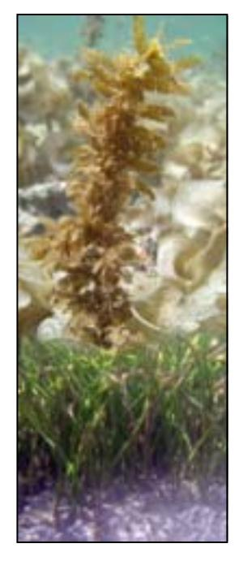

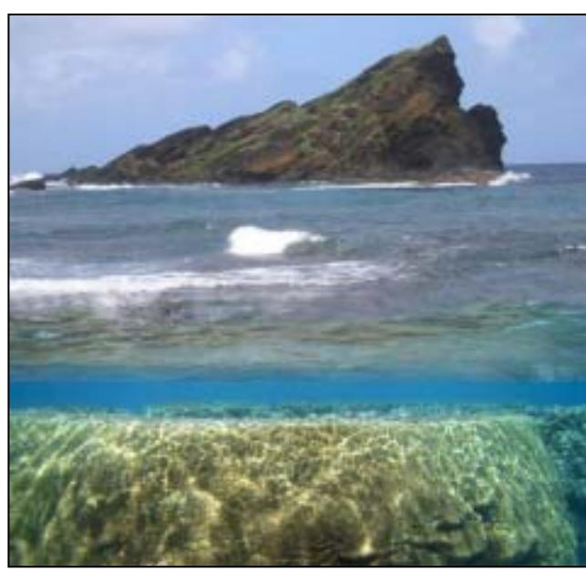

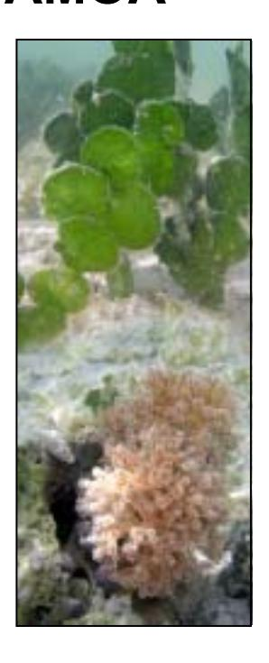

*By* 

### **Posa A. Skelton**

International Ocean Institute (Australia) & Oceania Research and Development Associates

> PO Box 1539, Townsville Queensland 4810 AUSTRALIA

> > *Report Prepared for*

Department of Marine & Wildlife Resources Government of American Samoa

## **EXECUTIVE SUMMARY**

This study provides the latest, up-to-date information on the diversity of marine plants (algae and seagrasses) of American Samoa. A general introduction to marine plants is provided, with observations on the flora of the islands. An illustrated guide to 67 macroalgae and seagrasses is provided in this report. The surveys covered 26 sites from four inhabited islands Tutuila, Aunu'u, Ofu and Olosega and two smaller uninhabited islands – Nu'utele and Nu'usilaelae. The habitats surveyed include subtidal sites to 20-m depth, inter tidal and the spray or splash zone. It also included surveys of relatively pristine coral reefs as well as high impact areas such as the inner Pago Pago Harbor. Two separate surveys, both over a two-week period in October 2002 and September 2003 were carried out and the final results are reported herein.

A total of 635 specimens were analyzed and 239 algal and seagrass species were enumerated. The red algae (Rhodophyta) had the highest number of species with 133 identified. The green algae (Chlorophyta) had 60 species, the brown algae (Phaeophyta) had 29, and the blue-green (Cyanophyta) 27; only two seagrass species were found. This study showed that the flora of American Samoa is diverse, and that what is recorded reflects about 60% of the potential flora. The most diverse site was Utulei with 56 species; a site located near the Pago Pago Harbor entrance. Other notable diverse sites include the Fagatele National Marine Sanctuary with 50 species, Fagasa (44), Mafafa (36), Aua (32), and Onososopo and Fagaalu both with 31 species. The least diverse sites were the docks and the smaller Nu'usilaelae Island. This is attributed to the limited collections from these sites for safety reasons.

There are no substantiated records of endemic algae or seagrasses from American Samoa. Two species recorded by the American phycologist, William Setchell in 1924 (*Sargassum fonanonense* and *Sargassum anapense*) need more studies to verify their endemicity, as similar species have been recorded in the neighboring Western Samoa islands, where they are known under different names.

Four algae are considered to be recently introduced into the American Samoan flora. *Halymenia durvillei* and *Caulerpa serrulata* may have been introduced from Apia Harbor, Western Samoa, whereas *Grateloupia filicina* and *Codium mamillosum* may have been introduced from places beyond the Archipelago. Although only single specimens were collected for the latter two algae, it is prudent that monitoring and surveys must be maintained to keep abreast of any potential impacts.

The flora of American Samoa fits in with the biogeographic theory of decreasing diversity away from the Indo-Pacific centre of biodiversity. The 222 species of red, green and brown algae is well above those of the Cook Islands (67) and the Easter Islands (134), but below that of French Polynesia (308). The reason for this disparity is attributed to the intensity of collections.

The diversity of American Samoan seagrasses and algae are better known than those of neighboring island countries. To allow for a continuous buildup and maintenance of this knowledge the following observations and recommendations are made.

#### *RECOMMENDATIONS*

#### *1. Compilation of algal surveys*

A comprehensive compilation of all algal collections, literature and data specific to American Samoa needs to be undertaken. There have been many itinerant algal collectors and expeditions passing through the islands, who have taken specimens to their institutions or their personal herbaria. These collectors and expeditions need to be identified and a database designed to document these, so that future researchers are aware of previously undertaken work.

There are records of marine plants from the Archipelago being reported in the literature. Some of the literature is obscure and difficult to obtain, or may be found in personal libraries. A concerted effort to identify, copy and obtain these references is recommended, and that they be kept in places where local researchers can access them.

The need to have a dedicated database where the marine biodiversity is stored should be considered paramount. It is strongly urged that authorities consider building such a database using information that has been obtained in this and previous studies.

#### *2. Field guide to American Samoan marine plants*

This report illustrates 67 species of marine plants found during the surveys. This represents a small part of the overall flora of the islands. It is therefore recommended that consideration be given in developing a comprehensive field guide. The field guide should be in simple language, both in English and Samoan and it should have useful and interesting information capable of raising awareness of the importance of marine plants on coral reefs. Such a field guide would be useful in the tourism industry as well as an important reference for schools.

#### *3. Ecological monitoring*

American Samoa has been at the forefront of coral reef monitoring. The well-known transect undertaken by Alfred Major in the 1920s provides vital baseline information on the reef structure. Subsequent coral reef workers have used Major's transect to compare the health of the reef in the 1920s with that of today. Marine plants are an important part of the coral reef ecosystem. They are often the dominant organisms as seen from Fagatele National Marine Sanctuary. Through this survey, the data on marine plants should be useful when ecological surveys are undertaken. It is important for ecologists and coral reef monitors to start monitoring the dominant species, rather than life-form categories.

#### *4. Expert studies of problematic groups*

Coralline algae and cyanophytes are important marine plants in American Samoa, with the former contributing to reef structure and stability, and the latter important indicators of eutropihication, and also functioning as nitrogen-fixers. Because of limited time, these two groups have not been thoroughly treated here. Their taxonomy, in particular the latter group, remains controversial. A detailed treatment of these two groups is recommended.

#### *5. Eutrophication*

With increasing industrial and residential development and settlement of coastal areas, it is expected that sediment and run-off will leach towards the sea. The steep landscape of American Samoa means that surface water run-off is a lot faster than on more gently-sloping coastlines. Pollutants, rubbish and nutrients are also washed to the sea where they can have a serious impact on the marine life. Algal blooms will increase with high nutrients in the environment. Diminishing diversity of corals and other marine animals is expected. It is recommended that appropriate measures be undertaken to safeguard the marine environment. Coupled with these measures is the need to undertaken research in algal population and algal physiology.

#### *6. Invasive species*

Effective and continuous monitoring is needed to detect and weed out potential invasive species. This may mean establishing monitoring sites in places where invasive species are likely to be found, such as the inner Pago Pago harbor. Although only a few relatively less invasive introduced species were found, the consequences of an outbreak by an invader can easily threaten the integrity of the marine environment and the livelihood of the people. Measures must be taken, including developing appropriate legislation, technology and monitoring regime to keep abreast of invasive species.

#### *7. Marine plants for food*

Marine plants, especially algae, provide an excellent source of food. Only two species are commonly eaten in Samoa, although there are probably over 10 seaweed species that can be eaten. A recipe book on seaweeds, published by the Secretariat of the Pacific Community (SPC) and the Marine Studies Programme (USP), should be encouraged to promote the consumption of seaweeds by the local people. The book may need to be translated into the Samoan language to allow for wider audience participation.

#### *8. Surveys of other sites*

There is a need for marine plant surveys of Tau Island, and Swains and Rose atolls, as these sites were not surveyed. Other sites on Tutuila, Ofu, Aunu'u, Olosega islands need to be revisited so that all subtidal and high inter tidal sites are surveyed. This will include surveys of mangroves and brackish water habitats.

## **TABLE OF CONTENTS**

| EXECUTIVE SUMMARY                                                                | 2  |
|----------------------------------------------------------------------------------|----|
| 1.0 INTRODUCTION                                                                 | 6  |
| 1.1 Background to this report                                                    | 6  |
| 1.2 Marine plants                                                                |    |
| 1.3 Algae and coral reefs                                                        | 12 |
| 1.4 Samoans and seaweeds                                                         |    |
| 1.5 Historical aspects of algal research in American Samoa                       |    |
| 1.6 Acknowledgments                                                              | 16 |
| 2.0 MATERIALS AND METHODS                                                        | 16 |
| 3.0 RESULTS                                                                      | 18 |
| 3.1 An Illustrated guide to common and interesting macro-algae of American Samoa | 18 |
| 3.2 Algae per Site                                                               |    |
| 4.0 DISCUSSION                                                                   | 62 |
| 4.1 Floral diversity of American Samoa                                           | 62 |
| 4.2 Site and species diversity                                                   |    |
| 4.3 Invasive species                                                             | 65 |
| 4.4 Endemism                                                                     |    |
| 4.5 American Samoan flora versus other Pacific Islands                           |    |
| 4.6 Recommendations                                                              | 68 |
| 5.0 GLOSSARY                                                                     | 70 |
| 6.0 REFERENCES                                                                   | 71 |
| APPENDIX 1. AMERICAN SAMOA MARINE PLANTS LOG.                                    | 74 |
| APPENDIX 2. LIST OF MARINE PLANTS PER SITE                                       | 94 |

## **1.0 INTRODUCTION**

### *1.1 Background to this report*

This report specifically assesses the macro-algal and seagrass diversity of American Samoa (Figure 1). The report is sponsored by the Department of Marine and Wildlife Resources (DMWR), Government of American Samoa. The field work was undertaken from September 8th to 28th, with three of the four the main islands (Tutuila, Ofu and Olosega) surveyed. The smaller islands of Aunu'u, Nu'utele and Nu'usalaelae were also surveyed, albeit with limited collections due to adverse weather conditions. The larger island of Tau remains to be surveyed together with the two remote atolls – Rose and Swains. Logistically the latter two places would be difficult, but Tau was hampered by bad weather and technical problems. Sixteen-sites were surveyed, eight on Tutuila, three on Ofu Island, two on Olosega and one each at Aunu'u, Nu'usalaelae and Nu'utele. For a more holistic address of macro-algal diversity of the islands, this report builds on previous surveys carried out in October 2002 (Skelton 2002). The 2002 surveys were undertaken as part of a study of introduced marine species under the auspices of the Bernice P. Bishop Museum (Coles *et al*. 2003).

An important component of these surveys was the sites, which were chosen based on those identified in the American Samoa Coral Reef Monitoring Plan (ASCRMP). The surveys followed closely the given location in the ASCRMP, but some modifications were made due to unfavorable weather conditions and technical oversights. Some collections made were beyond the identified ASCRMP sites to allow for a complete floral assessment, as algae can be habitat specific.

The specimens collected in these surveys are housed at the Bishop Museum (BISH), the South Pacific Regional Herbarium (SUVA-A) and DMWR.

In this report, an introduction to marine plants is provided and specifically targets the macroalgae and seagrasses, the two main groups of plants that are often encountered along the shallow shores of American Samoa. A brief overview of historical collections of American Samoa beginning from the early 1920s is provided. An illustrated field guide of 70 common and interesting algae and seagrasses is also provided, each with a brief description. Finally, the report discusses some interesting observations warranted after the surveys.

## *1.2 Marine plants*

Until about 450 million years ago, all plants were marine plants. They are the primary producers of the seas. They range from small one-celled plants to large trees (e.g. mangroves). Despite this simplified understanding of plants, the debate still remains on what should or should not be a plant. For the purpose of this report, the marine

plants discussed here cover five phyla or divisions: Rhodophyta, Phaeophyta, Chlorophyta, Cyanophyta and Magnoliophyta. The first four phyla are generally grouped as algae, although they belong to two different kingdoms (Plantae and Monera). The phylum Magnoliophyta includes all the 50 species of seagrasses, of which only two are recorded here.

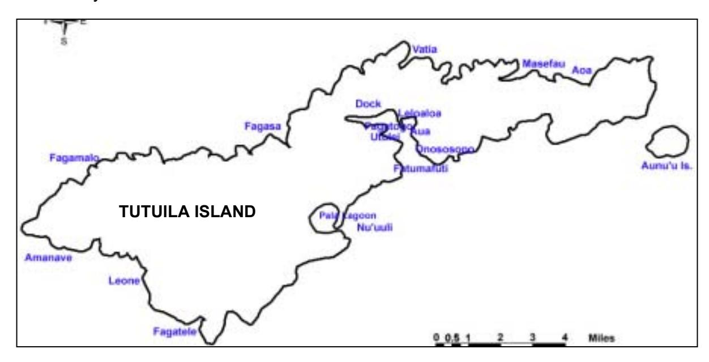

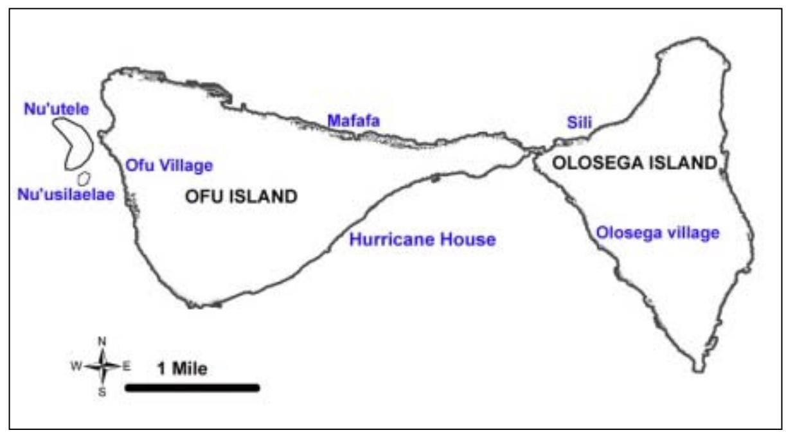

Figure 1. Map of Tutuila, Ofu and Olosega, American Samoa, indicating the collecting sites.

#### **Algae**

Algae are ubiquitous diverse plants that are found from deserts, the atmosphere, snow-covered mountains, and tropical rainforests, to coastal shores and oceans. What most are familiar with when visiting the beach are the seaweeds, either washed up on the beach or perched conspicuously on the seafloor. Others may notice that on occasion a colored soup-like film floating around calm waters, instinctively followed by a strong stench known as red-tides; these are made up of another group of algae. Algae comprise about 90% of all marine plants. They are simple in their structure but have quite interesting yet complex life histories and equally complex reproductive systems, as illustrated in Figure 2-4.

#### *Chlorophyta* **(green algae)**

The green alga *Ulva* (a diagrammatic representation given in Figure 2) is closely related to *Enteromorpha*, of which *Enteromorpha intestinalis* is reported herein. The latest information suggests that the two genera should be merged and that the older name *Ulva* should take priority (Hayden et al. 2003).

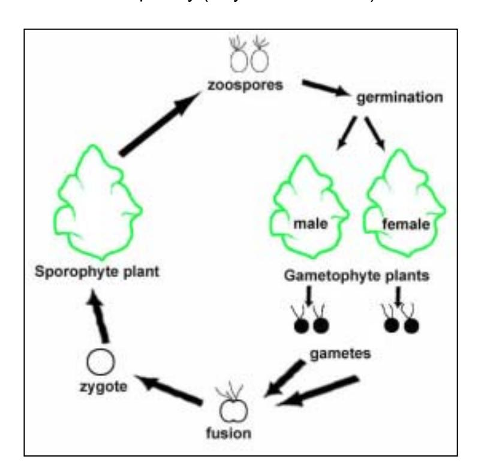

Figure 2. A diagrammatic representation of the lifecycle of *Ulva* (a green bladed alga). (Adapted from Dawson 1956)

The life cycle of *Ulva* is fairly representative of many green algae. In *Ulva,* there is an alternation between the bladed sporophyte or the asexual plant and the gametophytes (female and male plants). The four flagellated spores (zoospores) germinate, developing into the gametophyte plants. The gametophytes in turn produce flagellate gametes (the male gametes being smaller than the female). The fusion between the male and female gametes results in the zygote, which develops into the sporophyte plant. This life history is known as *isomorphic alternation of generations*.

#### *Rhodophyta* **(red algae)**

The majority of red algae are said to have three generations, unlike the two (sporophyte and gametophyte) seen in the Chlorophyta. In red algae, there is the sporophyte (tetrasporophyte) generation, the gametophyte generation and the carposporophyte generation, the latter remains attached (or parasitic) to the female gametophyte. The carposporophyte releases its carpospores which then develop into tetrasporophytes and the life-history continues.

A simplified diagram of the red algal life-history is provided (Figure 3) using *Polysiphonia*, a genus comprising of mostly small epiphytic plants. The tetrasporophyte plant (first generation) produces four sporangia, which develop into equal number of male and female gametophytes (second generation). The male plant releases his gametes (spermatia), which are non-motile. The spermatia fuse with the female sex organ (carpogonium) on the female plant. Once fertilization takes place the third generation or the carposporophyte begins development on or in the female plant. The releasing of the carpospores and their development begins the sporophytic phase and the alternation of generations is repeated.

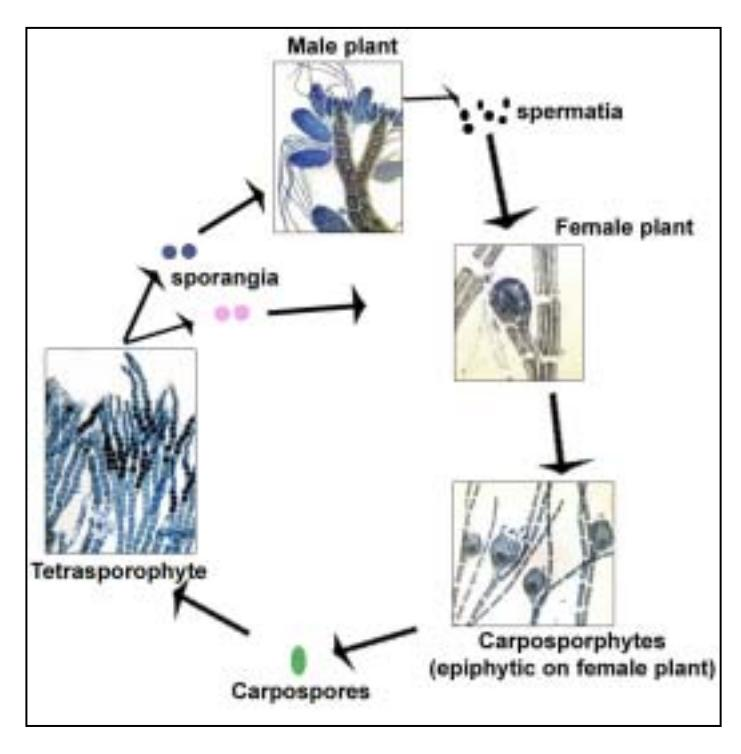

Figure 3. *Polysiphonia* life-cycle (adapted from South & Whittick 1987)

#### *Phaeophyta* **(brown algae)**

Brown algae have many variations in its life-history, including a isomorphic lifehistory, that is the gametophyte and the sporophyte generations are identical in their morphological appearance. It can also have a heteromorphic life-history where the gametophyte generation looks different from the sporophyte generation. For example the gametophyte may take the form of minute filaments or prostrate expanding crust about a few centimeters long, whereas the sporophyte could be a large, fleshy, bladed alga that grows to 10m or more tall. Most of the brown algae from American Samoa appear to have isomorphic life-histories, although culture studies of the species need to be carried out to verify this.

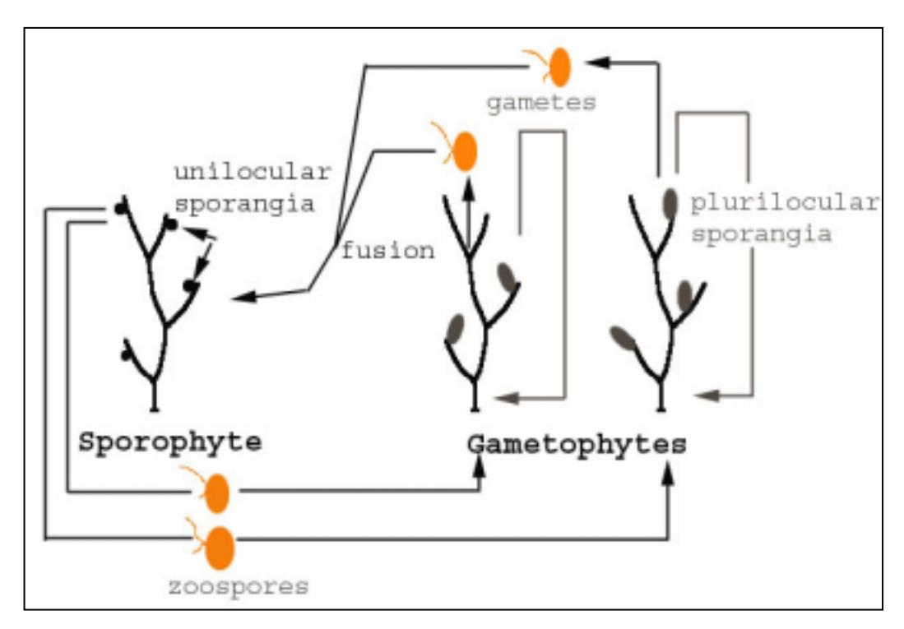

Figure 4. A diagrammatic representation of the life-cycle of *Hincksia*, a genus recorded from American Samoa. The sporophyte releases the zoospores from the unilocular sporangium, which germinate and begin the gametophyte generation. The gametophytes produce gametes in the plurilocular sporangia, which then fuse to form the sporophyte generation. If the male gametes fail to find female gametes then they can develop directly to form male gametophyte plants, likewise with female gametes.

#### *Algae – diversity in forms*

As stated earlier, algae are plants at their most simple form. The algal body is referred to as the thallus (plural – thalli). The thallus can be filamentous, bladed, unicellular, multicellular, siphonous, crust-like, fan-like, umbrella-like, vesicular, hollow, articulated, non-articulated, to name a few. The texture can be membranous, cartilaginous, rock-like, lubricious, glabrous, tough, firm, soft, delicate, fragile, prickly, calcified, coriaceous, etc. The color generally is indicative of the group it belongs to, but this is not always the case. For example, a red alga often belongs to the Rhodophyta. However, there are many Rhodophyta which are yellow, orange, dark green, black or blue in color. The same can be said of the Phaeophyta, Chlorophyta and Cyanophyta.

Algae are attached by various means. The term for root is holdfast, and there can be many designs of holdfasts. In some algae, only one holdfast is known (eg. *Sargassum anapense*) others have many (e.g. *Halimeda opuntia*). The branching pattern of some algae is very important in determining not only species but genera Figure 5 highlights some of the different branching forms that can be found in algae.

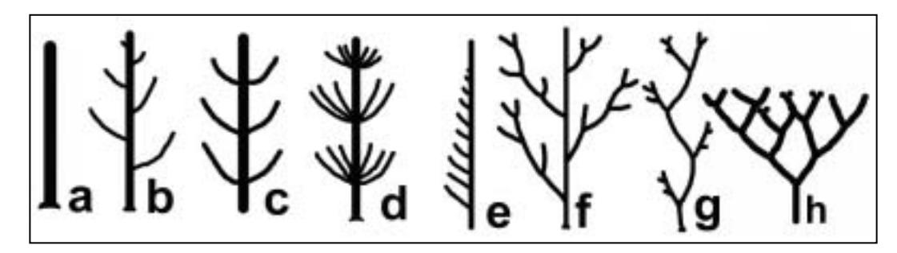

Figure 5. a. unbranched or simple. b. alternate. c. pinnate opposite. d. verticillate. e. secund or pectinate. f. monopodial. g. sympodial. h. dichotomous.

#### *Algal classification*

Algae straddle two kingdoms (Plantae and Monera), but this is debatable and it depends largely on whose classification one chooses to follow. Nevertheless, the fact that two high levels of classification are included is remarkable. What this means is that algae are polyphyletic, or have evolved from several very different ancestors.

The kingdom Plantae incorporates all of the terrestrial plants, seagrasses and the Rhodophyta, Chlorophyta and Phaeophyta. They are autotrophic, photosynthetic plants that may be single-celled (unicellular) or composed of many cells (multicellular). In the marine environment, algae are the dominant groups, however, other plants such as seagrasses and mangroves provide a high biomass and important habitats for marine and terrestrial organisms.

The Kingdom Monera includes the Cyanophyta (blue-green algae) and Schizomycophyta (true bacteria). It is characterized by prokaryotic organisms that lack most of the organs found in the kingdom Plantae. The blue-green algae that are frequently encountered comprised a small component of Cyanophyta, which varies from a single cell to simple colonies, to extensive pseudo-branched filaments.

Approximately 98% of red algae are found in the sea. The Phaeophyta has about 99% of its species that are marine. In contrast to the Chlorophyta has only 10% of its species found in the marine environment (Dawes 1981). The red algae are most common in tropical to subtropical waters, whereas the brown algae dominate cooler, more temperate waters. Because seaweeds and seagrasses need light for photosynthesis, most of the marine plants are found in the upper edge of the oceans. The deepest depth where a seaweed was collected by means of dredging is 295 m (Littler, M., et al. 1985), but most are found in the inter tidal to shallow subtidal places.

#### **Seagrasses**

Seagrasses are flowering plants belonging to the phylum Magnoliophyta (kingdom Plantae), and the class Angiospermae. They are a specialized group of plants that have adapted to living in aquatic environments. About 50 seagrass species are recorded throughout the world, with the highest diversity found in the central Indo-Pacific region. As with most marine animals and plants, the species diversity peters out as one moves away from this centre of the diversity. In tropical parts of Australia, 14 seagrass species are known, decreasing to five in Fiji, three in Western Samoa and none in the Cook Islands. Seagrasses have rhizomes or horizontal running stems that enable them to grow.

## *1.3 Algae and coral reefs*

Algae play a vital role in coral reefs. Algae and seagrasses are the primary producers of the sea. They are autotrophic or self-feeding, manufacturing their own food through chlorophyll and the photosynthesis process. Some algae and seagrasses form large meadows providing unique niches for economically important fishes, shellfish and other invertebrates. Some plants act as filters and stabilizers, binding sediments, thus lessening sediment impact on corals and other organisms on the reef. A meadow of seagrasses or algae can absorb wave energy, thus reducing the potential negative impacts of wave surge along vulnerable coasts.

Another important role of algae is more evident when they die, and their skeletal remains form an important sandy substratum in some reefs. The atolls provide a good example of this, with the green calcified *Halimeda* species forming a major component of the atoll substratum.

Below the surging waves near the reef crest and the spur and groove zones, attractive fleshy algal species, which may be found in the open or more often in cryptic places, provide a kaleidoscopic scene complemented by the color of the crustose corallines. This forms a lasting impression on divers and visitors of the underwater world, boosting tourism and providing revenues for the local economy.

In the inter tidal zones and tide-pools, algae are often the dominant life form seen. Their ubiquitous nature means they can withstand the pounding waves on the reef crest, the incessant fluctuation of sea-flow and high water temperatures, and in some cases the lack of seawater for hours during hot tropical days. This variation of environmental conditions gives rise to species associated with specific habitats, such as the mangrove algal community, referred to as the 'bostrychietum' (the name was coined by E. Post, a phycologist, in reference to the dominant presence of the algal genus *Bostrychia*). The mangrove algal community of American Samoa is yet to be properly surveyed, whereas that of the neighboring Western Samoa (Upolu) was recently surveyed by Skelton & South (2002).

Persistent and consistent observations and monitoring over time would often reveal a familiar trend whereby reef conditions when once restored would have a phase-shift from turf-algal community, superseded by crustose coralline algae, which effectively provide substrata for planulae to settle and grow. The coralline algae continue to play an important role during most phases of reef recovery, by consolidating loose carbonate structure and thus providing a stabilized reef. They also provide food for specialized feeders such as parrotfish (Scaridae).

Seagrasses role in the coral reefs are many. Six functions are listed below:

- 1. They stabilize and hold bottom sediments even through the enormous stresses of hurricanes and storms.
- 2. The leaves retard water currents and waves, promoting sedimentation of particulate matter and inhibiting re-suspension of organic and inorganic matter.
- 3. The meadow serves as a shelter and refuge for resident and transient adult and juvenile animals, many of which are of commercial and recreational importance.
- 4. The feeding pathways consist of both direct grazing on the leaves or epiphytes and detrital pathways.
- 5. The plants attain a high production and growth (leaves of some species can grow 5-10mm per day).
- 6. The plants produce and trap detritus and secrete dissolved organic matter that tends to internalize nutrient cycles with the ecosystem

### *1.4 Samoans and seaweeds*

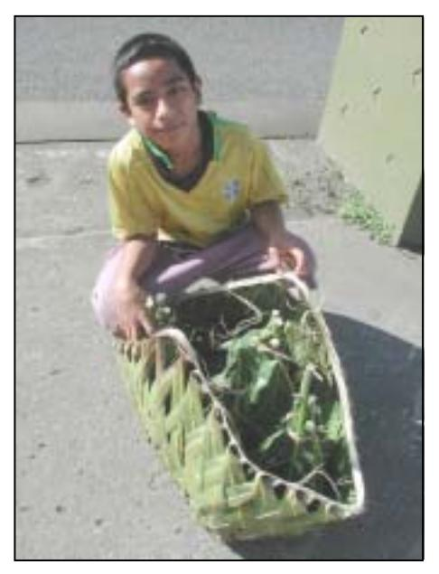

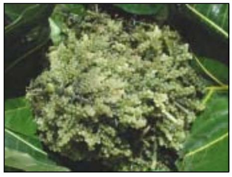

Figure 6. Captions: (T) Boy selling seaweeds*.* (L) An *ofu* (bundle) of seaweed (*Caulerpa racemosa*)

*Limu* is the generic Samoan term used for seagrasses, mosses and freshwater weeds. The traditional knowledge of seaweeds in Samoa is limited to species that are used either for food or for medicinal purposes. Twenty seaweeds and two seagrass names are known. Other seaweeds are simply referred to as *limu*. The list of Samoan seaweed and seagrass names given below is compiled from George Pratt (1876) and from the author's understanding of currently used seaweed names.

*Limu a'a* – the name (a'a) literally means the fibers of a root, which may refer to the rhizoidal system of *Sargassum* or *Turbinaria* species.

*Limu a'au* – reef seaweed. Refers to *Halymenia durvillei*, a seaweed that is often collected near the reef.

*Limu a laea* – the name probably refers to a seaweed that is eaten by the *laea* (parrotfish - Scaridae). This could be a coralline alga.

*Limu 'ava* – the name 'ava may refer to the beardlike shape of this seaweed. According to Pratt (1876) this is an edible seaweed, which may be synonymous with limu a'au or limu mumu (*Halymenia durvillei*).

*Limu 'ula* – there are two probable meanings of 'ula. The first refers to a necklace and the second to the color red. Pratt (1876) refers to it as an edible seaweed, which again may be synonymous with limu a'au (*Halymenia durvillei*).

*Limu faaleaga-mea* – destructive weed, referring to *Sargassum* spp., and the way they take over the

shallow reef, depriving corals from growing.

*Limu foe* – paddle weed (*Halophila ovalis* and *Halophila minor*).

*Limu fuafua* – the word literally means an abscess (pimple) of the skin, in reference to the bubble shape of this edible seaweed (*Caulerpa racemosa*)

*Limu lau-ago* – this seaweed refers to the leaf of the Ago plant, a tumeric plant (*Curcuma longa*) that is widely used by the Samoans for medicinal purposes. The leaves of this tumeric plant resemble *Halophila ovalis* or *H. minor* (paddle weed).

*Limu laumei* – turtle weed (*Chlorodesmis fastigiata*)

*Limu lautaliga* – ear-like seaweed (*Padina boryana*)

*Limu limu* – a detached seaweed; probably referring to the free floating green alga *Cladophoropsis.* 

*Limu mumu* – red seaweed. Although there are red seaweeds, this particular use refers to *Halymenia durvillei*.

*Limu pata* – although there are many meanings of 'pata', perhaps the most appropriate use of this word from a seaweed perspective is 'blister'. It may refer to a seaweed (probably a cyanophyte) that causes blister when one comes into contact with it.

*Lim usu* – this may refer to a waxy, watery type of seaweed that has a similar substance found in taro or breadfruit.

*Limu taemoa* – the word 'taemoa' refers to chicken manure; the name may be in reference to a Cyanophyta (*Phormidium* sp.) that may look like chicken manure; or alternatively it may refer to the smell caused by *Trichodesmium* bloom (red tides).

*Limu tala* – prickly or thorny seaweed, perhaps referring to the tough rhizoidal system of *Sargassum* spp. and *Turbinaria ornata* that may have caught the feet of fishers. Another name that has been used is *Limu falaleagamea*, meaning destructive weed.

*Limu to'o* – 'to'o refers to a pole that was used to propel the canoe forward. It is unclear what this seaweed is, but it may be attributed to seaweeds growing on the pole, which include the green alga – *Enteromorpha intestinalis.* 

*Limu vai* – a freshwater weed.

*Limu vao* – a grass weed, referring to the morphology of *Syringodium isoetifolium*.

In attempting to revitalize this endangered knowledge, new names are devised for some of the commonly encountered seaweeds. As this is a working document, additional Samoan names will be added once consultation has been carried out with relevant organizations and individuals.

## *1.5 Historical aspects of algal research in American Samoa*

American Samoa's algal flora was first assessed by William Albert Setchell in the early 1920's (Setchell 1924); 100 species was compiled. Setchell's collections were limited to shallow inter tidal areas, with a few subtidal specimens obtained by dredging. No other major algal work is known from American Samoa since Setchell, but the efforts of some sporadic and itinerant algal collectors passing through the islands have yielded some new additions to the island's flora. The recent publication of the South Pacific Reef Plants by Diane and Mark Littler (2003) illustrates 33 algal species from American Samoa. The Littlers' algal collections are housed at the Smithsonian Institution, Washington. Other notable phycologists to visit American Samoa include Isabella Abbott, Roy Tsuda, Paul Gabrielson and Peter Vroom; the latter two collectors' collections are yet to be curated. American Samoan algae are also noted from reef ecologists' reports (Dahl 1971; Birkeland *et al.* 1987; Hunter *et al.* 1993; Wilkins in Birkeland *et al.* 1995). Moreover, American Samoa algae were included in the algal checklist of the Samoan Archipelago by Skelton & South (1999), where 198 taxa were listed. The checklist is currently being updated as past collections housed at the Bishop Museum and the University of California at Berkley Herbarium are examined; together with continuing field surveys, adding new records as well as new species to the flora. A total of 318 species have so far been documented (Skelton unpubl. data) for the Archipelago.

### *1.6 Acknowledgments*

I would like to sincerely thank Ufagafa Ray Tulafono and the staff of DMWR for their support and assistance of this study. Special thanks to Caroline Taugafa'amalii, Tony Beeching and Will White for coordinating the project. Field logistics were organized by Emmanuel Coutures, whose support and enthusiasm is greatly appreciated. Dive support was provided by Elia Henry, Sa'olotoga Poasa Tafaeono and Kitara Vaiau. Peter Craig provided valuable advice, for which I am most grateful. Pita Ili and family is kindly thanked for their hospitality during the Ofu-Olosega surveys. Steve Coles, Paki Reath, Victor Bonito and Larry Basch are acknowledged for their assistance in the earlier surveys undertaken in 2002. Robin South kindly assisted with identification of specimens and editing of this report. The International Ocean Institute (Australia) and Oceania Research and Development Associates (Samoa) are thanked for the support. Faafetai tele lava.

## **2.0 MATERIALS AND METHODS**

The coordinates for the designated core sites (Table 1) were entered on an *E-Trex* Global Positioning System. Most macroalgae seen during the surveys were noted, some were photographed and collected.

All specimens were soaked in a 5% formalin/seawater solution for a minimum of 2 days. The solution was then decanted and recycled. Specimens were pressed using a standard plant press during the surveys were given to DMWR as reference material. Other specimens were analyzed in Australia, with the aid of microscopes (Nikon SMZ645 dissecting microscope and an Olympus CX31 compound microscope). Underwater photos of algae and habitats were taken with a Sanyo AZ3 digital camera. Microscopic photos and habit shots of algae above water were taken using a Nikon Coolpix 990 digital camera. The images were processed using Photoshop 6 software.

All processed specimens were recorded in a log book and the data were later entered into a Microsoft Excel program. Pressed specimens are housed at Bishop Museum (BISH) and the South Pacific Regional Herbarium (SUVA-A).

Table 1. Collecting sites.

| Station | Date      |                      | GPS             |                  |
|---------|-----------|----------------------|-----------------|------------------|
| No.     | Collected | Locale               | Lat.            | Long.            |
| 1       | 16-Oct-02 | Amalau (TI)          | 14o 15.160'  | 170o 39.527'  |
| 2       | 16-Oct-02 | Vatia (TI)           | 14o 14.79'   | 170o 40.10'   |
| 3       | 13-Oct-02 | Utulei (TI)          | 14o 17.02'   | 170o 40.67'   |
| 4       | 15-Oct-02 | Dock 1 (TI)          | 14o 16.59'   | 170o 41.26'   |
| 5       | 17-Oct-02 | Onososopo (TI)       | 14o 17.18'   | 170o 39.89'   |
| 6       | 14-Oct-02 | Fagatele Bay (TI)    | 14o 21.96'   | 170o 45.85'   |
| 7       | 16-Oct-02 | Fagasa (TI)          | 14o 17.01'   | 170o 43.36'   |
| 8       | 16-Oct-02 | Leone (TI)           |                 |                  |
| 9       | 17-Oct-02 | Leloaloa (TI)        | 14o 16.22'   | 170o 40.61'   |
| 10      | 17-Oct-02 | Aua (TI)             | 14o 16.70'   | 170o 40.16'   |
| 11      | 24-Sep-03 | Mafafa (OF)          | S14o 10.045' | W169o 38.502' |
| 12      | 22-Sep-03 | Sili (OL)            | S14o 10.032' | W169o 37.553' |
| 13      | 16-Sep-03 | Fagatogo (TI)        | S14o 16.618' | W170o 40.827' |
| 14      | 10-Sep-03 | Fatumafuti (TI)      | S14o 17.645' | W170o 40.496' |
| 15      | 12-Sep-03 | Aoa Bay (TI)         |                 |                  |
| 16      | 11-Sep-03 | Nu'u'uli (TI) (NS)   | S14o 19.215' | W170o 41.812' |
| 17      | 17-Sep-03 | Aunu'u Is. (AU)      | S14o 16.994' | W170o 33.665' |
| 18      | 10-Sep-03 | Fagaalu (TI)         | S14o 17.389' | W170o 40.549' |
| 19      | 12-Sep-03 | Masefau (TI)         |                 |                  |
| 20      | 13-Sep-03 | Amanave (TI)         | S14o 19.544' | W170o 49.849' |
| 21      | 16-Sep-03 | Nu'usilaelae Is.     | S14o 10.281' | W169o 41.057' |
| 22      | 13-Sep-03 | Fagamalo (TI)        | S14o 17.903' | W170o 48.612' |
| 23      | 20-Sep-03 | Olosega (OL)         | S14o 11.023' | W169o 37.162' |
| 24      | 20-Sep-03 | Hurricane House (OF) | S14o 10.665' | W169o 39.255' |
| 25      | 18-Sep-03 | Nu'utele Is. (NT)    | S14o 10.167' | W169o 41.015' |
| 26      | 23-Sep-03 | Ofu (OF)             | S14o 09.819' | W169o 40.860' |

Note: the letters in brackets indicate the island where the site is located. TI = Tutuila Island; OF = Ofu Island; OL = Olosega Island; NT = Nu'utele Island; NS = Nu'usilaelae Island; AU = Aunu'u Island.

## **3.0 RESULTS**

### *3.1 An Illustrated guide to common and interesting macro-algae of American Samoa.*

Of the 239 species recorded from the surveys, most of the algae were small (less than 5 cm tall). In this section, 67 species are described and illustrated. Some of the illustrated species are small but are included to enable the reader to appreciate the diversity of these marine organisms. This section is arranged alphabetically within the five divisions or phyla that were surveyed, beginning with the Rhodophyta (red seaweeds), Phaeophyta (brown seaweeds), Chlorophyta (green seaweeds), Cyanophyta (blue-green seaweeds) and the Magnoliophyta (seagrasses). The technical terms are kept to a minimum, but in some cases, these cannot be avoided. Hence, a glossary is provided to explain these terms. The descriptions are based on personal observations and on published accounts. The species name (scientific name) is provided, followed by the author (the person or persons that described the species). This is then followed by the English name or Common Name (abbreviated CN:) where known. The Samoan Name (abbreviated SN:) is also recorded. The asterisk (\*) denotes a new name for the alga, suggested by the author.

#### **RHODOPHYTA (red algae, red seaweeds)**

*Actinotrichia fragilis* (Forsskål) Børgesen (CN: Not known. SN: \*Limu felefele = bushy seaweed)

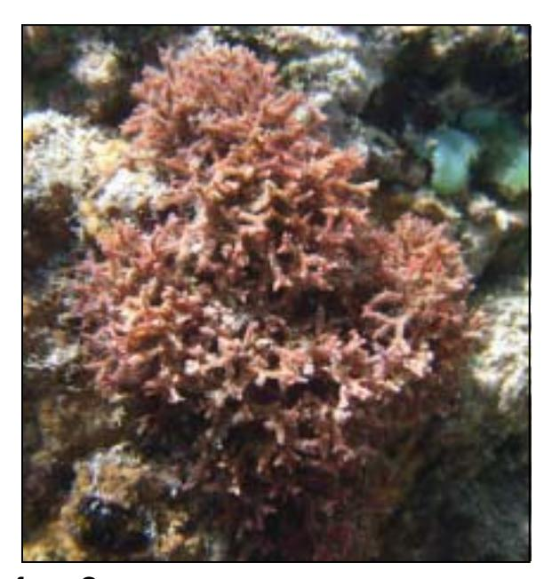

from Samoa.

**Distribution:** Tropical waters.

**Description:** A common seaweed that is found from reef flats to deeper waters. It can form large clumps on rubble, rocks or at the base of corals. It is also found attached to other algae, especially *Halimeda* species. The color is variable from bright red, orange, yellow-brown to white, and the plants can be tightly clumped or loose in appearance. It is fairly wiry and can easily be identified by the small hair-like filaments that form small bands around the thallus. The branching resembles a Y (dichotomous) and it can be wide or narrow angled. This seaweed has calcium embedded within the cell walls.

**Remarks:** *Actinotrichia fragilis* is the only confirmed species of this genus reported

#### *Amphiroa foliacea* Lamouroux

(CN: Not Known. SN: \*Limu talatala = prickly/rough seaweed).

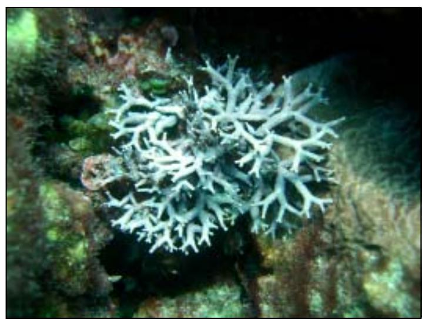

**Description:** This branched and calcified seaweed is common from shallow reef flats to deeper waters. The color is variable from pink, white to dark red. The seaweed is delicate, breaking when handled, but some are fairly rigid. It can form large clumps. The branching is dichotomous, but adventitious branches may arise in any part of the plant. A midrib can be seen in some thalli. The surface is smooth, or appears lumpy when it is reproductive. The alga grows to 10cm tall.

**Remarks:** Four species of this genus are known from American Samoa, but this is

the most common. **Distribution:** Tropical waters.

# *Asparagopsis taxiformis* (Delile) Trevisan

(CN: Not Known. SN: \*Limu vavai = soft and flexible seaweed)

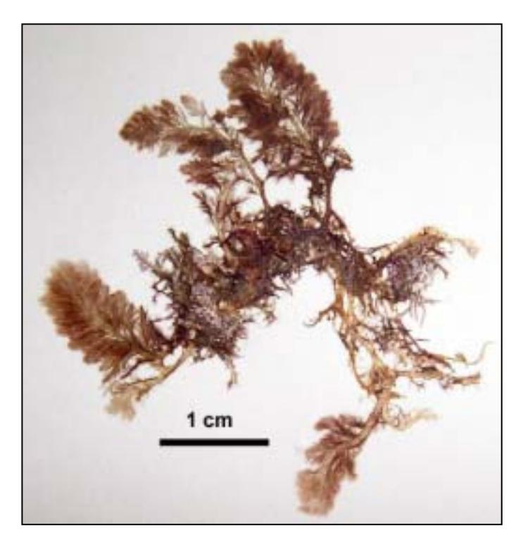

1999).

**Distribution:** In tropical to subtropical waters.

**Description:** This seaweed is soft and delicate with the outer fine branches easily broken off if not carefully handled. The color is variable from bright pink, to pale red to grayish. The lower part of the thallus lacks branches. The plant is attached by firm creeping rhizoids. This interesting seaweed has two growth forms. The male and female form looks like that shown in the picture, and can reach 10cm tall. The tetrasporophyte form looks like fine hairs, and is often found in turf communities and is only a few millimeters tall.

**Remarks:** The seaweed is eaten in Hawaii and Indonesia. In the Philippines this seaweed is used for medicine (Zemke-White and Ohno *Bostrychia tenella* (Lamouroux) J. Agardh (CN: Not Known. SN: \*Limu togo = mangrove seaweed)

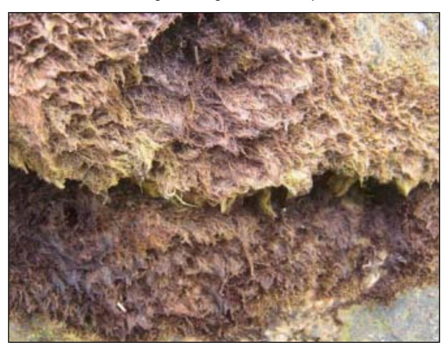

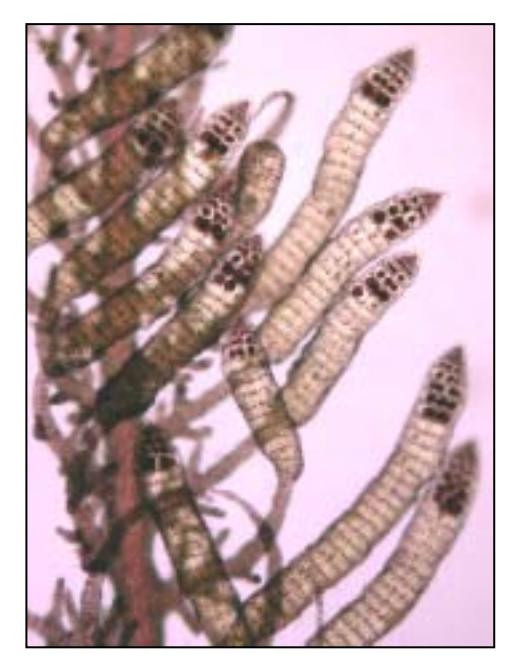

**Description:** This small seaweed is often associated with the mangrove forest. Because mangrove forests in American Samoa are small and declining, this seaweed is better seen forming large hanging fuzz above seawater sprayed areas. The color varies from dark red, to orange, yellow and brown. The photo above shows part of the extensive fuzz made by this seaweed. An individual thallus is, however, very small growing to 3cm tall. The thallus is attached to the substratum by a holdfast made up of many downward growing cells. The reproductive structures are borne on modified branches called stichidia (singular = stichidium). As shown in the photo left, the tetraspores (dark round balls) are housed inside the stichidium.

**Remarks:** *Bostrychia tenella* is a special seaweed that has adapted well to growing in a harsh

environment. It receives sea-spray during high tides, and is exposed to the heat of the sun during low tides. The salinity from the water spray can be fairly salty during hot times, whereas it can be very low during wet seasons.

**Distribution:** Tropical to subtropical regions.

#### *Botryocladia skottsbergii* (Børgesen) Levring

CN: Not Known. SN: \*Limu fuamanu = birds egg seaweed.

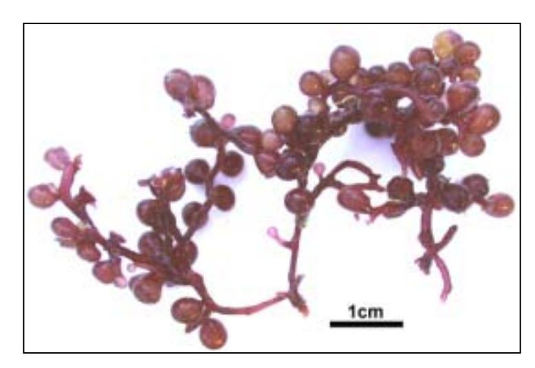

**Description:** This beautiful seaweed is cryptic, growing in crevices or on the underside of large boulders and volcanic rocks in exposed places. The plants are red, maroon to orange color and grow to 4cm tall. The plant is attached by a disc holdfast. The seaweed resembles small grapes, growing solitary or in groups (as seen in the photo). The stolon is tough, bearing the grape-like vesicles. The vesicles are filled with a

mucilaginous substance.

**Remarks:** This alga was collected from heavily exposed places. Littler and Littler (2003) recorded *Botryocladia tenuissima* Taylor from American Samoa (not found in this survey), a Caribbean species not yet known from the Pacific. Their illustration and description is sufficient to clearly separate it from *B. skottsbergii.* 

**Distribution:** Tropical to subtropical Waters

#### *Ceramium flaccidum* (Kützing) Ardissone

(CM: Not Known. SN: \*Limu mumulaititi = small red seaweed)

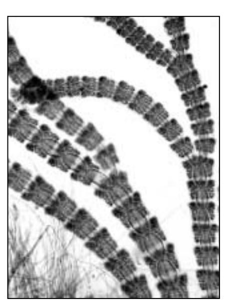

**Description:** This epiphytic seaweed is very common, often forming red fuzz on larger seaweeds. It grows to about 0.5cm tall in tropical waters and up to 10cm in cooler waters (Womersley 1998). The use of a hand-lens or a microscope is necessary to differentiate this species from about ten other *Ceramium* species known from Samoa. It has a square shaped node and internode system. The nodes are composed of small cells. The most distinctive feature of this alga is the transverse or elongated basal-most cells. The alga has a prostrate system, which looks like the erect thallus as seen in the photo. Rhizoids are produced from the prostrate system terminating in finger-like tips. In some specimens, some of the cells appear very dark when stained (gland cells). Other specimens have colorless

hair that easily falls off, whereas others lack the hairs or gland cells.

**Remarks:** This alga is one of the few algae that are near cosmopolitan. It is found in cold waters in South Australia and Europe as well as throughout all tropical regions.

**Distribution:** Tropical to subtropical and temperate seas.

#### *Cheilosporum acutilobum* (Decaisne) Piccone

(CN: Not Known. SN: \*Limu fele-laititi = small club seaweed)

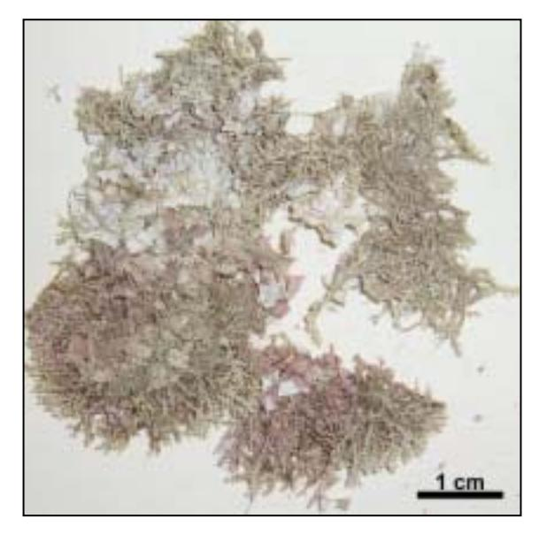

**Description:** A delicate seaweed that is brittle and grows in shade provided by larger seaweeds. It is heavily calcified, pinkish to light red color, and grows to 3 cm tall. It often forms clumps with other turf algae along the front reef or on exposed places. The plant is composed of segments in a series, with each segment loosely resembling a club as seen in playing cards (tri-lobed). The side lobes are rounded tapering to a sharp point, whereas the middle top lobe bears the next segment. A non-calcified region separates one segment from the next, thus giving the alga a limited flexibility. The lower part of the alga is cylindrical, resembling closely

arranged beads on a string. This section lacks branching, with the branches confined largely to the mid to top part of the plant. The branches are flat and are arranged in one plane. A rhizoidal holdfast system is produced near the base, which when in contact with the substratum forms disc-pads. The reproductive structures are born on the two side lobes.

**Remarks:** The fine segments and the smaller size of this species distinguish it from the other two species known from American Samoa.

**Distribution:** Tropical Indo-Pacific.

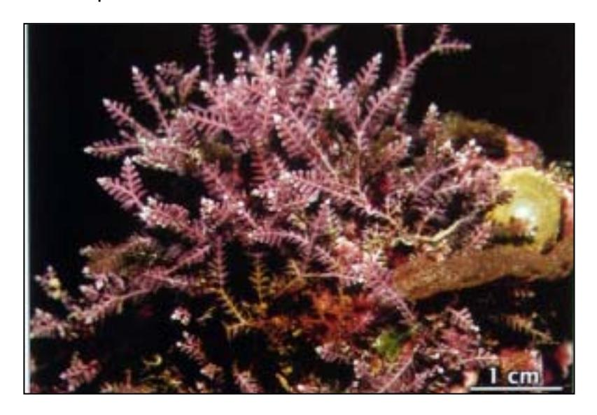

**A field habitat shot of** *Cheilosporum acutilobum* **from American Samoa. Photo: from Littler and Littler 2003.** 

*Cheilosporum spectabile* forma *elegans* (possibly a new form) (CN: Not Know. SN: \*Limu fele-mosemose = beautiful spearhead seaweed)

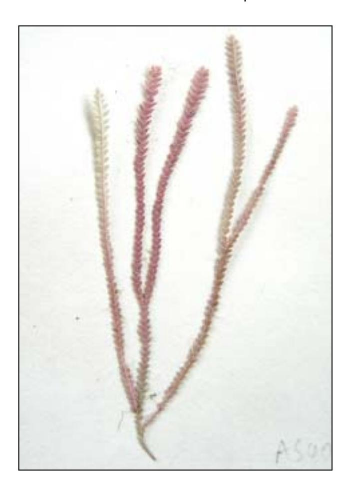

**Description:** This elegant seaweed grows in cryptic places, especially in crevices and on sheltered sides of large boulders and overhangs. It is difficult to collect as it often wedges itself between boulders. It grows down to 10 m deep and has a maroon to pinkish color. Branching is dichotomous, albeit sparingly. It tends to hang downwards, rather than having an erect form as seen in the other *Cheilosporum*  species. It grows to 10 cm tall, and often in small clumps. The structure is similar to the other *Cheilosporum* species, with a tri-lobed segment arrangement. It is delicate, although more flexible than the other species.

**Remarks:** This is possibly a new form of *Cheilosporum spectabile*, although more studies of its reproductive and vegetative structures are needed to ascertain this.

**Distribution**: Samoa (so far known only from American Samoa).

#### *Cheilosporum spectabile* Harvey ex Grunow

(CN: Not Known. SN: \*Limu ulutao-lapo'a = large spearhead seaweed)

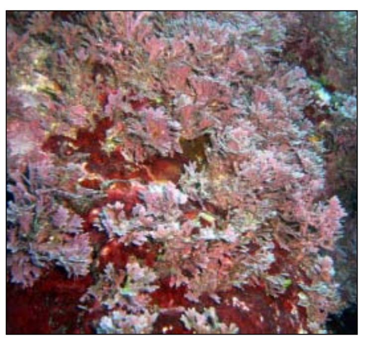

**Description:** This common alga is found mainly in subtidal places (20m depth), but is also found in exposed shallow places. The color is pink, although various shades of red and white are also seen. The size varies from 3- 10cm tall, forming bushy clumps. It is firmly attached by discoid holdfast to the substratum, preferring carbonate structures. The tri-lobed segments are firm and can be caught up with other segments enabling it to withstand strong wave actions. The tip of the segments is usually rounded. The branching is more common from the mid to the upper parts,

and the segments are flattened and in one plane. Although dichotomous branching is common, adventitious branches may give an otherwise impression. The reproductive structures are found on upper portions of the side tri-lobed segments.

**Remarks:** This is by far the most common *Cheilosporum* species from Samoa. **Distribution:** Indo-Pacific.

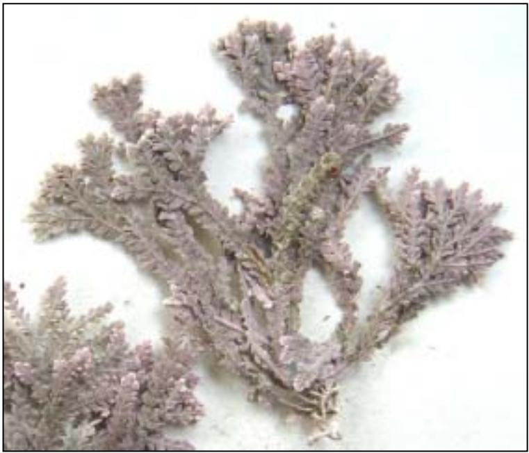

A dried *Cheilosporum spectabile* specimen. Photo: Skelton & IOI (Australia).

#### *Chrysymenia kaernbachii* Grunow

CN: Not Known. SN: \*Limu. (Photo from Littler and Littler 2003)

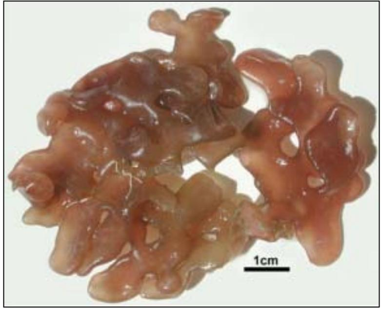

**Description:** This fleshy alga is found in crevices and in sheltered places in usually turbulent environments. It grows close to the substratum and has a deep red color, similar to a crustose coralline alga, thus it can be hard to detect. The alga is firm, smooth and with many lobes. It is attached at various points by holdfasts that come into contact with the substratum. The inside of the alga is filled with a thick mucilaginous gel. The plants spread to 10cm wide.

Anastomozing branches are common in this alga.

**Remarks:** This alga is rarely collected, and it takes a trained eye and a lot of luck in spotting it. It may have been overlooked due to its close resemblance of various crustose coralline algae.

**Distribution:** Indo-Pacific, with the type locality from Papua New Guinea.

#### *Corynocystis prostrata* Kraft

CN: Not Known. SN: \*Limu

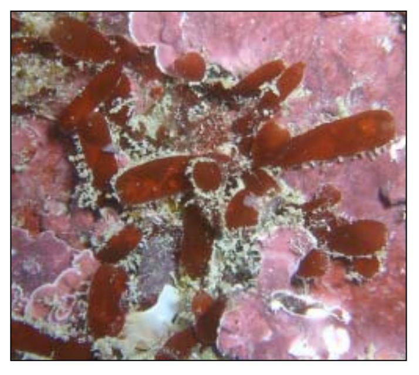

**Distribution:** Indo-Pacific.

**Description:** Plant color varies from olive green to red. The prostrate blades are flat to 10mm wide and to 15cm long. It is attached by many small cylindrical peg-like roots. The club-shaped blades tend to be rounded or have a slight dip on the apices. The branches are produced from the blade margin and are basally constricted. New blades can develop from parts where grazers grazed. Anastomozing amongst the blades is very common.

**Remarks:** This alga may have been misidentified as *Prionitis formosana*  (a species found from American Samoa).

#### *Galaxaura filamentosa* Chou

CN: Not know. SN: \*Limu fulufulua = hairy seaweed.

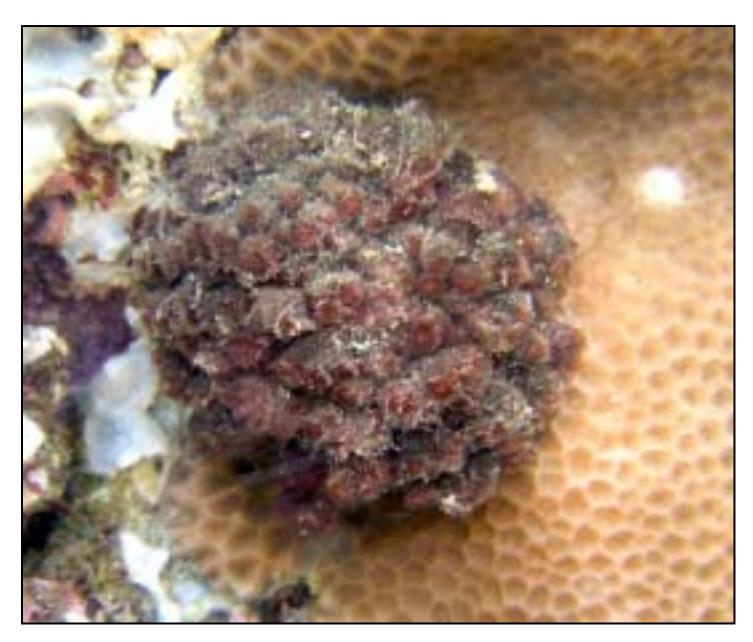

**Description:** The alga is often solitary growing in many different habitats, from silted places to healthy coral reefs. It tends to grow in shaded places and usually on carbonate structures. The color is dark brown to maroon and quite bushy in appearance. It grows to 8cm tall and is attached by a disclike holdfast. The branches are dichotomous. It has a distinctive furry and soft feel to the touch.

**Remarks:** This is one of four *Galaxaura* species recorded from Samoa. It is distinguished from the others by its hairy filaments and 'dirty' appearance.

**Distribution:** Indo-Pacific.

*Galaxaura marginata* (Ellis & Solander) Lamouroux

CN: Not known. SN: Limu.

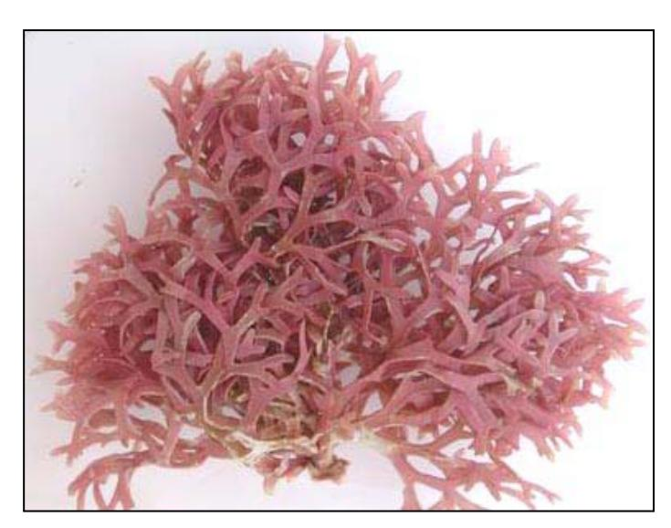

**Description:** This alga is variable in color, from light green to white, and red. The thallus is compressed to flattened and glabrous, lacking any hairs throughout, except near the cylindrical holdfast, where minute hairs can be seen. It can be solitary or form large clumps, with individual plants to 10cm tall or more. It is often collected from deeper waters (5-10m), usually in sheltered places. The branches are dichotomous. The axes are broad about 5mm in diameter. A concentric pattern can be seen in

the thallus of some plants, especially near the top. The tips taper slightly but are never pointed.

**Remarks:** This is perhaps the most distinctive of all *Galaxaura* species by its flattened thallus that is devoid of hairs, except inconspicuous hairs near the cylindrical holdfast. *Galaxaura obtusata* (found from Samoa), also has a smooth thallus but is larger and cylindrical.

**Distribution:** Tropical waters.

*Gelidiella acerosa* (Forsskål) Feldmann & Hamel CN: Not known. SN: \*Limu uaea = wire-like seaweed.

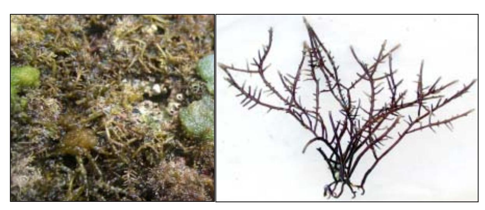

**Description:** This alga is very tough, wiry, and cartilaginous to 10cm tall. It grows in basaltic rock in very exposed places. The color is purple, dark red to black. The plant often grows in an arcuate or arched manner bearing erect branches. The branching is sparse, alternate or opposite. The basal part of the plant creeps along the substratum. The thallus is cylindrical or slightly compressed, and is attached by a tough rhizoidal system. Plying them off the rocks is often difficult, especially if one has to watch for the waves.

**Remarks:** This alga is harvested for its agar property in India, Malaysia and Vietnam, whereas it is edible in the Philippines.

**Distribution:** Tropical to subtropical places.

*Gelidiopsis repens* (Kützing) Weber-van Bosse

CN: Not known. SN: Limu

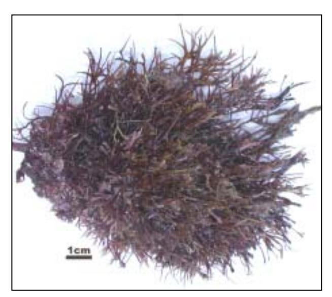

**Description:** The alga forms short but very busy communities that are very firm and compact. It grows in most habitats, from the shallow inter tidal to 25m depth. The thallus is firm and has a terete basal system, giving rise to erect blades of up to 5-8cm tall. Two to five dichotomous branches can be closely arranged, giving the impression of a palm. The branches are 0.5-4mm wide, with the mid-section being the broadest and the tip the narrowest.

**Remarks:** This alga is an important member of the turf algal community.

**Distribution:** Tropical waters.

#### *Gelidiopsis intricata* (C. Agardh) Vickers

CN: Not known. SN: Limu

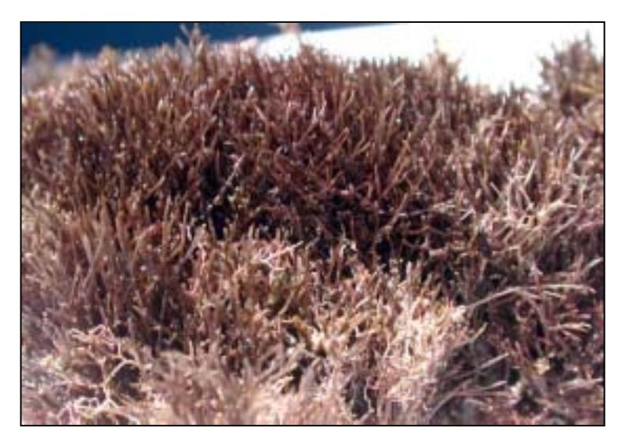

**Description:** This alga is variable in color, from light green to red. It is wiry, terete or sub-terete and can grow to 10cm tall, from inter tidal to sub tidal places. It forms large clumps. The branching is uncommon and the cylindrical thallus tapers towards the tip. It is attached by a wiry often entangled rhizoidal system.

**Remarks:** This alga may be confused with another red alga, *Coelothrix irregularis*. The two can be separated by the

iridescent and hollow middle of the latter alga. This alga is an important member of the turf algal community in subtidal areas.

**Distribution:** Tropical to temperate seas.

#### *Haloplegma duperreyi* Montagne

CN: Not known. SN: \*Limu masaesae = torn seaweed)

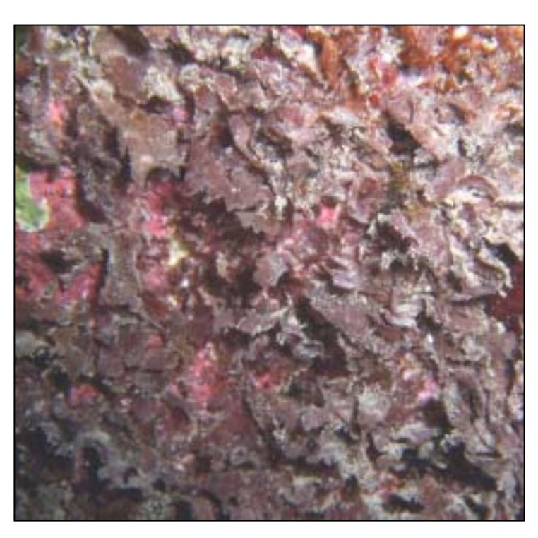

**Description:** The appearance of this alga is that of a red piece of paper that has been rubbed over a rough surface. In reality this is one of the most beautiful algae when viewed with a dissecting microscope or hand-lens. It is red to maroon in color and grow to 5cm broad. It is found in shaded places, on large boulders or bommies in shallow subtidal places (2-5m depth). The soft blade alga, is composed of an intricate network of monosiphonous filaments, forming up to 5 layers.

#### *Halymenia durvillei* Bory de Saint Vincent CN: Durville's alga. SN: Limu aau, limu mumu, limu 'ava, limu 'ula

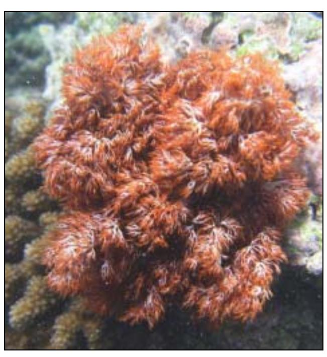

**Distribution:** Tropical to subtropical seas.

**Description:** This is one of the most beautiful large algae common in Samoa. The plants are delicate and the color varies from orange, red, and maroon, brown to light pink. The thallus is either delicate and soft or bladed and firm, growing to 1m tall. It grows in shallow places, like near river mouth and inter tidal zone, or in subtidal to 20m deep. It is attached by a discoid holdfast. The branching is bushy, irregular with the blades having small teeth (dentations).

**Remarks:** Known by various Samoan names, this alga is eaten by mixing it with coconut cream and baking it in the traditional oven (*umu*). It also has good potential for bioprospecting, having anti lung cancer compounds.

*Hydrolithon onkodes* (Heydrich) Penrose & Woelkerling CN: Not known. SN: \*Limu ma'a or ?Limu a laea

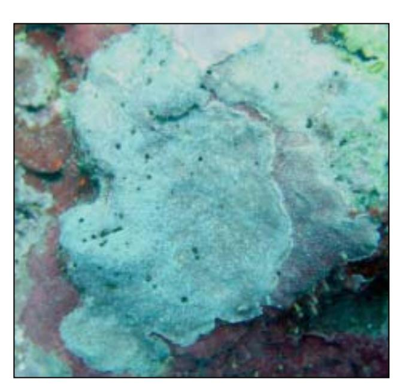

**Description:** This common coralline alga grows in wave exposed places from the inter tidal to subtidal. Its shape and color are variable, but is usually light pink in well lit area to dark red in shaded places. The presence of a chiton that feeds on the alga creates a honeycomb form that rises to 10cm tall. The alga is encrusting and heavily calcified, growing on dead corals and on rocky substrata. The alga is generally smooth to the touch. **Remarks:** Identification of most crustose coralline algae must be made by observing the anatomical features including the reproductive structures. Only a handful of species can be

identified in situ. This is an important alga, providing food for fishes and invertebrates. **Distribution:** Tropical to sub-tropical waters.

*Hydrolithon reinboldii* (Weber van Bosse and Foslie) Foslie CN: Not known. SN: \*Limu ma'a

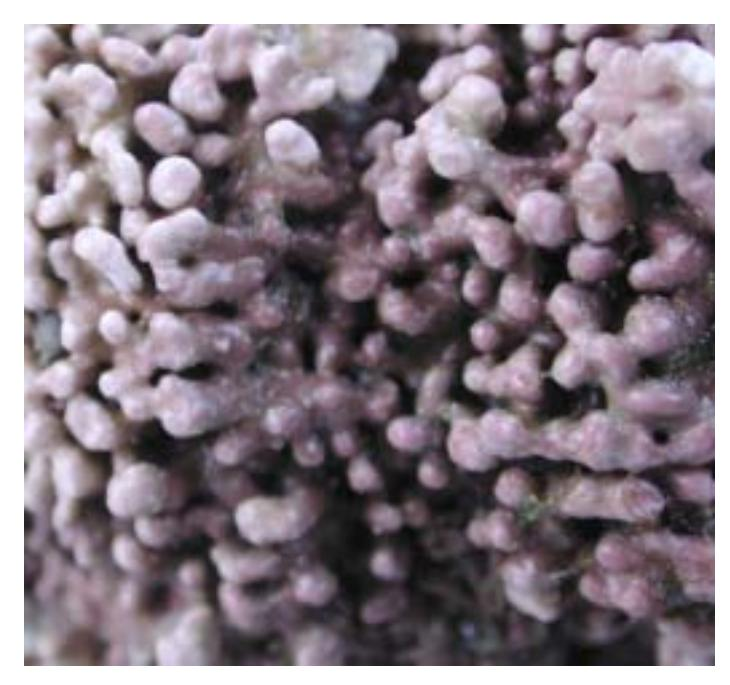

**Description:** This common crustose coralline alga often grows over dead corals, creating a knobby appearance. It is slightly papery in surface texture. It is common in shallow subtidal places or in the inter tidal. The color is purple or pink. This alga often forms rhodoliths, or a small somewhat round rock-like thallus.

**Distribution:** Tropical to subtropical waters

*Hypnea pannosa* J. Agardh CN: Not known. SN: \*Limu 'ava

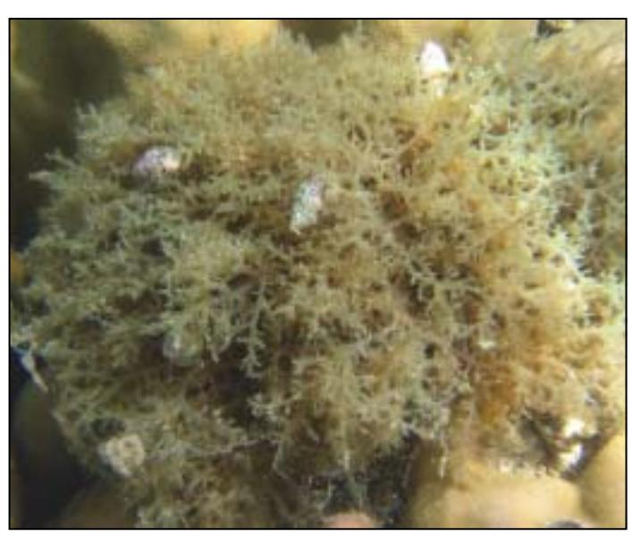

**Description:** This common alga is found in shallow places, often near the base of branching corals or in between living corals. The color is yellow in shallow, bright sunny areas and deep red in shaded low light places usually in the subtidal. The alga forms spreading clumps that can float away and establish another community elsewhere. It is fairly spongy to the touch, so that when pressed it tends to bounce back. The plant is terete to compressed with many branchlets. They lack spines, which separates it from *Hypnea spinella* (also found

from Samoa). They are anchored by many holdfasts irregularly distributed in places where the plant touches the substratum.

**Remarks:** Many similar species of *Hypnea* are eaten. The Fijians eat a similar species by boiling it to form a gel and then mixing it with fish (South 1993).

**Distribution:** Tropical waters.

#### *Hypoglossum caloglossoides* Wynne and Kraft

CN: Not known. SN: Limu

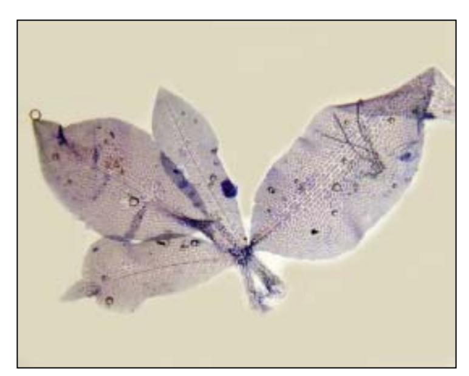

**Description:** This common, epiphytic alga is flat and prostrate. It has a clear node and internode system. The color is usually bright red. It is attached at every node by a complicated rhizoidal mass with secondary attachments coming from marginal cells of the blades. At every node, a pair of blades develops on the surface opposite the rhizoid. The blades are elliptical with a large bell-shaped apical cell. A midrib is another obvious feature.

**Remarks:** This alga is illustrated

more to show the diversity of marine plants of American Samoa. It is difficult to see this alga without the aid of a microscope or hand-lens.

**Distribution:** Tropical waters.

#### *Lithothamnion proliferum* Foslie

CN: Not known. SN: \*Limu patupatu = knobby seaweed.

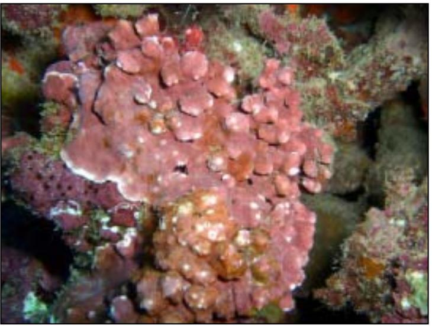

**Description:** This knobby alga is found in deeper waters (5-25m), usually in shaded places, in crevices, and underside of large boulders. It has a glossy pink to red color and a smooth velvet texture. Another distinctive character of this species is the many protuberances arising from the encrusting thallus. The growing margins are sometimes pale red to white color. Sloughing or shedding of the surface layer is observed in this alga.

**Remarks:** This is one of the few coralline algae that can easily be identified in the field by its knobby or lobed protuberances and texture.

**Distribution:** Indo-Pacific

#### *Martensia fragilis* Harvey CN: Fragile martensia. SN: Limu

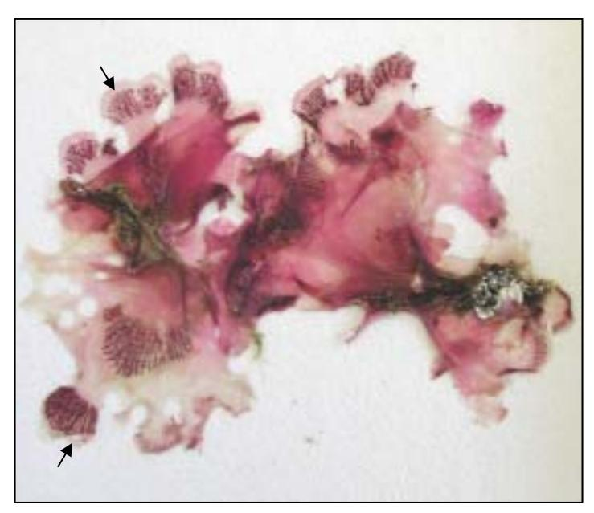

**Description:** This elegant, yet fragile alga is rarely seen. It is common in exposed places along the reef crest, nestled amongst the turf algae. The thallus grows to 5cm tall, but much bigger sizes are reported from other countries. The color varies from an iridescent pink, bluish, orange to magenta. A discoid holdfast attached the plant to the substratum. The terete stipe, about 1mm wide, 3mm long, give rise to a semicircular, fan-shaped delicate blade, about 2cm in diameter. The blades are composed of 50-80%

membranous layer, with the other part – a meshwork. The margins are convoluted, rounded with minute teeth. Fertile specimens give a deep red color on the meshwork part (as seen in the photo above - arrows).

**Remarks:** A delicate plant that is comparable to the petals of a rose.

**Distribution:** Tropical to temperate waters.

#### *Mastophora pacifica* (Heydrich) Foslie

CN: Not known. SN: Limu

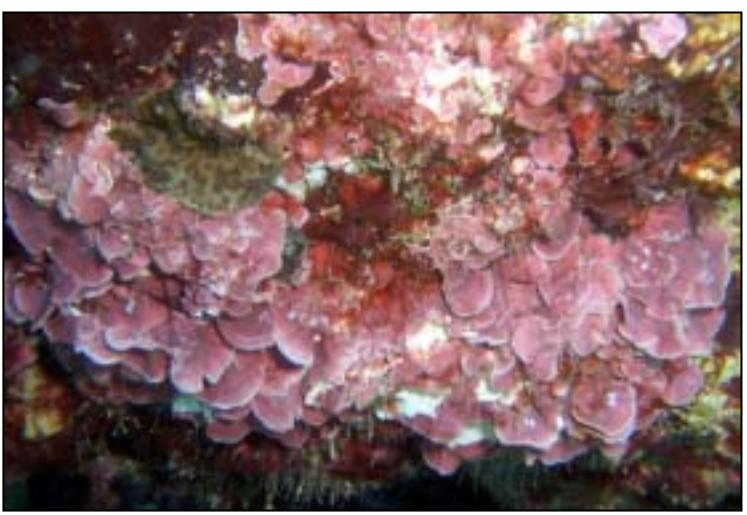

**Description:** This delicate and highly calcified alga is easily crushed when handled. They form overlapping plates on reef walls or in crevices where there is fast water flow. The color varies from light pink to magenta. The blades often aggregate into a round clump. The blades spread to 5cm wide with wavy margins that are slightly raised. The alga is attached by rhizoids

**Remarks:** There are two

species known from the Pacific Islands, with this being the most widespread and common.

**Distribution:** Indo-Pacific waters.

### *Meristotheca procumbens* Gabrielson & Kraft

CN: Not known. SN: Limu

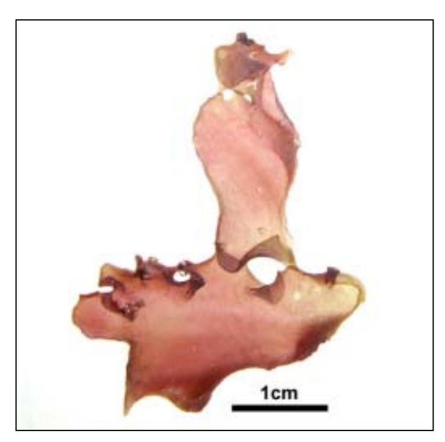

**Description:** This alga has a rubbery texture and adheres closely to the substratum. The color is brick red color. The expanded flat blades spread to 5cm wide. It is attached by small terete holdfasts. Young algae usually form circular blades becoming irregularly lobed afterwards. Secondary attachments are possible through holdfasts issued from the blade margins.

**Remarks:** This alga is eaten by the people of Rotuma. It has only been found from Australia, Fiji, Rotuma, Samoa and French Polynesia. This reflects the collecting intensity carried out in these countries.

**Distribution:** Pacific Islands.

### *Peyssonnelia inamoena* Pilger

CN: Not known. SN: \*Limu ili = fan seaweed

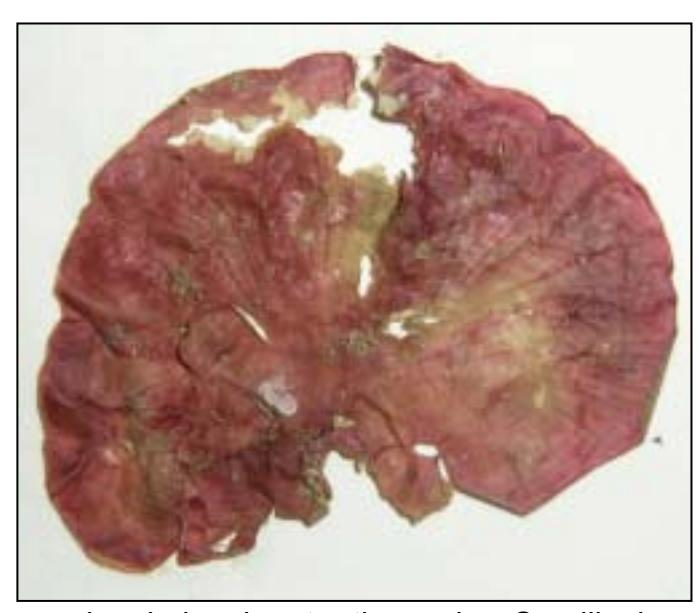

species belonging to the order Corallinales. *Peyssonnelia* belongs to the order Gigartinales.

**Distribution:** Tropical to subtropical waters

**Description:** This encrusting common alga is found in shallow inter tidal to sub tidal places. The color varies from light pink to deep red color. It resembles a fan that is lying on its side. It spreads to 5cm with the margins slightly raised. The alga is attached by rhizoids on the calcified undersurface part of the thallus. Faint lines running from the middle to the margin can be seen on this alga.

**Remarks:** This alga may easily be mistaken as a coralline alga due to its color and encrusting form. Coralline algae are delimited by

#### *Portieria hornemannii* (Lyngbye) Silva

CN: Not known. SN: Limu

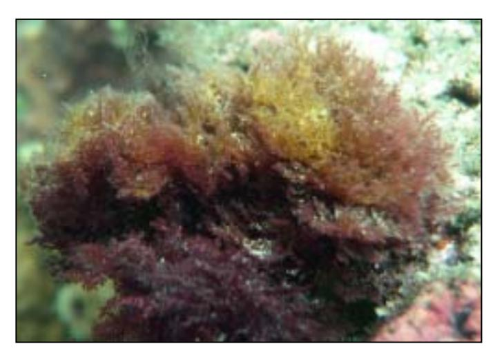

**Description:** This rarely encountered alga forms bushy clumps on dead corals or other rocky substrata. It is found on the reef flats to shallow subtidal places, usually where there is strong water flow. The color varies from yellow, orange to dark red. It is attached by a discoid holdfast, growing to 15cm tall. The branches are compressed, with tips often curled inwards.

**Remarks:** This is the first record of this species from the Archipelago.

**Distribution:** Tropical waters

*Prionitis formosana* (Okamura) Kawaguchi & Nguyen CN: Not known. SN: \*Limu

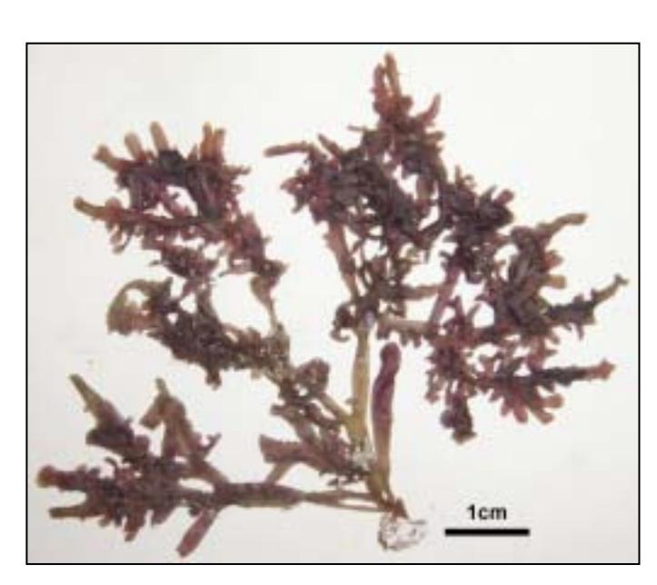

**Description:** This stiff and cartilaginous alga grows in places where there is good water flow. It is found in shallow inter tidal places, grooves along the reef crest, and crevices on the fore reef to subtidal places. The color varies from olive green to various shades of red. It is attached by a very tough discoid holdfast, growing to 15cm tall. The thallus is flattened throughout, with the branching immediately arising from near the base. Branching is somewhat dichotomous, although often, adventitious oval branchlets arise irregularly along the margin or from the mid-part of the blade, and

usually more frequent from the mid-to the top part of the plant. Slight constriction is commonly observed at the base of the branches. The thallus is often attached to other parts of the plant giving it strength enabling it to withstand the tidal movement. The blade tips are often rounded or bifid.

**Remarks:** Setchell (1924) recorded this alga as edible from Samoa, although to date no record of it being eaten is known. It is rarely collected, probably because of its habitat (exposed places) and cryptic habit.

**Distribution:** Indo-Pacific

#### *Titanophora weberae* Børgesen

CN: Not known. SN: \*Limu mumu-talatala = roughened red seaweed

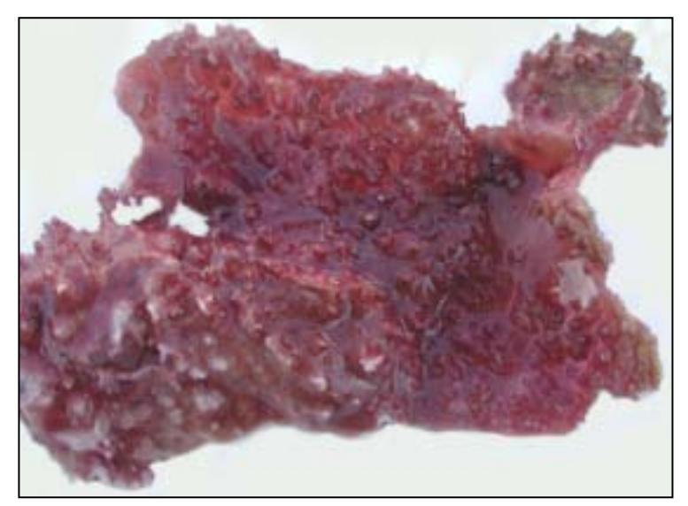

**Description:** This alga often appears as a ruffled clump that feels slippery yet rough to the touch. It is found in deeper waters at 5-20m depth. The color is white, pink to dark red. Despite its soft thallus, this alga contains calcium carbonate in the interior part. The thallus is complanate to sub-flabellate and is attached by a small disc. A short stipe of about 2mm in diameter bears the expanding blades above. The alga grows to 10cm tall. The blade surface

is endowed with sub-acute excrescences, of which some become lobed branchlets.

**Remarks:** This alga is best view in its natural habitat where it displays its bright color. It becomes less attractive out of the water and even more so when pressed.

**Distribution:** Indo-Pacific

### *Tricleocarpa fragilis* (Linnaeus) Huisman & Townsend

CN: Not known. SN: Limu

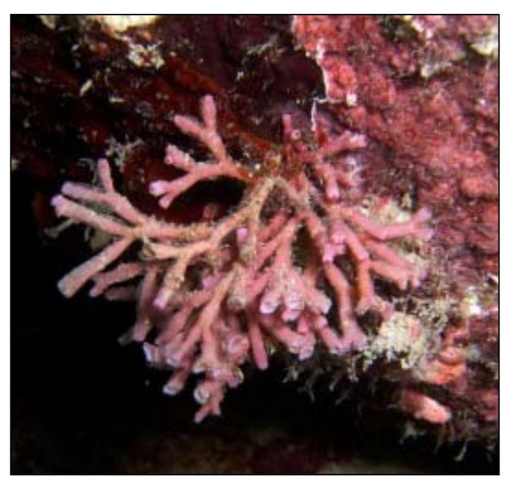

**Distribution:** Indo-Pacific.

**Description:** This fragile and beautiful alga is distinctive by its cylindrical thallus that is smooth to the touch. It prefers subtidal places in calm to moderate water flow places. The color is pink, whitish or dark red. It grows to 10cm tall and is attached by a discoid holdfast. The branching is dichotomous. The thallus size is uniform throughout. Slight constrictions at dichotomy or at the apices are observed. A depression is obvious at the tip of the thallus and faint striations can be seen on the branches.

**Remarks:** Two known species have been recorded from the Samoa Archipelago.

#### **PHAEOPHYTA (Brown Algae)**

*Chnoospora minima* (Hering) Papenfuss

CN: Not known. SN: Limu

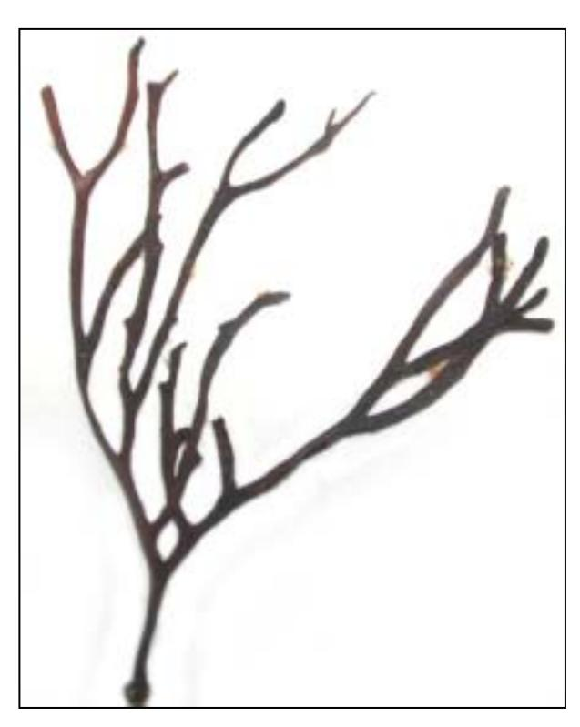

**Description:** This rarely collected alga grows in the inter tidal zone, usually in exposed places, firmly attached by a discoid holdfast. The thallus is tough, cartilaginous and is light to dark brown, turning black on drying. The erect thallus grows to 8cm tall. The branches are flattened to 1mm wide, irregularly dichotomous. The blade tends to broadened at dichotomies and then tapering towards the rounded tips. Small tufts of hairs can be seen on the surface of the blade.

**Remarks:** Plants were collected from buoys at the Fagatele Bay and on volcanic rocks, where the wave actions are strong.

**Distribution:** Tropical waters.

*Dictyopteris repens* (Okamura) Børgesen CN: Not known. SN: Limu

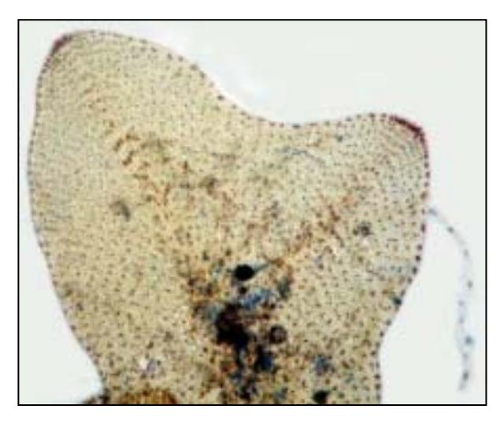

*Dictyota*.

**Distribution:** Indo-Pacific.

**Description:** This small mat-like alga is found mostly as an epiphyte or epilithic. The color is light brown to greenish. It is attached by hair-like filaments emitting from the midrib on the under surface. It creeps on the surface of other large alga, especially near the base. The branching is dichotomous and can be up to 4cm long, with the width up to 3mm wide.

**Remarks:** This alga is common throughout the year. The larger specimens may be mistaken as a *Dictyota*  species. The presence of the midrib clearly separates this *Dictyopteris* from

#### *Dictyota bartayresiana* Lamoruoux

CN: Not known. SN: \*Limu enaena = brown seaweed

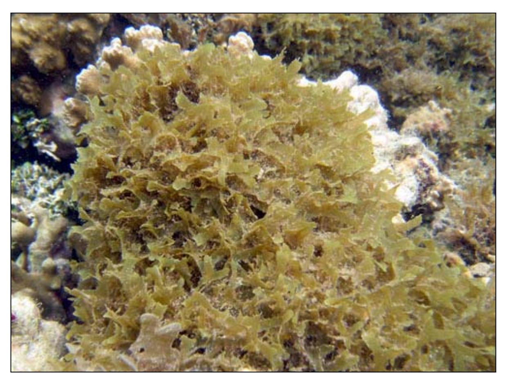

**Description:** This bushy alga is abundant during the Southern Hemisphere winter (June-November). It forms compact clumps on dead corals and rubble, usually in the shallow inter tidal places. The color is brown to light green. The branching is dichotomous and it grows to 10cm tall. The width of the branches and thallus is about 3mm. It is attached by hair-like roots issued from the under side of the flat blades. It lacks a midrib.

**Remarks:** The taxonomy of this alga is confused, and the ultimately placement of Samoan material is tentative until further studies are carried out. Some forms of this alga may resemble *Dictyopteris repens*. But they can be distinguished by the lack of midrib in this species and genus, whereas it is a character of *Dictyopteris*.

**Distribution:** Tropical to temperate waters

*Lobophora variegata* (Lamouroux) Womersley CN: Not known. SN: \*Limu lautaliga-malo = hard earlike seaweed

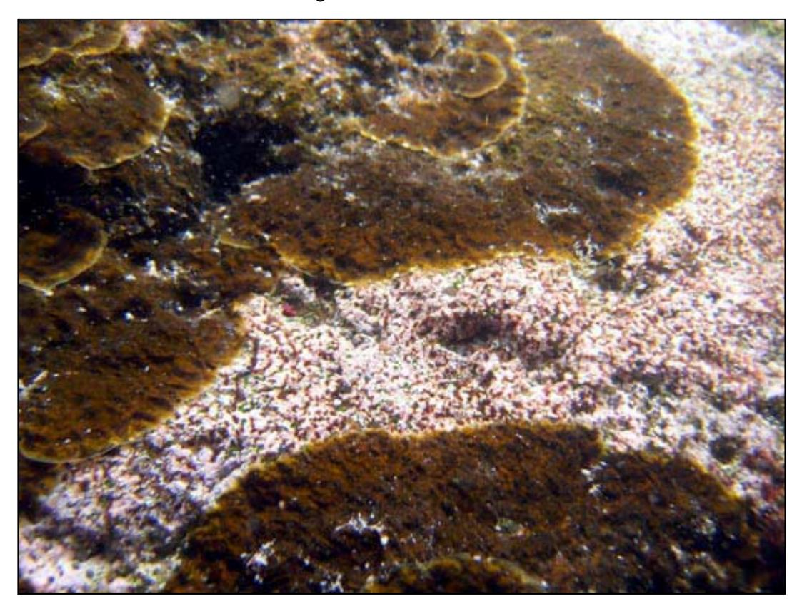

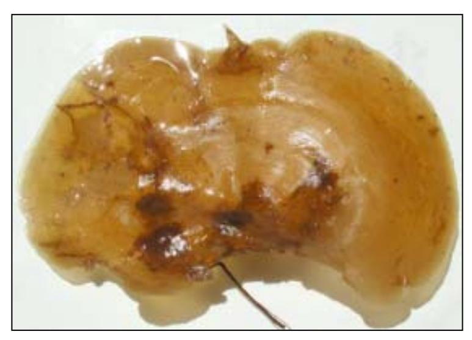

**Description:** This fan-shaped alga is common from the inter tidal zone to deep places. The color is light to dark brown and faint concentric lines can be seen on the surface of the blade. The plant usually lies in the same plane as the substratum, although erect blades are also known. It can reach 10cm tall and up to 8cm wide. The blades often overlap and are attached by fine rhizoids arising from the underside of the blade.

**Remarks:** This alga grows in many habitats and on all sorts of substrata.

**Distribution:** Tropical waters

*Photos:* Top – the encrusting form growing on volcanic rock in a fairly exposed place. Bottom – a close up of one of the blades.

#### *Padina boryana* Thivy

CN: Ear-like seaweed. SN: Limu lautaliga.

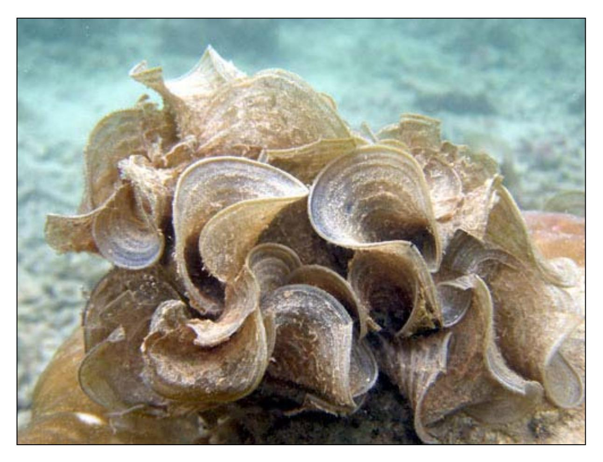

**Description:** One of the most distinctive and prominent brown algae found in shallow waters. This usually perennial species appears to be much more in abundance now, possibly due to changes in the marine environment. It forms large beds. Plants are lightly calcified, of large flabellate blades to 10cm high. The blades have the appearance of an ear. Prominent concentric rays are seen on the blade, which is where spores of this alga are found. This alga also has a filamentous form that looks very different from the bladed form.

**Remarks:** This seaweed is collected by aqua culturists in Samoa to feed trochus.

**Distribution:** Indo-Pacific

#### *Sargassum anapense* Setchell CN: Anape sargassum. SN: \*Limu tala

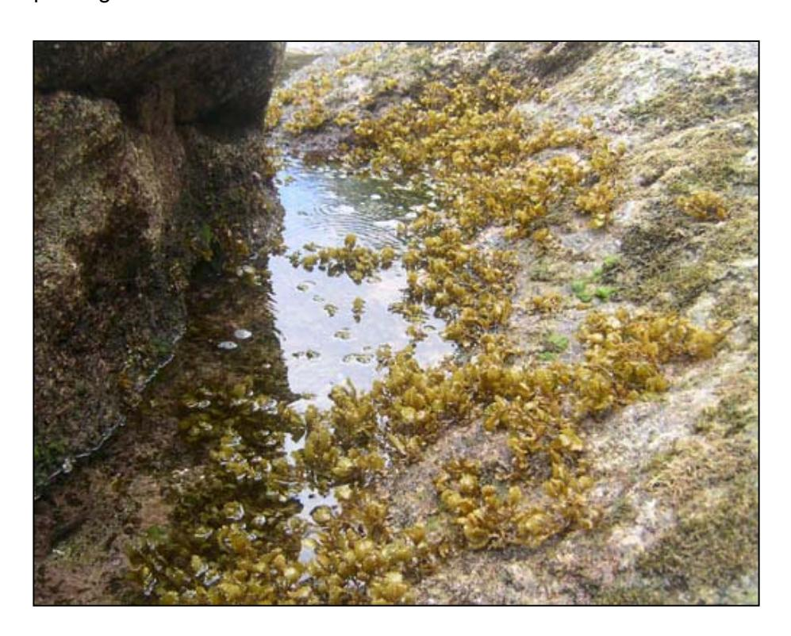

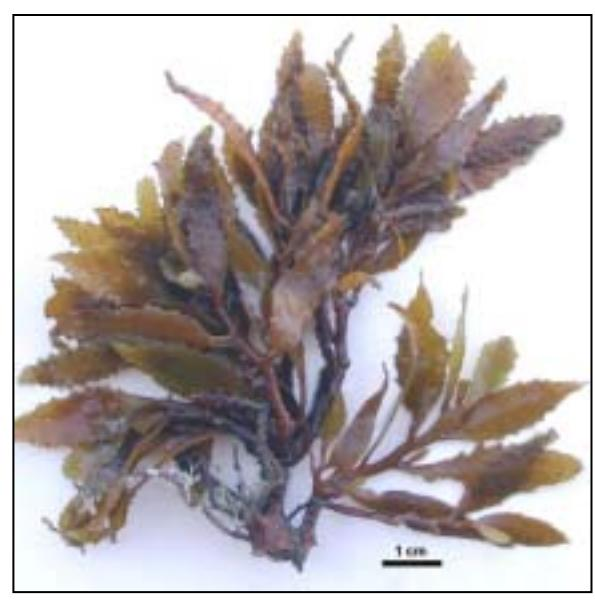

**Description:** This alga was named by William Setchell after the village of Agape. It is stiff and adheres strongly to the substratum by a discoid holdfast. It grows in the inter tidal zone and in tide-pools attaining a height of 10cm, whereas to 50cm tall in calm places. The leaves are short and elliptical with short teeth (dentations) along the margin. Small brown spots are scattered along the leaf. A faint midrib can also be seen, usually running to ¾ of the length of the leaf. A tough and short sub-terete stem arises from the disc, bearing up to 5 branches. The leaves arise from the stem in a slight angular disposition. The fruits (reproductive bodies) are found near the top of the branches.

They are dark brown and appear like small bunches of bananas, or finger-like projections.

**Remarks:** Setchell (1924) noted that this alga is eaten, although this no longer happens. Local fishermen refer to this seaweed as *limu-fa'aleagamea* (destructive weed) as they take over their fishing spots.

**Distribution:** So far only known from Samoa.

#### *Turbinaria ornata* Turner

CN: Turban seaweed. SN: \*Limu tala

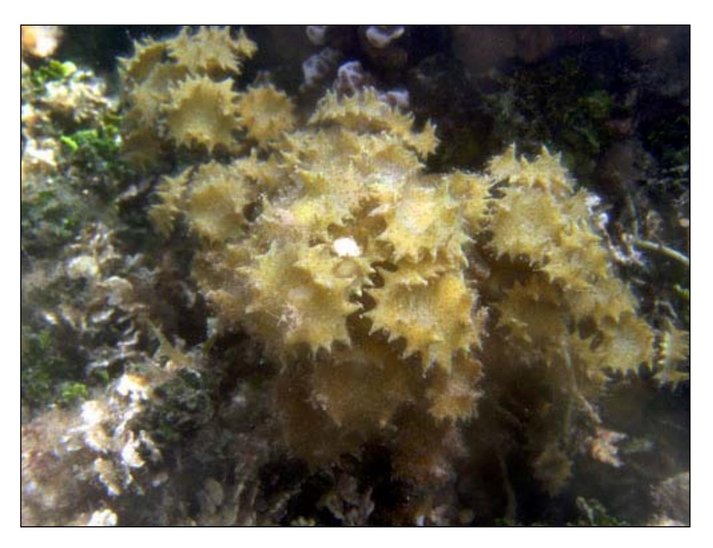

**Description:** This common shallow water alga is very distinct by its turban shaped crown with a double row of teeth. It is very tough and rigid and is firmly attached by a rhizoidal holdfast. The color is olive green, light brown to dark brown. In sheltered places it grows to 15cm, whereas along the reef crest and high impact areas a height of 5cm or less is seen.

**Remarks:** This alga is closely related to *Sargassum.* It is the only species of this genus reported from the Samoan Archipelago.

**Distribution:** Tropical to subtropical waters.

#### **CHLOROPHYTA**

*Parvocaulis exigua* (Solms-Laubach) Berger CN: Not known. SN: \*Limu niu = coconut weed.

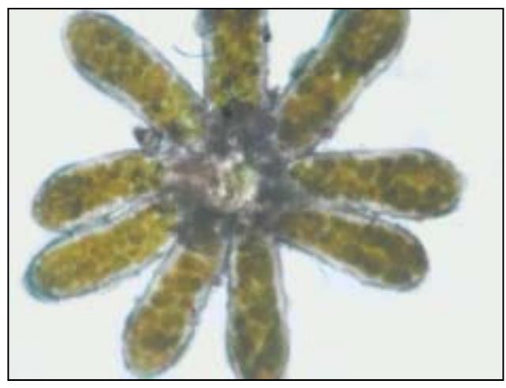

are torn off, it doesn't die. **Distribution:** Tropical waters. **Description:** This small but interesting alga grows on rubble and rock in the inter tidal zone. It grows to 2mm tall and superficially looks like a little coconut tree, without the fronds. It has up to 10 leaves or rays that are loose (not joined together). The stem is whitish to pale green, slightly ruffled near the top. The rays are bright green and are rounded at the tips.

**Remarks:** This alga is unusual by having its single nucleus at the base of the plant. So even if the rays and stem

*Parvocaulis parvula* (Solms-Laubach) Berger CN: Umbrella weed. SN:\*Limu fa'amalu = umbrella weed

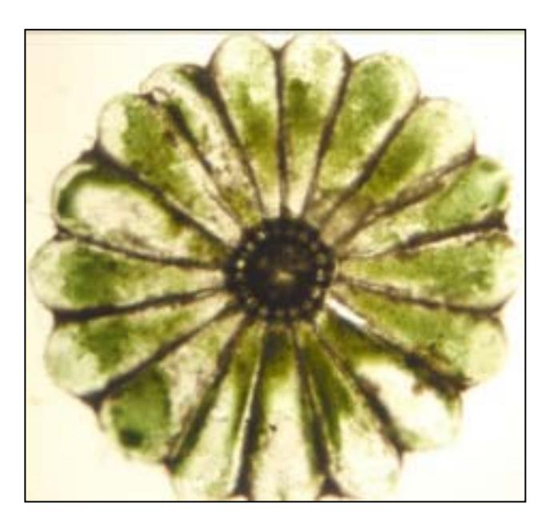

**Description:** This alga is very similar to *Parvocaulis exigua* and is often found growing on the same rock. The color is pale to bright green. It grows to 5mm tall. It is distinguished by its umbrella like cap. The 12-25 rays or leaves are fused due to calcium carbonate.

**Distribution:** Tropical to subtropical oceans.

*Photo captions:* Top. A fertile *Parvocaulis exigua* with the rounded dark green gametangium inside the nine rays. Bottom. *Parvocaulis parvula*  showing the 17 rays with calcified parts between (darker color) between the rays.

### *Boergesenia forbesii* (Harvey) Feldmann

CN: Not known. SN: Limu paluni-meamata = green balloon weed.

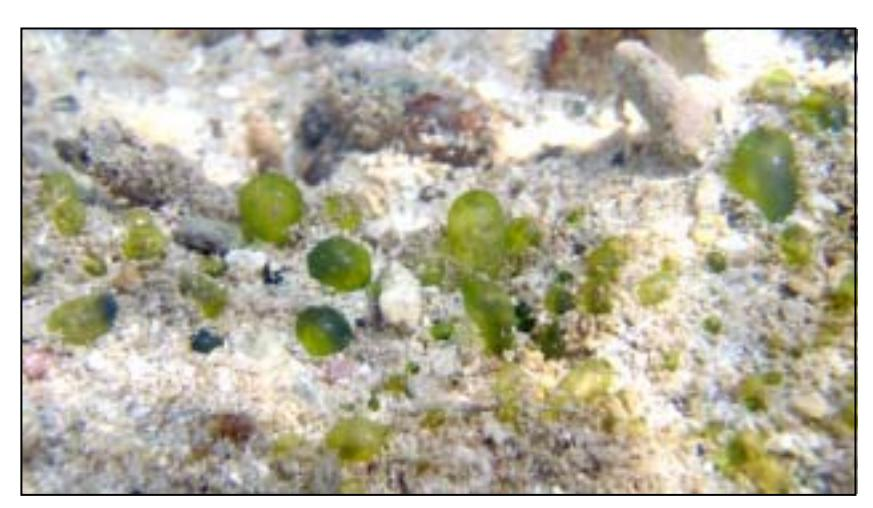

**Description:** This small but distinctive alga has the appearance of a tiny balloon. It is found often partially covered by sand in shallow waters usually in places where there is moderate water movement. It can be found growing in many small communities or rarely as individual. The thallus is club-shaped to oval and bright green

color. The vesicle is thin and see-through, and is filled water. Plants grow to 5cm tall and are attached by small rhizoids.

**Remarks:** This alga may be confused with *Ventricaria ventricosa* or sailorman's eyeball. The two are different by their thallus size, texture, color and habitat.

**Distribution:** Indo-Pacific

### *Bryopsis pennata* Lamouroux

CN: Bryopsis. SN: Limu

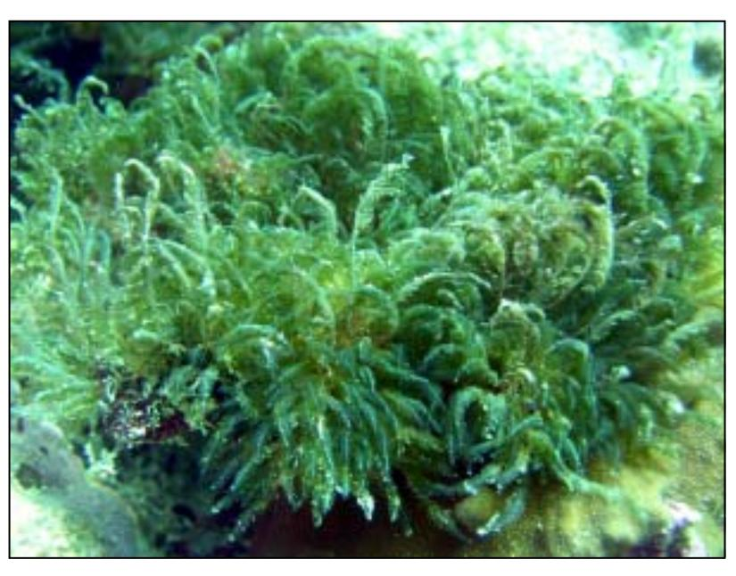

**Description:** This common alga grows in bushy clumps, usually in places where there is moderate to fast water flow. The color is often bright green, or dark green when taken out of the water. It grows to 10cm tall and the thallus resembles a droopy coconut leaf. It is attached by a rhizoidal holdfast. The branches bear smaller branchlets or pinnae that are arranged either secund, whorled or radial, or distichous.

**Remarks:** This is the only

known species for this genus from the Pacific Islands. *Bryopsis pennata* is a catch all name and that more species are probably lumped under this name.

**Distribution:** Tropical to subtropical seas.

*Caulerpa serrulata* (Forsskål) J. Agardh CN: Not known. SN: \*Limu migi = curly weed.

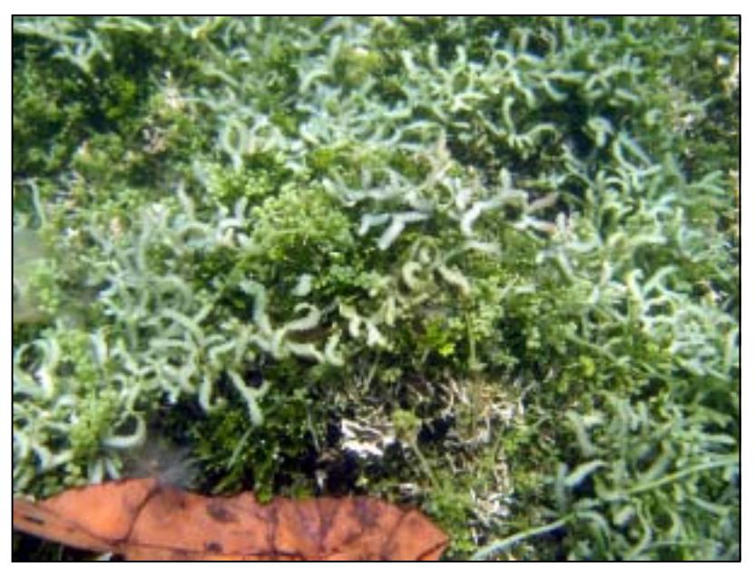

**Description:** This common alga is distinguished by its curly or twisted form. The level of curliness is dependant on the habitat, being less curly in sheltered places, and more so in exposed sites. The color is of various shades of green. It grows to more than 10cm tall and has a firm stolon, or prostrate stem. It is attached by very fine but tough roots, which bind strongly to the substratum. The thallus

has small dentations along the margins. The branching is dichotomous.

**Remarks:** This alga is found from shallow places to deep waters. It is closely related to the edible sea-grape seaweed (*Caulerpa racemosa*), although this is not eaten.

**Distribution:** Tropical to subtropical waters.

### *Caulerpa peltata* Lamouroux

CN: Not known. SN: \*Limu pulou = hat weed

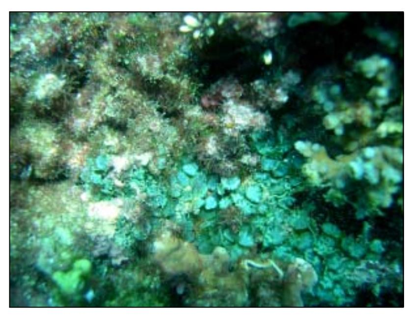

*Caulerpa racemosa*.

**Distribution:** Tropical to subtropical seas.

**Description:** This distinctive alga is found in places where there is fast water flow. It is light to dark green color or slightly iridescent. The prostrate stolon bears the erect thallus to 5cm tall, which is swamped with rounded flat discs. The discs are slender and larger in deeper waters, whereas compact and smaller discs are common in exposed shallow places.

**Remarks:** This alga may be considered a variety of

### *Caulerpa webbiana* Montagne

CN: Not known. SN: Lmu

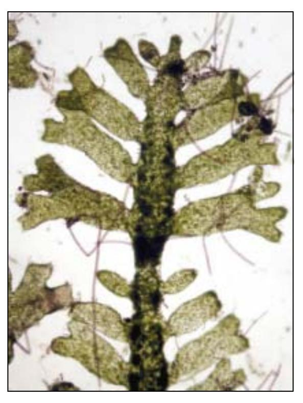

**Description:** This alga is small and can only be appreciated with the aid of a hand-lens or a microscope. It grows to 1cm tall, forming green fuzz along the sandy shores of Olosega and Mafafa villages. Larger specimens have been seen from other countries. The prostrate stolon bears the erect branches. The erect thallus is clothed with branchlets or ramuli that are either arranged in a distichous or whorled manner. It is attached by fine roots issuing from the stolon. The ramuli are further forked with two distinctive mucronate tips on the apex.

**Remarks:** A number of forms are recognized for this alga, of which two are clearly seen in the local materials (form *disticha* as shown in the photo to the left, and *pickeringii*).

**Distribution:** Tropical waters.

*Caulerpa cupressoides* (West) C. Agardh

CN: Not known. SN: Limu

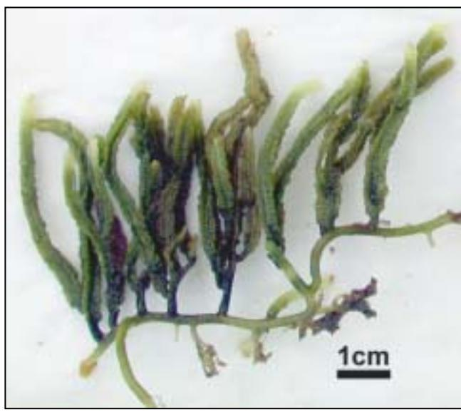

**Distribution:** Tropical to subtropical waters.

**Description:** This alga can be fairly big (to 16cm), although most of the plants collected from American Samoa are small (to 5cm). The prostrate stolon bears the erect branched thallus. The erect thallus lacks branching below but soon forms small busy and sometimes twisted branches. The branches have short teeth-like ramuli that point upwards. The ramuli can be arranged either in a distichous or a 3-dimensional manner. Fine root-like holdfasts peg the alga to the substratum.

**Remarks:** Three forms of this alga are known from American Samoa.

#### *Caulerpa racemosa* Lamouroux CN: Seagrapes. SN: Limu fuafua

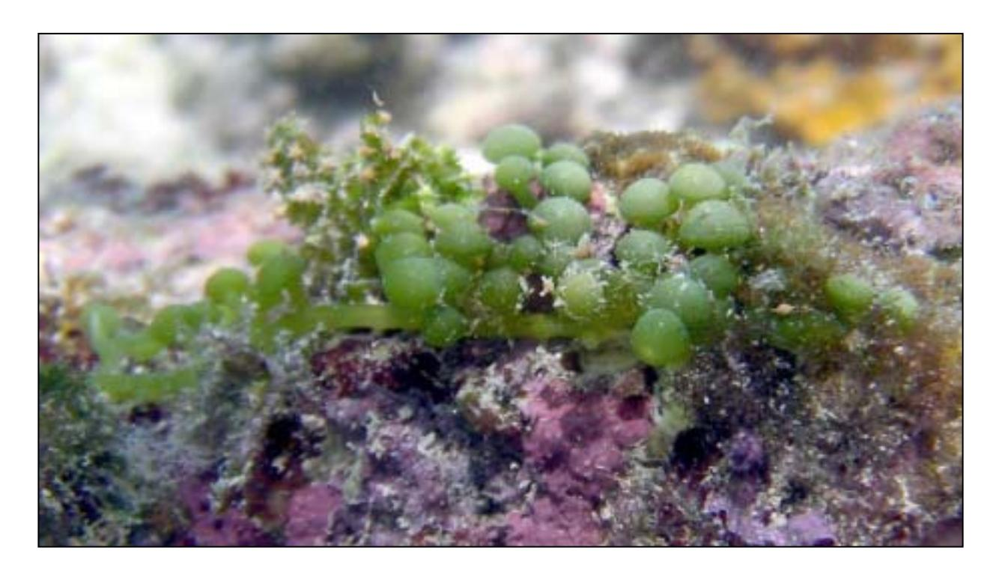

**Description:** This common alga is found in various habitats from shallow inter tidal places (shown in the photo above) to subtidal places. It grows on sandy substrata or on hard, carbonate rock. In exposed places it grows close to the substratum, but longer and more elegant in sheltered places attaining a height of 10cm or more. The color is various shades of green, although in some specimens interesting patterns can be seen on individual ramellus. The prostrate stolon is fairly stout bearing filamentous descending roots, whereas erect thalli bear the ramelli.

**Remarks:** This is one of the best known edible seaweeds in the Pacific and is a delicacy of the Samoans; it is eaten fresh or with coconut meat and green bananas. It is easy to recognize from other *Caulerpa* species by its small rounded or mushroom shaped ramelli. There are over twenty different forms of this species, and some people can easily distinguished the forms by the taste. One of the forms of *C. racemosa* shown above has firm compact ramelli that is very bitter. It leaves a strong bile-like after-taste and is less favored as an edible seaweed. The longer erect thallus bearing softer ramelli is preferred due to its juicy content and slightly sweeter taste that doesn't leave a strong after-taste.

**Distribution:** Tropical to subtropical places.

#### *Caulerpa taxifolia* (Vahl) C. Agardh CN: Not known. SN: \*Limu launiu = coconut leaf weed

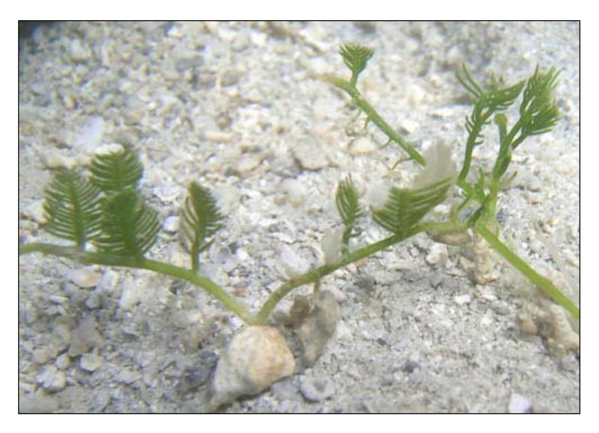

**Description:** This elegant alga grows in sandy substratum usually in shallow waters. It is bright green in color. The firm prostrate stolon bears the erect thalli that resemble green coconut leaves. The erect thallus attains a height of 5cm, but 15cm tall specimens are recorded from other countries. The ramelli are arranged in a distichous manner on the erect thallus. The ramelli are cylindrical and elongated tapering to a pointed apex. The length of the ramelli tends to be longer in the middle part of the thallus becoming shorter at the top.

**Remarks:** This alga has been demonized when it was introduced in places where it normally is not found, proliferating and smothering the natural flora of those places. In tropical waters, this alga is well contained and rarely dominates the flora.

**Distribution:** Tropical to temperate waters.

*Caulerpa verticillata* J. Agardh CN: Verticillate Caulerpa. SN: Limu

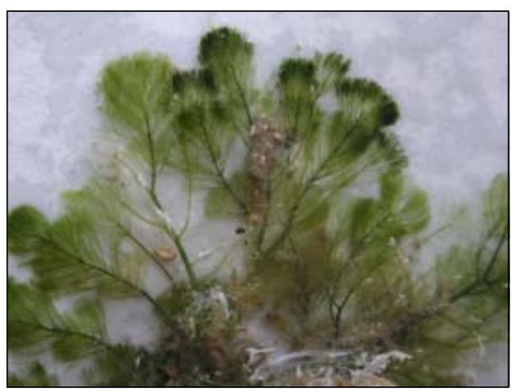

**Description:** A delicate alga that is common but rarely collected. It is found in muddy or soft sandy places, especially near mangroves. It grows in dense communities, which are extremely soft to the touch. The color is light green with dark green tips. Prostrate stolons are small with dense uprights. The uprights bear many fine whorled ramelli in an orderly series, one on top of the other. It grows to 2cm tall in materials collected so far from American Samoa,

whereas to 7cm in other places.

**Remarks:** This alga is yet to be found in the western parts of the Archipelago. It was found abundant in the shallow muddy substratum of Pala Lagoon, near the Nu'uuli Airport.

**Distribution:** Tropical seas.

*Caulerpella ambigua* (Okamura) Prud'homme van Reine & Lokhorst

CN: Not known. SN: Limu.

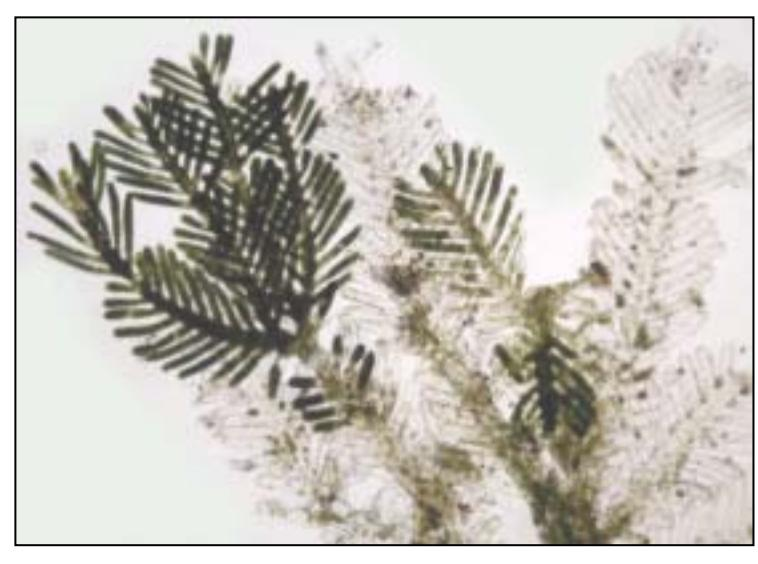

**Description:** This small alga has a weakly developed stolon. It grows to 7mm tall. It is attached to the substratum by short branched rhizoids. The branching is somewhat dichotomous. The ramelli are arranged either distichous or whorled, and are rounded at the apices. The ramelli size is variable but frequently having a series of longest pairs at bottom then successively shorter ones, then reverting back to longer series. Some parts of the

uprights are devoid of ramelli.

**Remarks:** A rarely encountered alga that is probably common but very difficult to see due to its small size.

**Distribution:** Tropical waters.

### *Chlorodesmis fastigiata* (C. Agardh) Ducker

CN: Turtle weed. SN: Limu laumei

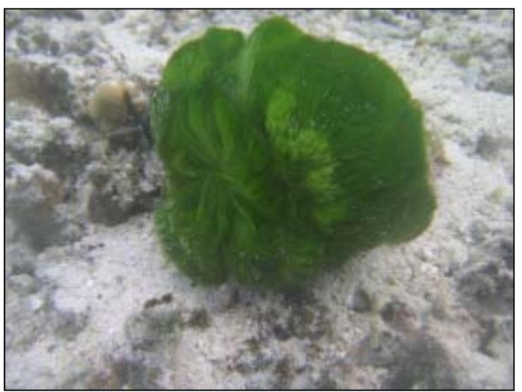

**Description:** A common alga that is also very conspicuous due to its fine form and bright green color. It is found in places with strong currents especially along the reef crest and algal ridge zone. It is attached by a compact rhizoidal holdfast. It grows to 10cm tall, forming small bushes. The fine filaments are loose and divide dichotomously. A slight constriction is always found on the base of each dichotomy. Some filaments are moniliform.

**Remarks:** known as turtle weed, although turtles are not known to feed on this unpalatable alga.

**Distribution:** Tropical waters.

#### *Codium bulbopilum* Setchell

CN: Not known. SN: \*Limu meamata = green weed.

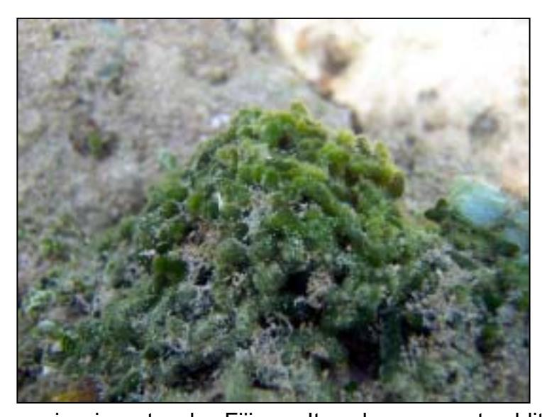

**Description:** This cryptic alga grows in shallow places where the water flow is moderate to fast. It forms clumps and has a very prostrate mode of growth. It is often covered with sand or silt. The branching is irregular or dichotomous. It has a spongy texture and is dark green color, occasionally with light green tips. The alga forms large meadows, spreading over a 10m sandy field. The individual thallus is about 3-5mm wide.

**Remarks:** This alga or a similar

species is eaten by Fijians. It makes a great addition to a stir-fry vegetable dish, having a crunchy, nutty flavor. The taxonomy of this alga, which Setchell described from Lauli'i, Tutuila Island, is still unresolved, being closely similar to *Codium geppiorum*.

**Distribution:** Pacific Ocean.

#### *Dictyosphaeria versluysii* Weber-van Bosse

CN: Button weed. SN: \*Limu fa'amau

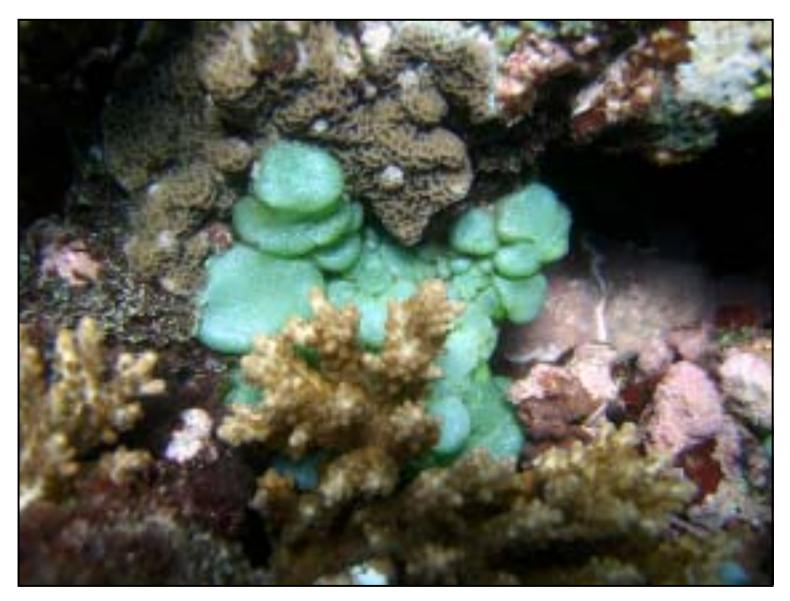

**Description:** This is a common alga in Samoa. It tightly adheres to where it grows, usually on rock in strong current places. The color is pale green, almost opaque in some plants. It is tough, globular to compressed, fairly solid cushions, to 5cm wide. The surface of the cells is smooth and polygonal. It is attached by small rhizoids on the bottom side of the alga. It grows either solitary or often in groups, overlapping each

other.

**Remarks:** The young thallus resembles a small green button, often rounded in

shape.

**Distribution:** Tropical waters.

#### *Dictyosphaeria cavernosa* (Forsskål) Børgesen

CN: Not known. SN: Limu

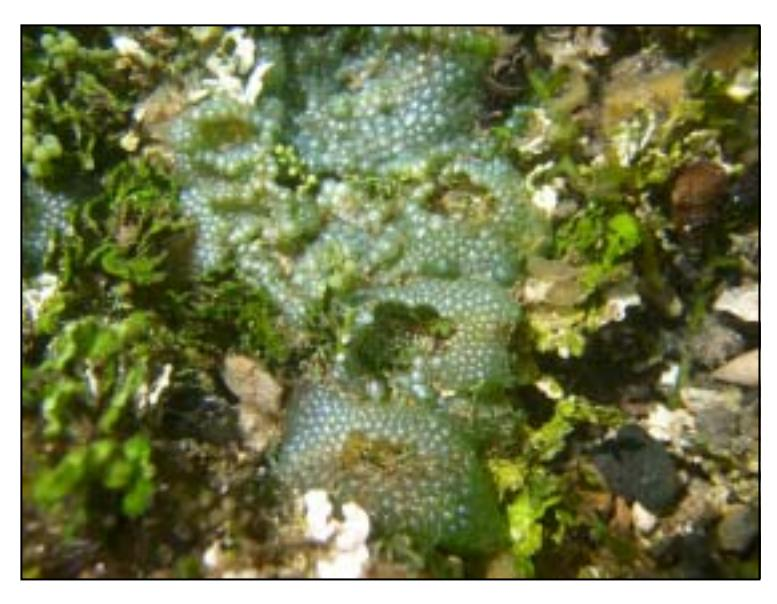

**Description:** This uncommon alga is found in shallow inter tidal places. Its size is 5cm, although much bigger plants to 20cm or more have been recorded from other countries. It is closely related to *D. versluysii* but they can be separated by the hollow thallus in *D. cavernosa*. This is quite different from the firm *D. versluysii*. Another possible distinguishing character is the bubble like appearance on the surface of the alga.

**Remarks:** Considered a

nuisance to some parts of Hawaii, aggressively competing with corals. This is one of the few examples of local flora causing negative ecological impacts to the environment; an issue that is often attributed to introduced species.

**Distribution:** Tropical to subtropical waters.

*Ulva intestinalis* Linnaeus [syn. *Enteromorpha intestinalis* (Linnaeus) Nees] CN: Not known. \*SN: Limu limu

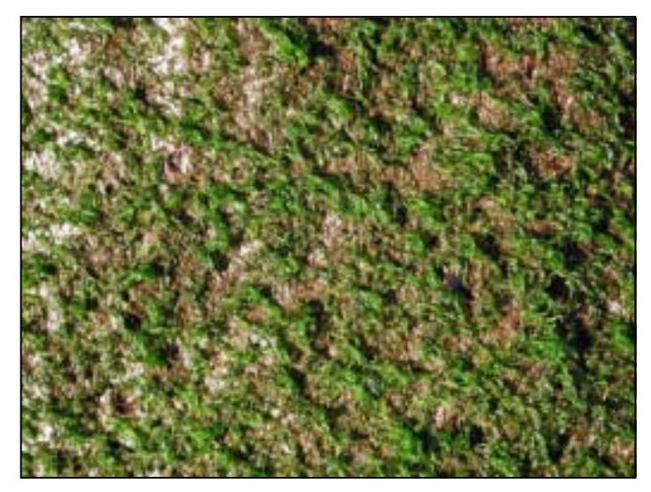

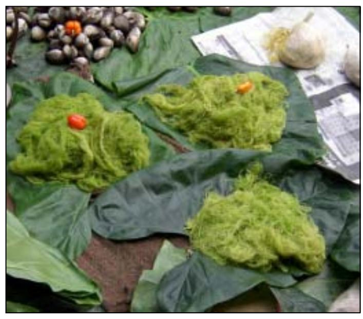

**Description:** This alga is light green to yellow color. It is common in the high inter tidal zone, along pillars of bridges, or in mangrove environments. Initially it forms little clumps that attach firmly to the substratum, later becoming freefloating covering a big area, usually in sheltered places where the environment is not pristine.

**Remarks:** This alga provides a good indicator on the status of the environment. It absorbs heavy metals and other pollutants keeping the marine environment relatively clean. This alga is eaten is some places, including Fiji. The taxonomy of *Enteromorpha* has recently been updated by Hayden *et al.* (2003). The genus is now been relegated to the older name *Ulva*.

**Distribution:** Tropical to temperate places.

*Photos: Enteromorpha intestinalis. Top –growing on a rock near a river. Middle –growing on the side of a fishing vessel. Bottom – being offered for sale at Suva market, Fiji.* 

#### *Halimeda gracilis* Harvey CN: Halimeda. SN: Limu

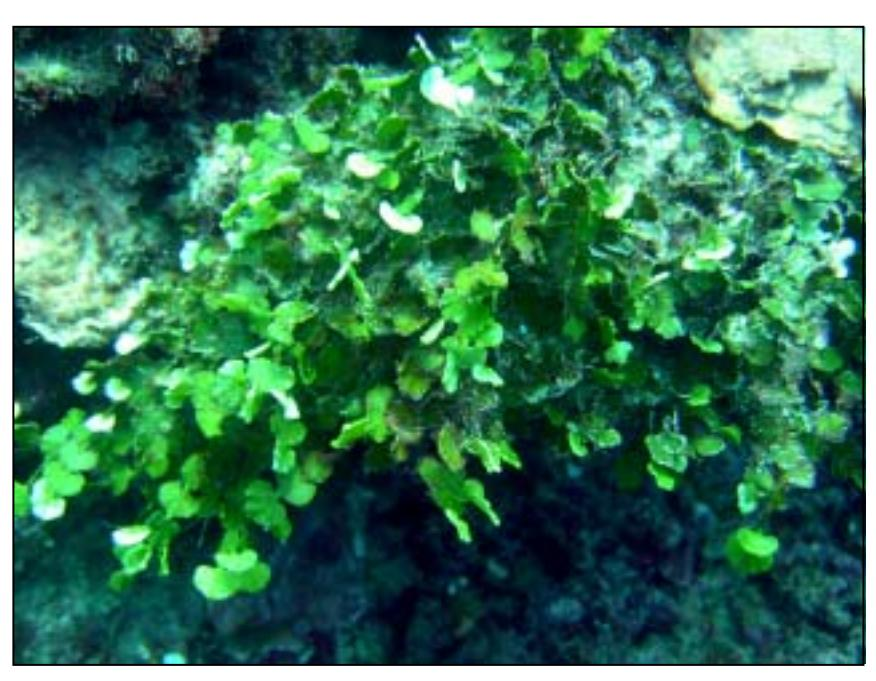

**Description:** Plants are lax, reaching 30cm tall. Calcification light near the tips, heavy near the base. Segments cylindrical near the base, kidney-shaped or rounded at the tips. Plants light to dark green. Branching is irregular, usually three branches from each segment. Attached by a small holdfast, with secondary holdfasts found in places where the plant contacts the substratum.

**Remarks:** Similar to *Halimeda opuntia*. It is found in deeper waters and has larger segments that are lax. Confirmation of the species requires decalcification and observation of the internal filaments.

**Distribution:** Tropical waters.

#### *Halimeda incrassata* (Ellis) Lamouroux

CN: Halimeda. SN: Limu

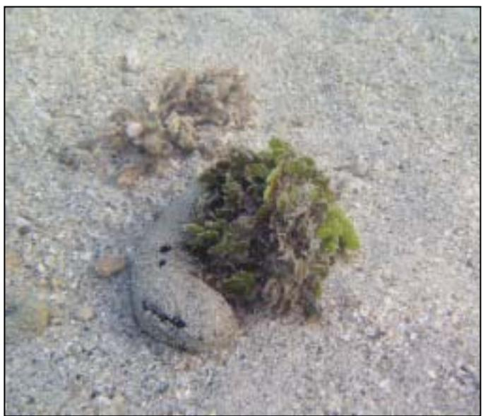

larger and rounder segments of *H. macroloba*.

**Distribution:** Tropical waters.

**Description:** Plants are firmly rooted in the sand, by a distinctive bulbous root that is compacted with sand. It is found in shallow sandy places with a moderate water flow. It is mostly dull green color, with light green tips. The plant is bushy and somewhat compact in appearance. The segments are variable in shape, but mostly tri-lobe or resembling a duck's feet. The outermost segments are rounded but ribbed.

**Remarks:** This alga is similar to *Halimeda macroloba* an alga also found from American Samoa. The two can be distinguished by the

#### *Halimeda opuntia* **(Linnaeus) Lamoroux**

CN: Halimeda. SN: Limu

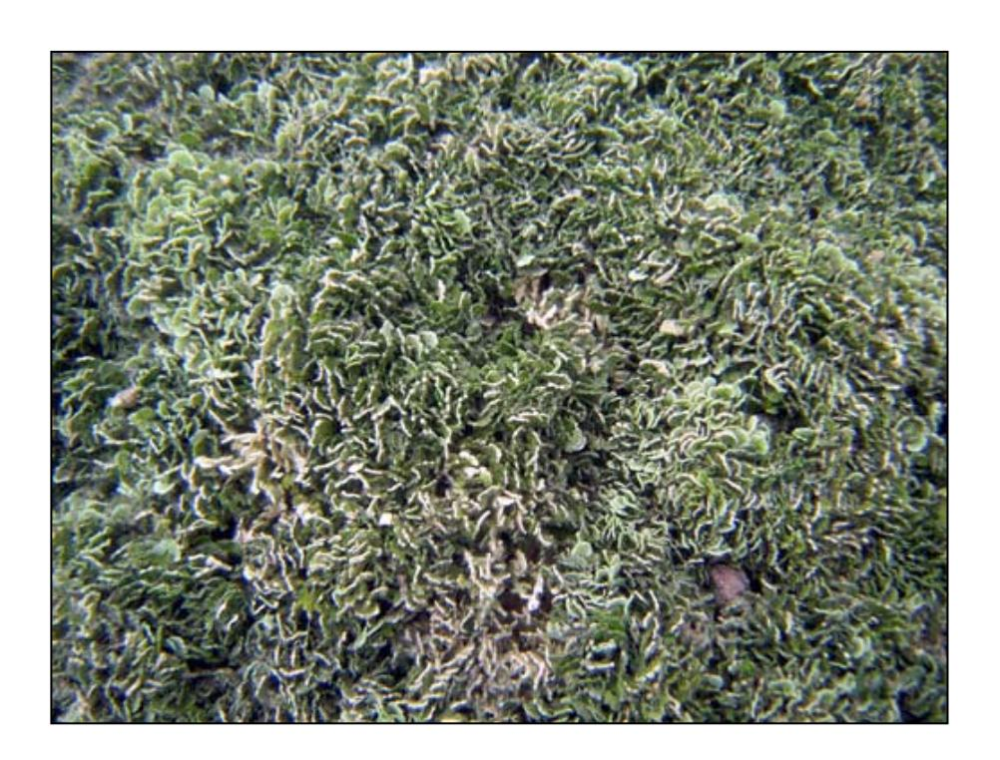

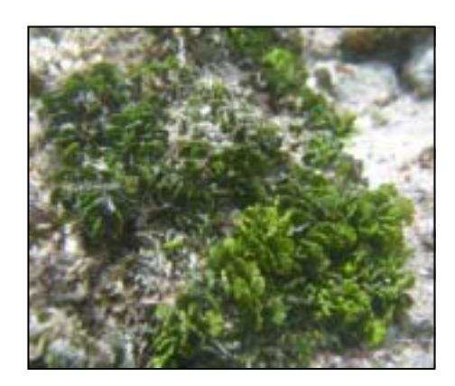

**Description:** A common alga that forms large beds in shallow waters (as seen in above photo). The color is green-white. This alga very straggly in appearance and is attached to the substratum by many holdfasts. It can grow up to 10cm tall, and form communities as wide as 100m. Individual plants resemble flexible flattened string of beads. It is lightly calcified, with colorless siphons or filaments throughout the segments. Each segment is tri-lobed to many lobes, but often resembling a duck's foot. The surface of the segments is very important in

identifying the different species. The arrangement of outermost siphons (or utricles) gives characters to the surface of the segments. Some segments have hexagonal shaped surfaces, whereas others are circular. Some surface utricles are closely packed whereas others are loosely arranged. The utricles are another important feature in identifying the species. Some utricles divide in two, whereas others remain entire throughout.

**Remarks:** The skeleton of dead *Halimeda opuntia* contributes significantly to the substratum in many tropical reefs (especially in atoll countries). Furthermore, it is eaten by some animals (e.g. parrotfish, triggerfish) and invertebrates.

**Distribution:** Tropical oceans.

#### *Neomeris vanbosseae* Howe

CN: Not known. SN: Limu

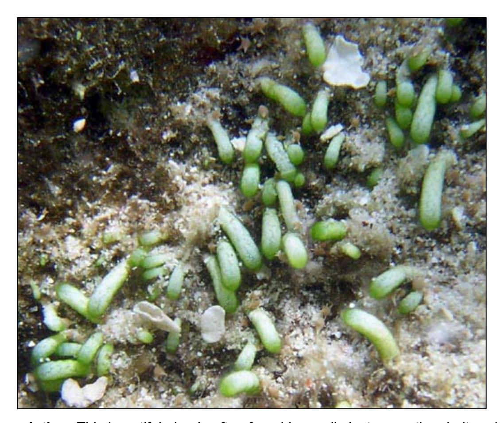

**Description:** This beautiful alga is often found in small clusters on the sheltered side of rock, rubble and other large structures in shallow waters. The color is light green to whitish on the lower side becoming darker green near the top. The cylindrical oftenarching body is fairly delicate and grows to 2-5cm tall. The tissue is impregnated with calcium carbonate, especially near the base. A honeycomb like pattern is a characteristic of this alga. Fine filaments are found near the top. It is distinguished from *Neomeris annulata* by the lack of annular rings, which are more pronounced near the base of the latter. The reproductive structures are in compartments that are protected by calcium carbonate.

**Remarks:** This alga contributes to the sediment. It is also consumed by invertebrates. Littler and Littler (2003) reported *Neomeris dumetosa* Lamouroux from American Samoa (a Caribbean species). Examination of their material is needed to assess the presence of this Caribbean alga in the Pacific.

**Distribution:** Indo-Pacific.

#### *Rhipidosiphon javensis* Montagne

CN: Fan weed. SN: Limu ili-meamata = Green fan weed.

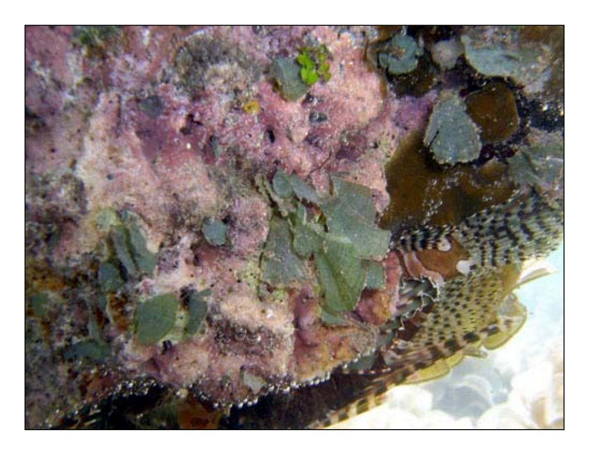

**Description:** This irregularly fan-shaped alga is found on the sheltered side of large boulders, from subtidal to lower inter tidal places. The siphonous filaments are joined by calcium carbonate to form the fan shaped blade that is one cell thick. Each filament is dichotomously divided with a slight pinch at the base of the filament. It is attached by a rhizoidal holdfast that penetrates the substratum; the rest of the thallus generally hangs downward, although erect plants are common in smaller rubble and rock.

**Remarks:** Often missed during ecological surveys because of its small size and cryptic nature, this alga is one of the many calcified green algae.

**Distribution:** Found in tropical waters.

#### *Tydemania expeditionis* Weber-van Bosse

CN: Not known. SN: Limu

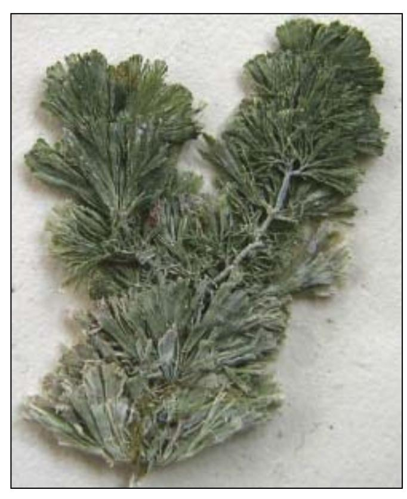

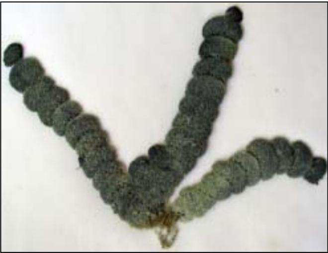

**Description:** This alga has two distinct forms. The flabelloid form (fan-shape) is the only known morph from Samoa. The verticillate form (whorls) is spongy and resembles beads; is found throughout the western Pacific to Fiji. This alga is grayish green and grows to 20cm long. Branching is somewhat dichotomous. The flabelloid form is built like a series of fans, with each successive series on top of older ones. Tough siphons run throughout each of the series. Calcium carbonate is deposited between the siphons. It is found hanging from walls or on the side of large boulders, at depths of 2-20m.

**Remarks:** According to past studies (Coppejans and Prud'homme van Reine 1989), the flabellate form is found in shaded places as seen from Samoan plants, whereas the verticillate forms are found in high light places.

**Distribution:** Indo-Pacific

*Photos: Top.* The typical form (flabelloid) of this alga collected from American Samoa. *Lower***.** The verticillate form, which is yet to be found in American Samoa. This form has been collected throughout Southeast Asia and to Fiji.

#### *Valonia fastigiata* Harvey ex J. Agardh

CN: Not known. SN: \*Limu patupatu meamata = green bubble seaweed.

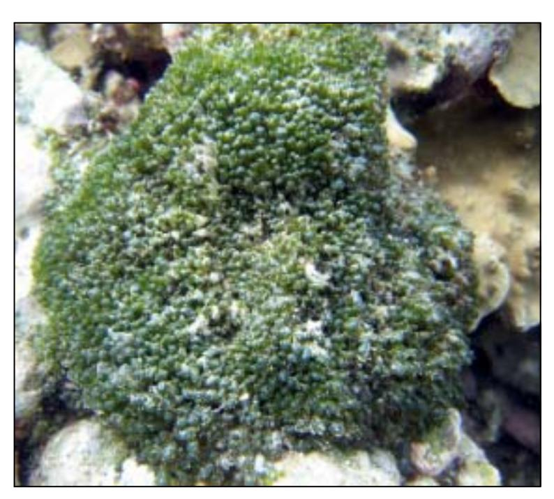

**Description:** This beautiful alga forms clumps in sandy places. It is often covered with sand. The surface appears to be made of bubbles tightly packed together. When teased, a distinctive branching arrangement can be observed, of elongated round utricles cutting off more utricles on the top. This character separates it with *Valonia aegagropila* whose branching is disorderly. The color is light to dark green. It forms clumps from 10cm to 1m wide. The erect thallus to 5- 10cm tall.

**Remarks:** The presence of calcium carbonate on the

surface of this alga makes it suitable for coralline and turf algae to settle and grow on it.

**Distribution:** Tropical waters.

### *Valonia macrophysa* Kützing

CN: Not known. SN: \*Limu patupatu = bubble seaweed

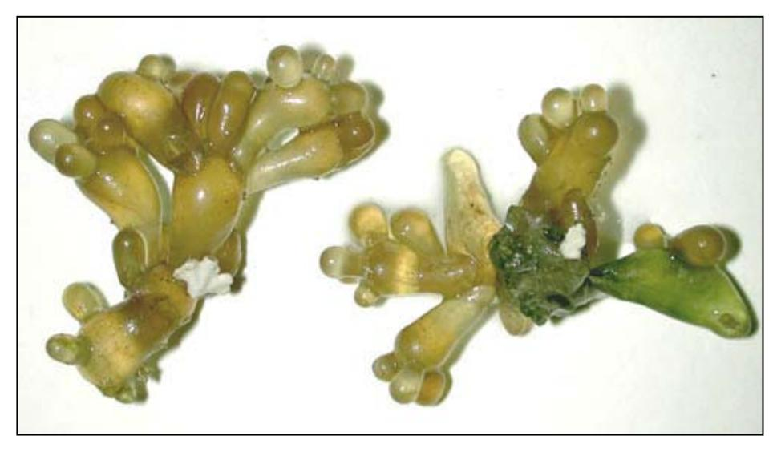

3cm tall.

**Distribution:** Tropical waters.

**Description:** This interesting alga is rarely collected due to its cryptic habitat. It is found in deeper waters to 5-10m depth. It is distinctive by its larger cells, compared to *V. aegagropila* and *V. fastigiata*, and it rarely forms large clumps. The alga is small to

#### *Ventricaria ventricosa*

CN: Sailorman's eyeball. SN: \*Limu paluni

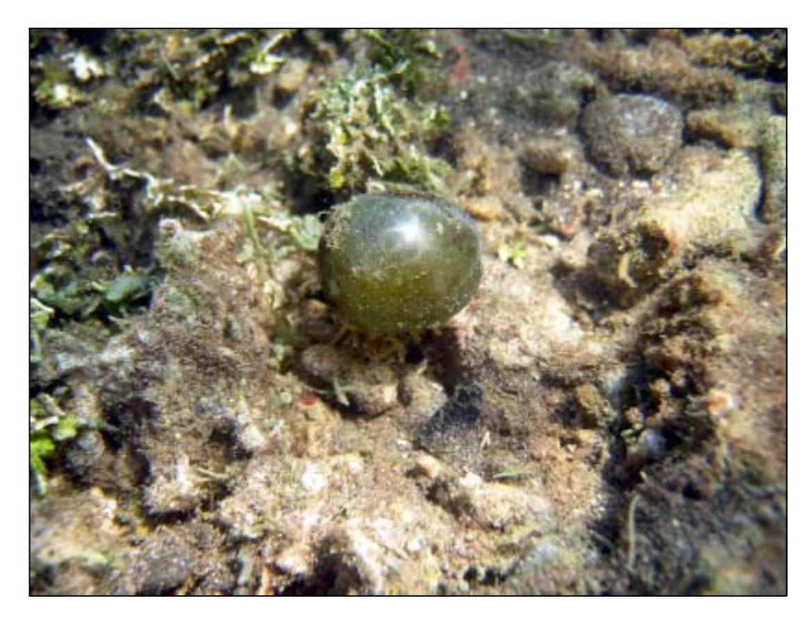

**Description:** This alga is easily identified by its balloon like structure. It is spherical to sub-spherical and filled with water, growing either solitary or in small clusters. The alga is attached by minute rhizoids at the base. It is found from the inter tidal to subtidal, usually wedged between crevices or on rocky substrata. The thallus size is variable and can attain over 10cm tall and 10cm wide.

**Remarks:** When sailors gazed into the clear tropical waters they were shocked to see what appeared to be an eyeball staring back at them; hence the name Sailorman's eyeball. This alga provides an ideal substratum for the red crustose coralline alga (*Hydrolithon farinosum*).

**Distribution:** In tropical waters.

### **CYANOPHYTA (blue-green algae)**

*Brachytrichia quoyi* (C. Agardh) Bornet & Flahault CN: Not known. SN: Limu ?taemoa.

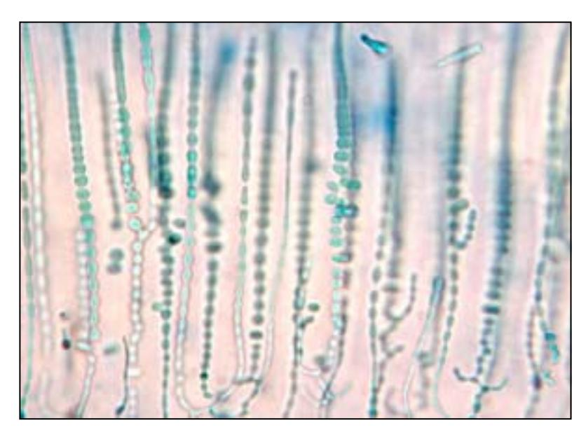

**Description:** Forming spongy cushions on volcanic rocks in wave splashed areas. The color is dark green when wet to black when dry. It often is hollow and can easily be plied off the rock. The rounded cells appear like a chain of beads with an elongated tail-like end. It has distinctive cells (heterocytes) that stained heavily with a dye.

**Remarks:** This unassuming alga is similar to the red

algal groups, having branched filaments. It is fairly common from the high inter tidal places. The given illustration is of a section made from an algal specimen and stained with aniline blue.

**Distribution:** Tropical to subtropical waters.

### *Symplocca hydnoides* (Harvey) Kützing

CN: Not known. SN: Limu

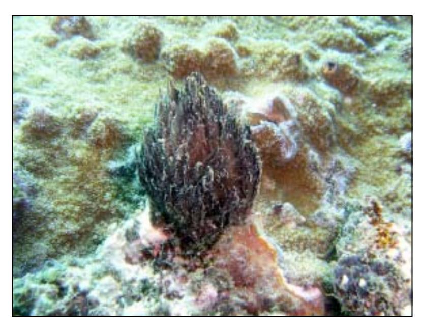

**Description:** This distinctive alga is stiff and bushy in appearance. It is brown to maroon color and usually with a wider mid-portion tapering towards the top. The thallus is 5-8cm tall. The small filaments are intertwined and are encassed in a mucilaginous sheath.

**Remarks:** This alga is very common and is often encountered during ecological surveys.

**Distribution:** Found in most seas.

#### **MAGNOLIOPHYTA (seagrasses)** *Halophila ovalis* (Brown) Hooker

CN: Paddle weed. SN: Limu foe

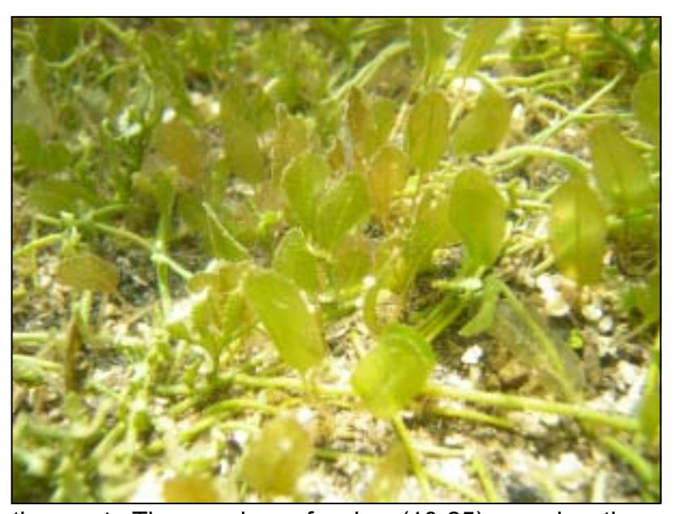

**Description:** This common seagrass is found in shallow waters, often exposed during low tides. It is very distinctive by its oval or paddle shape leaf. It has a distinctive rhizome (prostrate running stem) that is vital for its growth. It is attached by filamentous roots that bind loose sand and debris together. The erect portion is 5cm tall. This seagrass is similar to *Halophila minor* and they may have been incorrectly identified as *H. ovalis* in

the past. The number of veins (10-25) remains the only morphological character separating the two species. Whether this is a tenable character remains to be seen.

**Remarks:** One of the three species found in Samoa. **Distribution:** Tropical to subtropical Indo-Pacific waters.

*Halophila minor* (Zollinger) Hartog CN: Paddle weed. SN: Limu foe.

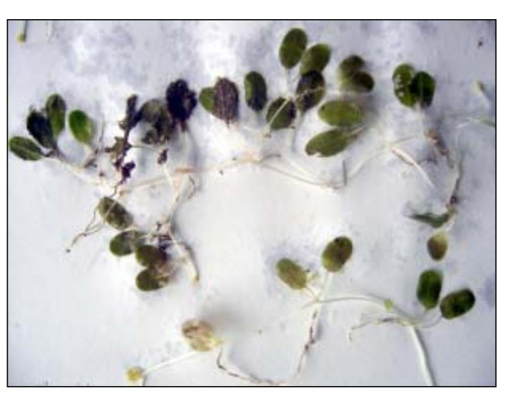

**Description:** Very similar to *Halophila ovalis*. The leaves are generally smaller, although it often overlaps with the leaf size of *H. ovalis.* As mentioned earlier, the two are currently separated by the number of cross veins with 8 or less in this species, compared to 10- 25 in *H. ovalis*. The erect part is 3cm tall.

**Remarks:** This species is less common.

**Distribution:** Indo-Pacific

waters.

### *3.2 Algae per Site*

Six-hundred and thirty-three specimens were analyzed comprising 239 species (Appendix 1). The majority of the flora belonged to the Rhodophyta with 133 taxa. Sixty Chlorophyta taxa were enumerated. The Phaeophyta comprised 29 taxa, and 27 Cyanophyta and only two species of seagrasses (Magnoliophyta) were found. Twenty-six sites were surveyed (Table 1).

Utulei Point had the highest number of species with 56 recorded (Table 2). The Fagatele Bay had the second highest with 50 species and Fagasa, Onososopo, Mafafa, Aua, Fagaalu and Nu'utele village were other sites with high diversity. The least diverse sites were the Dock 1 and Nu'usilaelae Island both with 8 species.

Table 2. Number of species found per site.

|    | Site                      | Species Number |
|----|---------------------------|----------------|
| 1  | Amalau Bay                | 14             |
| 2  | Vatia Bay                 | 16             |
| 3  | Utulei Point              | 56             |
| 4  | Dock 1                    | 8              |
| 5  | Onososopo                 | 31             |
| 6  | Fagatele Bay              | 50             |
| 7  | Fagasa                    | 44             |
| 8  | Leone                     | 10             |
| 9  | Leloaloa                  | 22             |
| 10 | Aua                       | 32             |
| 11 | Mafafa, Ofu Is.           | 36             |
| 12 | Sili Village, Olosega Is. | 15             |
| 13 | Fagatogo Reef             | 10             |
| 14 | Fatumafuti Reef           | 14             |
| 15 | Aoa Bay                   | 30             |
| 16 | Nu'uuli Reef              | 17             |
| 17 | Aunu'u Is.                | 13             |
| 18 | Fagaalu                   | 31             |
| 19 | Masefau bay               | 17             |
| 20 | Amanave                   | 17             |
| 21 | Nu'usilaelae Is.          | 8              |
| 22 | Fagamalo Reef             | 17             |
| 23 | Olosega Village           | 17             |
| 24 | Hurricane House           | 20             |
| 25 | Nu'utele Village          | 28             |
| 26 | Ofu village               | 11             |

## **4.0 DISCUSSION**

### *4.1 Floral diversity of American Samoa*

The term marine floral diversity encompasses the many plants that are found in the marine environment. Macro-floral diversity specifically targets species that can be seen without the use of lenses, microscopes or other devices. The marine flora includes algae, cyanophytes or cyanobacteria, diatoms and higher plants (e.g. mangroves and seagrasses). The surveys undertaken in American Samoa focused on five phyla, which are the often-encountered groups when marine ecological surveys are undertaken. It is estimated that close to a third of the taxa collected falls within the macro-flora criteria; although, this estimation may be conservative if one considers obvious algal communities that are composed of many small species.

The 239 species recorded from these surveys showed a fairly diverse flora for American Samoa. This so far probably comprised a 60% of the total flora, estimated at 400 species. An increase of more than 200% is seen from the surveys compared to that undertaken in the early 1920s (Setchell 1924), and the more recent surveys by Birkeland et al. (1987; 1995) – refer to Figure 1 and 2. This increase in the number of species is attributed to extensive sites surveyed, improved collecting techniques (e.g. the use of SCUBA) and improved taxonomy. Surveys of varying habitats from subtidal, inter tidal to salt spray have also yielded species not previously collected.

Figure 7. Graph showing the number of species per the four major algal groups during the surveys of William Setchell, Birkeland and others, and this study.

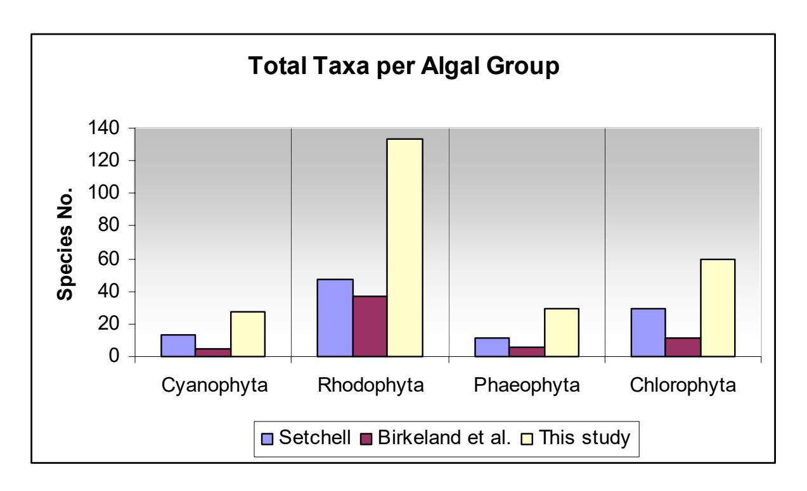

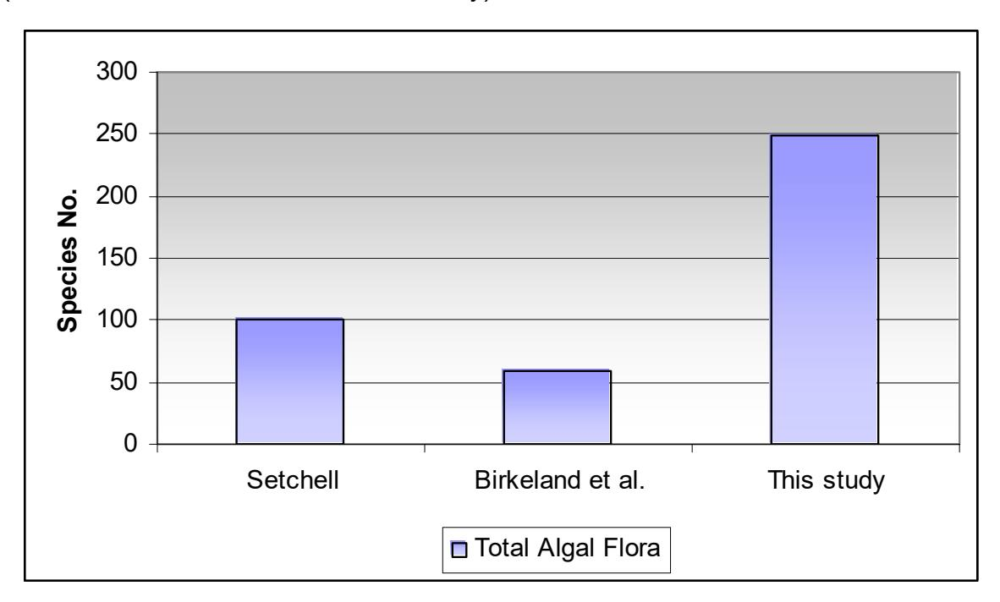

Figure 8. Graph showing the total number of taxa found in the past three studies (Setchell; Birkeland *et al.*, and this study).

## *4.2 Site and species diversity*

Utulei Point had the highest number of species (56) of the 26 sites surveyed (Table 2). The site is composed of an undulating reef flat, extending *ca.* 50m from the shoreline to the edge of the fringing reef. The substratum is of coral rubble, coarse sand and consolidated carbonate structure. Some volcanic rocks are also found. Some deeper pits (3-5m depth) with a fine sandy substratum are also found. Moreover, rubble banks, remnants of past cyclones occur. The fine sandy pits were dominated by soft-corals and *Halophila ovalis*. Utulei is located closer to the harbor entrance and with a moderate current flow. The current flow and the varied habitats, such as the vertical and walls with some slopes, reef flats and sandy pits may contribute to the high diversity. Industrial developments along the foreshore include the sewerage plant and fuel storage depot and these may contribute nutrients to the environment enhancing algal growth. Surface water run-off from the steep mountain slopes is another potential nutrient enhancement source.

The Fagatele National Marine Sanctuary bay provided the next highest diversity of algae, with 50 species recorded. This site is fairly pristine with very low human impact. The current flow is strong and the water is flushed from the bay daily. There are large scattered boulders and bommies throughout the site and a relatively short reef-flat. Waves pound on the cliffs along the edge of the bay, creating a unique algal community along the spray zone. With large volcanic rocks along the shoreline, small algal communities thrive on the leeward side. These varied conditions and microhabitats are ideal, supporting diverse algal communities.

The least diverse sites were Nu'usilaelae Island and the main Dock in the Pago Pago Harbor. Nu'usilaelae Island is located on the seaward side of the Ofu village reef-flat. It is an inhospitable place, where the waves pound higher than the volcanic mass and the water flow around it is treacherous. The low diversity of Nu'usilaelae is attributed to the limited and inadequate collection. The Dock site is fairly murky with green water. Visibility was about 2m. Collecting was confined to the pilings and rocks along the wharf. The low diversity of this site is most probably due to the poor condition of the waters.

The most widely abundant alga was *Dictyosphaeria versluysii* recorded from 70% of the sites. This alga is found in most habitats and is hardy; able to withstand being exposed during low tides as well as in extremely exposed places. Although it was recorded from 18 of the 26 sites, in reality this alga is probably found in all of the sites, except the Dock (site 4). *Gelidiopsis repens* was the next widely abundant alga recorded from 58% of the sites. This alga forms turf communities in subtidal places, although it is also abundant in the inter tidal zone. It can withstand strong water flow, as well as calm waters. Other commonly encountered algae include *Amphiroa foliacea, Bryopsis pennata, Cheilosporum spectabile* and *Chlorodesmis fastigiata*. One of the rarely encountered macroalgae is *Halymenia durvillei*, where it so far has only been recorded from sites within Pago Pago Harbor (Utulei and Fagatogo). *Acanthophora spicifera* is common throughout the Pacific Islands, but was only collected from one site (Nu'utele Island). This alga is regarded as a recent introduction to Hawaii, and has caused negative impacts to the native flora. In Fiji, it is known as *lumi wawa* and is one of about 10 seaweed species eaten there.

Utulei had a very high diversity of green, brown and red algae. However, Mafafa on Ofu Island had the greatest number of green algal species (22 spp). Fagatele Bay recorded the highest number of red algal species (31 spp), followed closely by Fagasa with 29 species and Utulei (27 spp). Two sites shared the highest diversity of brown algae both with six species each (Fagatele Bay and Ofu village). Utulei had the next highest diversity of brown algae with five species. Mafafa has a fairly short reef flat and a narrow treacherous channel.

Despite this high floral diversity, there remains a big need for further taxonomic (including monographic treatment) and ecological studies on particular groups such as the Cyanophyta and the Corallinales of the Rhodophyta. The taxonomy of Cyanophyta remains contentious and species from the tropical oceans are poorly studied. Researchers in tropical places continue to rely on results of studies undertaken in cold-water places. Although cyanophytes are known to be widespread or cosmopolitan in distribution, one is always dubious when stating that a particular species found in a 'hot' tide-pool is the same as that found in freezing cold waters. The treatment here is tentative and follows the latest work or compilation of works from around the Pacific and in other tropical places (Littler and Littler 2000, 2003; Tseng 1984). The Corallinales are an important group in coral reefs because of their varied roles. They provide food for many invertebrates and fishes; they consolidate the loose substratum such as rubble; they are good indicators of a healthy ecosystem; they complement the varied colors that are the hallmark of tropical coral reefs. The taxonomy of Corallinales is less contentious than that of Cyanophyta. However, special attention must be accorded when dealing with corallines, and one cannot simply hack them off the reef and put them in the collecting bag along with other fleshy algae. The colors are useful, but not accurate in their identification. The growing tips (along the margins) are important in identification and care must be taken that the growing margins are not damaged in their removal and transportation. Moreover, reproductive structures must be collected. This can be a challenge as the reproductive structures are usually small and difficult to see, except in a few species (eg. *Mastophora*), and corallines tend to prefer exposed habitats or places where the water movement is fast. In many of the sites surveyed, coralline algae were the most dominant algal group often the most abundant life-form along the substratum. It is highly recommended that a more concerted effort to fully identify and provide a good guide of the corallines of American Samoa be pursued. This should prove valuable to coral reef researchers undertaking monitoring in the islands.

### *4.3 Invasive species*

One of the purposes of these surveys was also to assess the flora for potential invasive or introduced species. American Samoa has been fortunate that algal studies had been undertaken in the Archipelago in the late 1800s and specifically on the island in 1920s. Hence, some baseline data are available for comparative purposes. The continuous marine plant surveys being undertaken by the author in neighboring Samoa islands further provide data useful in understanding the floral composition of American Samoa.

The majority of the new additions consist of minute epiphytic algae such as *Herposiphonia secunda, Griffithsia subcylindrica, Dictyopteris repens* and *Hypoglossum anomalum*. Some larger seaweeds are also found from these surveys including *Halymenia durvillei* (20 cm tall), *Caulerpa serrulata* (to 10 cm tall) and *Galaxaura filamentosa* (8 cm tall). There has been an increased abundance of *Halymenia durvillei* and *Caulerpa serrulata* at the Apia Harbor, Western Samoa (pers. obs.) and both algae were collected from Utulei site near the Harbor entrance. It is reasonable to assume that the two algae may have been introduced into Pago Pago Harbor from neighboring Apia Harbor. The frequent commuting between the harbors by fishing vessels, commercial ships and other boats may have led to this scenario. In saying this, however, it is paramount that more studies will need to be undertaken, including molecular work, to confirm this. *Galaxaura filamentosa* is a red alga that is often covered in fine silt, thus could have been easily overlooked. It was collected from all of the sites except the Docks; thus it is considered part of the native flora.

The green algae, *Tydemania expeditionis, Valonia macrophysa, Parvocaulis parvula, P. exigua, Sporocladopsis erythraea, Dictyosphaeria cavernosa, Codium mamillosum*  and *Boergesenia forbesii* are new records for American Samoa. With the exception of *Sporocladopsis erythraea* and *Codium mamillosum* all of the other Chlorophyta have been recorded from neighboring Western Samoa. The minute epiphytic alga, *Sporocladpsis erythraea* is a new record for the Archipelago and it certainly has a disjunct distribution. The alga is one of two known species of the genus that was described from the Red Sea by Nasr (1944). The other species *Sporocaldopsis novae-zealandiae* is found in New Zealand and Australia (Millar & Kraft 1994). The occurrence of this alga in the American Samoan flora is interesting, especially as it was epiphytic on the base of a *Sargassum anapense* an endemic brown alga to Samoa. Furthermore, the *Sargassum* and its host were collected from a site (Amalau) that is considered of low impact from potential invasives. This alga is probably not an introduced species, but may have been overlooked due to its small and inconspicuous status.

Of the six sites that are considered vulnerable to introduced species (Aua, Docks 1 & 2, Leloaloa, Onososopo and Utulei), the algal flora was found to be very similar to sites from less vulnerable places. Only one alga *Grateloupia filicina* was found to be an anomaly in the flora, although it has been reported from Fiji (South & Skelton 2004), Hawaii (Abbott 1999) and from French Polynesia (Payri & N'Yeurt 1997). This alga could be considered a recent introduction as it was only found at Dock 1 attached to a rope that was anchoring a landing craft. This is the first record of this species from the Archipelago.

### *4.4 Endemism*

There are only a few cases where endemic marine plants are known, and one such case is a green alga, *Avrainvillea rotumensis* recorded only from Rotuma Island, north of Fiji (N'Yeurt 1996). The isolation of Rotuma Island may have led to the endemic nature of this alga. Two American Samoan brown algae were described by Setchell in 1924, *Sargassum anapense* and *Sargassum fonanonensis* (named after the villages of Agape and Fogagogo, respectively), and have never been described elsewhere. Very similar plants were collected by the author in neighboring Samoa, and were found to conform to Setchell's plants. But these were also found to match two other species, *Sargassum crassifolium* and *Sargassum cristaefolium*, that are found throughout the Indo-Pacific waters. Whether the American Samoan plants are endemic remains to be seen, and can only be resolved with further studies and comparisons with materials from neighboring islands.

### *4.5 American Samoan flora versus other Pacific Islands*

The American Samoa flora conforms to the biogeography theory of decreasing diversity from the Indo-Pacific centre of biodiversity, as shown in Table 3. The high algal diversity for tropical Pacific regions can be found in northern part of Australia, Micronesia and Melanesia. The diversity gradually reduces going eastward to French Polynesia. The American Samoa flora (222 species from the three phyla) is richer compared to Cook Islands and Easter Islands. The French Polynesian flora shows a high diversity and this is attributed to a higher collecting effort by a resident phycologist. Seasonal variation of the French Polynesian flora as well as access to habitats that are often inhospitable may yield species that can be missed or overlooked during short surveys, such as this. The Palolo Deep Marine Reserve flora contains about 80% of the total number of species recorded from American Samoa. The Suva Barrier Reef, Fiji contains over 92% of the species number to that of the current flora. This indicates that there still is considerable scope for the American Samoa flora to increase the species diversity to a similar number to that of the French Polynesian flora. Personal communications with recent algal collectors from American Samoa, have indicated new additions to the flora including a possibly new species of *Ceramium* and a *Wrangelia anastomosans,* an alga so far only recorded from Micronesia (Peter Vroom pers. comm.). The epiphytes and other non-macro algal flora are inadequately treated and as much as 100 species are omitted.

Table 3. The flora of selected Pacific Island countries, based on the three algal phyla (Chlorophyta, Phaeophyta and Rhodophyta).

| Country                            | Chlorophyta | Phaeophyta | Rhodophyta | TOTAL |
|------------------------------------|-------------|------------|------------|-------|
| American Samoa                     | 60          | 29         | 133        | 222   |
| Australia (NSW & Lord Howe Is.) | 113         | 139        | 381        | 633   |
| Cook Islands                       | 29          | 9          | 29         | 67    |
| Easter Island                      | 30          | 28         | 76         | 134   |
| Fiji                               | 137         | 46         | 244        | 427   |
| Fiji (Suva Barrier Reef)           | 71          | 24         | 127        | 222   |
| French Polynesia                   | 96          | 42         | 170        | 308   |
| Micronesia                         | 185         | 56         | 275        | 516   |
| Nauru                              | 16          | 7          | 17         | 40    |
| New Caledonia                      | 130         | 59         | 147        | 336   |
| Norfolk Island                     | 41          | 41         | 154        | 236   |
| Phoenix Islands                    | 28          | 5          | 29         | 62    |
| Rotuma                             | 36          | 11         | 41         | 88    |
| Samoa (Palolo Deep)                | 24          | 12         | 88         | 124   |
| Samoan Archipelago                 | 77          | 41         | 178        | 296   |
| Solomon Islands                    | 71          | 27         | 121        | 219   |

Source: Skelton & South (2003).

### *4.6 Recommendations*

The diversity of the marine plants of American Samoa is better known through these biological surveys, and those made by previous workers. The following recommendations will help continue this excellent track of coral reef biodiversity surveys of American Samoa.

#### *Compilation of algal surveys*

A comprehensive compilation of all algal collections, literature and data specific to American Samoa needs to be undertaken. There have been many itinerant algal collectors and expeditions passing through the islands, who have taken specimens to their institutions or their personal herbaria. These collectors and expeditions need to be identified and a database designed to store them, so that future researchers are aware of previously undertaken work.

There are records of marine plants from the Archipelago being reported in the literature. Some of the literature is obscure and difficult to obtain, or may be found in personal libraries. A concerted effort to identify, copy and obtain these references is recommended, and that they be kept in places where local researchers can access them.

The need to have a dedicated database where the marine biodiversity is stored should be considered paramount. It is strongly urged that authorities consider building such a database using information that has been obtained in this and previous studies.

#### *Field guide to American Samoan marine plants*

This report illustrates 67 species of marine plants found during the surveys. This represents a small part of the overall flora of the islands. It is therefore recommended that consideration be given in developing a comprehensive field guide. The field guide should be in simple language, both in English and Samoan and it should have useful and interesting information capable of raising awareness of the importance of marine plants on coral reefs. Such a field guide would be useful in the tourism industry as well as an important reference for schools.

#### *Ecological monitoring*

American Samoa has been at the forefront of coral reef monitoring. The well-known transect undertaken by Alfred Major in the 1920s provides vital baseline information on the reef structure. Subsequent coral reef workers have used Major's transect to compare the health of the reef in the 1920s with that of today. Marine plants are an important part of the coral reef ecosystem. They are often the dominant organisms as seen from Fagatele National Marine Sanctuary. Through this survey, the data on marine plants should be useful when ecological surveys are undertaken. It is important for ecologists and coral reef monitors to start monitoring the dominant species, rather than life-form categories.

#### *Expert studies of problematic groups*

Coralline algae and cyanophytes are important marine plants in American Samoa, with the former contributing to reef structure and stability, and the latter important indicators of eutropihication, and also functioning as nitrogen-fixers. Because of limited time, these two groups have not been thoroughly treated here. Their taxonomy, in particular the latter group, remains controversial. A detailed treatment of these two groups is recommended.

#### *Eutrophication*

With increasing industrial and residential development and settlement of coastal areas, it is expected that sediment and run-off will leach towards the sea. The steep landscape of American Samoa means that surface water run-off is a lot faster than on more gently-sloping coastlines. Pollutants, rubbish and nutrients are also washed to the sea where they can have a serious impact on the marine life. Algal blooms will increase with high nutrients in the environment. Diminishing diversity of corals and other marine animals is expected. It is recommended that appropriate measures be undertaken to safeguard the marine environment. Coupled with these measures is the need to undertaken research in algal population and algal physiology.

#### *Invasive species*

Effective and continuous monitoring is needed to detect and weed out potential invasive species. This may mean establishing monitoring sites in places where invasive species are likely to be found, such as the inner Pago Pago harbor. Although only a few relatively less invasive introduced species were found, the consequences of an outbreak by an invader can easily threaten the integrity of the marine environment and the livelihood of the people. Measures must be taken, including developing appropriate legislation, technology and monitoring regime to keep abreast of invasive species.

#### *Marine plants for food*

Marine plants, especially algae, provide an excellent source of food. Only two species are commonly eaten in Samoa, although there are probably over 10 seaweed species that can be eaten. A recipe book on seaweeds, published by the Secretariat of the Pacific Community (SPC) and the Marine Studies Programme (USP), should be encouraged to promote the consumption of seaweeds by the local people. The book may need to be translated into the Samoan language to allow for wider audience participation.

#### *Surveys of other sites*

There is a need for marine plant surveys of Tau Island, and Swains and Rose atolls, as these sites were not surveyed. Other sites on Tutuila, Ofu, Aunu'u, Olosega islands need to be revisited so that all subtidal and high inter tidal sites are surveyed. This will include surveys of mangroves and brackish water habitats.

## **5.0 GLOSSARY**

Anastomosing – running together and fusing in such a way that the connections form a reticulation.

Arcuate – curved or bowed.

Carpogonium – the female sex organ in the red algae.

Carposporophyte – a phase of the life history of a red alga, arising directly or indirectly from the carpogonium and borne on the female gametophyte. At maturity carpospores are produced.

Complanate – strongly flattened and more or less expanded.

Compressed – somewhat flattened.

Dichotomous – forked, with branches more or less of equal size.

Discoid – in a form of a disc.

Distichous - Arranged in two rows on opposite sides of a stem and thus in the same plane.

Flabellate – shaped like a fan.

Flabelloid – fan-like.

Flagellated – provided with a flagellum.

Flagellum – a whip-like part of a motile cell that assists it to move.

Gametophyte – this is the sexual generation of an alga, which is usually represented by a male plant and a female plant.

Membranous – thin and flat, like a membrane.

Midrib – a vein or rib-like structure running up the middle of a blade.

Moniliform – in the form of a string of beads.

Monopodial – a method of branching (see Figure 5).

Mucronate – ending abruptly in a sharp point .

Palmate – diverging in the manner of the fingers from the palm of the hand.

Pinnate – having branches in a rank on either side of the axis (see Figure 5).

Rhizoid – a unicellular or uniseriate root-like filament serving for attachment.

Segmented – divided into segments or joints; articulated.

Segments – the portions of divisions of a thallus between points of branching; or specifically in articulated corallines, the calcified portions (intergenicula) between the articulations.

Siphonous – having siphons.

Solitary – consisting of only one; each one separate by itself.

Spermatia – the non-motile male gametes of the red algae.

Sporophyte – the asexual generation of an alga.

Stipe – stem-like part of a thallus beneath an erect blade.

Stolon - a horizontal branch from the base of plant that produces new plants from buds at its tips

Sympodial – a method of branching (see Figure 5g).

Terete – circular in transverse section.

Tetrasporangium (plural = tetrasporangia) – an asexual reproductive structure in the red algae in which the divisions produce four spores.

Thallus (plural = thalli) – the entire plant body of an alga.

Verticillate – whorled.

## **6.0 REFERENCES**

Abbott, I.A. 1999. *Marine red algae of the Hawaiian Islands*. Bishop Museum Press Honolulu, Hawaii. xv + 477 pp.

Birkeland, C.E., Randall, R.H., Green, A.L., Smith, B., & Wilkins, S. 1995. Changes in the Coral Reef Communities of Fagatele Bay National Marine Sanctuary and Tutuila Island (American Samoa) over the last two decades. *Report to the National Oceanic and Atmospheric Administration. U.S. Department of Commerce*.

Birkeland, C.E., Randall, R.H., Wass, R.C., Smith, B., & Wilkins, S. 1987. Biological Resource Assessment of the Fagatele Bay National Marine Sanctuary. *NOAA Technical Memorandum NOS MEMD 3*. Washington D.C.

Coles, S.L., Reath, P.R., Skelton, P.A., & Bonito, V. 2003. *Introduced marine species in Pago Pago Harbor, Fagatele Bay and the National Park Coast, American Samoa.* Bernice Pauahi Bishop Museum. Honolulu, Hawaii. v + 86.

Coppejans, E., & Prud'homme van Reine, W.F. 1989. Seaweeds of the Snellius-II Expedition. Chlorophyta: Caulerpales (except *Caulerpa* and *Halimeda*). *Blumea* **34**: 119-142.

Dawes, C.J. 1981. *Marine Botany*. John Wiley & Sons. Canada. x + 628.

Dawson, E.Y. 1956. *How to know the Seaweeds*. WM. C. Brown Company. Iowa, USA. 1-197.

Dahl, A.L. 1971. Ecological Report on Tutuila, American Samoa. Smithsonian Institution, Washington D.C. 13 p.

Hayden, H.S., Blomster, J., Maggs, A.C., Silva, P.C., Stanhope, M.J., & Waaland, J.R. 2003. Linnaeus was right all along: *Ulva* and *Enteromorpha* are not distinct genera. *European Journal of Phycology* **38**: 227-294.

Hunter, C.L., Friedlander, A., Magruder, W.H., & Meier, K.Z. 1993. *Ofu Reef Survey – Baseline Assessment and Recommendations for Long-Term Monitoring of the Proposed National Park, Ofu, American Samoa.* University of Hawaii Sea Grant Extension Service. Final Report to the National Park Service, Pagopago American Samoa. 3 December 1993.

Littler, D.S., & Littler, M.M. 2000. *Caribbean Reef Plants*. Offshore Graphics, Inc. Washington. 1-542.

Littler, D.S., & Littler, M.M. 2003. *South Pacific Reef Plants. A divers guide to the plant life of South Pacific coral reefs.* Offshore Graphics, Inc. Washington. 1-331.

Littler, M.M., Littler, D.S., Blair, S.M., & Norris, J.N. 1985. Deepest known plant life discovered on an uncharted seamount off San Salvador Island, Bahamas: distribution, abundance, and primary productivity. *Deep-Sea Research* **33**: 882-892.

Nasr, A.H. 1944. Some new algae from the Red Sea. Bulletin de l'Institut d'Égypte 26: 31-42.

N'Yeurt, A.D.R. 1996. A preliminary floristic survey of the benthic marine algae of Rotuma Island. *Australian Systematic Botany* **9**: 361-490.

Payri, C.E. & N'Yeurt, A.D.R. 1997. A revised checklist of Polynesian benthic marine algae. *Australian Systematic Botany* **10:** 867-910.

Pratt, G. 1876. *Pratt's grammar and dictionary of the Samoan Language*. (reprinted 1956) Malua Press, Samoan Church (L.M.S.) Western Samoa. I. On the parts of speech 1-131. Samoan and English Vocabulary 1-304. English and Samoan Vocabulary 1-158.

Setchell, W.A. 1924. American Samoa: Part I. Vegetation of Tutuila Island. Part II. Ethnobotany of the Samoans. Part III. Vegetation of Rose Atoll. *Publications of the Carnegie Institution of Washington* **341**: vi + 275.

Skelton, P.A. 2002. *Algae Survey Report*. Prepared for the Introduced Marine Species Survey in Pago Pago Harbor, American Samoa. Townsville, Australia. 1-11.

Skelton, P.A., & South, G.R. 1999. A preliminary checklist of the benthic marine algae of the Samoan Archipelago. The University of the South Pacific. Marine Studies Programme Technical Report 99/1: 1-30.

Skelton, P.A., & South, G.R. 2002. Mangrove-associated algae from Samoa, South Pacific. *Constancea* **83**: http://128.32.109.44/fest\_mangrove/skelton\_south.html (Nov. 15, 2002)

Skelton, P.A. & South, G.R. 2003. Marine algal biodiversity of the Pacific Islands – status report. (Abstract) presented at the Pacific Science Congress, Bangkok, Thailand.

South, G.R. 1993. Edible seaweeds of Fiji: An ethnobotanical study. *Botanica Marina* **36**: 335-349.

South, G.R. & Skelton, P.A. 2004. Catalogue of the marine benthic algae of Fiji Islands, South Pacific. *Australian Systematic Botany* **16**: 1-60.

South, G.R. & Whittick, A. 1987. *Introduction to Phycology*. Blackwell Science. Oxford, UK. viii + 341.

Tseng, C.K. 1984. (ed). *Common Seaweeds of China.* Science Press Beijing. Kugler Publications. x + 316 pp.

Womersley, H.B.S. 1998. *The Marine Benthic Flora of Southern Australia. Part III C. Ceramiales – Ceramiaceae, Dasyaceae.* State Herbarium of South Australia. Graphic Print Group, Richmond, South Australia. 535 pp. 235 figs.

Zemke-White, W.L., & Ohno, M. 1999. World seaweed utilisation: An end-of-century summary. *Journal of Applied Phycology* **11**: 369-376.

## **APPENDIX 1. American Samoa marine plants log.**

| S # A | Ge nu s                              | Sp ies ec                                 | S / i te Lo l i ty ca | Co l l Da te                            | Co l le to c r       |
|-------------|--------------------------------------------|-------------------------------------------------|-----------------------------------------------|-----------------------------------------------------|-------------------------------------|
| 1           | Fe l dm ia an n             | in d ica                                  | Am lau Ba a y                     | 1 6- Oc be 2 0 0 2 to r- | P. A. S ke l to n |
| 2           | C la do ho p ra             | f. l im ico la c                 | Am lau Ba a y                     | Oc 1 6- to be 2 0 0 2 r- | S P. A. ke l to n |
| 3           | Ly by ng a                        | fe i de co n rv o s        | Am lau Ba a y                     | 1 6- Oc to be 2 0 0 2 r- | P. A. S ke l to n |
| 4           | Ga lax au ra                      | f i lam to en sa                 | Am lau Ba a y                     | 1 6- Oc to be 2 0 0 2 r- | P. A. S ke l to n |
| 5           | Sp la do is or oc p s | hr t er ae a y                   | Am lau Ba a y                     | 1 6- Oc be 2 0 0 2 to r- | P. A. S ke l to n |
| 6           | Sa rg as su m                  | an ap en se                            | Am lau Ba a y                     | Oc 1 6- to be 2 0 0 2 r- | S P. A. ke l to n |
| 7           | Ge l i d ium                   | f. p i l lum c us                | Am lau Ba a y                     | 1 6- Oc to be 2 0 0 2 r- | P. A. S ke l to n |
| 8           | La ia ur en c                  | i d i f ica n                    | Am lau Ba a y                     | 1 6- Oc be 2 0 0 2 to r- | P. A. S ke l to n |
| 9           | Ge l i d ie l la         | ac er os a                             | Am lau Ba a y                     | 1 6- Oc be 2 0 0 2 to r- | P. A. S ke l to n |
| 1 0      | Ja ia n                              | i la p um                              | Am lau Ba a y                     | Oc 1 6- to be 2 0 0 2 r- | S P. A. ke l to n |
| 1 0 b | C ho re on em a             | t hu t t i i re               | Am lau Ba a y                     | 1 6- Oc to be 2 0 0 2 r- | P. A. S ke l to n |
| 1 1      | M ia te ar ns                  | fra i l is g                        | Am lau Ba a y                     | 1 6- Oc be 2 0 0 2 to r- | P. A. S ke l to n |
| 1 2      | Co lo t hr ix e             | irr lar is eg u                     | Am lau Ba a y                     | 1 6- Oc be 2 0 0 2 to r- | P. A. S ke l to n |
| 1 3      | Lo bo ho p ra                  | ieg ta va r a                       | Am lau Ba a y                     | Oc 1 6- to be 2 0 0 2 r- | P. A. S ke l to n |
| 1 4      | As is p ar ag op s       | tax i fo is rm                      | Va t ia Ba y                      | 1 6- Oc to be 2 0 0 2 r- | P. M Re t h a        |
| 1 5      | P ho i d ium rm             | f. lay c sa ne ns e           | Va ia Ba t y                      | 1 6- Oc be 2 0 0 2 to r- | Te am                            |
| 1 6      | Ge l i d iop is s        | re p en s                              | Va t ia Ba y                      | 1 6- Oc 2 0 0 2 to be r- | Te am                            |
| 1 7      | Ba l l ie l la              | re p en s                              | Va t ia Ba y                      | 1 6- Oc to be 2 0 0 2 r- | Te am                            |
| 1 8      | Ce ium ra m                       | f. ha l len c m ar s se | Va t ia Ba y                      | 1 6- Oc to be 2 0 0 2 r- | Te am                            |
| 1 9      | C ho dr hy n op cu s  | f. isa c su cc                      | Va ia Ba t y                      | 1 6- Oc be 2 0 0 2 to r- | Te am                            |
| 2 0      | Ha l im da e                   | i l is g ra c                    | Va t ia Ba y                      | Oc 1 6- to be 2 0 0 2 r- | Te am                            |
| 2 1      | Ha l im da e                   | l l ' sm a                          | Va t ia Ba y                      | 1 6- Oc to be 2 0 0 2 r- | Te am                            |
| 2 2      | Am h iro p a                   | fo l ia ce a                        | Va t ia Ba y                      | 1 6- Oc to be 2 0 0 2 r- | Te am                            |
| 2 3      | Da sy a                              | to an as m os an s            | Va ia Ba t y                      | 1 6- Oc be 2 0 0 2 to r- | Te am                            |
| 2 4      | He te ip ho ia ro s n | isp l la cr e                       | Va t ia Ba y                      | Oc 1 6- to be 2 0 0 2 r- | Te am                            |
| 2 5      | He ip ho ia rp os n      | de l ica tu la                      | Va t ia Ba y                      | 1 6- Oc to be 2 0 0 2 r- | Te am                            |
| 2 5 b | An i ha ion t t m n   | de ip ien c s                       | Va ia Ba t y                      | 1 6- Oc be 2 0 0 2 to r- | Te am                            |
| 2 6      | Va lon ia                            | f. i la c ae g ag ro p  | Va ia Ba t y                      | 1 6- Oc be 2 0 0 2 to r- | Te am                            |

| 2 7 | Co l ine lg ra a ae          | iou va r s                                       | Va t ia Ba y            | Oc 1 6- to be 2 0 0 2 r- | Te am                            |
|--------|------------------------------------------------|-----------------------------------------------------------|-------------------------------------|-----------------------------------------------------|-------------------------------------|
| 2 8 | D ic ty te is op r           | re p en s                                        | Va t ia Ba y            | 1 6- Oc to be 2 0 0 2 r- | Te am                            |
| 2 9 | Pe i la ss on ne y           | f. de l ica ta c                           | Va ia Ba t y            | 1 6- Oc be 2 0 0 2 to r- | Te am                            |
| 3 0 | Ha ly ia m en                      | du i l le i rv                             | U le i Po in tu t | 1 3- Oc be 2 0 0 2 to r- | P. A. S ke l to n |
| 3 1 | Ca ler u p a                       | la ta se rru                                     | U tu le i Po in t | Oc 1 3- to be 2 0 0 2 r- | S P. A. ke l to n |
| 3 2 | Ha l im da e                       | t ia op un                                       | U tu le i Po in t | 1 3- Oc to be 2 0 0 2 r- | P. A. S ke l to n |
| 3 3 | D ic ty ta o                       | fr ia b i l is                             | U le i Po in tu t | 1 3- Oc be 2 0 0 2 to r- | P. A. S ke l to n |
| 3 4 | Gr f f i i t hs ia        | sp                                                        | U le i Po in tu t | 1 3- Oc be 2 0 0 2 to r- | P. A. S ke l to n |
| 3 5 | Ca ler u p a                       | l ta ta p e                                   | U tu le i Po in t | Oc 1 3- to be 2 0 0 2 r- | P. A. S ke l to n |
| 3 6 | Ge l i d ium                       | f. in sa m oe ns e m us           | U tu le i Po in t | 1 3- Oc to be 2 0 0 2 r- | P. A. S ke l to n |
| 3 7 | Lo ia ta m en r                 | l l ico la co ra                           | U le i Po in tu t | 1 3- Oc be 2 0 0 2 to r- | P. A. S ke l to n |
| 3 8 | Ac ta bu lar ia e               | ig ex ua                                            | U tu le i Po in t | 1 3- Oc 2 0 0 2 to be r- | S P. A. ke l to n |
| 3 9 | Ca ler u p a                       | l ta ta ra ce m os a v. p e | U tu le i Po in t | 1 3- Oc to be 2 0 0 2 r- | P. A. S ke l to n |
| 4 0 | Ha lop h i la                      | l is ov a                                        | U tu le i Po in t | 1 3- Oc to be 2 0 0 2 r- | P. A. S ke l to n |
| 4 1 | D ic ty ha ia os p er     | luy i i ve rs s                            | U le i Po in tu t | 1 3- Oc be 2 0 0 2 to r- | P. A. S ke l to n |
| 4 2 | Bo d le o a                        | ta i m on g ne                             | U tu le i Po in t | Oc 1 3- to be 2 0 0 2 r- | S P. A. ke l to n |
| 4 3 | Va lon ia                                | fa t ig ia ta s                            | U tu le i Po in t | 1 3- Oc to be 2 0 0 2 r- | P. A. S ke l to n |
| 4 4 | Hy p ne a                             | sp                                                        | U tu le i Po in t | 1 3- Oc to be 2 0 0 2 r- | P. A. S ke l to n |
|        | Ne ip ho ia os n                |                                                           |                                     |                                                     |                                     |
| 4 5 | ( Po ly ip ho ia ) s n | ha sp er oc ar p a                      | U tu le i Po in t | Oc 1 3- to be 2 0 0 2 r- | S P. A. ke l to n |
| 4 6 | Ga lax au ra                          | in ta m ar g a                             | U tu le i Po in t | 1 3- Oc to be 2 0 0 2 r- | Te am                            |
| 4 7 | Pe l ia y ss on ne           | f. f la c ve sc en s                 | U tu le i Po in t | 1 3- Oc to be 2 0 0 2 r- | Te am                            |
| 4 8 | Pe l ia y ss on ne           | f. in c am oe na                           | U le i Po in tu t | 1 3- Oc be 2 0 0 2 to r- | Te am                            |
| 4 9 | Ac t in tr ic h ia o      | fra i l is g                                  | U tu le i Po in t | Oc 1 3- to be 2 0 0 2 r- | Te am                            |
| 5 0 | Ge l i d iop is s            | re p en s                                        | U tu le i Po in t | 1 3- Oc to be 2 0 0 2 r- | Te am                            |
| 5 1 | Am h iro p a                       | fo l ia ce a                                  | U le i Po in tu t | 1 3- Oc be 2 0 0 2 to r- | Te am                            |
| 2 5 | Am h iro p a                       | sp                                                        | U tu le i Po in t | 1 3- Oc 2 0 0 2 to be r- | Te am                            |
| 5 3 | C he i los p or um           | ta b i le sp ec                            | U tu le i Po in t | Oc 1 3- to be 2 0 0 2 r- | Te am                            |
| 5 4 | Hy los p og su m                | lum an om a                                      | U tu le i Po in t | 1 3- Oc to be 2 0 0 2 r- | Te am                            |
| 5 5 | D ic is ty te op r           | re p en s                                        | U le i Po in tu t | 1 3- Oc be 2 0 0 2 to r- | Te am                            |
| 5 6 | He ip ho ia rp os n          | sp                                                        | U tu le i Po in t | Oc 1 3- to be 2 0 0 2 r- | Te am                            |
| 5 7 | P ho i d ium rm                 | sp                                                        | U tu le i Po in t | 1 3- Oc to be 2 0 0 2 r- | Te am                            |
| 5 8 | Ly by ng a                            | sp                                                        | U tu le i Po in t | 1 3- Oc to be 2 0 0 2 r- | Te am                            |
| 9 5 | R h izo lon ium c               | fr ica a nu m                                 | Do k 1 c                   | 1 Oc be 2 0 0 2 5- to r- | P. A. S ke l to n |

| 6 0 | Er t hr tr ic h ia y o           | sp                                                            | Do k 1 c             | 1 5- Oc to be 2 0 0 2 r- | P. A. S ke l to n |
|--------|----------------------------------------------------------|---------------------------------------------------------------|-------------------------------|-----------------------------------------------------|-------------------------------------|
| 6 1 | En ha te ro m or p                     | sp                                                            | Do k 1 c             | 1 5- Oc be 2 0 0 2 to r- | P. A. S ke l to n |
| 6 2 | Gr te lo ia a up                          | f. f i l ic in c a                       | Do k 1 c             | Oc 1 5- to be 2 0 0 2 r- | S P. A. ke l to n |
| 6 3 | An t i t ha ion l la m n e | br ira ev m os a                               | Do k 1 c             | 1 5- Oc to be 2 0 0 2 r- | P. A. S ke l to n |
| 6 4 | Ce tro n ce ra s                          | la la tu c vu m                                | Do k 1 c             | 1 5- Oc to be 2 0 0 2 r- | P. A. S ke l to n |
| 6 5 | Ja ia n                                            | d ha a er en s                                 | Do k 1 c             | 1 Oc be 2 0 0 2 5- to r- | P. A. S ke l to n |
| 6 6 | Os i l la to ia c r                 | sp                                                            | Do k 1 c             | Oc 1 5- to be 2 0 0 2 r- | S P. A. ke l to n |
| 6 7 | D ic ty ha ia os p er               | f. c ca ve rn os a                          | O no so so p o | 1 2- Oc to be 2 0 0 2 r- | P. A. S ke l to n |
| 6 8 | Ge l i d iop is s                      | re p en s                                            | O no so so p o | 1 2- Oc be 2 0 0 2 to r- | P. A. S ke l to n |
| 6 9 | Br is y op s                                 | ta p en na                                           | O no so so p o | 1 2- Oc be 2 0 0 2 to r- | P. A. S ke l to n |
| 7 0 | Ce ium ra m                                     | f la i du cc m                                 | O no so so p o | Oc 1 2- to be 2 0 0 2 r- | S P. A. ke l to n |
| 7 1 | C la do ho p ra                           | sp                                                            | O no so so p o | 1 2- Oc to be 2 0 0 2 r- | P. A. S ke l to n |
| 7 2 | An i ha ion l la t t m n e | sp                                                            | O no so so p o | 1 2- Oc be 2 0 0 2 to r- | P. A. S ke l to n |
| 3 7 | Ly by ng a                                      | sp                                                            | O no so so p o | 1 2- Oc be 2 0 0 2 to r- | P. A. S ke l to n |
|        | Ne ip ho ia os n                          |                                                               |                               |                                                     |                                     |
| 7 4 | ( ) Po ly ip ho ia s n           | sp ar sa                                                | O no so so p o | Oc 1 2- to be 2 0 0 2 r- | S P. A. ke l to n |
| 7 5 | Lo ta ia m en r                           | l l ico la co ra                               | O no so so p o | 1 2- Oc to be 2 0 0 2 r- | P. A. S ke l to n |
| 7 6 | Ja ia n                                            | d ha a er en s                                 | O no so so p o | 1 2- Oc to be 2 0 0 2 r- | P. A. S ke l to n |
| 7 7 | Ce ium ra m                                     | i len tu m ac m                                | O no so so p o | 1 2- Oc be 2 0 0 2 to r- | P. A. S ke l to n |
| 7 8 | C ho dr ia n                                 | in tu la m u                                      | O no so so p o | Oc 1 2- to be 2 0 0 2 r- | S P. A. ke l to n |
| 7 9 | Bo try la d ia oc                         | sp                                                            | Le loa loa              | 1 7- Oc to be 2 0 0 2 r- | P. A. S ke l to n |
| 8 0 | Am h iro p a                                 | sp                                                            | Le loa loa              | 1 7- Oc be 2 0 0 2 to r- | P. A. S ke l to n |
| 8 1 | C la do ho is p ro p s           | he t ica rp es                                    | Le loa loa              | 1 Oc be 2 0 0 2 7- to r- | P. A. S ke l to n |
| 8 2 | Ag la t ha ion o m n                | sp                                                            | Le loa loa              | Oc 1 7- to be 2 0 0 2 r- | S P. A. ke l to n |
| 8 3 | Ge l i d ium                                 | f. p i l lum c us                              | O no so so p o | 1 2- Oc to be 2 0 0 2 r- | P. A. S ke l to n |
| 8 4 | Hy p ne a                                       | in l la sp e                                      | O no so so p o | 1 2- Oc be 2 0 0 2 to r- | P. A. S ke l to n |
| 8 5 | Ha l im da e                                 | i l is g ra c                                  | Le loa loa              | Oc 1 7- to be 2 0 0 2 r- | S P. A. ke l to n |
| 8 6 | Pe l ia y ss on ne                     | in am oe na                                          | Le loa loa              | 1 7- Oc to be 2 0 0 2 r- | P. A. S ke l to n |
| 8 7 | D ic ty ha ia os p er               | luy i i ve rs s                                | O no so so p o | 1 2- Oc to be 2 0 0 2 r- | P. A. S ke l to n |
| 8 8 | Hy p ne a                                       | p an no sa                                           | O no so so p o | 1 2- Oc be 2 0 0 2 to r- | P. A. S ke l to n |
| 8 9 | C ho dr ia n                                 | sp                                                            | O no so so p o | Oc 1 2- to be 2 0 0 2 r- | S P. A. ke l to n |
| 9 0 | Ly by ng a                                      | l ig h t ( b lu /g ) e re en | O no so so p o | 1 2- Oc to be 2 0 0 2 r- | P. A. S ke l to n |
| 9 1 | Ly by ng a                                      | da k ( b lu /g ) r e re en      | O no so so p o | 1 2- Oc be 2 0 0 2 to r- | P. A. S ke l to n |
| 9 2 | C he i los p or um                     | t i lo bu ac u m                            | O no so so p o | 1 2- Oc be 2 0 0 2 to r- | P. A. S ke l to n |

| 9 3      | Ja ia n                           | sp                                               | O no so so p o       | Oc 1 2- to be 2 0 0 2 r- | P. A. S ke l to n |
|-------------|-----------------------------------------|--------------------------------------------------|-------------------------------------|-----------------------------------------------------|-------------------------------------|
| 9 4      | Ge l i d ium                | sp                                               | O no so so p o       | 1 2- Oc to be 2 0 0 2 r- | P. A. S ke l to n |
| 9 5      | C h lor de is o sm    | fa ig ia t ta s                   | O no so so p o       | 1 2- Oc be 2 0 0 2 to r- | P. A. S ke l to n |
| 9 6      | Ca ler u p a                | l ta ta p e                          | O no so so p o       | 1 2- Oc 2 0 0 2 to be r- | S P. A. ke l to n |
| 9 7      | Br is y op s                | ta p en na                              | O no so so p o       | 1 2- Oc to be 2 0 0 2 r- | P. A. S ke l to n |
| 9 8      | Ge l i d iop is s     | re p en s                               | O no so so p o       | 1 2- Oc to be 2 0 0 2 r- | P. A. S ke l to n |
| 9 9      | He ip ho ia rp os n   | da f. l la te se cu n ne | U le i Po in tu t | 1 3- Oc be 2 0 0 2 to r- | P. A. S ke l to n |
| 1 0 0 | Gr f f i i t hs ia | bc l in dr ica su y            | U tu le i Po in t | 1 3- Oc 2 0 0 2 to be r- | S P. A. ke l to n |
| 1 0 1 | Ca ler u p a                | la ta se rru                            | U tu le i Po in t | 1 3- Oc to be 2 0 0 2 r- | P. A. S ke l to n |
| 1 0 2 | Bo d le o a                 | ta i m on g ne                    | U tu le i Po in t | 1 3- Oc to be 2 0 0 2 r- | P. A. S ke l to n |
| 1 0 3 | P ho i d ium rm          | sp                                               | U le i Po in tu t | 1 3- Oc be 2 0 0 2 to r- | P. A. S ke l to n |
| 1 0 4 | En te ha ro m or p    | ? in te t ina l is s        | 2 Do k c                   | 1 Oc 2 0 0 2 5- to be r- | S P. A. ke l to n |
| 1 0 5 | Ha ly ia m en               | du i l le i rv                    | U tu le i Po in t | 1 3- Oc to be 2 0 0 2 r- | P. A. S ke l to n |
| 1 0 6 | Ha l im da e                | t ia op un                              | U tu le i Po in t | 1 3- Oc to be 2 0 0 2 r- | P. A. S ke l to n |
| 1 0 7 | Ca ler u p a                | la ta se rru                            | U le i Po in tu t | 1 3- Oc be 2 0 0 2 to r- | P. A. S ke l to n |
| 1 0 8 | Ve tr ica ia n r         | tr ico ve n sa                       | U tu le i Po in t | Oc 1 3- to be 2 0 0 2 r- | S P. A. ke l to n |
| 1 0 9 | En te ha ro m or p    | sp                                               | U tu le i Po in t | 1 3- Oc to be 2 0 0 2 r- | P. A. S ke l to n |
| 1 1 0 | Ge l i d iop is s     | in tr ica ta                            | U tu le i Po in t | 1 3- Oc to be 2 0 0 2 r- | P. A. S ke l to n |
| 1 1 1 | C la do ho p ra          | sp                                               | U le i Po in tu t | 1 3- Oc be 2 0 0 2 to r- | P. A. S ke l to n |
| 1 1 2 | Va lon ia                         | fa t ig ia ta s                   | U tu le i Po in t | Oc 1 3- to be 2 0 0 2 r- | S P. A. ke l to n |
| 1 1 3 | Hy p ne a                      | p an no sa                              | U tu le i Po in t | 1 3- Oc to be 2 0 0 2 r- | P. A. S ke l to n |
| 1 1 4 | Ge l i d ium                | sp                                               | U le i Po in tu t | 1 3- Oc be 2 0 0 2 to r- | P. A. S ke l to n |
| 1 1 5 | Ac ta bu lar ia e        | la p ar vu                              | U tu le i Po in t | Oc 1 3- to be 2 0 0 2 r- | S P. A. ke l to n |
| 1 1 6 | C la do ho p ra          | sp                                               | U tu le i Po in t | Oc 1 3- to be 2 0 0 2 r- | S P. A. ke l to n |
| 1 1 7 | Lo bo ho p ra               | ieg ta va r a                        | U tu le i Po in t | 1 3- Oc to be 2 0 0 2 r- | P. A. S ke l to n |
| 1 1 8 | D ic ty ta o                | fr ia b i l is                    | U le i Po in tu t | 1 3- Oc be 2 0 0 2 to r- | P. A. S ke l to n |
| 1 1 9 | W l ia ra ng e           | ar g us                                    | Fa te le Ba g a y | Oc 1 4- to be 2 0 0 2 r- | S P. A. ke l to n |
| 1 2 0 | Sc hz t hr ix o          | sp                                               | Fa te le Ba g a y | 1 4- Oc to be 2 0 0 2 r- | P. A. S ke l to n |
| 1 2 1 | C hn oo sp or a          | f. in im c m a                    | Fa le Ba te g a y | 1 4- Oc be 2 0 0 2 to r- | P. A. S ke l to n |
| 1 2 2 | Hy p ne a                      | p an no sa                              | Fa le Ba te g a y | 1 4- Oc be 2 0 0 2 to r- | P. A. S ke l to n |
| 1 2 3 | Ge l i d iop is s     | re p en s                               | Fa te le Ba g a y | Oc 1 4- to be 2 0 0 2 r- | S P. A. ke l to n |
| 1 2 4 | Ce ium ra m                    | f la i du cc m                    | Fa te le Ba g a y | 1 4- Oc to be 2 0 0 2 r- | P. A. S ke l to n |
| 1 2 5 | Ne ip ho ia os n         | sp                                               | Fa le Ba te g a y | 1 4- Oc be 2 0 0 2 to r- | P. A. S ke l to n |
| 1 2 6 | D ic ty ta o                | fr ia b i l is                    | Fa te le Ba g a y | 1 Oc 2 0 0 2 4- to be r- | S P. A. ke l to n |

| 1 2 7 | Lo bo ho p ra                      | ieg ta va r a                    | Fa te le Ba g a y | 1 4- Oc to be 2 0 0 2 r- | P. A. S ke l to n |
|-------------|------------------------------------------------|----------------------------------------------|-------------------------------------|-----------------------------------------------------|-------------------------------------|
| 1 2 8 | H in ks ia c                       | br iar icu la t tu ev s | Fa le Ba te g a y | 1 4- Oc be 2 0 0 2 to r- | P. A. S ke l to n |
| 1 2 9 | D ic ty te is op r           | re p en s                           | Fa te le Ba g a y | Oc 1 4- to be 2 0 0 2 r- | S P. A. ke l to n |
| 1 3 0 | Bo try h ia s c                 | te l la ne                          | Fa te le Ba g a y | 1 4- Oc to be 2 0 0 2 r- | P. A. S ke l to n |
| 1 3 1 | De be ia r s                       | in m ar a                           | Fa te le Ba g a y | 1 4- Oc to be 2 0 0 2 r- | P. A. S ke l to n |
| 1 3 2 | Bo h ia try s c                 | l la te ne                          | Fa le Ba te g a y | 1 4- Oc be 2 0 0 2 to r- | P. A. S ke l to n |
| 1 3 3 | Ly by ng a                            | sp                                           | Fa te le Ba g a y | Oc 1 4- to be 2 0 0 2 r- | S P. A. ke l to n |
| 1 3 4 | Ha ly ia m en                      | du i l le i rv                | Fa te le Ba g a y | 1 4- Oc to be 2 0 0 2 r- | P. A. S ke l to n |
| 1 3 5 | Cr ia ou an                           | t te ta a nu a                | Fa le Ba te g a y | 1 4- Oc be 2 0 0 2 to r- | P. A. S ke l to n |
| 1 3 6 | Pe l ia y ss on ne           | sp                                           | Fa le Ba te g a y | 1 4- Oc be 2 0 0 2 to r- | P. A. S ke l to n |
| 1 3 7 | Ge l i d iop is s            | re p en s                           | Fa te le Ba g a y | Oc 1 4- to be 2 0 0 2 r- | S P. A. ke l to n |
| 1 3 8 | C ha ia mp                            | la p ar vu                          | Fa te le Ba g a y | 1 4- Oc to be 2 0 0 2 r- | P. A. S ke l to n |
| 1 3 9 | D ic is ty te op r           | re p en s                           | Fa le Ba te g a y | 1 4- Oc be 2 0 0 2 to r- | P. A. S ke l to n |
| 1 4 0 | Hy los p og su m                | im lan s u s                     | Fa le Ba te g a y | 1 4- Oc be 2 0 0 2 to r- | P. A. S ke l to n |
| 1 4 1 | C he i los p or um           | ta b i le sp ec               | Fa te le Ba g a y | Oc 1 4- to be 2 0 0 2 r- | P. A. S ke l to n |
| 1 4 2 | My iog r ra m m e            | sp                                           | Fa te le Ba g a y | 1 4- Oc to be 2 0 0 2 r- | P. A. S ke l to n |
| 1 4 3 | P ho i d ium rm                 | d re                                      | Fa le Ba te g a y | 1 4- Oc be 2 0 0 2 to r- | P. A. S ke l to n |
| 1 4 4 | P ho i d ium rm                 | / br g re en ow n          | Fa te le Ba g a y | 1 Oc 2 0 0 2 4- to be r- | S P. A. ke l to n |
| 1 4 5 | T i ta ho no p ra            | be we ra e                          | Fa te le Ba g a y | 1 4- Oc to be 2 0 0 2 r- | P. A. S ke l to n |
| 1 4 6 | Va lon ia                                | fa t ig ia ta s               | Fa te le Ba g a y | 1 4- Oc to be 2 0 0 2 r- | P. A. S ke l to n |
| 1 4 7 | D ic ty ha ia os p er     | luy i i ve rs s               | Fa le Ba te g a y | 1 4- Oc be 2 0 0 2 to r- | P. A. S ke l to n |
| 1 4 8 | Bo d le o a                        | ta i m on g ne                | Fa te le Ba g a y | Oc 1 4- to be 2 0 0 2 r- | S P. A. ke l to n |
| 1 4 9 | Hy p ne a                             | p an no sa                          | Fa te le Ba g a y | 1 4- Oc to be 2 0 0 2 r- | P. A. S ke l to n |
|             | Ne ip ho ia os n                |                                              |                                     |                                                     |                                     |
| 1 5 0 | ( Po ly ip ho ia ) s n | ho i we                                | Fa te le Ba g a y | 1 4- Oc to be 2 0 0 2 r- | P. A. S ke l to n |
| 1 1 5 | R h izo lon ium c               | fr ica a nu m                    | Fa le Ba te g a y | 1 4- Oc be 2 0 0 2 to r- | P. A. S ke l to n |
| 1 5 2 | Cr to ia y p ne m            | de be cu m ns                    | Fa te le Ba g a y | Oc 1 4- to be 2 0 0 2 r- | S P. A. ke l to n |
| 1 5 3 | Ge l i d iop is s            | re p en s                           | Fa te le Ba g a y | 1 4- Oc to be 2 0 0 2 r- | P. A. S ke l to n |
| 1 5 4 | L i t ho t ha ion m n  | l i fe p ro ru m           | Fa te le Ba g a y | 1 4- Oc to be 2 0 0 2 r- | P. A. S ke l to n |
| 1 5 5 | C la do ho is p ro p s |                                              | Fa le Ba te g a y | 1 4- Oc be 2 0 0 2 to r- | P. A. S ke l to n |
| 1 5 6 | Ga lax au ra                          | f i lam to en sa              | Fa te le Ba g a y | Oc 1 4- to be 2 0 0 2 r- | S P. A. ke l to n |
| 1 5 7 | Ca ler l la u p e            | b ig am ua                          | Fa te le Ba g a y | 1 4- Oc to be 2 0 0 2 r- | P. A. S ke l to n |
| 1 5 8 | Hy dr l i t ho o n        | ko de on s                          | Fa le Ba te g a y | 1 4- Oc be 2 0 0 2 to r- | P. A. S ke l to n |
| 1 9 5 | Ne io l i t ho og on n | sp                                           | Fa le Ba te g a y | 1 4- Oc be 2 0 0 2 to r- | P. A. S ke l to n |

| 1 6 0 | Ne io l i t ho og on n | f. la c c va cy m os um               | Fa te le Ba g a y | 1 Oc 2 0 0 2 4- to be r- | S P. A. ke l to n |
|-------------|------------------------------------------------|---------------------------------------------------------------|-------------------------------------|-----------------------------------------------------|-------------------------------------|
| 1 6 1 | M hy l lum es so p           | sp                                                            | Fa te le Ba g a y | Oc 1 4- to be 2 0 0 2 r- | S P. A. ke l to n |
| 1 6 2 | Hy dr l i t ho o n        | sp                                                            | Fa te le Ba g a y | 1 4- Oc to be 2 0 0 2 r- | P. A. S ke l to n |
| 1 6 3 | Ce ium ra m                           | f la i du cc m                                 | Fa le Ba te g a y | 1 4- Oc be 2 0 0 2 to r- | P. A. S ke l to n |
| 1 6 4 | Br is y op s                       | / ta hy dn i de p en na o s     | Fa te le Ba g a y | Oc 1 4- to be 2 0 0 2 r- | S P. A. ke l to n |
| 1 6 5 | He ip ho ia rp os n          | de l ica tu la                                    | Fa te le Ba g a y | Oc 1 4- to be 2 0 0 2 r- | S P. A. ke l to n |
| 1 6 6 | Ca ler u p a                       | l ta ta p e                                       | Fa te le Ba g a y | 1 4- Oc to be 2 0 0 2 r- | P. A. S ke l to n |
| 1 6 7 | Am h iro p a                       | fo l ia ce a                                      | Fa le Ba te g a y | 1 4- Oc be 2 0 0 2 to r- | P. A. S ke l to n |
| 1 6 8 | Ca ler u p a                       | la ta se rru                                         | Fa te le Ba g a y | Oc 1 4- to be 2 0 0 2 r- | S P. A. ke l to n |
| 1 6 9 | C h lor de is o sm           | fa t ig ia ta s                                | Fa te le Ba g a y | 1 4- Oc to be 2 0 0 2 r- | P. A. S ke l to n |
| 1 7 0 | M top ho as ra                     | i f ica p ac                                      | Fa le Ba te g a y | 1 4- Oc be 2 0 0 2 to r- | P. A. S ke l to n |
| 1 1 7 | Ac in ic h ia t tr o      | fra i l is g                                      | Fa le Ba te g a y | 1 4- Oc be 2 0 0 2 to r- | P. A. S ke l to n |
|             | Ne ip ho ia os n                |                                                               |                                     |                                                     |                                     |
| 1 2 7 | ( ) Po ly ip ho ia s n | lor in im sc op u um v ar . m a | Fa te le Ba g a y | 1 Oc 2 0 0 2 4- to be r- | S P. A. ke l to n |
| 1 7 3 | Ve tr ica ia n r                | tr ico ve n sa                                    | U tu le i                  | 1 3- Oc to be 2 0 0 2 r- | P. A. S ke l to n |
| 1 7 4 | Ga lax au ra                          | f i lam to en sa                               | U tu le i                  | 1 3- Oc to be 2 0 0 2 r- | P. A. S ke l to n |
| 1 7 5 | Ha l im da e                       | ia t op un                                           | U le i tu                  | 1 3- Oc be 2 0 0 2 to r- | P. A. S ke l to n |
| 1 6 7 | Va lon ia                                | fra i l is g                                      | U tu le i                  | 1 3- Oc 2 0 0 2 to be r- | S P. A. ke l to n |
| 1 7 7 | Ge l i d ium                       | sp                                                            | U tu le i                  | 1 3- Oc to be 2 0 0 2 r- | P. A. S ke l to n |
| 1 7 8 | Co d ium                                 | f. i l los c m am um                     | U tu le i                  | 1 3- Oc to be 2 0 0 2 r- | P. A. S ke l to n |
| 1 9 7 | En te ha ro m or p           | co mp re ss a                                     | U le i tu                  | 1 3- Oc be 2 0 0 2 to r- | P. A. S ke l to n |
| 1 8 0 | Am h iro p a                       | sp                                                            | U tu le i                  | Oc 1 3- to be 2 0 0 2 r- | S P. A. ke l to n |
| 1 8 1 | Ce ium ra m                           | bo rn ee ns e                                     | U tu le i                  | 1 3- Oc to be 2 0 0 2 r- | P. A. S ke l to n |
| 1 8 2 | En te ha ro m or p           | la t hr ta c a                                 | U tu le i                  | 1 3- Oc to be 2 0 0 2 r- | P. A. S ke l to n |
| 1 8 3 | Ga lax au ra                          | in ta m ar g a                                 | Fa g as a                  | 1 6- Oc be 2 0 0 2 to r- | P. A. S ke l to n |
| 1 8 4 | To ly io la d ia p c      | lom ta g er a                                     | Fa g as a                  | Oc 1 6- to be 2 0 0 2 r- | S P. A. ke l to n |
| 1 8 5 | L i t ho hy l lum p       | p y g m ae um                                  | Fa g as a                  | 1 6- Oc to be 2 0 0 2 r- | P. A. S ke l to n |
| 1 8 6 | Ge l i d iop is s            | re p en s                                            | Fa g as a                  | 1 6- Oc be 2 0 0 2 to r- | P. A. S ke l to n |
| 1 8 7 | Ha l im da e                       | in im m a                                            | Fa g as a                  | 1 6- Oc be 2 0 0 2 to r- | P. A. S ke l to n |
| 1 8 8 | Pe l ia y ss on ne           | f. in c am oe na                               | Fa g as a                  | Oc 1 6- to be 2 0 0 2 r- | S P. A. ke l to n |
| 1 8 9 | D ic ty ta o                       | fr ia b i l is                                 | Fa g as a                  | 1 6- Oc to be 2 0 0 2 r- | P. A. S ke l to n |
| 1 9 0 | Ha l ic hr is s y            | les co a ce ns                                    | Fa g as a                  | 1 6- Oc be 2 0 0 2 to r- | P. A. S ke l to n |
| 1 9 1 | M top ho as ra                     | f i ica p ac                                      | Fa g as a                  | Oc 1 6- to be 2 0 0 2 r- | S P. A. ke l to n |
| 1 9 2 | Ly by ng a                            | j la m a us cu                                 | Fa g as a                  | 1 6- Oc to be 2 0 0 2 r- | P. A. S ke l to n |

| 1 9 3 | Ce tro n ce ra s               | la la tu c vu m                       | Fa g as a | Oc 1 6- to be 2 0 0 2 r- | P. A. S ke l to n |
|-------------|-----------------------------------------------|------------------------------------------------------|--------------------|-----------------------------------------------------|-------------------------------------|
| 1 9 4 | Ca la t hu u ca n s      | tu la tu us s                            | Fa g as a | 1 6- Oc to be 2 0 0 2 r- | P. A. S ke l to n |
| 1 9 5 | Pe l ia ss on ne y          | sp                                                   | Fa g as a | 1 6- Oc be 2 0 0 2 to r- | P. A. S ke l to n |
| 1 9 6 | Ca ler u p a                      | la ta se rru                                | Fa g as a | 1 6- Oc 2 0 0 2 to be r- | S P. A. ke l to n |
| 1 9 7 | Am h iro p a                      | fo l ia ce a                             | Fa g as a | 1 6- Oc to be 2 0 0 2 r- | P. A. S ke l to n |
| 1 9 8 | He ip ho ia rp os n         | sp                                                   | Fa g as a | 1 6- Oc to be 2 0 0 2 r- | P. A. S ke l to n |
| 1 9 9 | L i ho ha ion t t m n | l i fe p ro ru m                   | Fa g as a | 1 6- Oc be 2 0 0 2 to r- | P. A. S ke l to n |
| 2 0 0 | La ia ur en c                     | sp                                                   | Fa g as a | 1 6- Oc 2 0 0 2 to be r- | S P. A. ke l to n |
| 2 0 1 | Ce ium ra m                          | f f in a e                               | Fa g as a | 1 6- Oc to be 2 0 0 2 r- | P. A. S ke l to n |
| 2 0 2 | C ho dr ia n                      | im l ius isc la s p u           | Fa g as a | 1 6- Oc to be 2 0 0 2 r- | P. A. S ke l to n |
| 2 0 3 | Ve tr ica ia n r               | tr ico ve n sa                           | Fa g as a | 1 6- Oc be 2 0 0 2 to r- | P. A. S ke l to n |
| 2 0 4 | C hr ia y se m en           | ka in ba h i i c                   | Fa g as a | 1 6- Oc 2 0 0 2 to be r- | S P. A. ke l to n |
| 2 0 5 | C he i los p or um          | t i lo bu ac u m                   | Fa g as a | 1 6- Oc to be 2 0 0 2 r- | P. A. S ke l to n |
| 2 0 6 | Ga lax au ra                         | f i lam to en sa                      | Fa g as a | 1 6- Oc to be 2 0 0 2 r- | P. A. S ke l to n |
| 2 0 7 | D ic ty te is op r          | re p en s                                   | Fa g as a | 1 6- Oc be 2 0 0 2 to r- | P. A. S ke l to n |
| 2 0 8 | D ic ty ta o                      | ba tay ian re s a                     | Fa g as a | Oc 1 6- to be 2 0 0 2 r- | S P. A. ke l to n |
| 2 0 9 | Br is y op s                      | ta p en na                                  | Fa g as a | 1 6- Oc to be 2 0 0 2 r- | P. A. S ke l to n |
| 2 1 0 | Ha lop leg m a                    | du i p er re y                        | Fa g as a | 1 6- Oc to be 2 0 0 2 r- | P. A. S ke l to n |
| 2 1 1 | Ce ium ra m                          | kr i i am er                             | Fa g as a | 1 6- Oc be 2 0 0 2 to r- | P. A. S ke l to n |
| 2 1 2 | C ha ia mp                           | ie l lar d i i v                   | Fa g as a | Oc 1 6- to be 2 0 0 2 r- | S P. A. ke l to n |
| 2 1 3 | C he i los p or um          | ta b i le sp ec                       | Fa g as a | 1 6- Oc to be 2 0 0 2 r- | P. A. S ke l to n |
| 2 1 4 | Ac in ic h ia t tr o     | fra i l is g                             | Fa g as a | 1 6- Oc be 2 0 0 2 to r- | P. A. S ke l to n |
| 2 1 5 | Ge l i d ium                      | f. in sa m oe ns e m oo r | Fa g as a | Oc 1 6- to be 2 0 0 2 r- | S P. A. ke l to n |
| 2 1 6 | Ja ia n                                 | sp                                                   | Fa g as a | Oc 1 6- to be 2 0 0 2 r- | S P. A. ke l to n |
| 2 1 7 | C ho do hy n rp cu s     | isa su cc                                      | Fa g as a | 1 6- Oc to be 2 0 0 2 r- | P. A. S ke l to n |
| 2 1 8 | Tu b ina ia r r                | ta or na                                       | Fa g as a | 1 6- Oc be 2 0 0 2 to r- | P. A. S ke l to n |
| 2 1 9 | Da sy a                                 | to an as m os an s                 | Fa g as a | Oc 1 6- to be 2 0 0 2 r- | S P. A. ke l to n |
| 2 2 0 | Hy p ne a                            | in l la sp e                             | Fa g as a | 1 6- Oc to be 2 0 0 2 r- | P. A. S ke l to n |
| 2 2 1 | Va lon ia                               | fa ig ia t ta s                       | Fa g as a | 1 6- Oc be 2 0 0 2 to r- | P. A. S ke l to n |
| 2 2 2 | Ca ler p a u                      | l ta ta p e                              | Fa g as a | 1 6- Oc be 2 0 0 2 to r- | P. A. S ke l to n |
| 2 2 3 | Ly by ng a                           | fe i de co n rv o s             | Fa g as a | Oc 1 6- to be 2 0 0 2 r- | S P. A. ke l to n |
| 2 2 4 | P ho i d ium rm                | bm br su em an ac eu m          | Fa g as a | 1 6- Oc to be 2 0 0 2 r- | P. A. S ke l to n |
| 2 2 5 | P ho i d ium rm                | ic i l l ia tu p en m        | Fa g as a | 1 6- Oc be 2 0 0 2 to r- | P. A. S ke l to n |
| 2 2 6 | Ne ip ho ia os n               | ho i i we                                   | Le on e      | 1 9- Oc 2 0 0 2 to be r- | S P. A. ke l to n |

| 2 2 7 | Bo try h ia s c                 | sp                                                                                  | Le on e                 | 1 9- Oc to be 2 0 0 2 r- | P. A. S ke l to n |
|-------------|------------------------------------------------|-------------------------------------------------------------------------------------|-------------------------------|-----------------------------------------------------|-------------------------------------|
| 2 2 8 | Ca la hu t ca n s u       | la tu tu us s                                                           | Le on e                 | 1 9- Oc be 2 0 0 2 to r- | P. A. S ke l to n |
| 2 2 9 | Ly by ng a                            | sp                                                                                  | Le on e                 | Oc 1 9- to be 2 0 0 2 r- | S P. A. ke l to n |
| 2 3 0 | C la do ho is p ro p s | l in is ca ro en s                                                | Le on e                 | 1 9- Oc to be 2 0 0 2 r- | P. A. S ke l to n |
| 2 3 1 | La ia ur en c                      | sp                                                                                  | Le on e                 | 1 9- Oc to be 2 0 0 2 r- | P. A. S ke l to n |
| 2 3 2 | Ge l i d ie l la             | ac er os a                                                                 | Le on e                 | 1 9- Oc be 2 0 0 2 to r- | P. A. S ke l to n |
| 2 3 3 | Va lon ia                                | i la ae g ag ro p                                                 | Le on e                 | Oc 1 9- to be 2 0 0 2 r- | S P. A. ke l to n |
| 2 3 4 | Ja ia n                                  | d ha a er en s                                                       | U tu le i            | 1 3- Oc to be 2 0 0 2 r- | P. A. S ke l to n |
| 2 3 5 | C ho dr ia n                       | ly h iza p o r                                                       | U le i tu            | 1 3- Oc be 2 0 0 2 to r- | P. A. S ke l to n |
| 2 3 6 | Os i l la to ia c r       | f. bo iso i i c nn em a n                                | U le i tu            | 1 3- Oc be 2 0 0 2 to r- | P. A. S ke l to n |
| 2 3 7 | Co lo t hr ix e                 | irr lar is eg u                                                         | U tu le i            | Oc 1 3- to be 2 0 0 2 r- | S P. A. ke l to n |
| 2 3 8 | Br is y op s                       | ta p en na                                                                 | U tu le i            | 1 3- Oc to be 2 0 0 2 r- | P. A. S ke l to n |
| 2 3 9 | Pe l ia ss on ne y           | f la ky d d is h /g sp re re en                    | U le i tu            | 1 3- Oc be 2 0 0 2 to r- | P. A. S ke l to n |
| 2 4 0 | Ce ium ra m                           | f la i du cc m                                                       | U le i tu            | 1 3- Oc be 2 0 0 2 to r- | P. A. S ke l to n |
|             |                                                | F t ing in k is h tu ing - e nc ru s p rn |                               |                                                     |                                     |
| 2 4 1 | Co l l in ra e                  | /w is h h i te g re en                                      | U tu le i            | Oc 1 3- to be 2 0 0 2 r- | S P. A. ke l to n |
| 2 4 2 | Cy hy te an op s                |                                                                                     | U tu le i            | 1 3- Oc to be 2 0 0 2 r- | P. A. S ke l to n |
| 2 4 3 | Sc hz t hr ix o                 | ica m ex na                                                                | U tu le i            | 1 3- Oc to be 2 0 0 2 r- | P. A. S ke l to n |
| 2 4 4 | Tu b ina ia r r                 | ta or na                                                                      | U le i tu            | 1 3- Oc be 2 0 0 2 to r- | P. A. S ke l to n |
| 2 4 5 | Ha l im da e                       | in ta cr as                                                                | U tu le i            | Oc 1 3- to be 2 0 0 2 r- | S P. A. ke l to n |
| 2 4 6 | D ic ty ta o                       | ba tay ian re s a                                                    | U tu le i            | 1 3- Oc to be 2 0 0 2 r- | P. A. S ke l to n |
| 2 4 7 | Ve ica ia tr n r                | ico tr ve n sa                                                          | U le i tu            | 1 3- Oc be 2 0 0 2 to r- | P. A. S ke l to n |
| 2 4 8 | Ca ler u p a                       | l ta ta p e                                                             | Le loa loa              | 1 Oc be 2 0 0 2 7- to r- | P. A. S ke l to n |
| 2 4 9 | Ge l i d ium                       | i lum p us s                                                            | Le loa loa              | Oc 1 7- to be 2 0 0 2 r- | S P. A. ke l to n |
| 2 5 0 | Pe l ia y ss on ne           | f. bo t i i c rn e                                             | Le loa loa              | 1 7- Oc to be 2 0 0 2 r- | P. A. S ke l to n |
| 2 1 5 | Pe l ia ss on ne y           | f. in c am oe na                                                     | Le loa loa              | 1 7- Oc be 2 0 0 2 to r- | P. A. S ke l to n |
| 2 5 2 | Ne ip ho ia os n                | sp                                                                                  | Le loa loa              | Oc 1 7- to be 2 0 0 2 r- | S P. A. ke l to n |
| 2 5 3 | Ce ium ra m                           | kr i i am er                                                            | Le loa loa              | 1 7- Oc to be 2 0 0 2 r- | P. A. S ke l to n |
| 2 5 4 | Ge l i d iop is s            | re p en s                                                                  | Le loa loa              | 1 7- Oc to be 2 0 0 2 r- | P. A. S ke l to n |
| 2 5 5 | C ho dr ia n                       | f. p ly h iza c o r                                               | Le loa loa              | 1 Oc be 2 0 0 2 7- to r- | P. A. S ke l to n |
| 2 5 6 | Pe l ia y ss on ne           | f. f la c ve sc en s                                           | O no so so p o | Oc 1 2- to be 2 0 0 2 r- | Te am                            |
| 2 5 7 | Pe l ia y ss on ne           | d d ty sp . r e an cr us                                    | O no so so p o | 1 2- Oc to be 2 0 0 2 r- | Te am                            |
| 2 5 8 | Ne io l i t ho og on n | sp                                                                                  | O no so so p o | 1 2- Oc be 2 0 0 2 to r- | Te am                            |
| 2 9 5 | Br is y op s                       | ta p en na                                                                 | O no so so p o | 1 2- Oc be 2 0 0 2 to r- | Te am                            |

| 2 6 0  | Ca ler u p a                       | la ta se rru                               | O no so so p o | Oc 1 2- to be 2 0 0 2 r- | Te am                            |
|--------------|------------------------------------------------|-----------------------------------------------------|-------------------------------|-----------------------------------------------------|-------------------------------------|
| 2 6 1  | Ge l i d iop is s            | re p en s                                  | O no so so p o | 1 2- Oc to be 2 0 0 2 r- | Te am                            |
| 2 6 2  | Ha l ic hr is s y            | les co a ce ns                          | O no so so p o | 1 2- Oc be 2 0 0 2 to r- | Te am                            |
| 2 6 3a | L i t ho t ha ion m n  | fe l i p ro ru m                  |                               |                                                     |                                     |
| 2 6 3  | L i t ho hy l lum p       | ko tsc hy an um                         | Au a                       | 1 2- Oc to be 2 0 0 2 r- | Te am                            |
| 2 6 4  | C h lor de is o sm           | fa t ig ia ta s                      | Au a                       | 1 2- Oc to be 2 0 0 2 r- | Te am                            |
| 2 6 5  | Br is op s y                       | ta p en na                                 | Au a                       | 1 2- Oc be 2 0 0 2 to r- | Te am                            |
| 2 6 6  | C ho dr ia n                       | f. p ly h iza c o r               | Au a                       | 1 2- Oc 2 0 0 2 to be r- | Te am                            |
| 2 6 7  | Ge l i d ium                       | i lum p us s                            | Au a                       | 1 2- Oc to be 2 0 0 2 r- | Te am                            |
| 2 6 8  | Am h iro p a                       | sp                                                  | O no so so p o | 1 2- Oc to be 2 0 0 2 r- | P. A. S ke l to n |
| 2 6 9  | D ic ty ha ia os p er     | luy i i ve rs s                      | O no so so p o | 1 2- Oc be 2 0 0 2 to r- | P. A. S ke l to n |
| 2 0 7  | C he i los p or um           | t i lo bu ac u m                  | O no so so p o | 1 2- Oc 2 0 0 2 to be r- | S P. A. ke l to n |
| 2 7 1  | Br is y op s                       | ta p en na                                 | O no so so p o | 1 2- Oc to be 2 0 0 2 r- | P. A. S ke l to n |
| 2 7 2  | Ge l i d ium                       | i lum p us s                            | O no so so p o | 1 2- Oc to be 2 0 0 2 r- | P. A. S ke l to n |
| 2 3 7  | Hy p ne a                             | p an no sa                                 | O no so so p o | 1 2- Oc be 2 0 0 2 to r- | P. A. S ke l to n |
| 2 7 4  | C ho dr t hu n ac an s | te l lus ne                                | O no so so p o | Oc 1 2- to be 2 0 0 2 r- | S P. A. ke l to n |
| 2 7 5  | Ja ia n                                  | f. p i la c um                          | O no so so p o | 1 2- Oc to be 2 0 0 2 r- | P. A. S ke l to n |
| 2 7 6  | C h lor de is o sm           | fa t ig ia ta s                      | O no so so p o | 1 2- Oc to be 2 0 0 2 r- | P. A. S ke l to n |
| 2 7 7  | Ca ler u p a                       | l ta ta p e                             | O no so so p o | 1 2- Oc be 2 0 0 2 to r- | P. A. S ke l to n |
| 2 7 8  | Bo d le o a                        | f. bo c va n ss ea                | O no so so p o | Oc 1 2- to be 2 0 0 2 r- | S P. A. ke l to n |
| 2 7 9  | Ly by ng a                            | f. fe i de c co n rv o s | O no so so p o | 1 2- Oc to be 2 0 0 2 r- | P. A. S ke l to n |
| 2 8 0  | C ho dr ia n                       | im l ius isc la s p u          | O no so so p o | 1 2- Oc be 2 0 0 2 to r- | P. A. S ke l to n |
| 2 8 1  | Ca la t hu u ca n s       | tu la tu us s                           | Au a                       | Oc 1 2- to be 2 0 0 2 r- | S P. A. ke l to n |
| 2 8 2  | Ne ip ho ia os n                | ho i i we                                  | Au a                       | Oc 1 2- to be 2 0 0 2 r- | S P. A. ke l to n |
| 2 8 3  | C la do ho p ra                 | sp                                                  | Au a                       | 1 2- Oc to be 2 0 0 2 r- | P. A. S ke l to n |
| 2 8 4  | En ha te ro m or p           | la hr t ta c a                       | Au a                       | 1 2- Oc be 2 0 0 2 to r- | P. A. S ke l to n |
| 2 8 5  | Ce ium ra m                           | sp                                                  | Au a                       | Oc 1 2- to be 2 0 0 2 r- | S P. A. ke l to n |
| 2 8 6  | C la do ho is p ro p s | l in is ca ro en s                | Au a                       | 1 2- Oc to be 2 0 0 2 r- | P. A. S ke l to n |
| 2 8 7  | R h izo lon ium c               | fr ica a nu m                           | Au a                       | 1 2- Oc be 2 0 0 2 to r- | P. A. S ke l to n |
| 2 8 8  | Br is op s y                       | ta p en na                                 | Au a                       | 1 2- Oc be 2 0 0 2 to r- | P. A. S ke l to n |
| 2 8 9  | Ce tro n ce ra s                | la la tu c vu m                      | Au a                       | Oc 1 2- to be 2 0 0 2 r- | S P. A. ke l to n |
| 2 9 0  | Ga lax au ra                          | f i lam to en sa                     | Au a                       | 1 2- Oc to be 2 0 0 2 r- | P. A. S ke l to n |
| 2 9 1  | Ge l i d iop is s            | re p en s                                  | Au a                       | 1 2- Oc be 2 0 0 2 to r- | P. A. S ke l to n |
| 2 9 2  | Am h iro p a                       | sp                                                  | Au a                       | 1 2- Oc 2 0 0 2 to be r- | S P. A. ke l to n |

| 2 9 3 | He ip ho ia rp os n      | sp                                                                                         | Au a                                   | Oc 1 2- to be 2 0 0 2 r-           | S P. A. ke l to n |
|-------------|--------------------------------------------|--------------------------------------------------------------------------------------------|-------------------------------------------|---------------------------------------------------------------|-------------------------------------|
| 2 9 4 | Ge l i d ium                   | i lum p us s                                                                   | Au a                                   | 1 2- Oc to be 2 0 0 2 r-           | P. A. S ke l to n |
| 2 9 5 | Hy dr l i t ho o n    | ko de on s                                                                        | Au a                                   | 1 2- Oc to be 2 0 0 2 r-           | P. A. S ke l to n |
| 2 9 6 | Ge l i d iop is s        | re p en s                                                                         | Au a                                   | 1 2- Oc be 2 0 0 2 to r-           | P. A. S ke l to n |
| 2 9 7 | Ge l i d iop is s        | in tr ica ta                                                                      | Au a                                   | Oc 1 2- to be 2 0 0 2 r-           | S P. A. ke l to n |
| 2 9 8 | Va lon ia                            | fa t ig ia ta s                                                             | Au a                                   | 1 2- Oc to be 2 0 0 2 r-           | P. A. S ke l to n |
| 2 9 9 | Ly by ng a                        | j la m a us cu                                                              | Au a                                   | 1 2- Oc to be 2 0 0 2 r-           | P. A. S ke l to n |
| 3 0 0 | Ga lax au ra                      | in ta m ar g a                                                              | Au a                                   | 1 2- Oc be 2 0 0 2 to r-           | P. A. S ke l to n |
| 3 0 1 | Hy p ne a                         | p an no sa                                                                        | Au a                                   | Oc 1 2- to be 2 0 0 2 r-           | S P. A. ke l to n |
| 3 0 2 | Ne ip ho ia os n            | t ier i sa va                                                                  | Au a                                   | 1 2- Oc to be 2 0 0 2 r-           | P. A. S ke l to n |
| 3 0 3 | Ce ium ra m                       | f la i du cc m                                                              | Au a                                   | 1 2- Oc be 2 0 0 2 to r-           | P. A. S ke l to n |
| 3 0 4 | Ce ium ra m                       | kr i i am er                                                                   | Au a                                   | 1 2- Oc be 2 0 0 2 to r-           | P. A. S ke l to n |
| 3 0 5 | D ic ty ha ia os p er | luy i i ve rs s                                                             | Au a                                   | Oc 1 2- to be 2 0 0 2 r-           | S P. A. ke l to n |
| 3 0 6 | Ja ia n                              | f. d ha c a er en s                                                   | Au a                                   | 1 2- Oc to be 2 0 0 2 r-           | P. A. S ke l to n |
| 3 0 7 | Ly by ng a                        | j la m a us cu                                                              | Au a                                   | 1 2- Oc be 2 0 0 2 to r-           | P. A. S ke l to n |
| 3 0 8 | Co l l in ra e              | H t h sp - s m oo                                                        | Au a                                   | 1 2- Oc 2 0 0 2 to be r-           | S P. A. ke l to n |
| 3 0 9 | C h lor de is o sm       | fa t ig ia ta s                                                             | Au a                                   | 1 2- Oc to be 2 0 0 2 r-           | P. A. S ke l to n |
| 3 1 0 | Lo bo ho p ra                  | ieg ta va r a                                                                  | Au a                                   | 1 2- Oc to be 2 0 0 2 r-           | P. A. S ke l to n |
| 3 1 1 | An ba a en a                   | sp                                                                                         | Au a                                   | 1 2- Oc be 2 0 0 2 to r-           | P. A. S ke l to n |
| 3 1 2 | Ly by ng a                        | ip len se m a                                                                  | Au a                                   | Oc 1 2- to be 2 0 0 2 r-           | S P. A. ke l to n |
| 3 1 3 | R h izo lon ium c           | fr ica a nu m                                                                  | Au a                                   | 1 2- Oc to be 2 0 0 2 r-           | P. A. S ke l to n |
| 3 1 4 | Ca ler p a u                   | b b ian f. d is t ic ha we a                                 | M fa fa O fu Is. a , | 2 4- Se be 2 0 0 3 te p m r- | P. A. S ke l to n |
| 3 1 5 | Ha lop leg m a                 | du i p er re y                                                              | M fa fa O fu Is. a , | 2 4- Se be 2 0 0 3 te p m r- | P. A. S ke l to n |
| 3 1 6 | Bo ia er g es en            | fo be i i r s                                                               | fa fa O fu M Is. a , | Se 2 4- te be 2 0 0 3 p m r- | S P. A. ke l to n |
| 3 1 7 | Ca ler u p a                   | l ta ta ra ce m os a v. p e                                  | M fa fa O fu Is. a , | 2 4- Se te be 2 0 0 3 p m r- | P. A. S ke l to n |
| 3 1 8 | Ca ler p a u                   | i de f. leg cu p re ss o s e an s                      | M fa fa O fu Is. a , | 2 4- Se be 2 0 0 3 te p m r- | P. A. S ke l to n |
| 3 1 9 | Ca ler u p a                   | f. p b b ian ic ke ing i i we a r                         | M fa fa O fu Is. a , | 2 4- Se be 2 0 0 3 te p m r- | P. A. S ke l to n |
| 3 2 0 | Ac ta bu lar ia e           | la p ar vu                                                                        | O M fa fa fu Is. a , | 2 4- Se te be 2 0 0 3 p m r- | P. A. S ke l to n |
| 3 2 1 | Ca ler u p a                   | i de f. i de cu p re ss o s cu p re ss o s | M fa fa O fu Is. a , | 2 4- Se te be 2 0 0 3 p m r- | P. A. S ke l to n |
| 3 2 2 | Ca ler p a u                   | i de f. d is ic ha t cu p re ss o s                 | M fa fa O fu Is. a , | 2 4- Se be 2 0 0 3 te p m r- | P. A. S ke l to n |
| 3 2 3 | Ca ler u p a                   | la ta se rru                                                                      | M fa fa O fu Is. a , | 2 4- Se be 2 0 0 3 te p m r- | P. A. S ke l to n |
| 3 2 4 | Ne is om er                       | bo va n ss ea e                                                             | M fa fa O fu Is. a , | 2 4- Se te be 2 0 0 3 p m r- | P. A. S ke l to n |
| 3 2 5 | Ca ler u p a                   | tu b ina ta ra ce m os a v. r                                | M fa fa O fu Is. a , | 2 4- Se te be 2 0 0 3 p m r- | P. A. S ke l to n |
| 3 2 6 | Va lon ia                            | hy m ac ro p sa                                                             | M fa fa O fu Is. a , | 2 4- Se be 2 0 0 3 te p m r- | P. A. S ke l to n |

| 3 2 7 | P te la d ie l la ro c | sp                                                                               | fa fa O fu M Is. a , | Se 2 4- te be 2 0 0 3 p m r- | S P. A. ke l to n |
|-------------|------------------------------------------------|----------------------------------------------------------------------------------|-------------------------------------------|---------------------------------------------------------------|-------------------------------------|
| 3 2 8 | Ta iom en a                           | i l lum p er p us                                              | M fa fa O fu Is. a , | 2 4- Se te be 2 0 0 3 p m r- | P. A. S ke l to n |
| 3 2 9 | Ce ium ra m                           | bo rn ee ns e                                                        | M fa fa O fu Is. a , | 2 4- Se te be 2 0 0 3 p m r- | P. A. S ke l to n |
| 3 3 0 | Gr i f f i hs ia t        | he ha te ro m or p                                             | M fa fa O fu Is. a , | 2 4- Se be 2 0 0 3 te p m r- | P. A. S ke l to n |
| 3 3 1 | R h ip i do ip ho s n  | j is av en s                                                         | fa fa O fu M Is. a , | Se 2 4- te be 2 0 0 3 p m r- | S P. A. ke l to n |
| 3 3 2 | La ia ur en c                      | f. b tu c o sa                                                    | M fa fa O fu Is. a , | 2 4- Se te be 2 0 0 3 p m r- | P. A. S ke l to n |
| 3 3 3 | Ga lax au ra                          | in ta m ar g a                                                    | M fa fa O fu Is. a , | 2 4- Se te be 2 0 0 3 p m r- | P. A. S ke l to n |
| 3 3 4 | D ic ty ha ia os p er     | luy i i ve rs s                                                   | M fa fa O fu Is. a , | 2 4- Se be 2 0 0 3 te p m r- | P. A. S ke l to n |
| 3 3 5 | W l ia ra ng e                  | ar g us                                                                    | fa fa O fu M Is. a , | Se 2 4- te be 2 0 0 3 p m r- | S P. A. ke l to n |
| 3 3 6 | Ca ler u p a                       | tax i fo l ia                                                        | M fa fa O fu Is. a , | 2 4- Se te be 2 0 0 3 p m r- | P. A. S ke l to n |
| 3 3 7 | Co d ium                                 | bu l bo i lum p                                                   | M fa fa O fu Is. a , | 2 4- Se be 2 0 0 3 te p m r- | P. A. S ke l to n |
| 3 3 8 | Ca ler u p a                       | f. i de ly d ium cu p re ss o s co p o | M fa fa O fu Is. a , | 2 4- Se be 2 0 0 3 te p m r- | P. A. S ke l to n |
| 3 3 9 | Pe l ia y ss on ne           | f. bo ia c er g es en                                       | fa fa O fu M Is. a , | Se 2 4- te be 2 0 0 3 p m r- | S P. A. ke l to n |
| 3 4 0 | C ha ia mp                            | la p ar vu                                                              | M fa fa O fu Is. a , | 2 4- Se te be 2 0 0 3 p m r- | P. A. S ke l to n |
| 3 4 1 | M icr d ic ty o on           | sp                                                                               | M fa fa O fu Is. a , | 2 4- Se be 2 0 0 3 te p m r- | P. A. S ke l to n |
| 3 2 4 | Ge l i d iop is s            | re p en s                                                               | fa fa O fu M Is. a , | 2 Se 2 0 0 3 4- te be p m r- | S P. A. ke l to n |
| 3 4 3 | Ly by ng a                            | f. bo i l lon i i c u                                    | M fa fa O fu Is. a , | 2 4- Se te be 2 0 0 3 p m r- | P. A. S ke l to n |
| 3 4 4 | Ne is om er                           | la ta an nu                                                             | M fa fa O fu Is. a , | 2 4- Se te be 2 0 0 3 p m r- | P. A. S ke l to n |
| 3 4 5 | Ha l im da e                       | f. lan ica c m e es                                            | M fa fa O fu Is. a , | 2 4- Se be 2 0 0 3 te p m r- | P. A. S ke l to n |
| 3 4 6 | Ha l im da e                       | t ia op un                                                              | fa fa O fu M Is. a , | Se 2 4- te be 2 0 0 3 p m r- | S P. A. ke l to n |
| 3 4 7 | Pe l ia y ss on ne           | f. br c ru a                                                         | M fa fa O fu Is. a , | 2 4- Se te be 2 0 0 3 p m r- | P. A. S ke l to n |
| 3 4 8 | Va lon ia                                | fa t ig ia ta s                                                   | M fa fa O fu Is. a , | 2 4- Se be 2 0 0 3 te p m r- | P. A. S ke l to n |
| 3 4 9 | Ac t in tr ic h ia o      | fra i l is g                                                         | M fa fa O fu Is. a , | 2 4- Se be 2 0 0 3 te p m r- | P. A. S ke l to n |
| 3 5 0 | Po t ier r a                       | ho i i rn em an                                                   | Ao Ba a y                        | Se 1 2- te be 2 0 0 3 p m r- | S P. A. ke l to n |
| 3 5 1 | C he i los p or um           | ta b i le f. leg sp ec e an s                      | Ao Ba a y                        | 1 2- Se te be 2 0 0 3 p m r- | P. A. S ke l to n |
| 3 5 2 | C he i los p or um           | b i le f. ica ta ty sp ec p                           | Ao Ba a y                        | 1 2- Se be 2 0 0 3 te p m r- | P. A. S ke l to n |
| 3 3 5 | C h lor de is o sm           | fa t ig ia ta s                                                   | Ao Ba a y                        | 1 2- Se be 2 0 0 3 te p m r- | P. A. S ke l to n |
| 3 5 4 | Ha l im da e                       | f. i l is c g ra c                                          | Ao Ba a y                        | 1 2- Se te be 2 0 0 3 p m r- | P. A. S ke l to n |
| 3 5 5 | La ia ur en c                      | f. b tu c o sa                                                    | Ao Ba a y                        | 1 2- Se te be 2 0 0 3 p m r- | P. A. S ke l to n |
| 3 5 6 | Am h iro p a                       | fo l ia ce a                                                         | Ao Ba a y                        | 1 2- Se be 2 0 0 3 te p m r- | P. A. S ke l to n |
| 3 5 7 | Am h iro p a                       | f. ig i da c r                                                    | Ao Ba a y                        | 1 2- Se be 2 0 0 3 te p m r- | P. A. S ke l to n |
| 3 5 8 | Pe l ia y ss on ne           | f. in c am oe na                                                  | Ao Ba a y                        | 1 2- Se te be 2 0 0 3 p m r- | P. A. S ke l to n |
| 3 5 9 | Sy lo mp cc a                      | f. hy dn i de c o s                                         | Ao Ba a y                        | 1 2- Se te be 2 0 0 3 p m r- | P. A. S ke l to n |
| 3 6 0 | Cy hy te an op                     |                                                                                  | Ao Ba a y                        | 1 2- Se be 2 0 0 3 te p m r- | P. A. S ke l to n |

| 3 6 1 | Ga lax au ra                          | in ta m ar g a                         | Ao Ba a y                                       | 1 2- Se te be 2 0 0 3 p m r- | P. A. S ke l to n |
|-------------|------------------------------------------------|-------------------------------------------------------|----------------------------------------------------------|---------------------------------------------------------------|-------------------------------------|
| 3 6 2 | Ne io l i ho t og on n | br ica -f lor i da as s          | Ao Ba a y                                       | 1 2- Se be 2 0 0 3 te p m r- | P. A. S ke l to n |
| 3 6 3 | Am h iro p a                       | f. fra i l is c g                   | Ao Ba a y                                       | Se 1 2- te be 2 0 0 3 p m r- | S P. A. ke l to n |
| 3 6 4 | Da sy a                                  | sp                                                    | Ao Ba a y                                       | 1 2- Se te be 2 0 0 3 p m r- | P. A. S ke l to n |
| 3 6 5 | Ac t in tr ic h ia o      | fra i l is g                              | Ao Ba a y                                       | 1 2- Se te be 2 0 0 3 p m r- | P. A. S ke l to n |
| 3 6 6 | My iog r ra m m e            | tra ta p ro s                             | Ao Ba a y                                       | 1 2- Se be 2 0 0 3 te p m r- | P. A. S ke l to n |
| 3 6 7 | An tr ic h ium o                | te nu e                                         | Ao Ba a y                                       | Se 1 2- te be 2 0 0 3 p m r- | S P. A. ke l to n |
| 3 6 8 | C ha ia mp                            | co mp re ss a                             | Ao Ba a y                                       | 1 2- Se te be 2 0 0 3 p m r- | P. A. S ke l to n |
| 3 6 9 | Sy lo mp cc a                      | f. c m us co ru m                   | Ao Ba a y                                       | 1 2- Se be 2 0 0 3 te p m r- | P. A. S ke l to n |
| 3 0 7 | Sy lo mp cc a                      | 1 sp                                               | Ao Ba a y                                       | 1 2- Se be 2 0 0 3 te p m r- | P. A. S ke l to n |
| 3 7 1 | Sc hz t hr ix o                 | sp                                                    | Ao Ba a y                                       | Se 1 2- te be 2 0 0 3 p m r- | S P. A. ke l to n |
| 3 7 2 | Sy lo mp cc a                      | 2 sp                                               | Ao Ba a y                                       | 1 2- Se te be 2 0 0 3 p m r- | P. A. S ke l to n |
| 3 7 3 | Ly by ng a                            | f. bo i l lon i i c u         | Ao Ba a y                                       | 1 2- Se be 2 0 0 3 te p m r- | P. A. S ke l to n |
| 3 4 7 | Hy los p og su m                | log los i de ca so s                | Ao Ba a y                                       | 1 2- Se be 2 0 0 3 te p m r- | P. A. S ke l to n |
| 3 7 5 | M icr d ic ty o on           | f. ta i c m on g ne              | Ao Ba a y                                       | 1 2- Se te be 2 0 0 3 p m r- | P. A. S ke l to n |
|             |                                                |                                                       | S i l i V i l lag e,             |                                                               |                                     |
| 3 7 6 | Ty de ia m an                      | d i t ion is ex p e              | O los eg a                                      | 2 2- Se te be 2 0 0 3 p m r- | P. A. S ke l to n |
|             |                                                |                                                       | S i l i V i l lag e,             |                                                               |                                     |
| 3 7 7 | C h lor de is o sm           | fa t ig ia ta s                        | O los eg a                                      | 2 2- Se te be 2 0 0 3 p m r- | P. A. S ke l to n |
| 3 7 8 | Ha                                             | du                                                    | S i l i V i l lag e, O los | 2 2- Se be 2 0 0 3 te                 | P. A. S ke l to      |
|             | lop leg m a                           | i p er re y                               | eg a S i l i V i l lag        | p m r-                                                  | n                                   |
| 3 9 7 | Ly by ng a                            | f. bo i l lon i i c u         | e, O los eg a                                | 2 2- Se be 2 0 0 3 te p m r- | P. A. S ke l to n |
|             |                                                |                                                       | S i l i V i l lag e,             |                                                               |                                     |
| 3 8 0 | Am h iro p a                       | f. br i l ian c as a             | O los eg a                                      | 2 2- Se be 2 0 0 3 te p m r- | P. A. S ke l to n |
|             |                                                |                                                       | S i l i V i l lag e,             |                                                               |                                     |
| 3 8 1 | Hy dr l i t ho o n        |                                                       | O los eg a                                      | Se 2 2- te be 2 0 0 3 p m r- | S P. A. ke l to n |
|             |                                                |                                                       | S i l i V i l lag e,             |                                                               |                                     |
| 3 8 2 | M te ia ar ns                      | fra i l is g                              | O los eg a                                      | Se 2 2- te be 2 0 0 3 p m r- | S P. A. ke l to n |
| 3 8 3 | la t ha ion                           |                                                       | S i l i V i l lag e, O los | 2 2- Se te be 2 0 0 3                 | P. A. S ke l to      |
|             | Ag o m n                              | sp                                                    | eg a S i l i V i l lag e,  | p m r-                                                  | n                                   |
| 3 8 4 | C ho dr ia n                       | f. im l ic ius la c s p cu | O los eg a                                      | 2 2- Se te be 2 0 0 3 p m r- | P. A. S ke l to n |
|             |                                                |                                                       | S i l i V i l lag e,             |                                                               |                                     |
| 3 8 5 | C he i los p or um           | t i lo bu ac u m                    | O los eg a                                      | 2 2- Se te be 2 0 0 3 p m r- | P. A. S ke l to n |
| 3 8 6 | D ic is ty te op r           | re p en s                                    | S i l i V i l lag e,             | 2 2- Se be 2 0 0 3 te p m r- | P. A. S ke l to n |

|             |                                            |                                                             | O los eg a                                      |                                                               |                                     |
|-------------|--------------------------------------------|-------------------------------------------------------------|----------------------------------------------------------|---------------------------------------------------------------|-------------------------------------|
|             |                                            |                                                             | S i l i V i l lag e,             |                                                               |                                     |
| 3 8 7 | Ge l i d iop is s        | re p en s                                          | O los eg a                                      | 2 2- Se 2 0 0 3 te be p m r- | S P. A. ke l to n |
|             |                                            |                                                             | S i l i V i l lag e,             |                                                               |                                     |
| 3 8 8 | Am h iro p a                   | fo l ia ce a                                    | O los eg a                                      | Se 2 2- te be 2 0 0 3 p m r- | S P. A. ke l to n |
|             |                                            |                                                             | S i l i V i l lag e,             |                                                               |                                     |
| 3 8 9 | Bo try la d ia oc           | f. ko t ts be ia c s rg             | O los eg a                                      | Se 2 2- te be 2 0 0 3 p m r- | S P. A. ke l to n |
| 3 9 0 | C ha ia                              |                                                             | S i l i V i l lag e, O los | 2 2- Se te be 2 0 0 3                 | P. A. S ke l to      |
|             | mp                                         | co mp re ss a                                   | eg a f Fa to Re a o e            | p m r-                                                  | n                                   |
| 3 9 1 | Ha ly ia m en                  | du i l le i rv                               | g g F la t                                   | 1 6- Se te be 2 0 0 3 p m r- | P. A. S ke l to n |
|             |                                            |                                                             | f Fa to Re g a g o e             |                                                               |                                     |
| 3 9 2 | Pa d in a                         | bo ry an a                                         | F la t                                             | 1 6- Se te be 2 0 0 3 p m r- | P. A. S ke l to n |
|             |                                            |                                                             | f Fa to Re g a g o e             |                                                               |                                     |
| 3 9 3 | Ce ium ra m                       | sp                                                          | F la t                                             | 1 6- Se be 2 0 0 3 te p m r- | P. A. S ke l to n |
| 3 9 4 | C he i los p or um       | ta b i le sp ec                              | Fa fu i Re f tu t m a e       | 1 0- Se be 2 0 0 3 te p m r- | P. A. S ke l to n |
| 3 9 5 | D ic ty ha ia os p er | luy i i ve rs s                              | fu f Fa tu t i Re m a e       | Se 1 0- te be 2 0 0 3 p m r- | S P. A. ke l to n |
| 3 9 6 | Br is y op s                   | ta p en na                                         | Fa tu fu t i Re f m a e       | 1 0- Se te be 2 0 0 3 p m r- | P. A. S ke l to n |
| 3 9 7 | Ge l i d iop is s        | re p en s                                          | Fa fu i Re f tu t m a e       | 1 0- Se be 2 0 0 3 te p m r- | P. A. S ke l to n |
| 3 9 8 | Ha l im da e                   | i l is g ra c                                | fu f Fa tu t i Re m a e       | Se 1 0- te be 2 0 0 3 p m r- | S P. A. ke l to n |
| 3 9 9 | M top ho as ra                 | i f ica p ac                                    | Fa tu fu t i Re f m a e       | 1 0- Se te be 2 0 0 3 p m r- | P. A. S ke l to n |
| 4 0 0 | Pe l ia y ss on ne       | f. f la c ve sc en s                   | Fa tu fu t i Re f m a e       | 1 0- Se te be 2 0 0 3 p m r- | P. A. S ke l to n |
| 4 0 1 | Am h iro p a                   | fo l ia ce a                                    | Fa fu i Re f tu t m a e       | 1 0- Se be 2 0 0 3 te p m r- | P. A. S ke l to n |
| 4 0 2 | Hy p ne a                         | p an no sa                                         | fu f Fa tu t i Re m a e       | Se 1 0- te be 2 0 0 3 p m r- | S P. A. ke l to n |
| 4 0 3 | Cr ia ou an                       | f. in t iss im c m u a              | Fa tu fu t i Re f m a e       | 1 0- Se te be 2 0 0 3 p m r- | P. A. S ke l to n |
| 4 0 4 | Pe l ia ss on ne y       | in am oe na                                        | Fa fu i Re f tu t m a e       | 1 0- Se be 2 0 0 3 te p m r- | P. A. S ke l to n |
| 0 4 5 | Ca ler u p a                   | l ta ta p e                                     | fu f Fa tu t i Re m a e       | 1 0- Se 2 0 0 3 te be p m r- | S P. A. ke l to n |
| 4 0 6 | Ga lax au ra                      | in ta m ar g a                               | Ao Ba a y                                       | Se 1 2- te be 2 0 0 3 p m r- | S P. A. ke l to n |
| 4 0 7 | Tr ic le oc ar p a       | b lon ta o g a                               | Ao Ba a y                                       | 1 2- Se te be 2 0 0 3 p m r- | P. A. S ke l to n |
| 4 0 8 | Tr ic le oc ar p a       | fra i l is g                                    | Ao Ba a y                                       | 1 2- Se be 2 0 0 3 te p m r- | P. A. S ke l to n |
| 0 9 4 | C he i los p or um       | f. ta b i le leg sp ec e an s | Ao Ba a y                                       | 1 2- Se 2 0 0 3 te be p m r- | S P. A. ke l to n |
| 4 1 0 | C he i los p or um       | ta b i le sp ec                              | Nu 'u l i Re f u e                  | 1 1- Se te be 2 0 0 3 p m r- | P. A. S ke l to n |
| 4 1 1 |                                            |                                                             |                                                          |                                                               | P. A. S ke l to n |
| 4 1 2 | Ge l i d iop is s        | re p en s                                          | Nu 'u l i Re f u e                  | 1 1- Se be 2 0 0 3 te p m r- | P. A. S ke l to n |
| 1 3 4 | Am h iro p a                   | fo l ia ce a                                    | f Nu 'u l i Re u e                  | 1 1- Se 2 0 0 3 te be p m r- | S P. A. ke l to n |
| 4 1 4 | Co t is ry no cy s       | tra ta p ro s                                   | Nu 'u l i Re f u e                  | 1 1- Se te be 2 0 0 3 p m r- | P. A. S ke l to n |

| 4 1 5 | Ba l l ie l la              | re p en s                                                    | f Nu 'u l i Re u e | Se 1 1- te be 2 0 0 3 p m r- | S P. A. ke l to n |
|-------------|--------------------------------------------|-----------------------------------------------------------------------|-----------------------------------------|---------------------------------------------------------------|-------------------------------------|
| 4 1 6 | Hy los p og su m            | log los i de ca so s                                | Nu 'u l i Re f u e | 1 1- Se te be 2 0 0 3 p m r- | P. A. S ke l to n |
| 4 1 7 | P le ium on os p or      | i ba ca r eu m                                         | Nu 'u l i Re f u e | 1 1- Se be 2 0 0 3 te p m r- | P. A. S ke l to n |
| 4 1 8 | Gr f f i i t hs ia    | l l isa de p a sp . n ov                      | Nu 'u l i Re f e u | 1 1- Se be 2 0 0 3 te p m r- | P. A. S ke l to n |
| 4 1 9 | He te ip ho ia ro s n | isp l la cr e                                             | f Nu 'u l i Re u e | Se 1 1- te be 2 0 0 3 p m r- | S P. A. ke l to n |
| 4 2 0 | C hr ia y se m en        | ka in ba h i i c                                    | Nu 'u l i Re f u e | 1 1- Se te be 2 0 0 3 p m r- | P. A. S ke l to n |
| 4 2 1 | Cr ia ou an                       | ar g us                                                         | Nu 'u l i Re f u e | 1 1- Se be 2 0 0 3 te p m r- | P. A. S ke l to n |
| 4 2 2 | D ic ty ha ia os p er | luy i i ve rs s                                        | Nu 'u l i Re f e u | 1 1- Se be 2 0 0 3 te p m r- | P. A. S ke l to n |
| 4 2 3 | He ip ho ia rp os n      | sp                                                                    | Nu 'u l i Re f u e | 1 1- Se te be 2 0 0 3 p m r- | P. A. S ke l to n |
| 4 2 4 | Lo bo ho p ra                  | ieg ta va r a                                             | Nu 'u l i Re f u e | 1 1- Se te be 2 0 0 3 p m r- | P. A. S ke l to n |
| 4 2 5 | Ca ler p a u                   | ic i l la t ta ve r                              | Nu 'u l i Re f e u | 1 1- Se be 2 0 0 3 te p m r- | P. A. S ke l to n |
| 2 6 4 | Ha lop h i la                  | f. in c m or                                              | f Nu 'u l i Re e u | 1 1- Se 2 0 0 3 te be p m r- | S P. A. ke l to n |
| 4 2 7 | Ce ium ra m                       | f la i du cc m                                         | Nu 'u l i Re f u e | 1 1- Se te be 2 0 0 3 p m r- | P. A. S ke l to n |
| 4 2 8 | Ac t in tr ic h ia o  | fra i l is g                                              | Nu 'u l i Re f u e | 1 1- Se te be 2 0 0 3 p m r- | P. A. S ke l to n |
| 4 2 9 | Ha l im da e                   | t ia op un                                                   | Au 'u Is. nu                   | 1 Se be 2 0 0 3 7- te p m r- | P. A. S ke l to n |
| 4 3 0 | D ic ty ha ia os p er | luy i i ve rs s                                        | Au 'u Is. nu                   | Se 1 7- te be 2 0 0 3 p m r- | S P. A. ke l to n |
| 4 3 1 | Ha l im da e                   | f. lan ica c m e es                                 | Au 'u Is. nu                   | 1 7- Se te be 2 0 0 3 p m r- | P. A. S ke l to n |
| 4 3 2 | C h lor de is o sm       | fa t ig ia ta s                                        | Au 'u Is. nu                   | 1 7- Se te be 2 0 0 3 p m r- | P. A. S ke l to n |
| 4 3 3 | Ha lop leg m a                 | du i p er re y                                         | Au 'u Is. nu                   | 1 Se be 2 0 0 3 7- te p m r- | P. A. S ke l to n |
| 4 3 4 | Ce ium ra m                       | i len tu m ac m                                        | Au 'u Is. nu                   | Se 1 7- te be 2 0 0 3 p m r- | S P. A. ke l to n |
| 4 3 5 | Ly by ng a                        | f. bo i l lon i i c u                         | Au 'u Is. nu                   | 1 7- Se te be 2 0 0 3 p m r- | P. A. S ke l to n |
| 4 3 6 | Ly by ng a                        | ( f in f i lam ) to sp e en us       | Au 'u Is. nu                   | 1 7- Se be 2 0 0 3 te p m r- | P. A. S ke l to n |
| 3 4 7 | Ly by ng a                        | ( f ) i lam to sp sp on g y en us | Au 'u Is. nu                   | 1 Se 2 0 0 3 7- te be p m r- | S P. A. ke l to n |
| 4 3 8 | Gr i f f i t hs ia    | l l isa de p a sp . n ov                      | Au 'u Is. nu                   | Se 1 7- te be 2 0 0 3 p m r- | S P. A. ke l to n |
| 4 3 9 | Sy lo mp cc a                  | 2 sp                                                               | Au 'u Is. nu                   | 1 7- Se te be 2 0 0 3 p m r- | P. A. S ke l to n |
| 4 4 0 | C ho dr ia n                   | sp                                                                    | Au 'u Is. nu                   | 1 7- Se be 2 0 0 3 te p m r- | P. A. S ke l to n |
| 4 4 1 | Hy dr l i t ho o n    | sp                                                                    | Au 'u Is. nu                   | Se 1 7- te be 2 0 0 3 p m r- | S P. A. ke l to n |
| 4 4 2 | M top ho as ra                 | i f ica p ac                                              | Fa lu g aa                     | 1 0- Se te be 2 0 0 3 p m r- | P. A. S ke l to n |
| 4 4 3 | Pe l ia y ss on ne       | f. in c am oe na                                       | Fa lu g aa                     | 1 0- Se te be 2 0 0 3 p m r- | P. A. S ke l to n |
| 4 4 4 | Br is op s y                   | ta p en na                                                   | Fa lu g aa                     | 1 0- Se be 2 0 0 3 te p m r- | P. A. S ke l to n |
| 4 4 5 | Am h iro p a                   | fo l ia ce a                                              | Fa lu g aa                     | Se 1 0- te be 2 0 0 3 p m r- | S P. A. ke l to n |
|             | Cy hy te an op                 |                                                                       |                                         |                                                               |                                     |
| 4 4 6 | ( P ho i d ium ) rm   |                                                                       | Fa lu g aa                     | 1 0- Se te be 2 0 0 3 p m r- | P. A. S ke l to n |
| 4 4 7 | Ca ler u p a                   | l ta ta p e                                               | Fa lu g aa                     | 1 0- Se te be 2 0 0 3 p m r- | P. A. S ke l to n |

| 4 4 8 | Ge l i d iop is s           | re p en s                            | Fa lu g aa                | Se 1 0- te be 2 0 0 3 p m r- | S P. A. ke l to n |
|-------------|-----------------------------------------------|-----------------------------------------------|------------------------------------|---------------------------------------------------------------|-------------------------------------|
| 4 4 9 | Hy p ne a                            | p an no sa                           | Fa lu g aa                | 1 0- Se te be 2 0 0 3 p m r- | P. A. S ke l to n |
| 4 5 0 | Lo bo ho p ra                     | ieg ta va r a                     | Fa lu g aa                | 1 0- Se te be 2 0 0 3 p m r- | P. A. S ke l to n |
| 4 1 5 | C he i los p or um          | b i le ta sp ec                | Fa lu g aa                | 1 0- Se be 2 0 0 3 te p m r- | P. A. S ke l to n |
| 4 5 2 | M is to t he er ca          | be p ro cu m ns                | Fa lu g aa                | Se 1 0- te be 2 0 0 3 p m r- | S P. A. ke l to n |
| 4 5 3 | C hr ia y se m en           | sp                                            | Fa lu g aa                | 1 0- Se te be 2 0 0 3 p m r- | P. A. S ke l to n |
| 4 5 4 | C ho dr ia n                      | sp                                            | Fa lu g aa                | 1 0- Se te be 2 0 0 3 p m r- | P. A. S ke l to n |
| 4 5 5 | Cr ia ou an                          | ar g us                                 | Fa lu g aa                | 1 0- Se be 2 0 0 3 te p m r- | P. A. S ke l to n |
| 4 5 6 | Hy los p og su m               | log los i de ca so s        | Fa lu g aa                | Se 1 0- te be 2 0 0 3 p m r- | S P. A. ke l to n |
| 4 5 7 | Pe l ia y ss on ne          | f. f la c ve sc en s     | Fa lu g aa                | 1 0- Se te be 2 0 0 3 p m r- | P. A. S ke l to n |
| 4 5 8 | D ic is ty te op r          | re p en s                            | Fa lu g aa                | 1 0- Se be 2 0 0 3 te p m r- | P. A. S ke l to n |
| 4 9 5 | My iog r ra m m e           | sp                                            | Fa lu g aa                | 1 0- Se be 2 0 0 3 te p m r- | P. A. S ke l to n |
| 4 6 0 | Bo d le o a                       | ta i m on g ne                 | Fa lu g aa                | Se 1 0- te be 2 0 0 3 p m r- | S P. A. ke l to n |
| 4 6 1 | C he i los p or um          | t i lo bu ac u m            | Fa lu g aa                | 1 0- Se te be 2 0 0 3 p m r- | P. A. S ke l to n |
| 4 6 2 | C ha ia mp                           | co mp re ss a                     | Fa lu g aa                | 1 0- Se be 2 0 0 3 te p m r- | P. A. S ke l to n |
| 6 3 4 | Po ly ip ho ia s n          | sp                                            | Fa lu g aa                | 1 0- Se 2 0 0 3 te be p m r- | S P. A. ke l to n |
| 4 6 4 | Ce ium ra m                          | f la i du cc m                 | Fa lu g aa                | 1 0- Se te be 2 0 0 3 p m r- | P. A. S ke l to n |
| 4 6 5 | Ce ium ra m                          | bo rn ee ns e                     | Fa lu g aa                | 1 0- Se te be 2 0 0 3 p m r- | P. A. S ke l to n |
| 4 6 6 | Ce ium ra m                          | kr i i am er                      | Fa lu g aa                | 1 0- Se be 2 0 0 3 te p m r- | P. A. S ke l to n |
| 4 6 7 | D ic ty ha ia os p er    | luy i i ve rs s                | Fa lu g aa                | Se 1 0- te be 2 0 0 3 p m r- | S P. A. ke l to n |
| 4 6 8 | Ha l im da e                      | i l is g ra c                  | Fa lu g aa                | 1 0- Se te be 2 0 0 3 p m r- | P. A. S ke l to n |
| 4 6 9 | L i t ho t ha ion m n | l i fe p ro ru m            | Fa lu g aa                | 1 0- Se be 2 0 0 3 te p m r- | P. A. S ke l to n |
| 4 0 7 | Hy dr l i t ho o n       | ko de on s                           | Fa lu g aa                | 1 0- Se be 2 0 0 3 te p m r- | P. A. S ke l to n |
| 4 7 1 | Hy dr l i t ho o n       | in bo l d i i re            | Fa lu g aa                | Se 1 0- te be 2 0 0 3 p m r- | S P. A. ke l to n |
| 4 7 2 | Ha l im da e                      | f. hy c m ac ro p sa     | Fa lu g aa                | 1 0- Se te be 2 0 0 3 p m r- | P. A. S ke l to n |
| 4 7 3 | L i ho hy l lum t p      | sp                                            | M fa Ba as e u y | 1 2- Se be 2 0 0 3 te p m r- | P. A. S ke l to n |
| 4 4 7 | Ha l im da e                      | t ia op un                           | Am an av e                | 1 3- Se be 2 0 0 3 te p m r- | P. A. S ke l to n |
| 4 7 5 | D ic ty ha ia os p er    | luy i i ve rs s                | Am an av e                | 1 3- Se te be 2 0 0 3 p m r- | P. A. S ke l to n |
| 4 7 6 | Co d ium                                | f. bu l bo i lum c p     | Am an av e                | 1 3- Se te be 2 0 0 3 p m r- | P. A. S ke l to n |
| 4 7 7 | Sy lo mp cc a                     | f. hy dn i de c o s      | Am an av e                | 1 3- Se be 2 0 0 3 te p m r- | P. A. S ke l to n |
| 4 8 7 | Ly by ng a                           | f. bo i l lon i i c u | Am an av e                | 1 3- Se be 2 0 0 3 te p m r- | P. A. S ke l to n |
| 4 7 9 | Ac t in tr ic h ia o     | fra i l is g                      | Am an av e                | 1 3- Se te be 2 0 0 3 p m r- | P. A. S ke l to n |
| 4 8 0 | Ne is om er                          | bo va n ss ea e                | Am an av e                | 1 3- Se te be 2 0 0 3 p m r- | P. A. S ke l to n |
| 4 8 1 | Ca ler p a u                      | i de cu p re ss o s      | Am an av e                | 1 3- Se be 2 0 0 3 te p m r- | P. A. S ke l to n |

| 4 8 2 | Ac ta bu lar ia e           | la p ar vu                                         | Am an av e                                          | 1 3- Se be 2 0 0 3 te p m r- | P. A. S ke l to n |
|-------------|--------------------------------------------|-------------------------------------------------------------|--------------------------------------------------------------|---------------------------------------------------------------|-------------------------------------|
| 4 8 3 | Bo ia er g es en            | fo be i i r s                                | Am an av e                                          | Se 1 3- te be 2 0 0 3 p m r- | S P. A. ke l to n |
| 4 8 4 | Ac ta bu lar ia e           | ig ex ua                                              | Am an av e                                          | 1 3- Se te be 2 0 0 3 p m r- | P. A. S ke l to n |
| 4 8 5 | Po ier t r a                   | ho i i rn em an                              | Am an av e                                          | 1 3- Se be 2 0 0 3 te p m r- | P. A. S ke l to n |
| 4 8 6 | Ja ia n                              | sp                                                          | Am an av e                                          | 1 3- Se be 2 0 0 3 te p m r- | P. A. S ke l to n |
| 4 8 7 | D ic ty ha ia os p er | luy i i ve rs s                              | Nu i lae lae Is. us                           | Se 1 3- te be 2 0 0 3 p m r- | S P. A. ke l to n |
| 4 8 8 | C h lor de is o sm       | fa t ig ia ta s                              | Nu i lae lae Is. us                           | 1 3- Se te be 2 0 0 3 p m r- | P. A. S ke l to n |
| 4 8 9 | Gr i f f i hs ia t    | sp                                                          | Nu i lae lae Is. us                           | 1 3- Se be 2 0 0 3 te p m r- | P. A. S ke l to n |
| 9 0 4 | He ip ho ia rp os n      | sp                                                          | Nu i lae lae Is. us                           | 1 3- Se 2 0 0 3 te be p m r- | S P. A. ke l to n |
| 4 9 1 | Br hy tr ic h ia ac      | i q uo y                                           | Nu i lae lae Is. us                           | 1 3- Se te be 2 0 0 3 p m r- | P. A. S ke l to n |
| 4 9 2 | Co l lop h i la ra       | f. icu la ta c ap                            | Nu i lae lae Is. us                           | 1 3- Se te be 2 0 0 3 p m r- | P. A. S ke l to n |
| 4 9 3 | Ly by ng a                        | i le d /c le d co ur                   | Nu i lae lae Is. us                           | 1 3- Se be 2 0 0 3 te p m r- | P. A. S ke l to n |
| 9 4 4 | D ic ty te is op r       | re p en s                                          | Nu i lae lae Is. us                           | 1 3- Se 2 0 0 3 te be p m r- | S P. A. ke l to n |
| 4 9 5 | Pe l ia y ss on ne       | f. f la c ve sc en s                   | M fa Ba as e u y                           | 1 2- Se te be 2 0 0 3 p m r- | P. A. S ke l to n |
| 4 9 6 | Hy dr l i t ho o n    | ko de on s                                         | Fa Re f to g a g o e F la t | 1 6- Se te be 2 0 0 3 p m r- | P. A. S ke l to n |
| 4 9 7 | Ha l im da e                   | t ia op un                                         | Fa Re f to g a g o e F la t | 1 6- Se te be 2 0 0 3 p m r- | P. A. S ke l to n |
| 4 9 8 | Ha l im da e                   | ta nc ra ss a                                   | f Fa to Re g a g o e F la t | 1 6- Se be 2 0 0 3 te p m r- | P. A. S ke l to n |
| 4 9 9 | D ic ty ha ia os p er | luy i i ve rs s                              | Fa to Re f g a g o e F la t | 1 6- Se be 2 0 0 3 te p m r- | P. A. S ke l to n |
| 0 0 5 | L i t ho hy l lum p   | sp                                                          | Fa to Re f g a g o e F la t | 1 6- Se be 2 0 0 3 te p m r- | P. A. S ke l to n |
| 5 0 1 | Ca ler u p a                   | la ta se rru                                       | Fa to Re f g a g o e F la t | Se 1 6- te be 2 0 0 3 p m r- | S P. A. ke l to n |
| 5 0 2 | Am h iro p a                   | f. br i l ian sp . c as a           | Fa Re f to g a g o e F la t | 1 6- Se te be 2 0 0 3 p m r- | P. A. S ke l to n |
| 5 0 3 | Am h iro p a                   | fo l ia ce a                                    | Ao Ba a y                                           | 1 2- Se te be 2 0 0 3 p m r- | P. A. S ke l to n |
| 5 0 4 | Am h iro p a                   | f. ig i da c r                               | Ao Ba a y                                           | 1 2- Se be 2 0 0 3 te p m r- | P. A. S ke l to n |
| 0 5 5 | Am h iro p a                   | f. fra i l is im c g a              | Ao Ba a y                                           | 1 2- Se 2 0 0 3 te be p m r- | S P. A. ke l to n |
| 5 0 6 | C he i los p or um       | ta b i le f. leg sp ec e an s | Ao Ba a y                                           | 1 2- Se te be 2 0 0 3 p m r- | P. A. S ke l to n |
| 5 0 7 | C he i los p or um       | ta b le f. ty ica sp ec p           | Ao Ba a y                                           | 1 2- Se te be 2 0 0 3 p m r- | P. A. S ke l to n |
| 5 0 8 | Pe l ia ss on ne y       | in am oe na                                        | Ao Ba a y                                           | 1 2- Se be 2 0 0 3 te p m r- | P. A. S ke l to n |
| 0 9 5 | Gr f f i i t hs ia    | sp                                                          | Ao Ba a y                                           | 1 2- Se 2 0 0 3 te be p m r- | S P. A. ke l to n |
| 5 1 0 | D ic ty te is op r       | re p en s                                          | Ao Ba a y                                           | 1 2- Se te be 2 0 0 3 p m r- | P. A. S ke l to n |

| 5 1 1 | My iog r ra m m e        | tra ta p ro s                        | Ao Ba a y                             | 1 2- Se te be 2 0 0 3 p m r- | P. A. S ke l to n |
|-------------|--------------------------------------------|--------------------------------------------------|------------------------------------------------|---------------------------------------------------------------|-------------------------------------|
| 5 1 2 | D ic ty ta les o            |                                                  | Ao Ba a y                             | 1 2- Se te be 2 0 0 3 p m r- | P. A. S ke l to n |
| 5 1 3 | Gr i f f i hs ia t    | l l isa de p a sp . n ov | Ao Ba a y                             | 1 2- Se be 2 0 0 3 te p m r- | P. A. S ke l to n |
| 1 5 4 | Ha l im da e                   | t ia op un                              | f Fa lo Re g am a e       | 1 3- Se 2 0 0 3 te be p m r- | S P. A. ke l to n |
| 5 1 5 | D ic ty ha ia os p er | luy i i ve rs s                   | Fa lo Re f g am a e       | 1 3- Se te be 2 0 0 3 p m r- | P. A. S ke l to n |
| 5 1 6 | C he i los p or um       | t i lo bu ac u m               | Fa lo Re f g am a e       | 1 3- Se te be 2 0 0 3 p m r- | P. A. S ke l to n |
| 5 1 7 | Va lon ia                            | fa ig ia t ta s                   | Fa lo Re f g am a e       | 1 3- Se be 2 0 0 3 te p m r- | P. A. S ke l to n |
| 1 8 5 | Ce ium ra m                       | f la i du cc m                    | f Fa lo Re g am a e       | 1 3- Se 2 0 0 3 te be p m r- | S P. A. ke l to n |
| 5 1 9 | C ho dr ia n                   | sp                                               | Fa lo Re f g am a e       | 1 3- Se te be 2 0 0 3 p m r- | P. A. S ke l to n |
| 5 2 0 | Ce ium ra m                       | f. c va g an s                    | Fa lo Re f g am a e       | 1 3- Se te be 2 0 0 3 p m r- | P. A. S ke l to n |
| 2 1 5 | C h lor de is o sm       | fa t ig ia ta s                   | Fa lo Re f g am a e       | 1 3- Se be 2 0 0 3 te p m r- | P. A. S ke l to n |
| 2 2 5 | Pr ion i t is                  | fo rm os an a                        | Am an av e                            | 1 3- Se 2 0 0 3 te be p m r- | S P. A. ke l to n |
| 5 2 3 | Ac t in tr ic h ia o  | fra i l is g                         | Am an av e                            | 1 3- Se te be 2 0 0 3 p m r- | P. A. S ke l to n |
| 5 2 4 | Ge l i d iop is s        | re p en s                               | Am an av e                            | 1 3- Se te be 2 0 0 3 p m r- | P. A. S ke l to n |
| 2 5 5 | Ca ler u p a                   | b b ian we a                         | Am an av e                            | 1 3- Se be 2 0 0 3 te p m r- | P. A. S ke l to n |
| 5 2 6 | Po t ier r a                   | ho i i rn em an                   | Am an av e                            | Se 1 3- te be 2 0 0 3 p m r- | S P. A. ke l to n |
| 5 2 7 | Br is y op s                   | ta p en na                              | Am an av e                            | 1 3- Se te be 2 0 0 3 p m r- | P. A. S ke l to n |
| 5 2 8 | C ha ia mp                        | la p ar vu                              | Am an av e                            | 1 3- Se te be 2 0 0 3 p m r- | P. A. S ke l to n |
| 2 9 5 | Ca ler u p a                   | i de cu p re ss o s         | Am an av e                            | 1 3- Se be 2 0 0 3 te p m r- | P. A. S ke l to n |
| 5 3 0 | C h lor de is o sm       | fa t ig ia ta s                   | Am an av e                            | Se 1 3- te be 2 0 0 3 p m r- | S P. A. ke l to n |
| 5 3 1 | Ga lax au ra                      | in ta m ar g a                    | Fa lo Re f g am a e       | 1 3- Se te be 2 0 0 3 p m r- | P. A. S ke l to n |
| 3 2 5 | Ga lax au ra                      | f i lam to en sa                  | Fa lo Re f g am a e       | 1 3- Se be 2 0 0 3 te p m r- | P. A. S ke l to n |
| 5 3 3 | Ac t in tr ic h ia o  | fra i l is g                         | f Fa lo Re g am a e       | Se 1 3- te be 2 0 0 3 p m r- | S P. A. ke l to n |
| 5 3 4 | Am h iro p a                   | sp                                               | f Fa lo Re g am a e       | Se 1 3- te be 2 0 0 3 p m r- | S P. A. ke l to n |
| 5 3 5 | C he i los p or um       | t i lo bu ac u m               | Fa lo Re f g am a e       | 1 3- Se te be 2 0 0 3 p m r- | P. A. S ke l to n |
| 3 6 5 | M ho top as ra                 | i f ica p ac                         | Fa lo Re f g am a e       | 1 3- Se be 2 0 0 3 te p m r- | P. A. S ke l to n |
| 5 3 7 | Tr ic le oc ar p a       | f. fra i l is c g              | f Fa lo Re g am a e       | Se 1 3- te be 2 0 0 3 p m r- | S P. A. ke l to n |
| 5 3 8 | Po t ier r a                   | ho i i rn em an                   | Fa lo Re f g am a e       | 1 3- Se te be 2 0 0 3 p m r- | P. A. S ke l to n |
| 5 3 9 | Am h iro p a                   | fo l ia ce a                         | Fa lo Re f g am a e       | 1 3- Se be 2 0 0 3 te p m r- | P. A. S ke l to n |
| 4 0 5 | L i ho hy l lum t p   | sp                                               | Fa lo Re f g am a e       | 1 3- Se be 2 0 0 3 te p m r- | P. A. S ke l to n |
| 5 4 1 | Hy p ne a                         | f. p c an no sa                      | f Fa lo Re g am a e       | Se 1 3- te be 2 0 0 3 p m r- | S P. A. ke l to n |
| 5 4 2 | C h lor de is o sm       | fa t ig ia ta s                   | Fa lo Re f g am a e       | 1 3- Se te be 2 0 0 3 p m r- | P. A. S ke l to n |
| 5 4 3 | Cr ia ou an                       | sp                                               | Fa lo Re f g am a e       | 1 3- Se be 2 0 0 3 te p m r- | P. A. S ke l to n |
| 5 4 4 | C h lor de is o sm       | fa t ig ia ta s                   | O los V i l lag eg a e | 2 0- Se 2 0 0 3 te be p m r- | S P. A. ke l to n |

| 5 4 5 | Ha l im da e                   | t ia op un                                       | O los V i l lag eg a e | Se 2 0- te be 2 0 0 3 p m r- | S P. A. ke l to n |
|-------------|--------------------------------------------|-----------------------------------------------------------|------------------------------------------------|---------------------------------------------------------------|-------------------------------------|
| 5 4 6 | Ca ler u p a                   | i de cu p re ss o s                  | O los V i l lag eg a e | 2 0- Se te be 2 0 0 3 p m r- | P. A. S ke l to n |
| 5 4 7 | Ca ler u p a                   | tax i fo l ia                                 | O los V i l lag eg a e | 2 0- Se te be 2 0 0 3 p m r- | P. A. S ke l to n |
| 4 8 5 | Ac in ic h ia t tr o  | fra i l is g                                  | O los V i l lag eg a e | 2 0- Se be 2 0 0 3 te p m r- | P. A. S ke l to n |
| 5 4 9 | D ic ty ha ia os p er | luy i i ve rs s                            | O los V i l lag eg a e | Se 2 0- te be 2 0 0 3 p m r- | S P. A. ke l to n |
| 5 5 0 | Ly by ng a                        | bo l lon i i u                             | O los V i l lag eg a e | 2 0- Se te be 2 0 0 3 p m r- | P. A. S ke l to n |
| 5 5 1 | Ca ler u p a                   | l ta ta ra ce m os a v. p e | O los V i l lag eg a e | 2 0- Se te be 2 0 0 3 p m r- | P. A. S ke l to n |
| 2 5 5 | Ca ler p a u                   | la ta se rru                                     | O los V i l lag eg a e | 2 0- Se be 2 0 0 3 te p m r- | P. A. S ke l to n |
| 5 5 3 | Br is y op s                   | ta p en na                                       | O los V i l lag eg a e | Se 2 0- te be 2 0 0 3 p m r- | S P. A. ke l to n |
| 5 5 4 | Hy p ne a                         | in l la sp e                                  | O los V i l lag eg a e | 2 0- Se te be 2 0 0 3 p m r- | P. A. S ke l to n |
| 5 5 5 | Ne is om er                       | la ta an nu                                      | O los V i l lag eg a e | 2 0- Se be 2 0 0 3 te p m r- | P. A. S ke l to n |
| 6 5 5 | Ly by ng a                        | sp                                                        | O los V i l lag eg a e | 2 0- Se be 2 0 0 3 te p m r- | P. A. S ke l to n |
| 5 5 7 | Sp iro le co us                | sp                                                        | O los V i l lag eg a e | Se 2 0- te be 2 0 0 3 p m r- | S P. A. ke l to n |
| 5 5 8 | Ja ia n                              | sp                                                        | O los V i l lag eg a e | 2 0- Se te be 2 0 0 3 p m r- | P. A. S ke l to n |
| 5 5 9 | Ca ler p a u                   | ra ce m os a                                  | O los V i l lag eg a e | 2 0- Se be 2 0 0 3 te p m r- | P. A. S ke l to n |
| 6 0 5 | Ty de ia m an                  | d i t ion is ex p e                  | Hu ica Ho rr ne us e         | 2 0- Se 2 0 0 3 te be p m r- | S P. A. ke l to n |
| 5 6 1 | D ic ty ha ia os p er | luy i i ve rs s                            | Hu ica Ho rr ne us e         | 2 0- Se te be 2 0 0 3 p m r- | P. A. S ke l to n |
| 5 6 2 | Ha l im da e                   | t ia op un                                       | Hu ica Ho rr ne us e         | 2 0- Se te be 2 0 0 3 p m r- | P. A. S ke l to n |
| 6 3 5 | Ha l im da e                   | f. fra i l is c g                       | Hu ica Ho rr ne us e         | 2 0- Se be 2 0 0 3 te p m r- | P. A. S ke l to n |
| 5 6 4 | Sy lo mp cc a                  | f. c m us co ru m                       | Hu ica Ho rr ne us e         | Se 2 0- te be 2 0 0 3 p m r- | S P. A. ke l to n |
| 5 6 5 | P le ium on os p or      | sp                                                        | Hu ica Ho rr ne us e         | 2 0- Se te be 2 0 0 3 p m r- | P. A. S ke l to n |
| 5 6 6 | Bo d le o a                    | sp                                                        | Hu ica Ho rr ne us e         | 2 0- Se be 2 0 0 3 te p m r- | P. A. S ke l to n |
| 6 5 7 | Co lo t hr ix e             | irr lar is eg u                               | Hu ica Ho rr ne us e         | 2 0- Se be 2 0 0 3 te p m r- | P. A. S ke l to n |
| 5 6 8 | Bo try la d ia oc           | ko t ts be i i s rg                  | Nu te le Is. u                     | Se 1 9- te be 2 0 0 3 p m r- | S P. A. ke l to n |
| 5 6 9 | Ac t ho ho an p ra       | ic i fe sp ra                                 | Nu te le Is. u                     | 1 9- Se te be 2 0 0 3 p m r- | P. A. S ke l to n |
| 5 7 0 | La ia ur en c                  | sp                                                        | Nu le Is. te u                     | 1 9- Se be 2 0 0 3 te p m r- | P. A. S ke l to n |
| 1 5 7 | D ic ty ha ia os p er | ca ve rn os a                                 | Nu le Is. te u                     | 1 9- Se be 2 0 0 3 te p m r- | P. A. S ke l to n |
| 5 7 2 | Br is y op s                   | ta p en na                                       | Nu te le Is. u                     | 1 9- Se te be 2 0 0 3 p m r- | P. A. S ke l to n |
| 5 7 3 | Ga lax au ra                      | f i lam to en sa                           | Nu te le Is. u                     | 1 9- Se te be 2 0 0 3 p m r- | P. A. S ke l to n |
| 5 7 4 | Hy p ne a                         | in l la sp e                                  | Nu le Is. te u                     | 1 9- Se be 2 0 0 3 te p m r- | P. A. S ke l to n |
| 5 7 5 | Ac t ho ho an p ra       | f i ica p ac                                  | Nu le Is. te u                     | 1 9- Se be 2 0 0 3 te p m r- | P. A. S ke l to n |
| 5 7 6 | Co d ium                             | bu l bo i lum p                            | Nu te le Is. u                     | 1 9- Se te be 2 0 0 3 p m r- | P. A. S ke l to n |
| 5 7 7 | Ge l i d ie l la         | ac er os a                                       | Nu te le Is. u                     | 1 9- Se te be 2 0 0 3 p m r- | P. A. S ke l to n |
| 8 5 7 | C he i los p or um       | b i le ta sp ec                            | Nu le Is. te u                     | 1 9- Se be 2 0 0 3 te p m r- | P. A. S ke l to n |

| 5 7 9 | C ha ha to e m or p                              | ina te an n                    | Nu le Is. te u             | 1 9- Se be 2 0 0 3 te p m r- | P. A. S ke l to n |
|-------------|-----------------------------------------------------------------------|-----------------------------------------|----------------------------------------|---------------------------------------------------------------|-------------------------------------|
| 8 0 5 | Ce ium ra m                                                  | len up o se                    | Nu le Is. te u             | 1 9- Se be 2 0 0 3 te p m r- | P. A. S ke l to n |
| 5 8 1 | Lo bo ho p ra                                             | ieg ta va r a               | Nu te le Is. u             | Se 1 9- te be 2 0 0 3 p m r- | S P. A. ke l to n |
| 5 8 2 | Am h iro p a                                              | fo l ia ce a                | Nu te le Is. u             | 1 9- Se te be 2 0 0 3 p m r- | P. A. S ke l to n |
| 5 8 3 | M ho top as ra                                            | i f ica p ac                | Hu ica Ho rr ne us e | 2 0- Se be 2 0 0 3 te p m r- | P. A. S ke l to n |
| 8 4 5 | L i t ho hy l lum p                              | sp                                      | Hu ica Ho rr ne us e | 2 0- Se be 2 0 0 3 te p m r- | P. A. S ke l to n |
| 5 8 5 | C he i los p or um                                  | ta b i le sp ec          | Hu ica Ho rr ne us e | Se 2 0- te be 2 0 0 3 p m r- | S P. A. ke l to n |
| 5 8 6 | Am h iro p a                                              | f. fra i l is c g     | Hu ica Ho rr ne us e | 2 0- Se te be 2 0 0 3 p m r- | P. A. S ke l to n |
| 5 8 7 | C h lor de is o sm                                  | fa ig ia t ta s          | Hu ica Ho rr ne us e | 2 0- Se be 2 0 0 3 te p m r- | P. A. S ke l to n |
| 8 8 5 | Gr f f i i t hs ia                               | sp                                      | Hu ica Ho rr ne us e | 2 0- Se 2 0 0 3 te be p m r- | S P. A. ke l to n |
| 5 8 9 | Ce ium ra m                                                  | f la i du cc m           | Hu ica Ho rr ne us e | 2 0- Se te be 2 0 0 3 p m r- | P. A. S ke l to n |
| 5 9 0 | D ic ty ta o                                              | sp                                      | Hu ica Ho rr ne us e | 2 0- Se te be 2 0 0 3 p m r- | P. A. S ke l to n |
| 9 1 5 | Ge l i d iop is s                                   | re p en s                      | Hu ica Ho rr ne us e | 2 0- Se be 2 0 0 3 te p m r- | P. A. S ke l to n |
| 5 9 2 | R h ip i do ip ho s n                         | j is av en s                | Hu ica Ho rr ne us e | Se 2 0- te be 2 0 0 3 p m r- | S P. A. ke l to n |
| 5 9 3 | S tru / P hy l lo d ic ty ve a on | sp                                      | Hu ica Ho rr ne us e | 2 0- Se te be 2 0 0 3 p m r- | P. A. S ke l to n |
| 5 9 4 | Pe l ia ss on ne y                                  | sp                                      | Hu ica Ho rr ne us e | 2 0- Se be 2 0 0 3 te p m r- | P. A. S ke l to n |
| 9 5 5 | H in ks ia c                                              | br iar t icu la ta ev | Nu le Is. te u             | 1 9- Se be 2 0 0 3 te p m r- | P. A. S ke l to n |
| 5 9 6 | Sa rg as su m                                             | sp                                      | Nu te le Is. u             | Se 1 9- te be 2 0 0 3 p m r- | S P. A. ke l to n |
| 5 9 7 | D ic ty ha ia os p er                            | luy i i ve rs s          | Nu te le Is. u             | 1 9- Se te be 2 0 0 3 p m r- | P. A. S ke l to n |
| 5 9 8 | Ge l i d ium                                              | i l lum p us                | Nu le Is. te u             | 1 9- Se be 2 0 0 3 te p m r- | P. A. S ke l to n |
| 9 9 5 | Co l lop h i la ra                                  | icu la ta ap                   | Nu le Is. te u             | 1 9- Se be 2 0 0 3 te p m r- | P. A. S ke l to n |
| 6 0 0 | Ge l i d iop is s                                   | ia b i l is va r      | Nu te le Is. u             | 1 9- Se te be 2 0 0 3 p m r- | P. A. S ke l to n |
| 6 0 1 | Po ly ip ho ia s n                                  | sp                                      | Nu te le Is. u             | 1 9- Se te be 2 0 0 3 p m r- | P. A. S ke l to n |
| 6 0 2 | C la do ho is p ro p s                        | l in is ca ro en s    | Nu le Is. te u             | 1 9- Se be 2 0 0 3 te p m r- | P. A. S ke l to n |
| 6 0 3 | Tu b ina ia r r                                        | ta or na                          | Nu le Is. te u             | 1 9- Se be 2 0 0 3 te p m r- | P. A. S ke l to n |
| 6 0 4 | Ce ium ra m                                                  | f la i du cc m           | Nu te le Is. u             | 1 9- Se te be 2 0 0 3 p m r- | P. A. S ke l to n |
| 6 0 5 | Hy dr l i t ho o n                               | sp                                      | Nu te le Is. u             | 1 9- Se te be 2 0 0 3 p m r- | P. A. S ke l to n |
| 6 0 6 | C hn oo sp or a                                        | in im m a                      | Nu le Is. te u             | 1 9- Se be 2 0 0 3 te p m r- | P. A. S ke l to n |
| 6 0 7 | D ic ty ta o                                              | ha i fe m ra                | Nu te le Is. u             | Se 1 9- te be 2 0 0 3 p m r- | S P. A. ke l to n |
| 6 0 8 | D ic ty ha ia os p er                            | luy i i ve rs s          | O fu V i l lag e     | 1 9- Se te be 2 0 0 3 p m r- | P. A. S ke l to n |
| 6 0 9 | C h lor de is o sm                                  | fa t ig ia ta s          | O fu V i l lag e     | 1 9- Se te be 2 0 0 3 p m r- | P. A. S ke l to n |
| 6 1 0 | Va lon ia                                                       | fa t ig ia ta s          | O fu V i l lag e     | 1 9- Se be 2 0 0 3 te p m r- | P. A. S ke l to n |
| 6 1 1 | Ca ler u p a                                              | la ta se rru                   | O fu V i l lag e     | Se 1 9- te be 2 0 0 3 p m r- | S P. A. ke l to n |
| 6 1 2 | Bo ia er g es en                                       | fo be i i r s            | O fu V i l lag e     | 1 9- Se te be 2 0 0 3 p m r- | P. A. S ke l to n |

#### *Marine Plants of American Samoa – P.A. Skelton. December 2003.*

|             | Cy hy te an op                    |                                     |                                    |                                                               |                                     |
|-------------|-----------------------------------------------|-------------------------------------|------------------------------------|---------------------------------------------------------------|-------------------------------------|
| 6 1 3 | ( P ho i d ium ) rm      |                                     | O fu V i l lag e | 1 9- Se be 2 0 0 3 te p m r- | P. A. S ke l to n |
| 6 1 4 | L i t ho hy l lum p      | sp                                  | O fu V i l lag e | 1 9- Se 2 0 0 3 te be p m r- | S P. A. ke l to n |
| 6 1 5 | R h ip i do ip ho s n | j is av en s            | O fu V i l lag e | 1 9- Se te be 2 0 0 3 p m r- | P. A. S ke l to n |
| 6 1 6 | P hy l lo d ic ty on     | sp                                  | O fu V i l lag e | 1 9- Se te be 2 0 0 3 p m r- | P. A. S ke l to n |
| 6 1 7 | Hy p ne a                            | in l la sp e            | O fu V i l lag e | 1 9- Se be 2 0 0 3 te p m r- | P. A. S ke l to n |
| 6 1 8 | Ha l im da e                      | t ia op un                 | O fu V i l lag e | Se 1 9- te be 2 0 0 3 p m r- | S P. A. ke l to n |
| 6 1 9 | Tr ic le oc ar p a          | fra i l is g            | M fa Ba as e u y | 1 2- Se te be 2 0 0 3 p m r- | P. A. S ke l to n |
| 6 2 0 | Am h iro p a                      | f. fo l ia c ce a | M fa Ba as e u y | 1 2- Se be 2 0 0 3 te p m r- | P. A. S ke l to n |
| 6 2 1 | Ca ler u p a                      | l ta ta p e             | M fa Ba as e u y | 1 2- Se be 2 0 0 3 te p m r- | P. A. S ke l to n |
| 6 2 2 | Ga lax au ra                         | in ta m ar g a       | fa M Ba as e u y | Se 1 2- te be 2 0 0 3 p m r- | S P. A. ke l to n |
| 6 2 3 | C he i los p or um          | ta b i le sp ec      | M fa Ba as e u y | 1 2- Se te be 2 0 0 3 p m r- | P. A. S ke l to n |
| 6 2 4 | Ac in ic h ia t tr o     | fra i l is g            | M fa Ba as e u y | 1 2- Se be 2 0 0 3 te p m r- | P. A. S ke l to n |
| 6 2 5 | My iog r ra m m e           | tra ta p ro s           | M fa Ba as e u y | 1 2- Se be 2 0 0 3 te p m r- | P. A. S ke l to n |
| 6 2 6 | M top ho as ra                    | i f ica p ac            | M fa Ba as e u y | 1 2- Se te be 2 0 0 3 p m r- | P. A. S ke l to n |
| 6 2 7 | Am h iro p a                      | sp                                  | M fa Ba as e u y | 1 2- Se te be 2 0 0 3 p m r- | P. A. S ke l to n |
| 6 2 8 | Ge l i d iop is s           | re p en s                  | M fa Ba as e u y | 1 2- Se be 2 0 0 3 te p m r- | P. A. S ke l to n |
| 6 2 9 | He te ip ho ia ro s n    | isp l la cr e           | M fa Ba as e u y | 1 2- Se be 2 0 0 3 te p m r- | P. A. S ke l to n |
| 6 3 0 | D ic ty ha ia os p er    | luy i i ve rs s      | M fa Ba as e u y | 1 2- Se te be 2 0 0 3 p m r- | P. A. S ke l to n |
| 6 3 1 | Ha l im da e                      | sp                                  | M fa Ba as e u y | 1 2- Se te be 2 0 0 3 p m r- | P. A. S ke l to n |
| 6 3 2 | Ha l im da e                      | sp                                  | M fa Ba as e u y | 1 2- Se be 2 0 0 3 te p m r- | P. A. S ke l to n |
| 6 3 3 | Ha l im da e                      | lo ba m ac ro           | fa M Ba as e u y | Se 1 2- te be 2 0 0 3 p m r- | S P. A. ke l to n |

### **APPENDIX 2. LIST OF MARINE PLANTS PER SITE**

| A S #                                                                                                                              | Ge nu s                        | Sp ies ec           | 1 | 2 | 3 | 4 | 5 | 6 | 7 | 8 | 9 | 10 | 11 | 12 | 13 | 14 | 15 | 16 | 17 | 18 | 19 | 20 | 21 | 22 | 23 | 24 | 25 | 26 |
|------------------------------------------------------------------------------------------------------------------------------------------|--------------------------------------|---------------------------|---|---|---|---|---|---|---|---|---|----|----|----|----|----|----|----|----|----|----|----|----|----|----|----|----|----|
| 569                                                                                                                                      | Ac ant hop hor a         | icif sp era         |   |   |   |   |   |   |   |   |   |    |    |    |    |    |    |    |    |    |    |    |    |    |    |    | 1  |    |
| 575                                                                                                                                      | Ac ant hop hor a         | ific pac a          |   |   |   |   |   |   |   |   |   |    |    |    |    |    |    |    |    |    |    |    |    |    |    |    | 1  |    |
| 38, 48 4                                                                                                                           | Ac eta bul aria             | exi gua                |   |   | 1 |   |   |   |   |   |   |    |    |    |    |    |    |    |    |    |    | 1  |    |    |    |    |    |    |
| 115 320 , , 482 ,                                                                                                         | Ac eta bul aria             | vul par a           |   |   | 1 |   |   |   |   |   |   |    | 1  |    |    |    |    |    |    |    |    | 1  |    |    |    |    |    |    |
| 49, 17 1, 214 349 , , 365 428 , , 479 523 , , 533 548 , , 624                   | Ac tino tric hia            | frag ilis              |   |   | 1 |   | 1 | 1 | 1 |   | 1 |    | 1  |    |    |    | 1  |    |    |    | 1  | 1  |    | 1  | 1  |    |    |    |
| 82, 38 3                                                                                                                           | Ag lao tha ion mn        | sp.                       |   |   |   |   |   |   |   |   | 1 |    |    | 1  |    |    |    |    |    |    |    |    |    |    |    |    |    |    |
| 22, 51 167 , , 197 356 , , 388 40 1, , 413 445 , , 503 539 , , 582 620 | Am hiro a                      | foli ace a          |   |   |   |   |   |   |   |   |   |    |    |    |    |    |    |    |    |    |    |    |    |    |    |    |    |    |
| , 52, 80 180                                                                                                                    | p                                    |                           |   | 1 | 1 |   |   | 1 | 1 |   |   |    |    | 1  |    | 1  | 1  | 1  |    | 1  | 1  |    |    | 1  |    |    | 1  |    |
| , , 268 292 , , 534 627                                                                                             | Am hiro p a                 | sp.                       |   |   | 1 |   | 1 |   |   |   | 1 | 1  |    |    |    |    |    |    |    |    | 1  |    |    | 1  |    |    |    |    |
| , 357 504                                                                                                                          | Am hiro p a                 | cf. rig ida         |   |   |   |   |   |   |   |   |   |    |    |    |    |    | 1  |    |    |    |    |    |    |    |    |    |    |    |
| , 363 505 , , 586                                                                                                         | Am hiro p a                 | cf. frag ilis       |   |   |   |   |   |   |   |   |   |    |    |    |    |    | 1  |    |    |    |    |    |    |    |    | 1  |    |    |
| 380 502 ,                                                                                                                          | Am hiro p a                 | cf. bra silia na |   |   |   |   |   |   |   |   |   |    |    | 1  | 1  |    |    |    |    |    |    |    |    |    |    |    |    |    |
| 311                                                                                                                                      | An aba ena                     | sp.                       |   |   |   |   |   |   |   |   |   | 1  |    |    |    |    |    |    |    |    |    |    |    |    |    |    |    |    |
| 367                                                                                                                                      | An otri chi um              | ten ue                 |   |   |   |   |   |   |   |   |   |    |    |    |    |    | 1  |    |    |    |    |    |    |    |    |    |    |    |
| 25b                                                                                                                                      | An tith nio am n         | dec ip ien s     |   | 1 |   |   |   |   |   |   |   |    |    |    |    |    |    |    |    |    |    |    |    |    |    |    |    |    |
| 63                                                                                                                                       | An tith nio nel la am | bre vira mo sa   |   |   |   | 1 |   |   |   |   |   |    |    |    |    |    |    |    |    |    |    |    |    |    |    |    |    |    |
| 72                                                                                                                                       | An tith nio nel la am | sp.                       |   |   |   |   | 1 |   |   |   |   |    |    |    |    |    |    |    |    |    |    |    |    |    |    |    |    |    |
| 14                                                                                                                                       | Asp sis ara gop             | ifor mis tax        |   | 1 |   |   |   |   |   |   |   |    |    |    |    |    |    |    |    |    |    |    |    |    |    |    |    |    |
| 17, 41 5                                                                                                                           | Bal liel la                    | rep ens                |   | 1 |   |   |   |   |   |   |   |    |    |    |    |    |    | 1  |    |    |    |    |    |    |    |    |    |    |
| 316 483 , , 612                                                                                                              | Bo nia erg ese              | forb esi i          |   |   |   |   |   |   |   |   |   |    | 1  |    |    |    |    |    |    |    |    | 1  |    |    |    |    |    | 1  |
| 42, 10 2, 148 460 ,                                                                                                       | Bo odl ea                      | i nta mo gne     |   |   | 1 |   |   | 1 |   |   |   |    |    |    |    |    |    |    |    | 1  |    |    |    |    |    |    |    |    |
| 278                                                                                                                                      | Bo odl ea                      | cf. bos van sea  |   |   |   |   | 1 |   |   |   |   |    |    |    |    |    |    |    |    |    |    |    |    |    |    |    |    |    |

| 566                                                                                                                                                       | Bo odl ea              | sp.                                                         |   |   |   |        |   |   |   |   |   |   |   |   |   |   |   |   |   |   | 1 |   |   |
|-----------------------------------------------------------------------------------------------------------------------------------------------------------|------------------------------|-------------------------------------------------------------|---|---|---|--------|---|---|---|---|---|---|---|---|---|---|---|---|---|---|---|---|---|
| 130 132 ,                                                                                                                                           | Bo stry chi a       | ten ella                                                 |   |   |   | 1      |   |   |   |   |   |   |   |   |   |   |   |   |   |   |   |   |   |
| 227                                                                                                                                                       | Bo stry chi a       | sp.                                                         |   |   |   |        |   | 1 |   |   |   |   |   |   |   |   |   |   |   |   |   |   |   |
| 79                                                                                                                                                        | Bo tryo cla dia     | sp.                                                         |   |   |   |        |   |   | 1 |   |   |   |   |   |   |   |   |   |   |   |   |   |   |
| 389 568 ,                                                                                                                                           | Bo tryo cla dia     | cf. sko ttsb ia erg                             |   |   |   |        |   |   |   |   |   | 1 |   |   |   |   |   |   |   |   |   | 1 |   |
| 49 1                                                                                                                                                   | Bra chy tric hia    | i quo y                                               |   |   |   |        |   | 1 |   |   |   |   |   |   |   |   |   |   | 1 |   |   |   |   |
| 69, 97 164 , , 209 238 , , 259 265 , , 271 288 , , 396 444 , , 527 553 , , 572 | Bry is ops             | nat pen a                                             |   | 1 |   | 1 1 | 1 |   |   | 1 |   |   |   | 1 |   | 1 |   | 1 |   | 1 |   | 1 |   |
| 194 228 , , 281                                                                                                                               | Ca ula thu can s | ust ula tus                                           |   |   |   |        | 1 | 1 |   | 1 |   |   |   |   |   |   |   |   |   |   |   |   |   |
| 31, 10 1, 107 168 , , 196 260 , , 323 501 , , 552 611                                                     | Ca ule                    | rula ta                                                  |   |   |   |        |   |   |   |   |   |   |   |   |   |   |   |   |   |   |   |   |   |
| , 35, 96 166                                                                                                                                     | rpa                          | ser                                                         |   | 1 |   | 1 1 | 1 |   |   |   | 1 |   | 1 |   |   |   |   |   |   | 1 |   |   | 1 |
| , , 222 248 , , 277 405 , , 447 621 ,                                                                                 | Ca ule rpa             | ltat pe a                                             |   | 1 |   | 1 1 | 1 |   | 1 |   |   |   |   | 1 |   | 1 | 1 |   |   |   |   |   |   |
| 39, 31 7, 551                                                                                                                                    | Ca ule rpa             | ltat rac em osa v. pe a                   |   | 1 |   |        |   |   |   |   | 1 |   |   |   |   |   |   |   |   | 1 |   |   |   |
| 314                                                                                                                                                       | Ca ule rpa             | f. d bbi isti cha we ana                     |   |   |   |        |   |   |   |   | 1 |   |   |   |   |   |   |   |   |   |   |   |   |
| 318                                                                                                                                                       | Ca ule rpa             | soi des f. e leg cup res ans              |   |   |   |        |   |   |   |   | 1 |   |   |   |   |   |   |   |   |   |   |   |   |
| 319                                                                                                                                                       | Ca ule rpa             | bbi f. p ick erin ii we ana g          |   |   |   |        |   |   |   |   | 1 |   |   |   |   |   |   |   |   |   |   |   |   |
| 321                                                                                                                                                       | Ca ule rpa             | f. c soi des oid cup res upr ess es |   |   |   |        |   |   |   |   | 1 |   |   |   |   |   |   |   |   |   |   |   |   |
| 322                                                                                                                                                       | Ca ule rpa             | soi des f. d isti cha cup res             |   |   |   |        |   |   |   |   | 1 |   |   |   |   |   |   |   |   |   |   |   |   |
| 325                                                                                                                                                       | Ca ule rpa             | turb ina ta rac em osa v.                 |   |   |   |        |   |   |   |   | 1 |   |   |   |   |   |   |   |   |   |   |   |   |
| 336 547 ,                                                                                                                                           | Ca ule rpa             | ifol tax ia                                           |   |   |   |        |   |   |   |   | 1 |   |   |   |   |   |   |   |   | 1 |   |   |   |
| 338                                                                                                                                                       | Ca ule rpa             | soi des f. l diu cup res yco po m   |   |   |   |        |   |   |   |   | 1 |   |   |   |   |   |   |   |   |   |   |   |   |
| 425                                                                                                                                                       | Ca ule rpa             | ticil lata ver                                        |   |   |   |        |   |   |   |   |   |   |   |   | 1 |   |   |   |   |   |   |   |   |
| 48 1, 529 , 546                                                                                                                               | Ca ule rpa             | soi des cup res                                    |   |   |   |        |   |   |   |   |   |   |   |   |   |   |   | 1 |   | 1 |   |   |   |
| 525                                                                                                                                                       | Ca ule rpa             | bbi we ana                                            |   |   |   |        |   |   |   |   |   |   |   |   |   |   |   | 1 |   |   |   |   |   |
| 559                                                                                                                                                       | Ca ule rpa             | rac em osa                                            |   |   |   |        |   |   |   |   |   |   |   |   |   |   |   |   |   | 1 |   |   |   |
| 157                                                                                                                                                       | Ca ule lla rpe      | big am ua                                             |   |   |   | 1      |   |   |   |   |   |   |   |   |   |   |   |   |   |   |   |   |   |
| 64, 19 3, 289                                                                                                                                    | Ce ntro cer as      | cla vul atu m                                      |   |   | 1 |        | 1 |   |   | 1 |   |   |   |   |   |   |   |   |   |   |   |   |   |
| 18                                                                                                                                                        | Ce ium ram             | cf. rsh alle ma nse                             | 1 |   |   |        |   |   |   |   |   |   |   |   |   |   |   |   |   |   |   |   |   |

| 70, 12 4, 163 240 , , 303 427 , , 464 518 , , 589 604 ,                                                 | Ce ium ram               | flac cid um                        |  | 1 | 1 | 1 |   |   | 1 |   |   |   |   |   | 1 |   | 1 |   |   |   | 1 |   | 1 | 1 |   |
|------------------------------------------------------------------------------------------------------------------------------------------------------------|--------------------------------|------------------------------------------|--|---|---|---|---|---|---|---|---|---|---|---|---|---|---|---|---|---|---|---|---|---|---|
| 77, 43 4                                                                                                                                             | Ce ium ram               | cile ntu ma m                   |  |   | 1 |   |   |   |   |   |   |   |   |   |   | 1 |   |   |   |   |   |   |   |   |   |
| 181 329 , ,                                                                                                                                       |                                |                                          |  |   |   |   |   |   |   |   |   |   |   |   |   |   |   |   |   |   |   |   |   |   |   |
| 465                                                                                                                                                        | Ce ium ram               | bor nee nse                        |  | 1 |   |   |   |   |   | 1 |   |   |   |   |   |   | 1 |   |   |   |   |   |   |   |   |
| 201                                                                                                                                                        | Ce ium ram               | affi ne                               |  |   |   |   | 1 |   |   |   |   |   |   |   |   |   |   |   |   |   |   |   |   |   |   |
| 211 253 , , 304 466 ,                                                                                                                    | Ce ium ram               | kra rii me                         |  |   |   |   | 1 | 1 | 1 |   |   |   |   |   |   |   | 1 |   |   |   |   |   |   |   |   |
| 285 393 ,                                                                                                                                            | Ce ium ram               | sp.                                      |  |   |   |   |   |   | 1 |   |   | 1 |   |   |   |   |   |   |   |   |   |   |   |   |   |
| 520                                                                                                                                                        | Ce ium ram               | cf. vag ans                        |  |   |   |   |   |   |   |   |   |   |   |   |   |   |   |   |   |   | 1 |   |   |   |   |
| 580                                                                                                                                                        | Ce ium ram               | len upo se                         |  |   |   |   |   |   |   |   |   |   |   |   |   |   |   |   |   |   |   |   |   | 1 |   |
| 579                                                                                                                                                        | Ch ha aet om orp   | eni ant na                         |  |   |   |   |   |   |   |   |   |   |   |   |   |   |   |   |   |   |   |   |   | 1 |   |
| 138 340 , ,                                                                                                                                       |                                |                                          |  |   |   |   |   |   |   |   |   |   |   |   |   |   |   |   |   |   |   |   |   |   |   |
| 528                                                                                                                                                        | Ch ia am p            | vul par a                          |  |   |   | 1 |   |   |   | 1 |   |   |   |   |   |   |   |   | 1 |   |   |   |   |   |   |
| 212                                                                                                                                                        | Ch ia am p            | vie llar dii                       |  |   |   |   | 1 |   |   |   |   |   |   |   |   |   |   |   |   |   |   |   |   |   |   |
| 368 390 , , 462                                                                                                                                | Ch ia am p            | com pre ssa                        |  |   |   |   |   |   |   |   | 1 |   |   | 1 |   |   | 1 |   |   |   |   |   |   |   |   |
| 53, 14 1, 213 352 , , 394 410 , , 45 1, 507 , 578 585 , , 623                                     | Ch eilo spo rum       | cta bile spe                       |  | 1 |   | 1 | 1 |   |   |   |   |   | 1 | 1 | 1 |   | 1 | 1 |   |   |   |   | 1 | 1 |   |
| 92, 20 5, 270 385 , , 46 1, 516 , 535                                                                                     | Ch eilo spo rum       | tilo bum acu                       |  |   | 1 |   | 1 | 1 |   |   | 1 |   |   |   |   |   | 1 |   |   |   | 1 |   |   |   |   |
| 351 409 , , 506                                                                                                                                | Ch eilo spo rum       | cta bile f. e leg spe ans |  |   |   |   |   |   |   |   |   |   |   | 1 |   |   |   |   |   |   |   |   |   |   |   |
| 95, 16 9, 264 276 , , 309 353 , , 377 432 , , 488 521 , , 542 544 , , 587 609 , | Ch loro des mis       | fas tig iata                       |  |   | 1 | 1 |   | 1 | 1 |   | 1 |   |   | 1 |   | 1 |   |   |   | 1 | 1 | 1 | 1 |   | 1 |
| 121 606 ,                                                                                                                                            | Ch noo spo ra         | cf. min ima                        |  |   |   | 1 |   |   |   |   |   |   |   |   |   |   |   |   |   |   |   |   |   | 1 |   |
| 217                                                                                                                                                        | Ch ond hyc orp us  | cis suc a                          |  |   |   |   | 1 |   |   |   |   |   |   |   |   |   |   |   |   |   |   |   |   |   |   |
| 274                                                                                                                                                        | Ch ond ant hus rac | ten ellu s                         |  |   | 1 |   |   |   |   |   |   |   |   |   |   |   |   |   |   |   |   |   |   |   |   |
| 78                                                                                                                                                         | Ch ond ria               | min la utu                         |  |   | 1 |   |   |   |   |   |   |   |   |   |   |   |   |   |   |   |   |   |   |   |   |
| 89                                                                                                                                                         | Ch ond ria               | sp.                                      |  |   |   |   |   | 1 |   |   |   |   |   |   |   |   |   |   |   |   |   |   |   |   |   |

| 202 280 , , 384                                                | Ch ond ria                                       | sim lius isc ula                                                                         |   |   |   | 1 | 1 |   |   |   |   | 1 |   |   |   |   |   |   |   |   |   |   |   |
|----------------------------------------------------------------------------|--------------------------------------------------------|---------------------------------------------------------------------------------------------------|---|---|---|---|---|---|---|---|---|---|---|---|---|---|---|---|---|---|---|---|---|
| 235 255 , ,                                                       |                                                        | p                                                                                                 |   |   |   |   |   |   |   |   |   |   |   |   |   |   |   |   |   |   |   |   |   |
| 266                                                                        | Ch ond ria                                       | lyr hiz po a                                                                             |   |   | 1 |   |   |   | 1 | 1 |   |   |   |   |   |   |   |   |   |   |   |   |   |
| 440 454 , ,                                                       |                                                        |                                                                                                   |   |   |   |   |   |   |   |   |   |   |   |   |   |   |   |   |   |   |   |   |   |
| 519                                                                        | Ch ond ria                                       | sp.                                                                                               |   |   |   |   |   |   |   |   |   |   |   |   |   | 1 | 1 |   |   | 1 |   |   |   |
| 19                                                                         | Ch ond hyc rop us                          | cf. cis suc a                                                                            |   | 1 |   |   |   |   |   |   |   |   |   |   |   |   |   |   |   |   |   |   |   |
| 10b                                                                        | Ch ore one ma                                 | thu rett ii                                                                                 | 1 |   |   |   |   |   |   |   |   |   |   |   |   |   |   |   |   |   |   |   |   |
| 204 420 ,                                                            | Ch eni rys em a                            | kai nba chi i                                                                            |   |   |   |   | 1 |   |   |   |   |   |   |   | 1 |   |   |   |   |   |   |   |   |
| 453                                                                        | Ch eni rys em a                            | sp.                                                                                               |   |   |   |   |   |   |   |   |   |   |   |   |   |   | 1 |   |   |   |   |   |   |
| 2                                                                          | Cla dop hor a                                 | cf. lim ico la                                                                           | 1 |   |   |   |   |   |   |   |   |   |   |   |   |   |   |   |   |   |   |   |   |
| 71, 11 1, 116 283 ,                                         | Cla dop hor a                                 | sp.                                                                                               |   |   | 1 | 1 |   |   |   | 1 |   |   |   |   |   |   |   |   |   |   |   |   |   |
| 81                                                                         | Cla dop hor is ops                         | her tica pes                                                                                |   |   |   |   |   |   | 1 |   |   |   |   |   |   |   |   |   |   |   |   |   |   |
| 155 230 , , 286 602 ,                                    | Cla dop hor is ops                         | olin is car ens                                                                          |   |   |   | 1 |   | 1 |   | 1 |   |   |   |   |   |   |   |   |   |   |   | 1 |   |
| 178                                                                        | Co diu m                                         | cf. mil los ma um                                                                     |   |   | 1 |   |   |   |   |   |   |   |   |   |   |   |   |   |   |   |   |   |   |
| 337 476 , , 576 ,                                           | Co diu m                                         | bul bop ilum                                                                                |   |   |   |   |   |   |   |   | 1 |   |   |   |   |   |   | 1 |   |   |   | 1 |   |
| 12, 23 7, 567                                                     | Co elo thri x                                 | irre lari gu s                                                                           | 1 |   | 1 |   |   |   |   |   |   |   |   |   |   |   |   |   |   |   | 1 |   |   |
| 27                                                                         | Co rali alg ne ae                          | iou var s                                                                                   |   |   |   | 1 |   |   |   |   |   |   |   |   |   |   |   |   |   |   |   |   |   |
| 241                                                                        | Co rall ine                                      | F - ting ink ish tur nin enc rus p g eni sh/ wh ite gre |   |   |   | 1 |   |   |   |   |   |   |   |   |   |   |   |   |   |   |   |   |   |
| 308                                                                        | Co rall ine                                      | H h oot sp. - sm                                                                      |   |   |   | 1 |   |   |   |   |   |   |   |   |   |   |   |   |   |   |   |   |   |
| 492 599 ,                                                            | Co rall hila op                               | cf. icu lata ap                                                                          |   |   |   |   |   |   |   |   |   |   |   |   |   |   |   |   | 1 |   |   | 1 |   |
| 414                                                                        | Co stis ryn ocy                               | stra ta pro                                                                                 |   |   |   |   |   |   |   |   |   |   |   |   | 1 |   |   |   |   |   |   |   |   |
| 135 42 1, , 455                                                | Cro ia uan                                       | atte ta nua                                                                                 |   |   |   | 1 |   |   |   |   |   |   |   |   | 1 |   | 1 |   |   |   |   |   |   |
| 403                                                                        | Cro ia uan                                       | cf. min utis sim a                                                                    |   |   |   |   |   |   |   |   |   |   | 1 |   |   |   |   |   |   |   |   |   |   |
| 543                                                                        | Cro ia uan                                       | sp.                                                                                               |   |   |   |   |   |   |   |   |   |   |   |   |   |   |   |   |   | 1 |   |   |   |
| 152                                                                        | Cry ton ia p em                            | dec ben um s                                                                             |   |   |   | 1 |   |   |   |   |   |   |   |   |   |   |   |   |   |   |   |   |   |
| 360 242 , , 613                                                | Cya hy te nop                                 |                                                                                                   |   |   | 1 |   |   |   |   |   |   |   |   | 1 |   |   |   |   |   |   |   |   | 1 |
| 446                                                                        | Cya hy te nop ( Ph idiu m) orm |                                                                                                   |   |   |   |   |   |   |   |   |   |   |   |   |   |   | 1 |   |   |   |   |   |   |
| 23, 21 9                                                             | Da sya                                              | sto ana mo san s                                                                      |   | 1 |   |   | 1 |   |   |   |   |   |   |   |   |   |   |   |   |   |   |   |   |
| 364                                                                        | Da sya                                              | sp.                                                                                               |   |   |   |   |   |   |   |   |   |   |   | 1 |   |   |   |   |   |   |   |   |   |
| 131                                                                        | De rbe sia                                       | rina ma                                                                                        |   |   |   | 1 |   |   |   |   |   |   |   |   |   |   |   |   |   |   |   |   |   |
| 28, 55 129 , , 139 207 , , 386 458 , , |                                                        |                                                                                                   |   |   |   |   |   |   |   |   |   |   |   |   |   |   |   |   |   |   |   |   |   |
| 494 510 ,                                                            | Dic tyo teri p s                           | rep ens                                                                                        |   | 1 | 1 | 1 | 1 |   |   |   |   | 1 |   | 1 |   |   | 1 |   |   |   |   |   |   |

| 41, 87 147 , , 269 305 , , 334 395 , , 422 430 , , 467 475 , , 487 499 , , 515 549 , , 561 597 , , 608 630 , | Dic tyo hae ria sp | slu ii ver ys    |   |   | 1 |   | 1 | 1 |   | 1 | 1 | 1 |   | 1 | 1 |   | 1 | 1 | 1 | 1 |   | 1 | 1 | 1 | 1 | 1 | 1 |
|-----------------------------------------------------------------------------------------------------------------------------------------------------------------------------------------------------------------------|--------------------------------|---------------------------|---|---|---|---|---|---|---|---|---|---|---|---|---|---|---|---|---|---|---|---|---|---|---|---|---|
| 67, 57 1                                                                                                                                                                                                        | Dic tyo hae ria sp | cf. cav ern osa  |   |   |   |   | 1 |   |   |   |   |   |   |   |   |   |   |   |   |   |   |   |   |   |   | 1 |   |
| 33, 11 8,                                                                                                                                                                                                       |                                |                           |   |   |   |   |   |   |   |   |   |   |   |   |   |   |   |   |   |   |   |   |   |   |   |   |   |
| 126 189 ,                                                                                                                                                                                                       | Dic tyo ta               | fria bili s         |   |   | 1 |   |   | 1 | 1 |   |   |   |   |   |   |   |   |   |   |   |   |   |   |   |   |   |   |
| 208 246 ,                                                                                                                                                                                                       | Dic tyo ta               | bat esi ayr ana  |   |   | 1 |   |   |   | 1 |   |   |   |   |   |   |   |   |   |   |   |   |   |   |   |   |   |   |
| 607                                                                                                                                                                                                                   | Dic tyo ta               | ham ifer a          |   |   |   |   |   |   |   |   |   |   |   |   |   |   |   |   |   |   |   |   |   |   |   | 1 |   |
| 590                                                                                                                                                                                                                   | Dic tyo ta               | sp.                       |   |   |   |   |   |   |   |   |   |   |   |   |   |   |   |   |   |   |   |   |   |   | 1 |   |   |
| 512                                                                                                                                                                                                                   | Dic tyo tale s        |                           |   |   |   |   |   |   |   |   |   |   |   |   |   | 1 |   |   |   |   |   |   |   |   |   |   |   |
| 61, 10 9                                                                                                                                                                                                        | En ha tero mo rp   | sp                        |   |   | 1 | 1 |   |   |   |   |   |   |   |   |   |   |   |   |   |   |   |   |   |   |   |   |   |
| 104                                                                                                                                                                                                                   | En tero ha mo rp   | ?in tes tina lis |   |   | 1 |   |   |   |   |   |   |   |   |   |   |   |   |   |   |   |   |   |   |   |   |   |   |
| 179                                                                                                                                                                                                                   | En tero ha mo rp   | com pre ssa         |   |   | 1 |   |   |   |   |   |   |   |   |   |   |   |   |   |   |   |   |   |   |   |   |   |   |
| 182 284 ,                                                                                                                                                                                                       | En ha tero mo rp   | cla thra ta         |   |   | 1 |   |   |   |   |   | 1 |   |   |   |   |   |   |   |   |   |   |   |   |   |   |   |   |
| 60                                                                                                                                                                                                                    | Ery thro tric hia     | sp                        |   |   |   | 1 |   |   |   |   |   |   |   |   |   |   |   |   |   |   |   |   |   |   |   |   |   |
| 1                                                                                                                                                                                                                     | Fel dm ia ann         | ind ica                | 1 |   |   |   |   |   |   |   |   |   |   |   |   |   |   |   |   |   |   |   |   |   |   |   |   |
| 4, 156 174 , , 206 290 , , 532 573 ,                                                                                                                                                 | Ga lax aur a          | fila nto me sa   | 1 |   | 1 |   |   | 1 | 1 |   | 1 |   |   |   |   |   |   |   |   |   |   |   | 1 |   |   | 1 |   |
| 46, 18 3, 300 333 , , 361 406 , , 531 622 ,                                                                                                                                    | Ga lax aur a          | ina ta ma rg     | 1 |   | 1 |   |   |   | 1 |   | 1 | 1 |   |   |   | 1 |   |   |   | 1 |   |   |   |   |   | 1 |   |
| 9, 232 577 ,                                                                                                                                                                                                 | Ge lidi ella             | ace ros a           | 1 |   |   |   |   |   | 1 |   |   |   |   |   |   |   |   |   |   |   |   |   |   |   |   | 1 |   |
| 16, 50 68, , 98, 12 3, 137 153 , , 186 254 , , 261 291 , , 296 342 , , 387 397 , , 412 448 , , 524 591 , ,      |                                |                           |   |   |   |   |   |   |   |   |   |   |   |   |   |   |   |   |   |   |   |   |   |   |   |   |   |
| 628                                                                                                                                                                                                                   | Ge lidi is ops        | rep ens                |   | 1 | 1 |   | 1 | 1 | 1 | 1 | 1 | 1 | 1 |   | 1 |   | 1 |   | 1 | 1 | 1 |   |   |   | 1 |   |   |
| 110 297 ,                                                                                                                                                                                                       | Ge lidi is ops        | intr ica ta         |   |   | 1 |   |   |   |   |   | 1 |   |   |   |   |   |   |   |   |   |   |   |   |   |   |   |   |
| 600                                                                                                                                                                                                                   | Ge lidi is ops        | cf. iab ilis var |   |   |   |   |   |   |   |   |   |   |   |   |   |   |   |   |   |   |   |   |   |   |   | 1 |   |

| 83, 24 9, 7, 267 272 , , 294 598                                                     | Ge lidi um               | cf. illu pus m              | 1 |   |   |   | 1 |   |   | 1 | 1 |   |   |   |   |   |   |   |   |   |   |   |   |   |   | 1 |   |
|-----------------------------------------------------------------------------------------------------------------|--------------------------------|--------------------------------------|---|---|---|---|---|---|---|---|---|---|---|---|---|---|---|---|---|---|---|---|---|---|---|---|---|
| , 36, 21 5                                                                                             | Ge lidi um               | f. m inu sam oen se s |   |   | 1 |   |   |   | 1 |   |   |   |   |   |   |   |   |   |   |   |   |   |   |   |   |   |   |
| 94, 11 4, 177                                                                                          | Ge lidi um               | sp.                                  |   |   | 1 |   | 1 |   |   |   |   |   |   |   |   |   |   |   |   |   |   |   |   |   |   |   |   |
| 62                                                                                                              | Gra telo ia up        | cf. filic ina                  |   |   |   | 1 |   |   |   |   |   |   |   |   |   |   |   |   |   |   |   |   |   |   |   |   |   |
| 34, 48 9,                                                                                                 |                                |                                      |   |   |   |   |   |   |   |   |   |   |   |   |   |   |   |   |   |   |   |   |   |   |   |   |   |
| 509 588 ,                                                                                                 | Gri ffith sia            | sp.                                  |   |   | 1 |   |   |   |   |   |   |   |   |   |   | 1 |   |   |   |   |   | 1 |   |   | 1 |   |   |
| 100                                                                                                             | Gri ffith sia            | sub lind rica cy            |   |   | 1 |   |   |   |   |   |   |   |   |   |   |   |   |   |   |   |   |   |   |   |   |   |   |
| 330                                                                                                             | Gri ffith sia            | het ha ero mo rp         |   |   |   |   |   |   |   |   |   | 1 |   |   |   |   |   |   |   |   |   |   |   |   |   |   |   |
| 418 438 , , 513                                                                                     | Gri ffith sia            | llisa de pa sp. no v. |   |   |   |   |   |   |   |   |   |   |   |   |   | 1 | 1 | 1 |   |   |   |   |   |   |   |   |   |
| 190 262 ,                                                                                                 | Ha lich is rys        | les coa cen s               |   |   |   |   | 1 |   | 1 |   |   |   |   |   |   |   |   |   |   |   |   |   |   |   |   |   |   |
| 20, 85 354 , , 398 468                                                                        |                                |                                      |   |   |   |   |   |   |   |   |   |   |   |   |   |   |   |   |   |   |   |   |   |   |   |   |   |
| , , 563                                                                                                   | Ha lim eda               | cilis gra                         |   | 1 |   |   |   |   |   | 1 |   |   |   |   | 1 | 1 |   |   | 1 |   |   |   |   |   | 1 |   |   |
| 21                                                                                                              | Ha lim eda               | all' sm                           |   | 1 |   |   |   |   |   |   |   |   |   |   |   |   |   |   |   |   |   |   |   |   |   |   |   |
| 32, 10 6, 175 346 , , 429 474 , , 497 514 , , 545 562 , , |                                |                                      |   |   |   |   |   |   |   |   |   |   |   |   |   |   |   |   |   |   |   |   |   |   |   |   |   |
| 618                                                                                                             | Ha lim eda               | ntia opu                          |   |   | 1 |   |   |   |   |   |   | 1 |   | 1 |   |   |   | 1 |   |   | 1 |   | 1 | 1 | 1 |   | 1 |
| 633                                                                                                             | Ha lim eda               | lob ma cro a                |   |   |   |   |   |   |   |   |   |   |   |   |   |   |   |   |   | 1 |   |   |   |   |   |   |   |
| 187                                                                                                             | Ha lim eda               | min ima                           |   |   |   |   |   |   | 1 |   |   |   |   |   |   |   |   |   |   |   |   |   |   |   |   |   |   |
| 245 498 ,                                                                                                 | Ha lim eda               | inc ta ras                     |   |   | 1 |   |   |   |   |   |   |   |   | 1 |   |   |   |   |   |   |   |   |   |   |   |   |   |
| 345 43 1 ,                                                                                             | Ha lim eda               | cf. lan esi me ca        |   |   |   |   |   |   |   |   |   | 1 |   |   |   |   |   | 1 |   |   |   |   |   |   |   |   |   |
| 472                                                                                                             | Ha lim eda               | cf. hys ma cro p a    |   |   |   |   |   |   |   |   |   |   |   |   |   |   |   |   | 1 |   |   |   |   |   |   |   |   |
| 631                                                                                                             | Ha lim eda               | 1 sp.                             |   |   |   |   |   |   |   |   |   |   |   |   |   |   |   |   |   | 1 |   |   |   |   |   |   |   |
| 632                                                                                                             | Ha lim eda               | 2 sp.                             |   |   |   |   |   |   |   |   |   |   |   |   |   |   |   |   |   | 1 |   |   |   |   |   |   |   |
| 40                                                                                                              | Ha lop hila              | lis ova                           |   |   | 1 |   |   |   |   |   |   |   |   |   |   |   |   |   |   |   |   |   |   |   |   |   |   |
| 426 210 315                                                                                               | Ha lop hila              | cf. min or                     |   |   |   |   |   |   |   |   |   |   |   |   |   |   | 1 |   |   |   |   |   |   |   |   |   |   |
| , , 378 433 ,                                                                                       | Ha lop leg ma         | dup i err ey                |   |   |   |   |   |   | 1 |   |   | 1 | 1 |   |   |   |   | 1 |   |   |   |   |   |   |   |   |   |
| 30, 10 5, 134 391 ,                                                                              | Ha lym eni a          | dur ville i                    |   |   | 1 |   |   | 1 |   |   |   |   |   | 1 |   |   |   |   |   |   |   |   |   |   |   |   |   |
| 25, 16 5                                                                                                  | He sip hon ia rpo  | del ica tula                   |   | 1 |   |   |   | 1 |   |   |   |   |   |   |   |   |   |   |   |   |   |   |   |   |   |   |   |
| 56, 19 8, 293 423 , , 490                                                                  | He hon ia                |                                      |   |   |   |   |   |   |   |   |   |   |   |   |   |   |   |   |   |   |   |   |   |   |   |   |   |
| 99                                                                                                              | sip rpo He hon ia  | sp. a f. und ella           |   |   | 1 |   |   |   | 1 |   | 1 |   |   |   |   |   | 1 |   |   |   |   | 1 |   |   |   |   |   |
|                                                                                                                 | sip rpo                     | ten sec                           |   |   | 1 |   |   |   |   |   |   |   |   |   |   |   |   |   |   |   |   |   |   |   |   |   |   |
| 24, 41 9, 629                                                                                          | He sip hon ia tero | cris lla pe                    |   | 1 |   |   |   |   |   |   |   |   |   |   |   |   | 1 |   |   | 1 |   |   |   |   |   |   |   |

| 128 595                                                                                     | Hin cks ia              | bre via rtic ula tus |   |   |        | 1 |   |   |   |   |   |   |   |   |   |   |   |   |   |   |   |   |   | 1 |   |
|------------------------------------------------------------------------------------------------|-------------------------------|----------------------------------|---|---|--------|---|---|---|---|---|---|---|---|---|---|---|---|---|---|---|---|---|---|---|---|
| , 158 295 , ,                                                                      |                               |                                  |   |   |        |   |   |   |   |   |   |   |   |   |   |   |   |   |   |   |   |   |   |   |   |
| 470 496 ,                                                                                | Hy dro lith on       | onk ode s                  |   |   |        | 1 |   |   |   | 1 |   |   | 1 |   |   |   |   | 1 |   |   |   |   |   |   |   |
| 162 381 , , 44 1, 605                                                        | Hy dro lith on       | sp.                              |   |   |        | 1 |   |   |   |   |   | 1 |   |   |   |   | 1 |   |   |   |   |   |   | 1 |   |
| 47 1                                                                                        | Hy dro lith on       | rein bol dii               |   |   |        |   |   |   |   |   |   |   |   |   |   |   |   | 1 |   |   |   |   |   |   |   |
| 44                                                                                             | Hyp nea                    | sp.                              |   | 1 |        |   |   |   |   |   |   |   |   |   |   |   |   |   |   |   |   |   |   |   |   |
| 84, 22 0, 554 574 , , 617                                                 | Hyp nea                    | ine lla sp                 |   |   |        |   | 1 |   | 1 |   |   |   |   |   |   |   |   |   |   |   |   | 1 | 1 |   | 1 |
| 88, 11 3, 122 149 , , 273 301 , , 402 449 , , 541 | Hyp nea                    | pan nos a                  |   | 1 | 1      | 1 |   |   |   | 1 |   |   |   | 1 |   |   |   | 1 |   |   | 1 |   |   |   |   |
| 54                                                                                             | Hyp los og sum       | lum ano ma                 |   | 1 |        |   |   |   |   |   |   |   |   |   |   |   |   |   |   |   |   |   |   |   |   |
| 140                                                                                            | Hyp los og sum       | sim ula ns                 |   |   |        | 1 |   |   |   |   |   |   |   |   |   |   |   |   |   |   |   |   |   |   |   |
| 374 416 , , 456                                                                    | Hyp los sum             | cal los soi des         |   |   |        |   |   |   |   |   |   |   |   |   |   |   |   |   |   |   |   |   |   |   |   |
| 10, 27 5                                                                                 | og Jan ia               | og ila                        |   |   |        |   |   |   |   |   |   |   |   |   | 1 | 1 |   | 1 |   |   |   |   |   |   |   |
| 65, 76 234                                                                               |                               | pum                              | 1 |   | 1      |   |   |   |   |   |   |   |   |   |   |   |   |   |   |   |   |   |   |   |   |
| , , 306                                                                                  | Jan ia                     | adh aer ens                |   | 1 | 1 1 |   |   |   |   | 1 |   |   |   |   |   |   |   |   |   |   |   |   |   |   |   |
| 93, 21 6, 486 558 ,                                                             | Jan ia                     | sp.                              |   |   |        |   | 1 | 1 |   |   |   |   |   |   |   |   |   |   |   | 1 |   | 1 |   |   |   |
| 8                                                                                              | Lau cia ren             | nid ific a                 | 1 |   |        |   |   |   |   |   |   |   |   |   |   |   |   |   |   |   |   |   |   |   |   |
| 200 231 , , 570                                                                    | Lau cia ren             | sp.                              |   |   |        |   | 1 | 1 |   |   |   |   |   |   |   |   |   |   |   |   |   |   |   | 1 |   |
| 332 355 ,                                                                                | Lau cia ren             | cf. obt usa                |   |   |        |   |   |   |   |   | 1 |   |   |   | 1 |   |   |   |   |   |   |   |   |   |   |
| 185                                                                                            | Lith hy llum op      | pyg ma eum                 |   |   |        |   | 1 |   |   |   |   |   |   |   |   |   |   |   |   |   |   |   |   |   |   |
| 263                                                                                            | Lith hy llum op      | kot sch yan um          |   |   |        |   |   |   |   | 1 |   |   |   |   |   |   |   |   |   |   |   |   |   |   |   |
| 473 500 , , 540 584 , , 614                                            | Lith hy llum op      | sp.                              |   |   |        |   |   |   |   |   |   |   | 1 |   |   |   |   |   | 1 |   | 1 |   | 1 |   | 1 |
| 154 199 , , 263 469 a,                                                       | Lith oth nio am n | life pro rum               |   |   |        | 1 | 1 |   |   | 1 |   |   |   |   |   |   |   | 1 |   |   |   |   |   |   |   |
| 13, 11 7, 127 310 , , 424 450 , , 581                         | Lob hor op a         | ieg ata var                | 1 | 1 |        | 1 |   |   |   | 1 |   |   |   |   |   | 1 |   | 1 |   |   |   |   |   | 1 |   |
| 37, 75                                                                                      | Lom ent aria            | alli col cor a          |   | 1 | 1      |   |   |   |   |   |   |   |   |   |   |   |   |   |   |   |   |   |   |   |   |
| 3, 223 279                                                                               | Lyn bya g               | ferv oid con es         | 1 |   | 1      |   | 1 |   |   |   |   |   |   |   |   |   |   |   |   |   |   |   |   |   |   |
| , 58, 73 133 , , 229 556 ,                                             | Lyn bya g               | sp.                              |   | 1 | 1      | 1 | 1 |   |   |   |   |   |   |   |   |   |   |   |   |   |   | 1 |   |   |   |

| 90                                      | Lyn bya g                                              | lig ht ( blu e/g n) ree             |   |   |   |   |        |   | 1 |   |   |   |   |   |   |   |   |   |   |   |   |   |  |
|-----------------------------------------|--------------------------------------------------------------|----------------------------------------------------|---|---|---|---|--------|---|---|---|---|---|---|---|---|---|---|---|---|---|---|---|--|
| 91                                      | Lyn bya g                                              | dar k ( blu e/g n) ree              |   |   |   |   |        |   | 1 |   |   |   |   |   |   |   |   |   |   |   |   |   |  |
| 192 299 , ,                    |                                                              |                                                    |   |   |   |   |        |   |   |   |   |   |   |   |   |   |   |   |   |   |   |   |  |
| 307                                     | Lyn bya g                                              | jus cul ma a                              |   |   |   |   | 1      |   |   | 1 |   |   |   |   |   |   |   |   |   |   |   |   |  |
| 312                                     | Lyn bya g                                              | ip len sem a                              |   |   |   |   |        |   |   | 1 |   |   |   |   |   |   |   |   |   |   |   |   |  |
| 343 373 , ,                    |                                                              |                                                    |   |   |   |   |        |   |   |   |   |   |   |   |   |   |   |   |   |   |   |   |  |
| 379 435 , , 478 550 , | Lyn bya g                                              | cf. bou illo nii                          |   |   |   |   |        |   |   |   | 1 | 1 |   | 1 | 1 |   |   | 1 |   |   | 1 |   |  |
| 436                                     | Lyn bya g                                              | ( fine fila nto us) sp. me       |   |   |   |   |        |   |   |   |   |   |   |   | 1 |   |   |   |   |   |   |   |  |
| 437                                     | Lyn bya g                                              | (sp fila nto us) sp. ong y me |   |   |   |   |        |   |   |   |   |   |   |   | 1 |   |   |   |   |   |   |   |  |
| 493                                     | Lyn bya g                                              | coi led /cu rled                          |   |   |   |   |        |   |   |   |   |   |   |   |   |   |   |   | 1 |   |   |   |  |
| 11, 38 2                          | Ma rten sia                                            | frag ilis                                       | 1 |   |   |   |        |   |   |   |   | 1 |   |   |   |   |   |   |   |   |   |   |  |
| 170 191 , ,                    |                                                              |                                                    |   |   |   |   |        |   |   |   |   |   |   |   |   |   |   |   |   |   |   |   |  |
| 399 442 , ,                    |                                                              |                                                    |   |   |   |   |        |   |   |   |   |   |   |   |   |   |   |   |   |   |   |   |  |
| 536 583 , , 626             | Ma sto hor p a                                   | ific pac a                                   |   |   |   |   | 1 1 |   |   |   |   |   | 1 |   |   | 1 | 1 |   |   | 1 |   | 1 |  |
| 452                                     | Me rist oth eca                                     | ben pro cum s                             |   |   |   |   |        |   |   |   |   |   |   |   |   | 1 |   |   |   |   |   |   |  |
| 161                                     | Me hy llum sso p                                 | sp.                                                |   |   |   |   | 1      |   |   |   |   |   |   |   |   |   |   |   |   |   |   |   |  |
| 341                                     | Mic rod icty on                                     | sp.                                                |   |   |   |   |        |   |   |   | 1 |   |   |   |   |   |   |   |   |   |   |   |  |
| 375                                     | Mic rod icty on                                     | cf. nta i mo gne                       |   |   |   |   |        |   |   |   |   |   |   | 1 |   |   |   |   |   |   |   |   |  |
| 142 459 ,                         | My riog ram me                                      | sp.                                                |   |   |   |   | 1      |   |   |   |   |   |   |   |   | 1 |   |   |   |   |   |   |  |
| 366 511 , ,                    |                                                              |                                                    |   |   |   |   |        |   |   |   |   |   |   |   |   |   |   |   |   |   |   |   |  |
| 625                                     | My riog ram me                                      | stra ta pro                                  |   |   |   |   |        |   |   |   |   |   |   | 1 |   |   | 1 |   |   |   |   |   |  |
| 159 258 ,                         | Ne nio lith ogo on                               | sp.                                                |   |   |   | 1 | 1      |   |   |   |   |   |   |   |   |   |   |   |   |   |   |   |  |
| 160                                     | Ne nio lith ogo on                               | cf. cla vac ym osu m                |   |   |   |   | 1      |   |   |   |   |   |   |   |   |   |   |   |   |   |   |   |  |
| 362                                     | Ne nio lith ogo on                               | bra ssi flor ida ca-                   |   |   |   |   |        |   |   |   |   |   |   | 1 |   |   |   |   |   |   |   |   |  |
| 324 480 ,                         | Ne eris om                                             | bos van sea e                             |   |   |   |   |        |   |   |   | 1 |   |   |   |   |   |   | 1 |   |   |   |   |  |
| 344 555 ,                         | Ne eris om                                             | ula ta ann                                   |   |   |   |   |        |   |   |   | 1 |   |   |   |   |   |   |   |   |   | 1 |   |  |
| 125 252 ,                         | Ne osi hon ia p                                  | sp.                                                |   |   |   |   | 1      |   | 1 |   |   |   |   |   |   |   |   |   |   |   |   |   |  |
| 226 282 , , 150             | Ne osi hon ia p                                  | how eii                                         |   |   |   |   | 1      | 1 |   | 1 |   |   |   |   |   |   |   |   |   |   |   |   |  |
| 302                                     | Ne osi hon ia p                                  | atie ri sav                                  |   |   |   |   |        |   |   | 1 |   |   |   |   |   |   |   |   |   |   |   |   |  |
|                                         | Ne osi hon ia                                       |                                                    |   |   |   |   |        |   |   |   |   |   |   |   |   |   |   |   |   |   |   |   |  |
| 45                                      | p ( Pol ip hon ia) ys                      | hae sp roc arp a                       |   | 1 |   |   |        |   |   |   |   |   |   |   |   |   |   |   |   |   |   |   |  |
|                                         | Ne osi hon ia p                                  |                                                    |   |   |   |   |        |   |   |   |   |   |   |   |   |   |   |   |   |   |   |   |  |
| 74                                      | ( Pol ip hon ia) ys Ne osi hon ia | spa rsa                                         |   |   |   | 1 |        |   |   |   |   |   |   |   |   |   |   |   |   |   |   |   |  |
| 172                                     | p ( ia) Pol ip hon ys                      | loru min ima sco pu m v ar.      |   |   |   |   | 1      |   |   |   |   |   |   |   |   |   |   |   |   |   |   |   |  |
| 66                                      | Os cilla tori a                                     | sp.                                                |   |   | 1 |   |        |   |   |   |   |   |   |   |   |   |   |   |   |   |   |   |  |
| 236                                     | Os cilla tori a                                     | cf. bon ais oni i nem               |   | 1 |   |   |        |   |   |   |   |   |   |   |   |   |   |   |   |   |   |   |  |

| 392                                                                               | Pa din a                                | bor yan a                     |   |   |   |   |   |   |        |   |   |   | 1 |   |   |   |   |   |   |   |   |   |   |   |
|-----------------------------------------------------------------------------------|-----------------------------------------------|-------------------------------------|---|---|---|---|---|---|--------|---|---|---|---|---|---|---|---|---|---|---|---|---|---|---|
| 29                                                                                | Pey ila sso nne                      | cf. del ica ta             |   | 1 |   |   |   |   |        |   |   |   |   |   |   |   |   |   |   |   |   |   |   |   |
| 48, 86 188 , , 251 358 , , 404 443 , , 508 | Pey lia sso nne                      | cf. ina mo ena             |   |   | 1 |   |   |   | 1 1 | 1 |   |   |   | 1 | 1 |   | 1 |   |   |   |   |   |   |   |
| 136 195 , , 250 257 , , 594                               | Pey lia sso nne                      | sp.                                 |   |   |   |   | 1 | 1 | 1      | 1 |   |   |   |   |   |   |   |   |   |   | 1 |   |   |   |
| 250                                                                               | Pey lia sso nne                      | cf. bor net ii             |   |   |   |   |   |   |        | 1 |   |   |   |   |   |   |   |   |   |   |   |   |   |   |
| 256 400 , , 457 495 47 , ,                                | Pey lia sso nne                      | cf. flav esc ens           |   |   | 1 |   | 1 |   |        |   |   |   |   | 1 |   |   | 1 | 1 |   |   |   |   |   |   |
| 339                                                                               | Pey lia sso nne                      | cf. boe ia rge sen      |   |   |   |   |   |   |        |   |   | 1 |   |   |   |   |   |   |   |   |   |   |   |   |
| 347                                                                               | Pey lia sso nne                      | cf. rub ra                    |   |   |   |   |   |   |        |   |   | 1 |   |   |   |   |   |   |   |   |   |   |   |   |
| 15                                                                                | Ph idiu orm m                        | cf. lay san ens e       |   | 1 |   |   |   |   |        |   |   |   |   |   |   |   |   |   |   |   |   |   |   |   |
| 57, 10 3, 143 144 ,                                                | Ph idiu orm m                        | sp.                                 |   |   | 1 |   |   | 1 |        |   |   |   |   |   |   |   |   |   |   |   |   |   |   |   |
| 224                                                                               | Ph idiu orm m                        | sub mb me ran ace um |   |   |   |   |   |   | 1      |   |   |   |   |   |   |   |   |   |   |   |   |   |   |   |
| 225                                                                               | Ph idiu orm m                        | icill iatu pen m           |   |   |   |   |   |   | 1      |   |   |   |   |   |   |   |   |   |   |   |   |   |   |   |
| 417                                                                               | Ple rium ono spo                     | iba car eum                   |   |   |   |   |   |   |        |   |   |   |   |   |   | 1 |   |   |   |   |   |   |   |   |
| 565                                                                               | Ple rium ono spo                     | sp.                                 |   |   |   |   |   |   |        |   |   |   |   |   |   |   |   |   |   |   |   | 1 |   |   |
| 463 601 ,                                                                   | Pol ip hon ia ys                  | sp.                                 |   |   |   |   |   |   |        |   |   |   |   |   |   |   | 1 |   |   |   |   |   | 1 |   |
| 350 485 , , 526 538 ,                                           | Po rtie ra                              | hor ani i nem              |   |   |   |   |   |   |        |   |   |   |   |   | 1 |   |   |   | 1 | 1 |   |   |   |   |
| 522                                                                               | Pri oni tis                             | form osa na                   |   |   |   |   |   |   |        |   |   |   |   |   |   |   |   |   | 1 |   |   |   |   |   |
| 327                                                                               | Pte lad iell roc a                | sp.                                 |   |   |   |   |   |   |        |   |   | 1 |   |   |   |   |   |   |   |   |   |   |   |   |
| 331 592 , , 615                                                       | Rh ip ido sip hon                 | jav is ens                    |   |   |   |   |   |   |        |   |   | 1 |   |   |   |   |   |   |   |   |   | 1 |   | 1 |
| 59, 15 1, 287 313 ,                                                | Rh izo clo niu m                  | afri can um                   |   |   |   | 1 |   | 1 |        |   | 1 |   |   |   |   |   |   |   |   |   |   |   |   |   |
| 6                                                                                 | Sar gas sum                             | ana pen se                    | 1 |   |   |   |   |   |        |   |   |   |   |   |   |   |   |   |   |   |   |   |   |   |
| 596                                                                               | Sar gas sum                             | sp                                  |   |   |   |   |   |   |        |   |   |   |   |   |   |   |   |   |   |   |   |   | 1 |   |
| 120 371 , , 557                                                       | Sch hrix zot                            | sp.                                 |   |   |   |   |   | 1 |        |   |   |   |   |   | 1 |   |   |   |   |   | 1 |   |   |   |
| 243                                                                               | Sch zot hrix                            | xic me ana                    |   |   | 1 |   |   |   |        |   |   |   |   |   |   |   |   |   |   |   |   |   |   |   |
| 5                                                                                 | Spo lad is roc ops                | thra ery ea                   | 1 |   |   |   |   |   |        |   |   |   |   |   |   |   |   |   |   |   |   |   |   |   |
| 593 616 ,                                                                   | Str a/P hy llod icty uve on | sp.                                 |   |   |   |   |   |   |        |   |   |   |   |   |   |   |   |   |   |   |   | 1 |   | 1 |
| 359 477 ,                                                                   | Sym loc p ca                         | cf. hy dno ide s        |   |   |   |   |   |   |        |   |   |   |   |   | 1 |   |   |   | 1 |   |   |   |   |   |
| 369 564 ,                                                                   | Sym loc p ca                         | cf. mu sco rum             |   |   |   |   |   |   |        |   |   |   |   |   | 1 |   |   |   |   |   |   | 1 |   |   |
| 370                                                                               | Sym loc p ca                         | 1 sp.                            |   |   |   |   |   |   |        |   |   |   |   |   | 1 |   |   |   |   |   |   |   |   |   |

#### *Marine Plants of American Samoa – P.A. Skelton. December 2003.*

| 372                                                                                            | Sym loc p ca         | 2 sp.                       |   |   |   |   |   |   |   |   |   |    |    |    |    |    | 1  |    |    |    |    |    |   |    |    |    |    |    |
|------------------------------------------------------------------------------------------------|-------------------------------|--------------------------------|---|---|---|---|---|---|---|---|---|----|----|----|----|----|----|----|----|----|----|----|---|----|----|----|----|----|
| 439                                                                                            | Sym loc p ca         | 2 sp.                       |   |   |   |   |   |   |   |   |   |    |    |    |    |    |    |    | 1  |    |    |    |   |    |    |    |    |    |
| 328                                                                                            | Tae nio ma              | illu per pus m        |   |   |   |   |   |   |   |   |   |    | 1  |    |    |    |    |    |    |    |    |    |   |    |    |    |    |    |
| 145                                                                                            | Tita hor nop a       | ber we ae                |   |   |   |   |   | 1 |   |   |   |    |    |    |    |    |    |    |    |    |    |    |   |    |    |    |    |    |
| 184                                                                                            | Tol ioc lad ia yp | lom ta g era          |   |   |   |   |   |   | 1 |   |   |    |    |    |    |    |    |    |    |    |    |    |   |    |    |    |    |    |
| 407                                                                                            | Tric leo car pa      | obl ata ong              |   |   |   |   |   |   |   |   |   |    |    |    |    | 1  |    |    |    |    |    |    |   |    |    |    |    |    |
| 408 537 , , 619                                                                    | Tric leo car pa      | frag ilis                   |   |   |   |   |   |   |   |   |   |    |    |    |    | 1  |    |    |    |    | 1  |    |   | 1  |    |    |    |    |
| 218 244 , , 603                                                                    | Tur bin aria            | ata orn                     |   |   | 1 |   |   |   | 1 |   |   |    |    |    |    |    |    |    |    |    |    |    |   |    |    |    | 1  |    |
| 376 560 ,                                                                                | Ty dem ani a         | edi tion is exp       |   |   |   |   |   |   |   |   |   |    |    | 1  |    |    |    |    |    |    |    |    |   |    |    | 1  |    |    |
| 26, 23 3                                                                                 | Val oni a               | cf. ila aeg agr op |   | 1 |   |   |   |   |   | 1 |   |    |    |    |    |    |    |    |    |    |    |    |   |    |    |    |    |    |
| 43, 11 2, 146 176 , , 221 298 , , 348 517 , , 610 | Val oni a               | fas tig iata             |   |   | 1 |   |   | 1 | 1 |   |   | 1  | 1  |    |    |    |    |    |    |    |    |    |   | 1  |    |    |    | 1  |
| 326                                                                                            | Val oni a               | hys ma cro p a     |   |   |   |   |   |   |   |   |   |    | 1  |    |    |    |    |    |    |    |    |    |   |    |    |    |    |    |
| 108 173 , , 203 247 ,                                                        | Ven tric aria           | tric ven osa             |   |   | 1 |   |   |   | 1 |   |   |    |    |    |    |    |    |    |    |    |    |    |   |    |    |    |    |    |
| 119 335 ,                                                                                | Wra lia nge             | arg us                      |   |   |   |   |   | 1 |   |   |   |    | 1  |    |    |    |    |    |    |    |    |    |   |    |    |    |    |    |
| TO TA L                                                                                  |                               |                                | # | # | # | 8 | # | # | # | # | # | 32 | 36 | 15 | 10 | 14 | 30 | 17 | 13 | 31 | 17 | 17 | 8 | 17 | 17 | 20 | 28 | 11 |